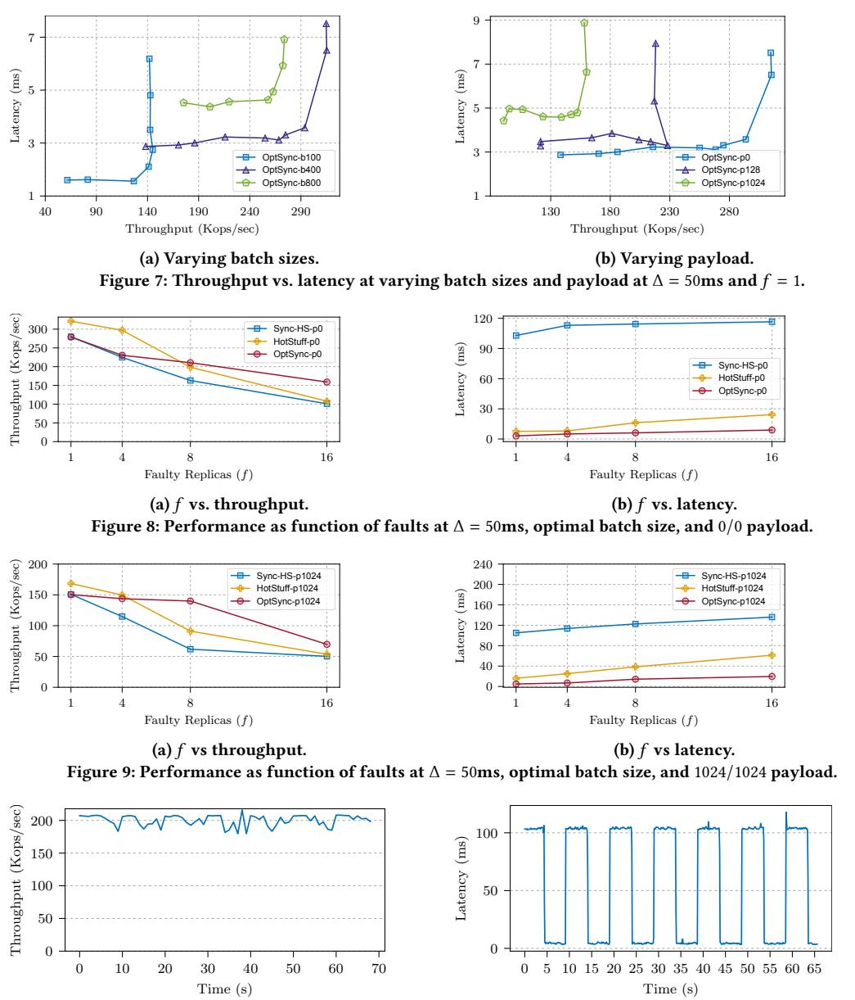

# On the Optimality of Optimistic Responsiveness

Ittai Abraham iabraham@vmware.com VMware Research

Ling Ren renling@illinois.edu University of Illinois at Urbana-Champaign Kartik Nayak kartik@cs.duke.edu Duke University

Nibesh Shrestha\* nxs4564@rit.edu Rochester Institute of Technology

#### **ABSTRACT**

Synchronous consensus protocols, by definition, have a worst-case commit latency that depends on the bounded network delay. The notion of optimistic responsiveness was recently introduced to allow synchronous protocols to commit instantaneously when some optimistic conditions are met. In this work, we revisit this notion of optimistic responsiveness and present optimal latency results.

We present a lower bound for Byzantine Broadcast that relates the latency of optimistic and synchronous commits when the designated sender is honest and while the optimistic commit can tolerate some faults. We then present two matching upper bounds for tolerating f faults out of n = 2f + 1 parties. Our first upper bound result achieves optimal optimistic and synchronous commit latency when the designated sender is honest and the optimistic commit can tolerate at least one fault. We experimentally evaluate this protocol and show that it achieves throughput comparable to state-of-the-art synchronous and partially synchronous protocols and under optimistic conditions achieves latency better than the state-of-the-art. Our second upper bound result achieves optimal optimistic and synchronous commit latency when the designated sender is honest but the optimistic commit does not tolerate any faults. The presence of matching lower and upper bound results make both of the results tight for n = 2f + 1. Our upper bound results are presented in a state machine replication setting with a steady-state leader who is replaced with a view-change protocol when they do not make progress. For this setting, we also present an optimistically responsive protocol where the view-change protocol is optimistically responsive too.

#### **KEYWORDS**

Distributed computing; Byzantine Fault Tolerance; Synchrony; Optimistic Responsiveness

#### 1 INTRODUCTION

Byzantine fault-tolerant (BFT) protocols based on a synchronous network have a high resilience of up to one-half Byzantine faults. In comparison, BFT protocols under asynchronous or partially synchronous networks can tolerate only one-third Byzantine faults. Although partially synchronous protocols have a lower tolerance for Byzantine faults, they have an advantage in terms of the latency to commit – they can commit in  $O(\delta)$  time where  $\delta$  is the actual latency of the network. On the other hand, the latency for synchronous protocols depends on  $\Delta$ , where  $\Delta$  is a pessimistic bound on the network delay.

A recent work, Hybrid Consensus [22], formalized this difference by introducing a notion called *responsiveness*. A protocol is responsive if its commit latency depends only on the actual network delay  $\delta$ , but not the pessimistic upper bound  $\Delta$ . In this regard, asynchronous and partially synchronous protocols are responsive by design, whereas synchronous protocols are not.

For synchronous protocols, a notion called *optimistic responsiveness* was introduced by Thunderella [23]; this allows synchronous protocols to commit responsively when some *optimistic* conditions are met. Thunderella is safe against up to one-half Byzantine faults. Moreover, if a "leader" and > 3n/4 replicas are honest, and if they are on a "fast-path", then replicas can commit responsively in  $O(\delta)$  time; otherwise, the protocol falls back to a "slow-path", which has a commit latency that depends on  $\Delta$ .

The Thunderella paradigm of optimistic responsiveness requires replicas to know which of the two paths they are in, and explicitly switch between them. If, at some point, the optimistic conditions cease to be met, the replicas switch to the slow-path. When they believe the optimistic conditions start to hold again, they switch back to the fast-path. Thunderella uses Nakamoto's protocol [21] or the Dolev-Strong protocol [9] as their slow-path. Thus, the slow-path, as well as the switch between the two paths, is extremely slow, requiring  $O(\kappa \Delta)$  and  $O(n\Delta)$  latency respectively (where  $\kappa$  is a security parameter). The slow-path latency can be improved to  $2\Delta$  using state-of-the-art synchronous protocols [2].

Can we further improve the latency of optimistically responsive synchronous protocols? Before answering the question, let us emphasize an important point in the study of optimistic responsiveness: replicas do not know whether the optimistic conditions are met. If all the replicas know, in the case of Thunderella, whether or not fewer than 1/4 replicas are Byzantine, then we can use a protocol with optimal latency for that setting. Under optimistic conditions, we can use partially synchronous protocols [5, 6, 17, 27] to commit responsively; otherwise, we can use a state-of-the-art synchronous protocol tolerating a minority faults to commit in  $\Delta + O(\delta)$  time [2, 3]. In contrast, the slow-path-fast-path switching paradigm, even if it uses optimal protocols in the two respective paths, still leaves a lot to be desired. If we start off in the wrong path, then we incur an additional switching delay, making the latency worse than either of the competing options under their respective conditions. More importantly, since there is no way to verify whether the optimistic conditions hold, such a protocol cannot tell when to switch to the fast-path, and hence will likely "miss out" on some periods with optimistic conditions.

Our paper explores optimality of optimistic responsiveness with the above restriction in mind. Specifically, we ask,

\*Lead Author

What is the optimal latency of an optimistically responsive synchronous protocol?

To answer this question, we obtain upper and lower bounds for the latency of such protocols. We also show that our protocol has better latency and comparable throughput in practice compared to state-of-the-art synchronous and partially synchronous protocols.

A lower bound on the latency of an optimistically responsive synchronous protocol. Our first result presents a lower bound on the latency of such optimistically responsive synchronous protocols. Specifically, we show the following result:

Theorem 1 (Lower bound on the latency of an optimistically responsive synchronous protocol, informal). There does not exist a Byzantine Broadcast protocol in an unsynchronized start model that can tolerate  $f \ge n/3$  faults and achieve the following simultaneously when the designated sender is honest, messages sent by non-faulty parties arrive instantaneously, and all honest parties start at time 0:

- (i) (optimistic commit) all honest nodes commit before time  $O(\delta)$  when there are  $\max(1, n-2f)$  crash faults, and
- (ii) (synchronous commit) all honest nodes commit before time  $2\Delta O(\delta)$  when there are f crash faults.

Thus, if a Byzantine Broadcast protocol tolerating  $f \geq n/3$  corruption has an optimistic (fast) commit with latency  $O(\delta)$  while still being able to tolerate  $\max(1,n-2f)$  faults, then the synchronous (slow) commit should have a latency  $\geq 2\Delta - O(\delta)$  when tolerating f faults. This lower bound applies to protocols in an *unsynchronized start* model where parties do not all start the protocol at the same time (explained later).

Our next two results present matching upper bounds for n=2f+1. In our protocols, when the conditions for an *optimistic commit* are met, replicas commit optimistically. Otherwise, they commit using the *synchronous commit* rule. Thus, intuitively, they exist in both paths *simultaneously* without requiring an explicit switch. Since all of our upper bounds require  $O(\delta)$  time for the optimistic commit, whenever appropriate, we also call it a *responsive commit*.

Optimal optimistic responsiveness with  $2\Delta$ -synchronous latency and > 3n/4-sized responsive quorum. Our first protocol obtains optimistic responsiveness where the synchronous commit has a commit latency of  $2\Delta$ , while the responsive commit has a latency of  $2\delta$  using quorums of size > 3n/4. Specifically, we show the following:

Theorem 2 (Optimistic responsiveness with  $2\Delta$ -synchronous latency and > 3n/4-sized responsive quorum, informal). There exists a Byzantine Broadcast protocol tolerating < n/2 faults, and under an honest sender achieves the following simultaneously:

- (i) (responsive commit) a commit latency of  $2\delta$  when > 3n/4 replicas are honest, and
- (ii) (synchronous commit) a commit latency of  $2\Delta + O(\delta)$  otherwise.

Intuitively, the fundamental property that this upper bound provides in comparison to Thunderella or Sync HotStuff is *simultaneity*, i.e., replicas do not need to on agree on specific paths for performing a responsive commit or a synchronous commit. Moreover, the parameters obtained in this result are optimal. First, the early stopping

lower bound due to Dolev-Reischuk-Strong [8] states that when the number of faults is f, and the maximum number of faults is t, each execution of Byzantine Broadcast requires  $\min(t+1,f+2)$  rounds. Hence, no protocol tolerating a fault can have latency less than  $2\delta$ . Second, the > 3n/4 quorum size is tight due to a lower bound in Thunderella [23]; the bound says that no protocol can have a worst-case resilience of one-half Byzantine replicas while being optimistically responsive for more than n/4 Byzantine replicas. Finally, latency for the synchronous commit is optimal (ignoring  $O(\delta)$  delays) due to our first result.

Optimal optimistic responsiveness with  $\Delta$ -synchronous latency and n-sized responsive quorum. The  $2\Delta - O(\delta)$  latency bound for a synchronous commit is applicable when the optimistic commit can tolerate  $\max(1,n-2f)$  faults. In this result, we show that the synchronous latency can be improved if the optimistic commit guarantees hold only when all n=2f+1 replicas are honest.

Theorem 3 (Optimistic responsiveness with  $\Delta$ -synchronous latency and n-sized responsive quorum, informal). There exists a Byzantine Broadcast protocol tolerating < n/2 faults, and under an honest sender achieves the following simultaneously:

- (i) (responsive commit) a commit latency of  $2\delta$  when all n replicas are honest, and
- (ii) (synchronous commit) a commit latency of  $\Delta + O(\delta)$  otherwise.

The responsive commit latency is optimal due to Dolev et al. [8] while the synchronous commit latency  $\Delta$  is optimal (ignoring  $O(\delta)$  delays) due to the lower bound in Sync HotStuff [2].

Implementation and evaluation. We implement and evaluate the performance of our first protocol and compare it with stateof-the-art synchronous and partially synchronous protocols. We note that although the upper bounds were presented for Byzantine Broadcast in the theorem statements, in practice, such protocols will be useful in a state machine replication (SMR) setting for consensus on a sequence of values. Hence, we describe as well as implement our protocols in an SMR setting. In the SMR setting, our protocols assume a steady state leader proposing a sequence of values. Whenever the leader does not make progress, it is replaced using a view-change protocol. An honest designated sender in Byzantine Broadcast is thus equivalent to having an honest leader in a state machine replication setting. Thus, when the leader is honest, our protocol from Theorem 2 can commit every value optimistically in  $2\delta$  time and synchronously in  $2\Delta + O(\delta)$ . Moreover, the honest leader can propose consecutive values as fast as  $2\delta$  time independent of whether commits are performed responsively or synchronously.

In our evaluation, we observe that under optimistic conditions, our latency is better than even a partially synchronous protocol such as HotStuff [27] since HotStuff requires more rounds of communication. Our protocol also obtains a throughput comparable to these protocols.

**Optimistic responsiveness with responsive view-change.** Our upper bound protocols can commit responsively when the leader is honest and optimistic conditions are met. However, when executing on a sequence of values, for reasons such as fairness or distribution

of work, we may want to change leaders every block, or every few blocks. Indeed, several recent protocols have been designed with this goal in mind [2, 6, 7, 12, 14, 26]. For the upper bounds described earlier, the view-change protocols, although efficient, still require  $4\Delta + O(\delta)$  time. Such a latency is reasonable if a view-change happens only occasionally. However, the incurred latency maybe high if we need to change views after every block. Moreover, the latency is incurred even when the optimistic conditions are met.

Our final result addresses this concern and presents a protocol which has an optimistically responsive view-change as well. Thus, when rotating among honest leaders and if > 3n/4 replicas are honest, the steady state commit and view change can both finish in  $O(\delta)$  time. On the other hand, even if the optimistic conditions are not met, the protocol requires  $2\Delta$  time to do a view change and  $3\Delta + O(\delta)$  time to commit a block in the steady state.

**Summary of contributions.** To summarize, we make the following contributions in this work:

- (1) We present a lower bound on the latency for optimistic responsiveness (Section 3).
- (2) We then present two upper bound results. Section 4 presents an optimal optimistically responsive protocol with  $2\Delta$ -synchronous latency tolerating at least 1 fault in the responsive commit. We present an optimal optimistically responsive protocol with  $\Delta$ -synchronous latency tolerating no crash faults in the responsive commit in Section 5.
- (3) We present an optimistically responsive protocol that includes an optimistically responsive view-change (Section 6).
- (4) We evaluate our  $2\Delta$ -synchronous protocol (Section 7).

#### 2 MODEL AND DEFINITIONS

We consider a standard State Machine Replication (SMR) problem used for building a fault tolerant service to process client requests. The system consists n replicas out of which f < n/2 replicas are Byzantine faulty. Byzantine replicas may behave arbitrarily. The aim is to build a consistent linearizable log across all non-faulty (honest) replicas such that the system behaves like a single non-faulty server in the presence of f < n/2 Byzantine replicas.

Definition 4 (Byzantine Fault-tolerant State Machine Replication [25]). A Byzantine fault-tolerant state machine replication protocol commits client requests as a linearizable log to provide a consistent view of the log akin to a single non-faulty server, providing the following two guarantees.

- Safety. Honest replicas do not commit different values at the same log position.
- Liveness. Each client request is eventually committed by all honest replicas.

We assume the network between replicas includes a standard synchronous communication channel with point-to-point, authenticated links between them. Messages between replicas may take at most  $\Delta$  time before they arrive, where  $\Delta$  is a known maximum network delay. To provide safety under adversarial conditions, we assume that the adversary is capable of delaying the message for an arbitrary time upper bounded by  $\Delta$ . The actual message delay in the network is denoted by  $\delta$ . We make use of digital signatures and a public-key infrastructure (PKI) to prevent spoofing and replays

and to validate messages. Message x sent by a replica p is digitally signed by p's private key and is denoted by  $\langle x \rangle_p$ .

**Byzantine Broadcast.** Our lower bound is presented for a Byzantine Broadcast setting with a designated sender.

*Definition 5 (Byzantine Broadcast).* A Byzantine broadcast protocol provides the following three guarantees.

- Agreement. If two honest replicas commit values b and b' respectively, then b = b'.
- Termination. All honest replicas eventually commit.
- Validity. If the designated sender is honest, then all honest replicas commit on the value it proposes.

# 3 A LOWER BOUND ON THE LATENCY OF OPTIMISTIC RESPONSIVENESS

An optimistically responsive synchronous protocol has two commit rules – an optimistic commit rule and a synchronous commit rule. This section presents a lower bound that captures the relationship between the latencies of the two commit rules. Essentially, it says that if the optimistic commit rule is too fast, then the synchronous commit rule has to be correspondingly slower. Specifically, the sum of the latencies of the two commit rules should be at least  $2\Delta$  time.

In a bit more detail, suppose that there exists a protocol with an optimistic commit rule tolerating  $\max(1,n-2f)$  faults with a commit latency of  $<\alpha$  time for some  $0<\alpha<\Delta$  when all messages arrive instantaneously. The lower bound then proves that if the optimistically responsive protocol can tolerate  $f \geq n/3$  Byzantine faults, then its synchronous commit rule cannot have a latency  $<2\Delta-\alpha$ . The converse is also true: if there exists a protocol tolerating  $f \geq n/3$  faults and committing with a latency of  $<2\Delta-\alpha$ , then it cannot commit with  $<\alpha$  latency in an optimistic case that tolerates  $\max(1,n-2f)$  faults even when messages arrive instantaneously.

**Unsynchronized starts.** Often, in protocols involving multiple parties, not all parties start the protocol at the same time due to network delays. We refer to this model as the unsynchronized-start model. Such a model captures state machine replication protocols where replicas move to the next view/slot at different times.

To formalize this model, we assume that honest parties start the protocol execution at different times decided by an adversary such that the following conditions hold: (i) each honest party starts the protocol at time  $<\Delta$  and (ii) an honest party starts the protocol before receiving a message from any other party. Byzantine parties, on the other hand, are assumed to start the protocol execution at time 0. The parties start the protocol with a fixed state independent of when the protocol execution started; in particular, they do not have access to the execution start time.

**Intuition and proof.** The intuition behind the lower bound is to show a *split-brain* attack that can be performed by a minority of Byzantine replicas if a protocol has a sum of latencies for the two commit rules to be less than  $2\Delta$ . For simplicity, we present the intuition with n = 2f + 1. First, observe that any protocol tolerating minority Byzantine faults cannot use quorum sizes larger than n - f = f + 1 in the worst case. Hence, it is always possible that a single honest replica R commits to a value due to a quorum of messages

received from only the Byzantine replicas if it does not wait long enough before committing. Second, since the optimistic commit rule can tolerate at least one crash fault, replicas (set P) committing through the optimistic rule may commit without receiving any messages from replica R. Thus, to avoid a safety violation through a split-brain attack, replicas in P and R must communicate protocol instance specific messages with each other. Using the fact the start message from the trusted environment may be delayed by  $\beta < \Delta$ , replicas in P may start the protocol only at  $\beta$  time after which they receive messages instantaneously. Moreover, it takes  $\Delta$  time for messages from P to arrive at R. For a specific value of  $\beta = \Delta - \alpha$ , R may commit a different value if it commits within  $2\Delta - \alpha$  time. On the other hand, since *P* is performing an optimistic commit, it may not wait for more than  $\alpha$  time after receiving its start message (at time  $\beta$ ) before committing. This is not sufficient to receive any message from R. Thus, the sum of the latencies of the two commit rules should be at least  $2\Delta$  time. We now present the formal lower bound below.

Theorem 6 (Lower bound on the latency of an optimistically responsive synchronous protocol). For  $0 < \alpha < \Delta$ , there does not exist a Byzantine Broadcast protocol in an unsynchronized start model that can tolerate  $f \ge n/3$  faults and achieve the following simultaneously when the designated sender is honest, messages sent by non-faulty parties arrive instantaneously, and all honest parties start at time 0:

- (i) (optimistic commit) all honest parties commit before time  $\alpha$  when there are  $\max(1, n-2f)$  crash faults, and
- (ii) (synchronous commit) all honest parties commit before time  $2\Delta \alpha$  when there are f crash faults.

*Proof.* Suppose there exists a protocol that simultaneously achieves both properties above. We will show a sequence of worlds, and through an indistinguishability argument prove a violation in the agreement property of such a protocol. Consider parties being split into three groups P, Q, and R such that  $|P| \le f$ ,  $|Q| \le f$ , and  $|R| = \max(1, n - 2f)$ . We suppose the designated sender is in Q.

We set  $\beta = \Delta - \alpha$ . Recall that under a synchrony assumption, each message can take anywhere from 0 to  $\Delta$  time to arrive at its destination. We consider four worlds as follows.

#### World 0.

Setup. Parties in  $P \cup Q$  are honest while parties in R have crashed. The honest sender sends input value b. All parties start at 0. Message schedule. All messages sent among parties in  $P \cup Q$  are delivered instantaneously.

Execution and views of honest players. This execution satisfies (i), so all honest nodes commit before time  $\alpha$ . By the validity property of Byzantine Broadcast, all parties in  $P \cup Q$  commit b before time  $\alpha$ .

#### World 1.

Setup. Parties in  $P \cup Q$  are honest while parties in R have crashed. The honest sender sends input value b. All parties start at  $\beta$ . Message schedule. All messages sent among parties in  $P \cup Q$  are delivered instantaneously.

Execution and views of honest players. In an unsynchronized start model, since the starting states of parties do not depend on when they start, this execution is indistinguishable to World 0. Hence, all parties in  $P \cup Q$  commit b before time  $\alpha + \beta$ .

#### World 2.

Setup. Parties in  $Q \cup R$  are honest while parties in P have crashed. The honest sender sends input value  $b' \neq b$ . All parties start at 0. Message schedule. All the messages sent among parties in  $Q \cup R$  are delivered instantaneously.

Execution and views of honest players. This execution satisfies (ii), so all honest parties commit before time  $\beta + \Delta = 2\Delta - \alpha$ . By the validity property, all parties in  $Q \cup R$  commit b' before time  $\beta + \Delta$ .

#### World 3

Setup. Parties in  $P \cup R$  are honest while parties in Q (which includes the designated sender) are Byzantine. Parties in P start at time  $\beta$  while parties in R start at time 0.

Message schedule. The parties in Q perform a split-brain attack where they behave like in World 2 towards parties in R, and behave like in World 1 towards parties in P. Hence, we will denote each brain of Q as  $Q_1$  and  $Q_2$  such that  $Q_1$  only communicates with P and  $Q_2$  only communicates with R.

Parties in  $Q_1$  send messages to parties in P only after time  $\beta$ . Messages sent between  $P \cup Q_1$  are delivered instantaneously (like in World 1). Messages between  $Q_2 \cup R$  are delivered instantaneously (like in World 2). In addition, all messages sent across R and P are delayed by  $\Delta$ . Messages received by a party in  $Q_1$  from P are forwarded to its other brain replica in  $Q_2$ .

Execution and views of honest parties. Since messages from R to P are delayed to the maximum  $\Delta$  time and  $Q_1$  behaves exactly as in World 1, the views of parties in P are exactly the same as in World 1 until time  $\Delta$ . Hence, parties in P commit P before time P0.

Similarly, the view of R until time  $\beta + \Delta$  is exactly the same as World 2 since P does not send any message until time  $\beta$  and messages from P to R are delayed by  $\Delta$ .  $Q_2$  receives (via  $Q_1$ ) the same set of messages from P as Q in World 2 did. So,  $Q_2$  behaves towards R just like Q in World 2 did. Hence, parties in R commit B before time B and B are B and B before time B and B are B and B are B and B are searched as B are same same same same same same same sam

# 4 OPTIMAL OPTIMISTIC RESPONSIVENESS WITH 2Δ-SYNCHRONOUS LATENCY

We first present a simple synchronous consensus protocol that achieves optimal optimistic responsiveness when the optimistic commit does not require a quorum of all replicas. In a *synchronous commit*, a replica commits  $2\Delta$  time after voting (recall that  $\Delta$  is an upper bound on the maximum network delay) if an equivocating proposal has not been detected. In a *responsive commit*, a replica can commit immediately, i.e., without waiting for the  $2\Delta$  time period, if a sufficient number of replicas have voted for the block and no equivocation has been detected. For every block, a replica opportunistically waits to commit using either of the commit rules.

Recall that  $\delta \leq \Delta$  is the actual network delay. If a "leader" is honest then no matter what the adversary does, the system can commit a block in time  $2\Delta + O(\delta)$ . But if there are > 3n/4 honest replicas along with an honest leader, then the system can commit in time  $O(\delta)$  (in an optimistically responsive manner).

Why does our protocol perform better than protocols in the slow-path-fast-path paradigm? The general strategy employed in the protocols with back-and-forth slow-path-fast-path paradigm

is to start in one of the two paths, say, the slow path. When the optimistic conditions are met, an explicit switch is performed to move to the fast path. Similarly, when a lack of progress is detected in the fast path, the protocol makes another switch to the slow path. The explicit switch between the paths incurs a latency of at least  $\Delta$  in all of these protocols.

Under minority Byzantine faults, the adversary can attack the above strategy to worsen the commit latency compared to a protocol with a single slow path. For example, when the protocol is in slow path, the adversary responds promptly and the replicas receive > 3n/4 responses thereby triggering a switch to fast path. Once in the fast path, the adversary stops responding and prevents progress. This forces an explicit switch to the slow path again. Under this attack, a single decision can incur a latency of  $4\Delta$  if the replicas are in the fast path and then switch to the slow path to commit. In the fast path, replicas never commit if the adversary does not respond.

Our protocol avoids this concern by avoiding an explicit switch. Instead, both paths are active simultaneously. As a result, when the leader is honest, the commit latency is  $2\delta$  during optimistic executions and  $2\Delta$  otherwise.

**View-based execution.** Like PBFT [5], our protocol progresses through a series of numbered *views* with each *view* coordinated by a distinct leader. Views are represented by non-negative integers with 0 being the first view. The leader of the current view v is determined by (v mod n). Within each view, also called the steady state, the leader is expected to propose values and keep making progress by committing client requests at increasing *heights*. An honest replica participates in any one view at a time and moves to a higher numbered view when the current view fails to make progress. If the replicas detect equivocation or lack of progress in a view, they initiate a *view-change* by blaming the current leader. When a quorum of replicas have blamed the current leader, they perform a view-change and replace the faulty leader.

**Blocks and block format.** Client requests are batched into *blocks*. Each block references its predecessor with the exception of the genesis block which has no predecessor. We call a block's position in the chain as its height. A block  $B_k$  at height k has the format,  $B_k := (b_k, H(B_{k-1}))$  where  $b_k$  denotes a proposed value at height k,  $B_{k-1}$  is the block at height k-1 and  $H(B_{k-1})$  is the hash digest of  $B_{k-1}$ . The predecessor for the genesis block is  $\bot$ . A block  $B_k$  is said to be *valid* if (1) its predecessor block is valid, or if k=1, predecessor is  $\bot$ , and (2) client requests in the block meet application-level validity conditions and are consistent with its chain of requests in ancestor blocks.

**Block extension and equivocation.** A block  $B_k$  extends a block  $B_l$  ( $k \ge l$ ) if  $B_l$  is an ancestor of  $B_k$ . Note that a block  $B_k$  extends itself. Two blocks  $B_k$  and  $B'_k$ , proposed in the same view *equivocate* one another if they are not equal to *and* do not extend one another.

**Block certificates.** A *block certificate* represents a set of signatures on a block by a quorum of replicas. Given a ratio  $0 \le \alpha < 1$ , a block  $B_k$  and a view v we denote by  $C_v^{\alpha}(B_k)$  a set of  $\lfloor \alpha n \rfloor + 1$  signatures from different replicas on block  $B_k$  signed in view v. In this section, we will use *synchronous certificate* where  $\alpha = 1/2$ , and *responsive certificate* where  $\alpha = 3/4$ . Whenever the distinction between the two is not important, we will represent the certificates by  $C_v(B_k)$ 

and ignore the superscript  $\alpha$ . In the next section, we will also use *full certificates* which require all n replicas to sign.

Chain certificates. We use the notion of *chain certificates* to compare different chains when replicas receive many of them. Most earlier protocols (e.g., HotStuff [27] or Sync HotStuff [2]) compared certified chains using just the views and heights. However, in our protocol, there are two types of certificates, a responsive certificate and a synchronous certificate, and hence, comparing them is subtle. As we will see, the rank of a chain will be completely determined by the block with the highest synchronous certificate from the largest view and the block's ancestors' highest responsive certificate in this view. A chain certificate comprises of a pair of certificates  $C_v^{3/4}(B_k)$  and  $C_v^{1/2}(B_\ell)$ . Each element in the pair is either a block certificate or  $\bot$  such that (i) if either of them are not  $\bot$ , both certificates are from the same view, (ii) if not  $\bot$ 's, the first certificate has threshold 3/4, the second has threshold 1/2, and (iii) block  $B_\ell$  extends block  $B_k$ , if  $C_v^{3/4}(B_k)$  is not  $\bot$ .

**Ranking chain certificates.** Given two chain certificates  $CC = (C_v^{3/4}(B_k), C_v^{1/2}(B_\ell))$  and  $CC' = (C_{v'}^{3/4}(B_{k'}), C_{v'}^{1/2}(B_{\ell'}))$ , they are first ranked by views, i.e., CC < CC' if v < v'. While moving from view v to any higher view, our protocol ensures that if a certified block  $B_k$  is committed in view v, then all honest replicas lock on a chain certificate that extends  $B_k$ . Hence, a certificate chain produced in a higher view will always include  $B_k$ . Said another way, a certificate chain CC' in a higher view will extend  $B_k$ ; if it does not, it must be the case that  $B_k$  was not committed by any honest replica in view v. Thus, it is safe to extend CC'.

For chain certificates in the same view v, they are first ranked based on the height of the responsive certificate, i.e., CC < CC' if k < k'. In our protocol, we ensure that if there exists a responsive certificate for a block  $B_{k'}$  in view v, i.e.,  $C_v^{3/4}(B_{k'})$  exists, there cannot exist a responsive certificate for a conflicting block at any height in view v. Thus, if there is a responsive certificate for  $B_k$  in view v, then  $B_{k'}$  must extend  $B_k$ . Moreover, we also ensure that if  $C_v^{3/4}(B_k)$  exists, no replica will have synchronously committed on an equivocating block  $B_\ell$  with certificate  $C_v(B_\ell)$ . Thus, any equivocating chain with chain certificate CC will not contain committed blocks that are not extended by CC'.

Finally, if both chain certificates are in the same view v and have a common responsive certificate in the view (or both do not have a responsive certificate), the chain certificates are ranked by the heights of synchronous certificates, i.e., CC < CC' if  $\ell < \ell'$ . Our protocol ensures that if  $B_k$  is committed synchronously in view v, then there does not exist an equivocating certified block. Thus, if equivocating  $C_v^{1/2}(B_\ell)$  and  $C_v^{1/2}(B_{\ell'})$  exist, both  $B_\ell$  and  $B_{\ell'}$  could not have been committed. To ease the rule in the case where they do not equivocate and one chain certificate extends the other, we select higher of the two.

Thus, given two chain certificates  $CC = (C_v^{3/4}(B_k), C_v^{1/2}(B_\ell))$  and  $CC' = (C_{v'}^{3/4}(B_{k'}), C_{v'}^{1/2}(B_{\ell'}))$ , we say CC < CC' if:

- (1) v < v' (the chain certificates are first ranked by view),
- (2) v = v' and k < k' (secondly by responsive certificates),
- (3) v = v' and k = k' and  $\ell < \ell'$  (finally by sync certificates).

The above comparison uses numerical value -1 to represent a  $\perp$ .

**Tip of a chain certificate.** The tip of a chain certificate is the highest block in the chain. Given a  $CC = (C^{3/4}(B_k), C^{1/2}(B_\ell))$ , if  $C^{1/2}(B_\ell) \neq \bot$  then define tip(CC) =  $B_\ell$ , otherwise define tip(CC) =  $B_k$ .

**Updating chain certificates.** Each replica stores *CC*, the highest chain certificate it has ever received. Any time a new block certificate is received, the replica updates its highest ranked chain certificate using the comparison rule described earlier.

# 4.1 Steady State Protocol

Our protocol executes the following steps in iterations within a view v. Refer Figures 1 and 2.

**Propose.** The leader L of view v proposes a block  $B_k := (b_k, H(B_{k-1}))$  by broadcasting  $\langle \text{propose}, B_k, v, C_v(B_{k-1}) \rangle_L$ . The proposal contains a block at height-k extending a block  $B_{k-1}$  at height k-1, the view number v, and a view-v certificate for  $B_{k-1}$ . The leader makes such a proposal as soon as it receives a view-v certificate for  $B_{k-1}$ . The first view-v certificate is obtained during the view-change process as will be described in the next subsection.

**Vote.** When a replica r receives the first proposal for  $B_k$  either from L or through some other replica, if r hasn't received a proposal for an equivocating block, i.e., it has not detected a leader equivocation in view v, it broadcasts a vote for  $B_k$  in the form of  $\langle \text{vote}, B_k, v \rangle_r$ , and forwards the proposal to all replicas. It also starts a synchronous commit-timer k,v and sets it to  $2\Delta$ .

Observe that the certificate in the proposal need not be the same as the certificate that replica r has obtained. Specifically, replica r can vote for a proposal containing a synchronous certificate for the previous block even if it holds a responsive certificate for the same block, and vice versa.

**Commit.** The protocol includes two commit rules and the replica commits using the rule that is triggered first. In a responsive commit, a replica commits block  $B_k$  and its ancestors immediately if the replica receives > 3n/4 votes for  $B_k$  in view v. Note that a responsive commit doesn't depend on the commit-timer and  $\Delta$ , and a replica can commit at the actual speed of the network ( $\delta$ ). When a replica's commit-timer v, k for k expires in view k, the replica synchronously commits k and all its ancestors. When a replica commits k, it aborts commit-timers for all its ancestors.

The commit step is non-blocking and it does not affect the critical path of progress. The leader can make a proposal for the next block as soon as it receives a certificate for the previous block independent of whether replicas have committed blocks for previous heights.

Note that if an honest replica commits a block  $B_k$  in view v using one of the rules, it is not necessary that all honest replicas commit  $B_k$  in view v using the same rule, or commit  $B_k$  at all. Some Byzantine replicas may decide to send votes to only a few honest replicas causing some honest replicas to commit using a responsive rule whereas some others using a synchronous rule. A Byzantine leader could send an equivocating block to some honest replicas and prevent them from committing. The protocol ensures safety despite all inconsistencies introduced by Byzantine replicas.

**Blame and quit view.** A view-change is triggered when replicas observe lack of progress or an equivocating proposal from the

current leader. If an honest replica learns an equivocation, it broadcasts  $\langle \text{blame}, v \rangle_r$  message along with the equivocating proposals and quits view v. The equivocating proposals serve as a proof of misbehavior and all honest replicas blame the leader to trigger a view-change. To ensure progress, the leader is expected to propose at least one block every  $2\Delta$  time that trigger the replica's vote. Otherwise, replicas blame the current leader. Replicas quit view v when they receive f+1 blame messages, detect equivocation. On quitting view v, replica r broadcasts  $\langle \text{quit-view}, v, CC \rangle_r$  where CC is the highest ranked chain certificate known to r.

We now provide some intuition on why either of these commit rules are safe within a view. We discuss safety across views in the subsequent section.

# Why does a responsive commit ensure safety within a view?

Consider an honest replica r that responsively commits a block  $B_k$  at time t. This is because it received  $\lfloor 3n/4 \rfloor + 1$  votes for  $B_k$  by time t and it did not observe any equivocation until then. It is easy to see that if there exists  $\lfloor 3n/4 \rfloor + 1$  votes for  $B_k$ , no other equivocating block  $B'_{k'}$  at any height k' can be committed responsively due to a simple quorum intersection argument. Under a minority corruption, any two quorums of size  $\lfloor 3n/4 \rfloor + 1$  intersect in f+1 replicas out of which at least one replica is honest. This honest replica will not vote for two equivocating blocks.

A synchronous commit of an equivocating block cannot happen due to the following reason. Since replica r hasn't received an equivocation until time t, no replica has voted for an equivocating proposal until time  $t-\Delta$ . Hence, their synchronous  $2\Delta$  window for committing an equivocating block ends at time  $> t+\Delta$ . A commit for  $B_k$  at time t implies that some honest replica must have voted and forwarded the corresponding proposal before t and this will arrive by time  $t+\Delta$  at all honest replicas. This will prevent any other replica from committing an equivocating block. Observe that a responsive commit does not imply that an equivocating block  $B'_{k'}$  will not be certified; hence, during a view-change, we need to be able to carefully extend the chain that contains a block that has been committed by some other replica.

# Why does a synchronous commit ensure safety within a view?

Consider an honest replica r that votes for a block  $B_k$  at time t and commits at time  $t+2\Delta$  because it did not observe an equivocation until then. This implies (i) all honest replicas have received  $B_k$  by time  $t+\Delta$ , and (ii) no honest replica has voted for an equivocating block by time  $t+\Delta$ . Due to the rules of voting, no honest replica will vote for an equivocating block in this view after time  $t+\Delta$  ruling out an equivocating commit through either of the two rules.

#### 4.2 View-change

The view-change protocol is responsible for replacing a possibly faulty leader with a new leader to maintain liveness. In the process, it needs to maintain safety of any commit that may have happened in the previous views.

**Status.** After quitting view v, a replica waits for  $2\Delta$  time before entering view v+1. The  $2\Delta$  wait ensures that all honest replicas receive a certificate for a block  $B_k$  before entering view v+1 if some honest replica committed  $B_k$  in view v. This is critical to maintain the safety of the commit in view v. The replica updates its chain

Let v be the view number and replica L be the leader of view v. While in view v, a replica r runs the following protocol:

- (1) **Propose.** If replica r is the leader L, upon receiving  $C_v(B_{k-1})$ , it broadcasts  $\langle \text{propose}, B_k, v, C_v(B_{k-1}) \rangle_L$  where  $B_k$  extends  $B_{k-1}$ .
- (2) **Vote.** Upon receiving the first proposal  $\langle \text{propose}, B_k, v, C_v(B_{k-1}) \rangle_L$  with a valid view v certificate for a block at height k-1 (not necessarily from L) where  $B_k$  extends  $B_{k-1}$ , if no leader equivocation is detected, forward the proposal to all replicas, broadcast a vote in the form of  $\langle \text{vote}, B_k, v \rangle_r$ , set commit-timerv,k to  $2\Delta$ , and start counting down.
- (3) (Non-blocking) Commit rules. Replica r commits block  $B_k$  using either of the following rules if r is still in view v:
  - (a) Responsive commit. On receiving  $\lfloor 3n/4 \rfloor + 1$  votes for  $B_k$ , i.e.,  $C_v^{3/4}(B_k)$ , commit  $B_k$  and all its ancestors immediately. Abort commit-timer  $b_k$ .
  - (b) Synchronous commit. If commit-timer v,k reaches 0, commit  $B_k$  and all its ancestors.
- (4) (Non-blocking) Blame and quit view.
  - Blame if no progress. For p > 0, if fewer than p proposals trigger r's votes in  $(2p + 4)\Delta$  time in view v, broadcast  $\langle blame, v \rangle_r$ .
  - *Quit view on* f+1 *blame messages.* Upon gathering f+1 distinct  $\langle \text{blame}, v \rangle_r$  messages, broadcast  $\langle \text{quit-view}, v, CC \rangle$  along with f+1 blame messages where CC is the highest ranked chain certificate known to r. Abort all view v timers, and quit view v.
  - *Quit view on detecting equivocation.* If leader equivocation is detected, broadcast  $\langle \text{quit-view}, v, CC \rangle_r$  along with the equivocating proposals, abort all view v timers, and quit view v.

Figure 1: Steady state protocol for optimal optimistic responsiveness with  $2\Delta$ -synchronous latency and > 3n/4-sized quorum.

Let L and L' be the leaders of view v and v + 1, respectively. Each replica r runs the following steps.

- i) **Status.** Wait for  $2\Delta$  time. Until this time, if a replica receives any chain certificates, the replica updates its chain certificate CC to the highest possible rank. Set  $lock_{\upsilon+1}$  to be the highest ranked chain certificate at the end of the  $2\Delta$  wait. Send  $\langle status, lock_{\upsilon+1} \rangle_r$  to L'. Enter view  $\upsilon+1$ .
- ii) **New-view.** The new leader L' waits for  $2\Delta$  time after entering view v + 1. L' broadcasts  $\langle \text{new-view}, v + 1, \text{lock}_{v+1} \rangle_{L'}$ , where  $\text{lock}_{v+1}$  is the highest ranked chain certificate known to L' after this wait.
- iii) **First vote.** Upon receiving the first  $\langle \text{new-view}, v + 1, \text{lock}' \rangle_{L'}$ , if  $\text{lock}_{v+1} \leq \text{lock}'$ , then broadcast  $\langle \text{new-view}, v + 1, \text{lock}' \rangle_{L'}$  and  $\langle \text{vote}, \text{tip}(\text{lock}'), v + 1 \rangle_r$ .

Figure 2: View-change protocol for optimal optimistic responsiveness with  $2\Delta$ -synchronous latency and >3n/4-sized quorum.

certificate CC to the highest possible rank and sets  $lock_{v+1}$  to CC. It then sends  $lock_{v+1}$  to the next leader L' via a  $\langle status, lock_{v+1} \rangle_r$ .

**New-view.** Leader L' waits  $2\Delta$  time after entering view v+1 to receive a status message from all honest replicas. Based on these status messages, L' picks the highest ranked chain certificate lock'. It creates a new-view message (new-view, v+1, lock') $_{L'}$  and sends it to all honest replicas. The highest ranked chain certificate across all honest replicas at the end of view v helps an honest leader to appropriately send a new-view message that will be voted upon by all honest replicas and maintain the liveness of the protocol.

**First vote.** Upon receiving a  $\langle \text{new-view}, v + 1, \text{lock'} \rangle_{L'}$  message, if the certified chain certificate lock' has a rank no lower than r's locked chain certificate lock $_{v+1}$ , then it forwards the new-view message to all replicas and broadcasts a vote for it.

Next, we provide some intuition on how the view-change protocol ensures safety across views and liveness.

Why do replicas lock on chains extending committed blocks before entering the next view? In this protocol, we use locks to ensure safety. The protocol guarantees that if an honest replica commits a block (through either rules), then at the end of the view all honest replicas will lock on a chain certificate that extends the committed block. At the start of the next view, when the leader sends a lock through the new-view message, by testing whether this lock is higher than the lock stored locally, an honest replica ensures that only committed blocks are extended.

What ensures that replicas lock on chains extending committed blocks before entering the next view? Suppose an honest replica r responsively commits a block  $B_k$  in view v at time t. Notice that no honest replica has entered view v+1 by time  $t+\Delta$ ; otherwise, replica r must have received blame certificate by time t due to the  $2\Delta$  wait in the status step. In addition, replica r sends a quit-view message containing the highest certified chain certificate CC such that  $\operatorname{tip}(CC)$  extends  $B_k$  when quitting view v. CC reaches all honest replicas by the time an honest replica enters view v+1. In the proof, we show there does not exist an equivocating chain certificate CC' that ranks higher than CC. Thus, all honest replicas lock on CC or higher before entering view v+1.

If replica r synchronously commits  $B_k$  in view v at time t, then replica r voted for  $B_k$  at time  $t-2\Delta$ . It did not detect an equivocation or blame certificate by time t. This implies all honest replicas will vote for  $B_k$  at time  $t-\Delta$  and receive  $C_v^{1/2}(B_k)$  by time t. As noted earlier, there does not exist an equivocating certificate in view v during synchronous commit. Hence, all honest replicas will lock on CC containing  $C_v^{1/2}(B_k)$  before entering view v+1.

How does the protocol ensure liveness? The protocol ensures liveness by allowing a new honest leader to *always* propose a block that will be voted for by all honest replicas. All honest replicas send their locked chain certificate to the next leader L' at the start of the new view in a status message. L' could be lagging and enter v+1  $\Delta$  time after other replicas. Thus, it waits  $2\Delta$  time to collect chain certificates from all honest replicas. If L' is honest, it extends the

highest ranked chain certificate lock'. This suffices to ensure that all honest replicas vote on its proposal, in turn, ensuring liveness when the leader is honest. In the new view, as long as the leader keeps proposing valid blocks, honest replicas will vote and keep committing new blocks.

# 4.3 Safety and Liveness

We say a block  $B_k$  is committed directly in view v if an honest replica successfully runs the responsive commit rule 3(a), or the synchronous commit rule 3(b) on block  $B_k$ . Similarly, we say a block  $B_k$  is committed indirectly if it is a result of directly committing a block  $B_\ell$  ( $\ell > k$ ) that extends  $B_k$  but is not equal to  $B_k$ .

We say that a replica is *in view* v *at time* t if the replica executes the *Enter view* v of Step i) in Figure 2 by time t and did not execute any *Quit view* of Step 5 in Figure 1 for view v at time t or earlier.

CLAIM 7. If a block  $B_k$  is committed directly in view v using the responsive commit rule, then a responsive certificate for an equivocating block  $B'_{L}$ , in view v does not exist.

*Proof.* If replica r commits  $B_k$  due to the responsive commit rule in view v, then r must have received  $\lfloor 3n/4 \rfloor + 1$  votes, i.e.,  $C_v^{3/4}(B_k)$ , forming a quorum for  $B_k$  in view v. A simple quorum intersection argument shows that a responsive certificate for equivocating block  $B'_{L'}$  cannot exist.

CLAIM 8. If a block  $B_k$  is committed directly in view v using the responsive commit rule, then there does not exist a chain certificate CC in view v, such that  $CC > (C_v^{3/4}(B_k), \bot)$  where a block in CC equivocates  $B_k$ .

*Proof.* By Claim 7, no equivocating block can have a responsive block certificate. So all responsive block certificates must extend  $B_k$ . Since we assume that  $CC > (C_v^{3/4}(B_k), \bot)$  then it must be that either CC is of the form  $(C_v^{3/4}(B_k), C_v^{1/2}(B_\ell))$  and by definition  $B_\ell$  extends  $B_k$ , or CC is of the form  $(C_v^{3/4}(B_{k'}), C_v^{1/2}(B_{\ell'}))$  where  $B_{k'}$  extends  $B_k$  and again by transitivity  $B_{\ell'}$  must extend  $B_k$ .

Claim 9. If a block  $B_k$  is committed directly in view v using the synchronous commit rule, then a block certificate for an equivocating block  $B'_{k}$ , does not exist in view v.

*Proof.* Suppose replica r directly commits block  $B_k$  at time t using the synchronous commit rule. So replica r voted and forwarded the proposal for  $B_k$  at time  $t-2\Delta$  and its commit-timerv,k expired without detecting equivocation. By synchrony assumption, all replicas receive the forwarded proposal for  $B_k$  by time  $t-\Delta$ . Since they do not vote for equivocating blocks, they will not vote for  $B'_{k'}$  received at time >  $t-\Delta$ . Moreover, no honest replica must have voted for an equivocating block at time ≤  $t-\Delta$ . Otherwise, replica r would have received the equivocating proposal by time t and it wouldn't have committed. Since no honest replica votes for an equivocating block,  $B'_{k'}$  will not be certified.

CLAIM 10. If a block  $B_k$  is committed directly in view v using the responsive commit rule, then all honest replicas receive a chain certificate CC such that tip(CC) extends  $B_k$  before entering view v+1.

*Proof.* Suppose replica r directly commits block  $B_k$  at time t using the responsive commit rule. No honest replica r' has entered view v+1 at time  $\leq t+\Delta$ ; otherwise replica r' must have sent a blame certificate at time  $\leq t-\Delta$  (due to  $2\Delta$  wait in the status step) and r must receive the blame certificate at time  $\leq t$  and wouldn't commit.

By Claim 8, there doesn't exists a conflicting chain certificate  $CC' > (C_v^{3/4}(B_k), \bot)$  such that  $\operatorname{tip}(CC')$  does not extend  $B_k$ . Thus, the highest ranked chain certificate CC in view v must have  $\operatorname{tip}(CC)$  extend  $B_k$ . Replica r sends CC when it quits view v after time t.

Let t' be the time in which replica r' enters view v+1 (with  $t'>t+\Delta$ ). Replica r must have received a blame certificate between time t and  $t'-\Delta$  and sent a quit-view message containing CC which arrives at replica r' at time  $\leq t'$ . Hence, all honest replicas receive CC before entering view v+1.

Claim 11. If a block  $B_k$  is directly committed in view v at time t using the synchronous commit rule, then all honest replicas receive  $C_v(B_k)$  before entering view v+1.

*Proof.* We will prove that if a block  $B_k$  is directly committed in view v at time t using the synchronous commit rule, then (i) all honest replicas are in view v at time  $t - \Delta$ , (ii) all honest replicas vote for  $B_k$  at time  $\le t - \Delta$ , and (iii) all honest replicas receive  $C_v(B_k)$  before entering view v + 1. Part (iii) is the desired claim.

Suppose honest replica r synchronously commits  $B_k$  at time t in view v. It votes for block  $B_k$  at time  $t-2\Delta$ . Thus, replica r entered view v at time  $t-2\Delta$ . Due to the  $t-2\Delta$  wait before sending a status message, replica  $t-2\Delta$ . Due to the  $t-2\Delta$  wait before sending a status message, replica  $t-2\Delta$  which arrives all honest replicas at time  $t-2\Delta$  which arrives all honest replicas at time  $t-2\Delta$  wait in the status step). Also, observe that no honest replica has quit view  $t-2\Delta$  wait in the  $t-2\Delta$  of the replica  $t-2\Delta$  of the replica  $t-2\Delta$  wait in the status step). Also, observe that no honest replica has quit view  $t-2\Delta$  wait in the  $t-2\Delta$  of the replica  $t-2\Delta$  of the replica  $t-2\Delta$  of the replica  $t-2\Delta$  of the replica  $t-2\Delta$  of the replica  $t-2\Delta$  of the replica  $t-2\Delta$  of the replica  $t-2\Delta$  of the replica  $t-2\Delta$  of the replica  $t-2\Delta$  of the replica  $t-2\Delta$  of the replica  $t-2\Delta$  of the replica  $t-2\Delta$  of the replica  $t-2\Delta$  of the replica  $t-2\Delta$  of the replica  $t-2\Delta$  of the replica  $t-2\Delta$  of the replica  $t-2\Delta$  of the replica  $t-2\Delta$  of the replica  $t-2\Delta$  of the replica  $t-2\Delta$  of the replication of the replication  $t-2\Delta$  of the replication  $t-2\Delta$  of the replication  $t-2\Delta$  of the replication  $t-2\Delta$  of the replication  $t-2\Delta$  of the replication  $t-2\Delta$  of the replication  $t-2\Delta$  of the replication  $t-2\Delta$  of the replication  $t-2\Delta$  of the replication  $t-2\Delta$  of the replication  $t-2\Delta$  of the replication  $t-2\Delta$  of the replication  $t-2\Delta$  of the replication  $t-2\Delta$  of the replication  $t-2\Delta$  of the replication  $t-2\Delta$  of the replication  $t-2\Delta$  of the replication  $t-2\Delta$  of the replication  $t-2\Delta$  of the replication  $t-2\Delta$  of the replication  $t-2\Delta$  of the replication  $t-2\Delta$  of the replication  $t-2\Delta$  of the replication  $t-2\Delta$  of the replication  $t-2\Delta$  of the replication  $t-2\Delta$  of the replication  $t-2\Delta$  of the replication  $t-2\Delta$  of the replication  $t-2\Delta$  of the replication  $t-2\Delta$  of the replication  $t-2\Delta$  of the replication  $t-2\Delta$  of the replication  $t-2\Delta$  of the replication  $t-2\Delta$  of the replication  $t-2\Delta$  of the replic

Replica r received a proposal for  $B_k$  which contains  $C_v(B_{k-1})$  at time  $t-2\Delta$ . Thus, replica r's vote and forwarded proposal for  $B_k$  arrives all honest replicas by time  $t-\Delta$ . No honest replica has voted for an equivocating block at time  $\leq t-\Delta$ ; otherwise replica r would have received an equivocation at time  $\leq t$ . Thus, all honest replicas will vote for  $B_k$  at time  $\leq t-\Delta$ . This proves part (ii).

The votes from all honest replicas will arrive at all honest replicas by time  $\leq t$ . By part(i) of the claim and  $2\Delta$  wait in the status step, honest replicas do not enter view v+1 at time  $\leq t+\Delta$ . Thus, all honest replicas receive  $C_v(B_k)$  before entering view v+1.

Lemma 12. If an honest replica directly commits a block  $B_k$  in view v, then: (i) all honest replicas have  $lock_{v+1}$  such that  $lock_{v+1}$  extends  $B_k$ , (ii) for any chain certificate CC' that the adversary can create and any honest  $lock_{v+1}$ , either  $CC' < lock_{v+1}$  or  $lock_{v+1}$  or  $lock_{v+1}$ .

*Proof.* If  $B_k$  is committed using the responsive commit rule, then by Claim 10, all honest replicas receive CC such that  $\operatorname{tip}(CC)$  extends  $B_k$  before entering view v+1 and by Claim 8 there doesn't exist chain certificate CC' such that  $CC' > (C_v(B_k), \bot)$  and CC' equivocates  $B_k$ . Similarly, If  $B_k$  is committed using the synchronous commit rule, then by Claim 11, all honest replicas receive  $C_v(B_k)$  before entering view v+1 and by Claim 9, there doesn't exists a

view v certificate that equivocates  $B_k$ . Since, honest replicas lock on highest ranked chain certificate, tip(lockv+1) must extend  $B_k$ . By similar argument, any CC' that an adversary creates either has  $CC' < \text{lock}_{v+1}$  or tip(CC') extends  $B_k$ .

The following lemma considers safety of directly committed blocks across views.

Lemma 13 (Unique Extensibility). If an honest replica directly commits a block  $B_k$  in view v, and  $C_{v'}(B_{k'})$  is a view v' > v block certificate, then  $B_{k'}$  extends  $B_k$ . Moreover, all honest replicas have lock v' such that  $tip(lock_{v+1})$  extends  $B_k$ .

*Proof.* The proof is by induction on views v' > v. For a view v', we prove that if  $C_{v'}(\text{tip}(\text{lock}'))$  exists then it must extend  $B_k$ . A simple induction shows that all later block certificates must also extend tip(lock'), this follows directly from the vote rule in Figure 1 step 2.

For the base case, where v' = v + 1, the proof that  $C_{v'}(\text{tip}(\text{lock}'))$  extends  $B_k$  follows from Lemma 12 because the only way such a block can be certified is some honest votes for it. However, all honest are locked on a block that extends  $B_k$  and a chain certificate with a higher rank for an equivocating block does not exist. Thus, no honest replica will first vote (Figure 2 step iii)) for a block that does not extend  $B_k$ . The second part follows directly from Lemma 12.

Given that the statement is true for all views below v', the proof that  $C_{v'}(\mathsf{tip}(\mathsf{lock'}))$  extends  $B_k$  follows from the induction hypothesis because the only way such a block can be certified is if some honest votes for it. An honest party with a lock lock will vote only if  $\mathsf{tip}(\mathsf{lock}_{v'})$  has a valid block certificate and  $\mathsf{lock} \geq \mathsf{lock}_{v'}$ . Due to Lemma 12 and the induction hypothesis on all block certificates of view v < v'' < v' is must be that  $C_{v'}(\mathsf{tip}(\mathsf{lock}))$  extends  $B_k$ .  $\square$ 

Theorem 14 (Safety). Honest replicas do not commit conflicting blocks for any height  $\ell$ .

*Proof.* Suppose for contradiction that two distinct blocks  $B_\ell$  and  $B'_\ell$  are committed at height  $\ell$ . Suppose  $B_\ell$  is committed as a result of  $B_k$  being directly committed in view v and  $B'_\ell$  is committed as a result of  $B'_k$ , being directly committed in view v'. This implies  $B_k$  extends  $B_\ell$  and  $B'_{k'}$  extends  $B'_\ell$ . Without loss of generality, assume  $v \leq v'$ ; if v = v', further assume  $k \leq k'$ . If v = v' and  $k \leq k'$ , by Claim 8 and Claim 9,  $B'_{k'}$  extends  $B_k$ . Similarly, if v < v', by Lemma 13,  $B'_{k'}$  extends  $B_k$ . Thus,  $B'_\ell = B_\ell$ .

Theorem 15 (Liveness). All honest replicas keep committing new blocks.

*Proof.* In a view, a leader has to propose at least p blocks that trigger honest replicas votes in  $(2p+4)\Delta$  time. As long as the leader proposes at least p valid blocks, honest replicas will keep voting and committing proposed blocks. If the Byzantine leader equivocates or proposes less than p blocks, a view-change will occur. Eventually, there will be an honest leader due to round-robin leader election.

Next, by Lemma 12, all honest replicas lock on a highest certified chain before entering a new view. The leader may enter the new view  $\Delta$  time later than others; hence need to wait for  $2\Delta$  before proposing. Due to  $2\Delta$  wait, the new leader receives the highest locked certified chains from all honest replicas. If the leader is honest, the leader will extend upon the tip of the highest ranked

certified chain. Honest replicas will vote for the new block since the lock sent by the leader is at least as large as their lock. Moreover, the honest leader doesn't equivocate and keeps proposing at least p blocks. This prevents forming a blame certificate to cause viewchange and all honest replicas will keep committing new blocks.  $\ \square$ 

# 5 OPTIMAL OPTIMISTIC RESPONSIVENESS WITH Δ-SYNCHRONOUS LATENCY

Recall that our lower bound in Section 3 showed that we cannot have the following two commit latencies simultaneously: (i) a responsive commit with  $O(\delta)$  latency where  $\max(1,n-2f)$  faults are tolerated in the responsive mode, and (ii) a synchronous commit with  $< 2\Delta$  latency simultaneously. The previous section showed a protocol when at least one fault is tolerated in the responsive commit. In this section, we will present a protocol with a synchronous latency of  $\Delta + O(\delta)$  when no faults are tolerated in the responsive commit. For a synchronous commit, an honest replica commits a block in  $\Delta + O(\delta)$  time after receiving a valid proposal for the block if no equivocating proposals are received and f+1 replicas have voted. A responsive commit completes immediately when a replica receives acknowledgments for a block from all replicas and no equivocation has been detected. The protocol has a commit latency of  $2\delta$  as long as all replicas are behaving honestly and responding promptly.

Unlike the protocol in the previous section where a replica immediately votes for a valid proposal, in this protocol, a replica sends an ack for the proposed block immediately and votes only if it does not detect any equivocation  $\Delta$  time after its ack. Using an ack message to obtain  $\Delta$  latency under an honest leader was proposed by Abraham et al. [3]. We augment this idea to use a set of 2f + 1signed ack messages to obtain responsiveness simultaneously. The 2f + 1 signed acks from the same view for a block  $B_k$  is called a *full certificate* and represented as  $C_v^f(B_k)$ . As before, we call a set of f+1 signed vote messages for  $B_k$  as synchronous certificate and represent it as  $C_v^{1/2}(B_k)$ . Whenever the distinction is not important, we represent certificates as  $C_v(B_k)$ . Later in the section, we show that if there exists a certificate (either full or synchronous) for a block  $B_k$  in a view v, there cannot exist a certificate for an equivocating block in view v. Hence, we define a simple certificate ranking rule. Certified blocks are first ranked by views and then by height, i.e., (i) blocks certified in a higher view have a higher rank, and (ii) for blocks certified in the same view, a higher height implies a higher rank.

#### 5.1 Protocol

The steady state protocol runs following steps within a view v.

**Propose.** The Leader L of view v proposes a block  $B_k$  by extending a highest certified block  $C_{v'}(B_{k-1})$  known to L. If the leader has just entered the view, it waits for  $2\Delta$  time to receive the highest certified blocks from all honest replicas in which case v' < v. Otherwise, the leader proposes as soon as it learns a certificate for the previous block proposed in the same view.

**Ack.** The protocol includes an additional ack step before voting. A replica r broadcasts an ack  $\langle \text{ack}, B_k, v \rangle$  for a proposed block  $B_k$  if (i) it hasn't detected any equivocation in view v, and (ii)  $C_{v'}(B_{k-1})$ 

\_

Let v be the view number and replica L be the leader of the current view. A replica r runs the following protocol in iterations:

- (1) **Propose.** If replica r is the leader L, upon receiving  $C_{v'}(B_{k-1})$ , it broadcasts  $\langle \text{propose}, B_k, v, C_{v'}(B_{k-1}) \rangle_L$  where  $B_k$  extends  $B_{k-1}$ . If it is the first block in this view, i.e., v' < v, then it waits for an additional  $2\Delta$  time after entering the view before proposing the highest certified block received from the status step.
- (2) **Ack.** Upon receiving the first proposal  $\langle \text{propose}, B_k, v, C_{v'}(B_{k-1}) \rangle_L$  (not necessarily from L) at height k in view v, if  $C_{v'}(B_{k-1})$  is ranked greater than or equal to its locked block, forward the proposal to all replicas and broadcast an acknowledgment in the form of  $\langle \text{ack}, B_k, v \rangle$ . Set vote-timer v, k to  $\Delta$  and start counting down.
- (3) **Vote**. If vote-timer v, k reaches 0, send a vote for  $B_k$  in the form of  $\langle \text{vote}, B_k, v \rangle$ .
- (4) (Non-blocking) Commit. Replicas can commit block  $B_k$  using either of the following rules:
  - (a) Responsive commit. On receiving 2f + 1 acks for  $B_k$ , i.e.,  $C_v^f(B_k)$  in view v, commit  $B_k$  and all its ancestors immediately. Stop vote-timer v,k and notify the certificate  $C_v^f(B_k)$ .
  - (b) *Synchronous commit.* On receiving f+1 votes for  $B_k$ , i.e.,  $C_v^{1/2}(B_k)$  in view v, commit  $B_k$  and all its ancestors immediately. Notify the certificate  $C_v^{1/2}(B_k)$  to all replicas.
- (5) (Non-blocking) Blame and quit view.
  - Blame if no progress. For p > 0, if fewer than p proposals trigger r's votes in  $(3p + 4)\Delta$  time in view v, broadcast  $\langle blame, v \rangle_r$ .
  - Quit view on f+1 blame messages. Upon gathering f+1 distinct  $\langle blame, v \rangle_r$  messages, broadcast them, abort all view v timers, and quit view v.
  - Quit view on detecting equivocation. If leader equivocation is detected, broadcast the equivocating proposals signed by L, abort all view v timers, and quit view v.

Figure 3: Steady state protocol for optimal optimistic responsiveness with  $\Delta$ -synchronous latency and n-sized quorum.

has rank equal to or higher than its own locked block. Once replica r sends an ack, it starts a vote-timer v, k initialized to  $\Delta$  time and starts counting down. Replica r also forwards the received proposal.

**Vote.** When vote-timerv,k for block  $B_k$  expires, if replica r hasn't heard of any equivocation in view v, it broadcasts a vote  $\langle \text{vote}, B_k, v \rangle$ .

**Commit.** Replica r can commit either responsively or synchronously based on which rule is triggered first. A responsive commit is triggered when r receives 2f+1 ack messages for  $B_k$ , i.e.,  $C_v^f(B_k)$  and r commits  $B_k$  and all its ancestors immediately. Replica r stops vote-timer v, k and notifies  $C_v^f(B_k)$  to all honest replicas. Similarly, replica r synchronously commits  $B_k$  along with its all ancestors when it receives f+1 vote messages for  $B_k$ , i.e.,  $C_v^{1/2}(B_k)$ . r also notifies  $C_v^{1/2}(B_k)$  to all replicas. Like before, both the commit paths are non-blocking and the leader can keep proposing as soon as it learns a certificate for previous block.

## 5.2 View Change Protocol

Blame and quit view step remains identical to the one in Figure 2.

**Status.** During this step, a replica r waits for  $2\Delta$  time and locks on the highest certified block  $C_{v'}(B_{k'})$  known to r. It forwards  $C_{v'}(B_{k'})$  to the next leader and enters next view. As shown in Lemma 19, the  $2\Delta$  wait ensures that all honest replicas lock on the highest-certified block corresponding to a commit at the end of the view, which, in turn, is essential to maintain the safety of the protocol. The status message along with the accompanying  $2\Delta$  wait in the propose step ensures liveness, i.e., it ensures that an honest leader proposes a block that extends locks held by all honest replicas and hence will be voted upon by all honest replicas.

Next, we provide some intuition on why either of these commit rules are safe within a view.

# Why does a responsive commit ensure safety within a view?

A replica commits a block  $B_k$  responsively only when it receives acks from all replicas which includes all honest replicas. This implies no honest replicas will either ack or vote for an equivocating block  $B'_{k'}$  at any height k'. Hence, an equivocating block  $B'_{k'}$  will neither receive 2f+1 acks nor f+1 votes required for a commit.

## Why does a synchronous commit ensure safety within a view?

An honest replica r synchronously commits a block  $B_k$  at time t when it receives f+1 votes for  $B_k$  and hears no equivocation by time t. This implies no honest replica has voted for an equivocating block  $B'_{k'}$  by time  $t-\Delta$ . At least one honest replica r' sent an ack for  $B_k$  by time  $t-\Delta$ . r's ack arrives all honest replicas by time t. Hence, honest replicas will neither ack nor vote for an equivocating block  $B'_{k'}$  after time t. This also prevents honest replicas from committing an equivocating block after time t.

#### 5.3 Safety and Liveness

We say a block  $B_k$  is committed *directly* in view v if any of the two commit rules are triggered for  $B_k$ . Similarly, a block  $B_k$  is committed *indirectly* if it is a result of directly committing a block  $B_\ell$  ( $\ell > k$ ) that extends  $B_k$  but is not equal to  $B_k$ .

Claim 16. If an honest replica directly commits a block  $B_k$  in view v using the responsive commit rule, then there does not exist a certificate for an equivocating block in view v.

*Proof.* If replica r commits  $B_k$  in view v using responsive commit rule, r must have received 2f+1 acks, i.e.,  $C_v^f(B_k)$ . This implies all honest replicas have sent ack for  $B_k$  and no honest replica would send ack or vote for an equivocating block  $B_{k'}'$  in view v. Since, a certificate for  $B_{k'}'$  requires either 2f+1 acks for full certificate or at least one vote from an honest replica for synchronous certificate, a certificate for an equivocating block cannot exist.

Let L and L' be the leader of view v and v + 1, respectively. Each replica r runs the following steps.

(i) **Status.** Wait for  $2\Delta$  time. Pick the highest certified block  $B_{k'}$  with certificate  $C_{v'}(B_{k'})$ . Lock on  $C_{v'}(B_{k'})$ , and send  $C_{v'}(B_{k'})$  to the new leader L'. Enter view v + 1.

Figure 4: View-change protocol for optimal optimistic responsiveness with  $\Delta$ -synchronous latency and n-sized quorum.

Claim 17. If an honest replica directly commits a block  $B_k$  in view v using the synchronous commit rule, then there does not exist a certificate for an equivocating block in view v.

*Proof.* Suppose replica r synchronously commits  $B_k$  in view v at time t without detecting an equivocation. Observe that an equivocating responsive certificate does not exist since replica r would not ack two equivocating blocks. Hence, we need to only show that a synchronous equivocating certificate does not exist. We show it with the following two arguments. First, r votes for  $B_k$  at time leqt and sends an ack for  $B_k$  at time t t t t t t t t t t

Lemma 18. If an honest replica directly commits a block  $B_k$  in view v then, (i) there doesn't exist an equivocating certificate in view v, and (ii) all honest replicas receive  $C_v(B_k)$  before entering view v + 1.

*Proof.* Part(i) follows immediately from Claim 16 and Claim 17. Suppose replica r commits  $B_k$  at time t either responsively or synchronously. r notifies the certificate  $(C_v^f(B_k) \text{ or } C_v^{1/2}(B_k))$  which arrives at all honest replicas at time  $\leq t + \Delta$ . Observe that no honest replica r' has entered view v+1 at time  $\leq t+\Delta$ . Otherwise, due to  $2\Delta$  wait before entering the new view, r' must have sent either equivocating or a blame certificate at time  $\leq t-\Delta$ ; r must have received the blame certificate at time  $\leq t$ . It would have quit view and not committed. Hence, all honest replicas receive  $C_v(B_k)$  before

Lemma 19. If an honest replica directly commits a block  $B_k$  in view v, then all honest replicas lock on a certified block that ranks higher than or equal to  $C_v(B_k)$  before entering view v+1.

entering view v + 1.

*Proof.* By Lemma 18 part (ii), all honest replicas will receive  $C_{\upsilon}(B_k)$  before entering view  $\upsilon+1$ . By Lemma 18 part (i), no equivocating certificate exists in view  $\upsilon$ . Since replicas lock on the highest certified block as soon as they enter the next view, all honest replicas lock on a certified block that ranks higher than or equal to  $C_{\upsilon}(B_k)$  before entering view  $\upsilon+1$ .

Lemma 20 (Unique Extensibility). If an honest replica directly commits a block  $B_k$  in view v, then any certified block that ranks equal to or higher than  $C_v(B_k)$  must extend  $B_k$ .

*Proof.* Any certified block  $B'_{k'}$  in view v of rank equal to or higher than  $C_v(B_k)$  must extend  $B_k$ . Otherwise,  $B'_{k'}$  equivocates  $B_k$  and by Lemma 18,  $B'_{k'}$  cannot be certified in view v. For views higher than v, we prove the lemma by contradiction. Let S be the set of certified blocks that rank higher than  $C_v(B_k)$ , but do not extend  $B_k$ .

Suppose for contradiction  $S \neq \emptyset$ . Let  $C_{v^*}(B_{\ell^*})$  be a lowest ranked block in S. Also, note that if  $B_{\ell^*}$  does not extend  $B_k$ , then  $B_{\ell^*-1}$  does not extend  $B_k$  either.

For  $C_{v^*}(B_{\ell^*})$  to exist, some honest replica must vote for  $B_{\ell^*}$  in view v either upon receiving a proposal  $\langle \text{propose}, B_{\ell^*}, v^*, C_{v'}(B_{\ell^*-1}) \rangle$  for v' < v or  $\langle \text{propose}, B_{\ell^*}, v^*, C_{v^*}(B_{\ell^*-1}) \rangle$ . If it is the former, then  $C_{v'}(B_{\ell^*-1})$  must rank higher than or equal to  $C_v(B_k)$ . This is because due to Lemma 19 all honest replicas will have received a certified block that ranks higher than or equal to  $C_v(B_k)$  before entering view v+1. Moreover, replicas only lock on blocks of monotonically increasing ranks. However, since  $v' < v^*$ , the rank of  $C_{v'}(B_{\ell^*-1})$  is less than  $C_{v^*}(B_{\ell^*})$  by our certificate ranking rule. This contradicts the fact that  $C_{v^*}(B_{\ell^*})$  is a lowest ranked block in S. If it is the latter, then observe that  $C_{v^*}(B_{\ell^*-1})$  exists in view  $v^*$ . Again, this certificate is ranked higher than  $C_v(B_k)$  since  $v^* > v$ . Also, this certificate is ranked lower than  $C_{v^*}(B_{\ell^*})$  due to its height. Hence, this contradicts the fact that  $C_{v^*}(B_{\ell^*})$  is a lowest ranked block in S.

**Safety.** The safety proof is identical to that of Theorem 14 except Lemma 20 needs to be invoked.

Liveness. The liveness proof is similar to that of Theorem 15.

# 6 OPTIMISTIC RESPONSIVENESS WITH OPTIMISTICALLY RESPONSIVE VIEW-CHANGE

The protocols in Section 4 and Section 5 are optimistically responsive in the steady-state. However, whenever a leader needs to be replaced, the view-change protocol must always incur a synchronous wait. This suffices if leaders are replaced occasionally, e.g., when a leader replica crashes. However, in a democracy-favoring approach it may be beneficial to replace leaders after every block, or every few blocks. In such a scenario, the synchronous wait during view-change will increase the latency of the protocol. For example, the protocol in Section 4 waits at least  $4\Delta$  time during view-change to ensure that the new leader collects status from all honest replicas. Thus, in an execution where leaders are changed after every block, even when the leader is honest, this protocol requires at least  $4\Delta + O(\delta)$  for one block to be committed even during optimistic executions, and requires at least  $6\Delta$  when <3n/4 replicas are honest

In this section, we present a protocol that is optimistically responsive in both the steady state as well as view-change. In a world with rotating honest leaders, when > 3n/4 replicas are honest, this protocol can commit blocks in  $O(\delta)$  time and replace leaders in  $O(\delta)$  time. When more than n/4 replicas are malicious with rotating honest leaders, the protocol still commits in  $5\Delta + O(\delta)$  time.

# 6.1 Steady State Protocol

We make following modifications to the steady state protocol in Section 4 to support a responsive view-change. In a synchronous commit, a replica commits within  $3\Delta$  time after voting if no equivocation or blame certificate has been received. The additional  $\Delta$  wait in the synchronous commit accounts for the responsive view-change that may occur before all honest replicas receive a certificate for committed blocks. The propose and vote steps remain identical. However, after voting for  $B_k$ , the committem  $v_{v,k}$  is set to  $3\Delta$  time.

**Pre-commit.** The protocol includes an additional pre-commit step with two pre-commit rules active simultaneously. The pre-commit is identical to the commit step in the previous protocol. A replica pre-commits using the rule that is triggered first. In a responsive pre-commit, a replica r pre-commits a block  $B_k$  immediately when it receives  $\lfloor 3n/4 \rfloor + 1$  votes for  $B_k$ , i.e.,  $C_v^{3/4}(B_k)$  in view v and broadcasts commit message via  $\langle \text{commit}, B_k, v \rangle_r$ .

In a synchronous pre-commit, a replica pre-commits  $B_k$  when its commit-timer v,k reaches  $\Delta$  and broadcasts  $\langle$  commit,  $B_k,v\rangle_r$ .

**Commit.** In a responsive commit, a replica commits a block  $B_k$  immediately along with its ancestors when it receives  $\lfloor 3n/4 \rfloor + 1$  commit messages for  $B_k$ . In a synchronous commit, a replica commits  $B_k$  and all its ancestors when its commit-timer v,k expires and it doesn't detect an equivocation or blame certificate. As before, the commit rules are non-blocking to rest of the execution.

**Yield.** When leader L wants to relinquish his leadership in view v, L broadcasts  $\langle \text{yield}, v \rangle_L$ . The yield message forces an explicit view-change and useful for *democracy-favoring* leader policy and change leader after every block. Ideally, an honest leader issues yield after committing at least one block itself in view v.

Blame and quit view. The conditions for blaming the leader remains identical to earlier protocols. We make modifications in how a replica quits a view. Replicas quit view v when they receive f+1 blame messages, detect equivocation or receive a yield message from the current leader. On quitting view v, replica r broadcasts  $\langle$  quit-view, v,  $CC\rangle_r$  where CC is the highest ranked chain certificate known to r. Replica r also broadcasts messages that triggered quitting view v, for example, a blame certificate or yield message. After quitting view v, replica r sets view-timer v+1 to v0 and starts counting down.

The requirements for a pre-commit in this protocol is identical to the requirements for a commit in the protocol in Section 4. Hence, a similar intuition for those steps apply here as well.

## 6.2 View-change Protocol

Unlike a synchronous view-change as shown in Figure 2 that waits  $2\Delta$  before entering a new view, a responsive view-change allows replicas to quit current view and immediately transition to the next view without any delay. In the new view, a leader can also propose blocks without waiting for an additional  $2\Delta$  time. We make the following modifications to the view-change protocol to accommodate the responsive view-change.

**Status.** The status step includes two rules for entering into the new view. A replica r enters into view v+1 based on which rule is triggered first. A responsive rule is triggered when replica r

receives responsive quit-view certificate  $Q_B^{3/4}$  of  $\lfloor 3n/4 \rfloor + 1$  quit-view messages in view v and enters view v+1 immediately. Replica r broadcasts  $Q_B^{3/4}$  to all replicas, updates its lock, lock $_{v+1}$  to a highest ranked chain certificate and sends lock $_{v+1}$  to the new leader L' via a status message. The responsive status rule ensures that a replica receives a responsively committed blocks when making immediate transition to a higher view. This is critical to maintain the safety of protocol (explained later). Due to the synchrony assumption, all other honest replicas receive  $Q_B^{3/4}$  within  $\Delta$  time and transition immediately to view v+1.

The synchronous status rule is triggered when view-timer  $_{\upsilon+1}$  expires. Note that the view-timer  $_{\upsilon}$  was set to  $2\Delta$ . The  $2\Delta$  wait ensures that all honest replicas receive a highest ranked chain certificate CC in the quit-view message before entering view  $\upsilon+1$ . Replica r enters view  $\upsilon+1$ , and updates its lock, lock  $\upsilon+1$  to a highest ranked chain certificate and sends lock  $\upsilon+1$  to the new leader L' via  $\langle$  status, lock  $\upsilon+1\rangle_r$ .

**New-View.** Upon entering view v+1, the leader waits for a set S of f+1 status messages. We call the set S of f+1 status messages as *status certificate*. Based on the status certificate S, L' picks the highest ranked chain certificate  $lock_{v+1}$  and broadcasts new-view message  $lock_{v+1} lock_{v+1} lock_{v+1} lock_{v+1} lock_{v+1} lock_{v+1} lock_{v+1} lock_{v+1} lock_{v+1} lock_{v+1} lock_{v+1} lock_{v+1} lock_{v+1} lock_{v+1} lock_{v+1} lock_{v+1} lock_{v+1} lock_{v+1} lock_{v+1} lock_{v+1} lock_{v+1} lock_{v+1} lock_{v+1} lock_{v+1} lock_{v+1} lock_{v+1} lock_{v+1} lock_{v+1} lock_{v+1} lock_{v+1} lock_{v+1} lock_{v+1} lock_{v+1} lock_{v+1} lock_{v+1} lock_{v+1} lock_{v+1} lock_{v+1} lock_{v+1} lock_{v+1} lock_{v+1} lock_{v+1} lock_{v+1} lock_{v+1} lock_{v+1} lock_{v+1} lock_{v+1} lock_{v+1} lock_{v+1} lock_{v+1} lock_{v+1} lock_{v+1} lock_{v+1} lock_{v+1} lock_{v+1} lock_{v+1} lock_{v+1} lock_{v+1} lock_{v+1} lock_{v+1} lock_{v+1} lock_{v+1} lock_{v+1} lock_{v+1} lock_{v+1} lock_{v+1} lock_{v+1} lock_{v+1} lock_{v+1} lock_{v+1} lock_{v+1} lock_{v+1} lock_{v+1} lock_{v+1} lock_{v+1} lock_{v+1} lock_{v+1} lock_{v+1} lock_{v+1} lock_{v+1} lock_{v+1} lock_{v+1} lock_{v+1} lock_{v+1} lock_{v+1} lock_{v+1} lock_{v+1} lock_{v+1} lock_{v+1} lock_{v+1} lock_{v+1} lock_{v+1} lock_{v+1} lock_{v+1} lock_{v+1} lock_{v+1} lock_{v+1} lock_{v+1} lock_{v+1} lock_{v+1} lock_{v+1} lock_{v+1} lock_{v+1} lock_{v+1} lock_{v+1} lock_{v+1} lock_{v+1} lock_{v+1} lock_{v+1} lock_{v+1} lock_{v+1} lock_{v+1} lock_{v+1} lock_{v+1} lock_{v+1} lock_{v+1} lock_{v+1} lock_{v+1} lock_{v+1} lock_{v+1} lock_{v+1} lock_{v+1} lock_{v+1} lock_{v+1} lock_{v+1} lock_{v+1} lock_{v+1} lock_{v+1} lock_{v+1} lock_{v+1} lock_{v+1} lock_{v+1} lock_{v+1} lock_{v+1} lock_{v+1} lock_{v+1} lock_{v+1} lock_{v+1} lock_{v+1} lock_{v+1} lock_{v+1} lock_{v+1} lock_{v+1} lock_{v+1} lock_{v+1} lock_{v+1} lock_{v+1} lock_{v+1} lock_{v+1} lock_{v+1} lock_{v+1} lock_{v+1} lock_{v+1} lock_{v+1} lock_{v+1} lock_{v+1} lock_{v+1} lock_{v+1} lock_{v+1}$ 

**First-Vote.** Upon receiving a  $\langle \text{new-view-resp}, v+1, \text{lock'} \rangle_{L'}$  message along with status certificate  $\mathcal{S}$ , if chain certificate lock' has the highest rank in  $\mathcal{S}$ , then it forwards the new-view message to all replicas and broadcasts a vote for it. Note that replica r may have  $\text{lock}_{v+1}$  with rank higher than lock'. A replica votes for lock' as long as lock' is vouched by  $\mathcal{S}$ . This is critical to ensure safety across views.

Next, we provide some intuition on how the view-change protocol provides liveness and safety across views.

How is the safety of a responsive commit maintained across views? Suppose an honest replica r responsively commits a block  $B_k$  at time t. A responsive commit for a block  $B_k$  requires a set  $Q_C^{3/4}$  of  $\lfloor 3n/4 \rfloor + 1$  commit messages. A responsive view-change requires a set  $Q_B^{3/4}$  of  $\lfloor 3n/4 \rfloor + 1$  quit-view messages. Due to a quorum intersection argument,  $Q_C^{3/4}$  and  $Q_B^{3/4}$  intersect in at least one honest replica h which sends chain certificate CC such that tip(CC) extends  $C_C(B_k)$ . Observe that this also explains why highest ranked chain certificate is sent with a quit-view message. The highest chain certificate CC such that tip(CC) extends  $C_C(B_k)$  from the honest replica h at the intersection allows another replica r' performing a responsive view change to learn about the commit of  $B_k$ .

A synchronous view-change waits  $2\Delta$  time before moving to a higher view. If an honest replica  $h \in Q_C^{3/4}$  pre-commits responsively, the chain certificate CC sent by replica h in quit-view message reaches replica r' by the time the replica r' enters view v+1. Similarly, if replica  $h \in Q_C^{3/4}$  pre-commits synchronously, honest replicas making a synchronous view-change receive  $C_v(B_k)$  by the time h pre-commits. Thus, all honest replicas lock on chain certificate CC such that  $\operatorname{tip}(CC)$  extends  $C_v(B_k)$ .

Let v be the view number and replica L be the leader of the current view. While in view v, a replica r runs the following steps in iterations:

- (1) **Propose.** If replica r is the leader L, upon receiving  $C_v(B_{k-1})$ , it broadcasts  $\langle \text{propose}, B_k, v, C_v(B_{k-1}) \rangle_L$  where  $B_k$  extends  $B_{k-1}$ .
- (2) **Vote.** Upon receiving the first proposal  $\langle \text{propose}, B_k, v, C_v(B_{k-1}) \rangle_L$  with a valid view v certificate for  $B_{k-1}$  (not necessarily from L) where  $B_k$  extends  $B_{k-1}$ , forward the proposal to all replicas, broadcast a vote in the form of  $\langle \text{vote}, B_k, v \rangle_r$ . Set commit-timer v, k to v0 and start counting down.
- (3) **Pre-commit.** Replica r pre-commits  $B_k$  using one of the following rules if r is still in view v:
  - (a) Responsive Pre-commit. On receiving  $\lfloor 3n/4 \rfloor + 1$  votes for  $B_k$ , i.e.,  $C_v^{3/4}(B_k)$  in view v, pre-commit  $B_k$  and broadcast  $\langle$  commit,  $B_k, v \rangle_r$ .
  - (b) Synchronous Pre-commit. If commit-timer v, k reaches  $\Delta$ , pre-commit  $B_k$  and broadcast  $\langle \text{commit}, B_k, v \rangle_r$  to all replicas.
- (4) (Non-blocking) Commit. If replica r is still in view v, r commits  $B_k$  using the following rules:
  - (a) Responsive Commit. On receiving  $\lfloor 3n/4 \rfloor + 1$  commit messages for  $B_k$  in view v, commit  $B_k$  and all its ancestors. Stop commit-timer v.
  - (b) Synchronous Commit. If commit-timer v,k reaches 0, commit  $B_k$  and all its ancestors.
- (5) **Yield.** Upon committing at least a block in view v, Leader L broadcasts  $\langle \text{yield}, v \rangle_L$  when it wants to renounce leadership.
- (6) (Non-blocking) Blame and quit view.
  - Blame if no progress. For p > 0, if fewer than p proposals trigger r's votes in  $(2p + 4)\Delta$  time in view v, broadcast  $\langle blame, v \rangle_r$ .
  - Quit view on f+1 blame messages. Upon gathering f+1 distinct blame messages, broadcast  $\langle$  quit-view,  $v, CC \rangle$  along with f+1 blame messages where CC is the highest ranked chain certificate known to r. Abort all view v timers, and quit view v. Set view-timer v+1 to  $2\Delta$  and start counting down.
  - *Quit view on detecting equivocation.* If leader equivocation is detected, broadcast  $\langle \text{quit-view}, v, CC \rangle_r$  along with the equivocating proposals, abort all view v timers, and quit view v. Set view-timer $_{v+1}$  to  $2\Delta$  and start counting down.
  - *Quit view on yield.* Upon receiving yield, broadcast  $\langle \text{quit-view}, v, CC \rangle_r$  message along with yield message, abort all view v timers, and quit view v. Set view-timer $_{v+1}$  to  $2\Delta$  and start counting down.

Figure 5: Steady state protocol for optimistically responsive view-change.

Let *L* and *L'* be the leader of view v and v + 1, respectively.

- i) **Status.** Replica r can enter view v + 1 using one of the following rules:
- a) Responsive. Upon gathering  $\lfloor 3n/4 \rfloor + 1$  distinct quit-view messages, broadcast them. Update its chain certificate CC to the highest possible rank. Set  $lock_{v+1}$  to CC and send  $\langle status, lock_{v+1} \rangle_r$  to L'. Enter view v+1 immediately. Stop view-timer v+1.
- b) *Synchronous*. When view-timerv+1 expires, update its chain certificate CC to the highest possible rank. Set lockv+1 to CC and send  $\langle \text{status}, \text{lock}_{v+1} \rangle_r$  to L'. Enter view v+1.
- ii) **New View.** Upon receiving a set S of f+1 distinct status messages after entering view v+1, broadcast new-view-resp, v+1,  $lock_{v+1}\rangle_{L'}$  along with S where  $lock_{v+1}$  is highest ranked chain certificate in S.
- iii) **First Vote.** Upon receiving the first  $\langle \text{new-view-resp}, v + 1, \text{lock'} \rangle_{L'}$  along with S, if lock' has a highest rank in S, update  $\text{lock}_{v+1}$  to lock', broadcast  $\langle \text{new-view-resp}, v + 1, \text{lock'} \rangle_{L'}$ , and  $\langle \text{vote}, \text{tip}(\text{lock'}), v + 1 \rangle_r$ .

Figure 6: The optimistically responsive view-change protocol

How is the safety of a synchronous commit maintained across views? Consider replica r votes for  $B_k$  at time  $t-3\Delta$  and synchronously commits at time t. Note that no honest replica has entered a higher view by time  $t-\Delta$ . This implies all honest replicas receive  $C_v(B_k)$  by time  $t-\Delta$ . Any view-change after  $t-\Delta$  will receive  $C_v(B_k)$  or higher and honest replicas will lock on chain certificate CC such that  $\operatorname{tip}(CC)$  extends  $C_v(B_k)$  before entering a higher view.

Why is it safe to vote for a valid new-view message with a lower ranked lock? The commit rules in the protocol ensure that there does not exist an equivocating chain certificate CC' such that  $\operatorname{tip}(CC')$  does not extend committed blocks. This implies honest replicas lock on chain certificates that extend the committed blocks. After entering a higher view, honest replicas send their locked chain certificates via a status message. The new leader collects a status certificate S of f+1 status messages, extends on the highest ranked certified block in S. Note that an honest replica sends a

status message only after entering a higher view and has locked on a chain certificate that extends committed blocks in the previous view. As  $\mathcal S$  contains status from at least one honest replica, the highest ranked chain certificate lock' in  $\mathcal S$  will extend committed blocks in the previous view. Thus, it is safe for replicas to unlock a lock with a rank higher than lock'.

In the new view, due to the status certificate, all honest replicas will vote for the new-view message sent by an honest leader. Subsequently, in the steady state, honest replicas will keep committing new blocks.

#### 6.3 Safety and Liveness

CLAIM 21. If a block  $B_k$  is committed directly in view v using the responsive commit rule, then there does not exist a chain certificate CC' in view v such that CC' > CC where  $\operatorname{tip}(CC)$  extends  $B_k$  and a block in CC' equivocates  $B_k$ .

*Proof.* If a replica r responsively commits a block  $B_k$  in view v, then r must have received |3n/4| + 1 distinct commit messages out of which at least a set  $\mathcal{R}$  of  $\lfloor (n-f)/2 + 1 \rfloor$  are from honest replicas. An honest replica (say,  $r' \in \mathcal{R}$ ) sends commit message only if it pre-commits and has not sent a blame message.

Replica r' can pre-commit in two ways. First, r' received  $\lfloor 3n/4 \rfloor +$ 1 votes for  $B_k$  in view v and pre-committed responsively. This case is identical to responsive commit rule for the protocol in Section 4. By Claim 8, an equivocating chain certificate CC' of rank higher than  $(C_v^{3/4}(B_k), \perp)$  cannot exist in view v. Second, replica r' voted for  $B_k$  at time  $t-2\Delta$  and received no equivocation or blame certificate by time t and synchronously pre-commits at time t. This case is identical to synchronous commit rule for the protocol in Section 4. By Claim 9, there does not exist a block certificate for an equivocating block in view v. Thus, chain certificate CC' with an equivocating block such that CC' > CC cannot exist in view

CLAIM 22. If a block  $B_k$  is directly committed in view v, using the synchronous commit rule then there does not exist a chain certificate CC' in view v such that CC' > CC where tip(CC) extends  $B_k$  and a block in CC' equivocates  $B_k$ .

expires. Replica r could pre-commit in two ways. First, replica rpre-commits responsively. The responsive pre-commit rule is identical to the responsive commit rule for the protocol in Section 4. By Claim 8, an equivocating chain certificate CC' of rank higher than  $(C_v^{3/4}(B_k), \perp)$  cannot exist in view v.

Second, replica r synchronously pre-commits at time t, i.e., it voted for  $B_k$  at time  $t-2\Delta$  and received no equivocation or blame certificate by time t. This case is identical to synchronous commit rule for the protocol in Section 4. By Claim 9, there does not exist a block certificate for an equivocating block in view v. Thus, chain certificate CC' with an equivocating block cannot exist in view v.

Lemma 23. If a block  $B_k$  is directly committed in view v, then there does not exist a chain certificate CC' in view v such that CC' > CCwhere tip(CC) extends  $B_k$  and a block in CC' equivocates  $B_k$ .

Proof. Straightforward from Claim 21 and Claim 22.

Claim 24. Let  $B_k$  be a block proposed in view v using Step 1 in Figure 5. If an honest replica votes for  $B_k$  at time t in view v and detects no equivocation or blame certificate at time  $\leq t + 2\Delta$ , then (i) all honest replicas are in view v at time  $t + \Delta$ , (ii) all honest replicas vote for  $B_k$  at time  $\leq t + \Delta$ .

*Proof.* Suppose an honest replica r votes for  $B_k$  at time t in view v and detects no equivocation or blame certificate by time  $t + 2\Delta$ . This implies two facts. First, replica r entered view v at time  $\leq t$ . If r entered view v responsively, i.e., by receiving a responsive quitview certificate,  $Q_B^{3/4}$  of  $\lfloor 3n/4 \rfloor + 1$  quit-view messages, it must have sent  $Q_R^{3/4}$  at time  $\leq t$ . All honest replicas receive  $Q_R^{3/4}$  and enter view v at time  $\leq t + \Delta$ . If r quit the previous view due to f + 1 blame messages, it must have sent the blame certificate at time  $\leq t - 2\Delta$  which arrives all honest replicas at time  $\leq t - \Delta$ . Due to the  $2\Delta$  wait after receiving f + 1-sized blame certificate,

all honest replicas enter view v at time  $\leq t + \Delta$ . We note that no honest replica has quit view v at time  $\leq t + \Delta$ ; otherwise, replica rreceives a blame certificate at time  $\leq t + 2\Delta$ . This proves part (i) of

Replica *r* received a proposal for  $B_k$  which contains  $C_v(B_{k-1})$  at time t. Replica r's vote and forwarded proposal for  $B_k$  arrives at all honest replicas at time  $\leq t + \Delta$ . No honest replica has voted for an equivocating block or received a blame certificate at time  $\leq t + \Delta$ ; otherwise replica r would have received an equivocation or blame certificate at time  $\leq t + 2\Delta$ . Thus, all honest replicas will vote for  $B_k$  at time  $\leq t + \Delta$ . This proves part (ii) of the claim.

Claim 25. Let  $B_k$  be a block proposed in view v using Step 1 in Figure 5. If an honest replica votes for  $B_k$  at time t in view v and detects no equivocation or blame certificate at time  $\leq t + 3\Delta$ , then (i) all honest replicas are still in view v at time  $t + 2\Delta$  (ii) all honest replicas receive  $C_{v}(B_{k})$  at time  $\leq t + 2\Delta$ .

*Proof.* Suppose an honest replica r votes for a block  $B_k$  at time tin view v and detects no equivocation or blame certificate by time  $t + 3\Delta$ . Trivially, replica r has not received an equivocation or blame certificate by time  $t + 2\Delta$ . By Claim 24 (i), all honest replicas are in view v at time  $t + \Delta$ . No honest replica has quit view v by time *Proof.* Replica r synchronously commits a block  $B_k$  when its commit-timer  $t_{\mathcal{L}} + 2\Delta$ ; otherwise replica r must receive blame certificate by time  $t + 3\Delta$  contradicting our hypothesis. Thus, all honest replicas are still in view v at time  $t + 2\Delta$ . This proves part (i) of the claim.

If replica r receives no equivocation or blame certificate at time  $\leq t + 3\Delta$ , it is easy to see that replica r receives no equivocation or blame certificate by time  $t + 2\Delta$ . By Claim 24, all honest replicas vote at time  $\leq t + \Delta$ . By synchrony assumption, all honest replicas receive at least f + 1 votes for  $B_k$  i.e.,  $C_v(B_k)$  at time  $\leq t + 2\Delta$ . This proves part (ii) of the claim.

Claim 26. If an honest replica directly commits a block  $B_k$  in view v using the responsive commit rule, then all honest replicas receive a chain certificate CC before entering view v + 1 such that tip(CC)extends  $B_k$ .

*Proof.* We first discuss the case where some replica performs a viewchange due to a responsive quit-view certificate, and then discuss a view-change due to a synchronous blame certificate. Suppose an honest replica r receives a set  $Q_C^{3/4}$  of  $\lfloor 3n/4 \rfloor + 1$  commit messages for block  $B_k$  in view v and responsively commits  $B_k$  at time t. Thus, all honest replicas in  $Q_C^{3/4}$  must have received  $C_v(B_k)$  before sending the commit message. By Claim 21, there does not exist a chain certificate CC' in view v such that CC' > CC where tip(CC) extends  $B_k$  and a block in CC' equivocates  $B_k$ . Consider the quorum  $Q_R^{3/4}$  that made some honest replica r' enter view v + 1. r' receives a responsive quit-view certificate of  $\lfloor 3n/4 \rfloor + 1$  quitview messages each of which contains a chain certificate when the quit-view message was sent. By quorum intersection argument,  $Q_C^{3/4}$  and  $Q_R^{3/4}$  must intersect in at least one honest replica. Thus, the intersecting honest replica must include a higher ranked chain certificate CC where tip(CC) extends  $B_k$  in quit-view message. This implies any replica that makes a responsive view-change must receive CC before entering view v + 1.

Consider a view-change due to a synchronous blame certificate. Observe that any honest replica (say, replica u) that quits view v due to a synchronous blame certificate has not entered view v+1 at time  $t+\Delta$ ; otherwise replica u must have sent a blame certificate at time  $\leq t-\Delta$  (due to the  $2\Delta$  wait in the status step) and r must receive the blame certificate at time  $\leq t$  and r wouldn't commit.

Let t' be the time in which replica u enters view v+1 (with  $t'>t+\Delta$ ). If some honest replica r' in  $Q_C^{3/4}$  pre-committed responsively, r' must have received a blame certificate between time t and  $t'-\Delta$  and sent a quit-view message containing CC and replica u receives CC at time  $\leq t'$ . Similarly, if replica r' synchronously pre-commits  $B_k$  by time t, it votes for  $B_k$  by time  $t-2\Delta$  and detects no equivocation or blame certificate by time t. By Claim 24 (ii), all honest replicas vote for  $B_k$  by time  $t-\Delta$ . Hence, replica u receives  $C_v(B_k)$  by time t before entering view v+1. This implies any replica that makes a synchronous view-change has CC before entering view v+1 such that tip(CC) extends  $B_k$ .

CLAIM 27. If an honest replica directly commits a block  $B_k$  in view v using the synchronous commit rule, then all honest replicas receive a chain certificate CC before entering view v+1 such that tip(CC) extends  $B_k$ .

*Proof.* Suppose an honest replica r synchronously commits a block  $B_k$  at time t in view v. Its commit-timer v, k for k expires at time k without detecting an equivocation or blame certificate.

Replica r waits for  $3\Delta$  before its commit-timer v,k expires. Replica r votes for  $B_k$  in view v at time  $t-3\Delta$  and detects no equivocation or blame certificate by time t. By Claim 25, all honest replicas are in view v at time  $t-\Delta$  and receive  $C_v(B_k)$  by time  $t-\Delta$ . Thus, all honest replicas receive  $C_v(B_k)$  before entering view v+1. This implies all honest replicas have a chain certificate CC such that v tip(v) extends v.

Lemma 28. If an honest replica directly commits a block  $B_k$  in view v, then all honest replicas have  $lock_{v+1}$  before entering view v+1 such that  $lock_{v+1}$  extends  $B_k$ .

*Proof.* By Claim 26 and Claim 27, all honest replicas receive a certificate chain CC such that  $\operatorname{tip}(CC)$  extends  $B_k$ . By Lemma 23, there does not exists an equivocating chain certificate CC' in view v such that CC' > CC. Since, honest replicas lock on highest ranked chain certificate, all honest replicas update  $\operatorname{lock}_{v+1}$  to CC with  $\operatorname{tip}(\operatorname{lock}_{v+1})$  extending  $B_k$ .

CLAIM 29. If an honest replica directly commits a block  $B_k$  in view v, the tip of a highest ranked chain certificate CC in a view v status certificate, i.e., tip(CC) must extend  $B_k$ .

*Proof.* Suppose an honest replica r commits a block  $B_k$  in view v. By Lemma 28, all honest replicas lock on CC before entering view v+1 such that  $\operatorname{tip}(CC)$  extends  $B_k$ . An honest replica sends status message containing their CC only after entering view v+1. A view v status certificate contains a set S of f+1 status messages which includes the status message from at least one honest replica. By Lemma 23, there does not exist a chain certificate CC' in view v such that CC' > CC where  $\operatorname{tip}(CC)$  extends  $B_k$  and a block in CC' equivocates  $B_k$ . Thus, the tip of highest ranked chain certificate CC in S, i.e.,  $\operatorname{tip}(CC)$  must extend  $B_k$ . □

COROLLARY 30. If the tip of highest ranked chain certificate CC in a view v status certificate, i.e., tip(CC) does not extend a block  $B_k$ , then  $B_k$  has not been committed in view v.

Lemma 31 (Unique Extensibility). If an honest replica directly commits a block  $B_k$  in view v, and  $C_{v'}(B_{k'})$  is a view v' > v block certificate, then  $B_{k'}$  extends  $B_k$ . Moreover, all honest replicas have  $\operatorname{lock}_{v'}$  such that  $\operatorname{tip}(\operatorname{lock}_{v+1})$  extends  $B_k$ .

*Proof.* The proof is by induction on the view v' > v. For a view v', we prove that if  $C_{v'}(\text{tip}(\text{lock}'))$  exists then it must extend  $B_k$ . A simple induction then shows that all later block certificates must also extend tip(lock'), this follows directly from the Vote rule in line 2.

For the base case, where v'=v+1, the proof that  $C_{v'}(\operatorname{tip}(\operatorname{lock'}))$  extends  $B_k$  follows from Lemma 28 because the only way such a block can be certified is if some honest replica votes for it. However, all honest replicas are locked on a block that extends  $B_k$  and a chain certificate with a higher rank for an equivocating block does not exist. Although, honest replicas unlock on their locked chain certificates  $\operatorname{lock}_{v+1}$  and lock on a highest ranked chain certificate  $\operatorname{lock'}$  in a status certificate  $\mathcal S$ , by Claim 29,  $\operatorname{tip}(\operatorname{lock'})$  must extend  $B_k$ . Thus, no honest replica will first vote (Figure 2 step iii)) for a block that does not extend  $B_k$ . The second part follows directly from Lemma 28.

Given that the statement is true for all views below v', the proof that  $C_{v'}(\operatorname{tip}(\operatorname{lock}'))$  extends  $B_k$  follows from the induction hypothesis because the only way such a block can be certified is if some honest votes for it. An honest party with a lock lock will vote only if  $\operatorname{tip}(\operatorname{lock}_{v'})$  has a valid block certificate and  $\operatorname{lock} \geq \operatorname{lock}_{v'}$ . Due to Lemma 28 and the induction hypothesis on all block certificates of view v < v'' < v' is must be that  $C_{v'}(\operatorname{tip}(\operatorname{lock}))$  extends  $B_k$ .

**Safety.** The safety proof remains identical to that of Theorem 14 except Lemma 23 and Lemma 31 needs to be invoked.

Theorem 32 (Liveness). All honest replicas keep committing new blocks.

*Proof.* In a view, a leader has to propose at least p blocks that trigger honest replica's votes in  $(2p+4)\Delta$  time. As long as the leader proposes at least p valid blocks, honest replicas will keep voting for the blocks and keep committing the proposed blocks. If the Byzantine leader equivocates or proposes less than p blocks, a viewchange will occur. Eventually, there will be an honest leader due to round-robin leader election.

Next, we show that once the leader is honest, a view-change will not occur and all honest replicas keep committing new blocks. If a block  $B_k$  has been committed in a previous view, by Lemma 28, all honest replicas lock on a chain certificate lockv+1 such that tip(CC) extends  $B_k$  before entering a new view. After entering a new view, honest replicas send their locked CC to the new leader in status message. The new leader extends on the tip of a highest ranked chain certificate (say, lock') in a status certificate S. Even if some honest replicas are locked on chain certificates (say, CC") that rank higher than lock'), by Corollary 30 it is safe to unlock on CC"). Hence, honest replicas will vote for blocks that extend tip(lock'). After that, the honest leader can propose at least one block in  $2\Delta$  time and keep making progress. Moreover, the honest

leader doesn't equivocate. This ensures all honest replicas keep committing new blocks.

7 EVALUATION

In this section, we evaluate the performance of the protocol with optimal optimistic responsiveness with  $2\Delta$  synchronous latency and > 3n/4 sized quorum (Section 4). Here after, we call the protocol OptSync for brevity. We first evaluate the throughput and latency of OptSync under varying batch sizes and payload. We then compare OptSync with Sync HotStuff [2] and HotStuff [27] at optimal batch size under different payloads and system size.

#### 7.1 Implementation Details and Methodology

Our implementation is an adaption of the open-source implementation of Sync HotStuff. We modify the core consensus logic to replace the core Sync HotStuff code to OptSync.

In our implementation, each block consists of a batch of client commands. Each command contains a unique command identifier and an associated payload. The number of commands in a block determines its batch size. The throughput and latency results were measured from the perspective of external clients that run on separate machines from that of the replicas. The clients broadcast a configurable outstanding number of commands to every replica. Clients issue more commands when the issued commands have been committed. In all of our experiments, we ensure that the performance of replicas are not limited by lack of client commands.

**Experimental Setup.** All our replicas and clients were installed on Amazon EC2 c5.4xlarge instances. Each instance has 16 vCPUs supported by Intel Xeon Platinum 8000 processors with maximum network bandwidth of upto 10Gbps. The network latency between two machines is measured to be less than 1ms. We used secp256k1 for digital signatures in votes and quorum certificate consists of an array of secp256k1 signatures.

Baselines. We make comparisons with two state-of-the-art protocols: (i) HotStuff, a partially synchronous protocol, and (ii) Sync HotStuff, a synchronous protocol. OptSync shares the same codebase with HotStuff and Sync HotStuff, and thus enables a fair comparison between the protocols. Although, HotStuff has a revolving leader policy, for fair comparison we chose to compare with HotStuff under stable leader policy as both OptSync and Sync HotStuff have a stable leader in the steady state. In all of the experiments, the curves represented by OptSync show the protocol's performance when the optimistic conditions are met. When the optimistic conditions are not met, our protocol behaves identically to Sync HotStuff (without responsiveness) and the curves marked as Sync HotStuff describe the protocol's performance.

#### 7.2 Basic Performance

We first evaluate the basic performance of OptSync when the tolerating f=1 fault with a synchronous delay  $\Delta=50$ ms. We measure the observed throughput (i.e., number of committed commands per second) and the end-to-end latency for clients. In our first experiment (Figure 7a), each command has a zero-byte payload and we vary batch size at different values, 100, 400, and 800 as represented

by the three lines in the graph. Each point in the graph represents the measured throughput and latency for a run with a given load sent by clients. Basically, clients maintain an outstanding number of commands at any moment and issue more commands immediately when previous commands have been committed. We vary the size of outstanding commands to simulate different loads. As seen in the graph, the throughput increases with increasing load without increasing latency upto a certain point before reaching saturation. After saturation, the latency increases while the throughput either remains consistent or slightly degrades. We observe that the throughput is maximum at around 280 Kops/sec when the batch size is 400 with a good latency of around 3ms. We set the batch size to be 400 for our following experiments.

In our second experiment (Figure 7b), we vary the command request/response payload at different values in bytes 0/0, 128/128 and 1024/1024 with a fixed batch size of 400. Not surprisingly, as the payload size increases, each command requires a higher bandwidth and the throughput, measured in number of commands, decreases. We also observe a marginal drop in latency with increasing payload.

# 7.3 Scalability and Comparison with Prior Work

Next, we study how OptSync scales as the number of replicas increase. We also compare with HotStuff and Sync HotStuff. First, we study how the protocols perform with zero-payload commands to understand the raw overhead incurred by the underlying consensus mechanism at different values of f (Figure 8). Then, we study how the protocols perform at a higher payload of 1024/2024 (Figure 9). We use a batch size of 400 and a synchronous delay  $\Delta$  of 50ms for both these experiments. Each data point in the graphs represent the throughput and latency at the saturation point without overloading the replicas. We note that we are using 2f+1 replicas for OptSync and Sync HotStuff, and 3f+1 replicas for HotStuff.

**Comparison with HotStuff.** The throughput of OptSync is slightly less than HotStuff for smaller system sizes (Figures 8a, 9a). But at higher faults, OptSync performs better than HotStuff for all payloads. This is because in both cases the system is bottlenecked by a leader communicating with all other replicas and since OptSync requires fewer replicas to tolerate f faults, its performance scales better than HotStuff.

In terms of latency (Figures 8b, 9b), OptSync performs much better than HotStuff. OptSync commits in a single round of votes wherease HotStuff requires 3 rounds.

Comparison with Sync HotStuff. OptSync is identical to Sync HotStuff except for the responsive commit-path. The throughput of OptSync is consistently better than Sync HotStuff (Figures 8a, 9a). This is because Sync HotStuff, due to the synchronous wait time, needs to maintain a higher load of blocks at any time. In terms of latency, since the optimistic commit in OptSync does not incur  $O(\Delta)$  delays, it's latency is far superior. We note that Sync HotStuff [2] work does describe an optimistically responsive protocol (that was not implemented). However, since they explicitly need to know whether optimistic conditions are met, they will always incur at least a  $2\Delta$  delay to switch paths, and hence will have a worse latency.

Figure 10: Throughput and latency vs time with two commit rules triggered intermittently at  $\Delta = 50$ ms and f = 1.

**Performance under changing conditions.** We further evaluate the performance of OptSync when the optimistic conditions are triggered intermittently and replicas commit using different commit rules. To simulate adversarial behavior where some replicas intermittently do not vote, we have f replicas who only intermittently vote and switch their behavior every 5s. The other f+1 replicas always vote for all the proposed blocks. Figure 10 shows the throughput and latency for the commands across execution time. For latency, each point refers to the average latency for commands that were committed in the past 50ms. The commit latency switches between 3ms when optimistic conditions are met and 104ms when optimistic conditions are not met. The throughput remains consistent at around 200Kops/sec irrespective of the commit

rules triggered. In comparison, protocols such as Sync HotStuff that follow the fast-path-slow-path paradigm will require an explicit view-change if sufficient replicas do not vote in the fast path, and hence require a view-change to commit.

#### 8 RELATED WORK

There has been a long line of work on Byzantine agreement starting at the Byzantine Generals Problem [18]. Dolev and Strong [9] presented a deterministic solution to the Byzantine Broadcast problem in the synchronous model tolerating f < n-1 faults with a f+1 round complexity. Several other works [1, 4, 10, 11, 14, 15, 24] have been proposed to improve the round complexity. We review the most recent and closely related works below. In particular, we

make comparisons with synchronous BFT protocols with the notion of optimistic and synchronous commit paths. Compared to all of these protocols, our responsive commit incurs an optimal latency of  $2\delta$  and synchronous commit incurs a latency of  $2\Delta$  time while tolerating the same number of faults.

*Thunderella.* The idea of optimistic responsiveness in a back-and-forth slow-path-fast-path paradigm was first introduced in Thunderella [23]. They commit a decision in a single round under optimistic executions. Their path switching time and the synchronous latency is  $O(\kappa\Delta)$  or  $O(n\Delta)$ , where  $\kappa$  is a security parameter.

Sync HotStuff. Like Thunderella, Sync HotStuff [2] is presented in a back-and-forth slow-path–fast-path paradigm. If started in the wrong path, their responsive commit will incur a latency of  $2\Delta + O(\delta)$  time and synchronous commit incurs  $4\Delta + O(\delta)$  time. Compared to them, our protocol in Section 6 can also perform an optimistically responsive view change, while their view change always incurs a  $2\Delta$  delay.

Comparison with works having simultaneity in commits. Our upper bound results are not the first results to use simultaneous paths. There are works such as Zyzzyva [16], SBFT [13] and FaB [19] which have considered the notion of simultaneous paths under partial synchrony. Similarly, a recent work called PiLi [7] achieves simultaneity under a synchronous assumption. Ours is the first work that achieves simultaneity under a synchrony assumption while obtaining optimal latency.

*PiLi*. PiLi [7] presents a BFT SMR protocol that progresses through a series of epochs. The protocol assumes lock-step execution in epochs. Each epoch lasts for  $O(\delta)$  (resp. 5Δ) under optimistic (resp. synchronous) conditions or  $O(\delta)$ . The protocol commits 5 blocks after 13 consecutive epochs. PiLi has a responsive (resp. synchronous) latency of at least  $16\delta$ - $26\delta$  (resp.  $40\Delta$ - $65\Delta$ ).

Hybrid-BFT. Hybrid-BFT [20] is an independent and concurrent work. They propose an optimistically responsive protocol with both responsive and synchronous commit paths existing simultaneously. However, after a responsive commit, their protocol waits for 7Δ time before starting the next block. From the perspective of a client, if a command is sent to replicas just after processing some command, the replicas will not process them for 7Δ time; though after that, it will immediately commit within  $O(\delta)$  time. In comparison, our protocols will commit within  $O(\delta)$  time without waiting for a synchronous delay. Their synchronous commits also incur a similar 7Δ delay after starting a block. They also introduce a responsive view-change; however, a synchronous wait of 7Δ before the view-change makes it not responsive in essence.

#### REFERENCES

- [1] Ittai Abraham, Srinivas Devadas, Danny Dolev, Kartik Nayak, and Ling Ren. 2019. Synchronous Byzantine Agreement with Expected O(1) Rounds, Expected O(n²) Communication, and Optimal Resilience. In International Conference on Financial Cryptography and Data Security. Springer, 320–334.
- [2] Ittai Abraham, Dahlia Malkhi, Kartik Nayak, Ling Ren, and Maofan Yin. 2020. Sync HotStuff: simple and practical synchronous state machine replication. In IEEE Security and Privacy.
- [3] Ittai Abraham, Kartik Nayak, Ling Ren, and Zhuolun Xiang. 2020. Optimal Good-case Latency for Byzantine Broadcast and State Machine Replication. arXiv preprint arXiv:2003.13155 (2020).

- [4] Michael Ben-Or. 1983. Another advantage of free choice (Extended Abstract) Completely asynchronous agreement protocols. In Proceedings of the second annual ACM symposium on Principles of distributed computing. 27–30.
- [5] Miguel Castro, Barbara Liskov, et al. 1999. Practical Byzantine Fault Tolerance. In OSDI, Vol. 99. 173–186.
- [6] T-H Hubert Chan, Rafael Pass, and Elaine Shi. 2018. PaLa: A Simple Partially Synchronous Blockchain. IACR Cryptology ePrint Archive 2018 (2018), 981.
- [7] T-H Hubert Chan, Rafael Pass, and Elaine Shi. 2018. PiLi: An Extremely Simple Synchronous Blockchain. IACR Cryptology ePrint Archive 2018 (2018), 980.
- [8] Danny Dolev, Ruediger Reischuk, and H Raymond Strong. 1990. Early stopping in Byzantine agreement. Journal of the ACM (JACM) 37, 4 (1990), 720–741.
- [9] Danny Dolev and H. Raymond Strong. 1983. Authenticated algorithms for Byzantine agreement. SIAM J. Comput. 12, 4 (1983), 656–666.
- [10] Pesech Feldman and Silvio Micali. 1997. An optimal probabilistic protocol for synchronous Byzantine agreement. SIAM J. Comput. 26, 4 (1997), 873–933.
- [11] Matthias Fitzi and Juan A Garay. 2003. Efficient player-optimal protocols for strong and differential consensus. In Proceedings of the twenty-second annual symposium on Principles of distributed computing. 211–220.
- [12] Yossi Gilad, Rotem Hemo, Silvio Micali, Georgios Vlachos, and Nickolai Zeldovich. 2017. Algorand: Scaling byzantine agreements for cryptocurrencies. In Proceedings of the 26th Symposium on Operating Systems Principles. 51–68.
- [13] Guy Golan Gueta, Ittai Abraham, Shelly Grossman, Dahlia Malkhi, Benny Pinkas, Michael K Reiter, Dragos-Adrian Seredinschi, Orr Tamir, and Alin Tomescu. 2018. SBFT: a scalable decentralized trust infrastructure for blockchains. arXiv preprint arXiv:1804.01626 (2018).
- [14] Timo Hanke, Mahnush Movahedi, and Dominic Williams. 2018. Dfinity technology overview series, consensus system. arXiv preprint arXiv:1805.04548 (2018).
- [15] Jonathan Katz and Chiu-Yuen Koo. 2006. On expected constant-round protocols for Byzantine agreement. In Annual International Cryptology Conference. Springer, 445–462.
- [16] Ramakrishna Kotla, Lorenzo Alvisi, Mike Dahlin, Allen Clement, and Edmund Wong. 2007. Zyzzyva: speculative byzantine fault tolerance. ACM SIGOPS Operating Systems Review 41, 6 (2007), 45–58.
- [17] Jae Kwon. 2014. Tendermint: Consensus without mining. Draft v. 0.6, fall 1, 11 (2014).
- [18] Leslie Lamport, Robert Shostak, and Marshall Pease. 1982. The byzantine generals problem. ACM Transactions on Programming Languages and Systems 4, 3 (1982), 382–401.
- [19] J-P Martin and Lorenzo Alvisi. 2006. Fast byzantine consensus. IEEE Transactions on Dependable and Secure Computing 3, 3 (2006), 202–215.
- [20] Atsuki Momose, Jason Paul Cruz, and Yuichi Kaji. 2020. Hybrid-BFT: Optimistically Responsive Synchronous Consensus with Optimal Latency or Resilience. (2020).
- [21] Satoshi Nakamoto. 2009. Bitcoin: A peer-to-peer electronic cash system. Technical Report. Manubot.
- [22] Rafael Pass and Elaine Shi. 2017. Hybrid consensus: Efficient consensus in the permissionless model. In 31st International Symposium on Distributed Computing (DISC 2017). Schloss Dagstuhl-Leibniz-Zentrum fuer Informatik.
- [23] Rafael Pass and Elaine Shi. 2018. Thunderella: Blockchains with optimistic instant confirmation. In Annual International Conference on the Theory and Applications of Cryptographic Techniques. Springer, 3–33.
- [24] Michael O Rabin. 1983. Randomized byzantine generals. In 24th Annual Symposium on Foundations of Computer Science (sfcs 1983). IEEE, 403–409.
- [25] Fred B Schneider. 1990. Implementing fault-tolerant services using the state machine approach: A tutorial. ACM Computing Surveys (CSUR) 22, 4 (1990), 299–319.
- [26] Elaine Shi. 2019. Streamlined Blockchains: A Simple and Elegant Approach (A Tutorial and Survey). In International Conference on the Theory and Application of Cryptology and Information Security. Springer, 3–17.
- [27] Maofan Yin, Dahlia Malkhi, Michael K Reiter, Guy Golan Gueta, and Ittai Abraham. 2019. Hotstuff: Bft consensus with linearity and responsiveness. In Proceedings of the 2019 ACM Symposium on Principles of Distributed Computing. 347–356.