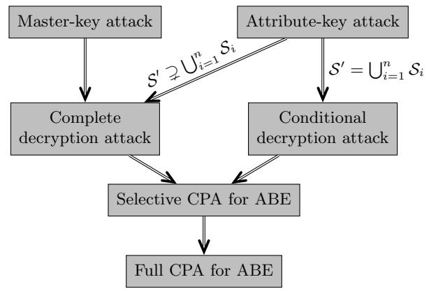

# A Bunch of Broken Schemes: A Simple yet Powerful Linear Approach to Analyzing Security of Attribute-Based Encryption

Marloes Venema1() and Greg Alp´ar1,<sup>2</sup>

<sup>1</sup> Radboud University, Nijmegen, the Netherlands <sup>2</sup> Open University of the Netherlands {m.venema,g.alpar}@cs.ru.nl

Abstract. Verifying security of advanced cryptographic primitives such as attribute-based encryption (ABE) is often difficult. In this work, we show how to break eleven schemes: two single-authority and nine multi-authority (MA) ABE schemes. Notably, we break DAC-MACS, a highly-cited multi-authority scheme, published at TIFS. This suggests that, indeed, verifying security of complex schemes is complicated, and may require simpler tools. The multi-authority attacks also illustrate that mistakes are made in transforming single-authority schemes into multi-authority ones. To simplify verifying security, we systematize our methods to a linear approach to analyzing generic security of ABE. Our approach is not only useful in analyzing existing schemes, but can also be applied during the design and reviewing of new schemes. As such, it can prevent the employment of insecure (MA-)ABE schemes in the future.

Keywords: attribute-based encryption · cryptanalysis · multi-authority attribute-based encryption · attacks.

# 1 Introduction

Attribute-based encryption (ABE) [\[30\]](#page-24-0) is an advanced type of public-key encryption. Ciphertext-policy (CP) ABE [\[5\]](#page-22-0) naturally implements a fine-grained access control mechanism, and is therefore often considered in applications involving e.g. cloud environments [\[26](#page-23-0)[,36,](#page-24-1)[39,](#page-24-2)[37,](#page-24-3)[22,](#page-23-1)[23\]](#page-23-2) or medical settings [\[29,](#page-24-4)[25,](#page-23-3)[27\]](#page-23-4). These applications of ABE allow the storage of data to be outsourced to potentially untrusted providers whilst ensuring that data owners can securely manage access to their data. Many such works use the multi-authority (MA) variant [\[8\]](#page-22-1), which employs multiple authorities to generate and issue secret keys. These authorities can be associated with different organizations, e.g. hospitals, insurance companies or universities. This allows data owners, e.g. patients, to securely share their data with other users from various domains, e.g. doctors, actuaries or medical researchers. Many new schemes are designed for specific real-world applications, that cannot be sufficiently addressed with existing schemes.

Unfortunately, proving and verifying security of new schemes are difficult, and, perhaps unsurprisingly, several schemes turn out to be broken. Some

<span id="page-1-0"></span>Table 1. Attacks on existing schemes. For each scheme, we list in which work it was broken, which functionality was attacked, and whether it was later fixed. Also, we provide the venue and number of citations for these schemes according to Google Scholar. These measures were taken on 18 November 2020.

| Scheme      | Broken in                | Attacked functionality Fixed? |      | Venue   | Cit. |
|-------------|--------------------------|-------------------------------|------|---------|------|
| LRZW09 [20] | LHC+11 [21]              |                               |      | ISC     | 203  |
| ZCL+13 [40] |                          | Private access policies       | [21] | AsiaCCS | 104  |
| XFZ+14 [35] | CDM15 [9]                |                               |      | NC      | 46   |
| HSMY12 [12] | GZZ+13 [11]              | Basic                         | U    | NC      | 176  |
| YJR+13 [39] | HXL15 [15]<br>WJB17 [34] | Revocation                    | [34] | TIFS    | 474  |
| HSM+14 [13] |                          |                               |      | ESORICS | 30   |
| HSM+15 [14] | WZC15 [31]               | Basic                         | U    | TIFS    | 128  |
| JLWW15 [17] | MZY16 [24]               | Distributed key generation    | [18] | TIFS    | 161  |

NC = non-crypto venue/journal; U = unknown

schemes were shown to be generically broken with respect to the basic functionality, and are therefore insecure. Others were only broken with respect to additional functionality. Table [1](#page-1-0) shows that many of these schemes have been published at venues that include cryptography in their scope. This suggests that, even for cryptographers, it is difficult to verify security of ABE. In addition, many of these schemes are highly cited due to their focus on practical applications. This popularity shows that the claimed properties of these schemes are high in demand. It is thus important to simplify security analysis.

To simplify the design and analysis of complex primitives such as ABE, frameworks have been introduced [\[33,](#page-24-9)[3,](#page-22-3)[1\]](#page-22-4) based on the common structure of many schemes. These frameworks allow for the analysis of the exponent space of the schemes—called pair encoding—with respect to simpler security notions. Interestingly, Agrawal and Chase [\[1\]](#page-22-4) show that fully secure schemes can be constructed from pair encodings that are provably symbolically secure. Using this, they show that any scheme that is not trivially broken implies a fully secure scheme. Later, Ambrona et al. [\[2\]](#page-22-5) expand their framework to a broader class of schemes, and devise automated tools to prove symbolic security, subsequently yielding provably secure schemes in the generic bilinear group model [\[6,](#page-22-6)[7\]](#page-22-7). However, operating these tools still requires a considerable expertise (and in a different field). Additionally, these frameworks do not support practical extensions of ABE such as multi-authority ABE (MA-ABE).

In any case, these works illustrate that proving generic security of a scheme provides a meaningful first step in the analysis of a new scheme, and may even imply stronger notions of security. Conversely, showing that a scheme is not generically secure provides overwhelming evidence that a scheme is insecure, regardless of the underlying group structure or accompanying security proofs. As such, devising manual tools and heuristics to effectively analyze the generic (in)security of schemes may further contribute to these frameworks. That is, finding a generic attack—assuming that one exists—is often much simpler than verifying the correctness of a security proof. In fact, it is often the first step that an experienced cryptographer takes when designing a new scheme.

# 1.1 Our contribution

We focus on simplifying the search for generic attacks (provided that they exist). In a broader context, our goal is not necessarily to attack existing schemes, but to propose a framework that simplifies the analysis—and by extension, design of secure ABE schemes. We do this by systematizing a simple heuristic approach to finding attacks. Our contribution in this endeavor is twofold. First, we show that eleven schemes are vulnerable to generic attacks, rendering them (partially) insecure. Five of these are insecure in the basic security model. The other six are insecure in the multi-authority security model—which also allows for the corruption of one or more authorities—but are possibly secure if all authorities are assumed to be honest. Essentially, these six schemes provide a comparable level of security as single-authority schemes. Second, we systematize our methods to a linear approach to generic security analysis of ABE based on the common structure of many schemes. Similarly as the aforementioned frameworks, we consider the pair encodings of the schemes. To this end, we also formalize such pair encodings for multi-authority schemes. Furthermore, we describe three types of attacks, which model the implicit security requirements on the keys and ciphertexts, and simplify the search for generic attacks. They model whether the master-key of the/an authority can be recovered, or whether users can collude and decrypt ciphertexts that they cannot individually decrypt. In the multi-authority setting, we also model the notion of corruption.

# 1.2 Technical details

Ciphertext-policy ABE. In CP-ABE, ciphertexts are associated with access policies, and secret keys are associated with sets of attributes. A secret key is authorized to decrypt a ciphertext if its access structure is satisfied by the associated set. These secret keys are generated by a key generation authority (KGA) from a master-key, which can be used to decrypt any ciphertext. Users with keys for different sets of attributes should not be able to collude in collectively decrypting a ciphertext that they are individually not able to decrypt. Therefore, these keys need to be secure in two ways. First, the master-key needs to be sufficiently hidden in the secret keys. Second, combining the secret keys of different users should not result in more decryption capabilities.

A brief overview of the attack models. We propose three types of attacks, which all imply attacks on the security model for ABE. This model considers chosen-plaintext attacks (CPA) and collusion of users. Two of our attack models only consider the secret keys issued in the first key query phase of the security model, while the third model also considers the challenge ciphertext. Informally, the attacks are:

Challenger Attacker  $SK_{S_1},...,SK_{S_n}$ Key query phase I Attribute-key Master-key attack attack  $SK_{S'}$ : MK $\forall i: \mathcal{S}' \supsetneq \mathcal{S}_i$  $S'\supseteq \bigcup_{i=1}^{\vec{n}} S_i$  $\mathrm{CT}_{\mathbb{A}}: \forall i \in \{1,...,n\}$  $\mathbb{A} \not\models \mathcal{S}_i$ Challenge phase  $\mathbb{A} \models \bigcup_{i=1}^n \mathcal{S}_i$ ? Yes No Complete Conditional decryption attack decryption attack mm

<span id="page-3-0"></span>Fig. 1. The general attacks and how they relate to one another.

- Master-key attack (MK): The attacker can extract the KGA's master-key, which can be used to decrypt any ciphertext.
- Attribute-key attack (AK): The attacker can generate a secret key for a set S' that is strictly larger than each set  $S_i$  associated with an issued key.
- Decryption attack (D): The attacker can decrypt a ciphertext for which no authorized key was generated.

In addition, we distinguish complete from conditional decryption attacks. Conditional attacks can only be performed when the collective set of attributes possessed by the colluding users satisfies the access structure. In contrast, complete attacks allow any ciphertext to be decrypted. Figure 1 illustrates the relationship between the attacks, and how the attacks relate to the security model. We consider the first key query phase and the challenge phase, which output the secret keys for a polynomial number of sets of attributes, and a ciphertext associated with an access structure such that all keys are unauthorized, respectively.

The security models in the multi-authority setting are similar, but include the notion of corruption. The attacker is allowed to corrupt one or more authorities in an attack, which should not yield sufficient power to enable an attack against the honest authorities. Sometimes, schemes employ a central authority (CA) in addition to employing multiple attribute authorities. This CA is assumed to perform the algorithms as expected, though sometimes, it may be corruptable. In this work, we show how to model the corruption of attribute authorities and

corruptable CAs, and how the additional knowledge (e.g. the master secret keys) gained from corrupting an authority can be included in the attacks.

Finally, we observe that sometimes it is unclear whether a multi-authority scheme is supposed to provide security against corruption. Initially, multi-authority ABE was designed to be secure against corruption [8,19]. Not only does this protect honest authorities from corrupt authorities, but it also increases security from the perspective of the users. Conversely, not allowing corruption in the security model provides a comparable level of security as single-authority ABE. In some cases, the informal description of a scheme is ambiguous on whether it protects against corruption. For instance, schemes are compared with other multi-authority schemes that are secure against corruption, while the proposed scheme is not, even though this is not explicitly mentioned [27,23].

Finding attacks, generically. We evaluate the generic (in)security of a scheme by considering the pair encodings of a scheme [1,2]. Intuitively, the pair encoding scheme of a pairing-based ABE scheme provides an abstraction of the scheme to what happens "in the exponent", without considering the underlying group structure. In most pairing-based schemes, the keys and ciphertexts exist mainly in two source groups, and during encryption, a message is blinded by a randomized target group element. To unblind the message, decryption consists of pairing operations to appropriately match the key and ciphertext components and then lift these to the target group. For instance, let  $e: \mathbb{G} \times \mathbb{H} \to \mathbb{G}_T$  be a pairing that maps two source groups  $\mathbb{G}$  and  $\mathbb{H}$  to target group  $\mathbb{G}_T$ , and let  $g \in \mathbb{G}$  and  $h \in \mathbb{H}$  be two generators. Then, the keys and ciphertexts are of the form:

$$SK = h^{\mathbf{k}(\alpha, \mathbf{r}, \mathbf{b})}, \qquad CT = (m \cdot e(g, h)^{\alpha s}, g^{\mathbf{c}(\mathbf{s}, \mathbf{b})}),$$

such that  $\mathbf{k}$  and  $\mathbf{c}$  denote the key and ciphertext encodings of the scheme,  $\alpha$  denotes the master-key,  $\mathbf{b}$  is associated with the public key and  $\mathbf{r}$  and  $\mathbf{s}$  are the random variables associated with the keys and ciphertexts, respectively.

On a high level, generic security of a scheme is evaluated by considering whether  $e(g,h)^{\alpha s}$  can be retrieved from ciphertext CT and an unauthorized key SK. Due to the additively homomorphic properties of groups  $\mathbb{G}$ ,  $\mathbb{H}$  and  $\mathbb{G}_T$ , and the multiplicative behavior of the pairing operation, we can also consider the associated pair encoding scheme. That is, instead of retrieving  $e(g,g)^{\alpha s}$  from SK and CT, we retrieve  $\alpha s$  from  $\mathbf{k}(\alpha,\mathbf{r},\mathbf{b})$  and  $\mathbf{c}(\mathbf{s},\mathbf{b})$ . By multiplying the entries of  $\mathbf{k}$  and  $\mathbf{c}$ , we emulate the pairing operations. By linearly combining the resulting values (for which we require additions), we emulate the other available group operations. As a result, such a "combination" of a key and ciphertext encoding can be denoted by a matrix multiplication, i.e.  $\mathbf{E}$  for which  $\mathbf{kEc}^{\dagger} = \alpha s$ .

Pair encoding schemes allow us to evaluate the generic security of any scheme that satisfies this structure, regardless of the underlying group structure. Unfortunately, the structure of most multi-authority schemes differs from this structure. Therefore, we extend the existing definitions to additionally support these multi-authority schemes. Furthermore, we split the key and ciphertext encodings in two parts, so we can separately evaluate the stronger attacks, i.e. master-key

<span id="page-5-0"></span>**Table 2.** The schemes for which we provide attacks. For each scheme, we indicate on which scheme it is based, which type of attack we apply to it and whether it is complete, whether it uses collusion or corruption, whether the attack explicitly contradicts the model in which the scheme is claimed to be secure. We also list the conference or journal in which the scheme was published and how many times the paper is cited according to Google Scholar. These measures were taken on 18 November 2020.

|                     | Scheme         | Based on      | CD       | Att. | Col. | Cor.          | Con.         | Venue    | Cit. |
|---------------------|----------------|---------------|----------|------|------|---------------|--------------|----------|------|
|                     | ZH10 [41,42]   |               | х        | AK   | 2    |               |              | NC       | 112  |
|                     | ZHW13 [43]     | -             | <b>^</b> | AIX  | 2    | -             | <b>v</b>     | NC       | 123  |
|                     | NDCW15 [26]    | Wat11 [32]    | <b>√</b> | D    | -    | -             | <b>√</b>     | ESORICS  | 46   |
|                     | YJ12 [36]      | -             | <b>√</b> | MK   | -    | $\mathcal{A}$ | <b>√</b>     | NC       | 155  |
| 囝                   | YJR+13 [38,39] |               | 1        | D    |      |               | ./           | NC, TIFS | 474  |
| Multi-authority ABE | WJB17 [34]     | _             | \ \      | D    | -    |               | ٧            | NC       | 28   |
|                     | JLWW13 [16]    | BSW07 [5]     | X        | AK   | 2    | -             | ✓            | NC       | 174  |
|                     | JLWW15 [17]    | DSW01 [9]     |          |      |      |               |              | TIFS     | 161  |
|                     | QLZ13 [28]     | -             | <b>√</b> | MK   | -    | -             | $\checkmark$ | ICICS    | 42   |
|                     | YJ14 [37]      | -             | <b>√</b> | D    | -    | $\mathcal{A}$ | $\checkmark$ | NC       | 240  |
|                     | CM14 [10]      | -             | <b>√</b> | D    | -    | $\mathcal{A}$ | U            | NC       | 42   |
|                     | LXXH16 [22]    | Wat11 [32]    | ✓        | MK   | -    | CA            | ✓            | NC       | 110  |
|                     | MST17 [25]     | [ vvatii [32] |          |      |      |               | U            | AsiaCCS  | 25   |
|                     | PO17 [27]      | -             | <b>√</b> | D    | -    | $\mathcal{A}$ | U            | SACMAT   | 16   |
|                     | MGZ19 I [23]   | LW11 [19]     | <b>√</b> | MK   | -    | CA            | U            | Inscrypt | 4    |

$$\label{eq:complete} \begin{split} \mathrm{CD} &= \mathrm{complete} \ \mathrm{decryption} \ \mathrm{attack}, \ \mathrm{Att} = \mathrm{attack}, \ \mathrm{MK} = \mathrm{master-key} \ \mathrm{attack}, \\ \mathrm{AK} &= \mathrm{attribute-key} \ \mathrm{attack}, \ \mathrm{D} = \mathrm{decryption} \ \mathrm{attack}; \ \mathrm{Col} = \mathrm{collusion}, \\ \mathrm{Cor} &= \mathrm{corruption}, \ \mathrm{Con} = \mathrm{contradicts} \ \mathrm{proposed} \ \mathrm{security} \ \mathrm{model}, \ \mathrm{U} = \mathrm{unclear}, \\ \mathrm{NC} &= \mathrm{not} \ \mathrm{published} \ \mathrm{at} \ \mathrm{peer-reviewed} \ \mathrm{crypto} \ \mathrm{venue/journal} \end{split}$$

and complete decryption attacks, and the weaker attacks, i.e. attribute-key and conditional decryption attacks. This further simplifies the analysis of schemes.

The attacked schemes. Table 2 lists the schemes for which we have found attacks. Many of these schemes are published at venues that include cryptography in their scope, or have been highly cited. Hence, even though many researchers have studied these schemes, mistakes in the security proofs have gone unnoticed. These attacks also illustrate that systematizing any generic attacks may actually have merit. Not only does it provide designers with simple tools to test their own schemes with respect to generic attacks, but also reviewers and practitioners. Because most schemes are broken with respect to the strongest attacks, i.e. master-key and complete decryption attacks, formalizing these models—which are stronger but easier to verify—simplifies the search for generic attacks as well.

### 2 Preliminaries

**Notations.** If an element is chosen uniformly at random from some finite set S, we write  $x \in_R S$ . If an element x is generated by running algorithm Alg,

we write  $x \leftarrow \text{Alg}$ . We use boldfaced variables for vectors  $\mathbf{x}$  and matrices  $\mathbf{M}$ , where  $\mathbf{x}$  denotes a row vector and  $\mathbf{y}^{\intercal}$  denotes a column vector. Furthermore,  $x_i$  denotes the *i*-th entry of  $\mathbf{x}$ . If the vector size is unknown,  $\mathbf{v} \in_R S$  indicates that for each entry:  $v_i \in_R S$ . Finally,  $\mathbf{x}(y_1, y_2, ...)$  denotes a vector, where the entries are polynomials over variables  $y_1, y_2, ...$ , with coefficients in some specified field. However, for conciseness, we often only write  $\mathbf{x}$ . We refer to a polynomial with only one term, or alternatively one term of the polynomial, as a monomial.

Access structures. We consider monotone access structures (see Appendix A for a formal definition) [4]. If a set  $\mathcal{S}$  satisfies access structure  $\mathbb{A}$ , we denote this as  $\mathbb{A} \models \mathcal{S}$ . For monotone access structures, it holds that if  $\mathcal{S} \supseteq \mathcal{S}'$  and  $\mathbb{A} \models \mathcal{S}'$ , then  $\mathbb{A} \models \mathcal{S}$ . We denote the *i*-th attribute in the access structure as att<sub>i</sub>  $\sim \mathbb{A}$ .

**Pairings.** We define a pairing to be an efficiently computable map e on three groups  $\mathbb{G}, \mathbb{H}$  and  $\mathbb{G}_T$  of order p, such that  $e \colon \mathbb{G} \times \mathbb{H} \to \mathbb{G}_T$ , with generators  $g \in \mathbb{G}, h \in \mathbb{H}$  such that for all  $a, b \in \mathbb{Z}_p$ , it holds that  $e(g^a, h^b) = e(g, h)^{ab}$  (bilinearity), and for  $g^a \neq 1_{\mathbb{G}}, h^b \neq 1_{\mathbb{H}}$ , it holds that  $e(g^a, h^b) \neq 1_{\mathbb{G}_T}$ , where  $1_{\mathbb{G}'}$  denotes the unique identity element of the associated group  $\mathbb{G}'$  (non-degeneracy).

# 2.1 Formal definition of (multi-authority) ciphertext-policy ABE

We slightly adjust the more traditional definition of CP-ABE [5] and its multiauthority variant [19]. Specifically, we split the generation of the keys in two parts: the part that is dependent on an attribute and the part that is not. These are relevant distinctions in the definitions of various attack models.

<span id="page-6-0"></span>**Definition 1 (Ciphertext-policy ABE).** A CP-ABE scheme with some authorities  $A_1, ..., A_n$  (where  $n \in \mathbb{N}$ ) such that each  $A_i$  manages universe  $U_i$ , users and a universe of attributes  $U = \bigcup_{i=1}^n U_i$  consists of the following algorithms.

- GlobalSetup( $\lambda$ )  $\rightarrow$  GP: The global setup is a randomized algorithm that takes as input the security parameter  $\lambda$ , and outputs the public global system parameters GP (independent of any attributes).
- MKSetup(GP) → (GP, MK): The master-key setup is a randomized algorithm that takes as input the global parameters GP, and outputs the (secret) master-key MK (independent of any attributes) and updates the global parameters by adding the public key associated with MK.
- AttSetup(att, MK, GP) → (MSK<sub>att</sub>, MPK<sub>att</sub>): The attribute-key setup is a randomized algorithm that takes as input an attribute, possibly the masterkey and the global parameters, and outputs a master secret MSK<sub>att</sub> and public key MPK<sub>att</sub> associated with attribute att.
- UKeyGen(id, MK, GP)  $\rightarrow$  SK<sub>id</sub>: The user-key generation is a randomized algorithm that takes as input the identifier id, the master-key MK and the global parameters GP, and outputs the secret key SK<sub>id</sub> associated with id.

- AttKeyGen( $\mathcal{S}$ , GP, MK, SK<sub>id</sub>, {MSK<sub>att</sub>}<sub>att∈ $\mathcal{S}$ </sub>)  $\rightarrow$  SK<sub>id,att</sub>: The attribute-key generation is a randomized algorithm that takes as input an attribute att possessed by some user with identifier id, and the global parameters, the master-key MK, the secret key SK<sub>id</sub> and master secret key MSK<sub>att</sub>, and outputs a user-specific secret key SK<sub>id,att</sub>.
- Encrypt $(m, \mathbb{A}, GP, \{MPK_{att}\}_{att \sim \mathbb{A}}) \to CT_{\mathbb{A}}$ : This randomized algorithm is run by any encrypting user and takes as input a message m, access structure  $\mathbb{A}$  and the relevant public keys. It outputs the ciphertext  $CT_{\mathbb{A}}$ .
- Decrypt( $SK_{id,\mathcal{S}}, CT_{\mathbb{A}}$ )  $\to m$ : This deterministic algorithm takes as input a ciphertext  $CT_{\mathbb{A}}$  and secret key  $SK_{id,\mathcal{S}} = \{SK_{id}, SK_{id,att}\}_{att\in\mathcal{S}}$  associated with an authorized set  $\mathcal{S}$ , and outputs plaintext m. Otherwise, it aborts.
- MKDecrypt(MK, CT)  $\rightarrow m$ : This deterministic algorithm takes as input a ciphertext CT and the master-key MK, and outputs plaintext m.

The scheme is called correct if decryption outputs the correct message for a secret key associated with a set of attributes that satisfies the access structure.

In the single-authority setting (i.e. where n=1), the GlobalSetup, MKSetup and AttSetup are described in one Setup, and the UKeyGen and AttKeyGen have to be run in one KeyGen. In the multi-authority setting (i.e. where n>1), the GlobalSetup is run either jointly or by some CA. MKSetup can either be run distributively or independently by each  $A_i$ . AttSetup can be run distributively or individually by  $A_i$  for the managed attributes  $U_i$ . UKeyGen is run either distributively, individually for each  $A_i$ , or implicitly (e.g. by using a hash). AttKeyGen is run by the  $A_i$  managing the set of attributes.

### 2.2 The security model and our attack models

<span id="page-7-0"></span>**Definition 2 (Full CPA-security for CP-ABE [5]).** Let  $\mathfrak{C} = (Global Setup, ..., MKDecrypt)$  be a CP-ABE scheme for authorities  $\mathcal{A}_1, ..., \mathcal{A}_n$  conform Definition 1. We define the game between challenger and attacker as follows.

- **Initialization phase:** The attacker corrupts a set  $\mathcal{I} \subsetneq \{1,...,n\}$  of authorities, and sends  $\mathcal{I}$  to the challenger. In the selective security game, the attacker also commits to an access structure  $\mathbb{A}$ .
- **Setup phase:** The challenger runs the GlobalSetup, MKSetup for all authorities, and AttSetup for all attributes. It sends the global parameters GP, master public keys {MPK<sub>att</sub>}<sub>att∈U</sub>, and corrupted master secret keys {MSK<sub>att</sub>}<sub>att∈U</sub> to the attacker, where  $U_{\mathcal{I}} = \bigcup_{i \in \mathcal{I}} U_i$ .
- **Key query phase I:** The attacker queries secret keys for sets of attributes  $(\mathrm{id}_1, \mathcal{S}_1), ..., (\mathrm{id}_{n_1}, \mathcal{S}_{n_1})$ . The challenger runs UKeyGen and AttKeyGen for each  $(\mathrm{id}_j, \mathcal{S}_j)$  and sends  $\mathrm{SK}_{\mathrm{id}_1, \mathcal{S}_1}, ..., \mathrm{SK}_{\mathrm{id}_{n_1}, \mathcal{S}_{n_1}}$  to the attacker.
- Challenge phase: The attacker generates two messages  $m_0$  and  $m_1$  of equal length, together with an access structure  $\mathbb{A}$  such that  $S_j \cup \mathcal{U}_{\mathcal{I}}$  does not satisfy  $\mathbb{A}$  for all j. The challenger flips a coin  $\beta \in_{\mathbb{R}} \{0,1\}$  and encrypts  $m_{\beta}$  under  $\mathbb{A}$ . It sends the resulting challenge ciphertext  $\operatorname{CT}_{\mathbb{A}}$  to the attacker.
- **Key query phase II:** The same as the first key query phase, with the restriction that the queried sets  $S_{n_1+1}, ..., S_{n_2}$  are such that  $\mathbb{A} \not\models S_j \cup \mathcal{U}_{\mathcal{I}}$ .

- **Decision phase:** The attacker outputs a guess  $\beta'$  for  $\beta$ .

The advantage of the attacker is defined as  $|\Pr[\beta' = \beta] - \frac{1}{2}|$ . A ciphertext-policy attribute-based encryption scheme is fully secure (against static corruption) if all polynomial-time attackers have at most a negligible advantage in this security game.

We formally define our attack models in line with the chosen-plaintext attack model above and Figure 1, such that CPA-security also implies security against these attacks. Conversely, the ability to find such attacks implies insecurity in this model. While this follows intuitively, we prove this in Appendix B.

<span id="page-8-1"></span>**Definition 3 (Master-key attacks (MKA)).** We define the game between challenger and attacker as follows. First, the initialization, setup and first key query phases are run as in Definition 2. Then:

- **Decision phase:** The attacker outputs MK'.

The attacker wins the game if for all messages m, decryption of ciphertext  $CT \leftarrow Encrypt(m,...)$  yields  $m' \leftarrow MKDecrypt(MK',CT)$  such that m=m'.

<span id="page-8-2"></span>**Definition 4 (Attribute-key attacks (AKA)).** We define the game between challenger and attacker as follows. First, the initialization, setup and first key query phases are run as in Definition 2. Then:

- **Decision phase:** The attacker outputs  $SK_{S'}$ , where  $S' \supseteq S_j$  for all  $j \in \{1,...,n_1\}$ , and  $S' \supseteq \bigcup_{j=1}^{n_1} S_j$ .

The attacker wins the game if  $SK_{id',\mathcal{S}'}$  is a valid secret key for some arbitrary identifier id' and set  $\mathcal{S}'$ .

<span id="page-8-3"></span>**Definition 5 (Decryption attacks (DA)).** We define the game between challenger and attacker as follows. First, the initialization, setup, first key query and challenge phases are run as in Definition 2. Then:

- **Decision phase:** The attacker outputs plaintext m'.

The attacker wins the game if m' = m. A decryption attack is **conditional** if  $\mathbb{A} \models \bigcup_{j=1}^{n_1} S_j$ . Otherwise, it is **complete**.

# <span id="page-8-0"></span>3 Warm-up: attacking DAC-MACS (YJR+13 [38,39])

We first give an example of how an attack can be found effectively by attacking the YJR+13 [38,39] scheme, also known as DAC-MACS. DAC-MACS is a popular multi-authority scheme that supports key revocation. This functionality was already broken in [15,34], but a fix for its revocation functionality was proposed in [34]. We show that even the basic scheme—which matches the "fixed version" [34]—is vulnerable to a complete decryption attack. We review a stripped-down version of the global and master-key setups, the user-key generation and encryption. In particular, we consider only the parts that are not dependent on any attributes. Also note that we use a slightly different notation for the variables:  $(a, \alpha_k, \beta_k, z_j, u_j, t_{j,k}) \mapsto (b, \alpha_i, b_i, x_1, x_2, r_i)$ .

- GlobalSetup: The central authority generates pairing  $e: \mathbb{G} \times \mathbb{G} \to \mathbb{G}_T$  over groups  $\mathbb{G}$  and  $\mathbb{G}_T$  of prime order p with generator  $g \in \mathbb{G}$ , chooses random integer  $b \in_R \mathbb{Z}_p$  and publishes as global parameters  $GP = (p, e, \mathbb{G}, \mathbb{G}_T, g, g^b)$ ;
- MKSetup: Authority  $A_i$  chooses random  $\alpha_i, b_i \in_R \mathbb{Z}_p$ , and outputs master secret key MSK<sub>i</sub> =  $(\alpha_i, b_i)$  and master public key MPK<sub>i</sub> =  $(e(g, g)^{\alpha_i}, g^{1/b_i})$ ;
- UKeyGen: Upon registration, the user receives partial secret key SK =  $(x_1, g^{x_2})$  from the central authority, with a certificate that additionally includes  $x_2$ . To request a key from authority  $\mathcal{A}_i$ , the user sends this certificate. The attribute-independent part of a user's secret key provided by authority  $\mathcal{A}_i$  is  $SK'_i = (g^{\alpha_i/x_1 + x_2b + r_ib/b_i}, g^{r_ib_i/x_1}, g^{r_ib})$ , where  $r_i \in_R \mathbb{Z}_p$ ;
- Encrypt: A message m is encrypted by picking random  $s \in_R \mathbb{Z}_p$  and computing:  $CT = (m \cdot (\prod_i e(g,g)^{\alpha_i})^s, g^s, g^{s/b_i}, ...).$

Note that an authority  $A_i$  can individually generate  $g^{\alpha_i/x_1+x_2b+r_ib/b_i}$ , if  $x_2$ is known to the authority. In the specification of DAC-MACS, the central authority generates a certificate containing  $x_2$  and the identifier of the user, such that these are linked. In the conference version [38], this certificate is encrypted, and can be decrypted only by the authorities. However, in the journal version [39], this certificate is not explicitly defined to be hidden from the user. We assume that  $x_2$  is therefore also known to the user. Then, after receiving the certificate from the user,  $x_2$  is used by the authority  $A_i$  to link the secret keys to this particular user. However, we show that knowing exponents  $x_1, x_2$  enables an attack. That is, any decrypting user is trivially able to decrypt any ciphertext, without even needing to consider the attribute-dependent part of the keys and ciphertexts. First, we show that we cannot perform a master-key attack, i.e. retrieve  $\alpha_i$ . In particular, the partial secret keys are of the form  $SK = (x_1, g^{x_2}, x_2, g^{\alpha_i/x_1 + x_2b + r_ib/b_i}, g^{r_ib/x_1}, g^{r_ib})$ . We observe that master-key  $\alpha_i$  only occurs in  $g^{\alpha_i/x_1+x_2b+r_ib/b_i}$ . Now, we can cancel out  $g^{x_2b}$ , because  $x_2$  is known and  $q^b$  is a global parameter. Unfortunately, we cannot cancel out  $q^{r_ib/b_i}$ .

Subsequently, we show that it is possible to perform a decryption attack. For this, we also consider  $CT = (m \cdot e(g,g)^{\alpha_i s}, g^s, g^{s/b_i}, ...)$ . To retrieve  $e(g,g)^{\alpha_i s}$ , we start by pairing  $g^{\alpha_i/x_1+x_2b+r_ib/b_i}$  and  $g^s$ , and compute

$$e(g^{\alpha_i/x_1+x_2b+r_ib/b_i},g^s)^{x_1} = \underbrace{e(g,g)^{\alpha_is}}_{\begin{array}{c} \\ \\ \\ \end{array}} + \underbrace{e(g,g)^{x_1x_2sb+x_1r_isb/b_i}}_{\begin{array}{c} \\ \\ \\ \end{array}} \\ e(g^b,g^s)^{x_1x_2} \xrightarrow{\left[ \\ \\ \end{array}}_{\begin{array}{c} \\ \\ \end{array}} \\ \text{Blinding value}$$

Hence,  $e(g,g)^{\alpha_i s}$  can be retrieved and thus the ciphertext can be decrypted. Resisting this attack is not trivial. The main issue is that  $x_2$  is known to the user, because  $x_2$  needs to be known by the authority to generate  $g^{\alpha_i/x_1+x_2b+r_ib/b_i}$ . Otherwise, it cannot generate  $g^{x_2b}$ . To avoid the attack, the CA could encrypt the certificate containing  $x_2$ —like in the conference version [38]—so only the authorities  $A_i$  can decrypt it, and the user does not learn  $x_2$ . The attacker can

however corrupt any authority, learn  $x_2$  and perform the attack. This still breaks the scheme, because of its claimed security against corruption of authorities  $A_i$ .

This attack illustrates two things. First, it shows the simplicity of finding a master-key or complete decryption attack—the two strongest attacks—provided that one exists. In particular, in the analysis, we only have to consider the parts of the keys that are not related to the attributes or additional functionality. This strips away a significantly more complicated part of the scheme. Second, we can systematically focus on the the goal of retrieving  $g^{\alpha_i}$  or  $e(g,g)^{\alpha_i s}$ . Due to the structure of the scheme, we can directly analyze the exponent space of the key and ciphertext components. The pairing operation effectively allows us to compute products of these values "in the exponent". Therefore, we do not have to consider the underlying group structure. Instead, we can attempt to retrieve  $\alpha_i s$  by linearly combining the products of the exponent spaces of the key and ciphertext components. In addition, we can use the explicit knowledge of certain variables "in the exponent" by using these variables in the coefficients.

Not only is finding such a generic attack simpler than verifying a security proof, it may also help finding the mistake in the proof. As shown, the main reason that our attack works is that  $x_2$  is known to the user. We use this observation to find the mistake in the security proof in the journal version [39], which is loosely based on the selective security proof by Waters [32]. In the proof, the challenger and attacker play the security game in Definition 2. The attacker is assumed to be able to break the scheme with non-negligible advantage. The challenger uses this to break the complexity assumption by using the inputs to the assumption in the simulation of the keys and challenge ciphertext. Roughly, the challenger embeds the element that needs to be distinguished from a random element in the complexity assumption in the challenge ciphertext component  $e(g,g)^{\alpha_i s}$ . To ensure that  $e(g,g)^{\alpha_i s}$  cannot be generated trivially from e.g.  $g^{\alpha_i}$ and  $g^s$ , the challenger cannot simulate the master secret key  $g^{\alpha_i}$ . To simulate the key  $g^{\alpha_i/x_1+x_2b+r_ib/b_i}$ , the part with  $g^{\alpha_i}$  is canceled out by the  $g^{x_2b}$  part. By extension, the challenger cannot fully simulate  $g^{x_2b}$ . Because  $g^b$  needs to be simulated (as it is part of the public key), it is not possible to simulate the secret in  $x_2$ . In [39], the authors attempt to solve this issue by generating  $x_2$  randomly, and by implicitly writing it as the sum of the non-simulatable secret and another random integer  $x_2'$  (which is thus unknown to the challenger). While this allows the simulation of  $x_2$ , this causes an issue in the simulation of  $g^{\alpha_i/x_1+x_2b}$ . Because the secret part in  $x_2$  is meant to cancel out the non-simulatable part,  $g^{\alpha_i/x_1+x_2b}$  needs to be simulated by computing  $g^{x_2'b}$ . This is not possible, since  $x_2'$  is unknown to the challenger.

# 4 Systematizing our methodology

Our methodology consists of a systemized approach to finding attacks. It consists of a more concise notation implied by the common structure of many ABE schemes (Section 4.1). We model how learning explicit values "in the exponent", e.g. by corrupting an authority, can be used in the attacks (Section 4.2). We give

our attack models in the concise notation (Sections 4.3, 4.4). Finally, we describe a heuristic approach that simplifies the effort of finding attacks (Section 4.5).

# <span id="page-11-0"></span>4.1 The common structure implies a more concise notation

Many schemes have a similar structure, captured in frameworks that analyze the exponent space through pair encodings [33,3]. We adapt their definitions of pair encoding schemes to match our definition of CP-ABE (Definition 1), which also covers the multi-authority setting. Pair encodings facilitate a shorter notation.

**Definition 6 (Extended pair encoding implied by CP-ABE).** Let authorities  $A_1,...,A_n$  manage universes  $U_i$  for each i, and set  $U = \bigcup_{i=1}^n U_i$  as the collective universe.

- GlobalSetup( $\lambda$ ): This algorithm generates three groups  $\mathbb{G}, \mathbb{H}, \mathbb{G}_T$  of order p with generators  $g \in \mathbb{G}, h \in \mathbb{H}$ , and a pairing  $e \colon \mathbb{G} \times \mathbb{H} \to \mathbb{G}_T$ . It may also select **common variables**  $\mathbf{b} \in_{\mathbb{R}} \mathbb{Z}_p$ . It publishes the global parameters

$$GP = (p, \mathbb{G}, \mathbb{H}, \mathbb{G}_T, g, h, \mathcal{U}, g^{gp(b)}),$$

where we refer to gp as the global parameter encoding.

- MKSetup(GP): This algorithm selects  $\alpha \in_R \mathbb{Z}_p$ , sets master-key MK =  $\alpha$  and publishes master public key MPK =  $\{e(g,h)^{\alpha}\}$ .
- AttSetup(att, MK, GP): This algorithm selects integers  $\mathbf{b}_{att} \in_R \mathbb{Z}_p$  as secret  $\mathbf{MSK}_{att} = \mathbf{b}_{att}$ , and publishes

$$\mathbf{MPK}_{\mathrm{att}} = g^{\mathbf{mpk}_a(\mathbf{b}_{\mathrm{att}}, \mathbf{b})},$$

where we refer to mpk, as the master attribute-key encoding.

– UKeyGen(id, MK, GP): This algorithm selects user-specific random integers  $\mathbf{r}_u \in_R \mathbb{Z}_p$  and computes partial user-key

$$SK_{id} = h^{\mathbf{k}_u(id,\alpha,\mathbf{r}_u,\mathbf{b})},$$

where we refer to  $\mathbf{k}_u$  as the **user-key encoding**.

- AttKeyGen( $\mathcal{S}$ , GP, MK, SK<sub>id</sub>, {MSK<sub>att</sub>}<sub>att∈ $\mathcal{S}$ </sub>): Let SK<sub>id</sub> =  $(h_{id,1}, h_{id,2}, ...)$ . This algorithm selects user-specific random integers  $\mathbf{r}_a \in_R \mathbb{Z}_p$  and computes  $a \text{ key SK}_{id,\mathcal{S}} = \{SK_{id,att}\}_{att∈\mathcal{S}}$ , such that for all att ∈  $\mathcal{S}$ 

$$\mathrm{SK}_{\mathrm{id},\mathrm{att}} = (h_{\mathrm{id},1}^{\mathbf{k}_{a,1}(\mathrm{att},\mathbf{r}_{a},\mathbf{b},\mathbf{b}_{\mathrm{att}})}, h_{\mathrm{id},2}^{\mathbf{k}_{a,2}(\mathrm{att},\mathbf{r}_{a},\mathbf{b},\mathbf{b}_{\mathrm{att}})}, \ldots),$$

where we refer to  $\mathbf{k}_{a,i}$  as the user-specific attribute-key encodings.

- Encrypt $(m, \mathbb{A}, GP, \{MPK_{att}\}_{att \sim \mathbb{A}})$ : This algorithm picks ciphertext-specific randoms  $\mathbf{s} = (s, s_1, s_2, ...) \in_{\mathbb{R}} \mathbb{Z}_p$  and outputs the ciphertext

$$\mathrm{CT}_{\mathbb{A}} = (\mathbb{A}, m \cdot e(g, h)^{\alpha s}, g^{\mathbf{c}(\mathbb{A}, \mathbf{s}, \mathbf{b})}, g^{\mathbf{c}_a(\mathbb{A}, \mathbf{s}, \mathbf{b}, \{\mathbf{b}_{\mathrm{att}}\}_{\mathrm{att} \sim \mathbb{A}})}),$$

where we refer to  $\mathbf{c}$  as the attribute-independent ciphertext encoding, and  $\mathbf{c}_a$  the attribute-dependent ciphertext encoding.

- Decrypt((SK<sub>id</sub>, SK<sub>id</sub>,  $\mathcal{S}$ ), CT<sub>A</sub>): Let SK<sub>id</sub> =  $h^{\mathbf{k}_u(\mathrm{id},\alpha,\mathbf{r}_u,\mathbf{b})}$  =  $(h_{\mathrm{id},1},h_{\mathrm{id},2},...)$ , SK<sub>id</sub>,  $\mathcal{S}$  =  $\{(h^{\mathbf{k}_{a,1}(\mathrm{att},\mathbf{r}_{a,i},\mathbf{b},\mathbf{b}_{\mathrm{att}})}_{\mathrm{id},1})$ ,  $h^{\mathbf{k}_{a,2}(\mathrm{att},\mathbf{r}_{a,i},\mathbf{b},\mathbf{b}_{\mathrm{att}})}_{\mathrm{id},2}$ ,...) $\}_{i\in\{1,...,n\},\mathrm{att}\in\mathcal{S}\cap\mathcal{U}_i}$ , and CT<sub>A</sub> = (A,  $C = m \cdot e(g,h)^{\alpha s}$ ,  $\mathbf{C} = g^{\mathbf{c}(\mathbb{A},\mathbf{s},\mathbf{b})}$ ,  $\mathbf{C}_a = g^{\mathbf{c}_a(\mathbb{A},\mathbf{s},\mathbf{b},\{\mathbf{b}_{\mathrm{att}}\}_{\mathrm{att}\sim\mathbb{A}})}$ ). Define  $\mathcal{S}_{\mathbb{A}}$  = {att  $\sim \mathbb{A} \mid \mathrm{att} \in \mathcal{S}$ }, and matrices  $\mathbf{E}$ ,  $\mathbf{E}_{\mathrm{att},\mathcal{S},\mathbb{A}}$  for each att  $\in \mathcal{S}$  such that

$$\mathbf{c}\mathbf{E}\mathbf{k}_u^\intercal + \sum_{\mathrm{att} \in \mathcal{S}_{\mathbb{A}}} (\mathbf{c} \mid \mathbf{c}_a) \mathbf{E}_{\mathrm{att}, \mathcal{S}, \mathbb{A}} (\mathbf{k}_u \mid \mathbf{k}_a)^\intercal = \alpha s.$$

Then, the plaintext m can be retrieved by recovering  $e(g,h)^{\alpha s}$  from  $\mathbf{C}, \mathbf{C}_a$  and  $\mathrm{SK}_{\mathrm{id}}, \mathrm{SK}_{\mathrm{id},\mathcal{S}}$ , and  $m = C/e(g,h)^{\alpha s}$ .

- MKDecrypt(MK, CT): Let MK =  $\alpha$ , MK' =  $h^{mk(\alpha, \mathbf{b})}$  and CT = (C =  $m \cdot e(g, h)^{\alpha s}$ ,  $\mathbf{C} = g^{\mathbf{c}(\mathbb{A}, \mathbf{s}, \mathbf{b})}$ ,  $\mathbf{C}_a = g^{\mathbf{c}_a(\mathbb{A}, \mathbf{s}, \mathbf{b}, \{\mathbf{b}_{att}\}_{att} \sim \mathbb{A})}$ ). Define vector  $\mathbf{e}$  such that  $\mathbf{c}\mathbf{e}^{\intercal}mk = \alpha s$ . Then, m can be retrieved by computing

$$C/\prod_{\ell} e(C_{\ell}, \mathrm{MK}')^{\mathbf{e}_{\ell}},$$

where  $C_{\ell}$  and  $\mathbf{e}_{\ell}$  denote the  $\ell$ -th entry of  $\mathbf{C}$  and  $\mathbf{e}$ , respectively.

Each encoding enc(var) denotes a vector of polynomials over variables var. Generators constructed by hash functions [5] are covered by this definition by assuming that  $\mathcal{H}(att) = g^{batt}$  for some implicit  $b_{att}$ . Depending on the scheme, MKSetup may be run distributively or by a single CA (in which case there is only one public key  $e(g,h)^{\alpha}$  associated with the master-keys), or independently and individually by multiple authorities  $\mathcal{A}_i$  (in which case there are multiple public keys  $e(g,h)^{\alpha_i}$ , and we replace the blinding value  $e(g,h)^{\alpha_s}$  by  $e(g,h)^{\sum_{i\in\mathcal{I}}\alpha_{is}}$ ).

# <span id="page-12-0"></span>4.2 Modeling knowledge of exponents – extending $\mathbb{Z}_p$

The previously defined notation describes the relationship between the various variables "in the exponent" of the keys and ciphertexts. The explicit values of most variables are unknown to the attacker. In multi-authority ABE, authorities provide the inputs to some encodings, and therefore know these values, as well as their (part of the) master-key. Hence, corruption of authorities results in the knowledge of some explicit values "in the exponent". If the values provided by honest authorities are not well-hidden, it might enable an attack on them.

We model the "knowledge of exponents" in attacks by extending the space from which the entries of  $\mathbf{E}$  and  $\mathbf{E}_{\mathrm{att},\mathcal{S},\mathbb{A}}$  are chosen:  $\mathbb{Z}_p$  (or some extension with variables associated with  $\mathcal{S}$  and  $\mathbb{A}$ ). In fact, the entries of these matrices may be any fraction of polynomials over  $\mathbb{Z}_p$  and the known exponents. Let  $\mathfrak{K}$  be the set of known exponents, then the extended field of rational fractions is defined as

$$\mathbb{Z}_p(\mathfrak{K}) = \{ab^{-1} \pmod{p} \mid a, b \in \mathbb{Z}_p[\mathfrak{K}]\},\$$

where  $\mathbb{Z}_p[\mathfrak{K}]$  denotes the polynomial ring of variables  $\mathfrak{K}$ .

#### <span id="page-13-0"></span>4.3 Formal definitions of the attacks in the concise notations

We formally define our attack models (conform Definitions 7–9, depicted in Figure 1) in the concise notation. For each attack,  $\mathfrak{K} \subseteq \{x, x_1, x_2, ...\}$  denotes the set of known variables. We use the following shorthand for a key encoding for a user id with set  $\mathcal{S}$  and for a ciphertext encoding for access structure  $\mathbb{A}$ :

$$\begin{aligned} \mathbf{k}_{\mathrm{id},\mathcal{S}} &:= (\mathbf{gp}(\mathbf{b}), \mathbf{mpk}_a(b_{\mathrm{att}}, \mathbf{b}), \mathbf{k}_u(\mathrm{id}, \alpha, \mathbf{r}_u, \mathbf{b}) \mid \mathbf{k}_{a,1}(\mathrm{att}, \mathbf{r}_a, \mathbf{b}, \mathbf{b}_{\mathrm{att}}) \mid \ldots), \\ \mathbf{c}_{\mathbb{A}} &:= (\mathbf{gp}(\mathbf{b}), \mathbf{mpk}_a(b_{\mathrm{att}}, \mathbf{b}), \mathbf{c}(\mathbb{A}, \mathbf{s}, \mathbf{b}) \mid \mathbf{c}_a(\mathbb{A}, \mathbf{s}, \mathbf{b}, \{\mathbf{b}_{\mathrm{att}}\}_{\mathrm{att} \sim \mathbb{A}})). \end{aligned}$$

We first define the master-key attacks. In these attacks, the attacker has to retrieve master-key  $mk(\alpha, \mathbf{b})$ , so any ciphertext can be decrypted conform MKDecrypt. In many schemes, it holds that master-key mk is  $\alpha$  (i.e.  $h^{\alpha}$ ), though in others, recovering e.g.  $mk_i = \alpha_i/b_i$  for authorities  $\mathcal{A}_i$  is required to decrypt all ciphertexts. This is because ciphertext encoding  $\mathbf{c}$  often contains s or  $sb_i$ .

<span id="page-13-1"></span>**Definition 7 (Master-key attacks).** A scheme is vulnerable to a master-key attack if there exist  $(\mathrm{id}_1, \mathcal{S}_1), ..., (\mathrm{id}_{n_1}, \mathcal{S}_{n_1})$  and the associated key encodings  $\mathbf{k}_{\mathrm{id}_i, \mathcal{S}_i}$ , and there exist  $\mathbf{e}_i \in \mathbb{Z}_p(\mathfrak{K})^{\ell_i}$ , where  $\ell_i = |\mathbf{k}_{\mathrm{id}_i, \mathcal{S}_i}|$  denotes the length of the i-th key encoding, such that  $\sum_i \mathbf{k}_i \mathbf{e}_i^\mathsf{T} = \mathrm{mk}(\alpha, \mathbf{b}) \in \mathbb{Z}_p(\alpha, \mathbf{b})$ . Then, it holds that for all attribute-independent ciphertext encodings  $\mathbf{c}$  there exists  $\mathbf{e}' \in \mathbb{Z}_p^{\ell'}$  (with  $|\mathbf{c}| = \ell'$ ) such that  $\mathrm{mke'} \mathbf{c}^\mathsf{T} = \alpha s$ .

We formally define attribute-key attacks. In an attribute-key attack, the attacker has to generate a secret key associated with a set S' that is strictly larger than any of the sets  $S_i$  associated with the issued keys.

<span id="page-13-3"></span>**Definition 8 (Attribute-key attacks).** A scheme is vulnerable to an attribute-key attack if there exist  $(id_1, S_1), ..., (id_{n_1}, S_{n_1})$  such that for the key encodings  $\mathbf{k}_{id_i, S_i}$ , it holds that a valid key  $\overline{\mathbf{k}}_{id', S'}$  (with user-specific randoms  $\overline{\mathbf{r}}_u$  and  $\overline{\mathbf{r}}_a$  constructed linearly from the other user-specific randoms) can be computed such that  $\bigcup_{i=1}^{n_1} S_i \subseteq S'$  and  $S_i \subsetneq S'$  for all  $i \in \{1, ..., n_1\}$ . We say that  $\overline{\mathbf{k}}_{id', S'}$  can be computed, if there exist  $\mathbf{E}_i \in \mathbb{Z}_p(\mathfrak{K})^{\ell_i \times \overline{\ell}}$ , where  $\overline{\ell} = |\overline{\mathbf{k}}_{id', S'}|$  and  $\ell_i = |\mathbf{k}_{id_i, S_i}|$ , for all  $S_i$  such that  $\overline{\mathbf{k}}_{id', S'} = \sum_i \mathbf{k}_{id_i, S_i} \mathbf{E}_i$ .

We formally define the complete and conditional decryption attacks. In a decryption attack, the attacker decrypts a ciphertext for which it only has unauthorized keys. The attack is conditional if the collective set of attributes satisfies the access structure associated with the ciphertext. Otherwise, it is complete.

<span id="page-13-2"></span>**Definition 9 (Complete/conditional decryption attacks).** A scheme is vulnerable to a decryption attack if there exist  $(\mathrm{id}_1, \mathcal{S}_1), ..., (\mathrm{id}_{n_1}, \mathcal{S}_{n_1})$  and  $\mathbb{A}$  such that  $\mathbb{A} \not\models \mathcal{S}_i$  for all i, associated ciphertext encoding  $\mathbf{c}_{\mathbb{A}}$  and key encodings  $\mathbf{k}_{\mathrm{id}_i,\mathcal{S}_i}$ , for which there exist  $\mathbf{E}_i \in \mathbb{Z}_p(\mathfrak{K})^{\ell_i \times \ell'}$ , where  $\ell_i = |\mathbf{k}_{\mathrm{id}_i,\mathcal{S}_i}|$  and  $\ell' = |\mathbf{c}_{\mathbb{A}}|$ , such that  $\sum_i \mathbf{k}_{\mathrm{id}_i,\mathcal{S}_i} \mathbf{E}_i \mathbf{c}_{\mathbb{A}}^{\mathsf{T}} = \alpha s$ . The attack is conditional if it holds that  $\mathbb{A} \models \bigcup_i \mathcal{S}_i$ . Otherwise, it is complete.

It readily follows that master-key and attribute-key attacks imply decryption attacks. Specifically, master-key attacks and attribute-key attacks for which  $\bigcup_{i=1}^{n_1} S_i \subsetneq \mathcal{S}'$  holds imply complete decryption attacks.

#### <span id="page-14-0"></span>4.4 Definitions of multi-authority-specific attacks

The multi-authority setting yields two additional difficulties in the design of secure schemes. First, the corruption of authorities yields extra knowledge about the exponent space. Second, the distributed nature of the master-key may enable new attacks. Formally, we define attacks under corruption as follows.

**Definition 10 (Attacks under corruption).** A scheme is vulnerable to attacks under corruption if an attacker can corrupt a subset  $\mathcal{I} \subseteq \{1,...,n\}$  of authorities  $\mathcal{A}_1,...,\mathcal{A}_n$  and thus obtain knowledge of variables  $\mathfrak{R}$  consisting of all variables and (partial) encodings generated by the corrupt authorities, enabling an attack conform Definitions 7, 8 or 9.

Oftentimes, the master-key is generated distributively by the authorities. Hence, the blinding value is of a distributed form, e.g.  $e(g,h)^{\alpha s} = e(g,h)^{\sum_i \alpha_i s}$ . If each partial blinding value e.g.  $e(g,h)^{\alpha_i s}$  can be recovered independently of the user's randomness, then the scheme is vulnerable to a multi-authority-specific decryption attack under collusion. For instance, suppose the blinding value is defined as  $(\alpha_1 + \alpha_2)s$ . If one user can recover  $\alpha_1 s$  (but not  $\alpha_2 s$ ) and another user can recover  $\alpha_2 s$  (but not  $\alpha_1 s$ ), then the scheme is vulnerable to a multi-authority-specific decryption attack. They can collectively recover  $(\alpha_1 + \alpha_2)s$ , while clearly, they cannot do this individually. This type of attack was also performed by Wang et al. [31] on the HSM+14 [13] and HSM+15 [14] schemes.

Definition 11 (Multi-authority-specific (MAS) decryption attacks). Suppose the blinding value of the message is of the form  $\sum_i \operatorname{bv}_i(\alpha_i, \mathbf{s}, \mathbf{b})$ , where  $\alpha_i$  denotes the master-key of authority  $\mathcal{A}_i$ , and  $\operatorname{bv}_i$  represent elements in  $\mathbb{G}_T$ . A scheme is vulnerable to a MAS-decryption attack if there exist a ciphertext encoding  $\mathbf{c}_{\mathbb{A}}$  and sets  $\mathcal{S}_i \subseteq \mathcal{U}_i$  with key encodings  $\mathbf{k}_{\operatorname{id}_i,\mathcal{S}_i}$  for which there exist  $\mathbf{E}_i \in \mathbb{Z}_p(\mathfrak{K})^{\ell_i \times \ell'}$ , where  $\ell_i = |\mathbf{k}_{\operatorname{id}_i,\mathcal{S}_i}|$  and  $\ell' = |\mathbf{c}_{\mathbb{A}}|$ , such that  $\mathbf{k}_{\operatorname{id}_i,\mathcal{S}_i} \mathbf{E}_i \mathbf{c}_{\mathbb{A}}^{\mathbb{A}} = \operatorname{bv}_i$ .

A MAS-decryption attack is also a decryption attack conform Definition 9. The blinding value can be retrieved, while the individual sets are not authorized to decrypt the ciphertext. Conversely, because such attacks do not exist in the single-authority setting, they are weaker than regular decryption attacks.

#### <span id="page-14-1"></span>4.5 Our heuristic approach

We devise a targeted approach, which can be applied manually (or automatically), to finding attacks. As the definitions in the previous section imply, finding an attack is equivalent to finding a suitable linear combination—where the linear coefficients are the entries of **e** or **E**—of all products of the key and ciphertext entries. While finding such coefficients is relatively simple, we note that finding suitable inputs to the attacks may be more difficult. In particular, the number of colluding users and the number of attributes associated with the keys and ciphertexts are effectively unbounded. However, we observe that it often suffices to consider a limited number of inputs, and that for some attacks, only the user-key

<span id="page-15-0"></span>

| <b>Table 3.</b> The inputs of the attacks, and which encodings are neede |
|--------------------------------------------------------------------------|
|--------------------------------------------------------------------------|

| Attack                 |          |    | Secret keys                                                                                       |          | Ci | hertexts                                                        |  |
|------------------------|----------|----|---------------------------------------------------------------------------------------------------|----------|----|-----------------------------------------------------------------|--|
| Attack                 | UK       | AK | $\mathcal{S}$                                                                                     | ΑI       | AD | A                                                               |  |
| Master-key             | <b>√</b> | Х  | -                                                                                                 | X        | Х  | -                                                               |  |
| Attribute-key          | ✓        | ✓  | $\left \mathcal{S}_1 = \{\operatorname{att}_1\}, \mathcal{S}_2 = \{\operatorname{att}_2\}\right $ | X        | X  | -                                                               |  |
| Complete decryption    | ✓        | X  | -                                                                                                 | <b>√</b> | X  | -                                                               |  |
| Conditional decryption | ✓        | ✓  | $\left \mathcal{S}_1 = \{\operatorname{att}_1\}, \mathcal{S}_2 = \{\operatorname{att}_2\}\right $ | ✓        | ✓  | $\mathbb{A} = \operatorname{att}_1 \wedge \operatorname{att}_2$ |  |

UK, AK = user-, attribute-key; AI, AD = attribute-independent, -dependent

and attribute-independent ciphertext entries need to be considered. Specifically, Table 3 describes these inputs in terms of encodings, the sets of attributes, and the access policy. Depending on the maximum number of monomials consisting of common variables in any key entry, the attacker might need multiple secret keys for the same set of attributes to recover certain coefficients. For instance, suppose the attacker wants to retrieve  $\alpha$  from  $\alpha + r_1b_{\rm att_1} + r_1'b_{\rm att_1}'$ , where  $r_1$  and  $r_1'$  are known, user-specific random variables, and  $b_{\rm att_1}$  and  $b_{\rm att_1}'$  denote the common variables associated with attribute att<sub>1</sub>. Because of the three unknown, linearly independent monomials, this can only be done if the attacker has three distinct keys for attribute att<sub>1</sub>. In general, the maximum number of keys with the same set of attributes can be determined in this way, i.e. by counting the maximum number of linearly independent monomials for each entry.

Similarly, the inputs to multi-authority specific attacks can be limited. First, we consider the attacks under corruption. Corruption of any number of authorities results in the additional knowledge of some otherwise hidden exponents, i.e. the master keys and any random variables generated by these authorities. For most schemes, it should be sufficient to consider one corrupted and one honest authority in the attacks, though depending on how e.g. the master-key  $\alpha$  is shared, the number of corrupted authorities may need to be increased. Further, we use the same descriptions of the inputs to the attacks as in the single-authority setting, with the additional requirement that the input attributes are managed by the honest authority. Second, we consider multi-authority specific (MAS) decryption attacks. Corruption is not necessary in this setting, so we assume that all authorities are honest. Additionally, we require at least two honest authorities as input to finding any attack, so we let each authority manage one attribute. Table 4 summarizes the additional inputs to the attacks in Table 3. Finally, it may be possible that a corruptable central authority (CA) is part of the scheme, in which case we also consider whether corruption of this CA enables an attack.

We describe a more targeted approach to finding an attack, i.e. the linear coefficients **e** and **E**, given the input encodings. The approach to finding an attack is linear, as we attempt to retrieve the desired output (conform Definitions 7, 8 and 9) by making linear combinations of products of encodings. The simplest attacks are the master-key and complete decryption attacks, as we only need to consider the attribute-independent parts of the keys and ciphertexts. For these

<span id="page-16-0"></span>Table 4. The number of required honest authorities n and the attribute universes U<sup>1</sup> and U<sup>2</sup> managed by authorities A<sup>1</sup> and A2, respectively, in the multi-authority setting.

| Attack                 | n | U1             | U2     |
|------------------------|---|----------------|--------|
| Master-key             | 1 | ✗              | ✗      |
| Attribute-key          |   | 1 {att1, att2} | ✗      |
| Complete decryption    | 1 | ✗              | ✗      |
| Conditional decryption |   | 1 {att1, att2} | ✗      |
| MAS-decryption         | 2 | {att1}         | {att2} |

attacks, the goal is to retrieve master-key α, or blinding value αs. Typically, α occurs only in one entry of the keys, while s occurs only in one entry of the ciphertext. Instead of trying all combinations of the key entries with the ciphertext, we formulate a more targeted approach. First, consider the monomials to be canceled, and then which combinations of the key and ciphertext entries can make these monomials. In canceling the previous monomials, it might be that new monomials are added, meaning that these in turn also need to be canceled. This process repeats until all monomials are canceled, and α or αs remains, unless such an attack does not exist. For attribute-key attacks, this effort is considerably more difficult, as the target is less clear. However, it often suffices to consider whether the same monomial occurs more than once in the key encoding. For conciseness, we will only provide the non-zero coefficients in an attack.

# 5 Examples of our attacks demonstrating the approach

Using examples of attacks that we have found, we illustrate the way in which our heuristic approach can be applied. In particular, this suggests the simplicity of only considering the exponent space rather than also considering the underlying group structure. Furthermore, in our strongest attack models (i.e. masterkey and complete decryption), we often only need to consider the attributeindependent variables, which strips away a large and significantly more difficult part of the scheme. Because many schemes are broken in these models, we assert that it has merit to manually analyze schemes with respect to these models.

# 5.1 Example without corruption: the YJR+13 [\[38,](#page-24-14)[39\]](#page-24-2) scheme

We perform the attack on YJR+13 in Section [3](#page-8-0) in the concise notations.

- Type of attack: Complete decryption attack;
- Global parameters: gp = (gp<sup>1</sup> , ...) = (b, ...);
- Master keys Ai: mpk<sup>i</sup> = b<sup>i</sup> ;
- User-key: ku(α, r, b) = (αi/x<sup>1</sup> + x2b + rib/b<sup>i</sup> , ribi/x1, rib);
- Attribute-independent ciphertext: c(s, b) = (s, s/bi);
- Blinding value: αis;

### - Known exponents: $\mathfrak{K} = \{x_1, x_2\}$ (by definition);

Note that this notation is not only more concise, it is also more structured. In particular, it is clearly denoted what the goal is (i.e. retrieve the blinding value), and what the relevant keys and ciphertexts look like without considering any information about the underlying groups or attribute-dependent variables. Furthermore, this allows us to strip away any additional functionality that further complicates the structure—and by extension, the analysis—of the scheme.

Due to the concise notations, the previous attack can also be found more simply than before. First, we sample a user-key  $(k_1, k_2, k_3) \leftarrow \mathbf{k}_u(\alpha, \mathbf{r}, \mathbf{b})$ , and ciphertext  $(c_1, c_2) \leftarrow \mathbf{c}(\mathbf{s}, \mathbf{b})$ . To retrieve  $\alpha_i s$ , we start by pairing  $k_1$  with  $c_1$ :

Blinding value
$$x_1k_1c_1 = \alpha_i s + \underbrace{x_1x_2sb + x_1r_isb/b_i}_{t_1x_2gp_1c_1},$$

which yields two monomials to cancel. Subsequently, we can combine the other components and our explicit knowledge of  $x_1$  and  $x_2$  in such a way that these monomials can be canceled. This attack can be formulated in matrix notations:

$$\alpha_{i}s = \underbrace{(k_{1}, k_{2}, k_{3}, \operatorname{gp}_{1})}_{\mathbf{k}_{u}} \underbrace{\begin{pmatrix} x_{1} & 0 & 0 \\ 0 & 0 & 0 \\ 0 & -x_{1} & 0 \\ -x_{1}x_{2} & 0 & 0 \end{pmatrix}}_{\mathbf{E}} \underbrace{\begin{pmatrix} c_{1} \\ c_{2} \\ \operatorname{gp}_{1} \end{pmatrix}}_{\mathbf{c}}$$
$$= x_{1}k_{1}c_{1} - x_{1}k_{3}c_{2} - x_{1}x_{2}\operatorname{gp}_{1}c_{1}.$$

Because most of the entries of  $\mathbf{E}$  are zero, we will only write the non-zero entries of  $\mathbf{E}$  in further attacks. Note that attacks found in the concise notations also translate back to the original description, e.g. compare this attack with that in Section 3. More generally, computing  $\mathbf{k}_j \mathbf{E}_{i,j} \mathbf{c}_i$  in terms of pair encodings corresponds to computing  $e(g^{\mathbf{c}_i}, h^{\mathbf{k}_j})^{\mathbf{E}_{i,j}}$  in the original description of the scheme.

### 5.2 Example with corruption: the YJ14 [37] scheme

The YJ14 [37] scheme is somewhat similar to the YJR+13 [39] scheme in the secret keys. However, the decrypting user knows fewer exponents: instead of sharing  $x_2$  in YJR+13 with the user, it is shared with the authorities  $\mathcal{A}_i$ . Regardless, corruption of one authority leads to the knowledge of  $x_2$ , and thus enables an attack. We define the encodings and attack as follows.

- Type of attack: Complete decryption attack, under corruption of one  $A_i$ ;
- Global parameters: gp = (b, b');
- Master secret key  $A_i$ :  $\mathfrak{mst}_i = (\alpha_i, x)$ ;

```
- User-key: \mathbf{k}_{u}(\alpha_{i}, \mathbf{r}, \mathbf{b}) = (\alpha_{i} + xb + rb', r);
- Attribute-independent ciphertext: \mathbf{c}(\mathbf{s}, \mathbf{b}) = (s, sb', ...);
- Blinding value: (\sum_{i} \alpha_{i})s;
- Known variables: \mathfrak{K} = \{x\} (by corrupting \mathcal{A}');
- The goal: Recover \alpha_{i}s from (k_{1,i}, k_{2,i}) \leftarrow \mathbf{k}_{u}(\alpha_{i}, \mathbf{r}, \mathbf{b}), (c_{1}, c_{2}) \leftarrow \mathbf{c}(\mathbf{s}, \mathbf{b});
- The attack: \alpha_{i}s = k_{1,i}c_{1} - k_{2,i}c_{2} - x \text{mpk}_{1}c_{1}.
```

# 5.3 Example without corruption: the JLWW13 [16] scheme

We also give an example of a conditional attribute-key attack enabled by two colluding users. This illustrates the increased difficulty of executing more general attacks, as they require us to evaluate the entire key. An additional difficulty of executing an attribute-key attack is in finding an appropriate target key encoding. However, our possibilities as an attacker are considerably limited, as we can only linearly combine the key components, and not multiply them. In fact, as Table 2 shows, we could only find attribute-key attacks if a key consists of recurring monomials. While it is difficult to prove that an attribute-key attack does not exist, it is easy to verify whether a key consists of recurring monomials.

We attack the JLWW13 [16] and JLWW15 [17] schemes—also known as AnonyControl—which have the same key generation. The JLWW15 [17] scheme is different from JLWW13 in the encryption. It is however incorrect, because a value of a single user's secret key is used. The encodings are defined as follows.

- Type of attack: Conditional attribute-key attack, collusion of two users;
- Global parameters:  $gp = (b, b'), mpk_a(att_i) = b_{att_i};$
- Secret keys:  $\mathbf{k}_u(\alpha, r, \mathbf{b}) = (\alpha + r), \ \mathbf{k}_a(\operatorname{att}_i, r, r_i, \mathbf{b}) = (r_i b_{\operatorname{att}_i} + r, r_i);$

We show that the recurrence of r as a monomial in the user-key and attributekey encoding enables an attack. While it is relatively simple to show that this cannot be exploited in a single-user setting, we show that sampling two keys for two different sets of attributes  $S_1 = \{\text{att}_1\}$  and  $S_2 = \{\text{att}_2\}$  (as in Table 3) enables the generation of a third key for both attributes, i.e.  $S_3 = \{\text{att}_1, \text{att}_2\}$ . For  $S_1 = \{\text{att}_1\}$ , we sample  $k \leftarrow \mathbf{k}_u(\alpha, r, \mathbf{b})$ , and  $(k_1, k_2) \leftarrow \mathbf{k}_a(\text{att}_1, r, r_1, \mathbf{b})$ . For  $S_2 = \{\text{att}_2\}$ , we sample  $k' \leftarrow \mathbf{k}_u(\alpha, r', \mathbf{b})$ , and  $(k'_1, k'_2) \leftarrow \mathbf{k}_a(\text{att}_2, r', r_2, \mathbf{b})$ .

The goal is to compute a key for set  $S_3 = \{\text{att}_1, \text{att}_2\}$ . We aim to generate attribute-keys for the user-key associated with  $S_1$ , i.e. k, which links the keys together with r. As such, to create a key for  $S_3$ , we need to generate an attribute-key for att<sub>2</sub>. We do this by computing:  $\mathbf{k}_a(\text{att}_2, r, r_2, \mathbf{b}) = (k'_1 + k - k', k'_2)$ .  $\square$ 

# 6 More attacks, on several other schemes

We present attacks on several existing schemes. For each scheme, we describe the secret keys, and possibly the global parameters and master keys, the ciphertext, and the form of the blinding value in the concise notation introduced in Section 4.1. Furthermore, we show whether collusion between users and corruption of any entities are required for the attack. Such corruption results in extra knowledge of exponents, so  $\mathbb{Z}_p$  is extended with the known variables conform Section 4.2.

# 6.1 Single-authority ABE

The ZH10 [41] and ZHW13 [43] schemes. In these schemes, three generators are defined for each attribute att: a positive (att), a negative (¬att) and a dummy \*att value. For each user, the secret key consists of a part associated with the positive or negative attribute and the dummy value.

```
- Type of attack: Conditional attribute-key attack, collusion of two users; - Global parameters: gp = (b), mpk<sub>a</sub>(att<sub>i</sub>) = (b<sub>att<sub>i</sub></sub>, b<sub>¬att<sub>i</sub></sub>, b<sub>*att<sub>i</sub></sub>); - Secret keys: Define att = att if att ∈ S and otherwise att = ¬att, k<sub>u</sub>(\sum r_i, b) = ((\sum_{\text{att}_i \in \mathcal{U}} r_i)b), and k<sub>a</sub>(att<sub>i</sub>, r_i, b) = (r_ib+bbatt<sub>i</sub>, r_ib+bb*att<sub>i</sub>); - Input: S<sub>1</sub> = {att<sub>1</sub>, ¬att<sub>2</sub>}, k<sub>u</sub> ← k<sub>u</sub>(r_1+r_2, b), (k<sub>1</sub>, k<sub>2</sub>, i) ← k<sub>a</sub>(att<sub>i</sub>, r_i, b), S<sub>2</sub> = {¬att<sub>1</sub>, att<sub>2</sub>}, with k'<sub>u</sub> ← k<sub>u</sub>(r'_1+r'_2, b), (k'<sub>1</sub>, k'<sub>2</sub>, i) ← k<sub>a</sub>(att<sub>i</sub>, r'_i, b); - The goal: Generate a key for S<sub>3</sub> = {att<sub>1</sub>, att<sub>2</sub>}; - The attack: k<sub>u</sub>(r'_1+r'_2, b) = k'<sub>u</sub>, k<sub>a</sub>(att<sub>1</sub>, r'_1, b) = (k<sub>1</sub>, 1 + k'<sub>2</sub>, 1 - k<sub>2</sub>, 1, k'<sub>2</sub>, 1), and k<sub>a</sub>(att<sub>2</sub>, r'_2, b) = (k'<sub>1</sub>, 2, k'<sub>2</sub>, 2).
```

The NDCW15 [26] scheme. This scheme implements a tracing algorithm, allowing the KGA to trace misbehaving users. To this end, some exponents are known to the user. The keys considered below correspond to those given in the second step of the key generation in [26] (which the user can compute).

```
- Type of attack: Complete decryption attack;

- Global parameters: \mathbf{gp} = (b_1, b_2);

- User-key: \mathbf{k}_u(\alpha, \mathbf{b}) = (\frac{\alpha}{b_1 + x_3} + x_2 \frac{b_2}{b_1 + x_3}, x_1, x_1 b_1);

- Attribute-independent ciphertext: \mathbf{c}(\mathbf{s}, \mathbf{b}) = (s, sb_1, sb_2);

- Known variables: \mathfrak{K} = \{x_1, x_2, x_3\} (by definition);

- The goal: Recover \alpha s from (k_1, k_2, k_3) \leftarrow \mathbf{k}_u(\alpha, \mathbf{b}), (c_1, c_2, c_3) \leftarrow \mathbf{c}(\mathbf{s}, \mathbf{b});

- The attack: \alpha s = x_3 k_1 c_1 + k_1 c_2 - x_2 c_3.
```

### 6.2 Multi-authority ABE

The YJ12 [36] scheme. This scheme employs a certificate authority (CA), assumed to be fully trusted, and (corruptable) attribute authorities  $(\mathcal{A}_i)$ , responsible for the generation of the secret keys. For the key encodings, we assume that the master public keys are generated as  $\mathcal{H}(\text{att})^{\alpha_i}$  rather than as it was originally proposed in [36]:  $g^{\alpha_i \mathcal{H}'(\text{att})}$ . The latter trivially enables complete attribute-key attacks (because  $\mathcal{H}'$  is public), while the former ensures that  $\mathcal{H}(\text{att})^{\alpha_i} = g^{\alpha_i b_{\text{att}}}$  is such that  $b_{\text{att}}$  is unknown to everyone and thus protects against these attacks.

```
- Type of attack: Complete master-key attack, corruption of one \mathcal{A};
- Global parameters: gp = (b', 1/b');
- Master secret key \mathcal{A}_i: ms\mathfrak{k}_i = (\alpha_i, b/b');
- User-key: \mathbf{k}(\alpha_i, \mathbf{r}, \mathbf{b}) = (r, rb/b' + \alpha_i/b');
- Attribute-independent ciphertext: \mathbf{c}(\mathbf{s}, \mathbf{b}) = (sb');
- Blinding value: (\sum_i \alpha_i)s, so mk(\alpha_i, \mathbf{b}) = \alpha_i/b';
- Known exponents: \mathfrak{K} = \{\alpha', b/b'\} (by corrupting \mathcal{A}');
- The goal: Recover mk(\alpha_i, \mathbf{b}) from (k_{1,i}, k_{2,i}) \leftarrow \mathbf{k}(\alpha_i, \mathbf{r}, \mathbf{b});
- The attack: mk(\alpha_i, \mathbf{b}) = k_{2,i} - b/b'k_{1,i}. □
```

The QLZ13 [28] scheme. This scheme supports hidden access structures and a blind key generation. However, the secret keys trivially leak the master-keys.

```
- Type of attack: Complete master-key attack;

- Global parameters: \mathbf{gp} = (b, b_1, b', ...);

- User-key: \mathbf{k}_u(\alpha, \mathbf{r}, \mathbf{b}) = (\alpha + rb + \frac{b_1}{x+b'}, rb - r'b_1, (r' + \frac{1}{x+b'})b_1);

- Known variables: \mathfrak{K} = \{x\} (by definition);

- The goal: Recover \alpha from (k_1, k_2, k_3) \leftarrow \mathbf{k}_u(\alpha, \mathbf{r}, \mathbf{b});

- The attack: \alpha = k_1 - k_2 + k_3.
```

The CM14 [10] scheme. This scheme<sup>3</sup> is a multi-authority version of [32].

```
- Type of attack: Complete decryption attack, under corruption of one A;
```

```
- Master key pair of A_i: mpk<sub>i</sub> = (b_i), \mathfrak{mst}_i = (b_i);
```

```
- User-key: \mathbf{k}_u(\alpha_i, \mathbf{r}, \mathbf{b}_i) = (\frac{\alpha_i + r}{b_i}, r);
```

- Attribute-independent ciphertext:  $\mathbf{c}(\mathbf{s}, \mathbf{b}_i) = (sb_i)$ ;

```
– Blinding value: (\sum_i \alpha_i)s;
```

- Known variables:  $\mathfrak{K} = \{b_1\}$  (by corrupting  $\mathcal{A}_1$ );

- The goal: Recover  $\alpha_i s$  from  $(k_{1,i}, k_{2,i}) \leftarrow \mathbf{k}_u(\alpha_i, \mathbf{r}, \mathbf{b}_i), c_i \leftarrow \mathbf{c}(\mathbf{s}, \mathbf{b}_i), c_1 \leftarrow \mathbf{c}(\mathbf{s}, \mathbf{b}_1);$ 

```
- The attack: \alpha_i s = k_{1,i} c_i - 1/b_1 k_{2,i} c_1 such that i \neq 1.
```

The LXXH16 [22] and MST17 [25] schemes. These schemes are similar. The LXXH16 scheme employs a corruptable CA to run the global setup. In the MST17 scheme, it is unclear which entity runs it and thus generates the b below.

```
- Type of attack: Complete master-key attack, under corruption of CA;
```

- Global parameters: gp = (b);
- User-key:  $\mathbf{k}_{u}(\alpha, \mathbf{r}, \mathbf{b}) = (\alpha + rb, r);$
- **Known variables:**  $\mathfrak{K} = \{b\}$  (by corrupting CA, and thus the global setup);
- The goal: Recover  $\alpha$  from  $(k_1, k_2) \leftarrow \mathbf{k}_u(\alpha, \mathbf{r}, \mathbf{b})$ ;
- The attack:  $\alpha = k_1 bk_2$ .

The PO17 [27] scheme. This scheme<sup>4</sup> was proposed to address an issue of the Cha07 [8] scheme, which requires that a user receives a key from each authority. However, unlike Cha07, the PO17 scheme does not protect against corruption. Thus, in terms of security, it is closer to any single-authority scheme.

- Type of attack: Complete decryption attack under corruption of one A;
- Master key pair of  $A_i$ : mpk<sub>i</sub> =  $(b_i)$ ,  $\mathfrak{mst}_i = (b_i)$ ;
- User-key:  $\mathbf{k}_u(\alpha_i, \mathbf{r}, \mathbf{b}_i) = (\frac{\alpha_i r}{b_i}, r);$

<span id="page-20-0"></span><sup>&</sup>lt;sup>3</sup> There is a mistake in the attack in the conference version [?]. This is the fixed version of the attack.

<span id="page-20-1"></span><sup>&</sup>lt;sup>4</sup> There is a mistake in the attack in the conference version [?]. This is the fixed version of the attack.

<span id="page-21-0"></span>**Table 5.** The schemes for which we found attacks, and the consequences of these. For each scheme, we list whether a scheme is insecure in the basic (CPA-)security model, or only under corruption of the central authority (CA) or attribute authorities (A).

|     | Scheme                     | Problem                 | CPA-security              |
|-----|----------------------------|-------------------------|---------------------------|
|     | ZH10 [41,42], ZHW13 [43]   | Recurring monomials     | Х                         |
|     | NDCW15 [26]                | Known-exponent exploits | X                         |
| Г   | YJ12 [36]                  | Known-exponent exploits |                           |
|     | YJR+13 [38,39], WJB17 [34] | Known-exponent exploits | X                         |
| BE  | JLWW13 [16], JLWW15 [17]   | Recurring monomials     | X                         |
| B   | QLZ13 [28]                 | Recurring monomials     | X                         |
| Y-A | YJ14 [37]                  | Known-exponent exploits | $\bm{\chi}_{\mathcal{A}}$ |
| MA  | CM14 [10]                  | Known-exponent exploits | $\bm{\chi}_{\mathcal{A}}$ |
|     | LXXH16 [22], MST17 [25]    | Known-exponent exploits | $z_{\mathrm{CA}}$         |
|     | PO17 [27]                  | Known-exponent exploits | XA                        |
|     | MGZ19 I [23]               | Known-exponent exploits | $z_{\mathrm{CA}}$         |

 $\mathbf{X}_{\mathcal{A}}, \mathbf{X}_{\mathrm{CA}} = \mathrm{none} \ \mathrm{under} \ \mathrm{corruption} \ \mathrm{of} \ \mathcal{A}, \ \mathrm{CA}$ 

- Attribute-independent ciphertext:  $c(s, b_i) = (sb_i)$ ;
- Blinding value:  $(\sum_i \alpha_i)s$ ;
- Known variables:  $b_1$  (by corrupting  $A_1$ );
- The goal: Recover  $\alpha_i s$  from  $(k_{1,i}, k_{2,i}) \leftarrow \mathbf{k}_u(\alpha_i, \mathbf{r}, \mathbf{b}), c_i \leftarrow \mathbf{c}(\mathbf{s}, \mathbf{b}_i), c_1 \leftarrow \mathbf{c}(\mathbf{s}, \mathbf{b}_1);$
- The attack:  $\alpha_i s = k_{1,i} c_i + 1/b_1 k_{2,i} c_1$  such that  $i \neq 1$ .

The first MGZ19 [23] scheme. This scheme employs multiple "central authorities"—to remove the random oracle from [19]—and attribute authorities (AA). The security model considers corruption of the AAs but not the CAs. The description of the scheme does not require the attribute authorities to be aware of the CAs. However, we show that all CAs need to be trusted to ensure security. In particular, we show that corruption of one of the CAs enables an attack.

- Type of attack: Complete master-key attack, under corruption of one CA;
- Master key pair  $A_i$ : mpk<sub>a,i</sub>(att<sub>j</sub>) =  $(b_{\text{att}_j})$ ,  $\mathfrak{mst}_i(\text{att}_j) = (\alpha_i, b_{\text{att}_j})$ ;
- $CA_i$  generates: r;
- Secret key:  $\mathbf{k}_u(\alpha_i, \mathbf{r}, \mathbf{b}) = (r), \mathbf{k}_a(\operatorname{att}_j, \alpha_i, \mathbf{r}, \mathbf{b}) = (\alpha_i + rb_{\operatorname{att}_i});$
- Known variables:  $\mathfrak{K} = \{r\}$  (by corrupting one CA);
- The goal: Recover  $\alpha_i$  from  $k_{i,j} \leftarrow \mathbf{k}_a(\operatorname{att}_j, \alpha_i, \mathbf{r}, \mathbf{b})$ ,  $\operatorname{mpk}_{i,j} \leftarrow \operatorname{mpk}_{a,i}(\operatorname{att}_j)$ ;
- The attack:  $\alpha_i = k_{i,j} r \operatorname{mpk}_{i,j}$ .

### 7 Discussion

We have presented a linear, heuristic approach to analyzing security—consisting of a more concise notation—and applied it to existing schemes. This approach

simplifies manually finding generic attacks provided that they exist. For future work, it would be valuable to extend the approach to be provably exhaustive, such that it follows with [\[2\]](#page-22-5) that the scheme also implies a provably secure scheme. In addition, it would be valuable to automatize finding attacks for the multi-authority encodings like [\[2\]](#page-22-5) does in the single-authority setting. To demonstrate the effectiveness of our approach, we have shown that several existing schemes are vulnerable to our attacks, either rendering them fully or partially insecure. Most of the attacks are similar in that they either exploit that one monomial occurs more than once in the keys, or known exponents yield sufficient knowledge to enable an attack. Table [5](#page-21-0) lists each attacked scheme and the associated fundamental problem that enables the attack. In general, schemes for which we have found an attack without requiring corruption are structurally more complicated than the single-authority schemes on which they are (loosely) based. Schemes that are insecure against corruption are generally closer to their (provably secure) single-authority variants, but knowing certain exponents enables an attack. Possibly, a distributed generation of these exponents may prevent this. For future work, it may be interesting to consider whether this yields secure schemes.

Acknowledgments. The authors would like to thank the anonymous reviewers for their helpful comments and suggestions.

# References

- <span id="page-22-4"></span>1. S. Agrawal, and M. Chase, "Simplifying Design and Analysis of Complex Predicate Encryption Schemes", in EUROCRYPT'17, pp. 627–656, Springer, 2017.
- <span id="page-22-5"></span>2. M. Ambrona, G. Barthe, R. Gay, and H. Wee, "Attribute-Based Encryption in the Generic Group Model: Automated Proofs and New Constructions", in CCS'17, pp. 647–664, ACM, 2017.
- <span id="page-22-3"></span>3. N. Attrapadung, "Dual System Encryption via Doubly Selective Security: Framework, Fully Secure Functional Encryption for Regular Languages, and More", in EUROCRYPT'14, pp. 557–577, Springer, 2014.
- <span id="page-22-9"></span>4. A. Beimel, "Secure Schemes for Secret Sharing and Key Distribution", PhD Thesis, Ben Gurion University, 1996.
- <span id="page-22-0"></span>5. J. Bethencourt, A. Sahai, and B. Waters, "Ciphertext-Policy Attribute-Based Encryption", in S&P '07, pp. 321–334, IEEE, 2007.
- <span id="page-22-6"></span>6. D. Boneh, X. Boyen, and E.-J. Goh, "Hierarchical Identity Based Encryption with Constant Size Ciphertext", in EUROCRYPT'05, pp. 440–456, Springer, 2005.
- <span id="page-22-7"></span>7. X. Boyen, "The Uber-Assumption Family – A Unified Complexity Framework for Bilinear Groups", in Pairing'08, pp. 39–56, Springer, 2008.
- <span id="page-22-1"></span>8. M. Chase, "Multi-Authority Attribute-Based Encryption", in TCC'07, pp. 515–534, Springer, 2007.
- <span id="page-22-2"></span>9. P. Chaudhari, M. L. Das, and A. Mathuria, "On Anonymous Attribute Based Encryption", in ICISS'15, pp. 378–392, Springer, 2015.
- <span id="page-22-8"></span>10. J. Chen, and H. Ma, "Efficient decentralized attribute-based access control for cloud storage with user revocation", in ICC'14, pp. 3782–3787, IEEE, 2014.

- <span id="page-23-8"></span>11. A. Ge, J. Zhang, R. Zhang, C. Ma, and Z. Zhang, "Security Analysis of a Privacy-Preserving Decentralized Key-Policy Attribute-Based Encryption Scheme", Transactions on Parallel and Distributed Systems, 24(11), pp. 2319–2321, IEEE, 2013.
- <span id="page-23-7"></span>12. J. Han, W. Susilo, Y. Mu, and J. Yan, "Privacy-Preserving Decentralized Key-Policy Attribute-Based Encryption", in IEEE Transactions on Parallel and Distributed Systems, 23(11), pp. 2150–2162, IEEE, 2012.
- <span id="page-23-10"></span>13. J. Han, W. Susilo, Y. Mu, J. Zhou, and M. H. A. Au, "PPDCP-ABE: Privacy-Preserving Decentralized Ciphertext-Policy Attribute-Based Encryption", in ES-ORICS'14, pp. 73–90, Springer, 2014.
- <span id="page-23-11"></span>14. J. Han, W. Susilo, Y. Mu, J. Zhou, and M. H. A. Au, "Improving Privacy and Security in Decentralized Ciphertext-Policy Attribute-Based Encryption", in TIFS, 10(3), pp. 665–678, IEEE, 2015.
- <span id="page-23-9"></span>15. J. Hong, K. Xue, and W. Li, "Comments on "DAC-MACS: Effective Data Access Control for Multiauthority Cloud Storage Systems"/Security Analysis of Attribute Revocation in Multiauthority Data Access Control for Cloud Storage Systems", in TIFS, 10(6), pp. 1315–1317, IEEE, 2015.
- <span id="page-23-16"></span>16. T. Jung, X. Y. Li, Z. Wan, and M. Wan, "Privacy Preserving Cloud Data Access With Multi-Authorities", in INFOCOM'13, pp. 2625–2633, IEEE, 2013.
- <span id="page-23-12"></span>17. T. Jung, X. Y. Li, Z. Wan, and M. Wan, "Control Cloud Data Access Privilege and Anonymity with Fully Anonymous Attribute-Based Encryption", in TIFS, 10(1), pp. 190–199, IEEE, 2015.
- <span id="page-23-14"></span>18. T. Jung, X. Y. Li, Z. Wan, and M. Wan, "Rebuttal to "Comments on "Control Cloud Data Access Privilege and Anonymity With Fully Anonymous Attribute-Based Encryption""", in TIFS, 11(4), pp. 868–868, IEEE, 2016.
- <span id="page-23-15"></span>19. A. Lewko, and B. Waters, "Decentralizing Attribute-Based Encryption", in EU-ROCRYPT'11, pp. 568–588, Springer, 2011.
- <span id="page-23-5"></span>20. J. Li, K. Ren, B. Zhu, and Z. Wan, "Privacy-Aware Attribute-Based Encryption with User Accountability", in ISC'09, pp. 347–362, Springer, 2009.
- <span id="page-23-6"></span>21. J. Li, Q. Huang, X. Chen, S. S. M. Chow, D. S. Wong, and D. Xie, "Multi-Authority Ciphertext-Policy Attribute-Based Encryption with Accountability", in AsiaCCS'11, pp. 386–390, ACM, 2011.
- <span id="page-23-1"></span>22. W. Li, K. Xue, Y. Xue, and J. Hong, "TMACS: A Robust and Verifiable Threshold Multi-Authority Access Control System in Public Cloud Storage", in IEEE Transactions on Parallel and Distributed Systems, 27(5), pp. 1484–1496, IEEE, 2016.
- <span id="page-23-2"></span>23. C. Ma, A. Ge, and J. Zhang, "Fully Secure Decentralized Ciphertext-Policy Attribute-Based Encryption in Standard Model", in Inscrypt'19, pp. 427–447, Springer, 2019.
- <span id="page-23-13"></span>24. H. Ma, R. Zhang, and W. Yuan, "Comments on "Control Cloud Data Access Privilege and Anonymity with Fully Anonymous Attribute-Based Encryption"", in TIFS, 11(4), pp. 866–867, IEEE, 2016.
- <span id="page-23-3"></span>25. Q. M. Malluhi, A. Shikfa, and V. C. Trinh, "Ciphertext-Policy Attribute-based Encryption Scheme With Optimized Ciphertext Size And Fast Decryption", in AsiaCCS'17, pp. 230–240, ACM, 2017.
- <span id="page-23-0"></span>26. J. Ning, X. Dong, Z. Cao, and L. Wei, "Accountable Authority Ciphertext-Policy Attribute-Based Encryption with White-Box Traceability and Public Auditing in the Cloud", in ESORICS'15, pp. 270-289, Springer, 2015.
- <span id="page-23-4"></span>27. H. S. G. Pussewalage, and V. A. Oleshchuk, "A Distributed Multi-Authority Attribute Based Encryption Scheme for Secure Sharing of Personal Health Records", in SACMAT'17, pp. 255–262, ACM, 2017.

- <span id="page-24-15"></span>28. H. Qian, J. Li, and Y. Zhang, "Privacy-Preserving Decentralized Ciphertext-Policy Attribute-Based Encryption with Fully Hidden Access Structure", in ICICS'13, pp. 363–372, Springer, 2013.
- <span id="page-24-4"></span>29. H. Qian, J. Li, Y. Zhang, and J. Han, "Privacy-Preserving Personal Health Record Using Multi-Authority Attribute-Based Encryption with Revocation", in International Journal of Information Security, 14(6), pp. 487–497, Springer, 2015.
- <span id="page-24-0"></span>30. A. Sahai, and B. Waters, "Fuzzy Identity-Based Encryption", in EUROCRYPT'05, pp. 457–473, Springer, 2005.
- <span id="page-24-8"></span>31. M. Wang, Z. Zhang, and C. Chen, "Security Analysis of a Privacy-Preserving Decentralized Ciphertext-Policy Attribute-Based Encryption Scheme", in Concurrency and Computation, 28(4), pp. 1237–1245, Wiley Online Library, 2015.
- <span id="page-24-13"></span>32. B. Waters, "Ciphertext-Policy Attribute-Based Encryption - An Expressive, Efficient, and Provably Secure Realization", in PKC'11, pp. 53–70, Springer, 2011.
- <span id="page-24-9"></span>33. H. Wee, "Dual System Encryption via Predicate Encodings", in TCC'14, pp. 616– 637, Springer, 2014.
- <span id="page-24-7"></span>34. X. Wu, R. Jiang, and B. Bhargava, "On the Security of Data Access Control for Multiauthority Cloud Storage Systems", in IEEE Transactions on Services Computing, 10(2), pp. 258–272, IEEE, 2017.
- <span id="page-24-6"></span>35. F. Xhafa, J. Feng, Y. Zhang, X. Chen, and J. Li, "Privacy-aware attribute-based PHR sharing with user accountability in cloud computing", in Journal of Supercomputering, 71, pp. 1607–1619, Springer, 2014.
- <span id="page-24-1"></span>36. K. Yang, and X. Jia, "Attribute-Based Access Control for Multi-Authority Systems in Cloud Storage", in 2012 32nd IEEE International Conference on Distributed Computing Systems, pp. 536–545, IEEE, 2012.
- <span id="page-24-3"></span>37. K. Yang, and X. Jia, "Expressive, Efficient, and Revocable Data Access Control for Multi-Authority Cloud Storage", in IEEE Transactions on Parallel and Distributed Systems, 25(7), IEEE, 2014.
- <span id="page-24-14"></span>38. K. Yang, X. Jia, K. Ren, and B. Zhang, "DAC-MACS: Effective Data Access Control for Multiauthority Cloud Storage Systems", in INFOCOM'13, pp. 2895– 2903, IEEE, 2013.
- <span id="page-24-2"></span>39. K. Yang, X. Jia, K. Ren, B. Zhang, and R. Xie, "DAC-MACS: Effective Data Access Control for Multiauthority Cloud Storage Systems", in TIFS, 8(11), pp. 1790–1801, IEEE, 2013.
- <span id="page-24-5"></span>40. Y. Zhang, X. Chen, J. Li, D. Wong, and H. Li, "Anonymous attribute-based encryption supporting efficient decryption test", in AsiaCCS, pp. 511–516, ACM, 2013.
- <span id="page-24-10"></span>41. Z. Zhou, and D. Huang, "On Efficient Ciphertext-Policy Attribute Based Encryption and Broadcast Encryption", in CCS'10 (poster), pp. 753–755, ACM, 2010.
- <span id="page-24-11"></span>42. Z. Zhou, and D. Huang, "On Efficient Ciphertext-Policy Attribute Based Encryption and Broadcast Encryption", IACR Cryptology ePrint Archive, Report 2010/395, 2010.
- <span id="page-24-12"></span>43. Z. Zhou, D. Huang, and Z. Wang, "Efficient Privacy-Preserving Ciphertext-Policy Attribute Based-Encryption and Broadcast Encryption", in IEEE Transactions on Computers, 64(1), pp. 126–138, IEEE, 2013.

# <span id="page-25-0"></span>A Formal definition of access structures

**Definition 12 ((Monotone) access structures [4]).** Let  $\{a_1,...,a_n\}$  be a set of attributes. An access structure is a collection  $\mathbb A$  of non-empty subsets of  $\{a_1,...,a_n\}$ . The sets in  $\mathbb A$  are called the authorized sets, and the sets that are not in  $\mathbb A$  are called the unauthorized sets. An access structure  $\mathbb A\subseteq 2^{\{a_1,...,a_n\}}$  is monotone if for all B, C holds:  $B\in \mathbb A$  and  $B\subseteq C$ , then also  $C\in \mathbb A$ .

# <span id="page-25-1"></span>B Proofs of implications

For completeness, we give formal proofs of the implications between the definitions of the attacks (i.e. Definitions 2, 3, 4, and 5). More specifically, we prove that the master-key attacks (MKA) and attribute-key attacks (AKA) imply decryption attacks (DA), and decryption attacks imply selective chosen-plaintext attacks (sCPA). Furthermore, it is a well-known fact that selective chosen-plaintext attacks imply full chosen-plaintext attacks [30] (and conversely, full CPA-security implies selective CPA-security). The relationship between the attacks is summarized in Figure 2. For instance, if we can perform a master-key attack (i.e. define a polynomial-time algorithm that computes a master-key that can decrypt any ciphertext), then we can also perform a complete decryption attack (i.e. define a polynomial-time algorithm that decrypts any ciphertext with any number of unauthorized secret keys).

**Lemma 1 (MKA implies complete DA).** If some polynomial-time attacker  $\mathcal{B}_{MKA}$  exists that can win the master-key attack (Definition 3) game, then a polynomial-time attacker  $\mathcal{B}_{CDA}$  exists that can win the complete decryption attack (Definition 4) game.

*Proof.* Let  $\mathcal{B}_{CDA}$  be the attacker that plays the complete decryption game with the challenger. Suppose  $\mathcal{B}_{MKA}$  denotes a polynomial-time attacker that can win the master-key attack game.

- **Setup phase:** The challenger runs the setup of the scheme, and sends the master public key to attacker  $\mathcal{B}_{CDA}$ , which relays it to attacker  $\mathcal{B}_{MKA}$ .
- **Key query phase I:** Attacker  $\mathcal{B}_{MKA}$  generates sets  $\mathcal{S}_1, ..., \mathcal{S}_{n_1}$  and sends these to attacker  $\mathcal{B}_{CDA}$ , which relays these to the challenger. For each set  $\mathcal{S}_i$ , the challenger generates a secret key  $SK_{\mathcal{S}_i}$  and sends it back to attacker  $\mathcal{B}_{CDA}$ , which relays it to attacker  $\mathcal{B}_{MKA}$ .
- **Intermission:** The decision phase of attacker  $\mathcal{B}_{MKA}$  yields as output the master-key MK', which is sent to attacker  $\mathcal{B}_{CDA}$ .
- Challenge phase: Attacker  $\mathcal{B}_{CDA}$  can then define any access structure  $\mathbb{A}$  such that  $\mathbb{A} \not\models \mathcal{S}_i$  for all  $i \in \{1, ..., n_1\}$ . The challenger encrypts a random message m under this access structure, and sends the resulting challenge ciphertext CT to attacker  $\mathcal{B}_{CDA}$ .
- **Decision phase:** Attacker  $\mathcal{B}_{CDA}$  uses MK' to decrypt CT with the master-key decryption algorithm MKDecrypt conform Definition 1, yielding plaintext m', and sends this to the challenger.

<span id="page-26-0"></span>

Fig. 2. The relationship between our proposed attacks and chosen-plaintext attacks.

Because it was assumed that attacker  $\mathcal{B}_{MKA}$  wins the MKA-game, MK' is such that master-key decryption works on any ciphertext, and by extension resulting in a correct recovery of plaintext, i.e. m' = m.

**Lemma 2** (AKA implies DA). If some polynomial-time attacker  $\mathcal{B}_{AKA}$  exists that can win the attribute-key attack game, then a polynomial-time attacker  $\mathcal{B}_{DA}$  exists that can win the decryption attack game. Furthermore, if the set  $\mathcal{S}'$  for which the attacker recovers a secret key is strictly larger than the collective set of attributes used in the key query phase, then the decryption attack is complete. Otherwise, it is conditional.

*Proof.* Let  $\mathcal{B}_{DA}$  be the attacker that plays the decryption game with the challenger. Suppose  $\mathcal{B}_{AKA}$  denotes a polynomial-time attacker that can win the attribute-key attack game.

- **Setup phase:** The challenger runs the setup of the scheme, and sends the master public key to attacker  $\mathcal{B}_{DA}$ , which relays it to attacker  $\mathcal{B}_{AKA}$ .
- **Key query phase I:** Attacker  $\mathcal{B}_{AKA}$  generates sets  $\mathcal{S}_1, ..., \mathcal{S}_{n_1}$  and sends these to attacker  $\mathcal{B}_{DA}$ , which relays these to the challenger. For each set, the challenger generates a secret key  $SK_{\mathcal{S}_i}$  and sends it back to attacker  $\mathcal{B}_{DA}$ , which relays it to attacker  $\mathcal{B}_{AKA}$ .
- **Intermission:** The decision phase of attacker  $\mathcal{B}_{AKA}$  yields as output  $SK_{S'}$  for set S' such that  $S' \supseteq S_i$  for all  $i \in \{1, ..., n_1\}$ . Then two cases may occur, for which attacker  $\mathcal{B}_{DA}$  defines access structure  $\mathbb{A}$  with  $\mathbb{A} \not\models S_i$  for all  $i \in \{1, ..., n_1\}$  as follows:
  - $S' = \bigcup_{i=1}^{n_1} S_i$ , in which case the attack game becomes conditional, and attacker  $\mathcal{B}_{DA}$  defines  $\mathbb{A}$  such that  $\mathbb{A} \models S'$ ;
  - $S' \supseteq \bigcup_{i=1}^{n_1} S_i$ , in which case the attack game becomes complete, and attacker  $\mathcal{B}_{DA}$  defines  $\mathbb{A}$  such that  $\mathbb{A} \models S'$  and  $\mathbb{A} \not\models \bigcup_{i=1}^{n_1} S_i$ .

- Challenge phase: Attacker  $\mathcal{B}_{DA}$  sends  $\mathbb{A}$  to the challenger, which generates a random message m, encrypts it under the access structure  $\mathbb{A}$  and sends the resulting challenge ciphertext CT to attacker  $\mathcal{B}_{DA}$ .
- **Decision phase:** Because  $\mathbb{A} \models \mathcal{S}'$  holds, attacker  $\mathcal{B}_{DA}$  can decrypt CT with secret key  $SK_{\mathcal{S}'}$ , yielding plaintext m'.

Because it was assumed that attacker  $\mathcal{B}_{AKA}$  wins the AKA-game,  $SK_{\mathcal{S}'}$  is valid, and therefore decryption yields the correct plaintext, i.e. m'=m.

**Theorem 1 (DA implies Selective CPA).** If some polynomial-time attacker  $\mathcal{B}_{DA}$  exists that can win the decryption attack game, then a polynomial-time attacker  $\mathcal{B}_{sCPA}$  exists that can win the selective chosen-plaintext attack game.

*Proof.* Let  $\mathcal{B}_{sCPA}$  be the attacker that plays the selective CPA game with the challenger. Suppose  $\mathcal{B}_{DA}$  denotes a polynomial-time attacker that can win the decryption attack game.

- Initialization phase: Attacker  $\mathcal{B}_{sCPA}$  commits to an access structure  $\mathbb{A}$  to be used in the challenge phase, and sends it to the challenger.
- **Setup phase:** The challenger runs the setup and sends the master public key MPK to attacker  $\mathcal{B}_{sCPA}$ , which relays it to attacker  $\mathcal{B}_{DA}$ .
- **Key query phase I:** Attacker  $\mathcal{B}_{DA}$  then defines sets  $\mathcal{S}_1, ..., \mathcal{S}_{n_1}$  such that  $\mathbb{A} \not\models \mathcal{S}_i$  for all  $i \in \{1, ..., n_1\}$ . Depending on whether attacker  $\mathcal{B}_{DA}$  wins complete or conditional attack games, it also ensures  $\mathbb{A} \not\models \bigcup_{i=1}^{n_1} \mathcal{S}_i$  or  $\mathbb{A} \models \bigcup_{i=1}^{n_1} \mathcal{S}_i$ , respectively. Attacker  $\mathcal{B}_{DA}$  sends the sets to attacker  $\mathcal{B}_{SCPA}$ , which relays them to the challenger. Then, the challenger generates secret keys  $SK_{\mathcal{S}_1}, ..., SK_{\mathcal{S}_{n_1}}$  and sends them back to attacker  $\mathcal{B}_{SCPA}$ , which relays them to attacker  $\mathcal{B}_{DA}$ .
- Challenge phase: Attacker  $\mathcal{B}_{\text{sCPA}}$  generates two messages  $m_0, m_1$  of equal length and sends these to the challenger, which flips a coin  $\beta \in_R \{0, 1\}$ , encrypts one of the messages  $m_{\beta}$  under the previously chosen access structure and sends the resulting challenge ciphertext CT to attacker  $\mathcal{B}_{\text{sCPA}}$ , which relays it to attacker  $\mathcal{B}_{\text{DA}}$ .
- **Intermission:** The decision phase of attacker  $\mathcal{B}_{DA}$  then yields as output the plaintext m', and sends it to attacker  $\mathcal{B}_{sCPA}$ .
- Key query phase II: This phase may be skipped. As such, decryption attacks also imply selective CPA with non-adaptive key queries.
- **Decision phase:** Depending on whether  $m' = m_0$  or  $m' = m_1$ , it outputs guess  $\beta'$ .

From the assumed success of attacker  $\mathcal{B}_{DA}$ , it follows that  $m' = m_{\beta}$ , from which it follows that attacker  $\mathcal{B}_{sCPA}$  guesses correctly, i.e.  $\beta' = \beta$ .