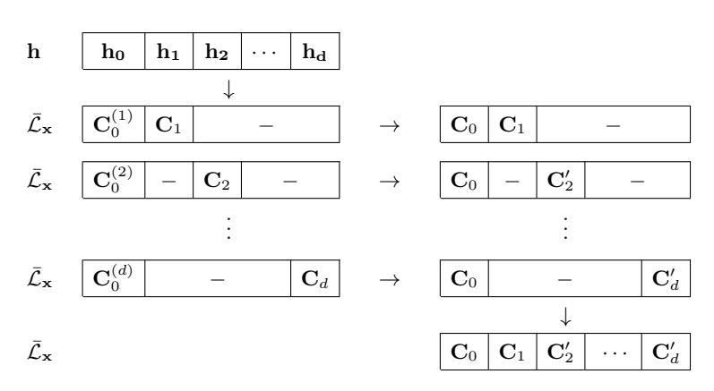
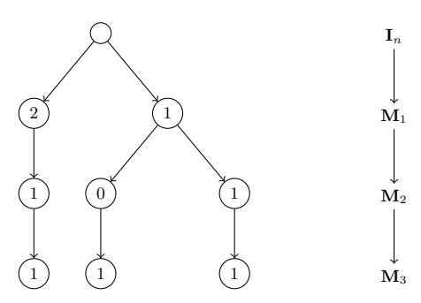
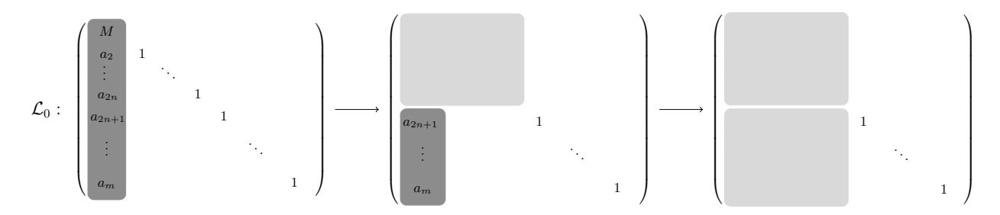
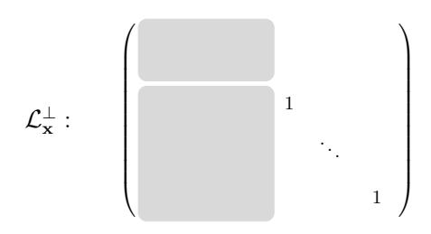

## A Polynomial-Time Algorithm for Solving the Hidden Subset Sum Problem

Jean-Sébastien Coron and Agnese Gini

University of Luxembourg jean-sebastien.coron@uni.lu, agnese.gini@uni.lu

**Abstract.** At Crypto '99, Nguyen and Stern described a lattice based algorithm for solving the hidden subset sum problem, a variant of the classical subset sum problem where the n weights are also hidden. While the Nguyen-Stern algorithm works quite well in practice for moderate values of n, we argue that its complexity is actually exponential in n; namely in the final step one must recover a very short basis of a n-dimensional lattice, which takes exponential-time in n, as one must apply BKZ reduction with increasingly large block-sizes.

In this paper, we describe a variant of the Nguyen-Stern algorithm that works in polynomial-time. The first step is the same orthogonal lattice attack with LLL as in the original algorithm. In the second step, instead of applying BKZ, we use a multivariate technique that recovers the short lattice vectors and finally the hidden secrets in polynomial time. Our algorithm works quite well in practice, as we can reach  $n \simeq 250$  in a few hours on a single PC.

### 1 Introduction

The hidden subset-sum problem. At Crypto '99, Nguyen and Stern described a lattice based algorithm for solving the hidden subset sum problem [NS99], with an application to the cryptanalysis of a fast generator of random pairs  $(x, g^x \pmod{p})$  from Boyko et al. from Eurocrypt '98 [BPV98]. The hidden subset sum problem is a variant of the classical subset sum problem where the n weights  $\alpha_i$  are also hidden.

**Definition 1 (Hidden Subset Sum Problem).** Let M be an integer, and let  $\alpha_1, \ldots, \alpha_n$  be random integers in  $\mathbb{Z}_M$ . Let  $\mathbf{x}_1, \ldots, \mathbf{x}_n \in \mathbb{Z}^m$  be random vectors with components in  $\{0,1\}$ . Let  $\mathbf{h} = (h_1, \ldots, h_m) \in \mathbb{Z}^m$  satisfying:

<span id="page-0-0"></span>
$$\mathbf{h} = \alpha_1 \mathbf{x}_1 + \alpha_2 \mathbf{x}_2 + \dots + \alpha_n \mathbf{x}_n \pmod{M} \tag{1}$$

Given M and h, recover the vector  $\mathbf{\alpha} = (\alpha_1, \dots, \alpha_n)$  and the vectors  $\mathbf{x}_i$ 's, up to a permutation of the  $\alpha_i$ 's and  $\mathbf{x}_i$ 's.

Recall that the classical subset sum problem with known weights  $\alpha_i$ 's can be solved in polynomial time by a lattice based algorithm [LO85], when the density  $d = n/\log M$  is  $\mathcal{O}(1/n)$ . Provided a shortest vector oracle, the classical subset sum problem can be solved when the density d is less than  $\simeq 0.94$ . The algorithm is based on finding a shortest vector in a lattice built from  $h, \alpha_1, \ldots, \alpha_n, M$ ; see [CJL<sup>+</sup>92]. For the hidden subset sum problem, the attack is clearly not applicable since the weights  $\alpha_i$ 's are hidden.

The Nguyen-Stern algorithm. For solving the hidden subset-sum problem, the Nguyen-Stern algorithm relies on the technique of the orthogonal lattice. This technique was introduced by Nguyen and Stern at Crypto '97 for breaking the Qu-Vanstone cryptosystem [NS97], and it has numerous applications in cryptanalysis, for example cryptanalysis of the Ajtai-Dwork cryptosystem [NS98b], cryptanalysis of the Béguin-Quisquater server-aided RSA protocol [NS98a], fault attacks against RSA-CRT signatures [CNT10, BNNT11], attacks against discrete-log based signature schemes [NSS04], and cryptanalysis of various homomorphic encryption schemes [vDGHV10, LT15, FLLT15] and multilinear maps [CLT13, CP19, CN19].

The orthogonal lattice attack against the hidden subset sum problem is based on the following technique [\[NS99\]](#page-21-0). If a vector u is orthogonal modulo M to the public vector of samples h, then from [\(1\)](#page-0-0) we must have:

$$\langle \mathbf{u}, \mathbf{h} \rangle \equiv \alpha_1 \langle \mathbf{u}, \mathbf{x_1} \rangle + \dots + \alpha_n \langle \mathbf{u}, \mathbf{x_n} \rangle \equiv 0 \pmod{M}$$

This implies that the vector p<sup>u</sup> = (hu, x1i, . . . ,hu, xni) is orthogonal to the hidden vector α = (α1, . . . , αn) modulo M. Now, if the vector u is short enough, the vector p<sup>u</sup> will be short (since the vectors x<sup>i</sup> have components in {0, 1} only), and if p<sup>u</sup> is shorter than the shortest vector orthogonal to α modulo M, we must have p<sup>u</sup> = 0, and therefore the vector u will be orthogonal in Z to all vectors x<sup>i</sup> . The orthogonal lattice attack consists in generating with LLL many short vectors u orthogonal to h; this reveals the lattice of vectors orthogonal to the x<sup>i</sup> 's, and eventually the lattice L<sup>x</sup> generated by the vectors x<sup>i</sup> 's. In a second step, by finding sufficiently short vectors in the lattice Lx, one can recover the original vectors x<sup>i</sup> 's, and eventually the hidden weight α by solving a linear system.

Complexity of the Nguyen-Stern algorithm. While the Nguyen-Stern algorithm works quite well in practice for moderate values of n, we argue that its complexity is actually exponential in the number of weights n. Namely in the first step we only recover a basis of the lattice L<sup>x</sup> generated by the binary vectors x<sup>i</sup> , but not necessarily the original vectors x<sup>i</sup> 's, because the basis vectors that we recover can be much larger than the x<sup>i</sup> 's. In order to recover the x<sup>i</sup> 's, in a second step one must therefore compute a very short basis of the n-dimensional lattice Lx, and in principle this takes exponential-time in n, as one must apply BKZ reduction [\[Sch87\]](#page-22-2) with increasingly large block-sizes. In their practical experiments, the authors of [\[NS99\]](#page-21-0) were able to solve the hidden subset sum problem up to n = 90; for the second step, they used a BKZ implementation from the NTL library [\[Sho\]](#page-22-3) with block-size β = 20. In our implementation of their algorithm, with more computing power and thanks to the BKZ 2.0 [\[CN11\]](#page-21-10) implementation from [\[fpl16\]](#page-21-11), we can reach n = 170 with block-size β = 30, but we face an exponential barrier beyond this value.

Our contributions. Our first contribution is to provide a more detailed analysis of both steps of the Nguyen-Stern algorithm. For the first step (orthogonal lattice attack with LLL), we first adapt the analysis of [\[NS99\]](#page-21-0) to provide a rigorous condition under which the hidden lattice L<sup>x</sup> can be recovered. In particular, we derive a rigorous lower bound for the bitsize of the modulus M; we show that the knapsack density d = n/ log M must be O(1/(n log n)), and heuristically O(1/n), as for the classical subset-sum problem.

We also provide a heuristic analysis of the second step of Nguyen-Stern. More precisely, we provide a simple model for the minimal BKZ block-size β that can recover the secret vectors x<sup>i</sup> , based on the gap between the shortest vectors and the other vectors of the lattice. While relatively simplistic, our model seems to accurately predict the minimal block-size β required for BKZ reduction in the second step. We show that under our model the BKZ block-size must grow almost linearly with the dimension n; therefore the complexity of the second step is exponential in n. We also provide a slightly simpler approach for recovering the hidden vectors x<sup>i</sup> from the shortest lattice vectors. Eventually we argue that the asymptotic complexity of the full Nguyen-Stern algorithm is 2 Ω(n/ log n) .

Our main contribution is then to describe a variant of the Nguyen-Stern algorithm for solving the hidden subset sum problem that works in polynomial-time. The first step is still the same orthogonal lattice attack with LLL. In the second step, instead of applying BKZ, we use a multivariate technique that recovers the short lattice vectors and finally the hidden secrets in polynomial time, using m ' n <sup>2</sup>/2 samples instead of m = 2n as in [\[NS99\]](#page-21-0). Our new second step can be of independent interest, as its shows how to recover binary vectors in a lattice of high-dimensional vectors. Asymptotically the heuristic complexity of our full algorithm is O(n 9 ). We show that our algorithm performs quite well in practice, as we can reach n ' 250 in a few hours on a single PC.

Cryptographic applications. As an application, the authors of [NS99] showed how to break the fast generator of random pairs  $(x, g^x \pmod{p})$  from Boyko, Peinado and Venkatesan from Eurocrypt '98. Such generator can be used to speed-up the generation of discrete-log based algorithms with fixed base g, such as Schnorr identification, and Schnorr, ElGamal and DSS signatures. We show that in practice our polynomial-time algorithm enables to break the Boyko  $et\ al.$  generator for values of n that are beyond reach for the original Nguyen-Stern attack; however, we need more samples from the generator, namely  $m \simeq n^2/2$  samples instead of m = 2n.

Source code. We provide in

the source code of the Nguyen-Stern attack and our new attack in SageMath [Sag19], using the  $L^2$  [NS09] implementation from [fpl16].

### 2 Background on lattices

**Lattices and bases.** In this section we recall the main definitions and properties of lattices used throughout this paper; we refer to Appendix A for more details. Let  $\mathbf{b}_1, \ldots, \mathbf{b}_d \in \mathbb{Z}^m$  be linearly independent vectors. The *lattice* generated by the basis  $\mathbf{b}_1, \ldots, \mathbf{b}_d$  is the set

$$\mathcal{L}(\mathbf{b}_1, \dots, \mathbf{b}_d) = \left\{ \sum_{i=1}^d a_i \mathbf{b}_i \mid a_1, \dots, a_d \in \mathbb{Z} \right\}.$$

We say that a matrix **B** is a *base matrix* for the lattice generated by its rows  $\mathbf{b}_1, \ldots, \mathbf{b}_d$ . Two basis  $\mathbf{B}, \mathbf{B}'$  generate the same lattice if and only if there exists an unimodular matrix  $\mathbf{U} \in \mathrm{GL}(\mathbb{Z}, d)$  such that  $\mathbf{UB} = \mathbf{B}'$ . Given any basis **B** we can consider its Gram-determinant  $d(\mathbf{B}) = \sqrt{\det(\mathbf{BB}^{\intercal})}$ ; this number is invariant under base change. The *determinant* of a lattice  $\mathcal{L}$  is the Gram-determinant of any of its basis **B**, namely  $\det(\mathcal{L}) = d(\mathbf{B})$ .

The dimension  $\dim(\mathcal{L})$ , or rank, of a lattice is the dimension as vector space of  $E_{\mathcal{L}} := \operatorname{Span}_{\mathbb{R}}(\mathcal{L})$ , namely the cardinality of its bases. We say that a lattice is full rank if it has maximal dimension. We say that  $\mathcal{M} \subseteq \mathcal{L}$  is a sublattice of a lattice  $\mathcal{L}$  if it is a lattice contained in  $\mathcal{L}$ , further we say that  $\mathcal{L}$  is a superlattice of  $\mathcal{M}$ . If  $\dim(\mathcal{M}) = \dim(\mathcal{L})$ , we say that  $\mathcal{M}$  is a full-rank sublattice of  $\mathcal{L}$ , and we must have  $\det(\mathcal{L}) \leq \det(\mathcal{M})$ .

**Orthogonal lattice.** Consider the Euclidean norm  $\|\cdot\|$  and the standard scalar product  $\langle\cdot,\cdot\rangle$  of  $\mathbb{R}^m$ . The *orthogonal lattice* of a lattice  $\mathcal{L}\subseteq\mathbb{Z}^m$  is

$$\mathcal{L}^{\perp} \coloneqq \{ \mathbf{v} \in \mathbb{Z}^m \mid \forall \mathbf{b} \in \mathcal{L}, \ \langle \mathbf{v}, \mathbf{b} \rangle = 0 \} = E_{\mathcal{L}}^{\perp} \cap \mathbb{Z}^m$$

We define the *completion* of a lattice  $\mathcal{L}$  as the lattice  $\bar{\mathcal{L}} = E_{\mathcal{L}} \cap \mathbb{Z}^m = (\mathcal{L}^{\perp})^{\perp}$ . Clearly,  $\mathcal{L}$  is a full rank sublattice of  $\bar{\mathcal{L}}$ . We say that a lattice is *complete* if it coincides with its completion, i.e.  $\bar{\mathcal{L}} = \mathcal{L}$ . One can prove that  $\dim \mathcal{L} + \dim \mathcal{L}^{\perp} = m$  and  $\det(\mathcal{L}^{\perp}) = \det(\bar{\mathcal{L}}) \leq \det(\mathcal{L})$ ; we recall the proofs in Appendix A. By Hadamard's inequality, we have  $\det(\mathcal{L}) \leq \prod_{i=1}^d \|\mathbf{b}_i\|$  for any basis  $\mathbf{b}_1, \ldots, \mathbf{b}_d$  of a lattice  $\mathcal{L}$ ; this implies that  $\det(\mathcal{L}^{\perp}) \leq \prod_{i=1}^d \|\mathbf{b}_i\|$  for any basis  $\mathbf{b}_1, \ldots, \mathbf{b}_d$  of  $\mathcal{L}$ .

**Lattice minima.** The first minimum  $\lambda_1(\mathcal{L})$  of a lattice  $\mathcal{L}$  is the minimum of the norm of its non-zero vectors. Lattice points whose norm is  $\lambda_1(\mathcal{L})$  are called shortest vectors. The Hermite constant  $\gamma_d$ , in dimension d, is the supremum of  $\lambda_1(\mathcal{L})^2/\det(\mathcal{L})^{\frac{2}{d}}$  over all the lattices of rank d. Using Minkowski convex body theorem, one can prove that for each  $d \in \mathbb{N}^+$ ,  $0 \le \gamma_d \le d/4 + 1$ .

More generally, for each  $1 \leq i \leq \dim \mathcal{L}$ , the *i-th minimum*  $\lambda_i(\mathcal{L})$  of a lattice  $\mathcal{L}$  is the minimum of the  $\max_j \{\|\mathbf{v}_j\|\}$  among all sets  $\{\mathbf{v}_j\}_{j\leq i}$  of *i* linearly independent lattice points. *Minkowski's Second Theorem* states that for each  $1 \leq i \leq d$ 

$$\left(\prod_{j=1}^{i} \lambda_i(\mathcal{L})\right)^{\frac{1}{i}} \leq \sqrt{\gamma_d} \det(\mathcal{L})^{\frac{1}{d}}.$$

**Lattice reduction.** We recall in Appendix A the definition of an LLL-reduced basis. LLL-reduced bases have many good properties. In particular the first vector  $\mathbf{b}_1$  of an LLL-reduced basis is not much longer than the shortest vector of the lattice.

<span id="page-3-1"></span>**Lemma 1** (LLL-reduced basis). Let  $\mathbf{b}_1, \ldots, \mathbf{b}_d$  an LLL-reduced basis of a lattice  $\mathcal{L}$ . Then  $\|\mathbf{b}_1\| \leq 2^{\frac{d-1}{2}} \lambda_1(\mathcal{L})$ , and  $\|\mathbf{b}_j\| \leq 2^{\frac{d-1}{2}} \lambda_i(\mathcal{L})$  for each  $1 \leq j \leq i \leq d$ .

The LLL algorithm [LLL82] outputs an LLL-reduced basis of a rank-d lattice in  $\mathbb{Z}^m$  in time  $\mathcal{O}(d^5m\log^3 B)$ , from a basis of vectors of norm less than B. This was further improved by Nguyen and Stehlé in [NS09] with a variant based on proven floating point arithmetic, called  $L^2$ , with complexity  $\mathcal{O}(d^4m(d+\log B)\log B)$  without fast arithmetic. In this paper, when we apply LLL, we always mean the  $L^2$  variant. We denote by log the logarithm in base 2.

**Heuristics.** For a "random lattice" we expect  $\lambda_1(\mathcal{L}) \approx \sqrt{d} \det(\mathcal{L})^{\frac{1}{d}}$  by the Gaussian Heuristic and all lattice minima to be approximately the same. Omitting the  $\sqrt{d}$  factor, for a lattice  $\mathcal{L}$  generated by a set of d "random" vectors in  $\mathbb{Z}^m$  for d < m, we expect the lattice  $\mathcal{L}$  to be of rank d, and the short vectors of  $\mathcal{L}^{\perp}$  to have norm approximately  $(\det \mathcal{L}^{\perp})^{1/(m-d)} \simeq (\det \mathcal{L})^{1/(m-d)} \simeq (\prod_{i=1}^{d} \|\mathbf{b}_i\|)^{1/(m-d)}$ .

### 3 The Nguyen-Stern Algorithm

In this section we recall the Nguyen-Stern algorithm for solving the hidden subset sum problem. We explain why the algorithm has complexity exponential in n and provide the result of practical experiments. Then in Section 4 we will describe our polynomial-time algorithm.

Recall that in the hidden subset sum problem, given a modulus M and  $\mathbf{h} = (h_1, \dots, h_m) \in \mathbb{Z}^m$  satisfying

<span id="page-3-0"></span>
$$\mathbf{h} = \alpha_1 \mathbf{x}_1 + \alpha_2 \mathbf{x}_2 + \dots + \alpha_n \mathbf{x}_n \pmod{M}$$
 (2)

we must recover the vector  $\boldsymbol{\alpha} = (\alpha_1, \dots, \alpha_n) \in \mathbb{Z}_M^n$  and the vectors  $\mathbf{x}_i \in \{0, 1\}^m$ . The Nguyen-Stern algorithm proceeds in 2 steps:

- 1. From the samples **h**, determine the lattice  $\bar{\mathcal{L}}_{\mathbf{x}}$ , where  $\mathcal{L}_{\mathbf{x}}$  is the lattice generated by the  $\mathbf{x}_i$ 's.
- 2. From  $\bar{\mathcal{L}}_{\mathbf{x}}$ , recover the hidden vectors  $\mathbf{x}_i$ 's. From  $\mathbf{h}$ , the  $\mathbf{x}_i$ 's and M, recover the weights  $\alpha_i$ .

### <span id="page-3-2"></span>3.1 First step: orthogonal lattice attack

The orthogonal lattice attack. The goal of the orthogonal lattice attack is to recover the hidden lattice  $\bar{\mathcal{L}}_{\mathbf{x}}$ , where  $\mathcal{L}_{\mathbf{x}} \subset \mathbb{Z}^m$  is the lattice generated by the n vectors  $\mathbf{x}_i$ . Let  $\mathcal{L}_0$  be the lattice of vectors orthogonal to  $\mathbf{h}$  modulo M:

$$\mathcal{L}_0 := \Lambda_M^{\perp}(\mathbf{h}) = \{ \mathbf{u} \in \mathbb{Z}^m \mid \langle \mathbf{u}, \mathbf{h} \rangle \equiv 0 \pmod{M} \}$$

Following [NS99], the main observation is that if  $\langle \mathbf{u}, \mathbf{h} \rangle \equiv 0 \pmod{M}$ , then from (2) we obtain:

$$\langle \mathbf{u}, \mathbf{h} \rangle \equiv \alpha_1 \langle \mathbf{u}, \mathbf{x}_1 \rangle + \dots + \alpha_n \langle \mathbf{u}, \mathbf{x}_n \rangle \equiv 0 \pmod{M}$$

and therefore the vector  $\mathbf{p}_{\mathbf{u}} = (\langle \mathbf{u}, \mathbf{x}_1 \rangle, \dots, \langle \mathbf{u}, \mathbf{x}_n \rangle)$  is orthogonal to the vector  $\boldsymbol{\alpha} = (\alpha_1, \dots, \alpha_n)$ modulo M. Now, if the vector  $\mathbf{u}$  is short enough, the vector  $\mathbf{p}_{\mathbf{u}}$  will be short (since the vectors  $\mathbf{x}_i$  have components in  $\{0,1\}$  only), and if  $\mathbf{p}_{\mathbf{u}}$  is shorter than the shortest vector orthogonal to  $\boldsymbol{\alpha}$ modulo M, then we must have  $\mathbf{p_u} = 0$  and therefore  $\mathbf{u} \in \mathcal{L}_{\mathbf{x}}^{\perp}$ .

Therefore, the orthogonal lattice attack consists in first computing an LLL-reduced basis of the lattice  $\mathcal{L}_0$ . The first m-n short vectors  $\mathbf{u}_1, \ldots, \mathbf{u}_{m-n}$  will give us a generating set of the lattice  $\mathcal{L}_{\mathbf{x}}^{\perp}$ . Then one can compute a basis of the lattice  $\bar{\mathcal{L}}_{\mathbf{x}} = (\mathcal{L}_{\mathbf{x}}^{\perp})^{\perp}$ . This gives the following algorithm, which is the first step of the Nguyen-Stern algorithm; we explain the main steps in more details below.

### <span id="page-4-1"></span>Algorithm 1 Orthogonal lattice attack [NS99]

Input: h, M, n, m.

Output: A basis of  $\bar{\mathcal{L}}_{\mathbf{x}}$ .

- 1: Compute an LLL-reduced basis  $\mathbf{u}_1, \ldots, \mathbf{u}_m$  of  $\mathcal{L}_0$ .
- 2: Extract a generating set of \(\mathbf{u}\_1, \ldots, \mathbf{u}\_{m-n}\) of \(\mathcal{L}^\perp}\_\mathbf{x}\).
  3: Compute a basis \((\mathbf{c}\_1, \ldots, \mathbf{c}\_n\)) of \(\mathcal{L}^\perp} = (\mathcal{L}^\perp}\_\mathbf{x})^\perp}\).
- 4: return  $(\mathbf{c}_1,\ldots,\mathbf{c}_n)$

Constructing a basis of  $\mathcal{L}_0$ . We first explain how to construct a basis of  $\mathcal{L}_0$ . If the modulus M is prime we can assume  $h_1 \neq 0$ , up to permutation of the coordinates; indeed the case  $\mathbf{h} = \mathbf{0}$  is trivial. More generally, we assume  $gcd(h_1, M) = 1$ . We write  $\mathbf{u} = [u_1, \mathbf{u}']$  where  $\mathbf{u}' \in \mathbb{Z}^{m-1}$ . Similarly we write  $\mathbf{h} = [h_1, \mathbf{h}']$  where  $\mathbf{h}' \in \mathbb{Z}^{m-1}$ . Since  $h_1$  is invertible modulo M, we get:

$$\mathbf{u} \in \mathcal{L}_0 \iff u_1 \cdot h_1 + \langle \mathbf{u}', \mathbf{h}' \rangle \equiv 0 \pmod{M}$$
$$\iff u_1 + \langle \mathbf{u}', \mathbf{h}' \rangle \cdot h_1^{-1} \equiv 0 \pmod{M}$$

Therefore, a basis of  $\mathcal{L}_0$  is given by the  $m \times m$  matrix of row vectors:

$$\mathcal{L}_0 = \begin{bmatrix} M \\ -\mathbf{h}' \cdot h_1^{-1}[M] & \mathbf{I}_{m-1} \end{bmatrix}$$

To compute a reduced basis  $\mathbf{u}_1, \dots, \mathbf{u}_m$  of the lattice  $\mathcal{L}_0$  we use the L<sup>2</sup> algorithm. The complexity is then  $\mathcal{O}(m^5(m+\log M)\log M)$  without fast arithmetic. We show in Section 3.2 below that for a sufficiently large modulus M, the first m-n vectors  $\mathbf{u}_1, \ldots, \mathbf{u}_{m-n}$  must form a generating set of  $\mathcal{L}_{\mathbf{x}}^{\perp}$ .

Computing a basis of  $\bar{\mathcal{L}}_{\mathbf{x}} = (\mathcal{L}_{\mathbf{x}}^{\perp})^{\perp}$ . From the vectors  $\mathbf{u}_1, \dots, \mathbf{u}_{m-n}$  forming a generating set of the lattice  $\mathcal{L}_{\mathbf{x}}^{\perp}$ , we can compute its orthogonal  $\bar{\mathcal{L}}_{\mathbf{x}} = (\mathcal{L}_{\mathbf{x}}^{\perp})^{\perp}$  using the LLL-based algorithm from [NS97]. Given a lattice  $\mathcal{L}$ , the algorithm from [NS97] produces an LLL-reduced basis of  $\mathcal{L}^{\perp}$  in polynomial time; we refer to Appendix B for a detailed description of the algorithm. Therefore we obtain an LLL-reduced basis of  $\bar{\mathcal{L}}_{\mathbf{x}}=(\mathcal{L}_{\mathbf{x}}^{\perp})^{\perp}$  in polynomial-time.

#### <span id="page-4-0"></span>Rigorous analysis of Step 1 3.2

We now provide a rigorous analysis of the orthogonal lattice attack above. More precisely, we show that for a large enough modulus M, the orthogonal lattice attack recovers a basis of  $\mathcal{L}_{\mathbf{x}}$  in polynomial time, for a significant fraction of the weight  $\alpha_i$ 's.

<span id="page-4-2"></span>**Theorem 1.** Let m > n. Assume that the lattice  $\mathcal{L}_{\mathbf{x}}$  has rank n. With probability at least 1/2 over the choice of  $\alpha$ , Algorithm 1 recovers a basis of  $\bar{\mathcal{L}}_{\mathbf{x}}$  in polynomial time, assuming that M is a prime integer of bitsize at least  $2mn \log m$ . For m = 2n, the density is  $d = n/\log M = \mathcal{O}(1/(n \log n))$ .

The proof is based on the following two lemmas. We denote by  $\Lambda_M^{\perp}(\boldsymbol{\alpha})$  the lattice of vectors orthogonal to  $\boldsymbol{\alpha}=(\alpha_1,\ldots,\alpha_n)$  modulo M.

<span id="page-5-1"></span>**Lemma 2.** Assume that the lattice  $\mathcal{L}_{\mathbf{x}}$  has rank n. Algorithm 1 computes a basis of the lattice  $\bar{\mathcal{L}}_{\mathbf{x}}$  in polynomial time under the condition m > n and

<span id="page-5-3"></span>
$$\sqrt{mn} \cdot 2^{\frac{m}{2}} \cdot \lambda_{m-n} \left( \mathcal{L}_{\mathbf{x}}^{\perp} \right) < \lambda_1 \left( \Lambda_M^{\perp}(\boldsymbol{\alpha}) \right). \tag{3}$$

*Proof.* As observed previously, for any  $\mathbf{u} \in \mathcal{L}_0$ , the vector

$$\mathbf{p}_{\mathbf{u}} = (\langle \mathbf{u}, \mathbf{x}_1 \rangle, \dots, \langle \mathbf{u}, \mathbf{x}_n \rangle)$$

is orthogonal to the vector  $\boldsymbol{\alpha}$  modulo M; therefore if  $\mathbf{p_u}$  is shorter than the shortest non-zero vector orthogonal to  $\boldsymbol{\alpha}$  modulo M, we must have  $\mathbf{p_u} = 0$ , and therefore  $\mathbf{u} \in \mathcal{L}_{\mathbf{x}}^{\perp}$ ; this happens under the condition  $\|\mathbf{p_u}\| < \lambda_1 \left( \Lambda_M^{\perp}(\boldsymbol{\alpha}) \right)$ . Since  $\|\mathbf{p_u}\| \leq \sqrt{mn} \|\mathbf{u}\|$ , given any  $\mathbf{u} \in \mathcal{L}_0$  we must have  $\mathbf{u} \in \mathcal{L}_{\mathbf{x}}^{\perp}$  under the condition:

<span id="page-5-0"></span>
$$\sqrt{mn} \|\mathbf{u}\| < \lambda_1 \left( \Lambda_M^{\perp}(\boldsymbol{\alpha}) \right).$$
 (4)

The lattice  $\mathcal{L}_0$  is full rank of dimension m since it contains  $M\mathbb{Z}^m$ . Now, consider  $\mathbf{u}_1, \ldots, \mathbf{u}_m$  an LLL-reduced basis of  $\mathcal{L}_0$ . From Lemma 1, for each  $j \leq m-n$  we have

<span id="page-5-6"></span>
$$\|\mathbf{u}_j\| \le 2^{\frac{m}{2}} \cdot \lambda_{m-n}(\mathcal{L}_0) \le 2^{\frac{m}{2}} \cdot \lambda_{m-n}\left(\mathcal{L}_{\mathbf{x}}^{\perp}\right)$$
 (5)

since  $\mathcal{L}_{\mathbf{x}}^{\perp}$  is a sublattice of  $\mathcal{L}_0$  of dimension m-n. Combining with (4), this implies that when

$$\sqrt{mn} \cdot 2^{\frac{m}{2}} \cdot \lambda_{m-n} \left( \mathcal{L}_{\mathbf{x}}^{\perp} \right) < \lambda_1 \left( \varLambda_M^{\perp}(\boldsymbol{\alpha}) \right)$$

the vectors  $\mathbf{u}_1, \dots, \mathbf{u}_{m-n}$  must belong to  $\mathcal{L}_{\mathbf{x}}^{\perp}$ . This means that  $\langle \mathbf{u}_1, \dots, \mathbf{u}_{m-n} \rangle$  is a full rank sublattice of  $\mathcal{L}_{\mathbf{x}}^{\perp}$ , and therefore  $\langle \mathbf{u}_1, \dots, \mathbf{u}_{m-n} \rangle^{\perp} = \bar{\mathcal{L}}_{\mathbf{x}}$ . Finally, Algorithm 1 is polynomial-time, because both the LLL reduction step of  $\mathcal{L}_0$  and the LLL-based orthogonal computation of  $\mathcal{L}_{\mathbf{x}}^{\perp}$  are polynomial-time.

The following Lemma is based on a counting argument; we provide the proof in Appendix C.

<span id="page-5-2"></span>**Lemma 3.** Let M be a prime. Then with probability at least 1/2 over the choice of  $\alpha$ , we have  $\lambda_1(\Lambda_M^{\perp}(\alpha)) \geq M^{1/n}/4$ .

Combining the two previous lemmas, we can prove Theorem 1.

Proof (of Theorem 1). In order to apply Lemma 2, we first derive an upper-bound on  $\lambda_{m-n}\left(\mathcal{L}_{\mathbf{x}}^{\perp}\right)$ . The lattice  $\mathcal{L}_{\mathbf{x}}^{\perp}$  has dimension m-n and by Minkowski's second theorem we have

<span id="page-5-4"></span>
$$\lambda_{m-n}\left(\mathcal{L}_{\mathbf{x}}^{\perp}\right) \leq \sqrt{\gamma_{m-n}}^{m-n} \det\left(\mathcal{L}_{\mathbf{x}}^{\perp}\right) \leq m^{m/2} \det\left(\mathcal{L}_{\mathbf{x}}^{\perp}\right).$$
 (6)

From det  $\mathcal{L}_{\mathbf{x}}^{\perp} = \det \bar{\mathcal{L}}_{\mathbf{x}} \leq \det \mathcal{L}_{\mathbf{x}}$  and Hadamard's inequality with  $\|\mathbf{x}_i\| \leq \sqrt{m}$ , we obtain:

<span id="page-5-5"></span>
$$\det \mathcal{L}_{\mathbf{x}}^{\perp} \le \det \mathcal{L}_{\mathbf{x}} \le \prod_{i=1}^{n} \|\mathbf{x}_{i}\| \le m^{n/2}$$
(7)

which gives the following upper-bound on  $\lambda_{m-n}\left(\mathcal{L}_{\mathbf{x}}^{\perp}\right)$ :

$$\lambda_{m-n}\left(\mathcal{L}_{\mathbf{x}}^{\perp}\right) \leq m^{m/2}m^{n/2} \leq m^{m}.$$

Thus, by Lemma 2, we can recover a basis of  $\bar{\mathcal{L}}_{\mathbf{x}}$  when

$$\sqrt{mn} \cdot 2^{\frac{m}{2}} \cdot m^m < \lambda_1 \left( \Lambda_M^{\perp}(\boldsymbol{\alpha}) \right).$$

From Lemma 3, with probability at least 1/2 over the choice of  $\alpha$  we can therefore recover the hidden lattice  $\bar{\mathcal{L}}_{\mathbf{x}}$  if:

$$\sqrt{mn} \cdot 2^{\frac{m}{2}} \cdot m^m < M^{1/n}/4.$$

For  $m > n \ge 4$ , it suffices to have  $\log M \ge 2mn \log m$ .

### <span id="page-6-1"></span>3.3 Heuristic analysis of Step 1

In the previous section, we have shown that the orthogonal lattice attack provably recovers the hidden lattice  $\bar{\mathcal{L}}_{\mathbf{x}}$  in polynomial time for a large enough modulus M, namely we can take  $\log M = \mathcal{O}(n^2 \log n)$  when m = 2n. Below we show that heuristically we can take  $\log M = \mathcal{O}(n^2)$ , which gives a knapsack density  $d = n/\log M = \mathcal{O}(1/n)$ . We also give the concrete bitsize of M used in our experiments, and provide a heuristic complexity analysis.

Heuristic size of the modulus M. In order to derive a heuristic size for the modulus M, we use an approximation of the terms in the condition (3) from Lemma 2.

We start with the term  $\lambda_{m-n}\left(\mathcal{L}_{\mathbf{x}}^{\perp}\right)$ . For a "random lattice" we expect the lattice minima to be balanced, and therefore  $\lambda_{m-n}\left(\mathcal{L}_{\mathbf{x}}^{\perp}\right)$  to be roughly equal to  $\lambda_{1}\left(\mathcal{L}_{\mathbf{x}}^{\perp}\right)$ . This means that instead of the rigorous inequality (6) from the proof of Theorem 1, we use the heuristic approximation:

$$\lambda_{m-n}\left(\mathcal{L}_{\mathbf{x}}^{\perp}\right) \simeq \sqrt{\gamma_{m-n}} \det(\mathcal{L}_{\mathbf{x}}^{\perp})^{\frac{1}{m-n}}.$$

Using (7), this gives:

<span id="page-6-0"></span>
$$\lambda_{m-n}\left(\mathcal{L}_{\mathbf{x}}^{\perp}\right) \lessapprox \sqrt{\gamma_{m-n}} m^{\frac{n}{2(m-n)}}.$$
 (8)

For the term  $\lambda_1\left(\Lambda_M^{\perp}(\boldsymbol{\alpha})\right)$ , using the Gaussian heuristic, we expect:

$$\lambda_1\left( \varLambda_M^\perp(\boldsymbol{\alpha}) \right) \simeq \sqrt{\gamma_n} M^{\frac{1}{n}}.$$

Finally the  $2^{m/2}$  factor in (3) corresponds to the LLL Hermite factor with  $\delta = 3/4$ ; in practice we will use  $\delta = 0.99$ , and we denote by  $2^{\iota m}$  the corresponding LLL Hermite factor. Hence from (3) we obtain the heuristic condition:

$$\sqrt{mn} \cdot 2^{\iota \cdot m} \cdot \sqrt{\gamma_{m-n}} \cdot m^{\frac{n}{2(m-n)}} < \sqrt{\gamma_n} M^{1/n}.$$

This gives the condition:

$$2^{\iota \cdot m} \sqrt{\gamma_{m-n} \cdot n} \cdot m^{\frac{m}{2(m-n)}} < \sqrt{\gamma_n} M^{1/n}$$

which gives:

$$\log M > \iota \cdot m \cdot n + \frac{n}{2} \log(n \cdot \gamma_{m-n}/\gamma_n) + \frac{mn}{2(m-n)} \log m. \tag{9}$$

If we consider m = n + k for some constant k, we can take  $\log M = \mathcal{O}(n^2 \log n)$ . If  $m > c \cdot n$  for some constant c > 1, we can take  $\log M = \mathcal{O}(m \cdot n)$ . In particular, for m = 2n we obtain the condition:

$$\log M > 2\iota \cdot n^2 + \frac{3n}{2}\log n + n \tag{10}$$

which gives  $\log M = \mathcal{O}(n^2)$  and a knapsack density  $d = n/\log M = \mathcal{O}(1/n)$ . In practice for our experiments we use m = 2n and  $\log M \simeq 2\iota n^2 + n\log n$  with  $\iota = 0.035$ . Finally, we note that smaller values of M could be achieved by using BKZ reduction of  $\mathcal{L}_0$  instead of LLL.

**Heuristic complexity.** Recall that for a rank-d lattice in  $\mathbb{Z}^m$ , the complexity of computing an LLL-reduced basis with the  $L^2$  algorithm is  $\mathcal{O}(d^4m(d+\log B)\log B)$  without fast integer arithmetic, for vectors of Euclidean norm less than B. At Step 1 we must apply LLL-reduction twice.

The first LLL is applied to the rank-m lattice  $\mathcal{L}_0 \in \mathbb{Z}^m$ . Therefore the complexity of the first LLL is  $\mathcal{O}(m^5(m + \log M) \log M)$ . If m = n + k for some constant k, the heuristic complexity is therefore  $\mathcal{O}(n^9 \log^2 n)$ . If  $m > c \cdot n$  for some constant c, the heuristic complexity is  $\mathcal{O}(m^7 \cdot n^2)$ .

The second LLL is applied to compute the orthogonal of  $\mathcal{L}(\mathbf{U})$  where  $\mathbf{U}$  is the matrix basis of the vectors  $\mathbf{u}_1, \dots, \mathbf{u}_{m-n} \in \mathbb{Z}^m$ . From (5) and (8), we can heuristically assume  $\|\mathbf{U}\| \leq 2^{m/2} \cdot \sqrt{m} \cdot m^{\frac{n}{2(m-n)}}$ .

For m = n + k for some constant k, this gives  $\log \|\mathbf{U}\| = \mathcal{O}(n \log n)$ , while for  $m > c \cdot n$  for some constant c > 1, we obtain  $\log \|\mathbf{U}\| = \mathcal{O}(m)$ . The heuristic complexity of computing the orthogonal of  $\mathbf{U}$  is  $\mathcal{O}(m^5(m + (m/n) \log \|\mathbf{U}\|)^2)$  (see Appendix B). For m = n + k, the complexity is therefore  $\mathcal{O}(n^7 \log^2 n)$ , while for  $m > c \cdot n$ , the complexity is  $\mathcal{O}(m^9/n^2)$ .

We summarize the complexities of the two LLL operations in Table 1; we see that the complexities are optimal for  $m = c \cdot n$  for some constant c > 1, so for simplicity we take m = 2n. In that case the heuristic complexity of the first step is  $\mathcal{O}(n^9)$ , and the density is  $d = n/\log M = \mathcal{O}(1/n)$ , as in the classical subset-sum problem.

| m       | $\log M$                  | LLL $\mathcal{L}_0$          | LLL $(\mathcal{L}_{\mathbf{x}}^{\perp})^{\perp}$ |
|---------|---------------------------|------------------------------|--------------------------------------------------|
| $\gg n$ | $\mathcal{O}(n \cdot m)$  | $\mathcal{O}(m^7 \cdot n^2)$ | $\mathcal{O}(m^9/n^2)$                           |
| $n^2$   | $\mathcal{O}(n^3)$        | $\mathcal{O}(n^{16})$        | $\mathcal{O}(n^{16})$                            |
| 2n      | $\mathcal{O}(n^2)$        | $\mathcal{O}(n^9)$           | $\mathcal{O}(n^7)$                               |
| n+1     | $\mathcal{O}(n^2 \log n)$ | $\mathcal{O}(n^9 \log^2 n)$  | $\mathcal{O}(n^7 \log^2 n)$                      |

<span id="page-7-0"></span>**Table 1.** Modulus size and time complexity of Algorithm 1 as a function of the parameter m.

### <span id="page-7-1"></span>3.4 Second step of the Nguyen-Stern Attack

From the first step we have obtained an LLL-reduced basis  $(\mathbf{c}_1, \dots, \mathbf{c}_n)$  of the completed lattice  $\bar{\mathcal{L}}_{\mathbf{x}} \subset \mathbb{Z}^m$ . However this does not necessarily reveal the vectors  $\mathbf{x}_i$ . Namely, because of the LLL approximation factor, the recovered basis vectors  $(\mathbf{c}_1, \dots, \mathbf{c}_n)$  can be much larger than the original vectors  $\mathbf{x}_i$ , which are among the shortest vectors in  $\mathcal{L}_{\mathbf{x}}$ . Therefore, to recover the original vectors  $\mathbf{x}_i$ , one must apply BKZ instead of LLL, in order to obtain a better approximation factor; eventually from  $\mathbf{h}$ , the  $\mathbf{x}_i$ 's and M, one can recover the weights  $\alpha_i$  by solving a linear system; this is the second step of the Nguyen-Stern algorithm.

The authors of [NS99] did not provide a time complexity analysis of their algorithm. In the following, we provide a heuristic analysis of the second step of the Nguyen-Stern algorithm, based on a model of the gap between the shortest vectors of  $\mathcal{L}_{\mathbf{x}}$  (the vectors  $\mathbf{x}_i$ ), and the "generic" short vectors of  $\mathcal{L}_{\mathbf{x}}$ . While relatively simplistic, our model seems to accurately predict the minimal block-size  $\beta$  required for BKZ reduction; we provide the result of practical experiments in the next section. Under this model the BKZ block-size  $\beta$  must increase almost linearly with n; the complexity of the attack is therefore exponential in n. In our analysis below, for simplicity we heuristically assume that the lattice  $\mathcal{L}_{\mathbf{x}}$  is complete, i.e.  $\bar{\mathcal{L}}_{\mathbf{x}} = \mathcal{L}_{\mathbf{x}}$ .

Short vectors in  $\mathcal{L}_{\mathbf{x}}$ . The average norm of the original binary vectors  $\mathbf{x}_i \in \mathbb{Z}^m$  is roughly  $\sqrt{m/2}$ . If we take the difference between some  $\mathbf{x}_i$  and  $\mathbf{x}_j$ , the components remain in  $\{-1,0,1\}$ , and the average norm is also roughly  $\sqrt{m/2}$ . Therefore, we can assume that the vectors  $\mathbf{x}_i$  and  $\mathbf{x}_i - \mathbf{x}_j$  for  $i \neq j$  are the shortest vectors of the lattice  $\mathcal{L}_{\mathbf{x}}$ .

We can construct "generic" short vectors in  $\mathcal{L}_{\mathbf{x}}$  by taking a linear combination with  $\{0,1\}$  coefficients of vectors of the form  $\mathbf{x}_i - \mathbf{x}_j$ . For  $\mathbf{x}_i - \mathbf{x}_j$ , the variance of each component is 1/2. If we take a linear combination of n/4 such differences (so that roughly half of the coefficients with respect to the vectors  $\mathbf{x}_i$  are 0), the variance for each component will be  $n/4 \cdot 1/2 = n/8$ , and for m components the norm of the resulting vector will be about  $\sqrt{nm/8}$ . Therefore heuristically the gap between these generic vectors and the shortest vectors is:

$$\frac{\sqrt{nm/8}}{\sqrt{m/2}} = \frac{\sqrt{n}}{2}.$$

Running time with BKZ. To recover the shortest vectors, the BKZ approximation factor  $2^{i \cdot n}$  should be less than the above gap, which gives the condition:

$$2^{\iota \cdot n} \le \frac{\sqrt{n}}{2} \tag{11}$$

which gives  $\iota \leq (\log(n/4))/(2n)$ . Achieving an Hermite factor of  $2^{\iota n}$  heuristically requires at least  $2^{\Omega(1/\iota)}$  time, by using BKZ reduction with block-size  $\beta = \omega(1/\iota)$  [HPS11]. Therefore the running time of the Nguyen-Stern algorithm is  $2^{\Omega(n/\log n)}$ , with BKZ block-size  $\beta = \omega(n/\log n)$  in the second step.

Recovering the vectors  $\mathbf{x}_i$ . It remains to show how to recover the vectors  $\mathbf{x}_i$ . Namely as explained above the binary vectors  $\mathbf{x}_i$  are not the only short vectors in  $\mathcal{L}_{\mathbf{x}}$ ; the vectors  $\mathbf{x}_i - \mathbf{x}_j$  are roughly equally short. The approach from [NS99] is as follows. Since the short vectors in  $\mathcal{L}_{\mathbf{x}}$  probably have components in  $\{-1,0,1\}$ , the authors suggest to transform the lattice  $\mathcal{L}_{\mathbf{x}}$  into a new one  $\mathcal{L}'_{\mathbf{x}} = 2\mathcal{L}_{\mathbf{x}} + \mathbf{e}\mathbb{Z}$ , where  $\mathbf{e} = (1,\ldots,1)$ . Namely in that case a vector  $\mathbf{v} \in \mathcal{L}_{\mathbf{x}}$  with components in  $\{-1,0,1\}$  will give a vector  $2\mathbf{v} \in \mathcal{L}'_{\mathbf{x}}$  with components in  $\{-2,0,2\}$ , whereas a vector  $\mathbf{x} \in \mathcal{L}_{\mathbf{x}}$  with components in  $\{0,1\}$  will give a vector  $2\mathbf{x} - \mathbf{e} \in \mathcal{L}'_{\mathbf{x}}$  with components in  $\{-1,1\}$ , hence shorter. This should enable to recover the secret vectors  $\mathbf{x}_i$  as the shortest vectors in  $\mathcal{L}'_{\mathbf{x}}$ 

Below we describe a slightly simpler approach in which we stay in the lattice  $\mathcal{L}_{\mathbf{x}}$ . First, we explain why for large enough values of m, we are unlikely to obtain vectors in  $\{0, \pm 1\}$  as combination of more that two  $\mathbf{x}_i$ 's. Namely if we take a linear combination of the form  $\mathbf{x}_i - \mathbf{x}_j + \mathbf{x}_k$ , each component will be in  $\{-1, 0, 1\}$  with probability 7/8; therefore for m components the probability will be  $(7/8)^m$ . There are at most  $n^3$  such triples to consider, so we want  $n^3 \cdot (7/8)^m < \varepsilon$ , which gives the condition  $m \ge 16 \log n - 6 \log \varepsilon$ . With m = 2n and  $\varepsilon = 2^{-4}$ , this condition is satisfied for  $n \ge 60$ ; for smaller values of n, one should take  $m = \max(2n, 16 \log n + 24)$ .

Hence, after BKZ reduction with a large enough block-size  $\beta$  as above, we expect that each of the basis vectors  $(\mathbf{c}_1, \dots, \mathbf{c}_n)$  is either equal to  $\pm \mathbf{x}_i$ , or equal to a combination of the form  $\mathbf{x}_i - \mathbf{x}_j$  for  $i \neq j$ . To find the binary vector we can first recover the vectors  $\mathbf{c}_i = \pm \mathbf{x}_j$  from the basis, and store them in a list L. Then, we look for new binary vectors of the form  $\mathbf{c}_j \pm \mathbf{v}$  for  $\mathbf{v} \in L$ , updating the list L, and we iterate until no more vectors  $\mathbf{v}$  have been added to the list L. In Appendix D, we describe in details this greedy algorithm, that recovers the original binary vectors  $\mathbf{x}_i$  relatively efficiently, as it performs only  $\mathcal{O}(n^3)$  tests.

Recovering the weights  $\alpha_i$ . Finally, from the samples **h**, the vectors  $\mathbf{x}_i$ 's and the modulus M, recovering the weights  $\alpha_i$  is straightforward as this amounts to solving a linear system:

$$\mathbf{h} = \alpha_1 \mathbf{x}_1 + \alpha_2 \mathbf{x}_2 + \dots + \alpha_n \mathbf{x}_n \pmod{M}$$

Letting  $\mathbf{X}'$  be the  $n \times n$  matrix with the first n components of the column vectors  $\mathbf{x}_i$  and letting  $\mathbf{h}'$  be the vector with the first n components of  $\mathbf{h}$ , we have  $\mathbf{h}' = \mathbf{X}' \cdot \boldsymbol{\alpha}$  where  $\boldsymbol{\alpha} = (\alpha_1, \dots, \alpha_n)$  (mod M). Assuming that  $\mathbf{X}'$  is invertible modulo M, we get  $\boldsymbol{\alpha} = \mathbf{X}'^{-1}\mathbf{h}'$  (mod M).

### 3.5 Practical experiments

Running times. We provide in Table 2 the result of practical experiments. The first step is the orthogonal lattice attack with two applications of LLL. For the second step, we receive as input from Step 1 an LLL-reduced basis of the lattice  $\mathcal{L}_{\mathbf{x}}$ . We see in Table 2 that for n=70 this is sufficient to recover the hidden vectors  $\mathbf{x}_i$ . Otherwise, we apply BKZ with block-size  $\beta=10,20,30,\ldots$  until we recover the vectors  $\mathbf{x}_i$ . We see that the two LLLs from Step 1 run in reasonable time up to n=250, while for Step 2 the running time of BKZ grows exponentially, so we could not run Step 2 for n>170. We provide the source code of our SageMath implementation in https://pastebin.com/ZFk1qjfP, based on the  $L^2$  [NS09] and BKZ 2.0 [CN11] implementations from [fpl16].

|     |     |          | Ste                                                                                | p 1    |             |        |                  |                  |
|-----|-----|----------|------------------------------------------------------------------------------------|--------|-------------|--------|------------------|------------------|
| n   | m   | $\log M$ | $\text{LLL } \mathcal{L}_0 \mid \text{LLL } \mathcal{L}_{\mathbf{x}}^{\perp} \mid$ |        | Hermite     | Redu   | Total            |                  |
| 70  | 140 | 772      | 3 s                                                                                | 1 s    | $1.021^{n}$ | LLL    | ε                | 6 s              |
| 90  | 180 | 1151     | 10 s                                                                               | 4 s    | $1.017^{n}$ | BKZ-10 | 1 s              | 18 s             |
| 110 | 220 | 1592     | 28 s                                                                               | 12 s   | $1.015^{n}$ | BKZ-10 | $3 \mathrm{\ s}$ | 50 s             |
| 130 | 260 | 2095     | 81 s                                                                               | 24 s   | $1.013^{n}$ | BKZ-20 | 10 s             | $127 \mathrm{s}$ |
| 150 | 300 | 2659     | $159 \mathrm{\ s}$                                                                 | 44 s   | $1.012^{n}$ | BKZ-30 | 4 min            | 8 min            |
| 170 | 340 | 3282     | 6 min                                                                              | 115 s  | $1.011^{n}$ | BKZ-30 | 438 min          | 447 min          |
| 190 | 380 | 3965     | 13 min                                                                             | 3 min  | $1.010^{n}$ | _      | _                | _                |
| 220 | 440 | 5099     | 63 min                                                                             | 29 min | $1.009^{n}$ | _      | _                | _                |
| 250 | 500 | 6366     | 119 min                                                                            | 56 min | $1.008^{n}$ | _      | _                | _                |

<span id="page-9-0"></span>Table 2. Running time of the [NS99] attack, under a 3,2 GHz Intel Core i5 processor.

**Hermite factors.** Recall that from our heuristic model from Section 3.4 the target Hermite factor for the second step of the Nguyen-Stern algorithm is  $\gamma = \sqrt{n}/2$ , which can be written  $\gamma = a^n$  with  $a = (n/4)^{1/(2n)}$ . We provide in Table 2 above the corresponding target Hermite factors as a function of n.

In order to predict the Hermite factor achievable by BKZ as a function of the block-size  $\beta$ , we have run some experiments on a different lattice, independent from our model of Section 3.4. For this we have considered the lattice  $\mathcal{L} \in \mathbb{Z}^n$  of row vectors:

$$\mathcal{L} = \begin{bmatrix} p & & \\ c_1 & 1 & & \\ c_2 & 1 & & \\ \vdots & & \ddots & \\ c_{n-1} & \cdots & 1 \end{bmatrix}$$

for some prime p, with random  $c_i$ 's modulo p. Since  $\det \mathcal{L} = p$ , by applying LLL or BKZ we expect to obtain vectors of norm  $2^{\iota n}(\det L)^{1/n} = 2^{\iota n} \cdot p^{1/n}$ , where  $2^{\iota n}$  is the Hermite factor. We summarize our results in Table 3 below. Values up to  $\beta = 40$  are from our experiments with the lattice  $\mathcal{L}$  above, while for  $\beta \geq 85$  the values are reproduced from [CN11], based on a simulation approach.

<span id="page-9-1"></span>

| Block-size $\beta$ | 2           | 10          | 20          | 30          | 40          | 85          | 106         | 133         |
|--------------------|-------------|-------------|-------------|-------------|-------------|-------------|-------------|-------------|
| Hermite factor     | $1.020^{n}$ | $1.015^{n}$ | $1.014^{n}$ | $1.013^{n}$ | $1.012^{n}$ | $1.010^{n}$ | $1.009^{n}$ | $1.008^{n}$ |

**Table 3.** Experimental and simulated Hermite factors for LLL ( $\beta = 2$ ) and for BKZ with block-size  $\beta$ .

In summary, the minimal BKZ block-sizes  $\beta$  required experimentally in Table 2 to apply Step 2 of Nguyen-Stern, seem coherent with the target Hermite factors from our model, and the experimental Hermite factors from Table 3. For example, for n=70, this explains why an LLL-reduced basis is sufficient, because the target Hermite factor is  $1.021^n$ , while LLL can achieve  $1.020^n$ . From Table 3, BKZ-10 can achieve  $1.015^n$ , so in Table 2 it was able to break the instances n=90 and n=110, but not n=130 which has target Hermite factor  $1.013^n$ . However we see that BKZ-20 and BKZ-30 worked better than expected; for example BKZ-30 could break the instance n=170 with target Hermite factor  $1.011^n$ , while in principle from Table 3 it can only achieve  $1.013^n$ . So it could be that our model from Section 3.4 underestimates the target Hermite factor. Nevertheless, we believe that our model and the above experiments confirm that the complexity of the Nguyen-Stern algorithm is indeed exponential in n.

### <span id="page-10-0"></span>4 Our polynomial-time algorithm for solving the hidden subset-sum problem

Recall that the Nguyen-Stern attack is divided in the two following steps.

- 1. From the samples **h**, determine the lattice  $\bar{\mathcal{L}}_{\mathbf{x}}$ , where  $\mathcal{L}_{\mathbf{x}}$  is the lattice generated by the  $\mathbf{x}_i$ 's.
- 2. From  $\bar{\mathcal{L}}_{\mathbf{x}}$ , recover the hidden vectors  $\mathbf{x}_i$ 's. From  $\mathbf{h}$ , the  $\mathbf{x}_i$ 's and M, recover the weights  $\alpha_i$ .

In the previous section we have argued that the complexity of the second step of the Nguyen-Stern attack is exponential in n. In this section we describe an alternative second step with polynomial-time complexity. However, our second step requires more samples than in [NS99], namely we need  $m \simeq n^2/2$  samples instead of m = 2n. This means that in the first step we must produce a basis of the rank-n lattice  $\bar{\mathcal{L}}_{\mathbf{x}} \subset \mathbb{Z}^m$ , with the much higher vector dimension  $m \simeq n^2/2$  instead of m = 2n.

For this, the naive method would be to apply directly Algorithm 1 from Section 3.1 to the vector  $\mathbf{h}$  of dimension  $m \simeq n^2/2$ . But for  $n \simeq 200$  one would need to apply LLL on a  $m \times m$  matrix with  $m \simeq n^2/2 \simeq 20\,000$ , which is not practical; moreover the bitsize of the modulus M would need to be much larger due to the Hermite factor of LLL in such large dimension (see Table 1). Therefore, we first explain how to modify Step 1 in order to efficiently generate a lattice basis of  $\bar{\mathcal{L}}_{\mathbf{x}} \subset \mathbb{Z}^m$  for large m. Our technique is as follows: instead of applying LLL on a square matrix of dimension  $n^2/2$ , we apply LLL in parallel on n/2 square matrices of dimension 2n, which is much faster. Eventually we show in Section 5 that a single application of LLL is sufficient.

## <span id="page-10-2"></span>4.1 First step: obtaining a basis of $\bar{\mathcal{L}}_{\mathrm{x}}$ for $m\gg n$

In this section, we show how to adapt the first step, namely the orthogonal lattice attack from [NS99] recalled in Section 3.1, to the case  $m \gg n$ . More precisely, we show how to generate a basis of n vectors of  $\bar{\mathcal{L}}_{\mathbf{x}} \subset \mathbb{Z}^m$  for  $m \simeq n^2/2$ , while applying LLL on matrices of dimension t = 2n only. As illustrated in Figure 1, this is relatively straightforward: we apply Algorithm 1 from Section 3.1 on 2n components of the vector  $\mathbf{h} \in \mathbb{Z}^m$  at a time, and each time we recover roughly the projection of a lattice basis of  $\bar{\mathcal{L}}_{\mathbf{x}}$  on those 2n components; eventually we recombine those projections to obtain a full lattice basis of  $\bar{\mathcal{L}}_{\mathbf{x}}$ .



<span id="page-10-1"></span>Fig. 1. Computation of a lattice basis of  $\bar{\mathcal{L}}_{\mathbf{x}}$ .

More precisely, writing  $\mathbf{h} = [\mathbf{h}_0, \dots, \mathbf{h}_d]$  where  $m = (d+1) \cdot n$  and  $\mathbf{h}_i \in \mathbb{Z}^n$ , we apply Algorithm 1 on each of the d sub-vectors of the form  $(\mathbf{h}_0, \mathbf{h}_i) \in \mathbb{Z}^{2n}$  for  $1 \leq i \leq d$ . For each  $1 \leq i \leq d$  this gives us  $\mathbf{C}_0^{(i)} \| \mathbf{C}_i \in \mathbb{Z}^{n \times 2n}$ , the completion of the projection of a lattice basis of  $\mathcal{L}_{\mathbf{x}}$ . To recover the m components of the basis, we simply need to ensure that the projected bases  $\mathbf{C}_0^{(i)} \| \mathbf{C}_i \in \mathbb{Z}^{n \times 2n}$  always start with the same matrix  $\mathbf{C}_0$  on the first n components; see Figure 1 for an illustration. This gives Algorithm 2 below. We denote Algorithm 1 from Section 3.1 by OrthoLat.

#### <span id="page-11-0"></span>**Algorithm 2** Orthogonal lattice attack with $m = d \cdot n$ samples

```
Input: \mathbf{h} \in \mathbb{Z}^m, M, n, m = d \cdot n.

Output: A base matrix of \bar{\mathcal{L}}_{\mathbf{x}}.

1: Write \mathbf{h} = [\mathbf{h}_0, \dots, \mathbf{h}_d] where \mathbf{h}_i \in \mathbb{Z}^n for all 0 \le i \le d.

2: for i \leftarrow 1 to d do

3: \mathbf{y}_i \leftarrow [\mathbf{h}_0, \mathbf{h}_i]

4: \mathbf{C}_0^{(i)} \| \mathbf{C}_i \leftarrow \text{OrthoLat}(\mathbf{y}_i, M, n, 2n)

5: \mathbf{Q}_i \leftarrow \mathbf{C}_0^{(i)} \cdot (\mathbf{C}_0^{(i)})^{-1}

6: \mathbf{C}_i' \leftarrow \mathbf{Q}_i \cdot \mathbf{C}_i

7: end for

8: return [\mathbf{C}_0, \mathbf{C}_1, \mathbf{C}_2', \dots, \mathbf{C}_d']
```

A minor difficulty is that in principle, when applying OrthoLat (Algorithm 1) to a subset  $\mathbf{y}_i \in \mathbb{Z}^{2n}$  of the sample  $\mathbf{h} \in \mathbb{Z}^m$ , we actually recover the completion of the projection of  $\mathcal{L}_{\mathbf{x}}$  over the corresponding coordinates, rather than the projection of the completion  $\bar{\mathcal{L}}_{\mathbf{x}}$  of  $\mathcal{L}_{\mathbf{x}}$ . More precisely, denote by  $\pi$  a generic projection on some coordinates of a lattice  $\mathcal{L}_{\mathbf{x}}$ . It is always true that  $\pi(\mathcal{L}_{\mathbf{x}}) \subseteq \pi(\bar{\mathcal{L}}_{\mathbf{x}}) \subseteq \overline{\pi(\mathcal{L}_{\mathbf{x}})}$ . Thus applying Algorithm 1 with a certain projection  $\pi$  we recover the completion  $\overline{\pi(\mathcal{L}_{\mathbf{x}})}$ . Assuming that the projection  $\pi(\mathcal{L}_{\mathbf{x}})$  is complete, we obtain  $\pi(\mathcal{L}_{\mathbf{x}}) = \overline{\pi(\mathcal{L}_{\mathbf{x}})} = \pi(\bar{\mathcal{L}}_{\mathbf{x}})$ . Therefore, to simplify the analysis of Algorithm 2, we assume that the projection over the first n coordinates has rank n, and that the projection over the first n coordinates is complete. This implies that the transition matrices  $\mathbf{Q}_i \leftarrow \mathbf{C}_0^{(1)} \cdot (\mathbf{C}_0^{(i)})^{-1}$  for  $1 \leq i \leq d$  must be integral; in our practical experiments this was always the case.

**Theorem 2.** Let  $m = d \cdot n$  for  $d \in \mathbb{N}$  and d > 1. Assume that the projection of the lattice  $\mathcal{L}_{\mathbf{x}} \in \mathbb{Z}^m$  over the first n components has rank n, and that the projection of  $\mathcal{L}_{\mathbf{x}}$  over the first 2n coordinates is complete. With probability at least 1/2 over the choice of  $\alpha$ , Algorithm 2 recovers a basis of  $\bar{\mathcal{L}}_{\mathbf{x}}$  in polynomial time, assuming that M is a prime of bitsize at least  $4n^2(\log n + 1)$ .

Proof. From Theorem 1, we recover for each  $1 \leq i \leq d$  a basis  $\mathbf{C}_0^{(i)} \| \mathbf{C}_i$  corresponding to the completed projection of  $\mathcal{L}_{\mathbf{x}}$  to the first n coordinates and the i+1-th subset of n coordinates, with probability at least 1/2 over the choice of  $\boldsymbol{\alpha}$ . Let us denote by  $\mathbf{X}$  the base matrix whose rows are the vectors  $\mathbf{x}_i$ 's. By assumption the vectors  $\mathbf{x}_i$  are linear independent, the first  $n \times n$  minor  $\mathbf{X}_0$  is invertible and the matrices  $\mathbf{C}_0^{(i)}$  for  $i=1,\ldots,d$  must generate a superlattice of  $\mathbf{X}_0$ . In particular, there exists an invertible integral matrix  $\mathbf{Q}_i$  such that  $\mathbf{Q}_i \cdot \mathbf{C}_0^{(i)} = \mathbf{C}_0^{(1)}$  for each  $i=1,\ldots,d$ . So, applying  $\mathbf{Q}_i = \mathbf{C}_0^{(1)}(\mathbf{C}_0^{(i)})^{-1}$  to  $\mathbf{C}_i$  we find  $\mathbf{C}_i'$ , which contains the i+1-th subset of n coordinates of the vectors in a basis having  $\mathbf{C}_0 \coloneqq \mathbf{C}_0^{(1)}$  as projection on the first n coordinates. This implies that  $[\mathbf{C}_0, \mathbf{C}_1, \mathbf{C}_2', \cdots \mathbf{C}_d']$  is a basis of  $\bar{\mathcal{L}}_{\mathbf{x}}$ .

**Heuristic analysis.** For the size of the modulus M, since we are working with lattices in  $\mathbb{Z}^{2n}$ , we can take the same modulus size as in the heuristic analysis of Step 1 from Section 3.3, namely

$$\log M \simeq 2\iota n^2 + n\log n$$

with  $\iota = 0.035$ . The time complexity of Algorithm 2 is dominated by the cost of applying OrthoLat (Algorithm 1) to each  $\mathbf{y}_i$ , which is heuristically  $\mathcal{O}(n^9)$  from Section 3.3. Therefore, the heuristic complexity of Algorithm 2 is  $d \cdot \mathcal{O}(n^9) = \mathcal{O}(m \cdot n^8)$ . In particular, for  $m \simeq n^2/2$ , the heuristic complexity of Algorithm 2 is  $\mathcal{O}(n^{10})$ , instead of  $\mathcal{O}(n^{16})$  with the naive method (see Table 1). In Section 5 we will describe an improved algorithm with complexity  $\mathcal{O}(n^9)$ .

### <span id="page-12-3"></span>4.2 Second Step: recovering the hidden vectors $x_i$ 's

By the first step we recover a basis  $\mathbf{C} = (\mathbf{c}_1, \dots, \mathbf{c}_n)$  of the hidden lattice  $\bar{\mathcal{L}}_{\mathbf{x}} \in \mathbb{Z}^m$ . The goal of the second step is then to recover the original vectors  $\mathbf{x}_1, \dots, \mathbf{x}_n \in \bar{\mathcal{L}}_{\mathbf{x}}$ , namely to solve the following problem:

<span id="page-12-2"></span>**Problem 1.** Let  $\mathbf{X} \leftarrow \{0,1\}^{n \times m}$ . Given  $\mathbf{C} \in \mathbb{Z}^{n \times m}$  such that  $\mathbf{WC} = \mathbf{X}$  for some  $\mathbf{W} \in \mathbb{Z}^{n \times n} \cap \mathrm{GL}(\mathbb{Q}, n)$ , recover  $\mathbf{W}$  and  $\mathbf{X}$ .

We show that for  $m \simeq n^2/2$  the above problem can be solved in heuristic polynomial time, using a multivariate approach. Namely we reduce the problem to solving a system of multivariate quadratic equations and we provide an appropriate algorithm to solve it.

Heuristically we expect the solution to be unique up to permutations of the rows when  $m \gg n$ . Indeed for large enough m we expect the vectors  $\mathbf{x}_i$  to be the unique vectors in  $\bar{\mathcal{L}}_{\mathbf{x}}$  with binary coefficients. More precisely, consider a vector  $\mathbf{v} = \mathbf{x}_i + \mathbf{x}_j$  or  $\mathbf{v} = \mathbf{x}_i - \mathbf{x}_j$  for  $i \neq j$ . The probability that all components of  $\mathbf{v}$  are in  $\{0,1\}$  is  $(3/4)^m$ , so for  $n^2/2$  possible choices of i,j the probability is at most  $n^2 \cdot (3/4)^m$ , which for  $m \simeq n^2/2$  is a negligible function of n. Therefore we can consider the equivalent problem:

**Problem 2.** Given  $\mathbf{C} \in \mathbb{Z}^{n \times m}$  of rank n, suppose there exist exactly n vectors  $\mathbf{w}_i \in \mathbb{Z}^n$  such that  $\mathbf{w}_i \cdot \mathbf{C} = \mathbf{x}_i \in \{0,1\}^m$  for  $i = 1, \ldots, n$ , and assume that the vectors  $\mathbf{w}_i$  are linearly independent. Find  $\mathbf{w}_1, \ldots, \mathbf{w}_n$ .

We denote by  $\tilde{\mathbf{c}}_1, \dots, \tilde{\mathbf{c}}_m$  the column vectors of  $\mathbf{C}$ , which gives:

<span id="page-12-1"></span>
$$\left[\begin{array}{c} \mathbf{w}_1 \ \vdots \ \mathbf{w}_n \end{array}\right] \left[\begin{array}{ccc} \tilde{\mathbf{c}}_1 & \cdots & \tilde{\mathbf{c}}_m \end{array}\right] = \left[\begin{array}{ccc} & \mathbf{x}_1 \ \vdots \ \mathbf{x}_n \end{array}\right]$$

**Multivariate approach.** The crucial observation is that since all components of the vectors  $\mathbf{x}_i$  are binary, they must all satisfy the quadratic equation  $y^2 - y = 0$ . Therefore for each  $i = 1, \ldots, n$  we have:

$$\mathbf{w}_{i} \cdot \mathbf{C} \in \{0, 1\}^{m} \iff \forall j \in [1, m], \ (\mathbf{w}_{i} \cdot \tilde{\mathbf{c}}_{j})^{2} - \mathbf{w}_{i} \cdot \tilde{\mathbf{c}}_{j} = 0$$

$$\iff \forall j \in [1, m], \ (\mathbf{w}_{i} \cdot \tilde{\mathbf{c}}_{j})(\mathbf{w}_{i} \cdot \tilde{\mathbf{c}}_{j})^{\mathsf{T}} - \mathbf{w}_{i} \cdot \tilde{\mathbf{c}}_{j} = 0$$

$$\iff \forall j \in [1, m], \ \mathbf{w}_{i} \cdot (\tilde{\mathbf{c}}_{j} \cdot \tilde{\mathbf{c}}_{j}^{\mathsf{T}}) \cdot \mathbf{w}_{i}^{\mathsf{T}} - \mathbf{w}_{i} \cdot \tilde{\mathbf{c}}_{j} = 0$$

Given the known column vectors  $\tilde{\mathbf{c}}_1, \dots, \tilde{\mathbf{c}}_m$ , the vectors  $\mathbf{w}_1, \dots, \mathbf{w}_n$  and  $\mathbf{0}$  are therefore solutions of the quadratic polynomial multivariate system

<span id="page-12-0"></span>
$$\begin{cases} \mathbf{w} \cdot \tilde{\mathbf{c}}_{1} \tilde{\mathbf{c}}_{1}^{\mathsf{T}} \cdot \mathbf{w}^{\mathsf{T}} - \mathbf{w} \cdot \tilde{\mathbf{c}}_{1} = 0 \\ \vdots \\ \mathbf{w} \cdot \tilde{\mathbf{c}}_{m} \tilde{\mathbf{c}}_{m}^{\mathsf{T}} \cdot \mathbf{w}^{\mathsf{T}} - \mathbf{w} \cdot \tilde{\mathbf{c}}_{m} = 0 \end{cases}$$

$$(12)$$

In the following we provide a heuristic polynomial-time algorithm to solve this quadratic multivariate system, via linearization and computation of eigenspaces. More precisely, as in the XL algorithm [CKPS00] we first linearize (12); then we prove that the  $\mathbf{w}_i$ 's are eigenvectors of some submatrices of the kernel matrix, and we provide a method to recover them in polynomial time. We observe that such approach is deeply related to Gröbner basis techniques for zero dimensional ideals. Namely, the system (12) of polynomial equations defines an ideal J. If the homogeneous degree 2 parts of such polynomials generate the space of monomials of degree 2, a Gröbner basis of J can be obtained via linear transformations, and the  $\mathbf{x}_i$ 's recovered in polynomial time. We refer to [CLO05] for the Gröbner basis perspective. For this approach the minimal condition is clearly  $m = (n^2 + n)/2$ .

**Linearization.** Since  $(\tilde{\mathbf{c}}_i)_i = \mathbf{C}_{ij}$ , for all  $1 \leq j \leq m$ , we can write:

$$\mathbf{y} \cdot \tilde{\mathbf{c}}_j \tilde{\mathbf{c}}_j^{\mathsf{T}} \cdot \mathbf{y}^{\mathsf{T}} = \sum_{i=1}^n \sum_{k=1}^n y_i y_k \mathbf{C}_{ij} \mathbf{C}_{kj} = \sum_{i=1}^n \sum_{k=i}^n y_i y_k (2 - \delta_{i,k}) \mathbf{C}_{ij} \mathbf{C}_{kj}$$

with  $\delta_{i,k} = 1$  if i = k and 0 otherwise. In the above equation the coefficient of the degree 2 monomial  $y_i y_k$  for  $1 \le i \le k \le n$  is  $(2 - \delta_{i,k}) \mathbf{C}_{ij} \mathbf{C}_{kj}$ . Thus, we consider the corresponding vectors of coefficients for  $1 \le j \le m$ :

<span id="page-13-1"></span>
$$\mathbf{r}_j = ((2 - \delta_{i,k}) \mathbf{C}_{ij} \mathbf{C}_{kj})_{1 \le i \le k \le n} \in \mathbb{Z}^{\frac{n^2 + n}{2}}.$$
(13)

We set  $\mathbf{R} \in \mathbb{Z}^{\frac{n^2+n}{2} \times m}$  to be the matrix whose columns are the  $\mathbf{r}_j$ 's and

$$\mathbf{E} = \begin{bmatrix} \mathbf{R} \\ -\mathbf{C} \end{bmatrix} \in \mathbb{Z}^{\frac{n^2+3n}{2} \times m};$$

we obtain that (12) is equivalent to

<span id="page-13-0"></span>
$$\begin{cases} [\mathbf{z} \mid \mathbf{y}] \cdot \mathbf{E} = 0 \\ \mathbf{z} = (y_i y_k)_{1 \le i \le k \le n} \in \mathbb{Z}^{\frac{n^2 + n}{2}} \end{cases}$$
 (14)

For  $m > (n^2 + n)/2$  we expect the matrix **R** to be of rank  $(n^2 + n)/2$ . In that case we must have rank  $\mathbf{E} \ge (n^2 + n)/2$ , and so dim ker  $\mathbf{E} \le n$ . On the other hand, consider the set of vectors

$$\mathcal{W} = \{((w_i w_k)_{1 \le i \le k \le n}, \mathbf{w}) \in \mathbb{Z}^{\frac{n^2 + 3n}{2}} \mid \mathbf{w} \in \{\mathbf{w}_1, \dots, \mathbf{w}_n\}\}.$$

Since by assumption the vectors  $\mathbf{w}_i$ 's are linearly independent,  $\mathrm{Span}(\mathcal{W})$  is a subspace of dimension n of ker  $\mathbf{E}$ . This implies that dim ker  $\mathbf{E} = n$ , and that a basis of ker  $\mathbf{E}$  is given by the set  $\mathcal{W}$ . In the following, we show how to recover  $\mathcal{W}$ , from which we recover the matrix  $\mathbf{W}$  and eventually the n vectors  $\mathbf{x}_i$ .

**Kernel computation.** Since the set of n vectors in  $\mathcal{W}$  form a basis of ker  $\mathbf{E}$ , the first step is to compute a basis of ker  $\mathbf{E}$  over  $\mathbb{Q}$  from the known matrix  $\mathbf{E} \in \mathbb{Z}^{\frac{n^2+3n}{2}\times m}$ . However this does not immediately reveal  $\mathcal{W}$  since the n vectors of  $\mathcal{W}$  form a privileged basis of ker  $\mathbf{E}$ ; namely the vectors in  $\mathcal{W}$  have the following structure:

$$((w_i w_k)_{1 \le i \le k \le n}, w_1, \dots w_n) \in \mathbb{Z}^{\frac{n^2 + 3n}{2}}$$

To recover the vectors in  $\mathcal{W}$  we proceed as follows. Note that the last n components in the vectors in  $\mathcal{W}$  correspond to the linear part in the quadratic equations of (12). Therefore we consider the base matrix  $\mathbf{K} \in \mathbb{Q}^{n \times \frac{n^2 + 3n}{2}}$  of ker  $\mathbf{E}$  such that the matrix corresponding to the linear part is the identity matrix:

$$\mathbf{K} = \left[ \mathbf{M} \mid \mathbf{I}_n \right] \tag{15}$$

where  $\mathbf{M} \in \mathbb{Q}^{n \times \frac{n^2 + n}{2}}$ . A vector  $\mathbf{v} = (v_1, \dots, v_n) \in \mathbb{Z}^n$  is then a solution of (14) if and only if  $\mathbf{v} \cdot \mathbf{K} \in \mathcal{W}$ , which gives:

$$\mathbf{v} \cdot \mathbf{M} = (v_i v_k)_{1 \le i \le k \le n}.$$

By duplicating some columns of the matrix  $\mathbf{M}$ , we can obtain a matrix  $\mathbf{M}' \in \mathbb{Z}^{n^2 \times n}$  such that:

$$\mathbf{v} \cdot \mathbf{M}' = (v_i v_k)_{1 \le i \le n, 1 \le k \le n}.$$

We write  $\mathbf{M}' = [\mathbf{M}_1, \dots, \mathbf{M}_n]$  where  $\mathbf{M}_i \in \mathbb{Z}^{n \times n}$ . This gives:

$$\mathbf{v} \cdot \mathbf{M}_i = v_i \cdot \mathbf{v}$$

for all  $1 \le i \le n$ .

This means that the eigenvalues of each  $\mathbf{M}_i$  are exactly all the possible *i*-th coordinates of the target vectors  $\mathbf{w}_1, \dots, \mathbf{w}_n$ . Therefore the vectors  $\mathbf{w}_j$ 's are the intersections of the left eigenspaces corresponding to their coordinates.

**Eigenspace computation.** Consider for example the first coordinates  $w_{j,1}$  of the vectors  $\mathbf{w}_j$ . From the previous equation, we have:

$$\mathbf{w}_j \cdot \mathbf{M}_1 = w_{j,1} \cdot \mathbf{w}_j.$$

Therefore the vectors  $\mathbf{w}_j$  are the eigenvectors of the matrix  $\mathbf{M}_1$ , and their first coordinates  $w_{j,1}$  are the eigenvalues. Assume that those n eigenvalues are distinct; in that case we can immediately compute the n corresponding eigenvectors  $\mathbf{w}_j$  and solve the problem. More generally, we can recover the vectors  $\mathbf{w}_j$  that belong to a dimension 1 eigenspace of  $\mathbf{M}_1$ ; namely in that case  $\mathbf{w}_j$  is the unique vector of its eigenspace such that  $\mathbf{w}_j \cdot \mathbf{C} \in \{0,1\}^m$ , and we recover the corresponding  $\mathbf{x}_j = \mathbf{w}_j \cdot \mathbf{C}$ .

Our approach is therefore as follows. We first compute the eigenspaces  $E_1, \ldots, E_s$  of  $\mathbf{M}_1$ . For every  $1 \leq k \leq s$ , if dim  $E_k = 1$  then we can compute the corresponding target vector, as explained above. Otherwise, we compute  $\mathbf{M}_{2,k}$  the restriction map of  $\mathbf{M}_2$  at  $E_k$  and we check the dimensions of its eigenspaces. As we find eigenspaces of dimension 1 we compute more target vectors, otherwise we compute the restrictions of  $\mathbf{M}_3$  at the new eigenspaces and so on. We iterate this process until we find all the solutions; see Algorithm 3 below.

### <span id="page-14-0"></span>Algorithm 3 Multivariate attack

```
Input: \mathbf{C} \in \mathbb{Z}^{n \times m} a basis of \bar{\mathcal{L}}_{\mathbf{x}}.
Output: \mathbf{x}_1, \dots, \mathbf{x}_n \in \{0, 1\}^m, such that \mathbf{w}_i \cdot \mathbf{C} = \mathbf{x}_i for i = 1, \dots, n.
 1: Let \mathbf{r}_{j} = ((2 - \delta_{i,k}) \mathbf{C}_{ij} \mathbf{C}_{kj})_{1 \leq i \leq k \leq n} \in \mathbb{Z}^{\frac{n^{2} + n}{2}} for 1 \leq j \leq m.

2: \mathbf{E} = \begin{bmatrix} \mathbf{r}_{1} \cdots \mathbf{r}_{m} \\ -\mathbf{C} \end{bmatrix} \in \mathbb{Z}^{\frac{n^{2} + 3n}{2} \times m}
 3: \mathbf{K} \leftarrow \text{Ker } \mathbf{E} \text{ with } \mathbf{K} = \left[ \mathbf{M} \mid \mathbf{I}_n \right] \in \mathbb{Q}^{n \times \frac{n^2 + 3n}{2}}
  4: Write \mathbf{M} = [\tilde{\mathbf{m}}_{ik}]_{1 \leq i \leq k \leq n} where \tilde{\mathbf{m}}_{ik} \in \mathbb{Q}^n.
  5: Let \mathbf{M}_i \in \mathbb{Q}^{n \times n} with \mathbf{M}_i = [\tilde{\mathbf{m}}_{ik}]_{1 \le k \le n}, using \tilde{\mathbf{m}}_{ik} := \tilde{\mathbf{m}}_{ki} for i > k.
  6: L \leftarrow [\mathbf{I}_n]
  7: for i \leftarrow 1 to n do
                L_2 \leftarrow \lceil
  8:
                for all V \in L do
  9:
10:
                       if rank V = 1 then
                               Append a generator \mathbf{v} of \mathbf{V} to L_2.
11:
12.
                       else
13:
                               Compute A such that \mathbf{V} \cdot \mathbf{M}_i = \mathbf{A} \cdot \mathbf{V}.
                               Append all eigenspaces U of A to L_2.
14.
15.
                       end if
16:
                end for
                L \leftarrow L_2
17:
18: end for
19: X \leftarrow [
20: for all \mathbf{v} \in L do
                Find c \neq 0 such that \mathbf{x} = c \cdot \mathbf{v} \cdot \mathbf{C} \in \{0, 1\}^m, and append \mathbf{x} to X.
22: end for
23: return X
```

In order to better analyze this procedure, we observe that we essentially construct a tree of subspaces of  $\mathbb{Q}^n$ , performing a breadth-first search algorithm. The root corresponds to the entire

space, and each node at depth i is a son of a node E at depth i-1 if and only if it represents a non-trivial intersection of E with one of the eigenspaces of  $\mathbf{M}_i$ . Since these non-trivial intersections are exactly the eigenspaces of the restriction of  $\mathbf{M}_i$  to E, our algorithm does not compute unnecessary intersections. Moreover, we know that when the dimension of the node is 1 all its successors represent the same space; hence that branch of the algorithm can be closed; see Fig. 2 for an illustration.



<span id="page-15-1"></span>Fig. 2. Example of the tree we obtain for  $\mathbf{w_1} = (2, 1, 1), \mathbf{w_2} = (1, 0, 1), \mathbf{w_3} = (1, 1, 1)$ . The matrix  $\mathbf{M_1}$  has an eigenspace of dimension 1  $E_{1,2}$  and one of dimension 2  $E_{1,1}$ . At the first iteration we obtain therefore  $\mathbf{w_1}$ . Then we compute the restriction of  $\mathbf{M_2}$  to  $E_{1,1}$ ; this has two distinct eigenvalues 0 and 1, which enables to recover the eigenvectors  $\mathbf{w_2}$  and  $\mathbf{w_3}$ . All the nodes at depth 2 represent dimension one spaces, hence the algorithm terminates.

Analysis and reduction modulo p. Our algorithm is heuristic as we must assume that the matrix  $\mathbf{R} \in \mathbb{Z}^{\frac{n^2+n}{2}\times m}$  has rank  $(n^2+n)/2$ . In our experiments we took  $m=(n^2+4n)/2$  and this hypothesis was always satisfied. The running time of the algorithm is dominated by the cost of computing the kernel of a matrix  $\mathbf{E}$  of dimension  $\frac{n^2+3n}{2}\times m$ . For  $m=(n^2+4n)/2$ , this requires  $\mathcal{O}(n^6)$  arithmetic operations. Thus we have shown:

**Lemma 4.** Let  $\mathbf{C} \in \mathbb{Z}^{n \times m}$  be an instance of Problem 2 and  $\mathbf{R} \in \mathbb{Z}^{\frac{n^2+n}{2} \times m}$  the matrix whose columns are the  $\mathbf{r}_i$  constructed as in (13). If  $\mathbf{R}$  has rank  $\frac{n^2+n}{2}$ , then the vectors  $\mathbf{x}_i$  can be recovered in  $\mathcal{O}(n^6)$  arithmetic operations.

In practice it is more efficient to work modulo a prime p instead of over  $\mathbb{Q}$ . Namely Problem 1 is defined over the integers, so we can consider its reduction modulo a prime p:

$$\overline{\mathbf{W}}\mathbf{C} = \overline{\mathbf{X}} \pmod{p}$$

and since  $\overline{\mathbf{X}}$  has coefficients in  $\{0,1\}$  we obtain a system which is exactly the reduction of (12) modulo p. In particular, we can compute  $\mathbf{K} = \ker \mathbf{E} \mod p$  instead of over  $\mathbb{Q}$ , and also compute the eigenspaces modulo p. Setting  $\overline{\mathbf{R}} = \mathbf{R} \mod p$ , if  $\overline{\mathbf{R}}$  has rank  $\frac{n^2+n}{2}$ , then  $\mathbf{X}$  can be recovered by  $\mathcal{O}(n^6 \cdot \log^2 p)$  bit operations.

Note that we cannot take p = 2 as in that case any vector  $\mathbf{w}_i$  would be a solution of  $\mathbf{w}_i \cdot \mathbf{C} = \mathbf{x}_i \pmod{2}$ , since  $\mathbf{x}_i \in \{0,1\}^m$ . In practice we took p = 3 and  $m = (n^2 + 4n)/2$ , which was sufficient to recover the original vectors  $\mathbf{x}_1, \ldots, \mathbf{x}_n$ . In that case, the heuristic time complexity is  $\mathcal{O}(n^6)$ , while the space complexity is  $\mathcal{O}(n^4)$ . We provide the results of practical experiments in Section 7, and the source code in https://pastebin.com/ZFklqjfP.

### <span id="page-15-0"></span>5 Improvement of the algorithm first step

The first step of our new attack is the same as in [NS99], except that we need to produce m-n orthogonal vectors in  $\mathcal{L}_{\mathbf{x}}^{\perp}$  from m=n(n+4)/2 samples, instead of only m=2n samples in the original Nguyen-Stern attack. Therefore, we need to produce n(n+2)/2 orthogonal vectors in  $\mathcal{L}_{\mathbf{x}}^{\perp}$ ,

instead of only n. In Section 4.1, this required  $m/n \simeq n/2$  parallel applications of LLL to compute those m-n vectors in  $\mathcal{L}_{\mathbf{x}}^{\perp}$ , and similarly n/2 parallel applications of LLL to compute the orthogonal  $\bar{\mathcal{L}}_{\mathbf{x}} = (\mathcal{L}_{\mathbf{x}}^{\perp})^{\perp} \in \mathbb{Z}^m$ . Overall the heuristic time complexity was  $\mathcal{O}(n^{10})$ .

In this section, we show that only a single application of LLL (with the same dimension) is required to produce the m-n orthogonal vectors in  $\mathcal{L}_{\mathbf{x}}^{\perp}$ . Namely we show that once the first n orthogonal vectors have been produced, we can very quickly generate the remaining m-2nother vectors, by size-reducing the original basis vectors with respect to an LLL-reduced submatrix. Similarly a single application of LLL is required to recover a basis of  $\bar{\mathcal{L}}_{\mathbf{x}}$ . Eventually the heuristic time complexity of the first step is  $\mathcal{O}(n^9)$ , as in the original Nguyen-Stern algorithm. This implies that the heuristic complexity of our full algorithm for solving the hidden subset sum problem is also  $\mathcal{O}(n^9)$ .

#### 5.1 Closest vector problem

Size reduction with respect to an LLL-reduced sub-matrix essentially amounts to solving the approximate closest vector problem (CVP) in the corresponding lattice.

Definition 2 (Approximate closest vector problem). Fix  $\gamma > 1$ . Given a basis for a lattice  $\mathcal{L} \subset \mathbb{Z}^d$  and a vector  $\mathbf{t} \in \mathbb{R}^d$ , compute  $\mathbf{v} \in \mathcal{L}$  such that  $\|\mathbf{t} - \mathbf{v}\| \le \gamma \|\mathbf{t} - \mathbf{u}\|$  for all  $\mathbf{u} \in \mathcal{L}$ .

To solve approximate-CVP, Babai's nearest plane method [Bab86] inductively finds a lattice vector close to a vector t, based on a Gram-Schmidt basis. Alternatively, Babai's rounding technique has a worse approximation factor  $\gamma$  but is easier to implement in practice.

### Algorithm 4 Babai's rounding method

Input: a basis  $\mathbf{b}_1, \dots, \mathbf{b}_d$  of a lattice  $\mathcal{L} \subset \mathbb{Z}^d$ . A vector  $\mathbf{t} \in \mathbb{Z}^d$ .

Output: a vector  $\mathbf{v} \in \mathcal{L}$ . 1: Write  $\mathbf{t} = \sum_{i=1}^{d} u_i \mathbf{b}_i$  with  $u_i \in \mathbb{R}$ . 2: **return**  $\mathbf{v} = \sum_{i=1}^{d} \lfloor u_i \rfloor \mathbf{b}_i$ 

<span id="page-16-1"></span>Theorem 3 (Babai's rounding [Bab86]). Let  $b_1, \ldots, b_d$  be an LLL-reduced basis (with respect to the Euclidean norm and with factor  $\delta = 3/4$ ) for a lattice  $\mathcal{L} \subset \mathbb{R}^d$ . Then the output  $\mathbf{v}$  of the Babai rounding method on input  $\mathbf{t} \in \mathbb{R}^d$  satisfies  $\|\mathbf{t} - \mathbf{v}\| \le (1 + 2d(9/2)^{d/2})\|\mathbf{t} - \mathbf{u}\|$  for all  $\mathbf{u} \in \mathcal{L}$ .

# Generating orthogonal vectors in $\mathcal{L}_{\mathbf{x}}^{\perp}$

We start with the computation of the orthogonal vectors in  $\mathcal{L}_{\mathbf{x}}^{\perp}$ . Consider the large  $m \times m$  matrix of vectors orthogonal to  $h_1, \ldots, h_m$  modulo M corresponding to the lattice  $\mathcal{L}_0$ . Our improved technique is based on the fact that once LLL has been applied to the small upper-left  $(2n) \times (2n)$  sub-matrix of vectors orthogonal to  $(h_1, \ldots, h_{2n})$  modulo M, we do not need to apply LLL anymore to get more orthogonal vectors; namely it suffices to size-reduce the other rows with respect to these 2n already LLL-reduced vectors. After size-reduction we obtain short vectors in  $\mathcal{L}_0$ , and as previously if these vectors are short enough, they are guaranteed to belong to the orthogonal lattice  $\mathcal{L}_{\mathbf{x}}^{\perp}$ ; see Figure 3 for an illustration. Such size-reduction is much faster than repeatedly applying LLL as in Section 4.1. We describe the corresponding algorithm below.

<span id="page-16-0"></span>The following Lemma shows that under certain conditions on the lattice  $\mathcal{L}_{\mathbf{x}}^{\perp}$ , Algorithm 5 outputs a generating set of m-n vectors of  $\mathcal{L}_{\mathbf{x}}^{\perp}$ . More specifically, we have to assume that the lattice  $\mathcal{L}_{\mathbf{x}}^{\perp}$  contains short vectors of the form  $[\mathbf{c}_i \ 0 \ \dots \ 1 \ \dots \ 0]$  with  $\mathbf{c}_i \in \mathbb{Z}^{2n}$ ; this assumption seems to be always verified in practice. We provide the proof in Appendix E.



<span id="page-17-0"></span>Fig. 3. In the initial basis matrix the components of the first column are big. Then by applying LLL on the  $2n \times 2n$  submatrix the corresponding components become small; this already gives n orthogonal vectors in  $\mathcal{L}_{\mathbf{x}}^{\perp}$ . Then by size-reducing the remaining m-2n rows, one obtains small components on the 2n columns, and therefore m-2n additional orthogonal vectors. In total we obtain m-n orthogonal vectors.

### <span id="page-17-1"></span>Algorithm 5 Fast generation of orthogonal vectors

```
Input: \mathbf{h} \in \mathbb{Z}^m, M, n, m.
```

Output: A generating set of  $\mathcal{L}_{\mathbf{x}}^{\perp} \subset \mathbb{Z}^m$ .

- 1: Let  $\mathbf{B} \in \mathbb{Z}^{m \times m}$  be a basis of row vectors of the lattice  $\mathcal{L}_0$  of vectors orthogonal to  $\mathbf{h}$  modulo M, in lower triangular form.
- 2: Apply LLL to the upper-left  $(2n) \times (2n)$  submatrix of **B**.
- 3: Let  $\mathbf{a}_1, \dots, \mathbf{a}_{2n} \in \mathbb{Z}^{2n}$  be the 2n vectors of the LLL-reduced basis.
- 4: **for** i = 2n + 1 to m **do**
- 5: Let  $\mathbf{t}_i = [-h_i h_1^{-1}[M] \ 0 \ \cdots \ 0] \in \mathbb{Z}^{2n}$ .
- 6: Apply Babai's rounding to  $\mathbf{t}_i$ , with respect to  $(\mathbf{a}_1, \dots, \mathbf{a}_{2n})$ . Let  $\mathbf{v} \in \mathbb{Z}^{2n}$  be the resulting vector.
- 7: Let  $\mathbf{a}'_i = [(\mathbf{t}_i \mathbf{v}) \ 0 \ 1 \ 0] \in \mathbb{Z}^m$  where the 1 component is at index i.
- 8: end for
- 9: For  $1 \leq i \leq n$ , extend the vectors  $\mathbf{a}_i$  to  $\mathbf{a}_i' \in \mathbb{Z}^m$ , padding with zeros.
- 10: Output the *n* vectors  $\mathbf{a}'_i$  for  $1 \le i \le n$ , and the m-2n vectors  $\mathbf{a}'_i$  for  $2n+1 \le i \le m$ .

**Lemma 5.** Assume that the lattice  $\mathcal{L}_{\mathbf{x}}^{\perp}$  contains n linearly independent vectors of the form  $\mathbf{c}_{i}' = [\mathbf{c}_{i} \ 0 \cdots \ 0] \in \mathbb{Z}^{m}$  for  $1 \leq i \leq n$  with  $\mathbf{c}_{i} \in \mathbb{Z}^{2n}$  and  $\|\mathbf{c}_{i}\| \leq B$ , and m-2n vectors of the form  $\mathbf{c}_{i}' = [\mathbf{c}_{i} \ 0 \ldots \ 1 \ldots \ 0] \in \mathbb{Z}^{m}$  where the 1 component is at index i, for  $2n+1 \leq i \leq m$  with  $\mathbf{c}_{i} \in \mathbb{Z}^{2n}$  and  $\|\mathbf{c}_{i}\| \leq B$ . Then if  $(\gamma B+1)\sqrt{mn} \leq \lambda_{1} \left(\Lambda_{M}^{\perp}(\boldsymbol{\alpha})\right)$  where  $\gamma = 1 + 4n(9/2)^{n}$ , Algorithm 5 returns a set of m-n linearly independent vectors in  $\mathcal{L}_{\mathbf{x}}^{\perp}$ , namely n vectors  $\mathbf{a}_{i}' \in \mathcal{L}_{\mathbf{x}}^{\perp}$  for  $1 \leq i \leq n$ , and m-2n vectors  $\mathbf{a}_{i}' \in \mathcal{L}_{\mathbf{x}}^{\perp}$  for  $2n+1 \leq i \leq m$ .

Complexity analysis. Since the approximation factor  $\gamma$  for CVP is similar to the LLL Hermite factor, we use the same modulus size as previously, namely  $\log M \simeq 2\iota n^2 + n \cdot \log n$  with  $\iota = 0.035$ . As in Section 3.3 the complexity of the first LLL reduction with  $L^2$  is  $\mathcal{O}(n^5 \log^2 M) = \mathcal{O}(n^9)$ .

We now consider the size-reductions with Babai's rounding. To apply Babai's rounding we must first invert a  $2n \times 2n$  matrix with  $\log M$  bits of precision; this has to be done only once, and takes  $\mathcal{O}(n^3\log^2 M) = \mathcal{O}(n^7)$  time. Then for each Babai's rounding we need one vector matrix multiplication, with precision  $\log M$  bits. Since the vector has actually a single non-zero component, the complexity is  $\mathcal{O}(n\log^2 M) = \mathcal{O}(n^5)$ . With  $m = \mathcal{O}(n^2)$ , the total complexity of size-reduction is therefore  $\mathcal{O}(n^7)$ . In Appendix F, we describe a further improvement of the size-reduction step, with complexity  $\mathcal{O}(n^{20/3})$  instead of  $\mathcal{O}(n^7)$ .

Overall the heuristic complexity of Algorithm 5 for computing a generating set of  $\mathcal{L}_{\mathbf{x}}^{\perp}$  is therefore  $\mathcal{O}(n^9)$ , instead of  $\mathcal{O}(n^{10})$  in Section 4.1.

# 5.3 Computing the orthogonal of $\mathcal{L}_{\mathsf{x}}^{\perp}$

As in the original [NS99] attack, once we have computed a generating set of the rank m-n lattice  $\mathcal{L}_{\mathbf{x}}^{\perp} \subset \mathbb{Z}^m$ , we need to compute its orthogonal, with m = n(n+4)/2 instead of m = 2n. As previously, this will not take significantly more time, because of the structure of the generating set of vectors

in  $\mathcal{L}_{\mathbf{x}}^{\perp}$ . Namely as illustrated in Figure 4, the matrix defining the m-n orthogonal vectors in  $\mathcal{L}_{\mathbf{x}}^{\perp}$  is already almost in Hermite Normal Form (after the first 2n components), and therefore once the first 2n components of a basis of n vectors of  $\bar{\mathcal{L}}_{\mathbf{x}} = (\mathcal{L}_{\mathbf{x}}^{\perp})^{\perp}$  have been computed (with LLL), computing the remaining m-2n components is straightforward.



**Fig. 4.** Structure of the generating set of  $\mathcal{L}_{\mathbf{x}}^{\perp}$ .

More precisely, from Algorithm 5, we obtain a matrix  $\mathbf{A} \in \mathbb{Z}^{(m-n)\times m}$  of row vectors generating  $\mathcal{L}_{\mathbf{x}}^{\perp}$ , of the form:

<span id="page-18-0"></span>
$$\mathbf{A} = \left[ \begin{array}{cc} \mathbf{U} & \ \mathbf{V} & \mathbf{I}_{m-2n} \end{array} \right]$$

where  $\mathbf{U} \in \mathbb{Z}^{n \times 2n}$  and  $\mathbf{V} \in \mathbb{Z}^{(m-2n) \times 2n}$ . As in Section 3.1, using the LLL-based algorithm from [NS97] recalled in Appendix B, we first compute a matrix basis  $\mathbf{P} \in \mathbb{Z}^{2n \times n}$  of column vectors orthogonal to the rows of  $\mathbf{U}$ , that is  $\mathbf{U} \cdot \mathbf{P} = 0$ . We then compute the matrix:

$$\mathbf{C} = \begin{bmatrix} \mathbf{P} \\ -\mathbf{VP} \end{bmatrix} \in \mathbb{Z}^{m \times n}$$

and we obtain  $\mathbf{A} \cdot \mathbf{C} = 0$  as required. Therefore the matrix  $\mathbf{C}$  of column vectors is a basis of  $\bar{\mathcal{L}}_{\mathbf{x}} = (\mathcal{L}_{\mathbf{x}}^{\perp})^{\perp}$ .

### 6 Cryptographic applications

In [NS99], the authors showed how to break the fast generator of random pairs  $(x, g^x \pmod p)$  from Boyko et al. [BPV98], using their algorithm for solving the hidden subset-sum problem. Such generator can be used to speed-up the generation of discrete-log based algorithms with fixed base g, such as Schnorr identification, and Schnorr, ElGamal and DSS signatures. The generator of random pairs  $(x, g^x \pmod p)$  works as follows. We consider a prime number p and  $g \in \mathbb{Z}_p^*$  of order M.

**Preprocessing Step:** Take  $\alpha_1, \ldots, \alpha_n \leftarrow \mathbb{Z}_M$  and compute  $\beta_j = g^{\alpha_j}$  for each  $j \in [1, n]$  and store  $(\alpha_j, \beta_j)$ .

**Pair Generation:** To generate a pair  $(g, g^x \mod p)$ , randomly generate a subset  $S \subseteq [1, n]$  such that  $|S| = \kappa$ ; compute  $b = \sum_{j \in S} \alpha_j \mod M$ , if b = 0 restart, otherwise compute  $B = \prod_{j \in S} \beta_j \mod p$ . Return (b, B).

In [NS99] the authors described a very nice passive attack against the generator used in Schnorr's signatures, based on a variant of the hidden subset-sum problem, called the affine hidden subset-sum problem; the attack is also applicable to ElGamal and DSS signatures. Under this variant, there is an additional secret s, and given  $\mathbf{h}, \mathbf{e} \in \mathbb{Z}^m$  one must recover s, the  $\mathbf{x}_i$ 's and the  $\alpha_i$ 's such that:

$$\mathbf{h} + s\mathbf{e} = \alpha_1 \mathbf{x}_1 + \alpha_2 \mathbf{x}_2 + \dots + \alpha_n \mathbf{x}_n \pmod{M}$$

Namely consider the Schnorr's signature scheme. Let q be a prime dividing p-1, let  $g \in \mathbb{Z}_p$  be a q-th root of unity, and  $y = g^{-s} \mod p$  be the public key. The signer must generate a pair  $(k, g^k \mod p)$ 

and compute the hash e = H(mes, x) of the message mes; it then computes  $y = k + se \mod q$ ; the signature is the pair (y, e). We see that the signatures  $(y_i, e_i)$  give us an instance of the affine hidden subset-sum problem above, with  $\mathbf{h} = (y_i)$ ,  $\mathbf{e} = (-e_i)$  and M = q.

In Appendix G, we recall how to solve the affine hidden subset-sum problem using a variant of the Nguyen-Stern algorithm (in exponential time), and then using our multivariate algorithm (in polynomial time).

### <span id="page-19-0"></span>7 Implementation results

We provide in Table 4 the result of practical experiments with our new algorithm; we provide the source code in https://pastebin.com/ZFk1qjfP, based on the  $L^2$  implementation from [fpl16]. We see that for the first step, the most time consuming part is the first application of LLL to the  $(2n) \times (2n)$  submatrix of  $\mathcal{L}_0$ ; this first step produces the first n orthogonal vectors. The subsequent size-reduction (SR) produces the remaining  $m - n \simeq n^2/2$  orthogonal vectors, and is much faster; for these size-reductions, we apply the technique described in Section 5, with the improvement described in Appendix F, with parameter k = 4. Finally, the running time of the second LLL to compute the orthogonal of  $\mathcal{L}_{\mathbf{x}}^{\perp}$  (see Appendix B) has running time comparable to the first LLL. As explained previously we use the modulus bitsize  $\log M \simeq 2\iota n^2 + n \cdot \log n$  with  $\iota = 0.035$ .

|     |       |          | Step 1              |                    |                                        | Step         |                   |                    |
|-----|-------|----------|---------------------|--------------------|----------------------------------------|--------------|-------------------|--------------------|
| n   | m     | $\log M$ | LLL $\mathcal{L}_0$ | SR                 | LLL $\mathcal{L}_{\mathbf{x}}^{\perp}$ | Kernel mod 3 | Eigenspaces       | Total              |
| 70  | 2590  | 772      | 3 s                 | 3 s                | 1 s                                    | 8 s          | 7 s               | 24 s               |
| 90  | 4230  | 1151     | 10 s                | 8 s                | $5 \mathrm{s}$                         | 23 s         | 17 s              | 66 s               |
| 110 | 6270  | 1592     | 32 s                | 18 s               | 11 s                                   | 52 s         | $37 \mathrm{\ s}$ | $153 \mathrm{\ s}$ |
| 130 | 8710  | 2095     | 87 s                | 40 s               | 26 s                                   | 112 s        | 71 s              | 6 min              |
| 150 | 11550 | 2659     | 3 min               | 70 s               | 48 s                                   | 3 min        | 122 s             | 12 min             |
| 170 | 14790 | 3282     | $7 \min$            | $125 \mathrm{\ s}$ | 81 s                                   | 5 min        | 3 min             | 20 min             |
| 190 | 18430 | 3965     | 23 min              | 3 min              | 3 min                                  | 9 min        | 5 min             | 46 min             |
| 220 | 24640 | 5099     | 54 min              | 7 min              | 34 min                                 | 18 min       | 8 min             | 124 min            |
| 250 | 31750 | 6366     | 119 min             | 12 min             | 65 min                                 | 30 min       | 15 min            | 245 min            |

<span id="page-19-1"></span>**Table 4.** Running time of our new algorithm, for various values of n, under a 3,2 GHz Intel Core i5 processor. We provide the source code and the complete timings in https://pastebin.com/ZFk1qjfP.

In the second step, we receive as input from Step 1 an LLL-reduced basis of the lattice  $\bar{\mathcal{L}}_{\mathbf{x}}$ . As described in Algorithm 3 (Step 2), one must first generate a big matrix  $\mathbf{E}$  of dimension roughly  $n^2/2 \times n^2/2$ , on which we compute the kernel  $\mathbf{K} = \ker \mathbf{E}$ ; as explained in Section 4.2, this can be done modulo 3. As illustrated in Table 4, computing the kernel is the most time consuming part of Step 2. The computation of the eigenspaces (also modulo 3) to recover the original vectors  $\mathbf{x}_i$  is faster.

Comparison with Nguyen-Stern. We compare the two algorithms in Table 5. We see that our polynomial time algorithm enables to solve the hidden subset-sum problem for values of n that are beyond reach for the original Nguyen-Stern attack. Namely our algorithm has heuristic complexity  $\mathcal{O}(n^9)$ , while the Nguyen-Stern algorithm has heuristic complexity  $2^{\Omega(n/\log n)}$ . However, we need more samples, namely  $m \simeq n^2/2$  samples instead of m = 2n.

Reducing the number of samples. In Appendix H we show how to slightly reduce the number of samples m required for our attack, with two different methods; in both cases the attack remains heuristically polynomial time under the condition  $m = n^2/2 - \mathcal{O}(n \log n)$ . We provide the results of practical experiments in Table 6, showing that in practice the running time grows relatively quickly for only a moderate decrease in the number of samples m.

|                            | n    | 90   | 110   | 130   | 150    | 170     | 190    | 220     | 250     |
|----------------------------|------|------|-------|-------|--------|---------|--------|---------|---------|
| Nguyen-Stern attack [NS99] | m    | 180  | 220   | 260   | 300    | 340     | −      | −       | −       |
|                            | time | 18 s | 50 s  | 127 s | 8 min  | 447 min |        |         |         |
| Our attack                 | m    | 4230 | 6270  | 8710  | 11550  | 14790   | 18430  | 24640   | 31750   |
|                            | time | 66 s | 153 s | 6 min | 12 min | 20 min  | 46 min | 124 min | 245 min |

<span id="page-20-7"></span>Table 5. Timing comparison between the Nguyen-Stern algorithm and our algorithm, for various values of n, where m is the number of samples from the generator.

|  |     |        | Method 1    |         | Method 2    |         |  |
|--|-----|--------|-------------|---------|-------------|---------|--|
|  | n   | m      | Eigenspaces | Total   | Eigenspaces | Total   |  |
|  | 190 | 17 670 | 13 min      | 43 min  | 2 min       | 39 min  |  |
|  | 190 | 17 480 | 18 min      | 57 min  | 4 min       | 55 min  |  |
|  | 190 | 17 290 | 29 min      | 71 min  | 5 min       | 50 min  |  |
|  | 190 | 17 100 | 68 min      | 99 min  | 8 min       | 54 min  |  |
|  | 190 | 16 910 | 182 min     | 217 min | 15 min      | 66 min  |  |
|  | 190 | 16 720 | −           | −       | 32 min      | 80 min  |  |
|  | 190 | 16 530 | −           | −       | 72 min      | 116 min |  |

<span id="page-20-8"></span>Table 6. Running time of our new algorithm for n = 190, for smaller values of m, for the two methods described in Appendix [H.](#page-30-0)

### Acknowledgements

We thank the reviewers for insightful comments. The two authors were supported by the ERC Advanced Grant no. 787390.

### Bibliography

- <span id="page-20-6"></span>[Bab86] L´aszl´o Babai. On Lov´asz' lattice reduction and the nearest lattice point problem. Combinatorica, 6(1):1–13, 1986.
- <span id="page-20-2"></span><span id="page-20-0"></span>[BNNT11] Eric Brier, David Naccache, Phong Q. Nguyen, and Mehdi Tibouchi. Modulus fault attacks against RSA-CRT signatures. In Cryptographic Hardware and Embedded Systems - CHES 2011 - 13th International Workshop, Nara, Japan, September 28 - October 1, 2011. Proceedings, pages 192–206, 2011.
  - [BPV98] Victor Boyko, Marcus Peinado, and Ramarathnam Venkatesan. Speeding up discrete log and factoring based schemes via precomputations. In Kaisa Nyberg, editor, Advances in Cryptology — EUROCRYPT'98, pages 221–235, Berlin, Heidelberg, 1998. Springer Berlin Heidelberg.
  - [Cas97] J. Cassels. An Introduction to the Geometry of Numbers. Classics in Mathematics. Springer-Verlag, Berlin, 1997. Corrected reprint of the 1971 edition.
- <span id="page-20-9"></span><span id="page-20-1"></span>[CJL+92] Matthijs J. Coster, Antoine Joux, Brian A. LaMacchia, Andrew M. Odlyzko, Claus-Peter Schnorr, and Jacques Stern. Improved low-density subset sum algorithms. Computational Complexity, 2:111–128, 1992.
- <span id="page-20-4"></span>[CKPS00] Nicolas Courtois, Alexander Klimov, Jacques Patarin, and Adi Shamir. Efficient algorithms for solving overdefined systems of multivariate polynomial equations. In Proceedings of EUROCRYPT 2000, pages 392–407, 2000.
- <span id="page-20-5"></span>[CLO05] David A. Cox, John Little, and Donal Oshea. Using Algebraic Geometry. Springer, 2005.
- <span id="page-20-3"></span>[CLT13] Jean-S´ebastien Coron, Tancr`ede Lepoint, and Mehdi Tibouchi. Practical multilinear maps over the integers. In Advances in Cryptology - CRYPTO 2013 - 33rd Annual Cryptology Conference, Santa Barbara, CA, USA, August 18-22, 2013. Proceedings, Part I, pages 476–493, 2013.

- <span id="page-21-10"></span>[CN11] Yuanmi Chen and Phong Q. Nguyen. BKZ 2.0: Better lattice security estimates. In Advances in Cryptology - ASIACRYPT 2011 - 17th International Conference on the Theory and Application of Cryptology and Information Security, Seoul, South Korea, December 4-8, 2011. Proceedings, pages 1–20, 2011.
- <span id="page-21-9"></span>[CN19] Jean-S´ebastien Coron and Luca Notarnicola. Cryptanalysis of CLT13 multilinear maps with independent slots. In Advances in Cryptology - ASIACRYPT 2019 - 25th International Conference on the Theory and Application of Cryptology and Information Security, Kobe, Japan, December 8-12, 2019, Proceedings, Part II, pages 356–385, 2019.
- <span id="page-21-8"></span><span id="page-21-5"></span>[CNT10] Jean-S´ebastien Coron, David Naccache, and Mehdi Tibouchi. Fault attacks against emv signatures. In Topics in Cryptology - CT-RSA 2010, The Cryptographers' Track at the RSA Conference 2010, San Francisco, CA, USA, March 1-5, 2010. Proceedings, pages 208–220, 2010.
  - [CP19] Jean-S´ebastien Coron and Hilder V. L. Pereira. On Kilian's randomization of multilinear map encodings. In Advances in Cryptology - ASIACRYPT 2019 - 25th International Conference on the Theory and Application of Cryptology and Information Security, Kobe, Japan, December 8-12, 2019, Proceedings, Part II, pages 325–355, 2019.
- <span id="page-21-15"></span>[CSV18] Jingwei Chen, Damien Stehl´e, and Gilles Villard. Computing an LLL-reduced basis of the orthogonal lattice. In Proceedings of the 2018 ACM International Symposium on Symbolic and Algebraic Computation, ISSAC '18, page 127–133, New York, NY, USA, 2018. Association for Computing Machinery.
- <span id="page-21-7"></span>[FLLT15] Pierre-Alain Fouque, Moon Sung Lee, Tancr`ede Lepoint, and Mehdi Tibouchi. Cryptanalysis of the co-acd assumption. In Advances in Cryptology - CRYPTO 2015 - 35th Annual Cryptology Conference, Santa Barbara, CA, USA, August 16-20, 2015, Proceedings, Part I, pages 561–580, 2015.
  - [fpl16] The FPLLL development team. fplll, a lattice reduction library, 2016. Available at <https://github.com/fplll/fplll>.
- <span id="page-21-13"></span><span id="page-21-11"></span>[HPS11] Guillaume Hanrot, Xavier Pujol, and Damien Stehl´e. Analyzing blockwise lattice algorithms using dynamical systems. In CRYPTO 2011, 2011.
- <span id="page-21-12"></span>[LLL82] A. K. Lenstra, H. W. Lenstra, and L. Lovasz. Factoring polynomials with rational coefficients. MATH. ANN, 261:515–534, 1982.
- <span id="page-21-1"></span>[LO85] J. C. Lagarias and Andrew M. Odlyzko. Solving low-density subset sum problems. J. ACM, 32(1):229–246, 1985.
- <span id="page-21-6"></span>[LT15] Tancr`ede Lepoint and Mehdi Tibouchi. Cryptanalysis of a (somewhat) additively homomorphic encryption scheme used in PIR. In Financial Cryptography and Data Security - FC 2015 International Workshops, BITCOIN, WAHC, and Wearable, San Juan, Puerto Rico, January 30, 2015, Revised Selected Papers, pages 184–193, 2015.
- <span id="page-21-14"></span>[Mar13] Jacques Martinet. Perfect lattices in Euclidean spaces, volume 327. Springer, 2013.
- <span id="page-21-2"></span>[NS97] Phong Q. Nguyen and Jacques Stern. Merkle-hellman revisited: A cryptanalysis of the Qu-Vanstone cryptosystem based on group factorizations. In Advances in Cryptology - CRYPTO '97, 17th Annual International Cryptology Conference, Santa Barbara, California, USA, August 17-21, 1997, Proceedings, pages 198–212, 1997.
- <span id="page-21-4"></span>[NS98a] Phong Q. Nguyen and Jacques Stern. The B´eguin-Quisquater server-aided RSA protocol from Crypto '95 is not secure. In Advances in Cryptology - ASIACRYPT '98, International Conference on the Theory and Applications of Cryptology and Information Security, Beijing, China, October 18-22, 1998, Proceedings, pages 372–379, 1998.
- <span id="page-21-3"></span>[NS98b] Phong Q. Nguyen and Jacques Stern. Cryptanalysis of the Ajtai-Dwork cryptosystem. In Advances in Cryptology - CRYPTO '98, 18th Annual International Cryptology Conference, Santa Barbara, California, USA, August 23-27, 1998, Proceedings, pages 223–242, 1998.
- <span id="page-21-0"></span>[NS99] Phong Q. Nguyen and Jacques Stern. The hardness of the hidden subset sum problem and its cryptographic implications. In Advances in Cryptology - CRYPTO '99, 19th

- Annual International Cryptology Conference, Santa Barbara, California, USA, August 15-19, 1999, Proceedings, pages 31-46, 1999.
- <span id="page-22-5"></span>[NS09] Phong Q. Nguyen and Damien Stehlé. An LLL algorithm with quadratic complexity. SIAM J. Comput., 39(3):874–903, August 2009.
- <span id="page-22-0"></span>[NSS04] David Naccache, Nigel P. Smart, and Jacques Stern. Projective coordinates leak. In Advances in Cryptology - EUROCRYPT 2004, International Conference on the Theory and Applications of Cryptographic Techniques, Interlaken, Switzerland, May 2-6, 2004, Proceedings, pages 257–267, 2004.
- <span id="page-22-7"></span>[NV09] Phong Q. Nguyen and Brigitte Vallée. *The LLL Algorithm: Survey and Applications*. Springer Publishing Company, Incorporated, 1st edition, 2009.
- <span id="page-22-4"></span>[Sag19] The Sage Developers. Sagemath, the Sage Mathematics Software System (Version 8.9). Available at https://www.sagemath.org, 2019.
- <span id="page-22-3"></span><span id="page-22-2"></span>[Sch87] Claus-Peter Schnorr. A hierarchy of polynomial time lattice basis reduction algorithms. Theor. Comput. Sci., 53:201–224, 1987.
  - [Sho] V. Shoup. Number theory c++ library (ntl) version 3.6. Available at http://www.shoup.net/ntl/.
- <span id="page-22-1"></span>[vDGHV10] Marten van Dijk, Craig Gentry, Shai Halevi, and Vinod Vaikuntanathan. Fully homomorphic encryption over the integers. In Advances in Cryptology - EUROCRYPT 2010, 29th Annual International Conference on the Theory and Applications of Cryptographic Techniques, Monaco / French Riviera, May 30 - June 3, 2010. Proceedings, pages 24–43, 2010.

### <span id="page-22-6"></span>A Introduction to lattices

In this section we recall basics about lattices, following [Cas97], [Mar13] and [NV09]. More precisely, after recalling the generic notion of basis and some related facts, we introduce integer lattices, the concepts of orthogonal lattice and completion, and useful properties. Then we recall the notions of minima and LLL reduced basis with the main bounds.

### A.1 Lattices and bases

**Definition 3.** Let  $\mathbf{b}_1, \dots, \mathbf{b}_d \in \mathbb{R}^m$  be linearly independent vectors. The lattice generated by the basis  $\mathbf{b}_1, \dots, \mathbf{b}_d$  is the set

$$\mathcal{L}(\mathbf{b}_1, \dots, \mathbf{b}_d) = \left\{ \sum_{i=1}^d a_i \mathbf{b}_i \mid a_1, \dots, a_d \in \mathbb{Z} \right\}.$$

We say that the matrix **B** is a *base matrix* for the lattice generated by its rows  $\mathbf{b}_1, \dots, \mathbf{b}_d$  and in that case we have

$$\mathcal{L}(\mathbf{B})\coloneqq\mathcal{L}(\mathbf{b}_1,\ldots,\mathbf{b}_d)=\left\{\mathbf{a}\cdot\mathbf{B}\mid\mathbf{a}\in\mathbb{Z}^d\right\}.$$

We say that two bases **B** and **B**' are equivalent if they generate the same lattice  $\mathcal{L}(\mathbf{B}) = \mathcal{L}(\mathbf{B}')$ .

**Lemma 6.** Two basis  $\mathbf{b}_1, \dots, \mathbf{b}_d$  and  $\mathbf{b}'_1, \dots, \mathbf{b}'_d$  are equivalent if and only if there exists an unimodular matrix  $\mathbf{U} \in \mathrm{GL}(\mathbb{Z}, d)$  such that  $\mathbf{UB} = \mathbf{B}'$ .

Given any basis **B** we can consider its Gram-determinant  $d(\mathbf{B}) = \sqrt{\det(\mathbf{B}\mathbf{B}^{\intercal})}$ . The previous Lemma implies that this number is invariant under base change, *i.e.* for any two basis **B**, **B**' we have  $d(\mathbf{B}) = d(\mathbf{B}')$ .

**Definition 4.** The determinant of a lattice  $\mathcal{L}$  is the Gram-determinant of any of its basis  $\mathbf{B}$ , namely  $\det(\mathcal{L}) = d(\mathbf{B})$ .

Let  $\mathbf{b}_1, \dots, \mathbf{b}_d$  be an ordered basis of a lattice  $\mathcal{L}$  and  $\mathbf{b}_1^*, \dots, \mathbf{b}_d^*$  its Gram-Schmidt orthogonalization. Letting  $\mathbf{Q}$  be such that  $\mathbf{B} = \mathbf{Q}\mathbf{B}^*$ , this transformation is orthogonal i.e.  $\mathbf{Q}\mathbf{Q}^{\dagger} = \mathbf{I}_d$ . Thus

$$d(\mathbf{B}) = \sqrt{\det((\mathbf{Q}\mathbf{B}^*)(\mathbf{Q}\mathbf{B}^*)^\intercal)} = \sqrt{\det(\mathbf{Q})\det(\mathbf{B}^*(\mathbf{B}^*)^\intercal)\det(\mathbf{Q}^\intercal)} = d(\mathbf{B}^*)$$

where  $\| \|$  is the Euclidean norm. Since the  $\mathbf{b}_i^*$  are orthogonal,  $\det(\mathcal{L}) = d(\mathbf{B}^*) = \prod_{i=1}^d \|\mathbf{b}_i^*\|$ . Since  $\|\mathbf{b}_i^*\| \le \|\mathbf{b}_i\|$ , this implies Hadamard's inequality:

$$\det(\mathcal{L}) \le \prod_{i=1}^d \|\mathbf{b}_i\|.$$

The dimension or rank of lattice  $\dim(\mathcal{L})$  is the dimension as vector space of  $E_{\mathcal{L}} := \operatorname{Span}_{\mathbb{R}}(\mathcal{L})$ , namely the cardinality of its bases. We say that a lattice is full rank if it has maximal dimension. We say that  $\mathcal{M} \subseteq \mathcal{L}$  is a sublattice of a lattice  $\mathcal{L}$  if it is a lattice contained in  $\mathcal{L}$ , further we say that  $\mathcal{L}$  is a superlattice of  $\mathcal{M}$ . A sublattice is a subgroup, if  $\dim(\mathcal{L}) = \dim(\mathcal{M})$  the index  $[\mathcal{L} : \mathcal{M}]$  is finite and  $[\mathcal{L} : \mathcal{M}] = \det(\mathcal{M})/\det(\mathcal{L})$ ; in this case we say that  $\mathcal{M}$  is a full rank sublattice. Observe that it must be that  $\det(\mathcal{L}) \leq \det(\mathcal{M})$ .

If  $\mathcal{L}(\mathbf{M}) \subseteq \mathcal{L}(\mathbf{B})$  is a sublattice, there exists a matrix  $\mathbf{Q}$  with integers coefficients such that  $\mathbf{Q}\mathbf{B} = \mathbf{M}$ . Indeed the rows of  $\mathbf{Q}$  are the coordinates of the given basis of  $\mathcal{L}(\mathbf{M})$  with respect to  $\mathbf{B}$ , since every point of the sublattice is also a point of  $\mathcal{L}(\mathbf{B})$ . If  $\mathcal{L}(\mathbf{M})$  is a full rank sublattice,  $\mathbf{Q}$  must be invertible and  $\mathbf{Q}^{-1} = \frac{1}{\det(\mathbf{Q})} \widehat{\mathbf{Q}}$  with  $\widehat{\mathbf{Q}} \in \mathbf{M}(\mathbb{Z})$  the adjunct of  $\mathbf{Q}$  and  $\det(\mathbf{Q}) \in \mathbb{Z}$ . This implies that  $\det(\mathbf{Q}) \cdot \mathbf{B} = \widehat{\mathbf{Q}}\mathbf{M}$ , so

<span id="page-23-1"></span>
$$\det(\mathbf{Q}) \cdot \mathcal{L}(\mathbf{B}) \subseteq \mathcal{L}(\mathbf{M}) \subseteq \mathcal{L}(\mathbf{B}) \tag{16}$$

where we denote by  $\lambda \cdot \mathcal{L}$  the lattice of  $\lambda \cdot \mathbf{v}$  for  $\mathbf{v} \in \mathcal{L}$ .

In the case of sublattices we can have a basis of special shape.

<span id="page-23-0"></span>**Theorem 4 (Theorem I.B[Cas97]).** Let  $\mathcal{L} \subseteq \mathbb{R}^m$  be a lattice of dimension d and  $\mathbf{m}_1, \ldots, \mathbf{m}_d \in \mathcal{L}$  be linearly independent vectors. Then there exists a  $d \times d$  lower triangular integral matrix  $\mathbf{V} = (v_{i,j})$  and  $\mathbf{b}_1, \ldots, \mathbf{b}_d$  a basis of  $\mathcal{L}$  such that  $\mathbf{m}_i = \sum_{j=1}^i v_{i,j} \mathbf{b}_j$ .

<span id="page-23-2"></span>**Corollary 1.** Let  $\mathcal{L} \subseteq \mathbb{R}^m$  be a lattice of dimension d and  $\mathcal{M}$  a sublattice of dimension r. A basis  $\mathbf{m}_1, \ldots, \mathbf{m}_r$  of  $\mathcal{M}$  can be completed to a basis  $\mathbf{m}_1, \ldots, \mathbf{m}_d$  of  $\mathcal{L}$  if and only if  $\mathcal{M}$  is torsion-free, i.e. for any  $\mathbf{c} \in \mathcal{L}$  such that

$$\mathbf{c} = u_1 \mathbf{m}_1 + \dots + u_r \mathbf{m}_r$$

the real coefficients  $u_1, \ldots, u_r$  must be integral.

*Proof.* The condition it is clearly necessary. To prove that it is sufficient, consider some vectors  $\mathbf{n}_{r+1}, \ldots, \mathbf{n}_d \in \mathcal{L}$  such that the lattice  $\mathcal{M} + \mathcal{L}(\mathbf{n}_{r+1}, \ldots, \mathbf{n}_d)$  is full rank in  $\mathcal{L}$ . By Theorem 4 there exists  $\mathbf{b}_1, \ldots, \mathbf{b}_d$  a basis of  $\mathcal{L}$  such that  $\mathbf{m}_i = \sum_{j=1}^i v_{i,j} \mathbf{b}_j$ . We can also suppose that  $v_{i,i} > 0$  and  $0 \le v_{i,j} < v_{i,i}$ , since for the first condition it is enough to multiply both  $\mathbf{b}_i$  and  $\mathbf{m}_i$  by -1 and for the second it is enough to inter-reduce the basis.

Now,  $\mathbf{b}_1, \ldots, \mathbf{b}_r$  satisfy a relation such that  $\mathbf{b}_i = \sum_{j=1}^r u_{i,j} \mathbf{m}_j$  with  $u_{i,j} \in \mathbb{R}$ . Then by hypothesis we must have  $\mathbf{b}_i = \sum_{j=1}^r u_{i,j} \mathbf{m}_j$  with  $u_{i,j} \in \mathbb{Z}$ . Since  $u_{i,i} = 1/v_{i,i}$  the diagonal elements must be one. This also means that  $v_{i,j} = 0$  for  $i \neq j$  because of the special form of the matrix  $\mathbf{V}$ . Thus,  $\mathbf{b}_i = \mathbf{m}_i$  for  $i \leq r$ . Then  $\mathbf{m}_i = \mathbf{b}_i$  for i > r complete the  $\mathbf{m}_1, \ldots, \mathbf{m}_r$  to a basis of  $\mathcal{L}$ .

**Integer lattices.** Of particular interest are the sublattices of  $\mathbb{Z}^m$ , which are called *integer lattice*. In this paper we deal only with integer lattices and, for the sake of simplicity, in the following by *lattice* we always mean integer lattice.

Lattices can be considered as a discrete analogous of vector spaces. So, one can consider the structure given by the standard scalar product  $\langle \ , \ \rangle$  of  $\mathbb{R}^m$ . Thus, it is natural to define the notion of duality:

**Definition 5.** Let  $\mathcal{L} \subseteq \mathbb{Z}^m$  be a lattice. Its dual lattice is

$$\mathcal{L}^{\vee} \coloneqq \{ \mathbf{v} \in \mathbb{Z}^m \mid \forall \mathbf{b} \in \mathcal{L}, \ \langle \mathbf{v}, \mathbf{b} \rangle \in \mathbb{Z} \}.$$

Observe that  $\mathbb{Z}^m = (\mathbb{Z}^m)^{\vee}$ . Consider now  $\mathbf{b}_1, \dots, \mathbf{b}_d$  a basis of a lattice  $\mathcal{L}$ . Its dual basis  $\mathbf{v}_1, \dots, \mathbf{v}_d$  with respect to the standard product must be a basis of  $\mathcal{L}^{\vee}$ , indeed  $\langle \mathbf{v}_j, \mathbf{b}_i \rangle = 1$  if i = j and 0 otherwise, therefore  $\mathbf{B}\mathbf{V}^{\mathsf{T}} = \mathbf{I}_d$ . For uniqueness  $\mathbf{V} = (\mathbf{B}^{\mathsf{T}}\mathbf{B})^{-1}\mathbf{B}$ . This also implies that

$$\det(\mathcal{L}) \cdot \det(\mathcal{L}^{\vee}) = 1.$$

The dual lattice contains a set of elements in  $\mathbb{Z}^m$  which are orthogonal to all the lattice points, more precisely:

**Definition 6.** Let  $\mathcal{L} \subseteq \mathbb{Z}^m$  be a lattice. Its orthogonal lattice is

$$\mathcal{L}^{\perp} \coloneqq \{ \mathbf{v} \in \mathbb{Z}^m \mid \forall \mathbf{b} \in \mathcal{L}, \ \langle \mathbf{v}, \mathbf{b} \rangle = 0 \} = E_{\mathcal{L}}^{\perp} \cap \mathbb{Z}^m.$$

Note that (16) implies that the orthogonal of a lattice  $\mathcal{L}$  is the same as the orthogonal of a full rank sublattice  $\mathcal{M} \subset \mathcal{L}$ .

We observed that it is not always true that a basis of sublattice can be completed to a basis of a lattice. However, using the orthogonal we can always find a superlattice of the same dimension which has such property. The idea is that via orthogonalization one "removes" the torsion from the lattice. More precisely, we define the *completion* of a lattice  $\mathcal{L}$  the lattice  $\bar{\mathcal{L}} = E_{\mathcal{L}} \cap \mathbb{Z}^m = (\mathcal{L}^{\perp})^{\perp}$ . Clearly,  $\mathcal{L}$  is a full rank sublattice of  $\bar{\mathcal{L}}$ . We say that a lattice is *complete* if it coincides with its completion, i.e.  $\bar{\mathcal{L}} = \mathcal{L}$ .

From Corollary 1, we have that if E is a subspace of  $\mathbb{R}^m$  of dimension r, then a basis  $\mathbf{b}_1, \ldots, \mathbf{b}_r$  of the lattice  $E \cap \mathbb{Z}^m$  can be extended to a basis  $\mathbf{b}_1, \ldots, \mathbf{b}_m$  of  $\mathbb{Z}^m$ . This means that a basis of  $\bar{\mathcal{L}}$  can always be extended to a basis of  $\mathbb{Z}^m$ . Using this fact we can prove the following:

<span id="page-24-0"></span>**Lemma 7.** Let  $\mathcal{L} \subseteq \mathbb{Z}^m$  be a lattice of dimension r. Then  $\mathbb{Z}^m = \bar{\mathcal{L}} \oplus (\mathcal{L}^{\perp})^{\vee}$ .

*Proof.* Let us consider a basis  $\mathbf{b}_1, \ldots, \mathbf{b}_r$  of  $\bar{\mathcal{L}}$ . We can extend it to a basis  $\mathbf{b}_1, \ldots, \mathbf{b}_m$  of  $\mathbb{Z}^m$ . Since  $\mathbb{Z}^m = (\mathbb{Z}^m)^\vee$ , its dual basis  $\mathbf{v}_1, \ldots, \mathbf{v}_m$  is another basis of  $\mathbb{Z}^m$ , such that  $\mathbf{B}\mathbf{V}^\intercal = \mathbf{I}_m$ . In particular,  $\mathbf{v}_{r+1}, \ldots, \mathbf{v}_m$  is a basis of  $\mathcal{L}^\perp$ , and  $\mathbf{b}_{r+1}, \ldots, \mathbf{b}_m$  is a basis of  $(\mathcal{L}^\perp)^\vee$ .

The dimension of a lattice and its dual coincide. Thus we obtain the following fact:

Corollary 2. Let  $\mathcal{L} \subseteq \mathbb{Z}^m$  be a lattice. Then  $\dim \mathcal{L} + \dim \mathcal{L}^{\perp} = m$ .

Another corollary of Lemma 7:

Corollary 3. Let  $\mathcal{L} \subseteq \mathbb{Z}^m$  be a complete lattice. Then  $\det(\mathcal{L}^{\perp}) = \det(\mathcal{L})$ .

*Proof.* We proved that  $\mathbb{Z}^m = \bar{\mathcal{L}} \oplus (\mathcal{L}^{\perp})^{\vee}$ . Then  $\det(\bar{\mathcal{L}}) \cdot \det(\mathcal{L}^{\perp})^{\vee} = 1$  and therefore:

$$\det(\bar{\mathcal{L}}) \cdot \frac{1}{\det(\mathcal{L}^{\perp})} = 1.$$

П

### A.2 Lattice minima, Minkowski's theorem

In every lattice  $\mathcal{L}$  we can find a non-zero vector  $\mathbf{v}$  of minimal norm. The *first minimum* of  $\mathcal{L}$  is  $\lambda_1(\mathcal{L}) = \|\mathbf{v}\|$ . Lattice points whose norm is the first minimum are called *shortest vectors*.

The Hermite constant  $\gamma_d$ , in dimension d, is the supremum of  $\lambda_1(\mathcal{L})^2/\det(\mathcal{L})^{\frac{2}{d}}$  over all the lattices of rank d. Using Minkowski convex body theorem, one can prove that for each  $d \in \mathbb{N}^+$   $0 \le \gamma_d \le d/4 + 1$ .

More generally, one can define:

**Definition 7.** Let  $\mathcal{L}$  be a lattice. For each  $1 \leq i \leq \dim \mathcal{L}$ , the i-th minimum  $\lambda_i(\mathcal{L})$  is the minimum of  $\max_{j} \{\|\mathbf{v}_{j}\|\}$  among all the sets  $\{\mathbf{v}_{j}\}_{j \leq i}$  of i linearly independent lattice points.

Theorem 5 (Minkowski's Second Theorem). Let  $\mathcal{L}$  be a lattice of dimension d. For each  $1 \le i \le d$ 

$$\left(\prod_{j=1}^{i} \lambda_i(\mathcal{L})\right)^{\frac{1}{i}} \leq \sqrt{\gamma_d} \det(\mathcal{L})^{\frac{1}{d}}.$$

Short vectors of lattices are interesting for many applications. For a "random lattice" on can predict the first minimum by the Gaussian Heuristic:

$$\frac{\lambda_1(\mathcal{L})}{\det(\mathcal{L})^{\frac{1}{d}}} \approx \sqrt{\frac{d}{2\pi e}}.$$

### LLL-reduced bases

Let  $\mathbf{b}_1, \dots, \mathbf{b}_d$  an ordered basis of a lattice  $\mathcal{L}$  of dimension d. Let  $\mathbf{b}_1^*, \dots, \mathbf{b}_d^*$  be the Gram-Schmidt orthogonalization, we define for  $1 \le j < i \le d$ 

$$\mu_{i,j} = \frac{\langle \mathbf{b}_i, \mathbf{b}_j^* \rangle}{\langle \mathbf{b}_j^*, \mathbf{b}_j^* \rangle}.$$

**Definition 8 (LLL reduced basis).** Given  $1/4 < \delta < 1$ , the basis  $\mathbf{b}_1, \dots, \mathbf{b}_d$  is LLL reduced (with factor  $\delta$ ) if the following properties hold:

- 1. Size reduced:  $|\mu_{i,j}| \le 1/2 \text{ for } 1 \le j < i \le d$ . 2. Lovász condition:  $\|\mathbf{b}_{j}^{*}\|^{2} \ge (\delta \mu_{j,j-1}^{2}) \|\mathbf{b}_{j-1}^{*}\|^{2} \text{ for each } 2 \le j \le d$ .

Traditionally one takes  $\delta = 3/4$  and LLL-reduced means reduced with respect to such factor; in practice one takes  $\delta = 0.99$ . An LLL-reduced basis has many good properties.

**Theorem 6.** Let  $\mathbf{b}_1, \ldots, \mathbf{b}_d$  a LLL reduced basis of the lattice  $\mathcal{L}$ . Then

- 1.  $\|\mathbf{b}_1\| \le 2^{\frac{d-1}{2}} \lambda_1(\mathcal{L});$

- 2.  $\|\mathbf{b}_{j}\| \leq 2^{\frac{2}{-2}} \lambda_{i}(\mathcal{L});$ 2.  $\|\mathbf{b}_{j}\| \leq 2^{\frac{d-1}{2}} \lambda_{i}(\mathcal{L}) \text{ for each } 1 \leq j \leq i \leq d;$ 3.  $2^{\frac{1-i}{2}} \lambda_{i}(\mathcal{L}) \leq \|\mathbf{b}_{i}\| \leq 2^{\frac{d-1}{2}} \lambda_{i}(\mathcal{L});$ 4.  $\det(\mathcal{L}) = \prod_{j=1}^{d} \|\mathbf{b}_{j}^{*}\| \leq \prod_{j=1}^{d} \|\mathbf{b}_{j}\| \leq 2^{\frac{d(d-1)}{4}} \det(\mathcal{L}).$

The LLL algorithm [LLL82] outputs an LLL-reduced basis of a rank-d lattice in  $\mathbb{Z}^m$  in time  $\mathcal{O}(d^5m\log^3 B)$ , from a basis of vectors of norm less than B. This was further improved by Nguyen and Stehlé in [NS09] with a variant based on proven floating point arithmetic, called  $L^2$ , with complexity  $\mathcal{O}(d^4m(d+\log B)\log B)$  without fast arithmetic.

### <span id="page-25-0"></span>Computing the orthogonal lattice

To compute the orthogonal  $\mathcal{L}^{\perp}$  of a lattice  $\mathcal{L} \subseteq \mathbb{Z}^m$  of rank r one can apply the algorithm by Nguyen and Stern [NS97] based on LLL, which in practice is faster than standard kernel computation. Moreover, the output is an LLL-reduced basis of  $\mathcal{L}^{\perp}$ .

Letting U be a  $r \times m$  basis matrix of row vectors of  $\mathcal{L}$ , the main idea is to consider the lattice

$$\mathcal{L}_c(\mathbf{U}) = \begin{bmatrix} c \cdot \mathbf{U}^{\intercal} \mid \mathbf{I}_m \end{bmatrix}$$

where c is a positive integer constant.  $\mathcal{L}_c(\mathbf{U})$  is a rank-m lattice of vectors in  $\mathbb{Z}^{r+m}$ . One first applies LLL to  $\mathcal{L}_c(\mathbf{U})$  to obtain a basis  $\mathbf{b}_1, \dots, \mathbf{b}_m \in \mathbb{Z}^{r+m}$ . Then one recovers a basis of  $\mathcal{L}^{\perp}$ by projecting on the last m coordinates of the first m-r vectors, i.e.  $\pi(\mathbf{b}_1), \ldots, \pi(\mathbf{b}_{m-r})$  where  $\pi(v_1,\ldots,v_{m+r}) = (v_{r+1},\ldots,v_{m+r}) \in \mathbb{Z}^m$ 

**Lemma 8 (CSV18)).** Let **U** be basis of the lattice  $\mathcal{L} \subseteq \mathbb{Z}^m$  of rank r. If  $\mathbf{b}_1, \ldots, \mathbf{b}_m \in \mathbb{Z}^{r+m}$  is an LLL-reduced basis of  $\mathcal{L}_c(\mathbf{U})$  with

$$c > 2^{\frac{m-1}{2}} \cdot \lambda_{m-r}(\mathcal{L}^{\perp}), \tag{17}$$

then  $\pi(\mathbf{b}_1), \ldots, \pi(\mathbf{b}_{m-r})$  is an LLL-reduced basis of  $\mathcal{L}^{\perp}$ .

**Heuristic analysis.** For a "random lattice"  $\mathcal{L}$  we expect the minima of  $\mathcal{L}^{\perp}$  to be balanced, and therefore  $\lambda_{m-r}(\mathcal{L}^{\perp})$  to be roughly equal to  $\lambda_1(\mathcal{L}^{\perp})$ . This means that can we use the approximate bound:

$$\lambda_{m-r}\left(\mathcal{L}^{\perp}\right) \leq \sqrt{\gamma_{m-r}} \det(\mathcal{L}^{\perp})^{\frac{1}{m-r}}$$

From Hadamard inequality, we obtain:

$$\lambda_{m-r} \left( \mathcal{L}^{\perp} \right) \leq \sqrt{\gamma_{m-r}} \det(\mathcal{L}^{\perp})^{\frac{1}{m-r}} \leq \sqrt{\gamma_{m-r}} \det(\mathcal{L})^{\frac{1}{m-r}} \leq \sqrt{m} \cdot \|\mathbf{U}\|^{\frac{r}{m-r}}$$

where we denote by  $\|\mathbf{U}\|$  the maximum Euclidean norm of the row vectors of  $\mathbf{U}$ . This means that for a "random lattice" it is sufficient to consider

$$c > 2^{\frac{m}{2}} \cdot \sqrt{m} \cdot \|\mathbf{U}\|^{\frac{r}{m-r}}.$$
(18)

For a rank-d lattice in  $\mathbb{Z}^n$ , the complexity of computing an LLL-reduced basis with the  $L^2$  algorithm is  $\mathcal{O}(d^4n(d+\log B)\log B)$  without fast integer arithmetic, for vectors of Euclidean norm less than B. With d=m, n=r+m and  $B\leq c\|\mathbf{U}\|\leq 2^m\|\mathbf{U}\|^{m/(m-r)}$ , the heuristic complexity of computing the orthogonal lattice of a rank-r lattice  $\mathcal{L}(\mathbf{U})\in\mathbb{Z}^m$  is therefore:

$$\mathcal{O}\left(m^5\left(m+\frac{m}{m-r}\log\|\mathbf{U}\|\right)^2\right).$$

### <span id="page-26-0"></span>C Orthogonal lattices mod M: proof of Lemma 3

We prove a lower bound in  $M^{1/n}$  that applies for a significant fraction of the vectors  $\boldsymbol{\alpha}$ . More precisely, we prove using a counting argument that for a prime M, with probability at least 1/2 over the choice of  $\boldsymbol{\alpha}$ , we have  $\lambda_1(\Lambda_M^{\perp}(\boldsymbol{\alpha})) \geq M^{1/n}/4$ .

Given a non-zero vector  $\mathbf{s}$  of dimension n with components strictly smaller than M, for prime M, there is a fraction 1/M of vectors  $\boldsymbol{\alpha} \in \mathbb{Z}_M^n$ , such that  $\langle \mathbf{s}, \boldsymbol{\alpha} \rangle = 0 \pmod{M}$ . Therefore each non-zero vector of norm B < M can be a shortest vector of  $\Lambda_M^{\perp}(\boldsymbol{\alpha})$  for a fraction at most 1/M of vectors  $\boldsymbol{\alpha}$ . Consider now all vectors  $\mathbf{s}$  with  $\|\mathbf{s}\| < B$ . There are at most  $(2B)^n$  such vectors, so they can be shortest vectors of a fraction at most  $(2B)^n/M$  of vectors  $\boldsymbol{\alpha}$ . By taking B such that  $(2B)^n/M < 1/2$ , which gives  $B < (M/2)^{1/n}/2$ , we get that for a fraction at least 1/2 of the choices of  $\boldsymbol{\alpha}$ , we have

$$\lambda_1\left(\Lambda_M^{\perp}(\boldsymbol{\alpha})\right) \ge (M/2)^{1/n}/2 \ge M^{1/n}/4.$$

### <span id="page-26-1"></span>D Our greedy algorithm

Below we describe a greedy algorithm to recover the binary vectors generating the lattice  $\mathcal{L}_{\mathbf{x}} \subset \mathbb{Z}^m$  given an LLL-reduced basis  $\mathbf{c}_1, \ldots, \mathbf{c}_n$  of  $\mathcal{L}_{\mathbf{x}}$ . We denote by Check the function taking as input a vector  $\mathbf{v}$ , and returning  $\mathbf{v}$  or  $-\mathbf{v}$  if  $\mathbf{v} \in \{0,1\}^m$  or  $\mathbf{v} \in \{0,-1\}^m$  respectively; otherwise it returns None.

The algorithm first recovers the vectors  $\mathbf{c}_i = \pm \mathbf{x}_j$  from the basis, and it stores them in a list L. Then it looks for new binary vectors of the form  $\mathbf{c}_j \pm \mathbf{v}$  for  $\mathbf{v} \in L$ , updating the list L. It stops when no more vectors  $\mathbf{v}$  have been added to the list L.

#### **Algorithm 6** Recovering the $\mathbf{x}_i$ 's

```
Input: \mathbf{c}_1, \ldots, \mathbf{c}_n, n, m.
Output: x_1, \ldots, x_n.
 1: L \leftarrow []
 2: for j \leftarrow 1 to n do
 3:
            Append Check(\mathbf{c}_i) to L.
 4: end for
 5: for all \mathbf{v} \in L do
            for j \leftarrow 1 to n do
 7:
                 \mathbf{c} \leftarrow \mathtt{Check}(\mathbf{c}_i - \mathbf{v})
                 if \mathbf{c} and \mathbf{c} \notin L then
 8:
                       Append \mathbf{c} to L.
 9:
                  end if
10:
                  \mathbf{c} \leftarrow \mathtt{Check}(\mathbf{c}_i + \mathbf{v})
11.
12.
                  if \mathbf{c} and \mathbf{c} \notin L then
13:
                       Append \mathbf{c} to L.
                  end if
14.
15:
            end for
16: end for
17: return L
```

After the fist loop L must contain at least one the of the  $\pm \mathbf{x}_j$ 's. Indeed, at least one of the  $\mathbf{c}_i$  is one the target vectors; otherwise, the vector of all ones would belong to the kernel of the base change between  $(\mathbf{x}_1, \ldots, \mathbf{x}_n)$  and  $(\mathbf{c}_1, \ldots, \mathbf{c}_n)$ . Then, suppose  $L = \{\mathbf{c}_1, \ldots, \mathbf{c}_t\}$ . The base change matrix is of the form

$$\mathbf{M} = \left(\begin{array}{c|c} \mathbf{I}_t & \mathbf{0} \ \hline * & \mathbf{M}_{n-t} \end{array}\right)$$

Until t < n, for i = t+1, ..., n and for any  $\mathbf{v}$  in L the second loop computes  $\mathbf{c} = \pm \mathbf{c}_i - \mathbf{v}$ , and checks if either  $\mathbf{c}$  or  $-\mathbf{c}$  are suitable to be added to the set L. Applying the same argument as before to  $\mathbf{M}_{n-t}$ , we must find at least a new vector. The number of checks by round is  $\mathcal{O}(n-\#L)$ . Therefore,  $\mathcal{O}(n^3)$  tests are performed.

### <span id="page-27-0"></span>E Proof of Lemma 5

We let  $\mathcal{L} \subset \mathbb{Z}^{2n}$  be the lattice generated by the LLL-reduced basis of vectors  $\mathbf{a}_1, \dots, \mathbf{a}_{2n}$ . By assumption the lattice  $\mathcal{L}$  contains n linearly independent vectors  $\mathbf{c}_i$  with  $\|\mathbf{c}_i\| \leq B$ . Therefore we must have for all  $1 \leq i \leq n$ :

$$\|\mathbf{a}_i\| \le 2^n \cdot \lambda_n(\mathcal{L}) \le 2^n B \le \gamma B$$

This implies  $\|\mathbf{a}_i'\| = \|\mathbf{a}_i\| \le \gamma B$  which gives  $\|\mathbf{a}_i'\| \sqrt{mn} \le \lambda_1 \left( \Lambda_M^{\perp}(\boldsymbol{\alpha}) \right)$  for all  $1 \le i \le n$ ; this corresponds to Condition 4 in Lemma 2. Therefore we must have  $\mathbf{a}_i' \in \mathcal{L}_{\mathbf{x}}^{\perp}$  for all  $1 \le i \le n$ .

For  $2n + 1 \le i \le m$ , we consider the vector  $\mathbf{t}_i = [-h_i h_1^{-1}[M] \ 0 \ \cdots \ 0] \in \mathbb{Z}^{2n}$ , and the vector  $\mathbf{t}_i' = [\mathbf{t}_i \ 0 \cdots 1 \cdots 0] \in \mathbb{Z}^m$  where the 1 component is at index i. We have  $\mathbf{t}_i' \in \mathcal{L}_0$ . Since by assumption there exists a vector  $\mathbf{c}_i' = [\mathbf{c}_i \ 0 \ \cdots \ 1 \ \cdots \ 0] \in \mathcal{L}_{\mathbf{x}}^{\perp} \subset \mathcal{L}_0$ , we must have  $\mathbf{t}_i' - \mathbf{c}_i' = [\mathbf{t}_i - \mathbf{c}_i \ 0 \cdots 0] \in \mathcal{L}_0$ , and therefore  $\mathbf{u} := \mathbf{t}_i - \mathbf{c}_i \in \mathcal{L}$ .

Let  $\mathbf{v} \in \mathcal{L}$  be the vector obtained from Babai's rounding at Step 6, when given the vector  $\mathbf{t}_i$  as input. Since the lattice basis  $\mathbf{a}_1, \dots, \mathbf{a}_{2n} \in \mathbb{Z}^{2n}$  is LLL-reduced, from Theorem 3 we must have:

$$\|\mathbf{t}_i - \mathbf{v}\| \le \gamma \|\mathbf{t}_i - \mathbf{u}\| = \gamma \|\mathbf{c}_i\| \le \gamma B$$

where  $\gamma = 1 + 4n(9/2)^n$ . Therefore letting  $\mathbf{a}_i' = [(\mathbf{t}_i - \mathbf{v}) \ 0 \ 1 \ 0] \in \mathbb{Z}^m$ , we must have  $\mathbf{a}_i' \in \mathcal{L}_0$  and moreover  $\|\mathbf{a}_i'\| \le \|\mathbf{t}_i - \mathbf{v}\| + 1 \le \gamma B + 1$ . As previously this implies  $\|\mathbf{a}_i'\| \sqrt{mn} \le \lambda_1 \left(\Lambda_M^{\perp}(\boldsymbol{\alpha})\right)$  and therefore we must have  $\mathbf{a}_i' \in \mathcal{L}_{\mathbf{x}}^{\perp}$  for all  $2n + 1 \le i \le m$ .

### <span id="page-28-0"></span>F Optimization of the size-reductions

For the size-reductions, we describe a slightly faster algorithm, with complexity  $\mathcal{O}(n^{20/3})$  instead of  $\mathcal{O}(n^7)$ . The idea is to first apply LLL to the  $(n/k) \times (n/k)$  upper-left submatrix of the lattice  $\mathcal{L}_0$ . Then the vectors are first size-reduced with respect to this small submatrix. Then LLL is applied to the  $(2n) \times (2n)$  upper-left submatrix as previously, and the vectors are then size-reduced with respect to this larger submatrix.

The advantage is that for the first size-reduction, we are now working with a matrix of dimension n/k instead of 2n. And in the second size-reduction, when working with the full  $2n \times 2n$  matrix, we start with vectors with much smaller components, of size roughly  $(k/n) \log M$  instead of  $\log M$ . Below we show that taking  $k = n^{1/3}$  is optimal.

For the first size-reduction, as previously one must first invert once a  $(n/k) \times (n/k)$  matrix with  $\log M$  bits of precision, which takes  $\mathcal{O}((n/k)^3 \log^2 M)$  time. The complexity of size-reducing each vector is then  $\mathcal{O}((n/k) \log^2 M)$ . Then the vectors have components of size roughly  $(k/n) \log M$  bits. Therefore for the second size-reduction one must first invert a  $2n \times 2n$  matrix with  $(k/n) \log M$  bits of precision, which takes  $\mathcal{O}(n^3((k/n) \log M)^2) = \mathcal{O}(nk^2 \log^2 M)$ . For each vector the second size reduction has complexity  $\mathcal{O}(n^2((k/n) \log M)^2) = \mathcal{O}(k^2 \log^2 M)$ .

We see that for  $m = \mathcal{O}(n^2)$  vectors to size-reduce, the cost of the two matrix inversions is dominated by the cost of the size reductions, which take  $\mathcal{O}(n^2(n/k)\log^2 M)$  and  $\mathcal{O}(n^2k^2\log^2 M)$  respectively. Therefore the optimum is to take  $n/k = k^2$ , which gives  $k = n^{1/3}$ . The time complexity of the size-reduction step for the  $m = \mathcal{O}(n^2)$  vectors is then  $\mathcal{O}(n^{20/3})$  instead of  $\mathcal{O}(n^7)$ .

Note that in practice it is more efficient to size-reduce multiple vectors at a time, in order to have a single matrix-matrix multiplication, rather than a sequence of vector-matrix multiplications.

### <span id="page-28-1"></span>G The Affine Hidden Subset Sum Problem

**Definition 9 (Affine Hidden Subset Sum Problem).** Let M be an integer, and let  $s, \alpha_1, \ldots, \alpha_n$  be random integers in  $\mathbb{Z}_M$ . Let  $\mathbf{x}_1, \ldots, \mathbf{x}_n \in \mathbb{Z}^m$  be random vectors with components in  $\{0,1\}$  and  $\mathbf{e} = (e_1, \ldots, e_m)$  be a vector with random components in  $[0, 2^t[$  for  $t \in \mathbb{N}$ . Let  $\mathbf{h} = (h_1, \ldots, h_m) \in \mathbb{Z}^m$  satisfying:

$$\mathbf{h} + s\mathbf{e} = \alpha_1 \mathbf{x}_1 + \alpha_2 \mathbf{x}_2 + \dots + \alpha_n \mathbf{x}_n \pmod{M}$$
 (19)

Given M, **h** and **e**, recover s, the vector  $\boldsymbol{\alpha} = (\alpha_1, \dots, \alpha_n)$  and the vectors  $\mathbf{x}_i$ 's, up to a permutation of the  $\alpha_i$ 's and  $\mathbf{x}_i$ 's.

In the following, we first recall how to solve the affine hidden subset-sum problem using a variant of the Nguyen-Stern algorithm. More precisely, the first step of the Nguyen-Stern algorithm is modified as follows [NS99]. We denote by  $\mathcal{L}_{\mathbf{x},\mathbf{e}}$  the lattice generated by  $\mathbf{e}$  and the vectors  $\mathbf{x}_i$ , and by  $\mathcal{L}_{\mathbf{x}}$  the lattice generated by the vectors  $\mathbf{x}_i$ .

### <span id="page-28-2"></span>Algorithm 7 Orthogonal lattice attack (affine variant) [NS99]

Input: h, e, M, n, m. Output: A basis of  $\bar{\mathcal{L}}_{\mathbf{x}}$ .

1: Compute an LLL-reduced basis  $\mathbf{u}_1, \dots, \mathbf{u}_m$  of  $\mathcal{L}_0' := \Lambda_M^{\perp}(\mathbf{h}, \mathbf{e})$ .

2: Extract a generating set of  $\mathbf{u}_1, \ldots, \mathbf{u}_{m-n-1}$  of  $\mathcal{L}_{\mathbf{x}, \mathbf{e}}^{\perp}$ .

3: Compute an LLL-reduced basis  $(\mathbf{c}_1, \dots, \mathbf{c}_{n+1})$  of  $\mathcal{L}_{\mathbf{x}, \mathbf{e}} = (\mathcal{L}_{\mathbf{x}, \mathbf{e}}^{\perp})^{\perp}$ .

4: return  $(\mathbf{c}_1, \dots, \mathbf{c}_n)$ 

The two lemmas below show that the algorithm above recovers a basis of  $\bar{\mathcal{L}}_{\mathbf{x}}$  in polynomial time, under certain conditions on the lattice  $\mathcal{L}_{\mathbf{x},\mathbf{e}}$ . Once a lattice basis of  $\bar{\mathcal{L}}_{\mathbf{x}}$  has been recovered, one can apply as previously the second step of the Nguyen-Stern algorithm to recover the  $\mathbf{x}_i$ 's in

exponential time, or the second step of our algorithm in heuristic polynomial-time. From the  $\mathbf{x}_i$ 's one can eventually recover s and the  $\alpha_i$ 's by solving a linear system.

**Lemma 9.** Assume that the lattice  $\mathcal{L}_{\mathbf{x},\mathbf{e}}$  has rank n+1. Algorithm 7 computes at Step 3 a basis of the lattice  $\bar{\mathcal{L}}_{\mathbf{x},\mathbf{e}}$  in polynomial time under the condition m>n and

$$\sqrt{mn} \cdot 2^{\frac{m}{2}} \cdot \lambda_{m-n-1} \left( \mathcal{L}_{\mathbf{x},\mathbf{e}}^{\perp} \right) < \min \left( \lambda_1 \left( \Lambda_M^{\perp}(\boldsymbol{\alpha}) \right), M 2^{-t} \right). \tag{20}$$

*Proof.* As previously, the main observation is that if  $\langle \mathbf{u}, \mathbf{h} \rangle \equiv 0 \pmod{M}$  and  $\langle \mathbf{u}, \mathbf{e} \rangle \equiv 0 \pmod{M}$ , then we obtain:

<span id="page-29-0"></span>
$$\langle \mathbf{u}, \mathbf{h} \rangle + s \langle \mathbf{u}, \mathbf{e} \rangle \equiv \alpha_1 \langle \mathbf{u}, \mathbf{x}_1 \rangle + \dots + \alpha_n \langle \mathbf{u}, \mathbf{x}_n \rangle \equiv 0 \pmod{M}$$
 (21)

and therefore the vector  $\mathbf{p_u} = (\langle \mathbf{u}, \mathbf{x}_1 \rangle, \dots, \langle \mathbf{u}, \mathbf{x}_n \rangle)$  is orthogonal to the vector  $\boldsymbol{\alpha} = (\alpha_1, \dots, \alpha_n)$  modulo M. As previously, when the vector

$$\mathbf{p}_{\mathbf{u}} = (\langle \mathbf{u}, \mathbf{x}_1 \rangle, \dots, \langle \mathbf{u}, \mathbf{x}_n \rangle)$$

is shorter than the shortest vector orthogonal to  $\boldsymbol{\alpha}$  modulo M we must have  $\mathbf{p_u} = 0$ , and therefore  $\mathbf{u} \in \mathcal{L}_{\mathbf{x}}^{\perp}$ . Since  $\|\mathbf{p_u}\| \leq \sqrt{mn} \|\mathbf{u}\|$ , given any  $\mathbf{u} \in \Lambda_M^{\perp}(\mathbf{h}, \mathbf{e})$  we must have  $\mathbf{u} \in \mathcal{L}_{\mathbf{x}}^{\perp}$  under the condition:

$$\sqrt{mn}\|\mathbf{u}\| < \lambda_1\left(\Lambda_M^{\perp}(\boldsymbol{\alpha})\right).$$

Moreover, given  $\mathbf{u} \in \mathcal{L}'_0$ , we have  $\langle \mathbf{u}, \mathbf{e} \rangle = 0 \pmod{M}$ . If  $\mathbf{u}$  and  $\mathbf{e}$  are short enough, the equality will hold over  $\mathbb{Z}$ . More precisely, if  $\|\mathbf{u}\| \cdot \|\mathbf{e}\| < M$ , we must have  $\langle \mathbf{u}, \mathbf{e} \rangle = 0$ . This means that if  $\|\mathbf{u}\| \sqrt{m} 2^t < M$  we must have  $\langle \mathbf{u}, \mathbf{e} \rangle = 0$ .

The lattice  $\mathcal{L}'_0 = \Lambda_M^{\perp}(\mathbf{h}, \mathbf{e})$  is full rank of dimension m, since it contains  $M\mathbb{Z}^m$ . Moreover given a vector  $\mathbf{u} \in \mathcal{L}_{\mathbf{x}, \mathbf{e}}^{\perp}$ , from (21) we must have  $\langle \mathbf{u}, \mathbf{h} \rangle = 0 \pmod{M}$ ; therefore  $\mathcal{L}_{\mathbf{x}, \mathbf{e}}^{\perp} \subseteq \mathcal{L}'_0$ . Now, consider  $\mathbf{u}_1, \ldots, \mathbf{u}_m$  an LLL-reduced basis of  $\mathcal{L}'_0$ . For each  $j \leq m - n - 1$  we have

$$\|\mathbf{u}_j\| \le 2^{\frac{m}{2}} \cdot \lambda_{m-n-1}(\mathcal{L}_0') \le 2^{\frac{m}{2}} \cdot \lambda_{m-n-1}\left(\mathcal{L}_{\mathbf{x},\mathbf{e}}^{\perp}\right)$$
(22)

since  $\mathcal{L}_{\mathbf{x},\mathbf{e}}^{\perp}$  is a sublattice of  $\mathcal{L}_0'$  of dimension m-n-1. This implies that when

$$\sqrt{mn} \cdot 2^{\frac{m}{2}} \cdot \lambda_{m-n-1} \left( \mathcal{L}_{\mathbf{x}, \mathbf{e}}^{\perp} \right) < \lambda_1 \left( \Lambda_M^{\perp}(\boldsymbol{\alpha}) \right)$$

the vectors  $\mathbf{u}_1, \dots, \mathbf{u}_{m-n-1}$  must belong to  $\mathcal{L}_{\mathbf{x}}^{\perp}$ . Additionally, when:

$$\sqrt{m} \cdot 2^{m/2+t} \cdot \lambda_{m-n-1} \left( \mathcal{L}_{\mathbf{x},\mathbf{e}}^{\perp} \right) < M$$

the vectors  $\mathbf{u}_1, \dots, \mathbf{u}_{m-n-1}$  are also orthogonal to  $\mathbf{e}$ , so they must belong to  $\mathcal{L}_{\mathbf{x}, \mathbf{e}}^{\perp}$ .

This means that  $\langle \mathbf{u}_1, \dots, \mathbf{u}_{m-n-1} \rangle$  is a full rank sublattice of  $\mathcal{L}_{\mathbf{x}, \mathbf{e}}^{\perp}$ , and therefore we obtain  $\langle \mathbf{u}_1, \dots, \mathbf{u}_{m-n-1} \rangle^{\perp} = \bar{\mathcal{L}}_{\mathbf{x}, \mathbf{e}}$ . Finally, Algorithm 7 is polynomial-time, because both the LLL reduction step of  $\mathcal{L}_0'$  and the LLL-based orthogonal computation of  $\mathcal{L}_{\mathbf{x}, \mathbf{e}}^{\perp}$  are polynomial-time.

**Lemma 10.** Assume that  $\mathcal{L}_{\mathbf{x},\mathbf{e}}$  is of rank n+1. Let  $(\mathbf{c}_1,\ldots,\mathbf{c}_{n+1})$  be an LLL-reduced basis of  $\bar{\mathcal{L}}_{\mathbf{x},\mathbf{e}}$ . Then  $(\mathbf{c}_1,\ldots,\mathbf{c}_n)$  is an LLL-reduced basis of  $\bar{\mathcal{L}}_{\mathbf{x}}$ , under the condition:

$$2^{n/2} \cdot \sqrt{m} \cdot m^{n/2} < \det \bar{\mathcal{L}}_{\mathbf{x}, \mathbf{e}}.$$

*Proof.* Since the *n* vectors  $\mathbf{x}_i$  are linearly independent and  $\|\mathbf{x}_i\| \leq \sqrt{m}$ , we have  $\lambda_n(\bar{\mathcal{L}}_{\mathbf{x},\mathbf{e}}) \leq \lambda_n(\mathcal{L}_{\mathbf{x},\mathbf{e}}) \leq \sqrt{m}$ . Therefore for all  $1 \leq i \leq n$  we have:

$$\|\mathbf{c}_i\| \le 2^{n/2} \lambda_n(\bar{\mathcal{L}}_{\mathbf{x},\mathbf{e}}) \le 2^{n/2} \sqrt{m}.$$

We claim that for all  $1 \leq i \leq n$ , we must have  $\mathbf{c}_i \in \bar{\mathcal{L}}_{\mathbf{x}}$ . Otherwise, the vectors  $\mathbf{x}_1, \dots, \mathbf{x}_n, \mathbf{c}_i$  generate a full-rank sublattice  $\mathcal{L}'$  of  $\bar{\mathcal{L}}_{\mathbf{x},\mathbf{e}}$ ; then from Hadamard's inequality:

$$\det \bar{\mathcal{L}}_{\mathbf{x},\mathbf{e}} \le \det \mathcal{L}' \le \|\mathbf{c}_i\| \cdot \prod_{j=1}^n \|\mathbf{x}_j\| \le 2^{n/2} \sqrt{m} \cdot m^{n/2}$$

which contradicts the hypothesis of the lemma. Therefore  $(\mathbf{c}_1, \dots, \mathbf{c}_n)$  is an LLL-reduced basis of  $\bar{\mathcal{L}}_{\mathbf{x}}$ .

### <span id="page-30-0"></span>H Reducing the number of samples m

We describe a variant of the multivariate attack from Section 4.2 for smaller values of m. We construct the same matrix  $\mathbf{R} \in \mathbb{Z}^{\frac{n^2+n}{2} \times m}$  and  $\mathbf{E}$  as in Section 4.2:

$$\mathbf{E} = \begin{bmatrix} \mathbf{E} \\ -\mathbf{C} \end{bmatrix} \in \mathbb{Z}^{\frac{n^2+3n}{2} \times m};$$

Since  $\ker \mathbf{E}$  contains the set of vectors

$$\mathcal{W} = \{((w_i w_k)_{1 \le i \le k \le n}, \mathbf{w}) \in \mathbb{Z}^{\frac{n^2 + 3n}{2}} \mid \mathbf{w} \in \{\mathbf{w}_1, \dots, \mathbf{w}_n\}\}$$

and by assumption the vectors  $\mathbf{w}_i$ 's are linearly independent, we must have dim ker  $\mathbf{E} \geq n$  and therefore rank  $\mathbf{E} \leq (n^2 + n)/2$ . Therefore we expect rank  $\mathbf{E} = \min((n^2 + n)/2, m)$  and finally we expect:

$$\dim \ker \mathbf{E} = \max(n, (n^2 + 3n)/2 - m)$$

To recover the vectors in  $\mathcal{W}$  we proceed as follows. The last n components in the vectors in  $\mathcal{W}$  correspond to the linear part in the quadratic equations of (12). Let  $\ell = \dim \ker \mathbf{E}$  with  $\ell \geq n$ . We compute the base matrix  $\mathbf{K} \in \mathbb{Q}^{\ell \times \frac{n^2 + 3n}{2}}$  of  $\ker \mathbf{E}$ , with:

$$\mathbf{K} = \left[ \begin{array}{cc} \mathbf{M} & \mathbf{I}_n \ \mathbf{0} \end{array} \right]$$

where  $\mathbf{M} \in \mathbb{Q}^{\ell \times \frac{n^2+n}{2}}$ . A vector  $\mathbf{v} = (v_1, \dots, v_n) \in \mathbb{Z}^n$  is then a solution of (14) if and only if there exists  $v_{n+1}, \dots, v_{\ell} \in \mathbb{Q}$  such that  $(v_1, \dots, v_n, v_{n+1}, \dots, v_{\ell}) \cdot \mathbf{K} \in \mathcal{W}$ . This gives:

<span id="page-30-1"></span>
$$(v_1, \dots, v_n, v_{n+1}, \dots, v_\ell) \cdot \mathbf{M} = (v_i v_k)_{1 \le i \le k \le n}$$

$$(23)$$

First method. By working modulo 3 instead of over  $\mathbb{Q}$ , we can do exhaustive search on the first t coordinates  $(v_1, \ldots, v_t)$  of  $\mathbf{v}$ , with complexity  $3^t$ . In that case, using the first  $n + (n-1) + \ldots + (n-t+1) = t \cdot n - t(t-1)/2$  columns of  $\mathbf{M}$ , we obtain a linear system with  $t \cdot n - t(t-1)/2$  equations and  $\ell$  unknowns. Therefore, for small t we expect to have a unique solution for  $t \simeq \ell/n$ . The complexity is then  $3^{\ell/n} \cdot \operatorname{poly}(n)$ . The complexity remains therefore polynomial if  $\ell = \mathcal{O}(n \log n)$ . With  $\ell = (n^2 + 3n)/2 - m$ , the complexity is therefore polynomial under the heuristic condition:

$$m = n^2/2 - \mathcal{O}(n\log n).$$

Second method. A solution v = (v1, . . . , vn) ∈ Z <sup>n</sup> of [\(14\)](#page-13-0) is such that v·C ∈ {0, 1} <sup>m</sup>. By guessing the first coordinate of v · C we obtain an affine equation on v = (v1, . . . , vn), which gives n linearly independent quadratic equations on (v1, . . . , vn). These equations could be added to R, but it is more convenient to write linear equations on the extended vector ˜v = (v1, . . . , vn, vn+1, . . . , v`), according to [\(23\)](#page-30-1). More generally, by guessing the t first binary coordinates of v · C, we obtain t · n equations on the ` unknown coordinates of ˜v. Therefore, as previously, we expect to obtain a unique solution for t ' `/n, with complexity 2`/n ·poly(n). As previously, the complexity is therefore polynomial under the heuristic condition m = n <sup>2</sup>/2 − O(n log n). However, we expect the second method to more more efficient since we are guessing binary values instead of ternary.

### I CRYPTO 2020 reviews

Review #41A

===========================================================================

Overall merit

-------------

4. Accept

Reviewer confidence

-------------------

2. Knowledgeable

Comments to authors

-------------------

In this paper, you revisit orthogonal lattice attack against the hidden subset-sum problem. In particular, you show that its asymptotic complexity isn't really good (which was already known or at least suspected in the lattice community). However, this obstruction only come from the second phase of the algorithm.

To compensate for this, you propose to replace the second phase by a multivariate polynomial system resolution with "field equation" like constraints xi^2 -xi=0 on the solutions. This comes at the cost of increasing the number of input samples to n^2. This is nice and I really like the idea you are proposing.

The main problem of the paper is that the multivariate part is not thoroughly written. In particular, all your references are in the lattice reduction world and you do not seem familiar with the multivariate system literature. This should absolutely be fixed before the paper is published.

Basically, your equation solving is plain linearization (initially introduced by Shamir-Kipnis) and also known as XL. The necessity for n^2 equations come from the property of this approach. It seems clear that using Groebner basis techniques with bounded degree would allow a different balance between the number of input equations and the run time of the second phase. Even with linearly many inputs, the Groebner basis method would work (but the complexity would also become exponential). It would be extremely interesting to provide the

complexity analyses of the lattice and Groebner basis second phase as a function of the number of inputs.

\* \* \* \* \* \* \* \* \* \* \* \* \* \* \* \* \* \* \* \* \* \* \* \* \* \* \* \* \* \* \* \* \* \* \* \* \* \*

### Review #41B

===========================================================================

Overall merit

-------------

3. Weak accept

Reviewer confidence

-------------------

2. Knowledgeable

Comments to authors

-------------------

This paper looks at the theoretical and concrete hardness of solving the hidden subset-sum problem (and its affine variant). The authors discuss the problem, its applications in cryptanalysis, and the exponential-time lattice attack by Nguyen and Stern [NS99], and then introduce a new polynomial-time multivariate attack.

The paper is well-written and easy to follow. At every step of their analysis of both lattice and multivariate attacks, the authors provide provable and heuristic justifications for their choices and predictions. They also provide some experimental evidence of the correctness of the attacks, with (greatly appreciated) Sage code.

### Comments:

- In s3.4, the authors do an analysis of the block size required to find the shortest vectors in L\_x, using a [GN08]-like second/first minima gap argument. In s3.5, they notice that in practice, BKZ seems to behave better than predicted. Have the authors considered doing [ADPS16, s6.1]-like analysis instead? This would require a GSA-like assumption holds for the L\_x lattices, but could explain the divergence between their predictions and their experiments.
- Do the authors have an idea of why BKZ-30 takes so long to run on their lattices? The LWE literature reports larger block sizes running in the order of minutes (eg. BKZ-56 in [AGVW17]). Is it simply a matter of the lattice dimension growing faster than for LWE embedding lattices? Is it maybe that a smaller block size is sufficient but requires more tours?
- I tried reproducing the authors results for the [NS99] attack (on a Xeon 3.30GHz cpu), and noticed two things:
- 1. There is some variance (up to a factor 2) between different runs of statNS(), probably experiments should be averaged over more instances.

2. BKZ as used in their code, runs fpLLL's BKZ2.0 with only auto-abort enabled. Changing 'M5=M5.BKZ(block\_size=beta)' into 'from fpylll import BKZ; M5=M5.BKZ(block\_size=beta, strategies=BKZ.DEFAULT\_STRATEGY, flags=BKZ.AUTO\_ABORT|BKZ.GH\_BND)' results in the following numbers:

| n   | beta | step 1 | step 2  | total |                                     |
|-----|------|--------|---------|-------|-------------------------------------|
| 70  | 10   | 18.9   | 7.8     | 26.7  |                                     |
| 90  | 10   | 37.9   | 14.5    | 52.4  |                                     |
| 110 | 20   | 70.9   | 34.9    | 105.8 |                                     |
| 130 | 30   | 131.2  | 81.8    | 213.0 |                                     |
| 150 | 50   | 227.5  | 425.5   | 652.9 |                                     |
| 170 | 60   | 428.9  | 2796.1  |       | 3225.0 (~53 min)                    |
| 170 | 60   | 413.1  | 3827.1  |       | 4240.2 (~70 min)                    |
| 170 | 60   | 428.2  | 1499.3  |       | 1927.5 (~32 min)                    |
| 190 | 80   | 687.0  | 94094.6 |       | 94781.6 (~1580 min, 26 h)           |
| 190 | 80   | *      |         |       | 164699.4 165398.0 (~2750 min, 46 h) |
| 190 | 80   | *      |         |       | 175193.7 175980.4 (~2930 min, 49 h) |

\* forgot to take note of these values

(I run n=170 and 190 thrice to check if I had been too lucky on my first try.) While these are worse than the reported numbers up to n=150, they are a significant improvement at n=170. Furthermore, they show that BKZ-30 is not necessarily a barrier in computation. It would be useful to have more extensive experiments to clarify where the crossover between the lattice and the multivariate attack is, and whether a larger beta can result in a faster lattice attack.

- On pg. 18 they refer to m as being >> (n^2+n)/2, yet in practice m = (n^2+4n)/2 suffices. I would suggest adding a comment about this on pg. 18, given that m ~ n^2/2 had already been claimed in the paper.
- On pg. 18 the definition of \mathcal{W} misses a (.
- In s5, the authors explain that size reduction let's them lower the complexity of the LLL step from O(n^10) to O(n^9). I think it's fairer to say that the size reduction trick lowers the area of the computation, given that in any case the n/2 instances of LLL were running in parallel.
- The authors cite the original applications already highlighted in [NS99]. Clearly going from an exponential to a polynomial time attack on those is a nice theoretical contribution (albeit at the cost of more samples). Are the authors aware of whether these schemes and generator are deployed, maybe relying on the exponential cost of the previous attack, and if so, whether enough samples are going around for a multivariate attack?

Overall I like the paper format and the contribution. I'm not sure of how practically relevant the resulting attack is, and I think some more experiments are needed for a fairer comparison to previous work. [ADPS15] Erdem Alkim, Leo Ducas, Thomas Poppelmann, and Peter Schwabe. Post-quantum key exchange - a new hope.

[AGVW17] Martin R. Albrecht, Florian Gopfert, Fernando Virdia and Thomas Wunderer. Revisiting the Expected Cost of Solving uSVP and Applications to LWE.

[GN08] Nicolas Gama and Phong Q. Nguyen. Predicting Lattice Reduction.

[NS99] Phong Q. Nguyen and Jacques Stern. The hardness of the hidden subset sum problem and its cryptographic implications.

\* \* \* \* \* \* \* \* \* \* \* \* \* \* \* \* \* \* \* \* \* \* \* \* \* \* \* \* \* \* \* \* \* \* \* \* \* \*

### Review #41C

===========================================================================

### Overall merit

-------------

4. Accept

Reviewer confidence

-------------------

2. Knowledgeable

### Comments to authors

-------------------

This paper presents a significant improvement over Nguyen and Stern's lattice-based algorithm NS99 to solve the hidden subset sum problem. That algorithm consists of two phases:

- 1. generate many short vectors orthogonal to the problem vector h using LLL
- 2. recover very short basis

NS show that phase 1 is polynomial time and phase 2 can use BKZ-20 up to dimension 90.

This paper's contributions include a more detailed analysis of NS99 algorithm and heuristically demonstrate the author's conjecture that NS99's complexity grows exponential due to its second phase requiring increasing BKZ block size.

The main contribution however is a novel second phase that is polynomial time albeit requiring a quadratic number samples instead of linear in the problem size (n^2/2 vs 2n).

I'm in favor of acceptance:

The paper is well organized and the ideas clearly written out, plus the authors provide source code and performed experiments that verify their theoretical work.

The authors were able to solve problems up to dimension 250 in just a few hours.

Though it would be helpful if the authors can demonstrate even higher dimensions, and/or provide extrapolations of the real world time complexity for higher dimensions.

And be a bit more explicit that the paper only provides arguments NS99 has exponential time. E.g. in the abstract 'which [we argue] takes exponential-time', or p14 'we have [shown=> argued] that the complexity ... is exponential in n'.