{0}------------------------------------------------

# Leia: A Lightweight Cryptographic Neural Network Inference System at the Edge

Xiaoning Liu, Bang Wu, Xingliang Yuan, Xun Yi

*Abstract*—The advances in machine learning have revealed its great potential for emerging mobile applications such as face recognition and voice assistant. Models trained via a Neural Network (NN) can offer accurate and efficient inference services for mobile users. Unfortunately, the current deployment of such service encounters privacy concerns. Directly offloading the model to the mobile device violates model privacy of the model owner, while feeding user input to the service compromises user privacy. To address this issue, we propose Leia, a lightweight cryptographic NN inference system at the edge. Leia is designed from two mobile-friendly perspectives. First, it leverages the paradigm of edge computing wherein the inference procedure keeps the model closer to the mobile user to foster low latency service. Specifically, Leia's architecture consists of two noncolluding edge services to obliviously perform NN inference on the encoded user data and model. Second, Leia's realization makes the judicious use of potentially constrained computational and communication resources in edge devices. We adapt the Binarized Neural Network (BNN), a trending flavor of NN with low inference overhead, and purely choose the lightweight secret sharing techniques to realize secure blocks of BNN. We implement Leia and deploy it on Raspberry Pi. Empirical evaluations on benchmark and medical datasets via various models demonstrate the practicality of Leia.

*Index Terms*—Secure computation, Privacy-preserving mobile application, Binary neural network inference, Edge computing.

# I. INTRODUCTION

Recent flourishment of Machine Learning has promoted the Neural Network (NN) powered mobile applications such as face detection cameras and speech recognition assistants. An NN prediction service is typically deployed through two scenarios. One is the on-device NN prediction service, where the application downloads the pre-trained model from a company owning the model, and performs an inference task over user's data on mobile device [1]. Another scenario relies on the cloud service provider (e.g., Google Cloud AI [2]), where user data and model are delivered to cloud who runs the NN inference task and sends back the prediction result to the mobile device. Unfortunately, both scenarios are troublesome due to the increasingly raised privacy issues. User's data contains sensitive information about their daily activities. Uploading such data to cloud in plaintext can put individual's privacy

This work was supported in part by Australian Research Council (ARC) Discovery Projects (No. DP200103308, No. DP180103251, and No. DP190102835), and ARC Linkage Project (No. LP160101766).

X. Liu and X. Yi are with the School of Computing Technologies, RMIT University, Melbourne, VIC 3001, Australia. E-mail: xiaoning.trust@gmail.com; xun.yi@rmit.edu.au

B. Wu and X. Yuan are with the Faculty of Information Technology, Monash University, Clayton, VIC 3800, Australia. E-mail: bang.wu@monash.edu; xingliang.yuan@monash.edu

in danger [3], [4]. On the other hand, from the aspect of model owners, their models are valuable and often trained on proprietary data [4], [5]. The unauthorized exposure of the proprietary model and underlying confidential data inflects severe commercial damages.

To alleviate the privacy issues, one approach seems plausible is to delegate the inference tasks with encrypted model and user data to a centralized cloud server. However, this approach relies on heavy cryptographic techniques like (fully) homomorphic encryption (HE). An efficient alternative tends to use secure multi-party computation (MPC) techniques with specialized designs that can execute NN inference over encrypted user input data and/or encrypted models. For example, Delphi [4] and MiniONN [5] proceed the inference tasks between the mobile device and the model owner, while continuous interaction is involved between them during secure computation. Namely, both parties have to be online and connected throughout the entire inference process. It is noteworthy that the above rigid operational confinement might not be always feasible in cellular networks. Other systems like XONN [6] and Quotient [7] employ constant-round secure 2 party computation protocols that result in less engagement of mobile device and model owner. But these systems consume large bandwidth costs due to the MPC techniques relied on, i.e., Garbled Circuits (GC), which may become the bottleneck at the edge. Later in Section VI, we demonstrate the considerable bandwidth saving by our design compared to GC based realization.

Our Contributions: In this paper, we propose and enable Leia, a cryptographic NN inference system executing at the edge. Leia takes the edge based architecture as a starting point, harnessing the novelty from system, cryptographic and machine learning domains. The combination endows Leia privacy assurance and seamless embracement of NN powered mobile applications.

Our first insight is to leverage edge computing, wherein the processing keeps the model closer to the mobile user so as to foster low latency service of NN inference [8], [9]. However, devising edge based architecture is non-trivial for Leia's scenario. Both models and user's data should fully be protected against edge nodes during inference. Moreover, relaxing the constraint of the model owner and mobile device being online is expedient because of the dynamic network effects in cellular networks. To this end, we resort to the edge nodes as two non-colluding computational services to fulfill the above privacy objective and operational requirement simultaneously. The model owner encodes the model and 

{1}------------------------------------------------

sends the encoded one to edge nodes only once. After that, the user mobile device can submit the encoded input and obtain the encoded inference result. Within the process, edge nodes obliviously perform inference without further interacting with either the model owner or user mobile device.

The edge based paradigm entails judicious usage of computational and communication resources. We thus choose the relatively lightweight secret sharing techniques to offer Leia security guarantee. Yet, merely transforming the NN inference procedure into cryptographic operations does not necessarily achieve satisfied efficiency in communication and computation for mobile and edge devices. Instead, our second insight is the adoption of the Binarized Neural Network (BNN) [15], a special flavor of NN model with weights and activations are all confined to ±1. Because the small BNN model can drastically reduce the resource demand, and the beneath operations over binary values are more compatible with cryptographic primitives, it becomes our natural choice. Thereby, we subtly build Leia from ground up with secure layer functions, including the secure linear layers (secure convolutional layer SCONV and the secure fully connected layer SFC), the secure batch normalization function (SecBN), the secure binary activation function (SecBA), and the secure max pooling layer (SMP). They are highly customized for the BNN and securely realized based on secret sharing as the building blocks of Leia.

We implement and deploy Leia to Raspberry Pi. Our evaluation is comprehensively performed over benchmark datasets (i.e., MNIST and CIFAR-10) and multiple real-world medical datasets on breast cancer, diabetes, liver disease and thyroid. We apply eight different models to evaluate Leia's performance. Our results show that Leia can produce a 97% accurate prediction result by 4s in the edge environment for MNIST. For a 23-layer network on CIFAR-10, Leia achieves up to 22× bandwidth saving compared to the prior art. In addition, all medical inference tasks are performed within 3.6s and require less than 50µs and 10ms on the user and model owner side. Organization. The rest of the paper is organized as follows. Sec. II investigates related work. Sec. III introduces the preliminaries used in this paper. Sec. IV overviews the system architecture and threat model. Sec. V expatiates on the protocol designs. Empirical evaluation is given in Sec. VI. The paper is concluded in Sec. VII.

# II. RELATED WORKS

Privacy-Preserving Neural Network Training and Inference: CryptoNets [10] adapts the leveled HE to perform privacy-preserving NN inference in an outsourced environment. Despite some optimizations have been employed, CryptoNets still suffers from intensive computational overheads due to heavy weight HE. Some other systems [12], [4], [5] consider a different setting, in which the client directly communicates with the model owner for inference, but does not want to reveal its input. Gazelle [12] devises a 2PC secure NN inference framework combining the lattice-based HE and Yao's Garbled Circuits (GC). After that, Delphi [4] and MiniONN [5] are proposed with careful optimizations and achieve higher efficiency. Different from our work, the above systems require *continuous interactions* between the client and the model owner during secure computation. Our work, instead, leveraging edge computing paradigm, delegates the whole secure inference protocol to the edge and as such relaxes both parties from always being online.

SecureML [11] is the first to propose privacy-preserving training and inference system with tailored MPC protocols. The proposed system considers various learning problems including linear regression, logistic regression, and NN. Besides, the more MPC-friendly activation functions are subtly devised and realized with GC and designed Oblivious Transfer (OT) protocols. Quotient [7], XONN [6], and BANNERS [13] design privacy-preserving NN inference over quantized NN models with weights which are restricted within {−1, +1, 0} and {−1, +1}, respectively. Such quantization allows for the conversion from arithmetic operations to Boolean operations, and thus are more compatible with the protocols realized with GC free-XOR optimizations [7], [6] and Boolean sharing techniques [13]. The GC-based designs [7], [6] usually require substantial bandwidth and thus are more suitable for the steady and high-throughput network. However, the escalated bandwidth can be prohibitive and the bottleneck at the edge and may incur additional charges by cellular network service providers. Meanwhile, the work BANNERS [13] is specially tailored under a three-party setting which requires a more complex deployment overhead at the edge. Our work subtly builds a privacy-assured collaborative inference protocol from ground up, harnessing the novelty from both cryptographic and machine learning literature. Our system originates a design where an all-binarized neural network inference procedure is securely carried out with customized layer functions under lightweight MPC primitives, and thus is particularly suitable for the application deployment for mobile devices. Empirical evidence shown in Section VI confirms that, for the equivalent functionalities, Leia's realizations introduce 30-2500× less bandwidth costs than the GC-based realizations. To be more clear, we compare our work with prior art and summarize the main difference in Table I.

Meanwhile, recent years have drawn a growing interest in secure learning and inference protocols thwart the malicious parties. Notable works include a fully-decentralized linear model learning proposed in Helen [3], an end-to-end 3PC NN training and inference proposed in FALCON [16], 3PC inference framework over quantized NN proposed by Keller *et al.* [17], and the 3PC inference over BNN in BANNERS [13]. Leia's design lays a solid foundation for extending towards a mobile-friendly secure NN inference system against malicious edge nodes. We leave a careful study to our future work. Some prior works [18], [13], [16] also focus on lightweight NN inference based on secret sharing techniques. We note that these systems are specially designed for three-party secure protocols that require a more complicated practical deployment than Lei's two-server setting.

Secure Multi-Party Computation Framework: Privacypreserving machine learning protocols can be carried out via generic MPC techniques, such as Garbled Circuits, Secret Sharing [19], [20], [21], and the frameworks mixed with

{2}------------------------------------------------

| system           | crypto. primi- | system model           | client engagement               | multi-inter. | comm.             | plaintext     | model   | co-design     |
|------------------|----------------|------------------------|---------------------------------|--------------|-------------------|---------------|---------|---------------|
|                  | tives          |                        |                                 | with client  | cost <sup>⋄</sup> | accu. presrv. | privacy |               |
| CryptoNets [10]  | FHE            | centralized server     | homomorphic enc./dec.           | Х            | high              | Х             | Х       | -             |
| SecureML [11]    | GC, SS         | 2 servers <sup>†</sup> | shares generation               | X            | -                 | X             | ✓       | -             |
| MiniONN [5]      | HE, GC, SS     | client-server*         | build GC                        | ✓            | high              | ✓             | ✓       | -             |
| Gazelle [12]     | HE, GC, SS     | client-server*         | homomorphic enc./dec., build GC | ✓            | low               | X             | ✓       | -             |
| Quotient [7]     | GC, SS         | 2 servers <sup>†</sup> | shares generation               | X            | -                 | ✓             | ✓       | ternarized NN |
| XONN [6]         | GC             | client-server*         | build GC, OT-based computation  | ✓            | low               | ✓             | ✓       | BNN           |
| BANNERS [13]     | Replicated SS  | 3 servers              | shares generation               | X            | low               | ✓             | ✓       | BNN           |
| Delphi [4]       | HE, GC, SS     | client-server*         | GC evaluation                   | ✓            | low               | ✓             | ✓       | -             |
| Chameleon [14]   | GC, SS         | 2 servers <sup>†</sup> | shares generation               | ×            | medium            | ✓             | ✓       | -             |
| Leia (this work) | SS             | 2 servers <sup>†</sup> | shares generation               | Х            | low               | ✓             | ✓       | BNN           |

TABLE I HIGH-LEVEL COMPARISON OF DIFFERENT CRYPTOGRAPHIC NN SYSTEMS.

multiple primitives [22], [23], [24]. Among these, a line falls into devising machine learning specified MPC frameworks, such as (1) the two-party frameworks proposed in Chameleon [14], EzPC [25], (2) the three-party frameworks proposed in ABY<sup>3</sup> [23], SecureNN [18], FALCON [16], and the work [17], and (3) the four-party framework in Trident [24]. For performance consideration, recent privacy-preserving machine learning systems opt for specialized and optimized designs instead of direct adoption of generic MPC frameworks [3], [4], [6], [7].

#### III. BACKGROUND

In this section, we introduce the preliminaries underlying Leia's construction. Our notation is summarized in Table II.

#### A. Binarized Neural Networks

Binarized Neural Network [15] (BNN), i.e., neural networks with weights and possible activations restricted to  $\pm 1$ . It comprises a sequence of *linear* and *non-linear* layers, where the number of layers L indicates the depth of network. The BNN inference takes as input a tensor representing the task-specific raw data, and produces a prediction result based on a trained model tensor. The all binarized weights make BNN model significantly smaller than an equivalent network with high precision weights [26].

**Linear Layers:** The linear layers typically can be of two types: the fully connected layers (FC) and the convolutional layers (CONV). Both types can be formulated as the vector dot product (VDP(·,·)) between two vectors  $\mathbf{x} \in \mathbb{R}^n$  and  $\mathbf{w} \in \mathbb{R}^n$  as: VDP( $\mathbf{x}, \mathbf{w}$ ) =  $\sum_{k=1}^n w_k \cdot x_k$ , where  $w_k, x_k$  indicate the k-th element of vector  $\mathbf{x}, \mathbf{w}$ . Let the parameters  $c_{in}$  ( $c_{in} \times c_o$ ),  $n_{in}$  (and  $n_w$ ),  $m_{in}$  (and  $n_w$ ) denote the number of *channel*, the *width* and *height* of input (and model), respectively.

The FC layer takes as input a vector  $\mathbf{x} \in \mathbb{R}^{n_{in}}$ , applies a set of the weight vectors  $\mathbf{w}_1, \dots, \mathbf{w}_{n_o} \in \{-1, +1\}^{n_{in}}$  and bias vector  $\mathbf{bias} \in \mathbb{R}^{n_o}$ , and outputs a vector  $\mathbf{z} \in \mathbb{R}^{n_o}$ . For  $k \in [1, n_o]$ , it repeatedly proceeds the  $z_k = \mathsf{VDP}(\mathbf{x}, \mathbf{w}_k) + bias_k$ , where  $z_k$  is the k-th element of the resulting vector  $\mathbf{z}$ . The result  $\mathbf{z}$  can be submitted to the non-linear operations.

The CONV layer is normally applied for image classification. It takes as input an image tensor  $\mathbf{X} \in \mathbb{R}^{c_{in} \times n_{in} \times m_{in}}$ , applies the weight tensor  $\mathbf{W} \in \{-1, +1\}^{c_o \times c_{in} \times n_w \times n_w}$  and bias vector  $\mathbf{bias} \in \mathbb{R}^{c_o}$ , and outputs a feature map tensor

 $\mathbf{Z} \in \mathbb{R}^{c_o \times n_o \times m_o}$ . For each input matrix  $X \in \mathbb{R}^{n_{in} \times m_{in}}$ , the CONV layer repeatedly moves the weight matrix  $W \in \{-1,+1\}^{n_w \times n_w}$  as a sliding window, from left to right and top-down with given stride, until passing through the entire image matrix. Let  $\mathcal{T}$  be the total moves to slide the window. For  $\tau$ -th move that  $\tau \in \mathcal{T}$ , it flattens  $X_\tau$  inside the sliding window and W as vectors  $\mathbf{x}_\tau$  and  $\mathbf{w}$ , and proceeds  $z_\tau = \mathsf{VDP}(\mathbf{x},\mathbf{w}) + bias_\tau$  to obtain  $z_\tau$  as one element in resulting matrix  $Z \in \mathbb{R}^{n_o \times m_o}$ . A concrete illustration is given in Appendix B.

**Binary Activation:** The non-linear binary activation function (BA) is attached on each neuron. It takes as input the real-valued activation  $a \in \mathbb{R}$  outputted from previous operation, performs element-wise  $sign(\cdot)$  function: sign(a) = +1, if  $a \ge 0$ ; and sign(a) = -1, otherwise; and outputs the sign bit as the binarized activation  $a \in \{-1, +1\}$ .

**Batch Normalization:** Batch Normalization [27] (BN) is widely adopted in modern NN to regularize the model to avoid the activations growing too large to unstablize the model. The procedure of the BN function during inference performs as follows: (1) it performs element-wise normalization on each neuron's feature a via  $\hat{a} = (a - \mu)/\sigma$  where  $\mu$  is the *running mean* and the non-zero  $\sigma$  is *running variance* the of training dataset; and (2) it applies the *scale* parameter  $\gamma \in \mathbb{R}$  and the *shift* parameter  $\beta \in \mathbb{R}$  to get the output  $z = \gamma \cdot \hat{a} + \beta$ . Parameters  $\mu, \delta, \gamma, \beta$  are highly dependent on the training data and indicate the data distribution, thus have to be protected during secure computation.

Max Pooling Layer: Max pooling layer (MP) is normally applied straight after the CONV layer to downsample the image. It takes the matrices outputted from the CONV layer, and obtains the maximum value within a sliding window as an element of the output matrix.

# B. Cryptographic Primitives

Correlated Oblivious Transfer: Correlated Oblivious Transfer (COT) [28] is a cryptographic primitive allowing for secure two-party computation. It is one particular OT flavor with improved practicality. Given engaged two parties, a sender  $P_0$  holding its input a pair of binary strings  $m_0, m_1 \in \{0, 1\}^{\ell}$ , and a receiver  $P_1$  holding its input a choice bit  $\mathfrak{b} \in \{0, 1\}$ , a COT performs as follows.  $P_0$  constructs and inputs a correlation function  $f_{\Delta}(\cdot)$  to link  $m_0$  and  $m_1$  in a way that  $m_0$  is a random

<sup>\*</sup> Client-sever two-party computation.

<sup>&</sup>lt;sup>†</sup> Outsourced computation to two non-colluding servers.

<sup>♦</sup> The communication cost is evaluated based on the bandwidth reported in their papers, and [7], [11] have not reported their inference bandwidth costs.

{3}------------------------------------------------

TABLE II NOTATION USED IN OUR PAPER.

| $\mathbf{X}, X, \mathbf{x}$                                                                       | Input image tensor, matrix, vector                                                  |
|---------------------------------------------------------------------------------------------------|-------------------------------------------------------------------------------------|
| $\mathbf{W}, W, \mathbf{w}$                                                                       | Weight tensor, matrix, vector whose elements $\in \{-1, +1\}$                       |
| $\mathbf{a}, a$                                                                                   | Activation vector, an activation on a neuron                                        |
| $\mu,\delta,\gamma,\beta$                                                                         | Batch normalization parameters: the running mean, the                               |
|                                                                                                   | running variance, the scale, the shift                                              |
| $\ell, \kappa$                                                                                    | Bit length                                                                          |
| n, m                                                                                              | Vector length $n$ , number of vectors $m$                                           |
| $x_k, \mathbf{x}_k$                                                                               | The $k$ -th element of vector $\mathbf{x}$ , the $k$ -th vector of set $\mathbf{x}$ |
| $x^b$                                                                                             | Superscript b denotes encoded data $x^b \in \{0, 1\}$                               |
| i                                                                                                 | Identifier of a party $i$ that $i \in \{0, 1\}$                                     |
| $\langle x \rangle_i^A$                                                                           | Arithmetic shares of value $x$ held by party $i$                                    |
| $\llbracket x \rrbracket_i^i$                                                                     | Boolean shares of value $x$ held by party $i$                                       |
| $\langle x \rangle_i^A \pm \langle y \rangle_i^A \ \langle x \rangle^A \cdot \langle y \rangle^A$ | Addition/subtraction over arithmetic shares                                         |
| $\langle x \rangle^A \cdot \langle y \rangle^A$                                                   | Multiplication over arithmetic shares                                               |
| $[\![x]\!]_i + [\![y]\!]_i$                                                                       | Bitwise XOR over boolean shares                                                     |
| $\llbracket x \rrbracket \cdot \llbracket y \rrbracket$                                           | Bitwise AND over boolean shares                                                     |
| $mtri_i, atri_i$                                                                                  | Multiplication triples, Boolean AND triples held by party $i$                       |

value and  $m_1 = f_{\Delta}(m_0)$ . On input  $m_0, f_{\Delta}$  from  $P_0$  and  $\mathfrak{b}$  from  $P_1$ , the COT outputs  $m_{\mathfrak{b}} \in \{m_0, m_1\}$  to  $P_1$ . It ensures that  $P_0$  learns nothing about  $\mathfrak{b}$ , and  $P_1$  learns nothing about  $m_{1-\mathfrak{b}}$ . Note that the function  $f_{\Delta}(\cdot)$  is a correlation robust random oracle  $H: \{0,1\}^{\ell} \to \{0,1\}^{\ell}$ . We denote the above described COT functionality as  $(\bot; m_{\mathfrak{b}}) \leftarrow COT(m_0, f_{\Delta}(\cdot); \mathfrak{b})$ . The n-times  $COT_{\ell}$  (i.e.,  $n \times COT_{\ell}$ ) can be run in parallel, where each  $COT_{\ell}$  is used for transferring the  $\ell$ -bit strings.

Arithmetic Sharing and Multiplication Triple: Arithmetic sharing [20] additively shares an  $\ell$ -bit secret value x in the ring  $\mathbb{Z}_{2^{\ell}}$  as  $\langle x \rangle_0^A + \langle x \rangle_1^A \equiv x \pmod{2^{\ell}}$ . In this paper, all operations over Arithmetic shares are performed under  $\operatorname{mod} 2^{\ell}$  unless explicitly mentioned. Addition/subtraction over shares  $(\langle z \rangle_i^A = \langle x \rangle_i^A \pm \langle y \rangle_i^A)$ , multiplication by a public value  $(\langle z \rangle_i^A) = \eta \cdot \langle x \rangle_i^A$  can be efficiently calculated by each party  $P_i$   $(i \in \{0,1\})$  at local without any interaction. Multiplication over two shares  $(\langle z \rangle^A = \langle x \rangle^A \cdot \langle y \rangle^A)$  requires assistance with pre-computed multiplication triple (denoted as mtri<sub>i</sub>), i.e., a type of Beaver's triple [29] in the format  $\langle c \rangle^A = \langle a \rangle^A \cdot \langle b \rangle^A$ . To multiplying two shares, each party  $P_i$  sets  $\langle e \rangle_i^A = \langle x \rangle_i^A - \langle a \rangle_i^A$  and  $\langle f \rangle_i^A = \langle y \rangle_i^A - \langle b \rangle_i^A$ . The parties interact to reconstruct e and f. At the end,  $P_i$  sets  $\langle z \rangle_i^A = i \cdot e \cdot f + f \cdot \langle a \rangle_i^A + e \cdot \langle b \rangle_i^A + \langle c \rangle_i^A$ . Note that multiplication triples are data-independent and can be generated through cryptographic approaches [22], or by a third party [30].

Boolean Sharing and Boolean AND Triple: Boolean sharing [19], [22] can be viewed as the Arithmetic sharing over  $\mathbb{Z}_2$ . It produces two Boolean shares  $[\![x]\!]_0$  and  $[\![x]\!]_1$  of a secret bit x between two parties  $P_0$  and  $P_1$ , respectively. Reconstruction of x is performed via  $x = [\![x]\!]_0 \oplus [\![x]\!]_1$ . The XOR operation  $(\oplus)$  over two Boolean shares is identical to the addition over Arithmetic shares in  $\mathbb{Z}_2$ , i.e., each party  $P_i$  computes locally  $[\![x]\!]_i = [\![x]\!]_i \oplus [\![y]\!]_i$ . Meanwhile, the bitwise AND operation  $(\wedge)$  over Boolean shares works similar to the multiplication as  $[\![x]\!] = [\![x]\!] \wedge [\![y]\!]$ . It is calculated with the assistance of pre-computed Boolean AND triple (denoted as  $[\![x]\!] = [\![x]\!] \wedge [\![b]\!]$ .

# IV. SYSTEM OVERVIEW

### A. Architecture

1) System Overview: Fig. 1 illustrates Leia's system architecture, which involves three entities: the mobile device,

the model owner, and the two distinct edge nodes  $S_0$  and  $S_1$ . The model owner obtains a customized NN model based on proprietary data and resorts to Leia to provide secure inference service for its users without revealing the model in cleartext. In practice, the model owner can be an ML-powered mobile application developing company (e.g., SnapML [31] and Apple Safari) or the enterprise providing ready-made intelligence for those applications (e.g., Amazon Rekognition [32], Google DeepMind Health [33]). The mobile device of the user collects user's data input and asks the mobile application for inference tasks without revealing the private user input. The two edge nodes can be deployed from separate edge computing service providers like Azure IoT Edge [34] and AWS Lambda@Edge [35].

2) Workflow: From a high level point of view, Leia's cryptographic NN inference service is operated as follows. The model owner holds a BNN model and deploys the encoded model tensor W to the two edge nodes  $S_0$  and  $S_1$ , where W is secret-shared (i.e., Boolean shares) into  $[W]_0$  and  $\|\mathbf{W}\|_1$ . Once the mobile device invokes an NN inference request, the raw input will be protected as a secret-shared (i.e., Arithmetic shares) tensor  $\langle \mathbf{X} \rangle_0^A$  and  $\langle \mathbf{X} \rangle_1^A$ , and be submitted to corresponding edge nodes. After that, the two nodes run secure collaborative inference procedure (green box in Fig. 1), and send the encoded inference result vector  $\langle \mathbf{z} \rangle_0^A$  and  $\langle \mathbf{z} \rangle_1^A$  to the mobile device who can reconstruct the result z to produce a label to classify the user's input. Leia's secure inference procedure consists of a series of essential computational blocks in BNN. A typical block in Leia assembles several layer functions, including the secure convolutional layer (SCONV) or secure fully connected layer (SFC), the secure batch normalization function (SecBN), the secure binary activation function (SecBA) and the secure max pooling layer (SMP). Note that, for efficient realization, we craft a secure normalized binary activation function (SecNBA) combing the SecBN and SecBA functions (see details in Section V-B2).

3) Usage Scenarios: Before formalizing Leia's threat model, we demonstrate our usage scenarios in real-world applications.

Face Verification for Payment Authorization: A typical use case can be a mobile banking application, which authorizes a legitimate user to do payment via the face verification. In a cleartext version, a user photo is taken by the mobile device and submitted to the application. The banking application evaluates the user photo under its NN model trained over its customer profiles and sends the validation result to the mobile device. By integrating Leia into the banking application, the entire verification procedure is delegated and securely proceeded at the edge. Both the photo containing user's biometric and home interior information and the bank's proprietary model are perfectly protected.

Medical Imaging on Portable Device: The usage of Leia includes but is not limited to the mobile devices. Instead, we note that Leia's deployment can be generalized to any resources-constrained devices, such as the IoT cameras, potable medical imaging devices. Herein we give an example to deploy Leia into a handheld medical imaging scanner, like the handheld CT scanner [36]. In this scenario, the CT scanner images

{4}------------------------------------------------

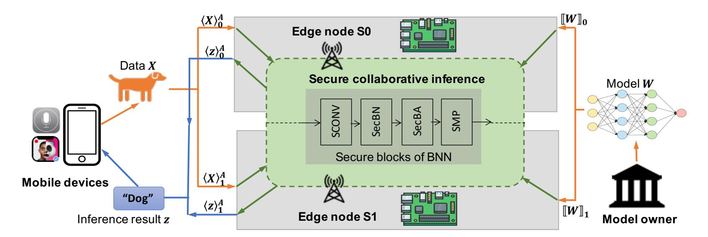

Fig. 1. System architecture.

the patient's chest as a CT scan. It aims to evaluate the patient's CT under the NN provided by some medical imaging service providers (the model owner), like Google DeepMind Health [33]. However, the CT scan indicating patient's health information is forbidden to share with the service provider in cleartext due to legislation. They thus can proceed the above evaluation via Leia. The scanner can install Leia and submits the protected patient's CT through Leia's API. Meanwhile, the edge nodes in Leia have already equipped with the protected NN supplied by the medical imaging service provider. Leia securely proceed the NN inference over encrypted CT scan and returns only the inference result to the scanner side. Neither the user of scanner or the service provider can learn the private data about each other.

# *B. Threat Model and Privacy Goal*

Leia considers the following threat model: all entities are the *semi-honest* parties, and the two edge nodes are *non-colluding* computing devices. Specifically, each party will faithfully follow the prescribed secure inference protocol yet trying to deduce the information from the transcripts exchanged during the protocol execution. When corruption happens, a semihonest adversary can compromise at most one of the edge nodes and either the mobile user or the model owner, while the other parties remain honest. We note that our considered semi-honest threat model is consistent with a great majority of prior works [6], [7], [4], [14], [22], [11], [30]), including the works under the two-server model [7], [11], [30].

Considering semi-honest mobile user, model owner, and the edge nodes makes sense and is practical in Leia's targeted NN inference applications. First, the engaged model owner and the edge nodes are from business-driven companies which do not willing to ruin their reputation and business models to behave in a malicious way and collusion. Moreover, we follow the existing works in the literature and consider the mobile user to be semi-honest. The primary objective is to protect the confidentiality of the valuable neural network model. For the noncolluding assumption, we can regard them as from two distinct and well-established edge service providers (e.g., Microsoft Azure IoT Edge service [34] and Amazon Lambda@Edge service [35]), belonging to separated administrative domains and are hosted by the economical service providers to avoid collusion. It is worth noting that leveraging such a two non-colluding servers has become increasingly appealing in many industrial projects as well. Examples include Facebook's CrypTen [37] and Cape Privacy's TFEncrypted [38].

Leia guarantees both the privacy of mobile user's data and the model privacy. It hides both the user's data and the model values (i.e., the trained weights and coefficients) from being known by the edge nodes. Meanwhile, Leia is consistent with the security guarantees in prior neural network inference works [5], [4], [7], [11]. That is, the parameters of network architecture are considered as hyper-parameters already known by the edge nodes, including the number of layers, the sizes of weight matrices, and types of operations used in each layer. Such hyper-parameters are data independent and not proprietary since they are usually described in scientific and white papers. We are aware that a malicious user can exploit the inference service as a blackbox oracle to perform attacks to extract auxiliary information from prediction results. Like prior cryptographic inference systems [4], [5], [6], we emphasize that protecting against such attacks is a complementary problem beyond Leia's security scope [39]. Mitigation strategies can consider the adoption of differentially private training algorithms [40].

# V. OUR PROPOSED DESIGN

# *A. Secure Linear Layers*

We present in this section the secure realizations of linear layers, i.e., the secure convolutional layer (SCONV) and the secure fully connected layer (SFC). As mentioned above, they can be expressed as VDP(x, w) + bias over n-dimensional layer input vector x, weight vector w, and the bias ∈ R attached on each neuron. Note that the hidden layer's input is the activation vector a. All weights and activations are restricted as ±1 in BNN, except the real-valued first layer input x ∈ R <sup>n</sup>. In Leia, we encode w, a ∈ {+1, −1} <sup>n</sup> to w<sup>b</sup> , a <sup>b</sup> ∈ {1, 0} <sup>n</sup> based on the sign bits, i.e., +1 → 1 and −1 → 0. Here, we make an important observation from the machine learning literature [27] that the bias can be removed if applying batch normalization, because the shift β in BN achieves the same effect as the bias. Well-known open source learning framework follows this treatment like PyTorch [41]. Likewise, we set the bias as 0 to avoid the involvement of real-valued bias and make our design more compatible with the MPC techniques.

To realize private linear transformation, our design carefully protects both mobile user's data (i.e., the input) and the BNN 

{5}------------------------------------------------

model (i.e., the weights) with lightweight secret sharing techniques (Arithmetic sharing and Boolean sharing). In particular, we introduce the secure Boolean-VDP function, and the secure Boolean-Arithmetic-VDP function which performs VDP over mixed share representations. They are the main building blocks to realize the linear layers.

1) Secure Hidden Layer VDP: The secure Boolean-VDP function (SecBVDP) computes VDP for the hidden layers. It takes as input a set of Boolean shared binary activation vector  $[\![\mathbf{a}^b]\!]_i$  and weight vector  $[\![\mathbf{w}^b]\!]_i$ , and outputs the Arithmetic shares  $\langle z \rangle_i^A$  of their Boolean-VDP result, where  $i \in \{0,1\}$  is the identifier of each edge node. The activation vector  $\mathbf{a}^b$  is the output of the binary activation function in BNN, which is naturally binarized. We note that the VDP operation on two plaintext binary vectors can be converted to a simpler XNOR-PopCount operation [15]. That is, for  $\mathbf{a}, \mathbf{w} \in \{-1, +1\}$ , the element-wise multiplication  $p_k = a_k \cdot w_k$  is switched to bitwise-XNOR via  $p_k^b = \mathsf{XNOR}(a_k^b, w_k^b) = \neg(a_k^b \oplus w_k^b)$ when  $\mathbf{a}^b, \mathbf{w}^b \in \{0,1\}$ , where  $k \in [1,n]$ . Meanwhile, the accumulation over all multiplication results  $p = \sum_{k=1}^{n} p_k$  for  $p_k \in \{-1, +1\}$  is converted to PopCount followed by a 2p-n. That is, counting the number of "1"s in the resulting binary vector  $\mathbf{p}^b = (p_1^b, p_2^b, ..., p_n^b) \in \{0, 1\}$  as p and setting the result to 2p-n.

Following this convention, Fig. 2 gives a high-level illustration of the SecBVDP function on secret-shared data. It consists of four atomic operations: the secure XNOR, the secure B2A gadget, the secure PopCount, and the secure 2pn. The secure XNOR performs element-wise XNOR operation over every element of the shared binary input vector  $[a_k^b]$  and weight vector  $\llbracket w_k^b \rrbracket$ , and outputs the Boolean-shared XNOR results  $[p_k^b]$ , where  $k \in [1, n]$ . Prior to the secure PopCount operation, the *secure* B2A *gadget* needs to be applied to every  $[\![p_k^b]\!]$ , converting from over  $\mathbb{Z}_2$  to over  $\mathbb{Z}_{2^\ell}$ . With the assist of pre-generated multiplication triples mtri<sub>0</sub>, mtri<sub>1</sub>, it outputs the Arithmetic-shared XNOR result  $\langle p_k \rangle^A$ . This is because that  $[p_k^b]$  is shared as  $[p_k^b]_0 + [p_k^b]_1 \pmod{2}$ , whereas the PopCount result is an aggregated integer that should be shared as Arithmetic shares  $\langle p \rangle^A$ . Naive sum  $\langle p \rangle_i^A = \sum_{k=1}^n [\![p_k^b]\!]_i$ cannot correctly perform the modular addition over  $\mathbb{Z}_{2^{\ell}}$ . Given an obvious example that  $\mathbf{p}^b = (0,0)$  with two "0"s and shared as  $[\mathbf{p}^b]_0 = (1,1)$  and  $[\mathbf{p}^b]_1 = (1,1)$ , direct aggregation produces a wrong result "4" instead of the expected result "0". The secure PopCount then aggregates  $\langle p_k \rangle^A$  to  $\langle p \rangle^A$ . At the end, the secure 2p-n is calculated with the system parameter n, i.e., the length of the vector.

Fig. 3 expatiates on the realization of the SecBVDP function corresponding to the above four operations. The *secure XNOR* is realized in step 1. Each edge node  $S_i$  locally calculates  $[\![p_k^b]\!]_i = [\![a_k^b]\!]_i \oplus [\![w_k^b]\!]_i \oplus i$  to obtain its shared XNOR result. The secure B2A gadget is conducted in step 2. To do so, two variables are set to  $u_k = [\![p_k^b]\!]_0$  and  $v_k = [\![p_k^b]\!]_1$ .  $S_0$ and  $S_1$  jointly perform the conversion to obtain their shares  $\langle p_k \rangle_i^A$ , following the expression  $\langle p_k \rangle^A = \langle u_k + v_k - 2 \cdot u_k \cdot u_k \rangle^A$  $v_k\rangle^A \pmod{2^\ell}$ . Thereafter,  $S_i$  locally computes the secure PopCount in step 3 and the secure 2p-n in step 4, and obtains the shared result  $\langle z \rangle_i^A$  at the end.

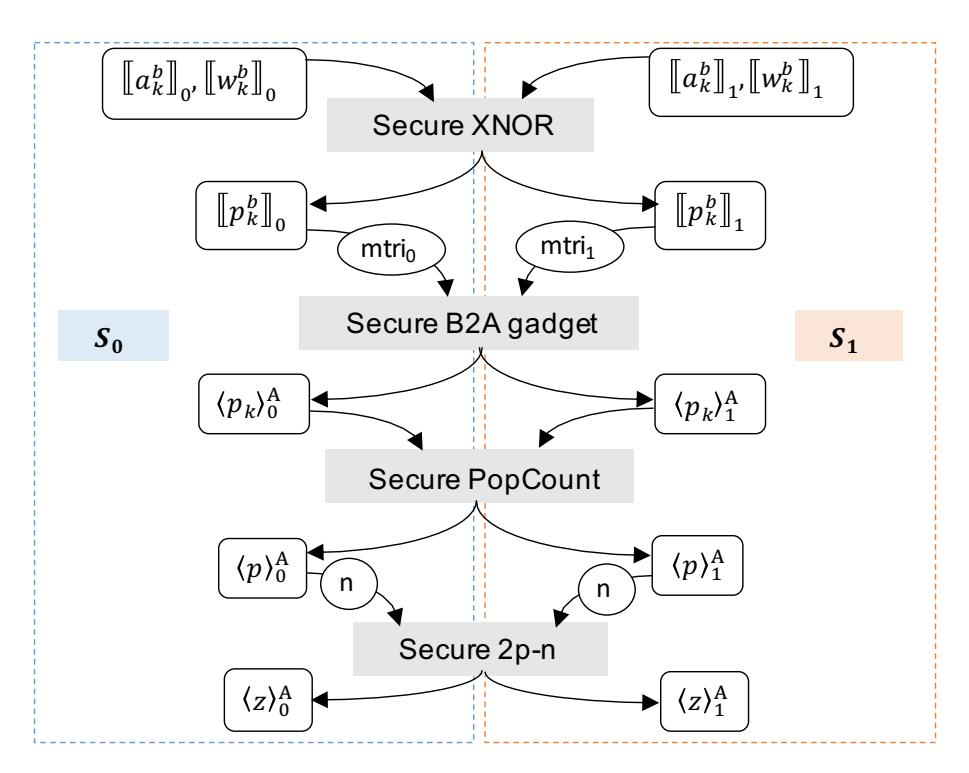

Fig. 2. An overview of the SecBVDP function.

**Input**: Boolean shares of binary activation vector  $\mathbf{a}^b \in \{0, 1\}^n$ , and binary weight vector  $\mathbf{w}^b \in \{0, 1\}^n$ .

**Output**: Arithmetic shares of Binary-VDP result z = $VDP(\mathbf{a}^b, \mathbf{w}^b).$ 

#### Secure XNOR:

- 1) For each  $k \in [1, n]$ ,  $S_i$  sets  $[\![p_k^b]\!]_i = [\![a_k^b]\!]_i \oplus [\![w_k^b]\!]_i \oplus i$ . Secure B2A( $\cdot$ ) gadget:
- 2)  $S_0$  and  $S_1$  convert  $[\![p_k^b]\!] \in \mathbb{Z}_2$  to  $\langle p_k \rangle^A \in \mathbb{Z}_{2^\ell}$  as follows:

  - a)  $S_0$  sets two variables  $\langle u_k \rangle_0^A = [\![p_k^b]\!]_0$ ,  $\langle v_k \rangle_0^A = 0$ ; b)  $S_1$  sets two variables  $\langle u_k \rangle_1^A = 0$ ,  $\langle v_k \rangle_1^A = [\![p_k^b]\!]_1$ ; c)  $S_0$  and  $S_1$  set  $\langle p_k \rangle_i^A = \langle u_k \rangle_i^A + \langle v_k \rangle_i^A 2 \cdot \langle u_k \rangle^A \cdot \langle v_k \rangle^A$ .

#### Secure PopCount:

- 3)  $S_i$  counts the number of "1" via  $\langle p \rangle_i^A = \sum_{k=1}^n \langle p_k \rangle_i^A$ ; Secure 2p-n:
- 4) At the end,  $S_i$  sets  $\langle z \rangle_i^A = 2 \langle p \rangle_i^A i \cdot n$ .

Fig. 3. The secure Boolean-VDP function SecBVDP $(\cdot, \cdot)$  based on XNOR-PopCount.

2) Secure First Layer VDP: This subsequent section presents Leia's secure realization of the first layer, where the two inputs submitted to VDP calculation are the real-valued matrix of the user's data (e.g., image) and the binarized weight matrix.

**Common Approach and Its Limitation:** To realize the first layer, a common way seems plausible is to protect both realvalued data matrix and binarized weight matrix via Arithmetic sharing, and then perform VDP on Arithmetic-shared data. However, protecting the weights as Arithmetic shares would substantially exaggerate the bandwidth to transmit the model and waste BNN's advancement. Besides, the multiplications over Arithmetic shares require the assistant of multiplication triples [29], and generating the disposable triples incurs intensive bandwidth costs that scale linearly with the number of triples. As the bandwidth is the bottleneck at the edge, overwhelming amount of bandwidth will decrease the overall performance and introduce additional charges by cellar network service provider.

The Secure Boolean-Arithmetic-VDP Function: To minimize the overall bandwidth costs at the edge, we craft the secure Boolean-Arithmetic-VDP function (SecBAVDP) in Fig. 4, allowing for direct multiplication on mixed share

{6}------------------------------------------------

**Input**: Arithmetic shares of integer input vector  $\mathbf{x} \in \mathbb{Z}^n$ , Boolean shares of binary weight vector  $\mathbf{w}^b \in \{0, 1\}^n$ . **Output**: Arithmetic shares of result  $z = VDP(\mathbf{x}, \mathbf{w}^b)$ .

The  $n \times \text{COT}_{\ell}$  protocol with  $f_{\Delta}$ :

- 1) The k-th COT<sub>\ell</sub> that  $k \in [1, n]$  computes  $\langle u_k \rangle^A$  of Eq. 1 as:
  - a)  $S_0$  is the sender, and  $S_1$  is the receiver;
  - b)  $S_0$  sets  $f_{\Delta}$  to Eq. 3,  $m_0 = r_u \in_R \mathbb{Z}_{2\ell}$ ;  $S_1$  sets  $\mathfrak{b}_u =$  $||w_k^o||_1;$
  - c)  $S_0$  and  $S_1$  run  $(\bot; m_{\mathfrak{b}_u}) \leftarrow COT(m_0, f_{\Delta}(m_0); \mathfrak{b}_u);$
  - d)  $S_1$  obtains  $m_{\mathfrak{b}_u}$  and sets  $\langle u_k \rangle_1^A = m_{\mathfrak{b}_u}$ . e)  $S_0$  sets  $\langle u_k \rangle_0^A = -r_u + [\![w_k^b]\!]_0 \cdot \langle x_k \rangle_0^A$ ;

#### The $n \times \text{COT}_{\ell}$ protocol with $g_{\Delta}$ :

- 2) The k-th COT<sub>\ell</sub> that  $k \in [1, n]$  computes  $\langle v_k \rangle^A$  of Eq. 2 as:
  - a)  $S_1$  is the sender, and  $S_0$  is the receiver;
  - b)  $S_1$  sets  $g_{\Delta}$  to Eq.  $4, m_0 = r_v \in_R \mathbb{Z}_{2^{\ell}}$ ;  $S_0$  sets  $\mathfrak{b}_v =$  $[\![w_k^o]\!]_0;$
  - c)  $S_1$  and  $S_0$  run  $(\bot; m_{\mathfrak{b}_v}) \leftarrow COT(m_0, g_{\Delta}(m_0); \mathfrak{b}_v);$
  - d)  $S_0$  obtains  $m_{\mathfrak{b}_v}$  and sets  $\langle v_k \rangle_0^A = m_{\mathfrak{b}_v}$ ;
  - e)  $S_1$  sets  $\langle v_k \rangle_1^A = -r_v + [w_k^b]_1 \cdot \langle x_k \rangle_1^b$
- 3) At the end,  $S_i$  sets  $\langle z \rangle_i^A = \sum_{k=1}^n (\langle u_k \rangle_i^A + \langle v_k \rangle_i^A)$ .

Fig. 4. The secure Boolean-Arithmetic-VDP function SecBAVDP $(\cdot, \cdot)$  based on COT.

representations. It takes as input the Boolean shares  $\llbracket \mathbf{w}^b \rrbracket$ of the binary weight vector  $\mathbf{w} \in \{0,1\}^n$  and the Arithmetic shares  $\langle \mathbf{x} \rangle^A$  of the real-valued input vector  $\mathbf{x} \in \mathbb{Z}^n$ . and outputs the Arithmetic-shared result of  $VDP(\mathbf{x}, \mathbf{w}^b)$  as  $\langle z \rangle^A$ . Our observation is that the element-wise multiplication  $\langle z_k \rangle^A = \llbracket w_k^b \rrbracket \cdot \langle x_k \rangle^A$  can be expressed as

$$\langle z_k \rangle^A = \langle u_k \rangle^A + \langle v_k \rangle^A;$$

$$\langle u_k \rangle^A = \langle (\llbracket w_k^b \rrbracket_0 \oplus \llbracket w_k^b \rrbracket_1) \cdot \langle x_k \rangle_0^A \rangle^A;$$

$$\langle v_k \rangle^A = \langle (\llbracket w_k^b \rrbracket_0 \oplus \llbracket w_k^b \rrbracket_1) \cdot \langle x_k \rangle_1^A \rangle^A.$$
(2)

Eq. 1 and Eq. 2 then can be efficiently calculated by two customized  $COT_{\ell}$  protocols corresponding to the correlation functions  $f_{\Delta}$  and  $g_{\Delta}$ , respectively.

The first  $COT_{\ell}$  protocol with  $f_{\Delta}$  calculates  $\langle u_k \rangle^A$ , where  $S_0$  acts as the sender and  $S_1$  acts as the receiver. By treating  $\llbracket w_k^b \rrbracket_1$  as the choice bit  $\mathfrak{b}_u$ , the logic can be expressed as

$$\langle u_k \rangle^A = (1 - \mathfrak{b}_u) \cdot (\llbracket w_k^b \rrbracket_0 \cdot \langle x_k \rangle_0^A) + \mathfrak{b}_u \cdot (\neg \llbracket w_k^b \rrbracket_0 \cdot \langle x_k \rangle_0^A)$$

$$= \underbrace{(\llbracket w_k^b \rrbracket_0 \cdot \langle x_k \rangle_0^A)}_{S_0 \text{ at local}} + \underbrace{\mathfrak{b}_u \cdot (\neg \llbracket w_k^b \rrbracket_0 \cdot \langle x_k \rangle_0^A - \llbracket w_k^b \rrbracket_0 \cdot \langle x_k \rangle_0^A)}_{\text{COT}_\ell \text{ with } f_\Delta \text{ and a choice bit } \mathfrak{b}_u}.$$

The former part of above formula is calculated by  $S_0$  at local, while the latter part is performed by  $COT_{\ell}$  with correlation function  $f_{\Delta}$ . In particular,  $S_0$  sets the correlation function as

$$f_{\Delta}(s) = s + (\neg \llbracket w_k^b \rrbracket_0 \cdot \langle x_k \rangle_0^A - \llbracket w_k^b \rrbracket_0 \cdot \langle x_k \rangle_0^A), \quad (3)$$

where s is any input from  $S_0$ . Once invoked,  $S_0$  sets his input  $m_0$  as a random number  $r_u$ , while  $S_1$  sets his input to  $\mathfrak{b}_u$ . Then  $S_0$  and  $S_1$  run  $(\perp; m_{\mathfrak{b}_u}) \leftarrow \mathsf{COT}_{\ell}(m_0, f_{\Delta}(m_0); \mathfrak{b}_u)$ . Meanwhile,  $S_0$  computes  $\langle u_k \rangle_0^A = -r_u + [\![w_k^b]\!]_0 \cdot \langle x_k \rangle_0^A$ . The reconstructed  $\langle u_k \rangle^A$  is equivalent to Eq. 1.

Similarly, the second  $\mathrm{COT}_\ell$  protocol with  $g_\Delta$  treats  $[\![w_k^b]\!]_0$ as the choice bit  $\mathfrak{b}_v$  and computes  $\langle v_k \rangle^A$  as

$$\begin{split} \langle v_k \rangle^A &= \underbrace{([\![w_k^b]\!]_1 \cdot \langle x_k \rangle_1^A)}_{S_1 \text{ at local}} \\ &+ \underbrace{\mathfrak{b}_v \cdot (\neg [\![w_k^b]\!]_1 \cdot \langle x_k \rangle_1^A - [\![w_k^b]\!]_1 \cdot \langle x_k \rangle_1^A)}_{\text{COT}_\ell \text{ with } g_\Delta \text{ and a choice bit } \mathfrak{b}_v}, \end{split}$$

where  $S_1$  acts as the sender and  $S_0$  acts as the receiver. In particular,  $S_1$  sets the correlation function as

$$g_{\Delta}(s) = s + (\neg [w_k^b]_1 \cdot \langle x_k \rangle_1^A - [w_k^b]_1 \cdot \langle x_k \rangle_1^A), \quad (4)$$

where s is any input from  $S_1$ . Once invoked,  $S_1$  sets his input  $m_0$  to a random number  $r_v$ , while  $S_0$  sets his input to  $\mathfrak{b}_v$ .  $S_1$  and  $S_0$  run  $(\perp; m_{\mathfrak{b}_v}) \leftarrow \mathsf{COT}_{\ell}(m_0, g_{\Delta}(m_0); \mathfrak{b}_v)$ .  $S_1$  sets  $\langle v_k \rangle_1^A = -r_v + [\![w_k^b]\!]_1 \cdot \langle x_k \rangle_1^A$ . This  $\langle v_k \rangle^A$  is equivalent to Eq. 2. At the end,  $S_0$  and  $S_1$  locally aggregate  $\sum_{k=1}^n (\langle u_k \rangle_i^A +$  $\langle v_k \rangle_i^A$ ) as his shared result  $\langle z \rangle_i^A$ . Note that our COT-based SecBAVDP requires to 2n calls of COT $_{\ell}$  with  $2n(\ell + \lambda)$  bits and computing  $2n \cdot 3$  hashing, where  $\lambda$  is the security parameter (128 in our work), while the OT-based approach requires 4ncalls of OT with  $4n\ell(\ell+\lambda)$  bits. Proof of correctness is given in Appendix C-A.

The Secure First Layer VDP Function: To perform the secure first layer VDP function (Sec1VDP), we encode the weight vector w as a tuple  $(+\mathbf{w}^b, -\mathbf{w}^b)$ , where  $+\mathbf{w}^b, -\mathbf{w}^b \in$  $\{0,1\}^n$ . That is, when an element w=+1, the corresponding tuple is  $+w \leftarrow 1$  and  $-w \leftarrow 0$ ; while when w = -1, it is encoded as  ${}^+w$   $\leftarrow$  0 and  ${}^-w$   $\leftarrow$  1. The Sec1VDP function takes as input the Arithmetic shares of integer input vector  $\langle \mathbf{x} \rangle^A$ , Boolean shares of binary weight vectors  $[\![ +\mathbf{w}^b ]\!], [\![ -\mathbf{w}^b ]\!]$ , and outputs the Arithmetic shares of feature  $\langle z \rangle^A$ . Given the two edge nodes and the SecBAVDP function, the Sec1VDP( $\langle \mathbf{x} \rangle^A$ ,  $[+\mathbf{w}^b]$ ,  $[-\mathbf{w}^b]$ ) proceeds as follows:

- 1)  $S_0$  and  $S_1$  run to get  $\langle {}^+z \rangle_i^A \leftarrow \mathsf{SecBAVDP}([\![^+\mathbf{w}^b]\!], \langle \mathbf{x} \rangle^A)$ .
- 2)  $S_0$  and  $S_1$  run to get  $\langle -z \rangle_i^A \leftarrow \mathsf{SecBAVDP}(\bar{\mathbb{I}} \mathbf{w}^b \bar{\mathbb{I}}, \langle \mathbf{x} \rangle^A)$ .
- 3)  $S_i$  locally computes  $\langle z \rangle_i^A = \langle {}^+z \rangle_i^A \langle {}^-z \rangle_i^A$ .

# B. Secure Batch Normalization and Binary Activation

1) Common Approach and Its Limitation: Batch normalization and binary activation are usually applied as a combination on each linear layer, following the linear transformation. Apart from the output layer, the prediction results are the output from the batch normalization without binary activation. At a high level, the combination of such two functions proceeds the functionality via

$$a^b = \operatorname{sign}(\epsilon_1 \cdot a + \epsilon_2), \tag{5}$$

$$\epsilon_1 = \frac{\gamma}{\delta}, \epsilon_2 = \beta - \frac{\gamma \mu}{\delta} \tag{6}$$

where  $\epsilon_1, \epsilon_2$  are preprocessed parameters derived from the trained BN parameters  $\mu$ ,  $\delta$ ,  $\gamma$  and  $\beta$ . During our model training procedure over plaintext, we observe that the trained  $\epsilon_1, \epsilon_2$  are real-valued, where their integer parts before radix point are usually very small (i.e., 0 or 1) and the the fractional parts can last for a few digits (e.g., 10 digits). To handle the real-valued numbers in secure computation, a common 

{7}------------------------------------------------

way is to scale the  $\epsilon_1, \epsilon_2$  to integers with a certain precision factor  $2^q$ , followed by a ring conversion applied on the secret-shared a. Such a conversion is normally scaling up the  $\langle a \rangle^A \in \mathbb{Z}_{2^\ell}$  to  $\langle a' \rangle^A \in \mathbb{Z}_{2^\kappa}$  where  $\kappa > \ell + q$ . After sharing the  $\epsilon_1, \epsilon_2$  in  $\mathbb{Z}_{2^\kappa}$  as  $\langle \epsilon_1 \rangle^A, \langle \epsilon_2 \rangle^A \in \mathbb{Z}_{2^\kappa}$ , the computation  $\langle y \rangle^A = \langle \epsilon_1 \rangle^A \cdot \langle a' \rangle^A + \langle \epsilon_2 \rangle^A$  can be securely carried out over  $\mathbb{Z}_{2^\kappa}$ . And the sign $(\langle y \rangle^A)$  can be securely realized via a most significant bit (MSB) extraction.

The limitations of such a common way are two-fold. First, an additional ring conversion operation has to be applied on each neuron leading to higher computational costs. Second, the enlarged ring  $\mathbb{Z}_{2^\kappa}$  leads to a more complicated bitwise MSB extraction. In general, this MSB extraction operation follows the bit extraction protocol in [30] that performs non-local operations on the bit string of  $\langle y \rangle^A \in \mathbb{Z}_{2^\kappa}$ . It requires the interactions between the two edge nodes with the complexity scaling linearly with the length of the bit string (i.e.,  $\kappa$ ). So, a larger ring size leads to heavier bandwidth costs which is undesired at the edge. To address the above challenges, we propose two secure functions with special treatments: 1) the secure normalized binary activation function (SecNBA) for the first layer and hidden layers; and 2) the secure batch normalization function (SecBN) in the output layer.

2) Secure Normalized Binary Activation: The SecNBA function combines the secure batch normalization and the secure binary activation. We observe that its functionality defined as Eq. 5 can be transformed to

$$a^b = \operatorname{sign}(\epsilon_1) \cdot \operatorname{sign}(a + \epsilon) = \operatorname{XNOR}(\zeta, z);$$
 (7)

$$z = \operatorname{sign}(y), y = a + \epsilon; \tag{8}$$

$$\zeta = \operatorname{sign}(\epsilon_1), \epsilon = \frac{\epsilon_2}{\epsilon_1} = \frac{\delta \beta}{\gamma} - \mu.$$
 (9)

Such a transformation results in a much simpler problem without the ring conversion. Through our careful examination, we identify that  $\epsilon = \epsilon_2/\epsilon_1$  is real-valued number with large integer part. We thus quantize  $\epsilon$  directly as integer and share it in  $\mathbb{Z}_{2^\ell}$ , so as to circumvent the conversion between different rings. It is noteworthy that, a similar transformation has been also proposed in XONN [6] and BANNERS [13]. However, their designs do not consider the case that the parameter  $\epsilon_1$  is negative value. In fact, during our plaintext model training, we observed that  $\epsilon_1$  in batch normalization can be a negative value, and thus its sign bit  $\zeta = \text{sign}(\epsilon_1)$  can not be ignored. Moreover, the multiplication between the sign bits  $\zeta$  and  $\varepsilon$  can be carried out via XNOR operation. Since  $\varepsilon$  and  $\varepsilon$  are independent of inference input, they can be pre-generated by the model owner.

Given above equations, we present details of the secure realization of the SecNBA function. It takes as input the Arithmetic shares of the feature  $\langle a \rangle^A$  that outputted from the linear transformation, the shares of two preprocessed parameters  $\langle \epsilon \rangle^A$  and  $[\![\zeta]\!]$ , and outputs the Boolean shares of binary normalized activation  $[\![a^b]\!]$ . As summarized in Fig. 5, we decompose the computation as three atomic operations at a high-level, i.e., the *secure* y, the *secure sign* (secure MSB gadget + secure MSB to sign), the *secure XNOR*. The *secure* y takes as input the shares of the preprocessed

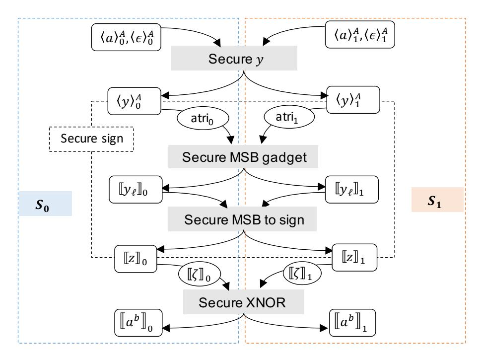

Fig. 5. An overview of the SecNBA function.

**Input**: Arithmetic shares of integer feature  $a \in \mathbb{Z}$ , Arithmetic shares of param.  $\epsilon \in \mathbb{Z}$ , Boolean shares of param.  $\zeta \in \{0,1\}$ . **Output**: Boolean shares of binarized activation  $a^b \in \{0,1\}$ . Secure y:

1)  $S_i$  calculates  $\langle y \rangle_i^A = \langle a \rangle_i^A + \langle \epsilon \rangle_i^A$ .

Secure  $sign(\cdot)$ :

- 2) **Secure**  $MSB(\cdot)$  **gadget:**  $S_0$  and  $S_1$  run  $[\![y_\ell]\!]_i \leftarrow MSB(\langle y \rangle^A)$ .
- 3) Secure MSB to sign:  $S_i$  sets  $[z]_i = [y_\ell]_i \oplus i$ . Secure XNOR:
- 4)  $S_i$  sets  $[\![a^b]\!]_i = [\![z]\!]_i \oplus [\![\zeta]\!]_i \oplus i$ .

Fig. 6. The secure normalized binary activation function SecNBA $(\cdot, \cdot, \cdot)$ .

parameter  $\langle \epsilon \rangle^A$  and feature  $\langle a \rangle^A$  and produces the shares  $\langle y \rangle^A$  defined in Eq. 8. The *secure sign* consists of the secure MSB gadget and the secure MSB to sign operations to extract the Boolean-shared sign bit  $[\![z]\!]$ . The secure MSB gadget extracts the shared MSB  $[\![y_\ell]\!]$  of the input  $\langle y \rangle^A$  with the assist of already generated Boolean AND triples  $\mathsf{atri}_0$ ,  $\mathsf{atri}_1$ . Then  $[\![y_\ell]\!]$  is converted to the shared sign bit  $[\![z]\!]$  through the secure MSB to sign. The last  $\mathsf{secure}\ XNOR$  produces the shared binary normalized activation  $[\![a^b]\!]$  based on Eq. 7, given the shares of the sign bit  $[\![z]\!]$  and preprocessed  $[\![\zeta]\!]$ .

Given above atomic operations, Fig. 6 details the corresponding realization of the SecNBA function. The *secure* y is realized in step 1, where each edge node  $S_i$  locally computes  $\langle y \rangle_i^A$  by adding  $\langle \epsilon \rangle_i^A$  to  $\langle a \rangle_i^A$ . Steps 2, 3 realize the secure sign. In step 2, the edge nodes  $S_0$  and  $S_1$  jointly execute the secure MSB gadget to obtain their shares of MSB, i.e.,  $||y_{\ell}||_i$ . This gadget employs the bit extraction protocol in [30], which is able to efficiently extract the MSB of the Arithmetic-shared values and produce a Boolean-shared MSB. The MSB is 0 of non-negative values (including 0) and 1 of the negative values, which is exactly the one's complement of a given sign bit. Then in step 3 (the secure MSB to sign),  $S_i$  performs logical negation on each  $[y_\ell]_i$  at local to obtain the shared sign bit  $[z]_i$ . The secure XNOR is realized in step 4, where  $S_i$ conducts local XNOR operation over  $[z]_i$  and  $[\zeta]_i$ , and finally gets its share of binary normalized activation  $[a^b]_i$ . Details of the secure MSB gadget is given in Appendix A.

3) Secure Batch Normalization for Output Layer: The secure batch normalization function (SecBN) is applied right

{8}------------------------------------------------

after the secure linear transformation (SecBVDP) in the output layer. It takes as input the Arithmetic shares of activation  $\langle a \rangle^A \in \mathbb{Z}_{2^\kappa}$  outputted from SecBVDP, and shares of two parameters  $\langle \epsilon_1 \rangle^A, \langle \epsilon_2 \rangle^A \in \mathbb{Z}_{2^\kappa}$ , and outputs the Arithmetic shares of the normalized activation  $\langle z \rangle^A \in \mathbb{Z}_{2^\kappa}$ . Here, the B2A gadget, i.e., the step 2 in the SecBVDP, performs the conversion from over  $\mathbb{Z}_2$  to  $\mathbb{Z}_{2^\kappa}$ , and thus the output of SecBVDP is a feature already secret-shared in  $\mathbb{Z}_{2^\kappa}$ . Note that this ring conversion operation will not affect the following binary activation, as the output of SecBN is the shared inference result. The parameters  $\epsilon_1, \epsilon_2$  are already enlarged during preprocessing, and secret shared in  $\mathbb{Z}_{2^\kappa}$ .

Given the two edge nodes, the pre-generated  $\operatorname{mtri}_i \in \mathbb{Z}_{2^\kappa}$ , the  $\operatorname{SecBN}(\langle a \rangle^A, \langle \epsilon_1 \rangle^A, \langle \epsilon_2 \rangle^A)$  proceeds as follows:  $S_0$  and  $S_1$  compute  $\langle z \rangle_i^A = \langle \epsilon_1 \rangle^A \cdot \langle a \rangle^A + \langle \epsilon_2 \rangle_i^A$  to obtain their shares of normalized activation.

# C. Secure Binary Max Pooling Layer

The secure binary max pooling layer (SMP) is used to obtain the maximum values among the secret-shared binary activations within a certain sliding window. The number of n binary activations within the window can be denoted as a n-dimensional binary activation vector  $\mathbf{a}^b = (a_1^b, ..., a_n^b) \in \{0,1\}^n$ . We assume that there are overall m-number of vectors as  $\mathbf{a}_1^b, ..., \mathbf{a}_m^b$ . We observe that its functionality over plaintext  $\mathbf{a}^b$  can be realized as the bitwise-OR operation on all bits of the vectors, i.e., the maximum value is  $z^b = a_1^b \lor a_2^b \lor ... \lor a_n^b$ , so as to find if  $\mathbf{a}^b$  constitutes with any "1" bit. However, the key takeaway of a secure realization is to achieve obliviousness, i.e., for every step in a certain computation, both edge nodes have to proceed equivalent operations. Through carefully examination, we transform the logic to

$$z^b = \neg(\neg a_1^b \land \neg a_2^b \land \dots \land \neg a_n^b) \tag{10}$$

which is more compatible with our secret sharing based realization.

**Input**: Boolean shares of m-number of n-dimensional binary activation vectors  $\mathbf{a}_1^b,...,\mathbf{a}_m^b \in \{0,1\}^n$ , where the dimension n matches the size of pooling window.

**Output**: Boolean shares of m-number of binary pooling result  $z_1^b,...,z_m^b \in \{0,1\}.$ 

- 1) For  $t \in [1, m]$ ,  $S_0$  and  $S_1$  compute the shares of maximum element in  $[\![\mathbf{a}_t^b]\!]_i = ([\![a_{t,1}^b]\!]_i, ..., [\![a_{t,n}^b]\!]_i)$  based on Eq. 10:
  - a) For  $k \in [1, n]$ ,  $S_i$  sets  $[a_k^b]_i = [a_k^b]_i \oplus i$ ;
  - b)  $S_i$  sets variable  $\llbracket c_t^b \rrbracket_i = \llbracket a_{t,1}^b \rrbracket_i$ ;
  - c) For  $k \in [2, n]$ ,  $S_0$  and  $S_1$  set  $[\![c_t^b]\!]_i = [\![c_t^b]\!] \wedge [\![a_{t,k}^b]\!]$ .
  - d)  $S_i$  sets  $[\![z_t^b]\!]_i = [\![c_t^b]\!]_i \oplus i$ .

Fig. 7. The secure max pooling function  $SecMP(\cdot)$ .

With this philosophy in mind, we present in Fig. 7 the proposed secure max pooling function (i.e., SecMP) design specialized for the two edge nodes case as the main building block of the MP layer. It takes as input the Boolean shares of m-number of n-dimensional binary activation vectors  $[\![\mathbf{a}_t^b]\!]$ , determines the maximum element for each vector, and outputs their Boolean shares as the pooling result  $[\![z_t^b]\!]$ , where  $t \in [1, m]$ . For each  $[\![\mathbf{a}_t^b]\!]$ ,  $S_0$  and  $S_1$  securely proceeds Eq. 10

via the steps below. In step 1.a,  $S_i$  securely realizes  $\neg a_{t,k}^b$  by XORing the share  $[\![a_{t,k}^b]\!]_i$  to its identifier i, where  $k \in [1,n]$ . In steps 1.b and 1.c,  $S_0$  and  $S_1$  iteratively perform AND over all of its shares, i.e.,  $[\![c_t^b]\!]_i = [\![a_{t,1}^b]\!] \land \dots \land [\![a_{t,n}^b]\!]_i$ . In step 1.d,  $S_i$  sets its output share  $[\![z_t^b]\!]_i$  as its identifier i XOR with  $[\![c_t^b]\!]_i$ . We emphasis that all operations performed by the two nodes are identical, and thus endowing our SecMP function obliviousness. Appendix C-B provides the proof of correctness of the SecMP function.

### D. Secure BNN Inference Protocol

Given above layer functions, we now describe our secure BNN inference protocol  $\phi$ . It comprises two phases: the *preprocessing phase* performed by each entity individually, and the *secure inference phase* jointly carried out by the two non-colluding edge nodes.

1) Preprocessing Phase: During the preprocessing phase, the mobile user converts its task-specific raw input to a tensor  $\mathbf{X} \in \mathbb{Z}^{c_{in} \times n_{in} \times m_{in}}$  and deploys the corresponding Arithmetic-shared tensors to  $S_0$  and  $S_1$ , respectively. Once received, they partition and flatten the shared tensor into a set of vectors, and the size of each vector equals to the sliding window size for the ease of subsequent VDP operations. Let  $\mathcal{T}^1$  be the total moves to slide the window for the first layer. After flattening,  $S_0$  and  $S_1$  hold vectors  $\langle (\mathbf{x})_{c,\tau} \rangle^A$ , where  $c \in [1, c_{in}]$  denotes the input channel, and  $\tau \in [1, \mathcal{T}^1]$  indicates the  $\tau$ -th sliding window. They also prepare triples during vacant time.

The model owner holds an L-layer BNN model. Each layer  $l \in [1, L]$  is formed from a set of binarized weight vectors  $(\mathbf{w})_k^l$ , i.e., a number of k vectors in the layer l. For the CONV and MP,  $k = c_o^l$  (the number of output channels) and the length  $|\mathbf{w}| = n_w \times n_w$ . For FC,  $k = n^l$  (the neurons of current layer) and  $|\mathbf{w}| = n_{l-1}$  (the neurons of previous layer). For the first layer, the weight vectors are encoded as tuples  $(+1 \to (1,0))$  and  $-1 \to (0,1)$  as input of the Sec1VDP function, denoted as  $[(+\mathbf{w}^b)_k^1], [(-\mathbf{w}^b)_k^1]$ . For hidden layers, the weight vectors are encoded based on the sign  $(+1 \to 1)$  and  $-1 \to 0$ , denoted as  $[(+\mathbf{w}^b)_k^l]$ . For BN, the model owner computes  $(+1, \epsilon_2, \epsilon, \epsilon_3)$  according to Eq. 6 and Eq. 8, and generates shares  $[(+1, \epsilon_3), (+1, \epsilon_3)]$  and  $(-1, \epsilon_3)$  and  $(-1, \epsilon_3)$  and  $(-1, \epsilon_3)$  and  $(-1, \epsilon_3)$  and  $(-1, \epsilon_3)$  and  $(-1, \epsilon_3)$  and  $(-1, \epsilon_3)$  and  $(-1, \epsilon_3)$  and  $(-1, \epsilon_3)$  and  $(-1, \epsilon_3)$  and  $(-1, \epsilon_3)$  and  $(-1, \epsilon_3)$  and  $(-1, \epsilon_3)$  and  $(-1, \epsilon_3)$  and  $(-1, \epsilon_3)$  and  $(-1, \epsilon_3)$  and  $(-1, \epsilon_3)$  and  $(-1, \epsilon_3)$  and  $(-1, \epsilon_3)$  and  $(-1, \epsilon_3)$  and  $(-1, \epsilon_3)$  and  $(-1, \epsilon_3)$  and  $(-1, \epsilon_3)$  and  $(-1, \epsilon_3)$  and  $(-1, \epsilon_3)$  and  $(-1, \epsilon_3)$  and  $(-1, \epsilon_3)$  and  $(-1, \epsilon_3)$  and  $(-1, \epsilon_3)$  and  $(-1, \epsilon_3)$  and  $(-1, \epsilon_3)$  and  $(-1, \epsilon_3)$  and  $(-1, \epsilon_3)$  and  $(-1, \epsilon_3)$  and  $(-1, \epsilon_3)$  and  $(-1, \epsilon_3)$  and  $(-1, \epsilon_3)$  and  $(-1, \epsilon_3)$  and  $(-1, \epsilon_3)$  and  $(-1, \epsilon_3)$  and  $(-1, \epsilon_3)$  and  $(-1, \epsilon_3)$  and  $(-1, \epsilon_3)$  and  $(-1, \epsilon_3)$  and  $(-1, \epsilon_3)$  and  $(-1, \epsilon_3)$  and  $(-1, \epsilon_3)$  and  $(-1, \epsilon_3)$  and  $(-1, \epsilon_3)$  and  $(-1, \epsilon_3)$  and  $(-1, \epsilon_3)$  and  $(-1, \epsilon_3)$  and  $(-1, \epsilon_3)$  and  $(-1, \epsilon_3)$  and  $(-1, \epsilon_3)$  and  $(-1, \epsilon_3)$  and  $(-1, \epsilon_3)$  and  $(-1, \epsilon_3)$  and  $(-1, \epsilon_3)$  and  $(-1, \epsilon_3)$  and  $(-1, \epsilon_3)$  and  $(-1, \epsilon_3)$  and  $(-1, \epsilon_3)$  and  $(-1, \epsilon_3)$  and  $(-1, \epsilon_3)$  and  $(-1, \epsilon_3)$  and  $(-1, \epsilon_3)$  and  $(-1, \epsilon_3)$  and  $(-1, \epsilon_3)$  and  $(-1, \epsilon_3)$  and  $(-1, \epsilon_3)$  and  $(-1, \epsilon_3)$  and  $(-1, \epsilon_3)$  and  $(-1, \epsilon_3)$  and  $(-1, \epsilon_3)$  and  $(-1, \epsilon_3)$  and  $(-1, \epsilon_3)$ 

2) Secure Inference Phase: Fig. 8 depicts the secure inference phase of an L-layer BNN. The inputs are the shares generated during preprocessing, including the shared user input vectors from the mobile user, the shared weight vectors and parameters from the model owner. The outputs are the last layer's activations mapping a certain classification label after reconstruction. As NN can have distinct architectures assembled with layer functions, we present a typical one for demonstration purpose. It comprises the first SCONV layer, followed by an SMP layer, and L-2 number of the SFC layers. For each linear layer, the SecNBA function is applied after the linear transformation. And the SecBN function is applied to the output layer.

For the first SCONV layer,  $S_0$  and  $S_1$  repeatedly execute the Sec1VDP function on shared weight and user's data, inside

{9}------------------------------------------------

```
Let k \in [1, c_o^l], \tau \in [1, \mathcal{T}^1] for SCONV, SMP; k \in [1, n^l] for SFC. First SCONV layer, l = 1:

1) S_0, S_1 run \langle (a)_{k,\tau}^1 \rangle_i^A = \sum_{c=1}^{c_{in}} \operatorname{Sec1VDP} \left( \llbracket (+\mathbf{w}^b)_k^1 \rrbracket, \llbracket (-\mathbf{w}^b)_k^1 \rrbracket, \llbracket (-\mathbf{w}^b)_k^1 \rrbracket, \lceil (-\mathbf{w}^b)_k^1 \rrbracket, \lceil (-\mathbf{w}^b)_k^1 \rrbracket, \lceil (-\mathbf{w}^b)_k^1 \rrbracket, \lceil (-\mathbf{w}^b)_k^1 \rrbracket, \lceil (-\mathbf{w}^b)_k^1 \rrbracket, \lceil (-\mathbf{w}^b)_k^1 \rrbracket, \lceil (-\mathbf{w}^b)_k^1 \rrbracket, \lceil (-\mathbf{w}^b)_k^1 \rrbracket, \lceil (-\mathbf{w}^b)_k^1 \rrbracket, \lceil (-\mathbf{w}^b)_k^1 \rrbracket, \lceil (-\mathbf{w}^b)_k^1 \rrbracket, \lceil (-\mathbf{w}^b)_k^1 \rrbracket, \lceil (-\mathbf{w}^b)_k^1 \rrbracket, \lceil (-\mathbf{w}^b)_k^1 \rrbracket, \lceil (-\mathbf{w}^b)_k^1 \rrbracket, \lceil (-\mathbf{w}^b)_k^1 \rrbracket, \lceil (-\mathbf{w}^b)_k^1 \rrbracket, \lceil (-\mathbf{w}^b)_k^1 \rrbracket, \lceil (-\mathbf{w}^b)_k^1 \rrbracket, \lceil (-\mathbf{w}^b)_k^1 \rrbracket, \lceil (-\mathbf{w}^b)_k^1 \rrbracket, \lceil (-\mathbf{w}^b)_k^1 \rrbracket, \lceil (-\mathbf{w}^b)_k^1 \rrbracket, \lceil (-\mathbf{w}^b)_k^1 \rrbracket, \lceil (-\mathbf{w}^b)_k^1 \rrbracket, \lceil (-\mathbf{w}^b)_k^1 \rrbracket, \lceil (-\mathbf{w}^b)_k^1 \rrbracket, \lceil (-\mathbf{w}^b)_k^1 \rrbracket, \lceil (-\mathbf{w}^b)_k^1 \rrbracket, \lceil (-\mathbf{w}^b)_k^1 \rrbracket, \lceil (-\mathbf{w}^b)_k^1 \rrbracket, \lceil (-\mathbf{w}^b)_k^1 \rrbracket, \lceil (-\mathbf{w}^b)_k^1 \rrbracket, \lceil (-\mathbf{w}^b)_k^1 \rrbracket, \lceil (-\mathbf{w}^b)_k^1 \rrbracket, \lceil (-\mathbf{w}^b)_k^1 \rrbracket, \lceil (-\mathbf{w}^b)_k^1 \rrbracket, \lceil (-\mathbf{w}^b)_k^1 \rrbracket, \lceil (-\mathbf{w}^b)_k^1 \rrbracket, \lceil (-\mathbf{w}^b)_k^1 \rrbracket, \lceil (-\mathbf{w}^b)_k^1 \rrbracket, \lceil (-\mathbf{w}^b)_k^1 \rrbracket, \lceil (-\mathbf{w}^b)_k^1 \rrbracket, \lceil (-\mathbf{w}^b)_k^1 \rrbracket, \lceil (-\mathbf{w}^b)_k^1 \rrbracket, \lceil (-\mathbf{w}^b)_k^1 \rrbracket, \lceil (-\mathbf{w}^b)_k^1 \rrbracket, \lceil (-\mathbf{w}^b)_k^1 \rrbracket, \lceil (-\mathbf{w}^b)_k^1 \rrbracket, \lceil (-\mathbf{w}^b)_k^1 \rrbracket, \lceil (-\mathbf{w}^b)_k^1 \rrbracket, \lceil (-\mathbf{w}^b)_k^1 \rrbracket, \lceil (-\mathbf{w}^b)_k^1 \rrbracket, \lceil (-\mathbf{w}^b)_k^1 \rrbracket, \lceil (-\mathbf{w}^b)_k^1 \rrbracket, \lceil (-\mathbf{w}^b)_k^1 \rrbracket, \lceil (-\mathbf{w}^b)_k^1 \rrbracket, \lceil (-\mathbf{w}^b)_k^1 \rrbracket, \lceil (-\mathbf{w}^b)_k^1 \rrbracket, \lceil (-\mathbf{w}^b)_k^1 \rrbracket, \lceil (-\mathbf{w}^b)_k^1 \rrbracket, \lceil (-\mathbf{w}^b)_k^1 \rrbracket, \lceil (-\mathbf{w}^b)_k^1 \rrbracket, \lceil (-\mathbf{w}^b)_k^1 \rrbracket, \lceil (-\mathbf{w}^b)_k^1 \rrbracket, \lceil (-\mathbf{w}^b)_k^1 \rrbracket, \lceil (-\mathbf{w}^b)_k^1 \rrbracket, \lceil (-\mathbf{w}^b)_k^1 \rrbracket, \lceil (-\mathbf{w}^b)_k^1 \rrbracket, \lceil (-\mathbf{w}^b)_k^1 \rrbracket, \lceil (-\mathbf{w}^b)_k^1 \rrbracket, \lceil (-\mathbf{w}^b)_k^1 \rrbracket, \lceil (-\mathbf{w}^b)_k^1 \rrbracket, \lceil (-\mathbf{w}^b)_k^1 \rrbracket, \lceil (-\mathbf{w}^b)_k^1 \rrbracket, \lceil (-\mathbf{w}^b)_k^1 \rrbracket, \lceil (-\mathbf{w}^b)_k^1 \rrbracket, \lceil (-\mathbf{w}^b)_k^1 \rrbracket, \lceil (-\mathbf{w}^b)_k^1 \rrbracket, \lceil (-\mathbf{w}^b)_k^1 \rrbracket, \lceil (-\mathbf{w}^b)_k^1 \rrbracket, \lceil (-\mathbf{w}^b)_k^1 \rrbracket, \lceil (-\mathbf{w}^b)_k^1 \rrbracket, \lceil (-\mathbf{w}^b)_k^1 \rrbracket, \lceil (-\mathbf{w}^b)_k^1 \rrbracket, \lceil (-\mathbf{w}^b)_k^1 \rrbracket, \lceil (-\mathbf{w}^b)_k^1 \rrbracket, \lceil (-\mathbf{w}^b)_k^1 \rrbracket, \lceil (-\mathbf{w}^b)_k^1 \rrbracket, \lceil (-\mathbf{w}^b)_k^1 \rrbracket, \lceil (-\mathbf{w}^b)_k^1 \rrbracket, \lceil (-\mathbf{w}^b)_k^1 \rrbracket, \lceil (-\mathbf{w}^b)_k^1 \rrbracket, \lceil (-\mathbf{w}^b)_k^1 \rrbracket, \lceil (-\mathbf{w}^b)_k^1 \rrbracket,
```

Fig. 8. Secure BNN inference phase of protocol  $\phi$ .

every  $\tau$ -th sliding window. The outputs are then summed across input channels as a set of features  $\langle (a)_{k,\tau}^1 \rangle^A$  for each output channel k, and submitted to the SecNBA function to obtain the shares of normalized binary activations. Afterwards, the SMP layer run the SecMP function to down sample the previous layer's activation vector into a single activation within each  $\tau$ -th pooling window. The remaining L-2 layers are the SFC layers.  $S_0$  and  $S_1$  firstly flatten the feature map outputted from the SMP layer as an one channel vector  $[(\mathbf{a}^b)^{l-1}]$  across all  $c_o^{l-1}$  channels. Thereafter, for the l-th SFC layer,  $S_0$  and  $S_1$ execute the SecBVDP function on  $[(\mathbf{w}^b)_k^l]$  and  $[(\mathbf{a}^b)^{l-1}]$ , and obtain features  $\langle (a)_k^l \rangle^A$ , where  $n_l$  is the number of neurons of the current layer and  $k \in [1, n^t]$ . For every feature, the SecNBA function is applied to obtain the activations  $[(a^b)^t]$ . Likewise, the SecBN function is applied to the output layer L to obtain the results  $\langle (z)_k^L \rangle^A$ , where  $k \in [1, n^L]$ . To this end,  $S_0$  and  $S_1$  obtain the shares of inference result mapping a certain classification label. They then send back the shares of result to the mobile user who can reconstruct to get the prediction. The remark of complexity is provided in Appendix D.

**Security Guarantees:** For our secure BNN inference protocol  $\phi$ , we define security based on the *Universally Composable* (UC) security framework [42]. Under a general protocol composition operation (universal composition), the security of  $\phi$  is preserved. Given a semi-honest admissible adversary  $\mathcal{A}$ who can compromise at most one of the two non-colluding edge nodes  $S_0, S_1$  and either the mobile user or the model owner. This reflects on the property that  $S_0, S_1$  are noncolluding servers, i.e., if  $S_0$  is compromised by A,  $S_1$  acts honestly; vice versa. Leia's protocol follows the security of the Arithmetic sharing [20], Boolean sharing [19] and COT [28]. Leia properly protects the user data, model, Beaver's triples, and intermediate results outputted from layer functions as secret shares in  $\mathbb{Z}_{2^{\ell}}$  and  $\mathbb{Z}_2$ . Given above, we argue that  $\phi$ UC-realizes an ideal functionality  $\mathcal{F}$  against  $\mathcal{A}$ . The security captures the property that the only data learned by any compromised parties are their inputs and outputs from  $\phi$ , but nothing about the data of the remaining honest parties.

**Differences from Prior Art:** We emphasis that Leia and XONN are different regarding the system models, application

scenarios, the utilized cryptographic tools, and the designs of the secure layer functions.

Leia's overreaching goal is to design secure NN inference system amiable for the recourse-constrained mobile devices. Such resources encompass the hardware designs with limited computational power, stringent energy consumption, and more importantly, the unstable cellular network environment. To embrace the above rigid operational demands, we leverage edge computing to *fully delegate* our system to the edge devices, and as such the mobile devices do not need to alway stay online during the secure inference. In particular, all secure computations are executed amongst the co-located edge nodes including the interactions. In comparison, XONN focuses on the scenario where an *interactive protocol* is executed between the client and the server. That is, XONN requires the client have symmetric computational capabilities to the server and always engaging in the whole secure inference with continuous interactions, which is not applicable to deploy in the dynamic cellular network and constrained resources devices. Meanwhile, Leia's edge-aided system architecture facilitates the model owner dynamically fine-tuning its service, where the neural network model can be regularly updated without republishing the mobile application, which in contrast is not enabled in XONN.

Despite the different system models, the realizations of the secure layer functions in XONN and Leia are entirely different. At a high-level, XONN directly resorts to the generic two-party secure computation framework, i.e., Yao's GC (with optimizations) and OT, to securely realize each layer function involved in BNN. In comparison, Leia crafts and realizes the secure layer functions fully with lightweight cryptographic tools, i.e., the Secret Sharing techniques and COT; wherein each proposed building block underpinning the secure layer functions are carefully designed to be suitable for the edge computing paradigm. The GC based approaches require substantial network resources and typically introduce larger latency than the secret-sharing based realizations [18], [43], [22]. Moreover, our designed COT for the secure binaryinteger vector dot product saves half of the communication rounds to the oblivious condition addition based function, and this saving could be very significant enhancement due to the massive multiplication operations in processing NN inference.

We observe that our work [44] is concurrent and independent with prior art FALCON [16] and BANNERS [13], yet their designs are fundamentally different from ours Both FALCON and BANNERS focus on the honest-majority malicious security under the three-server setting. Their secure protocols are built upon the 2-out-of-3 replicated secret sharing, while Leia is built upon additive secret sharing techniques [19], [20] and correlated oblivious transfer [28]. Besides, the implementation and real-world deployment of three-server protocols are more complex, whereas our secure and lightweight two-server inference protocol is advantageous in implementation and practical deployment to the edge devices.

{10}------------------------------------------------

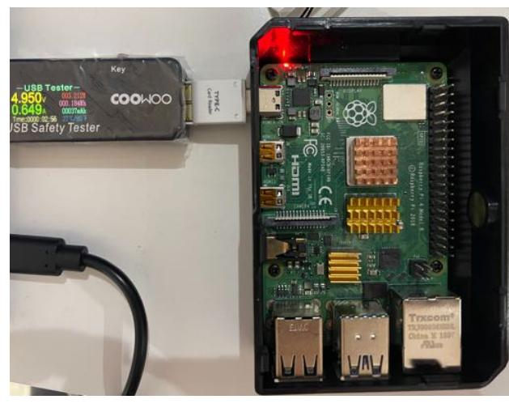

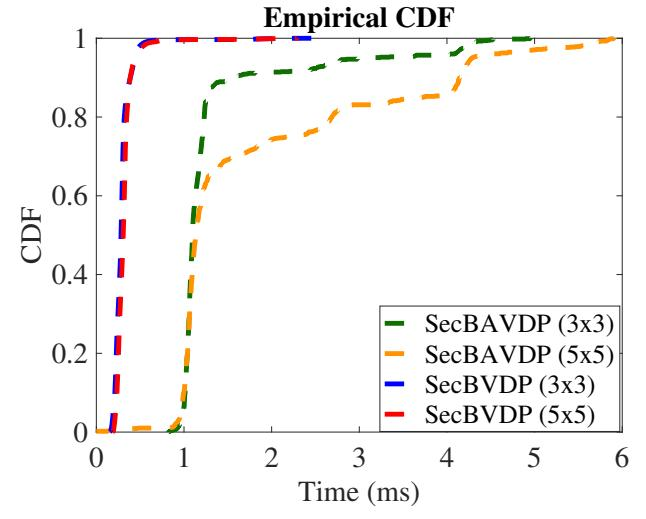

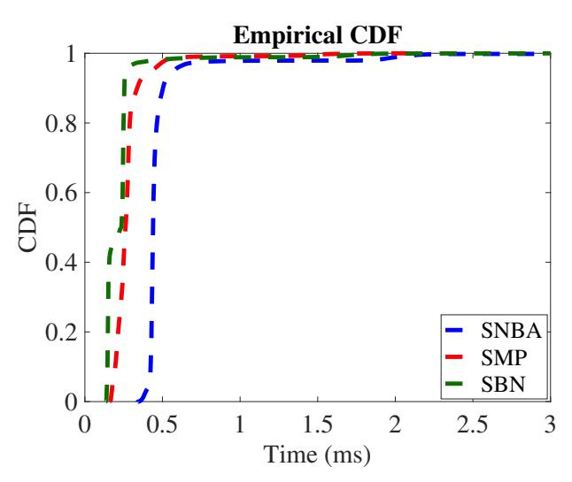

Fig. 9. Deployment on Raspberry Pi with power meter.

Fig. 10. Unit time of linear functions.

Fig. 11. Unit time of nonlinear functions.

| # inputs    | SecBVDP      |              | SecBAVDP     |              | SecNBA | SecBN | SecMP        |
|-------------|--------------|--------------|--------------|--------------|--------|-------|--------------|
|             | $3 \times 3$ | $5 \times 5$ | $3 \times 3$ | $5 \times 5$ |        |       | $2 \times 2$ |
| Leia        | 0.3          | 0.8          | 16.0         | 17.3         | 0.2    | 0.03  | 0.01         |
| GC-baseline | 22.1         | 24.4         | 468.0        | 1257.4       | 25.9   | 78.3  | 20.9         |
| savings     | 73×          | 30×          | 29×          | 130×         | 146×   | 2610× | 2090×        |

TABLE IV
TIME COST OF ATOMIC LAYER FUNCTIONS (IN S).

| # inputs | SecBVDP      |              | SecBAVDP     |              | SecNBA | SecBN | SecMP        |
|----------|--------------|--------------|--------------|--------------|--------|-------|--------------|
|          | $3 \times 3$ | $5 \times 5$ | $3 \times 3$ | $5 \times 5$ |        |       | $2 \times 2$ |
| $10^{3}$ | 0.5          | 0.5          | 4.8          | 4.9          | 0.6    | 0.4   | 0.06         |
| $10^{4}$ | 3.1          | 3.4          | 20.4         | 22.8         | 5.1    | 2.6   | 0.4          |
| $10^{5}$ | 29.4         | 31.6         | 198.3        | 217.9        | 50.1   | 23.0  | 3.1          |

#### VI. PERFORMANCE EVALUATION

#### A. Implementation and Setup

We implement a prototype of Leia in Java. All experiments are executed on two Raspberry Pi devices to simulate the edge environment. The devices are Raspberry Pi 4 Model B running Raspbian Linux 10 (buster) and equipped with Quad core Cortext-A72 (ARM v8) 64-bit SoC @ 1.5GHz processor, 4GB RAM, and gigabit ethernet. Consist with prior art [6], [5], we evaluate Leia in the LAN setting. We use FlexSC [45] for the Extended OTs [28] and implement our designed COT protocol (i.e., the SecBAVDP function). Regarding Arithmetic sharing, we set the size of the ring as  $\mathbb{Z}_{2^{32}}$  for the first layer and output layer, and  $\mathbb{Z}_{2^{16}}$  for the remaining hidden layers. The reported measurements make use of the MNIST and CIFAR-10 datasets, i.e., the two commonly-used classification benchmarks in prior work [7], [6]. We evaluate Leia on a variety of different BNN models, where the models M1 and M2 are trained on MNIST, and the models C1 and C2 are trained on CIFAR-10. To demonstrate Leia's practicability in real-world applications, we further evaluate Leia on four medical datasets, i.e., breast cancer [46], diabetes [47], liver disease [48], and thyroid [49] on the models D1, D2, D3, D4, respectively. The details of our adopted model architectures can be found in Appendix E. For model training, we use PyTorch backend with standard BNN training algorithm [15]. We further use COOWOO power meter [50] to evaluate the energy consumption of Leia when deploying the real-world medical applications. Fig. 9 demonstrates our deployment.

#### B. Evaluation

1) Microbenchmarks: We present performance benchmarks of secure layer functions as the basic building blocks used for secure BNN inference. For demonstration purpose, we choose  $3\times3$  and  $5\times5$  sliding windows to show the performance of the SecBVDP and the SecBAVDP functions, i.e., the secure VDP operations over 9-dimensional vectors and 25-dimensional vectors, respectively. These two window sizes are commonused and adapted to our CONV layer. Likewise, we employ the  $2\times2$  window to demonstrate the performance of the SecMP function.

We summarize the computational cost of the proposed secure layer functions in Table IV. The time consumption of the SecBAVDP function consists of two parts: 1) the constant initialization cost of the COT protocol ( $\sim$ 3s); and 2) the time to compute VDP over mixed share representations raising linearly with the number of calls. For the rest functions, their latencies ascend linearly in the growth of the number of executions yet with slight fluctuations. Besides, we grasp 10K executions of each secure layer function, and utilize the empirical cumulative distribution function (ECDF) to shed light on the distribution of their unit execution time. Fig. 10 depicts the distribution of unit run time of the secure linear functions, i.e., the SecBVDP and SecBAVDP functions. For overwhelming amount of executions, the unit executions of the SecBVDP function with  $3 \times 3$  and  $5 \times 5$  windows can be completed within 0.5ms. Besides, the unit execution time of the SecBAVDP function without the aforementioned constant COT initialization cost. As shown, more than 90% executions take 1ms and 4.5ms for  $3 \times 3$  and  $5 \times 5$  windows, respectively. Fig. 11 exhibits the time costs of single executions of the nonlinear functions, i.e., the SecNBA, SecBN, SecMP (with  $2 \times 2$ window) functions. All three functions can be done within 1ms.

Comparison with GC-based Realization: The communication costs of the secure layer functions are reported in Table III. We implement and evaluate the baseline based on GC with its free-XOR and half-AND optimizations, which realizes the equivalent functionality for each of the secure layer function. In general, Leia's realizations require  $30-79\times$ , and  $150-2500\times$  less communication for the linear and nonlinear functions than the corresponding GC-based realizations. In detail, for the secure linear functions, the communication of Leia is  $73\times$  and  $30\times$  less for the SecBVDP function, and

{11}------------------------------------------------

| model | input                | kernel                     | feature              | stride,<br>padding | #SecBAVDP         | time<br>(s) | comm.<br>(MB) |
|-------|----------------------|----------------------------|----------------------|--------------------|-------------------|-------------|---------------|
| M2    | 16×12×12             | $16\times16\times5\times5$ | 16×8×8               | 1, -               | $16 \times 1024$  | 0.9         | 12.5          |
| C1    | $16\times32\times32$ | $16\times16\times3\times3$ | $16\times32\times32$ | 1, 0               | $16 \times 16384$ | 6.2         | 63.3          |
| C2    | $16\times32\times32$ | $32\times16\times3\times3$ | $32\times32\times32$ | 1, 0               | $16 \times 32768$ | 14.5        | 126.6         |

input:  $c_{in} \times n_{in} \times m_{in}$ ; kernel:  $c_o \times c_{in} \times n_w \times n_w$ ; output:  $c_o \times n_o \times m_o$ .

TABLE VI
PERFORMANCE OF THE SCONV FUNCTION OF FIRST LAYER.

| model | input               | kernel                          | feature              | stride, | #SecBAVDP        | time | comm. |
|-------|---------------------|---------------------------------|----------------------|---------|------------------|------|-------|
|       |                     |                                 |                      | padding |                  | (s)  | (MB)  |
| M2    | $1\times28\times28$ | $16 \times 1 \times 5 \times 5$ | $16\times24\times24$ | 1, -    | $1 \times 18432$ | 30   | 310   |
| C1/C2 | $3\times32\times32$ | $16\times3\times3\times3$       | $16\times32\times32$ | 1, 0    | $3 \times 32768$ | 46   | 490   |

input:  $c_{in} \times n_{in} \times m_{in}$ ; kernel:  $c_o \times c_{in} \times n_w \times n_w$ ; output:  $c_o \times n_o \times m_o$ .

TABLE VII
PERFORMANCE SUMMARY OF THE MEDICAL APPLICATIONS.

| network | time (s) <sup>a</sup> | comm. (MB) | time $(\mu s)$ | time (ms)   | accuracy | accuracy  |
|---------|-----------------------|------------|----------------|-------------|----------|-----------|
|         | edge                  | edge       | mobile user    | model owner | Leia     | plaintext |
| D1      | 3.15                  | 0.57       | 42.1           | 2           | 98.23%   | 97.37%    |
| D2      | 3.19                  | 0.65       | 24.2           | 1.5         | 74.14%   | 80.17%    |
| D3      | 3.22                  | 1.06       | 24.8           | 2.4         | 78.45%   | 80.17%    |
| D4      | 3.64                  | 3.67       | 47.4           | 9.7         | 92.04%   | 93.64%    |

 $<sup>^{\</sup>rm a}$  time at edge includes  $\sim 3{\rm s}$  OT initialization time.

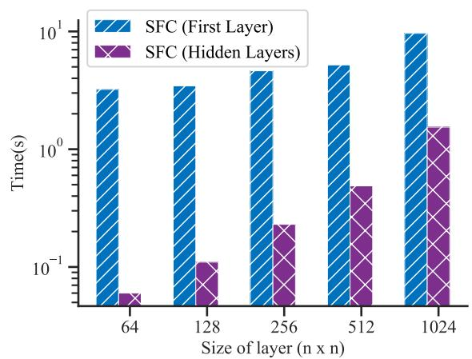

Fig. 12. Time cost of the SFC layer.

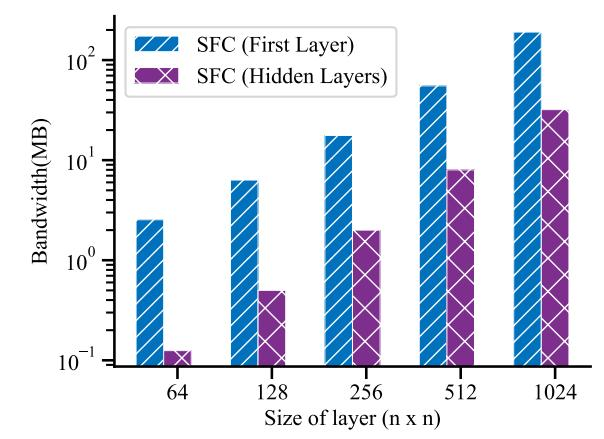

Fig. 13. Comm. cost of the SFC layer.

 $29\times$  and  $130\times$  less for the SecBAVDP function, over  $3\times3$  and  $5\times5$  windows respectively. For the non-linear functions, Leia achieves  $146\times$ ,  $2610\times$ , and  $2090\times$  bandwidth savings of the SecNBA, SecBN and SecMP costs compared with GC-based realizations. The reported results testify that the prior constructions relying on GC [7], [6], [11], [12] require a network environment with high bandwidth. They might not be applicable for our considered application scenario, i.e., the secure inference deployed at the edge with limited network conditions.

In particular, for the COT-based SecBAVDP function, we emphasis that the adoption of such regime saves the overall bandwidth consumption at a system level. Such retrenchment includes the cost of protecting each weight element as 32-bit shares in  $\mathbb{Z}_{2^{32}}$  to a tuple of 1-bit shares in  $\mathbb{Z}_2$ , and the cost of generation of multiplication triples in  $\mathbb{Z}_{2^{32}}$ . As shown by the empirical result, the GC-based realizations produce  $30\times$  and  $73\times$  bandwidth consumptions higher than the Leia's realizations for 9-dimensional and 25-dimensional vectors, respectively. We further report the bandwidth costs of the realizations based on multiplication triples as 270KB and 790KB, amounting to one magnitude larger than Leia's bandwidth.

2) Linear Layers: We report the performance of secure linear transformations (i.e., SCONV and SFC) below, which comprise the majority of Leia's overall inference overhead.

Table VI and Table V benchmark the performance of the SCONV layer function as the first layer and the hidden layer, respectively. The reported results are in line with our specified network architectures of M2, C1, and C2. As they consist plenty of convolutional hidden layers, we choose to show the performance of their second layers (the most complicated hidden layers) for the ease of demonstration. Note that, the M1, D1, D2, D3, D4 networks consist of only fully connected layers. The complexity of the SCONV layer function is determined by a set of parameters: 1) the number of input

channels  $c_{in}$  and output channels  $c_o$ ; 2) the dimensions of input image; 3) the kernel size (i.e., the sliding window size s), stride, and padding regime. These parameters directly reflect on the number of invocations of SecBAVDP/SecBVDP as shown. The key takeaway here is our runtime optimization of batch processing to amortize the overhead of executing SecBAVDP/SecBVDP. In detail, we flatten the input matrices across multiple channels yet within the same sliding window as a single vector, and conduct SecBAVDP/SecBVDP over it in a batch. We take as an example the complexity of C1's hidden SCONV layer reported in Table V. It is proceeded in the batch integrating with 16-channel input matrices. As a result, the calls of SecBVDP ( $3 \times 3$  window) are reduced from 230400 to 16384, speeding up the time from 68s to 6.2s accordingly.

Fig. 12 and Fig. 13 depict the computational and communication overheads of the SFC layer function as the first layer and hidden layers, respectively. They are evaluated over a series of  $n \times n$  fully connected layers, i.e., both the input and weight are n-dimensional vectors. Followed by the growth of n, the time of the hidden SFC layer ascends linearly attributed to our batch processing optimization, while the bandwidth ascends quadratically with the growth of dimension n. For the first SFC layer, the computational overhead is primarily dominated by the constant COT initialization time, and the bandwidth growths with the layer size.

3) Leia's Protocol on MNIST and CIFAR-10.: We evaluate Leia's cryptographic inference protocol on MNIST and CIFAR-10 datasets. Table VIII summarizes the overall performance. We overview the network architectures here, and present more details in Section III of the supplementary materials. The online phase of Leia is executed at the edge. The networks M1 and M2 for MNIST dataset are relatively simple, and Leia can produce high-quality prediction results within 4s and 37.4s, respectively. The more complex C1 and C2 for CIFAR-10 dataset involve 13 layers (23 stages), and

{12}------------------------------------------------

| TABLE VIII                                        |
|---------------------------------------------------|
| PERFORMANCE SUMMARY OF THE BENCHMARKING NETWORKS. |

| dataset  | network | time (s) a | comm. (MB) | time (ms) b | time (s) c  | accuracy | accuracy  | layers                                |
|----------|---------|------------|------------|-------------|-------------|----------|-----------|---------------------------------------|
|          |         | edge       | edge       | mobile user | model owner | Leia     | plaintext |                                       |
| MNIST    | M1      | 4.0        | 19.7       | 0.4         | 0.05        | 97.0%    | 97.0%     | 3SFC, 2SecNBA, 1SecBN                 |
| MINIST   | M2      | 37.4       | 328.1      | 0.4         | 0.5         | 99.12%   | 99.12%    | 2SCONV, 2SFC, 2SMP, 3SecNBA, 1SecBN   |
| CIFAR-10 | C1      | 123.1      | 919.4      | 1.1         | 5.1         | 71.68%   | 69.03%    | 9SCONV, 1SFC, 3SMP, 9SecNBA, 1SecBN d |
| CIFAR-10 | C2      | 199        | 1829.9     | 1.2         | 15.7        | 81.0%    | 77.88%    | 95CONV, 15FC, 55WP, 95eCNBA, 15eCBN " |

- <sup>a</sup> Time at edge includes ∼3s OT initialization time.
- <sup>b</sup> Cost of generating shares of an image during preprocessing.
- <sup>c</sup> One-time cost of generating shares of the model during preprocessing.
- <sup>d</sup> C1 and C2 have same layers but with different weight size.

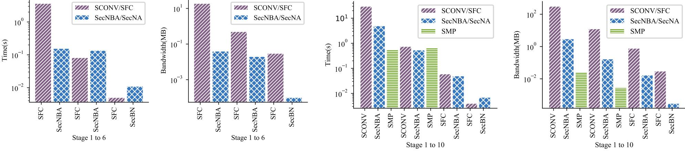

Fig. 14. Performance breakdown of M1. Left: time cost. Right: bandwidth cost.

Fig. 15. Performance breakdown of M2. Left: time cost. Right: bandwidth cost.

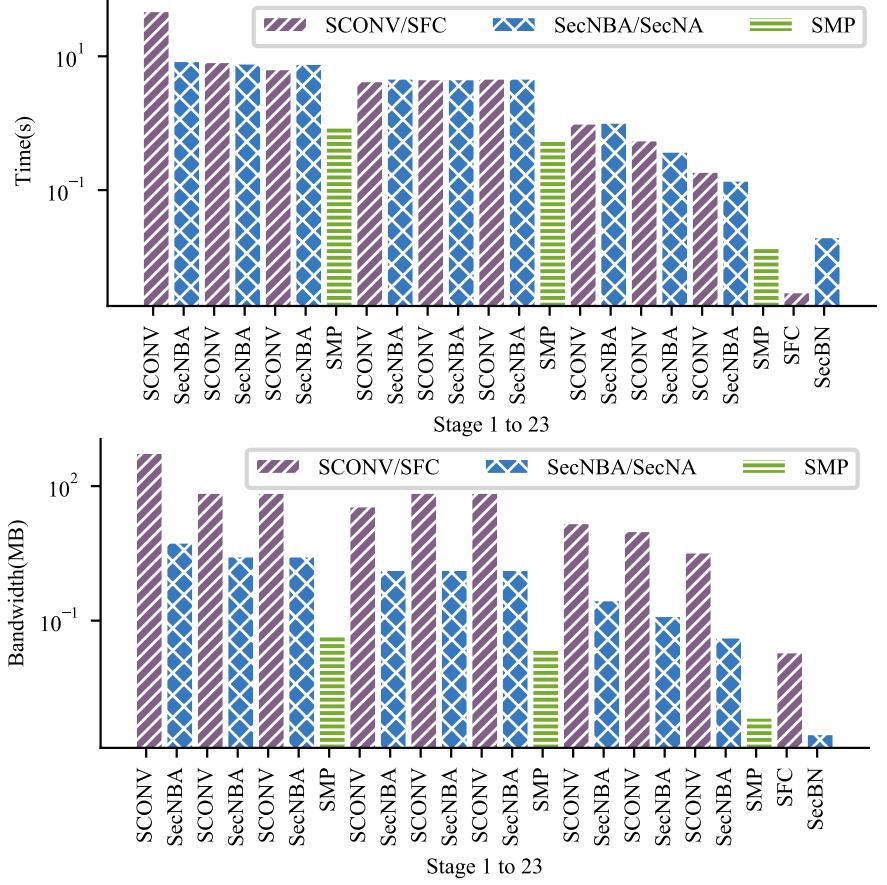

Fig. 16. Performance breakdown of C1. Top: time cost. Bottom: bandwidth cost.

their executions require about 2min and 3.3min respectively. The workload of the mobile user is light, which confirms that Leia is amiable to the resource limited portable devices. The one-time overhead of the model owner is determined by the model size. Such cost dost not aggravate workload on the model owner, as generating shares of the most complicated network C2 can be completed within 15.7s.

Performance Breakdown: To gain a more comprehensive understanding of resource consumption, we demonstrate the performance breakdown of each network. Fig. 14 and Fig. 15 show the time cost (left figure) and bandwidth cost (right figure) for each stage of M1 (6 stages) and M2 (10 stages) on MNIST dataset, respectively. Since C1 and C2 share the same architecture (different weight size), Fig. 16 reports the time (top figure) and bandwidth (bottom figure) for each stage

of C1 (23 stages) for demonstration purpose. As seen, the first layer occupies most of the resources, and the linear functions usually require more workload than the non-linear functions.

Accuracy: The effectiveness is demonstrated in Table VIII via the accuracy comparison between Leia's prediction results and the plaintext's results. For the M1 and M2 networks evaluated on MNIST dataset, Leia's prediction results are accurate as the plaintext (i.e., 97% and 99%, respectively). Besides, Leia achieves the accuracy of 69% and 81% for the C1 and C2 networks evaluated on CIFAR-10 dataset, amounting to slight accuracy impactions compared with the plaintext results. Such variations can be attributed to the quantization of batch normalization parameters, which imposes regularization on weights to prevent overfitting [51], [52].

Comparison with Prior Art: To demonstrate that Leia is suitable for edge, Table IX compares the bandwidth of Leia with prior art on CIFAR-10 dataset with the same accuracy (81%). All reported measurements are directly adopted the results reported from their papers, where the cost of Gazelle with all-ReLU activations is given in Delphi. As seen, Leia requires the least bandwidth cost among the others except the Gazelle with polynomial approximation of activation functions. However, Gazelle's client-server protocol requires much heavier workload on client, including the homomorphic encryption/decryption and interactions with the model owner.

For the state-of-the-art work (XONN [6]), it consumes overall 2599MB bandwidth over the trimmed NNs and 3461MB bandwidth without applying the network trimming techniques. In comparison, Leia only needs 1830MB bandwidth, amounting to  $1.4\times$  and  $1.9\times$  improvements, respectively. These improvements stem from the lightweight secret sharing techniques used in Leia, while XONN mainly resorts to the GC-based approaches. The optimizations proposed in XONN, i.e., the neural network pruning and scaling techniques, can be integrated in Leia to make further performance improvement. We note that XONN requires the client allocating sufficient

{13}------------------------------------------------

TABLE IX BANDWIDTH COMPARISON OF LEIA WITH PRIOR ART.

| prior art                    | bandwidth (MB) | accuracy |
|------------------------------|----------------|----------|
| MiniONN                      | 9272           | 81%      |
| Chameleon                    | 2650           | 81%      |
| EzPC                         | 40683          | 81%      |
| Gazelle (polynomial approx.) | 1236           | 81%      |
| Gazelle (ReLU activation)    | ∼5000          | 81%      |
| XONN (trimmed NN)            | 2599           | 81%      |
| XONN (untrimmed NN)          | 3461           | 81%      |
| Leia (network C2)            | 1829.9         | 81%      |

TABLE X DESCRIPTION OF THE MEDICAL APPLICATIONS.

| dataset            | network | # train | # test | layer functions       |
|--------------------|---------|---------|--------|-----------------------|
| Breast Cancer [46] | D1      | 5K      | 500    | 3SFC, 2SecNBA, 1SecBN |
| Diabetes [47]      | D2      | 615     | 115    | 3SFC, 2SecNBA, 1SecBN |
| Liver Disease [48] | D3      | 467     | 115    | 3SFC, 2SecNBA, 1SecBN |
| Thyroid [49]       | D4      | 3.7K    | 3.4K   | 3SFC, 2SecNBA, 1SecBN |

memory to garble the circuits (less than 2GB for each layer), which could be undesirable for the mobile devices. Leia circumvents the occupation of substantial memory usage, as the mobile device only needs to encrypt its user input (an image) as 32-bit secret shares, while the edge devices conduct the secure inference in an interactive way without constructing a large monolithic circuit.

*4) Leia's Protocol on Medical Applications:* Privacypreserving inference on medical data is one important application of Leia's protocol. Table VII summarizes Leia's performance of four medical applications: breast cancer, diabetes, liver cancer, and thyroid. The corresponding datasets and networks are described in Table X. Leia's inference of all above applications can be accomplished within 4s (including ∼3s OT initialization time) and a few MB bandwidth. Notably, the offline preprocessing requires less than 50µs and 10ms on the user side and the model owner side, respectively. Such tiny workload confirms that Leia can particularly benefit the healthcare stakeholders with resources-constraint IoT devices, like a patient in the wearable health monitoring device.

Energy Cost: As energy is one of the precious resources for edge computing, we further explore the energy performance of Leia's inference over real-world medical applications. In particular, we measure the amount of energy consumed throughout the entire secure inference via the usage of COOWOO power meter [50]. Table XI summarizes the energy consumed of Leia's secure inference system running over the four medical datasets.

# *C. Further Discussion*

We discuss on the generalization of Leia regarding more deployment scenarios and the supported NN models. Our primary goal of designing Leia is to present the proof-ofconcept solution of a mobile-friendly secure NN inference

TABLE XI ENERGY COST OF THE MEDICAL APPLICATIONS.

| medical application | Breast Cancer | Diabetes | Liver Disease | Thyroid |
|---------------------|---------------|----------|---------------|---------|
| energy cost (J)     | 439.2         | 532.8    | 788.4         | 2761.2  |

system at the edge. The deployment scenarios are not just limited to the mobile devices, rather, the scenarios can be extended to any resources-constrained devices, such as the IoT cameras, potable medical imaging devices. A typical example can be the handheld medical imaging scanner used by the COVID-19 pandemic screening centers, as given in Sec. IV-A3. Beyond edge, our system can be generalized to the cloud deployment, whereby two non-colluding cloud services collaboratively execute Leia.

In addition, we have designed Leia's secure inference procedure consists of all essential secure computational blocks in BNN, including the binarized linear layers, the commonly used non-linear binary activation function (the sign function), and the max pooling over binarized weights. These essential secure computational blocks can be scaled to support more neural networks. For example, our secure sign function can be used as a building block of secure ReLU function and secure max pooling over integers. Moreover, our proposed secure inference system can be deployed to other inference tasks, ranging from medical image segmentation, object detection, to natural language processing.

# VII. CONCLUSION

In this paper, we propose Leia, a lightweight cryptographic NN inference system at the edge. Leia resorts to the edge based architecture, to foster a low-latency service and relax the constraint of the model owner and mobile device being online. To cater for the operational needs of edge environment, Leia is co-designed with the advancement from both machine learning and cryptographic areas. With the highly customized secure layer functions on binarized neural network, Leia enables an oblivious inference service guaranteeing both user and model privacy. Comprehensive empirical validation on benchmark and medical datasets demonstrates Leia practical and applicable for the real-world scenarios.

# REFERENCES

- [1] "Machine learning and the future of mobile app development." Online at https://heartbeat.fritz.ai/machine-learning-and-the-future-of-mobile-a pp-development-13dd2aeda533.
- [2] "Google Cloud AI." Online at https://cloud.google.com/products/ai/.
- [3] W. Zheng, R. Popa, J. E. Gonzalez, and I. Stoica, "Helen: Maliciously secure coopetitive learning for linear models," in *Proc. of IEEE S&P*, 2019.
- [4] "Delphi: A cryptographic inference service for neural networks," in *Proc. of 29th USENIX Security*, 2020.
- [5] J. Liu, M. Juuti, Y. Lu, and N. Asokan, "Oblivious neural network predictions via minionn transformations," in *Proc. of ACM CCS*, 2017.
- [6] M. S. Riazi, M. Samragh, H. Chen, K. Laine, K. Lauter, and F. Koushanfar, "Xonn: Xnor-based oblivious deep neural network inference," in *Proc. of 28th USENIX Security*, 2019.
- [7] N. Agrawal, A. Shahin Shamsabadi, M. J. Kusner, and A. Gascon, ´ "Quotient: two-party secure neural network training and prediction," in *Proc. of ACM CCS*, 2019.
- [8] "AI at the Edge: The next frontier of the Internet of Things." Online at https://iotbusinessnews.com/download/white-papers/AVNET-ai-at-theedge-whitepaper.pdf.
- [9] L. Zhou, M. H. Samavatian, A. Bacha, S. Majumdar, and R. Teodorescu, "Adaptive parallel execution of deep neural networks on heterogeneous edge devices," in *Proc. of ACM/IEEE Symposium on Edge Computing*, 2019.
- [10] R. Gilad-Bachrach, N. Dowlin, K. Laine, K. Lauter, M. Naehrig, and J. Wernsing, "Cryptonets: Applying neural networks to encrypted data with high throughput and accuracy," in *Proc. of ICML*, 2016.

{14}------------------------------------------------

- [11] P. Mohassel and Y. Zhang, "Secureml: A system for scalable privacy-preserving machine learning," in *Proc. of IEEE S&P*, 2017.
- [12] C. Juvekar, V. Vaikuntanathan, and A. Chandrakasan, "Gazelle: A low latency framework for secure neural network inference," in *Proc. of 27th USENIX Security*, 2018.
- [13] A. Ibarrondo, H. Chabanne, and M. Önen, "Banners: Binarized neural networks with replicated secret sharing," in *Proceedings of the 2021 ACM Workshop on Information Hiding and Multimedia Security*, pp. 63–74, 2021.
- [14] M. S. Riazi, C. Weinert, O. Tkachenko, E. M. Songhori, T. Schneider, and F. Koushanfar, "Chameleon: A hybrid secure computation framework for machine learning applications," in *Proc. of AsiaCCS*, 2018.
- [15] M. Courbariaux, I. Hubara, D. Soudry, R. El-Yaniv, and Y. Bengio, "Binarized neural networks: Training deep neural networks with weights and activations constrained to+ 1 or-1," *arXiv preprint arXiv:1602.02830*, 2016.
- [16] S. Wagh, S. Tople, F. Benhamouda, E. Kushilevitz, P. Mittal, and T. Rabin, "Falcon: Honest-majority maliciously secure framework for private deep learning," *Proceedings on Privacy Enhancing Technologies*, vol. 2021, no. 1, pp. 188–208.
- [17] A. Dalskov, D. Escudero, and M. Keller, "Secure evaluation of quantized neural networks," *Proceedings on Privacy Enhancing Technologies*, vol. 4, pp. 355–375, 2020.
- [18] S. Wagh, D. Gupta, and N. Chandran, "Securenn: 3-party secure computation for neural network training," *Proc. of PETS*, 2019.
- [19] O. Goldreich, S. Micali, and A. Wigderson, "How to play any mental game or a completeness theorem for protocols with honest majority," in *Proc. of STOC*, 1987.
- [20] M. Atallah, M. Bykova, J. Li, K. Frikken, and M. Topkara, "Private collaborative forecasting and benchmarking," in *Proc. of WPES*, 2004.
- [21] M. Blanton, A. Kang, and C. Yuan, "Improved building blocks for secure multi-party computation based on secret sharing with honest majority," in *Proc. of ACNS*, Springer, 2020.
- [22] D. Demmler, T. Schneider, and M. Zohner, "Aby-a framework for efficient mixed-protocol secure two-party computation.," in *Proc. of NDSS*, 2015.
- [23] P. Mohassel and P. Rindal, "Aby3: A mixed protocol framework for machine learning," in *Proc. of ACM CCS*, 2018.
- [24] R. Rachuri and A. Suresh, "Trident: Efficient 4pc framework for privacy preserving machine learning," 2020.
- [25] N. Chandran, D. Gupta, A. Rastogi, R. Sharma, and S. Tripathi, "Ezpc: programmable, efficient, and scalable secure two-party computation for machine learning," *ePrint Report*, vol. 1109, 2017.
- [26] M. Rastegari, V. Ordonez, J. Redmon, and A. Farhadi, "Xnor-net: Imagenet classification using binary convolutional neural networks," in *Proc. of ECCV*, 2016.
- [27] S. Ioffe and C. Szegedy, "Batch normalization: Accelerating deep network training by reducing internal covariate shift," *arXiv* preprint *arXiv*:1502.03167, 2015.
- [28] G. Asharov, Y. Lindell, T. Schneider, and M. Zohner, "More efficient oblivious transfer and extensions for faster secure computation," in *Proc. of ACM CCS*, 2013.
- [29] D. Beaver, "Efficient multiparty protocols using circuit randomization," in *Proc. of Crypto*, 1991.
- [30] Y. Zheng, H. Duan, and C. Wang, "Towards secure and efficient outsourcing of machine learning classification," in *Proc. of ESORICS*, Springer, 2019.
- [31] "SnapML for Snapchat Lens Studio." Online at https://lensstudio.snapchat.com/guides/machine-learning/ml-overview/.
- [32] "Amazon Rekognition." Online at https://aws.amazon.com/rekognition.
- [33] "Google DeepMind Health." Online at https://deepmind.com/blog/anno uncements/deepmind-health-joins-google-health, 2020.
- [34] "Azure IoT Edge." Online at https://azure.microsoft.com/en-au/services/iot-edge/.
- [35] "Lambda@Edge." Online at https://aws.amazon.com/lambda/edge/.
- [36] D. D. Bates, A. Vintonyak, U. M. Rennie Mohabir, P. Soto, J. S. Groeger, M. S. Ginsberg, and M. J. Gollub, "Use of a portable computed tomography scanner for chest imaging of covid-19 patients in the urgent care at a tertiary cancer center," *Emergency Radiology*, p. 1, 2020.
- [37] B. Knott, S. Venkataraman, A. Hannun, S. Sengupta, M. Ibrahim, and L. van der Maaten, "Crypten: Secure multi-party computation meets machine learning," in *Proceedings of the NeurIPS Workshop on Privacy-Preserving Machine Learning*, 2020.
- [38] Cape Privacy, "Tf encrypted: Encrypted deep learning in tensorflow.." online at https://tf-encrypted.io/, 2020.
- [39] Y. Lindell and B. Pinkas, "Privacy preserving data mining.," *Journal of cryptology*, vol. 15, no. 3, 2002.

- [40] L. Yu, L. Liu, C. Pu, M. E. Gursoy, and S. Truex, "Differentially private model publishing for deep learning," in *Proc. of S&P*, IEEE, 2019.
- [41] "Pytorch for densenet." Online at https://github.com/pytorch/vision/bl ob/master/torchvision/models/densenet.py.
- [42] R. Canetti, "Universally composable security: A new paradigm for cryptographic protocols." Cryptology ePrint Archive, Report 2000/067, 2000.
- [43] A. Patra, T. Schneider, A. Suresh, and H. Yalame, "Aby2. 0: Improved mixed-protocol secure two-party computation," in *USENIX Security*, vol. 21, 2020.
- [44] X. Liu, B. Wu, X. Yuan, and X. Yi, "Leia: A lightweight cryptographic neural network inference system at the edge.," *IACR Cryptol. ePrint Arch.*, vol. 2020, p. 463, 2020.
- [45] X. Wang, "Flexsc." https://github.com/wangxiao1254/FlexSC, 2018.
- [46] "Breast cancer." https://www.kaggle.com/uciml/breast-cancer-wisconsin -data/.
- [47] "Diabetes." https://www.kaggle.com/uciml/pima-indians-diabetes-datab ase.
- [48] "Liver disease." https://www.kaggle.com/uciml/indian-liver-patient-re cords.
- [49] "Thyroid." https://archive.ics.uci.edu/ml/datasets/Thyroid+Disease.
- [50] "COOWOO USB Digital Power Meter Tester." Online at http://www.co owootech.com/tools.html.
- [51] R. Balestriero and R. Baraniuk, "Mad max: Affine spline insights into deep learning," *Proc. of ICML*, 2018.
- [52] H. Yang, L. Duan, Y. Chen, and H. Li, "Bsq: Exploring bit-level sparsity for mixed-precision neural network quantization," *Proc. of ICLR*, 2021.

# APPENDIX A THE SECURE MSB GADGET

```
Input: Arithmetic shares of integer feature y \in \mathbb{Z}.

Output: Boolean shares of MSB y_{\ell} \in \{0, 1\}.

1) S_i decomposes \langle y \rangle_i^A to a bit string \langle y_1 \rangle_i^A, \ldots, \langle y_{\ell} \rangle_i^A;

2) For each k \in [1, \ell]:

S_0 sets \llbracket u_k \rrbracket_0 = \langle y_k \rangle_0^A, \llbracket v_k \rrbracket_0 = 0, \llbracket t_k \rrbracket_0 = \langle y_k \rangle_0^A;

S_1 sets \llbracket u_k \rrbracket_1 = 0, \llbracket v_k \rrbracket_1 = \langle y_k \rangle_1^A, \llbracket t_k \rrbracket_1 = \langle y_k \rangle_1^A;

S_0 and S_1 set \llbracket d_k \rrbracket_i = \llbracket u_k \rrbracket \wedge \llbracket v_k \rrbracket in a batch;

3) S_i sets variable \llbracket c_1 \rrbracket_i = \llbracket d_1 \rrbracket_i;

4) For k \in [2, \ell - 1]:

S_i sets \llbracket d_k \rrbracket_i = \llbracket d_k \rrbracket_i \oplus i;

S_0 and S_1 set \llbracket e_k \rrbracket_i = \llbracket t_k \rrbracket \wedge \llbracket c_{k-1} \rrbracket \oplus i;

S_0 and S_1 set \llbracket c_k \rrbracket_i = \llbracket e_k \rrbracket \wedge \llbracket d_k \rrbracket \oplus i;

5) S_i sets the MSB to \llbracket y_\ell \rrbracket_i = \llbracket t_\ell \rrbracket_i \oplus \llbracket c_{\ell-1} \rrbracket_i.
```

Fig. 17. The secure  $MSB(\cdot)$  gadget.

Fig. 17 presents the secure MSB(·) gadget. It follows the bit extraction protocol in [30], which is able to efficiently extract the MSB of the Arithmetic-shared values and produce a Boolean-shared MSB. The protocol takes as input the Arithmetic shared of integer feature  $\langle y \rangle^A \in \mathbb{Z}^{2^\ell}$ , extracts the  $\ell$ -th bit as MSB of y, and outputs its Boolean shares  $[\![y_\ell]\!]$ . Let  $y=u+v\pmod{2^\ell}$ . The idea is that the difference between the sum of bit strings of u,v and the bitwise-XOR of the bit strings of u,v,y is equal to the carry bits  $c_1,\ldots,c_\ell$ . This can be realized by an  $\ell$ -bit ripple carry logic, where every carry bit is calculated by a full adder and propagated to the next full adder, and finally the MSB of y is outputted by the  $\ell$ -th full adder.

# APPENDIX B

# FURTHER ILLUSTRATION OF THE CONV LAYER

In this section, we provide a supplementary illustration of the CONV layers. Fig. 18 shows how the CONV layers can be reformulated as the  $VDP(\cdot, \cdot)$ . For simplicity purpose, it takes as input the toy-value  $4\times3$  input matrix X,  $2\times2$  weight matrix W, and shows the procedure to calculate each element in resulting matrix Z based on the VDP operations.

{15}------------------------------------------------

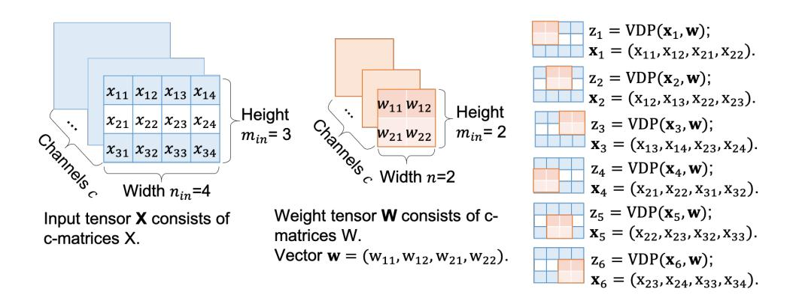

Fig. 18. An illustration of the CONV layer.

# APPENDIX C PROOF OF CORRECTNESS

In this section, we present the correctness proofs of the SecBAVDP function and the SecMP function.

#### A. Proof of the SecBAVDP function

Lemma 1: Let  $\mathbf{x}$  and  $\mathbf{w}^b$  be an integer and binary vectors, respectively. They are shared between parties  $S_0$  and  $S_1$  as Arithmetic shares  $\langle \mathbf{x} \rangle^A$  and Boolean shares  $[\![\mathbf{w}^b]\!]$ . Given a secure COT protocol with the correlation-robust functions  $f_{\Delta}, g_{\Delta}$ , our two-party protocol SecBAVDP( $\langle \mathbf{x} \rangle^A, [\![\mathbf{w}^b]\!]$ ) over mixed share representations correctly implements the Boolean-Arithmetic-VDP functionality.

*Proof 1:* The protocol SecBAVDP( $\langle \mathbf{x} \rangle^A$ ,  $\llbracket \mathbf{w}^b \rrbracket$ ) correctly implements the logic  $\langle z \rangle^A = \sum_{k=1}^n (\llbracket w_k^b \rrbracket_0 \oplus \llbracket w_k^b \rrbracket_1) \cdot (\langle x_k \rangle_0^A + \langle x_k \rangle_1^A)$  with two executions of  $COT_\ell$  corresponding to the correlation functions  $f_\Delta$  and  $g_\Delta$ , respectively.

For the  $\operatorname{COT}_{\ell}$  with  $f_{\Delta}(s) = s + (\neg \llbracket w_k^b \rrbracket_0 \cdot \langle x_k \rangle_0^A - \llbracket w_k^b \rrbracket_0 \cdot \langle x_k \rangle_0^A)$ ,  $S_0$  is the sender,  $S_1$  is the receiver, and s is any input from  $S_0$ . We show that the output of the k-th COT correctly carries out  $\langle u_k \rangle^A = \langle (\llbracket w_k \rrbracket_0 \oplus \llbracket w_k \rrbracket_1) \cdot \langle x_k \rangle_0^A \rangle^A$ . We have two cases:

- 1) If the choice bit  $[\![w_k^b]\!]_1 = 0$ : Note,  $w_k^b = [\![w_k^b]\!]_0 \oplus 0 = [\![w_k^b]\!]_0$ . Given the inputs  $r_u \in_R$   $\mathbb{Z}_{2^\ell}$ ,  $f_{\Delta}(r_u)$  from  $S_0$ , the choice bit  $\mathfrak{b}_u = [\![w_k^b]\!]_1 = 0$  from  $S_1$ . After execution of the COT,  $S_0$  obtains  $\langle u_k \rangle_0^A = -r_u$ . Meanwhile,  $S_1$  obtains  $\langle u_k \rangle_1^A = m_{\mathfrak{b}_u} = m_0 = r_u + [\![w_k^b]\!]_0 \cdot \langle x_k \rangle_0 = r_u + w_k^b \cdot \langle x_k \rangle_0$  obliviously. Upon reconstruction,  $u_k = w_k^b \cdot \langle x_k \rangle_0$ .
- 2) If the choice bit  $\llbracket w_k^b \rrbracket_1 = 1$ : Note,  $w_k^b = \llbracket w_k^b \rrbracket_0 \oplus 1 = \neg \llbracket w_k^b \rrbracket_0$ . Given the inputs  $r_u \in_R \mathbb{Z}_{2^\ell}$ ,  $f_{\Delta}(r_u)$  from  $S_0$ , the choice bit  $\mathfrak{b}_u = \llbracket w_k^b \rrbracket_1 = 1$  from  $S_1$ . After execution of the COT,  $S_0$  obtains  $\langle u_k \rangle_0^A = -r_u$ . Meanwhile,  $S_1$  obtains  $\langle u_k \rangle_1^A = m_1 = r_u + \neg \llbracket w_k^b \rrbracket_0 \cdot \langle x_k \rangle_0 = r_u + w_k^b \cdot \langle x_k \rangle_0$  obliviously. Upon reconstruction,  $u_k = w_k^b \cdot \langle x_k \rangle_0$ .

The execution of the  $\operatorname{COT}_\ell$  with  $g_\Delta$  performs in a similar way, where  $S_1$  is the sender, and  $S_0$  is the receiver. For the k-th COT, it takes as input  $r_v \in_R \mathbb{Z}_{2^\ell}$ ,  $g_\Delta(r_v)$  from  $S_1$ , and the choice bit  $\mathfrak{b}_v = [\![w_k^b]\!]_0$  from  $S_0$ . Upon execution,  $S_1$  always obtains  $\langle v_k \rangle_1^A = -r_v$ , and  $S_0$  obtains  $\langle v_k \rangle_0^A = m_0 = r_v + [\![w_k^b]\!]_1 \cdot \langle x \rangle_1^A$  or  $\langle v_k \rangle_0^A = m_1 = r_v + \neg [\![w_k^b]\!]_1 \cdot \langle x \rangle_1^A$  obliviously. Upon reconstruction,  $v_k = w_k^b \cdot \langle x \rangle_1^A$ . Ultimately,  $z_k = w_k^b \cdot (\langle x \rangle_0^A + \langle x \rangle_1^A) = w_k^b \cdot x_k$ .

#### B. Proof of the SecMP function

Lemma 2: Let  $\mathbf{a}_1^b,...,\mathbf{a}_m^b$  be m-number of n-dimensional binary activation vectors, shared between parties  $S_0,S_1$  as Boolean shares  $[\![\mathbf{a}_1^b]\!],...,[\![\mathbf{a}_m^b]\!]$ . Given the ring  $\mathbb{Z}_2$ , our two-party protocol SecMP $(\cdot)$  correctly implements the max pooling functionality.

Proof 2: For the ease of demonstration and without loss of generality, the following proof of correctness takes one binary activation vector  $\mathbf{a}^b \in \{0,1\}^n$  as an example. The protocol implements the logic  $z^b = a_1^b \vee a_2^b \vee ... \vee a_n^b$  to proceed the max pooling over binarized values, i.e., finding if the binary vector has "1" bit as mentioned above. Taken  $z^b = x^b \vee y^b$  as an example, the bitwise-OR logic can be similarly reformulated as  $z^b = \neg(\neg x^b \wedge \neg y^b)$ . For the two-party protocol, each party  $S_i$  (for  $i \in \{0,1\}$ ) holds its shares  $[\![x^b]\!]_i$ ,  $[\![y^b]\!]_i$ , and attempts to obtain  $[\![z^b]\!]_i$  as the result. The above logic can be correctly expressed as  $[\![z^b]\!]_i = i \oplus ((i \oplus [\![x^b]\!]_i) \wedge (i \oplus [\![y^b]\!]_i))$ , given the correctness of  $\neg x^b = [\![x^b]\!]_0 \oplus \neg [\![x^b]\!]_1 = (0 \oplus [\![x^b]\!]_0) \oplus (1 \oplus [\![x^b]\!]_1)$ . Note, all operations above are performed by each party without interaction.

# APPENDIX D REMARK OF COMPLEXITY.

In this section, we analysis the complexity of Leia's secure BNN inference protocol. We summarize in Table XII the total moves to slide a window  $\mathcal{T}$  and the number of executions of each secure layer function with regards to each secure layer. As defined, the size of already padded input tensor, weight tensor and output tensor for the first SCONV layer are  $c_{in} \times n_{in}^1 \times m_{in}^1$ ,  $c_{in} \times c_o^1 \times (n_w^1 \times n_w^1)$ ,  $c_o^1 \times n_o^1 \times m_o^1$ , respectively. Similarly, for the l-th hidden SCONV layer, the size of input, weight and output are  $c_o^{l-1} \times n_o^{l-1} \times m_o^{l-1}$ ,  $c_o^{l-1} \times c_o^l \times (n_w^l \times n_w^l)$ ,  $c_o^l \times n_o^l \times m_o^l$ , respectively. For the SMP layers, the stride  $n_w^l$  to slide the pooling window is normally aligned with the window size  $n_w^l \times n_w^l$ . For the l-th SFC layer, the calls of secure functions are only related to the length of output vector  $n_o^l$ .

TABLE XII
COMPLEXITY ANALYSIS.

|         | 7                                                       |          |                                                                                                 |
|---------|---------------------------------------------------------|----------|-------------------------------------------------------------------------------------------------|
| stride  | $\mathcal{T}^{\iota}$ moves to slide the window         | function | # calls                                                                                         |
|         | First SCONV                                             |          |                                                                                                 |
| 1       | $(n_{in} - n_w^1 + 1) \cdot (m_{in} - n_w^1 + 1)$       | Sec1VDP  | $\frac{c_{in} \cdot c_o^1 \cdot \mathcal{T}^1}{2 \cdot c_{in} \cdot c_o^1 \cdot \mathcal{T}^1}$ |
| -       | -                                                       | SecBAVDP | $2 \cdot c_{in} \cdot c_o^1 \cdot \mathcal{T}^1$                                                |
| -       | -                                                       | SecNBA   | $c_o^1\cdot \mathcal{T}^1$                                                                      |
|         | Hidden SCONV                                            |          |                                                                                                 |
| 1       | $(n_o^{l-1} - n_w^l + 1) \cdot (m_o^{l-1} - n_w^l + 1)$ | SecBVDP  | $c_o^{l-1} \cdot c_o^l \cdot \mathcal{T}^l \ c_o^l \cdot \mathcal{T}^l$                         |
|         | -                                                       | SecNBA   | $c_o^l \cdot \mathcal{T}^l$                                                                     |
|         | SMP                                                     |          |                                                                                                 |
| $n_w^l$ | $(n_o^{l-1}/n_w^l) \cdot (m_o^{l-1}/n_w^l)$             | SMP      | $c_o^{l-1} \cdot c_o^l \cdot \mathcal{T}^l$                                                     |
|         | First SFC                                               |          |                                                                                                 |
| -       | -                                                       | Sec1VDP  | $n_o^1$                                                                                         |
| -       | -                                                       | SecBAVDP | $2 \cdot n_o^1$                                                                                 |
| -       | -                                                       | SecNBA   | $\begin{array}{ccc} 2 \cdot n_o^1 \ 2 \cdot n_o^1 \end{array}$                                  |
|         | Hidden/Output SFC                                       |          |                                                                                                 |
| -       | -                                                       | SecBVDP  | $n_o^l$                                                                                         |
| -       | -                                                       | SecNBA   | $n_o^l$                                                                                         |
|         | -                                                       | SecBN    | $n_o^l \ n_o^l \ n_o^l$                                                                         |

{16}------------------------------------------------

# APPENDIX E MODEL ARCHITECTURES

This section depicts the details of the model structures adopted in the evaluation.

#### TABLE XIII MODEL ARCHITECTURE OF D1.

| layers                               | #<br>SecBVDP/<br>SecBAVDP | padding,<br>stride |
|--------------------------------------|---------------------------|--------------------|
| FC (input: 30, output: 16) + BN + BA | 32                        | -, -               |
| FC (input: 16, output: 16) + BN + BA | 16                        | -, -               |
| FC (input: 16, output: 2) + BN       | 2                         | -, -               |

#### TABLE XIV MODEL ARCHITECTURE OF D2.

| layers                               | #<br>SecBVDP/<br>SecBAVDP | padding,<br>stride |
|--------------------------------------|---------------------------|--------------------|
| FC (input: 8, output: 20) + BN + BA  | 40                        | -, -               |
| FC (input: 20, output: 20) + BN + BA | 20                        | -, -               |
| FC (input: 20, output: 2) + BN       | 2                         | -, -               |

#### TABLE XV MODEL ARCHITECTURE OF D3.

| layers                               | #<br>SecBVDP/<br>SecBAVDP | padding,<br>stride |
|--------------------------------------|---------------------------|--------------------|
| FC (input: 10, output: 32) + BN + BA | 64                        | -, -               |
| FC (input: 32, output: 32) + BN + BA | 32                        | -, -               |
| FC (input: 32, output: 2) + BN       | 2                         | -, -               |

#### TABLE XVI MODEL ARCHITECTURE OF D4.

| layers                                 | #<br>SecBVDP/<br>SecBAVDP | padding,<br>stride |
|----------------------------------------|---------------------------|--------------------|
| FC (input: 21, output: 100) + BN + BA  | 200                       | -, -               |
| FC (input: 100, output: 100) + BN + BA | 100                       | -, -               |
| FC (input: 100, output: 3) + BN        | 3                         | -, -               |

### TABLE XVII MODEL ARCHITECTURE OF M1.

| layers                                 | #<br>SecBVDP/<br>SecBAVDP | padding,<br>stride |
|----------------------------------------|---------------------------|--------------------|
| FC (input: 784, output: 128) + BN + BA | 256                       | -, -               |
| FC (input: 128, output: 128) + BN + BA | 128                       | -, -               |
| FC (input: 128, output: 10) + BN       | 10                        | -, -               |

#### TABLE XVIII MODEL ARCHITECTURE OF M2.

| layers                                                                               | #<br>SecBVDP/<br>SecBAVDP | padding,<br>stride |
|--------------------------------------------------------------------------------------|---------------------------|--------------------|
| CONV (input: 1 × 28 × 28, kernel: 1 × 16 × 5 × 5<br>feature: 16 × 24 × 24) + BN + BA | 1×18432                   | -, 1               |
| MP (input: 16×24×24, window: 16×2×2 output:<br>16 × 12 × 12)                         | -                         | -, 2               |
| CONV (input: 16×12×12, kernel: 16×16×5×5<br>feature: 16 × 8 × 8) + BN + BA           | 16×1024                   | -, 1               |
| MP (input: 16 × 8 × 8, window: 16 × 2 × 2 output:<br>16 × 4 × 4) + BN + BA           | -                         | -, 2               |
| FC (input: 256, output: 100) + BN + BA                                               | 100                       | -, -               |
| FC (input: 100, output: 10) + BN                                                     | 10                        | -, -               |

### TABLE XIX MODEL ARCHITECTURE OF C1.

| SecBVDP/<br>stride<br>SecBAVDP<br>CONV (input: 3 × 32 × 32, kernel: 3 × 16 × 3 × 3<br>3×32768<br>0, 1<br>feature: 16 × 32 × 32) + BN + BA<br>CONV (input: 16×32×32, kernel: 16×16×3×3<br>16×16384<br>0, 1<br>feature: 16 × 32 × 32) + BN + BA<br>CONV (input: 16×32×32, kernel: 16×16×3×3<br>16×16384<br>0, 1<br>feature: 16 × 32 × 32) + BN + BA<br>MP (input: 16×32×32, window: 16×2×2 output:<br>-<br>-, 2 |  |
|---------------------------------------------------------------------------------------------------------------------------------------------------------------------------------------------------------------------------------------------------------------------------------------------------------------------------------------------------------------------------------------------------------------|--|
|                                                                                                                                                                                                                                                                                                                                                                                                               |  |
|                                                                                                                                                                                                                                                                                                                                                                                                               |  |
|                                                                                                                                                                                                                                                                                                                                                                                                               |  |
|                                                                                                                                                                                                                                                                                                                                                                                                               |  |
|                                                                                                                                                                                                                                                                                                                                                                                                               |  |
|                                                                                                                                                                                                                                                                                                                                                                                                               |  |
|                                                                                                                                                                                                                                                                                                                                                                                                               |  |
|                                                                                                                                                                                                                                                                                                                                                                                                               |  |
| 16 × 16 × 16)                                                                                                                                                                                                                                                                                                                                                                                                 |  |
| CONV (input: 16×16×16, kernel: 16×32×3×3<br>16×8192<br>0, 1                                                                                                                                                                                                                                                                                                                                                   |  |
| feature: 32 × 16 × 16) + BN + BA                                                                                                                                                                                                                                                                                                                                                                              |  |
| CONV (input: 32×16×16, kernel: 32×32×3×3<br>16×8192<br>0, 1                                                                                                                                                                                                                                                                                                                                                   |  |
| feature: 32 × 16 × 16) + BN + BA                                                                                                                                                                                                                                                                                                                                                                              |  |
| CONV (input: 32×16×16, kernel: 32×32×3×3<br>16×8192<br>0, 1                                                                                                                                                                                                                                                                                                                                                   |  |
| feature: 32 × 16 × 16) + BN + BA                                                                                                                                                                                                                                                                                                                                                                              |  |
| MP (input: 32×16×16, window: 32×2×2 output:<br>-<br>-, 2                                                                                                                                                                                                                                                                                                                                                      |  |
| 32 × 8 × 8)                                                                                                                                                                                                                                                                                                                                                                                                   |  |
| CONV (input: 32 × 8 × 8, kernel: 32 × 48 × 3 × 3<br>32×1728<br>-, 1                                                                                                                                                                                                                                                                                                                                           |  |
| feature: 48 × 6 × 6) + BN + BA                                                                                                                                                                                                                                                                                                                                                                                |  |
| CONV (input: 48 × 6 × 6, kernel: 48 × 48 × 3 × 3<br>48×1728<br>-, 1                                                                                                                                                                                                                                                                                                                                           |  |
| feature: 48 × 4 × 4) + BN + BA                                                                                                                                                                                                                                                                                                                                                                                |  |
| CONV (input: 48 × 4 × 4, kernel: 48 × 64 × 3 × 3<br>48×2304<br>-, 1                                                                                                                                                                                                                                                                                                                                           |  |
| feature: 64 × 2 × 2) + BN + BA                                                                                                                                                                                                                                                                                                                                                                                |  |
| MP (input: 64 × 2 × 2, window: 64 × 2 × 2 output:<br>-<br>-, 2                                                                                                                                                                                                                                                                                                                                                |  |
| 64 × 1 × 1)                                                                                                                                                                                                                                                                                                                                                                                                   |  |
| FC (input: 64, output: 10) + BN<br>10<br>-, -                                                                                                                                                                                                                                                                                                                                                                 |  |

#### TABLE XX MODEL ARCHITECTURE OF C2.

| layers                                            | #                    | padding, |
|---------------------------------------------------|----------------------|----------|
|                                                   | SecBVDP/<br>SecBAVDP | stride   |
| CONV (input: 3 × 32 × 32, kernel: 3 × 16 × 3 × 3  | 3×32768              | 0, 1     |
| feature: 16 × 32 × 32) + BN + BA                  |                      |          |
| CONV (input: 16×32×32, kernel: 16×32×3×3          | 16×32768             | 0, 1     |
| feature: 32 × 32 × 32) + BN + BA                  |                      |          |
| CONV (input: 32×32×32, kernel: 32×32×3×3          | 32×32768             | 0, 1     |
| feature: 32 × 32 × 32) + BN + BA                  |                      |          |
| MP (input: 32×32×32, window: 32×2×2 output:       | -                    | -, 2     |
| 32 × 16 × 16)                                     |                      |          |
| CONV (input: 32×16×16, kernel: 32×48×3×3          | 32×12288             | 0, 1     |
| feature: 48 × 16 × 16) + BN + BA                  |                      |          |
| CONV (input: 48×16×16, kernel: 48×64×3×3          | 48×16384             | 0, 1     |
| feature: 64 × 16 × 16) + BN + BA                  |                      |          |
| CONV (input: 64×16×16, kernel: 64×80×3×3          | 64×20480             | 0, 1     |
| feature: 80 × 16 × 16) + BN + BA                  |                      |          |
| MP (input: 80×16×16, window: 80×2×2 output:       | -                    | -, 2     |
| 80 × 8 × 8)                                       |                      |          |
| CONV (input: 80 × 8 × 8, kernel: 80 × 96 × 3 × 3  | 80×3456              | -, 1     |
| feature: 96 × 6 × 6) + BN + BA                    |                      |          |
| CONV (input: 96 × 6 × 6, kernel: 96 × 96 × 3 × 3  | 96×1536              | -, 1     |
| feature: 96 × 4 × 4) + BN + BA                    |                      |          |
| CONV (input: 96 × 4 × 4, kernel: 96 × 128 × 3 × 3 | 96×512               | -, 1     |
| feature: 128 × 2 × 2) + BN + BA                   |                      |          |
| MP (input: 128×2×2, window: 128×2×2 output:       | -                    | -, 2     |
| 128 × 1 × 1)                                      |                      |          |
| FC (input: 128, output: 10) + BN                  | 10                   | -, -     |