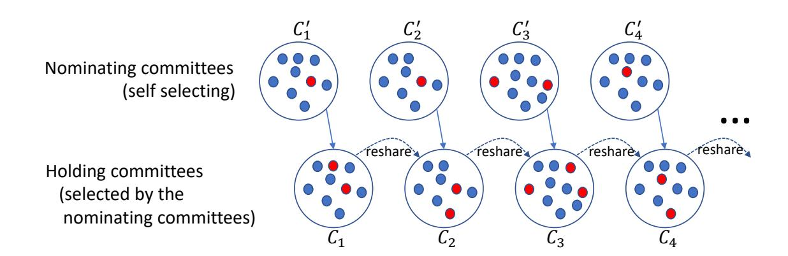
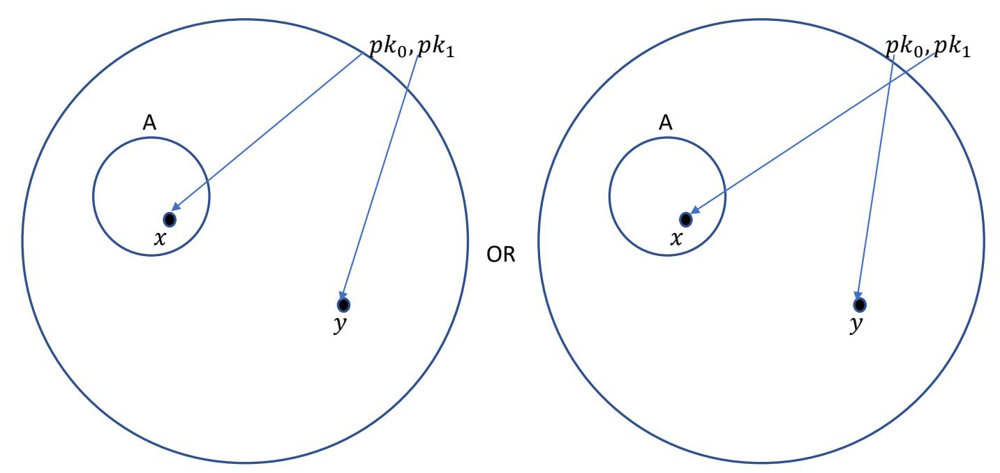

{0}------------------------------------------------

# Can a Public Blockchain Keep a Secret?

Fabrice Benhamouda<sup>1</sup> , Craig Gentry<sup>1</sup> , Sergey Gorbunov<sup>2</sup> , Shai Halevi<sup>1</sup> , Hugo Krawczyk<sup>1</sup> , Chengyu Lin<sup>3</sup> , Tal Rabin1,4, and Leonid Reyzin5,6

> Algorand Foundation, USA University of Waterloo, Canada Columbia University, USA University of Pennsylvania, USA Algorand Inc., USA Boston University, USA

> > September 28, 2020

#### Abstract

Blockchains are gaining traction and acceptance, not just for cryptocurrencies, but increasingly as an architecture for distributed computing. In this work we seek solutions that allow a public blockchain to act as a trusted long-term repository of secret information: Our goal is to deposit a secret with the blockchain, specify how it is to be used (e.g., the conditions under which it is released), and have the blockchain keep the secret and use it only in the specified manner (e.g., release only it once the conditions are met). This simple functionality enables many powerful applications, including signing statements on behalf of the blockchain, using it as the control plane for a storage system, performing decentralized program-obfuscation-as-aservice, and many more.

Using proactive secret sharing techniques, we present a scalable solution for implementing this functionality on a public blockchain, in the presence of a mobile adversary controlling a small minority of the participants. The main challenge is that, on the one hand, scalability requires that we use small committees to represent the entire system, but, on the other hand, a mobile adversary may be able to corrupt the entire committee if it is small. For this reason, existing proactive secret sharing solutions are either non-scalable or insecure in our setting.

We approach this challenge via "player replaceability", which ensures the committee is anonymous until after it performs its actions. Our main technical contribution is a system that allows sharing and re-sharing of secrets among the members of small dynamic committees, without knowing who they are until after they perform their actions and erase their secrets. Our solution handles a fully mobile adversary corrupting roughly 1/4 of the participants at any time, and is scalable in terms of both the number of parties and the number of time intervals.

Keywords. Blockchain, Evolving-Committee Proactive Secret Sharing, Mobile Adversary, Player Replaceability

{1}------------------------------------------------

# 1 Introduction

Imagine publishing a puzzle and handing over the solution to a public blockchain, to keep secret for a while and reveal it if no one solves the puzzle within a week. More generally, consider using the blockchain as a secure storage solution, allowing applications and clients to deposit secret data and specify the permissible use of that data. A blockchain providing such secret storage can enable a host of novel applications (Section [5\)](#page-23-0). For example, the secret can be a signature key, enabling the blockchain to sign on behalf of some client or on behalf of the blockchain itself. Alternatively, the secret can provide a root of trust for key-management and certification solutions, allowing users and programs to enforce policies specifying how their private data can be used. Or the secret can be a decryption key for a fully homomorphic encryption scheme, enabling, in a sense, programobfuscation-as-a-service via encrypted computation and consensus-enforced conditional decryption.

In this work we investigate the functionality of keeping a secret on a public blockchain. We seek a scalable solution, whose complexity is bounded by a fixed polynomial in the security parameter, regardless of how long the secret must be kept for or how many nodes participate in the blockchain. To achieve scalability, the work of maintaining the secret must be handled by a small committee. At the same time, the solution must remain secure even against a mobile adversary that can corrupt different participants at different times, as long as it corrupts no more than a small fraction of the participants at any given time.[1](#page-1-0) Thus, the small size of the committee presents a challenge for security. An adversary would have enough "corruption budget" to corrupt all of the members of the committee; even if the committee is dynamic, the mobile adversary could corrupt it as soon as its known.

A beautiful approach for addressing the vulnerability of working with small committees is player replaceability, introduced by Chen and Micali [\[CM19\]](#page-32-0) in the setting of reaching consensus in the Algorand blockchain. In such systems, committees are selected to do some work (such as agreeing on a block), but each committee member is charged with sending a single message. Most importantly, the member remains completely anonymous until it sends that message. The attacker, not knowing the identities of the selected members, cannot target them for corruption until after they complete their job. For example, the committee can be chosen by having parties self-select by locally solving moderately hard puzzles, or using "cryptographic sortition" [\[CM19\]](#page-32-0) based on verifiable random functions (VRFs) [\[MRV99\]](#page-34-0).

Using this approach for our purpose is far from simple. How can one share a secret among the members of an unknown committee? In some contexts, one can devise solutions using the cryptographic sledgehammer of witness encryption [\[GGSW13\]](#page-32-1), as sketched in [\[GG17\]](#page-32-2): In systems such as proof-of-stake blockchains, the statement "the committee votes to open the secret" can be expressed as an NP-statement, and so one can use witness-encryption relative to that statement. While this approach shows polynomial-time feasibility, we are interested in solutions that can plausibly be used in practice, and therefore explore approaches that do not require obfuscationlike tools. Moreover, it is not clear how to extend this solution to systems such as proof-orwork blockchains, where it is unknown how to encode committee membership as an NP statement (because committee membership depends on statements such as "longest chain" or "first player to present a solution to the puzzle").

<span id="page-1-0"></span><sup>1</sup>This could mean a small fraction of the stake in a proof-of-stake blockchain, or of the computing power in a proof-of-work blockchain.

{2}------------------------------------------------

## 1.1 Using Proactive Secret Sharing

Our solution relies on proactive secret sharing (PSS) techniques [\[OY91,](#page-34-1) [CH94,](#page-32-3) [HJKY95\]](#page-33-0), using well-coordinated messages and erasures to deal with mobile adversaries. Early work on proactive secret sharing assumed a fixed committee (say of size N), where parties are occasionally corrupted by the adversary and later recover and re-join the honest set. A drawback of these protocols in our context is that they require all the members to participate in every handover protocol, and are therefore not sufficiently scalable. Proactive secret sharing with dynamic committees (DPSS) was addressed in a number of previous works (e.g., [\[SLL08,](#page-34-2) [BDLO15,](#page-31-0) [MZW](#page-34-3)+19]).

Crucial to our solution is a new variant of proactive secret-sharing, that we call evolvingcommittee PSS (ECPSS). This variant is similar to DPSS, but with one important difference: DPSS schemes treat the committee membership as external input to the protocol, and rely on the promise that all these committees have honest majority. In contrast, in ECPSS the committeeselection is part of the construction itself, and it is up to protocol to ensure that the committees that are chosen maintain honest majority.

We show how to implement ECPSS using the approach of player replaceability. Our solution ensures that the committee members remain anonymous, until after they hand over fresh shares to a new committee and erase their own. This requires a method of selecting the members of the next committee and sending messages to them, without the senders knowing who the recipients are. Moreover, communication in our model must be strictly one way, since the adversary learns a node's identity once it sends a message. Committee members are not even allowed to know the identities of their peers (since some of them may be adversarial), so interactive protocols among the current members are also not allowed. Designing a solution in this challenging context is the main contribution of this work.

# 1.2 Overview of Our Solution

As common in PSS, the timeline of the system is partitioned into epochs, with a handover protocol at the beginning of each one. In each epoch i, the secret is shared among members of an epoch-i committee, and the committee changes from one epoch to the next, erasing its secret state once it passed the secret to the next committee. The committee in every epoch is small, consisting of c<sup>i</sup> = O(λ) members out of the entire universe of N users. This lets us reduce the complexity of the handover protocol from Ω(N) to O(ci) broadcast messages. Our proactive solution is based on Shamir's secret sharing scheme [\[Sha79\]](#page-34-4), and uses the following components:

- We use the blockchain itself to provide synchrony, authenticated broadcast, and PKI. See Section [2.1.](#page-6-0)
- We use cryptographic sortition for choosing random but verifiable committees. See Section [2.3.](#page-9-0) [2](#page-2-0)
- We use two public-key encryption (PKE) schemes, one for long-term keys and the other for ephemeral committee-specific keys. The long-term PKE needs to be anonymous [\[BBDP01\]](#page-31-1): namely, ciphertexts must not disclose the public keys that were used to generate them. Both anonymity and secrecy for these schemes must hold even under receiver-selected-opening attacks, see Section [2.4.](#page-9-1) (We note that these tools also require erasures.)

<span id="page-2-0"></span><sup>2</sup>An alternative realization in the context of proof-of-work blockchains could use solving moderately-hard puzzles for that purpose.

{3}------------------------------------------------



Figure 1: Nominating and holding committees, the red dots represent corrupted parties.

<span id="page-3-0"></span>• We use non-interactive zero-knowledge (NIZK) proofs for statements about encrypted values lying on a low-degree polynomial (under the ephemeral scheme). The number of encrypted values in each one of these statements is small, essentially the size  $c_i$  of the committees from above.

Our solution uses anonymous public-key encryption to establish a communication mechanism that allow anyone to post a message to an unknown receiver. We refer to this communication mechanism as "target-anonymous channels." Once target-anonymous channels to the next-epoch committee are established, the current-epoch committee can use them to re-share the secret to the next-epoch committee.

Establishing target-anonymous channels to the next-epoch committee without revealing the committee to the adversary is a difficult problem. We solve it by using special-purpose committees, separate from the ones holding the secret. Namely, we have two types of committees:

- A holding committee that holds shares of the secret.
- A nominating committee whose role is to establish the target-anonymous channels, thereby "nominating" the members of the next holding committee.

Crucially, the nominating committee does not hold shares, and hence its members can self-select (because no channels to them need to be established). The self-selection can be accomplished, for example, by using cryptographic sortition. Once self-selected, each nominator chooses one member of the next holding committee, and publishes on the blockchain information that lets the current holding committee send messages to that member, without revealing its identity. See Fig. 1 for a pictorial illustration of this process.

In more detail, after randomly choosing its nominee for the future holding committee, the nominator chooses and posts to the blockchain a new ephemeral public key, along with an encryption of the corresponding ephemeral secret key under the nominee's long-term public key. We use anonymous encryption to ensure that the ephemeral keys and ciphertexts do not betray the identities (or long-term keys) of the nominees. Note that the ephemeral keys themselves may use a different encryption scheme, that need not be anonymous.

Once the ephemeral keys of the next committee are posted, everyone knows the size of that committee (call it  $c_{i+1}$ ). Each member of the current holding committee re-shares its share using a t-of- $c_{i+1}$  Shamir secret sharing (with  $t \approx c_{i+1}/2$ ), uses the j-th ephemeral key to encrypt the j-th share, and broadcasts all these encrypted shares along with a proof that the sharing was done properly.

{4}------------------------------------------------

Members of the next holding committee recover their ephemeral secret keys by decrypting the posted ciphertexts with their long-term keys. Each member then collects all the shares that were encrypted under its ephemeral key and uses them to compute its share of the global secret in the new committee. Note that all these ciphertexts are publicly known, so they can serve also as a commitment to the share, enabling the holding committee members to prove correct re-sharing in the next iteration of the protocol.[3](#page-4-0)

An important feature of this solution is that it does not require the nominating committee members to prove anything about how they chose their nominees or how the ephemeral keys were generated. Note that proving the selection would be of limited value, since even if we force corrupted members of the nominating committee to abide by the protocol, they can corrupt their nominees as soon as those are chosen. Moreover, asking the nominating committee to prove anything about their choice while maintaining anonymity would require that they prove size-N statements (i.e. proving that the receiver is one of the N parties in the system).[4](#page-4-1)

In contrast, holding-committee members must prove that they re-share their shares properly. But the statements being proven (and their witnesses) are all short: Their size depends only on the committee size, and does not grow with the total number of parties or the history of the blockchain. Hence the NIZK complexity in our solution is just polynomial in the security parameter, even if we were to use the most naive NIZKs.

The lack of proofs by the nominating committee comes at a price, as it allows the adversary to double dip: An adversary controlling an f fraction of the parties will have roughly an f fraction of the nominating committee members (all of which can choose to nominate corrupted parties to the holding committee), and another f fraction of the holding committee members nominated by honest parties. Hence, our solution can only tolerate adversaries that control less than 29% of the total population. (In the appendix we mention a variant of the protocol that does require proofs and is resilient to a higher percentage of adversarial parties, but in a weaker adversary model.)

We also comment that members of the holding committee must replace the secret key for their long-term keys and erase the old secret key before they post their message in the protocol. Otherwise the adversary can corrupt them (because they will reveal themselves when posting messages) and use the old secret key to decrypt everything that was sent to them (in particular the shares that they received). This means that the term of "long-term keys" is also limited: these keys are used once and then discarded.

### 1.2.1 Aside: anonymous PKE and selective-opening.

In our setting, the anonymous PKE needs to provide security against selective-opening attacks (see discussion in Section [2.4\)](#page-9-1). While it is well understood that semantic-security does not imply secrecy against selective-opening, the same is not true of anonymity. In Section [6](#page-24-0) we show strong evidence that anonymity is preserved under selective-opening attacks. However, we do not fully resolve this question, and it remains an interesting problem for future work.

<span id="page-4-0"></span><sup>3</sup> If the ephemeral PKE scheme is also linearly-homomorphic, it may be possible to compress this commitment to a single ciphertext encrypting the share of that party.

<span id="page-4-1"></span><sup>4</sup>The communication can still be kept small using SNARKs, but the computation would have to be at least linear in N.

{5}------------------------------------------------

#### 1.2.2 Aside: parties vs. stake or computing power.

The description so far glossed over the question of what exactly is a party in the context of blockchains. Throughout this manuscript we mostly ignore this issue and think of parties as discrete entities, even though reality may be more complex. In a proof-of-stake (PoS) blockchain, parties are weighted by the amount of stake that they hold, with rich parties having more power than poor ones. Hence the sortition-based solution above must also be weighted accordingly, giving the rich more seats on the various committees. Similarly, in proof-of-work (PoW) blockchains, the parties with more computing power should get more seats on the committees. See Section [4](#page-21-0) for more discussion about using stake to represent parties, and about the effect of parties sending tokens to each other (and hence changing their stake).

## 1.3 Related Work

Secret sharing was introduced in the works of Shamir [\[Sha79\]](#page-34-4) and Blakley [\[Bla79\]](#page-31-2). The proactive setting stems from the mobile adversary model of Ostrovsky and Yung [\[OY91\]](#page-34-1) followed by works of Canetti-Herzberg and Herzberg et al. in the static-committee setting [\[CH94,](#page-32-3) [HJKY95,](#page-33-0) [HJJ](#page-33-1)+97]. The dynamic setting where the set of shareholders changes over time was contemplated in several works, such as [\[DJ97,](#page-32-4) [SLL10,](#page-34-5) [DGGK10,](#page-32-5) [BDLO15\]](#page-31-0). We refer the reader to Maram et al. [\[MZW](#page-34-3)+19] for a detailed comparison of these works (in particular, see their Section 8 and Table 4).

Several works also deal with dynamic shareholder sets in the context of blockchain. The Ekiden design [\[CZK](#page-32-6)+19] provides privacy in smart contracts using a trusted execution environment (TEE). They also use threshold PRFs to derive periodic contract-specific symmetric keys for encrypting smart-contracts. Their scheme is described using a static committee but they suggest the use of proactive secret sharing and rotating committees for increased security. Calypso [\[KAS](#page-34-6)+18] uses blockchain and threshold encryption to build an auditable access control system for the management of keys and confidential data, and contemplates the possibility of shareholder committees changing periodically. Helix [\[ACG](#page-31-3)+18] selects per-block committees who agree on the next block in the chain using a PBFT protocol, and use threshold decryption with a fixed static committee to recover the transactions only after the block is finalized (and also to implement a verifiable source of randomness). Dfinity [\[HMW18\]](#page-33-2) also uses threshold cryptography (signatures in their case) and dynamic shareholder committees for implementing a randomness beacon, but the shared secret changes with each new committee.

Closest to our work are the works of Maram et al. (CHURP) [\[MZW](#page-34-3)+19] and Goyal et al. [\[GKM](#page-33-3)+20] that build proactive secret sharing over dynamic groups in a blockchain environment. The crucial difference between these works and ours is that they assume a bound of t corrupted committee members, without regard to how to ensure that such a bound holds. In fact their techniques are inapplicable in our setting, as they crucially build on active participation of the receiving committee in the handover protocol. As a result, in the mobile adversary model that we consider, their protocol is either non-scalable (requiring participation of all the stakeholders) or insecure (if using small committees). In contrast, our main goal is to maintain absolute secrecy of the new committee members during handover, to enable the use of small committees.

A concurrent independent work of Choudhuri et al. [\[CGG](#page-32-7)+20] deals with MPC in a "fluid" model where parties come and go and cannot be counted on to maintain state from one step to the next. This model share some commonalities with ours, but the solutions are very different. In particular their solution only provides security with abort, which is not enough for our purposes 

{6}------------------------------------------------

(as we need assurance of reconstruction). Their solution uses DPSS, where the composition of the committees is treated as input (under the promise that they are mostly honest), whereas a crucial part of our solution is choosing the committees.

Finally, our techniques are somewhat reminiscent of the protocol of Garay et al. [GIOZ17] for MPC with sublinear communication (and indeed the resilience constant  $1 - \sqrt{0.5}$  from Section 3.2 appears in their work as well).

# 2 Background and Definitions

### <span id="page-6-0"></span>2.1 Synchrony, Broadcast, PKI, and Adversary

We use the blockchain as a synchronization mechanism, an authenticated broadcast channel, and a PKI. For synchrony, we assume that all parties know what is the current block number on the blockchain. For communication, any party can broadcast a message to the blockchain at round i, and be assured that everyone will receive it no later than round  $i + \delta$  (where  $\delta$  is a known bound). Moreover, a party that received a message on the blockchain in round i is assured of its sender, and can also trust that all other parties received the same message at the same round.

This (authenticated) broadcast channel is the only communication mechanism in our model, and it is fully public. This means that anyone (including the adversary) can see who posts messages on it. We stress that we do not assume or use sender-anonymous channels, such channels may make the problem of keeping a secret on the blockchain much easier, but establishing them is notoriously hard, (if not impossible).

The same broadcast channel is also used for PKI, each party in our system periodically broadcasts a public key on the authenticated broadcast channel, hence letting everyone else know about that key.

Finally, we consider a mobile adversary that sees the messages on the broadcast channel and can corrupt any sender of any message at will. The power of the adversary is measured by its "corruption budget," which is defined as follows: The lifetime of the system is partitioned into epochs, and we assume that the PKI system have each party broadcasts a new key at least once per epoch. After corrupting a party, the adversary may decide to leave that party alone. If that happens then this party will broadcast a new key in the next epoch, and then it will no longer be under the adversary's control. In other words, the adversary controls a party from the time that it decides to corrupt it, until that party — after being left alone — broadcasts a new key (and have that key appears on the broadcast channel). The adversary's "corruption budget" is the largest percentage of parties that it controls at any point during the lifetime of the system. Our solutions in this work ensure security only against attackers whose corruption budget stays below some fraction  $f^*$  of the overall population. Specifically our main solution in Section 3 has  $f^* = 1 - \sqrt{0.5} \approx 0.29$ . (We sketch in Appendix A a variant with resilience  $\frac{3-\sqrt{5}}{2} \approx 0.38$ , but under a weaker adversary model.)

Importantly, our model assumes that parties can security erase their state, this requirement is inherent in all proactive protocols.

#### 2.2 Evolving-Committee Proactive Secret Sharing

A t-of-n secret-sharing scheme [Sha79, Bla79] consists of sharing and reconstruction procedures, where a secret  $\sigma$  is shared among n parties, in a way that lets any t (or more) of them reconstruct

{7}------------------------------------------------

the secret from their shares. In its simplest form, we only require the following secrecy and reconstruction properties against efficient adversaries that corrupt up to t − 1 parties:

<span id="page-7-0"></span>Definition 2.1 (Secret Sharing). A t-of-n secret-sharing scheme must provide the following two properties.

Semantic security: An efficient adversary chooses two secrets σ0, σ1, then the sharing procedure is run and the adversary can see the shares held by all that parties that it corrupts. The adversary must have at most a negligible advantage in guessing if the value shared was σ<sup>0</sup> or σ1.

Reconstruction: After receiving their shares from an honest dealer, the reconstruction protocol run by ≥ t honest parties will output the correct secret σ (except for negligible probability).

In this work we use Shamir secret sharing [\[Sha79\]](#page-34-4), where the secret σ is shared among the n parties by choosing a random degree-(t − 1) polynomial F whose free term is σ (over some field F of size at least n + 1), associating publicly with each party i a distinct point α<sup>i</sup> ∈ F, then giving that party the value σ<sup>i</sup> = F(αi). Thereafter, collection of t parties or more can interpolate and recover the free term of F.

Robust secret sharing. In addition to the basic secrecy and reconstruction properties above, many applications of secret-sharing requires also robust reconstruction, namely that reconstruction succeeds in outputting the right secret whenever there are t or more correct shares, even if it is given some additional corrupted shares.

<span id="page-7-1"></span>Definition 2.2. A t-of-n secret-sharing scheme has robust reconstruction if polynomial-time adversaries can only win the following game with negligible probability (in n):

- The adversary specifies a secret σ, which is shared among the share holders;
- Later the adversary specifies a reconstruction set R of parties, consisting of at least t honest parties (and as many corrupted parties as it wants). The reconstruction procedure is run on the shares of the honest parties in R, as well as shares chosen by the adversary for the corrupted parties in R.

The adversary wins if the reconstruction procedure fails to output the original secret σ.

Proactive secret sharing (PSS). A PSS scheme [\[OY91,](#page-34-1) [CH94,](#page-32-3) [HJKY95\]](#page-33-0) is a method of maintaining a shared secret in the presence of a mobile adversary. The adversary model is that of Ostrovsky and Yung [\[OY91\]](#page-34-1), with parties that are occasionally corrupted by the adversary and can later recover and re-join the honest set. PSS includes share-refresh protocol, which is run periodically in such a way that shares from different periods cannot be combined to recover the secret.

A PSS scheme provides the same secrecy and (robust) reconstruction properties from Definitions [2.1](#page-7-0) and [2.2,](#page-7-1) and the power of the adversary is measured by the number of parties that it can corrupt between two runs of the share-refresh protocol. Typically, the requirement is that over an epoch from the beginning of one refresh operation until the end of the next one, the adversary controls at most t − 1 of the n parties.

{8}------------------------------------------------

Dynamic PSS (DPSS). DPSS is a proactive scheme where the set of n secret holders may change from one epoch to the next. The share-refresh protocol is replaced by a share-handover protocol run between two (possibly overlapping) sets of n parties each, allowing the old set of holders to transfer the secret to the new set. DPSS still provides the same secrecy and (robust) reconstruction properties from Definitions [2.1](#page-7-0) and [2.2](#page-7-1) against a mobile adversary, this time under the assumption that the adversary controls at most t − 1 of the n parties in each set.

Evolving-Committee PSS (ECPSS). Prior work on DPSS ignored the question of how these committee are formed. In all prior work the composition of the committee was treated as external input, and the restriction of ≤ t−1 corrupted parties in each committee was a promise. In this work we take the next step, incorporating the committee-selection into the protocol itself, and proving that at most t − 1 parties are corrupted whp (in our adversary model). We call this augmented notion Evolving-Committee PSS (ECPSS),

Definition 2.3. An evolving-committee proactive secret sharing scheme (with parameters t ≤ n < N) consists of the following procedures:

Trusted Setup (optional). Provide initial state for a universe of N parties;

Sharing. Shares a secret σ among an initial holding committee of size n;

Committee-selection. Select the next n-party holding committee, this protocol runs among all N parties;

Handover. An n-party protocol, takes the output of committee-selection and the current shares, and re-shares them among the next holding committee;

Reconstruction. Takes t or more shares from the current holding committee and reconstructs the secret σ (or outputs ⊥ on failure.)

An ECPSS protocol is scalable if the messages sent during committee-selection and handover are bounded in total size by some fixed poly(n, λ), regardless of N.

A run of the ECPSS scheme consists of initial (setup and) sharing, followed by periodic runs of committee-selection and handover, and concludes with reconstruction. Note that some variations are possible, for example n, t may vary from one committee to the next and even N could change over time.

In terms of security, we require that ECPSS provides the same secrecy and (robust) reconstruction properties from Definitions [2.1](#page-7-0) and [2.2,](#page-7-1) within whatever adversary model that is considered. The main difference with DPSS is that ECPSS no longer enjoys the DPSS "promise" of mostly-honest committees, instead we have to prove that committees can keep a secret (i.e. that they are mostly honest) within the given adversary model. In our case, this is a traditional mobile-adversary model that only assumes some limit on the adversary's corruption power in the overall universe (as in Section [2.1](#page-6-0) above).

An important feature of scalable ECPSS is that most parties neither send messages during committee-selection nor take part in the handover protocol. In our mobile-adversary model, this begs the question of how can such "passive" parties recover from compromise. Our EPSS must therefore rely on some external mechanism to let passive parties recover, a mechanism which is not 

{9}------------------------------------------------

part of the ECPSS protocol itself. In our setting we rely on the PKI component from Section [2.1](#page-6-0) above, where each party broadcasts a new public key at least once per epoch, letting it recover from an exposure of its old secret key. When proving ECPSS security, however, we need not worry about this mechanism, we simply assume that such mechanism exists, and consider a party "magically recovered" if it is left alone by the adversary for a full epoch.

Finally, while it is convenient to consider the same epochs for both the ECPSS protocol and the underlying adversary model (and indeed we assume so in Section [3\)](#page-14-0), it is not really required. The refresh protocol can run more often than the PKI-induced epochs. In our context such frequent secret-refresh may be required, indeed the secret must be refreshed every time that it is used by a higher-level application, since any use lets the adversary learn who was holding the secret. Such frequent refresh operations make it even more important to use efficient protocols, and in particular motivate our insistence on scalability.

# <span id="page-9-0"></span>2.3 Verifiable Random Functions and Cryptographic Sortition

A verifiable random function (VRF) [\[MRV99\]](#page-34-0) is a pseudorandom function that enables the key holder to prove (input, output) pairs. Technically it consists of key-generation, evaluation, and verification: The key generation chooses public and secret keys, evaluation takes the secret key and an input and returns the function value and a proof, and verification takes the public key, input, value, and proof, and outputs accept or reject.

The security properties of a VRF are (a) pseudorandomness: the function value (sans proofs) are pseudorandom, even given the public key; (b) completeness: the (value, proof) pairs that are output by evaluation are accepted; and (c) uniqueness: it is infeasible to generate a public key, an input, and two different (value, proof) pairs, which are both accepted by the verifier (wrt these public key and input). We refer the reader to [\[MRV99\]](#page-34-0) for the formal definition. Constructions of VRFs are known under various number theoretic assumptions (such as RSA, DDH, or hardness in paring groups), with or without the random-oracle heuristic.

VRFs can be used to implement cryptographic sortition, which is essentially a verifiable lottery [\[CM19\]](#page-32-0) that the parties can use to self-select themselves to committees. Each party has a VRF key pair, the parties all know each other's public keys, and there is a publicly known input value that they all agree on. Each party computes the VRF on the public input using its secret key, thereby obtaining a random value that it can use to determine whether or not it was selected to the committee. Moreover the party can prove its self-selection to everyone by exhibiting the random value with the VRF proof.

In many settings (including ours) the adversary has some influence over the public input. In such settings, the VRF implementation sketched above falls short of implementing a "perfect" lottery, since the adversary can try many inputs until it finds one that it likes. We therefore consider a sortition functionality with initial phase where the adversary can reset the lottery, each time getting the lottery choices corresponding to the parties that it controls. Eventually the adversary decides that it is happy with its choices, and then the lottery functionality is activated for everyone. This functionality is described in Fig. [2.](#page-10-0)

## <span id="page-9-1"></span>2.4 Selective-Opening Security of Public-Key Encryption

Our solution relies crucially on implementing "target-anonymous" secure channels by broadcasting encrypted messages. In the mobile-adversary model, this means that the adversary gets to see

{10}------------------------------------------------

### Cryptographic Sortition

Parameters are probability  $p \in (0,1)$  and a set of N parties  $P_1, \ldots, P_N$ .

- 1. Initialization. For each i = 1, ..., N choose a random independent bit  $b_i$  with  $Pr[b_i = 1] = p$ . The adversary can repeatedly request to see all the bits for the corrupted parties, and can ask that all the bits will be chosen afresh. Once it is happy with its bits, the adversary can end this phase and move to Phase 2.
- **2a.** Lottery. Once initialization ends, every party  $P_i$  can ask for its state, getting the bit  $b_i$ .
- **2b. Verification.** All parties begin in *private mode*, and any party can ask at any time for its mode to be changed to *public mode*. A party  $P_i$  can ask for the state of any other party  $P_j$ , getting  $\bot$  if  $P_j$  is still in private mode or the bit  $b_j$  if  $P_j$  is in public mode.

<span id="page-10-0"></span>Figure 2: The cryptographic sortition functionality.

public keys and encrypted messages, then decide on the nodes that it wants to corrupt, exposing their secret keys. This attack is known as the receiver selective-opening attack (cf. [DNRS03, CFGN96, BHY09, BDWY12, HPW15]), and it poses many challenges. In particular, it is known that secrecy under receiver selective-opening attack does not follow from semantic security [GM84, BHY09, BDWY12, HRW16], and implementing schemes that provably maintain secrecy in this setting is challenging. In our setting, we need schemes that provide both secrecy and anonymity in this model, and these two aspects seem to behave very differently. We begin with the secrecy aspect, which was researched more in the literature and is better understood.

#### 2.4.1 Secrecy under selective opening attacks

We follow Hazay et al.'s definitions of indistinguishability-based receiver-selective-opening security (RIND-SO) [HPW15], which build on [DNRS03, BDWY12]. In the RIND-SO security game, the adversary sees a vector of ciphertexts, encrypting messages that are drawn from some distribution  $\mathcal{D}$ . It obtains the opening of a selected subset of them (by obtaining secret keys), then receives from the challenger either the actual remaining plaintexts, or fake remaining plaintexts that are drawn afresh from  $\mathcal{D}$  conditioned on the opened plaintexts. (This game requires that  $\mathcal{D}$  be efficiently resamplable [BHK12], namely it should be feasible to draw from  $\mathcal{D}$  conditioned on the opened plaintexts.)

**Definition 2.4** (Efficiently Resamplable Distribution). Let k, n > 0. A distribution  $\mathcal{D}$  over  $(\{0,1\}^k)^n$  is efficiently resamplable if there is a PPT algorithm  $\mathsf{Resamp}_{\mathcal{D}}$  such that for any  $\mathcal{I} \subset [n]$  and any partial vector  $\mathbf{m}'_{\mathcal{I}}$  consisting of  $|\mathcal{I}|$  k-bit strings,  $\mathsf{Resamp}_{\mathcal{D}}(\mathbf{m}'_{\mathcal{I}})$  returns a vector  $\mathbf{m}$  sampled from  $\mathcal{D}|_{\mathbf{m}'_{\mathcal{I}}}$  – i.e.,  $\mathbf{m}$  is sampled from  $\mathcal{D}$  conditioned on  $\mathbf{m}_{\mathcal{I}} = \mathbf{m}'_{\mathcal{I}}$ .

**Definition 2.5** (RIND-SO Security). For a PKE scheme PKE = (Gen, Enc, Dec), security parameter  $\lambda$ , and a stateful PPT adversary  $\mathcal{A}$ , the RIND-SO game  $\operatorname{Exp_{PKE}^{rind-so}}(\mathcal{A}, \lambda)$  is as follows.

{11}------------------------------------------------

```
1. (\mathbf{pk}, \mathbf{sk}) = (pk_i, sk_i)_{i \in [n]} \leftarrow (\mathsf{Gen}(1^{\lambda}))_{i \in [n]}
2. (\mathcal{D}, \mathsf{Resamp}_{\mathcal{D}}, \mathsf{state}_1) \leftarrow \mathcal{A}(\mathbf{pk})
3. \mathbf{m} = (m_i)_{i \in [n]} \leftarrow \mathcal{D}
4. \mathbf{c} = (c_i)_{i \in [n]} \leftarrow (\mathsf{Enc}_{pk_i}(m_i; \$))_{i \in [n]}
5. (\mathcal{I}, \mathsf{state}_2) \leftarrow \mathcal{A}(\mathbf{c}, \mathsf{state}_1)
6. \mathbf{m}' \leftarrow \mathsf{Resamp}_{\mathcal{D}}(\mathbf{m}_{\mathcal{I}})
7. b \leftarrow \{0, 1\}, \mathbf{m}^* \leftarrow \begin{cases} \mathbf{m}' & \text{if } b = 0 \\ \mathbf{m} & \text{if } b = 1 \end{cases}
8. b' \leftarrow \mathcal{A}(\mathbf{sk}_{\mathcal{I}}, \mathbf{m}^*, \mathsf{state}_2)
```

The advantage of the adversary  $\mathcal{A}$  is  $2 \cdot |\Pr[b = b'] - \frac{1}{2}|$ . We say that the scheme is RIND-SO secure if every PPT  $\mathcal{A}$  only has advantage negligible in  $\lambda$ .

While not following from standard semantic security (even for semi-adaptive adversaries), selective-opening security can be obtained from exponentially CPA-secure encryption via complexity leveraging. Encryption schemes with selective-opening security can also be built from receiver-non-committing encryption (RNCE) [CFGN96], but Nielsen [Nie02] showed that an RNCE scheme must have secret-key at least as long as the total size of plaintexts that are encrypted to it. However, Hazay et al. [HPW15] showed that RIND-SO security can be obtained from a weaker "tweaked" notion of RNCE, and that a construction due to Canetti et al. [CHK05] achieves the desired notion under the Decision-Composite-residuosity (DCR) assumption.

#### 2.4.2 Anonymity under selective opening attacks.

Bellare et al. defined in [BBDP01] anonymity for static adversaries via indistinguishability between two keys, but in our setting we need anonymity also against selective opening. We are not aware of previous work that examined anonymity in this setting, and even defining what it means takes some care. The naive approach — extending the definition from [BBDP01] by requiring it to hold in a large group of public keys as long as the adversary does not open the two target keys — is not interesting (and follows trivially from the standard definition). Instead, it makes sense to require that the adversary's decision to open a key (i.e. corrupt its holder) is not significantly impacted by whether or not that key was used to encrypt a ciphertext. We consider adversary that can see public keys and ciphertexts and can open some fraction f of the public keys and learn the corresponding secret keys. We require that the adversary cannot learn the secret keys of much more than an f fraction of the keys that are actually used to encrypt the ciphertexts. This is defined via the following game between the adversary and a challenger, with parameters  $\epsilon, m, t, n$  such that  $\epsilon > 0$  is a constant and  $\lambda \leq m, t \leq n(1 - \epsilon)$ :

- 1. The challenger runs the key generation n times to get  $(\mathsf{pk}_i, \mathsf{sk}_i) \leftarrow \mathsf{Gen}(1^\lambda, \$)$  for  $i = 1, \ldots, n$ , and sends  $\mathsf{pk}_1, \ldots, \mathsf{pk}_n$  to the adversary;
- 2. The adversary chooses m plaintext messages  $x_1, \ldots, x_m$ ;
- 3. The challenger chooses m distinct random indexes  $A = \{i_1, \ldots, i_m\} \subset [n]$ , uses  $\mathsf{pk}_{i_j}$  to encrypt  $x_j$ , and sends to the adversary the ciphertexts  $\mathsf{ct}_j \leftarrow \mathsf{Enc}_{\mathsf{pk}_{i_j}}(x_j)$   $(j = 1, \ldots, m)$ .

{12}------------------------------------------------

4. The adversary adaptively chooses indexes  $k_1, k_2, \ldots, k_t$  one at a times, and for each  $k_j$  it receives from the challenger the secret key  $\mathsf{sk}_{k_j}$ .

The adversary wins this game if it opens more than  $t/n + \epsilon$  fraction of the ciphertext-encrypting keys indexed by A.

<span id="page-12-0"></span>**Definition 2.6** (Adaptive Anonymous PKE). A PKE scheme  $\mathcal{E} = (\mathsf{Gen}, \mathsf{Enc}, \mathsf{Dec})$  is anonymous against selective-opening, if for every constant  $\epsilon > 0$  and  $\lambda \leq m, t \leq n(1-\epsilon)$ , no feasible adversary can win the above game with non-negligible probability (in  $\lambda$ ).

In Section 6 we recall the static-adversary definition of Bellare et al. [BBDP01] (Definition 6.1) and discuss its relations to our selective-opening notion. We show some evidence that our notion is implied by the definition from [BBDP01], hence we make the following conjecture:

<span id="page-12-1"></span>Conjecture 1. An anonymous PKE against static adversaries as per Definition 6.1 is also selective-opening anonymous as per Definition 2.6.

## 2.5 Non-Interactive Zero-Knowledge Proofs

We use the standard definition of NIZK [BFM88] using a common reference string. Let L be a language defined by the polynomial-time-computable relation  $\mathcal{R}$ . That is,  $\mathcal{R}$  is a subset of  $\{0,1\}^* \times \{0,1\}^*$  such that membership of (x,w) in  $\mathcal{R}$  can be decided in time polynomial in |x|, and  $L = \{x | \exists w : (x,w) \in \mathcal{R}\}.$ 

<span id="page-12-2"></span>**Definition 2.7** (NIZK Argument System). A non-interactive zero-knowledge argument system for an NP-language L with relation R consists of PPT algorithms (CRS, P, V) with the following properties:

• Completeness: For every  $(x, w) \in \mathcal{R}$ , it holds that:

$$\Pr\left[\sigma \leftarrow \mathcal{CRS}(1^{\lambda}); \mathcal{V}(\sigma, x, \mathcal{P}(\sigma, x, w)) = 1\right] = 1.$$

• Soundness: For every PPT function  $f: \{0,1\}^{poly(\lambda)} \to \{0,1\}^{\lambda} \setminus L$  and all PPT algorithms  $\mathcal{P}^*$ , there exists a negligible function  $\nu$  such that for all  $\lambda$ :

$$\Pr\left[\sigma \leftarrow \mathcal{CRS}(1^{\lambda}); \mathcal{V}^{\mathcal{O}}(\sigma, f(\sigma), \mathcal{P}^{*\mathcal{O}}(\sigma)) = 1\right] < \nu(\lambda)$$

where  $\mathcal{O}: \{0,1\}^* \to \{0,1\}^{\lambda}$  is a random function.

• Zero-Knowledge: For all PPT adversaries A, there exists a PPT simulator S and a negligible function  $\nu$  such that for all  $\lambda$ :

$$\left| \Pr \left[ \sigma \leftarrow \mathcal{CRS}(1^{\lambda}); \mathcal{A}^{\mathcal{P}(\sigma, x, w)}(1^{\lambda}, \sigma) = 1 \right] - \Pr \left[ \sigma \leftarrow \mathcal{CRS}(1^{\lambda}); \mathcal{A}^{\mathcal{S}(\sigma, x)}(1^{\lambda}, \sigma) = 1 \right] \right| < \nu(\lambda).$$

{13}------------------------------------------------

## 2.6 Instantiating the Building Blocks for Our Solution

As we sketched in the introduction, our solution uses two PKE schemes, external one for the longterm keys and internal one for the ephemeral keys. Denote these schemes by E<sup>1</sup> (external) and E<sup>2</sup> (internal), and denote their combination by E<sup>3</sup> = E<sup>1</sup> ◦ E2. Namely, E<sup>3</sup> uses long-term keys from E1, and encrypts a message by choosing an ephemeral key pair for E2, encrypting the ephemeral secret key by the long-term public key, and encrypting the message by the ephemeral public key. The properties of these schemes that we need are:

- E<sup>1</sup> is anonymous under selective-opening, as per Definition [2.6.](#page-12-0)
- The combination E<sup>3</sup> = E<sup>1</sup> ◦ E<sup>2</sup> is RIND-SO secure as in [\[HPW15\]](#page-33-5).

In addition we would like the internal scheme E<sup>2</sup> to be "secret-sharing friendly", in the sense that it allow efficient NIZK proofs that multiple values encrypted under multiple keys lie on a low-degree polynomial.[5](#page-13-0) Below we sketch some plausible instantiations.

Achieving anonymity for E1. Since our solution does not require proving anything about the external scheme, we can use random-oracle-based instantiations, which makes it easier to deal with selective opening attacks. Moreover, under our Conjecture [1](#page-12-1) it is enough to ensure static anonymity against static adversaries to get also anonymity under selective-opening. It is well known that most DL-based schemes and most LWE-based schemes are statically anonymous, and there are many variations of factoring-based schemes that are also anonymous.

Achieving secrecy for E3. To get RIND-SO security for E<sup>3</sup> we need both E<sup>1</sup> and E<sup>2</sup> to provide secrecy under selective opening. For E<sup>1</sup> we may use random-oracle-based hybrid constructions, but for E<sup>2</sup> we need efficient NIZK proofs and hence prefer not to use random oracles.

DCR-based instantiation. To get RIND-SO security for E2, we can use the "tweaked" receivernoncommitting encryption from [\[HPW15\]](#page-33-5). This method can be instantiated based on the decision-composite-residuosity (DCR) assumption. We begin with the DCR-based RNCE scheme of Canetti et al. [\[CHK05\]](#page-32-10), and apply the usual anonymization methods for factoringbased scheme to make it also anonymous (e.g., add a random multiple of n, see [\[HT07\]](#page-33-8)).

This instantiation is also reasonably sharing-friendly, we can have a secret holder provide a Pedersen commitment to its secret, and prove that the encrypted shares are consistent with the commitment. A detailed description of such a scheme including the necessary zero-knowledge proofs can be found in [\[LNR18,](#page-34-8) Sec. 6.2.4], and can be made non-interactive using the Fiat-Shamir heuristic.

DDH-based instantiation. A variation of the above can also be instantiated under DDH. In this variant, we roughly replace Shamir secret sharing with a Shamir-in-the-exponent sharing (hence the secret is a random group element g s ). This means that the share holders can recover g s , but not s itself. This supports applications that recover an individual secret but may not suffice for more complex threshold functions. We can then use the DDH-based RCNE scheme from [\[CHK05\]](#page-32-10), and since we do not expect to recover s itself then we do not have the limitation

<span id="page-13-0"></span><sup>5</sup>The witness for such proof consists of the secret key for one of the keys and the encryption randomness for all the others.

{14}------------------------------------------------

from [\[CHK05\]](#page-32-10) of only encrypting short messages. This DDH-based scheme can be easily made anonymous, and also allow simple NIZK proofs via the Fiat-Shamir heuristic.

(We note that this approach does not work for the external E1, since there we need to recover the actual plaintext.)

It is likely that one could also exhibit plausible instantiations based on LWE, but we have not worked out the details of such instantiations.

# <span id="page-14-0"></span>3 Our Evolving-Committee PSS Scheme

Below let N denote the total number of parties in the system, and let C, t be two parameters denoting the expected size of the holding committee and the threshold, to be determined later (roughly t ≈ C/2 = O(λ)). In the description below we assume that these parameters are fixed, but it is easy to adjust the protocol to a more dynamic setting.

We assume the model from Section [2.1,](#page-6-0) including the availability of a broadcast channel (with all parties having access to the entire broadcast history). We also assume access to one instance of the sortition functionality per epoch, a CRS known to all (fir the NIZK), and the PKI. For PKI we assume that every party has a "long-term"[6](#page-14-1) public key for an anonymous PKE.

## <span id="page-14-2"></span>3.1 The Construction

### 3.1.1 Initial Setup and Sharing.

For setup, we assume that all parties are given access to a common reference string for the NIZK, as well as the broadcast channel and the PKI. We also assume that the dealer is honest, and for simplicity we assume that sharing is run during initial setup.

- 1. On secret σ, the dealer chooses a random degree-(t − 1) polynomial F<sup>0</sup> with F0(0) = σ.
- 2. The dealer also choose a random size-C committee C<sup>0</sup> ⊂ [N], associates with each party j in the first committee C<sup>0</sup> an evaluation point α<sup>j</sup> , and give that party α<sup>j</sup> and the share F0(α<sup>j</sup> ). (To save a bit on notations, we identify each index j with a point α<sup>j</sup> in the secret-sharing field and write Fi(j) rather than Fi(α<sup>j</sup> ).)
- 3. Finally, the dealer also broadcast the α's and commitments to all the shares, and give each party in C<sup>0</sup> the decommitment string for its share.

We remark that an alternative sharing procedure can instead just use the same mechanism as the handover protocol below (with the honest dealer playing all the roles in the protocol).

Thereafter, we assume that at the end of every epoch i we have an ci-member holding committee C<sup>i</sup> holding a Shamir sharing of the global secret σ, and it needs to pass that secret to the next holding committee Ci+1. We also assume that the broadcast channel includes commitments to all the shares, and that each party in C<sup>i</sup> can open the commitment of its share.

<span id="page-14-1"></span><sup>6</sup> "Long-term" in quote since it is replaced at least once per epoch, we use the name to distinguish these keys from the "ephemeral" keys of E<sup>2</sup> that are only used once in the protocol.

{15}------------------------------------------------

### 3.1.2 Committee-Selection.

Run by every party in the system  $p \in [N]$ :

- 1. Use the sortition functionality with HEAD probability C/N to draw a verifiable bit  $b_p$ . If  $b_p = 0$  go to step 5. (We say that a party with  $b_p = 1$  has a seat on the nominating committee, and note that the expected number of seats is C.)
- 2. Choose at random a nominee  $q \in [N]$  and get from the PKI its "long-term" public key  $\mathsf{pk}_q$  for the anonymous PKE  $\mathcal{E}_1$ .
- 3. Generates a new ephemeral key pair  $(esk, epk) \leftarrow \mathcal{E}_2.Keygen(\$)$ , and use  $pk_q$  to encrypt the ephemeral secret key,  $ct \leftarrow \mathcal{E}_1.Enc_{pk_q}(esk)$ .
- 4. Erase esk, set your sortition state to *public*, and broadcast (epk, ct).
- <span id="page-15-0"></span>5. Watch the broadcast channel, let  $(\mathsf{epk}_1, \mathsf{ct}_1), \ldots, (\mathsf{epk}_{c_{i+1}}, \mathsf{ct}_{c_{i+1}})$  be those broadcast pairs that were sent by parties with public sortition bits  $b_{p'} = 1$ , ordered lexicographically by the public key values  $\mathsf{epk}_{\star}$ . (Note that all honest parties have a consistent view of this list and in particular agree on the value  $c_{i+1}$ .)
- 6. For each such pair  $(epk_j, ct_j)$ , try to decrypt ct with your long-term secret key  $sk_p$  and see if the result is the secret key  $esk_j$  corresponding to  $epk_j$ . If so then store  $esk_j$  locally, it represents the j'th seat on the holding committee  $C_{i+1}$ .

We note that each (epk, ct) establishes a "target-anonymous communication channel" to some party q. We also note that as part of the implementation of sortition, setting the sortition state to public would involve broadcasting the sortition proof together with (epk, ct).

#### 3.1.3 The Handover Protocol.

We use a technique similar to [GRR98] to re-share the secret among the seats on the holding committee  $C_{i+1}$ .

**Previous-epoch holding committee members.** By induction, the shares held by  $C_i$  define a degree-(t-1) polynomial  $F_i$  with  $F_i(0) = \sigma$ , where each seat j holds a share  $\sigma_j = F_i(j)$ . Let  $I = \{1, 2, \ldots, c_{i+1}\}$  be the non-zero evaluation points used for a t-of- $c_{i+1}$  Shamir secret-sharing scheme. A party q holding seat j does the following:

- 1. Choose a random degree-(t-1) polynomial  $G_j$  with  $G_j(0) = \sigma_j$ .
- 2. For each  $k \in I$  Set  $\sigma_{j,k} = G_j(k)$  and use the k'th ephemeral public key to encrypt it, setting  $\operatorname{ct}_{j,k} = \operatorname{Enc}_{\operatorname{epk}_k}(\sigma_{j,k})$ .
- 3. Let  $\mathsf{com}_j$  be the commitment from the previous round to the share  $\sigma_j$ . Generates a NIZK proof for the statement that  $(\mathsf{com}_j, \mathsf{ct}_{j,1}, \dots, \mathsf{ct}_{j,c_{i+1}})$  are commitment/encryptions of values on a degree-(t-1) polynomial w.r.t evaluation points  $(0,1,\dots,c_{i+1})$  (and public keys  $\mathsf{epk}_1,\dots,\mathsf{epk}_{c_{i+1}}$ ) respectively. Denote this proof by  $\pi_j$ .

<span id="page-15-1"></span><sup>&</sup>lt;sup>7</sup>The witness for this NIZK proof consists of the ephemeral secret key  $\operatorname{esk}_j$  that was used to decrypt  $\operatorname{com}_j$ , and the randomness that was used to encrypt the  $\operatorname{ct}_{j,k}$ 's.

{16}------------------------------------------------

- 4. Choose a new long-term key-pair,  $(\mathsf{sk}_q', \mathsf{pk}_q') \leftarrow \mathcal{E}_1.\mathsf{Keygen}(\$)$ , and erase the previous  $\mathsf{sk}_q$  as well as all the protocol secrets (including all shares and ephemeral secret keys).
- 5. Broadcast a message that includes  $\mathsf{pk}_q'$  (for the PKI) and  $(\mathsf{ct}_{j,1}, \ldots, \mathsf{ct}_{j,c_{i+1}}, \pi_j)$ .

Next-epoch holding committee members. Let  $(\vec{\operatorname{ct}}_1, \pi_1), \ldots, (\vec{\operatorname{ct}}_{c_i}, \pi_{c_i})$  be the messages boradcast by prior-epoch committee members that include valid NIZK proofs, ordered lexicographically. Note again that all honest parties will agree on these messages and their respective prior-epoch evaluation points  $j_1, \ldots, j_{c_i}$ . Let  $\lambda_{j_1}, \ldots, \lambda_{j_t}$  be the Lagrange coefficients for the first t points  $j_1, \ldots, j_t$ . Namely  $F(0) = \sum_{k=1}^t \lambda_{j_k} \cdot F(j_k)$  holds for every polynomial F of degree (t-1). Each party p with seat k on the holding committee  $C_{i+1}$  does the following:

- 1. Choose the first t ciphertext vectors  $\vec{\mathsf{ct}}_1, \ldots, \vec{\mathsf{ct}}_t$ , and extract the k'th ciphertext from each  $\mathsf{ct}_{1,k}, \ldots, \mathsf{ct}_{t,k}$ .
- 2. Use the ephemeral secret key  $\operatorname{esk}_k$  to decrypt them to get the values  $\sigma_{j_1,k} = G_{j_1}(k)$  through  $\sigma_{j_t,k} = G_{j_t}(k)$ .
- 3. Compute the share of the global secret corresponding to seat k as

$$\sum_{j \in \{j_1, \dots, j_t\}} \lambda_j \cdot \sigma_{j,k}.$$

Moreover, the ciphertexts  $\mathsf{ct}_{j_1,k},\ldots,\mathsf{ct}_{j_t,k}$  are kept and used as the commitment value to this share (with the decommitment information being the ephemeral secret key  $\mathsf{esk}_k$ ).

**Handover correctness.** To see that the values computed by the holding committee members in the handover protocols are indeed shares of the global secret, let us define the polynomial

$$F_{i+1} = \sum_{j \in \{j_1, \dots, j_t\}} \lambda_j \cdot G_j,$$

where  $G_j$  is the polynomial chosen by the (holder of) the j'th seat on the holding-committee of period i. Since the  $G_j$ 's all have degree-(t-1), then so is  $F_{i+1}$ , and moreover we have

$$F_{i+1}(0) = \sum_{j \in \{j_1, \dots, j_t\}} \lambda_j \cdot G_j(0) = \sum_{j \in \{j_1, \dots, j_t\}} \lambda_j \cdot F_i(j) = F_i(0) = \sigma.$$

On the other hand, for each seat k on the holding committee of period (i+1), we have

$$\sum_{j \in \{j_1, ..., j_t\}} \lambda_j \cdot \sigma_{j,k} = \sum_{j \in \{j_1, ..., j_t\}} \lambda_j \cdot G_j(k) = F_{i+1}(k).$$

#### 3.1.4 Reconstruction.

We use Shamir reconstruction, after checking validity relative to the commitments in the broadcast channel. Specifically, each party in the reconstruction set R provides its evaluation point and share of the global secret, as well as an NP-witness showing that this share is consistent with the relevant ciphertexts from the broadcast channel.<sup>8</sup> The procedure takes the first t evaluation points that have valid proofs, and uses interpolation to recover the secret from the corresponding shares.

<span id="page-16-0"></span><sup>&</sup>lt;sup>8</sup>These NP witness is just the secret key of the ephemeral key that was used to send the shares to it.which need not be hidden anymore now that the secret is revealed.

{17}------------------------------------------------

## <span id="page-17-0"></span>3.2 The parameters C and t

Below we analyze the parameters of our scheme vs. the fraction of corrupted parties that it can withstand. Jumping ahead, our scheme can withstand a fraction f of corrupted parties strictly below f <sup>∗</sup> = 1 − √ 0.5 ≈ 0.29, the committee-size parameter needs to be C = Ω λ f(1−f)(f <sup>∗</sup>−f) 2 , and the threshold can be set as t ≈ C/2. The process that we analyze is not very different from the one in [\[GIOZ17,](#page-33-4) Thm 3] (and indeed we can tolerate the same fraction f <sup>∗</sup> = 1 − √ 0.5 as there). The main difference is that in our case the adversary can reset the sortition choice many times, which gives it some additional power but does not change the asymptotic behavior.

Our analysis uses tail bounds for the binomial distribution, so we begin by stating some properties of these bounds in the regime of interest. Let p ∈ (0, 1) and let k, n be integers with pn < k ≤ n, Our analysis is concerned with a setting where p = o(1) (in the scheme we have p = C/N), and we use following Chernoff bounds:

<span id="page-17-1"></span>
$$\Pr\left[\operatorname{Bin}(n,p) > pn(1+\epsilon)\right] < \exp(-np\epsilon^2/(2+\epsilon)), \text{ and}$$

$$\Pr\left[\operatorname{Bin}(n,p) < pn(1-\epsilon)\right] < \exp(-np\epsilon^2/2). \tag{1}$$

In this analysis we ignore computational issues and assume that the adversary selects the keys to open without any information about membership in the nominating- and holding-committees. Our computational assumptions in Section [3.3](#page-20-0) ensure that poly-time adversaries cannot do much better even if they do see the various keys and ciphertexts. In this information-theoretic analysis we can make the following simplifying assumptions:

- The adversary is computationally unbounded, but still can only reset the sortition functionality from Fig. [2](#page-10-0) a bounded number of times, and it is subject to a budget of corrupting at most fN parties.
- Corrupted members of the nominating committee choose only corrupted members for the holding committee, and
- The adversary corrupts all the fN parties at the beginning of the handover protocol and these remain unchanged throughout.

To see why we can make the last assumption (in this information-theoretic setting), observe that any change in the number of corrupted seats that happens because the adversary make later choice of whom to corrupt implies in particular that the adversary gained information about the not-yetcorrupted members of the holding committee.

If we let c denote the number of seats on the holding committee, φ denote the number of corrupted seats, and t denote the threshold, then we need φ < t (for secrecy) and c − φ ≥ t (for liveness). We show below how to set the parameter C (that determines the expected committee size) and the threshold t so as to get secrecy and liveness with high probability.

Recalling that our model of sortition from Section [2.3](#page-9-0) allows the adversary to reset its choice many times, the process that we want to analyze is as follows:

- 1. The adversary corrupts f · N parties;
- 2. The adversary resets the sortition functionality a polynomial number of times, until it is happy that enough of its corrupted parties are selected to the nominating committee;

{18}------------------------------------------------

- 3. With the sortition so chosen, the honest (and corrupt) parties are selected to the nominating committee;
- <span id="page-18-1"></span>4. Each member of the nominating committee selects a holding-committee member, with the honest ones selecting at random (and corrupted members always selecting other corrupted members).

Let  $k_1, k_2, k_3$  be three security parameters for the analysis, as follows. We will assume the adversary can reset the sortition functionality in the process above at most  $2^{k_1}$  times.<sup>9</sup> We want to ensure secrecy except with probability  $2^{-k_2}$  and liveness except with probability  $2^{-k_3}$ . We will use parameters  $\epsilon_1, \epsilon_2, \epsilon_3$ , whose values we will fix later.

Let  $B_1 = fC(1 + \epsilon_1)$ ;  $B_1$  represents the maximum tolerable number of corrupted members in the nominating committee (note that the expected number is fC). Let  $B_2 = f(1 - f)C(1 + \epsilon_2)$ ;  $B_2$  represents the number of additional corrupted members in the holding committee (note that the expected number is f(1 - f)C). We will set the threshold at  $t = B_1 + B_2 + 1$ . Thus,  $\epsilon_1$  and  $\epsilon_2$  control the probability that secrecy fails. The parameter  $\epsilon_3$ , discussed below, will control the probability that liveness fails. We will now discuss how to set  $C, \epsilon_1, \epsilon_2, \epsilon_3$  to satisfy the following two conditions:

• Secrecy:  $\Pr[\phi \ge t] \le 2^{-k_2}$ ;

• Liveness:  $\Pr[c - \phi < t] \le 2^{-k_3}$ .

The parameter  $\epsilon_1$ . As described above, the adversary corrupts fN parties, and then resets the sortition functionality at most  $2^{k_1}$  times to try to get as many of these parties selected to the nominating committee as it can. The number of corrupted parties in the nominating committee for each of these  $2^{k_1}$  tries is a binomial random variable  $Bin(n = fN, p = \frac{C}{N})$ . We can set the parameters C and  $\epsilon_1$  so as to ensure that

$$\Pr\left[\text{Bin}(fN, \frac{C}{N}) > B_1\right] < 2^{-k_1 - k_2 - 1},$$

in which case the union bound implies that

Pr [ $\exists$  try with more than  $B_1$  corrupted parties selected]  $< 2^{-k_2-1}$ .

Using Equation 1, a sufficient condition for ensuring the bound above is to set  $\epsilon_1$  and C large enough so as to get  $\exp\left(-fN\cdot\frac{C}{N}\cdot\frac{{\epsilon_1}^2}{2+{\epsilon_1}}\right)<2^{-k_1-k_2-1}$ , or equivalently

<span id="page-18-2"></span>
$$C > \frac{(k_1 + k_2 + 1)(2 + \epsilon_1) \ln 2}{f \epsilon_1^2}.$$
 (2)

The parameter  $\epsilon_2$ . We next bound the number of additional corrupted parties in the holding committee due to Step 4 above. Here we have a total of (1-f)N honest parties, each one is selected to the nominating committee with probability C/N and then each selected honest party chooses a corrupted party to the holding committee with probability f. Hence the number of additional

<span id="page-18-0"></span><sup>&</sup>lt;sup>9</sup>Since in practice the adversary has very limited time in which to reset the sortition (e.g. less than 5 seconds in the Algorand network), it may be sufficient to use  $k_1 = 64$ .

{19}------------------------------------------------

corrupted party is a binomial random variable with n = (1 - f)N and p = fC/N (and, unlike in the analysis of  $\epsilon_1$ , this time the adversary gets only one attempt—there is no resetting, because the adversary cannot predict how sortition will select honest parties). The expected number of additional corrupted parties is therefore f(1 - f)C, and we get a high-probability bound on it by setting C and  $\epsilon_2$  so as to get

$$\Pr\left[\text{Bin}((1-f)N, \frac{fC}{N}) > B_2\right] < 2^{-k_2-1}.$$

Here too, we get a sufficient condition by applying Equation 1. For this we need to set  $\epsilon_2$  and C large enough to get  $\exp\left(-(1-f)N\cdot\frac{fC}{N}\right)\cdot\frac{\epsilon_2^2}{2+\epsilon_2}\right)<2^{-k_2-1}$ , or equivalently

<span id="page-19-0"></span>
$$C > \frac{(k_2 + 1)(2 + \epsilon_2) \ln 2}{f(1 - f)\epsilon_2^2}.$$
 (3)

The parameter  $\epsilon_3$  and the liveness condition. The conditions from Eqs. (2) and (3) ensure the secrecy condition except with probability  $2^{-k_2}$ . It remains to set  $\epsilon_3$  and C to ensure liveness. Recall that the liveness condition holds as long as the number of honest members  $(c - \phi)$  on the holding committee is at least t. Honest members come to the holding committee as follows: an honest party (out of (1 - f)N total) gets chosen to the nominating committee (with probability C/N), and then chooses an honest party (with probability 1 - f) to the holding committee. Thus, the number of honest members is a binomial random variable with n = (1 - f)N and p = (1 - f)C/N. (Again, the adversary gets only one attempt, because the adversary cannot predict how sortition will select honest parties, so resetting doesn't help.) Since the expected value of this random variable is  $(1 - f)^2 C$ , it is sufficient to ensure that  $t \leq (1 - f)^2 C(1 - \epsilon_3)$  for some  $\epsilon_3 > 0$  such that

$$\Pr[\operatorname{Bin}((1-f)N, (1-f)C/N) < (1-f)^2C(1-\epsilon_3)] < 2^{-k_3}.$$

By Equation 1, this holds when  $\exp(-(1-f)N\cdot(1-f)C/N\cdot\epsilon_3^2/2)<2^{-k3}$ , i.e.,

<span id="page-19-2"></span>
$$C > \frac{2k_3 \ln 2}{(\epsilon_3(1-f))^2}$$
 (4)

Recalling that our threshold was set to

$$t = B_1 + B_2 + 1 = fC(1 + \epsilon_1) + f(1 - f)C(1 + \epsilon_2) + 1$$
  
=  $C \cdot ((2 + \epsilon_1 + \epsilon_2)f - (1 + \epsilon_2)f^2) + 1,$  (5)

the condition  $t \leq (1-f)^2C(1-\epsilon_3)$  is equivalent to:

<span id="page-19-1"></span>
$$\epsilon_3 \le \frac{1 - (4 + \epsilon_1 + \epsilon_2)f + (2 + \epsilon_2)f^2 - \frac{1}{C}}{(1 - f)^2}.$$
(6)

**Putting it all together.** Given the fraction f of corrupted parties and the security parameters  $k_1, k_2, k_3$ , we need to find some positive values for the other parameters  $C, \epsilon_1, \epsilon_2, \epsilon_3, t$  that satisfy the bounds in Eqs. (2) to (6).

Clearly such positive values that satisfy Eq. (6) only exist when  $1 - 4f + 2f^2$  is bounded away from zero, which means that f must be strictly smaller than  $f^* = 1 - \sqrt{0.5} \approx 0.29$ . When f

{20}------------------------------------------------

is bounded below f ∗ , we can satisfy Eq. [\(6\)](#page-19-1) by setting the 's to (f <sup>∗</sup> − f)/c for some moderate constant c, and then by Eqs. [\(2\)](#page-18-2) to [\(4\)](#page-19-2) we get C = Θ((k<sup>1</sup> + k<sup>2</sup> + k3)/f(1 − f)(f <sup>∗</sup> − f) 2 ).

For example, the following table lists values of C and t that work for security parameters k<sup>1</sup> = 64 and k<sup>2</sup> = k<sup>3</sup> = 128 and different values of f (along with the 's that were used to obtain these C and t values).

| f | 5%     | 10%    | 15%    | 20%     | 25%      | 30%        |
|---|--------|--------|--------|---------|----------|------------|
| C | 889    | 1556   | 3068   | 7759    | 38557    | impossible |
| t | 425    | 788    | 1590   | 4028    | 19727    |            |
| 1 | 4.3835 | 1.8099 | 0.9216 | 0.46059 | 0.173688 |            |
| 2 | 3.3734 | 1.4936 | 0.8001 | 0.41728 | 0.163585 |            |
| 3 | 0.4703 | 0.3752 | 0.2829 | 0.18904 | 0.090453 |            |

## <span id="page-20-0"></span>3.3 Analysis

#### 3.3.1 Complexity.

It is easy to see that the communication complexity of all the protocols in our construction (sharing, committee-selection, handover, and reconstruction) is some fixed polynomial in the security parameter, regardless of the number of epochs or the total number or parties N. Indeed there are only some c = O(λ) parties in every committee, and each of them sends a single message including at most encryption nd proofs about size-O(c) vectors.

Regarding computation, the only parts of the protocol that involve O(N) objects are random selection of keys from a size-N public table (provided by the PKI). Every other operation involves at most size-O(c) objects. Hence in a RAM model also the computation performed by each party depends only logarithmically on N.

### 3.3.2 Security.

Below we denote by E<sup>3</sup> = E<sup>1</sup> ◦ E<sup>2</sup> the combination of the PKE schemes E1, E<sup>2</sup> as in our scheme: E<sup>3</sup> uses the keys from E<sup>1</sup> and encrypts a message by choosing a fresh key pair for E2, encrypting the E<sup>2</sup> secret key by the E<sup>1</sup> public key, and encrypting the message by the E<sup>2</sup> public key.

Theorem 3.1. Let f < 1 − √ 0.5 be a constant, and consider the parameters C = C(λ), t = t(λ) satisfying equations [2](#page-18-2) through [6.](#page-19-1)

Let E1, E<sup>2</sup> be two public-key encryption schemes, E<sup>1</sup> is anonymous as per Definition [2.6](#page-12-0) and the combination E<sup>3</sup> = E<sup>1</sup> ◦ E<sup>2</sup> is RIND-SO secure. Also let Π be a NIZK argument system as per Definition [2.7,](#page-12-2) and assume the sortition functionality from Fig. [2.](#page-10-0)

Then the construction in Section [3.1](#page-14-2) with parameters C, t is a scalable ECPSS scheme satisfying secrecy and robust reconstruction (Definitions [2.1](#page-7-0) and [2.2\)](#page-7-1), in a model with erasures and the broadcast channel and PKI from Section [2.1,](#page-6-0) against polynomial-time mobile adversaries with corruption budget bounded by f · N.

Proof sketch. Below we only sketch the secrecy argument, which includes in particular a proof that the committees are mostly-honest. The robust-reconstruction argument is similar (but simpler).

{21}------------------------------------------------

Consider an adversary that specifies two secrets σ0, σ<sup>1</sup> and then interacts with our ECPSS scheme, and we need to argue that it only has a negligible advantage in guessing which of σ0, σ<sup>1</sup> was shared. As usual, the proof involves a game between the adversary and a challenger, and a sequence of hybrids that are proven indistinguishable via reductions to the secrecy of the various components. Below we tag each of these hybrids with the security property that is used to prove their indistinguishability from the previous hybrid in the sequence.

- H<sup>0</sup> (The real protocol). This is a game where the challenger plays the role of all the honest parties, and in particular knows the global secret and all the shares.
- H<sup>1</sup> (NIZK Soundness). In the next hybrid, the challenger aborts if at any point the honest parties accept a proof from the adversary even though the encrypted quantities in question do not lie on a degree-t polynomial. The challenger can detect this because it knows all the shares and it sees everything that the honest parties see. It follows from the NIZK soundness that the challenger only aborts with negligible probability.
- H<sup>2</sup> (Zero-knowledge). Next the challenger uses the NIZK simulator to generate the honest-party proofs. Since it is zero-knowledge, the adversary cannot detect the difference.
- H<sup>3</sup> (Anonymous PKE). In this hybrid the challenger aborts if the holding committee contains t or more corrupted seats, or fewer than t honest seats. We use the anonymity property of the long-term PKE to argue that this happens only with a negligible probability.
  - For this argument, first note that the set of corrupter nominators depends only on the sortition "ideal functionality," hence the bound B<sup>1</sup> from Section [3.2](#page-17-0) holds for it. Next let S be the set of holding-committee members that were nominated by honest nominators. (More specifically, nominators that were honest at the time they broadcast their nomination message.) In Section [3.2](#page-17-0) we bounded whp the number of corrupted members from S by the bound B<sup>2</sup> in an information-theoretic model, but now the adversary's view contains information about the set S (since the ephemeral keys are encrypted under their long-term public keys). Nonetheless, due to the anonymity of the PKE scheme E1, with overwhelming probability the adversary only corrupts B2(1 + o(1)) members of this set.
- H<sup>4</sup> (PKE secrecy). In this hybrid honest parties switch to encrypting a randomly chosen secret σ\$ rather than the right one σb. We argue that the adversary cannot distinguish these hybrids by reduction to the hiding property of the combined PKE scheme E<sup>1</sup> ◦ E2. Note that in this hybrid we already know that the adversary corrupts less than t members of each holding committees, so we can re-sample the shares of the honest parties conditioned on those of the corrupted ones.

Finally we can undo the changes in these hybrids, arriving at a game where the adversary gets σ1−<sup>b</sup> rather than σb.

# <span id="page-21-0"></span>4 Parties vs. Stake

In this paper we described the protocol in terms of individual parties, and the adversary's power in terms of corruption a fixed fraction of these parties. Our main application domain, however, is public proof-of-stake blockchains where the adversary's corruption budget is measured in stake. 

{22}------------------------------------------------

In this world every actual party holds some number of tokens, and the corruption budget of the adversary is expressed in tokens rather than in parties.

The easiest way of defining the adversary model and protocol actions in this world is to have a party with x tokens play the role of x parties in the protocol, and leave everything else as-is. If the party-to-stake mapping was static, then the stake-based adversary model would have been a weakening of the standard adversary, and hence every protocol that was secure in the party model against some f-fraction of corrupted parties would remains secure also in the stake model against f-fraction of corrupted stake. To see that, note that if a party owns x tokens and the adversary corrupts it, then the adversary is forced to corrupt all the x tokens at once, reducing its ability to corrupt different parties.

The thing that makes the stake model harder is that the stake assignment is not static, parties can move the stake among them dynamically. (This can be formulated using a UC-like environment that provides parties with tokens and move those tokens between them.) In this environment, it is not a priory clear that the proactive model makes sense at all: This model stipulates that corrupted parties can recover and join the ranks of honest parties. But when the adversary corrupts a party holding some stake, can't it just "take the money and run"? That is, can't the adversary simply transfer all the stake of a corrupted party into the adversary's own coffers, thereafter forever controlling it?

Making sense of party's recovery in the stake model hinges on the distinction between keys that control tokens (called spending/withdrawal keys) and keys that are used in the consensus (called participation/validation keys): PoS blockchain usually assume that stake-controlling keys are kept highly secure (e.g., offline, in a hardware device, or using some secret-sharing mechanism), and are only accessed infrequently. The cryptographic keys used for the protocol, on the other hand, must be accessed frequently and kept online. This model therefore assumes that the token-controlling keys are (almost) never compromised, but the consensus keys are easier to corrupt. In that model a corrupted party is one whose protocol key was compromised, but it can later recover by (cleaning up the node and) using the token-controlling key to choose and broadcast a new protocol key. It is instructive to consider the type of corruptions we are likely to confront in a PoS blockchain and their characteristics.

- Mostly static adversarial base. There may be a set of token keys that are held by the adversary, and hence their consensus keys remain adversarial throughout. While that set (and the stake that it holds) is not completely static, it changes rather slowly.
- Somewhat dynamic node corruptions. A second type of adversarial parties represent nodes where the stake key is held by honest participants but the consensus keys are subject to compromise due to security breaches. These tend to be more dynamic from the first set, but corruptions still require significant effort on the part of the attacker. It may be reasonable to assume that corruption of new nodes usually takes significant time.
- Fully dynamic fail-stop. A third set of "adversarial" nodes are fail-stop nodes, that are just knocked off due to denial-of-service (DoS) attacks. It seems reasonable to assume that the adversary can mount a DoS attack almost instantaneously and keep it going for a while.

Hence realistic protocols in PoS blockchains must be resilient to very dynamic DoS attacks, but can perhaps assume a mobile-but-slow-moving adversary when it comes to malicious corruptions. The next section sketches a protocol that can tolerate higher corrupted fraction in the face of such slow-moving adversary.

{23}------------------------------------------------

# <span id="page-23-0"></span>5 Applications

The solutions presented in this work are broadly applicable, both in blockchain-specific contexts and for traditional uses of threshold cryptography. The applications described here all have holding committee use the secret that it shares to perform some task. This task could be as simple as using it in a special-purpose protocol for distributed signatures, or as general as using it for generic secure computation.

Perhaps the most natural application is for signing global blockchain state, such as accounts state or the content of particular blocks, as describe in the first two examples below. While this type of information can be validated by inspecting the blockchain itself, a threshold signature backed by blockchain consensus provides compact validation that saves the need to traverse the blockchain.[10](#page-23-1) More generally, our techniques can form the basis of a protocol that turns a public blockchain into a "distributed trusted entity" that can be used as a service for general secure computation.

Blockchain Checkpointing. Blockchain "checkpoints" that validate the state of the blockchain at some points in time can be used to improve efficiency and security, particularly for initialization of new nodes joining the network. For example, Leung et al. [\[LSGZ19\]](#page-34-9) described a "vault" system that essentially creates a sub-chain of checkpoints over an existing blockchain (e.g. every 1000 blocks), resulting in a dramatic savings in storage and computation. That solution, however, still has per-checkpoint storage cost proportional to the size of the committees that created that checkpoints, and moreover the blockchain verification time is still asymptotically linear.

Our technique enables a simpler solution, where the blockchain maintains a secret signature key and the holding committees use it to sign the blocks. This way, the checkpoints can be compressed to essentially a single signature that can be validated by anyone with the public key. In more details the blockchain is associated with a signature key-pair (pkB,skB), where pk<sup>B</sup> is included in the genesis block and sk<sup>B</sup> is maintained via our proactive secret sharing protocol. To generate a checkpoint at an agreed-upon round i, each member j of the current holding committee (that holds a share σ<sup>j</sup> of a t-of-n Shamir sharing of skB) uses σ<sup>j</sup> to produce a signature share si,j on the current blockchain state, and propagates si,j to the network. Subsequently, any blockchain user can combine t shares {si,j} non-interactively and obtain a signature s<sup>i</sup> on the state. Anyone can then validate the blockchain state just by verifying that one signature. (In particular, a user joining the network does not need to traverse the blockchain.)

Cross-Blockchain Token Bridge. Another attractive application in the blockchain context is cross-blockchain validation of transactions or other blockchain state (e.g., for cryptocurrency conversions, smart contracts that depend on two or more platforms, etc.). Naively, such token bridges require trusted parties that vouch for the state of one blockchain on the other. Using our technique, we can have the blockchain vouch for its own state, using the same signature mechanism from above.

As an example, suppose a user wants to transfer an asset C (e.g., a stablecoin) from a blockchain A to a blockchain B. Blockchain A would have an account associated with a signature public key pkA, and the secret key sk<sup>A</sup> would be distributively managed by our secret sharing protocol. To transfer an asset C, a user would send it to an account managed by pkA. The asset would be locked,

<span id="page-23-1"></span><sup>10</sup>In essence, this technique turns statements about the state of the blockchain into NP statements with short witnesses, by having the holding committee sign them.

{24}------------------------------------------------

and the user can obtain a short signature s under pk<sup>A</sup> that indeed she locked the asset. The user can present the asset and signature to a smart contract running on blockchain B. That contract has pk<sup>A</sup> hard-wired in it, it can verify that the asset is indeed locked on A just by checking the signature, and then mint the asset C to the user on B.

Cryptography as a Service. The protocols in this paper can serve as a basis for more general cryptographic services such as the storage of secrets [\[Sha79\]](#page-34-4), (proactive) threshold signatures and decryption [\[DF89,](#page-32-11) [HJJ](#page-33-1)+97, [Rab98,](#page-34-10) [Bol03\]](#page-32-12), threshold PRFs/VPRFs/OPRFs, [\[NPR99,](#page-34-11) [JKKX17,](#page-33-10) [BLMR13\]](#page-32-13), and more. We refer to this as "threshold cryptography as a service". While such services can be provided by more conventional systems of a few servers, here the guarantees are backed by the scale and security of blockchains and the robustness of proactive re-sharing.

Perhaps the simplest example is for storage of secrets, such as the puzzle solution example from the introduction. The secret can also be a symmetric key to encrypt/authenticate data, or a private key for a signature scheme, or a PRF key to support a threshold verifiable PRF. Threshold signature schemes can be deployed for purposes such as certification authorities, authentication of credentials, notarized services, etc. Another application is a verifiable randomness beacon, e.g., as used in [\[ACG](#page-31-3)+18, [HMW18\]](#page-33-2). Yet another versatile primitive is threshold Oblivious PRFs which can be used to implement secure storage systems ranging from password-authenticated secrets (e.g., custodial services) [\[JKKX17\]](#page-33-10) to cloud key management [\[JKR19\]](#page-33-11), private information retrieval and search on encrypted data [\[FIPR05\]](#page-32-14), oblivious pseudonyms [\[Leh19\]](#page-34-12), password managers [\[SJKS17\]](#page-34-13), and more.

MPC/obfuscation-as-a-service. An additional area that can make crucial use of threshold systems is multi-party computation (MPC). As it happens, our handover protocol is similar in many ways to the information-theoretic multiplication protocol from [\[GRR98\]](#page-33-9). This observation can be used to implement generic secure computation, letting the current committee pass to the next one the sum/product of two secrets (as opposed to just passing the individual secrets themselves). Hence the blockchain can carry out arbitrary computation on behalf of its clients, without leaking anything but the end result. In effect, it lets the blockchain act as a trusted party.

A particularly powerful form of MPC-as-a-service is using threshold decryption of homomorphic encryption [\[BGG](#page-31-8)+18], which would enable applications akin to program obfuscation: Clients can encrypt their programs, anyone could apply these encrypted programs to arbitrary inputs, and the blockchain could decrypt the result (when accompanied by appropriate proofs). More limited in scope but with more practical implementations, threshold decryption of linearly-homomorphic encryption enable varied applications such as private set intersection [\[FNP04\]](#page-32-15), asset management and fraud prevention [\[GKB](#page-33-12)+19], and many more.

# <span id="page-24-0"></span>6 Static vs. Adaptive Anonymous PKE

<span id="page-24-1"></span>Recall the definition of Bellare et al. for anonymous PKE against static adversaries:

Definition 6.1 (Anonymity [\[BBDP01\]](#page-31-1)). A PKE scheme E = (Gen, Enc, Dec) is anonymous if polynomial-time adversaries have at most a negligible advantage in the following game with a challenger:

{25}------------------------------------------------

- 1. The challenger runs the key generation twice to get  $(\mathsf{pk}_i, \mathsf{sk}_i) \leftarrow \mathsf{Gen}(1^\lambda, \$)$  for i = 0, 1, and sends  $\mathsf{pk}_0, \mathsf{pk}_1$  to the adversary.
- 2. The adversary responds with a plaintext message m. 11
- 3. The challenger chooses a secret bit b, encrypts m relative to  $\mathsf{pk}_b$  to get  $\mathsf{ct} \leftarrow \mathsf{Enc}_{\mathsf{pk}_b}(m)$ , and sends  $\mathsf{ct}$  to the adversary.
- 4. The adversary outputs a guess b' for the bit b.

The advantage of the adversary is  $2 \cdot |\Pr[b = b'] - \frac{1}{2}|$ .

We would like to prove Conjecture 1, that every PKE that satisfies Definition 6.1 also satisfies Definition 2.6. Namely, that an adversary that sees n keys and m < n ciphertexts encrypted under some of them, and can open upto fn of the keys to learn the secret key, cannot open many more than fm of the keys that were used to encrypt those ciphertexts. The difficulty with exhibiting a reduction is that the adversary is adaptive: it can choose which keys to open after it sees all the keys and ciphertexts. The reduction, on the other hand, has to decide ahead of time where to put the public keys that it is challenged on, and will have to abort if the adversary asks to open these keys.

While we were not able to prove this conjecture, below we prove a special case of it for restricted class of adversaries that "open" all the keys at once. That is, given the n public keys and m ciphertexts ( $\lambda \leq m < n$ ), the adversary outputs a set D of  $\ell = f \cdot n$  keys that it wants to open, and it gets all the secret keys for it at once. Note that this "semi-adaptive" adversary already exhibits all the problems with selective opening in the context of secrecy. In particular the examples showing that semantic security does not imply security under selective opening, apply also to these restricted adversaries.

<span id="page-25-1"></span>**Lemma 6.1.** Fix a constant  $\epsilon > 0$ . If there is an efficient semi-adaptive adversary that opens at most  $\ell = fn$  keys but is able to open  $t^* = (1+\epsilon)fm$  keys in A with a noticeable probability  $\alpha = \alpha(\lambda)$ , then the PKE in use does not satisfy Definition 6.1.

*Proof.* Fix an adversary  $\mathcal{A}$ , denote by A the set of public keys under which messages were encrypted and by D the set of keys that  $\mathcal{A}$  opens, and let  $p_i$  be the probability of  $|D \cap A| = i$  for that adversary (for all  $i = 0, 1, \ldots, m$ ). The premise of the lemma is that  $\sum_{i \geq t^*} p_i = \alpha = 1/\mathsf{poly}(m)$ .

We describe a reduction that uses this adversary in the anonymous-PKE game from Definition 6.1. The reduction has a parameter  $\tau \leq m-1$ , and it gets two keys  $\mathsf{pk}_0$ ,  $\mathsf{pk}_1$  and a ciphertext ct encrypted under one of them. It chooses n-2 more keys, selects a random subset  $A' \subset [n]$  of size m-1, and encrypts messages under the keys in A'. The reduction then gives the adversary the n keys and m ciphertexts (in random order), and gets from the adversary the set D of  $\ell$  keys to open. If  $|A' \cap D| \geq \tau$  and in addition  $\mathsf{pk}_1$  is opened but  $\mathsf{pk}_0$  is not, then the reduction outputs 1. Otherwise the reduction outputs 0.

Let x denote the key under which the message is encrypted  $(pk_0 \text{ or } pk_1)$ , and y denote the other key  $(pk_0 \text{ or } pk_1)$ , respectively). See Fig. 3 for a graphic depiction of it. The crux of the

<span id="page-25-0"></span><sup>&</sup>lt;sup>11</sup>This message need not be in the plaintext space relative to these keys. Note that in that case the anonymity property implies that the scheme could also "encrypt" things outside of its plaintext space (although the result may not be decryptable).

{26}------------------------------------------------

Assume an adversary satisfying:  $Pr[opens \ge t^* \text{ in } A] = \alpha$  (a noticeable probability)



The reduction should distinguish  $pk_0=x$ ,  $pk_1=y$  vs.  $pk_1=x$ ,  $pk_0=y$ 

<span id="page-26-0"></span>Figure 3: The structure of our reduction

proof is showing that when the probability distribution  $(p_0, p_1, \ldots, p_m)$  is far from an  $(n, m, \ell)$ -hypergeometric distribution, there must exist some  $\tau$  for which

$$\delta_{\tau} \stackrel{\text{def}}{=} \Pr[\text{reduction}_{\tau} \text{ outputs } 1 | x = \mathsf{pk}_1] - \Pr[\text{reduction}_{\tau} \text{ outputs } 1 | x = \mathsf{pk}_0]$$

is non-negligible (in m). Recall that the  $(n, m, \ell)$ -hypergeometric distribution is  $(p_0^*, p_1^*, \dots, p_m^*)$  such that

$$p_i^* \stackrel{\text{def}}{=} \binom{i}{m} \binom{\ell-i}{n-m} / \binom{n}{\ell}.$$

Observe that when  $x = \mathsf{pk}_1$ , the reduction with  $\tau$  outputs 1 if  $|D \cap A| \ge \tau + 1$  (i.e.,  $\ge \tau$  for A' and one more for  $\mathsf{pk}_1$ ), and in addition  $x = \mathsf{pk}_1 \in D$  and  $y = \mathsf{pk}_0 \notin D$ . Hence

<span id="page-26-1"></span>
$$\Pr[\text{reduction}_{\tau} \text{ outputs } 1 | x = \mathsf{pk}_1] = \sum_{i=\tau+1}^{m} p_i \cdot \frac{i}{m} \cdot \left(1 - \frac{\ell - i}{n - m}\right). \tag{7}$$

On the other hand when  $x = \mathsf{pk}_0$ , the reduction with  $\tau$  outputs 1 if  $|D \cap A| \ge \tau$ , and in addition  $y = \mathsf{pk}_1 \in D$  and  $x = \mathsf{pk}_0 \notin D$ . Hence

<span id="page-26-2"></span>
$$\Pr[\text{reduction}_{\tau} \text{ outputs } 1 | x = \mathsf{pk}_0] = \sum_{i=\tau}^{m} p_i \cdot \left(1 - \frac{i}{m}\right) \cdot \frac{\ell - i}{n - m}. \tag{8}$$

Let us denote  $u_i = \frac{i}{m} \cdot (1 - \frac{\ell - i}{n - m})$  and  $v_i = (1 - \frac{i}{m}) \cdot \frac{\ell - i}{n - m}$ . From Eqs. 7 and 8 we have

<span id="page-26-3"></span>
$$\delta_{\tau} = -p_{\tau}v_{\tau} + \sum_{i=\tau+1}^{m} p_{i}(u_{i} - v_{i}) = \left(-p_{\tau}\left(1 - \frac{\tau}{m}\right) + \sum_{i=\tau+1}^{m} p_{i}\left(\frac{i}{m} - \frac{\ell}{n}\right)\right) \cdot \frac{m}{n - m}, \tag{9}$$

where the last equality follows because

$$u_i - v_i = \frac{i}{m} \cdot \frac{n - m - \ell + i}{n - m} - \frac{m - i}{m} \cdot \frac{\ell - i}{n - m} = \left(\frac{i}{m} - \frac{\ell}{n}\right) \cdot \frac{m}{n - m}.$$

{27}------------------------------------------------

Equation 9 yields a set of linear equations for expressing  $\vec{\delta} = (\delta_0, \delta_1, \dots, \delta_{m-1})$  in terms of  $\vec{p} = (p_0, p_1, \dots p_m)$ . Let B be the  $m \times (m+1)$  matrix representing these equations, namely  $\vec{\delta} = \vec{p} \cdot B$ . We observe that the  $(n, m, \ell)$ -hypergeometric distribution is the only probability distribution yielding  $\vec{p}B = \vec{0}$ . To see this, note that an adversary that chooses the set D at random among the n keys induces the  $(n, m, \ell)$ -hypergeometric distribution on  $|D \cap A|$ , and for that adversary we have  $\delta_{\tau} = 0$  for all  $\tau$ . Moreover, it is easy to see that the matrix B above has full rank m. Hence the solution space for  $\vec{p}B = \vec{0}$  is of the form  $\rho \cdot \vec{p}^*$ , where  $\vec{p}^*$  is the  $(n, m, \ell)$ -hypergeometric distribution and  $\rho$  is a scalar. Clearly, the only vector in this space whose entries sum up to 1 is  $\vec{p}^*$  itself.

As the distribution  $\vec{p}$  of the adversary  $\mathcal{A}$  differs from  $\vec{p}^*$  (since  $\alpha$  is noticeable), we thus have  $\vec{\delta} \neq 0$ . We still need to prove, however, that  $\vec{\delta}$  is noticeably far from zero. To that end, we look again at Equation 9 and give a name to the sum at the right-hand side. For every  $\tau$  we denote:

$$\gamma_{\tau} \stackrel{\text{def}}{=} \sum_{i=\tau}^{m} p_{i} \left( \frac{i}{m} - \frac{\ell}{n} \right) = \sum_{i=\tau}^{m} p_{i} \left( \frac{i}{m} - f \right) \text{ and similarly } \gamma_{\tau}^{*} \stackrel{\text{def}}{=} \sum_{i=\tau}^{m} p_{i}^{*} \left( \frac{i}{m} - f \right).$$

Equation 9 can now be written as  $\delta_{\tau} = \frac{m}{n-m}(\gamma_{\tau+1} - p_{\tau}(1-\frac{\tau}{m}))$ , and of course by definition we have  $\gamma_{\tau} = p_{\tau}(\frac{\tau}{m} - f) + \gamma_{\tau+1}$ . We similarly have  $\gamma_{\tau}^* = p_{\tau}^*(\frac{\tau}{m} - f) + \gamma_{\tau+1}^*$ , but here  $\gamma_{\tau+1}^* - p_{\tau}^*(1-\frac{\tau}{m}) = 0$ . Note also that for  $\tau \geq fm$  the term  $\frac{\tau}{m} - f$  is non-negative. We next use the following two facts:

- By Chernoff bound,  $\gamma_{t^*}^* < \sum_{i \geq t^*} p_i^*$  is exponentially small in  $\epsilon f \cdot m = \Theta(m)$ .
- By our assumption on the adversary  $\gamma_{t^*}$  is non-negligible since

$$\gamma_{t^*} = \sum_{i \ge t^*} p_i \left( \frac{i}{m} - f \right) \ge \sum_{i \ge t^*} p_i \left( \frac{t^*}{m} - f \right) = \epsilon f \sum_{i \ge t^*} p_i = \epsilon f \alpha.$$

This means that  $\gamma_{t^*}$  is exponentially (in m) larger than  $\gamma_{t^*}^*$ , i.e. there exists some constant  $\eta > 0$  such that  $\gamma_{t^*} \geq (1+\eta)^m \gamma_{t^*}^*$ .

By the Claim 6.1.1 below, we either have  $p_{t^*-1} \ge (1+\eta)^m (1-\frac{\eta}{2}) p_{t^*-1}^*$ , or else  $\delta_{t^*-1} > \frac{\eta m}{2(n-m)} \gamma_{t^*}$ , which is non-negligible (in m). In the former case (of large  $p_{t^*-1}$ ) we get

$$\gamma_{t^*-1} = p_{t^*-1}(\frac{t^*-1}{m} - f) + \gamma_{t^*} \ge (1+\eta)^m (1-\frac{\eta}{2}) p_{t^*-1}^* (\underbrace{\frac{t^*-1}{m} - f}) + (1+\eta)^m \gamma_{t^*}^* \\
> (1+\eta)^m (1-\frac{\eta}{2}) (p_{t^*-1}^* (\frac{t^*-1}{m} - f) + \gamma_{t^*}^*) \\
= (1+\eta)^m (1-\frac{\eta}{2}) \gamma_{t^*-1}^*.$$

In that case we can apply Claim 6.1.1 again to conclude that either  $p_{t^*-2} > (1+\eta)^m (1-\frac{\eta}{2})^2 p_{t^*-2}^*$  or else  $\delta_{t^*-2}$  is non-negligible. Repeating this process, we show by induction that either at least one of  $\delta_{t^*-1}, \delta_{t^*-2}, \ldots, \delta_{fm}$  is non-negligible (in m), or else we have

$$\forall i \in [fm, t^* - 1], \ p_i > (1 + \eta)^m (1 - \frac{\eta}{2})^{t^* - i}.$$

But the last case cannot happen, since it means that the  $p_i$ 's sum up to more than one. That is so because the hypergeometric distribution has probability at least 1/4 of exceeding the expected

{28}------------------------------------------------

value [GM14], 12 i.e.,  $\sum_{i>fm} p_i^* \ge 1/4$ , and so

$$\sum_{i=0}^{m} p_{i} \geq \sum_{i=fm}^{t^{*}-1} p_{i} + \sum_{i=t^{*}}^{m} p_{i} \geq \sum_{i=fm}^{t^{*}} (1+\eta)^{m} (1-\eta/2)^{t^{*}-i} p_{i}^{*} + (1+\eta)^{m} \sum_{i=t^{*}}^{m} p_{i}^{*}$$

$$> (1+\eta)^{m} (1-\eta/2)^{m} \sum_{i\geq fm} p_{i}^{*} > (1+\eta/4)^{m} \cdot \frac{1}{4} > 1.$$

This concludes the proof.

<span id="page-28-0"></span>Claim 6.1.1. For any  $\tau \geq fm$ , denote the ratio  $R_{\tau+1} \stackrel{\text{def}}{=} \gamma_{\tau+1}/\gamma_{\tau+1}^*$  and let  $\eta > 0$  be an arbitrary constant. Then either  $p_{\tau} > R_{\tau+1}(1-\frac{\eta}{2})p_{\tau}^*$ , or else  $\delta_{\tau} \geq \frac{\eta m}{2(n-m)}\gamma_{\tau+1}$ .

*Proof.* Recall that for the hypergeometric distribution we have  $\gamma_{\tau+1}^* = p_{\tau}^*(1-\frac{\tau}{m})$ , and by definition of  $R_{\tau+1}$ 's we have  $\gamma_{\tau+1} = R_{\tau+1}\gamma_{\tau+1}^*$ . Assume that  $p_{\tau} \leq R_{\tau+1}(1-\frac{\eta}{2})p_{\tau}^*$ , and we need to show that  $\delta_{\tau} \geq \frac{\eta m}{2(n-m)}\gamma_{\tau+1}$ . By Equation 9 we have

$$\delta_{\tau} \cdot \frac{n-m}{m} = \gamma_{\tau+1} - p_{\tau}(1 - \frac{\tau}{m}) \ge R_{\tau+1}\gamma_{\tau+1}^* - R_{\tau+1}(1 - \frac{\eta}{2})p_{\tau}^*(1 - \frac{\tau}{m})$$

$$= R_{\tau+1}\left(\underbrace{\gamma_{\tau+1}^* - p_{\tau}^*(1 - \frac{\tau}{m})}_{=0}\right) + \frac{\eta}{2} \cdot R_{\tau+1} \cdot p_{\tau}^*(1 - \frac{\tau}{m}) = \frac{\eta}{2} \cdot R_{\tau+1}\gamma_{\tau+1}^* = \frac{\eta}{2} \cdot \gamma_{\tau+1}.$$

Hence  $\delta_{\tau} \geq \frac{\eta m}{2(n-m)} \gamma_{\tau+1}$ , as needed.

### 6.1 The fully-adaptive setting

In the fully adaptive setting, the adversary can open the keys one at a time, rather than all at once. Trying to apply the same reduction as above, the reduction no longer knows the full set of opened keys, since it has to abort once the adversary asks to open one of the two challenge ciphertexts (because it cannot answer that query). The reduction in this setting needs to decide on its output based on which of the two challenge keys was opened (if any), and how many of the keys in A' and outside of A' were opened at the time that the challenge key was requested. To prove the conjecture, we would have to show that for any adversary that has significant probability of opening more than  $t^*$  keys in A, there is a decision rule that yields significant advantage for the reduction.

As opposed to Lemma 6.1 where the adversary's strategy can be characterized by the probabilities  $p_t$  of opening t keys in A, here the adversary has much more freedom in choosing not just if but when to open certain keys. Specifically, in the event that exactly t keys from A are opened, we can consider the keys outside of A as residing in t+2 buckets: Buckets  $B_{t,0}, B_{t,1}, \ldots, B_{t,t}$  are the non-A keys that are opened after exactly  $0, 1, \ldots, t$  keys from A, respectively, and  $B_{t,\infty}$  are the non-A keys that are never opened. An adversary strategy is now characterized by the same  $p_t$ 's as above, but in addition also by the expected sizes of the buckets  $B_{t,j}$ . (Hence we need  $O(m^2)$  variables to describe the adversary, as opposed to O(m) in the analysis in Lemma 6.1.)

<span id="page-28-1"></span><sup>&</sup>lt;sup>12</sup>The proof in [GM14] is for the binomial distribution, but for our case of  $m \ll n$  we get the same result upto a factor of  $1 \pm o(1)$ .

{29}------------------------------------------------

A plausible approach is to adopt the decision rule from Lemma 6.1, where the reduction outputs 1 if  $\mathsf{pk}_1$  is opened (and  $\mathsf{pk}_0$  is not) and there are more than some threshold  $\tau$  of other keys in A' that are opened before  $\mathsf{pk}_1$ . Trying to analyze the advantage of  $\delta_{\tau}$  of this reduction (with parameter  $\tau$ ) we can express it in terms of the  $O(m^2)$  variables from above. We get terms similar to above that correspond to the probability that only x or only y is opened, but also other terms corresponding to the case where both are opened, either x before y or vise versa. Unfortunately we were not able to analyze the resulting system of equations.

#### Acknowledgments.

We thank Ran Cohen and the anonymous TCC reviewers for their comments, which greatly improved this paper.

# <span id="page-29-0"></span>A Variant with Higher Resilience in a Weaker Adversary Model

As we explained in Section 3, an adversary controlling f fraction of the stake can control roughly 2f fraction of the holding committee, so we need the threshold value to be  $t_i \approx 2f \cdot c_i$ , and we need need at least  $t_i$  honest parties to recover the secret. It follows that our scheme can only handle corruption of about roughly quarter of the parties (or stake).

One could hope to get a solution with higher resilient by having the nomination committee use sortition to select their nominees, and prove that they did so properly. In that case, a corrupted member of the nominating committee is no longer free to select anyone it wants to the holding committee, so we can hope that it will often be forced to select an honest member. As we explained in the introduction, however, in our mobile adversary model this extra restriction does not help: Even if a corrupted member of the nominating committee must use sortition to select a member of the holding committee, if that member happens to be honest then the adversary can simply corrupt it right then and there.

To make use of this additional restriction on the nomination process, we must therefore assume that the adversary, while mobile, cannot move too quickly. Specifically, we must assume that a attempted corruption that begins during the i'th period cannot be completed until after the end of the handover protocol in period i + 1.

But for such a slow-moving adversary, we can use even a simpler protocol: The holding committee can simply self-select, then announce themselves publicly, and then use any proactive secret sharing protocol from the literature (for dynamic committees) to pass the secret from one holding committee to the next. Indeed, such a slow-moving adversary will not be able to corrupt the next holding committee until after they already passed the secret to the committee after them.

But is this slow-moving adversary model a realistic one? We claim that it is not: While fully corrupting a target may be a slow process, the adversary can quickly mount DoS attacks on members of the holding committee if it knows who they are. As discussed in Section 4, a more realistic model will allow the adversary to cause a fail-stop failures instantly, while limiting the speed at which it can fully corrupt a party. In this model, it makes sense to require that the nominating committee use sortition to select their nominees, and then prove that they did it properly.

Observe that since we want to maintain the anonymity of the holding committee, then the nominating committee proofs cannot simply reveal their VRF values (as those will let anyone compute the identity of their nominee). Instead, each nominator will choose its ephemeral keys as

{30}------------------------------------------------

in our protocol from Section [3,](#page-14-0) then prove that "there exists a member j such that the ciphertext contains an encryption of the ephemeral secret key under the public key of member j, and moreover j is the member selected by sortition". While this is an NP statement, it is not a short one anymore, indeed its length is linear in the number of parties N in the system. The communication can still be made scalable using SNARKs, but the work of the provers must be at least linear in N.

Anonymous PKE with randomizable keys. But the above is still not enough, in the variant described so far the nominator knows the ephemeral secret key of its nominee, so in particular it can recover its share of the global secret just like the nominee itself can. We therefore must replace our use of anonymous encryption by a stronger primitive, that we call anonymous PKE with key randomization. Namely, we assume that given the long-term public key pk of some party, anyone can generate a derivative public-key pk<sup>0</sup> such that:

- 1. no one can recognize that pk<sup>0</sup> was generated for pk,
- 2. Given pk<sup>0</sup> , anyone can encrypt a message which would be decryptable by the secret key of pk and we have the usual semantically security, even against the party that generated pk<sup>0</sup> .

Instantiations. It is not hard to see that anonymous PKE with key randomization (against static adversaries) can be constructed from DDH and LWE: Roughly the derivative key will be an encryption of zero under the long-term key, which can be utilized for encryption using the homomorphism of these cryptosystems.

Specifically, for the DDH-based variant we can use Elgamal encryption where the long-term public key is a pair g, h = g x ) and the corresponding secret key is x. To randomize this key, one chooses another random integer y and output the derivative key (a, b) = (g y , h<sup>y</sup> ). Clearly, under DDH (a, b) are pseudorandom even given (g, h), yielding the anonymity property that we need. On the other hand (a, b) is itself an Elgamal public key relative to secret key x, so it can be used for encryption.

For the LWE-based variant we use Regev encryption, where the public key is a pseudorandom matrix A (with many more columns than rows), and the corresponding secret key is a vector ~s = (~s<sup>0</sup> | − 1) such that ~sA = ~e (mod q) with k~ek q. To randomize the key, one chooses a low-norm square matrix R (say over {0, ±1}) and output A<sup>∗</sup> = A × R (mod q).

Using the fact that A is pseudorandom and the leftover hash lemma, it is easy to see that A<sup>∗</sup> is pseudorandom even given A, yielding the anonymity property that we need. On the other hand it still a valid public key relative to the same secret key ~s, since

$$\vec{s}A^* = \vec{s}AR = \vec{e}R$$
 with  $\|\vec{e}R\| \le \|\vec{e}\| \cdot \|R\| \ll q$ .

Hence A<sup>∗</sup> can be used for encryption.

## A.1 Reworking the Parameters

Assuming the protocol from above and a slow-moving adversary, what fraction of the holding committee can an adversary corrupt if it controls an f fraction of the overall stake? In this model, a corrupted member of the nominating committee cannot freely choose its nominee but must use sortition instead, and it also cannot corrupt the nominee if it is honest. However, if the would-be nominee is honest then the corrupted nominator can just refrain from nominating altogether.

{31}------------------------------------------------

Under this attack scenario, if the overall fraction of corrupted parties is f and we have a nominating committee with c members of which  $f \cdot c$  are corrupted, then the expected membership of the resulting holding committee would be  $c \cdot (1 - f + f^2)$  (i.e., all the nominees of honest parties and only f fraction of the would-be nominees of corrupted parties). Of these members, we expect the number of corrupted parties to be  $c \cdot f$  (since each nominator has an f fraction chance of hitting a corrupted nominee). Hence the fraction of corrupted parties in the holding committee would be about  $f/(1 - f + f^2)$ . Since we need this fraction to be strictly smaller than 1/2, we get the constraint  $\frac{f}{1-f+f^2} < \frac{1}{2}$ , i.e.,  $f < \frac{3-\sqrt{5}}{2} \approx 0.38$ , which is better than the 0.29 resilience that we have with our main protocol. (Of course this is an inaccurate estimate since all these numbers are just expectations, but replacing expectations by high-probability bounds does not make a significant difference.)

# References

- <span id="page-31-3"></span>[ACG<sup>+</sup>18] Avi Asayag, Gad Cohen, Ido Grayevsky, Maya Leshkowitz, Ori Rottenstreich, Ronen Tamari, and David Yakira. Helix: A scalable and fair consensus algorithm resistant to ordering manipulation. *IACR Cryptology ePrint Archive*, 2018.
- <span id="page-31-1"></span>[BBDP01] Mihir Bellare, Alexandra Boldyreva, Anand Desai, and David Pointcheval. Key-privacy in public-key encryption. In ASIACRYPT, 2001.
- <span id="page-31-0"></span>[BDLO15] Joshua Baron, Karim El Defrawy, Joshua Lampkins, and Rafail Ostrovsky. Communication-optimal proactive secret sharing for dynamic groups. In ACNS, 2015. https://eprint.iacr.org/2015/304.
- <span id="page-31-5"></span>[BDWY12] Mihir Bellare, Rafael Dowsley, Brent Waters, and Scott Yilek. Standard security does not imply security against selective-opening. In *EUROCRYPT*, 2012.
- <span id="page-31-7"></span>[BFM88] Manuel Blum, Paul Feldman, and Silvio Micali. Non-interactive zero-knowledge and its applications (extended abstract). In Janos Simon, editor, *Proceedings of the 20th Annual ACM Symposium on Theory of Computing, May 2-4, 1988, Chicago, Illinois, USA*, pages 103–112. ACM, 1988.
- <span id="page-31-8"></span>[BGG<sup>+</sup>18] Dan Boneh, Rosario Gennaro, Steven Goldfeder, Aayush Jain, Sam Kim, Peter MR Rasmussen, and Amit Sahai. Threshold cryptosystems from threshold fully homomorphic encryption. In *CRYPTO*, 2018. https://eprint.iacr.org/2017/956.pdf.
- <span id="page-31-6"></span>[BHK12] Florian Böhl, Dennis Hofheinz, and Daniel Kraschewski. On definitions of selective opening security. In *International Workshop on Public Key Cryptography*, 2012.
- <span id="page-31-4"></span>[BHY09] Mihir Bellare, Dennis Hofheinz, and Scott Yilek. Possibility and impossibility results for encryption and commitment secure under selective opening. In *EUROCRYPT*, 2009.
- <span id="page-31-2"></span>[Bla79] G. Blakley. Safeguarding cryptographic keys. In *Proceedings of the AFIPS Conference*, 1979.

{32}------------------------------------------------

- <span id="page-32-13"></span>[BLMR13] Dan Boneh, Kevin Lewi, Hart William Montgomery, and Ananth Raghunathan. Key homomorphic prfs and their applications. In CRYPTO, 2013. IACR Cryptology ePrint Archive 2015: 220 (2015).
- <span id="page-32-12"></span>[Bol03] Alexandra Boldyreva. Threshold signatures, multisignatures and blind signatures based on the gap-diffie-hellman-group signature scheme. In PKC, 2003.
- <span id="page-32-9"></span>[CFGN96] Ran Canetti, Uri Feige, Oded Goldreich, and Moni Naor. Adaptively secure multi-party computation. In STOC, 1996.
- <span id="page-32-7"></span>[CGG+20] Arka Rai Choudhuri, Aarushi Goel, Matthew Green, Abhishek Jain, and Gabriel Kaptchuk. Fluid mpc: Secure multiparty computation with dynamic participants. Cryptology ePrint Archive, Report 2020/754, 2020. [https://eprint.iacr.org/2020/](https://eprint.iacr.org/2020/754) [754](https://eprint.iacr.org/2020/754).
- <span id="page-32-3"></span>[CH94] Ran Canetti and Amir Herzberg. Maintaining security in the presence of transient faults. In CRYPTO, 1994.
- <span id="page-32-10"></span>[CHK05] Ran Canetti, Shai Halevi, and Jonathan Katz. Adaptively-secure, non-interactive public-key encryption. In TCC, 2005.
- <span id="page-32-0"></span>[CM19] Jing Chen and Silvio Micali. Algorand: A secure and efficient distributed ledger. Theor. Comput. Sci., 2019.
- <span id="page-32-6"></span>[CZK+19] Raymond Cheng, Fan Zhang, Jernej Kos, Warren He, Nicholas Hynes, Noah M. Johnson, Ari Juels, Andrew Miller, and Dawn Song. Ekiden: A platform for confidentiality-preserving, trustworthy, and performant smart contracts. In IEEE European Symposium on Security and Privacy, EuroS&P, 2019.
- <span id="page-32-11"></span>[DF89] Yvo Desmedt and Yair Frankel. Threshold cryptosystems. In CRYPTO, 1989.
- <span id="page-32-5"></span>[DGGK10] Shlomi Dolev, Juan A. Garay, Niv Gilboa, and Vladimir Kolesnikov. Brief announcement: swarming secrets. In PODC, 2010.
- <span id="page-32-4"></span>[DJ97] Yvo Desmedt and Sushil Jajodia. Redistributing secret shares to new access structures and its applications. In Technical Report, 1997.
- <span id="page-32-8"></span>[DNRS03] Cynthia Dwork, Moni Naor, Omer Reingold, and Larry Stockmeyer. Magic functions: In memoriam: Bernard m. dwork 1923–1998. Journal of the ACM (JACM), 2003.
- <span id="page-32-14"></span>[FIPR05] Michael J. Freedman, Yuval Ishai, Benny Pinkas, and Omer Reingold. Keyword search and oblivious pseudorandom functions. In TCC, 2005.
- <span id="page-32-15"></span>[FNP04] Michael J. Freedman, Kobbi Nissim, and Benny Pinkas. Efficient private matching and set intersection. In EUROCRYPT, 2004.
- <span id="page-32-2"></span>[GG17] Rishab Goyal and Vipul Goyal. Overcoming cryptographic impossibility results using blockchains. In TCC, 2017.
- <span id="page-32-1"></span>[GGSW13] Sanjam Garg, Craig Gentry, Amit Sahai, and Brent Waters. Witness encryption and its applications. In STOC, 2013.

{33}------------------------------------------------

- <span id="page-33-4"></span>[GIOZ17] Juan A. Garay, Yuval Ishai, Rafail Ostrovsky, and Vassilis Zikas. The price of low communication in secure multi-party computation. In Advances in Cryptology – CRYPTO 2017, volume 10401 of Lecture Notes in Computer Science, pages 420–446. Springer, 2017.
- <span id="page-33-12"></span>[GKB+19] Hasini Gunasinghe, Ashish Kundu, Elisa Bertino, Hugo Krawczyk, Suresh Chari, Kapil Singh, and Dong Su. Prividex: Privacy preserving and secure exchange of digital identity assets. In WWW, 2019.
- <span id="page-33-3"></span>[GKM+20] Vipul Goyal, Abhiram Kothapalli, Elisaweta Masserova, Bryan Parno, and Yifan Song. Storing and retrieving secrets on a blockchain. Cryptology ePrint Archive, Report 2020/504, 2020. <https://eprint.iacr.org/2020/504>.
- <span id="page-33-6"></span>[GM84] Shafi Goldwasser and Silvio Micali. Probabilistic encryption. Journal of computer and system sciences, 1984.
- <span id="page-33-13"></span>[GM14] Spencer Greenberg and Mehryar Mohri. Tight lower bound on the probability of a binomial exceeding its expectation. Statistics & Probability Letters, 86:91 – 98, 2014.
- <span id="page-33-9"></span>[GRR98] Rosario Gennaro, Michael O. Rabin, and Tal Rabin. Simplified VSS and fast-track multiparty computations with applications to threshold cryptography. In Brian A. Coan and Yehuda Afek, editors, Proceedings of the Seventeenth Annual ACM Symposium on Principles of Distributed Computing, PODC '98, Puerto Vallarta, Mexico, June 28 - July 2, 1998, pages 101–111. ACM, 1998.
- <span id="page-33-1"></span>[HJJ+97] Amir Herzberg, Markus Jakobsson, Stanislaw Jarecki, Hugo Krawczyk, and Moti Yung. Proactive public key and signature systems. In CCS, 1997.
- <span id="page-33-0"></span>[HJKY95] Amir Herzberg, Stanislaw Jarecki, Hugo Krawczyk, and Moti Yung. Proactive secret sharing or: How to cope with perpetual leakage. In CRYPTO, 1995.
- <span id="page-33-2"></span>[HMW18] Timo Hanke, Mahnush Movahedi, and Dominic Williams. DFINITY technology overview series, consensus system. CoRR, 2018.
- <span id="page-33-5"></span>[HPW15] Carmit Hazay, Arpita Patra, and Bogdan Warinschi. Selective opening security for receivers. In International Conference on the Theory and Application of Cryptology and Information Security, 2015.
- <span id="page-33-7"></span>[HRW16] Dennis Hofheinz, Vanishree Rao, and Daniel Wichs. Standard security does not imply indistinguishability under selective opening. In TCC (B2), 2016.
- <span id="page-33-8"></span>[HT07] Ryotaro Hayashi and Keisuke Tanaka. Anonymity on paillier's trap-door permutation. In ACISP, 2007.
- <span id="page-33-10"></span>[JKKX17] Stanislaw Jarecki, Aggelos Kiayias, Hugo Krawczyk, and Jiayu Xu. TOPPSS: costminimal password-protected secret sharing based on threshold OPRF. In ACNS, 2017.
- <span id="page-33-11"></span>[JKR19] Stanislaw Jarecki, Hugo Krawczyk, and Jason K. Resch. Updatable oblivious key management for storage systems. In CCS, 2019.

{34}------------------------------------------------

- <span id="page-34-6"></span>[KAS+18] Eleftherios Kokoris-Kogias, Enis Ceyhun Alp, Sandra Deepthy Siby, Nicolas Gailly, Philipp Jovanovic, Linus Gasser, and Bryan Ford. Verifiable management of private data under byzantine failures. IACR Cryptology ePrint Archive, 2018.
- <span id="page-34-12"></span>[Leh19] Anja Lehmann. Scrambledb: Oblivious (chameleon) pseudonymization-as-a-service. PoPETs, 2019.
- <span id="page-34-8"></span>[LNR18] Yehuda Lindell, Ariel Nof, and Samuel Ranellucci. Fast secure multiparty ECDSA with practical distributed key generation and applications to cryptocurrency custody. IACR Cryptology ePrint Archive, 2018.
- <span id="page-34-9"></span>[LSGZ19] Derek Leung, Adam Suhl, Yossi Gilad, and Nickolai Zeldovich. Vault: Fast bootstrapping for the algorand cryptocurrency. In NDSS, 2019.
- <span id="page-34-0"></span>[MRV99] Silvio Micali, Michael O. Rabin, and Salil P. Vadhan. Verifiable random functions. In FOCS, 1999.
- <span id="page-34-3"></span>[MZW+19] Sai Krishna Deepak Maram, Fan Zhang, Lun Wang, Andrew Low, Yupeng Zhang, Ari Juels, and Dawn Song. CHURP: dynamic-committee proactive secret sharing. In Proceedings of the 2019 ACM SIGSAC Conference on Computer and Communications Security, CCS 2019, London, UK, November 11-15, 2019, 2019. [https://eprint.](https://eprint.iacr.org/2019/017) [iacr.org/2019/017](https://eprint.iacr.org/2019/017).
- <span id="page-34-7"></span>[Nie02] Jesper Buus Nielsen. Separating random oracle proofs from complexity theoretic proofs: The non-committing encryption case. In CRYPTO, 2002.
- <span id="page-34-11"></span>[NPR99] Moni Naor, Benny Pinkas, and Omer Reingold. Distributed pseudo-random functions and kdcs. In EUROCRYPT, 1999.
- <span id="page-34-1"></span>[OY91] Rafail Ostrovsky and Moti Yung. How to withstand mobile virus attacks (extended abstract). In PODC, 1991.
- <span id="page-34-10"></span>[Rab98] Tal Rabin. A simplified approach to threshold and proactive RSA. In CRYPTO, 1998.
- <span id="page-34-4"></span>[Sha79] Adi Shamir. How to share a secret. Commun. ACM, 1979.
- <span id="page-34-13"></span>[SJKS17] Maliheh Shirvanian, Stanislaw Jarecki, Hugo Krawczyk, and Nitesh Saxena. SPHINX: A password store that perfectly hides passwords from itself. In ICDCS, 2017.
- <span id="page-34-2"></span>[SLL08] David A. Schultz, Barbara Liskov, and Moses D. Liskov. Mobile proactive secret sharing. In PODC, 2008.
- <span id="page-34-5"></span>[SLL10] David A. Schultz, Barbara Liskov, and Moses D. Liskov. MPSS: mobile proactive secret sharing. ACM Trans. Inf. Syst. Secur., 2010.