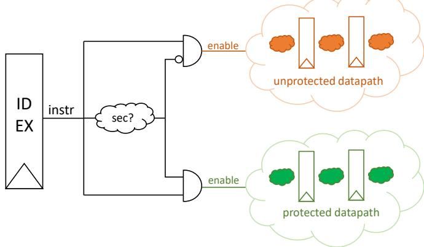

{0}------------------------------------------------

# Domain-Oriented Masked Instruction Set Architecture for RISC-V

Pantea Kiaei *Bradley Department of ECE Virginia Tech* Blacksburg, VA 24061, USA pantea95@vt.edu

Patrick Schaumont *ECE Department Worcester Polytechnic Institute* Worcester, MA 01609, USA pschaumont@wpi.edu

*Abstract*— An important selling point for the RISC-V instruction set is the separation between ISA and the implementation of the ISA, leading to flexibility in the design. We argue that for secure implementations, this flexibility is often a vulnerability. With a hardware attacker, the side-effects of instruction execution cannot be ignored. As a result, a strict separation between the ISA interface and implementation is undesirable. We suggest that secure ISA may require additional implementation constraints. As an example, we describe an instruction-set for the development of power side-channel resistant software.

*Index Terms*— RISC-V, ISA, embedded systems security, SCA and countermeasures, domain-oriented masking

### I. INTRODUCTION

In recent years, side-channel analysis (SCA) attacks have gained significant notoriety in the field of computer security. In power SCA [1], [2], the attacker extracts a secret encryption key using only the power consumption of a device running the cipher. In timing SCA, the attacker exploits micro-architectural timing effects such as the last-level cache (LLC) access [3]–[5], speculative execution [6], and out-oforder execution [7] for the same purpose.

An important take-away from these side-channel attacks on standard processor architectures is how these attacks exploit resource implementation effects that are abstracted away from the software programmer. Indeed, modern computer architectures exceed at layering and abstraction, and they hide the implementation details of hardware as much as possible. There are strong motivations towards such layering, such as the performance optimization, separation of the design concerns, and hiding of the design complexity. However, it is now clear that this practice also creates many new vulnerabilities. Therefore, one can argue that the root cause of such vulnerabilities is the ambiguity in the architecture specification. By only specifying an interface (such as the ISA), the implementation leaves room for optimizations that may result in security vulnerabilities. This is particularly true for the secure processor implementation. While the side-channel vulnerability of processor designs with respect to power and timing is understood, we rarely see efforts at design time to deal with the security implications of implementation effects.

This observation also holds for RISC-V [8]. The RISC-V Instruction Set Architecture (ISA) is prominently concerned with the definition of instruction functionalities and instruction types, mapping these instructions into opcodes, and so on. However, there is no discussion on how these instructions should be implemented for (side-channel) security-sensitive applications. On the other hand, since RISC-V is an opensource architecture, it is a good platform for trying out secure extensions to ultimately identify fitting secure extensions to include in the ISA. Gonzalez et al. [9] replicate Spectre attacks on the Berkeley Out-of-Order Machine (BOOM) [10] and then propose mitigation techniques for this line of attacks. Yu et al. [11] propose a data oblivious ISA extension which protects against timing SCA attacks.

In this contribution, we present a power SCA resistant ISA for RISC-V and discuss the important properties of the design. Our objective is to show that constraints in the ISA implementation can contribute to the practical side-channel security.

#### II. RELATED WORK

In this section, we introduce preliminaries in side-channel leakage mitigation and related work in the design of instruction sets resistant against SCA.

Masking is a well-known countermeasure against power SCA. In this technique, the data is broken into uniformly distributed shares and all the operations are adjusted to work on the masked data. Masking breaks the relation between the power consumption and the (unmasked) data. Masked designs can only be broken using a side-channel attack that recombines the side-channel leakage of multiple shares. In higher-order masking, a single data item is split into more than two shares; and there is consensus that the higher the number of shares, the harder it is to exploit side-channel leakage.

Masking [12] has been employed to protect software against power SCA. Barthe et al. propose an algorithm for n th-order masked implementations of multiplication providing security against power SCA of up to (n−1)th-order [13]. For AES, Rivain et al. propose provably-secure higher-order masked algorithms [14]. However, later it was shown that the leakage model for this design is based on assumptions that are hard to achieve in practice. A careless implementer of the Rivain algorithm can still end up with a leaky design [15]. Therefore, even though in theory masking can be the ultimate solution for secure software design, when it comes to implementing these algorithms, the programmer must be well-aware of the processor implementation details to avoid unintentional leakage.

To alleviate the software designer's part in effectively applying masking to a program, Skiva [16] provides custom instructions that support masking as well as bitslicing and fault detection to provide a combination of countermeasures which can be combined in a modular fashion. However, to use Skiva, the program has to be bitsliced and the programmer should pay special attention in allocating registers for their variables.

{1}------------------------------------------------

Another effort, by De Mulder et al. [17], applies Threshold Implementation (TI) [18] to the complete hardware implementation of a RISC-V design. They show through Test Vector Leakage Assessment (TVLA) technique [19] that their implementation provides the expected (first-order) security. Even though not discussed in the paper, the overhead of such protections is high. As an example, Nikova et al. [20] show that TI implementations of typical cryptographic functions would require a much higher number of shares to guarantee the required properties of TI.

Domain-Oriented Masking (DOM) [21] has shown to have a lower area overhead compared to TI as well as a lower need for randomness. To the best of our knowledge, DOM has not been applied to a processor before. In this work, we propose a DOM ISA for RISC-V which provides security against first-order power SCA. Our approach is a hybrid one in the sense that we do not apply DOM to the entire processor implementation, as was done with TI [17]. Instead, we propose an ISA extension which is masked and explain the implementation details. By this example, we illustrate how an ISA can adopt implementation constraints to provide better security guarantees.

#### III. DOMAIN-ORIENTED MASKING

DOM is a masking technique that provides security against power SCA in a hardware implementation. In DOM, like other masking schemes, the variables are broken into shares. The order of protection decides the number of shares the variables are broken into. Here, we discuss the first-order masking as it is the scheme we will apply to our ISA. The original algorithm then should be adjusted to work on the input shares and generate the output shares.

In first-order DOM, each variable is broken into two shares such that the xor result of the shares retrieves the original variable and the shares are uniformly distributed. Therefore, to generate the shares, we first generate a uniformly distributed random number, r, and generate the shares of variable x as  $A_x = x \oplus r$  and  $B_x = r$ . The exclusive or result of  $A_x$  and  $A_x$  retrieves the variable x. Meanwhile, since r comes from a uniform distribution, both shares are uniform.

As collision of the shares results in unmasking (and hence side-channel leakage), the main challenge of masking an overall program is to avoid collisions. DOM handles this by separating the shares as much as possible. For this purpose, DOM assigns separate domains to shares;  $A_x$  belongs to domain  $\mathcal{A}$  and  $B_x$  to domain  $\mathcal{B}$ . Throughout an algorithm, share domains are kept completely separate. Only when absolutely necessary to be combined, shares are first remasked (refreshed) and only then they can be combined. In the following section, we discuss how we apply this technique to an ISA.

#### IV. DOM ISA FOR RISC-V

When adding secure (side-channel resistant) instructions to an existing unprotected processor, care must be taken to not let shares collide unintentionally and cause side-channel leakage (power or EM). We apply the following two design principles.

Fig. 1. Separating the datapath for protected instructions from the unprotected datapath.

- 1) Keeping the secure and the unprotected parts of the processor implementation separate from each other.
- 2) Protecting the secure part efficiently.

We address these two steps in the following subsections.

# A. Separating protected execution from unprotected execution

Typical modern processor designs contain lots of redundant execution. For example, even operations that are not meant to be executed by an opcode are executed, and only at the end of the execute stage, the results of these operations are discarded (by not being stored). Since these processors are implemented in Complementary Metal-Oxide Semiconductor (CMOS) technology, any logic operation on the chip contributes to the power consumption. When it comes to power SCA, we need strict control over the flow of information, including the flow of secret shares. For instance, it has been shown how the rotation instruction on a share-sliced design can cause unwanted leakage [22]. If the circuitry for the rotation instruction is available in the unprotected datapath, and the data is share-sliced, without the means of disabling the unprotected pipeline, the power consumption of this calculation will be present and will contribute to the power leakage correlated with the secret data even if the result of this instruction is not committed.

To implement a secure instruction set, we propose that a separate protected datapath is created in the processor exclusively to support those secure instructions. The protected datapath co-exists with the normal datapath, but is strictly separate from it, as shown in Figure 1. The instruction under execution should be evaluated to activate either the secure or the unprotected pipeline, therefore, the designer needs to build a circuit following the decode stage to determine whether the decoded instruction is a secure one or not. Based on the output of this circuit, either the secure pipeline or the normal pipeline is activated. In Figure 1, a comparison circuit is added in the execute stage (coming right after the decode stage) that disables/enables the corresponding parts of the datapath.

#### B. Protecting the secure instructions

In this work, we implement a small but universal set of instructions. We build a protected ALU to support them. We protect the instructions using the DOM technique. In this work we focus only on the ALU part of the CPU and assume all the other parts are already protected; the register file is duplicated such that a separate register file is

{2}------------------------------------------------

used for each share domain, registers in the secure datapath which contain instruction operands are duplicated the same as the register file, and all the load and store operands are refreshed to avoid accidental leakage through memory accesses. Additionally, for systems with data-cache support, the caches are separate for each share domain.

DOM works on the concept of share domains; each variable is divided into shares and the goal is to keep the shares of each domain separate from and independent of one another. In this work, we operate on two domains, i.e. domain  $\mathcal{A}$  and domain  $\mathcal{B}$ . Therefore, each variable is broken into two shares to be protected against first-order power SCA according to the *d*-probing model [23]. Operations are divided into two categories; linear and non-linear. Linear operations preserve the uniformity of their inputs for their outputs, which is not the case for non-linear operations. As is mentioned by Nikova et al. [18], in linear operations, each share of the output only depends on one share of each input, therefore, in DOM implementation, there is no need for special attention as the separation is naturally provided. This is not the case for non-linear operations and special steps should be taken for their DOM implementation. We use the DOM-dep concept (viz. [21]) in which the inputs of an operation are not required to be independent of each other. Throughout this section, we show the shares belonging to the domain  $\mathcal{A}$  in blue, domain  $\mathcal{B}$  in red, and neutral variables in green. The universal set of instructions that we choose are enumerated in the following.

a) NOT: As a linear instruction,  $q=\sim x$  is implemented as below and executed in one clock cycle:

$$A_q = \sim A_x, \quad B_q = B_x$$

b) XOR: As another linear operation,  $q = x \oplus y$  is implemented as follows and executed in one clock cycle:

$$A_q = A_x \oplus A_y, \quad B_q = B_x \oplus B_y.$$

c) AND: AND is a non-linear operation. The DOM-dep implementation of  $q = x \cdot y$  is:

$$A_q = A_x \cdot A_y \oplus A_x \cdot (B_y \oplus Z_0) \oplus A_x \cdot Z_0 \oplus Z_1,$$
  
$$B_q = B_x \cdot B_y \oplus B_x \cdot (A_y \oplus Z_0) \oplus B_x \cdot Z_0 \oplus Z_1;$$

where  $Z_0$  and  $Z_1$  are random bits (to see the justification of these algorithms refer to [21]). To avoid unintentional leakage through glitches, we need to insert registers in the middle of the calculation of these algorithms; this ensures the correct sequence of the operations (remasking first and calculating across domains next). In the realm of processor instructions, this results in a two-cycle instruction:

| instruction                   | $x\cdot y$                                                                  |                                                                             |
|-------------------------------|-----------------------------------------------------------------------------|-----------------------------------------------------------------------------|
| domain                        | $\mathcal{A}$                                                               | $\mathcal{B}$                                                               |
| cycle 1 $(Z_0 \text{ req'd})$ | $A_{t1} = A_x \cdot A_y \ A_{t2} = B_y \oplus Z_0 \ A_{t3} = A_x \cdot Z_0$ | $B_{t1} = B_x \cdot B_y$ $B_{t2} = A_y \oplus Z_0$ $B_{t3} = B_x \cdot Z_0$ |
| cycle 2 $(Z_1 \text{ req'd})$ | $A_q = A_{t1} \oplus A_x \cdot A_{t2} \oplus A_{t3} \oplus Z_1$             | $B_q = B_{t1} \oplus B_x \cdot B_{t2} \oplus B_{t3} \oplus Z_1$             |

d) OR: We derive the DOM-dep implementation of OR in terms of XOR and AND as mentioned above,  $q = x + y = (x \oplus y) \oplus (x \cdot y)$ , which results to:

$$A_q = A_x \oplus A_y \oplus A_x \cdot A_y \oplus A_x \cdot (B_y \oplus Z_0) \oplus A_x \cdot Z_0 \oplus Z_1,$$
  
$$B_q = B_x \oplus B_y \oplus B_x \cdot B_y \oplus B_x \cdot (A_y \oplus Z_0) \oplus B_x \cdot Z_0 \oplus Z_1;$$

where  $Z_0$  and  $Z_1$  are random bits. Similar to AND, OR also takes two cycles to execute:

| instruction                   | x + y                                                                                 |                                                                                       |
|-------------------------------|---------------------------------------------------------------------------------------|---------------------------------------------------------------------------------------|
| domain                        | $\mathcal{A}$                                                                         | $\mathcal{B}$                                                                         |
| cycle 1 $(Z_0 \text{ req'd})$ | $A_{t1} = A_x \cdot A_y \ A_{t2} = B_y \oplus Z_0 \ A_{t3} = A_x \cdot Z_0$           | $B_{t1} = B_x \cdot B_y \ B_{t2} = A_y \oplus Z_0 \ B_{t3} = B_x \cdot Z_0$           |
| cycle 2                       | $A_q = A_x \oplus A_y \oplus A_{t1} \oplus A_x \cdot A_{t2} \oplus A_{t3} \oplus Z_1$ | $B_q = B_x \oplus B_y \oplus B_{t1} \oplus B_x \cdot B_{t2} \oplus B_{t3} \oplus Z_1$ |

e) ADD: From the implementation of AND and OR, we can conclude that the number of cycles for the execution of an instruction depends on the multiplicative complexity [24] of the instruction. Following the implementation of a Carry Look-Ahead Adder with inputs X, Y, and C (carry) where the concepts of carry propagate (P) and carry generate (G) are  $P_i = X_i \oplus Y_i$ , and  $G_i = X_i \cdot Y_i$ , and the sum (S) and carry-out (C) are calculated as  $S_i = P_i \oplus C_i$  and  $C_{i+1} = G_i + P_i \cdot C_i$ , we find that the multiplicative complexity for the carry-out of an n-bit adder is 2n, therefore, taking 4n clock cycles to run. Hence, using secure ADD instructions causes significant drops in the performance.

The alternative would be for the software programmer to make a binary (Boolean) implementation of the entire program, avoiding the usage of any *ADD* instruction. This will not necessarily have a better performance than using an *ADD* instruction and it should be decided for each application separately.

Bitslicing [25] is a type of programming common in secure software design where all the data in the program running on a w-bit wide architecture are transposed into w 1-bit values. For this type of programming, it could be helpful to have an instruction for a 1-bit adder (taking 4 clock cycles to run). The two shares of the carry-out can be stored in two special registers in the processor dedicated to the carryouts of the ADD instruction. Hence, implementing ADD instruction requires two special registers,  $A_c$  and  $B_c$ , to be added to the processor. The ADD instruction then reads the contents of these registers as the carry-in at the first cycle of its execution and updates it with the result of carry-out at its last execution cycle. In this project, we opt for a 1-bit ADD instruction to calculate the sum (S) and carry-out  $(C_o)$ as  $S = x \oplus y \oplus c_i$  and  $C_o = (x \oplus y) \cdot c_i + x \cdot y$ . The DOM implementation of S calculates

 $A_S = A_x \oplus A_y \oplus A_{c_i}$ ,  $B_S = B_x \oplus B_y \oplus B_{c_i}$ ; both of which can be calculated in the same clock cycle. To show the DOM implementation of  $C_o$ , we define  $z = x \oplus y$ ,  $a = z \cdot c_i$ , and  $b = x \cdot y$ . Therefore, we have  $C_o = a + b$  and the DOM implementation of  $C_o$  calculates

$$A_{a} = (A_{x} \oplus A_{y}) \cdot A_{c_{i}} \oplus (A_{x} \oplus A_{y}) \cdot (B_{c_{i}} \oplus Z_{0}) \oplus (A_{x} \oplus A_{y}) \cdot Z_{0} \oplus Z_{1},$$

$$B_{a} = (B_{x} \oplus B_{y}) \cdot B_{c_{i}} \oplus (B_{x} \oplus B_{y}) \cdot (A_{c_{i}} \oplus Z_{0}) \oplus (B_{x} \oplus B_{y}) \cdot Z_{0} \oplus Z_{1},$$

$$A_{b} = A_{x} \cdot A_{y} \oplus A_{x} \cdot (B_{y} \oplus Z_{2}) \oplus A_{x} \cdot Z_{2} \oplus Z_{3},$$

$$B_{b} = B_{x} \cdot B_{y} \oplus B_{x} \cdot (A_{y} \oplus Z_{2}) \oplus B_{x} \cdot Z_{2} \oplus Z_{3},$$

$$A_{C_{o}} = A_{a} \oplus A_{b} \oplus A_{a} \cdot A_{b} \oplus A_{a} \cdot (B_{b} \oplus Z_{4}) \oplus A_{a} \cdot Z_{4} \oplus Z_{5},$$

$$B_{C_{o}} = B_{a} \oplus B_{b} \oplus B_{a} \cdot B_{b} \oplus B_{a} \cdot (A_{b} \oplus Z_{4}) \oplus B_{a} \cdot Z_{4} \oplus Z_{5}.$$

The correct execution sequence of these operations is therefore as shown below:

| instruction                                                              | $(x \oplus y) \cdot c_i + x \cdot y$                                                                                                             |                                                                                                                                                                                 |
|--------------------------------------------------------------------------|--------------------------------------------------------------------------------------------------------------------------------------------------|---------------------------------------------------------------------------------------------------------------------------------------------------------------------------------|
| domain                                                                   | $\mathcal A$                                                                                                                                     | $\mathcal{B}$                                                                                                                                                                   |
| $\begin{array}{c} \text{cycle 1} \\ (Z_0,Z_2 \text{ req'd}) \end{array}$ | $A_{t1} = A_x \oplus A_y \ A_{t2} = B_{c_1} \oplus Z_0 \ A_{t3} = (A_x \oplus A_y) \cdot Z_0 \ A_{t4} = B_y \oplus Z_2 \ A_{t5} = A_x \cdot Z_2$ | $\begin{array}{l} B_{t1} = B_x \oplus B_y \ B_{t2} = A_{c_1} \oplus Z_0 \ B_{t3} = (B_x \oplus B_y) \cdot Z_0 \ B_{t4} = A_y \oplus Z_2 \ B_{t5} = B_x \cdot Z_2 \ \end{array}$ |
| cycle 2                                                                  | $A_a = A_{t1} \cdot A_{c_i} \oplus A_{t1} \cdot A_{t2} \oplus A_{t3} \oplus Z_1$                                                                 | $B_a = B_{t1} \cdot B_{c_i} \oplus B_{t1} \cdot B_{t2} \oplus B_{t3} \oplus Z_1$                                                                                                |
| $(Z_1, Z_3 \text{ req'd})$                                               | $A_b = A_x \cdot A_y \oplus A_x \cdot A_{t4} \oplus A_{t5} \oplus Z_3$                                                                           | $B_b = B_x \cdot B_y \oplus B_x \cdot B_{t4} \oplus B_{t5} \oplus Z_3$                                                                                                          |
| cycle 3                                                                  | $A_{t6} = B_b \oplus Z_4$                                                                                                                        | $B_{t6} = A_b \oplus Z_4$                                                                                                                                                       |
| $(Z_4 \text{ req'd})$                                                    | $A_{t7} = A_a \cdot Z_4$                                                                                                                         | $B_{t7} = B_a \cdot Z_4$                                                                                                                                                        |
| cycle 4 $(Z_5 \text{ req'd})$                                            | $A_{C_o} = A_a \oplus A_b \oplus A_a \cdot A_b \oplus A_a \cdot A_{t6} \oplus A_{t7} \oplus Z_5$                                                 | $B_{C_o} = B_a \oplus B_b \oplus B_a \cdot B_b \oplus B_a \cdot B_{t6} \oplus B_{t7} \oplus Z_5$                                                                                |

{3}------------------------------------------------

*Mapping to opcodes:* All the presented instructions are of register-register type (*R-type*). To be compatible with the current and future states of RISC-V, we map these instructions to the *custom-0* opcode field (0001011) which will be avoided by the future standard extensions of the 32-bit format. Furthermore, separating the opcode of our secure extension from other instructions will make the secure comparator shown in Figure 1 simpler.

*Recap:* In this work, we studied the design principles for our ISA thwarting power based SCA. The proposed small ISA extension, as an example to show how ISAs can be extended to contain implementation details and requirements. For this case, where the attack model is power-based SCA, DOM ISA specifies the following:

- 1) constraints on the flow of information in the system,
- 2) break-down of operations into sub-operations with constraints on their execution order,
- 3) constraints on the required number of random bits in each execution clock cycle.

Following the proposed ISA, the designers know the security requirements in implementation; they know implementing this ISA requires the register file to be duplicated, they also know they require a random number generator with the rate of two random bits per clock cycle (for the *ADD* instruction). This way, the gap between the ISA definition and its physical implementation is reduced.

#### V. FUTURE WORK AND CONCLUSION

We discussed how the current myriad of SCA attacks are caused in part by the ambiguity of the processors' design and how it can be beneficial to include secure design details in the ISA of processors to avoid SCA attacks after implementation. To give an example, we proposed an Instruction Set Extension for RISC-V which uses Domain-Oriented Masking to provide security against first-order power SCA. Our ISE contains implementation considerations that can bring closer the ISA and implementation of RISC-V.

This ISA is still in its early definition stages. In our future efforts, we plan to implement and evaluate this ISA extension for both area overhead and security claims and give concrete comparison with the related work.

This work was supported in part by NIST Grant 70NANB17H280 and NSF Grant 1617203.

## REFERENCES

- [1] P. Kocher, J. Jaffe, and B. Jun, "Differential power analysis," in *Annual International Cryptology Conference*. Springer, 1999, pp. 388–397.
- [2] E. Brier, C. Clavier, and F. Olivier, "Correlation power analysis with a leakage model," in *International workshop on cryptographic hardware and embedded systems*. Springer, 2004, pp. 16–29.
- [3] D. Gruss, C. Maurice, K. Wagner, and S. Mangard, "Flush+ flush: a fast and stealthy cache attack," in *International Conference on Detection of Intrusions and Malware, and Vulnerability Assessment*. Springer, 2016, pp. 279–299.
- [4] Y. Yarom and K. Falkner, "Flush+ reload: a high resolution, low noise, l3 cache side-channel attack," in *23rd USENIX Security Symposium (USENIX Security 14)*, 2014, pp. 719–732.
- [5] F. Liu, Y. Yarom, Q. Ge, G. Heiser, and R. B. Lee, "Last-level cache side-channel attacks are practical," in *2015 IEEE symposium on security and privacy*. IEEE, 2015, pp. 605–622.

- [6] P. Kocher, J. Horn, A. Fogh, D. Genkin, D. Gruss, W. Haas, M. Hamburg, M. Lipp, S. Mangard, T. Prescher *et al.*, "Spectre attacks: Exploiting speculative execution," in *2019 IEEE Symposium on Security and Privacy (SP)*. IEEE, 2019, pp. 1–19.
- [7] M. Lipp, M. Schwarz, D. Gruss, T. Prescher, W. Haas, S. Mangard, P. Kocher, D. Genkin, Y. Yarom, and M. Hamburg, "Meltdown," *arXiv preprint arXiv:1801.01207*, 2018.
- [8] A. Waterman, Y. Lee, D. A. Patterson, and K. Asanovi, "The riscv instruction set manual. volume 1: User-level isa, version 2.0," CALIFORNIA UNIV BERKELEY DEPT OF ELECTRICAL ENGI-NEERING AND COMPUTER SCIENCES, Tech. Rep., 2014.
- [9] A. Gonzalez, B. Korpan, J. Zhao, E. Younis, and K. Asanovic,´ "Replicating and mitigating spectre attacks on an open source RISC-V microarchitecture," in *Third Workshop on Computer Architecture Research with RISC-V (CARRV 2019), Phoenix, AZ, USA, June 22, 2019*.
- [10] K. Asanovic, D. A. Patterson, and C. Celio, "The berkeley outof-order machine (BOOM): An industry-competitive, synthesizable, parameterized RISC-V processor," University of California at Berkeley Berkeley United States, Tech. Rep., 2015.
- [11] J. Yu, L. Hsiung, M. El Hajj, and C. W. Fletcher, "Data oblivious ISA extensions for side channel-resistant and high performance computing." in *NDSS*, 2019.
- [12] S. Mangard, E. Oswald, and T. Popp, *Power analysis attacks: Revealing the secrets of smart cards*. Springer Science & Business Media, 2008, vol. 31.
- [13] G. Barthe, F. Dupressoir, S. Faust, B. Grégoire, F.-X. Standaert, and P.-Y. Strub, "Parallel implementations of masking schemes and the bounded moment leakage model," in *Annual International Conference on the Theory and Applications of Cryptographic Techniques*. Springer, 2017, pp. 535–566.
- [14] M. Rivain and E. Prouff, "Provably secure higher-order masking of aes," in *International Workshop on Cryptographic Hardware and Embedded Systems*. Springer, 2010, pp. 413–427.
- [15] J. Balasch, B. Gierlichs, V. Grosso, O. Reparaz, and F.-X. Standaert, "On the cost of lazy engineering for masked software implementations," in *International Conference on Smart Card Research and Advanced Applications*. Springer, 2014, pp. 64–81.
- [16] P. Kiaei, D. Mercadier, P.-E. Dagand, K. Heydemann, and P. Schaumont, "Custom instruction support for modular defense against sidechannel and fault attacks," in *Constructive Side-Channel Analysis and Secure Design - 11th International Workshop, COSADE 2020, Lugano, Switzerland, April 1-3, 2020, Proceedings*.
- [17] E. De Mulder, S. Gummalla, and M. Hutter, "Protecting RISC-V against side-channel attacks," in *2019 56th ACM/IEEE Design Automation Conference (DAC)*. IEEE, 2019, pp. 1–4.
- [18] S. Nikova, C. Rechberger, and V. Rijmen, "Threshold implementations against side-channel attacks and glitches," in *International conference on information and communications security*. Springer, 2006, pp. 529–545.
- [19] G. Becker, J. Cooper, E. DeMulder, G. Goodwill, J. Jaffe, G. Kenworthy, T. Kouzminov, A. Leiserson, M. Marson, P. Rohatgi *et al.*, "Test vector leakage assessment (TVLA) methodology in practice," in *International Cryptographic Module Conference*, vol. 1001, 2013, p. 13.
- [20] S. Nikova, V. Rijmen, and M. Schläffer, "Secure hardware implementation of non-linear functions in the presence of glitches," in *International Conference on Information Security and Cryptology*. Springer, 2008, pp. 218–234.
- [21] H. Groß, S. Mangard, and T. Korak, "Domain-oriented masking: Compact masked hardware implementations with arbitrary protection order." *IACR Cryptology ePrint Archive*, vol. 2016, p. 486, 2016.
- [22] S. Gao, B. Marshall, D. Page, and E. Oswald, "Share-slicing: Friend or foe?" *IACR Transactions on Cryptographic Hardware and Embedded Systems*, pp. 152–174, 2020.
- [23] Y. Ishai, A. Sahai, and D. Wagner, "Private circuits: Securing hardware against probing attacks," in *Annual International Cryptology Conference*. Springer, 2003, pp. 463–481.
- [24] J. Boyar, P. Matthews, and R. Peralta, "Logic minimization techniques with applications to cryptology," *Journal of Cryptology*, vol. 26, no. 2, pp. 280–312, 2013.
- [25] E. Biham, "A fast new des implementation in software," in *International Workshop on Fast Software Encryption*. Springer, 1997, pp. 260–272.