{0}------------------------------------------------

# Custom Instruction Support for Modular Defense against Side-channel and Fault Attacks

Pantea Kiaei<sup>1</sup> , Darius Mercadier<sup>2</sup> , Pierre-Evariste Dagand<sup>3</sup> , Karine Heydemann<sup>4</sup> , and Patrick Schaumont<sup>5</sup>

 Virginia Tech, Blacksburg, VA 24061, USA, pantea95@vt.edu LIP6, Paris, France, darius.mercadier@gmail.com LIP6, Paris, France, pierre-evariste.dagand@lip6.fr LIP6, Paris, France, karine.heydemann@lip6.fr Worcester Polytechnic Institute, Worcester, MA 01609, USA, pschaumont@wpi.edu

Abstract. The design of software countermeasures against active and passive adversaries is a challenging problem that has been addressed by many authors in recent years. The proposed solutions adopt a theoretical foundation (such as a leakage model) but often do not offer concrete reference implementations to validate the foundation. Contributing to the experimental dimension of this body of work, we propose a customized processor called SKIVA that supports experiments with the design of countermeasures against a broad range of implementation attacks. Based on bitslice programming and recent advances in the literature, SKIVA offers a flexible and modular combination of countermeasures against power-based and timing-based side-channel leakage and fault injection. Multiple configurations of side-channel protection and fault protection enable the programmer to select the desired number of shares and the desired redundancy level for each slice. Recurring and security-sensitive operations are supported in hardware through custom instruction-set extensions. The new instructions support bitslicing, secret-share generation, redundant logic computation, and fault detection. We demonstrate and analyze multiple versions of AES from a side-channel analysis and a fault-injection perspective, in addition to providing a detailed performance evaluation of the protected designs. To our knowledge, this is the first validated end-to-end implementation of a modular bitslice-oriented countermeasure.

Keywords: Side-channel Leakage · Fault Injection · Bitslice Programming

# 1 Introduction

Side-channel analysis and fault attacks have plagued cryptographic software on embedded processors for many years. The threat of power-based and timingbased side-channel leakage is well understood and countermeasures such as masking and constant-time programming figure prominently in the cryptographer's toolbox [\[43,](#page-24-0) [5\]](#page-20-0). In parallel, the research community has gained more insight into

{1}------------------------------------------------

<span id="page-1-0"></span>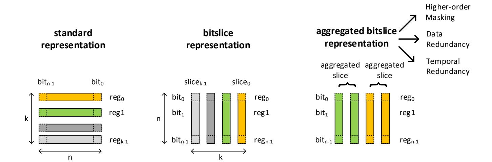

Fig. 1: In a standard representation, processor registers are allocated per data word. In a bitsliced representation, processor registers are allocated per bitweight of a block of data words. In an aggregated bitslice representation, multiple bitslices are allocated per data bit. Aggregated bitslices can be shares of a masked design, redundant data of a fault-protected design, or a combination of those.

the fault behavior of hardware and software, thus greatly increasing the potency of fault attacks [\[52,](#page-25-0) [46\]](#page-24-1). The impact of fault attacks is minimized with fault detection and temporal or spatial redundancy of the software execution [\[33,](#page-23-0) [3\]](#page-20-1).

Although there exists an extensive array of specific, dedicated countermeasures, there is surprisingly few work available [\[44,](#page-24-2) [48,](#page-24-3) [49\]](#page-25-1) offering protection against both side-channel analysis and fault injection. This is especially true for software. The programmer is left selecting candidate solutions, figuring out if and how they can safely be assembled. This is not an easy task because countermeasures may interact in non-trivial (and unsafe) manners.

Recent related work on side-channel countermeasures has proposed partial implementations of behavior called gadgets. The integration of these gadgets into an overall secure implementation is a challenge that has triggered multiple revisions of the attacker model. For example, Ishai et al. [\[27\]](#page-22-0), Bela¨ıd et al. [\[8\]](#page-20-2), Battistello et al. [\[6\]](#page-20-3), Barthe et al. [\[5\]](#page-20-0) and Cassiers et al. [\[14\]](#page-21-0) present the masked implementation of a multiplication operation, each protected against attackers of a different level of sophistication. Given this broad variation in proposals, we believe there is a need for their practical evaluation in a common setting. It is not our intention to compare these proposals as in [\[21\]](#page-22-1). Instead, we highlight the role of custom instruction-set extensions as a tool for countermeasure implementation.

In this paper, we introduce SKIVA, a processor that enables a modular approach to countermeasure design, giving programmers the flexibility to protect their ciphers against timing-based side-channel analysis, power-based sidechannel analysis and/or fault injection at various levels of security. We leverage existing techniques in higher-order masking, in spatial and in temporal redundancy. Modularity is achieved through bitslicing, each countermeasure being expressed as a transformation from a bitsliced design into another bitsliced de

{2}------------------------------------------------

sign. The capabilities of SKIVA are demonstrated on the Advanced Encryption Standard, but the proposed techniques can be applied to other ciphers as well.

Countermeasure design through bitslice aggregation. SKIVA exploits the redundancy that is provided by a bitsliced execution model. The n-bit datapath of the processor is seen as n 1-bit processors operating in parallel. The symmetry of bitslices in a processor word is the basis for the modular protection schemes enabled by SKIVA. Figure [1](#page-1-0) demonstrates three different organizations of a register file in a processor. We obtain the bitslice representation through a matrix transposition of the input data so that one processor register contains all bits of a given weight. The key idea of bitslice aggregation is to allocate multiple slices to the representation of each data-bit. We will demonstrate how bitslice aggregation enables higher-order masking (to protect against power side-channels), data redundancy (to protect against data faults), and temporal redundancy (to protect against control faults).

Contributions. SKIVA is a processor with built-in support for modular countermeasures against side-channel analysis and fault analysis. We open-source our codes to make it possible for the community to evaluate our implementation [6](#page-2-0) . We make the following contributions.

- 1. We propose a flexible and modular methodology for designing countermeasures. It enables the combination of higher-order masking with spatial faultredundancy and with temporal fault-redundancy. The number of shares and fault-redundancy levels is statically determined by the programmer (single, double, quadruple shares and single, double, quadruple fault-redundancy).
- 2. We describe hardware support for the proposed methodology in SKIVA, a processor with instruction set extensions specialized for bitsliced transposition, bitsliced masked operation, bitsliced fault detection, redundant bitsliced expansion, and Boolean operations on complementary data.
- 3. We analyze the performance and code size of the Advanced Encryption Standard on SKIVA, under multiple levels of side-channel and fault-resistance.
- 4. We evaluate the side-channel leakage characteristics of SKIVA implemented as a soft-core processor on a SAKURA-G FPGA board. We perform theoretical as well as empirical analysis of fault detection coverage.

Outline. In Section [2,](#page-3-0) we review the related work, covering the design of bitsliced software and countermeasures based on such software. In Section [3,](#page-4-0) we introduce several modular countermeasure schemes. Starting with bitslicing, we describe a systematic treatment of higher-order masking, intra-instruction redundancy, and temporal redundancy. In Section 4, we dive into the implementation aspects and propose a custom instruction-set extension to support various aspects of the bitslice-oriented countermeasures. In Section 5, we present the measurement results of our prototype, including performance, side-channel leakage evaluation, and fault detection/correction coverage. In Section 6, we conclude the paper.

<span id="page-2-0"></span><sup>6</sup> Cfr. <https://github.com/Secure-Embedded-Systems/Skiva>

{3}------------------------------------------------

# <span id="page-3-0"></span>2 Preliminaries

Bitslicing is an implementation technique to produce high-throughput, constanttime software implementations of cryptographic primitives [\[10,](#page-21-1) [29\]](#page-23-1). A cipher is expressed as a Boolean circuit. The circuit is compiled into a straight-line program by leveling the circuit and translating each Boolean operation to a corresponding bitwise CPU instruction. Since the CPU manipulates registers of 32 bits, running the resulting program amounts to running 32 parallel instances of the original Boolean circuit.

Bitslicing versus wordslicing. In a block cipher, the state variables are k-bit wide. The bitsliced version of the cipher will store these k bits in a transposed manner, such that register i will contain the i-th bit of the state. This approach has been used for DES [\[10\]](#page-21-1) as well as for AES [\[41\]](#page-24-4). However, one can also adopt wordslicing, which stores groups of b bits out of a k-bit state per register. A wordsliced design requires k/b registers, as opposed to k registers for a bitsliced design. Wordsliced design has been demonstrated for AES [\[31,](#page-23-2) [29\]](#page-23-1). The choice between bitslicing and wordslicing has a significant impact on the efficiency of the resulting design. The resulting code also changes significantly with the slicing strategy. The bitsliced implementation of AES has to juggle with 128 machine words while being restricted to straightforward logical instructions. The wordsliced implementation of AES fits within eight registers, at the expense of complex permutations within individual words. On an embedded RISC-like CPU, our experiments have shown that the bitsliced implementation yields a higher throughput than the wordsliced one (Section [5.1\)](#page-13-0). Conversely, on a highend SIMD CPU, earlier work has shown that wordslicing is key to reach speed records in software encryption [\[29\]](#page-23-1). The lack of SIMD instructions and the lesser register pressure for RISC CPUs thus favors bitsliced implementations, hence our focus on bitslicing in the present work.

Countermeasures for bitsliced designs. Many hardware-oriented countermeasures can be applied as transformations on the Boolean programs of bitsliced designs. An early effort to address power-based side-channel leakage is the duplication method [\[17\]](#page-21-2). More recently, several masking-oriented techniques have been proposed [\[13,](#page-21-3) [5,](#page-20-0) [28,](#page-22-2) [23\]](#page-22-3). Bitslicing is also a systematic countermeasure against timing attacks. By construction, a Boolean program runs in constant (or repeatable) time. Conditionals in a Boolean program are implemented through data-multiplexing: both results are sequentially computed and the relevant output is obtained by demultiplexing these intermediary results based on the conditional. Finally, the massively parallel nature of a bitsliced implementation can be exploited to provide intra-instruction redundancy (encrypting the same data in redundant slices) as well as various forms of temporal redundancy (processing data at distinct rounds in distinct, randomly-chosen slices) [\[37,](#page-23-3) [32\]](#page-23-4). In a bitsliced setting, these techniques translate into end-to-end protection, protecting a cipher from the moment the plaintext is introduced to the moment the ciphertext is produced.

{4}------------------------------------------------

<span id="page-4-1"></span>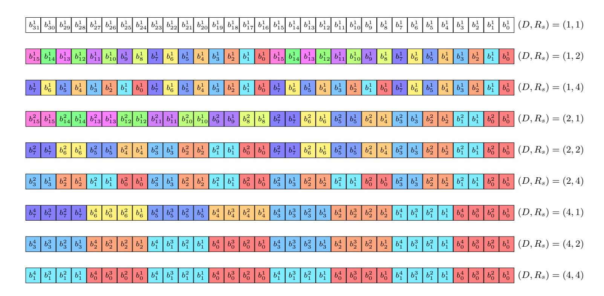

Fig. 2: Bitslice aggregations on a 32 bit register, depending on  $(D,R_s)$ .

### <span id="page-4-0"></span>3 Modular design of countermeasures

In this section, we present the four protection mechanisms that can be combined in a modular manner, including (a) bitslicing to protect against timing attacks; (b) higher-order masking to protect against power side-channel leakage; (c) intra-instruction redundancy to protect against data faults and (d) temporal redundancy to protect against control faults. We demonstrate our protection on the AES cipher running on SKIVA. However, the techniques are equally applicable to other bitsliced ciphers. However, the panel of techniques is not restricted to this cipher nor this processor: they naturally generalize – in a systematic manner – to any cipher admitting a bitsliced implementation, for processors of arbitrary bitwidth as well as design (RISC as well as CISC, SIMD or not). We leave it to future work to evaluate their effectiveness on a broader range of cryptographic primitives and hardware platforms.

Our implementation of AES is fully bitsliced: the 128-bit input of the cipher is represented with 128 variables. Since each variable stores 32 bits on SKIVA, a single run of our primitive computes 32 parallel instances of AES. The protection mechanisms presented in the following assume the availability of a bitsliced design while themselves producing a bitsliced design (of lesser parallelism) in return. The modularity of our approach lies in this simple observation: as long as there is enough parallelism to compute at least one run of the algorithm, we can chain these program transformations.

Figure 2 shows the bitslice organization for masked and intra-instruction-redundant design. We support masking with 1, 2, and 4 shares leading to respectively unmasked, 1st-order, and 3rd-order masked implementations. By convention, we use the letter D to denote the number of shares ( $D \in \{1, 2, 4\}$ ) of

{5}------------------------------------------------

a given implementation. Within a machine word, the D shares encoding the  $i^{\text{th}}$  bit are grouped together, as illustrated by the contiguously colored bits  $b_i^{j \in [1,D]}$  in Figure 2.

We also support spatial redundancy by duplicating a single slice into two or four slices. By convention, we use the letter  $R_s$  to denote the spatial redundancy  $(R_s \in \{1, 2, 4\})$  of a given implementation. Within a machine word, the  $R_s$  duplicates of the  $i^{\text{th}}$  bit are interspersed every  $32/R_s$  bits, as illustrated by the alternation of colored words  $b_{i \in [1, R_s]}^j$  in Figure 2. The following subsections elaborate on doing computations using this redundant bitslice allocation scheme.

### 3.1 Higher-order Masked Computation

Recent masking schemes, including those for bitsliced designs [8, 6, 5, 14, 18], have relied on the definition of gadgets, elementary masked logic operations that can be securely composed together. A complete cipher is then expressed as a combination of gadgets that are wired together. The most important gadgets include the multiplication gadget (as the canonical non-linear operation) and the mask refresh gadget. We will demonstrate our design based on the secure duplicated multiplication gadget by Dhooghe and Nikova [18]. For a 4-share implementation, we base our cross-product calculations on the parallel masked multiplication algorithm defined by Barthe  $et\ al.$  [5, Algorithm 3]. For 2-share masking, we use the following multiplication gadget [21]. If  $\mathbf{x}$  and  $\mathbf{y}$  are two-share inputs and  $\mathbf{r}$  is a two-share random vector, then the two-share output is obtained by the following expression.

$$\mathbf{z} = (((\mathbf{x}.\mathbf{y} \oplus \mathbf{r}) \oplus \mathbf{x}.rot(\mathbf{y}, 1)) \oplus rot(\mathbf{r}, 1))$$

Optimizing this masked design by reducing the amount of randomness [4, 9] is orthogonal to the present work. The objective of SKIVA is to define a common platform to evaluate such proposals.

### 3.2 Data-redundant Computation

We protect our implementation against data faults using intra-instruction redundancy (IIR) [37, 32, 15]. We support either a direct redundant implementation, in which the duplicated slices contain the same value, or a complementary redundant implementation, in which the duplicated slices are complemented pairwise. For example, with  $R_s = 4$ , we can have four exact copies (direct redundancy) or two exact copies and two complementary copies (complementary redundancy).

In practice, we will favor complementary redundancy over direct redundancy. First, it is less likely for complemented bits to flip to consistent values due to single fault injection. For instance, timing faults during state transition [53] or memory accesses [2] follow a random word corruption or a stuck-at-0 model. Second, complementary slices ensure a constant Hamming weight for a slice throughout the computation of a cipher. Our results show that complementary redundancy results in reduced power leakage when compared to direct redundancy [11].

{6}------------------------------------------------

<span id="page-6-0"></span>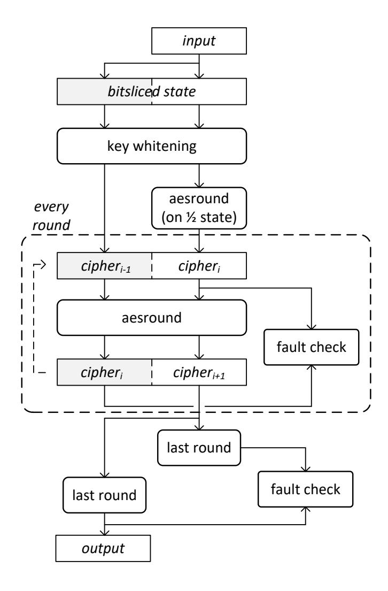

Fig. 3: Time-redundant computation of a bitsliced AES.

### 3.3 Time-redundant Computation

Data-redundant computation does not protect against control faults such as instruction skip. We, therefore, use a different strategy: we protect our implementation against control faults using temporal redundancy (TR) across rounds [\[37\]](#page-23-3). We pipeline the execution of 2 consecutive rounds in 2 aggregated slices. By convention, we use the letter R<sup>t</sup> to distinguish implementations with temporal redundancy (R<sup>t</sup> = 2) from implementations without (R<sup>t</sup> = 1). For R<sup>t</sup> = 2, half of the slices compute round i while the other half compute round i − 1. Figure [3](#page-6-0) illustrates the principle of time-redundant bitslicing as applied to AES computation. The operation starts the pipeline by filling half of the slices with the output of the first round of AES, and the other half with the output of the initial key whitening. At the end of round i + 1, we have re-computed the output of round i (at a later time): we can, therefore, compare the two results and detect control faults based on the different results they may have produced. In contrast to typical temporal-redundancy countermeasures such as instruction duplication [\[40\]](#page-24-5), this technique does not increase code size: the same instructions compute both rounds at the same time. Only the last AES round, which is different from regular rounds, must be computed twice in a non-pipelined fashion.

Whereas pipelining protects the inner round function, faults remain possible on the control path of the loop itself. We protect against these threats through

{7}------------------------------------------------

<span id="page-7-0"></span>Table 1: Proposed ISE. These instructions are added to the standard SPARC-V instruction set, occupying unused opcodes. Symbols in the instruction format rs1, rs2, rd are registers. imm is an immediate operand. The "Type" column shows what opcode group was used for each instruction. Appendix [6](#page-26-0) lists the functional specification for each instruction.

| Semantics                                  | Instruction format  | Immediate Type |       |
|--------------------------------------------|---------------------|----------------|-------|
| Normal → Bitslice                          | TR2 rs1, rs2, rd    |                | logic |
| Bitslice → Normal                          | INVTR2 rs1, rs2, rd |                | ld/st |
| Slice Rotation                             | SUBROT rs, imm, rd  | D              | logic |
| Redundancy Generation                      | RED rs, imm, rd     | Rs             | logic |
| Redundancy Checking                        | FTCHK rs, imm, rd   | Rs             | logic |
| Redundant AND (Rs=2)                       | ANDC16 rs1, rs2, rd |                | logic |
| Redundant XOR (Rs=2)                       | XORC16 rs1, rs2, rd |                | logic |
| Redundant XNOR (Rs=2) XNORC16 rs1, rs2, rd |                     |                | ld/st |
| Redundant AND (Rs=4)                       | ANDC8 rs1, rs2, rd  |                | logic |
| Redundant XOR (Rs=4)                       | XORC8 rs1, rs2, rd  |                | logic |
| Redundant XNOR (Rs=4) XNORC8 rs1, rs2, rd  |                     |                | ld/st |

standard loop hardening techniques, namely redundant loop counters – packing multiple copies of a counter in a single machine word – and duplication of the loop control structure [\[25\]](#page-22-5) – producing multiple copies of conditional jumps so as to lower the odds of all of them being skipped through an injected fault.

# 4 SKIVA Implementation

In this section, we present the SKIVA hardware, a custom instruction-set extension (ISE) tailored to support efficient and safe implementation of these schemes.

### 4.1 Custom Instruction-Set Extensions in SKIVA

We added new instructions to SKIVA to support computing on aggregated bitslices in three different areas. First, they help with the conversion from normal representation to bitsliced form and back. Second, they handle subwordoperations for the computation of non-linear operations on two or four shares (D ∈ {2, 4}). Third, they handle subword-operations for spatially redundant computations and fault checking (R<sup>s</sup> ∈ {2, 4}). The new instructions are summarized in Table [1](#page-7-0) and will be described in detail in further subsections. Appendix [6](#page-26-0) provides their functional specification. These new instructions are orthogonal; they can be used in a mix-and-match fashion to obtain the desired level of sharing and redundancy. We integrated the new instructions on the SPARC V8 instruction set of the open-source LEON3 processor and software toolchain [\[45\]](#page-24-6).

Hardware integration. Figure [4](#page-8-0) illustrates the integration of the custom datapath into the seven-stage RISC pipeline. The instructions follow a two-input,

{8}------------------------------------------------

<span id="page-8-0"></span>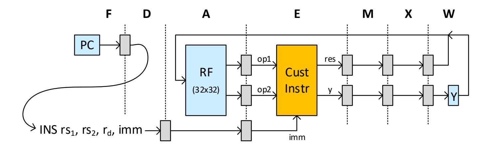

Fig. 4: Integrated in the regular 7-stage pipeline as a new execution stage.

one-output or two-input, two-output format, encoded as two source registers, a destination register, and an immediate field (INS rs1, rs2, rd, imm). The upper 32-bit output of the custom instruction is transferred to the Y-register, a register which is used for SPARC V8 instructions with 64-bit output, such as the regular data multiplication. Instructions with longer than 32-bit outputs can be integrated into instruction sets without this special register by duplicating the instruction for calculating the lower half of the output and the upper half of it separately (similar to MUL and SMMUL in ARM and Thumb instruction set). The integration of custom-hardware deep into the pipeline necessitates the use of simple and fast datapath hardware. However, these instructions benefit from the same performance advantages as regular instructions, including a typical throughput of one instruction per cycle and minimal stall effect thanks to forwarding [\[38\]](#page-24-7).

The new instructions are mapped into unused opcodes of the SPARC V8 instruction set [\[50\]](#page-25-3). Since we did not replace any existing SPARC instruction, SKIVA is backward binary-compatible with existing LEON applications. The new instructions add minimal overhead to the design. In terms of 180nm standard cell ASIC technology, we added 1250 gate-equivalent to the design, which amounts to 3% of the area of the integer unit of SKIVA.

Software integration. We integrated the new instructions into the software toolchain of SKIVA by extending the assembler. The new mnemonics were then integrated into the application in C through inline assembly coding. Because the custom instruction format is compatible with that of existing, standard SPARC V8 instructions, they benefit from off-the-shelf compiler optimizations.

Related Work. Earlier efforts of hardware-specific side-channel countermeasures based on custom instructions include mask generation [\[51\]](#page-25-4) and hiding [\[42\]](#page-24-8). CRISP explores the use of custom instructions for bitslicing in a processor design [\[22\]](#page-22-6). CRISP defines three new instructions, based on two programmable lookup tables. These instructions deal with bitslicing, but they do not offer redundancy nor support for countermeasures. With the advent of open platforms such as RISC-V, instruction set extensions are now a viable mechanism for platform customization. XCrypto [\[34\]](#page-23-5) defined instruction extensions for RISC-

{9}------------------------------------------------

<span id="page-9-0"></span>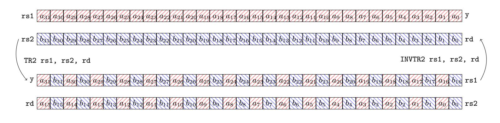

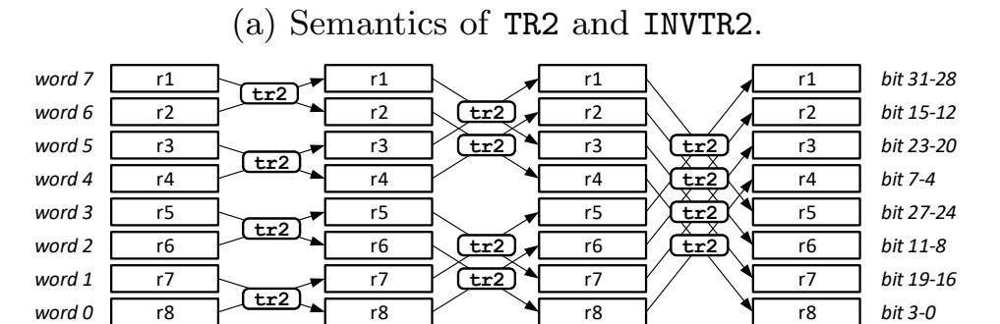

(b) Example of an 8-bit bitslice transposition using 8 registers.

Fig. 5: Transposition and its inverse

V while Galois has proposed a formally validated one [\[30\]](#page-23-6). XCrypto supports special registers for cryptographic algorithms as well as custom instructions to improve the performance of such applications. XCrypto is designed for efficient cryptographic workload processing with support for random number generation and dedicated arithmetic. The SKIVA custom instructions are instead designed as flexible countermeasures. The SKIVA programmer decides on the level of security and then applies SKIVA instructions commensurate with the selected level.

### <span id="page-9-1"></span>4.2 Hardware Support for Aggregated Bitslice Operations

In the following, we describe each group of custom instructions and their usage. Appendix [6](#page-26-0) gives a formal specification of each instruction.

Instructions for bitslicing. We introduce two instructions to transpose data into their bitsliced representation (Figure [5a\)](#page-9-0). The first instruction, TR2 rs1, rs2, rd, performs an interleaving of the bits of two source registers into two output registers. This interleaving can be thought of as a 2-bit transposition, as it places bits within the same column of register rs1 and rs2 in adjacent positions of the output registers rd and y. The second instruction, INVTR2 rs1, rs2, rd, performs the inverse operation. Bitslice transposition for an arbitrary number of bits is achieved through repeated application of TR2. Figure [5b](#page-9-0) shows an 8-bit transposition achieved using twelve applications of TR2. In general, for a 2 <sup>n</sup>-bit transition, n.2 <sup>n</sup>−<sup>1</sup> applications of TR2 are needed. To create aggregated bitslices (R<sup>s</sup> > 1 or D > 1), we pre-process the source registers (in non-bitsliced form) by duplicating them first and then transposing them to bitsliced form. The side-channel protection and fault-detection of SKIVA are not active during

{10}------------------------------------------------

<span id="page-10-0"></span>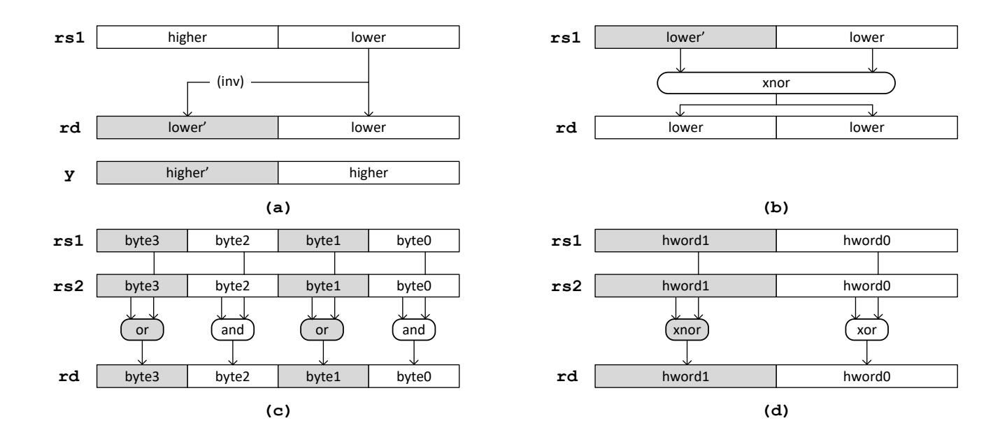

Fig. 6: (a) Example of RED on half-word (top, left). (b) Example of FTCHK on halfword (top, right). (c) Example of ANDC8 (bottom, left). (d) Example of XORC16 (bottom, right).

bitslice conversion, but we check their consistency after transposition and before encryption.

Instructions for higher-order masking. SKIVA supports two-share and four-share implementations of bitsliced algorithms, which provide first-order and thirdorder masked side-channel resistance. The shares are located in adjacent bits of a processor register. We use Boolean masking so that the XOR of all shares yields the unmasked value. Linear operations on an ensemble of shares are computed as the linear operation on each individual share. Linear operations are done using bitwise operations on the two-share and four-share representation. Computing a secure multiplication over multiple shares requires the computation of the partial share-products. For example, the secure multiplication of the two-share slices (a1, a0) with the two-share slices (b1, b0) requires the partial products a1.b1, a1.b0, a0.b1, and a0.b0. To align the slices for the cross-products, we implement a slice rotation instruction SUBROT rs, imm, rd. This instruction transforms the two-share slices (a1, a0) into (a0, a1). The same instruction SUBROT can also handle a four-share design, which transforms (a3, a2, a1, a0) into (a2, a1, a0, a3).

Instructions for fault redundancy checking. SKIVA supports fault redundancy countermeasures using instructions for the generation and checking of faultredundant slices. The redundant bits with respect to fault injection are stored in adjacent bytes of a halfword. Figure [6\(](#page-10-0)a) shows the example of a halfword operation to generate redundant data, while Figure [6\(](#page-10-0)b) shows the example of a halfword operation to verify redundant data.

The RED rs1, imm, rd instruction generates redundant data. The redundant copy is stored in the upper halfword (R<sup>s</sup> = 2) or in the three upper bytes (R<sup>s</sup> = 4). The redundant portion can be either a direct or else a complement of the original data. There are six variants of RED rs1, imm, rd. Two of them support dual redundancy (R<sup>s</sup> = 2), they duplicate the lower and upper halfword,

{11}------------------------------------------------

```
# two-share NINA Secure Multiplication
# input: %i2 (a), 
# %i3 (b), 
# %i4 (random), 
# %i5 (fault flags)
# output: %o0 (a & b)
# %i5 (accumulated fault)
# step 1: clear input in case of a fault
NOT %i5, %o4 #
AND %i2, %o4, %o6 #
# step 2: calculate AND result
AND %i3, %o6, %o5 # partial product 1
SUBROT %o6, 2, %l0 # share-rotate
AND %i3, %l0, %o3 # partial product 2
XOR %l0, %l0, %l0 # clear SUBROT output
XOR %o5, %i4, %o2 # random + parprod 1
XOR %o2, %o3, %o1 # + parprod 2
# step 3: refresh the output
SUBROT %i4, 2, %l1 # parallel refresh
XOR %o1, %l1, %o0 # output
# step 4: update fault flags
FTCHK %o0, imm, %g5 # imm depends on Rs and Rt
OR %g5, %i5, %i5 #
```

Fig. 7: Two-share NINA multiplication gadget using SKIVA instructions

in direct or complementary form. Four additional variants support quadruple redundancy (R<sup>s</sup> = 4), and they quadruple the lower two bytes or the upper two bytes, each in direct or complementary form.

The FTCHK rs1, imm, rd instruction verifies the consistency of the redundant data. This instruction generates a fault-flag in the redundant form (over R<sup>s</sup> bits, Appendix [6\)](#page-29-0), which can be used to drive a fault condition test. Figure [6\(](#page-10-0)b) illustrates the case of a dual-redundancy check on complementary redundant data. The fault-check is evaluated in a redundant manner so that the faultcheck itself can detect fault injection on its own check. The expected faultless result of the instruction example in Figure [6\(](#page-10-0)b) is 0x00000000. There are four variants of this instruction, for either dual (R<sup>s</sup> = 2) or quadruple redundancy (R<sup>s</sup> = 4), and direct or complementary redundancy.

Instructions for fault-redundant computations. Computations on direct-redundant bitslices can be done using standard bitwise operations. For complementaryredundant bitslices, the bitwise operations have to be adjusted to complementoperations. The complement-redundant data format can be introduced at the halfword boundary (R<sup>s</sup> = 2) or the byte boundary (R<sup>s</sup> = 4). We opted to provide support for bitwise AND, XOR, and XNOR on these complement-redundant data formats. Figure [6\(](#page-10-0)c-d) illustrates the case of ANDC8 and XORC16.

Putting it all together. We demonstrate how the proposed instructions can be combined by building an implementation for a recently proposed gadget that offers protection against combined attacks (side-channel attacks and faults) using the non-interference and non-accumulation (NINA) property [\[18\]](#page-22-4). Figure [7](#page-11-0) 

{12}------------------------------------------------

shows a two-share NINA multiplication. Appendix C lists a four-share NINA multiplication. The multiplication takes four steps. First, we check the fault flags and conditionally clear an input. This diverts attacks where an adversary uses faults to influence side-channel leakage. Second, the parallel multiplication algorithm evaluates the product [\[5\]](#page-20-0). Third, the output is refreshed using parallel mask refreshing (required for the four-share multiplication [\[5\]](#page-20-0)). Finally, the fault flags are updated to reflect the computation status of the result. In terms of NINA property, these gadgets are (D,Rs)-SNINA. The proposed gadget in Figure [7](#page-11-0) is of the fault-detecting type and does not protect against statistical ineffective fault attacks (SIFA). To overcome this vulnerability, we need faultcorrection instead of detection. Fault-correction based on majority voting fits well into SKIVA scheme where R<sup>s</sup> = 4 by extending the FTCHK instruction to check the redundant copies of the input and put the most agreeable copy on the output. Majority voting needs at least 2k+1 copies to resolve k faults; therefore, when R<sup>s</sup> = 4, it can resolve one fault.

In practice, the custom instruction-set extensions of SKIVA have to be judiciously applied to prevent accidental side-channel leakage. One area of attention is the allocation of masked variables in registers. For non-bitsliced designs, accidental unmasking has been demonstrated when a mask m overwrites a masked variable m ⊕ v [\[1,](#page-20-6) [36\]](#page-23-7) For bitsliced designs, the risk is lower because each share resides at a different bit-index. Still, bitslices may interfere with each other in unexpected manners [\[19\]](#page-22-7). In SKIVA, the SUBROT instruction shifts shares over bit-positions using a dedicated data-path. After the result of SUBROT is consumed, that register is cleared to eliminate lingering shares. In addition, we control register allocation for secure gadgets manually. For example, we ensure that SUBROT never overwrites its own input. We also maintain a strict separation between registers used for the masked algorithm (i.e. AES), and registers used for mask generation and mask distribution. This ensures that registers containing masked data cannot be overwritten by registers directly related to random masks.

# 5 Results

This section evaluates the performance and side-channel security of AES on SKIVA. The implementation under test is in bitsliced format and uses the secure multiplication gadgets introduced in Section [4.2.](#page-9-1) Next, we analyze the fault coverage of applications on SKIVA under the assumed fault model.

We used the Usuba [\[35\]](#page-23-8) compiler to generate the 18 different implementations of AES (all combinations of D ∈ {1, 2, 4} , R<sup>s</sup> ∈ {1, 2, 4} and R<sup>t</sup> ∈ {1, 2}). Usuba takes as input a high-level dataflow description of a cipher, which it bitslices and optimizes before generating C code. We added a new backend to Usuba to make it use our protection schemes and custom instructions in the C codes it produces. We also patched Leon Bare-C Cross Compilation System's (BCC) assembler to support SKIVA's custom instructions in order to be able to compile the C codes produced by Usuba.

{13}------------------------------------------------

Table 2: Exhaustive evaluation of the AES design space

<span id="page-13-1"></span>

| Rt<br>= 1 |   | D |   |                          |  |
|-----------|---|---|---|--------------------------|--|
|           |   | 1 | 2 | 4                        |  |
|           | 1 |   |   | 44 C/B 176 C/B 579 C/B   |  |
| Rs        | 2 |   |   | 89 C/B 413 C/B 1298 C/B  |  |
|           | 4 |   |   | 169 C/B 819 C/B 2593 C/B |  |

| Rt<br>= 2 |    |   | D |                           |   |  |
|-----------|----|---|---|---------------------------|---|--|
|           |    |   | 1 | 2                         | 4 |  |
|           |    | 1 |   | 131 C/B 465 C/B 1433 C/B  |   |  |
|           | Rs | 2 |   | 269 C/B 1065 C/B 3170 C/B |   |  |
|           |    | 4 |   | 529 C/B 2122 C/B 6327 C/B |   |  |

- (a) Reciprocal throughput (R<sup>t</sup> = 1)
- (b) Reciprocal throughput (R<sup>t</sup> = 2)

### <span id="page-13-0"></span>5.1 Performance Evaluation

Our experimental evaluation has been carried on a prototype of SKIVA deployed on the main FPGA (Cyclone IV EP4CE115) of an Altera DE2-115 board. The processor is clocked at 50 MHz and has access to 128 kB of RAM. Our performance results are obtained by running the desired programs on bare metal. We assume that we have access to a TRNG that frequently fills a register with a fresh 32-bit random string. We use a software pseudo-random number generator (32-bit xorshift) to emulate a TRNG refreshed at a rate of our choosing. We checked that our experiments did not overflow the period of the RNG.

Several implementations of AES are available on our 32-bit, SPARC-derivative processor, with varying degrees of performance. The constant-time, byte-sliced implementation (using only 8 variables to represent 128 bits of data) of BearSSL [\[39\]](#page-24-9) performs at 48 C/B. Our bitsliced implementation (using 128 variables to represent 128 bits of data) performs favorably at 44 C/B while weighing 8060B: despite a significant register pressure (128 live variables for 32 machine registers), the rotations of MixColumn and the ShiftRows operations are compiled away. This bitsliced implementation serves as our baseline in the following.

Throughput (AES). We report on the impact of our hardware and software design on the performance of our bitsliced implementation of AES (Section [3\)](#page-4-0). To do so, we evaluate the performance of our 18 variants of AES, for each value of (D ∈ {1, 2, 4}, R<sup>s</sup> ∈ {1, 2, 4}, R<sup>t</sup> ∈ {1, 2}). To remove the influence of the TRNG's throughput from the performance evaluation, we assume that its refill frequency is strictly higher than the rate at which our implementation consumes random bits. In practice, a refill rate of 10 cycles for 32 bits is enough to meet this requirement.

We report our performance results in Table [2.](#page-13-1) For D and R<sup>t</sup> fixed, the throughput decreases linearly with Rs. At fixed D, the variant (D, R<sup>s</sup> = 1, R<sup>t</sup> = 2) (temporal redundancy by a factor 2) exhibits similar performances as (D, R<sup>s</sup> = 2, R<sup>t</sup> = 1) (spatial redundancy by a factor 2). However, both implementation are not equivalent from a security standpoint. The former offers weaker security guarantees than the latter. Similarly, at fixed D and Rs, we may be tempted to run twice the implementation (D, Rs, R<sup>t</sup> = 1) rather than running once the implementation (D, Rs, R<sup>t</sup> = 2): once again, the security of the former is reduced

{14}------------------------------------------------

<span id="page-14-0"></span>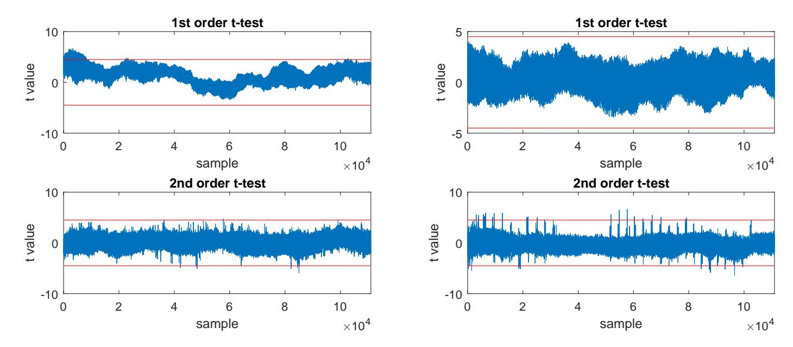

Fig. 8: 1st and 2nd order t-tests of 1st order masked implementation. Left column: 40K fixed vs. 40K random traces with PRNG off. Right column: 500K fixed vs. 500K random traces with PRNG on.

compared to the latter since temporal redundancy (R<sup>t</sup> = 2) couples the computation of 2 rounds within each instruction, whereas pure instruction redundancy (R<sup>t</sup> = 1) does not.

Code size (AES). We measure the impact of our hardware and software design on code size, using our bitsliced implementation of AES as a baseline. Our hardware design provides us with native support for spatial, complementary redundancy (ANDC, XORC, and XNORC). Performing these operations through software emulation would result in a ×1.3 (for D = 2) to ×1.4 (for D = 4) increase in code size. One must nonetheless bear in mind that the security provided by emulation is not equivalent to the one provided by native support. The temporal redundancy (R<sup>t</sup> = 2) mechanism comes at the expense of a small increase (less than ×1.06) in code size, due to the loop hardening protections as well as the checks validating results across successive rounds. The higher-order masking comes at a reasonable expense in code size: going from 1 to 2 shares increases code size by ×1.5 whereas going from 1 to 4 shares corresponds to a ×1.6 increase. A fully protected implementation (D = 4, R<sup>s</sup> = 4, R<sup>t</sup> = 2) thus weighs 13148 bytes.

### 5.2 Side-channel Analysis

We conduct an experiment to demonstrate how the proposed custom instructions can help decrease the power leakage. We implement SKIVA on the main FPGA of SAKURA-G board running at 9.8MHz and powered at 5V by an external power generator. We use a LeCroy WaveRunner 610Zi oscilloscope, sampling 250M samples/sec. To limit the noise level, we use a low-pass filter with a cutoff frequency of 81MHz on the power probe.

Correlation power analysis. To evaluate our design, we conduct 1st order correlation power analysis (CPA) [\[12\]](#page-21-7) on power consumption traces of the SubBytes

{15}------------------------------------------------

<span id="page-15-0"></span>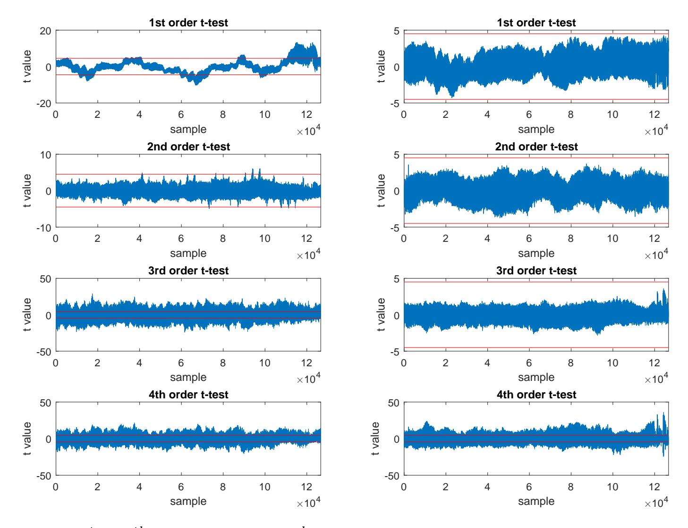

Fig. 9:  $1^{st}$  to  $4^{th}$  order t-tests of  $3^{rd}$  order masked implementation. Left column: 35K fixed vs. 35K random traces with PRNG off. Right column: 500K fixed vs. 500K random traces with PRNG on.

stage of the first round of AES. We use the Hamming weight of the SubBytes output as the power model. To speed up our attack, we use a sampling rate of 50M samples/sec. In this test case, we attack a single bitslice out of 32 parallel bitslices; the unused bitslices perform constant encryption of an all-zero plaintext with an all-zero key. Our CPA attack analyzes 50K traces and confirms that  $1^{st}$  order CPA on the unmasked scheme can reveal half of the key with 12K traces while it reveals all the secret key bytes with 24K traces. When masking is enabled, no key byte is revealed under any configuration at the maximum number of traces we considered (50K).

Test vector leakage assessment. To test the correctness of our secure implementations with the proposed instructions, we use the TVLA methodology [20, 7] and conduct the  $1^{st}$  and  $2^{nd}$  order t-tests on our  $1^{st}$  order masked implementation and the  $1^{st}$  to  $4^{th}$  order t-tests on our  $3^{rd}$  order masked encryption in two settings with and without the custom instructions. We set the trigger on one S-box in the fourth round of AES based per TVLA methodology [7].

For our experiments, we conduct the univariate non-specific fixed-vs.-random t-test in which a set of random inputs and a set of fixed inputs are interspersed in a random order and sent to the device. The fixed plaintext is selected such that

{16}------------------------------------------------

<span id="page-16-0"></span>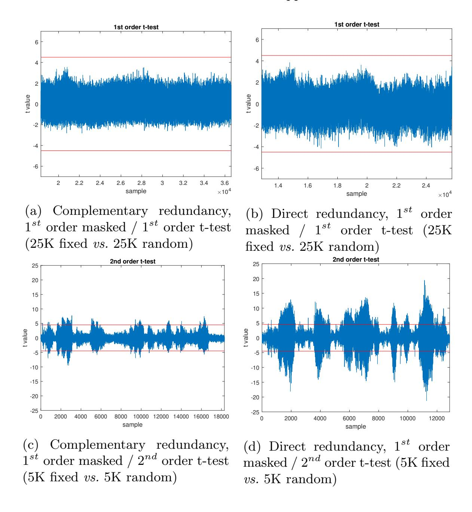

the output of the SubBytes stage in the 4th round of AES is zero. Furthermore, for higher-order t-tests, we post-process the traces to calculate the t-scores of the target order [\[47\]](#page-24-10). Figure [8](#page-14-0) and Figure [9](#page-15-0) show the results of the t-test on our masked implementations. The right column in Figure [8](#page-14-0) (resp. Figure [9\)](#page-15-0) indicates that our first (resp. third) order masked scheme shows no leakage of first (resp. first, second, or third) order on 500K fixed vs. 500K random traces while showing second (resp. fourth) order leakage as expected. The left columns show how turning the PRNG off causes the implementations to have leakage of all orders.

This experiment shows that the secure implementations are sound for analysis up to 500K traces. We do not conclude that the security claim underpinning the gadgets is valid; while an experimental observation can validate a security claim, the experiment cannot be used as its proof of correctness.

Power leakage of direct and complementary redundancy. To compare the effect of the direct and complementary redundancy schemes on side-channel leakage, we run the following test. We make two different versions of our AES C code: (1) 16 parallel aggregated bitslices of the direct (D = 2, R<sup>s</sup> = 1, R<sup>t</sup> = 1) scheme 

{17}------------------------------------------------

as the input to the first S-box in the fourth round of AES; and (2) 8 parallel aggregated bitslices of the complementary (D = 2, R<sup>s</sup> = 2, R<sup>t</sup> = 1) scheme as the input to the first S-box in the fourth round of AES. We then measure 5K traces for fixed input and 5K traces for random input and apply a second-order t-test on the measured traces. To speed up our measurements, the traces were collected at 50MS/s. As expected, Figures [10c](#page-16-0) and [10d](#page-16-0) show second-order leakage for both schemes. However, the direct redundancy results in much higher t-values indicating a higher probability of leakage than complementary redundancy. We also confirmed that a first-order t-test on both implementations shows no leakage for a non-specific test of 25K fixed vs. 25K random traces even when sampled at a higher rate of 100MS/s (Figures [10a](#page-16-0) and [10b\)](#page-16-0). Appendix [6](#page-33-0) includes additional observations.

### 5.3 Security Analysis of Data Faults

In the following, we analyze the fault sensitivity of our protected implementations. Our data protection scheme relies on spatial redundancy (R<sup>s</sup> ∈ {2, 4}). Faults that cannot be detected are those that affect redundant copies within a single register in a consistent manner, which implies either identical values in case of direct redundancy or negated values in case of complemented redundancy. Note that this analysis is independent of whether sharing (D) is used or not. From the standpoint of redundancy, each share is independently protected: for example, if two shares of the same data are subjected to a bit flip, our redundancy mechanism will report an error, even though the underlying data remains unchanged (x<sup>1</sup> ⊕ x<sup>2</sup> = x<sup>1</sup> ⊕ x2).

There are different ways to achieve undetected faults, i.e. generate a consistent value: one may skip an instruction whose destination register already holds a consistent value; one may replace an instruction with another (e.g., substitute an ANDC by an XORC); or directly perform a data fault.

If P is the probability for a data fault to result in a consistent value, then the detection rate is 1 − P. Such a probability depends on the injection technique, its parameters, the target architecture, as well as the physical properties of the device. In the following, we develop a theoretical analysis based on the assumption that data faults follow a stuck-at 0 or stuck-at 1 model, or uniformly distributed random byte, half-word, and word model. We then complement this analysis by an empirical evaluation of the impact of instruction skip.

Theoretical analysis of spatial redundancy In this analysis, we use the fault coverage (F C) metric [\[24\]](#page-22-9) F C = 1 − Fundetected/Ftotal where Ftotal is the total number of faults covered by the fault model and Fundetected is the number of faults that affect the execution while escaping detection by the countermeasure.

By construction, data fault effects such as single bit set, single reset, single bit flip, byte or half-word zeroing, faulty random byte or faulty random half-word are all detected (F C = 100%). Word zeroing or stuck-at 1 on complementary redundant data are also all detected (F C = 100%) but direct redundancy will never detect it (F C = 0%).

{18}------------------------------------------------

If the attacker injects random data faults following a uniform distribution, it means that there are  $F_{\text{total}} = 2^{32}$  fault injection possibilities. For  $R_s = 2$  and independently of the redundancy (direct or complementary),  $2^{16}$  of those values are consistent, including the expected output. Hence  $F_{\text{undetected}} = 2^{16} - 1$  and FC = 99.99%. For  $R_s = 4$ , there are  $F_{\text{undetected}} = 2^8 - 1$  faults that are left undetected, thus FC = 99.99%.

For illustrative purposes, we now consider a slightly stronger attacker who may flip p randomly chosen data bits. In practice, such analysis ought to be tailored to account for the specific distribution of faults of a given injection technique on a given platform. Under this attacker model, there are  $F_{\text{total}} = \binom{32}{p}$  fault injection possibilities leading to a p-bit flip (with p an even number). For  $R_s = 2$ , there are  $F_{\text{undetected}} = \binom{16}{\frac{p}{2}}$  faults corresponding to a p-bit flip that are left undetected. The lower-bound for FC is reached for p = 2 and p = 30, where FC = 96.77%. For  $R_s = 4$ , there are  $F_{\text{undetected}} = \binom{8}{\frac{p}{4}}$  faults corresponding to a p-bit flip that are left undetected. The lower-bound for FC is reached for p = 4 and p = 28, where FC = 99.97%. A p-bit set or reset fault model leads to a 100% detection rate if complementary redundancy is used. If direct redundancy is used, then this amounts to the p-bit flip model. Either way the detection rate is very high.

Experimental evaluation of temporal redundancy. We have simulated the impact of faults on our implementation of AES. We focus our attention exclusively on control faults (instruction skips) since our above analytical model already predicts the outcome of data faults. To this end, we use a fault injection simulator based on gdb running through the JTAG interface of the FPGA board. We execute our implementation up to a chosen breakpoint, after which we instruct the processor to jump to a given address, hence simulating the effect of an instruction skip. In particular, we have exhaustively targeted every instruction of the first and last round as well as the AES\_secure routine (for  $R_t = 2$ ) and its counterpart for  $R_t = 1$ . Since rounds 2 to 9 use the same code as the first round, the absence of vulnerabilities against instruction skips within the latter means that the former is secure against instruction skip as well. This exposes a total of 1248 injection points for  $R_t = 2$  and 1093 injection points for  $R_t = 1$ . For each such injection point, we perform an instruction skip from 512 random combinations of key and plaintext for  $R_t = 2$  and 352 random combinations for  $R_t = 1.$ 

The results are summarized in Table 3. Injecting a fault had one of five effects. A fault may yield an incorrect ciphertext with (1) or without (2) being detected. A fault may yield a correct ciphertext, with (3) or without (4) being detected. Finally, a fault may cause the program or the board to crash (5). According to our attacker model, only outcome (2) witnesses a vulnerability. In every other outcome, the fault either does not produce a faulty ciphertext or is detected within two rounds. For  $R_t = 2$ , we verify that every instruction skip was either detected (outcome 1 or 3) or had no effect on the output of the corresponding round (outcome 4) or lead to a crash (outcome 5). Comparatively, with  $R_t = 1$ ,

{19}------------------------------------------------

<span id="page-19-0"></span>nearly 95% of the instruction skips lead to an undetected fault impacting the ciphertext. In 0.19% of the cases, the fault actually impacts the fault-detection mechanism itself, thus triggering a false positive.

Table 3: Experimental results of simulated instruction skips

|           | With impact |                                                               | Without impact |        |       |       |
|-----------|-------------|---------------------------------------------------------------|----------------|--------|-------|-------|
|           |             | Detected Not detected Detected Not detected Crash # of faults |                |        |       |       |
|           | (1)         | (2)                                                           | (3)            | (4)    | (5)   |       |
| Rt<br>= 1 | 0.19%       | 92.34%                                                        | 0.00%          | 4.31%  | 3.15% | 12840 |
| Rt<br>= 2 | 78.19%      | 0.00%                                                         | 5.22%          | 12.18% | 4.40% | 21160 |

# 6 Conclusion

We have presented SKIVA, a general-purpose 32-bit processor supporting highthroughput, secure block ciphers on embedded devices. Our objective in extending the SPARC instruction set was to provide cryptographers with a manageable programming model for implementing secure ciphers on a general-purpose CPU. On the software side, we advocate an approach centered around bitslicing, where cryptographic primitives are treated as combinational circuits. By design, bitslicing protects an implementation against timing-based side-channel attacks. However, it also provides a sound basis for modular protections against fault and/or power-based side-channel attacks, thus paving the way for a pay-as-yougo security approach. In essence, SKIVA can be understood as a Turing machine for efficiently and securely executing combinational circuits in software.

These design choices translate into protection mechanisms that can naturally and systematically be integrated together. To protect against faults, we have shown that intra-instruction redundancy enables purely analytic security analysis, guaranteeing significant coverage, while we experimentally showed that temporal redundancy protects against instruction skips. To protect against sidechannel, we crucially rely on the physical isolation of slices, thus significantly reducing the risk of involuntary interference due to architectural details invisible to the programmer.

We have demonstrated the benefits of our approach with a bitsliced implementation of AES with 1, 2, and 4 shares, a temporal redundancy of 1 and 2, as well as a spatial redundancy of 1, 2, and 4. In terms of code size, we have shown that all security levels can be implemented in less than 13148B. In terms of performance, we have seen that it scales well with protection levels, dividing the throughput by 161 with all protections enabled at their maximum (D = 4, R<sup>s</sup> = 4, R<sup>t</sup> = 2).

Acknowledgements This project was supported in part by NSF Grant 1617203, NSF Grant 1931639, NIST Grant 70NANB17H280, the Emergence(s) program ´ of the City of Paris and the EDITE doctoral school.

{20}------------------------------------------------

# References

- <span id="page-20-6"></span>[1] Josep Balasch, Benedikt Gierlichs, Vincent Grosso, Oscar Reparaz, and Fran¸cois-Xavier Standaert. "On the Cost of Lazy Engineering for Masked Software Implementations". In: Smart Card Research and Advanced Applications - 13th International Conference, CARDIS 2014, Paris, France, November 5-7, 2014. Revised Selected Papers. 2014, pp. 64–81. doi: [10.](https://doi.org/10.1007/978-3-319-16763-3\_5) [1007/978-3-319-16763-3\\\_5](https://doi.org/10.1007/978-3-319-16763-3\_5).
- <span id="page-20-5"></span>[2] Josep Balasch, Benedikt Gierlichs, and Ingrid Verbauwhede. "An In-depth and Black-box Characterization of the Effects of Clock Glitches on 8-bit MCUs". In: 2011 Workshop on Fault Diagnosis and Tolerance in Cryptography, FDTC 2011, Tokyo, Japan, September 29, 2011. 2011, pp. 105–114. doi: [10.1109/FDTC.2011.9](https://doi.org/10.1109/FDTC.2011.9).
- <span id="page-20-1"></span>[3] Thierno Barry, Damien Courouss´e, and Bruno Robisson. "Compilation of a Countermeasure Against Instruction-Skip Fault Attacks". In: Proceedings of the Third Workshop on Cryptography and Security in Computing Systems, CS2@HiPEAC, Prague, Czech Republic, January 20, 2016. 2016, pp. 1–6. doi: [10.1145/2858930.2858931](https://doi.org/10.1145/2858930.2858931).
- <span id="page-20-4"></span>[4] Gilles Barthe, Sonia Bela¨ıd, Fran¸cois Dupressoir, Pierre-Alain Fouque, Benjamin Gr´egoire, Pierre-Yves Strub, and R´ebecca Zucchini. "Strong Non-Interference and Type-Directed Higher-Order Masking". In: Proceedings of the 2016 ACM SIGSAC Conference on Computer and Communications Security, Vienna, Austria, October 24-28, 2016. 2016, pp. 116–129. doi: [10.1145/2976749.2978427](https://doi.org/10.1145/2976749.2978427).
- <span id="page-20-0"></span>[5] Gilles Barthe, Fran¸cois Dupressoir, Sebastian Faust, Benjamin Gr´egoire, Fran¸cois-Xavier Standaert, and Pierre-Yves Strub. "Parallel Implementations of Masking Schemes and the Bounded Moment Leakage Model". In: Advances in Cryptology - EUROCRYPT 2017 - 36th Annual International Conference on the Theory and Applications of Cryptographic Techniques, Paris, France, April 30 - May 4, 2017, Proceedings, Part I. Ed. by Jean-S´ebastien Coron and Jesper Buus Nielsen. Vol. 10210. Lecture Notes in Computer Science. 2017, pp. 535–566. doi: [10.1007/978-3-319-56620-](https://doi.org/10.1007/978-3-319-56620-7\_19) [7\\\_19](https://doi.org/10.1007/978-3-319-56620-7\_19).
- <span id="page-20-3"></span>[6] Alberto Battistello, Jean-S´ebastien Coron, Emmanuel Prouff, and Rina Zeitoun. "Horizontal Side-Channel Attacks and Countermeasures on the ISW Masking Scheme". In: Cryptographic Hardware and Embedded Systems - CHES 2016 - 18th International Conference, Santa Barbara, CA, USA, August 17-19, 2016, Proceedings. 2016, pp. 23–39. doi: [10.1007/](https://doi.org/10.1007/978-3-662-53140-2\_2) [978-3-662-53140-2\\\_2](https://doi.org/10.1007/978-3-662-53140-2\_2).
- <span id="page-20-7"></span>[7] G. Becker, J. Cooper, E. DeMulder, G. Goodwill, J. Jaffe, G. Kenworthy, T. Kouzminov, A. Leiserson, M. Marson, P. Rohatgi, and S. Saab. Test Vector Leakage Assessment (TVLA) methodology in practice. 2013.
- <span id="page-20-2"></span>[8] Sonia Bela¨ıd, Fabrice Benhamouda, Alain Passel`egue, Emmanuel Prouff, Adrian Thillard, and Damien Vergnaud. "Randomness Complexity of Private Circuits for Multiplication". In: Advances in Cryptology - EURO-CRYPT 2016 - 35th Annual International Conference on the Theory and

{21}------------------------------------------------

- Applications of Cryptographic Techniques, Vienna, Austria, May 8-12, 2016, Proceedings, Part II. 2016, pp. 616–648. DOI: 10.1007/978-3-662-49896-5\\_22.
- <span id="page-21-4"></span>[9] Sonia Belaïd, Dahmun Goudarzi, and Matthieu Rivain. "Tight Private Circuits: Achieving Probing Security with the Least Refreshing". In: Advances in Cryptology - ASIACRYPT 2018 - 24th International Conference on the Theory and Application of Cryptology and Information Security, Brisbane, QLD, Australia, December 2-6, 2018, Proceedings, Part II. 2018, pp. 343–372. DOI: 10.1007/978-3-030-03329-3\\_12.
- <span id="page-21-1"></span>[10] Eli Biham. "A Fast New DES Implementation in Software". In: Fast Software Encryption, 4th International Workshop, FSE '97, Haifa, Israel, January 20-22, 1997, Proceedings. Vol. 1267. Lecture Notes in Computer Science. Springer, 1997, pp. 260–272. DOI: 10.1007/BFb0052352.
- <span id="page-21-6"></span>[11] Jakub Breier, Dirmanto Jap, Xiaolu Hou, and Shivam Bhasin. "On Side-Channel Vulnerabilities of Bit Permutations: Key Recovery and Reverse Engineering". In: *IACR Cryptology ePrint Archive* 2018 (2018), p. 219. URL: http://eprint.iacr.org/2018/219.
- <span id="page-21-7"></span>[12] Eric Brier, Christophe Clavier, and Francis Olivier. "Correlation Power Analysis with a Leakage Model". In: Cryptographic Hardware and Embedded Systems - CHES 2004: 6th International Workshop Cambridge, MA, USA, August 11-13, 2004. Proceedings. 2004, pp. 16–29. DOI: 10.1007/978-3-540-28632-5\\_2.
- <span id="page-21-3"></span>[13] Gaetan Cassiers and François-Xavier Standaert. "Improved Bitslice Masking: from Optimized Non-Interference to Probe Isolation". In: *IACR Cryptology ePrint Archive* 2018 (2018), p. 438. URL: https://eprint.iacr.org/2018/438.
- <span id="page-21-0"></span>[14] Gaetan Cassiers and François-Xavier Standaert. "Towards Globally Optimized Masking: From Low Randomness to Low Noise Rate or Probe Isolating Multiplications with Reduced Randomness and Security against Horizontal Attacks". In: *IACR Trans. Cryptogr. Hardw. Embed. Syst.* 2019.2 (2019), pp. 162–198. DOI: 10.13154/tches.v2019.i2.162–198.
- <span id="page-21-5"></span>[15] Zhi Chen, Junjie Shen, Alex Nicolau, Alexander V. Veidenbaum, Nahid Farhady Ghalaty, and Rosario Cammarota. "CAMFAS: A Compiler Approach to Mitigate Fault Attacks via Enhanced SIMDization". In: 2017 Workshop on Fault Diagnosis and Tolerance in Cryptography, FDTC 2017, Taipei, Taiwan, September 25, 2017. 2017, pp. 57–64. DOI: 10.1109/FDTC. 2017.10.
- <span id="page-21-8"></span>[16] Zhimin Chen, Ambuj Sinha, and Patrick Schaumont. "Using Virtual Secure Circuit to Protect Embedded Software from Side-Channel Attacks". In: *IEEE Trans. Computers* 62.1 (2013), pp. 124–136. DOI: 10.1109/TC. 2011.225. URL: https://doi.org/10.1109/TC.2011.225.
- <span id="page-21-2"></span>[17] Joan Daemen, Michaël Peeters, and Gilles Van Assche. "Bitslice Ciphers and Power Analysis Attacks". In: Fast Software Encryption, 7th International Workshop, FSE 2000, New York, NY, USA, April 10-12, 2000, Proceedings. 2000, pp. 134–149. DOI: 10.1007/3-540-44706-7\\_10.

{22}------------------------------------------------

- <span id="page-22-4"></span>[18] Siemen Dhooghe and Svetla Nikova. "My Gadget Just Cares For Me - How NINA Can Prove Security Against Combined Attacks". In: IACR Cryptology ePrint Archive 2019 (2019), p. 615. url: [https://eprint.](https://eprint.iacr.org/2019/615) [iacr.org/2019/615](https://eprint.iacr.org/2019/615).
- <span id="page-22-7"></span>[19] Si Gao, Ben Marshall, Dan Page, and Elisabeth Oswald. "Share-slicing: Friend or Foe?" In: IACR Trans. Cryptogr. Hardw. Embed. Syst. 2020.1 (2020), pp. 152–174. doi: [10.13154/tches.v2020.i1.152-174](https://doi.org/10.13154/tches.v2020.i1.152-174).
- <span id="page-22-8"></span>[20] Gilbert Goodwill, Benjamin Jun, John Jaffe, and Pankaj Rohatgi. A testing methodology for side channel resistance. [https://csrc.nist.gov/](https://csrc.nist.gov/csrc/media/events/non-invasive-attack-testing-workshop/documents/08_goodwill.pdf) [csrc / media / events / non - invasive - attack - testing - workshop /](https://csrc.nist.gov/csrc/media/events/non-invasive-attack-testing-workshop/documents/08_goodwill.pdf) [documents/08\\_goodwill.pdf](https://csrc.nist.gov/csrc/media/events/non-invasive-attack-testing-workshop/documents/08_goodwill.pdf). 2011.
- <span id="page-22-1"></span>[21] Dahmun Goudarzi, Anthony Journault, Matthieu Rivain, and Fran¸cois-Xavier Standaert. "Secure Multiplication for Bitslice Higher-Order Masking: Optimisation and Comparison". In: Constructive Side-Channel Analysis and Secure Design - 9th International Workshop, COSADE 2018, Singapore, April 23-24, 2018, Proceedings. 2018, pp. 3–22. doi: [10.1007/978-](https://doi.org/10.1007/978-3-319-89641-0\_1) [3-319-89641-0\\\_1](https://doi.org/10.1007/978-3-319-89641-0\_1).
- <span id="page-22-6"></span>[22] Philipp Grabher, Johann Großsch¨adl, and Dan Page. "Light-Weight Instruction Set Extensions for Bit-Sliced Cryptography". In: Cryptographic Hardware and Embedded Systems - CHES 2008, 10th International Workshop, Washington, D.C., USA, August 10-13, 2008. Proceedings. 2008, pp. 331–345. doi: [10.1007/978-3-540-85053-3\\\_21](https://doi.org/10.1007/978-3-540-85053-3\_21).
- <span id="page-22-3"></span>[23] Benjamin Gr´egoire, Kostas Papagiannopoulos, Peter Schwabe, and Ko Stoffelen. "Vectorizing Higher-Order Masking". In: Constructive Side-Channel Analysis and Secure Design - 9th International Workshop, COSADE 2018, Singapore, April 23-24, 2018, Proceedings. 2018, pp. 23–43. doi: [10.1007/](https://doi.org/10.1007/978-3-319-89641-0\_2) [978-3-319-89641-0\\\_2](https://doi.org/10.1007/978-3-319-89641-0\_2).
- <span id="page-22-9"></span>[24] Xiaofei Guo, Debdeep Mukhopadhyay, and Ramesh Karri. "Provably Secure Concurrent Error Detection Against Differential Fault Analysis". In: IACR Cryptology ePrint Archive 2012 (2012), p. 552. url: [http : / /](http://eprint.iacr.org/2012/552) [eprint.iacr.org/2012/552](http://eprint.iacr.org/2012/552).
- <span id="page-22-5"></span>[25] Karine Heydemann. "S´ecurit´e et performance des applications : analyses et optimisations multi-niveaux". Habilitation. LIP6, 2017.
- <span id="page-22-10"></span>[26] Philippe Hoogvorst, Guillaume Duc, and Jean-Luc Danger. "Software Implementation of Dual-Rail Representation". In: Constructive Side-Channel Analysis and Secure Design - Second International Workshop, COSADE 2011. Ed. by Werner Schindler and Sorin A. Huss.
- <span id="page-22-0"></span>[27] Yuval Ishai, Amit Sahai, and David Wagner. "Private Circuits: Securing Hardware against Probing Attacks". In: Advances in Cryptology - CRYPTO 2003, 23rd Annual International Cryptology Conference, Santa Barbara, California, USA, August 17-21, 2003, Proceedings. Vol. 2729. Lecture Notes in Computer Science. Springer, 2003, pp. 463–481. doi: [10.1007/978-3-540-45146-4\\_27](https://doi.org/10.1007/978-3-540-45146-4_27).
- <span id="page-22-2"></span>[28] Anthony Journault and Fran¸cois-Xavier Standaert. "Very High Order Masking: Efficient Implementation and Security Evaluation". In: Cryptographic

{23}------------------------------------------------

- Hardware and Embedded Systems CHES 2017 19th International Conference, Taipei, Taiwan, September 25-28, 2017, Proceedings. 2017, pp. 623-643. DOI: 10.1007/978-3-319-66787-4\\_30.
- <span id="page-23-1"></span>[29] Emilia Käsper and Peter Schwabe. "Faster and Timing-Attack Resistant AES-GCM". In: Cryptographic Hardware and Embedded Systems - CHES 2009, 11th International Workshop, Lausanne, Switzerland, September 6-9, 2009, Proceedings. Ed. by Christophe Clavier and Kris Gaj. Vol. 5747. Lecture Notes in Computer Science. Springer, 2009, pp. 1–17. DOI: 10.1007/978-3-642-04138-9\\_1.
- <span id="page-23-6"></span>[30] Joseph R. Kiniry, Daniel M. Zimmerman, Robert Dockins, and Rishiyur Nikhil. "A Formally Verified Cryptographic Extension to a RISC-V Processor". In: Second Workshop on Computer Architecture Research with RISC-V (CARRV 2018). ACM, New York, NY, USA. 2018, 5 pages.
- <span id="page-23-2"></span>[31] Robert Könighofer. "A Fast and Cache-Timing Resistant Implementation of the AES". In: Topics in Cryptology - CT-RSA 2008, The Cryptographers' Track at the RSA Conference 2008, San Francisco, CA, USA, April 8-11, 2008. Proceedings. 2008, pp. 187–202. DOI: 10.1007/978-3-540-79263-5\\_12.
- <span id="page-23-4"></span>[32] Benjamin Lac, Anne Canteaut, Jacques J. A. Fournier, and Renaud Sirdey. "Thwarting Fault Attacks against Lightweight Cryptography using SIMD Instructions". In: *IEEE International Symposium on Circuits and Systems, ISCAS 2018, 27-30 May 2018, Florence, Italy.* 2018, pp. 1–5. DOI: 10.1109/ISCAS.2018.8351693.
- <span id="page-23-0"></span>[33] Jean-François Lalande, Karine Heydemann, and Pascal Berthomé. "Software Countermeasures for Control Flow Integrity of Smart Card C Codes". In: Computer Security - ESORICS 2014 - 19th European Symposium on Research in Computer Security, Wroclaw, Poland, September 7-11, 2014. Proceedings, Part II. 2014, pp. 200–218. DOI: 10.1007/978-3-319-11212-1\\_12.
- <span id="page-23-5"></span>[34] B. Marshall, D. Page, and T. Pham. XCrypto: a cryptographic ISE for RISC-V. 2019. URL: https://github.com/scarv/xcrypto.
- <span id="page-23-8"></span>[35] Darius Mercadier and Pierre-Évariste Dagand. "Usuba: high-throughput and constant-time ciphers, by construction". In: *Proceedings of the 40th ACM SIGPLAN Conference on Programming Language Design and Implementation, PLDI 2019, Phoenix, AZ, USA, June 22-26, 2019.* 2019, pp. 157–173. DOI: 10.1145/3314221.3314636.
- <span id="page-23-7"></span>[36] Kostas Papagiannopoulos and Nikita Veshchikov. "Mind the Gap: Towards Secure 1st-Order Masking in Software". In: Constructive Side-Channel Analysis and Secure Design - 8th International Workshop, COSADE 2017, Paris, France, April 13-14, 2017, Revised Selected Papers. 2017, pp. 282–297. DOI: 10.1007/978-3-319-64647-3\\_17.
- <span id="page-23-3"></span>[37] Conor Patrick, Bilgiday Yuce, Nahid Farhady Ghalaty, and Patrick Schaumont. "Lightweight Fault Attack Resistance in Software Using Intra-instruction Redundancy". In: Selected Areas in Cryptography - SAC 2016 - 23rd International Conference, St. John's, NL, Canada, August 10-12, 2016, Revised

{24}------------------------------------------------

- Selected Papers. 2016, pp. 231–244. doi: [10.1007/978- 3- 319- 69453-](https://doi.org/10.1007/978-3-319-69453-5\_13) [5\\\_13](https://doi.org/10.1007/978-3-319-69453-5\_13).
- <span id="page-24-7"></span>[38] David A. Patterson and John L. Hennessy. Computer Organization and Design - The Hardware / Software Interface (Revised 4th Edition). The Morgan Kaufmann Series in Computer Architecture and Design. Academic Press, 2012.
- <span id="page-24-9"></span>[39] Thomas Pornin. BearSSL, a smaller SSL/TLS library. [https://bearssl.](https://bearssl.org) [org](https://bearssl.org). Accessed: 2019-01-08.
- <span id="page-24-5"></span>[40] Julien Proy, Karine Heydemann, Alexandre Berzati, and Albert Cohen. "Compiler-Assisted Loop Hardening Against Fault Attacks". In: TACO 14.4 (2017), 36:1–36:25. doi: [10.1145/3141234](https://doi.org/10.1145/3141234).
- <span id="page-24-4"></span>[41] Chester Rebeiro, A. David Selvakumar, and A. S. L. Devi. "Bitslice Implementation of AES". In: Cryptology and Network Security, 5th International Conference, CANS 2006, Suzhou, China, December 8-10, 2006, Proceedings. 2006, pp. 203–212. doi: [10.1007/11935070\\\_14](https://doi.org/10.1007/11935070\_14).
- <span id="page-24-8"></span>[42] Francesco Regazzoni, Alessandro Cevrero, Fran¸cois-Xavier Standaert, St´ephane Badel, Theo Kluter, Philip Brisk, Yusuf Leblebici, and Paolo Ienne. "A Design Flow and Evaluation Framework for DPA-Resistant Instruction Set Extensions". In: Cryptographic Hardware and Embedded Systems - CHES 2009, 11th International Workshop, Lausanne, Switzerland, September 6- 9, 2009, Proceedings. 2009, pp. 205–219. doi: [10 . 1007 / 978 - 3 - 642 -](https://doi.org/10.1007/978-3-642-04138-9\_15) [04138-9\\\_15](https://doi.org/10.1007/978-3-642-04138-9\_15).
- <span id="page-24-0"></span>[43] Oscar Reparaz, Josep Balasch, and Ingrid Verbauwhede. "Dude, is my code constant time?" In: Design, Automation & Test in Europe Conference & Exhibition, DATE 2017, Lausanne, Switzerland, March 27-31, 2017. 2017, pp. 1697–1702. doi: [10.23919/DATE.2017.7927267](https://doi.org/10.23919/DATE.2017.7927267).
- <span id="page-24-2"></span>[44] Oscar Reparaz, Lauren De Meyer, Beg¨ul Bilgin, Victor Arribas, Svetla Nikova, Ventzislav Nikov, and Nigel P. Smart. "CAPA: The Spirit of Beaver Against Physical Attacks". In: Advances in Cryptology - CRYPTO 2018 - 38th Annual International Cryptology Conference, Santa Barbara, CA, USA, August 19-23, 2018, Proceedings, Part I. 2018, pp. 121–151. doi: [10.1007/978-3-319-96884-1\\\_5](https://doi.org/10.1007/978-3-319-96884-1\_5).
- <span id="page-24-6"></span>[45] Cobham Gaisler Research. LEON-3 Processor. [https://www.gaisler.](https://www.gaisler.com/index.php/products/processors/leon3) [com/index.php/products/processors/leon3](https://www.gaisler.com/index.php/products/processors/leon3). 2018.
- <span id="page-24-1"></span>[46] Lionel Rivi`ere, Zakaria Najm, Pablo Rauzy, Jean-Luc Danger, Julien Bringer, and Laurent Sauvage. "High precision fault injections on the instruction cache of ARMv7-M architectures". In: IEEE International Symposium on Hardware Oriented Security and Trust, HOST 2015, Washington, DC, USA, 5-7 May, 2015. IEEE Computer Society, 2015, pp. 62–67. doi: [10.](https://doi.org/10.1109/HST.2015.7140238) [1109/HST.2015.7140238](https://doi.org/10.1109/HST.2015.7140238).
- <span id="page-24-10"></span>[47] Tobias Schneider and Amir Moradi. "Leakage Assessment Methodology a clear roadmap for side-channel evaluations". In: IACR Cryptology ePrint Archive. 2015, pp. 495–513. doi: [10.1007/978-3-662-48324-4\\\_25](https://doi.org/10.1007/978-3-662-48324-4\_25).
- <span id="page-24-3"></span>[48] Tobias Schneider, Amir Moradi, and Tim G¨uneysu. "ParTI: Towards Combined Hardware Countermeasures against Side-Channel and Fault-Injection

{25}------------------------------------------------

- Attacks". In: Proceedings of the ACM Workshop on Theory of Implementation Security, TIS@CCS 2016 Vienna, Austria, October, 2016. 2016, p. 39. doi: [10.1145/2996366.2996427](https://doi.org/10.1145/2996366.2996427).
- <span id="page-25-1"></span>[49] Thierry Simon, Lejla Batina, Joan Daemen, Vincent Grosso, Pedro Maat Costa Massolino, Kostas Papagiannopoulos, Francesco Regazzoni, and Niels Samwel. "Towards Lightweight Cryptographic Primitives with Built-in Fault-Detection". In: IACR Cryptology ePrint Archive 2018 (2018), p. 729. url: <https://eprint.iacr.org/2018/729>.
- <span id="page-25-3"></span>[50] CORPORATE SPARC International Inc. The SPARC Architecture Manual: Version 8. Upper Saddle River, NJ, USA: Prentice-Hall, Inc., 1992. isbn: 0-13-825001-4.
- <span id="page-25-4"></span>[51] Stefan Tillich and Johann Großsch¨adl. "Power Analysis Resistant AES Implementation with Instruction Set Extensions". In: Cryptographic Hardware and Embedded Systems - CHES 2007, 9th International Workshop, Vienna, Austria, September 10-13, 2007, Proceedings. 2007, pp. 303–319. doi: [10.1007/978-3-540-74735-2\\\_21](https://doi.org/10.1007/978-3-540-74735-2\_21).
- <span id="page-25-0"></span>[52] Bilgiday Yuce, Patrick Schaumont, and Marc Witteman. "Fault Attacks on Secure Embedded Software: Threats, Design, and Evaluation". In: J. Hardware and Systems Security 2.2 (2018), pp. 111–130. doi: [10.1007/](https://doi.org/10.1007/s41635-018-0038-1) [s41635-018-0038-1](https://doi.org/10.1007/s41635-018-0038-1).
- <span id="page-25-2"></span>[53] Lo¨ıc Zussa, Jean-Max Dutertre, Jessy Cl´edi`ere, and Assia Tria. "Power supply glitch induced faults on FPGA: An in-depth analysis of the injection mechanism". In: 2013 IEEE 19th International On-Line Testing Symposium (IOLTS), Chania, Crete, Greece, July 8-10, 2013. 2013, pp. 110– 115. doi: [10.1109/IOLTS.2013.6604060](https://doi.org/10.1109/IOLTS.2013.6604060).

{26}------------------------------------------------

# <span id="page-26-0"></span>Custom instructions details

### TR2 instruction

```
TR2 rs1, rs2, rd
    regrd[31:0] := CONCAT( ...
        regrs1[15],regrs2[15],regrs1[14],regrs2[14], ...
        regrs1[13],regrs2[13],regrs1[12],regrs2[12], ...
        regrs1[11],regrs2[11],regrs1[10],regrs2[10], ...
        regrs1[9],regrs2[9],regrs1[8],regrs2[8], ...
        regrs1[7],regrs2[7],regrs1[6],regrs2[6], ...
        regrs1[5],regrs2[5],regrs1[4],regrs2[4], ...
        regrs1[3],regrs2[3],regrs1[2],regrs2[2], ...
        regrs1[1],regrs2[1],regrs1[0],regrs2[0])
    y[31:0] := CONCAT( ...
        regrs1[31],regrs2[31],regrs1[30],regrs2[30], ...
        regrs1[29],regrs2[29],regrs1[28],regrs2[28], ...
        regrs1[27],regrs2[27],regrs1[26],regrs2[26], ...
        regrs1[25],regrs2[25],regrs1[24],regrs2[24], ...
        regrs1[23],regrs2[23],regrs1[22],regrs2[22], ...
        regrs1[21],regrs2[21],regrs1[20],regrs2[20], ...
        regrs1[19],regrs2[19],regrs1[18],regrs2[18], ...
        regrs1[17],regrs2[17],regrs1[16],regrs2[16])
```

### INVTR2 instruction

```
INVTR2 rs1, rs2, rd
    regrd[31:0] := CONCAT( ...
        regrs1[30],regrs1[28],regrs1[26],regrs1[24], ...
        regrs1[22],regrs1[20],regrs1[18],regrs1[16], ...
        regrs1[14],regrs1[12],regrs1[10],regrs1[8], ...
        regrs1[6],regrs1[4],regrs1[2],regrs1[0], ...
        regrs2[30],regrs2[28],regrs2[26],regrs2[24], ...
        regrs2[22],regrs2[20],regrs2[18],regrs2[16], ...
        regrs2[14],regrs2[12],regrs2[10],regrs2[8], ...
        regrs2[6],regrs2[4],regrs2[2],regrs2[0])
    y[31:0] := CONCAT( ...
        regrs1[31],regrs1[29],regrs1[27],regrs1[25], ...
        regrs1[23],regrs1[21],regrs1[19],regrs1[17], ...
        regrs1[15],regrs1[13],regrs1[11],regrs1[9], ...
        regrs1[7],regrs1[5],regrs1[3],regrs1[1], ...
        regrs2[31],regrs2[29],regrs2[27],regrs2[25], ...
        regrs2[23],regrs2[21],regrs2[19],regrs2[17], ...
```

{27}------------------------------------------------

```
regrs2[15],regrs2[13],regrs2[11],regrs2[9], ...
regrs2[7],regrs2[5],regrs2[3],regrs2[1])
```

### SUBROT instruction

```
SUBROT rs, imm, rd
    IF imm[2:0] = 010
        FOR i:=0:15
            j := 2*i
            regrd[j+1:j] := regrs[j:j+1]
        ENDFOR
    ELIF imm[2:0] = 100
        FOR i:=0:7
            j := 4*i
            regrd[j+3:j] := CONCAT(regrs[j+2:j],regrs[j+3])
        ENDFOR
    FI
```

### RED instruction

```
RED rs, imm, rd
    IF imm[2:0] = 010
        regrd[15:0] := regrs[15:0]
        regrd[31:16] := regrs[15:0]
        y[15:0] := regrs[31:16]
        y[31:16] := regrs[31:16]
    ELIF imm[2:0] = 011
        regrd[15:0] := regrs[15:0]
        regrd[31:16] := (NOT regrs[15:0])
        y[15:0] := rregrss[31:16]
        y[31:16] := (NOT regrs[31:16])
    ELIF imm[2:0] = 100
        regrd[7:0] := regrs[7:0]
        regrd[15:8] := regrs[7:0]
        regrd[23:16] := regrs[7:0]
        regrd[31:24] := regrs[7:0]
        y[7:0] := regrs[15:8]
        y[15:8] := regrs[15:8]
        y[23:16] := regrs[15:8]
        y[31:24] := regrs[15:8]
    ELIF imm[2:0] = 101
        regrd[7:0] := regrs[7:0]
```

{28}------------------------------------------------

```
regrd[15:8] := (NOT regrs[7:0])
    regrd[23:16] := regrs[7:0]
    regrd[31:24] := (NOT regrs[7:0])
    y[7:0] := rs[15:8]
    y[15:8] := (NOT regrs[15:8])
    y[23:16] := rs[15:8]
    y[31:24] := (NOT regrs[15:8])
ELIF imm[2:0] = 110
    regrd[7:0] := regrs[23:16]
    regrd[15:8] := regrs[23:16]
    regrd[23:16] := regrs[23:16]
    regrd[31:24] := regrs[23:16]
    y[7:0] := regrs[31:24]
    y[15:8] := regrs[31:24]
    y[23:16] := regrs[31:24]
    y[31:24] := regrs[31:24]
ELIF imm[2:0] = 111
    regrd[7:0] := regrs[23:16]
    regrd[15:8] := (NOT regrs[23:16])
    regrd[23:16] := regrs[23:16]
    regrd[31:24] := (NOT regrs[23:16])
    y[7:0] := regrs[31:24]
    y[15:8] := (NOT regrs[31:24])
    y[23:16] := regrs[31:24]
    y[31:24] := (NOT regrs[31:24])
FI
```

### ANDC16 instruction

```
ANDC16 rs1, rs2, rd
        regrd[15:0] := (regrs1[15:0] AND regrs2[15:0])
        regrd[31:16] := (regrs1[31:16] OR regrs2[31:16])
```

### XORC16 instruction

```
XORC16 rs1, rs2, rd
        regrd[15:0] := (regrs1[15:0] XOR regrs2[15:0])
        regrd[31:16] := (regrs1[31:16] XNOR regrs2[31:16])
```

# XNORC16 instruction

```
XNORC16 rs1, rs2, rd
```

{29}------------------------------------------------

```
regrd[15:0] := (regrs1[15:0] XNOR regrs2[15:0])
regrd[31:16] := (regrs1[31:16] XOR regrs2[31:16])
```

### ANDC8 instruction

```
ANDC8 rs1, rs2, rd
        regrd[7:0] := (regrs1[7:0] AND regrs2[7:0])
        regrd[15:8] := (regrs1[15:8] OR regrs2[15:8])
        regrd[23:16] := (regrs1[23:16] AND regrs2[23:16])
        regrd[31:24] := (regrs1[31:24] OR regrs2[31:24])
```

### XORC8 instruction

```
XORC8 rs1, rs2, rd
        regrd[7:0] := (regrs1[7:0] XOR regrs2[7:0])
        regrd[15:8] := (regrs1[15:8] XNOR regrs2[15:8])
        regrd[23:16] := (regrs1[23:16] XOR regrs2[23:16])
        regrd[31:24] := (regrs1[31:24] XNOR regrs2[31:24])
```

### XNORC8 instruction

```
XNORC8 rs1, rs2, rd
        regrd[7:0] := (regrs1[7:0] XNOR regrs2[7:0])
        regrd[15:8] := (regrs1[15:8] XOR regrs2[15:8])
        regrd[23:16] := (regrs1[23:16] XNOR regrs2[23:16])
        regrd[31:24] := (regrs1[31:24] XOR regrs2[31:24])
```

### <span id="page-29-0"></span>FTCHK instruction

```
FTCHK rs, imm, rd
    IF imm[2:0] = 010
        FOR i:=0:15
            regrd[i] := (regrs[i+16] XOR regrs[i])
            regrd[i+16] := (regrs[i+16] XOR regrs[i])
        ENDFOR
    ELIF imm[2:0] = 011
        FOR i:=0:15
            regrd[i] := (regrs[i+16] XNOR regrs[i])
            regrd[i+16] := (regrs[i+16] XNOR regrs[i])
```

{30}------------------------------------------------

```
ENDFOR
ELIF imm[2:0] = 100
    FOR i:=0:7
        regrd[i] := ((regrs[i+8] XOR regrs[i]) OR ...
                     (regrs[i+16] XOR regrs[i]) OR ...
                     (regrs[i+24] XOR regrs[i]))
        regrd[i+8] := ((regrs[i+8] XOR regrs[i]) OR ...
                     (regrs[i+16] XOR regrs[i]) OR ...
                     (regrs[i+24] XOR regrs[i]))
        regrd[i+16] := ((regrs[i+8] XOR regrs[i]) OR ...
                     (regrs[i+16] XOR regrs[i]) OR ...
                     (regrs[i+24] XOR regrs[i]))
        regrd[i+24] := ((regrs[i+8] XOR regrs[i]) OR ...
                     (regrs[i+16] XOR regrs[i]) OR ...
                     (regrs[i+24] XOR regrs[i]))
    ENDFOR
ELIF imm[2:0] = 101
    FOR i:=0:7
        regrd[i] := ((regrs[i+8] XNOR regrs[i]) OR ...
                     (regrs[i+16] XOR regrs[i]) OR ...
                     (regrs[i+24] XNOR regrs[i]))
        regrd[i+8] := ((regrs[i+8] XNOR regrs[i]) OR ...
                     (regrs[i+16] XOR regrs[i]) OR ...
                     (regrs[i+24] XNOR regrs[i]))
        regrd[i+16] := ((regrs[i+8] XNOR regrs[i]) OR ...
                     (regrs[i+16] XOR regrs[i]) OR ...
                     (regrs[i+24] XNOR regrs[i]))
        regrd[i+24] := ((regrs[i+8] XNOR regrs[i]) OR ...
                     (regrs[i+16] XOR regrs[i]) OR ...
                     (regrs[i+24] XNOR regrs[i]))
    ENDFOR
FI
```

# Efficient C emulation of the custom instructions

The following C code shows how to emulate selected custom instructions.

```
#define ANDC8(r,a,b) r = (((a) | (b)) & 0xFF00FF00) | \
                          (((a) & (b)) & 0x00FF00FF)
#define XORC8(r,a,b) r = (a) ^ (b) ^ 0xFF00FF00
#define XNORC8(r,a,b) r = (a) ^ (b) ^ 0x00FF00FF
#define ANDC16(r,a,b) r = (((a) | (b)) & 0xFFFF0000) | \
                          (((a) & (b)) & 0x000FFFF)
#define XORC16(r,a,b) r = (a) ^ (b) ^ 0xFFFF0000
#define XNORC16(r,a,b) r = (a) ^ (b) ^ 0x0000FFFF
```

{31}------------------------------------------------

# Sample multiplication gadgets

```
# input: %i2 (a), %i3 (b), %i4 (random), %i5 (fault flags)
# output: %o0 (a & b), %i5 (updated fault flags)
### clear input in case of a fault:
NOT %i5, %o4 #
AND %i2, %o4, %o6 #
### calculate AND result:
AND %i3, %o6, %o5 # partial product 1
SUBROT %o6, 2, %l0 # share-rotate
AND %i3, %l0, %o3 # partial product 2
XOR %l0, %l0, %l0 # clear SUBROT output
XOR %o5, %i4, %o2 # random + parprod 1
XOR %o2, %o3, %o1 # + parprod 2
SUBROT %i4, 2, %l1 # parallel refresh
XOR %o1, %l1, %o0 # output
### update fault flags:
FTCHK %o0, imm, %g5 # imm depends on Rs and Rt
OR %g5, %i5, %i5 #
```

(a) First-order secure multiplication

```
# input: %l7 (a), %g1 (b), %g4 (random), %g2 (random), %i6 (fault flags)
# output: %i1 (a & b), %i6 (updated fault flags)
### clear input in case of a fault:
NOT %i6, %g6 #
AND %l7, %g6, %o6 #
### calculate AND result:
AND %o6, %g1, %i3 # partial product 1
SUBROT %o6, 4, %o1 # share-rotate
AND %g1, %o1, %i2 # partial product 2
SUBROT %g1, 4, %o0 # share-rotate
AND %o0, %o6, %i0 # partial product 3
SUBROT %o1, 4, %l0 # share-rotate
AND %g1, %l0, %o7 # partial product 4
XOR %o1, %o1, %o1 # clear SUBROT output
XOR %o0, %o0, %o0 # clear SUBROT output
XOR %l0, %l0, %l0 # clear SUBROT output
XOR %i3, %g4, %o5 # random + parprod 1
XOR %o5, %i2, %o4 # + parprod 2
XOR %o4, %i0, %o3 # + parprod 3
SUBROT %g4, 4, %l1 #
XOR %o3, %l1, %o2 # + rot(random)
XOR %o2, %o7, %g3 # + parprod 4
XOR %g2, %g3, %i5 # output refresh
SUBROT %g2, 4, %l2 #
XOR %l2, %i5, %i1 #
### update fault flags:
FTCHK %i1, imm, %g5 # imm depends on Rs and Rt
OR %g5, %i6, %i6 #
```

(b) Third-order secure multiplication

Fig. 11: Secure multiplication using SUBROT and FTCHK

{32}------------------------------------------------

# Side-channel analysis results

Table 4: Detailed report of 1st order CPA results on unmasked SubBytes of 1st round AES

|     | # of traces # of key bytes revealed |
|-----|-------------------------------------|
| 3K  | 1                                   |
| 4K  | 3                                   |
| 9K  | 5                                   |
| 10K | 6                                   |
| 11K | 7                                   |
| 12K | 8 (half key)                        |
| 14K | 10                                  |
| 18K | 11                                  |
| 19K | 12                                  |
| 21K | 13                                  |
| 22K | 14                                  |
| 23K | 15                                  |
| 24K | 16 (full key)                       |

{33}------------------------------------------------

# <span id="page-33-0"></span>Effect of Different Redundancy Schemes on Power Leakage

Figure [12](#page-33-1) shows the evolution of t-values for the 2nd order t-test with respect to the number of traces for both redundancy schemes. We observe that the direct redundancy shows leakage with as few as about 200 traces, while the complementary redundancy shows leakage only after around 2500 traces. We conclude that complementary redundancy is better than its direct counterpart in hiding secret data from the power leakage. We believe that this result is consistent with earlier work that investigated the impact of complementary representation on software [\[26,](#page-22-10) [16\]](#page-21-8).

<span id="page-33-1"></span>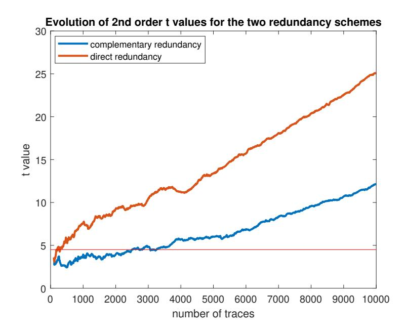

Fig. 12: Evolution of t values for 2nd order t-test on 1st order masked implementation with direct and complementary redundancy.