{0}------------------------------------------------

# Automatic Search of Meet-in-the-Middle Preimage Attacks on AES-like Hashing

Zhenzhen Bao2( $\boxtimes$ ), Xiaoyang Dong3( $\boxtimes$ ), Jian Guo2( $\boxtimes$ ), Zheng Li4,5( $\boxtimes$ ), Danping Shi1,6( $\boxtimes$ ), Siwei Sun1,6( $\boxtimes$ ), and Xiaoyun Wang3,7( $\boxtimes$ )

- 1 State Key Laboratory of Information Security, Institute of Information Engineering, Chinese Academy of Sciences, Beijing, China. {shidanping,sunsiwei}@iie.ac.cn
- Division of Mathematical Sciences, School of Physical and Mathematical Sciences,
   Nanyang Technological University, Singapore. {zzbao,guojian}@ntu.edu.sg
   Institute for Advanced Study, BNRist, Tsinghua University, Beijing, China.
- {xiaoyangdong,xiaoyunwang}@tsinghua.edu.cn

  4 Faculty of Information Technology, Beijing University of Technology, Beijing, China.

  5 Beijing Key Laboratory of Trusted Computing, Beijing University of Technology, Beijing, China. lizhengcn@bjut.edu.cn
  - 6 University of Chinese Academy of Sciences, Beijing, China.
- 7 Key Laboratory of Cryptologic Technology and Information Security, Ministry of Education, Shandong University, Shandong, China.

**Abstract.** The Meet-in-the-Middle (MITM) preimage attack is highly effective in breaking the preimage resistance of many hash functions, including but not limited to the full MD5, HAVAL, and Tiger, and reduced SHA-0/1/2. It was also shown to be a threat to hash functions built on block ciphers like AES by Sasaki in 2011. Recently, such attacks on AES hashing modes evolved from merely using the freedom of choosing the internal state to also exploiting the freedom of choosing the message state. However, detecting such attacks especially those evolved variants is difficult. In previous works, the search space of the configurations of such attacks is limited, such that manual analysis is practical, which results in sub-optimal solutions. In this paper, we remove artificial limitations in previous works, formulate the essential ideas of the construction of the attack in well-defined ways, and translate the problem of searching for the best attacks into optimization problems under constraints in Mixed-Integer-Linear-Programming (MILP) models. The MILP models capture a large solution space of valid attacks; and the objectives of the MILP models are attack configurations with the minimized computational complexity. With such MILP models and using the off-the-shelf solver, it is efficient to search for the best attacks exhaustively. As a result, we obtain the first attacks against the full (5-round) and an extended (5.5round) version of Haraka-512 v2, and 8-round AES-128 hashing modes, as well as improved attacks covering more rounds of Haraka-256 v2 and other members of AES and Rijndael hashing modes.

Keywords: AES, Haraka v2, MITM, Preimage, Automatic search, MILP

{1}------------------------------------------------

# **1 Introduction**

Hash function is one of the most important cryptographic primitives, due to its wide and crucial applications such as digital signatures, verification of message integrity and passwords etc. To support these applications, collision resistance, preimage resistance, and second-preimage resistance form the three basic security requirements for cryptographic hash functions. Unlike many public-key cryptographic systems, whose security can be usually reduced to some hard mathematical problems, most of the hash function standards in use could not enjoy such a security reduction. The confidence of the security strength of many symmetric-key primitives mainly relies on intensive and persistent cryptanalysis from the research community. Hence, such effort is of utmost importance, especially against the basic security properties of the standards and the ones used in practice. In this paper, we mainly focus on preimage resistance of hash functions built on the block cipher Advanced Encryption Standard (AES) [\[15\]](#page-29-0) and the like (we call them AES-like hashing for short). Typical examples are the three PGV-modes [\[48\]](#page-31-0) – Davies-Meyer (DM), Matyas-Meyer-Oseas (MMO), and Miyaguchi-Preneel (MP), instantiated with AES. Both PGV-modes and AES have long-standing security supported by rigorous and massive cryptanalysis, including the recent quantum collision attacks [\[17,](#page-30-0) [29\]](#page-30-1). The MMO-mode instantiated with AES is standardized by Zigbee [\[1\]](#page-29-1) and also suggested by ISO [\[31\]](#page-31-1) as a standard way of building hash function based on block ciphers. Furthermore, many featurerich cryptographic protocols, *e.g.*, multi-party computation protocols [\[21,](#page-30-2) [33\]](#page-31-2), use hash functions as building blocks and their instances adopt AES-MMO due to its high efficiency when implemented with AES-NI. Besides, since the standardization of AES, many new ciphers follow a similar design strategy or using AES round function directly as building blocks to share the security proof and implementation benefits, *e.g.*, hash functions Grindahl [\[37\]](#page-31-3), ECHO [\[12\]](#page-29-2), Grøstl [\[20\]](#page-30-3), and Haraka v2 [\[38\]](#page-31-4), and authenticated encryption [\[14\]](#page-29-3).

The MITM Preimage Attacks. Informally, preimage resistance refers to the property that, for a hash function *H* and a target *T* given at random, it is *computationally* difficult to find a message *x*, such that *H*(*x*) = *T*. Theoretically, for a secure hash function with a digest of *n* bits in size, the expected number of *H* evaluations required to find such an *x* is 2 *n*. Any such algorithm with a time complexity lower than 2 *n* is considered as a *preimage attack*.

In [\[7\]](#page-29-4), Aumasson *et al.* devised preimage attacks on step-reduced MD5 and full 3-pass HAVAL [\[64\]](#page-33-0), in which the key technique can be viewed as the application of local-collision combined with the Meet-in-the-Middle (MITM) approach. Sasaki and Aoki in [\[51\]](#page-32-0) formally proposed to combine the MITM and local-collision approaches and successfully devised preimage attacks on full versions of 3, 4, and 5-pass HAVAL. Further, they in [\[6\]](#page-29-5) proposed the *splice-and-cut* technique and in [\[53\]](#page-32-1) invented the concept of the *initial structure*, which add more strength to the MITM attack, and successfully broke the preimage resistance of the full MD5. These techniques were then formalized as *bicliques* [\[13,](#page-29-6) [34,](#page-31-5) [35\]](#page-31-6), and further evolved to differential views [\[18,](#page-30-4) [36\]](#page-31-7). Since these pioneering works, the MITM 

{2}------------------------------------------------

preimage attack turned out to be very powerful and found many applications in the last decade. It broke the theoretical preimage security claims of MD4 [\[25\]](#page-30-5), MD5 [\[53\]](#page-32-1), Tiger [\[25,](#page-30-5) [59\]](#page-32-2), HAVAL [\[26,](#page-30-6) [51\]](#page-32-0) and round-reduced variants of many other hash functions such as SHA-0 and SHA-1 [\[5,](#page-29-7) [18,](#page-30-4) [36\]](#page-31-7), SHA-2 [\[4\]](#page-29-8), BLAKE [\[18\]](#page-30-4), HAS-160 [\[28\]](#page-30-7), RIPEMD and RIPEMD-160 [\[60\]](#page-32-3), Stribog [\[2\]](#page-29-9), Whilwind [\[3\]](#page-29-10), and AES hashing modes [\[10,](#page-29-11) [49,](#page-32-4) [62\]](#page-32-5). Interestingly, the idea of MITM preimage attack also leads to the progress of collision attacks against reduced SHA-2 [\[41\]](#page-31-8) and key-recovery attack against full KTANTAN [\[61\]](#page-32-6), which are technically different from the DS-MITM attacks [\[22,](#page-30-8) [23,](#page-30-9) [24\]](#page-30-10).

The core of a MITM preimage attack on the hash function is generally a MITM pseudo-preimage attack on its compression function (denoted by CF). The basic idea of the attack on the CF is as follows (take the DM-mode as an example). First, the iterative round-based computation of the CF is divided at an intermediate round (starting point) into two chunks. One chunk is computed forward (named as *forward chunk*), the other is computed backward (named as *backward chunk*), and one of them is computed across the first and last rounds via the feed-forward mechanism of the hashing mode, and they end at a common intermediate round (matching point). In each of the chunks, the computation involves at least one distinct message word (or a few bits of it), such that they can be computed over all possible values of the involved message word(s) independently from the message word(s) involved in the other chunk (the distinct words are called *neutral words*). When an initial structure is used, it covers few consecutive rounds at the starting point, within which the two chunks overlapped and the neutral words for both chunks appear simultaneously, but still, the computations of the two chunks on the neutral words are independent.

In [\[49\]](#page-32-4), Sasaki applied such MITM preimage attack to AES-hashing modes. Together with the partial matching technique, the attack successfully penetrated 7 out of the 10, 12, 14 rounds respectively for AES-128, AES-192, and AES-256. Later, Wu *et al.* in [\[62\]](#page-32-5) improved the complexities in multi-target setting. Different from early MITM attacks on the MD-SHA family, their attacks select the neutral bytes from the internal state and fix the material fed into the key/messageschedule to an arbitrary constant. Recently, such attacks on AES hashing modes evolved to not only using the freedom of selecting the internal state but also exploiting the freedom of selecting the message state (key materials of the block ciphers), and improved results are achieved in [\[10\]](#page-29-11). Due to the fact that there are too many possible configurations (selection of neutral words, position of initial structure and matching rounds, extra conditions imposed to limit propagation of neutral words, etc.) to test out by bruteforce, all existing attacks cover only a small portion of configurations, which were believed to potentially give better cryptanalysis results according to the attackers' intuition and experiences.

Automatic Tools. In the last decade, cryptanalysis has also made significant progress from manual methods to those aided by dedicated computer programs searching for best differential/linear paths etc. [\[45\]](#page-31-9) and best attacks [\[16\]](#page-30-11), then to automatic tools for solving Constraint Satisfaction Problems (CSP), such as Mixed Integer Linear Programming (MILP), Constrained Programming (CP), 

{3}------------------------------------------------

Satisfiability Solvers (SAT), and Satisfiability Modulo Theories (SMT). These automatic tools convert the problem of finding better cryptanalytic attacks to optimization problems solvable by the tools, under certain constraints, which ensure the validity of the attacks. They not only enlarge the possible solution space covered by previous manual methods and dedicated search programs, but also helped generalize and even re-define the attack models which in turn further enlarge solution spaces. As a result, these tools have made significant advances in cryptanalysis, such as differential/linear path search [\[19,](#page-30-12) [39,](#page-31-10) [44,](#page-31-11) [47,](#page-31-12) [57,](#page-32-7) [58\]](#page-32-8), cube( like) attacks [\[27,](#page-30-13) [42,](#page-31-13) [43,](#page-31-14) [55,](#page-32-9) [56\]](#page-32-10), integral attacks based on division properties [\[63\]](#page-32-11), three-subset and Demirci-Selçuk meet-in-the-middle attacks [\[50,](#page-32-12)[54\]](#page-32-13). These usually lead to attacks for more rounds and/or lower time/memory complexities. With these available capacities, a more accurate security assessment is possible, and many recent primitive designs [\[9,](#page-29-12)[11,](#page-29-13)[38\]](#page-31-4) benefited from these tools in determining the round number and the security margin with better confidence.

It is important to note that, literally every problem in cryptanalysis, complex or simple, can be converted into one under automatic tools. However, when the problem is complex, tools may not be able to output solutions in real time. Hence, different from the traditional manual cryptanalysis, the difficulty of tool-aided cryptanalysis is to find a proper model, which balances the problem solving time and size of solution space the model covers (number of attack configurations in case of AES-like hashing). Obviously, a model covering larger solution space comes with lesser constraints, which is harder to solve by the tools, but has bigger chances to offer better cryptanalysis results. All our effort in this paper is to convert the preimage finding problem into one under the MILP language, by a model covering largest possible solution space, while keeping the model solvable in practical time within our computation capacity in hands.

Our Contributions. In this paper, we manage to automatize the search for the best MITM preimage attacks with MILP models. We focus ourselves on hash functions built on AES and AES-like ciphers.

We extend the construction of attacks by removing the limitations taken by previous works [\[10,](#page-29-11) [49,](#page-32-4) [62\]](#page-32-5). That includes releasing the boundaries of the initial structure by applying the essential idea to every possible round; considering the possibility of imposing degree of freedom both from the internal state and from the message, which is done by allowing selecting neutral bytes from both of the encryption state and key state, and for both directions of computation; considering a desynchronized selection of neutral bytes in the encryption computation flow and the key-schedule flow (meaning that we allow the key state, from which the neutral bytes be selected, be at any possible round, instead of adhering to the round at where neutral bytes are selected in the encryption state) as appeared already *e.g.*, in [\[10,](#page-29-11) [25\]](#page-30-5).

We formalize the essential idea behind the advanced techniques used in the MITM preimage attack, including the above mentioned extended form of initial structure and the partial matching, using explicit-defined rules. In our formulation of the MITM preimage attacks, we do not pre-set any hard boundaries for the

{4}------------------------------------------------

Table 1: Results of applications of our tool compared with previous best results

| Target        | #Round         | Time-1                             | Time-2               | $(DoF^+, DoF^-, DoM)$ in bits   | Ref.          |
|---------------|----------------|------------------------------------|----------------------|---------------------------------|---------------|
| AES-128       | 7/10           | $2^{120} \\ 2^{120 - \min(t, 24)}$ | $2^{125} \\ 2^{123}$ | (8, 8, 32)                      | [49]          |
| AL3-126       | $7/10 \\ 7/10$ | $2^{104}$                          | $\frac{2}{2^{117}}$  | ( 8, 32, 32 ) ( 24, 32, 24 ) | [62] [10]  |
|               | 8/10           | $2^{120}$                          | $2^{125}$            | (16, 8, 8)                      | Fig. <b>7</b> |
|               | 7/12           | $2^{120}$                          | $2^{125}$            | (8, 8, 32)                      | [49]          |
| AES-192       | 7/12           | $2^{96}$                           | $2^{113}$            | (32, 32, 32)                    | [10]          |
|               | 8/12           | $2^{112-\min(t,16)}$               | $2^{116}$            | (16, 32, 32)                    | [10]          |
|               | 9/12           | $2^{120}$                          | $2^{125}$            | (8, 8, 8)                       | Fig. 9        |
| AES-256       | 7/14           | $2^{120}$                          | $2^{125}$            | (8, 8, 32)                      | [49]          |
|               | 8/14           | $2^{96}$                           | $2^{113}$            | (32, 32, 32)                    | [10]          |
|               | 9/14           | $2^{120 - \min(t, 24)}$            | $2^{123}$            | (8, 32, 32)                     | Fig. 10       |
| Rijndael-256  | 9/14           | $2^{248}$                          | $2^{253}$            | ( 16, 16, 8 )                   | Fig. 12       |
| Haraka-256 v2 | 7/10           | $2^{248}$                          | $2^{248}$            | (8, 8, 96)                      | [38]          |
|               | 9/10           | $2^{224}$                          | $2^{224}$            | ( 32, 32, 64 )                  | Fig. 13       |
|               | 8/10           | $2^{248}$                          | $2^{248}$            | (8, 8, 64)                      | [38]          |
| Haraka-512 v2 | 10/10          | $2^{224-\min(t,32)}$               | $2^{224}$            | (128, 32, 64)                   | Fig. 14       |
|               | 11/10          | $2^{240}$                          | $2^{240}$            | ( 128, 128, 16)                 | Fig. 8        |
|               |                |                                    |                      |                                 |               |

– Following [10], we use Time-1 to represent the time complexity of pseudo-preimage. Here,  $2^t$  is the number of available targets for multi-target pseudo-preimage attacks; use Time-2 to represent the complexity of using the (multi-target) pseudo-preimage attacks to do (second-)preimage attacks when requiring an upper layer of meet-in-the-middle procedure of conversion for some PGV-modes, and here a single target is given. For Haraka-512 v2, the conversion is not needed and Time-2 should be the same with Time-1.

initial structures (*i.e.*, the number of rounds and which rounds are covered), but allow it to evolve automatically according to certain rules from well-defined and potentially desynchronized starting states towards a clear objective. Thanks to this formulation, the MITM preimage attack is ready to be transformed into MILP models covering a larger solution space than previous works.

We refine the MILP model for the operations involved in AES-like round functions to accurately capture all possible effects of them on the forward and backward computation paths. For example, instead of separately treating the AddRoundKey and MixColumns, we treat them as a whole (a composition transformation) and formalize constraints that can result in all possible impacts from the input states to the output state. In doing that, the models can capture the solutions where the difference in the active cells in the key state and that in encryption state be mutually (partially) canceled, which is impossible when treat the two operations separately. Such treatment further enlarges the search space to capture more potentially better attacks.

With such MILP models and using off-the-shelf solver, we apply the automatic search to AES-like hashing. Improved attacks than the previous ones were obtained. That includes the first preimage attacks on 8-round AES-128, 9-round AES-192,

- The unit of complexity is one computation of the compression function.

- #Round is the number of AES-like round (one Haraka v2 round consists of two AES-like rounds).

- (DoF+, DoF-, DoM) is (the degree of freedom for forward computation, the degree of freedom for backward computation, the degree of matching), please refer to Sect. 3.

{5}------------------------------------------------

9-round AES-256, 9-round Rijndael hashing modes, 4.5-round (9 AES-rounds) Haraka-256 v2 and the full 5-round (10 AES-rounds) version and extended 5.5 round (11 AES-rounds) version of Haraka-512 v2. The detailed results, together with a comparison to the previous related works, are summarized in Table [1.](#page-4-0)

Note that the modified versions of Haraka v2 are used in instantiations of SPHINCS+ (which replaces the DM-mode with Sponge-based construction) [\[30\]](#page-30-14) and Gravity-SPHINCS (which extends one round on top of the 5-round version) [\[8\]](#page-29-14). Gravity-SPHINCS is one of the first round, and SPHINCS+ is one of the third round alternate candidates of digital signatures in the NIST Post-Quantum Cryptography Standardization Process. Our attacks on Haraka v2 do not directly break the security of SPHINCS+-Haraka and Gravity-SPHINCS-Haraka. For SPHINCS+- Haraka, the security relies on a preimage resistance of 128-bit rather than 256-bit. For Gravity-SPHINCS-Haraka, the security relies on a collision resistance of 128-bit rather than preimage resistance, besides, the underlying Haraka v2 variants have increased the AES-like rounds from 10 to 12, while our attacks cover at most 11 rounds.

# **2 AES-like Hashing and MITM Preimage Attacks**

Most current hash functions are based on compression functions (CF) with fixed length input and output; and the support for variable-length messages can be achieved through domain extenders. Here, we focus on the challenge of inverting the CF, i.e., given one or multiple targets *T*, find input chaining value *h* and message block *M*, such that CF(*h, M*) = *T*. Such attacks are called pseudopreimage attacks, in which the chaining value is free of choice. Pseudo-preimages can be converted to (second-)preimages of hash functions using generic methods (details can be found in Appendix [C\)](#page-42-0).

#### **2.1 AES-like Hashing**

Typically, the compression function of hash functions can be constructed from block ciphers applying the secure PGV-modes [\[48\]](#page-31-0). When the underlying block ciphers are AES-like, we call the hash functions as AES-like hashing. Concretely, in AES-like hashing, the underlying compression function is based on AES-like round functions as depicted in Fig. [2,](#page-11-0) where the state being manipulated is organized into an Nrow × Ncol two-dimensional array of *c*-bit cells. One AES-like round function typically consists of the following operations:

- **SubBytes.** Substitute each cell according to an S-boxes *S* : F2 *c* → F2 *c* .
- **ShiftRows***πt* **.** Permute the cell positions according to the permutation *πt*.
- **MixColumns.** Update each column by left-multiplying an Nrow × Nrow MDS matrix (maximal distance separable matrix, with branch number Bn = Nrow + 1, *i.e.*, as long as the input/output of the MDS matrix is non-zero, the sum of non-zero elements in the input and output is at least Nrow + 1).
- **AddRoundKey.** XOR a round key or a round-dependent constant into the state depending on whether the intended construction is keyed or not.

{6}------------------------------------------------

#### 2.2 Advanced Techniques in Meet-in-the-Middle Preimage Attacks

Since the pioneering works on preimage attacks on MD4, MD5, and HAVAL [7,40,51,52], the MITM approach has been applied and further developed for preimage attacks on many other hash functions. This method develops into *splice-and-cut* [6] MITM preimage attacks with support from *initial structure* [53] and (indirect) partial matching techniques.

Initial Structures [53]. From the idea of local-collision, Sasaki and Aoki proposed a novel concept – initial structure. The purpose of the initial structure is to skip several steps/rounds at the beginning of chunks in a MITM attack so that the attack covers more steps/rounds. It is a few consecutive starting steps, where the two chunks overlapped. Although the two sets of neutral words, denoted by  $N^+$  and  $N^-$ , appear simultaneously at these steps, they are only involved in the computation of one chunk each. Besides, one can add constraints to the values of neutral words of one chunk, such that different values lead to constant impact on the computation of the opposite chunk. Thus, a proper initial structure should satisfy that, steps after the initial structure (forward chunk) can be computed independently of  $N^-$  and steps before the initial structure (backward chunk) can be computed independently of  $N^+$ .

Remark 1 (Related work – the formalism of Biclique). Notably, the initial structure was viewed as the most promising and underutilized technique for MITM preimage attack in the subsequent years since its invention. In [35], authors replaced the idea of initial structure with a more formal and general concept, which is named biclique. With this formalism, one can view the structure in a differential view, and built it by applying various tools available for collision search and differential attacks. This concept of biclique has been applied to both preimage attacks on hash functions (e.g., SHA-1, SHA-2 and Skein-512 [35,36]) and key-recovery attacks on block ciphers (e.g., AES and IDEA [13,34]).

In this paper, independent of the formalism using concept of biclique, and instead of adhering to a formal definition, we apply the essential idea behind the original concept of initial structure. We formalize the basic idea using explicit rules and extend the initial structure to be less structured.

(Indirect-) Partial matching [6, 53]. In the two ending states for matching, as long as there remain one common word of which the value can be computed independently between the forward and backward chunks, the matching can be performed. Further, apart from directly matching values of common words, any determined relations between words in the states at the matching point can be exploited to filter out miss-matched computations. For example, Sasaki in [49] exploited the following property of the AES MixColumns to do indirect matching: knowing any b bytes (b > 4) among the input and output of MixColumns on one column, one can built a filter of b - 4 bytes. For example, in Fig. 1d, it is possible to do partial matching between states  $\#MC^1$  and  $\#AK^1$ , and each column provides 2 + 3 - 4 = 1 byte filter, as exemplified in Fig. 1b.

{7}------------------------------------------------

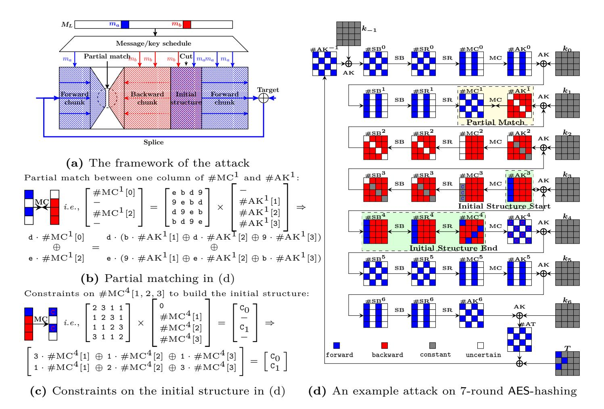

Fig. 1: The MITM pseudo-preimage attack [49,62]

Multi-targets [25, 62]. When multiple targets are available, it adds the degree of freedom to the chunk where the targets are added to.

The Attack Framework. The procedure (Fig. 1) and complexities of the MITM pseudo-preimage attack depend on the following configurations:

- 1. Chunk separation the position of initial structure and matching points.
- 2. The neutral bytes the selection and the constraints on the neutral bytes, which determine the degrees of freedom for each chunk.
- 3. The bytes for matching the deterministic relation used for matching, which determines the filtering ability (degree of matching).

After setting up the configuration, the basic attack procedure goes as follows. Denote the neutral bytes for the forward and backward chunk by  $N^+$  and  $N^-$ :

- 1. Assign arbitrary compatible values to all bytes except those that depend on the neutral bytes (e.g., the Gray cells in Fig. 1d).
- 2. Obtain possible values of neutral bytes  $N^+$  and  $N^-$  under the constraints on them (e.g., in Fig. 1c). Suppose there are  $2^{d_1}$  values for  $N^+$ , and  $2^{d_2}$  for  $N^-$ .
- 3. For all  $2^{d_1}$  values of  $N^+$ , compute forward from the initial structure to the matching point to get a table  $L^+$ , whose indices are the values for matching, and the elements are the values of  $N^+$ .

{8}------------------------------------------------

- 4. For all 2 *d*2 values of *N* −, compute backward from the initial structure to the matching point to get a table *L* −, whose indices are the values for matching, and the elements are the values of *N* −.
- 5. Check whether there is a match on indices between *L* + and *L* −.
- 6. In case of partial-matching exist in the above step, for the surviving pairs, check for a full-state match. In case none of them are fully matched, repeat the procedure by changing values of fixed bytes till find a full match.

**The Attack Complexity.** Denote the size of the internal state by *n*, the degree of freedom in the forward and backward chunks by *d*1 and *d*2, and the number of bits for the match by *m*, the time complexity of the attack is [\[10\]](#page-29-11):

$$2^{n-(d_1+d_2)} \cdot (2^{\max(d_1,d_2)} + 2^{d_1+d_2-m}) \simeq 2^{n-\min(d_1,d_2,m)}. \tag{1}$$

#### **2.3 Basic Rules Applied to MITM Attacks on AES-like Hashing**

**Sources of Degrees of Freedom.** Shown by the complexity analysis, the MITM attack benefits from larger degrees of freedom in both chunks and matching. In early MITM preimage attacks on the MD-SHA family, the degree of freedom comes from the message words. Whereas, in early MITM preimage attacks on AES-like hashing [\[49,](#page-32-4) [62\]](#page-32-5), the degree of freedom comes from the bytes in encryption states [8](#page-8-0) , and the attacks set the material fed into the key-schedule as arbitrary constant. In [\[10\]](#page-29-11), the authors proposed to introduce neutral bytes not only from the encryption state but also from the key state. The principle is that, for one chunk, one adds as much degree of freedom as possible to improve the computational complexity, and at the same time, keeps their impacts on the opposite chunk as little as possible to cover as many rounds as possible. To keep the analysis manually doable, the authors in [\[10\]](#page-29-11) proposed that the neutral bytes in key states are all introduced for merely one chunk.

**Ways to Control Impacts on the Opposite Chunk.** For the ways to cancel impacts from neutral words for one chunk on the opposite chunk, recall that early preimage attacks on MD-SHA used the (cross) absorption properties of Boolean functions by setting an input variable to a special value to absorb the difference in another input variable. In the attack on AES-like hashing, the ways to control the impacts of the neutral bytes is to add constraints on those neutral bytes when they are inputs to the following operations. Note that adding constraints means consuming the degree of freedom.

**–** AddRoundKey and XOR: one can restrict that the XOR of two neutral bytes be constant. The rationale is to use the difference in one neutral byte (*e.g.*, in the key state) to absorb the difference in another neutral byte (*e.g.*, in the encryption state). That will consume one-byte degree of freedom.

8 In a hash function, there is no encryption and key-schedule. Here, focusing on hash functions built on block ciphers, we use them to represent the two algorithms updating the chaining values and updating the message words. For different mode-of-operations, the correspondence might be different.

{9}------------------------------------------------

- MixColumns (MC): Even if the input contains neutral bytes (active) for one chunk, one can add restriction on their values, such that their impacts on some output bytes of the MC be constant. Therefore, the opposite chunk can be computed independently as long as the constant impacts are known. Take the attack in Fig. 1d for example. In the computation from  $\#MC^4$  to  $\#AK^4$ , the values of Red cells in state  $\#MC^4$  are restricted such that changing them does not change impact on the Blue cells marked by C in  $\#AK^4$  (exemplified in Fig. 1c). This restriction consumes the degree of freedom that lies in neutral bytes for backward chunk, but enables the independent forward computation. Explicitly, if there are i neutral bytes for one chunk involved in the input of MC, then we can control their impacts on j bytes of the output be constant by consuming j bytes degree of freedom. For AES-like hashing, because the matrix MC in MixColumns is MDS, there is a limitation for applying this control, that is  $i + N_{row} j \ge N_{row} + 1$ , i.e.,  $i \ge j + 1$ .
- MixColumns o AddRoundKey (XOR-MC): in backward chunk, when there are forward neutral bytes in both the key and the encryption state, to control their impacts, one may first apply the above-mentioned way of restriction on AddRoundKey and then on MixColumns. Besides that, we apply restriction on the composition transformation of AddRoundKey and MixColumns. The rationale is that, the XOR operation in AddRoundKey is byte-wise. Only when two bytes being at the same position in two states, the difference in one byte can absorb the difference in the other byte. As for MixColumns, only when two bytes being in the same state, the difference in one byte can absorb the difference in the other byte. However, when considering the composition MixColumns o AddRoundKey, even when the neutral bytes for the forward chunk lie in different states (some in the key state and some in the encryption state) and in different byte positions, we can still use the difference of some neutral bytes to absorb the difference of others. Sect. 4.1 and the listed attacks will provide formal descriptions and concrete examples.

Explicitly, suppose that there are i forward neutral bytes in the key state, and j forward neutral bytes in the encryption state, and they lie in columns with a common index. Let k be the number of different byte positions considering these neutral bytes together (i.e., k equals the Hamming weight of the 'OR' between the indicator vector of whether a position has a neutral byte in the key state and that in the encryption state). Then, considering the MDS property of MC in MixColumns, we can control the impacts of neutral bytes on t bytes of the output by consuming t bytes degree of freedom as long as  $k + N_{row} - t \ge N_{row} + 1$ , i.e.,  $k \ge t + 1$ .

Remark 2 (Relation with previous MITM attacks on AES hashing modes). Note that the ways to control the impacts have already been used in previous MITM preimage attacks on AES-like hashing [10, 49, 62], which is an essential element for constructing the initial structure. In this paper, we consider the possibility to impose such constraints to any round, and in this sense, the boundaries of the initial structure disappear. Besides, as has been mentioned above, the ways to select the neutral bytes were limited in previous works to make the analysis

{10}------------------------------------------------

doable manually. In this paper, we remove these restrictions by allowing the selection of neutral bytes in both encryption state and key state, and for both forward and backward chunks.

In the subsequent sections, we will use these ideas to get explicit rules for selecting neutral bytes, consuming degree of freedom on neutral bytes to control their impacts. Incorporating with other optimization techniques (e.g., partial matching and multi-targets), we convert the problem of searching for the best configurations into optimization problems under constraints in MILP-models. With the obtained MILP-models and the off-the-shelf solver, we can search for the best MITM attacks on AES-like hashing exhaustively.

Remark 3 (Relation with another work on using MILP to searching MITM attack). In [50], Sasaki already applied the MILP formalization to search the three-subset MITM attack on GIFT-64. In the tool, which rounds covered by an initial structure are predefined. Neutral bits are all from the key state because the goal is a key-recovery attack. Besides, because it is dedicated to GIFT-64 (with a bit-permutation linear layer), the previously mentioned rules for optimizing MITM attacks on AES-like hashing are not included, which is essentially the most challenging parts in our formalization.

# 3 Formulate the MITM Attack on AES-like Hashing

To search for MITM attacks on AES-like hashing, we now formulate the attack with the general construction shown in Fig. 2.

Denote the *starting states* in the encryption data path and key-schedule data path by  $S^{\text{ENC}}$  and  $S^{\text{KSA}}$ , respectively (corresponding to the location of an initial structure previously); and denote the *ending states* for the forward computation and backward computation by  $E^+$  and  $E^-$ , respectively (corresponding to the previous matching). In the formalized attack, partial knowledge of  $E^+$  and  $E^-$  that is used for matching is supposed to be obtained by computing from  $S^{\text{ENC}}$  and  $S^{\text{KSA}}$  forward and backward, respectively 9.

Without loss of generality, we assume that the states in the encryption data paths and the key-schedule both have n c-bit cells (with  $n = N_{row} \cdot N_{col}$ ). To reference the cells of certain n-cell states, denote by  $\mathcal{B}^{ENC}$ ,  $\mathcal{B}^{KSA}$ ,  $\mathcal{R}^{ENC}$ ,  $\mathcal{R}^{KSA}$ ,  $\mathcal{C}$ , and  $\mathcal{D}$  the ordered subsets of  $\mathcal{N} = \{0, 1, \dots, n-1\}$  whose elements are increasingly ordered. Here, the  $\mathcal{B}^{ENC}$  and  $\mathcal{B}^{KSA}$  refer to the neutral cells from the internal state and message (or key state of the underlying block cipher) for the forward chunk, and  $\mathcal{R}^{ENC}$  and  $\mathcal{R}^{KSA}$  for the backward chunk. The  $\mathcal{C}$  and  $\mathcal{D}$  refer to the known and active cells in the ending states  $E^+$  and  $E^-$  of the forward and backward chunks, respectively. For example, we may have  $\mathcal{C} = \{0, 2, 7\}$ , and for a 16-cell state S,  $S[\mathcal{C}]$  is defined to be (S[0], S[2], S[7]) or S[0, 2, 7].

&lt;sup>9 Note that after finding out a formalized attack, adaptation will be made manually to launch a concrete attack; the forward and backward computations may start from the most decisive states instead of  $S^{\text{ENC}}$  and  $S^{\text{KSA}}$  while keeping the complexity.

{11}------------------------------------------------

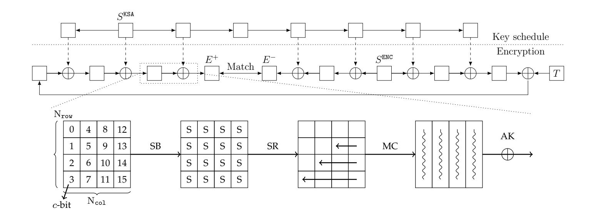

Fig. 2: A high-level overview of the MITM preimage attack

Before one can mount a MITM preimage attack, these four states:  $S^{\text{ENC}}$ ,  $S^{\text{KSA}}$ ,  $E^+$ ,  $E^-$ , and six subsets  $\mathcal{B}^{\text{ENC}}$ ,  $\mathcal{B}^{\text{KSA}}$ ,  $\mathcal{R}^{\text{ENC}}$ ,  $\mathcal{R}^{\text{KSA}}$ ,  $\mathcal{C}$ ,  $\mathcal{D}$  ( $\mathcal{B}^{\text{ENC}} \cap \mathcal{R}^{\text{ENC}} = \emptyset$  and  $\mathcal{B}^{\text{KSA}} \cap \mathcal{R}^{\text{KSA}} = \emptyset$  for independence between chunks) must be specified.

Note that to visualize these subsets and the attack, we will introduce a coloring system in Sect. 4, where cells referenced by  $\mathcal{B}^{\text{ENC}}$  and  $\mathcal{B}^{\text{KSA}}$  are Blue, and cells referenced by  $\mathcal{R}^{\text{ENC}}$  and  $\mathcal{R}^{\text{KSA}}$  are Red. The remaining cells in the starting states referenced by  $\mathcal{G}^{\text{ENC}}$  and  $\mathcal{G}^{\text{KSA}}$  are Gray, where  $\mathcal{G}^{\text{ENC}} = \mathcal{N} - \mathcal{B}^{\text{ENC}} \cup \mathcal{R}^{\text{ENC}}$  and  $\mathcal{G}^{\text{KSA}} = \mathcal{N} - \mathcal{B}^{\text{KSA}} \cup \mathcal{R}^{\text{KSA}}$ . Moreover,  $\mathcal{C}$  references the Blue cells in the ending state  $E^+$ , and  $\mathcal{D}$  the Red cells in  $E^-$ .

In what follows, the degree of freedom (DoF) refers to number of cells, rather than bits. We call  $\lambda^+ = |\mathcal{B}^{\text{ENC}}| + |\mathcal{B}^{\text{KSA}}|$  the initial DoF for the forward chunk, and  $\lambda^- = |\mathcal{R}^{\text{ENC}}| + |\mathcal{R}^{\text{KSA}}|$  the initial DoF for the backward chunk. For forward and backward chunks being computed independently, these initial DoFs might be consumed by adding constraints on neutral cells in  $S^{\text{ENC}}$  and  $S^{\text{KSA}}$ . Thus, neutral cells in the starting states may not take all  $2^{c \cdot \lambda^+}$  and  $2^{c \cdot \lambda^-}$  values.

If the forward neutral cells  $(S^{\text{ENC}}[\mathcal{B}^{\text{ENC}}], S^{\text{KSA}}[\mathcal{B}^{\text{KSA}}])$  (in Blue) in the starting states can only take values in  $\mathbb{X} \subseteq \mathbb{F}_{2^c}^{|\mathcal{B}^{\text{ENC}}|+|\mathcal{B}^{\text{KSA}}|}$  with  $|\mathbb{X}| = (2^c)^{d_1} \leq (2^c)^{|\mathcal{B}^{\text{ENC}}|+|\mathcal{B}^{\text{KSA}}|}$ , and the backward neutral cells  $(S^{\text{ENC}}[\mathcal{R}^{\text{ENC}}], S^{\text{KSA}}[\mathcal{R}^{\text{KSA}}])$  (in Red) in the starting states can only take values in  $\mathbb{Y} \subseteq \mathbb{F}_{2^c}^{|\mathcal{R}^{\text{ENC}}|+|\mathcal{R}^{\text{KSA}}|}$  with  $|\mathbb{Y}| = (2^c)^{d_2} \leq (2^c)^{|\mathcal{R}^{\text{ENC}}|+|\mathcal{R}^{\text{KSA}}|}$ , then after fixing the Gray cells  $(S^{\text{ENC}}[\mathcal{G}^{\text{ENC}}], S^{\text{KSA}}[\mathcal{G}^{\text{KSA}}])$  in the starting states to some constant in  $\mathbb{F}_{2^c}^{(n-|\mathcal{B}^{\text{ENC}}|-|\mathcal{R}^{\text{ENC}}|)+(n-|\mathcal{B}^{\text{KSA}}|-|\mathcal{R}^{\text{KSA}}|)}$ , the attacker can compute  $(2^c)^{d_1}$  different values of  $E^+[\mathcal{C}]$  in the forward direction which only depend on  $(S^{\text{ENC}}[\mathcal{B}^{\text{ENC}}], S^{\text{KSA}}[\mathcal{B}^{\text{KSA}}])$ . The attacker stores these  $(2^c)^{d_1}$  values in a list  $L^+$ . Similarly, the attacker can compute  $(2^c)^{d_2}$  different values of  $E^-[\mathcal{D}]$  in the backward direction which only depend on  $(S^{\text{ENC}}[\mathcal{R}^{\text{ENC}}], S^{\text{KSA}}[\mathcal{R}^{\text{KSA}}])$ . The attacker stores these  $(2^c)^{d_2}$  values in a list  $L^-$ . For the two lists  $L^+$  and  $L^-$ , the attacker can perform an m-cell matching. Then,  $|L^+ \times L^-|/(2^c)^m$  pairs from  $L^+ \times L^-$  are expected to pass the test.

We call m the degrees of matching (denoted by DoM). Note that  $\mathcal{B}^{\texttt{ENC}}$  and  $\mathcal{B}^{\texttt{KSA}}$  indicate the sources of the degrees of freedom for the forward computation, and

{12}------------------------------------------------

 $\mathcal{R}^{\text{ENC}}$  and  $\mathcal{R}^{\text{KSA}}$  indicate the sources of the degrees of freedom for the backward computation. Since in the forward computation and backward computation,  $(S^{\text{ENC}}[\mathcal{B}^{\text{ENC}}], S^{\text{KSA}}[\mathcal{B}^{\text{KSA}}])$  and  $(S^{\text{ENC}}[\mathcal{R}^{\text{ENC}}], S^{\text{KSA}}[\mathcal{R}^{\text{KSA}}])$  are restricted to  $\mathbb{X}$  and  $\mathbb{Y}$  respectively, with  $|\mathbb{X}| = (2^c)^{d_1}$  and  $|\mathbb{Y}| = (2^c)^{d_2}$ , we call  $d_1$  the degrees of freedom for the forward computation (denoted by  $\text{DoF}^+$ ) and  $d_2$  the degrees of freedom for the backward computation (denoted by  $\text{DoF}^-$ ).

With this configuration, it is shown that the time complexity to find a full n-cell match between the two ending states is  $(2^c)^{n-\min\{d_1,d_2,m\}}$ . Therefore, for a valid MITM preimage attack, we must have  $DoF^+ \geq 1$ ,  $DoF^- \geq 1$ , and  $DoM \geq 1$ . In the following section, we will show how to automatically determine  $\mathcal{B}^{\text{ENC}}$ ,  $\mathcal{B}^{\text{KSA}}$ ,  $\mathcal{R}^{\text{ENC}}$ ,  $\mathcal{R}^{\text{KSA}}$ ,  $\mathcal{C}$ , and  $\mathcal{D}$  with MILP such that the complexity  $(2^c)^{n-\min\{DoF^+,DoF^-,DoM\}}$  of the corresponding attack is minimized when the starting states and ending states are given. Note that the choices of the starting states and ending states are quite limited and thus can be enumerated automatically.

Remark 4. Our program enumerates all combinations of the locations of starting and ending points in encryption, and all combinations of the locations of starting points in the encryption and key-schedule algorithm. That is, for an N-round targeted cipher, our program generates MILP-models for each of the possible combinations  $\{(\mathbf{init}_r^{\mathrm{E}},\mathbf{init}_r^{\mathrm{K}},\mathbf{match}_r)\mid 0\leq \mathbf{init}_r^{\mathrm{E}}< N,\ -1\leq \mathbf{init}_r^{\mathrm{K}}< N,\ 0\leq \mathbf{init}_r^{\mathrm{E}}< N,\ \mathbf{init}_r^{\mathrm{E}}\neq \mathbf{match}_r\}$ , where  $\mathbf{init}_r^{\mathrm{E}}$  is the location of starting point in encryption,  $\mathbf{init}_r^{\mathrm{K}}$  is that in key-schedule, and  $\mathbf{match}_r$  is the location of the matching point. To find the optimal attacks, the MILP solver solves them all. Note that for each individual model, the locations of the matching and the initial states are set, but the states are not set.

Note 1 (Tricks for matching the ending states as indirect matching and matching through MixColumns used in [4, 10, 25]). Note that in the MITM preimage attack on AES-like hash functions, the last sub-key addition leading to  $E^-$  is close to the boundary of the forward and backward computation as illustrated in Fig. 15a. Therefore, to perform matching, one can decompose state as  $K = K^+ + K^-$ , and translate the computation in Fig. 15a into its equivalent form shown in Fig. 15b, since  $MC(E^+) \oplus K = MC(E^+ \oplus MC^{-1}(K^+)) \oplus K^-$ . Full explanation can be found in Appendix C.

In the following description of our modeling method, for simplicity, we let the number of rows of the state  $N_{\text{row}}$  be 4, and thus, the branch number of the MixColumns  $B_n = N_{\text{row}} + 1$  be 5. However, the modeling method can be directly applied to other AES-like hashing that formalized in Sect. 2.1.

# 4 Programming the MITM Preimage Attacks with MILP

To facilitate the visualization of our analysis, each cell can take one of the four colors (Gray, Red, Blue, and White) according to certain rules, and a valid coloring scheme in our model corresponds to a MITM pseudo-preimage attack. The semantics of the colors of cells are listed as follows.

{13}------------------------------------------------

- Gray (G): known constant in both forward and backward chunk.
- Red (R): known and active in the backward chunk but unknown in the forward.
- Blue (B): known and active in the forward chunk but unknown in the backward.
- White (W): unknown in both the forward and backward chunk.

For the ith cell of a state S, we introduce two 0-1 variables  $x_i^S$  and  $y_i^S$  to encode its color, where  $(x_i^S, y_i^S) = (0,0)$  represents W,  $(x_i^S, y_i^S) = (0,1)$  represents R,  $(x_i^S, y_i^S) = (1,0)$  represents R, and  $(x^S, y^S) = (1,1)$  represents R. The encoding scheme is chosen such that  $x_i^S = 1$  if and only if S[i] is a known cell for the forward computation, and  $y_i^S = 1$  if and only if S[i] is a known cell for the backward computation. Under this encoding scheme, the number of R1 cells and R2 cells (known cells for the forward computation) in R3 can be computed as R3. Similarly, the number of R4 cells and R5 cells (known cells in the backward computation) in R5 can be computed as R5. We also introduce an indicator 0-1 variable R5 for each cell such that R6 and only if the cell R5 is R5 for each cell such that R6 and only if the cell R6 is R5 for each cell such that R6 and only if the cell R6 is R6 for each cell such that R6 is R6.

Under these constraints, the number of Blue cells in S can be computed as  $\sum_i x_i^S - \sum_i \beta_i^S$ , and the number of Red cells in S can be computed as  $\sum_i y_i^S - \sum_i \beta_i^S$ . Moreover, the Blue cells in the starting states are used to capture  $(S^{\text{ENC}}[\mathcal{B}^{\text{ENC}}], S^{\text{KSA}}[\mathcal{B}^{\text{KSA}}])$ , and the Red cells in the starting states are used to capture  $(S^{\text{ENC}}[\mathcal{R}^{\text{ENC}}], S^{\text{KSA}}[\mathcal{R}^{\text{KSA}}])$ .

Constraints for the Starting States. For the starting states, we introduce two additional variables  $\lambda^+$  and  $\lambda^-$  that compute the so-called *initial degrees* of freedom, where  $\lambda^+$  (the initial DoF for the forward computation) is defined as the number of Blue cells in  $S^{\text{ENC}}$  and  $S^{\text{KSA}}$ , and  $\lambda^-$  (the initial DoF for the backward computation) is defined as the number of Red cells in  $S^{\text{ENC}}$  and  $S^{\text{KSA}}$ . Putting the definitions into equations, we have Eq. (3).

$$\begin{cases} x_{i}^{S} - \beta_{i}^{S} \geq 0; \\ y_{i}^{S} - \beta_{i}^{S} \geq 0; \\ x_{i}^{S} + y_{i}^{S} - 2\beta_{i}^{S} \leq 1. \end{cases} \begin{cases} \lambda^{+} = \sum_{i} x_{i}^{S^{\text{ENC}}} - \sum_{i} \beta_{i}^{S^{\text{ENC}}} + \sum_{i} x_{i}^{S^{\text{KSA}}} - \sum_{i} \beta_{i}^{S^{\text{KSA}}}; \\ \lambda^{-} = \sum_{i} y_{i}^{S^{\text{ENC}}} - \sum_{i} \beta_{i}^{S^{\text{ENC}}} + \sum_{i} y_{i}^{S^{\text{KSA}}} - \sum_{i} \beta_{i}^{S^{\text{KSA}}}. \end{cases}$$

$$(2)$$

Constraints for the Ending States. To be concrete, we describe the constraints for matching through the MixColumns operation of AES.

Property 1. Let  $(E^-[4j], E^-[4j+1], E^-[4j+2], E^-[4j+3])^T$  and  $(E^+[4j], E^+[4j+1], E^+[4j+2], E^+[4j+3])^T$  be the jth columns of the ending states  $E^-$  and  $E^+$  that are linked by the MixColumns operation. When  $t \ (t \ge 5)$  out of the 8 bytes of the two columns are known, there is a filter of t-4 bytes.

Since the time complexity of the attack is  $(2^c)^{n-\min\{\text{DoF}^+,\text{DoF}^-,\text{DoM}\}}$ , we must impose the constraint  $\text{DoM} \geq 1$  to ensure a valid attack. The known bytes of the jth column of the ending state  $E^+$  for the forward computation path from the starting states to  $E^+$  can be computed in our model as  $\sum_{i=0}^{3} (x_{4j+i}^{E^+} + y_{4j+i}^{E^+} - \beta_{4j+i}^{E^+})$ .

{14}------------------------------------------------

Similarly, the known bytes of the jth column of the ending state  $E^-$  for the backward computation path from the starting states to  $E^-$  can be computed as  $\sum_{i=0}^{3} (x_{4j+i}^{E^-} + y_{4j+i}^{E^-} - \beta_{4j+i}^{E^-}).$  Therefore, according to Property 1, we have the constraints for DoM in Eq. (4) (suppose each state has four columns).

$$\begin{cases}
\operatorname{DoM} = \sum_{j=0}^{3} \max\{0, \left(\sum_{i=0}^{3} (x_{4j+i}^{E^{+}} + y_{4j+i}^{E^{+}} - \beta_{4j+i}^{E^{+}}) + \sum_{i=0}^{3} (x_{4j+i}^{E^{-}} + y_{4j+i}^{E^{-}} - \beta_{4j+i}^{E^{-}}) - 4\right)\}; \\
\operatorname{DoM} \ge 1.
\end{cases}$$
(4)

Constraints for the States in the Computation Paths. This is an essential part of this work. In this part, we extend the construction of attacks on the basis of previous works. We refine and apply the critical idea behind the initial structure to a greater extent, and explicitly describe more possible ways to propagate the attributes (expressed in the four colors) of the cells that are involved in computation paths in both the encryption and the key-schedule. Therefore, we would like to devote one separate whole section (Sect. 4.1) for the details of this part. Here we only give some high-level descriptions.

Let f be an operation that transforms a state  $S_{\text{IN}}$  into a state  $S_{\text{OUT}}$ . Then the coloring scheme of  $(S_{\text{IN}}, S_{\text{OUT}})$  must obey certain rules associated with f and the direction of the computation in which f is involved, such that the semantics of the colors are respected.

If we restrict the Red cells  $(S^{\text{ENC}}[\mathcal{R}^{\text{ENC}}], S^{\text{KSA}}[\mathcal{R}^{\text{KSA}}])$  in the starting states to some carefully constructed set  $\mathbb{Y}$  defined in Sect. 3, it may be valid to transform certain Red cells in  $S_{\text{IN}}$  to Gray cells (or even Blue cells) in  $S_{\text{OUT}}$  by some operations along the forward computation path (starting from the starting states to the ending state  $E^+$ ). By doing so, impacts from the Red cells on the forward computation are limited, meanwhile, the degrees of freedom of the Red cells in the starting states should be reduced from  $\lambda^-$ ; similar situations happen along the backward computation path (starting from the starting states to the ending state  $E^-$ ). In our MILP model, we must keep track of how much degrees of freedom are consumed to ensure the remaining degrees of freedom for the forward computation (DoF+) and for the backward computation (DoF-) always greater or equal to one. The variables and constraints introduced for the above purpose are detailed in Sect. 4.1.

The Objective Function. To minimize the time complexity of the attack,  $\min\{\text{DoF}^+, \text{DoF}^-, \text{DoM}\}\$  should be maximized. To this end, we can introduce an auxiliary variable  $v_{\text{Obj}}$ , impose the constraints in Eq. (5) and set the objective function to maximize  $v_{\text{Obj}}$ .

In the multi-target setting, we suppose that the degree of freedom for the chunk to which the targets are added can be directly increased. Thus, for models where the starting point (resp. matching point) is at the upper round than the matching point (resp. starting point), DoF- (resp. DoF+) can be directly increased, the

{15}------------------------------------------------

objective is to maximize  $\min\{DoF^+, DoM\}$  (resp.  $\min\{DoF^-, DoM\}$ ).

$$\begin{cases} v_{\text{Obj}} \leq \text{DoF}^+; \\ v_{\text{Obj}} \leq \text{DoF}^-; \\ v_{\text{Ohj}} \leq \text{DoM}. \end{cases}$$
 
$$\begin{cases} \text{DoF}^+ = \lambda^+ - \sigma^+; \\ \text{DoF}^- = \lambda^- - \sigma^-. \end{cases}$$
 (6)

# 4.1 MILP Constraints for the States in the Computation Paths and the Consumption of Degrees of Freedom

Recalling the formalized framework of MITM attack in Sect. 3, before we perform the attack on a given target with predefined positions of starting states and ending states, we have to determine  $\mathcal{B}^{\text{ENC}}$ ,  $\mathcal{B}^{\text{KSA}}$ ,  $\mathcal{R}^{\text{ENC}}$ , and  $\mathcal{R}^{\text{KSA}}$  for the starting states  $S^{\text{ENC}}$  and  $S^{\text{KSA}}$ . In our visualizations of the attacks, the Blue cells in the starting states  $S^{\text{ENC}}$  and  $S^{\text{KSA}}$  are meant to capture  $\mathcal{B}^{\text{ENC}}$  and  $\mathcal{B}^{\text{KSA}}$  respectively. Similarly, the Red cells in the starting states are used to capture  $\mathcal{R}^{\text{ENC}}$  and  $\mathcal{R}^{\text{KSA}}$ , and the Gray cells in the starting states are used to capture  $\mathcal{G}^{\text{ENC}}$ , and  $\mathcal{G}^{\text{KSA}}$ .

Therefore, according to Eq. (3), the number of Blue cells and the number of Red cells in the starting states correspond to the initial degrees of freedom  $\lambda^+$  and  $\lambda^-$ , respectively. To control the impacts from neutral cells in one direction on the opposite direction, along the computation paths leading to the ending states, the initial degrees of freedom are consumed according to the coloring schemes.

Basically, forward computation consumes  $\lambda^-$ , and backward computation consumes  $\lambda^+$ . The consumption of degrees of freedom is counted in cells. Let  $\sigma^+$  and  $\sigma^-$  be the accumulated degrees of freedom that have been consumed in the backward and forward computation paths, respectively. We have Eq. (6) for calculating the remaining degrees of freedom. That is, the remaining DoF for the forward computation is computed as the initial DoF of the forward computation minus the DoF consumed by the backward computation (from the starting state to the ending state  $E^-$ ), and the remaining DoF of the backward computation is computed as the initial DoF of the backward computation minus the DoF consumed by the forward computation (from the starting state to the ending state  $E^+$ ). Since the complexity of the attack is  $(2^c)^{n-\min\{\text{DoF}^+,\text{DoF}^-,\text{DoM}\}}$ , we always require DoF+  $\geq 1$  and DoF-  $\geq 1$ . Moreover,  $\sigma^+$  is computed as  $\sum \sigma^+(S_{IN} \rightarrow S_{IN})$  $S_{\text{out}}$ ) along the computation path that consumes DoF for the forward computation, where  $\sigma^+(S_{\text{IN}} \to S_{\text{OUT}})$  is the DoF for the forward computation consumed by the transition from state  $S_{\text{IN}}$  to  $S_{\text{OUT}}$ , and  $\sigma^-$  is computed as  $\sum \sigma^-(S_{\text{IN}} \to S_{\text{OUT}})$  along the computation path that consumes the DoF for the backward computation. To show how to compute  $\sigma^+$  in our model, we will take the most complicated XOR-MC operation as an example. For other operations, one can obtain the constraints similarly.

According to the semantics of the colors, the rules for coloring the input and output states of an operation, and how they consume the degree of freedom to limit the impacts should be different for the forward and the backward computation paths. Therefore, for each type of operations, we will give two sets of rules for different directions of the computation.

{16}------------------------------------------------

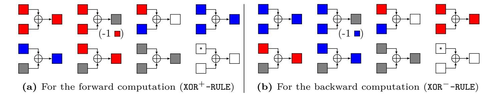

**Fig. 3:** Rules for XOR operations, where a "\*" means that the cell can be any color

First of all, an invertible S-box preserves the color of the input cell, and the ShiftRows permutes the coloring scheme of the input state according to the permutations associated with the ShiftRows in both forward and backward computations. Both S-box and ShiftRows operations can not be used to reduce the impacts via consuming the degree of freedom. In the sequel, we will focus on more nontrivial operations.

**XOR.** The XOR operations exist in the AddRoundKey and the key/messageschedule (if any). Here we need to distinguish two different directions. If the XOR to be modeled is involved in the forward computation path from the starting states to the ending state *E*+, the coloring scheme of the input and output cells of the XOR operation obeys the set of rules (denoted by XOR+-RULE, where a "+" sign signifies the forward computation) shown in Fig. [3a.](#page-16-0) Similarly, if the XOR to be modeled is involved in the backward computation path from the starting states to the ending state *E*−, the coloring scheme of the input and output cells of the XOR operation obeys the set of rules named as XOR−-RULE, which is visualized in Fig. [3b.](#page-16-0) Note that XOR−-RULE (Fig. [3b\)](#page-16-0) can be obtained from XOR+-RULE (Fig. [3a\)](#page-16-0) by exchanging the Red cells and Blue cells, since the meanings of Red and Blue are dual for the forward and backward computations.

Let *A*[0], *B*[0] be the input cells and *C*[0] be the output cell. The set of rules XOR+-RULE restricts (*x A* 0 *, yA* 0 *, xB* 0 *, yB* 0 *, xC* 0 *, yC* 0 ) to a subset of F 6 2 , which can be described by a system of linear inequalities by using the convex hull computation method [\[58\]](#page-32-8), and the set of rules XOR−-RULE can be described similarly.

Within each of the two sets of rules for XOR operations, only one coloring scheme consumes the degree of freedom, *e.g.*, the ⊕ → in Fig. [3a,](#page-16-0) which describes the possibility that the difference in one cell cancels that in another.

**MixColumns.** For the MixColumns operation in the forward computation, we have the following set of rules (denoted by MC+-RULE) for the coloring schemes of the input and output columns. Examples of valid coloring schemes are shown in Fig. [4.](#page-17-0)

I MC+-RULE-1. If there is at least one White cell in the input column, all the output cells are White (one unknown cell in the input causes all cells in the output be unknown);

{17}------------------------------------------------

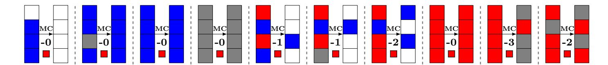

Fig. 4: Some valid coloring schemes for the MixColumns in the forward computation

- ► MC+-RULE-2. If there are Blue cells but no White cells and no Red cell in the input column, then all the output cells are Blue (can perform full forward computations);
- ► MC+-RULE-3. If all the input cells are Gray, then all the output cells are Gray (can perform bi-direction computations on fixed constants);
- ▶ MC+-RULE-4. If there are Red and Blue cells but no White cells in the input column, each output cell must be Blue or White. Moreover, a condition should be fulfilled, that is, the sum of the numbers of Blue and Gray cells in the input and output columns must be no more than 3 (i.e., 8 5) (can partially cancel the impacts from  $\blacksquare$  on  $\blacksquare$  within an input column by consuming  $\lambda^-$ , and perform partial forward computations. Because of the MDS property of MixColumns, this is possible only when the condition is fulfilled);
- ▶ MC+-RULE-5. If there are Red cells but no White cells and no Blue cells in the input column, then each output cell must be Red or Gray. Moreover, a condition should be fulfilled, that is, the number of Gray cells in the input and output columns must be no more than 3 (i.e., 8-5) (can partially cancel the difference within an input column by consuming  $\lambda^-$ . Because of the MDS property of MixColumns, this is possible only when the condition is fulfilled).

All the above rules can be described by linear inequalities.

First, we introduce three 0-1 indicator variables  $\mu, \nu, \omega$  for the input column and necessary constraints into the model to satisfy the following cases.

- $\blacktriangleright \mu = 1, v = 0, \omega = 0$  if and only if MC+-RULE-1 is fulfilled;
- $\blacktriangleright \mu = 0, v = 1, \omega = 0$  if and only if MC+-RULE-2 is fulfilled;
- $\blacktriangleright \mu = 0, v = 1, \omega = 1$  if and only if MC+-RULE-3 is fulfilled;
- $\blacktriangleright \mu = 0, \nu = 0, \omega = 0$  if and only if MC+-RULE-4 is fulfilled;
- $\blacktriangleright$   $\mu = 0, v = 0, \omega = 1$  if and only if MC+-RULE-5 is fulfilled.

This can be done as follows.

Let  $(A[0],A[1],A[2],A[3])^T$  and  $(B[0],B[1],B[2],B[3])^T$  be the input and output columns. Without any restriction, there are  $2^8$  possible coloring schemes for the input column since  $(x_0^A,y_0^A,\cdots,x_3^A,y_3^A)\in\mathbb{F}_2^8$ . We define the set of vectors

$$\{(x_0^A, y_0^A, \cdots, x_3^A, y_3^A, \mu) : (x_0^A, y_0^A, \cdots, x_3^A, y_3^A) \in \mathbb{F}_2^8\},\tag{7}$$

where  $\mu = 1$  if and only if there exists  $i \in \{0, 1, 2, 3\}$  such that  $(x_i^A, y_i^A) = (0, 0)$ . This subset can be described by linear inequalities with the convex hull computation method [58].

The indicator variable v = 1 if and only if  $x_i^A = 1$  for each  $i \in \{0, 1, 2, 3\}$ . This can be done by linear inequalities listed in Eq. (8). The indicator variable

{18}------------------------------------------------

*ω* = 1 if and only if *y A i* = 1 for each *i* ∈ {0*,* 1*,* 2*,* 3}. This can be done by similar inequalities as Eq. [\(8\)](#page-18-1).

Now, with the help of these variables *µ, υ, ω*, we can convert MC+-RULE into a system of inequalities shown in Eq. [\(9\)](#page-18-2).

$$\begin{cases}
\sum_{i=0}^{3} x_i^A - 4v \ge 0; \\
\sum_{i=0}^{3} x_i^A - v \le 3.
\end{cases} (8) \begin{cases}
\sum_{i=0}^{3} x_i^B + 4\mu \le 4; \\
\sum_{i=0}^{3} y_i^B + 4\mu \le 4; \\
\sum_{i=0}^{3} y_i^B - 4\omega = 0;
\end{cases} \begin{cases}
\sum_{i=0}^{3} (x_i^A + x_i^B) - 5v \le 3; \\
\sum_{i=0}^{3} (x_i^A + x_i^B) - 8v \ge 0.
\end{cases} (9)$$

Since the semantics of the Red cells and Blue cells are dual in the forward and backward computation, the set of rules for backward computation (denoted by MC−-RULE) can be obtained from MC+-RULE by exchanging the words Blue and Red. We omit the details to save spaces.

**XOR then MixColumns (XOR-MC).** For the operation which maps the two input columns (*A*[0]*, A*[1]*, A*[2]*, A*[3])*T* and (*B*[0]*, B*[1]*, B*[2]*, B*[3])*T* to *C*[0*,* 1*,* 2*,* 3] = MC−1 (*A*[0*,* 1*,* 2*,* 3] + *B*[0*,* 1*,* 2*,* 3]), we have the following rules for the coloring schemes of the input and output columns. Note that this operation only appears in the backward computation for all the targets in this paper. Therefore, we only specify the set of rules for XOR-MC for the backward computation.

- I XOR-MC-RULE-1. If there is at least one White cell in the input columns, all the output cells are White (one unknown cell in the input causes all cells in the output be unknown);
- I XOR-MC-RULE-2. If there are Red cells but no White cells and no Blue cells in the input columns, all output cells are Red (can perform full backward computations);
- I XOR-MC-RULE-3. If all input cells are Gray, then all output cells are Gray (can perform bi-direction computations on fixed constants);
- I XOR-MC-RULE-4. If there are Blue cells and Red cells but no White cells in the input columns, each output cell must be Red or White. Moreover, when combining the two input columns as a 4 × 2 matrix, the number of rows with one or two Blue cells plus the number of White cells in the output column must be greater or equal to 5 (can partially cancel the impacts from on within two input columns by consuming *λ* +, and perform partial backward computations. Because of the MDS property of inverse MixColumns, this is possible only when the condition is fulfilled);
- I XOR-MC-RULE-5. If there are Blue cells but no Red cells and no White cells in the input columns, each output cell must be Blue or Gray. Moreover, when combining the two input columns as a 4 × 2 matrix, the number of rows with one or two Blue cells plus the number of Blue cells in the output column must be greater or equal to 5 (can partially cancel the difference

{19}------------------------------------------------

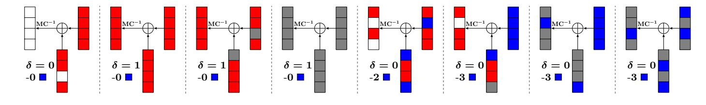

Fig. 5: Some valid coloring schemes for the XOR-MC in the backward computation

within two input columns by consuming  $\lambda^+$ . Because of the MDS property of MixColumns, this is possible only when the condition is fulfilled).

All the above rules can be described by similar linear inequalities for MC--RULE. Three 0-1 indicator variables  $\mu, v, \omega$  also be introduced for the input columns.  $\mu = 1$  if and only if there exists  $i \in \{0, 1, 2, 3\}$  such that  $(x_i^A, y_i^A) = (0, 0)$  or  $(x_i^B, y_i^B) = (0, 0)$ . v = 1 if and only if  $x_i^A = 1$  and  $x_i^B = 1$  for each  $i \in \{0, 1, 2, 3\}$ . These constraints can be generated from that of MC-RULE. For example, introduce  $\mu^A$  (resp  $\mu^B$ ) for input column  $(A[0], A[1], A[2], A[3])^T$  (resp  $(B[0], B[1], B[2], B[3])^T$ ) and necessary constraints as Eq. (7). Then  $\mu = 1$  if and only if  $\mu^A = 1$  or  $\mu^B = 1$ . Then

- ▶  $\mu = 1, \nu = 0, \omega = 0$  if and only if XOR-MC-RULE-1 is fulfilled;
- $\blacktriangleright \mu = 0, v = 0, \omega = 1$  if and only if XOR-MC-RULE-2 is fulfilled;
- $\blacktriangleright$   $\mu = 0, v = 1, \omega = 1$  if and only if XOR-MC-RULE-3 is fulfilled;
- $\blacktriangleright$   $\mu = 0, v = 0, \omega = 0$  if and only if XOR-MC-RULE-4 is fulfilled;
- $\blacktriangleright$   $\mu = 0, v = 1, \omega = 0$  if and only if XOR-MC-RULE-5 is fulfilled.

Another four 0-1 variables  $\tau_0, \tau_1, \tau_2, \tau_3$  are introduced for each row,  $\tau_i = 1$  if and only if A[i] or B[i] is Blue cell.

Now, with the help of these variables  $\mu, \epsilon, \omega, \tau_i$  for  $i \in \{0, 1, 2, 3\}$ , we can convert XOR-MC-RULE into a system of inequalities as listed in Eq. (10).

$$\begin{cases}
\sum_{i=0}^{3} x_i^C + 4\mu \le 4; \\
\sum_{i=0}^{3} y_i^C + 4\mu \le 4; \\
\sum_{i=0}^{3} x_i^C - 4v = 0;
\end{cases}
\begin{cases}
\sum_{i=0}^{3} (y_i^C - \tau_i) - 5\omega - \mu \le -1; \\
\sum_{i=0}^{3} (y_i^C - \tau_i) - 8\omega \ge -4.
\end{cases}$$
(10)

Remark 5. One may attempt to model the XOR-MC operation by applying XOR--RULE and MC--RULE separately. This approach is valid but misses important coloring schemes that may lead to better attacks. For example, considering the input columns shown in Fig. 6, applying XOR--RULE results in White cells after the XOR operation. Subsequently, applying MC--RULE, we will end up with a full column of White cells. However, if we model the XOR-MC operation as a whole, we can still preserve some Red cells from impact according to the sixth

{20}------------------------------------------------

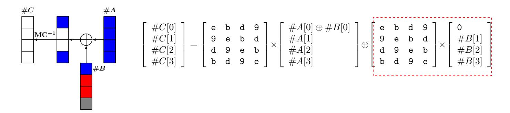

Fig. 6: The inaccuracy of modeling XOR-MC in the backward computation by applying XOR--RULE and MC--RULE separately.

sub-figure in Fig. 5. This coloring scheme can be explained by the equation shown in Fig. 6, where the second term of the right-hand side of the equation is known for the backward computation. Therefore, we can restrict the values of (B[0], A[0], A[1], A[2], A[3]) such that

$$e \cdot (A[0] \oplus B[0]) \oplus b \cdot A[1] \oplus d \cdot A[2] \oplus 9 \cdot A[3] = C_0$$

$$d \cdot (A[0] \oplus B[0]) \oplus 9 \cdot A[1] \oplus e \cdot A[2] \oplus b \cdot A[3] = C_2$$

$$b \cdot (A[0] \oplus B[0]) \oplus d \cdot A[1] \oplus 9 \cdot A[2] \oplus e \cdot A[3] = C_3$$

$$(11)$$

where  $C_0$ ,  $C_2$ , and  $C_3$  are constants, which implies that only C[1] is unknown for the backward computation (see the sixth sub-figure in Fig. 5). The principle is to let the differences of multiple cells in two input columns mutually canceled at particular output cells.

Compute consumed DoF in XOR-MC-RULEs. In all of our applications, the XOR-MC operation only appears in the backward computation and thus only consumes the DoF for the forward computation. Let  $(A[0], \cdots, A[3])$  and  $(B[0], \cdots, B[3])$  be the two input columns and  $(C[0], \cdots, C[3])$  be the output column. Given a valid coloring scheme of A, B, and C, the consumed DoF (measured in cells)  $\sigma^+((A[0, \cdots, 3], B[0, \cdots, 3]) \to C[0, \cdots, 3])$  equals the number of Red and Gray cells (known cells of the output column in the backward computation) when there is at least one Blue cell in the input columns. Otherwise, the consumed DoF is zero.

Let  $\delta$  be a 0-1 indicator variable such that  $\delta = 1$  if and only if there are no Blue cells and no White cells in the input columns, which can be achieved by imposing the following constraints on  $\delta$ :

$$\begin{cases}
-\delta + \sum_{i=0}^{3} y_i^A + \sum_{i=0}^{3} y_i^B \le 7; \\
y_i^A \ge \delta, \quad y_i^B \ge \delta, \quad \text{for } i \in \{0, 1, 2, 3\}.
\end{cases}$$
(12)

Then we have  $\sigma^+((A[0,\cdots,3],B[0,\cdots,3]) \to C[0,\cdots,3]) = -4\delta + \sum_{i=0}^3 y_i^C$ . In Fig. 5 we give some example coloring schemes of the XOR-MC operation together with their consumed DoF. Similarly, the constraints describing how the XOR and MC operations consume DoF can be deduced.

{21}------------------------------------------------

## 5 Applications

Equipped with the presented tool, we evaluated the security of hash functions built on AES and AES-like ciphers, including all members of AES and the members of Rijndael with 256-bit block-size [15] in PGV-modes (note the equivalence among PGV-modes for the attacks as shown in [10]) and Haraka v2 [38].

For all targets, improved attacks are identified. In particular, our tool found the first preimage attacks on 8-round AES-128 hashing modes, and on the full 5-round and the extended 5.5-round (10 and 11 AES-rounds) Haraka-512 v2. Due to the page limit, we only describe two attacks in detail. The list of optimal attacks we found is presented in Table 1. With the help of the visualizations of these attacks, one can reconstruct concrete attacks and confirm the complexities.

The time for finding each of the optimal attacks is within hours, including enumerating all possible combinations of the locations of starting and ending points in encryption, and all possible combinations of the locations of starting points in the encryption and key-schedule. For example, to get the presented attack on 8-round AES-128 hashing modes, our program generated all possible MILP-models and the MILP solver Gurobi solved them all, which took about two hours on a PC with an Intel Core i7-7500U CPU and 8 GB memory.

#### 5.1 Improved Attacks on AES and Rijndael Hashing Modes

**Searching the attacks.** We apply our method to AES hashing modes. With our tool, many new attacks are found automatically. We list some examples for each member of AES and also the members of Rijndael with 256-bit block-size [15] (denoted by Rijndael-256) in Fig. 7, 9, 10, 11, and 12.

Notably, apart from new attacks with better complexities, an 8-round attack on AES-128 and 9-round attacks on AES-192 and AES-256 hashing mode were found, which extend one more round compared with previous attacks [10, 49, 62].

To be clear, in the figures, some information are presented, such as which states are the starting states (in the searching for the attacks, not necessarily in the concrete attacks), how independent computation flows propagated in the states, and where the two chunks meet. Besides, which rules are applied to the states and how the degrees of freedom are consumed by the specific coloring scheme in our MILP models are also exhibited. Furthermore, the initial degrees of freedom  $(\lambda^+, \lambda^-)$ , and the final configuration (DoF+, DoF-, DoM) which determines the attack complexity are summarized at the bottom.

For example, from Fig. 7, it can be seen that, in the searching of our model, the starting states are  $\#SB^4$  and  $k_4$ , and the ending states are  $\#MC^1$  and  $\#SB^2$ . Also, we have  $\mathcal{B}^{\text{ENC}} = [0,5,10,15]$ ,  $\mathcal{B}^{\text{KSA}} = [0,1,2,3,4,6,7,8,9,11,12,13,14]$ ,  $\mathcal{R}^{\text{ENC}} = [1,2,3,4,6,7,8,9,11,12,13,14]$ ,  $\mathcal{R}^{\text{KSA}} = \emptyset$ ,  $\mathcal{C} = [0,2,5,7,8,10,13,15]$ , and  $\mathcal{D} = [1,2,3]$ . Accordingly, the initial degrees of freedom for the forward computation and backward computation are 17 and 12 respectively, and the degree of matching is 2+3-4=1. The states  $\#SB^4$ ,  $k_3$ , and  $\#MC^3$  are enclosed by a dashed light-green frame  $\mathbb{TD}$ , which means that XOR-MC-RULE is applied to them, and the specific coloring scheme consumes 12 cells of degrees of freedom for

{22}------------------------------------------------

the forward computation. Similarly, the XOR-MC-RULE is applied to states #SB3,  $k_2$ , and  $\#MC^2$ , and that consumes 3 cells of degrees of freedom for the forward computation. The states  $\#MC^4$  and  $\#AK^4$  are enclosed by a dashed light-purple frame , which means MC+-RULE is applied to them, and that consumes 9 cells of degrees of freedom for the backward computation. Similarly, the MC+-RULE is applied to states #MC5 and #AK5, and that consumes 2 cells of degrees of freedom for the backward computation. Accordingly, in the solution of our model,  $DoF^{+} = 17 - 12 - 3 = 2$  and  $DoF^{-} = 12 - 9 - 2 = 1$ , which indicates that the values of  $(\#SB^4[\mathcal{B}^{ENC}], k_4[\mathcal{B}^{KSA}])$  are restricted to a subset  $\mathbb{X}$  of  $\mathbb{F}_{2^8}^{17}$  with  $(2^8)^2$ elements, and the values of  $(\#SB^4[\mathcal{R}^{\texttt{ENC}}], k_4[\mathcal{R}^{\texttt{KSA}}])$  are restricted to a subset  $\mathbb{Y}$ of  $\mathbb{F}_{2^8}^{12}$  with  $2^8$  elements. To be more concrete,  $\mathbb{X}$  and  $\mathbb{Y}$  should be chosen such that the forward computation is irrelevant of  $(\#SB^4[\mathcal{R}^{ENC}], k_4[\mathcal{R}^{KSA}])$ , and the backward computation is irrelevant of (#SB4[ $\mathcal{B}^{ENC}$ ],  $k_4[\mathcal{B}^{KSA}]$ ). Since the degrees of freedom for the forward and backward computations (DoF+ and DoF-) are derived rather formally without giving the actual contents of X and Y, some readers may doubt whether such X and Y really exist. In the following (in the precomputation phase and more details in Appendix B.1), we explicitly show in this example, how to obtain X and Y such that the required properties are fulfilled, and under the configuration obtained by the MILP model, how to launch the concrete attack.

#### The attack on 8-round AES-128 hashing (refer to Fig. 7)

The Precomputation Phase (precompute possible initial values of neutral bytes)

- 1. To be able to compute backward chunk independently of forward neutral bytes, the forward neutral bytes should have constant impacts on the 12 C-marked Red bytes in  $\#MC^3$  and on the 3 C-marked Red bytes in  $\#MC^2$ . Therefore, denote the 12 constant impacts on 12 bytes in  $\#MC^3$  by  $C_{1,0}$ ,  $C_{1,1}$ ,  $\cdots$ ,  $C_{1,11}$ , we derive constraints on forward neutral bytes, which is a system linear equation Eq. (13). Similarly, denote the 3 constant impacts on 3 bytes in  $\#MC^2$  by  $C_{2,0}$ ,  $C_{2,1}$ ,  $C_{2,2}$ , we derive constraints on forward neutral bytes, which is a system of linear equation Eq. (14). In total, requiring impacts to be constant will impose 15 bytes constraints on forward neutral bytes (20 bytes) as shown in the system of linear equation Eq. (17). Solving Eq. (17), one gets  $2^{40}$  solutions.
  - In the following main procedure, the values of  $C_{1,0}$ ,  $C_{1,1}$ ,...,  $C_{1,11}$ , and  $C_{2,0}$ ,  $C_{2,1}$ ,  $C_{2,2}$  are fixed such that we only need to solve Eq. (17) once. However, the main procedure will need to trail on many values of Gray bytes in  $k_4$  (i.e.,  $k_4[5,10,15]$ ) to find full match. So here, we precompute values of forward neutral bytes that correspond to each value of  $k_4[5,10,15]$ . That can be done as follows. For each of the  $2^{40}$  solution,  $k_3$  and  $\#SB^4[0,5,10,15]$  are determined. Compute  $k_4$  using  $k_3$ , and store  $k_4$  and the values of  $\#SB^4[0,5,10,15]$  in table  $T_1$  indexed by the values of 3 Gray bytes  $k_4[5,10,15]$ .
  - Note that there are  $2^{24}$  entries in  $T_1$ , and the total size of  $T_1$  is about  $2^{40}$ . Under each index, there are about  $2^{16}$  elements. We can either use  $2^{16}$  or  $2^8$

{23}------------------------------------------------

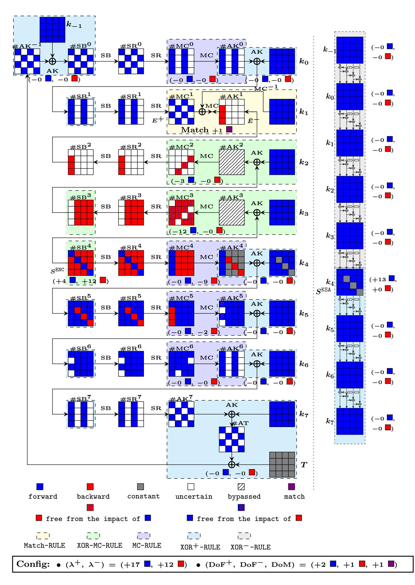

**Fig. 7:** An MITM pseudo-preimage attack on 8-round AES-128 hashing. Note that, because the use of XOR-MC-RULE, we do not introduce any variable in our MILP model for states  $\#AK^2$  and  $\#AK^3$ , and thus we bypass them.

{24}------------------------------------------------

- of them. The total complexity of the full attack will be the same (because  $DoF^+$  and DoM are all one byte). Thus, we use  $2^8$ . Therefore, the complexity of this procedure is  $2^{32}$ , and the memory requirement is  $2^{32}$ .
- 2. To be able to compute forward chunk independently of backward neutral bytes, the backward neutral bytes should have constant impacts on the 2 C-marked Blue bytes in  $\#AK^5$ . Therefore, denote the 2 constant impacts on 2 bytes in  $\#AK^5$  by  $C_{4,0}$  and  $C_{4,1}$ , we derive constraints on backward neutral bytes, which is a linear equation system Eq. (18). For each possible  $C_{4,0}$  and  $C_{4,1}$ , when solve Eq. (18), one gets  $2^8$  solutions. In the following main procedure, we need to trail on many values of  $(C_{4,0}, C_{4,1})$ 
  - In the following main procedure, we need to trail on many values of  $(C_{4,0}, C_{4,1})$  to find a full match. So here, we precompute values of backward neutral bytes that correspond to each value of  $(C_{4,0}, C_{4,1})$ , store values of  $\#MC^5[1, 2, 3]$  fulfilling Eq. (18) in table  $T_2$  indexed by the values of  $(C_{4,0}, C_{4,1})$ .
  - There are  $2^{16}$  entries in  $T_2$ , and the total size of  $T_2$  is  $2^{24}$ . Under each index, there are  $2^8$  elements.

The Main Procedure. During the following procedure, the values of  $C_{1,0}, C_{1,1}, \ldots, C_{1,11}$ , and  $C_{2,0}, C_{2,1}, C_{2,2}$  are fixed.

- 1. For each of the  $2^x$  values of 9 Gray bytes in  $\#AK^4$ , for each index i of the  $2^{24}$  indexes of  $T_1$  (each i corresponds to each candidate value of the 3 Gray bytes in  $k_4$ ), for each index j of the  $2^{16}$  indexes of  $T_2$  (each j corresponds to each candidate value of the 2-byte impact on C-marked cells by in  $\#AK^5$ ), do: Initialize an empty table  $L_1$ .
  - (a) For each of the  $2^8$  elements in  $T_1[i]$ , start from state  $\#SB^4$  and  $k_4$ , compute forward (cells in Blue) with the knowledge of the fixed impact j on  $\#AK^5$  to the matching point  $\#MC^1$ . Compute the one-byte value  $m_1$  for matching (defined in left-hand side of the equation in Fig. 1b), and use  $m_1$  as the index to store the values of  $(\#SB^4[0, 5, 10, 15], k_4)$  into  $L_1[m_1]$  (there is about  $2^{8-8} = 1$  element in each  $L_1[m_1]$ ).
  - (b) For each of the  $2^8$  elements in  $T_2[j]$ , start from state  $\#MC^5$ , compute backward (cells in Red) with the knowledge of fixed value i (i.e., 3 Gray bytes) in state  $k_4$  and the fixed impacts on  $\#MC^3$  and  $\#MC^2$  (i.e.,  $C_{1,0}$ ,  $C_{1,1}$ ,  $\cdots$ ,  $C_{1,11}$ ,  $C_{2,0}$ ,  $C_{2,1}$ ,  $C_{2,2}$ ) to the matching point  $\#AK^1$ . Compute the one-byte value  $m_2$  for matching (defined in right-hand side of the equation in Fig. 1b), and use it to lookup the list  $L_1$ :
    - i. For each element in  $L_1[m_2]$  (expected to exist one): restart the forward and backward computations combining the knowledge of values in both directions (the values of  $\#SB^4[0, 5, 10, 15]$ ,  $k_4$ ,  $\#MC^5$ ) to the matching point ( $\#MC^1$ ,  $\#AK^1$ ), test for full match on 128-bit state.

Complexity. The computational and memory complexity of the precomputation phase is about  $2^{32}$ . For the main procedure, in the inner loop, there will be  $2^{(8+8-8)} = 2^8$  solutions left after the one-byte (8-bit) matching  $(m_1 \text{ and } m_2)$  in Step 1 (b) i. In order to find a 128-bit full match, one has to match the other 120 bits. Hence, for the outer loop, it requires x + 24 + 16 = 120 - 8,

{25}------------------------------------------------

*i.e.*, *x* = 72. Therefore, the time complexity for the main procedure is about 2 (*x*+24+16)+8 = 2*x*+40 = 2120 .

We implemented the full attack on this 8-round AES-128-hashing (with partial matchings), which verified the complexity. The codes and results are available via [https://github.com/MITM-AES-like-Hashing/AES128\\_8R](https://github.com/MITM-AES-like-Hashing/AES128_8R).

Apart from the biclique attacks in [\[13\]](#page-29-6), the best previous pseudo-preimage attacks against AES-128 hashing modes remain as 7 rounds since 2011, with a time complexity of 2 120 by Sasaki [\[49\]](#page-32-4) and improved to 2 112 by Bao *et al.* in 2019 [\[10\]](#page-29-11). Our attack presented here penetrates one more round. There is a unique features observed from Fig. [7,](#page-23-0) which made the extra round possible. The backward chunk covers one more round compared with that in [\[10,](#page-29-11) [49\]](#page-32-4). This is only possible after the consumption of 12 and 3 Blue bytes of freedom degrees (forward neutral bytes) in consecutive two rounds. Without the introduction of DoF from key bytes in [\[10\]](#page-29-11), this would not be possible. Note that the backward chunk only outputs 3 bytes, which are just sufficient to form a filter of one byte together with the 2 Blue bytes before the MixColumns at the matching point.

As depicted in Fig. [9,](#page-34-0) [10,](#page-35-0) [11,](#page-36-0) [12](#page-37-0) and summarized in Table [1,](#page-4-0) when our search models are applied to hashing modes based on other AES variants, they are also able to improve by one round against AES-192 and AES-256 hashing as in [\[10\]](#page-29-11). Some configurations (*e.g.*, Fig. [9,](#page-34-0) [11\)](#page-36-0) are more involved, in which the key states have neutral bytes for both forward and backward chunks. That might be hard to be found by manual.

#### **5.2 Improved Attacks on Haraka v2**

Haraka v2 [\[38\]](#page-31-4) is a family of hash functions designed to be efficient for short-input and for post-quantum applications. It includes two versions, denoted by Haraka-256 v2 and Haraka-512 v2, both output 256-bit hash digests and claim 256-bit security against (second)-preimage attacks. They only process short-input (*s*-bit string, denoted by *x*) and thus employ *s*-bit permutation (denoted by *πs*) in the DM-mode as follows:

Haraka-256 v2
$$(x)=\pi_s(x)\oplus x \ \ {\rm and} \ \ {\sf Haraka-512} \ {\sf v2}(x)={\sf trunc}(\pi_s(x)\oplus x)$$

where trunc truncates 512-bit state to 256-bit output. To achieve high performance on platforms supporting AES-NI and share security analysis of AES, the round function of the permutation *πs* first applies two layers of *b* AES-round-functions in parallel on a state that can be evenly divided into *b* sub-states (each of which is identical to the state of AES), then it applies a shuffle (denoted by **mix***s*) among the columns of the state. For Haraka-256 v2, *s* = 256*, b* = 2, and for Haraka-512 v2, *s* = 512*, b* = 4. For both of them, the number of rounds is 5 that involves 10 AES-rounds in sequential.

The former version of Haraka (named as Haraka v1) was broken by Jean [\[32\]](#page-31-16) due to its weak round constants. Then an updated version Haraka v2 [\[38\]](#page-31-4) was published. The designers provide MITM preimage attacks on 3.5-round Haraka-256 v2 and on 4-round Haraka-512 v2.

{26}------------------------------------------------

Searching the attacks. For both versions of Haraka v2, our tool produced improved MITM preimage attacks. In particular, for Haraka-256 v2, our tool found attacks that cover up to 4.5-round (9 AES-rounds). An example that has the optimal complexity is visualized in Fig. 13, of which the complexity is  $2^{256-8 \times \min\{DoF^+, DoF^-, DoM\}} = 2^{256-8 \times \min\{4, 4, 8\}} = 2^{224}$ . Note that this attack directly implies an attack covering 4-round (8 AES-rounds) with the same complexity. For Haraka-512 v2, our tool finds attacks that penetrate the full 5-round (10 AES-rounds) and the extended 5.5-round (11 AES-rounds) version. The detailed configuration of one of the attacks on the full 5-round (10 AES-rounds) is visualized in Fig. 14. In the following, we present one of the searching results on the extended 5.5-round (11 AES-rounds) and the concrete attack corresponding to the configuration visualized in Fig. 8.

From Fig. 8, it can be seen that in the searching of our model, the starting state is  $\#SB^3$ , and the ending states are  $\#MC^{10}$  and  $\#AC^{10}$ . Also, we have  $\mathcal{B}^{\text{ENC}} = [16 \cdot i + j \mid i \in \{0, 1, 2, 3\}, j \in \{0, 1, 5, 6, 10, 11, 12, 15\}], \mathcal{R}^{\text{ENC}} = [16 \cdot i + j \mid i \in \{0, 1, 2, 3\}, j \in \{0, 1, 5, 6, 10, 11, 12, 15\}]$  $[16 \cdot i + j \mid i \in \{0, 1, 2, 3\}, j \in \{2, 3, 4, 7, 8, 9, 13, 14\}], C = [16 \cdot i + j \mid i \in \{0, 1, 2, 3\}, j \in \{2, 3, 4, 7, 8, 9, 13, 14\}], C = [16 \cdot i + j \mid i \in \{0, 1, 2, 3\}, j \in \{2, 3, 4, 7, 8, 9, 13, 14\}], C = [16 \cdot i + j \mid i \in \{0, 1, 2, 3\}, j \in \{2, 3, 4, 7, 8, 9, 13, 14\}], C = [16 \cdot i + j \mid i \in \{0, 1, 2, 3\}, j \in \{2, 3, 4, 7, 8, 9, 13, 14\}], C = [16 \cdot i + j \mid i \in \{0, 1, 2, 3\}, j \in \{2, 3, 4, 7, 8, 9, 13, 14\}], C = [16 \cdot i + j \mid i \in \{0, 1, 2, 3\}, j \in \{2, 3, 4, 7, 8, 9, 13, 14\}], C = [16 \cdot i + j \mid i \in \{0, 1, 2, 3\}, j \in \{2, 3, 4, 7, 8, 9, 13, 14\}], C = [16 \cdot i + j \mid i \in \{0, 1, 2, 3\}, j \in \{2, 3, 4, 7, 8, 9, 13, 14\}], C = [16 \cdot i + j \mid i \in \{1, 3, 4, 7, 8, 9, 13, 14\}], C = [16 \cdot i + j \mid i \in \{1, 3, 4, 7, 8, 9, 13, 14\}], C = [16 \cdot i + j \mid i \in \{1, 4, 4, 4, 4, 4, 4, 4, 4, 4, 4, 4, 4, 4,$  $\{0,3\}, j \in \{0,7,10,13\} \cup [16 \cdot i + j \mid i \in \{1,2\}, j \in \{1,4,11,14\}], \text{ and } \mathcal{D} = \{1,4,11,14\} \cup [16 \cdot i + j \mid i \in \{1,2\}, j \in \{1,4,11,14\}],$  $[16 \cdot i + j \mid i \in \{2\}, j \in \{0, 1, \dots, 7\}]$ . Therefore, both of the initial degrees of freedom for the forward computation and backward computation are 32, i.e.,  $\lambda^+ = \lambda^- = 32$ , and the degree of matching is DoM =  $(1 + 4 - 4) \times 2 = 2$ . The MC--RULE applied to states #MC2 and #AC2 consumes 16 cells of degrees of freedom for the forward computation. And the MC+-RULE applied to states #MC6 and #AC6 consumes 16 cells of degrees of freedom for the backward computation. Accordingly, in the solution of our model,  $DoF^+ = 32 - 16 = 16$  and  $DoF^- = 32 - 16 = 16$ . This indicates that the values of  $\#SB^3[\mathcal{B}^{ENC}]$  are restricted to a subset  $\mathbb{X}$  of  $\mathbb{F}_{2^8}^{32}$  with  $2^{8\times 16}$  elements, and the values of  $\#SB^3[\mathcal{R}^{ENC}]$  are restricted to a subset  $\mathbb{Y}$  of  $\mathbb{F}_{2^8}^{32}$  with  $2^{8\times 16}$  elements. To be more concrete,  $\mathbb{X}$  and  $\mathbb{Y}$ should be chosen such that the forward computation is irrelevant of  $\#SB^3[\mathcal{R}^{ENC}]$ and the backward computation is irrelevant of  $\#SB^3[\mathcal{B}^{ENC}]$ . In summary, the decisive parameters for the obtained attack is  $(DoF^+, DoF^-, DoM) = (16, 16, 2)$ . From these parameters, one can directly obtain that the time complexity of the corresponding pseudo-preimage attack is  $(2^8)^{32-\min\{DoF^+,DoF^-,DoM\}} = 2^{240}$ .

The concrete procedure of the preimage attack on the extended 5.5-round Haraka-512 v2 is given in the following.

#### The concrete attack on 11-AES-round Haraka-512 v2 (refer to Fig. 8)

- 1. For each of the  $2^x$  values of impacts (16-byte impacts on the C-marked Red cells in  $\#MC^2$  and 16-byte impacts on the C-marked Blue cells in  $\#AC^6$ ), do: Initialize two empty tables  $L_1$  and  $L_2$ 
  - (a) With the knowledge of the value of 16-byte impacts on the C-marked Red cells in  $\#MC^2$ , we can collect  $2^{16\times8}=2^{128}$  possible values of Blue bytes (neutral bytes for the forward) in  $\#AC^2$  by solving sets of linear equations column-by-column. For example, in the first column of  $\#MC^2$  and  $\#AC^2$ , the two Blue bytes and 1-byte impact (denoted by  $C_0$ ) on the C-marked cell have to meet:  $9 \cdot \#AC^2[0] \oplus e \cdot \#AC^2[1] = C_0$ . There are

{27}------------------------------------------------

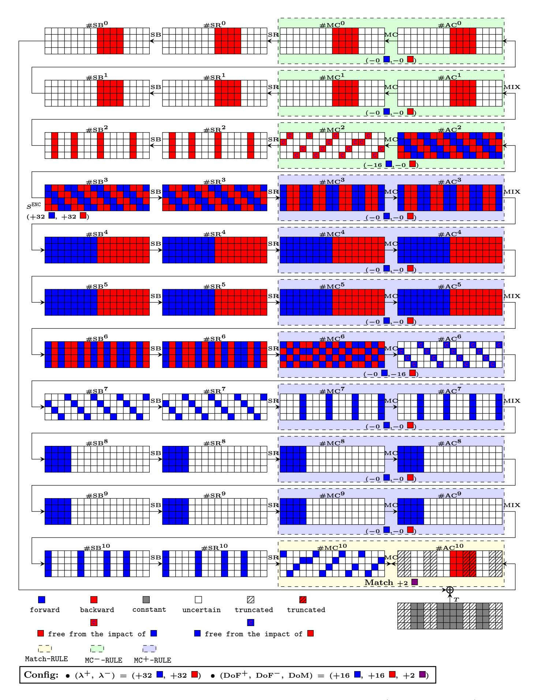

**Fig. 8:** An MITM preimage attack on the extended 5.5-round (11 AES-rounds) Haraka-512 v2. Note that in our MILP-models, the position of the used hash bits are treated and used as constant in gray cell of the target *T*, and the bits discarded are treated as 'uncertain' although we distinct them using hatched pattern. However, in the attack procedure, the discarded bits are free of choice such that the state cells in hatched pattern are free of matching.

{28}------------------------------------------------

16 sets of such linear equations, one set per column. For each column, we obtain  $2^8$  solutions. Hence, it is expected to get  $2^{128}$  solutions by solving 16 sets of linear equations with 32 variables in total. The number  $2^{128}$  is also the degrees of freedom for forward chunk.

- (b) For each of the  $2^{128}$  solutions for Blue bytes in  $\#AC^2$ , compute forward with the knowledge of the 16-byte impacts on the C-marked cells in  $\#AC^6$  to the matching point  $\#MC^{10}$ , extract the two-byte value  $m_1$  for matching, store the values of Blue bytes in  $\#AC^2$  in  $L_1[m_1]$ .
- (c) Similarly, collect  $2^{128}$  possible values for Red bytes in state  $\#MC^6$  and compute backward to the matching point  $\#AC^{10}$ , extract the two-byte value  $m_2$  for matching, store the values of Red bytes in  $\#MC^6$  in  $L_2[m_2]$ .
- (d) For entries with common index between  $L_1$  and  $L_2$ , form pairs of values of Blue bytes in  $\#AC^2$  and Red bytes in  $\#MC^6$ ; for each pair, restart the forward and backward computations combining the knowledge of values in both direction, test for full match on 256 bits.

Complexity. In Step 1 (d), it is expected to find  $2^{128+128-16} = 2^{240}$  matches on 16 bits. Among them, it is expected to left 1 solution that also match on the other 240 bits, that implies a full match on 256 bits. Hence, to find a full match, it is expected to need  $2^x$  outer loops where x = 0. The memory requirement is  $2 \cdot 2^{128}$  to store  $L_1$  and  $L_2$ . The time complexity of Step 1 (a) is no more than  $2^{128}$ . The same complexity also applies to Step 1 (b) and Step 1 (c). The time complexity of Step 1 (d) is approximately  $2^{16} \times 2^{2\times 112} = 2^{240}$  ( $L_1$  and  $L_2$  contains  $2^{16}$  entries each; each entry is expected to contain  $2^{112}$  values. Under a common 16-bit index, there are  $2^{2\times 112}$  pairs to check for full match.) Therefore, the total time complexity is  $2^{240}$ .

# 6 Conclusions

We modeled the MITM preimage attack into the language of MILP, generalized the attack model, and obtained better results in terms of number of attacked rounds against AES-like hashing including the 8-round AES-128, 9-round AES-192, 9-round AES-256, and 9-round Rijndael-256 hashing modes, 4.5-round Haraka-256 v2, the full version (5-round) and extended version (5.5-round) of Haraka-512 v2.

### Acknowledgements

We thank the anonymous reviewers for the helpful comments. This research is partially supported by the National Natural Science Foundation of China (Grant No. 61802400, 62032014, 61772519, 61961146004), the National Key Research and Development Program of China (Grant No. 2018YFA0704701, 2018YFA0704704), the Chinese Major Program of National Cryptography Development Foundation (No. MMJJ20180101, MMJJ20180102), the Major Program of Guangdong Basic and Applied Research (Grant No. 2019B030302008); Nanyang Technological University in Singapore under Grant 04INS000397C230, Singapore's Ministry

{29}------------------------------------------------

of Education under Grants RG18/19, RG91/20, and MOE2019-T2-1-060; the Gopalakrishnan – NTU Presidential Postdoctoral Fellowship 2020.

# **References**

- 1. Alliance, Z.: ZigBee 2007 specification. Online: http://www.zigbee.org/ (2007)
- 2. AlTawy, R., Youssef, A.M.: Preimage attacks on reduced-round Stribog. In: Pointcheval, D., Vergnaud, D. (eds.) AFRICACRYPT 14. LNCS, vol. 8469, pp. 109–125. Springer, Heidelberg (May 2014)
- 3. AlTawy, R., Youssef, A.M.: Second Preimage Analysis of Whirlwind. In: Lin, D., Yung, M., Zhou, J. (eds.) Inscrypt 2014. LNCS, vol. 8957, pp. 311–328. Springer (2014)
- 4. Aoki, K., Guo, J., Matusiewicz, K., Sasaki, Y., Wang, L.: Preimages for step-reduced SHA-2. In: Matsui, M. (ed.) ASIACRYPT 2009. LNCS, vol. 5912, pp. 578–597. Springer, Heidelberg (Dec 2009)
- 5. Aoki, K., Sasaki, Y.: Meet-in-the-middle preimage attacks against reduced SHA-0 and SHA-1. In: Halevi, S. (ed.) CRYPTO 2009. LNCS, vol. 5677, pp. 70–89. Springer, Heidelberg (Aug 2009)
- 6. Aoki, K., Sasaki, Y.: Preimage attacks on one-block MD4, 63-step MD5 and more. In: Avanzi, R.M., Keliher, L., Sica, F. (eds.) SAC 2008. LNCS, vol. 5381, pp. 103–119. Springer, Heidelberg (Aug 2009)
- 7. Aumasson, J.P., Meier, W., Mendel, F.: Preimage attacks on 3-pass HAVAL and step-reduced MD5. In: Avanzi, R.M., Keliher, L., Sica, F. (eds.) SAC 2008. LNCS, vol. 5381, pp. 120–135. Springer, Heidelberg (Aug 2009)
- 8. Aumasson, J.P., Endignoux, G.: Gravity-SPHINCS. Tech. rep., National Institute of Standards and Technology (2017), available at [https://csrc.nist.gov/projects/](https://csrc.nist.gov/projects/post-quantum-cryptography/round-1-submissions) [post-quantum-cryptography/round-1-submissions](https://csrc.nist.gov/projects/post-quantum-cryptography/round-1-submissions)
- 9. Banik, S., Pandey, S.K., Peyrin, T., Sasaki, Y., Sim, S.M., Todo, Y.: GIFT: A small present - towards reaching the limit of lightweight encryption. In: Fischer, W., Homma, N. (eds.) CHES 2017. LNCS, vol. 10529, pp. 321–345. Springer, Heidelberg (Sep 2017)
- 10. Bao, Z., Ding, L., Guo, J., Wang, H., Zhang, W.: Improved meet-in-the-middle preimage attacks against AES hashing modes. IACR Trans. Symm. Cryptol. 2019(4), 318–347 (2019)
- 11. Beierle, C., Jean, J., Kölbl, S., Leander, G., Moradi, A., Peyrin, T., Sasaki, Y., Sasdrich, P., Sim, S.M.: The SKINNY family of block ciphers and its low-latency variant MANTIS. In: Robshaw, M., Katz, J. (eds.) CRYPTO 2016, Part II. LNCS, vol. 9815, pp. 123–153. Springer, Heidelberg (Aug 2016)
- 12. Benadjila, R., Billet, O., Gilbert, H., Macario-Rat, G., Peyrin, T., Robshaw, M., Seurin, Y.: SHA-3 proposal: ECHO. Submission to NIST (updated) p. 113 (2009)
- 13. Bogdanov, A., Khovratovich, D., Rechberger, C.: Biclique cryptanalysis of the full AES. In: Lee, D.H., Wang, X. (eds.) ASIACRYPT 2011. LNCS, vol. 7073, pp. 344–371. Springer, Heidelberg (Dec 2011)
- 14. Canteaut, A., Duval, S., Leurent, G., Naya-Plasencia, M., Perrin, L., Pornin, T., Schrottenloher, A.: Saturnin: a suite of lightweight symmetric algorithms for postquantum security. Submission to NIST (2019)
- 15. Daemen, J., Rijmen, V.: The Design of Rijndael: AES - The Advanced Encryption Standard. Information Security and Cryptography, Springer (2002)

{30}------------------------------------------------

- 16. Derbez, P., Fouque, P.A.: Automatic search of meet-in-the-middle and impossible differential attacks. In: Robshaw, M., Katz, J. (eds.) CRYPTO 2016, Part II. LNCS, vol. 9815, pp. 157–184. Springer, Heidelberg (Aug 2016)
- 17. Dong, X., Sun, S., Shi, D., Gao, F., Wang, X., Hu, L.: Quantum collision attacks on AES-like hashing with low quantum random access memories. In: Moriai, S., Wang, H. (eds.) ASIACRYPT 2020, Part II. LNCS, vol. 12492, pp. 727–757. Springer, Heidelberg (Dec 2020)
- 18. Espitau, T., Fouque, P.A., Karpman, P.: Higher-order differential meet-in-themiddle preimage attacks on SHA-1 and BLAKE. In: Gennaro, R., Robshaw, M.J.B. (eds.) CRYPTO 2015, Part I. LNCS, vol. 9215, pp. 683–701. Springer, Heidelberg (Aug 2015)
- 19. Fu, K., Wang, M., Guo, Y., Sun, S., Hu, L.: MILP-based automatic search algorithms for differential and linear trails for speck. In: Peyrin, T. (ed.) FSE 2016. LNCS, vol. 9783, pp. 268–288. Springer, Heidelberg (Mar 2016)
- 20. Gauravaram, P., Knudsen, L.R., Matusiewicz, K., Mendel, F., Rechberger, C., Schläffer, M., Thomsen, S.S.: Grøstl – a SHA-3 candidate. [http://www.groestl.](http://www.groestl.info/Groestl.pdf) [info/Groestl.pdf](http://www.groestl.info/Groestl.pdf) (March 2011)
- 21. Guo, C., Katz, J., Wang, X., Yu, Y.: Efficient and Secure Multiparty Computation from Fixed-Key Block Ciphers. In: 2020 IEEE Symposium on Security and Privacy, San Francisco, CA, USA, May 18-21, 2020. pp. 825–841 (2020)
- 22. Guo, J., Jean, J., Nikolic, I., Sasaki, Y.: Meet-in-the-middle attacks on generic Feistel constructions. In: Sarkar, P., Iwata, T. (eds.) ASIACRYPT 2014, Part I. LNCS, vol. 8873, pp. 458–477. Springer, Heidelberg (Dec 2014)
- 23. Guo, J., Jean, J., Nikolic, I., Sasaki, Y.: Extended meet-in-the-middle attacks on some Feistel constructions. Designs, Codes and Cryptography 80(3), 587–618 (2016)
- 24. Guo, J., Jean, J., Nikolic, I., Sasaki, Y.: Meet-in-the-middle attacks on classes of contracting and expanding Feistel constructions. IACR Trans. Symm. Cryptol. 2016(2), 307–337 (2016), [http://tosc.iacr.org/index.php/ToSC/article/view/](http://tosc.iacr.org/index.php/ToSC/article/view/576) [576](http://tosc.iacr.org/index.php/ToSC/article/view/576)
- 25. Guo, J., Ling, S., Rechberger, C., Wang, H.: Advanced meet-in-the-middle preimage attacks: First results on full Tiger, and improved results on MD4 and SHA-2. In: Abe, M. (ed.) ASIACRYPT 2010. LNCS, vol. 6477, pp. 56–75. Springer, Heidelberg (Dec 2010)
- 26. Guo, J., Su, C., Yap, W.: An Improved Preimage Attack against HAVAL-3. Inf. Process. Lett. 115(2), 386–393 (2015)
- 27. Hao, Y., Leander, G., Meier, W., Todo, Y., Wang, Q.: Modeling for three-subset division property without unknown subset - improved cube attacks against Trivium and Grain-128AEAD. In: Canteaut, A., Ishai, Y. (eds.) EUROCRYPT 2020, Part I. LNCS, vol. 12105, pp. 466–495. Springer, Heidelberg (May 2020)
- 28. Hong, D., Koo, B., Sasaki, Y.: Improved preimage attack for 68-step HAS-160. In: Lee, D., Hong, S. (eds.) ICISC 09. LNCS, vol. 5984, pp. 332–348. Springer, Heidelberg (Dec 2010)
- 29. Hosoyamada, A., Sasaki, Y.: Finding hash collisions with quantum computers by using differential trails with smaller probability than birthday bound. In: Canteaut, A., Ishai, Y. (eds.) EUROCRYPT 2020, Part II. LNCS, vol. 12106, pp. 249–279. Springer, Heidelberg (May 2020)
- 30. Hulsing, A., Bernstein, D.J., Dobraunig, C., Eichlseder, M., Fluhrer, S., Gazdag, S.L., Kampanakis, P., Kolbl, S., Lange, T., Lauridsen, M.M., Mendel, F., Niederhagen, R., Rechberger, C., Rijneveld, J., Schwabe, P., Aumasson, J.P.: SPHINCS+. Tech. rep., National Institute of Standards and Technology (2019), available at [https://](https://csrc.nist.gov/projects/post-quantum-cryptography/round-2-submissions) [csrc.nist.gov/projects/post-quantum-cryptography/round-2-submissions](https://csrc.nist.gov/projects/post-quantum-cryptography/round-2-submissions)

{31}------------------------------------------------

- 31. ISO/IEC: 10118-2:2010 Information technology — Security techniques – Hashfunctions – Part 2: Hash-functions using an *n*-bit block cipher. 3rd ed., International Organization for Standardization, Geneve, Switzerland, October (2010)
- 32. Jean, J.: Cryptanalysis of Haraka. IACR Trans. Symmetric Cryptol. 2016(1), 1–12 (2016)
- 33. Keller, M., Orsini, E., Scholl, P.: MASCOT: Faster Malicious Arithmetic Secure Computation with Oblivious Transfer. In: ACM SIGSAC 2016, Vienna, Austria, October 24-28, 2016. pp. 830–842 (2016)
- 34. Khovratovich, D., Leurent, G., Rechberger, C.: Narrow-bicliques: Cryptanalysis of full IDEA. In: Pointcheval, D., Johansson, T. (eds.) EUROCRYPT 2012. LNCS, vol. 7237, pp. 392–410. Springer, Heidelberg (Apr 2012)
- 35. Khovratovich, D., Rechberger, C., Savelieva, A.: Bicliques for preimages: Attacks on Skein-512 and the SHA-2 family. In: Canteaut, A. (ed.) FSE 2012. LNCS, vol. 7549, pp. 244–263. Springer, Heidelberg (Mar 2012)
- 36. Knellwolf, S., Khovratovich, D.: New preimage attacks against reduced SHA-1. In: Safavi-Naini, R., Canetti, R. (eds.) CRYPTO 2012. LNCS, vol. 7417, pp. 367–383. Springer, Heidelberg (Aug 2012)
- 37. Knudsen, L.R., Rechberger, C., Thomsen, S.S.: The Grindahl hash functions. In: Biryukov, A. (ed.) FSE 2007. LNCS, vol. 4593, pp. 39–57. Springer, Heidelberg (Mar 2007)
- 38. Kölbl, S., Lauridsen, M.M., Mendel, F., Rechberger, C.: Haraka v2 - Efficient shortinput hashing for post-quantum applications. IACR Trans. Symm. Cryptol. 2016(2), 1–29 (2016), <http://tosc.iacr.org/index.php/ToSC/article/view/563>
- 39. Kölbl, S., Leander, G., Tiessen, T.: Observations on the SIMON block cipher family. In: Gennaro, R., Robshaw, M.J.B. (eds.) CRYPTO 2015, Part I. LNCS, vol. 9215, pp. 161–185. Springer, Heidelberg (Aug 2015)
- 40. Leurent, G.: MD4 is not one-way. In: Nyberg, K. (ed.) FSE 2008. LNCS, vol. 5086, pp. 412–428. Springer, Heidelberg (Feb 2008)
- 41. Li, J., Isobe, T., Shibutani, K.: Converting meet-in-the-middle preimage attack into pseudo collision attack: Application to SHA-2. In: Canteaut, A. (ed.) FSE 2012. LNCS, vol. 7549, pp. 264–286. Springer, Heidelberg (Mar 2012)
- 42. Li, Z., Bi, W., Dong, X., Wang, X.: Improved conditional cube attacks on Keccak keyed modes with MILP method. In: Takagi, T., Peyrin, T. (eds.) ASIACRYPT 2017, Part I. LNCS, vol. 10624, pp. 99–127. Springer, Heidelberg (Dec 2017)
- 43. Li, Z., Dong, X., Bi, W., Jia, K., Wang, X., Meier, W.: New conditional cube attack on Keccak keyed modes. IACR Trans. Symm. Cryptol. 2019(2), 94–124 (2019)
- 44. Liu, G., Ghosh, M., Song, L.: Security analysis of SKINNY under related-tweakey settings (long paper). IACR Trans. Symm. Cryptol. 2017(3), 37–72 (2017)
- 45. Matsui, M.: On correlation between the order of S-boxes and the strength of DES. In: Santis, A.D. (ed.) EUROCRYPT'94. LNCS, vol. 950, pp. 366–375. Springer, Heidelberg (May 1995)
- 46. Menezes, A.J., van Oorschot, P.C., Vanstone, S.A.: Handbook of Applied Cryptography. The CRC Press series on discrete mathematics and its applications, CRC Press, 2000 N.W. Corporate Blvd., Boca Raton, FL 33431-9868, USA (1997)
- 47. Mouha, N., Wang, Q., Gu, D., Preneel, B.: Differential and Linear Cryptanalysis Using Mixed-Integer Linear Programming. In: Wu, C., Yung, M., Lin, D. (eds.) Inscrypt 2011. LNCS, vol. 7537, pp. 57–76. Springer (2011)
- 48. Preneel, B., Govaerts, R., Vandewalle, J.: Hash functions based on block ciphers: A synthetic approach. In: Stinson, D.R. (ed.) CRYPTO'93. LNCS, vol. 773, pp. 368–378. Springer, Heidelberg (Aug 1994)

{32}------------------------------------------------

- 49. Sasaki, Y.: Meet-in-the-middle preimage attacks on AES hashing modes and an application to Whirlpool. In: Joux, A. (ed.) FSE 2011. LNCS, vol. 6733, pp. 378–396. Springer, Heidelberg (Feb 2011)
- 50. Sasaki, Y.: Integer linear programming for three-subset meet-in-the-middle attacks: Application to GIFT. In: Inomata, A., Yasuda, K. (eds.) IWSEC 18. LNCS, vol. 11049, pp. 227–243. Springer, Heidelberg (Sep 2018)
- 51. Sasaki, Y., Aoki, K.: Preimage attacks on 3, 4, and 5-pass HAVAL. In: Pieprzyk, J. (ed.) ASIACRYPT 2008. LNCS, vol. 5350, pp. 253–271. Springer, Heidelberg (Dec 2008)
- 52. Sasaki, Y., Aoki, K.: Preimage attacks on step-reduced MD5. In: Mu, Y., Susilo, W., Seberry, J. (eds.) ACISP 08. LNCS, vol. 5107, pp. 282–296. Springer, Heidelberg (Jul 2008)
- 53. Sasaki, Y., Aoki, K.: Finding preimages in full MD5 faster than exhaustive search. In: Joux, A. (ed.) EUROCRYPT 2009. LNCS, vol. 5479, pp. 134–152. Springer, Heidelberg (Apr 2009)
- 54. Shi, D., Sun, S., Derbez, P., Todo, Y., Sun, B., Hu, L.: Programming the Demirci-Selçuk meet-in-the-middle attack with constraints. In: Peyrin, T., Galbraith, S. (eds.) ASIACRYPT 2018, Part II. LNCS, vol. 11273, pp. 3–34. Springer, Heidelberg (Dec 2018)
- 55. Song, L., Guo, J.: Cube-attack-like cryptanalysis of round-reduced KECCAK using MILP. IACR Trans. Symm. Cryptol. 2018(3), 182–214 (2018)
- 56. Song, L., Guo, J., Shi, D., Ling, S.: New MILP modeling: Improved conditional cube attacks on Keccak-based constructions. In: Peyrin, T., Galbraith, S. (eds.) ASIACRYPT 2018, Part II. LNCS, vol. 11273, pp. 65–95. Springer, Heidelberg (Dec 2018)
- 57. Sun, S., Gerault, D., Lafourcade, P., Yang, Q., Todo, Y., Qiao, K., Hu, L.: Analysis of AES, SKINNY, and others with constraint programming. IACR Trans. Symm. Cryptol. 2017(1), 281–306 (2017)
- 58. Sun, S., Hu, L., Wang, P., Qiao, K., Ma, X., Song, L.: Automatic security evaluation and (related-key) differential characteristic search: Application to SIMON, PRESENT, LBlock, DES(L) and other bit-oriented block ciphers. In: Sarkar, P., Iwata, T. (eds.) ASIACRYPT 2014, Part I. LNCS, vol. 8873, pp. 158–178. Springer, Heidelberg (Dec 2014)
- 59. Wang, L., Sasaki, Y.: Finding preimages of Tiger up to 23 steps. In: Hong, S., Iwata, T. (eds.) FSE 2010. LNCS, vol. 6147, pp. 116–133. Springer, Heidelberg (Feb 2010)
- 60. Wang, L., Sasaki, Y., Komatsubara, W., Ohta, K., Sakiyama, K.: (Second) preimage attacks on step-reduced RIPEMD/RIPEMD-128 with a new local-collision approach. In: Kiayias, A. (ed.) CT-RSA 2011. LNCS, vol. 6558, pp. 197–212. Springer, Heidelberg (Feb 2011)
- 61. Wei, L., Rechberger, C., Guo, J., Wu, H., Wang, H., Ling, S.: Improved meet-inthe-middle cryptanalysis of KTANTAN (poster). In: Parampalli, U., Hawkes, P. (eds.) ACISP 11. LNCS, vol. 6812, pp. 433–438. Springer, Heidelberg (Jul 2011)
- 62. Wu, S., Feng, D., Wu, W., Guo, J., Dong, L., Zou, J.: (Pseudo) preimage attack on round-reduced Grøstl hash function and others. In: Canteaut, A. (ed.) FSE 2012. LNCS, vol. 7549, pp. 127–145. Springer, Heidelberg (Mar 2012)
- 63. Xiang, Z., Zhang, W., Bao, Z., Lin, D.: Applying MILP method to searching integral distinguishers based on division property for 6 lightweight block ciphers. In: Cheon, J.H., Takagi, T. (eds.) ASIACRYPT 2016, Part I. LNCS, vol. 10031, pp. 648–678. Springer, Heidelberg (Dec 2016)

{33}------------------------------------------------

64. Zheng, Y., Pieprzyk, J., Seberry, J.: HAVAL - a one-way hashing algorithm with variable length of output. In: Seberry, J., Zheng, Y. (eds.) AUSCRYPT'92. LNCS, vol. 718, pp. 83–104. Springer, Heidelberg (Dec 1993)

# **Appendix**

- **A Visualization of More Attacks**
- **A.1 MITM Preimage Attacks on AES and Rijndael Hashing Modes**
- **A.2 MITM Preimage Attacks on Haraka v2**

{34}------------------------------------------------

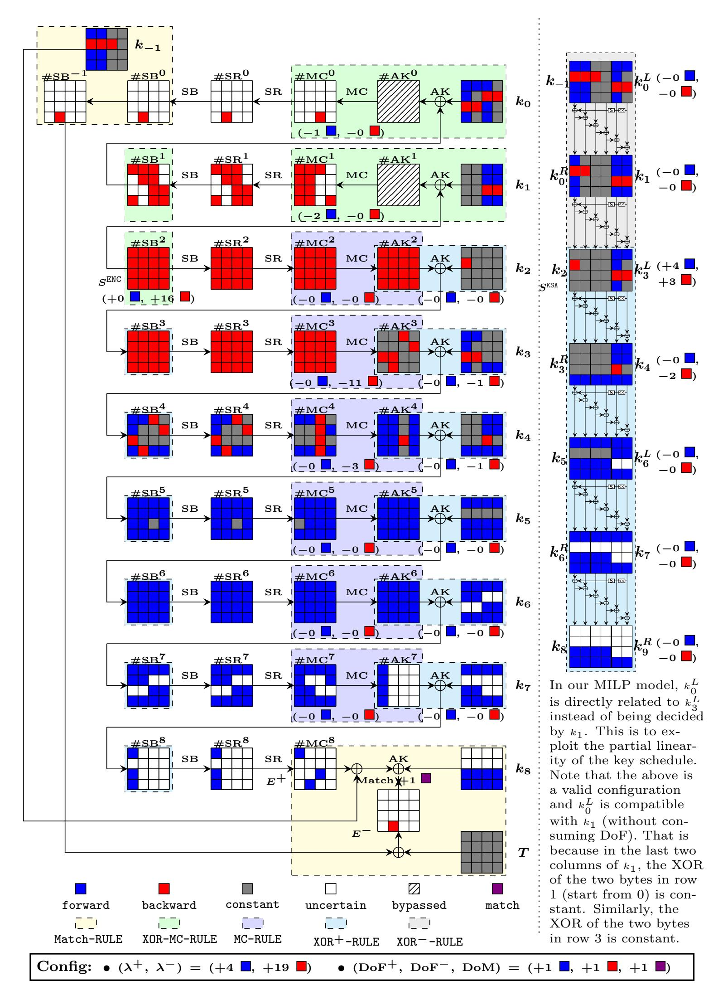

Fig. 9: An MITM pseudo-preimage attack on 9-round AES-192 hashing mode

{35}------------------------------------------------

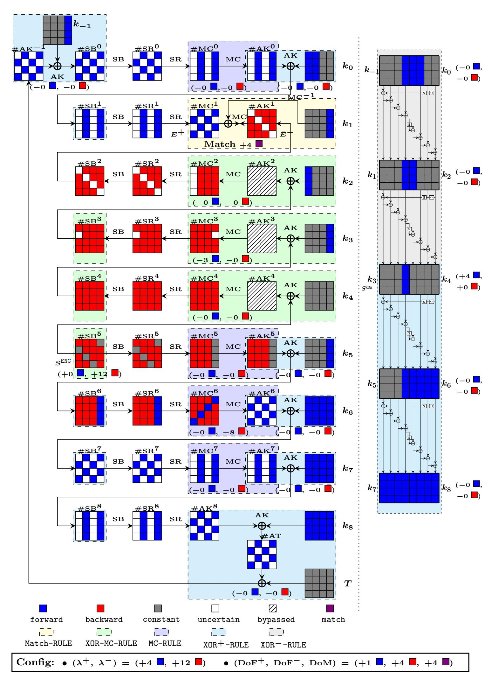

Fig. 10: Example I of the 9-round preimage attack on AES-256 hashing mode

{36}------------------------------------------------

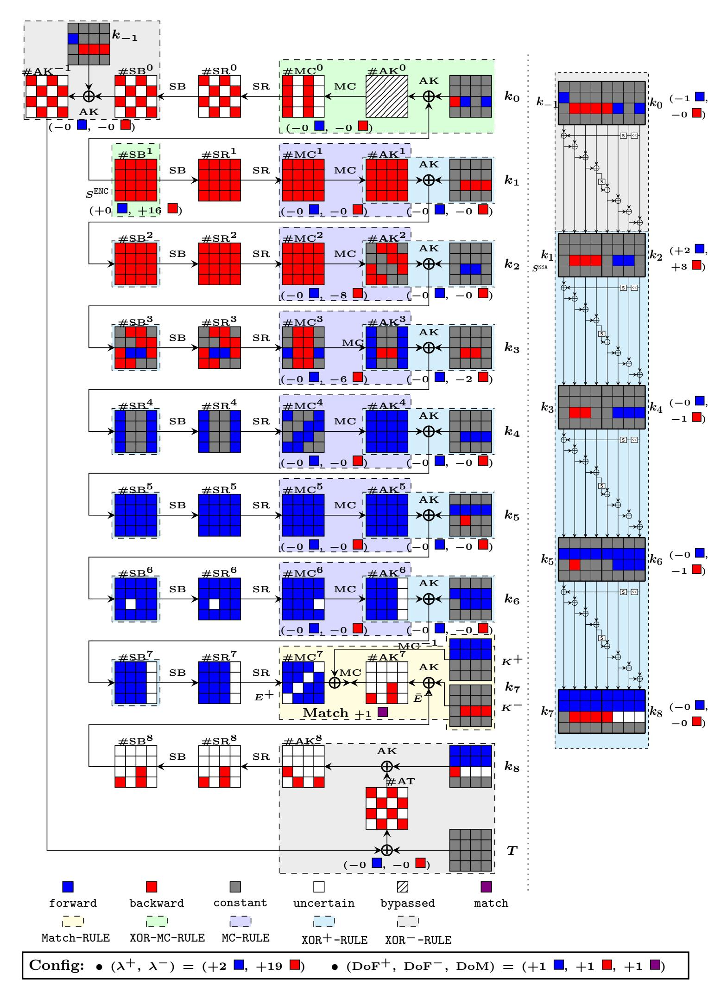

Fig. 11: Example II of the 9-round preimage attack on AES-256 hashing mode

{37}------------------------------------------------

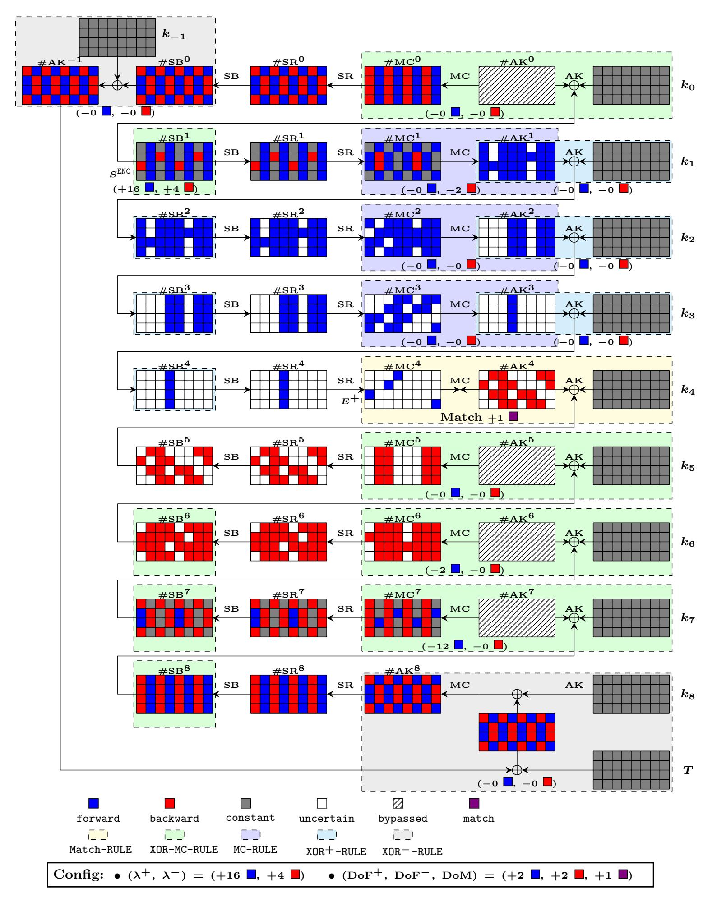

**Fig. 12:** Example of the 9-round preimage attack on Rijndael-256-128*/*192*/*256 hashing mode

{38}------------------------------------------------

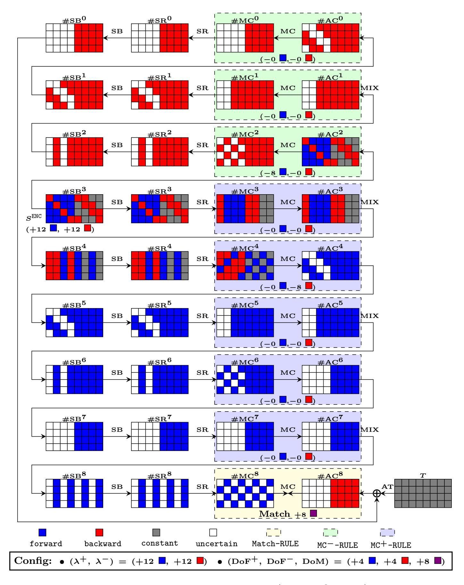

**Fig. 13:** Meet-in-the-middle attack on 4.5-round (or 9-AES-round) Haraka-256 v2 (matching at the last round).

{39}------------------------------------------------

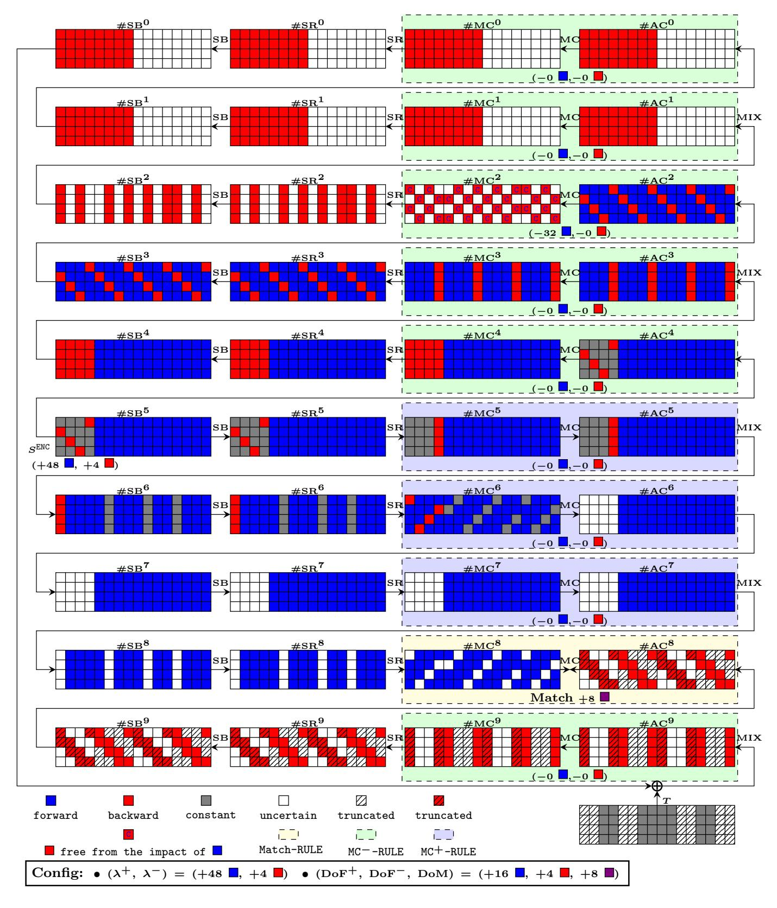

**Fig. 14:** An MITM preimage attack on full Haraka-512 v2. Note that in our MILPmodels, the position of the used hash bits are treated and used as constant in gray cell of the target *T*, and the bits discarded are treated as 'uncertain' although we distinct them using hatched pattern. However, in the attack procedure, the discarded bits are free of choice such that the state cells in hatched pattern are free of matching.

{40}------------------------------------------------

#### B Details in the Attack on 8-round AES-128 Hashing

Remark. The generations of initial values of neutral bytes for the forward (Blue) and the backward (Red) are two separate procedures. Between Red and Blue bytes, there is no dependency. To generate initial values of neutral bytes, there are two sets of equations – one is on the fixed impacts and the Blue bytes, the other is on other fixed impacts and the Red bytes.

Note that by 'fixed impacts', we mean the constant impacts from one direction on the other. E.g., the forward neutral bytes (Blue) have constant impacts on the backward active bytes (Red). The values of impacts are not the values of 'C'-marked cells, but a common value that will be XORed to the 'C'-marked cells in the MITM procedure. For the MITM procedure, the impacts on the 'C'-marked cells are fixed before computations of both forward and backward chunks. Knowing the fixed impacts, the forward computations and the backward computations are also done independently before matching through MixColumns (the fixed impacts are directly XORed to the corresponding states).

In Sect. B.1, we explain how to generate the initial values of forward neutral bytes and backward neutral bytes by establishing equations and solving in precomputation procedures. Note that all precomputations are done once, and for all.

# B.1 Solving Equations to Obtain Values of Neutral Bytes in the8-Round Attack on AES-128 Hashing Mode

Obtain the values of the neutral bytes for forward chunk. In the 8-round attack on AES-128 hashing mode (see Fig. 7), the values of the neutral bytes for the forward computation should be the solutions of the following equations, where  $C_{1,0}, C_{1,1}, \ldots, C_{1,11}, C_{2,0}, C_{2,1}, C_{2,2}$ , and  $C_{3,0}, C_{3,1}, C_{3,2}$  are pre-determined constants:

$$\begin{bmatrix} e & b & d & 9 \\ 9 & e & b & d \\ d & 9 & e & b \\ b & d & 9 & e \end{bmatrix} \times \begin{bmatrix} k_3[0] \oplus \#SB^4[0] & k_3[4] & k_3[8] & k_3[12] \\ k_3[1] & k_3[5] \oplus \#SB^4[5] & k_3[9] & k_3[13] \\ k_3[2] & k_3[6] & k_3[10] \oplus \#SB^4[10] & k_3[14] \\ k_3[3] & k_3[7] & k_3[11] & k_3[15] \oplus \#SB^4[15] \end{bmatrix} = \begin{bmatrix} - & C_{1,3} & C_{1,6} & C_{1,9} & C_{1,6} & C_{1,9} & C_{1,1} & C_{1,7} & C_{1,10} & C_{1,10} & C_{1,10} & C_{1,10} & C_{1,10} & C_{1,10} & C_{1,10} & C_{1,10} & C_{1,10} & C_{1,10} & C_{1,10} & C_{1,10} & C_{1,10} & C_{1,10} & C_{1,10} & C_{1,10} & C_{1,10} & C_{1,10} & C_{1,10} & C_{1,10} & C_{1,10} & C_{1,10} & C_{1,10} & C_{1,10} & C_{1,10} & C_{1,10} & C_{1,10} & C_{1,10} & C_{1,10} & C_{1,10} & C_{1,10} & C_{1,10} & C_{1,10} & C_{1,10} & C_{1,10} & C_{1,10} & C_{1,10} & C_{1,10} & C_{1,10} & C_{1,10} & C_{1,10} & C_{1,10} & C_{1,10} & C_{1,10} & C_{1,10} & C_{1,10} & C_{1,10} & C_{1,10} & C_{1,10} & C_{1,10} & C_{1,10} & C_{1,10} & C_{1,10} & C_{1,10} & C_{1,10} & C_{1,10} & C_{1,10} & C_{1,10} & C_{1,10} & C_{1,10} & C_{1,10} & C_{1,10} & C_{1,10} & C_{1,10} & C_{1,10} & C_{1,10} & C_{1,10} & C_{1,10} & C_{1,10} & C_{1,10} & C_{1,10} & C_{1,10} & C_{1,10} & C_{1,10} & C_{1,10} & C_{1,10} & C_{1,10} & C_{1,10} & C_{1,10} & C_{1,10} & C_{1,10} & C_{1,10} & C_{1,10} & C_{1,10} & C_{1,10} & C_{1,10} & C_{1,10} & C_{1,10} & C_{1,10} & C_{1,10} & C_{1,10} & C_{1,10} & C_{1,10} & C_{1,10} & C_{1,10} & C_{1,10} & C_{1,10} & C_{1,10} & C_{1,10} & C_{1,10} & C_{1,10} & C_{1,10} & C_{1,10} & C_{1,10} & C_{1,10} & C_{1,10} & C_{1,10} & C_{1,10} & C_{1,10} & C_{1,10} & C_{1,10} & C_{1,10} & C_{1,10} & C_{1,10} & C_{1,10} & C_{1,10} & C_{1,10} & C_{1,10} & C_{1,10} & C_{1,10} & C_{1,10} & C_{1,10} & C_{1,10} & C_{1,10} & C_{1,10} & C_{1,10} & C_{1,10} & C_{1,10} & C_{1,10} & C_{1,10} & C_{1,10} & C_{1,10} & C_{1,10} & C_{1,10} & C_{1,10} & C_{1,10} & C_{1,10} & C_{1,10} & C_{1,10} & C_{1,10} & C_{1,10} & C_{1,10} & C_{1,10} & C_{1,10} & C_{1,10} & C_{1,10} & C_{1,10} & C_{1,10} & C_{1,10} & C_{1,10} & C_{1,10} & C_{1,10} & C_{1,10} & C_{1,10} & C_{1,1$$

$$\begin{bmatrix} \mathsf{e} \ \mathsf{b} \ \mathsf{d} \ \mathsf{9} \\ \mathsf{9} \ \mathsf{e} \ \mathsf{b} \ \mathsf{d} \ \mathsf{9} \\ \mathsf{d} \ \mathsf{9} \ \mathsf{e} \ \mathsf{b} \ \mathsf{d} \\ \mathsf{d} \ \mathsf{9} \ \mathsf{e} \ \mathsf{b} \\ \mathsf{d} \ \mathsf{9} \ \mathsf{e} \ \mathsf{b} \\ \mathsf{d} \ \mathsf{9} \ \mathsf{e} \ \mathsf{b} \\ \mathsf{d} \ \mathsf{9} \ \mathsf{e} \ \mathsf{b} \\ \mathsf{d} \ \mathsf{9} \ \mathsf{e} \ \mathsf{b} \\ \mathsf{d} \ \mathsf{9} \ \mathsf{e} \ \mathsf{b} \\ \mathsf{d} \ \mathsf{9} \ \mathsf{e} \ \mathsf{b} \\ \mathsf{d} \ \mathsf{9} \ \mathsf{e} \ \mathsf{b} \\ \mathsf{d} \ \mathsf{9} \ \mathsf{e} \ \mathsf{b} \\ \mathsf{d} \ \mathsf{9} \ \mathsf{e} \ \mathsf{b} \\ \mathsf{d} \ \mathsf{9} \ \mathsf{e} \ \mathsf{b} \\ \mathsf{d} \ \mathsf{9} \ \mathsf{e} \ \mathsf{b} \\ \mathsf{d} \ \mathsf{9} \ \mathsf{e} \ \mathsf{b} \\ \mathsf{d} \ \mathsf{9} \ \mathsf{e} \ \mathsf{b} \\ \mathsf{d} \ \mathsf{9} \ \mathsf{e} \ \mathsf{b} \\ \mathsf{d} \ \mathsf{9} \ \mathsf{e} \ \mathsf{b} \\ \mathsf{d} \ \mathsf{9} \ \mathsf{e} \ \mathsf{b} \\ \mathsf{d} \ \mathsf{9} \ \mathsf{e} \ \mathsf{b} \\ \mathsf{d} \ \mathsf{9} \ \mathsf{e} \ \mathsf{b} \\ \mathsf{d} \ \mathsf{9} \ \mathsf{e} \ \mathsf{b} \\ \mathsf{d} \ \mathsf{9} \ \mathsf{e} \ \mathsf{b} \\ \mathsf{d} \ \mathsf{9} \ \mathsf{e} \ \mathsf{b} \\ \mathsf{d} \ \mathsf{9} \ \mathsf{e} \ \mathsf{b} \\ \mathsf{d} \ \mathsf{9} \ \mathsf{e} \ \mathsf{b} \\ \mathsf{d} \ \mathsf{9} \ \mathsf{e} \ \mathsf{b} \\ \mathsf{d} \ \mathsf{9} \ \mathsf{e} \ \mathsf{b} \\ \mathsf{d} \ \mathsf{9} \ \mathsf{e} \ \mathsf{b} \\ \mathsf{d} \ \mathsf{9} \ \mathsf{e} \ \mathsf{b} \\ \mathsf{d} \ \mathsf{9} \ \mathsf{e} \ \mathsf{b} \\ \mathsf{d} \ \mathsf{9} \ \mathsf{e} \ \mathsf{b} \\ \mathsf{d} \ \mathsf{9} \ \mathsf{e} \ \mathsf{b} \\ \mathsf{d} \ \mathsf{9} \ \mathsf{e} \ \mathsf{b} \\ \mathsf{d} \ \mathsf{9} \ \mathsf{e} \ \mathsf{b} \\ \mathsf{d} \ \mathsf{9} \ \mathsf{e} \ \mathsf{b} \\ \mathsf{d} \ \mathsf{9} \ \mathsf{e} \ \mathsf{b} \\ \mathsf{d} \ \mathsf{9} \ \mathsf{e} \ \mathsf{b} \\ \mathsf{d} \ \mathsf{9} \ \mathsf{e} \ \mathsf{b} \\ \mathsf{d} \ \mathsf{9} \ \mathsf{e} \ \mathsf{b} \\ \mathsf{d} \ \mathsf{9} \ \mathsf{e} \ \mathsf{b} \\ \mathsf{d} \ \mathsf{9} \ \mathsf{e} \ \mathsf{b} \\ \mathsf{d} \ \mathsf{9} \ \mathsf{e} \ \mathsf{b} \\ \mathsf{d} \ \mathsf{9} \ \mathsf{e} \ \mathsf{b} \\ \mathsf{d} \ \mathsf{9} \ \mathsf{e} \ \mathsf{b} \\ \mathsf{d} \ \mathsf{9} \ \mathsf{e} \ \mathsf{b} \\ \mathsf{d} \ \mathsf{9} \ \mathsf{e} \ \mathsf{b} \\ \mathsf{d} \ \mathsf{9} \ \mathsf{e} \ \mathsf{b} \\ \mathsf{d} \ \mathsf{9} \ \mathsf{e} \ \mathsf{0} \\ \mathsf{d} \ \mathsf{9} \ \mathsf{e} \ \mathsf{b} \\ \mathsf{d} \ \mathsf{9} \ \mathsf{e} \ \mathsf{b} \\ \mathsf{d} \ \mathsf{9} \ \mathsf{e} \ \mathsf{b} \\ \mathsf{d} \ \mathsf{9} \ \mathsf{e} \ \mathsf{b} \\ \mathsf{d} \ \mathsf{9} \ \mathsf{e} \ \mathsf{0} \\ \mathsf{d} \ \mathsf{9} \ \mathsf{e} \ \mathsf{b} \\ \mathsf{d} \ \mathsf{9} \ \mathsf{e} \ \mathsf{e} \ \mathsf{b} \\ \mathsf{d} \ \mathsf{9} \ \mathsf{e} \ \mathsf{e} \ \mathsf{b} \\ \mathsf{d} \ \mathsf{9} \ \mathsf{e} \ \mathsf{e} \ \mathsf{e} \ \mathsf{e} \ \mathsf{e} \ \mathsf{e} \ \mathsf{e} \ \mathsf{e} \ \mathsf{e} \ \mathsf{e} \ \mathsf{e} \ \mathsf{e} \ \mathsf{e} \ \mathsf{e} \ \mathsf{e} \ \mathsf{e} \ \mathsf{e} \ \mathsf{e} \ \mathsf{e} \ \mathsf{e} \ \mathsf{e} \ \mathsf{e} \ \mathsf{e} \ \mathsf{e} \ \mathsf{e} \ \mathsf{e} \ \mathsf{e} \ \mathsf{e} \ \mathsf{e} \ \mathsf{e} \ \mathsf{e} \ \mathsf{e} \ \mathsf{e} \ \mathsf{e} \ \mathsf{e} \ \mathsf{e} \ \mathsf{e} \ \mathsf{e} \ \mathsf{e} \ \mathsf{e} \ \mathsf{e} \ \mathsf{e} \ \mathsf{e} \ \mathsf{e} \ \mathsf{e} \ \mathsf{e} \ \mathsf{e} \ \mathsf{e} \ \mathsf{e} \ \mathsf{e} \ \mathsf{e} \ \mathsf{e} \ \mathsf{e} \ \mathsf{e}$$

$$\begin{bmatrix} k_4 [5] \\ k_4 [10] \\ k_4 [15] \end{bmatrix} = \begin{bmatrix} k_3 [1] \oplus S_{RD}(k_3 [14]) \oplus k_3 [5] \\ k_3 [2] \oplus S_{RD}(k_3 [15]) \oplus k_3 [6] \oplus k_3 [10] \\ k_3 [3] \oplus S_{RD}(k_3 [0]) \oplus k_3 [7] \oplus k_3 [11] \oplus k_3 [15] \end{bmatrix} = \begin{bmatrix} C_{3,0} \\ C_{3,1} \\ C_{3,2} \end{bmatrix}$$
(15)

{41}------------------------------------------------

Combining the above constraints, we have the following system of equations:

$$\begin{bmatrix} 9 \cdot (k_3[\ 0] \oplus \# SB^4[0]) \oplus e \cdot k_3[\ 1] & \oplus b \cdot k_3[\ 2] & \oplus d \cdot k_3[\ 3] \\ d \cdot (k_3[\ 0] \oplus \# SB^4[0]) \oplus 9 \cdot k_3[\ 1] & \oplus e \cdot k_3[\ 2] & \oplus b \cdot k_3[\ 3] \\ b \cdot (k_3[\ 0] \oplus \# SB^4[0]) \oplus d \cdot k_3[\ 1] & \oplus e \cdot k_3[\ 2] & \oplus e \cdot k_3[\ 3] \\ \hline e \cdot k_3[\ 4] & \oplus b \cdot (k_3[\ 5] \oplus \# SB^4[5]) \oplus d \cdot k_3[\ 6] & \oplus 9 \cdot k_3[\ 7] \\ e \cdot k_3[\ 4] & \oplus e \cdot (k_3[\ 5] \oplus \# SB^4[5]) \oplus b \cdot k_3[\ 6] & \oplus d \cdot k_3[\ 7] \\ \hline e \cdot k_3[\ 8] & \oplus e \cdot (k_3[\ 5] \oplus \# SB^4[5]) \oplus e \cdot k_3[\ 6] & \oplus b \cdot k_3[\ 7] \\ \hline e \cdot k_3[\ 8] & \oplus b \cdot k_3[\ 9] & \oplus d \cdot (k_3[10] \oplus \# SB^4[10]) \oplus g \cdot k_3[11] \\ \hline e \cdot k_3[\ 8] & \oplus e \cdot k_3[\ 9] & \oplus b \cdot (k_3[10] \oplus \# SB^4[10]) \oplus e \cdot k_3[11] \\ \hline e \cdot k_3[\ 12] & \oplus b \cdot k_3[\ 13] & \oplus g \cdot (k_3[10] \oplus \# SB^4[10]) \oplus e \cdot k_3[11] \\ \hline e \cdot k_3[12] & \oplus b \cdot k_3[13] & \oplus g \cdot k_3[14] & \oplus g \cdot (k_3[15] \oplus \# SB^4[15]) \\ b \cdot k_3[12] & \oplus g \cdot k_3[13] & \oplus g \cdot k_3[14] & \oplus g \cdot (k_3[15] \oplus \# SB^4[15]) \\ \hline b \cdot (k_3[\ 0] \oplus k_3[\ 12]) & \oplus d \cdot (k_3[\ 1] \oplus k_3[\ 5]) & \oplus g \cdot (k_3[\ 1] \oplus k_3[\ 1]) \\ \hline b \cdot (k_3[\ 0] \oplus k_3[\ 4]) & \oplus g \cdot (k_3[\ 1] \oplus k_3[\ 5]) & \oplus g \cdot (k_3[\ 1] \oplus k_3[\ 11]) \\ \hline g \cdot (k_3[\ 0] \oplus k_3[\ 14]) & \oplus g \cdot (k_3[\ 1] \oplus k_3[\ 13]) & \oplus g \cdot (k_3[\ 1] \oplus k_3[\ 11]) \\ \hline g \cdot (k_3[\ 0] \oplus k_3[\ 14]) & \oplus g \cdot (k_3[\ 1] \oplus k_3[\ 13]) \\ \hline k_3[\ 1] \oplus S_{RD}(k_3[\ 15]) & \oplus k_3[\ 13]) & \oplus g \cdot (k_3[\ 10] \oplus k_3[\ 14]) & \oplus g \cdot (k_3[\ 11] \oplus k_3[\ 15]) \\ \hline k_3[\ 1] \oplus S_{RD}(k_3[\ 15]) & \oplus k_3[\ 13]) & \oplus k_3[\ 10] \\ \hline k_3[\ 3] \oplus S_{RD}(k_3[\ 10]) & \oplus k_3[\ 7] & \oplus k_3[\ 11] \\ \hline \end{array}$$

Essentially, the coefficients in the first 15 rows of equation form a  $15 \times 20$  matrix. That is:

$$\begin{bmatrix} 9 \text{ e b d } 0 \text{ 0 } 0 \text{ 0 } 0 \text{ 0 } 0 \text{ 0 } 0 \text{ 0 } 0 \text{ 0 } 0 \text{ 0 } 0 \text{ 0 } 0 \text{ 0 } 0 \text{ 0 } 0 \text{ 0 } 0 \text{ 0 } 0 \text{ 0 } 0 \text{ 0 } 0 \text{ 0 } 0 \text{ 0 } 0 \text{ 0 } 0 \text{ 0 } 0 \text{ 0 } 0 \text{ 0 } 0 \text{ 0 } 0 \text{ 0 } 0 \text{ 0 } 0 \text{ 0 } 0 \text{ 0 } 0 \text{ 0 } 0 \text{ 0 } 0 \text{ 0 } 0 \text{ 0 } 0 \text{ 0 } 0 \text{ 0 } 0 \text{ 0 } 0 \text{ 0 } 0 \text{ 0 } 0 \text{ 0 } 0 \text{ 0 } 0 \text{ 0 } 0 \text{ 0 } 0 \text{ 0 } 0 \text{ 0 } 0 \text{ 0 } 0 \text{ 0 } 0 \text{ 0 } 0 \text{ 0 } 0 \text{ 0 } 0 \text{ 0 } 0 \text{ 0 } 0 \text{ 0 } 0 \text{ 0 } 0 \text{ 0 } 0 \text{ 0 } 0 \text{ 0 } 0 \text{ 0 } 0 \text{ 0 } 0 \text{ 0 } 0 \text{ 0 } 0 \text{ 0 } 0 \text{ 0 } 0 \text{ 0 } 0 \text{ 0 } 0 \text{ 0 } 0 \text{ 0 } 0 \text{ 0 } 0 \text{ 0 } 0 \text{ 0 } 0 \text{ 0 } 0 \text{ 0 } 0 \text{ 0 } 0 \text{ 0 } 0 \text{ 0 } 0 \text{ 0 } 0 \text{ 0 } 0 \text{ 0 } 0 \text{ 0 } 0 \text{ 0 } 0 \text{ 0 } 0 \text{ 0 } 0 \text{ 0 } 0 \text{ 0 } 0 \text{ 0 } 0 \text{ 0 } 0 \text{ 0 } 0 \text{ 0 } 0 \text{ 0 } 0 \text{ 0 } 0 \text{ 0 } 0 \text{ 0 } 0 \text{ 0 } 0 \text{ 0 } 0 \text{ 0 } 0 \text{ 0 } 0 \text{ 0 } 0 \text{ 0 } 0 \text{ 0 } 0 \text{ 0 } 0 \text{ 0 } 0 \text{ 0 } 0 \text{ 0 } 0 \text{ 0 } 0 \text{ 0 } 0 \text{ 0 } 0 \text{ 0 } 0 \text{ 0 } 0 \text{ 0 } 0 \text{ 0 } 0 \text{ 0 } 0 \text{ 0 } 0 \text{ 0 } 0 \text{ 0 } 0 \text{ 0 } 0 \text{ 0 } 0 \text{ 0 } 0 \text{ 0 } 0 \text{ 0 } 0 \text{ 0 } 0 \text{ 0 } 0 \text{ 0 } 0 \text{ 0 } 0 \text{ 0 } 0 \text{ 0 } 0 \text{ 0 } 0 \text{ 0 } 0 \text{ 0 } 0 \text{ 0 } 0 \text{ 0 } 0 \text{ 0 } 0 \text{ 0 } 0 \text{ 0 } 0 \text{ 0 } 0 \text{ 0 } 0 \text{ 0 } 0 \text{ 0 } 0 \text{ 0 } 0 \text{ 0 } 0 \text{ 0 } 0 \text{ 0 } 0 \text{ 0 } 0 \text{ 0 } 0 \text{ 0 } 0 \text{ 0 } 0 \text{ 0 } 0 \text{ 0 } 0 \text{ 0 } 0 \text{ 0 } 0 \text{ 0 } 0 \text{ 0 } 0 \text{ 0 } 0 \text{ 0 } 0 \text{ 0 } 0 \text{ 0 } 0 \text{ 0 } 0 \text{ 0 } 0 \text{ 0 } 0 \text{ 0 } 0 \text{ 0 } 0 \text{ 0 } 0 \text{ 0 } 0 \text{ 0 } 0 \text{ 0 } 0 \text{ 0 } 0 \text{ 0 } 0 \text{ 0 } 0 \text{ 0 } 0 \text{ 0 } 0 \text{ 0 } 0 \text{ 0 } 0 \text{ 0 } 0 \text{ 0 } 0 \text{ 0 } 0 \text{ 0 } 0 \text{ 0 } 0 \text{ 0 } 0 \text{ 0 } 0 \text{ 0 } 0 \text{ 0 } 0 \text{ 0 } 0 \text{ 0 } 0 \text{ 0 } 0 \text{ 0 } 0 \text{ 0 } 0 \text{ 0 } 0 \text{ 0 } 0 \text{ 0 } 0 \text{ 0 } 0 \text{ 0 } 0 \text{ 0 } 0 \text{ 0 } 0 \text{ 0 } 0 \text{ 0 } 0 \text{ 0 } 0 \text{ 0 } 0 \text{ 0 } 0 \text{ 0 } 0 \text{ 0 } 0 \text{ 0 } 0 \text{ 0 } 0 \text{ 0 } 0 \text{ 0 } 0 \text{ 0 } 0 \text{ 0 } 0 \text{ 0 } 0 \text{ 0 } 0 \text{ 0 } 0 \text{ 0 } 0 \text{ 0 } 0 \text{ 0 } 0 \text{ 0 } 0 \text{ 0 } 0 \text{ 0 } 0 \text{ 0 } 0 \text{ 0 } 0 \text{ 0 } 0 \text{ 0 } 0 \text{ 0 } 0 \text{ 0 } 0 \text{ 0 } 0 \text{ 0 } 0 \text{ 0 } 0 \text{ 0 } 0 \text{ 0 } 0 \text{ 0 } 0 \text{ 0 } 0 \text{ 0 } 0 \text{ 0 } 0 \text{ 0 } 0 \text{$$

Because the rank of this matrix is full (i.e., 15), the number of solutions for an arbitrary vector of constants is  $2^{(20-15)\times 8=40}$ .

The last three rows in Eq. (16) impose 3 byte-constraints, which are non-linear (through the AES SBox  $S_{RD}$ ) on  $k_3[0]$ ,  $k_3[14]$ , and  $k_3[15]$ . By experiment, we verified that for each possible value of  $(C_{3,0}, C_{3,1}, C_{3,1})$ , there are exactly  $2^{40-24} = 2^{16}$  out of the  $2^{40}$  solutions made the three equation hold.

Obtain the values of the neutral bytes for backward chunk. Essentially, the values of the neutral bytes for backward chunk can be obtained by solving the following solutions (see Fig. 7, which is imposed on state #MC5 to make the neutral bytes for backward chunk has two-byte constant influence on state

{42}------------------------------------------------

#AK5. Such constraint has been used in many previous attacks)

$$\begin{bmatrix} 2 & 3 & 1 & 1 \\ 1 & 2 & 3 & 1 \\ 1 & 1 & 2 & 3 \\ 3 & 1 & 1 & 2 \end{bmatrix} \times \begin{bmatrix} 0 \\ \#MC^{5}[1] \\ \#MC^{5}[2] \\ \#MC^{5}[3] \end{bmatrix} = \begin{bmatrix} C_{4,0} \\ - \\ C_{4,1} \\ - \end{bmatrix}, i.e., \begin{bmatrix} 3 \cdot \#MC^{5}[1] \oplus 1 \cdot \#MC^{5}[2] \oplus 1 \cdot \#MC^{5}[3] \\ 1 \cdot \#MC^{5}[1] \oplus 2 \cdot \#MC^{5}[2] \oplus 3 \cdot \#MC^{5}[3] \end{bmatrix} = \begin{bmatrix} C_{4,0} \\ C_{4,1} \\ \end{bmatrix}$$
(18)

Because of the property of MixColumns, this equation has  $2^{(3-2)\times 8}$  solutions for each possible values of  $C_{4,0}$  and  $C_{4,1}$ . Thus, given  $C_{4,0}$ ,  $C_{4,1}$  we can obtain  $2^8$  values for the neutral bytes for backward computations. The way to compute them can either be using the Gaussian elimination to solve the linear equations, or precompute them (as described in the above attack procedure) for all possible values  $C_{4,0}$  and  $C_{4,1}$  and store in a table ( $T_2$  as described in the above attack procedure) to reuse in the attack.

### C Additional Techniques for MITM Preimage Attacks

Convert Pseudo-preimage Attacks to Preimage Attacks. For n-bit narrow-pipe iterated hash function, by an unbalanced meet-in-the-middle approach, a pseudo-preimage attack with a computational complexity of  $2^{\ell}$  ( $\ell < n-2$ ) can be converted into a preimage attack with computational complexity of  $2^{(n+\ell)/2+1}$  [46, Fact9.99]. Note that, here, the unbalanced meet-in-the-middle approach is a more general procedure which is different with our focused meet-in-the-middle technique used in the pseudo-preimage attack on the compression function. It is a higher level of meet-in-the-middle procedure which calls our meet-in-the-middle pseudo-preimage attack as sub-procedures. In [40], Leurent improved this general unbalanced meet-in-the-middle method in the case where given k targets, the complexity of a pseudo-preimage attack can be reduced from  $2^{\ell}$  to  $2^{\ell}/k$ . The improved method uses these multi-target pseudo-preimage attacks to form an unbalanced-tree, and uses the expandable message technique to overcome the length padding. The overall time complexity of this improved method can be  $((n-\ell) \cdot \ln 2 + 1) \cdot 2^{\ell}$ . For more details, please refer to [7,10,40].

Tricks for matching the ending states as indirect matching and matching through MixColumns used in [4,10,25]. In the MITM preimage attack on AES-like hash functions, the last sub-key addition leading to  $E^-$  is close to the boundary of the forward and backward computation as illustrated in Fig. 15a. Therefore, to perform matching, one can decompose state as  $K = K^+ + K^-$ , and translate the computation in Fig. 15a into its equivalent form shown in Fig. 15b, since  $MC(E^+) \oplus K = MC(E^+ \oplus MC^{-1}(K^+)) \oplus K^-$ .

The decomposition of state K moves all known cells of K for the forward computation (Blue and Gray cells) into  $K^+$ . Then  $K^-$  contains only Red cells (known cells for the backward computation) and White cells (unknown cells for both the forward and backward computation). The unknown cells for both the forward and backward computation are placed at  $K^-$  rather than  $K^+$  because they step into the encryption data path directly (unlike  $K^+$  for which the  $MC^{-1}$ 

{43}------------------------------------------------

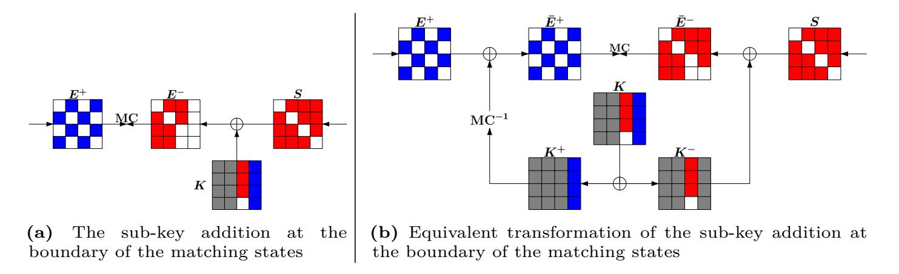

**Fig. 15:** Tricks for matching the ending states

operation has to be applied before *K*+ goes into the encryption data path), and thus keep the effect of unknown cells local. In contrast, one White cell in *K*+ would make one column of the state in the encryption data path White. With this approach, the coloring scheme of *E*+ is left intact, and some Red cells in *E*− are protected from being destroyed by the Blue cells in the original *K*. For example, the three Red cells in the last column of *S* shown in Fig. [15a](#page-43-0) are preserved by decomposing *K* as presented in Fig. [15b.](#page-43-0)