{0}------------------------------------------------

# Distributed Auditing Proofs of Liabilities

Version 0.0.2

# PROPOSED STANDARD

# Main Authors

Konstantinos Chalkias

Kevin Lewi

Payman Mohassel

Valeria Nikolaenko

{kostascrypto, klewi, paymanm, valerini}@fb.com

\*Contributors to this draft include numerous researchers from both academia and the audit industry.

- - Work in progress document - -

Accepted as a standardization proposal draft in the 3rd [ZKProof](https://zkproof.org/) workshop 2020.

An extension of this paper with many optimizations and formal definitions, entitled [Generalized](https://eprint.iacr.org/2021/1350) [Proof of Liabilities](https://eprint.iacr.org/2021/1350), has been published to ACM CCS 2021.

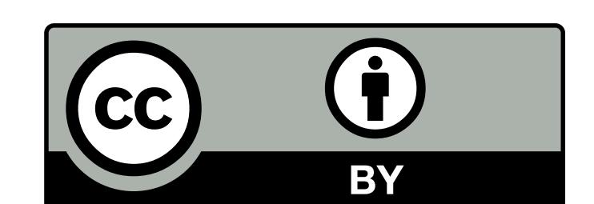

[Attribution 4.0 International \(CC BY 4.0\)](https://creativecommons.org/licenses/by/4.0/)

{1}------------------------------------------------

## Abstract

<span id="page-1-1"></span><span id="page-1-0"></span>The Distributed Auditing Proofs of Liabilities (DAPOL) are schemes designed to let companies that accept (i) monetary deposits from consumers (i.e., custodial wallets, blockchain exchanges, banks, gambling industry etc.) or (ii) fungible obligations and report claims from users (i.e., daily reporting of COVID-19 cases , negative product reviews, unemployment rate, disapproval voting etc.) to prove their total amount of liabilities or obligations without compromising the privacy of both users' identity and individual amounts.

Throughout this document we'll often refer to one of DAPOL's most popular use cases, which is proving solvency of cryptocurrency exchanges. Solvency is defined as the ability of a company to meet its long-term financial commitments. In finance and particularly in blockchain systems, proof of solvency consists of two components:

- 1. Proof of liabilities: proving the total quantity of coins the exchange owes to all of its customers.
- 2. Proof of reserves (also known as proof of assets): proving ownership of digital assets (i.e., coins) in the blockchain.

Typically, an exchange should prove that the total balance of owned coins is greater than or equal to their liabilities, which correspond to the sum of coins their users own internally to their platform.

It is highlighted that this proposal focuses on the proofs of liabilities part only, mainly because the same solution can be applied to a broad range of applications, even outside solvency, and secondly because the proof of assets part cannot easily be generalized and it differs between blockchain types due to different privacy guarantees offered per platform [\[Roo19b;](#page-51-0) [DV19;](#page-50-0) [Roo19a\]](#page-51-1).

The extra benefit of DAPOL compared to conventional auditor-based approaches is it provides a transparent mechanism for users to validate their balance inclusion in the reported total amount of liabilities/obligations and complements the traditional validation performed by the auditors by adding extra privacy guarantees.

This document focuses on a particular class of auditing cases, in which we assume that the audited entity does not have any incentive to increase its liabilities or obligations. Although proofs of liabilities are an essential part of proving financial solvency, it will be shown that there are numerous applications of DAPOL, including their use in tax earning statements, "negative" voting and transparent reports of offensive content in social networks, among the others.

The recommended approach combines previously known cryptographic techniques to provide a layered solution with predefined levels of privacy in the form of gadgets. The backbone of this proposal is based on the enhanced Maxwell's Merkle-tree construction and is extended using balance splitting tricks, efficient padding, verifiable random functions, deterministic key derivation functions and the range proof techniques from Provisions and ZeroLedge solvency protocols, respectively.

Because Bulletproofs [\[BBBPWM18\]](#page-49-0), Gro16 [\[Gro16\]](#page-50-1), Ligero [\[AHIV17\]](#page-49-1), Plonk [\[GWC19\]](#page-50-2), Halo [\[BGH19\]](#page-49-2) and other efficient ZKP constructions were not available or mature when the above solvency protocols were published, we will assume that any efficient zero knowledge scheme for set membership in summation structures can be a good candidate, but we hope we will agree as a community on one or two concrete constructions.

{2}------------------------------------------------

<span id="page-2-0"></span>

| Keywords:                                                                                                                                                                                                                                                                                                                                                                                                                                                                                                                                                                                   |  |  | distributed auditing; liability proofs; zero knowledge proofs; privacy; standards. |  |
|---------------------------------------------------------------------------------------------------------------------------------------------------------------------------------------------------------------------------------------------------------------------------------------------------------------------------------------------------------------------------------------------------------------------------------------------------------------------------------------------------------------------------------------------------------------------------------------------|--|--|------------------------------------------------------------------------------------|--|
|                                                                                                                                                                                                                                                                                                                                                                                                                                                                                                                                                                                             |  |  |                                                                                    |  |
|                                                                                                                                                                                                                                                                                                                                                                                                                                                                                                                                                                                             |  |  |                                                                                    |  |
|                                                                                                                                                                                                                                                                                                                                                                                                                                                                                                                                                                                             |  |  |                                                                                    |  |
|                                                                                                                                                                                                                                                                                                                                                                                                                                                                                                                                                                                             |  |  |                                                                                    |  |
|                                                                                                                                                                                                                                                                                                                                                                                                                                                                                                                                                                                             |  |  |                                                                                    |  |
|                                                                                                                                                                                                                                                                                                                                                                                                                                                                                                                                                                                             |  |  |                                                                                    |  |
|                                                                                                                                                                                                                                                                                                                                                                                                                                                                                                                                                                                             |  |  |                                                                                    |  |
|                                                                                                                                                                                                                                                                                                                                                                                                                                                                                                                                                                                             |  |  |                                                                                    |  |
|                                                                                                                                                                                                                                                                                                                                                                                                                                                                                                                                                                                             |  |  |                                                                                    |  |
|                                                                                                                                                                                                                                                                                                                                                                                                                                                                                                                                                                                             |  |  |                                                                                    |  |
|                                                                                                                                                                                                                                                                                                                                                                                                                                                                                                                                                                                             |  |  |                                                                                    |  |
|                                                                                                                                                                                                                                                                                                                                                                                                                                                                                                                                                                                             |  |  |                                                                                    |  |
|                                                                                                                                                                                                                                                                                                                                                                                                                                                                                                                                                                                             |  |  |                                                                                    |  |
|                                                                                                                                                                                                                                                                                                                                                                                                                                                                                                                                                                                             |  |  |                                                                                    |  |
|                                                                                                                                                                                                                                                                                                                                                                                                                                                                                                                                                                                             |  |  |                                                                                    |  |
|                                                                                                                                                                                                                                                                                                                                                                                                                                                                                                                                                                                             |  |  |                                                                                    |  |
|                                                                                                                                                                                                                                                                                                                                                                                                                                                                                                                                                                                             |  |  |                                                                                    |  |
|                                                                                                                                                                                                                                                                                                                                                                                                                                                                                                                                                                                             |  |  |                                                                                    |  |
| Acknowledgments:<br>Qedit, Brajesh Damani, Dmitry Korneev & Nihar Shah from Facebook and Christian Catalini, Evan Cheng,<br>George Danezis, David Dill, Riyaz Faizullabhoy, J. Mark Hou, François Garillot, Ben Maurer, Dahlia Malkhi,<br>Alistair Pott, Alberto Sonnino & Lei Wei from Calibra for their valuable and constructive feedback.                                                                                                                                                                                                                                               |  |  | We would like to thank Antonio Senatore from Deloitte, Daniel Benarroch from       |  |
| We also thank Gaby G. Dagher, Benedikt Bunz, Joseph Bonneau, Jeremy Clark and Dan Boneh, as this<br>proposal is heavily based on their Provisions [DBBCB15] protocol and the authors of ZeroLedge [DSE] (Jack<br>Doerner, Abhi Shelat and David Evans), zkLedger [NVV18] (Neha Narula, Willy Vasquez and Madars Virza)<br>and Bulletproofs [BBBPWM18] (B. Bunz, Jonathan Bootle, D. Boneh, Andrew Poelstra, Pieter Wuille and<br>Greg Maxwell), because their work had direct impact on the efficiency, feasibility and on enlisting edge-case<br>attack vectors for the proposed solution. |  |  |                                                                                    |  |

{3}------------------------------------------------

### About this proposal

<span id="page-3-1"></span><span id="page-3-0"></span>The "DAPOL" document aligns with the scope of the ZKProof open initiative, which seeks to mainstream ZKP cryptography and its real-world applications. This proposal focuses on a design that promotes the use of ZKP in a variety of use cases and clearly shows the privacy and transparency benefits offered by ZKP-based constructions compared to traditional approaches.

DAPOL is an inclusive community-driven process that focuses on privacy, transparency and security, aiming to advance trusted specifications and open-source implementation of distributed auditing processes, in particular for proofs of liabilities, obligations and "negative" votes.

Setting a standard for this crucial and demanding auditing process will be help make proofs of solvency interoperable not only in financial institutes and services which routinely require them, but also in other industries which require auditing of obligations and/or aggregated "negative" reports. One of the main reasons for exploring standardization of ZKP in auditing is that there is now industry inconsistency on the tools used for proofs of solvency. Oftentimes auditors need to re-implement the algorithms proposed by the audited companies (provers) as there is not a common reference for them, while it is clear that outdated weaker privacy-preserving techniques are still widely used (i.e., the original scheme of Maxwell [\[Wil14\]](#page-51-3)).

We also highlight that since this application requires efficient range proofs, set membership and batch verification by nature, DAPOL can be used as a benchmarking use case when comparing zero knowledge proof protocols.

This document intends on being a community-built reference for understanding and aiding the development of auditing systems using ZKP. The ideas and algorithms described here are built on top of excellent earlier work in the field, originally focused on solving solvency, such as the Maxwell protocol, the Provisions and ZeroLedge proofs of liabilities and their extensions Provisions+ and Maxwell+, respectively.

The following items offer guidance for the expected development process of this document, which is open to contributions from and for the community.

Purpose. The purpose of standardizing DAPOL is to give a reference for the development of auditing technology that is transparent, secure, interoperable and which supports selective privacy-preserving properties.

Aims. The aim of the document is to serve as a point of reference for implementing interoperable systems that prove the total liabilities and obligations of an entity in a distributed way, where every user can check inclusion of their values/balances in the total amount reported.

We hope that the final solution will find use in many industries including finance (proofs of solvency, syndicated loans and insurance, credit score, fund-raising etc), and any other business where reports of obligations, responsibilities or "negative" votes are required (such as reporting fake news, disapproval voting, transparent lottery prize pools etc).

Scope. The document intends to cover material relevant for its purpose — a complete solution for DAPOL by supporting selective privacy levels in order to conform to the world's variety of audit standards. The proposed methods can be complementary to the current auditing best practices or be applied independently in an auditor-less environment.

{4}------------------------------------------------

Due to the recent advances in ZKP protocols and properties, although we expect that many generic or specialized ZKP systems can be applied to DAPOL, our objective is to agree on one or at most two concrete designs (specific ZKP scheme). This is very important to avoid delays in the adoption of the proposed solution.

{5}------------------------------------------------

# <span id="page-5-0"></span>Contents

## Table of Contents

|   |     | Abstract                                                         | B   |
|---|-----|------------------------------------------------------------------|-----|
|   |     | About this proposal<br>                                          | i   |
|   |     | Contents                                                         | iii |
|   |     | Motivation<br>                                                   | vi  |
| 1 |     | Tools for Proofs of Liabilities                                  | 2   |
|   | 1.1 | Cryptographic Primitives<br>                                     | 2   |
|   |     | 1.1.1<br>Accumulators                                            | 2   |
|   |     | 1.1.2<br>Summation Merkle Trees<br>                              | 2   |
|   |     | 1.1.3<br>Pedersen commitments                                    | 3   |
|   |     | 1.1.4<br>Set Membership Proofs<br>                               | 3   |
|   |     | 1.1.5<br>Zero-Knowledge Range Proofs                             | 3   |
|   |     | 1.1.6<br>Verifiable Random Functions<br>                         | 4   |
|   |     | 1.1.7<br>Private Information Retrieval<br>                       | 4   |
|   | 1.2 | Schemes for Proofs of Liabilities                                | 5   |
|   |     | 1.2.1<br>Summation Tree based (Maxwell+)                         | 5   |
|   |     | 1.2.2<br>Random Split Summation Tree based (Split Maxwell+)<br>  | 7   |
|   |     | 1.2.3<br>Range Proof based (Provisions and ZeroLedge)<br>        | 9   |
|   |     | 1.2.4<br>Deterministic Tree Range Proofs based (DProvisions)<br> | 11  |
|   |     | 1.2.5<br>Secure Enclave based (Trusted Computing)<br>            | 13  |
|   | 1.3 | Privacy Features<br>                                             | 14  |
| 2 |     | Applications                                                     | 17  |
|   | 2.1 | Proofs of Solvency<br>                                           | 17  |
|   | 2.2 | Disapproval Voting                                               | 17  |
|   | 2.3 | Negative Reviews                                                 | 18  |
|   | 2.4 | Fundraising and ICO                                              | 18  |
|   | 2.5 | Revenue Reports<br>                                              | 18  |
|   | 2.6 | Syndicated Loans                                                 | 19  |
|   | 2.7 | Lottery Prizes                                                   | 19  |
|   | 2.8 | Credit Score and Financial Obligations                           | 19  |
|   | 2.9 | Referral Schemes<br>                                             | 20  |
|   |     | 2.10 Official Liability Reports                                  | 20  |
|   |     |                                                                  |     |

{6}------------------------------------------------

| 3 |        |                 | Proofs of Liabilities                                                           | 22 |
|---|--------|-----------------|---------------------------------------------------------------------------------|----|
|   | 3.1    |                 | Basic PoL Algorithms<br>                                                        | 22 |
|   | 3.2    |                 | Centralized Maxwell+<br>                                                        | 24 |
|   | 3.3    |                 | Distributed Maxwell+<br>                                                        | 26 |
|   | 3.4    |                 | Basic Tree-Provisions and DProvisions<br>                                       | 27 |
| 4 |        |                 | DAPOL Specifications                                                            | 31 |
|   | 4.1    |                 | Structure of Summation Tree<br>                                                 | 31 |
|   | 4.2    |                 | Leaf Node                                                                       | 33 |
|   | 4.3    |                 | Internal Node                                                                   | 35 |
|   | 4.4    |                 | Root Node                                                                       | 35 |
|   | 4.5    |                 | Authentication Path Proof                                                       | 36 |
|   | 4.6    |                 | Dispute Resolution<br>                                                          | 36 |
|   | 4.7    |                 | User Tracking                                                                   | 37 |
|   | 4.8    |                 | Random Sampling<br>                                                             | 38 |
| A |        | Acronyms        |                                                                                 | 43 |
| B |        |                 | Probability of Cheating                                                         | 44 |
|   | B.1    |                 | Probability of Cheating Maxwell Centralized                                     | 44 |
|   | B.2    |                 | Probability of Cheating DAPOL<br>                                               | 45 |
|   |        |                 |                                                                                 |    |
| C |        |                 | Summary of changes                                                              | 47 |
|   |        |                 |                                                                                 |    |
|   |        | List of Figures |                                                                                 |    |
|   |        | Figure 1.1      | A summation tree, based on the corrected version of Maxwell's scheme.<br>       | 6  |
|   |        | Figure 1.2      | A centralized version of Maxwell's scheme                                       | 7  |
|   |        | Figure 1.3      | Randomly split balances then shuffle, based on Split Maxwell+ scheme.<br>       | 8  |
|   | Figure | 1.4             | Generate summation tree after splitting and shuffling, based on Split Maxwell+. | 9  |
|   |        | Figure 1.5      | Extended customer verification version of Provisions scheme for 4 nodes         | 10 |
|   |        | Figure 1.6      | Add padding (fake accounts with zero balance) to Provisions scheme              | 11 |
|   |        | Figure 1.7      | Deterministically generate<br>audit_id<br>for DProvisions.<br>                  | 12 |
|   |        | Figure 1.8      | Sparse tree generation for DProvisions                                          | 13 |
|   |        | Figure 3.1      | Qbasic<br>Setup for<br><br>SuMT                                                 | 24 |
|   |        | Figure 3.2      | Qbasic<br>Prove and Verify algorithms for<br>SuMT                               | 25 |
|   |        | Figure 3.3      | Qdist<br>Setup for<br><br>SuMT                                                  | 26 |
|   |        | Figure 3.4      | Qdist<br>Prove and Verify algorithms for<br>SuMT                                | 27 |
|   |        | Figure 3.5      | Qzk<br>Setup for<br><br>SuMT                                                    | 28 |

{7}------------------------------------------------

| Figure 3.6    | Qzk<br>Prove and Verify algorithms for<br>SuMT                                     | 29 |
|---------------|------------------------------------------------------------------------------------|----|
| Figure 4.1    | Deterministically generate<br>audit_id<br>for DAPOL.<br>                           | 31 |
| Figure 4.2    | Sparse tree for 3 nodes in DAPOL.<br>                                              | 32 |
| Figure 4.3    | DAPOL tree of height = 2 for two users, one padding node.<br>                      | 34 |
| Figure<br>4.4 | The prover should sign the<br>DAPOL<br>root, along with the range proof, timestamp |    |
|               | and other required metadata.<br>                                                   | 35 |
| Figure<br>4.5 | An authentication path from green and pink nodes to prove closest real user        |    |
| at index 11.  |                                                                                    | 39 |

{8}------------------------------------------------

### Motivation

<span id="page-8-1"></span><span id="page-8-0"></span>This proposal combines a set of cryptographic primitives to offer a decentralized privacy-preserving solution for a class of auditing processes that require an entity to transparently report its total amount of liabilities, obligations or anything related to fungible negative reports without exposing any user data. The maturation of five major factors and technological developments inspired and motivated this proposal:

1. Privacy-Enhancing Technologies (PET): Some of the technologies that demonstrate the greatest potential for advanced privacy are Zero Knowledge Proofs (ZKP), Multi-Party Computations (MPC), Differential Privacy (DP), Private Information Retrieval (PIR), Private Set Intersection (PSI), Oblivious RAM (ORAM), Mix Networks and Secure Enclaves among others. The most important observation is that these technologies have reached the point of maturity and practicality, and standardization efforts are under way for many of them.

Privacy preserving auditing can benefit from all the above, but one of the most promising primitives to apply is ZKP, a set of tools that allow a piece of information to be validated without the need to expose the data that demonstrates it. ZKP let a prover demonstrate to a verifier — any third-party, such as a user or the auditor — that certain data pass a shared validation procedure, without sharing them explicitly. In our design, the audited entity should prove its total liabilities or an encrypted variant of it, without exposing anything else about the liabilities structure and its user-base. At the same time it can deliver ZKP to each user, who can verify if their balances/amounts are included in the reported total liabilities.

Additionally, PIR, ORAM and Mix Networks can provide extra privacy guarantees, especially because we want to hide access patterns to the provided proofs. A vulnerable period in the distributed auditing process — which has not received enough attention in the literature occurs when the audited entity uses information of former audits to predict the probability of a user checking their proofs. This information could be utilized by the audited entity to omit particular balances in the upcoming audits, as the risk of being caught is very low. Due to the above, ZKP should eventually be combined with these technologies as well.

- 2. Global privacy focused regulations: Auditing is already affected by new privacy focused regulations. In 2019, regulators accelerated their efforts to reinforce and standardize data security policies amid the growing realization of the economic value of data in several key jurisdictions. The field of PET continued to breed new solutions that will shape the industry as the new decade kicks off. European Union's General Data Protection Regulation (GDPR) [\[Eur20\]](#page-50-5) coming into effect has been a major influence on the global privacy landscape this past year. Although the process formally began in 2018, it was the following year that saw the bulk of compliance and enforcement effort pick up real steam. Over in the U.S., legislators have been fiercely debating matters of data usage as well. California moved to become the first to adopt its own regulatory framework, the California's Consumer Privacy Act (CCPA)[\[CCP20\]](#page-49-3). Several US state legislatures — Massachusetts, New York and New Jersey among them have already moved or announced plans to consider their own privacy regulations.
- 3. Hype of decentralization: Due to its immutability, security and lack of a central authority, the blockchain technology has grown in popularity and along with it so does the concept of decentralization in various business and social processes. While blockchains are usually correlated with cryptocurrencies, it, of course, has other use cases and applications and the potential of being implemented across diverse sectors other than finance, including health,

{9}------------------------------------------------

<span id="page-9-0"></span>agriculture, and various other sectors that the blockchain itself might even redefine. For audit purposes, blockchains can be used as an immutable public bulletin board where entities publish their liability reports. Additionally, the decentralization concept and smart contract capabilities allow for auditor-less solutions.

- 4. Broad range of applications: Although the most obvious use case of DAPOL is proofs of solvency in cryptocurrency exchanges and wallets, we realized that the requirement of reporting obligations has broader applications, even outside the finance industry. Some examples include verifiable syndicated loans and insurance contracts, earnings on tax reports, jackpot prizes in gambling, transparent charity fund-raising campaigns, disapproval voting and fake news reports, among others. In all the above cases, adding a feature where everyone can check the inclusion of his/her balance or negative vote in the total of reported obligations will add transparency and an inherently privacy-preserving and distributed way of verifying correctness. All in all, DAPOL can be a useful feature to numerous auditing cases. Even if it's eventually used as a complementary tool to traditional auditing, a standardized solution will reduce fragmentation and increase adoption of PET technologies.
- 5. Lack of industry standards: Unfortunately, there are still no standardized protocols for distributed privacy preserving auditing and this has reportedly caused loss of user funds in the past. One of the most obvious applications of liabilities auditing is related to proofs of solvency where an entity (i.e., a bank or a cryptocurrency exchange) proves that it has enough assets to cover its liabilities (user deposits). Not surprisingly, there are at least two popular, but different cases where a robust liabilities proof system could have prevented (or reduced) loss of funds.

The first case is a well-known instance of putting much trust in auditors selected among a handful of companies, and supports that even when auditors are honest, a misbehaving audited company can cause trouble. On June 15, 2002, Arthur Andersen was originally convicted of obstruction of justice for shredding documents related to its audit of Enron, resulting in the Enron scandal which eventually led to the bankruptcy of the Enron Corporation, an American energy company, and the de facto dissolution of Arthur Andersen, which was one of the five largest audit and accountancy partnerships in the world at that time. In addition to being the largest bankruptcy reorganization in American history at that time, Enron was also cited as the biggest audit failure. It is highlighted though, that in an unanimous decision in 2005, the U.S. Supreme Court reversed Arthur Andersen's criminal conviction, which is an extra evidence that decentralized audit tools like DAPOL could be beneficial for auditors to protect their business and improve transparency.

The other real-world example was due to an exploit of the Bitcoin's protocol, where in early 2014, customers of the Tokyo-based Mt. Gox, the largest and most important Bitcoin exchange started to complain that they had requested withdrawals from Mt. Gox but never received the money. Then, the site shut off all withdrawals and its Twitter account disappeared. As it turned out, an attacker had slowly been draining all of Mt. Gox's bitcoins without being noticed. The company filed for bankruptcy in February 2014 citing \$64 million in liabilities [\[DW14;](#page-50-6) [MC13\]](#page-51-4).

We note that there is also a positive outcome of the Mt. Gox case: it introduced the requirement of auditing processes in the cryptocurrency exchange space, originally by individual (human) auditors, then by big audit firms, like Deloitte. More importantly, it ignited research on efficient solvency schemes and the first cryptographic proof of solvency scheme was proposed in 2014 by Gregory Maxwell [\[Wil14\]](#page-51-3). Unfortunately, the original scheme leaked information

{10}------------------------------------------------

<span id="page-10-0"></span>about its database size and individual balances and many exchanges decided not to use it (e.g., Kraken) and they preferred trusted auditors instead [\[HM14\]](#page-50-7). Apart form privacy issues, the original Maxwell scheme has also been proven to be insecure and it could lead to publishing less liabilities than expected. Nonetheless, it's still the dominant scheme used in the industry [\[Vid18\]](#page-51-5).

For all of the above and due to the lack of a complete and efficient privacy preserving scheme, the industry is still hesitant on using cryptographic proofs of solvency. Discussions in the ZKProof Community Event in 2019 [\[CLMN19\]](#page-49-4) also revealed that due to not having an official standard reference, the auditors, who cannot blindly trust the specifications and implementation provided by the audited entity, are oftentimes forced to implement a custom proof of liabilities solution from scratch and have different variations of similar algorithms.

Stefan Thomas, the former CTO of Ripple, who personally audited Bitfinex and OKCoin in 2014, offered an interesting quote when he mentioned: "Until we can implement fully zero-knowledge, cryptographically provable audits, you have to trust the auditor, i.e. me, to have done my job correctly" [\[Cal14;](#page-49-5) [Tho14\]](#page-51-6). This document comes as an answer to the above; we recommend a practical ZKP-based solution for DAPOL.

{11}------------------------------------------------

# <span id="page-11-4"></span><span id="page-11-0"></span>Chapter 1. Tools for Proofs of Liabilities

### <span id="page-11-1"></span>1.1 Cryptographic Primitives

This section enlists the most important cryptographic building blocks used in this proposal. Note that more than one of the below primitives should be combined for a complete solution, while some of them can optionally be used to provide extra security properties and privacy guarantees.

While it feels that the scope of the proposal in places feels too broad, the main idea is to consider the proofs of liabilities as a primitive and further enhancements and applications, such as private set intersection and disapproval voting are added as recommendations and ideas for extending the security features of production-ready applications.

#### <span id="page-11-2"></span>1.1.1 Accumulators

Accumulators are cryptographic structures required for either set-membership or non-inclusion proofs [\[DHS15\]](#page-50-8). In this work, we mainly focus on inclusion proofs where the prover adds elements to a set S = {s1, s2, ..., sn}, commits to a succinct function output of this set, and then needs to prove that a particular element is part of the set. Examples of accumulators include the hashbased Merkle trees [\[Mer87;](#page-50-9) [Szy04;](#page-51-7) [CCLMR21\]](#page-49-6) and FRI [\[BBHR18\]](#page-49-7) commitment schemes, RSA accumulators [\[BD93\]](#page-49-8), and other polynomial commitments, such us the KZG [\[KZG10\]](#page-50-10) pairing-based algorithm, the IPA scheme that was introduced in Bulletproofs [\[BBBPWM18\]](#page-49-0), and DARKS [\[BFS20\]](#page-49-9) based on unknown order group assumptions.

#### <span id="page-11-3"></span>1.1.2 Summation Merkle Trees

A summation Merkle tree is a modified Merkle tree, where every leaf consists of (v, h) where v is a numeric value (i.e., balance) and h is a blob, usually the result of a hash result under a collisionresistant hash function H. The main difference between a regular and a summation Merkle tree, is that in summation trees, each internal node contains a numeric value which equals the sum of its children amounts. Thus, all of the leaf balances are filled up in a bottom-up order, and hence the final balance of the root node is the summation of all leaf node numeric values.

Definition 1. A summation Merkle tree is a secure proof of sum correctness scheme, if the total sum at the root node equals the sum of the amounts of all leaves in the tree and the cumulative relation between the internal node and its children holds. Every intersection node of two successfully verified paths remains the same as the one on the established summation Merkle tree, assuming the collision resistance of the hash functions.

For a decentralized auditing proof of liabilities scheme where clients independently verify that their balances are included in the total amount reported, the scheme is secure if the claimed liabilities are no less than the sum of the amount of money in the dataset when no verification fails.

Based on a secure modification of the Maxwell protocol, it has been proven that for an internal node to achieve summation correctness, we should include both its child balances unsummed rather 

{12}------------------------------------------------

<span id="page-12-3"></span>than just the their sum, i.e.,  $h = H(v_1||v_2||h_1||h_2)$  is considered secure, while  $h = H(v_1 + v_2||h_1||h_2)$  isn't [DSE; HZG19].

#### <span id="page-12-0"></span>1.1.3 Pedersen commitments

To protect user balances we recommend using Pedersen commitments. Let G be a cyclic group with s = |G| elements, and let g and h be two random generators of G. Then a Pedersen commitment to an integer  $v \in 0, 1, \ldots, s-1$  is formed as follows: pick commitment randomness r, and return the commitment  $c := COM(v, r) = g^v h^r$ .

Pedersen commitments are perfectly hiding: the commitment c reveals nothing about the committed value v. In a similar way, the commitments are also computationally binding: if an adversary can open a commitment c in two different ways (for the same r, two different values v and v'), then the same adversary can be used to compute  $log_h(g)$  and thus break the discrete logarithm problem in G.

A very useful property of Pedersen commitments is that they are additively homomorphic. If  $c_1$  and  $c_2$  are two commitments to values  $v_1$  and  $v_2$ , using commitment randomness  $r_1$  and  $r_2$ , respectively, then  $c := c1 \times c2$  is a commitment to  $v_1 + v_2$  using randomness  $r_1 + r_2$ , as  $c = (g^{v_1}h^{r_1})(g^{v_2}h^{r_2}) = g^{v_1+v_2}h^{r_1+r_2}$ .

#### <span id="page-12-1"></span>1.1.4 Set Membership Proofs

A set membership proof allows a prover to prove, in a zero-knowledge way, that his secret lies in a given public set. Such proofs can be used, for instance, in the context of electronic voting, where the voter needs to prove that his secret vote belongs to the set of all possible candidates. In the liabilities case, such a proof can be used to prove inclusion of a user's balance to the reported total value. Another popular special case of the set membership problem occurs when the set S consists of a range  $[a, a+1, a+2, \ldots, b]$  — which we denote [a, b].

**Definition 2.** Let C = (Gen, Com, Open) be the generation, the commit and the open algorithm of a string commitment scheme. For an instance c, a proof of set membership with respect to commitment scheme C and set S is a proof of knowledge for the following statement:  $PK(\sigma, \rho): c \leftarrow Com(\sigma; \rho) \land \sigma \in S$ 

Note: The proof system is defined with respect to any commitment scheme. Thus, in particular, if Com is a perfectly-hiding scheme, then the language  $\Gamma_S$  consists of all commitments (assuming that S is non-empty). Thus for soundness, it is important that the protocol is a proof of knowledge.

#### <span id="page-12-2"></span>1.1.5 Zero-Knowledge Range Proofs

Zero-Knowledge Range Proofs (ZKRP) allow for proving that a number lies within a certain range. In short, given a commitment to a value v, prove in zero-knowledge that v belongs to some discrete set S. For the purposes of this work, S is a numerical range such as  $[0, 2^{64} - 1]$ .

**Definition 3.** A range proof with respect to a commitment scheme C is a special case of a proof of set membership in which the set S is a continuous sequence of integers S = [a, b] for  $a, b \in N$ .

{13}------------------------------------------------

#### <span id="page-13-2"></span><span id="page-13-0"></span>1.1.6 Verifiable Random Functions

A Verifiable Random Function (VRF) [\[MRV99\]](#page-51-8) is pseudorandom function which gives a public verifiable proof of its output based on public input and private key. In short, it maps inputs to verifiable pseudorandom outputs. VRFs can be used to provide deterministic pre-commitments which can be revealed later using proofs. In the context of DAPOL, VRFs are required for deterministic and unique generation of audit ids and inherently Merkle trees.

A VRF is a triple of the following algorithms:

KeyGen(r) → (V K, SK). Key generation algorithm generates verification key V K and secret key SK on random input r.

Eval(SK, M) → (O, π). Evaluation algorithm takes secret key SK and message M as input and produces pseudorandom output string O and proof π.

V erify(V K, M, O, π) → 0/1. Verification algorithm takes as input verification key V K, message M, output string O, and proof π. It outputs 1 if and only if it verifies that O is the output produced by the evaluation algorithm on input secret key SK and message M, otherwise it outputs 0.

A VRF should support uniqueness according to which, for any fixed public VRF key and for any input alpha, there is a unique VRF output beta that can be proved to be valid. Uniqueness must hold even for an adversarial Prover that knows the VRF secret key SK.

VRFs need to be collision resistant. Collison resistance must hold even for an adversarial Prover that knows the VRF secret key SK.

A VRF should be a pseudorandom function. Pseudorandomness ensures that the VRF hash output beta (without its corresponding VRF proof pi) on any adversarially-chosen "target" VRF input alpha looks indistinguishable from random for any computationally bounded adversary who does not know the private VRF key SK.

#### <span id="page-13-1"></span>1.1.7 Private Information Retrieval

Publicly accessible databases are an indispensable resource for retrieving up to date information. But they also pose a significant risk to the privacy of the user, since a curious database operator can follow the user's queries and infer what the user is after. Indeed, in cases where the user's intentions are to be kept secret, users are often cautious about accessing the database.

In recurring audits, an important property that a complete distributed liabilities proof solution should satisfy, is to serve the inclusion proofs to clients without learning which proof has been requested. This is desirable, because the audited entity can extract information about users who never or rarely check their proofs and thus the risk from omitting their balances from upcoming audit proofs is statistically lower.

Private Information Retrieval (PIR) is a protocol that allows a client to retrieve an element of a database without the owner of that database being able to determine which element was selected. While this problem admits a trivial solution - sending the entire database to the client allows the client to query with perfect privacy - there are techniques to reduce the communication complexity of this problem, which can be critical for large databases.

{14}------------------------------------------------

<span id="page-14-2"></span>Additionally, Strong Private Information Retrieval (SPIR) is private information retrieval with the additional requirement that the client only learn about the elements he is querying for, and nothing else. This requirement captures the typical privacy needs of a database owner.

### <span id="page-14-0"></span>1.2 Schemes for Proofs of Liabilities

A list of cryptographic proofs of liabilities schemes used in this proposal is briefly described in this section. Note that DAPOL uses and combines features from all of the following solutions.

#### <span id="page-14-1"></span>1.2.1 Summation Tree based (Maxwell+)

Just before Mt. Gox's bankruptcy case, Maxwell proposed a protocol (summarized in [\[Wil14\]](#page-51-3)) that enables an exchange to prove its total liabilities while allowing users to verify that their accounts are included in this total. The exchange constructs a summation Merkle tree similar to what is described in [1.2,](#page-14-0) where each leaf node contains a customer's balance in clear, as well as the hash of the balance concatenated with the customer id and a fresh nonce (i.e., a hash-based commitment).

Note that the original proposal has been proven to be insecure as one can claim less liabilities than the sum of the amount of all users' contribution. Here we apply the fix proposed in [\[DSE;](#page-50-4) [HZG19\]](#page-50-11) and we add to the hash both balances separately instead of aggregating them first. Throughout this document, we refer to the fixed protocol as Maxwell+.

Each internal node stores the aggregate balance of its left child and right child, as well as the hash of its left and right children data. The root node stores the aggregate of all customers' balances, representing the total reported liabilities; then, the exchange broadcasts the root node. This is illustrated in Figure [1.1.2.](#page-11-3)

When a customer verifies if their balance is included in the total liabilities declared by the exchange, it is sufficient to only receive part of the hash tree in order to perform the verification. Specifically, the exchange sends to the customer her nonce and the sibling node of each node on the unique path from the customer's leaf node to the root node, this is called the authentication path. The other nodes on the path, including the leaf node itself, do not need to be transmitted because there exists sufficient information to reconstruct them. The customer eventually accepts that their balance is included if and only if their path terminates with the root broadcasted and signed by the exchange.

While elegant, this protocol does not hide the value of the exchange's total liabilities which is published in the root node. Although a rough sense of this value may be public knowledge, the exact value may be sensitive commercial data. Furthermore, regular proofs will reveal precise changes in the exchange's holdings. This protocol also leaks partial information about other customers' balances. For example, if a simple balanced tree is used, then each customer's proof reveals the exact balance of the sibling account in the tree (although the account holder remains anonymous). More generally, each sibling node, revealed in a given authentication path, reveals the total holdings of customers in that neighboring sub-tree. This could be mitigated somewhat by using an unbalanced tree or perform random balance splitting so it is not immediately clear how many customers are in any neighboring sub-tree, but the protocol inherently leaks some information.

{15}------------------------------------------------

<span id="page-15-1"></span><span id="page-15-0"></span>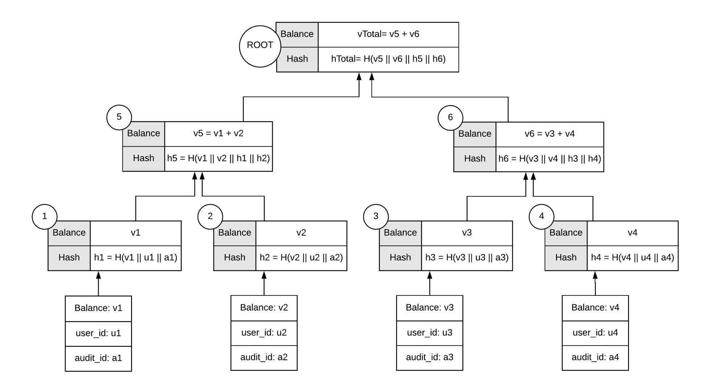

Figure 1.1: A summation tree, based on the corrected version of Maxwell's scheme.

Figure [1.1](#page-15-0) shows a 4 node summation Merkle Tree by applying the fix of [\[DSE\]](#page-50-4) and [\[HZG19\]](#page-50-11).

Maxwell's design allows for a distributed proof checking, where every client verifies his/her balance inclusion in the reported total liabilities, thus, in theory an auditing process could be performed by tolerating a probabilistic auditor-less threat model, where the sole information that gets public (even to the auditor) is the root node.

However, there have been real world use cases, where a third party auditor receives all of the leaves anyway [\[Vid18\]](#page-51-5). If a centralized auditing is to be preferred, Maxwell's scheme can be converted to a regular Merkle tree (we refer to it as Centralized Maxwell) where no summation takes place. Such a design is presented in Figure [1.2,](#page-16-1) where internal nodes do not carry balances, in order to hide sibling amounts from regular users when checking their authentication path. The auditor however will have access to every leaf balance and can just aggregate them to get the reported total value. In some sense, users can verify inclusion of their hash only, but balance aggregation and correctness is only performed by the auditor.

{16}------------------------------------------------

<span id="page-16-2"></span><span id="page-16-1"></span>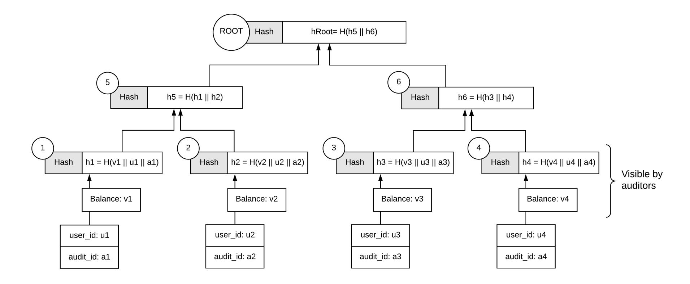

Figure 1.2: A centralized version of Maxwell's scheme.

#### <span id="page-16-0"></span>1.2.2 Random Split Summation Tree based (Split Maxwell+)

Split Maxwell [\[CLMN19\]](#page-49-4) is a modification of the original Maxwell scheme that adds extra privacy guarantees, both on what the auditor and other users learn. Briefly, the idea is to split balances then shuffle all leaves before adding them to the summation tree. Due to splitting, each user will receive multiple authentication paths and although the tree height might grow, less information is exposed by sibling leaves, while the size of user-base is obfuscated. This construction can be applied on top of any scheme, including Maxwell, Maxwell+, Centralized Maxwell and even Provisions.

An interesting property of Split Maxwell+ is that even if someone (i.e., an auditor) gets access to every leaf, this auditor will gain limited information about individual user balances and at the same time the number of leaves grows linearly to the number of splits, which effectively works as a padding mechanism to hide the total number of users. Figures [1.3](#page-17-0) and [1.4](#page-18-1) show an example of balance splitting for 3 users. Briefly, the benefits of Split Maxwell+ are the following:

- Limited exposure of customer balances to the auditor or other customers.
- Identities are fully protected and there is no link between splits of the same balance.
- Padding the total number of customers. In the Centralized Maxwell scheme the auditor has direct access on this number, while in every other solution it could be predicted by the tree height.
- Multiple (subsequent) proofs of solvency cannot be combined to extract any of the above data, because every audit is independent and a different split and shuffling is applied.
- Previously, one could correlate balances between different audits and extract statistical data around specific customer's profit/loss. Split Maxwell+ solves this as its proof applies a new randomized splitting and shuffling.
- Due to the above, this model enables more frequent monitoring. Split Maxwell+ is only recommended if for any reason a complete ZKP-based approach is not available or if an application can tolerate some privacy leak.

{17}------------------------------------------------

#### The main drawbacks include:

- Less efficient proof construction and verification due to requiring larger trees after splitting balances.
- Similarly to the original protocol, the total reported liabilities gets published. In some applications this might not be desirable.
- Due to the above, if such proofs are provided every few weeks or months, one can extract business information by checking updates on the total reported amounts.

<span id="page-17-0"></span>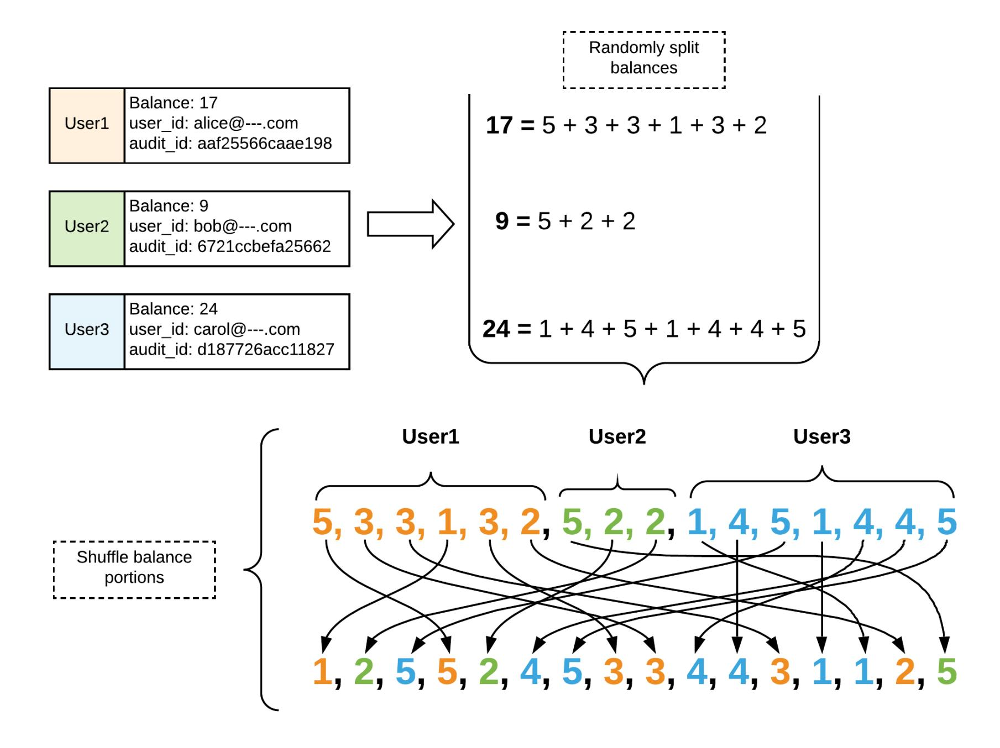

Figure 1.3: Randomly split balances then shuffle, based on Split Maxwell+ scheme.

{18}------------------------------------------------

<span id="page-18-2"></span><span id="page-18-1"></span>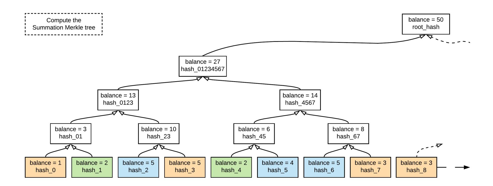

Figure 1.4: Generate summation tree after splitting and shuffling, based on Split Maxwell+.

#### <span id="page-18-0"></span>1.2.3 Range Proof based (Provisions and ZeroLedge)

Dagher et al. [\[DBBCB15\]](#page-50-3) introduced the Provisions protocol which allows Bitcoin exchanges to prove that they are solvent without revealing any additional information. As shown in Figure [1.5,](#page-19-0) the protocol replaces visible balances with homomorphic commitments and relies on range proofs to prevent an exchange from inserting fake accounts with negative balances. Note that although the original Provisions design mainly addresses customer verification without Merkle trees, in this version we present Provisions on top of the Maxwell+ scheme.

While Provisions [\[DBBCB15\]](#page-50-3) focused on both proof of assets and liabilities, a year later, ZeroLedge [\[DSE\]](#page-50-4) proposed a similar design focusing on the liabilities part only. Both systems are very similar, but as they were published before Bulletproofs and other efficient ZKP schemes, the original provided range proofs constructions are less performant, while the proof size was linear to the number of customers. Since in these protocols, one party (the exchange) has to construct many range proofs at once, Bulletproofs or other efficient ZKP schemes is a natural replacement for their NIZK proofs. For instance if we apply the aggregation feature of Bulletproofs, the proof would then be dominated by one commitment per customer, hundreds of times smaller than the original schemes.

Provisions's elegant design offers a number of desirable privacy features:

- The total value of the liabilities is kept secret (from the auditor, public or users).
- Individual balances (i.e., from sibling nodes) are not exposed. Unlike random splitting, Provisions offer full privacy in an acceptable range (i.e., amounts up to 2 <sup>64</sup> − 1), due to the combination of Pedersen commitments and range proofs.
- Similarly to any other scheme, identities are fully protected.
- Multiple (subsequent) proofs of solvency cannot be combined to extract any data about inactive users or how their balances evolved, because every time a different blinding factor and audit id is provided per user.

{19}------------------------------------------------

#### Provisions's main drawbacks include:

- Computationally expensive proof construction and verification due to the extensive use of range proofs. Faster ZKP schemes can speed up the process, but it still might require many hours to compute proofs for dozens of millions of users.
- The total number of users is exposed. Although some padding can be applied by introducing fake clients with zero balance, this is linear to the M axDesiredSize − UserBaseSize, which might be impractical for large M axDesiredSize, i.e., > 2 40 .
- Although the original Provisions paper mentions how to construct tree-based proofs (similarly to Maxwell), it specifically focuses on account balances up to 2 <sup>51</sup> and up to 2 <sup>205</sup> accounts, which works well for Bitcoin. However, the tree-ified version can do much better than the flat list approach, in the sense that it can allow bigger ranges and/or larger number of accounts.

Briefly, if the only limit is size of the underlying group order, under certain system parameters and when numeric ranges in the range proof are close to the underlying group order, the authentication path should always be accompanied by extra range proofs for the product of two sibling commitments in the tree. We address this issue in section [4.5.](#page-45-0)

<span id="page-19-0"></span>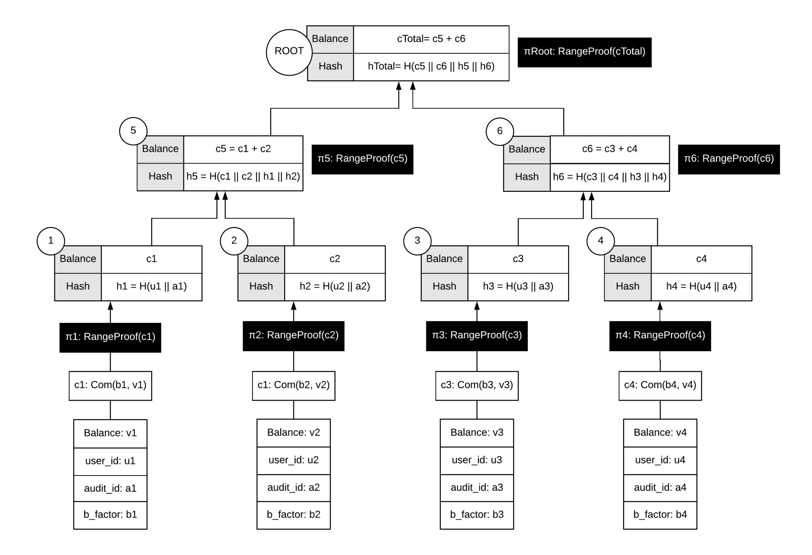

Figure 1.5: Extended customer verification version of Provisions scheme for 4 nodes.

{20}------------------------------------------------

<span id="page-20-2"></span><span id="page-20-1"></span>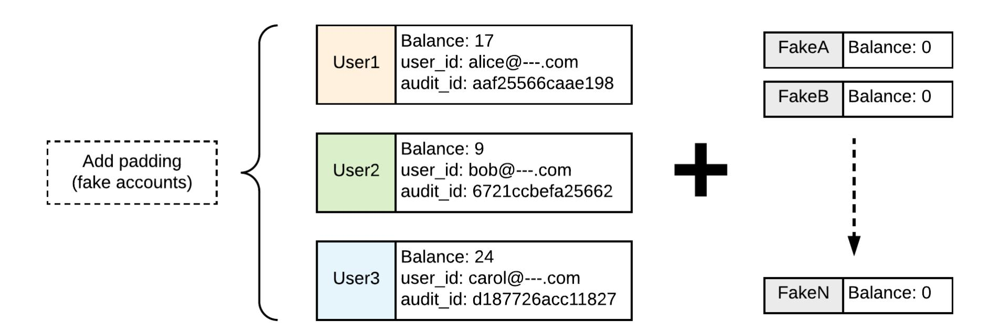

Figure 1.6: Add padding (fake accounts with zero balance) to Provisions scheme.

#### <span id="page-20-0"></span>1.2.4 Deterministic Tree Range Proofs based (DProvisions)

In the ZKProof Community Event in Amsterdam 2019, extensions of the Provisions scheme have been presented and discussed further [\[CLMN19\]](#page-49-4) that equip the protocol with extra security guarantees. The updated scheme, DProvisions, is using a NIZK based range proof system as in Provisions, but combined with a deterministic sparse Merkle tree construction. By utilizing Key Derivation Functions (KDF) on top of VRFs (as shown in Figure [1.7\)](#page-21-0) every audit id and blinding factor is computed deterministically. This offers a number of new privacy and transparency features on tree-based proofs of liabilities.

Most importantly, in non deterministic constructions, a malicious entity can put all of the users that based on some analysis have higher probability of checking their proofs next to each other, and thus statistically, only a small part of the tree might be verified for correctness. We can allow for better dispersion of users' leaves by allowing deterministic shuffles on each audit. This can be achieved by sorting the hash values of the leaves before putting them on the tree. Because the hashes are computed deterministically, due to the properties of VRF, a malicious entity cannot arbitrarily fix the relational ordering of user nodes in the tree. That said, if two or more users work together, they can learn if at least between them, the ordering has been applied correctly. Note that this deterministic ordering is always different between different audit rounds, thus no information can be extracted by subsequent ordering.

{21}------------------------------------------------

<span id="page-21-0"></span>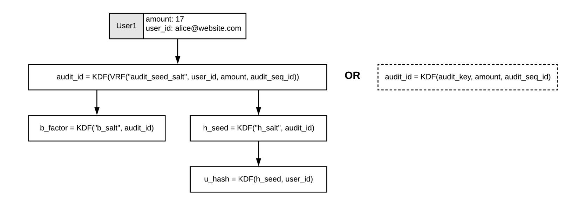

Figure 1.7: Deterministically generate audit\_id for DProvisions.

Another feature of DProvisions is it utilizes sparse Merkle trees with the goal to minimize the number of fake users (with zero balances) if required for padding purposes. Note that padding can help on obfuscating the population size of the user-base. As shown in Figure [1.8,](#page-22-1) padding is only required to the roots of empty sub-trees and thus, we can easily support tree heights that were not previously possible. It is highlighted that the tree height reveals the maximum number of users, thus a tree of height = 40 can probably support most of today's applications. In practice, one can just pick a big enough tree that will work for next x years even in the most promising forecasting scenarios and thus the tree size will never need to be updated; if it did, it might reveal that something changed, i.e., more users (that surpass previous padding size) entered the system.

{22}------------------------------------------------

<span id="page-22-3"></span><span id="page-22-1"></span>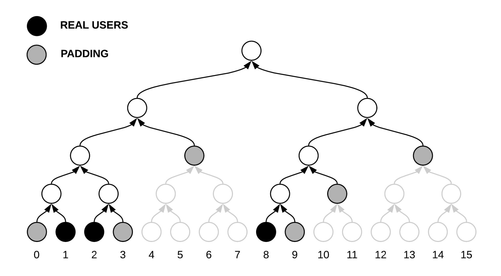

Figure 1.8: Sparse tree generation for DProvisions.

<span id="page-22-2"></span>Padding size in Sparse Trees. Given M, the number of users, assuming it is a power of two: M = 2m, and H, the height of the tree (the number of leaves in the tree can be at most 2 <sup>H</sup>), we estimate the bounds on the number of zero-nodes that we need to add to the tree as follows:

- in the best-case scenario all user nodes occupy the left-most leaves of the tree, therefore filling-in the left-most lowest sub-tree of height m, the zero-nodes then need to be added along the path from the root of this sub-tree to the root, there will be at most (H − m) of them added;
- in the worst-case scenario all users are evenly dispersed in the leaves of the tree, therefore the lowest sub-trees of height (H − m) will have only one node each and will need (H − m) of zero-nodes to be added to produce the roots of the sub-trees, the number of zero-nodes to be added is then at most (H − m) ∗ 2 m.
- thus, the number of nodes to be added "artificially" is at least (H −m) and at most (H −m)∗2 m. Note that if we had to populate the whole tree with zero nodes as was previously suggested, to make the tree complete, the number of zero-nodes would have to be 2 <sup>H</sup>−<sup>1</sup> which could be impractical for H >= 32 or otherwise is significantly larger than the number of zero-nodes to be added by our method.

#### <span id="page-22-0"></span>1.2.5 Secure Enclave based (Trusted Computing)

Decker et al. [\[DGSW15\]](#page-50-12) suggested the idea of using Secure Enclaves technology for protecting correctness of execution and user's privacy at the same time. Their work made use of consumer general purpose processors from Intel and AMD under the names Intel Trusted eXecution Technology 

{23}------------------------------------------------

<span id="page-23-1"></span>(TXT) and AMD Secure Virtual Machine (SVM), but nowadays one could use Intel SGX technology to implement their scheme [\[CLMN19;](#page-49-4) [Che19\]](#page-49-10). Briefly, their proposal is to add privacy to Maxwell's scheme without utilizing zero knowledge proofs, but by running all of the computation in a trusted platform which provides the following features:

- Protected Capabilities: commands which may access shielded locations, areas in memory or registers which are only accessible to the trusted platform. These memory areas may contain sensitive data such as private keys or a digest of some aspect of the current system state.
- Integrity Measurement: the process of measuring the software which is executing on the current platform. A measurement is the cryptographic hash of the software which is executing throughout each stage of execution.
- Integrity Reporting / Remote Attestation: the process of delivering a platform measurement to a third party such that it can be verified to have originated from a trusted platform.

These features of the trusted platform are deployed on consumer hardware in a unit called the Trusted Platform Module (TPM), a secure cryptographic co-processor, which is usually incorporated on the mainboard of the hardware.

Although such a design has the potential of being able to implement any complex logic the main criticism of the enclave-based threat model is related to a) putting too much trust in the hardware vendors and to b) reports of successful side channel attacks that can lead to secret exposure or breaking the remote attestation security guarantees [\[AHIV17\]](#page-49-1).

## <span id="page-23-0"></span>1.3 Privacy Features

Although the most widely method for POL is Maxwell's original protocol, it inherently leaks some information about user accounts and the exchange; it also provides less protection than desired against an adversarial prover. Several of the weaknesses stem from the design providing the prover with the opportunity to make arbitrary decisions in structuring the proof, without revealing those decisions to the verifier. Additionally, auditors might request more extensive investigation, especially for dispute resolution purposes, and sometimes random sampling might be required, to completely meet the requirements of traditional auditing.

Subsequent schemes like Maxwell+, Split Maxwell+, Provisions, and DProvisions solve some of the aforementioned issues but they do not completely eliminate them.

The goal of the final protocol is to satisfy the desirable privacy/security features presented below.

Account Information Leaks. No data about individual users (id or balance) should ever be revealed, even between independent audits.

In Maxwell scheme the proof is structured as a Merkle tree, therefore each verifier learns the balance in their sibling's leaf. Thus in order to mitigate account information leaks, the list of accounts must be randomly shuffled for each new publication of the proof.

Even with shuffling, it is likely that verifiers can discover something about the distribution of

{24}------------------------------------------------

<span id="page-24-0"></span>balances, especially when colluding with one another. Jesse Powell, the CEO of the bitcoin exchange Kraken, has explicitly cited account holder privacy as the primary reason that his company has not implemented the Maxwell Protocol [\[Bra14\]](#page-49-11).

Two methods have been suggested to mitigate this problem: balance splitting and zero knowledge proofs.

In balance splitting, implementation might be easier and more straightforward; information leakage can be mitigated by splitting each account's balance among multiple leaf nodes, and requiring verifiers to check each of their leaves individually. It's true that many real world applications might tolerate this leakage and use Split Maxwell+, but ideally we want to ensure full secrecy of the actual values.

The second option (ZKP-based) completely hides balances by publishing homomorphic commitments, which allow addition without revealing balances.

In theory, both methods can be combined. Although this will result to larger trees, splitting can also work as a padding mechanism to hide the total number of users. The sparse Merkle tree solution of DProvisions provides the same padding property without splitting. However, a combined ZKP and splitting might be helpful if random sampling is required by third party auditors to meet regulation and ensure that at least some leaves have been checked. Using splitting, the auditor will only learn a portion of user's balance.

Exchange Information Leaks. The total liabilities should not be revealed. This requirement is not unlike those imposed on traditional banks [\[FA14;](#page-50-13) [Ste06\]](#page-51-9) and exchanges by regulation [\[CSB14\]](#page-50-14). Note that frequent proofs of solvency expose information on the amount of trading happening in the platform. Imagine that if such proofs are provided every few weeks, one can extract business information on the success of the exchange's business. Thus, it is desirable to have the option to conceal the total liabilities.

Dependence on Complete Account-Holder Verification. The Merkle-tree approach requires that responsibility for verifying both the integrity and the correctness of the proof be distributed to all account holders. Without universal participation, neither can be achieved. In the case of correctness, this is necessary; a distributed proof of correctness is precisely what the scheme aims to achieve. By combining Split Maxwell+ and DProvisions each user will need to verify correctness of multiple authentication paths (computationally more expensive).

Interactive access to the proof. Each account holder receives an individual proof from the exchange containing only the nodes between their own leaf node and the root. In practice, this means that each account holder must request their individual proof, and thereby implicitly reveal to the exchange which leaf (leaves) they are checking.

A malicious prover can use this information to omit users who rarely or never check their inclusion proofs. Mechanisms to protect against this leak are advisable.

Independent Verification Tool. We note that if a user does verify their account, they should use a verification tool other than one provided by the exchange itself; such a tool could be automated 

{25}------------------------------------------------

<span id="page-25-0"></span>to increase participation. This is to ensure that the verification software verifies the proof correctly. Ideally the outcome of this proposal will priovide a reference implementation and eventually independent services and apps will have support for proof verification.

Number of users. In both Provisions and Maxwell schemes, the number of customers gets revealed. This information can be used to learn how an exchange is progressing and thus it is desirable to obfuscate it or completely hide it if possible. DProvisions allows for an efficient padding mechanism to achieve a pre-defined upper bound. The latter seems to meet the privacy and efficiency requirements of today's applications.

Implementation issues. Ideally, exchanges should not expose customer information to the auditor (including individual balances), unless it is required for dispute resolution and routine sampling. That said, Maxwell's scheme was originally designed to work in a decentralized auditor-less environment, but in practice, former real-world applications of the scheme revealed individual balances to the auditor, not only the root. An example is the Iconomi case [\[Vid18\]](#page-51-5) in which the auditor received the full Merkle trees (balances and hashes only, so no user data was shared) and checked all balances and hashes up to the root node. The auditor was indeed able to check that there were no negative balances and that all nodes were summed and hashed correctly. They also listed the root node hashes publicly, meaning if Iconomi ever tried to change any balances or add or remove users in these trees, it would be publicly known. Another issue with this approach is that they used the original Maxwell protocol, which has been proven to have a flaw that allows hiding values within the tree.

Subsequent audits. The liabilities proof mainly consists of a commitment to each customer's balance and a proof that said balance is within a range. For all new users and users whose balance changed the commitment the proof needs to be redone. For the other users, it is not technically necessary to redo the proof. However, not changing the proofs for customers whose balance remained unchanged will leak how many users were actively using their account between the two proofs. If the complete proof were regenerated, then this information would remain private. If an exchange were to accept this privacy leak it could drastically reduce the size of the proof updates, but it is not advisable.

Dispute resolution. None of the protocols in literature provide dispute resolution. If a user finds their account missing or balance incorrect, they do not have sufficient cryptographic evidence that this is the case. Recall that the primary motivation for users keeping funds with an exchange is to avoid needing to remember long-term cryptographic secrets, therefore exchanges must be able to execute user orders and change their balance without cryptographic authentication from the user (e.g., password authentication). Users who dislike an exchange may also falsely claim that verification of their accounts failed, and it is not possible to judge if the user or the exchange is correct in this case based on a Provisions transcript alone.

Although the issue appears unsolvable cryptographically, one can use conventional mutual contract signing for every single transaction that touches the user's account, then one can reveal these signatures, sum up the values and use this as an evidence in case of dispute. Ideally, the audited company should push signatures to user's email or phone number, and not serve it by request via a website. The aforementioned is required to defend against deleting 'evidence' on purpose.

{26}------------------------------------------------

# <span id="page-26-3"></span><span id="page-26-0"></span>Chapter 2. Applications

This chapter aims to enlist potential real-world applications of the DAPOL proposal, either as a cryptographic primitive which should be combined with other tools or as a stand-alone service.

Note that all of the applications, whether they use accounting balances or other types of fungible values, have exactly the same requirement. A prover should provide a proof a total liabilities or obligations or "negative" votes in a way that every user whose value/balance should be included in the aggregated liabilities can transparently verify his/her inclusion in the proof, ideally without learning any information about other users' balances.

### <span id="page-26-1"></span>2.1 Proofs of Solvency

A proof of solvency [\[Bit13;](#page-49-12) [Cam14;](#page-49-13) [CLMN19;](#page-49-4) [DBBCB15;](#page-50-3) [DSE;](#page-50-4) [Gan17;](#page-50-15) [Wil14\]](#page-51-3) is used as a public proof to verify that a custodial service does not run as a fractional reserve, e.g., some of the customer assets could not be withdrawn in a given moment. Maxwell's protocol is already used by some Bitcoin exchanges to prove that they still have the assets that the customers have deposited.

A proof of solvency is checking whether liabilities ≤ reserves and it consists of two components, proof of liabilities and proof of reserves. It's already mentioned across this proposal that DAPOL is a proof of liabilities system and because the liabilities are independent on the blockchain technology used at the reserves part, it can be used by any blockchain exchange and custodial wallet to transparently prove solvency.

# <span id="page-26-2"></span>2.2 Disapproval Voting

The term negative voting is sometimes used for allowing a voter to reject the entire field of candidates; it can also mean that the only option offered voters is to vote against one or more candidates, but it is sometimes used for systems that allow a voter to choose whether to vote for or against a candidate. In our context, a negative (or disapproval) vote is a vote against a candidate, proposal or service and is either counted as minus one or it supports weights. Unlike most electoral systems, it requires that only negative measures or choices be presented.

One of the most interesting instances of negative voting is expressing disapproval in a system (i.e., referendum) or a service (i.e., negative feedback for hotels or restaurants). All of the above cases share the fact that there is no incentive for the prover to increase the amount of these votes.

DAPOL can be used as a primitive to support disapproval voting in a distributed manner, where every candidate receives negative votes and stores them in his/her local ledger. Ideally, there is no need for a central authority or web-service to receive votes, audit and oversee the process. If a malicious entity tries to cheat by not including some votes, then a voter can always check his/her inclusion in the reported result.

There might be use cases where the total reported amount should stay hidden and only be used in comparison to another homomorphic commitment, i.e., to sort candidates without learning their

{27}------------------------------------------------

actual voting percentage difference. An example would be an election system where competing parties compare their pedersen commitments without revealing their actual number of negative votes (i.e., by using MPC to produce a range proof of their number of votes difference).

It is highlighted that voting systems are a complex system in themselves and need to satisfy other properties as well, including coercion and bribery. Thus, DAPOL should be combined with other cryptographic tools for a complete solution depending on the requirements of the polling voting system. For instance, users should definitely receive a signed receipt whenever they vote against and use this as an evidence in case of dispute. Similarly, to disallow sybil attacks, one might need to implement a double voting prevention mechanism.

## <span id="page-27-0"></span>2.3 Negative Reviews

Negative reviews in rating platforms (i.e., for hotels, restaurants, electronics etc) can be considered an instance of disapproval voting. In an ideal distributed system, each seller or manufacturer could receive negative votes about the quality of product or services and be obliged to publish a report on the total number of received low ratings.

Obviously, one can cheat by omitting some or all of the negative votes with the risk of getting caught. Note that there is no need for a central authority or website to run a disapproval tracking service, because this theoretical design is completely decentralized.

Using DAPOL everyone can check that their vote has been included in the reported total number, then compare the outcome against a pre-defined threshold. Obviously, for a complete system, a sybil attack protection mechanism should also be employed.

# <span id="page-27-1"></span>2.4 Fundraising and ICO

Fundraising is the process of seeking and gathering voluntary financial contributions by engaging individuals, businesses, charitable foundations, or governmental agencies. Although fundraising typically refers to efforts of gathering money for non-profit organizations, it is sometimes used to refer to the identification and solicitation of investors or other sources of capital for for-profit enterprises.

One of the issues with the current donation system is there is no easy way for the platform/charity that aggregates user money transfers to prove that all user contributions are included in the total reported amount. Also, official auditing in fundraising activities via donations is not always applied, thus many donors might worry "is my contribution actually taken into account?". DAPOL can actually increase both transparency and privacy of fundraising activities and as a result increase trust and participation from users.

# <span id="page-27-2"></span>2.5 Revenue Reports

For tax audit purposes, businesses have to report revenue at regular intervals. Imagine if every citizen/buyer could automatically contribute on verifying tax liabilities proof for every commercial company.

{28}------------------------------------------------

Obviously, DAPOL could be complementary to the current auditing system, but it can offer extra privacy guarantees for the regular user, as the government or IRS would not necessarily need to track individual receipts to crosscheck correctness of the accounting reports.

### <span id="page-28-0"></span>2.6 Syndicated Loans

A syndicated loan is offered by a group of lenders who work together to provide credit to a large borrower. The borrower can be a corporation, an individual project, or a government. Each lender in the syndicate contributes part of the loan amount, and they all share in the lending risk. One of the lenders acts as the manager (arranging bank), which administers the loan on behalf of the other lenders in the syndicate.

In some contexts where extra privacy is required, there might be a situation where lenders should not necessarily know the contribution of other lenders. At the same time, the arranging bank might be liable if it reports fake total contribution. DAPOL can be a good candidate cryptographic tool for such scenarios.

## <span id="page-28-1"></span>2.7 Lottery Prizes

Lotteries are tightly controlled, being restricted or at least regulated in most places. However, there have been reports for rigged jackpots and large-scale fraud scandals and it's true that fairness is difficult to demonstrate even for genuine lotteries.

Using blockchain technology and smart contracts, players can actually know and trust the probability and revenue distribution, before a game is even played. In traditional lotteries though we require third party auditors to ensure that the reported total pot is correctly computed. Actually, in many lottery games, each user is contributing to the final prize based on the amount bet. A system like DAPOL can add an extra safety net; the prize pool is actually a liability and the organizer does not have any incentive to increase it. Thus, DAPOL can transparently hide individual contributions and/or only reveal the total prize amount to the winners only.

## <span id="page-28-2"></span>2.8 Credit Score and Financial Obligations

A credit score is a number that represents an assessment of the creditworthiness of a person, or the likelihood that the person will repay his or her debts. Credit scores are generated based on the statistical analysis of a person's credit report. In addition to its original purpose, credit scores are also used to determine insurance rates and for pre-employment screening.

Usually these services are centralized and credit bureaus such as Experian, Equifax and TransUnion maintain a record of a person's borrowing and repaying activities.

Using DAPOL, a new distributed credit system of financial obligations can be formulated, where users maintain their credit score without requiring a third tracking party. Such a system would probably be less invasive and more private. Additionally, if we combine DAPOL with other cryptographic

{29}------------------------------------------------

<span id="page-29-2"></span>primitives (i.e., SMPC), employers as well as lenders can compare credit reports without revealing their actual values.

## <span id="page-29-0"></span>2.9 Referral Schemes

A referral website is an Internet address or hostname used to get a visitor to another site (referring). A visitor has clicked a hyperlink on the referral website, which leads to the website where he/she is located now.

The referral industry is usually monetizing by introducing fees; the referring website should pay back the referrer. However in many cases, i.e., in gambling websites, the fee is linked with the user's activity, for instance registration or depositing funds. Unfortunately, the referral party has to blindly trust the report from the referring website to receive the fair payback fee.

A similar scenario is referral fees in the real estate business, where fees are charged by one agent or broker to another for a client referred.

DAPOL can provide an extra layer of transparency in the referrals business; if users get used to this model and they have incentives [\[CGGN17\]](#page-49-14) or an automatic way to check inclusion proofs, a reporting entity might be caught if they report fake or skewed numbers.

### <span id="page-29-1"></span>2.10 Official Liability Reports

During epidemics and pandemics, affected health agencies and local authorities report official numbers of infections and fatalities caused by a virus or bacteria. The same is applied at a micro-scale (i.e., cities, hospitals) for various diseases. Similarly, companies need to report work accidents per period, while authorities publish unemployment rates at a regular basis. The common element between all of the above is the official reported numbers can be simulated to liabilities and obligations.

One example use case is the recent 2019–20 coronavirus pandemic (COVID-19), caused by severe acute respiratory syndrome coronavirus 2 (SARS-CoV-2). The outbreak was first identified in Wuhan, Hubei, China, in December 2019, and was recognized as a pandemic by the World Health Organization (WHO) on 11 March 2020. Transparency, timely information and accurate reports are very important on drawing conclusive insights from the mortality trajectories to avoid delays on preparing the health facilities and properly defend against the pandemic side-effects.

DAPOL can be used as a complementary tool for communities, hospitals and other organizations to leverage the technology and allow individuals to privately verify. Although a complete solution requires a well-documented approach, roughly, the idea is that each person detected with the virus could get a signed response from local authorities or medical center. Then, on each day, the corresponding organization or authority publishes a Merkle tree, where each leaf corresponds to one person (or a number of people if multiple cases are reported in bulk i.e., when hospitals update/report to a central database).

Then, infected people can check their inclusion in the tree, while organizations can cross-compare their numbers without even disclosing the actual amounts; although we expect that in this particular use case, the total reported amount (Merkle root) should be public. Note that such a tool will help

{30}------------------------------------------------

#### Applications

these organizations to identify pitfalls in their internal processes. Obviously, this naive approach can be enhanced by combining DAPOL with other privacy preserving and data analysis techniques and we hope to get precious feedback from the community to accommodate that.

{31}------------------------------------------------

# <span id="page-31-0"></span>Chapter 3. PoL Definitions and Algorithms

#### <span id="page-31-1"></span>3.1 Basic PoL Algorithms

A proof of liabilities scheme PoL can be naturally described using several algorithms run by the prover, auditor and the users at different stages of the process.

 $(TL, aud) \leftarrow \mathsf{AuditSetup}(\mathcal{ACCS})$ . The AuditSetup algorithm takes as input a list of accounts denoted by  $\mathcal{ACCS}$  and outputs the total liabilities as well as material required for the audit aud. This includes both private and public materials which we denote by  $aud = (aud_{pk}, aud_{sk})$ . For simplicity, we let each account in  $\mathcal{ACCS}$  be a tuple (uid, bal) where uid is a unique user identifier associated with the account and bal is the current balance for the account used in the proof of liabilities.

 $(\Pi_{aud}) \leftarrow \text{AuditorProve}(aud)$ . The AuditorProve algorithm takes as input the audit material aud output by the AuditSetup and a proof of liability  $\Pi_{aud}$  to be verified by the auditor. The proof intends to show that the claimed total is consistent with the public component of the setup  $aud_{pk}$ .

 $\{0,1\} \leftarrow \mathsf{AuditorVerify}(TL, aud_{pk}, \Pi_{aud})$ . The  $\mathsf{AuditorVerify}$  algorithm takes as input the declared total liabilities TL, the public audit material  $aud_{pk}$  and the proof  $\Pi_{aud}$ . It outputs 1 if the verification passes and 0 otherwise.

 $\pi_{uid} \leftarrow \mathsf{UserProve}(uid, aud)$ . The  $\mathsf{UserProve}$  algorithm takes as input the unique user identifier uid for a particular user and the audit material and outputs a user specific proof  $\pi_{uid}$ .

 $\{0,1\} \leftarrow \mathsf{UserVerify}(uid, aud_{pk}, \pi_{uid}, bal)$ . The  $\mathsf{UserVerify}$  algorithm takes as input, the user identifier uid and its balance bal, the public audit material  $aud_{pk}$  and a proof  $\pi_{uid}$ , and ouputs 1 if the proof verifies and 0 otherwise.

**Security.** The notion of security we propose for proof of liabilities is probabilistic in nature. In particular, we bound the probability that a malicious prover can eliminate more than t user balances from the total liabilities using a function  $\delta(c,t)$ , given that the AuditorVerify outputs 1 and UserVerify outputs 1 for a uniformly chosen fraction c of total balances in  $\mathcal{ACCS}$ . More formally:

<span id="page-31-2"></span>**Definition 4** (PoL Security). A proof of liabilities scheme PoL is  $\delta(c, t)$ -secure for the set of accounts  $\mathcal{ACCS}$ , if for every 0 < c < 1 and every  $S \subset \mathcal{ACCS}$  of size t, for a randomly chosen set of users  $U = \{u_1, \ldots, u_k\} \subset \mathcal{ACCS}$  where  $k = c|\mathcal{ACCS}|$ ,

$$\begin{split} &\Pr\Big[\mathsf{AuditorVerify}(aud_{pk},\Pi_{aud})\\ &\bigwedge_{i=1}^{k}\mathsf{UserVerify}(u_i,aud_{pk},\pi_{u_i})\\ &\bigwedge TL' < liab(\mathcal{ACCS} \setminus S)\\ &\left| (TL',(aud_{pk},aud_{sk})) \leftarrow \mathsf{AuditSetup};\Pi_{aud} \leftarrow \mathsf{AuditorProve};\pi_{u_i} \leftarrow \mathsf{UserProve}(u_i,aud) \ for \ u_i \in U \right]\\ &< \delta(c,t) \end{split}$$

where liab(A) denotes the total liabilities of balances in the set A and the probability is over the randomness in choosing U and the coin tosses of the various algorithms.

{32}------------------------------------------------

**PoL Privacy.** We consider privacy guarantees against dishonest users and a dishonest auditor separately.

An auditor who does not collude with any users only sees the public portion of the audit material  $aud_{pk}$ , the total liabilities, as well as the proof provided by the prover i.e.  $\Pi_{aud}$ . We refer to this as the auditor's view in a real execution of the PoL scheme and denote it by  $\mathsf{View}^{Auditor}_{\mathsf{PoL}}(\mathcal{ACCS})$ . We then require that this view can be simulated by a PPT simulator that does not see the information in  $\mathcal{ACCS}$  and only has access to leakage function  $L(\mathcal{ACCS})$  which depends on the particular scheme. Examples of such leakage functions are  $|\mathcal{ACCS}|$  and  $liab(\mathcal{ACCS})$ . More formally:

**Definition 5** (Auditor Privacy). A proof of liabilities scheme PoL is L-private against a dishonest auditor, if for every PPT auditor  $\mathcal{A}$ , there exists a PPT simulator  $\mathsf{SIM}_{\mathcal{A}}$  such that the following distributions are computationally indistinguishable

$$\mathsf{View}^{\mathcal{A}}_{\mathsf{PoL}}(\mathcal{ACCS}) \approx \mathsf{SIM}_{\mathcal{A}}(1^{\lambda}, L(\mathcal{ACCS}))$$

A subset of users  $U = \{u_1, \ldots, u_n\}$ , who can collude among each other, get to see the public audit material  $aud_{pk}$ , those users' balances i.e. tuples of the form  $Bal_U = \{(u_i, bal_i)\}_{i=1}^n$  as well as the set of proofs generated by the prover i.e.  $\{\pi_{u_1}, \ldots, \pi_{u_n}\}$ . We refer to this the adversary's *view* in the real execution of the PoL scheme and denote it by  $\mathsf{View}_{\mathsf{PoL}}^{\mathcal{A}_U}(\mathcal{ACCS})$  where  $\mathcal{A}_U$  denotes an adversary who controls the users in U. We then require that this view can be simulated by a PPT simulation that only sees the balances of users in U as well as a leakage function  $L(\mathcal{ACCS})$  which depends on the particular scheme. More formally:

**Definition 6** (User Privacy). A proof of liabilities scheme PoL is L-private against dishonest users if for every subset of users  $U = \{u_1, \ldots, u_n\}$ , and every PPT adversary  $A_U$  who corrupts the users in U, there exists a PPT simulator  $\mathsf{SIM}_{\mathcal{A}}$  such that the following distributions are computationally indistinguishable

$$\mathsf{View}^{\mathcal{A}_U}_{\mathsf{PoL}}(\mathcal{ACCS}) \approx \mathsf{SIM}_{\mathcal{A}}(1^{\lambda}, \mathcal{ACCS}[U], L(\mathcal{ACCS}))$$

where  $\mathcal{ACCS}[U]$  is the set of  $(uid, bal_{uid})$  for all  $uid \in U$ .

{33}------------------------------------------------

# <span id="page-33-0"></span>3.2 Centralized Maxwell+

```
AuditSetup(ACCS)
1: Randomly shuffle the tuples in ACCS, record the new location of each tuple after the shuffle as
   its leaf index and append the index to the tuple, i.e. update the tuple to (uid, baluid, indexuid).
2: For every (uid, bal, index) ∈ ACCS, let com ← commit(uid; r) using fresh random-
   ness r, let h ← H(baluid||indexuid||com), and append com, h, r to the tuple to get
   (uid, bal, index, com, r, h). Denote the new augmented set of tuples by ACCS0
                                                                                 .
3: Let d = dlog2
                 |ACCS0
                        |e. Create a full binary tree of depth d where we store the information
   for nodes at depth i in an array Di
                                      [1 . . . 2
                                             i
                                              ]. Let T L ← 0.
4: For all 1 ≤ j ≤ 2
                     d
                      , if a tuple (uid, bal, j, com, r, h) is present in ACCS0
                                                                           , let Dd[j] ← h and
   T L ← T L + bal. If not, let Dd[j] ← 0
                                         λ
5: for i = d − 1 to 1 do
6: for j = 1 to 2
                     i do
7: Retrieve hL = Di+1[2j − 1] and hR = Di+1[2j] and let Di
                                                                    [j] ← H(hL||hR).
8: end for
9: end for
10: Output aud =

                    audpk = (T L, D1), audsk = (D2, . . . Dd, ACCS0
                                                                  )

                                                                    .
```

Figure 3.1: Setup for Qbasic SuMT

{34}------------------------------------------------

```
AuditorProve(aud)
 1: For every tuple (uid, bal, index, com, r, h) \in \mathcal{ACCS}', append the tuple (bal, index, com)
    to \Pi_{aud}.
 2: Output \Pi_{aud}
AuditorVerify(TL, aud_{pk}, \Pi_{aud})
 1: Let total = 0, D'_1[], \ldots, D'_d[] be empty arrays. For every tuple (a, index, com) \in \Pi_{aud}
    verify that a > 0. If not output 0 and abort. Otherwise, let total \leftarrow total + a and
    D'_d[index] \leftarrow H(a||index||com).
 2: Check if total \stackrel{?}{=} TL and output 0 if it fails.
 3: for i = d - 1 to 1 do
        for j = 1 to 2^i do
 4:
             Retrieve h_L = D'_{i+1}[2j-1] and h_R = D'_{i+1}[2j] and let D'_i[j] \leftarrow H(h_L||h_R).
 5:
         end for
 6:
 7: end for
 8: Check if D_1[1] \stackrel{?}{=} D_1'[1]. If not output 0, else output 1.
UserProve(uid, aud)
 1: Append the tuple (uid, bal, index, com, r, h) \in \mathcal{ACCS}' associated with uid to \pi_{uid}.
 2: Append (d, D_d[index]) to \pi_{uid}
 3: for i = d to 1 do
        if (index \mod 2) \stackrel{?}{=} 1 then
 4:
             Append (i, D_i[index + 1]) to \pi_{uid}
 5:
            index \leftarrow (index + 1)/2
 6:
 7:
        else
             Append (i, D_i[index - 1]) to \pi_{uid}
 8:
            index \leftarrow index/2
 9:
        end if
10:
11: end for
12: output \pi_{uid}
UserVerify(uid, aud_{pk}, \pi_{uid}, bal)
 1: Retrieve (uid, bal, index, com, r, h) from \pi_{uid}
 2: verify the commitment given com, uid, r.
 3: Retrieve (d, val) from \pi_{uid}. Check that val \stackrel{?}{=} H(bal||index||com). If not, output 0.
 4: hash \leftarrow val
 5: for i = d to 1 do
        Retrieve (i, val) from \pi_{uid}
 6:
        if (index \mod 2) \stackrel{?}{=} 1 then
 7:
             hash \leftarrow H(hash||val), index \leftarrow (index + 1)/2
 8:
 9:
         else
             hash \leftarrow H(val||hash), index \leftarrow index/2
10:
         end if
11:
12: end for
13: Check hash \stackrel{?}{=} D_1[1]. If not output 0, else 1.
```

Figure 3.2: Prove and Verify algorithms for  $\prod_{\mathsf{SuMT}}^{\mathsf{basic}}$ 

{35}------------------------------------------------

# <span id="page-35-0"></span>3.3 Distributed Maxwell+

```
AuditSetup(ACCS)
1: Randomly shuffle the tuples in ACCS, record the new location of each tuple after the shuffle as
   its leaf index and append the index to the tuple, i.e. update the tuple to (uid, baluid, indexuid).
2: For every (uid, bal, index) ∈ ACCS, let com ← commit(uid; r) using fresh random-
   ness r, let h ← H(baluid||indexuid||com), and append com, h, r to the tuple to get
   (uid, bal, index, com, r, h). Denote the new augmented set of tuples by ACCS0
                                                                                 .
3: Let d = dlog2
                 |ACCS0
                        |e. Create a full binary tree of depth d where we store the information
   for nodes at depth i in an array Di
                                      [1 . . . 2
                                             i
                                              ]. Let T L ← 0.
4: For all 1 ≤ j ≤ 2
                    d
                     , if a tuple (uid, bal, j, com, r, h) is present in ACCS0
                                                                           , let Dd[j] ← (h, bal)
   and T L ← T L + bal. If not, let Dd[j] ← (0λ
                                                , 0)
5: for i = d − 1 to 1 do
6: for j = 1 to 2
                     i do
7: Retrieve (hL, balL) = Di+1[2j − 1] and (hR, balR) = Di+1[2j]
8: Let Di
                 [j] ← (H(balL||balR||hR||hL), balL + balR).
9: end for
10: end for
11: Output aud =

                    audpk = (T L, D1), audsk = (D2, . . . Dd, ACCS0
                                                                  )

                                                                    .
```

Figure 3.3: Setup for Qdist SuMT

{36}------------------------------------------------

```
UserProve(uid, aud)
 1: Append the tuple (uid, bal, index, com, r, h) ∈ ACCS0
                                                       associated with uid to πuid.
 2: for i = d to 1 do
 3: if (index mod 2) ?= 1 then
 4: Append (path, i, Di
                             [index]) and (sib, i, Di
                                                  [index + 1]) to πuid
 5: index ← (index + 1)/2
 6: else
 7: Append (path, i, Di
                             [index]) and (sib, i, Di
                                                  [index − 1]) to πuid
 8: index ← index/2
 9: end if
10: end for
11: output πuid
UserVerify(uid, audpk, πuid, bal)
 1: Retrieve (uid, bal, index, com, r, h) from πuid
 2: verify the commitment given com, uid, r.
 3: Retrieve (path, d,(hp, balp)) from πuid. Check that hp
                                                           ?= H(balp||index||com) and
   bal ?= balp. If not, output 0.
 4: for i = d to 2 do
 5: Retrieve (path, i,(hp, balp)) and (sib, i,(hs, bals)), (path, i − 1,(h, bal)) from πuid.
 6: Check that balp, bals > 0 and bal ?= balp + bals. Output 0 if not.
 7: if (index mod 2) ?= 1 then
 8: Check if (h
                     ?= H(hp||hs) and output 0 if not.
 9: index ← (index + 1)/2
10: else
11: Check if h
                    ?= H(hs||hp), and output 0 if not.
12: index ← index/2
13: end if
14: end for
15: Output 1.
```

Figure 3.4: Prove and Verify algorithms for Qdist SuMT

### <span id="page-36-0"></span>3.4 Basic Tree-Provisions and DProvisions

In this solution we use summation Merkle tree but instead of using the balances in plaintext, they will be committed to using a Pedersen commitment, which allows for homomorphic addition and efficient range proofs.

{37}------------------------------------------------

#### AuditSetup(ACCS)

- <span id="page-37-0"></span>1: Randomly shuffle the tuples in ACCS, record the new location of each tuple after the shuffle as its leaf index and append the index to the tuple, i.e. update the tuple to (uid, baluid, indexuid).
- 2: For every (uid, bal, index) ∈ ACCS, let R ← H(uid; r) using fresh randomness r, let P com = g balh <sup>R</sup>, and h ← H(index||P com), and append h, P com, r to the tuple to get (uid, bal, index, h, P com, r, R). Denote the new augmented set of tuples by ACCS<sup>0</sup> .
- 3: Let d = dlog<sup>2</sup> |ACCS<sup>0</sup> |e. Create a full binary tree of depth d where we store the information for nodes at depth i in an array D<sup>i</sup> [1 . . . 2 i ]. Let T L ← 0.
- 4: For all 1 ≤ j ≤ 2 d , if a tuple (uid, bal, j, h, P com, r, R) is present in ACCS<sup>0</sup> , let Dd[j] ← (h, P com, bal, R) and T L ← T L + bal. If not, let Dd[j] ← (0<sup>λ</sup> , P com(0, r<sup>0</sup> ), 0, r<sup>0</sup> )
- 5: for i = d − 1 to 1 do
- 6: for j = 1 to 2 <sup>i</sup> do
- 7: Retrieve (hL, P comL, balL, RL) = Di+1[2j − 1] and (hR, P comR, balR, RR) = Di+1[2j]
- 8: Let D<sup>i</sup> [j] ← (H(P comL||P comR||hL||hR), P com<sup>L</sup> ⊗ P comR, bal<sup>L</sup> + balR, R<sup>L</sup> + RR).
- 9: end for
- 10: end for
- 11: Output aud = audpk = (T L, D1), audsk = (D2, . . . Dd, ACCS<sup>0</sup> ) .

Figure 3.5: Setup for Qzk SuMT

{38}------------------------------------------------

```
UserProve(uid, aud)
 1: Append the tuple (uid, bal, index, h, Pcom, r, R) \in \mathcal{ACCS}' associated with uid to \pi_{uid}.
 2: for i = d to 1 do
        if (index \mod 2) \stackrel{?}{=} 1 then
 3:
            Retrieve (h_L, Pcom_L, bal_L, R_L) = D_i[index] and (h_R, Pcom_R, bal_R, R_R) =
 4:
    D_i[index+1]
            Compute the range proof \pi_{Pcom_R}^+ using bal_R, R_R.
 5:
            Append (path, i, h_L, Pcom_L) and (sib, i, h_R, Pcom_R, \pi_{Pcom_R}^+) to \pi_{uid}
 6:
            index \leftarrow (index + 1)/2
 7:
        else
 8:
            Retrieve (h_L, Pcom_L, bal_L, R_L) = D_i[index - 1] and (h_R, Pcom_R, bal_R, R_R) =
 9:
    D_i[index]
            Compute the range proof \pi_{Pcom_L}^+ using bal_L, R_L.
10:
            Append (path, i, h_R, Pcom_R) and (sib, i, h_L, Pcom_L, \pi_{Pcom_L}^+) to \pi_{uid}
11:
            index \leftarrow index/2
12:
        end if
13:
14: end for
15: output \pi_{uid}
UserVerify(uid, aud_{pk}, \pi_{uid}, bal)
 1: Retrieve (uid, bal, index, h, Pcom, r, R) from \pi_{uid}
 2: verify that R \stackrel{?}{=} H(uid||r) and R, bal is a valid opening for Pcom
 3: Retrieve (path, d, h_p, Pcom_p) from \pi_{uid}. Check that h_p \stackrel{?}{=} H(index||Pcom). If not,
    output 0.
 4: for i = d to 2 do
        Retrieve (path, i, h_p, Pcom_p) and (sib, i, h_s, Pcom_s, \pi_{Pcom_s}^+), (path, i - 1, h, Pcom)
 5:
    from \pi_{uid}.
        Verify \pi_{Pcom_s}^+ and check that Pcom \stackrel{?}{=} Pcom_p \otimes Pcom_s. Output 0 if not.
 6:
        if (index \mod 2) \stackrel{?}{=} 1 then
 7:
            Check if (h \stackrel{?}{=} H(Pcom_s||Pcom_p||h_s||h_p) and output 0 if not.
 8:
            index \leftarrow (index + 1)/2
 9:
10:
        else
            Check if h \stackrel{?}{=} H(Pcom_s||Pcom_p||h_s||h_p), and output 0 if not.
11:
12:
            index \leftarrow index/2
        end if
13:
14: end for
15: Output 1.
```

Figure 3.6: Prove and Verify algorithms for  $\prod_{\mathsf{SuMT}}^{\mathsf{zk}}$ 

Here is a list of basic API we need for Pedersen commitments and the accompanying range proofs:

```
1. ADD(r, s) for scalar r, s
```

2.  $Com(m,r) = g^m h^r$ 

{39}------------------------------------------------

- 3. V erify(c, m, r) = (c ?= mmh r )
- 4. Com(m1, r1) ⊗ Com(m2, r2) = Com(m<sup>1</sup> + m2, r<sup>1</sup> + r2)
- 5. P rove(com(m, r), m, r) → π + Com(m,r) . This is the range proof for a fixed range.
- 6. V erify(Com(m, r), π<sup>+</sup> Com(m,r) ) which outputs 1 if and only if range > m > 0

{40}------------------------------------------------

# <span id="page-40-0"></span>Chapter 4. DAPOL Specifications

### <span id="page-40-1"></span>4.1 Structure of Summation Tree

<span id="page-40-2"></span>DAPOL is utilizing the DProvisions (section [1.2.4\)](#page-20-0) approach of deterministic sparse Merkle trees. The complete proof is a full binary summation tree of height H, where the leaf data is generated from user's account data by applying a deterministic function for the creation of a unique audit id and blinding factor per user. A user's audit id is sometimes called a nonce in the literature. Figure [4.1](#page-40-2) shows the full process for the generation of b\_f actor (blinding factor ) and h (user's leaf hash).

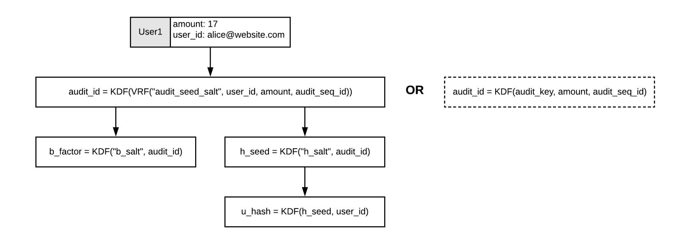

Figure 4.1: Deterministically generate audit\_id for DAPOL.

As already mentioned, H = 40 is a reasonable option in order to obfuscate the total number of users up to 2 <sup>40</sup>, but one can use any height that meet the privacy requirements of the corresponding application. Accordingly, each user will receive an authentication path of 40 nodes and thus it is advisable that the selected ZKRP system is as succinct as possible to minimize the verification cost.

The complete tree should be kept private by the audited entity in order to protect the privacy of its users. Only the root node should be published, preferably in an immutable public bulletin board (i.e., one or more blockchains) and each individual user should securely and privately receive their own partial proof tree (authentication path). We highlight the importance of publishing only one root node to ensure every user has exactly the same view of the reported proof of liabilities commitment.

{41}------------------------------------------------

<span id="page-41-0"></span>

Figure 4.2: Sparse tree for 3 nodes in DAPOL.

Note that the binary tree does not necessarily need to be a full tree and can in theory have any shape. Huffman trees have also been recommended to minimize the information leakage against no-padded trees, as close to half the remaining balance will be on each child, but this may cause very deep trees.

The fixed-height sparse tree solution (Figure [4.2\)](#page-41-0) was selected a) to have a consistent and fair authentication path length for every user and b) to provide better estimates on population size exposure up to a certain limit, even when users collude between themselves, see padding discussion in section [1.2.4.](#page-22-2)

A note on deterministic scattering/placement algorithm. Ideally, we need a random scattering algorithm to place user leaves in the tree, which is both unique and deterministic. This might be important in full audits, in order to prove that indexes were not manipulated by the prover (i.e., putting those who regularly check their inclusion proofs next to each other with the aim to corrupt parts of the tree that with high probability will not be checked).

There are a few options regarding deterministic shuffling and picking leaf indexes in the tree. A straightforward way is to always use VRFs for computing audit ids, then order users based on their unique and deterministic u\_hash value. After ordering, we need to randomly place/scatter them in the tree and then deterministically compute the padding nodes based on the output distribution (again by using VRFs that take as an input the "fake" node index).

Assuming there are S users and the tree supports up to L leaves (thus, its height is logL), if S << L and the collision probability of the truncated hashes up to logL bits is negligible, then the index per 

{42}------------------------------------------------

user is defined by u\_hash truncated to logL bits.

The above works fine for the popular CRH hash functions like SHA2 and SHA3 for height = 256. However, if there is a significant probability of collisions, i.e., with S = 2<sup>16</sup> and L = 232, the probability of collision is roughly 50% and thus a node might not end up to the expected index.

However, the fact that a node is not in the expected index exposes information about the population size; in this particular case, a user whose index has been moved learns that there is at least another customer in the tree.

A heuristic method to circumvent this problem, which seems to work well when S << L, is to pick the index randomly inside a range close to the expected index. An alternative would be to use a ZKP-based set membership proof to hide any ordering or position evidence.

This proposal is open for discussions and comments around practical solutions of the above issue, with a focus on effectively supporting trillions of account leaves to cover every possible real world scenarios.

## <span id="page-42-0"></span>4.2 Leaf Node

Leaf nodes represent either user data or padding (fake users with balance zero) that has been deterministically generated via VRF. Figure [4.3](#page-43-0) shows a sparse tree of height 2, with two user nodes at leaf level and one padding node at height = 1 (to replace the empty leaves). Such a tree can fit up to four users, but as shown in this example, only one padding node is required due to the sparse tree properties.

It is advised that the tree is deterministically generated so one can regenerate it in case of a full audit. Regarding fake users (padding), the VRF takes as input the index to ensure uniqueness and obviously their value is a commitment to zero.

Leaf nodes possess the following values:

- user\_id: A unique identifier for the user. The user must ensure the uniqueness of this value so using their e-mail or phone number is recommended. Note that this information is never revealed by this scheme.
- node\_index : the node index that is used as the deterministic seed (input) to the KDF/VRF of padding nodes.
- prf : The serialized VRF output (if unique and deterministic leaf ordering is required), otherwise one can use a seeded deterministic KDF or HMAC.
- audit\_id: A unique deterministically generated value per user per audit.
- b\_factor : a deterministically generated blinding factor used in Pedersen commitments to hide amounts.
- u\_hash: hash commitment of user's id.
- com: a Pedersen commitment.
- π: a range proof on the Pedersen commitment value.

{43}------------------------------------------------

• value: a clear (not encrypted) balance.

Note: although we could in theory get rid of u\_hash, various discussions with auditors revealed that sometimes a statistical sampling or tree scanning might be required in more demanding audits or for dispute resolution purposes. A distinction between the u\_hash and the homomorphic commitment is required to either reveal the balance or the user id of a leaf node. Thus, we should ensure that when user's data is revealed the committed balance is not exposed and vice versa.

It is also highlighted that the range proofs (π's) are not part of the tree construction, but they accompany the authentication path which is sent to users. Efficient schemes that provide fixed size range proofs (i.e., Gro16 with some trusted setup) or aggregation (i.e., Bulletproofs) can help on producing succinct combined proofs for the full authentication path.

<span id="page-43-0"></span>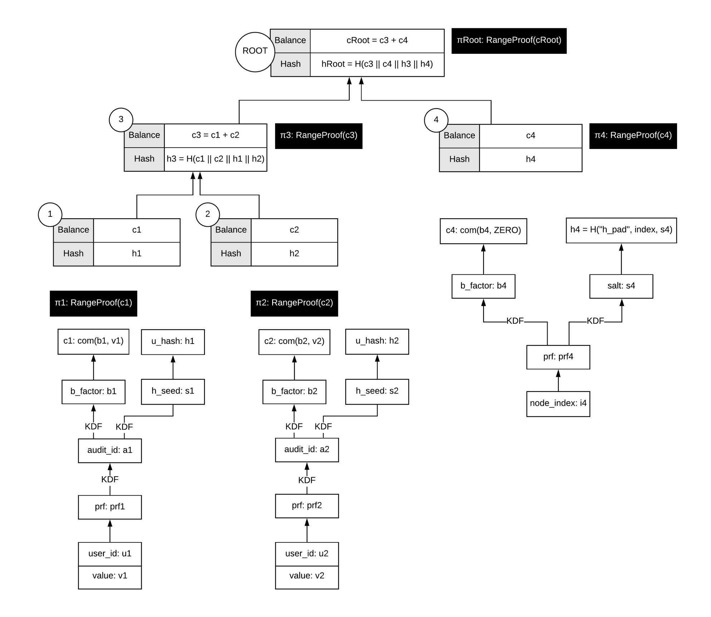

Figure 4.3: DAPOL tree of height = 2 for two users, one padding node.

{44}------------------------------------------------

## <span id="page-44-3"></span><span id="page-44-0"></span>4.3 Internal Node

Internal nodes are generated using the function described below. The node's encrypted balance is the result of adding of its children's homomorphic Pedersen commitments.

The node's hash is the concatenation of all children commitments and hashes, fed to some hash function, for instance sha256, similarly to [\[Lal16\]](#page-50-16).

```
function compute_internal_node (left_node, right_node) {
  node.balance = left_node.balance + right_node.balance;
  node.hash = sha256(
      encoded(left_node.balance) ||
      encoded(right_node.balance) ||
      left_node.hash ||
      right_node.hash
  );
  return node;
}
```

### <span id="page-44-1"></span>4.4 Root Node

The root node of the tree is like all internal nodes, possesses a balance commitment and a hash.

This data must be published publicly in one or more immutable databases (i.e., blockchains), so that all users can ensure they're verifying against the same proof tree. As the balance of the root node reflects the total reported liabilities, when published, this data should be accompanied by a range proof of the balance commitment, while the full payload, including a timestamp and metadata information related (i.e., the audit round this proof refers to), should be signed by a prover (see Figure [4.4\)](#page-44-2).

<span id="page-44-2"></span>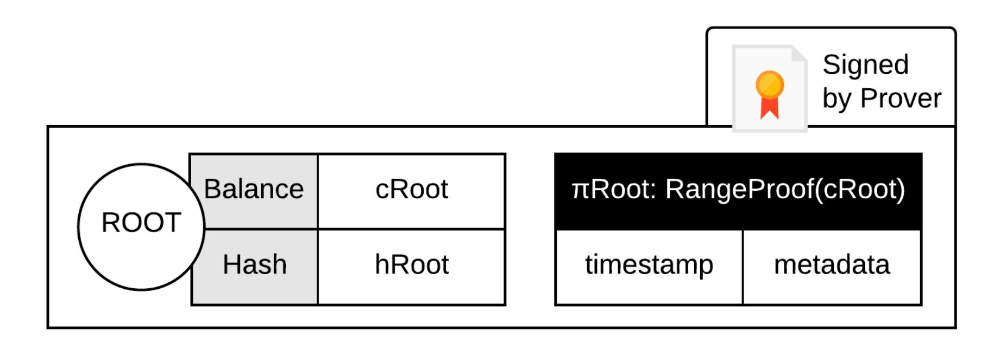

Figure 4.4: The prover should sign the DAPOL root, along with the range proof, timestamp and other required metadata.

{45}------------------------------------------------

## <span id="page-45-0"></span>4.5 Authentication Path Proof

An authentication path contains only the nodes from the complete tree which a given user needs in order to verify he/she was included in the tree. Unlike the original Maxwell scheme where users observe sibling values, each node is accompanied by a range proof on the commitment value to ensure it is a small positive number.

The path can be generated by starting with the user's leaf node and including every parent node up to the root. Then the sibling at each level must be added, and thus in practice an authentication path is a list of sibling nodes per height layer. This would enable each user to verify independently that their balance is included in the reported liabilities by following their path to the root, checking at each node that the committed balance is the product of its two children node committed balances.

Nodes that can be directly computed are not usually submitted, to save space and encourage users to compute them by themselves. However, in the generic case and when the range of the provided range proofs is very close to the group order used in the commitment scheme, we should also send the range proofs of the computed nodes as well.

A note on range proofs in the authentication path. It is highlighted that the extended customer verification option of the original Provisions scheme mentions that a verifier should only receive the range proofs of the sibling nodes only. But if we do not carefully set range limits, which are more relaxed than the flat list approach, range overflows might be exploited.

If one wants to take full advantage of the maximum range possible (based on the group order), a greedy solution would be to receive the range proofs of the computed nodes as well.

Without careful consideration, an exploitable scenario would be to use a range of [0, N) where N is close to the curve order l of the Pedersen commitment scheme. Then, when merging nodes in the summation tree, although the children nodes are in-range, their product might not be and as a result, the computed value might overflow. A malicious prover can exploit this by adding a huge fake balance to cancel out everything else in the tree and thus, manage to reduce the total liabilities.

Fortunately, current real world financial applications usually dictate a range up to 2 <sup>6</sup>4 or 2 <sup>1</sup>28, which is by far smaller than the typical curve order used in today's cryptography. But as already mentioned, DAPOL can be applied to a broad range of applications, even outside finance.

That said, to safely omit the range proofs of computed nodes, the allowed range of each commitment should be less than l/H, where l is the group order and H the tree height. Thus, even if every balance is very close to l/H, when we add them all together in the authentication path, no intermediate or final value can surpass the group order l.

# <span id="page-45-1"></span>4.6 Dispute Resolution

As mentioned in the Provisions scheme, there is a drawback, inherent to all of the existing proof of liability systems, according to which a user who raises a dispute has no cryptographic evidence to support his/her claim. This is because account balances (or negative votes) are just numbers in the prover's accounting book or database and the prover can always claim that the customer never had 

{46}------------------------------------------------

that balance in his/her account. The problem is very similar to "One day you go your bank and you realize your account balance is zero, what evidence can you provide to the court?" Along the same lines, "How can a bank prove that it had your consent for all of your transactions?"

Consider a scenario where Alice wants to make a transaction in an exchange. Alice connects to the exchange via TLS and authenticates herself using her password. They both know for sure whom they are communicating with. However, this does not necessarily mean that they can fully trust each other. Alice needs a confirmation that the transaction actually happened and that the exchange cannot act without her permission. On the other hand, the exchange wants an evidence that it indeed received an order from Alice.

Unfortunately, Alice cannot easily prove that she has actually sent the order. Likewise, even if she "somehow" can prove the order, the exchange can still claim that the transaction was never processed. Even worse, a malicious employee at the exchange could easily generate and store transactions without Alice's consent.

The above arguments hold because, typically, transaction orders are just records in conventional databases and the main defense is usually data replication and logging. Sadly, none of the above countermeasures can prevent fraud or be used as undeniable proofs.

Another side-effect of raw unsigned storage is the feeling that users do not really have control over their funds; assets are just numbers in the exchange's database.

For blockchain exchanges the issue appears unsolvable cryptographically. Recall that the primary motivation for users keeping funds with an exchange is to avoid needing to remember long-term cryptographic secrets, therefore exchanges must be able to execute user orders and change their balance without cryptographic authentication from the user (e.g., password authentication). Users who dislike an exchange may also falsely claim that verification of their accounts failed, and it is not possible to judge if there is no any transaction proof.

One potential solution is to utilize signatures or mutual contract signing per transaction, thus preferably both parties should sign. In some applications of DAPOL though (i.e., disapproval voting), receiving a signed ticket/email from the prover only would be sufficient.

# <span id="page-46-0"></span>4.7 User Tracking

One privacy property that should be satisfied in environments that require continuous and subsequent audits is that the prover should not be able to track who requested or downloaded his/her inclusion proofs.

Such an information could expose data around who is regularly checking the proofs and who rarely or never does. A malicious prover can omit adding balances from users with low probability to check. However, if the prover does not have a clue on who requested and executed the inclusion authentication path, he/she can only speculate and the risk of being caught is a lot higher.

It has already been suggested in the literature that ideally, users should use verified and audited third party or locally installed tools to verify the proofs.

Apparently, the only part that users should privately download is the leaf index and the audit id (or a related VRF output). As shown on the right part of [4.1,](#page-40-2) a system could also provide unique audit 

{47}------------------------------------------------

ids at the time of registration.

The trick is to use this audit id via a KDF to be able to derive the commitment's blinding factor. Then the proofs can either be broadcasted or served via third party services using PIR, ORAM and network mixing services. The second approach will allow for lighter clients and the encryption protects our PIR protocol against users who request to download other proof indexes (even if they manage to receive them, they cannot decrypt the commitments).

All in all, using deterministic KDF derived audit ids, one can use regular PIR to simulate an authenticated PIR protocol. This method can also be applied to the original Maxwell scheme to allow for publishing all leaves, similarly to Provisions, something that was not previously possible.

### <span id="page-47-0"></span>4.8 Random Sampling

Traditional auditing might require full access or random sampling of nodes, especially when investigation takes place due to a dispute. As shown in Figure [4.5,](#page-48-0) a deterministic sparse Merkle tree construction is compatible with random sampling, as the prover can provide a proof about the closest real user to a requested index. In this example, if the auditor requests for the node at index = 11, the prover can reply with the pink and green nodes, along with their shared authentication path as a proof that the closest real user at index = 11 is the node at index = 8. The fact that "artificial" padding nodes are constructed with a different input than real user nodes can be used to distinguish between real and artificial users/nodes (see Figure [4.3](#page-43-0) on how they differ).

{48}------------------------------------------------

<span id="page-48-0"></span>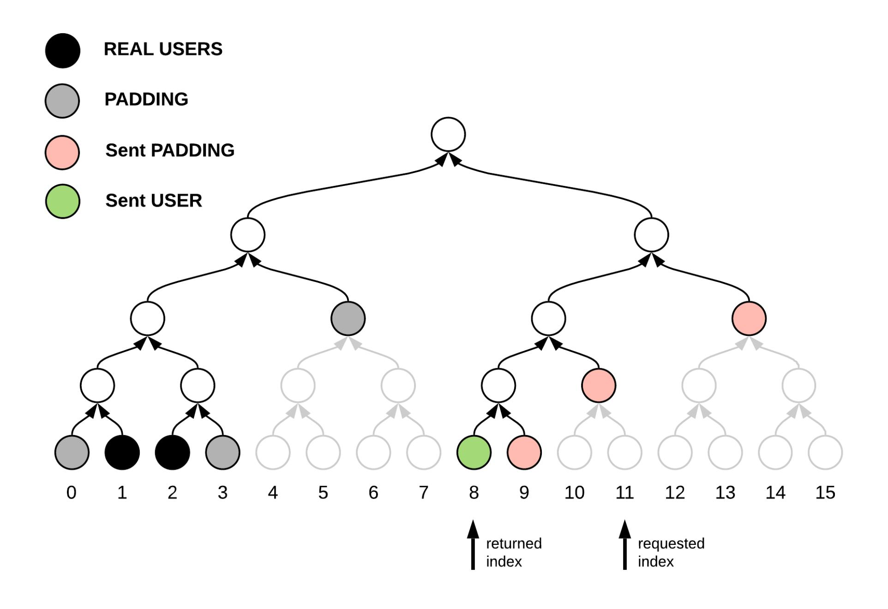

Figure 4.5: An authentication path from green and pink nodes to prove closest real user at index 11.

{49}------------------------------------------------

# Bibliography

<span id="page-49-14"></span><span id="page-49-13"></span><span id="page-49-12"></span><span id="page-49-11"></span><span id="page-49-10"></span><span id="page-49-9"></span><span id="page-49-8"></span><span id="page-49-7"></span><span id="page-49-6"></span><span id="page-49-5"></span><span id="page-49-4"></span><span id="page-49-3"></span><span id="page-49-2"></span><span id="page-49-1"></span><span id="page-49-0"></span>

| [AHIV17]   | S. Ames, C. Hazay, Y. Ishai, and M. Venkitasubramaniam. "Ligero: Lightweight<br>sublinear arguments without a trusted setup". In:<br>Proceedings of the 2017 acm<br>sigsac conference on computer and communications security. 2017, pp. 2087–2104.                           | B, 14            |
|------------|-------------------------------------------------------------------------------------------------------------------------------------------------------------------------------------------------------------------------------------------------------------------------------|------------------|
| [BBHR18]   | E. Ben-Sasson, I. Bentov, Y. Horesh, and M. Riabzev. "Fast Reed-Solomon inter<br>active oracle proofs of proximity". In:<br>45th international colloquium on automata,<br>languages, and programming (icalp 2018). Schloss Dagstuhl-Leibniz-Zentrum fuer<br>Informatik. 2018. | 2                |
| [BD93]     | J. Benaloh and M. De Mare. "One-way accumulators: A decentralized alternative to<br>digital signatures". In:<br>Workshop on the Theory and Application of of Cryptographic<br>Techniques. Springer. 1993, pp. 274–285.                                                        | 2                |
| [Bit13]    | Bitfury.<br>On Blockchain Auditability. Bitfury White Paper. 2013.                                                                                                                                                                                                            | 17               |
| [BGH19]    | S. Bowe, J. Grigg, and D. Hopwood.<br>Halo: Recursive Proof Composition without a<br>Trusted Setup. Tech. rep. Cryptology ePrint Archive, Report 2019/1021, 2019.                                                                                                             | B                |
| [Bra14]    | D. Bradbury.<br>Why Bitcoin Exchange Audits Don't Go Far Enough.<br>https://www.<br>coindesk.com/exchanges-must-still-prove-themselves-customers. 2014.                                                                                                                       | 15               |
| [BBBPWM18] | B. Bünz, J. Bootle, D. Boneh, A. Poelstra, P. Wuille, and G. Maxwell. "Bulletproofs:<br>Short proofs for confidential transactions and more". In:<br>2018 IEEE Symposium on<br>Security and Privacy (SP). IEEE. 2018, pp. 315–334.                                            | B, C, 2          |
| [BFS20]    | B. Bünz, B. Fisch, and A. Szepieniec. "Transparent SNARKs from DARK com<br>pilers". In:<br>Annual International Conference on the Theory and Applications of<br>Cryptographic Techniques. Springer. 2020, pp. 677–706.                                                        | 2                |
| [Cal14]    | C. Caleb.<br>Bitfinex Passes Stefan Thomas's Proof Of Solvency Audit.<br>https://www.<br>ccn.com/bitfinex-passes-stefan-thomass-proof-solvency-audit. 2014.                                                                                                                   | 1                |
| [Cam14]    | P. Camacho.<br>Secure Protocols for Provable Security.<br>https://www.slideshare.net/<br>philippecamacho/protocols-for-provable-solvency-38501620. 2014.                                                                                                                      | 17               |
| [CGGN17]   | M. Campanelli, R. Gennaro, S. Goldfeder, and L. Nizzardo. "Zero-knowledge con<br>tingent payments revisited: Attacks and payments for services". In:<br>Proceedings of<br>the 2017 ACM SIGSAC Conference on Computer and Communications Security.                             |                  |
|            | 2017, pp. 229–243.                                                                                                                                                                                                                                                            | 20               |
| [CCP20]    | CCPA.<br>California Consumer Privacy Act.<br>https : / / en . wikipedia . org / wiki /<br>California_Consumer_Privacy_Act. 2020.                                                                                                                                              | vi               |
| [CCLMR21]  | K. Chalkias, S. Cohen, K. Lewi, F. Moezinia, and Y. Romailler. "HashWires:<br>Hyperefficient Credential-Based Range Proofs." In:<br>PETS<br>(2021).                                                                                                                           | 2                |
| [CLMN19]   | K. Chalkias, K. Lewi, P. Mohassel, and V. Nikolaenko.<br>Practical Privacy Preserving<br>Proofs of Solvency.<br>ZKProof Community Event,<br>https://community.zkproof.org/<br>uploads/short-url/v6QCjfWfHUxjlWTpBaLF1qlAQw5.pdf. 2019.                                        | 1, 7, 11, 14, 17 |
| [Che19]    | G. Chen. "Exploitable Hardware Features and Vulnerabilities Enhanced Side<br>Channel Attacks on Intel SGX and Their Countermeasures". PhD thesis. The                                                                                                                         |                  |
|            | Ohio State University, 2019.                                                                                                                                                                                                                                                  | 14               |

{50}------------------------------------------------

<span id="page-50-16"></span><span id="page-50-15"></span><span id="page-50-14"></span><span id="page-50-13"></span><span id="page-50-12"></span><span id="page-50-11"></span><span id="page-50-10"></span><span id="page-50-9"></span><span id="page-50-8"></span><span id="page-50-7"></span><span id="page-50-6"></span><span id="page-50-5"></span><span id="page-50-4"></span><span id="page-50-3"></span><span id="page-50-2"></span><span id="page-50-1"></span><span id="page-50-0"></span>

| [CSB14]   | CSBS (Conference of State Bank Supervisors).<br>State regulatory requirements for<br>virtual currency activities. CSBS RFC. 2014.                                                                                                                                        | 15                |
|-----------|--------------------------------------------------------------------------------------------------------------------------------------------------------------------------------------------------------------------------------------------------------------------------|-------------------|
| [DBBCB15] | G. G. Dagher, B. Bünz, J. Bonneau, J. Clark, and D. Boneh. "Provisions: Privacy<br>preserving proofs of solvency for bitcoin exchanges". In:<br>Proceedings of the 22nd ACM<br>SIGSAC Conference on Computer and Communications Security. 2015, pp. 720–731.<br>C, 9, 17 |                   |
| [DGSW15]  | C. Decker, J. Guthrie, J. Seidel, and R. Wattenhofer. "Making Bitcoin exchanges<br>transparent". In:<br>European Symposium on Research in Computer Security. Springer.<br>2015, pp. 561–576.                                                                             | 13                |
| [DW14]    | C. Decker and R. Wattenhofer. "Bitcoin transaction malleability and MtGox". In:<br>European Symposium on Research in Computer Security. Springer. 2014, pp. 313–<br>326.                                                                                                 | vii               |
| [DHS15]   | D. Derler, C. Hanser, and D. Slamanig. "Revisiting Cryptographic Accumulators,<br>Additional Properties and Relations to Other Primitives". In:<br>CT-RSA. 2015.                                                                                                         | 2                 |
| [DSE]     | J. Doerner, A. Shelat, and D. Evans.<br>ZeroLedge: Proving Solvency with Privacy.                                                                                                                                                                                        | C, 3, 5, 6, 9, 17 |
| [DV19]    | A. Dutta and S. Vijayakumaran. "MProve: A proof of reserves protocol for Monero<br>exchanges". In:<br>2019 IEEE European Symposium on Security and Privacy Workshops<br>(EuroS&PW). IEEE. 2019, pp. 330–339.                                                             | B                 |
| [Eur20]   | European Commission.<br>GDPR: General Data Protection Regulation.<br>https://ec.<br>europa.eu/info/law/law-topic/data-protection_en. 2020.                                                                                                                               | vi                |
| [FA14]    | M. Ferrouhi and M. Agdal. "Liquidity and Solcency in the International Banking<br>Regulation". In:<br>Clue Institute: International Academic Conference. Germany. 2014.                                                                                                  | 15                |
| [GWC19]   | A. Gabizon, Z. J. Williamson, and O. Ciobotaru.<br>PLONK: Permutations over<br>Lagrange-bases for Oecumenical Noninteractive arguments of Knowledge. Tech. rep.<br>Cryptology ePrint Archive, Report 2019/953, 2019.                                                     | B                 |
| [Gan17]   | C. Ganesh. "Zero-knowledge Proofs: Efficient Techniques for Combination State<br>ments and their Applications". PhD thesis. New York University, 2017.                                                                                                                   | 17                |
| [Gro16]   | J. Groth. "On the size of pairing-based non-interactive arguments". In:<br>Annual<br>international conference on the theory and applications of cryptographic techniques.                                                                                                |                   |
|           | Springer. 2016, pp. 305–326.                                                                                                                                                                                                                                             | B                 |
| [HM14]    | M. Hearn and R. Muirhead.<br>Bitstamp proof of reserves.<br>https://www.bitstamp.net/<br>s/documents/Bitstamp_proof_of_reserves_statement.pdf. 2014.                                                                                                                     | 1                 |
| [HZG19]   | K. Hu, Z. Zhang, and K. Guo. "Breaking the binding: Attacks on the Merkle<br>approach to prove liabilities and its applications". In:<br>Computers & Security<br>87<br>(2019), p. 101585.                                                                                | 3, 5, 6           |
| [KZG10]   | A. Kate, G. M. Zaverucha, and I. Goldberg. "Constant-size commitments to poly<br>nomials and their applications". In:<br>International conference on the theory and<br>application of cryptology and information security. Springer. 2010, pp. 177–194.                  | 2                 |
| [Lal16]   | O. Lalonde.<br>Javascript implementation of Proofs of Liabilities.<br>https://github.com/<br>olalonde/proof-of-liabilities. 2016.                                                                                                                                        | 35                |
| [Mer87]   | R. C. Merkle. "A digital signature based on a conventional encryption function".<br>In:<br>Conference on the theory and application of cryptographic techniques. Springer.<br>1987, pp. 369–378.                                                                         | 2                 |

{51}------------------------------------------------

<span id="page-51-9"></span><span id="page-51-8"></span><span id="page-51-7"></span><span id="page-51-6"></span><span id="page-51-5"></span><span id="page-51-4"></span><span id="page-51-3"></span><span id="page-51-2"></span><span id="page-51-1"></span><span id="page-51-0"></span>

| [MRV99]  | S. Micali, M. Rabin, and S. Vadhan. "Verifiable random functions". In:<br>40th annual<br>symposium on foundations of computer science (cat. No. 99CB37039). IEEE. 1999,<br>pp. 120–130.                                          | 4             |
|----------|----------------------------------------------------------------------------------------------------------------------------------------------------------------------------------------------------------------------------------|---------------|
| [MC13]   | T. Moore and N. Christin. "Beware the middleman: Empirical analysis of Bitcoin<br>exchange risk". In:<br>International Conference on Financial Cryptography and Data<br>Security. Springer. 2013, pp. 25–33.                     | vii           |
| [NVV18]  | N. Narula, W. Vasquez, and M. Virza. "zkledger: Privacy-preserving auditing for<br>{USENIX}<br>distributed ledgers". In:<br>15th<br>Symposium on Networked Systems Design<br>and Implementation ({NSDI}<br>18). 2018, pp. 65–80. | C             |
| [Roo19a] | S. Roose.<br>Simple Proof-of-Reserves Transactions. Bitcoin's BIP-127. 2019.                                                                                                                                                     | B             |
| [Roo19b] | S. Roose.<br>Standardizing Bitcoin Proof of Reserves. Blockstream Research. 2019.                                                                                                                                                | B             |
| [Ste06]  | R. J. Stearn Jr. "Proving Solvency: Defending Preference and Fraudulent Transfer<br>Litigation". In:<br>Bus. Law.<br>62 (2006), p. 359.                                                                                          | 15            |
| [Szy04]  | M. Szydlo. "Merkle tree traversal in log space and time". In:<br>International Conference<br>on the Theory and Applications of Cryptographic Techniques. Springer. 2004, pp. 541–<br>554.                                        | 2             |
| [Tho14]  | OKCoin Passes Proof of Solvency Audit. Bitcoin Forum. 2014.<br>S. Thomas.                                                                                                                                                        | 1             |
| [Vid18]  | M. Vidmar.<br>Proof of Solvency: Technical Overview.<br>https://medium.com/iconominet/<br>proof-of-solvency-technical-overview-d1d0e8a8a0b8. 2018.                                                                               | 1, 6, 16      |
| [Wil14]  | Z. Wilcox.<br>Proving your bitcoin reserves.<br>https://bitcointalk.org/index.php?topic=<br>595180.0. 2014.                                                                                                                      | i, vii, 5, 17 |

{52}------------------------------------------------

# <span id="page-52-0"></span>Appendix A. Acronyms

- API: application program interface
- CCPA: California's Consumer Privacy Act
- COM: cryptographic commitment
- CRH: collision-resistant hash (function)
- DAPOL: distributed auditing proofs of liabilities
- DP: differential privacy
- GDPR: European Union's General Data Protection Regulation
- HMAC: hash-based message authentication code
- ICO: initial coin offering
- IRS: USA's Internal Revenue Service
- KDF: key derivation function
- MAXWELL: Maxwell's summation proof of liabilities scheme
- MPC: multi-party computations
- NIZK: non-interactive zero-knowledge
- ORAM: oblivious ram simulator
- PCOM: Pedersen commitment
- PET: privacy-enhancing technologies
- PIR: private information retrieval
- PKI: public-key infrastructure

- POL: proofs of liabilities
- PPT: probabilistic polynomial time (simulator)
- PSI: private set intersection
- RAM: random access memory
- SGX: Intel's Secure Guard eXtensions
- SHA: secure hash algorithm
- SHA2: secure hash algorithm 2, the successor of SHA1
- SHA3: secure hash algorithm 3, the successor of SHA2
- SMPC: secure multiparty computation
- SNARG: succinct non-interactive argument
- SNARK: SNARG of knowledge
- SPIR: strong private information retrieval
- SVM: AMD's Secure Virtual Machine
- TLS: transport layer security
- TPM: trusted platform module
- TXT: Intel Trusted eXecution Technology
- VRF: verifiable random function
- ZK: zero knowledge
- ZKP: zero-knowledge proof
- ZKRP: zero-knowledge range proof

{53}------------------------------------------------

# <span id="page-53-0"></span>Appendix B. Probability of Cheating

#### <span id="page-53-1"></span>B.1 Proof for Maxwell Centralized

<span id="page-53-2"></span>**Theorem 7.** The PoL scheme  $\prod_{SuMT}^{basic}$  described in Figures 3.1 and 3.2 is  $(1-c)^t$ -secure according to definition 4.

proof sketch. The meat of the proof is the following Lemma which bounds the probability of cheating by a malicious prover.

**Lemma 8.** Let N be the total number of balances, and k be the number of uniformly sampled honest users who execute UserVerify and output 1. If the auditor is honest and AuditorVerify also outputs 1, the probability that the prover can corrupt balances of t users without getting caught is bounded by  $(\frac{N-k}{N})^t$ .

sketch. First we need to guarantee that the prove cannot provide multiple different views to the auditor and different users. In particular, we argue that after running the AuditSetup algorithm and outputting  $aud_{pk}$ , the prover is committed to all the user ids and user balances it stores in all leaves of the Merkle tree, as well as the hash values it stores in internal nodes of the tree all the way to the root  $D_1[1]$ . The binding to the user ids is given by the binding property of the commitment scheme used to compute com(uid;r) which guarantees that the prover can only open the commitment to a unique uid. The binding to unique balances and internal node hashes is the due the collision resistance of the hash function H and a standard iterative arguments for different levels of the Merkle tree.

Given the above, we can assume that the auditor and all users who run their verification algorithm are operating on the same set of values with all but negligible probability. Note if the auditor is honest and its verification passes, we know that the sum of balances in all leaves add to the total liabilities. Moreover, all users who verify their uid and balance inclusion in the Merkle tree ensure that their correct balances were included in the total sum calculated by the auditor. Now, consider a prover strategy that corrupts a subset t of balances stored in the leaves of the tree. These corrupted balances go undetected if and only if the corresponding user is not among the k who are chosen for verification. The total number of such possibilities is  $\binom{N-t}{k}$ . On the other hand, the total number of possible subsets of size k among the k users is k. It is easy to verify that the probability of remaining undetected is bounded by the division of the two, i.e. k. This probability can further be bounded by k0 using known approximations.

Now observe that  $(\frac{N-k}{N})^t = (1-k/N)^t = (1-c)^t$ . In otherwords,  $\delta(c,t) = (1-c)^t$ . This concludes the proof.

{54}------------------------------------------------

## <span id="page-54-0"></span>B.2 Proof for DAPOL

Theorem 9. The PoL scheme Qdist SuMTdescribed in Figures [3.3](#page-35-1) and [3.4](#page-36-1) is (1 − c) t -secure according to definition [4.](#page-31-2)

Proof. Similar to proof of Theorem [7,](#page-53-2) the main component of the overall proof, is the following Lemma.

Lemma 10. Let N be the total number of balances, and k be the number of uniformly sampled users who run UserVerify and output 1. The probability that a malicious prover can corrupt balances of t users without getting caught is bounded by ( N−k N ) t .

We start by reducing the problem to only considering malicious provers who cheat by setting user balances to zero but perform all other prover steps honestly. In particular, Lemma [11](#page-54-1) shows that for any prover that behaves arbitrarily malicious, there exists an alternative strategy that performs all prover steps honestly except for setting a subset of user balances to zero in the leaves (or ommitting them from the tree), with the same winning advantage and with equal or lower declared liabilities.

As argued earlier in proof of Theorem [7,](#page-53-2) for the rest of this discussion we assume that given the binding property of the commitment scheme and the collision-resistance of the hash function H, we assume that with all but negligible probability, both users and the auditor will receive the same views from the prover.

<span id="page-54-1"></span>Lemma 11. For every PPT prover A, there exists a PPT prover B with equal probability of getting caught and equal or less declared liabilities, who only corrupts user balances by setting them to zero or omitting them from the tree.

Proof. First observe that the two main malicious behaviors performed by the advesary A besides setting balances to zero are to (i) use negative balances or partial sums in computing the summation Merkle tree or (ii) use partial sums for internal nodes that are not the correct sum of its two children. We ignore all other malicious behaviors that do not impact or only increase the total liabilities for the prover as they can only hurt a cheating prover.

Consider a prover A who creates a summation tree with negative balances, negative partial sums, or incorrect partial sums. We call a node corrupted if the value assigned to it is negative or its value is not the sum of values for its two children (only for non-leaf nodes). For any corrupted node a, consider the lowest ancester (furthest from the root) of a called b that is not corrupted. By definition, at least one of the two children of b are corrupted. This implies that if any of b's descendents are among the k users who perform user verification, they will detect the cheating and report it.

The alternative strategy (taken by B) of replacing the balances of all leaves that descendants of b by a zero balance and making sure that all non-leaf nodes are not corrupted, has the same probability of getting caught. Moreover, note that in the former, total liabilities are at most reduced by ` balances where ` is the number of leaves below b since value of b is positive by definition. In the former, we explicity let balances for all leaves under b to be zero and hence obtain equal or higher reduction in total declared liabilities.

Iteratively, repeating this process for all remaining corrupted nodes until none is left, yields our final description of an adversarial prover B who has the same advantage of winning as A and equal or

{55}------------------------------------------------

| lower total liabilities.                                                                        |                    |
|-------------------------------------------------------------------------------------------------|--------------------|
|                                                                                                 |                    |
| Based on Lemma 11, we can focus our attention only on adversaries that set a subset of          | f user balances    |
| to zero. In that case, we can invoke the analysis in proof of Theorem 7 to show that t          | the probability    |
| for any such adversary to get away with corrupting t balances is bounded by $(\frac{N-k}{N})^t$ | $= (1-c)^t.  \Box$ |

{56}------------------------------------------------

# <span id="page-56-0"></span>Appendix C. Summary of changes

- Apr 22, 2020 : First version (very close to the initial submission for the ZKProof Conference on April 19, 2020).
- Oct 11, 2021 : Fix a flaw in the padding node construction in Figure 4.3, as reported in Y. Ji and K. Chalkias "Generalized Proof of Liabilities" ACM CCS 2021 paper. Also various smaller updates including references to different cryptographic accumulator schemes.