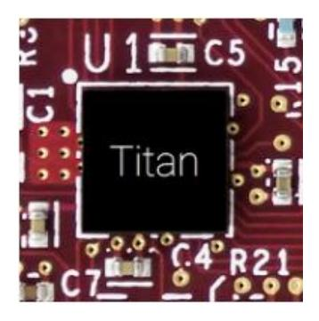
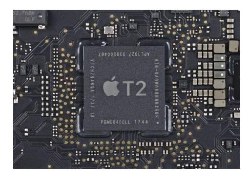
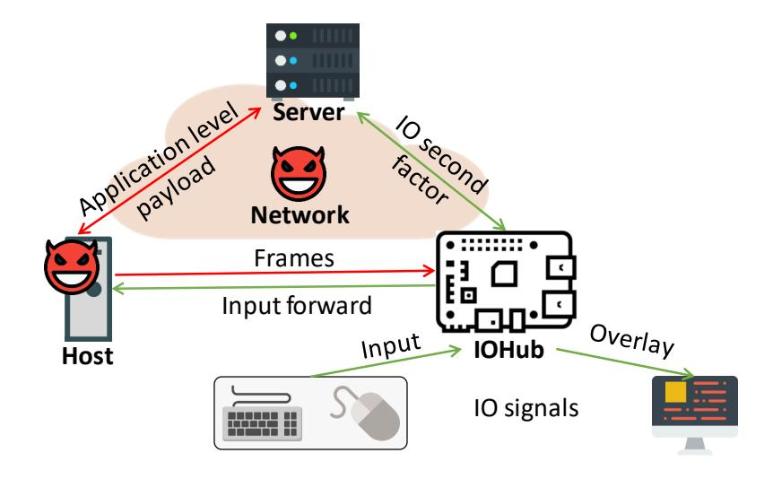
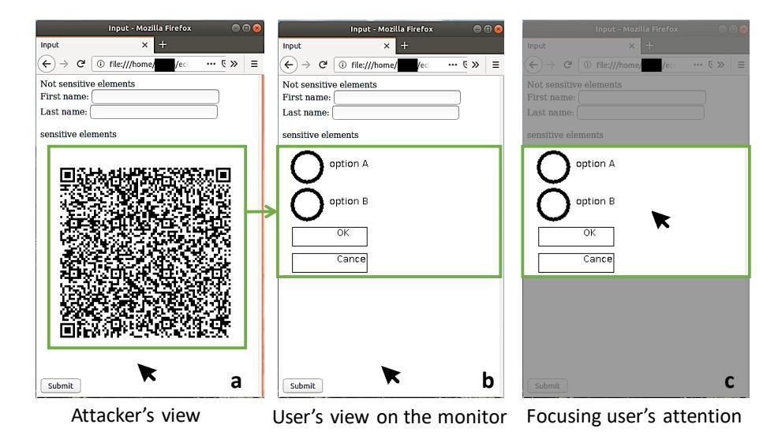
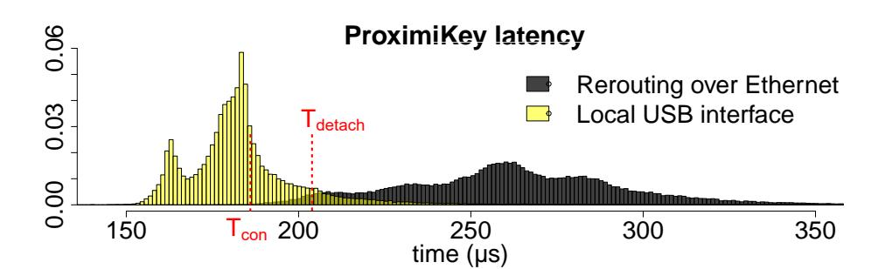

{0}------------------------------------------------

# Dedicated Security Chips in the Age of Secure Enclaves ∗

*Kari Kostiainen, Aritra Dhar, Srdjan Capkun ETH Zurich*

## Abstract

Secure enclave architectures have become prevalent in modern CPUs and enclaves provide a flexible way to implement various hardware-assisted security services. But special-purpose security chips can still have advantages. Interestingly, dedicated security chips can also assist enclaves and improve their security.

Keywords — secure enclaves, security chips, trusted path, remote attestation, proximity verification

Trusted Computing Base (TCB) minimization is one of the most fundamental computer security principles. The main idea is to reduce the amount of software and hardware that needs to be trusted for the secure operation of a particular application. A common technique to achieve TCB minimization is to run the application inside a Trusted Execution Environment (TEE). The TEE protects the application's execution, despite any other compromised software on the same system.

One TEE implementation approach that has gained significant popularity recently is to realize the TEE by enhancing the main CPU of the computing platform with new features like special instructions and access control checks. Intel's SGX, designed for the x86 architecture, is a prime example of such TEE. In SGX, the CPU ensures that no other process can access the memory of the protected application that is called an *enclave*. By doing this, SGX guarantees that enclaves enjoy execution integrity, and their data remains confidential.

Several other TEE designs exist too. ARM TrustZone is a popular TEE architecture that is used in many commercial mobile devices, while Sanctum [\[1\]](#page-6-0) serves as a good example of a research TEE system. For simplicity, we focus on Intel's SGX and use it as a case study to discuss the strengths and limitations of enclaves.

SGX-style enclaves are powerful security primitive. They are *programmable*, and thus developers can implement almost arbitrary hardware-protected security services using them. This is in contrast to previous secure elements like TPMs that support only a fixed set of operations. Enclaves are also *fast*, as they run on the main CPU of the computing platform, compared to significantly slower security elements like smart cards. And furthermore, enclaves are *cheap*, since they require no additional hardware in contrast to expensive separate coprocessors like HSMs.

This combination of programmability, high performance, and low cost makes enclaves an attractive way to deploy various hardware-assisted security services. Indeed, after a decade of research and development into secure enclaves, the first large-scale commercial deployments are now starting. For example, Microsoft's Confidential Computing service uses SGX enclaves to protect customer data in the cloud.

The wide adoption of enclave architectures in modern CPUs is probably the most prominent trend in hardwareassisted security over the last decade. However, there is also another, more subtle trend appearing. Recently, computing service providers like Google and computer manufacturers like Apple have started to enhance their systems with specialpurpose security chips. Google's cloud servers have a security chip called Titan in them [\[2\]](#page-6-1), while Apple's computers come with the T2 security chip [\[3\]](#page-6-2).

At first glance, these two trends seem almost contradictory. If enclaves enable arbitrary hardware-protected security services, why do we still need dedicated security chips?

In this article, we discuss the rationale behind this trend. We explain the benefits of dedicated security chips and outline two of our research projects where we designed such. These projects showcase an interesting new pattern — one where special-purpose security chips assist enclaves and thus improve their security.

## Dedicated Security Chips

Computing platform providers have recently added new security chips to their systems. We look at two examples.

∗This article has been accepted for publication in IEEE Security & Privacy magazine's special issue on hardware-assisted security (Fall 2020).

{1}------------------------------------------------

Figure 1: Google Titan [\[2\]](#page-6-1) and Apple T2 [\[3\]](#page-6-2) security chips.

## Google Titan

Titan [\[2\]](#page-6-1) is a security chip implemented as a low-power microcontroller on Google's purpose-built server platforms. The Titan chip communicates with the main CPU via the Serial Peripheral Interface (SPI), and it interposes between the boot firmware flash and the Platform Controller Hub (PCH).

One of the main functionalities that Titan implements is *secure boot*. When the server machine is powered up, Titan executes code, known as boot ROM, from its embedded readonly memory. This code is immutable and thus implicitly trusted. The boot ROM code loads Titan's firmware from the embedded flash and verifies its integrity using a digital signature. Once Titan's firmware is securely verified and running, it can verify the boot process of its host. Titan blocks PCH's access to the firmware flash until it has cryptographically verified the content of the flash, and then it releases the lock and allows the verified boot firmware to configure the machine and load the boot loader which subsequently verifies and loads the OS. Such an iterative process allows precise control over which system software is booted.

## Apple T2

Apple's latest PCs come with a security chip called T2 [\[3\]](#page-6-2) that also supports secure boot. When the machine with the T2 chip is turned on, T2 executes code from its read-only memory. This code verifies the next step of the T2's own boot process. Once T2 is fully running, it can verify the UEFI firmware, which will ensure that only authorized kernel will be booted on the host CPU.

Besides secure boot, T2 also provides other security features such as protecting the user's fingerprint values or making sure that the microphone is disconnected from the main CPU when the laptop's lid is closed.

## Specific Security Objectives

Both Titan and T2 implement secure boot. Secure boot is also a good example of a security mechanism that is outside the security objectives of SGX.

SGX was designed to provide a specific set of protections [\[4\]](#page-6-3). These protections include detection of integrity violation of an enclave instance, confidentiality of enclave's

Textbox 1: ARM TrustZone is a processor-based TEE architecture that is commonly used on smartphones. The main idea of TrustZone is to implement two separate execution modes on the main CPU. All untrusted software, like the OS and third-party apps, are executed in the *normal world*, while applications that need protection run in a separate execution mode called the *secure world*. The processor and memory controllers ensure that any process in the normal world cannot access the secure world.

TrustZone can enable secure boot [\[5\]](#page-6-4). A mobile device can be configured such that when the device is powered up, the main CPU starts executing implicitly trusted code that is loaded from read-only memory in secure world. This code can then verify the normal world boot loader before the CPU starts executing the main boot sequence of the normal world OS. Many smartphone manufacturers implement this approach.

data, isolation between enclaves, and enforcement that enclave's execution always starts from an authorized location. The overall goal of these protections can be loosely summarized as enabling *secure computation* on untrusted computing platforms.

Because the above-listed protections do not include OS integrity verification, platform providers have added dedicated security chips, like Titan and T2, to implement such functionality. Disconnecting the microphones from the main CPU is another example of a security feature that is not provided by enclaves. (As noted in Textbox 1, other TEEs like the ARM TrustZone architecture can accommodate a secure boot.)

## Security Weaknesses

Besides limited objectives, enclaves also have security weaknesses. Since enclaves and untrusted code share the same CPU, they can be susceptible to side-channel leakage and microarchitectural attacks. The recently discovered Spectre and Meltdown vulnerabilities showed how transient execution could leak information across isolation boundaries. The same idea was successfully applied to extract secret keys from SGX enclaves in the Foreshadow attack [\[6\]](#page-6-5).

While specific attacks can be, and have been, mitigated (e.g., Intel's microcode updates include Spectre and Meltdown patches), side-channels and microarchitectural attacks continue to be a concern for enclaves. The root cause is that modern processors are extremely complex systems that have been optimized over decades. Enclave support was added on top of many layers of performance optimizations, and now, in hindsight, one can easily say that this approach was not the ideal foundation for strong isolation. In this regard, dedicated security chips have a clear advantage over enclaves.

{2}------------------------------------------------

Another security challenge is the rich interface between the untrusted OS and the enclave. Enclaves must interact with the operating system in many ways. For example, enclaves communicate by sending and receiving messages through the OS. Enclaves also need to pause their execution for interrupts safely. While enclave architectures provide coarse-grained memory isolation primitive at the hardware level, developers need to ensure that the interface is protected on the software level. Common implementation tasks include sanitization of buffers and safety checks for pointers.

Because such checks are tedious, several enclave runtimes like the Open Enclave SDK have been developed to assist enclave developers. However, recent research has shown that many such enclave runtimes have classical memory safety vulnerabilities [\[7\]](#page-6-6). Because dedicated security chips do not need equally extensive interaction with the OS, the interface towards the untrusted OS is easier to protect tightly.

## Other Security Services?

To summarize our discussion so far, enclaves do not implement all useful security mechanisms, and they also have significant security issues. Dedicated security chips can address both of these concerns.

Obviously, the security services that can be implemented as dedicated security chips are not limited to the above-discussed examples. Which other services could be implemented as special-purpose security chips?

Titan and T2 are integrated security chips that are permanently attached to the computing platform. Are there also use cases that would benefit from plug-and-play security tokens?

In the rest of this article, we explore these questions by examining two examples from our recent research. Our first example is trusted path [\[8\]](#page-6-7), and after that, we focus on platform identification and remote attestation [\[9\]](#page-6-8).

## Trusted Path

The main goal of SGX is to enable secure computation for enclaves. Such enclaves do not easily lend themselves to secure *user interaction*. The main reason for this is that, in architecture like SGX, enclaves communicate with I/O devices through the untrusted OS. When an enclave needs to receive user input, the OS needs to pass data from an input device like a keyboard to the enclave. When an enclave creates user output, the OS must forward data to an output device like display. Such TEE design means that a compromised OS can easily modify any user inputs and outputs. Indeed, *trusted path* — a secure channel from the human user to a trusted application like enclave — is outside the security objectives of SGX [\[4\]](#page-6-3).

User input manipulation can have severe consequences. If a malicious OS modifies the user input that is provided to a financial enclave, the enclave can be tricked to perform unauthorized payments. If enclaves are used to implement hardened medical devices or industrial systems, user input modifications may cause serious safety and health risks. Also, any enclave that needs user passwords or similar credentials is difficult to implement securely.

## Design Principles

Several projects have explored the idea of complementing computing platforms with dedicated hardware modules for building a trusted path. While proposing extra hardware may be easy, the more difficult and interesting question is what exactly should the added hardware do? To answer this question, we look at previous approaches, examine their limitations, and identify design principles for trusted path implementation.

The first approach that we look at is *transaction confirmation* [\[10\]](#page-7-0). In such a solution, the user first completes the user interaction, such as payment, by interacting with the UI of the untrusted platform that may be manipulated by the OS or the browser. Once this is done, the user is expected to confirm his input, like a payment value and account number, using a separate hardware token, to detect and prevent any possible modifications.

This approach has two main problems. The first is the fact that the user now has to interact with two separate devices and two user interfaces, which reduces usability. The second, and more severe, problem is that such extra confirmation step is vulnerable to *user habituation*. Habituation refers to behavior where the user begins, after a few successful transactions, confirming new payments without verifying their correctness. These observations lead us to the first design principle.

Principle 1: Out-of-context security confirmations have a high cognitive load and risk of user habituation. Thus, user interaction should be protected in the context of the normal user interface.

The next approach that we examine is *input signing* [\[11\]](#page-7-1). Here, the main idea is to use a simple hardware device that sits *in-between* a user input device, such as a keyboard, and the untrusted computing platform. The device intercepts every keypress, or similar user input event, and sends a signed trace of them to the trusted application.

Input signing conforms to our first principle because the user does not have to interact outside the main UI. However, such solutions are vulnerable to attacks, where the adversary manipulates the user's input by showing false information on the output channel. That is, output manipulation leads to user input integrity violation. One example is a *fake-typo* attack. Assume that the user types in value "10", but the adversary shows "1" on the screen. The user is likely to think that he mistyped and press "0" again. As a result, a signed trace of "100" will be sent to the trusted application. This simple attack leads us to our next design principle.

{3}------------------------------------------------

Principle 2: User input and output integrity cannot be considered in isolation. Both must be protected simultaneously.

The last approach that we examine is *secure overlays*. Fidelius [\[12\]](#page-7-2) is an example research system that follows this approach. In Fidelius, one device intercepts keyboard presses and signs them for the trusted application, while another device intercepts the HDMI output signal and modifies it with secure overlays of security-critical UIs such as payment web forms.

Fidelius addresses the above-mentioned problems but is still vulnerable to a different type of user input manipulation that we call *early-submission attack*. This attack is possible because Fidelius only protects keyboard input, but not a mouse. While this may seem only a functional limitation, it turns out that it is a security problem. Assume again that the user intends to submit value "10". Once the user has typed "1", the untrusted OS or browser generates a fake mouse event that submits the web form. Mouse inputs could be disabled altogether, but such naïve solution hurts usability. Now we can state our last design principle.

Principle 3: All user input modalities must to be protected simultaneously.

## **ProtectIOn** System

Given these principles, we designed a new trusted path system called ProtectIOn [\[8\]](#page-6-7). In the following, we focus on the use case where the trusted path is established between the user and a remote web server. That is, we want to protect interactions where the user completes and submits a security-critical web form. The same solution could be easily modified to create a trusted path between the user and a local enclave as well.

Figure [2a](#page-3-0) shows the overview of ProtectIOn system. The central component of the solution is a low-complexity embedded device called IOHub that intercepts key presses from a keyboard and movement events from a mouse, tracks mouse movements, and draws secure overlays.

When the user visits a web page that contains a protected web form, the remote server sends a QR code to the untrusted browser, as shown in Figure [2b](#page-3-0) on the left. The QR code contains a specification of the protected web form signed by the server to prevent its modification in the browser. By using QR codes, we enable communication from the webserver to the IOHub device via an unmodified browser, which simplifies deployment significantly.

By periodically examining the HDMI signal, IOHub detects the QR code on the screen, decodes it, and verifies its signature. After that, as shown in Figure [2b](#page-3-0) in the middle, IOHub renders the protected web form as an overlay on top of the

(a) ProtectIOn system.

(b) ProtectIOn user interface.

Figure 2: ProtectIOn system.

HDMI frame that it receives from the untrusted OS. This step ensures that the security-critical UI elements are presented to the user correctly, and thus output integrity of the protected web form is preserved.

IOHub tracks mouse movement events, and when the mouse pointer enters the secure overlay, as shown in Figure [2b](#page-3-0) on the right, IOHub dims the rest of the screen to focus the user's attention to the secure overlay. Such protection is needed to prevent the user from following a possible fake mouse cursor, drawn by the untrusted browser or OS, elsewhere on the screen. Dimming parts of the screen have been shown to be an effective way to focus the user's attention to the correct cursor [\[13\]](#page-7-3).

While the user interacts with the protected web form, IOHub intercepts all input events, and when the user clicks on the submit button, the IOHub signs all inputs and sends them to the server via the untrusted browser (e.g., by encoding them to a requested URL). Since the submit button is part of the protected overlay and all mouse clicks are intercepted and signed by the IOHub device, early-submission attacks are not possible. The server verifies the signed user inputs it receives.

If input confidentiality is needed, the user can be required to trigger a secure attention sequence (SAS), like Ctr+Alt+Del, before entering any secrets. The untrusted OS and the browser cannot observe sensitive data on the secure overlay since they

{4}------------------------------------------------

are rendered by IOHub and never accessible to them.

Such a design complies with our three design principles. Principle 1 is met because the user only interacts with the main UI. Secure overlays support Principle 2, and mouse tracking combined with input trace signing ensures that all input modalities are protected (Principle 3).

**ProtectIOn** prototype We implemented a prototype of the IOHub device as a combination of Raspberry Pi and Arduino boards and a simple HDMI interceptor. Our prototype shows that proposed functionalities are feasible to implement with small TCB on low-cost hardware. Full details of the ProtectIOn system are explained in our recent paper [\[8\]](#page-6-7).

## Attestation and Platform Identification

Remote attestation is a key feature of enclave architectures like SGX. In remote attestation, an external verifier checks that an enclave was constructed as expected. To do this, the verifier sends a challenge to the attested CPU. The CPU signs the challenge together with a previously recorded measurement of the enclave's code using a processor-specific attestation key. The signature can also include application-specific data, such as the public key of the enclave, that allows secure communication with the attested enclave. The attestation key is part of a group signature scheme that is managed by Intel. The signed attestation statement is then sent back to the verifier. If the signature can be verified correctly, the remote verifier knows that the attested enclave was correctly constructed and runs the expected code inside a legitimate SGX processor.

Remote attestation process allows remote verifiers to detect enclave integrity violations before provisioning secrets to them or before accepting signed messages from them.

## Relay Attacks

The above outlined remote attestation protocol is a useful security mechanism, but it also has a well-known problem. An adversary that controls the OS on the attested platform can easily *redirect* the attestation challenge to another platform that computes the response. The verifier cannot notice such *relay attacks*, since the SGX attestation mechanism is based on a group signature scheme, and all processors from the same group produce indistinguishable signatures. (Even if attestation used traditional digital signatures, it would be very difficult in practice for the verifier to know which signing key corresponds to which CPU.) In other words, SGX guarantees detection of enclave's integrity violation, but identification of the computing platform in which the attested enclave is running is not part of its security objectives.

Relay attacks have been known for a long time. Parno identified them in the context of TPM attestation over a decade ago and called them "cuckoo attacks" [\[14\]](#page-7-4). However, the full implications of relay attacks have not been well understood. Since attestation can only be redirected to another legitimate processor that executes exactly the same attested enclave code, it may appear that such relay attacks do not have noteworthy negative implications. Our analysis shows that such a belief is misguided.

Relay attack implications Many computer systems, like servers at data centers, use multiple layers of protection. These protections may include using TEEs to protect certain applications, but also other defenses such as running software components at different privilege levels, physically protecting access to the computing platform, and frequent patching of discovered vulnerabilities. The main implication of relay attacks is that they *increase* the adversary's ability to attack the attested enclave by circumventing many such protections.

Our first observation is that by redirecting the attestation to the adversary's platform, the adversary enables *physical* side-channel attacks such as acoustic, electric, and electromagnetic monitoring which otherwise would not be possible to mount on the victim's platform. Such side channels have been shown to be effective and inexpensive means to extract secrets [\[15\]](#page-7-5) and hardening enclaves against all possible physical side channels is difficult.

Relay attacks can also enable *privilege escalation*. In cases where the adversary has only compromised the user-space application that manages the enclave on the victim platform, the application can redirect the attestation to the attacker's platform where he controls the OS as well. In such cases, the relay enables digital side-channel attacks that require system privileges.

The third and perhaps most subtle implication of relay is that it can enable software-based side-channel attacks that would not be otherwise possible due to the timing of certain events. One example is a scenario where the victim platform OS is compromised at the time of attestation and secret provisioning, and the attested enclave is hardened against known digital side-channel attacks (e.g., using tools like Raccoon [\[16\]](#page-7-6)). After secret provisioning, the OS compromise is detected, and the platform is cleaned and patched. Later, a new side-channel attack vector (that is not prevented by the used tools) is discovered. If the adversary performed redirection during attestation and the secret was provisioned to the attacker's machine, the new side-channel is exploitable. Without the relay, the attack is not possible. In this case, the attestation relay eliminates the security benefit of good platform maintenance.

Finally, we note that attacks based on leaked attestation keys (e.g., ones obtained through the Foreshadow attack [\[6\]](#page-6-5)) are independent of relaying. If the adversary has obtained a valid attestation key, he can emulate an SGX processor on the target platform and steal any secrets that are provisioned to it. 

{5}------------------------------------------------

**Trust on first use** A commonly suggested solution to relay attacks is the principle of *trust on first use* (TOFU). In one example solution, a platform-specific enclave generates a key pair and exports the public part of the key for certification right after a fresh OS installation. When remote verifiers need to attest other enclaves on that platform, they can first authenticate the certified enclave which in turn performs local attestation of the target enclave (SGX provides a local attestation primitive that cannot be relayed).

Such TOFU solution has several problems. The first is large temporary TCB, as a complete general-purpose OS needs to be trusted during the first boot. The second is difficulty in deployment because fresh OS re-installation is not always possible. The third is the need for online authorities which increases their attack surface, assuming that the certification process is automated. Further problems are discussed in [9].

## **ProximiTEE System**

Parno identified relay attacks more than a decade ago and, at the same time, suggested *proximity verification* as a solution [14]. The main idea was to verify that the attested CPU is in the proximity of the verifier device, which should prevent attestation redirection to remote platforms.

Proximity verification using an external device overcomes the above listed main problems of TOFU approaches. First, the TCB is small, as the verifier device can be a single-purpose and thus very simple. Second, the adoption of such a solution is easy, as there is no need to reset the target platform fully. And third, the authority that certifies the verifier device can remain fully offline.

Although the idea of proximity verification sounds simple to realize, the research efforts that followed failed to implement secure proximity verification. The main reason for the failure was that TPM, the secure element commonly available at the time, supported only fixed identification operations like digital signatures. TPM signatures may take up to one second, which allows the redirected attestation request to travel a long distance, and thus TPMs were simply too slow for secure proximity verification.

Because SGX enclaves are programmable, it is possible to implement proximity verification protocols that leverage simple operations like XOR that enable fast challenge-response rounds. Based on this observation, we designed a hardened SGX attestation scheme, called ProximiTEE [9].

Our solution uses a simple embedded device called ProximiKey that is attached to the target platform over a local communication interface like USB. In hardened remote attestation, the verifier first establishes a secure channel a ProximiKey whose public key the verifier learns from its issuer. ProximiKey performs standard remote attestation on the local enclave, establishes a secure TLS channel to it, and verifies its proximity using a simple distance-bounding protocol that consists of repeated and fast challenge-response rounds. If

Figure 3: Latency distributions for legitimate challenge-response rounds and simulated relay attack.

such proximity verification succeeds, ProximiKey facilitates the creation of a secure channel between the remote verifier and the attested enclave.

Proximity verification security While the above design is mostly straightforward, the more interesting aspect is whether such a system prevents relay attacks in practice. To answer this question, we implemented our solution using a USB prototyping board and simulated a strong attack scenario where the adversary performs a relay to another SGX platform that is connected to the target platform over a one-meter long Ethernet wire. We also assumed that the adversary is able to perform all protocol computation instantaneously.

Figure 3 shows the results from our experiments, where we measured both the legitimate and relayed challenge-response latencies. The vast majority of the benign latencies range from 145 to  $250\mu s$ , while the attack round-trips take from 200 to  $750 \mu s$ . The average delay of our adversary is only  $80\mu s$ . (To put this into perspective, even the highly-optimized network connections between major data centers in the same region exhibit latencies from one millisecond upwards.)

As can be seen from Figure 3, these two latency distributions are distinguishable. Our analysis confirms that it is possible to set protocol parameters (number of challenge-response rounds, latency threshold, etc.) such that very fast relay attacks can be detected with high probability and legitimate attestations fail only with negligible probability. The full details of the ProximiTEE system and our analysis can be found from our recent paper [9].

## **Discussion**

Now that we have seen two commercial, integrated security chips (Titan and T2) and two user-attachable, research to-kens (ProtectlOn and ProximiTEE), we can discuss their deployment aspects, security benefits, and previous comparable solutions.

**Deployment options** Integrated security chips like Titan and T2 are, obviously, limited to deployments by major service and platform providers that have the possibility to design and build their own systems.

{6}------------------------------------------------

ProximiTEE is an example of a plug-and-play security token that can be attached to the target platform over a standard interface like USB. Deployment of security solutions is a feasible option for a larger set of service providers. For example, cloud computing providers can enhance off-the-shelf servers with ProximiKey tokens and communicate their public keys to their clients to support more secure attestation. Another interesting use case is the setup of a permissioned blockchain where every consensus node is hardened with SGX enclaves. The trusted authority that appoints the consensus nodes can issue a ProximiKey token to each organization that operates one node.

Also ProtectIOn could be deployed as a plug-and-play security module. Such deployment allows service providers like voting authorities and banks to increase the security of their services without restricting the users' choice of client platform. In medical and industrial domains, an externallyattached ProtectIOn module can improve the security of safety-critical systems, even when modifications to the computing platform itself are prohibited due to strict regulations. Alternatively, ProtectIOn could be deployed as an integrated security chip such that its functionality is implemented as part of the integrated keyboard, mouse, and display controllers.

Security benefits Titan and T2 are chips that enable security functionality like a secure boot that is not provided by enclaves. Thus, the operation of Titan and T2 is largely orthogonal to the operation of enclaves.

In comparison, ProximiTEE is a security chip that is designed to work in collaboration with enclaves and improve their security guarantees by enabling secure TEE identification for hardened remote attestation.

ProtectIOn is a solution that can either assist enclaves or operate independently of them. One possible usage for ProtectIOn is to enable a trusted path from the user to a local enclave, which can communicate securely with remote servers. In such a deployment, ProtectIOn works together with an enclave. Alternatively, ProtectIOn could be used to create a trusted path from the user to a remote server without the use of enclaves. Such deployment is beneficial when the risk of microarchitectural attacks on enclaves is considered too high, for example.

Dedicated chips and early TEEs Some previous TEE designs have leveraged dedicated security chips to implement a TEE that can be attested.

AMD's Secure Virtual Machine technology is one such example where the TEE is created as follows: the CPU measure code in a specific memory region, enables DMA protections for that region, disables interrupts, records the measurement into a PCR register of a TPM chip, and finally begins executing the measured code. Essentially, this sequence of events provides a clean execution of the measured code without restarting the whole platform, and therefore this technique is often called "late launch". The main role of the dedicated

chip (TPM in this case) is to securely record the code that was launched so that an external verifier can check its integrity using attestation.

# Outlook

Future computing platforms are likely to combine various computing units like CPUs, GPUs, TPUs, FPGAs and more. Similar to the current enclave architectures that enhance CPUs with secure execution capabilities, also other processing units like GPUs and FPGAs will need secure computation. There are already several on-going research efforts that explore the design of such TEEs [\[17\]](#page-7-7).

Our research on trusted path (the ProtectIOn system [\[8\]](#page-6-7)) highlights that I/O devices need secure communication with enclaves. Similarly, also other peripherals like GPS units and fingerprint sensors would benefit from secure communication with enclaves. Protected communication between TEEs and other platform components requires authentication, enclave identification and access control mechanisms. The ARM TrustZone architecture has limited support towards this direction. In TrustZone, hardware components like memory controllers can make coarse-grained access control decisions based on the CPU's execution mode [\[5\]](#page-6-4).

Extending this paradigm for more fine-grained access control and secure inter-component communication is one promising direction. We envision future computing platforms where enclaves, peripherals and special-purpose security chips can communicate and work together to provide a rich set of hardware-assisted platform security services.

# References

- [1] V. Costan *et al.*, "Sanctum: Minimal hardware extensions for strong software isolation," in *USENIX Security'16*.
- [2] Google, "Titan in depth: Security in plaintext." [https://cloud.google.com/blog/products/gcp/](https://cloud.google.com/blog/products/gcp/titan-in-depth-security-in-plaintext) [titan-in-depth-security-in-plaintext](https://cloud.google.com/blog/products/gcp/titan-in-depth-security-in-plaintext).
- [3] Apple, "About the Apple T2 security chip." [https://](https://support.apple.com/en-us/HT208862) [support.apple.com/en-us/HT208862](https://support.apple.com/en-us/HT208862).
- [4] F. McKeen *et al.*, "Innovative instructions and software model for isolated execution.," *HASP'13*.
- [5] J.-E. Ekberg *et al.*, "The untapped potential of trusted execution environments on mobile devices," *S&P magazine*, 2014.
- [6] J. Van Bulck *et al.*, "Foreshadow: Extracting the keys to the Intel SGX kingdom with transient out-of-order execution," in *USENIX Security'18*.
- [7] J. Van Bulck *et al.*, "A tale of two worlds: Assessing the vulnerability of enclave shielding runtimes," in *CCS'19*.
- [8] A. Dhar *et al.*, "ProtectIOn: Root-of-trust for IO in compromised platforms," in *NDSS'20*.
- [9] A. Dhar *et al.*, "ProximiTEE: Hardened SGX attestation by proximity verification," in *CODASPY'20*.

{7}------------------------------------------------

- [10] A. Filyanov *et al.*, "Uni-directional trusted path: Transaction confirmation on just one device," in *DSN'11*.
- [11] A. Dhar *et al.*, "Integrikey: End-to-end integrity protection of user input." <https://eprint.iacr.org/2017/1245>.
- [12] S. Eskandarian *et al.*, "Fidelius: Protecting user secrets from compromised browsers," in *S&P'19*.
- [13] L.-S. Huang *et al.*, "Clickjacking: Attacks and defenses," in *USENIX Security'12*.
- [14] B. Parno, "Bootstrapping trust in a trusted platform," in *Hot-Sec'08*.
- [15] D. Genkin *et al.*, "Physical key extraction attacks on PCs," *Communications of the ACM*, 2016.
- [16] A. Rane *et al.*, "Raccoon: Closing digital side-channels through obfuscated execution," in *USENIX Security'15*.
- [17] S. Volos *et al.*, "Graviton: Trusted execution environments on GPUs," in *OSDI'18*.