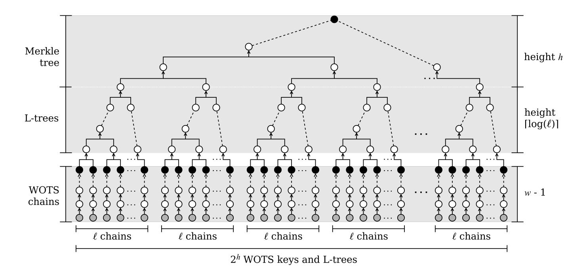
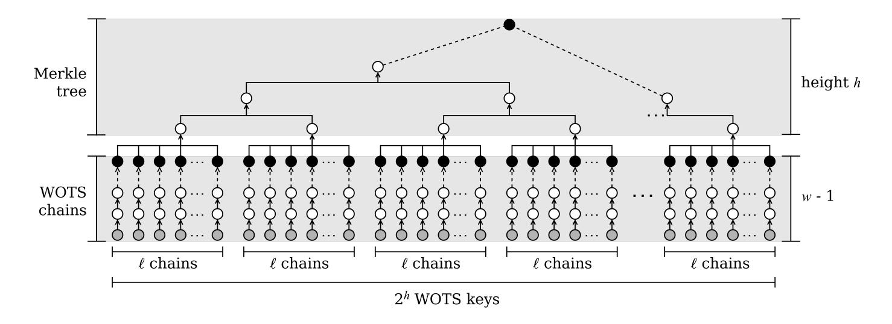
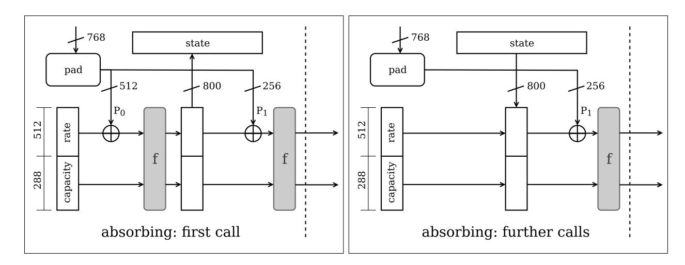

{0}------------------------------------------------

# <span id="page-0-2"></span><span id="page-0-1"></span>LMS vs XMSS: Comparison of Stateful Hash-Based Signature Schemes on ARM Cortex-M4

Fabio Campos<sup>1</sup> , Tim Kohlstadt<sup>1</sup> , Steffen Reith<sup>1</sup> , and Marc Stottinger ¨ 2

<sup>1</sup> Department of Computer Science, RheinMain University of Applied Sciences, Germany campos@sopmac.de

tim.kohlstadt@student.hs-rm.de steffen.reith@hs-rm.de <sup>2</sup> Continental AG, Germany

marc.stoettinger@continental-corporation.com

Abstract. Stateful hash-based signature schemes are among the most efficient approaches for post-quantum signature schemes. Although not suitable for general use, they may be suitable for some use cases on constrained devices. LMS and XMSS are hash-based signature schemes that are conjectured to be quantum secure. In this work, we compared multiple instantiations of both schemes on an ARM Cortex-M4. More precisely, we compared performance, stack consumption, and other figures for key generation, signing and verifying. To achieve this, we evaluated LMS and XMSS using optimised implementations of SHA-256, SHAKE256, Gimli-Hash, and different variants of KECCAK. Furthermore, we present slightly optimised implementations of XMSS achieving speedups of up to 3.11× for key generation, 3.11× for signing, and 4.32× for verifying.

Keywords: LMS, XMSS, implementation, hash-based signatures, digital signature, post-quantum cryptography

# Acknowledgment

The work presented in this paper has been partly funded by the German Federal Ministry of Education and Research (BMBF) under the project "QuantumRISC" [\[29\]](#page-16-0)

# 1 Introduction

Digital-signature schemes are among the most important and widely used cryptographic primitives. Schemes used in practice today (RSA [\[30\]](#page-16-1), DSA [\[14\]](#page-16-2), ECDSA [\[20\]](#page-16-3), and EdDSA [\[4\]](#page-15-0)) are based on assumptions regarding the computational difficulty of solving certain mathematical problems. Due to Shor's algorithm [\[32\]](#page-17-0) and its variants, some of these problems, such as integer factorisation and discrete logarithms, can be efficiently solved on a quantum computer. Since the National Institute of Standards and Technology (NIST) started a project (NIST-PQC[3](#page-0-0) ) to evaluate and standardise post-quantum

<sup>\*</sup> Author list in alphabetical order; see [https://www.ams.org/profession/leaders/](https://www.ams.org/profession/leaders/culture/CultureStatement04.pdf) [culture/CultureStatement04.pdf](https://www.ams.org/profession/leaders/culture/CultureStatement04.pdf)

<span id="page-0-0"></span><sup>3</sup> <https://csrc.nist.gov/Projects/Post-Quantum-Cryptography>

{1}------------------------------------------------

<span id="page-1-1"></span>cryptographic algorithms, many solutions have been proposed. Hash-based signature schemes (HBS) are among the most attractive candidates for quantum-safe signature schemes. Every signature scheme requires a hash function to reduce a message to a small representation that can be easily signed. While other signature schemes rely on additional computational hardness assumptions, hash-based approaches only needs a secure hash function. HBS have been intensively analysed ([\[5\]](#page-15-1), [\[10\]](#page-16-4), [\[13\]](#page-16-5), [\[16\]](#page-16-6), [\[27\]](#page-16-7)) and the two schemes discussed in this work are currently undergoing a standardisation process ([\[18\]](#page-16-8), [\[26\]](#page-16-9)). The Leighton-Micali Signature system (LMS) [\[26\]](#page-16-9) and the eXtended Merkle Signature Scheme (XMSS) [\[18\]](#page-16-8) have been proposed in the Internet Engineering Task Force (IETF) as quantum-secure HBS. NIST proposed [\[11\]](#page-16-10) to approve the use of LMS and XMSS and their multi-tree variants Hierarchical Signature System (HSS) and multi-tree XMSS (XMSS*MT* ), respectively. This recommendation suggests the use of some of the parameter sets from the RFCs and defines some new parameter sets. It considers SHA-256 or SHAKE256 as underlying hash functions, with outputs of 192-bit or 256-bit length. HBS provide through the choice of parameters several trade-offs between time and size. Hence, the parameter selection has a major impact on how feasible it is to deploy HBS on resource-constrained environments such as embedded microcontrollers. In this work, we chose a subset of parameters from the suggested sets of the NIST recommendation which are suitable for embedded devices.

Due to the popularity and widespread use of Cortex-M4 microcontrollers in different applications, NIST recommended it to submission teams as an optimisation target for the second round of NIST-PQC. The pqm4[4](#page-1-0) project [\[22\]](#page-16-11) investigates the feasibility and performance of the proposed NIST-PQC approaches on microcontrollers. It provides a framework for testing and benchmarking NIST-PQC submissions on a Cortex-M4 microcontroller. It includes reference and optimised implementations of key-encapsulation mechanisms and signature schemes. The implementations and measurements in our work were realized within the pqm4 framework.

Related Work. Many aspects regarding the implementations of HBS have been studied in the literature. Rohde, Eisenbarth, Dahmen, Buchmann, Paar [\[31\]](#page-17-1) presented the first implementation of GMSS [\[8\]](#page-15-2), an improvement of Merkle's hash-based signature scheme, on an 8-bit smart-card microprocessor. Hulsing, Busold, Buchmann [ ¨ [17\]](#page-16-12) implemented a variant of XMSS on a 16-bit smart card. A comparison between stateful and stateless HBS was given by Hulsing, Rijneveld, Schwabe [ ¨ [19\]](#page-16-13). For this, the authors implemented SPHINCS and XMSS*MT* on an ARM Cortex M3. Van der Laan, Poll, Rijneveld, de Ruiter, Schwabe, Verschuren [\[23\]](#page-16-14) presented an implementation of XMSS on the Java Card platform. Kannwischer, Rijneveld, Schwabe, Stoffelen [\[22\]](#page-16-11) presented the pqm4 framework for testing, speed benchmarking, and measurement of stack consumption of NIST-PQC submissions on an ARM Cortex-M4 microcontroller. Kampanakis, Fluhrer [\[21\]](#page-16-15) provided the only comparison between LMS and XMSS on a x86-architecture regarding their security assumptions, signature/public key sizes, performance, and some other aspects.

<span id="page-1-0"></span><sup>4</sup> <https://github.com/mupq/pqm4>

{2}------------------------------------------------

<span id="page-2-0"></span>Our Contribution. This paper aims at comparing stateful HBS on microcontrollers. To achieve this, LMS and XMSS and their multi-tree variants were compared on an ARM Cortex-M4. For this, we provide an adapted implementation of LMS for the Cortex-M4, which represents the first implementation to date to the best of the authors' knowledge. We evaluated suitable parameter sets for constrained devices from the NIST recommendation for stateful hash-based signature schemes [\[11\]](#page-16-10). Furthermore, deviating from the RFC 8391 [\[18\]](#page-16-8), we slightly modified the reference implementation of XMSS, leading to noticeable speedups. We provide a comparative performance and stack consumption analysis for several parameter sets of the instantiated versions of LMS and XMSS. Thereby we instantiate both HBS with several optimised hash functions. All software and results described in this paper are available in the public domain. It is publicly available at <https://doi.org/10.5281/zenodo.3631571>. Further, we refer to the respective projects included in our implementation for licensing information.

Organisation. The remainder of this document is structured as follows. First, we start by giving preliminary information on hash-based signature schemes. In Section 3, we reflect the main structural differences between LMS and XMSS. Details about the implemented hash functions and the approaches to speed up XMSS are presented in Section 4. Our implementation results are given in Section 5. Next, we discuss the results and draw a conclusion in Section [6.](#page-14-0) Finally, Appendix A contains further evaluated results.

# 2 Hash-based Signature Schemes

While the security of other post-quantum cryptographic approaches like isogeny-based cryptography is still object to further research, hash-based schemes come with wellunderstood security assumptions.

Both discussed stateful schemes in this work use a tree construction along with a variant of a one-time signature schemes (OTS). Unlike in stateless schemes, in LMS and XMSS the signer needs to keep track of which key pairs have already been used. Therefore, the current state (index) is stored in the secret key, indicating which key pair to use next. XMSS provides methods to decrease the worst case runtime by keeping state information beyond the index [\[9\]](#page-15-3). To allow a fair comparison, this have not been considered in this work.

## 2.1 One-Time Signature Schemes

Many techniques have been proposed for constructing OTS schemes ([\[7\]](#page-15-4), [\[24\]](#page-16-16), [\[27\]](#page-16-7)). One of the most prominent OTS is the Winternitz OTS (WOTS) scheme [\[27\]](#page-16-7), which is relatively efficient, has been used in practice and allows space/time trade-offs. LMS and XMSS use variants of WOTS.

{3}------------------------------------------------

<span id="page-3-3"></span><span id="page-3-2"></span>Winternitz One-time Signature Scheme. The main idea of all WOTS variants is to use a function chain to sign multiple bits starting from random inputs. The key generation is processed as shown in Algorithm 1, where n is the security parameter, w is (a power of 2) the Winternitz parameter, and  $f: \{0,1\}^* \to \{0,1\}^n$  defines a one-way function. Thereby,  $f^{w-1}$  should be interpreted as the (w-1)-th iteration of the one-way function f. Increasing the value of the Winternitz parameter w will linearly shrink the size of a signature and increase exponentially the effort to perform key generation, signing and verification. Thus, the Winternitz parameter w enables space/time trade-offs.

#### **Algorithm 1:** Key generation.

```
Input: security parameter n, Winternitz paramater w.

Output: one-time key pair: (secret key X, public key Y).

1 \ell_1 \leftarrow \lceil n/\log_2(w) \rceil
2 \ell_2 \leftarrow \lfloor \log_2(\ell_1(w-1))/\log_2(w) \rfloor + 1
3 \ell \leftarrow \ell_1 + \ell_2
4 for i = 0, ..., \ell - 1 do
5 x_i \stackrel{\$}{\leftarrow} \{0, 1\}^n // sampled uniformly at random
6 y_i \leftarrow f^{w-1}(x_i)
7 return ((x_0, x_1, ..., x_{\ell-1}), (y_0, y_1, ..., y_{\ell-1}))
```

<span id="page-3-0"></span>In order to protect against trivial attacks, a checksum C is computed and signed along with the message, as shown in Algorithm 2 in line 5-7. A signature is computed by mapping the i-th chunk of M' to one intermediary value of the respective function chain, by iterating the one-way function  $M'_i$  times. As shown in Algorithm 3, in WOTS

#### **Algorithm 2:** Signing.

```
Input: message M, secret key X, security parameter n, Winternitz parameter w.
    Output: signature \sigma.
 1 \ell_1 \leftarrow \lceil n/\log_2(w) \rceil
2 \ell_2 \leftarrow \lfloor \log_2(\ell_1(w-1))/\log_2(w) \rfloor + 1
 3 \ell \leftarrow \ell_1 + \ell_2
4 (M_0, M_1, ..., M_{\ell_1 - 1}) \leftarrow \mathbf{split}(M)
                                                                    // split M into log_2(w)-bit chunks
5 C \leftarrow \sum_{i=0}^{\ell_1-1} w - 1 - M_i
 6 C \leftarrow \mathbf{pad}(C)
                                                                    // pad C with zeros if necessary
 7 M' \leftarrow M \mid\mid C
                                                                    // concatenate M and C
\mathbf{8} \ (M_0', M_1', ..., M_{\ell-1}') \leftarrow \mathbf{split}(M')
                                                                    // split M' into \log_2(w)-bits chunks
9 for i = 0, ..., \ell - 1 do
     \sigma_i \leftarrow f^{M_i'}(x_i)
11 return (\sigma_0, \sigma_1, ..., \sigma_{\ell-1})
```

<span id="page-3-1"></span>the public key can be calculated directly from the signature.

According to [13], assuming f is a collision-resistant one-way function, this scheme is existentially unforgeable under chosen-message attacks. XMSS makes use of the variant WOTS<sup>+</sup>. WOTS<sup>+</sup>, proposed by Hülsing [16], introduced a slight modification of the

{4}------------------------------------------------

#### <span id="page-4-1"></span>**Algorithm 3:** Verifying.

```
Input: signature \sigma, message M, public key Y, security parameter n, Winternitz
                 parameter w.
    Output: valid or invalid.
 1 \ell_1 \leftarrow \lceil n/\log_2(w) \rceil
 2 \ell_2 \leftarrow |\log_2(\ell_1(w-1))/\log_2(w)| + 1
 \iota \iota \leftarrow \ell_1 + \ell_2
4 (M_0, M_1, ..., M_{\ell_1-1}) \leftarrow \mathbf{split}(M)
                                                                // split M into \log_2(w)-bit chunks
5 C \leftarrow \sum_{i=0}^{\ell_1-1} w - 1 - M_i
6 C \leftarrow \mathbf{pad}(C)
                                                                // pad C with zeros if necessary
 7 M' \leftarrow M \mid\mid C
                                                                // concatenate M and C
\mathbf{8} \ (M_0', M_1', ..., M_{\ell-1}') \leftarrow \mathbf{split}(M')
                                                                // split M' into \log_2(w)-bits chunks
9 for i = 0, ..., \ell - 1 do
         if ((f^{w-1-M_i'}(\sigma_i)) \neq y_i) then
10
               return invalid
11
12 return valid
```

<span id="page-4-0"></span>chaining function by adding a random bitmask  $r_i$  for each iteration, such that  $f^0(x) = x$ , and  $f^i(x) = f(f^{i-1}(x) \oplus r_i)$  for i > 0. This modification eliminates the requirement for a collision resistant hash function.

## 2.2 Many-time Signature Schemes

Merkle trees enable the use of a single long-term public key created from a large set of OTS public keys. In the following we will only briefly describe the methods for the construction of many-time schemes and refer to [26] and [18] for further details on the respective approach.

Merkle Trees. Based on the idea of one-time signature schemes Merkle's approach [27] is to construct a balanced binary tree (a so-called *Merkle Tree*) using a given hash function to enable the use of a single public key (root of the tree) for verifying several messages. A signer generates  $2^h$  one-time key pairs  $(X_j, Y_j)$  where  $0 \le j < 2^h$  for a selected  $h \in \mathbb{N}$  and  $h \ge 2$ . The leaves of the tree are represented by the public keys  $X_j$  of the OTS which are derived from the secret keys  $Y_j$  for  $0 \le j < 2^h$ . Parameter h defines the height of the resulting binary tree whose inner nodes are represented by the value computed as  $n = f(n_l \mid |n_r)$ , where  $n_l$  and  $n_r$  are the values of the left and right children of n. To verify a signature at leaf with index i, one additionally needs the authentication path of i which is a sequence of i nodes. This authentication path contains the siblings of all the nodes on the path between leaf i and the root. Thus summarizing, a signature on a message i contains the one-time signature on i produced using i to indicate which key pair of the OTS was used.

Multi-Trees. Rather than scaling up a single tree, LMS and XMSS define single and multi-tree (hypertree) variants of their signature schemes. In the multi-tree variant, the

{5}------------------------------------------------

<span id="page-5-2"></span><span id="page-5-0"></span>

Fig. 1: Overview with L-trees and WOTS chains (adopted from [\[34\]](#page-17-2), Fig. 1). Grey nodes are the private keys and the black nodes the public keys of the WOTS chains. The black node at the top is the public key.

trees on the lowest layer are used to sign messages and the trees on higher layers are used to sign the roots of the trees on the layer below. Considering a hypertree of total height *h* that has *d* layers of trees of height *h*/*d*, the top layer *d* −1 contains one tree, layer *d* −2 contains 2(*h*/*d*) trees, and so on. Finally, the lowest layer contains 2(*h*−(*h*/*d*)) trees. In order to generate the public key, only the single tree at the top of the structure needs to be generated. This requires generating the OTS keys along the bottom of this tree. The lower trees are generated deterministically as required. Thus, for a given *h*, key generation in a hypertree is faster than in a single tree. A signature consists of all the signatures on the way to the highest tree. Hence, the signature size increases and signing and verifying takes slightly longer. The root of the top-level tree is the public key. For further details on the multi-tree variants of LMS and XMSS, we refer to [\[26\]](#page-16-9) and [\[18\]](#page-16-8), respectively.

# 3 Comparison

Roughly speaking, LMS and XMSS have a very similar construction. Both schemes use Merkle trees [\[27\]](#page-16-7) along with a variant of WOTS. For this reason, we will focus on the most relevant structural differences of the schemes.

LMS and XMSS use different notations to specify equivalent parameters. As shown in Table [1,](#page-6-0) we define a common notation for parameters used in this work. For further details on the definition of the parameters, we refer to [\[26\]](#page-16-9) and [\[18\]](#page-16-8).

## <span id="page-5-1"></span>3.1 Prefixes and Bitmasks

In order to move away from collision resistance and towards collision resilience, within LMS and XMSS whenever an input is hashed, a specific prefix is added to the input.

{6}------------------------------------------------

<span id="page-6-1"></span><span id="page-6-0"></span>

| symbol | meaning                                                    | XMSS LMS |        |
|--------|------------------------------------------------------------|----------|--------|
| n      | security parameter ' length of the hash digest (in bits)   | n        | n      |
| h      | height of the tree or hypertree in a multi-tree variant    | h        | h      |
| d      | number of Merkle Trees in the multi-tree variant           | d        | L      |
| w      | Winternitz parameter                                       | w        | w<br>2 |
| `      | number of Winternitz chains used in a single OTS operation | len      | p      |

Table 1: Notation.

In the case of XMSS as mentioned in Section [2.1,](#page-3-2) WOTS<sup>+</sup> [\[16\]](#page-16-6) requires a random bitmask for each chaining iteration as additional input. Although LMS and XMSS apply different mechanisms to strengthen the security, the underlying constructions are very similar. To describe this principle theoretically, Bernstein, Hulsing, K ¨ olbl, Niederha- ¨ gen, Rijneveld, Schwabe [\[5\]](#page-15-1) introduced an abstraction called *tweakable hash functions* (Th) as follows.

*Definition 1. (Tweakable hash function): Let n*,α ∈ N,P *be the public parameters space, and* T *be the tweak space. A tweakable hash function is an efficient function*

$$\mathbf{Th}: \mathcal{P} \times \mathcal{T} \times \{0,1\}^{\alpha} \to \{0,1\}^{n}, \quad \mathsf{MD} \leftarrow \mathbf{Th}(P,T,M)$$

*mapping an* α*-bit message M to an n-bit hash value* MD *using a public parameter P* ∈ P*, also called function key, and a tweak T* ∈ T *.*

Thus, a tweakable hash function adds specific context information (tweak) and public parameters (function key) to the input. According to this definition, the constructions within LMS and XMSS can roughly be described as follows.

*Construction 1. (Prefix construction/LMS): Given a hash function H* : {0,1} <sup>2</sup>*n*+<sup>α</sup> → {0,1} *n* , *we construct* Th *with* P = T = {0,1} *n , as*

$$Th(P, T, M) = H(P||T||M).$$

*Construction 2. (Prefix and bitmask construction/XMSS): Given two hash functions H*<sup>1</sup> : {0,1} <sup>2</sup>*<sup>n</sup>* × {0,1} <sup>α</sup> → {0,1} *<sup>n</sup> with* 2*n-bit keys, and H*<sup>2</sup> : {0,1} <sup>2</sup>*<sup>n</sup>* → {0,1} α , *we construct* Th *with* P = T = {0,1} *n , as*

**Th**
$$(P,T,M) = H_1(P||T,M^{\oplus})$$
, with  $M^{\oplus} = M \oplus H_2(P||T)$ .

As defined in Construction 2, while XMSS additionally generates distinct random inputs for each invocation of the hash function, LMS provides inputs with predictable changes to the hash function. Construction 1 reduces the effort, but comes in return 

{7}------------------------------------------------

<span id="page-7-3"></span>at the cost of stronger security assumptions. For further details on the security model of LMS and XMSS, we refer to [\[21\]](#page-16-15) and for further security notions for the defined constructions, we refer to [\[5\]](#page-15-1).

## 3.2 WOTS Public Key Compression

Both schemes combine the public keys (final values) of a WOTS chain into an *n*-bit value. While LMS hashes them together as a single message (see Figure [2\)](#page-8-0), XMSS uses a tree (called L-tree) to compress these values (see Figure [1\)](#page-5-0). The construction in XMSS obviously leads to a higher number of hash operations.

# 4 LMS and XMSS on the Cortex-M4

In the case of XMSS[5](#page-7-0) , we removed all file-based procedures and implemented an interface to the pqm4 framework. For this, we used a slightly modified version of the pqm4 framework. This modification allows updating the secret key during the signing process by not passing the secret key as a constant. Thus, we enable the signing algorithm to be stateful. For further practical considerations around statefulness in this context, we refer to [\[25\]](#page-16-17). To port the reference implementation of LMS[6](#page-7-1) to Cortex-M4, apart from smaller modifications, we integrated the single-thread version, and turned floating-point operations off.

### 4.1 Implemented Hash Functions

Primarily for the purpose of speedup and to achieve a broader comparison range, we integrated two more lightweight hash functions in addition to those recommended by NIST [\[11\]](#page-16-10) (SHA-256 and SHAKE256) and already available in pqm4. In particular, we additionally evaluated LMS and XMSS using different variants of KECCAK and Gimli-Hash.

KECCAK-*f*[800]. KECCAK-*f* describes a family of permutations originally specified in [\[1\]](#page-15-5). The KECCAK-*p* permutations within KECCAK-*f* are specified by a fixed width of the permutation (*b*) and the respective number of rounds (*nr*) required. Furthermore, the permutation is denoted by KECCAK-*p*[*b*,*n<sup>r</sup>* ], where *b* ∈ {25,50,100,200,400,800,1600} and *n<sup>r</sup>* ∈ {12,14,16,18,20,22,24}. Thus, according to [\[28\]](#page-16-18), KECCAK-*f*[800], a permutation with 800 bits of width, applies to KECCAK-*p*[800, 22]. For further details on KECCAK, we refer to [\[1\]](#page-15-5) and [\[28\]](#page-16-18).

In the case of KECCAK-*f*[800], we additionally considered a KECCAK permutation with only 12 rounds (KECCAK-*p*[800, 12] similar to River Keyak[7](#page-7-2) ) to reduce the computational workload per hash invocation. Evidently, a reduced number of rounds

<span id="page-7-0"></span><sup>5</sup> <https://github.com/XMSS/xmss-reference>, commit fb7e3f8

<span id="page-7-1"></span><sup>6</sup> <https://github.com/cisco/hash-sigs>, commit 5efb1d0

<span id="page-7-2"></span><sup>7</sup> <https://keccak.team/files/Keyakv2-doc2.2.pdf>

{8}------------------------------------------------

<span id="page-8-2"></span><span id="page-8-0"></span>

Fig. 2: Overview without L-trees (adopted from [\[34\]](#page-17-2), Fig. 1). Grey nodes are the private keys and the black nodes the public keys of the WOTS chains. The black node at the top is the public key.

provides a smaller safety margin than the full 22 rounds recommended for KECCAK*f*[800] [\[28\]](#page-16-18). Nevertheless, since the best known practical collision attack against SHA-3 exists only up to 5 rounds [\[15\]](#page-16-19), the margin provided by 12 rounds is still comfortable. In a similar manner, Aumasson [\[2\]](#page-15-6) proposed a general revision of the number of rounds of widely used symmetric primitives to speed up the standards without increasing the security risk. Furthermore to achieve a certain security level, we set the capacity *c* = 256 as specified in River Keyak[7](#page-0-1) .

Gimli-Hash. The family of hash functions Gimli-Hash is built on top of a 384-bit permutation called Gimli. The Gimli permutation [\[6\]](#page-15-7) was designed to achieve high security with high performance. According to the authors, the proposed permutation is distinguished from other permutation-based primitives for its high cross-platform performance. Furthermore, one of the core idea of Gimli was to define one standard that achieves high performance in lightweight as well as in non-lightweight environments. Due to the selected design, Gimli fits into 14 easily usable integer registers on 32-bit ARM microcontrollers. Gimli-Hash works on a 48-byte state with a rate of 16-byte.

We chose Gimli-Hash as an exemplary approach for the current round-2 candidates in NIST's Lightweight Cryptography Standardisation[8](#page-8-1) process. It is of practical importance to investigate the performance of the remaining candidates.

### 4.2 Speeding Up XMSS

In this section, we discuss three methods for speeding up XMSS deviating from RFC 8391 [\[18\]](#page-16-8). The first described technique replaces the tree-based WOTS public-key compression with a single hash call. This approach was first proposed in SPHINCS+ [\[3\]](#page-15-8). The second one, a structure omitting the use of bitmasks (the so-called "simple" version) was proposed in the round-2 submission of SPHINCS+ [\[3\]](#page-15-8) at NIST-PQC. Finally,

<span id="page-8-1"></span><sup>8</sup> <https://csrc.nist.gov/projects/lightweight-cryptography>

{9}------------------------------------------------

<span id="page-9-2"></span><span id="page-9-1"></span>

Fig. 3: Hash pre-computation within KECCAK-*f*[800] with a rate of 512 bits.

we describe a technique called "hash pre-computation". This approach was first mentioned by Kampanakis, Fluhrer [\[21\]](#page-16-15) and first described by Wang, Jungk, Walde, Deng, ¨ Gupta, Szefer, Niederhagen [\[34\]](#page-17-2). Thereby, recurring intermediate results of a certain type of hash calls are temporarily stored and reused in the subsequent hash calls.

All these methods lead to speedups during key generation, signing and verifying. However, during the signature verification, the hash pre-computation method only leads to small speedups in certain parameter sets. Although the methods presented in the following can also be implemented in other cases, in this work we will mainly focus on the parameter sets from Table [3.](#page-12-0) Other approaches, which lead to possible speedups in both LMS and XMSS, were intentionally not considered in this work.

Other acceleration methods, such as storing some top nodes in the secret key [\[12\]](#page-16-20), applying a more efficient tree traversal scheme [\[33\]](#page-17-3) (already part of the XMSS reference implementation[9](#page-9-0) and our implementation), or instantiating the schemes with shorter hash functions, were intentionally not considered in this work. Although these methods lead to significant speedups, they can be applied in LMS and XMSS and therefore have no fundamental impact in our comparison.

The instantiation of the different parameter sets is managed by conditional compilation. In the case of XMSS, the modifications presented in this section are also controlled by preprocessing allowing to compile different versions of XMSS.

Tree-less WOTS+ Public Key Compression. As described in SPHINCS+ [\[3\]](#page-15-8), we compress the end nodes of the WOTS chains (black nodes in Figure [2\)](#page-8-0) with a single call to a tweakable hash function, as shown in Figure [2.](#page-8-0) A tree-based compression (see L-trees in Figure [1\)](#page-5-0) is slower than using a single call to a tweakable hash function with the concatenated digest of all end nodes of the WOTS chains (see black nodes in Figure [2\)](#page-8-0) as input.

Bitmask-less Hashing. In this construction no bitmasks are generated and XORed with the input of the tweakable hash functions. In this case, the tweakable hash function is defined according to Construction 1 instead of Construction 2 (see Section [3.1\)](#page-5-1). For the

<span id="page-9-0"></span><sup>9</sup> <https://github.com/XMSS/xmss-reference>, commit fb7e3f8

{10}------------------------------------------------

<span id="page-10-1"></span>resulting implications for security by applying Construction 1 in XMSS, we strongly refer to [5].

**Hash Pre-computation.** Within XMSS, for a given key pair and a security parameter n, the first 2n-bit block (n-bit domain separator and n-bit hash-function key) of the input to the pseudo-random function (of type  $\mathcal{F}: \{0,1\}^{3n} \to \{0,1\}^n$ ) is the same for all calls. Considering this fact, we store the digest of the first 2n-bit block at the first call to the pseudorandom function (PRF) and skip this effort by reusing this result in all further calls. This approach can easily be applied whenever the internal block size/rate of the used hash function is less than or equal to 2n bits. Depending on the internal block size of the used hash function, the number of saved calls to the internal compression respectively permutation function ( $\mathbf{Speedup}_{PRF}$ ) can be calculated as follows. Let  $B_{bits} \geq 2n$  bits be the internal block size/rate in bits and  $\#call_{PRF}$  be the number of calls to the PRF, then

**Speedup**<sub>PRF</sub>
$$(B_{bits}, \#call_{PRF}) = |2n \text{ bits}/B_{bits}| * \#call_{PRF}.$$

As in Figure 3 exemplified for the case of KECCAK-f[800] and n=256, this method can basically be applied in every sponge construction, by reducing the rate to 2n bits whenever the rate is longer than 2n bits. Hence, even in the case n=256, it can be implemented in SHAKE256 (KECCAK-f[1600]) by reducing the width of the rate from 1088 bits to 2n bits. However, in hash calls apart from the PRF invocations this would increase the number of permutations required for inputs longer than 2n bits. A "hybrid approach" (not considered in this paper) with variable rate width (512 bits for PRF calls and 1088 for other hashing cases) could lead to a possible acceleration.

In the case of SHA-256 and n=256, where the 512-bit block fits into a 512 bit SHA-256 internal block, this approach reduces the number of calls to the compression function by half. According to the standard definition [28] in KECCAK-f[800] with a capacity of 256-bit length, the length of the rate should be 544 bits. In order to enable hash pre-computation, we reduced the length of the rate to 512 bits. In other words, the rate within an instantiation of XMSS using KECCAK-f[800] applying hash pre-computation is 512 bits long, while a version without hash pre-computation makes use of the whole 544 bits. This modified design with a longer capacity obviously has no negative influence on the security of the hash function. In the case of KECCAK-f[800], this approach reduces the number of required permutations by half. Since the rate in the sponge construction within Gimli-Hash is 128 bits long, it results in saving 4 permutation runs per PRF invocation.

From now on as shown in Table 2, we call an implementation of XMSS with L-trees using Construction 2 (see Section 3.1) without hash pre-computation XMSS\_ROBUST, the variant without L-trees using Construction 1 XMSS\_SIMPLE, and the one without L-trees applying Construction 1 and hash pre-computation XMSS\_SIMPLE+PRE. The multi-tree variants are called XMSS $^{MT}$ ROBUST, XMSS $^{MT}$ SIMPLE, and XMSS $^{MT}$ SIMPLE+PRE, respectively. XMSS\_ROBUST and XMSS $^{MT}$ ROBUST represent the current version of XMSS from RFC 8391 $^{10}$ .

<span id="page-10-0"></span><sup>10</sup> https://tools.ietf.org/html/rfc8391

{11}------------------------------------------------

<span id="page-11-8"></span><span id="page-11-0"></span>design multi-tree tree-less WOTS+ bitmask-less hashing pre-computation XMSS ROBUST XMSS SIMPLE • • XMSS SIMPLE+PRE • • • XMSS*MT* ROBUST • XMSS*MT* SIMPLE • • • XMSS*MT* SIMPLE+PRE • • • •

Table 2: Implemented variants of XMSS.

# 5 Evaluation

We measured the performance of our implementations on a commercially available microcontroller. We use the widely available board STM32F4DISCOVERY featuring a 32-bit ARM Cortex-M4 with FPU core, 1-Mbyte Flash ROM, and 192-Kbyte RAM. The reference implementation of LMS[11](#page-11-1) and XMSS[12](#page-11-2) provided the basis for our implementation. The methods used for cycle counter reading, device communication at runtime, and hardware-based random byte generation were provided by the pqm4[13](#page-11-3) framework. This framework in turn includes the libopencm3[14](#page-11-4) library for providing these methods. All test instances were compiled with GNU Tools for ARM Embedded Processors 9-2019-q4-major[15](#page-11-5) (gcc version 9.2.1 20191025 (release) [ARM/arm-9-branch revision 277599]) using the flags:

-03 -mthumb -mcpu=cortex-m4 -mfloat-abi=hard -mfpu=fpv4-sp-d16.

We additionally evaluated LMS and XMSS using optimised assembly implementations of KECCAK-*f*[800] (KeccakP-800-u2-armv7m-le-gcc) from the eXtended Keccak Code Package[16](#page-11-6) and of the Gimli[17](#page-11-7) (arm-m4 version) permutation.

In this work, LMS and XMSS share the same implementations to perform the hash computations, clock-cycle measurement, and stack analysis, hence yielding an unbiased comparison. The selection of the evaluated parameter sets is based on the recommendation of NIST [\[11\]](#page-16-10). The parameter sets from Table [3](#page-12-0) were implemented in combination with Gimli-Hash, KECCAK (KECCAK-*p*[800,22] and KECCAK-*p*[800,12]), SHAKE256, and SHA-256. The resulting signature size for each parameter set is also shown in Table [3.](#page-12-0)

As shown in Table [4,](#page-13-0) the implemented modifications in XMSS and XMSS*MT* lead to significant speedups. XMSS SIMPLE achieves a speedup of up to 3.03× for key gen-

<span id="page-11-1"></span><sup>11</sup> <https://github.com/cisco/hash-sigs>, commit 5efb1d0

<span id="page-11-2"></span><sup>12</sup> <https://github.com/XMSS/xmss-reference>, commit fb7e3f8

<span id="page-11-3"></span><sup>13</sup> <https://github.com/mupq/pqm4>, commit 8136c82

<span id="page-11-4"></span><sup>14</sup> <https://libopencm3.org/>

<span id="page-11-5"></span><sup>15</sup> <https://developer.arm.com/>

<span id="page-11-6"></span><sup>16</sup> <https://github.com/XKCP/XKCP>, commit 035a8ff

<span id="page-11-7"></span><sup>17</sup> <https://gimli.cr.yp.to/impl.html>, version 2017.06.27

{12}------------------------------------------------

<span id="page-12-0"></span>scheme n w h layer signature size (bits) LMS 256 16 5 1 2352 LMS 256 256 5 1 1296 LMS 256 16 10 1 2512 LMS 256 256 10 1 1456 XMSS 256 16 5 1 2340 XMSS 256 16 10 1 2500 HSS 256 16 10 2 4756 HSS 256 256 10 2 2644 XMSS*MT* 256 16 10 2 4642

Table 3: Selected parameter sets.

eration and signing, and up to 4.32× for verifying. In combination with the hash precomputation approach, key generation and signing achieve accelerations up to 3.11 times. However, when applying the hash pre-computation method, a speedup only occurs in certain parameter sets, mostly when the number of rounds of the hash function and the number of calls to the PRF are large enough to compensate for the additional effort. In the case of verification, a speedup through hash pre-computation occurred rarely (see Table [9](#page-17-4) and Table [10\)](#page-18-0).

Reducing the number of rounds in KECCAK-*f* [800] to 12 instead of 22 yields a speedup of up to roughly 1.66× for key generation and signing, and 1.72× for verifying in all implemented variants of XMSS, and up to roughly 1.70× for key generation and signing, and 1.76× for verifying in all implemented variants of LMS (see Table [9,](#page-17-4) Table [10,](#page-18-0) and Table [11\)](#page-18-1).

Structurally, XMSS SIMPLE, the variant without L-trees using Construction 1, differs only marginally from LMS. To confirm this analysis, we measured the number of hash operations required in LMS and XMSS SIMPLE. As Table [5](#page-13-1) shows, XMSS SIMPLE and XMSS*MT* SIMPLE hash operations are almost equivalent to LMS and HSS, respectively. As shown in Table [6,](#page-14-1) although the changes in XMSS result in a slightly smaller number of hash calls than in LMS, LMS unexpectedly requires fewer clock cycles for all tested cases. We further measured the time spent performing hash operations for each scheme. The results of this measurement are given in Table [7.](#page-14-2) In both schemes, at least 85% of the time was spent on performing the hash computations. XMSS spends 15% of the evaluated time on computing other operations, while LMS spends up to 94% of time on hashing.

During key generation, the stack consumption of XMSS is on average slightly higher than for LMS. However, as shown in Table [8,](#page-15-9) the difference during signing and verification is 1.6× and almost 4× as high, respectively.

{13}------------------------------------------------

<span id="page-13-0"></span>Table 4: Speedup in XMSS and XMSS*MT* exemplary with SHA-256.

| design            | w     | h     | layer           | key gena            | signa   | verifya |
|-------------------|-------|-------|-----------------|---------------------|---------|---------|
| XMSS ROBUST       | 16    | 5     | 1               | 738.46              | 747.85  | 13.84   |
| XMSS SIMPLE       | 16    | 5     | 1               | 243.25              | 247.72  | 3.20    |
|                   |       |       | speedup factorb | 3.03                | 3.01    | 4.32    |
| XMSS SIMPLE+PRE   | 16    | 5     | 1               | 237.27              | 241.02  | 3.73    |
|                   |       |       | speedup factorb | 3.11                | 3.10    | 3.71    |
| XMSS ROBUST       |       | 16 10 |                 | 1 23631.70 23642.03 |         | 13.07   |
| XMSS SIMPLE       |       | 16 10 | 1               | 7784.50             | 7788.56 | 3.67    |
|                   |       |       | speedup factorb | 3.03                | 3.03    | 3.56    |
| XMSS SIMPLE+PRE   |       | 16 10 | 1               | 7586.15             | 7589.49 | 4.20    |
|                   |       |       | speedup factorb | 3.11                | 3.11    | 3.11    |
| XMSSMT ROBUST     |       | 16 10 | 2               | 738.43              | 1498.06 | 27.67   |
| XMSSMT SIMPLE     |       | 16 10 | 2               | 243.49              | 494.55  | 7.77    |
|                   |       |       | speedup factorc | 3.03                | 3.03    | 3.56    |
| XMSSMT SIMPLE+PRE | 16 10 |       | 2               | 237.26              | 481.73  | 7.77    |
|                   |       |       | speedup factorc | 3.11                | 3.11    | 3.56    |

<span id="page-13-2"></span>*<sup>a</sup>* All results (apart from speedup) are given in 10<sup>6</sup> clock cycles.

<span id="page-13-1"></span>Table 5: Number of hash operations for SHA-256, *n* = 256, and *w* = 16.

|         |         | LMS XMSS SIMPLE ratioa |      |        | HSS XMSSMT SIMPLE | ratiob |
|---------|---------|------------------------|------|--------|-------------------|--------|
| key gen | 1105990 | 1100800                | 0.99 | 34566  | 34400             | 0.99   |
| sign    | 2216417 | 2202194                | 0.99 | 112542 | 104371            | 0.93   |
| verify  | 2217208 | 2202686                | 0.99 | 113493 | 105359            | 0.93   |

<span id="page-13-5"></span>*<sup>a</sup>* XMSS SIMPLE/LMS

<span id="page-13-3"></span>*<sup>b</sup>* Compared to XMSS ROBUST.

<span id="page-13-4"></span>*<sup>c</sup>* Compared to XMSS*MT* ROBUST.

<span id="page-13-6"></span>*<sup>b</sup>* XMSS*MT* SIMPLE/LMS

{14}------------------------------------------------

|          | LMS     | XMSS ROBUST ratioa |      | XMSS SIMPLE ratiob |      | XMSS SIMPLE+PRE ratioc |      |
|----------|---------|--------------------|------|--------------------|------|------------------------|------|
| key gend | 3774.88 | 23631.70           | 6.26 | 7792.23            | 2.06 | 7586.15                | 2.01 |
| signd    | 3791.15 | 23642.03           | 6.23 | 7796.39            | 2.05 | 7596.24                | 2.00 |
| verifyd  | 2.65    | 13.07              | 4.93 | 3.57               | 1.34 | 4.20                   | 1.58 |

<span id="page-14-1"></span>Table 6: Performance comparison for SHA-256, *n* = 256, *w* = 16, and *h* = 10.

<span id="page-14-2"></span>Table 7: Percentage of time on hashing for SHA-256, *n* = 256, *w* = 16, *h* = 10, and *d* = 2.

|         |     | HSS XMSSMT SIMPLE |
|---------|-----|-------------------|
| key gen | 92% | 85%               |
| sign    | 92% | 85%               |
| verify  | 94% | 85%               |

The round-reduced version of KECCAK (KECCAK-*p*[800, 12]) achieved the best performance (see Table [9,](#page-17-4) Table [10,](#page-18-0) and Table [11\)](#page-18-1) while Gimli-Hash the lowest stack consumption (see Table [12\)](#page-19-0).

A complete overview of our results can be found in Appendix A.

# <span id="page-14-0"></span>6 Conclusion

We showed that the current reference implementation of LMS with some required modifications achieves good performance results on a Cortex-M4. Further, we presented that the implemented modifications in XMSS lead to a significant speedup. Although the XMSS SIMPLE version of XMSS is structurally very similar to LMS, LMS still achieves significantly better performance. Therefore, these performance differences are not based on properties of the schemes but rather on properties of the reference implementation. In addition, the currently discussed correct selection of safety margins for round-based symmetric cryptographic primitives is also considered in this work. In considering the fact that post-quantum approaches are more resource intensive than those currently in use, it is worth considering round-reduced and lightweight designs and concepts of hash functions in an embedded environment.

Our results based on reference implementations should merely give an idea on how practical the evaluated stateful schemes could be in an embedded environment.

<span id="page-14-3"></span>*<sup>a</sup>* XMSS ROBUST/LMS

<span id="page-14-4"></span>*<sup>b</sup>* XMSS SIMPLE/LMS

<span id="page-14-5"></span>*<sup>c</sup>* XMSS SIMPLE+PRE/LMS

<span id="page-14-6"></span>*<sup>d</sup>* All results (apart from ratio) are given in 10<sup>6</sup> clock cycles.

{15}------------------------------------------------

| scheme            | hash type        | w  |   |   | h layer key gen |           | sign verify |
|-------------------|------------------|----|---|---|-----------------|-----------|-------------|
| XMSSMT ROBUST     | Gimli-Hash       | 16 | 5 | 2 |                 | 3560 3704 | 3604        |
| XMSSMT SIMPLE     | Gimli-Hash       | 16 | 5 | 2 |                 | 3512 3656 | 3600        |
| XMSSMT SIMPLE+PRE | Gimli-Hash       | 16 | 5 | 2 |                 | 3484 3672 | 3572        |
| HSS               | Gimli-Hash       | 16 | 5 | 2 |                 | 3528 2268 | 936         |
| HSS               | Gimli-Hash 256 5 |    |   | 2 |                 | 3528 2268 | 980         |

<span id="page-15-10"></span><span id="page-15-9"></span>Table 8: Stack memory usage (bytes) for XMSS*MT* and HSS using Gimli-Hash.

# Acknowledgment

The work presented in this paper has been partly funded by the German Federal Ministry of Education and Research (BMBF) under the project "QuantumRISC" (16KIS1034) [\[29\]](#page-16-0)

# References

- <span id="page-15-5"></span>1. Keccak implementation overview version 3.0. [https://keccak.team/obsolete/](https://keccak.team/obsolete/Keccak-implementation-3.0.pdf) [Keccak-implementation-3.0.pdf](https://keccak.team/obsolete/Keccak-implementation-3.0.pdf), accessed: 2019-04-30 [8](#page-7-3)
- <span id="page-15-6"></span>2. Aumasson, J.P.: Too much crypto. Cryptology ePrint Archive, Report 2019/1492 (2019), <https://eprint.iacr.org/2019/1492> version: 20200103:101600 [9](#page-8-2)
- <span id="page-15-8"></span>3. Bernstein, D.J., Dobraunig, C., Eichlseder, M., Fluhrer, S., Gazdag, S., Hulsing, A., ¨ Kampanakis, P., Kolbl, S., Lange, T., Lauridsen, M., et al.: SPHINCS+ - Submis- ¨ sion to the NIST post-quantum project (2017), [https://sphincs.org/data/sphincs+](https://sphincs.org/data/sphincs+-specification.pdf) [-specification.pdf](https://sphincs.org/data/sphincs+-specification.pdf) [9,](#page-8-2) [10](#page-9-2)
- <span id="page-15-0"></span>4. Bernstein, D.J., Duif, N., Lange, T., Schwabe, P., Yang, B.Y.: High-speed high-security signatures. Journal of Cryptographic Engineering 2(2), 77–89 (2012) [1](#page-0-2)
- <span id="page-15-1"></span>5. Bernstein, D.J., Hulsing, A., K ¨ olbl, S., Niederhagen, R., Rijneveld, J., Schwabe, P.: ¨ The SPHINCS+ signature framework. In: Conference on Computer and Communications Security–CCS 19. Ed. by XiaoFeng Wang and Jonathan Katz. To appear. ACM. pp. 17–43 (2019) [2,](#page-1-1) [7,](#page-6-1) [8,](#page-7-3) [11](#page-10-1)
- <span id="page-15-7"></span>6. Bernstein, D.J., Kolbl, S., Lucks, S., Massolino, P.M.C., Mendel, F., Nawaz, K., Schneider, ¨ T., Schwabe, P., Standaert, F.X., Todo, Y., et al.: Gimli: a cross-platform permutation. In: International Conference on Cryptographic Hardware and Embedded Systems. pp. 299–320. Springer (2017) [9](#page-8-2)
- <span id="page-15-4"></span>7. Bleichenbacher, D., Maurer, U.M.: Optimal tree-based one-time digital signature schemes. In: Annual Symposium on Theoretical Aspects of Computer Science - STACS '96. pp. 361– 374. Springer (1996) [3](#page-2-0)
- <span id="page-15-2"></span>8. Buchmann, J., Dahmen, E., Klintsevich, E., Okeya, K., Vuillaume, C.: Merkle signatures with virtually unlimited signature capacity. In: International Conference on Applied Cryptography and Network Security. pp. 31–45. Springer (2007) [2](#page-1-1)
- <span id="page-15-3"></span>9. Buchmann, J., Dahmen, E., Schneider, M.: Merkle tree traversal revisited. In: International Workshop on Post-Quantum Cryptography. pp. 63–78. Springer (2008) [3](#page-2-0)

{16}------------------------------------------------

- <span id="page-16-4"></span>10. Buchmann, J.A., Dahmen, E., Hulsing, A.: XMSS - A practical forward secure signature ¨ scheme based on minimal security assumptions. In: Yang, B. (ed.) PQCrypto. pp. 117–129. Springer (2011) [2](#page-1-1)
- <span id="page-16-10"></span>11. Cooper, D., Apon, D., Dang, Q., Davidson, M., Dworkin, M., Miller, C.: Recommendation for stateful hash-based signature schemes. Tech. rep., National Institute of Standards and Technology (2019) [2,](#page-1-1) [3,](#page-2-0) [8,](#page-7-3) [12](#page-11-8)
- <span id="page-16-20"></span>12. Dahmen, E., Okeya, K., Takagi, T., Vuillaume, C.: Digital signatures out of second-preimage resistant hash functions. In: International Workshop on Post-Quantum Cryptography. pp. 109–123. Springer (2008) [10](#page-9-2)
- <span id="page-16-5"></span>13. Dods, C., Smart, N.P., Stam, M.: Hash based digital signature schemes. In: IMA International Conference on Cryptography and Coding. pp. 96–115. Springer (2005) [2,](#page-1-1) [4](#page-3-3)
- <span id="page-16-2"></span>14. ElGamal, T.: A public key cryptosystem and a signature scheme based on discrete logarithms. IEEE transactions on information theory 31(4), 469–472 (1985) [1](#page-0-2)
- <span id="page-16-19"></span>15. Guo, J., Liao, G., Liu, G., Liu, M., Qiao, K., Song, L.: Practical collision attacks against round-reduced sha-3. Journal of Cryptology pp. 1–43 (2019) [9](#page-8-2)
- <span id="page-16-6"></span>16. Hulsing, A.: W-OTS+–shorter signatures for hash-based signature schemes. In: International ¨ Conference on Cryptology in Africa. pp. 173–188. Springer (2013) [2,](#page-1-1) [4,](#page-3-3) [7](#page-6-1)
- <span id="page-16-12"></span>17. Hulsing, A., Busold, C., Buchmann, J.: Forward secure signatures on smart cards. In: Inter- ¨ national Conference on Selected Areas in Cryptography. pp. 66–80. Springer (2012) [2](#page-1-1)
- <span id="page-16-8"></span>18. Hulsing, A., Butin, D., Gazdag, S., Rijneveld, J., Mohaisen, A.: XMSS: extended merkle ¨ signature scheme. RFC 8391, 1–74 (2018). [https://doi.org/10.17487/RFC8391,](https://doi.org/10.17487/RFC8391) [https://](https://doi.org/10.17487/RFC8391) [doi.org/10.17487/RFC8391](https://doi.org/10.17487/RFC8391) [2,](#page-1-1) [3,](#page-2-0) [5,](#page-4-1) [6,](#page-5-2) [9](#page-8-2)
- <span id="page-16-13"></span>19. Hulsing, A., Rijneveld, J., Schwabe, P.: ARMed SPHINCS. In: Public-Key Cryptography– ¨ PKC 2016, pp. 446–470. Springer (2016) [2](#page-1-1)
- <span id="page-16-3"></span>20. Johnson, D., Menezes, A., Vanstone, S.: The elliptic curve digital signature algorithm (ECDSA). International journal of information security 1(1), 36–63 (2001) [1](#page-0-2)
- <span id="page-16-15"></span>21. Kampanakis, P., Fluhrer, S.: LMS vs XMSS: Comparion of two Hash-Based Signature Standards. IACR Cryptology ePrint Archive: Report 2017/349 (2017) [2,](#page-1-1) [8,](#page-7-3) [10](#page-9-2)
- <span id="page-16-11"></span>22. Kannwischer, M.J., Rijneveld, J., Schwabe, P., Stoffelen, K.: PQM4: Post-quantum crypto library for the ARM Cortex-M4, <https://github.com/mupq/pqm4> [2](#page-1-1)
- <span id="page-16-14"></span>23. van der Laan, E., Poll, E., Rijneveld, J., de Ruiter, J., Schwabe, P., Verschuren, J.: Is Java Card ready for hash-based signatures? In: International Workshop on Security. pp. 127–142. Springer (2018) [2](#page-1-1)
- <span id="page-16-16"></span>24. Lamport, L.: Constructing digital signatures from a one-way function. Tech. rep., Technical Report CSL-98, SRI International Palo Alto (1979) [3](#page-2-0)
- <span id="page-16-17"></span>25. McGrew, D., Kampanakis, P., Fluhrer, S., Gazdag, S.L., Butin, D., Buchmann, J.: State management for hash-based signatures. In: International Conference on Research in Security Standardisation. pp. 244–260. Springer (2016) [8](#page-7-3)
- <span id="page-16-9"></span>26. McGrew, D.A., Curcio, M., Fluhrer, S.R.: Leighton-Micali Hash-Based Signatures. RFC 8554, 1–61 (2019). [https://doi.org/10.17487/RFC8554,](https://doi.org/10.17487/RFC8554) [https://doi.org/10.17487/](https://doi.org/10.17487/RFC8554) [RFC8554](https://doi.org/10.17487/RFC8554) [2,](#page-1-1) [5,](#page-4-1) [6](#page-5-2)
- <span id="page-16-7"></span>27. Merkle, R.C.: A certified digital signature. In: Conference on the Theory and Application of Cryptology. pp. 218–238. Springer (1989) [2,](#page-1-1) [3,](#page-2-0) [5,](#page-4-1) [6](#page-5-2)
- <span id="page-16-18"></span>28. National Institute of Standards and Technology: FIPS 202: Permutation-Based Hash and Extendable-Output Functions (2015) [8,](#page-7-3) [9,](#page-8-2) [11](#page-10-1)
- <span id="page-16-0"></span>29. QuantumRISC: QuantumRISC — Next Generation Cryptography for Embedded Systems (16KIS1034) (2020), <https://www.quantumrisc.org/> [1,](#page-0-2) [16](#page-15-10)
- <span id="page-16-1"></span>30. Rivest, R.L., Shamir, A., Adleman, L.: A method for obtaining digital signatures and publickey cryptosystems. Communications of the ACM 21(2), 120–126 (1978) [1](#page-0-2)

{17}------------------------------------------------

- <span id="page-17-1"></span>31. Rohde, S., Eisenbarth, T., Dahmen, E., Buchmann, J., Paar, C.: Fast hash-based signatures on constrained devices. In: International Conference on Smart Card Research and Advanced Applications. pp. 104–117. Springer (2008) [2](#page-1-1)
- <span id="page-17-0"></span>32. Shor, P.W.: Polynomial-time algorithms for prime factorization and discrete logarithms on a quantum computer. SIAM review 41(2), 303–332 (1999) [1](#page-0-2)
- <span id="page-17-3"></span>33. Szydlo, M.: Merkle tree traversal in log space and time. In: International Conference on the Theory and Applications of Cryptographic Techniques. pp. 541–554. Springer (2004) [10](#page-9-2)
- <span id="page-17-2"></span>34. Wang, W., Jungk, B., Walde, J., Deng, S., Gupta, N., Szefer, J., Niederhagen, R.: XMSS and ¨ Embedded Systems - XMSS Hardware Accelerators for RISC-V. Cryptology ePrint Archive, Report 2018/1225 (2018), <https://ia.cr/2018/1225>, version: 20190522:113021 [6,](#page-5-2) [9,](#page-8-2) [10](#page-9-2)

# A Further Results

## A.1 Speed and Stack Memory

<span id="page-17-4"></span>Speed is measured in CPU clock cycles. Stack memory (bytes) excludes the space required to store key material, messages, and in the case of hash pre-computation the intermediate state.

| design                     | hash type                                                | w       | h d | key gen                                | sign                          | verify  |
|----------------------------|----------------------------------------------------------|---------|-----|----------------------------------------|-------------------------------|---------|
| XMSS ROBUST                | Gimli-Hash                                               | 16      |     | 5 1 1048850892 1063994437 17850167     |                               |         |
| XMSS SIMPLE                | Gimli-Hash                                               | 16      | 5 1 | 345097734                              | 351135622                     | 4843341 |
| XMSS SIMPLE+PRE Gimli-Hash |                                                          | 16      | 5 1 | 35652023                               | 341236863                     | 4991976 |
| LMS                        | Gimli-Hash                                               | 16      | 5 1 | 210439959                              | 226186258                     | 4601931 |
| LMS                        | Gimli-Hash                                               |         |     | 256 5 1 1688484184 1808265632 38644523 |                               |         |
| XMSS ROBUST                | KECCAK-p[800, 22]                                        | 16      |     | 5 1 1162653236 1179847660 19384572     |                               |         |
| XMSS SIMPLE                | KECCAK-p[800, 22]                                        | 16      | 5 1 | 380333946                              | 387149205                     | 5183652 |
|                            | XMSS SIMPLE+PRE KECCAK-p[800, 22]                        | 16      | 5 1 | 369894358                              | 375718141                     | 5838576 |
| LMS                        | KECCAK-p[800, 22]                                        | 16      | 5 1 | 180384764                              | 193651049                     | 4108963 |
| LMS                        | KECCAK-p[800, 22] 256 5 1 1445029158 1550179966 35721222 |         |     |                                        |                               |         |
| XMSS ROBUST                | KECCAK-p[800, 12]                                        | 16      | 5 1 | 699127232                              | 709176591 11945544            |         |
| XMSS SIMPLE                | KECCAK-p[800, 12]                                        | 16      | 5 1 | 230594112                              | 234234392                     | 3625308 |
|                            | XMSS SIMPLE+PRE KECCAK-p[800, 12]                        | 16      | 5 1 | 225063121                              | 228715963                     | 3444956 |
| LMS                        | KECCAK-p[800, 12]                                        | 16      | 5 1 | 106406966                              | 114348011                     | 2325050 |
| LMS                        | KECCAK-p[800, 12] 256 5 1                                |         |     | 848547880                              | 909533298 20963781            |         |
| XMSS ROBUST                | SHAKE256                                                 | 16      |     | 5 1 1569880839 1593969977 25282729     |                               |         |
| XMSS SIMPLE                | SHAKE256                                                 | 16      | 5 1 | 515089881                              | 523679528                     | 7643266 |
| LMS                        | SHAKE256                                                 | 16      | 5 1 | 482690432                              | 519083330 10541350            |         |
| LMS                        | SHAKE256                                                 |         |     | 256 5 1 3882760965 4165192023 92414919 |                               |         |
| XMSS ROBUST                | SHA-256                                                  | 16      | 5 1 | 738461396                              | 747855715 13842083            |         |
| XMSS SIMPLE                | SHA-256                                                  | 16      | 5 1 | 243254582                              | 247726301                     | 3207473 |
| XMSS SIMPLE+PRE SHA-256    |                                                          | 16      | 5 1 | 237275019                              | 241026688                     | 3735483 |
| LMS                        | SHA-256                                                  | 16      | 5 1 | 117988963                              | 126516806                     | 2576515 |
| LMS                        | SHA-256                                                  | 256 5 1 |     |                                        | 941182086 1009663117 23252036 |         |

{18}------------------------------------------------

<span id="page-18-0"></span>Table 10: Speed in clock cycles for XMSS and LMS for *h* = 10.

| design                     | hash type                         | w  |          | h d | key gen                                     | sign                 | verify  |
|----------------------------|-----------------------------------|----|----------|-----|---------------------------------------------|----------------------|---------|
| XMSS ROBUST                | Gimli-Hash                        | 16 | 10 1     |     | 33564541776                                 | 33577999022 19809084 |         |
| XMSS SIMPLE                | Gimli-Hash                        | 16 | 10 1     |     | 11043410042                                 | 11048855367          | 5499037 |
| XMSS SIMPLE+PRE Gimli-Hash |                                   | 16 | 10 1     |     | 10741004533                                 | 10746291644          | 5350407 |
| LMS                        | Gimli-Hash                        | 16 | 10 1     |     | 6732401742                                  | 6760950108           | 4735761 |
| LMS                        | Gimli-Hash                        |    | 256 10 1 |     | 54029816692                                 | 54252236257 41774596 |         |
| XMSS ROBUST                | KECCAK-p[800, 22]                 | 16 | 10 1     |     | 37206439782                                 | 37224119943 19141666 |         |
| XMSS SIMPLE                | KECCAK-p[800, 22]                 | 16 | 10 1     |     | 12156299702                                 | 12162295897          | 6023986 |
|                            | XMSS SIMPLE+PRE KECCAK-p[800, 22] | 16 | 10 1     |     | 11836857885                                 | 11842845219          | 5754294 |
| LMS                        | KECCAK-p[800, 22]                 | 16 | 10 1     |     | 5770801259                                  | 5795821406           | 4082342 |
| LMS                        | KECCAK-p[800, 22] 256 10 1        |    |          |     | 46239422162                                 | 46435056305 35772292 |         |
| XMSS ROBUST                | KECCAK-p[800, 12]                 | 16 | 10 1     |     | 22373006810                                 | 22383060343 12090021 |         |
| XMSS SIMPLE                | KECCAK-p[800, 12]                 | 16 | 10 1     |     | 7379129292                                  | 7382968494           | 3460242 |
|                            | XMSS SIMPLE+PRE KECCAK-p[800, 12] | 16 | 10 1     |     | 7202125901                                  | 7205678899           | 3591854 |
| LMS                        | KECCAK-p[800, 12]                 | 16 | 10 1     |     | 3403971523                                  | 3418764578           | 2445893 |
| LMS                        | KECCAK-p[800, 12] 256 10 1        |    |          |     | 27152481832                                 | 27267386528 20218474 |         |
| XMSS ROBUST                | SHAKE256                          | 16 | 10 1     |     | 50237912742                                 | 50263977292 23600738 |         |
| XMSS SIMPLE                | SHAKE256                          | 16 | 10 1     |     | 16483247517                                 | 16490948379          | 8606414 |
| LMS                        | SHAKE256                          | 16 | 10 1     |     | 15443962652                                 | 15509782696 10611902 |         |
| LMS                        | SHAKE256                          |    |          |     | 256 10 1 124246229161 124768084452 92485431 |                      |         |
| XMSS ROBUST                | SHA-256                           | 16 | 10 1     |     | 23631706453                                 | 23642038600 13071813 |         |
| XMSS SIMPLE                | SHA-256                           | 16 | 10 1     |     | 7784507955                                  | 7788564498           | 3676358 |
| XMSS SIMPLE+PRE SHA-256    |                                   | 16 | 10 1     |     | 7586158652                                  | 7589495830           | 4201201 |
| LMS                        | SHA-256                           | 16 | 10 1     |     | 3774882103                                  | 3791157911           | 2658884 |
| LMS                        | SHA-256                           |    | 256 10 1 |     | 30117102840                                 | 30244495755 22424231 |         |

<span id="page-18-1"></span>Table 11: Speed in clock cycles for XMSS*MT* and HSS for *h* = 10 with 2 layers.

| design                              | hash type                                        | w  |          | h d | key gen                        | sign                                     | verify   |
|-------------------------------------|--------------------------------------------------|----|----------|-----|--------------------------------|------------------------------------------|----------|
| XMSSMT ROBUST                       | Gimli-Hash                                       | 16 |          |     | 10 2 1048850426 2132881606     |                                          | 33496306 |
| XMSSMT SIMPLE                       | Gimli-Hash                                       | 16 | 10 2     |     | 345098305                      | 701246056                                | 10713254 |
| XMSSMT SIMPLE+PRE Gimli-Hash        |                                                  | 16 | 10 2     |     | 335652685                      | 681899583                                | 10564618 |
| HSS                                 | Gimli-Hash                                       | 16 | 10 2     |     | 210440071                      | 478103461                                | 5782431  |
| HSS                                 | Gimli-Hash                                       |    |          |     | 256 10 2 1688484230 3829196649 |                                          | 49449332 |
| XMSSMT ROBUST                       | KECCAK-p[800, 22]                                | 16 |          |     | 10 2 1162646143 2359535503     |                                          | 41171355 |
| XMSSMT SIMPLE                       | KECCAK-p[800, 22]                                | 16 | 10 2     |     | 379877664                      | 772410324                                | 11268039 |
| XMSSMT SIMPLE+PRE KECCAK-p[800, 22] |                                                  | 16 | 10 2     |     | 369895178                      | 751777787                                | 11335455 |
| HSS                                 | KECCAK-p[800, 22]                                | 16 | 10 2     |     | 180384846                      | 410370171                                | 4730609  |
| HSS                                 | KECCAK-p[800, 22] 256 10 2 1445029240 3283683503 |    |          |     |                                |                                          | 41004008 |
| XMSSMT ROBUST                       | KECCAK-p[800, 12]                                | 16 | 10 2     |     |                                | 699115534 1420918009                     | 23592244 |
| XMSSMT SIMPLE                       | KECCAK-p[800, 12]                                | 16 | 10 2     |     | 230594929                      | 468987052                                | 6745119  |
| XMSSMT SIMPLE+PRE KECCAK-p[800, 12] |                                                  | 16 | 10 2     |     | 225063940                      | 457454439                                | 6882114  |
| HSS                                 | KECCAK-p[800, 12]                                | 16 | 10 2     |     | 106407050                      | 242305287                                | 2781069  |
| HSS                                 | KECCAK-p[800, 12] 256 10 2                       |    |          |     |                                | 848547971 1926719634                     | 24063701 |
| XMSSMT ROBUST                       | SHAKE256                                         | 16 |          |     | 10 2 1569879645 3190288610     |                                          | 50539786 |
| XMSSMT SIMPLE                       | SHAKE256                                         | 16 | 10 2     |     |                                | 515090566 1046239697                     | 16371600 |
| HSS                                 | SHAKE256                                         | 16 | 10 2     |     |                                | 482690353 1095714785                     | 12421365 |
| HSS                                 | SHAKE256                                         |    |          |     |                                | 256 10 2 3882761056 8805213845 117271251 |          |
| XMSSMT ROBUST                       | SHA-256                                          | 16 | 10 2     |     |                                | 738439917 1498069037                     | 27673083 |
| XMSSMT SIMPLE                       | SHA-256                                          | 16 | 10 2     |     | 243495342                      | 494559179                                | 7775017  |
| XMSSMT SIMPLE+PRE SHA-256           |                                                  | 16 | 10 2     |     | 237269504                      | 481736648                                | 7775063  |
| HSS                                 | SHA-256                                          | 16 | 10 2     |     | 117989078                      | 268526114                                | 3082339  |
| HSS                                 | SHA-256                                          |    | 256 10 2 |     |                                | 941182212 2140447370                     | 26690663 |

{19}------------------------------------------------

<span id="page-19-0"></span>Table 12: Stack memory usage (bytes) for XMSS and LMS for *h* ∈ {5,10}, and for XMSS*MT* and HSS.

| XMSS ROBUST<br>Gimli-Hash<br>16<br>5<br>1<br>3784 3832<br>3604<br>XMSS SIMPLE<br>Gimli-Hash<br>16<br>5<br>1<br>3712 3760<br>3556<br>XMSS SIMPLE+PRE<br>Gimli-Hash<br>16<br>5<br>1<br>3728 3776<br>3572<br>LMS<br>Gimli-Hash<br>16<br>5<br>1<br>3528 2240<br>876<br>LMS<br>Gimli-Hash<br>256<br>5<br>1<br>3528 2240<br>876<br>a<br>KECCAK-p[800, x]<br>16<br>5<br>1<br>3896 3944<br>3720<br>XMSS ROBUST<br>a<br>XMSS SIMPLE<br>KECCAK-p[800, x]<br>16<br>5<br>1<br>3824 3872<br>3672<br>a<br>KECCAK-p[800, x]<br>XMSS SIMPLE+PRE<br>16<br>5<br>1<br>3840 3888<br>3688<br>a<br>LMS<br>KECCAK-p[800, x]<br>16<br>5<br>1<br>3644 2356<br>988<br>a<br>LMS<br>KECCAK-p[800, x]<br>256<br>5<br>1<br>3644 2356<br>988<br>SHAKE256<br>16<br>5<br>1<br>4224 4272<br>4088<br>XMSS ROBUST<br>SHAKE256<br>16<br>5<br>1<br>4176 4200<br>4024<br>XMSS SIMPLE<br>LMS<br>SHAKE256<br>16<br>5<br>1<br>3844 2532<br>1164<br>LMS<br>SHAKE256<br>256<br>5<br>1<br>3844 2532<br>1164<br>XMSS ROBUST<br>SHA-256<br>16<br>5<br>1<br>4032 4080<br>3912<br>XMSS SIMPLE<br>SHA-256<br>16<br>5<br>1<br>3984 4032<br>3832<br>SHA-256<br>16<br>5<br>1<br>3976 4016<br>3840<br>XMSS SIMPLE+PRE<br>LMS<br>SHA-256<br>16<br>5<br>1<br>3764 2460<br>1044<br>LMS<br>SHA-256<br>256<br>5<br>1<br>3740 2460<br>1084<br>XMSS ROBUST<br>Gimli-Hash<br>16<br>10<br>1<br>4128 4016<br>3604<br>XMSS SIMPLE<br>Gimli-Hash<br>16<br>10<br>1<br>4056 3944<br>3600<br>Gimli-Hash<br>16<br>10<br>1<br>4072 3960<br>3616<br>XMSS SIMPLE+PRE<br>LMS<br>Gimli-Hash<br>16<br>10<br>1<br>3556 2268<br>832<br>LMS<br>Gimli-Hash<br>256 10<br>1<br>4072 3960<br>876<br>a<br>XMSS ROBUST<br>KECCAK-p[800, x]<br>16<br>10<br>1<br>4240 4128<br>3720<br>a<br>XMSS SIMPLE<br>KECCAK-p[800, x]<br>16<br>10<br>1<br>4168 4056<br>3672<br>a<br>KECCAK-p[800, x]<br>XMSS SIMPLE+PRE<br>16<br>10<br>1<br>4184 4072<br>3688<br>a<br>LMS<br>KECCAK-p[800, x]<br>16<br>10<br>1<br>3644 2356<br>988<br>a<br>LMS<br>KECCAK-p[800, x]<br>256 10<br>1<br>3668 2356<br>988<br>SHAKE256<br>16<br>10<br>1<br>4592 4480<br>4088<br>XMSS ROBUST<br>XMSS SIMPLE<br>SHAKE256<br>16<br>10<br>1<br>4520 4408<br>4040<br>LMS<br>SHAKE256<br>16<br>10<br>1<br>3860 2532<br>1164<br>LMS<br>SHAKE256<br>256 10<br>1<br>3844 2532<br>1164<br>XMSS ROBUST<br>SHA-256<br>16<br>10<br>1<br>4400 4288<br>3896<br>SHA-256<br>16<br>10<br>1<br>4328 4216<br>3848<br>XMSS SIMPLE<br>XMSS<br>SHA-256<br>16<br>10<br>1<br>4320 4208<br>3848<br>LMS<br>SHA-256<br>16<br>10<br>1<br>3780 2460<br>1044<br>LMS<br>SHA-256<br>256 10<br>1<br>3780 2460<br>1084<br>XMSSMT ROBUST<br>Gimli-Hash<br>16<br>5<br>2<br>3560 3704<br>3604<br>XMSSMT SIMPLE<br>Gimli-Hash<br>16<br>5<br>2<br>3512 3656<br>3600<br>XMSSMT SIMPLE+PRE Gimli-Hash<br>16<br>5<br>2<br>3484 3672<br>3572<br>HSS<br>Gimli-Hash<br>16<br>5<br>2<br>3528 2268<br>936<br>HSS<br>Gimli-Hash<br>256<br>5<br>2<br>3528 2268<br>980<br>XMSSMT ROBUST<br>a<br>KECCAK-p[800, x]<br>16<br>5<br>2<br>3672 3816<br>3760<br>XMSSMT SIMPLE<br>a<br>KECCAK-p[800, x]<br>16<br>5<br>2<br>3624 3768<br>3712<br>XMSSMT SIMPLE+PRE KECCAK-p[800, x]<br>a<br>16<br>5<br>2<br>3640 3784<br>3688<br>a<br>LMS<br>KECCAK-p[800, x]<br>16<br>5<br>2<br>3644 2364<br>1052<br>a<br>KECCAK-p[800, x]<br>LMS<br>256<br>5<br>2<br>3668 2364<br>1092<br>XMSSMT ROBUST<br>SHAKE256<br>16<br>5<br>2<br>4024 4168<br>4112<br>XMSSMT SIMPLE<br>SHAKE256<br>16<br>5<br>2<br>3976 4080<br>4024<br>LMS<br>SHAKE256<br>16<br>5<br>2<br>3844 2540<br>1268<br>LMS<br>SHAKE256<br>256<br>5<br>2<br>3844 2564<br>1268<br>XMSSMT ROBUST<br>SHA-256<br>16<br>5<br>2<br>3832 3976<br>3896<br>XMSSMT SIMPLE<br>SHA-256<br>16<br>5<br>2<br>3784 3920<br>3832 | design                    | hash type | w  |   |   | h layer key gen | sign verify |
|------------------------------------------------------------------------------------------------------------------------------------------------------------------------------------------------------------------------------------------------------------------------------------------------------------------------------------------------------------------------------------------------------------------------------------------------------------------------------------------------------------------------------------------------------------------------------------------------------------------------------------------------------------------------------------------------------------------------------------------------------------------------------------------------------------------------------------------------------------------------------------------------------------------------------------------------------------------------------------------------------------------------------------------------------------------------------------------------------------------------------------------------------------------------------------------------------------------------------------------------------------------------------------------------------------------------------------------------------------------------------------------------------------------------------------------------------------------------------------------------------------------------------------------------------------------------------------------------------------------------------------------------------------------------------------------------------------------------------------------------------------------------------------------------------------------------------------------------------------------------------------------------------------------------------------------------------------------------------------------------------------------------------------------------------------------------------------------------------------------------------------------------------------------------------------------------------------------------------------------------------------------------------------------------------------------------------------------------------------------------------------------------------------------------------------------------------------------------------------------------------------------------------------------------------------------------------------------------------------------------------------------------------------------------------------------------------------------------------------------------------------------------------------------------------------------------------------------------------------------------------------------------------------------------------------------------------------------------------------------------------------------------------------------------------------------------------------------------------------------------------------------------------------------------------------------------------------------------------------------------------------------------------------------------------------------------------------------------------------------------------------------------------------------------------------------------------------------------------------------------------------------------------------------------------------------------------------------------------------------------------------------------------------------------------|---------------------------|-----------|----|---|---|-----------------|-------------|
|                                                                                                                                                                                                                                                                                                                                                                                                                                                                                                                                                                                                                                                                                                                                                                                                                                                                                                                                                                                                                                                                                                                                                                                                                                                                                                                                                                                                                                                                                                                                                                                                                                                                                                                                                                                                                                                                                                                                                                                                                                                                                                                                                                                                                                                                                                                                                                                                                                                                                                                                                                                                                                                                                                                                                                                                                                                                                                                                                                                                                                                                                                                                                                                                                                                                                                                                                                                                                                                                                                                                                                                                                                                                              |                           |           |    |   |   |                 |             |
|                                                                                                                                                                                                                                                                                                                                                                                                                                                                                                                                                                                                                                                                                                                                                                                                                                                                                                                                                                                                                                                                                                                                                                                                                                                                                                                                                                                                                                                                                                                                                                                                                                                                                                                                                                                                                                                                                                                                                                                                                                                                                                                                                                                                                                                                                                                                                                                                                                                                                                                                                                                                                                                                                                                                                                                                                                                                                                                                                                                                                                                                                                                                                                                                                                                                                                                                                                                                                                                                                                                                                                                                                                                                              |                           |           |    |   |   |                 |             |
|                                                                                                                                                                                                                                                                                                                                                                                                                                                                                                                                                                                                                                                                                                                                                                                                                                                                                                                                                                                                                                                                                                                                                                                                                                                                                                                                                                                                                                                                                                                                                                                                                                                                                                                                                                                                                                                                                                                                                                                                                                                                                                                                                                                                                                                                                                                                                                                                                                                                                                                                                                                                                                                                                                                                                                                                                                                                                                                                                                                                                                                                                                                                                                                                                                                                                                                                                                                                                                                                                                                                                                                                                                                                              |                           |           |    |   |   |                 |             |
|                                                                                                                                                                                                                                                                                                                                                                                                                                                                                                                                                                                                                                                                                                                                                                                                                                                                                                                                                                                                                                                                                                                                                                                                                                                                                                                                                                                                                                                                                                                                                                                                                                                                                                                                                                                                                                                                                                                                                                                                                                                                                                                                                                                                                                                                                                                                                                                                                                                                                                                                                                                                                                                                                                                                                                                                                                                                                                                                                                                                                                                                                                                                                                                                                                                                                                                                                                                                                                                                                                                                                                                                                                                                              |                           |           |    |   |   |                 |             |
|                                                                                                                                                                                                                                                                                                                                                                                                                                                                                                                                                                                                                                                                                                                                                                                                                                                                                                                                                                                                                                                                                                                                                                                                                                                                                                                                                                                                                                                                                                                                                                                                                                                                                                                                                                                                                                                                                                                                                                                                                                                                                                                                                                                                                                                                                                                                                                                                                                                                                                                                                                                                                                                                                                                                                                                                                                                                                                                                                                                                                                                                                                                                                                                                                                                                                                                                                                                                                                                                                                                                                                                                                                                                              |                           |           |    |   |   |                 |             |
|                                                                                                                                                                                                                                                                                                                                                                                                                                                                                                                                                                                                                                                                                                                                                                                                                                                                                                                                                                                                                                                                                                                                                                                                                                                                                                                                                                                                                                                                                                                                                                                                                                                                                                                                                                                                                                                                                                                                                                                                                                                                                                                                                                                                                                                                                                                                                                                                                                                                                                                                                                                                                                                                                                                                                                                                                                                                                                                                                                                                                                                                                                                                                                                                                                                                                                                                                                                                                                                                                                                                                                                                                                                                              |                           |           |    |   |   |                 |             |
|                                                                                                                                                                                                                                                                                                                                                                                                                                                                                                                                                                                                                                                                                                                                                                                                                                                                                                                                                                                                                                                                                                                                                                                                                                                                                                                                                                                                                                                                                                                                                                                                                                                                                                                                                                                                                                                                                                                                                                                                                                                                                                                                                                                                                                                                                                                                                                                                                                                                                                                                                                                                                                                                                                                                                                                                                                                                                                                                                                                                                                                                                                                                                                                                                                                                                                                                                                                                                                                                                                                                                                                                                                                                              |                           |           |    |   |   |                 |             |
|                                                                                                                                                                                                                                                                                                                                                                                                                                                                                                                                                                                                                                                                                                                                                                                                                                                                                                                                                                                                                                                                                                                                                                                                                                                                                                                                                                                                                                                                                                                                                                                                                                                                                                                                                                                                                                                                                                                                                                                                                                                                                                                                                                                                                                                                                                                                                                                                                                                                                                                                                                                                                                                                                                                                                                                                                                                                                                                                                                                                                                                                                                                                                                                                                                                                                                                                                                                                                                                                                                                                                                                                                                                                              |                           |           |    |   |   |                 |             |
|                                                                                                                                                                                                                                                                                                                                                                                                                                                                                                                                                                                                                                                                                                                                                                                                                                                                                                                                                                                                                                                                                                                                                                                                                                                                                                                                                                                                                                                                                                                                                                                                                                                                                                                                                                                                                                                                                                                                                                                                                                                                                                                                                                                                                                                                                                                                                                                                                                                                                                                                                                                                                                                                                                                                                                                                                                                                                                                                                                                                                                                                                                                                                                                                                                                                                                                                                                                                                                                                                                                                                                                                                                                                              |                           |           |    |   |   |                 |             |
|                                                                                                                                                                                                                                                                                                                                                                                                                                                                                                                                                                                                                                                                                                                                                                                                                                                                                                                                                                                                                                                                                                                                                                                                                                                                                                                                                                                                                                                                                                                                                                                                                                                                                                                                                                                                                                                                                                                                                                                                                                                                                                                                                                                                                                                                                                                                                                                                                                                                                                                                                                                                                                                                                                                                                                                                                                                                                                                                                                                                                                                                                                                                                                                                                                                                                                                                                                                                                                                                                                                                                                                                                                                                              |                           |           |    |   |   |                 |             |
|                                                                                                                                                                                                                                                                                                                                                                                                                                                                                                                                                                                                                                                                                                                                                                                                                                                                                                                                                                                                                                                                                                                                                                                                                                                                                                                                                                                                                                                                                                                                                                                                                                                                                                                                                                                                                                                                                                                                                                                                                                                                                                                                                                                                                                                                                                                                                                                                                                                                                                                                                                                                                                                                                                                                                                                                                                                                                                                                                                                                                                                                                                                                                                                                                                                                                                                                                                                                                                                                                                                                                                                                                                                                              |                           |           |    |   |   |                 |             |
|                                                                                                                                                                                                                                                                                                                                                                                                                                                                                                                                                                                                                                                                                                                                                                                                                                                                                                                                                                                                                                                                                                                                                                                                                                                                                                                                                                                                                                                                                                                                                                                                                                                                                                                                                                                                                                                                                                                                                                                                                                                                                                                                                                                                                                                                                                                                                                                                                                                                                                                                                                                                                                                                                                                                                                                                                                                                                                                                                                                                                                                                                                                                                                                                                                                                                                                                                                                                                                                                                                                                                                                                                                                                              |                           |           |    |   |   |                 |             |
|                                                                                                                                                                                                                                                                                                                                                                                                                                                                                                                                                                                                                                                                                                                                                                                                                                                                                                                                                                                                                                                                                                                                                                                                                                                                                                                                                                                                                                                                                                                                                                                                                                                                                                                                                                                                                                                                                                                                                                                                                                                                                                                                                                                                                                                                                                                                                                                                                                                                                                                                                                                                                                                                                                                                                                                                                                                                                                                                                                                                                                                                                                                                                                                                                                                                                                                                                                                                                                                                                                                                                                                                                                                                              |                           |           |    |   |   |                 |             |
|                                                                                                                                                                                                                                                                                                                                                                                                                                                                                                                                                                                                                                                                                                                                                                                                                                                                                                                                                                                                                                                                                                                                                                                                                                                                                                                                                                                                                                                                                                                                                                                                                                                                                                                                                                                                                                                                                                                                                                                                                                                                                                                                                                                                                                                                                                                                                                                                                                                                                                                                                                                                                                                                                                                                                                                                                                                                                                                                                                                                                                                                                                                                                                                                                                                                                                                                                                                                                                                                                                                                                                                                                                                                              |                           |           |    |   |   |                 |             |
|                                                                                                                                                                                                                                                                                                                                                                                                                                                                                                                                                                                                                                                                                                                                                                                                                                                                                                                                                                                                                                                                                                                                                                                                                                                                                                                                                                                                                                                                                                                                                                                                                                                                                                                                                                                                                                                                                                                                                                                                                                                                                                                                                                                                                                                                                                                                                                                                                                                                                                                                                                                                                                                                                                                                                                                                                                                                                                                                                                                                                                                                                                                                                                                                                                                                                                                                                                                                                                                                                                                                                                                                                                                                              |                           |           |    |   |   |                 |             |
|                                                                                                                                                                                                                                                                                                                                                                                                                                                                                                                                                                                                                                                                                                                                                                                                                                                                                                                                                                                                                                                                                                                                                                                                                                                                                                                                                                                                                                                                                                                                                                                                                                                                                                                                                                                                                                                                                                                                                                                                                                                                                                                                                                                                                                                                                                                                                                                                                                                                                                                                                                                                                                                                                                                                                                                                                                                                                                                                                                                                                                                                                                                                                                                                                                                                                                                                                                                                                                                                                                                                                                                                                                                                              |                           |           |    |   |   |                 |             |
|                                                                                                                                                                                                                                                                                                                                                                                                                                                                                                                                                                                                                                                                                                                                                                                                                                                                                                                                                                                                                                                                                                                                                                                                                                                                                                                                                                                                                                                                                                                                                                                                                                                                                                                                                                                                                                                                                                                                                                                                                                                                                                                                                                                                                                                                                                                                                                                                                                                                                                                                                                                                                                                                                                                                                                                                                                                                                                                                                                                                                                                                                                                                                                                                                                                                                                                                                                                                                                                                                                                                                                                                                                                                              |                           |           |    |   |   |                 |             |
|                                                                                                                                                                                                                                                                                                                                                                                                                                                                                                                                                                                                                                                                                                                                                                                                                                                                                                                                                                                                                                                                                                                                                                                                                                                                                                                                                                                                                                                                                                                                                                                                                                                                                                                                                                                                                                                                                                                                                                                                                                                                                                                                                                                                                                                                                                                                                                                                                                                                                                                                                                                                                                                                                                                                                                                                                                                                                                                                                                                                                                                                                                                                                                                                                                                                                                                                                                                                                                                                                                                                                                                                                                                                              |                           |           |    |   |   |                 |             |
|                                                                                                                                                                                                                                                                                                                                                                                                                                                                                                                                                                                                                                                                                                                                                                                                                                                                                                                                                                                                                                                                                                                                                                                                                                                                                                                                                                                                                                                                                                                                                                                                                                                                                                                                                                                                                                                                                                                                                                                                                                                                                                                                                                                                                                                                                                                                                                                                                                                                                                                                                                                                                                                                                                                                                                                                                                                                                                                                                                                                                                                                                                                                                                                                                                                                                                                                                                                                                                                                                                                                                                                                                                                                              |                           |           |    |   |   |                 |             |
|                                                                                                                                                                                                                                                                                                                                                                                                                                                                                                                                                                                                                                                                                                                                                                                                                                                                                                                                                                                                                                                                                                                                                                                                                                                                                                                                                                                                                                                                                                                                                                                                                                                                                                                                                                                                                                                                                                                                                                                                                                                                                                                                                                                                                                                                                                                                                                                                                                                                                                                                                                                                                                                                                                                                                                                                                                                                                                                                                                                                                                                                                                                                                                                                                                                                                                                                                                                                                                                                                                                                                                                                                                                                              |                           |           |    |   |   |                 |             |
|                                                                                                                                                                                                                                                                                                                                                                                                                                                                                                                                                                                                                                                                                                                                                                                                                                                                                                                                                                                                                                                                                                                                                                                                                                                                                                                                                                                                                                                                                                                                                                                                                                                                                                                                                                                                                                                                                                                                                                                                                                                                                                                                                                                                                                                                                                                                                                                                                                                                                                                                                                                                                                                                                                                                                                                                                                                                                                                                                                                                                                                                                                                                                                                                                                                                                                                                                                                                                                                                                                                                                                                                                                                                              |                           |           |    |   |   |                 |             |
|                                                                                                                                                                                                                                                                                                                                                                                                                                                                                                                                                                                                                                                                                                                                                                                                                                                                                                                                                                                                                                                                                                                                                                                                                                                                                                                                                                                                                                                                                                                                                                                                                                                                                                                                                                                                                                                                                                                                                                                                                                                                                                                                                                                                                                                                                                                                                                                                                                                                                                                                                                                                                                                                                                                                                                                                                                                                                                                                                                                                                                                                                                                                                                                                                                                                                                                                                                                                                                                                                                                                                                                                                                                                              |                           |           |    |   |   |                 |             |
|                                                                                                                                                                                                                                                                                                                                                                                                                                                                                                                                                                                                                                                                                                                                                                                                                                                                                                                                                                                                                                                                                                                                                                                                                                                                                                                                                                                                                                                                                                                                                                                                                                                                                                                                                                                                                                                                                                                                                                                                                                                                                                                                                                                                                                                                                                                                                                                                                                                                                                                                                                                                                                                                                                                                                                                                                                                                                                                                                                                                                                                                                                                                                                                                                                                                                                                                                                                                                                                                                                                                                                                                                                                                              |                           |           |    |   |   |                 |             |
|                                                                                                                                                                                                                                                                                                                                                                                                                                                                                                                                                                                                                                                                                                                                                                                                                                                                                                                                                                                                                                                                                                                                                                                                                                                                                                                                                                                                                                                                                                                                                                                                                                                                                                                                                                                                                                                                                                                                                                                                                                                                                                                                                                                                                                                                                                                                                                                                                                                                                                                                                                                                                                                                                                                                                                                                                                                                                                                                                                                                                                                                                                                                                                                                                                                                                                                                                                                                                                                                                                                                                                                                                                                                              |                           |           |    |   |   |                 |             |
|                                                                                                                                                                                                                                                                                                                                                                                                                                                                                                                                                                                                                                                                                                                                                                                                                                                                                                                                                                                                                                                                                                                                                                                                                                                                                                                                                                                                                                                                                                                                                                                                                                                                                                                                                                                                                                                                                                                                                                                                                                                                                                                                                                                                                                                                                                                                                                                                                                                                                                                                                                                                                                                                                                                                                                                                                                                                                                                                                                                                                                                                                                                                                                                                                                                                                                                                                                                                                                                                                                                                                                                                                                                                              |                           |           |    |   |   |                 |             |
|                                                                                                                                                                                                                                                                                                                                                                                                                                                                                                                                                                                                                                                                                                                                                                                                                                                                                                                                                                                                                                                                                                                                                                                                                                                                                                                                                                                                                                                                                                                                                                                                                                                                                                                                                                                                                                                                                                                                                                                                                                                                                                                                                                                                                                                                                                                                                                                                                                                                                                                                                                                                                                                                                                                                                                                                                                                                                                                                                                                                                                                                                                                                                                                                                                                                                                                                                                                                                                                                                                                                                                                                                                                                              |                           |           |    |   |   |                 |             |
|                                                                                                                                                                                                                                                                                                                                                                                                                                                                                                                                                                                                                                                                                                                                                                                                                                                                                                                                                                                                                                                                                                                                                                                                                                                                                                                                                                                                                                                                                                                                                                                                                                                                                                                                                                                                                                                                                                                                                                                                                                                                                                                                                                                                                                                                                                                                                                                                                                                                                                                                                                                                                                                                                                                                                                                                                                                                                                                                                                                                                                                                                                                                                                                                                                                                                                                                                                                                                                                                                                                                                                                                                                                                              |                           |           |    |   |   |                 |             |
|                                                                                                                                                                                                                                                                                                                                                                                                                                                                                                                                                                                                                                                                                                                                                                                                                                                                                                                                                                                                                                                                                                                                                                                                                                                                                                                                                                                                                                                                                                                                                                                                                                                                                                                                                                                                                                                                                                                                                                                                                                                                                                                                                                                                                                                                                                                                                                                                                                                                                                                                                                                                                                                                                                                                                                                                                                                                                                                                                                                                                                                                                                                                                                                                                                                                                                                                                                                                                                                                                                                                                                                                                                                                              |                           |           |    |   |   |                 |             |
|                                                                                                                                                                                                                                                                                                                                                                                                                                                                                                                                                                                                                                                                                                                                                                                                                                                                                                                                                                                                                                                                                                                                                                                                                                                                                                                                                                                                                                                                                                                                                                                                                                                                                                                                                                                                                                                                                                                                                                                                                                                                                                                                                                                                                                                                                                                                                                                                                                                                                                                                                                                                                                                                                                                                                                                                                                                                                                                                                                                                                                                                                                                                                                                                                                                                                                                                                                                                                                                                                                                                                                                                                                                                              |                           |           |    |   |   |                 |             |
|                                                                                                                                                                                                                                                                                                                                                                                                                                                                                                                                                                                                                                                                                                                                                                                                                                                                                                                                                                                                                                                                                                                                                                                                                                                                                                                                                                                                                                                                                                                                                                                                                                                                                                                                                                                                                                                                                                                                                                                                                                                                                                                                                                                                                                                                                                                                                                                                                                                                                                                                                                                                                                                                                                                                                                                                                                                                                                                                                                                                                                                                                                                                                                                                                                                                                                                                                                                                                                                                                                                                                                                                                                                                              |                           |           |    |   |   |                 |             |
|                                                                                                                                                                                                                                                                                                                                                                                                                                                                                                                                                                                                                                                                                                                                                                                                                                                                                                                                                                                                                                                                                                                                                                                                                                                                                                                                                                                                                                                                                                                                                                                                                                                                                                                                                                                                                                                                                                                                                                                                                                                                                                                                                                                                                                                                                                                                                                                                                                                                                                                                                                                                                                                                                                                                                                                                                                                                                                                                                                                                                                                                                                                                                                                                                                                                                                                                                                                                                                                                                                                                                                                                                                                                              |                           |           |    |   |   |                 |             |
|                                                                                                                                                                                                                                                                                                                                                                                                                                                                                                                                                                                                                                                                                                                                                                                                                                                                                                                                                                                                                                                                                                                                                                                                                                                                                                                                                                                                                                                                                                                                                                                                                                                                                                                                                                                                                                                                                                                                                                                                                                                                                                                                                                                                                                                                                                                                                                                                                                                                                                                                                                                                                                                                                                                                                                                                                                                                                                                                                                                                                                                                                                                                                                                                                                                                                                                                                                                                                                                                                                                                                                                                                                                                              |                           |           |    |   |   |                 |             |
|                                                                                                                                                                                                                                                                                                                                                                                                                                                                                                                                                                                                                                                                                                                                                                                                                                                                                                                                                                                                                                                                                                                                                                                                                                                                                                                                                                                                                                                                                                                                                                                                                                                                                                                                                                                                                                                                                                                                                                                                                                                                                                                                                                                                                                                                                                                                                                                                                                                                                                                                                                                                                                                                                                                                                                                                                                                                                                                                                                                                                                                                                                                                                                                                                                                                                                                                                                                                                                                                                                                                                                                                                                                                              |                           |           |    |   |   |                 |             |
|                                                                                                                                                                                                                                                                                                                                                                                                                                                                                                                                                                                                                                                                                                                                                                                                                                                                                                                                                                                                                                                                                                                                                                                                                                                                                                                                                                                                                                                                                                                                                                                                                                                                                                                                                                                                                                                                                                                                                                                                                                                                                                                                                                                                                                                                                                                                                                                                                                                                                                                                                                                                                                                                                                                                                                                                                                                                                                                                                                                                                                                                                                                                                                                                                                                                                                                                                                                                                                                                                                                                                                                                                                                                              |                           |           |    |   |   |                 |             |
|                                                                                                                                                                                                                                                                                                                                                                                                                                                                                                                                                                                                                                                                                                                                                                                                                                                                                                                                                                                                                                                                                                                                                                                                                                                                                                                                                                                                                                                                                                                                                                                                                                                                                                                                                                                                                                                                                                                                                                                                                                                                                                                                                                                                                                                                                                                                                                                                                                                                                                                                                                                                                                                                                                                                                                                                                                                                                                                                                                                                                                                                                                                                                                                                                                                                                                                                                                                                                                                                                                                                                                                                                                                                              |                           |           |    |   |   |                 |             |
|                                                                                                                                                                                                                                                                                                                                                                                                                                                                                                                                                                                                                                                                                                                                                                                                                                                                                                                                                                                                                                                                                                                                                                                                                                                                                                                                                                                                                                                                                                                                                                                                                                                                                                                                                                                                                                                                                                                                                                                                                                                                                                                                                                                                                                                                                                                                                                                                                                                                                                                                                                                                                                                                                                                                                                                                                                                                                                                                                                                                                                                                                                                                                                                                                                                                                                                                                                                                                                                                                                                                                                                                                                                                              |                           |           |    |   |   |                 |             |
|                                                                                                                                                                                                                                                                                                                                                                                                                                                                                                                                                                                                                                                                                                                                                                                                                                                                                                                                                                                                                                                                                                                                                                                                                                                                                                                                                                                                                                                                                                                                                                                                                                                                                                                                                                                                                                                                                                                                                                                                                                                                                                                                                                                                                                                                                                                                                                                                                                                                                                                                                                                                                                                                                                                                                                                                                                                                                                                                                                                                                                                                                                                                                                                                                                                                                                                                                                                                                                                                                                                                                                                                                                                                              |                           |           |    |   |   |                 |             |
|                                                                                                                                                                                                                                                                                                                                                                                                                                                                                                                                                                                                                                                                                                                                                                                                                                                                                                                                                                                                                                                                                                                                                                                                                                                                                                                                                                                                                                                                                                                                                                                                                                                                                                                                                                                                                                                                                                                                                                                                                                                                                                                                                                                                                                                                                                                                                                                                                                                                                                                                                                                                                                                                                                                                                                                                                                                                                                                                                                                                                                                                                                                                                                                                                                                                                                                                                                                                                                                                                                                                                                                                                                                                              |                           |           |    |   |   |                 |             |
|                                                                                                                                                                                                                                                                                                                                                                                                                                                                                                                                                                                                                                                                                                                                                                                                                                                                                                                                                                                                                                                                                                                                                                                                                                                                                                                                                                                                                                                                                                                                                                                                                                                                                                                                                                                                                                                                                                                                                                                                                                                                                                                                                                                                                                                                                                                                                                                                                                                                                                                                                                                                                                                                                                                                                                                                                                                                                                                                                                                                                                                                                                                                                                                                                                                                                                                                                                                                                                                                                                                                                                                                                                                                              |                           |           |    |   |   |                 |             |
|                                                                                                                                                                                                                                                                                                                                                                                                                                                                                                                                                                                                                                                                                                                                                                                                                                                                                                                                                                                                                                                                                                                                                                                                                                                                                                                                                                                                                                                                                                                                                                                                                                                                                                                                                                                                                                                                                                                                                                                                                                                                                                                                                                                                                                                                                                                                                                                                                                                                                                                                                                                                                                                                                                                                                                                                                                                                                                                                                                                                                                                                                                                                                                                                                                                                                                                                                                                                                                                                                                                                                                                                                                                                              |                           |           |    |   |   |                 |             |
|                                                                                                                                                                                                                                                                                                                                                                                                                                                                                                                                                                                                                                                                                                                                                                                                                                                                                                                                                                                                                                                                                                                                                                                                                                                                                                                                                                                                                                                                                                                                                                                                                                                                                                                                                                                                                                                                                                                                                                                                                                                                                                                                                                                                                                                                                                                                                                                                                                                                                                                                                                                                                                                                                                                                                                                                                                                                                                                                                                                                                                                                                                                                                                                                                                                                                                                                                                                                                                                                                                                                                                                                                                                                              |                           |           |    |   |   |                 |             |
|                                                                                                                                                                                                                                                                                                                                                                                                                                                                                                                                                                                                                                                                                                                                                                                                                                                                                                                                                                                                                                                                                                                                                                                                                                                                                                                                                                                                                                                                                                                                                                                                                                                                                                                                                                                                                                                                                                                                                                                                                                                                                                                                                                                                                                                                                                                                                                                                                                                                                                                                                                                                                                                                                                                                                                                                                                                                                                                                                                                                                                                                                                                                                                                                                                                                                                                                                                                                                                                                                                                                                                                                                                                                              |                           |           |    |   |   |                 |             |
|                                                                                                                                                                                                                                                                                                                                                                                                                                                                                                                                                                                                                                                                                                                                                                                                                                                                                                                                                                                                                                                                                                                                                                                                                                                                                                                                                                                                                                                                                                                                                                                                                                                                                                                                                                                                                                                                                                                                                                                                                                                                                                                                                                                                                                                                                                                                                                                                                                                                                                                                                                                                                                                                                                                                                                                                                                                                                                                                                                                                                                                                                                                                                                                                                                                                                                                                                                                                                                                                                                                                                                                                                                                                              |                           |           |    |   |   |                 |             |
|                                                                                                                                                                                                                                                                                                                                                                                                                                                                                                                                                                                                                                                                                                                                                                                                                                                                                                                                                                                                                                                                                                                                                                                                                                                                                                                                                                                                                                                                                                                                                                                                                                                                                                                                                                                                                                                                                                                                                                                                                                                                                                                                                                                                                                                                                                                                                                                                                                                                                                                                                                                                                                                                                                                                                                                                                                                                                                                                                                                                                                                                                                                                                                                                                                                                                                                                                                                                                                                                                                                                                                                                                                                                              |                           |           |    |   |   |                 |             |
|                                                                                                                                                                                                                                                                                                                                                                                                                                                                                                                                                                                                                                                                                                                                                                                                                                                                                                                                                                                                                                                                                                                                                                                                                                                                                                                                                                                                                                                                                                                                                                                                                                                                                                                                                                                                                                                                                                                                                                                                                                                                                                                                                                                                                                                                                                                                                                                                                                                                                                                                                                                                                                                                                                                                                                                                                                                                                                                                                                                                                                                                                                                                                                                                                                                                                                                                                                                                                                                                                                                                                                                                                                                                              |                           |           |    |   |   |                 |             |
|                                                                                                                                                                                                                                                                                                                                                                                                                                                                                                                                                                                                                                                                                                                                                                                                                                                                                                                                                                                                                                                                                                                                                                                                                                                                                                                                                                                                                                                                                                                                                                                                                                                                                                                                                                                                                                                                                                                                                                                                                                                                                                                                                                                                                                                                                                                                                                                                                                                                                                                                                                                                                                                                                                                                                                                                                                                                                                                                                                                                                                                                                                                                                                                                                                                                                                                                                                                                                                                                                                                                                                                                                                                                              |                           |           |    |   |   |                 |             |
|                                                                                                                                                                                                                                                                                                                                                                                                                                                                                                                                                                                                                                                                                                                                                                                                                                                                                                                                                                                                                                                                                                                                                                                                                                                                                                                                                                                                                                                                                                                                                                                                                                                                                                                                                                                                                                                                                                                                                                                                                                                                                                                                                                                                                                                                                                                                                                                                                                                                                                                                                                                                                                                                                                                                                                                                                                                                                                                                                                                                                                                                                                                                                                                                                                                                                                                                                                                                                                                                                                                                                                                                                                                                              |                           |           |    |   |   |                 |             |
|                                                                                                                                                                                                                                                                                                                                                                                                                                                                                                                                                                                                                                                                                                                                                                                                                                                                                                                                                                                                                                                                                                                                                                                                                                                                                                                                                                                                                                                                                                                                                                                                                                                                                                                                                                                                                                                                                                                                                                                                                                                                                                                                                                                                                                                                                                                                                                                                                                                                                                                                                                                                                                                                                                                                                                                                                                                                                                                                                                                                                                                                                                                                                                                                                                                                                                                                                                                                                                                                                                                                                                                                                                                                              |                           |           |    |   |   |                 |             |
|                                                                                                                                                                                                                                                                                                                                                                                                                                                                                                                                                                                                                                                                                                                                                                                                                                                                                                                                                                                                                                                                                                                                                                                                                                                                                                                                                                                                                                                                                                                                                                                                                                                                                                                                                                                                                                                                                                                                                                                                                                                                                                                                                                                                                                                                                                                                                                                                                                                                                                                                                                                                                                                                                                                                                                                                                                                                                                                                                                                                                                                                                                                                                                                                                                                                                                                                                                                                                                                                                                                                                                                                                                                                              |                           |           |    |   |   |                 |             |
|                                                                                                                                                                                                                                                                                                                                                                                                                                                                                                                                                                                                                                                                                                                                                                                                                                                                                                                                                                                                                                                                                                                                                                                                                                                                                                                                                                                                                                                                                                                                                                                                                                                                                                                                                                                                                                                                                                                                                                                                                                                                                                                                                                                                                                                                                                                                                                                                                                                                                                                                                                                                                                                                                                                                                                                                                                                                                                                                                                                                                                                                                                                                                                                                                                                                                                                                                                                                                                                                                                                                                                                                                                                                              |                           |           |    |   |   |                 |             |
|                                                                                                                                                                                                                                                                                                                                                                                                                                                                                                                                                                                                                                                                                                                                                                                                                                                                                                                                                                                                                                                                                                                                                                                                                                                                                                                                                                                                                                                                                                                                                                                                                                                                                                                                                                                                                                                                                                                                                                                                                                                                                                                                                                                                                                                                                                                                                                                                                                                                                                                                                                                                                                                                                                                                                                                                                                                                                                                                                                                                                                                                                                                                                                                                                                                                                                                                                                                                                                                                                                                                                                                                                                                                              |                           |           |    |   |   |                 |             |
|                                                                                                                                                                                                                                                                                                                                                                                                                                                                                                                                                                                                                                                                                                                                                                                                                                                                                                                                                                                                                                                                                                                                                                                                                                                                                                                                                                                                                                                                                                                                                                                                                                                                                                                                                                                                                                                                                                                                                                                                                                                                                                                                                                                                                                                                                                                                                                                                                                                                                                                                                                                                                                                                                                                                                                                                                                                                                                                                                                                                                                                                                                                                                                                                                                                                                                                                                                                                                                                                                                                                                                                                                                                                              |                           |           |    |   |   |                 |             |
|                                                                                                                                                                                                                                                                                                                                                                                                                                                                                                                                                                                                                                                                                                                                                                                                                                                                                                                                                                                                                                                                                                                                                                                                                                                                                                                                                                                                                                                                                                                                                                                                                                                                                                                                                                                                                                                                                                                                                                                                                                                                                                                                                                                                                                                                                                                                                                                                                                                                                                                                                                                                                                                                                                                                                                                                                                                                                                                                                                                                                                                                                                                                                                                                                                                                                                                                                                                                                                                                                                                                                                                                                                                                              |                           |           |    |   |   |                 |             |
|                                                                                                                                                                                                                                                                                                                                                                                                                                                                                                                                                                                                                                                                                                                                                                                                                                                                                                                                                                                                                                                                                                                                                                                                                                                                                                                                                                                                                                                                                                                                                                                                                                                                                                                                                                                                                                                                                                                                                                                                                                                                                                                                                                                                                                                                                                                                                                                                                                                                                                                                                                                                                                                                                                                                                                                                                                                                                                                                                                                                                                                                                                                                                                                                                                                                                                                                                                                                                                                                                                                                                                                                                                                                              |                           |           |    |   |   |                 |             |
|                                                                                                                                                                                                                                                                                                                                                                                                                                                                                                                                                                                                                                                                                                                                                                                                                                                                                                                                                                                                                                                                                                                                                                                                                                                                                                                                                                                                                                                                                                                                                                                                                                                                                                                                                                                                                                                                                                                                                                                                                                                                                                                                                                                                                                                                                                                                                                                                                                                                                                                                                                                                                                                                                                                                                                                                                                                                                                                                                                                                                                                                                                                                                                                                                                                                                                                                                                                                                                                                                                                                                                                                                                                                              |                           |           |    |   |   |                 |             |
| 3776 3920                                                                                                                                                                                                                                                                                                                                                                                                                                                                                                                                                                                                                                                                                                                                                                                                                                                                                                                                                                                                                                                                                                                                                                                                                                                                                                                                                                                                                                                                                                                                                                                                                                                                                                                                                                                                                                                                                                                                                                                                                                                                                                                                                                                                                                                                                                                                                                                                                                                                                                                                                                                                                                                                                                                                                                                                                                                                                                                                                                                                                                                                                                                                                                                                                                                                                                                                                                                                                                                                                                                                                                                                                                                                    | XMSSMT SIMPLE+PRE SHA-256 |           | 16 | 5 | 2 |                 | 3840        |
| HSS<br>SHA-256<br>16<br>5<br>2<br>3764 2468<br>1148                                                                                                                                                                                                                                                                                                                                                                                                                                                                                                                                                                                                                                                                                                                                                                                                                                                                                                                                                                                                                                                                                                                                                                                                                                                                                                                                                                                                                                                                                                                                                                                                                                                                                                                                                                                                                                                                                                                                                                                                                                                                                                                                                                                                                                                                                                                                                                                                                                                                                                                                                                                                                                                                                                                                                                                                                                                                                                                                                                                                                                                                                                                                                                                                                                                                                                                                                                                                                                                                                                                                                                                                                          |                           |           |    |   |   |                 |             |
| HSS<br>SHA-256<br>256<br>5<br>2<br>3740 2468<br>1188                                                                                                                                                                                                                                                                                                                                                                                                                                                                                                                                                                                                                                                                                                                                                                                                                                                                                                                                                                                                                                                                                                                                                                                                                                                                                                                                                                                                                                                                                                                                                                                                                                                                                                                                                                                                                                                                                                                                                                                                                                                                                                                                                                                                                                                                                                                                                                                                                                                                                                                                                                                                                                                                                                                                                                                                                                                                                                                                                                                                                                                                                                                                                                                                                                                                                                                                                                                                                                                                                                                                                                                                                         |                           |           |    |   |   |                 |             |

<span id="page-19-1"></span>*<sup>a</sup>* Values valid for KECCAK-*p*[800, 22] and KECCAK-*p*[800, 12].