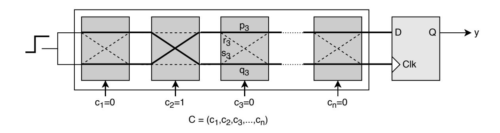
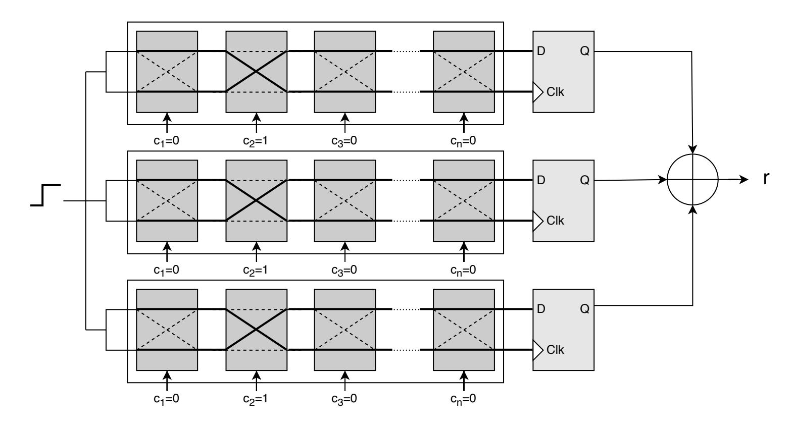
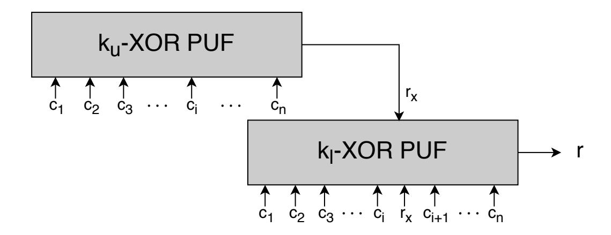
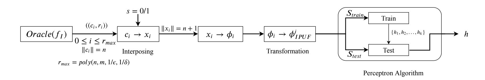

{0}------------------------------------------------

# Interpose PUF can be PAC Learned

Durba Chatterjee<sup>1</sup> , Debdeep Mukhopadhyay<sup>2</sup> , and Aritra Hazra<sup>3</sup>

- 1 Indian Institute of Technology Kharagpur, India durba@iitkgp.ac.in
- 2 Indian Institute of Technology Kharagpur, India debdeep@iitkgp.ac.in
- 3 Indian Institute of Technology Kharagpur, India aritrah@cse.iitkgp.ac.in

#### Abstract

In this work, we prove that Interpose PUF is learnable in the PAC model. First, we show that Interpose PUF can be approximated by a Linear Threshold Function (LTF), assuming the interpose bit to be random. We translate the randomness in the interpose bit to classification noise of the hypothesis. Using classification noise model, we prove that the resultant LTF can be learned with number of labelled examples (challenge response pairs) polynomial in the number of stages and PAC model parameters.

# 1 Introduction

The security of a cryptographic solution is dependent on the secrecy of the key employed. Storing cryptographic keys in Non-Volatile memories has been a major problem in hardware security. In such a situation, Physically Unclonable Function (PUF) is a preferable alternative to permanent key storage. PUFs are specialized circuits that give a different output (response) for a given input (challenge) on different chips. The challenge response behaviour of a PUF is dependent on the manufacturing variations of the chip. One of the most used PUF type is Arbiter PUF (APUF). It has been used in many cryptographic applications. The challenge response behaviour of an Arbiter PUF depends on the difference in the propagation delay of a signal traversing two identical paths.

However, APUF is vulnerable to machine learning attacks. This was followed by design and analysis of PUF constructions. Machine learning resistance is one of the important factors in the analysis. One of the recent PUF construction is the Interpose PUF, which claims to be resilient against all state of the art machine learning attacks. Most of the machine learning attacks against PUFs in the literature are ad-hoc and lack proper mathematical explanation. A formal mathematical framework for security assessment of PUFs has been proposed, for the first time in [\[3\]](#page-9-0). In this work, Arbiter PUF, XOR APUF, Ring Oscilltor PUF, Bistable Ring PUF have been proven to be vulnerable against modelling attacks. In this work, we perform a similar security assessment of Interpose PUF using the PAC framework. In [\[7\]](#page-10-0), there is a discussion on PAC learning iPUF. However, in-depth analysis of the Percepron based attack is lacking.

# 2 Background

This section presents the background information required to understand the concept of PUFs, LTF, Perceptron algorithm and PAC model.

{1}------------------------------------------------



<span id="page-1-0"></span>Figure 1: Block diagram of an Arbiter PUF

## 2.1 Physically Unclonable Functions

#### 2.1.1 Arbiter PUF

Arbiter PUF is one of the first PUFs developed and henceforth has been used as a fundamental component is various other PUFs. It consists of a series of multiplexers followed by an arbiter. A signal passing in two identical paths through the multiplexers controlled by the challenge bits, reach the arbiter, which decides the output of the PUF, depending on whether the signal reaches the top or bottom input first. An n-bit APUF, consists of n multiplexers, each of which is controlled by a challenge bit. The schematic of an Arbiter PUF is shown in Figure 1.

Let  $c \in \{-1,1\}^n$  be a challenge and  $y \in \{-1,1\}$  be the response where n be the number of switches in the APUF. Let  $c_i \in \{-1,1\}$  be the  $i^{th}$  challenge bit. The total delay at the  $(i+1)^{th}$  stage can be given as follows:

$$\delta_t(i+1) = \frac{1+c_{i+1}}{2}(p_{i+1}+\delta_t(i)) + \frac{1-c_{i+1}}{2}(s_{i+1}+\delta_b(i))$$
(1)

$$\delta_b(i+1) = \frac{1 + c_{i+1}}{2} (q_{i+1} + \delta_b(i)) + \frac{1 - c_{i+1}}{2} (r_{i+1} + \delta_t(i))$$
(2)

$$\Delta(i+1) = c_{i+1}.\Delta(i) + \alpha_{i+1}.c_{i+1} + b_{i+1}$$
(3)

$$\alpha_i = \frac{(p_i - q_i) + (r_i - s_i)}{2}$$
 and  $\beta_i = \frac{(p_i - q_i) - (r_i - s_i)}{2}$  (4)

$$p_k = \prod_{i=k+1}^n c_i \quad k = 0, 1 \cdots, n-1 \quad p_n = 1$$
 (5)

$$\Delta(n) = \alpha_1 p_0 + (\alpha_2 + \beta_1) p_1 + \dots + (\alpha_n + \beta_{n-1}) p_{n-1} + \beta_n p_n$$

$$= \langle \mathbf{w}, \phi \rangle$$
(6)

The APUF output is given by  $y = sign(\Delta(n))$ .

#### 2.1.2 XOR Arbiter PUF

Due to the existence of a linear additive model, APUF is vulnerable to machine learning attacks. XOR Arbiter PUF [11] was introduced to increase the robustness against machine learning attacks. A k-XOR Arbiter PUF also known as k-XOR PUF consists of k APUFs of equal length. Each of the constituent APUF is given the same challenge as input and their responses are combined by an XOR gate. The schematic of a 3-XOR PUF is shown in Figure 2. However, this construction has also been found to be vulnerable against modelling attacks [8].

{2}------------------------------------------------



<span id="page-2-0"></span>Figure 2: Block diagram of a 3-XOR Arbiter PUF



<span id="page-2-1"></span>Figure 3: Block diagram of  $(k_u, k_l)$ -Interpose PUF

#### 2.1.3 Interpose PUF

Interpose PUF [7] is a strong PUF constructed using Arbiter PUFs. The PUF construction claims to mitigate the classical and reliability based machine learning attacks. An Interpose PUF has a layered construction. A  $(k_u, k_l)$ -iPUF takes an n-bit challenge as input and returns a 1-bit output. The  $k_u$ -XOR APUF in the upper layer takes the n-bit challenge and returns a 1-bit response. The output of the  $k_u$ -XOR PUF is interposed at a given position in the input of the second  $k_l$ -XOR APUF. The  $k_l$ -XOR APUF takes an (n+1) bit challenge and returns a 1-bit response which is the final response of the iPUF. The schematic of  $(k_u, k_l)$ -iPUF is shown in Figure 3.

## 2.2 Linear threshold functions and Perceptron algorithm

A Linear Threshold Function  $h: \mathbb{R}^n \to \{0,1\}$  is given by:

$$h = \begin{cases} 1, & \text{if } \sum_{i=1}^{n} (w[i].\phi[i]) \ge \theta \\ 0, & \text{if } \sum_{i=1}^{n} (w[i].\phi[i]) < \theta \end{cases}$$
 (7)

{3}------------------------------------------------

where  $\phi \in \mathbb{R}^n$  is the input vector and  $\mathbf{w}$  represents the weight vector. The sets of positive and negative examples of h form two halfspaces  $S^0$  and  $S^1$  where  $S^1 = \{\phi \in \mathbb{R}^n | \sum_{i=1}^n (w[i].\phi[i]) \geq \theta\}$  and  $S^0 = \{\phi \in \mathbb{R}^n | \sum_{i=1}^n (w[i].\phi[i]) < \theta\}$ . Mapping  $\{0,1\} \to \{1,-1\}$ , including the constant in the weight vector  $\mathbf{w}$  and appending 1 to the input vector  $\phi$ , we get

$$h = sign(\mathbf{w}.\phi)$$

where  $\mathbf{w} = (w_1, w_2, \dots, w_n, \theta)$  and  $\phi = (\phi[1], \dots, \phi[n], 1)$ . Decision hyperplane is given by  $\mathcal{P} : \mathbf{w}.\phi = 0$ 

### Perceptron Algorithm

Perceptron algorithm is an online algorithm used to learn LTF efficiently. The algorithm takes a set of r labelled examples  $\langle (\phi_1, y_1), (\phi_2, y_2), \cdots, (\phi_r, y_r) \rangle$  and outputs a vector  $\mathbf{w}$ . It begins with a zero vector  $(\mathbf{w}_0 = (w_0[1], w_0[2], \cdots, w_0[n], \theta_0) = (0, \cdots, 0))$  and updates the vector when there is a mismatch between the actual and the predicted label. Let  $\mathbf{w}_{j-1}$  be the weight vector before the  $j^{th}$  mistake. The updated vector  $\mathbf{w}_j$  is computed as

$$\mathbf{w}_{j}[i] = \begin{cases} \mathbf{w}_{j-1}[i] + y_{j}.\phi_{j}[i] & 1 \leq i \leq n \\ \theta_{j} - y_{j} & i = n+1 \end{cases}$$
(8)

The convergence theorem of the Perceptron algorithm gives an upper bound of the error that can occur during the execution of Perceptron algorithm.

### Convergence theorem of the Perceptron Algorithm:

Let  $\langle (\phi_1, y_1), (\phi_2, y_2), \cdots, (\phi_r, y_r) \rangle$  be a sequence of labelled examples with  $||x_i|| \leq R$ . Let  $\mathbf{w}*$  be the solution vector with  $||\mathbf{w}*|| = 1$  and let  $\gamma > 0$ . The deviation of each example is defined as  $d_i = max\{0, \gamma - y_i(\mathbf{w}^*.\phi_i)\}$ , and  $D = \sqrt{\sum_{i=1}^r d_i^2}$ . The number of mistakes of the online Perceptron algorithm on this sequence is bounded by

$$N_{mis} = \left(\frac{R+D}{\gamma}\right)^2$$

(Please refer [2] for details.)

### 2.3 PAC Model

The Probably Approximately Correct or PAC model of learning is a general model which enables us to formally analyse machine learning algorithms. It consists of a learning algorithm (A), which is provided with a set of examples picked from the input space  $\mathcal{X}$  as per distribution  $\mathcal{D}$  and labelled using the target function f. The objective of the algorithm is to deliver an approximately correct hypothesis with high probability. It can be formally stated as follows:

Let  $C_n$  be a concept class defined over an instance space  $\mathcal{X}_n = \{0,1\}^n$  and let  $\mathcal{X} = \bigcup_{n \geq 1} \mathcal{X}_n$  and  $C = \bigcup_{n \geq 1} \mathcal{C}_n$ . Let f be the target function in  $C_n$ . Let  $\mathcal{H}_n$  be the hypothesis class and  $\mathcal{H} = \bigcup_{n \geq 1} \mathcal{H}_n$ . The concept class  $C_n$  is said to be PAC Learnable if there exists a learning algorithm  $\mathcal{A}$ , polynomial p(.,.,.) and values  $\epsilon$  and  $\delta$  with the following property: For every  $\epsilon, \delta \in (0,1)^2$ , for every distribution  $\mathcal{D}$  over  $\mathcal{X}_n$  and every target concept  $f \in \mathcal{C}_n$ , when  $\mathcal{A}$  is provided with  $p(n, 1/\epsilon, 1/\delta)$  independent examples drawn with respect to  $\mathcal{D}$  and labelled according to f, then with probability at least  $1 - \delta$  the algorithm  $\mathcal{A}$  returns a hypothesis  $h \in \mathcal{H}_n$  such that  $error(h) \leq \epsilon$ . The smallest polynomial p satisfying this condition is the sample complexity of

{4}------------------------------------------------

A. The concept class C is said to be properly PAC Learnable if C = H. When C 6= H, C is known as agnostic PAC Learnable. The error of the hypothesis h with respect to target f is defined as error(h) = P <sup>x</sup>∈h4<sup>f</sup> D(x) where 4 denotes the symmetric difference.

Conversion from online to PAC Learning model: There are various conversion mechanisms to convert an online algorithm to a PAC Learning algorithm [\[9\]](#page-10-3). We use the method used in [\[6\]](#page-10-4) as it is asymptotically the most efficient. The steps are as follows:

- 1. A sequence of labelled examples obtained from Oracle EX() is fed to the online algorithm Aon.
- 2. Hypotheses generated by Aon are stored.
- 3. A new sequence of labelled examples is obtained from EX() which is used to calculate the error rate of the hypotheses stored. The hypothesis with the lowest error rate is the outputted.

The sample complexity of the PAC learning algorithm is related to the mistake bound Nmis by the following theorem proved in [\[6\]](#page-10-4).

Theorem: Let Aon be an online algorithm that updates its hypothesis only when the predicted and received label differ. The total number of calls that the PAC algorithm A makes to the Oracle is O(1/(log(1/δ) + Nmis)).

Therefore, the following holds: (Refer corollary 1 in [\[4\]](#page-10-5))

Corollary: Let C<sup>n</sup> be the class of LTF over {0, 1} <sup>n</sup> such that <sup>w</sup><sup>i</sup> <sup>∈</sup> <sup>Z</sup> and <sup>X</sup><sup>n</sup> i=1 |w[i]| ≤ U, then the online Perceptron algorithm can be converted to a PAC learning algorithm running in time poly(n, U, 1/, 1/δ).

Note that the weight vector can be converted to an integer vector by using the delay discretization technique given in [\[5\]](#page-10-6). The delay discretization step states that the delay values of an Arbiter PUF can be mapped to in integer value in the range [−m, m] where m = d6σ/κe, κ is the precision of the arbiter and σ is the variance of the delay distribution. Therefore w<sup>i</sup> ∈ [−2m, 2m].

# 3 PAC Learning of Interpose PUF

A (ku, kl)-iPUF takes an n-bit challenge as input and returns a 1-bit output. It comprises of 2 XOR PUFs in two layers. The ku-XOR APUF in the upper layer takes the n-bit challenge and returns a 1-bit response. The output of the ku-XOR PUF is given is interposed at a given position in the input of the second kl-XOR APUF. The kl-XOR APUF takes an (n + 1) bit challenge and returns a 1-bit response which is the final response of the iPUF. Let the interpose bit position be t. Due to the unknown interpose bit in the second XOR PUF, it has proven to be resistant against modelling attacks.

If the interpose bit and the bit position is known, then an n-bit (ku, kl)-iPUF reduces to an (n + 1)-bit kl-XOR APUF. Considering the interpose bit to be random, an instance of iPUF can be considered to be an XOR PUF which takes a (n + 1)-bit challenge and gives a one bit response. Since both the constituent XOR PUFs are given the same challenge, n out of n + 1 bits are known and only one bit needs to be chosen at random. XOR PUFs have been proven

{5}------------------------------------------------



Figure 4: Schematic for PAC Learning of iPUF represented as an LTF.

to be learnable in the PAC model [4] under LTF representation. Thus, we use LTF to represent the class of Interpose-PUF, by assuming the interpose bit to be random.

First, we represent an  $(k_u, k_l)$ -iPUF as a Linear Threshold Function by fixing an interpose bit position. The Perceptron algorithm used to learn LTF and its conversion to the PAC model has been presented in the previous section. Next, we present the PAC Learning results for XOR PUFs obtained in [4]. We then use the theoretical bias calculation given in [10] to explain the dependence of the iPUF output on the interpose bit. Next we translate the randomness in interpose bit to classification noise model and estimate the error in PUF response. We calculate the probability of disagreement between the hypothesis (h) obtained from the PAC learning algorithm (A) and the sample produced the target hypothesis  $(f_I)$ . Finally, we calculate the number of mistakes allowed for the Perceptron algorithm and the sample complexity (number of challenge response pairs) to PAC-learn  $(k_u, k_l)$ -iPUF.

## 3.1 LTF Representation of Interpose PUF

We adopt the LTF representation of XOR PUFs [4], to represent the Interpose PUF. The lower XOR PUF in an n-bit iPUF takes an (n+1)-bit challenge, which comprises of the n-bit challenge given as input to the iPUF and an additional interpose bit which is the response of the upper XOR PUF. According to the linear additive model of APUF, we have

$$\Delta(n+1) = \langle \mathbf{w}^T . \phi \rangle$$

where **w** is the weight vector of length n+2 (including the bias) and  $\phi$  is the encoded challenge vector or parity vector. Assuming  $y \in \{-1, 1\}$ , the output of an arbiter is given by

$$f_{APUF} = sgn(\Delta(n+1))$$

<span id="page-5-0"></span>Assuming the interpose bit and the bit position is known,  $(k_u, k_l)$ -iPUF can be represented as follows

$$f_{IPUF} = \prod_{j=1}^{k_l} sgn(\mathbf{w}^T.\phi) = sgn\left(\bigotimes_{j=1}^{k_l} \mathbf{w}^T.\bigotimes_{j=1}^{k_l} \phi_j\right)$$
$$= sgn\left(\mathbf{w}_{IPUF}^T.\phi_{IPUF}\right)$$
(9)

where  $k_l$  is the number of Arbiter chains in the lower XOR PUF,  $\mathbf{w}_{IPUF} = \bigotimes_{j=1}^{k_l} \mathbf{w}_j^T$  is the tensor product of the weight vectors and  $\phi_{IPUF} = \bigotimes_{j=1}^{k_l} \phi_j$  is the tensor product of the parity vector.

Please refer Section 3.1 in [4].

{6}------------------------------------------------

**PAC Learning of XOR APUF with Perceptron:** The Perceptron algorithm can be applied to learn k-XOR APUF after transforming the (n + 1)- dimensional vectors to  $(n + 1)^k$  dimension (refer Equation 9) as shown in [4].

From [4], we get the following result:

**Result:** For a class of k-XOR PUF over the instance space  $X_n = \{0,1\}^{(n+1)^k}$  represented by the class of linear threshold functions such that  $w_i \in \mathbb{Z}$  and  $\sum_{i=1}^{(n+1)^k} |w_i| \leq 2m(n+1)^k$ , the Perceptron-based algorithm running in time  $poly((n+1)^k, 4m^2, 1/\epsilon, 1/\delta)$  can PAC learn an XOR PUF by calling the Oracle at most  $\mathcal{O}(\log(1/\delta)/\epsilon + 4m^2(n+1)^k/\epsilon^3)$  times.

In the following sections, we estimate the classification noise to the random interpose bit and use the method given in [1] which shows that Perceptron algorithm can handle classification noise to prove that iPUF is PAC learnable.

## 3.2 Dependence of Response on the interpose bit

In this section, we calculate the dependence of iPUF response on the interpose bit to understand the impact of setting a random interpose bit. Assuming the interpose bit position to be t, we estimate the dependence of iPUF output on the interpose bit by calculating the probability with which the output of an iPUF will flip on flipping the interpose bit. This probability is obtained from the bias of the PUF response. Since the iPUF can be abstracted as an XOR PUF with an extra (unknown) bit, we calculate the bias of an k-XOR PUF which takes an (n+1)-bit challenge as given in [10]. The bias of a k-XOR PUF is calculated from the bias of its constituent APUFs.

Let x and  $\hat{x}$  be two (n+1)-bit challenges which differ in the  $t^{th}$  position. Let z and  $\hat{z}$  be the corresponding responses. The bias of an APUF is given by  $Pr[z=\hat{z}]$ . From [10], we get

<span id="page-6-0"></span>
$$Pr[z = \hat{z}] = 1 - \frac{2}{\pi} \tan^{-1} \sqrt{\frac{2t - 1}{2(n+1) - 2t + 1}}$$
 (10)

The XOR response is given by  $r = \bigoplus_{i=1}^{k} sign(\Delta_i(n))$ .

The bias on a k-XOR PUF can be calculated using Equation 10 and Piling Lemma.

The Piling Lemma states the if  $Pr[X_i = 0] = p_i = \frac{1}{2} + \epsilon_i$  for  $i = 1, \dots, k$ , then  $Pr[\bigoplus_{i=1}^k X_i = 0]$ 

$$0] = \frac{1}{2} + 2^{k-1} \prod_{i=1}^{k} \epsilon_i.$$

Thus the bias of k-XOR PUF is given by:

$$Pr[z = \hat{z}] = \frac{1}{2} + 2^{k-1} \epsilon^k = \eta$$

where

$$\epsilon = \frac{1}{2} - \frac{2}{\pi} \tan^{-1} \sqrt{\frac{2t - 1}{2(n+1) - 2t + 1}}$$

Consequently,  $Pr[z \neq \hat{z}] = 1 - \eta$ .

{7}------------------------------------------------

### 3.3 Estimation of classification noise due to random interpose bit

Let h be the hypothesis output by the Perceptron-based algorithm and f<sup>I</sup> be the oracle used for generating challenge response pairs. Let (c, r) be a challenge response pair provided by the oracle f<sup>I</sup> , where c = (c1, c2, · · · , cn) ∈ {−1, 1} <sup>n</sup> and r ∈ {−1, 1}. The lower XOR APUF takes an (n + 1)-bit challenge. Let it be denoted by x = (c1, c2, · · · , ct−1, s, ct, · · · , cn) where s is the interpose bit. As per the Perceptron algorithm, the hypothesis (h) is updated only when the predicted response doesn't match with the actual response.

Here, h is a LTF and is represented by a weight vector w = (w1, w2, · · · , wt−1, ws, wt, · · · , wn, wn+1) of length n+2. Given challenge c, first the input x is generated as x = (c1, c2, · · · , ct, s, ct+1, · · · , cn) by choosing s ∈ {−1, 1} randomly. Then the corresponding parity vector φ is calculated as

$$\phi[i] = \prod_{j=i}^{n+1} x[j]$$
. Finally the output of the hypothesis h is given by  $y = sign(\mathbf{w}.\phi)$ . Let  $C_h$ 

be the set of challenges for which the hypothesis returns 1 as output and Cf<sup>I</sup> be the set of challenges for which f<sup>I</sup> returns 1 as output. then d<sup>h</sup> can be defined as follows

$$d_h = \mathcal{D}(C_h \triangle C_{f_I}) = \sum_{c \in C_h \triangle C_{f_I}} Pr_{\mathcal{D}}[c]$$

where Ch4Cf<sup>I</sup> denotes the set of challenges for which the output of the Oracle does not match with the output of the hypothesis, irrespective of the value of s. As per PAC model, d<sup>h</sup> ≤ .

Thus the probability that an example (c, r) produced by f<sup>I</sup> disagrees with hypothesis h is calculated as follows:

$$Pr_{c \sim \mathcal{D}}[h(x) \neq f_I(c)] = p = Pr_{c \sim \mathcal{D}}[c \in C_h \triangle C_{f_I}](Pr[s \text{ doesn't affect } r])$$

$$+ Pr_{c \sim \mathcal{D}}[c \notin C_h \triangle C_{f_I}](Pr[s \text{ affects } r].Pr[s \text{ is incorrect}])$$

$$= d_h.\eta + ((1 - d_h)(1 - \eta).\frac{1}{2})$$

$$= \frac{(1 - \eta)}{2} + \frac{d_h(3\eta - 1)}{2}$$

$$\leq \frac{(1 - \eta)}{2} + \frac{\epsilon(3\eta - 1)}{2} \qquad [d_h \leq \epsilon]$$

$$(11)$$

As shown above, the probability that the hypothesis output disagrees with the output of f<sup>I</sup> depends on two factors: i) The dependence of hypothesis output on the interpose bit and ii) the challenge lying in Ch4C<sup>f</sup><sup>I</sup> . Thus the there are two possibilities: i) The challenge lies in Ch4C<sup>f</sup><sup>I</sup> implies that the hypothesis and the target function will differ on that challenge and the interpose bit does not affect the final response. ii) The hypothesis and the target function agree on a challenge and due to the incorrect interpose bit, the response gets flipped.

When hypothesis h becomes equal to the target hypothesis f, we have ( = 0) =⇒ p = (1−η)/2, since error will occur only due to the change in response as a result of random selection of interpose bit. Since 1/2 ≤ η ≤ 1, for any hypothesis h, the error is atleast (1 − η)/2. Now for a -bad hypothesis (g), D(g4f<sup>I</sup> ) ≥ , thus

$$p \ge \frac{(1-\eta)}{2} + \frac{\epsilon(3\eta - 1)}{2}$$

Thus we have a separation of atleast (3η − 1)/2 between the disagreement rates of correct and -bad hypothesis [\[1\]](#page-9-2).

{8}------------------------------------------------

# 3.4 Sample complexity

The maximum number of mistakes that can be made by the Perceptron algorithm is polynomial in the separation ((3η − 1)/2) and is given by

$$N_{mis} = \left(\frac{2R}{\epsilon(3\eta - 1)}\right)^2$$

where kφk ≤ R and kw\*k = 1 where w\* is the weight vector corresponding to hypothesis output by the Perceptron algorithm after feeding r CRP. (refer Theorem 3 in [\[4\]](#page-10-5)).

Theorem 3[ [\[4\]](#page-10-5)] Consider r labeled examples < (φ1, r1), · · ·(φ<sup>i</sup> , ri), · · ·(φr, rr) > which are fed into the Perceptron algorithm and let kφk ≤ R. In case of a noisy labels (due to random interpose bit), let w\* be the solution vector with kw\*k = 1, and (w\*.φi).r<sup>i</sup> ≥ (3η − 1)/2 > 0, then

$$N_{mis} = \left(\frac{2R}{\epsilon(3\eta - 1)}\right)^2$$

We know that kφk ≤ (n + 2)<sup>k</sup> . Therefore,

$$N_{mis} = \frac{4(n+2)^k}{\epsilon^2 (3\eta - 1)^2}$$

where

$$\eta = \frac{1}{2} + 2^{k-1} \left( \frac{1}{2} - \frac{2}{\pi} \tan^{-1} \left( \sqrt{\frac{2t-1}{2(n+1)-2t+1}} \right) \right)^k$$

If Nmis is the number of mistakes made by the learning algorithm, and the learning algorithm updates its hypothesis only when the predicted response and actual response differs, then the total number of calls that the learning algorithm makes to the Oracle (iPUF in our case) is O(1/(log(1/δ) + Nmis)) [\[6\]](#page-10-4).

Therefore, number of CRPs required

$$= \mathcal{O}\left(\frac{1}{\epsilon'}\left(\log(\frac{1}{\delta}) + N_{mis}\right)\right)$$

$$= \mathcal{O}\left(\frac{2\log(1/\delta)}{\epsilon(3\eta - 1)} + \frac{32m^2(n+2)^k}{\epsilon^3(3\eta - 1)^3}\right)$$
(12)

The sample complexity is poly(n, m, 1/, 1/δ). It is to be noted that in our calculation, we have fixed the interpose bit position. However, varying the interpose bit position across all the stages and adding the number of challenge response pairs required, the sample complexity will still remain poly(n, m, 1/, 1/δ). This proves that Interpose PUF is PAC Learnable.

# 3.5 Perceptron algorithm for learning LTF with random interpose bit

The Perceptron based PAC algorithm takes a sample S comprising of rmax CRPs and splits it into training sample Strain and test sample Stest. In the training phase, the algorithm takes Strain CRPS and the number of APUFs in the lower XOR APUF as input and outputs a set of weight vector w<sup>i</sup> , each corresponding to one of the hypothesis generated during the execution of the Perceptron algorithm. Each of these hypothesis is then tested with the CRPs in Stest and the hypothesis with the least error is given as output. The Oracle f<sup>I</sup> gives challenges of length n, which is then transformed to obtain (n + 2)<sup>k</sup> dimensional vector. The training and testing phase of the Perceptron-based algorithm is given in Algorithm [1](#page-9-3) and [2.](#page-10-8)

{9}------------------------------------------------

Algorithm 1: Training phase of learning algorithm

```
Input: Labeled examples \langle (C_i, r_i) \rangle, 0 \leq i \leq |S_{train}|
                 Number of APUFs in lower XOR APUF: k
Output: Weight vectors: v
Initialize i \leftarrow 1, \mathbf{w} \leftarrow 0
Initialize v \leftarrow \{\}
for i = 1 to |S_{train}| do
        s \stackrel{R}{\leftarrow} \{0,1\}
        x_i \leftarrow \langle c_{i,1}, \cdots, c_{i,t}, s, c_{i,t+1}, \cdots, c_{i,n} \rangle

\phi_i \leftarrow \mathsf{parity\_generation}(x_i)
        \hat{y}_i \leftarrow \mathsf{sign}(\mathbf{w}_j.\phi_i)

\mathbf{if} \ \hat{y}_i = r_i \ \mathbf{then} \\
 s_i = s

         end
         else
                x_{i} \leftarrow \langle c_{i,1}, \cdots, c_{i,t}, -s, c_{i,t+1}, \cdots, c_{i,n} \rangle
\phi_{i}^{\oplus s} \leftarrow \text{parity\_generation}(x_{i}^{\oplus s})
\hat{y}_{i} \leftarrow \text{sign}(\mathbf{w}_{j}.\phi_{i}^{\oplus s})
                if \hat{y}_i = r_i then
                  s_i = -s
                 end
                 \mathbf{else}
                       v \leftarrow v \cup \mathbf{w}_j
\mathbf{w}_{j+1} \leftarrow \mathbf{w}_j + \phi_i . r_i
j \leftarrow j + 1
                 \mathbf{end}
         \mathbf{end}
\mathbf{end}
Return v
```

## <span id="page-9-3"></span>4 Conclusion

We proved that Interpose PUF is efficiently learned in the PAC model for various values of accuracy and confidence. To this end, we presented an approximate representation of an Interpose PUF as a Linear Threshold function with a random input bit. We translated the randomness in the interpose bit to classification noise. We showed that the classification noise is bounded by 1/2. Finally we showed that the original perceptron algorithm that can be used in this noisy setting to efficiently learn an LTF and proved that the sample complexity is polynomial in the number of stages (n), maximum propagation delay (m) and the PAC model parameters.

# References

- <span id="page-9-2"></span>[1] Dana Angluin and Philip Laird. Learning from noisy examples. *Machine Learning*, 2(4):343–370, 1988.
- <span id="page-9-1"></span>[2] Yoav Freund and Robert E Schapire. Large margin classification using the perceptron algorithm. *Machine learning*, 37(3):277–296, 1999.
- <span id="page-9-0"></span>[3] Fatemeh Ganji. On the Learnability of Physically Unclonable Functions. Springer, 2018.

{10}------------------------------------------------

#### Algorithm 2: Testing phase of learning algorithm

```
Input: Labeled examples: h(Ci
                                  , ri)i, 0 ≤ i ≤ |Stest|
       Weight vectors: v = (w1, · · · , wk)
Output: Weight vector: w
Initialize mis ← (0)k
for j = 1 to k do
   for i = 1 to |Stest| do
       s
         R←− {0, 1}
       xi ← hci,1, · · · , ci,t, s, ci,t+1, · · · , ci,ni
       φi ← parity generation(xi)
       yˆi ← sign(wj .φi)
       if yˆi 6= ri then
           mis[j] ← mis[j] + 1
       end
   end
end
J ← argmin
        j
             (mis)
Return v[J]
```

- <span id="page-10-8"></span><span id="page-10-5"></span>[4] Fatemeh Ganji, Shahin Tajik, and Jean-Pierre Seifert. Why attackers win: on the learnability of xor arbiter pufs. In International Conference on Trust and Trustworthy Computing, pages 22–39. Springer, 2015.
- <span id="page-10-6"></span>[5] Fatemeh Ganji, Shahin Tajik, and Jean-Pierre Seifert. Pac learning of arbiter pufs. Journal of Cryptographic Engineering, 6(3):249–258, 2016.
- <span id="page-10-4"></span>[6] Nick Littlestone. From on-line to batch learning. In Proceedings of the Second Annual Workshop on Computational Learning Theory, COLT '89, page 269–284, San Francisco, CA, USA, 1989. Morgan Kaufmann Publishers Inc.
- <span id="page-10-0"></span>[7] Phuong Ha Nguyen, Durga Prasad Sahoo, Chenglu Jin, Kaleel Mahmood, Ulrich R¨uhrmair, and Marten van Dijk. The interpose puf: Secure puf design against state-of-the-art machine learning attacks. IACR Transactions on Cryptographic Hardware and Embedded Systems, pages 243–290, 2019.
- <span id="page-10-2"></span>[8] Ulrich R¨uhrmair, Frank Sehnke, Jan S¨olter, Gideon Dror, Srinivas Devadas, and J¨urgen Schmidhuber. Modeling attacks on physical unclonable functions. In Proceedings of the 17th ACM conference on Computer and communications security, pages 237–249, 2010.
- <span id="page-10-3"></span>[9] Rocco Anthony Servedio. Efficient algorithms in computational learning theory. 2001.
- <span id="page-10-7"></span>[10] Akhilesh Anilkumar Siddhanti, Srinivasu Bodapati, Anupam Chattopadhyay, Subhamoy Maitra, Dibyendu Roy, and Pantelimon Stanica. Analysis of the strict avalanche criterion in variants of arbiter-based physically unclonable functions. In Progress in Cryptology - INDOCRYPT 2019 - 20th International Conference on Cryptology in India, Hyderabad, India, December 15-18, 2019, Proceedings, volume 11898 of Lecture Notes in Computer Science, pages 556–577. Springer, 2019.
- <span id="page-10-1"></span>[11] G Edward Suh and Srinivas Devadas. Physical unclonable functions for device authentication and secret key generation. In 2007 44th ACM/IEEE Design Automation Conference, pages 9–14. IEEE, 2007.