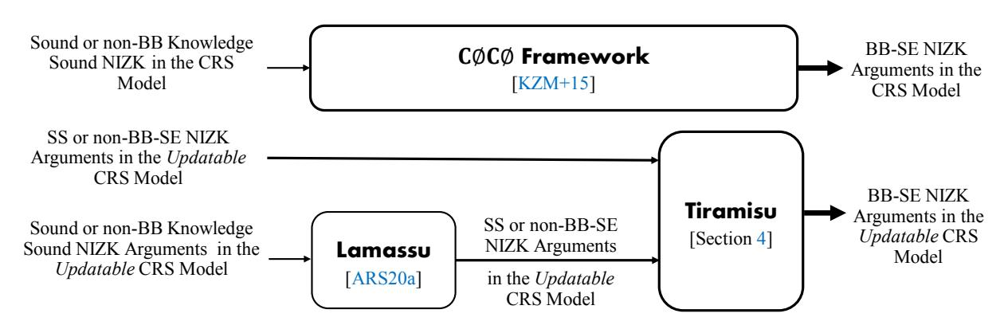
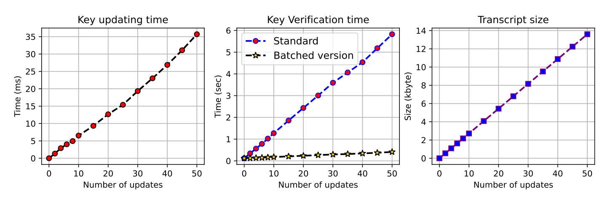

{0}------------------------------------------------

## Tiramisu: Black-Box Simulation Extractable NIZKs in the Updatable CRS Model

Karim Baghery and Mahdi Sedaghat

imec-COSIC, KU Leuven, Leuven, Belgium karim.baghery@kuleuven.be, ssedagha@esat.kuleuven.be

Abstract. Zk-SNARKs, as the most efficient NIZK arguments in terms of proof size and verification, are ubiquitously deployed in practice. In applications like Hawk [S&P'16], Gyges [CCS'16], Ouroboros Crypsinous [S&P'19], the underlying zk-SNARK is lifted to achieve Black-Box Simulation Extractability (BB-SE) under a trusted setup phase. To mitigate the trust in such systems, we propose Tiramisu [1](#page-0-0) , as a construction to build NIZK arguments that can achieve updatable BB-SE, which we define as a new variant of BB-SE. This new variant allows updating the public parameters, therefore eliminating the need for a trusted third party, while unavoidably relies on a non-black-box extraction algorithm in the setup phase. In the cost of one-time individual CRS update by the parties, this gets around a known impossibility result by Bellare et al. from ASIACRYPT'16, which shows that BB extractability cannot be achieved with subversion ZK (ZK without trusting a third party). Tiramisu uses an efficient public-key encryption with updatable keys which may be of independent interest. We instantiate Tiramisu, implement the overhead and present efficient BB-SE zk-SNARKs with updatable parameters that can be used in various applications while allowing the end-users to update the parameters and eliminate the needed trust.

Keywords: zk-SNARKs, updatable CRS, Black-Box Simulation Extractability, C∅C∅ framework

## 1 Introduction

Zero-Knowledge (ZK) [\[GMR89\]](#page-20-0) proof systems, particularly Non-Interactive Zero-Knowledge (NIZK) arguments [\[BFM88\]](#page-19-0) are one of the elegant tools in modern cryptography that due to their impressive advantages and practical efficiency, they are ubiquitously deployed in practical applications [\[BCG](#page-18-0)+14[,KMS](#page-21-0)+16[,JKS16,](#page-21-1)[KKKZ19\]](#page-21-2). A NIZK proof system allows a party P (called prover) to non-interactively prove the truth of a statement to another party V (called verifier) without leaking any information about his/her secret inputs. For instance, they allow a prover P to convince a verifier V that for a (public) statement x, he/she knows a (secret) witness w that satisfies a relation R, (x,w) ∈ R, without leaking any information about w.

1 In Italian, Tiramisu literally means "lift me up".

{1}------------------------------------------------

Typically, a NIZK argument is expected to satisfy, (i) Completeness, which implies that an honest prover always convinces an honest verifier (ii) Soundness, which ensures that an adversarial prover cannot convince an honest verifier except with negligible probability. (iii) Zero-Knowledge (ZK), which guarantees that an honestly generated proof does not reveal any information about the (secret) witness w. In practice, it is shown that bare soundness is not sufficient and it needs either to be amplified [\[KMS](#page-21-0)+16] or the protocol needs to be supported by other cryptographic primitives [\[BCG](#page-18-0)+14]. To deal with such concerns, different constructions are proposed that either satisfy one of the following notions, one of which is an amplified variation of soundness. (iv) Simulation Soundness, (SS), which ensures that an adversarial prover cannot convince an honest verifier, even if he has seen polynomially many simulated proofs (generated by Sim), except with negligible probability. (v) Knowledge Soundness (KS), which guarantees that an adversarial prover cannot convince an honest verifier, unless he knows a witness w for statement x such that (x,w) ∈ R. (vi) Simulation Extractability (SE) (a.k.a. Simulation Knowledge Soundness), which guarantees that an adversarial prover cannot convince an honest verifier, even if he has seen polynomially time simulated proofs, unless he knows a witness w for statement x.

The term knowledge in KS (in item [v\)](#page-1-0) and SE (in item [vi\)](#page-1-1) means that a successful prover should know a w. knowing is formalized by showing that there exists an algorithm Ext, which can extract the witness w (from the prover or proof) in either non-Black-Box (nBB) or Black-Box (BB) manner. Typically, nBB extraction can result in more efficient constructions, as it allows ExtA to get access to the source-code and random coins of the adversary A. Although the constructions that obtain BB extractability are less efficient, they provide stronger security guarantees, as it allows us to have a universal extractor Ext for any A. The term simulation in notions SS (in item [iv\)](#page-1-2) and SE (in item [vi\)](#page-1-1) guarantees that the proofs are non-malleable and an adversary cannot change an old (simulated) proof to a new one such that V accepts it. The notion SE provides the strongest security and also implies non-malleability of proofs as defined in [\[DDO](#page-20-1)+01]. Moreover, it is shown [\[Gro06\]](#page-20-2) that SE is a sufficient requirement for a NIZK argument to be deployed in a Universally Composable (UC) protocol [\[Can01\]](#page-19-1).

zk-SNARKs. In the Common Reference String (CRS) model [\[BFM88\]](#page-19-0), NIZK arguments require a trusted setup phase. Based on the underlying assumptions, they are constructed either using falsifiable or nonfalsifiable assumptions [\[Nao03\]](#page-21-3). At the beginning of the last decade, a line of research initiated that focused on constructing NIZK arguments with succinct proofs, which finally led to an efficient family of NIZK arguments, called zero-knowledge Succinct Non-interactive ARgument of Knowledge (zk-SNARK) [\[Gro10](#page-21-4)[,Lip12,](#page-21-5)[PHGR13,](#page-21-6)[BCTV13,](#page-19-2)[Gro16,](#page-21-7)[GM17,](#page-20-3)[BG18\]](#page-19-3), [\[Lip19,](#page-21-8)[BPR20\]](#page-19-4). zk-SNARKs are constructed based on knowledge assumptions [\[Dam91\]](#page-20-4) that allow succinct proofs and nBB extractability. Gentry and Wichs's impossibility result [\[GW11\]](#page-21-9) confirmed that succinct proofs can

{2}------------------------------------------------

not be built based on falsifiable assumptions. Beside succinct proofs, all initial zk-SNARKs were designed to achieve completeness, ZK and KS (in item [v\)](#page-1-0) [\[Gro10](#page-21-4)[,Lip12](#page-21-5)[,PHGR13,](#page-21-6)[BCTV13,](#page-19-2)[Gro16\]](#page-21-7). KS proofs are malleable, thus in practice users needed to make extra efforts to guarantee the non-malleability of proofs [\[BCG](#page-18-0)+14] . Following this concern, in 2017, Groth and Maller [\[GM17\]](#page-20-3) presented a zk-SNARK that can achieve SE (in item [vi\)](#page-1-1) with nBB extractability, consequently generates non-malleable proofs. Recent works in this direction have led to more efficient schemes with the same security guarantees [\[BG18](#page-19-3)[,Lip19,](#page-21-8)[BKSV20,](#page-19-5)[BPR20\]](#page-19-4).

Mitigating the trust in the setup phase of zk-SNARKs. In 2016, Bellare et al. [\[BFS16\]](#page-19-6) studied the security of NIZK arguments in the face of subverted CRS. They defined (vii) Subversion-Soundness, (Sub-SND), which ensures that the protocol guarantees soundness even if A has generated the CRS, and (viii) Subversion-ZK, (Sub-ZK), which ensures that the scheme achieves ZK even if A has generated the CRS. Then, they showed that Sub-SND is not achievable with (standard) ZK, and also we cannot achieve Sub-ZK along with BB extractability. Two follow-up works [\[ABLZ17,](#page-18-1)[Fuc18\]](#page-20-5) showed that most of zk-SNARKs can be lifted to achieve Sub-ZK (in item [viii\)](#page-2-0) and KS with nBB extraction (nBB-KS). Baghery [\[Bag19b\]](#page-18-2) showed that using the folklore OR technique [\[BG90\]](#page-19-7) any Sub-ZK SNARK can be lifted to achieve Sub-ZK and SE (in item [vi\)](#page-1-1) with nBB extraction (nBB-SE). Meanwhile, as an extension to the MPC approach [\[BCG](#page-19-8)+15] and subversion security, in 2018 Groth et al. [\[GKM](#page-20-6)+18] introduced a new variation of the CRS model, called updatable CRS model which allows both prover and verifier to update the CRS and bypass the needed trust in a third party. Groth et al. first defined, (ix) Updatable KS, (U-KS), which ensures that the protocol guarantees KS (in item [v\)](#page-1-0) as long as the initial CRS generation or one of CRS updates is honestly, and (x) Updatable ZK, (U-ZK), which ensures that the protocol guarantees ZK as long as the initial CRS generation or one of CRS updates is done by an honest party [2](#page-2-1) . Then, they presented a zk-SNARK that can achieve Sub-ZK and U-KS with nBB extraction (U-nBB-KS). Namely, the prover achieves ZK without trusting the CRS generator and the verifier achieves nBB-KS without trusting the CRS generator but by one-time CRS updating. Recent constructions in this direction have better efficiency [\[MBKM19](#page-21-10)[,GWC19\]](#page-21-11). Recently, Abdolmaleki, Ramacher, and Slamanig [\[ARS20a\]](#page-18-3) presented a construction, called Lamassu, and showed that using a similar folklore OR technique [\[BG90,](#page-19-7)[DS16,](#page-20-7)[Bag19b\]](#page-18-2) any zk-SNARK that satisfies Sub-ZK and U-nBB-KS can be lifted to achieve Sub-ZK and U-nBB-SE. (xi) U-nBB-SE ensures that the protocol achieves SE with nBB extraction as long as the initial CRS generation or one of CRS updates is done honestly. Recently, it is shown that two efficient updatable universal zk-SNARKs Plonk [\[GWC19\]](#page-21-11) and Sonic [\[MBKM19\]](#page-21-10) can also achieve U-nBB-SE [\[KZ21\]](#page-21-12). Considering the impossibility of achieving Sub-ZK along with BB extraction [\[BFS16\]](#page-19-6), such schemes [\[ARS20a,](#page-18-3)[GWC19,](#page-21-11)[MBKM19\]](#page-21-10) achieve the strongest notion with nBB extraction.

2 Sub-ZK is a stronger notion than U-ZK, as in Sub-ZK A has generated the CRS, while the later achieves ZK if at least one of CRS updates is done honestly.

{3}------------------------------------------------

Using zk-SNARKs in UC-Protocols. A UC protocol [Can01] does not interfere with other protocols and can be arbitrarily composed with other protocols. In 2006, Groth [Gro06] showed that a NIZK argument that can achieve BB-SE can realize the ideal NIZK-functionality  $\mathcal{F}_{\text{NIZK}}$  [GOS06]. In 2015 Kosba at al. [KZM+15] proposed a framework called  $\mathbb{C}\emptyset\mathbb{C}\emptyset$  along with several constructions that allows lifting a sound NIZK argument to a BB-SE NIZK argument, such that the lifted version can be deployed in UC-protocols. In summary, given a sound NIZK argument for language  $\hat{\mathbf{L}}$ , the  $\mathbb{C}\emptyset\mathbb{C}\emptyset$  defines a new extended language  $\hat{\mathbf{L}}$  appended with some primitives and returns a NIZK argument that can achieve BB-SE. We review the strongest construction of the  $\mathbb{C}\emptyset\mathbb{C}\emptyset$  in App. B.7.

Unfortunately, the default security of zk-SNARKs is insufficient to be directly deployed in UC protocols. The reason is that zk-SNARK achieves nBB extraction and the extractor  $\operatorname{Ext}_{\mathcal{A}}$  requires access to the source code and random coins of  $\mathcal{A}$ , while in UC-secure NIZK arguments, the simulator of *ideal-world* should be able to simulate corrupted parties. To do so, the simulator should be able to extract witnesses without getting access to the source code of the environment's algorithm. Due to this fact, all those UC-secure applications that use zk-SNARKs [KMS+16,JKS16,KKKZ19], use  $\mathcal{C}\emptyset\mathcal{C}\emptyset$  to lift the underlying zk-SNARK to achieve BB-SE, equivalently UC-security [Gro06]. Note that the lifted zk-SNARKs that achieve BB-SE are not witness succinct any more, but they still are circuit succinct.

#### 1.1 Our Contributions

**TIRAMISU**. The core of our results is presenting TIRAMISU as an alternative to the  $C\emptyset C\emptyset$  framework but in the *updatable* CRS model. Technically speaking, TIRAMISU allows one to build simulation extractable NIZK arguments with updatable parameters that satisfies a variant of black-box extractability which we define in this work. In the NIZK arguments built with TIRAMISU the parties can update the CRS themselves instead of trusting a third party. The construction is suitable for modular use in larger cryptographic protocols, which aim to build SE NIZK arguments with BB extractability, while avoiding to trust a third party.

To construct Tiramisu, we start with the  $C\emptyset C\emptyset$ 's strongest construction and lift it to a construction that works in the updatable CRS model. Meanwhile, to attain fast practical performance, we consider the state-of-the-art constructions proposed in the updatable CRS model and show that we can simplify the construction of  $C\emptyset C\emptyset$  and still achieve the same goal, particularly in the updatable CRS model. Technically speaking, the strongest construction of the  $C\emptyset C\emptyset$  framework, gets a sound NIZK argument for the language  $\hat{\mathbf{L}}$  and lifts it to a new NIZK argument for the extended language  $\hat{\mathbf{L}}$ , that can achieve BB-SE. The language  $\hat{\mathbf{L}}$  is an extension of  $\mathbf{L}$  appended with some necessary and sufficient primitives, including an encryption scheme to encrypt the witness and a Pseudo-Random Function (PRF) along with a commitment scheme that commits to the secret key of the PRF (more details in App. B.7 and Sec. 4). In composing Tiramisu, we show that considering recent developments in building NIZK arguments with updatable CRS, namely due to the existence of

{4}------------------------------------------------

Fig. 1: Using  $C\emptyset C\emptyset$  and Tiramisu to build BB-SE NIZK arguments in the standard and updatable CRS models. Tiramisu can be instantiated with either adhoc or lifted constructions [BGM17,BG18,BPR20,ARS20a,GWC19,MBKM19].

nBB-SE NIZK arguments with updatable CRS (either with a two-phase updatable CRS [Gro16,BGM17,BG18,BKSV20,BPR20] or with a universal updatable string [GKM+18,ARS20a,GWC19,MBKM19]) we can simplify the definition of L by removing the commitment and PRF and construct more efficient SE NIZK arguments with (a variant of) BB extractability that also have *updatable* CRS. We show that, TIRAMISU also can be added as a layer on top of the construction proposed in [ARS20a], called Lamassu, and together act as a generic compiler to lift any sound NIZK argument to a SE NIZK argument with a variant of black-box extractability in the updatable CRS model. However, we show that the arguments built with this approach are inefficient in comparison with the ones built with only Tiramisu. Fig. 1 illustrates how one can use  $\mathbb{C}\emptyset\mathbb{C}\emptyset$  and Tiramisu to build BB-SE NIZK arguments in the standard and updatable CRS models, respectively. Similar to C\OCO framework, TIRAMISU results in NIZK arguments whose proof size and verification time are (quasi-)linear in the witness size, that is an unavoidable requirement for UC security [Can01], but still are independent of the size of the circuit, which encodes L.

Bellare et al.'s Negative Result. Constructing Tiramisu shows that one can bypass a known negative result in the standard CRS model. In [BFS16], Bellare et al. observed that achieving Sub-ZK and BB extractability is impossible at the same time. As BB extractability requires the simulator create a CRS with a trapdoor it withholds, then it can extract the witness from a valid proof. But Sub-ZK requires that even if  $\mathcal{A}$  generates the CRS, it should not be able to learn about the witnesses from the proof. However, if a NIZK argument achieves BB extractability, an adversary (CRS subvertor) can generate the CRS like the simulator. So it has the trapdoor and can also extract the witness and break Sub-ZK. Considering the above negative result, Tiramisu achieves the best possible combination with downgrading Sub-ZK (in item viii) to U-ZK (in item x) while achieving updatable BB extractability, either U-BB-SE or U-BB-KS. U-BB-SE and U-BB-KS does not need a trusted third party, therefore from the trust point of view, they are stronger definitions than standard BB-SE and BB-KS, respectively, which require a trusted setup phase. But, in definitions of U-BB-SE and U-BB-KS, to bypass the needed trust, we rely on the existence of a nBB extraction algorithm in the setup phase that can extract the trapdoors from the

{5}------------------------------------------------

(malicious) parameter generator or updaters. This seems to be unavoidable fact to achieve updatability and BB extractability at the same time.

Key-Updatable Public-key Cryptosystems. Tiramisu uses a semantically secure cryptosystem with updatable keys that we define here. We show that such cryptosystems can be built either in a generic manner from key-homomorphic encryption schemes [\[AHI11\]](#page-18-4), or via an ad-hoc approach. Using both generic and ad-hoc approaches, we present two variations of El-Gamal cryptosystem [\[ElG84\]](#page-20-9) instantiated in the pairing-based groups which fulfil the requirements of a cryptosystem with updatable keys. Efficiency of both constructions are evaluated with a prototype implementation in the Charm-Crypto framework [\[AGM](#page-18-5)+13], and seem to be practical. The new syntax and constructions can be interesting in their own right, particularly for building other primitives in the updatable CRS model [\[CFQ19,](#page-19-10)[DGP](#page-20-10)+19].

Tab. [1](#page-6-0) compares NIZK arguments built with Tiramisu with existing schemes that can achieve a flavour of SE and ZK. Schemes built with C∅C∅ achieve BB extractability, thus they cannot achieve S-ZK, and the constructions that achieve Sub-ZK [\[Bag19b,](#page-18-2)[Lip19](#page-21-8)[,ARS20a\]](#page-18-3)can achieve (U-) nBB-SE in the best case.

#### 1.2 Related Works on Key Updatable Cryptosystems

In [\[CHK03\]](#page-19-11), Canetti, Halevi, and Katz defined forward-secure public-key encryption schemes that also support updating the secret key. In a forward-secure encryption scheme, secret keys are updated on a regular basis such that exposure to the secret key for a given time period does not enable an adversary to break the cryptosystem for any prior time period. However, in their setting all updates are supposed to be handled by a single party, hence no proof is required to ensure the correctness of key updating. Due to this fact, their definition does not fit our requirements for distributing trust across multiple updaters in the updatable CRS model. In [\[FMMO19\]](#page-20-11), Fauzi et al. proposed an updatable key cryptosystem as well, but, much as in the previous cases, their variant is weak for our settings and cannot meet our requirements. We naturally extend their notion of updatability from re-randomization of the public-key under the same secret-key, to updating both public and secret keys, and proving correctness of updating similar to other primitives in the updatable CRS model [\[GKM](#page-20-6)+18[,ARS20a\]](#page-18-3), while keeping the secret key hidden. These components allow us to distribute trust on setup phase by enabling parties to update keys without revealing their secret key while providing proof that the updating phase was executed correctly.

The rest of the paper is organized as follows; Sec. [2](#page-6-1) presents necessary preliminaries for the paper. Sec. [3](#page-6-2) defines the syntax of a public-key cryptosystem with updatable keys and presents efficient variations of the El-Gamal cryptosystem as an instantiation. Our construction Tiramisu and its security proofs are described in Sec. [4.](#page-11-0) In Sec. [5,](#page-16-0) we present U-BB-SE NIZK arguments built with Tiramisu . Finally, we conclude the paper in Sec. [6.](#page-17-0)

{6}------------------------------------------------

Table 1: A comparison of TIRAMISU with related works. ZK: Zero-knowledge, SE: Simulation Extractable, U: Updatable, S: Subversion, nBB: non-Black-Box, BB: Black-Box.  $\checkmark$ : Achieves,  $\times$ : Does not achieve.

|                                                                       | Zero-Knowledge |          |            | Simulation Extractability |       |          |          |
|-----------------------------------------------------------------------|----------------|----------|------------|---------------------------|-------|----------|----------|
|                                                                       | ZK             | U-ZK     | S-ZK       | nBB-SE                    | BB-SE | U-nBB-SE | U-BB-SE  |
| Tiramisu                                                              | <b>√</b>       | ✓        | ×          | <b>√</b>                  | ✓     | ✓        | <b>√</b> |
| $\mathbb{C}\emptyset\mathbb{C}\emptyset$ [KZM + 15,Bag19a] | <b>√</b>       | ×        | ×          | ✓                         | ✓     | ×        | ×        |
| [GM17,BG18]                                                           | <b>√</b>       | ×        | X          | ✓                         | ×     | ×        | ×        |
| [Bag19b,Lip19,BPR20]                                                  | <b>√</b>       | ✓        | ✓          | <b>√</b>                  | ×     | ×        | ×        |
| [BGM17,BG18,ARS20a]                                                   | <b>√</b>       | <b>√</b> | <b>√</b> * | <b>√</b>                  | ×     | ✓        | ×        |

\*Theorem 4 in [ARS20a]) states Lamassu, can achieve U-ZK and U-nBB-SE, but it can be shown that it can achieve Sub-ZK along with U-nBB-SE which is a stronger combination.

#### 2 Notations

Throughout, we suppose the security parameter of the scheme be  $\lambda$  and  $\mathsf{negl}(\lambda)$  denotes a negligible function. We use  $x \leftarrow \$X$  to denote x sampled uniformly according to the distribution X. Also, we use [1 .. n] to denote the set of integers in range of 1 to n.

Let PPT and NUPPT denote probabilistic polynomial-time and non-uniform probabilistic polynomial-time, respectively. For an algorithm  $\mathcal{A}$ , let  $\operatorname{im}(\mathcal{A})$  be the image of  $\mathcal{A}$ , i.e., the set of valid outputs of  $\mathcal{A}$ . Moreover, assume  $\mathsf{RND}(\mathcal{A})$  denotes the random tape of  $\mathcal{A}$ , and  $r \leftarrow \mathsf{RND}(\mathcal{A})$  denotes sampling of a randomizer r of sufficient length for  $\mathcal{A}$ 's needs. By  $y \leftarrow \mathcal{A}(x;r)$  we mean given an input x and a randomizer r,  $\mathcal{A}$  outputs y. For algorithms  $\mathcal{A}$  and  $\mathsf{Ext}_{\mathcal{A}}$ , we write  $(y \parallel y') \leftarrow (\mathcal{A} \parallel \mathsf{Ext}_{\mathcal{A}})(x;r)$  as a shorthand for " $y \leftarrow \mathcal{A}(x;r)$ ,  $y' \leftarrow \mathsf{Ext}_{\mathcal{A}}(x;r)$ ". Two computationally IND distributions A and B are shown with  $A \approx_c B$ .

We use additive and the bracket notation, i.e., in group  $\mathbb{G}_{\mu}$ ,  $[a]_{\mu} = a [1]_{\mu}$ , where  $[1]_{\mu}$  is a fixed generator of  $\mathbb{G}_{\mu}$ . A bilinear group generator  $\mathsf{BGgen}(1^{\lambda})$  returns  $(p, \mathbb{G}_1, \mathbb{G}_2, \mathbb{G}_T, \hat{e}, [1]_1, [1]_2)$ , where p (a large prime) is the order of cyclic abelian groups  $\mathbb{G}_1$ ,  $\mathbb{G}_2$ , and  $\mathbb{G}_T$ . Finally,  $\hat{e} : \mathbb{G}_1 \times \mathbb{G}_2 \to \mathbb{G}_T$  is an efficient non-degenerate bilinear pairing, s.t.  $\hat{e}([a]_1, [b]_2) = [ab]_T$ . Denote  $[a]_1 \bullet [b]_2 = \hat{e}([a]_1, [b]_2)$ . We refer to App. B for some relevant definitions.

## 3 Public-Key Cryptosystems with Updatable Keys

As briefly discussed in Sec. 1, one of the key building blocks used in TIRAMISU is the cryptosystem schemes with updatable keys that we define next. Similar definitions are recently proposed for zk-SNARKs [GKM+18], and signatures [ARS20a], but considering previous definitions in [CHK03,FMMO19], to the best of our knowledge this is the first time that this notion is defined for the public-key cryptosystems. In contrast to subversion-resilient encryption schemes [ABK18] that the key-generation phase might be subverted, here we consider the case that the output of the key-generation phase is updatable and

{7}------------------------------------------------

parties can update the keys. We aim to achieve the standard security requirements of a cryptosystem as long as either the original key generation or at least one of the updates was done honestly. Similar to the case on paring-based subversion resistant NIZK arguments [BFS16], we assume that the group generator is a deterministic polynomial time algorithm, which given the security parameter, it can be run by every entity without the need for a trusted third party.

#### 3.1 Definition and Security Requirements

**Definition 1 (Cryptosystems with Updatable Keys).** A public-key cryptosystem  $\Psi_{\mathsf{Enc}}$  with updatable keys over the message space  $\mathcal{M}$  and ciphertext space  $\mathcal{C}$ , consists of five PPT algorithms (KG, KU, KV, Enc, Dec) defined as follows,

- $-\ (\mathsf{pk}_0, \Pi_{\mathsf{pk}_0}, \mathsf{sk}_0) \leftarrow \mathsf{KG}(1^\lambda) \colon \mathit{Given the security parameter}\ 1^\lambda\ \mathit{returns the corresponding key pair}\ (\mathsf{pk}_0, \mathsf{sk}_0)\ \mathit{and}\ \Pi_{\mathsf{pk}_0}\ \mathit{as\ a\ proof\ of\ correctness}.$
- $\begin{array}{l} \ (\mathsf{pk}_i, \Pi_{\mathsf{pk}_i}) \leftarrow \mathsf{KU}(\mathsf{pk}_{i-1}) \colon \mathit{Given} \ \mathit{a} \ \mathit{valid} \ (\mathit{possibly} \ \mathit{updated}) \ \mathit{public} \ \mathit{key} \ \mathsf{pk}_{i-1} \\ \mathit{outputs} \ (\mathsf{pk}_i, \Pi_{\mathsf{pk}_i}), \ \mathit{where} \ \mathsf{pk}_i \ \mathit{denotes} \ \mathit{the} \ \mathit{updated} \ \mathit{public-key} \ \mathit{and} \ \Pi_{\mathsf{pk}_i} \ \mathit{is} \ \mathit{a} \\ \mathit{proof} \ \mathit{for} \ \mathit{the} \ \mathit{correctness} \ \mathit{of} \ \mathit{the} \ \mathit{updating} \ \mathit{process}. \end{array}$
- $-\ (1,\bot) \leftarrow \mathsf{KV}(\mathsf{pk}_i,\Pi_{\mathsf{pk}_i}) \colon \textit{Given a potentially updated } \mathsf{pk}_i \ \textit{and} \ \Pi_{\mathsf{pk}_i}, \ \textit{checks the validity of the updated key. It returns either } \bot \ \textit{if } \mathsf{pk}_i \ \textit{is incorrectly formed (and updated) otherwise outputs } 1.$
- $-(c) \leftarrow \mathsf{Enc}(\mathsf{pk}_i, m)$ : Given a (potentially updated) public key  $\mathsf{pk}_i$  and a message  $m \in \mathcal{M}$ , outputs a ciphertext  $c \in \mathcal{C}$ .
- $-(\perp, m') \leftarrow \mathsf{Dec}(\mathsf{sk}_i, c)$ : Given  $c \in \mathcal{C}$  and the secret key  $\mathsf{sk}_i$ , returns either  $\perp$  (reject) or  $m' \in \mathcal{M}$  (successful). Note that in the standard public-key cryptosystems (and in this definition before any updating)  $sk_i = sk_0$ .

Primary requirements for a public-key cryptosystem with updatable keys  $\Psi_{\mathsf{Enc}} := (\mathsf{KG}, \mathsf{KU}, \mathsf{KV}, \mathsf{Enc}, \mathsf{Dec})$  can be considered as follows,

**Definition 2 (Perfect Updatable Correctness).** A cryptosystem  $\Psi_{\mathsf{Enc}}$  with updatable keys is perfect updatable correct, if

$$\Pr \begin{bmatrix} (\mathsf{pk}_0, \varPi_{\mathsf{pk}_0}, \mathsf{sk}_0 := \mathsf{sk}_0') \leftarrow \mathsf{KG}(1^\lambda), r_s \leftarrow \$ \, \mathsf{RND}(\mathsf{Sub}), \\ ((\{\mathsf{pk}_j, \varPi_{\mathsf{pk}_j}\}_{j=1}^i, \xi_{\mathsf{Sub}}) \, \| \, \{\mathsf{sk}_j'\}_{j=1}^i) \leftarrow (\mathsf{Sub} \, \| \, \mathsf{Ext}_{\mathsf{Sub}})(\mathsf{pk}_0, \varPi_{\mathsf{pk}_0}, r_s), \\ \{\mathsf{KV}(\mathsf{pk}_j, \varPi_{\mathsf{pk}_j}) = 1\}_{j=0}^i : \mathsf{Dec}(\mathsf{sk}_i := \{\mathsf{sk}_j'\}_{j=0}^i, \mathsf{Enc}(\mathsf{pk}_i, m)) = m \end{bmatrix} = 1 \ .$$

where  $sk'_j$  is the individual secret-key of each party and  $pk_i$  is the final public-key.

**Definition 3 (Updatable Key Hiding).** In a cryptosystem  $\Psi_{\mathsf{Enc}}$  with updatable keys, for  $(\mathsf{pk}_0, \Pi_{\mathsf{pk}_0}, \mathsf{sk}_0 := \mathsf{sk}_0') \leftarrow \mathsf{KG}(1^{\lambda})$  and  $(\mathsf{pk}_i, \Pi_{\mathsf{pk}_i}) \leftarrow \mathsf{KU}(\mathsf{pk}_{i-1})$ , we say that  $\Pi_{\mathsf{Enc}}$  is updatable key hiding, if one of the following cases holds,

- the original  $\mathsf{pk}_0$  was honestly generated and  $\mathsf{KV}$  algorithm returns 1, namely  $(\mathsf{pk}_0, \Pi_{\mathsf{pk}_0}, \mathsf{sk}_0) \leftarrow \mathsf{KG}(1^\lambda)$  and  $\mathsf{KV}(\mathsf{pk}_0, \Pi_{\mathsf{pk}_0}) = 1$ ,

{8}------------------------------------------------

 $\begin{array}{l} - \ \textit{the original } \mathsf{pk}_0 \ \textit{verifies successfully with } \mathsf{KV} \ \textit{and the key-update was generated honestly once, namely } \mathsf{KV}(\mathsf{pk}_0, \Pi_{\mathsf{pk}_0}) = 1 \ \textit{and} \\ (\{\mathsf{pk}_j, \Pi_{\mathsf{pk}_j}\}_{j=1}^i) \leftarrow \mathsf{KU}(\mathsf{pk}_0) \ \textit{such that } \{\mathsf{KV}(\mathsf{pk}_j, \Pi_{\mathsf{pk}_j}) = 1\}_{j=1}^i. \end{array}$ 

**Definition 4 (Updatable IND-CPA).** A public-key cryptosystem  $\Psi_{\mathsf{Enc}}$  with updatable keys satisfies updatable IND-CPA, if for all PPT subvertor  $\mathsf{Sub}$ , for all  $\lambda$ , and for all PPT adversaries  $\mathcal{A}$ ,

$$\Pr \begin{bmatrix} (\mathsf{pk}_0, \varPi_{\mathsf{pk}_0}, \mathsf{sk}_0 := \mathsf{sk}_0') \leftarrow \mathsf{KG}(1^\lambda), r_s \leftarrow \$ \, \mathsf{RND}(\mathsf{Sub}), \\ (\{\mathsf{pk}_j, \varPi_{\mathsf{pk}_j}\}_{j=1}^i, \xi_{\mathsf{Sub}}) \leftarrow \mathsf{Sub}(\mathsf{pk}_0, \varPi_{\mathsf{pk}_0}, r_s), b \leftarrow \$ \, \{0, 1\}, (m_0, m_1) \leftarrow \\ \mathcal{A}(\mathsf{pk}_i, \xi_{\mathsf{Sub}}), b' \leftarrow \mathcal{A}(\mathsf{Enc}(\mathsf{pk}_i, m_b)) : \{\mathsf{KV}(\mathsf{pk}_j, \varPi_{\mathsf{pk}_j}) = 1\}_{j=0}^i \wedge b' = b \end{bmatrix} \approx_\lambda \frac{1}{2} \ ,$$

where  $\xi_{\mathsf{Sub}}$  is the auxiliary information which is returned by the subvertor  $\mathsf{Sub}$ . Note that  $\mathsf{Sub}$  can also generate the initial  $\mathsf{pk}_0$  and then an honest key updater  $\mathsf{KU}$  updates it and outputs  $\mathsf{pk}_i$  and the proof  $\Pi_{\mathsf{pk}_i}$ .

#### 3.2 Building Key-Updatable Cryptosystems

We first prove a theorem that gives a generic approach for building a cryptosystem with updatable keys using the key-homomorphic cryptosystems. Then, we use the generic approach and present the first key-updatable cryptosystem.

Theorem 1 (Cryptosystems with Updatable Keys). Every correct, IND-CPA secure, and key-homomorphic cryptosystem  $\Psi_{\mathsf{Enc}}$  with an efficient extractor  $\mathsf{Ext}_{\mathsf{Sub}}$ , satisfies updatable correctness, updatable key hiding and updatable IND-CPA security.

*Proof.* The proof is provided in App. A.1.

A Key-Updatable Cryptosystem from Key-Homomorphic Cryptosystems. Next, we show that the El-Gamal cryptosystem [ElG84] instantiated in a bilinear group  $(p, \mathbb{G}_1, \mathbb{G}_2, \mathbb{G}_T, \hat{e}, [1]_1, [1]_2)$  can be represented as an key-updatable encryption scheme constructed from key-homomorphic encryption schemes. In bilinear group based instantiation, in contrast to the standard El-Gamal encryption (reviewed in Sec. B.4)), the public key consists of a pair  $([x]_1, [x]_2)$ . Consequently, the algorithms of new variation can be expressed as follows,

 $\begin{array}{l} - \left( \mathsf{pk}_0, \varPi_{\mathsf{pk}_0}, \mathsf{sk}_0 := \mathsf{sk}_0' \right) \leftarrow \mathsf{KG}(1^\lambda) \text{: Given } 1^\lambda, \text{ obtain } \left( p, \mathbb{G}_1, \mathbb{G}_2, \mathbb{G}_T, \hat{e}, [1]_1, [1]_2 \right) \leftarrow \mathsf{BGgen}(1^\lambda); \text{ sample } \mathsf{sk}_0' \leftarrow \$\mathbb{Z}_p^* \text{ and return the key pair } \left( \mathsf{pk}_0, \mathsf{sk}_0 \right) := \left( \left( \mathsf{pk}_0^1, \mathsf{pk}_0^2 \right), \mathsf{sk}_0 \right) := \left( \left( [\mathsf{sk}_0']_1, [\mathsf{sk}_0']_2 \right), \mathsf{sk}_0' \right) \text{ and } \varPi_{\mathsf{pk}_0} := \left( \varPi_{\mathsf{pk}_0}^1, \varPi_{\mathsf{pk}_0}^2 \right) \\ := \left( \left[ \mathsf{sk}_0' \right]_1, [\mathsf{sk}_0']_2 \right) \text{ as a proof of correctness (a.k.a. well-formedness).} \\ - \left( \mathsf{pk}_i, \varPi_{\mathsf{pk}_i} \right) \leftarrow \mathsf{KU}(\mathsf{pk}_{i-1}) \text{: Obtain } \left( p, \mathbb{G}_1, \mathbb{G}_2, \mathbb{G}_T, \hat{e}, [1]_1, [1]_2 \right) \leftarrow \mathsf{BGgen}(1^\lambda); \\ \text{then for a given } \mathsf{pk}_{i-1} := \left( \mathsf{pk}_{i-1}^1, \mathsf{pk}_{i-1}^2 \right) := \left( \left[ \mathsf{sk}_{i-1} \right]_1, \left[ \mathsf{sk}_{i-1} \right]_2 \right), \\ \text{for } i \geq 1, \quad \text{sample} \quad \mathsf{sk}_i' \leftarrow \$\mathbb{Z}_p^* \quad \text{and output: } \left( \mathsf{pk}_i, \varPi_{\mathsf{pk}_i} \right) := \\ \left( \left( \left[ \mathsf{sk}_{i-1} + \mathsf{sk}_i' \right]_1, \left[ \mathsf{sk}_{i-1} + \mathsf{sk}_i' \right]_2 \right), \left( \left[ \mathsf{sk}_i' \right]_1, \left[ \mathsf{sk}_i' \right]_2 \right), \quad \text{where } \mathsf{pk}_i := \\ \end{array} \right. \end{aligned}$ 

{9}------------------------------------------------

- $\begin{array}{lll} -\ (1,\bot) &\leftarrow & \mathsf{KV}\left(\{\mathsf{pk}_j\}_{j=0}^i, \varPi_{\mathsf{pk}_i}\right) \text{:} & \mathsf{Obtain} & (p,\mathbb{G}_1,\mathbb{G}_2,\mathbb{G}_T,\hat{e},[1]_1\,,[1]_2) &\leftarrow \\ \mathsf{BGgen}(1^\lambda), \text{ and then,} & & & & & & & & & & & & & & & & & & &$ 
  - $\begin{array}{l} \text{- for } i=j=0, \text{ given } \mathsf{pk}_0 := \left(\mathsf{pk}_0^1, \mathsf{pk}_0^2\right) := ([\mathsf{sk}_0]_1, [\mathsf{sk}_0]_2), \text{ and the proof} \\ \Pi_{\mathsf{pk}_0} := \left(\Pi_{\mathsf{pk}_0}^1, \Pi_{\mathsf{pk}_0}^2\right) := \left(\left[\mathsf{sk}_0'\right]_1, \left[\mathsf{sk}_0'\right]_2\right), \text{ checks } \Pi_{\mathsf{pk}_0}^1 \bullet [1]_2 \stackrel{?}{=} [1]_1 \bullet \\ \mathsf{pk}_0^2, \quad [1]_1 \bullet \Pi_{\mathsf{pk}_0}^2 \stackrel{?}{=} \mathsf{pk}_0^1 \bullet [1]_2, \quad [1]_1 \bullet \Pi_{\mathsf{pk}_0}^2 \stackrel{?}{=} \Pi_{\mathsf{pk}_0}^1 \bullet [1]_2. \end{array}$
  - $\begin{array}{l} \text{- for } i \geq 1, \text{ given } \mathsf{pk}_{i-1} := \left(\mathsf{pk}_{i-1}^1, \mathsf{pk}_{i-1}^2\right) := \left(\left[\mathsf{sk}_{i-1}\right]_1, \left[\mathsf{sk}_{i-1}\right]_2\right), \text{ a potentially updated } \mathsf{pk}_i := \left(\mathsf{pk}_i^1, \mathsf{pk}_i^2\right) := \left(\left[\mathsf{sk}_{i-1} + \mathsf{sk}_i'\right]_1, \left[\mathsf{sk}_{i-1} + \mathsf{sk}_i'\right]_2\right), \\ \text{and } \Pi_{\mathsf{pk}_i} := \left(\Pi_{\mathsf{pk}_i}^1, \Pi_{\mathsf{pk}_i}^2\right) := \left(\left[\mathsf{sk}_i'\right]_1, \left[\mathsf{sk}_i'\right]_2\right), \text{ checks } \left(\mathsf{pk}_{i-1}^1 + \Pi_{\mathsf{pk}_i}^1\right) \bullet \\ \left[1\right]_2 \stackrel{?}{=} \left[1\right]_1 \bullet \mathsf{pk}_i^2, \left[1\right]_1 \bullet \left(\mathsf{pk}_{i-1}^2 + \Pi_{\mathsf{pk}_i}^2\right) \stackrel{?}{=} \mathsf{pk}_i^1 \bullet \left[1\right]_2 \text{ and } \left[1\right]_1 \bullet \Pi_{\mathsf{pk}_i}^2 \stackrel{?}{=} \Pi_{\mathsf{pk}_i}^1 \bullet \left[1\right]_2. \end{array}$

in each case, if all the checks pass, it returns 1, otherwise  $\perp$ .

- $\begin{array}{l} -\ (c) \leftarrow \mathsf{Enc}\,(\mathsf{pk}_i,m) \text{: Obtain } (p,\mathbb{G}_1,\mathbb{G}_2,\mathbb{G}_T,\hat{e},[1]_1\,,[1]_2) \leftarrow \mathsf{BGgen}(1^\lambda) \text{ and} \\ \text{then given a (potentially updated) public key } \mathsf{pk}_i := ([\mathsf{sk}_i]_1\,,[\mathsf{sk}_i]_2), \text{ such} \\ \text{that } \mathsf{sk}_i := \mathsf{sk}_{i-1} + \mathsf{sk}_i', \text{ and a message } m \in \mathcal{M}, \text{ samples a randomness} \\ r \leftarrow \$\,\mathbb{Z}_p^* \text{ and outputs } c := (c_1,c_2) := (m\cdot[r\mathsf{sk}_i]_T\,,[r]_T)\,. \end{array}$
- $\begin{array}{l} -\ (\bot,m) \leftarrow \mathsf{Dec}(\mathsf{sk}_i,c) \text{: Obtain } (p,\mathbb{G}_1,\mathbb{G}_2,\mathbb{G}_T,\hat{e},[1]_1\,,[1]_2) \leftarrow \mathsf{BGgen}(1^\lambda) \text{ and} \\ \text{then given a ciphertext } c \in \mathcal{C} \text{ and a potentially updated secret key } \mathsf{sk}_i = \\ \mathsf{sk}_{i-1} + \overline{\mathsf{sk}_i'} \text{ it returns, } \frac{c_1}{c_2^{\mathsf{sk}}} = \frac{m \cdot [r\mathsf{sk}_i]_T}{[r\mathsf{sk}_i]_T} = m. \end{array}$

In the proposed construction, for the case that  $\{\mathsf{KV}(\{\mathsf{pk}_j\}_{j=0}^i, \Pi_{\mathsf{pk}_i}) = 1\}_{j=0}^i$ , under the BDH-KE knowledge assumption (in Def. 23) with checking  $[1]_1 \bullet \Pi_{\mathsf{pk}_j}^2 \stackrel{?}{=} \Pi_{\mathsf{pk}_j}^1 \bullet [1]_2$  for  $0 \le j \le i$ , there exists an efficient nBB extractor  $\mathsf{Ext}_{\mathsf{Sub}}$  that can extract all  $\mathsf{sk}_j'$  from the subvertor  $\mathsf{Sub}_j$ . Note that here we considered the standard version of the El-Gamal cryptosystem, but we could also take its lifted version, which encrypts  $g^m$  instead of m.

A More Efficient Key-Updatable Cryptosystem. The technique proposed in The. 1, acts as a generic approach but might lead to inefficient constructions. Next, we present a more efficient key-updatable variant of Elgamal cryptosystem.

Hash-based El-Gamal Cryptosystem in Bilinear Groups. The hash-based variation of El-Gamal cryptosystem [ElG84], is proven to achieve IND-CPA in the random oracle model. In the rest, we present a new variation of it, instantiated with bilinear groups, and show that the proposed variation can be represented as a secure key-updatable encryption scheme. The PPT algorithms (KG, KU, KV) of the new variation are the same as the algorithms of the first construction, while in this case the encryption and decryption algorithms, (Enc, Dec) act as follows,

{10}------------------------------------------------

- $-(c) \leftarrow \mathsf{Enc}(\mathsf{H},\mathsf{pk}_i,m)$ : Given the one-way hash function  $\mathsf{H},$  a public key  $\mathsf{pk}_i := (\mathsf{pk}_i^1,\mathsf{pk}_i^2)$  and a message  $m \in \{0,1\}^n$  as inputs. It samples  $r \leftarrow \mathbb{Z}_p^*$  and returns  $c := (c_1,c_2) := (m \oplus \mathsf{H}((\mathsf{pk}_i^1)^r),[r]_1)$ .
- $-(\perp, m) \leftarrow \mathsf{Dec}(\mathsf{H}, \mathsf{sk}_i, c)$ : Given the hash function  $\mathsf{H}$ , the secret key  $\mathsf{sk}_i$ , corresponding to  $\mathsf{pk}_i$ , and a ciphertext  $c := (c_1, c_2)$ , decrypts c by calculating  $m := c_1 \oplus \mathsf{H}(c_2^{\mathsf{sk}_i})$ .

## Theorem 2 (Hashed El-Gamal Cryptosystem with Updatable Keys).

The proposed variation of Hashed El-Gamal encryption satisfies updatable correctness, updatable key hiding and updatable IND-CPA if BDH-KE and Extended asymmetric Computational Diffie-Hellman assumptions hold in  $(\mathbb{G}_1, \mathbb{G}_2)$ , and the hash function H is a random oracle.

*Proof.* The proof is provided in App. A.2.

#### 3.3 Performance of the Proposed Key-Updatable Cryptosystems

We evaluate practical efficiency of both the proposed key-updatable cryptosystems using the Charm-Crypto framework [AGM+13], a Python library for pairing-based cryptography  $^3$ . We apply Barreto-Naehrig (BN254) curve,  $y^2 = x^3 + b$  with embedding curve degree 12 [BN05] as an SNARK-friendly curve. Benchmarks are done on a laptop with Ubuntu 20.04.2 LTS equipped with an Intel Core i7-9850H CPU @2.60 GHz and 16 GB of memory. As we observed in Sec. 3.2, both the pairing-based and hash-based constructions have the same (KG, KU, KV) algorithms. In Fig. 2, we plot the running time of key-updating KU, key-verification KV and the transcript size versus the number of key updates. By transcript, we mean all the keys along with the proofs generated with all the updaters.

Fig. 2: Key updating, key verification (standard & batched versions) and transcript size for both the proposed key-updatable cryptosystems.

As it is illustrated in Fig. 2, in both constructions, the key updating, key verification times and the transcript size are practical and grow linearly with the number of updates. One time key updating along with generating the underlying

 $^3$  The source code is publicly available on https://github.com/Baghery/Tiramisu.

{11}------------------------------------------------

proof requires  $\approx 1$  millisecond (ms), while to update a key 50 times and provide proof of correctness only takes  $\approx 36$  ms. To verify the validity of a key that is updated 50 times, a verifier requires  $\approx 6$  seconds in the standard form of KV algorithm, however, using the standard batching techniques [ABLZ17] this can be done  $12\times$  faster, in  $\approx 0.5$  second. In terms of the transcript size, for a key that is updated 10 times, the verifier requires to store  $\approx 3$  Kbytes.

Our experiments confirm that the time required for running the encryption algorithm is constant and takes about  $\approx 32$  ms and  $\approx 1.2$  ms in the pairing-based and hash-based constructions independent of the number of updates, respectively. While the running time for the decryption algorithm are equal to  $\approx 4.5$  ms and  $\approx 1$  ms, respectively. One may notice that the ciphertext size remains constant in our setting they are equal to 1028 and 46 bytes in the paring-based and Hash-based encryption schemes, respectively.

## 4 TIRAMISU: BB-SE NIZK in Updatable CRS Model

We present Tiramisu, as a protocol that allows one to generically build NIZK arguments in the updatable CRS model, which achieve U-ZK (in Def. 15) along with either Updatable Black-Box Simulation Extractability (U-BB-SE) or Updatable Black-Box Knowledge Soundness (U-BB-KS) which we define next. We first define Updatable Simulation Soundness (U-SS) that is used in

**Definition 5 (Updatable Simulation Soundness).** A non-interactive argument  $\Psi_{\text{NIZK}}$  is updatable simulation soundness for  $\mathcal{R}$ , if for any subvertor Sub, and every PPT  $\mathcal{A}$ , the following probability is  $\operatorname{negl}(\lambda)$ ,

$$\Pr \begin{bmatrix} (\mathbf{R}, \xi_{\mathbf{R}}) \leftarrow \mathcal{R}(1^{\lambda}), ((\mathsf{crs}_0, \varPi_{\mathsf{crs}_0}) \parallel \mathsf{ts}_0 := \mathsf{ts}_0') \leftarrow \mathsf{K}_{\mathsf{crs}}(\mathbf{R}, \xi_{\mathbf{R}}), r_s \leftarrow \$ \, \mathsf{RND}(\mathsf{Sub}), \\ ((\{\mathsf{crs}_j, \varPi_{\mathsf{crs}_j}\}_{j=1}^i, \xi_{\mathsf{Sub}}) \parallel \{\mathsf{ts}_j'\}_{j=1}^i) \leftarrow (\mathsf{Sub} \parallel \mathsf{Ext}_{\mathsf{Sub}}) (\mathsf{crs}_0, \varPi_{\mathsf{crs}_0}, r_s), \\ \{\mathsf{CV}(\mathsf{crs}_j, \varPi_{\mathsf{crs}_j}) = 1\}_{j=0}^i, (\mathsf{x}, \pi) \leftarrow \mathcal{A}^{\mathsf{O}(\mathsf{ts}_i, \ldots)}(\mathbf{R}, \xi_{\mathbf{R}}, \mathsf{crs}_i, \xi_{\mathsf{Sub}}) : \\ (\mathsf{x}, \pi) \not\in Q \land \mathsf{x} \not\in \mathbf{L} \land \mathsf{V}(\mathbf{R}, \xi_{\mathbf{R}}, \mathsf{crs}_i, \mathsf{x}, \pi) = 1 \end{bmatrix}$$

where  $\Pi_{crs}$  is a proof for correctness of CRS generation/updating,  $ts_i$  is the simulation trapdoor associated with the final CRS that can be computed using  $\{ts_j'\}_{j=0}^i$ , and Q is the set of simulated statement-proof pairs returned by oracle O(.).

**Definition 6 (Updatable Black-Box Simulation Extractability).** An argument  $\Psi_{\text{NIZK}}$  is updatable black-box (strong) simulation-extractable for  $\mathcal{R}$ , if for every PPT  $\mathcal{A}$  and subvertor Sub, the following probability is  $\text{negl}(\lambda)$ ,

$$\Pr \begin{bmatrix} (\mathbf{R}, \xi_{\mathbf{R}}) \leftarrow \mathcal{R}(1^{\lambda}), ((\mathsf{crs}_0, \varPi_{\mathsf{crs}_0}) \parallel \mathsf{ts}_0 := \mathsf{ts}_0' \parallel \mathsf{te}_0 := \mathsf{te}_0') \leftarrow \mathsf{K}_{\mathsf{crs}}(\mathbf{R}, \xi_{\mathbf{R}}), \\ r_s \leftarrow \$ \, \mathsf{RND}(\mathsf{Sub}), ((\{\mathsf{crs}_j, \varPi_{\mathsf{crs}_j}\}_{j=1}^i, \xi_{\mathsf{Sub}}) \parallel \{\mathsf{ts}_j'\}_{j=1}^i \parallel \{\mathsf{te}_j'\}_{j=1}^i) \leftarrow \dots \\ \dots (\mathsf{Sub} \parallel \mathsf{Ext}_{\mathsf{Sub}}) (\mathsf{crs}_0, \varPi_{\mathsf{crs}_0}, r_s), \{\mathsf{CV}(\mathsf{crs}_j, \varPi_{\mathsf{crs}_j}) = 1\}_{j=0}^i, r_{\mathcal{A}} \leftarrow \$ \, \mathsf{RND}(\mathcal{A}), \\ (\mathsf{x}, \pi) \leftarrow \mathcal{A}^{\mathsf{O}(\mathsf{ts}_i, \dots)}(\mathbf{R}, \xi_{\mathbf{R}}, \mathsf{crs}_i, \xi_{\mathsf{Sub}}; r_{\mathcal{A}}), \mathsf{w} \leftarrow \mathsf{Ext}(\mathbf{R}, \xi_{\mathbf{R}}, \mathsf{crs}_i; \mathsf{te}_i) : \\ (\mathsf{x}, \pi) \not\in Q \land (\mathsf{x}, \mathsf{w}) \not\in \mathbf{R} \land \mathsf{V}(\mathbf{R}, \xi_{\mathbf{R}}, \mathsf{crs}_i, \mathsf{x}, \pi) = 1 \end{cases}$$

{12}------------------------------------------------

where  $\mathsf{Ext}_\mathsf{Sub}$  in a nBB PPT extractor (e.g. based of rewinding or knowledge assumption),  $\mathsf{Ext}$  is a black-box PPT extractor (e.g. using a decryption algorithm),  $\Pi_\mathsf{crs}$  is a proof for correctness of CRS generation/updating, and  $\mathsf{ts}_i, \mathsf{te}_i$  are the simulation and extraction trapdoors associated with the final CRS that can be computed using  $\{\mathsf{ts}_j'\}_{j=0}^i$  and  $\{\mathsf{te}_j'\}_{j=0}^i$ , respectively. Here,  $\mathsf{RND}(\mathcal{A}) = \mathsf{RND}(\mathsf{Sub})$  and Q is the set of the statement and simulated proofs returned by oracle  $\mathsf{O}(.)$ .

Intuitively, the definition implies that under the existence of a nBB extractor in the he setup phase, the protocol achieves SE with BB extraction, as long as the initial CRS generation or one of CRS updates is done by an honest party. Our definition of U-BB-SE is inspired from the standard definition (realized under a trusted setup) presented by Groth Groof, which considers two extractors, one for the setup phase and the other for the rest of argument. However, our definition uses a non-black-box extractor in the setup phase, which seems a unavoidable requirement for building U-BB-SE NIZK argument without a trusted third party [BFS16]. Indeed, using some arguments or assumptions with non-black box extraction techniques, e.g. by rewinding [DPSZ12] or knowledge assumptions [BFS16,ABLZ17,GKM+18], is a common and practical way to mitigate or eliminate the trust on the parameters of various cryptographic protocols. We also consider building NIZK arguments that can achieve U-BB-KS which is a weaker version of U-BB-SE, where in the former,  $\mathcal{A}$  would not have access to oracle  $O(\cdot)$ . Note that in Def. 5 and Def. 6, it is equivalent for the adversary to batch all its updates and then think of one honest update. This requires that the trapdoor contributions of setup and update commute. This is true of known constructions in the updatable CRS model [MBKM19]. Therefore, in the underlying NIZK and key-updatable cryptosystem, we expect that they both satisfy the property that trapdoors combine and commute.

Our main goal is to construct an alternative to the C $\emptyset$ C $\emptyset$  framework [KZM+15] but in the *updatable* CRS model, such that in new constructions the end-users can bypass the blind trust in the setup phase by one-time updating the shared parameters. Our starting point is the strongest construction of the C $\emptyset$ C $\emptyset$  framework (reviewed in App. B.7) that gets a sound NIZK argument and lifts it to a BB-SE NIZK argument. To do so, given a language  $\mathbf{L}$  with the corresponding  $\mathbf{NP}$  relation  $\mathbf{R}_{\mathbf{L}}$ , the C $\emptyset$ C $\emptyset$  framework defines a new language  $\hat{\mathbf{L}}$  such that  $((\mathsf{x},c,\mu,\mathsf{pk}_s,\mathsf{pk}_e,\rho),(r,r_0,\mathsf{w},s_0)) \in \mathbf{R}_{\hat{\mathbf{L}}}$  iff:

$$c = \mathsf{Enc}(\mathsf{pk}_e, \mathsf{w}; r) \wedge \left( (\mathsf{x}, \mathsf{w}) \in \mathbf{R_L} \vee (\mu = f_{s_0}(\mathsf{pk}_s) \wedge \rho = \mathsf{Com}(s_0; r_0)) \right),$$

where  $\{f_s: \{0,1\}^* \to \{0,1\}^{\lambda}\}_{s\in\{0,1\}^{\lambda}}$  is a pseudo-random function family,  $(\mathsf{KG}_e,\mathsf{Enc},\mathsf{Dec})$  is a set of algorithms for a semantically secure encryption scheme,  $(\mathsf{KG}_s,\mathsf{Sig}_s,\mathsf{Vfy}_s)$  is a one-time signature scheme and  $(\mathsf{Com},\mathsf{Vfy})$  is a perfectly binding commitment scheme.

As a result, given a sound NIZK argument  $\Psi_{NIZK}$  for  $\mathcal{R}$  constructed from PPT algorithms  $(K_{crs}, P, V, Sim, Ext)$ , the  $C\emptyset C\emptyset$  framework returns a BB-SE NIZK argument  $\hat{\Psi}_{NIZK}$  with PPT algorithms  $(K_{crs}, \hat{P}, \hat{V}, Sim, Ext)$ , where  $K_{crs}$  is the CRS generator for new construction and acts as follows,

{13}------------------------------------------------

-  $(\hat{\operatorname{crs}} \| \hat{\operatorname{ts}} \| \hat{\operatorname{te}}) \leftarrow \hat{\operatorname{K}_{\operatorname{crs}}}(\mathbf{R_L}, \xi_{\mathbf{R_L}})$ : Given  $(\mathbf{R_L}, \xi_{\mathbf{R_L}})$ , sample  $(\operatorname{crs} \| \operatorname{ts}) \leftarrow \operatorname{K}_{\operatorname{crs}}(\mathbf{R_{\hat{L}}}, \xi_{\mathbf{R_{\hat{L}}}})$ ;  $(\operatorname{pk}_e, \operatorname{sk}_e) \leftarrow \operatorname{KG}_e(1^{\lambda})$ ;  $s_0, r_0 \leftarrow \$\{0, 1\}^{\lambda}$ ;  $\rho := \operatorname{Com}(s_0; r_0)$ ; and output  $(\hat{\operatorname{crs}} \| \hat{\operatorname{ts}} \| \hat{\operatorname{te}}) := ((\operatorname{crs}, \operatorname{pk}_e, \rho) \| (s_0, r_0) \| \operatorname{sk}_e)$ , where  $\hat{\operatorname{crs}}$  is the CRS of  $\hat{\Psi}_{\operatorname{NIZK}}$  and  $\hat{\operatorname{ts}}$  and  $\hat{\operatorname{te}}$ , respectively, are the simulation trapdoor and extraction trapdoor associated with  $\hat{\operatorname{crs}}$ .

Considering the description of algorithm  $\hat{K_{crs}}$ , to construct an alternative to the C $\emptyset$ C $\emptyset$  framework but in the *updatable* CRS model, a naive solution is to construct the three primitives above (with *gray* background) in the *updatable* CRS model, and then define a similar language but using the primitives constructed in the updatable CRS model. But, considering the state-of-the-art ad-hoc constructions and generic compilers to build NIZK arguments with updatable CRS model, a more efficient solution is to simplify the language  $\hat{\mathbf{L}}$  and construct more efficient BB-SE NIZK arguments with updatable parameters.

Continuing the second solution, since currently there exist some ad-hoc constructions that allow two-phase updating (e.g. [BGM17,BG18,BKSV20,BPR20]) or even a lifting construction to build nBB-SE zk-SNARKs with universal CRS in the updatable CRS model (e.g. [ARS20a,ARS20b]), therefore we simplify the original language  $\hat{\mathbf{L}}$  defined in C $\emptyset$ C $\emptyset$  and show that given a simulation sound NIZK argument with *updatable* CRS we can construct U-BB-SE NIZK arguments in a more efficient manner than the mentioned naive way. To this end, we use the key-updatable cryptosystems, defined and built in Sec. 3.

Let  $\Psi_{\mathsf{Enc}} := (\mathsf{KG}, \mathsf{KU}, \mathsf{KV}, \mathsf{Enc}, \mathsf{Dec})$  be a set of algorithms for a semantically secure cryptosystem with updatable keys  $(\mathsf{pk}_i, \mathsf{sk}_i)$ . Similar to  $\mathsf{C}\emptyset\mathsf{C}\emptyset$  framework, we define a new language  $\hat{\mathbf{L}}$  based on the main language  $\mathbf{L}$  corresponding to the input updatable nBB-SE NIZK  $\Psi_{\mathsf{NIZK}} := (\mathsf{K}_{\mathsf{crs}}, \mathsf{CU}, \mathsf{CV}, \mathsf{P}, \mathsf{V}, \mathsf{Sim}, \mathsf{Ext})$ . The language  $\hat{\mathbf{L}}$  is embedded with the encryption of witness with the potentially updated public key  $\mathsf{pk}_i$  given in the CRS. Namely, given a language  $\mathbf{L}$  with the corresponding  $\mathbf{NP}$  relation  $\mathbf{R}_{\mathbf{L}}$ , we define  $\hat{\mathbf{L}}$  for a given random element  $r \leftarrow \$\,\mathbb{F}_p$ , such that  $((\mathsf{x},c,\mathsf{pk}_i),(\mathsf{w},r)) \in \mathbf{R}_{\hat{\mathbf{L}}}$  iff,  $c = \mathsf{Enc}(\mathsf{pk}_i,\mathsf{w};r) \land (\mathsf{x},\mathsf{w}) \in \mathbf{R}_{\mathbf{L}}$ .

The intuition behind  $\hat{\mathbf{L}}$  is to enforce the P to encrypt its witness with a potentially updated public key  $\mathsf{pk}_i$ , given in the CRS, and send the ciphertext c along with a simulation sound proof. Consequently, in proving BB-SE, the updated  $\mathsf{sk}_i$  of the defined cryptosystem  $\Psi_{\mathsf{Enc}}$  is given to the Ext, which makes it possible to extract the witness in a black-box manner. By sending the encryption of witnesses, the proof will not be witness succinct anymore, but still, it is succinct in the size of the circuit that encodes  $\hat{\mathbf{L}}$ .

In security proofs, we show that due to updatable simulation soundness (in Def. 5) of the underlying NIZK argument  $\Psi_{\mathsf{NIZK}}$ , the *updatable IND-CPA* security (in Def. 4) and perfect *updatable completeness* (in Def. 2) of  $\Psi_{\mathsf{Enc}}$  is sufficient to achieve BB-SE in the updatable NIZK argument  $\hat{\Psi}_{\mathsf{NIZK}}$  for the language  $\hat{\mathbf{L}}$ . By considering new language  $\hat{\mathbf{L}}$ , the modified construction  $\hat{\Psi}_{\mathsf{NIZK}} := (\hat{\mathsf{K}}_{\mathsf{crs}}, \hat{\mathsf{CU}}, \hat{\mathsf{CV}}, \hat{\mathsf{P}}, \hat{\mathsf{V}}, \hat{\mathsf{Sim}}, \hat{\mathsf{Ext}})$  for  $\hat{\mathbf{L}}$  can be written as in Fig. 3.

**Efficiency**: Considering new language  $\hat{\mathbf{L}}$ , in new argument  $\hat{\Psi}_{\mathsf{NIZK}}$  the CRS generation (CRS updating and CRS verification) of the input argument  $\Psi_{\mathsf{NIZK}}$  will

{14}------------------------------------------------

- CRS and trapdoor generation,  $(\hat{\mathsf{crs}}_0, \hat{\varPi}_{\mathsf{crs}_0}) \leftarrow \hat{\mathsf{K}}_{\mathsf{crs}}(\mathbf{R_L}, \xi_{\mathbf{R_L}})$ : Given  $(\mathbf{R_L}, \xi_{\mathbf{R_L}})$  acts as follows: execute key generation of  $\Psi_{\mathsf{Enc}}$  as  $(\mathsf{pk}_0, \varPi_{\mathsf{pk}_0}, \mathsf{sk}_0) := \mathsf{sk}_0'$   $\leftarrow \mathsf{KG}(1^\lambda)$ ; run CRS generator of NIZK argument  $\Psi_{\mathsf{NIZK}}$  and sample  $(\mathsf{crs}_0, \varPi_{\mathsf{crs}_0}, \mathsf{ts}_0) := \mathsf{ts}_0'$   $\leftarrow \mathsf{K}_{\mathsf{crs}}(\mathbf{R_{\hat{L}}}, \xi_{\mathbf{R_{\hat{L}}}})$ , where  $\mathsf{ts}_0$  is the simulation trapdoor associated with  $\mathsf{crs}_0$ ; set  $(\hat{\mathsf{crs}}_0 \parallel \hat{\varPi}_{\hat{\mathsf{crs}}_0} \parallel \hat{\mathsf{ts}}_0 \parallel \hat{\mathsf{ts}}_0) := ((\mathsf{crs}_0, \mathsf{pk}_0) \parallel (\varPi_{\mathsf{crs}_0}, \varPi_{\mathsf{pk}_0}) \parallel \mathsf{ts}_0 \parallel \mathsf{sk}_0)$ ; where  $\hat{\varPi}_{\hat{\mathsf{crs}}_0}$  is the proof of well-formedness of  $\hat{\mathsf{crs}}_0$ ,  $\hat{\mathsf{ts}}_0$  is the simulation trapdoor associated with  $\hat{\mathsf{crs}}_0$ , and  $\hat{\mathsf{te}}_0$  is the extraction trapdoor associated with  $\hat{\mathsf{crs}}_0$ ; Return  $(\hat{\mathsf{crs}}_0, \hat{\varPi}_{\mathsf{crs}_0})$ .
- CRS Updating,  $(\hat{\mathsf{crs}}_i, \hat{\mathcal{H}}_{\hat{\mathsf{crs}}_i}) \leftarrow \hat{\mathsf{CU}}(\mathbf{R_L}, \xi_{\mathbf{R_L}}, \hat{\mathsf{crs}}_{i-1})$ : Given  $(\mathbf{R_L}, \xi_{\mathbf{R_L}}) \in \mathrm{im}(\mathcal{R}(1^{\lambda}))$ , and  $\hat{\mathsf{crs}}_{i-1}$  as an input CRS, act as follows: Parse  $\hat{\mathsf{crs}}_{i-1} := (\mathsf{crs}_{i-1}, \mathsf{pk}_{i-1})$ ; execute  $(\mathsf{crs}_i, \mathcal{H}_{\mathsf{crs}_i}) \leftarrow \mathsf{CU}(\mathbf{R_L}, \xi_{\mathbf{R_L}}, \mathsf{crs}_{i-1})$ ; run  $(\mathsf{pk}_i, \mathcal{H}_{\mathsf{pk}_i}) \leftarrow \mathsf{KU}(\mathsf{pk}_{i-1})$ ; set  $(\hat{\mathsf{crs}}_i \parallel \hat{\mathcal{H}}_{\hat{\mathsf{crs}}_i}) := ((\mathsf{crs}_i, \mathsf{pk}_i) \parallel (\mathcal{H}_{\mathsf{crs}_i}, \mathcal{H}_{\mathsf{pk}_i}))$ , where  $\hat{\mathcal{H}}_{\hat{\mathsf{crs}}_i}$  is the proof of well-formedness of  $\hat{\mathsf{crs}}_i$ ; Return  $(\hat{\mathsf{crs}}_i, \hat{\mathcal{H}}_{\hat{\mathsf{crs}}_i})$ . Note that after each update, the simulation and extraction trapdoors are updated, for instance  $\hat{\mathsf{ts}}_i := \mathsf{ts}_i = \mathsf{ts}_{i-1} + \mathsf{ts}_i'$ , and  $\hat{\mathsf{te}}_i := \mathsf{te}_i = \mathsf{te}_{i-1} + \mathsf{te}_i' := \mathsf{sk}_{i-1} + \mathsf{sk}_i'$ , where  $\mathsf{ts}_i'$  and  $\mathsf{te}_i'$  are individual (simulation and extraction) trapdoors of the updater i, and  $\mathsf{ts}_i$  and  $\mathsf{te}_i$  are the trapdoors of the CRS after updating by i-th updater.
- **CRS Verify,**  $(\bot, 1) \leftarrow \hat{\text{CV}}(\hat{\text{crs}}_i, \hat{\Pi}_{\hat{\text{crs}}_i})$ : Given  $\hat{\text{crs}}_i := (\hat{\text{crs}}_i, \mathsf{pk}_i)$ , and  $\hat{\Pi}_{\hat{\text{crs}}_i} := (\Pi_{\mathsf{crs}_i}, \Pi_{\mathsf{pk}_i})$  act as follows: if  $\mathsf{CV}(\mathsf{crs}_i, \Pi_{\mathsf{crs}_i}) = 1$  and  $\mathsf{KV}(\mathsf{pk}_i, \Pi_{\mathsf{pk}_i}) = 1$  return 1 (i.e., the updated  $\hat{\mathsf{crs}}_i$  is correctly formed), otherwise  $\bot$ .
- **Prover**,  $(\hat{\pi}, \perp) \leftarrow P(\mathbf{R_L}, \xi_{\mathbf{R_L}}, c\hat{\mathsf{rs}}_i, \mathsf{x}, \mathsf{w})$ : Parse  $c\hat{\mathsf{rs}}_i := (\mathsf{crs}_i, \mathsf{pk}_i)$ ; Return  $\perp$  if  $(\mathsf{x}, \mathsf{w}) \notin \mathbf{R_L}$ ; sample  $r \leftarrow \$\{0, 1\}^{\lambda}$ ; compute encryption of witnesses  $c = \mathsf{Enc}(\mathsf{pk}_i, \mathsf{w}; r)$ . Then execute prover P of the input NIZK argument  $\Psi_{\mathsf{NIZK}}$  and generate  $\pi \leftarrow P(\mathbf{R_{\hat{L}}}, \xi_{\mathbf{R_{\hat{L}}}}, \mathsf{crs}_i, (\mathsf{x}, c, \mathsf{pk}_i), (\mathsf{w}, r))$ ; and output  $\hat{\pi} := (c, \pi)$ .
- Verifier,  $(0,1) \leftarrow \hat{\mathsf{V}}(\mathbf{R_L}, \xi_{\mathbf{R_L}}, \hat{\mathsf{crs}}_i, \mathsf{x}, \hat{\pi})$ : Parse  $\hat{\mathsf{crs}}_i := (\mathsf{crs}_i, \mathsf{pk}_i)$  and  $\hat{\pi} := (c, \pi)$ ; call verifier of the input NIZK argument  $\Psi_{\mathsf{NIZK}}$  as  $\mathsf{V}(\mathbf{R_{\hat{L}}}, \xi_{\mathbf{R_{\hat{L}}}}, \mathsf{crs}_i, (\mathsf{x}, c, \mathsf{pk}_i), \pi)$  and returns 1 if  $((\mathsf{x}, c, \mathsf{pk}_i), (\mathsf{w}, r)) \in \mathbf{R_{\hat{L}}}$ , otherwise it responses by 0.
- Simulator,  $(\hat{\pi}) \leftarrow \text{Sim}(\mathbf{R}_{\mathbf{L}}, \xi_{\mathbf{R}_{\mathbf{L}}}, \hat{\text{crs}}_i, \mathsf{x}, \hat{\mathsf{ts}}_i)$ : Parse  $\hat{\text{crs}}_i := (\text{crs}_i, \mathsf{pk}_i)$  and  $\hat{\mathsf{ts}}_i := \mathsf{ts}_i$ ; sample  $z, r \leftarrow \$\{0, 1\}^{\lambda}$ ; compute  $c = \mathsf{Enc}(\mathsf{pk}_i, z; r)$ ; execute simulator of the input NIZK argument  $\Psi_{\mathsf{NIZK}}$  and generate  $\pi \leftarrow \mathsf{Sim}(\mathbf{R}_{\hat{\mathbf{L}}}, \xi_{\mathbf{R}_{\hat{\mathbf{L}}}}, \mathsf{crs}_i, (\mathsf{x}, c, \mathsf{pk}_i), \mathsf{ts}_i)$ ; and output  $\hat{\pi} := (c, \pi)$ .
- **Extractor**, (w)  $\leftarrow \hat{\mathsf{Ext}}(\mathbf{R_L}, \xi_{\mathbf{R_L}}, \hat{\mathsf{crs}}_i, \hat{\mathsf{te}}_i, \mathsf{x}, \hat{\pi})$ : Parse  $\hat{\pi} := (c, \pi)$  and  $\hat{\mathsf{te}}_i := \mathsf{sk}_i$ ; extract  $\mathsf{w} \leftarrow \mathsf{Dec}(\mathsf{sk}_i, c)$ ; output  $\mathsf{w}$ .

Fig. 3: TIRAMISU, a construction for building BB-SE NIZK argument  $\hat{\Psi}_{\mathsf{NIZK}}$  with updatable CRS.

be done for a larger instance, and one also needs to generate (update and verify) the key pairs of the updatable public-key cryptosystem. The corresponding circuit of the newly defined language  $\hat{\mathbf{L}}$ , expands by the number of constraints needed for the encryption function. Recall that the language  $\hat{\mathbf{L}}$  is an appended form of language  $\hat{\mathbf{L}}$  by encryption of witnesses. However, due to our simplifications in defining language  $\hat{\mathbf{L}}$ , the overhead in TIRAMISU will be less than the case one uses the  $\mathbb{C}\emptyset\mathbb{C}\emptyset$  framework. Meanwhile, as we later show in Sec.5 the efficiency of final constructions severely depends on the input NIZK argument.

The prover of the new construction  $\hat{\Psi}_{\mathsf{NIZK}}$  needs to generate a proof for new language  $\hat{\mathbf{L}}$  that would require extra computations. The proofs will be the proof

{15}------------------------------------------------

of input nBB-SE updatable NIZK argument ΨNIZK appended with the ciphertext c which leads to having proofs linear in witness size but still succinct in the circuit size. It is a known result that having proofs linear in witness size is an undeniable fact to achieve BB extraction and UC-security [\[Can01,](#page-19-1)[GW11\]](#page-21-9).

As the verifier is unchanged, so the verification of new constructions will be the same as NIZK ΨNIZK but for a larger statement.

Theorem 3 (Perfect Updatable Completeness). If the input NIZK argument ΨNIZK guarantees perfect updatable completeness for the language L, and the public-key cryptosystem ΨEnc be perfectly updatable correct, then the NIZK argument constructed in Sec. [4](#page-11-0) for language Lˆ, is perfectly updatable complete.

Proof. The proof is provided in App. [A.3.](#page-25-0) ut

Theorem 4 (Computationally Updatable Zero-Knowledge). If the input NIZK argument ΨNIZK guarantees (perfect) zero-knowledge, and the publickey cryptosystem ΨEnc is updatable IND-CPA and satisfies updatable key hiding, then the NIZK argument constructed in Sec. [4](#page-11-0) for language Lˆ satisfies computational updatable ZK.

Proof. The proof is provided in App. [A.4.](#page-25-1) ut

Theorem 5 (Updatable Black-Box Simulation Extractability). If the input NIZK argument ΨNIZK guarantees updatable correctness, updatable simulation soundness and updatable zero-knowledge, and the public-key cryptosystem ΨEnc satisfies updatable perfect correctness, updatable key hiding, and updatable IND-CPA, then the NIZK argument constructed in Sec. [4](#page-11-0) for language Lˆ satisfies updatable BB simulation extractability.

Proof. The proof is provided in App. [A.5.](#page-27-0) ut

Note that to bypass the impossibility of achieving Sub-ZK and BB extractability in NIZKs [\[BFS16\]](#page-19-6), one-time honest key generation/updating on pki is a crucial requirement which does not allow an adversary to obtain the trapdoors associated with final updated CRS, particularly the extraction keys.

Building Updatable Black-Box Knowledge Sound NIZK Arguments with Tiramisu. The primary goal of Tiramisu is constructing BB-SE NIZK arguments in the updatable CRS model. However, due to some efficiency reasons, in practice one might need to build an Updatable Black-Box Knowledge Sound (U-BB-KS) NIZK argument. In such cases, starting from either an updatable sound NIZK or an U-nBB-KS NIZK (e.g. Groth et al.'s updatable zk-SNARK [\[GKM](#page-20-6)+18]), the same language Lˆ defined in Tiramisu along with our constructed updatable public-key cryptosystem allows one to build an U-BB-KS NIZK argument. Namely, given an updatable cryptosystem ΨEnc := (KG,KU,KV, Enc, Dec) with updatable keys (pki ,ski ), and an updatable sound NIZK ΨNIZK := (Kcrs, CU, CV, P, V, Sim) for language L with the corresponding NP relation RL, we define the language Lˆ for a given random element r ←\$ Fp, such that ((x, c, pki ),(w, r)) ∈ RLˆ iff, (c = Enc(pki ,w; r)) ∧ ((x,w) ∈ RL).

{16}------------------------------------------------

Table 2: An efficiency comparison of BB-SE NIZK arguments built with the  $C\emptyset C\emptyset$  and TIRAMISU. n': Number of constraints (multiplication gates) used to encode language  $\hat{\mathbf{L}}$ ,  $|\mathbf{pk}|$ : Size of the public key of  $\Psi_{\mathsf{Enc}}$ ,  $\lambda$ : Security parameter,  $E_i$ : Exponentiation in  $\mathbb{G}_i$ , P: Paring operation, l': the size of statement in new language  $\hat{\mathbf{L}}$ ,  $\mathbf{w}$ : the witness for new relation  $\mathbf{R}_{\hat{\mathbf{L}}}$ .

|                  | $\mathbf{C}\emptyset\mathbf{C}\emptyset$         | TIRAMISU                                           | TIRAMISU                                   |  |
|------------------|--------------------------------------------------|----------------------------------------------------|--------------------------------------------|--|
|                  | with [Gro16]                                     | (with $[GKM^+18,ARS20a]$ )                         | (with [BGM17,BG18])                        |  |
| Trusted Setup    | Yes                                              | No                                                 | No                                         |  |
| CRS Updatability | No                                               | One-phase (Universal)                              | Two-phase                                  |  |
| CRS Size         | $\approx 3n'\mathbb{G}_1 + n'\mathbb{G}_2$       | $\approx 30n'^2 \mathbb{G}_1 + 9n'^2 \mathbb{G}_2$ | $\approx 3n'\mathbb{G}_1 + n'\mathbb{G}_2$ |  |
| CRS Verifier     |                                                  | $\approx 78n'^2P$                                  | 14n'P (batchable)                          |  |
| CRS Updater      | _                                                | $\approx 30n'^2 E_1 + 9n'^2 E_2$                   | $\approx 6n'E_1 + n'E_2$                   |  |
| Prover           | $\approx 4n'E_1 + n'E_2$                         | $\approx 4n'E_1 + n'E_2$                           | $\approx 4n'E_1 + n'E_2$                   |  |
| Proof Size       | $o(w) + 3\mathbb{G}_1 + 2\mathbb{G}_2 + \lambda$ | $o(w) + 4\mathbb{G}_1 + 3\mathbb{G}_2$             | $o(w) + 3\mathbb{G}_1 + 2\mathbb{G}_2$     |  |
| Verifier         | $4P + l'E_1$                                     | $6P + l'E_1$                                       | $5P + l'E_1$                               |  |

Corollary 1. If the input  $\Psi_{\mathsf{NIZK}}$  for  $\mathbf{R_L}$  guarantees updatable correctness, updatable soundness and updatable zero-knowledge, and the public-key cryptosystem  $\Psi_{\mathsf{Enc}}$  satisfies updatable perfect correctness, updatable key hiding, and updatable IND-CPA, then the NIZK argument for language  $\hat{\mathbf{L}}$  satisfies updatable correctness, updatable knowledge soundness and updatable zero-knowledge.

The proof can be done similar to the proof of Theorem 5, without providing the simulation oracle to the adversaries  $\mathcal{A}$  and  $\mathcal{B}$ .

## 5 Building U-BB-SE NIZK Arguments with TIRAMISU

To build an U-BB-SE NIZK argument with TIRAMISU, one needs two primitives. Namely, (1) a key-updatable cryptosystem  $\Psi_{\mathsf{Enc}}$  that satisfies perfect updatable correctness, updatable key hiding, and updatable IND-CPA, and (2) a NIZK argument  $\Psi_{\mathsf{NIZK}}$  with updatable CRS that guarantees updatable simulation soundness or nBB simulation extractability. Next, we instantiate  $\Psi_{\mathsf{Enc}}$  and  $\Psi_{\mathsf{NIZK}}$ , and obtain two U-BB-SE NIZK arguments. To instantiate  $\Psi_{\mathsf{Enc}}$ , one can use either of the proposed variations of El-Gamal cryptosystem in Sec. 3. Whereas to instantiate the  $\Psi_{\mathsf{NIZK}}$ , one can either use an ad-hoc construction (e.g. [GWC19,MBKM19] with universal CRS, or [BG18,BKSV20,BPR20] when their CRS is generated with [BGM17], which will have a two-phase updating), or a construction lifted with LAMASSU [ARS20a] (e.g. using [GKM+18]).

In BB-SE NIZK arguments built with TIRAMISU, the parties have to update the shared parameters individually once and check the validity of the previous updates. This is basically the computational cost that the end-users need to pay to bypass the trust in the standard CRS model. As an important practical optimization, it can be shown that the prover can only update the CRS

{17}------------------------------------------------

 $\hat{\mathsf{crs}}_i := (\mathsf{crs}_i, \mathsf{pk}_i)$  partially, namely only  $\mathsf{pk}_i$ . Tab. 2 summarizes the efficiency of two BB-SE NIZK arguments built with Tiramisu and compares them with a construction lifted by the  $\mathsf{C}\emptyset\mathsf{C}\emptyset$  framework in the standard CRS model. We instantiate  $\mathsf{C}\emptyset\mathsf{C}\emptyset$  with the state-of-the-art zk-SNARK [Gro16] and instantiate Tiramisu with 1) the lifted version of [GKM+18] with Lamassu [ARS20a], and 2) one of the constructions proposed in [BPR20]when their CRS is sampled using the two-phase protocol proposed in [BGM17]. As we observed in Section 3.3, in the resulting U-BB-SE zk-SNARKs, the overhead added by the key updateable encryption schemes add very little overhead to the CU and CV algorithms.

Both  $C\emptyset C\emptyset$  and TIRAMISU constructions result a linear proof in the witness size, but they keep the asymptotic efficiency of other algorithms in the input NIZK. Consequently, instantiating TIRAMISU with a more efficient nBB-SE NIZK argument will result in a more efficient BB-SE NIZK argument. Therefore, as also is shown in Tab. 2, suitable ad-hoc constructions result in more efficient U-BB-SE NIZK arguments. We found constructing more efficient updatable nBB-SE zk-SNARKs as an interesting future research direction. Following, the impossibility result of Gentry and Wichs [GW11], it is undeniable that achieving BB extraction will result in non-succinct proof. Consequently, in all the schemes in Tab. 2, the proof size is dominated with the size of c which is a ciphertext of IND-CPA cryptosystem and is o(w).

#### 6 Conclusion

We proposed Tiramisu that allows one to build BB-SE NIZK arguments in the updatable CRS model. U-BB-SE NIZK arguments allow the parties bypass the trust in a third party by one-time participation in the CRS generation/updating. We instantiated Tiramisu in two manners and presented NIZK arguments with either one-phase or two-phase updatable parameters, that achieve BB-SE. Instantiating Tiramisu with ad-hoc constructions results in more efficient U-BB-SE NIZKs. Meanwhile, as a building block for Tiramisu, we defined the syntax of public-key cryptosystems with updatable keys and presented two variations of El-Gamal cryptosystem [ElG84] which both of which strike different trade-offs.

In practice, by deploying the constructed U-BB-SE NIZK arguments in UC-protocols, such as Hawk [KMS+16], and Ouroboros Crypsinous [KKKZ19], the end-users can bypass the trust in the setup phase by one-time updating the parameters. More precisely, the cost that end-users need to pay is one-time updating the parameters plus checking the others' updates. TIRAMISU comes with efficient algorithms CU and CV for parameter updating and verification, respectively. Specifically about UC-secure privacy-preserving smart contracts systems like Hawk [KMS+16], by deploying an U-BB-SE NIZK argument in a two-party smart contract, both parties can avoid trusting a third party if both individually update the public parameters using CU and also check the other party's update with CV.

Acknowledgement. This work has been supported in part by ERC Advanced Grant ERC-2015-AdG-IMPaCT, by the Defense Advanced Research Projects

{18}------------------------------------------------

Agency (DARPA) under contract No. HR001120C0085, by the Research Council KU Leuven C1 on Security and Privacy for Cyber-Physical Systems and the Internet of Things with contract number C16/15/058, and by CyberSecurity Research Flanders with reference number VR20192203.

Any opinions, findings and conclusions or recommendations expressed in this material are those of the author(s) and do not necessarily reflect the views of the DARPA, the US Government, or Cyber Security Research Flanders. The U.S. Government is authorized to reproduce and distribute reprints for governmental purposes notwithstanding any copyright annotation therein.

## References

- ABK18. Benedikt Auerbach, Mihir Bellare, and Eike Kiltz. Public-key encryption resistant to parameter subversion and its realization from efficientlyembeddable groups. In Michel Abdalla and Ricardo Dahab, editors, PKC 2018, Part I, volume 10769 of LNCS, pages 348–377. Springer, Heidelberg, March 2018.
- ABLZ17. Behzad Abdolmaleki, Karim Baghery, Helger Lipmaa, and Michal Zajac. A subversion-resistant SNARK. In Tsuyoshi Takagi and Thomas Peyrin, editors, ASIACRYPT 2017, Part III, volume 10626 of LNCS, pages 3–33. Springer, Heidelberg, December 2017.
- AGM+13. Joseph A Akinyele, Christina Garman, Ian Miers, Matthew W Pagano, Michael Rushanan, Matthew Green, and Aviel D Rubin. Charm: a framework for rapidly prototyping cryptosystems. Journal of Cryptographic Engineering, 3(2):111–128, 2013.
- AHI11. Benny Applebaum, Danny Harnik, and Yuval Ishai. Semantic security under related-key attacks and applications. In Bernard Chazelle, editor, ICS 2011, pages 45–60. Tsinghua University Press, January 2011.
- ARS20a. Behzad Abdolmaleki, Sebastian Ramacher, and Daniel Slamanig. Lift-andshift: Obtaining simulation extractable subversion and updatable snarks generically. In Proceedings of the 2020 ACM SIGSAC Conference on Computer and Communications Security, CCS '20, page 1987–2005, New York, NY, USA, 2020. Association for Computing Machinery.
- ARS20b. Behzad Abdolmaleki, Sebastian Ramacher, and Daniel Slamanig. SoK: Lifting transformations for simulation extractable subversion and updatable SNARKs. In 3rd ZKProof Workshop, Home Edition, 2020, 2020.
- Bag19a. Karim Baghery. On the efficiency of privacy-preserving smart contract systems. In Johannes Buchmann, Abderrahmane Nitaj, and Tajje eddine Rachidi, editors, AFRICACRYPT 19, volume 11627 of LNCS, pages 118– 136. Springer, Heidelberg, July 2019.
- Bag19b. Karim Baghery. Subversion-resistant simulation (knowledge) sound NIZKs. In Martin Albrecht, editor, 17th IMA International Conference on Cryptography and Coding, volume 11929 of LNCS, pages 42–63. Springer, Heidelberg, December 2019.
- BCG+14. Eli Ben-Sasson, Alessandro Chiesa, Christina Garman, Matthew Green, Ian Miers, Eran Tromer, and Madars Virza. Zerocash: Decentralized anonymous payments from bitcoin. In 2014 IEEE Symposium on Security and Privacy, pages 459–474. IEEE Computer Society Press, May 2014.

{19}------------------------------------------------

- BCG+15. Eli Ben-Sasson, Alessandro Chiesa, Matthew Green, Eran Tromer, and Madars Virza. Secure sampling of public parameters for succinct zero knowledge proofs. In 2015 IEEE Symposium on Security and Privacy, pages 287–304. IEEE Computer Society Press, May 2015.
- BCPR14. Nir Bitansky, Ran Canetti, Omer Paneth, and Alon Rosen. On the existence of extractable one-way functions. In David B. Shmoys, editor, 46th ACM STOC, pages 505–514. ACM Press, May / June 2014.
- BCTV13. Eli Ben-Sasson, Alessandro Chiesa, Eran Tromer, and Madars Virza. Succinct non-interactive arguments for a von neumann architecture. Cryptology ePrint Archive, Report 2013/879, 2013. [http://eprint.iacr.org/](http://eprint.iacr.org/2013/879) [2013/879](http://eprint.iacr.org/2013/879).
- BFM88. Manuel Blum, Paul Feldman, and Silvio Micali. Non-interactive zeroknowledge and its applications. In Proceedings of the twentieth annual ACM symposium on Theory of computing, pages 103–112. ACM, 1988.
- BFS16. Mihir Bellare, Georg Fuchsbauer, and Alessandra Scafuro. NIZKs with an untrusted CRS: Security in the face of parameter subversion. In Jung Hee Cheon and Tsuyoshi Takagi, editors, ASIACRYPT 2016, Part II, volume 10032 of LNCS, pages 777–804. Springer, Heidelberg, December 2016.
- BG90. Mihir Bellare and Shafi Goldwasser. New paradigms for digital signatures and message authentication based on non-interative zero knowledge proofs. In Gilles Brassard, editor, CRYPTO'89, volume 435 of LNCS, pages 194– 211. Springer, Heidelberg, August 1990.
- BG18. Sean Bowe and Ariel Gabizon. Making groth's zk-SNARK simulation extractable in the random oracle model. Cryptology ePrint Archive, Report 2018/187, 2018. <https://eprint.iacr.org/2018/187>.
- BGM17. Sean Bowe, Ariel Gabizon, and Ian Miers. Scalable Multi-party Computation for zk-SNARK Parameters in the Random Beacon Model. Technical Report 2017/1050, IACR, October 26, 2017.
- BKSV20. Karim Baghery, Markulf Kohlweiss, Janno Siim, and Mikhail Volkhov. Another look at extraction and randomization of groth's zk-SNARK. Cryptology ePrint Archive, Report 2020/811, 2020. [https://eprint.iacr.org/](https://eprint.iacr.org/2020/811) [2020/811](https://eprint.iacr.org/2020/811).
- BN05. Paulo SLM Barreto and Michael Naehrig. Pairing-friendly elliptic curves of prime order. In International Workshop on Selected Areas in Cryptography, pages 319–331. Springer, 2005.
- BPR20. Karim Baghery, Zaira Pindado, and Carla Ràfols. Simulation extractable versions of groth's zk-SNARK revisited. In Stephan Krenn, Haya Shulman, and Serge Vaudenay, editors, CANS 20, volume 12579 of LNCS, pages 453– 461. Springer, Heidelberg, December 2020.
- Can01. Ran Canetti. Universally composable security: A new paradigm for cryptographic protocols. In 42nd FOCS, pages 136–145. IEEE Computer Society Press, October 2001.
- CFQ19. Matteo Campanelli, Dario Fiore, and Anaïs Querol. Legosnark: Modular design and composition of succinct zero-knowledge proofs. In Proceedings of the 2019 ACM SIGSAC Conference on Computer and Communications Security, pages 2075–2092, 2019.
- CHK03. Ran Canetti, Shai Halevi, and Jonathan Katz. A forward-secure public-key encryption scheme. In Eli Biham, editor, EUROCRYPT 2003, volume 2656 of LNCS, pages 255–271. Springer, Heidelberg, May 2003.

{20}------------------------------------------------

- Dam91. Ivan Damgård. Towards Practical Public Key Systems Secure against Chosen Ciphertext Attacks. In Joan Feigenbaum, editor, CRYPTO 1991, volume 576 of LNCS, pages 445–456, Santa Barbara, California, USA, August 11–15, 1991. Springer, Heidelberg, 1992.
- Dam92. Ivan Damgård. Towards practical public key systems secure against chosen ciphertext attacks. In Joan Feigenbaum, editor, CRYPTO'91, volume 576 of LNCS, pages 445–456. Springer, Heidelberg, August 1992.
- DDO+01. Alfredo De Santis, Giovanni Di Crescenzo, Rafail Ostrovsky, Giuseppe Persiano, and Amit Sahai. Robust non-interactive zero knowledge. In Joe Kilian, editor, CRYPTO 2001, volume 2139 of LNCS, pages 566–598. Springer, Heidelberg, August 2001.
- DGP+19. Vanesa Daza, Alonso González, Zaira Pindado, Carla Ràfols, and Javier Silva. Shorter quadratic QA-NIZK proofs. In Dongdai Lin and Kazue Sako, editors, PKC 2019, Part I, volume 11442 of LNCS, pages 314–343. Springer, Heidelberg, April 2019.
- DPSZ12. Ivan Damgård, Valerio Pastro, Nigel P. Smart, and Sarah Zakarias. Multiparty computation from somewhat homomorphic encryption. In Reihaneh Safavi-Naini and Ran Canetti, editors, CRYPTO 2012, volume 7417 of LNCS, pages 643–662. Springer, Heidelberg, August 2012.
- DS16. David Derler and Daniel Slamanig. Key-homomorphic signatures and applications to multiparty signatures. Cryptology ePrint Archive, Report 2016/792, 2016. <http://eprint.iacr.org/2016/792>.
- ElG84. Taher ElGamal. A public key cryptosystem and a signature scheme based on discrete logarithms. In G. R. Blakley and David Chaum, editors, CRYPTO'84, volume 196 of LNCS, pages 10–18. Springer, Heidelberg, August 1984.
- FMMO19. Prastudy Fauzi, Sarah Meiklejohn, Rebekah Mercer, and Claudio Orlandi. Quisquis: A new design for anonymous cryptocurrencies. In Steven D. Galbraith and Shiho Moriai, editors, ASIACRYPT 2019, Part I, volume 11921 of LNCS, pages 649–678. Springer, Heidelberg, December 2019.
- Fuc18. Georg Fuchsbauer. Subversion-zero-knowledge SNARKs. In Michel Abdalla and Ricardo Dahab, editors, PKC 2018, Part I, volume 10769 of LNCS, pages 315–347. Springer, Heidelberg, March 2018.
- GKM+18. Jens Groth, Markulf Kohlweiss, Mary Maller, Sarah Meiklejohn, and Ian Miers. Updatable and universal common reference strings with applications to zk-SNARKs. In Hovav Shacham and Alexandra Boldyreva, editors, CRYPTO 2018, Part III, volume 10993 of LNCS, pages 698–728. Springer, Heidelberg, August 2018.
- GM17. Jens Groth and Mary Maller. Snarky signatures: Minimal signatures of knowledge from simulation-extractable SNARKs. In Jonathan Katz and Hovav Shacham, editors, CRYPTO 2017, Part II, volume 10402 of LNCS, pages 581–612. Springer, Heidelberg, August 2017.
- GMR89. Shafi Goldwasser, Silvio Micali, and Charles Rackoff. The knowledge complexity of interactive proof systems. SIAM Journal on computing, 18(1):186–208, 1989.
- GOS06. Jens Groth, Rafail Ostrovsky, and Amit Sahai. Perfect non-interactive zero knowledge for NP. In Serge Vaudenay, editor, EUROCRYPT 2006, volume 4004 of LNCS, pages 339–358. Springer, Heidelberg, May / June 2006.
- Gro06. Jens Groth. Simulation-sound NIZK proofs for a practical language and constant size group signatures. In Xuejia Lai and Kefei Chen, editors,

{21}------------------------------------------------

- ASIACRYPT 2006, volume 4284 of LNCS, pages 444–459. Springer, Heidelberg, December 2006.
- Gro10. Jens Groth. Short pairing-based non-interactive zero-knowledge arguments. In Masayuki Abe, editor, ASIACRYPT 2010, volume 6477 of LNCS, pages 321–340. Springer, Heidelberg, December 2010.
- Gro16. Jens Groth. On the size of pairing-based non-interactive arguments. In Marc Fischlin and Jean-Sébastien Coron, editors, EUROCRYPT 2016, Part II, volume 9666 of LNCS, pages 305–326. Springer, Heidelberg, May 2016.
- GW11. Craig Gentry and Daniel Wichs. Separating succinct non-interactive arguments from all falsifiable assumptions. In Lance Fortnow and Salil P. Vadhan, editors, 43rd ACM STOC, pages 99–108. ACM Press, June 2011.
- GWC19. Ariel Gabizon, Zachary J. Williamson, and Oana Ciobotaru. PLONK: Permutations over lagrange-bases for oecumenical noninteractive arguments of knowledge. Cryptology ePrint Archive, Report 2019/953, 2019. <https://eprint.iacr.org/2019/953>.
- JKS16. Ari Juels, Ahmed E. Kosba, and Elaine Shi. The ring of Gyges: Investigating the future of criminal smart contracts. In Edgar R. Weippl, Stefan Katzenbeisser, Christopher Kruegel, Andrew C. Myers, and Shai Halevi, editors, ACM CCS 2016, pages 283–295. ACM Press, October 2016.
- KKKZ19. Thomas Kerber, Aggelos Kiayias, Markulf Kohlweiss, and Vassilis Zikas. Ouroboros crypsinous: Privacy-preserving proof-of-stake. In 2019 IEEE Symposium on Security and Privacy, pages 157–174. IEEE Computer Society Press, May 2019.
- KMS+16. Ahmed E. Kosba, Andrew Miller, Elaine Shi, Zikai Wen, and Charalampos Papamanthou. Hawk: The blockchain model of cryptography and privacypreserving smart contracts. In 2016 IEEE Symposium on Security and Privacy, pages 839–858. IEEE Computer Society Press, May 2016.
- KZ21. Markulf Kohlweiss and Michal Zajac. On simulation-extractability of universal zkSNARKs. IACR Cryptol. ePrint Arch., 2021.
- KZM+15. Ahmed E. Kosba, Zhichao Zhao, Andrew Miller, Yi Qian, T.-H. Hubert Chan, Charalampos Papamanthou, Rafael Pass, Abhi Shelat, and Elaine Shi. C∅C∅: A Framework for Building Composable Zero-Knowledge Proofs. Technical Report 2015/1093, IACR, November 10, 2015.
- Lip12. Helger Lipmaa. Progression-Free Sets and Sublinear Pairing-Based Non-Interactive Zero-Knowledge Arguments. In Ronald Cramer, editor, TCC 2012, volume 7194 of LNCS, pages 169–189, Taormina, Italy, March 18–21, 2012. Springer, Heidelberg.
- Lip19. Helger Lipmaa. Simulation-extractable SNARKs revisited. Cryptology ePrint Archive, Report 2019/612, 2019.
- MBKM19. Mary Maller, Sean Bowe, Markulf Kohlweiss, and Sarah Meiklejohn. Sonic: Zero-knowledge SNARKs from linear-size universal and updatable structured reference strings. In Lorenzo Cavallaro, Johannes Kinder, XiaoFeng Wang, and Jonathan Katz, editors, ACM CCS 2019, pages 2111–2128. ACM Press, November 2019.
- Nao03. Moni Naor. On cryptographic assumptions and challenges (invited talk). In Dan Boneh, editor, CRYPTO 2003, volume 2729 of LNCS, pages 96–109. Springer, Heidelberg, August 2003.
- PHGR13. Bryan Parno, Jon Howell, Craig Gentry, and Mariana Raykova. Pinocchio: Nearly practical verifiable computation. In 2013 IEEE Symposium on Se-

{22}------------------------------------------------

 $curity\ and\ Privacy,$  pages 238–252. IEEE Computer Society Press, May 2013.

TW14. Stefano Tessaro and David A. Wilson. Bounded-collusion identity-based encryption from semantically-secure public-key encryption: Generic constructions with short ciphertexts. In Hugo Krawczyk, editor, *PKC 2014*, volume 8383 of *LNCS*, pages 257–274. Springer, Heidelberg, March 2014.

#### A Omitted Proofs

#### A.1 Proof of Theorem 1

Proof. To consider the updatable correctness, let the key updating and verification algorithms  $\mathsf{KU}$  and  $\mathsf{KV}$  be defined as follows,

- $(\mathsf{pk}_i, \Pi_{\mathsf{pk}_i}) \leftarrow \mathsf{KU}(\{\mathsf{pk}_j\}_{j=0}^{i-1})$ : Given the public keys  $\{\mathsf{pk}_j\}_{j=0}^{i-1}$ , where the  $\mathsf{pk}_{i-1}$  is the latest updated public-key, act as follows: choose  $\Delta \leftarrow \mathbb{H}$ ; set  $\mathsf{sk}_i' := \Delta$ , where  $\mathsf{sk}_i'$  is the secret key of the updater; set  $\mathsf{pk}_i = \mathsf{pk}_{i-1} \cdot \mu(\Delta)$  and  $\Pi_{\mathsf{pk}_i} := \mu(\Delta)$ ; Output  $(\mathsf{pk}_i, \Pi_{\mathsf{pk}_i})$ , where  $\mathsf{pk}_i$  denotes the updated public and  $\Pi_{\mathsf{pk}_i}$  is a proof for the correctness of the updating process.
- $\begin{array}{l} \ (1, \bot) \leftarrow \mathsf{KV}(\{\mathsf{pk}_j, \varPi_{\mathsf{pk}_j}\}_{j=0}^i) \text{: Given a potentially updated } \mathsf{pk}_i \text{ along with} \\ \text{previous keys } \{\mathsf{pk}_j\}_{j=0}^{i-1}, \text{ and } \varPi_{\mathsf{pk}_i} \text{ (along with } \{\varPi_{\mathsf{pk}_j}\}_{j=0}^{i-1}), \text{ returns 1 either if} \\ \mathsf{pk}_i = \mathsf{pk}_0 \text{ or } \mathsf{pk}_i := \mathsf{pk}_{i-1} \cdot \varPi_{\mathsf{pk}_i}, \text{ otherwise it responses by } \bot. \end{array}$

One can see that  $\mathsf{sk}_i := \mathsf{sk}_{i-1} + \Delta := \mathsf{sk}_{i-1} + \mathsf{sk}_i'$ , where  $\mathsf{sk}_i$  is the secret key associated with  $\mathsf{pk}_i$ ,  $\mathsf{sk}_{i-1}$  is the secret key associated with  $\mathsf{pk}_{i-1}$ , and  $\mathsf{sk}_i' := \Delta$  is the secret-key of the updater. Consequently, due to the existence of  $\mathsf{Ext}_{\mathsf{Sub}}$ , (which allows to extract all the secret keys injected in the key updates by  $\mathsf{Sub}$ , namely  $\{\mathsf{sk}_j'\}_{j=1}^i$ ) the updatable correctness follows from the correctness of  $\Psi_{\mathsf{Enc}}$ .

Updatable key hiding directly comes from the key-homomorphic property (in Def. 22) of the cryptosystem  $\Psi_{\sf Enc}$ , and the algorithms KU and KV required in Def. 3 act as defined above.

Next, we prove updatable IND-CPA security by a reduction to the IND-CPA security of the cryptosystem  $\Psi_{\mathsf{Enc}}$ . Suppose  $\mathcal A$  is a successful adversary against updatable IND-CPA of  $\Psi_{\mathsf{Enc}}$ . Namely, let  $\mathsf{pk}_0$  be the public-key generated by challenger of  $\Psi_{\mathsf{Enc}}$ , and  $(\{\mathsf{pk}_j, \Pi_{\mathsf{pk}_j}\}_{j=1}^i)$  be the output of  $\mathcal A$  on input  $\mathsf{pk}_0$ . Then, if  $\{\mathsf{KV}(\mathsf{pk}_j, \Pi_{\mathsf{pk}_j})\}_{j=1}^i$ 

 $\Pi_{\mathsf{pk}_j}) = 1\}_{j=1}^i$ , so one can use  $\mathsf{Ext}_{\mathsf{Sub}}$  to extract  $\{\mathsf{sk}_j'\}_{j=1}^i$  (the secret keys of  $\mathsf{Sub}$  in each update) and also conclude that  $\mathsf{pk}_i := \mathsf{pk}_{i-1} \cdot \Pi_{\mathsf{pk}_i}$ . Next, for random bit  $b \leftarrow \$\{0,1\}$  taken by challenger, and  $(m_0,m_1)$  taken by  $\mathcal{A}$ , the challenger sends back  $c_b = \mathsf{Enc}(\mathsf{pk}_i,m_b)$  to  $\mathcal{A}$  and with non-negligible advantage,  $\mathcal{A}$  guesses b, correctly.

Now, consider a new adversary  $\mathcal{B}$  for IND-CPA of  $\Psi_{\mathsf{Enc}}$  that given  $\mathsf{pk}_0$  sends it to  $\mathcal{A}$  and gets  $(\{\mathsf{pk}_j, \Pi_{\mathsf{pk}_j}\}_{j=1}^i)$  and  $(m_0, m_1)$  from  $\mathcal{A}$ . Then  $\mathcal{B}$  sends  $(m_0, m_1)$  to the challenger and gets  $c_b = \mathsf{Enc}(\mathsf{pk}_0, m_b)$  which is encrypted with  $\mathsf{pk}_0$ . Next, the adversary  $\mathcal{B}$  uses  $\mathsf{Ext}_{\mathsf{Sub}}$  and extracts all  $\{\mathsf{sk}_j'\}_{j=1}^i$  from  $\mathcal{A}$  (subvertor  $\mathsf{Sub}$ ) and uses them to compute  $\mathsf{sk}$ . After that, executes  $(\mathsf{pk}_i, c_b') \leftarrow \mathsf{Adapt}(\mathsf{pk}_0, c_b, \mathsf{sk})$  and

{23}------------------------------------------------

sends  $c_b'$  (which is encrypted with  $\mathsf{pk}_i$ ) to the adversary  $\mathcal{A}$  and gets b'. Finally, adversary  $\mathcal{B}$  returns the same b' to the challenger and wins the IND-CPA game with the same probability that  $\mathcal{A}$  wins the game updatable IND-CPA. The case that first  $\mathsf{pk}_{i-1}$  is subverted and then one-time honest updating is done can be shown analogously, which is omitted.

#### A.2 Proof of Theorem 2

*Proof.* To prove perfect updatable correctness, we first show that the KV algorithm accepts all honestly generated/updated keys and vice versa. Secondly, given the secret key, the Dec algorithm perfectly decrypts honestly generated ciphertexts. The former can be shown by taking two following cases discussed in KV algorithm,

$$\begin{split} &-\text{ for } i=j=0 \colon \varPi_{\mathsf{pk}_0}^1 \bullet [1]_2 = \left[\mathsf{sk}_0'\right]_1 \bullet [1]_2 = [1]_1 \bullet \left[\mathsf{sk}_0'\right]_2 = \left[1\right]_1 \bullet \mathsf{pk}_0^2, \\ &[1]_1 \bullet \varPi_{\mathsf{pk}_0}^2 = [1]_1 \bullet \left[\mathsf{sk}_0'\right]_2 = \left[\mathsf{sk}_0'\right]_1 \bullet [1]_2 = \mathsf{pk}_0^1 \bullet [1]_2, \\ &[1]_1 \bullet \varPi_{\mathsf{pk}_0}^2 = [1]_1 \bullet \left[\mathsf{sk}_0'\right]_2 = \left[\mathsf{sk}_0'\right]_1 \bullet [1]_2 = \varPi_{\mathsf{pk}_0}^1 \bullet [1]_2. \\ &-\text{ for } i \geq 1 \colon \left(\mathsf{pk}_{i-1}^1 + \varPi_{\mathsf{pk}_i}^1\right) \bullet [1]_2 = \left[\mathsf{sk}_{i-1} + \mathsf{sk}_i'\right]_1 \bullet [1]_2 = [1]_1 \bullet \left[\mathsf{sk}_{i-1} + \mathsf{sk}_i'\right]_2 = \\ &[1]_1 \bullet \mathsf{pk}_i^2, \\ &[1]_1 \bullet \left(\mathsf{pk}_{i-1}^2 + \varPi_{\mathsf{pk}_i}^2\right) = [1]_1 \bullet \left[\mathsf{sk}_{i-1} + \mathsf{sk}_i'\right]_2 = \left[\mathsf{sk}_{i-1} + \mathsf{sk}_i'\right]_1 \bullet [1]_2 = \mathsf{pk}_i^1 \bullet [1]_2, \\ &[1]_1 \bullet \varPi_{\mathsf{pk}_i}^2 = [1]_1 \bullet \left[\mathsf{sk}_i'\right]_2 = \left[\mathsf{sk}_i'\right]_1 \bullet [1]_2 = \varPi_{\mathsf{pk}_i}^1 \bullet [1]_2. \end{split}$$

By considering the key-updating algorithm, and the properties of paring, the correctness of the above checks is straightforward. For the second case, considering the key-pair  $\mathsf{pk}_i := ([\mathsf{sk}_i]_1, [\mathsf{sk}_i]_2)$ , and the corresponding proof  $\Pi_{\mathsf{pk}_i} := ([\mathsf{sk}_i']_1, [\mathsf{sk}_i']_2)$ , if the KV returns 1, under the BDH-KE assumption, there exists non-BB extraction algorithms that can extract the witness from the key generator or key updaters. Then, it allows one to reconstruct the secret key of the final public key, as  $\mathsf{sk}_i = \sum_{j=0}^i \mathsf{sk}_j$ . Then given the final secret key  $\mathsf{sk}_i$ , the Dec algorithm can decrypt a honestly generated ciphertext as below,  $m = c_1 \oplus \mathsf{H}(c_2^{\mathsf{sk}_i}) = m \oplus \mathsf{H}([r\mathsf{sk}_i]_1) \oplus \mathsf{H}([r]_1^{\mathsf{sk}_i})$ .

Updatable Key Hiding. The updatable key-hiding of the construction follows from the additive homomorphism of the underlying bilinear group, and the algorithms KU and KV, constructed above.

Updatable IND-CPA. Finally, we show that the proposed variation satisfies updatable IND-CPA under Extended asymmetric Computational Diffie-Hellman (EaCDH) assumption and the fact that H is a random function.

Let there exists a PPT adversary,  $\mathcal{A}$ , who can break the proposed scheme in updatable IND-CPA security game with a non-negligible advantage of  $\epsilon$ . Then we are going to show that how a PPT adversary,  $\mathcal{B}$ , can solve EaCDH hard problem with a non-negligible advantage of at least  $\frac{\epsilon}{q_H}$  such that  $q_H$  is the maximum number of queries that the adversary can request from the random oracle. In

{24}------------------------------------------------

fact, the adversary  $\mathcal{B}$  by controlling the random oracle, serves as a challenger for the adversary  $\mathcal{A}$ , such that exploits it to solve the mentioned hard problem. Moreover,  $\mathcal{A}$  can update the initial public key  $\mathsf{pk}_0$  on the condition that the updated key passes the verification key algorithm. Let the challenger  $\mathcal{C}$  of the EaCDH hard assumption for the security parameter  $\lambda$  runs the asymmetric bilinear group generator  $\mathsf{BGgen}(1^\lambda)$  and obtains the public parameters as the tuple  $(p, \mathbb{G}_1, \mathbb{G}_2, \mathbb{G}_T, \hat{e}, [1]_1, [1]_2)$ . Also, she samples  $a, b \leftarrow \mathbb{Z}_p^*$  uniformly at random and sends the tuple  $([1]_1, [a]_1, [a]_2, [b]_1, [1]_2)$  along with  $(p, \mathbb{G}_1, \mathbb{G}_2, \mathbb{G}_T, \hat{e}, [1]_1, [1]_2)$  to  $\mathcal{B}$ . Thereby,  $\mathcal{B}$  follows the below phases.

**Initialization:** In this phase,  $\mathcal{B}$  transfers the received tuple  $(p, \mathbb{G}_1, \mathbb{G}_2, \mathbb{G}_T, \hat{e}, [1]_1, [1]_2)$  to  $\mathcal{A}$  and controls the public random oracle  $\mathsf{H}$ . She assumes  $\mathsf{sk}_0' = a$  and generates the initial public key as  $\mathsf{pk}_0 = ([a]_1, [a]_2)$  and the corresponding proof  $\Pi_{\mathsf{pk}_0} = ([a]_1, [a]_2)$  and sends them to  $\mathcal{A}$ .

 $\mathsf{H}\text{-}\mathbf{Query}$ :  $\mathcal{B}$  responses to the received hash queries from  $\mathcal{A}$  by considering a hash-query list  $Q_{\mathsf{H}}$  such that it is an empty list at the beginning. In this list there exists a randomly generated value  $y_i$  corresponding to each query  $x_i$  such that  $\mathsf{H}(x_i) = y_i$ . To be more precise, if  $x_i \in Q_{\mathsf{H}}$  then it responses by  $y_i$ , otherwise it uniformly samples  $y_i \leftarrow \$\{0,1\}^n$  and  $Q_{\mathsf{H}} = Q_{\mathsf{H}} \cup \{(x_i,y_i)\}$ .

**Key updating:** In this phase, the adversary  $\mathcal{A}$  can update the public key in polynomially bounded times. If  $\mathsf{KV}(\mathsf{pk}_0, \Pi_{\mathsf{pk}_0}) = 1$ , then in the  $j^{th}$  step of updating, she samples random integer  $\mathsf{sk}_j' = a_j \leftarrow \mathbb{Z}_p^*$  and revises the public key of the system from  $\mathsf{pk}_{j-1}$  to  $\mathsf{pk}_j = (\mathsf{pk}_j^1, \mathsf{pk}_j^2) = (\left[a + \sum_{i=1}^j a_i\right]_1, \left[a + \sum_{i=1}^j a_i\right]_2)$  along with a proof  $\Pi_{\mathsf{pk}_j} = (\left[a_j\right]_1, \left[a_j\right]_2)$ .  $\mathcal{B}$  can check the validity of the potentially updated public key  $\mathsf{pk}_j$  by running  $\mathsf{KV}(\{\mathsf{pk}_i\}_{i=0}^j, \Pi_{\mathsf{pk}_j})$  and if it passes the conditions then  $\mathcal{B}$  accepts it as a new public key for the system.  $\mathcal{A}$  who knows the secret values  $\{a_i\}_{i=1}^j$  chooses the last updated key  $\mathsf{pk}_j$  as the challenge public key and sends it to  $\mathcal{B}$ .

**Challenge:** The adversary  $\mathcal{A}$  chooses two same length plaintexts  $\{m_0, m_1\} \leftarrow \$\{0, 1\}^n \times \{0, 1\}^n$  and sends them to  $\mathcal{B}$ .  $\mathcal{B}$  runs  $\mathsf{KV}(\{\mathsf{pk}_i\}_{i=0}^j, \Pi_{\mathsf{pk}_j})$  and if the challenge public key be valid then she flips a fair coin  $\beta \in \{0, 1\}$  and samples  $T \leftarrow \$\{0, 1\}^n$  and returns the challenge ciphertext  $c^* = (c_1^*, c_2^*) = (T, [b]_1)$ . The random integer T can be seen as the encryption of  $m_\beta \in \{m_0, m_1\}$  under random integer b if  $\mathsf{H}([b\mathsf{sk}_j]_1) = T \oplus m_\beta$ .

**Guess:** It is assumed that  $\mathcal{A}$  is allowed to make at most  $q_{\mathsf{H}}$  queries and she has queried  $\left[\mathsf{sk}_{j}b\right]_{1}$  with probability  $\epsilon$ . The challenge hash query is determined by  $\left(\mathsf{pk}_{j}^{1}\right)^{b} = \left(\left[\mathsf{sk}_{j}\right]_{1}\right)^{b} = \left[\mathsf{sk}_{j}b\right]_{1}$ , such that it is queried already by  $\mathcal{A}$ , i.e.,  $\left(\left[b\mathsf{sk}_{j}\right]_{1}\right)$ ,  $\mathsf{H}\left(\left[b\mathsf{sk}_{j}\right]_{1}\right) \in Q_{\mathsf{H}}$ . Thus the randomly selected value of  $x = \left[\mathsf{sk}_{j}b\right]_{1}$  exists in the  $Q_{\mathsf{H}}$  list with probability  $\epsilon/q_{\mathsf{H}}$ . In this case,  $\mathcal{B}$  can randomly choose  $x \in Q_{\mathsf{H}}$  as the challenge hash query and finally solve the EaCDH problem. To be

{25}------------------------------------------------

more precise  $\mathcal{B}$  returns  $(\left[ab + \sum_{i=1}^{j} a_i b\right]_1, \left[a_1\right]_1, ..., \left[a_j\right]_1)$  to  $\mathcal{C}$ . As a result, by contradiction, since the EaCDH is hard, there is then no PPT adversary to win in the defined game against the proposed scheme and the proposed construction meets the updatable IND-CPA security property.

#### A.3 Proof of Theorem 3

Proof. By considering the construction in Fig. 3, and the fact that both  $\Psi_{\mathsf{NIZK}}$  and  $\Psi_{\mathsf{Enc}}$  are perfectly updatable correct (given in Def. 14 and Def. 2), one can conclude the statement. Namely, if  $(\hat{\mathsf{crs}}_0, \hat{H}_{\hat{\mathsf{crs}}_0}) \leftarrow \hat{\mathsf{K}}_{\mathsf{crs}}(\mathbf{R_L}, \xi_{\mathbf{R_L}})$ ,  $(\hat{\mathsf{crs}}_i, \hat{H}_{\hat{\mathsf{crs}}_i}) \leftarrow \hat{\mathsf{CU}}(\mathbf{R_L}, \xi_{\mathbf{R_L}}, \{\hat{\mathsf{crs}}_j\}_{j=0}^{i-1})$  and  $(\{\hat{\mathsf{CV}}(\hat{\mathsf{crs}}_j, \hat{H}_{\hat{\mathsf{crs}}_j}) = 1\}_{j=0}^i \wedge (\mathsf{x}, \mathsf{w}) \in \mathbf{R_L})$ , then with probability 1,  $\hat{\mathsf{V}}(\mathbf{R_L}, \xi_{\mathbf{R_L}}, \hat{\mathsf{crs}}_i, \mathsf{x}, \hat{\mathsf{P}}(\mathbf{R_L}, \xi_{\mathbf{R_L}}, \hat{\mathsf{crs}}_i, \mathsf{x}, \mathsf{w})) = 1$ .

#### A.4 Proof of Theorem 4

Proof. Note that the updatable ZK property (in Def. 15) of the input NIZK argument  $\Psi_{\text{NIZK}}$  along with the updatable completeness of the encryption scheme  $\Psi_{\text{Enc}}$  imply that for one-time honest CRS generation, namely ( $\hat{\mathsf{crs}}_0$ ,  $\hat{H}_{\hat{\mathsf{crs}}_0}$ ,  $\hat{\mathsf{ts}}_0$  :=  $\mathsf{ts}'_0$ )  $\leftarrow \hat{\mathsf{Kcrs}}(\mathbf{R_L}, \xi_{\mathbf{R_L}})$ , and arbitrary time acceptable 4 (possibly malicious) CRS updating ( $\{\hat{\mathsf{crs}}_j, \hat{H}_{\hat{\mathsf{crs}}_j}\}_{j=1}^i, \xi_{\mathsf{Sub}}$ )  $\leftarrow \mathsf{Sub}(\hat{\mathsf{crs}}_0, \hat{H}_{\hat{\mathsf{crs}}_0}, r_s)$ , there exists an nBB extraction algorithm  $\mathsf{Ext}_{\mathsf{Sub}}$ , that given access to the source code and random coins of  $\mathsf{Sub}$ , under a knowledge assumption, can extract  $\{\mathsf{ts}'_j\}_{j=1}^i$ , namely  $\{\mathsf{ts}'_j \leftarrow \mathsf{Ext}_{\mathsf{Sub}}(\hat{\mathsf{crs}}_j, \hat{H}_{\hat{\mathsf{crs}}_j}, r_s)\}_{j=1}^{i-1}$ . So, given the  $\mathsf{ts}'_0$  provided by the honest CRS generator (or an updater) along with the extracted trapdoors  $\{\mathsf{ts}'_j\}_{j=1}^i$  from subvertor, the simulator  $\mathsf{Sim}$  of argument  $\hat{\Psi}_{\mathsf{NIZK}}$  can compute  $\hat{\mathsf{ts}}_i$  using  $\{\mathsf{ts}'_j\}_{j=0}^i$  (i.e.  $\hat{\mathsf{ts}}_i = \sum_{j=0}^i \mathsf{ts}'_j$ ) and simulate the proofs as described in Fig. 3, where  $\hat{\mathsf{ts}}_i$  is the simulation trapdoor associated with final CRS  $\hat{\mathsf{crs}}_i$ .

Next, we write a series of hybrid experiments starting from an experiment that encrypts a random value and uses the Sim, and finally getting to an experiment that uses the real prover. While moving on between the experiments, we show that they all are indistinguishable two-by-two. Consider the following experiments,

## $\mathsf{EXP}_1^{zk}(\mathrm{simulator})$ :

- $$\begin{split} &- \textit{Setup:} \; (\mathsf{pk}_0, \Pi_{\mathsf{pk}_0}, \mathsf{sk}_0 := \mathsf{sk}_0') \leftarrow \mathsf{KG}(1^{\lambda}), \; (\mathsf{crs}_0, \Pi_{\mathsf{crs}_0}, \mathsf{ts}_0 := \mathsf{ts}_0') \leftarrow \mathsf{K}_{\mathsf{crs}}(\mathbf{R}_{\hat{\mathbf{L}}}, \\ &\xi_{\mathbf{R}_{\hat{\mathbf{L}}}}), \; r_s \leftarrow \$ \, \mathsf{RND}(\mathsf{Sub}), (\{\mathsf{pk}_j, \Pi_{\mathsf{pk}_j}\}_{j=1}^i, \xi_{\mathsf{Sub}}) \leftarrow \mathsf{Sub}(\mathsf{pk}_0, \Pi_{\mathsf{pk}_0}, r_s), \\ &(\{(\mathsf{crs}_j, \Pi_{\mathsf{crs}_j})\}_{j=1}^i \parallel \{\mathsf{ts}_j'\}_{j=1}^i) \quad \leftarrow \quad (\mathsf{Sub} \parallel \mathsf{Ext}_{\mathsf{Sub}})(\mathsf{crs}_0, \Pi_{\mathsf{crs}_0}, r_s), \quad \mathsf{Return} \\ &(\hat{\mathsf{crs}}_i \parallel \hat{\Pi}_{\mathsf{crs}_i} \parallel \hat{\mathsf{ts}}_i) := ((\mathsf{crs}_i, \mathsf{pk}_i) \parallel (\Pi_{\mathsf{crs}_i}, \Pi_{\mathsf{pk}_i}) \parallel \{\mathsf{ts}_j'\}_{j=0}^i); \end{split}$$
- Define function O(x, w): Abort **if**  $(x, w) \notin \mathbf{R_L}$ ; Abort **if** for any  $j \in [0 ... i]$ ,  $CV(\mathsf{crs}_j, \Pi_{\mathsf{crs}_j}) \neq 1$ ; Abort **if** for any  $j \in [0 ... i]$ ,  $KV(\mathsf{pk}_j, \Pi_{\mathsf{pk}_j}) \neq 1$ ; Sample  $z, r \leftarrow \{0, 1\}^{\lambda}$ ;  $c = \mathsf{Enc}(\mathsf{pk}_i, z; r)$ ;  $\pi \leftarrow \mathsf{Sim}(\mathbf{R_{\hat{\mathbf{L}}}}, \xi_{\mathbf{R_{\hat{\mathbf{L}}}}}, \mathsf{crs}_i, (\mathsf{x}, c, \mathsf{pk}_i), \hat{\mathsf{ts}}_i)$ ;

&lt;sup>4 By acceptable, we mean  $\hat{CV}$  accepts them, namely  $\{\hat{CV}(\hat{crs}_j, \hat{H}_{\hat{crs}_j}) = 1\}_{j=0}^i$ .

{26}------------------------------------------------

 $-b \leftarrow \mathcal{A}^{O(x,w)}(\hat{crs}_i, \hat{\Pi}_{\hat{crs}_i});$  **return** b; **fi** 

## $\underline{\mathsf{EXP}_2^{zk}}$ (simulator with witness):

- Setup: The same as in experiment  $\mathsf{EXP}_1^{zk}$ .
- Define function O(x, w): Abort **if**  $(x, w) \notin \mathbf{R_L}$ ; Abort **if** for any  $j \in [0 ... i]$ ,  $CV(\mathsf{crs}_j, \Pi_{\mathsf{crs}_j}) \neq 1$ ; Abort **if** for any  $j \in [0 ... i]$ ,  $KV(\mathsf{pk}_j, \Pi_{\mathsf{pk}_j}) \neq 1$ ; Sample  $r \leftarrow \{0, 1\}^{\lambda}$ ;  $c = \mathsf{Enc}(\mathsf{pk}_i, w; r)$ ;  $\pi \leftarrow \mathsf{Sim}(\mathbf{R_{\hat{\mathbf{L}}}}, \xi_{\mathbf{R_{\hat{\mathbf{L}}}}}, \mathsf{crs}_i, (\mathsf{x}, c, \mathsf{pk}_i), \hat{\mathsf{ts}}_i)$ ;
- $b \leftarrow \mathcal{A}^{\mathsf{O}(\mathsf{x},\mathsf{w})}(\hat{\mathsf{crs}}_i, \hat{\varPi}_{\hat{\mathsf{crs}}_i});$   $\mathbf{return} \ b; \mathbf{fi}$

**Lemma 1.** If the cryptosystem  $\Psi_{\mathsf{Enc}}$  deployed in the above games satisfies updatable IND-CPA (in Def. 4) and updatable key hiding (in Def. 3), then we have  $\Pr[\mathsf{EXP}_2^{zk}] \approx_c \Pr[\mathsf{EXP}_1^{zk}]$ .

*Proof.* The updatable key hiding properties of the cryptosystem  $\Psi_{\mathsf{Enc}}$  guarantees that  $\mathsf{pk}_0 \approx_{\lambda} \mathsf{pk}_i$ , and the *updatable* IND-CPA of  $\Psi_{\mathsf{Enc}}$  implies that no PT algorithm can distinguish an oracle that encrypts  $z \leftarrow \{0,1\}^{\lambda}$  and uses the simulator Sim from the case that it encrypts witness w and uses Sim.

## $\overline{\mathsf{EXP}_3^{zk}}(\mathrm{prover})$ :

- Setup: The same as in experiment  $\mathsf{EXP}_1^{zk}$  and  $\mathsf{EXP}_2^{zk}$ .
- $\begin{array}{l} \ \textit{Define function} \ \mathsf{O}(\mathsf{x},\mathsf{w}) : \text{Abort } \mathbf{if} \ (\mathsf{x},\mathsf{w}) \not \in \mathbf{R_L}; \ \text{Abort } \mathbf{if} \ \text{for any } j \in [0\mathinner{\ldotp\ldotp\ldotp} i], \\ \mathsf{CV}(\mathsf{crs}_j, \varPi_{\mathsf{crs}_j}) \neq 1; \ \text{Abort } \mathbf{if} \ \text{for any } j \in [0\mathinner{\ldotp\ldotp\ldotp} i], \ \mathsf{KV}(\mathsf{pk}_j, \varPi_{\mathsf{pk}_j}) \neq 1; \ \text{Sample} \\ r \leftarrow \{0,1\}^\lambda; \ c = \mathsf{Enc}(\mathsf{pk}_i, \mathsf{w}; r); \\ \pi \leftarrow \mathsf{P}(\mathbf{R}_{\hat{\mathbf{L}}}, \xi_{\mathbf{R}_{\hat{\mathbf{L}}}}, \mathsf{crs}_i, (\mathsf{x}, c, \mathsf{pk}_i), (\mathsf{w}, r)); \end{array}$
- $b \leftarrow \mathcal{A}^{O(x,w)}(\hat{crs}_i, \hat{\Pi}_{\hat{crs}_i});$  **return** b; **fi**

**Lemma 2.** If the NIZK argument  $\Psi_{\mathsf{NIZK}}$  used in above experiments satisfies updatable ZK, then for two experiments  $\mathsf{EXP}_3^{zk}$  and  $\mathsf{EXP}_2^{zk}$  we have  $\Pr[\mathsf{EXP}_3^{zk}] \approx_c \Pr[\mathsf{EXP}_2^{zk}]$ .

*Proof.* The *updatable* ZK of the NIZK argument  $\Psi_{\mathsf{NIZK}}$  implies that the real proof (generated by prover) in experiment  $\mathsf{EXP}_3^{zk}$  is indistinguishable from the simulated proof (generated by simulator) in experiment  $\mathsf{EXP}_2^{zk}$ .

This completes proof of the theorem. As Lemmas 1 and 2 show that  $\Pr[\mathsf{EXP}_1^{zk}] \approx \Pr[\mathsf{EXP}_2^{zk}]$  and  $\Pr[\mathsf{EXP}_2^{zk}] \approx \Pr[\mathsf{EXP}_3^{zk}]$ , respectively. Since the indistinguishability of experiments is transitive then we can conclude,  $\Pr[\mathsf{EXP}_1^{zk}] \approx_c \Pr[\mathsf{EXP}_3^{zk}]$ .

{27}------------------------------------------------

#### A.5 Proof of Theorem 5

Recall that the notion of updatable BB-SE guarantees that for a one time honest CRS generation/updating, even if  $\mathcal{A}$  has seen an arbitrary number of simulated proofs, he cannot come up with a *fresh* valid proof unless he knows the witness. The concept of knowing is formalized by showing that there exists a BB extraction algorithm Ext that given extraction trapdoor generated in the setup phase, it can extract the witness from the proof. In this setting, the decryption function of cryptosystem  $\Psi_{\mathsf{Enc}}$  plays the role of the mentioned Ext, such that given the extraction trapdoor  $te_i$  (secret key) associated with the final public key  $pk_i$ , can decrypt a valid c and obtain w. The key idea behind our construction is that in order to provide  $\hat{\mathsf{re}}_i$  to the Ext, and  $\hat{\mathsf{rs}}_i$  to the Sim, we use the extraction algorithm  $\mathsf{Ext}_\mathsf{Sub}$  constructed in the setup phase of  $\Psi_\mathsf{Enc}$  and  $\Psi_\mathsf{NIZK}$  to extract the simulation and extraction trapdoors from the untrusted key generator or key updaters (maximum i parties) and then along with honestly sampled simulation and extraction trapdoors (without loss of generality,  $\mathsf{sk}_0'$  and  $\mathsf{ts}_0'$ ) calculate  $\hat{\mathsf{te}}_i := \{\mathsf{sk}_j'\}_{j=0}^i, \ (\text{e.g. } \hat{\mathsf{te}}_i = \sum_{j=0}^i \mathsf{sk}_j'), \ \text{and } \hat{\mathsf{ts}}_i := \{\mathsf{ts}_j'\}_{j=0}^i, \ (\text{e.g. } \hat{\mathsf{ts}}_i = \sum_{j=0}^i \mathsf{ts}_j'), \$ and finally provide them to the Ext and Sim. Note that, the updatable correctness of the cryptosystem  $\Psi_{\mathsf{Enc}}$  and the updatable ZK of the NIZK argument  $\Psi_{\mathsf{NIZK}}$  guarantee the existence of such  $\mathsf{Ext}_{\mathsf{Sub}}$  for both primitives that allows simulator to extract the extraction trapdoors  $\{\mathsf{sk}_j'\}_{j=1}^i$  and the simulation trapdoors  $\{\mathsf{ts}_i'\}_{i=1}^i$  from *i* malicious CRS updaters.

*Proof.* Suppose that  $\mathcal{A}$  is an adversary against updatable black-box simulation extractability in the NIZK argument constructed in Fig. 3. Then, we construct an adversary  $\mathcal{B}$  against the Upd-SS of the input NIZK (zk-SNARK),  $\Psi_{\mathsf{NIZK}}$ . The procedure is as follows,

- Suppose  $\mathcal{B}$  gets an honestly generated  $(\mathsf{crs}_0, \Pi_{\mathsf{crs}_0})$  as an input, where  $\mathsf{CV}(\mathsf{crs}_0, \Pi_{\mathsf{crs}_0}) = 1$ .
- $\mathcal{B}$  samples a key-pair for the encryption scheme,  $(\mathsf{pk}_0, \Pi_{\mathsf{pk}_0}, \mathsf{sk}_0) \leftarrow \mathsf{KG}(1^{\lambda})$ , where  $\mathsf{KV}(\mathsf{pk}_0, \Pi_{\mathsf{pk}_0}) = 1$ .
- $\mathcal{B} \text{ runs } \mathcal{A} \text{ on input } (\hat{\mathsf{crs}}_0, \hat{\varPi}_{\hat{\mathsf{crs}}_0}) = ((\mathsf{crs}_0, \mathsf{pk}_0), (\varPi_{\mathsf{crs}_0}, \varPi_{\mathsf{pk}_0})).$
- The adversary  $\mathcal{A}$  arbitrary times updates  $\hat{\mathsf{crs}}_0$  and obtains  $\{(\hat{\mathsf{crs}}_j, \hat{H}_{\hat{\mathsf{crs}}_j}) := ((\mathsf{crs}_j, \mathsf{pk}_j), (\Pi_{\mathsf{crs}_j}, \Pi_{\mathsf{pk}_j}))\}_{j=1}^i$  and sends them to the adversary  $\mathcal{B}$ , and  $\mathcal{B}$  verifies whether  $\{\hat{\mathsf{CV}}(\hat{\mathsf{crs}}_j, \hat{H}_{\hat{\mathsf{crs}}_j}) = 1\}_{j=0}^i$ . If so,  $\mathcal{B}$  sends  $\{(\mathsf{crs}_j, \Pi_{\mathsf{crs}_j})\}_{j=1}^i$  to it's own simulator. If all the updated CRSs verified successfully by the  $\hat{\mathsf{CV}}$  and  $\hat{\mathsf{CV}}$  algorithms, then there exist extraction algorithms that allow the simulator to extract the simulation trapdoors of each updated CRS and re-construct the final simulation trapdoor (e.g.  $\hat{\mathsf{te}}_i = \sum_{j=0}^i \mathsf{sk}_j'$ ).
- Then, whenever  $\mathcal{A}$  submits a query x to the simulation oracle,  $\mathcal{B}$  submits  $(\mathsf{x}, c = \mathsf{Enc}(\mathsf{pk}_i, z)$  to it's own simulation oracle, where z is a randomly chosen value.
- $-\mathcal{B}$  will obtain a proof  $\pi$  from the oracle and sends to  $\mathcal{A}$  a proof  $(c,\pi)$ .
- Finally,  $\mathcal{A}$  outputs some statement and proof  $(\mathsf{x}',(c',\pi'))$ .  $\mathcal{A}$  wins if  $(\mathsf{x}',(c',\pi'))$  was not in the list of queried statements and simulated proofs,

{28}------------------------------------------------

if the verifier accepts  $\pi'$  and c' does not contain a witness for x'. However, if that is the case, then  $\mathcal{B}$  can output a statement  $(x^*, c^*)$  that was also never queried and a proof  $\pi^*$  that will break the *updatable simulation soundness* property of the input NIZK (zk-SNARK).

Since  $\mathcal{B}$  can succeed only with negligible probability, then so does  $\mathcal{A}$ .

#### **B** Preliminaries

#### B.1 Zk-SNARKs in the Updatable CRS Model

We adopt the definition of NIZK arguments in the updatable CRS model from [GKM+18]. Let  $\mathcal{R}$  be a relation generator, such that  $\mathcal{R}(1^{\lambda})$  returns a polynomial-time decidable binary relation  $\mathbf{R} = \{(\mathsf{x}, \mathsf{w})\}$ , where  $\mathsf{x}$  is the statement and  $\mathsf{w}$  is the corresponding witness. We assume one can deduce  $\lambda$  from the description of  $\mathbf{R}$ . The relation generator also outputs auxiliary information  $\xi_{\mathbf{R}}$ , which both the honest parties and the adversary have access to it.  $\xi_{\mathbf{R}}$  can be a value returned by  $\mathsf{BGgen}(1^{\lambda})$  [Gro16]. Consequently, we also give  $\xi_{\mathbf{R}}$  as an input to the honest parties; if needed, one can include an additional auxiliary input to the adversary. Let  $\mathbf{L}_{\mathbf{R}} = \{\mathsf{x} : \exists \, \mathsf{w} \mid (\mathsf{x}, \mathsf{w}) \in \mathbf{R}\}$  be an  $\mathbf{NP}$ -language including all the statements which there exist corresponding witnesses in relation  $\mathbf{R}$ .

A NIZK argument  $\Psi_{NIZK}$  in the updatable CRS model for  $\mathcal{R}$  consists of PPT algorithms  $(K_{crs}, CU, CV, P, V, Sim, Ext)$ , such that:

- $(\operatorname{crs}_0, \Pi_{\operatorname{crs}_0}) \leftarrow \mathsf{K}_{\operatorname{crs}}(\mathbf{R}, \xi_{\mathbf{R}})$ : Given  $(\mathbf{R}, \xi_{\mathbf{R}})$ , where  $(\mathbf{R}, \xi_{\mathbf{R}}) \in \operatorname{im}(\mathcal{R}(1^{\lambda}))$ , samples the trapdoors  $\operatorname{ts}'_0$  and  $\operatorname{te}'_0$  and then generates  $\operatorname{crs}_0$  along with  $\Pi_{\operatorname{crs}_0}$  as a proof for its well-formedness. Then, stores the trapdoors associated with  $\operatorname{crs}_0$  including the simulation trapdoor  $\operatorname{ts}_0 := \operatorname{ts}'_0$ , and the extraction trapdoor  $\operatorname{te}_0 := \operatorname{te}'_0$ . Finally, it returns  $(\operatorname{crs}_0, \Pi_{\operatorname{crs}_0})$  as the output.
- $(\operatorname{crs}_i, \Pi_{\operatorname{crs}_i}) \leftarrow \operatorname{CU}(\mathbf{R}, \xi_{\mathbf{R}}, \operatorname{crs}_{i-1})$ : Given the tuple of  $(\mathbf{R}, \xi_{\mathbf{R}}, \operatorname{crs}_{i-1})$ , where  $\operatorname{crs}_{i-1}$  is an input CRS, returns the pair of  $(\operatorname{crs}_i, \Pi_{\operatorname{crs}_i})$ , where  $\operatorname{crs}_i$  is the updated CRS and  $\Pi_{\operatorname{crs}_i}$  is a proof of correct updating. Note that after each update, the simulation and extraction trapdoors are updated, for instance  $\operatorname{ts}_i := \operatorname{ts}_{i-1} + \operatorname{ts}_i'$ , and  $\operatorname{te}_i := \operatorname{te}_{i-1} + \operatorname{te}_i'$ .
- $-(\perp, 1) \leftarrow \mathsf{CV}(\mathsf{crs}_i, \Pi_{\mathsf{crs}_i})$ : Given a potentially updated  $\mathsf{crs}_i$ , and  $\Pi_{\mathsf{crs}_i}$  returns either  $\perp$  on the condition that the  $\mathsf{crs}_i$  is incorrectly formed or 1.
- $-(\pi, \bot) \leftarrow P(\mathbf{R}, \xi_{\mathbf{R}}, \mathsf{crs}_i, \mathsf{x}, \mathsf{w})$ : For  $\mathsf{CV}(\mathsf{crs}_i, \Pi_{\mathsf{crs}_i}) = 1$ , given the tuple of  $(\mathbf{R}, \xi_{\mathbf{R}}, \mathsf{crs}_i, \mathsf{x}, \mathsf{w})$ , such that  $(\mathsf{x}, \mathsf{w}) \in \mathbf{R}$ , outputs an argument  $\pi$ . Otherwise, it returns  $\bot$ .
- $-(0,1) \leftarrow V(\mathbf{R}, \xi_{\mathbf{R}}, \mathsf{crs}_i, \mathsf{x}, \pi)$ : For  $\mathsf{CV}(\mathsf{crs}_i, \Pi_{\mathsf{crs}_i}) = 1$ , given the set of parameters as  $(\mathbf{R}, \xi_{\mathbf{R}}, \mathsf{crs}_i, \mathsf{x}, \pi)$ , returns either 0 (reject  $\pi$ ) or 1 (accept  $\pi$ ).
- $-(\pi) \leftarrow \text{Sim}(\mathbf{R}, \xi_{\mathbf{R}}, \text{crs}_i, \text{ts}_i, \mathbf{x})$ : For  $\text{CV}(\text{crs}_i, \Pi_{\text{crs}_i}) = 1$ , given the tuple  $(\mathbf{R}, \xi_{\mathbf{R}}, \text{crs}_i, \text{ts}_i, \mathbf{x})$ , where  $\text{ts}_i$  is the simulation trapdoor associated with the latest CRS, namely  $\text{crs}_i$ , outputs a simulated argument  $\pi$ .
- (w)  $\leftarrow \text{Ext}(\mathbf{R_L}, \xi_{\mathbf{R_L}}, \text{crs}_i, \mathsf{x}, \pi, \mathsf{te}_i)$ : Given  $(\mathbf{R_L}, \xi_{\mathbf{R_L}}, \text{crs}_i, \mathsf{x}, \pi, \mathsf{te}_i)$  extracts the witness w, where  $\mathsf{te}_i$  is the extraction trapdoor associated with the latest

{29}------------------------------------------------

well-formed CRS, namely  $crs_i$ . In nBB extraction algorithms, the  $te_i$  can be the source code and random coins of the adversary.

In the CRS model, a NIZK argument for  $\mathcal{R}$  has a tuple of algorithms ( $K_{crs}$ , P, V, Sim, Ext), while subversion-resistant constructions [BFS16] additionally have a CV algorithm which is used to verify the well-formedness of CRS elements to achieve S-ZK [BFS16,ABLZ17,Fuc18,Bag19b]. But as listed above, in the updatable CRS model, a NIZK argument additionally has a CU algorithm that allows the parties (prover or verifier) to update the CRS elements and inject their own private shares to the CRS elements and avoid trusting a third party.

#### B.2 Requirements of subversion-resistant NIZKs in the CRS model

Next, we provide security requirement of standard and subversion-resistant NIZK arguments in the CRS model [Gro16,BFS16,ABLZ17,GM17,KZM $^+$ 15]. A zk-SNARK  $\Psi_{\mathsf{NIZK}}$  in the CRS model for  $\mathcal R$  consists of tuple of PPT algorithms (Kcrs, P, V, Sim, Ext), that is expected to satisfy Completeness, ZK and Knowledge soundness defined as bellow,

**Definition 7 (Perfect Completeness [Gro16]).** A non-interactive argument  $\Psi_{\text{NIZK}}$  is perfectly complete for  $\mathcal{R}$ , if for all  $\lambda$ , all  $(\mathbf{R}, \xi_{\mathbf{R}}) \in \text{im}(\mathcal{R}(1^{\lambda}))$ , and  $(\mathsf{x}, \mathsf{w}) \in \mathbf{R}$ ,

$$\Pr\left[\mathsf{crs} \leftarrow \mathsf{KG}(\mathbf{R}, \xi_{\mathbf{R}}) : \mathsf{V}(\mathbf{R}, \xi_{\mathbf{R}}, \mathsf{crs}, \mathsf{x}, \mathsf{P}(\mathbf{R}, \xi_{\mathbf{R}}, \mathsf{crs}, \mathsf{x}, \mathsf{w})) = 1\right] = 1$$
.

**Definition 8 (Statistically Zero-Knowledge [Gro16]).** A non-interactive argument  $\Psi_{\mathsf{NIZK}}$  is statistically ZK for  $\mathcal{R}$ , if for all  $\lambda$ , all  $(\mathbf{R}, \xi_{\mathbf{R}}) \in \mathrm{im}(\mathcal{R}(1^{\lambda}))$ , and for all NUPPT  $\mathcal{A}$ ,  $\varepsilon_0^{unb} \approx_{\lambda} \varepsilon_1^{unb}$ , where

$$\varepsilon_b = \Pr[(\operatorname{crs} \| \operatorname{ts}) \leftarrow \mathsf{KG}(\mathbf{R}, \xi_{\mathbf{R}}) : \mathcal{A}^{\mathsf{O}_b(\cdot, \cdot)}(\mathbf{R}, \xi_{\mathbf{R}}, \operatorname{crs}) = 1]$$
.

Here, the oracle  $O_0(x, w)$  returns  $\bot$  (reject) if  $(x, w) \not\in \mathbf{R}$ , and otherwise it returns  $P(\mathbf{R}, \xi_{\mathbf{R}}, \mathsf{crs}_{\mathsf{P}}, \mathsf{x}, \mathsf{w})$ . Similarly,  $O_1(\mathsf{x}, \mathsf{w})$  returns  $\bot$  (reject) if  $(\mathsf{x}, \mathsf{w}) \not\in \mathbf{R}$ , and otherwise it returns  $\mathsf{Sim}(\mathbf{R}, \xi_{\mathbf{R}}, \mathsf{crs}, \mathsf{x}, \mathsf{ts})$ .  $\Psi_{\mathsf{NIZK}}$  is perfect ZK for  $\mathcal{R}$  if one requires that  $\varepsilon_0 = \varepsilon_1$ .

Intuitively, a non-interactive argument  $\Psi_{\mathsf{NIZK}}$  is zero-knowledge if it does not leak extra information besides the truth of the statement.

**Definition 9 (Computational Knowledge-Soundness [Gro16]).** A non-interactive argument  $\Psi_{\text{NIZK}}$  is computationally (adaptively) knowledge-sound for  $\mathcal{R}$ , if for every NUPPT  $\mathcal{A}$ , there exists a NUPPT extractor  $\text{Ext}_{\mathcal{A}}$ , s.t. for all  $\lambda$ ,

$$\Pr \begin{bmatrix} (\mathbf{R}, \xi_{\mathbf{R}}) \leftarrow \mathcal{R}(1^{\lambda}), (\operatorname{crs} \parallel \operatorname{ts}) \leftarrow \operatorname{KG}(\mathbf{R}, \xi_{\mathbf{R}}), \\ r \leftarrow_r \operatorname{RND}(\mathcal{A}), ((\operatorname{x}, \pi) \parallel \operatorname{w}) \leftarrow (\mathcal{A} \parallel \operatorname{Ext}_{\mathcal{A}})(\mathbf{R}, \xi_{\mathbf{R}}, \operatorname{crs}; r) : \\ (\operatorname{x}, \operatorname{w}) \not\in \mathbf{R} \wedge \operatorname{V}(\mathbf{R}, \xi_{\mathbf{R}}, \operatorname{crs}_{\mathsf{V}}, \operatorname{x}, \pi) = 1 \end{bmatrix} \approx_{\lambda} 0 .$$

{30}------------------------------------------------

Here,  $\xi_{\mathbf{R}}$  can be seen as a common auxiliary input to  $\mathcal{A}$  and  $\mathsf{Ext}_{\mathcal{A}}$  that is generated by using a benign [BCPR14] relation generator; A knowledge-sound argument system is called an *argument of knowledge*.

Besides the mentioned properties defined in Def. 7-9, a zk-SNARK has *succinctness* property, meaning that the proof size is  $poly(\lambda)$  and the verifier's computation is  $poly(\lambda)$  and the size of the instance.

Next, we recall some stronger notions of NIZK arguments that usually are needed in cases that one requires to achieve stronger security guarantees in the NIZK argument.

**Definition 10 (Simulation Soundness [Gro06]).** A non-interactive argument  $\Psi_{NIZK}$  is simulation sound for  $\mathcal{R}$  if for all NUPPT  $\mathcal{A}$ , and all  $\lambda$ ,

$$\Pr\left[ \begin{aligned} &(\mathbf{R}, \xi_{\mathbf{R}}) \leftarrow \mathcal{R}(1^{\lambda}), (\mathsf{crs} \, \| \, \mathsf{ts}) \leftarrow \mathsf{KG}(\mathbf{R}, \xi_{\mathbf{R}}), (\mathsf{x}, \pi) \leftarrow \mathcal{A}^{\mathsf{O}(.)}(\mathbf{R}, \xi_{\mathbf{R}}, \mathsf{crs}) : \\ &(\mathsf{x}, \pi) \not\in Q \land \mathsf{x} \not\in \mathbf{L} \land \mathsf{V}(\mathbf{R}, \xi_{\mathbf{R}}, \mathsf{crs}, \mathsf{x}, \pi) = 1 \end{aligned} \right] \approx_{\lambda} 0 \ .$$

Here, Q is the set of simulated statement-proof pairs generated by adversary's queries to  $\mathsf{O},$  that returns simulated proofs.

Definition 11 (Non-Black-Box Simulation Extractability [GM17]). A non-interactive argument  $\Psi_{\text{NIZK}}$  is non-black-box simulation-extractable for  $\mathcal{R}$ , if for any NUPPT  $\mathcal{A}$ , there exists a NUPPT extractor  $\text{Ext}_{\mathcal{A}}$  s.t. for all  $\lambda$ ,

$$\Pr \begin{bmatrix} (\mathbf{R}, \xi_{\mathbf{R}}) \leftarrow \mathcal{R}(1^{\lambda}), (\operatorname{crs} \parallel \operatorname{ts}) \leftarrow \operatorname{KG}(\mathbf{R}, \xi_{\mathbf{R}}), \\ r \leftarrow_r \operatorname{RND}(\mathcal{A}), ((\operatorname{x}, \pi) \parallel \operatorname{w}) \leftarrow (\mathcal{A}^{\operatorname{O}(.)} \parallel \operatorname{Ext}_{\mathcal{A}})(\mathbf{R}, \xi_{\mathbf{R}}, \operatorname{crs}; r) : \\ (\operatorname{x}, \pi) \not\in Q \land (\operatorname{x}, \operatorname{w}) \not\in \mathbf{R} \land \operatorname{V}(\mathbf{R}, \xi_{\mathbf{R}}, \operatorname{crs}, \operatorname{x}, \pi) = 1 \end{bmatrix} \approx_{\lambda} 0 .$$

Here, Q is the set of simulated statement-proof pairs generated by adversary's queries to  ${\sf O}$  that returns simulated proofs.

It is worth to mention that non-black-box simulation extractability implies knowledge soundness (given in Def. 9), as the earlier is a strong notion of the later which additionally the adversary is allowed to send query to the proof simulation oracle. Similarly, one can observe that nBB simulation extractability implies simulation soundness (given in Def. 10) [Gro06].

Definition 12 (Black-Box Simulation Extractability [KZM+15]). A non-interactive argument  $\Psi_{\text{NIZK}}$  is black-box simulation-extractable for  $\mathcal{R}$  if there exists a black-box extractor Ext that for all NUPPT  $\mathcal{A}$ , and all  $\lambda$ ,

$$\Pr \begin{bmatrix} (\mathbf{R}, \xi_{\mathbf{R}}) \leftarrow \mathcal{R}(1^{\lambda}), (\operatorname{crs} \parallel \operatorname{ts} \parallel \operatorname{te}) \leftarrow \operatorname{KG}(\mathbf{R}, \xi_{\mathbf{R}}), \\ (\mathsf{x}, \pi) \leftarrow \mathcal{A}^{\operatorname{O}(.)}(\mathbf{R}, \xi_{\mathbf{R}}, \operatorname{crs}), \mathsf{w} \leftarrow \operatorname{Ext}(\mathbf{R}, \xi_{\mathbf{R}}, \operatorname{crs}, \operatorname{te}, \mathsf{x}, \pi) : \\ (\mathsf{x}, \pi) \not\in Q \wedge (\mathsf{x}, \mathsf{w}) \not\in \mathbf{R} \wedge \operatorname{V}(\mathbf{R}, \xi_{\mathbf{R}}, \operatorname{crs}, \mathsf{x}, \pi) = 1 \end{bmatrix} \approx_{\lambda} 0 \ .$$

Similarly, Q is the set of simulated statement-proof pairs, and te is the extraction trapdoor. A keynote about Def. 12 is that the extraction procedure is BB and unlike the nBB case, the extractor Ext works for all adversaries.

{31}------------------------------------------------

A subversion-resistant zk-SNARK  $\Psi_{\mathsf{NIZK}}$  in the CRS model for  $\mathcal{R}$  consists of tuple of PPT algorithms ( $\mathsf{K}_{\mathsf{crs}}$ ,  $\mathsf{CV}$ ,  $\mathsf{P}$ ,  $\mathsf{V}$ ,  $\mathsf{Sim}$ ,  $\mathsf{Ext}$ ), that beyond Completeness, ZK and Knowledge soundness it is expected to achieve Subversion ZK which is defined as follows,

## Definition 13 (Statistically Subversion Zero-Knowledge [ABLZ17]).

A non-interactive argument  $\Psi$  is statistically subversion ZK for  $\mathcal{R}$ , if for any NUPPT subvertor Sub there exists a NUPPT extractor  $\mathsf{Ext}_{\mathsf{Sub}}$ , such that for all  $\lambda$ , all  $(\mathbf{R}, \xi) \in \mathrm{im}(\mathcal{R}(1^{\lambda}))$ , and for all NUPPT  $\mathcal{A}$ ,  $\varepsilon_0 \approx_{\lambda} \varepsilon_1$ , where

$$\Pr \begin{bmatrix} r \leftarrow_r \mathsf{RND}(\mathsf{Sub}), (\mathsf{crs}, \xi_{\mathsf{Sub}} \parallel \mathsf{ts}) \leftarrow (\mathsf{Sub} \parallel \mathsf{Ext}_{\mathsf{Sub}})(\mathbf{R}, \xi; r) : \\ \mathsf{CV}(\mathbf{R}, \xi, \mathsf{crs}) = 1 \land \mathcal{A}^{\mathsf{O}_b(\cdot, \cdot)}(\mathbf{R}, \xi, \mathsf{crs}, \mathsf{ts}, \xi_{\mathsf{Sub}}) = 1 \end{bmatrix} .$$

Here,  $\xi_{\mathsf{Sub}}$  is auxiliary information generated by subvertor  $\mathsf{Sub}$ , and the oracle  $\mathsf{O}_0(\mathsf{x},\mathsf{w})$  returns  $\bot$  (reject) if  $(\mathsf{x},\mathsf{w}) \not\in \mathbf{R}$ , and otherwise it returns  $\mathsf{P}(\mathbf{R},\xi,\mathsf{crs}_\mathsf{P},\mathsf{x},\mathsf{w})$ . Similarly,  $\mathsf{O}_1(\mathsf{x},\mathsf{w})$  returns  $\bot$  (reject) if  $(\mathsf{x},\mathsf{w}) \not\in \mathbf{R}$ , and otherwise it returns  $\mathsf{Sim}(\mathbf{R},\xi,\mathsf{crs},\mathsf{ts},\mathsf{x})$ .  $\varPsi$  is perfectly subversion  $\mathsf{ZK}$  for  $\mathcal{R}$  if one requires that  $\varepsilon_0 = \varepsilon_1$ .

#### B.3 Requirements of NIZKs in the updatable CRS model

Below we recall various security requirements that a NIZK argument can satisfy in the *updatable* CRS model [GKM+18,ARS20a].

**Definition 14 (Perfect Updatable Completeness).** A non-interactive argument  $\Psi_{\text{NIZK}}$  is perfectly updatable complete for  $\mathcal{R}$ , if for all  $(\mathbf{R}, \xi_{\mathbf{R}}) \in \operatorname{im}(\mathcal{R}(1^{\lambda}))$ , and  $(\mathsf{x}, \mathsf{w}) \in \mathbf{R}$ , the following probability is 1 on security parameter  $\lambda$ ,

$$\Pr \begin{bmatrix} (\mathbf{R}, \xi_{\mathbf{R}}) \leftarrow \mathcal{R}(1^{\lambda}), (\mathsf{crs}_0, \varPi_{\mathsf{crs}_0}) \leftarrow \mathsf{K}_{\mathsf{crs}}(\mathbf{R}, \xi_{\mathbf{R}}), \\ (\{\mathsf{crs}_j, \varPi_{\mathsf{crs}_j}\}_{j=1}^i) \leftarrow \mathcal{A}(\mathbf{R}, \xi_{\mathbf{R}}, \mathsf{crs}_0), \{\mathsf{CV}(\mathsf{crs}_j, \varPi_{\mathsf{crs}_j}) = 1\}_{j=0}^i : \\ (\mathsf{x}, \pi) \leftarrow \mathsf{P}(\mathbf{R}, \xi_{\mathbf{R}}, \mathsf{crs}_i, \mathsf{x}, \mathsf{w}) \wedge \mathsf{V}(\mathbf{R}, \xi_{\mathbf{R}}, \mathsf{crs}_i, \mathsf{x}, \pi) = 1 \end{bmatrix},$$

where  $\Pi_{\mathsf{crs}_i}$  is a proof for the correctness of the initial CRS generation or CRS updating. Note that in the above definition and all the following one, i is the index of final update, and without loss of generality,  $\mathcal{A}$  can also first generate  $\{\mathsf{crs}_j\}_{j=0}^{i-1}$  and then an honest updater updates  $\mathsf{crs}_{i-1}$  to  $\mathsf{crs}_i$ .

**Definition 15 (Updatable Zero-Knowledge).** A non-interactive argument  $\Psi_{\mathsf{NIZK}}$  is statistically updatable ZK for  $\mathcal{R}$ , if for all  $(\mathbf{R}, \xi_{\mathbf{R}}) \in \mathrm{im}(\mathcal{R}(1^{\lambda}))$ , and for all computationally unbounded  $\mathcal{A}$ ,  $\varepsilon_0^{unb} \approx_{\lambda} \varepsilon_1^{unb}$ , where  $\varepsilon_b$  is equal to

$$\Pr \begin{bmatrix} (\mathbf{R}, \xi_{\mathbf{R}}) \leftarrow \mathcal{R}(1^{\lambda}), ((\mathsf{crs}_0, \varPi_{\mathsf{crs}_0}) \parallel \mathsf{ts}_0 := \mathsf{ts}_0') \leftarrow \mathsf{K}_{\mathsf{crs}}(\mathbf{R}, \xi_{\mathbf{R}}), r_s \leftarrow \$ \, \mathsf{RND}(\mathsf{Sub}), \\ ((\{\mathsf{crs}_j, \varPi_{\mathsf{crs}_j}\}_{j=1}^i, \xi_{\mathsf{Sub}}) \parallel \{\mathsf{ts}_j'\}_{j=1}^i) \leftarrow (\mathsf{Sub} \parallel \mathsf{Ext}_{\mathsf{Sub}}) (\mathsf{crs}_0, \varPi_{\mathsf{crs}_0}, r_s) : \\ \{\mathsf{CV}(\mathsf{crs}_j, \varPi_{\mathsf{crs}_j}) = 1\}_{j=0}^i \wedge \mathcal{A}^{\mathsf{O}_b(\cdot, \cdot)}(\mathbf{R}, \xi_{\mathbf{R}}, \xi_{\mathsf{Sub}}, \mathsf{crs}_i) = 1 \end{bmatrix}$$

{32}------------------------------------------------

Here, the oracle  $O_0(x,w)$  returns  $\bot$  (reject) if  $(x,w) \not\in \mathbf{R}$ , and otherwise it returns  $P(\mathbf{R}, \xi_{\mathbf{R}}, \mathsf{crs}_i, x, w)$ . Similarly,  $O_1(x,w)$  returns  $\bot$  (reject) if  $(x,w) \not\in \mathbf{R}$ , and otherwise it returns  $\mathsf{Sim}(\mathbf{R}, \xi_{\mathbf{R}}, \mathsf{crs}_i, x, \mathsf{ts}_i := \{\mathsf{ts}_j'\}_{j=0}^i)$ , where  $\mathsf{ts}_i$  is the simulation trapdoor associated with  $\mathsf{crs}_i$  that can be computed using  $\{\mathsf{ts}_j'\}_{j=0}^i$ . We say  $\Psi_{\mathsf{NIZK}}$  is perfect updatable ZK for  $\mathcal{R}$  if one requires that  $\varepsilon_0 = \varepsilon_1$ .

Definition 16 (Updatable nBB Knowledge Soundness). A non-interactive argument  $\Psi_{\text{NIZK}}$  is updatable non-black-box knowledge sound for  $\mathcal{R}$ , if for every PPT adversary  $\mathcal{A}$  and any subvertor Sub, there exists a PPT extractor  $\text{Ext}_{\mathcal{A}}$ , and the following probability is  $\text{negl}(\lambda)$ ,

$$\Pr \begin{bmatrix} (\mathbf{R}, \xi_{\mathbf{R}}) \leftarrow \mathcal{R}(1^{\lambda}), (\mathsf{crs}_0, \varPi_{\mathsf{crs}_0}) \leftarrow \mathsf{K}_{\mathsf{crs}}(\mathbf{R}, \xi_{\mathbf{R}}), r_s \leftarrow \$ \, \mathsf{RND}(\mathsf{Sub}), \\ (\{\mathsf{crs}_j, \varPi_{\mathsf{crs}_j}\}_{j=1}^i, \xi_{\mathsf{Sub}}) \leftarrow \mathsf{Sub}(\mathsf{crs}_0, \varPi_{\mathsf{crs}_0}, r_s), \{\mathsf{CV}(\mathsf{crs}_j, \varPi_{\mathsf{crs}_j}) \\ = 1\}_{j=0}^i, r_{\mathcal{A}} \leftarrow \$ \, \mathsf{RND}(\mathcal{A}), ((\mathsf{x}, \pi) \parallel \mathsf{w}) \leftarrow (\mathcal{A} \parallel \mathsf{Ext}_{\mathcal{A}}) \\ (\mathbf{R}, \xi_{\mathbf{R}}, \mathsf{crs}_i, \xi_{\mathsf{Sub}}; r_{\mathcal{A}}) : (\mathsf{x}, \mathsf{w}) \not\in \mathbf{R} \land \mathsf{V}(\mathbf{R}, \xi_{\mathbf{R}}, \mathsf{crs}_i, \mathsf{x}, \pi) = 1 \end{bmatrix},$$

Here  $\mathsf{RND}(\mathcal{A}) = \mathsf{RND}(\mathsf{Sub})$ , and  $\Pi_{\mathsf{crs}}$  is a proof for correctness of CRS generation or updating process. In the definition,  $\xi_{\mathbf{R}}$  can be seen as a common auxiliary input to  $\mathcal{A}$  and  $\mathsf{Ext}_{\mathcal{A}}$  that is generated by using a benign [BCPR14] relation generator and  $\xi_{\mathsf{Sub}}$  can be auxiliary information provided by  $\mathsf{Sub}$  to  $\mathcal{A}$ .

Definition 17 (Updatable nBB Simulation Extractability). A non-interactive argument  $\Psi_{\text{NIZK}}$  is updatable non-black-box simulation-extractable for  $\mathcal{R}$ , if for every PPT  $\mathcal{A}$  and any subvertor Sub, there exists a PPT extractor  $\text{Ext}_{\mathcal{A}}$ , and the following probability is  $\text{negl}(\lambda)$ ,

$$\Pr \begin{bmatrix} (\mathbf{R}, \xi_{\mathbf{R}}) \leftarrow \mathcal{R}(1^{\lambda}), (\mathsf{crs}_0, \varPi_{\mathsf{crs}_0}) \leftarrow \mathsf{K}_{\mathsf{crs}}(\mathbf{R}, \xi_{\mathbf{R}}), r_s \leftarrow \$ \, \mathsf{RND}(\mathsf{Sub}), \\ (\{\mathsf{crs}_j, \varPi_{\mathsf{crs}_j}\}_{j=1}^i, \xi_{\mathsf{Sub}}) \leftarrow \mathsf{Sub}(\mathsf{crs}_0, \varPi_{\mathsf{crs}_0}, r_s), \{\mathsf{CV}(\mathsf{crs}_j, \varPi_{\mathsf{crs}_j}) = 1\}_{j=0}^i, \\ r_{\mathcal{A}} \leftarrow \$ \, \mathsf{RND}(\mathcal{A}), ((\mathsf{x}, \pi) \parallel \mathsf{w}) \leftarrow (\mathcal{A}^{\mathsf{O}(.)} \parallel \mathsf{Ext}_{\mathcal{A}})(\mathbf{R}, \xi_{\mathbf{R}}, \xi_{\mathsf{Sub}}, \mathsf{crs}_i; r_{\mathcal{A}}) : \\ (\mathsf{x}, \pi) \not\in Q \land (\mathsf{x}, \mathsf{w}) \not\in \mathbf{R} \land \mathsf{V}(\mathbf{R}, \xi_{\mathbf{R}}, \mathsf{crs}_i, \mathsf{x}, \pi) = 1 \\ \end{bmatrix},$$

where  $\Pi_{crs}$  is a proof for correctness of CRS generation or updating. Here,  $\mathsf{RND}(\mathcal{A}) = \mathsf{RND}(\mathsf{Sub})$  and Q is the set of simulated statement-proof pairs returned by  $\mathcal{A}$ 's queries to  $\mathsf{O}$ .

Note that  $updatable\ nBB-SE$  implies  $updatable\ nBB\ knowledge\ soundness$ , as in the former additionally  $\mathcal{A}$  is allowed to make query to the proof simulation oracle. It also implies  $updatable\ simulation\ soundness$ , as if there exists a witness  $w\ s.t.\ (x,w)\in\mathbf{R}$ , therefore the instance x belongs to the language [Gro06].

## **B.4** Public-key Cryptosystems

**Definition 18 (Public-key Cryptosystem).** A public-key cryptosystem  $\Psi_{\mathsf{Enc}}$  over the message space of  $\mathcal{M}$  and ciphertext space of  $\mathcal{C}$ , consists of three PPT algorithms defined as follows,

{33}------------------------------------------------

- $(pk, sk) \leftarrow KG(1^{\lambda})$ : Key Generation is a PPT that given security parameter  $1^{\lambda}$  returns a key-pair (pk, sk).
- $-(c) \leftarrow \mathsf{Enc}(\mathsf{pk}, m) \colon \mathit{Encryption} \ is \ a \ \mathit{PPT} \ algorithm \ that \ given \ a \ public-key \ \mathsf{pk}$  and a message  $m \in \mathcal{M}$ , outputs a ciphertext  $c \in \mathcal{C}$ .
- $-(\perp, m) \leftarrow \mathsf{Dec}(\mathsf{sk}, c)$ : Decryption is a deterministic algorithm that given a ciphertext  $c \in \mathcal{C}$  and a secret-key  $\mathsf{sk}$ , returns either  $\perp$  (reject) or  $m \in \mathcal{M}$  (successful).

The primary security requirements for an encryption scheme is correctness and INDistinguishability Under Chosen Plaintext Attacks (IND-CPA) that are defined as below.

**Definition 19 (Perfect Correctness).** A public-key cryptosystem  $\Psi_{\mathsf{Enc}} := (\mathsf{KG}, \mathsf{Enc}, \mathsf{Dec})$  satisfies perfect correctness, if

$$\Pr\left[(\mathsf{pk},\mathsf{sk}) \leftarrow \mathsf{KG}(1^{\lambda}), c = \mathsf{Enc}(\mathsf{pk},m) : \mathsf{Dec}(\mathsf{sk},c) = m \,\right] = 1 \ .$$

where the probability is taken over the randomness of the encryption algorithm.

**Definition 20 (IND-CPA Security).** A public-key cryptosystem  $\Psi_{\mathsf{Enc}} := (\mathsf{KG}, \mathsf{Enc}, \mathsf{Dec})$  satisfies IND-CPA, if for all PPT adversaries  $\mathcal{A}$ ,

$$\Pr \begin{bmatrix} (\mathsf{pk}, \mathsf{sk}) \leftarrow \mathsf{KG}(1^{\lambda}), b \leftarrow \$ \{0, 1\}, (m_0, m_1) \leftarrow \mathcal{A}(\mathsf{pk}), \\ b' \leftarrow \mathcal{A}(\mathsf{pk}, \mathsf{Enc}(\mathsf{pk}, m_b)) : b = b' \end{bmatrix} \approx_{\lambda} \frac{1}{2} .$$

*El-Gamal Cryptosystem.* One of the known IND-CPA secure cryptosystems is proposed by El-Gamal [ElG84] that its algorithms (KG, Enc, Dec) work as below,

- $(\mathsf{pk}, \mathsf{sk}) \leftarrow \mathsf{KG}(1^{\lambda})$ : Given the security parameter  $1^{\lambda}$ , generate an efficient description of a cyclic group  $\mathbb{G}$  of order p with generator g; sample  $\mathsf{sk} \leftarrow \mathbb{Z}_p^*$  and set  $h = g^{\mathsf{sk}}$ ; return  $(\mathsf{pk}, \mathsf{sk}) := ((g, h), \mathsf{sk})$ .
- $-(c) \leftarrow \mathsf{Enc}(\mathsf{pk}, m)$ : Given  $\mathsf{pk} := (g, h)$  and a message  $m \in \mathcal{M}$ , sample a randomness  $r \leftarrow \mathbb{Z}_p^*$  and return  $c := (c_1, c_2) := (m \cdot h^r, g^r)$ .
- $-(\perp, m) \leftarrow \mathsf{Dec}(\mathsf{sk}, c)$ : Given  $\mathsf{sk}$  and a ciphertext  $c := (c_1, c_2) := (m \cdot h^r, g^r)$  returns,  $m := c_1/c_2^{\mathsf{sk}} = m \cdot h^r/g^{\mathsf{sk}r}$ .

## **B.5** Key-Homomorphic Cryptosystems

Let  $\Psi_{\mathsf{Enc}} = (\mathsf{KG}, \mathsf{Enc}, \mathsf{Dec})$  be a key-homomorphic cryptosystem and the secret and public keys are chosen from the cyclic groups of  $(\mathbb{H}, +)$  and  $(\mathbb{G}, \cdot)$ , respectively.

Definition 21 (Secret-key to Public-key Homomorphisms [TW14]). We say the cryptosystem  $\Psi_{\mathsf{Enc}}$  over the message space  $\mathcal{M}$  admits a secret-key to public-key homomorphism if there exists a map  $\mu : \mathbb{H} \to \mathbb{G}$  such that:

-  $\mu$  is a homomorphism. i.e., for all  $\mathsf{sk}, \mathsf{sk}' \in \mathbb{H}$ , we have  $\mu(\mathsf{sk} + \mathsf{sk}') = \mu(\mathsf{sk}) \cdot \mu(\mathsf{sk}')$ ;

{34}------------------------------------------------

- Every output (pk, sk)  $\leftarrow \mathsf{KG}(1^{\lambda})$ , satisfies  $\mathsf{pk} = \mu(\mathsf{sk})$ .

In particular, similar to Def. 19, such construction satisfies completeness if for a valid secret key sk output by KG, the probability  $\Pr[\mathsf{Dec}(\mathsf{sk},\mathsf{Enc}(\mu(\mathsf{sk}),m)) \neq m]$  is negligible for all messages  $m \in \mathcal{M}$ , where the probability is over the coins of Enc. It satisfies  $perfect\ completeness$  if the probability is zero.

In the discrete logarithm setting, it is usually the case  $\mathsf{sk} \in \mathbb{Z}_p^*$  and  $\mathsf{pk} := g^{\mathsf{sk}}$  such that g is the generator of a cyclic group  $\mathbb G$  of prime order p, e.g., for El-Gamal cryptosystem [ElG84].

**Definition 22 (Key-Homomorphic Cryptosystems [AHI11]).** We say  $\Psi_{\mathsf{Enc}}$  over  $\mathcal{M}$  and  $\mathcal{C}$  satisfies key-homomorphism property, if there exists an efficient algorithm Adapt, that given  $\mathsf{pk}$ ,  $c \in \mathcal{C}$ , and a shift amount  $\Delta \in \mathbb{H}$ , it returns a new  $\mathsf{pk}'$  and a new ciphertext  $c' \in \mathcal{C}$ , namely  $(\mathsf{pk}', c') \leftarrow \mathsf{Adapt}(\mathsf{pk}, c, \Delta)$ , such that for every  $\Delta \in \mathbb{H}$ , for all  $(\mathsf{pk}, \mathsf{sk}) \leftarrow \mathsf{KG}(1^{\lambda})$  and message  $m \in \mathcal{M}$  we have,

$$(\mathsf{pk}, \mathsf{Enc}(\mathsf{pk} \cdot \mu(\Delta), m)) \approx_{\lambda} (\mathsf{pk'}, c') \leftarrow \mathsf{Adapt}(\mathsf{pk}, \mathsf{Enc}(\mathsf{pk}, m), \Delta)$$

and the distribution is induced by randomnesses of Enc and Adapt.

For instance, an Adapt algorithm for El-Gamal [ElG84] cryptosystem (that we later use in Sec. 3) can be written below,

$$\begin{array}{lll} -\ (\mathsf{pk}',c') \leftarrow \mathsf{Adapt}(\mathsf{pk},c,\Delta) \colon \text{Given } \mathsf{pk} := (g,h := g^{\mathsf{sk}}), \ c := (c_1,c_2) = \\ (mh^r,g^r), \ \text{sample the shift parameter} \ \Delta \leftarrow \mathbb{Z}_p^*, \ \text{and computes } \mathsf{pk}' := \\ (g,h':=h\cdot g^\Delta); \ c':=(c_1',c_2') = (mh^r\cdot g^{r\Delta},g^r); \ \text{Return } (\mathsf{pk}',c'). \end{array}$$

#### **B.6** Assumptions

Definition 23 (Bilinear Diffie-Hellman Knowledge of Exponent (BDH-KE) Assumption). We say BGgen is BDH-KE secure for relation set  $\mathcal{R}$  if for any  $\lambda$ ,  $(\mathbf{R}, \xi_{\mathbf{R}}) \in \operatorname{im}(\mathcal{R}(1^{\lambda}))$ , and PPT adversary  $\mathcal{A}$  there exists a PPT extractor  $\operatorname{Ext}_{\mathcal{A}}$ , such that,

$$\Pr \begin{bmatrix} (p, \mathbb{G}_1, \mathbb{G}_2, \mathbb{G}_T, \hat{e}, [1]_1, [1]_2) \leftarrow \mathsf{BGgen}(1^{\lambda}), r \leftarrow \$ \, \mathsf{RND}(\mathcal{A}), \\ ([\alpha_1]_1, [\alpha_2]_2 \parallel a) \leftarrow (\mathcal{A} \parallel \, \mathsf{Ext}_{\mathcal{A}})(\mathbf{R}, \xi_{\mathbf{R}}; r) : \\ [\alpha_1]_1 \bullet [1]_2 = [1]_1 \bullet [\alpha_2]_2 \wedge a \neq \alpha_1 \end{bmatrix} \approx_{\lambda} 0 .$$

Where  $\xi_{\mathbf{R}}$  is the auxiliary information related to the underlying group.

The BDH-KE assumption [ABLZ17] is an asymmetric-pairing version of the original knowledge assumption [Dam92].

Definition 24. (asymmetric Computational Diffie-Hellman (aCDH) Assumption): Let  $(p, \mathbb{G}_1, \mathbb{G}_2, \mathbb{G}_T, \hat{e}, [1]_1, [1]_2) \leftarrow \mathsf{BGgen}(1^{\lambda})$ . We call the aCDH assumption by given a vector  $\vec{e} = ([1]_1, [x]_1, [x]_2, [y]_1, [1]_2)$ , for the randomly chosen integers  $x, y \leftarrow \mathbb{Z}_p^*$  is computationally hard, if there is no PPT adversary  $\mathcal{A}_{aCDH}$ , has a non-negligible advantage in solving the aCDH assumption. In other words,

$$\Pr\left[\mathcal{A}_{aCDH}\left(\vec{e}\right) = \left(\left[xy\right]_{1}\right)\right] \leq \mathsf{negl}(\lambda)\cdot$$

{35}------------------------------------------------

Definition 25. (Extended asymmetric Computational Diffie-Hellman (EaCDH) Assumption): Let  $(p, \mathbb{G}_1, \mathbb{G}_2, \mathbb{G}_T, \hat{e}, [1]_1, [1]_2) \leftarrow \mathsf{BGgen}(1^{\lambda})$ . We call the EaCDH assumption by given a vector  $\vec{e} = ([1]_1, [x]_1, [x]_2, [y]_1, [1]_2)$ , for the randomly chosen integers  $x, y \leftarrow \mathbb{Z}_p^*$  is computationally hard, if there is no PPT adversary  $\mathcal{A}_{EaCDH}$ , has a non-negligible advantage in solving the EaCDH assumption. In other words,

$$\Pr\left[\mathcal{A}_{EaCDH}\left(\vec{e}\right) = \left(\left[xy + \sum_{i=1}^{j} x_i y\right]_1, \left[x_1\right]_1, ..., \left[x_j\right]_1\right)\right] \leq \mathsf{negl}(\lambda) \cdot$$

The intuition behind the hardness of this assumption is that the adversary  $\mathcal{A}_{EaCDH}$  can calculate the term  $\left[xy + \sum_{i=1}^{j} x_i y\right]_1$  and break EaCDH, if and only if she can compute  $[xy]_1$ . As a result, this can trivially reduce to the eCDH hard problem.

# B.7 CØCØ: a Framework for Constructing BB-SE NIZK Arguments in the CRS Model

In 2015, Kosba et al. [KZM+15] presented a framework, called CØCØ, with several constructions which allows one to build BB-SE NIZK arguments. Their most powerful construction gets a sound NIZK and lifts to a NIZK argument that satisfies BB-SE (defined in Def. 12), which is shown to be a sufficient requirement for NIZK arguments to achieve UC-security [Gro06]. Here we review their most powerful construction.

Construction. Given a sound NIZK, to achieve a UC-secure NIZK, the CØCØ framework applies several changes in all setup, proof generation and verification procedures of the input NIZK. Initially, the framework defines a new language  $\hat{\mathbf{L}}$  based on the language  $\mathbf{L}$  in underlying NIZK and some new primitives that are needed for the transformation. Let  $(\mathsf{KG}_e,\mathsf{Enc},\mathsf{Dec})$  be a set of algorithms for a semantically secure encryption scheme,  $(\mathsf{KG}_s,\mathsf{Sig}_s,\mathsf{Vfy}_s)$  be a one-time signature scheme and  $(\mathsf{Com},\mathsf{Vfy})$  be a perfectly binding commitment scheme. Given a language  $\mathbf{L}$  with the corresponding  $\mathbf{NP}$  relation  $\mathbf{R}_{\mathbf{L}}$ , define a new language  $\hat{\mathbf{L}}$  such that  $((\mathsf{x},c,\mu,\mathsf{pk}_s,\mathsf{pk}_e,\rho),(r,r_0,\mathsf{w},s_0)) \in \mathbf{R}_{\hat{\mathbf{L}}}$  iff:

$$(c = \operatorname{Enc}(\operatorname{pk}_e, \operatorname{w}; r)) \wedge ((\operatorname{x}, \operatorname{w}) \in \mathbf{R}_{\mathbf{L}} \vee (\mu = f_{s_0}(\operatorname{pk}_s) \wedge \rho = \operatorname{Com}(s_0; r_0))),$$

where  $\{f_s: \{0,1\}^* \to \{0,1\}^{\lambda}\}_{s \in \{0,1\}^{\lambda}}$  is a pseudo-random function family. Now, a sound NIZK argument system  $\Psi_{\mathsf{NIZK}}$  for  $\mathcal{R}$  constructed from PPT algorithms (KG, P, V, Sim, Ext) can be lifted to a BB-SE NIZK  $\hat{\Psi}_{\mathsf{NIZK}}$  with PPT algorithms (KG, P, V, Sim, Ext) as follows.

CRS and trapdoor generation  $\hat{\mathsf{KG}}(\mathbf{R_L}, \xi_{\mathbf{R_L}})$ : Sample  $(\mathsf{crs} \parallel \mathsf{ts}) \leftarrow \mathsf{KG}(\mathbf{R_{\hat{\mathbf{L}}}}, \xi_{\mathbf{R_{\hat{\mathbf{L}}}}}); \; (\mathsf{pk}_e, \mathsf{sk}_e) \leftarrow \mathsf{KG}_e(1^{\lambda}); \; s_0, r_0 \leftarrow \$\{0, 1\}^{\lambda}; \; \rho := \mathsf{Com}(s_0; r_0); \; \mathsf{and} \; \mathsf{output} \; (\hat{\mathsf{crs}} \parallel \hat{\mathsf{ts}} \parallel \hat{\mathsf{te}}) := ((\mathsf{crs}, \mathsf{pk}_e, \rho) \parallel (s_0, r_0) \parallel \mathsf{sk}_e).$ 

{36}------------------------------------------------

Prover  $\hat{\mathsf{P}}(\mathbf{R_L}, \xi_{\mathbf{R_L}}, \mathsf{crs}, \mathsf{x}, \mathsf{w})$ : Parse  $\hat{\mathsf{crs}} := (\mathsf{crs}, \mathsf{pk}_e, \rho)$ ; Abort if  $(\mathsf{x}, \mathsf{w}) \notin \mathbf{R_L}$ ;  $(\mathsf{pk}_s, \mathsf{sk}_s) \leftarrow \mathsf{KG}_s(1^\lambda)$ ; sample  $z_0, z_1, z_2, r_1 \leftarrow \$\{0, 1\}^\lambda$ ; compute  $c = \mathsf{Enc}(\mathsf{pk}_e, \mathsf{w}; r_1)$ ; generate  $\pi \leftarrow \mathsf{P}(\mathbf{R_{\hat{\mathbf{L}}}}, \xi_{\mathbf{R_{\hat{\mathbf{L}}}}}, \mathsf{crs}, (\mathsf{x}, c, z_0, \mathsf{pk}_s, \mathsf{pk}_e, \rho), (r_1, z_1, w, z_2))$ ; sign  $\sigma \leftarrow \mathsf{Sig}_s(\mathsf{sk}_s, (\mathsf{x}, c, z_0, \pi))$ ; and output  $\hat{\pi} := (c, z_0, \pi, \mathsf{pk}_s, \sigma)$ .

Verifier  $\hat{\mathsf{V}}(\mathbf{R_L}, \xi_{\mathbf{R_L}}, \hat{\mathsf{crs}}, \mathsf{x}, \hat{\pi})$ : Parse  $\hat{\mathsf{crs}} := (\mathsf{crs}, \mathsf{pk}_e, \rho)$  and  $\hat{\pi} := (c, \mu, \pi, \mathsf{pk}_s, \sigma)$ ; Abort if  $\mathsf{Vfy}_s(\mathsf{pk}_s, (\mathsf{x}, c, \mu, \pi), \sigma) = 0$ ; call  $\mathsf{V}(\mathbf{R_{\hat{L}}}, \xi_{\mathbf{R_{\hat{L}}}}, \mathsf{crs}, (\mathsf{x}, c, \mu, \mathsf{pk}_s, \mathsf{pk}_e, \rho), \pi)$  and abort if it outputs 0.

Simulator  $\widehat{\text{Sim}}(\mathbf{R_L}, \xi_{\mathbf{R_L}}, \widehat{\text{crs}}, \widehat{\text{ts}}, \mathsf{x})$ : Parse  $\widehat{\text{crs}} := (\text{crs}, \mathsf{pk}_e, \rho)$  and  $\widehat{\text{ts}} := (s_0, r_0); (\mathsf{pk}_s, \mathsf{sk}_s) \leftarrow \mathsf{KG}_s(1^\lambda); \text{ set } \mu = f_{s_0}(\mathsf{pk}_s); \text{ sample } z_3, r_1 \leftarrow \$\{0, 1\}^\lambda; \text{ compute } c = \mathsf{Enc}(\mathsf{pk}_e, z_3; r_1); \text{ generate } \pi \leftarrow \mathsf{P}(\mathbf{R_{\hat{\mathbf{L}}}}, \xi_{\mathbf{R_{\hat{\mathbf{L}}}}}, \operatorname{crs}, (\mathsf{x}, c, \mu, \mathsf{pk}_s, \mathsf{pk}_e, \rho), (r_1, r_0, z_3, s_0)); \text{ sign } \sigma \leftarrow \mathsf{Sig}_s(\mathsf{sk}_s, (\mathsf{x}, c, \mu, \pi)); \text{ and output } \hat{\pi} := (c, \mu, \pi, \mathsf{pk}_s, \sigma).$ 

**Extractor**  $\hat{\mathsf{Ext}}(\mathbf{R_L}, \xi_{\mathbf{R_L}}, \hat{\mathsf{crs}}, \hat{\mathsf{te}}, \mathsf{x}, \hat{\pi})$ : Parse  $\hat{\pi} := (c, \mu, \pi, \mathsf{pk}_s, \sigma)$ ,  $\hat{\mathsf{te}} := \mathsf{sk}_e$ ; extract  $\mathsf{w} \leftarrow \mathsf{Dec}(\mathsf{sk}_e, c)$ ; output  $\mathsf{w}$ .

## C Using U-BB-SE NIZK Arguments in UC Protocols

Following the known result that BB-SE NIZK arguments can realize the ideal NIZK-functionality  $\mathcal{F}_{\text{NIZK}}$  [GOS06,Gro06] in the  $\mathcal{F}_{\text{crs}}$ -model, the UC-protocols like Hawk [KMS+16], Gyges [JKS16], and Ouroboros Crypsinous [KKKZ19], directly use the BB-SE NIZK arguments constructed by the C $\emptyset$ C $\emptyset$  framework. Consequently, due to the nature of CRS model, under a trusted setup phase, the deployed BB-SE NIZK argument securely composes with other primitives in the main protocol.

In the BB-SE NIZK arguments that are built with Tiramisu, there is not a trusted third party and the parties do not need to trust a third party, instead, they need to individually update the CRS and give a proof  $\Pi_{crs}$  for their update, before starting to use CRS for proof generation and proof verification. But, since the proof  $\Pi_{crs}$  in the setup phase relies on a knowledge assumption |Dam91| and nBB extraction, therefore one can realizing  $\mathcal{F}_{\mathsf{NIZK}}$  [GOS06,Gro06] in a relaxed form of  $\mathcal{F}_{crs}$ -model. In the relaxed model, we assume that in the setup phase it is allowed to build non-BB extractors to extract the trapdoors from malicious parties participated in the setup phase and provide them to the universal UCsimulator to simulate the rest of protocol in a black-box manner. Another similar case where a trustless setup phase (called offline phase) uses nBB extractors, while the online phase achieves BB extraction and UC-security is achieved in the known SPDZ MPC protocol [DPSZ12]. However, their construction does not guarantee the updatability of parameters in the offline phase [DPSZ12]. More details about realizations NIZK-functionality  $\mathcal{F}_{NIZK}$  [GOS06,Gro06] with an U-BB-SE NIZK argument in the relaxed  $\mathcal{F}_{crs}$ -model is provided bellow.

Due to construction of subversion/updatable NIZK arguments that rely on a knowledge assumption in the setup phase, this looks an avoidable fact that one has to take either 1) a UC-secure setup phase while trusting a third party, or 2) a non-UC secure setup phase but without a need for a trusted third party. In

{37}------------------------------------------------

practice, usually, the public parameters are generated once and used for a long-time, therefore having a non-UC secure setup phase might be a more desired option than having a UC-secure trusted setup for a *long* time.

Based on the construction of TIRAMISU, we observe that in the setup phase of constructed NIZK arguments, the simulator uses non-black-box extractors to simulate the corrupted parties. Consequently, in UC realization the universal simulator requires non-black-box access to the source code of parties in the setup phase. While, in the rest of protocol, precisely in the proof generation and proof verification, the simulator works in a black-box manner for all parties.

**Theorem 6.** Let  $\mathcal{F}_{Rcrs}$  denotes a relaxed form of  $\mathcal{F}_{crs}$ , where as a relaxation,  $\mathcal{F}_{Rcrs}$  allows the universal simulator to use non-black-box extraction to simulate  $\mathcal{F}_{crs}$  in the setup phase. The construction proposed in Fig 3 securely realizes  $\mathcal{F}_{NIZK}$  in the  $\mathcal{F}_{Rcrs}$ -model.

Proof. Let the adversary  $\mathcal{A}$  interacts with the proposed protocol in the real-process  $\mathcal{F}_{Rcrs}$  with parties  $\{\mathsf{P}_1,...,\mathsf{P}_n\}$ . We construct an ideal world such that adversary  $\mathcal{S}$  interacts with  $\mathcal{F}_{\mathsf{NIZK}}$  and dummy parties  $\{\tilde{\mathsf{P}}_1,...,\tilde{\mathsf{P}}_n\}$  to fool all environments like  $\mathcal{E}$ .  $\mathcal{S}$  starts by invoking a copy of  $\mathcal{A}$ . It will run a simulated interaction of  $\mathcal{A}$ , the parties and the environment. Particularly, whenever the simulated  $\mathcal{A}$  communicates with the environment,  $\mathcal{S}$  just passes this information along. And whenever  $\mathcal{A}$  corrupts a party  $\mathsf{P}_i$ ,  $\mathcal{S}$  corrupts the corresponding dummy party  $\tilde{\mathsf{P}}_i$ .

- Simulating  $\mathcal{F}_{Rcrs}$ :  $\mathcal{S}$  chooses the common reference string (crs, (ts, te)) using  $\hat{\mathsf{K}}_{crs}$ . Note that as in our setting there is not a trusted third party, therefore under the knowledge assumption, BDH-KE, the  $\mathcal{S}$  first extracts the trapdoors (ts, te) from the parties participated in the setup phase of the protocol and then uses them to sample the common reference string crs.  $\mathcal{S}$  simulates  $\mathcal{F}_{Rcrs}$  sending (CRS, sid, crs) to all parties. Whenever  $\mathcal{A}$  decides to deliver such a message to a party  $P_i$ ,  $\mathcal{S}$  will simulate  $P_i$  receiving this string.
- Simulating Honest Prover: As long as no prover is corrupted, the environment  $\mathcal{E}$  sends the pair of  $(x, w) \in \mathbf{R}$  to  $\mathcal{F}_{\mathsf{NIZK}}$  and then it transfers (x) to the adversary  $\mathcal{S}$ .  $\mathcal{S}$  runs the simulator  $\pi \leftarrow \mathsf{Sim}(\mathbf{R_L}, \xi_{\mathbf{R_L}}, \mathsf{crs}_i; \mathsf{ts}_i, \mathsf{x})$ , and returns  $(\pi)$  to  $\mathcal{F}_{\mathsf{NIZK}}$ . As a response to a dummy prover  $\tilde{P}$ ,  $\mathcal{F}_{\mathsf{NIZK}}$  returns the tuple of  $(\mathsf{x}, \pi)$  to the environment  $\mathcal{E}$ .
- Simulating Honest Verifier: As long as no verifier is corrupted, the environment  $\mathcal{E}$  as a dummy verifier  $\tilde{V}$  requests the validity of  $(x, \pi)$  from  $\mathcal{F}_{\mathsf{NIZK}}$  that means the adversary  $\mathcal{S}$  receives pair of  $(x, \pi)$  from  $\mathcal{F}_{\mathsf{NIZK}}$ . Consequently,  $\mathcal{S}$  executes  $b \leftarrow V(\mathbf{R}, \xi_{\mathbf{R}}, \mathsf{crs}_i, x, \pi)$  and in the case of b = 0,  $\mathcal{S}$  returns (no witness) to  $\mathcal{F}_{\mathsf{NIZK}}$ . Also,  $\mathcal{F}_{\mathsf{NIZK}}$  responses to the dummy verifier  $\tilde{V}$  by (0) that means  $\mathcal{E}$  will receive reject. On the other, if b = 1, then  $\mathcal{S}$  has to return a valid witness by running the extractor  $w \leftarrow \mathsf{Ext}(\mathbf{R}, \xi_{\mathbf{R}}, \mathsf{crs}_i; \mathsf{te}_i, x, \pi)$  such that with a high probability  $(x, w) \in \mathbf{R}$ . In this case,  $\mathcal{S}$  returns  $w \in \mathcal{F}_{\mathsf{NIZK}}$ . Consequently the dummy verifier  $\tilde{V}$  delivers acceptance to the environment  $\mathcal{E}$ .

{38}------------------------------------------------

- Simulating Corrupted Prover: If adversary  $\mathcal{A}$  corrupts prover  $P_i$ , then  $\mathcal{S}$  should be able to simulate  $P_i$ 's transcripts. Since the proposed construction is black-box setting, then  $\mathcal{S}$  does not require the source code of the prover and can extract witnesses corresponding to all the previous generated proofs by  $P_i$ . Thus,  $\mathcal{S}$  by running  $\text{Ext}(\mathbf{R}, \xi_{\mathbf{R}}, \text{crs}_i; \text{te}_i, \mathbf{x}, \pi)$  returns  $(\mathbf{x}, \mathbf{w}) \in \mathbf{R_L}$  to  $\mathcal{F}_{\mathsf{NIZK}}$ , otherwise if  $(\mathbf{x}, \mathbf{w}) \notin \mathbf{R_L}$  she gives up the simulation. Finally,  $\mathcal{F}_{\mathsf{NIZK}}$  returns  $(\mathbf{x})$  to a dummy corrupted prover  $\tilde{P}_i$ , and it delivers them to the environment  $\mathcal{E}$ .
- Simulating Corrupted Verifier: In the case of verfier corruption,  $\mathcal{S}$  has to simulate all the internal tapes including all the accepted proofs by a dummy corrupted verifier  $\tilde{V}_i$ . It is straightforward that  $\mathcal{S}$  can run Sim and returns the set of accepted proofs by  $V_i$  to  $\mathcal{F}_{\mathsf{NIZK}}$  and delivers them to the environment  $\mathcal{E}$ .

**Analysis:** Let  $A \lozenge B$  denotes A interacts with B. Our goal is to show for every environment  $\mathcal{E}$ , we have  $(\mathcal{A}, \mathcal{F}_{Rcrs}$ -hybrid,  $P, V) \lozenge \mathcal{E} \sim (\mathcal{S}, F_{NIZK}$ -hybrid,  $\tilde{P}, \tilde{V}) \lozenge \mathcal{E}$ . In other words, there is no environment  $\mathcal{E}$  to distinguish between the case that it is interacting with adversary  $\mathcal{A}$  and real parties with  $F_{Rcrs}$ -hybrid model and the ideal-process with adversary  $\mathcal{S}$  and dummy parties in the  $F_{NIZK}$ -hybrid.

Assume the first hybrid is the real-process that is interacting with  $\mathcal{E}$ , i.e,  $(\mathcal{A}, \mathcal{F}_{Rcrs}$ -hybrid,  $\mathsf{P}, \mathsf{V}) \Diamond \mathcal{E}$ . Based on the Updatable Zero-Knowledge property in Definition 15, we can modify this hybrid to  $(\mathcal{S}, F_{\mathsf{NIZK}}$ -hybrid,  $\tilde{\mathsf{P}}, \mathsf{V}) \Diamond \mathcal{E}$  by creating the honest provers' proofs as  $\pi \leftarrow \mathsf{Sim}(\mathbf{R_L}, \xi_{\mathbf{R_L}}, \mathsf{crs}_i; \mathsf{ts}_i, \mathsf{x})$ . In the next modification, based on the Updatable Black-Box Simulation Extractability in Definition 6, there exists an extractor Ext to extract the corresponding witnesses to the real verifier  $\mathsf{V}$  such that with a high probability  $(\mathsf{x}, \mathsf{w}) \in \mathbf{R_L}$ . More precisely, we can modify the previous hybrid by considering a dummy verifier  $\mathsf{V}$  to obtain  $(\mathcal{S}, F_{\mathsf{NIZK}}$ -hybrid,  $\mathsf{P}, \mathsf{V}) \Diamond \mathcal{E}$  that is the ideal-process of the proposed Updatable Black-Box NIZK. In conclusion, no environment can distinguish between  $(\mathcal{A}, \mathcal{F}_{\mathsf{Rcrs}}$ -hybrid,  $\mathsf{P}, \mathsf{V})$  and  $(\mathcal{S}, \mathcal{F}_{\mathsf{NIZK}}$ -hybrid,  $\mathsf{P}, \mathsf{V})$ .