{0}------------------------------------------------

# **Proof of Review (PoR): A New Consensus Protocol for Deriving Trustworthiness of Reputation Through Reviews**

Zachary Zaccagni *Computer Science and Engineering University of North Texas*  Denton, United States of America zacharyzaccagni@my.unt.edu

Ram Dantu *Computer Science and Engineering University of North Texas*  Denton, United States of America ram.dantu@unt.edu

**Summary:** This paper provides a theoretical background for a new consensus model called Proof of Review (PoR), which extends Algorand's blockchain consensus model and reproduces the human mechanism for analyzing reviews through analysis and reputation. Our protocol derives the trustworthiness of a participant's reputation through a consensus of these reviews.

In this new protocol, we combined concepts from proof of stake and proof of reputation to ensure a blockchain system comes to consensus on an honest (non-malicious) congruent review. Additionally, we formally prove this protocol provides further security by using a reputation-based stake instead of tokenbased, using theorems and proofs. We introduce new concepts in using reputation as a stake, where reputation must be earned and can never be purchased, spent, or traded. The stake is calculated based on the reputation -- not tokens -- of a user in the system proportional to the total reputation in the system at the beginning of each round. A round is a set of steps that conclude in a block being added to the blockchain. We also introduce blacklisting as a decisive action where, after a vote, an honest user will blacklist a leader ℓ r (the participant elected with their proposed block) or reviewer for some egregious maliciousness, preventing further participation.

Five steps are defined that overlay Algorand's steps: (1) Evaluation of reviews; (2) Selection of the round's leader and their associated block containing reviews; (3) Re-evaluation of reviews; (4) Block of reviews agreement (block decision); (5) Block addition to the ledger and reputation adjustment. At every step, verifiers are selected randomly for evaluating the reviews and are anonymous to each other. We provided properties related to reputation and formally proved (Honest Leader, Blacklisting Liveliness and Correctness, Evaluation of the Evaluator's Confidence, Gradual Gain, and Swift Loss of Reputation). Finally, we discuss several types of attacks that are common for Proof of Stake and Reputation systems, and how our Proof of Review model (in extending Algorand) addresses those attacks. Furthermore, PoR mitigates several kinds of fake reviews (e.g. spam, trolling, etc.) through analysis.

Preliminary experimental results show that payment transactions have similar completion times, regardless of the stake being tokens or reputation, the mechanism for adjusting reputation reflects expected behavior, and the accuracy of the review evaluation (using sentimental analysis) is substantiated for the dataset given. With this new model, we let the technology evaluate a review and secure it on a blockchain using a reputation-based stake.

Proof of Review also provides third party access to reviewer's reputation along with their respective evaluated reviews, a functionality that could benefit numerous industries including retail, academia, hospitality, corporate, and more. Applications could expedite and validate many different types of processes that rely on a form of review and the analysis of that review.

## **1. Introduction and Motivation**

A primary concern with a review process is determining if a reviewer has given an honest review [3][4]. Whether looking at seller reviews on eBay, book reviews on Amazon, or academic peer reviews for publication [5], we are regularly faced with the task of determining if they contain a valid and accurate assessment. Sometimes it is difficult to discern an overall evaluation; there may be thousands of reviews, ratings, and comments to organize meaningfully.

{1}------------------------------------------------

When we are faced with being overwhelmed by data or at a deterministic impasse, we examine the underlying authority and reputation of a few to find direction. We value the opinion of authority when that authority has proven to regularly provide honest opinions and evaluations. In this way, we come to a consensus on that value, or we say that we value and trust the top reputable members of some group when they come to a consensus on something. They have proven over time that they are consistent and honest in what they do, therefore earning a high reputation and trust for doing so.

In the world of blockchain, peers (nodes) come to a consensus similar to how people do, where the majority of peers need to agree on some part before acting (e.g. adding a block to the ledger). Also, with a blockchain, we want the majority of peers to be honest and trustworthy while reducing the probability and opportunity for malicious actions.

This new Proof of Review model brings the consensus mechanism people use for analyzing the trustworthiness of reviews and reviewers to the automated blockchain system.

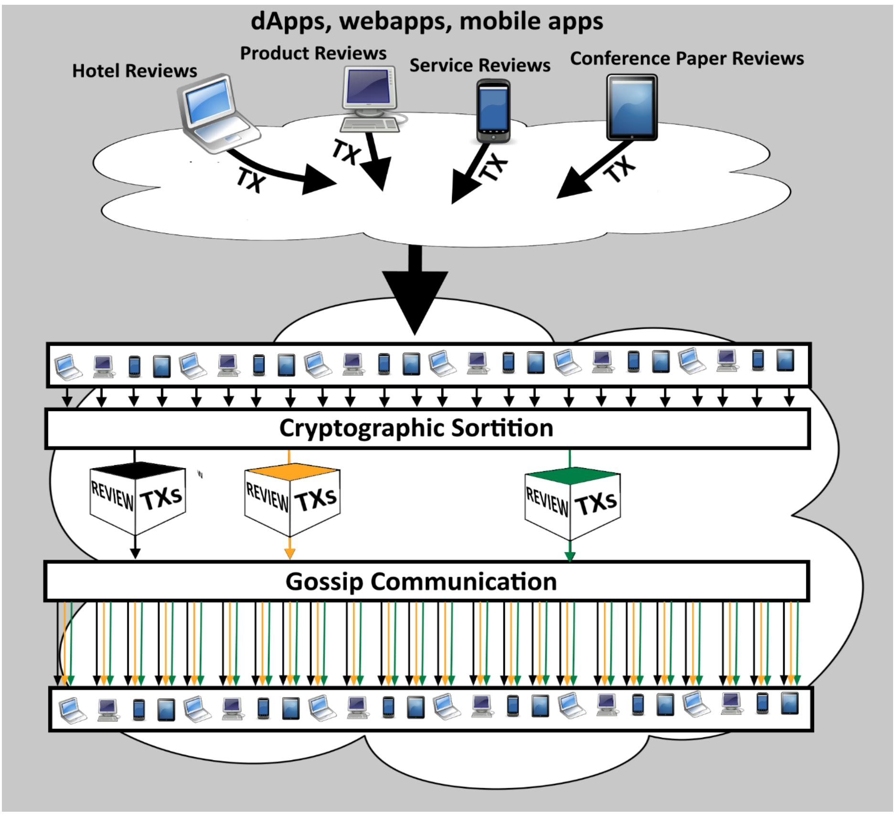

*Figure 1 Users determine independently whether they are a member of the committee (a randomly selected small set of users who act as potential leaders or verifiers) This graphic shows the first step where the three are selected through sortition, who then communicate this while propagating their potential block of review transactions to all users through gossip. The validity of the users being selected is verified by receivers of these propagated messages.*

{2}------------------------------------------------

## **2. Algorand**

We briefly discuss Algorand and its mechanics to bring a better understanding of our extension without needing to read the white papers, though for those interested we refer to [1].

Algorand is a remarkable blockchain platform based on Proof-of-Stake (PoS). It uses a cryptographical self-selecting mechanism (cryptographic sortition, Figure 1) for constructing a committee of verifiers and potential block leaders, and a unique way of handling malicious players by doing this at each step.

**Committee**. Algorand chooses "a committee—a small set of representatives randomly selected from the total set of users—to run each step of its protocol. All other users observe the protocol messages, which allows them to learn the agreed-upon block." Committee members are selected "in a private and noninteractive way. This means that every user in the system can independently determine if they are chosen to be on the committee," (excerpt from [11]). It uses cryptographic sortition functionality based private keys and a user's weighted stake, returning a string indicating membership which is verifiable by others on the network. (Figure 1)

**Organization**. The platform is asynchronous and distributed, organized in rounds, with each round organized in steps. By the end of a round, a committee will come to a consensus on a block to be added to the ledger. Each user is identified by their public key and has an associated amount of money to make payments to and from. The authors refer to Algorand as a payment system, since all transactions in the system are payments from one account to another. A new user can join the network the same manner you do in Bitcoin when an existing user pays a new user creating a new account.

**Goal**. Their goal is to "guarantee the following three properties in absence of any centralized authority: (P1) each block quickly becomes universally known; (P2) all payments in each block Br valid, relative to the amount of money each payer owns according to the initial status and the payments in preceding blocks; and (P3) each valid payment quickly appears in a block." (excerpt from [1])

**Adversary**. In considering an Adversary, they "consider a powerful but computationally bounded Adversary, which (1) instantaneously corrupts any user he wants, whenever he wants; (2) chooses the actions of all corrupted users; and (3) introduces new users into the system whenever he wants. At no time, however, can the corrupted users collectively own more than 1/3 of the total amount of money in the system. Also, the Adversary cannot forge signatures of honest users except with negligible probability" (excerpt from [1])

**Overview**. A high-level overview of Algorand's protocol is provided succinctly by the authors. In their protocol, "round r starts by randomly selecting and publicizing (the identity of) a user, *ℓ r* , the round leader. The leader constructs, digitally signs, and propagates a block *B*, which is his own candidate for the r-th block and includes a set of new and valid payments. Next, a small set of selected verifiers, *SV r* , referred to as the committee, is randomly chosen and publicized. The size of the committee is such that, with the overwhelming probability it has at least a 2/3 honest majority. The committee reaches a Byzantine agreement on the block *B* proposed by *ℓ r* . Upon termination, each honest verifier locally outputs his own block, whose hash value he digitally signs and propagates. Block *B* r is defined to be the block that has been signed by a given number of properly chosen verifiers." (excerpt from [1])

## **3. Extension**

Proof of Review (PoR) is an extension of Algorand with reputation replacing tokens (coins, algos, money) as stake. That reputation-based stake secures the overall blockchain network, as well as providing third party access to a reviewer's reputation along with their respective evaluated reviews. Extending this platform is logical since it contains the core elements of PoS needed (e.g. stake-oriented), with both the 

{3}------------------------------------------------

security desired and flexibility to accommodate the changes needed for the Proof of Review model. Algorand also provides a good base framework for leaders who build the blocks and the verifiers who validate the block and its contained transactions. We built our changes from and on top of this framework.

#### **3.1 Nine major differences from Algorand:**

- Using reputation in calculating the stake, instead of tokens (money).
- A new type of transaction named Review Transaction that doesn't require payment, though payment transactions still exist in PoR.
- Potential Leaders now evaluate reviews for Review Transactions, and Verifiers analyze those evaluations as part of their validations. A review is evaluated for congruency (checking for fake reviews) in addition to other deviant behavior like spamming and acting biasedly.
- An algorithm that calculates a reputation adjustment based on the Leader's evaluation, and another function that adjusts reputation, which consequently could affect a user's stake. We employ the additive increase/multiplicative decrease functionality in our algorithm [12].
- A new analysis of behavioral maliciousness in addition to technical checks.
- New private user metadata (e.g. institution, organization, country of origin, group, etc.) is added to an account and used in detecting malicious behaviors.
- New public user metadata (e.g. the number of reviews, last review timestamp, etc.) is added to an account and used in detecting other malicious behaviors.
- A minimum stake (reputation-based) is required to be selected for a committee.
- Technical and most behavioral maliciousness is handled by blacklisting a user. This is voted on by committee (a new "flag" is propagated with a message to the next committee indicating which account), and the number of rounds it lasts is set in the user's account.

In this section, the following fundamental changes reflect the significant modifications to the core Algorand [1][2], both theoretically and practically, that is needed for Proof of Review. If not explicitly named or mentioned, then it can be assumed no changes are needed regarding that process or notion. We will address these changes regarding Algorand's white papers [1][2] in each subsection.

Each user has a reputation value in addition to the original Algorand's token value. By changing the stake to be based on reputation instead of tokens, it decreases the probability of maliciousness. It does this by preventing users from increasing their stake through purchase or trade. Reputation must be earned, and a minimum stake must be had before being selected to participate in the consensus protocol. Payments and payment transactions still exist in our extension, but now have an insignificant role in the protocol, stake, and user influence\* .

The tasks of the roles of leader and verifier are extended to include evaluating reviews, calculating the level of incongruence between the review and the rating provided, and determining an adjustment value for the respective reviewer. Furthermore, these roles will check for behavioral maliciousness in addition to technical maliciousness, and at one step in the round blacklist a user if the majority agrees to do so. The initial evaluator of the reviews (the round leader) is also evaluated by a new randomly selected set of verifiers later in the round, resulting in higher confidence in the block and contained evaluated reviews.

\* Future work may include combining reputation and tokens to be used together is determining a user's weighted influence (e.g. user with high reputation but with low number of tokens having more influence)

{4}------------------------------------------------

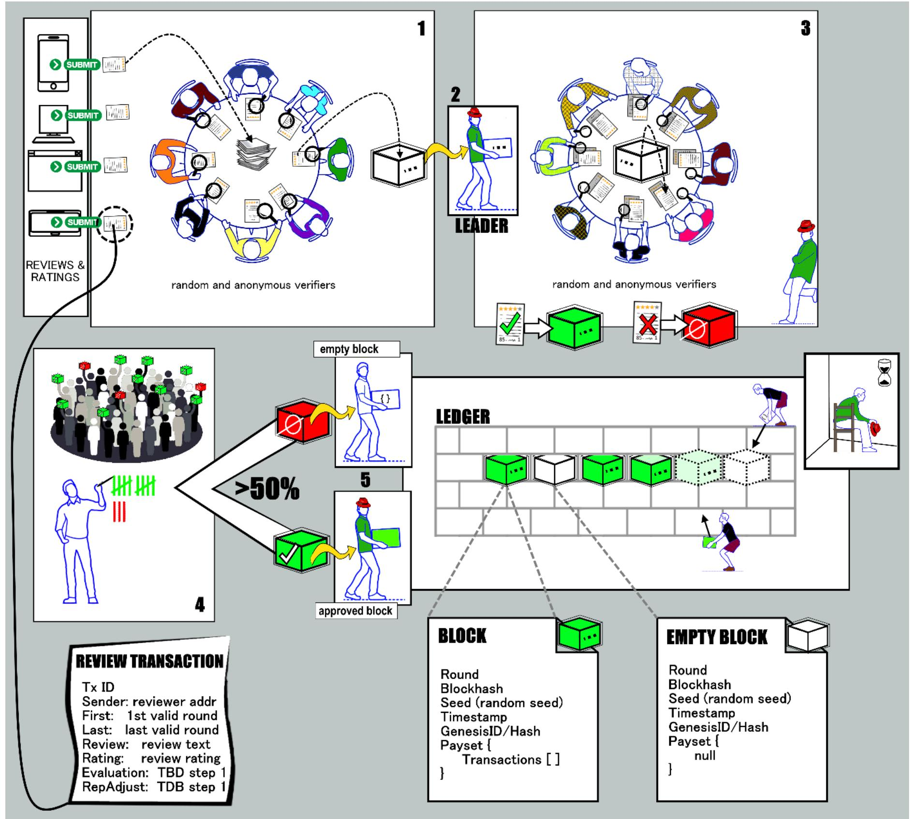

*Figure 2 Various types of dApps can submit reviews to the Proof of Review system where a randomly selected group of participants will evaluate each review. 1. They give a review score and calculated reputation adjustment to each review before adding it their block. Each participant has their own block in which to stack these evaluated reviews. They also do some preliminary checks to ensure it's a valid review (e.g. is the reviewer allowed to submit a review). Any invalid reviews get tossed into the trash. 2. Once enough reviews have been evaluated, after a certain time, a new group of randomly selected participants agree on the leader, and that leader delivers their block of reviews to yet another randomly selected group of users called verifiers. 3. These verifiers "open" the leader's block and reevaluates each review within it, comparing their evaluation to the leader's evaluation. If the comparison is analogous, the original review's evaluation is considered good. When all the reviews are considered good, then the leader's block is deemed good. If there is greater than 1 divergent evaluation, then the entire block is considered bad, and a vote of no confidence for the leader and a vote for an empty block is displayed. 4. A fourth group of randomly selected verifiers count all the votes of the previous group. If they tally >50% in favor of "no confidence", the leader will be blacklisted (i.e. put into time out) for a certain number of rounds, and an empty block (a block with no transactions) will be sent on. Otherwise, the block is approved, and this approved block will be sent on. 5. The final step includes the leader applying the reputation adjustments from each review evaluation in the approved block (if not an approved block, it skips this), then the block is added to the blockchain in the ledger. With each reviewer (from the set of reviewers in the block) having their reputation adjusted and the block added, this round to create a block of reviews is finished.*

{5}------------------------------------------------

#### 3.2 Technical and Behavioral Honesty

We also extend the definitions of an honest and malicious user to include behavioral honesty in addition to technical honesty. Most players will be technically honest since a lot of research has been done to catch or prevent this from occurring in a system. We deem a player to be acting behaviorally dishonest when there exists a pattern of bias, bullying, ganging-up, stuffing the ballot, and more (this list is not exhaustive).

The technical honesty definition and the prevention of maliciousness are addressed by Algorand and remain valid when it is extended by our reputation model. Furthermore, in extending the definition of Honest and Malicious to include both technical and behavioral models, this does not weaken the security of the Algorand's original technical model. The same requirements and conditions still hold for correctness, completeness, and soundness. The addition of a reputation model does not impact the sets of honest or malicious verifiers beyond further constraints such as not being blacklisted. Instead of merely being ignored, both technical and behavioral maliciousness (e.g. bias, ganging-up) is handled punitively by blacklisting the participation of the user responsible for a certain number of rounds. This is in addition to reviewers' reputation adjustments which encourage reviewers' consistent reviews and discourages incongruous ones through a negative reputation adjustment.

#### 3.3 Minimum Stake

Additionally, the subset of verifiers (and thus the leader) is still randomly selected from the pool of potential participants using the methods of cryptographic sortition described by Chen and Micali 2017 [1], and now with a constraint on the participants having a minimum stake. One idea explored was to extend the step of the consensus where a leader is selected to be the user with the lowest hash value and highest reputation. In further analysis, we determined this to be a bad direction. It would be easier with a higher probability a malicious user would corrupt a chosen leader since it narrows the subset of potential candidates to those with a higher reputation. Therefore, the process of selecting the leader based on the lowest hash remains the same, though the set of potential leaders includes those meeting the requirement of minimum stake.

In this new system, all players have a reputation  $\mathcal{R}$ . Reputation has no upper limits and only a lower limit of 0. This is unlike other stake-based systems that use coins or tokens, where the number of tokens in the system is constant.

In this paper, when we refer to Algorand it refers to the white paper's [1][2] methods, notation, and proofs, including  $Algorand_{1}'$ , and  $Algorand_{2}'$ . To differentiate, it may also be stated as Algorand Prime.

#### 3.4 Reputation Properties

Reputation is used in calculating the stake in the system instead of tokens. We introduce new notations to reflect this addition, including concepts with respect to reputation.

·Let  $\mathcal{R}_i \in [0, \infty)$  and  $\in \mathbb{Z}$  represent the reputation of user i, with  $\mathcal{R}_i^r$  representing the reputation of a user i at round r

**Reputation must be earned.** Reputation cannot be purchased, traded, or spent. All honest participants will have a reputation based on a collection of adjustments that can be traced from round 0 to the current round r, stored in review transactions in a payset of a block.

· Let  $\rho_i^r = \sum_{t=1}^r ReputationAdjustment_i^{r,t}$  represent the summation of reputation adjustments of every review transaction t of round r in a block  $B^r$  for a user i (reviewer).

{6}------------------------------------------------

#### Reputation Adjustment is determined from the results of an NLP evaluation.

Each adjustment is determined through sentimental analysis and calculated evaluation of the review the user (reviewer) submitted. The result of the evaluation is a score and a reputation adjustment based on the level of incongruency in the review. Reputation either increases in steps or decreases multiplicatively (additive increase, multiplicative decrease).

# Reputation of a user is the summation of all reputation adjustments to the current round for that user.

- $\mathcal{R}_{i}^{r} = 1 + \sum_{k=0}^{r} \rho_{i}^{k}$  is the reputation of a user at round r, where  $\rho$  is the summation of reputation adjustments for a user i. Simply, the reputation of user i at round r is one (the initial  $\mathcal{R}$  of an account) plus the sum of every negative/non-negative adjustment for that user i since the genesis block  $\mathcal{B}^{0}$ .
- $\Delta \mathcal{R}_{i}^{r} = \mathcal{R}_{i}^{r-1} + \rho_{i}^{r-1}$  where the change in a user *i* reputation is the previous round adjustment added to the previous round reputation, such that

$$\mathcal{R}_{i}^{r+1} = \Delta \mathcal{R}_{i}^{r} + \rho_{i}^{r}$$

#### Stake of a user is calculated proportionally from the user's reputation.

The stake is calculated based on the reputation of a user in the system proportional to the total reputation in the system at the beginning of a specified round r. This stake is used in calculating weighted votes during consensus. It is also used to limit participation in the consensus protocol (e.g. proposing, voting, verifying)

· Let  $\omega_i^r = \mathcal{R}_i^r / \mathcal{R}_{PK}^r$  is the weighted proportional stake, where  $PK^r$  represents the public keys of all active users at round r. Simply, a user's weight is calculated from round r reputation for that user i divided by the total reputation in the system of all active users. Offline and blacklisted users' reputation is not considered.

#### 3.5 Notions on Reputation

The reputation of each reviewer, where

- the reviewer had submitted a review + rating, and
- a Review Transaction was created, and
- that Transaction was included in a block for that round, and
- that block was accepted through consensus voting to be added to the ledger for that round

will be adjusted during the Apply functionality (this where Algos/coins get transferred for Payment Transactions also) for each Review Transaction inside the Payset of that block.

The user participants in the round are still selected randomly using cryptographic sortition, and the leader -- during the soft vote -- is still determined by the user's message that contains the least hash value. Since we use Honest Majority of Reputation (see section 7), this means the least hash value of all potential leaders' copies as is explained [1].

Each user's reputation value could vary over several thousand rounds dependent on conditions. If a user

• [condition 1] submits additional reviews, that user's reputation will vary dependent on the evaluation of respective reviews. This is without regard to which round this happens.

{7}------------------------------------------------

• [condition 2] submits no further reviews, that user's reputation will stay the same or flat (though their stake based on reputation will fluctuate with high probability)

At the end of several thousand rounds, a user's reputation is the culmination of all reputation adjustments made in sequential round (and round transaction) order. It is not merely a summation of all adjustments due to the consideration of the system preventing non-negative reputation. A simplified summary through an example:

- If a user in round *r* has a reputation of 0 and submits three reviews which result in three negative adjustments, their reputation will remain 0, not -3.
- Then in round *r+1,* the user submits three reviews which result in three positive adjustments, their reputation will increase to 3.
- A summation (-3 + 3) will result in a reputation equal to 0, whereas a sequential adjustment will result in 3. The latter is preferred and the process we use.

#### **3.6 Evaluating and Determining Accuracy of Review**

**Evaluating**. To evaluate a review and determine its accuracy we start with the review note and review rating submitted by the reviewer. We employ natural language processing (NLP) [18] for sentiment analysis of the note to calculate the positivity of the text on a 0-100 scale (100 being the most positive). Accuracy is ascertained by comparing this evaluation score to the review rating scaled to 0-100. The NLP used is Stanford's CoreNLP [19][20] which implements their new type of recursive neural network in analyzing grammatical structures, though other NLP systems could be used instead.

**Mapping**. We would first map the original quantitative (rating) interval [a, b] to [0, 100] to more easily compare against the qualitative (note) interval of [0, 100].

v = original quantitative (rating) value

$$f(v) = \frac{100 - 0}{(b - a)} v \equiv \frac{100}{(b - a)} v$$

Example: With a rating system of [0, 5], the scaled value is figured as such:

$$f(v) = 20v$$

**Comparing and Calculating**. Once the NLP qualitative (Q) score is calculated [0, 100], we then compare it to f (v). There are a few approaches in calculating the adjustment to the reviewer's reputation. We use the discrepancy between the values of Q and f (v) to determine the amount of adjustment. If they are within an acceptable range, then the adjustment value is positive either 1 or 2 (additive increase). Otherwise, the reviewer's reputation is cut in half (multiplicative decrease).

**Results and Conclusion**. This calculated adjustment value is applied at the end of the round to the reviewer's reputation. They start the next round with this newly adjusted reputation value. This evaluation component is essential in indirectly affecting the proof of stake element of our PoR consensus.

**Examples**: The review of a book is given as "This is very good!" and a rating of 4 out of 5 stars. The NLP evaluates that phrase as 80% positive (or just 80/100). The scaled rating is 80 (20\*4, from f(v)). The values match exactly, so reputation adjustment is positive. With the same review note and given a 1-star rating, the values diverge by 60 points, so the reputation adjustment is negative (specifically, cut in half).

#### **3.7 Public Ledger Extended**

Proof of Review maintains the use of Algorand's payment system which they base on an idealized public ledger. Instead of payments and money making up the core of the system, we use reviews and reputation. 

{8}------------------------------------------------

Making payments is now an ancillary feature instead of a primary one. This evolution fundamentally changes how we present this attempt at an idealized public ledger. Extended from white paper [1].

1. *Initial State*. Reputation ℛ is associated with each public key *pk,* which is generated and owned by each user. Money *a* can also be associated with a public key but is not necessary for the system to function. Let *pk1,…,pkj* be the set of initial public keys, ℛ*1,…,* ℛ*j* be the set of initial respective reputations, and *a1,…, aj* be the set of initial respective amounts of money. With this, the initial state can be simplified to

$$S_0 = (pk_1, \mathcal{R}_1, a_1), ..., (pk_j, \mathcal{R}_j, a_j)$$

The initial state can be considered common knowledge in the system, where every user can see and know this state.

2. *Reviews / Review Transaction*. A pk (reviewer), for a review transaction Ɍ where *I* represents nonsensitive information and the *I2* is additional information that is considered sensitive (e.g. identifiers, review fields) and hashed to protect it. These variables may be empty and not used in every transaction, except for two review fields ReviewNote and ReviewRate which are mandatory to submission.

$$R = SIG_{pk} (pk, I, H(I_2))$$

**Review Fields** (\*mandatory to submission):

- ReviewNote \*(text-based review),
- ReviewRate \*(numerical rating),
- ReviewEval (numerical rating system evaluation of review, on a 100-point scale, using natural language processing of sentimental analysis),
- RepAdjust (numerical adjustment of reputation to apply to reviewer account)
- 3. *Joining.* Users may join the system whenever they wish by generating their own public and private key pairs. Furthermore, in addition to having payments to a new pk', users may also have a newly generated public key from submitting a review.

## **3.8 Proof of Review as a Core Protocol Instead of a dApp**

One may ask why this is a consensus model at the core of a blockchain platform, and not simply a dApp (distributed application) to handle review processing. Part of Proof of Review could be coded as an application, but it would lose the fundamental core of its flexibility in usefulness. PoR is a tool that is used for aiding applications by ensuring congruently honest and unbiased reviews, providing an immutable and transparent system of data related to both the reviews and the reviewers. Additionally, it provides the underlying mechanism of the blockchain framework in deciding who can participate in the consensus protocol.

It does this by utilizing three things that work together. First, to participate in the process, the party must have written and submitted a review. Second, that review is analyzed to determine if the review is a good congruent one and free from malicious actions like spamming, trolling, or acting biasedly. The reviewer's reputation is adjusted up or down respective to that evaluation. Third, the ability to participate further in the system (beyond writing reviews) is dependent on that reputation. If they produce too many incongruent reviews, the reviewer's reputation will significantly decrease, and they may be restricted from participating in the consensus process. In this context, participation in the blockchain is the ability to create or validate blocks to be added to the blockchain. These blocks contain the review, the analysis of the review, as well as other associated data. Since reputation is the base for determining stake in this PoS platform, the users with the most consistent reviews are more likely to have earned higher reputations and therefore 

{9}------------------------------------------------

chosen more frequently to participate. The data forged in the blocks can be used by numerous types of dApps for further handling.

If PoR was written as a dApp, it would lose its generality and not be a self-regulating, generalpurpose tool for various types of reviewer systems. Like other consensus models (discussed later in Background), it is used to help prevent malicious parties from dominating the network in addition to providing supplementary information for dApps to use if needed. It does this by certifying the forgers and verifiers (miners in PoW) are ones with a minimum stake in the system (based on reputation) as well as numerous other methods and requirements discussed later in this paper.

## **4. Background**

#### **4.1 Related Consensus Models**

**Bitcoin**. The success of Bitcoin [14] made the Proof of Work (PoW) consensus model popular. PoW is used to arrange a "lottery" between the Bitcoin nodes, where the "winner" gets to add the next block to the blockchain (a distributed and tamper-resistant ledger of transactions and states). Winning requires the node to perform some calculations to solve a computational puzzle. This is also known as mining. The fastest miner gets rewarded to add a new block. This block is verified by the other miners who implicitly accept it by mining on top of it or ignore it. Once the block is added (and being mined on top of), it is supposed to remain there permanently, hence making its data immutable. Since Proof of Work works outside the scope of reputation, it does not seem to be a suitable base for Proof of Review.

**Proof of Stake (PoS)** is another protocol discussed regularly as an alternative to PoW [15]. PoS has the same goal as PoW which is to pick a node that is to add the next block to the blockchain. It uses a different, more deterministic mechanism to get to that goal by operating with a finite amount of coins used as a stake in the overall system. Proof of Stake only considers a peer's stake of coins, which they possess in the system. In itself, PoS is not associated with reputation, and hence it cannot be directly applied in our scenario. At the same time, the PoS model has some useful aspects which we will employ in our extension.

#### **4.2 Related Work (summary and differences)**

**A PoR/PoS-Hybrid Blockchain: Proof of Reputation with Nakamoto.** *Why are we different?* Kleinrock et al [21] propose a hybrid blockchain system of Proof of Reputation and Proof of Stake (PoS). They attempt to solve the problem of on-off attacks that Reputation models regularly face while mitigating attacks employed to corrupt reputation systems and alter reputation values. The authors added reputation notions to a stake-based system and claim as long as the majority of stake is held by honest parties, that the PoS part will prevent exploitation and prevarication of the reputation part. There are numerous good ideas and a generally good direction, similar to their base Ouroboros [22] model (e.g. static and dynamic concentration sections for reputation vs stake). Reading their results, we found conclusions showing how they preserve a Proof of Reputation system using an underlying PoS platform.

Our protocol, Proof of Review (PoR) addresses reputation also. We focus on the inherent problem of the trustworthiness of reviews (e.g. on services, products, journals, etc.) and the reputation of the reviewers. We derive the trustworthiness of a participant's reputation through a consensus of their reviews. This reputation is used as the system's stake and drives our protocol. It is used in part for the selection of multiple committees during a single round who participate in the protocol to eventually add a block. A secondary benefit is the protocol provides feedback to the applications for backend use, regarding the review quality and reviewer's reputation.

The authors' solution does not address our problem. Their approach does not address reviews and hence does not correlate the participants' reputation score with any reviews. This lack of review analysis ability prevents mitigation of some reputation-based attacks like bad-mouthing, spam, ballot-stuffing. Since 

{10}------------------------------------------------

their system's reputation values are increased/decreased stepwise based only on the node's network availability and protocol participation, the participant's reputation model does not address our problem. Our participants are not given reputation points for merely being there online. In our protocol, reputation is earned, and can never be bought, sold, or traded. The protocol described in the paper does not solve the problems we are trying to solve, which is whether the parties' reputations are valid and worthy of their value.

**Proof of Reputation: A Reputation-Based Consensus Protocol for Peer-to-Peer Network.** Gai et al [13] suggests a new protocol they call Proof of Reputation. Similar to Proof of Review, there are no miners and the concept of reputation is used in lieu of coins to determine block forging. Gai et al tie reputation to identities in a permissioned blockchain platform. It is less a blockchain, and more a distributed ledger tracking each party's transactions on that ledger. Their selection of who forges a new "block" is the one with the highest reputation. One gains reputation by writing blocks, so it appears as a possible selfreferential paradox (explained later). They use a permissioned distributed ledger platform using a secured channel for broadcasting messages. Unfortunately, the assumptions they make about the network and nodes seem somewhat contradictory in how communication is performed; nodes broadcast messages over a secure channel, but specifically mention how a pair of participants can reliably authenticate each other because of that secure channel. In addition, they later state that there are no assumptions made on the reliability of the nodes, which contradicts that reliable authentication. In their protocol, secure broadcast messaging is not what facilitates parties to authenticate each other; their authentication comes from each party's use of their local storage of public keys of every party on the network.

As for their protocol, reputation in their system starts with a party requesting a service (e.g. lawn maintenance, car repair service, etc.), then receiving a service, and finally rating that service after completion. A message (transaction) is then broadcast with this information along with that final rating, timestamp, and digital signatures. Each block contains multiple transactions from possibly multiple parties. The participant having the highest summed rating (reputation) from that group of transactions becomes the block forger, with the others validating. The validation is simply confirming the block forger had the highest rating and every transaction party's signature. According to the authors, the reputation is determined solely from these transactions, ignoring any reputation earned prior to this block. Though the paper suggests an incentive to publish a block is to increase their "trust ranks", it doesn't define a trust rank beyond the immediate block production.

This is much different from Proof of Review (PoR), where reputation is pervasive and persistent beyond the current block. PoR also uses a random coin-flipping functionality to help prevent the party with the highest reputation from always forging the blocks. This paper's proposal relies on human analysis for determining reputation, leaving it open to bias, ganging up, and bullying to perform a "bad mouth" attack at the human-level. PoR's reputation is determined using consensus technology. Another difference is PoR pseudo-shards participants into groups, where this paper's nodes are all participating in every round. Possibly in the future, a modified hybrid of the two protocols should be explored.

**A Trustless Privacy-Preserving Reputation System**. [16] The authors propose a new blockchain-based reputation system to preserve privacy in a trustless environment. They focus on seller (a service provider) reputation in e-commerce applications, letting customers to give feedback as both a numerical rating and a textual comment. Reputation is based on an aggregated functionality from all reviews of the service provider. Their protocol does not evaluate the review itself, which is different than Proof of Review (PoR). The proposed protocol does a good job at exploring a solution in protecting the customer's identity, unlinking their review from their e-commerce transaction to maintain privacy. To prevent some typical attacks on a blockchain system (e.g. bad-mouthing, ballot-stuffing, etc.), they issue a currency that limits the number of coins a provider can spend, which limits the number of blind tokens that they can issue. Since this is a proof-of-stake based system, bigger wealthy providers could still be at an advantage over smaller ones. Their future work includes researching how coins are generated in their proposed system, which may 

{11}------------------------------------------------

mitigate that PoS issue. They don't appear to provide answers to how providers and customers specifically gain coins, other than buying into the system.

This proposed protocol differs considerably from our Proof of Review protocol. Our model does not use coins or tokens for transactions and uses reputation to determine the block forger. They do not reveal how block-forging is established, only that coins are an incentive to building a block. In PoR, Reputation is earned through valid reviews and not calculated directly from the reputation history. Though a dApp could tap into the blockchain to see a party's reputation history, the block forger adjusts the overall reputation score for a reviewer to be used in the next round of stake delegation. Walking through the entire reputation history to calculate a score before every transaction seems inefficient, with exception to validating that score.

## **Toward a Decentralized, Trust-less Marketplace for Brokered IoT Data Trading using Blockchain**.

The authors of [17] propose a better marketplace model that doesn't rely upon a mutual trust between parties. The problem is the risk of loss to a buyer when dealing with untrustworthy sellers. They focus in on data streams and data exchanges, which is different from our concerns. Regardless, in one section, they offer a good solution using a reputation model, so that's where this summary's attention concentrates. They apply a trust and reputation framework on top of the marketplace model, which is both at the dApp level and out of scope for their paper. It is assumed this framework is in place with an existing reputation score associated with each participant. Customers can see these scores to assess any risk with dealing with sellers and vice versa.

The paper suggests a model where an increase in reputation (which is not compared against others proportionally) reduces the cost of the overall data delivery, by reducing the number of transactional checkpoints that are ensuring a good honest delivery. A low reputation would require more checkpoints than a trusted high reputation would, therefore higher overall transaction costs. Though the reputation model is similar to ours in that it is pervasive through each transaction and block, it is too dis-similar because reputation is stored and used at the dApp level, instead of in the core. It affects the cost of the transaction, instead of affecting decisions on which node will forge blocks or participate in consensus.

## **5. Protocol Steps and Description**

We present a general description overview of our Proof of Review protocol steps. These five major steps derive from Algorand's steps and include: (i) block proposal, (ii) block leader selection (soft vote), (iii) block verification (cert vote), (iv) BBA binary byzantine agreement starts (conversion from graded consensus to BBA), and (v) Block decision and application of transactions (add to the ledger, transact what is necessary in each transaction).

Note: To simplify our descriptions, we will limit our discussion to review-related notions (unless nonapplicable or explicitly stated otherwise). Consequently, we also constrain all transactions submitted to review transactions in every round.

First, we will discuss some base definitions that we are using in describing each stage.

#### **5.1 Background Definitions**

**Definition (Block).** *A* block *is an immutable structure of data representing the state and a payset of transactions of a system for a specific round. When linking on a blockchain, a* block *B also contains a record of the previous block's cryptographic hash, which is used to create its own digital hash identifier, unless it is the Genesis Block B0. The* block *B is added to the ledger at the end of each Round r. In the circumstance where an agreement can't be made within a set time, or other cases, an empty block is voted on to be added to the ledger. An empty block has an empty payset (set) of transactions.*

{12}------------------------------------------------

**Definition (Blockchain).** *A* blockchain *is a linked series of blocks starting with the Genesis Block B0, showing an immutable history of a system's states and transactions. Mostly used as a distributed ledger, in which every peer maintains the exact copy of the ledger.*

**Definition (Leader).** *A l*eader *is a stakeholder whose proposed block is selected for a round from all potential leaders. A leader can be cryptographically self-selected to be a potential leader and then again for any step in the protocol as a verifier. The leader's block is assembled from review transactions, in which these transactions been evaluated by them in step 1.*

**Definition (Potential Leaders).** Potential Leaders *(PL) are cryptographically self-selected to assemble a block of transactions for a round. They evaluate the review in each transaction and update the review fields in the transaction header before adding it to the payset of the block. Once the block has reached its size or time-limit, they then broadcast the block and their credentials to the network to potentially be chosen as the leader. A participant can only be in PL if they meet the minimum stake and are not currently blacklisted for that round. Like in other PoS systems, the larger the stake a peer has, the more likely to be selected as a leader.*

**Definition (Round).** *Rounds start after an initial block (Genesis Block), peers, and reputation have been determined. The* round *is a set of 5 steps (simplified for definition sake, its process has a repeating set of steps until a consensus is achieved or time runs out). At the end of each round, a block will be added to the ledger, regardless of transactions within the payset of the block. In certain cases, listed in [2], the block may be empty. In the best-expected case, the review transactions of a block are finalized at the end of the round with the reputation adjustments completed and the block added to to the ledger.*

**Definition (Genesis Block).** *The* Genesis Block *is the initial block B0containing the list of initial online participants with their respective identifying information including their initial reputation of 1 and* their *stake si, which is initially distributed equally.*

**Definition (Stake).** *A* stake *is a proportional advantage in the system when participating in the consensus protocol. User's i stake si is calculated from their current reputation* ℛ*iand is balanced against the currently*  online *peers' reputation.*

**Definition (Participant, Stakeholder).** *A* participant *is an online peer with a reputation greater than zero. They are identified by their public key (pk) and are a* stakeholder *in the system. They may be selected to participate in the consensus process for a round in one or multiple steps. Their stake is dependent on their reputation proportional to the total reputation of all currently online (non-blacklisted) participants. Though a participant may never submit a review, with their reputation remaining stagnant at a value of 1, they are considered a potential reviewer. Since their stake is based on their reputation, it is probable that they are never selected to participate in the protocol but will not affect their other types of actions (e.g. payments) on this platform.*

**Definition (Verifier, Set of Verifiers).** *A* verifier *is a part of the* Set of Verifiers *(SV) cryptographically selfselected for each round in each step. Selection is limited to participants with a minimum stake and not currently blacklisted. A new SV is selected for each step, and Verifiers are tasked with different actions at each step in the round. In step 1 they are referred to as both Potential Leaders and a member of SV r,1 and propose blocks. In step 2, they select the leader. Steps 3-5 are discussed in more detail later. Verifiers, in addition to validating each transaction technically in the leader's block, will validate each review transaction through evaluation (in the same way the leader has). They then compare this against the leader's evaluation to ensure the correctness of the evaluation and thus the block. When a discrepancy is seen, the verifiers vote to blacklist the leader. If the majority concludes the same, then the leader is blacklisted.*

{13}------------------------------------------------

#### 5.2 Steps (in relation to Proof of Review)

A round starts regardless of any transactions in any transaction pool and ends in a new block (even an empty one) being added to the ledger. Transactions are created and propagated to the network using a dApp (webbased, console-based, mobile-based, desktop-based).

A reviewer on the network (or newly joins the network, if not) uses this dApp to submit a review containing both text and a numerical rating. The transaction is created, signed, and disseminated to the network.

A run-through example is listed at the bottom of each step to better understand how Proof of Review works. It is labeled as "**EXAMPLE STEP s:**" which will continue from the previous step. Step 0 is the reviewer submitting a review using a dApp or web-based app, as mentioned above.

Every round and every step maintain the following:

Let  $\omega_i^r = \mathcal{R}_i^r / \mathcal{R}_{PK}^r$  represent the proportional stake of *i* for Round *r*.

Every honest verifier  $i \in HSV^{r,s} \land i \in \{PK^r : \omega_i^r \ge \omega_{min}^r\}$  where  $\omega_{min}^r$  is chosen in a way to prevent malicious new users access to participate, while still ensuring that  $SV^{r,s} \ne \emptyset$ .

The above holds for each round and step and will not be reiterated at each step below.

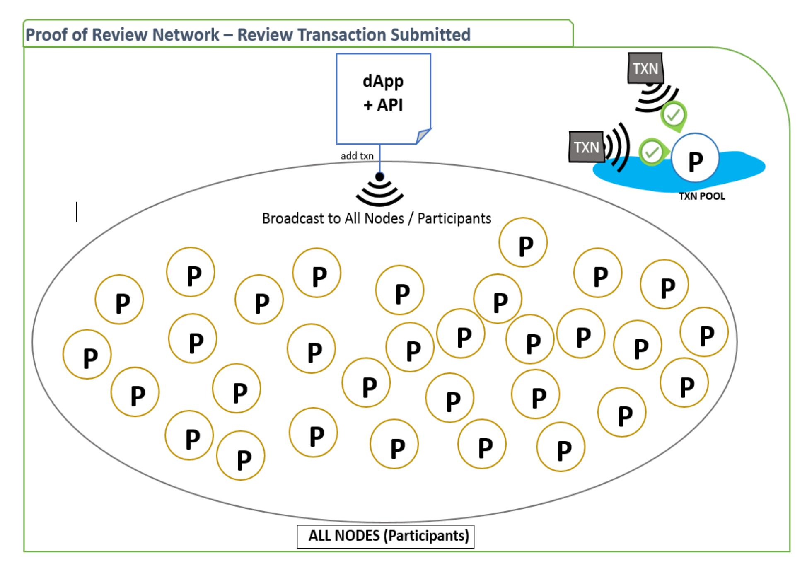

Figure 3 (Step 0) Reviewer submits a review (text and rating) to the network using a dApp. The transaction is signed by the reviewer and it propagates into every participant's transaction pool. Every participant in the network receives the transaction. What they do with it depends on when and if they are selected into a role to participate in the consensus protocol at any of the steps. Before the review transaction is submitted, the transaction is checked to ensure it "looks right" (e.g. signature, check if already in a block in the ledger, etc.)

{14}------------------------------------------------

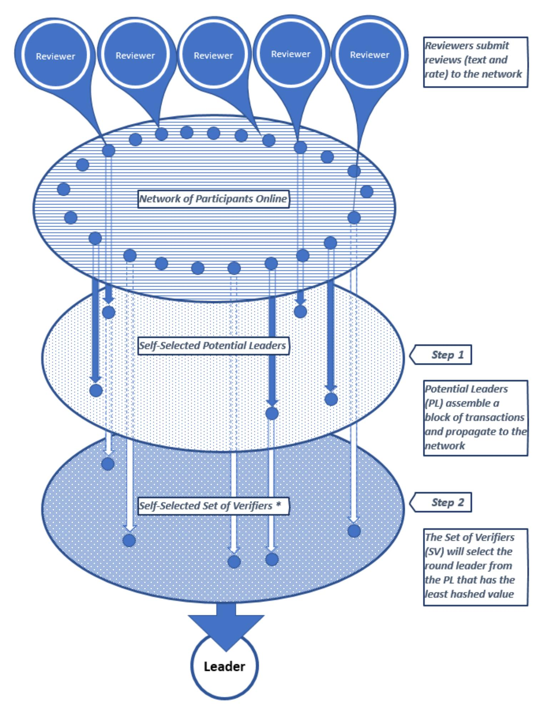

*Figure 4: High-level view from Step 0 through step 2 (from a review submitted, then to the potential leaders selected. and finally the round's block selected by vote). 0) The reviewer submits a review and rating to the network. 1) Randomly selected and anonymous participants are tasked to assemble a block of review transactions and propagate to all participants in the network. These transactions are evaluated using NLP before being added to a potential block. 2) A new set of randomly selected and anonymous users (a committee) receives the messages from Step 1 and propagates a vote for the leader (and associated block) in a new message to the network. The next step has another set of users that tally the votes and reevaluates every review in the block of the determined leader. Reviewers are also participants in the network and can be selected (or not selected) to be a part of any step in the consensus process. As a participant, there is no guarantee of any role at any step, as many of the participants in the network are not selected during the process. A player selected for a role in one step's committee still has the possibility of being selected again for another step, though highly improbable as the size of the network increases. In each round, at each step, the participants (nodes) selected to do the work are always randomly selected and anonymous to each other. This holds true even when the participant accountholders know each other in real life.*

{15}------------------------------------------------

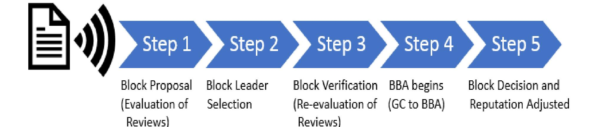

Figure 5: The five steps simplified for discussion on the Proof of Review extension. There are other virtual steps that form a cycle from these last steps to ensure convergence but are omitted since it is not directly relevant in respect to our review system. If interested, see [1]

Reviews)

#### Step 1. Block Proposal

Participants cryptographically self-select to be Potential Leaders (PL) for the round. Recall the potential leaders are selected from a set of participants from round r-k (which helps prevent malicious players from influencing the probability of an honest leader chosen in current round), using a cryptographic sortition method and limited in size defined by the system. Additionally, the participant must meet a minimum reputation-based stake and not be blacklisted for this current round.

In step 1, these PL assemble a block and add transactions to the payset of the block until the size or timelimit is hit. After verifying the transaction "looks right" technically (e.g. signature) and before adding this transaction to the payset, each PL will evaluate the review. The evaluation calls on a Natural Language Processor (NLP) to evaluate the text. Then, the review text is compared against their rating, and an adjustment to the reviewer's reputation is determined based on the level of incongruency. The evaluation and adjustment values are stored in the transaction, and the transaction is added to the payset.

The block is signed. The PL propagates a message, which includes the signed block and their hashed credentials, to the network for a soft vote (step 2)

Formally, (excerpt Algorand [2]) "every honest verifier  $i \in HSV^{r,1}$  propagates the desired message  $m_i^{r,1}$ where  $m_{i}^{r,1} = (ESIG_{i}(H(B_{i}^{r})), \sigma_{i}^{r,1}), B_{i}^{r} = (r, PAY_{i}^{r}, SIG_{i}(Q^{r-1}), H(B^{r-1})), \sigma_{i}^{r,1}$  is their credential, and  $PAY_{i}^{r}$  is a payset among all transactions that i has seen by time  $\alpha_{i}^{r,1}$ ."

Note: Each  $PAY_{i}^{r}$  may contain any combination of payment and review transactions, which i has seen and with each review transaction i has added a processed review evaluation and a calculated reputation adjustment to it before adding to  $PAY_{i}^{r}$  and propagating the  $m_{i}^{r,1}$ .

**EXAMPLE STEP 1:** Let's assume there are 1200 participants in the network, where 100 of them are blacklisted and 200 have too low a stake to participate. This leaves 900 participants who could participate in step 1. 100 users self-select using cryptographic sortition and are considered the Potential Leaders (PL). Each PL assembles a block from the transactions in their transaction pool (let's also assume all transactions are review ones). The PL evaluates the review and calculates a reputation adjustment in each transaction before adding it to their proposal block. They then sign it and propagate their message (which includes their block) to the network using a gossip protocol.

{16}------------------------------------------------

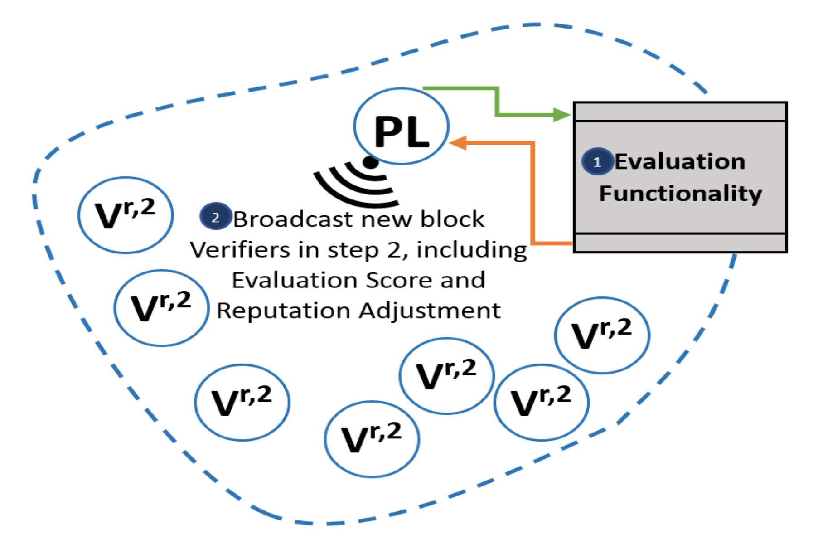

*Figure 6 (Step 1's evaluation model) The potential leader (PL) uses sentimental analysis of an NLP system to ascertain a value to evaluate the review text against the rating for consistency. Once the evaluation is completed and a reputation value calculated, the transaction is added to the payset of the block. Once the block is ready, the PL propagates the block (and their credentials) to the network. Though all participants receive the message, only the newly and randomly selected verifiers (a committee) in step 2 act upon it.*

#### **Step 2. Block Leader Selection (soft vote)**

Again, participants cryptographically self-select to be a verifier in the current round's Set of Verifiers (*SV*). The same restrictions of minimum stake, non-blacklisted, and being a user in round r-k apply to each player in *SV* at each step in the round, also.

Additionally, all participants in each step > 1 listen to all messages in case they are self-selected for *SV* for that step. If they determine they are not a verifier, then they stop and do nothing for that step.

Also, when it says signed, signature, or *ESIG*, this refers to temporary single-use ephemeral keys being used and not a player's public key used to identify in the network when signing transactions.

Each player in **Step 2**'s *SV* seeks to determine the round leader by listening to incoming messages and comparing the hashed credentials to all other hashed credentials far. After a certain amount of time, the leader is determined by the message with the least hashed credential value.

(excerpt Algorand [2]) "After waiting for time 2λ, he finds the user ℓ such that H( ,1 ℓ ) ≤ H( ,1 ) among all credentials ,1 contained in the successfully verified (r, 1)-messages he has received so far."

Each player *i* in *SV* will then propagate their vote for this leader (and block) in a message. If after time 2λ no messages are seen, then the vote is for an empty block for the round.

(excerpt Algorand [2]) "
$$m_i^{r,2} \triangleq = (ESIG_i(v_i)), \sigma_i^{r,2}$$
" where " $v_i \triangleq (H(B_\ell^r), \ell)$ "

{17}------------------------------------------------

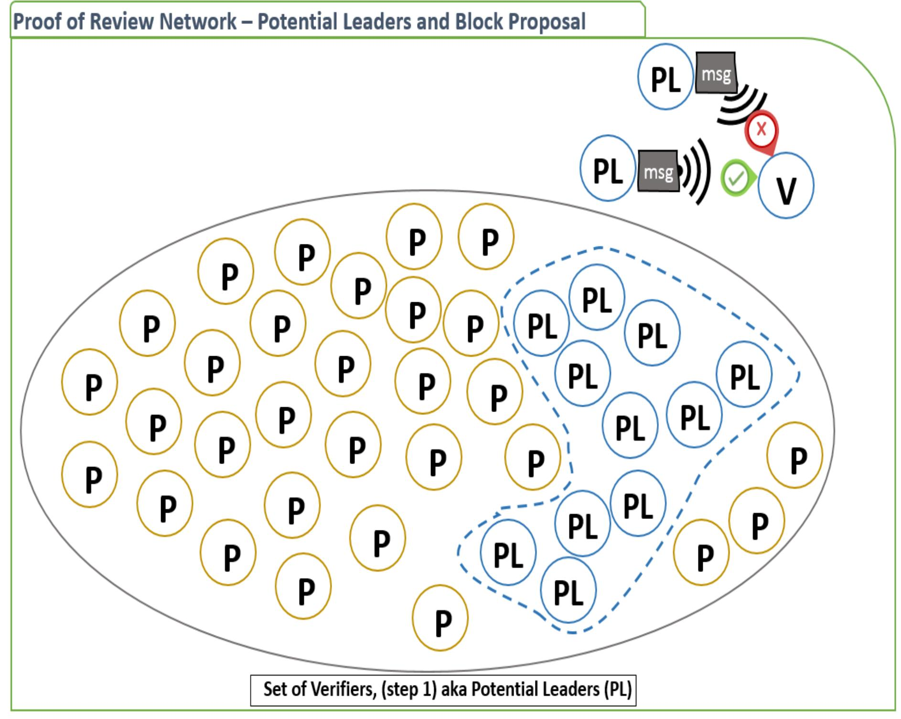

*Figure 7 (Step 1) Potential Leaders (PL) are self-selected through cryptographical sortition and are also limited to a minimum stake to participate. Once a player confirms they are a PL they add review transactions until the size or time-limit is met. Each transaction before being added to the block's payset is evaluated by the player using sentimental analysis to determine if the review text is consistent with the review rating. A reputation adjustment value is calculated depending on how incongruent the review is from the rating. If within an acceptable range, the reviewer's reputation is slated to increase, otherwise it decreases (the application of this happens in Step 5 if 2/3 agree to it). Once the PL adds this evaluation information to the transaction, it adds the transaction to its payset. When a block is ready, the PL propagates their block and their credentials to the network via a message. All participants receive this message, but only the self-selected Set of Verifiers (SV) in step 2 act upon it. The SV in step 2 listens to all the PL messages and selects the one with the least binary hash value to be the round leader.*

**EXAMPLE STEP 2***: All 1200 participants receive the messages sent by the potential leaders of step 1 (via gossip protocol). A new set of 100 users is selected to be verifiers in step 2 (like it was done in step 1). These 100 verifiers listen for "step 1" messages for a system defined duration before finalizing a decision for round leader and associated block of transactions. (Note: the non-verifiers of this step are listening also, but have no role or action, so we ignore them for this example for all steps 1-5). After the wait, the PL with the least hashed value of all PL messages heard is propagated in a message as a vote for that leader (and block) to be the round leader. If a verifier heard no messages, then an empty block is their vote. Each verifier is propagating their vote.* 

{18}------------------------------------------------

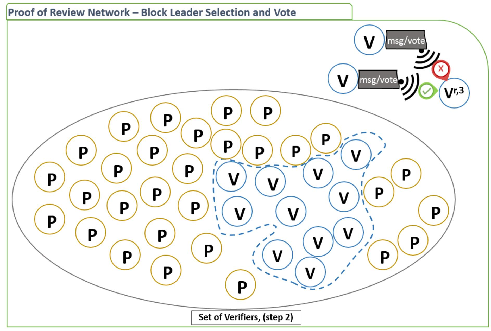

*Figure 8 (Step 2) A new set of self-selected verifiers is selected for step 2. They receive the messages from the potential leaders (PL) from step 1. After a specified time has passed, whichever PL had the lowest binary hash value is determined to be the round leader by each separate player. Due to potential communication delay, each verifier may not see all the same number of PL messages; thus, a verifier's determined round leader may differ from another player. Finally, the verifier player propagates a message that is considered a "vote" for their leader to be the round leader, along with their credentials. If they don't receive any messages from the previous step within a set time, the verifier "votes" on an empty block. At this step, the players are not validating the leader's block's transactions. That happens in Step 3.*

#### **Step 3. Block Verification (cert vote)**

As in previous steps, participants cryptographically self-select to be a verifier in the current round's Set of Verifiers (*SV*). The same restrictions of minimum stake, non-blacklisted, and being a user in round r-k apply to each player in *SV*, also.

Each player in **Step 3**'s *SV* seeks to verify and validate the block and its associated transactions within the payset. The player *i* will wait for a set amount of time to receive the minimum number of messages (from step 2) who vote in agreement (on the leader). If time runs out before that minimum requirement is met, i sets their vote on an empty block to be propagated in their message out.

Otherwise, each player i will iterate over the review transactions in the block's payset. With each transaction, i will evaluate the review text in the same way the user *ℓ* did and compare their evaluation to *ℓ'*s evaluation. If they match, or within negligible range, and the remaining technical checks are good (e.g. signature), i moves to the next transaction. Once all transactions have been verified and validated as good, i propagates a message. If any transactions were considered bad, then their message will vote on an empty block instead.

(excerpt Algorand [2]) "
$$m_i^{r,3} \triangleq = (ESIG_i(v_i)), \sigma_i^{r,3}$$
" where " $v_i \triangleq (H(B_\ell^r), \ell)$ "

{19}------------------------------------------------

*EXAMPLE STEP 3: Like in step 2, all 1200 participants receive the messages sent by the set of verifiers of step 2. The messages heard are votes for the round leader. A new set of 100 users is selected to be verifiers in step 3 (like it was done in previous steps). After a set time, or a certain number of messages are received in agreement on the leader, the round leader is selected by each verifier. If the message votes were for an empty block (or too few votes received within the set time), these verifiers will select the empty block as this round's block, propagating that in their message.*

*After a round leader is selected, each verifier iterates over all the review transaction in the leader's block, re-evaluating the review and comparing against the leader's original evaluation. The leader and verifier are following the same set of instructions and using the same tools to evaluate, so the results should agree. If there is a disagreement between the two, the verifier concludes the leader's review evaluation as bad, thus the transaction is bad, and consequently the leader to be acting maliciously. The verifier propagates a message with votes of "no confidence" in the leader and a proposed empty block.*

*When every transaction has been re-evaluated and no disagreements have been found the verifier sends a message with a vote in a continuance of this leader and block.* 

#### **Step 4. BBA begins (GC to BBA)**

Step 4 does not deviate from Algorand.

Participants cryptographically self-select to be a verifier in the current round's Set of Verifiers (*SV*). The same restrictions of minimum stake, non-blacklisted, and being a user in round r-k apply to each player in *SV*, also.

Each player in **Step 4**'s *SV* seeks to transition from a graded consensus to Algorand's Binary Byzantine Agreement (BBA). Again, they wait a maximum amount of time to receive the minimum number of messages (from step 3) who are still in agreement on the leader and respective block. If time runs out, their vote is an empty block (like in previous steps).

Their next message will be similar to previous steps' messages, but include another signed value of 0 or 1 depending on the number of agreed votes received for a leader. The value is 0 when the number of messages received meets the minimum and the vote is still in agreement for a leader. Otherwise, it is 1. They then propagate their messages including this BBA input value *b* of either 0 or 1.

(excerpt Algorand [2]) "
$$m_i^{r,4} \triangleq = (ESIG_i(b_i), ESIG_i(v_i)), \sigma_i^{r,4}$$
" where " $v_i \triangleq (H(B_\ell^r), \ell)$ "

*EXAMPLE STEP 4: Like in step 3, all 1200 participants receive the messages sent by the set of verifiers of step 3. The messages heard are the continued votes for the (now verified) round leader. A new set of 100 users is selected to be verifiers in step 4 (like it was done in previous steps). After a set time, or a certain number of messages are received in agreement on the leader, the round leader is again selected by each verifier. If the message votes were for an empty block (or too few votes received within the set time), these verifiers will select the empty block as this round's block, propagating that in their message. If they received a majority votes of "no confidence" in the leader, then they will blacklist the leader, with their message being the same as above with an empty block.*

#### **Step 5. Block Decision and Transaction Action**

Participants cryptographically self-select to be a verifier in this step's Set of Verifiers (*SV*). The same restrictions of minimum stake, non-blacklisted, and being a user in round r-k apply to each player in *SV*, also.

Each player in **Step 5**'s *SV* seeks to come to a final decision on a block. They will converge on an agreement of the leader and block, then apply any transaction operations before adding the block to the ledger.

{20}------------------------------------------------

In this BBA step, the *SV* are listening to messages that include a signed value *b* = 0 or 1 in addition to the leader/block vote. If they receive the minimum number of messages containing 0, the round ends. If the block is not empty, the transactions within the block are iterated through and each respective reviewer's reputation is adjusted accordingly before the block being added to the ledger. There are other virtual steps that form a cycle from these last steps to ensure convergence but are omitted since it is not directly relevant in respect to our review system.

*EXAMPLE STEP 5: Like in step 4, all 1200 participants receive the messages sent by the set of verifiers of step 4. The messages heard are the continued votes for the round leader and block. A new set of 100 users is selected to be verifiers in step 5 (like it was done in previous steps). After a set time, or a minimum number of messages are received in agreement on the leader and block, the round ends. If the message votes were for an empty block (or too few votes received within the set time), an empty block is added to the ledger. Otherwise, the transactions of the block are handled and reputations of each reviewer, respectively., are adjusted before the block is added to the ledger.* 

## **6. Analysis of Algorand Extended for Proof of Review**

#### **6.1 Notions**

Credential and ephemeral keys are generated the same way as Algorand. There are no changes to the cryptographical public-secret key pairing, and verifiers use the same mechanism to sign messages.

Unlike Algorand, we have limited participation to users with a minimum stake that also haven't been blacklisted. The minimum stake is factored into the committee selection and checking if a user is blacklisted applies to both self and during message credential verification. These two changes do not affect the time or function of the protocol's steps.

#### **6.2 Proof of Review Theorem**

**Five Properties.** In addition to the four properties stated and proved for Theorem 1 in Algorand [1], the probability of each of the following properties hold is monotonically nondecreasing for each round *r* ≥ 0:

- 1. Restricting the protocol participation to users having a minimum stake and not blacklisted increases the probability of an honest leader being selected.
- 2. A reputation-based stake provides stronger security guarantees than a token-based stake in a Proof of Stake platform
- 3. Blacklisting players for technical or behavioral maliciousness does not affect that round's "honest users agreeing on the same block" or the time interval of when they know of that block (Theorem 1 properties 1-3 [1]). Essentially, blacklisting does not affect liveliness (completeness) or correctness.
- 4. Reviews evaluated twice by two different randomly selected verifiers results in a higher probability of correctness in that review, and consequently the block containing that review when added to the ledger.
- 5. Additive-increase/Multiplicative-decrease (AIMD) applied to reputation adjustment reduces the player's stake quickly and thus ensuring security (e.g. mitigate on-off attack payload damage) by swiftly reducing the player's reputation and effectiveness in the system.

**Assumption.** Like in [1], we will assume that each round's steps' Set of Verifiers (*SV*), including the list of potential leaders (*PL*), will not be empty. "(*PLr* =) *SV r*,1 ≠ ∅" and *SV r*, (s > 1) ≠ ∅

{21}------------------------------------------------

**Lemma 2.1** (*Honest Leader Lemma*). For each round, minimum stake and blacklisting results in a higher probability of an honest leader being selected. With this, property 1 holds for each round.

**Lemma 2.2** (*Reputation-based Stake Lemma*). Using reputation instead of tokens as the user's stake in a Proof of Stake platform prevents maliciousness better and provides stronger security guarantees than a token-based system. With this, property 2 holds for each round.

**Lemma 2.3** (*Blacklisting Liveliness and Correctness Lemma*). For each round, during any step, and for any player's role, blacklisting a malicious player does not affect the time taken or agreement on a block by honest users. With this, property 3 holds for each round.

**Lemma 2.4** (*Evaluation of the Evaluator Confidence Lemma*). A leader from a randomly selected set of users evaluating reviews, combined with another set of randomly selected users later analyzing that leader's evaluations (by re-evaluation) results in a higher probability of correctness of the block (and contained review evaluations with respective reputation adjustments) consequently added to the ledger. With this, property 4 holds for each round.

**Lemma 2.5** (*Gradual Gain and Swift Loss Reputation Lemma*). For each round where a reviewer's reputation is adjusted according to the evaluation of their review, and an increase is additive, and a decrease is multiplicative, the resulting system is more secure from malicious attacks. With this, property 5 holds for each round.

The combination of the above lemmas leads directly to a theorem that underpins this work.

Theorem 2. The above Lemmas 2.1, 2.2, 2.3, 2.4, and 2.5 hold true with a monotonically nondecreasing probability for each round  $r \ge 0$ 

**Proof.** We prove Theorem 2 by proving the Lemmas 2.1, 2.2, 2.3, 2.4, and 2.5 by induction in section 6.3, 6.4, 6.5, 6.6, 6.7 respectively. With the combination of these proofs, Theorem 2 holds.

#### 6.3 Honest Leader Lemma

**Lemma 2.1** (*Honest Leader Lemma, restated*). For each round, minimum stake and blacklisting results in a higher probability of an honest leader being selected. With this, property 1 holds for each round.

**Proof.** We consider two cases, one without a minimum stake and blacklisting (WITHOUT MINIMUM STAKE), and the other with those limitations (WITH MINIMUM STAKE).

Since  $ph \in [0, 1]$ : a constant greater than or equal to 2/3 representing the fraction of honest participants, then

 $pm \in [0, 1]$ : a constant less than 1/3 representing the fraction of malicious participants

Dh and Dm are the probabilities that the leader selected is honest or malicious respectively.

- (a) For simplification, we consider all participants as stakeholders having a reputation of at least one.  $\mathcal{R}_{i}^{r} > 0$ .
- (b) From (a), all participants are eligible for selection into a committee.
- (c) We use a cumulative hypergeometric probability distribution to prove this lemma:

Let N be the number of participants (total population),

 $n = \frac{1}{12}N$  be the sample size (random committee of verifiers and potential leaders),

 $k = \frac{2}{3}N$  be the number of honest H in N (Note: this is the minimum H needed for the protocol),

{22}------------------------------------------------

 $x = \frac{2}{3}n$  be the number of honest H in n (Note: this is the minimum H needed for the protocol), and  $m = (\frac{1}{3}N)$  be the number of malicious M.

This gives us

This

$$P(X \ge x') = \sum_{x=x'}^{n} \frac{\binom{k}{x} \binom{N-k}{n-x}}{\binom{N}{n}} \text{ is the probability of } X \ge x'$$

(d) From (c) we simplify by replacing x and k in respect to N and n since we are always needing  $\frac{2}{3}$  or greater. For this  $k = \frac{2}{3}N$ , meaning the number of honest participants in the total population N is  $\frac{2}{3}$ , and  $x = \frac{2}{3}n$ , meaning the number of honest participants in the sample n is at least  $\frac{2}{3}$ 

 $P(X \ge x') = \sum_{x=x'}^{n} \frac{\binom{\frac{2}{3}N}{2}\binom{N-\frac{2}{3}N}{n-\frac{2}{3}n}}{\binom{N}{n}} \text{ is the probability of } X \ge x'$   $\equiv \sum_{x=x'}^{n} \frac{\binom{\frac{2N}{3}}{3}\binom{\frac{N}{3}}{n}}{\binom{N}{n}} \text{ is the probability of } \frac{2}{3}n \text{ being honest}$   $\equiv \frac{n}{\binom{N}{n}} \binom{\frac{2N}{3}}{\frac{2n}{3}} \binom{\frac{N}{3}}{\frac{n}{3}}$   $\equiv \frac{n}{\binom{N}{n}} \binom{\frac{2N}{3}}{\frac{2n}{3}} \binom{\frac{N}{3}}{\frac{n}{3}}$ 

(e) **At round r,** (to start) from (d), we can extrapolate we have N participants,  $\frac{2}{3}$  are honest, and  $\frac{1}{3}$  are not (for sake of comparison,  $\frac{2}{3}N$  has  $\mathcal{R}=2$ , and  $\frac{1}{3}N$  has  $\mathcal{R}=1$ ). Additional b participants beyond N are blacklisted and subsequently not included in this count or stake.

[an example] At round r, at step 1, an example is when N = 1200 and n = 90 the probability of  $\frac{2}{3}n$  (committee) being honest is ph  $\geq \frac{2}{3}n = .5505 = 55.05\%$ .

(f) Before round r+1 begins,  $u = (\frac{1}{4}N^r)$  new participant stakeholders join, all start as expected with  $\mathcal{R}=1$ . They are all *potentially* corrupt (potentially controlled by a malicious player). Let's ignore the lookback requirement of being in round r-k to participate, where now they can participate immediately.

#### 6.3.1 WITHOUT MINIMUM STAKE.

For each round, a committee of players is selected to be a potential leader (PL, step 1) or a Verifier in the Set of Verifiers (SV, step > 1) from the pool of participants who are also stakeholders.

Restating, every participant  $i \in SV^{r,s} \land i \in \{PK^r : \mathcal{R}_i^r > 0\}$  where  $PL^{r,1} = SV^{r,1}$  Using (d) from above,

{23}------------------------------------------------

• At round r+1, at step 1, a committee of n potential leaders is chosen from all  $N^{r+1}$  ( $N^r + u$ ) stakeholders. There are  $\frac{2}{3}N^r$  honest, and  $\frac{1}{3}N^r$  to  $\frac{1}{3}N^r + u$  possibly malicious. We are adding  $\frac{1}{4}N$  to the total population.

$$N^{r+1} = N^{r+\frac{1}{4}}N^r = \frac{5}{4}N$$
 meaning the total population at round r+1 is  $\frac{5}{4}$  larger than in round r.

The probability of honest participants ( $ph \ge \frac{2}{3}n$ ) in selecting a committee is

### • 6.3.1.1 Worst-Case Percentage of Honest Participants in Population

(case: when all *u* is malicious)

For this 
$$k^{r+1} = k^r / N^{r+1} = (\frac{2}{3}N / \frac{5}{4}N) = \frac{8}{15}N$$

(where  $\frac{2}{3}N$  is k from round r in respect to  $N^r$  and  $\frac{5}{4}N$  is the new population in respect to  $N^r$ ), meaning the number of honest participants in the total population N is  $\frac{8}{15}$ , and  $x = \frac{2}{3}n$ , and the number of honest participants in the sample n is at least  $\frac{2}{3}$ 

$$P(X \ge x') = \sum_{x=x'}^{n} \frac{\binom{\frac{8N}{15}}{\frac{2n}{3}} \binom{N - \frac{8N}{15}}{n - \frac{2}{3}n}}{\binom{N}{n}} = is the probability of \frac{2}{3}n or more being honest$$

$$\equiv \frac{n}{\binom{N}{n}} \binom{\frac{8N}{15}}{\frac{10n}{15}} \binom{\frac{7N}{15}}{\frac{5n}{15}}$$

**EXAMPLE**: When  $n = \frac{1}{10}N$ 

$$\equiv \frac{\frac{N}{10}}{\binom{N}{\frac{N}{10}}} \binom{\frac{8N}{15}}{\frac{N}{15}} \binom{\frac{7N}{15}}{\frac{N}{30}}$$

#### • 6.3.1.2 Best-Case Percentage of Honest Participants in Population

(case: when no *u* is malicious)

For this 
$$k^{r+1} = \left[ \left( k^r + \frac{N^r}{4} \right) / N^{r+1} \right] = \left( \frac{2}{3} N + \frac{1}{4} N / \frac{5}{4} N \right) = \frac{11}{15} N$$

(where  $\frac{2}{3}N$  is k from round r in respect to  $N^r$ ,  $\frac{1}{4}N$  is the number of new participants added with respect to  $N^r$ , and  $\frac{5}{4}N$  is the new population in respect to  $N^r$ ), meaning the number of honest participants in the total population  $N^{r+1}$  is  $\frac{11}{15}$ , and  $X = \frac{2}{3}n$ , and the number of honest participants in the sample n is at least  $\frac{2}{3}$ 

$$P(X \ge x') = \sum_{x=x'}^{n} \frac{\binom{\frac{11N}{15}}{\frac{2n}{3}} \binom{N - \frac{11N}{15}}{n - \frac{2}{3}n}}{\binom{N}{n}} = is the probability of \frac{2}{3}n or more being honest$$

{24}------------------------------------------------

$$\equiv \frac{n}{\binom{N}{n}} \begin{pmatrix} \frac{11N}{15} \\ \frac{10n}{15} \end{pmatrix} \begin{pmatrix} \frac{4N}{15} \\ \frac{5n}{15} \end{pmatrix}$$

**EXAMPLE**: When 
$$n = \frac{1}{10}N$$

$$\equiv \frac{\frac{N}{10}}{\binom{N}{\frac{N}{10}}} \binom{\frac{11N}{15}}{\frac{N}{15}} \binom{\frac{4N}{15}}{\frac{N}{30}}$$

• 6.3.1.3 WITHOUT MINIMUM STAKE Summary:

Worst-case and Best-case for percent of honest users respectively:  $\frac{8}{15}N$  and  $\frac{11}{15}N$ .

#### **6.3.2 WITH MINIMUM STAKE**

Let  $\omega_i^r = \mathcal{R}_i^r / \mathcal{R}_{PK}^r$  represent the proportional stake of *i* for round *r*. Let the Total Reputation  $(\mathcal{R}_{PK}^r)$  represent the sum of all participant's reputation for round *r*.

Restating, every honest verifier  $i \in SV^{r,s} \land i \in \{PK^r: \omega_i^r \ge \omega_{min}^r\}$  where  $\omega_{min}^r$  is chosen in a way to prevent malicious new users access to participate, while still ensuring that  $SV^{r,s} \ne \emptyset$ .

We chose the minimum stake relative to total participants N and with the following

$$\omega_{min}^{r} = \begin{cases} \frac{1}{\mathcal{R}_{PK}^{r}} & \max\left(\mathcal{R}_{i \in PK}^{r}\right) = 1, or \ Q2 = 1\\ \frac{Q2}{\mathcal{R}_{PK}^{r}} & Q2 > 1 \ (second \ quantile \ / \ median) \end{cases}$$
 Where  $q_n(0.50) = Q2, \ n = \frac{N}{2}$ 

• At round r+1, at step 1, a committee of *n* potential leaders could be chosen from  $N^{r+1}$  ( $N^r + u$ ) stakeholders. There are  $\frac{2}{3}N^r$  honest, and  $\frac{1}{3}N^r$  to  $(\frac{1}{3}N^r + u)$  possibly malicious. We are adding  $\frac{1}{4}N$  to the total population.

 $N^{r+1} = N^{r+\frac{1}{4}}N^r = \frac{5}{4}N$  meaning the total population at round r+1 is  $\frac{5}{4}$  larger than in round r.

The probability of honest participants ( $ph \ge \frac{2}{3}n$ ) in selecting a committee is

• 6.3.2.1 Worst-Case Percentage of Honest Participants in Population (case: when all *u* is malicious, and last round's malicious users each gained 1 in reputation):

- Old Honest users in N: 
$$k^{r+1} = k^r / N^{r+1} = (\frac{2}{3}N / \frac{5}{4}N) = \frac{8}{15}N$$

- Old Malicious users in N: 
$$m^{r+1} = m^r / N^{r+1} = (\frac{1}{3}N / \frac{5}{4}N) = \frac{4}{15}N$$
, Thus

- New Malicious users in N: 
$$u^{r+1} = \frac{15}{15}N - (k^{r+1} + m^{r+1}) = \frac{3}{15}N$$

(where  $\frac{2}{3}N$  is k from round r in respect to  $N^r$ ,  $\frac{2}{3}N$  is the malicious users from round r in respect to  $N^r$ , and  $\frac{5}{4}N$  is the new population in respect to  $N^r$ ), meaning the number of honest participants in the total population N is  $\frac{8}{15}$ , and  $x = \frac{2}{3}n$ , and the number of honest participants in the sample n is at least  $\frac{2}{3}$ .

{25}------------------------------------------------

#### **Total Reputation:**

$$\mathcal{R}_{PK}^{r+1} = (\mathcal{R}_{PK_{H}}^{r+1} + \mathcal{R}_{PK_{M}}^{r+1} + \mathcal{R}_{PK_{M}}^{r+1} + \mathcal{R}_{PK_{u}}^{r+1}) = \left(\frac{8}{15}N \cdot 2\right) + \left(\frac{4}{15}N \cdot 2\right) + \left(\frac{3}{15}N \cdot 1\right) = \frac{27N}{15}$$

Based directly on the above formula, we scale the distribution to multiples of  $\frac{1}{15}$  (from the righthand side). The distribution of reputation is three 1's  $(\frac{3}{15})$ , and twelve 2's  $(\frac{8}{15} + \frac{4}{15})$ , with the second quantile:

$$Q2 = q_{n}(0.50) = q_{(\frac{N}{2})} + (0.5 \cdot (N+1) - \frac{N}{2}) \cdot (x_{(\frac{N}{2}+1)} - x_{(\frac{N}{2})}) = 2 + (0.5 \cdot 16 - 8) \cdot (2 - 2) = 2$$

$$\omega \frac{r}{min} = \frac{Q2}{\mathcal{R}_{pk}^{r+1}} = \frac{2}{27N/15} = \frac{30}{27N} \equiv \frac{10}{9N}$$

- Recall round r+1, at step 1, players with a stake less than the minimum stake are not allowed to participate. Players with  $\mathcal{R}=1$  have a stake  $1/\frac{27N}{15} = \frac{15}{27N} < \frac{30}{27N}$  and consequently are not allowed to participate. Only players with  $\mathcal{R} \ge 2$ , (if 2, then  $2/\frac{27N}{15} = \frac{30}{27N} \ge \frac{30}{27N}$ ) can be selected to participate. Therefore, all the new users are excluded from the selection process this round.
- If the new users are excluded, then  $N^{r+1} = N^r$  and number of honest  $k^{r+1} = k^r = \frac{2}{3}N \equiv \frac{10}{15}N$

$$P(X \ge x') = \sum_{x=x'}^{n} \frac{\binom{\frac{2N}{3}}{\frac{2n}{3}}\binom{\frac{N}{3}}{\frac{n}{3}}}{\binom{N}{n}} \text{ is the probability of } \frac{2}{3}n \text{ being honest}$$

$$\equiv \frac{n}{\binom{N}{n}} \binom{\frac{2N}{3}}{\frac{2n}{3}}\binom{\frac{N}{3}}{\frac{n}{3}}$$

**EXAMPLE**: When  $n = \frac{1}{10}N$ 

$$\equiv \frac{\frac{N}{10}}{\binom{N}{\frac{N}{10}}} \binom{\frac{2N}{3}}{\frac{N}{15}} \binom{\frac{N}{3}}{\frac{N}{30}}$$

• 6.3.2.2 Best-Case Percentage of Honest Participants in Population

(case: when all of u is malicious or not, and last round's malicious users still have  $\mathcal{R}=1$ )

- Old Honest users in N:  $k^{r+1} = k^r / N^{r+1} = (\frac{2}{3}N / \frac{5}{4}N) = \frac{8}{15}N$
- Old Malicious users in N:  $m^{r+1} = m^r / N^{r+1} = (\frac{1}{3}N / \frac{5}{4}N) = \frac{4}{15}N$ , Thus
- New Malicious users in N:  $u^{r+1} = \frac{15}{15}N (k^{r+1} + m^{r+1}) = \frac{3}{15}N$

(where  $\frac{2}{3}N$  is k from round r in respect to  $N^r$ ,  $\frac{2}{3}N$  is the malicious users from round r in respect to  $N^r$ , and  $\frac{5}{4}N$  is the new population in respect to  $N^r$ ), meaning the number of honest participants in

{26}------------------------------------------------

the total population N is  $\frac{8}{15}$ , and  $x = \frac{2}{3}n$ , and the number of honest participants in the sample n is at least  $\frac{2}{3}$ .

#### **Total Reputation:**

$$\mathcal{R}_{PK}^{\,r+1} = (\mathcal{R}_{PK_{H}}^{\,r+1} \, + \, \mathcal{R}_{PK_{M}}^{\,r+1} \, + \, \mathcal{R}_{PK_{M}}^{\,r+1} \, + \, \mathcal{R}_{PK_{M}}^{\,r+1} \, ) = \left(\frac{8}{15}N \cdot 2\right) + \left(\frac{4}{15}N \cdot 1\right) + \left(\frac{3}{15}N \cdot 1\right) = \frac{23N}{15}$$

Based directly on the above formula, we scale the distribution to multiples of  $\frac{1}{15}$  (from the righthand side). The distribution of reputation is seven 1's  $(\frac{3}{15} + \frac{4}{15})$ , and eight 2's  $(\frac{8}{15})$ , with the second quantile:

Q2 = qn(0.50) = q(8) + (0.5 · (N + 1) - 
$$\frac{N}{2}$$
) · (x(9) - x(8)) = 2 + (0.5 · 16 - 8) · (2 - 2) = 2  

$$\omega \frac{r}{min} = \frac{Q2}{\mathcal{R}_{PK}^{r+1}} = \frac{2}{23N/15} = \frac{30}{23N}$$

- Players with  $\mathcal{R}=1$  have a stake  $1/\frac{23N}{15} = \frac{15}{23N} < \frac{30}{23N}$  and consequently are not allowed to participate. Only players with  $\mathcal{R} \ge 2$ , (if 2, then  $2/\frac{23N}{15} = \frac{30}{23N} \ge \frac{30}{23N}$ ) can be selected to participate. Therefore, all the new users are excluded from the selection process this round. Additionally, all last round's malicious users  $m^r$  are excluded.
- If the new users  $\boldsymbol{u}$  and  $\boldsymbol{m}^r$  are excluded, then  $N^{r+1} = \frac{2}{3}\boldsymbol{N}$  and number of honest  $\boldsymbol{k}^{r+1} = k^r/N$  $r^{r+1} = (\frac{2}{3}N/\frac{2}{3}N) = 1 \equiv \frac{15}{15} \equiv 100\%$

We exclude the probability equation since it is trivial to show that any sample from a population of 100% honest, will have 100% honest participants.

#### • 6.3.2.3 WITH MINIMUM STAKE Summary:

Worst-case and Best-case for percent of honest users respectively:  $\frac{10}{15}N$  and 100%.

#### 6.3.3 Summary - Honest Leader Proof

It is shown and proven that the worst and best percentages of honest participants in the total population (from which a 2/3 honest committee is selected) is significantly higher in the **case with a minimum stake** compared to the **case with no minimum stake**, ( $\frac{10}{15}N$  and  $\frac{100}{15}N$  and  $\frac{11}{15}N$ ) respectively. Thus, in sum, this shows how limiting participation to a minimum stake and being non-blacklisted improves the probability of an honest leader being chosen, property 1 holds for each round r.

#### 6.4 Reputation-based Stake Lemma

**Lemma 2.2** (*Reputation-based Stake Lemma, restated*). Using reputation instead of tokens as the user's stake in a Proof of Stake platform prevents maliciousness better and provides stronger security guarantees than a token-based system. With this, property 2 holds for each round.

**Proof**. In proving Lemma 2.2, using Lemma 2.1 and Lemma 2.5, we consider an analysis application at each round relative to Proof of Review.

{27}------------------------------------------------

Participation is currently limited to users from round r-k, preventing new users from immediately participating in the protocol (Algorand implementation). This mitigates Sybil attacks. In addition to this wait-time restriction, we introduce a new requirement of a minimum stake.

- ▶ In proving Lemma 2.1 in section 6.3, we show that limiting protocol participation to users with a minimum reputation-based stake increases the probability that the round leader will be honest. New users to the system, before the start of a round, will have the base reputation of 1, therefore having the lowest stake in the network in rounds > 1.
- ▶ In proving Lemma 2.5 in section 6.7, we show that Additive Increase/Multiplicative Decrease (AIMD) significantly cuts the reviewer's reputation when the reviewer submits incongruent reviews. We conclude that this form of reputation adjustment expedites the removal of the user's effectiveness and influence quickly and is better at mitigation of further maliciousness (outside the scope of discordant reviews) for both technical and behavioral maliciousness.

The following points are true in our extended system:

- (a) All honest users will have a reputation  $\mathcal{R}$ , with their reputation being adjusted only where
  - the reviewer i had submitted a review plus numerical rating,
  - a Review Transaction was created,
  - that Transaction was included in a block for that round  $B^r$ , and
  - that block  $B^r$  was accepted through consensus voting to be added to the ledger for that round r
- (b) (b follows from a) All honest users' reputations at the current round are based on a collection of adjustments that can be traced in review transactions of the paysets of blocks from  $B^0$  to the current  $B^r$ .

$$\mathcal{R}_{i}^{r} = 1 + \sum_{k=0}^{r} \rho_{i}^{k}$$

where  $\rho_i^k$  is the sum of the reputation adjustments for round k for player i.

- (c) (c follows from a,b) All honest users' (reviewers) reputations are adjusted only by an evaluation using sentimental analysis of a review submitted in a review transaction, when applied during the block being added to the ledger.
  - Case 1: no review transactions in the Payset of the new block  $B^r$  being added.  $\mathcal{R}_i^{r+1} = \mathcal{R}_i^r$
  - Case 2: review transactions exist in the Payset of the new block and none of the reviewers are *i*. Same as Case 1
  - Case 3: review transactions exist in the Payset of the new block and the reviewer is i.

$$\mathcal{R}_{i}^{r} = \mathcal{R}_{i}^{r-1} + \sum_{t=1}^{r-1} \rho_{i}^{r-1,t}$$
 where t is a review type transaction.

(d) (d follows from c)  $\mathcal{R}_i^{r+1}$  of a user i in r+1 reflects the adjustments made in the previous round. The user must be of minimum stake to participate (Lemma 2.1), and their stake varies from round to round dependent on the summation from the previous round.

#### 6.4.1 Summary - Reputation-based Stake Proof

The user *i*'s reputation in the system must be earned, and that is the only way to increase it. Consequently, i's weighted stake is determined completely from that earned reputation with respect proportionally to other users' earned reputation. Therefore, a higher reputation could be considered a higher probability of being an honest player participating in the protocol. Since there is no mechanism to buy reputation or increase their stake through trade, a player cannot buy their way into a higher stake and hence influence.

{28}------------------------------------------------

With this, Lemma 2.1, and Lemma 2.5, property 2 holds for each round r. This is because the stake is based on a slowly earned reputation instead of tokens which can be bought or traded easily by wealthy malicious users.

#### 6.5 Blacklisting Liveliness and Correctness Lemma

Lemma 2.3 (Blacklisting Liveliness and Correctness Lemma, restated). For each round, during any step, and for any player's role, blacklisting a malicious player does not affect the time taken or agreement on a block by honest users. With this, property 3 holds for each round.

#### Proof.

A player may be blacklisted for two forms of malicious actions. We consider each form, technical and behavioral, separately.

Recall from [1] Algorand's Theorem 1 properties that they proved, including the time it takes to complete each step of a round and total time for a block to be added to a ledger:

(excerpt from [1])

- "All honest users agree on the same block Br, and all payments in Br are valid."
- "Let ph  $\in$  (0, 1): the probability that the leader of a round r,  $\ell^r$ , is honest."
- $\blacktriangle$
- "When  $\ell^r$  is honest, the block  $B^r$  is generated by  $\ell^r$  and round r takes at most  $4\lambda + \Lambda$  time."

  "When  $\ell^r$  is malicious, round r takes in expectation at most  $(\frac{12}{ph} + 8) \lambda + \Lambda$  time."  $\bullet$
- "All honest users become sure about Br within time  $\lambda$  of each other."  $\blacktriangle$

#### **6.5.1 Technically Malicious.**

When a player is acting technically malicious (e.g. double-spending, credentials mismatched), they will be blacklisted. This affects the consensus protocol depending on when this happens and the role of the player:

- CASE 1: The player is a non-verifier non-reviewer. This does not affect the system's steps or  $\blacktriangle$ time for consensus. Blacklisting a non-verifier non-reviewer, one who is not a player in any steps of the protocol nor submitted a review, does not affect the time takes or the agreement on that round's block  $B^{r}$  by honest users. Though trivial, it needs to be expressed.
- CASE 2: The player is a reviewer. This does not affect the system's steps or time for consensus unless the reviewer has also been selected for other roles during the protocol (addressed below). Though, a reviewer never acting technically malicious does not indicate them not acting behaviorally malicious.
  - ▶ NON-LEDGER-BASED: It will take at most  $(4\lambda + \Lambda)$  time to generate a block, the default time. When the reviewer's maliciousness is non-ledger-based (e.g. credentials), potential leaders ignore this transaction and removes it from their transaction pool (i.e. it never gets added to a block).
  - LEDGER-BASED: If at step 3, the verifier sees double-spending or other types of ledger-based maliciousness, the empty block is put on the ledger. In this latter case, the (empty) block will take at most  $4\lambda + \Lambda$  time to generate, and the other transactions will take at least  $n * (4\lambda + \Lambda)$  time to be seen in a block on the ledger, where n is the number of rounds the transaction exists for the block to be complete. Worst case, the transactions expire and are never added to the ledger.
- CASE 3: The player is a potential leader. The credential of player i at step 2  $\sigma_i^{r,2}$  is incorrect, so they are considered malicious and blacklisted. At this step, the other players in  $SV^{r,2}$  ignore player i's message and hash, and consider the remaining messages from PL to determine the round leader.

{29}------------------------------------------------

- Because player *i* is ignored, and *i* is blacklisted from participating in the remaining steps and for 500 rounds after, blacklisting them does not affect the time taken or agreement on that block  $B^{r}$  by honest users. The block is generated in at most  $4\lambda + \Lambda$  time.
- CASE 4: The player is the round leader. The verifiers will blacklist the leader in steps  $\geq 3$ . This will result in the empty block B $\epsilon$  being chosen to be added to the ledger. Though the time for transactions to be seen in a block is extended, there is no change in time taken or agreement on that round's block  $B^r$  by honest users. Like Case 2:
  - ► If at step 3, the verifiers determine the leader is maliciousness, the empty block is put on the ledger. In this, the (empty) block will take at most  $(\frac{12}{ph} + 8) \lambda + \Lambda$  time to generate, and all  $B^r$  transactions will take at least  $((\frac{12}{ph} + 8) \lambda + \Lambda) + n * (4\lambda + \Lambda)$  time to be seen in a block on the ledger, where n is the number of rounds the transaction exists for the block to be complete. Worst case, the transactions expire and are never added to the ledger.
- CASE 5: The player is a verifier (step > 1). A player who is blacklisted in Step s will have their messages ignored in Steps s+1 and will only have a negligible effect on whether the  $SV^{r, s+1}$  will receive enough honest messages. This affects only s+1 since each step forms a new randomly selected committee of verifiers. Therefore, there is no change in time taken or agreement on that rounds block by honest users. It will take at most  $(4\lambda + \Lambda)$  time, the expected time to generate a block.

#### 6.5.2 Behaviorally Malicious.

In our system, three things can happen when the reviewer (submitter) is behaviorally malicious:

- CASE 1: **The reviewer is also the round leader**. The verifiers will blacklist the leader during steps  $\geq 3$  (steps performed after the leader is chosen). This will cause the block to be agreed upon to be an empty block B $\epsilon$  within the same time ( $(\frac{12}{ph} + 8) \lambda + \Lambda$ ) as when the leader is technically malicious. This proves correctness and liveliness are maintained. The transaction may take at least ( $(12/ph + 8) \lambda + \Lambda$ ) + n \*  $(4\lambda + \Lambda)$ ) time to be seen in a block on the ledger, where n is the number of rounds the transaction exists for the block to be complete. Worst case, the transactions expire and are never added to the ledger.
- CASE 2: The reviewer is also a verifier (in any step > 1). Other verifiers will blacklist the reviewer. This reduces the # of verifiers for that step.
  - ▶ (Unlikely) Small set of participating verifiers (e.g. 3): This will cause a failure to receive/accept messages from the assumed 2/3 honest players (Algorand assumption [1]). the (empty) block will take at most  $4\lambda + \Lambda$  time to generate, and the other transactions will take at least  $n * (4\lambda + \Lambda)$  time to be seen in a block on the ledger, where n is the number of rounds the transaction exists for the block to be complete. Worst case, the transactions expire and are never added to the ledger.
  - ▶ A larger set of verifiers: Like Technical malicious Case 5 above, the time is negligible. It will take at most  $(4\lambda + \Lambda)$  time, the expected time to generate a block. This proves correctness, liveliness, and completeness are maintained.
- CASE 3: The reviewer is not participating in the consensus at any step. The potential leaders or verifiers will discover the reviewer's malicious behavior and blacklist them. This ensures no

{30}------------------------------------------------

future participation for a specified # of rounds. This does not affect any of the steps, with convergence within the time and steps expected  $(4\lambda + \Lambda)$ .

#### 6.5.3 Summary - Reputation-based Stake Proof

Since it is shown that neither form of maliciousness affects the time taken or agreement on that round's block  $B^r$  by honest users, property 3 holds for round r.

#### 6.6 Evaluation of the Evaluator Confidence Lemma

Lemma 2.4 (Evaluation of the Evaluator Confidence Lemma, restated).

Reviews evaluated twice by two different randomly selected verifiers results in a higher probability of correctness in that review, and consequently the block containing that review when added to the ledger. With this, property 4 holds for each round.

#### Proof.

In a round, after a round leader is selected, a Set of Verifiers (SV) examines the transactions within the block  $B_{\ell}^{r}$  to ensure both the block and transaction payset are technically honest (accounts exist, no double-spending, payments can be made, etc.). In extending Algorand's SV role at step 3, we increase the confidence in the blocks containing review transactions by evaluating the leader's evaluation.

Since the review evaluation instructions for analysis and calculation are the same for both leader and verifier, the SV evaluation should match closely (if not entirely) to the leader. If not, the review transaction is considered bad, a vote for an empty block is sent by the verifier  $i \in SV$ .

▶ The probability of two consecutive review evaluations by different verifiers being malicious (bad or incorrect) is less than the probability of only one evaluation being malicious. Thus, there is a higher probability of correctness in the review evaluation when being evaluated two distinct times in a round.

This may affect the protocol at the next step (step 4) depending on certain conditions.  $SV^{r,4}$  sees most messages from step 3 voting for:

- CASE 1: An empty block, due to  $SV^{r,3}$  not seeing enough messages in agreement. If there are not enough messages are seen in Step 3, then the verifier  $i \in SV^{r,3}$  propagates a message voting on an empty block. The transactions of any original  $B_{\ell}^{r}$  will be available for the next round. We have confidence in the block, though empty, eventually being added to the ledger since an empty block is a correct block.
- CASE 2: An empty block, due to  $SV^{r,3}$  finding the leader acting maliciously. When the verifier  $i \in SV^{r,3}$  evaluates any transaction within the  $B_{\ell}^{r}$  and it is determined the leader is acting maliciously (in a traditional manner or by discordant review evaluations), i propagates a message voting on an empty block. The transactions of any original  $B_{\ell}^{r}$  will be available for the next round. We have confidence in the block, though empty, eventually being added to the ledger since an empty block is a correct block.
- CASE 3: The leader's block, with other messages (minority) voting on an empty block due to finding the leader acting maliciously. When enough verifiers  $\in SV^{r,3}$  determine all the transactions in  $B_{\ell}^{r}$  are good (in a traditional manner and with concordant review evaluations), most messages will be for the leader and  $B_{\ell}^{r}$ . If the minority of messages are for an empty block due to that minority set of verifiers finding discord in the block, it is probable those verifiers are corrupt. Since their messages are in the minority, verifiers  $\in SV^{r,4}$  are disregarded in favor of the majority. We have

{31}------------------------------------------------

- confidence in the block that is eventually added to the ledger because the block and its contained review transactions have been evaluated twice by two different random subsets of participants.
- CASE 4: **The leader's block**. When enough verifiers  $\in SV^{r,3}$  determine all the transactions in  $B^r_\ell$  are good (in a traditional manner and with concordant review evaluations), most messages will be for the leader and  $B^r_\ell$ . We have confidence in the block that is eventually added to the ledger because the block and its contained review transactions have been evaluated twice by two different random subsets of participants.

In sum, since the above cases show that correctness is upheld, and confidence in that correctness of that round's block  $B^r$  (and contained review evaluations with respective reputation adjustments) being added to the ledger, property 4 holds for round r.

#### 6.7 Gradual Gain and Swift Loss Reputation Lemma

**Lemma 2.5** (*Gradual Gain and Swift Loss Reputation Lemma, restated*). For each round where a reviewer's reputation is adjusted according to the evaluation of their review, and an increase is additive\*, and a decrease is multiplicative†, the resulting system is more secure from malicious attacks‡. With this, property 5 holds for each round.

**Proof**. Using Lemma 2.2 ("Reputation-based Stake Lemma") methods that describe earning reputation, we will show through analysis how multiplicative cutting mitigates maliciousness.

Recall, all honest users will have a reputation  $\mathcal{R}$ , with their reputation being adjusted only where

- the reviewer *i* had submitted a review plus numerical rating, and
- a Review Transaction was created, and
- that Transaction was included in a block for that round Br, and
- that block  $B^r$  was accepted through consensus voting to be added to the ledger for that round r

The above is a brief description of reputation adjustment, regardless of non-negative (positive) or negative.

For purposes of this proof to simplify the concept, let's constrain the player maliciousness to only incongruent reviews, and start the  $\mathcal{R}$  at 100. We will also constrain a reviewer to submit only one review per round, with it added to one block for the round, and consequently to the ledger. Using a variation of an AIDM algorithm in [12], we have

$$\mathcal{R}_{i}^{-}(r+1) = \begin{cases} \mathcal{R}_{i}^{-}(r) + a & \textit{if reputation adjustment increase} \\ \mathcal{R}_{i}^{-}(r) * b & \textit{if reputation adjustment decrease} \end{cases}$$

where:

r = the current round

 $\mathcal{R}_{i}(r) = the i - th user's reputation at round r$ 

 $a = the \ additive \ increase \ parameter, \quad a > 0$ 

b = the multiplicative decrease parameter, 0 < b < 1

\* Gradual additive (step) gain in reputation for consistent reviews.

&lt;sup>† Swift (multiplicative) loss in reputation for consecutive incongruent reviews.

&lt;sup>‡ Further explanation: this increases the security in the system by reducing the player's reputation and subsequent effectiveness quickly therefore mitigating any intended payload damage (e.g. using a high-reputation/high-stake position to increase the probability for a successful malicious action)

{32}------------------------------------------------

We let 
$$a = 1$$
 and  $b = 2^{-1}$ 

We consider two forms of reputation adjustment separately to prove one is more secure than the other:

**6.7.1 Slow Increase / Slow Decrease (AIAD).** When a reviewer submits a review that is evaluated to be consistent with the associated numerical rating, their reputation ℛ increases by a step of 1, otherwise, it decreases by a step of 1.

The following steps are taken:

- 1. ℛ for user *i* is 100 at round *r*.
- 2. *i* submits incongruent reviews for 100 rounds, with their ℛ +100 = 0

*Result*: User *i* has submitted 100 reviews, which all 100 of them were maliciously incongruent.

ℛ +100 = 0 by the end of round r+100. By round r+100, they will not be able to participate in the protocol (not as round leader or verifier). Disregarding the minimum stake requirement (Lemma 2.1), this user would have 99 rounds where they can potentially participate in the protocol once beginning malicious submissions. Additionally, this user would have the least stake and least probability to influence the system as a participant finally at r+99 with a ℛ +99 = 1.

**6.7.2 Slow Increase / Swift Decrease (AIMD).** When a reviewer submits a review that is evaluated to be consistent with the associated numerical rating, their reputation ℛ increases by a step of 1, otherwise, it decreases multiplicatively.

Reputation adjustment decrease = ℛ (+1) = ⌊ℛ () ∗0.5⌋

The following steps are taken:

- 1. ℛ for user *i* is 100 at round *r*.
- 2. *i* submits incongruent reviews for 100 rounds, with their ℛ +100 = 0
- 3. *i* begins submitting incongruent reviews for next 100 rounds
  - ℛ = 100
  - ℛ +1 = 50
  - ℛ +2 = 25
  - ℛ +3 = 12
  - ℛ +4 = 6
  - ℛ +5 = 3
  - • ℛ +6 = 1
  - • ℛ +7 +100 = 0

*Result*: User *i* has submitted 100 reviews, which 100 of them were maliciously incongruent.

ℛ +7 = 0 by the end of round r+7, after only seven rounds. By round r+7, they will not be able to participate in the protocol (not as round leader or verifier). Disregarding the minimum stake requirement (Lemma 2.1), this user would only have a maximum of 6 rounds where they can potentially participate in the protocol once beginning malicious submissions.

Figure 9 shows a case where reviewers submit an incongruent review after every 20 good reviews over a total of 100 reviews, AIMD still significantly cuts the reviewer's reputation, where AIAD allows it to increase to a value greater than when started. We can conclude the AIMD form of reputation adjustment is better at mitigation of maliciousness (within the scope of discordant reviews).

Note: Though outside the scope of this proof, an additional behavioral analysis might detect further maliciousness, expediting the removal of the user's effectiveness and influence sooner through blacklisting. 

{33}------------------------------------------------

In sum, seeing that slow stepwise increases in reputation coupled with swift multiplicative decreases mitigates potential maliciousness faster (and thus ensuring security better) than employing only slow stepwise adjustments, property 5 holds for round r.

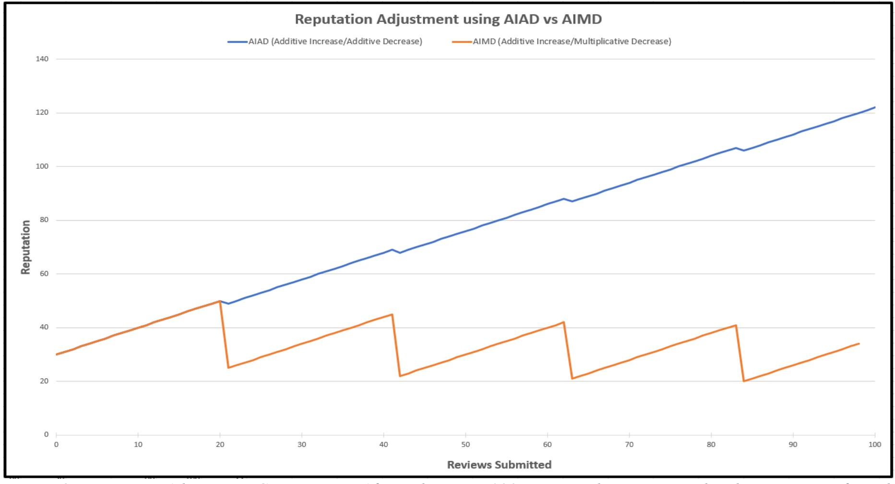

*Figure 9 Reputation Adjustment Comparison. After submitting 100 reviews, the reputation has been cut significantly, where an incongruent review was made after 20 good reviews, using the Additive Increase/Multiplicative Decrease (AIMD) functionality. When compared to AIAD this shows a significant increase in responsiveness over time to prevent malicious attacks. With AIAD, the reviewer's reputation increases over time ending in a higher reputation after 100 reviews than where they started.*

## **7. Honest Majority of Reputation (HMR)**

To help define what Honest Majority of Reputation (HMR), we present what the Honest Majority of Money (HMM) means (excerpt Algorand [2])

"Following the HMM assumption, *h* ∈ (2/3, 1] is now the fraction of total money owned by honest users in each *PKr* . The basic idea is (in a proof-of-stake flavor) to select a user *i* ∈ *PKr*−*k* to belong to *SVr*,*s* with a weight proportional to the amount of money owned by *i*."

Since HMR is based on HMM, we will briefly describe how it differs. For a more extensive reference and evaluation of HMM, we refer the interested readers to [2] where the authors explain the methods further.

The change is simply from calculating and using a weight that is based on money and compared proportionally to the total money in the system, we use reputation. We are selecting users to be leaders and verifiers based on their weighted stake which is calculated from the reputation score instead of tokens (money). We continue employing the same mechanism and equations used by Algorand, but with that shift to reputation values used in figuring the distribution of copies.

{34}------------------------------------------------

## **8. Security Model and Analysis**

## **8.1 The Adversarial Model**

**"Honest and Malicious Users**." Algorand defines the technical model for honest users, with malicious users' actions defined in their paper [2] as a deviation from their "prescribed instructions." We take this further by adding a behavioral model for honest and malicious users, which we define in the first section.

We add new notations to help distinguish the models:

*HT, MT* technically honest or malicious, used in payments, reviews, and any participation in the system.

*HB, MB* behaviorally honest or malicious, used only in regard to reviews submitted.

A user is *HB* when they submit a review where:

- The review text is consistent with the review rating, and
- The review text is unbiased and honest, and
- This review and the user's immediately previous review is consistent with an expected human time interval, and
- The user is acting independently and for themselves in submitting this review.

#### A user is *MB* when they:

- Submit a review, where the review text is incongruent with the review rating (e.g. 1 star, "Great book!"), or
- Act in a biased way, like always giving positive (or negative) reviews for specific people, types of people, items, ideas, etc. regardless of the quality of what they are reviewing, or
- Submit a review inconsistently irrelevant with what they are reviewing, acting like a troll or bully, or
- Submit multiple reviews in succession within a time interval either incompatible with a human ability (e.g. using a bot), or in such a way that reviews are likely of discordant and inadequate value (e.g spamming), or
- Submit a review incongruent with the majority of other reviews. Being an outlier cannot absolutely establish that a user is acting maliciously since the user could be acting honestly and independently. Other factors, like the frequency of this behavior over a certain time interval, may indicate maliciousness.

#### **8.2 The Adversary**

The adversary in our extension is defined similarly as in Algorand (see section 2 – adversary). Additionally, this adversary can submit reviews as frequently as they humanly or technically can. Algorand's focus is on how an adversary can technically corrupt and control any user. This still holds true. We will focus on an adversary's behavior where, like any user, they could potentially have multiple accounts. So, without technical corruption, they can still be in control of multiple players that will be coordinated in submitting multiple reviews simultaneously at any time. It should be noted that reviewers, leaders, and all verifiers are always randomly selected and anonymous to each other. The adversary is not aware of the real-world identities of any participant other than themselves.

{35}------------------------------------------------

#### **8.3 Security Analysis**

We will discuss several types of attacks that are common for Proof of Stake and Reputation systems, and how our Proof of Review model (in extending Algorand) addresses those attacks.

**Grinding Attack** [6][7][8] is when a malicious player, knowing the formulas for random miner selection, iterates over many possible parameter values (timestamps, hash values, etc.) in an attempt to find the best combination that would bias the formula towards electing them in the future.

In our protocol, a malicious party can attempt a stake grinding attack by iterating over the parameters of the selection process. This attack is mitigated by the same methods as used in Algorand by including a random string (a seed Q) that is generated each round from the last round's leader's credential., then used in the current round for messages. The messages include a user's credential (digital signature of the Q), and the hash of that credential, which is used by others in selecting a leader and to verify a user's role. An adversary would not be able to guess another player's signature or hash that is based on it. Even knowing the Q from the previous block, any combination of known factors is therefore meaningless in helping them get selected as the current or future round's leader.

**Selfish Mining Attack** takes place when miners build a private chain without adding it to the main blockchain until the best time to potentially grab the most block rewards. An honest miner may abandon their place on the main chain if they determine this adversary's chain to be the longest. This attack potentially allows for more adversarial blocks on the main chain, affecting the chain quality. Selfish mining is a serious problem in Proof of Work systems especially since the incentive is higher due to the greater reward for mining the block. This attack applies to Proof of Stake as well, since there is typically still a small financial transaction reward.

In our protocol, we currently do not have financial incentives for nodes, so that consideration alone gives no motivation to hold on to blocks for gain. Additionally, each block has a selected leader that has proposed that block during the first steps of the round, which the system has chosen for every block on the main chain. Each block was validated by a set of verifiers (*SV*), helping ensure the honesty of the block being put on the chain. This ensures it will be included on the blockchain and increases chain quality (which is the ratio of blocks on the chain from honest parties to ones that are from malicious parties). This use of checks-and-balances in the *SV* also helps prevent double-spending attacks and the classic 51% attacks by diminishing the power malicious parties must have to perform actions. Additionally, because the blocks become immutable immediately in Algorand, forks from the main chain are negligible as shown in Algorand [2].

**On-Off Attack** [10] is less of a type of attack and more a style of attacking to avoid detection. Adversarial nodes may do malicious actions in an on/off manner to help it seem like it's an occasional fluke action.

In our model, an on-off style attack can still be performed by an adversary. It is neutralized by the architecture of the system since the blocks are selected from potential leaders using a calculation from cryptographic sortition and validated by a set of verifying participants. A malicious party will have a negligible effect whether selected as a block leader or not. During the block proposal stage, their effect will be minimal due to their block being invalidated by honest parties, who would in turn both ignore the invalid block proposed and potentially blacklist the user for a determined number of rounds. This could delay the time needed for a block with those transactions to eventually appear on the chain. Depending on which step in the round the on-off attacker is acting malicious, it may not have any effect with the participants simply choosing a different leader. On-Off attack detection is not needed at least in the traditional sense.

**Ballot-Stuffing, Bad-Mouthing Attacks, Spamming** [9] are both orchestrated actions set in motion by several parties who are wanting to influence a reputation quickly and deliberately. The purpose of the adversary in a ballot-stuffing attack is to lift an entity's reputation to fool others into a false sense of 

{36}------------------------------------------------

trustworthiness. Bad-mouthing is the opposite, where parties are attempting to undermine the trustworthiness by quickly flooding the system with negative reviews.

In our model, since reputation is associated with the reviewer, a malicious participant could "badmouth attack" itself by submitting numerous internally disparate or biased reviews. Common bad-mouthing or ballot-stuffing attacks are blunted in PoR given that the reviewer's reputation is the only one that can be affected with the evaluation of their reviews being the sole mechanism to affect it. An adversary would need to forge a reviewer's identity on the network and submit countless reviews in an attempt to quickly adjust that reviewer's reputation. Algorand shows that identity forging would prove not possible "except with exponentially small probability [2]." An adversary could try to ballot-stuff their own reputation by submitting many honest, uniform, and unbiased reviews to reach a high reputation. This is mitigated by our model including account parameters (like token, reputation, etc) tracking both the last review DateTime and the DateTime from up to the 100th prior review. Verifiers check and use these values to prevent spamming, trolling, and ballot-stuffing. If a player is posting reviews too often, the committee of verifiers would see that and consider it malicious. This is an example of behavioral maliciousness and is handled the same way as technical maliciousness by blacklisting the reviewer.

**Block Verifier and Leader Issues** occur when the adversary controls either the round leader (forger) or one of the verifiers. Reputation is adjusted negatively in two different circumstances in our protocol. The most common way is for a reviewer to give a dishonest disparate review, which has been discussed earlier, and the reviewer's reputation is adjusted negatively. The other is an adversarial activity where a leader or validator is acting technically and behaviorally malicious. Since the round leader and verifiers use the same methods in validating transactions and evaluating reviews, they should come to a similar result and decision. When one party deviates significantly, they are deemed to be acting maliciously. As discussed in previous sections, a malicious leader will be blacklisted if most verifiers agree in a vote. A malicious verifier will be ignored when 2/3 of verifiers are honest and thus making them inconsequential.

## **9. dApps, Testing, and Validation**

Some dApps that would benefit from using Proof of Review (PoR) are retail and restaurant reviews (both business-to-consumer stores and consumer-to-consumer types), science journals for peer-review, grant proposal systems for peer-ranking, end-of-semester teacher feedback evaluations, employee reviews, school reviews, car reviews, and many more.

## **9.1 Possible dApps**

Businesses like eBay or Amazon may use a more basic dApp to cull false reviews and reviewers as they are submitted. PoR provides that supplementary data needed for a dApp to use to determine if a review is worthy of existing live in a store's review tables or never added. They may also use the data to ban reviewers if desired.

Employee and teacher evaluation dApps may pull the analysis and extra data to note the evaluation score along with other info used by managers and department heads for salary raises and guidance. If the evaluations are unfair, it raises a red flag for a manager to correct the person making the unfair assessment.

In grant proposal dApps, it can simulate the current live rounds of reviews and rankings to achieve consensus. Additionally, the real-life participants will see all the reviews (good or dishonest) of others and any changes they make to their reviews and rankings, similarly to how it is done currently. Each change during each round is a new submission and transaction for analysis. The results are open and transparent, compelling parties to provide their best good review and ranking the first time. This should cut the roundprocess time considerably.

{37}------------------------------------------------

A peer-review dApp may act as an editor, where it "calls" for participants to review a paper, parties submit their review to the dApp, and then afterward it organizes the resulting submissions and associated data for further analysis from an editor or technology.

All these kinds of dApps have access to the reviews, the evaluation of the reviews, and the reviewers' reputations. Though they each have procedures and data-requirements in common, they also maintain distinct needs, goals, and ways to achieve those goals. This explains why and how Proof of Review is a consensus model and not a dApp. It is a mechanism for forging blocks, maintaining a malicious-resistant ledger while providing higher-level access to the underlying related data.

#### **9.2 Testing and Validation**

The best way to validate Proof of Review is to test its versatility in its application. Now that the core implementation is nearly complete, we will focus on demonstrating PoR's use by dApps and gather metrics.

We are developing three distinct dApps to show proof of concept and to validate Proof of Review as a new consensus model. One of the dApps will be a retail review application where users can review (text and rating) retail stores similar to Yelp. Another dApp will be a book review application. The third dApp will showcase a grant proposal system that manages multiple rounds\* of reviews.

## **10. Preliminary Results**

We wrote a simple dApp to feed it data both manually and using an autoload load file. The data was scraped from an Amazon product set of reviews and ratings, with a focus on one to two sentence reviews only. The dApp used was a heavily modified proof of concept chat application written in the Go Language. For testing, we read in datasets from a file on an Ubuntu 18.04 Linux system running on a Dell Optiplex 7040 8-core, 16GB.

Every transaction regardless of Payment or Review type had the same metric information written out to a file for each node (e.g. node1\_metrics.csv) in a CSV format. For Payment transactions, the rating, evaluation, and adjustment fields were 0. These are preliminary and some changes have been made that could affect future results (e.g. the additive increase/multiplicative decrease methods for adjusting a reviewer's reputation is different than our original stepwise approach). With this information we produced some of the following metrics:

\* Rounds as in turns, not Algorand rounds.

{38}------------------------------------------------

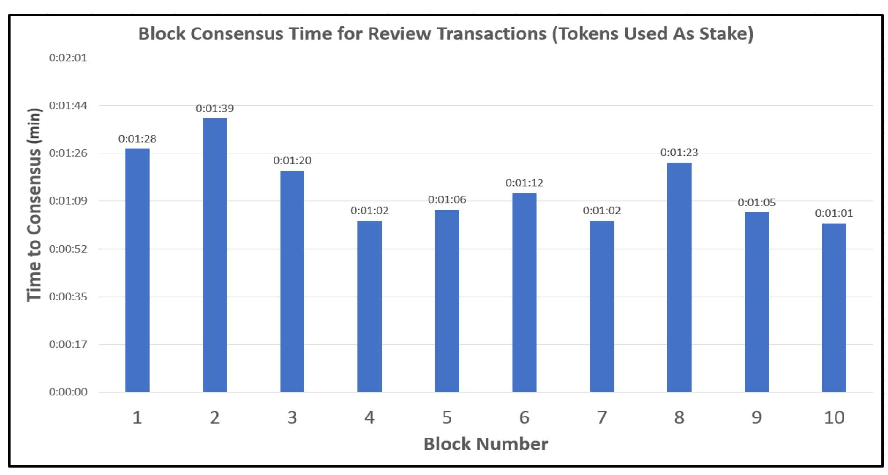

*Figure 10. Testing and comparing consensus times for two different types of stake. We used a simulated evaluation of the reviews to feature test the change from tokens to reputation. The block consensus times for review transactions range from 01:01 to 01:39 minutes when using tokens as a stake type in a Proof of Stake system. The times were similar, though trivially faster when using reputation values as a stake type instead of tokens. This shows that using different stake types does not affect the overall time for consensus on a block to be added to the ledger.* 

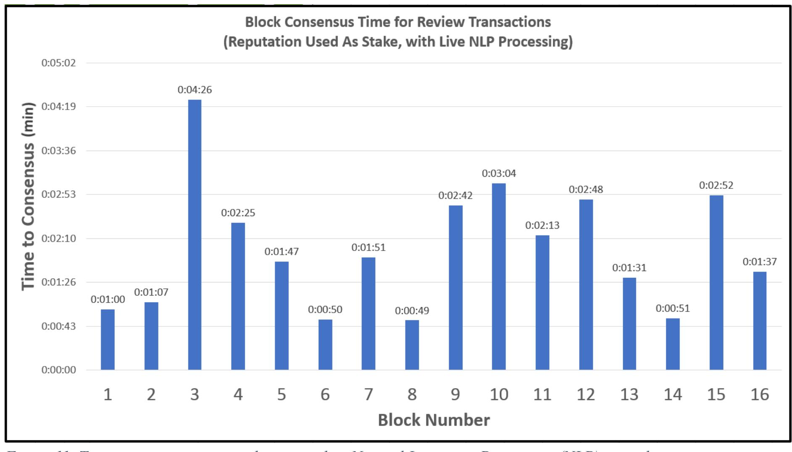

*Figure 11. Testing consensus times when using live Natural Language Processing (NLP) to evaluate reviews using a small dataset from Amazon and reputation as a stake (instead of tokens). The block consensus times for review transactions with live NLP range from 00:49 to 03:04 minutes. Let's consider the 04:26 to be a fluke and outlier. We are using NLP's sentimental analysis evaluation. Each block contains one review transaction. Due to the resourceheavy NLP system, we could only run 3 nodes. There's an issue with the performance that we are working on resolving.*

{39}------------------------------------------------

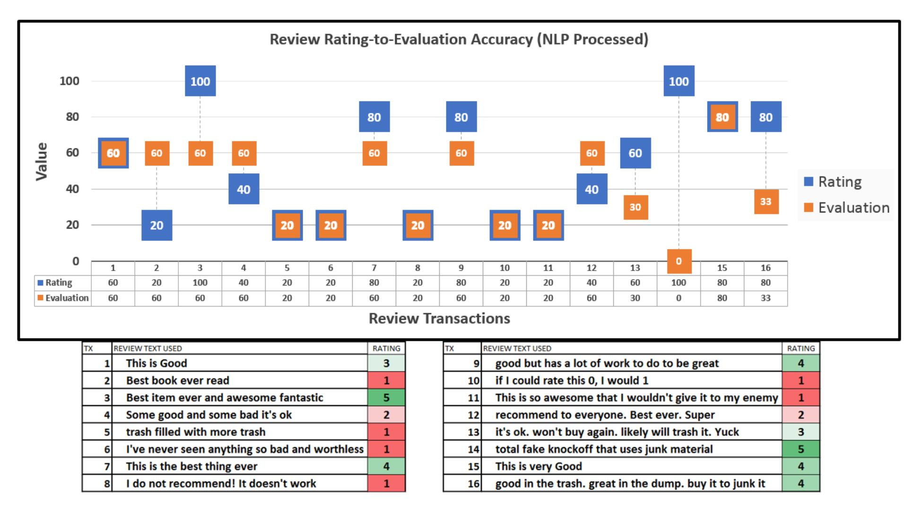

*Figure 12. Testing the accuracy of the NLP evaluation feature. We want the technology to evaluate reviews similarly as humans do. This means if a person reads a review text as mostly positive, then the system should also appraise the same text as mostly positive. We used a dataset of product reviews on Amazon and limited the data to comments having 1-3 sentences. Most review comments are too long for testing at this point, so this required usually pulling the comment text from mid-review. We gauge how positive the review comment is through sentimental analysis, a part of NLP, which provides a single number (0-5) evaluation for each sentence. 0 being very negative, and 5 being very positive. If it is provided multiple sentences to evaluate, it returns an evaluation for each sentence. A calculation is performed, and an average of all those sentence scores is scaled to (0-100). In some cases, the rating matches the evaluation (see review text 5, "Trash filled with more trash"). In other cases, the rating given by the reviewer does not match the evaluated associated text (see review text 2, "Best book ever read"). The reviewer's rating does not match their comment; however, our system catches this and evaluates the comment accurately to determine the level of incongruency. From this, the system will compute whether the reputation should be increased or decreased. This system gives confidence in its accurate evaluation of the review text.*

## **11. Conclusion**

With this new model, Proof of Review (PoR) we have shown how technology can be used to derive the trustworthiness of both the review and the reviewer participants. It does this through an evaluation of reviews to determine whether it is congruent, trustworthy, and honest. Additionally, we have shown how our model prevents maliciousness and provides stronger security guarantees for the data, participants, and reputation values than a Proof of Reputation system or Proof of Stake system alone.

Our model ensures that a blockchain system comes to consensus on a congruent, valid, and honest review, along with an evaluation score. This information can also be useful at a higher level, such as in dApps for various purposes. For instance, a dApp can rely on this immutable information, using the evaluation scores of the reviews for making decisions and further calculations for an overall review score. While dApps rely on the trustworthiness of review to reflect which then secures the reputation of the reviewer, the consensus protocol relies on the trustworthiness of the reputation and uses a consensus on the reviews to secure that trust over time. The sole incentive in our model is to increase one's reputation. No financial incentive is currently present, although it may be introduced in the future if potential applications demand it. Proof of Review provides an accurate way to implement an automated analysis of reviews and 

{40}------------------------------------------------

how trustworthy they are. Our model also ensures the trustworthiness of the evaluation through its operations.

In this paper, we have formally proven properties related to reputation: (i) Increase the probability of an honest leader selected by requiring a minimum stake, (ii) A reputation-based stake provides stronger security guarantees than a token-based stake, (iii) Blacklisting users maintains liveliness and correctness, (iv) Two-party evaluation and verification results in a higher probability of correctness, (v) An additiveincrease/multiplicative-decrease approach for reputation adjustments provides stronger security guarantees from malicious attacks. We also discussed several types of attacks that are common for Proof of Stake and Reputation systems, and how our Proof of Review model (in extending Algorand) addresses those attacks. Furthermore, we have explored how PoR mitigates several kinds of fake reviews (e.g. spam, trolling, etc.) and other malicious actions (e.g. bullying, bias, and ganging-up) through analysis.

Our preliminary results show there is an insignificant difference in block consensus times (i.e. the time it takes from creating a block of transactions until it is added to the ledger) whether using tokens or reputation as a stake in our Proof of Stake component. More significantly, in using a dataset from Amazon product reviews, it is demonstrated the NLP evaluation on how positive a review comment is measured reflects similarly to how a human would appraise it. As mentioned in previous sections, our protocol derives the trustworthiness of a participant's reputation through a consensus of reviews. We have illustrated how it relies on this agreed evaluation to calculate adjustments and have presented how this secures the system from malicious corruption and deviant changes.

## **12. Acknowledgements**

We would like to extend a sincere thank you to Dr. Kirill Morozov for constructive feedback over the last year. Special thank you to Dr. Bill Buckles for helping with some technical writing advice and going through our proofs with us to ensure correctness.

This material is based upon work supported by the National Science Foundation under awards 1241768 and 1637291.

## **13. References**

- [1] *Chen, Jing, Micali. Silvio: "Algorand: A secure and efficient distributed ledger",* Theoretical Computer Science, Volume 777, 19 July 2019, Pages 155-183, https://doi.org/10.1016/j.tcs.2019.02.001
- [2] *Chen, Jing, Micali. Silvio: "Algorand" ArXiv abs/ abs/1607.01341 (2017)*
- [3] *Sikdar, Sandipan, Ganguly, Niloy, Marsili, Matteo, Mukherjee, Animesh*: *"Anomalies in the Peerreview System: A Case Study of the Journal of High Energy Physics"*, CIKM'16, October 24- November 28, 2016, ACM
- [4] *Woollacott, Emma: "Amazon's Fake Review Problem Is Getting Worse"*, forbes.com/sites/emmawoollacott/2019/04/16/amazons-fake-review-problem-is-getting-worse April 16, 2019
- [5] *Smith, Richard: "Peer review: a flawed process at the heart of science and journals"*, J R Soc Med. 2006;99:178–182. DOI: 10.1177/014107680609900414, ncbi.nlm.nih.gov/pmc/articles/PMC1420798 April 2006
- [6] *Proof of Stake*, https://github.com/ethereum/wiki/wiki/Proof-of-Stake-FAQ#how-does-validatorselection-work-and-what-is-stake-grinding
- [7] *Chepurnoy, Alexander. "Interactive Proof-of-stake."* ArXiv abs/1601.00275 (2016): n. pag.
- [8] *Kelly, Jack, Michelle Lauer, Ryan Prinster, Stephenie Zhang. "Investigation of Blockchain Network Security Exploration of Consensus Mechanisms and Quantum Vulnerabilities"*

{41}------------------------------------------------

- https://www.semanticscholar.org/paper/Investigation-of-Blockchain-Network-Security-of-and-Kelly-Lauer/e7a4d13f1bfc5398ac3595f241884a2c659098a7 (2018).
- [9] *Bankovic, Zorana, Vallejo, Juan Carlos, Fraga, David, Moya, José. "Detecting Bad-Mouthing Attacks on Reputation Systems Using Self-Organizing Maps."* 10.1007/978-3-642-21323-6\_2 (1970)
- [10] *Gai, Fangyu & Wang, Baosheng & Deng, Wenping & Peng, Wei*. *"Proof of Reputation: A Reputation-Based Consensus Protocol for Peer-to-Peer Network."* 10.1007/978-3-319-91458-9\_41 (2018).
- [11] *Y. Gilad, R. Hemo, S. Micali, G. Vlachos, N. Zeldovich*, "*Algorand: scaling Byzantine agreements for cryptocurrencies",* 26th ACM Symposium on Operating Systems Principles, SOSP, October 2017, pp.51–68.
- [12] *Chiu, Dah-Ming, Jain, Raj, "Analysis of the increase and decrease algorithms for congestion avoidance in computer networks"*, Computer Networks and ISDN Systems, 1989
- [13] *Gai, Fangyu Wang, Baosheng Deng, Wenping, Peng, Wei, "Proof of Reputation: A Reputation-Based Consensus Protocol for Peer-to-Peer Network*", 2018. 10.1007/978-3-319-91458-9\_41
- [14] *Nakamoto, S.: "Bitcoin: a peer-to-peer electronic cash system"*, bitcoin.org/bitcoin.pdf
- [15] *Bitcoin Talk site page: "Proof of stake instead of proof of work"*, QuantumMechanic, bitcointalk.org/index.php?topic=27787.0
- [16] *Schaub, Alexander, Bazin, Rémi, Hasan, Omar, Brunie, Lionel. "A Trustless Privacy-Preserving Reputation System"* 2016, 398-411. 10.1007/978-3-319-33630-5\_27
- [17] *S. Bajoudah, C. Dong and P. Missier, "Toward a Decentralized, Trust-Less Marketplace for Brokered IoT Data Trading Using Blockchain"* 2019 IEEE International Conference on Blockchain (Blockchain), Atlanta, GA, USA, 2019, pp. 339-346
- [18] *Solangi, Y.A., Solangi, Z.A., Aarain, S., Abro, A., Mallah, G.A., Shah, A., "Review on Natural Language Processing (NLP) and Its Toolkits for Opinion Mining and Sentiment Analysis"*, 2018 IEEE 5th International Conference on Engineering Technologies and Applied Sciences (ICETAS), Bangkok, Thailand, 2018, pp. 1-4.
- [19] *Richard Socher, Alex Perelygin, Jean Wu, Jason Chuang, Christopher Manning, Andrew Ng, Christopher Potts, "Recursive Deep Models for Semantic Compositionality Over a Sentiment Treebank"*, 2013 Conference on Empirical Methods in Natural Language Processing, https://nlp.stanford.edu/~socherr/EMNLP2013\_RNTN.pdf
- [20] *Manning, Christopher D., Mihai Surdeanu, John Bauer, Jenny Finkel, Steven J. Bethard, and David McClosky, "The Stanford CoreNLP Natural Language Processing Toolkit",* 2014, Proceedings of the 52nd Annual Meeting of the Association for Computational Linguistics: System Demonstrations, pp. 55-60, https://stanfordnlp.github.io/CoreNLP
- [21] *Kleinrock, Leonard, Ostrovsky, Rafail, Vassilis, Zikas, "A PoR/PoS-Hybrid Blockchain: Proof of Reputation with Nakamoto Fallback"*, April 2, 2020 Cryptology ePrint Archive, Report 2020/381 https://eprint.iacr.org/2020/381
- [22] *Kiayias A., Russell A., David B., Oliynykov R. "Ouroboros: A Provably Secure Proof-of-Stake Blockchain Protocol"*. 2017 Katz J., Shacham H. (eds) Advances in Cryptology – CRYPTO 2017. Lecture Notes in Computer Science, vol 10401. Springer, Cham

{42}------------------------------------------------

## 12. Appendix

#### 12.1 Basic Notions

The Keys, Users, Owners, Permissions, Systems, and Clocks remain the same as in Algorand Prime.

#### 12.2 Communication Model

The model for propagation and timely deliverance of messages remains the same as Algorand.

#### 12.3 Notations from Algorand (excerpt from [1]):

For reference, here is a list of notations from Algorand's paper [1] that you may see in this paper. Definitions for some of these (e.g. leader, round) can be found in Section 7.1 "Background Definitions".

- $r \ge 0$  and  $s \ge 1$ : the current round and the current step (in a given round).
- *m*: the maximum number of steps in a round.
- H and  $\bot$ : a random oracle and a distinguished string outside the range of H.
- $PAY^r$ : the payset (i.e., the set of payments) of round r.
- $\ell^r$ : the leader of round r.
- $B^r$ : the block of round r, which can be *non-empty* or *empty*.  $B^r \triangleq (r, H(B^{r-1}), SIG_{\ell_r}(Q^{r-1}), PAY^r)$  if non-empty;  $B^r = B_{\epsilon}^r \triangleq (r, H(B^{r-1}), Q^{r-1}, \emptyset)$  if empty.
- Head  $(B^r)$ : the head of  $B^r$  that is, the first three components in  $B^r$ .
- $Q^r$ : the *seed* of round r (for determining the potential leaders and verifiers of the next round).
- $Q^r \triangleq H(SIG_{\ell_r}(Q^{r-1}), r)$ , if  $B^r$  is non-empty;  $Q^r \triangleq H(Q^{r-1}, r)$ , if  $B^r$  is empty.
- $PK^r$ : the set of public keys by the end of round r-1 and at the beginning of round r.
- *k*: the look-back parameter.
- $p_l$ : the probability of a user being a potential leader.
- $PL^r$ : the set of potential leaders of round r,  $\{i \in PK^{r-k}: H(SIGi(r, 1, Q^{r-1})) \le p_l\}$ .  $\ell^r \triangleq \min_{i \in PLr} H(SIGi(r, 1, Q^{r-1}))$ , with ties broken lexicographically.
- $p_{\nu}$ : the probability of a user being a verifier.
- $SV^{r,s}$ : the set of verifiers of step s of round r.  $SV^{r,s} = \{i \in PK^{r-k}: H(SIG_i(r, s, Q^{r-1})) \le p_v\}$  for s > 1; and  $SV^{r,1} \triangleq PL^r$ .
- $\sigma_i^{r,s}$ : the credential of a user *i* in  $SV^{r,s}$  (or in  $PL^r$  for s=1) i.e.,  $SIG_i(r, s, Q^{r-1})$ .
- $t_H$ : the number of signatures needed to certify a block.
- $\Lambda$  and  $\lambda$ :  $\Lambda$  upper-bounds the time to propagate a (non-empty) block, and  $\lambda$  upper-bounds the time to propagate one short message per verifier in a step  $s \ge 1$ . Note that a block with an empty payset is essentially a short message, thus its propagation time is upper-bounded by  $\lambda$ . We assume  $\Lambda = O(\lambda)$ . Essentially,  $\Lambda$  and  $\lambda$  respectively upper-bound the time needed to execute Step 1 and the time needed for any other step of the Algorand protocol.
- Let  $h \in (0, 1)$ : a constant greater than 2/3. h is the honesty ratio in the system. That is, the fraction of honest users, depending on the assumption used, in each  $PK^r$  is at least h.
- $m \in \mathbb{Z}$ : the maximum number of steps in the binary BA protocol, a multiple of 3.

{43}------------------------------------------------

- Let ph ∈ (0, 1): the probability that the leader of a round r, ℓ r , is honest.
- Let T r be the time when the first honest user knows B r−1 .
- Let I r+1 be the interval [T r+1 , T r+1 +λ].