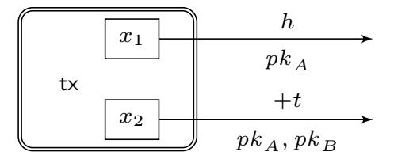
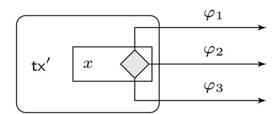
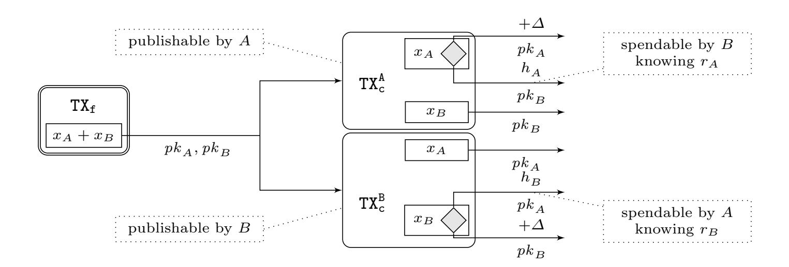
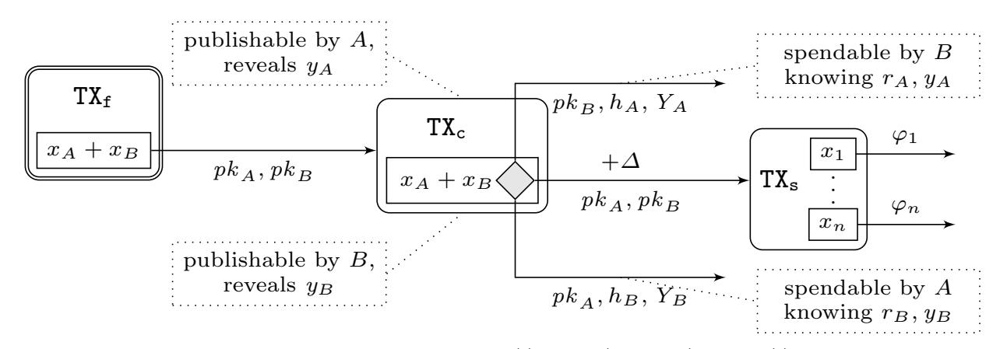
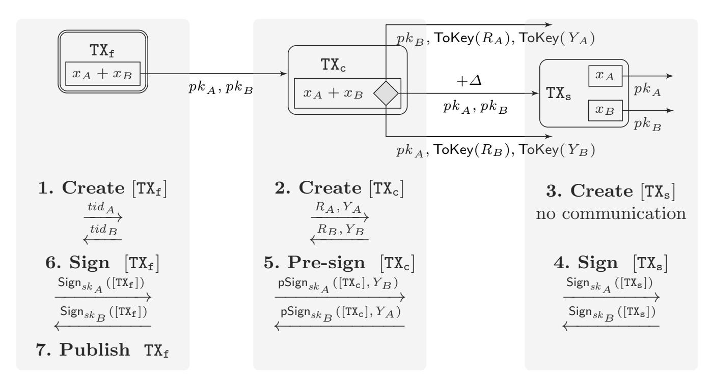

{0}------------------------------------------------

# Generalized Channels from Limited Blockchain Scripts and Adaptor Signatures

Lukas Aumayr<sup>1</sup> , Oguzhan Ersoy<sup>2</sup> , Andreas Erwig<sup>3</sup> , Sebastian Faust<sup>3</sup> , Kristina Host´akov´a<sup>4</sup> , Matteo Maffei<sup>1</sup> , Pedro Moreno-Sanchez<sup>5</sup> , and Siavash Riahi<sup>3</sup>

 Technische Universit¨at Wien, Austria, first.lastname@tuwien.ac.at Delft University of Technology, Netherlands, o.ersoy@tudelft.nl Technische Universit¨at Darmstadt, Germany, first.lastname@tu-darmstadt.de ETH Z¨urich, Switzerland, kristina.hostakova@inf.ethz.ch 5 IMDEA Software Institute, pedro.moreno@imdea.org

Abstract. Decentralized and permissionless ledgers offer an inherently low transaction rate, as a result of their consensus protocol demanding the storage of each transaction on-chain. A prominent proposal to tackle this scalability issue is to utilize off-chain protocols, where parties only need to post a limited number of transactions on-chain. Existing solutions can roughly be categorized into: (i) application-specific channels (e.g., payment channels), offering strictly weaker functionality than the underlying blockchain; and (ii) state channels, supporting arbitrary smart contracts at the cost of being compatible only with the few blockchains having Turing-complete scripting languages (e.g., Ethereum).

In this work, we introduce and formalize the notion of generalized channels allowing users to perform any operation supported by the underlying blockchain in an off-chain manner. Generalized channels thus extend the functionality of payment channels and relax the definition of state channels. We present a concrete construction compatible with any blockchain supporting transaction authorization, time-locks and constant number of Boolean ∧ and ∨ operations – requirements fulfilled by many (non-Turing-complete) blockchains including the popular Bitcoin. To this end, we leverage adaptor signatures – a cryptographic primitive already used in the cryptocurrency literature but formalized as a standalone primitive in this work for the first time. We formally prove the security of our generalized channel construction in the Universal Composability framework.

As an important practical contribution, our generalized channel construction outperforms the state-of-the-art payment channel construction, the Lightning Network, in efficiency. Concretely, it halves the off-chain communication complexity and reduces the on-chain footprint in case of disputes from linear to constant in the number of off-chain applications funded by the channel. Finally, we evaluate the practicality of our construction via a prototype implementation and discuss various applications including financially secured fair two-party computation.

Keywords: Blockchain, adaptor signatures, off-chain protocols and channels.

{1}------------------------------------------------

# 1 Introduction

One of the most fundamental technical challenges of decentralized and permissionless blockchains is scalability. Since transactions are processed via a costly distributed consensus protocol run among a set of parties (so-called miners), transaction throughput is limited and transaction confirmation is slow. There has been a plethora of work on improving scalability of blockchains, with offchain protocols being one of the most promising solutions.

Intuitively, off-chain protocols build a second layer over the blockchain (often referred to as the layer-1 ) by allowing the vast majority of transactions to be processed directly between the involved participants, with the blockchain being used only in the initial setup and in case of disputes, thereby drastically improving transaction throughput and confirmation time.

While there exists a large variety of different off-chain (or layer-2) solutions (see, e.g., [7, 60, 33, 35] and many more), payment channels [11, 20, 53] are by far the most prominent one. Intuitively, a payment channel works in three phases. First, the two users open a channel by locking a certain amount of coins onchain into an account controlled by both users. Then they perform an arbitrary amount of payments by exchanging authenticated messages off-chain. Finally, they close the channel by announcing the outcome of their trades to the ledger.

Off-chain computations in Ethereum. Ethereum supports on-chain transactions specified in a Turing-complete scripting language, which enables the execution of arbitrarily complex programs, also called smart contracts, thereby going beyond simple payments. The underlying blockchain is organized accordingly in the account-based model, in which the balance associated to an account is explicitly stored in its memory and programmatically updated via smart contracts. By leveraging the expressiveness of Turing-complete scripting languages, payment channels can be generalized into so-called state channels [48, 23, 24], whose functionality goes far beyond simple payments. Namely, state channels enable users to execute arbitrarily complex smart contracts in an off-chain manner, thereby making their execution faster and cheaper.

Turing-complete vs restricted scripting. The majority of current blockchains (e.g., Bitcoin, Zcash, Monero, and Cardano's ADA) only support a restricted scripting language and are based on the Unspent Transaction Output (UTXO) model: intuitively, they enable a restricted class of transactions, possibly conditioned to some events, that transfer money from an unspent transaction to a new unspent transaction. There are several reasons behind the choice of a limited scripting language. First, the simplicity of design and usage, which is believed to be beneficial for security: countless examples of smart contract vulnerabilities on Ethereum show that complex contract logic and increased expressiveness pave the way for critical bugs, which may have severe consequences for the stability of the underlying currency as shown by the infamous DAO hack [54]. Second, blockchains with simple transaction logic are less costly to maintain: this is important as transaction execution is done by many parties, and even normal users. Finally, restricted scripting languages are expressive enough to encode many interesting computations (e.g., lotteries [2], auctions [22], and more [9, 41, 8]).

{2}------------------------------------------------

Unfortunately, current state channel constructions are not applicable without a Turing-complete scripting language, thereby excluding the majority of blockchains. In this work, we investigate the following question: Can we generically lift any transaction logic offered by layer-1 to layer-2 even for blockchains with restricted transaction logic? Besides its practical importance, we believe that this question is theoretically interesting. It may constitute a first step towards a more general research agenda exploring the feasibility (or impossibility) of generic off-chain computation from blockchains with limited expressiveness.

### 1.1 Our contribution

Our main contribution is to put forward the notion of generalized channels – a generic extension of payment channels to support off-chain execution of arbitrary transaction logic supported by the underlying blockchain. State channels can hence be seen as a special case of generalized channels for blockchains with Turing-complete scripting languages. We briefly outline our main contributions below. A technical overview of our construction is given in Sec. 2.

Generalized channels. We show that if the underlying UTXO-based blockchain supports transaction authorization, time-locks and basic Boolean logic (constant number of ∧, ∨ operations), then any transaction logic available on layer-1 can be lifted to layer-2 securely and generically.

As most cryptocurrencies, including the by far most prominent Bitcoin, satisfy the assumptions of our construction, they can benefit from generalized channels as a scalability solution. This, in particular, implies that our construction directly enables to execute any Bitcoin transaction off-chain. Moreover, we stress that our construction can also be deployed over any blockchain that can simulate a UTXO-based system, which, in particular, includes blockchains with support for Turing-complete smart contracts, e.g., Ethereum or Hyperledger Fabric [1].

A novel revocation mechanism for generalized channels. The main technical challenge in our generalized channel design is to propose an efficient mechanism for old channel state revocation while putting minimal assumptions on the scripting language of the underlying blockchain. The state-of-the-art approach, put forward by the Lightning Network [53], uses a punishment mechanism which allows the cheated party to claim all coins from the channel. As we argue, a straightforward generalization of the Ligthning-style revocation is unsuitable for generalized channels. Firstly, the blockchain communication complexity in case of misbehavior depends on the number of parallel conditional payments funded by the channel. This significantly increases the blockchain overhead when processing a punishment (if triggered). Secondly, the security of the revocation mechanism relies on state duplication, hence each off-chain transaction funded by the channel has to be performed twice (once on each duplicate). This is particularly problematic when channels are built on top of channels [27] as the off-chain communication complexity grows exponentially with the number of channel layers.

To overcome these drawbacks, we design a novel revocation mechanism reducing the on-chain complexity in case of a dispute from linear to constant, and the off-chain communication complexity from exponential to linear.

{3}------------------------------------------------

Formalization of adaptor signatures. A key idea of our novel revocation mechanism is to utilize an adaptor signature scheme [52] – a cryptographic primitive introduced by the cryptocurrency community to tie together the authorization of a transaction and the leakage of a secret value. Although adaptor signatures have been used in previous works (e.g. [45, 31, 50]), a formal definition has never been presented. We fill this gap by providing the first formalization of adaptor signatures and their security (in terms of cryptographic games), and proving that ECDSA and Schnorr-based schemes satisfy our notions. We believe that our formalization and security analysis of adaptor signatures is of independent interest (see details on the impact of our work below).

Formalization of generalized channels. In order to formally define the security guarantees of a generalized channel protocol, we utilize the extended Universal Composability model allowing for global setup (the GUC model for short) put forward by Canetti et al. [16]. More precisely, we model money mechanics of an UTXO-based blockchain via a global ledger ideal functionality and provide an ideal specification of a generalized channel protocol via a novel ideal functionality. Thereafter, we prove that our generalized channel construction satisfies this ideal specification. The key challenges of our security analysis are to ensure the consistency of timings imposed by the blockchain processing delay, and to ensure that no honest party can ever lose coins by participating in a channel.

Evaluation and applications. We implemented our protocols and conducted an experimental evaluation, demonstrating how to use generalized channels as a building block for popular off-chain applications, like payment routing through a payment channel network (PCN) [53, 46, 45] and channel splitting [27]. Concretely, our evaluation demonstrates that, already when routing one payment through a channel, the amount of blockchain fees in case of a dispute is reduced by 28% compared to the state-of-the-art Lightning network solution. In practice, there have been cases of disputes in channels with 50 concurrent payments [44], which currently costs 553.66 USD in fees to resolve in Lightning and only 17.47 USD with generalized channels. For channel splitting, we reduce the transactions to be exchanged off-chain per sub-channel from exponential to constant.

Moreover, we discuss how to use generalized channels to realize the Claimor-Refund functionality of Bentov and Kumaresan [9]. This functionality, can be used to build a fair two-party computation protocol over Bitcoin, where fairness is achieved by financially penalizing malicious parties. Realizing the Claimor-Refund functionality, in particular, implies that generalized channels allow parties to execute any two-party computation off-chain.

Impact of our work. Our work has resulted in several interesting followup works. In case of adaptor signatures, Esgin et al. [29] and Tairi et al. [56] have proposed adaptor signature constructions secure against adversaries with quantum computing power which allows for payment channels or atomic swaps in post-quantum secure blockchains. Recently, Erwig et al. [28] showed how to generically build single and 2-party adaptor signatures from identification schemes. All these works follow our definition of adaptor signatures that we put forth in this work. Our generalized channels have also been used as a basis for 

{4}------------------------------------------------

virtual channel constructions in [3] and have recently been extended to support fair and privacy preserving watchtowers by Mirzaei et al. [49]. We will talk in more details about some of these follow-up works in Sec. 7.

## 1.2 Other Related Work

We briefly discuss related work on off-chain protocols and adaptor signatures, where the latter is an important building block in our construction.

Off-chain protocols. As already mentioned before, there has been an extensive line of work on various types of payment channels [11, 20, 53] and payment channel networks (PCNs) [53, 46, 45]. However, these constructions only support simple payments and do not extend to support more complex transaction logic. The authors in [37] provide a formalization of the Lightning Network (LN) in the UC framework. This formalization is, however, tailored to the details of the current LN and cannot be leveraged to formalize generalized channels as we propose here. Most related to our work is the research on state channels [48, 23, 24], as these constructions allow to lift any transaction logic supported by the underlying blockchain off-chain. However, state channels crucially rely on the underlying blockchain to support smart contracts and hence do not work for blockchains with restricted scripting language. Finally, eltoo [21] is a payment channel construction which does not rely on a punishment mechanism, yet requires Bitcoin to adapt a new scripting command (op-code). This op-code, however, has not been included to Bitcoin's scripting language in the past due to security concerns. In the case of address reuse or lazy wallet designs, funds can be stolen by replaying transactions [59]. Moreover, the security of the eltoo protocol has not been formally proven and it only supports simple payments.

Apart from payment and state channels, numerous other solutions have been proposed in order to perform heavy on-chain computation off-chain. For instance, various previous works (e.g., [19, 18, 39]) focus on realizing on-chain functionality off-chain by using Trusted Execution Environments which, however, inherently add an additional trust assumptions that may not hold in practice (e.g., [13, 17, 14]). A proposal to remove these assumptions is to use MPC protocols [9, 41], which however require collateral linear in the number of conditional payments. In contrast, generalized channels only require constant collateral for the execution of an arbitrary number of such payments. There have been proposals to remedy the collateral requirement in MPC protocols [10, 40, 42] but they are incompatible with many existing UTXO blockchains, including Bitcoin.<sup>6</sup>

Adaptor signatures. Poelstra [52] introduced the notion of adaptor signatures (AS), which intuitively allows to create partial signatures whose completion is conditioned on solving a cryptographic hard problem – a feature that has been proven useful in off-chain applications such as PCNs [45] and payment-channel hubs [55]. For instance, Malavolta et al. [45] use AS as building block to define

<sup>6</sup> These solutions require the underlying blockchain to either support verification of signatures on arbitrary messages or Turing-complete smart contracts.

{5}------------------------------------------------

and realize multi-hop payments in PCNs. Moreover, AS have been used as an offthe-shelf cryptographic building block for multi-path payments [26] and Monerocompatible PCNs [58]. Banasik et al. [6] construct a scheme satisfying a similar notion to AS in order to allow two parties to exchange a digital asset using cryptocurrencies that do not support Turing-complete programs. None of these works, however, define AS as a stand-alone primitive. Concurrently to our work, Fournier [31] attempts to formalize AS as an instance of one-time verifiable encrypted signatures [12]. Yet, the definition of [31] is weaker than the one we give in this work and does not suffice for the channel applications. Also concurrent to this work, Thyagarajan and Malavolta [57] define lockable signatures. While similar to AS in spirit, lockable signatures are a weaker primitive as the partial signature must be created honestly (e.g., through MPC) and the solution to the cryptographic hardness problem must be known beforehand. On the other hand, lockable signatures can be built from any signature scheme while AS cannot be constructed from unique signatures [28].

# 2 Background and Solution Overview

Blockchain transactions. We focus on blockchains based on the Unspent Transaction Output (UTXO) model, such as Bitcoin. In the UTXO model, coins are held in outputs. Formally, an output θ is a tuple (cash, φ), where cash denotes the amount of coins associated to the output and φ defines the conditions (also known as scripts) that need to be satisfied to spend the output.

A transaction transfers coins across outputs meaning that it maps (possibly multiple) existing outputs to a list of new outputs. The existing outputs that fund the transactions are called transaction inputs. In other words, transaction inputs are those tied with previously unspent outputs of older transactions. Formally, a transaction tx is a tuple of the form (txid, In, Out, Witness), where txid ∈ {0, 1} ∗ is the unique identifier of tx and is calculated as txid := H([tx]), where H is a hash function modeled as a random oracle and [tx] is the body of the transaction defined as [tx] := (In, Out); In is a vector of strings identifying all transaction inputs; Out = (θ1, . . . , θn) is a vector of new outputs; and Witness ∈ {0, 1} ∗ contains the witness allowing to spend the transaction inputs.

To ease the readability, we illustrate the transaction flows using charts (see Fig. 1 for examples). We depict transactions as rectangles with rounded corners. Doubled edge rectangles represent transactions published on the blockchain, while single edge rectangles are transactions that could be published on the blockchain, but they are not (yet). Transaction outputs are depicted as a box inside the transaction. The value of the output is written inside the output box and the output condition is written above the arrow coming from the output.

Conditions of transaction outputs might be fairly complex and hence it would be cumbersome to spell them out above the arrows. Instead, for frequently used conditions, we define the following abbreviated notation. If the output script contains (among other conditions) signature verification w.r.t. some public keys pk <sup>1</sup> , . . . , pk <sup>n</sup> on the body of the spending transaction, we write all the public

{6}------------------------------------------------





Fig. 1. (Left) tx is published on the blockchain. The output of value x<sup>1</sup> can be spent by a transaction containing a preimage of h and signed w.r.t. pk <sup>A</sup>. The output of value x<sup>2</sup> can be spent by a transaction signed w.r.t. pk <sup>A</sup> and pk <sup>B</sup> but only if at least t rounds passed since tx was accepted by the blockchain. (Right) tx′ is not published yet. Its only output can be spent by a transaction whose witness satisfies φ<sup>1</sup> ∨ φ<sup>2</sup> ∨ φ3.

keys below the arrow and the remaining conditions above the arrow. Hence, information below the arrow denotes "who owns the output" and information above denotes "additional spending conditions". If the output script contains a check of whether a given witness hashes to a predefined h, we express this by writing the hash value h above the arrow. Moreover, if the output script contains a relative time-lock, i.e., a condition that is satisfied if and only if at least t rounds passed since the transaction was published, we write "+t" above the arrow. Finally, if the output script φ can be parsed as φ = φ<sup>1</sup> ∨ · · · ∨ φ<sup>n</sup> for some n ∈ N, we add a diamond shape to the corresponding transaction output. Each of the sub-conditions φ<sup>i</sup> is then written above a separate arrow.

Payment channels. A payment channel [53] enables several payments between two users without submitting every single transaction to the blockchain. The cornerstone of payment channels is depositing coins into an output controlled by two users, who then authorize new deposit balances in a peer-to-peer fashion while having the guarantee that all coins are refunded at a mutually agreed time.

First, assume that Alice and Bob want to create a payment channel with an initial deposit of x<sup>A</sup> and x<sup>B</sup> coins respectively. For that, Alice and Bob agree on a funding transaction (that we denote by TXf) that sets as inputs two outputs controlled by Alice and Bob holding x<sup>A</sup> and x<sup>B</sup> coins respectively and transfers them to an output controlled by both Alice and Bob (i.e., its spending condition mandates both Alice's and Bob's signature). When TX<sup>f</sup> is added to the blockchain, the payment channel between Alice and Bob is effectively open.

Assume now that Alice wants to pay α ≤ x<sup>A</sup> coins to Bob. For that, they create a new commit transaction TX<sup>c</sup> representing the commitment from both users to the new channel state. The commit transaction spends the output of TX<sup>f</sup> into two new outputs: (i) one holding x<sup>A</sup> − α coins owned by Alice; and (ii) the other holding x<sup>B</sup> + α coins owned by Bob. Finally, parties exchange the signatures on the commit transaction, thereby complete the channel update. Alice (resp. Bob) could now add TX<sup>c</sup> to the blockchain. Instead, they keep it locally in their memory and overwrite it when they agree on another commit transaction, let us denote it TX<sup>c</sup> , representing a newer channel state. This, however, leads to several commit transactions that can possibly be added to the blockchain. Since all of them are spending the same output, only one can be accepted.

{7}------------------------------------------------



**Fig. 2.** A Lightning style payment channel where A has  $x_A$  coins and B has  $x_B$  coins. The values  $h_A$  and  $h_B$  correspond to the hash values of the revocation secrets  $r_A$  and  $r_B$ .  $\Delta$  upper bounds the time needed to publish a transaction on a blockchain.

As it is impossible to prevent a malicious user from publishing an old commit transaction, payment channels require a mechanism punishing such behavior.

Lightning Network [53], the state-of-the-art payment channel for Bitcoin, implements such mechanism by introducing two commit transactions, denoted  $\mathsf{TX}_\mathsf{c}^\mathsf{A}$  and  $\mathsf{TX}_\mathsf{c}^\mathsf{B}$ , per channel update, each of which contains a punishment mechanism for one of the users. In more detail (see also Fig. 2), the output of  $\mathsf{TX}_\mathsf{c}^\mathsf{A}$  representing Alice's balance in the channel has a special condition. Namely, it can be spent by Bob if he presents a preimage of a hash value  $h_A$  or by Alice if certain number of rounds passed since the transaction was published. During a channel update, Alice chooses a value  $r_A$ , called the revocation secret, and presents the hash  $h_A := \mathcal{H}(r_A)$  to Bob. Knowing  $h_A$ , Bob can create and sign the commit transaction  $\mathsf{TX}_\mathsf{c}^\mathsf{A}$  with the built-in punishment for Alice (analogously for Bob and  $\mathsf{TX}_\mathsf{c}^\mathsf{B}$ ). During the next channel update, parties first commit to the new state by creating and signing  $\mathsf{TX}_\mathsf{c}^\mathsf{A}$  and  $\mathsf{TX}_\mathsf{c}^\mathsf{B}$ , and then revoke the old state by sending the revocation secrets to each other thereby enabling the punishment mechanism. If a malicious Alice now publishes the old commit transaction  $\mathsf{TX}_\mathsf{c}^\mathsf{A}$ , Bob can spend both of its outputs and claim all coins locked in the channel.

## 2.1 Solution Overview

The goal of our work is to extend the idea of payment channels such that parties can agree on *any* conditional payment that they could do on-chain and not only direct payments. Technically, this means that we want the commit transaction to contain arbitrary many outputs with arbitrary conditions (as long as they are supported by the underlying blockchain). The main question we need to answer when designing such channels, which we call *generalized channels*, is how to implement the revocation mechanism.

Revocation per update. The first idea would be to extend the revocation mechanism explained above such that each output of  $TX_c^A$  contains a punishment mechanism for Alice (analogously for Bob). While this solution works, it has

{8}------------------------------------------------

several disadvantages. If one party, say Alice, cheats and publishes an old commit transaction  $\mathsf{TX}^\mathtt{A}_\mathtt{c}$ , Bob has to spend all outputs of  $\mathsf{TX}^\mathtt{A}_\mathtt{c}$  to punish Alice. Although Bob could group some of them within a single transaction (up to the transaction size limit), he might be forced to publish multiple transactions thereby paying high transaction fees. Moreover, such revocation mechanism requires a high onchain footprint not only for  $\mathsf{TX}^\mathtt{A}_\mathtt{c}$ , but also for Bob getting coins from the outputs.

Our goal is to design a punishment mechanism whose on-chain footprint and potential transaction fees are independent of the channel state, i.e., the number and type of outputs in the channel. To this end, we propose the punish-then-split mechanism which separates the punishment mechanism from the actual outputs. In a nutshell, the commit transaction  $TX_c^A$  has now only one output dedicated to the punishment mechanism which can be spent (i) immediately by Bob, if he proves that the commit transaction was old (i.e., he knows the revocation secret  $r_A$  of Alice); or (ii) after certain number of rounds by a split transaction  $TX_s^A$  owned by both parties and containing all the outputs of the channel (i.e. representing the channel state). Hence, if  $TX_c^A$  is published on the blockchain, Bob has some time to punish Alice if the commit transaction was old. If Bob does not use this option, any of the parties can publish the split transaction  $TX_s^A$  representing the channel state. Analogously for  $TX_c^B$ .

One commit transaction per channel update. Another drawback of the Lightning-style revocation mechanism is the need for two commit transactions for the same channel state. While this is not an issue for simple payment channels, for generalized channels it might cause undesirable redundancy in terms of communication and computational costs. This comes from the fact that generalized channels support arbitrary output conditions and hence can be used as a source of funding for other off-chain applications, e.g., a fair two-party computation or another off-chain channel as we discuss later in this work (see Sec. 7). Such off-chain application would, however, have to "exist" twice. Once considering  $TX_c^A$  being eventually published on-chain and once considering  $TX_c^B$ . Especially when considering channels built on top of channels, the overhead grows exponentially. Our goal is to construct generalized channels that require only one commit transaction and hence avoid any redundancy.

A naive approach to design such a single commit transaction  $TX_c$  would be to "merge" the transactions  $TX_c^A$  and  $TX_c^B$ . Such  $TX_c$  could be spent (i) by Alice if she knows Bob's revocation secret; (ii) by Bob if he knows Alice's revocation secret or (iii) by the split transaction  $TX_s$  representing the channels state after some time. Unfortunately, this simple proposal allows parties to misuse the punishment mechanism as follows. A malicious Alice could publish an old commit transaction  $TX_c$  and since she knows Bob's revocation secret, she could immediately try to punish Bob. To prevent such undue punishment of honest Bob, we need to make sure that Alice can use the punishment mechanism only if Bob published  $TX_c$ .

The main idea of how to implement this additional requirement is to force the party publishing  $TX_c$  to reveal some secret, which we call *publishing secret*, that the other party could use as proof. We achieve this by leveraging the concept of an *adaptor signature scheme* – a signature scheme that allows a party to *pre-*

{9}------------------------------------------------



**Fig. 3.** A generalized channel in the state  $((x_1, \varphi_1), \ldots, (x_n, \varphi_n))$ . In the figure,  $pk_A$  denotes Alice's public key,  $(h_A, r_A)$  her revocation public/secret values, and  $(Y_A, y_A)$  her publishing public/secret values (analogously for Bob). The value of  $\Delta$  upper bounds the time needed to publish a transaction on a blockchain.

sign a message w.r.t. some statement Y of a hard relation (at a high level, a statement/witness relation is hard, if given a statement Y is it computationally hard to find a witness y). Such pre-signature can be adapted into a valid signature by anyone knowing a witness for the statement Y. Also, it is possible to extract a witness y for Y by knowing both the pre-signature and the adapted full signature. In our context, adaptor signatures allow users of a generalized channel to express the following: "I give you my pre-signature on  $TX_c$  that you can turn into a full signature and publish  $TX_c$ , which will reveal your publishing secret to me."

To conclude, our solution, depicted in Fig. 3, requires only one commit transaction TX<sub>c</sub> per update. The commit transaction has one output that can be spent (i) by Alice if she knows Bob's revocation secret  $r_B$  and publishing secret  $y_B$ ; (ii) by Bob if he knows Alice's revocation secret  $r_A$  and publishing secret  $y_A$  or (iii) by the split transaction TX<sub>s</sub> representing the channels state after some time. In the depicted construction, we assume that statement/witness pairs used for the adaptor signature scheme are public/secret keys of the blockchain signature scheme. Hence, testing if a party knows a publishing secret can be done by requiring a valid signature w.r.t. this public key. Let use emphasize that public/secret keys can also be used for the revocation mechanism instead of the hash/preimage pairs. This is actually preferable (not only in our construction but also in the Lightning-style channels) since the punishment output script will only consist of signature verification, thereby requiring less complex scripting language. As a result, our solution does not only work over Bitcoin, but over any UTXO based blockchain that supports transaction authorization (if there exists an adaptor signature scheme w.r.t. the considered digital signature), relative time-locks and constant number of  $\wedge$  and  $\vee$  in output scripts.

## 3 Preliminaries

We denote by  $x \leftarrow_{\$} \mathcal{X}$  the uniform sampling of the variable x from the set  $\mathcal{X}$ . Throughout this paper, n denotes the security parameter and all our algorithms run in polynomial time in n. By writing  $x \leftarrow \mathsf{A}(y)$  we mean that a *probabilistic* 

{10}------------------------------------------------

polynomial time algorithm A (or PPT for short) on input y, outputs x. If A is a deterministic polynomial time algorithm (DPT for short), we use the notation x := A(y). A function  $\nu \colon \mathbb{N} \to \mathbb{R}$  is negligible in n if for every  $k \in \mathbb{N}$ , there exists  $n_0 \in \mathbb{N}$  s.t. for every  $n \geq n_0$  it holds that  $|\nu(n)| \leq 1/n^k$ . Throughout this work, we use the following notation for attribute tuples. Let T be a tuple of values which we call attributes. Each attribute in T is identified using a unique keyword attr and referred to as T.attr. Let us now briefly recall the cryptographic primitives used in this paper to establish the used notation.

A signature scheme consists of three algorithms  $\Sigma = (\mathsf{Gen}, \mathsf{Sign}, \mathsf{Vrfy})$ , where: (i)  $\mathsf{Gen}(1^n)$  gets as input  $1^n$  and outputs the secret and public keys (sk, pk); (ii)  $\mathsf{Sign}_{sk}(m)$  gets as input the secret key sk and a message  $m \in \{0,1\}^*$  and outputs the signature  $\sigma$ ; and (iii)  $\mathsf{Vrfy}_{pk}(m;\sigma)$  gets as input the public key pk, a message m and a signature  $\sigma$ , and outputs a bit b. A signature scheme must fulfill correctness, i.e. it must hold that  $\mathsf{Vrfy}_{pk}(m;\mathsf{Sign}_{sk}(m)) = 1$  for all messages m and valid key pairs (sk, pk). In this work, we use signature schemes that satisfy the notion of strong existential unforgeability under chosen message attack (or  $\mathsf{SUF-CMA}$ ). At a high level,  $\mathsf{SUF-CMA}$  guarantees that a PPT adversary on input the public key pk and with access to a signing oracle, cannot produce a new valid signature on any message m.

We next recall the definition of a hard relation R with statement/witness pairs (Y, y). Let  $L_R$  be the associated language defined as  $\{Y \mid \exists y \text{ s.t. } (Y, y) \in R\}$ . We say that R is a hard relation if the following holds: (i) There exists a PPT sampling algorithm GenR that on input  $1^n$  outputs a statement/witness pair  $(Y, y) \in R$ ; (ii) The relation is poly-time decidable; (iii) For all PPT A the probability of A on input Y outputting a valid witness y is negligible.

Finally, we recall the definition of a non-interactive zero-knowledge proof of knowledge (NIZK) with online extractors as introduced in [30]. The online extractability property allows for extraction of a witness y for a statement Y from a proof  $\pi$  in the random oracle model and is useful for models where the rewinding proof technique is not allowed, such as UC. We need this property to prove our ECDSA-based adaptor signature scheme secure. More formally, a pair (P, V) of PPT algorithms is called a NIZK with an online extractor for a relation R, random oracle  $\mathcal{H}$  and security parameter n if the following holds: (i) Completeness: For any  $(Y, y) \in R$ , it holds that V(Y, P(Y, y)) = 1 except with negligible probability; (ii) Zero knowledge: There exists a PPT simulator, which on input Y can simulate the proof  $\pi$  for any  $(Y, y) \in R$ . (iii) Online Extractor: There exist a PPT online extractor K with access to the sequence of queries to the random oracle and its answers, such that given  $(Y, \pi)$ , the algorithm K can extract the witness y with  $(Y, y) \in R$ . An instance of such proof system is in [30].

## 4 Generalized channels

## 4.1 Notation and security model

To formally model the security of generalized channels, we use the global UC framework (GUC) [16] which extends the standard UC framework [15] by al-

{11}------------------------------------------------

lowing for a global setup. Here we discuss our security model (which follows the previous works on off-chain channels [23, 24, 25]), only briefly and refer the reader to Appx. A for more details.

We consider a protocol  $\pi$  that runs between parties from a fixed set  $\mathcal{P} =$  $\{P_1,\ldots,P_n\}$ . A protocol is executed in the presence of an adversary  $\mathcal{A}$  who can corrupt any party  $P_i$  at the beginning of the protocol execution (so-called static corruption). Parties and the adversary  $\mathcal{A}$  receive their inputs from a special entity – called the environment  $\mathcal{Z}$  – which represents anything "external" to the current protocol execution. We assume a synchronous communication network meaning that protocol execution happens in rounds, formalized via a global ideal functionality  $\mathcal{F}_{clock}$  representing "the clock" [36]. Parties in the protocol are connected with authenticated communication channels with guaranteed delivery of exactly one round, formalized via an ideal functionality  $\mathcal{F}_{GDC}$ . For simplicity, we assume that all other communication (e.g., messages sent between the adversary and the environment) as well as local computation take zero rounds. Monetary transactions are handled by a global ideal ledger functionality  $\mathcal{L}(\Delta, \Sigma, \mathcal{V})$ , where  $\Delta$  is an upper bound on the blockchain delay (number of rounds it takes to publish a transaction),  $\Sigma$  defines the signature scheme and  $\mathcal{V}$  defines valid output conditions. Furthermore, the global ledger maintains a PKI.

Generalized channel syntax. A generalized channel  $\gamma$  is an attribute tuple  $(\gamma.id, \gamma.users, \gamma.cash, \gamma.st)$ , where  $\gamma.id \in \{0,1\}^*$  is the channel identifier,  $\gamma.users \in \mathcal{P} \times \mathcal{P}$  defines the identities of the channel users,  $\gamma.cash \in \mathbb{R}^{\geq 0}$  represents the total amount of coins locked in  $\gamma$ , and  $\gamma.st = (\theta_1, \ldots, \theta_n)$  is the state of  $\gamma$  composed of a list of outputs. Each output  $\theta_i$  has two attributes: the value  $\theta_i.cash \in \mathbb{R}^{\geq 0}$  representing the amount of coins and the function  $\theta_i.\varphi \colon \{0,1\}^* \to \{0,1\}$  defining the spending condition. For convenience, we use  $\gamma.otherParty \colon \gamma.users \to \gamma.users$  defined as  $\gamma.otherParty(P) := Q$  for  $\gamma.users = \{P,Q\}$ .

### 4.2 Ideal Functionality

We capture the desired functionality of a generalized channel protocol as an ideal functionality  $\mathcal{F}$ . As a first step towards defining our functionality, we informally identify the most important security and efficiency notions of interest that a generalized channel protocol should provide.

Consensus on creation: A generalized channel  $\gamma$  is successfully created only if all parties in  $\gamma$ -users agree with the creation. Moreover, parties in  $\gamma$ -users reach agreement whether the channel is created or not after an a-priori bounded number of rounds.

Consensus on update: A generalized channel  $\gamma$  is successfully updated only if both parties in  $\gamma$  users agree with the update. Moreover, parties in  $\gamma$  users reach agreement whether the update is successful or not after an a-priori bounded number of rounds.

Instant finality with punish: An honest party  $P \in \gamma$  users has the guarantee that either the current state of the channel can be enforced on the ledger, or P can enforce a state where she gets all  $\gamma$  cash coins. A state st is called *enforced* on the ledger if a transaction with this state appears on the ledger.

{12}------------------------------------------------

Optimistic update: If both parties in γ.users are honest, the update procedure takes a constant number of rounds (independent of the blockchain delay ∆).

Having the guarantees identified above in mind, we now design our ideal functionality F. It interacts with parties from the set P, with the adversary S (called the simulator) and the ledger L(∆, Σ, V). In a bit more detail, if a party wants to perform an action (such as open a new channel), it sends a message to F who executes the action and informs the party about the result. The execution might leak information to the adversary who may also influence the execution which is modeled via the interaction with S. Finally, F observes the ledger and can verify that a certain transaction appeared on-chain or the ownership of coins.

To keep F generic, we parameterized it by two values T and k – both of which must be independent of the blockchain delay ∆. At a high level, the value T upper bounds the maximal number of consecutive off-chain communication rounds between channel users. Since different parts of the protocol might require different amount of communication rounds, the upper bound T might not be reached in all steps. For instance, channel creation might require more communication rounds than old state revocation. To this end, we give the power to the simulator to "speed-up" the process when possible. The parameter k defines the number of ways the channel state γ.st can be published on the ledger. As discussed in Sec. 2, in this work we present a protocol realizing the functionality for k = 1 (see Fig. 3). A generalized channel construction using Lightning style revocation mechanism (see Fig. 2) would be a candidate protocol for k = 2.

We assume that the functionality maintains a set Γ of created channels in their latest state and the corresponding funding transaction tx. We present F L(∆,Σ,V) (T, k) formally in Fig. 4. Here we discuss each part of the functionality at a high level and argue why it captures the aforementioned security and efficiency properties identified above. We abbreviate F := F L(∆,Σ,V) (T, k).

Create. If F receives a message of the form (CREATE, γ, tid <sup>P</sup> ) from both parties in γ.users within T rounds, it expects a channel funding transaction to appear on the ledger L within ∆ rounds. Such a transaction must spend both funding sources (defined by transaction identifiers tid <sup>P</sup> , tidQ) and contain one output of the value γ.cash. If this is true, F stores this transaction together with the channel γ in Γ and informs both parties about the successful channel creation via the message CREATED (how this can be done within the UC model is discussed in Appx. A). Since a CREATE message is required from both parties and both parties receive CREATED, "consensus on creation" holds.

Close. Any of the two parties can request closure of the channel via the message (CLOSE, id), where id identifies the channel to be closed. In case both parties request closure within T rounds, peaceful closure is expected. This means that a transaction, spending the channel funding transaction and whose output corresponds to the latest channel state γ.st, should appear on L within ∆ rounds. If only one of the parties requests closing, F executes the ForceClose subprocedure in which case such transaction is supposed to appear on L within 3∆ rounds modelling possible dispute resolution. In both cases, if the funding transaction is not spent before a certain round, an ERROR is returned to both users.

{13}------------------------------------------------

Update. The channel update is initiated by one of the parties P (called the initiating party) via a message (UPDATE, id, ⃗θ, tstp). The parameter id identifies the channel to be updated, ⃗θ represents the new channel state and tstp denotes the number of rounds needed by the parties to set up off-chain applications (e.g., new channels or fair two-party computation) that are being built on top of the channel via this update request. The update is structured into two phases: (i) the prepare phase, and (ii) the revocation phase. Intuitively, the prepare phase models the fact that both parties first agree on the new channel state and get time to set up the off-chain applications on top of this new state. The revocation phase models the fact that an update is only completed once the two parties invalidate the previous channel state. We detail the two phases in the following.

The prepare phase starts when F receives a vector of transaction identifiers ⃗tid = (tid <sup>1</sup>, . . . , tidk) from S. 7 In the optimistic case, it is completed within 3T + tstp rounds and ends when the initiating party P receives an UPDATE–OK message from F. The setup phase can be aborted by both the initiating party P and the other party Q. This is achieved by P not sending the SETUP–OK and by Q not sending the UPDATE–OK message, respectively. This models two things. Firstly, the fact that Q might not agree with the proposed update and secondly, that setting up off-chain objects might fail in which case parties want to abort the channel update. The abort may also result in a forceful closing of the channel via the subprocedure ForceClose. It happens when one of the parties has sufficient information to enforce the new state on-chain, while the other does not.

In order to complete the update, the revocation phase is executed. The functionality expects to receive the REVOKE message from both parties within 2T rounds, in which case F updates the channel state in Γ accordingly and informs both parties about the successful update via the message UPDATED. If one of the messages does not arrive, the subprocedure ForceClose is called.

To conclude, the possibility for forceful closing guarantees the security property "consensus on update" as it ensures termination of the update process and allows both parties see the state in which the channel was closed. Moreover, in case both parties are honest, the update duration is independent of the ledger delay ∆, hence the efficiency property "optimistic update" is satisfied.

Punish. In order to guarantee "instant finality with punishments", parties continuously monitor the ledger and apply the punishment mechanism if misbehavior is detected. This is captured by the functionality in the part "Punish" which is executed at the end of each round. The functionality checks if a funding transaction of some channel was spent. If yes, then it expects one of the following to happen: (i) a punish transaction appears on L within ∆ rounds, assigning γ.cash coins to the honest party P ∈ γ.users; or (ii) a transaction whose output corresponds to the latest channel state γ.st appears on L within 2∆ rounds, meaning that the channel is peacefully or forcefully closed. If none of the above is true, ERROR is returned. Hence, under the condition that no ERROR was returned, the security property "instant finality with punish" is satisfied.

<sup>7</sup> For technical reasons, ideal functionality cannot sign transactions and thus it can also not prepare the transaction ids (which is the task of the simulator).

{14}------------------------------------------------

In summary, our functionality satisfies the identified security and efficiency properties if no ERROR occurs. Otherwise, all guarantees may be lost. Hence, we are interested only in those protocols realizing F that never output an ERROR.

Notation used in the formal description in Fig. 4. Messages sent between parties and F have the following format: (MESSAGE TYPE, parameters). To shorten the description, we use following arrow notation: by m t ,−→ P, we mean "send the message m to party P in round t." and by m <sup>t</sup> ←−- P, we mean "receive a message m from party P in round t". To indicate that a message should be sent/received before/after a certain round, we use inequality symbols above the arrows. When F expects S to set certain values (such as the vector of tid's during the update process or the exact round in which a message should be sent to parties) and it does not do so, we implicitly assume that ERROR is returned. Since we do not aim to make any claims about privacy, we implicitly assume that every message that F receives/sends from/to a party is directly forwarded to S. In the formal description, we treat the channel set Γ as a function which on input id outputs (X,tx), where X is a set of channels s.t. for every γ ∈ X γ.id = id, if such channel exists and ⊥ otherwise. We denote the script requiring signature of (only) P as One–Sigpk <sup>P</sup> . Moreover, we omit several natural checks that one would expect F to make. For example, messages with missing parameters should be ignored, channel instruction should be accepted only from channel users, etc. We formally define all checks as a functionality wrapper in Appx. F. Finally, we omit the read queries that F sends to L in order to learn its state (c.f. Appx. A).

# 5 Adaptor Signatures

Our goal is to realize the ideal functionality for generalized channel for k = 1, meaning that there is only one way to publish the channel state on-chain. As explained at a high level in Sec. 2.1, we achieve our goal by utilizing an adaptor signature scheme – a cryptographic primitive that we discuss in this section.

Adaptor signatures have been introduced by the cryptocurrency community to tie together the authorization of a transaction and the leakage of a secret value. An adaptor signature scheme is essentially a two-step signing algorithm bound to a secret: first a partial signature is generated such that it can be completed only by a party knowing a certain secret, with the complete signature revealing such a secret. More precisely, we define an adaptor signature scheme with respect to a digital signature scheme Σ and a hard relation R. For any statement Y ∈ LR, a signer holding a secret key is able to produce a pre-signature w.r.t. Y on any message m. Such pre-signature can be adapted into a valid signature on m if and only if the adaptor knows a witness for Y . Moreover, it must be possible to extract a witness for Y given the pre-signature and the adapted signature.

Despite the fact that adaptor signatures have been used in previous works (e.g. [45] [31] [50]), none of these works has given a formal definition of the adaptor signature primitive and its security. In the following, we fill this gap and provide the first game-based formalization of adaptor signatures. As already mentioned, Erwig et al. [28] recently extended our definition to a two-party case. 

{15}------------------------------------------------

Upon (CREATE,  $\gamma$ ,  $tid_P$ )  $\stackrel{\tau_0}{\longleftrightarrow}$  P, distinguish:

**Both agreed:** If already received (CREATE,  $\gamma$ ,  $tid_Q$ )  $\stackrel{\tau}{\hookleftarrow} Q$ , where  $\tau_0 - \tau \leq T$ : If tx s.t. tx.ln =  $(tid_P, tid_Q)$  and tx.Out =  $(\gamma.\mathsf{cash}, \varphi)$ , for some  $\varphi$ , appears on  $\mathcal{L}$  in round  $\tau_1 \leq \tau + \Delta + T$ , set  $\Gamma(\gamma.\mathsf{id}) := (\{\gamma\}, \mathsf{tx})$  and (CREATED,  $\gamma.\mathsf{id}$ )  $\stackrel{\tau_1}{\longleftrightarrow} \gamma.\mathsf{users}$ . Else stop.

Wait for Q: Else wait if (CREATE, id)  $\stackrel{\tau \leq \tau_0 + T}{\longleftarrow} Q$  (in that case "Both agreed" option is executed). If such message is not received, stop.

Upon (UPDATE,  $id, \vec{\theta}, t_{\mathsf{stp}}$ )  $\stackrel{\tau_0}{\longleftrightarrow} P$ , parse  $(\{\gamma\}, \mathsf{tx}) := \Gamma(id)$ , set  $\gamma' := \gamma, \gamma'.\mathsf{st} := \vec{\theta}$ :

- 1. In round  $\tau_1 \leq \tau_0 + T$ , let  $\mathcal{S}$  define  $t\vec{id}$  s.t.  $|t\vec{id}| = k$ . Then (UPDATE-REQ, id,  $\vec{\theta}$ ,  $t_{\mathsf{stp}}$   $t\vec{id}$ )  $\overset{\tau_1}{\longleftrightarrow} Q$  and (SETUP, id,  $t\vec{id}$ )  $\overset{\tau_1}{\longleftrightarrow} P$ .
- 2. If  $(\mathtt{SETUP-OK}, id) \xleftarrow{\tau_2 \leq \tau_1 + t_{\mathsf{stp}}} P$ , then  $(\mathtt{SETUP-OK}, id) \xleftarrow{\tau_3 \leq \tau_2 + T} Q$ . Else stop.
- 3. If (UPDATE-OK, id)  $\stackrel{\tau_3}{\longleftrightarrow} Q$ , then (UPDATE-OK, id)  $\stackrel{\tau_4 \leq \tau_3 + T}{\longleftrightarrow} P$ . Else distinguish:

   If Q honest or if instructed by S, stop (reject).
  - Else set  $\Gamma(id) := (\{\gamma, \gamma'\}, \mathsf{tx})$ , run ForceClose(id) and stop.
- 4. If  $(\mathtt{REVOKE}, id) \overset{\tau_4}{\longleftrightarrow} P$ , send  $(\mathtt{REVOKE}-\mathtt{REQ}, id) \overset{\tau_5 \leq \tau_4 + T}{\longleftrightarrow} Q$ . Else set  $\Gamma(id) := (\{\gamma, \gamma'\}, \mathsf{tx})$ , run  $\mathsf{ForceClose}(id)$  and stop.
- 5. If (REVOKE, id)  $\stackrel{\tau_5}{\longleftarrow} Q$ ,  $\Gamma(id) := (\{\gamma'\}, \mathsf{tx})$ , send (UPDATED, id,  $\vec{\theta}$ )  $\stackrel{\tau_6 \leq \tau_5 + T}{\longrightarrow} \gamma$ .users and stop (accept). Else set  $\Gamma(id) := (\{\gamma, \gamma'\}, \mathsf{tx})$ , run ForceClose(id) and stop.

Upon (CLOSE, id)  $\stackrel{\tau_0}{\longleftarrow} P$ , distinguish: **Both agreed:** If already received (CLOSE, id)  $\stackrel{\tau}{\longleftarrow} Q$ , where  $\tau_0 - \tau \leq T$ , run ForceClose(id) unless both parties are honest. In this case let ( $\{\gamma\}$ , tx) :=  $\Gamma(id)$  and distinguish:

- If tx', with tx'.ln = tx.txid and tx'.Out =  $\gamma$ .st appears on  $\mathcal{L}$  in round  $\tau_1 \leq \tau_0 + \Delta$ , set  $\Gamma(id) := \bot$ , send (CLOSED, id)  $\stackrel{\tau_1}{\hookrightarrow} \gamma$ .users and stop.
- Else output (ERROR)  $\stackrel{\tau_0+\Delta}{\longleftrightarrow} \gamma$ .users and stop.

Wait for Q: Else wait if (CLOSE, id)  $\stackrel{\tau \leq \tau_0 + T}{\longrightarrow} Q$  (in that case "Both agreed" option is executed). If such message is not received, run ForceClose(id) in round  $\tau_0 + T$ . At the end of every round  $\tau_0$ : For each  $id \in \{0,1\}^*$  s.t.  $(X, \mathsf{tx}) := \Gamma(id) \neq \bot$ , check if  $\mathcal{L}$  contains  $\mathsf{tx}'$  with  $\mathsf{tx}'.\mathsf{ln} = \mathsf{tx}.\mathsf{txid}$ . If yes, then define  $S := \{\gamma.\mathsf{st} \mid \gamma \in X\}$ ,  $\tau := \tau_0 + 2\Delta$  and distinguish: Close: If  $\mathsf{tx}''$  s.t.  $\mathsf{tx}''.\mathsf{ln} = \mathsf{tx}'.\mathsf{txid}$  and  $\mathsf{tx}''.\mathsf{Out} \in S$  appears on  $\mathcal{L}$  in round  $\tau_1 \leq \tau$ , set  $\Gamma(id) := \bot$  and (CLOSED, id)  $\stackrel{\tau_1}{\hookrightarrow} \gamma.\mathsf{users}$  if not sent yet.

**Punish:** If tx" s.t. tx".In = tx'.txid and tx".Out =  $(\gamma.\text{cash}, \text{One-Sig}_{pk_P})$  appears on  $\mathcal{L}$  in round  $\tau_1 \leq \tau$ , for P honest, set  $\Gamma(id) := \bot$ , (PUNISHED, id)  $\stackrel{\tau_1}{\hookrightarrow} P$  and stop. **Error:** Else (ERROR)  $\stackrel{\tau}{\hookrightarrow} \gamma.\text{users}$ .

ForceClose(id): Let  $\tau_0$  be the current round and  $(X, \mathsf{tx}) := \Gamma(id)$ . If within  $\Delta$  rounds  $\mathsf{tx}$  is still unspent on  $\mathcal{L}$ , then (ERROR)  $\xrightarrow{\tau_0 + \Delta} \gamma$ .users and stop. Note that otherwise, message  $m \in \{\mathsf{CLOSED}, \mathsf{PUNISHED}, \mathsf{ERROR}\}$  is output latest in round  $\tau_0 + 3 \cdot \Delta$ .

**Fig. 4.** The ideal functionality  $\mathcal{F}^{\mathcal{L}(\Delta,\Sigma,\mathcal{V})}(T,k)$ . We abbreviate  $Q:=\gamma$ .otherParty(P).

{16}------------------------------------------------

**Definition 1 (Adaptor signature scheme).** An adaptor signature scheme w.r.t. a hard relation R and a signature scheme  $\Sigma = (\mathsf{Gen}, \mathsf{Sign}, \mathsf{Vrfy})$  consists of four algorithms  $\Xi_{R,\Sigma} = (\mathsf{pSign}, \mathsf{Adapt}, \mathsf{pVrfy}, \mathsf{Ext})$  with the following syntax:  $\mathsf{pSign}_{sk}(m,Y)$  is a PPT algorithm that on input a secret key sk, message  $m \in \{0,1\}^*$  and statement  $Y \in L_R$ , outputs a pre-signature  $\tilde{\sigma}$ ;  $\mathsf{pVrfy}_{pk}(m,Y;\tilde{\sigma})$  is a DPT algorithm that on input a public key pk, message  $m \in \{0,1\}^*$ , statement  $Y \in L_R$  and pre-signature  $\tilde{\sigma}$ , outputs a bit b;  $\mathsf{Adapt}(\tilde{\sigma},y)$  is a DPT algorithm that on input a pre-signature  $\tilde{\sigma}$  and witness y, outputs a signature  $\sigma$ ; and  $\mathsf{Ext}(\sigma,\tilde{\sigma},Y)$  is a DPT algorithm that on input a signature  $\sigma$ , pre-signature  $\tilde{\sigma}$  and statement  $Y \in L_R$ , outputs a witness y such that  $(Y,y) \in R$ , or  $\bot$ .

An adaptor signature scheme  $\Xi_{R,\Sigma}$  must satisfy pre-signature correctness stating that for every  $m \in \{0,1\}^*$  and every  $(Y,y) \in R$ , the following holds:

$$\Pr\left[ \begin{array}{l} \mathsf{pVrfy}_{pk}(m,Y;\tilde{\sigma}) = 1, \\ \mathsf{Vrfy}_{pk}(m;\sigma) = 1, (Y,y') \in R \, \middle| \, (sk,pk) \leftarrow \mathsf{Gen}(1^n), \, \tilde{\sigma} \leftarrow \mathsf{pSign}_{sk}(m,Y) \\ \sigma := \mathsf{Adapt}_{pk}(\tilde{\sigma},y), \, \, y' := \mathsf{Ext}_{pk}(\sigma,\tilde{\sigma},Y) \end{array} \right] = 1.$$

The first security property, existential unforgeability under chosen message attack for adaptor signature (aEUF-CMA security for short), protects the signer. It is similar to EUF-CMA for digital signatures but additionally requires that producing a forgery  $\sigma$  for some message m is hard even given a pre-signature on m w.r.t. a random statement  $Y \in L_R$ . Let us stress that allowing the adversary to learn a pre-signature on the forgery message m is crucial since, for our applications, signature unforgeability needs to hold even in case the adversary learns a pre-signature for m without knowing a witness for Y.

**Definition 2 (Existential unforgeability).** An adaptor signature scheme  $\Xi_{R,\Sigma}$  is aEUF-CMA secure if for every PPT adversary  $\mathcal{A} = (\mathcal{A}_1, \mathcal{A}_2)$  there exists a negligible function  $\nu$  such that:  $\Pr[\mathsf{aSigForge}_{\mathcal{A},\Xi_{R,\Sigma}}(n) = 1] \leq \nu(n)$ , where the experiment  $\mathsf{aSigForge}_{\mathcal{A},\Xi_{R,\Sigma}}$  is defined as follows:

$$\begin{array}{lll} \operatorname{aSigForge}_{\mathcal{A},\Xi_{R,\Sigma}}(n) & \mathcal{O}_{\mathrm{S}}(m) & \mathcal{O}_{\mathrm{pS}}(m,Y) \\ & 1:\mathcal{Q}:=\emptyset, (sk,pk) \leftarrow \operatorname{Gen}(1^n) & 1:\sigma \leftarrow \operatorname{Sign}_{sk}(m) & 1:\tilde{\sigma} \leftarrow \operatorname{pSign}_{sk}(m,Y) \\ & 2:(Y,y) \leftarrow \operatorname{GenR}(1^n) & 2:\mathcal{Q}:=\mathcal{Q} \cup \{m\} & 2:\mathcal{Q}:=\mathcal{Q} \cup \{m\} \\ & 3:(m,\operatorname{st}) \leftarrow \mathcal{A}_1^{\mathcal{O}_{\mathrm{S}}(\cdot),\mathcal{O}_{\mathrm{pS}}(\cdot,\cdot)}(pk,Y) & 3:\operatorname{\mathbf{return}}\sigma & 3:\operatorname{\mathbf{return}}\tilde{\sigma} \\ & 4:\tilde{\sigma} \leftarrow \operatorname{pSign}_{sk}(m,Y) \\ & 5:\sigma \leftarrow \mathcal{A}_2^{\mathcal{O}_{\mathrm{S}}(\cdot),\mathcal{O}_{\mathrm{pS}}(\cdot,\cdot)}(\tilde{\sigma},\operatorname{st}) \\ & 6:\operatorname{\mathbf{return}} & (m \not\in \mathcal{Q} \wedge \operatorname{Vrfy}_{pk}(m;\sigma)) \end{array}$$

The reason why the game computes  $\tilde{\sigma}$  in step 4 (although  $\mathcal{A}$  could obtain it by querying  $\mathcal{O}_{pS}$ ) is that it allows  $\mathcal{A}$  to learn  $\tilde{\sigma}$  without m being added to  $\mathcal{Q}$ .

The second property, called *pre-signature adaptability*, protects the verifier. It guarantees that any valid pre-signature w.r.t. Y (possibly produced by a malicious signer) can be completed into a valid signature using a witness y with  $(Y,y) \in R$ . Notice that this property is stronger than the pre-signature correctness property from Def. 1, since we require that even pre-signatures that were not produced by pSign but are valid, can be completed into valid signatures.

{17}------------------------------------------------

Definition 3 (Pre-signature adaptability). An adaptor signature scheme ΞR,Σ satisfies pre-signature adaptability if for any message m ∈ {0, 1} ∗ , any statement/witness pair (Y, y) ∈ R, any public key pk and any pre-signature σ˜ ∈ {0, 1} <sup>∗</sup> with pVrfypk (m, Y ; ˜σ) = 1, we have Vrfypk (m; Adapt(˜σ, y)) = 1.

The last property that we are interested in is witness extractability which protects the signer. Informally, it guarantees that a valid signature/pre-signatue pair (σ, σ˜) for message/statement (m, Y ) can be used to extract a witness y for Y . Hence a malicious verifier cannot use a pre-signature ˜σ to produce a valid signature σ without revealing a witness for Y 8 .

Definition 4 (Witness extractability). An adaptor signature scheme ΞR,Σ is witness extractable if for every PPT adversary A = (A1, A2), there exists a negligible function ν such that the following holds: Pr[aWitExtA,ΞR,Σ (n) = 1] ≤ ν(n), where the experiment aWitExtA,ΞR,Σ is defined as follows

```
aWitExtA,ΞR,Σ (n)
 1 : Q := ∅,(sk, pk) ← Gen(1n
                                )
 2 : (m, Y,st) ← AOS(·),OpS(·,·)
                   1
                                (pk)
 3 : ˜σ ← pSignsk (m, Y )
 4 : σ ← AOS(·),OpS(·,·)
           2
                        (˜σ,st)
 5 : return ((Y, Extpk (σ, σ, Y ˜ )) ̸∈ R ∧ m ̸∈ Q ∧ Vrfypk (m; σ))
                                        OS(m)
                                          1 : σ ← Signsk (m)
                                          2 : Q := Q ∪ {m}
                                          3 : return σ
                                                             OpS(m, Y )
                                                              1 : ˜σ ← pSignsk (m, Y )
                                                              2 : Q := Q ∪ {m}
                                                              3 : return σ˜
```

Let us stress that while the experiment aWitExt looks fairly similar to the experiment aSigForge, there is one crucial difference; namely, the adversary is allowed to choose the forgery statement Y . Hence, we can assume that they know a witness for Y so they can generate a valid signature on the forgery message m. However, this is not sufficient to win the experiment. The adversary wins only if the valid signature does not reveal a witness for Y .

Definition 5. An adaptor signature scheme ΞR,Σ is secure, if it is aEUF–CMA secure, pre-signature adaptable and witness extractable.

Note that none of the security definitions explicitly states that pre-signatures are unforgeable. However, it is implied by the definitions as we discuss in Appx. D.

## 5.1 ECDSA-based Adaptor Signature

We now construct a provably secure adaptor signature scheme based on ECDSA digital signatures that are commonly used by blockchains. The construction presented here is similar to the construction put forward by [50], however some

<sup>8</sup> We note that in order to prove security for our ECDSA-based adaptors signature scheme, the game must also check that the statement returned by the adversary is indeed sampled from the correct space, i.e., Y ∈ LR. However, as this check is only needed for the ECDSA-based construction we did not add this restriction to the game.

{18}------------------------------------------------

modifications are needed for the security proof. In addition to the ECDSA-based adaptor signature scheme presented here, we show a scheme based on Schnorr digital signatures, including correctness and security proofs, in Appx. B.

Recall the ECDSA signature scheme  $\Sigma_{\mathsf{ECDSA}} = (\mathsf{Gen}, \mathsf{Sign}, \mathsf{Vrfy})$  for a cyclic group  $\mathbb{G} = \langle g \rangle$  of prime order q. The key generation algorithm samples  $x \leftarrow_{\$} \mathbb{Z}_q$ and outputs  $g^x \in \mathbb{G}$  as the public key and x as the secret key. The signing algorithm on input a message  $m \in \{0,1\}^*$ , samples  $k \leftarrow_{\$} \mathbb{Z}_q$  and computes  $r := f(g^k)$  and  $s := k^{-1}(\mathcal{H}(m) + rx)$ , where  $\mathcal{H} : \{0,1\}^* \to \mathbb{Z}_q$  is a hash function modeled as a random oracle and  $f: \mathbb{G} \to \mathbb{Z}_q$  (i.e., f is typically defined as the projection to the x-coordinate since in ECDSA the group G consists of elliptic curve points). The verification algorithm on input a message  $m \in \{0,1\}^*$  and a signature (r,s) verifies that  $f(g^{s^{-1}\mathcal{H}(m)}X^{s^{-1}r})=r$ . One of the properties of the ECDSA scheme is that if (r, s) is a valid signature for m, then so is (r, -s). Consequently,  $\Sigma_{\mathsf{ECDSA}}$  does not satisfy SUF-CMA security which we need in order to prove its security. In order to tackle this problem we build our adaptor signature from the Positive ECDSA scheme which guarantees that if (r,s) is a valid signature, then  $|s| \leq (q-1)/2$ . The positive ECDSA has already been used in other works such as [6, 43]. This slightly modified ECDSA scheme is not only assumed to be SUF-CMA but also prevents having two valid signatures for the same message after the signing process, which is useful in practice, e.g., for threshold signature schemes based on ECDSA. As the ECDSA verification accepts valid positive ECDSA signatures, these signatures can be used by any blockchain that uses ECDSA, e.g., Bitcoin.

The adaptor signature scheme in [50] is presented w.r.t. a relation  $R_g \subseteq \mathbb{G} \times \mathbb{Z}_q$  defined as  $R_g := \{(Y,y) \mid Y = g^y\}$ . The main idea of the construction is that a pre-signature (r,s) for a statement Y is computed by embedding Y into the r-component while keeping the s-component unchanged. This embedding is rather involved, since the value s contains a product of  $k^{-1}$ , r and the secret key. More concretely, to compute the pre-signature for Y, the signer samples a random k and computes  $K := Y^k$  and  $\tilde{K} := g^k$ . It then uses the first value to compute r := f(K) and sets  $s := k^{-1}(\mathcal{H}(m) + rx)$ . To ensure that the signer uses the same value k in K and  $\tilde{K}$ , a zero-knowledge proof that  $(\tilde{K}, K) \in L_Y := \{(\tilde{K}, K, ) \mid \exists k \in \mathbb{Z}_q \text{ s.t. } g^k = \tilde{K} \wedge Y^k = K\}$  is attached to the pre-signature. We denote the prover of the NIZK as  $P_Y$  and the corresponding verifier as  $V_Y$ . The pre-signature adaptation is done by multiplying the value s with s0, where s1 is the corresponding witness for s2. This adjusts the randomness s3 used in s4 to s3, and hence matches with the s3 value.

Unfortunately, it is not clear how to prove security for the above scheme. Ideally, we would like to reduce both the unforgeability and the witness extractability of the scheme to the strong unforgeability of positive ECDSA. More concretely, suppose there exists a PPT adversary  $\mathcal{A}$  that wins the aSigForge (resp. aWitExt) experiment. Having  $\mathcal{A}$ , we want to design a PPT adversary (also called the simulator)  $\mathcal{S}$  that breaks the SUF-CMA security. The main technical challenge in both reductions is that  $\mathcal{S}$  has to answer queries (m,Y) to the presigning oracle  $\mathcal{O}_{\mathrm{PS}}$  by  $\mathcal{A}$ . This has to be done with access to the ECDSA signing

{19}------------------------------------------------

| $pSign_{sk}(m,I_Y)$                                | $pVrfy_{pk}(m,I_Y;\tilde{\sigma})$         | $Adapt(\tilde{\sigma},y)$             | $Ext(\sigma, \tilde{\sigma}, I_Y)$            |
|----------------------------------------------------|--------------------------------------------|---------------------------------------|-----------------------------------------------|
| $x := sk, (Y, \pi_Y) := I_Y$                       | $X := pk, (Y, \pi_Y) := I_Y$               | $(r,\tilde{s},K,\pi):=\tilde{\sigma}$ | $(r,s) := \sigma$                             |
| $k \leftarrow_{\$} \mathbb{Z}_q, \tilde{K} := g^k$ | $(r, \tilde{s}, K, \pi) := \tilde{\sigma}$ | $s := \tilde{s} \cdot y^{-1}$         | $(\tilde{r},\tilde{s},K,\pi):=\tilde{\sigma}$ |
| $K := Y^k, r := f(K)$                              | $u := \mathcal{H}(m) \cdot \tilde{s}^{-1}$ | $\mathbf{return}\ (r,s)$              | $y' := s^{-1} \cdot \tilde{s}$                |
| $\tilde{s} := k^{-1}(\mathcal{H}(m) + rx)$         | $v := r \cdot \tilde{s}^{-1}$              |                                       | $\mathbf{if}\ (I_Y,y')\in R_g'$               |
| $\pi \leftarrow P_Y((\tilde{K},K),k)$              | $K' := g^u X^v$                            |                                       | then return $y'$                              |
| return $(r, \tilde{s}, K, \pi)$                    | <b>return</b> $((I_Y \in L_R)$             |                                       | else return $\perp$                           |
| ( , , , , ,                                        | $\wedge (r = f(K)) \wedge V_{\Sigma}$      | $_{Y}((K',K),\pi))$                   |                                               |

Fig. 5. ECDSA-based adaptor signature scheme.

oracle, but without knowledge of sk and the witness y. Thus, we need a method to "transform" full signatures into valid pre-signatures without knowing y, which seems to go against the aEUF-CMA-security (resp. witness extractability).

Due to this reason, we slightly modify this scheme. In particular, we modify the hard relation for which the adaptor signature is defined. Let  $R'_g$  be a relation whose statements are pairs  $(Y,\pi)$ , where  $Y\in L_{R_g}$  is as above, and  $\pi$  is a non-interactive zero-knowledge proof of knowledge that  $Y\in L_{R_g}$ . Formally, we define  $R'_g:=\{((Y,\pi),y)\mid Y=g^y\wedge \mathsf{V}_g(Y,\pi)=1\}$  and denote by  $\mathsf{P}_g$  the prover and by  $\mathsf{V}_g$  the verifier of the proof system for  $L_{R_g}$ . Clearly, due to the soundness of the proof system, if  $R_g$  is a hard relation, then so is  $R'_g$ .

It might seem that we did not make it any easier for the reduction to learn a witness needed for creating pre-signatures. However, we exploit the fact that we are in the ROM and the reduction answers adversary's random oracle queries. Upon receiving a statement  $I_Y := (Y, \pi)$  for which it must produce a valid presignature, it uses the random oracle query table to extract a witness from the proof  $\pi$ . Knowing the witness y and a signature (r, s), the reduction can compute  $(r, s \cdot y)$  and execute the simulator of the  $\mathsf{NIZK}_Y$  to produce a consistency proof  $\pi$ . This concludes the protocol description and the main proof idea. We refer the reader to Appx. C for the detailed proof of the following theorem.

**Theorem 1.** If the positive ECDSA signature scheme  $\Sigma_{\mathsf{ECDSA}}$  is SUF-CMA-secure and  $R_g$  is a hard relation,  $\Xi_{R'_g,\Sigma_{\mathsf{ECDSA}}}$  from Fig. 5 is a secure adaptor signature scheme in the ROM.

## 6 Generalized Channel Construction

We now present a concrete protocol, denoted  $\Pi$ , that requires only one commit transaction, i.e., implements the punish-then-split mechanism. This is achieved by utilizing an adaptor signature scheme  $\Xi_{R,\Sigma} = (\mathsf{pSign}, \mathsf{Adapt}, \mathsf{pVrfy}, \mathsf{Ext})$  for signature scheme  $\Sigma = (\mathsf{Gen}, \mathsf{Sign}, \mathsf{Vrfy})$  used by the underlying ledger and a hard relation R. Throughout this section, we assume that statement/witness pairs of R are public/secret key of  $\Sigma$ . More precisely, we assume there exists a function ToKey that takes as input a statement  $Y \in L_R$  and outputs a public key pk. The function is s.t. the distribution of  $(\mathsf{ToKey}(Y), y)$ , for  $(Y, y) \leftarrow \mathsf{GenR}$ , is equal to

{20}------------------------------------------------



Fig. 6. Schematic description of the generalized channel creation protocol.

the distribution of  $(pk, sk) \leftarrow \text{Gen}$ . We emphasize that both ECDSA and Schnorr based adaptor signatures satisfy this condition as discussed in Appx. E, where we also explain how to modify our protocol when this condition does not hold. Our protocol consists of four subprotocols: Create, Update, Close and Punish. We discuss each subprotocol separately at a high level here and refer the reader to Appx. E for the pseudo-code description.

Channel creation. In order to create a channel  $\gamma$ , the users of the channel, say A and B, have to agree on the body of the funding transaction  $[TX_f]$ , mutually commit to the first channel state defined by  $\gamma.st = ((x_A, One-Sig_{pk_A}), (x_B, One-Sig_{pk_B}))$ , and sign and publish the funding transaction  $TX_f$  on the ledger. Recall that  $One-Sig_{pk}$  represents the script that verifies that the transaction is correctly signed w.r.t. the public key pk. Once  $TX_f$  is published, the channel creation is completed. Looking at Fig. 6, one can summarize the creation process as a step-by-step creation of transaction bodies from left to right, and then a step-by-step signature exchange on the transaction bodies from right to left. Let us elaborate on this in more detail.

Step 1: To prepare  $[TX_f]$ , parties need to inform each other about their funding sources, i.e., exchange the transaction identifiers  $tid_A$  and  $tid_B$ . Each party can then locally create the body of the funding transaction  $[TX_f]$  with  $\{tid_A, tid_B\}$  as input and output requiring the signature of both A and B. Step 2: Parties can now start committing to the initial channel state. To this end, each party  $P \in \{A, B\}$  generates a revocation public/secret pair  $(R_P, r_P) \leftarrow \text{GenR}$  and publishing public/secret pair  $(Y_P, y_P) \leftarrow \text{GenR}$ , and sends the public values  $R_P$ ,  $Y_P$  to the other party. Parties can now locally generate  $[TX_c]$  which spends  $TX_f$  and can be spent by a transaction satisfying one of these conditions:

**Punish** A: It is correctly signed w.r.t.  $pk_B$ , ToKey $(Y_A)$ , ToKey $(R_A)$ ; **Punish** B: It is correctly signed w.r.t.  $pk_A$ , ToKey $(Y_B)$ , ToKey $(R_B)$ ;

{21}------------------------------------------------

Channel state: It is correctly signed w.r.t. pk <sup>A</sup> and pk <sup>B</sup>, and at least ∆ rounds have passed since TX<sup>c</sup> was published.

Steps 3+4: Using the transaction identifier of TXc, parties can generate and exchange signatures on the body of the split transaction TX<sup>s</sup> which spends TX<sup>c</sup> and whose output is equal to initial state of the channel γ.st. Step 5: Parties are now prepared to complete the committing phase by pre-signing the commit transaction to each other. This means that party A executes the pSignsk<sup>A</sup> on message [TXc] and statement Y<sup>B</sup> and sends the pre-signature to B (analogously for B). Step 6: If valid pre-signatures are exchanged (validity is checked using the pVrfy algorithm), parties exchange signatures on the funding transaction and post it on the ledger in Step 7. If the funding transaction is accepted by the ledger, channel creation is successfully completed.

The question is what happens if one of the parties misbehaves during the creation process by aborting or sending a malformed message (w.l.o.g. let B be the malicious party). If the misbehavior happens before A sends her signature on TX<sup>f</sup> (i.e., before step 6), party A can safely conclude that the creation failed and does not need to take any action. If the misbehavior happens during step 6, A is in a hybrid situation. She cannot post TX<sup>f</sup> on-chain as she does not have B's signature needed to spend tid <sup>B</sup>. However, since she already sent her signature on TX<sup>f</sup> to B, she has no guarantee that B will not post TX<sup>f</sup> later. To resolve this issue, our protocol instructs A to spend her output tid <sup>A</sup>. Now within ∆ rounds, tid <sup>A</sup> is spent – either by the transaction posted by A (in which case creation failed) or by TX<sup>f</sup> posted by B (in which case creation succeeded).

To conclude, channel creation as described above takes 5 off-chain communication rounds and up to ∆ rounds are needed to publish the funding transaction. Our formal protocol description contains two optimizations that reduce the number of off-chain communication rounds to 3. The optimizations are based on the observations that messages sent during steps 1 and 2 can be grouped into one as well as the messages sent during steps 4 and 5.

Channel closure. The purpose of the closing procedure is to collaboratively publish the latest channel state on the blockchain. The naive implementation is to let parties publish the latest agreed upon commit transaction and thereafter the corresponding split transaction representing the latest channel state. However, due to the punishment mechanism built-in the commit transaction, parties have to wait for ∆ rounds after such a transaction is accepted by the ledger to publish the split transaction. To realize our ideal functionality, we need to design a more efficient solution eliminating the redundant waiting for honest parties.

When parties want to close a channel, they first run a "final update". In short, the final update preserves the latest channel state, but removes the punishment layer. More precisely, parties agree on a new split transaction that has exactly the same outputs as the last split transaction but spends the funding transaction TX<sup>f</sup> directly (i.e., Steps 2+5 from Fig. 6 are skipped). Once parties jointly sign the split transaction, they can publish it on the ledger which completes the channel closure. If the final update fails, parties close the channel forcefully. Namely, they first publish the latest commit transaction, wait until the time for punishments 

{22}------------------------------------------------

expires. Then they post the split transaction representing the final channel state. It takes at most ∆ rounds to publish the commit transaction and at most 2∆ rounds to publish the split transaction once the commit transaction is accepted which corresponds to the upper bound dictated by our ideal functionality. Since forceful closing might also be triggered during a channel update (as we discuss next), we define forceful closure as a separate subprocedure ForceClose.

Channel Update. To update a channel γ to a new state, given by a vector of output scripts ⃗θ, parties have to (i) agree on the new commit and split transaction capturing the new state and (ii) invalidate the old commit transaction.

Part (i) is very similar to the agreement on the initial commit and split transaction as described in the creation protocol (Steps 2-5 in Fig. 6). There is one major difference coming from the fact that the new channel state ⃗θ can contain outputs that fund other off-chain applications (such as sub-channels).<sup>9</sup> In order to set up these applications, the identifier of the new split transaction is needed. To this end, parties first prepare the commit (Steps 2+3) to learn the desired identifier and set up all applications off-chain. Once this is done, which is signaled by "SETUP–OK" and takes at most tstp rounds, parties execute the second part of the committing phase (Steps 4+5).

To realize part (ii), in which the punishment mechanism of the old commit transaction is activated, parties simply exchange the revocation secrets corresponding to the previous commit transaction which completes the update. Note that in this optimistic case when both parties are honest, the update is performed entirely off-chain and takes at most 5 + tstp rounds.

We now discuss what happens if one party misbehaves during the update. As long as none of the parties pre-signed the new commit transaction, i.e., before Step 5, misbehavior simply implies update failure. A more problematic case is when the misbehavior occurs after at least one of the parties pre-signed the new commit transaction. This happens, e.g., when one party pre-signs the new commit but the other does not; or when one party revokes the old commit and the other does not. In each of these situations, an honest party ends up in a hybrid state when the update is neither rejected nor accepted. In order to realize our ideal functionality requiring consensus on update in bounded number of rounds, our protocol instructs an honest party to ForceClose the channel. This means that the honest party posts the latest commit transaction that both parties agreed on to the ledger guaranteeing that TX<sup>f</sup> is spent within ∆ rounds. If the transaction spending TX<sup>f</sup> is the new commit transaction, the channel is closed in the updated state. Otherwise, the update fails and either the channel is closed in the state before the update, or the punishment mechanism is activated and the honest party gets financially compensated (as discussed in the next paragraph).

Punish. Since we are in the UTXO model, nothing can stop a corrupted party from publishing an old commit transaction, thereby closing the channel in an old state. However, the way we designed the commit transaction enables the honest party to punish such malicious behavior and get financially compensated. If an

<sup>9</sup> This is not the case during channel creation since we assume that the initial channel state consists of two accounts only.

{23}------------------------------------------------

honest party A detects that a malicious party B posted an old commit transaction  $\overline{\mathsf{TX}}_{\mathtt{c}}$ , it can react by publishing a punishment transaction which spends  $\overline{\mathsf{TX}}_{\mathtt{c}}$  and assigns all coins to A. In order to make such punishment transaction valid, A must sign it under: (i) her secret key  $sk_A$ , (ii) B's publishing secret key  $\bar{y}_B$ , and (iii) B's revocation secret key  $\bar{r}_B$ . The knowledge of the revocation secret  $\bar{r}_B$  follows from the fact that  $\overline{\mathsf{TX}}_{\mathtt{c}}$  was old, i.e., parties revealed their revocation secrets to each other. The knowledge of the publishing secret  $\bar{y}_B$  follows from the fact that it was B who published  $\overline{\mathsf{TX}}_{\mathtt{c}}$ . Let us elaborate on this in more detail. Since  $\overline{\mathsf{TX}}_{\mathtt{c}}$  was accepted by the ledger, it had to include a signature of A. The only signature A provided to B on  $\overline{\mathsf{TX}}_{\mathtt{c}}$  was a pre-signature w.r.t.  $\bar{Y}_B$ . The unforgeability and witness extractability properties of  $\Xi_{R,\Sigma}$  guarantee that the only way B could produce a valid signature of A on  $\overline{\mathsf{TX}}_{\mathtt{c}}$  was by adapting the pre-signature and hence revealing the secret key  $\bar{y}_B$  to A.

Security analysis. We now formally state our main theorem, which essentially says that the  $\Pi$  protocol is a secure realization, as defined according to the UC framework, of the  $\mathcal{F}(3,1)$  ideal functionality.

**Theorem 2.** Let  $\Sigma$  be a SUF-CMA secure signature scheme, R a hard relation and  $\Xi_{R,\Sigma}$  a secure adaptor signature scheme. Let  $\mathcal{L}(\Delta,\Sigma,\mathcal{V})$  be a ledger, where  $\mathcal{V}$  allows for transaction authorization w.r.t.  $\Sigma$ , relative time-locks and constant number of Boolean operations  $\wedge$  and  $\vee$ . Then the protocol  $\Pi$  UC-realizes the ideal functionality  $\mathcal{F}^{\mathcal{L}(\Delta,\Sigma,\mathcal{V})}(3,1)$ .

The formal UC proof of the Theorem 2 can be found in Appx. H. Let us here just argue at a high level, why our protocol satisfies the most complex property defined by the ideal functionality, i.e., instant finality with punishment.

We first argue that instant finality holds after the channel creation, meaning that each of the two parties (alone) is able to unlock her coins from a created channel if it was never updated. The pre-signature adaptability property of  $\Xi_{R,\Sigma}$  guarantees that after a successful channel creation, each party P is able to adapt the pre-signature of the other party Q on  $[TX_c]$  by using the publishing secret value  $y_P$  (corresponding to  $Y_P$ ). Party P can now sign  $[TX_c]$  herself and post  $TX_c$  on the ledger. Since parties never signed any other transaction spending  $TX_f$ , the posted  $TX_c$  will be accepted by the ledger within  $\Delta$  rounds. Note that here we rely on the unforgeability of the signature scheme and the unforgeability of the adaptor signature scheme. Let us stress that parties have not revealed their revocation secrets, i.e, the values  $r_P$  and  $r_Q$ , to each other yet. Hardness of the relation R implies that none of the two parties is able to use the punishment mechanism of the published commit transaction. Thus, after  $\Delta$  rounds, P can post the split transaction  $TX_s$  on the ledger by which she unlocks her  $x_P$  coins.

After a successful update, each party P possesses a pre-signature of the other party Q on the new commit transaction  $\mathsf{TX}_\mathsf{c}$  and the revocation secret of the other party on the previous commit transaction. The former implies that P is able to complete Q's pre-signature, sign  $[\mathsf{TX}_\mathsf{c}]$  herself and post  $\mathsf{TX}_\mathsf{c}$  on-chain. Assume first that the funding transaction of the channel  $\mathsf{TX}_\mathsf{f}$  is not spent yet, hence  $\mathsf{TX}_\mathsf{c}$  is accepted by the ledger within  $\Delta$  rounds. Since party Q does not know the

{24}------------------------------------------------

revocation secret of party P corresponding to  $TX_c$ , by hardness of the relation R, the only way how  $TX_c$  can be spent is by publishing  $TX_s$  representing the latest channel state. Hence, instant finality holds in this case.

Assume now that  $\mathsf{TX_f}$  is already spent and hence  $\mathsf{TX_c}$  is rejected by the ledger. The only transaction that could have spent  $\mathsf{TX_f}$  is one of the old commit transactions. This is because P never signed or pre-signed any other transaction spending  $\mathsf{TX_f}$ . Let us denote the transaction spending  $\mathsf{TX_f}$  as  $\overline{\mathsf{TX}_c}$ . Since  $\overline{\mathsf{TX}_c}$  is an old transaction P knows Q's revocation secret  $r_Q$ . Moreover, the extractability property of the adaptor signature scheme implies that P can extract Q's publishing secret  $y_Q$  from the pre-signature that she gave to Q on this transaction and the completed signature contained in  $\overline{\mathsf{TX}_c}$ . Hence, P can create a valid punishment transaction spending  $\overline{\mathsf{TX}_c}$ . As our protocol instructs an honest party P to constantly monitor the blockchain and publish the punishment transaction immediately if  $\overline{\mathsf{TX}_c}$  appears on-chain, the punishment transaction will be accepted by the blockchain before the relative time-lock of  $\overline{\mathsf{TX}_c}$  expires. Hence, P receives all the coins locked in the channel which is what we needed to show.

# 7 Applications

Our generalized channels support a variety of applications such as PCNs [53, 46, 45], payment channel hubs [55, 34], multi-path payments in PCNs [26], financially fair two-party computation [9], channel splitting [27], virtual payment channels [3] or watchtowers [49]. Furthermore, generalized channels prove to be highly versatile in interoperable applications, i.e., applications that run across multiple blockchains (e.g., for payment channels with watchtower as described later). As generalized channels rely only on on-chain signature verification, time-locked transactions and basic Boolean logic, they can be implemented on a multitude of different blockchains, easing thus the design and execution of cross-chain applications. Here, we first generally discuss which applications can be built on top of generalized channels and then focus on several concrete examples.

Suitable applications. We are interested in applications that are executed among two parties (i.e., two-party applications) and whose goal is to redistribute coins between them. We call the initial transaction outputs holding coins of the two parties the funding source of the application. If all outputs of the funding source are contained in already published transactions, we say that the application is funded directly by the ledger. If the outputs are part of a generalized channel state, we say that the application is funded by a generalized channel.

In principle, any two-party application that can be funded directly by the underlying ledger can also be funded by a generalized channel. There are, however, two subtleties one should keep in mind. Firstly, generalized channels provide "only" instant finality with punishment. This implies that generalized channels are suitable for two-party applications in which parties are willing to accept financial compensation in exchange for an off-chain state loss. Secondly, it takes up to  $3\Delta$  rounds to publish the funding source of the application. Hence, the

{25}------------------------------------------------

protocol implementing the application needs to adjust the dispute timings accordingly (if applicable). We summarize this statement in Remark 4 in Appx. I, where we also explain how to add applications to a generalized channel. Here we now discuss several concrete applications that benefit from generalized channels.

Fair two-party computation. One important example of an application that can be built on top of generalized channels is the claim-or-refund functionality introduced by Bentov and Kumaresan [9], and used in a series of work to realize multiple applications over Bitcoin [41]. At a high level, claim-or-refund allows one party, say A, to lock β coins that can be claimed by party B if she presents a witness satisfying a condition f. After a predefined number of rounds, say t, the payment of β coins is refunded back to A if the witness is not revealed.

In their work, Bentov and Kumaresan demonstrated how to utilize this simple functionality to realize secure two-party protocol with penalties over a blockchain. Hence, the fact that claim-or-refund can be built on top of generalized channels naturally implies that two parties can execute any such protocol off-chain. Off-chain execution offers several advantages if both parties collaborate: (i) they do not have to pay fees or wait for the on-chain delay when deploying and funding the claim-or-refund as well as when one of the parties rightfully claims (resp. refunds) coins; (ii) they can run several simultaneous instances of claim-or-refund fully off-chain, thus improving efficiency; and (iii) a blockchain observer is oblivious to the fact that the claim-or-refund functionality has been executed off-chain. In case of misbehavior during the execution of a claim-or-refund instance, the channel punishment procedure ensures that the honest party is financially compensated with all funds locked in the channel.

Channel splitting. A generalized channel can be split into multiple subchannels that can be updated independently in parallel. This idea appears already in [27] where two users A and B want to split a channel γ with coin distribution (αA, αB) into two sub-channels γ<sup>0</sup> and γ<sup>1</sup> with the coin distributions (βA, βB) and (α<sup>A</sup> − βA, α<sup>B</sup> − βB) respectively.

Executing multiple applications without prior channel splitting requires all applications to share a single funding source (i.e., that provided by the channel) and thus to be adjusted with every single channel update (i.e., even if the update is required for a single application), which might significantly increase the off-chain communication complexity. However, first splitting the channel into sub-channels effectively makes the execution of applications in each sub-channel independent of each other. For instance, two applications that benefit from channel splitting are payment channels with watchtower [49] and virtual channels [3] – both of which rely on generalized channels, and which we discuss next.

Payment channels with watchtower. The security of existing channel constructions rely on the parties in a channel monitoring the blockchain to detect misbehavior. In practice, however, it is difficult to guarantee that a party remains always online. To tackle this, watchtowers [47, 4] are used as always-online nodes that offer monitoring services and can act on behalf of offline parties. Recently, Mirzaei et al. [49] proposed an extension to generalized channels which adds 

{26}------------------------------------------------

watchtower support. Their result utilizes the fact that our generalized channel construction detaches the punishment procedure from the applications.

Virtual channels. The concept of virtual channels was first introduced in the work of Dziembowski et al. [25] in which the authors presented a construction over blockchains such as Ethereum, which can run Turing complete programs. Let us shortly recall this concept. Assume Alice and Bob both have a channel with a party Ingrid, but not with each other. A virtual channel allows Alice and Bob to send off-chain payments to each other without having to communicate with Ingrid for each transaction. In a recent work [3], Aumayr et al. demonstrated that virtual payment channels are also possible over Bitcoin. Their virtual channel construction uses our generalized channels as a building block and heavily relies on the generality of our formalization. For more details, see [3].

# 8 Performance Analysis

We implemented a proof of concept for our generalized channels construction, creating the necessary Bitcoin transactions. We successfully deployed these transactions on the Bitcoin testnet, demonstrating thereby the compatibility with the current Bitcoin network. The source code is available at https://github.com/ generalized-channels/gc. For the different operations, we measure the (i) number and (ii) byte size for off- and on-chain transactions required for the protocol. On-chain, we additionally measure the current estimated fee cost (May 2021). Note that the transaction fee in Bitcoin is dependent on the transaction size. We compare these numbers to Lightning-based channels.

Evaluation of multiple HTLCs. Users in a PCN typically take part in several multi-hop payments at once inside one channel. We evaluate the costs of performing m parallel payments, over both Lightning channels (LC) and generalized channels (GC). To realize multiple payments in a channel, there needs to be 2 + m outputs: Two of which account for the balances of each user, and m representing one payment each in a "Claim-or-Refund" contract (HTLC).

To update to a channel with m parallel payments, parties need to exchange 2+2·m transactions in LC and only 2 transactions in GC. The advantage of GC is two-fold: The state is not duplicated and the HTLCs do not require an additional transaction. The difference in off-chain transaction size is 706 + 2 · m · 410 bytes for LC compared to 695 + m · 123 bytes for GC.

In case of a dispute, the difference in on-chain cost is even more pronounced. To punish in LC, the honest party needs to spend m + 1 outputs: the one representing the balance of the malicious party and one per HTLC. This is in contrast

Table 1. Costs of lightning (LC) and generalized channels (GC) funding m HTLCs.

|    | on-chain (dispute) |              | off-chain (update)                                                   |       |               |
|----|--------------------|--------------|----------------------------------------------------------------------|-------|---------------|
|    | # txs              | size (bytes) | cost (USD)                                                           | # txs | size (bytes)  |
|    |                    |              | LC 2 + m 513 + m · 410 13.52 + m · 10.80 2 + 2 · m 706 + 2 · m · 410 |       |               |
| GC | 2                  | 663          | 17.47                                                                | 2     | 695 + m · 123 |

{27}------------------------------------------------

to GC, where the honest party publishes the punishment transaction only. As a result, the total size of on-chain transactions in the LC is 513 + m · 410 bytes, which cost around 13.52+m· 10.80 USD. In GC, the on-chain transaction size is 663 bytes resulting in a cost of 17.47 USD. There have already been disputes for channels with 50 active HTLCs [44]. To settle such a dispute in LC, transactions with 21013 bytes or a cost of 553.66 USD have to be deployed. In GC, again we only need 663 bytes or 17.47 USD. GC thus reduce the on-chain cost from linear on m to constant in the case of a dispute as shown in Table 1.

Evaluation of channel splitting. The state duplication impacts other applications as well, e.g., channel splitting (see Sec. 7). For a LC, two commit transactions need to be exchanged per update. Hence, if we split a LC into two sub-channels, parties need to create these sub-channels for both commit transactions. Moreover, for each sub-channel two commit transactions are required. This is a total of 4 commit transactions per sub-channel. GC needs only one commitment and one split transactions per sub-channel.

After a channel split, sub-channels are expected to behave as normal channels. If we want to split a LC sub-channel further, we would need eight commit transactions (two for each of the four commitments) per sub-channel. Observe, that for every recursive split of a channel, the amount of LC commit transactions for the new subchannel doubles. For the mth split, we need 2m+1 additional commit transactions in the LC setting. In the GC setting, there is no state duplication, therefore the amount of transactions per sub-channel is always one commit and one split transaction. We reduce the complexity for additional transactions on the mth split from exponential to constant.

# Acknowledgments

This work was partly supported by the German Research Foundation (DFG) Emmy Noether Program FA 1320/1-1, by the DFG CRC 1119 CROSSING (project S7), by the German Federal Ministry of Education and Research (BMBF) iBlockchain project (grant nr. 16KIS0902), by the German Federal Ministry of Education and Research and the Hessen State Ministry for Higher Education, Research and the Arts within their joint support of the National Research Center for Applied Cybersecurity ATHENE, by the European Research Council (ERC) under the European Unions Horizon 2020 research (grant agreement No 771527-BROWSEC), by the Austrian Science Fund (FWF) through PROFET (grant agreement P31621) and the Meitner program (grant agreement M 2608-G27), by the Austrian Research Promotion Agency (FFG) through the Bridge-1 project PR4DLT (grant agreement 13808694) and the COMET K1 projects SBA and ABC, by the Vienna Business Agency through the project Vienna Cybersecurity and Privacy Research Center (VISP), by CoBloX Labs and by the ERC Project PREP-CRYPTO 724307.

{28}------------------------------------------------

# References

- [1] E. Androulaki et al. "Hyperledger fabric: a distributed operating system for permissioned blockchains". In: EuroSys. 2018.
- [2] M. Andrychowicz et al. "Secure multiparty computations on Bitcoin". In: Commun. ACM 4 (2016).
- [3] L. Aumayr et al. "Bitcoin-Compatible Virtual Channels". In: IEEE S&P. 2021.
- [4] G. Avarikioti et al. Towards Secure and Efficient Payment Channels. 2018. arXiv: 1811.12740 [cs.CR].
- [5] C. Badertscher et al. "Bitcoin as a Transaction Ledger: A Composable Treatment". In: CRYPTO 2017, Part I. 2017.
- [6] W. Banasik et al. "Efficient Zero-Knowledge Contingent Payments in Cryptocurrencies Without Scripts". In: ESORICS. 2016.
- [7] S. Bano et al. "SoK: Consensus in the Age of Blockchains". In: ACM AFT. 2019.
- [8] M. Bartoletti and R. Zunino. "BitML: A Calculus for Bitcoin Smart Contracts". In: CCS. 2018.
- [9] I. Bentov and R. Kumaresan. "How to Use Bitcoin to Design Fair Protocols". In: CRYPTO 2014, Part II. 2014.
- [10] I. Bentov et al. "Instantaneous Decentralized Poker". In: ASIACRYPT. 2017.
- [11] Bitcoin Wiki: Payment Channels. https://tinyurl.com/y6msnk7u.
- [12] D. Boneh et al. "Aggregate and Verifiably Encrypted Signatures from Bilinear Maps". In: EUROCRYPT 2003. 2003.
- [13] F. Brasser et al. "Software Grand Exposure: SGX Cache Attacks Are Practical". In: 11th USENIX Workshop on Offensive Technologies. 2017.
- [14] J. V. Bulck et al. "Foreshadow: Extracting the Keys to the Intel SGX Kingdom with Transient Out-of-Order Execution". In: USENIX. 2018.
- [15] R. Canetti. "Universally Composable Security: A New Paradigm for Cryptographic Protocols". In: 42nd FOCS. 2001.
- [16] R. Canetti et al. "Universally Composable Security with Global Setup". In: TCC 2007. 2007.
- [17] G. Chen et al. "Pectre Attacks: Leaking Enclave Secrets via Speculative Execution". In: IEEE Euro S&P. 2018.
- [18] R. Cheng et al. "Ekiden: A Platform for Confidentiality-Preserving, Trustworthy, and Performant Smart Contracts". In: IEEE EuroS&P. 2019.
- [19] P. Das et al. "FastKitten: Practical Smart Contracts on Bitcoin". In: USENIX 2019.
- [20] C. Decker and R. Wattenhofer. "A Fast and Scalable Payment Network with Bitcoin Duplex Micropayment Channels". In: Stabilization, Safety, and Security of Distributed Systems 2015. 2015.
- [21] C. Decker et al. eltoo: A Simple Layer2 Protocol for Bitcoin. https:// blockstream.com/eltoo.pdf.

{29}------------------------------------------------

- [22] D. Deuber et al. Minting Mechanisms for Blockchain or Moving from Cryptoassets to Cryptocurrencies. Cryptology ePrint Archive, Report 2018/1110. https://eprint.iacr.org/2018/1110. 2018.
- [23] S. Dziembowski et al. "General State Channel Networks". In: ACM CCS 18.
- [24] S. Dziembowski et al. "Multi-party Virtual State Channels". In: EURO-CRYPT 2019, Part I. 2019.
- [25] S. Dziembowski et al. "Perun: Virtual Payment Hubs over Cryptocurrencies". In: IEEE S&P 2019.
- [26] L. Eckey et al. Splitting Payments Locally While Routing Interdimensionally. ePrint Archive. https://eprint.iacr.org/2020/555. 2020.
- [27] C. Egger et al. "Atomic Multi-Channel Updates with Constant Collateral in Bitcoin-Compatible Payment-Channel Networks". In: ACM CCS 19.
- [28] A. Erwig et al. "Two-Party Adaptor Signatures From Identification Schemes". In: PKC. 2021.
- [29] M. F. Esgin et al. "Post-Quantum Adaptor Signatures and Payment Channel Networks". In: ESORICS 2020.
- [30] M. Fischlin. "Communication-Efficient Non-interactive Proofs of Knowledge with Online Extractors". In: CRYPTO 2005. 2005.
- [31] L. Fournier. One-Time Verifiably Encrypted Signatures A.K.A. Adaptor Signatures. https://tinyurl.com/y4qxopxp. 2019.
- [32] O. Goldreich. Foundations of Cryptography: Volume 1. 2006.
- [33] L. Gudgeon et al. "SoK: Off The Chain Transactions". In: FC. 2020.
- [34] E. Heilman et al. "TumbleBit: An Untrusted Bitcoin-Compatible Anonymous Payment Hub". In: NDSS. 2017.
- [35] M. Jourenko et al. SoK: A Taxonomy for Layer-2 Scalability Related Protocols for Cryptocurrencies. Cryptology ePrint Archive, Report 2019/352. https://eprint.iacr.org/2019/352. 2019.
- [36] J. Katz et al. "Universally Composable Synchronous Computation". In: TCC 2013. 2013.
- [37] A. Kiayias and O. S. T. Litos. "A Composable Security Treatment of the Lightning Network". In: IEEE CSF 2020.
- [38] E. Kiltz et al. "Optimal Security Proofs for Signatures from Identification Schemes". In: CRYPTO 2016, Part II. 2016.
- [39] A. Kosba et al. "Hawk: The Blockchain Model of Cryptography and Privacy-Preserving Smart Contracts". In: IEEE S&P. 2016.
- [40] R. Kumaresan and I. Bentov. "Amortizing Secure Computation with Penalties". In: ACM CCS 16. 2016.
- [41] R. Kumaresan and I. Bentov. "How to Use Bitcoin to Incentivize Correct Computations". In: ACM CCS 14. 2014.
- [42] R. Kumaresan et al. "How to Use Bitcoin to Play Decentralized Poker". In: ACM CCS. 2015.
- [43] Y. Lindell. "Fast Secure Two-Party ECDSA Signing". In: CRYPTO 2017, Part II. 2017.
- [44] lnchannels. https://ln.bigsun.xyz/. 2020.

{30}------------------------------------------------

- [45] G. Malavolta et al. "Anonymous Multi-Hop Locks for Blockchain Scalability and Interoperability". In: NDSS 2019.
- [46] G. Malavolta et al. "Concurrency and Privacy with Payment-Channel Networks". In: ACM CCS 17. 2017.
- [47] P. McCorry et al. "Pisa: Arbitration Outsourcing for State Channels". In: ACM AFT 2019. 2019.
- [48] A. Miller et al. "Sprites and State Channels: Payment Networks that Go Faster Than Lightning". In: FC 2019.
- [49] A. Mirzaei et al. "FPPW: A Fair and Privacy Preserving Watchtower For Bitcoin". In: FC. 2021.
- [50] P. Moreno-Sanchez and A. Kate. Scriptless Scripts with ECDSA. https: //tinyurl.com/yxtjo47l.
- [51] A. Poelstra. Lightning in Scriptless Scripts. https : / / tinyurl . com / mcefmph.
- [52] A. Poelstra. Scriptless scripts. https://tinyurl.com/ludcxyz. 2017.
- [53] J. Poon and T. Dryja. The Bitcoin Lightning Network: Scalable Off-chain Instant Payments. https://tinyurl.com/q54gnb4. 2016.
- [54] D. Siegel. Understanding The DAO Attack. https : / / tinyurl . com / 2bzxkn7a. 2016.
- [55] E. Tairi et al. "A2L: Anonymous Atomic Locks for Scalability in Payment Channel Hubs". In: IEEE S&P. 2021.
- [56] E. Tairi et al. "Post-Quantum Adaptor Signature for Privacy-Preserving Off-Chain Payments". In: FC. 2021.
- [57] S. A. K. Thyagarajan and G. Malavolta. "Lockable Signatures for Blockchains: Scriptless Scripts for All Signatures". In: IEEE S&P. 2021.
- [58] S. A. K. Thyagarajan et al. PayMo: Payment Channels For Monero. Cryptology ePrint Archive. https://eprint.iacr.org/2020/1441. 2020.
- [59] Transcripts from coredev.tech Amsterdam 2019 meeting on SIGHASH NOINPUT. https://tinyurl.com/49ryfutr.
- [60] G. Wang et al. "SoK: Sharding on Blockchain". In: ACM AFT 2019.

{31}------------------------------------------------

Supplementary Material

{32}------------------------------------------------

# A On the Usage of the UC-Framework

To formally model the security of our construction, we use a synchronous version of the global UC framework (GUC) [16] which extends the standard UC framework [15] by allowing for a global setup. Since our model is essentially the same as in [23, 24], parts of this section are taken verbatim from there.

Protocols and adversarial model. We consider a protocol π that runs between parties from the set P = {P1, . . . , Pn}. A protocol is executed in the presence of an adversary A that takes as input a security parameter 1<sup>n</sup> (with n ∈ N) and an auxiliary input z ∈ {0, 1} ∗ , and who can corrupt any party P<sup>i</sup> at the beginning of the protocol execution (so-called static corruption). By corruption we mean that A takes full control over P<sup>i</sup> and learns its internal state. Parties and the adversary A receive their inputs from a special entity – called the environment Z – which represents anything "external" to the current protocol execution. The environment also observes all outputs returned by the parties of the protocol.

Modeling time and communication. We assume a synchronous communication network, which means that the execution of the protocol happens in rounds. Let us emphasize that the notion of rounds is just an abstraction which simplifies our model and allows us to argue about the time complexity of our protocols in a natural way. We follow [24], which in turn follows [36], and formalize the notion of rounds via an ideal functionality Fclock representing "the clock". At a high level, the ideal functionality requires all honest parties to indicate that they are prepared to proceed to the next round before the clock is "ticked". We treat the clock functionality as a global ideal functionality using the GUC model. This means that all entities are always aware of the given round.

We assume that parties of a protocol are connected via authenticated communication channels with guaranteed delivery of exactly one round. This means that if a party P sends a message m to party Q in round t, party Q receives this message in beginning of round t + 1. In addition, Q is sure that the message was sent by party P. The adversary can see the content of the message and can reorder messages that were sent in the same round. However, it can not modify, delay or drop messages sent between parties, or insert new messages. The assumptions on the communication channels are formalized as an ideal functionality FGDC . We refer the reader to [24] its formal description.

While the communication between two parties of a protocol takes exactly one round, all other communication – for example, between the adversary A and the environment Z – takes zero rounds. For simplicity, we assume that any computation made by any entity takes zero rounds as well.

Finally, we allow our ledger channel ideal functionality to output the same message to two parties in the same round (c.f. Fig. 4). Technically, this can be done as follows. The functionality first outputs the message to one of the parties, thereby loses its execution token. The functionality then waits for the next activation to send the message to the other party. Only once the message is sent to both parties, the ideal functionality allows the round to complete by "ticking the clock".

{33}------------------------------------------------

Handling coins. We model the money mechanics offered by UTXO cryptocurrencies, such as Bitcoin, via a global ideal functionality  $\mathcal{L}$  using the GUC model. Our functionality is parameterized by a delay parameter  $\Delta$  which upper bounded in the maximal number of rounds it takes to publish a valid transaction, a digital signature scheme  $\Sigma$  and a set  $\mathcal{V}$  defining valid output conditions. We require that  $\mathcal{V}$  includes signature verification w.r.t.  $\Sigma$ . The functionality accepts messages from a fixed set of parties  $\mathcal{P}$ .

The ledger functionality  $\mathcal{L}$  is initiated by the environment  $\mathcal{Z}$  via the following steps: (1)  $\mathcal{Z}$  instructs the ledger functionality to generate public parameter of the signature scheme pp; (2)  $\mathcal{Z}$  instructs every party  $P \in \mathcal{P}$  to generate a key pair  $(sk_P, pk_P)$  and submit the public key  $pk_P$  to the ledger via the message (register,  $pk_P$ ); (3) sets the initial state of the ledger meaning that it initialize a set TX defining all published transactions.

Once initialized, the state of  $\mathcal{L}$  is public and can be accessed by all parties of the protocol, the adversary  $\mathcal{A}$  and the environment  $\mathcal{Z}$  via a read message. Any party  $P \in \mathcal{P}$  can at any time post a transaction on the ledger via the message (post, tx). The ledger functionality waits for at most  $\Delta$  rounds (the exact number of rounds is determined by the adversary). Thereafter, the ledger verifies the validity of the transaction and adds it to the transaction set TX. The formal description of the ledger functionality is presented in Fig. 7.

Let us emphasize that our ledger functionality is fairly simplified. In reality, parties can join and leave the blockchain system dynamically. Moreover, we completely abstract from the fact that transactions are published in blocks which are proposed by parties and the adversary. These and other features are captured by prior works, such as [5], that provide a more accurate formalization of the Bitcoin ledger in the UC framework [15]. However, interaction with such ledger functionality is fairly complex. To increase the readability of our channel protocols and ideal functionality, which is the main focus on our work, we decided for this simpler ledger.

The GUC-security definition. Let  $\pi$  be a protocol with access to the global ledger  $\mathcal{L}(\Delta, \Sigma, \mathcal{V})$  and the global clock  $\mathcal{F}_{clock}$ . The output of an environment  $\mathcal{Z}$  interacting with a protocol  $\pi$  and an adversary  $\mathcal{A}$  on input  $1^n$  and auxiliary input z is denoted as  $\mathrm{EXE}_{\pi,\mathcal{A},\mathcal{Z}}^{\mathcal{L}(\Delta,\Sigma,\mathcal{V}),\mathcal{F}_{clock}}(n,z)$ . Let  $\phi_{\mathcal{F}}$  be the ideal protocol for an ideal functionality  $\mathcal{F}$  with access to the global ledger  $\mathcal{L}(\Delta,\Sigma,\mathcal{V})$  and the global clock  $\mathcal{F}_{clock}$ . This means that  $\phi_{\mathcal{F}}$  is a trivial protocol in which the parties simply forward their inputs to the ideal functionality  $\mathcal{F}$ . The output of an environment  $\mathcal{Z}$  interacting with a protocol  $\phi_{\mathcal{F}}$  and a adversary  $\mathcal{S}$  (sometimes also call simulator) on input  $1^n$  and auxiliary input z is denoted as  $\mathrm{EXE}_{\phi_{\mathcal{F}},\mathcal{S},\mathcal{Z}}^{\mathcal{L}(\Delta,\Sigma,\mathcal{V}),\mathcal{F}_{clock}}(n,z)$ .

We are now ready to state our main security definition which, informally, says that if a protocol  $\pi$  UC-realizes an ideal functionality  $\mathcal{F}$ , then any attack that can be carried out against the real-world protocol  $\pi$  can also be carried out against the ideal protocol  $\phi_{\mathcal{F}}$ .

**Definition 6.** We say that a protocol  $\pi$  UC-realizes an ideal functionality  $\mathcal{F}$  with respect to a global ledger  $\mathcal{L} := \mathcal{L}(\Delta, \Sigma, \mathcal{V})$  and a global clock  $\mathcal{F}_{clock}$  if for

{34}------------------------------------------------

#### Ideal Functionality $\mathcal{L}(\Delta, \Sigma, \mathcal{V})$

The functionality accepts messages from all parties that are in the set  $\mathcal{P}$  and maintains a PKI for those parties. The functionality maintains the set of all accepted transactions TX and all unspent transaction outputs UTXO.

Initialize public keys: Upon (register,  $pk_P$ )  $\stackrel{\tau_0}{\longleftrightarrow}$  P and it is the first time P sends a registration message, add  $(pk_P, P)$  to PKI.

<u>Post transaction:</u> Upon (post, tx)  $\stackrel{\tau_0}{\longleftrightarrow} P$ , check that  $|PKI| = |\mathcal{P}|$ . If not, drop the message, else wait until round  $\tau_1 \leq \tau_0 + \Delta$  (the exact value of  $\tau_1$  is determined by the adversary). Then check if:

- 1. The id is unique, i.e. for all  $(t, tx') \in TX$ ,  $tx'.txid \neq tx.txid$ .
- 2. All the inputs are unspent and the witness satisfies all the output conditions, i.e. for each  $(tid, i) \in \mathsf{tx.In}$ , there exists  $(t, tid, i, \theta) \in \mathsf{UTXO}$  and  $\theta.\varphi(\mathsf{tx}, t, \tau_1) = 1$ .
- 3. All outputs are valid, i.e. for each  $\theta \in \mathsf{tx}.\mathsf{Out}$  it holds that  $\theta.\mathsf{cash} > 0$  and  $\theta.\varphi \in \mathcal{V}$
- 4. The value of the outputs is not larger than the value of the inputs. More formally, let  $I:=\{\mathtt{utxo}:=(t,tid,i,\theta)\mid\mathtt{utxo}\in\mathtt{UTXO}\land(tid,i)\in\mathtt{tx.In}\},$  then  $\sum_{\theta'\in\mathtt{tx.Out}}\theta'.\mathsf{cash}\leq\sum_{\mathtt{utxo}\in I}\mathtt{utxo}.\theta.\mathsf{cash}$
- 5. The absolute time-lock of the transaction has expired, i.e.  $\mathsf{tx}.\mathsf{TimeLock} \leq \mathsf{now}.$  If all the above checks return true, add  $(\tau_1, \mathsf{tx})$  to  $\mathsf{TX}$ , remove the spent outputs from  $\mathsf{UTXO}$ , i.e.,  $\mathsf{UTXO} := \mathsf{UTXO} \setminus I$  and add the outputs of  $\mathsf{tx}$  to  $\mathsf{UTXO}$ , i.e.,  $\mathsf{UTXO} := \mathsf{UTXO} \cup \{(\tau_1, \mathsf{tx}.\mathsf{txid}, i, \theta_i)\}_{i \in [n]}$  for  $(\theta_1, \ldots, \theta_n) := \mathsf{tx}.\mathsf{Out}.$  Else, ignore the message.

Read state: Upon (read)  $\stackrel{\tau_0}{\longleftrightarrow} X$ , where X is any entity of the system, check that  $|PKI| = |\mathcal{P}|$ . If not, drop the message, else (state, PKI, TX)  $\stackrel{\tau_0}{\longleftrightarrow} X$ .

Fig. 7. Description of the global ledger functionality.

every adversary A there exists an adversary S such that we have

$$\left\{ \mathrm{EXE}_{\pi,\mathcal{A},\mathcal{Z}}^{\mathcal{L},\mathcal{F}_{clock}}(n,z) \right\}_{\substack{n \in \mathbb{N}, \\ z \in \{0,1\}^*}} \stackrel{c}{\approx} \left\{ \mathrm{EXE}_{\phi_{\mathcal{F}},\mathcal{S},\mathcal{Z}}^{\mathcal{L},\mathcal{F}_{clock}}(n,z) \right\}_{\substack{n \in \mathbb{N}, \\ z \in \{0,1\}^*}}$$

(where " $\approx$ " denotes computational indistinguishability of distribution ensembles, see, e.g., [32]).

To simplify exposition, we omit the session identifiers sid and the sub-session identifiers ssid. Instead, we will use expressions like "message m is a reply to message m". We believe that this approach improves readability.

## B Schnorr-based Adaptor Signature

In this section we recall the Schnorr-based adaptor signature construction put forward by Poelstra [51], and formally prove that it satisfies our security definitions. Let  $\mathbb{G} = \langle g \rangle$  be a cyclic group of prime order q and let  $R_g \subseteq \mathbb{G} \times \mathbb{Z}_q$  be a relation defined as  $R_g := \{(Y, y) \mid Y = g^y\}$ . The adaptor signature construction is defined with respect to the Schnorr signature scheme  $\Sigma_{\mathsf{Sch}}$  for the group  $\mathbb{G}$  and

{35}------------------------------------------------

the relation  $R_g$ . We implicitly assume that all algorithms of the scheme (and the adversary) are parameterized by public parameters pp := (g, q) and have access to a random oracle  $\mathcal{H}: \{0, 1\}^* \to \mathbb{Z}_q$ .

For completeness, let us briefly recall the Schnorr signature scheme  $\Sigma_{\mathsf{Sch}} = (\mathsf{Gen}, \mathsf{Sign}, \mathsf{Vrfy})$ . The key generation algorithm samples  $x \leftarrow \mathbb{Z}_q$  uniformly at random and returns  $X := g^x \in \mathbb{G}$  as the public key and x as the secret key. The signing algorithm on input a message  $m \in \{0,1\}^*$  computes  $r := \mathcal{H}(X \| g^k \| m) \in \mathbb{Z}_q$  and  $s := k + rx \in \mathbb{Z}_q$ , for a  $k \leftarrow \mathbb{Z}_q$  chosen uniformly at random, and outputs a signature  $\sigma := (r,s)$ . The verification algorithm on input a message  $m \in \{0,1\}^*$  and signature  $(r,s) \in \mathbb{Z}_q \times \mathbb{Z}_q$ , verifies that  $r = \mathcal{H}(X \| g^s \cdot X^{-r} \| m)$ .

To extend Schnorr signatures to an adaptor signature scheme, we need a method to produce pre-signatures that depend on the statement Y and reveal the corresponding witness y once the full signature is published. To this end, the r-component of a pre-signature is computed as  $\mathcal{H}(X||g^kY||m)$ , and s is computed as in standard Schnorr. To adapt a pre-signature into a complete signature, we need to adjust the randomness in s to make it consistent with the randomness k+y used in the r-component. This is done by adding y to s, where y is a value s.t.  $g^y = Y$ . Clearly, given s and the fixed s-component, we can then efficiently compute the witness y. We formally define the Schnorr-based adaptor signature scheme  $\Xi_{R_g,\Sigma_{Sch}}$  in Fig. 8.

| $pSign_{sk}(m,Y)$                   | $pVrfy_{pk}(m,Y;\tilde{\sigma})$                        | $Ext(\sigma,\tilde{\sigma},Y)$          | $Adapt(\tilde{\sigma},y)$       |
|-------------------------------------|---------------------------------------------------------|-----------------------------------------|---------------------------------|
| $k \leftarrow_{\$} \mathbb{Z}_q$    | $(r, \tilde{s}) := \tilde{\sigma}$                      | $(r,s) := \sigma$                       | $(r,\tilde{s}):=\tilde{\sigma}$ |
| $r := \mathcal{H}(X    g^k Y    m)$ | $r' := \mathcal{H}(pk \  g^{\tilde{s}} pk^{-r} Y \  m)$ | $(\tilde{r},\tilde{s}):=\tilde{\sigma}$ | $s := \tilde{s} + y$            |
| $\tilde{s} := k + r \cdot sk$       | $\mathbf{return}\ (r=r')$                               | $y' := s - \tilde{s}$                   | <b>return</b> $(r, s)$          |
| $\mathbf{return}\ (r, \tilde{s})$   |                                                         | if $(Y, y') \in R$                      |                                 |
|                                     |                                                         | then return $y^{\prime}$                |                                 |
|                                     |                                                         | else return $\bot$                      |                                 |

**Fig. 8.** Schnorr-based adaptor signature scheme  $\Xi_{R_q,\Sigma_{\mathsf{Sch}}}$ .

**Theorem 3.** If the Schnorr signature scheme  $\Sigma_{\mathsf{Sch}}$  is  $\mathsf{SUF}\text{-}\mathsf{CMA}$ -secure and  $R_g$  is a hard relation, then  $\Xi_{R_g,\Sigma_{\mathsf{Sch}}}$  from Fig. 8 is a secure adaptor signature scheme in the ROM.

Remark 1. We note that  $\Sigma_{\mathsf{Sch}}$  is  $\mathsf{SUF}\mathsf{-CMA}$ -secure under the assumption that the discrete logarithm problem is hard [38]. However, since we prove the  $\mathsf{aEUF}\mathsf{-CMA}$ -security of  $\Xi_{R_g,\Sigma_{\mathsf{Sch}}}$  by a reduction to  $\mathsf{SUF}\mathsf{-CMA}$ -security of  $\Sigma_{\mathsf{Sch}}$ , we state the  $\mathsf{SUF}\mathsf{-CMA}$ -security of  $\Sigma_{\mathsf{Sch}}$  in Theorem 3.

In order to prove Theorem 3, we reduce both the unforgeability and the witness extractability of the adaptor signature scheme to the strong unforgeability of

{36}------------------------------------------------

the standard Schnorr signature scheme. We first provide a high level overview of the main technical challenges and thereafter present the full proof.

Suppose there exists a PPT adversary  $\mathcal{A}$  that wins aSigForge (resp. aWitExt) experiment, then we design a PPT adversary (also called the simulator)  $\mathcal{S}$  that breaks the SUF-CMA security. The main technical challenge in both reductions is that  $\mathcal{S}$  has to answer queries (m,Y) to  $\mathcal{O}_{\mathrm{pS}}$  by  $\mathcal{A}$ . This has to be done with access to the Schnorr signing oracle, but without knowledge of sk and the witness y. Thus, we need a method to "transform" full signatures into valid pre-signatures without knowing y, which seems to go against the aEUF-CMA-security (resp. witness extractability).

To address this difficulty, we will use the programmability of the random oracle. Concretely, upon a pre-sign query by  $\mathcal{A}$  on some message m, the simulator forwards this message to its own signing oracle and sends the resulting full signature back to  $\mathcal{A}$ . To "convince"  $\mathcal{A}$  that the reply looks like a valid presignature, we program the random oracle for RO queries made to verify the pre-signatures. This is possible since the pre-signature and signature verification differ only in the inputs to the hash function.

Finally, let us briefly explain why we need that the underlying signature scheme is strongly unforgeable. In the reduction, S needs to simulate a presignature on the target message m for which a successful A will later produce a forgery. As described above, this is achieved by querying the underlying Schnorr signature oracle on message m. When A returns a full signature for m as its forgery, S can only use this forgery to break the strong unforgeability of Schnorr.

We are now prepared to present the full proof of Thm. 3. As a first step we prove that our Schnorr adaptor signature scheme satisfies pre-signature adaptability. In fact, we prove a slightly stronger statement; namely, that any valid pre-signature adapts to a valid signature with probability 1.

Lemma 1 (Pre-signature adaptability). The Schnorr-based adaptor signature scheme  $\Xi_{R_g,\Sigma_{Sch}}$  satisfies pre-signature adaptability.

*Proof.* Let us fix arbitrary  $y \in \mathbb{Z}_q$ ,  $m \in \{0,1\}^*$ ,  $pk \in \mathbb{G}$  and  $(r,\tilde{s}) \in \mathbb{Z}_q \times \mathbb{Z}_q$ . Let us define  $Y := g^y$  and  $s := \tilde{s} + y$ . Assuming that  $\mathsf{pVrfy}_{pk}(m,Y;(r,\tilde{s})) = 1$ , we have

$$r = \mathcal{H}(pk||g^{\tilde{s}}pk^{-r}Y||m)$$
$$= \mathcal{H}(pk||g^{\tilde{s}+y}pk^{-r}||m)$$
$$= \mathcal{H}(pk||g^{s}pk^{-r}||m)$$

which implies that  $\mathsf{Vrfy}_{pk}(m;(r,s)) = 1$ .

Lemma 2 (Pre-signature correctness). The Schnorr-based adaptor signature scheme  $\Xi_{R_q,\Sigma_{Sch}}$  satisfies pre-signature correctness.

*Proof.* Let us fix arbitrary  $x, y \in \mathbb{Z}_q$  and  $m \in \{0, 1\}^*$ , and define  $X := g^x$  and  $Y := g^y$ . For  $\tilde{\sigma} = (r, \tilde{s}) \leftarrow \mathsf{pSign}_x(m, Y)$  it holds that  $r = \mathcal{H}(X \| g^k \cdot Y \| m)$  and

{37}------------------------------------------------

s˜ = k + rx, for some k ∈ Zq. Since

$$\mathcal{H}(X||g^{\tilde{s}}X^{-r}Y||m) = \mathcal{H}(X||g^{k+rx}g^{-xr}Y||m) = r,$$

we have pVrfyX(m, Y ; ˜σ) = 1. By Lemma 1, this implies that VrfyX(m, Y ; σ) = 1 for σ = (r, s) := (r, s˜+ y) = AdaptX(˜σ, y). Finally,

$$\mathsf{Ext}((r,s),(r,\tilde{s}),Y) = s - \tilde{s} = (\tilde{s} + y) - \tilde{s} = y$$

which completes the proof.

Before we prove that the Schnorr-based adaptor signature scheme satisfies unforgeability, we make the following simple but useful observation.

Lemma 3. For any σ := (r, s) ∈ Z<sup>q</sup> × Z<sup>q</sup> and any y ∈ Z<sup>q</sup> it holds that

$$\mathsf{Adapt}(\mathsf{Adapt}(\sigma,y),-y) = \sigma.$$

Proof. By definition of Adapt, for any r, s, y ∈ Z<sup>q</sup> we have

$$\begin{aligned} \mathsf{Adapt}(\mathsf{Adapt}((r,s),y),-y) &= \mathsf{Adapt}((r,s+y),-y) \\ &= (r,s+y+(-y)) = (r,s) \end{aligned}$$

This lemma, in particular, implies that knowing a witness y one can not only adapt a valid pre-signature w.r.t. g y into a valid signature but also the other way round.

Lemma 4 (aEUF–CMA security). Assuming that the Schnorr digital signature scheme ΣSch is SUF–CMA-secure and R<sup>g</sup> is a hard relation, the adaptor signature scheme ΞRg,ΣSch , as defined in Fig. 8, is aEUF–CMA secure.

Before we present the formal proof, let us give some intuition about the main ideas of the proof. Our goal is to reduce the unforgeability of the adaptor signature scheme to the strong unforgeability of the standard Schnorr signature scheme, i.e. we assume that there exists a PPT adversary A winning the aSigForge experiment and design a PPT adversary (also called the simulator) S winning the strongSigForge experiment. The main technical challenge in the reduction is the simulation of pre-sign queries. Since the reduction has access to the Schnorr signing oracle, it may ask for a full signature on the given message. However, it is not immediately clear how this helps to produce a pre-signature w.r.t. a given statement without knowing a witness. In fact, this might seem to go against the intuition that it is infeasible to transform a valid pre-signature to a full signature and vice versa without knowing a corresponding witness.

We make use of the fact that the reduction simulates not only the sign and pre-sign queries but also the queries to the random oracle. The main trick in simulating pre-sign queries is to simply forward the full signature to the adversary and "convince" him that it is a valid pre-signature. In more detail, we program the random oracle such that queries made during pre-signature verification are answered as if they were queries made during signature verification and vice 

{38}------------------------------------------------

versa. This is possible since the pre-signature and signature verification differ only in the string being hashed.

Let us emphasize that no oracle programming is needed for the pre-signature on the forgery message m. This is because the statement/witness pair (Y, y) is chosen by the reduction simulating the aSigForge experiment. The reduction can hence ask the Schnorr signing oracle for a signature σ on the message m and adapt it into a valid pre-signature ˜σ itself by executing Adapt(σ, −y). Now if the adversary outputs a valid signature σ ′ , there are two options. Either σ ′ ̸= σ, in which case the reduction learns a valid strongSigForge forgery, or σ ′ = σ, in which case the reductions failed. However, the latter case happens only with negligible probability since it implies that the adversary, given statement Y , found a witness y and hence broke the hardness of the relation Rg.

Proof. We prove the lemma by defining several game hops.

Game G0: This game, formally defined in Fig. 9, corresponds to the original aSigForge, where the adversary A has to come up with a valid forgery for a message m of his choice, while having access to pre-sign oracle OpS and sign oracle OS. Since we are in the ROM, the adversary (as well as all the algorithms of the scheme) has additionally access to a random oracle H.

$$\Pr[G_0 = 1] = \Pr[\mathsf{aWitExt}_{\mathcal{A}, \Xi_{R_g, \Sigma_{\mathsf{Sch}}}}(n) = 1]$$

| G0                                      | OS(m)                 | OpS(m, Y )                  |
|-----------------------------------------|-----------------------|-----------------------------|
| 1 : Q := ∅                              | 1 : σ ← Signsk<br>(m) | 1 : ˜σ ← pSignsk<br>(m, Y ) |
| 2 : H := [⊥]                            | 2 : Q := Q ∪ {m}      | 2 : Q := Q ∪ {m}            |
| 3 : (sk, pk) ← Gen(1n<br>)              | 3 : return σ          | 3 : return σ˜               |
| 4 : (Y, y) ← GenR(1n<br>)               |                       |                             |
| 5 : (m,st) ← AOS,OpS,H<br>(pk, Y )<br>1 | H(x)                  |                             |
| 6 : ˜σ ← pSignsk<br>(m, Y )             | 1 : if H[x] = ⊥       |                             |
| 7 : σ ← AOS,OpS,H<br>(˜σ,st)<br>2       | Zq<br>2 : H[x] ←\$    |                             |
| 8 : b := Vrfypk<br>(m; σ)               | 3 : return H[x]       |                             |
| 9 : return (m ̸∈ Q ∧ b)                 |                       |                             |

Fig. 9. The formal definition of game G0.

Game G1: This game, formally defined in Fig. 10, works exactly as G<sup>0</sup> with the following exception. When the adversary outputs a forgery σ, the game checks if completing the pre-signature ˜σ using the secret value y results in σ. If yes, the game aborts.

Claim. Let Bad<sup>1</sup> be the event that G<sup>1</sup> aborts. Then Pr[Bad1] ≤ ν1(n), where ν<sup>1</sup> is a negligible function in n.

{39}------------------------------------------------

```
G1
 1 : Q := ∅
 2 : H := [⊥]
 3 : (sk, pk) ← Gen(1n
                       )
 4 : (Y, y) ← GenR(1n
                       )
 5 : (m,st) ← AOS,OpS,H
                 1
                          (pk, Y )
 6 : ˜σ ← pSignsk (m, Y )
 7 : σ ← AOS,OpS,H
           2
                     (˜σ,st)
 8 : if Adapt(˜σ, y) = σ
 9 : Abort
10 : b := Vrfypk (m; σ)
11 : return (m ̸∈ Q ∧ b)
                                    OS(m)
                                     1 : σ ← Signsk (m)
                                     2 : Q := Q ∪ {m}
                                     3 : return σ
                                    H(x)
                                     1 : if H[x] = ⊥
                                     2 : H[x] ←$ Zq
                                     3 : return H[x]
                                                            OpS(m, Y )
                                                             1 : ˜σ ← pSignsk (m, Y )
                                                             2 : Q := Q ∪ {m}
                                                             3 : return σ˜
```

Fig. 10. The formal definition of G1.

Proof: We prove this claim using a reduction to the hardness of the relation Rg. More concretely, we construct a simulator S breaking the hardness the relation assuming he has access to an adversary A that causes G<sup>1</sup> to abort with nonnegligible probability. The simulator gets a challenge Y ∗ , upon which it generates a key pair (sk, pk) ← Gen(1n) in order to simulate A's queries to the oracles H, OpS and OS. This simulation of the oracles works as described in G1. Eventually, upon receiving the challenge message m from A, S computes a pre-signature σ˜ ← pSignsk (m, Y <sup>∗</sup> ) and returns the pair (˜σ, Y <sup>∗</sup> ) to the adversary who outputs a forgery σ. Assuming that Bad<sup>1</sup> happened (i.e. Adapt(˜σ, y) = σ), we know that due to the correctness property, the simulator can extract y <sup>∗</sup> by executing Ext(σ, σ, Y ˜ ∗ ) to obtain a valid statement/witness pair for the relation Rg, i.e. (Y ∗ , y<sup>∗</sup> ) ∈ Rg.

First, we note that the view of A is indistinguishable to his view in G1, since the challenge Y ∗ is an instance of the hard relation R<sup>g</sup> and hence equally distributed to the public output of GenR. Hence the probability of S can breaking the hardness of the relation is equal to the probability of the Bad<sup>1</sup> event. By our assuption, this is non-negligible with is the contradiction with the hardness of Rg. ■

Since games G<sup>1</sup> and G<sup>0</sup> are equivalent except if event Bad<sup>1</sup> occurs, it holds that Pr[G<sup>0</sup> = 1] ≤ Pr[G<sup>1</sup> = 1] + ν1(n).

Game G2: This game, formally defined in Fig. 11, behaves like the previous game with the only differences being in the OpS oracle. In this game, the OpS oracle makes a copy of the list H before executing the algorithm pSignsk . Afterwards it extracts the randomness used during the pSignsk algorithm, and checks if before the execution of the signing algorithm a query of the form pk∥K∥m or pk∥K · Y ∥m was made to H by checking if H′ [pk∥K∥m] ̸= ⊥ or H′ [pk∥K · Y ∥m] ̸= ⊥. If so the game aborts.

{40}------------------------------------------------

| $G_2$                                                                                                                       | $\mathcal{O}_{\mathrm{S}}(m)$          | $\mathcal{O}_{\mathrm{pS}}(m,Y)$               |
|-----------------------------------------------------------------------------------------------------------------------------|----------------------------------------|------------------------------------------------|
| $1:\mathcal{Q}:=\emptyset$                                                                                                  | $1: \sigma \leftarrow Sign_{sk}(m)$    | 1:H':=H                                        |
| $2:H:=[\bot]$                                                                                                               | $2:\mathcal{Q}:=\mathcal{Q}\cup\{m\}$  | $2: \tilde{\sigma} \leftarrow pSign_{sk}(m,Y)$ |
| $3:(sk,pk) \leftarrow Gen(1^n)$                                                                                             | $3:\mathbf{return}\ \sigma$            | $_3:(r,s):=\tilde{\sigma}$                     |
| $4:(Y,y)\leftarrowGenR(1^n)$                                                                                                |                                        | $4:K:=g^s\cdot pk^{-r}$                        |
| $5:(m,st)\leftarrow\mathcal{A}_1^{\mathcal{O}_{\mathrm{S}},\mathcal{O}_{\mathrm{pS}},\mathcal{H}}(pk,Y)$                    | $\frac{\mathcal{H}(x)}{x}$             | $5: \mathbf{if} \ (H'[pk  K  m] \neq \bot)$    |
| $6: \tilde{\sigma} \leftarrow pSign_{sk}(m, Y)$                                                                             | $1: \mathbf{if} \ H[x] = \bot$         | $6: \forall H'[pk  K \cdot Y  m] \neq \bot)$   |
| $7: \sigma \leftarrow \mathcal{A}_2^{\mathcal{O}_{\mathrm{S}}, \mathcal{O}_{\mathrm{pS}}, \mathcal{H}}(\tilde{\sigma}, st)$ | $2: H[x] \leftarrow_{\$} \mathbb{Z}_q$ | 7: Abort                                       |
| $8: \mathbf{if} \ Adapt(\tilde{\sigma}, y) = \sigma$                                                                        | $3: \mathbf{return} \ H[x]$            | $8:\mathcal{Q}:=\mathcal{Q}\cup\{m\}$          |
| 9: Abort                                                                                                                    |                                        | 9 : $\mathbf{return} \ \tilde{\sigma}$         |
| 10 : $b := Vrfy_{pk}(m;\sigma)$                                                                                             |                                        |                                                |
| 11 : <b>return</b> $(m \not\in \mathcal{Q} \wedge b)$                                                                       |                                        |                                                |

Fig. 11. The formal definition of  $G_2$ .

Claim. Let  $\mathsf{Bad}_2$  be the event that  $G_2$  aborts in  $\mathcal{O}_{pS}$ . Then  $\Pr[\mathsf{Bad}_2] \leq \nu_2(n)$ , where  $\nu_2$  is a negligible function in n.

*Proof:* We first recall that  $\mathsf{pSign}_{sk}$  and  $\mathsf{Sign}_{sk}$  compute  $K = g^k$  by choosing k uniformly at random from  $\mathbb{Z}_q$ . Since  $\mathcal{A}$  is PPT, the number of queries it can make to  $\mathcal{H}$ ,  $\mathcal{O}_S$  and  $\mathcal{O}_{pS}$  is also polynomially bounded. Let  $l_1, l_2, l_3$  be the number of queries made to  $\mathcal{H}$ ,  $\mathcal{O}_S$  and  $\mathcal{O}_{pS}$  respectively, then we have:

$$\Pr[\mathsf{Bad}_2] = \Pr[H'[pk||K||m] \neq \bot \lor H'[pk||K \cdot Y||m] \neq \bot]$$

$$\leq 2 \frac{l_1 + l_2 + l_3}{q} =: \nu_2(n)$$

Since  $l_1, l_2, l_3$  are polynomial in  $n, \nu_2$  is a negligible function.

Since games  $G_2$  and  $G_1$  are equivalent except if event  $\mathsf{Bad}_2$  occurs, it holds that  $\Pr[G_1=1] \leq \Pr[G_2=1] + \nu_2(n)$ .

Game  $G_3$ : In this game, formally defined in Fig. 12, upon an  $\mathcal{O}_{\mathrm{pS}}$  query, the game produces a valid full signature  $\tilde{\sigma} = (r,s) = (\mathcal{H}(pk||K||m), k+rsk)$  and adjusts the global list H as follows: It assigns the value stored at position pk||K||m to  $H[pk||K \cdot Y||m]$  and samples a fresh random value for H[pk||K||m]. These changes make the full signature  $\tilde{\sigma}$  "look like" a pre-signature to the adversary, since upon querying the random oracle on  $pk||K \cdot Y||m$ ,  $\mathcal{A}$  obtains the value H[pk||K||m]. The adversary can only notice the changes in this game, in case the random oracle has been previously queried on either pk||K||m or  $pk||K \cdot Y||m$ . This case has been captured in the previous game and hence it holds that  $\Pr[G_2 = 1] = [G_3 = 1]$ .

**Game**  $G_4$ : In this game, formally defined in Fig. 12, the pre-signature generated upon A outputting the message m is created by modifying a full signature to a pre-signature. In other words upon receiving the full signature  $\sigma = (r, s)$ ,

{41}------------------------------------------------

```
G3
 1 : Q := ∅
 2 : H := [⊥]
 3 : (sk, pk) ← Gen(1n
                       )
 4 : (Y, y) ← GenR(1n
                       )
 5 : (m,st) ← AOS,OpS,H
                 1
                          (pk, Y )
 6 : ˜σ ← pSignsk (m, Y )
 7 : σ ← AOS,OpS,H
           2
                     (˜σ,st)
 8 : if Adapt(˜σ, y) = σ
 9 : Abort
10 : b := Vrfypk (m; σ)
11 : return (m ̸∈ Q ∧ b)
                                   OS(m)
                                    1 : σ ← Signsk (m)
                                    2 : Q := Q ∪ {m}
                                    3 : return σ
                                   H(x)
                                    1 : if H[x] = ⊥
                                    2 : H[x] ←$ Zq
                                    3 : return H[x]
                                                        OpS(m, Y )
                                                         1 : H
                                                               ′
                                                                := H
                                                         2 : σ˜ ← Signsk (m)
                                                         3 : (r, s) := ˜σ
                                                         4 : K := g
                                                                    s
                                                                      · pk −r
                                                         5 : if (H
                                                                   ′
                                                                   [pk∥K∥m] ̸= ⊥
                                                         6 : ∨ H
                                                                  ′
                                                                   [pk∥K · Y ∥m] ̸= ⊥)
                                                         7 : Abort
                                                         8 : x := pk∥K∥m
                                                         9 : H[pk∥K · Y ∥m] := H[x]
                                                        10 : H[x] ←$ Zq
                                                        11 : Q := Q ∪ {m}
                                                        12 : return σ˜
```

Fig. 12. The formal definition of G3.

where s = k + xr and r = H(g <sup>x</sup>∥g <sup>k</sup>∥m) and given the pair (Y, y), the game can modify the signature to the pre-signature by setting ˜σ = Adapt(σ, −y). One way to see this transformation is that k is modified to k ′ = k − y.

| G4                                      | OS(m)                 | OpS(m, Y )                             |
|-----------------------------------------|-----------------------|----------------------------------------|
| 1 : Q := ∅                              | 1 : σ ← Signsk<br>(m) | ′<br>1 : H<br>:= H                     |
| 2 : H := [⊥]                            | 2 : Q := Q ∪ {m}      | 2 : ˜σ ← Signsk<br>(m)                 |
| 3 : (sk, pk) ← Gen(1n<br>)              | 3 : return σ          | 3 : (r, s) := ˜σ                       |
| 4 : (Y, y) ← GenR(1n<br>)               |                       | s<br>· pk −r<br>4 : K := g             |
| 5 : (m,st) ← AOS,OpS,H<br>(pk, Y )<br>1 | H(x)                  | ′<br>[pk∥K∥m] ̸= ⊥<br>5 : if (H        |
| ′ ←<br>6 : σ<br>Signsk<br>(m)           | 1 : if H[x] = ⊥       | ′<br>6 :<br>∨ H<br>[pk∥K · Y ∥m] ̸= ⊥) |
| ′<br>7 : (r, s) := σ                    | Zq<br>2 : H[x] ←\$    | 7 : Abort                              |
| 8 : σ˜ := Adapt(σ, −y)                  | 3 : return H[x]       | 8 : x := pk∥K∥m                        |
| 9 : σ ← AOS,OpS,H<br>(˜σ,st)<br>2       |                       | 9 : H[pk∥K · Y ∥m] := H[x]             |
| 10 : if Adapt(˜σ, y) = σ                |                       | Zq<br>10 : H[x] ←\$                    |
| 11 :<br>Abort                           |                       | 11 : Q := Q ∪ {m}                      |
| 12 : b := Vrfypk<br>(m; σ)              |                       | 12 : return σ˜                         |
| 13 : return (m ̸∈ Q ∧ b)                |                       |                                        |

Fig. 13. The formal definition of G4.

{42}------------------------------------------------

Since k is chosen uniformly at random and according to Lemma 3, the view of the adversary is identical in this game and the previous game and hence it holds that  $\Pr[G_3 = 1] = [G_4 = 1]$ .

Having shown that the transition from the original aSigForge game (game  $G_0$ ) to game  $G_4$  is indistinguishable, it remains to show that there exists a simulator that perfectly simulates  $G_4$  and uses  $\mathcal{A} = (\mathcal{A}_1, \mathcal{A}_2)$  to win the strongSigForge game. In the following we concisely describe how the simulator answers oracle queries. The formal description of the simulator can be found in Fig. 14.

**Signing queries:** Upon  $\mathcal{A}$  querying the oracle  $\mathcal{O}_{S}$  on input m,  $\mathcal{S}$  forwards m to its oracle  $\mathsf{Sign}^{\mathsf{Sch}}$  and forwards its response to  $\mathcal{A}$ .

Random Oracle queries: Upon  $\mathcal{A}$  querying the oracle  $\mathcal{H}$  on input x, if  $H[x] = \bot$ , then  $\mathcal{S}$  queries  $\mathcal{H}^{\mathsf{Sch}}(x)$ , otherwise the simulator returns H[x].

**Pre-Signing queries:** 1. Upon  $\mathcal{A}$  querying the oracle  $\mathcal{O}_{pS}$  on input (m, Y),  $\mathcal{S}$  forwards m to its oracle  $\mathsf{Sign}^{\mathsf{Sch}}$  and receives the signature  $\tilde{\sigma} = (r, s)$  where  $r = \mathcal{H}^{\mathsf{Sch}}(pk||K||m)$ .

- 2. If  $\mathcal{H}$  has been previously queried on the input (pk||K||m) or  $(pk||K \cdot Y||m)$ ,  $\mathcal{S}$  aborts.
- 3. S programs the random oracle  $\mathcal{H}$  such that queries of  $\mathcal{A}$  on the input  $pk||K \cdot Y||m$  are answered with the value of  $\mathcal{H}^{\mathsf{Sch}}(pk||K||m)$  and queries on the input pk||K||m are answered with the value of  $\mathcal{H}^{\mathsf{Sch}}(pk||K \cdot Y||m)$ .
- 4. The simulator returns  $\tilde{\sigma}$  to  $\mathcal{A}$ .

Challenge Phase: 1. S chooses values  $(Y, y) \leftarrow \mathsf{GenR}(1^n)$  and runs the adversary  $A_1$  on pk and Y.

- 2. Upon  $\mathcal{A}_1$  outputting the message m as the challenge message,  $\mathcal{S}$  queries the Sign<sup>Sch</sup> oracle on input m. Let  $\sigma' = (r, s)$  be the response, then  $\mathcal{S}$  runs  $\mathcal{A}_2$  on  $\tilde{\sigma} = (r, s y)$ .
- 3. Upon  $A_2$  outputting a forgery  $\sigma$ , the simulator outputs  $(m, \sigma)$  as its own forgery.

We emphasize that the main difference between the simulation and  $G_4$  are syntactical, namely instead of generating the public and secret keys and calculating the algorithm  $\operatorname{Sign}_{sk}$  and the random oracle  $\mathcal{H}$ , the simulator  $\mathcal{S}$  uses its oracles  $\operatorname{Sign}^{\operatorname{Sch}}$  and  $\mathcal{H}^{\operatorname{Sch}}$ . Therefore  $\mathcal{S}$  perfectly simulates  $G_4$ .

It remains to show that the forgery output by A can be used by the simulator to win the strongSigForge game.

Claim.  $(m, \sigma)$  constitutes a valid forgery in game strongSigForge.

*Proof:* In order to prove this claim, we have to show that the tuple  $(m, \sigma)$  has not been output by the oracle  $\mathsf{Sign}^\mathsf{Sch}$  before. Note that the adversary  $\mathcal{A}$  has not previously made a query on the challenge message m to either  $\mathcal{O}_{pS}$  or  $\mathcal{O}_{S}$ . Hence,  $\mathsf{Sign}^\mathsf{Sch}$  is only queried on m during the challenge phase. As shown in game  $G_1$  and according to Lemma 3, the adversary outputs a forgery  $\sigma$  which is equal to the signature  $\sigma'$  output by  $\mathsf{Sign}^\mathsf{Sch}$  during the challenge phase only with negligible probability (in this case the simulation aborts). Hence,  $\mathsf{Sign}^\mathsf{Sch}$ 

{43}------------------------------------------------

```
\mathcal{S}^{\mathsf{Sign}^{\mathsf{Sch}},\mathcal{H}^{\mathsf{Sch}}}(pk)
                                                                                                           \mathcal{O}_{\mathrm{pS}}(m,Y)
                                                                \mathcal{O}_{\mathrm{S}}(m)
                                                                 1:\sigma:=\mathsf{Sign}^{\mathsf{Sch}}(m) 1:H':=H
 1:\mathcal{Q}:=\emptyset
                                                                 2:(r,s):=\sigma 2:\tilde{\sigma}:=\mathsf{Sign}^{\mathsf{Sch}}(m)
 2: H := [\bot]
                                                                 3:K:=g^s\cdot pk^{-r}\qquad 3:(r,s):=\tilde{\sigma}
 3:(Y,y)\leftarrow \mathsf{GenR}(1^n)
 4:(m, \mathsf{st}) \leftarrow \mathcal{A}_1^{\mathcal{O}_{\mathrm{S}}, \mathcal{O}_{\mathrm{pS}}, \mathcal{H}}(pk, Y) \quad 4:x := pk\|K\|m \qquad 4:K := g^s \cdot pk^{-r}
                                                                 5: H[x] := \mathcal{H}^{\mathsf{Sch}}(x) 5: \mathbf{if} \ H'[pk||K||m] \neq \bot
 5:\sigma':=\mathsf{Sign}^{\mathsf{Sch}}(m)
                                                                  6:\mathcal{Q}:=\mathcal{Q}\cup\{m\}
                                                                                                            6: \text{ or } H'[pk||K \cdot Y||m] \neq \bot
 6: (r,s) := \sigma'
                                                                  7 : return \sigma
                                                                                                             7: Abort
 7: \tilde{\sigma} := \mathsf{Adapt}(\sigma, -y)
 8: \sigma \leftarrow \mathcal{A}_{2}^{\mathcal{O}_{\mathrm{S}}, \mathcal{O}_{\mathrm{pS}}, \mathcal{H}}(\tilde{\sigma}, \mathsf{st})
                                                                                                             8: x := pk ||K|| m
                                                                \mathcal{H}(x)
                                                                                            9: H[pk||K \cdot Y||m] := \mathcal{H}^{\mathsf{Sch}}(x)
  9: return (m, \sigma)
                                                                  1: if H[x] = \bot
                                                                                                           10: H[x] := \mathcal{H}^{\mathsf{Sch}}(pk||K \cdot Y||m)
                                                                  \mathbf{2}:\ H[x]:=\mathcal{H}^{\mathrm{Sch}}(x)\ _{11}:\mathcal{Q}:=\mathcal{Q}\cup\{m\}
                                                                  3: return H[x]
                                                                                                           12 : return \tilde{\sigma}
```

Fig. 14. The formal definition of the simulator.

has never output  $\sigma$  on query m before and consequently  $(m, \sigma)$  constitutes a valid forgery for game strongSigForge.

From the games  $G_0 - G_4$  we get that  $\Pr[G_0 = 1] \leq \Pr[G_4 = 1] + \nu_1(n) + \nu_2(n)$ . Since S provides a perfect simulation of game  $G_4$ , we obtain:  $\mathsf{Adv}_{\mathsf{aSigForge}}^{\mathcal{A}} \leq \mathsf{Adv}_{\mathsf{strongSigForge}}^{\mathcal{S}} + \nu_1(n) + \nu_2(n)$ .

Lemma 5 (Witness Extractability). Assuming that Schnorr digital signature scheme  $\Sigma_{\mathsf{Sch}}$  is SUF-CMA-secure and  $R_g$  is a hard relation, the adaptor signature scheme  $\Xi_{R_g,\Sigma_{\mathsf{Sch}}}$  as defined in Fig. 8 is witness extractable.

*Proof.* Before giving the formal proof, we first provide the main intuition. In general this proof is very similar to the proof of Lemma 4. Our goal is to reduce the witness extractability of the adaptor signature scheme to the strong unforgeability of the standard Schnorr signature scheme. More concretely, under the assumption that there exists a PPT adversary  $\mathcal{A} = (\mathcal{A}_1, \mathcal{A}_2)$  winning the aWitExt experiment, we design a PPT adversary  $\mathcal{S}$  that wins the strongSigForge experiment.

The simulation of pre-sign queries is done exactly as in the proof of Lemma 4. However, unlike in the aSigForge experiment, in aWitExt  $\mathcal{A}_1$  outputs the public value Y alongside the challenge message m, meaning that the game does not choose the pair (Y, y). Therefore,  $\mathcal{S}$  does not learn the witness y and hence cannot transform a full signature to a pre-signature by executing  $\operatorname{Adapt}(\sigma, -y)$ . Fortunately, we can do this transformation without knowledge of y by using the same random oracle programmability as in the  $\mathcal{O}_{pS}$  oracle. More concretely,  $\mathcal{S}$  can program the random oracle such that queries made during pre-signature verification are answered as if they were queries made during signature verification and vice versa. In other words, the values  $\mathcal{H}(g^x||K||m)$  and  $\mathcal{H}(g^x||KY||m)$ 

{44}------------------------------------------------

(where  $K = g^k$ ,  $g^x$  and Y are known to the simulator) are swapped in the random oracle.

We note that it is not possible to program the random oracle if at least one of the values  $g^x ||K|| m$  or  $g^x ||KY|| m$  have already been queried to  $\mathcal{H}$ . However, since  $\mathcal{A}$  is PPT, and k is chosen uniformly at random from  $\mathbb{Z}_q$  (during the signing and pre-signing processes) where q is exponential in n, the probability that one of these values have previously been queried to  $\mathcal{H}$  is negligible in the security parameter n.

Game  $G_0$ : This game, formally defined in Fig. 15, corresponds to the original aWitExt, where the adversary  $\mathcal{A}$  has to come up with a valid forgery for a message m of his choice such that extracting the secret value given the forgery and the pre-sinature is not in relation with the corresponding public key.  $\mathcal{A}$  has access to oracles  $\mathcal{H}$ ,  $\mathcal{O}_{pS}$  and  $\mathcal{O}_{S}$ , and since we are in the random oracle model, we explicitly write the random oracle code  $\mathcal{H}$ .

| $G_0$                                                                                                                                                                                                                                                                                                                                                                                                                | $\mathcal{O}_{\mathrm{S}}(m)$                                                                                         | $\mathcal{O}_{\mathrm{pS}}(m,Y)$               |
|----------------------------------------------------------------------------------------------------------------------------------------------------------------------------------------------------------------------------------------------------------------------------------------------------------------------------------------------------------------------------------------------------------------------|-----------------------------------------------------------------------------------------------------------------------|------------------------------------------------|
| $1:\mathcal{Q}:=\emptyset$                                                                                                                                                                                                                                                                                                                                                                                           | $1: \sigma \leftarrow Sign_{sk}(m)$                                                                                   | $1: \tilde{\sigma} \leftarrow pSign_{sk}(m,Y)$ |
| $2:H:=[\bot]$                                                                                                                                                                                                                                                                                                                                                                                                        | $2:\mathcal{Q}:=\mathcal{Q}\cup\{m\}$                                                                                 | $2:\mathcal{Q}:=\mathcal{Q}\cup\{m\}$          |
| $3:(sk,pk) \leftarrow Gen(1^n)$                                                                                                                                                                                                                                                                                                                                                                                      | $3:\mathbf{return}\sigma$                                                                                             | $3:\mathbf{return}\tilde{\sigma}$              |
| $4:(m, Y, st) \leftarrow \mathcal{A}_{1}^{\mathcal{O}_{\mathbf{S}}, \mathcal{O}_{\mathbf{pS}}, \mathcal{H}}(pk)$ $5: \tilde{\sigma} \leftarrow pSign_{sk}(m, Y)$ $6: \sigma \leftarrow \mathcal{A}_{2}^{\mathcal{O}_{\mathbf{S}}, \mathcal{O}_{\mathbf{pS}}, \mathcal{H}}(\tilde{\sigma}, st)$ $7: y' := Ext_{pk}(\sigma, \tilde{\sigma}, Y)$ $8: b_{1} := Vrfy_{pk}(m; \sigma)$ $9: b_{2} := m \not\in \mathcal{Q}$ | $\frac{\mathcal{H}(x)}{1:\mathbf{if}\ H[x] = \bot}$ $2:\ H[x] \leftarrow_{\$} \mathbb{Z}_q$ $3:\mathbf{return}\ H[x]$ |                                                |
| $10:b_3:=(Y,y')\not\in R$                                                                                                                                                                                                                                                                                                                                                                                            |                                                                                                                       |                                                |
| 11: <b>return</b> $(b_1 \wedge b_2 \wedge b_3)$                                                                                                                                                                                                                                                                                                                                                                      |                                                                                                                       |                                                |

Fig. 15. The formal definition of  $G_0$ .

Game  $G_1$ : This game, formally defined in Fig. 16, behaves like  $G_0$  with the only differences being in the  $\mathcal{O}_{pS}$  oracle. First a copy of the list H is stored before executing the algorithm  $\mathsf{pSign}_{sk}$  in the oracle  $\mathcal{O}_{pS}$ . Upon computing the pre-signature, the game extracts the randomness used during the  $\mathsf{pSign}_{sk}$  algorithm, and checks if before the execution of the signing algorithm a query of the form pk||K||m or  $pk||K \cdot Y||m$  was made to  $\mathcal{H}$ . This is done by checking if  $H'[pk||K||m] \neq \bot$  or  $H'[pk||K \cdot Y||m] \neq \bot$ . If so the game aborts.

Claim. Let  $\mathsf{Bad}_1$  be the event that  $G_1$  aborts in  $\mathcal{O}_{pS}$ , then  $\Pr[\mathsf{Bad}_1] \leq \nu(n)$ , where  $\nu$  is a negligible function in n.

{45}------------------------------------------------

```
G_1
                                                                   \mathcal{O}_{\mathrm{S}}(m)
                                                                                                           \mathcal{O}_{\mathrm{pS}}(m,Y)
                                                                    \mathbf{1}: \sigma \leftarrow \mathsf{Sign}_{sk}(m) \quad \mathbf{1}: H' := H
 1:\mathcal{Q}:=\emptyset
 2: H := [\bot]
                                                                    2: \mathcal{Q} := \mathcal{Q} \cup \{m\} 2: \tilde{\sigma} \leftarrow \mathsf{pSign}_{sk}(m, Y)
 3:(sk,pk) \leftarrow \mathsf{Gen}(1^n)
                                                                    3 : return \sigma 3 : parse \tilde{\sigma} as (r,s)
 4: (m, Y, \mathsf{st}) \leftarrow \mathcal{A}_1^{\mathcal{O}_{\mathrm{S}}, \mathcal{O}_{\mathrm{pS}}, \mathcal{H}}(pk) \mathcal{H}(x)
                                                                                                             4:K:=g^s\cdot pk^{-r}
                                                                                                             5: \mathbf{if} \ H'[pk||K||m] \neq \bot
 5: \tilde{\sigma} \leftarrow \mathsf{pSign}_{sk}(m, Y)
                                                                   1: \mathbf{if} \ H[x] = \bot
                                                                                                             6: or H'[pk||K \cdot Y||m] \neq \bot
 6: \sigma \leftarrow \mathcal{A}_2^{\mathcal{O}_{\mathrm{S}}, \mathcal{O}_{\mathrm{pS}}, \mathcal{H}}(\tilde{\sigma}, \mathsf{st})
                                                                   2: H[x] \leftarrow_{\$} \mathbb{Z}_q
                                                                                                             7: Abort
 7: y' := \mathsf{Ext}_{pk}(\sigma, \tilde{\sigma}, Y)
                                                                    3: return H[x]
                                                                                                             8:\mathcal{Q}:=\mathcal{Q}\cup\{m\}
 8:b_1:=\mathsf{Vrfy}_{pk}(m;\sigma)
                                                                                                             9 : return \tilde{\sigma}
 9:b_2:=m \notin \mathcal{Q}
10:b_3:=(Y,y') \not\in R
11 : return (b_1 \wedge b_2 \wedge b_3)
```

Fig. 16. The formal definition of game  $G_0$ .

*Proof:* We first recall that  $\mathsf{pSign}_{sk}$  and  $\mathsf{Sign}_{sk}$  compute  $K = g^k$  by choosing k uniformly at random from  $\mathbb{Z}_q$ . Since  $\mathcal{A}$  is PPT, the number of queries it can make to  $\mathcal{H}$ ,  $\mathcal{O}_{S}$  and  $\mathcal{O}_{pS}$  are also polynomially bounded. Let  $l_1, l_2, l_3$  be the number of queries made to  $\mathcal{H}$ ,  $\mathcal{O}_{S}$  and  $\mathcal{O}_{pS}$  respectively, then we have:

$$\Pr[\mathsf{Bad}_1] = \Pr[H'(pk||K||m) \neq \bot \\ \lor H'(pk||K \cdot Y||m) \neq \bot]$$
$$\leq 2\frac{l_1 + l_2 + l_3}{q} \leq \nu(n)$$

Since games  $G_1$  and  $G_0$  are equivalent except if event  $\mathsf{Bad}_1$  occurs, it holds that  $\Pr[G_0 = 1] \leq \Pr[G_1 = 1] + \nu_1(n)$ .

Game  $G_2$ : In this game, formally defined in Fig. 17, upon an  $\mathcal{O}_{\mathrm{pS}}$  query, the game produces a valid full signature such that  $\tilde{\sigma} = (r, s) = (\mathcal{H}(pk||K||m), k+rsk)$  and modifies the global list H as follows: It sets the value stored at position pk||K||m to  $H[pk||K \cdot Y||m]$  and samples a fresh random value for H[pk||K||m]. These changes make the full signature  $\tilde{\sigma}$  look like a pre-signature to the adversary, since upon querying the random oracle on  $pk||K \cdot Y||m$ ,  $\mathcal{A}$  obtains the value H[pk||K||m]. The adversary can only notice the changes in this game, in case the random oracle has been previously queried on either pk||K||m or  $pk||K \cdot Y||m$ . This case has been captured in the previous game and hence it holds that  $\Pr[G_1 = 1] = \Pr[G_2 = 1]$ .

Game  $G_3$ : In this game, formally defined in Fig. 18, we apply the exact same changes made in game  $G_1$  in oracle  $\mathcal{O}_{pS}$  to the challenge phase of the game. First a copy of the list H is stored before executing the algorithm  $pSign_{sk}$  during the challenge phase of the game. Upon computing the pre-signature, the

{46}------------------------------------------------

```
G2
 1 : Q := ∅
 2 : H := [⊥]
 3 : (sk, pk) ← Gen(1n
                        )
 4 : (m, Y,st) ← AOS,OpS,H
                    1
                             (pk)
 5 : ˜σ ← pSignsk (m, Y )
 6 : σ ← AOS,OpS,H
           2
                     (˜σ,st)
 7 : y
     ′
       := Extpk (σ, σ, Y ˜ )
 8 : b1 := Vrfypk (m; σ)
 9 : b2 := m ̸∈ Q
10 : b3 := (Y, y′
                ) ̸∈ R
11 : return (b1 ∧ b2 ∧ b3)
                                  OS(m)
                                   1 : σ ← Signsk (m)
                                   2 : Q := Q ∪ {m}
                                   3 : return σ
                                  H(x)
                                   1 : if H[x] = ⊥
                                   2 : H[x] ←$ Zq
                                   3 : return H[x]
                                                        OpS(m, Y )
                                                         1 : H
                                                              ′
                                                               := H
                                                         2 : σ˜ ← Signsk (m)
                                                         3 : parse ˜σ as (r, s)
                                                         4 : K := g
                                                                   s
                                                                     · pk −r
                                                         5 : if H
                                                                 ′
                                                                  [pk∥K∥m] ̸= ⊥
                                                         6 : or H
                                                                  ′
                                                                   [pk∥K · Y ∥m] ̸= ⊥
                                                         7 : Abort
                                                         8 : x := pk∥K∥m
                                                         9 : H[pk∥K · Y ∥m] := H[x]
                                                        10 : H[x] ←$ Zq
                                                        11 : Q := Q ∪ {m}
                                                        12 : return σ˜
```

Fig. 17. The formal definition of game G2.

game extracts the randomness used during the pSignsk algorithm, and checks if before the execution of the pre-signing algorithm a query of the form pk∥K∥m or pk∥K · Y ∥m was made to H. This is done by checking if H′ [pk∥K∥m] ̸= ⊥ or H′ [pk∥K · Y ∥m] ̸= ⊥. If so the game aborts.

Claim. Let Bad<sup>2</sup> be the event that G<sup>2</sup> aborts in Game3(n) during the challenge phase, then Pr[Bad2] ≤ ν(n), where ν is a negligible function in n.

Proof: This proof is analogous to the proof of claim B. ■

Since games G<sup>3</sup> and G<sup>2</sup> are equivalent except if event Bad<sup>2</sup> occurs, it holds that Pr[G<sup>2</sup> = 1] ≤ Pr[G<sup>3</sup> = 1] + ν(n).

Game G4: In this game, formally defined in Fig. 19, we apply the exact same changes made in game G<sup>2</sup> in oracle OpS to the challenge phase of the game. As explained before the adversary receives a full signature but by programming the random oracle, from A's point of view the signature looks like a pre-signature. It holds that Pr[G<sup>4</sup> = 1] = Pr[G<sup>3</sup> = 1].

Having shown that the transition from the original aWitExt game (Game G0) to Game G<sup>4</sup> is indistinguishable, it remains to show that there exists a simulator that perfectly simulates G<sup>4</sup> and uses A to win the strongSigForge game. In the following we concisely describe how the simulator answers oracle queries. The formal simulator code can be found in Fig. 20.

Signing queries: Upon A querying the oracle O<sup>S</sup> on input m, S forwards m to its oracle SignSch and forwards its response to A.

Random Oracle queries: Upon A querying the oracle H on input x, if H[x] = ⊥, then S queries HSch(x), otherwise the simulator returns H[x].

{47}------------------------------------------------

```
G3
 1 : Q := ∅
 2 : H := [⊥]
 3 : (sk, pk) ← Gen(1n
                        )
 4 : (m, Y,st) ← AOS,OpS,H
                    1
                              (pk)
 5 : H′
        := H
 6 : ˜σ ← pSignsk (m, Y )
 7 : parse ˜σ as (r, s)
 8 : K := g
            s
             · pk −r
 9 : if H′
          [pk∥K∥m] ̸= ⊥
10 : or H′
           [pk∥K · Y ∥m] ̸= ⊥
11 : Abort
12 : σ ← AOS,OpS,H
           2
                     (˜σ, Y,st)
13 : y
     ′
       := Extpk (σ, σ, Y ˜ )
14 : b1 := Vrfypk (m; σ)
15 : b2 := m ̸∈ Q
16 : b3 := (Y, y′
                ) ̸∈ R
17 : return (b1 ∧ b2 ∧ b3)
                                  OS(m)
                                   1 : σ ← Signsk (m)
                                   2 : Q := Q ∪ {m}
                                   3 : return σ
                                  H(x)
                                   1 : if H[x] = ⊥
                                   2 : H[x] ←$ Zq
                                   3 : return H[x]
                                                        OpS(m, Y )
                                                         1 : H
                                                              ′
                                                                := H
                                                         2 : ˜σ ← Signsk (m)
                                                         3 : parse ˜σ as (r, s)
                                                         4 : K := g
                                                                    s
                                                                     · pk −r
                                                         5 : if H
                                                                 ′
                                                                  [pk∥K∥m] ̸= ⊥
                                                         6 : or H
                                                                  ′
                                                                   [pk∥K · Y ∥m] ̸= ⊥
                                                         7 : Abort
                                                         8 : x := pk∥K∥m
                                                         9 : H[pk∥K · Y ∥m] := H[x]
                                                        10 : H[x] ←$ Zq
                                                        11 : Q := Q ∪ {m}
                                                        12 : return σ˜
```

Fig. 18. The formal definition of game G3.

Pre-Signing queries: 1. Upon A querying the oracle OpS on input (m, Y ), S forwards m to its oracle SignSch and receives the signature ˜σ = (r, s) where r = HSch(pk∥K∥m).

- 2. If H has been previously queried on the input (pk∥K∥m) or (pk∥K · Y ∥m), S aborts.
- 3. S programs the random oracle H such that queries of A on the input pk∥K · Y ∥m are answered with the value of HSch(pk∥K∥m) and queries on the input pk∥K∥m are answered with the value of HSch(pk∥K ·Y ∥m).
- 4. The simulator returns ˜σ to A.

## Challenge Phase:

- 1. Upon A outputting the message and public value (m, Y ) as the challenge message, S queries the SignSch oracle on input m. Let σ = (r, s) be the response where r = HSch(pk∥K∥m), then S again programs the random oracle H such that queries of A on the input pk∥K · Y ∥m are answered with the value of HSch(pk∥K∥m) and queries on the input pk∥K∥m are answered with the value of HSch(pk∥K · Y ∥m).
- 2. Upon A outputting a forgery σ, the simulator outputs (m, σ) as its own forgery.

We emphasize that the main difference between the simulation and G<sup>4</sup> are syntactical, namely instead of generating the public and secret keys and calcu-

{48}------------------------------------------------

```
G_4
                                                           \mathcal{O}_{\mathrm{S}}(m)
                                                                                              \mathcal{O}_{\mathrm{pS}}(m,Y)
                                                            1: \sigma \leftarrow \mathsf{Sign}_{sk}(m) \quad 1: H':= H
  1:\mathcal{Q}:=\emptyset
                                                            2:\mathcal{Q}:=\mathcal{Q}\cup\{m\}\quad 2:\tilde{\sigma}\leftarrow \mathsf{Sign}_{sk}(m)
  2:H:=[\bot]
 3:(sk,pk)\leftarrow \mathsf{Gen}(1^n)
                                                            3 : return \sigma 3 : parse \tilde{\sigma} as (r, s)
 4: (m, Y, \mathsf{st}) \leftarrow \mathcal{A}_{1}^{\mathcal{O}_{\mathrm{S}}, \mathcal{O}_{\mathrm{pS}}, \mathcal{H}}(pk) \mathcal{H}(x)
                                                                                               4:K:=q^s\cdot pk^{-r}
                                                                                               5: \mathbf{if} \ H'[pk||K||m] \neq \bot
  5: H' := H
                                                           1: if H[x] = \bot
                                                                                                6: or H'[pk||K \cdot Y||m] \neq \bot
  6: \tilde{\sigma} \leftarrow \mathsf{Sign}_{sk}(m)
                                                            2: H[x] \leftarrow_{\$} \mathbb{Z}_q
                                                                                                7: Abort
  7 : parse \tilde{\sigma} as (r,s)
                                                            3: return H[x]
                                                                                                8: x := pk ||K|| m
 8:K:=g^s\cdot pk^{-r}
                                                                                                9: H[pk||K \cdot Y||m] := H[x]
 9: \mathbf{if} \ H'[pk||K||m] \neq \bot
                                                                                              10: H[x] \leftarrow_{\$} \mathbb{Z}_q
10: or H'[pk||K \cdot Y||m] \neq \bot
                                                                                              11: \mathcal{Q} := \mathcal{Q} \cup \{m\}
11: Abort
                                                                                              12 : return \tilde{\sigma}
12: x := pk||K||m
13: H[pk||K \cdot Y||m] := H[x]
14: H[x] \leftarrow_{\$} \mathbb{Z}_q
15: \sigma \leftarrow \mathcal{A}_{2}^{\mathcal{O}_{\mathrm{S}},\mathcal{O}_{\mathrm{pS}},\mathcal{H}}(\tilde{\sigma},Y,\mathsf{st})
16: y' := \mathsf{Ext}_{pk}(\sigma, \tilde{\sigma}, Y)
17: b_1 := \mathsf{Vrfy}_{pk}(m; \sigma)
18:b_2:=m \notin \mathcal{Q}
19:b_3:=(Y,y') \not\in R
20 : return (b_1 \wedge b_2 \wedge b_3)
```

Fig. 19. The formal definition of game  $G_4$ .

lating the algorithm  $\mathsf{Sign}_{sk}$  and the random oracle  $\mathcal{H}, \mathcal{S}$  uses its oracles  $\mathsf{Sign}^\mathsf{Sch}$  and  $\mathcal{H}^\mathsf{Sch}$ .

It remains to show that the signature output by  $\mathcal{A}$  can be used by the simulator to win the strongSigForge game.

Claim.  $(m, \sigma)$  constitutes a valid forgery in game strongSigForge.

Proof: In order to prove this claim, we have to show that the tuple  $(m, \sigma)$  has not been output by the oracle Sign<sup>Sch</sup> before. Note that the adversary  $\mathcal{A}$  has not previously made a query on the challenge message m to either  $\mathcal{O}_{pS}$  or  $\mathcal{O}_{S}$ . Hence, Sign<sup>Sch</sup> is only queried on m during the challenge phase. If the adversary outputs a forgery  $\sigma$  which is equal to the signature  $\tilde{\sigma}$  output by Sign<sup>Sch</sup> the adversary loses the game because this would not be valid signature given the programmed random oracle. Hence,  $\mathcal{A}$  must output a valid signature  $\sigma \neq \tilde{\sigma}$  and Sign<sup>Sch</sup> has never output  $\sigma$  on query m before, consequently  $(m, \sigma)$  constitutes a valid forgery for game strongSigForge.

{49}------------------------------------------------

```
\mathcal{S}^{\mathsf{Sign}^{\mathsf{Sch}},\mathcal{H}^{\mathsf{Sch}}}(pk)
                                                                              \mathcal{O}_{\mathrm{pS}}(m,Y)
                                                           \mathcal{O}_{\mathrm{S}}(m)
                                                            1: \sigma \leftarrow \mathsf{Sign}^{\mathsf{Sch}}(m) 1: H' := H
 1:\mathcal{Q}:=\emptyset
                                                            2: parse \sigma as (r,s) 2: \sigma \leftarrow \mathsf{Sign}^{\mathsf{Sch}}(m)
  2: H := [\bot]
                                                3:K:=g^s\cdot pk^{-r} 3: parse \tilde{\sigma} as (r,s)
 3:(sk,pk) \leftarrow \mathsf{Gen}(1^n)
 4: (m, Y, \mathsf{st}) \leftarrow \mathcal{A}_{1}^{\mathcal{O}_{S}, \mathcal{O}_{pS}, \mathcal{H}}(pk)^{4} : x := pk \|K\| m \qquad 4: K := g^{s} \cdot pk^{-r}
                                                            5: H[x] \leftarrow \mathcal{H}^{\mathsf{Sch}}(x) \qquad 5: \mathbf{if} \ H'[pk||K||m] \neq \bot
  5: H' := H
                                                            6:\mathcal{Q}:=\mathcal{Q}\cup\{m\}
                                                                                                      6: \text{ or } H'[pk||K \cdot Y||m] \neq \bot
  6: \tilde{\sigma} \leftarrow \mathsf{Sign}^{\mathsf{Sch}}(m)
                                                            7 : return \sigma
                                                                                                      7: Abort
  7: parse \tilde{\sigma} as (r,s)
                                                                                                      8: x := pk ||K|| m
 8:K:=g^s\cdot pk^{-r}
                                                                           \mathcal{H}(x)
9: if H'[pk||K||m] \neq \bot
10: or H'[pk||K \cdot Y||m] \neq \bot
1: if H[x] = \bot
10: H[y] \leftarrow_{\$} \mathcal{H}^{Sch}(x)
                                                            2: H[x] \leftarrow_{\$} \mathcal{H}^{\mathsf{Sch}}(x) \ _{11}: H[x] \leftarrow_{\$} \mathcal{H}^{\mathsf{Sch}}(y)
11: Abort
                                                            3: return H[x]
                                                                                                    12: \mathcal{Q} := \mathcal{Q} \cup \{m\}
12: x := pk ||K|| m
13: H[pk||K \cdot Y||m] \leftarrow_{\$} \mathcal{H}^{\mathsf{Sch}}(x)
                                                                                                    13 : return \tilde{\sigma}
14: H[x] \leftarrow_{\$} \mathcal{H}^{\mathsf{Sch}}(pk || K \cdot Y || m)
15: \sigma \leftarrow \mathcal{A}_{2}^{\mathcal{O}_{\mathrm{S}},\mathcal{O}_{\mathrm{pS}},\mathcal{H}}(\tilde{\sigma},Y,\mathsf{st})
16 : return (m, \sigma)
```

Fig. 20. The formal definition of the simulator.

From the games  $G_0 - G_4$  we get that  $\Pr[G_0 = 1] \leq \Pr[G_4 = 1] + 2\nu(n)$ . Since  $\mathcal{S}$  provides a perfect simulation of game  $G_4$ , we obtain:  $\mathsf{Adv}_{\mathsf{aSigForge}}^{\mathcal{A}} \leq \mathsf{Adv}_{\mathsf{strongSigForge}}^{\mathcal{S}} + 2\nu(n)$ .

## C Proof of the ECDSA-based Adaptor Signature

In Section IV of the paper, we presented our ECDSA-based adaptor signature scheme and explained the main ideas of our security proof. We now provide the formal proof of Theorem 1 which we recall here the following completeness.

**Theorem 1** Assuming that the positive ECDSA signature scheme  $\Sigma_{\mathsf{ECDSA}}$  is  $\mathsf{SUF}\text{-}\mathsf{CMA}$ -secure and  $R'_g$  is a hard relation, the ECDSA-based adaptor signature scheme  $\Xi_{R_g,\Sigma_{\mathsf{ECDSA}}}$  as defined in Fig. 5 is secure in ROM.

As a first step, we prove that our ECDSA-based adaptor signature scheme satisfies pre-signature adaptability. In fact, we prove a slightly stronger statement; namely, that any valid pre-signature adapts to a valid signature with probability 1.

Lemma 6 (Pre-signature adaptability). The ECDSA-based adaptor signature scheme  $\Xi_{R'_a,\Sigma_{\mathsf{ECDSA}}}$  satisfies pre-signature adaptability.

{50}------------------------------------------------

*Proof.* Let us fix arbitrary  $(I_Y, y) \in R'_g$ ,  $m \in \{0, 1\}^*$ ,  $X \in \mathbb{G}$  and  $\tilde{\sigma} = (r, \tilde{s}, K, \pi) \in \mathbb{Z}_q \times \mathbb{Z}_q \times \mathbb{G} \times \mathbb{G} \times \{0, 1\}^*$ . Let

$$\tilde{K} := g^{\mathcal{H}(m)\tilde{s}^{-1}} X^{r\tilde{s}^{-1}}$$
 and  $r = f(K)$ .

Assuming that  $\mathsf{pVrfy}_X(m, I_Y; \tilde{\sigma}) = 1$ , we know that there exists  $k \in \mathbb{Z}_q$  s.t.  $\tilde{K} = g^k$  and  $K = Y^k$  for  $(Y, \pi_Y) := I_Y$ . By definition of Adapt, we know that  $\mathsf{Adapt}(\tilde{\sigma}, y) = (r, s)$  for  $s := \tilde{s} \cdot y^{-1}$ . Hence, we have

$$f(g^{\mathcal{H}(m)s^{-1}}X^{rs^{-1}}) = f((g^{\mathcal{H}(m)\tilde{s}^{-1}}X^{r\tilde{s}^{-1}})^y)$$
$$= f(\tilde{K}^y) = f(K) = r.$$

Lemma 7 (Pre-signature correctness). The ECDSA-based adaptor signature scheme  $\Xi_{R_q,\Sigma_{\mathsf{ECDSA}}}$  satisfies pre-signature correctness.

Proof. Let us fix arbitrary  $x, y \in \mathbb{Z}_q$  and  $m \in \{0, 1\}^*$ , and define  $X := g^x$ ,  $Y := g^y$ ,  $\pi_Y \leftarrow \mathsf{P}_g(Y)$  and  $I_Y := (Y, \pi_Y)$ . For  $\tilde{\sigma} = (r, \tilde{s}, K, \pi) \leftarrow \mathsf{pSign}_x(m, I_Y)$  it holds that  $\tilde{K} = g^k$ ,  $K = Y^k$ , r = f(K) and  $\tilde{s} = k^{-1}(\mathcal{H}(m) + rx)$ . Set

$$\tilde{K} := q^{\mathcal{H}(m)\tilde{s}^{-1}} q^{r\tilde{s}^{-1}x} = q^k.$$

By correctness of  $\mathsf{NIZK}_Y$  we know that  $\mathsf{V}_Y((\tilde{K},K),\pi)=1$  and hence we have  $\mathsf{pVrfy}_X(m,I_Y;\tilde{\sigma})=1$ . By Lemma 6, this implies that  $\mathsf{Vrfy}_X(m;\sigma)=1$  for  $\sigma=(r,s):=\mathsf{Adapt}(\tilde{\sigma},y)$ . By definition of  $\mathsf{Adapt}$ , we know that  $s=\tilde{s}\cdot y^{-1}$  and hence

$$\mathsf{Ext}((r,s),(r,\tilde{s}),I_Y) = s^{-1} \cdot \tilde{s} = (\tilde{s}^{-1} \cdot y^{-1}) \cdot \tilde{s} = y.$$

**Lemma 8** (aEUF-CMA security). Assuming that the positive ECDSA signature scheme  $\Sigma_{\text{ECDSA}}$  is SUF-CMA-secure and  $R'_g$  is a hard relation, the adaptor signature scheme  $\Xi_{R_g,\Sigma_{\text{ECDSA}}}$  as defined in in Figure 6 of the paper is aEUF-CMA secure.

*Proof.* We prove unforgeability for the ECDSA-based adaptor signature scheme by reduction to strong unforgeability of positive ECDSA signatures. We consider an adversary  $\mathcal{A}$  who plays the aSigForge game, then we build a simulator  $\mathcal{S}$  who plays the strong unforgeability experiment for the ECDSA signature scheme and uses  $\mathcal{A}$ 's forgery in aSigForge to win its own experiment.  $\mathcal{S}$  has access to the signing oracle Sign<sup>ECDSA</sup> and the random oracle  $\mathcal{H}^{ECDSA}$ , which it uses to simulate oracle queries for  $\mathcal{A}$ , namely random ( $\mathcal{H}$ ), signing ( $\mathcal{O}_{S}$ ) and pre-signing ( $\mathcal{O}_{PS}$ ) queries.

The main challenges in the oracle simulations arise when simulating  $\mathcal{O}_{pS}$  queries, since  $\mathcal{S}$  can only get full signatures from its own signing oracle and hence needs a way to transform those full signatures into pre-signatures for  $\mathcal{A}$ . In order to do so, the simulator faces two challenges, namely 1)  $\mathcal{S}$  needs to learn the witness y for statement Y for which the pre-signature is supposed to be generated and 2)  $\mathcal{S}$  needs to simulate the zero knowledge proof  $\pi$  which proves randomness consistency in the pre-signature.

{51}------------------------------------------------

More concretely, upon receiving a OpS query from A on input a message m and an instance I<sup>Y</sup> = (Y, π<sup>Y</sup> ), the simulator queries its Sign oracle to obtain a full signature on m. Further, S needs to learn a witness y, s.t. Y = g y , in order to transform the full signature into a pre-signature for A. We make use of the extractability property of the zero knowledge proof π<sup>Y</sup> , in order to extract y and consequently transform a full signature into a valid pre-signature. Additionally, since a valid pre-signature contains a zero knowledge proof for Lexp, the simulator has to simulate this proof without knowledge of the corresponding witness. In order to do so, we make use of the zero knowledge property, which allows for simulation of a proof for a statement without knowing the corresponding witness.

Game G0: This game, formally defined in Fig. 21, corresponds to the original aSigForge game, where the adversary A has to come up with a valid forgery for a message m of his choice, while having access to oracles H, OpS and OS. Since we are in the random oracle model, we explicitly write the random oracle code H. We have Pr[G<sup>0</sup> = 1] = Pr[aWitExtA,ΞRg,ΣSch (n) = 1].

| G0                                       | OS(m)                 | OpS(m, IY )                  |
|------------------------------------------|-----------------------|------------------------------|
| 1 : Q := ∅                               | 1 : σ ← Signsk<br>(m) | 1 : ˜σ ← pSignsk<br>(m, IY ) |
| 2 : H := [⊥]                             | 2 : Q := Q ∪ {m}      | 2 : Q := Q ∪ {m}             |
| 3 : (sk, pk) ← Gen(1n<br>)               | 3 : return σ          | 3 : return σ˜                |
| 4 : (IY , y) ← GenR(1n<br>)              |                       |                              |
| 5 : (m,st) ← AOS,OpS,H<br>(pk, IY )<br>1 | H(x)                  |                              |
| 6 : ˜σ ← pSignsk<br>(m, IY )             | 1 : if H[x] = ⊥       |                              |
| 7 : σ ← AOS,OpS,H<br>(˜σ,st)<br>2        | Zq<br>2 : H[x] ←\$    |                              |
| ∗<br>8 : b := Vrfypk<br>(m; σ<br>)       | 3 : return H[x]       |                              |
| 9 : return (m ̸∈ Q ∧ b)                  |                       |                              |

Fig. 21. The formal definition of game G0.

Game G1: This game, formally defined in Fig. 22, works exactly as G<sup>0</sup> with the exception that upon the adversary outputting a forgery σ ∗ , the game checks if completing the pre-signature ˜σ using the witness y results in σ ∗ . In that case, the game aborts.

Claim. Let Bad<sup>1</sup> be the event that G<sup>1</sup> aborts, then Pr[Bad1] ≤ ν(n).

Proof: This proof is analogous to the proof of G<sup>1</sup> in Lemma 4. ■

Since games G<sup>1</sup> and G<sup>0</sup> are equivalent except if event Bad<sup>1</sup> occurs, it holds that Pr[G<sup>1</sup> = 1] ≤ Pr[G<sup>0</sup> = 1] + ν1(n), where ν<sup>1</sup> is a negligible function in n.

Game G2: This game, formally defined in Fig. 23, only applies changes to the OpS oracle as opposed to the previous game. Namely, during the OpS queries, this

{52}------------------------------------------------

```
\mathcal{O}_{\mathrm{pS}}(m,I_Y)
G_1
                                                                                \mathcal{O}_{\mathrm{S}}(m)
                                                                                 1: \sigma \leftarrow \mathsf{Sign}_{sk}(m) 1: \tilde{\sigma} \leftarrow \mathsf{pSign}_{sk}(m, I_Y)
  1:\mathcal{Q}:=\emptyset
  2: H := [\bot]
                                                                                  2: \mathcal{Q} := \mathcal{Q} \cup \{m\} 2: \mathcal{Q} := \mathcal{Q} \cup \{m\}
  3:(sk,pk)\leftarrow \mathsf{Gen}(1^n)
                                                                                  3 : return \sigma 3 : return \tilde{\sigma}
  4: (I_Y, y) \leftarrow \mathsf{GenR}(1^n)
  5: (m^*, \mathsf{st}) \leftarrow \mathcal{A}_1^{\mathcal{O}_{\mathrm{S}}, \mathcal{O}_{\mathrm{pS}}, \mathcal{H}}(pk, I_Y) \frac{\mathcal{H}(x)}{1: \mathbf{if} \ H[x] = \bot}
  6: \tilde{\sigma} \leftarrow \mathsf{pSign}_{sk}(m^*, I_Y)
                                                                   2: H[x] \leftarrow_{\$} \mathbb{Z}_q
3: \mathbf{return} \ H[x]
  7: \sigma^* \leftarrow \mathcal{A}_2^{\mathcal{O}_{\mathrm{S}}, \mathcal{O}_{\mathrm{pS}}, \mathcal{H}}(\tilde{\sigma}, \mathsf{st})
  8: \mathbf{if} \ \mathsf{Adapt}(\tilde{\sigma}, y) = \sigma^*
  9: Abort
10: b := \mathsf{Vrfy}_{nk}(m^*; \sigma^*)
11: return (m^* \notin \mathcal{Q} \wedge b)
```

Fig. 22. The formal definition of game  $G_1$ .

game extracts a witness y by executing the algorithm K on inputs the statement Y, the proof  $\pi_Y$  and the list of random oracle queries H. The game aborts, if for the extracted witness y it does not hold that  $((Y, \pi_Y), y) \in R'_q$ .

Claim. Let  $\mathsf{Bad}_2$  be the event that  $G_2$  aborts during an  $\mathcal{O}_{pS}$  execution, then it holds that  $\Pr[\mathsf{Bad}_2] \leq \nu_2(n)$  where  $\nu_2$  is a negligible function in n.

*Proof:* According to the *online extractor* property of the zero knowledge proof, for a witness y extracted from a proof  $\pi_Y$  of statement Y such that  $\mathsf{Vrfy}(Y,\pi_Y)=1$ , it holds that  $((Y,\pi_Y),y)\in R'_g$  except with negligible probability in the security parameter.

Since games  $G_2$  and  $G_1$  are equivalent except if event  $\mathsf{Bad}_2$  occurs, it holds that  $\Pr[G_2 = 1] \leq \Pr[G_1 = 1] + \nu_2(n)$ .

Game  $G_3$ : This game, formally defined in Fig. 24, extends the changes of the previous game to the  $\mathcal{O}_{\mathrm{pS}}$  oracle by first creating a valid full signature  $\sigma$  by executing the Sign algorithm and then converting  $\sigma$  into a pre-signature using the extracted witness y. Further, the game calculates the randomness  $\tilde{K} = g^k$  and  $K = \tilde{K}^{y^{-1}}$  from  $\sigma$  and simulates a zero knowledge proof  $\pi_{\mathsf{S}}$  using  $\tilde{K}$  and K.

Due to the zero knowledge property of the zero knowledge proof, the simulator can produce a proof  $\pi_{S}$  which is computationally indistinguishable from a proof  $\pi \leftarrow P_{dh}((\tilde{K},K),k)$ . Hence, this game is indistinguishable from the previous game and it holds that  $\Pr[\mathbf{G_3}=1] \leq \Pr[\mathbf{G_2}=1] + \nu_3(n)$ , where  $\nu_3$  is a negligible function in n.

**Game**  $G_4$ : In this game, which is formally defined in Fig. 25, upon receiving the challenge message  $m^*$  from A, the game creates a full signature by executing the Sign algorithm and transforms the resulting signature into a pre-signature

{53}------------------------------------------------

```
G_2
                                                                                   \mathcal{O}_{\mathrm{S}}(m)
                                                                                                                 \mathcal{O}_{\mathrm{pS}}(m,I_Y)
                                                                                     1: \sigma \leftarrow \mathsf{Sign}_{sk}(m) 1: parse I_Y as (Y, \pi_Y)
  1:\mathcal{Q}:=\emptyset
                                                                                     2:\mathcal{Q}:=\mathcal{Q}\cup\{m\}\quad 2:y:=\mathsf{K}(Y,\pi_Y,H)
  2: H := [\bot]
                                                                                     3: \mathbf{return} \ \sigma 3: \mathbf{if} \ ((Y, \pi_Y), y) \not\in R'_g
  3:(sk,pk)\leftarrow\mathsf{Gen}(1^n)
  4:(I_Y,y)\leftarrow \mathsf{GenR}(1^n)
                                                                                                                                     4: Abort
  5: (m^*, \mathsf{st}) \leftarrow \mathcal{A}_1^{\mathcal{O}_{\mathrm{S}}, \mathcal{O}_{\mathrm{pS}}, \mathcal{H}}(pk, I_Y) \frac{\mathcal{H}(x)}{1: \mathbf{if} \ H[x] = \bot} \qquad 5: \tilde{\sigma} \leftarrow \mathsf{pSign}_{sk}(m, I_Y)6: \tilde{\sigma} \leftarrow \mathsf{pSign}_{sk}(m^*, I_Y) \qquad \qquad 1: \mathbf{if} \ H[x] = \bot \qquad 6: \mathcal{Q} := \mathcal{Q} \cup \{m\}
  6: \tilde{\sigma} \leftarrow \mathsf{pSign}_{sk}(m^*, I_Y)
                                                                                    2: H[x] \leftarrow_{\$} \mathbb{Z}_q
  7: \sigma^* \leftarrow \mathcal{A}_2^{\mathcal{O}_{\mathrm{S}}, \mathcal{O}_{\mathrm{pS}}, \mathcal{H}}(\tilde{\sigma}, \mathsf{st})
                                                                                                                                   7:\mathbf{return}\ \tilde{\sigma}
                                                                                    3: return H[x]
  8: \mathbf{if} \ \mathsf{Adapt}(\tilde{\sigma}, y) = \sigma^*
  9: Abort
10:b:=\mathsf{Vrfy}_{pk}(m^*;\sigma^*)
11: return (m^* \notin \mathcal{Q} \wedge b)
```

Fig. 23. The formal definition of game  $G_2$ .

| $G_3$                                                                                                                     | $\mathcal{O}_{\mathrm{S}}(m)$          | $\mathcal{O}_{\mathrm{pS}}(m,I_Y)$                           |
|---------------------------------------------------------------------------------------------------------------------------|----------------------------------------|--------------------------------------------------------------|
| $1:\mathcal{Q}:=\emptyset$                                                                                                | $1: \sigma \leftarrow Sign_{sk}(m)$    | 1: parse $I_Y$ as $(Y, \pi_Y)$                               |
| $2:H:=[\bot]$                                                                                                             | $2:\mathcal{Q}:=\mathcal{Q}\cup\{m\}$  | $2:y:=K(Y,\pi_Y,H)$                                          |
| $3:(sk,pk)\leftarrow Gen(1^n)$                                                                                            | $_3: {\bf return}  \sigma$             | $3: \mathbf{if} \ ((Y, \pi_Y), y) \not\in R_g'$              |
| $4:(I_Y,y)\leftarrow GenR(1^n)$                                                                                           |                                        | 4: <b>Abort</b>                                              |
| $5:(m^*,st)\leftarrow\mathcal{A}_1^{\mathcal{O}_{\mathrm{S}},\mathcal{O}_{\mathrm{pS}},\mathcal{H}}(pk,I_Y)$              | $\frac{\mathcal{H}(x)}{}$              | $5: \sigma \leftarrow Sign_{sk}(m)$                          |
| $6: \tilde{\sigma} \leftarrow pSign_{sk}(m^*, I_Y)$                                                                       | $1: \mathbf{if} \ H[x] = \bot$         | 6: parse $\sigma$ as $(r,s)$                                 |
| $7:\sigma^* \leftarrow \mathcal{A}_2^{\mathcal{O}_{\mathrm{S}},\mathcal{O}_{\mathrm{pS}},\mathcal{H}}(\tilde{\sigma},st)$ | $2: H[x] \leftarrow_{\$} \mathbb{Z}_q$ | $7: \tilde{s} := s \cdot y$                                  |
| $8: \mathbf{if} \ Adapt(\tilde{\sigma}, y) = \sigma^*$                                                                    | $3: \mathbf{return} \ H[x]$            | $8: u := \mathcal{H}(m) \cdot s^{-1}$                        |
| 9: Abort                                                                                                                  |                                        | $9: v := r \cdot s^{-1}$                                     |
| 10 : $b := Vrfy_{nk}(m^*; \sigma^*)$                                                                                      |                                        | $10: \tilde{K} := g^u X^v$                                   |
| 11: <b>return</b> $(m^* \not\in \mathcal{Q} \wedge b)$                                                                    |                                        | $11:K:=\tilde{K}^{y^{-1}}$                                   |
|                                                                                                                           |                                        | $12: \pi_{S} \leftarrow S((\tilde{K},K),1)$                  |
|                                                                                                                           |                                        | $13:\mathcal{Q}:=\mathcal{Q}\cup\{m\}$                       |
|                                                                                                                           |                                        | 14 : $\mathbf{return} \; (r, \tilde{s}, \tilde{K}, \pi_{S})$ |

Fig. 24. The formal definition of game  $G_3$ .

in the same way as in the previous game during the  $\mathcal{O}_{pS}$  execution. Hence, the same indistinguishability argument as in the previous game holds in this game as well and it holds that  $\mathsf{Adv}_{G_4}^{\mathcal{A}} \leq \mathsf{Adv}_{G_3}^{\mathcal{A}} + \nu_3(n)$ , where  $\nu_3$  is a negligible function in n.

{54}------------------------------------------------

```
G_4
                                                                     \mathcal{O}_{\mathrm{S}}(m)
                                                                                                             \mathcal{O}_{\mathrm{pS}}(m,I_Y)
                                                                       1: \sigma \leftarrow \mathsf{Sign}_{sk}(m) 1: parse I_Y as (\overline{Y, \pi_Y})
  1:\mathcal{Q}:=\emptyset
  2: H := [\bot]
                                                                       2: \mathcal{Q} := \mathcal{Q} \cup \{m\} \quad 2: y := \mathsf{K}(Y, \pi_Y, H)
                                                                       3: \mathbf{return} \ \sigma 3: \mathbf{if} \ ((Y, \pi_Y), y) \not\in R'_q
  3:(sk,pk)\leftarrow \mathsf{Gen}(1^n)
  4:(I_Y,y)\leftarrow \mathsf{GenR}(1^n)
                                                                                                               4: Abort
  5:(m^*,\mathsf{st})\leftarrow\mathcal{A}_1^{\mathcal{O}_\mathrm{S},\mathcal{O}_\mathrm{pS},\mathcal{H}}(pk,I_Y)\frac{\mathcal{H}(x)}{}
                                                                                     \underline{\hspace{1cm}} 5: \sigma \leftarrow \mathsf{Sign}_{sk}(m)
                                                                       1: if H[x] = \bot
                                                                                                             6: parse \sigma as (r,s)
  6: \sigma \leftarrow \mathsf{Sign}_{sk}(m^*, I_Y)
                                                                       2: H[x] \leftarrow_{\$} \mathbb{Z}_q
                                                                                                             7: \tilde{s} := s \cdot y
  7: parse \sigma as (r,s)
                                                                       3: return H[x]
                                                                                                               8: u := \mathcal{H}(m) \cdot s^{-1}
  8: \tilde{s} := s \cdot y
                                                                                                               9: v := r \cdot s^{-1}
  9: u := \mathcal{H}(m^*) \cdot s^{-1}
10: v := r \cdot s^{-1}
                                                                                                             10: \tilde{K} := g^u X^v
11: \tilde{K} := q^u X^v
                                                                                                             11:K:=\tilde{K}^{y^{-1}}
12: K := \tilde{K}^{y^{-1}}
                                                                                                             12: \pi_{\mathsf{S}} \leftarrow \mathsf{S}((\tilde{K}, K), 1)
13: \pi_{\mathsf{S}} \leftarrow \mathsf{S}((\tilde{K},K),1)
                                                                                                             13: \mathcal{Q} := \mathcal{Q} \cup \{m\}
14: \tilde{\sigma} := (r, \tilde{s}, \tilde{K}, \pi_{\mathsf{S}})
                                                                                                             14 : return (r, \tilde{s}, \tilde{K}, \pi_{\mathsf{S}})
15: \sigma^* \leftarrow \mathcal{A}_2^{\mathcal{O}_{\mathrm{S}}, \mathcal{O}_{\mathrm{pS}}, \mathcal{H}}(\tilde{\sigma}, \mathsf{st})
16: if Adapt(\tilde{\sigma}, y) = \sigma^*
17: Abort
18:b:=\mathsf{Vrfy}_{pk}(m^*;\sigma^*)
19: return (m^* \notin \mathcal{Q} \wedge b)
```

Fig. 25. The formal definition of game  $G_4$ .

Having shown that the transition from the original aSigForge game (Game  $G_0$ ) to Game  $G_4$  is indistinguishable, it remains to show that there exists a simulator that perfectly simulates  $G_4$  and uses A to win the strongSigForge game. In the following we concisely describe how the simulator answers oracle queries. The formal description of the simulator can be found in Fig. 26.

**Signing queries:** Upon  $\mathcal{A}$  querying the oracle  $\mathcal{O}_{S}$  on input m,  $\mathcal{S}$  forwards m to its oracle  $\mathsf{Sign}^{\mathsf{ECDSA}}$  and forwards its response to  $\mathcal{A}$ .

Random Oracle queries: Upon  $\mathcal{A}$  querying the oracle  $\mathcal{H}$  on input x, if  $H[x] = \bot$ , then  $\mathcal{S}$  queries  $\mathcal{H}^{\mathsf{ECDSA}}(x)$ , otherwise the simulator returns H[x].

**Pre-Signing queries:** 1. Upon  $\mathcal{A}$  querying the oracle  $\mathcal{O}_{pS}$  on input  $(m, I_Y)$ , the simulator extracts y using the extractability of NIZK, forwards m to oracle  $\mathsf{Sign}^{\mathsf{ECDSA}}$  and parses the signature that is generated as (r, s).

- 2. S generates a pre-signature from (r, s) by computing  $\tilde{s} := s \cdot y$ .
- 3. Finally, S simulates a zero knowledge proof  $\pi_S$ , proving that K and  $\tilde{K}$  have the same exponent. The simulator outputs  $(r, \tilde{s}, \tilde{K}, \pi_S)$ .

Challenge phase: 1. S generates  $(I_Y, y) \leftarrow \mathsf{GenR}(1^n)$  and runs  $\mathcal{A}_1$  on  $I_Y$ 

{55}------------------------------------------------

- 2. Upon  $\mathcal{A}_1$  outputting the message  $m^*$  as the challenge message,  $\mathcal{S}$  forwards  $m^*$  to the oracle Sign<sup>ECDSA</sup> and parses the signature that is generated as (r, s).
- 3. The simulator generates the required pre-signature  $\tilde{\sigma}$  in the same way as during  $\mathcal{O}_{pS}$  queries.
- 4. The simulator runs  $A_2$  on  $\tilde{\sigma}$  and upon getting a forgery  $\sigma^*$ , the simulator outputs  $(m^*, \sigma^*)$  as its own forgery.

```
\mathcal{S}^{\mathsf{Sign}^{\mathsf{ECDSA}},\mathcal{H}^{\mathsf{ECDSA}}}(pk)
                                                                              \frac{\mathcal{O}_{\mathrm{S}}(m)}{1: \sigma \leftarrow \mathsf{Sign}^{\mathsf{ECDSA}}(m)} \quad \frac{\mathcal{O}_{\mathrm{pS}}(m, I_Y)}{1: \mathsf{parse} \ I_Y \ \mathsf{as} \ (Y, \pi_Y)}
                                                                             \mathcal{O}_{\mathrm{S}}(m)
  1:\mathcal{Q}:=\emptyset
                                                                              2:\mathcal{Q}:=\mathcal{Q}\cup\{m\}
                                                                                                                               2:y:=\mathsf{K}(Y,\pi_Y,H)
  2: H := [\bot]
  3:(I_Y,y)\leftarrow \mathsf{GenR}(1^n)
                                                                                                                                       3: \mathbf{if} ((Y, \pi_Y), y) \not\in R'_o
                                                                              3:\mathbf{return}\ \sigma
  4: (m^*, \mathsf{st}) \leftarrow \mathcal{A}_1^{\mathcal{O}_{\mathrm{S}}, \mathcal{O}_{\mathrm{pS}}, \mathcal{H}}(pk, I_Y) \mathcal{H}(x)
                                                                                                                                       4: Abort
                                                                                                                              5: \sigma \leftarrow \mathsf{Sign}_{sk}(m)
  5: \sigma \leftarrow \mathsf{Sign}^{\mathsf{ECDSA}}(m^*, I_Y)
                                                                              1: if H[x] = \bot
                                                                                                                                       6: parse \sigma as (r,s)
  6: parse \sigma as (r,s)
                                                                              2: H[x] \leftarrow_{\$} \mathcal{H}^{\mathsf{ECDSA}}(x) \quad 7: \tilde{s} := s \cdot y
  7: \tilde{s} := s \cdot y
                                                                                                                                      8: u := \mathcal{H}(m) \cdot s^{-1}
                                                                              3: return H[x]
  8: u := \mathcal{H}(m^*) \cdot s^{-1}
                                                                                                                                       9: v := r \cdot s^{-1}
  9: v := r \cdot s^{-1}
                                                                                                                                     10: \tilde{K} := g^u X^v
10: \tilde{K} := g^u X^v
                                                                                                                                     11 : K := \tilde{K}^{y^{-1}}
11:K:=\tilde{K}^{y^{-1}}
                                                                                                                                     12: \pi_{\mathsf{S}} \leftarrow \mathsf{S}((\tilde{K}, K), 1)
12: \pi_{\mathsf{S}} \leftarrow \mathsf{S}((\tilde{K}, K), 1)
                                                                                                                                     13: \mathcal{Q} := \mathcal{Q} \cup \{m\}
13: \tilde{\sigma} := (r, \tilde{s}, \tilde{K}, \pi_{\mathsf{S}})
                                                                                                                                     14 : return (r, \tilde{s}, \tilde{K}, \pi_{\mathsf{S}})
14:\sigma^* \leftarrow \mathcal{A}_2^{\mathcal{O}_{\mathrm{S}},\mathcal{O}_{\mathrm{pS}},\mathcal{H}}(\tilde{\sigma},\mathsf{st})
15 : return (m^*, \sigma^*)
```

Fig. 26. The formal definition of the simulator.

We emphasize that the main difference between the simulation and  $G_4$  are syntactical, namely instead of generating the public and secret keys and calculating the algorithm  $\operatorname{Sign}_{sk}$  and the random oracle  $\mathcal{H}$ , the simulator  $\mathcal{S}$  uses its oracles  $\operatorname{Sign}^{\mathsf{ECDSA}}$  and  $\mathcal{H}^{\mathsf{ECDSA}}$ .

It remains to show that the forgery output by A can be used by the simulator to win the strongSigForge game.

Claim.  $(m^*, \sigma^*)$  constitutes a valid forgery in game strongSigForge.

*Proof:* In order to prove this claim, we have to show that the tuple  $(m^*, \sigma^*)$  has not been output by the oracle Sign<sup>ECDSA</sup> before. Note that the adversary  $\mathcal{A}$  has not previously made a query on the challenge message  $m^*$  to either  $\mathcal{O}_{pS}$ 

{56}------------------------------------------------

or  $\mathcal{O}_{S}$ . Hence,  $\mathsf{Sign}^{\mathsf{ECDSA}}$  is only queried on  $m^*$  during the challenge phase. As shown in game  $G_1$ , the adversary outputs a forgery  $\sigma^*$  which is equal to the signature  $\sigma$  output by  $\mathsf{Sign}^{\mathsf{ECDSA}}$  during the challenge phase only with negligible probability. Hence,  $\mathsf{Sign}^{\mathsf{ECDSA}}$  has never output  $\sigma^*$  on query  $m^*$  before and consequently  $(m^*, \sigma^*)$  constitutes a valid forgery for game  $\mathsf{strongSigForge}$ .

From the games  $G_0 - G_4$  we get that  $\Pr[G_0 = 1] \leq \Pr[G_4 = 1] + \nu_1(n) + \nu_2(n) + 2\nu_3(n)$ . Since S provides a perfect simulation of game  $G_4$ , we obtain:

$$\begin{aligned} \mathsf{Adv}^{\mathcal{A}}_{\mathsf{aSigForge}} &= \Pr[\pmb{G_0} = 1] \\ &\leq \Pr[\pmb{G_4}] + \nu_1(n) + \nu_2(n) + 2\nu_3(n) \\ &\leq \mathsf{Adv}^{\mathcal{S}}_{\mathsf{strongSigForge}} + \nu_1(n) + \nu_2(n) + 2\nu_3(n). \end{aligned}$$

Lemma 9 (Witness Extractability). Assuming that the positive ECDSA scheme  $\Sigma_{\mathsf{PECDSA}}$  is SUF-CMA-secure and  $R'_g$  is a hard relation, the adaptor signature scheme  $\Xi_{R'_g,\Sigma_{\mathsf{PECDSA}}}$  as defined in Figure 6 of the paper is witness extractable.

*Proof.* Before providing the formal proof of witness extractability, we give the main intuition behind this proof. In general this proof is very similar to the proof of lemma 8. Our goal is to reduce the witness extractability of  $\Xi_{R'_g, \Sigma_{\text{PECDSA}}}$  to the strong unforgeability of the positive ECDSA signature scheme. In other words, assuming that there exists a PPT adversary  $\mathcal{A}$  who wins the aWitExt experiment, we design a PPT adversary  $\mathcal{S}$  that wins the strongSigForge experiment.

During the reduction, the main challenge arises during the simulation of presign queries. This simulation is done exactly as in the proof of lemma 8. However, unlike in the aSigForge experiment, in aWitExt,  $\mathcal{A}$  outputs the statement  $I_Y$  for relation  $R'_g$  alongside the challenge message  $m^*$ , meaning that the game does not choose the pair  $(I_Y, y)$ . Therefore,  $\mathcal{S}$  does not learn the witness y and hence cannot transform a full signature to a pre-signature by computing  $\tilde{s} := s \cdot y$ . Fortunately, it is possible to extract y from the zero-knowledge proof embedded in  $I_Y$ . After extracting y, the same approach used in order to simulate the presign queries can be taken here as well.

Game  $G_0$ : This game, formally defined in Fig. 27, corresponds to the original aWitExt game, where the adversary  $\mathcal{A}$  has to come up with a valid signature  $\sigma$  for a message m of his choice, a given pre-signature  $\tilde{\sigma}$  and a given statement/witness pair  $((Y, \pi_Y), y)$ , while having access to oracles  $\mathcal{H}$ ,  $\mathcal{O}_{pS}$  and  $\mathcal{O}_{S}$ , such that  $((Y, \pi_Y), \mathsf{Ext}(\sigma, \tilde{\sigma}, (Y, \pi_Y))) \notin R'_g$ . Since we are in the random oracle model, we explicitly write the random oracle code  $\mathcal{H}$ . We have  $\Pr[G_0 = 1] = \Pr[\mathsf{aWitExt}_{\mathcal{A}, \Xi_{R_g, \Sigma_{Sch}}}(n) = 1]$ .

Game  $G_1$ : This game, formally defined in Fig. 28, only applies changes to the  $\mathcal{O}_{pS}$  oracle as opposed to the previous game. Namely, during the  $\mathcal{O}_{pS}$  queries, this game extracts a witness y by executing the algorithm K on inputs the statement Y, the proof  $\pi_Y$  and the list of random oracle queries H. The game aborts, if for the extracted witness y it does not hold that  $((Y, \pi_Y), y) \in R'_g$ .

{57}------------------------------------------------

```
\mathcal{O}_{\mathrm{pS}}(m,I_Y)
G_0
                                                                             \mathcal{O}_{\mathrm{S}}(m)
                                                                              1: \sigma \leftarrow \mathsf{Sign}_{sk}(m) \qquad 1: \tilde{\sigma} \leftarrow \mathsf{pSign}_{sk}(m, I_Y)
  1:\mathcal{Q}:=\emptyset
  2: H := [\bot]
                                                                               2:\mathcal{Q}:=\mathcal{Q}\cup\{m\}
                                                                                                                              2:\mathcal{Q}:=\mathcal{Q}\cup\{m\}
 3:(sk,pk) \leftarrow \mathsf{Gen}(1^n)
                                                                               3: return \sigma
                                                                                                                               3 : return \tilde{\sigma}
 4:(m,I_Y,\mathsf{st})\leftarrow\mathcal{A}_1^{\mathcal{O}_\mathrm{S},\mathcal{O}_\mathrm{pS},\mathcal{H}}(pk)
                                                                             \mathcal{H}(x)
  5: \tilde{\sigma} \leftarrow \mathsf{pSign}_{sk}(m, I_Y)
                                                                               1: if H(x) = \bot
 6: \sigma \leftarrow \mathcal{A}_{2}^{\mathcal{O}_{\mathrm{S}}, \mathcal{O}_{\mathrm{pS}}, \mathcal{H}}(\tilde{\sigma}, \mathsf{st})
                                                                               2: H(x) \leftarrow_{\$} \mathbb{Z}_q
 7: y' := \mathsf{Ext}(\sigma, \tilde{\sigma}, I_Y)
                                                                               3: return H(x)
 8:b_1:=\mathsf{Vrfy}_{pk}(m;\sigma)
  9:b_2:=m \not\in \mathcal{Q}
10:b_3:=(I_Y,y')\not\in R'_a
11 : return (b_1 \wedge b_2 \wedge b_3)
```

Fig. 27. The formal definition of the game  $G_0$ .

Claim. Let  $\mathsf{Bad}_1$  be the event that  $G_1$  aborts during an  $\mathcal{O}_{pS}$  execution, then it holds that  $\Pr[\mathsf{Bad}_1] \leq \nu_1(n)$ , where  $\nu_1$  is a negligible function in n.

*Proof:* According to the *online extractor* property of the zero knowledge proof, for a witness y extracted from a proof  $\pi_Y$  for statement Y such that  $\mathsf{Vrfy}(Y,\pi_Y)=1$ , it holds that  $((Y,\pi_YY),y)\in R'_g$  except with negligible probability.

Since games  $G_1$  and  $G_0$  are equivalent except if event  $\mathsf{Bad}_1$  occurs, it holds that  $\Pr[G_0 = 1] \leq \Pr[G_1 = 1] + \nu_1(n)$ , where  $\nu_1$  is a negligible function in n.

Game  $G_2$ : This game, formally defined in Fig. 29, extends the changes to  $\mathcal{O}_{\mathrm{PS}}$  from the previous game. In the  $\mathcal{O}_{\mathrm{PS}}$  execution, this game first creates a valid full signature  $\sigma$  by executing the Sign algorithm and converts  $\sigma$  into a pre-signature using the extracted witness y. Further, the game calculates the randomness  $\tilde{K} = g^k$  and  $K = \tilde{K}^{y^{-1}}$  from  $\sigma$  and simulates a zero knowledge proof  $\pi_{\mathsf{S}}$  using  $\tilde{K}$  and K. Due to the zero knowledge property of the zero knowledge proof, the simulator can produce a proof  $\pi_{\mathsf{S}}$  which is indistinguishable from a proof  $\pi \in \mathsf{P}_{dh}((\tilde{K},K),k)$ . Hence, this game is indistinguishable from the previous game. It holds that  $\Pr[G_1 = 1] \leq \Pr[G_2 = 1] + \nu_2(n)$ , where  $\nu_2$  is a negligible function in n.

Game  $G_3$ : In this game, formally defined in Fig. 30, we apply the exact same changes made in game  $G_1$  in oracle  $\mathcal{O}_{pS}$  to the challenge phase of the game. During the challenge phase, this game extracts a witness y by executing the algorithm K on inputs the statement Y, the proof  $\pi_Y$  and the list of random oracle queries H. The game aborts, if for the extracted witness y it does not hold that  $((Y, \pi_Y), y) \in R'_q$ .

{58}------------------------------------------------

```
G1
 1 : Q := ∅
 2 : H := [⊥]
 3 : (sk, pk) ← Gen(1n
                        )
 4 : (m, IY ,st) ← AOS,OpS,H
                     1
                               (pk)
 5 : ˜σ ← pSignsk (m, IY )
 6 : σ ← AOS,OpS,H
           2
                     (˜σ,st)
 7 : y
     ′
       := Ext(σ, σ, I ˜ Y )
 8 : b1 := Vrfypk (m; σ)
 9 : b2 := m ̸∈ Q
10 : b3 := (IY , y
                 ′
                 ) ̸∈ R
                        ′
                        g
11 : return (b1 ∧ b2 ∧ b3)
                                     OS(m)
                                       1 : σ ← Signsk (m)
                                       2 : Q := Q ∪ {m}
                                       3 : return σ
                                     H(x)
                                       1 : if H(x) = ⊥
                                       2 : H(x) ←$ Zq
                                       3 : return H(x)
                                                             OpS(m, IY )
                                                              1 : parse IY as (Y, πY )
                                                              2 : y := K(Y, πY , H)
                                                              3 : if ((Y, πY ), y) ̸∈ R
                                                                                     ′
                                                                                     g
                                                              4 : Abort
                                                              5 : ˜σ ← pSignsk (m, IY )
                                                              6 : Q := Q ∪ {m}
                                                              7 : return σ˜
```

Fig. 28. The formal definition of the game G1.

| G2                                       | OS(m)                 | OpS(m, IY )                         |
|------------------------------------------|-----------------------|-------------------------------------|
| 1 : Q := ∅                               | 1 : σ ← Signsk<br>(m) | 1 : parse IY as (Y, πY )            |
| 2 : H := [⊥]                             | 2 : Q := Q ∪ {m}      | 2 : y := K(Y, πY , H)               |
| 3 : (sk, pk) ← Gen(1n<br>)               | 3 : return σ          | ′<br>3 : if ((Y, πY ), y) ̸∈ R<br>g |
| 4 : (m, IY ,st) ← AOS,OpS,H<br>(pk)<br>1 |                       | 4 :<br>Abort                        |
| 5 : ˜σ ← pSignsk<br>(m, IY )             | H(x)                  | 5 : σ ← Signsk<br>(m)               |
| 6 : σ ← AOS,OpS,H<br>(˜σ,st)             | 1 : if H(x) = ⊥       | 6 : parse σ as (r, s)               |
| 2<br>′<br>7 : y<br>:= Ext(σ, σ, I ˜ Y )  | Zq<br>2 : H(x) ←\$    | 7 : s˜ := s · y                     |
| 8 : b1 := Vrfypk<br>(m; σ)               | 3 : return H(x)       | −1<br>8 : u := H(m) · s             |
| 9 : b2 := m ̸∈ Q                         |                       | −1<br>9 : v := r · s                |
| ′<br>′<br>) ̸∈ R<br>10 : b3 := (IY , y   |                       | 10 : K˜ :=<br>uX<br>v<br>g          |
| g<br>11 : return (b1 ∧ b2 ∧ b3)          |                       | 11 : K := K˜ y−1                    |
|                                          |                       | 12 : πS ← S((K, K ˜ ),<br>1)        |
|                                          |                       | 13 : Q := Q ∪ {m}                   |
|                                          |                       | 14 : return (r, s, ˜ K, π ˜ S)      |

Fig. 29. The formal definition of the game G2.

Claim. Let Bad<sup>2</sup> be the event that G<sup>3</sup> aborts during the challenge phase, then it holds that Pr[Bad2] ≤ ν1(n), where ν<sup>1</sup> is a negligible function in n.

Proof: This proof is analogous to the proof of G<sup>1</sup> in the proof of Lemma 9. ■

{59}------------------------------------------------

```
G_3
                                                                       \mathcal{O}_{\mathrm{S}}(m)
                                                                                                                \mathcal{O}_{\mathrm{pS}}(m,I_Y)
                                                                        1: \sigma \leftarrow \mathsf{Sign}_{sk}(m)  1: \mathsf{parse}\ I_Y \text{ as } (Y, \pi_Y)
  1:\mathcal{Q}:=\emptyset
                                                                        2: \mathcal{Q} := \mathcal{Q} \cup \{m\} 2: y := \mathsf{K}(Y, \pi_Y, H)
  2: H := [\bot]
                                                                                                                 3: \mathbf{if} \ ((Y, \pi_Y), y) \not\in R'_a
  3:(sk,pk)\leftarrow \mathsf{Gen}(1^n)
                                                                        3: return \sigma
  4:(m^*,I_Y,\mathsf{st})\leftarrow\mathcal{A}_1^{\mathcal{O}_{\mathrm{S}},\mathcal{O}_{\mathrm{pS}},\mathcal{H}}(pk)
                                                                                                                  4: Abort
                                                                       \mathcal{H}(x)
                                                                                                                  5: \sigma \leftarrow \mathsf{Sign}_{ek}(m)
  5: parse I_Y as (Y, \pi_Y)
                                                                        1: if H(x) = \bot
                                                                                                                  6: parse \sigma as (r,s)
  6: y := \mathsf{K}(Y, \pi_Y, H)
                                                                        2: H(x) \leftarrow_{\$} \mathbb{Z}_q
                                                                                                                  7: \tilde{s} := s \cdot y
  7: \mathbf{if} \ ((Y, \pi_Y), y) \not\in R_q'
                                                                        3: return H(x)
                                                                                                                  8: u := \mathcal{H}(m) \cdot s^{-1}
  8: Abort
                                                                                                                 9: v := r \cdot s^{-1}
 9: \tilde{\sigma} \leftarrow \mathsf{pSign}_{sk}(m, I_Y)
10: \sigma \leftarrow \mathcal{A}_2^{\mathcal{O}_{\mathrm{S}}, \mathcal{O}_{\mathrm{pS}}, \mathcal{H}}(\tilde{\sigma}, \mathsf{st})
                                                                                                                10: \tilde{K} := q^u X^v
11: y' := \mathsf{Ext}(\sigma^*, \tilde{\sigma}, I_Y)
                                                                                                                11:K:=\tilde{K}^{y^{-1}}
12:b_1:=\mathsf{Vrfy}_{pk}(m^*;\sigma^*)
                                                                                                                12:\pi_{\mathsf{S}}\leftarrow\mathsf{S}((\tilde{K},K),1)
13:b_2:=m^*\notin\mathcal{Q}
                                                                                                                13: \mathcal{Q} := \mathcal{Q} \cup \{m\}
14:b_3:=((Y,\pi_Y),y')\not\in R_a'
                                                                                                                14 : return (r, \tilde{s}, \tilde{K}, \pi_{\mathsf{S}})
15 : return (b_1 \wedge b_2 \wedge b_3)
```

Fig. 30. The formal definition of the game  $G_3$ .

Since games  $G_2$  and  $G_3$  are equivalent except if event  $\mathsf{Bad}_2$  occurs, it holds that  $\Pr[G_2 = 1] \leq \Pr[G_3 = 1] + \nu_1(n)$ , where  $\nu_1$  is a negligible function in n.

Game  $G_4$ : In this game, formally defined in Fig. 31, we apply the exact same changes made in game  $G_2$  in oracle  $\mathcal{O}_{\mathrm{pS}}$  to the challenge phase of the game. In the challenge phase, this game first creates a valid full signature  $\sigma$  by executing the Sign algorithm and converts  $\sigma$  into a pre-signature using the extracted witness y. Further, the game calculates the randomness  $\tilde{K} = g^k$  and  $K = \tilde{K}^{y^{-1}}$  from  $\sigma$  and simulates a zero knowledge proof  $\pi_{\mathsf{S}}$  using  $\tilde{K}$  and K. Due to the zero knowledge property of the zero knowledge proof, the simulator can produce a proof  $\pi_{\mathsf{S}}$  which is indistinguishable from a proof  $\pi \leftarrow \mathsf{P}_{dh}((\tilde{K},K),k)$ . Hence, this game is indistinguishable from the previous game. It holds that  $\mathsf{Pr}[G_3 = 1] \leq \mathsf{Pr}[G_4 = 1] + \nu_3(n)$ , where  $\nu_3$  is a negligible function in n.

Having shown that the transition from the original aWitExt game (Game  $G_0$ ) to Game  $G_4$  is indistinguishable, it remains to show that there exists a simulator that perfectly simulates  $G_4$  and uses  $\mathcal{A}$  to win the strongSigForge game. In the following we concisely describe how the simulator answers oracle queries. The simulator code can be found in Fig. 32.

**Signing queries:** Upon  $\mathcal{A}$  querying the oracle  $\mathcal{O}_{S}$  on input m,  $\mathcal{S}$  forwards m to its oracle  $\mathsf{Sign}^{\mathsf{ECDSA}}$  and forwards its response to  $\mathcal{A}$ .

Random Oracle queries: Upon  $\mathcal{A}$  querying the oracle  $\mathcal{H}$  on input x, if  $H[x] = \bot$ , then  $\mathcal{S}$  queries  $\mathcal{H}^{\mathsf{ECDSA}}(x)$ , otherwise the simulator returns H[x].

{60}------------------------------------------------

```
G4
 1 : Q := ∅
 2 : H := [⊥]
 3 : (sk, pk) ← Gen(1n
                         )
 4 : (m
       ∗
         , IY ,st) ← AOS,OpS,H(pk)
 5 : parse IY as (Y, πY )
 6 : y := K(Y, πY , H)
 7 : if ((Y, πY ), y) ̸∈ R
                         ′
                         g
 8 : Abort
 9 : σ ← Signsk (m∗
                     )
10 : parse σ as (r, s)
11 : s˜ := s · y
12 : u := H(m∗
                 ) · s
                     −1
13 : v := r · s
              −1
14 : K˜ := g
            uX
                v
15 : K := K˜ y−1
16 : πS ← S((K, K ˜ ), 1)
17 : σ˜ := (r, s, ˜ K, π ˜ S)
18 : σ
      ∗ ← AOS,OpS,H(˜σ,st)
19 : y
     ′
       := Ext(σ
                 ∗
                  , σ, I ˜ Y )
20 : b1 := Vrfypk (m
                     ∗
                      ; σ
                         ∗
                           )
21 : b2 := m
             ∗
               ̸∈ Q
22 : b3 := ((Y, πY ), y
                       ′
                        ) ̸∈ R
                              ′
                              g
23 : return (b1 ∧ b2 ∧ b3)
                                        OS(m)
                                         1 : σ ← Signsk (m)
                                         2 : Q := Q ∪ {m}
                                         3 : return σ
                                        H(x)
                                         1 : if H(x) = ⊥
                                         2 : H(x) ←$ Zq
                                         3 : return H(x)
                                                                OpS(m, IY )
                                                                 1 : parse IY as (Y, πY )
                                                                 2 : y := K(Y, πY , H)
                                                                 3 : if ((Y, πY ), y) ̸∈ R
                                                                                          ′
                                                                                          g
                                                                 4 : Abort
                                                                 5 : σ ← Signsk (m)
                                                                 6 : parse σ as (r, s)
                                                                 7 : ˜s := s · y
                                                                 8 : u := H(m) · s
                                                                                    −1
                                                                 9 : v := r · s
                                                                               −1
                                                                10 : K˜ := g
                                                                             uX
                                                                                 v
                                                                11 : K := K˜ y−1
                                                                12 : πS ← S((K, K ˜ ), 1)
                                                                13 : Q := Q ∪ {m}
                                                                14 : return (r, s, ˜ K, π ˜ S)
```

Fig. 31. The formal definition of the game G4.

Pre-Signing queries: 1. Upon A querying the oracle OpS on input (m, I<sup>Y</sup> ), the simulator extracts y using the extractability of NIZK, forwards m to oracle SignECDSA and parses the signature that is generated as (r, s).

- 2. S generates a pre-signature from (r, s) by computing ˜s := s · y.
- 3. Finally, S simulates a zero knowledge proof πS, proving that it knows the exponent of K and K˜ . The simulator outputs (r, s, ˜ K, π ˜ ).

Challenge phase: 1. Upon A outputting the message (m<sup>∗</sup> , I<sup>Y</sup> ) as the challenge message, S extracts y using the extractability of NIZK, forwards m<sup>∗</sup> to the oracle SignECDSA and parses the signature that is generated as (r, s).

2. The simulator generates the required pre-signature ˜σ in the same way as during OpS queries.

{61}------------------------------------------------

3. Upon  $\mathcal{A}$  outputting a forgery  $\sigma$ , the simulator outputs  $(m^*, \sigma^*)$  as its own forgery.

We emphasize that the main difference between the simulation and  $G_4$  are syntactical, namely instead of generating the public and secret keys and calculating the algorithm  $\mathsf{Sign}_{sk}$  and the random oracle  $\mathcal{H}$ , the simulator  $\mathcal{S}$  uses its oracles  $\mathsf{Sign}^{\mathsf{ECDSA}}$  and  $\mathcal{H}^{\mathsf{ECDSA}}$ .

```
\frac{\mathcal{O}_{\mathrm{S}}(m)}{1: \sigma \leftarrow \mathsf{Sign}^{\mathsf{ECDSA}}(m)} \quad \frac{\mathcal{O}_{\mathrm{pS}}(m, I_Y)}{1: \mathrm{parse}\ I_Y \ \mathrm{as}\ (Y, \pi_Y)}
\mathcal{S}^{\mathsf{Sign}^{\mathsf{ECDSA}},\mathcal{H}^{\mathsf{ECDSA}}}(pk)
  1:\mathcal{Q}:=\emptyset
 2: H := [\bot] \qquad 2: \mathcal{Q} := \mathcal{Q} \cup \{m\} \qquad 2: y := \mathsf{K}(Y, \pi_Y, H)3: (m^*, I_Y, \mathsf{st}) \leftarrow \mathcal{A}^{\mathcal{O}_S, \mathcal{O}_{pS}, \mathcal{H}}(pk) \quad 3: \mathbf{return} \quad \sigma \qquad 3: \mathbf{if} \quad ((Y, \pi_Y), y) \notin R'_g4: \mathbf{parse} \quad I_Y \text{ as } (Y, \pi_Y) \qquad 4: \mathbf{Abort}
  4: parse I_Y as (Y, \pi_Y)
                                                                                                    5: \sigma \leftarrow \mathsf{Sign}^{\mathsf{ECDSA}}(m) 
                                                                               \mathcal{H}(x)
  5: y := \mathsf{K}(Y, \pi_Y, H)
                                                                                 1: if H(x) = \bot
                                                                                                                                             6: parse \sigma as (r,s)
  6: if ((Y, \pi_Y), y) \notin R'_q
                                                                                 2: H(x) \leftarrow_{\$} \mathcal{H}^{\mathsf{ECDSA}}(x) \quad 7: \tilde{s} := s \cdot y
  7: Abort
                                                                                                                                             8: u := \mathcal{H}(m) \cdot s^{-1}
                                                                                 3: return H(x)
  8: \sigma \leftarrow \mathsf{Sign}^{\mathsf{ECDSA}}(m^*)
                                                                                                                                             9: v := r \cdot s^{-1}
  9 : parse \sigma as (r, s)
                                                                                                                                           10: \tilde{K} := g^u X^v
10: \tilde{s} := s \cdot y
11: u := \mathcal{H}(m^*) \cdot s^{-1}
                                                                                                                                           11:K:=\tilde{K}^{y^{-1}}
12:v:=r\cdot s^{-1}
                                                                                                                                           12: \pi_{\mathsf{S}} \leftarrow \mathsf{S}((\tilde{K}, K), 1)
13: \tilde{K} := g^u X^v
                                                                                                                                           13: \mathcal{Q} := \mathcal{Q} \cup \{m\}
14:K:=\tilde{K}^{y^{-1}}
                                                                                                                                           14 : return (r, \tilde{s}, K, \pi_{\mathsf{S}})
15: \pi_{\mathsf{S}} \leftarrow \mathsf{S}((\tilde{K}, K), 1)
16: \tilde{\sigma}:=(r, \tilde{s}, K, \pi_{\mathsf{S}})
17: \sigma^* \leftarrow \mathcal{A}^{\mathcal{O}_{\mathrm{S}}, \mathcal{O}_{\mathrm{pS}}, \mathcal{H}}(\tilde{\sigma}, \mathsf{st})
18 : return (m^*, \sigma^*)
```

Fig. 32. The formal definition of the game  $G_3$ .

It remains to show that the signature output by  $\mathcal{A}$  can be used by the simulator to win the strongSigForge game.

Claim.  $(m^*, \sigma^*)$  constitutes a valid forgery in game strong Sig Forge.

*Proof:* In order to prove this claim, we have to show that the tuple  $(m^*, \sigma^*)$  has not been output by the oracle  $\mathsf{Sign}^{\mathsf{ECDSA}}$  before. Note that the adversary  $\mathcal{A}$  has not previously made a query on the challenge message  $m^*$  to either  $\mathcal{O}_{\mathrm{pS}}$  or  $\mathcal{O}_{\mathrm{S}}$ . Hence,  $\mathsf{Sign}^{\mathsf{ECDSA}}$  is only queried on  $m^*$  during the challenge phase. If the adversary outputs a forgery  $\sigma^*$  which is equal to the signature  $\sigma$  output by  $\mathsf{Sign}^{\mathsf{ECDSA}}$ 

{62}------------------------------------------------

during the challenge phase, the extracted y would be in relation with the given public value  $I_Y$ . Hence,  $\mathsf{Sign}^{\mathsf{ECDSA}}$  has never output  $\sigma^*$  on query  $m^*$  before and consequently  $(m^*, \sigma^*)$  constitutes a valid forgery for game  $\mathsf{strongSigForge}$ .

From the games  $G_0 - G_4$  we get that  $\Pr[G_0 = 1] \leq \Pr[G_4 = 1] + 2\nu_1(n) + \nu_2(n) + \nu_3(n)$ . Since S provides a perfect simulation of game  $G_4$ , we obtain:

$$\begin{split} \mathsf{Adv}_{\mathsf{aWitExt}} &= \Pr[\pmb{G_0} = 1] \\ &\leq \Pr[\pmb{G_4} = 1] + 2\nu_1(n) + \nu_2(n) + \nu_3(n) \\ &\leq \mathsf{Adv}_{\mathsf{strongSigForge}}^{\mathcal{S}} + 2\nu_1(n) + \nu_2(n) + \nu_3(n) \end{split}$$

which concludes the proof.

## D Pre-signature unforgeability

As mentioned in Sec. 5, the definition of aEUF-CMA does not explicitly state that pre-signatures are unforgeable. In this section, we prove that pre-signature unforgeability is, however, implied by Def. 2. In order to do so, let us first define pre-signature unforgeability formally.

**Definition 7 (Pre-signature unforgeability).** An adaptor signature scheme  $\Xi_{R,\Sigma}$  satisfied pre-signature unforgeability under chosen message attack (pEUF-CMA for short) if for every PPT adversary  $\mathcal{A}$  there exists a negligible function  $\nu$  such that  $\Pr[\mathsf{pSigForge}_{\mathcal{A},\Xi_{R,\Sigma}}(n)=1] \leq \nu(n)$ , where the experiment  $\mathsf{pSigForge}_{\mathcal{A},\Xi_{R,\Sigma}}$  is defined as follows:

$$\begin{array}{ll} \operatorname{pSigForge}_{\mathcal{A},\Xi_{R,\Sigma}}(n) & \mathcal{O}_{\mathrm{S}}(m) & \mathcal{O}_{\mathrm{pS}}(m,Y) \\ \\ 1:\mathcal{Q}:=\emptyset, (sk,pk) \leftarrow \operatorname{Gen}(1^n) & 1:\sigma \leftarrow \operatorname{Sign}_{sk}(m) & 1:\tilde{\sigma} \leftarrow \operatorname{pSign}_{sk}(m,Y) \\ \\ 2:(Y,y) \leftarrow \operatorname{GenR}(1^n) & 2:\mathcal{Q}:=\mathcal{Q} \cup \{m\} & 2:\mathcal{Q}:=\mathcal{Q} \cup \{m\} \\ \\ 3:(m,\tilde{\sigma}) \leftarrow \mathcal{A}^{\mathcal{O}_{\mathrm{S}}(\cdot),\mathcal{O}_{\mathrm{pS}}(\cdot,\cdot)}(pk,Y) & 3:\mathbf{return} & \sigma \\ \\ 4:\mathbf{return} & (m \not\in \mathcal{Q} \land \operatorname{pVrfy}_{pk}(m,Y;\tilde{\sigma})) \end{array}$$

**Lemma 10.** If an adaptor signature scheme  $\Xi_{R,\Sigma}$  satisfies aEUF-CMA and presignature adaptability, then it also satisfies pEUF-CMA.

*Proof.* Let  $\mathcal{A}$  be a PPT adversary wining the pSigForge game with non-negligible probability. We construct an adversary  $\mathcal{B}$  that uses  $\mathcal{A}$  to win the aSigForge game as follows:

#### Challenge phase:

- 1. Upon receiving a public key pk and a statement  $Y \in L_R$  from the challenger, generate a statement/witness pair  $(Y', y') \leftarrow \mathsf{GenR}(1^n)$ .
- 2. Run the adversary  $\mathcal{A}$  on pk and Y' to obtain  $(m, \tilde{\sigma}')$ .

{63}------------------------------------------------

- 3. Compute  $\sigma' := \mathsf{Adapt}_{pk}(\tilde{\sigma}', y')$
- 4. Output m to the challenger to obtain  $\tilde{\sigma}$ .
- 5. Return  $(m, \sigma')$  as a valid forgery.

**Signing queries:** If  $\mathcal{A}$  makes a signing query, forward to request to  $\mathcal{O}_S$  and relay the answer.

**Pre-Signing queries:** If  $\mathcal{A}$  makes a pre-signing query, forward to request to  $\mathcal{O}_{pS}$  and relay the answer.

**Random Oracle queries:** If  $\mathcal{A}$  makes a query to the random oracle, forward to request to  $\mathcal{H}$  and relay the answer.

It is easy to see that  $\mathcal{B}$  perfectly simulates the pSigForge game to  $\mathcal{A}$  and that  $\mathcal{B}$  is a PPT algorithm. If  $(m, \tilde{\sigma}')$  is a valid forgery, then  $\mathsf{pVrfy}(m, Y'; \tilde{\sigma}) = 1$  and  $\mathcal{A}$  did not query the signing or the pre-signing oracle on m. This implies that  $m \notin \mathcal{Q}$ . Moreover, pre-signature adaptability guarantees that  $\sigma' := \mathsf{Adapt}_{pk}(\tilde{\sigma}', y')$  is a valid signature on m. Hence  $(m, \sigma')$  is a successful forgery. To conclude, if  $\mathcal{A}$  outputs a valid forgery, then so does  $\mathcal{B}$ . Hence, the success probability of  $\mathcal{B}$  is non-negligible which completes the proof.

## E Additional material to generalized channel protocol

We now formally describe the protocol for generalized channels  $\Pi$  described at high level in Sec. 6 of the paper. The protocol internally uses a secure adaptor signature scheme  $\Xi_{R,\Sigma} = (\mathsf{pSign}, \mathsf{Adapt}, \mathsf{pVrfy}, \mathsf{Ext})$  for the ledger signature scheme  $\Sigma$  and a relation R. We assume that statement/witness pairs of R are public/secret key of  $\Sigma$ . More precisely, we assume there exists a function ToKey that takes as input a statement  $Y \in L_R$  and outputs a public key pk. The function is s.t. the distribution of  $(\mathsf{ToKey}(Y), y)$ , for  $(Y, y) \leftarrow \mathsf{GenR}$ , is equal to the distributions of  $(pk, sk) \leftarrow \mathsf{Gen}$ . We emphasize that both ECDSA and Schnorr based adaptor signatures, that we presented in Appx. B and Sec. 5.1, satisfy this condition (ECDSA, the ToKey simply drops the NIZK, for Schnorr ToKey is the identity function). We discuss how to modify our protocol if this assumption does not hold in Remark 2 below the formal protocol description. Before we present our protocols, we introduce some conventions.

We assume that each party  $P \in \mathcal{P}$  maintains a set  $\Gamma^P$  of all open channels together with auxiliary information about the channel (such as the funding transaction, latest commit transaction and corresponding revocation secret etc.). In addition to the channel set, we assume that each party maintains a set  $\Theta^P$  containing all revoked commit transactions and corresponding revocation secretes. Similarly to the formal description of the ideal functionality, we make use of a arrow notation for sending and receiving messages which was explained in Sec. 3. Moreover, our formal description excludes some natural check an honest party should make. These checks are defined as a protocol wrapper in Appx. G. In the protocol description, we abbreviate  $\mathtt{One-Sig}_{pk_1} \wedge \cdots \wedge \mathtt{One-Sig}_{pk_n}$  as  $\mathtt{Multi-Sig}_{pk_1,\ldots,pk_n}$ . Moreover, we denote the script verifying that at least t rounds have passed since the transaction was accepted by the blockchains as  $\mathtt{CheckRelative}_t$ .

{64}------------------------------------------------

In order to distinguish between the communication between parties and input/outputs from/to the environment, we use lowercase letter for the former and uppercase typewriter type style for the latter. So for example "CREATE" denotes a message from the environment while "createInfo" denotes a protocol message. To avoid code repetition, we define the generation of the the funding, commit and split transactions as separate subprocedure, presented at the end of the protocol description. For the same reason, we define the force closure as a subprocedure as well.

#### Generalized channel protocol

Below, we abbreviate  $Q := \gamma$ .otherParty(P) for  $P \in \gamma$ .users.

#### Create

- $\frac{\text{Party }P \text{ upon } (\text{CREATE}, \gamma, tid_P) \overset{t_0}{\longleftarrow} \mathcal{Z}:}{1. \text{ Set } id:=\gamma. \text{id}, \text{ generate } (R_P, r_P) \leftarrow \text{GenR}, (Y_P, y_P) \leftarrow \text{GenR and send (createInfo, the send of the send of the send of the send of the send of the send of the send of the send of the send of the send of the send of the send of the send of the send of the send of the send of the send of the send of the send of the send of the send of the send of the send of the send of the send of the send of the send of the send of the send of the send of the send of the send of the send of the send of the send of the send of the send of the send of the send of the send of the send of the send of the send of the send of the send of the send of the send of the send of the send of the send of the send of the send of the send of the send of the send of the send of the send of the send of the send of the send of the send of the send of the send of the send of the send of the send of the send of the send of the send of the send of the send of the send of the send of the send of the send of the send of the send of the send of the send of the send of the send of the send of the send of the send of the send of the send of the send of the send of the send of the send of the send of the send of the send of the send of the send of the send of the send of the send of the send of the send of the send of the send of the send of the send of the send of the send of the send of the send of the send of the send of the send of the send of the send of the send of the send of the send of the send of the send of the send of the send of the send of the send of the send of the send of the send of the send of the send of the send of the send of the send of the send of the send of the send of the send of the send of the send of the send of the send of the send of the send of the send of the send of the send of the send of the send of the send of the send of the send of the send of the send of the send of the send of the send of the send of the send of the send of the se$  $id, tid_P, R_P, Y_P) \stackrel{t_0}{\hookrightarrow} Q.$
- 2. If (createInfo, id,  $tid_Q$ ,  $R_Q$ ,  $Y_Q$ )  $\stackrel{t_0+1}{\longleftarrow} Q$ , create:

$$\begin{aligned} [\mathtt{TX_f}] &:= \mathtt{GenFund}((tid_P, tid_Q), \gamma) \ [\mathtt{TX_c}] &:= \mathtt{GenCom}([\mathtt{TX_f}], I_P, I_Q) \ [\mathtt{TX_s}] &:= \mathtt{GenSplit}([\mathtt{TX_c}].\mathsf{txid} \| 1, \gamma.\mathsf{st}) \end{aligned}$$

for  $I_P := (pk_P, R_P, Y_P), I_Q := (pk_Q, R_Q, Y_Q)$ . Else stop.

- 3. Compute  $s_{\mathsf{c}}^P \leftarrow \mathsf{pSign}_{sk_P}([\mathtt{TX}_{\mathsf{c}}], Y_Q), \ s_{\mathsf{s}}^P \leftarrow \mathsf{Sign}_{sk_P}([\mathtt{TX}_{\mathsf{s}}])$  and send (createCom,  $id, s_{\mathtt{c}}^{P}, s_{\mathtt{s}}^{P}) \stackrel{t_{0}+1}{\longleftrightarrow} Q$
- $4. \ \ \text{If} \ \ (\text{createCom}, id, s_{\mathtt{c}}^Q, s_{\mathtt{s}}^Q) \quad \stackrel{t_0+2}{\longleftrightarrow} \quad Q, \ \ \text{s.t.} \ \ \mathsf{pVrfy}_{pk_Q}([\mathtt{TX}_{\mathtt{c}}], \, Y_P; s_{\mathtt{c}}^Q) \quad = \quad 1 \quad \text{and} \quad P(\mathsf{TX}_{\mathtt{c}}) \quad = \quad 1 \quad \text{and} \quad P(\mathsf{TX}_{\mathtt{c}}) \quad = \quad 1 \quad \text{and} \quad P(\mathsf{TX}_{\mathtt{c}}) \quad = \quad 1 \quad \text{and} \quad P(\mathsf{TX}_{\mathtt{c}}) \quad = \quad 1 \quad \text{and} \quad P(\mathsf{TX}_{\mathtt{c}}) \quad = \quad 1 \quad \text{and} \quad P(\mathsf{TX}_{\mathtt{c}}) \quad = \quad 1 \quad \text{and} \quad P(\mathsf{TX}_{\mathtt{c}}) \quad = \quad 1 \quad \text{and} \quad P(\mathsf{TX}_{\mathtt{c}}) \quad = \quad 1 \quad \text{and} \quad P(\mathsf{TX}_{\mathtt{c}}) \quad = \quad 1 \quad \text{and} \quad P(\mathsf{TX}_{\mathtt{c}}) \quad = \quad 1 \quad \text{and} \quad P(\mathsf{TX}_{\mathtt{c}}) \quad = \quad 1 \quad \text{and} \quad P(\mathsf{TX}_{\mathtt{c}}) \quad = \quad 1 \quad \text{and} \quad P(\mathsf{TX}_{\mathtt{c}}) \quad = \quad 1 \quad \text{and} \quad P(\mathsf{TX}_{\mathtt{c}}) \quad = \quad 1 \quad \text{and} \quad P(\mathsf{TX}_{\mathtt{c}}) \quad = \quad 1 \quad \text{and} \quad P(\mathsf{TX}_{\mathtt{c}}) \quad = \quad 1 \quad \text{and} \quad P(\mathsf{TX}_{\mathtt{c}}) \quad = \quad 1 \quad \text{and} \quad P(\mathsf{TX}_{\mathtt{c}}) \quad = \quad 1 \quad \text{and} \quad P(\mathsf{TX}_{\mathtt{c}}) \quad = \quad 1 \quad \text{and} \quad P(\mathsf{TX}_{\mathtt{c}}) \quad = \quad 1 \quad \text{and} \quad P(\mathsf{TX}_{\mathtt{c}}) \quad = \quad 1 \quad \text{and} \quad P(\mathsf{TX}_{\mathtt{c}}) \quad = \quad 1 \quad \text{and} \quad P(\mathsf{TX}_{\mathtt{c}}) \quad = \quad 1 \quad \text{and} \quad P(\mathsf{TX}_{\mathtt{c}}) \quad = \quad 1 \quad \text{and} \quad P(\mathsf{TX}_{\mathtt{c}}) \quad = \quad 1 \quad \text{and} \quad P(\mathsf{TX}_{\mathtt{c}}) \quad = \quad 1 \quad \text{and} \quad P(\mathsf{TX}_{\mathtt{c}}) \quad = \quad 1 \quad \text{and} \quad P(\mathsf{TX}_{\mathtt{c}}) \quad = \quad 1 \quad \text{and} \quad P(\mathsf{TX}_{\mathtt{c}}) \quad = \quad 1 \quad \text{and} \quad P(\mathsf{TX}_{\mathtt{c}}) \quad = \quad 1 \quad \text{and} \quad P(\mathsf{TX}_{\mathtt{c}}) \quad = \quad 1 \quad \text{and} \quad P(\mathsf{TX}_{\mathtt{c}}) \quad = \quad 1 \quad \text{and} \quad P(\mathsf{TX}_{\mathtt{c}}) \quad = \quad 1 \quad \text{and} \quad P(\mathsf{TX}_{\mathtt{c}}) \quad = \quad 1 \quad \text{and} \quad P(\mathsf{TX}_{\mathtt{c}}) \quad = \quad 1 \quad \text{and} \quad P(\mathsf{TX}_{\mathtt{c}}) \quad = \quad 1 \quad \text{and} \quad P(\mathsf{TX}_{\mathtt{c}}) \quad = \quad 1 \quad \text{and} \quad P(\mathsf{TX}_{\mathtt{c}}) \quad = \quad 1 \quad \text{and} \quad P(\mathsf{TX}_{\mathtt{c}}) \quad = \quad 1 \quad \text{and} \quad = \quad 1 \quad \text{and} \quad = \quad 1 \quad \text{and} \quad = \quad 1 \quad \text{and} \quad = \quad 1 \quad \text{and} \quad = \quad 1 \quad = \quad 1 \quad = \quad 1 \quad = \quad 1 \quad = \quad 1 \quad = \quad 1 \quad = \quad 1 \quad = \quad 1 \quad = \quad 1 \quad = \quad 1 \quad = \quad 1 \quad = \quad 1 \quad = \quad 1 \quad = \quad 1 \quad = \quad 1 \quad = \quad 1 \quad = \quad 1 \quad = \quad 1 \quad = \quad 1 \quad = \quad 1 \quad = \quad 1 \quad = \quad 1 \quad = \quad 1 \quad = \quad 1 \quad = \quad 1 \quad = \quad 1 \quad = \quad 1 \quad = \quad 1 \quad = \quad 1 \quad = \quad 1 \quad = \quad 1 \quad = \quad 1 \quad = \quad 1 \quad = \quad 1 \quad = \quad 1 \quad = \quad 1 \quad = \quad 1 \quad = \quad 1 \quad = \quad 1 \quad = \quad 1 \quad = \quad 1 \quad = \quad 1 \quad = \quad 1 \quad = \quad 1 \quad = \quad 1 \quad = \quad 1 \quad = \quad 1 \quad = \quad 1 \quad = \quad 1 \quad = \quad 1 \quad = \quad 1 \quad = \quad 1 \quad = \quad 1 \quad = \quad 1 \quad = \quad 1 \quad = \quad 1$  $\mathsf{Vrfy}_{pk_Q}([\mathtt{TX_s}]; s^Q_\mathtt{s}) = 1, \ s^P_\mathtt{f} \leftarrow \mathsf{Sign}_{sk_P}([\mathtt{TX_f}]) \ \text{and} \ \text{send} \ (\text{createFund}, id, s^P_\mathtt{f})$  $\stackrel{t_0+2}{\longleftrightarrow} Q$ . Else stop.
- 5. If (createFund,  $id, s_f^Q$ )  $\stackrel{t_0+3}{\longleftarrow} Q$ , s.t.  $\mathsf{Vrfy}_{pk_Q}([\mathtt{TX}_f]; s_f^Q) = 1$ ,  $\mathtt{TX}_f := ([\mathtt{TX}_f], \{s_f^P, s_f^Q\})$ and  $(post, TX_f) \xrightarrow{t_0+3} \mathcal{L}$ . Else parse  $(\theta_P, \theta_Q) := \gamma.st$ , create tx such that tx.ln :=  $tid_P$ ,  $\mathsf{tx.Out} := \theta_P$ ,  $\mathsf{tx.}w \leftarrow \mathsf{Sign}_{pk_P}([\mathsf{tx}])$  and  $(\mathsf{post}, \mathsf{tx}) \xrightarrow{t_0 + 3} \mathcal{L}$ . 6. If  $\mathsf{TX_f}$  is accepted by  $\mathcal{L}$  in round  $t_1 \leq t_0 + 3 + \Delta$ , set  $\mathsf{TX_c} := ([\mathsf{TX_c}], \{\mathsf{Sign}_{sk_P}([\mathsf{TX_c}])\}$
- $\mathsf{Adapt}(s_{\mathtt{c}}^Q,y_P)\}), \quad \mathsf{TX_s} := ([\mathsf{TX_s}], \{s_{\mathtt{s}}^P,s_{\mathtt{s}}^Q\}), \quad \mathsf{store} \quad \varGamma^P(\gamma.\mathsf{id}) := (\gamma, \mathsf{TX_f}, (\mathsf{TX_c}), \mathsf{TX_f})$  $r_P, R_Q, Y_Q, s_c^P), \mathsf{TX_s}) \text{ and } (\mathsf{CREATED}, id) \overset{t_1}{\hookrightarrow} \mathcal{Z}.$

### Update

 $\frac{\text{Party } P \text{ upon } (\text{UPDATE}, id, \vec{\theta}, t_{\text{stp}}) \overset{t_0}{\longleftrightarrow} \mathcal{Z}}{1. \text{ Generate } (R_P, r_P) \leftarrow \text{GenR}, (Y_P, y_P) \leftarrow \text{GenR} \text{ and send } (\text{updateReq}, id, \vec{\theta}, t_{\text{stp}}, R_P, t_{\text{stp}})}$  $(Y_P) \stackrel{t_0}{\hookrightarrow} Q$ 

Party Q upon (updateReq, id,  $\vec{\theta}$ ,  $t_{\mathsf{stp}}$ ,  $R_P$ ,  $Y_P$ )  $\overset{\tau_0}{\longleftarrow} P$ 

{65}------------------------------------------------

- 2. Generate  $(R_Q, r_Q) \leftarrow \mathsf{GenR}$  and  $(Y_Q, y_Q) \leftarrow \mathsf{GenR}$ .
- 3. Extract  $TX_f$  from  $\Gamma^P(id)$  and

$$\begin{aligned} [\mathtt{TX}_\mathtt{c}] := \mathtt{GenCom}([\mathtt{TX}_\mathtt{f}], I_P, I_Q) \ [\mathtt{TX}_\mathtt{s}] := \mathtt{GenSplit}([\mathtt{TX}_\mathtt{c}].\mathsf{txid} \| 1, \vec{\theta}) \end{aligned}$$

where  $I_P := (pk_P, R_P, Y_P), I_Q := (pk_Q, R_Q, Y_Q).$ 

4. Sign  $s_{\mathtt{s}}^Q \leftarrow \mathsf{Sign}_{sk_Q}([\mathtt{TX}_{\mathtt{s}}])$ , send (updateInfo,  $id, R_Q, Y_Q, s_{\mathtt{s}}^Q) \overset{\tau_0}{\longleftrightarrow} P$ , (UPDATE-REQ,  $id, \vec{\theta}, t_{\mathsf{stp}}, \mathtt{TX}_{\mathtt{s}}.\mathsf{txid}) \overset{\tau_0+1}{\longleftrightarrow} \mathcal{Z}$ .

# Party P upon (updateInfo, $id, h_Q, Y_Q, s_s^Q$ ) $\stackrel{t_0+2}{\longleftrightarrow} Q$

5. Extract  $TX_f$  from  $\Gamma^Q(id)$  and

$$\begin{aligned} [\mathtt{TX}_\mathtt{c}] := \mathtt{GenCom}([\mathtt{TX}_\mathtt{f}], I_P, I_Q) \ [\mathtt{TX}_\mathtt{s}] := \mathtt{GenSplit}([\mathtt{TX}_\mathtt{c}].\mathsf{txid} \| 1, \vec{\theta}), \end{aligned}$$

for  $I_P := (pk_P, R_P, Y_P)$  and  $I_Q := (pk_Q, R_Q, Y_Q)$ . If  $\mathsf{Vrfy}_{pk_Q}([\mathsf{TX}_{\mathtt{s}}]; s^Q_{\mathtt{s}}) = 1$ , (SETUP, id,  $\mathsf{TX}_{\mathtt{s}}.\mathsf{txid}) \stackrel{t_0+2}{\longleftrightarrow} \mathcal{Z}$ . Else stop.

6. If  $(\mathtt{SETUP-OK}, id) \xleftarrow{t_1 \leq t_0 + 2 + t_{\mathsf{stp}}} \mathcal{Z}$ , compute  $s^P_{\mathsf{c}} \leftarrow \mathsf{pSign}_{sk_P}([\mathtt{TX}_{\mathsf{c}}], Y_Q), s^P_{\mathsf{s}} \leftarrow \mathtt{Sign}_{sk_P}([\mathtt{TX}_{\mathsf{s}}])$  and send  $(\mathtt{updateComP}, id, s^P_{\mathsf{c}}, s^P_{\mathsf{s}}) \xrightarrow{t_1} Q$ . Else stop.

Party Q

- 7. If (updateComP, id,  $s_{c}^{P}$ ,  $s_{s}^{P}$ )  $\stackrel{\tau_{1} \leq \tau_{0} + 2 + t_{\text{stp}}}{\longleftarrow} P$ , s.t.  $\mathsf{pVrfy}_{pk_{P}}([\mathsf{TX}_{\mathsf{c}}], Y_{Q}; s_{c}^{P}) = 1$  and  $\mathsf{Vrfy}_{pk_{P}}([\mathsf{TX}_{\mathsf{s}}]; s_{\mathsf{s}}^{P}) = 1$ , output (SETUP-OK, id)  $\stackrel{\tau_{1}}{\hookrightarrow} \mathcal{Z}$ . Else stop.
- 8. If (UPDATE-OK, id)  $\stackrel{\tau_1}{\longleftrightarrow} \mathcal{Z}$ , pre-sign  $s_c^Q \leftarrow \mathsf{pSign}([\mathsf{TX}_c], Y_P)$  and send (updateComQ  $id, s_c^Q$ )  $\stackrel{\tau_1}{\longleftrightarrow} P$ . Else send (updateNotOk,  $id, r_Q$ )  $\stackrel{\tau_1}{\longleftrightarrow} P$  and stop.

#### Party P

- 9. In round  $t_1 + 2$  distinguish the following cases:
  - $\text{ If } (\text{updateComQ}, id, s_{\text{c}}^Q) \xleftarrow{t_1 + 2} Q, \text{ s.t. } \mathsf{pVrfy}_{pk_Q}([\mathtt{TX}_{\text{c}}], Y_P; s_{\text{c}}^Q) = 1, \text{ output } (\mathtt{UPDATE-OK}, id) \xleftarrow{t_1 + 2} \mathcal{Z}.$
  - If (updateNotOk,  $id, r_Q$ )  $\stackrel{t_1+2}{\longleftrightarrow} Q$ , s.t.  $(R_Q, r_Q) \in R$ , add  $\Theta^P(id) := \Theta^P(id) \cup ([\mathsf{TX}_\mathsf{c}], r_Q, Y_Q, s_\mathsf{c}^P)$  and stop.
  - Else, execute the procedure  $\mathtt{ForceClose}^P(id)$  and stop.
- 10. If  $(\mathtt{REVOKE}, id) \xleftarrow{t_1+2} \mathcal{Z}$ , parse  $\Gamma^P(id)$  as  $(\gamma, \mathtt{TX_f}, (\overline{\mathtt{TX_c}}, \bar{r}_P, \bar{R}_Q, \bar{Y}_Q, \bar{s}^P_{\mathtt{Com}}), \overline{\mathtt{TX_s}})$  and update the channel space as  $\Gamma^P(id) := (\gamma, \mathtt{TX_f}, (\mathtt{TX_c}, r_P, R_Q, Y_Q, s^P_c), \mathtt{TX_s})$ , for  $\mathtt{TX_s} := ([\mathtt{TX_s}], \{s^P_s, s^Q_s\})$  and  $\mathtt{TX_c} := ([\mathtt{TX_c}], \{\mathtt{Sign}_{sk_P}([\mathtt{TX_c}]), \mathtt{Adapt}(s^Q_c, y_P)\})$ ., and send  $(\mathtt{revokeP}, id, \bar{r}_P) \xrightarrow{t_1+2} Q$ . Else, execute  $\mathtt{ForceClose}^P(id)$  and stop.

Party Q

{66}------------------------------------------------

- 11. Parse  $\Gamma^Q(id)$  as  $(\gamma, \mathsf{TX}_f, (\overline{\mathsf{TX}}_c, \bar{r}_Q, \bar{R}_P, \bar{Y}_P, \bar{s}_{\mathsf{Com}}^Q), \overline{\mathsf{TX}}_s)$ . If  $(\mathsf{revokeP}, id, \bar{r}_P) \xleftarrow{\tau_1 + 2} P$ , s.t.  $(\bar{R}_P, \bar{r}_P) \in R$ ,  $(\mathsf{REVOKE-REQ}, id) \xrightarrow{\tau_1 + 2} \mathcal{Z}$ . Else execute  $\mathsf{ForceClose}^Q(id)$  and stop.
- 12. If (REVOKE, id)  $\stackrel{\tau_1+2}{\longleftrightarrow} \mathcal{Z}$  as a reply, set

$$\Theta^{Q}(id) := \Theta^{Q}(id) \cup ([\overline{\mathtt{TX}}_{\mathtt{c}}], \bar{r}_{P}, \bar{Y}_{P}, \bar{s}_{\mathtt{Com}}^{Q}) 
\Gamma^{Q}(id) := (\gamma, \mathtt{TX}_{\mathtt{f}}, (\mathtt{TX}_{\mathtt{c}}, r_{Q}, R_{P}, Y_{P}, s_{\mathtt{c}}^{Q}), \mathtt{TX}_{\mathtt{s}}),$$

for  $\mathtt{TX}_{\mathtt{s}} := ([\mathtt{TX}_{\mathtt{s}}], \{s_{\mathtt{s}}^P, s_{\mathtt{s}}^Q\})$ ,  $\mathtt{TX}_{\mathtt{c}} := ([\mathtt{TX}_{\mathtt{c}}], \{\mathtt{Sign}_{sk_Q}([\mathtt{TX}_{\mathtt{c}}]), \mathtt{Adapt}(s_{\mathtt{c}}^P, y_Q)\})$ , and send (revokeQ,  $id, \bar{r}_Q$ )  $\stackrel{\tau_1+2}{\longleftrightarrow} P$ . In the next round (UPDATED, id)  $\stackrel{\tau_1+3}{\longleftrightarrow} \mathcal{Z}$  and stop. Else, in round  $\tau_1+2$ , execute ForceClose (id) and stop.

### Party P

13. If  $(\text{revokeQ}, id, \bar{r}_Q) \xleftarrow{t_1+4} Q \text{ s.t. } (\bar{R}_Q, \bar{r}_Q) \in R$ , then set  $\Theta^P(id) := \Theta^P(id) \cup ([\overline{\mathsf{TX}}_{\mathsf{c}}]) \cap (\bar{r}_Q, \bar{r}_Q, \bar{r}_Q) \cap (\bar{r}_Q, \bar{r}_Q) \cap (\bar{r}_Q, \bar{r}_Q) \cap (\bar{r}_Q, \bar{r}_Q) \cap (\bar{r}_Q, \bar{r}_Q) \cap (\bar{r}_Q, \bar{r}_Q) \cap (\bar{r}_Q, \bar{r}_Q) \cap (\bar{r}_Q, \bar{r}_Q) \cap (\bar{r}_Q, \bar{r}_Q) \cap (\bar{r}_Q, \bar{r}_Q) \cap (\bar{r}_Q, \bar{r}_Q) \cap (\bar{r}_Q, \bar{r}_Q) \cap (\bar{r}_Q, \bar{r}_Q) \cap (\bar{r}_Q, \bar{r}_Q) \cap (\bar{r}_Q, \bar{r}_Q) \cap (\bar{r}_Q, \bar{r}_Q) \cap (\bar{r}_Q, \bar{r}_Q) \cap (\bar{r}_Q, \bar{r}_Q) \cap (\bar{r}_Q, \bar{r}_Q) \cap (\bar{r}_Q, \bar{r}_Q) \cap (\bar{r}_Q, \bar{r}_Q) \cap (\bar{r}_Q, \bar{r}_Q) \cap (\bar{r}_Q, \bar{r}_Q) \cap (\bar{r}_Q, \bar{r}_Q) \cap (\bar{r}_Q, \bar{r}_Q) \cap (\bar{r}_Q, \bar{r}_Q) \cap (\bar{r}_Q, \bar{r}_Q) \cap (\bar{r}_Q, \bar{r}_Q) \cap (\bar{r}_Q, \bar{r}_Q) \cap (\bar{r}_Q, \bar{r}_Q) \cap (\bar{r}_Q, \bar{r}_Q) \cap (\bar{r}_Q, \bar{r}_Q) \cap (\bar{r}_Q, \bar{r}_Q) \cap (\bar{r}_Q, \bar{r}_Q) \cap (\bar{r}_Q, \bar{r}_Q) \cap (\bar{r}_Q, \bar{r}_Q) \cap (\bar{r}_Q, \bar{r}_Q) \cap (\bar{r}_Q, \bar{r}_Q) \cap (\bar{r}_Q, \bar{r}_Q) \cap (\bar{r}_Q, \bar{r}_Q) \cap (\bar{r}_Q, \bar{r}_Q) \cap (\bar{r}_Q, \bar{r}_Q) \cap (\bar{r}_Q, \bar{r}_Q) \cap (\bar{r}_Q, \bar{r}_Q) \cap (\bar{r}_Q, \bar{r}_Q) \cap (\bar{r}_Q, \bar{r}_Q) \cap (\bar{r}_Q, \bar{r}_Q) \cap (\bar{r}_Q, \bar{r}_Q) \cap (\bar{r}_Q, \bar{r}_Q) \cap (\bar{r}_Q, \bar{r}_Q) \cap (\bar{r}_Q, \bar{r}_Q) \cap (\bar{r}_Q, \bar{r}_Q) \cap (\bar{r}_Q, \bar{r}_Q) \cap (\bar{r}_Q, \bar{r}_Q) \cap (\bar{r}_Q, \bar{r}_Q) \cap (\bar{r}_Q, \bar{r}_Q) \cap (\bar{r}_Q, \bar{r}_Q) \cap (\bar{r}_Q, \bar{r}_Q) \cap (\bar{r}_Q, \bar{r}_Q) \cap (\bar{r}_Q, \bar{r}_Q) \cap (\bar{r}_Q, \bar{r}_Q) \cap (\bar{r}_Q, \bar{r}_Q) \cap (\bar{r}_Q, \bar{r}_Q) \cap (\bar{r}_Q, \bar{r}_Q) \cap (\bar{r}_Q, \bar{r}_Q) \cap (\bar{r}_Q, \bar{r}_Q) \cap (\bar{r}_Q, \bar{r}_Q) \cap (\bar{r}_Q, \bar{r}_Q) \cap (\bar{r}_Q, \bar{r}_Q) \cap (\bar{r}_Q, \bar{r}_Q) \cap (\bar{r}_Q, \bar{r}_Q) \cap (\bar{r}_Q, \bar{r}_Q) \cap (\bar{r}_Q, \bar{r}_Q) \cap (\bar{r}_Q, \bar{r}_Q) \cap (\bar{r}_Q, \bar{r}_Q) \cap (\bar{r}_Q, \bar{r}_Q) \cap (\bar{r}_Q, \bar{r}_Q) \cap (\bar{r}_Q, \bar{r}_Q) \cap (\bar{r}_Q, \bar{r}_Q) \cap (\bar{r}_Q, \bar{r}_Q) \cap (\bar{r}_Q, \bar{r}_Q) \cap (\bar{r}_Q, \bar{r}_Q) \cap (\bar{r}_Q, \bar{r}_Q) \cap (\bar{r}_Q, \bar{r}_Q) \cap (\bar{r}_Q, \bar{r}_Q) \cap (\bar{r}_Q, \bar{r}_Q) \cap (\bar{r}_Q, \bar{r}_Q) \cap (\bar{r}_Q, \bar{r}_Q) \cap (\bar{r}_Q, \bar{r}_Q) \cap (\bar{r}_Q, \bar{r}_Q) \cap (\bar{r}_Q, \bar{r}_Q) \cap (\bar{r}_Q, \bar{r}_Q) \cap (\bar{r}_Q, \bar{r}_Q) \cap (\bar{r}_Q, \bar{r}_Q) \cap (\bar{r}_Q, \bar{r}_Q) \cap (\bar{r}_Q, \bar{r}_Q) \cap (\bar{r}_Q, \bar{r}_Q) \cap (\bar{r}_Q, \bar{r}_Q) \cap (\bar{r}_Q, \bar{r}_Q) \cap (\bar{r}_Q, \bar{r}_Q) \cap (\bar{r}_Q$ 

#### Close

# Party P upon (CLOSE, id) $\stackrel{t_0}{\longleftarrow} \mathcal{Z}$

1. Extract  $TX_f$  and  $TX_s$  from  $\Gamma^P(id)$  and set:

$$[\overline{\mathtt{TX}}_{\mathtt{s}}] := \mathtt{GenSplit}(\mathtt{TX}_{\mathtt{f}}.\mathsf{txid} \| 1, \mathtt{TX}_{\mathtt{s}}.\mathsf{Out})$$

- 2. Compute  $s_s^P \leftarrow \mathsf{Sign}_{sk_P}([\overline{\mathtt{TX}}_s])$  and send (peaceful-close,  $id, s_s^P$ )  $\stackrel{t_0}{\hookrightarrow} Q$ .
- 3. If (peaceful-close, id,  $s_{\mathtt{s}}^Q$ )  $\longleftrightarrow$  Q s.t.  $\mathsf{Vrfy}_{pk_Q}([\overline{\mathtt{TX}}_{\mathtt{s}}]; s_{\mathtt{s}}^Q) = 1$ , set  $\overline{\mathtt{TX}}_{\mathtt{s}} := ([\overline{\mathtt{TX}}_{\mathtt{s}}], \{s_{\mathtt{s}}^P, s_{\mathtt{s}}^Q\})$  and send (post,  $\overline{\mathtt{TX}}_{\mathtt{s}}$ )  $\longleftrightarrow$   $\mathcal{L}$ . Else, execute  $\mathsf{ForceClose}^P(id)$  and stop.
- 4. Let  $t_2 \leq t_1 + \Delta$  be the round in which  $\overline{\mathsf{TX}}_{\mathsf{s}}$  is accepted by  $\mathcal{L}$ . Set  $\Gamma^P(id) := \bot$ ,  $\Theta^P(id) := \bot$  and send (CLOSED,  $id) \overset{t_2}{\hookrightarrow} \mathcal{Z}$ .

## Punish

# Party P upon PUNISH $\stackrel{t_0}{\longleftarrow} \mathcal{Z}$ :

For each  $id \in \{0,1\}^*$  s.t.  $\Theta^P(id) \neq \bot$ :

1. Parse  $\Theta^P(id) := \{([\mathtt{TX}^{(i)}_\mathtt{c}], r_Q^{(i)}, Y_Q^{(i)}, s^{(i)})\}_{i \in m}$  and extract  $\gamma$  from  $\Gamma^P(id)$ . If for some  $i \in [m]$ , there exist a transaction  $\mathsf{tx}$  on  $\mathcal{L}$  such that  $\mathsf{tx}.\mathsf{txid} = \mathtt{TX}^{(i)}_\mathtt{c}.\mathsf{txid}$ , then parse the witness as  $(s_P, s_Q) := \mathsf{tx}.\mathsf{Witness}$ , where  $\mathsf{Vrfy}_{pk_P}([\mathsf{tx}]; s_P) = 1$ , and set  $y_Q^{(i)} := \mathsf{Ext}(s_P, s^{(i)}, Y_Q^{(i)})$ .

{67}------------------------------------------------

2. Define the body of the punishment transaction  $[TX_{pun}]$  as:

$$\begin{split} & \mathsf{TX}_{\mathsf{pun}}.\mathsf{In} := \mathsf{tx.txid} \| 1, \\ & \mathsf{TX}_{\mathsf{pun}}.\mathsf{Out} := \{ (\gamma.\mathsf{cash}, \mathtt{One-Sig}_{pk_P}) \} \end{split}$$

- 3. Sign  $s_y \leftarrow \mathsf{Sign}_{y_Q^{(i)}}([\mathsf{TX}_{\mathsf{pun}}]), s_r \leftarrow \mathsf{Sign}_{r_Q^{(i)}}([\mathsf{TX}_{\mathsf{pun}}]), s_P \leftarrow \mathsf{Sign}_{pk_P}([\mathsf{TX}_{\mathsf{pun}}]), \text{ and set}$
- $\mathtt{TX}_{\mathtt{pun}} := ([\mathtt{TX}_{\mathtt{pun}}], s_y, s_r, s_P).$  Then  $(\mathtt{post}, \mathtt{TX}_{\mathtt{pun}}) \overset{t_0}{\hookrightarrow} \mathcal{L}.$ 4. Let  $\mathtt{TX}_{\mathtt{pun}}$  be accepted by  $\mathcal{L}$  in round  $t_1 \leq t_0 + \Delta$ . Set  $\Theta^P(id) := \bot$ ,  $\Gamma^P(id) := \bot$  and output (PUNISHED,  $id) \overset{t_1}{\hookrightarrow} \mathcal{Z}.$

### Subprocedures

## $\mathtt{GenFund}(\vec{tid}, \gamma)$ :

Return [tx], where tx.In :=  $t\vec{id}$  and tx.Out :=  $\{(\gamma.\mathsf{cash}, \mathsf{Multi-Sig}_{\gamma.\mathsf{users}})\}$ .

```
\begin{split} \operatorname{\mathsf{GenCom}}([\operatorname{TX_f}],(pk_P,R_P,Y_P),(pk_Q,R_Q,Y_Q)): \\ \operatorname{\mathsf{Let}}\ (c,\operatorname{\mathsf{Multi-Sig}}_{pk_P,pk_Q}):=\operatorname{\mathsf{TX_f.Out}}[1] \ \operatorname{and} \ \operatorname{denote} \\ \varphi_1:=\operatorname{\mathsf{Multi-Sig}}_{\operatorname{\mathsf{ToKey}}(R_Q),\operatorname{\mathsf{ToKey}}(Y_Q),pk_P}, \\ \varphi_2:=\operatorname{\mathsf{Multi-Sig}}_{\operatorname{\mathsf{ToKey}}(R_P),\operatorname{\mathsf{ToKey}}(Y_P),pk_Q}, \\ \varphi_3:=\operatorname{\mathsf{CheckRelative}}_{\varDelta}\wedge\operatorname{\mathsf{Multi-Sig}}_{pk_P,pk_Q}. \end{split}
```

Return [tx], where tx.ln =  $TX_f$ .txid||1 and tx.Out :=  $(c, \varphi_1 \vee \varphi_2 \vee \varphi_3)$ .

#### GenSplit(tid, $\theta$ ):

Return [tx], where tx.ln := tid and tx.Out :=  $\theta$ .

#### $ForceClose^{P}(id)$ :

Let  $t_0$  be the current round.

- 1. Extract  $TX_c$  and  $TX_s$  from  $\Gamma(id)$  and send (post,  $TX_c$ )  $\stackrel{t_0}{\hookrightarrow} \mathcal{L}$ .
- 2. Let  $t_1 \leq t_0 + \Delta$  be the round in which  $TX_c$  is accepted by the blockchain. Wait for  $\Delta$  rounds to  $(post, TX_s) \xrightarrow{t_1 + \Delta} \mathcal{L}$ .
- 3. Once  $\mathtt{TX}_{\mathtt{s}}$  is accepted by  $\mathcal{L}$  in round  $t_2 \leq t_1 + 2\Delta$ , set  $\Theta^P(id) := \bot$  and  $\Gamma^P(id) := \bot$  and output (CLOSED, id)  $\stackrel{t_2}{\hookrightarrow} \mathcal{Z}$ .

Remark 2. In the protocol described in this section, we assume statement/witness pairs of R are valid key pairs. This assumption can be eliminated by modifying our protocol as follows. When creating a new commit transaction, each party samples the publishing pair  $(Y_P, y_P) \leftarrow \mathsf{GenR}$  and chooses a random revocation secret  $r_P$ . Thereafter, it computes a hash of both secrets as  $h_P := \mathcal{H}(r_P)$  and  $H_P := \mathcal{H}(y_P)$  and sends  $Y_P$  and the hash values  $h_P, H_P$  to the other party. In addition, it proves in zero knowledge the consistency of  $Y_P$  and  $H_P$ . The punishment mechanism for party P in the commit transaction then expects (i) a preimage of  $h_P$  (ii) a preimage of  $H_P$  and (iii) valid signature w.r.t.  $pk_Q$ .

{68}------------------------------------------------

# F Simplifying functionality description

The formal description of the functionality F(T, k) as presented in Fig. 4 is simplified. Namely, several natural checks that one would expect an ideal functionality to make when receiving a message are excluded from its description. For example a functionality should ignore a message that is malformed (e.g. missing or additional parameters), requests an update of a channel that was never created, etc. We now define all these check using a wrapper Wchecks(T, k). Before we present the wrapper formally, let us discuss it at a high level.

Channel creation. Upon receiving a (CREATE, γ, tid) message from a party P, the wrapper verifies that γ is a valid generalized channel, that its identifier is unique and that P is indeed a channel users. Moreover, the wrapper checks that the initial state of the channel has only two outputs – each spendable by one of the channel users only. Let us stress that while we do not support creation of a channel that already funds some off-chain applications, the application of interest can be added immediately after the channel creation is completed via a channel update. Finally, the wrapper verifies that tid refers to an output that is spendable by P and contains a sufficient amount of coins.

Channel update. Upon receiving a (UPDATE, id, ⃗θ, tstp) message from a party P, the wrapper verifies that the channel with identifier id exists and that P is a user of this channel. Moreover, the wrapper verifies the validity of the new state. This means that the outputs contained in the state are not distributing more coins than what is locked the channel and conditions of the outputs are valid scripts of the underlying ledger. Finally, the wrapper verifies that there is no parallel update of the channel being performed and the channel is not being closed. Let us stress that this does not imply that applications built on top of the channel cannot be executed in parallel. This only says that all applications built on top of the channel must be created and closed at the same time.

Channel closure. We do not allow closing requests during a channel update or when a closure it already happening. Otherwise, the checks performed upon receiving a (CLOSE, id) message from a party P are rather straightforward. The wrapper verifies that the channel with identifier id exists and that P is a user of that channel.

## Functionality wrapper: Wchecks(T, k)

Below, we abbreviate F := F(T, k).

Create: Upon (CREATE, γ, tid) <sup>τ</sup><sup>0</sup> ←−- P, where <sup>P</sup> <sup>∈</sup> γ.users, check if: <sup>Γ</sup>(γ.id) = <sup>⊥</sup> and there is no channel γ ′ with γ.id = γ ′ .id being created; γ is valid according to the definition given in Sec. 4; γ.st = {(c<sup>P</sup> , One–Sigpk<sup>P</sup> ),(cQ, One–Sigpk<sup>Q</sup> )} for c<sup>P</sup> , c<sup>Q</sup> ∈ R ≥0 ; and there exists (t, id, i, θ) ∈ L.UTXO such that θ = (c<sup>P</sup> , One–Sig<sup>P</sup> ) for (id, i) := tid; a If one of the above checks fails, drop the message. Else proceed as F.

Update: Upon (UPDATE, id, ⃗θ, tstp) <sup>τ</sup><sup>0</sup> ←−- P check if: <sup>γ</sup> := <sup>Γ</sup>(id) ̸<sup>=</sup> <sup>⊥</sup>; <sup>P</sup> <sup>∈</sup> γ.users; there is no other update being preformed and the channel is not being closed; let 

{69}------------------------------------------------

⃗θ = (θ1, . . . θℓ) = ((c1, φ1), . . . ,(cℓ, φℓ)), then P j∈[ℓ] c<sup>i</sup> = γ.cash and φ<sup>j</sup> ∈ L.V for each j ∈ [ℓ]. If not, drop the message. Else proceed as F.

Upon (SETUP–OK, id) <sup>τ</sup><sup>0</sup> ←−- P check if: the message is a reply to the message (SETUP, id, ⃗tid) sent to P in round τ ′ <sup>0</sup> such that τ<sup>0</sup> − τ ′ <sup>0</sup> ≤ tstp b . If not, drop the message. Else proceed as F.

Upon (UPDATE–OK, id) <sup>τ</sup><sup>0</sup> ←−- P, check if the message is a reply to the message (SETUP–OK, id) sent to P in round τ0. If not, drop the message. Else proceed as F.

Upon (REVOKE, id) <sup>τ</sup><sup>0</sup> ←−- P, check if the message is a reply to either the message (UPDATE–OK, id) sent to P in round τ<sup>0</sup> or the message (REVOKE–REQ, id) sent to P in round τ0. If not, drop the message. Else proceed as F.

Close: Upon (CLOSE, id) <sup>τ</sup><sup>0</sup> ←−- P, check if <sup>γ</sup> := <sup>Γ</sup>(id) ̸<sup>=</sup> <sup>⊥</sup> and <sup>P</sup> <sup>∈</sup> γ.users and <sup>γ</sup> is currently not being updated or closed. If not, drop the message. Else proceed as F. All other messages are dropped.

# G Simplifying the protocol descriptions

Similarly to the descriptions of our ideal functionality, the description of the protocol Π presented in Appx. E excludes many natural checks that an honest party should make in order to realize the ideal functionality. We define all these check as a wrapper WchecksP which we first discuss at high level and only then present formally.

Channel creation. When an honest party receives the message (CREATE, γ, tid <sup>P</sup> ) from the environment, she verifies that she is a user of the channel and that the channel is correctly formed. Moreover, she verifies that the channel identifier is unique. Finally, she checks that the transaction identifier tid <sup>P</sup> refers to a published output that has the right amount of coins and belongs to her. If all the checks pass, party P behaves as described in the simplified protocol.

Similarly, when P receives the transaction identifier tid<sup>Q</sup> from the other channel users, she first verifies that tid<sup>Q</sup> refers to an output controlled by Q. Let us stress that skipping this check would be very dangerous for P. Malicious party Q could try to trick honest P to fund the channel completely on her own by proposing tid<sup>Q</sup> that refers to an output controlled by P. As P sings the initial commit transaction, she would give her consent to spend both tid <sup>P</sup> and tidQ.

Channel update. When an honest party receives the message (UPDATE, id, ⃗θ, tstp) from the environment, i.e., P is the initiating party of the update, she verifies that the channel exists in her channel space, that there is no other update being performed already and that the channel is not being closed. Moreover, she verifies that the new state is valid. This means that it is not distributing more coins than is locked in the channel and all the output conditions are supported by the underlying blockchain. If all checks pass, party P behaves as described in the simplified protocol.

a In case more channels are being created at the same time, then none of the other creation requests can use of the tid.

<sup>b</sup> What we formally mean by "reply" is explained in Appx. A.

{70}------------------------------------------------

Analogously, if party P receives the message (update Req, id,  $\vec{\theta}$ ,  $t_{\sf stp}$ ,  $R_Q$ ,  $Y_Q$ ) from some party Q, she verifies that id refers to an existing channel between Pand Q that is currently not being updated. Moreover, P verifies that that proposed new state  $\theta$  is valid. Thereafter, she proceeds as in the simplified protocol.

Channel closure. Upon receiving the message (CLOSE, id) from the environment, party P verifies that there exists a channel with identifier id in her channel space. Moreover, it checks that there is no update currently being performed and that the channel is not being closed already.

#### Protocol wrapper: $W_{\text{checksP}}$

Party  $P \in \mathcal{P}$  proceeds as follows:

Create: Upon (CREATE,  $\gamma$ , tid)  $\stackrel{\tau_0}{\longleftrightarrow} \mathcal{Z}$  check if:  $P \in \gamma$ .users;  $\Gamma^P(\gamma.id) = \bot$  and there is no channel  $\gamma'$  with  $\gamma$  id =  $\gamma'$  id being created;  $\gamma$  is valid according to the definition given in Sec. 4;  $\gamma$ .st =  $\{(c_P, \mathtt{One-Sig}_{pk_P}), (c_Q, \mathtt{One-Sig}_{pk_Q})\}$  for  $c_P, c_Q \in \mathbb{R}^{\geq 0}$ ; there exists  $(t, id, i, \theta) \in \mathcal{L}.UTXO$  such that  $\theta = (c_P, One-Sig_P)$  for (id, i) := tid. If one of the above checks fails, drop the message. Else proceed as in  $\Pi$ .

Upon (createInfo, id,  $tid_Q$ ,  $R_Q$ ,  $Y_Q$ )  $\stackrel{\tau_0+1}{\longleftarrow} Q$ , check if: you accepted a (CREATE,  $\gamma$ , tid) message in round  $\tau_0$  with  $\gamma$ .id = id; there exists  $(t, id, i, \theta) \in \mathcal{L}$ .UTXO such that  $\theta \, = \, (c_Q, \mathtt{One-Sig}_{pk_Q}) \ \, \text{for} \, \, (id,i) \, := \, tid_Q \ \, \text{and} \, \, (c_Q, \mathtt{One-Sig}_{pk_Q}) \, \in \, \gamma.\mathsf{st}; \, \, \text{there is no} \, \, \text{otherwise} \, \, the \, \text{otherwise} \, \, \text{otherwise} \, \, \text{the otherwise} \, \, \text{otherwise} \, \, \text{otherwise} \, \, \text{otherwise} \, \, \text{otherwise} \, \, \text{otherwise} \, \, \text{otherwise} \, \, \text{otherwise} \, \, \text{otherwise} \, \, \text{otherwise} \, \, \text{otherwise} \, \, \text{otherwise} \, \, \text{otherwise} \, \, \text{otherwise} \, \, \text{otherwise} \, \, \text{otherwise} \, \, \text{otherwise} \, \, \text{otherwise} \, \, \text{otherwise} \, \, \text{otherwise} \, \, \text{otherwise} \, \, \text{otherwise} \, \, \text{otherwise} \, \, \text{otherwise} \, \, \text{otherwise} \, \, \text{otherwise} \, \, \text{otherwise} \, \, \text{otherwise} \, \, \text{otherwise} \, \, \text{otherwise} \, \, \text{otherwise} \, \, \text{otherwise} \, \, \text{otherwise} \, \, \text{otherwise} \, \, \text{otherwise} \, \, \text{otherwise} \, \, \text{otherwise} \, \, \text{otherwise} \, \, \text{otherwise} \, \, \text{otherwise} \, \, \text{otherwise} \, \, \text{otherwise} \, \, \text{otherwise} \, \, \text{otherwise} \, \, \text{otherwise} \, \, \text{otherwise} \, \, \text{otherwise} \, \, \text{otherwise} \, \, \text{otherwise} \, \, \text{otherwise} \, \, \text{otherwise} \, \, \text{otherwise} \, \, \text{otherwise} \, \, \text{otherwise} \, \, \text{otherwise} \, \, \text{otherwise} \, \, \text{otherwise} \, \, \text{otherwise} \, \, \text{otherwise} \, \, \text{otherwise} \, \, \text{otherwise} \, \, \text{otherwise} \, \, \text{otherwise} \, \, \text{otherwise} \, \, \text{otherwise} \, \, \text{otherwise} \, \, \text{otherwise} \, \, \text{otherwise} \, \, \text{otherwise} \, \, \text{otherwise} \, \, \text{otherwise} \, \, \text{otherwise} \, \, \text{otherwise} \, \, \text{otherwise} \, \, \text{otherwise} \, \, \text{otherwise} \, \, \text{otherwise} \, \, \text{otherwise} \, \, \text{otherwise} \, \, \text{otherwise} \, \, \text{otherwise} \, \, \text{otherwise} \, \, \text{otherwise} \, \, \text{otherwise} \, \, \text{otherwise} \, \, \text{otherwise} \, \, \text{otherwise} \, \, \text{otherwise} \, \, \text{otherwise} \, \, \text{otherwise} \, \, \text{otherwise} \, \, \text{otherwise} \, \, \text{otherwise} \, \, \text{otherwise} \, \, \text{otherwise} \, \, \text{otherwise} \, \, \text{otherwise} \, \, \text{otherwise} \, \, \text{otherwise} \, \, \text{otherwise} \, \, \text{otherwise} \, \, \text{otherwise} \, \, \text{otherwise} \, \, \text{otherwise} \, \, \text{otherwise} \, \, \text{otherwise} \, \, \text{otherwise} \, \, \text{otherwise} \, \,$ other channel are being created using this  $tid_Q$ . If one of the above checks fails, drop the message. Else proceed as  $\Pi$ .

Update: Upon (UPDATE,  $id, \vec{\theta}, t_{\mathsf{stp}}$ )  $\stackrel{\tau_0}{\longleftrightarrow} \mathcal{Z}$  check if:  $\gamma := \Gamma^P(id) \neq \bot$ ; there is no other update being preformed and the channel is not being closed; let  $\vec{\theta} = (\theta_1, \dots \theta_\ell)$  $((c_1, \varphi_1), \ldots, (c_\ell, \varphi_\ell))$ , then  $\sum_{j \in [\ell]} c_i = \gamma$ .cash and  $\varphi_j \in \mathcal{L}.\mathcal{V}$  for each  $j \in [\ell]$ . If on of the checks fails, drop the message. Else proceed as in  $\Pi$ .

Upon (updateReq, id,  $\vec{\theta}$ ,  $t_{stp}$ ,  $R_Q$ ,  $Y_Q$ )  $\stackrel{\tau_0}{\longleftrightarrow} Q$ , check if  $\{P,Q\} = \gamma$ .users;  $\gamma := \Gamma(id) \neq 0$ ⊥; there is no other update being preformed and the channel is not being closed; let  $\vec{\theta} = (\theta_1, \dots \theta_\ell) = ((c_1, \varphi_1), \dots, (c_\ell, \varphi_\ell)), \text{ then } \sum_{j \in [\ell]} c_i = \gamma.\text{cash and } \varphi_j \in \mathcal{L}.\mathcal{V} \text{ for each } j \in [\ell].$  If one of the above checks fails, drop the message. Else proceed as in  $\Pi$ . Upon (SETUP-OK, id)  $\stackrel{\tau_0}{\longleftrightarrow}$   $\mathcal{Z}$  check if: the message is a reply to the message (SETUP  $id, t\vec{id}$ ) you sent in round  $\tau'_0$  such that  $\tau_0 - \tau'_0 \leq t_{\text{stp}}^a$ . If not, drop the message. Else proceed as in  $\Pi$ .

Upon (UPDATE-OK, id)  $\stackrel{\tau_0}{\longleftrightarrow} \mathcal{Z}$ , check if the message is a reply to the message (SETUP-OK. id) you sent in round  $\tau_0$ . If not, drop the message. Else proceed as in  $\Pi$ .

Upon (REVOKE, id)  $\stackrel{\tau_0}{\longleftrightarrow} \mathcal{Z}$ , check if the message is a reply to either (UPDATE-OK, id) or (REVOKE-REQ, id) you sent in round  $\tau_0$ . If not, drop the message. Else proceed as in  $\Pi$ .

Close: Upon (CLOSE, id)  $\stackrel{\tau_0}{\longleftrightarrow} \mathcal{Z}$ , check if  $\gamma := \Gamma^P(id) \neq \bot$  and that the channel is not being updated or closed. If one of the checks fails, drop the message. Else proceed as in  $\Pi$ .

Upon (peaceful-close,  $id, \sigma_Q$ )  $\stackrel{\tau_1}{\longleftrightarrow} Q$ , check if you sent (peaceful-close,  $id, \sigma_P$ )  $\stackrel{\tau_1-1}{\longleftrightarrow} Q$ Q. If not, then drop the message. Else proceed as in  $\Pi$ .

All other messages are dropped.

<sup>&</sup>lt;sup>a</sup> What we formally mean by "reply" is explained in Appx. A.

{71}------------------------------------------------

# H Security proof

In this section we provide a proof for Theorem 2. In our proof, we provide the code for a simulator, that simulates the protocol ΠL(∆,Σ) (ΞR,Σ) in the ideal world having access to the functionalities L and F. The main challenge in providing a simulation in UC proofs usually arises from the fact that the simulator is not given the secret inputs of the parties in the protocol, which makes it difficult to provide a simulated transcript that is indistinguishable to a transcript of a real protocol execution. However, in our setting, parties do not obtain any secret inputs, but only receive commands from the environment Z and hence the only challenge that arises during the simulation is handling different behavior of malicious parties. For this reason, we omit the simulation for the case where both parties are honest in the protocol. Furthermore, due to the same reason, as long as the protocol can be simulated in the ideal world, the ideal and real world executions are indistinguishable. We emphasize that the security of the protocol and its realizability rely on the correctness and security properties of the underlying adaptor signature scheme, namely unforgeability, witness extractability and adaptability.

Let us now explain the necessity of the adaptor signature properties in more detail. Clearly, if the environment or malicious parties are able to generate signatures on behalf of honest parties, we create an adversary that can use them in order to win the unforgeability game of the adaptor signature scheme. Therefore, only the simulator can generate valid signatures on behalf of the honest parties (the environment can do so only upon guessing the correct signing keys, which happens only with negligible probability). Witness Extractability is necessary in order to punish the dishonest party who has published an old commit transaction. Hence, if a malicious party can publish a valid signature for which the extract algorithm Ext, in step 1 of the simulation for the punish procedure, does not output a correct witness, we can build an adversary that can win the witness extractability game of the adaptor signature scheme. Further, adaptability is required in order to complete the pre-signature of the new commit transaction. Therefore, if a malicious party can generate a pre-signature that cannot be adapted, in step 8 of the simulation for the update procedure, we can build an adversary who can break the pre-signature adapatbility property. Last but not least, the signatures generated upon adapting a pre-signature are valid according to correctness and hence the punish transaction generated in step 3 of the simulation for the punish procedure, is signed correctly and will get accepted by the blockchain.

Remark 3. In the following proof, we use the witness extracted from an adaptor signature as a signing secret key. We note that the proof extends naturally to the case where the witness is used as a hash preimage even though this requires an additional zero-knowledge proof, which guarantees consistency of the hash value and the preimage.

{72}------------------------------------------------

#### Simulator for creating generalized channels

Let  $T_1 = 3$ .

#### Case A is honest and B is corrupted

Upon A sending (CREATE,  $\gamma$ ,  $tid_A$ )  $\stackrel{\tau_0}{\hookrightarrow} \mathcal{F}$ , if B does not send (CREATE,  $\gamma$ ,  $tid_B$ )  $\stackrel{\tau}{\hookrightarrow} \mathcal{F}$  where  $|\tau_0 - \tau| \leq T_1$ , then distinguish the following cases:

- 1. If B sends (createInfo, id,  $tid_B$ ,  $R_B$ ,  $Y_B$ )  $\stackrel{\tau_0}{\hookrightarrow}$  A, then send (CREATE,  $\gamma$ ,  $tid_B$ )  $\stackrel{\tau_0}{\hookrightarrow}$   $\mathcal{F}$  on behalf of B.
- 2. Otherwise stop.

Do the following:

- 1. Set  $id := \gamma$ .id, generate a revocation public/secret pair  $(R_A, r_A) \leftarrow \mathsf{GenR}(pp)$ , generate publishing public/secret pair  $(Y_A, y_A) \leftarrow \mathsf{GenR}(pp)$  and send (createInfo,  $id, tid_A, R_A, Y_A) \stackrel{\tau_0}{\hookrightarrow} B$ .
- 2. If you receive (createInfo, id,  $tid_B$ ,  $R_B$ ,  $Y_B$ )  $\stackrel{\tau_0+1}{\longleftarrow} B$ , create the body of the funding, the first commit and split transactions:

$$\begin{split} [\mathtt{TX_f}] &:= \mathtt{GenFund}((tid_A, tid_B), \gamma) \\ [\mathtt{TX_c}] &:= \mathtt{GenCom}([\mathtt{TX_f}], I_A, I_B, 0) \\ [\mathtt{TX_s}] &:= \mathtt{GenSplit}([\mathtt{TX_c}].\mathsf{txid} || 1, \gamma.\mathsf{st}) \end{split}$$

where  $I_A := (pk_A, R_A, Y_A)$  and  $I_B := (pk_B, R_B, Y_B)$ . Else stop.

3. Pre-sign  $[TX_c]$  w.r.t.  $Y_B$  and sign  $[TX_s]$ ,

$$\begin{split} s_{\mathtt{c}}^{A} &\leftarrow \mathsf{pSign}_{sk_{A}}([\mathtt{TX}_{\mathtt{c}}], \, Y_{B}) \\ s_{\mathtt{s}}^{A} &\leftarrow \mathsf{Sign}_{sk_{A}}([\mathtt{TX}_{\mathtt{s}}]) \end{split}$$

and (createCom,  $id, s_{c}^{A}, s_{s}^{A}$ )  $\stackrel{\tau_{0}+1}{\longleftrightarrow} B$ .

4. If you receive (createCom,  $id, s_c^B, s_s^B$ )  $\stackrel{\tau_0+2}{\longleftarrow} B$ , s.t.

$$\begin{split} \mathsf{pVrfy}_{pk_B}([\mathtt{TX_c}],\,Y_A;s^B_\mathtt{c}) &= 1 \\ \mathsf{Vrfy}_{pk_B}([\mathtt{TX_s}];s^B_\mathtt{s}) &= 1 \end{split}$$

sign the funding transaction  $s_{\mathbf{f}}^A \leftarrow \mathsf{Sign}_{sk_A}([\mathsf{TX}_{\mathbf{f}}])$  and (createFund,  $id, s_{\mathbf{f}}^A$ )  $\stackrel{\tau_0+2}{\longleftrightarrow} B$ . Else stop.

5. If you (createFund, id,  $s_{\mathbf{f}}^B$ )  $\stackrel{\tau_0+3}{\longleftrightarrow}$  B s.t.  $\mathsf{Vrfy}_{pk_B}([\mathsf{TX}_{\mathbf{f}}]; s_{\mathbf{f}}^B) = 1$ , define  $\mathsf{TX}_{\mathbf{f}} := ([\mathsf{TX}_{\mathbf{f}}], \{s_{\mathbf{f}}^A, s_{\mathbf{f}}^B\})$  and  $(\mathsf{post}, \mathsf{TX}_{\mathbf{f}}) \stackrel{\tau_0+3}{\longleftrightarrow} \mathcal{L}$ . Else parse  $(\theta_A, \theta_B) := \gamma.\mathsf{st}$ , create  $\mathsf{tx}$  such that  $\mathsf{tx.In} := tid_A$ ,  $\mathsf{tx.Out} := \theta_A$ ,  $\mathsf{tx.}w \leftarrow \mathsf{Sign}_{pk_A}([\mathsf{tx}])$  and  $(\mathsf{post}, \mathsf{tx}) \stackrel{\tau_0+3}{\longleftrightarrow} \mathcal{L}$  and stop.

{73}------------------------------------------------

6. If  $TX_f$  is accepted by  $\mathcal{L}$  in round  $\tau_1 \leq \tau_0 + 3 + \Delta$ , add

$$\Gamma^A(\gamma.\mathsf{id}) := (\gamma, \mathsf{TX}_{\mathsf{f}}, (\mathsf{TX}_{\mathsf{c}}, r_A, R_B, Y_B, s_{\mathsf{c}}^A), \mathsf{TX}_{\mathsf{s}}),$$

where  $\mathtt{TX_s} := ([\mathtt{TX_s}], \{s_\mathtt{s}^A, s_\mathtt{s}^B\})$  and

$$\mathtt{TX}_{\mathtt{c}} := ([\mathtt{TX}_{\mathtt{c}}], \{\mathsf{Sign}_{sk_A}([\mathtt{TX}_{\mathtt{c}}]), \mathsf{Adapt}(s_{\mathtt{c}}^B, y_A)\}).$$

### Simulator for updating generalized channels

Let  $T_1 = 2$  and  $T_2 = 1$  and let  $|\vec{tid}| = 1$ .

#### Case A is honest and B is corrupted

Upon A sending (UPDATE, id,  $\vec{\theta}$ ,  $t_{\text{stp}}$ )  $\stackrel{\tau_0}{\hookrightarrow} \mathcal{F}$ , proceed as follows:

- 1. Generate new revocation public/secret pair  $(R_P, r_P) \leftarrow \mathsf{GenR}$  and a new publishing public/secret pair  $(Y_P, y_P) \leftarrow \mathsf{GenR}$  and send (updateReq,  $id, \vec{\theta}, t_{\mathsf{stp}}, R_A, Y_A) \stackrel{\tau_0^A}{\longleftrightarrow} B$ .
- 2. Upon (updateInfo, id,  $h_B$ ,  $Y_B$ ,  $s_s^B$ )  $\xleftarrow{\tau_0^A + 2} B$ , extract  $\mathtt{TX_f}$  from  $\Gamma^B(id)$  and

$$[\mathtt{TX_c}] := \mathtt{GenCom}([\mathtt{TX_f}], I_A, I_B)$$

$$[\mathtt{TX_s}] := \mathtt{GenSplit}([\mathtt{TX_c}].\mathsf{txid}||1,\vec{\theta}),$$

for  $I_A := (pk_A, R_A, Y_A)$  and  $I_B := (pk_B, R_B, Y_B)$ . If  $\mathsf{Vrfy}_{pk_B}([\mathsf{TX}_{\mathtt{s}}]; s^B_{\mathtt{s}}) = 1$ , send (SETUP, id,  $\mathsf{TX}_{\mathtt{s}}.\mathsf{txid}$ )  $\stackrel{\tau_0^A + 2}{\longleftrightarrow} \mathcal{Z}$ . Else stop.

- 3. If A sends (SETUP-OK, id)  $\stackrel{\tau_1^A \leq \tau_0^A + 2 + t_{\mathsf{stp}}}{\longrightarrow} \mathcal{F}$ , compute  $s_{\mathsf{c}}^A \leftarrow \mathsf{pSign}_{sk_A}([\mathsf{TX}_{\mathsf{c}}], Y_B)$  and  $s_{\mathsf{s}}^A \leftarrow \mathsf{Sign}_{sk_A}([\mathsf{TX}_{\mathsf{s}}])$ , and send (update-commitA,  $id, s_{\mathsf{c}}^A, s_{\mathsf{s}}^A$ )  $\stackrel{\tau_1^A}{\longrightarrow} B$ .
- 4. In round  $\tau_1^A + 2$  distinguish the following cases:
  - If you receive (update-commitB, id,  $s_{\mathtt{c}}^B$ )  $\longleftrightarrow$  B and if B has not sent (UPDATE-OK, id)  $\longleftrightarrow$   $\mathcal{F}$ , then send (UPDATE-OK, id)  $\longleftrightarrow$   $\mathcal{F}$  on behalf of B. If  $\mathsf{pVrfy}_{pk_B}([\mathsf{TX}_{\mathtt{c}}], Y_A; s_{\mathtt{c}}^B) = 0$ , then stop.
  - If you receive (updateNotOk,  $id, r_B$ )  $\stackrel{\tau_2^P+2}{\longleftarrow} B$ , where  $(R_B, r_B) \in R$ , add  $\Theta^A(id) := \Theta^A(id) \cup ([\mathsf{TX}_\mathsf{c}], r_B, Y_B, s_\mathsf{c}^A)$ , instruct  $\mathcal F$  to stop and stop.
  - Else, execute the simulator code for the procedure  $ForceClose^A(id)$  and stop.
- 5. If A sends (REVOKE, id)  $\stackrel{\tau_1^A+2}{\longrightarrow} \mathcal{F}$ , then parse  $\Gamma^A(id)$  as  $(\gamma, \mathsf{TX}_\mathsf{f}, (\overline{\mathsf{TX}}_\mathsf{c}, \bar{r}_A, \bar{R}_B, \bar{Y}_B, \bar{s}_\mathsf{Com}^A), \overline{\mathsf{TX}}_\mathsf{s})$  and update the channel space as  $\Gamma^A(id) := (\gamma, \mathsf{TX}_\mathsf{f}, (\mathsf{TX}_\mathsf{c}, r_A, R_B, Y_B, s_\mathsf{c}^A), \mathsf{TX}_\mathsf{s})$ , for  $\mathsf{TX}_\mathsf{s} := ([\mathsf{TX}_\mathsf{s}], \{s_\mathsf{s}^A, s_\mathsf{s}^B\})$  and  $\mathsf{TX}_\mathsf{c} := ([\mathsf{TX}_\mathsf{c}], \{\mathsf{Sign}_{sk_A}([\mathsf{TX}_\mathsf{c}]), \mathsf{Adapt}(s_\mathsf{c}^B, y_A)\})$ . Then send (revokeP,  $id, \bar{r}_A$ )  $\stackrel{\tau_1^A+2}{\longrightarrow} B$ . Else, execute the simulator code for the procedure ForceClose<sup>A</sup>(id) and stop.
- 6. If you receive (revokeB, id,  $\bar{r}_B$ )  $\stackrel{\tau_1^A+4}{\longleftrightarrow} B$  and if B has not sent (REVOKE, id)  $\stackrel{\tau_1^B+2}{\longleftrightarrow} \mathcal{F}$ , then send (REVOKE, id)  $\stackrel{\tau_1^B+2}{\longleftrightarrow} \mathcal{F}$  on behalf of B. Check if  $(\bar{R}_B, \bar{r}_B) \in R$ , then

{74}------------------------------------------------

set

$$\Theta^B(id) := \Theta^A(id) \cup ([\overline{\mathtt{TX}}_\mathtt{c}], \bar{r}_B, \bar{Y}_B, \bar{s}_{\mathtt{Com}}^A)$$

Else execute the simulator code for the procedure  $ForceClose^A(id)$  and stop.

## Case B is honest and A is corrupted

Upon A sending (updateReq, id,  $\vec{\theta}$ ,  $t_{\mathsf{stp}}$ ,  $h_A$ )  $\overset{\tau_0}{\hookrightarrow} B$ , send (UPDATE, id,  $\vec{\theta}$ ,  $t_{\mathsf{stp}}$ )  $\overset{\tau_0}{\hookrightarrow} \mathcal{F}$  on behalf of A, if A has not already sent this message. Proceed as follows:

- 1. Upon (updateReq, id,  $\vec{\theta}$ ,  $t_{\text{stp}}$ ,  $R_A$ ,  $Y_A$ )  $\stackrel{\tau_0^B}{\longleftrightarrow}$  A, generate  $(R_B, r_B) \leftarrow \text{GenR}$  and  $(Y_B, y_B) \leftarrow \text{GenR}$ .
- 2. Extract  $TX_f$  from  $\Gamma^A(id)$  and

$$\begin{aligned} [\mathtt{TX}_\mathtt{c}] := \mathtt{GenCom}([\mathtt{TX}_\mathtt{f}], I_A, I_B) \ \\ [\mathtt{TX}_\mathtt{s}] := \mathtt{GenSplit}([\mathtt{TX}_\mathtt{c}].\mathsf{txid} \| 1, \vec{\theta}) \end{aligned}$$

where  $I_A := (pk_A, R_A, Y_A), I_B := (pk_B, R_B, Y_B).$ 

- 3. Compute  $s_s^B \leftarrow \mathsf{Sign}_{sk_B}([\mathtt{TX_s}])$ , send (updateInfo,  $id, R_B, Y_B, s_s^B$ )  $\overset{\tau_0^B}{\longleftrightarrow} A$ .
- 4. If you (updateComP, id,  $s_{c}^{A}$ ,  $s_{s}^{A}$ )  $\stackrel{\tau_{1}^{B} \leq \tau_{0}^{B} + 2 + t_{\text{stp}}}{\longleftrightarrow} A$  then send (SETUP-OK, id)  $\stackrel{\tau_{1}^{B}}{\longleftrightarrow} \mathcal{F}$  on behalf of A, if A has not sent this message.
- 5. Check if  $\mathsf{pVrfy}_{pk_P}([\mathsf{TX}_\mathsf{c}], Y_Q; s^P_\mathsf{c}) = 1$  and  $\mathsf{Vrfy}_{pk_P}([\mathsf{TX}_\mathsf{s}]; s^P_\mathsf{s}) = 1$ .
- 6. If B sends (UPDATE-OK, id)  $\stackrel{\tau_1^B}{\longleftrightarrow} \mathcal{F}$ , pre-sign  $s_c^B \leftarrow \mathsf{pSign}([\mathsf{TX}_c], Y_A)$  and send (updateComQ,  $id, s_c^B$ )  $\stackrel{\tau_1^B}{\longleftrightarrow} A$ . Else send (updateNotOk,  $id, r_B$ )  $\stackrel{\tau_1^B}{\longleftrightarrow} A$  and stop.
- 7. Parse  $\Gamma^B(id)$  as  $(\gamma, \mathsf{TX}_{\mathsf{f}}, (\overline{\mathsf{TX}}_{\mathsf{c}}, \bar{r}_B, \bar{R}_A, \bar{Y}_A, \bar{s}^B_{\mathsf{Com}}), \overline{\mathsf{TX}}_{\mathsf{s}})$ . If you (revokeP,  $id, \bar{r}_A$ )  $\overset{\tau_1^B+2}{\longleftrightarrow}$  A, send (REVOKE, id)  $\overset{\tau_1^B+2}{\longleftrightarrow}$   $\mathcal{F}$  on behalf of A, if A has not sent this message. Else if you do not receive (revokeP,  $id, \bar{r}_A$ )  $\overset{\tau_1^B+2}{\longleftrightarrow}$  A or if  $(\bar{R}_A, \bar{r}_A) \not\in R$ , execute the simulator code of the procedure ForceClose (id) and stop.
- 8. If B sends (REVOKE, id)  $\stackrel{\tau_1^B+2}{\longleftrightarrow} \mathcal{F}$ , then set

$$\begin{split} \Theta^B(id) := & \Theta^B(id) \cup ([\overline{\mathtt{TX}}_\mathtt{c}], \bar{r}_A, \bar{Y}_A, \bar{s}^B_\mathtt{Com}) \\ \Gamma^B(id) := & (\gamma, \mathtt{TX}_\mathtt{f}, (\mathtt{TX}_\mathtt{c}, r_B, R_A, Y_A, s^B_\mathtt{c}), \mathtt{TX}_\mathtt{s}), \end{split}$$

for  $\mathtt{TX_s} := ([\mathtt{TX_s}], \{s_s^A, s_s^B\})$  and  $\mathtt{TX_c} := ([\mathtt{TX_c}], \{\mathtt{Sign}_{sk_B}([\mathtt{TX_c}]), \mathtt{Adapt}(s_c^A, y_B)\}).$  Then (revokeB,  $id, \bar{r}_B$ )  $\stackrel{\tau_1^B + 2}{\longleftrightarrow} A$  and stop. Else, in round  $\tau_1^B + 2$ , execute the simulator code of the procedure  $\mathtt{ForceClose}^B(id)$  and stop.

#### Simulator for closing generalized channels

Let  $T_1 = 1$ .

Case A is honest and B is corrupted

{75}------------------------------------------------

Upon A sending (CLOSE, id)  $\stackrel{\tau_0}{\hookrightarrow} \mathcal{F}$ , if B does not send (CLOSE, id)  $\stackrel{\tau}{\hookrightarrow} \mathcal{F}$  where  $|\tau_0 - \tau| \leq T_1$ , then distinguish the following cases:

- 1. If B sends  $s_s^B \stackrel{\tau_0}{\longleftrightarrow} A$ , then send (CLOSE, id)  $\stackrel{\tau_0}{\longleftrightarrow} \mathcal{F}$  on behalf of B.
- 2. Otherwise execute the simulator code of the procedure  $ForceClose^A(id)$  and stop.
- 1. Extract  $TX_f$  and  $TX_s$  from  $\Gamma^A(id)$ . Create the body of the final split transaction  $[\overline{TX}_s]$  as follows

$$[\overline{\mathtt{TX}}_\mathtt{s}] := \mathtt{GenSplit}(\mathtt{TX}_\mathtt{f}.\mathsf{txid} \| 1,\mathtt{TX}_\mathtt{s}.\mathsf{Out})$$

- 2. Compute the signature  $s_s^A \leftarrow \mathsf{Sign}_{sk_A}([\overline{\mathsf{TX}}_s])$  and send  $s_s^A \overset{\tau_0}{\longleftrightarrow} B$ .
- 3. If you receive  $s_s^B \stackrel{\tau_0+1}{\longleftrightarrow} B$ , s.t.  $\mathsf{Vrfy}_{pk_B}([\overline{\mathsf{TX}}_s]; s_s^B) = 1$ , set  $\overline{\mathsf{TX}}_s := ([\overline{\mathsf{TX}}_s], \{s_s^A, s_s^B\})$  and send  $(\mathsf{post}, \overline{\mathsf{TX}}_s) \stackrel{\tau_0+1}{\longleftrightarrow} \mathcal{L}$ . Else, execute the simulator code for the procedure  $\mathsf{ForceClose}^A(id)$  and stop.
- 4. Let  $\tau_2 \leq \tau_1 + \Delta$  be the round in which  $\overline{\mathtt{TX}}_{\mathtt{s}}$  is accepted by the blockchain. Set  $\Gamma^A(id) = \bot$ ,  $\Theta^A(id) = \bot$ .

### Simulator for punishment of generalized channels

#### Case A is honest and B is corrupted

Upon A sending PUNISH  $\stackrel{\tau_0}{\longleftrightarrow} \mathcal{F}$ , for each  $id \in \{0,1\}^*$  such that  $\Theta^P(id) \neq \bot$  do the following:

- 1. Parse  $\Theta^A(id) := \{([\mathtt{TX}^{(i)}_\mathtt{c}], r_B^{(i)}, Y_A^{(i)}, s^{(i)})\}_{i \in m}$  and extract  $\gamma$  from  $\Gamma^A(id)$ . If for some  $i \in [m]$ , there exist a transaction  $\mathsf{tx}$  on  $\mathcal{L}$  such that  $\mathsf{tx}.\mathsf{txid} = \mathtt{TX}^{(i)}_\mathtt{c}.\mathsf{txid}$ , then parse the witness as  $(s_A, s_B) := \mathsf{tx}.\mathsf{Witness}$ , where  $\mathsf{Vrfy}_{pk_A}([\mathsf{tx}]; s_A) = 1$ , and set  $y_B^{(i)} := \mathsf{Ext}(s_A, s^{(i)}, Y_B^{(i)})$ .
- 2. Define the body of the punishment transaction [TX<sub>pun</sub>] as:

$$\begin{split} & \texttt{TX}_{\texttt{pun}}.\mathsf{In} := \mathsf{tx.txid} \| 1, \\ & \texttt{TX}_{\texttt{pun}}.\mathsf{Out} := \{ (\gamma.\mathsf{cash}, \mathtt{One-Sig}_{pk_A}) \} \end{split}$$

- 3. Compute the signatures  $s_y \leftarrow \mathsf{Sign}_{y_B^{(i)}}([\mathsf{TX}_{\mathsf{pun}}]), s_r \leftarrow \mathsf{Sign}_{r_B^{(i)}}([\mathsf{TX}_{\mathsf{pun}}]), s_A \leftarrow \mathsf{Sign}_{pk_A}([\mathsf{TX}_{\mathsf{pun}}]), \text{ and set } \mathsf{TX}_{\mathsf{pun}} := ([\mathsf{TX}_{\mathsf{pun}}], s_y, s_r, s_A). \text{ Then } (\mathsf{post}, \mathsf{TX}_{\mathsf{pun}}) \overset{\tau_0}{\longleftrightarrow} \mathcal{L}.$
- 4. Let  $\mathtt{TX}_{\mathtt{pun}}$  be accepted by  $\mathcal{L}$  in round  $\tau_1 \leq \tau_0 + \Delta$ . Set  $\Theta^A(id) = \bot$ ,  $\Gamma^A(id) = \bot$ .

#### Simulator for ForceClose $^{P}(id)$

Let  $\tau_0$  be the current round

- 1. Extract  $TX_c$  and  $TX_s$  from  $\Gamma(id)$ .
- 2. Send (post,  $TX_c$ )  $\stackrel{\tau_0}{\hookrightarrow} \mathcal{L}$ .
- 3. Let  $\tau_1 \leq \tau_0 + \Delta$  be the round in which  $TX_c$  is accepted by the blockchain. Wait for  $\Delta$  rounds to (post,  $TX_s$ )  $\stackrel{\tau_2 + \Delta}{\longleftrightarrow} \mathcal{L}$ .

{76}------------------------------------------------

## I Applications on top of generalized channels

We summarize the general discussion from Sec. 7 about which applications can be built on top of generalized channels in Remark 4, where we denote a two-party application  $\pi$  whose funding source can be published within t rounds as  $\pi(t)$ . Thus,  $\pi(0)$  indicates that  $\pi$  is funded directly by the ledger.

Remark 4 (Lifting on-chain functionality off-chain). Let  $\pi(0)$  be an application executed between two parties  $P_1$  and  $P_2$  funded directly by a ledger  $\mathcal{L}(\Delta, \Sigma, \mathcal{V})$ , where  $\mathcal{V}$  allows at least for transaction authorization w.r.t.  $\Sigma$ , relative timelocks and constant number of Boolean operations  $\wedge$  and  $\vee$ . Then  $\pi(3\Delta)$  can be funded by a generalized channel between  $P_1$  and  $P_2$ , hence executed fully off-chain, while guaranteeing instant finality with punish to both parties. This means that either  $\pi(3\Delta)$  terminates as  $\pi(0)$  would over  $\mathcal{L}(\Delta, \Sigma, \mathcal{V})$ , or the honest party is financially compensated.

In Sec. 7, we described how to construct two concrete applications on top of a generalized channels. The process described there can naturally be generalized to any two-party applications which is what we do in this section.

Assume that two parties already created a generalized channel  $\gamma$  via  $\mathcal{F}$  and now want to use it for several applications. For that, parties have to carry out the following steps.

Initialize: Parties agree on the new state  $\vec{\theta}$  of  $\gamma$  and the upper bound  $t_{\sf stp}$  on the time required to set up applications. That is, for each application parties agree on (i) the amount of coins they want to invest and the funding condition; technically, this means that parties define  $\theta_i = (\theta_i.\mathsf{cash}, \theta_i.\varphi)$ , and (ii) the maximal set up time  $t_i$ . The value  $t_{\sf stp}$  is defined as  $\max_i t_i$ , thereby upper-bounding the number of rounds that it takes to set up all the applications in parallel.

**Prepare:** One party sends the message (UPDATE, id,  $\vec{\theta}$ ,  $t_{\text{stp}}$ ) to  $\mathcal{F}$  in order to prepare the update. Upon receiving such message,  $\mathcal{F}$  responds with  $t\vec{id}$ —a vector of k transaction identifiers referring to transactions that contain the output vector  $\vec{\theta}$  and hence are candidate funding sources of our applications.

**Setup:** For every  $tid_j \in tid$ , parties exchange the application-dependent information required to fulfill the conditions  $\{\theta_i.\varphi\}$ .

Complete: Parties inform  $\mathcal{F}$  about setup completion by sending SETUP-OK and UPDATE-OK messages. Thereafter,  $\mathcal{F}$  requests both parties to revoke the old state of  $\gamma$  which they do by invoking  $\mathcal{F}$  on input the message REVOKE.  $\mathcal{F}$  notifies the users of the completed update via the message UPDATED.

## I.1 Claim-Or-Refund

Initialize: First, parties need to agree on the new state of the channel that would include the new claim-or-refund applications. To this end, parties exchange the

{77}------------------------------------------------

function f, decide on the time-out value t, and create three outputs (one for the conditional payment, one for the remaining balance of A and one for the balance B): (i)  $\theta_0$ .cash :=  $\beta$ ,  $\theta_0$ . $\varphi$  := (Check $_f$  \One-Sig $_{pk_B}$ ) \(\neglightarrow (CheckTime $_t$ \One-Sig $_{pk_A}$ ); (ii)  $\theta_1$ .cash :=  $\alpha_A - \beta$ ,  $\theta_1$ . $\varphi$  := One-Sig $_{pk_A}$ ; and (iii)  $\theta_2$ .cash :=  $\alpha_B$ ,  $\theta_2$ . $\varphi$  := One-Sig $_{pk_B}$ . The new channels state is then  $\vec{\theta} = (\theta_0, \theta_1, \theta_2)$ .

**Prepare:** One party sends the message (UPDATE,  $\gamma.id$ ,  $\vec{\theta}$ , 0) to  $\mathcal{F}$  in order to prepare the update. The last coordinate is set to 0, because no special setup is needed in the case of the claim-or-refund application. Upon receiving such message,  $\mathcal{F}$  responds with tid—a vector of k transaction identifiers referring to transactions that contain the output vector  $\vec{\theta}$  and hence are candidate funding sources of our applications.

Complete: Parties inform  $\mathcal{F}$  about their intention to complete the update by sending SETUP-OK and UPDATE-OK messages. Thereafter,  $\mathcal{F}$  requests both parties to revoke the old state of  $\gamma$  which they do by invoking  $\mathcal{F}$  on input the message REVOKE.  $\mathcal{F}$  notifies the users of the completed update via the message UPDATED.

A similar process is used when B wants to claim the  $\beta$  coins or A wants to refund  $\beta$  coins. Namely, if B wants to claim the  $\beta$  coins, this party initiates a new update of  $\gamma_0$  s.t.,  $\alpha_A - \beta$  coins are assigned to A and  $\alpha_B + \beta$  coins are assigned to B. The security of the solution follows from the fact that if the update fails, the channel is closed in the latest agreed state. Hence, the output funding the claim-or-refund is published in an on-chain transaction allowing B to claim the  $\beta$  coins over the blockchain. Analogously, for the refund of A.

### I.2 Channel-Splitting

Initialize: Parties first agree on the new state of the channel. To this end, they create one output per sub-channel: (i)  $\theta_0$ .cash :=  $\gamma_0$ .cash,  $\theta_0.\varphi$  := One-Sig $_{pk_A} \wedge$  One-Sig $_{pk_B}$ ; and (ii)  $\theta_1$ .cash :=  $\gamma_1$ .cash,  $\theta_1.\varphi$  := One-Sig $_{pk_A} \wedge$ One-Sig $_{pk_B}$ . The new state is hence  $\vec{\theta} = (\theta_0, \theta_1)$ .

**Prepare:** As in the previous example, one party sends the message (UPDATE,  $\gamma.id$ ,  $\vec{\theta}$ , 2) to  $\mathcal{F}$  in order to prepare the update. This time, the setup time is set to 2 rounds as this is how long it takes to setup a new generalized channel. Upon receiving such message,  $\mathcal{F}$  responds with tid— a vector of k transaction identifiers referring to transactions that contain the output vector  $\vec{\theta}$  and hence are candidate funding sources of our applications.

**Setup:** For each sub-channel, parties generate and sign the commit and split transactions representing the initial channel state. This procedure, explained in Sec. 6, takes 2 rounds.

Complete: Parties inform  $\mathcal{F}$  about the completed setup by sending SETUP-OK and UPDATE-OK messages. Thereafter,  $\mathcal{F}$  requests both parties to revoke the old state of  $\gamma$  which they do by invoking  $\mathcal{F}$  on input the message REVOKE.  $\mathcal{F}$  notifies the users of the completed update via the message UPDATED.

{78}------------------------------------------------

Remark 5. The setup phase is run for each transaction identifier in ⃗tid which means that parties have to set up and maintain k copies of all their applications. Hence, low values of the parameter k are of great importance.