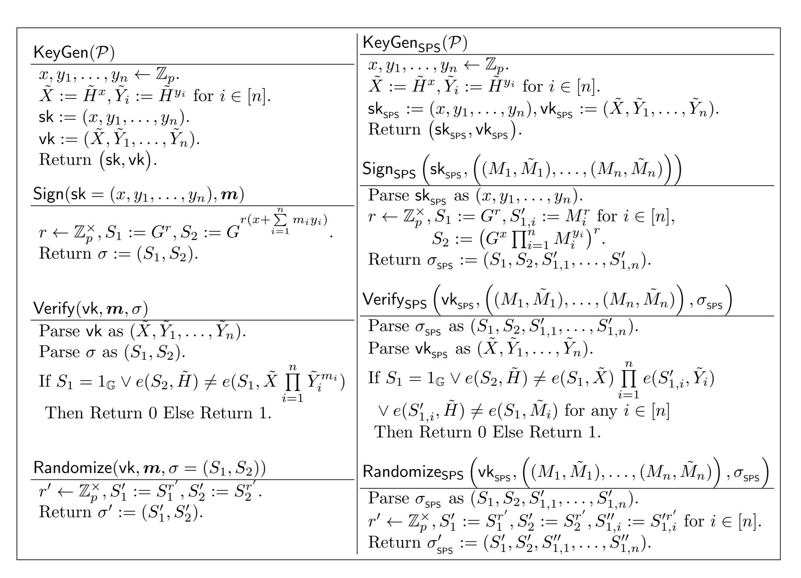

{0}------------------------------------------------

# Partially Structure-Preserving Signatures: Lower Bounds, Constructions and More

### Essam Ghadafi

University of the West of England, Bristol, UK

Abstract. In this work we first provide a framework for defining a large subset of pairing-based digital signature schemes which we call Partially Structure-Preserving Signature (PSPS) schemes. PSPS schemes are similar in nature to structure-preserving signatures with the exception that in these schemes messages are scalars from Z n <sup>p</sup> instead of being source group elements. This class encompasses various existing schemes which have a number of desirable features which makes them an ideal building block for many privacy-preserving cryptographic protocols. They include the widely-used schemes of Camenisch-Lysyanskaya (CRYPTO 2004) and Pointcheval-Sanders (CT-RSA 2016). We then provide various impossibility and lower bound results for variants of this class. Our results include bounds for the signature and verification key sizes as well as lower bounds for achieving strong unforgeability. We also give a generic framework for transforming variants of PSPS schemes into structure-preserving ones. As part of our contribution, we also give a number of optimal PSPS schemes which may be of independent interest. Our results aid in understanding the efficiency of pairing-based signature schemes and show a connection between this class of signature schemes and structure-preserving ones.

Keywords. Digital Signatures, Bilinear Groups, Lower Bounds, Structure-Preserving.

## 1 Introduction

Digital signatures are a fundamental cryptographic primitive which besides being useful in their own right, they are used as an essential building block for various more complex protocols.

The emergence of pairing-based cryptography has been associated with the introduction of many pairing-based digital signature schemes. One of the extinsviely used pairing-based signature schemes is that of Camenisch and Lysyanskaya (CL) [25]. The scheme has a number of desirable features which makes it an ideal building block for various privacy-preserving protocols, including group signatures, e.g. [25, 17], anonymous credentials, e.g. [25], direct anonymous attestation, e.g. [30, 16], and e-cash [26]. Notably, the scheme besides having fully and perfectly randomizable signatures, it is compatible with Pedersen-like commitment schemes [53] and thus it is possible to sign committed messages without revealing them to the signer. A recent improvement to the CL scheme is the scheme put forward by Pointcheval and Sanders (PS) [54], which besides enjoying better efficiency and preserving all of its desirable features, it yields constant-size signatures regardless of the size of the message which overcomes a downside of the CL scheme which was the linear growth of the signature when signing multiple messages. Despite its relatively young age, the PS scheme has been used in the construction of various protocols. A common feature to the structure of both aforementioned pairing-based schemes is that the signer is generic, and when viewing the signature components as an exponentiation of the respective group generator to a fraction of polynomials, the denominator polynomials are independent of the message. This is to the contrary of other pairing-based schemes, e.g. [19, 20, 59, 55], which even though are based on non-interactive intractability assumptions, they do not enjoy some of the desirable features of the CL and PS schemes, e.g. the randomizability of the signatures, having a generic signer, the ease of being combined with Pedersen-like commitments, and having a short verification key.

Gerbush et al. [38] introduced the dual-form signature framework as a tool for basing variants of some existing pairing-based digital signatures, including those which fall into the PSPS class, on static non-interactive intractability assumptions. For instance, [38], gave a variant of the CL scheme whose security relies on a static assumption in the composite-order bilinear group setting. Similary, recently [28] utilized the same framework to obtain variants of some pairing-based signature schemes, e.g. the PS scheme, with security based on static intractability assumptions. The obtained variants are less efficient than their original counterparts.

{1}------------------------------------------------

In quest to design protocols which dispense with relying on random oracles [33] despite the efficiency degradation, the notion of Structure-Preserving Signatures (SPSs) was put forward by Abe et al. [4] but earlier constructions conforming to the definition were given by [44, 43]. SPS schemes are also pairingbased signature schemes with the extra requirement that the messages, the verification key and the signatures consist of only source group elements. Verification of signatures in those schemes only involves evaluating Pairing-Product Equations (PPEs) and checking group memberships. Such properties make them compatible with widely-used constructs such as ElGamal encryption [31] and Groth-Sahai proofs [46]. SPS schemes have numerous applications which include group signatures, e.g [4, 50], blind signatures, e.g. [4, 35], attribute-based signatures, e.g. [32], tightly secure encryption, e.g. [47, 3], malleable signatures, e.g. [11], anonymous credentials, e.g. [34, 23], network coding, e.g. [11], oblivious transfer, e.g. [43], direct anonymous attestation, e.g. [15, 39], and e-cash, e.g. [12].

A numerous number of SPS schemes have been proposed in the 3 different bilinear groups settings. In the most efficient bilinear group setting, i.e. the Type-3 setting (cf. Section 2), existing schemes include [4, 5, 7, 29, 45, 39, 41]. A large subset of those constructions rely on security proofs in the generic group model [57, 52]. Abe et al. [5] proved that a Type-3 signature must contain 3 bilateral elements and require at least 2 PPEs for verification. Ghadafi [41] showed that by restricting the message space to the set of Diffie-Hellman (DH) pairs (cf. Section 2) it is possible to circumvent the lower bound and obtain optimal unilateral signatures consisting of 2 elements. Such variants provide some efficiency gains for some protocols, including direct anonymous attestation [21] and attribute-based signatures [51]. Other constructions for this message space include, e.g. [4, 39, 42].

Constructions of SPS schemes relying on non-interactive assumptions were given by [2, 22, 3, 49, 50, 48, 9, 37]. Chase and Kohlweiss [27] gave a transformation which utilizes a pairwise-independent hash functions and NIZK proofs [18], the Gorth-Sahai proof system [46] in particular, to obtain structurepreserving signatures based on standard assumptions, from some pairing-based signature schemes for scalar messages. Unfortunately, the transformation is rather costly as the obtained schemes yield signatures consisting of tens of group elements. Abe et al. [6] proved that the unforgeability of an optimal Type-3 scheme (with 3 bilateral elements) cannot be based on a non-interactive intractability assumption. More recently, Abe et al. [1] gave lower bounds for schemes for bilateral messages which are based on non-interactive intractability assumptions. SPS constructions in the Type-2 setting (where there is an efficiently computable unidirectional homomorphism between the source groups) were given in [8, 29, 13, 1]. Fully structure-preserving schemes where even the secret key consists of only group elements from the source groups were given by [10, 45, 58].

Motivation & Our Contribution. While structure-preserving signatures and their efficiency are well studied, e.g. lower bounds and optimal schemes exist for the 3 main bilinear groups settings, other types of pairing-based signature schemes still have some open problems pertaining to their feasibility and bounds for their efficiency are still lacking. For instance, it is not currently known whether efficient strongly unforgeable generic-signer schemes which are compatible with Pedersen-like commitments, i.e. have a similar structure to the CL and PS schemes, are possible. Moreover, it is not currently known whether the recent efficient PS scheme (which yields unilateral signatures consisting of 2 elements, a verification key consisting of 2 elements and require 1 PPE for verification) is optimal or whether it is possible to improve efficiency while preserving all of its desirable features.

SPS schemes might be less desirable than pairing-based schemes for scalar messages for some applications due to the loss in efficiency. This is particularly the case for applications where relying on random oracles is tolerated, applications requiring a stand-alone signature scheme, or applications not requiring proof systems to hide the message. Towards a better understanding of the efficiency of pairing-based signature schemes for scalar messages, we first define a framework for capturing a large class of such schemes which we refer to as Partially Structure-Preserving Signature (PSPS) schemes. Other than the messages being scalars from Z n p rather than source group elements, PSPS schemes have similar properties to structure-preserving signatures, including having a generic signer and signatures and verification keys consisting of source group elements. We provide different variants of our definition. More precisely, we define Strongly Partially Structure-Preserving (SPSPS) schemes and Linear-Message Strongly Partially Structure-Preserving (LmSPSPS) schemes. The former requires that the PSPS scheme does not involve the message in the denominator of any of the signature components whereas the latter additionally requires that the message is embedded in the signature components in a linear manner. The CL and PS schemes for example fall into the LmSPSPS class. We provide various lower bounds and impossibility 

{2}------------------------------------------------

results for LmSPSPS schemes. More precisely, we prove that existentially unforgeable under random-message attacks (EUF-RMA) schemes must have at least 2 elements in the signature and that strongly existentially unforgeable under chosen-message attacks (sEUF-CMA) schemes must have bilateral signatures consisting of at least 3 elements. Also, we prove that optimal schemes, including one-time schemes, cannot have a verification key consisting of fewer than 2 elements. We also prove that while an optimal one-time EUF-CMA LmSPSPS scheme can have a 2-element bilateral verification key, an optimal EUF-RMA LmSPSPS scheme (with unilateral signatures) cannot have a 2-element bilateral verification key. In essence, this proves that the PS scheme is optimal in every respect.

As part of our contribution, we also construct 2 new optimal one-time sEUF-CMA LmSPSPS schemes (with signatures consisting of a single element) and a new optimal EUF-CMA LmSPSPS scheme for a vector of messages. We prove the security of the latter using a new interactive intractability assumption which we show holds in the generic group model. The efficiency of our scheme matches that of the best existing scheme [54] (whose security also relies on an interactive intractability assumption).

Finally, we show a connection between LmSPSPS schemes and SPS schemes by showing that if a LmSPSPS scheme satisfies an extra requirement which is that the signature and verification key components in either source group are disjoint, which for instance is satisfied by the CL and PS schemes as well as our new scheme, such a scheme automatically yields an analogues SPS scheme where the message space is the set of Diffie-Hellman pairs. The obtained SPS scheme has the same key pair as the original LmSPSPS scheme and is unforgeable in the generic group model. Moreover, we give conditions for when the obtained SPS scheme preserves the signature size and the verification overhead of the corresponding LmSPSPS scheme. We also show some example instantiations of our framework.

Besides being a step closer towards a better understanding of the efficiency of pairing-based signature schemes, our results uncover a link between LmSPSPS and SPS schemes.

**Paper Organization**. We provide some preliminary definitions in Section 2. In Section 3 we formally define partially structure-preserving signature schemes. In Section 4 we give our feasibility results. In Section 5 we present a new optimal LmSPSPS scheme and prove its security. In Section 6 we present 2 new optimal one-time LmSPSPS schemes and prove their security. Finally, in Section 7 we give our transformation from LmSPSPS to SPS schemes and provide example instantiations.

**Notation**. We write y = A(x;r) when algorithm A on input x and randomness r outputs y. We write  $y \leftarrow A(x)$  for the process of setting y = A(x;r) where r is sampled at random. We also write  $y \leftarrow S$  for sampling y uniformly at random from a set S. A function  $\nu(.): \mathbb{N} \to \mathbb{R}^+$  is negligible (in n) if for every polynomial p(.) and all sufficiently large values of n, it holds that  $\nu(n) < \frac{1}{p(n)}$ . By PPT we mean running in probabilistic polynomial time in the relevant security parameter. We use [k] to denote the set  $\{1,\ldots,k\}$  and [i,k] to denote the set  $\{i,i+1,\ldots,k\}$ . For vectors  $x,y \in \mathbb{Z}_p^n$  we denote by  $x^y$  the operation  $\prod_{i=1}^n x_i^{y_i}$ .

### 2 Preliminaries

In this section we provide some preliminary definitions.

#### 2.1 Bilinear Groups

A bilinear group is a tuple  $\mathcal{P} := (\mathbb{G}, \mathbb{H}, \mathbb{T}, p, G, \tilde{H}, e)$  where  $\mathbb{G}$ ,  $\mathbb{H}$  and  $\mathbb{T}$  are groups of a prime order p, and G and  $\tilde{H}$  generate  $\mathbb{G}$  and  $\mathbb{H}$ , respectively. The function e is a non-degenerate bilinear map  $e : \mathbb{G} \times \mathbb{H} \longrightarrow \mathbb{T}$ . We refer to  $\mathbb{G}$  and  $\mathbb{H}$  as the source groups whereas we refer to  $\mathbb{T}$  as the target group. We will use multiplicative notation for all the groups. To distinguish elements of  $\mathbb{H}$  from those of  $\mathbb{G}$  we will accent the former with  $\tilde{\ }$ . We let  $\mathbb{G}^{\times} := \mathbb{G} \setminus \{1_{\mathbb{G}}\}$  and  $\mathbb{H}^{\times} := \mathbb{H} \setminus \{1_{\mathbb{H}}\}$ . We limit our attention to the efficient Type-3 setting [36], where  $\mathbb{G} \neq \mathbb{H}$  and there is no efficiently computable homomorphism between the source groups in either direction. We assume there is an algorithm  $\mathcal{BG}$  that on input  $1^{\kappa}$ , for some security parameter  $\kappa \in \mathbb{N}$ , outputs a description of a bilinear groups  $\mathcal{P}$ .

We call a pair  $(M, \tilde{N}) \in \mathbb{G} \times \mathbb{H}$  a Diffie-Hellman (DH) pair [4] if it satisfies  $e(M, \tilde{H}) = e(G, \tilde{N})$ . We denote the set of DH pairs by  $\mathcal{DH}$ .

{3}------------------------------------------------

#### 2.2 Digital Signatures

A digital signature scheme  $\mathcal{DS}$  over a bilinear group  $\mathcal{P}$  generated by  $\mathcal{BG}$  for a message space  $\mathcal{M}$  consists of the following algorithms:

KeyGen( $\mathcal{P}$ ): On input  $\mathcal{P}$ , this algorithm outputs a pair of signing/verification keys ( $\mathsf{sk}, \mathsf{vk}$ ).

Sign(sk, m): On input the secret signing key sk and a message  $m \in \mathcal{M}$ , this algorithm outputs a signature  $\sigma$  on m.

Verify(vk,  $m, \sigma$ ): On input the verification key vk, a message  $m \in \mathcal{M}$  and a signature  $\sigma$ , this algorithm outputs 0/1 indicating the invalidity/validity of  $\sigma$  on m w.r.t. vk.

**Definition 1 (Correctness).** A signature scheme  $\mathcal{DS}$  over a bilinear group generator  $\mathcal{BG}$  is (perfectly) correct if for all  $\kappa \in \mathbb{N}$ :

$$\Pr\left[ \begin{matrix} \mathcal{P} \leftarrow \mathcal{BG}(1^\kappa); (\mathsf{sk}, \mathsf{vk}) \leftarrow \mathsf{KeyGen}(\mathcal{P}); m \leftarrow \mathcal{M}; \sigma \leftarrow \mathsf{Sign}(\mathsf{sk}, m) \\ : \mathsf{Verify}(\mathsf{vk}, m, \sigma) = 1 \end{matrix} \right] = 1.$$

A signature scheme is said to be existentially unforgeable if it is hard to forge a signature on a new message that has not been signed before where the adversary may request signatures on other messages before outputting her forgery. We distinguish between random-message (EUF-RMA) and adaptive chosen-message (EUF-CMA) variants of existential unforgeability as defined below.

**Definition 2 (EUF-RMA).** A signature scheme  $\mathcal{DS}$  over a bilinear group generator  $\mathcal{BG}$  is Existentially Unforgeable under a Random-Message Attack if for all  $\kappa \in \mathbb{N}$  for all PPT adversaries  $\mathcal{A}$ , the following is negligible (in  $\kappa$ ):

$$\Pr\left[ \begin{array}{c} \mathcal{P} \leftarrow \mathcal{BG}(1^\kappa); (\mathsf{sk}, \mathsf{vk}) \leftarrow \mathsf{KeyGen}(\mathcal{P}); (\sigma^*, m^*) \leftarrow \mathcal{A}^{\mathsf{Sign}(\mathsf{sk})}(\mathcal{P}, \mathsf{vk}) \\ : \mathsf{Verify}(\mathsf{vk}, m^*, \sigma^*) = 1 \, \wedge \, m^* \notin Q_{\mathsf{Sign}} \end{array} \right],$$

where Sign uniformly samples a message m from  $\mathcal{M}$  and returns m and a signature  $\sigma$  on it, and  $Q_{Sign}$  is the set  $\{m_i\}_{i=1}^q$  of messages returned by Sign.

Strong Existential Unforgeability under a Random-Message Attack (sEUF-RMA) is defined similarly and requires that the adversary cannot even output a new signature on a message that was chosen by Sign.

**Definition 3 (EUF-CMA).** A signature scheme  $\mathcal{DS}$  over a bilinear group generator  $\mathcal{BG}$  is Existentially Unforgeable under an adaptive Chosen-Message Attack if for all  $\kappa \in \mathbb{N}$  for all PPT adversaries  $\mathcal{A}$ , the following is negligible (in  $\kappa$ ):

$$\Pr\left[ \begin{array}{c} \mathcal{P} \leftarrow \mathcal{BG}(1^{\kappa}); (\mathsf{sk}, \mathsf{vk}) \leftarrow \mathsf{KeyGen}(\mathcal{P}); (\sigma^*, m^*) \leftarrow \mathcal{A}^{\mathsf{Sign}(\mathsf{sk}, \cdot)}(\mathcal{P}, \mathsf{vk}) \\ : \mathsf{Verify}(\mathsf{vk}, m^*, \sigma^*) = 1 \, \wedge \, m^* \notin Q_{\mathsf{Sign}} \end{array} \right],$$

where when queried on a message m from  $\mathcal{M}$ , Sign returns a signature  $\sigma$  on m and  $Q_{\text{Sign}}$  is the set  $\{m_i\}_{i=1}^q$  of messages queried to Sign.

Strong Existential Unforgeability under an adaptive Chosen-Message Attack (sEUF-CMA) is defined similarly and requires that the adversary cannot even output a new signature on a message that was queried to the sign oracle.

#### 2.3 Structure-Preserving Signatures

Structure-preserving signatures [4] are signature schemes defined over bilinear groups where the messages, the verification key and signatures are all group elements from either or both source groups, and verifying signatures only involves deciding group membership of the signature components and evaluating PPEs of the form of Equation (1).

$$\prod_{i} \prod_{j} e(A_i, \tilde{B}_j)^{c_{i,j}} = Z,\tag{1}$$

where  $A_i \in \mathbb{G}$  and  $\tilde{B}_j \in \mathbb{H}$  are group elements appearing in  $\mathcal{P}, m, \text{vk}, \sigma$ , whereas  $c_{i,j} \in \mathbb{Z}_p$  and  $Z \in \mathbb{T}$  are public constants.

**Generic Signer**. We refer to a signer that can only decide group membership, evaluate the bilinear map e, compute the group operations in groups  $\mathbb{G}$ ,  $\mathbb{H}$  and  $\mathbb{T}$ , and compare group elements as a *generic signer*.

{4}------------------------------------------------

### 3 Partially Structure-Preserving Signatures

In this section we define a class of prime-order pairing-based digital signature schemes which we call Partially Structure-Preserving Signature (PSPS) schemes. Informally, a PSPS scheme is a pairing-based signature scheme for scalar messages from  $\mathbb{Z}_p^n$  for  $n \geq 1$  where the signature components and verification key contain only source group elements and the signature components are computed by raising source group elements to fraction of polynomials involving the secret key, the messages and the randomness chosen as part of the signing process. We then define 2 variants of PSPS schemes to capture most of the practical schemes existing in the literature. First, we define Strongly Partially Structure-Preserving Signature (SPSPS) schemes which additionally require that the denominator polynomials used in computing the signature components are independent of the messages to be signed. Then we define a further variant of SPSPS which we refer to as Linear-Message Strongly Partially Structure-Preserving Signature (LmSPSPS) schemes which additionally requires that the numerator polynomials are linear in the message to be signed. The latter captures a large class of existing schemes over prime-order bilinear groups for scalar messages, including variants of the CL and PS schemes. As discussed earlier, those schemes have desirable features such as the public randomizability of signatures and their compatibility with Pedersen-like commitment schemes which makes them an ideal building block for various cryptographic protocols.

**Definition 4 (Partially Structure-Preserving Signatures).** A signature scheme  $\mathcal{DS}$  over a bilinear group generator  $\mathcal{BG}$  is Partially Structure-Preserving Signature (PSPS) scheme if it satisfies all the following:

- $\mathcal{BG}(1^{\kappa})$  generates a bilinear group description  $\mathcal{P} := (\mathbb{G}, \mathbb{H}, \mathbb{T}, p, G, \tilde{H}, e)$ .
- The verification key vk consists of  $\mathcal{P}$  and source group elements  $(X,Y) \in \mathbb{G}^{\mu} \times \mathbb{H}^{\mu'}$ . WLOG we assume that any other source group elements than the default group generators part of the setup are part of the verification key.
- The message space is  $\mathcal{M} := \mathbb{Z}_p^n$  for some  $n \geq 1$ .
- A signature on a message  $\mathbf{m} \in \mathcal{M}$  is of the form  $\sigma := (\mathbf{S}, \tilde{\mathbf{T}}) \in \mathbb{G}^{\nu} \times \mathbb{H}^{\nu'}$  which is computed by a generic signer by sampling a vector  $\mathbf{r} \in \mathbb{Z}_p^{n'}$  (independently of the message  $\mathbf{m}$ ) and computing  $S_i := G^{\frac{\alpha_i(\mathsf{sk}, \mathbf{m}, \mathbf{r})}{\alpha_i'(\mathsf{sk}, \mathbf{m}, \mathbf{r})}}$  and  $\tilde{T}_j := \tilde{H}^{\beta_j(\mathsf{sk}, \mathbf{m}, \mathbf{r})}_{\beta_j'(\mathsf{sk}, \mathbf{m}, \mathbf{r})}$  for some formal multivariate polynomials  $\alpha_i, \alpha_i', \beta_j, \beta_j' \in \mathbb{F}_p[X_1, \dots, X_{\mu}, Y_1, \dots, Y_{\mu'}, M_1, \dots, M_n, R_1, \dots, R_{n'}]$  of total degree bounded by  $d(\kappa)$ .
- Signature verification involves deciding group membership <sup>1</sup> and evaluating a set of pairing-product equations of the following form:

$$\prod_{i=1}^{\nu} e(S_i, \prod_{j=1}^{\mu'} \tilde{Y}_j)^{\rho_{1,i,j}(\boldsymbol{m})} \prod_{i=1}^{\nu'} e(\prod_{j=1}^{\mu} X_j, \tilde{T}_i)^{\rho_{2,i,j}(\boldsymbol{m})} \prod_{i=1}^{\nu} e(S_i, \prod_{j=1}^{\nu'} \tilde{T}_j)^{\rho_{3,i,j}(\boldsymbol{m})} \prod_{i=1}^{\mu} \prod_{j=1}^{\mu'} e(X_i, \tilde{Y}_j)^{\rho_{4,i,j}(\boldsymbol{m})} = Z_\ell,$$
(2)

where  $\rho_{k,i,j} \in \mathbb{F}_p[M_1,\ldots,M_n]$  are multivariate polynomials of total degree bounded by  $d'(\kappa)$  whereas  $Z_\ell \in \mathbb{T}$  is a public constant. In the strict sense, one can necessitate that  $Z_\ell = 1_{\mathbb{T}}$ .

**Definition 5 (Strongly Partially Structure-Preserving Signatures).** We say a signature scheme  $\mathcal{DS}$  over a bilinear group generator  $\mathcal{BG}$  is Strongly Partially Structure-Preserving Signature (SPSPS) if it is partially structure-preserving and additionally it holds that for all  $i \in [\nu]$  and for all  $j \in [\nu']$ , the polynomials  $\alpha'_i$  and  $\beta'_j$  are independent of the message vector  $\mathbf{M}$ .

Definition 6 (Linear-Message Strongly Partially Structure-Preserving Signatures). We say a signature scheme  $\mathcal{DS}$  over a bilinear group generator  $\mathcal{BG}$  is Linear-Message Strongly Partially Structure-Preserving Signature (LmSPSPS) if it is strongly partially structure-preserving and additionally it holds that for all  $i \in [\nu]$  and for all  $j \in [\nu']$ ,  $\alpha_i$  and  $\beta_j$  are linear in M, i.e. for all  $k \in [n]$ , for all  $i \in [\nu]$ , for all  $j \in [\nu']$ , the degree of  $M_k$  in  $\alpha_i$  and  $\beta_j$  is either 0 or 1 and for all  $\eta, \eta' \in [n]$  neither of the polynomials contain the monomial  $M_{\eta}M_{\eta'}$ .

For the sake of generality, we allow membership checks of the forms  $S_i \in \mathbb{G}^{\times}$  and  $\tilde{T}_j \in \mathbb{H}^{\times}$ .

{5}------------------------------------------------

We now define a subset of PSPS schemes which we call Disjoint Partially Structure-Preserving Signature (DPSPS) scheme. Informally, a DPSPS scheme is a PSPS scheme where the spans of the sets of fraction of formal polynomials corresponding to the verification key and signature components in the source groups are disjoint.

Definition 7 (Disjoint Partially Structure-Preserving Signatures). Let  $\frac{\gamma_{1,i}(SK)}{\gamma'_{1,i}(SK)}$  for  $i \in [\mu]$  and  $\frac{\gamma_{2,j}(SK)}{\gamma'_{2,j}(SK)}$  for  $j \in [\mu']$  be the fraction of (formal) polynomials used to compute the verification key  $X \in \mathbb{G}^{\mu}$  and  $Y \in \mathbb{H}^{\mu'}$  (excluding the default source group generators), respectively. We say a signature scheme  $\mathcal{DS}$  over a bilinear group generator  $\mathcal{BG}$  is a Disjoint Partially Structure-Preserving Signature (DPSPS) scheme if it is partially structure-preserving and additionally meets the following requirement:

$$Span\left(\left\{\frac{\gamma_{1,1}(\mathsf{SK})}{\gamma_{1,1}'(\mathsf{SK})}, \ldots, \frac{\gamma_{1,\mu}(\mathsf{SK})}{\gamma_{1,\mu}'(\mathsf{SK})}, \frac{\alpha_{1}(\mathsf{SK}, M, R)}{\alpha_{1}'(\mathsf{SK}, M, R)}, \ldots, \frac{\alpha_{\nu}(\mathsf{SK}, M, R)}{\alpha_{\nu}'(\mathsf{SK}, M, R)}\right\}\right)$$

$$\cap Span\left(\left\{\frac{\gamma_{2,1}(\mathsf{SK})}{\gamma_{2,i}'(\mathsf{SK})}, \ldots, \frac{\gamma_{2,\mu'}(\mathsf{SK})}{\gamma_{2,\mu'}'(\mathsf{SK})}, \frac{\beta_{1}(\mathsf{SK}, M, R)}{\beta_{1}'(\mathsf{SK}, M, R)}, \ldots, \frac{\beta_{\nu'}(\mathsf{SK}, M, R)}{\beta_{\nu'}'(\mathsf{SK}, M, R)}\right\}\right) = \{0\}.$$

We call a LmSPSPS scheme a Disjoint LmSPSPS (DLmSPSPS) scheme if it satisfies the above disjoint requirement. Examples of schemes conforming to this requirement include the PS scheme and our new scheme.

We later show that DLmSPSPS schemes yield equivalent structure-preserving signature schemes. In our transformation to structure-preserving signatures the disjoint requirement ensures that a generic adversary against the obtained SPS scheme cannot feed elements she obtains from querying the sign oracle back into the sign oracle. Thus, this restricts the messages the adversary against the SPS scheme can query back into her sign oracle to being constant polynomials, i.e. scalars from  $\mathbb{Z}_p$ , similarly to the generic adversary against the underlying DLmSPSPS scheme.

### 4 Impossibility results

In this section we provide some feasibility results for LmSPSPS schemes.

### 4.1 A bound on the number of signatures for LmSPSPS schemes

Here we prove, similirly to the case of structure-preserving signatures proven by Abe et al. [7], that a EUF-RMA LmSPSPS scheme must have for each message superpolynomially many potential signatures.

**Theorem 1.** An EUF-RMA LmSPSPS scheme (against q > 1 sign queries) must have for each message superpolynomially many potential signatures.

*Proof.* We can write the j-th signature component of the  $\ell$ -th signing query as:

$$\frac{\sum_{i} \boldsymbol{x^{c_{i,j}}} \boldsymbol{y^{c'_{i,j}}} \boldsymbol{r^{c''_{i,j}}_{\ell}}(\boldsymbol{a_{i,j}} + \sum_{k=1}^{n} \boldsymbol{a_{i,j,k}} \boldsymbol{m_{k}})}{\sum_{i} \boldsymbol{b_{i,j}} \boldsymbol{x^{e_{i,j}}} \boldsymbol{y^{e'_{i,j}}} \boldsymbol{r^{e'_{i,j}}_{\ell}}} \qquad \qquad \underbrace{\sum_{i} \boldsymbol{x^{c_{i,j}}} \boldsymbol{y^{c'_{i,j}}} \boldsymbol{r^{c''_{i,j}}_{\ell}}(\boldsymbol{a_{i,j}} + \sum_{k=1}^{n} \boldsymbol{a_{i,j,k}} \boldsymbol{m_{k}})}_{\sum_{i} \boldsymbol{b_{i,j}} \boldsymbol{x^{e_{i,j}}} \boldsymbol{y^{e'_{i,j}}} \boldsymbol{r^{e'_{i,j}}_{\ell}} \boldsymbol{r^{e''_{i,j}}}}$$

$$S_{j} = G \qquad \tilde{T}_{j} = \tilde{H} \qquad \tilde{T}_{j} = \tilde{H}$$

for some (fixed)  $a_{i,j}, b_{i,j}, d_{i,j,k} \in \mathbb{Z}_p, c_{i,j}, e_{i,j} \in \mathbb{Z}_p^{\mu}, c'_{i,j}, e'_{i,j} \in \mathbb{Z}_p^{\mu'}, c''_{i,j}, e''_{i,j} \in \mathbb{Z}_p^{n'}$  which are independent of m.

If the scheme has only polynomially many potential signatures for a message vector, there is a polynomial set  $\{\boldsymbol{r}_i\}_{i=1}^{\mathrm{poly}(\kappa)}$  from which the randomness vector  $\boldsymbol{r}$  is chosen. Thus, with probability  $\frac{1}{\mathrm{poly}(\kappa)^2}$  we have that the 2 signatures  $\sigma_1 = (\boldsymbol{S}_1, \tilde{\boldsymbol{T}}_1)$  and  $\sigma_2 = (\boldsymbol{S}_2, \tilde{\boldsymbol{T}}_2)$  on message vectors  $\boldsymbol{m}_1$  and  $\boldsymbol{m}_2$ , respectively, were produced using the same vector  $\boldsymbol{r}_\ell \in \mathbb{Z}_p^{n'}$ . Thus, we have that  $\sigma^* = \sigma_1^{1-\gamma} \sigma_2^{\gamma}$  is a valid forgery on the message  $\boldsymbol{m}^* = (1-\gamma)\boldsymbol{m}_1 + \gamma\boldsymbol{m}_2$  for any  $\gamma \in \mathbb{Z}_p^{\times} \setminus \{1\}$  and therefore such a scheme is not EUF-RMA secure against an adversary which makes 2 (non-adaptive) sign queries.

{6}------------------------------------------------

### 4.2 Impossibility of LmSPSPS schemes with one-element signatures

Here we prove that an EUF-RMA (aganist q > 1 sign queries) LmSPSPS scheme cannot have one-element signatures. However, as we show in Section 6, one-time sEUF-CMA LmSPSPS schemes with one-element signatures are possible.

**Theorem 2.** An EUF-RMA LmSPSPS scheme (against q > 1 sign queries) must have at least 2 elements in the signature.

*Proof.* WLOG let's assume that a scheme yields one-element signatures of the form  $\sigma = S \in \mathbb{G}$ . The proof for the case where  $\sigma = \tilde{T} \in \mathbb{H}$  is similar. Since there is only one unknown in the verification equation, i.e the signature S, it follows that 1 verification equation is sufficient for such a scheme. Thus, the scheme would have a verification equation of the following form:

$$e(S, \prod_{j=1}^{\mu'} \tilde{Y}_j)^{a_j + \sum_{k=1}^n a'_{j,k} m_k} \prod_{i=1}^{\mu} \prod_{j=1}^{\mu'} e(X_i, \tilde{Y}_j)^{d_{i,j} + \sum_{k=1}^n d'_{i,j,k} m_k} = Z,$$
(3)

where  $a_j, a'_{j,k}, d_{i,j}, d'_{i,j,k} \in \mathbb{Z}_p$  and  $Z \in \mathbb{T}$  are public constants. By definition, we must have that for all  $k \in [n]$  that  $a'_{j,k} = 0$ .

Given 2 signatures  $\sigma_1^* = S_1$  on  $m_1$  and  $\sigma_2^* = S_2$  on  $m_2$ , we have that  $\sigma^* = \sigma_1^{1-\gamma} \sigma_2^{\gamma}$  is a valid forgery on the message  $m^* = (1-\gamma)m_1 + \gamma m_2$  for any  $\gamma \in \mathbb{Z}_p^{\times} \setminus \{1\}$  and therefore such a scheme is not EUF-RMA secure against an adversary which makes 2 (non-adaptive) sign queries.

#### 4.3 Impossibility of unilateral sEUF-CMA LmSPSPS schemes

Here we prove that the signatures of a sEUF-CMA LmSPSPS scheme secure against q > 1 sign queries must have bilateral signatures.

**Theorem 3.** There is no sEUF-CMA (against q > 1 sign queries) LmSPSPS scheme with unilateral signatures.

*Proof.* WLOG let's assume that the signature is of the form  $\sigma = \mathbf{S} \in \mathbb{G}^{\nu}$ . The proof for the case where  $\sigma = \tilde{\mathbf{T}} \in \mathbb{H}^{\nu'}$  is similar. Such a scheme would have a number of verification equations of the following form:

$$\prod_{i=1}^{\nu} e(S_i, \prod_{j=1}^{\mu'} \tilde{Y}_j)^{\rho_{i,j,\ell}(\boldsymbol{m})} \prod_{i=1}^{\mu} \prod_{j=1}^{\mu'} e(X_i, \tilde{Y}_j)^{\rho_{i,j,\ell}(\boldsymbol{m})} = Z_{\ell}$$
(4)

By definition, the denominator polynomials used in computing the signature components are independent of the message to be signed. Also, since the signature is unilateral, i.e. the signature components only appear on the LHS of the pairings, the numerator polynomials are linear in the randomness vector  $\mathbf{r}$  whereas the denominator polynomials are independent of the randomness vector. This means we can write each signature component  $S_i$  as

$$S_i = G^{\sum_{j=1}^{\mu} \sum_{k=1}^{\mu'} \tau_{i,1,j,k}(\mathbf{m}) x_j y_k - \sum_{j=1}^{\mu'} \sum_{k=1}^{n'} \tau_{i,2,j,k}(\mathbf{m}) y_j r_k}}{\sum_{j=1}^{\mu'} a_{i,j} y_j},$$

where  $\tau_{i,1,j,k}, \tau_{i,2,j,k} \in \mathbb{F}_p[M_1, \dots, M_n]$  are multivariate polynomials and  $a_{i,j}, z \in \mathbb{Z}_p$  are some fixed constants. By Theorem 1 such a scheme must have superpolynomially many potential signatures. By querying the sign oracle twice on any message vector  $\boldsymbol{m}$  from the message space, with overwhelming probability we obtain 2 distinct signatures  $\sigma_1 = \boldsymbol{S}_1$  and  $\sigma_2 = \boldsymbol{S}_2$ . We have that  $\sigma^* = \sigma_1^{1-\gamma}\sigma_2^{\gamma}$  is with overwhelming probability a new signature on  $\boldsymbol{m}$  for any  $\gamma \in \mathbb{Z}_p^{\times} \setminus \{1\}$ .

{7}------------------------------------------------

#### 4.4 Impossibility of sEUF-CMA SPSPS schemes with 2-element signatures

Theorem 3 proved that unilateral sEUF-CMA LmSPSPS schemes (regardless of the size of the signature) do not exist. The following theorem proves that sEUF-CMA SPSPS schemes with 2-element bilateral signatures do not exist. Note here that our result holds even without the restriction that the message is linear. This sets a lower bound of 3 bilateral elements for the signature of an optimal sEUF-CMA LmSPSPS scheme secure against q > 1 sign queries.

**Theorem 4.** There is no sEUF-CMA (against q > 1 sign queries) SPSPS scheme with 2-element bilateral signatures.

*Proof.* First note that since the verification is a system of equations over 2 unknowns (the signature components), one PPE equation is sufficient to verify the signatures. The signature is of the form  $\sigma = (S, \tilde{T}) \in \mathbb{G} \times \mathbb{H}$  whereas the verification key (including any public parameters) is of the form  $(X, \tilde{Y}) \in \mathbb{G}^{\mu} \times \mathbb{H}^{\mu'}$ . Such a scheme would have a verification equation of the following form:

$$e(S, \prod_{j=1}^{\mu'} \tilde{Y}_j)^{\rho_{1,j}(\boldsymbol{m})} e(\prod_{j=1}^{\mu} X_j, \tilde{T})^{\rho_{2,j}(\boldsymbol{m})} e(S, \tilde{T})^{\rho_3(\boldsymbol{m})} \prod_{i=1}^{\mu} \prod_{j=1}^{\mu'} e(X_i, \tilde{Y}_j)^{\rho_{4,i,j}(\boldsymbol{m})} = Z \cdot$$

Note that if for any  $j \in [\mu']$ ,  $\rho_{1,j}$  is not a constant polynomial or  $\rho_3$  is not a constant polynomial, it means a message component appears in the denominator polynomial of the signature component S which contradicts the definition. This means the verification equation can be written as:

$$e(S, \prod_{j=1}^{\mu'} \tilde{Y}_j)^{a_j} e(\prod_{j=1}^{\mu} X_j, \tilde{T})^{\rho_{2,j}(\boldsymbol{m})} e(S, \tilde{T})^c \prod_{i=1}^{\mu} \prod_{j=1}^{\mu'} e(X_i, \tilde{Y}_j)^{\rho_{4,i,j}(\boldsymbol{m})} = Z \cdot$$

First note that if for all  $j \in [\mu']$ ,  $a_j = 0$  and c = 0, the verification equation is independent of the component S and hence by Theorem 2 such a scheme is not EUF-RMA secure. Thus, we must have that either for some  $j \in [\mu']$  that  $a_j \neq 0$  or  $c \neq 0$ , which we consider below:

• Case for some  $j \in [\mu']$ ,  $a_j \neq 0$ : After getting a signature  $\sigma = (S, \tilde{T})$  on a (random) message vector m, we can compute a new signature  $\sigma^* = (S^*, \tilde{T}^*)$  on the same message vector as follows:

$$S^* := S^{\frac{a_j}{a_j + \gamma c}} \prod_{i=1}^{\mu} X_i^{\frac{-\gamma \rho_{2,i}(\boldsymbol{m})}{a_i + \gamma c}} \qquad \qquad \tilde{T}^* := \tilde{T}^{\frac{a_j + \gamma c}{a_j}} \prod_{i=1}^{\mu'} Y_i^{\frac{\gamma a_i}{a_j}}.$$

The new signature is a valid forgery and we have  $\sigma^* \neq \sigma$  for any  $\gamma \in \mathbb{Z}_p^{\times}$ .

• Case  $a_j = 0$  for all  $j \in [\mu']$  and  $c \neq 0$ : After getting a signature  $\sigma = (S, \tilde{T})$  on a (random) message vector  $\boldsymbol{m}$ , we can compute a new signature  $\sigma^* = (S^*, \tilde{T}^*)$  on the same message vector as follows:

$$S^* := S^{\frac{1}{\gamma}} \prod_{i=1}^{\mu} X_i^{\frac{(1-\gamma)\rho_{2,i}(m)}{\gamma c}} \qquad \qquad \tilde{T}^* := \tilde{T}^{\gamma} \cdot$$

The new signature is a valid forgery and we have that  $\sigma^* \neq \sigma$  for any  $\gamma \in \mathbb{Z}_p^{\times} \setminus \{1\}$ .

This concludes the proof.

#### 4.5 Lower bounds for the verification key of optimal schemes

We have seen that an optimal (w.r.t. signature size) EUF-RMA LmSPSPS scheme must have at least 2 elements in the signature. Here we prove that a scheme with  $\leq 2$  elements in the signature cannot have a verification key consisting of 1 group element besides the default source group generators G and  $\tilde{H}$  even for the case when signing single messages, i.e. when n=1. This in turn sets a lower bound of 2 elements (other than the default source group generators) in the verification key for even optimal

{8}------------------------------------------------

one-time EUF-RMA schemes for single messages. Note some of our proofs below assume that the RHS of the PPE equations in Equ (2) is  $Z_{\ell} = 1_{\mathbb{T}}$ .

Note that since the verification is a system of equations over  $\leq 2$  unknowns (the signature components), one PPE equation is sufficient to verify the signatures. WLOG, we assume that any other source group elements than the default group generators part of the setup are part of the verification key.

**Theorem 5.** There is no EUF-RMA LmSPSPS scheme (against  $q \ge 1$  sign queries) with signatures consisting of  $\le 2$  elements and one-element verification key.

*Proof.* The following 4 lemmata complete the proof.

**Lemma 1.** There is no EUF-RMA SPSPS scheme (against  $q \ge 1$  sign queries) with one verification equation and unilateral signatures and a unilateral verification key containing elements from the same source group.

*Proof.* Let's consider the case where the signature and the verification key both belong to group  $\mathbb{G}$ . The proof for the opposite case is similar. The scheme yields a signature  $\sigma = (S_1, \ldots, S_{\nu}) \in \mathbb{G}^{\nu}$ , has a verification key  $\mathsf{vk} = (X_1, \ldots, X_{\mu}) \in \mathbb{G}^{\mu}$  where WLOG  $X_1 = G$ , and has a verification equation of the form

$$\prod_{i=1}^{\nu} e(S_i, \tilde{H})^{\rho_{1,i}(m)} \prod_{i=1}^{\mu} e(X_i, \tilde{H})^{\rho_{2,i}(m)} = Z.$$

for some polynomials  $\rho_{1,i}$  and  $\rho_{2,i}$ .

Given a signature  $\sigma = (S_1, \ldots, S_{\nu})$  on a random message  $m \in \mathbb{Z}_p$ , we can construct a new forgery  $\sigma^* = (S_1^*, \ldots, S_{\nu}^*)$  on a different message  $m^* \neq m$  by fixing some  $i \in [\nu]$  and computing let  $S_j^* := S_j$  for all  $j \in [\nu] \setminus \{i\}$  and  $S_i^* := \left(S_i^{\rho_{1,i}(m)} \prod_{j \neq i} S_j^{\rho_{1,j}(m) - \rho_{1,j}(m^*)} \prod_{j=1}^{\mu} X_j^{\rho_{2,i}(m) - \rho_{2,i}(m^*)}\right)^{\frac{1}{\rho_{1,i}(m^*)}}$ . It is easy to see that such a forgery is a valid signature on the message  $m^*$ .

**Lemma 2.** There is no one-time EUF-RMA LmSPSPS scheme with one verification equation, oneelement signatures and one-element verification key.

*Proof.* Note here that we assume that  $Z = 1_{\mathbb{T}}$ . The case where both the signature and verification key lie in the same group follows from Lemma 1. Assume a scheme has a signature  $\sigma = S$ , a verification key  $\mathsf{vk} = \tilde{Y}$  and a verification equation of the following form:

$$e(S, \tilde{H}^{a_1+a_1'm}\tilde{Y}^{a_2+a_2'm}) = e(G, \tilde{H}^{b_1+b_1'm}\tilde{Y}^{b_2+b_2'm}).$$

By definition, we must have that  $a'_1 = a'_2 = 0$ . Note that we cannot have that  $a_1 = a_2 = 0$  as the equation would be independent of the signature, or  $b'_1 = b'_2 = 0$  as the equation would be independent of the message.

Given a signature  $\sigma=S$  on a random message m, we can construct a forgery on  $m^*=\gamma m+\frac{(\gamma-1)(b_1a_2-a_1b_2)}{a_2b_1'-a_1b_2'}$  for any  $\gamma\in\mathbb{Z}_p\setminus\{1\}$  as  $\sigma*=S^*:=G^{\frac{(\gamma-1)(b_1b_2'-b_1'b_2)}{a_2b_1'-a_1b_2'}}S^\gamma$ . This is a valid forgery unless  $a_2b_1'=a_1b_2'$  which we deal with below:

- Case  $a_2b_1' = a_1b_2' \neq 0$  or  $b_1' = a_1 = 0$ : Given a signature  $\sigma = S$  on a random message m, we can construct a forgery  $\sigma^* = S^* = S^* = S^* = S^* = S^* = S^* = S^* = S^* = S^* = S^* = S^* = S^* = S^* = S^* = S^* = S^* = S^* = S^* = S^* = S^* = S^* = S^* = S^* = S^* = S^* = S^* = S^* = S^* = S^* = S^* = S^* = S^* = S^* = S^* = S^* = S^* = S^* = S^* = S^* = S^* = S^* = S^* = S^* = S^* = S^* = S^* = S^* = S^* = S^* = S^* = S^* = S^* = S^* = S^* = S^* = S^* = S^* = S^* = S^* = S^* = S^* = S^* = S^* = S^* = S^* = S^* = S^* = S^* = S^* = S^* = S^* = S^* = S^* = S^* = S^* = S^* = S^* = S^* = S^* = S^* = S^* = S^* = S^* = S^* = S^* = S^* = S^* = S^* = S^* = S^* = S^* = S^* = S^* = S^* = S^* = S^* = S^* = S^* = S^* = S^* = S^* = S^* = S^* = S^* = S^* = S^* = S^* = S^* = S^* = S^* = S^* = S^* = S^* = S^* = S^* = S^* = S^* = S^* = S^* = S^* = S^* = S^* = S^* = S^* = S^* = S^* = S^* = S^* = S^* = S^* = S^* = S^* = S^* = S^* = S^* = S^* = S^* = S^* = S^* = S^* = S^* = S^* = S^* = S^* = S^* = S^* = S^* = S^* = S^* = S^* = S^* = S^* = S^* = S^* = S^* = S^* = S^* = S^* = S^* = S^* = S^* = S^* = S^* = S^* = S^* = S^* = S^* = S^* = S^* = S^* = S^* = S^* = S^* = S^* = S^* = S^* = S^* = S^* = S^* = S^* = S^* = S^* = S^* = S^* = S^* = S^* = S^* = S^* = S^* = S^* = S^* = S^* = S^* = S^* = S^* = S^* = S^* = S^* = S^* = S^* = S^* = S^* = S^* = S^* = S^* = S^* = S^* = S^* = S^* = S^* = S^* = S^* = S^* = S^* = S^* = S^* = S^* = S^* = S^* = S^* = S^* = S^* = S^* = S^* = S^* = S^* = S^* = S^* = S^* = S^* = S^* = S^* = S^* = S^* = S^* = S^* = S^* = S^* = S^* = S^* = S^* = S^* = S^* = S^* = S^* = S^* = S^* = S^* = S^* = S^* = S^* = S^* = S^* = S^* = S^* = S^* = S^* = S^* = S^* = S^* = S^* = S^* = S^* = S^* = S^* = S^* = S^* = S^* = S^* = S^* = S^* = S^* = S^* = S^* = S^* = S^* = S^* = S^* = S^* = S^* = S^* = S^* = S^* = S^* = S^* = S^* = S^* = S^* = S^* = S^* = S^* = S^* = S^* = S^* = S^* = S^* = S^* = S^* = S^* = S^* = S^* = S^* = S^* = S^* = S^* = S^* = S^* = S^* = S^* = S^* = S^* = S^* = S^* = S^* = S^* = S^* = S^* = S^* =$
- Case  $b_2' = a_2 = 0$ : Given a signature  $\sigma = S$  on a random message m, we can construct a forgery  $\sigma^* = S := G^{\gamma}S_1$  on  $m^* = m + \frac{\gamma a_1}{b_1'}$  for any  $\gamma \in \mathbb{Z}_p^{\times}$ .

**Lemma 3.** There is no SPSPS scheme with two-element bilateral signatures and one-element verification key that is secure against a key-only attack.

Those proofs also hold if the discrete logarithm of  $Z_{\ell}$  in the case  $Z_{\ell} \neq 1_{\mathbb{T}}$  is known.

{9}------------------------------------------------

*Proof.* Note here that we assume that  $Z = 1_{\mathbb{T}}$ . The signature is of the form  $\sigma = (S, \tilde{T}) \in \mathbb{G} \times \mathbb{H}$  whereas the verification key is either of the form  $\tilde{Y} \in \mathbb{H}$  or  $X \in \mathbb{G}$ . We prove the first case but the proof for the second case is similar. The scheme has a verification equation of the following form:

$$e(S, \tilde{H}^{\rho_1(m)}\tilde{Y}^{\rho_2(m)})e(G, \tilde{T})^{\rho_3(m)}e(S, \tilde{T})^{\rho_4(m)} = e(G, \tilde{H}^{\rho_5(m)}\tilde{Y}^{\rho_6(m)})$$

for some polynomials  $\rho_i$  for  $i \in [6]$ .

Given the verification key, we can construct a forgery on a message  $m^*$  as:

$$\sigma^* = (S^*, \tilde{T}^*) := (G^{\gamma}, \tilde{H}^{\frac{\rho_5(m^*) - \gamma \rho_1(m^*)}{\rho_3(m^*) + \gamma \rho_4(m^*)}} \tilde{Y}^{\frac{\rho_6(m^*) - \gamma \rho_2(m^*)}{\rho_3(m^*) + \gamma \rho_4(m^*)}}) \cdot$$

**Lemma 4.** There is no one-time EUF-RMA LmSPSPS scheme with two-element unilateral signatures and a verification key consisting of one-element from the opposite source group.

*Proof.* Note here that we assume that  $Z = 1_{\mathbb{T}}$ . Let's consider the case where the signature is of the form  $\sigma = (S_1, S_2) \in \mathbb{G}^2$  whereas the verification key is of the form  $\tilde{Y} \in \mathbb{H}$ . The proof for the opposite case is similar. Such a scheme would have a verification equation of the form

$$e(S_i, \tilde{H}^{a_{i,1}+a'_{i,1}m}\tilde{Y}^{a_{i,2}+a'_{i,2}m}) = e(G, \tilde{H}^{d_1+d'_1m}\tilde{Y}^{d_2+d'_2m})$$

By definition, we must have that either  $a'_{1,1} = a'_{1,2} = 0$  or  $a'_{2,1} = a'_{2,2} = 0$ . Let's assume the former case. Note that if  $a_{1,1} = a_{1,2} = 0$ , the equation is independent of  $S_1$  and hence as proven earlier the scheme is not EUF-RMA secure against  $q \ge 1$  sign queries. Similarly, if  $a_{2,1} = a'_{2,1} = a_{2,2} = a'_{2,2} = 0$ , the verification equation is independent of  $S_2$  and hence the scheme is not EUF-RMA secure against  $q \ge 1$  sign queries.

Given a signature  $\sigma=(S_1,S_2)$  on a random message m, by solving the following system of equations in the 7 unknowns  $\alpha_{S_1}$ ,  $\beta_{S_1}$ ,  $\gamma_{S_1}$ ,  $\alpha_{S_2}$ ,  $\beta_{S_2}$ ,  $\gamma_{S_2}$ , and  $m^*$ :

$$\begin{split} &\gamma_{S_1}a_{1,1}+\gamma_{S_2}(a_{2,1}+a_{2,1}'m^*)-a_{1,1}=0\\ &\gamma_{S_1}a_{1,2}+\gamma_{S_2}(a_{2,2}+a_{2,2}'m^*)-a_{1,2}=0\\ &\alpha_{S_1}a_{1,1}+d_1+d_1'm+\alpha_{S_2}(a_{2,1}+a_{2,1}'m^*)-d_1+d_1'm^*=0\\ &\alpha_{S_1}a_{1,2}+\alpha_{S_2}(a_{2,2}+a_{2,2}'m^*)+d_2+d_2'm-d_2+d_2'm^*=0\\ &\beta_{S_1}a_{1,1}+\beta_{S_2}(a_{2,1}+a_{2,1}'m^*)-a_{2,1}-a_{2,1}'m=0\\ &\beta_{S_1}a_{1,2}+\beta_{S_2}(a_{2,2}+a_{2,2}'m^*)-a_{2,2}-a_{2,2}'m=0, \end{split}$$

we can construct a new forgery  $\sigma = (S_1^*, S_2^*)$  on a new message  $m^* \neq m$  by setting  $S_1^* := G^{\alpha_{S_1}} S_2^{\beta_{S_1}} S_1$  and  $S_2^* := G^{\alpha_{S_2}} S_2^{\beta_{S_2}}$  where

$$\alpha_{s_1} := \frac{\left(d_2'(a_{2,1} + a_{2,1}'m^*) - d_1'(a_{2,2} + a_{2,2}'m^*)\right)(m^* - m)}{a_{1,2}(a_{2,1} + a_{2,1}'m^*) - a_{1,1}(a_{2,2} + a_{2,2}'m^*)}$$

$$\beta_{s_1} := \frac{\left(a_{2,1}'a_{2,2} - a_{2,1}a_{2,2}'\right)(m^* - m)}{a_{1,2}(a_{2,1} + a_{2,1}'m^*) - a_{1,1}(a_{2,2} + a_{2,2}'m^*)}$$

$$\alpha_{s_2} := \frac{\left(a_{1,2}d_1' - a_{1,1}d_2'\right)(m^* - m)}{a_{1,2}(a_{2,1} + a_{2,1}'m^*) - a_{1,1}(a_{2,2} + a_{2,2}'m^*)}$$

$$\beta_{s_2} := \frac{a_{1,2}(a_{2,1} + a_{2,1}'m) - a_{1,1}(a_{2,2} + a_{2,2}'m)}{a_{1,2}(a_{2,1} + a_{2,1}'m^*) - a_{1,1}(a_{2,2} + a_{2,2}'m^*)}$$

Thus, we can find a forgery unless  $a_{1,2}(a_{2,1}+a'_{2,1}m^*)-a_{1,1}(a_{2,2}+a'_{2,2}m^*)=0$  for all  $m^*\in\mathbb{Z}_p$ . We have 2 cases to deal with the above as follows:

{10}------------------------------------------------

- Case  $a_{1,1} = a_{2,1} = a'_{2,1} = 0$ : Note that as stated earlier, if  $a_{1,2} = 0$  or  $a_{2,2} = a'_{2,2} = 0$ , the verification equation is independent of one of the signature components and hence is not secure. We have 2 cases as follows:
  - Case  $d_1 \neq 0$ : Give a signature  $\sigma = (S_1, S_2)$  on a random message  $m \in \mathbb{Z}_p$  satisfying  $d_1 + d'_1 m \neq 0$ , we have that  $\sigma^* = (S_1^*, S_2^*)$  where

$$S_1^* := G^{\frac{-\gamma a_{2,2}(d_1 + d_1' m^*)}{a_{1,2}d_1}} S_1^{\frac{d_1 + d_1' m^*}{d_1 + d_1' m}}$$

$$S_2^* := G^{\gamma} S_2$$

is a valid signature on any message  $m^* \neq m$  satisfying  $d_1 + d'_1 m^* \neq 0$  for any  $\gamma \in \mathbb{Z}_p^{\times}$ .

• Case  $d_1 = 0$ : Given a signature  $\sigma = (S_1, S_2)$  on a random message  $m \in \mathbb{Z}_p^{\times}$ , we have that  $\sigma^* = (S_1^*, S_2^*)$  where

$$S_1^* := G^{\frac{d_2(m-m^*) - \gamma m(a_{2,2} + a_{2,2}'m^*)}{a_{1,2}m}} S_2^{\frac{a_{2,2}(m^*-m)}{a_{1,2}m}} S_1^{\frac{m^*}{m}}$$
 
$$S_2^* := G^{\gamma} S_2$$

is a valid signature on the message  $m^* \neq m$  for any  $\gamma \in \mathbb{Z}_p^{\times}$ .

- Case  $a_{2,2}a_{1,1} = a_{1,2}a_{2,1}$ ,  $a'_{2,2}a_{1,1} = a_{1,2}a'_{2,1}$  and  $a_{1,1} \neq 0$ : If  $a'_{1,2} = 0$ , we have  $a_{2,2} = a'_{2,2} = 0$  and hence we cannot have any of the following cases:
  - $d_2 = d'_2 = 0$ : Since verification would be independent of the key  $\tilde{Y}$ .
  - $a_{2,1} = a'_{2,1} = 0$ : Since verification would be independent of  $S_2$ .
  - $a'_{2,1} = d'_1 = d'_2 = 0$ : Since verification would be independent of m.

We have that  $\sigma^* = (S_1^*, S_2^*)$  where

$$S_1^* := \mathbb{G}^{\frac{a_{1,2}\gamma(a_{2,1}d_1' - a_{2,1}'d_1) + a_{1,1}\left(d_2(a_{2,1}'\gamma - d_1') + d_2'(d_1 - a_{2,1}\gamma)\right)}{a_{1,1}(a_{1,1}d_2' - a_{1,2}d_1')}}$$

$$S_2^* := G^{\gamma}$$

is a valid forgery on  $m^* := \frac{a_{1,1}d_2 - a_{1,2}d_1}{a_{1,2}d_1' - a_{1,1}d_2'}$ . The forgery is valid unless  $a_{1,2}d_1' - a_{1,1}d_2' = 0$ . We have 2 cases to deal with this as follows:

• Case  $a_{1,2}d'_1 = a_{1,1}d'_2 = 0$ : Given a signature  $\sigma = (S_1, S_2)$  on a random message  $m \in \mathbb{Z}_p$ , we have that  $\sigma^* = (S_1^*, S_2^*)$  where

$$S_1^* := G^{\frac{-\gamma(a_{2,1} + a'_{2,1}m^*) + d'_1(m^* - m)}{a_{1,1}}} S_2^{\frac{a_{2,1} + a'_{2,1}m}{a_{11}}} S_1$$
 
$$S_2^* := G^{\gamma}$$

is a valid forgery on any  $m^* \neq m$  for any  $\gamma \in \mathbb{Z}_p^{\times}$ .

• Case  $a_{1,2}d'_1 = a_{1,1}d'_2 \neq 0$ : Given a signature  $\sigma = (S_1, S_2)$  on a random message  $m \in \mathbb{Z}_p$ , we have that  $\sigma^* = (S_1^*, S_2^*)$  where

$$S_1^* := G^{\frac{-\gamma a_{1,2}(a_{2,1} + a_{2,1}'m^*) + d_2'a_{1,1}(m^* - m)}{a_{1,1}a_{1,2}}} S_2^{\frac{a_{2,1} + a_{2,1}'m}{a_{1,1}}} S_1 \qquad \qquad S_2^* := G^{\gamma}$$

is a valid forgery on any  $m^* \neq m$  for any  $\gamma \in \mathbb{Z}_p^{\times}$ 

If it is required that  $S_i^* \in \mathbb{G}^{\times}$ , we have to additionally handle the case that  $d_1 a'_{2,1} = a_{2,1} d'_1$  and  $d_2 a'_{2,1} = a_{2,1} d'_2$ . Note that we cannot have that  $a'_{2,1} = 0$  as otherwise the signature will either be independent of  $S_2$  or m. Given a signature  $\sigma = (S_1, S_2)$  on a random message  $m \in \mathbb{Z}_p^{\times}$ , we have that  $\sigma^* = (S_1^*, S_2^*) := (S_1^{\gamma}, S_2)$  is a valid forgery on any message  $m^* = \frac{a_{2,1}(\gamma-1) + a'_{2,1}\gamma m}{a'_{2,1}}$  for any  $\gamma \in \mathbb{Z}_p^{\times} \setminus \{1\}$ .

This concludes the proof.

We have proved that an (optimal) scheme with two-element unilateral signatures must have at least 2 elements in the verification key besides the default source group generators. An intriguing question is whether, similarly to the one-time EUF-CMA scheme we give in Section 6.2, a scheme with two-element unilateral signatures and a two-element bilateral verification key exists. We answer this question negatively by proving the following theorem.

**Theorem 6.** There is no EUF-RMA (against q > 2 sign queries) LmSPSPS scheme with two-element unilateral signatures and a two-element bilateral verification key.

{11}------------------------------------------------

*Proof.* Let's consider a scheme with signatures of the form  $\sigma = (S_1, S_2) \in \mathbb{G}^2$  whereas the verification key is of the form  $(X, Y) \in \mathbb{G} \times \mathbb{H}$ . The proof for the opposite case is similar.

Such a scheme has a verification equation of the form

$$\prod_{i=1}^{2} e(S_{i}, \tilde{H}^{a_{i,1}+a'_{i,1}m} \tilde{Y}^{a_{i,2}+a'_{i,2}m}) = e(G^{d_{1,1}+d'_{1,1}m} X^{d_{2,1}+d'_{2,1}m}, \tilde{H}) e(G^{d_{1,2}+d'_{1,2}m} X^{d_{2,2}+d'_{2,2}m}, \tilde{Y}) e(G^{d_{1,2}+d'_{1,2}m} X^{d_{2,2}+d'_{2,2}m}, \tilde{Y}) e(G^{d_{1,2}+d'_{1,2}m} X^{d_{2,2}+d'_{2,2}m}, \tilde{Y}) e(G^{d_{1,2}+d'_{1,2}m} X^{d_{2,2}+d'_{2,2}m}, \tilde{Y}) e(G^{d_{1,2}+d'_{1,2}m} X^{d_{2,2}+d'_{2,2}m}, \tilde{Y}) e(G^{d_{1,2}+d'_{1,2}m} X^{d_{2,2}+d'_{2,2}m}, \tilde{Y}) e(G^{d_{1,2}+d'_{1,2}m} X^{d_{2,2}+d'_{2,2}m}, \tilde{Y}) e(G^{d_{1,2}+d'_{1,2}m} X^{d_{2,2}+d'_{2,2}m}, \tilde{Y}) e(G^{d_{1,2}+d'_{1,2}m} X^{d_{2,2}+d'_{2,2}m}, \tilde{Y}) e(G^{d_{1,2}+d'_{1,2}m} X^{d_{2,2}+d'_{2,2}m}, \tilde{Y}) e(G^{d_{1,2}+d'_{1,2}m} X^{d_{2,2}+d'_{2,2}m}, \tilde{Y}) e(G^{d_{1,2}+d'_{1,2}m} X^{d_{2,2}+d'_{2,2}m}, \tilde{Y}) e(G^{d_{1,2}+d'_{1,2}m} X^{d_{2,2}+d'_{2,2}m}, \tilde{Y}) e(G^{d_{1,2}+d'_{1,2}m} X^{d_{2,2}+d'_{2,2}m}, \tilde{Y}) e(G^{d_{1,2}+d'_{1,2}m} X^{d_{2,2}+d'_{2,2}m}, \tilde{Y}) e(G^{d_{1,2}+d'_{1,2}m} X^{d_{2,2}+d'_{2,2}m}, \tilde{Y}) e(G^{d_{1,2}+d'_{1,2}m} X^{d_{2,2}+d'_{2,2}m}, \tilde{Y}) e(G^{d_{1,2}+d'_{1,2}m} X^{d_{2,2}+d'_{2,2}m}, \tilde{Y}) e(G^{d_{1,2}+d'_{1,2}m} X^{d_{2,2}+d'_{2,2}m}, \tilde{Y}) e(G^{d_{1,2}+d'_{1,2}m} X^{d_{2,2}+d'_{2,2}m}, \tilde{Y}) e(G^{d_{1,2}+d'_{1,2}m} X^{d_{2,2}+d'_{2,2}m}, \tilde{Y}) e(G^{d_{1,2}+d'_{1,2}m} X^{d_{2,2}+d'_{2,2}m}, \tilde{Y}) e(G^{d_{1,2}+d'_{1,2}m} X^{d_{2,2}+d'_{2,2}m}, \tilde{Y}) e(G^{d_{1,2}+d'_{1,2}m} X^{d_{2,2}+d'_{2,2}m}, \tilde{Y}) e(G^{d_{1,2}+d'_{1,2}m} X^{d_{2,2}+d'_{2,2}m}, \tilde{Y}) e(G^{d_{1,2}+d'_{1,2}m} X^{d_{2,2}+d'_{2,2}m}, \tilde{Y}) e(G^{d_{1,2}+d'_{1,2}m} X^{d_{2,2}+d'_{2,2}m}, \tilde{Y}) e(G^{d_{1,2}+d'_{1,2}m} X^{d_{2,2}+d'_{2,2}m}, \tilde{Y}) e(G^{d_{1,2}+d'_{1,2}m} X^{d_{2,2}+d'_{2,2}m}, \tilde{Y}) e(G^{d_{1,2}+d'_{1,2}m} X^{d_{2,2}+d'_{2,2}m}, \tilde{Y}) e(G^{d_{1,2}+d'_{1,2}m} X^{d_{2,2}+d'_{2,2}m}, \tilde{Y}) e(G^{d_{1,2}+d'_{2,2}m}, \tilde{Y}) e(G^{d_{1,2}+d'_{2,2}m}, \tilde{Y}) e(G^{d_{1,2}+d'_{2,2}m}, \tilde{Y}) e(G^{d_{1,2}+d'_{2,2}m}, \tilde{Y}) e(G^{d_{1,2}+d'_{2,2}m}, \tilde{Y}) e(G^{d_{1,2}+d'_{2,2}m}, \tilde{Y}) e(G^{d_{1,2}+d'_{2,2}m}, \tilde{Y}) e(G^{d_{1,2}+d'_{2,2}m}, \tilde{Y}) e(G^{d_{1,2}+d'_{2,2}m}, \tilde$$

By definition, we must have that either  $a'_{1,1} = a'_{1,2} = 0$  or  $a'_{2,1} = a'_{2,2} = 0$  as otherwise the message features in the denominator polynomial of a signature component. Let's assume WLOG that  $a'_{1,1}$  $a'_{1,2} = 0$  as the other case is similar.

Such a scheme is not secure against an adversary that receives two signatures  $\sigma_1 = (S_{1,1}, S_{1,2})$  and  $\sigma_2 = (S_{2,1}, S_{2,2})$  on two random distinct messages  $m_1$  and  $m_2$ , respectively. We can construct a forgery on a new message  $m^* \notin \{m_1, m_2\}$  as follows:

Define 
$$A_1 = \begin{bmatrix} a_{2,1} & a_{1,1} \\ a_{2,2} & a_{1,2} \end{bmatrix}$$
,  $A_2 = \begin{bmatrix} a'_{2,1} & a_{1,1} \\ a'_{2,2} & a_{1,2} \end{bmatrix}$  and  $A_3 = \begin{bmatrix} a_{2,1} & a'_{2,1} \\ a_{2,2} & a'_{2,2} \end{bmatrix}$ 

Let  $\alpha := \frac{(|A_1| + |A_2| m_1)(m^* - m_2)}{(|A_1| + |A_2| m^*)(m_1 - m_2)}$  and

$$\beta_{s_{1,1}} := \frac{m_2 - m^*}{m_2 - m_1} \qquad \beta_{s_{1,2}} := \frac{m_1 - m^*}{m_1 - m_2}$$

$$\gamma_{s_{1,1}} := \frac{|A_3|(m^* - m_2 + (m_2 - m_1)\alpha)}{|A_2|(m_2 - m_1)} \qquad \gamma_{s_{1,2}} := -\gamma_{s_{1,1}}$$

$$\gamma_{s_{2,1}} := \alpha \qquad \gamma_{s_{2,2}} := -\frac{(|A_1| + |A_2|m_2)(m^* - m_1)}{(|A_1| + |A_2|m^*)(m_1 - m_2)}$$

We have that

$$S_1^* = S_{1,1}^{\beta_{s_1,1}} S_{2,1}^{\beta_{s_1,2}} S_{1,2}^{\gamma_{s_1,1}} S_{2,2}^{\gamma_{s_1,2}}$$

$$S_2^* = S_{1,2}^{\gamma_{s_2,1}} S_{2,2}^{\gamma_{s_2,2}}$$

We have that  $\sigma^* = (S_1^*, S_2^*)$  is a valid forgery on any message  $m^* \in \mathbb{Z}_p \setminus \{m_1, m_2, \frac{-|A_1|}{|A_2|}\}$  satisfying  $|A_1| + |A_2| m^* \neq 0$ . Thus, we obtain a forgery on a new message unless  $|A_2| = 0$  which is dealt with by the following 3 cases:

- Case  $a_{1,1} = 0$ : We have 2 cases:
  - Case  $a_{1,2}=0$ : The verification equation is independent of the signature component  $S_1$  and hence is not secure.
  - Case  $a'_{2,1}=0$ : Given signatures  $\sigma_1=(S_{1,1},S_{1,2})$  and  $\sigma_2=(S_{2,1},S_{2,2})$  on random messages  $m_1$ and  $m_2$ , respectively, we have that  $\sigma^* = (S_1^*, S_2^*)$  where

$$S_1^* := S_{1,1}^{\gamma} S_{2,1}^{1-\gamma} S_{1,2}^{-\frac{a'_{2,2}(\gamma^2 - \gamma)(m_1 - m_2)}{a_{1,2}}} S_{2,2}^{\frac{a'_{2,2}(\gamma^2 - \gamma)(m_1 - m_2)}{a_{1,2}}} S_2^* := S_{1,2}^{\gamma} S_{2,2}^{1-\gamma}$$

is a valid forgery on  $m^* = \gamma m_1 + (1 - \gamma) m_2$  for any  $\gamma \in \mathbb{Z}_p^{\times} \setminus \{1\}$ . • Case  $a'_{2,2} = 0$  and  $a_{1,1} \neq 0$ : Given signatures  $\sigma_1 = (S_{1,1}, S_{1,2})$  and  $\sigma_2 = (S_{2,1}, S_{2,2})$  on two random messages  $m_1$  and  $m_2$ , respectively, we compute

$$S_1^* := S_{1,1}^{\gamma} S_{2,1}^{1-\gamma} S_{1,2}^{-\frac{a'_{2,1}(\gamma^2 - \gamma)(m_1 - m_2)}{a_{11}}} S_{2,2}^{\frac{a'_{2,1}(\gamma^2 - \gamma)(m_1 - m_2)}{a_{11}}} S_2^* := S_{1,2}^{\gamma} S_{2,2}^{1-\gamma}$$

We have that  $\sigma * = (S_1^*, S_2^*)$  is a valid forgery on  $m^* = \gamma m_1 + (1 - \gamma) m_2$  for any  $\gamma \in \mathbb{Z}_p^{\times} \setminus \{1\}$ .

• Case  $a'_{2,2}a_{1,1} = a_{1,2}a'_{2,1} \neq 0$ : Given signatures  $\sigma_1 = (S_{1,1}, S_{1,2})$  and  $\sigma_2 = (S_{2,1}, S_{2,2})$  on two distinct random messages  $m_1$  and  $m_2$ , respectively, we compute

$$S_{1}^{*} := S_{1,1}^{\frac{m_{2}-m^{*}}{m_{2}-m_{1}}} S_{2,1}^{\frac{m_{1}-m^{*}}{m_{1}-m_{2}}} S_{1,2}^{-\frac{a'_{2,1}(m^{*}-m_{1})(m^{*}-m_{2})}{a_{1,1}(m_{1}-m_{2})}} S_{2,2}^{\frac{a'_{2,1}(m^{*}-m_{1})(m^{*}-m_{2})}{a_{1,1}(m_{1}-m_{2})}} S_{2,2}^{\frac{a'_{2,1}(m^{*}-m_{1})(m^{*}-m_{2})}{a_{1,1}(m_{1}-m_{2})}} S_{2,2}^{*} := S_{1,2}^{\frac{m_{2}-m^{*}}{m_{2}-m_{1}}} S_{2,2}^{\frac{m_{1}-m^{*}}{m_{1}-m_{2}}}$$

We have that  $\sigma^* = (S_1^*, S_2^*)$  is a valid forgery on any new message  $m^* \in \mathbb{Z}_p \setminus \{m_1, m_2\}$ .

{12}------------------------------------------------

#### A new optimal LmSPSPS scheme 5

In this section, we give a new LmSPSPS scheme for signing a vector  $m \in \mathbb{Z}_p^n$ . The idea of the new scheme is based on the signature scheme underlying the blind signature scheme in [40]. The efficiency of the new scheme, whose unforgeability is based on a new interactive intractability assumption which we show holds in the generic group model, matches that of the optimal PS scheme in every respect. Moreover, the scheme possesses all the desirable features of the PS scheme, including having constant-size signatures and fully perfectly randomizable signatures.

Given the description of a Type-3 bilinear group  $\mathcal{P}$  output by  $\mathcal{BG}(1^{\kappa})$ , the scheme is as follows:

- KeyGen( $\mathcal{P}$ ): Select  $x, y_1, \dots, y_{n-1}, z \leftarrow \mathbb{Z}_p^{\times}$ . Set  $\tilde{X} := \tilde{H}^x$ ,  $\tilde{Y}_i := \tilde{H}^{y_i}$  for all  $i \in [n-1]$  and  $\tilde{Z} := \tilde{H}^z$ .
- Set  $\mathsf{sk} := (x, y_1, \dots, y_{n-1}, z)$  and  $\mathsf{vk} := (\tilde{X}, \tilde{Y}_1, \dots, \tilde{Y}_{n-1}, \tilde{Z}) \in \mathbb{H}^{n+1}$ .

    $\mathsf{Sign}(\mathsf{sk}, \boldsymbol{m})$ :  $\mathsf{Select}\ r \leftarrow \mathbb{Z}_p^{\times}$  and  $\mathsf{set}\ (S_1, S_2) := (G^r, G^{\frac{r(x+m_1+\sum_{i=2}^n m_i y_{i-1})}{z}})$ . The signature is  $\sigma := (S_1, S_2)$  $(S_1, S_2) \in \mathbb{G}^{\times 2}$ .
- Verify(vk,  $m, \sigma$ ): Return 1 if  $S_1 \neq 1_{\mathbb{G}}$  and  $e(S_2, \tilde{Z}) = e(S_1, \tilde{X}\tilde{H}^{m_1} \prod_{i=2}^n \tilde{Y}_{i-1}^{m_i})$  and 0 otherwise.
- Randomize(vk,  $m, \sigma$ ): Select  $r' \leftarrow \mathbb{Z}_p^{\times}$  and return  $\sigma' := \sigma^{r'}$ .

#### Security of the scheme 5.1

Correctness of the scheme is straightforward and easy to verify. Also, it is easy to verify that the scheme conforms to the requirements of a DLmSPSPS scheme. We now define the following new interactive intractability assumption to which we reduce the unforgeability of the scheme.

**Definition 8.** (New PSPS (NPSPS) Assumption) Let  $\mathcal{P} = (\mathbb{G}, \mathbb{H}, \mathbb{T}, p, G, \tilde{H}, e)$  be the description of a Type-3 bilinear group generated by  $\mathcal{BG}(1^{\kappa})$ . Let  $\tilde{X} := \tilde{H}^x$  and  $\tilde{Y} := \tilde{H}^y$  for some  $x, y \leftarrow \mathbb{Z}_p^{\times}$ . Let  $\widehat{\mathcal{O}}_{\tilde{X}, \tilde{Y}}(\cdot)$ be an oracle that when queried on  $m \in \mathbb{Z}_p$ , selects  $r \leftarrow \mathbb{Z}_p^{\times}$  and returns the pair  $(G^r, G^{\frac{r(x+m)}{y}}) \in \mathbb{G}^2$ . The NPSPS assumption holds (relative to  $\mathcal{BG}$ ) if for all PPT adversaries  $\mathcal{A}$  given  $(\mathcal{P}, \tilde{X}, \tilde{Y})$  and unlimited access to  $\widehat{\mathcal{O}}_{\tilde{X},\tilde{Y}}(\cdot)$ , the probability that  $\mathcal{A}$  outputs a new pair  $(R^*,R^*^{\frac{(x+m^*)}{y}})\in\mathbb{G}^{\times^2}$  for some  $m^*\in\mathbb{Z}_p$ which was not queried to  $\widehat{\mathcal{O}}_{\tilde{X},\tilde{Y}}(\cdot)$  is negligible (in  $\kappa$ ).

Remark 1. The assumption holds even if A additionally has access to either (but not both)  $X := G^x \in \mathbb{G}$ or  $Y := G^y \in \mathbb{G}$ .

The following theorem proves the unforgeability of the scheme.

**Theorem 7.** The scheme is EUF-CMA if the NPSPS assumption is intractable.

*Proof.* Let  $\mathcal{A}$  be an adversary against the unforgeability of the scheme, we use  $\mathcal{A}$  in a blackbox manner to construct an adversary  $\mathcal{B}$  against the NPSPS assumption.  $\mathcal{B}$  gets  $(\mathcal{P}, X, Y)$  from her game.  $\mathcal{B}$  chooses  $y_1, \ldots, y_{n-1}, \alpha_1, \ldots, \alpha_{n-1} \leftarrow \mathbb{Z}_p^{\times}$  and sets  $\tilde{Z} := \tilde{Y}$  and  $\tilde{Y}_i := \tilde{Y}^{\alpha_i} \tilde{H}^{y_i}$  for all  $i \in [n-1]$ .  $\mathcal{B}$  initiates  $\mathcal{A}$  on  $\mathsf{vk} := (\tilde{X}, \tilde{Y}_1, \dots, \tilde{Y}_{n-1}, \tilde{Z})$ . Note that verification key is distributed identically to that of the scheme.

When  $\mathcal{A}$  queries the sign oracle on a vector  $\mathbf{m} \in \mathbb{Z}_p^n$ ,  $\mathcal{B}$  computes  $m' := m_1 + \sum_{i=2}^n y_{i-1} m_i$  and queries her  $\widehat{\mathcal{O}}_{\tilde{X},\tilde{Y}}$  oracle on m' to get a tuple  $(S_1,S_2)\in\mathbb{G}$ .  $\mathcal{B}$  computes  $S_2':=S_2S_1^{\sum_{i=2}^n\alpha_{i-1}m_i}$  and returns  $\sigma := (S_1, S_2)$  to  $\mathcal{A}$  as a signature on m. This is a valid signature on m w.r.t vk since:

$$e(S'_{2}, \tilde{Z}) = e(S_{1}^{\frac{x+m_{1}+\sum\limits_{i=2}^{n}y_{i-1}m_{i}}{z}} S_{1}^{\sum\limits_{i=2}^{n}\alpha_{i-1}m_{i}}, \tilde{Z})$$

$$= e(S_{1}^{x+m_{1}+\sum\limits_{i=2}^{n}y_{i-1}m_{i}+z} \sum\limits_{i=2}^{n}\alpha_{i-1}m_{i}}, \tilde{H})$$

$$= e(S_{1}^{x+(m_{1}+\sum\limits_{i=2}^{n}(y_{i-1}+\alpha_{i-1}z)m_{i}}, \tilde{H}))$$

$$= e(S_{1}, \tilde{X}\tilde{H}^{m_{1}+\sum\limits_{i=2}^{n}(y_{i-1}+\alpha_{i-1}z)m_{i}}, \tilde{H})$$

$$= e(S_{1}, \tilde{X}\tilde{H}^{m_{1}} \prod_{i=2}^{n} \tilde{Y}_{i-1}^{m_{i}}).$$

{13}------------------------------------------------

Eventually, when  $\mathcal{A}$  halts and outputs her forgery  $(\boldsymbol{m}^*, \sigma^*)$ ,  $\mathcal{B}$  computes  $m^{*'} := m_1^* + \sum_{i=2}^n y_{i-1} m_i^*$  and returns  $(\sigma^*, m^{*'})$  as her output in her game.

It is easy to see that if  $\sigma^* = (S_1^*, S_2^*)$  is a signature on the new vector  $\boldsymbol{m}^*$  which was not queried to the sign oracle,  $\sigma^*$  is a valid NPSPS tuple on the new scalar  $m^{*'}$  which  $\mathcal{B}$  did not query her oracle  $\widehat{\mathcal{O}}_{\tilde{X},\tilde{Y}}$  on.

We need to handle the case where  $m^* \notin \{m_i\}_{i=1}^q$  but  $m^{*'} = m'_i$  for some  $i \in [q]$  in which case  $\mathcal{A}$  wins her game but  $\mathcal{B}$  will not be able to break the NPSPS assumption since the returned tuple is not on a new scalar that was not queried to her oracle. Note that  $\mathcal{A}$ 's view is independent of the  $y_i$ 's and hence the probability that this event happens is  $\leq \frac{q}{p}$  which is negligible.

The following theorem proves the intractability of the NPSPS assumption in the generic group model.

**Theorem 8.** For a generic adversary  $\mathcal{A}$  which makes  $q_G$  group operation queries,  $q_P$  pairing queries and  $q_O$  queries to the  $\widehat{\mathcal{O}}_{\tilde{X},\tilde{Y}}$  oracle, the probability that  $\mathcal{A}$  breaks the NPSPS assumption is  $\mathcal{O}(\frac{q_G^2+q_P^2+q_O^2}{p})$  where p if the prime order of the bilinear group.

*Proof.* Let  $q_O$  be the number of queries to the  $\widehat{\mathcal{O}}_{\tilde{X},\tilde{Y}}$  oracle,  $q_G$  be the number of group operation queries and  $q_P$  be the number of pairing queries the adversary makes in her game. We first prove that no linear combinations of the formal Laurent polynomials in  $\mathbb{Z}_p[R_1,\ldots,R_{q_O},X,Y^{\pm 1}]$  yields a tuple that constitutes a solution for the underlying NPSPS problem.

In the game, we keep 3 different lists  $\mathcal{L}_{\mathbb{G}}$ ,  $\mathcal{L}_{\mathbb{H}}$  and  $\mathcal{L}_{\mathbb{T}}$  for the Laurent polynomials corresponding to group elements from groups  $\mathbb{G}$ ,  $\mathbb{H}$  and  $\mathbb{T}$ , respectively. At the end of the game, the total number of (non-constant) Laurent polynomials used is  $|\mathcal{L}_{\mathbb{G}}| + |\mathcal{L}_{\mathbb{H}}| + |\mathcal{L}_{\mathbb{T}}| \leq 2 + q_G + q_P + 2q_O$ .

Since both elements in the adversary's output  $(R^*, S^*)$  are from  $\mathbb{G}$ , it follows that  $r^*$  and  $s^*$  can only be constructed using linear combinations of the Laurent polynomials corresponding to elements from  $\mathbb{G}$ . Thus, we must have that:

$$r^* = a_r + \sum_{i=1}^{q_O} b_{r,i} r_i + \sum_{i=1}^{q_O} c_{r,i} \left( \frac{r_i x}{y} + \frac{r_i m_i}{y} \right)$$
$$s^* = a_s + \sum_{i=1}^{q_O} b_{s,i} r_i + \sum_{i=1}^{q_O} c_{s,i} \left( \frac{r_i x}{y} + \frac{r_i m_i}{y} \right)$$

For the pair  $(R^*, S^*) \in \mathbb{G}^{\times^2}$  to be a valid solution, we must have that:

$$s^*y = r^*x + r^*m^* (5)$$

Thus, we must have:

$$a_{s}y + \sum_{i=1}^{q_{O}} b_{s,i}r_{i}y + \sum_{i=1}^{q_{O}} c_{s,i}(r_{i}x + r_{i}m_{i}) = a_{r}x + \sum_{i=1}^{q_{O}} b_{r,i}r_{i}x + \sum_{i=1}^{q_{O}} c_{r,i}(\frac{r_{i}x^{2}}{y} + \frac{r_{i}m_{i}x}{y}) + \left(a_{r} + \sum_{i=1}^{q_{O}} b_{r,i}r_{i} + \sum_{i=1}^{q_{O}} c_{r,i}(\frac{r_{i}x}{y} + \frac{r_{i}m_{i}}{y})\right)m^{*}$$

There is no term in y or  $r_i y$  on the RHS, so we must have  $a_s = 0$ ,  $b_{s,i} = 0$  for all  $i \in [q_O]$ . Thus, we have:

$$\sum_{i=1}^{q_O} c_{s,i}(r_i x + r_i m_i) = a_r x + \sum_{i=1}^{q_O} b_{r,i} r_i x + \sum_{i=1}^{q_O} c_{r,i} \left(\frac{r_i x^2}{y} + \frac{r_i m_i x}{y}\right) + \left(a_r + \sum_{i=1}^{q_O} b_{r,i} r_i + \sum_{i=1}^{q_O} c_{r,i} \left(\frac{r_i x}{y} + \frac{r_i m_i}{y}\right)\right) m^*$$

There is no term  $\frac{r_i x^2}{y}$  on the LHS, so we must have that  $c_{r,i} = 0$  for all  $i \in [q_O]$ . Also, no term in x on the LHS, so we must have that  $a_r = 0$ . Thus, we have:

$$\sum_{i=1}^{q_O} c_{s,i}(r_i x + r_i m_i) = \sum_{i=1}^{q_O} b_{r,i} r_i x + \sum_{i=1}^{q_O} b_{r,i} r_i m^*$$

{14}------------------------------------------------

The monomial  $r_i x$  implies  $c_{s,i} = b_{r,i}$  for all  $i \in [q_O]$ . Since we must have that that  $R^* \in \mathbb{G}^{\times}$ , we must have  $r^* \neq 0$  and therefore we must have at least a single value of  $c_{s,i} = b_{r,i} \neq 0$ . The monomial  $r_i$  implies  $c_{s,i} m_i = b_{r,i} m^*$  which means  $m^* = m_i$  for some i. Thus, the pair  $(R^*, S^*)$  is not a valid new pair.

Thus far we have proven that the adversary is unable to symbolically produce a valid tuple for a new scalar. What remains is to bound the probability that the simulation fails. The adversary wins if for any two different Laurent polynomials F and F' in any of the 3 lists evaluate to the same value. Note that the only indeterminate in those Laurent polynomials with a negative power is Y. Thus, for any Laurent polynomial F on any of those 3 lists, we can view F as a fraction of polynomials  $F = \frac{F_n}{F_d}$  for some polynomials  $F_n \in \mathbb{Z}_p[R_1, \ldots, R_{q_O}, X, Y]$  and  $F_d \in \mathbb{Z}_p[Y]$ . Note that  $\mathbb{Z}_p[Y] \subset \mathbb{Z}_p[R_1, \ldots, R_{q_O}, X, Y]$ . Thus, the equality check  $F(r_1, \ldots, r_O, x, y, y^{-1}) - F'(r_1, \ldots, r_O, x, y, y^{-1}) = 0$  can be substituted by checking whether  $F_n(r_1, \ldots, r_O, x, y)F'_d(y) - F'_n(r_1, \ldots, r_O, x, y)F_d(y) = 0$ . It follows that for  $F, F' \in \mathcal{L}_{\mathbb{F}}$  we have  $\deg(F_n) \leq 2$  and  $\deg(F_d) \leq 1$ . Thus, the probability that  $F_n(r_1, \ldots, r_O, x, y)F'_d(y) - F'_n(r_1, \ldots, r_O, x, y)F_d(y) = 0$  is  $\leq \frac{1}{p}$ . From this it follows that for  $F, F' \in \mathcal{L}_{\mathbb{T}}$  the probability that  $F_n(r_1, \ldots, r_O, x, y)F'_d(y) - F'_n(r_1, \ldots, r_O, x, y)F'_d(y) - F'_n(r_1, \ldots, r_O, x, y)F'_d(y) = 0$  is  $\leq \frac{4}{p}$ .

Summing over all choices of F and F' in each case we have that the probability  $\epsilon$  of the simulation failing for this reason is

$$\epsilon \le \binom{|\mathcal{L}_1|}{2} \frac{3}{p} + \binom{|\mathcal{L}_2|}{2} \frac{1}{p} + \binom{|\mathcal{L}_T|}{2} \frac{4}{p} \le \frac{2(2 + q_G + q_P + 2q_O)^2}{p}.$$

Thus, we have that the probability of the simulation failing is  $\mathcal{O}(\frac{q_G^2+q_P^2+q_O^2}{p})$ . Since by definition we have that  $q_O$ ,  $q_G$  and  $q_p$  are all polynomial in  $\kappa$  whereas  $\log p \in \Theta(\kappa)$ , it follows that the adversary's advantage is negligible.

### 6 Optimal one-time sEUF-CMA LmSPSPS schemes

In this section we give 2 constructions of optimal one-time LmSPSPS schemes. Both constructions yield one-element signatures. To sign a vector  $\mathbf{m} \in \mathbb{Z}_p^n$ , the first scheme has a verification key of size  $(n+1)|\mathbb{H}|$  whereas the second scheme has a verification key of size  $n|\mathbb{G}| + |\mathbb{H}|$ 

### 6.1 Scheme I

Given the description of Type-3 bilinear groups  $\mathcal{P}$  output by  $\mathcal{BG}(1^{\kappa})$ , the scheme is as follows:

- KeyGen( $\mathcal{P}$ ): Select  $x, y_1, \ldots, y_n \leftarrow \mathbb{Z}_p^{\times}$ . Set  $\mathsf{sk} := (x, y_1, \ldots, y_n)$ ,  $\mathsf{vk} := (\tilde{X}, \tilde{Y}_1, \ldots, \tilde{Y}_n) = (\tilde{H}^x, \tilde{H}^{y_1}, \ldots, \tilde{H}^{y_n}) \in \mathbb{H}^{n+1}$ .
- Sign(sk, m): To sign a message vector  $m \in \mathbb{Z}_p^n$ , compute  $\sigma = S := G^{x + \sum\limits_{i=1}^n m_i y_i}$ . Return  $\sigma = S \in \mathbb{G}$ .
- Verify(vk,  $m, \sigma = S$ ): Return 1 iff  $e(S, \tilde{H}) = e(G, \tilde{X} \prod_{i=1}^{n} \tilde{Y}_{i}^{m_{i}})$ .

Correctness of the scheme follows by inspection and is straightforward to verify. We now prove the one-time strong unforgeability of the scheme.

**Theorem 9.** The scheme is sEUF-CMA secure in the generic group model.

*Proof.* We prove that no linear combinations corresponding to polynomials in the discrete logarithms of the group elements the adversary sees in the game correspond to a forgery.

At the start of the game, the only elements in  $\mathbb{H}$  the adversary sees are  $\tilde{H}, \tilde{X}, \tilde{Y}_1, \dots, \tilde{Y}_n$ , which correspond to the discrete logarithms  $1, x, y_1, \dots, y_n$ , respectively. Note the sign oracle produces no new

elements in  $\mathbb{H}$ . When queried on a message  $\boldsymbol{m}$ , the oracle will return signature  $S = G^{x + \sum_{i=1}^{n} m_i y_i} \in \mathbb{G}$ . The forgery  $\sigma^* = S^*$  can only be a linear combination of the group elements from  $\mathbb{G}$ , i.e. a linear combination of G, S. Thus, we have

$$s^* = \alpha_s + \beta_s (x + \sum_{i=1}^n m_i y_i).$$

{15}------------------------------------------------

For the forgery to be accepted,  $(s^*, \mathbf{m}^*)$  has to satisfy  $s^* = x + \sum_{i=1}^n m_i^* y_i$ . Therefore, we must have

$$\alpha_s + \beta_s x + \sum_{i=1}^n \beta_s m_i y_i = x + \sum_{i=1}^n m_i^* y_i$$

There is no constant term on the RHS, so we must have that  $\alpha_s = 0$ . Thus, we have that

$$\beta_s x + \sum_{i=1}^n \beta_s m_i y_i = x + \sum_{i=1}^n m_i^* y_i$$

The monomial x implies that  $\beta_s = 1$  from which it follows that we must have that  $m_i^* = m_i$  for all  $i \in [n]$  which means the forgery can only be the same signature on m the adversary obtained from the sign oracle.

Thus far we proved that no linear combinations of the formal polynomials lead to a forgery. What remains is to bound the probability that the simulation fails due to 2 different polynomials evaluating to the same value.

Note that the group element returned as a signature correspond to a polynomial of degree 1 and the same holds for elements of the verification key. Hence the polynomial with the largest degree the adversary sees in the game is of degree 2 (because of the pairing operation). Letting  $q_G$  be the total number of queries the adversary makes to the groups' operation oracle and  $q_P$  be the number of queries the adversary makes to the pairing oracle, we have that the total number of (non-constant) polynomials the adversary sees in the game is  $\leq n+2+q_G+q_P$  and hence the probability that the simulation fails is  $\leq (n+2+q_G+q_P)^2/p$ . Since by definition we have that  $q_O$ ,  $q_G$  and  $q_p$  are all polynomial in  $\kappa$  whereas  $\log p \in \Theta(\kappa)$ , it follows that the adversary's advantage is negligible.

### 6.2 Scheme II

Given the description of Type-3 bilinear groups  $\mathcal{P}$  output by  $\mathcal{BG}(1^{\kappa})$ , the scheme is as follows:

• KeyGen( $\mathcal{P}$ ): Select  $x_1, \ldots, x_n, y \leftarrow \mathbb{Z}_p^{\times}$ . Set  $\mathsf{sk} := (x_1, \ldots, x_n, y), \mathsf{vk} := (X_1, \ldots, X_n, \tilde{Y}) = (G^{x_1}, \ldots, G^{x_n}, \tilde{H}^y) \in \mathbb{G}^n \times \mathbb{H}$ .

- Sign(sk, m): To sign a message vector  $m \in \mathbb{Z}_p^n$ , compute  $\sigma = S := G^{\frac{1+\sum\limits_{i=1}^n x_i m_i}{y}}$ . Return  $\sigma = S \in \mathbb{G}$ .
- Verify(vk,  $m, \sigma = S$ ): Return 1 iff  $e(S, \tilde{Y}) = e(G \prod_{i=1}^{n} X_i^{m_i}, \tilde{H})$ .

The scheme is optimal in every respect. Correctness of the scheme follows by inspection and is straightforward to verify. We now prove the one-time strong unforgeability of the scheme.

**Theorem 10.** The scheme is sEUF-CMA secure in the generic group model.

*Proof.* We prove that no linear combinations corresponding to polynomials in the discrete logarithms of the group elements the adversary sees in the game correspond to a forgery.

At the start of the game, the only elements in  $\mathbb{H}$  the adversary sees are  $\tilde{H}$ ,  $\tilde{Y}$ , which correspond to the discrete logarithms 1, y respectively. Note the sign oracle produces no new elements in  $\mathbb{H}$ . When queried

on a message m, the oracle will return a signature  $S = G^{\frac{1+\sum\limits_{i=1}^n x_i m_i}{y}} \in \mathbb{G}$ . The forgery  $\sigma^* = S^*$  can only be a linear combination of the group elements from  $\mathbb{G}$ , i.e. a linear combination of  $G, S, X_1, \ldots, X_n$ . Thus, we have

$$s^* = \alpha_s + \beta_s \frac{(1 + \sum_{i=1}^n m_i x_i)}{y} + \sum_{i=1}^n \gamma_{s_i} x_i.$$

{16}------------------------------------------------

For the forgery to be accepted,  $(s^*, \mathbf{m}^*)$  has to satisfy  $s^*y = 1 + \sum_{i=1}^n m_i^* x_i$ . Therefore, we must have

$$\left(\alpha_s + \beta_s \frac{(1 + \sum_{i=1}^n m_i x_i)}{y} + \sum_{i=1}^n \gamma_{s_i} x_i\right) y = 1 + \sum_{i=1}^n m_i^* x_i.$$

Therefore, we must have

$$\alpha_s y + \beta_s (1 + \sum_{i=1}^n m_i x_i) + \sum_{i=1}^n \gamma_{s_i} x_i y = 1 + \sum_{i=1}^n m_i^* x_i$$

There is no terms of the form y or  $x_iy$  for any  $i \in [n]$  on the RHS, so we must have that  $\alpha_s = 0$  and  $\gamma_{s_i} = 0$  for all  $i \in [n]$ . Thus, we have that

$$\beta_s + \sum_{i=1}^n \beta_s m_i x_i = 1 + \sum_{i=1}^n m_i^* x_i$$

The constant term implies that  $\beta_s = 1$ . The monomial  $x_i$  implies that  $\beta_s m_i = m_i^*$  from which it follows that we must have that  $m_i^* = m_i$  for all  $i \in [n]$  which means the forgery can only be the same signature on m the adversary obtained from the sign oracle.

Thus far we have proven that the adversary is unable to symbolically produce a valid tuple for a new scalar. What remains is to bound the probability that the simulation fails. The adversary wins if for any two different Laurent polynomials F and F' in any of the 3 lists evaluate to the same value. Note that the only indeterminate in those Laurent polynomials with a negative power is Y. Thus, for any Laurent polynomial F on any of those 3 lists, we can view F as a fraction of polynomials  $F = \frac{F_{\alpha}}{F_{\beta}}$  for some polynomials  $F_{\alpha} \in \mathbb{Z}_p[X,Y]$  and  $F_{\beta} \in \mathbb{Z}_p[Y]$ . Note that  $\mathbb{Z}_p[Y] \subset \mathbb{Z}_p[X,Y]$ . Thus, the equality check  $F(x,y,y^{-1}) - F'(x,y,y^{-1}) = 0$  can be substituted by checking whether  $F_{\alpha}(x,y)F'_{\beta}(y) - F'_{\alpha}(x,y)F_{\beta}(y) = 0$ . It follows that for  $F,F' \in \mathcal{L}_{\mathbb{G}}$  we have  $\deg(F_{\alpha}) \leq 2$  and  $\deg(F_{\beta}) \leq 1$ . Thus, the probability that  $F_{\alpha}(x,y)F'_{\beta}(y) - F'_{\alpha}(x,y)F_{\beta}(y) = 0$  is  $\leq \frac{3}{p}$ . For  $F,F' \in \mathcal{L}_{\mathbb{H}}$ , we have  $\deg(F_{\alpha}) \leq 1$  and  $\deg(F_{\beta}) = 0$ . Thus, the probability that  $F_{\alpha}(x,y)F'_{\beta}(y) - F'_{\alpha}(x,y)F_{\beta}(y) = 0$  is  $\leq \frac{1}{p}$ . From this it follows that for  $F,F' \in \mathcal{L}_{\mathbb{T}}$  the probability that  $F_{\alpha}(x,y)F'_{\beta}(y) - F'_{\alpha}(x,y)F_{\beta}(y) = 0$  is  $\leq \frac{3}{p}$ .

Summing over all choices of F and F' in each case we have that the probability epsilon of the simulation failing for this reason is

$$\epsilon \le \binom{|\mathcal{L}_1|}{2} \frac{3}{p} + \binom{|\mathcal{L}_2|}{2} \frac{1}{p} + \binom{|\mathcal{L}_T|}{2} \frac{3}{p} \le \frac{3(n+2+q_G+q_P)^2}{2p}.$$

Thus, the probability of the simulation failing is  $\mathcal{O}(\frac{n^2+q_G^2+q_P^2}{p})$ . Since by definition we have that n,  $q_G$  and  $q_p$  are all polynomial in  $\kappa$  whereas  $\log p \in \Theta(\kappa)$ , it follows that the adversary's advantage is negligible.

### 7 From LmSPSPS schemes into SPS schemes

In this section we give a generic framework for transforming any disjoint LmSPSPS scheme into a structure-preserving scheme for the message space  $\mathcal{DH}^n$ .

 $\label{eq:local_local_local_local_local_local_local_local_local_local_local_local_local_local_local_local_local_local_local_local_local_local_local_local_local_local_local_local_local_local_local_local_local_local_local_local_local_local_local_local_local_local_local_local_local_local_local_local_local_local_local_local_local_local_local_local_local_local_local_local_local_local_local_local_local_local_local_local_local_local_local_local_local_local_local_local_local_local_local_local_local_local_local_local_local_local_local_local_local_local_local_local_local_local_local_local_local_local_local_local_local_local_local_local_local_local_local_local_local_local_local_local_local_local_local_local_local_local_local_local_local_local_local_local_local_local_local_local_local_local_local_local_local_local_local_local_local_local_local_local_local_local_local_local_local_local_local_local_local_local_local_local_local_local_local_local_local_local_local_local_local_local_local_local_local_local_local_local_local_local_local_local_local_local_local_local_local_local_local_local_local_local_local_local_local_local_local_local_local_local_local_local_local_local_local_local_local_local_local_local_local_local_local_local_local_local_local_local_local_local_local_local_local_local_local_local_local_local_local_local_local_local_local_local_local_local_local_local_local_local_local_local_local_local_local_local_local_local_local_local_local_local_local_local_local_local_local_local_local_local_local_local_local_local_local_local_local_local_local_local_local_local_local_local_local_local_local_local_local_local_local_local_local_local_local_local_local_local_local_local_local_local_local_local_local_local_local_local_local_local_local_local_local_local_local_local_local_local_local_local_local_local_local_local_local_local_local_local_local_local_local_local_local_local_local_local_local_local_local_local_local_local_local_local_local_local_local_local_local_local_local_local_local_local_local_local_local_local_local$ 

- $\mathsf{KeyGen}_{\mathsf{SPS}}(\mathcal{P})$ :
  - $\circ \ \operatorname{Run} (\mathsf{sk}, \mathsf{vk}) \leftarrow \mathsf{KeyGen}(\mathcal{P}). \ \operatorname{Return} \ (\mathsf{sk}_{\mathsf{SPS}} := \mathsf{sk}, \mathsf{vk}_{\mathsf{SPS}} := \mathsf{vk}).$
- $\operatorname{Sign}_{\operatorname{SPS}} \left( \operatorname{sk}_{\operatorname{SPS}}, \left( (M_1, \tilde{M}_1), \dots, (M_n, \tilde{M}_n) \right) \right)$ :

{17}------------------------------------------------

• Decompose the PPE equations of DLmSPSPS to the following form:

$$\prod_{i=1}^{\nu} e(S_i, \prod_{j=1}^{\mu'} \tilde{Y}_j)^{a_{i,j,\ell}} \prod_{i=1}^{\nu} \prod_{j=1}^{\mu'} \prod_{k=1}^{n} e(S_i, \tilde{Y}_j)^{a'_{i,j,\ell,k}m_k} \prod_{i=1}^{\nu'} e(\prod_{j=1}^{\mu} X_j, \tilde{T}_i)^{b_{i,j,\ell}}$$

$$\prod_{i=1}^{\nu'} \prod_{j=1}^{\mu} \prod_{k=1}^{n} e(X_j, \tilde{T}_i)^{b'_{i,j,\ell,k}m_k} \prod_{i=1}^{\nu} e(S_i, \prod_{j=1}^{\nu'} \tilde{T}_j)^{c_{i,j,\ell}} \prod_{i=1}^{\nu} \prod_{j=1}^{\nu'} \prod_{k=1}^{n} e(S_i, \tilde{T}_j)^{c'_{i,j,\ell,k}m_k}$$

$$\prod_{i=1}^{\mu} \prod_{j=1}^{\mu'} e(X_i, \tilde{Y}_j)^{d_{i,j,\ell}} \prod_{i=1}^{\mu} \prod_{j=1}^{\mu'} \prod_{k=1}^{n} e(X_i, \tilde{Y}_j)^{d'_{i,j,\ell,k}m_k} = Z_{\ell}.$$

- $\circ$  Initialize 2 empty lists  $\mathsf{E}_1$  and  $\mathsf{E}_2$  of triples representing PPE verification equations.
- For each signature component  $S_j \in \mathbb{G}$  of DLmSPSPS:
  - \* Parse  $S_j$  as:

$$S_{j} = G^{\sum\limits_{i=1}^{q} \boldsymbol{x^{c_{i,j}}} \boldsymbol{y^{c'_{i,j}}}_{r^{i,j}} c''_{i,j} \left(a_{i,j} + \sum\limits_{k=1}^{n} d_{i,j,k} m_{k}\right)}{\sum_{i} b_{i,j} \boldsymbol{x^{e_{i,j}}}_{y^{e'_{i,j}}} c''_{i,j}}.$$

\* Define the set  $\hat{I} \subseteq [q]$  as the subset of indices i where  $\exists k \in [n]$  where  $d_{i,j,k} \neq 0$  and let  $\check{I} := [q] \setminus \hat{I}$ . Compute  $S_j$  of SPS as:

$$S_{j} = \left(G^{\sum_{i \in I} a_{i,j} \boldsymbol{x^{c_{i,j}} y^{c'_{i,j}} r^{c''_{i,j}}}} \prod_{i \in \hat{I}} \prod_{k=1}^{n} M_{k}^{d_{i,j,k} \boldsymbol{x^{c_{i,j}} y^{c'_{i,j}} r^{c''_{i,j}}}}\right)^{\frac{1}{\sum_{i} b_{i,j} \boldsymbol{x^{e_{i,j}} y^{e'_{i,j} e''_{i,j}}}}}.$$

- For each signature component  $\tilde{T}_j \in \mathbb{H}$  of DLmSPSPS:
  - \* Parse  $\tilde{T}_j$  as:

$$\tilde{T}_{j} = \tilde{H} \frac{\sum\limits_{i=1}^{q} \boldsymbol{x^{c_{i,j}}} \boldsymbol{y^{c'_{i,j}}}_{i,j}^{c''_{i,j}} \binom{a_{i,j} + \sum\limits_{k=1}^{n} d_{i,j,k}^{m_{k}}}{\sum_{i} b_{i,j}^{p} \boldsymbol{x^{e_{i,j}}}_{i,j}^{e'_{i,j}} \boldsymbol{y^{e'_{i,j}}}_{i,j}^{e''_{i,j}}}.$$

\* Define the set  $\hat{I} \subseteq [q]$  as the subset of indices i where  $\exists k \in [n]$  where  $d_{i,j,k} \neq 0$  and let  $\check{I} := [q] \setminus \hat{I}$ . Compute  $\tilde{T}_j$  of SPS as:

$$\tilde{T}_{j} = \left(\tilde{H}^{\sum\limits_{i \in \tilde{I}} a_{i,j} \boldsymbol{x^{c_{i,j}} \boldsymbol{y^{c'_{i,j} r^{c''_{i,j}}}}}}\prod_{i \in \hat{I}} \prod_{k=1}^{n} \tilde{M}_{k}^{d_{i,j,k} \boldsymbol{x^{c_{i,j} y^{c'_{i,j} r^{c''_{i,j}}}}}\right)^{\frac{1}{\sum_{i \mid b_{i,j} \boldsymbol{x^{e_{i,j} y^{e'_{i,j} r^{e''_{i,j}}}}}}}.$$

- For each PPE verification equation of DLmSPSPS:
  - \* For each pairing of the form  $e(S_i, \tilde{Y}_j)^{a'_{i,j,\ell,k}m_k}$  where  $a'_{i,j,\ell,k} \neq 0$ :
    - · If  $\tilde{Y}_j \neq \tilde{H}$ , append (if it does not already exist)  $S'_i = M_k^{s_i}$  to S, replace the pairing with  $e(S'_i, \tilde{Y}_j)^{a'_{i,j,\ell,k}}$  and append (if it does not already exist) the tuple  $(S'_i, S_i, \tilde{M}_k)$  to  $\mathsf{E}_1$ . Note here that by definition it holds that  $S_i$  is independent of the message  $m_k$  so knowledge of the discrete logarithm  $m_k$  is not required to compute  $S'_i$ .
    - · Otherwise, replace the above pairing with  $e(S_i, \tilde{M}_k)^{a'_{i,j,\ell,k}}$ .
  - \* For each pairing of the form  $e(X_i, \tilde{T}_j)^{b'_{i,j,\ell,k}m_k}$  where  $b'_{i,j,\ell,k} \neq 0$ :
    - · If  $X_i \neq G$ , append (if it does not already exist)  $\tilde{T}'_j = \tilde{M}_k^{t_j}$  to T, replace the pairing with  $e(X_i, \tilde{T}'_j)^{b'_{i,j,\ell,k}}$  and append (if it does not already exist) the tuple  $(\tilde{T}'_j, \tilde{T}_j, M_k)$  to  $\mathsf{E}_2$ . Note here that by definition it holds that  $\tilde{T}_j$  is independent of the message  $m_k$  so knowledge of the discrete logarithm  $m_k$  is not required to compute  $\tilde{T}'_j$ .
    - · Otherwise, replace the pairing with  $e(M_k, \tilde{T}_j)^{b'_{i,j,\ell,k}}$ .
  - \* For each pairing of the form  $e(X_i, \tilde{Y}_j)^{d'_{i,j,\ell,k}m_k}$  where  $d'_{i,i,\ell,k} \neq 0$ :

{18}------------------------------------------------

- · If  $X_i = G$ , replace the pairing with  $e(M_k, \tilde{Y}_j)^{d'_{i,j,\ell,k}}$ .
- · If  $X_i \neq G$  but  $Y_j = \tilde{H}$ , replace the pairing with  $e(X_i, \tilde{M}_k)^{d'_{i,j,\ell,k}}$ .
- · If  $X_i \neq G$  and  $\tilde{Y}_j \neq \tilde{H}$ , append (if it does not already exist)  $S_{|S|+1} = M_k^{x_i}$  to S, replace the pairing with  $e(S_{|S|+1}, \tilde{Y}_j)^{d'_{i,j,\ell,k}}$  and append the tuple  $(S_{|S|+1}, X_i, \tilde{M}_k)$  to  $\mathsf{E}_1$ .
- \* For each pairing of the form  $e(S_i, \tilde{T}_j)^{c'_{i,j,\ell,k}m_k}$  where  $c'_{i,j,\ell,k} \neq 0$ : Note that by definition  $m_k$  cannot appear in the denominator of  $S_i$  or  $\tilde{T}_j$ . Also, we must have that at least one of the signature components is independent of  $m_k$ .
  - · If  $S_i$  is independent of  $m_k$ , append (if it does not already exist)  $S_i' = M_k^{s_i}$  to S, replace the pairing with  $e(S_i', \tilde{T}_j)^{c'_{i,j,\ell,k}}$  and append (if it does not already exist) the tuple  $(S_i', S_i, \tilde{M}_k)$  to  $\mathsf{E}_1$ .
  - · Otherwise, append (if it does not already exist)  $\tilde{T}'_j = \tilde{M}_k^{t_j}$  to T, replace the pairing with  $e(S_i, \tilde{T}'_i)^{c'_{i,j,\ell,k}}$  and append (if it does not already exist) the tuple  $(\tilde{T}'_j, \tilde{T}_j, M_k)$  to  $\mathsf{E}_2$ .
- Verify<sub>SPS</sub>  $\left(\mathsf{vk}_{\mathsf{SPS}}, \left((M_1, \tilde{M}_1), \dots, (M_n, \tilde{M}_n)\right), \sigma\right)$ : Return 1 if all the following holds and 0 otherwise:
  - All modified PPEs of DLmSPSPS verify correctly.
  - For each tuple i in  $E_1$ , it holds that:

$$e(\mathsf{E}_1[i][0], \tilde{H}) = e(\mathsf{E}_1[i][1], \mathsf{E}_1[i][2])$$

• For each tuple i in  $\mathsf{E}_2$ , it holds that:

$$e(G, \mathsf{E}_2[i][0]) = e(\mathsf{E}_2[i][2], \mathsf{E}_2[i][1])$$
.

- Any additional signature group membership required by DLmSPSPS verifies correctly.
- $\circ \left( (M_1, \tilde{M}_1), \dots, (M_n, \tilde{M}_n) \right) \in \mathcal{DH}^n.$

#### 7.1 Efficiency

The main factor that determines how the size of the signature of the resulting SPS scheme grows compared to the size of the signature of the original DLmSPSPS scheme is distinct pairings of the form  $e(S_i, \tilde{Y}_j)^{a'_{i,j,\ell,k}m_k}$  where  $a'_{i,j,\ell,k} \neq 0$  and  $Y_j \neq \tilde{H}$ ,  $e(X_i, \tilde{T}_j)^{b'_{i,j,\ell,k}m_k}$  where  $b'_{i,j,\ell,k} \neq 0$  and  $X_i \neq G$ , and  $e(S_i, \tilde{T}_j)^{c'_{i,j,\ell,k}m_k}$  where  $c'_{i,j,\ell,k} \neq 0$  in the verification equations of the DLmSPSPS scheme. Each distinct pairing of those 3 types incurs an extra signature component in  $\mathbb{H}$ ,  $\mathbb{G}$ , and  $\mathbb{G}/\mathbb{H}$  depending on which component is independent of the message, respectively, in the signature of the resulting SPS scheme on top of those of the underlying DLmSPSPS scheme. Also, each distinct pairing of any of those 3 types would add an additional PPE equation involving 2 pairings to the verification overhead of the SPS scheme compared to the verification overhead of the underlying DLmSPSPS scheme. Each distinct pairing of the form  $e(X_i, \tilde{Y}_j)^{d'_{i,j,\ell,k}m_k}$  where  $X_i \neq G$ ,  $\tilde{Y}_j \neq \tilde{H}$  and  $d'_{i,j,\ell,k} \neq 0$  incurs an additional signature component in  $\mathbb{G}$  and an additional PPE involving 2 pairings. Note that the latter cost is constant for multiple signatures on the same message.

It is clear that the only case where the signature size and verification overhead (excluding the cost for verifying the well-formedness of the messages of the SPS scheme) is identical in the DLmSPSPS and the corresponding SPS schemes is when the verification of the DLmSPSPS scheme does not involve any pairings of the above forms.

### 7.2 Security

Correctness of resulting SPS scheme follows from the correctness of DLmSPSPS scheme and the fact that any added PPE to the verification of the SPS scheme will verify and this is easy to verify. We now prove the following theorem regarding the unforgeability of the resulting SPS scheme.

**Theorem 11.** If DLmSPSPS is sEUF-CMA/sEUF-RMA/EUF-CMA/EUF-RMA, SPS is sEUF-CMA/sEUF-RMA/EUF-CMA/EUF-RMA in the generic group model.

<sup>&</sup>lt;sup>3</sup> Batch verification techniques, e.g. [14, 24], can speed up this step.

{19}------------------------------------------------

```
\mathsf{KeyGen}_{\mathsf{SPS}}(\mathcal{P})
\mathsf{KeyGen}(\mathcal{P})
                                                                                                                                             x, y_1, \ldots, y_{n-1}, z \leftarrow \mathbb{Z}_p.
  x, y_1, \ldots, y_{n-1}, z \leftarrow \mathbb{Z}_p.
                                                                                                                                             \tilde{X} := \tilde{H}^x, \tilde{Y}_i := \tilde{H}^{y_i} \text{ for } i \in [n-1], \ \tilde{Z} := \tilde{H}^z.
 \tilde{X} := \tilde{H}^x, \tilde{Y}_i := \tilde{H}^{y_i} \text{ for } i \in [n-1], \tilde{Z} := \tilde{H}^z.
                                                                                                                                             \mathsf{sk}_{\mathsf{SPS}} := (x, y_1, \dots, y_{n-1}, z).
  \mathsf{sk} := (x, y_1, \dots, y_{n-1}, z).
                                                                                                                                             \mathsf{vk}_{\mathsf{SPS}} := (\tilde{X}, \tilde{Y}_1, \dots, \tilde{Y}_{n-1}, \tilde{Z})
  \mathsf{vk} := (\tilde{X}, \tilde{Y}_1, \dots, \tilde{Y}_{n-1}, \tilde{Z}).
                                                                                                                                             Return (sk<sub>sps</sub>, vk<sub>sps</sub>).
  Return (sk, vk).
                                                                                                                                           \frac{\operatorname{Sign}_{\mathsf{SPS}}\left(\mathsf{sk}_{\mathsf{SPS}},\left((M_1,\tilde{M}_1),\ldots,(M_n,\tilde{M}_n)\right)\right)}{\operatorname{Parse}\;\mathsf{sk}_{\mathsf{SPS}}\;\mathrm{as}\;(x,y_1,\ldots,y_{n-1},z).}
\mathsf{Sign}(\mathsf{sk}, \boldsymbol{m})
 Parse sk as (x, y_1, \dots, y_{n-1}, z).
 r \leftarrow \mathbb{Z}_p^{\times}, S_1 := G^r, S_2 := G^{\frac{r(x+m_1 + \sum\limits_{i=2}^n m_i y_{i-1})}{z}}.
                                                                                                                                            r \leftarrow \mathbb{Z}_{n}^{\times}, S_{1} := G^{r}, S_{1,i}' := M_{i}^{r} \text{ for all } i \in [2,n],
                                                                                                                                             S_2 := \left( G^x M_1 \prod_{i=2}^n M_i^{y_{i-1}} \right)^{\frac{r}{z}}.
Return \sigma_{\text{SPS}} := (S_1, S_2, S'_{1,2}, \dots, S'_{1,n}).
  Return \sigma := (S_1, S_2)
                                                                                                                                          \frac{\mathsf{Verify}_{\mathsf{SPS}}\left(\mathsf{vk}_{\mathsf{SPS}},\left((M_1,\tilde{M}_1),\ldots,(M_n,\tilde{M}_n)\right),\sigma_{\mathsf{SPS}}\right)}{\mathsf{Parse}\;\mathsf{vk}_{\mathsf{SPS}}\;\mathrm{as}\;(\tilde{X},\tilde{Y}_1,\ldots,\tilde{Y}_{n-1},\tilde{Z}).}
\frac{\mathsf{Verify}(\mathsf{vk}, \boldsymbol{m}, \sigma)}{\mathsf{Parse vk as } (\tilde{X}, \tilde{Y}_1, \dots, \tilde{Y}_{n-1}, \tilde{Z})}.
 If S_1 = 1_{\mathbb{G}} \vee e(S_2, \tilde{Z}) \neq e(S_1, \tilde{X}\tilde{H}^{m_1} \prod_{i=2}^n \tilde{Y}_{i-1}^{m_i})
                                                                                                                                             Parse \sigma_{\text{SPS}} as (S_1, S_2, S'_{1.2}, \dots, S'_{1.n}).
                                                                                                                                             If S_1 = 1_{\mathbb{G}} \vee e(S'_{1i}, \tilde{H}) \neq e(S_1, \tilde{M}_i) for any i \in [2, n]
    Then Return 0 Else Return 1.
                                                                                                                                                \forall e(S_2, \tilde{Z}) \neq e(S_1, \tilde{X}\tilde{M}_1) \prod_{i=1}^n e(S'_{1,i}, \tilde{Y}_{i-1})
                                                                                                                                             Then Return 0 Else Return 1.
\frac{\mathsf{Randomize}(\mathsf{vk}, \boldsymbol{m}, \sigma = (S_1, S_2))}{\mathsf{Parse}\;\mathsf{vk}\;\mathsf{as}\;(\tilde{X}, \tilde{Y}_1, \dots, \tilde{Y}_{n-1}, \tilde{Z})}
                                                                                                                                           Randomize<sub>SPS</sub> \left( \mathsf{vk}_{\mathsf{SPS}}, \left( (M_1, \tilde{M}_1), \dots, (M_n, \tilde{M}_n) \right), \sigma_{\mathsf{SPS}} \right)
Parse \sigma_{\mathsf{SPS}} as (S_1, S_2, S'_{1,2}, \dots, S'_{1,n}).
 r' \leftarrow \mathbb{Z}_p^{\times}, S_1' := S_1^{r'}, S_2' := S_2^{r'}.
Return \sigma' := (S_1', S_2').
                                                                                                                                             r' \leftarrow \mathbb{Z}_p^{\times}, S_1' := S_1^{r'}, S_2' := S_2^{r'}, S_{1,i}'' := S_{1,i}'^{r'} \text{ for } i \in [2, n].
Return \sigma'_{\text{SPS}} := (S_1', S_2', S_{1,2}'', \dots, S_{1,n}'').
```

Fig. 1. Transforming our new LmSPSPS scheme into a SPS scheme

*Proof.* Since DLmSPSPS is unforgeable, it holds that no generic adversary against it can obtain a forgery using linear combinations of the (fraction of) polynomials corresponding to the group elements she sees in the game. We prove that a generic adversary  $\mathcal{A}_{SPS}$  against the unforgeability of SPS does not see any additional group elements other than what  $\mathcal{A}_{DLmSPSPS}$  can see in her game and hence it holds that no linear combinations of the (fraction of) polynomials  $\mathcal{A}_{SPS}$  sees leads to a forgery against SPS.

At the start of the game (before the 1st sign query), the group elements that adversary  $\mathcal{A}_{\mathsf{SPS}}$  sees are the same as those  $\mathcal{A}_{\mathsf{DLmSPSPS}}$  can see at the start of her game which include the public key  $(X, \tilde{Y}) \in \mathbb{G}^{\mu} \times \mathbb{H}^{\mu'}$ . By definition such a key is disjoint. Now at the first sign query on a valid message vector  $(M_{1,1}, \tilde{M}_{1,1}), \ldots, (M_{1,n}, \tilde{M}_{1,n}))$ , it follows that the discrete logarithm  $m_{1,i}$  of the message component  $(M_{1,i}, \tilde{M}_{1,i})$  for all  $i \in [n]$  corresponds to a constant polynomial. The 1st sign query will return a signature of the form  $\sigma_1 = (S_1, \tilde{T}_1)$ . By definition such a returned signature still conforms to the disjoint requirement and thus such a sign query would not generate any new identical (fractions of polynomials) in groups  $\mathbb{G}$  and  $\mathbb{H}$  which  $\mathcal{A}_{\mathsf{SPS}}$  can feed back as a message into a subsequent sign query, i.e. all subsequent sign queries are on message vectors corresponding to constant polynomials. We now argue that the additional signature components on top of those supplied by the original DLmSPSPS scheme correspond to elements that  $\mathcal{A}_{\mathsf{DLmSPSPS}}$  could have obtained herself in her unforgeability game and hence  $\mathcal{A}_{\mathsf{SPS}}$  does not have any additional advantage over  $\mathcal{A}_{\mathsf{DLmSPSPS}}$  after seeing those additional signature components.

- Additional elements of the form  $S_i' = M_k^{s_i}$  that  $\mathcal{A}_{\mathsf{SPS}}$  sees can be obtained by  $\mathcal{A}_{\mathsf{DLmSPSPS}}$  by calling her exponentiation oracle for  $\mathbb{G}$  to get  $S_i^{m_k}$ . Note that  $(G^{m_k})^{s_i} = (G^{s_i})^{m_k}$ .
- Additional elements of the form  $\tilde{T}'_i = \tilde{M}_k^{t_i}$  that  $\mathcal{A}_{\mathsf{SPS}}$  sees can be obtained by  $\mathcal{A}_{\mathsf{DLmSPSPS}}$  by calling her exponentiation oracle for  $\mathbb{H}$  to get  $\tilde{T}_i^{m_k}$ . Note that  $(\tilde{H}^{m_k})^{t_i} = (\tilde{H}^{t_i})^{m_k}$ .

{20}------------------------------------------------

• Additional elements of the form  $S'_j = M_k^{x_i}$  that  $\mathcal{A}_{SPS}$  sees can be obtained by  $\mathcal{A}_{DLmSPSPS}$  by calling her exponentiation oracle for  $\mathbb{G}$  to get  $X_i^{m_k}$ . Note that  $(G^{x_i})^{m_k} = (G^{m_k})^{x_i}$ .



Fig. 2. Transforming the PS scheme [54] into a SPS scheme

It thus follows that  $\mathcal{A}_{\mathsf{SPS}}$  does not see any additional group elements that  $\mathcal{A}_{\mathsf{DLmSPSPS}}$  does not see in her game. Since the forgery must be on a message in  $\mathcal{DH}^n$ , i.e. each message component corresponds to a constant polynomial, and  $\mathsf{DLmSPSPS}$  is unforgeable, i.e. no linear combinations of the elements  $\mathcal{A}_{\mathsf{DLmSPSPS}}$  sees lead to a forgery against  $\mathsf{DLmSPSPS}$ , it follows that no linear combinations of the group elements  $\mathcal{A}_{\mathsf{SPS}}$  sees in her game leads to a forgery against  $\mathsf{SPS}$ .

#### 7.3 Example Instantiations

In this section we give some example instantiations of our transformation for the sake of illustration. The first example shown in Fig. 1 shows how to transform our new LmSPSPS scheme into an SPS scheme for a vector of messages which also captures the single-message SPS scheme from [41] as a special case. The second example shown in Fig. 2 shows how to transform the PS scheme [54] into a SPS scheme for a vector of messages which also captures the single-message SPS scheme from [39] as a special case.

## References

- 1. M. Abe, M. Ambrona, M. Ohkubo, and M. Tibouchi. Lower Bounds on Structure-Preserving Signatures for Bilateral Messages. In SCN 2018, Springer LNCS 11035, 2018.
- 2. M. Abe, M. Chase, B. David, M. Kohlweiss, R. Nishimaki and M. Ohkubo. Constant-Size Structure-Preserving Signatures: Generic Constructions and Simple Assumptions. In *ASIACRYPT 2012*, Springer LNCS 7658, 2012.

{21}------------------------------------------------

- 3. M. Abe, B. David, M. Kohlweiss, R. Nishimaki and M. Ohkubo. Tagged One-Time Signatures: Tight Security and Optimal Tag Size. In PKC 2013, Springer LNCS 7778, 2013.
- 4. M. Abe, G. Fuchsbauer, J. Groth, K. Haralambiev and M. Ohkubo. Structure-preserving signatures and commitments to group elements. In CRYPTO 2010, Springer LNCS 6223, 2010.
- 5. M. Abe, J. Groth, K. Haralambiev and M. Ohkubo. Optimal Structure-Preserving Signatures in Asymmetric Bilinear Groups. In CRYPTO 2011, Springer LNCS 6841, 2011.
- 6. M. Abe, J. Groth and M. Ohkubo. Separating Short Structure-Preserving Signatures from Non-interactive Assumptions. In ASIACRYPT 2011, Springer LNCS 7073, 2011.
- 7. M. Abe, J. Groth, M. Ohkubo and M. Tibouchi. Unified, Minimal and Selectively Randomizable Structure-Preserving Signatures. In TCC 2014, Springer LNCS 8349, 2014.
- 8. M. Abe, J. Groth, M. Ohkubo and M. Tibouchi. Structure-Preserving Signatures from Type II Pairings. In CRYPTO 2014, Springer LNCS 8616, 2014.
- 9. M. Abe, D. Hofheinz, R. Nishimaki, M. Ohkubo and J. Pan. Compact Structure-Preserving Signatures with Almost Tight Security. In CRYPTO 2017, Springer LNCS 10402, 2017.
- 10. M. Abe, M. Kohlweiss, M. Ohkubo and M. Tibouchi. Fully Structure-Preserving Signatures and Shrinking Commitments. In EUROCRYPT 2015, Springer LNCS 9057, 2015.
- 11. N. Attrapadung, B. Libert and T. Peters. Computing on authenticated data: new privacy definitions and constructions. In ASIACRYPT 2012, Springer LNCS 7658, 2012.
- 12. F. Baldimtsi, M. Chase, G. Fuchsbauer, and M. Kohlweiss. Anonymous Transferable E-Cash. In PKC 2015, Springer LNCS 9020, 2015.
- 13. G. Barthe, E. Fagerholm, D. Fiore, A. Scedrov, B. Schmidt and M. Tibouchi. Strongly-Optimal Structure Preserving Signatures from Type II Pairings: Synthesis and Lower Bounds. In PKC 2015, Springer LNCS 9020, 2015.
- 14. M. Bellare, J.A. Garay and T. Rabin. Fast Batch Verification for Modular Exponentiation and Digital Signatures. In EUROCRYPT 1998, Springer LNCS 1403, 1998.
- 15. D. Bernhard, G. Fuchsbauer and E. Ghadafi. Efficient Signatures of Knowledge and DAA in the Standard Model. In ACNS 2013, Springer LNCS 7954, 2013.
- 16. D. Bernhard, G. Fuchsbauer, E. Ghadafi, N.P. Smart and B. Warinschi. Anonymous attestation with usercontrolled linkability. In International Journal of Information Security, volume 12(3), 219–249, 2013.
- 17. P. Bichsel, J. Camenisch, G. Neven, N.P. Smart, and B. Warinschi. Get Shorty via Group Signatures without Encryption. In SCN 2010, Springer LNCS 6280, 2010.
- 18. M. Blum, P. Feldman S. Micali. Non-interactive Zero-knowledge and Its Applications. STOC 1988, ACM, 1988.
- 19. D. Boneh and X. Boyen. Short Signatures Without Random Oracles. In EUROCRYPT 2004, Springer LNCS 3027, 2004.
- 20. D. Boneh, B. Lynn and H. Shacham. Short Signatures from the Weil Pairing. In Journal of Cryptology, volume 17: 297–319, 2004.
- 21. E. Brickell, J. Camenisch and L. Chen. Direct anonymous attestation. ACM CCS 2004, ACM, 2004.
- 22. J. Camenisch, M. Dubovitskaya and K. Haralambiev. Efficient Structure-Preserving Signature Scheme from Standard Assumptions. In SCN 2012, Springer LNCS 7485, 2012.
- 23. J. Camenisch, M. Dubovitskaya, K. Haralambiev, and M. Kohlweiss. Composable and Modular Anonymous Credentials: Definitions and Practical Constructions. In ASIACRYPT 2015, Springer LNCS 9453, 2015.
- 24. J. Camenisch, S. Hohenberger and M.Ø. Pedersen. Batch Verification of Short Signatures. In Journal of Cryptology, Volume 25(4), 2012.
- 25. J. Camenisch and A. Lysyanskaya. Signature schemes and anonymous credentials from bilinear maps In CRYPTO 2004, Springer LNCS 3152, 2004.
- 26. S. Canard and A. Gouget. Divisible E-Cash Systems Can Be Truly Anonymous. In EUROCRYPT 2007, Springer LNCS 4515, 2007.
- 27. M. Chase and M. Kohlweiss. A New Hash-and-Sign Approach and Structure-Preserving Signatures from DLIN. In SCN 2012, Springer LNCS 7485, 2012.
- 28. S. Chatterjee and R. Kabaleeshwaran. Rerandomizable Signatures under Standard Assumption. In IN-DOCRYPT, Springer LNCS 11898, 2019.
- 29. S. Chatterjee and A. Menezes. Type 2 Structure-Preserving Signature Schemes Revisited. In ASIACRYPT 2015, Springer LNCS 9452, 2015.
- 30. L. Chen, D. Page and N.P. Smart. On the Design and Implementation of an Efficient DAA Scheme. In CARDIS 2010, Springer LNCS 6035, 2010.
- 31. T. ElGamal. A Public Key Cryptosystem and a Signature Scheme Based on Discrete Logarithms. In IEEE Transactions on Information Theory, volume 31(4), 1985, 1985.
- 32. A. El Kaafarani, E. Ghadafi and D. Khader. Decentralized Traceable Attribute-Based Signatures. In CT-RSA 2014, Springer LNCS 8366, 2014.
- 33. A. Fiat and A. Shamir. How to prove yourself: Practical solutions to identification and signature problems. In CRYPTO 1986, Springer LNCS 263, 1986.

{22}------------------------------------------------

- 34. G. Fuchsbauer. Commuting signatures and verifiable encryption. In EUROCRYPT 2011, Springer LNCS 6632, 2011.
- 35. G. Fuchsbauer, C. Hanser and D. Slamanig. Practical Round-Optimal Blind Signatures in the Standard Model. In CRYPTO 2015, Springer LNCS 9216, 2015.
- 36. S. Galbraith, K. Paterson and N.P. Smart. Pairings for cryptographers. Discrete Applied Mathematics, 156, 2008, 3113–3121, 2008.
- 37. R. Gay, D. Hofheinz, L. Kohl, and J. Pan. More Efficient (Almost) Tightly Secure Structure-Preserving Signatures. In EUROCRYPT 2018, Springer LNCS 10821, 2018.
- 38. M. Gerbush, A. Lewko, A. O'Neill, and B. Waters. Dual Form Signatures: An Approach for Proving Security from Static Assumptions. In ASIACRYPT 2012, Springer LNCS 7658, 2012.
- 39. E. Ghadafi. Short Structure-Preserving Signatures. In CT-RSA 2016, Springer LNCS 9610, 2016.
- 40. E. Ghadafi. Efficient Round-Optimal Blind Signatures in the Standard Model. In Financial Cryptography and Data Security 2017. Springer LNCS 10322, 2017.
- 41. E. Ghadafi. More Efficient Structure-Preserving Signatures Or: Bypassing the Type-III Lower Bounds. In ESORICS 2017. Springer LNCS 10493, 2017.
- 42. E. Ghadafi. How Low Can You Go? Short Structure-Preserving Signatures for Diffie-Hellman Vectors. In Cryptography and Coding (IMACC) 2017. Springer LNCS 10655, 2017.
- 43. M. Green and S. Hohenberger. Universally Composable Adaptive Oblivious Transfer. In ASIACRYPT 2008, Springer LNCS 5350, 2008.
- 44. J. Groth. Simulation-sound NIZK proofs for a practical language and constant size group signatures. In ASIACRYPT 2006, Springer LNCS 4284, 2006.
- 45. J. Groth. Efficient Fully Structure-Preserving Signatures for Large Messages. In ASIACRYPT 2015, Springer LNCS 9452, 2015.
- 46. J. Groth and A. Sahai. Efficient non-interactive proof systems for bilinear groups. In SIAM Journal on Computing, volume 41(5), 2012.
- 47. D. Hofheinz and T. Jager. Tightly Secure Signatures and Public-Key Encryption. In CRYPTO 2012, Springer LNCS 7417, 2012.
- 48. C.S. Jutla and A. Roy. Improved Structure Preserving Signatures Under Standard Bilinear Assumptions. In PKC 2017, Springer LNCS 10175, 2017.
- 49. E. Kiltz, J. Pan and H. Wee. Structure-Preserving Signatures from Standard Assumptions, Revisited. In CRYPTO 2015, Springer LNCS 9216, 2015.
- 50. B. Libert, T. Peters and M. Yung. Short Group Signatures via Structure-Preserving Signatures: Standard Model Security from Simple Assumptions. In CRYPTO 2015, Springer LNCS 9216, 2015.
- 51. H.K. Maji, M. Prabhakaran and M. Rosulek. Attribute-Based Signatures. In CT-RSA 2011, Springer LNCS 6558, 2011.
- 52. U. Maurer. Abstract models of computation in cryptography. In Cryptography and Coding (IMACC) 2005, Springer LNCS 3796, 2005.
- 53. T.P. Pedersen. Non-Interactive and Information-Theoretic Secure Verifiable Secret Sharing. In CRYPTO 1991, Springer LNCS 576, 1991.
- 54. D. Pointcheval and O. Sanders. Short Randomizable Signatures. In CT-RSA 2016, Springer LNCS 9610, 2016.
- 55. D. Pointcheval and O. Sanders. Reassessing Security of Randomizable Signatures. In CT-RSA 2018, Springer LNCS 10808, 2016.
- 56. J. T. Schwartz. Fast probabilistic algorithms for verification of polynomial identities. In Journal of the ACM, volume 27(4), 1980.
- 57. V. Shoup. Lower Bounds for Discrete Logarithms and Related Problems. In EUROCRYPT 1997, Springer LNCS 3152, 1997.
- 58. Y. Wang, Z. Zhang, T. Matsuda, G. Hanaoka and K. Tanaka. How to Obtain Fully Structure-Preserving (Automorphic) Signatures from Structure-Preserving Ones. In ASIACRYPT 2016, Springer LNS 10032, 2016.
- 59. B. Waters. Efficient identity-based encryption without random oracles. In EUROCRYPT 2005, Springer LNCS 3494, 114–127, 2005.