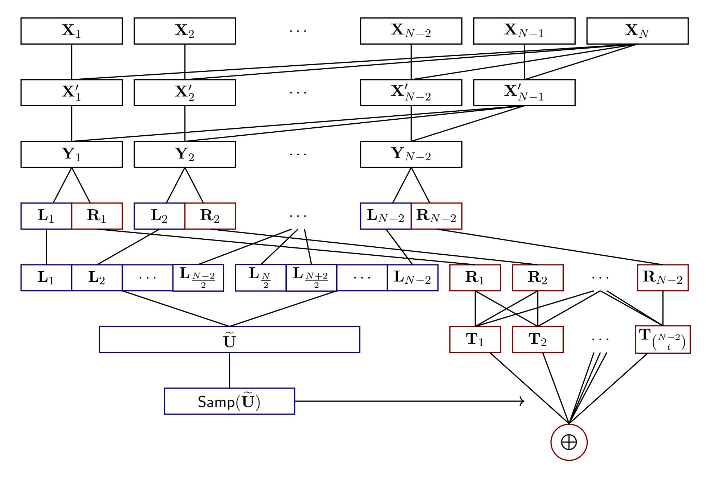

{0}------------------------------------------------

# Leakage-Resilient Extractors and Secret-Sharing against Bounded Collusion Protocols

Eshan Chattopadhyay Cornell University eshanc@cornell.edu Jesse Goodman Cornell University jpmgoodman@cs.cornell.edu

Vipul Goyal Carnegie Mellon University vipul@cmu.edu

Xin Li Johns Hopkins University lixints@cs.jhu.edu

#### **Abstract**

In a recent work, Kumar, Meka, and Sahai (FOCS 2019) introduced the notion of bounded collusion protocols (BCPs), in which N parties wish to compute some joint function  $f:(\{0,1\}^n)^N \to \{0,1\}$  using a public blackboard, but such that only p parties may collude at a time. This generalizes well studied models in multiparty communication complexity, such as the number-in-hand (NIH) and number-on-forehead (NOF) models which are just endpoints on this rich spectrum. We construct explicit hard functions against this spectrum, and achieve a tradeoff between collusion and complexity. Using this, we obtain improved leakage-resilient secret sharing schemes against bounded collusion protocols.

Our main tool in obtaining hard functions against BCPs are explicit constructions of leakage resilient extractors against BCPs for a wide range of parameters. Kumar et al. (FOCS 2019) studied such extractors and called them *cylinder intersection extractors*. In fact, such extractors directly yield correlation bounds against BCPs. We focus on the following setting: the input to the extractor consists of N independent sources of length n, and the leakage function Leak:  $(\{0,1\}^n)^N \to \{0,1\}^\mu \in \mathcal{F}$  is a BCP with some collusion bound p and leakage (output length) p. While our extractor constructions are very general, we highlight some interesting parameter settings:

- 1. In the case when the input sources are uniform, and p = 0.99N parties collude, our extractor can handle  $n^{\Omega(1)}$  bits of leakage, regardless of the dependence between N, n. The best NOF lower bound (i.e., p = N 1) on the other hand requires  $N < \log n$  even to handle 1 bit of leakage.
- 2. Next, we show that for the same setting as above, we can drop the entropy requirement to k = polylog n, while still handling polynomial leakage for p = 0.99N. This resolves an open question about cylinder intersection extractors raised by Kumar et al. (FOCS 2019), and we find an application of such low entropy extractors in a new type of secret sharing.

We also provide an explicit compiler that transforms any function with high NOF (distributional) communication complexity into a leakage-resilient extractor that can handle polylogarithmic entropy and substantially more leakage against BCPs. Thus any improvement of NOF lower bounds will immediately yield better leakage-resilient extractors.

Using our extractors against BCPs, we obtain improved N-out-of-N leakage-resilient secret sharing schemes. The previous best scheme from Kumar et al. (FOCS 2019) required share size to grow exponentially in the collusion bound, and thus cannot efficiently handle  $p = \omega(\log N)$ . Our schemes have no dependence of this form, and can thus handle collusion size p = 0.99N.

{1}------------------------------------------------

## 1 Introduction

## 1.1 Multiparty communication complexity and leakage-resilient secret sharing

Multiparty communication complexity offers an elegant and concrete framework in which to pursue lower bounds. In this model of computation, some N parties wish to collectively compute a joint function  $f:(\{0,1\}^n)^N \to \{0,1\}$ , typically using a number-in-hand (NIH) or number-on-forehead (NOF) protocol. In both models, the parties are allowed to freely communicate any plans before the protocol begins, and there is a shared blackboard on which they may communicate thereafter. In an NIH protocol, each party can see just one input, while in an NOF protocol, each party can see all but one input. Both protocols proceed in rounds, where one party may write a single bit on the blackboard, using any bits they can see. Once everyone agrees that the most recent bit on the blackboard is the solution (according to their strategy made in the planning phase), the protocol terminates. The maximum number of bits written on the blackboard, over all possible inputs, is the communication complexity of the protocol, while the minimum communication complexity over all protocols computing f is the communication complexity of f.

Multiparty communication protocols offer an attractive model in which to pursue lower bounds, as they strike a nice balance between being simple enough to reason about combinatorially, yet rich enough to capture seemingly unrelated complexity classes. For example, if we write down a boolean function  $f:(\{0,1\}^n)^N \to \{-1,1\}$  in the cells of a multi-dimensional matrix, one can lower bound its NOF communication complexity by upper bounding the discrepancy of certain well-structured subsets, called cylinder intersections - and indeed, the best known lower bounds of  $\Omega(n/2^N)$  are achieved with this method [BNS89]. Furthermore, by a well-known circuit depth reduction [Yao90, BT94] and observation by Razborov and Wigderson [RW93] about simulating such circuits with NOF protocols, it is known that significantly improving these communication lower bounds would yield a breakthrough in circuit complexity, by providing explicit lower bounds against ACC0.

Beyond their use in proving lower bounds against other models of computation, strong lower bounds against multiparty communication protocols find great applicability in settings where hardness is considered "good." In [KMS19], Kumar, Meka, and Sahai establish a close connection between functions with high NOF communication complexity, and the construction of secret sharing schemes. This cryptographic primitive captures the natural setting of a central authority who wishes to share some secret (e.g., missile launch codes) among a group of somewhat trusted individuals, so that any t of them may reconstruct the secret, but any fewer than t individuals cannot recover any information.

Kumar, Meka, and Sahai study a much stronger variant of secret sharing, known as leakage-resilient secret sharing. In addition to the above thresholding guarantees, a leakage-resilient secret sharing scheme guarantees that the secret will remain statistically hidden even against much stronger adversaries. The adversaries they consider are called bounded collusion protocols, which are parameterized by a collusion bound p and a leakage bound  $\mu$ . This class of adversaries provides a natural spectrum of communication protocols between NIH and NOF, and are defined as follows. A protocol  $f: (\{0,1\}^n)^N \to \{0,1\}^{\mu}$  is in the class BCP( $\mu$ , p) if each output bit is a function of at most p inputs and the earlier output bits. Informally, such a protocol represents p parties colluding at each of the  $\mu$  rounds to write a bit on a shared chalkboard. Thus, the case p = 1 captures NIH protocols, while p = N - 1 captures NOF protocols. (See Section 3.2 for formal definitions.)

In order to construct such leakage-resilient secret sharing schemes, [KMS19] observe that there is

{2}------------------------------------------------

a simple way to equip a standard additive secret sharing scheme with an NOF-hard function in order to create a secret sharing scheme that is leakage-resilient against the same class (NOF protocols). However, there is a catch: because the best NOF lower bounds are of the form  $\Omega(n/2^N)$ , this translate into requiring  $N = O(\log(n))$  on the secret sharing scheme in order to handle just  $\mu = 1$  bit of leakage. This is even more pernicious than it looks: because N represents the number of parties, and n the number of bits held by each party, this translates into a secret sharing scheme that requires share size, n, to grow exponentially in number of participants, N. Because efficiency in secret sharing is classified by share size growing polynomially in N, we must do much better.

Using a nice trick on reusing shares with perfect hash families, Kumar, Meka, and Sahai are able to work around this issue (and do so more efficiently than simply concatenating several smaller secret sharing schemes in parallel). However, while they remove the exponential gap between N, n, they incur an exponential gap in the collusion that can be handled, which drops from p = N - 1 to  $p = O(\log N)$ . This is again an artifact of the  $\Omega(n/2^N)$  NOF-lower bound on the function they use to construct their schemes.

A natural question is whether these schemes can be improved to handle  $p = \omega(\log N)$  collusion, perhaps by relying on NOF-hard functions in less of a black box manner. In particular, since the goal of these secret sharing schemes is to handle leakage-resilience from general bounded collusion protocols, it makes sense to instead try to directly construct hard functions against these protocols. Furthermore, by filling out the spectrum of hard functions between NIH and NOF protocols, we can better understand the complexity-collusion tradeoff as p ranges from 1 to N-1. This could provide some insight into building harder functions against NOF protocols, in an effort to unlock the applications discussed earlier.

The main focus of the paper is to do exactly this: explicitly construct hard functions against the entire spectrum of bounded collusion protocols. We find that even for p = 0.99N collusion, we are able to construct functions that have strong correlation bounds against bounded collusion protocols that output  $n^{\Omega(1)}$  bits. Thus, while the best NOF bounds can handle 1 bit of p = N - 1 collusion for  $N = O(\log n)$ , we show that just by dropping p a little, we can handle many bits of collusion and remove any restriction between N, n. Our results have corresponding consequences in leakage-resilient secret sharing, and are in fact much more general than what is stated above. In particular, we explicitly construct leakage-resilient extractors (and compilers to create such objects), which we describe next.

### 1.2 Leakage-resilient extractors

The area of randomness extraction focuses on producing high quality randomness (i.e, almost purely random bits) by purifying defective sources of randomness. This is motivated by the fact that randomness is widely used in various areas of computer science and beyond, with most applications requiring samples from a distribution that is close to uniform. However, it is often the case that easily accessible randomness (e.g., from sources in nature such as Zener diodes, atmospheric noise etc) is far from being a stream of independent, uniformly random bits, and at best contains some entropy. A second motivation for studying weak sources of randomness comes from cryptography. In particular, suppose we start out with a uniform distribution  $\mathbf{X}$  on n bits, and some adversary leaks t < n bits of information about X. The leak can be modeled as some function  $f: \{0,1\}^n \to \{0,1\}^t$  acting on  $\mathbf{X}$ , thus the conditional distribution  $\mathbf{X}|f(\mathbf{X})$  is no longer close to uniform, but intuitively still contains n-t bits of entropy in it.

We follow the standard way of measuring the quality of a weak source X using the notion of

{3}------------------------------------------------

min-entropy defined as as  $H_{\infty}(\mathbf{X}) = \min_{x} (\log(1/\Pr[\mathbf{X} = x]))$ .

We will focus on this second view of a weak source (i.e., based on leakage by adversaries), and the main object that we explicitly construct in this paper is a leakage-resilient extractor. A leakage-resilient extractor Ext against a function class  $\mathcal{F}$  is a deterministic function that, given any weak randomness, outputs bits that look uniform, even conditioned on the output of any  $f \in \mathcal{F}$  applied to the input. Formally, they are defined as follows.

**Definition 1.** Let  $\mathcal{X}$  be a family of random variables over  $\{0,1\}^n$ , and let  $\mathcal{F}$  be a family of leakage functions of the form  $f:\{0,1\}^n \to \{0,1\}^\mu$ . We say that a (deterministic) function  $\mathsf{Ext}:\{0,1\}^n \to \{0,1\}^m$  is an  $(\mathcal{X},\mathcal{F})$ -leakage-resilient extractor with error  $\epsilon$  if for every  $\mathbf{X} \in \mathcal{X}, f \in \mathcal{F}$ ,

$$|\mathsf{Ext}(\mathbf{X}) \circ f(\mathbf{X}) - \mathbf{U}_m \circ f(\mathbf{X})| \le \epsilon,$$

where  $\mathbf{U}_m$  represents a uniform random variable over  $\{0,1\}^m$  that is independent of  $f(\mathbf{X})$ .

For any nontrivial class of functions  $\mathcal{F}$  (i.e., those that include the constant functions), it turns out that an  $(\mathcal{X}, \mathcal{F})$ -leakage-resilient extractor is equivalent to a function that has correlation at most  $2\epsilon$  with any function  $f \in \mathcal{F}$ , with respect to any distribution  $\mathbf{X} \in \mathcal{X}$ . We will leverage this connection in both directions, and we will focus on setting  $\mathcal{F}$  as the class of bounded collusion protocols  $\mathsf{BCP}(\mu, p)$  which was discussed above (also see Section 3.2). Further we will focus on the setting of the class of  $\mathcal{X}$  being such that each weak source comprises of multiple independent sources. Indeed, randomness extraction from independent sources has been very well studied [SV86, CG88,BIW06,Li15,CZ19] and we view constructing leakage resilient extractors in this setting to be an interesting question on its own right. We note that the study of leakage resilient extractors in this particular setting was initiated by Kumar et al. [KMS19], and they called such leakage resilient extractors as cylindrical intersection extractors.

Using the above connection to correlation bounds, we see that a leakage-resilient extractor against BCP( $\mu, N-1$ ) for uniform sources with error  $\epsilon$  is exactly a function with  $\epsilon$ -distributional (NOF) communication complexity of  $> \mu$ . Before this work, it was known how to construct hard functions against BCP( $\mu, p$ ) for p = N-1 and  $\mu = \Omega(n/2^N)$ , or for p = 1 and  $\mu = \Omega(Nn)$ . However, constructing hard functions against this entire spectrum of communication protocols has not been done, and thus the complexity-collusion tradeoff between  $\mu, p$  has not been explored. This is the main contribution of our paper, and we find that, for example, even if we just drop p to p = 0.99N, we can construct functions with strong correlation bounds against  $\mu = n^{\Omega(1)}$ .

### 1.3 Summary of our results

<span id="page-3-0"></span>Our first main result is a leakage-resilient extractor for uniform sources that establishes strong correlation bounds against the entire spectrum of  $BCP(\mu, p)$ .

**Theorem 1.** For all sufficiently large  $N, n \in \mathbb{N}$  and any  $p \leq N-1$ , there exists an explicit leakage-resilient extractor against  $\mathsf{BCP}(\mu, p)$  for min-entropy k = n and leakage  $\mu < \xi$ , with output length  $m \leq \xi$  and error  $\epsilon = 2^{-\xi}$ , where

$$\xi = \Omega\left(n^{\frac{\log(N/p)}{\log(N/p)+1}}\right).$$

Perhaps the most interesting setting of this result is when the collusion is set to p = 0.99N. Here, our extractors offer exponentially small correlation against  $n^{\Omega(1)}$  bits of leakage, while outputting

{4}------------------------------------------------

 $n^{\Omega(1)}$  bits, and having no restriction between N and n. This should be compared with classic NOF bounds against p = N - 1, which cannot tolerate a single bit of leakage when  $N \ge \log n$ . Next, we show that we can effectively maintain these results in the low min-entropy setting.

<span id="page-4-0"></span>**Theorem 2.** There is a universal constant C such that for all sufficiently large  $N, n \in \mathbb{N}$  and any  $p \leq N-2$ , there exists an explicit leakage-resilient extractor against  $\mathsf{BCP}(\mu,p)$  for min-entropy  $k = \log^C n$  and leakage  $\mu < \xi$ , with output length  $m \leq \xi$  and error  $\epsilon = 2^{-\xi}$ , where

$$\xi = k^{\Omega\left(\frac{\log((N-1)/p)}{\log((N-1)/p)+1}\right)}.$$

This extractor again has exponentially small correlation against a polynomial amount of leakage with collusion p = 0.99N, but it now works even given sources with min-entropy just  $k = \log^C n$ . This answers an open question of [KMS19], where it was asked to construct an object even for just p = 2 and k = 0.01n.

The main ideas behind the construction of our explicit extractors actually arise from a more general explicit object that we construct, which can transform any function with high distributional NOF communication complexity into a low-entropy leakage resilient extractor that achieves a collusion-complexity tradeoff against BCP. This explicit compiler, when instantiated with the best NOF-hard functions, not only creates extractors like the ones above, but is guaranteed to obtain improved leakage-resilient extractors against BCP as NOF bounds are strengthened over time. These general theorems offer an avenue for reducing the 1 in the denominator of the theorems above to o(1), which would allow for p = N(1 - o(1)) collusion while still handling  $k^{\Omega(1)}$  leakage. Below, we record one interesting specialization of our much more general theorems (Theorems 9 and 10), which work for any NOF-hard function and appear in Section 6.

**Theorem 3.** Let C be a sufficiently large universal constant, and suppose there exists an explicit function  $f_0: (\{0,1\}^{n_0})^{N_0} \to \{0,1\}$  with  $\epsilon_0$ -distributional communication complexity  $\mu_0 = \Omega(n/N^C)$ , where  $\epsilon_0 = 2^{-\mu_0}$ . Then for all sufficiently large  $N, n \in \mathbb{N}$  and any  $p \in \mathbb{N}$  such that  $0.01N \le p \le N-3$ , there exists an explicit leakage-resilient extractor  $\text{Ext}: (\{0,1\}^n)^N \to \{0,1\}$  against  $\text{BCP}(\mu,p)$  for entropy  $k \ge \log^C n$  and leakage  $\mu \le \xi$ , with error  $\epsilon = 2^{-\xi}$ , where

$$\xi = k^{\Omega\left(\frac{\log((N-2)/p)}{\log((N-2)/p) + \log\log k/\log k}\right)}.$$

As an application of our leakage-resilient extractors, we immediately obtain (using standard techniques) much improved leakage-resilient secret sharing schemes. We prove the following theorem.

**Theorem 4.** There exists an N-out-of-N secret sharing scheme (Share, Rec), of the form Share:  $\{0,1\}^m \to (\{0,1\}^n)^N$ , Rec:  $(\{0,1\}^n)^N \to \{0,1\}^m$ , that shares secrets of length m into N shares of length n that is leakage-resilient against BCP $(\mu,p)$  with error  $\epsilon$ . The shares have length

$$n = O\left(\left(m + \mu + \log(1/\epsilon)\right)^{\frac{\log(N/p) + 1}{\log(N/p)}}\right),\,$$

and the scheme runs in time poly(N, n).

The most interesting setting of the leakage-resilient secret sharing scheme is again when p = 0.99N. In this case, our scheme can efficiently tolerate up 0.99N parties colluding, as the share

{5}------------------------------------------------

size remains polynomial in m, µ, log(1/ǫ), and in fact becomes independent of N. This offers an exponential improvement over the previous best scheme from [\[KMS19\]](#page-49-1), which could only handle p = O(log n) parties colluding.

Finally, in [Section 8,](#page-42-0) we show that our low-entropy leakage-resilient extractor finds a natural application in a new variant of secret sharing (called seeded secret sharing), in which the participating parties are able to use some existing stored information on their device to make the scheme much more efficient. Informally, we obtain the following theorem (it appears formally as [Theorem 14\)](#page-47-0).

Theorem 5. Suppose there exist N parties, each holding some old data, represented as a random variable X<sup>i</sup> over {0, 1} n . Then as long as the min-entropy in each party's old data is at least

$$k \ge \max \left\{ \operatorname{polylog} n, (m + \mu + \log(1/\epsilon))^{O\left(\frac{\log((N-1)/p)+1}{\log((N-1)/p)}\right)} \right\},$$

there is a way to create an efficient N-out-of-N secret sharing scheme that is leakage-resilient against BCP(µ, p) with error ǫ, and which shares secrets of length m, just by asking each party to append m bits to their old data.

Last, we note that in our general theorems proved throughout the paper, we actually have an extra parameter ν denoting the number of bits leaked during each of the µ rounds. Above and in the literature, ν is taken to be 1. In most of our theorems, we can actually take as many as ν = n 0.99 bits to be leaked each round, while still handling the same number of rounds (asymptotically), µ.

## 1.4 Relevant prior work

Leakage resilient secret sharing (LRSS) as studied in this work was first introduced by Goyal and Kumar [\[GK18\]](#page-49-4), and, independently by Benhamouda et al [\[BDIR18\]](#page-48-5). Goyal and Kumar [\[GK18\]](#page-49-4) constructed a 2-out-of-n leakage resilient secret sharing scheme in the individual leakage model. While not explicitly noted in the paper, their proof shows that their non-malleable secret sharing scheme is also leakage resilient giving a construction of a t-out-of-n leakage resilient secret sharing scheme. Benhamouda et al [\[BDIR18\]](#page-48-5) were interested in studying the leakage-resilience of existing secret sharing schemes. Inspired by the results of Guruswami and Wootters [\[GW16\]](#page-49-5), they investigated the leakage resilience of Shamir secret sharing over larger characteristic fields. They showed that, for large enough fields and large enough n, Shamir secret sharing scheme is leakage-resilient (with leakage-resilience rate close to 1/4) as long as the threshold t is large.

A Subsequent work by Srinivasan and Vasudevan [\[SV19\]](#page-49-6) focused on building LRSS with high rate while still remaining in the individual leakage model. They built high rate compilers to convert any secret sharing in to a leakage-resilient one. In another work, Aggarwal et al. [\[ADN](#page-48-6)+19] construct leakage-resilient secret sharing schemes for any access structure from any secret sharing scheme for that access structure again in the individual leakage model. Subsequently, Nielsen and Simkin [\[NS19\]](#page-49-7) showed lower bounds on the share size of information theoretically secure LRSS under certain conditions.

Earlier works which studied leakage resilience in the context of secret sharing include the work of Boyle et al. [\[BGK14\]](#page-48-7) who construct leakage-resilient verifiable secret sharing schemes where the sharing and reconstruction are performed by interactive protocols. In a beautiful work, Dziembowski and Pietrzak [\[DP07\]](#page-48-8) construct secret sharing schemes (called intrusion resilient) that are

{6}------------------------------------------------

resilient to adaptive leakage where the adversary is allowed to iteratively ask for leakage from different shares. However their reconstruction procedure is interactive and requires as many rounds of interaction as the adaptivity of the leakage tolerated.

Beyond secret sharing, a number of beautiful works have studied the leakage resilience of other primitives in cryptography such as signatures, encryption, zero-knowledge and secure multi-party computation. See a recent survey by Kalai and Reyzin [\[KR19\]](#page-49-8).

Organization We begin with an overview of our constructions in [Section 2.](#page-6-0) Then, after introducing some technical preliminaries in [Section 3,](#page-16-1) we proceed to [Section 4,](#page-19-0) where we construct the first stage of our compiler, in which we adapt a function with high NOF communication complexity into a leakage-resilient extractor that can handle more leakage when there is less collusion. In [Section 5,](#page-23-0) we build the second stage of our compiler, which further improves the previous construction by dropping its entropy requirement from k = n to k = log<sup>C</sup> n. Then, in [Section 6,](#page-29-0) we give an argument for why our compiler can actually handle adaptive adversaries, and we present the main theorems about our compiler. After completing our compiler, we move on to [Section 7,](#page-33-0) where we give a much simpler (but not generalizable) self-contained construction of our best leakage-resilient extractor against BCPs. Finally, in [Section 8](#page-42-0) we show how our leakage-resilient extractors give much improved leakage-resilient secret-sharing schemes, and we introduce a new type of secret sharing made possible by our low-entropy leakage-resilient extractor.

# <span id="page-6-0"></span>2 Overview of our constructions

The main goal of this paper is to construct leakage-resilient extractors against bounded collusion protocols. Almost by definition, a function that has ǫ-distributional (NOF) communication complexity of µ is a leakage-resilient extractor against BCP(µ ′ , p) for entropy k = n and error ǫ, as long as µ ′ ≤ µ and p ≤ N − 1. There are two parameters here that we would like to improve:

- 1. Even though an NOF-hard function can handle any collusion bound from p = 1 to p = N −1, it is not clear how the amount of leakage µ it can handle (i.e., its communication complexity) is related to the collusion bound p on the protocol being used against it. Thus, given that an NOF-hard is engineered to handle p = N − 1 collusion, its general restriction on µ is much too strong for when p is small. Intuitively, it should be easier to handle larger µ when p is smaller, and thus we would like to explore this collusion-complexity tradeoff by constructing hard functions against BCP that establish such a relationship.
- 2. At face value, an NOF-hard function only gives a leakage-resilient extractor for uniform sources (k = n), which means that in the traditional sense, one might hesitate to even call such a function an extractor. While it is not too difficult to see that an NOF-hard function can actually handle a little missing entropy by treating it as leakage (see [Lemma 15\)](#page-38-0), this approach does not offer any hope for achieving k = o(n). Besides being a natural question, significantly reducing this entropy requirement was raised as an open problem in [\[KMS19\]](#page-49-1), and further, we show that low-entropy leakage-resilient extractors enable much more efficient leakage-resilient secret sharing schemes in settings when shares are stored on devices that are already storing some unpredictable data (see [Section 8\)](#page-42-0).

Our main result is the explicit construction of a compiler that can take in any NOF-hard function as input and output a leakage-resilient extractor satisfying the above two properties: i.e., (1) it 

{7}------------------------------------------------

is hard against the entire spectrum of bounded collusion protocols, with increasing hardness as collusion decreases; and (2) it can handle polylogarithmic entropy.

In what follows, we start by outlining our compiler. First, we describe how to build upon an NOF-hard function so that it can handle more leakage when there is less collusion (while still requiring k = n). Then, we show that by building upon this construction even further, we can drop the entropy requirement from k = n to  $k = \log^C n$ . While these initial constructions work for nonadaptive protocols, this is indeed part of the plan: initially requiring a non-adaptive leakage adversary gives us much stronger control over its behavior, and we show that in fact, any leakage-resilient extractor against such non-adaptive protocols also works for all adaptive protocols (up to some factor in the error, which is small enough in most instantiations to disappear in the already-present asymptotic notation).

After constructing our compiler, we may instantiate it with a simple NOF-hard functions that exhibit lower bounds of  $\Omega(n/2^N)$  against this regime (i.e., matching the best known). Interestingly, it turns out that for one specific function (finite field multiplication, whose lower bounds were proved in [FG13]), there is a simple modification that turns it into a leakage-resilient extractor with even slightly better parameters than those obtained by plugging it into our compiler in a black box manner. The proof is similar to that of our compiler, but is in fact much simpler, as some of the features that needed to be built onto our compiler appear to be directly baked into the finite field multiplication function. It appears, self-contained, in Section 7. Thus, while the best explicit leakage-resilient extractors that we report are from this simpler proof, we emphasize that our compiler is future-proof, in the sense that given any improvement to existing NOF lower bounds, the compiler explicitly produces even better leakage-resilient extractors which cannot be obtained by way of the simpler method.

Finally, using a known connection between leakage-resilient secret sharing and hard functions against communication protocols, we show how to use our leakage-resilient extractors to obtain much improved leakage-resilient secret sharing schemes against bounded collusion protocols. We also show that since our extractors can handle low entropy, they offer much more efficient secret sharing schemes in at least one new, natural setting.

### 2.1 Handling more leakage when there is less collusion

In order to build a compiler that transforms NOF-hard functions into good leakage-resilient extractors, the first step is to figure out how we can build upon such functions in order to spread their hardness more evenly across the collusion spectrum p = 1, ..., N-1. In particular, we want the function to get harder as p decreases. Let us start by formalizing the setting a little. We are given as input a function hard:  $(\{0,1\}^n)^N \to \{0,1\}^m$  (usually m = 1) that has  $\epsilon$ -distributional communication complexity of  $> \mu_0$  against all NOF protocols. Equivalently, such a function has the following property, for any Leak:  $(\{0,1\}^n)^N \to \{0,1\}^\mu \in \mathsf{BCP}(\mu_0, N-1)$ :

$$|\mathsf{hard}(\mathbf{U}_{Nn}) \circ \mathsf{Leak}(\mathbf{U}_{Nn}) - \mathbf{U}_m \circ \mathsf{Leak}(\mathbf{U}_{Nn})| \leq \epsilon,$$

and thus hard is a leakage-resilient extractor against  $\mathsf{BCP}(\mu_0, N-1)$  for entropy k, with error  $\epsilon$ . Given this definition alone, it is not clear at all how to go about constructing an object  $\mathsf{Ext}$ :  $(\{0,1\}^n)^N \to \{0,1\}^m$  from hard that is leakage-resilient against  $\mathsf{BCP}(\mu,p)$  for general p, where  $\mu$  is approximately  $\mu_0$  for p=N-1, but is ideally much larger when p is smaller. Indeed, the class  $\mathsf{BCP}$  seems rather complex: in any given round, the colluding party of p individuals can decide

{8}------------------------------------------------

what leakage function they will apply to their collectively held inputs by looking at the bits that have been leaked thus far. Even worse, the membership of the colluding party can depend on the bits that have been leaked thus far. Thus, given two different inputs and any given round i, the individuals colluding during this round may be different according to the different inputs.

Perhaps the situation will become simpler if we consider non-adaptive collusion protocols, appropriately represented by the class name  $\mathsf{nBCP}(\mu, p)$ . Luckily, we will see in a few subsections that in fact, constructing leakage-resilient extractors in the non-adaptive setting automatically gives leakage-resilient extractors for the adaptive setting (modulo some blow up in error that can usually be dismissed). Thus, we take this approach. In order to appreciate the simplicity of  $\mathsf{nBCP}$ , one may visualize any function  $\mathsf{Leak}: (\{0,1\}^n)^N \to \{0,1\}^\mu \in \mathsf{nBCP}(\mu,p)$  as a bipartite graph with N nodes on the left and  $\mu$  nodes on the right, such that each right node has degree p. Here, the left nodes represent the N inputs to  $\mathsf{Leak}$ , and each right node represents one output bit of  $\mathsf{Leak}$ . This visualization will be useful in all of our constructions.

Recall that we want to use hard to construct a leakage-resilient extractor with a good tradeoff between  $\mu$  and p. To get an understanding for how smaller p may allow for larger leakage  $\mu$ , let us try, as a first step, to construct a basic leakage-resilient extractor from scratch that exhibits this tradeoff in some form. First, consider the case where p=1, where the bipartite graph described above has right-degree 1. A natural approach for constructing a leakage-resilient extractor in this case is to simply apply a standard low-entropy two-source extractor  $\operatorname{Ext}:(\{0,1\}^n)^2 \to \{0,1\}^m$  on two of the inputs. In order to show the leakage-resilience of  $\operatorname{Ext}$  against Leak, we must show that given a function  $\operatorname{Ext}':(\{0,1\}^n)^N \to \{0,1\}^m$  defined as applying  $\operatorname{Ext}$  on its first two inputs, the following holds:

$$|\mathsf{Ext}'(\mathbf{U}_{Nn}) \circ \mathsf{Leak}(\mathbf{U}_{Nn}) - \mathbf{U}_m \circ \mathsf{Leak}(\mathbf{U}_{Nn})| \le \epsilon.$$

Because Ext is an extractor, it will output uniform bits (especially since it is given uniform bits as input). However, we want Ext to output uniform bits even conditioned on the output of Leak. Equivalently, we want to fix the bits outputted by Leak one-by-one and ensure that the uniformity of Ext's output is not destroyed. In this case, this is not difficult: a standard lemma says that given any random variables  $\mathbf{X}, \mathbf{Y}$ , fixing  $\mathbf{Y}$  reduces the entropy of  $\mathbf{X}$  by approximately  $|\mathbf{Y}|$  bits, with high probability. Thus, even if  $\mu = 0.99n$ , we may safely fix each bit one by one and ensure that the entropy of each source inputted to remains on the order of  $\Omega(n)$ . Most importantly, because p = 1, no output bit depended on both the sources inputted to Ext, and thus they remain independent, and the extractor succeeds in outputting uniform bits, even after all the fixings.

Does this argument work for larger p? Yes, to some degree. The key property used above to ensure correctness was that Ext was called on two sources over which no output bit jointly depends. Notice that even if p > 1, and  $\mu$  is not too large, then there will be some pairs of inputs among the N inputs over which no output bit jointly depends. Visualizing the bipartite graph from earlier, this means that there are some pairs of nodes on the left that do not appear together in the neighborhood of any node on the right. Notice that there will be one such pair of nodes as long as  $\mu\binom{p}{2} < \binom{N}{2}$ , because any of the  $\mu$  nodes on the right can have at most  $\binom{p}{2}$  pairs of vertices together in its neighborhood.

Now that we know that if  $\mu\binom{p}{2} < \binom{N}{2}$ , there exists some pair of sources over which calling Ext would have allowed for leakage-resilience against a specific leak, how do we choose which sources we should call Ext on? The answer is to call Ext on *all pairs* of sources and XOR the results, and treat any bad call to Ext (over sources involved in some joint leakage) as leakage itself. In particular,

{9}------------------------------------------------

given N uniform sources  $\mathbf{X} = (\mathbf{X}_1, \dots, \mathbf{X}_N)$ , we may prove

$$|\mathsf{Ext}'(\mathbf{X}) \circ \mathsf{Leak}(\mathbf{X}) - \mathbf{U}_m \circ \mathsf{Leak}(\mathbf{X})| = |(\oplus_{i \neq j \in [N]} \mathsf{Ext}(\mathbf{X}_i, \mathbf{X}_j)) \circ \mathsf{Leak}(\mathbf{X}) - \mathbf{U}_m \circ \mathsf{Leak}(\mathbf{X})| \leq \epsilon.$$

as follows. Let  $i^* \neq j^* \in [N]$  denote the source indices not involved in joint leakage, fix every other source, and fix every output bit of Leak and every call  $\operatorname{Ext}(\mathbf{X}_i,\mathbf{X}_j)$  where  $\{i,j\} \neq \{i^*,j^*\}$ . By using the entropy lemma from before, we know the fixings of Leak will drop the entropy of each of  $\mathbf{X}_{i^*}, \mathbf{X}_{j^*}$  by at most  $\mu$  bits, and if we are clever enough to fix the XOR of all calls involving  $\mathbf{X}_{i^*}$  at once (and the same for  $\mathbf{X}_{j^*}$ ), this further drops the entropy of each of  $\mathbf{X}_{i^*}, \mathbf{X}_{j^*}$  by at most m, the output length of Ext. Furthermore,  $\mathbf{X}_{i^*}, \mathbf{X}_{j^*}$  remain independent, as no leak (from Leak or from the Ext calls we fixed) depended on both of them. Thus the output of Ext' remains uniform even after all these conditionings, and so we see that it is a leakage-resilient extractor against  $\operatorname{nBCP}(\mu, p)$  so long as the entropy requirement, k, of Ext satisfies  $k \leq n - \mu - m$ , or rather  $\mu \leq n - k - m$ . Combining this with our earlier requirement  $\mu\binom{p}{2} < \binom{N}{2}$ , we see that the extractor works in general as long as  $\mu < \min\{n - k - m, \binom{N}{2}/\binom{p}{2}\}$  which is about  $\mu < \min\{n - k, (N/p)^2\}$  when we only care about our extractor outputting 1 bit.

Given the basic construction above, we have successfully constructed leakage-resilient extractors against  $\mathsf{nBCP}(\mu, p)$  that exhibits some tradeoff between  $\mu, p$ . However, this tradeoff is not so good: if either N = O(1) or  $p = \Omega(N)$ , then we can only tolerate a constant number of leaked bits. It would be nice if we could get rid of this issue while maintaining the same general idea, perhaps by using a more powerful object than a two-source extractor.

This is where our compiler begins. If we instead instantiate the above construction with an NOF-hard function hard that is leakage-resilient against  $\mathsf{nBCP}(\mu_0, N-1)$  for full entropy with error  $\epsilon_0$ , what do the above ideas give us? First, we must specify that instead of applying hard over all pairs of sources, we will be applying it over all t-tuples of sources, for some t to be decided later. Now hard has the form hard:  $(\{0,1\}^n)^t \to \{0,1\}^m$ , and we define our leakage-resilient extractor as the following function, defined over all  $X = (X_1, \ldots, X_N) \in (\{0,1\}^n)^N$ 

$$\operatorname{Ext}'(X) := \bigoplus_{S \in \binom{[N]}{t}} \operatorname{hard}(X_S),$$

where  $X_S$  represents  $(X_i)_{i \in S}$ . Notice that hard is indeed an extractor, as otherwise it would have strong correlation with some constant NOF protocol. We want to know, however, for what class  $\mathsf{BCP}(\mu, p)$  is  $\mathsf{Ext}'$  leakage-resilient against? Let us consider some  $\mathsf{Leak} : (\{0,1\}^n)^N \to \{0,1\}^\mu$  and try to understand when  $|\mathsf{Ext}'(\mathbf{U}_{Nn}) \circ \mathsf{Leak}(\mathbf{U}_{Nn}) - \mathbf{U}_m \circ \mathsf{Leak}(\mathbf{U}_{Nn})| \le \epsilon$  holds. Using the same ideas as before, we can show this holds if  $\mathsf{Ext}'(\mathbf{U}_{Nn})$  is still  $\epsilon$ -close to  $\mathbf{U}_m$ , even after a series of fixings that fully fix  $\mathsf{Leak}(\mathbf{U}_{Nn})$ .

Notice that since hard is leakage-resilient against  $\mathsf{nBCP}_{t,n}(\mu_0, t-1)$ , if Ext' makes some call to hard over t sources, say  $\mathbf{X}_1, \dots, \mathbf{X}_t$ , that are not all together involved in some joint leak (i.e., not fully contained in some neighborhood of a right vertex in the bipartite graph), then after fixing all other sources, the output of this call to hard will look uniform even after fixing all bits of leakage, so long as there are not too many. We call such a call a special call on a special t-tuple. Furthermore, because every other call to hard shares at most t-1 sources with the special call, these may also be fixed without ruining the output of the special call to hard, by being treated as NOF leakage against this call (again, it makes sense to fix the XOR of all non-special hard calls that do not include  $\mathbf{X}_1$  at once; the same goes for  $\mathbf{X}_2$  through  $\mathbf{X}_t$ ).

{10}------------------------------------------------

Notice that above, we have fixed  $\mu+mt$  bits total, and so as long as hard is leakage-resilient against  $\mathsf{nBCP}(\mu_0,t-1)$  for  $\mu_0>\mu+mt$ ,  $\mathsf{Ext}'$  will be leakage-resilient against  $\mathsf{nBCP}(\mu,p)$ . Furthermore, since each leaked bit can depend on p sources, the "dependency neighborhood" of this bit can depend on at most  $\binom{p}{t}$  distinct t-tuples, and thus a special call to hard is guaranteed as long as  $\mu\binom{p}{t}<\binom{N}{t}$ . Thus, if we set  $\mathsf{Ext}'$  to output just 1 bit, we see that it is leakage-resilient against  $\mathsf{nBCP}(\mu,p)$  roughly as long as  $\mu<\min\{\mu_0(t,n)-t,(N/p)^t\}$ , with error roughly equal to that of hard. The parameter  $\mu_0(t,n)$  is the number of bits of NOF leakage hard can handle; the current best known NOF-hard functions yield  $\mu_0(t,n)=\Omega(n/2^t)$ .

Notice that even for constant t, the above bound is strictly better than the first construction from two-source extractors (ignoring constant factors). However, one might have noticed that in order to keep the above construct explicit in N, n, the parameter t must be a constant, since we call the subroutine 2Ext over all t-tuples, of which there are roughly  $N^t$ . Thus, we again run into the problem of not being able to handle more than a constant number of leaked bits when N = O(1) or  $p = \Omega(N)$ . To get rid of this annoying restriction, we need a way to allow  $t = \omega(1)$ .

In fact, there is a relatively straightforward way to adapt the above construction so that it remains explicit for arbitrarily large (nonconstant) t. The trick is to use a sampler. In particular, recall that our sources started off uniform, and thus we have a lot of available uniform randomness that can be used for  $sampling\ t$ -tuples over which to call the subroutine hard, instead of just applying hard to all possible t-tuples. The sampling procedure will works as follows. First, we will split each source in half. The first half will be used to sample t-tuples of sources, and the same extractor from before will be applied over the  $second\ halves$  of t-tuples sampled using the first half. The sampler thus has Nn/2 uniform bits at its disposal, and thus for any  $t \in [N]$ , even a naive sampler can efficiently produce  $\Omega(n)$  samples of t-tuples.

Assume for now that with probability 1, the sampler succeeds at selecting a special t-tuple. Then with probability 1 over fixing the uniform bits used to sample, our analysis is reduced exactly to that of the earlier version of this construction (without the sampler), since it is not difficult to show that the class nBCP is closed under restrictions. Notice, however, that there are  $\binom{N}{t} - \mu\binom{p}{t}$  special t-tuples, and thus the probability of any given sample selecting a special t-tuple is  $\binom{N}{t} - \mu\binom{p}{t} / \binom{N}{t}$ . Thus, if we slightly strengthen our earlier restriction for guaranteeing the existence of one special t-tuple,  $\mu\binom{p}{t} < \binom{N}{t}$ , to a restriction that guarantees the existence of a constant fraction of special t-tuples,  $\mu\binom{p}{t} < 0.5\binom{N}{t}$ , the probability that sampler fails to select a good t-tuple decays exponentially in the number of samples, which is  $\Omega(n)$ .

Thus, using a sampler, we see that our new extractor is leakage-resilient against  $\mathsf{nBCP}(\mu, p)$  as long as  $\mu < \min\{\mu_0(t,n) - t, (N/p)^t\}$ , with error about  $\epsilon = \epsilon_0(t,n) + 2^{-\Omega(n)}$ , where  $t \in [N]$  can be any function of N, n. Thus, whereas before we could not handle  $\omega(1)$  bits of leakage when N = O(1) or  $p = \Omega(N)$ , we can now do so for any N, even when p = 0.99N. Given existing NOF-hard functions,  $\mu_0(t,n) = \Omega(n/2^t)$ , and the best setting of t roughly yields the restriction of  $\mu < \Omega(n^{\frac{\log(N/p)}{\log(N/p)+1}})$ , which means we can handle both a collusion bound up to p = 0.99N and  $n^{\Omega(1)}$  bits of leakage. Significant improvements in NOF lower bounds would improve this result by reducing the size of the constant 1 in the denominator of the exponent to o(1), which is especially significant for the regime  $p \geq N \cdot (1 - o(1))$ .

Thus, this construction provides a nice tradeoff between how much leakage  $\mu$  can be handled and how much collusion p can be handled, assuming that the given sources are uniform. This is a strong assumption, however, and in the next section we show how to remove it by reducing the entropy requirement from k = n to  $k = \log^C n$ .

{11}------------------------------------------------

#### 2.2 Reducing the entropy requirement

A natural first step - and, as it turns out, hardest step - in reducing the entropy requirement of our previous construction is to ask whether it can be easily adapted to handle even just a little missing entropy, say k = 0.99n or even k = n(1 - o(1)). At first glance, this may seem easy - indeed, it is not difficult to show that given an NOF-hard function hard for uniform sources, it can actually handle a little missing entropy by treating it as leakage. Thus, our first construction in the previous section that uses hard without the sampler (and requires t = O(1)) already works for a little missing entropy. However, when we try to adapt the version with the sampler to handle less-than-uniform sources, we run into trouble.

In particular, notice that our sampler required very heavily on using uniform bits to sample the t-tuples, in the hope of finding a special t-tuple. If we do not guarantee that the sampler receives uniform bits when it creates samples, we cannot guarantee that the probability of sampling a special t-tuple remains  $\binom{N}{t} - \mu\binom{p}{t} / \binom{N}{t}$ . Thus, we must find a way to create uniform bits for the sampler in order to fix this construction to work with less-than-uniform entropy.

A natural idea is to apply a classical extractor over the bits (from the left halves of the sources, say by grouping them into two blocks and applying a two-source extractor) before using them to sample t-tuples from the right halves of the sources. Indeed, it will be the case that with very high probability over fixing the left halves of each source, the sampler will now select a special t-tuple with the claimed probability (which is  $\Omega(1)$ , given our restriction  $\mu\binom{p}{t} < \binom{N}{t}$ ). However, now there is another problem: recall that our previous analysis in the uniform setting relied on reducing the analysis of the sampling version of the extractor to the brute force "select-all-t-tuple" version of the extractor. This cannot be done here, because now if we fix the left half of a source (to obtain a sample), there is some (very small) chance that all of the entropy in the source is destroyed. Usually this is no problem, but because we are using the left halves of the sources to do the sampling in the first place, there is no clear way to guarantee that the sampler is not just selecting special t-tuples whose entropy it has destroyed. So we need another idea.

Another natural idea is to ditch the technique of splitting the sources in half and using the left halves for sampling, and instead dedicate a few sources in their entirety to help sample t-tuples from the remaining sources. This will indeed avoid the problem with the previous idea. However, there are two problems here. First, notice that the number of sources, q, you dedicate to sampling must be large enough to produce at least  $\Omega(n)$  samples of t-tuples. The t-tuples are over [N], and thus it is required here that  $q \geq \log \binom{N}{t}$ . If we remove more than a few sources for sampling, however, we run into the following detrimental effect. Previously, the restriction  $\mu\binom{p}{t} < 0.5\binom{N}{t}$  sufficed for ensuring that each sample is a special t-tuple with probability  $\Omega(1)$ . In order to keep this guarantee when removing q sources for sampling, we must replace the restriction with something like  $\mu\binom{p}{t} < 0.5\binom{N-q}{t}$ . This forbids p from exceeding N-q, which be variously damaging depending on the relationship between N and n. We'd like to avoid this.

The solution is preprocess all of the sources by trying to make each one close to uniform before applying the final extractor of the previous subsection. In order to do this, we make use of a strong two source extractor (for high entropy) 2Ext, which has the guarantee that given two independent sources  $\mathbf{X}_1, \mathbf{X}_2$ , each with entropy rate > 0.6, the output  $2\mathsf{Ext}(\mathbf{X}_1, \mathbf{X}_2)$  is very close to uniform, even conditioned on  $\mathbf{X}_1$ , with high probability (say, with probability  $1 - \epsilon_{2\mathsf{Ext}}$ ). The strength of this object will allow us to sacrifice just one source in the preprocessing step, and barely tighten our restriction to  $\mu\binom{p}{t} < \binom{N-1}{t}$ . It works as follows.

Given high entropy sources  $\mathbf{X}_1, \dots, \mathbf{X}_N$ , our leakage resilient extractor will create random vari-

{12}------------------------------------------------

ables  $\mathbf{Y}_1, \ldots, \mathbf{Y}_{N-1}$  by setting  $\mathbf{Y}_i := 2\mathsf{Ext}(\mathbf{X}_i, \mathbf{X}_N)$ , and then apply the final extractor from the last subsection to these N-1 random variables. Upon fixing  $\mathbf{X}_N$ , the collection  $\{\mathbf{Y}_i\}_{i\in[N-1]}$  become mutually independent, and any given  $\mathbf{Y}_i$  becomes close to uniform with probability  $1-\epsilon_{2\mathsf{Ext}}$ . Thus by a union bound, they are all close to uniform with probability  $1-\epsilon_{2\mathsf{Ext}} \cdot (N-1)$ . If we are content with this sort of error, then this will all work out. However, we should not be content:  $\epsilon_{2\mathsf{Ext}}$  is a function of n, and so multiplying this error by N creates a total error that is a function of both N and n, which would yield new restrictions between N, n.

Thus, requiring that all sources become close-to-uniform after fixing  $\mathbf{X}_N$  is too strong if we want to keep error low. Instead, we observe that by a Markov argument, we can guarantee some unknown 99% of the random variables  $\{\mathbf{Y}_i\}_{i\in[N-1]}$  become uniform over fixing  $\mathbf{X}_N$ , with error probability just  $O(\epsilon_{2\mathsf{Ext}})$ . This is great and we have removed the factor of N from the error, but now we have a few new small wrinkles we need to iron out.

First, the sampler is no longer receiving uniform bits to do its job, since it is using the left half of every source  $\{\mathbf{Y}_i\}_{i\in[N-1]}$ , and we don't know which  $\mathbf{Y}_i$  will be close-to-uniform after fixing  $\mathbf{X}_N$ , just that some 99% of them will. Thus, we need to find a way to harvest uniform bits for the sampler once again. Luckily, however, this is no longer so difficult. If we attempt to use our first strawman technique of applying a classic extractor to the left halves of the sources before feeding them into the sampler, it now works. This is because the sources we are using now are the left halves of  $\{\mathbf{Y}_i\}_{i\in[N-1]}$ , which are close to uniform. Thus, upon fixing all the left halves of  $\{\mathbf{Y}_i\}_{i\in[N-1]}$  to obtain our samples, we are now guaranteed that for every such fixing, the right halves still look close to uniform (of those that were originally close to uniform). Thus, we no longer have a self-sabotaging sampler.

The next small issue is that even though the above discussion now guarantees our sampler will, with error probability at most  $2^{-\Omega(n)}$ , sample a special t-tuple, some special t-tuples may now contain sources that did not become uniform after fixing  $\mathbf{X}_N$  in the two-source extractor calls from the very beginning. Indeed, we guaranteed that only 99% of all sources  $\{\mathbf{Y}_i\}_{i\in[N-1]}$  would look uniform after this fixing, and the subroutine NOF-hard function hard that we are calling over t-tuples requires each input to have very high entropy in order to work. We can fix this problem by using another Markov argument to show that upon fixing 2Ext, it is actually the case that with error probability at most  $O(t\epsilon_{2\text{Ext}})$ , 99% of all t-tuples of sources  $\{\mathbf{Y}_i\}_{i\in[N-1]}$  will look uniform. We notice that a factor of t is incurred in the error, and we remark that this is no big deal. Even though we put in so much effort to avoid a factor of N in the error, note that this factor of t will not introduce any new major restrictions between N, n, because even without it, the error of the entire extractor comes from the error of the one special hard call, which is a function of (t, n) (and indeed we may set t as small as we like).

Now that we know 99% of all t-tuples of  $\{\mathbf{Y}_i\}_{i\in[N-1]}$  are close to uniform, and 50% of all t-tuples are special (by the restriction  $\mu\binom{p}{t} < \binom{N}{t}$ ), we can once again guarantee that the sampler will select a special t-tuple that contains only close-to-uniform sources with probability  $\Omega(1)$  per sample, and thus the sampler once again succeeds overall with probability  $2^{-\Omega(n)}$ . We briefly note that even though the leakage functions are applied to the original sources  $\{\mathbf{X}_i\}_{i\in[N]}$ , we can fix any extra randomness left in these sources in order to make the leakage functions deterministic functions of the same type on  $\{\mathbf{Y}_i\}_{i\in[N-1]}$ , and thus the leakage-resilience of this new extractor can be established in the same way as the previous subsection.

To recap, our current leakage-resilient extractor does the following on receiving high-entropy sources  $\mathbf{X}_1, \dots, \mathbf{X}_N$ : first, apply a strong two-source extractor across the first N-1 sources, using

{13}------------------------------------------------

the  $N^{\text{th}}$  source as a common "seed", to obtain random variables  $\{\mathbf{Y}_i := 2\mathsf{Ext}(\mathbf{X}_i, \mathbf{X}_N)\}_{i \in [N-1]}$ . Then, break each  $\mathbf{Y}_i$  in half into random variables  $(\mathbf{L}_i, \mathbf{R}_i)$ , and note that the left halves will be dedicated for sampling while the right will be dedicated to extracting. Group all  $\{\mathbf{L}_i\}_{i \in [N-1]}$  into two blocks, say  $\mathbf{L}_L := (\mathbf{L}_1, \dots, \mathbf{L}_{(N-1)/2})$  and  $\mathbf{L}_R := (\mathbf{L}_{1+(N-1)/2}, \dots, \mathbf{L}_{N-1})$ . Then, using some other two-source extractor  $2\mathsf{Ext}_2$ , create near-uniform bits  $\widetilde{\mathbf{U}} = 2\mathsf{Ext}_2(\mathbf{L}_L, \mathbf{L}_R)$ . Sample t-tuples in  $\binom{[N]}{t}$  by calling a naive sampler with  $\widetilde{\mathbf{U}}$  as input to create a set of t-tuples  $\mathsf{Samp}(\widetilde{\mathbf{U}})$ , and finally output  $\bigoplus_{S \in \mathsf{Samp}(\widetilde{\mathbf{U}})} \mathsf{hard}(\mathbf{R}_S)$ .

Now that we have established this robust framework in which to handle non-uniform sources, it turns out that further dropping the entropy requirement all the way down to  $k = \log^C n$  is not much more difficult, and requires sacrificing just one more source. This primary tool used in this extension is an object called a *strong two-source condenser*, 2Cond, which has the guarantee that on any two (n, k) sources  $\mathbf{X}_1, \mathbf{X}_2$  with entropy  $k \geq \log^C n$ , the output  $2\mathsf{Cond}(\mathbf{X}_1, \mathbf{X}_2)$  has length  $> k^{\gamma}$  for some small constant  $\gamma > 0$ , and entropy rate  $\gg 0.99$ . In fact,  $2\mathsf{Cond}(\mathbf{X}_1, \mathbf{X}_2)$  has this entropy rate even with very high probability over fixing  $\mathbf{X}_2$ . We'll say it fails with probability  $\epsilon_{2\mathsf{Cond}}$  over this fixing.

We now construct our low-entropy leakage-resilient extractor as follows. Given N+1 sources of entropy  $\log^C n$  (indexed in this way for convenience)  $\mathbf{X}_1, \ldots, \mathbf{X}_{N+1}$ , apply the strong two-source condenser across the first N sources, using the  $(N+1)^{\text{th}}$  source as a common "seed", to obtain random variables  $\{\mathbf{X}_i' := 2\mathsf{Cond}(\mathbf{X}_i, \mathbf{X}_{N+1})\}_{i \in [N]}$ . Then, simply apply our most recent leakage-resilient extractor over sources  $\{\mathbf{X}_i'\}_{i \in [N]}$ . See Figure 1 for an illustration.

To see why this works, note that upon fixing  $\mathbf{X}_{N+1}$ , the random variables  $\{\mathbf{X}_i'\}_{i\in[N]}$  all become independent, and each has entropy rate > 0.99 with error probability  $\epsilon_{2\mathsf{Cond}}$ . Furthermore, by the same Markov argument as before, it holds that > 99% of the t-tuples among these new random variables contain only high entropy sources with error probability  $O(t\epsilon_{2\mathsf{Cond}})$ . Notice that, in fact, the analysis our most recent extractor did not require all of the original sources to have high entropy - it would have done just as well if any 99% of them had high entropy, as long as the last source was guaranteed to have high entropy, too. By a simple union bound, we know this will happen in our condensing phase with error probability at most  $O(t\epsilon_{2\mathsf{Cond}} + \epsilon_{2\mathsf{Cond}}) = O(t\epsilon_{2\mathsf{Cond}})$ . Thus, the same analysis will go through for our extractor that can handle  $k = \log^C n$  entropy, once we are done with the condensing phase.

Beyond the drop in entropy requirement from k=n to  $k=\log^C n$ , the parameters that we end up with for this low-error leakage-resilient extractor end up being essentially identical to those achieved by the final extractor of the previous section. Recall that previously, given a leakage-resilient extractor hard:  $(\{0,1\}^n)^t \to \{0,1\}$  against  $\mathsf{nBCP}(\mu_0,t-1)$  for entropy k=n with error  $\epsilon_0$ , our compiler produced an extractor that is leakage-resilient against  $\mathsf{nBCP}(\mu,p)$  for entropy k=n as long as roughly  $\mu < \min\{\mu_0(t,n)-t,(N/p)^t\}$ , with error about  $\epsilon = \epsilon_0(t,n)+2^{-\Omega(n)}$ . Now, given such a leakage-resilient extractor hard:  $(\{0,1\}^n)^t \to \{0,1\}$ , our compiler produces an extractor that is leakage-resilient against  $\mathsf{nBCP}(\mu,p)$  for entropy  $k=\log^C n$  as long as roughly  $\mu < \min\{\mu_0(t,k^\gamma)-t,((N-2)/p)^t\}$ , with error about  $\epsilon = \epsilon_0(t,k^\gamma)+2^{-\Omega(k^\gamma)}$ . (The reason that the parameters to these functions change to  $k^\gamma$  is because the two-source condenser we use outputs random variables of this length.) Instantiating the compiler with the best existing NOF-hard functions, where  $\mu_0(t,n)=\Omega(n/2^t)$ , the best setting of t roughly yields the restriction  $\mu < k^{\Omega(\frac{\log((N-2)/p)}{\log((N-2)/p)+1})}$ , meaning that once again we can handle a both collusion bound up to p=0.99N and  $k^{\Omega(1)}$  bits of leakage, with no restriction between N,n. Significant improvements in NOF lower bounds would again improve this result by reducing the 1 in the denominator of the exponent to o(1).

{14}------------------------------------------------

<span id="page-14-0"></span>

Figure 1: Schema for our final compiler. Each random variable  $\mathbf{X}_i$  is an input source. Each  $\mathbf{X}_i'$  is produced by a two-source condenser call  $2\mathsf{Cond}(\mathbf{X}_i,\mathbf{X}_N)$ . Each  $\mathbf{Y}_i$  is produced by a two-source extractor call  $2\mathsf{Ext}(\mathbf{X}_i',\mathbf{X}_{N-1}')$ , and is split in half into random variables  $\mathbf{L}_i$ ,  $\mathbf{R}_i$ . The random variables labeled  $\mathbf{L}_i$  are dedicated for sampling, while those labeled  $\mathbf{R}_i$  are dedicated for extracting. The variables  $\{\mathbf{L}_i\}$  are collected into two equal sized chunks, which are passed into another call to some  $2\mathsf{Ext}$  to produce near-uniform bits,  $\hat{\mathbf{U}}$ . These bits are then passed into a sampler, which is used to select about  $\Omega(k^{\gamma})$  wires into the XOR gate. For each selected wire  $i \in [\binom{N-2}{t}]$ , we compute the random variable  $\mathbf{T}_i$  as a call to our NOF-hard function hard over inputs  $\mathbf{R}_j$ , where j ranges over the indices in the t-tuple corresponding to i.

### 2.3 Adding adaptivity

Now that we have a compiler which transforms any leakage-resilient extractor against non-adaptive NOF leakage into one that can handle much higher leakage under slightly less collusion, and very low entropy sources, it is not too difficult to add to our construction the ability to handle adaptive adversaries. In fact, it turns out that nothing needs to be added at all, as we show that any leakage-resilient extractor Ext against  $\mathsf{nBCP}(\mu, p)$  for entropy k and error  $\epsilon$  is also a leakage-resilient extractor against  $\mathsf{BCP}(\mu, p)$  for entropy k and error at most  $(2^{\mu} + 1)\sqrt{\epsilon}$ . Thus, as long as, say  $\epsilon \leq 2^{-2.1\mu}$ , the error  $\epsilon$  only increases to at most  $\epsilon^{\Omega(1)}$ , and thus exponentially small errors stay exponentially small. We remark that this property comes for free when instantiating our compiler with any function that has high distributional NOF communication complexity, and most current successful approaches towards establishing any lower bounds on NOF communication go by way of

{15}------------------------------------------------

the discrepancy method, which automatically gives such results. In order to prove our adaptivity result, all that is needed is the realization that for any fixed output y of an adaptive leak, one can find a non-adaptive leak that agrees with the adaptive leak on at least those inputs that map to y.

#### 2.4 A simple leakage-resilient extractor

As we have seen, by instantiating our compiler with explicit functions that exhibit the current best lower bounds against NOF protocols of the form  $\Omega(n/2^N)$ , we obtain explicit leakage resilient extractors for both (i) full entropy against  $\mu = \Omega(n^{\frac{\log(N/p)}{\log(N/p)+1}})$  bits of leakage; and (ii) polylogarithmic entropy against  $\mu = k^{\Omega(\frac{\log((N-2)/p)}{\log((N-2)/p)+1})}$  bits of leakage. As it turns out, however, there is one specific NOF-hard function with bounds of this form, for which the compiler can be greatly simplified, while even improving the parameters a little. This is (a slight modification of) the *finite field multiplication* function, and we provide in the self-contained Section 7 a much simpler construction for how to turn this specific function into a good leakage-resilient extractor against BCPs.

The finite field multiplication FFM:  $(\{0,1\}^n)^N \to \{0,1\}$  is very simple: on input  $x_1, \ldots, x_n$ , it simply interprets these strings as elements of  $\mathbb{F}_{2^n}$ , takes their product over this field, interprets this result again as a boolean string, and outputs the first bit. Using discrepancy arguments over objects called  $Hadamard\ tensors$ , it was shown in [FG13] that this function is a leakage-resilient extractor against  $BCP(\mu, N-1)$  for entropy k=n, leakage  $\mu=\Omega(n/2^N)$ , and error  $\epsilon=2^{-\Omega(n/2^N)}$ . In order to turn this object into a good leakage resilient extractor against  $BCP(\mu,p)$ , we start by noting that we can extend the result of [FG13] to output  $m=\Omega(n/2^N)$  bits by applying a standard XOR lemma to the a character sum in their paper.

In order to extend this leakage-resilient extractor to handle more leakage when there is less collusion (but still full entropy), our compiler would typically apply this object over all t-tuples of inputs, and output the XOR of these results. Furthermore, in order to allow  $t = \omega(1)$ , our compiler requires a sampler to select t-tuples. Interestingly, none of this is necessary for FFM:  $(\{0,1\}^n)^N \to \{0,1\}^m$  for the following reason: if we restrict the function by fixing any n-t inputs in any way, we simply obtain a permutation of FFM:  $(\{0,1\}^n)^t \to \{0,1\}^m$ .

Thus, so long as there is one "special" t-tuple of the original sources  $\mathbf{X}_1, \dots, \mathbf{X}_N$  that are not all together in some joint leakage, observe that the FFM:  $(\{0,1\}^n)^N \to \{0,1\}^m$  function over these sources (with other sources fixed) simply becomes the same FFM:  $(\{0,1\}^n)^t \to \{0,1\}^m$  applied to a permuted version of the original sources, and every leak becomes a deterministic function of at most t-1 of the sources in the special t-tuple. In this way, the self-restrictive property of FFM efficiently simulates the inefficient brute force method of applying the extractor over all t-tuples, and as a result we get even slightly better parameters than the compiler (since we do not need to treat the output of multiple calls to FFM as extra leakage, since there is only one call).

The advantage of using a single call to FFM becomes even more prevalent when we try to reduce the entropy requirement. Recall that even just to handle slightly-less-than full entropy in our compiler, the presence of our sampler required us to take some serious measures. Because FFM does not require a sampler, it can immediately handle this setting with no modifications, simply by treating the missing entropy as leakage (see Lemma 15). Not only is the construction simpler, but we save one source that was sacrificed by the compiler to help make the sources look more uniform, as ultimately required by the sampler. Finally, to drop the entropy requirement to  $k = \log^C n$ , all that is required is the same layer of condensers as in the original compiler. Because we saved one source in this process, this simple low-entropy explicit leakage-resilient extractor can handle

{16}------------------------------------------------

up to p = N - 2 parties colluding, while those constructed with our compiler can only handle up to p = N - 3.

## <span id="page-16-1"></span>3 Preliminaries

#### 3.1 Basic notation, definitions, and objects

We let [N] denote the set  $\{1, 2, ..., N\}$ , and for integers  $L \leq R$ , we let  $[L, R] := \{x \in \mathbb{Z} : L \leq x \leq R\}$ . For a set S a nonnegative integer  $k \leq |S|$ , we let  $\binom{S}{k}$  denote the collection of all subsets of S of size k. We let  $\circ$  denote concatenation. The following notation will be heavily used throughout the paper, and is crucial to internalize:

**Definition 2.** For a string  $x \in \{0,1\}^n$ , we let  $x_i$  denote the value held at its  $i^{th}$  coordinate, and we let  $x_S$  for some  $S \subseteq [n]$  to denote the concatenation of all  $x_i$  for  $i \in S$ , in increasing order of i. For a string  $x \in (\{0,1\}^n)^N$  and  $i \in [N]$ , we let  $x_i$  denote the  $i^{th}$  chunk of consecutive bits, and we similarly define  $x_S$  in this case to denote the concatenation of all chunks indexed by  $i \in S$ . Finally, for such a string  $x \in (\{0,1\}^n)^N$ , we use  $x_{S,i}$  to denote the concatenation of the  $i^{th}$  bit of every chunk indexed by S.

<span id="page-16-3"></span>We will also heavily use the notion of restrictions, which are defined as follows.

**Definition 3.** Let  $k \leq n \in \mathbb{N}$ , let S, T be sets, and let  $\phi \in (\{*\} \cup S)^n$ , where \* denotes a special symbol not in S. Define  $I^* := \{i \in [n] : \phi_i = *\}$ , and suppose that  $|I^*| = k$ . Then we define the restriction of a function  $f : S^n \to T$  under  $\phi$  as a function  $f^- : S^k \to T$  such that  $f^-(x) = f(x^+)$ , where  $x^+ \in S^n$  is defined such that  $x_{I^*}^+ = x$  and  $x_{[n]\setminus I^*}^+ = \phi_{[n]\setminus I^*}$ .

A tuple with 0 elements (e.g., an element of  $\{0,1\}^0$ ) should be considered the empty set, a function of the form  $f: \emptyset \to T$  should be considered an element of T, and a function of the form  $f: \emptyset \times S \to T$  should be interpreted as a function of the form  $f: S \to T$ .

#### <span id="page-16-0"></span>3.2 Bounded collusion protocols

<span id="page-16-2"></span>We formally define the class of non-adaptive bounded collusion protocols below, followed by their adaptive version.

**Definition 4.** A function  $f: (\{0,1\}^n)^N \to (\{0,1\}^\nu)^\mu$  is in the class of non-adaptive bounded collusion protocols  $\mathsf{nBCP}_{N,n}(\mu,\nu,p)$  if: for every  $i \in [\mu]$ , there exists a subset  $S_i \subseteq [N]$  of size p, and a function  $g_i: (\{0,1\}^n)^p \to \{0,1\}^\nu$  such that for any  $x \in (\{0,1\}^n)^N$ ,

$$f(x) = (y_1, y_2, \dots, y_{\mu}),$$

where

$$y_i := g_i(x_{S_i}),$$

for every  $i \in [\mu]$ .

**Definition 5.** A function  $f:(\{0,1\}^n)^N \to (\{0,1\}^\nu)^\mu$  is in the class of adaptive bounded collusion protocols  $\mathsf{BCP}_{N,n}(\mu,\nu,p)$  if: for every  $i \in [\mu]$ , there exists a subset function  $S_i:(\{0,1\}^n)^{i-1} \to \binom{[N]}{p}$ , and a function  $g_i:(\{0,1\}^n)^{i-1} \times (\{0,1\}^n)^p \to \{0,1\}^\nu$  such that for any  $x \in (\{0,1\}^n)^N$ ,

$$f(x) = (y_1, y_2, \dots, y_{\mu}),$$

{17}------------------------------------------------

where

$$y_i := g_i(y_1, y_2, \dots, y_{i-1}, x_{S_i(y_1, y_2, \dots, y_{i-1})}),$$

for every i ∈ [µ].

For ease of exposition, we will occasionally shorten the names of these classes. For example, when N, n are clear from context, we will drop the subscripts of the class names, and when µ, ν, p are also clear from context, we simply write nBCP and BCP. Furthermore, we will occasionally use the phrase collusion protocols instead of bounded collusion protocols.

Definition 6. The class of non-adaptive number-in-hand collusion protocols over N parties of length n and µ rounds is the class nNIHN,n(µ) := nBCPN,n(µ, 1, 1). Its adaptive analogue is defined as NIHN,n(µ) := BCPN,n(µ, 1, 1).

Definition 7. The class of non-adaptive number-on-forehead collusion protocols over N parties of length n and µ rounds is the class nNOFN,n(µ) := nBCPN,n(µ, 1, N − 1). Its adaptive analogue is defined as NOFN,n(µ) := BCPN,n(µ, 1, N − 1).

It is straightforward to show that nBCP ⊆ BCP, and thus lower bounds against BCP automatically give lower bounds against nBCP. Interestingly, we will also show how to lift lower bounds against nBCP to obtain lower bounds against BCP, under a small loss in parameters (see [Section 6\)](#page-29-0). Thus, we focus on providing lower bounds against the simpler class, and extend these results to handle BCP at the very end, in order to obtain our final theorems.

## 3.3 Probability background

We discuss some tools from probability that are heavily used in the technical parts of the paper. All probability spaces are discrete, i.e., of the form (Ω,Pr), where Ω is a finite set and Pr : Ω → [0, 1] is a probability mass function over Ω.

Definition 8. Let X, Y : Ω → V be two random variables over the same space. The statistical distance, or total variational distance, between X and Y is defined as:

$$|\mathbf{X} - \mathbf{Y}| := \frac{1}{2} \sum_{v \in V} |\Pr[\mathbf{X} = v] - \Pr[\mathbf{Y} = v]| = \max_{S \subseteq V} |\Pr[\mathbf{X} \in S] - \Pr[\mathbf{Y} \in S]|.$$

We say that X is ǫ-close to Y if |X − Y| ≤ ǫ.

<span id="page-17-2"></span>We now record several useful facts about statistical distance, which are straightforward to prove, given the above definition.

Fact 1 (triangle inequality). For any random variables X, Y, Z : Ω → V ,

$$|\mathbf{X} - \mathbf{Z}| \le |\mathbf{X} - \mathbf{Y}| + |\mathbf{Y} - \mathbf{Z}|.$$

<span id="page-17-1"></span><span id="page-17-0"></span>Fact 2. For any random variables X1, X2, Y1, Y<sup>2</sup> : Ω → V such that X1, X<sup>2</sup> are independent and Y1, Y<sup>2</sup> are independent,

$$|\mathbf{X}_1 \circ \mathbf{X}_2 - \mathbf{Y}_1 \circ \mathbf{Y}_2| \leq |\mathbf{X}_1 - \mathbf{Y}_1| + |\mathbf{X}_2 - \mathbf{Y}_2|.$$

{18}------------------------------------------------

**Fact 3.** For any random variables  $A, B : \Omega \to V, X, Y : \Omega \to W$ ,

$$|\mathbf{A} - \mathbf{B}| \le |\mathbf{A} \circ \mathbf{X} - \mathbf{B} \circ \mathbf{Y}|.$$

<span id="page-18-0"></span>**Fact 4.** For any random variables  $\mathbf{A}: \Omega \to A, \mathbf{B}: \Omega \to B$ , where  $|A| = 2^m$ , and any deterministic function  $f: B \to A$ ,

$$|\mathbf{A} \circ \mathbf{B} - \mathbf{U}_m \circ \mathbf{B}| = |(\mathbf{A} \oplus f(\mathbf{B})) \circ \mathbf{B} - \mathbf{U}_m \circ \mathbf{B}|.$$

<span id="page-18-3"></span>**Fact 5.** Given random variables  $\mathbf{X}, \mathbf{Y} : \Omega \to V$  and a (deterministic) function  $f : V \to W$ ,

$$|f(\mathbf{X}) - f(\mathbf{Y})| \le |\mathbf{X} - \mathbf{Y}|.$$

Throughout, given random variables  $\mathbf{X}, \mathbf{Y}$ , and some value  $y \in \operatorname{support}(\mathbf{Y})$ , we will let  $(\mathbf{X} \mid \mathbf{Y} = y)$  be a random variable over  $\operatorname{support}(\mathbf{X})$  that realizes value x with probability  $\Pr[\mathbf{X} = x \mid \mathbf{Y} = y]$ . Extending this notation, given random variables  $\mathbf{X}_1, \mathbf{X}_2, \mathbf{Y}$  over the same space, we let  $\mathbb{E}_{\mathbf{Y}}[|\mathbf{X}_1 - \mathbf{X}_2|] = \sum_{y \in \operatorname{support}(\mathbf{Y})} \Pr[\mathbf{Y} = y] \cdot |(\mathbf{X}_1 \mid \mathbf{Y} = y) - (\mathbf{X}_2 \mid \mathbf{Y} = y)| = |\mathbf{X}_1 \circ \mathbf{Y} - \mathbf{X}_2 \circ \mathbf{Y}|$ . With this notation in mind, the following remark will be crucial.

<span id="page-18-4"></span>Remark 1. Given random variables  $\mathbf{X}_1, \mathbf{X}_2, \mathbf{Y}$  over the same space, it holds that  $|\mathbf{X}_1 - \mathbf{X}_2| \leq |\mathbf{X}_1 \circ \mathbf{Y} - \mathbf{X}_2 \circ \mathbf{Y}|$  by Fact 3. Thus,  $|\mathbf{X}_1 - \mathbf{X}_2| \leq \mathbb{E}_{\mathbf{Y}}[|\mathbf{X}_1 - \mathbf{X}_2|]$ , and so there exists some  $y \in support(\mathbf{Y})$  such that  $|\mathbf{X}_1 - \mathbf{X}_2| \leq |(\mathbf{X}_1 | \mathbf{Y} = y) - (\mathbf{X}_2 | \mathbf{Y} = y)|$ .

Finally, we will make use of the following lemma.

**Lemma 1** ( [MW97]). For any two random variables  $\mathbf{X}: \Omega \to X$  and  $\mathbf{Y}: \Omega \to Y$  on the same discrete space, and any  $\epsilon > 0$ ,

$$\Pr_{y \sim \mathbf{Y}}[H_{\infty}(\mathbf{X} \mid \mathbf{Y} = y) \ge H_{\infty}(\mathbf{X}) - \log|Y| - \log(1/\epsilon)] \ge 1 - \epsilon.$$

#### 3.4 Explicit constructions from prior work

We record two objects, an extractor and condenser, which will be used throughout our constructions.

**Theorem 6** ( [Vaz85, CG88]). For every constant  $\delta > 0$ , and for every  $n, k \in \mathbb{N}$  satisfying  $k \ge (1/2 + \delta)n$ , there exists an explicit function  $\mathsf{Had} : \{0,1\}^n \times \{0,1\}^n \to \{0,1\}^m$  such that for any two independent (n,k) sources  $\mathbf{X}_1, \mathbf{X}_2$ , with probability  $1 - \epsilon$  over  $x_2 \sim \mathbf{X}_2$ ,  $|\mathsf{Had}(\mathbf{X}_1, x_2) - \mathbf{U}_m| \le \epsilon$ , where  $m = \Omega(n)$  and  $\epsilon = 2^{-\Omega(n)}$ .

<span id="page-18-1"></span>**Theorem 7** ( [BACDTS19]). There is a constant  $C \ge 1$  such that for every  $n, k, m \in \mathbb{N}$  and  $\epsilon > 0$  satisfying  $n \ge k \ge (m \log(n/\epsilon))^C$ , there is a poly(n)-time computable function  $2\mathsf{Cond}: \{0,1\}^n \times \{0,1\}^n \to \{0,1\}^m$  such that for any two independent (n,k) sources  $\mathbf{X}_1, \mathbf{X}_2$ , with probability  $1 - \epsilon$  over  $x_2 \sim \mathbf{X}_2$ , the output  $2\mathsf{Cond}(\mathbf{X}_1, x_2)$  is  $2^{-k/2}$ -close to an  $(m, m - o(\log(1/\epsilon)))$ -source,  $\mathbf{Y}$ .

<span id="page-18-2"></span>We will use the following special case of their result.

**Theorem 8** ([BACDTS19]). There exist universal constants C > 0 and  $\gamma := 1/C$  such that for every  $n, k, m \in \mathbb{N}$  and  $\epsilon > 0$  satisfying  $k \geq \log^C n$  and  $k^{\gamma} \geq m$  and  $\epsilon \geq 2^{-k^{\gamma/2}}$ , there exists an explicit function  $2\mathsf{Cond}: \{0,1\}^n \times \{0,1\}^n \to \{0,1\}^m$  such that for any two independent (n,k) sources  $\mathbf{X}_1, \mathbf{X}_2$ , with probability  $1 - \epsilon$  over  $x_2 \sim \mathbf{X}_2$ , the output has min-entropy  $H_{\infty}(2\mathsf{Cond}(\mathbf{X}_1, x_2)) \geq m - \sqrt{m}$ .

{19}------------------------------------------------

### <span id="page-19-4"></span>3.5 Finite fields and characters

We record here some standard notions that will be needed in Section 7.1. For a prime power q, we let  $\mathbb{F}_q$  denote the finite field over q elements. Given groups (G, +) and  $(H, \cdot)$ , a homomorphism from G to H is a mapping  $\phi: G \to H$  such that  $\phi(u+v) = \phi(u) \cdot \phi(v)$ , for any  $u, v \in G$ . A character of a group G is a homomorphism  $\psi: G \to \mathbb{C}^{\times}$  from that group into the multiplicative group of complex numbers. The trivial character is the constant 1. This is all very useful because if one wishes to bound the distance of a random variable  $\mathbf{X}$  over a finite abelian group G from uniform, the following XOR lemma says that it suffices to bound the bias of every nontrivial character  $\psi$  applied to  $\mathbf{X}$ .

<span id="page-19-5"></span>**Lemma 2** ([Rao07]). Let **X** be a random variable over a finite abelian group, G. Then if **U** is the uniform random variable over G and  $\Psi$  is the collection of all nontrivial characters  $\psi: G \to \mathbb{C}^{\times}$ ,

$$|\mathbf{X} - \mathbf{U}| \le \sqrt{|G|} \cdot \max_{\psi \in \Psi} |\mathbb{E}[\psi(\mathbf{X})]|.$$

This generalizes the well-known XOR lemma that is attributed to Vazirani, but whose proof appears to be folklore - a background on such lemmas can be found in [Gol95].

# <span id="page-19-0"></span>4 Handling more leakage when there is less collusion

In this section, we will complete the first stage of our compiler, in which we transform a function with high distributional communication complexity into a leakage-resilient extractor against bounded collusion protocols that can handle more leakage when the collusion is small. In particular, we prove the following general lemma. Given the current best NOF lower bounds, the parameter  $\mu_0$  should be thought of as something like  $\Omega(n_0/2^{N_0})$ , while the parameter  $\epsilon_0$  should be thought of as  $2^{-\mu_0}$ . We optimize to select the best t (and thereby remove it from the lemma statement) for various instantiations in Section 6.

<span id="page-19-2"></span>**Lemma 3.** Suppose that for all sufficiently large  $N_0, n_0 \in \mathbb{N}$ , there exists an explicit leakage-resilient extractor  $\mathsf{Ext}_0 : (\{0,1\}^{n_0})^{N_0} \to \{0,1\}^{m_0}$  against  $\mathsf{nNOF}(\mu_0)$  for entropy  $k_0 = n_0$  and leakage  $\mu_0 = \mu_0(N_0, n_0)$ , with error  $\epsilon_0 = \epsilon_0(N_0, n_0)$  and output length  $m_0 = m_0(N_0, n_0)$ .

Then for all sufficiently large  $N, n \in \mathbb{N}$  and any  $t, p \in \mathbb{N}$  such that  $t \leq N$  and  $p \leq N-1$ , there exists an explicit leakage-resilient extractor  $\mathsf{Ext} : (\{0,1\}^n)^N \to \{0,1\}^m$  against  $\mathsf{nBCP}(\mu,\nu,p)$  for entropy k = n and leakage  $\mu < 0.5 \min\{\mu_0(t,n/2)/\nu, \binom{N}{t}/\binom{p}{t}\}$ , with output length  $m = \min\{m_0(t,n/2),0.5\mu_0(t,n/2)/t\}$  and error  $\epsilon = \epsilon_0(t,n/2) + 2^{-n/5}$ .

<span id="page-19-3"></span>Key to our construction will be the following basic sampler.

**Lemma 4.** For every  $\ell, t, N \in \mathbb{N}$  with  $t \leq N$ , there exists an explicit function  $\mathsf{Samp} : (\{0,1\}^{\ell})^N \to 2^{\binom{[N]}{t}}$  such that for any collection of subsets  $\mathcal{G} \subseteq \binom{[N]}{t}$ ,

$$\Pr[\mathsf{Samp}(\mathbf{U}_{N\ell})\cap\mathcal{G}=\emptyset]<\left(1-\frac{|\mathcal{G}|}{2\binom{N}{t}}\right)^{\ell}.$$

<span id="page-19-1"></span> $<sup>^{1}</sup>G$  is often the additive group  $\mathbb{F}_{2^{m}}$  or  $\mathbb{F}_{2}^{m}$ , which can be identified with the output domain  $\{0,1\}^{m}$  of an extractor.

{20}------------------------------------------------

Proof. The backbone of our sampler will be a simple object that uses N uniform bits to select a t-tuple from [N] almost uniformly at random. We let  $\widetilde{N}$  denote the smallest integer satisfying  $\binom{N}{t} \leq 2^{\widetilde{N}}$ , and we let  $\widetilde{\pi}: \{0,1\}^{\widetilde{N}} \to \binom{[N]}{t} \cup \{*\}$  denote an explicit function such that  $\widetilde{\pi}(\{0,1\}^{\widetilde{N}}) \supseteq \binom{[N]}{t}$ , but such that  $|\widetilde{\pi}^{-1}(y)| > 1$  only if y = \*. Then, we let  $\pi: \{0,1\}^N \to \binom{[N]}{t} \cup \{*\}$  denote the function  $\pi(x) = \widetilde{\pi}(x_{[1,\widetilde{N}]})$ . It is straightforward to explicitly construct such a mapping  $\pi$ , and to show that for any t-tuple  $S \in \binom{[N]}{t}$ ,  $\Pr[\pi(\mathbf{U}_N) = S] > 1/(2\binom{N}{t})$ . Thus for any collection  $\mathcal{G} \subseteq \binom{[N]}{t}$ ,  $\Pr[\pi(\mathbf{U}_N) \in \mathcal{G}] > |\mathcal{G}|/(2\binom{N}{t})$ . Equipped with  $\pi$ , we construct  $\mathsf{Samp}: (\{0,1\}^\ell)^N \to 2^{\binom{[N]}{t}}$  as

$$\mathsf{Samp}(x) := \{ \pi(x_{[N],j}) : j \in [\ell] \} \setminus \{ * \}.$$

The lemma now follows easily by definition of Samp and by our observation on  $\Pr[\pi(\mathbf{U}_N) \in \mathcal{G}]$ .  $\square$ 

We are now ready to prove the main result of this section.

Proof of Lemma 3. We let  $\operatorname{Ext}_0: (\{0,1\}^{n/2})^t \to \{0,1\}^m$  denote the extractor promised by the hypothesis. We will construct  $\operatorname{Ext}$  by applying  $\operatorname{Ext}_0$  over t-tuples of inputs, and taking the XOR of the results. However, if we do this naively and apply  $\operatorname{Ext}_0$  to all t-tuples, then we can only guarantee  $\operatorname{Ext}$  is explicit if t is a constant (and indeed we will see later that to optimize for the most leakage, we will typically want much larger t). To avoid this problem, we construct a basic sampler  $\operatorname{Samp}$  that borrows some randomness from the sources in order to help select t-tuples over which  $\operatorname{Ext}_0$  should be called.  $\operatorname{Samp}$  will borrow randomness from the first half of each source, and  $\operatorname{Ext}_0$  will be called over the second halves of the sources.

We formally construct  $\mathsf{Ext} : (\{0,1\}^n)^N \to \{0,1\}^m$  as follows. First, we let  $\mathsf{Samp} : (\{0,1\}^{n/2})^N \to 2^{\binom{[N]}{t}}$  be the explicit sampler from Lemma 4. Then, on input  $X = (X_1, \dots, X_N)$ , we split each  $X_i$  into two strings  $(L_i, R_i)$ , each of length n/2. We let  $L := L_1 \circ \dots \circ L_N \in (\{0,1\}^{n/2})^N$  and  $R := R_1 \circ \dots R_N \in (\{0,1\}^{n/2})^N$ , and define  $\mathsf{Ext} : (\{0,1\}^n)^N \to \{0,1\}^m$  as follows:

$$\operatorname{Ext}(X) := \bigoplus_{A \in \operatorname{Samp}(L)} \operatorname{Ext}_0(R_A).$$

We now show that for any N independent uniform sources  $\mathbf{X} = (\mathbf{X}_1, \dots, \mathbf{X}_N)$  and any  $\mathsf{Leak} \in \mathsf{nBCP}(\mu, \nu, p)$ , the following holds:

$$|\mathsf{Ext}(\mathbf{X}) \circ \mathsf{Leak}(\mathbf{X}) - \mathbf{U}_m \circ \mathsf{Leak}(\mathbf{X})| \le \epsilon.$$

For convenience, we will let  $\mathbf{Z}_1 := \mathsf{Ext}(\mathbf{X}) \circ \mathsf{Leak}(\mathbf{X})$  and  $\mathbf{Z}_2 := \mathbf{U}_m \circ \mathsf{Leak}(\mathbf{X})$ , and ultimately show that  $|\mathbf{Z}_1 - \mathbf{Z}_2| \leq \epsilon$ . By Definition 4, there must exist some  $S_1, \ldots, S_\mu \subseteq [N]$ , each of size p, and some functions  $g_1, \ldots, g_\mu : (\{0,1\}^n)^p \to \{0,1\}^\nu$  such that  $\mathsf{Leak}(X) = (g_1(X_{S_1}), \ldots, g_\mu(X_{S_\mu})), \forall X \in (\{0,1\}^n)^N$ . Thus, given the definition of Ext, we have

$$\begin{split} \mathbf{Z}_1 &= \left(\bigoplus_{A \in \mathsf{Samp}(\mathbf{L})} \mathsf{Ext}_0(\mathbf{R}_A) \right) \circ g_1(\mathbf{X}_{S_1}) \circ \cdots \circ g_{\mu}(\mathbf{X}_{S_{\mu}}), \\ \mathbf{Z}_2 &= \mathbf{U}_m \circ g_1(\mathbf{X}_{S_1}) \circ \cdots \circ g_{\mu}(\mathbf{X}_{S_{\mu}}) \end{split}$$

The goal now is to perform fixings so the above bound follows simply from the promised properties of  $\mathsf{Ext}_0$ . Informally, we will proceed as follows. We will start by fixing the sampler's input  $\mathbf{L}$ , and

{21}------------------------------------------------

hope that the collection of t-tuples outputted by the sampler includes some  $good\ t$ -tuple  $G\in \binom{[N]}{t}$ , in the sense that it is not contained by any  $S_i$ . Then, we will fix the remaining randomness of the sources not in the tuple G (the set  $\{\mathbf{R}_i: i\notin G\}$ ), and notice that the only randomness remaining is the collection of random variables  $\mathcal{R}:=\{\mathbf{R}_i\}_{i\in G}$ . We will then argue that the leaks  $g_i$  become deterministic functions of at most t-1 random variables of  $\mathcal{R}$ , that one of the calls to  $\mathsf{Ext}_0$  is called over the t-tuple  $\mathcal{R}$ , and that every other call to  $\mathsf{Ext}_0$  is a deterministic function of at most t-1 random variables of  $\mathcal{R}$ . Thus, we have one call to  $\mathsf{Ext}_0$  over the remaining randomness  $\mathcal{R}$ , and all other bits in  $\mathbf{Z}_1, \mathbf{Z}_2$  become deterministic functions of at most t-1 random variables in  $\mathcal{R}$ . We can then use the leakage-resilience of  $\mathsf{Ext}_0$  against  $\mathsf{nNOF}(\mu_0)$  to conclude the proof.

Formally, we proceed as follows. We start by defining  $\mathcal{G} := \{G \in {[N] \choose t} : G \not\subseteq S_i, \forall i \in [\mu]\}$  as the collection of good t-tuples, not involved in any fully joint leak. Because each of the  $\mu$  subsets  $\{S_i\}_{i\in[\mu]}$  of size p can contain at most  ${p \choose t}$  distinct subsets of size t, and because the theorem statement guarantees  $\mu\binom{p}{t} < 0.5\binom{N}{t}$ , we know that  $|\mathcal{G}| > 0.5\binom{N}{t}$ . Thus, by Lemma 4, we have

<span id="page-21-0"></span>
$$\epsilon_1 := \Pr[\mathsf{Samp}(\mathbf{L}) \cap \mathcal{G} = \emptyset] < (1 - 1/4)^{n/2} < 2^{-n/5}.$$

Now, if we let  $L^* \in (\{0,1\}^{n/2})^N$  be any string such that  $\mathsf{Samp}(L^*) \cap \mathcal{G} \neq \emptyset$  and such that  $|(\mathbf{Z}_1 \mid \mathbf{L} = L^*) - (\mathbf{Z}_2 \mid \mathbf{L} = L^*)|$  is maximized, we obtain the bound

$$|\mathbf{Z}_1 - \mathbf{Z}_2| \le |\mathbf{Z}_1 \circ \mathbf{L} - \mathbf{Z}_2 \circ \mathbf{L}| = \mathbb{E}_{\mathbf{L}}[|\mathbf{Z}_1 - \mathbf{Z}_2|] \le \epsilon_1 + |(\mathbf{Z}_1 \mid \mathbf{L} = L^*) - (\mathbf{Z}_2 \mid \mathbf{L} = L^*)|.$$
 (1)

We let  $G \in {[N] \choose t}$  be an arbitrary t-tuple that we know must exist in  $\mathsf{Samp}(L^*) \cap \mathcal{G}$ , and we let  $\overline{G} \subseteq [N]$  denote its complement. Then there must be some  $R^* \in (\{0,1\}^{n/2})^{N-t}$  such that the following holds:

$$|(\mathbf{Z}_1 \mid \mathbf{L} = L^*) - (\mathbf{Z}_2 \mid \mathbf{L} = L^*)| \le \mathbb{E}_{\mathbf{R}_{\overline{G}}}[|(\mathbf{Z}_1 \mid \mathbf{L} = L^*) - (\mathbf{Z}_2 \mid \mathbf{L} = L^*)|]$$

$$\le |(\mathbf{Z}_1 \mid \mathbf{L} = L^*, \mathbf{R}_{\overline{G}} = R^*) - (\mathbf{Z}_2 \mid \mathbf{L} = L^*, \mathbf{R}_{\overline{G}} = R^*)|.$$

We now re-write some random variables so we may eventually apply the leakage-resilience of  $\operatorname{Ext}_0$  to bound the above. First, we let  $\phi \in ((\{0,1\}^{n/2} \cup \{*\})^2)^N$  be the string with stars denoting random variables that have not yet been fixed: formally,  $\phi_{[N],1} = L^*$ , and  $\phi_{\overline{G},2} = R^*$ , and  $\phi_{i,2} = *$ , for all  $i \in G$ . Now, for each  $i \in [\mu]$ , we let  $g_i^- : (\{0,1\}^{n/2})^{|G \cap S_i|} \to \{0,1\}^{\nu}$  denote the restriction of  $g_i$  under  $\phi_{S_i}$ , as given by Definition 3. The key observation now is that for any  $i \in [\mu]$ , we have

$$(g_i(\mathbf{X}_{S_i}) \mid \mathbf{L} = L^*, \mathbf{R}_{\overline{G}} = R^*) = g_i^-(\mathbf{R}_{G \cap S_i}).$$

We will now complete a similar re-writing for the calls to  $\mathsf{Ext}_0$ . We start by partitioning  $\mathsf{Samp}(L^*)$ , as follows. We let  $G = \{\alpha_1, \ldots, \alpha_t\} \subseteq [N]$ , where  $\alpha_1 < \cdots < \alpha_t$ , and for each  $i \in [t]$ , we define the collection

$$\mathcal{W}_i := \{ A \in \mathsf{Samp} \setminus \{G\} : \alpha_i \notin A, \text{ and } \nexists h < i \text{ such that } A \in \mathcal{W}_h \}.$$

Because  $G \in \mathcal{G}$ , it is straightforward to show that  $\{G\} \cup \mathcal{W}_1 \cup \cdots \cup \mathcal{W}_t$  is a partition of  $\mathsf{Samp}(L^*)$ . Now, for each  $i \in [t]$ , we define the map  $\mathsf{Ext}_0^{(i)} : (\{0,1\}^{n/2})^N \to \{0,1\}^m$  as  $\mathsf{Ext}_0^{(i)}(R) := \bigoplus_{A \in \mathcal{W}_i} \mathsf{Ext}_0(R_A)$ , for each  $R \in (\{0,1\}^{n/2})^N$ . Then, for each  $i \in [t]$ , we let  $B_i := \bigcup_{A \in \mathcal{W}_i} A$  be the subset of source indices in  $[N] \setminus \{\alpha_i\}$  involved in the construction of  $\mathsf{Ext}_0^{(i)}$ .

{22}------------------------------------------------

Finally, for each  $i \in [t]$ , we let  $\mathsf{Ext}_0^{(i)-} : (\{0,1\}^{n/2})^{|G \cap B_i|} \to \{0,1\}^m$  denote the restriction of  $\mathsf{Ext}_0^{(i)}$  under  $\phi_{[N],2}$ . The key observation now is that for any  $i \in [t]$ , we have

$$\left(\bigoplus_{A\in\mathsf{Samp}(\mathbf{L})}\mathsf{Ext}_0(\mathbf{R}_A)\mid \mathbf{L}=L^*,\mathbf{R}_{\overline{G}}=R^*\right)=\mathsf{Ext}_0(\mathbf{R}_G)\oplus\bigoplus_{i\in[t]}\mathsf{Ext}_0^{(i)-}(\mathbf{R}_{G\cap B_i}).$$

Thus, we finally see that

$$|(\mathbf{Z}_1 \mid \mathbf{L} = L^*, \mathbf{R}_{\overline{G}} = R^*) - (\mathbf{Z}_2 \mid \mathbf{L} = L^*, \mathbf{R}_{\overline{G}} = R^*)| = |\mathbf{Z}_1' - \mathbf{Z}_2'|,$$

where

$$\mathbf{Z}_1' := \left( \mathsf{Ext}_0(\mathbf{R}_G) \oplus \bigoplus_{i \in [t]} \mathsf{Ext}_0^{(i)-}(\mathbf{R}_{G \cap B_i}) \right) \circ g_1^-(\mathbf{R}_{G \cap S_1}) \circ \cdots \circ g_{\mu}^-(\mathbf{R}_{G \cap S_{\mu}}),$$

$$\mathbf{Z}_2' := \mathbf{U}_m \circ g_1^-(\mathbf{R}_{G \cap S_1}) \circ \cdots \circ g_{\mu}^-(\mathbf{R}_{G \cap S_{\mu}}).$$

We are now almost ready to apply the leakage-resilience of  $\mathsf{Ext}_0$  to complete the proof. But first, notice that

$$|\mathbf{Z}_1' - \mathbf{Z}_2'| \leq |\mathbf{Z}_1' \circ \mathsf{Ext}_0^{(1)-}(\mathbf{R}_{G \cap B_1}) \circ \cdots \circ \mathsf{Ext}_0^{(t)-}(\mathbf{R}_{G \cap B_t}) - \mathbf{Z}_2' \circ \mathsf{Ext}_0^{(1)-}(\mathbf{R}_{G \cap B_1}) \circ \cdots \circ \mathsf{Ext}_0^{(t)-}(\mathbf{R}_{G \cap B_t})|,$$

and by applying Fact 4, we know this equals  $|\mathbf{Z}_1'' - \mathbf{Z}_2''|$ , where

$$\mathbf{Z}_1'' := \mathsf{Ext}_0(\mathbf{R}_G) \circ g_1^-(\mathbf{R}_{G \cap S_1}) \circ \cdots \circ g_u^-(\mathbf{R}_{G \cap S_u}) \circ \mathsf{Ext}_0^{(1)-}(\mathbf{R}_{G \cap B_1}) \circ \cdots \circ \mathsf{Ext}_0^{(t)-}(\mathbf{R}_{G \cap B_t}), \tag{2}$$

$$\mathbf{Z}_2'' := \mathbf{U}_m \circ g_1^-(\mathbf{R}_{G \cap S_1}) \circ \cdots \circ g_u^-(\mathbf{R}_{G \cap S_u}) \circ \mathsf{Ext}_0^{(1)-}(\mathbf{R}_{G \cap B_1}) \circ \cdots \circ \mathsf{Ext}_0^{(t)-}(\mathbf{R}_{G \cap B_t}). \tag{3}$$

Thus, we have shown thus far that

$$|\mathbf{Z}_1 - \mathbf{Z}_2| \le \epsilon_1 + |\mathbf{Z}_1'' - \mathbf{Z}_2''|,$$

and all that remains is to bound this quantity by the claimed  $\epsilon$ . Notice that for each  $i \in [\mu], |G \cap S_i| \le t-1$ , and for each  $j \in [t], |G \cap B_j| \le t-1$ . Furthermore, notice that, excluding the first m bits, each of  $\mathbf{Z}_1'', \mathbf{Z}_2''$  have length  $\mu\nu + tm$ . Thus, because  $\mathsf{Ext}_0 : (\{0,1\}^{n/2})^t \to \{0,1\}^m$  is leakage-resilient against  $\mathsf{nNOF}(\mu_0(t,n/2))$  with error  $\epsilon_0(t,n/2)$ , we know that  $|\mathbf{Z}_1'' - \mathbf{Z}_2''| \le \epsilon_0(t,n/2)$ , as long as  $\mu\nu + tm \le \mu_0(t,n/2)$ . Because of the restrictions on  $\mu$ , m in the theorem statement, we indeed have

$$\mu\nu + tm < (0.5\mu_0(t, n/2)/\nu)\nu + t(0.5\mu_0(t, n/2)/t) \le \mu_0(t, n/2),$$

and thus

$$|\mathbf{Z}_1 - \mathbf{Z}_2| \le \epsilon_1 + |\mathbf{Z}_1'' - \mathbf{Z}_2''| \le \epsilon_1 + \epsilon_0(t, n/2) < 2^{-n/5} + \epsilon_0(t, n/2),$$

<span id="page-22-0"></span>

which completes the proof.

Next, we show how to further build on our compiler to drop the entropy requirement of the resulting leakage-resilient extractor to  $k = \log^C n$ .

{23}------------------------------------------------

# <span id="page-23-0"></span>5 Reducing the entropy requirement

In this section, we will complete the second stage of our compiler, which builds upon the first stage in order to output an explicit leakage-resilient extractor that can handle polylogarithmic entropy. We prove the following main lemma, which builds on Lemma 3 from the previous section. We reiterate the remarks regarding general parameters  $\mu_0$ ,  $\epsilon_0$ , and t that are expressed preceding that lemma.

<span id="page-23-1"></span>**Lemma 5.** Suppose that for all sufficiently large  $N_0, n_0 \in \mathbb{N}$ , there exists an explicit leakage-resilient extractor  $\mathsf{Ext}_0 : (\{0,1\}^{n_0})^{N_0} \to \{0,1\}^{m_0}$  against  $\mathsf{nNOF}(\mu_0)$  for entropy  $k_0 = n_0$  and leakage  $\mu_0 = \mu_0(N_0, n_0)$ , with error  $\epsilon_0 = \epsilon_0(N_0, n_0)$  and output length  $m_0 = m_0(N_0, n_0)$ .

Then there exist universal constants  $C, \gamma > 0$  such that for all sufficiently large  $N, n \in \mathbb{N}$ , and any  $t, p \in \mathbb{N}$  such that  $t \leq N$  and  $p \leq N-3$ , there exists an explicit leakage-resilient extractor  $\mathsf{Ext} : (\{0,1\}^n)^N \to \{0,1\}^m$  against  $\mathsf{nBCP}(\mu,\nu,p)$  for entropy  $k \geq \log^C n$  and leakage  $\mu < 0.5 \min\{\mu_0(t,k^\gamma)/\nu, \binom{N-2}{t}/\binom{p}{t}\}$ , with output length  $m = \min\{m_0(t,k^\gamma), 0.5\mu_0(t,k^\gamma)/t\}$  and error  $\epsilon = \epsilon_0(t,k^\gamma) + t \cdot 2^{-k^\gamma}$ .

Before we begin, we need two basic lemmas concerning the behavior of certain random variables. They are recorded in the following subsection. Once we have proved these lemmas, we move on to prove Lemma 5, which can be considered the main construction of the paper.

#### <span id="page-23-2"></span>5.1 Probability lemmas

In our main construction, we use *strong* extractors and condensers, and we often use a shared seed across multiple calls to this function, in order to be efficient with our available randomness. The following definition and Markov-type lemma will help facilitate this process.

**Definition 9.** Given a bitstring  $x \in \{0,1\}^n$  and some  $t \in [n]$ , we let  $\rho_t(x)$  denote the density of subsets of [n] of size t hit by x. More formally, we define:

$$\rho_t(x) := \left| \left\{ S \subseteq {[n] \choose t} : x_S \neq \vec{0} \right\} \right| / {n \choose t}.$$

<span id="page-23-3"></span>**Lemma 6.** Let **X** be a random variable over  $\{0,1\}^n$  such that  $\Pr[\mathbf{X}_i = 1] \leq \epsilon$ , for each  $i \in [n]$  (there is not necessarily any independence among the individual bits). Then for any  $t \in [n]$  and  $0 < \delta \leq 1$ , the following must hold:

$$\Pr\left[\bigvee_{t'\in[t]}(\rho_{t'}(\mathbf{X})\geq\delta)\right]=\Pr\left[\rho_{t}(\mathbf{X})\geq\delta\right]\leq t\epsilon/\delta.$$

Proof. To show the equality, it suffices to show that  $\rho_{i+1}(x) \ge \rho_i(x)$ , for every  $x \in \{0,1\}^n$ ,  $i \in [n-1]$ . To see that this is true, consider any  $x \in \{0,1\}^n$ , and suppose it has  $k \in [0,n]$  entries that are 0. Then by definition,  $\rho_{i+1}(x) = \binom{n}{i+1} - \binom{k}{i+1} / \binom{n}{i+1} = 1 - \binom{k}{i+1} / \binom{n}{i+1}$  and  $\rho_i(x) = \binom{n}{i} - \binom{k}{i} / \binom{n}{i} = 1 - \binom{k}{i} / \binom{n}{i}$ . Thus  $\rho_{i+1}(x) \ge \rho_i(x)$  if  $\binom{k}{i} / \binom{n}{i} \ge \binom{k}{i+1} / \binom{n}{i+1}$ , which is easy to show, knowing  $n \ge k$ . To prove the inequality, we interpret the number 1 as true where required, and apply Markov's

To prove the inequality, we interpret the number 1 as *true* where required, and apply Markov's inequality and a union bound to obtain:

$$\Pr[\rho_{t}(\mathbf{X}) \geq \delta] = \Pr\left[\frac{\sum_{S \in \binom{[n]}{t}} \mathbb{1}[\forall_{i \in S} \mathbf{X}_{i}]}{\binom{n}{t}} \geq \delta\right] \leq \mathbb{E}\left[\frac{\sum_{S \in \binom{[n]}{t}} \mathbb{1}[\forall_{i \in S} \mathbf{X}_{i}]}{\binom{n}{t}}\right] / \delta$$

$$= \frac{\sum_{S \in \binom{[n]}{t}} \mathbb{E}[\mathbb{1}[\forall_{i \in S} \mathbf{X}_{i}]]}{\delta \cdot \binom{n}{t}} \leq \max_{S \in \binom{n}{t}} \Pr[\forall_{i \in S} \mathbf{X}_{i}] / \delta \leq t\epsilon / \delta.$$

{24}------------------------------------------------

Next, our main construction will involve *transferring* the dependency of leakage functions from the low entropy starting sources onto the condensed versions of these sources. The following lemma will be useful for this task.

<span id="page-24-1"></span>**Lemma 7.** Let  $\mathbf{X}, \mathbf{Y}$  be discrete random variables such that  $\mathbf{Y} = f(\mathbf{X})$  for some deterministic function f. Then for any  $\delta > 0$ , there exists a random variable  $\mathbf{Z}_{\delta}$  that is mutually independent with  $\mathbf{Y}$  (and any other random variable originally independent of  $\mathbf{X}$ ) and a deterministic function g such that  $|g(\mathbf{Y}, \mathbf{Z}_{\delta}) - \mathbf{X}| < \delta$ .

*Proof.* A natural way of sampling **X** is to first sample y according to **Y** and then output x sampled according to the distribution of  $(\mathbf{X} \mid \mathbf{Y} = y)$ . Thus, we can think of the sampling algorithm as a deterministic function that gets as input:

- 1. A sample y according to the distribution of  $\mathbf{Y}$ , and
- 2. Independent randomness  $\mathbf{U}_m$  that is independent of  $\mathbf{Y}$ , for some parameter m.

The function g uses the m independent, uniform bits to sample from a distribution that is  $\delta$ -close to  $(\mathbf{X} \mid \mathbf{Y} = y)$ . Note that we can always choose m large enough so this is possible. This completes the proof, noting that we can set  $\mathbf{Z}_{\delta} = \mathbf{U}_{m}$ .

### 5.2 The main construction

Equipped with our lemmas from Section 5.1, we are ready to prove the main result of this section.

Proof of Lemma 5. In order to formally construct the leakage-resilient extractor Ext:  $(\{0,1\}^n)^N \to \{0,1\}^m$  against  $\mathsf{nBCP}(\mu,\nu,p)$  with the claimed properties, we will need several objects, which we collect, below. In particular, by Theorems 7 and 8, Lemma 4, and the hypothesis, we know that there exist universal constants  $\gamma > 0, C > 0$  such that all the following objects exist.

- 1. An explicit function  $2\mathsf{Cond}: \{0,1\}^n \times \{0,1\}^n \to \{0,1\}^{m_1}$  such that for any two independent  $(n,k_1)$  sources  $\mathbf{X}_1,\mathbf{X}_2$ , with probability  $1-\epsilon_1$  over  $x_2 \sim \mathbf{X}_2$ , the output  $2\mathsf{Cond}(\mathbf{X}_1,x_2)$  has entropy at least  $k_2$ , provided  $k_1 \geq \log^C n, m_1 = k_1^{\gamma}, k_2 = m_1 \sqrt{m_1}$  and  $\epsilon_1 = 2^{-k_1^{\gamma/2}}$ .
- 2. An explicit function  $\mathsf{Had}_1: \{0,1\}^{m_1} \times \{0,1\}^{m_1} \to \{0,1\}^{m_2}$  such that for any two independent  $(m_1,k_2)$  sources  $\mathbf{X}_1,\mathbf{X}_2$ , with probability  $1-\epsilon_2$  over  $x_2 \sim \mathbf{X}_2$ , the output  $\mathsf{Had}_1(\mathbf{X}_1,x_2)$  is  $\epsilon_2$ -close to uniform, provided  $m_2 = \gamma m_1, \epsilon_2 = 2^{-\gamma m_1}$ .
- 3. An explicit function  $\mathsf{Had}_2: \{0,1\}^{m_3} \times \{0,1\}^{m_3} \to \{0,1\}^{m_4}$  such that for any two independent  $(m_3,k_3)$  sources  $\mathbf{X}_1,\mathbf{X}_2$ , the output  $\mathsf{Had}_2(\mathbf{X}_1,\mathbf{X}_2)$  is  $\epsilon_3$ -close to uniform, provided  $k_3 \geq 0.6m_3, m_4 = \gamma m_3, \epsilon_3 = 2^{-\gamma m_3}, m_3 = (N-2)m_2/4$ .
- 4. An explicit function  $\mathsf{Samp}: (\{0,1\}^{\gamma m_2/4})^{N-2} \to 2^{\binom{[N-2]}{t}}$  such that for any collection of subsets  $\mathcal{G} \subseteq 2^{\binom{[N-2]}{t}}$ ,  $\Pr[\mathsf{Samp}(\mathbf{U}_{m_4}) \cap \mathcal{G} = \emptyset] < \left(1 \frac{|\mathcal{G}|}{2\binom{N-2}{t}}\right)^{\gamma m_2/4}$ .
- 5. An explicit function  $\operatorname{Ext}_0: (\{0,1\}^{n_0})^{N_0} \to \{0,1\}^m$  that is a leakage-resilient extractor against  $\mathsf{nNOF}(\mu_0)$  for entropy  $k_0 = n_0$ , leakage  $\mu_0 = \mu_0(N_0, n_0)$ , with error  $\epsilon_0 = \epsilon_0(N_0, n_0)$  and output length  $m = \min\{m_0(N_0, n_0), 0.5\mu(N_0, n_0)/N_0\}$ , provided  $N_0 = t, n_0 = m_2/2$ .

<span id="page-24-0"></span><sup>&</sup>lt;sup>2</sup>Note that technically, the object we have has output length  $m_0(N_0, n_0)$ , but we are always free to decrease output length without increasing statistical distance, by Fact 5.

{25}------------------------------------------------

We are now ready to formally construct  $\text{Ext}: (\{0,1\}^n)^N \to \{0,1\}^m$ . We do so as follows. On input  $X = (X_1, \dots, X_N) \in (\{0,1\}^n)^N$ , compute for each  $i \in [N-1]$  the value  $A_i := 2\text{Cond}(X_i, X_N) \in \{0,1\}^{m_1}$ , and define  $A := (A_i)_{i \in [N-1]} \in (\{0,1\}^{m_1})^{N-1}$ . Then, for each  $i \in [N-2]$ , compute the value  $B_i := \text{Had}_1(A_i, A_{N-1}) \in \{0,1\}^{m_2}$ , and define  $B := (B_i)_{i \in [N-2]} \in (\{0,1\}^{m_2})^{N-2}$ . Next, for each  $i \in [N-2]$ , split  $B_i \in \{0,1\}^{m_2}$  into  $(L_i, R_i) \in (\{0,1\}^{m_2/2})^2$ . For convenience, define  $L := (L_i)_{i \in [N-2]} \in (\{0,1\}^{m_2/2})^{N-2}$  and  $R := (R_i)_{i \in [N-2]} \in (\{0,1\}^{m_2/2})^2$ . Finally, split L into  $(L_L, L_R) \in (\{0,1\}^{(N-2)m_2/4})^2$ . We may now define  $\text{Ext} : (\{0,1\}^n)^N \to \{0,1\}^m$  as:

$$\operatorname{Ext}(X) := \bigoplus_{W \in \operatorname{Samp}(\operatorname{Had}_2(L_L, L_R))} \operatorname{Ext}_0(R_W).$$

Now that we have our construction, we must show that for any N independent uniform sources  $\mathbf{X} = (\mathbf{X}_1, \dots, \mathbf{X}_N)$ , and any Leak  $\in \mathsf{nBCP}(\mu, \nu, p)$ , the following holds:

$$|\mathsf{Ext}(\mathbf{X}) \circ \mathsf{Leak}(\mathbf{X}) - \mathbf{U}_m \circ \mathsf{Leak}(\mathbf{X})| \le \epsilon.$$

We note that bolded versions of the variables mentioned earlier represent the same (but now randomized) computations. Now, by Definition 4, there must exist some  $S_1, \ldots, S_{\mu} \subseteq [N]$ , each of size p, and some functions  $g_1, \ldots, g_{\mu} : (\{0,1\}^n)^p \to \{0,1\}^{\nu}$  such that Leak $(X) = (g_1(X_{S_1}), \ldots, g_{\mu}(X_{S_{\mu}})), \forall X \in (\{0,1\}^n)^N$ . Thus, we wish to bound  $|\mathbf{Z}_1 - \mathbf{Z}_2| \leq \epsilon$ , where

$$\mathbf{Z}_1 := \mathsf{Ext}(\mathbf{X}) \circ g_1(\mathbf{X}_{S_1}) \circ \cdots \circ g_{\mu}(\mathbf{X}_{S_{\mu}}),$$

$$\mathbf{Z}_2 := \mathbf{U}_m \circ g_1(\mathbf{X}_{S_1}) \circ \cdots \circ g_{\mu}(\mathbf{X}_{S_{\mu}}).$$

Our first step is to fix  $\mathbf{X}_N$ . In particular, notice that upon fixing  $\mathbf{X}_N$ , the collection of random variables  $\{\mathbf{A}_i\}_{i\in[N-1]}$  always become independent (because they become deterministic functions of independent random variables  $\{\mathbf{X}_i\}_{i\in[N-1]}$ ). Beyond independence, we would like it to be the case that after this fixing, most of the random variables  $\{\mathbf{A}_i\}_{i\in[N-1]}$  also have high entropy. Here, we will have a special definition of "most." In particular, we will want  $\mathbf{A}_{N-1}$  to have high entropy, and we will also want a very large fraction of the t-tuples found in  $\{\mathbf{A}_i\}_{i\in[N-2]}$  to contain only high-entropy random variables.

By using 2Cond, we know that any given  $\mathbf{A}_i$  fails to end up with high entropy  $k_2$  with probability at most  $\epsilon_1$ . Thus, by using a "high-entropy indicator" random variable with Lemma 6, it is straightforward to show that with probability at most  $10t\epsilon_1$ , at least a 0.1 fraction of the t'-tuples, for some  $t' \leq t$ , found in  $\{\mathbf{A}_i\}_{i \in [N-2]}$  hold at least one random variable without high entropy. Thus, by a union bound, the probability that this happens or  $\mathbf{A}_{N-1}$  does not have high-entropy over fixing  $\mathbf{X}_N$ , is at most  $10t\epsilon_1 + \epsilon_1 \leq 11t\epsilon_1$ . Thus, using Remark 1, we may fix  $\mathbf{X}_N$  to some  $X_N^* \in \{0,1\}^n$  such that

$$|\mathbf{Z}_1 - \mathbf{Z}_2| \le \mathbb{E}_{\mathbf{X}_N}[|\mathbf{Z}_1 - \mathbf{Z}_2|] \le 11t\epsilon_1 + |(\mathbf{Z}_1 \mid \mathbf{X}_N = X_N^*) - (\mathbf{Z}_2 \mid \mathbf{X}_N = X_N^*)|,$$

such that if we define  $\mathbf{A}_i' = (\mathbf{A}_i \mid \mathbf{X}_N = X_N^*) = 2\mathsf{Cond}(\mathbf{X}_i, X_N^*), \forall i \in [N-1]$ , then  $\{\mathbf{A}_i'\}_{i \in [N-1]}$  are mutually independent, and if we define the set  $G_A := \{i \in [N-1] : H_\infty(\mathbf{A}_i') \geq k_2\}$ , then  $N-1 \in G_A$ , and for any  $t' \leq t$ ,  $\binom{G_A}{t'}|/\binom{[N-2]}{t'}| \geq 0.9$ . In other words, a 0.9 fraction of all t'-tuples among  $\{\mathbf{A}_i'\}_{i \in [N-2]}$  contain only high-entropy random variables.

The next step is to fix  $\mathbf{X}_{N-1}$ . In particular, notice that upon fixing  $\mathbf{X}_{N-1}$ ,  $\mathbf{A}_{N-1}$  is fixed as a result, and thus the collection of random variables  $\{\mathbf{B}_i\}_{i\in[N-2]}$  always become independent (because they become deterministic functions of independent random variables  $\{\mathbf{A}_i\}_{i\in[N-2]}$ ). Beyond

{26}------------------------------------------------

independence, we would like it to be the case that after this fixing, most of the random variables  $\{\mathbf{B}_i\}_{i\in[N-2]}$  are  $\epsilon_2$ -close to uniform. Again, we have a special definition of "most": we would like a large fraction of the t-tuples found in  $\{\mathbf{B}_i\}_{i\in[N-2]}$  to contain *only* random variables that are close to uniform.

By using  $\mathsf{Had}_1$ , we know that any given  $\mathbf{B}_i, i \in [N-2]$  fails to be  $\epsilon_2$ -close to uniform with probability at most  $\epsilon_2$ , if both  $\mathbf{A}_i$  and  $\mathbf{A}_{N-1}$  have entropy  $k_2$ . Thus, we know that any  $\mathbf{B}_i, i \in G_A$  fails to be  $\epsilon_2$ -close to uniform with probability at most  $\epsilon_2$ , where the probability is over fixing  $\mathbf{X}_{N-1}$  (and thus  $\mathbf{A}_{N-1}$ ). Thus, by using a "close-to-uniform indicator" random variable with Lemma 6, it is straightforward to show that with probability at most  $10t\epsilon_2$ , at least a 0.1 fraction of the t'-tuples, for some  $t' \leq t$ , found in  $\{\mathbf{B}_i\}_{i \in G_A}$  holds at least one random variable that is not  $\epsilon_2$ -close to uniform. Thus, using Remark 1, we may fix  $\mathbf{X}_{N-1}$  to some  $X_{N-1}^* \in \{0,1\}^n$  such that

$$|(\mathbf{Z}_{1} \mid \mathbf{X}_{N} = X_{N}^{*}) - (\mathbf{Z}_{2} \mid \mathbf{X}_{N} = X_{N}^{*})|$$

$$\leq \mathbb{E}_{\mathbf{X}_{N-1}}[|(\mathbf{Z}_{1} \mid \mathbf{X}_{N} = X_{N}^{*}) - (\mathbf{Z}_{2} \mid \mathbf{X}_{N} = X_{N}^{*})|$$

$$\leq 10t\epsilon_{2} + |(\mathbf{Z}_{1} \mid \mathbf{X}_{N} = X_{N}^{*}, \mathbf{X}_{N-1} = X_{N-1}^{*}) - (\mathbf{Z}_{2} \mid \mathbf{X}_{N} = X_{N}^{*}, \mathbf{X}_{N-1} = X_{N-1}^{*})|,$$

such that if we define  $\mathbf{B}_i' = (\mathbf{B}_i \mid \mathbf{X}_N = X_N^*, \mathbf{X}_{N-1} = X_{N-1}^*) = \mathsf{Had}_1(\mathbf{A}_i', 2\mathsf{Cond}(X_{N-1}^*, X_N^*)) = \mathsf{Had}_1(2\mathsf{Cond}(\mathbf{X}_i, X_N^*), 2\mathsf{Cond}(X_{N-1}^*, X_N^*))$ , then all of the following holds.  $\{\mathbf{B}_i'\}_{i \in [N-2]}$  are mutually independent, and if we define the set  $G_B := \{i \in G_A : |\mathbf{B}_i' - \mathbf{U}_{m_2}| \leq \epsilon_2\}$ , then for any  $t' \leq t$ ,  $|\binom{G_B}{t'}|/|\binom{G_A}{t'}| \geq 0.9$ . In other words, a 0.9 fraction of all t'-tuples among  $\{\mathbf{B}_i'\}_{i \in G_A}$  contain only random variables that are close to uniform. Because we have from before that  $|\binom{G_A}{t'}|/|\binom{[N-2]}{t'}| \geq 0.9$ , we can conclude that  $|\binom{G_B}{t'}|/|\binom{[N-2]}{t'}| \geq 0.81$ , or rather that a 0.81 fraction of all t'-tuples among  $\{\mathbf{B}_i'\}_{i \in [N-2]}$  contain only random variables that are close to uniform, for every  $t' \leq t$ .

Let us pause for now with our fixings and try to come up with a nice expression for the quantity we are ultimately trying to bound,  $|(\mathbf{Z}_1 \mid \mathbf{X}_N = X_N^*, \mathbf{X}_{N-1} = X_{N-1}^*) - (\mathbf{Z}_2 \mid \mathbf{X}_N = X_N^*, \mathbf{X}_{N-1} = X_{N-1}^*)|$ . First, recall that each  $\mathbf{B}_i$ ,  $i \in [N-2]$  is split into the random variables  $(\mathbf{L}_i, \mathbf{R}_i)$ . For each  $i \in [N-2]$ , we write  $\mathbf{L}_i' := (\mathbf{L}_i \mid \mathbf{X}_N = X_N^*, \mathbf{X}_{N-1} = X_{N-1}^*)$  and  $\mathbf{R}_i' = (\mathbf{R}_i \mid \mathbf{X}_N = X_N^*, \mathbf{X}_{N-1} = X_{N-1}^*)$ , and notice that  $\mathbf{B}_i' = (\mathbf{L}_i', \mathbf{R}_i')$ . We furthermore write  $\mathbf{R}' := \mathbf{R}_1' \circ \cdots \circ \mathbf{R}_{N-2}'$ , and  $\mathbf{L}' := \mathbf{L}_1' \circ \cdots \circ \mathbf{L}_{N-2}'$ , and also split the random variable  $\mathbf{L}'$  over  $(\{0,1\}^{m_2/2})^{N-2}$  into  $(\mathbf{L}_L', \mathbf{L}_R')$  over  $(\{0,1\}^{(N-2)m_2/4})^2$ . We notice now that we may write

$$(\operatorname{Ext}(\mathbf{X})\mid \mathbf{X}_N=X_N^*, \mathbf{X}_{N-1}=X_{N-1}^*) = \bigoplus_{W \in \operatorname{Samp}(\operatorname{Had}_2(\mathbf{L}_L', \mathbf{L}_R'))} \operatorname{Ext}_0(\mathbf{R}_W').$$

Now, in order to come up with a nice expression for  $(g_1(\mathbf{X}_{S_1}) \circ \cdots \circ g_{\mu}(\mathbf{X}_{S_{\mu}}) \mid \mathbf{X}_N = X_N^*, \mathbf{X}_{N-1} = X_{N-1}^*)$ , we restrict these leakage functions according to our fixings. In particular, we let  $\phi \in (\{0,1\}^n \cup \{*\})^N$  be the string with stars denoting random variables  $\mathbf{X}_i$  that have not been fixed; formally, we let  $\phi_i = *, \forall i \in [N-2]$ , and we let  $\phi_{N-1} = X_{N-1}^*, \phi_N = X_N^*$ . For each  $i \in [\mu]$ , we let  $g_i^- : (\{0,1\}^n)^{|S_i \cap [N-2]|} \to \{0,1\}^{\nu}$  denote the restriction of  $g_i$  under  $\phi_{S_i}$ , as given by Definition 3. We notice now that we may write, for each  $i \in [\mu]$ ,

$$(g_i(\mathbf{X}_{S_i}) \mid \mathbf{X}_N = X_N^*, \mathbf{X}_{N-1} = X_{N-1}^*) = g_i^-(\mathbf{X}_{S_i \cap [N-2]}).$$

Finally, we arrive at  $|(\mathbf{Z}_1 \mid \mathbf{X}_N = X_N^*, \mathbf{X}_{N-1} = X_{N-1}^*) - (\mathbf{Z}_2 \mid \mathbf{X}_N = X_N^*, \mathbf{X}_{N-1} = X_{N-1}^*)| =$ 

{27}------------------------------------------------

 $|\mathbf{Z}_1' - \mathbf{Z}_2'|$ , where

$$\begin{split} \mathbf{Z}_1' := \left( \bigoplus_{W \in \mathsf{Samp}(\mathsf{Had}_2(\mathbf{L}_L', \mathbf{L}_R'))} \mathsf{Ext}_0(\mathbf{R}_W') \right) \circ g_1^-(\mathbf{X}_{S_1 \cap [N-2]}) \circ \cdots \circ g_\mu^-(\mathbf{X}_{S_\mu \cap [N-2]}), \\ \mathbf{Z}_2' := \mathbf{U}_m \circ g_1^-(\mathbf{X}_{S_1 \cap [N-2]}) \circ \cdots \circ g_\mu^-(\mathbf{X}_{S_\mu \cap [N-2]}). \end{split}$$

To appreciate why this will be much easier to bound than our original expression  $|\mathbf{Z}_1 - \mathbf{Z}_2|$ , notice that the extractor is now built around independent random variables  $\{\mathbf{B}_i'\}_{i\in[N-2]}$ , most of which are close to uniform. In order to proceed, we must make the leakage functions depend on the same random variables as the extractor; namely, on  $\{\mathbf{B}_i'\}_{i\in[N-2]}$ . Because each  $\mathbf{B}_i'$ , as defined earlier, is a deterministic function of  $\mathbf{X}_i$ , we may now use Lemma 7 to show that for each  $\mathbf{X}_i$ ,  $i \in [N-2]$ , there is a random variable  $\mathbf{Q}_i$ , independent of random variable considered thus far (except  $\mathbf{X}_i$ ), such that  $\mathbf{X}_i = f_i(\mathbf{B}_i', \mathbf{Q}_i)$ . (We do not record the error of this approximation here, as it can be made arbitrarily small and thereby absorbed into any other error that appears in the proof.) We can now apply Remark 1 again to fix each  $\mathbf{Q}_i$  to some  $Q_i^*$  such that for each  $i \in [N-2]$ ,

$$|\mathbf{Z}_1' - \mathbf{Z}_2'| \le |(\mathbf{Z}_1' \mid \mathbf{Q}_i = Q_i^*, \forall i \in [N-2]) - (\mathbf{Z}_2' \mid \mathbf{Q}_i = Q_i^*, \forall i \in [N-2])|.$$

While the above conditioning will not affect the extractor part of  $\mathbf{Z}'_1$  (because it is a deterministic function of variables  $\{\mathbf{B}'_i\}_{i\in[N-2]}$ , which are independent of these fixings), we must do some work to figure out how to write each leak  $g_i^-$  as a function of  $\mathbf{B}'_i$ , now that these fixings removed the extra randomness from  $\mathbf{X}_i$ . In particular, for each  $i \in [\mu]$ , define  $t_i := |S_i \cap [N-2]|$ , and let  $S_i \cap [N-2] = \{\alpha_1^{(i)}, \ldots, \alpha_{t_i}^{(i)}\}$  where  $\alpha_1^{(i)} < \cdots < \alpha_{t_i}^{(i)}$ . Furthermore, for each  $i \in [\mu]$ , we define a new leakage function  $g_i^{\prime-}: (\{0,1\}^{m_2})^{t_i} \to \{0,1\}^{\nu}$  as:

$$g_i^{\prime -}(B) := g_i^{-} \left( f_{\alpha_1^{(i)}}(B_1, Q_{\alpha_1^{(i)}}^*), \dots, f_{\alpha_{t_i}^{(i)}}(B_{t_i}, Q_{\alpha_{t_i}^{(i)}}^*) \right),$$

with the key observation that if we define  $\mathbf{B}' := \mathbf{B}'_1 \circ \cdots \circ \mathbf{B}'_{N-2}$ , then for each  $i \in [\mu]$  we have

$$(g_i^-(\mathbf{X}_{S_i\cap[N-2]}) \mid \mathbf{Q}_i = Q_i^*, \forall i \in [N-2]) = g_i'^-(\mathbf{B}_{S_i\cap[N-2]}').$$

As such, we may rewrite

$$|(\mathbf{Z}_1' \mid \mathbf{Q}_i = Q_i^*, \forall i \in [N-2]) - (\mathbf{Z}_2' \mid \mathbf{Q}_i = Q_i^*, \forall i \in [N-2])| = |\mathbf{Z}_1'' - \mathbf{Z}_2''|,$$

where

$$\begin{split} \mathbf{Z}_1'' := \left( \bigoplus_{W \in \mathsf{Samp}(\mathsf{Had}_2(\mathbf{L}_L', \mathbf{L}_R'))} \mathsf{Ext}_0(\mathbf{R}_W') \right) \circ g_1'^-(\mathbf{B}_{S_1 \cap [N-2]}') \circ \cdots \circ g_\mu'^-(\mathbf{B}_{S_\mu \cap [N-2]}'), \\ \mathbf{Z}_2'' := \mathbf{U}_m \circ g_1'^-(\mathbf{B}_{S_1 \cap [N-2]}') \circ \cdots \circ g_\mu'^-(\mathbf{B}_{S_\mu \cap [N-2]}'). \end{split}$$

This is now looking quite promising: both the leaks and the extractor call only depend on the random variables  $\{\mathbf{B}_i'\}_{i\in[N-2]}$ , all of which are independent, and most of which are  $\epsilon_2$ -close to

{28}------------------------------------------------

uniform. In fact, recall that we actually know that if  $G_B = \{i \in [N-2] : |\mathbf{B}_i' - \mathbf{U}_{m_2}| \le \epsilon_2\}$ , then  $|\binom{G_B}{t'}|/|\binom{[N-2]}{t'}| \ge 0.81$ , for any  $t' \le t$ . In particular, taking t' = 1 and t' = t, we know that

<span id="page-28-0"></span>
$$\frac{|\binom{G_B}{t}|}{|\binom{[N-2]}{t}|} \ge 0.81$$
, and  $\frac{|G_B|}{N-2} \ge 0.81$ . (4)

We now want to start thinking about how the sampling will work. Let us begin by defining a collection of good t-tuples, as follows:  $\mathcal{G} := \{T \in {[N-2] \choose t}: T \not\subseteq S_i \cap [N-2], \forall i \in [\mu], \text{ and } T \subseteq G_B\}$ . Notice that by definition, any  $T \in \mathcal{G}$  has the property that it is not contained by any joint leakage function  $g_i^{\prime -}$ , and furthermore every  $\mathbf{B}_i^{\prime}, i \in T$  is  $\epsilon_2$ -close to uniform. Thus, if our sampler is lucky enough to select some  $T \in \mathcal{G}$ , some  $\mathsf{Ext}_0$  will be called over the near-uniform random variables indexed by T, and the nNOF-leakage-resilience of  $\mathsf{Ext}_0$  should suffice to prove the desired nBCP-leakage-resilience of  $\mathsf{Ext}_0$ 

To understand the probability that our sampler selects some  $T \in \mathcal{G}$ , we start by lower bounding the size of  $|\mathcal{G}|$ . Notice that  $\mathcal{G} = \mathcal{G}_1 \cap \mathcal{G}_2$ , where  $\mathcal{G}_1 := \{T \in \binom{[N-2]}{t} : T \not\subseteq S_i \cap [N-2], \forall i \in [\mu] \}$  and  $\mathcal{G}_2 := \{T \in \binom{[N-2]}{t} : T \subseteq G_B\}$ . Recall that each  $S_i$  has size p, and thus each  $S_i \cap [N-2]$  can hold at most  $\binom{p}{t}$  distinct subsets of size t. Because our theorem statement ensures  $\mu\binom{p}{t} < 0.5\binom{N-2}{t}$ , it must hold that  $|\mathcal{G}_1| > 0.5\binom{N-2}{t}$ . Furthermore, Equation (4) ensures  $|\mathcal{G}_2| \ge 0.81\binom{N-2}{t}$ , and thus it holds that  $|\mathcal{G}| \ge (0.5 + 0.81 - 1)\binom{N-2}{t} \ge 0.3\binom{N-2}{t}$ . Thus, by the parameter setting of Samp in our collection of objects at the very beginning, we have  $\Pr[\mathsf{Samp}(\mathbf{U}_{m_4}) \cap \mathcal{G} = \emptyset] < (1 - 0.3/2)^{\gamma m_2/4} < 2^{-0.2\gamma m_2/4}$ .

Unfortunately, Samp does not take in uniform bits in our construction. Instead, it takes in  $\operatorname{Had}_2(\mathbf{L}'_L,\mathbf{L}'_R)$ . Fortunately, this will be quite close to uniform. To see why, define  $G_{L_L}:=\{i\in[(N-2)/2]:|\mathbf{L}'_i-\mathbf{U}_{m_2/2}|\leq\epsilon_2\}$  and  $G_{L_R}:=\{i\in[1+(N-2)/2,N-2]:|\mathbf{L}'_i-\mathbf{U}_{m_2/2}|\leq\epsilon_2\}$ . Notice that since  $|G_B|\geq 0.81(N-2)$  by Equation (4), it must hold that  $|G_{L_L}|\geq 0.31(N-2)$  and  $|G_{L_R}|\geq 0.31(N-2)$ . Thus,  $H_\infty(\mathbf{L}'_L)\geq -0.31(N-2)\log(2^{-m_2/2}+\epsilon_2)\geq 0.6(N-2)m_2/4=0.6m_3=k_3$ , and for the same reason  $H_\infty(\mathbf{L}'_R)\geq k_3$ . As such,  $\operatorname{Had}_2(\mathbf{L}'_L,\mathbf{L}'_R)$  is  $\epsilon_3$ -close to uniform, and thus

$$\Pr[\mathsf{Samp}(\mathsf{Had}_2(\mathbf{L}'_L,\mathbf{L}'_R))\cap\mathcal{G}=\emptyset]<\epsilon_3+2^{-0.2\gamma m_2/4}.$$

As such, we will use Remark 1 once more to fix L' to some  $L^* \in (\{0,1\}^{m/2})^{N-2}$  such that

$$|\mathbf{Z}_1'' - \mathbf{Z}_2''| \le \epsilon_3 + 2^{-0.2\gamma m_2/4} + |(\mathbf{Z}_1'' \mid \mathbf{L}' = L^*) - (\mathbf{Z}_2'' \mid \mathbf{L}' = L^*)|,$$

where we may assume  $\mathsf{Samp}(\mathsf{Had}_2(L^*)) \cap \mathcal{G} \neq \emptyset$ , and in particular there exists some  $G^* \in \mathsf{Samp}(\mathsf{Had}_2(L^*)) \cap \mathcal{G}$ . We have now arrived at a very familiar scenario. We wish to upper bound the quantity  $|(\mathbf{Z}_1'' \mid \mathbf{L}' = L^*) - (\mathbf{Z}_2'' \mid \mathbf{L}' = L^*)|$ , with the guaranteed existence of  $G^*$ , which holds near-uniform sources that are completely contained by no joint leakage. Thus, by an identical argument to the one appearing in the proof to Lemma 3, between Equations (1) and (2), we know that there must exist functions  $h_i: (\{0,1\}^{m/2})^{|G^*\cap S_i|} \to \{0,1\}^{\nu}, \forall i \in [\mu], \text{ and subsets } P_1, \ldots, P_t \subseteq [N-2], \text{ none of which contain } G^*, \text{ and functions } \mathsf{Ext}_0^{(i)}: (\{0,1\}^{m/2})^{|G^*\cap P_i|} \to \{0,1\}^m, \forall i \in [t], \text{ such that}$ 

$$|(\mathbf{Z}_1'' \mid \mathbf{L}' = L^*) - (\mathbf{Z}_2'' \mid \mathbf{L}' = L^*)| \le |\mathbf{Z}_1''' - \mathbf{Z}_2'''|,$$

where

$$\mathbf{Z}_{1}^{\prime\prime\prime} := \operatorname{Ext}_{0}(\mathbf{R}_{G^{*}}^{\prime}) \circ h_{1}(\mathbf{R}_{G^{*}\cap S_{1}}^{\prime}) \circ \cdots \circ h_{\mu}(\mathbf{R}_{G^{*}\cap S_{\mu}}^{\prime}) \circ \operatorname{Ext}_{0}^{(1)}(\mathbf{R}_{G^{*}\cap P_{1}}^{\prime}) \circ \cdots \circ \operatorname{Ext}_{0}^{(t)}(\mathbf{R}_{G^{*}\cap P_{t}}^{\prime}),$$

$$\mathbf{Z}_{2}^{\prime\prime\prime} := \mathbf{U}_{m} \circ h_{1}(\mathbf{R}_{G^{*}\cap S_{1}}^{\prime}) \circ \cdots \circ h_{\mu}(\mathbf{R}_{G^{*}\cap S_{\mu}}^{\prime}) \circ \operatorname{Ext}_{0}^{(1)}(\mathbf{R}_{G^{*}\cap P_{1}}^{\prime}) \circ \cdots \circ \operatorname{Ext}_{0}^{(t)}(\mathbf{R}_{G^{*}\cap P_{t}}^{\prime}).$$

{29}------------------------------------------------

We are almost done, but we cannot just apply the leakage-resilience of  $\operatorname{Ext}_0$  to finish, since  $\mathbf{R}'_{G^*}$  is not uniform. However, we do know that  $|\mathbf{R}'_i - \mathbf{U}_{m_2/2}| \leq \epsilon_2, \forall i \in G^*$ , and thus by Fact 2,  $|\mathbf{R}'_{G^*} - \mathbf{U}_{tm_2/2}| \leq t\epsilon_2$ . Thus, if we let  $\widetilde{\mathbf{U}}$  be a uniform random variable over  $(\{0,1\}^{m/2})^{N-2}$ , and we define

$$\widetilde{\mathbf{Z}}_{1}^{\prime\prime\prime} := \operatorname{Ext}_{0}(\widetilde{\mathbf{U}}_{G^{*}}) \circ h_{1}(\widetilde{\mathbf{U}}_{G^{*}\cap S_{1}}) \circ \cdots \circ h_{\mu}(\widetilde{\mathbf{U}}_{G^{*}\cap S_{\mu}}) \circ \operatorname{Ext}_{0}^{(1)}(\widetilde{\mathbf{U}}_{G^{*}\cap P_{1}}) \circ \cdots \circ \operatorname{Ext}_{0}^{(t)}(\widetilde{\mathbf{U}}_{G^{*}\cap P_{t}}), 
\widetilde{\mathbf{Z}}_{2}^{\prime\prime\prime} := \mathbf{U}_{m} \circ h_{1}(\widetilde{\mathbf{U}}_{G^{*}\cap S_{1}}) \circ \cdots \circ h_{\mu}(\widetilde{\mathbf{U}}_{G^{*}\cap S_{\mu}}) \circ \operatorname{Ext}_{0}^{(1)}(\widetilde{\mathbf{U}}_{G^{*}\cap P_{1}}) \circ \cdots \circ \operatorname{Ext}_{0}^{(t)}(\widetilde{\mathbf{U}}_{G^{*}\cap P_{t}}),$$

we know by Fact 5 that  $|\mathbf{Z}_1''' - \widetilde{\mathbf{Z}}_1'''| \le t\epsilon_2$  and  $|\widetilde{\mathbf{Z}}_2''' - \mathbf{Z}_2'''| \le t\epsilon_2$ . Thus by the triangle inequality (Fact 1), we have that

$$|\mathbf{Z}_1''' - \mathbf{Z}_2'''| \le |\mathbf{Z}_1''' - \widetilde{\mathbf{Z}}_1'''| + |\widetilde{\mathbf{Z}}_1''' - \widetilde{\mathbf{Z}}_2'''| + |\widetilde{\mathbf{Z}}_2''' - \mathbf{Z}_2'''| \le 2t\epsilon_2 + |\widetilde{\mathbf{Z}}_1''' - \widetilde{\mathbf{Z}}_2'''|.$$

Finally, because  $\mathsf{Ext}_0$  is leakage-resilient against  $\mathsf{nNOF}(\mu_0)$  for entropy  $k_0 = m_2/2$  and leakage  $\mu_0 = \mu_0(t, m_2/2)$  with error  $\epsilon = \epsilon_0(t, m_2/2)$ , and because the theorem statement ensures  $\mu\nu + tm \le \mu_0(t, m_2/2)$ , it holds that  $|\widetilde{\mathbf{Z}}_1''' - \widetilde{\mathbf{Z}}_2'''| \le \epsilon_0(t, m_2/2)$ . Combining all the inequalities we have seen, we get

$$|\mathbf{Z}_1 - \mathbf{Z}_2| \le 11t\epsilon_1 + 10t\epsilon_2 + \epsilon_3 + 2^{-0.2\gamma m_2/4} + 2t\epsilon_2 + \epsilon_0(t, m_2/2)$$

Thus, for a sufficiently small constant  $\eta > 0$ , we have  $|\mathbf{Z}_1 - \mathbf{Z}_2| \leq t \cdot 2^{-k_1^{\eta}} + \epsilon_0(t, m_2/2)$ , and  $k_1^{\eta} \leq m_2/2$ , as desired.

All that remains now is to show that our compiler produces leakage-resilient extractors that can, in fact, handle adaptive adversaries almost as well as non-adaptive adversaries (when instantiated with a function of high distributional NOF communication complexity). This result is proved in the next section, where we also set some of the general parameters appearing in our lemmas in order to obtain the strongest version of our compiler.

# <span id="page-29-0"></span>6 Adding adaptivity and wrapping up

In this section, we show that our compiler can actually handle adaptive leakage (Lemma 10), and thereby obtain the strongest versions of our compiler. For ease of reference, we record the main theorems about our compiler first.

The strongest and most general results about our compiler are Lemma 8 and Lemma 9. However, in order to make our results easier to digest, we set parameters and sacrifice a little optimality in these lemmas to obtain the main theorems about our compiler, Theorems 9 and 10. In particular, by setting parameters in Lemma 8, we obtain Theorem 9, our final compiler that produces leakage-resilient extractors for uniform sources. By setting parameters in Lemma 9, we obtain Theorem 10, our final compiler that produces leakage-resilient extractors for low-entropy sources.

<span id="page-29-1"></span>After proving our general result on adaptivity, Lemma 10, we will show how to combine it with Lemma 3 to obtain the following.

**Lemma 8.** Suppose that for all sufficiently large  $N_0, n_0 \in \mathbb{N}$ , there exists an explicit leakage-resilient extractor  $\mathsf{Ext}_0 : (\{0,1\}^{n_0})^{N_0} \to \{0,1\}^{m_0}$  against  $\mathsf{nNOF}(\mu_0)$  for entropy  $k_0 = n_0$  and leakage  $\mu_0 = \mu_0(N_0, n_0) \le n_0$ , with error  $\epsilon_0 = 2^{-\mu_0}$  and output length  $m_0 = m_0(N_0, n_0)$ .

Then there is a function  $\xi = \Omega(\mu_0)$  such that for all sufficiently large  $N, n \in \mathbb{N}$  and any  $t, p \in \mathbb{N}$  such that  $t \leq N$  and  $p \leq N-1$ , there exists an explicit leakage-resilient extractor  $\mathsf{Ext} : (\{0,1\}^n)^N \to \mathbb{N}$ 

{30}------------------------------------------------

 $\{0,1\}^m$  against  $\mathsf{BCP}(\mu,\nu,p)$  for entropy k=n and leakage  $\mu \leq 0.5 \min\{\xi(t,n/2)/\nu, \binom{N}{t}/\binom{p}{t}\}$ , with output length  $m \leq \min\{\xi(t,n/2)/t, m_0(t,n/2)\}$  and error  $\epsilon = 2^{-\xi(t,n/2)}$ .

<span id="page-30-2"></span>Similarly, we will show how to combine Lemma 10 with Lemma 5 to obtain the following.

**Lemma 9.** Suppose that for all sufficiently large  $N_0, n_0 \in \mathbb{N}$ , there exists an explicit leakage-resilient extractor  $\mathsf{Ext}_0 : (\{0,1\}^{n_0})^{N_0} \to \{0,1\}^{m_0}$  against  $\mathsf{nNOF}(\mu_0)$  for entropy  $k_0 = n_0$  and leakage  $\mu_0 = \mu_0(N_0, n_0) \le n_0$ , with error  $\epsilon_0 = 2^{-\mu_0}$  and output length  $m_0 = m_0(N_0, n_0)$ .

Then there is a function  $\xi = \Omega(\mu_0)$  and universal constants  $C, \gamma > 0$  such that for all sufficiently large  $N, n \in \mathbb{N}$  and any  $t, p \in \mathbb{N}$  such that  $t \leq N-2$  and  $p \leq N-3$ , there exists an explicit leakage-resilient extractor  $\mathsf{Ext} : (\{0,1\}^n)^N \to \{0,1\}^m$  against  $\mathsf{BCP}(\mu,\nu,p)$  for entropy  $k \geq \log^C n$  and leakage  $\mu \leq 0.5 \min\{\xi(t,k^\gamma)/\nu, \binom{N-2}{t}/\binom{p}{t}\}$ , with output length  $m \leq \min\{\xi(t,k^\gamma)/t, m_0(t,k^\gamma)\}$  and error  $\epsilon = 2^{-\xi(t,k^\gamma)} \cdot t$ .

We now state the main theorems about our compilers. For ease of exposition, our compilers will output 1 bit, but they can be easily adapted to output many bits if the original NOF-hard function had many bits of output. By setting parameters in Lemma 8, we obtain our main compiler that produces leakage-resilient extractors for uniform sources.

<span id="page-30-0"></span>**Theorem 9** (main uniform compiler). Suppose that for all sufficiently large  $N_0, n_0 \in \mathbb{N}$ , there exists an explicit leakage-resilient extractor  $\operatorname{Ext}_0: (\{0,1\}^{n_0})^{N_0} \to \{0,1\}$  against  $\operatorname{nNOF}(\mu_0)$  for full entropy and leakage  $\mu_0 = \mu_0(N_0, n_0)$ , with error  $\epsilon_0 = 2^{-\mu_0}$ . Furthermore, suppose  $\mu_0$  can be written as the quotient  $\mu_0 = \mu_0^+/\mu_0^-$  of nondecreasing functions  $\mu_0^- = \mu_0^-(N_0) \leq 2^{N_0}$  and  $\mu_0^+ = \mu_0^+(n_0) \leq O(n_0)$ . We also require  $\log(\mu_0^-)$  and  $\mu_0^+$  to have nonincreasing slope.

Then for all sufficiently large  $N, n \in \mathbb{N}$  and any  $p \in \mathbb{N}$  such that  $p \leq N-1$ , there exists an explicit leakage-resilient extractor  $\mathsf{Ext} : (\{0,1\}^n)^N \to \{0,1\}$  against  $\mathsf{BCP}(\mu,\nu,p)$  for full entropy and leakage  $\mu \leq \xi$ , with error  $\epsilon = 2^{-\xi}$ , where

$$\xi = \Omega \left( \left( \frac{\mu_0^+(n/2)}{\nu} \right)^{\frac{\log(N/p)}{\log(N/p) + \log(\mu_0^-(s))/s}} \right),$$

and  $s = \frac{\log(\mu_0^+(n/2)/\nu)}{\log(N/p)+1}$ .

Proof. Set t in Lemma 8 to min  $\left\{N, \frac{\log(\mu_0^+(n/2)/\nu)}{\log(N/p) + \log(\mu_0^-(s))/s}\right\}$ , where  $s = \frac{\log(\mu_0^+(n/2)/\nu)}{\log(N/p) + 1}$ . The result then follows from the following observations:  $\binom{N}{t}/\binom{p}{t} = \Omega((N/p)^t)$  by Stirling's formula,  $\mu_0(N_0, n_0)$  is non-increasing in  $N_0$ , and the second possible setting of t yields  $t \geq s$  and thus  $\mu_0^-(t) \leq (\mu_0^-(s))^{t/s}$ .

<span id="page-30-1"></span>Similarly, by setting parameters in Lemma 9, we obtain our main compiler that produces leakage-resilient extractors for low-entropy sources.

**Theorem 10** (main low-entropy compiler). Suppose that for all sufficiently large  $N_0, n_0 \in \mathbb{N}$ , there exists an explicit leakage-resilient extractor  $\operatorname{Ext}_0: (\{0,1\}^{n_0})^{N_0} \to \{0,1\}$  against  $\operatorname{nNOF}(\mu_0)$  for full entropy and leakage  $\mu_0 = \mu_0(N_0, n_0)$ , with error  $\epsilon_0 = 2^{-\mu_0}$ . Furthermore, suppose  $\mu_0$  can be written as the quotient  $\mu_0 = \mu_0^+/\mu_0^-$  of nondecreasing functions  $\mu_0^- = \mu_0^-(N_0) \leq 2^{N_0}$  and  $\mu_0^+ = \mu_0^+(n_0) \leq O(n_0)$ . We also require  $\log(\mu_0^-)$  and  $\mu_0^+$  to have nonincreasing slope.

<span id="page-30-3"></span><sup>&</sup>lt;sup>3</sup>We also require  $\log(\mu_0^-)$  to have nonincreasing slope.

{31}------------------------------------------------

Then there exist universal constants  $C, \gamma > 0$  such that for all sufficiently large  $N, n \in \mathbb{N}$  and any  $p \in \mathbb{N}$  such that  $p \leq N-3$ , there exists an explicit leakage-resilient extractor  $\mathsf{Ext} : (\{0,1\}^n)^N \to \{0,1\}$  against  $\mathsf{BCP}(\mu,\nu,p)$  for entropy  $k \geq \log^C n$  and leakage  $\mu \leq \xi$ , with error  $\epsilon = 2^{-\xi}$ , where

$$\xi = \Omega \left( \left( \frac{\mu_0^+(k^\gamma)}{\nu} \right)^{\frac{\log((N-2)/p)}{\log((N-2)/p) + \log(\mu_0^-(s))/s}} \right),$$

and  $s = \frac{\log(\mu_0^+(k^{\gamma})/\nu)}{\log((N-2)/p)+1}$ .

Proof. Set t in Lemma 9 to min  $\left\{N-2, \frac{\log(\mu_0^+(k^\gamma)/\nu)}{\log((N-2)/p) + \log(\mu_0^-(s))/s}\right\}$ , where  $s = \frac{\log(\mu_0^+(k^\gamma)/\nu)}{\log((N-2)/p) + 1}$ . The result then follows from the following observations:  $\binom{N-2}{t}/\binom{p}{t} = \Omega(((N-2)/p)^t)$  by Stirling's formula,  $\mu_0(N_0, n_0)$  is non-increasing in  $N_0$ , and the second possible setting of t yields  $t \geq s$  and thus  $\mu_0^-(t) \leq (\mu_0^-(s))^{t/s}$ .

<span id="page-31-0"></span>We will now prove our general adaptivity result, which is used to obtain our strongest compilers (Lemmas 8 and 9).

**Lemma 10.** Let Ext :  $(\{0,1\}^n)^N \to \{0,1\}^m$  be a leakage-resilient extractor against  $\mathsf{nBCP}(\mu,\nu,p)$  for entropy k, with error  $\epsilon$ . Then Ext is also a leakage-resilient extractor against  $\mathsf{BCP}(\mu,\nu,p)$  for entropy k with error at most  $(2^{\mu\nu}+1)\sqrt{\epsilon}$ .

*Proof.* Consider any function Leak :  $(\{0,1\}^n)^N \to (\{0,1\}^{\nu})^{\mu}$  in  $\mathsf{BCP}(\mu,\nu,p)$ . We must show that for any N independent sources  $\mathbf{X} := (\mathbf{X}_1, \dots, \mathbf{X}_N)$ ,

$$|\mathsf{Ext}(\mathbf{X}) \circ \mathsf{Leak}(\mathbf{X}) - \mathbf{U}_m \circ \mathsf{Leak}(\mathbf{X})| \le (2^{\mu\nu} + 1)\sqrt{\epsilon}.$$
 (5)

By definition of statistical distance, we know

$$|\mathsf{Ext}(\mathbf{X}) \circ \mathsf{Leak}(\mathbf{X}) - \mathbf{U}_m \circ \mathsf{Leak}(\mathbf{X})| = \mathbb{E}_{\tau \sim \mathsf{Leak}(\mathbf{X})}[|\mathsf{Ext}(\mathbf{X}) - \mathbf{U}_m|].$$

We define a set of bad leaks,  $\mathsf{Bad} := \{ \tau \in (\{0,1\}^{\nu})^{\mu} : |(\mathsf{Ext}(\mathbf{X}) \mid \mathsf{Leak}(\mathbf{X}) = \tau) - \mathbf{U}_m| \ge \sqrt{\epsilon} \}$ , and can use it to upper bound the above as:

$$\begin{split} \mathbb{E}_{\tau \sim \mathsf{Leak}(\mathbf{X})}[|\mathsf{Ext}(\mathbf{X}) - \mathbf{U}_m|] &< \Pr[\mathsf{Leak}(\mathbf{X}) \in \mathsf{Bad}] + \sqrt{\epsilon} \\ &\leq |\mathsf{Bad}| \cdot \max_{\tau \in \mathsf{Bad}} \Pr[\mathsf{Leak}(\mathbf{X}) = \tau] + \sqrt{\epsilon} \\ &\leq 2^{\mu\nu} \cdot \max_{\tau \in \mathsf{Bad}} \Pr[\mathsf{Leak}(\mathbf{X}) = \tau] + \sqrt{\epsilon}. \end{split}$$

Thus, it suffices to show that for any  $\tau \in \mathsf{Bad}$ , we can upper bound  $\Pr[\mathsf{Leak}(\mathbf{X}) = \tau]$  by  $\sqrt{\epsilon}$ . Consider any  $\tau \in \mathsf{Bad}$ . We will define a function that agrees with Leak on exactly the inputs that map to  $\tau$ , but is much simpler. In particular, note that by definition of BCP, we know that Leak is defined in a way such that for every  $i \in [\mu]$ ,  $\exists S_i : (\{0,1\}^n)^{i-1} \to {[N] \choose p}$  and  $\mathsf{Leak}_i : (\{0,1\}^n)^{i-1} \times (\{0,1\}^n)^p \to \{0,1\}^\nu$  such that for every  $x_1,\ldots,x_N \in \{0,1\}^n$ ,

$$\mathsf{Leak}(x_1,\ldots,x_N) = (y_1,\ldots,y_\mu),$$

where

$$y_i := \mathsf{Leak}_i(y_1, \dots, y_{i-1}, x_{S_i(y_1, \dots, y_{i-1})}), \forall i \in [\mu].$$

{32}------------------------------------------------

Using this definition, we will define a restricted version of this function as follows: define  $\mathsf{nLeak}^{\tau}$ :  $(\{0,1\}^n)^N \to (\{0,1\}^{\nu})^{\mu}$  such that for every  $x_1,\ldots,x_N \in \{0,1\}^n$ ,

$$\mathsf{nLeak}^{\tau}(x_1,\ldots,x_N) := (z_1,\ldots,z_{\mu}),$$

where

$$z_i := \mathsf{Leak}_i(\tau_1, \dots, \tau_{i-1}, x_{S_i(\tau_1, \dots, \tau_{i-1})}), \forall i \in [\mu].$$

Observe that given this definition,  $\mathsf{nLeak}^{\tau}$  is in the class  $\mathsf{nBCP}(\mu,\nu,p)$ , and most importantly, the preimage of  $\tau$  under  $\mathsf{nLeak}^{\tau}$  and  $\mathsf{Leak}$  are the same: i.e., for every  $x \in (\{0,1\}^n)^N$ ,  $\mathsf{nLeak}^{\tau}(x) = \tau \iff \mathsf{Leak}(x) = \tau$ . Thus, we know that  $\Pr[\mathsf{Leak}(\mathbf{X}) = \tau] = \Pr[\mathsf{nLeak}^{\tau}(\mathbf{X}) = \tau]$ , and we know that  $|(\mathsf{Ext}(\mathbf{X}) \mid \mathsf{nLeak}^{\tau}(\mathbf{X}) = \tau) - \mathbf{U}_m| = |(\mathsf{Ext}(\mathbf{X}) \mid \mathsf{Leak}(\mathbf{X}) = \tau) - \mathbf{U}_m| \geq \sqrt{\epsilon}$ , because we selected  $\tau \in \mathsf{Bad}$ . Since  $\mathsf{nLeak}^{\tau} \in \mathsf{nBCP}(\mu,\nu,p)$  and  $\mathsf{Ext}$  is resilient against this class, we know by definition that

$$|\mathsf{Ext}(\mathbf{X}) \circ \mathsf{nLeak}^{\tau}(\mathbf{X}) - \mathbf{U}_m \circ \mathsf{nLeak}^{\tau}(\mathbf{X})| = \mathbb{E}_{\tau' \sim \mathsf{nLeak}^{\tau}(\mathbf{X})}[|(\mathsf{Ext}(\mathbf{X}) - \mathbf{U}_m)| \le \epsilon,$$

and thus with probability at most  $\sqrt{\epsilon}$  over sampling  $\tau' \sim \mathsf{nLeak}^{\tau}(\mathbf{X})$ ,  $|(\mathsf{Ext}(\mathbf{X}) \mid \mathsf{nLeak}^{\tau}(\mathbf{X}) = \tau') - \mathbf{U}_m| \geq \sqrt{\epsilon}$ . Thus, because we saw above that  $|(\mathsf{Ext}(\mathbf{X}) \mid \mathsf{nLeak}^{\tau}(\mathbf{X}) = \tau) - \mathbf{U}_m| \geq \sqrt{\epsilon}$ , we know that  $\Pr[\mathsf{nLeak}^{\tau}(\mathbf{X}) = \tau] \leq \sqrt{\epsilon}$ . Thus, it also holds that  $\Pr[\mathsf{Leak}(\mathbf{X}) = \tau] \leq \sqrt{\epsilon}$ , which completes the proof.

We can now use this general adaptivity lemma to prove Lemmas 8 and 9.

Proof of Lemma 8. By combining Lemma 10 with Lemma 3, we immediately get an explicit leakage-resilient extractor Ext :  $(\{0,1\}^n)^N \to \{0,1\}^m$  against BCP $(\mu,\nu,p)$  for entropy k=n and leakage  $\mu \leq 0.5 \min\{\mu_0(t,n/2)/\nu,\binom{N}{t}/\binom{p}{t}\}$ , with output length  $m \leq \min\{0.5\mu_0(t,n/2)/t,m_0(t,n/2)\}$  and error  $\epsilon=(2^{\mu\nu}+1)(2^{-\mu_0(t,n/2)}+2^{-n/5})=2^{\mu\nu+1}\cdot 2^{-\mu_0(t,n/2)/5+1}=2^{\mu\nu-\mu_0(t,n/2)/5+2}$ . The result then follows immediately by setting  $\xi(t,n/2)=c\cdot\mu_0(t,n/2)$  for, say, c=0.05.

Proof of Lemma 9. By combining Lemma 10 with Lemma 5, we immediately get an explicit leakage-resilient extractor Ext :  $(\{0,1\}^n)^N \to \{0,1\}^m$  against BCP $(\mu,\nu,p)$  for entropy  $k \ge \log^C n$  and leakage  $\mu \le 0.5 \min\{\mu_0(t,k^\gamma)/\nu,\binom{N-2}{t}/\binom{p}{t}\}$ , with output length  $m \le \min\{0.5\mu_0(t,k^\gamma)/t,m_0(t,k^\gamma)\}$  and error  $\epsilon = (2^{\mu\nu}+1)(2^{-\mu_0(t,k^\gamma)}+t\cdot 2^{-k^\gamma}) \le 2^{\mu\nu+1}\cdot(t+1)\cdot 2^{-\mu_0(t,k^\gamma)} \le t\cdot 2^{\mu\nu-\mu_0(t,k^\gamma)+2}$ . The result then follows immediately by setting  $\xi(t,k^\gamma) = c\cdot \mu_0(t,k^\gamma)$  for, say, c = 0.05.

Finally, we remark that our final compilers will require as input a function with high distributional (NOF) communication complexity. We believe this is not a large restriction, as most NOF lower bounds are proven via the discrepancy method, which automatically gives distributional lower bounds and thus satisfies our requirement. We note, however, that if one only has a function that is hard against NOF protocols in the worst case, one can follow the same proof structure as above to set the parameter t directly in Lemmas 3 and 5 to obtain a compiler that outputs a leakage-resilient extractor that still works in a similar way to those above, but only for non-adaptive BCPs.

This concludes the construction of our compiler. At this point, we could proceed by instantiating Theorems 9 and 10 with explicit functions exhibiting the best NOF lower bounds in order to obtain our explicit leakage-resilient extractors. It turns out that for one such NOF-hard function, the compiler becomes significantly more simple, and we even obtain slightly better parameters.

{33}------------------------------------------------

We present this leakage-resilient extractor in the next (self-contained) section, and thereby obtain our best leakage-resilient extractors. We emphasize, however, that the simplified analysis in the following section *cannot* be extended to arbitrary hard functions. This is the purpose of the compiler: as NOF lower bounds improve, the compiler will immediately give better leakage-resilient extractors against BCPs.

# <span id="page-33-0"></span>7 A simple leakage-resilient extractor

In [FG13], Ford and Gál construct a remarkably simple family of explicit functions of the form FFM:  $(\{0,1\}^n)^N \to \{0,1\}$  that have correlation at most  $\epsilon = 2^{-\Omega(n/2^N)}$  against any number-on-forehead protocol over  $\mu = \Omega(n/2^N)$  rounds. Each function FFM simply takes the product of its inputs over  $\mathbb{F}_{2^n}$ , identifies the result with  $\{0,1\}^n$ , and outputs the parity of some subset of bits. In this section, we show how to refine the analysis and further build upon this object in order to explicitly construct a low-entropy leakage-resilient extractor against general collusion protocols. We obtain a significantly simpler explicit construction, with slightly better parameters, than the extractor that would be obtained by instantiating our general compiler with finite-field-multiplication.

In the first subsection, we will use an XOR lemma to slightly tweak the analysis and construction of FFM so that it can output multiple bits. We henceforth call the tweaked version prodExt. Then, we show that without any modifications at all, prodExt can handle more leakage when there is less collusion. Its ability to do so stems from our decision to handle nonadaptive leakage before making it adaptive at the last step, and from a key observation that the family of product extractors  $\{\operatorname{prodExt}: (\{0,1\}^n)^N \to \{0,1\} \mid N,n \in \mathbb{N}\}$  is closed, up to permutations, under any fixing of any subset of its N inputs. This property efficiently simulates the inefficient brute-force approach of applying a smaller extractor across all t-tuples of inputs, straw-manned in Section 4, and thus allows us to proceed without a sampler.

Finally, we drop the entropy requirement from n to polylog n by observing that any leakage-resilient extractor against  $\mathsf{nNOF}$  for full entropy can actually handle a little missing entropy (simulated as leakage). Then, we sacrifice one source to be a shared seed of a strong two-source condenser applied across all other sources, before feeding the results into  $\mathsf{prodExt}$  (while being careful that the error doesn't incur a factor of N). The construction and analysis here is again much simpler than that of Section 5, due to the fact that no sampler was ever needed.

### <span id="page-33-1"></span>7.1 The basics

We start by slightly refining the analysis and construction of the FFM function from [FG13] to output multiple bits. It is an easy modification, with a relatively straightforward analysis that simply applies an XOR lemma from [Rao07] to character sums that can be found in [FG13], while generalizing some ideas (like bias and discrepancy) from [BNS89]. We refer the reader to Section 3.5 for the necessary background on characters.

In order to make the function FFM output multiple bits that still look uniform, even conditioned on nNOF leakage, we modify FFM as follows. Recall that FFM takes the product of its inputs over  $\mathbb{F}_{2^n}$ , and outputs the parity of some subset of the coordinates in the result. Instead of taking the parity of some subset of coordinates, we simply take the *projection* of some large subset of coordinates. In particular, for  $m \leq n$ , we let  $\sigma_{n,m} : \mathbb{F}_{2^n} \to \mathbb{F}_{2^m}$  denote the function that interprets

{34}------------------------------------------------

<span id="page-34-0"></span>its input as an element of  $\mathbb{F}_2^n$  and projects it onto its first m coordinates, and we define the product extractor as follows.

**Definition 10.** For any  $N, n, m \in \mathbb{N}$  with  $n \geq m$ , the product extractor prodExt :  $(\{0,1\}^n)^N \to \{0,1\}^m$  is defined as:

$$\mathsf{prodExt}(x_1, x_2, \dots, x_N) := \sigma_{n,m}(x_1 \cdot x_2 \cdot \dots \cdot x_N),$$

where the input/output are interpreted as elements of  $\mathbb{F}_{2^n}$ , and the product is taken over this field.

Using the standard encoding of  $\mathbb{F}_{2^n}$ , it is straightforward to perform all the above operations in poly(n, N) time (see, e.g.,  $[V^+12]$ ). Now, because we have modified the original extractor from [FG13], we will not be able to apply their correlation bound on FFM as a black box in order to obtain our result. Instead, we dig into their proof and import the following character sum, which is recorded in their work as Theorems 4.7 and 4.11 (using notions such as  $Hadamard\ tensors$  and  $discrepancy\ over\ cylinder\ intersections$ ):

<span id="page-34-1"></span>**Lemma 11** ( [FG13]). For any  $N, n, \mu \in \mathbb{N}$  such that  $N \geq 2$ , any Leak :  $(\{0,1\}^n)^N \to \{0,1\}^{\mu} \in \mathsf{nNOF}_{N,n}(\mu)$ , any  $y \in \{0,1\}^{\mu}$ , and any nontrivial character  $\chi : \mathbb{F}_{2^n} \to \mathbb{C}^{\times}$ ,

$$\left| \sum_{x \in (\{0,1\}^n)^N : \mathsf{Leak}(x) = y} \chi(x_1 \cdot x_2 \cdot \dots \cdot x_N) \right| \le 2^{Nn + 1 - n/2^{N-1}}.$$

<span id="page-34-2"></span>Equipped with this character sum, we are now ready to prove the leakage-resilience of prodExt.

**Lemma 12.** For all  $N, n \in \mathbb{N}$  such that  $N \geq 2$ , the product extractor prodExt :  $(\{0,1\}^n)^N \to \{0,1\}^m$  from Definition 10 is an explicit leakage-resilient extractor against  $\mathsf{nNOF}(\mu)$  for entropy k = n and leakage  $\mu = \xi$ , with output length  $m = \xi$  and error  $\epsilon = 2^{-\xi}$ , where

$$\xi = \Omega(n/2^N).$$

*Proof.* We must show that there is some  $\xi = \Omega(n/2^N)$  such that for all  $N, n \in \mathbb{N}$  such that  $N \geq 2$ , and any  $\mathsf{Leak} \in \mathsf{nNOF}(\mu)$  with  $\mu \leq \xi$ ,

$$\Delta := |\mathsf{prodExt}(\mathbf{U}_{Nn}) \circ \mathsf{Leak}(\mathbf{U}_{Nn}) - \mathbf{U}_m \circ \mathsf{Leak}(\mathbf{U}_{Nn})| \le 2^{-\xi}.$$

We start by observing that

$$\begin{split} &\Delta = \mathbb{E}_{\mathsf{Leak}(\mathbf{U}_{Nn})}[|\mathsf{prodExt}(\mathbf{U}_{Nn}) - \mathbf{U}_m|] \\ &= \sum_{y} \Pr[\mathsf{Leak}(\mathbf{U}_{Nn}) = y] \cdot |\mathsf{prodExt}(\mathbf{U}_{Nn} \mid \mathsf{Leak}(\mathbf{U}_{Nn}) = y) - \mathbf{U}_m| \\ &\leq 2^{\mu} \max_{y \in \{0,1\}^{\mu}} \Pr[\mathsf{Leak}(\mathbf{U}_{Nn}) = y] \cdot |\mathsf{prodExt}(\mathbf{U}_{Nn} \mid \mathsf{Leak}(\mathbf{U}_{Nn}) = y) - \mathbf{U}_m|, \end{split}$$

where y runs over  $\{0,1\}^{\mu}$ . Next, we can applying Lemma 2 to upper bound the above by

$$2^{\mu} \max_{y,\psi} \Pr[\mathsf{Leak}(\mathbf{U}_{Nn} = y)] \cdot |\mathbb{E}[\psi(\mathsf{prodExt}(\mathbf{U}_{Nn} \mid \mathsf{Leak}(\mathbf{U}_{Nn}) = y))]| \cdot 2^{m/2},$$

{35}------------------------------------------------

where  $\psi$  runs over all nontrivial characters of the additive group  $\mathbb{F}_{2^m}$ . Plugging in the definition of this expectation, we get:

$$2^{\mu+m/2} \max_{y,\psi} \Pr[\mathsf{Leak}(\mathbf{U}_{Nn}) = y] \cdot \left| \sum_{x \in (\{0,1\}^n)^N : \mathsf{Leak}(x) = y} \frac{\Pr[\mathbf{U}_{Nn} = x]}{\Pr[\mathsf{Leak}(\mathbf{U}_{Nn}) = y]} \cdot \psi(\mathsf{prodExt}(x)) \right|,$$

which clearly equals

$$2^{\mu+m/2-Nn} \cdot \max_{y,\psi} \left| \sum_{x \in (\{0,1\}^n)^N : \mathsf{Leak}(x)=y} \psi(\mathsf{prodExt}(x)) \right|.$$

Plugging in the definition of prodExt, we get:

$$2^{\mu+m/2-Nn} \cdot \max_{y,\psi} \left| \sum_{x \in (\{0,1\}^n)^N : \mathsf{Leak}(x) = y} \psi(\sigma_{n,m}(x_1 \cdot x_2 \cdot \dots \cdot x_N)) \right|.$$

It is straightforward to show that  $\sigma_{n,m}$ , as defined earlier, is a surjective homomorphism between the additive groups  $\mathbb{F}_{2^n}$ ,  $\mathbb{F}_{2^m}$ . Thus, for any nontrivial character  $\psi : \mathbb{F}_{2^m} \to \mathbb{C}^{\times}$ , the composition  $\psi(\sigma_{n,m}) : \mathbb{F}_{2^n} \to \mathbb{C}^{\times}$  is a nontrivial character of the additive group  $\mathbb{F}_{2^n}$ . Thus, we can upper bound the above quantity by

$$2^{\mu+m/2-Nn} \cdot \max_{y,\chi} \left| \sum_{x \in (\{0,1\}^n)^N : \mathsf{Leak}(x)=y} \chi(x_1 \cdot x_2 \cdot \dots \cdot x_N) \right|,$$

where  $\chi$  runs over all nontrivial characters of  $\mathbb{F}_{2^n}$ . We note that the general technique seen above (defining a surjective homomorphism  $\sigma_{n,m}$  in order to use an XOR lemma over a smaller domain in order to incur a smaller blow-up in error) is borrowed from [Rao07]. Finally, using the character sum from Lemma 11, we can upper bound the above by

$$2^{\mu+m/2+1-n/2^{N-1}}$$

Thus, all that remains is to show  $2^{\mu+m/2+1-n/2^{N-1}} \leq 2^{-\xi}$ , for some  $\xi = \Omega(n/2^N)$ . We recall that  $\mu \leq \xi$  and  $m \leq \xi$ , and note that we may assume  $\xi \geq 1$ , because otherwise prodExt has no output and is trivially a leakage-resilient extractor. Thus, the above bound indeed holds for, say,  $\xi = 0.5n/2^N = \Omega(n/2^N)$ , as desired.

#### 7.2 Handling more leakage when there is less collusion

Next, we show that without any further modifications, the product extractor can effectively simulate the first phase of our compiler, and thereby offers a nice complexity-collusion tradeoff. The following lemma improves Lemma 12. We note that we will optimize to pick a good setting for t in Section 7.4.

<span id="page-35-0"></span>**Lemma 13.** For all sufficiently large  $N, n \in \mathbb{N}$  and any  $t, p \in \mathbb{N}$  such that  $t \leq N$  and  $p \leq N-1$ , the product extractor prodExt :  $(\{0,1\}^n)^N \to \{0,1\}^m$  from Definition 10 is an explicit leakage-resilient extractor against  $\mathsf{nBCP}(\mu, \nu, p)$  for entropy k = n and leakage  $\mu < \min\{\xi/\nu, \binom{N}{t}/\binom{p}{t}\}$ , with output length  $m = \xi$  and error  $\epsilon = 2^{-\xi}$ , where

$$\xi = \Omega(n/2^t).$$

{36}------------------------------------------------

*Proof.* We pick  $\xi(t,n)$  such that  $\xi(N,n)$  is the same function from Lemma 12. We must show that for N independent uniform sources  $\mathbf{X} = (\mathbf{X}_1, \dots, \mathbf{X}_N)$  and any Leak  $\in \mathsf{nBCP}(\mu, \nu, p)$  with  $\mu\nu < \xi$  and  $\mu\binom{p}{t} < \binom{N}{t}$ ,

$$|\mathsf{prodExt}(\mathbf{X}) \circ \mathsf{Leak}(\mathbf{X}) - \mathbf{U}_m \circ \mathsf{Leak}(\mathbf{X})| \le \epsilon$$

where  $\epsilon = 2^{-\xi}$ . For brevity, we let  $\mathbf{Z}_1 := \mathsf{prodExt}(\mathbf{X}) \circ \mathsf{Leak}(\mathbf{X})$  and  $\mathbf{Z}_2 := \mathbf{U}_m \circ \mathsf{Leak}(\mathbf{X})$  and show  $|\mathbf{Z}_1 - \mathbf{Z}_2| \leq \epsilon$ . By Definition 4, there must exist some  $S_1, \ldots, S_\mu \subseteq [N]$ , each of size p, and some functions  $g_1, \ldots, g_\mu : (\{0,1\}^n)^p \to \{0,1\}^\nu$  such that  $\mathsf{Leak}(X) = (g_1(X_{S_1}), \ldots, g_\mu(X_{S_\mu})), \forall X \in (\{0,1\}^n)^N$ . Thus, we have

$$\mathbf{Z}_1 := \mathsf{prodExt}(\mathbf{X}) \circ g_1(\mathbf{X}_{S_1}) \circ \cdots \circ g_{\mu}(\mathbf{X}_{S_{\mu}}),$$
  
 $\mathbf{Z}_2 := \mathbf{U}_m \circ g_1(\mathbf{X}_{S_1}) \circ \cdots \circ g_{\mu}(\mathbf{X}_{S_{\mu}}).$ 

The goal now is to perform fixings so as to reduce the analysis to Lemma 12. Informally, we proceed as follows. We will start by noticing there must be some  $good\ G \in \binom{[N]}{t}$  in the sense that it is not contained by any  $S_i$ . We will then fix all other sources, and notice that every leak becomes a deterministic function of at most t-1 sources in G. Then, we will absorb the values of the fixed sources into the remaining unfixed sources by multiplying each source in G by all fixed values it sees to its left (that are not absorbed by another source from G). The last source in G will also absorb the fixed values on its right. Because these "absorptions" are products over  $\mathbb{F}_{2^n}$ , the sources in G are simply permuted, and thus their entropy is not affected. We notice the output of prodExt on all the original sources is now equivalent to the output of prodExt on just the permuted sources in G. Furthermore, each leak can now be written as a deterministic function of at most t-1 permuted sources in G. The result then follows immediately from Lemma 12.

Formally, we proceed as follows. First, notice that each of the  $\mu$  subsets  $S_i$  has size p, and can therefore hold at most  $\binom{p}{t}$  distinct subsets of size t. Thus, since we are told  $\mu\binom{p}{t} < \binom{N}{t}$ , there must be some  $good\ G \in \binom{[N]}{t}$  where  $G \not\subseteq S_i, \forall i \in [\mu]$ . We let  $\overline{G} \subseteq [N]$  denote its complement, and note that by Remark 1 we may fix  $\mathbf{X}_{\overline{G}}$  to some  $X^* \in (\{0,1\}^n)^{N-t}$  to obtain

$$|\mathbf{Z}_1 - \mathbf{Z}_2| \le |(\mathbf{Z}_1 \mid \mathbf{X}_{\overline{G}} = X^*) - (\mathbf{Z}_2 \mid \mathbf{X}_{\overline{G}} = X^*)|.$$

Now, to see that this quantity is bounded above by  $\epsilon$ , we just have to carefully rewrite the random variables. First, we let  $\phi \in (\{0,1\}^n \cup \{*\})^N$  be the string with stars denoting random variables that have not been fixed: formally,  $\phi_{\overline{G}} = X^*$ , and  $\phi_i = *$ , for each  $i \in G$ . Now, for each  $i \in [\mu]$ , we let  $g_i^-: (\{0,1\}^n)^{|G\cap S_i|} \to \{0,1\}^{\nu}$  denote the restriction of  $g_i$  under  $\phi_{S_i}$ , as given by Definition 3. The key observation now is that for any  $i \in [\mu]$ , we have

<span id="page-36-1"></span><span id="page-36-0"></span>
$$(g_i(\mathbf{X}_{S_i}) \mid \mathbf{X}_{\overline{G}} = X^*) = g_i^-(\mathbf{X}_{G \cap S_i}).$$

Thus, we have

$$|(\mathbf{Z}_1 \mid \mathbf{X}_{\overline{G}} = X^*) - (\mathbf{Z}_2 \mid \mathbf{X}_{\overline{G}} = X^*)| = |\mathbf{Z}_1' - \mathbf{Z}_2'|,$$

where

$$\mathbf{Z}_{1}' := (\operatorname{prodExt}(\mathbf{X}) \mid \mathbf{X}_{\overline{G}} = X^{*}) \circ g_{1}^{-}(\mathbf{X}_{G \cap S_{1}}) \circ \cdots \circ g_{\mu}^{-}(\mathbf{X}_{G \cap S_{\mu}})$$

$$(6)$$

$$\mathbf{Z}_2' := \mathbf{U}_m \circ g_1^-(\mathbf{X}_{G \cap S_1}) \circ \dots \circ g_\mu^-(\mathbf{X}_{G \cap S_\mu}). \tag{7}$$

We now write G as  $G = \{\alpha_1, \ldots, \alpha_t\}$ , where  $\alpha_1 < \cdots < \alpha_t$ . Furthermore, we define  $\alpha_0 := 0$  and  $\alpha_{t+1} := N+1$ , for convenience. For each  $i \in [t]$ , and let  $T_i := (\alpha_{i-1}, \alpha_i)$  hold the indices of

{37}------------------------------------------------

the sources to the left of good source  $\mathbf{X}_{\alpha_i}$  (which are not held by another  $T_j$ ). We then redefine  $T_N := T_N \cup (\alpha_t, \alpha_{t+1})$  to also hold the indices of sources to the right of  $\mathbf{X}_{\alpha_t}$ .

We begin the absorption process. First, define for each  $i \in [t]$  the set  $T'_i := \{\beta - i + 1 : \beta \in T_i\}$  so that for each  $i \in [t]$ ,  $(\mathbf{X}_{T_i} \mid \mathbf{X}_{\overline{G}} = X^*) = X^*_{T'_i}$ . Now, for each  $i \in [t]$ , define the finite field element  $\pi_{\alpha_i} := \prod_{j \in T'_i} X^*_j$  as the product, over  $\mathbb{F}_{2^n}$ , of all fixed sources to the left of good sources  $\mathbf{X}_{\alpha_i}$  (excluding those absorbed by a different good source; and of course  $\pi_{\alpha_t}$  also includes the product of sources to the right of  $\mathbf{X}_{\alpha_t}$ ). We let  $\pi_{\alpha_i}^{-1}$  denote the multiplicative inverse of  $\pi_{\alpha_i}$  in  $\mathbb{F}_{2^n}$ .

All of this work was for the following realization. If we define for each  $i \in [t]$  the random variable  $\mathbf{X}'_{\alpha_i} := \pi_{\alpha_i} \cdot \mathbf{X}_{\alpha_i}$ , where the product is taken over  $\mathbb{F}_{2^n}$ , then we have

$$(\mathsf{prodExt}(\mathbf{X}) \mid \mathbf{X}_{\overline{G}} = X^*) = \mathsf{prodExt}(\mathbf{X}'_{\alpha_1}, \mathbf{X}'_{\alpha_2}, \cdots, \mathbf{X}'_{\alpha_t}),$$

where both invocations of prodExt are from Definition 10, but the map on the left has the form prodExt :  $(\{0,1\}^n)^N \to \{0,1\}^m$  and the map on the right has the form prodExt :  $(\{0,1\}^n)^t \to \{0,1\}^m$ . Furthermore, because in  $\mathbb{F}_{2^n}$  it holds that  $\pi \cdot x = \pi \cdot y$  only if x = y, we know that  $H_{\infty}(\mathbf{X}'_{\alpha_i}) = H_{\infty}(\mathbf{X}_{\alpha_i}), \forall i \in [t]$ .

Now we just need to rewrite each leakage function  $g_i^-$  as a function of our new random variables. For each  $i \in [\mu]$ , we let  $t_i := |G \cap S_i|$ , and we write  $G \cap S_i$  as  $\{\alpha_1^{(i)}, \dots, \alpha_{t_i}^{(i)}\}$ , where  $\alpha_1^{(i)} < \dots < \alpha_{t_i}^{(i)}$ . For each  $i \in [\mu]$ , we now define the map  $g_i'^- : (\{0,1\}^n)^{t_i} \to \{0,1\}^{\nu}$  for each  $X \in (\{0,1\}^n)^{t_i}$  as

<span id="page-37-3"></span><span id="page-37-2"></span>
$$g_i^{\prime -}(X) := g_i^{-}(\pi_{\alpha_1^{(i)}}^{-1} \cdot X_1, \pi_{\alpha_2^{(i)}}^{-1} \cdot X_2, \dots, \pi_{\alpha_{t_i}^{(i)}}^{-1} \cdot X_{t_i}),$$

which simply multiplies each inputted good source by the appropriate (fixed) inverse before applying  $g_i^-$ . With these rewritings, notice that we now have

$$\mathbf{Z}_{1}' = \operatorname{prodExt}(\mathbf{X}_{\alpha_{1}}', \dots, \mathbf{X}_{\alpha_{t}}') \circ g_{1}'^{-}(\mathbf{X}_{\alpha_{1}^{(1)}}', \dots, \mathbf{X}_{\alpha_{t_{1}}^{(1)}}') \circ \dots \circ g_{\mu}'^{-}(\mathbf{X}_{\alpha_{1}^{(\mu)}}', \dots, \mathbf{X}_{\alpha_{t_{\mu}}^{(\mu)}}')$$
(8)

$$\mathbf{Z}_{2}' = \mathbf{U}_{m} \circ g_{1}'^{-}(\mathbf{X}_{\alpha_{1}^{(1)}}', \dots, \mathbf{X}_{\alpha_{t_{1}}^{(1)}}') \circ \dots \circ g_{\mu}'^{-}(\mathbf{X}_{\alpha_{1}^{(\mu)}}', \dots, \mathbf{X}_{\alpha_{t_{\mu}}^{(\mu)}}')$$
(9)

Recall that for each  $i \in [\mu]$ ,  $\{\alpha_1^{(i)}, \dots, \alpha_{t_i}^{(\mu)}\} = G \cap S_i \subsetneq G$ , and therefore each  $g_i'^-, i \in [\mu]$  is in  $\mathsf{nNOF}_{t,n}(\nu)$ . The concatenation of all  $g_i'^-, i \in [\mu]$  is therefore in  $\mathsf{nNOF}(\mu\nu)$ . Since we know  $\mu\nu \leq \xi$ , Lemma 12 tells us that  $|\mathbf{Z}_1' - \mathbf{Z}_2'| \leq \epsilon$ , as desired.

#### 7.3 Reducing the entropy requirement

<span id="page-37-0"></span>Finally, we introduce a new variant of the product extractor that will be able to handle low entropy.

**Definition 11.** For a sufficiently large constant  $C \ge 1$  and any  $N, n, k, m_0, m \in \mathbb{N}$  satisfying  $k \ge \log^C n$  and  $k^{1/C} \ge m_0 \ge m$ , let  $2\mathsf{Cond} : \{0,1\}^n \times \{0,1\}^n \to \{0,1\}^{m_0}$  be the condenser for (n,k) sources from Theorem 8, and let  $\mathsf{prodExt}(\{0,1\}^{m_0})^{N-1} \to \{0,1\}^m$  be the product extractor from Definition 10. We define the low entropy product extractor,  $\mathsf{leProdExt} : (\{0,1\}^n)^N \to \{0,1\}^m$ , as

$$\mathsf{leProdExt}(x_1, x_2, \dots, x_N) := \mathsf{prodExt}((\mathsf{2Cond}(x_i, x_N))_{i \in [N-1]}).$$

<span id="page-37-1"></span>The main result of this subsection is the following lemma, which shows that the low entropy product extractor can handle exponentially less entropy than the original product extractor, without much loss in the parameter  $\xi$  (cf. Lemma 13).

{38}------------------------------------------------

**Lemma 14.** There is a constant  $C \ge 1$  such that for all sufficiently large  $N, n \in \mathbb{N}$  and any  $t, p \in \mathbb{N}$  such that  $t \le N$  and  $p \le N-2$ , the low-entropy product extractor  $\mathsf{leProdExt} : (\{0,1\}^n)^N \to \{0,1\}^m$  from Definition 11 is an explicit leakage-resilient extractor against  $\mathsf{nBCP}(\mu,\nu,p)$  for entropy  $k = \log^C n$  and leakage  $\mu < \min\{\xi/\nu, \binom{N-1}{t}/\binom{p}{t}\}$ , with output length  $m = \xi$  and error  $\epsilon = 2^{-\xi}$ , where

<span id="page-38-1"></span>
$$\xi = k^{\Omega(1)}/2^t.$$

In order to save ourselves from sacrificing an additional source as in our compiler, we will need the following lemma, which shows that any leakage-resilient extractor against BCPs for uniform sources can actually tolerate a little missing entropy, by treating it as leakage. This optimization will allow us to handle up to p = N - 2 collusion, instead of p = N - 3.

<span id="page-38-0"></span>**Lemma 15.** Let  $\mathsf{Ext}: (\{0,1\}^n)^N \to \{0,1\}^m$  be a leakage-resilient extractor against  $\mathsf{nBCP}(\mu,\nu,p)$  for entropy k=n and error  $\epsilon$ . Then for any  $0 < k \le n$ ,  $\mathsf{Ext}$  is also a leakage-resilient extractor against  $\mathsf{nBCP}(\mu - \lceil N/p \rceil, \nu, p)$  for entropy k and error  $\epsilon \cdot 2^{N(n-k)}$ .

*Proof.* Given N independent (n,k) sources  $\mathbf{X} = (\mathbf{X}_1, \mathbf{X}_2, \dots, \mathbf{X}_N)$  and any Leak  $\in \mathsf{nBCP}(\mu - \lceil N/p \rceil, \nu, p)$ , we wish to upper bound the quantity:

$$|\mathsf{Ext}(\mathbf{X}) \circ \mathsf{Leak}(\mathbf{X}) - \mathbf{U}_m \circ \mathsf{Leak}(\mathbf{X})|.$$
 (10)

We may assume that each source  $\mathbf{X}_i$  is flat; i.e., uniform over some  $T_i \subseteq \{0,1\}^n$  of size  $2^k$ . The main idea of this proof is to treat the missing entropy as leakage on uniform sources, by defining a function belonging to  $\mathsf{nBCP}(\lceil N/p \rceil, \nu, p)$  that identifies the support of  $(\mathbf{X}_1, \dots, \mathbf{X}_N)$ .

In particular, we define  $\mu' := \lceil N/p \rceil$ , and we let  $\mathbf{1} \in \{0,1\}^{\nu}$  denote the concatenation of  $\nu$  1s, and  $\mathbf{1}^* \in (\{0,1\}^{\nu})^{\mu'}$  denote the concatenation of  $\mu'$  1s. Next, we let  $\mathcal{A} := \{A_1,\ldots,A_{\mu'}\}$  denote an arbitrary partition of [N] consisting of subsets of size at most p, and we define the indicator function  $\mathrm{id}: (\{0,1\}^n)^N \to (\{0,1\}^{\nu})^{\mu'}$  as the map  $(x_1,\ldots,x_N) \mapsto (y_1,\ldots,y_{\mu'})$ , where  $y_i = \mathbf{1}$  iff  $x_j \in T_j, \forall j \in A_i$ . Given this definition, it is straightforward to verify that  $\mathrm{id}(x) = \mathbf{1}^*$  iff  $x \in T_1 \times \cdots \times T_N$ , and that  $\mathrm{id} \in \mathsf{nBCP}(\mu',\nu,p)$ . Thus, if we define a function  $\mathrm{Leak}': (\{0,1\}^n)^N \to (\{0,1\}^{\nu})^{\mu}$  that maps  $x \mapsto (\mathrm{Leak}(x),\mathrm{id}(x))$ , then  $\mathrm{Leak}' \in \mathsf{nBCP}(\mu,\nu,p)$ , and we may use it to upper bound Equation (10):

```
\begin{split} |\mathsf{Ext}(\mathbf{X}) \circ \mathsf{Leak}(\mathbf{X}) - \mathbf{U}_m \circ \mathsf{Leak}(\mathbf{X})| \\ &= |\mathsf{Ext}(\mathbf{U}_{Nn} \mid \mathsf{id}(\mathbf{U}_{Nn}) = \mathbf{1}^*) \circ \mathsf{Leak}(\mathbf{U}_{Nn} \mid \mathsf{id}(\mathbf{U}_{Nn}) = \mathbf{1}^*) - \mathbf{U}_m \circ \mathsf{Leak}(\mathbf{U}_{Nn} \mid \mathsf{id}(\mathbf{U}_{Nn}) = \mathbf{1}^*)| \\ &\leq \mathbb{E}_{\mathsf{id}(\mathbf{U}_{Nn})}[|\mathsf{Ext}(\mathbf{U}_{Nn}) \circ \mathsf{Leak}(\mathbf{U}_{Nn}) - \mathbf{U}_m \circ \mathsf{Leak}(\mathbf{U}_{Nn})|]/\Pr[\mathsf{id}(\mathbf{U}_{Nn}) = \mathbf{1}^*] \\ &= |\mathsf{Ext}(\mathbf{U}_{Nn}) \circ \mathsf{Leak}(\mathbf{U}_{Nn}) \circ \mathsf{id}(\mathbf{U}_{Nn}) - \mathbf{U}_m \circ \mathsf{Leak}(\mathbf{U}_{Nn}) \circ \mathsf{id}(\mathbf{U}_{Nn})|/\Pr[\mathsf{id}(\mathbf{U}_{Nn}) = \mathbf{1}^*] \\ &= |\mathsf{Ext}(\mathbf{U}_{Nn}) \circ \mathsf{Leak}'(\mathbf{U}_{Nn}) - \mathbf{U}_m \circ \mathsf{Leak}'(\mathbf{U}_{Nn})| \cdot 2^{N(n-k)} \\ &\leq \epsilon \cdot 2^{N(n-k)}, \end{split}
```

where the first inequality is a Markov-type inequality, and the second inequality follows from the hypothesis.  $\hfill\Box$ 

Equipped with this lemma, we may now prove the main result of this subsection.

Proof of Lemma 14. We must show that for N independent (n,k) sources  $\mathbf{X} = (\mathbf{X}_1, \dots, \mathbf{X}_N)$ , and any Leak  $\in \mathsf{nBCP}(\mu, \nu, p)$  with Leak  $\in \mathsf{nBCP}(\mu, \nu, p)$  with  $\mu\nu < \xi$  and  $\mu\binom{p}{t} < \binom{N-1}{t}$ ,

$$|\mathsf{leProdExt}(\mathbf{X}) \circ \mathsf{Leak}(\mathbf{X}) - \mathbf{U}_m \circ \mathsf{Leak}(\mathbf{X})| \leq \epsilon,$$

{39}------------------------------------------------

where  $\epsilon = 2^{-\xi}$ . For brevity, we let  $\mathbf{Z}_1 := \mathsf{leProdExt}(\mathbf{X}) \circ \mathsf{Leak}(\mathbf{X})$  and  $\mathbf{Z}_2 := \mathbf{U}_m \circ \mathsf{Leak}(\mathbf{X})$  and show  $|\mathbf{Z}_1 - \mathbf{Z}_2| \leq \epsilon$ . We recall the definition of  $\mathsf{leProdExt}$  includes invocations to  $\mathsf{2Cond}$ :  $(\{0,1\}^n)^2 \to \{0,1\}^{m_0}$  as well as  $\mathsf{prodExt}: (\{0,1\}^{m_0})^{N-1} \to \{0,1\}^m$ . By Definition 4, there must exist some  $S_1, \ldots, S_\mu \subseteq [N]$ , each of size p, and some functions  $g_1, \ldots, g_\mu : (\{0,1\}^n)^p \to \{0,1\}^\nu$  such that  $\mathsf{Leak}(X) = (g_1(X_{S_1}), \ldots, g_\mu(X_{S_\mu})), \forall X \in (\{0,1\}^n)^N$ . Thus, substituting in the definition of  $\mathsf{leProdExt}$ , we have

$$\mathbf{Z}_1 := \mathsf{prodExt}((2\mathsf{Cond}(\mathbf{X}_i, \mathbf{X}_N))_{i \in [N-1]}) \circ g_1(\mathbf{X}_{S_1}) \circ \cdots \circ g_{\mu}(\mathbf{X}_{S_{\mu}}),$$

$$\mathbf{Z}_2 := \mathbf{U}_m \circ g_1(\mathbf{X}_{S_1}) \circ \cdots \circ g_{\mu}(\mathbf{X}_{S_{\mu}}).$$

We remark that any parameters in the construction itself (like condenser output length, condenser error, product extractor output length, etc.) will be set at the end so that everything works out.

The goal now is to perform fixings and employ Lemmas 7 and 15 to reduce the analysis to the analysis in Lemma 13. Informally, we will proceed as follows. We start by noticing there must be some  $good\ G \in \binom{[N-1]}{t}$ , in the sense that it is not contained by any  $S_i$ . We will then fix source  $\mathbf{X}_N$  to  $x_N$ , and with high probability, each of  $2\mathsf{Cond}(\mathbf{X}_i, x_N), i \in G$  will end up with high entropy (and be independent). We then fix every source  $\mathbf{X}_i, i \notin G$ , and observe that every leak becomes a deterministic function of at most t-1 sources in G. We would like, however, each leak to be a deterministic function of at most t-1 of the high entropy random variables  $2\mathsf{Cond}(\mathbf{X}_i, x_N), i \in G$ . To do this, we use Lemma 7 to see that each good source  $\mathbf{X}_i, i \in G$  can, in fact, be written as  $g(2\mathsf{Cond}(\mathbf{X}_i, x_N), \mathbf{Z}_i)$ , where  $\mathbf{Z}_i$  is some fresh, independent randomness, and g is a deterministic function. Thus, if we fix each  $\mathbf{Z}_i$ , each leak becomes a deterministic function of at most t-1 of the high entropy random variables. By following the analysis in Lemma 13, we can then show that our analysis reduces to proving that prodExt is leakage-resilient to nNOF leakage, even if the sources are missing a little entropy. We may then apply Lemma 15 to complete the proof.

Formally, we proceed as follows. First, notice that each of the  $\mu$  subsets  $S_i$  has size p, and can therefore hold at most  $\binom{p}{t}$  distinct subsets of size t. Thus, since we are told  $\mu\binom{p}{t} < \binom{N-1}{t}$ , there must be some  $good\ G \in \binom{[N-1]}{t}$  where  $G \not\subseteq S_i, \forall i \in [\mu]$ . Now, we let  $\epsilon_1$  be the error of 2Cond, meaning that with probability  $1-\epsilon_1$  over  $x_N \sim \mathbf{X}_N$ ,  $2\mathsf{Cond}(\mathbf{X}_i, x_N)$  has entropy at least  $m_0 - \sqrt{m_0}$ , for any single  $i \in [N-1]$ . Thus, by a union bound, with probability  $1-t\epsilon_1$  over  $x_N \sim \mathbf{X}_N$ , every random variables in  $\mathcal{X} := \{2\mathsf{Cond}(\mathbf{X}_i, x_N) : i \in G\}$  has entropy at least  $m_0 - \sqrt{m_0}$ ; notice they are also independent, because they are deterministic functions of independent random variables. In other words, we may use Remark 1 to fix  $\mathbf{X}_N$  to some  $X_N^* \in \{0,1\}^n$  such that

<span id="page-39-0"></span>
$$|\mathbf{Z}_1 - \mathbf{Z}_2| \le \mathbb{E}_{\mathbf{X}_N}[|\mathbf{Z}_1 - \mathbf{Z}_2|] \le t\epsilon_1 + |(\mathbf{Z}_1 \mid \mathbf{X}_N = X_N^*) - (\mathbf{Z}_2 \mid \mathbf{X}_N = X_N^*)|,$$

where  $2\mathsf{Cond}(\mathbf{X}_i, X_N^*)$  has entropy at least  $m_0 - \sqrt{m_0}$ , for each  $i \in G$ . We now define  $\mathbf{Y}_i := 2\mathsf{Cond}(\mathbf{X}_i, X_N^*)$  for each  $i \in [N-1]$ , and we notice that this collection of random variables are mutually independent. We write  $\mathbf{Y} = \mathbf{Y}_1 \circ \cdots \circ \mathbf{Y}_{N-1}$ . We may now use Remark 1 again to fix  $\mathbf{X}_i$  to some  $X_i^* \in \{0,1\}^n$  for each  $i \notin G \cup \{N\}$ , such that

$$|(\mathbf{Z}_1 \mid \mathbf{X}_N = X_N^*) - (\mathbf{Z}_2 \mid \mathbf{X}_N = X_N^*)| \le |(\mathbf{Z}_1 \mid \mathbf{X}_i = X_i^*, \forall i \notin G) - (\mathbf{Z}_2 \mid \mathbf{X}_i = X_i^*, \forall i \notin G)|. \quad (11)$$

Notice that as a result, each  $\mathbf{Y}_i, i \notin G \cup \{N\}$ , gets fixed to  $Y_i^* = 2\mathsf{Cond}(X_i^*, X_N^*) \in \{0, 1\}^{m_0}$ , while each  $\mathbf{Y}_i, i \in G$  still has entropy at least  $m_0 - \sqrt{m_0}$ , and the collection  $\{\mathbf{Y}_i : i \in G\}$  remains mutually independent. Our immediate goal now is to rewrite Equation (11) in a more familiar form, where the leaks depend only on the good  $\mathbf{X}_i$ .

{40}------------------------------------------------

For convenience, we will write  $\overline{G} := [N-1] \setminus G$  and  $X^* = (X_i^*)_{i \in \overline{G} \cup \{N\}}$  and  $Y^* := (Y_i^*)_{i \in \overline{G}}$ . Then, we let  $\phi \in (\{0,1\}^n \cup \{*\})^N$  be the string with stars denoting random variables  $\mathbf{X}_i$  that have not been fixed: formally,  $\phi_{\overline{G} \cup \{N\}} = X^*$ , and  $\phi_i = *$ , for each  $i \in G$ . Now, for each  $i \in [\mu]$ , we let  $g_i^- : (\{0,1\}^n)^{|G \cap S_i|} \to \{0,1\}^{\nu}$  denote the restriction of  $g_i$  under  $\phi_{S_i}$ , as given by Definition 3. As a result, we have for each  $i \in [\mu]$  the equivalence  $g_i(\mathbf{X}_{S_i} \mid \mathbf{X}_{\overline{G} \cup \{N\}} = X^*) = g_i^-(\mathbf{X}_{G \cap S_i})$ , and thus we may write

$$|(\mathbf{Z}_1 \mid \mathbf{X}_i = X_i^*, \forall i \notin G) - (\mathbf{Z}_2 \mid \mathbf{X}_i = X_i^*, \forall i \notin G)| = |\mathbf{Z}_1' - \mathbf{Z}_2'|,$$

where

$$\mathbf{Z}_1' := (\mathsf{prodExt}(\mathbf{Y}) \mid \mathbf{Y}_{\overline{G}} = Y^*) \circ g_1^-(\mathbf{X}_{G \cap S_1}) \circ \cdots \circ g_{\mu}^-(\mathbf{X}_{G \cap S_{\mu}}),$$

$$\mathbf{Z}_2' := \mathbf{U}_m \circ g_1^-(\mathbf{X}_{G \cap S_1}) \circ \cdots \circ g_{\mu}^-(\mathbf{X}_{G \cap S_{\mu}}).$$

We are now almost at the point where we can use the analysis of Lemma 13 from Equations (6) and (7) onwards. To do so, we will need to write each leakage function  $g_i^-$  as a function of random variables from  $\{\mathbf{Y}_i: i \in G\}$  instead of  $\{\mathbf{X}_i: i \in G\}$ . Here is where Lemma 7 comes in handy. In particular, it says that for each  $\mathbf{Y}_i, i \in G$ , a random variable  $\mathbf{Q}_i$  that is independent of all other random variables considered thus far, excluding  $\mathbf{X}_i$ , such that  $\mathbf{X}_i = f_i(\mathbf{Y}_i, \mathbf{Q}_i)$ . (We ignore the slight error from this approximation, as it can be made arbitrarily small and thereby absorbed by any other error appearing in this proof.) We now apply Remark 1 one last time to fix  $\mathbf{Q}_i$  to some  $Q_i^*$  for each  $i \in G$  such that

$$|\mathbf{Z}_{1}' - \mathbf{Z}_{2}'| \le |(\mathbf{Z}_{1}' \mid \mathbf{Q}_{i} = Q_{i}^{*}, \forall i \in G) - (\mathbf{Z}_{2}' \mid \mathbf{Q}_{i} = Q_{i}^{*}, \forall i \in G)|$$

Now, for each  $i \in [\mu]$ , define  $t_i := |G \cap S_i|$ , and let  $G \cap S_i = \{\alpha_1^{(i)}, \dots, \alpha_{t_i}^{(i)}\}$  where  $\alpha_1^{(i)} < \dots < \alpha_{t_i}^{(i)}$ . Furthermore, for each  $i \in [\mu]$ , we define a new leakage function  $g_i^{\prime -} : (\{0,1\}^{m_0})^{t_i} \to \{0,1\}^{\nu}$  as:

$$g_i^{\prime-}(Y) := g_i^- \left( f_{\alpha_1^{(i)}}(Y_1, Q_{\alpha_1^{(i)}}^*), \dots, f_{\alpha_{t_i}^{(i)}}(Y_{t_i}, Q_{\alpha_{t_i}^{(i)}}^*) \right),$$

with the key observation that for each  $i \in [\mu]$ , we have

$$(g_i^-(\mathbf{X}_{G\cap S_i}) \mid \mathbf{Q}_i = Q_i^*, \forall i \in G) = g_i'^-(\mathbf{Y}_{G\cap S_i}).$$

As such, we may rewrite

$$|(\mathbf{Z}_1' \mid \mathbf{Q}_i = Q_i^*, \forall i \in G) - (\mathbf{Z}_2' \mid \mathbf{Q}_i = Q_i^*, \forall i \in G)| = |\mathbf{Z}_1'' - \mathbf{Z}_2''|,$$

where

$$\mathbf{Z}_{1}'' := (\operatorname{prodExt}(\mathbf{Y}) \mid \mathbf{Y}_{\overline{G}} = Y^{*}) \circ g_{1}'^{-}(\mathbf{Y}_{G \cap S_{1}}) \circ \cdots \circ g_{\mu}'^{-}(\mathbf{Y}_{G \cap S_{\mu}}),$$

$$\mathbf{Z}_{2}'' := \mathbf{U}_{m} \circ g_{1}'^{-}(\mathbf{Y}_{G \cap S_{1}}) \circ \cdots \circ g_{\mu}'^{-}(\mathbf{Y}_{G \cap S_{\mu}}),$$

Where  $\mathbf{Y}_G$  consists of t independent random variables over  $\{0,1\}^{m_0}$ , each with min-entropy at least  $m_0 - \sqrt{m_0}$ , and  $G \cap S_i \subsetneq G, \forall i \in [\mu]$ . We are now in the perfect place to use the analysis in Lemma 13. In particular, using the exact same reasoning that falls between Equations (6) and (7) and Equations (8) and (9) in the proof of that lemma, we know that there exist t independent random variables  $\mathbf{Y}'' = (\mathbf{Y}_1'', \dots, \mathbf{Y}_t'')$ , each over  $\{0,1\}^{m_0}$  and with min-entropy at least  $m_0 - \sqrt{m_0}$ ;

{41}------------------------------------------------

as well as subsets  $S_1'', \ldots, S_{\mu}'' \subseteq [t]$ , each of size at most t-1; as well as mappings  $g_i'' : (\{0,1\}^{m_0})^{|S_i|} \to \{0,1\}^{\nu}, \forall i \in [\mu]$ ; such that

$$\mathbf{Z}_1'' = \operatorname{prodExt}(\mathbf{Y}_1'', \dots, \mathbf{Y}_t'') \circ g_1''(\mathbf{Y}_{S_1''}'') \circ \dots \circ g_{\mu}''(\mathbf{Y}_{S_{\mu}''}''),$$

$$\mathbf{Z}_2'' = \mathbf{U}_m \circ g_1''(\mathbf{Y}_{S_1''}'') \circ \dots \circ g_{\mu}''(\mathbf{Y}_{S_{\mu}''}'').$$

To conclude, we combine Lemma 12 with Lemma 15 to see that prodExt :  $(\{0,1\}^{m_0})^t \to \{0,1\}^m$  is, in fact, a leakage-resilient extractor against  $\mathsf{nNOF}(\mu_2-2)$  for entropy  $m_0 - \sqrt{m_0}$ , error  $\epsilon_3 = \epsilon_2 \cdot 2^{t\sqrt{m_0}}$ , and output m, where  $\epsilon_2 = 2^{-\gamma m_0/2^t}$ ,  $\mu_2 = \gamma m_0/2^t$ , and  $m = \gamma m_0/2^t$ , for some small universal constant  $\gamma > 0$ . Furthermore, the sources  $\mathbf{Y}_i'', i \in [t]$  end up with the promised entropy  $m_0 - \sqrt{m_0}$  as long as  $k \geq \log^C n$  and  $k^{1/C} \geq m_0$ , with error  $\epsilon_1 = 2^{-k^{1/(2C)}}$ , for some universal constant  $C \geq 1$ . Thus, the condenser and extractor will both work as long as this entropy is guaranteed, and as long as  $\mu\nu < \mu_2 - 2$  (because this means the concatenation of leaks  $g_1'', \ldots, g_{\mu}''$  is in  $\mathsf{nNOF}(\mu_2 - 2)$ ). Furthermore, its error will be

$$\epsilon = |\mathbf{Z}_1 - \mathbf{Z}_2| \le t\epsilon_1 + |\mathbf{Z}_1'' - \mathbf{Z}_2''| = t\epsilon_1 + \epsilon_3.$$

Finally, recall that we required  $\mu\binom{p}{t} < \binom{N-1}{t}$  at the beginning to ensure we could find a good set G. Thus, there exists some constant  $\zeta > 0$  and function  $\xi(k,t) := k^{\zeta}/2^t$  such that as long as  $k \ge \log^C n$ , and  $\mu < \min\{\xi/\nu, \binom{N-1}{t}/\binom{p}{t}\}$ , and  $m \le \xi$ , it holds that  $|\mathbf{Z}_1 - \mathbf{Z}_2| = \epsilon \le 2^{-\xi}$ , which completes the proof.

All that remains now is to show that the low entropy product extractor can, in fact, handle adaptive adversaries. We prove this in the next section, where we also set some parameters and record the strongest lemma detailing the properties of this extractor.

#### <span id="page-41-0"></span>7.4 Adding adaptivity and wrapping up

In this section, we record the four best results we have for our simple leakage-resilient extractor. We start by recording the adaptive versions of Lemma 13 and Lemma 14, which are obtained by using Lemma 10 from Section 6. Then, we conclude with our two main theorems about the product extractor that are derived by setting t.

First, by applying Lemma 10 to Lemma 13 (where we shorten the output of our extractor by enough of a constant factor, without increasing the error, before applying Lemma 10), we immediately get the following general lemma for the leakage resilience of our explicit extractor for uniform sources.

<span id="page-41-1"></span>**Lemma 16.** For all sufficiently large  $N, n \in \mathbb{N}$  and any  $t, p \in \mathbb{N}$  such that  $t \leq N$  and  $p \leq N-1$ , the product extractor prodExt :  $(\{0,1\}^n)^N \to \{0,1\}^m$  from Definition 10 is an explicit leakage-resilient extractor against  $\mathsf{BCP}(\mu,\nu,p)$  for entropy k=n and leakage  $\mu < \min\{\xi/\nu, \binom{N}{t}/\binom{p}{t}\}$ , with output length  $m=\xi$  and error  $\epsilon=2^{-\xi}$ , where

$$\xi = \Omega(n/2^t).$$

<span id="page-41-2"></span>Similarly, we apply Lemma 10 to Lemma 14 to immediately get the following general lemma for the leakage resilience of our explicit extractor for low entropy sources.

{42}------------------------------------------------

**Lemma 17.** For all sufficiently large  $N, n \in \mathbb{N}$  and any  $t, p \in \mathbb{N}$  such that  $t \leq N$  and  $p \leq N-2$ , the low-entropy product extractor leProdExt :  $(\{0,1\}^n)^N \to \{0,1\}^m$  from Definition 11 is an explicit leakage-resilient extractor against  $\mathsf{BCP}(\mu,\nu,p)$  for entropy  $k = \log^C n$  and leakage  $\mu < \min\{\xi/\nu, \binom{N-1}{t}/\binom{p}{t}\}$ , with output length  $m = \xi$  and error  $\epsilon = 2^{-\xi}$ , where

$$\xi = k^{\Omega(1)}/2^t.$$

Finally, we may set t in Lemma 16 and Lemma 17 to obtain our two main theorems on the leakage-resilience of the product extractors against BCP.

**Theorem 11.** For all sufficiently large  $N, n \in \mathbb{N}$  and any  $p \leq N-1$ , the product extractor prodExt:  $(\{0,1\}^n)^N \to \{0,1\}^m$  from Definition 10 is an explicit leakage-resilient extractor against BCP $(\mu, \nu, p)$  for entropy k = n and leakage  $\mu < \xi$ , with output length  $m = \xi$  and error  $\epsilon = 2^{-\xi}$ , where

$$\xi = \Omega\left(\left(\frac{n}{\nu}\right)^{\frac{\log(N/p)}{\log(N/p)+1}}\right).$$

*Proof.* Set t in Lemma 16 to min  $\{\log(n/\nu)/(\log(N/p)+1), N\}$ , and use Stirling's approximation for  $\binom{N}{t}/\binom{p}{t} \geq \Omega((N/p)^t)$ . Notice that when N is selected, the resulting value for  $\xi$  may look different, but using the fact that it's smaller than the other argument in the minimum function,  $\xi$  will be at least the stated bound.

**Theorem 12.** There is a universal constant C such that for all sufficiently large  $N, n \in \mathbb{N}$  and any  $p \leq N-2$ , the low-entropy product extractor  $\mathsf{leProdExt} : (\{0,1\}^n)^N \to \{0,1\}^m$  from Definition 11 is an explicit leakage-resilient extractor against  $\mathsf{BCP}(\mu,\nu,p)$  for entropy  $k = \log^C n$  and leakage  $\mu < \xi$ , with output length  $m = \xi$  and error  $\epsilon = 2^{-\xi}$ , where

$$\xi = \left(\frac{k^{\Omega(1)}}{\nu}\right)^{\frac{\log((N-1)/p)}{\log((N-1)/p)+1}}.$$

Proof. Set t in Lemma 16 to min  $\{\log(k^{\Omega(1)}/\nu)/(\log((N-1)/p)+1), N-1\}$ , and use Stirling's approximation for  $\binom{N-1}{t}/\binom{p}{t} \geq \Omega(((N-1)/p)^t)$ . Notice that when N-1 is selected, the resulting value for  $\xi$  may look different, but using the fact that it's smaller than the other argument in the minimum function,  $\xi$  will be at least the stated bound.

We remark that the above theorems do even a little better than claimed (i.e., we can have  $m = \xi \nu$  and  $\epsilon = 2^{-\xi \nu}$ ), but we state them as such for simplicity.

# <span id="page-42-0"></span>8 Applications to leakage-resilient secret sharing

One of the biggest motivating applications of leakage-resilient extractors is that they can provide better leakage-resilient secret sharing schemes. In this section, we will recall the definition of leakage-resilient secret sharing schemes, show that our explicit leakage-resilient extractors greatly improve existing results, and introduce a new, natural variant of secret sharing in which our low-entropy leakage-resilient extractor is put to good use. We start by recollecting the definition of standard t-out-of-n secret sharing schemes, as defined in [KMS19].

{43}------------------------------------------------

**Definition 12.** Let Share :  $\{0,1\}^m \to (\{0,1\}^n)^N$  be a randomized sharing algorithm that maps a secret of length m into N shares of length n, and let  $\text{Rec}: (\{0,1\}^n)^t \to \{0,1\}^m$  be a deterministic reconstruction algorithm that recovers the secret from t shares. The tuple (Share, Rec) is defined as a t-out-of-N secret sharing scheme if both of the following hold.

1. Perfect correctness: Any t shares can recover the secret. Formally, for any secret  $\Psi \in \{0,1\}^m$  and any  $S \subseteq [N]$  of size t,

$$\Pr[\mathsf{Rec}(\mathsf{Share}(\Psi)_S) = \Psi] = 1,$$

where the randomness is over Share.

2. Perfect secrecy: Fewer than t shares reveal no information about the secret. Formally, for any secrets  $\Psi_1, \Psi_2 \in \{0,1\}^m$ , and any  $S \subseteq [N]$  of size less than t,

$$|\mathsf{Share}(\Psi_1) - \mathsf{Share}(\Psi_2)| = 0.$$

A leakage-resilient secret sharing scheme is defined to be a t-out-of-N scheme that can also hide the secret against more powerful adversaries (typically ones that simulate communication protocols). Formally:

**Definition 13.** Let (Share, Rec) be a t-out-of-N secret sharing scheme, with Share :  $\{0,1\}^m \to (\{0,1\}^n)^N$  and Rec :  $(\{0,1\}^n)^t \to \{0,1\}^m$ . Given a family of leakage functions  $\mathcal{F}$  of the form  $f: (\{0,1\}^n)^N \to \{0,1\}^\mu$ , we say that (Share, Rec) is leakage-resilient against  $\mathcal{F}$  with error  $\epsilon$  if for any secrets  $\Psi_1, \Psi_2 \in \{0,1\}^m$ , and any  $f \in \mathcal{F}$ ,

$$|f(\mathsf{Share}(\Psi_1)) - f(\mathsf{Share}(\Psi_2))| \le \epsilon,$$

where the randomness comes from Share.

We now elucidate the connection between leakage-resilient secret sharing schemes and leakage-resilient extractors, by showing how the latter can be used to construct the former. This connection and the construction in our proof are borrowed entirely from [KMS19], and this lemma is almost identical to Lemma 1 in their paper, which they prove. However, we include it for completeness, because we slightly generalize their result and proof to take advantage of multi-bit output leakage-resilient extractors, and because our proof can easily be generalized to any leakage class that is closed under restrictions.

<span id="page-43-0"></span>**Lemma 18.** Suppose there exists a leakage-resilient extractor  $\mathsf{Ext}: (\{0,1\}^n)^N \to \{0,1\}^m$  against  $\mathsf{BCP}_{N,n}(\mu(N,n),\nu(N,n),p(N,n))$  for entropy k=n and error  $\epsilon$ . Then there exists an N-out-of-N secret sharing scheme (Share, Rec) that is leakage-resilient against  $\mathsf{BCP}_{N,n+m}(\mu(N,n),\nu(N,n),p(N,n))$ , with error  $2^{m+1}\cdot\epsilon$ , where  $\mathsf{Share}:\{0,1\}^m \to (\{0,1\}^{n+m})^N$ ,  $\mathsf{Rec}:(\{0,1\}^{n+m})^N \to \{0,1\}^m$ . Furthermore, if  $\mathsf{Ext}$  runs in  $\mathsf{poly}(N,n)$  time, then so do  $\mathsf{Share}$  and  $\mathsf{Rec}$ .

*Proof.* We first construct (Share, Rec) from Ext, and then prove its claimed properties. Let  $\mathbf{X} = (\mathbf{X}_1, \dots, \mathbf{X}_N)$  be N uniform random variables over  $\{0, 1\}^n$ , and let  $\mathbf{Y} = (\mathbf{Y}_1, \dots, \mathbf{Y}_{N-1})$  be N-1 uniform random variables over  $\{0, 1\}^m$ , where all 2N-1 random variables are independent. We define Share:  $\{0, 1\}^m \to (\{0, 1\}^{n+m})^N$ , for each  $\Psi \in \{0, 1\}^m$ , as

$$\mathsf{Share}(\Psi) := (\mathbf{X}_1, \mathbf{Y}_1) \circ (\mathbf{X}_2, \mathbf{Y}_2) \circ \cdots \circ (\mathbf{X}_{N-1}, \mathbf{Y}_{N-1}) \circ (\mathbf{X}_N, \Psi \oplus \mathsf{Ext}(\mathbf{X}) \oplus \mathbf{Y}_1 \oplus \cdots \oplus \mathbf{Y}_{N-1})$$

{44}------------------------------------------------

and we define  $\text{Rec}: (\{0,1\}^{n+m})^N \to \{0,1\}^m$ , for each  $((X_1,Y_1),\ldots,(X_N,Y_N)) \in (\{0,1\}^{n+m})^N$ , where each  $X_i \in \{0,1\}^n, Y_i \in \{0,1\}^m$ , as

$$\mathsf{Rec}((X_1,Y_1),\ldots,(X_N,Y_N)) := \mathsf{Ext}(X_1,\ldots,X_N) \oplus Y_1 \oplus \cdots \oplus Y_{N-1} \oplus Y_N.$$

We claim that (Share, Rec) is an N-out-of-N secret sharing scheme that is leakage-resilient against  $\mathcal{F}_{N,n+m}$  with error  $2^{m+1} \cdot \epsilon$ . We must prove the *perfect correctness*, *perfect secrecy*, and *leakage-resilience* of this scheme. (The efficiency claim is clear.)

Perfect correctness follows easily by definition: for each  $\Psi \in \{0,1\}^m$ ,

$$\mathsf{Rec}(\mathsf{Share}(\Psi)_{[N]}) = \mathsf{Ext}(\mathbf{X}) \oplus \mathbf{Y}_1 \oplus \cdots \oplus \mathbf{Y}_{N-1} \oplus (\Psi \oplus \mathsf{Ext}(\mathbf{X}) \oplus \mathbf{Y}_1 \oplus \cdots \oplus \mathbf{Y}_{N-1}) = \Psi,$$

and thus of course  $\Pr[\mathsf{Rec}(\mathsf{Share}(\Psi))_{[N]} = \Psi] = 1$ .

Perfect secrecy follows easily as well. For any  $\Psi_1, \Psi_2 \in \{0,1\}^m$ , and any  $S \subseteq [N]$  of size |S| < N, either S contains N, or not. If  $N \notin S$ ,  $\mathsf{Share}(\Psi_1)_S = (\mathbf{X}_i, \mathbf{Y}_i)_{i \in S} = \mathsf{Share}(\Psi_2)_S$ , and thus clearly  $|\mathsf{Share}(\Psi_1) - \mathsf{Share}(\Psi_2)| = 0$ . If  $N \in S$ , there must be some  $\alpha \in [N-1] \setminus S$ . Thus, by Remark 1, there must exist some fixings  $\{x_i \in \{0,1\}^n : i \in [N]\}$  and  $\{y_i \in \{0,1\}^m : i \in [N-1] \setminus \{\alpha\}\}$  such that

$$|\mathsf{Share}(\Psi_1)_S - \mathsf{Share}(\Psi_2)_S| \leq |\mathbf{Z}_1 - \mathbf{Z}_2|,$$

where

$$\mathbf{Z}_{1} := (\mathsf{Share}(\Psi_{1})_{S} \mid \mathbf{X}_{[N]} = (x_{i})_{i \in [N]}, \mathbf{Y}_{[N-1] \setminus \{\alpha\}} = (y_{i})_{i \in [N-1] \setminus \{\alpha\}}),$$

$$\mathbf{Z}_{2} := (\mathsf{Share}(\Psi_{2})_{S} \mid \mathbf{X}_{[N]} = (x_{i})_{i \in [N]}, \mathbf{Y}_{[N-1] \setminus \{\alpha\}} = (y_{i})_{i \in [N-1] \setminus \{\alpha\}}).$$

Notice, however, that

$$\mathbf{Z}_{1} = (x_{i}, y_{i})_{i \in S \setminus \{N\}} \circ (x_{N}, \Psi_{1} \oplus \mathsf{Ext}(x_{1}, \dots, x_{N}) \oplus \mathbf{Y}_{\alpha} \oplus_{i \in [N-1] \setminus \{\alpha\}} y_{i})$$

$$= (x_{i}, y_{i})_{i \in S \setminus \{N\}} \circ (x_{N}, \mathbf{U}_{m})$$

$$= (x_{i}, y_{i})_{i \in S \setminus \{N\}} \circ (x_{N}, \Psi_{2} \oplus \mathsf{Ext}(x_{1}, \dots, x_{N}) \oplus \mathbf{Y}_{\alpha} \oplus_{i \in [N-1] \setminus \{\alpha\}} y_{i})$$

$$= \mathbf{Z}_{2},$$

and thus  $|\mathsf{Share}(\Psi_1)_S - \mathsf{Share}(\Psi_2)_S| = 0$ .

Finally, to show leakage-resilience, we must prove that for any  $\Psi_1, \Psi_2 \in \{0,1\}^m$ , and any Leak:  $(\{0,1\}^{n+m})^N \to (\{0,1\}^{\nu})^{\mu} \in \mathcal{F}_{N,n+m}$ ,  $|\mathsf{Leak}(\mathsf{Share}(\Psi_1)) - \mathsf{Leak}(\mathsf{Share}(\Psi_2))| \leq 2^{m+1} \cdot \epsilon$ . By Remark 1, we know that for some  $Y^* \in (\{0,1\}^m)^{N-1}$ ,

$$|\mathsf{Leak}(\mathsf{Share}(\Psi_1)) - \mathsf{Leak}(\mathsf{Share}(\Psi_2))| \le |(\mathsf{Leak}(\mathsf{Share}(\Psi_1)) \mid \mathbf{Y} = Y^*) - (\mathsf{Leak}(\mathsf{Share}(\Psi_2)) \mid \mathbf{Y} = Y^*).$$

Thus, if we define the fixed quantities  $\psi_1 := \Psi_1 \oplus Y_1^* \oplus \cdots \oplus Y_{N-1}^*$  and  $\psi_2 := \Psi_2 \oplus Y_1^* \oplus \cdots \oplus Y_{N-1}^*$ , the above statistical distance is precisely  $|\mathbf{Z}_1 - \mathbf{Z}_2|$ , where  $\mathbf{Z}_{\alpha}, \forall \alpha \in [2]$  is defined as follows:

$$\mathbf{Z}_{\alpha} := \mathsf{Leak}((\mathbf{X}_1, Y_1^*) \circ (\mathbf{X}_2, Y_2^*) \circ \cdots \circ (\mathbf{X}_{N-1}, Y_{N-1}^*) \circ (\mathbf{X}_N, \mathsf{Ext}(\mathbf{X}) \oplus \psi_{\alpha})).$$

In order to bound  $|\mathbf{Z}_1 - \mathbf{Z}_2|$ , we will introduce some new random variables. First, we let  $\mathbf{Q}$  denote a fresh new random variable that is uniform over  $\{0,1\}^m$  and independent of everything we've seen thus far. Then, we define

$$\mathbf{Z}_0 := \mathsf{Leak}((\mathbf{X}_1, Y_1^*) \circ (\mathbf{X}_2, Y_2^*) \circ \cdots \circ (\mathbf{X}_{N-1}, Y_{N-1}^*) \circ (\mathbf{X}_N, \mathbf{Q})).$$

{45}------------------------------------------------

Notice that by the triangle inequality (Fact 1),  $|\mathbf{Z}_1 - \mathbf{Z}_2| \leq |\mathbf{Z}_1 - \mathbf{Z}_0| + |\mathbf{Z}_0 - \mathbf{Z}_2|$ . Thus, to complete the proof, it suffices to show  $|\mathbf{Z}_{\alpha} - \mathbf{Z}_0| \leq 2^m \cdot \epsilon, \forall \alpha \in [2]$ . To do so, we first use Fact 3 to see that

$$|\mathbf{Z}_{\alpha} - \mathbf{Z}_{0}| \leq |\mathbf{Z}_{\alpha} \circ (\mathsf{Ext}(\mathbf{X}) \oplus \psi_{\alpha}) - \mathbf{Z}_{0} \circ \mathbf{Q}|$$

Suppose now that we define, for each fixed  $b \in \{0,1\}^m$ , the random variable

$$\mathbf{Z}^{(b)} := \mathsf{Leak}((\mathbf{X}_1, Y_1^*) \circ (\mathbf{X}_2, Y_2^*) \circ \cdots \circ (\mathbf{X}_{N-1}, Y_{N-1}^*) \circ (\mathbf{X}_N, b)).$$

Then by definition of statistical distance, we have  $|\mathbf{Z}_{\alpha} \circ (\mathsf{Ext}(\mathbf{X}) \oplus \psi_{\alpha}) - \mathbf{Z}_{0} \circ \mathbf{Q}|$  is exactly

$$\begin{split} &= \frac{1}{2} \sum_{b \in \{0,1\}^m} \sum_{a \in (\{0,1\}^\nu)^\mu} |\Pr[\mathbf{Z}_\alpha \circ (\mathsf{Ext}(\mathbf{X}) \oplus \psi_\alpha) = a \circ b] - \Pr[\mathbf{Z}_0 \circ \mathbf{Q} = a \circ b]| \\ &= \frac{1}{2} \sum_{b \in \{0,1\}^m} \sum_{a \in (\{0,1\}^\nu)^\mu} |\Pr[\mathbf{Z}^{(b)} \circ (\mathsf{Ext}(\mathbf{X}) \oplus \psi_\alpha) = a \circ b] - \Pr[\mathbf{Z}^{(b)} \circ \mathbf{Q} = a \circ b]| \\ &\leq 2^m \max_{b \in \{0,1\}^m} \frac{1}{2} \sum_{a \in (\{0,1\}^\nu)^\mu} |\Pr[\mathbf{Z}^{(b)} \circ (\mathsf{Ext}(\mathbf{X}) \oplus \psi_\alpha) = a \circ b] - \Pr[\mathbf{Z}^{(b)} \circ \mathbf{Q} = a \circ b]| \\ &\leq 2^m \max_{b \in \{0,1\}^m} \frac{1}{2} \sum_{\substack{a \in (\{0,1\}^\nu)^\mu \\ b' \in \{0,1\}^m}} |\Pr[\mathbf{Z}^{(b)} \circ (\mathsf{Ext}(\mathbf{X}) \oplus \psi_\alpha) = a \circ b'] - \Pr[\mathbf{Z}^{(b)} \circ \mathbf{Q} = a \circ b']| \\ &= 2^m \max_{b \in \{0,1\}^m} |\mathbf{Z}^{(b)} \circ (\mathsf{Ext}(\mathbf{X}) \oplus \psi_\alpha) - \mathbf{Z}^{(b)} \circ \mathbf{Q}| \\ &= 2^m \max_{b \in \{0,1\}^m} |\mathsf{Ext}(\mathbf{X}) \circ \mathbf{Z}^{(b)} - \mathbf{U}_m \circ \mathbf{Z}^{(b)}| \end{split}$$

where the last equality holds by  $\mathbf{Q} = \mathbf{U}_m$  and by the degenerate case of Fact 4. Finally, notice that for each  $b \in \{0,1\}^m$ , we may define a restriction string  $\phi^{(b)} \in ((\{0,1\}^n \cup \{*\}) \times (\{0,1\}^m \cup \{*\}))^N$  such that  $\phi_{i,1}^{(b)} = *, \forall i \in [N]$ , and  $\phi_{i,2}^{(b)} = Y_i^*, \forall i \in [N-1]$ , and  $\phi_{N,2}^{(b)} = b$ , and note that if we define  $\mathsf{Leak}^{(b)} : (\{0,1\}^n)^N \to (\{0,1\}^\nu)^\mu$  as the restriction of  $\mathsf{Leak}$  under  $\phi^{(b)}$ , then  $\mathbf{Z}^{(b)} = \mathsf{Leak}^{(b)}(\mathbf{X})$ . Furthermore, it is easy to show this restriction  $\mathsf{Leak}^{(b)} \in \mathsf{BCP}_{N,n}(\mu(N,n),\nu(N,n),p(N,n))$ . Thus,

$$|\mathbf{Z}_{\alpha}\circ(\mathsf{Ext}(\mathbf{X})\oplus\psi_{\alpha})-\mathbf{Z}_{0}\circ\mathbf{Q}|\leq 2^{m}\max_{b\in\{0,1\}^{m}}|\mathsf{Ext}(\mathbf{X})\circ\mathsf{Leak}^{(b)}(\mathbf{X})-\mathbf{U}_{m}\circ\mathsf{Leak}^{(b)}(\mathbf{X})|\leq 2^{m}\cdot\epsilon,$$

where the last inequality follows because Ext is a leakage-resilient extractor against  $BCP(\mu, \nu, p)$ .  $\square$ 

Using this lemma, we are able to immediately use our leakage-resilient extractors to get much better leakage-resilient secret sharing schemes in the N-out-of-N setting. In leakage-resilient secret sharing, one typically wants the share size to be as small as possible. Thus, in the following theorem, one should notice how the requirement on share size, n, grows as we share larger secrets of size m, require less error  $\epsilon$ , and give the adversary more power, in terms of its collusion bound p, number of rounds  $\mu$ , and number of bits it can leak per round,  $\nu$ .

**Theorem 13.** There exists an N-out-of-N secret sharing scheme (Share, Rec), of the form Share:  $\{0,1\}^m \to (\{0,1\}^n)^N$ , Rec:  $(\{0,1\}^n)^N \to \{0,1\}^m$ , that shares secrets of length m into N shares of length n that is leakage-resilient against BCP $(\mu,\nu,p)$  with error  $\epsilon$ . The shares have length

$$n = O\left( (m+1 + \log(1/\epsilon))^{\frac{\log(N/p) + 1}{\log(N/p)}} \nu + \mu^{\frac{\log(N/p) + 1}{\log(N/p)}} \nu \right),$$

and the scheme runs in time poly(N, n).

{46}------------------------------------------------

Proof. By Theorem 1, there exists an explicit leakage-resilient extractor  $\mathsf{Ext}: (\{0,1\}^{n_0})^N \to \{0,1\}^m$  against  $\mathsf{BCP}(\mu,\nu,p)$  for full entropy with error  $\epsilon \cdot 2^{-(m+1)}$  as long as  $\mu < \xi, m \le \xi$ , and  $\epsilon 2^{-(m+1)} \ge 2^{-\xi}$ , where  $\xi = \Omega((n_0/\nu)^{\frac{\log(N/p)}{\log(N/p)+1}}$ . Rewriting these restrictions, it is easy to show that this all holds if

$$n_0 \ge O(\max\{\mu^{\frac{\log(N/p)+1}{\log(N/p)}}\nu, m^{\frac{\log(N/p)+1}{\log(N/p)}}\nu, (m+1+\log(1/\epsilon))^{\frac{\log(N/p)+1}{\log(N/p)}}\nu\})$$

$$= O((m+1+\log(1/\epsilon))^{\frac{\log(N/p)+1}{\log(N/p)}}\nu + \mu^{\frac{\log(N/p)+1}{\log(N/p)}}\nu).$$

Thus by setting  $n := n_0 + m = O(n_0)$  and applying Lemma 18, the result is immediate.

In order to put the parameters we can achieve in context, we note that the previous best requirement on share size n, given by [KMS19], was of the following form (which should be compared against our result when  $\nu = 1$ ):

$$n = m(\log N)(\mu + \log(1/\epsilon)) \cdot 2^{O(p)}.$$

The biggest difference here is that the share size in [KMS19] has an exponential dependency on the collusion bound, p, while our share size does not. Thus, because a secret sharing scheme is only considered efficient if share size grows polynomially in N, the maximum collusion that can be handled from the leakage-resilient schemes in [KMS19] is  $p = O(\log N)$ . Our schemes, however, are able to efficiently handle up to p = 0.99N parties colluding, and furthermore remove any dependency of n on N in this setting.

Seeded leakage-resilient secret sharing Interestingly, it also seems like there is a natural setting in which such leakage-resilient secret sharing schemes can take advantage of our low entropy extractors. As discussed above, the key parameter to optimize in secret sharing is share size, n. Given a secret that is to be distributed amongst N parties and statistically hidden from any powerful adversary, we would like a scheme that produces the smallest shares possible. The motivation here is that if a secret is to be shared across multiple devices, we would like to require these devices to store as little information as possible. However, in such a setting, there is the assumption that the shares we are distributing are new pieces of information that each device must commit to its memory. If there was a way to somehow incorporate existing information on these devices into the secret sharing scheme, and only require each device to commit a very small amount of new information to store the share, then this seems just as good (modulo some user privacy concerns) as a secret sharing scheme with very small shares.

We develop this intuition into a new type of leakage-resilient secret sharing (LRSS) called seeded leakage-resilient secret sharing. In such a scheme, the Share function receives not only the secret that must be shared, but also some information from each device that will participate. The goal of Share is to output a small number of bits for each participating device such that when a device appends this new information onto their existing information, a secret sharing scheme is formed. In this scheme, a device's share becomes the concatenation of their old information with their new information.

If each participating device is storing some old information that is purely random, it is not difficult to do this job quite efficiently. While this is not a likely scenario, it is likely that a device is already storing bits that have *some* entropy, perhaps in the form of system log files. We will show that even if each device has a lot of old information with very low entropy, we can complete this with

{47}------------------------------------------------

a very small (in fact, optimal) amount of new information in order to complete a leakage-resilient secret sharing scheme.

The old information on each device is referred to as a seed, and is represented by an (n, k) source. The amount of bits of new information that must be appended to each device is referred to as the growth of the scheme. We fully capture our new setting in the following formalism.

<span id="page-47-1"></span>**Definition 14.** Let Share :  $\{0,1\}^m \times (\{0,1\}^n)^N \to (\{0,1\}^{m'})^N$  be a randomized function, and let Rec :  $(\{0,1\}^{n+m'})^N \to \{0,1\}^m$  be a deterministic function. Furthermore, let  $\mathcal{F}$  be a class of (deterministic) functions of the form  $f: (\{0,1\}^{n+m'})^N \to \{0,1\}^{\mu}$ . We say that (Share, Rec) is a seeded leakage-resilient secret sharing scheme (S-LRSS) against  $\mathcal{F}$  for seeds of type (n,k), with growth m' and error  $\epsilon$ , if given any N (n,k) sources  $\mathbf{X} = (\mathbf{X}_1, \dots, \mathbf{X}_N)$ , the maps (Share<sup>+</sup>, Rec<sup>+</sup>), with Share<sup>+</sup>:  $\{0,1\}^m \to (\{0,1\}^{n+m'})^N$  and Rec<sup>+</sup>:  $(\{0,1\}^{n+m'})^N \to \{0,1\}^m$  and defined as

$$\mathsf{Share}^+(\Psi) := ((\mathbf{X}_1, \mathsf{Share}(\Psi, \mathbf{X})_1), (\mathbf{X}_2, \mathsf{Share}(\Psi, \mathbf{X})_2), \dots, (\mathbf{X}_N, \mathsf{Share}(\Psi, \mathbf{X})_N)),$$
 
$$\mathsf{Rec}^+(\Psi) := \mathsf{Rec}(\Psi),$$

are an N-out-of-N leakage-resilient secret sharing scheme against  $\mathcal{F}$  with error  $\epsilon$ .

By employing our leakage-resilient extractors against bounded collusion protocols for *low entropy*, we show that we can effectively move the requirement on share size from standard leakage-resilient secret sharing schemes to the requirement on *old information to be reused* in our new schemes. Furthermore, the old information that is harvested from each device barely has to look random at all. In particular, we can prove the following result.

<span id="page-47-0"></span>**Theorem 14.** There exists an explicit S-LRSS (Share, Rec), of the form Share :  $\{0,1\}^m \times (\{0,1\}^n)^N \to (\{0,1\}^m)^N$ , Rec :  $(\{0,1\}^{n+m})^N \to \{0,1\}^m$ , against  $\mathsf{BCP}(\mu,\nu,p)$  for seeds of type (n,k) with growth m, as long as  $k \ge \mathsf{polylog}(n)$  and

$$k \ge (m+1+\log(1/\epsilon))^{O\left(\frac{\log((N-1)/p)+1}{\log((N-1)/p)}\right)} \nu + \mu^{O\left(\frac{\log((N-1)/p)+1}{\log((N-1)/p)}\right)} \nu,$$

*Proof.* By Theorem 2, there exists an explicit leakage-resilient extractor  $\mathsf{Ext}: (\{0,1\}^n)^N \to \{0,1\}^m$  against  $\mathsf{BCP}(\mu,\nu,p)$  for entropy  $k = \mathsf{polylog}(n)$  with error  $\epsilon \cdot 2^{-(m+1)}$  as long as  $\mu < \xi, m \le \xi$ , and  $\epsilon 2^{-(m+1)} \ge 2^{-\xi}$ , where  $\xi = (k^{\Omega(1)}/\nu)^{\frac{\log((N-1)/p)}{\log((N-1)/p)+1}}$ . Rewriting these restrictions, it is easy to show that this all happens if

$$k \ge \max\{\mu^{O(\frac{\log((N-1)/p)+1}{\log((N-1)/p)})}\nu, m^{O(\frac{\log((N-1)/p)+1}{\log((N-1)/p)})}\nu, (m+1+\log(1/\epsilon))^{O(\frac{\log((N-1)/p)+1}{\log((N-1)/p)})}\nu\}$$

$$= (m+1+\log(1/\epsilon))^{O(\frac{\log((N-1)/p)+1}{\log((N-1)/p)})}\nu + \mu^{O(\frac{\log((N-1)/p)+1}{\log((N-1)/p)})}\nu.$$

Then, given N-1 independent uniform random variables  $\mathbf{Y}_1, \dots, \mathbf{Y}_N$  over  $\{0,1\}^m$ , we define Share as

$$\mathsf{Share}(\Psi, X_1, \dots, X_N) := \mathbf{Y}_1 \circ \mathbf{Y}_2 \circ \dots \circ \mathbf{Y}_{N-1} \circ (\Psi \oplus \mathsf{Ext}(X_1, \dots, X_N) \oplus_{i \in [N-1]} \mathbf{Y}_i),$$

and we define Rec as

$$\mathsf{Rec}((X_1,Y_1),\ldots,(X_N,Y_N)) := \mathsf{Ext}(X_1,\ldots,X_N) \oplus_{i \in [N]} Y_i.$$

The result then follows immediately from the Definition 14 and the proof of Lemma 18.  $\Box$ 

{48}------------------------------------------------

# 9 Acknowledgements

Eshan Chattopadhyay and Jesse Goodman are supported by NSF grant CCF-1849899. Vipul Goyal is supported in part by NSF grant 1916939, a gift from Ripple, a JP Morgan Faculty Fellowship, and a Cylab seed funding award. Xin Li is supported by NSF Award CCF-1617713 and NSF CAREER Award CCF-1845349.

# References

- <span id="page-48-6"></span>[ADN+19] Divesh Aggarwal, Ivan Damg˚ard, Jesper Buus Nielsen, Maciej Obremski, Erick Purwanto, Jo˜ao L. Ribeiro, and Mark Simkin. Stronger leakage-resilient and nonmalleable secret sharing schemes for general access structures. In Advances in Cryptology - CRYPTO 2019 - 39th Annual International Cryptology Conference, Santa Barbara, CA, USA, August 18-22, 2019, Proceedings, Part II, pages 510–539, 2019.
- <span id="page-48-9"></span>[BACDTS19] Avraham Ben-Aroya, Gil Cohen, Dean Doron, and Amnon Ta-Shma. Two-source condensers with low error and small entropy gap via entropy-resilient functions. In Approximation, Randomization, and Combinatorial Optimization. Algorithms and Techniques (APPROX/RANDOM 2019). Schloss Dagstuhl-Leibniz-Zentrum fuer Informatik, 2019.
- <span id="page-48-5"></span>[BDIR18] Fabrice Benhamouda, Akshay Degwekar, Yuval Ishai, and Tal Rabin. On the local leakage resilience of linear secret sharing schemes. In Advances in Cryptology - CRYPTO 2018 - 38th Annual International Cryptology Conference, Santa Barbara, CA, USA, August 19-23, 2018, Proceedings, Part I, pages 531–561, 2018.
- <span id="page-48-7"></span>[BGK14] Elette Boyle, Shafi Goldwasser, and Yael Tauman Kalai. Leakage-resilient coin tossing. Distributed Comput., 27(3):147–164, 2014.
- <span id="page-48-3"></span>[BIW06] Boaz Barak, Russell Impagliazzo, and Avi Wigderson. Extracting randomness using few independent sources. SIAM Journal on Computing, 36(4):1095–1118, 2006.
- <span id="page-48-0"></span>[BNS89] L´aszl´o Babai, Noam Nisan, and Mario Szegedy. Multiparty protocols and logspacehard pseudorandom sequences. In Proceedings of the twenty-first annual ACM symposium on Theory of computing, pages 1–11, 1989.
- <span id="page-48-1"></span>[BT94] Richard Beigel and Jun Tarui. On acc. Computational Complexity, 4(4):350–366, 1994.
- <span id="page-48-2"></span>[CG88] Benny Chor and Oded Goldreich. Unbiased bits from sources of weak randomness and probabilistic communication complexity. SIAM Journal on Computing, 17(2):230– 261, 1988.
- <span id="page-48-4"></span>[CZ19] Eshan Chattopadhyay and David Zuckerman. Explicit two-source extractors and resilient functions. Annals of Mathematics, 189(3):653–705, 2019.
- <span id="page-48-8"></span>[DP07] Stefan Dziembowski and Krzysztof Pietrzak. Intrusion-resilient secret sharing. In 48th Annual IEEE Symposium on Foundations of Computer Science (FOCS 2007), October 20-23, 2007, Providence, RI, USA, Proceedings, pages 227–237, 2007.

{49}------------------------------------------------

- <span id="page-49-9"></span>[FG13] Jeff Ford and Anna G´al. Hadamard tensors and lower bounds on multiparty communication complexity. computational complexity, 22(3):595–622, 2013.
- <span id="page-49-4"></span>[GK18] Vipul Goyal and Ashutosh Kumar. Non-malleable secret sharing. In Proceedings of the 50th Annual ACM SIGACT Symposium on Theory of Computing, STOC 2018, Los Angeles, CA, USA, June 25-29, 2018, pages 685–698, 2018.
- <span id="page-49-12"></span>[Gol95] Oded Goldreich. Three xor-lemmas-an exposition. In Electronic Colloquium on Computational Complexity (ECCC. Citeseer, 1995.
- <span id="page-49-5"></span>[GW16] Venkatesan Guruswami and Mary Wootters. Repairing reed-solomon codes. In Proceedings of the 48th Annual ACM SIGACT Symposium on Theory of Computing, STOC 2016, Cambridge, MA, USA, June 18-21, 2016, pages 216–226, 2016.
- <span id="page-49-1"></span>[KMS19] Ashutosh Kumar, Raghu Meka, and Amit Sahai. Leakage-resilient secret sharing against colluding parties. In 2019 IEEE 60th Annual Symposium on Foundations of Computer Science (FOCS), pages 636–660. IEEE, 2019.
- <span id="page-49-8"></span>[KR19] Yael Tauman Kalai and Leonid Reyzin. A Survey of Leakage-Resilient Cryptography, page 727794. Association for Computing Machinery, New York, NY, USA, 2019.
- <span id="page-49-3"></span>[Li15] Xin Li. Three-source extractors for polylogarithmic min-entropy. In 2015 IEEE 56th Annual Symposium on Foundations of Computer Science, pages 863–882. IEEE, 2015.
- <span id="page-49-10"></span>[MW97] Ueli Maurer and Stefan Wolf. Privacy amplification secure against active adversaries. In Annual International Cryptology Conference, pages 307–321. Springer, 1997.
- <span id="page-49-7"></span>[NS19] Jesper Buus Nielsen and Mark Simkin. Lower bounds for leakage-resilient secret sharing. IACR Cryptology ePrint Archive, 2019:181, 2019.
- <span id="page-49-11"></span>[Rao07] Anup Rao. An exposition of bourgain's 2-source extractor. Electronic Colloquium on Computational Complexity (ECCC), 14(034), 2007.
- <span id="page-49-0"></span>[RW93] Alexander Razborov and Avi Wigderson. n log n lower bounds on the size of depth-3 threshold cicuits with and gates at the bottom. Information Processing Letters, 45(6):303–307, 1993.
- <span id="page-49-2"></span>[SV86] Miklos Santha and Umesh V Vazirani. Generating quasi-random sequences from semi-random sources. Journal of computer and system sciences, 33(1):75–87, 1986.
- <span id="page-49-6"></span>[SV19] Akshayaram Srinivasan and Prashant Nalini Vasudevan. Leakage resilient secret sharing and applications. In Advances in Cryptology - CRYPTO 2019 - 39th Annual International Cryptology Conference, Santa Barbara, CA, USA, August 18-22, 2019, Proceedings, Part II, pages 480–509, 2019.
- <span id="page-49-13"></span>[V+12] Salil P Vadhan et al. Pseudorandomness. Foundations and Trends <sup>R</sup> in Theoretical Computer Science, 7(1–3):1–336, 2012.

{50}------------------------------------------------

- <span id="page-50-1"></span>[Vaz85] Umesh V Vazirani. Towards a strong communication complexity theory or generating quasi-random sequences from two communicating slightly-random sources. In Proceedings of the seventeenth annual ACM symposium on Theory of computing, pages 366–378. ACM, 1985.
- <span id="page-50-0"></span>[Yao90] AC-C Yao. On acc and threshold circuits. In Proceedings [1990] 31st Annual Symposium on Foundations of Computer Science, pages 619–627. IEEE, 1990.