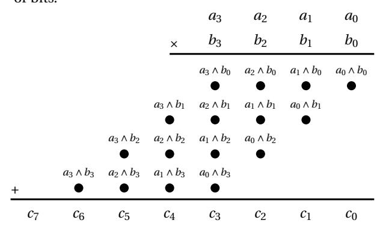
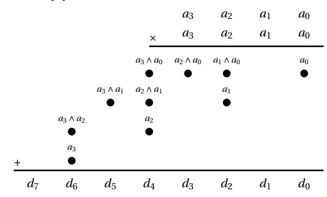
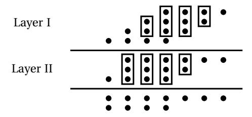
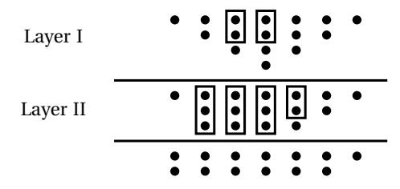
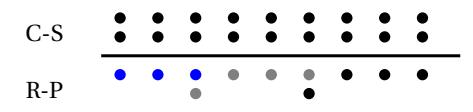
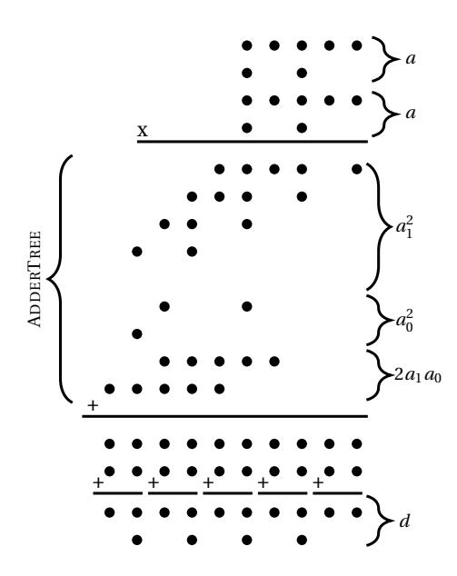
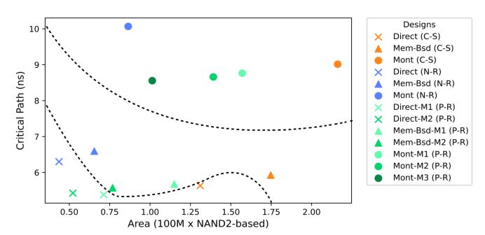
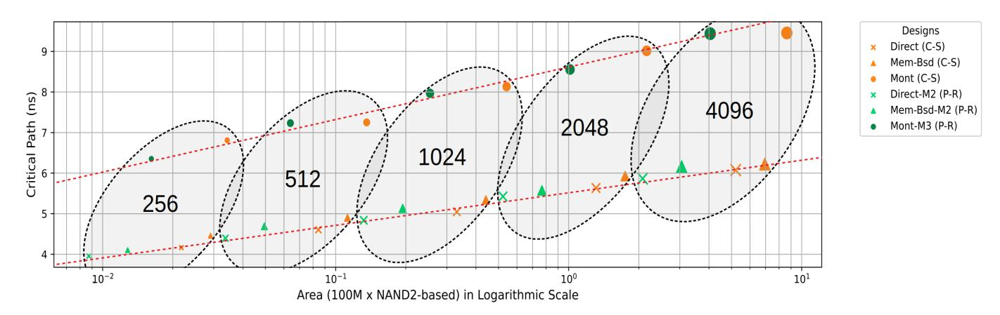

1

# Low-Latency ASIC Algorithms of Modular Squaring of Large Integers for VDF Evaluation

Ahmet Can Mert, Erdinç Öztürk, Erkay Sava ¸s, *Member, IEEE*

**Abstract**—This study is an attempt in quest of the fastest hardware algorithms for the computation of the evaluation component of verifiable delay functions (VDFs), *a* 2 mod *N*, proposed for use in various distributed protocols, in which no party is assumed to compute it significantly faster than other participants. To this end, we propose a class of modular squaring algorithms suitable for low-latency ASIC implementations. The proposed algorithms aim to achieve highest levels of parallelization that have not been explored in previous works in the literature, which usually pursue more balanced optimization of speed and area. For this, we utilize redundant representations of integers and introduce three modular squaring algorithms that work with integers in redundant forms: i) Montgomery algorithm, ii) memory-based algorithm and iii) direct reduction algorithm for fixed moduli. All algorithms enable *O*(log*k*) depth circuit implementations, where *k* is the bit-size of the modulus *N* in the VDF function. We analyze and compare gate level-circuits of the proposed algorithms and provide estimates for their critical path delay and gate count.

✦

**Index Terms**—Verifiable Delay Functions, Modular Squaring, Reduction, Montgomery, Redundant Representation

# **1 INTRODUCTION**

A Verifiable Delay Function (VDF) consists of an inherently sequential operation, which takes some prescribed and modifiable amount of time for its computation. The term *verifiable* emerges from the fact that the computation needs to be verified fairly quickly, without re-doing the entire costly operation. Any function that is inherently sequential, cryptographically secure and publicly and efficiently verifiable can be considered a VDF.

As stated in [1], with additional formal definition, a VDF is only complete with the following operations:

- Construction: VDFs are constructed with certain algorithms and security parameters. For example, if the VDF is based on a group of unknown order, field size is one of the security parameters. For real-life applications, once the construction phase is complete, other parts of VDF can be implemented. For practicality, construction should not change frequently.
- Setup: As stated, a VDF is an operation that takes some prescribed and modifiable amount of time. Given a VDF construction, in order to ensure the required minimum computation time for evaluation of the inherently sequential function, certain parameters need to be setup.
- Evaluate: Evaluation function is the aforementioned inherently sequential function, computed using only the construction and setup parameters. Evaluation function must be setup to output some amount of intermediate results (proof [1]), depending the proving algorithm. This proof data helps the proving algorithm to verify the result of the computation without re-doing the entire costly operation. Without this proof data, there is no other way of computing the output of the evaluation function other than re-evaluation.

• Prove: For any VDF, the output of the evaluation function needs to be verified, using the proof data. Depending on the VDF construction, different prover algorithms can be utilized. One common property of these algorithms is that they are not as costly as the evaluation functions, as they are using the intermediate results from the evaluator, reducing the amount of required computations.

For any VDF construction, evaluation is the most timeconsuming and compute-intensive function. Therefore, in this paper, we focus only on constructions for VDF evaluation.

The two recent VDF constructions proposed by Pietrzak [2] and Wesolowski [3] are based on time-lock puzzles and they are thoroughly analyzed by Boneh *et al.* in [1]. The notion of timelock puzzles, introduced by Rivest, Shamir, and Wagner [4] in 1999, is built upon an inherently sequential and cryptographically secure mathematical operation: exponentiation in a group of unknown order [5]. The exponent utilized for time-lock puzzles is of special form, which transforms the exponentiation operation into repeated squaring operations; e.g, *a* 2 *T* mod *N*.

Since time-lock puzzles are constructed upon repeated modular squaring operations, VDF constructions utilizing timelock puzzles rely on efficient implementations of low-latency modular squaring algorithms, optimized for repeated-squaring setting. As the entire exponentiation operation of VDF evaluation, rather than a single modular squaring, calls for a low-latency design, any redundant representation and lazy reduction technique can be utilized to accelerate intermediate modular squaring computations. While there is a plethora of efficient implementations of modular multiplication and modular squaring in the literature [6], [7], [8], [9], [10], [11], [12], [13], [14], [15], [16], they mostly focus on throughput, utilizing the time-area metric for measuring performance. Yet, for a VDF evaluator implementation, the most important metric is time itself as the VDF evaluation, which is an inherently sequential function that cannot be parallelized regardless of the amount of

<sup>•</sup> *Ahmet Can Mert, Erdinç Öztürk and Erkay Sava¸s are with the Faculty of Engineering and Natural Sciences, Sabancı University, Istanbul, Turkey. E-mail: {ahmetcanmert,erdinco,erkays}@sabanciuniv.edu*

compute resources, should take the minimum amount of time possible.

There are well-studied high-level algorithms and methods enabling efficient modular multiplication implementations. One of the most commonly used modular multiplication algorithm is due to Montgomery [17]. The Montgomery modular multiplication algorithm realizes  $C' \equiv A \cdot B \cdot R^{-1} \pmod{N}$  instead of the desired  $C = A \cdot B \pmod{N}$  result. To compute the desired result, pre- and post-processing steps are usually required. Therefore, the Montgomery modular multiplication algorithm is efficient only for applications involving many modular arithmetic operations, such as exponentiation, due to inherent pre-processing and post-processing overheads.

Barrett reduction [18] can also be utilized for implementing modular multiplication operation. It computes the desired outcome  $C = A \cdot B \pmod{N}$  directly, which makes it a better choice for a single modular multiplication scheme. Although Barrett and Montgomery reduction algorithms are similar in terms of complexity, they yield different performance figures in different implementation settings [19], [20].

There are algorithms that allow lower circuit depth than classical multiplication operation [21], [22]. Schonhage-Strassen is an NTT-based method presented in 1971 that can multiply two n-bit integers in  $O(n\log n\log\log n)$  time [23]. Harvey *et al.* presented an improved algorithm that can multiply two *n*-bit integers in  $O(n\log n4^{\log n})$  operations [24], [25]. However, efficient low-latency hardware implementations of these schemes do not exist in literature. While a theoretical log-depth circuit algorithm is presented in [22], no practical low-latency implementation of this algorithm has been reported in the literature to the best of our knowledge.

Depending on specific application and computation platform used for implementation, different constraints and design goals can be adopted in the design and implementation of a modular multiplication circuit. For instance, a low-power design is usually targeted for implementations in resourceconstrained devices. For data center applications, an implementation with high throughput is usually the primary requirement. For typical client applications, a public-key operation finished in milliseconds range is sufficient for a practical implementation. Consequently, low-latency is hardly the predominant or the only design metric for most cases as others such as cost and time-area are almost always taken into consideration.

In a typical application of VDF, verifiable lottery using a randomness beacon [5], no participant is allowed to compute VDF significantly faster than others. Namely, all participants are supposed to be equipped with sufficiently fast hardware for the VDF computation. Consequently, for the RSA-based VDF construction [2], [5], [3], metrics such as throughput, power and area become either irrelevant or less important emphasizing the need for a low-latency design. This calls for more aggressive acceleration techniques, which have not been explored in the literature before except in [26]. In [26], the author discusses a low-latency modular multiplication algorithm and construction for a known modulus, targeting FPGA architecture for proof of concept performance.

**Contribution:** In this paper, highly parallel, regularly structured, and bitwise modular squaring algorithms are explored and proposed for efficient low-latency ASIC implementations. The algorithms utilize various redundant representations to reduce circuit depth. To this end, we first introduce a vari-

ant of the Montgomery reduction algorithm that works with integers in redundant representations, requires no final subtraction and utilizes incomplete arithmetic [27]. Then, we explore two other modular reduction algorithms: i) memorybased reduction for variable moduli and ii) direct reduction for fixed moduli. We study the modular multiplication algorithm in [26], based on polynomial representation, originally optimized for FPGA implementations and uses only memorybased approach for modular reduction. We, then, introduce three different modular squaring algorithms using polynomial representation for low-latency ASIC implementations. We show that the proposed algorithms enable  $O(\log k)$  depth circuit implementations for modular squaring operation on large kbit integers and amenable to highly regular and low fan-out designs. We analyze all algorithms and provide estimates for critical path delay and gate count.

The remainder of the paper is structured as follows: Section 2 presents background information such as basic notations, bitwise integer operations and redundant representation of integers. Section 3 presents two widely used classes of adder tree constructions, Wallace and Dadda tree methods and provides an explicit algorithm for Dadda tree. Section 4 presents three modular squaring methods for integers in Carry-Save (C-S) representation which are suitable for low-latency circuit implementations. Section 5 describes Redundant-Polynomial (R-P) representation for integers and presents its utilization in different modular squaring methods. Section 6 compares the proposed algorithms and gives estimates for their ASIC implementations. Section 7 concludes the paper.

#### 2 BACKGROUND

Throughout the paper, a k-bit integer a is represented in radix 2 as  $a=(a_{k-1},\ldots,a_1,a_0)_2$ , where  $a_i\in\{0,1\}$ . When a radix larger than 2 is used, we use uppercase letters to represent the digits of integers; e.g.,  $(A_{s-1},\ldots,A_1,A_0)$ , where  $A_i$  is the  $i^{th}$  digit and  $A_i<2^r$  with r>1.

#### 2.1 Bitwise Integer Multiplication

In a straightforward gate-level implementation of bitwise integer multiplication, there are a total of  $k^2$  bitwise logical-AND ( $\land$ ) operations and sequential addition operations resulting in prohibitively long carry chains. Therefore, in hardware realizations the multiplication operation is performed often in two phases. Algorithm 1 elaborates this method. In the first phase, all partial product bits are calculated using  $k^2$  logical-AND gates in parallel and grouped in the partial product list t as shown in Steps 2-6 of Algorithm 1. Here, a list is a two-dimensional data structure with different sized columns. Furthermore, for  $i=0,\ldots,2k-1$ ,  $t_i$ s are the columns of the product list t, where each column is a multiset of partial product bits of the same weight. Each partial product bit is appended (using the set union operation  $\cup$ ) in the corresponding column and no addition operation is performed in the first phase.

Then in the second phase (Step 7 of Algorithm 1), the partial product bits are summed using efficient adder tree constructions such as Wallace [28] or Dadda Trees [29]. The result c is in the redundant C-S form, which means most of  $c_i$  consist of two bits: the carry bit  $c_{i,1}$  and the save bit  $c_{i,0}$ . Since the result c is in redundant form, it is transformed into non-redundant form using fast carry propagation adders (CPAs)

**Algorithm 1** Bitwise Integer Multiplication Suitable for Hardware Implementation

```
Input: a = (a_{k-1}, ..., a_1, a_0)
          b = (b_{k-1}, \dots, b_1, b_0)
Output: c = (c_{2k-1}, ..., c_1, c_0) where c = a \cdot b
 1: for i from 0 to (2k-1) do t_i \leftarrow \{\emptyset\} end for
 2: for i from 0 to (k-1) do
                                                                  ▶ First Phase
        for j from 0 to (k-1) do
 3:
             t_{i+j} \leftarrow t_{i+j} \cup (b_i \wedge a_j)
 4:
         end for
 5:
 6: end for
 7: t \leftarrow ADDERTREE(t)
                                                              ▶ Second Phase
 8: c \leftarrow CPA(t)
```

[30], [31]. As our operands are very large, the CPA still creates very long carry chains. In this paper, we propose algorithms either to shorten the carry chain of CPA or eliminate CPA altogether from the hardware implementation for low-latency applications such as VDF, as stated in [26]. To this end, we utilize various redundant forms for integers.

**Example 1.** Fig. 1 illustrates the operations of Algorithm 1 for 4-bit operands (k = 4). As observed from the figure, the columns of the partial product list have different number of bits.



Fig. 1. The Operations of Algorithm 1 for k = 4

#### 2.2 Bitwise Integer Squaring

Algorithm 2 for integer squaring is a simplified version of Algorithm 1 for the case b=a, in which  $a_i \wedge b_j = a_j \wedge b_i$  for  $i \neq j$ . As we have  $a_i \wedge a_j + a_j \wedge a_i = 2 \cdot (a_i \wedge a_j)$  and multiplication by 2 is realized via a simple shift operation, the weight of  $(a_i \wedge a_j)$  becomes i+j+1, instead of i+j (see Step 5 of Algorithm 2).

#### Algorithm 2 Bitwise Integer Squaring

```
Input: a = (a_{k-1}, ..., a_1, a_0)
Output: d = (d_{2k-1}, ..., d_1, d_0), where d = a^2
 1: for i from 0 to (2k-1) do t_i \leftarrow \{\emptyset\} end for
 2: for i from 0 to (k-1) do
                                                                   ▶ First Phase
 3:
         t_{2i} \leftarrow t_{2i} \cup a_i
        for j from (i+1) to (k-1) do
 4:
 5:
             t_{i+j+1} \leftarrow t_{i+j+1} \cup (a_i \wedge a_j)
        end for
 7: end for
 8: t \leftarrow ADDERTREE(t)
                                                               ▶ Second Phase
 9: d \leftarrow \text{CPA}(t)
```

Algorithm 2 shows that there is a total of  $(k^2 + k)/2$  logical-AND operations, all of which can be performed in parallel.

Thus, the circuit delay for the first phase is equivalent to the delay of an AND gate. For the second phase, the circuit delay is determined by the delay of the adder tree, which is logarithmic with respect to the input size k as shown in Section 3.

**Example 2.** Fig. 2 illustrates the operations of Algorithm 2 for k = 4. Note that the column  $t_1$  in the partial product list is an empty set.



Fig. 2. The Operations of Algorithm 2 for k = 4

### 2.3 Redundant Representation of Integers

A positive integer in the interval [0,N) can be represented using as low as  $k = \lceil \log_2 N \rceil$  bits. Generally speaking, any representation using more bits than this lower bound can be referred as redundant representation. The most common examples are *Carry-Save* and redundant signed digit (RSD) representations [32].

In RSD representation [33], an integer a is viewed as the difference between two positive integers, while in C-S it is the sum of two such integers. In binary, we can write  $a = \sum_{i=0}^{k-1} (a_{i,0} - a_{i,1}) 2^i$  and  $a = \sum_{i=0}^{k-1} (a_{i,0} + a_{i,1}) 2^i$  for RSD and C-S representations, respectively. Redundant representations are useful to defer additions (or subtractions) for avoiding delays of long carry chains.

We can generalize the C-S representation to have an arbitrary number of bits for each weight as

$$a = \sum_{i=0}^{k-1} (a_{i,0} + a_{i,1} + \dots + a_{i,i_v}) 2^i,$$
 (1)

where  $i_v \ge 0$  is an integer. Also, we can combine all the bits with the same weight into a set of bits; e.g.,  $a_i = \{a_{i,0}, a_{i,1}, \ldots, a_{i,i_v}\}$  for  $i = 0, \ldots, k-1$ . This new notation is especially useful to denote the bits accumulated in the adder tree in the first phase of Algorithms 1 and 2 before the addition operation.

**Example 3.** Using the new notation, the result of the first phase of the bitwise squaring operation of a 4-bit integer  $a, d = a^2$  in Example 2 can be written in generic redundant representation as  $t_0 = \{t_{0,0}\}, t_1 = \{\emptyset\}, t_2 = \{t_{2,0}, t_{2,1}\}, t_3 = \{t_{3,0}\}, t_4 = \{t_{4,0}, t_{4,1}, t_{4,2}\}, t_5 = \{t_{5,0}\}, t_6 = \{t_{6,0}, t_{6,1}\}, \text{ where } t_{0,0} = a_0, t_{2,0} = a_0 \wedge a_1, t_{2,1} = a_1, t_{3,0} = a_0 \wedge a_2, t_{4,0} = a_0 \wedge a_3, t_{4,1} = a_1 \wedge a_2, t_{4,2} = a_2, t_{5,0} = a_1 \wedge a_3, t_{6,0} = a_2 \wedge a_3, \text{ and } t_{6,0} = a_3.$ 

As shown in Example 3, the sets for each weight can contain different number of bits. We adopt the notation that  $|t_i|$  is the number of elements in the set  $t_i$  and |t| is the number of sets in the redundant representation. Also, DEPTH $(t) = \max ||t_0|, |t_1|, \ldots, |t_i||$ . For example, the classical C-S representation has DEPTH(t) = 2 while the redundant representation in Example 3 has depth 3. The actual summation

operation can be performed using adder tree constructions as explained in Section 3.

## **3 ADDER TREE CONSTRUCTIONS**

In [28], Wallace proposed *adder tree* circuits to eliminate long carry chains in Algorithms 1 and 2 using *counters*, which are combinational logic elements that output the number of ones in their inputs. The two most common counters are (2×2) half adder (HA) and (3×2) full adder (FA) counters. Other counters include (7×3), (15×4), and (31×5) counters.

The Wallace tree consists of layers, in each of which we have a different redundant representation of the same integer; e.g., the result of the squaring operation. A layer is of lower depth than the previous layer and the last layer is of depth two. In a layer, there are counters acting on the bits of the columns of the partial product list *t*. As the counters in one layer works in parallel, they are referred as *parallel counters* in [29]. Consequently, the delay of a Wallace tree layer is equivalent to the delay of the slowest counter employed in the layer.

There are different adaptations of Wallace trees. For example, the *greedy* Wallace tree working with HAs and FAs combines the sets in redundant representation in each layer into three-bit groups and apply each group to the inputs of a FA. If there are two bits not included in any group, they are applied to the input of a HA. When there is only a single bit left, it will be copied to the next layer as is. Both FA and HA have two outputs: carry and sum. The sum output will be copied to the set with the same weight in the next layer while the carry output will be appended to the set with one larger weight in the next layer.

An alternative adaptation performs the grouping according to the deepest set; e.g., *tk*−<sup>1</sup> for *k*-bit multiplication. The bits of this set are grouped in three. If there are two bits in any other set corresponding to a three-bit group in the longest set, then they are applied to the inputs of a HA. If there is a single bit in such situations, it will be copied to the next layer as is. If there are one or two rows left after grouping, they will directly be copied to the next layer, as well. The next example illustrates this adaptation.

*Example 4.* The integer multiplication operation in Example 1 results in a redundant representation of depth 4 after the first phase as shown in Fig. 3 (see Layer I). The Wallace tree first reduces the depth to 3 and then to 2, as can be observed in Layer II of the circuit and the resulting integer in C-S form, respectively. The boxes with two and three dots stand for HA and FA, respectively. This Wallace tree employs 3 HAs and 5 FAs, in total.



Fig. 3. The Wallace Tree Layers for *k* = 4

After the final layer of a Wallace tree, the resulting integer is in redundant representation of depth two, which is the regular C-S form. For the final result, a CPA is used to add carry and save parts. As all HAs and FAs work independently and thus in parallel to each other, the time delay of one layer of Wallace tree is always equivalent to one FA delay.

When FA and HA are used, we can give a lower bound for the number of layers *L*(*h*) to reduce a redundant representation of depth *h* to depth 2 representation [32]:

$$L(h) \ge \log_{1.5}(h/2).$$
 (2)

The multiplication of two *k*-bit integers and squaring of a *k*bit integer lead to trees of depth *k* and b*k*/2c + 1, respectively. Consequently, the lower bounds for the number of layers to reduce the depths of *k*-bit multiplication and squaring to 2 are <sup>d</sup>log1.5(*k*/2)<sup>e</sup> and <sup>d</sup>log1.5((b*k*/2c + 1)/2)e, respectively. For example, the multiplication of two 2048-bit integers results in a tree of depth 2048 while the squaring of a 2048-bit integer leads to a shorter tree of depth b2048/2c + 1 = 1025. Consequently, the lower bounds for the number of layers needed to reduce the trees in multiplication of two 2048-bit integers and squaring of a 2048-bit integer are <sup>d</sup>log1.5(2048/2)e = 18 and <sup>d</sup>log1.5(1025/2)e = 16, respectively.

The number of layers is, in fact, determined by the *compression factor*, which is the ratio of the number of inputs to the number of outputs of the largest counter used in the Wallace tree. For instance, when the largest counter is a FA, then the compression factor is 1.5, which explains the base of the logarithm in Equation 2.

In [29], Dadda observes that the compression factor in fact determines the reduction amount in the depths of the tree from one layer to the next. He, then, proposes a method to minimize the number of counters used in one layer. To this end, Dadda's method utilizes an array of integers that is recursively generated as *D*[0] = 2 and *D*[*i*] = b1.5 · *D*[*i* − 1]c for *i* ≥ 1. This array also determines how to reach a representation of depth 2 progressively.

*Example 5.* Dadda's method uses the array *D* = {2, 3, 4, 6, 9, 13, 19, 28, 42, 63, 94, 141,...} for reducing the depth of the tree to 2. For a *k*-bit multiplication operation with *k* = 128 which has initial depth of 128, Dadda's method first reduces the depth from 128 to 94 since initial depth 128 falls between *D*[10] = 94 and *D*[11] = 141. Then, it reduces the depth from *D*[10] = 94 to *D*[9] = 63 . The operation continued until the tree of depth *D*[0] = 2 is obtained.

Dadda's method uses no more counters than sufficient to reduce the depth of a tree layer to next smaller integer in *D* than the current depth. The method is given in Algorithm 3, where one iteration of the **while** loop stands for one layer of Dadda tree.

Algorithm 3 determines the depth of the next layer *β* in Step 2 using the FINDNEXTMAXDEPTH function, which computes the maximum element in *D* that is smaller than the depth of the current layer. Then, using FAs and HAs, the depth of the next layer will be reduced to *β*. If the depth of a set *t<sup>i</sup>* is already less than or equal to *β*, then no counter is used and the set is copied to the next layer with no change. Otherwise, counters are used to decrease the depth of *t<sup>i</sup>* to *β* (Steps 8-21 of Algorithm 3).

*Example 6.* Fig. 4 shows how Dadda's method reduces the depth of redundant result in Example 1 from 4 to 2. In

#### Algorithm 3 ADDERTREE with Dadda's Method [29]

```
Input: t = (\{t_{k-1,0}, \dots, t_{k-1,d_{k-1}-1}\}, \dots, \{t_{0,0}, \dots, t_{0,d_0-1}\})
            D = (D[0], D[1], D[2], ...)
Output: t = (\{t_{k-1,0}, t_{k-1,1}\}, \dots, \{t_{0,0}, t_{0,1}\})
 1: while MAXDEPTH(t) > 2 do
 2:
           \beta \leftarrow \text{FINDNEXTMAXDEPTH}(\text{DEPTH}(t), D)
 3:
           for i from 0 to (k-1) by 1 do
 4:
                t_i \leftarrow t_i \cup v
 5:
                v \leftarrow \{\emptyset\}; \ \sigma \leftarrow \{\emptyset\}
 6:
                if Depth(t_i) > \beta then
 7:
                     \Delta \leftarrow \text{DEPTH}(t_i) - \beta
 8:
 9:
                     f \leftarrow \lfloor \Delta/2 \rfloor; h \leftarrow \Delta \mod 2
10:
                     for j from 0 to (3f - 1) by 3 do
                          C, S \leftarrow FA(t_{i,j}, t_{i,j+1}, t_{i,j+2})
11:
                          \sigma \leftarrow \sigma \cup S; v \leftarrow v \cup C
12:
                     end for
13:
                     for j from 3f to (3f + 2h - 1) by 2 do
14:
                          C, S \leftarrow \mathrm{HA}(t_{i,j}, t_{i,j+1})
15:
                          \sigma \leftarrow \sigma \cup S; v \leftarrow v \cup C
16:
                     end for
17:
                     for j from (3f + 2h) to (DEPTH(t_i) - 1) by 1 do
18:
19:
                          \sigma \leftarrow \sigma \cup t_{i,j}
20:
                     end for
21:
                     t_i \leftarrow \sigma
                end if
22.
           end for
24: end while
```

Layer I, where  $\beta=3$ , 2 HAs are used to reduce  $t_3$  and  $t_4$  as these sets are likely to produce sets with depths greater than 3 in the next layer if their depths are not reduced otherwise. In Layer II, where  $\beta=2$ , the three sets  $t_3-t_5$  are reduced using 3 FAs and  $t_2$  is reduced using 1 HA. Dadda's method employs 3 HAs and 3 FAs, which results in smaller circuit area than the one produced by the Wallace tree in Example 4 (cf. 3 HAs and 5 FAs) and the circuit delay is equivalent to the total delay of one FA and one HA.



Fig. 4. The Dadda Tree Layers for k = 4

As it is likely to result in slightly smaller circuits, the function ADDERTREE uses Dadda's method in the subsequent sections of the this paper.

# 4 MODULAR SQUARING ALGORITHMS WITH CARRY-SAVE REPRESENTATION

In this section, we present three modular squaring methods suitable for low-latency circuit implementations for the computation of the VDF function  $a^{2^T} \pmod{N}$ . All the methods take an integer a in C-S form and outputs the result  $c = a^2 \pmod{N}$ 

also in C-S form, where the modulus N is any odd integer. Consequently, no CPA is needed and long carry chains are completely avoided during the computation of  $a^{2^T}$  (mod N). Only one CPA is used after the final modular squaring of the exponentiation. Note that algorithms in this section employ incomplete arithmetic similar to [27], which basically works with inputs and outputs not fully reduced with modulus N, but always in the equivalence class.

The first method is a variant of the Montgomery modular multiplication algorithm, which is efficient for randomly chosen variable moduli. The second method uses a memory-based modular reduction algorithm, where memory cells can be used to configure the circuit for different moduli. The third method are used when the modulus is fixed. In all cases, we assume the modulus is randomly chosen and has no special form as the RSA setting is usually employed in VDF instances.

# 4.1 Montgomery Modular Squaring with Variable Modulus

The Montgomery algorithm [17] eliminates costly division operation from the modular reduction and employs shift operations instead, which are free of cost in hardware implementations. It, however, computes  $abR^{-1} \pmod{N}$  instead of  $ab \pmod{N}$ , where  $\gcd(R,N)=1$  and R is chosen as a power of two. This, on the other hand, leads to no complications, especially in exponentiation operations as at the end, a simple transformation operation suffices to obtain the result in the correct form. For this the input a is first transformed into the Montgomery form  $aR \pmod{N}$  by multiplying it with the precomputed constant  $R^2 \pmod{N}$  using the Montgomery multiplication algorithm. Then,  $aR \pmod{N}$  is raised to the power of  $2^T$ , which results in  $a^{2^T}R \pmod{N}$ . Finally, to obtain the desired result  $a^{2^T} \pmod{N}$ ,  $a^{2^T}R \pmod{N}$  is multiplied by 1.

There are various methods to compute the Montgomery multiplication [34] such as separate operand scanning (SOS), coarsely integrated operand scanning (CIOS) etc. Here, we employ the simple SOS method, which performs the integer squaring first and then the Montgomery reduction operation. Namely, given an integer a we first perform the integer squaring  $d = a^2$  and then the Montgomery reduction

$$c = \frac{d + N(dN' \bmod R)}{R},\tag{3}$$

where  $N' = -N^{-1} \pmod{R}$  and  $c = a^2R^{-1} \pmod{N}$ . As  $R = 2^m$ , the division by R in Equation 3 is a simple right shift operation while  $\operatorname{mod} R$  is equivalent to taking the least significant m bits of the result. Also, the numerator in Equation 3 always produces a number whose m least significant bits are all zero. Therefore, shifting it to right by m bits (or equivalently dividing it by R) does not result in loss of accuracy in the computation.

#### 4.1.1 Squaring Operation for Integers in C-S Form

We propose Algorithm 4 to compute the square of an (k+1)-bit integer a which is given in C-S form, namely  $a=a_1+a_0$ , and the square  $d=a^2$  is also in C-S form,  $d=d_1+d_0$ . Also, we assume a < 2N to avoid the final subtraction in Montgomery reduction [35]. Therefore, the input of square operation is a (k+1)-bit integer,  $a=a_1+a_0<2^{k+1}$ , where  $a_1,a_0<2^{k+1}$ . For the

Algorithm 4 Squaring Algorithm for Integers in C-S form

```
Input: a = (\{a_{k,0}, a_{k,1}\}, \dots, \{a_{0,0}, a_{0,1}\}), a < 2^{k+1}
Output: d = a^2 = (\{d_{2k+1,0}, d_{2k+1,1}\}, \dots, \{d_{0,0}, d_{0,1}\}), d < 2^{2k+2}
 1: for i from 0 to (2k+1) do t_i \leftarrow \{\emptyset\} end for
 2: for i from 0 to k do
                                                                                   > a_1^2 + a_0^2
 3:
          t_{2i} \leftarrow t_{2i} \cup a_{i,0} \cup a_{i,1}
 4:
         for j from (i+1) to k do
               t_{i+j+1} \leftarrow t_{i+j+1} \cup (a_{i,0} \land a_{i,0}) \cup (a_{i,1} \land a_{i,1})
 5:
 6:
 7: end for
 8: for i from 0 to k do
                                                                                     \triangleright 2a_1a_0
         for j from 0 to k do
 9:
               t_{i+j+1} \leftarrow t_{i+j+1} \cup (a_{i,0} \land a_{j,1})
10:
11:
12: end for
13: d \leftarrow ADDERTREE(t)
```

reasons explained in Section 4.1.2, m = k+3 where  $k = \lceil \log_2 N \rceil$  and  $R = 2^m$ . Algorithm 4, basically, computes

$$a^{2} = (a_{1} + a_{0})^{2} = a_{1}^{2} + a_{0}^{2} + 2a_{1}a_{0},$$
 (4)

where  $a_1=a_{k,1},\ldots,a_{1,1},a_{0,1}$  and  $a_0=a_{k,0},\ldots,a_{1,0},a_{0,0}$  are carry and save parts, respectively. Steps 2-7 of Algorithm 4 compute the partial product list for  $a_1^2+a_0^2$  and are almost identical to Algorithm 2 except that the computations for  $a_1^2$  and  $a_0^2$  are performed together. On the other hand, Steps 8-12 compute the partial product list for  $2a_1a_0$  and are almost identical to Algorithm 1 except that  $t_{i+j}$  in Step 4 of Algorithm 1 is replaced by  $t_{i+j+1}$  in Step 10 of Algorithm 4. This is due to the fact that the multiplication of  $a_1a_0$  by 2 necessitates a right shift operation by one bit. The partial product list is computed using (k+1)(2k+3) logical-AND gates and has depth of  $4\lfloor (k+1)/2 \rfloor + 2$ . Finally, the last step of the algorithm reduces the resulting partial product list to the C-S form using the Dadda's method. The Dadda tree uses (k+6) HAs and  $(2k^2+k-2)$  FAs.

**Example 7.** For k=2048, Algorithm 4 results in a partial product list t of depth 4098 before the last step using 8,398,851 logical-AND gates where it takes 20 layers of FAs for its reduction to depth 2. And the Dadda tree in the last step utilizes 8,390,654 FAs and 2,054 HAs. Finally the total delay of the squaring circuit is  $20\tau_{\rm FA} + \tau_{\rm AND}$ , where  $\tau_{\rm FA}$  and  $\tau_{\rm AND}$  are the delays of a FA and an AND gate, respectively.

#### 4.1.2 Montgomery Reduction for Integers in C-S Form

Here, we present a new variant of the Montgomery reduction method in Algorithm 5 for integers in C-S form. The algorithm takes a (2k+2)-bit integer d in the C-S form and outputs a (k+1)-bit integer c again in C-S form, where  $c \equiv dR^{-1} \pmod{N}$ , c < 2N,  $R = 2^m$  and m = k+3. In Algorithm 5, N and  $N' = -N^{-1} \pmod{R}$  are in non-redundant form, i.e. DEPTH(N) = DEPTH(N') = 1.

Algorithm 5 computes Equation 3 in several stages. In Stage I (Steps 2-6), the algorithm computes the lower half (the least significant m bits) of dN', where d is in C-S form while Depth(N')=1. The partial product list  $\mu$  is computed using m(m+1) logical-AND gates and has depth of 2m. The result  $\mu$  is reduced to the C-S form in Step 7.

**Algorithm 5** Montgomery Reduction Algorithm for Integers in C-S form

```
Input: d = (\{d_{2k+1,0}, d_{2k+1,1}\}, \dots, \{d_{0,0}, d_{0,1}\}), d < 2^{2k+2}
Output: c = d \cdot 2^{-m} \pmod{N},
             where c = (\{c_{k,0}, c_{k,1}\}, \dots, \{c_{0,0}, c_{0,1}\}), c < 2^{k+1}
 1: for i from 0 to (m-1) do \mu_i \leftarrow \{\emptyset\} end for
 2: for i from 0 to (m-1) do
                                                                   \rightharpoonup I: \mu = dN' \mod R
          for j from 0 to (m-1-i) do
               \mu_{i+j} \leftarrow \mu_{i+j} \cup \{N'_i \land d_{j,0}\} \cup \{N'_i \land d_{j,1}\}
          end for
 6: end for
 7: \mu \leftarrow ADDERTREE(\mu)
                                                                          ▶ II: Trimming
 8: \mu_{m-1,0} \leftarrow \mu_{m-1,0} \land (\sim \mu_{m-1,1})
 9: \mu_{m-1,1} \leftarrow \mu_{m-1,1} \wedge (\sim \mu_{m-1,0})
10: t \leftarrow d
                                                      \rightharpoonup III: t = d + N(dN' \mod R)
11: for i from 0 to (k-1) do
12:
          for j from 0 to (m-1) do
13:
               t_{i+j} \leftarrow t_{i+j} \cup \{N_i \wedge \mu_{j,0}\} \cup \{N_i \wedge \mu_{j,1}\}
15: end for
16: t \leftarrow ADDERTREE(t)
                                                            \rightharpoonup III: c = \frac{d + N(dN' \bmod R)}{R}
17: for i from 0 to k do
          c_i \leftarrow t_{m+i}
19: end for
20: c_0 \leftarrow c_0 \cup \{t_{m-1,1} \lor t_{m-1,0}\}
                                                               ▶ IV: Final Correction
21: c \leftarrow ADDERTREE(c)
```

Normally,  $\mu < R$  in the original Montgomery reduction algorithm; but in Algorithm 5, after Step 7,  $\mu$  can be larger than R as it is in C-S form. In case  $\mu > R$ , the final result of Algorithm 5 can be much larger than N. Comparison and subtraction operations would necessitate conversion to nonredundant representation using prohibitively expensive CPAs. Thus, we employ a trimming stage in Stage II (Steps 8-9), which resets the most significant bits of  $\mu$ ,  $\mu_{m-1,0}$  and  $\mu_{m-1,0}$ , if they are both 1. The trimming stage does not guarantee  $\mu < R$ , but decreases the difference  $\mu - R$  in case  $\mu > R$  still holds. As we explain in the subsequent parts of this section, trimming ensures that  $c < 2^{k+1}$  provided that  $a < 2^{k+1}$ , where  $c = a^2 R^{-1}$ (mod N). In Stage III (Steps 11-16), the algorithm multiplies  $\mu N$ and appends the partial product list of the result to d in order to compute  $d + N(dN' \mod R)$ . The resulting partial product list t is computed using 2km logical-AND gates and has depth of 2k+2. The result t is reduced to the C-S form in Step 16 using Dadda tree.

After Step 16, the lower half (the least significant m bits) of t is always zero and the result c is the upper half of t, which could be copied to c directly if it were in the non-redundant form. However, since t is in C-S form, there may be carry out from the addition of carry and save parts of the lower half of t. The carry is only possible if either of the most significant bits of t is 1, i.e., either  $t_{m-1,1}=1$  or  $t_{m-1,0}=1$ . Thus, in Stage IV (Steps 20-21), 1 is appended to the set  $c_0$ , which calls for another adder tree as Depth(c) = 3 after Step 20. However, this can be performed in one layer whose delay is only  $t_{\rm HA}$  (i.e., O(1)).

Now, we prove that Algorithm 5, using Equation 3, computes the correct result  $c=dR^{-1}\pmod{N}$  and  $c<2^{k+1}$  given  $a<2^{k+1}$ , where  $d=a^2$ . Recall also that m=k+3,  $k=\lceil\log_2 N\rceil$ , and  $R=2^m$ . After Step 7 of Algorithm 5,  $\mu=dN'\pmod{R}$ . As  $\mu$  is in C-S form, its value can be computed as  $\mu_0+\mu_1$ . Then, we can only guarantee  $\mu<(2^{k+3}+2^{k+3}=2^{k+4})$  and therefore

it can be the case  $\mu > R$ . Consequently, Equation 3 can result in a value c greater than  $2^{k+1}$ , given  $a < 2^{k+1}$  or equivalently  $d < 2^{2k+2}$ . Therefore, we need to  $trim \ \mu$  to have  $c < 2^{k+1}$ , which is implemented in Steps 8-9 of Algorithm 5. If the trim operation is applied, then we have  $\mu < (2^{k+3} + 2^{k+2})$ . Therefore, we can show

$$c < \frac{2^{2k+2} + 2^k (2^{k+3} + 2^{k+2})}{2^{k+3}} = 2^{k-1} + 2^k + 2^{k-1} = 2^{k+1}.$$

In other words, when  $a < 2^{k+1}$ , Algorithms 4 and 5 produce the result  $c < 2^{k+1}$ .

**Example 8.** Table 1 lists the delay and the area costs of Algorithm 4 and each stage of Algorithm 5 for k = 2048.

TABLE 1 Costs of Montgomery Modular Squaring Algorithm with C-S Form (Algorithms 4 + Algorithm 5) for k = 2048

| Operation    | Delay                                         | Logical gates  | HA    | FA         |
|--------------|-----------------------------------------------|----------------|-------|------------|
| Alg. 4       | $20\tau_{\rm FA} + \tau_{\rm AND}$            | 8,398,851 AND  | 2,054 | 8,390,654  |
| Alg. 5 - I   | $20\tau_{\rm FA} + \tau_{\rm AND}$            | 4,208,652 AND  | 2,050 | 4,200,451  |
| Alg. 5 - II  | $\tau_{\text{AND}} + \tau_{\text{NOT}}$       | 2 AND + 2 NOT  | -     | -          |
| Alg. 5 - III | $20\tau_{\mathrm{FA}} + \tau_{\mathrm{AND}}$  | 8,413,202 AND  | 2,055 | 8,413,193  |
| Alg. 5 - IV  | $\tau_{\rm HA} + \tau_{\rm OR}$               | 1 OR           | 2,049 | -          |
|              | $60\tau_{\mathrm{FA}} + \tau_{\mathrm{HA}} +$ | 21,020,707 AND |       |            |
| Total        | $\tau_{\text{NOT}} + \tau_{\text{OR}} +$      | + 2 NOT        | 8,208 | 21,004,298 |
|              | $4\tau_{\rm AND}$                             | + 1 OR         |       |            |

Note that Algorithm 5 does not require the final subtraction operation as in [35], which proposes to use  $R=2^{k+2}$  for a k-bit modulus N to eliminate the final subtraction. Here, we need to add one more bit to all operands and work with  $R=2^{k+3}$ . This is especially important as the subtraction operation is prohibitively expensive in C-S form.

# 4.2 Memory-Based Modular Squaring with Variable Modulus

In memory-based modular squaring operation, no sophisticated reduction algorithms such as Montgomery's method [17] are needed. Instead, we can use lookup table approach for reducing the upper part of the output bits of the integer squaring (see Algorithm 4 for  $a < 2^k$  and  $d < 2^{2k}$ ), namely  $\{d_{2k-1,0}, d_{2k-1,1}\}, \ldots, \{d_{k,0}, d_{k,1}\}$ . In particular, we can precompute and store the integers  $(2^i \mod N)$  for  $k \le i < 2k$  in a lookup table, T. Then, after the integer squaring operation, each lookup table cell goes to input of an AND gate with corresponding  $d_{i,0}$  (as well as  $d_{i,1}$ ) for  $k \le i < 2k$  and appended to the lower part of d.

There is, however, one small concern about the bit-size of the final result  $c=d\pmod N$  after the adder tree is applied as c now requires more than k bits. The final result c still needs to be reduced to k bits. However, this will require another reduction operation. Therefore, to capture all bits of the final result, we need a final result with  $(k+\ell)$ -bits, where  $\ell$  is the number of extra bits necessary for avoiding extra reduction operations. To this end, we again employ incomplete arithmetic, where input and output of our modular squaring algorithm are  $(k+\ell)$ -bit integers.

The algorithm for integer squaring operation, which are identical to Algorithm 4 except for the input being now  $(k+\ell)$ -bit long, outputs a  $(2k+2\ell)$ -bit integer, d. The uppermost  $(k+2\ell)$ -bits of  $d_0$  and  $d_1$  are now reduced modulo N with the help of the lookup table T and appended to the lower part

#### **Algorithm 6** Lookup Table Generation Algorithm for $k \ge 16$

```
Input: N = (N_{k-1}, ..., N_0), \ \ell = \lceil \log_2 k \rceil + 2

Output: T_{i,j} for i \in [0, k+2\ell) and j \in [0, k)

1: for i from 0 to (k+2\ell-1) do T_i \leftarrow \{\emptyset\} end for

2: for i from 0 to (k+2\ell-1) do

3: \alpha \leftarrow 2^{k+i} (mod N)

4: for j from 0 to (k-1) do

5: T_{i,j} \leftarrow T_{i,j} \cup \alpha_j

6: end for

7: end for
```

#### Algorithm 7 Memory-Based Modular Reduction Algorithm

```
Input: d = (\{d_{2(k+\ell)-1,0}, d_{2(k+\ell)-1,1}\}, \dots, \{d_{0,0}, d_{0,1}\}),

T: Lookup table

Output: c \equiv d \pmod{N},

where c = (\{c_{k+\ell-1,0}, c_{k+\ell-1,1}\}, \dots, \{c_{0,0}, c_{0,1}\})

1: for i from 0 to (k-1) do t_i \leftarrow d_i end for

2: for i from k to (k+\ell-1) do t_i \leftarrow \{\emptyset\} end for

3: for j from k to (2k+2\ell-1) do

4: for i from 0 to (k-1) do

5: t_i \leftarrow t_i \cup (T_{j-k,i} \wedge d_{j,0})

6: t_i \leftarrow t_i \cup (T_{j-k,i} \wedge d_{j,1})

7: end for

8: end for

9: c \leftarrow \text{Adder}(t)
```

of d. This generates a partial product list of depth  $2(k+2\ell)+2$  requiring  $\lceil \log_2{(2k+4\ell+2)} \rceil$  extra bits for adder tree which should be less than or equal to  $\ell$ . By  $\lceil \log_2{(2k+4\ell+2)} \rceil \le \ell$ , the number of extra bits,  $\ell$ , is formulated as shown in Equation 5.

$$\ell = \begin{cases} \lceil \log_2 k \rceil + 4 & \text{if } k \le 2 \\ \lceil \log_2 k \rceil + 3 & \text{if } 2 < k < 16 \\ \lceil \log_2 k \rceil + 2 & \text{if } k \ge 16 \end{cases}$$
 (5)

Since the uppermost  $(k+2\ell)$  bits of d are reduced, the lookup table T has  $(k+2\ell)$  entries where each entry is k-bit long as shown in Algorithm 6. This explains the upper limit of the iteration in Step 2 of Algorithm 6. Also, the memory cells are appended to the partial product list via  $2k(k+2\ell)$  logical-AND gates. After the reduction operation, the adder tree reduces d to its C-S form. All operations for modular reduction are given in Algorithm 7.

#### 4.3 Direct Modular Squaring with Fixed Modulus

In some VDF settings, the modulus N is generated once and used thereafter. In this scenario, that N is fixed enables significant optimizations in the circuit complexity and time delay. Direct modular squaring method uses the same approach as the memory-based modular squaring method except for the modular reduction operation. Since the modulus is fixed, then only the nonzero bits of integers  $(2^i \mod N)$  for  $k \le i < (2k+2\ell)$  are hardwired in the modular reduction circuit. This means we need no memory cells and only half of the AND gates (i.e.,  $k(k+2\ell)$ ), on average. This also simplifies the final addition operation in Step 9 of Algorithm 7 by reducing the depth of the partial product list t from  $2(k+2\ell)+2$  to  $k+2\ell+2$ .

**Example 9.** Table 2 lists the delay and the area cost of Algorithm 4 and Algorithm 7 with k = 2048 and  $\ell = 13$  for the cases when the modulus is variable or fixed.

TABLE 2 Costs of Memory-Based and Direct Modular Squaring Algorithms with C-S Form (Algorithm 4 + Algorithm 7) for k=2048 and  $\ell=13$ 

| Res.    | Memory-Based                        | Direct                      |  |
|---------|-------------------------------------|-----------------------------|--|
| FA / HA | 16,984,339 / 2,144                  | 12,736,789 / 2,132          |  |
| AND     | 16,992,607                          | 12,745,055                  |  |
| M.Cells | 4,247,552                           | -                           |  |
| Delay   | $40\tau_{\rm EA} + 2\tau_{\rm AND}$ | $38\tau_{EA} + 2\tau_{AND}$ |  |

# 5 MODULAR SQUARING ALGORITHMS WITH REDUNDANT-POLYNOMIAL REPRESENTATION

In this section, we present a novel polynomial representation for integers, referred as *Redundant-Polynomial* form, which is a variant of redundant representation introduced here and similar to the one in [26]. We also present its utilization in the three modular squaring methods presented in Section 4.

The polynomial representation enables low-latency circuit implementations of modular multiplication and squaring, targeting applications with variable and fixed moduli. Whereas an FPGA-optimized version is presented in [26], where the implementation is optimized to utilize FPGA-specific full-custom built-in blocks such as DSPs and Block RAMs effectively, the polynomial representation can be profitably employed for implementations on different target devices. In this paper, we utilize a novel variant of modular squaring algorithm that is tailored to be more suitable for ASIC implementations. Besides using R-P form for input and output, we take advantage of the inherent simplicity of a squaring operation and the fact that it is used repeatedly for the exponentiation  $a^{2^T} \pmod{N}$  in the VDF computation.

Each k-bit integer a can also be considered as an s-digit integer with r-bit digits  $A_i$ , where  $s = \lceil k/r \rceil$  and  $A = \sum_{i=0}^{s-1} A_i \cdot 2^r$ . Similarly, the integer A can also be represented as a polynomial  $A(x) = \sum_{i=0}^{s-1} A_i \cdot x^i$ , where the radix  $x = 2^r$  and  $A_i < 2^r$ .

In the R-P form presented in [26], an integer A is represented using a polynomial A(x) of degree (s-1) with (r+1)-bit coefficients  $A_i$  as shown in Equation 6.

$$A(x) = \sum_{i=0}^{s-1} \mathbf{A}_i \cdot x^i = \sum_{i=0}^{s-1} A_i \cdot x^i + \sum_{i=0}^{s-1} e_i \cdot x^{i+1}$$
 (6)

Here,  $\mathbf{A}_i = (A_i + xe_i) < 2^{r+1}$  and where  $e_i \in \{0, 1\}$ .

Equation 6 is indeed a redundant form for integers similar to C-S form, where only certain bits are represented by two bits. More specifically in polynomial form for a k-bit integer a, we have  $A_i = (\{a_{(i+1)r-1,0},0\},\dots,\{a_{ir+1,0},0\},\{a_{ir,0},a_{ir,1}\})$  for  $(s-1) \ge i \ge 1$  and  $A_0 = (\{a_{r-1,0},0\},\dots,\{a_{1,0},0\},\{a_{0,0},0\})$  where  $a_{j,0} = a_{j,1} = 0$  for  $j \ge k$  and  $a_{ir,1} = e_i$  for  $i = 1,2,\dots,s-1$ . Also,  $a = a_1 + a_0$  where  $a_1 = a_{k,1},\dots,a_{1,1},a_{0,1}$  and  $a_0 = a_{k,0},\dots,a_{1,0},a_{0,0}$ .

**Example 10.** For k = 9 and r = 3, C-S and R-P forms are shown in Fig. 5. The bits representing the first, second and third digits of the R-P form are shown with black, gray and blue dots, respectively. As shown in the Fig. 5, the R-P form can also be viewed as a modified version of C-S form.



Fig. 5. C-S and R-P Forms for k = 9 and r = 3

#### Algorithm 8 CSTOPOLY Algorithm

```
Input: a = (\{a_{k-1,0}, a_{k-1,1}\}, \dots, \{a_{0,0}, \dots, a_{0,1}\}),
           s = \lceil k/r \rceil where r: bit-size of a digit
Output: b = a = (\{b_{k-1,0}, b_{k-1,1}\}, \dots, \{b_{0,0}, b_{0,1}\})
             where b_{i,1} = e_i for i \equiv 0 \pmod{r} and i \neq 0
             where b_{i,1} = 0 for i \not\equiv 0 \pmod{r} and i = 0
 1: for i from 0 to (s-1) do
          C \leftarrow 0
 2:
 3:
          for j from 0 to (r-1) do
                                                                  \triangleright r-bit CPA (CPA<sub>r</sub>)
              C, S \leftarrow \text{FA}(a_{is+j,0}, a_{is+j,1}, C)
 4:
              b_{i,s+i,0} \leftarrow S
 5:
 6:
 7:
          b_{(i+1)s,1} \leftarrow C
 8: end for
```

The basic idea of the polynomial representation is to confine the carry propagation into r-bit digits and use only r-bit CPA (CPA $_r$ ) circuits. During the VDF computation, therefore, the intermediate results are kept in R-P form; but at the end, the final result is converted to the non-redundant form using a  $CPA_k$ .

After applying the adder tree to partial products in our algorithms, we obtain the result in C-S form, which needs to be converted to R-P form. Algorithm 8 shows the steps of this conversion function, CSTOPOLY().

When the new R-P form is used, all algorithms in Section 4 can easily be adapted with minor modifications as discussed in the next sections.

### 5.1 Squaring Operation for Integers in R-P Form

A low-latency integer multiplication algorithm with the polynomial form is detailed in Algorithm 7 in [26], in which its FPGA-optimized version is implemented. In an FPGA architecture, there are special functional blocks such as DSP including a full-custom  $25 \times 18$  signed multiplier [36]. In [26], the entire integer multiplication algorithm was optimized to utilize this basic building block in FPGA for a low-latency implementation. Since the entire algorithm is based on coefficient-wise multiplications, a DSP block is utilized to realize a  $17 \times 17$  core multiplication operation, which provides best utilization for r=16.

For ASIC implementation, utilizing core  $17 \times 17$  multipliers of non-redundant form is not always most inefficient, as these multipliers results in long carry chains in the partial product calculation stage. Therefore, carry propagation should be deferred as long as possible. To this end, we propose Algorithm 9 to compute the square of a (k+1)-bit integer a given in R-P form, where  $a=a_1+a_0<2^{k+1}$  and  $a_1,a_0<2^{k+1}$ . The result d is also in R-P form, where  $d=d_1+d_0<2^{2k+2}$ . Note that Algorithm 9 basically computes Equation 4.

**Example 11.** For k = 2048 and r = 8, Algorithm 9 results in a partial product list t of depth 1,407 before the last two steps using 2,657,665 logical-AND gates, where it takes 17 layers of FAs for its reduction to depth 2. And the operations in the last two steps employ 2,649,472 FAs, 2,135 HAs and 513 CPA<sub>8</sub>s. Finally, the total delay of the squaring circuit is  $17\tau_{\rm FA} + \tau_{\rm AND} + \tau_{\rm CPA_8}$ .

Note that all partial product bits are calculated using logical-AND gates in parallel and the resulting bits are grouped

#### Algorithm 9 Squaring Algorithm for Integers in R-P Form

```
Input: a = (\{a_{k,0}, a_{k,1}\}, \dots, \{a_{0,0}, a_{0,1}\})
Output: d = a^2 = (\{d_{2k+1,0}, d_{2k+1,1}\}, \dots, \{d_{0,0}, d_{0,1}\})
 1: for i from 0 to (2k+1) do t_i \leftarrow \{\emptyset\} end for
 2: for i from r to (k-1) by r do
                                                                                          \triangleright a_1^2
 3:
          t_{2i} \leftarrow t_{2i} \cup a_{i,0}
          for j from (i+r) to (k-1) by r do
 4:
 5:
               t_{i+j+1} \leftarrow t_{i+j+1} \cup (a_{i,0} \land a_{j,0})
 6:
 7: end for
 8: for i from 0 to k do
                                                                                          \triangleright a_0^2
 9:
          t_{2i} \leftarrow t_{2i} \cup a_{i,1}
10:
          for j from (i+1) to k do
11:
               t_{i+j+1} \leftarrow t_{i+j+1} \cup (a_{i,1} \wedge a_{j,1})
          end for
12:
13: end for
                                                                                    \triangleright 2a_1a_0
14: for i from 0 to k do
          for j from r to (k-1) by r do
15:
16:
               t_{i+j+1} \leftarrow t_{i+j+1} \cup (a_{i,0} \land a_{j,1})
          end for
17:
18. end for
19: t \leftarrow ADDERTREE(t)
20: d \leftarrow \text{CSToPoly}(t)
```

together in the partial product list t as shown in Steps 1-18 of Algorithm 9. This is a totally different approach from the one in Algorithm 7 in [26], which is based on digit-wise multiplications.

As shown in Steps 2-13 of Algorithm 9, the partial product bits generated by squaring of  $a_1$  and  $a_0$  are calculated using s(s-1)/2 and (k+1)(k+2)/2 logical-AND gates, respectively. The partial product bits generated by the multiplication  $2a_0a_1$ , (see Steps 14-18 of Algorithm 9), need (s-1)(k+1) logical-AND gates. The partial product list t has depth of  $s+\lfloor (k+1)/2\rfloor+\lfloor (s-1)/2\rfloor+1$  at most.

After the generation of the partial product list t, the algorithm reduces the resulting list to the regular C-S form using Dadda tree (Step 19 of Algorithm 9). The output of the adder tree represents a (2k+2)-bit integer in C-S form with (2k+2)-bit carry and save parts,  $d_1$  and  $d_0$ , respectively, where  $d_1, d_0 < 2^{2k+2}$ . Therefore, the resulting integer is transformed to R-P form using CSTOPOLY function, which uses  $\lceil (2k+2)/r \rceil$  CPA $_r$ 's.

**Example 12.** Fig. 6 depicts an example implementation of Algorithm 9 for k = 4 and r = 2.

#### 5.2 Modular Reduction for Integers in R-P Form

In this section, we investigate the utilization of the R-P form in the three modular reduction methods already presented in Section 4: Montgomery modular reduction with variable modulus, memory-based modular reduction with variable modulus and direct modular reduction with fixed modulus.

#### 5.2.1 Montgomery Reduction with Variable Modulus

For the R-P form, we utilize the Montgomery reduction algorithm (see Algorithm 5) presented in Section 4 and propose three alternative variations in the actual implementation. In the R-P form, similar to the C-S form, the Montgomery reduction algorithm takes (2k+2)-bit integer d as input and outputs a (k+1)-bit integer c where  $R=2^m$  and m=k+3.



Fig. 6. Example implementation of Algorithm 9 for k = 4 and r = 2

Modular squaring operation with redundant representation requires only its input and output to be in the identical redundant form. Integers in the intermediate steps of modular squaring can have different forms as long as the operation generates the output in the same form as the input. For the integers in R-P form, CSTOPOLY operation is applied after ADDERTREE to convert the integer in C-S form to R-P form. Therefore, CSTOPOLY applied in the intermediate steps of modular squaring operation can be omitted as long as it is applied to the final modular squaring result, c.

In modular squaring with Montgomery reduction for integers in R-P form, CSTOPOLY can be applied at three different points. The first one is after squaring operation (see Step 20 of Algorithm 9). The second CSTOPOLY can be applied after  $\mu$  is calculated as shown in Step 7 of Algorithm 5. The third conversion is applied after the output c is calculated, which is performed in all cases. The first and second CSTOPOLY operations can be skipped as explained next.

We investigate three different Montgomery reduction methods. In the first method (**Method 1**), CSTOPOLY operations after squaring and the calculation of  $\mu$  are skipped. CSTOPOLY is only applied after the Step 21 of Algorithm 5. In the second method (Method 2), CSTOPOLY is performed after squaring and skipped after the calculation of  $\mu$ . Since d is in the R-P form after the squaring, the partial product list  $\mu$  in Stage I of Algorithm 5 is computed using m(m+1)/2 + mz - rz(z+1)/2 logical-AND gates and has depth of m+z where  $z = \lfloor (m-1)/r \rfloor$ . In the third method (**Method 3**), all CSTOPOLY operations are performed. The integer  $\mu$  in C-S form is converted to R-P form using  $\lceil m/r \rceil$  $CPA_rs$  after the Step 7 of Algorithm 5. Since  $\mu$  is in R-P form, the partial product list t generated in Stage III is computed using k(m+z) logical-AND gates and has depth of k+z+2 at most where  $z = \lfloor (m-1)/r \rfloor$ . Finally, the final modular squaring result c in C-S form is converted to R-P form using [(k+1)/r] CPA<sub>r</sub>s.

**Example 13.** Table 3 lists the delay and the area costs of the three Montgomery modular squaring methods (Algorithm 9 + Algorithm 5) for k = 2048 and  $r = \{4,8\}$ . The third method uses fewer number of FA, HA and AND gates at the expense of extra CPAs. It also has fewer FAs on the critical path because CSTOPOLY operations reduce the bits in the carry

TABLE 3
Costs of Montgomery Modular Squaring Algorithms with R-P Form (Algorithm 9 + Algorithm 5) for k = 2048 and  $r = \{4,8\}$ 

| Res.             | Method 1                                   | Method 2                                    | Method 3                                    |  |  |  |
|------------------|--------------------------------------------|---------------------------------------------|---------------------------------------------|--|--|--|
| r = 4            |                                            |                                             |                                             |  |  |  |
| FA               | 15,886,092                                 | 14,308,106                                  | 11,151,619                                  |  |  |  |
| HA               | <b>HA</b> 8,475 6,962                      |                                             | 6,983                                       |  |  |  |
| $\mathbf{CPA}_4$ | 513                                        | 1,538                                       | 2,051                                       |  |  |  |
| Logical          | 15,902,497 AND                             | 14,848,283 AND                              | 11,691,794 AND                              |  |  |  |
| Gates            | <b>Sates</b> + 2 NOT + 1 OR + 2 NOT + 1 OR |                                             | + 2 NOT + 1 OR                              |  |  |  |
|                  | $58\tau_{\text{FA}} + \tau_{\text{HA}}$    | $57\tau_{\text{FA}} + \tau_{\text{HA}}$     | $56\tau_{\mathrm{FA}} + \tau_{\mathrm{HA}}$ |  |  |  |
| Delay            | $+4\tau_{\rm AND} + \tau_{\rm OR}$         | $+4\tau_{AND} + \tau_{OR}$                  | $+4\tau_{AND} + \tau_{OR}$                  |  |  |  |
|                  | $+\tau_{\text{NOT}} + \tau_{\text{CPA}_4}$ | $+\tau_{\text{NOT}} + 2\tau_{\text{CPA}_4}$ | $+\tau_{\text{NOT}} + 3\tau_{\text{CPA}_4}$ |  |  |  |
|                  |                                            | r = 8                                       |                                             |  |  |  |
| FA               | 15,263,116                                 | 13,422,474                                  | 9,740,931                                   |  |  |  |
| HA               | 8,289                                      | 6,563                                       | 6,601                                       |  |  |  |
| CPA <sub>8</sub> | 257                                        | 770                                         | 1,027                                       |  |  |  |
| Logical          | 15,279,521 AND                             | 13,700,251 AND                              | 10,018,706 AND                              |  |  |  |
| Gates            | + 2 NOT + 1 OR                             | + 2 NOT + 1 OR                              | T + 1 OR + 2 NOT + 1 OR                     |  |  |  |
|                  | $57\tau_{\text{FA}} + \tau_{\text{HA}}$    | $55\tau_{\text{FA}} + \tau_{\text{HA}}$     | $53\tau_{\text{FA}} + \tau_{\text{HA}}$     |  |  |  |
| Delay            | $+4\tau_{\rm AND} + \tau_{\rm OR}$         | $+4\tau_{AND} + \tau_{OR}$                  | $+4\tau_{AND} + \tau_{OR}$                  |  |  |  |
|                  | $+\tau_{NOT} + \tau_{CPA_8}$               | $+\tau_{\text{NOT}} + 2\tau_{\text{CPA}_8}$ | $+\tau_{NOT} + 3\tau_{CPA_8}$               |  |  |  |

part of the integer as the representation goes from C-S to R-P.

#### 5.2.2 Memory-Based Reduction with Variable Modulus

As already explained Section 4.2, we can use lookup tables for reducing integers in R-P form employing Algorithm 9 followed by Algorithm 7. Since input and output of our modular squaring algorithm are  $(k+\ell)$ -bit integers as explained in Section 4.2, the algorithm for integer squaring operation, which is identical to Algorithm 9 except for the input being now  $(k+\ell)$ -bit long, outputs a  $(2k+2\ell)$ -bit integer, d, where  $\ell$  is formulated as shown in Equation 5.

Following the approach introduced in Section 5.2.1, we can utilize R-P form in memory-based modular squaring algorithm with two different variants. In the first method (**Method 1**), CSTOPOLY after squaring is skipped and it is applied after the final modular squaring result c is calculated (see Step 9 of Algorithm 7). In the second method (**Method 2**), CSTOPOLY is performed after squaring and applied to the upper part of d, namely  $\{d_{2k+2\ell-1,1}, d_{2k+2\ell-1,0}\} \dots \{d_{k,1}, d_{k,0}\}$ , using  $\lceil (k+2\ell)/r \rceil$  CPA<sub>r</sub>s. Since the upper part of d is in R-P form after squaring, the partial product list t generated after reduction is computed using  $k(k+2\ell)+k\lfloor (k+2\ell-1)/2\rfloor$  logical-AND gates and it has depth of  $k+2\ell+\lfloor (k+2\ell-1)/2\rfloor+2$ . Finally, the final modular squaring result c in C-S form is converted to R-P form using  $\lceil (k+\ell)/r \rceil$  CPA<sub>r</sub>s.

*Example 14.* Table 4 lists the delay and the area costs of memory-based modular squaring operation (Algorithm 9 and Algorithm 7) for k = 2048,  $\ell = 13$  and  $r = \{4,8\}$ .

#### 5.2.3 Direct Reduction with Fixed Modulus

This method uses the same approach as the memory-based squaring method except for the modular reduction operation. In this method, we need no memory cells and only half of the AND gates, on average. This also simplifies the final addition operation in Step 9 of Algorithm 7. Also, we have two variants due to reasons explained in Section 5.2.2: i) the first method (**Method 1**) avoids CSTOPOLY operation after the integer squaring operation (Algorithm 9) and ii) the second

TABLE 4 Costs of Memory-Based Modular Squaring Algorithms with R-P Form (Algorithm 9 + Algorithm 7) for k = 2048,  $\ell = 13$  and  $r = \{4,8\}$ 

| Res.    | Method 1                            |                                     | Method 2                            |                                     |  |
|---------|-------------------------------------|-------------------------------------|-------------------------------------|-------------------------------------|--|
| nes.    | r = 4                               | r = 8                               | r = 4                               | r = 8                               |  |
| FA      | 11,806,016                          | 11,174,563                          | 8,619,330                           | 7,457,445                           |  |
| HA      | 2,421                               | 2,240                               | 2,413                               | 2,224                               |  |
| AND     | 11,814,280 11,182,82                |                                     | 8,627,592                           | 7,465,705                           |  |
| M.Cells | 4,247,552                           | 4,247,552                           | 4,247,552                           | 4,247,552                           |  |
| CPA     | 516 <sup>a</sup>                    | 258 <sup>b</sup>                    | 1,035 <sup>a</sup>                  | 518 <sup>b</sup>                    |  |
| Delay   | $2\tau_{\rm AND} + 38\tau_{\rm FA}$ | $2\tau_{\rm AND} + 37\tau_{\rm FA}$ | $2\tau_{\rm AND} + 37\tau_{\rm FA}$ | $2\tau_{\rm AND} + 35\tau_{\rm FA}$ |  |
| Delay   | $+\tau_{\text{CPA}_4}$              | $+\tau_{\text{CPA}_8}$              | $+2\tau_{\text{CPA}_4}$             | $+2\tau_{\text{CPA}_8}$             |  |

a:4-bit CPA. b:8-bit CPA.

method (**Method 2**) uses two applications of CSTOPOLY operation; one after the integer squaring and the other at the end of the modular reduction.

**Example 15.** Table 5 lists the delay and the area cost of direct modular squaring operation with fixed modulus (Algorithm 9 and Algorithm 7) for k = 2048,  $\ell = 13$  and  $r = \{4, 8\}$ .

TABLE 5 Costs of Direct Modular Squaring Algorithms with R-P Form (Algorithm 9 + Algorithm 7) for  $k=2048,\ \ell=13$  and  $r=\{4,8\}$ 

| Res.  | Method 1                 |                        | Method 2                |                         |  |
|-------|--------------------------|------------------------|-------------------------|-------------------------|--|
| nes.  | r=4                      | r = 8                  | r=4                     | r = 8                   |  |
| FA    | FA 7,558,466 6,92°       |                        | 5,965,124               | 5,067,431               |  |
| HA    | 2,409                    | 2,228                  | 2,402                   | 2,219                   |  |
| AND   | 7,566,728                | 6,935,273              | 5,973,384               | 5,076,713               |  |
| CPA   | 516 <sup>a</sup>         | 258 <sup>b</sup>       | 1,035 <sup>a</sup>      | 518 <sup>b</sup>        |  |
|       | $36\tau_{\mathrm{FA}}$   | $35\tau_{\mathrm{FA}}$ | $35\tau_{\mathrm{FA}}$  | $34\tau_{\mathrm{FA}}$  |  |
| Delay | $+2\tau_{\rm AND}$       | $+2\tau_{\rm AND}$     | $+2\tau_{\rm AND}$      | $+2\tau_{\rm AND}$      |  |
|       | $+\tau_{\mathrm{CPA}_4}$ | $+\tau_{\text{CPA}_8}$ | $+2\tau_{\text{CPA}_4}$ | $+2\tau_{\text{CPA}_8}$ |  |

a:4-bit CPA. b:8-bit CPA.

### 6 RESULTS AND COMPARISON

In this section, we provide the results and comparison of the algorithms presented in this work. To provide a fair comparison, we implemented the same algorithms for integers in non-redundant form, as well. In Table 6, we present the delay and area costs of the modular squaring methods proposed for the integers in C-S and non-redundant forms for  $k = \{1024, 4096\}$ . Similarly, Table 7 presents the delay and area costs of the modular squaring methods proposed for the integers in R-P form for  $k = \{1024, 4096\}$  and  $r = \{8, 16\}$ . In Table 6 and Table 7, the best result for each cost category is bolded. The key points are summarized as follows:

- Algorithms utilizing C-S and R-P forms avoid long carry chains. These representations show superior time performance in comparison with non-redundant representation for modular squaring operation.
- R-P form requires at least one layer of CPA<sub>r</sub> units for modular squaring due to the requirement that input and output be in the same form. Since the carry part of R-P form has many fewer number of bits than the save part, adder trees generated using R-P form has less depth than the adder trees in C-S form. Furthermore, the design with R-P form uses less resources at the expense of extra CPAs.
- Overall, R-P form has fewer number of FAs on the critical path of the design than the C-S form at the

expense of additional CPAs. Thus, there is a trade-off between CPA and FA delays. For instance, Montgomery multiplication with C-S incurs about the delay of 63*τ*FA (see Table 6) whereas its R-P version does the delay of <sup>61</sup>*τ*FA <sup>+</sup> *<sup>τ</sup>*CPA<sup>8</sup> (see Method 1 in Table 7). Our experiments with TMSC 65 nm technology indicate that both C-S and R-P based designs feature similar critical path delays whereas the latter consumes much less chip area (see Fig. 7). This is due to the fact that highly optimized CPA designs are available in ASIC libraries. However, it is difficult to derive a definitive conclusion as to which redundant form yields a lower latency circuit, which depends on the technology and design optimization efforts; and this can be the focus of a future study.

- Memory-based modular reduction algorithms incur much lower gate count and result in significantly shorter critical path compared to the Montgomery modular reduction algorithms at the expense of chip area for large number of memory cells. As memory access can be done in parallel to the integer squaring operation, memory access latency is not on the critical path. In summary, memory based modular squaring algorithms can be strong alternatives to Montgomery-based designs subject to the overall cost of memory.
- The direct modular reduction methods offer the best solution in terms of area and time performance; however, they support only fixed moduli.

In order to provide a theoretical lower bound for the area and time complexities of ASIC implementations, we synthesized every building block (AND, OR, NOT, HA, FA, CPAs) used in the proposed algorithms using the TSMC 65 nm standard cell library. The time and area costs of different methods and representations are plotted in Fig. 7 for *k* = 2048 and *r* = 8.

As expected, direct modular reduction algorithms yield the best area and time performance for all representations since they take the advantage of fixed moduli. For variable moduli, memory-based modular reduction methods enjoy higher performance than the Montgomery modular reduction algorithm as far as the critical path delay is concerned. Memory-based modular reduction methods, however, require memory cells; and they are not included in the area cost. For each modular squaring method, constructions using C-S and R-P forms show similar time performance while the latter form allows lower area design. Both forms have up to 16% better time performance than the baseline using non-redundant representation. It should be again noted that these results are presented to provide a lower bound for ASIC implementations and include only standard cell area/delay information excluding routing cost and memory. Current ASIC design tools fall short of achieving the heavy requirements of these architectures.

In order to demonstrate the scaling of the proposed methods, the time and area costs (where time is in linear scale and area is in logarithmic scale) of proposed methods and representations are plotted in Fig. 8 for *k* = {256, 512, 1024, 2048, 4096} and *r* = 8. In Fig. 8, designs with the same *k* are circled together and *k* value is written in the middle of the circle. As *k* is doubled, we observe linear and logarithmic increase in latency and area, respectively, for all methods and representations.

We generated the Verilog codes for complete Montgomery modular squaring operation (Method 3) with R-P



Fig. 7. Area (NAND2-based) vs. Latency (ns) Graph for the ASIC Implementations of Proposed Modular Squaring Methods with Redundant and Non-Redundant Representations for *k* = 2048 and *r* = 8.

and non-redundant representations for *k* = {64, 128, 256, 512} and *r* = 8. Then, these codes are synthesized with TSMC 65 nm standard cell library using Synopsys DC compiler with compile\_ultra command and default settings. The proposed Montgomery modular squaring operation with R-P representation leads to 34% increase in area on average compared to the non-redundant representation. On the other hand, the latency of the operation is reduced up to up to 5.6% with R-P representation. Also, we observed more latency reduction as *k* gets larger. As *k* value is increased, synthesis time is increased significantly. Therefore, we only presented synthesis results up to *k* = 512.

## **6.1 Implementation Notes and Alternative Approaches**

The adder trees, which constitute an important part of our algorithms, are much larger in comparison with those in the literature. Works on multiplier designs in the literature have never explored adders tree constructions, which are deeper than necessary for the word size of computers as they are concerned with general-purpose computing and optimization of time-area product. As our goal is to find a lower bound for the latency of modular squaring of RSA-size operands, we, for the first time in the literature, explored unconventionally large adder trees optimized for low latency.

Furthermore, it may not be really practicable to construct adder trees of the aforementioned sizes using available CAD tools. Therefore, the actual realizations of the proposed designs may call for a modular approach, in which modules are used to compress only a part of the adder tree. As this requires several iterations incurring extra overhead in latency, the modular approach is likely to yield slower circuits.

An interesting algorithm [37] using the Chinese remainder theorem turns the modular multiplication with large modulus into many modular multiplications with much smaller moduli, all of which can be performed in parallel. By leveraging even larger number of small primes, parallelization can be further utilized to achieve much lower latency values. However, certain aspects of the algorithm should be investigated in more detail for a possible ASIC implementation. While, it can indeed reduce the adder tree depths, one major design issue of the algorithm in [37] is its high fan-out and involved place-and-route requirements. For instance, a 2048-bit modular multiplication requires modular multiplications with 422 small moduli, whose results are inputs to subsequent 422 additions. Employing larger number of small moduli (e.g., 725 for further parallelization) will increase the fan-out requirements by the same amount. Our algorithms, on the other hand, are likely to enable low fan-



Fig. 8. Area (NAND2-based) in Logarithmic Scale vs. Latency (ns) Graph for the ASIC Implementations of Proposed Modular Squaring Methods with C-S and R-P Representations for  $k = \{256, 512, 1024, 2048, 4096\}$  and r = 8.

TABLE 6 Delay and Area Costs of Modular Squaring Methods with C-S and Non-Redundant Forms for  $k = \{1024, 4096\}$ 

|      | Res.             | C-S Form                                                                                                        |                                           |                                               | Non-Redundant Form                                                                                                  |                                                                                                 |                                                                                                 |
|------|------------------|-----------------------------------------------------------------------------------------------------------------|-------------------------------------------|-----------------------------------------------|---------------------------------------------------------------------------------------------------------------------|-------------------------------------------------------------------------------------------------|-------------------------------------------------------------------------------------------------|
| k    |                  | Montgomery                                                                                                      | Memory-Based                              | Direct                                        | Montgomery                                                                                                          | Memory-Based                                                                                    | Direct                                                                                          |
| 24   | FA               | 5,259,274                                                                                                       | 4,289,766                                 | 3,216,616                                     | 2,096,130                                                                                                           | 1,602,057                                                                                       | 1,066,507                                                                                       |
|      | HA               | 4,112                                                                                                           | 1,108                                     | 1,096                                         | 3,073                                                                                                               | 1,085                                                                                           | 1,078                                                                                           |
|      | Logical<br>Gates | 5,267,491 AND<br>+ 1 OR + 2 NOT                                                                                 | 4,293,932 AND                             | 3,220,780 AND                                 | 2,105,352 AND                                                                                                       | 1,607,234 AND                                                                                   | 1,071,682 AND                                                                                   |
| 1024 | M.Cells          | _                                                                                                               | 1,073,152                                 | _                                             | -                                                                                                                   | 1,071,104                                                                                       | _                                                                                               |
|      | Delay            | $^{54\tau_{\text{FA}} + \tau_{\text{HA}} +}$ $^{4\tau_{\text{AND}} + \tau_{\text{OR}}}$ $^{+\tau_{\text{NOT}}}$ | $36\tau_{\text{FA}} + 2\tau_{\text{AND}}$ | $34\tau_{\mathrm{FA}} + 2\tau_{\mathrm{AND}}$ | $^{47\tau_{\mathrm{FA}} + 3\tau_{\mathrm{AND}}}_{+\tau_{\mathrm{CPA}_{1026}}}$<br>$^{+2\tau_{\mathrm{CPA}_{2051}}}$ | $31\tau_{\text{FA}} + 2\tau_{\text{AND}} + \tau_{\text{CPA}_{1035}} + \tau_{\text{CPA}_{2070}}$ | $30\tau_{\text{FA}} + 2\tau_{\text{AND}} + \tau_{\text{CPA}_{1035}} + \tau_{\text{CPA}_{2070}}$ |
| 4096 | FA               | 83,951,626                                                                                                      | 67,555,652                                | 50,663,750                                    | 33,550,338                                                                                                          | 25,307,158                                                                                      | 16,865,304                                                                                      |
|      | HA               | 16,400                                                                                                          | 4,202                                     | 4,192                                         | 12,289                                                                                                              | 4,185                                                                                           | 4,173                                                                                           |
|      | Logical<br>Gates | 83,984,419 AND<br>+ 1 OR + 2 NOT                                                                                | 67,572,118 AND                            | 50,680,214 AND                                | 33,587,208 AND                                                                                                      | 25,327,707 AND                                                                                  | 16,885,851 AND                                                                                  |
|      | M.Cells          | -                                                                                                               | 16,891,904                                | _                                             | -                                                                                                                   | 16,883,712                                                                                      | -                                                                                               |
|      | Delay            | $63\tau_{\text{FA}} + \tau_{\text{HA}} + 4\tau_{\text{AND}} + \tau_{\text{OR}} + \tau_{\text{NOT}}$             | $42\tau_{\text{FA}} + 2\tau_{\text{AND}}$ | $42\tau_{\mathrm{FA}} + 2\tau_{\mathrm{AND}}$ | $58\tau_{\text{FA}} + 3\tau_{\text{AND}} + \tau_{\text{CPA}_{4098}} + 2\tau_{\text{CPA}_{8195}}$                    | $38\tau_{\text{FA}} + 2\tau_{\text{AND}} + \tau_{\text{CPA}_{4109}} + \tau_{\text{CPA}_{8218}}$ | $36\tau_{\text{FA}} + 2\tau_{\text{AND}} + \tau_{\text{CPA}_{4109}} + \tau_{\text{CPA}_{8218}}$ |

out designs (especially in the adder tree) and relatively simple place-and-routing. As there is no hardware implementation of the algorithm [37] in the literature, it is not possible to provide its fair comparison with our algorithms. Nevertheless, it would be highly valuable from research point of view to explore its various hardware implementations, which is an interesting future research subject.

#### 7 CONCLUSION

In this work, we provided an in-depth study for utilization of redundant representations of integers to accelerate modular squaring operation, which is the core operation in VDF evaluation applications. Our analysis and the results indicate that redundant representations potentially yield a significant reduction in the critical path delay of the modular squaring hardware. In particular, we introduced three different modular reduction algorithms that work with redundant representations, which are amenable to regular, low fan-out and lowlatency ASIC implementations. The direct reduction algorithm enjoys the best time as well as best area performance with respect to the other two; but it works for only fixed modulus. With variable moduli, the Montgomery reduction algorithm stands the best solution for memory-constrained designs while designs can greatly benefit from memory-based reduction algorithm provided that the required memory is available.

We also provided figures for area and time complexities of the proposed hardware algorithms in terms of number of basic building blocks such as logical gates, half- and full-adders and carry propagation adders. These figures are intended to serve as lower bounds for the future studies on ASIC implementations of modular squaring operation, which is urgently needed for the adoption of the verifiable delay function in practical applications. Although implementation of a complete VDF system is out of scope for our work, it can be studied as a future extension of this work.

#### REFERENCES

- [1] D. Boneh, B. Bünz, and B. Fisch, "A survey of two verifiable delay functions," Cryptology ePrint Archive, Report 2018/712, 2018, https://eprint.iacr.org/2018/712.
- Krzysztof Pietrzak, "Simple Verifiable Delay Functions," Cryptology ePrint Archive, Report 2018/627, 2018, https://eprint.iacr.org/2018/627.
- [3] Benjamin Wesolowski, "Efficient verifiable delay functions," Cryptology ePrint Archive, Report 2018/623, 2018, https://eprint.iacr.org/2018/623.
- [4] Rivest, R. L. and Shamir, A. and Wagner, D. A., "Time-Lock Puzzles and Timed-Release Crypto," Cambridge, MA, USA, Tech. Rep., 1996.
- [5] Dan Boneh and Joseph Bonneau and Benedikt Bünz and Ben Fisch, "Verifiable Delay Functions," Cryptology ePrint Archive, Report 2018/601, 2018, https://eprint.iacr.org/2018/601.
- [6] R. Liu and S. Li, "A design and implementation of montgomery modular multiplier," in 2019 IEEE International Symposium on Circuits and Systems (ISCAS), May 2019, pp. 1–4.

TABLE 7 Delay and Area Costs of Modular Squaring Methods with R-P Form for  $k = \{1024, 4096\}$  and  $r = \{8, 16\}$ 

| D                 | Montgomery                                   |                                               |                                               | Memory-Based               |                             | Direct                     |                             |  |  |  |  |  |
|-------------------|----------------------------------------------|-----------------------------------------------|-----------------------------------------------|----------------------------|-----------------------------|----------------------------|-----------------------------|--|--|--|--|--|
| Res.              | Method 1                                     | Method 2                                      | Method 3                                      | Method 1                   | Method 2                    | Method 1                   | Method 2                    |  |  |  |  |  |
| k = 1024, r = 8   |                                              |                                               |                                               |                            |                             |                            |                             |  |  |  |  |  |
| FA                | 3,822,284                                    | 3,360,714                                     | 2,437,443                                     | 2,821,339                  | 1,881,309                   | 1,748,189                  | 1,278,175                   |  |  |  |  |  |
| HA                | 4,268                                        | 3,436                                         | 3,470                                         | 1,236                      | 1,226                       | 1,224                      | 1,216                       |  |  |  |  |  |
| CPA <sub>8</sub>  | 129                                          | 386                                           | 515                                           | 130                        | 261                         | 130                        | 261                         |  |  |  |  |  |
| Logical           | 3,830,497 AND                                | 3,434,075 AND                                 | 2,510,802 AND                                 | 2,825,499 AND              | 1,885,467 AND               | 1,752,347 AND              | 1,282,331 AND               |  |  |  |  |  |
| Gates             | + 1 OR + 2 NOT                               | + 1 OR + 2 NOT                                | + 1 OR + 2 NOT                                | · · ·                      |                             | 1,732,347 AND              | 1,202,331 AND               |  |  |  |  |  |
| M.Cells           | -                                            | -                                             | -                                             | 1,073,152                  | 1,073,152                   | -                          | -                           |  |  |  |  |  |
|                   | $51\tau_{\text{FA}} + \tau_{\text{HA}} +$    | $50\tau_{\mathrm{FA}} + \tau_{\mathrm{HA}} +$ | $49\tau_{\mathrm{FA}} + \tau_{\mathrm{HA}} +$ | $33\tau_{\mathrm{FA}}$ +   | $32\tau_{\mathrm{FA}}$ +    | $31\tau_{\text{FA}}$ +     | $30\tau_{\mathrm{FA}}$ +    |  |  |  |  |  |
| Delay             | $4\tau_{\rm AND} + \tau_{\rm OR} +$          | $4\tau_{\rm AND} + \tau_{\rm OR} +$           | $4\tau$ AND $+\tau$ OR $+$                    | $2\tau_{\rm AND}^+$        | $2\tau_{\rm AND}^+$         | $2\tau_{\text{AND}}$ +     | $2\tau_{AND}^+$             |  |  |  |  |  |
|                   | $\tau_{\text{NOT}} + \tau_{\text{CPA}_8}$    | $\tau_{\text{NOT}} + 2\tau_{\text{CPA}_8}$    | $\tau_{\text{NOT}} + 3\tau_{\text{CPA}_8}$    | $\tau_{\mathrm{CPA_8}}$    | $2\tau_{\mathrm{CPA_8}}$    | $^{\tau}$ CPA $_{8}$       | $2\tau_{\text{CPA}_8}$      |  |  |  |  |  |
| k = 1024, r = 16  |                                              |                                               |                                               |                            |                             |                            |                             |  |  |  |  |  |
| FA                | 3,750,508                                    | 3,256,042                                     | 2,267,043                                     | 2,747,694                  | 1,741,104                   | 1,674,544                  | 1,170,738                   |  |  |  |  |  |
| HA                | 4,745                                        | 3,862                                         | 3,944                                         | 1,684                      | 1,674                       | 1,672                      | 1,662                       |  |  |  |  |  |
| CPA <sub>16</sub> | 65                                           | 194                                           | 259                                           | 65                         | 131                         | 65                         | 131                         |  |  |  |  |  |
| Logical           | 3,758,721 AND                                | 3,296,571 AND                                 | 2,307,570 AND                                 | 2,751,854 AND              | 1,745,262 AND               | 1,678,702 AND              | 1,175,406 AND               |  |  |  |  |  |
| Gates             | + 1 OR + 2 NOT                               | + 1 OR + 2 NOT                                | + 1 OR + 2 NOT                                | ,,                         |                             | 1,570,702 7111             | 1,110,100 /1110             |  |  |  |  |  |
| M.Cells           | -                                            | -                                             | -                                             | 1,073,152                  | 1,073,152                   | -                          | -                           |  |  |  |  |  |
|                   | $51\tau_{\text{FA}} + \tau_{\text{HA}} +$    | $50\tau_{\mathrm{FA}} + \tau_{\mathrm{HA}} +$ | $49\tau_{\mathrm{FA}} + \tau_{\mathrm{HA}} +$ | $33\tau_{\mathrm{FA}}$ +   | $32\tau_{\mathrm{FA}}$ +    | 31τ <sub>FA</sub> +        | 30τ <sub>FA</sub> +         |  |  |  |  |  |
| Delay             | $4\tau_{\rm AND} + \tau_{\rm OR} +$          | $4\tau_{\rm AND} + \tau_{\rm OR} +$           | $4\tau_{\rm AND} + \tau_{\rm OR} +$           | $2\tau_{\rm AND}$ +        | $2\tau_{\mathrm{AND}}$ +    | $2\tau_{\text{AND}}$ +     | $2\tau_{AND}^+$             |  |  |  |  |  |
|                   | $\tau_{\text{NOT}} + \tau_{\text{CPA}_{16}}$ | $\tau_{\text{NOT}} + 2\tau_{\text{CPA}_{16}}$ | $\tau_{\text{NOT}} + 3\tau_{\text{CPA}_{16}}$ | $\tau_{\mathrm{CPA}_{16}}$ | $2\tau_{\mathrm{CPA}_{16}}$ | $\tau_{\mathbf{CPA}_{16}}$ | $2\tau_{\mathrm{CPA}_{16}}$ |  |  |  |  |  |
| k = 4096, r = 8   |                                              |                                               |                                               |                            |                             |                            |                             |  |  |  |  |  |
| FA                | 61,000,460                                   | 53,649,162                                    | 38,946,051                                    | 44,455,724                 | 29,673,262                  | 27,563,822                 | 20,170,544                  |  |  |  |  |  |
| HA                | 16,599                                       | 13,087                                        | 13,135                                        | 4,417                      | 4,409                       | 4,407                      | 4,396                       |  |  |  |  |  |
| CPA <sub>8</sub>  | 513                                          | 1,538                                         | 2,051                                         | 514                        | 1,030                       | 514                        | 1,030                       |  |  |  |  |  |
| Logical           | 61,033,249 AND                               | 54,728,987 AND                                | 40,025,874 AND                                | 44,472,184 AND             | 29,689,720 AND              | 27,580,280 AND             | 20,189,048 AND              |  |  |  |  |  |
| Gates             | + 1 OR + 2 NOT                               | + 1 OR + 2 NOT                                | + 1 OR + 2 NOT                                | , ,                        |                             | 21,300,200 MND             | 20,100,040 AND              |  |  |  |  |  |
| M.Cells           | _                                            | _                                             | _                                             | 16,891,904                 | 16,891,904                  | _                          | _                           |  |  |  |  |  |
|                   | $61\tau_{\rm FA} + \tau_{\rm HA} +$          | $60\tau_{\mathrm{FA}} + \tau_{\mathrm{HA}} +$ | $59\tau_{\mathrm{FA}} + \tau_{\mathrm{HA}} +$ | $40\tau_{\mathrm{FA}}$ +   | $39\tau_{\mathrm{FA}}$ +    | $39\tau_{\mathrm{FA}}$ +   | 37τ <sub>FA</sub> +         |  |  |  |  |  |
| Delay             | $4\tau_{\rm AND} + \tau_{\rm OR} +$          | $4\tau_{\rm AND} + \tau_{\rm OR} +$           | $4\tau_{\rm AND} + \tau_{\rm OR} +$           | $2\tau_{\rm AND}$ +        | $2\tau_{\mathrm{AND}}$ +    | $2\tau_{\rm AND}^+$        | $2\tau_{\text{AND}}$ +      |  |  |  |  |  |
|                   | $\tau_{\text{NOT}} + \tau_{\text{CPA}_8}$    | $\tau_{\text{NOT}} + 2\tau_{\text{CPA}_8}$    | $\tau_{\text{NOT}} + 3\tau_{\text{CPA}_8}$    | $\tau_{\mathrm{CPA_8}}$    | $2\tau_{\mathrm{CPA_8}}$    | $\tau_{\text{CPA}_8}$      | $2\tau_{\text{CPA}_8}$      |  |  |  |  |  |
|                   |                                              |                                               | k = k                                         | 4096, $r = 16$             |                             |                            |                             |  |  |  |  |  |
| FA                | 59,853,196                                   | 51,977,098                                    | 36,224,643                                    | 43,300,509                 | 27,461,279                  | 26,408,607                 | 18,486,945                  |  |  |  |  |  |
| HA                | 18,469                                       | 14,742                                        | 14,832                                        | 6,038                      | 6,028                       | 6,028                      | 6,013                       |  |  |  |  |  |
| CPA <sub>16</sub> | 257                                          | 770                                           | 1,027                                         | 257                        | 515                         | 257                        | 515                         |  |  |  |  |  |
| Logical           | 59,885,985 AND                               | 52,532,379 AND                                | 36,779,922 AND                                | 43,316,969 AND             | 27,477,737 AND              | 26,425,065 AND             | 18,505,449 AND              |  |  |  |  |  |
| Gates             | + 1 OR + 2 NOT                               | + 1 OR + 2 NOT                                | + 1 OR + 2 NOT                                |                            |                             | 20,423,003 AND             | 10,303,443 AND              |  |  |  |  |  |
| M.Cells           | -                                            | _                                             | _                                             | 16,891,904                 | 16,891,904                  | -                          | _                           |  |  |  |  |  |
|                   | $61\tau_{\rm FA} + \tau_{\rm HA} +$          | $60\tau_{\mathrm{FA}} + \tau_{\mathrm{HA}} +$ | $59\tau_{\mathrm{FA}} + \tau_{\mathrm{HA}} +$ | $40\tau_{\mathrm{FA}}$ +   | $39\tau_{\mathrm{FA}}$ +    | $39\tau_{\mathrm{FA}}$ +   | $37\tau_{\mathrm{FA}}$ +    |  |  |  |  |  |
| Delay             | $4\tau_{\rm AND} + \tau_{\rm OR} +$          | $4\tau$ AND $+\tau$ OR $+$                    | $4\tau$ AND $+\tau$ OR $+$                    | $2\tau_{\rm AND}^+$        | $2\tau_{\rm AND}^+$         | $2\tau_{\rm AND}^+$        | $2\tau_{AND}^+$             |  |  |  |  |  |
|                   | $\tau_{\text{NOT}} + \tau_{\text{CPA}_{16}}$ | $\tau_{\text{NOT}} + 2\tau_{\text{CPA}_{16}}$ | $\tau_{\text{NOT}} + 3\tau_{\text{CPA}_{16}}$ | $\tau_{\text{CPA}_{16}}$   | $2\tau_{\text{CPA}_{16}}$   | $\tau$ CPA $_{16}$         | $2\tau_{\text{CPA}_{16}}$   |  |  |  |  |  |
| ,                 | . 10                                         | 10                                            | 10                                            |                            | **                          |                            | ***                         |  |  |  |  |  |

#### TABLE 8

Area (NAND-2 based) and Latency (ns) Results for the ASIC Synthesis of Montgomery Modular Squaring Operation with R-P (Method 3) and Non-Redundant (N-R) Representations for  $k = \{64, 128, 256, 512\}$  and r = 8.

| k   | Mont.   | (R-P)   | Mont.   | (N-R)   | Area  | Lat. |
|-----|---------|---------|---------|---------|-------|------|
|     | Area    | Latency | Area    | Latency | Incr. | Red. |
| 64  | 51.1K   | 4.00    | 38.1K   | 4.11    | 34%   | 2.6% |
| 128 | 184.9K  | 4.85    | 134.1K  | 5.10    | 37%   | 4.9% |
| 256 | 680.8K  | 5.80    | 503.8K  | 6.10    | 35%   | 4.9% |
| 512 | 2528.8K | 6.81    | 1919.1K | 7.22    | 31%   | 5.6% |

- [7] Z. Gu and S. Li, "A generalized rns mclaughlin modular multiplication with non-coprime moduli sets," *IEEE Transactions on Computers*, vol. 68, no. 11, pp. 1689–1696, Nov 2019.
- [8] J. Ding and S. Li, "A low-latency and low-cost montgomery modular multiplier based on nlp multiplication," *IEEE Transactions on Circuits and Systems II: Express Briefs*, pp. 1–1, 2019.
- [9] M. J. Foster, M. Łukowiak, and S. Radziszowski, "Flexible hls-based implementation of the karatsuba multiplier targeting homomorphic encryption schemes," in 2019 MIXDES - 26th Int. Conference "Mixed Design of Integrated Circuits and Systems", June 2019, pp. 215–220.
- [10] S. Li, J. Tian, H. Zhu, Z. Tian, H. Qiao, X. Li, and J. Liu, "Research in fast modular exponentiation algorithm based on fpga," in 2019 11th International Conference on Measuring Technology and Mechatronics Automation (ICMTMA), April 2019, pp. 79–82.

- [11] K. Venkatesh, K. Pratibha, S. Annadurai, and L. Kuppusamy, "Reconfigurable architecture to speed-up modular exponentiation," in 2019 Int. Carnahan Conf. on Security Technology (ICCST), Oct 2019, pp. 1–6.
- [12] G. X. Yao, J. Fan, R. C. C. Cheung, and I. Verbauwhede, "Novel rns parameter selection for fast modular multiplication," *IEEE Transactions on Computers*, vol. 63, no. 8, pp. 2099–2105, Aug 2014.
- [13] W. Wang, Y. Hu, L. Chen, X. Huang, and B. Sunar, "Exploring the feasibility of fully homomorphic encryption," *IEEE Transactions on Computers*, vol. 64, no. 3, pp. 698–706, March 2015.
- [14] D. D. Chen, G. X. Yao, R. C. C. Cheung, D. Pao, and C. K. Koc, "Parameter space for the architecture of fft-based montgomery modular multiplication," *IEEE Trans. on Comp.*, vol. 65, no. 1, pp. 147–160, Jan 2016.
- [15] W. Dai, D. D. Chen, R. C. C. Cheung, and C. K. Koc, "Area-time efficient architecture of fft-based montgomery multiplication," *IEEE Transactions on Computers*, vol. 66, no. 3, pp. 375–388, March 2017.
- [16] W. Dai, D. Chen, R. C. C. Cheung, and C. K. Koc, "Fft-based mclaughlin's montgomery exponentiation without conditional selections," *IEEE Transactions on Computers*, vol. 67, no. 9, pp. 1301–1314, Sep. 2018.
- [17] P. L. Montgomery, "Modular multiplication without trial division," Mathematics of Computation, vol. 44, no. 170, pp. 519–521, 1985.
- [18] P. Barrett, "Implementing the Rivest Shamir and Adleman Public Key Encryption Algorithm on a Standard Digital Signal Processor," in Advances in Cryptology — CRYPTO' 86, A. M. Odlyzko, Ed. Berlin, Heidelberg: Springer Berlin Heidelberg, 1987, pp. 311–323.
- [19] Bosselaers, Antoon and Govaerts, René and Vandewalle, Joos, "Comparison of Three Modular Reduction Functions," in *Proceedings* of the 13th Annual International Cryptology Conference on

- *Advances in Cryptology*, ser. CRYPTO '93. Berlin, Heidelberg: Springer-Verlag, 1994, pp. 175–186. [Online]. Available: {http: //dl.acm.org/citation.cfm?id=188105.188147}
- [20] M. Knezevic and F. Vercauteren and I. Verbauwhede, "Faster Interleaved Modular Multiplication Based on Barrett and Montgomery Reduction Methods," *IEEE Transactions on Computers*, vol. 59, no. 12, pp. 1715–1721, Dec 2010.
- [21] C. Aguilar-Melchor, J. Barrier, S. Guelton, A. Guinet, M.-O. Killijian, and T. Lepoint, "NFLlib: NTT-Based Fast Lattice Library," in *Topics in Cryptology - CT-RSA 2016*, K. Sako, Ed. Cham: Springer International Publishing, 2016, pp. 341–356.
- [22] P. W. Beame and S. A. Cook and H. J. Hoover, "Log Depth Circuits For Division And Related Problems," in *25th Annual Symp. on Foundations of Computer Science, 1984.*, vol. , no. , Oct 1984, pp. 1–6.
- [23] A. Schönhage and V. Strassen, "Schnelle Multiplikation großer Zahlen," *Computing*, vol. 7, no. 3, pp. 281–292, Sep 1971. [Online]. Available: https://doi.org/10.1007/BF02242355
- [24] D. Harvey and J. van der Hoeven, "Faster integer multiplication using short lattice vectors," *The Open Book Series*, vol. 2, no. 1, pp. 293–310, 2019.
- [25] ——, "Faster integer multiplication using plain vanilla FFT primes," *Mathematics of Computation*, vol. 88, no. 315, pp. 501–514, 2019.
- [26] E. Öztürk, "Design and implementation of a low-latency modular multiplication algorithm," *IEEE Transactions on Circuits and Systems I: Regular Papers*, pp. 1–10, 2020.
- [27] T. Yanık, E. Sava¸s, and Ç. K. Koç, "Incomplete reduction in modular arithmetic," *IEE Proceedings - Computers and Digital Techniques*, vol. 149, pp. 46–52(6), March 2002. [Online]. Available: https: //digital-library.theiet.org/content/journals/10.1049/ip-cdt\_20020235
- [28] C. S. Wallace, "A suggestion for a fast multiplier," *IEEE Transactions on Electronic Computers*, vol. EC-13, no. 1, pp. 14–17, Feb 1964.
- [29] L. Dadda, "Some schemes for parallel multipliers," in *Alta Frequenza*, vol. 34, 1965, pp. 349–356.
- [30] P. M. Kogge and H. S. Stone, "A parallel algorithm for the efficient solution of a general class of recurrence equations," *IEEE Transactions on Computers*, vol. C-22, no. 8, pp. 786–793, Aug 1973.
- [31] R. P. Brent and H. T. Kung, "A regular layout for parallel adders," *IEEE Trans. Comput.*, vol. 31, no. 3, pp. 260–264, Mar. 1982. [Online]. Available: http://dx.doi.org/10.1109/TC.1982.1675982
- [32] B. Parhami, *Computer Arithmetic: Algorithms and Hardware Designs*. New York, NY, USA: Oxford University Press, Inc., 2000.
- [33] A. Avizienis, "Signed-digit numbe representations for fast parallel arithmetic," *IRE Trans. Elect. Comp.*, vol. 10, no. 3, pp. 389–400, 1961. [Online]. Available: https://doi.org/10.1109/TEC.1961.5219227
- [34] Ç. K. Koç, T. Acar, and B. S. K. Jr., "Analyzing and comparing montgomery multiplication algorithms," *IEEE Micro*, vol. 16, no. 3, pp. 26–33, 1996. [Online]. Available: https://doi.org/10.1109/40.502403
- [35] G. Hachez and J.-J. Quisquater, "Montgomery exponentiation with no final subtractions: Improved results," in *Proceedings of the Second Int. Workshop on Cryptographic Hardware and Embedded Systems*, ser. CHES '00. London, UK, UK: Springer-Verlag, 2000, pp. 293–301.
- [36] XILINX Inc., "UG479-7 Series DSP48E1 Slice User Guide," 2018, https://www.xilinx.com/support/documentation/user\_guides/ ug479\_7Series\_DSP48E1.pdf.
- [37] D. J. Bernstein and J. P. Sorenson, "Modular exponentiation via the explicit chinese remainder theorem," *Math. Comput.*, vol. 76, no. 257, pp. 443–454, 2007. [Online]. Available: https: //doi.org/10.1090/S0025-5718-06-01849-7


**Erdinç Öztürk** received his BS degree in Microelectronics from Sabanci University in 2003. He received his MS degree in Electrical Engineering in 2005 and PhD degree in Electrical and Computer engineering in 2009 from Worcester Polytechnic Institute. After receiving his PhD degree, he worked at Intel in Hudson, Massachusetts for almost 5 years as a hardware engineer, before joining Istanbul Commerce University in Turkey as an assistant professor. He joined Sabanci University in 2017 as an assistant professor.

His research interest focuses on efficient hardware implementations of compute-intensive algorithms.


**Erkay Sava ¸s** received the BS and MS degrees in electrical engineering from the Electronics and Communications Engineering Department, Istanbul Technical University in 1990 and 1994, respectively. He received the PhD degree from the Department of Electrical and Computer Engineering, Oregon State University in June 2000. He has been a faculty member at Sabanci University since 2002. His research interests include applied cryptography, data and communication security, security and privacy in data min-

ing applications, embedded systems security, and distributed systems.


**Ahmet Can Mert** received the B.S. and M.S. degrees in Electronics Engineering Program from Sabanci University, Istanbul, Turkey, in 2015 and 2017, respectively. Currently, he is working towards the Ph.D. degree in Electronics Engineering Program at Sabanci University, Istanbul, Turkey. His research interest includes homomorphic encryption, lattice-based cryptography and cryptographic hardware design. He received the best paper award at the 2020 Design, Automation and Test in Europe (DATE) Conference.