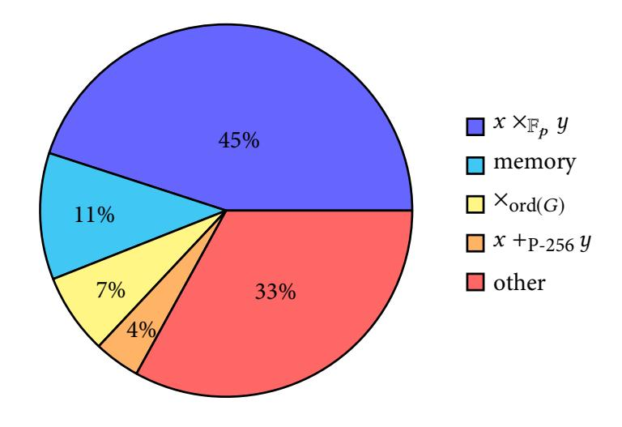
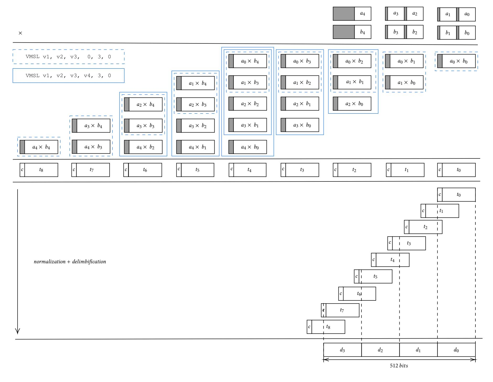
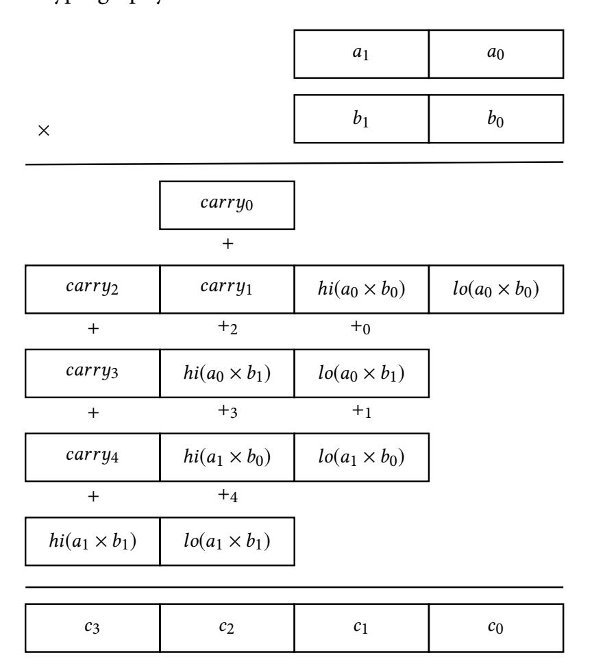
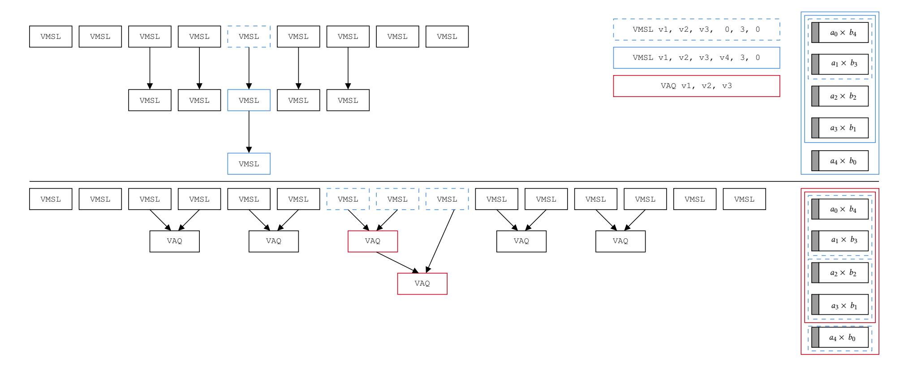
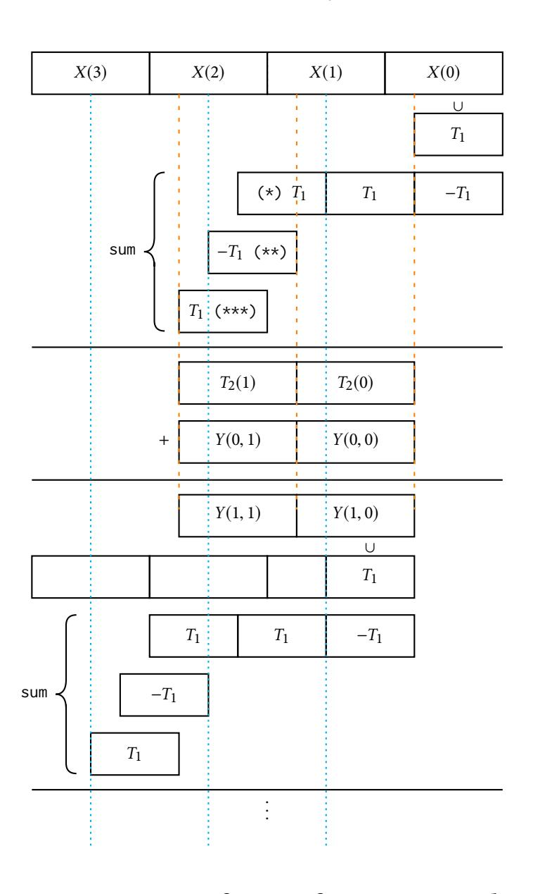

{0}------------------------------------------------

# Using z14 Fused-Multiply-Add Instructions to Accelerate Elliptic Curve Cryptography

James You youy2@mcmaster .ca McMaster University Hamilton, Ontario, Canada

Qi Zhang q.zhang@ibm.com IBM Research Yorktown Heights, New York

Curtis D'Alves dalvescb@mcmaster .ca McMaster University Hamilton, Ontario, Canada

Bill O'Farrell billo@ca.ibm.com IBM Canada Markham, Ontario, Canada

Christopher K. Anand anandc@mcmaster .ca McMaster University Hamilton, Ontario, Canada

# ABSTRACT

Due to growing commercial applications like Blockchain, the performance of large-integer arithmetic is the focus of both academic and industrial research. IBM introduced a new integer fused multiplyadd instruction in z14, called VMSL, to accelerate such workloads.1 Unlike their floating- oint counterparts, there are a variety of integer fused multiply-add instruction designs. VMSL multiplies two pairs of radix 2<sup>56</sup> inputs, sums the two results together with an additional 128-bit input, and stores the resulting 128-bit value in a vector register. In this paper, we will describe the unique features of VMSL, the ways in which it is inherently more efficie than alternativ e specifications in particular by enabling multiple carry strategies. We will then look at the issues we encountered implementing Montgomery Modular Multiplication for Elliptic Curve Cryptography on z14, including radix choice, mixed radices, instruction selection to trade instruction count for latency, and VMSL-specifi optimizations for Montgomery-friendly moduli. The best choices resulted in a 20%increase in throughput.

# CCS CONCEPTS

- Security and privacy → Public key (asymmetric) techniques; • Computer systems organization → Reduced instruction
- set computing; Single instruction, multiple data; Theory of computation → Cryptographic protocols.

## KEYWORDS

elliptic curve cryptography, computer arithmetic, vector instructions, softwar e implementation, single instruction multiple data

Permission to make digital or hard copies of all or part of this work for personal or classroom use is granted without fee provided that copies are not made or distributed for profit or commercial advantage and that copies bear this notice and the full citation on the first page. Copyrights for third-party components of this work must be honored. For all other uses, contact the owner/author(s).

CASCON 19, November 2019, Toronto, Ontario, Canada © 2019 Copyright held by the owner/author(s).

#### ACM Reference Format:

James You, Qi Zhang, Curtis D'Alves, Bill O'Farrell, and Christopher K. Anand. 2019. Using z14 Fused-Multiply-Add Instructions to Accelerate Elliptic Curve Cryptography. In CASCON '19: Conference of the Centre for Advanced Studies on Collaborative Research, November 4-6, 2019, Toronto, Canada, 8 pages.

## 1 INTRODUCTION

Elliptic Curve Cryptogrphy (ECC) is a set of algorithms based on algebraic curves over finite fields, including Elliptic Curve Diffie-Hellman (ECDH) for key exchange and Elliptic Curve Digital Signature Algorithm (ECDSA)for digital signatures. ECC provides an equivalent level of security to RSA with much smaller key sizes[11]. With the increasing adoption of cryptography, many applications depend on the efficient implementation of ECC. Blockchain is perhaps the most important, and best-known example.

Put simply, blockchain is a mechanism for storing immutable transactions on a shared ledger. ECC is heavily used in blockchains to sign transactions. One example is Hyperledger Fabric, an opensource<sup>2</sup> permissioned blockchain platform which delivers higher throughput and better scalability[ 3, 16] compared to permissionless blockchains such as Bitcoin [13] and Ethereum [18]. In order to guarantee that fraudulent transactions are not accepted by other participants, each Hyperledger Fabric transaction needs to be executed and signed by multiple endorsement peers. Before putting a transaction into a block, the committing peer nodes verify the authorship of these signed transactions using the corresponding public keys. ECC has important applications beyond blockchain. For example, the Transport Security Layer version 1.2 and up specify elliptic curve cipher suites [2], through which a wide range of internet applications will benefit from a performant ECC implementation.

## 1.1 Elliptic Curve Cryptography

Operations in ECC correspond to geometric operations on curves in projective spaces over finite fields. The expected security of the signatures depends on the size of the field. Cryptographers have identified an increasing series of useful prime numbers and curves over those prime-modulus fields. This paper reports on results of optimizing such signing operations for NIST P-256, but

<sup>2</sup>https://github.com/hyperledger/fabric


<sup>1</sup>Appendix A lists all z/Architecture instructions used in this paper.

{1}------------------------------------------------

the strategies would be broadly applicable to other primes, types of cryptography and other applications of big number arithmetic.

Figure 1 shows the call stack for the ECDSA, which mirrors the mathematical structure. At the top, we are computing the scaling of a point, P, in the elliptic curve, by a positive integer k. This involves repeated addition in the group of points on the elliptic curve, which has equivalent geometric and algebraic descriptions. So the top row calls the second row repeatedly. Scaling in any group can be naively optimized by decomposing the scalar k = $k_n \cdots k_1 k_0$  into its binary representation, iterating through the digits, adding P to an accumulator at step i iff the digit  $k_i = 1$ , and then adding the accumulator to itself. The actual algorithm is more complicated because this naive algorithm is not constant time, and is also slower than the alternatives. Finally, the algebraic descriptions of the addition in the group are in the finit fiel  $\mathbb{F}_p$ , of integers modulo a prime number *p*. Since the *p* in question has 256 bits, we need 256 bits to represent values in this field which require two vector registers (or more if not stored in compact form). There

| kP           |              | in Elliptic Curve P-256  |
|--------------|--------------|--------------------------|
| P+Q          | P + P        | in Elliptic Curve P-256  |
| $x \times y$ | $x \times x$ | $\mid$ in $\mathbb{F}_p$ |

Figure 1: ECC call stack.

are actually several representations for the points on an Elliptic Curve, but all of them contain multiple elements of  $\mathbb{F}_p$ , and the algebraic representations of the group operations are combinations of the operations in  $\mathbb{F}_p$ . So optimizations of those operations will speed up all other operations. Profilin (see Figure 2) shows that the hottest function is indeed multiplication in  $\mathbb{F}_p$ , which consumes 45% of the execution time.



Figure 2: Performance profile of functions by percentage of total CPU cycles consumed in a Hyperledger Fabric peer on a IBM z13.

#### 2 Z/ARCHITECTURE

The IBM Z is a modern high-performance 64-bit multi-core computer architecture. It is the successor to the line of mainframes which began in 1964 with the IBM 360. Still today, the vast majority of all business transactions are run on Z machines. The currently available model, the z14, has a superscalar pipelined CPU with both

scalar registers and 32 128-bit vector registers. A z14 mainframe can be configued with up to 240 cores (with a 5.2 GHz clock speed) and 32 TB of memory. There are two primary operating systems available on Z: z/OS and Linux (Ubuntu, SUSE Enterprise Server, and Red Hat Enterprise distributions). The work described in this paper was conducted on z14s running Linux.

## 2.1 VMSL: Vector Multiply Sum Logical

VMSL is a fused multiply-add instruction introduced as part of the IBM z14. Unlike typical integer multiplication instructions (SIMD or otherwise) which compute the upper and lower words of the multiplication product in two separate instructions[8], VMSL computes the 112-bit products of two 56-bit multiplications with the option to left shift either 112-bit intermediary product by 1 bit. The resulting intermediate products after the optional shift are then added with a third 128-bit accumulator with all carry outs ignored and the resulting 128-bit sum stored in the destination register. Note that although carry outs are ignored, carry outs cannot occur if less than  $2^{13}$  VMSLs are chained together.

```
VMSL v1, v2, v3, v4, 3, m6

t1 = v2[0:56] *v3[0:56] *(2*m6[0])

t2 = v2[64:120]*v3[64:120]*(2*m6[1])

v1 = t1 + t2 + v4
```

Figure 3: Intrinsic-like description of VMSL. v1 is the destination register.

As a fused multiply-add which computes two full products in a single instruction, VMSL is an excellent building block for computing big integer multiplication[8].

# 3 MONTGOMERY MODULAR MULTIPLICATION

Multiplication in  $\mathbb{F}_p$  which consumes 45% of the execution time can be accelerated using Montgomery multiplication[12]. Since p is an odd prime,  $2^\ell$  and p are relatively prime, and multiplication by  $2^\ell$  is an isomorphism of the additive group  $\mathbb{F}_p$ , and  $a\mapsto a\times 2^\ell$  gives an adapted set of coordinates for multiplication. The same would be true for any finit field and relatively prime multiplier, but multiplication by  $2^\ell$  can be implemented as a left shift. It is computationally convenient to take  $\ell$  to be the number of bits in the binary representation of p. So for P-256,  $\ell=256$ . To efficient compute the inverse transformation, we assume that  $2^{-\ell}$  the inverse of  $2^\ell$  in  $\mathbb{F}_p$  has been precomputed.

Since  $2^{\ell}$  and p are relatively prime, we can compute (using the extended Euclidean algorithm), 0 < R' < p and  $0 < N' < 2^{\ell}$  such that

$$2^{\ell} \times R' - p \times N' = 1.$$

The value R' is the smallest representative of the congruence class  $2^{-\ell}$ . With that in mind, Montgomery multiplication can be efficiently used for modular exponentiation (repeated multiplication[7]), because changing coordinates is a one-time cost[10].


{2}------------------------------------------------

CASCON '19, November 2019, Markham, Ontario, Canada

Since the primes we are required to use are larger than machine integers, we will use a generalization of this algorithm to multiprecision integers due to Gueron and Krasnov[5].

Algorithm 1 Word-by-Word Montgomery Multiplication for a Montgomery Friendly modulus p

```
Input: p < 2^{256}
        l = 256, s = 64, k = 4,
         0 \le a < p, \ 0 \le b < p
Sastifying:
         -p^{-1} \bmod 2^s = 1
        s \times k = l
Output: a \times b \times 2^{-l} \mod p
  1: T = a \times b
  2: for i = 1 to k do
         T_1 \leftarrow T \mod 2^s
  3:
        T_2 \leftarrow T_1 \times p
  4:
        T_3 \leftarrow (T + T_2)
  5:
         T \leftarrow T_3/2^s
  6:
  7: end for
  8: if T \ge p then
        X \leftarrow T - p
  9:
 10: else
        X \leftarrow T
 11:
 12: end if
 13: return X
```

Given the structure of NIST P-256, it is convenient for us to modify their algorithm to allow for variable-width "digits".

**Algorithm 2** Word-by-Word Montgomery Friendly Multiplication with Mixed-Radix Reduction

```
Input: p < 2^{256}
         l = 256, s = [96, 96, 64], k = 3
         0 \le a < p, \ 0 \le b < p
Sastifying:
        \forall i \mid -p^{-1} \bmod 2^{s_i} = 1
         \sum_{i=1}^{k} s_i = l
Output: a \times b \times 2^{-l} \mod p
  1: T = a \times b
  2: for i = 1 to k do
        T_1 \leftarrow T \bmod 2^{s_i}
  3:
       T_2 \leftarrow T_1 \times p
  4:
        T_3 \leftarrow (T + T_2)
  5:
        T \leftarrow T_3/2^{s_i}
  6:
  7: end for
  8: if T \ge p then
        X \leftarrow T - p
  9:
 10: else
         X \leftarrow T
 11:
 12: end if
 13: return X
```

Note that the conditionals in the algorithms presented are converted to constant time equivalents (bit selection and masking) in their implementations.

#### 4 IMPLEMENTATION

Inputs are typically organized in radix  $2^{64}$  for big integer arithmetic on the z14, therefore the inputs must be converted into radix  $2^{56}$  from radix  $2^{64}$  before they can be used with VMSL. We call the process of converting a radix  $2^{64}$  representation into a radix  $2^{56}$  representation "limbification . Some authors call algorithms operating on limbs multi-precision, and others call representation with "pad" bits redundant representations. The digits or "limbs" of the new representation of the number can either be stored individually or in pairs across a double-word boundary (64-bits). The instruction VPERM provides an efficie method for permuting the bytes of each  $2^{64}$  digits to the appropriate  $2^{54}$  limb. VPERM concatenates two vectors registers into an intermediate 256 bit vector. The result vector is formed by extracting bytes from the intermediate vector using 16 indices stored in a third vector argument.

#### 4.1 Schoolbook Multiplication

Schoolbook multiplication is the application of the usual pencil-and-paper algorithm for multiplying decimal numbers to limbed representations. Multiplicands in  $\mathbb{F}_p$  are assumed to be represented by integers in [0..p-1] stored in 56-bit limbs. For P-256, this requires  $\lceil 256/56 \rceil = 5$  limbs, requiring three vector registers. In Figure 4, we present the limbs for two 256-bit inputs A and B with limbs  $a_0, ...a_5$  and  $b_0, ...b_5$  respectively. We observe that there are  $25 = 5 \times 5$  56-bit multiplications. Using VMSL, we can compute two such multiplies at once. The right-most column in Figure 4 only has one multiplication, but the next column has two, so both require one VMSL. We use byte permute instructions, VPERM, to form the arguments from the appropriate limbs.

In more detail, the second column contains the sum of two products

$$(a_1 \times b_0) + (a_0 \times b_1)$$

which can be computed as VMSL can be given as:

```
VMSL (a1; a0), (b0; b1), 0, 3, 0
```

where we use the notation  $(a_1; a_0) = 2^{64} \times a_1 + a_0$ . The firs argument is already stored in this order, but the second requires an additional VPERM.

*Squaring.* VMSL can be used to optimize products which are squares,  $a \times a$ . Consider column 4 from Figure 4, it takes two VMSL instructions in order to compute the column. To compute the equivalent column for the corresponding square expression

$$(a_0 \times a_3) + (a_1 \times a_2) + (a_2 \times a_1) + (a_3 \times a_0)$$

which is equal to

$$2(a_0 \times a_3) + 2(a_1 \times a_2)$$

which requires a single VMSL instruction:

if we use the fina immediate mask, 0b11, to indicate that both intermediate products should be shifted left by one bit.

Because only the least significan 56 bits are used for operands in VMSL, the sum of the two products can be at most 112 bits. In addition, the fina result will be  $\leq (2^{113} - 1) \times a$ , where a is the third operand (the accumulator). In this way, we know that at least 8192


{3}------------------------------------------------



Figure 4: Schoolbook multiplication of two 256-bit inputs stored in 56-bit limbs. The first two rows show limbified multiplicands with zero padding shown in grey. The next five rows show the logical multiplications, grouped in pairs as they are fed to the VMSL instructions. Note that for a single VMSL output, the grey section must be zero, but once VMSLs are chained together the grey area will contain carry bits. In the next row, we show the column sums,  $t_0, ... t_8$ , in which the grey area has been replaced by a "c" indicating the possibility of non-zero carry bits. In the normalization row, we show the overlap in place value for the column sums. The normalization step involves copying the lower 56 bits of  $t_0$  to the answer, then adding the upper 72 bits to  $t_1$ , which we know will not carry out. The lower 56 bits of that result are then the next 56 bits of the answer, and the upper 72 bits are added to  $t_2$ . The final answer is 512 bits wide, and packed into 4 128-bit registers.

chained VMSLs would be required to cause a carry out of the 128-bit vector register.

```
Algorithm 3 Implementation: 2^{64} to 2^{56}

Input: x stored in x(1), x(0)

Output: y stored in y(2), y(1), y(0)

y(0) = VPERM 0, x(0), [0, 0, 20..25, 0, 0, 26..31]

t = VPERM x(1), x(0), [0, 0, 0, 0, 8..19]

y(1) = VPERM 0, t, [0, 0, 20..25, 0, 0, 26..31]

y(2) = VPERM 0, x(1), [0..5, 16, 17, 0, 0, 18..23]

return y(2), y(1), y(0)
```

Contrast this with Figure 5 which shows a typical schoolbook multiplication where the size of each digit is equivalent to the size of a machine word. Separate instructions are required to compute low- and high-order words for each multiply, and for carry computation and addition on each addition. Because we cannot let carries accumulate in place, we need 22 instructions (one each for the intermediate values shown which includes hi/low products and carries, plus one for each "+") to compute a 128-bit result starting from two 64-bit register values, whereas VMSL can compute 112 bits with one instruction, and it is much easier to chain them together.

## 4.2 Dependency Minimization

At first it seems appropriate to have the result of the previous pairwise multiplication be passed as the third argument to next VMSL as an accumulator. In Figure 4, we indicate VMSLs with no dependence on a running total with blue dotted boxs, and VMSLs building on a previous sum with blue solid boxes. This neat picture


{4}------------------------------------------------

Using z14 Fused-Multiply-Add Instructions to Accelerate Elliptic Curve Cryptography



Figure 5: Diagram showing intermediate values involved in a typical schoolbook multiplication, with one rectangle for each register value computed. Each multiplication produces a low- and high-order result, and there are a lot of carries.

has a low instruction count, but as we show in Figure 6, this leads to long latency edges because VMSL performs both multiplication and addition. Although accumulator is only needed for the addition, it must be available before the VMSL will dispatch.

In the lower half of Figure 6, we show that the dependent instructions can be substituted with a VMSL with no accumulator, and a VAQ which adds the individual multiply-sums which can now be dispatched in parallel. Figure 6 shows all of the operations necessary to calculate the column sums in Figure 4, but only the middle column is coloured, corresponding to the two diffe ent boxings to the right. Writing the same column algebraically,

$$(a_4 \times b_0) + (a_3 \times b_1) + (a_2 \times b_2) + (a_1 \times b_3) + (a_0 \times b_4)$$

the firs method is implemented by

```
r0 = VMSL (a4; a3), (b0; b1), 0, 3, 0 // rank 0
r1 = VMSL (a2; a1), (b2; b3), r0, 3, 0 // rank 1
r2 = VMSL (0; a0), (0; b4), r1, 3, 0 // rank 2
return r2
```

Omitting the use of a second accumulate operation would lead to the revised implementation, with the VMSLs computable in parallel:

```
r0 = VMSL (a4; a3), (b0; b1), 0, 3, 0 // rank 0
r1 = VMSL (a2; a1), (b2; b3), 0, 3, 0 // rank 1
r2 = VMSL (0; a0), (0; b4), 0, 3, 0 // rank 2
r3 = VAQ r0, r1
s = VAQ r2, r3
return s
```

CASCON '19, November 2019, Markham, Ontario, Canada

#### 4.3 Delimbification

The product of the vectorized schoolbook multiplication with VMSL is in *non-normalized* form. That is to say that the multiplication produces nine vector registers containing a 112 bit number and up to 16 bits of carry accumulation (see Figure 4). The non-normalized form is composed of registers which belong in the normalized form and registers which contain upper and lower doublewords which must be added to the appropriate limb. After normalization, the limbs can be considered to be *redundant*. Gueron and Krasnov present an algorithm for converting any number U in redundant form to a radix  $2^m$  such that  $U < 2^{m \times k}$  where k is the number of limbs in redundant form[6]. The product in redundant form can then be permuted and bit shuffled to the appropriate registers to finall have the result in the original radix  $2^{64}$  representation. This can be implemented on the z14 with a combination of VAQ, VPERM, VSLDB and logical instructions.

# 4.4 Modulo Reduction with a Montgomery Friendly Modulus

$$T_2 \leftarrow T_1 \times p$$

It is in the calculation of the product, that we see why some primes are called "Montgomery friendly". We will explain the implications in detail, because it took us a long time to understand them. Decomposing the prime[1]

```
p = 0 \times \text{fffffff0000000100000000000000000000000
```

we observe that multiplication by  $T_1$  can be converted into a series of left shifts which are added or subtracted from each other. For this specifi prime, if  $T_1 < 2^{96}$ , some of the shifted versions of  $T_1$  have no non-zero bits in common, so addition is equivalent to bitwise "or". And since 96 is a multiple of 8, the shifting and "oring" can be combined into one or more byte permutations with the VPERM instruction on z14, and similar instructions on other architectures. Even if s (see algorithm 2) is not a multiple of 8, many architectures have shift and insert under mask instructions which similarly reduce the instruction count. Algorithm 4 shows that the reduction to  $T_2$  can be performed with six z14 instructions, including two 128-bit subtractions, with no additions, carrying or borrowing, following well-known optimizations[5, 14].

```
Algorithm 4 Implementation: T_2 \leftarrow (T_1 \times p - T_1)/2^{96}
Input: d
Output: T2 stored in T2(1), T2(0)
Notation:
   For value x spanning j registers, x(i) is the ith register s.t
   0 \le i < j with x(0) as the least significant register.
              = VSLDB 4, d, 0
= VSLDB 12, 0, T1Left
1: T1Left
                                                    ▶ T1 left aligned (***)
2: T1Right
                                                         ▶ T1 makes (**)
               = VSQ T1Left, T1Right
3: T1mT1
                                                    ▶ partial sum in Fig.7
4: T1Left32 = VSLDB 8, 0, T1Left
                                                                 ▶ (*)
               = VSLDB 12, d, T1Left
5: T2(0)
               = VAQ T1Left32, T1mT1
6: T2(1)
7: return T2
```

If, as in this case, the prime ends with a string of 1s, its decomposition will end in a -1, and therefore  $T_2$  will end in a non-overlapping copy of  $-T_1$ . When this is added to T, it will cancel with the last 96


{5}------------------------------------------------



Figure 6: Dependency diagrams of coupled schoolbook multiplication where VMSL accepts the product of another VMSL vs. the uncoupled variant with VAQ. Each VMSL also depends on two registers containing permutations of the multiplicand bytes, and all instructions without dependencies are used in the normalization/delimbification step. Although the first version uses fewer instructions, it has the longer latencies associated with integer multiplication versus the lower latency of addition.

bits of T. So it is unnecessary to calculate the least-significan 96 bits of  $T_2$ . Rather than calculating

$$T_3 \leftarrow T + T_2$$
,

we actually calculate

$$T_3/2^{96} \leftarrow T/2^{96} + T_2/2^{96}$$
,

which has zero fractional part. To simplify notation, we will decompose  $T_2$  as a concatenation of bit strings  $T_2(1)$ ;  $T_2(0)$ ;  $T_1$ , with the firs two 128-bit words stored in registers, and the fina 96-bits not stored.

Working modulo 2<sup>96</sup>,

$$\lfloor p/2^{96} \rfloor = 2^{160} - 2^{128} + 2^{96} + 1.$$

Instruction 1 extracts the 12 bytes of  $T_1$  from d, which on the firs iteration is T(0), the least significan double word of T, and left justifie them. This is (\*\*\*) in Figure 7, which is meant to aid in understanding the alignment of the various bitfield corresponding to  $T_1$ .

Instruction 2 extracts the same 12 bytes of d and right justifie them, which will be used via a subtraction as  $-T_1$  marked by (\*\*) in Figure 7.

Instruction 3 subtracts these two values, which forms the bottom 2/3rds of the firs sum in Figure 7. The sum is completed in instruction 6, with the addition of the top eight bytes of  $T_1$  calculated in instruction 4. Finally, the low-order register word of  $T_2$  is formed by rotating two copies of  $T_1$  so that the bottom four bytes of  $T_1$  are in the left of a register word followed by the full, right-aligned  $T_1$ . No arithmetic is needed to compute this word, because as shown in Figure 7, there is no overlap in bit values  $2^{223}$  to  $2^{96}$ , which is the 2nd region of dashed red lines.

Algorithm 4 is used twice in the reduction step, as will be explained next.



Figure 7: Decomposition of T into four register values, and how its components align with the value of  $T_1$  in the three iterations of Algorithm 2.


{6}------------------------------------------------

#### Updating T

The input and initial value of *T* is 512 bits wide, so it requires four registers X(3), X(2), X(1) and X(0). In the previous subsection, we extracted  $T_1$  from X(0), and calculated  $T_2/2^{96}$ , which is at most 256 bits wide. The extra 96 bits are not needed in the computation of  $T_3$ . Furthermore, only the portion of  $T_3/2^{96} \leftarrow (T+T_2)/2^{96}$  needed compute  $T_1$  for the next iteration is required. After the firs iteration, we will need 96 bits and after the second 64 bits. Since Algorithm 4 is applied iteratively in Algorithm 2, we will use the iteration number as a firs index for Y(i, 0) and Y(i, 1) the low- and high-order words of the lower bits of T which we carry through the computation. Since the goal is to eliminate the fina 256 bits, we only need to track the bits with place values originating in X(1) and X(0). because that is sufficie to determine  $T_1$ , not only in the fi st iteration, but in all three iterations of Algorithm 2. Because the reduction does not depend on X(3) or X(2), we can begin reduction when the lower product of schoolbook multiplication becomes available. Finally we can add the accumulated carries to the upper products when they become available. To see that consider Figure 7.

Orange long dashes indicate the boundaries of the register values used to compute  $T_2$ , which depend on  $T_1$ , and match the left boundary of the extracted copy of  $T_1$ . At this step, the extracted copy of  $T_1$  cancels out, so it is not used for computation in situ, but four shifted copies are used, as shown, bracketed by a sum. In the next step, cyan short dashes indicate the boundaries of the register values used to compute  $T_2$ , which similarly depend on the value of  $T_1$  in this iteration.

Interleaved with these applications in Algorithm 4 is the addition of  $T_2$  to T. To avoid unnecessary shifts and additions, we add  $T_2$  to shifted versions of X(1), X(0) instead, and add the result to X(3), X(2) in the fina step. Because we shift the register alignments with each iteration, the fina accumulated value is be aligned with X(3), X(2). We give the full implementation in Algorithm 5, which follows similar patterns to the previous implementations, but we would like to point out a few important points.

The shifted values representing T in the original algorithm are labelled T and calculated at statements 4,5,11,12 in the three iterations. The shifts could have been performed by a VPERM instruction, but a constant register of indices can be saved by using VSLDB which concatenates the bytes in two registers, shifts the result to the left and keeps the high-order quadword.

The addition with  $T_2(1)$ ,  $T_2(0)$ , the most significan 256 bits of  $T_2$  in the original algorithm, are performed by VAQ, a 128-bit add, as well as variations VACQ which incorporates a carry in, VACCQ which calculates a carry out, and VACCCQ which both incorporates a carry in and calculates a carry out. The firs two iterations at instructions 7,8,9 cannot carry out beyond the 256-bit value because the most significan bytes of T are zero, due to the shifts, the fact X(3), X(2) are not incorporated, and the corresponding bytes of  $T_2(1)$  must contain a zero bit to stop carry propagation, since as we see in Figure 7, they are the result of a subtraction  $T_1 - T_1/2^{32}$ .

In the last iteration, we add to X(3), X(2) and we calculate the fina carry because it may be 1. If the carry is 1, then the condition T > p holds and we subtract p from the result. We do this efficient by subtracting p from the 256 least significan bits of the last iteration result, which we denote Y(3, 1), Y(3, 0), and using the borrow

#### **Algorithm 5** Implementation: Mixed-Radix Reduction

у

```
Input:
     X = a * b stored in X(3), X(2), X(1), X(0)
Output:
     X * 2^{(-256)} \mod p \text{ stored in } Y(1), Y(0)
1: Y(0,0) = X(0)
2: Y(0,1) = X(1)
3: for i = 0 to 1 do
4:
     T(0)
                 = VSLDB 4, Y(i,1), Y(i,0) > 96-bit limb reductions
     T(1)
                 = VSLDB 4, 0,
                                    Y(i,1)
5:
                 = reduce_step Y(i,0)
     Τ2
6:
                                                   ⊳ see algorithm 4
                 = VACCQ T(0),
7:
                                 T2(0)
     carry
                                 T2(0)
     Y(i+1,0)
                          T(0),
                 = VAQ
8:
                 = VACQ T(1), T2(1), carry
9:
     Y(i+1,1)
10: end for
11: T(0)
                          8, Y(2,1), Y(2,0) \triangleright 64-bit limb reduction
                 = VSLDB
                 = VSLDB
                          8, 0, Y(2,1)
12: T(1)
                          8, Y(2,0), 0
                 = VSLDB
13: T1Left
                 = VSLDB
                          12, 0,
14: T2(0)
                                      T1Left
                 = VSLDB
                          8, T2(0), T1Left
15: T2(1)
                           T2(1), T2(0)
16: T2(1)
                 = VSQ
                 = VACCQ
                          T(0), T2(0)
17: carry
                 = VAQ
                           T(0), T2(0)
18: T3(0)
19: T3(1)
                 = VACQ
                           T(1), T2(1), carry
                 = VACCQ
                          X(2), T3(0)
20: carry
21: Y(3,0)
                 = VAQ
                           X(2), T3(0)
                 = VACCQ X(3), T3(1), carry
22: Y(3,1)
                 = VACCCQ X(3), T3(1), carry
23: Y(3,2)
24: Y(3,0)-p(0) = VSQ
                            Y(3,0), p(0)
                 = VSCBIQ
                          Y(3,0), p(0)
25: borrow0
26: Y(3,1)-p(1) = VSBIQ
                            Y(3,1), p(1), borrow0
                 = VSBCBIQ Y(3,1), p(1), borrow0
27: borrow1
                 = VSBIQ
                            Y(3,2), 0, borrow1
28: mask
                                                    ▶ carry ≤ borrow1
                            Y(3,0), Y(3,0) - p(0), mask
29: Y(4,0)
                 = VSEL
30: Y(4,1)
                 = VSEL
                            Y(3,1), Y(3,1) - p(1), mask
31: return Y(4)
```

result borrow1 to indicate that it was not greater than p. There are now three possibilities (cf. [17]) with the fourth being excluded

- borrow1 =  $0 \land Y(3, 2) = 0 \implies Y(3, 2)$  borrow1 = 0, which corresponds to a 256-bit result, larger than p;
- borrow1 =  $1 \land Y(3,2) = 0 \implies Y(3,2) \text{borrow1} = -1$ , which corresponds to a 256-bit result, less than p;
- borrow1 =  $1 \land Y(3, 2) = 1 \implies Y(3, 2)$  borrow1 = 0, which corresponds to a 257-bit result, larger than p.

This subtraction Y(3, 2) – borrow1 serves as a mask which can be used to select the fina answer using VSEL in instructions 29 and 30.

#### 5 RESULTS

The implementation was benchmarked with Go's scalar multiplication function, ScalarMultP256. Scalar multiplication involves repeated point addition and point doubling and thus is a good test for the improvements we made. All benchmark runs were done on a single core of a z14 configu ed for performance measurement (i.e. with VM sharing disabled). the new implementation was  $1.2\times$  faster, from which we calculate that  $\times_{\mathbb{F}_p}$  was  $1.25\times$  faster. These functions were upstreamed in Go version 1.12.

#### **6 DISCUSSION & RELATED WORK**

Initially, our implementation of schoolbook multiplication and modular reduction were interleaved in a scheme similar to the *Coarsely Integrated Operand Scanning* method described by Kaya Koc, Acar and Kaliski in [9]. In order to simplify the implementation, both the inputs and prime modulus were stored in the same radix. This


{7}------------------------------------------------

creates some difficul in interleaving the optimal schoolbook multiplication (where limbs are stored in radix 2 <sup>56</sup>) and modular reduction (where limbs are stored in radix 2 <sup>48</sup>). We were able to reach a 20%improvement with the non-interleaved code, which is a combination of the reduced computation, and a reduction in the difficul of scheduling this case.

While our implementation computes the product of schoolbook multiplication using full-word sub-products. Gueron and Krasnov present and implement a schoolbook multiplication strategy for various input sizes using 512-bit upper and lower integer fusedmultiply-add vector instructions with 52-bit limbs in the Intel IFMA proposal[6]. Additionally Gueron and Drucker showcase the use of a shift bit for optimizing modular exponentiation using the same instructions in [4]. However, at both their times of writing, the instructions were unimplemented on available microprocessors.

## 7 CONCLUSION

We have demonstrated significan speedups for elliptic curve operations by tuning known algorithms for the capabilities of z14, particularly VMSL, but this tuning-up goes beyond the instruction selection which could be expected from a highly tuned compiler, since many code optimizations depend on properties of finit field and their representations. We have taken care to include as many details of the optimizations which were not obvious to us in the hope that future implementers of big-integer and cryptographic functions will benefit

In the future, we hope to parameterize the optimizations we have made so that they can be applied to larger primes (for greater security against quantum computers[15]) and alternativ e algorithms, such as Karatsuba's, in the future without requiring a complete rewrite.

# ACKNOWLEDGMENTS

We thank the IBM Centre for Advanced Studies and NSERC for financia support. We thank Jonathan Bradbury for his role in design of the VMSL instruction and for his guidance and advice. We also thank Michael Munday for his detailed code review.

# REFERENCES

- [1] Daniel J. Bernstein and Tanja Lange. [n.d.]. SafeCurves: choosing safe curves for elliptic-curve cryptography. [https://safe curves.cr.yp.to](https://safecurves.cr.yp.to) accesse d 20 January 2019.
- [2] Simon Blake-Wilson, Nelson Bolyard, Vipul Gupta, Chris Hawk, and Bodo Moeller. 2006. Elliptic curve cryptography (ECC) cipher suites for transport layer security (TLS). Technical Report. RFC4492.
- [3] Kyle Croman, Christian Decker, Ittay Eyal, Adem Efe Gencer, Ari Juels, Ahmed Kosba, Andrew Miller, Prateek Saxena, Elaine Shi, Emin Gün Sirer, et al. 2016. On scaling decentralized blockchains. In International Conference on Financial Cryptography and Data Security. Springer, 106–125.
- [4] Nir Drucker and Shay Gueron. 2018. Fast modular squaring with AVX512IFMA. IACR Cryptology ePrint Archive 2018 (2018),335.
- [5] Shay Gueron and Vlad Krasnov. 2013. Fast Prime Field Elliptic Curve Cryptography with 256 Bit Primes. Cryptology ePrint Archive, Report 2013/816. [https://eprint.iacr.org/2013/816.](https://eprint.iacr.org/2013/816)
- [6] S. Gueron and V. Krasnov. 2016. Accelerating Big Integer Arithmetic Using Intel IFMA Extensions. In 2016 IEEE 23rd Symposium on Computer Arithmetic (ARITH). 32–38.<https://doi.org/10.1109/ARITH.2016.22>
- [7] Darrel Hankerson, Alfred J Menezes, and Scott Vanstone. 2006. Guide to elliptic curve cryptography. Springer Science & Business Media.
- [8] IBM Corporation. [n.d.]. z/Architecture Principles of Operation. IBM.
- [9] C. Kaya Koc, T. Acar, and B. S. Kaliski. 1996. Analyzing and comparing Montgomery multiplication algorithms. IEEE Micro 16, 3 (June 1996), 26–33. <https://doi.org/10.1109/40.502403>

- [10] Martin Kochanski. 2003. A new method of serial modular multiplication.
- [11] K. Lauter. 2004. The advantages of elliptic curve cryptography for wireless security. IEEE Wireless Communications 11, 1 (Feb 2004), 62–67. [https://doi.org/](https://doi.org/10.1109/MWC.2004.1269719) [10.1109/MWC.2004.1269719](https://doi.org/10.1109/MWC.2004.1269719)
- [12] Peter L. Montgomery. 1985. Modular Multiplication without Trial Division. Math. Comp. 44, 170 (April 1985), 519–521.
- [13] Satoshi Nakamoto. 2008. Bitcoin: A peer-to-peer electronic cash system. (2008).
- [14] Holger Orup. 1995. Simplifying quotient determination in high-radix modular multiplication. In Proceedings of the 12th Symposium on Computer Arithmetic. IEEE, 193–199.
- [15] Martin Roetteler, Michael Naehrig, Krysta M Svore, and Kristin Lauter. 2017. Quantum resource estimates for computing elliptic curve discrete logarithms. In International Conference on the Theory and Application of Cryptology and Information Security. Springer, 241–270.
- [16] Parth Thakkar, Senthil Nathan, and Balaji Vishwanathan. 2018. Performance Benchmarking and Optimizing Hyperledger Fabric Blockchain Platform. CoRR abs/1805.11390 (2018). arXiv[:1805.11390 http://arxiv.org/abs/1805.11390](http://arxiv.org/abs/1805.11390)
- [17] Colin D Walter. 1999. Montgomery exponentiation needs no fina subtractions. Electronics letters 35, 21 (1999),1831–1832.
- [18] Gavin Wood. 2014. Ethereum: A secure decentralise d generalise d transaction ledger. Ethereum project yellow paper 151 (2014),1–32.

## A OTHER INSTRUCTIONS USED.

```
VPERM v1 , v2 , v3 , v4
for j = 0 to 7 do
i = j *8
idx = ( v4 [ i : i +8] & 0 x1f )*8
v1 [ i : i +8] = ( v2 ++ v3 )[ idx : idx +8])
endfor
-------------------------------- ------------------
VSLDB v1 , v2 , v3 , i4
* 0 <= i4 <= 15
i = i4 *8
v1 = ( v2 ++ v3 )[ i : i +127]
-------------------------------- ------------------
VAND v1 , v2 , v3
v1 = v2 & v3
-------------------------------- ------------------
VSEL v1 , v2 , v3 , v4
for i = 0 to 127 do
  if v4 [ i] == 0 then
    v1 [ i ] = v3 [ i ]
  else
    v1 [ i ] = v2 [ i ]
  endif
endfor
-------------------------------- ------------------
VAQ v1 , v2 , v3
v1 = v2 + v3 mod 2^128
-------------------------------- ------------------
VACQ v1 , v2 , v3 , v4
v1 = v2 + v3 + ( v4 & 0 x1 ) mod 2^128
-------------------------------- ------------------
VACCQ v1 , v2 , v3
v1 = v2 + v3 div 2^128
-------------------------------- ------------------
VACCCQ v1 , v2 , v3 , v4
v1 = v2 + v3 + ( v4 & 0 x1 ) div 2^128
-------------------------------- ------------------
VSQ v1 , v2 , v3
v1 = v2 + ~ v3 + 1 mod 2^128
-------------------------------- ------------------
VSBIQ v1 , v2 , v3 , v4
v1 = v2 + ~ v3 + ( v4 & 0 x1 ) mod 2^128
-------------------------------- ------------------
VSCBIQ v1 , v2 , v3
v1 = ~( v2 + ~ v3 + 1 div 2^128)
-------------------------------- ------------------
VSBCBIQ v1 , v2 , v3 , v4
v1 = ~( v2 + ~ v3 + v4 div 2^128)
```

