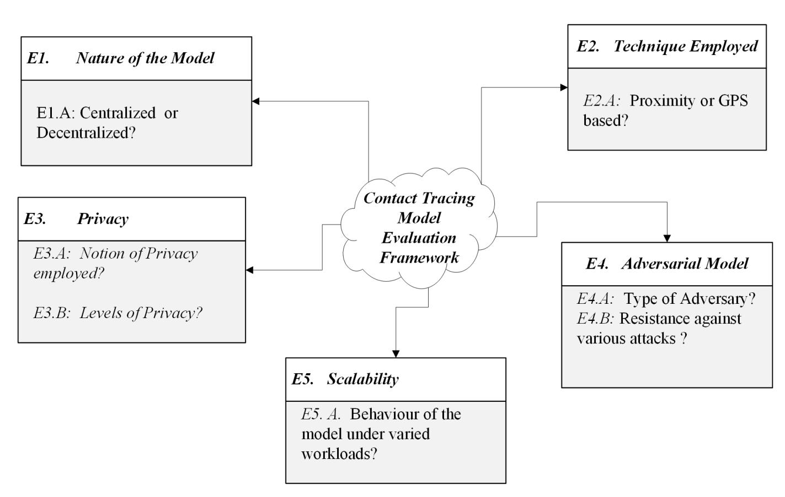
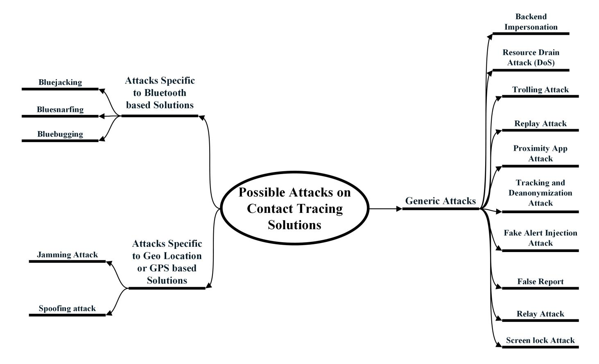

{0}------------------------------------------------

# Applicability of Mobile Contact Tracing in Fighting Pandemic (COVID-19): Issues, Challenges and Solutions

Aaqib Bashir Dara , Auqib Hamid Loneb,∗ , Saniya Zahoorb , Afshan Amin Khanb , Roohie Naazb

*a Independent Researcher, Jammu and Kashmir,India,190015 bDepartment of Computer Science and Engineering, NIT Srinagar, Jammu and Kashmir, India,190006*

#### Abstract

Contact Tracing is considered as the first and the most effective step towards containing an outbreak, as resources for mass testing and large quantity of vaccines are highly unlikely available for immediate utilization. Effective contact tracing can allow societies to reopen from lock-down even before availability of vaccines. The objective of mobile contact tracing is to speed up the manual interview based contact tracing process for containing an outbreak efficiently and quickly. In this article, we throw light on some of the issues and challenges pertaining to the adoption of mobile contact tracing solutions for fighting COVID-19. In essence, we proposed an Evaluation framework for mobile contact tracing solutions to determine their usability, feasibility, scalability and effectiveness. We evaluate some of the already proposed contact tracing solutions in light of our proposed framework. Furthermore, we present possible attacks that can be launched against contact tracing solutions along with their necessary countermeasures to thwart any possibility of such attacks.

*Keywords:* COVID-19, Contact Tracing, Security, Privacy, Scalability.

#### 1. Introduction

Severe Acute Respiratory Syndrome (SARS) is an atypical pneumonia that is characterized by a high rate of transmission, which began in Guangdong Province, China, in November 2002 [1]. One of the largest SARS outbreaks to date began in Singapore in mid-March 2003 [1] and was traced to a traveler returning from Hong Kong. Recently in China, several local health facilities in Wuhan, Hubei Province, reported clusters of patients with pneumonia of unknown cause that they supposedly and epidemiologically linked to a seafood and wet animal wholesale market in the province. However the due spread through untraced contacts eventually lead to its spread on a global scale which is what we see today as a pandemic (COVID-19) [2]. Contact Tracing is a key

*Email address:* ahl@nitsri.net (Auqib Hamid Lone)

∗Auqib Hamid Lone

{1}------------------------------------------------

strategy for mitigating the impact of infections like COVID-19 on health care systems in specific and health of the population in general, and is thereby expected to slow the spread of infectious diseases. It allows individuals of a country or a community to relieve distress from a community's containment measures, as it gives the corresponding infected individuals a chance to quarantine themselves voluntarily. Contact tracing is expected to increase the sensitivity followed by the readiness of a country, a community, or individuals for an emerging pandemic like novel Coronavirus (COVID-19) by mitigating the already available flaws of the traditional detection which solely relies on symptoms. According to WHO [3], contact-tracing occurs in three steps:

- 1. *Identifying the Contact:* From the already confirmed positive cases, identifying those that the patient had contact with (according to the transmission modalities of the pathogen).
- 2. *Listing of Contacts:* Keep a record of possible contacts of the infected patients and inform those individuals.
- 3. *Contact Follow-Up:* A necessary follow-up of the patients that are believed to have come in contact with the infected individuals and those who are positive.

Containment is a primary road-map to quickly halt an outbreak, which may become an epidemic and then in the worst case, turn into a pandemic, which is exactly what happened in case of COVID-19. Containment is accomplished by rapid identification of the individuals followed by their quarantine for a maximum of 14 days which under conservative assumptions happens to be the time period after which an individual starts to develop symptoms [4]. The next step is to identify those people who they had contact with, within the previous days which is then accompanied by decontamination of places that the infected individual had traveled to in the recent past. In essence, this process is expensive in terms of labor and prone to various errors that may lead to some privacy concerns. With a limited number of resources the government has, the process of contact tracing needs to be automated so as to stop the untraced spread of the disease. In order to understand why contact tracing is so important, we need to determine how contagious a disease is. This depends upon the average number of individuals that will catch the disease from one infected individual. The determination of these features is done with certain parameters like the infectious period, the rate of contact and the mode of transmission. Both incubation period and the mode of transmission are the functions of the nature of the disease causing pathogen. Thus, the only controllable parameter being the contact rate, which needs to be traced and controlled accordingly. Thereby, providing an idea about how important contact tracing is and how helpful it can be for lowering the rate of transmission of a disease before its translation into a pandemic. Whether contact tracing and isolation of known cases is enough to prevent the spread of the epidemic, some predictions were made by Ferretti et al. [5]. They quantified the expected success of digital contact tracing and suggested some requirements for its ethical implementation. As the need arise, several proposals are being proposed to contain the further spread of this pandemic. However, it is equally important to have an evaluation criteria for these solutions so as to check which solution deems fit for adoption.

Considering the advancements in technology, almost every alternate individual on earth carries a device which has the capabilities of being tracked through GPS with proper 

{2}------------------------------------------------

infrastructure [3]. Such capabilities, like the tracking of location trails with proper timestamps and the ability to log them can certainly allow one to compare infected individuals with that of the ones who have been in their close proximity, thus enabling contact tracing. Now that we know what is at stake, it is also important to understand the magnitude of the grave consequences it can draw. Since, digital contact tracing is widely being demanded because of the need of the hour, there are a number of proposals emerging from the scientific community leveraging state-of-the-art technology to make contact tracing actually possible and less cumbersome in practice. However, with the proposals coming in numbers, one important aspect is their careful evaluation in a generic sense before being considered for wide adoption by the masses. To this end, there is not a general framework or an assessment criteria for digital contact tracing solutions to determine their feasibility, usability and scalability. To address this problem in hand, we propose an evaluation framework to analyze and evaluate some of the contact tracing systems based on some parameters and discuss about the possibility of attacks on them and their countermeasures.

In this article, we investigated several contact tracing solutions under the evaluation framework we proposed. The parameters of the evaluation framework are highly important to contact tracing solutions since the problem is explicitly defined along with the areas that needs improvement and careful analysis. We analytically study the importance of these parameters in a contact tracing solution to pave a way for practical considerations for a contact tracing solution to be adopted in practice.

Key findings and discussions of this article can be listed as follows:

- We highlighted the underlying issues & problems with mobile contact tracing solutions.
- We proposed a general evaluation framework for contact tracing solutions and provided a thorough introduction of each of the parameters.
- We evaluated some of the available contact tracing solution in light of our framework.
- We also performed a comparative analysis of the evaluated contact tracing solutions to provide comprehensive insights for better understand these solutions.
- Furthermore, we provided possible attacks on contact tracing solutions and their potential countermeasures.

Rest of the paper is organized as follows: Section 2 discusses about the issues and challenges in adopting mobile contact tracing solutions. Section 3 presents the proposed framework for evaluating contact tracing solutions. In Section 4, we evaluate some of the available contact tracing solutions in light of our proposed framework. Section 5 presents the taxonomy of the possible attacks on available contact tracing solutions and their possible countermeasures. Section 6 concludes the paper by providing insights into what was achieved in the paper and the underlying motivation for doing that. A brief summary of most of the available contact tracing solutions is presented in Table A.2 which is included as Appendix A.

{3}------------------------------------------------

#### 2. Issues and Challenges in Mobile Contact Tracing

In this section, we discuss issues and challenges pertaining to the adoption of contact tracing solutions. Digital contact tracing speeds up the process of identification of the individuals who might have come in close contact with the contagious ones. However, before merging the traditional contact tracing methodology with the current state-of-the-art technology, there arise potential risks and issues. Some of the primary concerns of which are of securing the identity of an infected individual from others, stopping the spread of misinformation, stopping snoopers from causing panic among the masses and withholding the countries from establishing a surveillance state. Some examples of mass surveillance activities among contact tracing solutions that might have some serious consequences are:

Israel passed a legislation that allows the government to track the mobile phone data of individuals suspected to be infected [6].

South-Korean government on the other hand has maintained a public database of known patients which contains information about their occupation, age, gender and travel routes [7].

There are several technology based solutions suggested to be adopted as a digital contact tracing solution/mechanism, some of which are based on GPS tracking and the others, that are based on Bluetooth based token sharing. Despite the efforts, there are issues with the underlying technologies which are to be understood, highlighted and mitigated in best possible ways to strengthen the available solutions. These issues should be addressed to narrow down any strategic window of opportunity for malicious actors, snoopers and surveillance state/government. The Automatic Contact tracing systems based on Bluetooth communications was first proposed by Altuwaiyan et al. [8] in 2018. The Bluetooth based contact tracing systems can directly detect whether users came in proximity of each other. The proximity can be approximated by the strength of the signal, which although is reduced by obstructions like walls. Therefore in a high risk environment for close contact like buildings or public transits it can more effectively and accurately reflect functional proximity [9]. However, with applications that evaluate exposure risk based on Bluetooth, proximity exchange is in essence not sufficient because of the fact that apart from the human to human interaction, Coronavirus (COVID-19) can also transmit through common environments or commonly touched surfaces [10]. Another important drawback of pure Bluetooth based systems is the problem of slow or low rate of adoption which in turn limits the user base thus affecting the effectiveness of the system. Zeadally et al. in [11] has provided a detailed discussion on issues and possible attacks on Bluetooth technology. GPS, on the other hand is not secure by its inherent nature. Also, there are some functionalities that GPS based systems cannot provide. One of the main concerns is spoofing attacks, where a spoofer creates a false GPS signal with an incorrect time and location to a particular receiver [12]. Warner et al. in [13] gave a simple demonstration to show GPS is vulnerable to spoofing.

{4}------------------------------------------------

#### 3. Proposed Evaluation Framework for Contact Tracing Solutions

The proposed evaluation framework is a five-step method for evaluating a particular contact tracing solution as shown in Figure 1. The figure depicts the diagrammatic representation of the framework and each step is summarized in detail below. The aim of our evaluation model is to categorize the contact tracing solutions so as to be able to identify each solution easily and further have a general criteria for the evaluation of contact tracing systems. It is equally important to provide the motivation behind choosing these parameters for evaluation of contact tracing solutions. Since contact tracing solutions involve collection and use of sensitive data of individuals such as their health history, infection state, current health symptoms, medical conditions and their location. It is evident that the use of this sensitive personal information of individuals has elicited serious concerns about the overall integrity of these solutions. These concerns have motivated interest in transparency of the whole process, so that the stakeholders can better understand the fine details, including the purpose of the solution, the security it offers, the data that is being collected and the proposed solution's use of the collected data. With all these factors in perspective, we figured out the parameters that best suit the purpose and are well generalized in nature. Although, there are other parameters which can be used to further better the analysis of contact tracing solutions like the Battery consumption/Battery efficiency, likelihood of adoption and number of downloads (in thousands) a particular application has received, but as the theme of the targeted schemes in perspective is much general, it will not be feasible to evaluate them on these parameters at this point. We further put some of the available contact tracing solutions under the framework's assessment criteria and analyze them explicitly.

Figure 1: Contact Tracing Evaluation Framework

Before providing a detailed description of the five principles of the evaluation cri-

{5}------------------------------------------------

teria it is important to give a brief introduction of these principles for a better understanding of the evaluation criteria. The underlying parameters are as:

- E1. Centralized or Decentralized: A Centralized system is one where all the users are connected to a single point of authority or a server. The central authority stores all the data where all the other users can this information. While as a decentralized system is one where no entity is a sole authority or has control over the whole network or the data.
- E2. Proximity or GPS: Global Positioning System (GPS) has seen its growth from a meagre positioning system to its omnipresence as a trusted navigation, timing data and positioning source. For the close proximity case, bluetooth technology is chosen due to the evident reasons like low cost, low power consumption and it's ability to be integrated in a wide range of portable devices.
- E3. Privacy: Privacy is an extensive concept, and encompasses a wide range of things from control over one's body, freedom of thought, solitude in one's home, control over personal information, freedom from surveillance, protection of one's reputation, and protection from interrogations and searches [14]. Cryptographically, there are several notions of privacy that have been introduced over the years and are widely used in practice. Keeping in view the context of the problem in perspective, we involve some popular definitions like k-anonymity [15], differential privacy [16] and information-theoretic privacy [17].
- E4. Adversarial Model: The adversarial model depicts the setting which the adversary is working under or the corruption abilities of an adversary. There are several adversarial models in the field of cryptography but we use the Semihonest/ Honest but Curious model in our case. In this model, the adversary can try to obtain the information that they are not entitled to
- E5. Scalability: A solution is said to be scalable if it can be adopted by masses without significant changes to the underlying infrastructure. There can be various parameters under the wide blanket of scalability depending upon the application being targeted like number of downloads, Battery optimization etc. However, in a generic way we consider the scalability of the system as its behaviour under varied workloads.

Now that we have a general overview about the parameters of the evaluation model. It will be easy to understand the subtle characteristics of the model.

### • Nature of the model (Centralized or Decentralized)

The question of whether a solution should be centralized or decentralized is of central importance in contact tracing systems because in centralized systems, we have a central semi-trusted authority like a Health or a government authority in our case. For example, consider the case of Singapore's TraceTogether app [18], the government maintains a database that links randomly generated tokens from an individual's phone to their phone numbers and then to their actual identities. 

{6}------------------------------------------------

They can build a list of all other people they have been in contact with after an infected user is compelled to upload his data. With these things into consideration, no individual would want to be exploited by a central authority under any circumstances. Thus, the notion of decentralization causes a dent to such surveillance infrastructures and give individuals something to look upto. We look at it as a policy that fulfills the necessary requirements of contact tracing while providing the privacy we want. However, [19] provided great insights into security and privacy analysis of contact tracing systems. He argued that contrary to common belief that decentralization solves the privacy concerns of centralized systems, it rather introduces some new attack vectors against privacy itself. For literature relevance, we have organized proposals in A.2 and characterized them in a context that we feel is important to contact tracing systems.

### • Technique Employed (Proximity based or GPS based)

Our second assessment criterion is to understand the underlying technique employed by the contact tracing solution. Since, the idea is to track the people who came in close contact with each other, there are two mechanisms that are usually used to ensure tracking of individuals. They are Proximity based (Bluetooth) and GPS based. Some of the solutions employ the use of both while most of them rely on one or the other. The widely adopted technique is the one which makes use of Proximity based tracking due to all the evident reasons. Since Proximity based solutions are usually more accurate compared to GPS based solutions [20], it is one of the reference selection parameters. Among other advantages is its ability to classify close contacts with a significantly lower false positive rate than GPS [20], its low power consumption and the rate of adoption. The rate of adoption is another important parameter for contact tracing solutions. It is quite evident that people are wary of tracking the location data, which can hamper its adoption and pave a way for Proximity based solutions.

# • Privacy

Privacy is the backbone of contact tracing solutions. Safeguarding privacy should be the first step in devising contact tracing solutions. Privacy of individuals has not been a concern in some of the contact tracing proposals. Some countries have even adopted the notion of mass surveillance to track people in the name of contact tracing [21]. Although there is not a single notion of privacy that can guarantee with absolute certainty, the privacy requirements that a contact tracing solution needs but we can try to formulate certain notions of privacy so as to make privacy preserving a real thing in practice. To that end, we adapt the notions used by Cho et al. [22], because these notions seem to be general to all the schemes and relevant to the design of contact tracing solutions. We further define levels of privacy that the proposed models fulfill. We label them as following:

L1 (Level One): Privacy from Snoopers. L2 (Level Two): Privacy from Users.

L3 (Level Three): Privacy from Authorities.

{7}------------------------------------------------

### • Adversarial Model Evaluation

Considering the importance of data being uploaded for effective detection of individuals who have been in contact with an infected individual (a contagious one) along with the privacy concerns that arise inherently with it, it is important to evaluate the contact tracing solutions under a threat model. Here we use a semi-honest Model of privacy [23], which we expect is the best fit for this case. We also take into consideration various roles of an adversary or a nefarious actor as to what he can do to invade the privacy of users. The analysis of a contact tracing system in the adversarial model is focusing on how the proposed system is believed to behave under various attacks and its ability to withstand certain attacks. We have discussed the possible attacks that we have seen in various proposals as of now and proposed their possible countermeasures. We have evaluated each proposal under the semi-honest model.

### • Scalability

After a contact tracing solution is being framed, developed and deployed, it is then important to understand and analyze how it behaves under certain computational parameters and assumptions. Although, there are factors that may give us better asymptotic bounds on scalability like: the daily traffic, computations done on the phone and computations done in the backend. But for brevity, we determine the scalability of a contact tracing solution on parameters like:

- Number of Users adopting the solution and
- Behaviour of the solution under varied workloads

For a widespread adoption of a contact tracing solution, it is important for a contact tracing solution to be highly scalable. Since, majority of the contact tracing solutions are mobile application based, we consider adoption of a solution synonymous to the number of downloads a particular application has received.

#### 4. Evaluation of the proposed solutions

In this section, in light of the proposed evaluation framework as described in section 3. We evaluate and analyze some of the proposed contact tracing solutions. However, there are certain contact tracing solutions where insufficient information is available about the proposed solution. We omit their discussion for very obvious reasons. Despite that, we have provided brief summaries of most of the solutions in Table A.2 as an Appendix. Owing to clear understanding and simplicity, we adapt Tang's notations [20] to indicate the workflow of contact tracing solutions. We briefly describe the architecture of each solution. We will give insights into some contact tracing solutions and discuss them in light of our framework. We start with a solution which is the first proposed privacy-preserving contact tracing solution that paved a way for other proposals.

{8}------------------------------------------------

#### 4.1. EPIC

Altuwaiyan et al's [8] model is an efficient privacy preserving contact tracing solution that enables users to upload their data securely to the server and if in case someone gets infected, others can check whether they ever came in contact with that infected individual. No unnecessary information is disclosed to the server. A matching score is used to represent the result of the contact tracing. The technical specifications are described below.

The participating entities in the system model are:

- Smartphones
- short-range wireless devices like Access points
- Bluetooth devices and
- A Server (it stores encrypted data from the users and the corresponding timestamps in plaintext)

The several phases of this architecture are described below.

#### Setup or initialization Phase

Since no special setup is needed. We assume that this phase has occurred.

#### Scanning or Sensing Phase

During this phase, the user's smartphones will collect raw data about nearby short-range wireless signals (WiFi and Bluetooth) by performing timely adaptive wireless scanning.

#### Reporting phase or Detection Phase

When a user is detected as positive, then the user will upload its data to the server which is encrypted with corresponding timestamps for each network scan. The data: Wireless Device Unique Identifier (**BSSID**), Wireless Signal Strength indication (**RSSI**) and Wireless Signal type (**WiFi, Bluetooth**) are depicted as tuples of data points  $(t_x, (m_{i,1}, r_{i,1}, p_{i,1}), ..., (m_{i,n_{i,x}}, r_{i,n_{i,x}}, p_{i,n_{i,x}}))$  where  $(m_{i,1}, r_{i,1}, p_{i,1})$  depicts information about the first encountered device.  $m_{i,1}$  is the hashed unique identifier,  $r_{i,1}$  is the strength of the detected signal and  $p_{i,1}$  is the device type for time intervals  $t_0$  and so on.

#### Tracing phase

When a user is identified to be infected and another user wants to check whether they have been in close contact, the user sends a request to the server which includes his public key. The server matches the scans between the infected user  $u_i$  and the requested user based on timestamps. Note that the timestamps are stored in plaintext on the server. After a match is found, the next step is to check whether these two individuals have scanned similar wireless devices. The server has the information of the infected individual in plaintext already. However, no information about a regular user is available to the server. The server uses the user's public key which it received and encrypts each  $m_i$ . The server returns a matrix which has the encrypted subtraction of

{9}------------------------------------------------

all pairs of  $m_i$  and  $m_n$  using a homomorphic encryption scheme multiplied by a random value d added by the server to prevent  $u_n$  from knowing unnecessary information about  $u_i$ .

|           | $m_{i,2}$                        | $m_{i,3}$                        |
|-----------|----------------------------------|----------------------------------|
| $m_{n,1}$ | $Enc((m_{n,1}-m_{i,2})*d_{1,2})$ | $Enc((m_{n,1}-m_{i,3})*d_{1,3})$ |
| $m_{n,2}$ | $Enc((m_{n,2}-m_{i,2})*d_{2,2})$ | $Enc((m_{n,2}-m_{i,3})*d_{2,3})$ |
| $m_{n,4}$ | $Enc((m_{n,4}-m_{i,2})*d_{4,2})$ | $Enc((m_{n,4}-m_{i,2})*d_{4,3})$ |

The results of the matrix are then decrypted by the user and a binary array is retrieved corresponding to the decryption result. 1 indicates that two wireless devices matched and vice versa. The infected user  $u_i$  also sends  $r_{i,y}$  with the matched  $m_{i,y}$  where  $1 < y < n_{i,x}$ . EPIC is also a new method to measure the distance between two smart devices as is evident from the proposal itself. This in practice is more accurate than other solutions.

Taking into account the privacy of the proposal model, the infected individuals are supposed to reveal the location data to the server where the network identifiers are hashed. Since network identifiers are often static, it is of importance that this gives the server the freedom to compute the location data points of the infected users. Another important thing to note is that the timestamps are stored in plaintext, which suggests that, at a particular timestamp the location of the user is available to the server. So, based on our evaluation criteria, it is clear that homomorphic encryption is used to ensure privacy to the queries. The manipulations are done on the encrypted data itself. Although, the level of privacy this solution provides is L1 (Level One), L2 (Level Two) and L3 (Level Three), but there are some serious concerns when it comes to L3 (Level three). Like we discussed above, there is a possibility of attacks and some serious privacy leaks that should be avoided. Perhaps certain measures should be taken into consideration and if the modifications are done correctly, we assume that the L3 (Level three) privacy will be provided in its entirety. Analyzing the solution in light of the adversarial model, it is to be noted that the notion of semi-honest/honest-but-curious model fits the purpose here. To this end, we have seen that the privacy concerns here are the deductions that the server can do based on the information being uploaded thereby linking users based on particular timestamps. Another important thing to consider is that we omit the case of a malicious actor contaminating the database with faulty queries. Scalability is another important factor which impacts a solution's widespread adoption. They have also developed an android application and tested it under various scenarios. Though the number of users that the app was tested with was 10. It is worth taking into consideration the system behaviour when the number increases 10x or 100x (which happens to be a simpler scenario towards its deployment in a real world scenario). Though some scenarios are discussed in the proposed model itself, the overhead will surely increase as the number of users increase.

{10}------------------------------------------------

#### *4.2. TraceTogether*

TraceTogether[18] is the first mobile application based adoption of contact tracing. A system developed by Singapore's Government Technology Agency along with the Ministry of Health to tackle the ongoing pandemic. The app operates by exchanging time varying tokens via Bluetooth connections between nearby phones.

- Users and
- Ministry of Health (MoH)

The entities in this solution are:

It is believed that the Ministry of Health (MoH) of Singapore government is to be trusted to protect the users information thus making this solution a centralized one. It is to be noted that a user might be compelled by the authorities to release his data on the app in case someone is diagnosed with COVID-19 and in Singapore, it is considered as a criminal offense to not assist the Ministry of Health in mapping one's movements. The different phases of the solution are described below:

#### *Setup or Initialization Phase*

During this phase, users download the TraceTogether app [18] and install it on their phones. Before the app is launched, the MoH of Singapore selects some time intervals [*t*0, *t*1, ...], which will end right when the pandemic is over. The app then sends the phone number to MoH and receives a pseudonym from them. MoH stores in its database the pair (*NUMi* , *IDi*) where *NUMi* is the phone number of the user *i* and the *IDi* is the pseudonym generated by the authority against this number. The authority then generates the secret key *K* and selects an encryption algorithm *Enc*. For a user *i*, MoH sends the initial pseudonym *T IDi*,*x* = *Enc*(*IDi*,*tx* ; *K*) to the user's app at the beginning of time interval *tx* for *x*0.

#### *Scanning or Sensing Phase*

In this phase, a user broadcasts *T IDi*,*x* at the time interval [*tx*, *tx*+1) for all *x*0. Users store the TID's of each other along with the signal strength i.e. if user *i* and *j* come in range of Bluetooth communication they will store (*T IDi*,*x*, *T IDj*,*x*, *S igstren*) where the first two entries are the corresponding pseudonyms of the users *i* and *j* respectively at time interval *tx* and Sigstren is the signal signal between their devices.

#### *Reporting phase or Detection Phase*

When a user is tested positive for COVID-19 then the infected user will have to comply with MoH and upload the locally stored data to MoH's database.

### Tracing phase

After user *i* stores the data on to the MoH's server, MoH then decrypts every single *T IDj*,*x* and obtains *IDj* through which they can lookup his *NUMj* and then do the necessary followup.

Now, that the proposal is completely well understood, it is quite clear that the proposed contact tracing solution is a proximity based centralized solution where the centralized authority is the Ministry of Health. The encryption technique is chosen by the authority 

{11}------------------------------------------------

so the notion of privacy is not clear in a sense that it is under the direct control of MoH. In terms of the level of privacy, the app provides L1 (Level One) and L2 (Level Two) levels of privacy since time varying tokens offer privacy among the users. However, it is to be noted that the time varying nature of these random tokens also provides privacy from snoopers to a greater extent if refresh rate is well set. If the rate is too frequent, then the server will have to store huge number of tokens and if the rate is slow then the user can be tracked down by a snooper while walking down the street. Here the semi-honest model of privacy seems to fit which is quite obvious due to the fact that the solution is centralized and under complete control of the MoH of the Singapore government. Though the central authority is following the protocol but if situation arises, they can deviate from it depending upon the circumstances and severity of the reason for deviation. Since, the proposed model relies on a central authority it fails to fulfill the third level of privacy (L3) because there is a possibility of a linkage attack [24]. The behaviour of TraceTogether [18] under various modifications is given in [22] and the underlying protocol behind TraceTogether is Bluetrace [25].

In terms of scalability, the application has received over 2.1million downloads so far [26] which is almost 36% of the total population of the country [27], and it is a voluntary choice for the Singaporean's to install the app. But the noticeable part here is, if more than half of the Singaporean population adapt this technology as a measure to stop the spread of COVID-19, the amount of time-varying location data which is exposed to the authorities will be huge and can draw serious consequences. There is a possibility that a malicious user can manipulate (i.e. add or delete) the data collected by the app. Another possibility is of relay attacks. In addition, there are some other attacks proposed in [19]. Although, there is an advantage of identifying infected individuals but at the cost of an expensive trade-off between privacy and utility.

#### *4.3. Reichert's MPC based Solution*

Reichert's MPC based solution [28] consists of two parties under semi-honest security settings. This solution leverages the already available applications of contact tracing that use location-based-services and store their history locally where health authorities can use the data points of infected individuals to initiate an MPC session with anyone who wants to trace themselves.

The participating entities are:

- Users and
- Health Authority (HA) that offers data matching as a service after collecting and storing the geolocation data of the individuals.

The phases of the proposed solution can be briefly discussed below:

#### *Setup or Initialization Phase*

During the setup phase, Health Authority (HA) prepares the cryptographic keys for later use in generation of garbled circuits [29].

# *Scanning or Sensing Phase*

In this phase, users record their geolocation data points on the fly for different time

{12}------------------------------------------------

intervals  $[t_0, t_1, ...]$ . At a particular time  $t_x$ , a user A generates and stores a tuple  $(t_x, l_{x,u}, l_{x,v})$ , where  $l_{x,u}$  and  $l_{x,v}$  represents latitude and longitude of the location respectively. The health authority can then use these data points in order to initiate a MPC session with every individual who wants to trace themselves.

#### Reporting phase or Detection Phase

If a user is detected positive for COVID-19, then the user will share the data points with the HA.

#### Tracing phase

The Health Authority sends a garbled circuit to all those that are interested. Each user has to perform oblivious communication with the HA. Based on the shared data points, the participating parties together will determine where the trajectories of infected and non-infected individuals intersect. A joint computation is performed by the HA and the users and by performing a secure binary search on the ORAM. If an element is found, then the user has been in close contact with an infected individual.

In light of our proposed framework, the model is geolocation based and has a central Health Authority. Garbled circuit (GC) construction which is fundamental to Multiparty Computation is used to seek privacy between the users such that no information about the inputs and outputs are revealed. The level of privacy this solution offers is L1 (Level One) and L2 (Level Two). Since we use the semi-honest model, assuming that the proposed solution offer L3 (Level Three) privacy will be misleading. There are several attacks that are possible on this proposed solution. Since this contact tracing solution is a theoretical in nature, the other aspects are overshadowed. There is a possibility of a DDoS attack in a situation where the number of users grow exceedingly large. In that case, HA will have to prepare garbled circuits for all the individuals thereby increasing the overhead and complexity, which in turn will take a toll on its efficiency. The attacks that are technology specific are not considered in this analysis since we have a separate section devoted to attacks which cover attacks on GPS based systems as well. Scalability on the other hand will be a bottleneck because there are several factors that will hinder the adoption of this solution unless necessary countermeasures are taken in this regard.

### 4.4. CAUDHT

This is a decentralized system based on distributed hash tables which limits the responsibilities of a HA to just confirming results of confirmed positive individuals by minimizing the amount of data that the centralized authority can derive from the protocol. The system is believed to be adaptable to proposals like DP-3T, though as an extension and not as a replacement.

The entities in the CAUDHT [30] model are:

- Users and
- Distributed Hash table (DHT)

{13}------------------------------------------------

• Health Authority (HA) is merely used to retrieve signatures for the corresponding Bluetooth low energy (BLE) ID's to verify the infected individual.

The phases of this proposed solution are briefly described below:

# *Setup or Initialization Phase*

During the setup phase, we assume that the users have installed the app and a common DHT is chosen as a store-and-retrieve postbox where storage is provided as a key-value store. Apart from this, the HA needs to publish its public key before the protocol is run for infection verification.

#### *Scanning or Sensing Phase*

The CAUDHT protocol offers several protocol mechanisms and sensing in the proposed solution takes place as the collection mechanism. In the collection mechanism, the BLE IDs are broadcasted after a scan is performed to look for nearby devices. Each device advertises an ID which is stored when a signal is picked up from a device. These IDs are generated by means of an asymmetric key pair where the secret key is stored on the phone and the corresponding public key is broadcasted. This allows later verification that the contact with an infected individual actually happened. The scan retrieves 256bit ID which occurs automatically in android and iOS [31]. The BLE IDs are stored locally on a user's phone.

#### *Reporting phase or Detection Phase*

After a user is tested positive, he is supposed to retrieve HA's signature for every shared BLE ID in a blind way. For this purpose, textbook RSA is used for blind signatures in order to verify an infected user. Since HA's public key is available to all, the users can verify that the individual is actually the infected one and not a malicious one. When a user had come in contact with an infected user it had received the BLE IDs from that user. Since the IDs are public keys, she encrypts her own BLE ID that she advertised during the last time she encountered this specific ID of that particular user. The infected user then accesses the DHT and stores the signatures of encrypted BLE ID at the DHT addresses corresponding to the user who came in contact with an infected user.

#### *Tracing phase*

This phase in the proposed solution is called the Pooling mechanism. In order to check whether a user has been in contact with an infected person, they need to periodically query the DHT. After a user is detected positive, he leaves a message in the corresponding contact's postbox. Since the message was encrypted with the corresponding contact's public key, the corresponding contact can search for this key in the DHT. An encrypted result will be returned which can then be decrypted by the corresponding user who holds the secret key.

Speaking of the proposed model in light of our framework, it is decentralized and uses proximity based tracing. Distributed Hash Tables (DHTs) are used to allow decentralization rather than relying on a central database. The levels of privacy this solution offers is L1 (Level One), L2 (Level Two) and L3 (Level Three). Although there are several underlying issues with the proposed solution where future modifications are 

{14}------------------------------------------------

needed, we highlight some of them here. In the semi-honest model setting, we consider a scenario where a malicious positive patient can claim to have seen the random BLE IDs which in turn will make users believe that they have contracted the disease. This is avoided by the lookup which is provided by DHT. The system resists against linkage attacks possible by the Health Authority. An eavesdropper cannot claim to be infected since a signature from the Health Authority uniquely determines an infected user from a non-infected one. Non-infected users can also try to learn about the ones who came in contact with an infected one. If a message is placed in the DHT when an infection is confirmed, an eavesdropper can conclude that the user has been in contact with an infected user. In order to prevent this, postboxes can hold more than one message and users can write random messages into their own or other user's postboxes. Only the meaningful will be taken and the random ones discarded. The security of the system is enhanced with the use of DHT and Blind Signatures [32]. In terms of how scalable the solution is, DHT is more scalable than the options available like Tor [33] to be used for hiding a user's identity. As proposed by the model, growth of the DHT does not affect the scalability problem. DHT overflow is avoided by deleting the older entries preferably after 14-21 days because for that period only, the data is useful. The amount of data stored in the DHT is constant no matter how many participants there are since all users are part of the DHT's set of nodes.

#### *4.5. Berke et al's location based system*

Berke et al's [9] contact tracing model is a GPS based solution for contact tracing that leverages partitioning of fine-grained GPS locations and private set intersection allowing the system to detect when a user came in close proximity of positive patients to assess and inform them of the risk while preservation privacy of the individuals. The entities or participating entries of the system are:

- Users (in possession of a smartphone) and
- Server (used to store the redacted, transformed and encrypted data)

The various phases of the system can be described briefly below:

#### *Setup or Initialization Phase*

It is assumed that users possess a smartphone capable of collecting and storing data.

#### *Scanning or Sensing Phase*

As the users move throughout the day, timestamped GPS points are collected within a user's device. The data is collected in the form of tuples of latitude, longitude and time: (latitude, longitude, time).

#### *Reporting phase or Detection Phase*

A user's app scans/checks for matches between their collected points and the points shared by users who were diagnosed as positive carriers so as to identify points of contact. Though the GPS points are never directly compared to find the matches, they are instead matched to a 3-dimensional grid where two dimensions are latitude and 

{15}------------------------------------------------

longitude while as the third dimension is time. They are then obfuscated using a deterministic one-way Hash function (e.g. NIST Standard SHA256) [34].

#### *Tracing phase*

When a patient is diagnosed as a positive carrier, the patients share their redacted, anonymized, hashed point intervals to the server. Users periodically share their point intervals with the central server to detect if their hashed point intervals matched with anyone who is diagnosed to be a positive carrier. This happens by means of a Private set protocol.

Analyzing this solution in light of our evaluation framework, this is a GPS based solution where privacy preservation is done either manually or automatic redaction & obfuscation using a deterministic hash function along with private set intersection. Though the system provides L1 (Level One) and L2 (Level Two) privacy. It is highly likely that the system provides L3 (Level Three) level privacy even when the semihonest nature of the server suggests that it can be compromised as well. Speaking of attack vectors in the semi-honest setting, several things are to be taken into consideration. Since, for the wide adoption of Bluetooth based solutions special applications are required that could suffer from slower or limited adoption. Thus, the fact that the applications on a user's phone are already collecting the user's GPS location histories, this solution leverages the fact that this is infact important to more quickly roll out their system as a life saving alternative for contact tracing solutions. They provided a simple scheme that uses Diffie-Hellman protocol [35] to better understand how Private set intersection supports the privacy goals set by the model. There certainly are privacy risks if a model is constructed based on their intermediary implementation which involves publishing of data points to a flat data file for other users to download rather than having a server perform private set intersection protocol. The concern with this is the attacker's attempt to reconstruct location histories of users diagnosed as carriers and possible re-identification of those from their shared anonymized data. There are other issues when it comes to tradeoff between privacy, adoption and possible risks which might be a deciding factor for scalability. However, it is also suggested that the proximity and GPS location sharing should be opt-in.

#### *4.6. DP-3T*

Before we get into the technical details of the best known system for contact tracing, at least until now under certain assumptions. We will talk about DP-3T's [36] inclusion in PEPP-PT as a potential candidate followed by its exclusion which received serious backlash from the scientific community amidst this pandemic. A team of 25 researchers from 8 European institutes collaborated to produce a privacy-preserving contact tracing solution on a fast-track basis. The transparent process of DP-3T makes it a different and trustworthy system for contact tracing from the already available solutions. Though PEPP-PT has not commented on why they excluded DP-3T from their website but this raised serious concerns among the scientific community where they considered this as unacceptable under any circumstances. 300+ scientists from all over the world signed a document highlighting four principles that they feel should be adopted while 

{16}------------------------------------------------

going in the direction of designing contact tracing systems. Decentralization and Open Sourceness lies at the very core of DP-3T. The entities present in the DP-3T are:

- The Users
- Health Authority (HA)
- Server (Note that the backend server is used for matching activities between the users)

The phases of the proposed solution are briefly described as below:

#### Setup or Initialization Phase

It is assumed that a user possesses a smartphone that is capable of collecting and storing data. User i in this phase generates a random initial daily key  $SK_i$ , and computes the following-up daily keys based on a chain of hashes: i.e. the key for day 1 is  $SK_{i,1} = H(SK_{i,0})$  and the key for day x is  $SK_{i,x} = H(SK_{i,x-1})$ . The identifiers for a user i on a particular day x is generated as follows (say n ephemeral IDs are required in a day):  $EphID_{i,x,1}||...||EphID_{i,x,n} = PRG(PRF(SK_{i,x}, "broadcastkey"))$ . Note that length of SK is not specified but the suggested length is HMAC-SHA-256 key.

#### Scanning or Sensing Phase

In this phase, ephemeral IDs  $\{EphID_{i,x,1}, ..., EphID_{i,x,n}\}$  are broadcasted in a random order by user i. At the same instant of time, the received ephemeral IDs are stored on the user's smartphone along with the corresponding proximity of the device, duration, some auxiliary data, and coarse time indication.

**Reporting phase or Detection Phase** Suppose that a user i is tested positive for COVID-19, then the user will be instructed by the Health Authority (HA) to upload their key  $SK_{i,x}$  to the backend server where x denotes the first day on which user i became infectious. After this, the user chooses a new daily key  $SK_{i,y}$  depending on the day when this event occurs. As it is not mentioned by Troncoso et al., in [36] whether this key should be sent to the server but it is believed that this key should also be sent to the server due to the fact that user i might continue to be infectious.

#### Tracing phase

The tracing phase involves periodic broadcasts  $SK_{i,x}$  from the server after user i has been confirmed to be positive. After receiving  $SK_{i,x}$ , another user j can recompute the ephemeral IDs for day x as follows:  $PRG(PRF(SK_{i,x}, "broadcastkey"))$ . In the same way user j can compute IDs for the remaining days as well. With EphIDs, user j can check whether any of the computed IDs appears in the user's local storage. Based on the related information like proximity, duration, auxiliary data and coarse time indication, the user can take the measures needed.

In light of our evaluation framework, the solution is decentralized and proximity based. The analysis part done by Vaudenay in [19] discussed that there are 13 possible attacks on DP-3T. As a reply to this, a detailed document to this analysis was uploaded by the DP-3T community. The community verified 1 attack among 13 as a potential attack

{17}------------------------------------------------

which can also be mitigated. The Privacy level that the solution provides is L1 (Level One), L2 (Level Two) and L3 (Level Three). But there are concerns regarding the adoption and the behaviour of the solution under varied situations. The white-paper of the solution mentioned "Several contact events" as a possible threat. We categorize the attacks possible in a separate section on attacks with their possible countermeasures. The analysis in [19] discussed that decentralization creates more threats than it seems to solve. It will be great to see how the solution works in practice and it's scalability will be tested as the number of users increase. Though, the reference implementation is given, it will be too early to evaluate it based on a reference implementation. With the development of the application, several hurdles are to be crossed when it comes to the design. The Solution however is the best available of all proposed solutions as of now.

#### *4.7. ROBERT*

ROBERT [37] is a scheme designed to reliably notify individuals of past concursion with an infected individual with strong focus on individual privacy. This scheme is a result of a collaborative work between Inria (PRIVATICS team) and Fraunhofer AISEC. The entities present in ROBERT are:

- The Users with an App
- Server (Serv) {Note that the backend server is under the control of a Central Authority}
- Health Authority (HA)

It is assumed that the server (Serv) is well configured with a domain name and a certificate. The server (Serv) is also believed to be highly secure. The phases of the proposed solution are briefly described as below:

### *Setup or Initialization Phase*

It is believed that the users possess a smartphone capable of running the app which they download from an official App store. During the initialization phase, the app registers to the server (Serv), which generates a permanent identifier (ID) and a number of several Ephemeral Bluetooth Identifiers (*EB ID*). For each registered ID, the backend keeps an entry for each one of them and maintains a table (IDTable). The stored information is "anonymous" and cannot be associated to a particular user because no personal information is stored in the table (IDTable).

#### *Scanning or Sensing Phase*

During the scanning phase, the App broadcasts and receives HELLO messages using Bluetooth Low Energy to and from other devices, which are running the same application in the proximity. These HELLO messages contain several fields, and in particular,the field which is of most importance is an Ephemeral Bluetooth Identifier. The HELLO messages that are collected are stored as a local list (LocalProximityList) into the application, along with the time of reception of these HELLO messages (and some other information such as the strength of the Bluetooth signal or the user's speed).

{18}------------------------------------------------

*Reporting phase or Detection Phase* When an individual is tested and diagnosed as COVID-19 positive, his/her smartphone's application uploads its LocalProximityList to the server (Srv) after an explicit user consent and proper authorisation from the medical authority. The server (Srv) then flags all IDs of IDTable of which at least one EBID appears in the uploaded LocalProximityList, as "exposed". There are some key important things to note here:

- 1. The server does not learn the identifiers of the infected user's App but only the EB IDs contained in its LocalProximityList (list of Ephemeral Bluetooth Identifiers they were in proximity with).
- 2. Given any two random identifiers of IDTable being flagged as "exposed", the server (Srv) cannot tell whether they appeared in the same or in different LocalProximityList lists.

### *Tracing phase*

On a regular basis, the App queries its user's "exposure status" by examining the server with its EB IDs. The server (Serv) then crosschecks, how many times the App's EB IDs were flagged as "exposed". From this information (and possibly from other parameters like, the user's speed/acceleration during the contact and the duration of the exposure), the server (Srv) computes a risk score. If this risk score is larger than a given threshold (specific scores are omitted), the bit "1" ("at risk of exposure") is sent back to the App and his/her account is deactivated, otherwise the bit "0" is sent back. When this message is received by the app on the User's phone, a notification is displayed to the user indicating the instructions to follow further (e.g., go the hospital for a test, call a specific phone number, stay in quarantine, etc.).

In light of our evaluation framework, the solution is centralized and proximity based. The levels of privacy that this solution offers is L1, L2 and L3. The evaluation under the attack model suggest that the information that is stored during the initialization phase is "anonymous" thus thwarting any possibility of a linkage attack. Furthermore, it is noted that the proximity links between identifiers are not kept which fairly implies that no proximity graph can be built. In the detailed specifications of ROBERT [37], they proposed the standard format of HELLO messages to be 16bytes (128bits) long. Here, it is of importance that the MAC is just 5bytes (40bits) long, however in cryptographic sense, it is not enough to provide collision-resistance but long enough to resist replay attacks. One of the attacks, that all proximity tracking schemes are vulnerable to "one entry attack" as proposed by [19], is mitigated by the ROBERT scheme. In terms of scalability, it is of due notice that the backend infrastructure needs to store a large amount of keys for each user of the system and further perform computations (decryption, hash computation and HMAC comparison) on them. However, for a reasonably robust server infrastructure it should be computationally feasible.

{19}------------------------------------------------

Table 1: Comparative Analysis of evaluated solutions

| Contact Tracing Solution            | Priv | acy |    | Open Source | Underlying Technology             | Architecture  | Type of Project | Role of the Server                                          | Potential Contact Finding Method             |
|-------------------------------------|------|-----|----|-------------|-----------------------------------|---------------|-----------------|-------------------------------------------------------------|----------------------------------------------|
|                                     | L1   | L2  | L3 |             |                                   |               |                 |                                                             |                                              |
| EPIC                                | •    | •   | 0  | X           | WiFi + Bluetooth Low Energy (BLE) | Centralized   | Private         | Stores encrypted data & Score matching calculation          | Weight based Method                          |
| TraceTogether                       | •    | •   | 0  | <b>√</b>    | Bluetooth Low Energy (BLE)        | Centralized   | Government      | Collects & Stores the locally stored pair of points         | Matching Locally Stored Data-points of Users |
| Reichert's MPC based Solution       | •    | •   | •  | X           | Global Positioning System (GPS)   | Centralized   | Private         | Collects geolocation data & offers data matching            | Secure Binary Search on the ORAM             |
| CAUDHT                              | •    | •   | •  | X           | Bluetooth Low Energy (BLE)        | Decentralized | Private         | Blinded Postbox                                             | Pooling Mechanism                            |
| Berke et al's location based system | •    | •   | •  | X           | Global Positioning System (GPS)   | Centralized   | Private         | Stores redacted, transformed & encrypted location histories | Private Set Intersection Protocol            |
| DP-3T                               | •    | •   | •  | <b>√</b>    | Bluetooth Low Energy (BLE)        | Decentralized | Consortium      | Acts as a matching platform                                 | Data Matching                                |
| ROBERT                              | •    | •   | •  | <b>√</b>    | Bluetooth Low Energy (BLE)        | Centralized   | Consortium      | Stores LocalProximityList & performs computation            | Risk Score Calculation                       |

#### 5. Possible attacks on Contact Tracing Solutions and their Countermeasures

This section presents a taxonomy of possible attacks on contact tracing solutions as shown in Figure 2. Other than that, a discussion on the possible countermeasures is briefly discussed.

Figure 2: Possible Attacks on Contact Tracing Solutions

#### 5.1. Generic Attacks

This section categorizes attacks based on their generality unlike those that are specific to a certain adoption of a technique like we will discuss in next sub-sections. However, there might be other possible attacks other than the one's we have discussed in this part. The attacks discussed below are the common and does not need any high technical setup.

#### 5.1.1. Resource Drain Attack

Most contact tracing mechanisms face resource drain attacks leading to denial-ofservice attacks in them. In a resource drain attack, an attacker sends a huge number of garbage messages from the device, forcing the other devices to drain the energy if the 

{20}------------------------------------------------

message is invalid or drain the energy and storage if the message is valid [38]. Such attacks do not affect the services provided by contact tracing mechanisms but may lead to low performance of phones.

#### *Countermeasures*

Various countermeasures include garbage message filtering, detection of attack and reporting to the phone user that will help to mitigate the attacks caused by resource drain attacks.

# *5.1.2. Trolling Attacks*

In trolling attacks, an adversary spreads a fear of virus exposure by causing a sense of being in close proximity to the diagnosed people [39]. As a consequence, the nonaffected people will conduct tests and waste the resources of diagnostic centers, leading to loss of trust in the contact tracing systems.

#### *Countermeasures*

The primary countermeasure includes attack detection by health authorities. Further, a proper security mechanism is required to make sure that the attacker does not compromise a contact tracing application and thereby prevent the spread of false information about a person (trolling) or leaking personal information from such apps while connecting to other devices for contact tracing.

#### *5.1.3. Replay Attacks*

In a replay attack, the attacker uses one or two devices at different instances and advertises at the later time a message recorded at the earlier time [40]. In replay attack, the attacker advertises a proximity identifier derived from a diagnosis key before the victim observes the publication of this key [41]. If such attacks continue to happen, it will spread fear and anxiety among the people such that they will believe to have come in touch with the affected person, leading to loss of resources at diagnosis centers.

#### *Countermeasures*

The prime countermeasure is attack detection by health authorities.

#### *5.1.4. Proximity App Attack*

Any contact tracing application on a phone can leak proximity information about a person. A log of a user's proximity to other users could be used to show who they associate with and infer what they were doing [42]. Fear of disclosure of such proximity information might fear users from participating in expressive activity in public places.

#### *Countermeasures*

The application should not collect location information and time stamp information, and it should build time limits into their applications themselves, along with regular check-ins with the users as to whether they want to continue broadcasting.

{21}------------------------------------------------

#### *5.1.5. Tracking and Deanonymization Attacks*

Tracking and deanonymization attacks are intended to violate privacy leading to harmful impacts such as relying on false alert injections [43, 44]. The attacker is interested in exposing the identity of a person, or several persons in a meeting, whose mobile device advertised messages including particular proximity identifiers. The privacy of the targeted person is violated if his diagnosis key is published.

#### *Countermeasures*

The mobile device varies the signal strength in a way that makes it difficult to determine with good accuracy the location of the device from the few samples that the attacker may collect over a reasonably short period of time. The chances that an attacker will be forced to stalk the targeted person are more and so is his risk of getting discovered.

# *5.1.6. Screen Lock Attack or Ransomware*

In this attack, hackers are using fake contact tracing apps to lock the android phones, therefore misusing the global pandemic to steal bank details, photos, videos and other private information [45]. For example, CovidLock changes the password of the phone and demands a ransom of \$100 bitcoins for unlocking; otherwise it threatens to either permanently delete their data or leak their data to social media [46].

### *Countermeasures*

Few countermeasures include installing anti-virus, never installing from a third party application store, never visiting any shady websites, etc.

#### *5.1.7. Backend Impersonation*

In backend impersonation, an attack is launched by an attacker device by masquerading as another device and misrepresenting its identity by changing its own identity. It can then advertise the incorrect information to other participating devices leading to the creation of loops in the information routing [47].

# *Countermeasures*

Basic cyber-security mechanisms are required to prevent such attacks.

#### *5.1.8. False Injection or False Report Attack*

In this attack, an attacker injects false data and compromises the communication of information among smartphones [48]. False reports can be injected through compromised smartphones, thereby leading to low performance of any contact tracing applications. In COVID detection mechanisms, when an adversary compromises more phones and combines all the obtained secret keys, the adversary can freely forge the event reports.

## *Countermeasures*

Effective filtering schemes such as interleaved hop-by-hop authentication, Statistical en-Route filtering, etc are required to mitigate the impacts of false data injection attacks [49, 50].

{22}------------------------------------------------

#### *5.2. Attacks specific to Bluetooth based Solutions*

Since mobile contact tracing leverages the fact that there are billions of devices that are in use today capable of Bluetooth based information exchange, but these devices are also exposed to a lot of security issues that are to be mitigated for better use of these solutions. We have discussed certain Bluetooth based attacks that can possibly be launched with little setup. Though Zeadally et al., in [11] has categorized and further discussed a full taxonomy of attacks on Bluetooth. For brevity, we discuss some attacks that we feel are common to this setting and then we briefly write about its possible countermeasures.

#### *5.2.1. Bluejacking*

In this type of attack, Bluetooth technology is exploited by sending un-welcomed messages to those devices that have Bluetooth enabled. The receiver has no knowledge of the sender. The contents it receives is the message along with the name and model of sender's phone. The messages sent does not do any harm to the user but are actually intended to cause the user to counter react in a particular manner or to add a new contact in his device's addressbook [51].

#### *Countermeasures*

This attack can be avoided by setting the devices in non-discoverable, hidden or invisible mode. Devices that are set in these modes are not susceptible to this type of attack [51].

### *5.2.2. Bluesnarfing*

This type of attack allows unapproved access to a Bluetooth node. In this attack, the intruder hacks the node so as to access document files, contactbook etc. Here a attacker could even possibly call and forward messages to other devices as well [52].

#### *Countermeasures*

Devices that have discovery mode of their devices disabled can avoid this attack. By keeping the device in invisible mode and by leveraging tools that restrict the connection of the device to known devices only.

#### *5.2.3. Bluebugging*

This attack is of most and serious concern. In this type of attack, the attacker gets unauthorized access to a device, thereby being capable of running commands or make phone calls etc. These result is major problems. This attack exploits a security flaw present in the firmware of some of the older Bluetooth devices (usually with those that are using Bluetooth Classic) in order to gain access to the attacked device [53].

#### *Countermeasures*

This type of attack can be avoided by switching off the radio (Bluetooth) capability while it is not being used. The attackers can only make connection when Bluetooth is enabled. The another important practice is to scan all the incoming messages (multimedia) for possible infections (viruses). The attackers usually gain access by transmitting this sort of information to it [54].

{23}------------------------------------------------

#### *5.3. Attacks specific to Geo Location or GPS based Solutions*

With the advancement in technologies, GPS (Global Positioning System) devices have become more affordable and with the result our lives are becoming increasingly dependent on precise positioning and timing. But there have been a lot of researchers that have proved that GPS is vulnerable to two main attacks viz., jamming and spoofing attacks. In this subsection, we investigate these attacks against GPS and their countermeasures [55].

#### *5.3.1. Jamming Attacks*

Jamming is the intentional or unintentional interference of the signal that prevents it from being received, which is relatively simple to do [56]. The aim is to overpower the extremely weak GPS signals so that they cannot be acquired and tracked anymore by the GPS receiver, and majority of GPS receivers do not implement any countermeasures against jamming.

#### *Countermeasures*

To countermeasure the jamming attack, we can use a notch filter or adaptive notch filters for GPS attack detection in contact tracing phones.

### *5.3.2. Spoofing Attacks*

In GPS spoofing, an attacker uses radio signals located near the device to interfere with the GPS signals in such a way that it either transmits no data at all or transmits inaccurate coordinates; thereby making the location functionality of smartphones, used for contact tracing apps, vulnerable to spoofing attacks [57].

# *Countermeasures*

Use of encrypted versions of the system in the defense sector, basic cyber-security principles to protect various digital threats in companies, machine learning and other analytics to detect any suspicious attacks, etc.

#### 6. Conclusions

With growing demand for contact tracing solutions it is the need of the hour to have one general solution that takes all the aspects into consideration. From security and privacy aspects to legal and ethical aspects. Though the proposed solutions do not look at all aspects in general but rather focus most on one or the other. In order to frame a strategy to evaluate the solutions in a generic way, our proposed framework takes some important aspects into consideration so as to evaluate a contact tracing solution. Since the notions for evaluation we have used in our framework are generic in a sense that a lot more can be discussed under each section. We did not want to narrow down the scope where we would miss some aspects. Another important thing is that we did not tread in the direction of legal and ethical aspects because we feel once a contact tracing solution passes this assessment criteria, then and only then the legal and ethical aspects are to be taken into consideration. Another reason why we omit the discussion of these parts is due to the varying nature of societal norms for various countries. If a solution 

{24}------------------------------------------------

works for one country, it does not imply that it will work for other countries as well. We have framed the available solutions in a tabular form and then evaluated some of the proposed solutions in light of our framework. We also conclude that Open-Sourceness is an important parameter in keeping a solution transparent so as to avoid the misuse of a technology for surveillance, inserting backdoors or being used as a Trojan horse. The need of the hour suggests a general solution and its wide adoption i.e. standardization. DP-3T is a promising solution with regard to the support it has received from the scientific community and due to its transparency. Though the reference implementation is available now, it is important to see how it behaves under a real scenario when the solution is adopted.

### References

- [1] L.-Y. Hsu, C.-C. Lee, J. A. Green, B. Ang, N. I. Paton, L. Lee, J. S. Villacian, P.-L. Lim, A. Earnest, and Y.-S. Leo, "Severe acute respiratory syndrome (sars) in singapore: clinical features of index patient and initial contacts," *Emerging infectious diseases*, vol. 9, no. 6, p. 713, 2003.
- [2] "Report of clustering pneumonia of unknown etiology in wuhan city. wuhan municipal health commission, 2019." [Online]. Available: http://wjw.wuhan.gov.cn/front/web/showDetail/2019123108989
- [3] R. Raskar, I. Schunemann, R. Barbar, K. Vilcans, J. Gray, P. Vepakomma, S. Kapa, A. Nuzzo, R. Gupta, A. Berke *et al.*, "Apps gone rogue: Maintaining personal privacy in an epidemic," *arXiv preprint arXiv:2003.08567*, 2020.
- [4] S. A. Lauer, K. H. Grantz, Q. Bi, F. K. Jones, Q. Zheng, H. R. Meredith, A. S. Azman, N. G. Reich, and J. Lessler, "The incubation period of coronavirus disease 2019 (covid-19) from publicly reported confirmed cases: estimation and application," *Annals of internal medicine*, vol. 172, no. 9, pp. 577–582, 2020.
- [5] L. Ferretti, C. Wymant, M. Kendall, L. Zhao, A. Nurtay, L. Abeler-Dorner, ¨ M. Parker, D. Bonsall, and C. Fraser, "Quantifying sars-cov-2 transmission suggests epidemic control with digital contact tracing," *Science*, 2020.
- [6] "J. tidy, "coronavirus: Israel enables emergency spy powers," bbc news, march 2020." accessed: 23-04-2020. [Online]. Available: https://www:bbc:com/news/technology-51930681
- [7] "M. j. kim and s. denyer, "a travel log of the times in south korea: Mapping the movements of coronavirus carriers ," the washington post, march 2020." accessed: 23-04-2020. [Online]. Available: https://www:washingtonpost:com/ world/asiapacific/coronavirus-south-koreatracking-apps/2020/03/13/2bed568e-5fac-11eaac50-18701e14e06d story:html
- [8] T. Altuwaiyan, M. Hadian, and X. Liang, "Epic: Efficient privacy-preserving contact tracing for infection detection," in *2018 IEEE International Conference on Communications (ICC)*. IEEE, 2018, pp. 1–6.

{25}------------------------------------------------

- [9] A. Berke, M. Bakker, P. Vepakomma, R. Raskar, K. Larson, and A. Pentland, "Assessing disease exposure risk with location histories and protecting privacy: A cryptographic approach in response to a global pandemic," *arXiv preprint arXiv:2003.14412*, 2020.
- [10] G. Kampf, D. Todt, S. Pfaender, and E. Steinmann, "Persistence of coronaviruses on inanimate surfaces and its inactivation with biocidal agents," *Journal of Hospital Infection*, 2020.
- [11] S. Zeadally, F. Siddiqui, and Z. Baig, "25 years of bluetooth technology," *Future Internet*, vol. 11, no. 9, p. 194, 2019.
- [12] "Security and privacy issues with gps tracking /navigation," accessed: 23-04-2020. [Online]. Available: https://cmu95752.wordpress.com/2011/12/14/security-and-privacy-issueswith-gps-tracking-navigation/# ftn1
- [13] J. S. Warner and R. G. Johnston, "A simple demonstration that the global positioning system (gps) is vulnerable to spoofing," *Journal of security administration*, vol. 25, no. 2, pp. 19–27, 2002.
- [14] D. J. Solove, "Understanding privacy," 2008.
- [15] L. Sweeney, "k-anonymity: A model for protecting privacy," *International Journal of Uncertainty, Fuzziness and Knowledge-Based Systems*, vol. 10, no. 05, pp. 557–570, 2002.
- [16] C. Dwork, F. McSherry, K. Nissim, and A. Smith, "Calibrating noise to sensitivity in private data analysis," in *Theory of cryptography conference*. Springer, 2006, pp. 265–284.
- [17] C. E. Shannon, "Communication theory of secrecy systems," *The Bell system technical journal*, vol. 28, no. 4, pp. 656–715, 1949.
- [18] "Tracetogether," accessed: 23-04-2020. [Online]. Available: https://www.tracetogether.gov.sg/
- [19] "S. vaudenay. analysis of dp3t." accessed: 23.04.2020. [Online]. Available: https://eprint.iacr.org/2020/399, 2020.
- [20] Q. Tang, "Privacy-preserving contact tracing: current solutions and open questions," *arXiv preprint arXiv:2004.06818*, 2020.
- [21] "Hamilton, isobel asher, "11 countries are now using people's phones to track the coronavirus pandemic, and it heralds a massive increase in surveillance," accessed: 26.03.2020. [Online]. Available: www.businessinsider.com/countriestracking-citizensphones-coronavirus-2020-3?r=DE&IR
- [22] H. Cho, D. Ippolito, and Y. W. Yu, "Contact tracing mobile apps for covid-19: Privacy considerations and related trade-offs," *arXiv preprint arXiv:2003.11511*, 2020.

{26}------------------------------------------------

- [23] O. Goldreich, S. Micali, and A. Wigderson, "How to solve any protocol problem," in *Proc. of STOC*, 1987.
- [24] C. Dwork, A. Roth *et al.*, "The algorithmic foundations of differential privacy," *Foundations and Trends* R *in Theoretical Computer Science*, vol. 9, no. 3–4, pp. 211–407, 2014.
- [25] "Privacy-preserving cross-border contact tracing," accessed: 23-04-2020. [Online]. Available: https://bluetrace.io/
- [26] "Tracetogether, safer together," accessed:25/07/2020. [Online]. Available: https://www.tracetogether.gov.sg/
- [27] "Countries in the world by population (2020)," accessed:25/07/2020. [Online]. Available: https://www.worldometers.info/world-population/populationby-country/
- [28] L. Reichert, S. Brack, and B. Scheuermann, "Privacy-preserving contact tracing of covid-19 patients," 2020.
- [29] M. Bellare, V. T. Hoang, and P. Rogaway, "Foundations of garbled circuits," in *Proceedings of the 2012 ACM conference on Computer and communications security*, 2012, pp. 784–796.
- [30] S. Brack, L. Reichert, and B. Scheuermann, "Decentralized contact tracing using a dht and blind signatures," 2020.
- [31] "Argenox technologies llc., "ble advertising primer"," accessed: 05.04.2020. [Online]. Available: www.argenox.com/library/bluetoothlow-energy/ble-advertisingprimer
- [32] D. Chaum, "Blind signatures for untraceable payments," in *Advances in cryptology*. Springer, 1983, pp. 199–203.
- [33] R. Dingledine, N. Mathewson, and P. Syverson, "Tor: The second-generation onion router," Naval Research Lab Washington DC, Tech. Rep., 2004.
- [34] M. J. Dworkin, "Sha-3 standard: Permutation-based hash and extendable-output functions," Tech. Rep., 2015.
- [35] W. Diffie and M. Hellman, "New directions in cryptography," *IEEE transactions on Information Theory*, vol. 22, no. 6, pp. 644–654, 1976.
- [36] "Decentralized privacy-preserving proximity tracing. version: 3rd april 2020. pepp-pt." accessed: 26.03.2020. [Online]. Available: https://github.com/DP-3T/documents
- [37] C. Castelluccia, N. Bielova, A. Boutet, M. Cunche, C. Lauradoux, D. Le Metayer, ´ and V. Roca, "Robert: Robust and privacy-preserving proximity tracing," 2020.

{27}------------------------------------------------

- [38] M. Brownfield, Y. Gupta, and N. Davis, "Wireless sensor network denial of sleep attack," in *Proceedings from the Sixth Annual IEEE SMC Information Assurance Workshop*. IEEE, 2005, pp. 356–364.
- [39] A. Gaus, "Trolling attacks and the need for new approaches to privacy torts," *USFL Rev.*, vol. 47, p. 353, 2012.
- [40] Z. Feng, J. Ning, I. Broustis, K. Pelechrinis, S. V. Krishnamurthy, and M. Faloutsos, "Coping with packet replay attacks in wireless networks," in *2011 8th Annual IEEE Communications Society Conference on Sensor, Mesh and Ad Hoc Communications and Networks*. IEEE, 2011, pp. 368–376.
- [41] A. Francillon, B. Danev, and S. Capkun, "Relay attacks on passive keyless entry and start systems in modern cars," in *Proceedings of the Network and Distributed System Security Symposium (NDSS)*. Eidgenossische Technische Hochschule ¨ Zurich, Department of Computer Science, 2011. ¨
- [42] T. Halevi, D. Ma, N. Saxena, and T. Xiang, "Secure proximity detection for nfc devices based on ambient sensor data," in *European Symposium on Research in Computer Security*. Springer, 2012, pp. 379–396.
- [43] J. Su, A. Shukla, S. Goel, and A. Narayanan, "De-anonymizing web browsing data with social networks," in *Proceedings of the 26th international conference on world wide web*, 2017, pp. 1261–1269.
- [44] Y. Gvili, "Security analysis of the covid-19 contact tracing specifications by apple inc. and google inc." Cryptology ePrint Archive, Report 2020/428, 2020, https://eprint.iacr.org/2020/428.
- [45] N. Andronio, S. Zanero, and F. Maggi, "Heldroid: Dissecting and detecting mobile ransomware," in *International Symposium on Recent Advances in Intrusion Detection*. Springer, 2015, pp. 382–404.
- [46] "Coronavirus stimulus scams are here. how to identify these new online and text attacks," accessed: 23.04.2020. [Online]. Available: [12] https://www.cnet.com/how-to/coronavirus-stimulus-scams-are-here-how-toidentify-these-new-online-and-text-attacks/
- [47] P. Wood, "Web application hacking: Exposing your backend," accessed: 23- 04-2020. [Online]. Available: https://www.helpnetsecurity.com/2003/11/11/webapplication-hacking-exposing-your-backend/
- [48] Z. Yu and Y. Guan, "A dynamic en-route scheme for filtering false data injection in wireless sensor networks," in *Proceedings of the 3rd international conference on Embedded networked sensor systems*, 2005, pp. 294–295.
- [49] S. Zhu, S. Setia, S. Jajodia, and P. Ning, "An interleaved hop-by-hop authentication scheme for filtering of injected false data in sensor networks," in *IEEE Symposium on Security and Privacy, 2004. Proceedings. 2004*. IEEE, 2004, pp. 259–271.

{28}------------------------------------------------

- [50] F. Ye, H. Luo, S. Lu, and L. Zhang, "Statistical en-route filtering of injected false data in sensor networks," *IEEE Journal on Selected Areas in Communications*, vol. 23, no. 4, pp. 839–850, 2005.
- [51] S. Kaviarasu and P. Muthupandian, "Bluejacking technology: A review." [Online]. Available: https://www.ijtrd.com/papers/IJTRD6518.pdf
- [52] S. S. Hassan, S. D. Bibon, M. S. Hossain, and M. Atiquzzaman, "Security threats in bluetooth technology," *Computers* & *Security*, vol. 74, pp. 308–322, 2018.
- [53] J. Padgette, J. Bahr, M. Batra, M. Holtmann, R. Smithbey, L. Chen *et al.*, "Guide to bluetooth security (nist special publication 800-121 revision 2)," 2017.
- [54] S. Dhuri, "Bluetooth attack and security," *Int. J. Curr. Trends Eng. Res*, vol. 3, pp. 76–81, 2017.
- [55] T. Nighswander, B. Ledvina, J. Diamond, R. Brumley, and D. Brumley, "Gps software attacks," in *Proceedings of the 2012 ACM conference on Computer and communications security*, 2012, pp. 450–461.
- [56] S. Vadlamani, B. Eksioglu, H. Medal, and A. Nandi, "Jamming attacks on wireless networks: A taxonomic survey," *International Journal of Production Economics*, vol. 172, pp. 76–94, 2016.
- [57] J. Warner and R. Johnston, "Gps spoofing countermeasures, homeland secur," *J*, vol. 25, no. 2, pp. 19–27, 2003.
- [58] "Pan-european privacy-preserving proximity tracing," accessed: 23-04-2020. [Online]. Available: https://www.pepp-pt.org/
- [59] "Private tracer," accessed: 23-04-2020. [Online]. Available: https://gitlab.com/PrivateTracer/coordination
- [60] "Meet the stop corona," accessed: 23-04-2020. [Online]. Available: https://www.roteskreuz.at/site/meet-the-stopp-corona-app/
- [61] "The private way of tracing contacts," accessed: 23-04-2020. [Online]. Available: https://www.novid20.org/en
- [62] "How close were you and for how long were you exposed? this is how the official corona app works, which may soon be on your phone as well," accessed: 23-04-2020. [Online]. Available: https://yle.fi/uutiset/3-11299573
- [63] "Corona data donation," accessed: 23-04-2020. [Online]. Available: https://corona-datenspende.de/
- [64] "Tracking app may assist iceland with coronavirus contact tracing," accessed: 23- 04-2020. [Online]. Available: https://www.icelandreview.com/sci-tech/trackingapp-may-assist-iceland-with-coronavirus-contact-tracing/

{29}------------------------------------------------

- [65] "Aarogya setu mobile app," accessed: 23-04-2020. [Online]. Available: https://www.mygov.in/aarogya-setu-app/
- [66] "Coronavirus: Smartphone app to facilitate contact tracing to be rolled out, hse says," accessed: 23-04-2020. [Online]. Available: https://www.irishtimes.com/news/ireland/irish-news/coronavirus-smartphoneapp-to-facilitate-contact-tracing-to-be-rolled-out-hse-says-1.4215036
- [67] "Health ministry launches phone app to help prevent spread of coronavirus," accessed: 23-04-2020. [Online]. Available: https://www.timesofisrael.com/healthministry-launches-phone-app-to-help-prevent-spread-of-coronavirus/
- [68] "Rilevatore terremoto," accessed: 23-04-2020. [Online]. Available: https://web.archive.org/web/20200403104132/https://sismo.app/it/covid/
- [69] "The fhi app will store info about your movements for 30 days," accessed: 23-04-2020. [Online]. Available: https://www.nrk.no/norge/fhi-app-skal-lagreinfo-om-dine-bevegelser-i-30-dager-1.14963187
- [70] "Wetrace," accessed: 23-04-2020. [Online]. Available: https://wetrace.ch/
- [71] "Using a mobile app for contact tracing can stop the epidemic," accessed: 23-04-2020. [Online]. Available: https://045.medsci.ox.ac.uk/mobile-app
- [72] "Reduce the spread of covid-19 without increasing the spread of surveillance." accessed: 23-04-2020. [Online]. Available: https://covid-watch.org/
- [73] "Coepi," accessed: 23-04-2020. [Online]. Available: https://github.com/Co-Epi
- [74] "open-coronavirus," accessed: 23-04-2020. [Online]. Available: https://github.com/open-coronavirus/open-coronavirus
- [75] "How south korea flattened the curve," accessed: 23-04-2020. [Online]. Available: https://www.nytimes.com/2020/03/23/world/asia/coronavirus-southkorea-flatten-curve.html

#### Appendix A. Summary of Available Contact Tracing Solutions

{30}------------------------------------------------

Table A.2: Summary of available Contact Tracing solutions

| Available Solution                                                                                           | Centralized/Decentralized | Type of Project          | Type of Tracking               | Status of the project/work             | Medium of information sharing |
|--------------------------------------------------------------------------------------------------------------|---------------------------|--------------------------|--------------------------------|----------------------------------------|-------------------------------|
| Decentralized Privacy Preserving Proximity Tracing (DP-3T) [36]                                              | Decentralized             | Public(Open-Source)      | Proximity Tracking             | Proposed with Reference implementation | Broadcasting                  |
| Pan European Privacy Preserving Proximity Tracing (PEPP-PT) [58]                                             | Decentralized             | Private                  | Proximity Tracing              | Under Development                      | *                             |
| Netherlands: Private Tracer [59]                                                                             | Decentralized             | Public (Open Source)     | Proximity Tracing              | Under Development                      | *                             |
| Austria: "Stopp Corona" app [60]                                                                             | Decentralized             | Red Cross                | Proximity Tracing              | Developed and Published                | Selective Broadcasting        |
| Austria: NOVID20 [61]                                                                                        | Decentralized             | Private (Open Source)    | Location & Proximity Tracing   | Developed                              | *                             |
| Finland: Ketju project [62]                                                                                  | Decentralized             | Private & Public         | Proximity Tracing              | Under Development                      | Selective Broadcasting        |
| Germany: "Corona-Datenspende" (Robert Koch Institut) [63]                                                    | Decentralized             | Government               | Data Tracking                  | Developed                              | Broadcasting                  |
| Iceland: Government app project [64]                                                                         | Decentralized             | Government               | Data Tracking                  | *                                      | *                             |
| India: Aarogya Setu mobile app [65]                                                                          | Decentralized             | Government               | Proximity and Location Tracing | Developed                              | Selective Broadcasting        |
| Ireland: HSE App [66]                                                                                        | Decentralized             | Government               | Proximity Tracing              | Under Development                      | *                             |
| Israel: "Hamagen" app [67]                                                                                   | Decentralized             | Government (Open Source) | Location Tracing               | Developed                              | Unicasting                    |
| Italy: Rilevatore terremoto [68]                                                                             | Decentralized             | Government               | Location Tracing               | Developed                              | *                             |
| Norway: App by the Institute of Public Health [69]                                                           | Decentralized             | Government               | Location & Proximity Tracing   | Developed                              | Selective Broadcasting        |
| Singapore: "TraceTogether" app [18]                                                                          | Centralized               | Government               | Proximity Tracing              | Developed                              | Broadcasting                  |
| Switzerland: "WeTrace" app [70]                                                                              | Decentralized             | Private (Open Source)    | Proximity Tracing              | Under development                      | Selective Broadcasting        |
| United Kingdom: NHSX/University of Oxford tracking app [71]                                                  | Decentralized             | Government               | Proximity Tracing              | Under Development                      | Selective Broadcasting        |
| United States: Covid Watch (Stanford University) [72]                                                        | Decentralized             | Public (Open Source)     | Proximity Tracing              | Under Development                      | Selective Broadcasting        |
| United States: CoEpi [73]                                                                                    | Decentralized             | Private (Open Source)    | Proximity Tracing              | Developed                              | Selective Broadcasting        |
| Spain: "Open Coronavirus" app [74]                                                                           | Decentralized             | Private (Open Source)    | Location and Proximity Tracing | Developed                              | *                             |
| Bluetrace [25]                                                                                               | Decentralized             | Private                  | Proximity Tracing              | Proposed with Reference implementation | Selective Broadcasting        |
| CAUDHT [30]                                                                                                  | Decentralized             | Private                  | Proximity Tracing              | Proposed                               | Selective Broadcasting        |
| ROBERT [37]                                                                                                  | Centralized               | Private                  | Proximity Tracing              | Proposed                               | Broadcasting                  |
| South Korea: Multi-Source Contact Tracing[75]                                                                | Centralized               | Government               | Security Footage, GPS data     | In practice                            | Broadcasting                  |
| Assessing Disease Exposure Risk with Location Data: A Proposal for Cryptographic Preservation of Privacy [9] | Centralized               | Private                  | Location Tracing               | Proposed                               | Selective Broadcasting        |
| * Not Enough information                                                                                     |                           |                          |                                |                                        |                               |

31