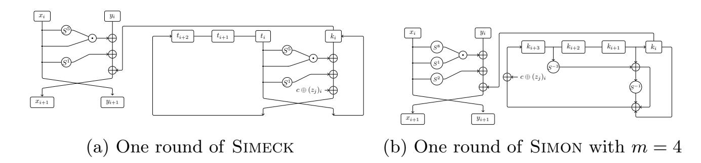
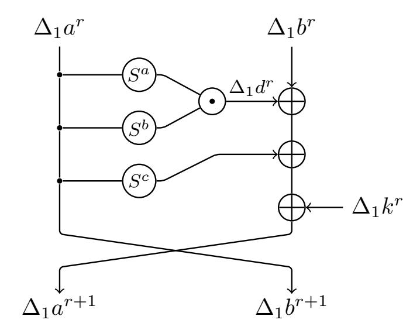
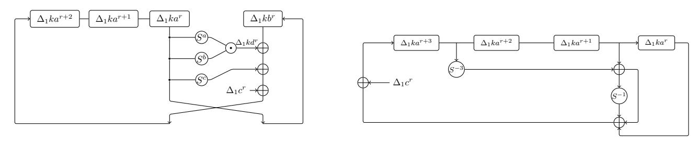

{0}------------------------------------------------

### Rotational-XOR Cryptanalysis of Simon-like Block Ciphers

Jinyu Lu1 , Yunwen Liu1? , Tomer Ashur2,3 , Bing Sun1 , and Chao Li1

1 Department of Mathematics, National University of Defense Technology, China univerlyw@hotmail.com 2 imec-COSIC KU Leuven, Leuven, Belgium 3 TU Eindhoven, The Netherlands

Abstract. Rotational-XOR cryptanalysis is a cryptanalytic method aimed at finding distinguishable statistical properties in ARX-C ciphers, i.e., ciphers that can be described only by using modular addition, cyclic rotation, XOR, and the injection of constants. In this paper we extend RX-cryptanalysis to AND-RX ciphers, a similar design paradigm where the modular addition is replaced by vectorial bitwise AND; such ciphers include the block cipher families Simon and Simeck. We analyze the propagation of RX-differences through AND-RX rounds and develop closed form formula for their expected probability. Finally, we formulate an SMT model for searching RX-characteristics in Simon and Simeck. Evaluating our model we find RX-characteristics of up to 20, 27, and 35 rounds with respective probabilities of 2−26 , 2 −42, and 2−54 for versions of Simeck with block sizes of 32, 48, and 64 bits, respectively, for large classes of weak keys in the related-key model. In most cases, these are the longest published distinguishers for the respective variants of Simeck. Interestingly, when we apply the model to the block cipher Simon, the best characteristic we are able to find covers 11 rounds of Simon32 with probability 2−24. To explain the gap between Simon and Simeck in terms of the number of distinguished rounds we study the impact of the key schedule and the specific rotation amounts of the round function on the propagation of RX-characteristics in Simon-like ciphers.

Keywords: RX-cryptanalysis · Simeck· Simon· Key Schedule

### 1 Introduction

Rotational-XOR (RX) cryptanalysis is a cryptanalytic technique for ARX ciphers proposed by Ashur and Liu in [\[1\]](#page-18-0). RX-cryptanalysis generalizes rotational cryptanalysis by investigating the influence of round constants on the probabilistic propagation of rotational pairs passing through the ARX operations.

The successful application of RX-cryptanalysis to SPECK [\[10\]](#page-18-1) reveals that the round constants sometimes interact in a constructive way between the rounds,

? Corresponding author

{1}------------------------------------------------

i.e., that a broken symmetry caused by a round constant in round i may be restored — either fully or partially — by another constant injection in round j > i. As a result, new designs such as [8] now show resistance to RX-cryptanalysis as part of their security argument.

AND-RX ciphers, defined as a counterpart of ARX ciphers where the modular addition is replaced by bitwise AND, are of contemporary interest owing to the design of the block cipher Simon [2] which was followed by other Simon-like ciphers such as Simeck [22]. Since the AND-RX operations in Simon-like ciphers are bitwise, the resulting statistical properties of individual bits remain independent of the bit-position. We say that such properties are *rotation-invariant*.

To break rotation-invariant properties, round constants are usually injected into the state. In the case of Simon and Simeck, the constants are injected to the key schedule and propagate into the round function via the round subkey.

The impact of the key schedule on cryptanalysis is important in particular for lightweight block ciphers as many of them use a simple one. For instance, a study by Kranz et al. [9] showed the influence of a linear key schedule on linear cryptanalysis in Present. Yet, information on how to design a good key schedule remains scarce. A folk theorem states that a good key schedule should provide round keys that are independent, which can be interpreted as arguing that a nonlinear key schedule is better than a linear one in such context. The similarity between the round functions of Simon and Simeck allows us to compare the two approaches respective to the different key schedules.

Our contribution. In this paper, we extend the idea of RX-cryptanalysis to AND-RX ciphers with applications to SIMON and SIMECK. The propagation of RX-differences through the AND-RX operations is fully analyzed and a closed algebraic formula is derived for its expected probability. We show that an RX-difference with translation value  $\alpha$  passes through the vectorial AND operation with the same probability as that of an  $\alpha$  XOR-difference. Due to the different nature of RX-differences and XOR-differences, characteristics of the former type would depend more on the key schedule and choice of round constants than those of the latter type. Using an automated search model we find RX-distinguishers for versions of SIMECK and SIMON; these results are summarised in Table 1.

The RX-characteristics we found for SIMECK variants with block sizes of 32-, 48-, and 64-bit improve previously longest published results by 5, 8, and 10 rounds, respectively, albeit sometimes in a weaker attack model. When comparing for the same number of rounds, our results offer different tradeoffs between the size of the affected key class and the characteristic's probability.

For Simon32, we found an RX-characteristics covering only 10–11 rounds. For the 10-round case, the probability is slightly better than the previously best one. For 11 rounds, we see that the probability is worse. While the 11-round distinguisher is inferior to previous work, it highlights the interesting observation that RX-cryptanalysis works better in the case of Simeck than it does in the case of Simon. We conjecture that the difference is due to the key schedule. To test this conjecture, we define three toy ciphers:

{2}------------------------------------------------

Table 1: Comparison of RX-characteristics for rotation offset  $\gamma=1$  with the longest published (related-key) differentials for SIMECK32, SIMECK48, SIMECK64, and SIMON32, and with integral distinguishers for SIMECK32, SIMECK48, SIMECK64. The distinguisher types are denoted by DC for differential characteristics, RKDC for related-key differential characteristics, ID for integral distinguishers, and RX for RX characteristics. All attacks require chosen plaintexts.

| Cipher   | Number of       | data       | size of weak | Type | Reference |
|----------|-----------------|------------|--------------|------|-----------|
|          | attacked rounds | complexity | key class    |      |           |
|          | 13              | $2^{32}$   | full         | DC   | [12]      |
|          |                 | $2^{31}$   | full         | ID   | [19]      |
| SIMECK32 | 15              | $2^{24}$   | $2^{54}$     | RKDC | [20]      |
| SIMECK52 |                 | $2^{18}$   | $2^{44}$     | RX   | Sect. 5.1 |
|          | 19              | $2^{24}$   | $2^{30}$     | RX   | Sect. 5.1 |
|          | 20              | $2^{26}$   | $2^{30}$     | RX   | Sect. 5.1 |
| SIMECK48 | 16              | $2^{24}$   | $2^{80}$     | RKDC | [20]      |
|          |                 | $2^{18}$   | $2^{68}$     | RX   | Sect. 5.1 |
|          | 18              | $2^{47}$   | full         | ID   | [19]      |
|          |                 | $2^{22}$   | $2^{66}$     | RX   | Sect. 5.1 |
|          | 19              | $2^{48}$   | full         | DC   | [12]      |
|          |                 | $2^{24}$   | $2^{62}$     | RX   | Sect. 5.1 |
|          | 27              | $2^{42}$   | $2^{44}$     | RX   | Sect. 5.1 |
|          | 21              | $2^{63}$   | full         | ID   | [19]      |
| SIMECK64 | 25              | $2^{64}$   | full         | DC   | [12]      |
|          |                 | $2^{34}$   | $2^{80}$     | RX   | Sect. 5.1 |
|          | 35              | $2^{54}$   | $2^{56}$     | RX   | Sect. 5.1 |
| CIMONIO  | 10              | $2^{16}$   | full         | RKDC | [20]      |
| SIMON32  | 10              | $2^{14}$   | full         | RX   | Sect. 5.2 |
|          |                 |            |              |      |           |

{3}------------------------------------------------

- 4
- Sim-1 which uses the round function of Simon and the key schedule of SIMECK,
- Sim-2 which uses the round function of Simeck with the key schedule of Simon, and
- Sim-3 which uses a Simon-like round function but with yet another set of rotation amounts and the key schedule of Simon.

We observe that the RX-characteristics found for SIM-1 have a higher probability compared to those found for Simon. For Sim-2 and Sim-3 we see that the number of distinguished rounds is comparable to that of Simon. We conclude that resistance to RX-cryptanalysis in Simon-like ciphers is heavily influenced by the key schedule.

**Organization.** We recall Simon-like ciphers and RX-cryptanalysis in Section 2. In Section 3, we generalize RX-cryptanalysis to Simon-like ciphers, and give a closed form algebraic formula for probabilistic propagation of an RXdifference. In Section 4 we provide an automated search model for finding good RX-characteristics. This model is evaluated in Section 5. In Section 6 we test how the choice of the key schedule affects the resistance of Simon-like ciphers to RX-cryptanalysis. Section 7 concludes this paper.

#### **Preliminaries** $\mathbf{2}$

In this section, we give a brief overview of the structure of Simon-like ciphers and recall the general idea of Rotational-XOR cryptanalysis. Table 2 presents the notation we use.

Table 2: The notations used throughout the paper

| Notation                                    | Description                                                                      |
|---------------------------------------------|----------------------------------------------------------------------------------|
| $\overline{x = (x_{n-1}, \dots, x_1, x_0)}$ | Binary vector of $n$ bits; $x_i$ is the bit in position $i$ with $x_0$ the least |
|                                             | significant one                                                                  |
| $x\odot y$                                  | Vectorial bitwise AND between $x$ and $y$                                        |
| $x_i \odot y_i$                             | Bitwise AND between $x_i$ and $y_i$                                              |
| $x \oplus y$                                | Vectorial bitwise XOR between $x$ and $y$                                        |
| $x_i \oplus y_i$                            | Bitwise XOR between $x_i$ and $y_i$                                              |
| $x \  y$                                    | Concatenation of $x$ and $y$                                                     |
| x y                                         | Vectorial bitwise OR between $x$ and $y$                                         |
| wt(x)                                       | Hamming weight of $x$                                                            |
| $x \ll \gamma, S^{\gamma}(x)$               | Circular left shift of $x$ by $\gamma$ bits                                      |
| $x \gg \gamma, S^{-\gamma}(x)$              | Circular right shift of $x$ by $\gamma$ bits                                     |
| $(I \oplus S^{\gamma})(x)$                  | $x \oplus S^{\gamma}(x)$                                                         |
| $\frac{\dot{\overline{x}}}{x}$              | Bitwise negation                                                                 |

{4}------------------------------------------------

#### 2.1 Simon-like Ciphers

Simon is a family of block ciphers following the AND-RX design paradigm, *i.e.*, members of the family can be described using only the bitwise operations AND  $(\odot)$ , XOR  $(\oplus)$ , and cyclic rotation by  $\gamma$  bits  $(S^{\gamma})$ . Simon-like ciphers generalize the structure of Simon's round function with different parameters than the original ones.

#### The round function

SIMON is a family of lightweight block ciphers designed by the US NSA [2]. A member of the family is denoted by SIMON2n/mn, to specify a block size of 2n for  $n \in \{16, 24, 32, 48, 64\}$ , and key size of mn for  $m = \{2, 3, 4\}$ . The round function of SIMON is defined as

$$f(x) = \left(S^8(x) \odot S^1(x)\right) \oplus S^2(x).$$

Simon-like ciphers are ciphers that share the same round structure as SIMON, but generalize it to arbitrary rotation amounts (a, b, c) such that the round function becomes

$$f_{a,b,c}(x) = \left(S^a(x) \odot S^b(x)\right) \oplus S^c(x).$$

Of particular interest in this paper is the SIMECK family of lightweight block ciphers designed by Yang et al. [22], aiming at improving the hardware implementation cost of SIMON. SIMECK2n/4n denotes an instance with a 4n-bit key and a 2n-bit block, where  $n \in \{16, 24, 32\}$ . Since the key length of SIMECK is always 4n we use lazy writing in the sequel and simply write SIMECK2n throughout the paper. The rotation amounts for all SIMECK versions are (a, b, c) = (5, 0, 1).

#### The key schedule

The nonlinear key schedule of SIMECK reuses the cipher's round function to generate the round keys. Let  $K = (t_2, t_1, t_0, k_0)$  be the master key for SIMECK2n, where  $t_i, k_0 \in \mathbb{F}_2^n$ . The registers of the key schedule are loaded with

$$K = k_3 ||k_2||k_1||k_0|$$

for K the master key, and the sequence of round keys  $(k_0, \ldots, k_{T-1})$  is generated with

$$k_{i+1} = t_i$$

where

$$t_{i+3} = k_i \oplus f_{5,0,1}(t_i) \oplus c \oplus (z_j)_i,$$

and  $c \oplus (z_j)_i \in \{0xfffc, 0xfffd\}$  a round constant. A single round of SIMECK is depicted in Figure 1a.

{5}------------------------------------------------

Fig. 1: Illustration of the SIMECK and SIMON ciphers

SIMON, conversely, uses a linear key schedule to generate the round keys. Let  $K = (k_{m-1}, \ldots, k_1, k_0)$  be a master key for SIMON2n, where  $k_i \in \mathbb{F}_2^n$ . The sequence of round keys  $k_i$  is generated by

$$K_{i+m} = \begin{cases} k_i \oplus (I \oplus S^{-1}) S^{-3} k_{i+1} \oplus c \oplus (z_j)_i, & \text{if } m = 2\\ k_i \oplus (I \oplus S^{-1}) S^{-3} k_{i+2} \oplus c \oplus (z_j)_i, & \text{if } m = 3\\ k_i \oplus (I \oplus S^{-1}) (S^{-3} k_{i+3} \oplus k_{i+1}) \oplus c \oplus (z_j)_i, & \text{if } m = 4 \end{cases}$$

for  $0 \le i \le (T-1)$ , and  $c \oplus (z_j)_i$  is the round constant. A single round of SIMON with m=4 is depicted in Figure 1b.

#### 2.2 Previous Work

The security of Simon-like ciphers has been widely explored over the last few years and a large number of cryptanalytic techniques were applied to it. To name just a few: linear cryptanalysis [5,13], differential cryptanalysis [3,5,12], related-key differential cryptanalysis [20], integral cryptanalysis and the division property [7,17,18,23]. For a comparison of our results with relevant previous work see Table 1.

Due to the unclear design rationale of Simon, much attention was focused on understanding the rotation amounts. Kölbl  $et\ al.$  studied in [5] different sets of rotation amounts for Simon-like ciphers and found parameters, other than the specified (8,1,2), which are optimal with respect to differential and linear cryptanalysis. Then, Kondo  $et\ al.$  further evaluated these parameter sets in terms of resistance to integral distinguishers in [7]. As they have shown, the parameter set (12,5,3) is optimal with respect to differential cryptanalysis, linear cryptanalysis, and integral cryptanalysis. Also the Simeck parameter set (5,0,1) belongs to the same optimal class respective to several attack techniques. Simon and Simeck were also compared by Kölbl  $et\ al.$  in [6] by considering the differential effect.

#### 2.3 Rotational-XOR Cryptanalysis

As a generalization of rotational cryptanalysis (see [4]), RX-cryptanalysis is also a related-key chosen plaintext attack targeting ARX ciphers. Introduced by Ashur and Liu in [1] it uses the fact that rotational pairs, *i.e.*, pairs of the

{6}------------------------------------------------

form  $(x, S^{\gamma}(x))$  propagate through the ARX operations with known probability. Whereas the original technique was thwarted by the injection of round constants that are not rotational-invariant, RX-cryptanalysis overcomes this problem by integrating their effect into the analysis of the propagation probability. Rather than considering just a rotational pair as in the case of rotational cryptanalysis, RX-cryptanalysis considers an RX-pair of the form  $(x, S^{\gamma}(x) \oplus \alpha)$  where  $\alpha$  is called the *translation*. The technique was successfully applied to ARX-based primitives, including the block cipher SPECK [10] and the hash function SIPHASH [21].

## 3 Rotational-XOR Cryptanalysis of AND-RX Constructions

AND-RX constructions are similar in concept to ARX constructions where the non-linear operation (*i.e.*, modular addition) is replaced with a vectorial bitwise AND. Since all operations are now bit oriented, such constructions are always rotation-invariant. More generally, they are structurally invariant under any affine transformation of the bit-indices as was shown in [5]. Superficially, it is believed that this invariance cannot be preserved over a large number of rounds if non-invariant constants are injected into the state since they will break the symmetry between bits in different positions. Despite their close relation to ARX constructions, the security of Simon-like ciphers against RX-cryptanalysis has not received much attention. We now set to rectify this omission in this section.

#### 3.1 The Expected Probability of an RX-transition

In [1] an RX-pair was defined to be a rotational pair with rotational offset  $\gamma$  under translations  $\delta_1$  and  $\delta_2$ , *i.e.*, it is the pair  $(x \oplus \delta_1, (x \ll \gamma) \oplus \delta_2)$ . We opt for a slightly different notation with x and  $x' = (x \ll \gamma) \oplus \delta$ , or  $(x, (x \ll \gamma) \oplus \delta)$  as an RX-pair.

**Definition 1 ([1] (adapted)).** The RX-difference of x and  $x' = (x \ll \gamma) \oplus \delta$  with rotational offset  $\gamma$ , and translation  $\delta$  is denoted by

$$\Delta_{\gamma}(x, x') = x' \oplus (x \ll \gamma).$$

The propagation of an RX-difference  $\Delta_{\gamma}(x, x') = x' \oplus (x \ll \gamma)$  through linear operations of the AND-RX structure is deterministic and follows these rules:

- **XOR**. For two input RX-pairs  $(x, (x \ll \gamma) \oplus \delta_1)$  and  $(y, (y \ll \gamma) \oplus \delta_2)$ , their XOR is the RX-pair  $(z, z') = (x \oplus y, ((x \oplus y) \ll \gamma) \oplus \delta_1 \oplus \delta_2)$ ;
- Cyclic rotation by  $\eta$  bits. The cyclic rotation of each of the values in  $(x,(x\ll \gamma)\oplus \delta)$  by  $\eta$  bits is the RX-pair  $(z,z')=(x\ll \eta,(x\ll (\gamma+\eta))\oplus (\delta\ll \eta));$

{7}------------------------------------------------

- **XOR with a constant** c. The XOR of a constant c to each of the values in the RX-pair  $(x, (x \ll \gamma) \oplus \delta)$  is the RX-pair  $(z, z') = (x \oplus c, (x \ll \gamma)) \oplus \delta \oplus c)$ , the corresponding RX-difference is denoted by  $\Delta_{\gamma} c = c \oplus (c \ll \gamma)$ 

all with probability 1.

Intuitively, the bitwise nature of the AND operation restricts the propagation of an RX-difference compared to modular addition. When two rotational pairs enter into the vectorial AND operation, the rotational relation is preserved with probability 1 due to the localized nature of bit-oriented operations. If the inputs form an RX-pair with translation  $\delta \neq 0$ , as is the case of SIMON and SIMECK, the propagation of the RX-difference through the vectorial AND is probabilistic and its probability is given by the following theorem.

**Theorem 1.** Let  $(x, (x \ll \gamma) \oplus \alpha)$  and  $(y, (y \ll \gamma) \oplus \beta)$  be two RX-pairs where  $\gamma$  is the rotation offset and  $(\alpha, \beta)$  the translations, respectively. Then, for an output translation  $\Delta$  it holds that:

$$\Pr[((x \odot y) \ll \gamma) \oplus \Delta = ((x \ll \gamma) \oplus \alpha) \odot ((y \ll \gamma) \oplus \beta)] = (1)$$

$$\Pr[(x \odot y) \oplus \Delta = (x \oplus \alpha) \odot (y \oplus \beta)] \tag{2}$$

i.e., the propagation probability of an RX-difference with translations  $(\alpha, \beta)$  through  $\odot$  is the same as that of a normal XOR-difference through the same operation when the translations are considered as input XOR-differences.

*Proof.* To prove the theorem, we rewrite the right hand side of (1) as

$$((x \ll \gamma) \oplus \alpha) \odot ((y \ll \gamma) \oplus \beta) = ((x \odot y) \ll \gamma) \oplus ((x \ll \gamma) \odot \beta) \oplus ((y \ll \gamma) \odot \alpha) \oplus (\alpha \odot \beta)$$

Similarly, distributing the right hand side of (2) we get

$$(x \oplus \alpha) \odot (y \oplus \beta) = (x \odot y) \oplus (x \odot \beta) \oplus (y \odot \alpha) \oplus (\alpha \odot \beta)$$

Rewriting Theorem 1 as

$$\Pr[((x \odot y) \ll \gamma) \oplus \Delta = ((x \odot y) \ll \gamma) \oplus ((x \ll \gamma) \odot \beta) \oplus ((y \ll \gamma) \odot \alpha) \oplus (\alpha \odot \beta)] =$$
(3)

$$\Pr[(x \odot y) \oplus \Delta = (x \odot y) \oplus (x \odot \beta) \oplus (y \odot \alpha) \oplus (\alpha \odot \beta)], \tag{4}$$

the proof is completed by observing that  $(x \odot y) \ll \gamma, x \ll \gamma$ , and  $y \ll \gamma$  have the same probability distribution as  $x \odot y, x$ , and y, respectively, due to the rotation-invariance of bit-oriented operations.

Kölbl et al. showed in [5] that in the special case of Simon-like ciphers (e.g., SIMON and SIMECK) where  $y = S^{a-b}(x)$ , the difference propagation distribution (and thus, the RX-propagation distribution) is given by the following proposition.

{8}------------------------------------------------

**Proposition 1.** For  $S^a(x) \odot S^b(x)$  where gcd(n, a - b) = 1, n is even, a > b and  $x = (x_{n-1}, \ldots, x_1, x_0) \in \mathbb{F}_2^n$ , the difference propagation distribution table and RX propagation distribution are given by

$$P(\alpha \to \beta) = \begin{cases} 2^{-n+1} & \text{if } \alpha = 0 \text{xf} \cdots \text{f} \\ wt(\beta) \equiv 0 \text{ mod } 2; \\ 2^{-wt((S^a(\alpha)|S^b(\alpha)) \oplus (\overline{S^a(\alpha)} \odot S^{2a-b}(\alpha) \odot S^b(\alpha)))} & \text{if } \alpha \neq 0 \text{xf} \cdots \text{f}, \\ \beta \odot (\overline{S^a(\alpha)} \mid S^b(\alpha)) = 0, \\ (\beta \oplus S^{a-b}(\beta)) \odot \\ (\overline{S^a(\alpha)} \odot S^{2a-b}(\alpha) \\ \odot S^b(\alpha)) = 0; \\ 0 & \text{otherwise} \end{cases}$$

*Proof.* The proof for the difference propagation distribution was given in [5]. The case for RX-propagation follows then from Theorem 1.

#### 3.2 Discussion

Based on Theorem 1, it can be seen that the RX-difference passes through the vectorial AND component of a cipher with the same probability as an XOR-difference. However, resulting RX-characteristics are in general different from the corresponding (related-key) differential characteristics, due to the XOR of constants in the round function which affects the propagation.

It is interesting to see that in ARX ciphers, the probability for the rotational-transition part of the RX-transition is maximized with  $2^{-1.415}$  when  $\gamma \in \{1, n-1\}$  and decreases for other  $\gamma$ . Conversely, the same transition passes with probability 1 through the vectorial AND in AND-RX ciphers. In other words, a rotational pair would propagate with probability 1 through all AND-RX operations, but only with some probability p < 1 through the ARX operations. We conclude that in general, AND-RX constructions are more susceptible to RX-cryptanalysis than ARX constructions.

# 4 Automated Search of RX-characteristics in Simon-like Ciphers

Similar to other statistical attacks, RX-cryptanalysis works in two phases: offline and online. In the offline phase, the adversary is searching for a distinguishable property respective to the algorithm's structure. Having found such a property, the adversary tries to detect it from data collected in the online phase.

Automated search methods are a common way to assist finding such a property (*i.e.*, Phase 1). The idea behind these tools is to model the search problem as a set of constraints and solve it using one of the available constraint solvers. For ciphers using Boolean and arithmetic operations, the search problem can be

{9}------------------------------------------------

Fig. 2: Notation of the RX-differences in the encryption function.

converted into a Boolean Satisfiability Problem (SAT) or a Satisfiability Module Problem (SMT). The respective solver then returns an answer on whether all constraints can be satisfied simultaneously, and if the answer is positive it also returns a valid assignment. A number of ARX and AND-RX ciphers were studied using automatic search tools, in the context of differential cryptanalysis, linear cryptanalysis, division property, and RX-cryptanalysis [\[10,](#page-18-1) [11,](#page-18-14) [14–](#page-18-15)[16\]](#page-18-16).

In this section, we give a detailed description of an automatic search model for RX-characteristics in Simon-like ciphers.

#### 4.1 The Common Round Function

From Theorem [1](#page-7-2) we learn that the propagation of RX-differences through the AND operation follows a probabilistic rule, with a probability distribution as in Proposition [1.](#page-7-3) We use ∆1a r and ∆1b r to denote the two n-bit vectors representing RX-differences at the beginning of round r, and ∆1d r the n-bit vector representing the RX-difference at the output of the vectorial AND at the same round. A schematic view of this notation is depicted in Figure [2.](#page-9-0)

Then, the following two Boolean equations should be satisfied simultaneously for the propagation of RX-differences through the vectorial AND to be valid

$$0 = \Delta_1 d^r \odot (\overline{S^a(\Delta_1 a^r) \mid S^b(\Delta_1 a^r)}); \tag{5}$$

$$0 = (\Delta_1 d^r \oplus S^{a-b}(\Delta_1 d^r)) \odot (\overline{S^a(\Delta_1 a^r)} \odot S^{2a-b}(\Delta_1 a^r) \odot S^b(\Delta_1 a^r)).$$
 (6)

In simple words, [\(5\)](#page-9-1) ensures that any active bit in ∆1d r results from at least one active bit in the corresponding position of ∆1a r . If a bit ∆1d r was activated by exactly one bit from ∆1a r , [\(6\)](#page-9-2) ensures that either a second bit in ∆1d r is active, or that another active bit in ∆1a r had deactivated said bit. This encodes the implicit expansion function, i.e., the dependency between the bit in position i and that in position i + a − b before they enter the vectorial AND.

{10}------------------------------------------------

If the propagation is valid, the probability in round r is given by 2−w r d , where

$$w_d^r = wt((S^a(\Delta_1 a^r) \mid S^b(\Delta_1 a^r)) \oplus (\overline{S^a(\Delta_1 a^r)} \odot S^{2a-b}(\Delta_1 a^r) \odot S^b(\Delta_1 a^r))),$$

$$(7)$$

is said to be the weight of the non-linear transition in round r.

In addition, the propagation of an RX-difference through the linear operations is described by the following expressions:

$$\Delta_1 b^{r+1} = \Delta_1 a^r \,; \tag{8}$$

$$\Delta_1 a^{r+1} = \Delta_1 d^r \oplus \Delta_1 b^r \oplus S^c(\Delta_1 a^r) \oplus \Delta_1 k^r.$$
 (9)

#### 4.2 The Key Schedule of Simeck

The key schedule of Simeck is modeled analogously to the round function. Let ∆1kar , ∆1kbr , and ∆1kdr be n-bit variables in round r which denote the left input RX-difference, the right input RX-difference, and the output RXdifference of the vectorial AND (see Figure [3a\)](#page-11-0). As before, the following two Boolean equations should be satisfied simultaneously for the propagation of RXdifferences through the non-linear part of Simeck's key schedule to be valid:

$$0 = \Delta_1 k d^r \odot \overline{S^a(\Delta_1 k a^r) \mid S^b(\Delta_1 k a^r)}; \tag{10}$$

$$0 = (\Delta_1 k d^r \oplus S^{a-b}(\Delta_1 k d^r)) \odot (\overline{S^a(\Delta_1 k a^r)}) \odot$$

$$S^{2a-b}(\Delta_1 k a^r) \odot S^b(\Delta_1 k a^r)), \tag{11}$$

with weight w r k set as

$$w_k^r = wt((S^a(\Delta_1 ka^r) \mid S^b(\Delta_1 ka^r)) \oplus (\overline{S^a(\Delta_1 ka^r)}) \odot S^{2a-b}(\Delta_1 ka^r) \odot S^b(\Delta_1 ka^r))).$$
(12)

The propagation of RX-difference through the linear operations of the key schedule is modeled by the following constraints:

$$\Delta_1 k b^{r+1} = \Delta_1 k a^r; \tag{13}$$

$$\Delta_1 k a^{r+3} = \Delta_1 k d^r \oplus \Delta_1 k b^r \oplus S^c(\Delta_1 k a^r) \oplus \Delta_1 c^r. \tag{14}$$

Finally, the key schedule and the round function are linked via the following expression:

$$\Delta_1 k^r = \Delta_1 k b^r. (15)$$

{11}------------------------------------------------

(a) Notation of the RX-differences with a nonlinear key schedule. (b) Notation of the RX-differences with a linear key schedule.

Fig. 3: Notations of the RX-differences.

#### 4.3 The Key Schedule of Simon

In the key schedule of Simon 2n/4n, let ∆1kar , ∆1kar+1, and ∆1kar+3 be nbit variables denoting the input RX-differences to the key schedule at round r, and let ∆1kar+4 denote the output RX-difference fed back to the leftmost register in the key schedule and injected into the round (see Figure [3b\)](#page-11-0); then, the propagation of RX-differences is modeled as

$$\Delta_1 k a^{r+4} = S^{-3}(\Delta_1 k a^{r+3}) \oplus \Delta_1 k a^{r+1} \oplus S^{-1}(S^{-3}(\Delta_1 k a^{r+3}) \oplus \Delta_1 k a^{r+1}) \oplus \Delta_1 k a^r \oplus \Delta_1 c^r$$

$$(16)$$

and the injection of the subkey the state in round r as

$$\Delta_1 k^r = \Delta_1 k a^r. (17)$$

#### 4.4 The Objective Function

To evaluate the model, we define an objective function, i.e., a quantity that the model is trying to optimize and which can be used to compare the "quality" of different solutions. The original model in [\[10\]](#page-18-1), which was the first model to search for RX-differences in ciphers with a non-linear key schedule, operated in two steps. First, a good key RX-characteristic was sought. Then, a good RX-characteristic was sought for the state with respect to the selected key RXcharacteristic.

In this paper we take a different approach. Rather than considering the two search problems separately, we generate good RX-characteristics "on-thefly" without a-priori fixing the key characteristic. We start by searching for an RX-characteristics minimizing the total weight in both the data and key parts, namely wd + wk. Then, conditioned on the total weight wd + wk fixed to the minimum found, we further minimize the weight in the data part wd in order to improve the data complexity of the attack.

For Simon our strategy would yield the same results as the strategy in [\[10\]](#page-18-1) since w r k = 0 for all r due to the linear key schedule. The objective function for 

{12}------------------------------------------------

the R-round SIMON model is expressed as

$$\min(w) \text{ s.t.}$$

$$\max(R) \text{ s.t.}$$

$$(w = (\sum_{r=1}^{R} w_d^r)) \wedge (w \leq 2n)$$

$$(18)$$

For SIMECK we first observe that the key difference injected in round r is actually generated in round r-4 where its cost is "paid". As a result, the total probability of an R-round characteristic in the key schedule part only needs to take into account the cost of rounds 1 to R-4. Hence, we set the objective function as follows:

$$\min(w_d) \text{ s.t.}$$

$$\min(w) \text{ s.t.}$$

$$\max(R) \text{ s.t.}$$

$$(w = (\sum_{r=1}^R w_d^r + \sum_{r=1}^{R-4} w_k^r)) \wedge (w \le 4n) \wedge (w_d = \sum_{r=1}^R w_d^r) \wedge (w_d \le 2n)$$

$$(19)$$

#### 5 Results

Now that we have a model for finding RX-characteristics in AND-RX constructions, we can use one of the existing solvers to evaluate it. We describe the model using the SMTLIB language and apply the Boolector solver with several parameter settings. Our experiments were carried out on a laptop having an Intel Core i7-7700HQ CPU running at  $2.80\mathrm{GHz}$  and having 8GB of RAM.  $^4$ 

#### 5.1 Simeck

Using the above model, we found RX-characteristics which cover up to 20, 27, and 35 rounds for variants of SIMECK with block size of 32, 48, and 64 bits, respectively. These results are presented in Table 3. We further proved that there exists no RX-characteristic with  $w_d + w_k \leq 64$  for more than 20 rounds of SIMECK32; therefore, our 20-round RX-characteristic gives a tight bound on the number of rounds that can be distinguished using RX-cryptanalysis.

Recalling the previous results in Table 1 we see that previously published distinguishers cover up to 15, 19, and 25 rounds of SIMECK32, SIMECK48, and SIMECK64, respectively, whereas our RX-characteristics improve the number of distinguished rounds by 5, 8, and 10 rounds, albeit for a smaller key class than previous results. Benchmarking for the same number of rounds, detecting our distinguishers requires fewer data.

&lt;sup>4 Our source code is available on Github at https://github.com/JIN-smile/Simon32-and-Simeck32.

{13}------------------------------------------------

Table 3: The weights of the best found RX-characteristic in round-reduced SIMECK32, SIMECK48 and SIMECK64 with  $\gamma=1$ . For each of the ciphers we report the results in three rows: number of distinguished rounds, weight of the round function part, and weight of the key schedule part. For instance, the best found RX-characteristic covering 20-round SIMECK32 has a data probability of  $2^{-26}$  for a weak key class of size  $2^{64-34}=2^{30}$ .

| 101 4  | W Coll      | $IIC_{\mathcal{J}}$ | CIGOD | OI DIZ | ~ <b>_</b> |    |    |    |    |    |    |    |    |
|--------|-------------|---------------------|-------|--------|------------|----|----|----|----|----|----|----|----|
| SIMECH | <b>C32</b>  |                     |       |        |            |    |    |    |    |    |    |    |    |
| Rounds | 10          | 11                  | 12    | 13     | 14         | 15 | 16 | 17 | 18 | 19 | 20 |    |    |
| Data   | 6           | 10                  | 12    | 12     | 16         | 18 | 18 | 18 | 22 | 24 | 26 |    |    |
| Key    | 8           | 12                  | 12    | 18     | 18         | 20 | 28 | 32 | 30 | 34 | 34 |    |    |
| SIMECE | SIMECK48    |                     |       |        |            |    |    |    |    |    |    |    |    |
| Rounds | 15          | 16                  | 17    | 18     | 19         | 20 | 21 | 22 | 23 | 24 | 25 | 26 | 27 |
| Data   | 18          | 18                  | 18    | 22     | 24         | 26 | 30 | 30 | 32 | 36 | 36 | 40 | 42 |
| Key    | 20          | 28                  | 32    | 30     | 34         | 34 | 36 | 40 | 44 | 46 | 48 | 48 | 52 |
| SIMEC  | <b>4</b> 64 |                     |       |        |            |    |    |    |    |    |    |    |    |
| Rounds | 23          | 24                  | 25    | 26     | 27         | 28 | 29 | 30 | 31 | 32 | 33 | 34 | 35 |
| Data   | 30          | 32                  | 34    | 38     | 38         | 40 | 42 | 44 | 46 | 48 | 50 | 52 | 54 |
| Key    | 44          | 46                  | 48    | 50     | 54         | 58 | 60 | 62 | 64 | 66 | 68 | 70 | 72 |
|        |             |                     |       |        |            |    |    |    |    |    |    |    |    |

Experimental verification. To empirically validate our results we implemented the 15-round RX-characteristic presented in Table 4. We first sample a random 64-bit master key K and obtain its respective matching key  $K' = S^1(K) \oplus (0001||0004||0008||0014)$ . We then check if the resulting sub-keys satisfy the required RX-difference. If not, a new K is picked and the above process is repeated until a good pair (K, K') is found. This pair of related keys is used to encrypt  $2^{32}$  plaintext pairs. For each encrypted plaintext pair, we check if the intermediate RX-differences match those of the RX-characteristic.

We sampled about  $2^{33.6} = 2^{26.6+7}$  keys, out of which  $2^7$  satisfied the requested key RX-difference. For these keys, the average probability that a randomly selected plaintext satisfies the RX-characteristic was around  $2^{-18.005}$ . These figures confirm our claims.

#### 5.2 Simon

Interestingly, despite their similar structure, finding good RX-characteristics for SIMON seems to be much harder than for SIMECK. For the smallest version SIMON32/64, the solver does not produce solutions (SAT or UNSAT) for more than 11 rounds given reasonable resources and time. We conjecture that the reason for this is the key schedule which forces all key RX-transitions to be deterministic in the key part. In the case of SIMECK the non-deterministic key RX-transitions offered more freedom for backtracking steps in search for cancellation effects in the data part; similar freedom is not afforded for SIMON due to the linear key schedule.

{14}------------------------------------------------

| Round | RX-difference in | Key RX-difference in Data |
|-------|------------------|---------------------------|
| 0     | 0014             | (0000  0010)              |
| 1     | 0008             | (0004  0000)              |
| 2     | 0004             | (0000  0004)              |
| 3     | 0001             | (0000  0000)              |
| 4     | 0002             | (0001  0000)              |
| 5     | 0002             | (0001  0001)              |
| 6     | 0000             | (0000  0001)              |
| 7     | 0003             | (0001  0000)              |
| 8     | 0002             | (0000  0001)              |
| 9     | 0007             | (0003  0000)              |
| 10    | 0001             | (0000  0003)              |
| 11    | 0002             | (0002  0000)              |
| 12    | 0008             | (0004  0002)              |
| 13    | 0002             | (0002  0004)              |
| 14    | 0000             | (0000  0002)              |
| 15    |                  | (0002  0000)              |
| Prob. | $2^{-26}$        | $2^{-18}$                 |

Table 4: A 15-round RX-characteristics in SIMECK 32/64

The complexity of our RX-distinguishers against SIMON32/64 with 10 rounds are presented in Table 1. For 11 rounds of SIMON32/64 we find a characteristic with probability  $2^{-24}$  which is inferior to previous results. We do not expect RX-cryptanalysis to be able to improve the distinguishing cost for more than 11 rounds. In Section 6 we discuss the distinctive behaviors of RX-characteristics in SIMON and SIMECK.

#### 6 Comparing the Resistance to RX-cryptanalysis of Simon and Simeck

In Section 5 we saw that SIMECK appears to be more vulnerable to RX-cryptanalysis than its counterpart SIMON. The two main differences between these ciphers are the key schedule (linear in SIMON vs. non-linear in SIMECK) and the rotation amounts ((8,1,2) in SIMON vs. (5,0,1) in SIMECK). To understand how each of these decisions affects the resistance of the resulting cipher to RX-cryptanalysis, we define three additional variants:

- Sim-1 which uses the round function of Simon for and the key schedule of Simeck,
- SIM-2 which uses the round function of SIMECK and the key schedule of SIMON (m = 4), and
- Sim-3 which uses a Simon-like round function with rotation amounts (12,5,3) and the key schedule of Simon (m=4).5

&lt;sup>5 This set of rotation amounts was determined in [7] to be optimal against certain attacks.

{15}------------------------------------------------

Table 5: A comparison of the optimal probability in RX-characteristics found in Simon-like ciphers: SIM-1, SIM-2, SIM-3, SIMECK and SIMON.

| Rounds | SIM-1       | SIM-2     | SIM-3     | SIMECK32 | SIMON32   |
|--------|-------------|-----------|-----------|----------|-----------|
| 5      | 1           | 1         | 1         | 1        | 1         |
| 6      | 1           | 1         | 1         | 1        | 1         |
| 7      | $2^{-2}$    | $2^{-4}$  | $2^{-4}$  | $2^{-2}$ | $2^{-4}$  |
| 8      | $2^{-4}$    | $2^{-6}$  | $2^{-4}$  | $2^{-4}$ | $2^{-6}$  |
| 9      | $2^{-6}$    | $2^{-10}$ | $2^{-10}$ | $2^{-4}$ | $2^{-10}$ |
| 10     | $2^{-8}$    | $2^{-14}$ | $2^{-14}$ | $2^{-6}$ | $2^{-14}$ |
| 11     | $  2^{-12}$ | $2^{-24}$ | $2^{-24}$ | $2^{-8}$ | $2^{-24}$ |

To determine the effect of the key schedule and rotation amounts on the resistance of a Simon-like cipher to RX-cryptanalysis we take the same approach as in Section 5, this time searching RX-characteristics for SIM-1, SIM-2, and SIM-3. We present in Table 5 the RX-distinguishers we found and compare them to those found for SIMON and SIMECK.

The results show that, for some optimal parameters of the Simon-like round function, the rotation amounts have no effect on the probability of the RX-characteristics. However, the difference between the linear key schedule of SIMON and the non-linear one of SIMECK plays a significant role in the resistance to RX-cryptanalysis. In other words, the key schedule of SIMECK makes it more vulnerable to RX-cryptanalysis.

It would be interesting to consider two more experiments, one where the key schedule is yet another non-linear function (e.g., the key schedule of Speck) and one where the rotation amounts are suboptimal. This is left for future work.

#### 7 Conclusion

In this paper, we generalized the idea of Rotational-XOR cryptanalysis to AND-RX ciphers by showing that an RX-difference has the same propagation probability as a corresponding XOR-difference through the same function. We formulated a SAT/SMT model for RX-cryptanalysis in AND-RX constructions and applied it to reduced-round versions of SIMON and SIMECK. We found distinguishers covering up to 20, 27, and 35 rounds of SIMECK32, SIMECK48, SIMECK64, respectively. These are the longest distinguishers for this cipher family.

Moreover, we noticed that finding good RX-characteristics in SIMON is more difficult than in SIMECK. By applying our SAT/SMT model to toy examples we were able to conclude that it is the different key schedule which makes SIMECK more vulnerable to RX-cryptanalysis than SIMON. We conjectured that the gap between the two ciphers is due to the (non-)linearity of the key schedule and left this for future work.

{16}------------------------------------------------

#### Acknowledgement

This paper was supported by National Natural Science Foundation of China (NSFC) under grants 61672530, 61902414 and 61772545. Tomer Ashur is an FWO post-doctoral fellow under Grant Number 12ZH420N.

#### A Reported RX-Characteristics for SIMECK32/48/64

Table 6: A 20-round RX-characteristic for Simeck32/64 and a 27-round RXcharacteristics for Simeck48/96

|       |          | Simeck32/64                               | Simeck48/96 |                  |  |  |  |
|-------|----------|-------------------------------------------|-------------|------------------|--|--|--|
| Round | key      | data                                      | key         | data             |  |  |  |
|       |          | RX-difference RX-difference RX-difference |             | RX-difference    |  |  |  |
| 0     | 0004     | (0000  0004)                              | 000004      | (000001  000006) |  |  |  |
| 1     | 0000     | (0000  0000)                              | 000000      | (000000  000001) |  |  |  |
| 2     | 0001     | (0000  0000)                              | 000002      | (000001  000000) |  |  |  |
| 3     | 0002     | (0001  0000)                              | 000003      | (000001  000001) |  |  |  |
| 4     | 0002     | (0000  0001)                              | 000002      | (000001  000001) |  |  |  |
| 5     | 0005     | (0003  0000)                              | 000000      | (000000  000001) |  |  |  |
| 6     | 0001     | (0000  0003)                              | 000003      | (000001  000000) |  |  |  |
| 7     | 0002     | (0002  0000)                              | 000003      | (000000  000001) |  |  |  |
| 8     | 000a     | (0004  0002)                              | 000004      | (000002  000000) |  |  |  |
| 9     | 0002     | (0000  0004)                              | 000000      | (000000  000002) |  |  |  |
| 10    | 0000     | (0006  0000)                              | 000002      | (000002  000000) |  |  |  |
| 11    | 0013     | (000a  0006)                              | 00000e      | (000004  000002) |  |  |  |
| 12    | 000a     | (0001  000a)                              | 000002      | (000000  000004) |  |  |  |
| 13    | 0004     | (0002  0001)                              | 000000      | (000006  000000) |  |  |  |
| 14    | 0000     | (0001  0002)                              | 000013      | (00000c  000006) |  |  |  |
| 15    | 0001     | (0000  0001)                              | 00000c      | (000001  00000c) |  |  |  |
| 16    | 0000     | (0000  0000)                              | 000004      | (000002  000001) |  |  |  |
| 17    | 0002     | (0000  0000)                              | 000000      | (000001  000002) |  |  |  |
| 18    | 0006     | (0002  0000)                              | 000002      | (000001  000001) |  |  |  |
| 19    | 0007     | (0000  0002)                              | 000002      | (000001  000001) |  |  |  |
| 20    |          | (0005  0000)                              | 000001      | (000000  000001) |  |  |  |
| 21    |          |                                           | 000000      | (000000  000000) |  |  |  |
| 22    |          |                                           | 000003      | (000000  000000) |  |  |  |
| 23    |          |                                           | 000004      | (000003  000000) |  |  |  |
| 24    |          |                                           | 000004      | (000002  000003) |  |  |  |
| 25    |          |                                           | 000000      | (000001  000002) |  |  |  |
| 26    |          |                                           | 00000d      | (000000  000001) |  |  |  |
| 27    |          |                                           |             | (00000c  000000) |  |  |  |
| Prob. | −34 2 | −26 2                                  | −52 2    | −42 2         |  |  |  |

{17}------------------------------------------------

Table 7: A 35-round RX-characteristics for Simeck64/128

|       | key                 | data                 |
|-------|---------------------|----------------------|
|       | Round RX-difference | RX-difference        |
| 0     | 00000006            | (00000001  00000004) |
| 1     | 00000000            | (00000000  00000001) |
| 2     | 00000003            | (00000001  00000000) |
| 3     | 00000002            | (00000001  00000001) |
| 4     | 00000000            | (00000000  00000001) |
| 5     | 00000002            | (00000001  00000000) |
| 6     | 00000003            | (00000000  00000001) |
| 7     | 00000004            | (00000002  00000000) |
| 8     | 00000000            | (00000000  00000002) |
| 9     | 00000002            | (00000002  00000000) |
| 10    | 0000000a            | (00000004  00000002) |
| 11    | 00000001            | (00000000  00000004) |
| 12    | 00000001            | (00000005  00000000) |
| 13    | 00000013            | (0000000a  00000005) |
| 14    | 0000000c            | (00000002  0000000a) |
| 15    | 00000005            | (00000002  00000002) |
| 16    | 00000001            | (00000001  00000002) |
| 17    | 00000002            | (00000001  00000001) |
| 18    | 00000002            | (00000001  00000001) |
| 19    | 00000002            | (00000001  00000001) |
| 20    | 00000003            | (00000001  00000001) |
| 21    | 00000002            | (00000001  00000001) |
| 22    | 00000003            | (00000001  00000001) |
| 23    | 00000000            | (00000000  00000001) |
| 24    | 00000002            | (00000001  00000000) |
| 25    | 00000003            | (00000000  00000001) |
| 26    | 00000006            | (00000002  00000000) |
| 27    | 00000000            | (00000000  00000002) |
| 28    | 00000002            | (00000002  00000000) |
| 29    | 0000000a            | (00000004  00000002) |
| 30    | 00000000            | (00000000  00000004) |
| 31    | 00000000            | (00000004  00000000) |
| 32    | 00000010            | (0000000c  00000004) |
| 33    | 0000000c            | (00000000  0000000c) |
| 34    | 00000005            | (00000000  00000000) |
| 35    |                     | (00000005  00000000) |
| Prob. | −72 2            | −54 2             |

{18}------------------------------------------------

#### References

- 1. Ashur, T., Liu, Y.: Rotational cryptanalysis in the presence of constants. IACR Trans. Symmetric Cryptology 2016(1), 57–70 (2016)
- 2. Beaulieu, R., Shors, D., Smith, J., Treatman-Clark, S., Weeks, B., Wingers, L.: The SIMON and SPECK lightweight block ciphers. In: DAC. Lecture Notes in Computer Science, vol. 2013, pp. 175:1–175:6. ACM (2015)
- 3. Beierle, C.: Pen and paper arguments for SIMON and SIMON-like designs. In: SCN. Lecture Notes in Computer Science, vol. 9841, pp. 431–446. Springer (2016)
- 4. Khovratovich, D., Nikolic, I.: Rotational cryptanalysis of ARX. In: FSE. Lecture Notes in Computer Science, vol. 6147, pp. 333–346. Springer (2010)
- 5. K¨olbl, S., Leander, G., Tiessen, T.: Observations on the SIMON block cipher family. In: CRYPTO (1). Lecture Notes in Computer Science, vol. 9215, pp. 161–185. Springer (2015)
- 6. K¨olbl, S., Roy, A.: A brief comparison of SIMON and SIMECK. In: LightSec. Lecture Notes in Computer Science, vol. 10098, pp. 69–88. Springer (2016)
- 7. Kondo, K., Sasaki, Y., Todo, Y., Iwata, T.: On the design rationale of SIMON block cipher: Integral attacks and impossible differential attacks against SIMON variants. IEICE Transactions 101-A(1), 88–98 (2018)
- 8. Koo, B., Roh, D., Kim, H., Jung, Y., Lee, D., Kwon, D.: CHAM: A family of lightweight block ciphers for resource-constrained devices. In: Kim, H., Kim, D. (eds.) Information Security and Cryptology - ICISC 2017 - 20th International Conference, Seoul, South Korea, November 29 - December 1, 2017, Revised Selected Papers. Lecture Notes in Computer Science, vol. 10779, pp. 3–25. Springer (2017). [https://doi.org/10.1007/978-3-319-78556-1](https://doi.org/10.1007/978-3-319-78556-1_1) 1, [https://doi.org/10.1007/](https://doi.org/10.1007/978-3-319-78556-1_1) [978-3-319-78556-1\\_1](https://doi.org/10.1007/978-3-319-78556-1_1)
- 9. Kranz, T., Leander, G., Wiemer, F.: Linear cryptanalysis: Key schedules and tweakable block ciphers. IACR Trans. Symmetric Cryptol. 2017(1), 474–505 (2017)
- 10. Liu, Y., De Witte, G., Ranea, A., Ashur, T.: Rotational-xor cryptanalysis of reduced-round SPECK. IACR Trans. Symmetric Cryptol. 2017(3), 24–36 (2017)
- 11. Liu, Y., Wang, Q., Rijmen, V.: Automatic search of linear trails in ARX with applications to SPECK and Chaskey. In: International Conference on Applied Cryptography and Network Security - ACNS 2016. pp. 485–499. Springer (2016)
- 12. Liu, Z., Li, Y., Wang, M.: Optimal differential trails in SIMON-like ciphers. IACR Trans. Symmetric Cryptol. 2017(1), 358–379 (2017)
- 13. Liu, Z., Li, Y., Wang, M.: The security of SIMON-like ciphers against linear cryptanalysis. IACR Cryptology ePrint Archive 2017, 576 (2017)
- 14. Sun, L., Wang, W., Liu, R., Wang, M.: Milp-aided bit-based division property for ARX-based block cipher. IACR Cryptology ePrint Archive 2016, 1101 (2016)
- 15. Sun, L., Wang, W., Liu, R., Wang, M.: Milp-aided bit-based division property for ARX ciphers. SCIENCE CHINA Information Sciences 61(11), 118102:1–118102:3 (2018)
- 16. Sun, L., Wang, W., Wang, M.: Automatic search of bit-based division property for ARX ciphers and word-based division property. In: ASIACRYPT (1). Lecture Notes in Computer Science, vol. 10624, pp. 128–157. Springer (2017)
- 17. Todo, Y., Morii, M.: Bit-based division property and application to SIMON family. In: FSE. Lecture Notes in Computer Science, vol. 9783, pp. 357–377. Springer (2016)
- 18. Wang, Q., Liu, Z., Varici, K., Sasaki, Y., Rijmen, V., Todo, Y.: Cryptanalysis of reduced-round SIMON32 and SIMON48. In: INDOCRYPT. Lecture Notes in Computer Science, vol. 8885, pp. 143–160. Springer (2014)

{19}------------------------------------------------

- 19. Wang, S., Hu, B., Guan, J., Zhang, K., Shi, T.: Milp-aided method of searching division property using three subsets and applications. In: Galbraith, S.D., Moriai, S. (eds.) Advances in Cryptology - ASIACRYPT 2019. Lecture Notes in Computer Science, vol. 11923, pp. 398–427. Springer (2019)
- 20. Wang, X., Wu, B., Hou, L., Lin, D.: Automatic search for related-key differential trails in SIMON-like block ciphers based on MILP. In: ISC. Lecture Notes in Computer Science, vol. 11060, pp. 116–131. Springer (2018)
- 21. Xin, W., Liu, Y., Sun, B., Li, C.: Improved cryptanalysis on SipHash. In: CANS. Lecture Notes in Computer Science, vol. 11829, pp. 61–79. Springer (2019)
- 22. Yang, G., Zhu, B., Suder, V., Aagaard, M.D., Gong, G.: The SIMECK family of lightweight block ciphers. In: CHES. Lecture Notes in Computer Science, vol. 9293, pp. 307–329. Springer (2015)
- 23. Zhang, H., Wu, W.: Structural evaluation for SIMON-like designs against integral attack. In: ISPEC. Lecture Notes in Computer Science, vol. 10060, pp. 194–208. Springer (2016)