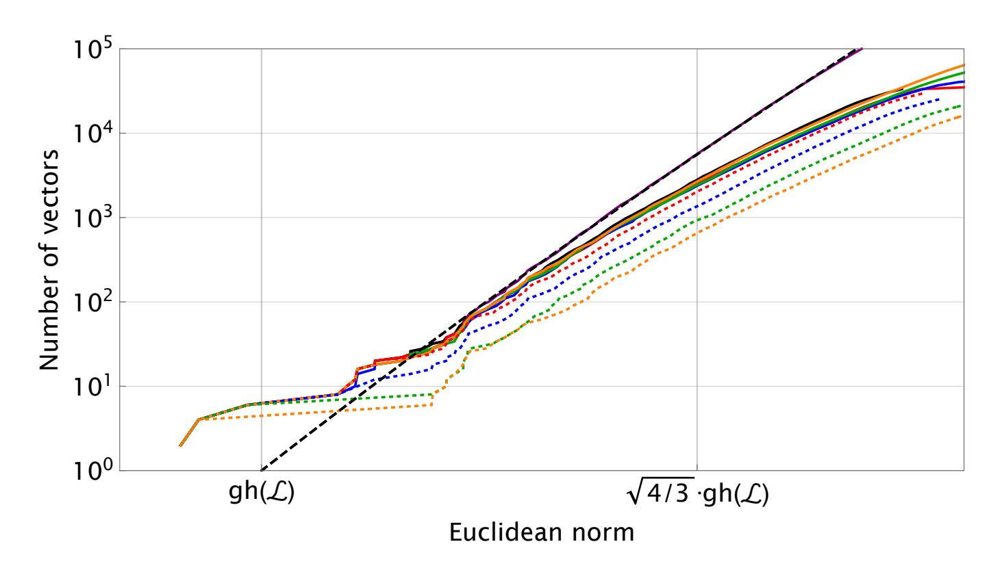
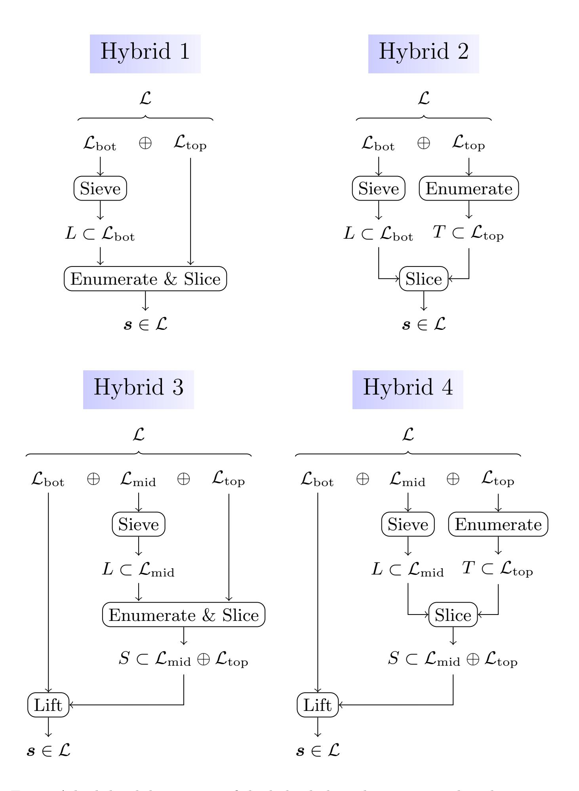
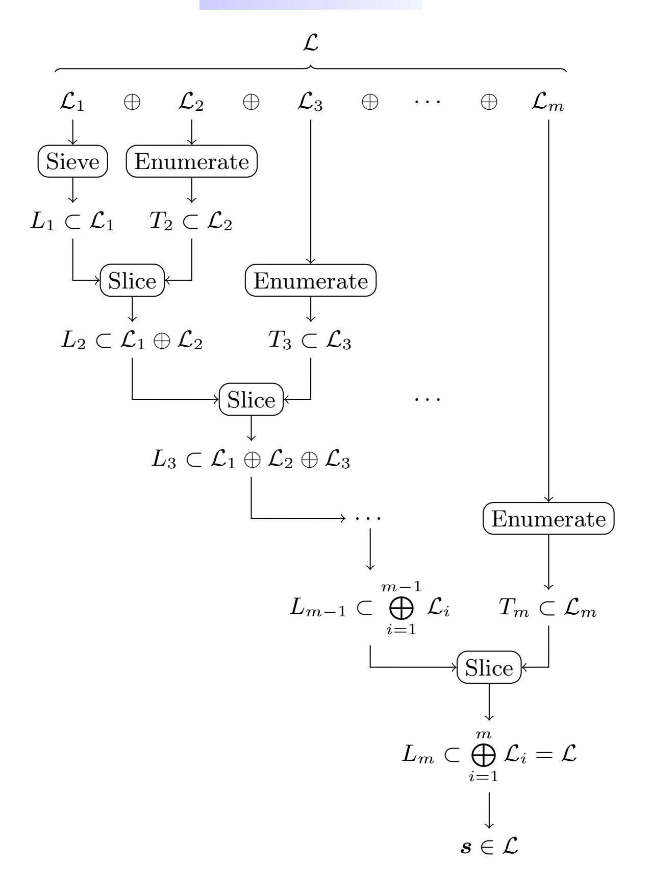

{0}------------------------------------------------

# **Sieve, Enumerate, Slice, and Lift: Hybrid Lattice Algorithms for SVP via CVPP**

Emmanouil Doulgerakis() , Thijs Laarhoven, and Benne de Weger

Eindhoven University of Technology Eindhoven, The Netherlands *{*e.doulgerakis,b.m.m.d.weger*}*@tue.nl, mail@thijs.com

**Abstract.** Motivated by recent results on solving large batches of closest vector problem (CVP) instances, we study how these techniques can be combined with lattice enumeration to obtain faster methods for solving the shortest vector problem (SVP) on high-dimensional lattices. Theoretically, under common heuristic assumptions we show how to solve SVP in dimension *d* with a cost proportional to running a sieve in dimension *d − Θ*(*d/* log *d*), resulting in a 2*Θ*(*d/* log *d*) speedup and memory reduction compared to running a full sieve. Combined with techniques from [Ducas, Eurocrypt 2018] we can asymptotically get a total of [log(13*/*9) + *o*(1)] *· d/* log *d* dimensions *for free* for solving SVP. Practically, the main obstacles for observing a speedup in moderate dimensions appear to be that the leading constant in the *Θ*(*d/* log *d*) term is rather small; that the overhead of the (batched) slicer may be large; and that competitive enumeration algorithms heavily rely on aggressive pruning techniques, which appear to be incompatible with our algorithms. These obstacles prevented this asymptotic speedup (compared to full sieving) from being observed in our experiments. However, it could be expected to become visible once optimized CVPP techniques are used in higher dimensional experiments.

**Keywords:** lattice sieving *·* lattice enumeration *·* randomized slicer *·* shortest vector problem (SVP) *·* closest vector problem (CVP)

# **1 Introduction**

In recent decades, lattice-based cryptography has emerged as a front-runner for building secure and efficient cryptographic primitives in the post-quantum age. For an accurate and reliable deployment of these schemes, it is essential to obtain a good understanding of the hardness of the underlying lattice problems, such as the shortest (SVP) and closest vector problems (CVP).

To date, research on lattice algorithms has resulted in two main flavors of algorithms: *enumeration* methods, requiring 2*O*(*d* log *d*) time and *d O*(1) space to solve hard lattice problems in dimension *d* [\[5](#page-12-0), [13,](#page-13-0) [15](#page-13-1), [20](#page-13-2)]; and *sieving* methods, running in expected time and space 2*O*(*d*) [\[2](#page-12-1), [3,](#page-12-2) [27,](#page-14-0) [30](#page-14-1)]. Just a few years ago, enumeration clearly dominated benchmarks for testing these algorithms in practice [\[1](#page-12-3), [9](#page-13-3), [14](#page-13-4), [15](#page-13-1)], but recent improvements to sieving have allowed it to overtake 

{1}------------------------------------------------

enumeration in practice as well [\[4](#page-12-4), [8,](#page-13-5) [11](#page-13-6), [21,](#page-13-7) [28\]](#page-14-2). Some attempts have also been made to combine the best of both worlds, a.o. resulting in the tuple sieving line of work [[7,](#page-13-8) [18,](#page-13-9) [19](#page-13-10)]. A better comprehension of how to exploit the strengths and weaknesses of each method remains an interesting open problem.

A long-standing open problem from e.g. [\[10](#page-13-11), [15\]](#page-13-1) concerns the possibility of speeding up lattice enumeration with a batch-CVP solver: if an efficient algorithm exists that can solve a large number of CVP instances on the same lattice faster than solving each problem separately, then this algorithm can be used to solve the CVP instances appearing implicitly in the enumeration tree faster. For a long time no such efficient batch-CVP algorithms were known, until the recent line of work on approximate Voronoi cells and the randomized slicer [[10,](#page-13-11) [12,](#page-13-12) [24\]](#page-13-13) showed that, at least in high dimensions, one can indeed solve large batches faster in practice than solving each problem separately. This raises the question whether these new results can be used to instantiate this conjectured hybrid algorithm and obtain better results, in theory and in practice.

**Contributions.** In this work we study the feasibility of combining recent batch-CVP algorithms with lattice enumeration, and show that we heuristically obtain a 2*Θ*(*d/* log *d*) speedup and memory reduction for solving SVP compared to the state-of-the-art lattice sieve. This improvement is proper, in the sense that this does not hide large order terms: we show that for solving SVP in dimension *d*, the costs are proportional to those of running a sieve in dimension *d − Θ*(*d/* log *d*), making the leading constant explicit, and showing that the remaining overhead is negligible. The hybrid constructions we propose are independent of e.g. the underlying nearest neighbor data structure, and we expect that these and other heuristic improvements can be applied to the hybrid algorithms as well.

Obtaining *Θ*(*d/* log *d*) dimensions *for free* may sound familiar, as Ducas [[11\]](#page-13-6) showed that sieving in dimension *d − Θ*(*d/* log *d*) implies solving SVP in dimension *d*. As the asymptotic improvement of Ducas is greater than ours, to improve upon his results we need to be able to combine both techniques. The feasibility of such a combined hybrid algorithm relies on Assumption [4](#page-8-0), which Section [5](#page-11-0) aims to verify with experiments. Combining both techniques, we asymptotically obtain 0*.*5305*d/* log2 *d* dimensions for free, compared to Ducas' 0*.*4150*d/* log2 *d*.

**Open Problems.** Besides performing more extensive experiments, which may assist in obtaining estimates for the crossover points between these hybrids and plain lattice sieving, open problems include (i) finding a way to effectively incorporate *pruning* into the enumeration parts of the proposed hybrids; (ii) further studying the theoretical and practical relevance of the proposed *nested* hybrid algorithms, and their relation with progressive sieving ideas [[11,](#page-13-6) [25](#page-13-14)]; and (iii) finding improvements for CVPP, potentially using a dual distinguisher. We further stress that we introduced a new heuristic, Assumption [4](#page-8-0), which may require additional simulations to see if it is indeed valid (in high dimensions) or not.

{2}------------------------------------------------

Outline. In Section 2 we introduce notation and cover key ingredients of the hybrid algorithms. Sections 3–4 describe these new algorithms, and state the main heuristic results regarding the  $2^{\Theta(d/\log d)}$  speedups for solving SVP. Section 5 describes experimental results, to verify the new heuristic assumption introduced in Section 3 and to get an idea of the performance in practice. Appendices B, C contain derivations omitted from Section 2.3 and Section 3 respectively.

## 2 Preliminaries

#### 2.1 Lattice Problems

Let  $\mathbf{B} = \{\boldsymbol{b}_1, \dots, \boldsymbol{b}_d\} \subset \mathbb{R}^d$  be a set of linearly independent vectors, which we may also interpret as a matrix with columns  $\boldsymbol{b}_i$ . The lattice generated by  $\mathbf{B}$  is defined as  $\mathcal{L} = \mathcal{L}(\mathbf{B}) := \{\mathbf{B}\boldsymbol{\lambda} : \boldsymbol{\lambda} \in \mathbb{Z}^d\}$ . We write  $\operatorname{vol}(\mathcal{L}) := \det(\mathbf{B}^T\mathbf{B})^{1/2}$  for the volume of a lattice  $\mathcal{L}$ . Given a basis  $\mathbf{B}$ , we write  $\mathbf{B}^* = \{\boldsymbol{b}_1^*, \dots, \boldsymbol{b}_d^*\}$  for its Gram-Schmidt orthogonalization. We write  $D_{\boldsymbol{t}+\mathcal{L},s}$  for the discrete Gaussian distribution on  $\boldsymbol{t} + \mathcal{L}$  with probability mass function proportional to  $\rho_s(\boldsymbol{x}) = \exp(-\pi \|\boldsymbol{x}\|^2/s^2)$  [2]. We define  $\lambda_1(\mathcal{L}) := \min_{\boldsymbol{v} \in \mathcal{L} \setminus \{\mathbf{0}\}} \|\boldsymbol{v}\|$  and for  $\boldsymbol{t} \in \mathbb{R}^d$  we define  $d(\boldsymbol{t}, \mathcal{L}) := \min_{\boldsymbol{v} \in \mathcal{L}} \|\boldsymbol{t} - \boldsymbol{v}\|$ , where all norms are Euclidean norms.

Definition 1 (Shortest vector problem – SVP( $\mathcal{L}$ )). Given a lattice  $\mathcal{L}$ , find a non-zero lattice vector  $\mathbf{s} \in \mathcal{L}$  satisfying  $||\mathbf{s}|| = \lambda_1(\mathcal{L})$ .

Definition 2 (Closest vector problem –  $CVP(\mathcal{L}, t)$ ). Given a lattice  $\mathcal{L}$  and a vector  $t \in \mathbb{R}^d$ , find a lattice vector  $s \in \mathcal{L}$  satisfying  $||t - s|| = d(t, \mathcal{L})$ .

In the preprocessing variant of CVP (CVPP), one is allowed to preprocess the lattice  $\mathcal{L}$ , and use the preprocessed data to solve a CVP instance  $\boldsymbol{t}$ . This problem naturally comes up in contexts where either  $\mathcal{L}$  is known long before  $\boldsymbol{t}$  is known, or if a large number of CVP instances on the same lattice are to be solved.

#### 2.2 Heuristic Assumptions

For our asymptotic analyses we will rely on a number of common heuristic assumptions, which have often been used throughout the literature.

Assumption 1 (Gaussian heuristic) Given a full-rank lattice  $\mathcal{L}$  and a region  $\mathcal{A} \subset \mathbb{R}^d$ , the (expected) number of lattice points in  $\mathcal{A}$ , denoted  $|\mathcal{A} \cap \mathcal{L}|$ , satisfies:

$$|\mathcal{A} \cap \mathcal{L}| = \frac{\operatorname{vol}(A)}{\operatorname{vol}(\mathcal{L})}.$$
 (1)

Using volume arguments, the Gaussian heuristic predicts that  $\lambda_1(\mathcal{L}) = \text{gh}(\mathcal{L})$  where  $\text{gh}(\mathcal{L}) := \sqrt{d/(2\pi e)} \cdot \text{vol}(\mathcal{L})^{1/d} \cdot (1+o(1))$ . For random targets  $\mathbf{t} \in \mathbb{R}^d$ , we further expect that  $d(\mathbf{t}, \mathcal{L}) = \text{gh}(\mathcal{L}) \cdot (1+o(1))$  with high probability.

Assumption 2 (Geometric series assumption [32]) After performing lattice basis reduction on a lattice basis B, the Gram-Schmidt basis B\* satisfies

$$\|\boldsymbol{b}_{i}^{*}\| = q^{i-1}\|\boldsymbol{b}_{1}\|, \qquad q \in (0,1).$$
 (2)

The GSA is used in analyzing enumeration and Babai lifting (Sections 2.3, 2.6).

{3}------------------------------------------------

**Assumption 3 (Randomized slicer assumption [[10](#page-13-11)])** *Let s ≫* 0*, and let X*1*, X*2*, · · · ∈ {*0*,* 1*} denote the events that running the iterative slicer on ti ∼ Dt*+*L,s returns the shortest vector t ′ ∈ t* + *L (Xi* = 1*) or not (Xi* = 0*). Then the random variables Xi are identically and independently distributed.*

This assumption is related to the randomized slicer, discussed in Section [2.5](#page-4-1).

## **2.3 Lattice Enumeration**

For constructing hybrid algorithms for solving SVP, we will combine several existing techniques, the first of which is lattice enumeration. This method, first described in the 1980s [[13,](#page-13-0) [20](#page-13-2)] and later significantly improved in practice [[5,](#page-12-0) [15,](#page-13-1) [29](#page-14-4)], can be seen as a brute-force approach to SVP: every lattice vector can be described as an integer linear combination of the basis vectors, and given some guarantees on the quality of the input basis, this results in bounds on the coefficients of the shortest vector in terms of this basis. The algorithm can be described as a depth-first tree search, requiring *d O*(1) memory and 2*O*(*d* log *d*) time. For further details, we refer the reader to e.g. [[15,](#page-13-1) [16,](#page-13-15) [26\]](#page-13-16).

For our purposes, what is important to know is that the complexity of (partial) enumeration is proportional to the number of nodes visited in the tree, and that the number of nodes at depth *k* = *o*(*d*) for a strongly-reduced *d*-dimensional lattice basis is 2*O*(*k* log *d*) . More precisely, we will need the following lemma. A heuristic derivation, based on estimates from [[17](#page-13-17)], is given in Appendix [B.](#page-18-0)

**Lemma 1 (Costs of enumeration [\[17\]](#page-13-17)).** *Let* **B** *be a strongly reduced basis of a lattice. Then the number of nodes* E*k at depth k* = *o*(*d*)*, k* = *d* 1*−o*(1)*, satisfies:*

$$E_k = d^{k/2 + o(k)}. (3)$$

*Enumerating all these nodes can be done in time* Tenum *and space* Senum*, with:*

$$T_{\text{enum}} = E_k \cdot d^{O(1)}, \qquad S_{\text{enum}} = d^{O(1)}.$$
 (4)

# **2.4 Lattice Sieving**

Another method for solving SVP, and which will be part of our hybrid algorithms, is lattice sieving. This method dates back to the 2000s [\[3](#page-12-2), [28,](#page-14-2) [30\]](#page-14-1) and has seen various recent improvements [[4,](#page-12-4) [8,](#page-13-5) [11](#page-13-6), [19](#page-13-10), [21](#page-13-7)] that allowed it to surpass enumeration in the SVP benchmarks [[1\]](#page-12-3). This method only requires 2*O*(*d*) time to solve SVP in dimension *d* (compared to 2*O*(*d* log *d*) for enumeration), but this comes at the cost of a memory requirement of 2*O*(*d*) . The algorithm starts out by generating a large number of lattice vectors as simple combinations of the basis vectors, and then proceeds by combining suitable pairs of vectors to form shorter lattice vectors. For additional details, see e.g. [[8](#page-13-5), [16](#page-13-15), [22](#page-13-18), [26](#page-13-16)].

In the context of this paper we will make use of the following result from [[8](#page-13-5)], which is the current state-of-the-art for (heuristic) lattice sieving in high dimensions *d*. The statement below is stronger than saying that sieving merely solves SVP, as lattice sieving commonly returns a list of all short lattice vectors within radius approximately √ 4*/*3 *· λ*1(*L*). This same assumption was used in [[11](#page-13-6)].

{4}------------------------------------------------

**Lemma 2 (Costs of lattice sieving [[8\]](#page-13-5)).** *Given a basis* **B** *of a lattice L, the LDSieve heuristically returns a list L ⊂ L containing the* (4*/*3)*d/*2+*o*(*d*) *shortest lattice vectors, in time* Tsieve *and space* Ssieve *with:*

$$T_{\text{sieve}} = (3/2)^{d/2 + o(d)}, \qquad S_{\text{sieve}} = (4/3)^{d/2 + o(d)}.$$
 (5)

*With the LDSieve we can therefore solve SVP with the above complexities.*

# **2.5 The Randomized Slicer**

The third ingredient for our hybrid algorithms is the randomized slicer for solving CVP(P). This algorithm, described in [[10](#page-13-11)], is an extension of the iterative slicer [[33\]](#page-14-5), and follows a procedure of reducing targets *t* with a list *L ⊂ L* to find shorter vectors *t ′ ∈ t* + *L*. The goal is to find the shortest vector *t ∗ ∈ t* + *L* by repeatedly reducing *t* with *L*, since *t − t ∗* is the solution to CVP(*L, t*).

We will make use of two separate results from [[12\]](#page-13-12). These results differ in whether one desires to solve only one or many CVP instances on the same lattice; as shown in [[12\]](#page-13-12), solving many CVP instances simultaneously allows for more efficient memory management, thus allowing to achieve a better overall time complexity for a given space bound. Here *ζ* = *−* 1 2 log2 (1*−* 2(1*−y*) 1+*√* 1*−y* ) = 0*.*2639 *. . .* where *y* = 0*.*7739 *. . .* is a root of *p*(*y*) = 16*y* 4 *−* 80*y* 3 + 120*y* 2 *−* 64*y* + 9.

**Lemma 3 (Costs of the randomized slicer, single target [[12](#page-13-12)]).** *Given a list of the* (4*/*3)*d/*2+*o*(*d*) *shortest vectors of a lattice L and a target t ∈* R *d , the randomized slicer solves CVP for t in time* Tslice *and space* Sslice*, with:*

$$T_{\text{slice}} = 2^{\zeta d + o(d)}, \qquad S_{\text{slice}} = (4/3)^{d/2 + o(d)}.$$
 (6)

**Lemma 4 (Costs of the randomized slicer, many targets [\[12\]](#page-13-12)).** *Given a list of the* (4*/*3)*d/*2+*o*(*d*) *shortest vectors of a lattice L and a batch of n ≥* (13*/*12)*d/*2+*o*(*d*) *target vectors t*1*, . . . , tn ∈* R *d , the batched randomized slicer solves CVP for all targets ti in total time* Tslice *and space* Sslice*, with:*

$$T_{\text{slice}} = n \cdot (18/13)^{d/2 + o(d)}, \qquad S_{\text{slice}} = (4/3)^{d/2 + o(d)}.$$
 (7)

*The amortized time complexity per instance equals* Tslice*/n* = (18*/*13)*d/*2+*o*(*d*) *.*

# **2.6 Babai Lifting**

Finally, we will revisit the extension to lattice sieving described in [\[11](#page-13-6)], based on Babai's nearest plane algorithm [[6\]](#page-13-19). As observed by Ducas, lattice sieving returns much more information about a lattice than just the shortest vector, and this additional information can be used to obtain a few dimensions *for free* – to solve SVP in dimension *d*, it suffices to run sieving on a sublattice of dimension *d − ℓ* with *ℓ* = *Θ*(*d/* log *d*), and use the resulting list of vectors in this sublattice to find the shortest vector in the full lattice.

{5}------------------------------------------------

**Lemma 5 (Costs of Babai lifting [\[11\]](#page-13-6)).** *Let γ >* 1*, let* **B** = *{b*1*, . . . , bd} be a sufficiently reduced basis of a lattice L, and let L ′ ⊂ L be the sublattice of L generated by* **B** *′* = *{b*1*, . . . , bd−ℓ}, where:*

$$\ell = \frac{2d\log_2\gamma}{\log_2 d} \cdot (1 + o(1)). \tag{8}$$

*Then, given a list L ′ of the γ d*+*o*(*d*) *shortest vectors of L ′ , we can find a shortest vector of L through Babai lifting of L ′ in time* Tlift *and space* Slift*, with*

$$T_{lift} = \gamma^{d+o(d)}, \qquad S_{lift} = \gamma^{d+o(d)}.$$
 (9)

*For γ* = √ 4*/*3 *this results in ℓ* = *d* log2 (4*/*3)*/* log2 *d dimensions* for free*.*

# **3 Sieve, Enumerate, Slice, and Lift!**

Suppose we have a basis **B** = *{b*1*, . . . , bd}* of a lattice *L* = *L*(**B**), and we split it into two disjoint parts as follows, for some choice 0 *≤ k ≤ d*:

$$\mathbf{B} = \mathbf{B}_{\text{bot}} \cup \mathbf{B}_{\text{top}}, \quad \mathbf{B}_{\text{bot}} := \{ b_1, \dots, b_{d-k} \}, \quad \mathbf{B}_{\text{top}} := \{ b_{d-k+1}, \dots, b_d \}. \quad (10)$$

This defines a partition of the lattice *L* = *L*bot *⊕ L*top as a direct sum of the two sublattices *L*bot := *L*(**B**bot) and *L*top := *L*(**B**top). Let us further denote a solution *s* = SVP(*L*) as *s* = *s*bot + *s*top with *s*bot *∈ L*bot and *s*top *∈ L*top. Finding *s* can commonly be described as solving a CVP instance on *L*bot:

$$s_{\text{top}} \neq \mathbf{0} \implies s = s_{\text{top}} - \text{CVP}(\mathcal{L}_{\text{bot}}, s_{\text{top}}).$$
 (11)

Note that the case *s*top = **0** is in a sense "easy", as then *s* = SVP(*L*bot). The hardest problem instances occur when *s*top *̸*= **0**, and this will be our main focus.

Lattice enumeration can be viewed as a procedure for solving SVP based on the above observations: first enumerate all target vectors *t ∈ L*top that have the potential to satisfy *t* = *s*top, and then compute CVP(*L*bot*, t*) for each of these targets through a continued enumeration procedure on the sublattice *L*bot, to see which of them produces the solution to SVP on the full lattice. Observe that lattice enumeration commonly solves each of these CVP instances separately, even though each problem instance can be viewed as a CVP instance on the *same* lattice *L*bot, but with a different target vector *t ∈ L*top.

As previously outlined in e.g. [[10](#page-13-11),[15](#page-13-1)], a truly efficient CVPP algorithm would imply a way to speed up processing all these CVP instances in enumeration; one would first run a one-time preprocessing on the sublattice *L*bot, and then solve all the CVP instances at some level *k* using the preprocessed data as input for the CVP(P) oracle. The initial preprocessing step may be expensive, but these costs can be amortized over the many CVP instances that potentially have to be solved during the enumeration phase. At the time of [[15\]](#page-13-1) no good heuristic CVPP algorithm was known, but with the results of [\[10](#page-13-11), [12](#page-13-12), [24\]](#page-13-13) we may now finally instantiate the above idea with the ingredients from Sections [2.3–](#page-3-0)[2.5](#page-4-1).

{6}------------------------------------------------

#### 3.1 Hybrid 1: Sieve, Enumerate-and-Slice

In the first hybrid, after the preprocessing (sieve) finishes, we compute closest vectors to targets  $t \in \mathcal{L}_{top}$  one vector at a time. This algorithm has two phases, where the second phase combines enumeration with the randomized slicer.

- 1. Sieve: First, run a lattice sieve on  $\mathcal{L}_{\text{bot}}$  to generate a list  $L \subset \mathcal{L}_{\text{bot}}$ .
- 2. Enumerate—and—slice: Then, run a depth-first enumeration in  $\mathcal{L}_{top}$ , where for each leaf  $t \in \mathcal{L}_{top}$  we run the randomized slicer to find the closest vector  $CVP(t) \in \mathcal{L}_{bot}$ . We keep track of the shortest difference vector t CVP(t), and ultimately return the shortest one as a candidate solution for  $SVP(\mathcal{L})$ .

To optimize the asymptotic time complexity of this algorithm, note that the cost of enumeration in  $\mathcal{L}_{top}$  is  $T_{enum} = 2^{O(k \log d)}$  while the costs of sieving and slicing in  $\mathcal{L}_{bot}$  are  $T_{sieve}$ ,  $T_{slice} = 2^{O(d-k)}$ . To balance these costs, and minimize the overall time complexity, we will therefore set k as follows:

$$k = \frac{\alpha \cdot d}{\log_2 d}$$
, with  $\alpha > 0$  constant. (12)

Using Lemmas 1–3, optimizing  $\alpha$  to obtain the best overall asymptotic time complexity is a straightforward exercise, and we state the result below. A detailed derivation of the following result is given in Appendix C.

Heuristic result 1 (Sieve, enumerate—and—slice) Let  $k = \alpha d / \log_2 d$  with

$$\alpha < \log_2(\frac{3}{2}) - 2\zeta = 0.0570\dots \qquad (\zeta \text{ as in Lemma } 3)$$
 (13)

Let  $T_1^{(d)}$  and  $S_1^{(d)}$  denote the overall time and space complexities of the sieve, enumerate-and-slice hybrid algorithm in dimension d. Then:

$$T_1^{(d)} = T_{\text{sieve}}^{(d-k)} \cdot (1 + o(1)), \qquad S_1^{(d)} = S_{\text{sieve}}^{(d-k)} \cdot (1 + o(1)).$$
 (14)

Letting  $\alpha \to \log_2(\frac{3}{2}) - 2\zeta$  in the above result, we get  $k \approx 0.0570d/\log_2 d$  with an asymptotic speedup of a factor  $2^{0.0167d/\log_2 d}$  and a memory reduction of a factor  $2^{0.0118d/\log_2 d}$  compared to running a sieve directly on  $\mathcal{L}$ . Note that the result does not hide subexponential or even polynomial hidden order terms; the time and space complexities are dominated by the preprocessing costs.

#### 3.2 Hybrid 2: Sieve, Enumerate, Slice

An alternative to the above approach is to separate the enumeration and slicing procedures into two disjoint parts, and run the hybrid algorithm in three phases. The benefit of this approach (cf. Section 2.5) is that the *batched* slicer can then be used to achieve better amortized complexities for CVPP.

&lt;sup>1 The case  $s_{\text{top}} = 0$  can be handled by checking if L contains an even shorter vector.

{7}------------------------------------------------

- 1. Sieve: As before, run a lattice sieve on  $\mathcal{L}_{\text{bot}}$ , to generate a list  $L \subset \mathcal{L}_{\text{bot}}$ .
- 2. **Enumerate**: Then, enumerate all nodes  $t \in \mathcal{L}_{top}$  at depth k in the enumeration tree, and store them in a list of targets  $T \subset \mathcal{L}_{top}$ .
- 3. Slice: Finally, use the batched randomized slicer with the list L to solve CVP on  $\mathcal{L}_{\mathrm{bot}}$  for all targets  $t \in T$ , and return the shortest vector  $t \mathrm{CVP}(t)$ .

Asymptotically, the additional space required for storing the nodes from the enumeration phase will not play a large role, compared to the memory required for storing the output from the preprocessing phase. On the other hand, by using the improved batch-CVPP slicer of Lemma 4 we can use nearest neighbor searching more efficiently, without increasing the memory, leading to a bigger improvement over standard sieving than with the first hybrid algorithm.

Heuristic result 2 (Sieve, enumerate, slice) Let  $k = \alpha d / \log_2 d$  with

$$\alpha < \log_2(\frac{13}{12}) = 0.1154\dots$$
 (15)

Let  $T_2^{(d)}$  and  $S_2^{(d)}$  denote the overall time and space complexities of the batched sieve, enumerate, slice hybrid algorithm in dimension d. Then:

$$T_2^{(d)} = T_{\text{sieve}}^{(d-k)} \cdot (1 + o(1)), \qquad S_2^{(d)} = S_{\text{sieve}}^{(d-k)} \cdot (1 + o(1)).$$
 (16)

In the limit of  $\alpha \to \log_2(\frac{13}{12})$  we get  $k \approx 0.1154d/\log_2 d$  dimensions for free, leading to an asymptotic speedup of a factor  $2^{0.0338d/\log_2 d + o(d/\log d)}$  and a memory reduction of a factor  $2^{0.0240d/\log_2 d + o(d/\log d)}$  over direct sieving on  $\mathcal{L}$ .

#### 3.3 Hybrid 3: Sieve, Enumerate—and–Slice, Lift

For the third and fourth hybrids, we observe that similar to lattice sieving, the slicer in the previous hybrid algorithms can actually produce much more information about the lattice than just the shortest lattice vector; for other targets  $t \neq s_{\text{top}}$ , as well as for "failed" outputs of the randomized slicer, the slicer will also return many short lattice vectors. This suggests that to get even more dimensions for free, we may be able to combine both hybrids with Babai lifting as outlined in Lemma 5.

Instead of splitting the lattice into two parts, we now split the input lattice basis into three parts  $\mathbf{B} = \mathbf{B}_{\mathrm{bot}} \cup \mathbf{B}_{\mathrm{mid}} \cup \mathbf{B}_{\mathrm{top}}$ , where the three bases  $\mathbf{B}_{\mathrm{bot}} := \{\boldsymbol{b}_1, \ldots, \boldsymbol{b}_\ell\}$ ,  $\mathbf{B}_{\mathrm{mid}} := \{\boldsymbol{b}_{\ell+1}, \ldots, \boldsymbol{b}_{d-k}\}$ , and  $\mathbf{B}_{\mathrm{top}} := \{\boldsymbol{b}_{d-k+1}, \ldots, \boldsymbol{b}_d\}$  generate lattices  $\mathcal{L}_{\mathrm{bot}}$ ,  $\mathcal{L}_{\mathrm{mid}}$ ,  $\mathcal{L}_{\mathrm{top}}$  of dimensions  $\ell$ ,  $d-k-\ell$  and k respectively. For Hybrid 3 we essentially run Hybrid 1 on  $\mathcal{L}_{\mathrm{mid}} \oplus \mathcal{L}_{\mathrm{top}}$ , and use Babai lifting to deal with the additional  $\ell$  dimensions of  $\mathcal{L}_{\mathrm{bot}}$ . This leads to the following algorithm:

- 1. Sieve: Run a lattice sieve on  $\mathcal{L}_{\text{mid}}$  to generate a list  $L \subset \mathcal{L}_{\text{mid}}$ .
- 2. Enumerate—and—slice: Enumerate all nodes  $t \in \mathcal{L}_{top}$ , and repeatedly slice each of them with the list L to find close vectors  $v \in \mathcal{L}_{mid}$ . For each pair t, v add the vector t v to an output list  $S \subset \mathcal{L}_{mid} \oplus \mathcal{L}_{top}$ .
- 3. Lift: Finally, extend each vector  $s' \in S$  to a candidate solution  $s \in \mathcal{L}$  by running Babai's nearest plane algorithm. Return the shortest lifted vector.

{8}------------------------------------------------

As the slicer processes  $E_k = d^{k/2+o(k)} = 2^{\alpha d/2+o(d)}$  target vectors, and requires  $\rho = (16/13)^{d/2+o(d)}$  rerandomizations per target for average-case CVP to succeed (see [10, 12] for details), the slicer outputs  $2^{(\alpha+\log_2(16/13))\cdot d/2+o(d)}$  lattice vectors, and ideally we might hope this list contains, similar to sieving [11], (almost) all lattice vectors of norm at most  $\gamma = 2^{(\alpha+\log_2(16/13))/2+o(1)} \cdot \operatorname{gh}(\mathcal{L})$ .

Assumption 4 (Hybrid assumption) The list S, output by the slicer, contains the  $2^{(\alpha+\log_2(16/13))\cdot d/2+o(d)}$  shortest lattice vectors of  $\mathcal{L}_{\text{mid}} \oplus \mathcal{L}_{\text{top}}$ .

Assuming that the above heuristic is indeed valid, we derive the following result regarding the asymptotic time and space complexities of the described hybrid algorithm. In Section 5 we will revisit this assumption, to study its validity.

Heuristic result 3 (Sieve, enumerate—and—slice, lift) Let  $k = \alpha d / \log_2 d$  and  $\ell = \beta d / \log_2 d$  with

$$\alpha < \log_2(\frac{3}{2}) - 2\zeta = 0.0570..., \qquad \beta < \log_2(\frac{24}{13}) - 2\zeta = 0.3565....$$
 (17)

Let  $T_3^{(d)}$  and  $S_3^{(d)}$  denote the time and space complexities of the sieve, enumerateand-slice, lift hybrid algorithm in dimension d. Then, under Assumption 4:

$$T_3^{(d)} = T_{\text{sieve}}^{(d-k-\ell)} \cdot (1+o(1)), \qquad S_3^{(d)} = S_{\text{sieve}}^{(d-k-\ell)} \cdot (1+o(1)).$$
 (18)

Observe that the number of dimensions we save compared to a full sieve here is  $k+\ell \approx 0.4136d/\log_2 d$ . Compared to the result of Ducas [11] of  $\ell \approx 0.4150d/\log_2 d$  this new hybrid is asymptotically slightly worse than a sieve–and–lift hybrid.

## 3.4 Hybrid 4: Sieve, Enumerate, Slice, Lift

Finally, combining the second hybrid with lifting, as in the third hybrid algorithm above, results in the following optimized hybrid procedure:

- 1. Sieve: Run a lattice sieve on  $\mathcal{L}_{mid}$  to generate a list  $L \subset \mathcal{L}_{mid}$ .
- 2. **Enumerate**: Enumerate all nodes  $t \in T \subset \mathcal{L}_{top}$  at depth k in  $\mathcal{L}$ .
- 3. Slice: Run the slicer, with the list L as input, to find close vectors in  $\mathcal{L}_{\text{mid}}$  to the targets  $t \in T$ . The result is a list  $S \subset \mathcal{L}_{\text{mid}} \oplus \mathcal{L}_{\text{top}}$ .
- 4. Lift: Finally, extend each vector  $s' \in S$  to a candidate solution  $s \in \mathcal{L}$  by running Babai's nearest plane algorithm. Return the shortest lifted vector.

Not only does splitting the enumeration and slicing guarantee that the batched version of the slicer gets better complexities; the smaller resulting value  $\alpha$  also means that the number of vectors output by the slicer is larger, which leads to more dimensions for free from the lifting phase. In particular, with the batched slicer the number of vectors output by the slicer is proportional to  $(4/3)^{d/2+o(d)}$ , and we may get as many dimensions for free in the lifting phase as [11].

{9}------------------------------------------------

Table 1: An overview of the techniques used in the hybrids, as well as the asymptotic number of dimensions for free for each part and in total (last column). In sufficiently high dimensions, under Assumption 4, Hybrid 4 outperforms all other algorithms, by saving up to  $0.53d/\log_2 d$  dimensions compared to sieving in the full lattice.

| Algorithm      | Sieve        | Enum         | ./Slice      | Lift         | Dimensions for free     |                            |                              |  |
|----------------|--------------|--------------|--------------|--------------|-------------------------|----------------------------|------------------------------|--|
|                |              | (Single)     | (Batch)      |              | $(\frac{k}{d}\log_2 d)$ | $(\frac{\ell}{d}\log_2 d)$ | $(\frac{k+\ell}{d}\log_2 d)$ |  |
| Full sieve [8] | ✓            |              |              |              | -                       | -                          | -                            |  |
| Hybrid 1       | $\checkmark$ | $\checkmark$ |              |              | 0.0570                  | -                          | 0.0570                       |  |
| Hybrid 2       | $\checkmark$ |              | $\checkmark$ |              | 0.1154                  | -                          | 0.1154                       |  |
| Hybrid 3       | $\checkmark$ | $\checkmark$ |              | $\checkmark$ | 0.0570                  | 0.3566                     | 0.4136                       |  |
| SubSieve [11]  | $\checkmark$ |              |              | $\checkmark$ | -                       | 0.4150                     | 0.4150                       |  |
| Hybrid 4       | $\checkmark$ |              | $\checkmark$ | $\checkmark$ | 0.1155                  | 0.4150                     | 0.5305                       |  |

Heuristic result 4 (Sieve, enumerate, slice, lift) Let  $k = \alpha d/\log_2 d$  and  $\ell = \beta d/\log_2 d$  with

$$\alpha < \log_2(\frac{13}{12}) = 0.1154..., \qquad \beta < \log_2(\frac{4}{3}) = 0.4150....$$
 (19)

Let  $T_4^{(d)}$  and  $S_4^{(d)}$  denote the time and space complexities of the sieve, enumerate, slice, and lift hybrid algorithm in dimension d. Then, under Assumption 4:

$$T_4^{(d)} = T_{\text{sieve}}^{(d-k-\ell)} \cdot (1 + o(1)), \qquad S_4^{(d)} = S_{\text{sieve}}^{(d-k-\ell)} \cdot (1 + o(1)). \tag{20}$$

We again stress that the above result relies on a batched version of the randomized slicer. With this batched hybrid algorithm with lifting, assuming the hybrid assumption holds, we can potentially get up to  $k + \ell \approx 0.5305d/\log_2(d)$  dimensions for free, which would improve upon Ducas'  $\ell \approx 0.4150d/\log_2(d)$  [11].

An overview of the techniques used in the four hybrids, as well as the number of dimensions for free in each algorithm, is given in Table 1.

### 4 Sieve, Enumerate, Slice, Repeat!

For the fourth hybrid, under Assumption 4 the enumeration and batched slicer together take as input a list of all vectors of norm at most  $\sqrt{4/3} \cdot \operatorname{gh}(\mathcal{L}')$  of a suitable sublattice  $\mathcal{L}' \subset \mathcal{L}$ , and output (almost) all lattice vectors of norm at most  $\sqrt{4/3} \cdot \operatorname{gh}(\mathcal{L})$  of  $\mathcal{L}$ . This suggests one might replace the initial sieving step on  $\mathcal{L}_{\operatorname{mid}}$  by a sieve, enumerate, slice hybrid (Hybrid 2), by splitting  $\mathcal{L}_{\operatorname{mid}} = \mathcal{L}_{\operatorname{mid}}^{(1)} \oplus \mathcal{L}_{\operatorname{mid}}^{(2)}$  with rank( $\mathcal{L}_{\operatorname{mid}}^{(2)}$ ) =  $\Theta(d/\log d)$ ; running a sieve on  $\mathcal{L}_{\operatorname{mid}}^{(1)}$ ; enumerating  $\mathcal{L}_{\operatorname{mid}}^{(2)}$ ; and then using the slicer to find a list of short vectors  $L \subset \mathcal{L}_{\operatorname{mid}}$ . Under Assumption 4, this substitution of the initial sieve by Hybrid 2 can be repeated many times to obtain  $\Theta(d/\log d)$  dimensions for free several times.

As an alternative interpretation, rather than running enumeration on k levels directly, one additional level of nesting suggests we first run the lower k/2 levels of enumeration, lift the resulting target vectors to obtain short vectors in a

{10}------------------------------------------------

lattice of rank *d − k/*2, and then run another *k/*2 levels of enumeration to find short vectors in the full lattice. Splitting up the enumeration this way decreases the overall enumeration costs and the number of targets for the slicing phases (E*k/*2 + E*k/*2 *≪* E*k*), but at the same time the list output by the first slicing phase might not be as good for the second slicing phase as what one would get from running a sieve directly; even if Assumption [4](#page-8-0) is true, likely this still comes at a slight loss in the quality of the list, say in the first order terms.

We finally observe that the same idea of nesting does not seem to work for the sieve, lift hybrid of [[11\]](#page-13-6). Although one could define a "generalized" Babai lifting procedure, lifting targets to all nearby vectors in the higher-rank lattice, from a viewpoint of enumeration we are "missing" some branches in the tree due to *L* only containing some nodes in the tree at level *d − ℓ*. Therefore, if the shortest vector in the lattice is actually in one of those missing branches, then a generalized lifting procedure will not succeed in finding this shortest vector.

Although we will briefly revisit the idea of nesting in the experiments in the next section, we leave a technical study of nesting for future work.

Fig. 1: The number of vectors found through a sieve (black) and sieve, enumerate, slice hybrids for *k ∈ {*1*,* 2*,* 3*,* 4*}* (orange, green, blue, red) in dimension 60. The dashed black line, and the purple line intersecting it for large norms, indicate the true number of lattice vectors below this norm. The dashed colored lines indicate the lists obtained from running sieving in sublattices of rank *d − k*.

{11}------------------------------------------------

# **5 Experimental Results**

# **5.1 Verifying Assumption [4](#page-8-0)**

To attempt to validate (or disprove) the new heuristic assumption, we performed the following experiment. We used the 60-dimensional SVP challenge lattice with seed 0 [\[1](#page-12-3)], pre-reduced with BKZ-50 [[31\]](#page-14-6), for which gh(*L*) *≈* 2001 and *λ*1(*L*) *≈* 1943. The black dashed line in Figure [1](#page-10-0) shows the expected number of lattice points below a certain norm by the Gaussian heuristic (Assumption [1\)](#page-2-1). The (barely visible) purple line intersecting this line for high norms shows the actual number of lattice vectors found by a "relaxed" sieve [[23\]](#page-13-20), showing the accuracy of the Gaussian heuristic for large balls.

To test Assumption [4,](#page-8-0) we then ran both a standard g6k lattice sieve to produce a list *L*0 (black) [[4\]](#page-12-4); and sieve, enumerate, slice hybrids for *k ∈ {*1*,* 2*,* 3*,* 4*}* by (1) running g6k on the (*d−k*)-dimensional sublattice formed by *b*1*, . . . , bd−k* to produce a list *Lk*, (2) running enumeration up to depth *k* in the full lattice to obtain targets *Tk*, (3) slicing each target *t ∈ Tk* up to 20 *·* (16*/*13)(*d−k*)*/*2 times, to obtain a list *Sk*, and (4) plotting the sorted norms of both *Lk* (dashed) and *Sk ∪ Lk* (solid) in Figure [1](#page-10-0). These results show that (i) as expected, the preprocessed lists *Lk* in rank *d − k* become increasingly poor approximations of the sieved list *L*0 as *k* increases, and (ii) the sliced lists *Sk ∪ Lk* together form very good approximations to the sieved list *L*0. Note that, at norm √ 4*/*3*·*gh(*L*), all these lists are quite far off from the prediction by the Gaussian heuristic.

## **5.2 Assessing the Sieve, Enumerate–and–Slice Hybrid**

To study the practical performance of these hybrid algorithms, we performed some preliminary experiments in dimensions 60–80, whose results are described in Table [2](#page-15-0). This table is deferred to Appendix [A](#page-15-1) due to the page limit; instead here we will describe the setup of the experiments, and discuss the results as well as conclusions that can or cannot be drawn from these results.

**BKZ.** To start, we used the SVP challenge lattices [[1\]](#page-12-3) with seed 0 in dimensions *d ∈ {*60*,* 65*,* 70*,* 75*,* 80*}*. We preprocessed each basis with BKZ with block size *d −* 10. In case the shortest vector had a 0-coefficient for *bd* when expressed in terms of **B**, we would rerandomize the basis and run BKZ again, to guarantee that the preprocessed lists do not already contain the solution.

**Sieve.** Next, we used the g6k [[35](#page-14-7)] framework to generate sieving lists in dimensions *d − k*, for *k* = 0*,* 1*,* 2*,* 3. We disabled the "dimensions for free" from g6k, to test the pure hybrids for their performance and limit the impact of other factors for now. The case *k* = 0 corresponds to sieving in the full lattice, and the timings in dimensions *d − k* clearly decrease with *k*, as shown in Table [2.](#page-15-0) The resulting vectors were stored in an output file, and their sizes are also given in Table [2](#page-15-0).

**Enumerate.** Then, we ran a full enumeration in the full lattice up to depth *k*, to generate the target vectors for the slicer. These were again stored in a separate file for later usage. Note that pruning would reduce the number of targets further, 

{12}------------------------------------------------

but (1) this would decrease the success probability of the overall algorithm, and (2) rerandomizing the lattice basis to get a high success probability would (naively) require running the costly sieving preprocessing step several times. We therefore restricted experiments to enumeration without pruning.

Slice. Finally, with the sieved list L and target vectors T as input, we identified the target  $t \in T$  corresponding to the shortest vector in the lattice, and for this target we ran the randomized slicer with  $10^5$  trials to estimate the success probability  $p_{iter}$  of the slicer in finding the shortest vector. Table 2 shows the inverse  $p_{iter}^{-1}$  as well as the average time for each trial, which together with |T| can then be used to estimate the time for the slicing as  $T_{slice} \approx |T| \cdot p_{iter}^{-1} \cdot T_{iter}$ .

**Nested hybrid.** We also tested a simple nested hybrid from Section 4, with two successive (non-batched) enumerate—and—slice routines in dimension k = 1. In the first slicing phase, we chose the total number of iterations such that the size of the output list matches the size of a directly sieved list for k = 1. The rows k = 1 + 1 in Table 2 suggest this approach compares favorably to k = 2.

Conclusions. Although the results in Table 2 mainly suggest that these hybrid approaches may have a large overhead in practice, we stress that as d grows, the time complexity grows slower than a full sieve. Furthermore, for the slicer we did not use nearest neighbor techniques or batching to reduce the query times. Also, note that as  $0.11d/\log_2 d < 2$  for d < 128 we do not expect to obtain many (additional) dimensions for free in dimensions  $60 \le d \le 80$ . The aforementioned reasons can provide some insight why the speedup was not observed in practice in our experiments.

Code in fplll. As part of this project, we implemented the iterative slicer in fplll [34], and we expect this code to be included in the library soon.

**Acknowledgements.** The authors thank Léo Ducas for helpful suggestions regarding the possible combination with his "dimensions for free". Emmanouil Doulgerakis is supported by the NWO under grant 628.001.028 (FASOR). Thijs Laarhoven is supported by a Veni grant from NWO under project number 016.Veni.192.005.

### References

- 1. SVP Challenge (2019), https://www.latticechallenge.org/svp-challenge/
- 2. Aggarwal, D., Dadush, D., Regev, O., Stephens-Davidowitz, N.: Solving the shortest vector problem in 2n time via discrete Gaussian sampling. In: Proceedings of the 47th STOC. pp. 733–742 (2015). https://doi.org/10.1145/2746539.2746606
- 3. Ajtai, M., Kumar, R., Sivakumar, D.: A sieve algorithm for the shortest lattice vector problem. In: Proceedings of the 33rd STOC. pp. 601–610. ACM Press (2001)
- 4. Albrecht, M., Ducas, L., Herold, G., Kirshanova, E., Postlethwaite, E., Stevens, M.: The general sieve kernel and new records in lattice reduction. In: Proceedings of the 38th EUROCRYPT. pp. 717–746. Springer (2019)
- 5. Aono, Y., Nguyen, P.Q.: Random sampling revisited: lattice enumeration with discrete pruning. In: Proceedings of the 36th EUROCRYPT. pp. 65–102. Springer (2017)

{13}------------------------------------------------

- 6. Babai, L.: On lovasz lattice reduction and the nearest lattice point problem. Combinatorica **6**(1), 1–13 (1986). <https://doi.org/10.1007/BF02579403>
- 7. Bai, S., Laarhoven, T., Stehl´e, D.: Tuple lattice sieving. Proceedings of the 12th ANTS **19**(A), 146–162 (2016)
- 8. Becker, A., Ducas, L., Gama, N., Laarhoven, T.: New directions in nearest neighbor searching with applications to lattice sieving. In: Proceedings of the 27th SODA. pp. 10–24. ACM-SIAM (2016)
- 9. Chen, Y., Nguyˆen, P.Q.: BKZ 2.0: Better lattice security estimates. In: Proceedings of the 17th ASIACRYPT. pp. 1–20 (2011). [https://doi.org/10.1007/978-3-](https://doi.org/10.1007/978-3-642-25385-0_1) [642-25385-0](https://doi.org/10.1007/978-3-642-25385-0_1) 1
- 10. Doulgerakis, E., Laarhoven, T., de Weger, B.: Finding closest lattice vectors using approximate Voronoi cells. In: Proceedings of the 10th PQCRYPTO. pp. 3–22. Springer (2019)
- 11. Ducas, L.: Shortest vector from lattice sieving: a few dimensions for free. In: Proceedings of the 37th EUROCRYPT. pp. 125–145. Springer (2018)
- 12. Ducas, L., Laarhoven, T., van Woerden, W.: The randomized slicer for CVPP: sharper, faster, smaller, batchier. Preprint (2019)
- 13. Fincke, U., Pohst, M.: Improved methods for calculating vectors of short length in a lattice. Mathematics of Computation **44**(170), 463–471 (1985)
- 14. Fukase, M., Kashiwabara, K.: An accelerated algorithm for solving SVP based on statistical analysis. Journal of Information Processing **23**(1), 67–80 (2015). <https://doi.org/10.2197/ipsjjip.23.67>
- 15. Gama, N., Nguyen, P.Q., Regev, O.: Lattice enumeration using extreme pruning. In: Proceedings of the 29th EUROCRYPT. pp. 257–278. Springer (2010)
- 16. Hanrot, G., Pujol, X., Stehl´e, D.: Algorithms for the shortest and closest lattice vector problems. In: Proceedings of the 3rd IWCC. pp. 159–190 (2011). [https://doi.org/10.1007/978-3-642-20901-7](https://doi.org/10.1007/978-3-642-20901-7_10) 10
- 17. Hanrot, G., Stehl´e, D.: Improved analysis of Kannan's shortest lattice vector algorithm (extended abstract). In: Proceedings of the 27th CRYPTO. pp. 170–186. Springer (2007)
- 18. Herold, G., Kirshanova, E.: Improved algorithms for the approximate *k*-list problem in Euclidean norm. In: Proceedings of the 20th PKC Part I. pp. 16–40. Springer (2017)
- 19. Herold, G., Kirshanova, E., Laarhoven, T.: Speed-ups and time-memory trade-offs for tuple lattice sieving. In: Proceedings of the 21st PKC. pp. 407–436. Springer (2018)
- 20. Kannan, R.: Improved algorithms for integer programming and related lattice problems. In: Proceedings of the 15th STOC. pp. 193–206. ACM Press (1983)
- 21. Laarhoven, T.: Sieving for shortest vectors in lattices using angular localitysensitive hashing. In: Proceedings of the 35th CRYPTO. pp. 3–22. Springer (2015)
- 22. Laarhoven, T.: Search problems in cryptography. Ph.D. thesis, Eindhoven University of Technology (2016), <http://repository.tue.nl/837539>
- 23. Laarhoven, T.: Sieving for closest lattice vectors (with preprocessing). In: Proceedings of the 23rd SAC. pp. 523–542. Springer (2016)
- 24. Laarhoven, T.: Approximate Voronoi cells for lattices, revisited. In: Proceedings of the 1st MATHCRYPT (2019), <https://arxiv.org/pdf/1907.04630.pdf>
- 25. Laarhoven, T., Mariano, A.: Progressive lattice sieving. In: Proceedings of the 9th PQCRYPTO. pp. 292–311. Springer (2018)
- 26. Laarhoven, T., van de Pol, J., de Weger, B.: Solving hard lattice problems and the security of lattice-based cryptosystems. Cryptology ePrint Archive, Report 2012/533 pp. 1–43 (2012), <http://eprint.iacr.org/2012/533>

{14}------------------------------------------------

- 27. Micciancio, D., Voulgaris, P.: A deterministic single exponential time algorithm for most lattice problems based on Voronoi cell computations. In: Proceedings of the 42nd STOC. pp. 351–358. ACM Press (2010)
- 28. Micciancio, D., Voulgaris, P.: Faster exponential time algorithms for the shortest vector problem. In: Proceedings of the 21st SODA. pp. 1468–1480. ACM-SIAM (2010)
- 29. Micciancio, D., Walter, M.: Fast lattice point enumeration with minimal overhead. In: Proceedings of the 26th SODA. pp. 276–294 (2015). <https://doi.org/10.1137/1.9781611973730.21>
- 30. Nguyen, P.Q., Vidick, T.: Sieve algorithms for the shortest vector problem are practical. Journal of Mathematical Cryptology **2**(2), 181–207 (2008)
- 31. Schnorr, C.P.: A hierarchy of polynomial time lattice basis reduction algorithms. Theoretical Computer Science **53**(2), 201–224 (1987)
- 32. Schnorr, C.P.: Lattice reduction by random sampling and birthday methods. In: Proceedings of the 20th STACS. pp. 145–156. Springer (2003)
- 33. Sommer, N., Feder, M., Shalvi, O.: Finding the closest lattice point by iterative slicing. SIAM Journal of Discrete Mathematics **23**(2), 715–731 (2009). <https://doi.org/10.1137/060676362>
- 34. The FPLLL development team: fplll, a lattice reduction library (2019), available at <https://github.com/fplll/fplll>
- 35. The g6k development team: The general sieve kernel (G6K) (2019), available at <https://github.com/fplll/g6k>

{15}------------------------------------------------

# A Figures and Tables

Due to the page limit, we have deferred some tables and figures to the appendix. Table 2 shows the experimental results for the experiments described in Section 5. Figures 2 and 3 present graphical overviews of the hybrid algorithms described Sections 3 and 4, where the horizontal axis depicts the basis vectors  $b_1, \ldots, b_d$  and the vertical axis corresponds to the time (with algorithms starting from the top and ending at the bottom).

Table 2: Experimental results and estimates for the costs of the hybrid algorithms, in dimensions  $d \in \{60, 65, 70, 75, 80\}$  and for parameter choices  $k \in \{0, 1, 2, 3\}$  as well as the nested hybrid with two iterations of k = 1. Single-core timings are denoted in milliseconds (ms), seconds (s), minutes (m), hours (h), and days (d). List sizes |L| and estimates on the required number of rerandomizations  $\mathbf{p}_{\text{iter}}^{-1}$  are sometimes given in multiples of one thousand (k). The last column gives estimates for the total time complexities for these algorithms, by adding up the costs for BKZ, sieving, enumeration, and slicing. The case k = 0 corresponds to running a sieve on the full lattice directly.

| Parameters |       | BKZ                                  | — Sieve — |                            | — Er | um —                    |                           | Slice —                           |                            | Total                    |
|------------|-------|--------------------------------------|-----------|----------------------------|------|-------------------------|---------------------------|-----------------------------------|----------------------------|--------------------------|
| d          | k     | $\mathbf{T}_{\mathrm{BKZ}}^{(d-10)}$ | L         | $T_{\text{sieve}}^{(d-k)}$ | T    | $T_{\text{enum}}^{(k)}$ | $T_{\text{iter}}^{(d-k)}$ | $\mathrm{p}_{\mathrm{iter}}^{-1}$ | $T_{\text{slice}}^{(d-k)}$ | $T_{\mathrm{hyb}}^{(d)}$ |
| 60         | 0     | $4\mathrm{s}$                        | 18k       | 19s                        | -    | -                       | -                         | -                                 | -                          | 23s                      |
|            | 1     | 4s                                   | 16k       | 16s                        | 5    | 0s                      | $3.2 \mathrm{ms}$         | 830                               | 13s                        | 33s                      |
|            | 2     | 4s                                   | 13k       | 12s                        | 30   | 0s                      | $2.7 \mathrm{ms}$         | 530                               | 43s                        | 59s                      |
|            | 3     | 4s                                   | 12k       | 9s                         | 155  | 0s                      | $2.4 \mathrm{ms}$         | 760                               | 280s                       | 293s                     |
|            | 1   1 | 40                                   | 13k       | 12s                        | 4    | 0s                      | $3.0 \mathrm{ms}$         | 500                               | 6s                         | E1a                      |
| 1+1        | 4s    | (16k)                                | (0s)      | 5                          | 0s   | $3.2 \mathrm{ms}$       | 1820                      | 29s                               | 51s                        |                          |
| 65         | 0     | 8s                                   | 37k       | 78s                        | -    | _                       | _                         | _                                 | -                          | 1m                       |
|            | 1     | 8s                                   | 32k       | 57s                        | 5    | 0s                      | $6.8 \mathrm{ms}$         | 12.5k                             | $7 \mathrm{m}$             | 8m                       |
|            | 2     | 8s                                   | 28k       | 44s                        | 37   | 0s                      | $6.6 \mathrm{ms}$         | 2.9k                              | 12m                        | $13 \mathrm{m}$          |
|            | 3     | 8s                                   | 24k       | 36s                        | 215  | 0s                      | $5.6 \mathrm{ms}$         | 2.9k                              | $58 \mathrm{m}$            | $59 \mathrm{m}$          |
|            | 1   1 | O ~                                  | 28k       | 44s                        | 4    | 0s                      | 6.6ms                     | 1.1k                              | $0.5 \mathrm{m}$           | 6                        |
|            | 1 + 1 | 8s                                   | (32k)     | (0s)                       | 5    | 0s                      | $6.8 \mathrm{ms}$         | 6.7k                              | $4 \mathrm{m}$             | 6m                       |
| 70         | 0     | 1m                                   | 76k       | $5\mathrm{m}$              | -    | _                       | -                         | _                                 | _                          | 6m                       |
|            | 1     | $1 \mathrm{m}$                       | 65k       | $4\mathrm{m}$              | 6    | $0 \mathrm{m}$          | $20 \mathrm{ms}$          | 17k                               | $35 \mathrm{m}$            | $40 \mathrm{m}$          |
|            | 2     | $1 \mathrm{m}$                       | 57k       | $3\mathrm{m}$              | 46   | $0 \mathrm{m}$          | $16 \mathrm{ms}$          | 1k                                | 12m                        | 16m                      |
|            | 3     | $1 \mathrm{m}$                       | 49k       | $2 \mathrm{m}$             | 293  | $0 \mathrm{m}$          | $13 \mathrm{ms}$          | 6k                                | 381m                       | $384 \mathrm{m}$         |
|            | 1   1 | 1                                    | 57k       | 3m                         | 5    | 0m                      | 15ms                      | 2k                                | 2m                         | 43m                      |
|            | 1 + 1 | $1 \mathrm{m}$                       | (65k)     | (0m)                       | 5    | $0 \mathrm{m}$          | 18ms                      | 25k                               | $37 \mathrm{m}$            | 43111                    |
| 75         | 0     | 2m                                   | 155k      | 22m                        | -    | -                       | -                         | -                                 | -                          | 0.4 h                    |
|            | 1     | $2 \mathrm{m}$                       | 134k      | 16m                        | 6    | $0 \mathrm{m}$          | $40 \mathrm{ms}$          | 25k                               | 2h                         | 2h                       |
|            | $^2$  | $2\mathrm{m}$                        | 116k      | 11m                        | 50   | $0 \mathrm{m}$          | $48 \mathrm{ms}$          | 20k                               | 13h                        | 14h                      |
|            | 3     | 2m                                   | 101k      | 8m                         | 366  | $0 \mathrm{m}$          | $30 \mathrm{ms}$          | 12k                               | 37h                        | 37h                      |
|            | 1   1 | 2                                    | 116k      | 11m                        | 5    | 0m                      | $35 \mathrm{ms}$          | 4k                                | 0.2h                       | > 0 b                    |
|            | 1+1   | $2\mathrm{m}$                        | (134k)    | (0m)                       | 6    | $0 \mathrm{m}$          | $41 \mathrm{ms}$          | > 100 k                           | >7h                        | >8h                      |
| 80         | 0     | 14m                                  | 320k      | 74m                        | -    | _                       | _                         |                                   |                            | 1.5h                     |
|            | 1     | 14m                                  | 275k      | 58m                        | 7    | $0 \mathrm{m}$          | $95 \mathrm{ms}$          | > 100 k                           | > 18h                      | > 20h                    |
|            | 2     | $14 \mathrm{m}$                      | 240k      | $45 \mathrm{m}$            | 64   | $0 \mathrm{m}$          | $74 \mathrm{ms}$          | >50k                              | > 66 h                     | > 67h                    |
|            | 3     | $14 \mathrm{m}$                      | 205k      | 36m                        | 506  | $0 \mathrm{m}$          | $66 \mathrm{ms}$          | >50k                              | >19d                       | >19d                     |

{16}------------------------------------------------

Fig. 2: A high-level description of the hybrid algorithms presented in this paper. Hybrids 1 and 3 combine enumeration and slicing, performing the randomized slicing procedure for *only one* target vector at a time. Hybrids 3 and 4 use the Babai lifting technique from [\[11](#page-13-6)]. The asymptotics of the slicer depend on whether targets are processed directly (left) or in batches (right). The lifting can be done directly as well, without affecting the performance of the algorithm.

{17}------------------------------------------------

# Nested Hybrid

Fig. 3: A high-level description of the potential recursive hybrid algorithm, which starts on a lattice  $\mathcal{L}_1$  of dimension  $d - \Theta(d/\log d)$ , and then repeatedly lifts the lists  $L_i \subset \mathcal{L}_1 \oplus \cdots \oplus \mathcal{L}_i$  to lists  $L_{i+1} \subset \mathcal{L}_1 \oplus \cdots \oplus \mathcal{L}_{i+1}$  by enumerating targets  $T_{i+1} \subset \mathcal{L}_{i+1}$  and using the batched slicer with  $L_i$  as input to create  $L_{i+1}$ . Each lattice  $\mathcal{L}_i$  for i > 1 has dimension  $\Theta(d/\log d)$ .

{18}------------------------------------------------

# B The Number of Nodes in the Enumeration Tree

We restate Lemma 1 and give a derivation of this claim based on results from [17] and a straightforward asymptotic expansion of the resulting formulas.

**Lemma 1 (Costs of enumeration).** Let **B** be a strongly reduced basis of a lattice2 satisfying the GSA. Then the number of nodes  $E_k$  in the enumeration tree at depth k = o(d), with  $k = d^{1-o(1)}$ , heuristically satisfies:

$$E_k = d^{k/2 + o(k)}. (21)$$

Enumerating all these nodes can be done in time Tenum and space Senum, with:

$$T_{\text{enum}} = E_k \cdot d^{O(1)}, \qquad S_{\text{enum}} = d^{O(1)}.$$
 (22)

*Proof.* As a starting point, we take the formula from [17, Section 6.2], which was derived using the Gaussian heuristic:

$$E_k = \frac{\pi^{k/2}}{\Gamma(k/2+1)} \cdot \frac{\|\boldsymbol{b}_1\|^k}{\prod_{i=d-k+1}^d \|\boldsymbol{b}_i^*\|}.$$
 (23)

For the gamma function, we can use a very rough version of Stirling's approximation of the form  $\Gamma(x) = (x/e)^{x+o(x)}$ , which for the first term above gives an asymptotic scaling of  $(2\pi e/k)^{k/2+o(k)} = k^{-k/2+o(k)}$ . For the terms  $\|\boldsymbol{b}_1\|$  and  $\|\boldsymbol{b}_i^*\|$ , we apply the geometric series assumption, which states that  $\|\boldsymbol{b}_i^*\| = q^{i-1}$  for some  $q \in (0,1)$ . Using that  $\sum_{i=d-k+1}^d (i-1) = k(2d-k-1)/2 = kd-o(kd)$  for k=o(d), this reduces the above to:

$$E_k = k^{-k/2 + o(k)} \cdot q^{-kd + o(kd)}. \tag{24}$$

Next, we note that for a sufficiently well-reduced basis **B**, we have  $\|\boldsymbol{b}_1\| = O(\lambda_1(\mathcal{L})) = O(\sqrt{d}) \cdot \operatorname{vol}(\mathcal{L})^{1/d}$ . From the GSA, we then get:

$$\operatorname{vol}(\mathcal{L}) = \prod_{i=1}^{d} \|\boldsymbol{b}_{i}^{*}\| = q^{d(d+1)/2} \|\boldsymbol{b}_{1}\|^{d} = q^{d(d+1)/2} d^{-d/2 + o(d)} \operatorname{vol}(\mathcal{L}).$$
 (25)

From this we can conclude that  $q = d^{-1/d + o(1/d)}$  and  $q^{-kd + o(kd)} = d^{k+o(k)}$ . From the assumptions that  $k = d^{1-o(1)}$  and k = o(d) we then get:

$$E_k = d^{-k/2 + o(k)} \cdot d^{k + o(k)} = d^{k/2 + o(k)}.$$
 (26)

As for the time and space complexities of enumeration, as has been noted several times before [5,13,15] the time complexity is directly proportional to the size of the enumeration tree, while the space complexity is only polynomial in d.

 $^2$  Similar to [11, Section 3.4], concretely we may assume **B** is quasi-HKZ reduced.

{19}------------------------------------------------

# C Asymptotics of the Hybrid Algorithms

Below we restate and give a derivation of Heuristic result 1, by analyzing the concrete time and space complexities for each phase, and arguing that with a suitable parameterization indeed the costs of the algorithm are strictly dominated by the costs of the sieve in the preprocessing phase.

Heuristic result 1 (Sieve, enumerate-and-slice) Let  $k = \alpha d / \log_2 d$  with

$$\alpha < \log_2(\frac{3}{2}) - 2\zeta = 0.0570\dots \qquad (\zeta \text{ as in Lemma } 3)$$
 (27)

Let  $T_1^{(d)}$  and  $S_1^{(d)}$  denote the overall time and space complexities of the sieve, enumerate-and-slice hybrid algorithm in dimension d. Then:

$$T_1^{(d)} = T_{\text{sieve}}^{(d-k)} \cdot (1 + o(1)), \qquad S_1^{(d)} = S_{\text{sieve}}^{(d-k)} \cdot (1 + o(1)).$$
 (28)

*Proof.* For the time complexities, recall that the costs of the individual parts of the algorithm, by Lemmas 1–3, are given by:

$$T_{\text{sieve}} = 2^{\frac{1}{2}\log_2(\frac{3}{2})d + o(d)}, \quad T_{\text{enum}} = 2^{\frac{\alpha}{2}d + o(d)}, \quad T_{\text{slice}} = 2^{(\frac{\alpha}{2} + \zeta)d + o(d)}.$$
 (29)

Clearly  $T_{\text{enum}} = o(T_{\text{slice}})$  since  $\zeta > 0$ . Now, due to  $\alpha < \alpha_0 = \log_2(\frac{3}{2}) - 2\zeta$  being strictly smaller than the point where  $T_{\text{sieve}} \approx T_{\text{slice}}$ , we have  $T_{\text{slice}} = o(T_{\text{sieve}})$  as well, giving a total time complexity of  $T = T_{\text{sieve}} \cdot (1 + o(1))$ . Finally, looking closely, we note that the cost  $T_{\text{sieve}}$  actually corresponds to running a standard lattice sieve in dimension d - k, which can be done in time  $T_{\text{sieve}}^{(d-k)}$  as claimed.

For the space complexities, we recall them from Lemmas 1–3 as follows:

$$S_{\text{sieve}} = (4/3)^{d/2 + o(d)}, \quad S_{\text{enum}} = \text{poly}(d), \quad S_{\text{slice}} = (4/3)^{d/2 + o(d)}.$$
 (30)

Since  $\alpha < \alpha_0$ , the time complexity of the enumerate—and—slice procedure is strictly smaller than the cost of the preprocessing phase, and this will remain true even if we use a slightly smaller list as output from the preprocessing phase. So for sufficiently small  $\varepsilon > 0$ , we may therefore choose to use a list  $L' \subset L$  for the enumerate—and—slice phase of size  $|L'| = |L|^{1-\varepsilon}$ , while still maintaining a time complexity  $T_{\text{slice}} = o(T_{\text{sieve}})$ . This guarantees that the overhead caused by the quasilinear-space nearest neighbor data structure, required in the third phase to achieve sublinear search costs, does not impose any overhead in the asymptotic space complexity; the memory required in the third phase will then be of size  $S_{\text{slice}} = (S_{\text{sieve}}^{1-\varepsilon})^{1+o(1)} = o(S_{\text{sieve}})$ .

For the other heuristic results, analogous derivations can be given to argue that both the time and space complexities are dominated by the initial sieving phase, as long as the parameters k (and  $\ell$ ) are below the point where the sieving and slicing (and lifting) become equally expensive. Further note that although the batched slicer has a cost of  $(3/2)^{d/2+o(d)}+n\cdot(18/13)^{d/2+o(d)}$  for n targets due to the reinitializations of the costly nearest neighbor data structures [12], these costs can again be made to be  $(3/2-\varepsilon)^{d/2+o(d)}+n^{1-\varepsilon}\cdot(18/13)^{d/2+o(d)}$  by slightly reducing the number of targets and the number of hash tables accordingly.