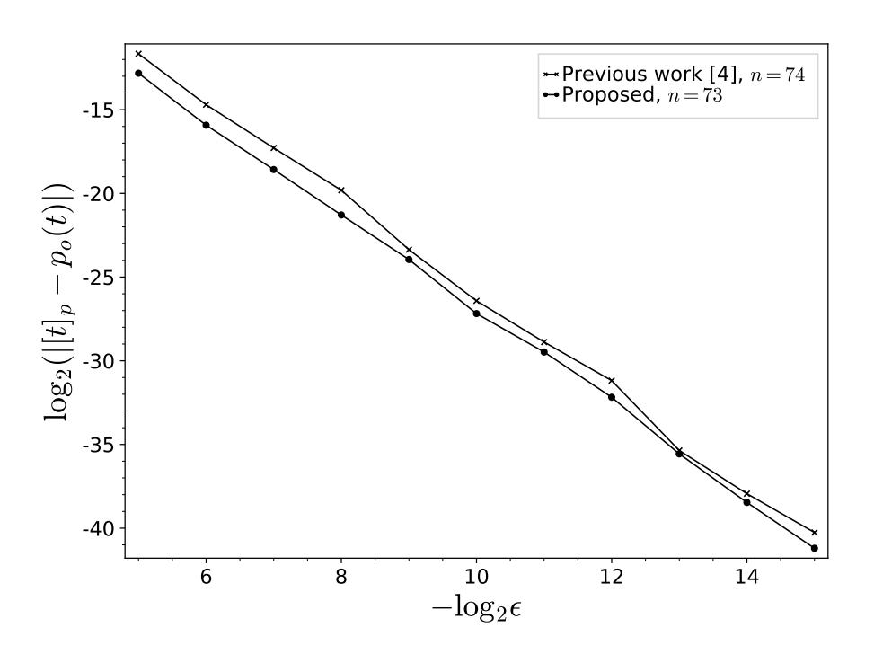
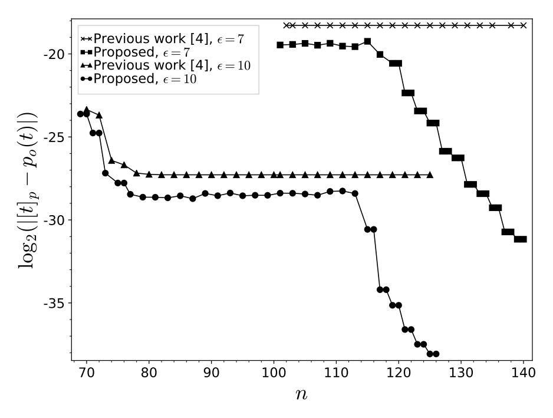

{0}------------------------------------------------

1

# Near-optimal Polynomial for Modulus Reduction Using L2-norm for Approximate Homomorphic Encryption

Yongwoo Lee, Joonwoo Lee, Young-Sik Kim, and Jong-Seon No, Fellow, IEEE

Abstract—Since Cheon et al. introduced an approximate homomorphic encryption scheme for complex numbers called Cheon-Kim-Kim-Song (CKKS) scheme, it has been widely used and applied in real-life situations, such as privacy-preserving machine learning. The polynomial approximation of a modulus reduction is the most difficult part of the bootstrapping for the CKKS scheme. In this paper, we cast the problem of finding an approximate polynomial for a modulus reduction into an L2norm minimization problem. As a result, we find an approximate polynomial for the modulus reduction without using the sine function, which is the upper bound for the approximation of the modulus reduction. With the proposed method, we can reduce the degree of the polynomial required for an approximate modulus reduction, while also reducing the error compared with the most recent result reported by Han et al. (CT-RSA' 20). Consequently, we can achieve a low-error approximation, such that the maximum error is less than  $2^{-40}$  for the size of the message  $m/q \approx 2^{-10}$ . By using the proposed method, the constraint of  $q = \mathcal{O}(m^{3/2})$  is relaxed as  $\mathcal{O}(m)$ , and thus the level loss in bootstrapping can be reduced. The solution of the cast problem is determined in an efficient manner without iteration.

*Index Terms*—Approximate arithmetic, bootstrapping, Cheon-Kim-Kim-Song (CKKS) scheme, fully homomorphic encryption (FHE), privacy preserving.

### I. INTRODUCTION

OMOMORPHIC encryption (HE) is a specific class of encryption schemes that allows computation on encrypted data without decryption. After Gentry's blueprint [7], it has been widely studied and several HE schemes have been proposed [1], [8], [9], [10], [11], [12], [13], [14], [15]. As HE can handle encrypted data without decryption, it is suitable for data-rich applications that require privacy. Particularly, since Cheon et al. proposed a HE scheme for complex numbers [1], called Cheon-Kim-Kim-Song (CKKS) scheme, the utilization of HE in deep leaning methods has become easier for privacy-preserving applications [16], [17], [18], [19], [20].

Another important observation by Gentry is that encryption contains noise and the noise level grows as operations are performed on the ciphertext. It is necessary to deal with noise to avoid overwhelming the data, and there are two types of HE schemes for this purpose. The first is somewhat

This work is supported by the Samsung Electronics Co., Ltd., in Korea Y. Lee, J. Lee, and J.-S. No are with the Department of Electrical and Computer Engineering, INMC, Seoul National University, Seoul, 08826, Korea.

Y.-S. Kim is with the Department of Information and Communication Engineering, Chosun University, Gwangju, 61452, Korea. Y.-S. Kim is the corresponding author. Email: iamyskim@chosun.ac.kr.

homomorphic encryption (SHE), in which the ciphertext size and computation overhead increase at least linearly with the depth of the circuit. SHE is an appropriate choice for low-depth circuits; however, it has a scaling problem. The other method is fully homomorphic encryption (FHE). Gentry proposed the bootstrapping technique to refresh the noise, and thus the parameter size and computation overhead could be fixed regardless of circuit depth. However, in general, the bootstrapping of FHE schemes requires considerable amount of computation.

Bootstrapping for CKKS scheme was first proposed by Cheon et al. [2]. Subsequently, several studies have been conducted to improve bootstrapping for CKKS schemes [4], [3], [6] and they commonly perform modulus reduction homomorphically by approximating it to a scaled sine function. The CKKS scheme is promising and used widely; however, as most deep learning methods require operations of significant depth, the improvement of bootstrapping is crucial.

Homomorphic evaluation of the modulus reduction is the key part of the bootstrapping of the CKKS scheme. As only arithmetic operations can be evaluated homomorphically and modulus reduction is not an arithmetic operation, a polynomial approximation for modulus reduction is required.

In most bootstrapping methods studied so far, the scaled sine function (or shifted to the cosine function) is deemed to be an approximation of the modulus reduction [2], [3], [4]. Thus, a polynomial approximation for the scaled sine function is used to evaluate the modulus reduction homomorphically. In [2], the sine function was approximated by Taylor expansion of an exponential function using  $e^{i\theta} = \cos\theta + i\sin\theta$  and the double angle formula  $e^{i2\theta} = (e^{i\theta})^2$ . The Chebyshev interpolation method improves the polynomial approximation of the sine function [3]. Based on the fact that the size of message is significantly less than the ciphertext modulus, better nodes for Chebyshev interpolation was selected and the approximation was refined [4].

In this paper, instead of approximating the sine function, we propose to cast the problem of finding approximate polynomials for a modulus reduction into the L2-norm minimization problem for which an optimal solution can be directly computed. An approximation by the minimax polynomial for the modulus reduction is desirable; however, the shape of the modulus reduction function makes it difficult to find the minimax polynomial. Thus, instead, we propose a discretized optimization method that can be solved efficiently with a unique solution. Through the solution of the modified dis-

{1}------------------------------------------------

cretized problem, we can reduce the degree of the approximate polynomial for the modulus reduction while achieving a low margin of error. Consequently, operations required for the homomorphic modulus reduction are reduced compared with the best-known method [4] where the double angle formula is excluded.

When conventional methods are used, the sine function dominates the approximation error; in other words, the approximation error cannot be less than the difference between the sine function and modulus reduction. Therefore, the message size is limited to  $m < q^{2/3}$ , and thus plaintext precision is also limited, where q denotes a value of the ciphertext modulus. However, the proposed method does not use the sine function, and thus we can obtain a precise approximate polynomial or utilize a message that is larger in size. For example, when  $m/q < 2^{-10}$ , the proposed method finds an approximate polynomial with a maximum error of less than  $2^{-40}$  with only a circuit depth of 7, whereas the best-known modified Chebyshev interpolation method cannot because the error saturates to  $2^{-27}$ . Therefore, the proposed method is essential for applications that require precise calculations. Moreover, accurate approximate polynomials for modulus reductions of larger messages can be found. For example, we achieve  $2^{-20}$  error for  $m/q \approx 2^{-6}$  with only a depth of 7, whereas conventional methods cannot be used with the message  $m/q \approx 2^{-6}$  because the error saturates to  $2^{-15}$ .

This means that a user can handle a large, accurate number and the selection of parameters for CKKS scheme can be expanded using the proposed method. Thus, the proposed method using the L2-norm minimization makes it possible to take a trade-off between the computational complexity (the degree of approximate polynomial) and the approximation error for the CKKS scheme. By using the proposed method, the constraint of  $q = \mathcal{O}(m^{3/2})$  is relaxed as  $\mathcal{O}(m)$ , and thus the level loss in bootstrapping can be reduced.

The remainder of the paper is organized as follows. In Section II, we summarize the Chebyshev interpolation, the CKKS scheme, and its bootstrapping. The proposed method of finding approximate polynomials for the modulus reduction and its performance are given in Section III. We provide a comparison of the proposed method and the best-known method along with implementation in Section IV. How the proposed method provides less level loss during bootstrapping is given in Section V. Finally, we conclude in Section VI with remarks and possible future research directions.

## II. PRELIMINARY

#### A. Basic Notation

Vectors are denoted in boldface, such as x, and every vector will be a column vector. Matrices are denoted by a boldfaced capital letter, for example, A. We denote the inner product of two vectors by  $\langle \cdot, \cdot \rangle$  or simply  $\cdot$ . Matrix multiplication is denoted by  $\cdot$  or can be omitted when it is unnecessary. Lpnorm of a vector is denoted by  $||x||_p = (\sum_i x[i]^p)^{-p}$ , where x[i] denotes the i-th element of vector x. Similarly, A[i,j] is the element of matrix A in the i-th row and the j-th column.  $x \leftarrow D$  denotes the sampling x according to a distribution D.

When a set is used instead of a distribution, it means that x is sampled uniformly at random from among the set elements.

### B. Chebyshev Interpolation

The Chebyshev interpolation is a well-known polynomial interpolation method that uses the Chebyshev polynomials as a basis of the interpolation polynomial. The Chebyshev polynomial of the first kind, in short, the Chebyshev polynomial is defined by the recursive relation [22]

$$T_0(x) = 1$$
  
 $T_1(x) = x$   
 $T_{n+1}(x) = 2xT_n(x) - T_{n-1}(x)$ .

The Chebyshev polynomial of degree n has n distinct roots in the interval [-1,1] and all its extrema are also in [-1,1]. Moreover,  $\frac{1}{2^{n-1}}T_n(x)$  is the polynomial, whose maximal absolute value is minimal among monic polynomials of degree n and the absolute value is  $\frac{1}{2^{n-1}}$ . In addition to the above, the Chebyshev polynomial has good properties for the basis of an interpolation polynomial.

In Chebyshev interpolation, the n-th degree polynomial  $p_n(x)$  is represented as a sum of the Chebyshev polynomials in the form

$$p_n(x) = \sum_{i=0}^n c_i T_i(x).$$

 $p_n(x)$  is an approximate polynomial for f(x) by interpolating n+1 points  $\{x_0,x_1,\ldots,x_n\}$ , where

$$c_i = \frac{2}{n+1} \sum_{k=0}^{n} f(x_k) T_i(x_k).$$

Selecting points  $\{x_0, x_1, \dots, x_n\}$  is key for a good approximation.

#### C. CKKS Scheme

This section briefly introduces the CKKS scheme [1]. For a positive integer M, let  $\Phi_M(X)$  be the M-th cyclotomic polynomial of degree N, where M is a power of two, M = 2N,  $\Phi_M(X) = X^N + 1$ . Let  $\mathcal{R} = \mathbb{Z}/\langle \Phi_M(X) \rangle$  be the ring of integers of a number field  $\mathbb{Q}/\langle \Phi_M(X) \rangle$  and we write  $\mathcal{R}_q = \mathcal{R}/q\mathcal{R}$ .

The CKKS scheme [1] and its residual number system (RNS) variants [5], [4] provide homomorphic operations on real number data with an error. This is done by canonical embedding and its inverse. Recall that canonical embedding  $\sigma$  of  $a \in \mathbb{Q}/\langle \Phi_M(X)\rangle$  into  $\mathbb{C}^N$  is the vector of the evaluation values a at the roots of  $\Phi_M(X)$ . Let  $\pi$  denote a natural projection from  $\mathbb{H} = \{(z_j)_{j \in \mathbb{Z}_M^*} : z_j = \overline{z_{-j}}\}$  to  $\mathbb{C}^{N/2}$ , where  $\mathbb{Z}_M^*$  is the multiplicative group of integer modulo M. The encoding  $(\mathbb{C}^{N/2} \to \mathcal{R})$  and decoding are given as below.

 $\bullet$  Ecd(  $\pmb{z};\Delta).$  For an (N/2) -dimensional vector  $\pmb{z},$  the encoding procedure returns

$$m(X) = \sigma^{-1}\left(\left[\Delta \cdot \pi^{-1}(z)\right]_{\sigma(\mathcal{R})}\right) \in \mathcal{R},$$

where  $\Delta$  is the scaling factor and  $\lfloor \pi^{-1}(z) \rceil_{\sigma(\mathcal{R})}$  denotes the discretization of  $\pi^{-1}(z)$  into an element of  $\sigma(\mathcal{R})$ .

{2}------------------------------------------------

•  $\operatorname{Dcd}(m;\Delta)$ . For an input polynomial  $m(X) \in \mathcal{R}$ , output a vector  $\pi(z)$  such that its entry of index j is given as  $z_j = \left\lfloor \Delta^{-1} \cdot m(\zeta_M^j) \right\rfloor$  for  $j \in T$ , where  $\zeta_M$  is the M-th root of unity and T is a multiplicative subgroup of  $\mathbb{Z}_M^*$  satisfying  $\mathbb{Z}_M^*/T = \{\pm 1\}$ .

The L-infinity norm of  $\sigma(a)$  for  $a \in \mathcal{R}$  is called the canonical embedding norm of a, denoted by  $||a||_{\infty}^{\operatorname{can}} = ||\sigma(a)||_{\infty}$ . Refer [1] for the property of the canonical embedding norm.

Adopting notations in [7], [1], we define three distributions as follows. For real  $\gamma > 0$ ,  $\mathcal{DG}(\gamma^2)$  denotes the distribution of vectors in  $\mathbb{Z}^N$ , whose entries are sampled independently from the discrete Gaussian distribution of variance  $\gamma^2$ .  $\mathcal{HWT}(h)$  is the set of signed binary vectors in  $\{0,\pm 1\}^N$  with Hamming weight h and  $\mathcal{ZO}(\rho)$  denote the distribution of vectors from  $\{0,\pm 1\}^N$  with probability  $\rho/2$  for each of  $\pm 1$  and a probability of being zero  $1-\rho$ . Suppose we have ciphertexts of level l for  $0 < l \le L$ , where level l means the maximum number of possible multiplications before bootstrapping. For convenience, we fix a base p>0 and a modulus q and let  $q_l=p^l\cdot q$ . The base integer p is a base for scaling,  $\Delta$ .

The CKKS scheme is defined with the following key generation, encryption, decryption, and corresponding homomorphic operations.

- KeyGen $(1^{\lambda})$ .
  - Given the security parameter  $\lambda$ , we choose M as a power of two, an integer h, an integer P, a real value  $\gamma$ , and a maximum ciphertext modulus Q, such that  $Q \geq q_L$ .
  - Sample following:

$$s \leftarrow \mathcal{HWT}(h), a \leftarrow \mathcal{R}_{q_L}, e \leftarrow \mathcal{DG}(\gamma^2).$$

Set the secret key and the public key as

$$sk \coloneqq (1, s), pk \coloneqq (b, a) \in \mathcal{R}_{q_L}^2,$$

respectively, where

$$b = -as + e \pmod{q_L}.$$

• KSGen $_{sk}(s')$ . Sample  $a' \leftarrow \mathcal{R}_{Pq_L}$  and  $e' \leftarrow \mathcal{DG}(\gamma^2)$ . Output the switching key

$$swk := (b', a') \in \mathcal{R}^2_{Pq_L},$$

where  $b' = -a's + e' + Ps' \pmod{Pq_L}$ .

- Set the evaluation key as  $evk := KSGen_{sk}(s^2)$ .
- Encpk(m). Sample  $v \leftarrow \mathcal{ZO}(0.5)$  and  $e_0, e_1 \leftarrow \mathcal{DG}(\gamma^2)$ . Output  $\mathbf{c} = v \cdot pk + (m + e_0, e_1) \pmod{q_L}$ .
- Decsk( $\boldsymbol{c}$ ). Output  $\bar{m} = \langle \boldsymbol{c}, sk \rangle$ .
- Add $(\boldsymbol{c}_1,\boldsymbol{c}_2).$  For  $\boldsymbol{c}_1,\boldsymbol{c}_2\in\mathcal{R}^2_{q_I},$  output

$$\boldsymbol{c}_{add} = \boldsymbol{c}_1 + \boldsymbol{c}_2 \pmod{q_l}$$
.

• Mult $_{evk}(\boldsymbol{c}_1, \boldsymbol{c}_2)$ . For  $\boldsymbol{c}_1 = (b_1, a_1), \boldsymbol{c}_2 = (b_2, a_2) \in \mathcal{R}_{q_l}^2$ , let  $(d_0, d_1, d_2) \coloneqq (b_1 b_2, a_1 b_2 + a_2 b_1, a_1 a_2) \pmod{q_l}$ . Output

$$\boldsymbol{c}_{mult} = (d_0, d_1) + \left| P^{-1} \cdot d_2 \cdot evk \right| \pmod{q_l}.$$

•  $RS_{l \to l'}(\boldsymbol{c}).$ For  $\boldsymbol{c} \in \mathcal{R}^2_{q_l}$ , output

$$\boldsymbol{c}' = \left\lfloor \frac{q_{l'}}{q_l} \boldsymbol{c} \right\rceil \left( \bmod \ q_{l'} \right).$$

• KS $_{swk}(\boldsymbol{c}).$  For  $\boldsymbol{c}=(c_0,c_1)\in\mathcal{R}_{q_l}^2,$  output

$$\mathbf{c}' = (c_0, 0) + \lfloor P^{-1} \cdot c_1 \cdot swk \rfloor \pmod{q_l}.$$

In addition to the operations above, key switching techniques are used to provide various operations, such as a complex conjugate and rotations.

There are computationally more efficient variants of the CKKS scheme, namely the full-RNS variant of CKKS [5], [4] and the basic operations supported therein are similar. Hence, it is worth noting that the following methods in this paper aim for the CKKS scheme and all its variants.

## D. Bootstrapping for CKKS Scheme

There are several studies for bootstrapping for CKKS scheme [2], [3], [4]. The bootstrapping consists of four steps: Modraise, CoeffToSlot, EvalMod, and SlotToCoeff.

- I) Modulus Raising: Modraise is the procedure to change the modulus of a ciphertext to a greater value. Let ct be the ciphertext satisfying  $m(X) = [\langle ct, sk \rangle]_q$ . It can be seen that  $t(X) = \langle ct, sk \rangle \pmod{X^N+1}$  is of the form t(X) = qI(X) + m(X) for  $I(X) \in \mathcal{R}$  with a bound  $||I(X)||_{\infty} < K$ , where K is bounded by  $\mathcal{O}(\sqrt{h})$ . The following procedure aims to compute the remainder of the coefficient of t(X), say t, divided by q,  $[t]_q$ , homomorphically. As the modulus reduction is not an arithmetic operation, the crucial point is to find a polynomial approximating it. We can control the size of the message, and thus we ensure  $m < \epsilon \cdot q$  for small  $\epsilon$ .
- 2) Putting Polynomial Coefficients in Plaintext Slots: Approximate homomorphic operations are performed in plaintext slots. Thus, in order to deal with t(X), we have to put polynomial coefficients in plaintext slots. In Coeffoology step, the Ecd is performed homomorphically using matrix multiplication [2] or, FFT-like operations using relationships of roots of unity or a hybrid method of both [3]. Then, we have two ciphertexts encrypting  $z'_0 = (t_0, \ldots, t_{\frac{N}{2}-1})$  and  $z'_1 = (t_{\frac{N}{2}}, \ldots, t_{N-1})$  (or combined using imaginary e.g.,  $(t_0 + i \cdot t_{\frac{N}{2}}, \ldots, t_{\frac{N}{2}-1} + i \cdot t_N)$ ).
- 3) Evaluation of the Approximated Modulus Reduction: At this stage, the elements of each slot are considered from the viewpoint of single instruction multiple data, in other words, t=qI+m refers to an element in a slot. In the EVALMOD step, an approximated evaluation of  $[t]_q$  is performed. At first, Cheon et al. approximated  $[t]_q \approx \frac{q}{2\pi} \sin\left(\frac{2\pi t}{q}\right)$  in [2]. The error bound for the approximation of the sine function is given as

$$\left| m - \frac{q}{2\pi} \sin(2\pi \frac{m}{q}) \right| \le \frac{q}{2\pi} \cdot \frac{1}{3!} \left( \frac{2\pi |m|}{q} \right)^3,$$

{3}------------------------------------------------

where t=qI+m. Then, a Taylor series expansion of the exponent and the double angle formula were adopted as the approximate polynomial of the sine function.

After that, the method of improving polynomial approximation using Chebyshev interpolation proposed in [3] was used. By selecting optimized nodes for a Chebyshev interpolation, Han et al. significantly improved the performance of the approximation in [4]. However, in both approaches, the sine function is used, and thus there is still an upper bound for the approximation error.

4) Switching Back to the Coefficient Representation: SLOT-ToCoeff is the inverse operation of CoeffToSlot.

## III. NEAR-OPTIMAL POLYNOMIAL FOR MODULUS REDUCTION

As mentioned in Section II-D, the key part of bootstrapping of CKKS scheme is the homomorphic evaluation of the modulus reduction. In [2], the modulus reduction is approximated by the sine function and the approximate polynomial for the sine function is homomorphically evaluated using a Taylor approximation and the double angle formula. Moreover, with optimized nodes for the Chebyshev interpolation, the polynomial approximation is significantly improved [4].

By scaling the modulus reduction function by  $\frac{1}{q}$ , we define  $[t]_q$  as t-k for  $t\in I_k$ , where  $I_k=[k-\epsilon,k+\epsilon]$  and k is an integer |k|< K. Here,  $\epsilon$  denotes the rate of the maximum coefficient of the message polynomial and the ciphertext modulus, that is,  $\frac{|m|}{q}<\epsilon$ . The domain of  $[t]_q$  is given by  $\bigcup_{k=-K+1}^{K-1}I_k$ . In other words,  $q\cdot\left[\frac{t}{q}\right]_q\approx m$  for  $t=q\cdot I+m$ .

#### A. Approximate Polynomial using L2-norm optimization

Here, we propose how to find an approximate polynomial  $p_o(t)$  of  $[t]_q$  without using an intermediate approximation, such as a sine or cosine function. The proposed method uses the well-known least-squares estimation or L2-norm optimization. The objective is to find a set of coefficients  $\mathbf{c} = (c_0, c_1, \ldots, c_n)$  to minimize  $||[t]_q - p(t)||_{\infty}$ , where a polynomial of degree n is defined by  $p(t) = \sum_{i=0}^n c_i \cdot t^i$ . Such a polynomial is referred to as the minimax polynomial. It is worth noting that p(t) is equivalent to the inner product of  $\mathbf{c}$  and  $\mathbf{T} = (1, t^1, \ldots, t^n)$ .

Here,  $t_i$ 's are sampled uniformly at intervals of  $\delta \ll \epsilon$  in each  $I_k$ , namely,  $k-\epsilon, k-\epsilon+\delta, \ldots, k+\epsilon-\delta, k+\epsilon$ . There are  $\frac{2\epsilon}{\delta}+1$  samples in  $I_k$ , and thus we have  $N_{tot}=(2K-1)(\frac{2\epsilon}{\delta}+1)$  samples. With  $N_{tot}$  samples of  $t_i$ , one can build a vector of the powers of  $t_i$ , that is,  $\mathbf{T}_i=(1,t_i,t_i^2,\ldots,t_i^n)$  for  $1\leq i\leq N_{tot}$ .

The object function to be minimized is given as

$$\max_{i} |[t_{i}]_{q} - p(t_{i})|$$

$$= \| ([t_{0}]_{q} - p(t_{0}), \cdots, [t_{N_{tot}}]_{q} - p(t_{N_{tot}})) \|_{\infty}$$

$$= \| \boldsymbol{y} - \mathbf{T} \cdot \boldsymbol{c} \|_{\infty},$$

where **T** is an  $N_{tot} \times (n+1)$  matrix such that  $\mathbf{T}[i,j] = t_i^j$  and  $\boldsymbol{y}$  is a vector such that  $\boldsymbol{y}[i] = [t_i]_q$ . Instead of the L-infinity norm, we replace the above objective function by a loss function using the L2-norm. Then, the optimal solution

for L2-norm minimization can be efficiently computed. Let  $L_c$  denote the L2-norm with the coefficient c. Then, we can find c that minimizes the following

$$L_{c} = \|\mathbf{y} - \mathbf{T} \cdot \mathbf{c}\|_{2}$$
$$= (\mathbf{y} - \mathbf{T} \cdot \mathbf{c})^{T} (\mathbf{y} - \mathbf{T} \cdot \mathbf{c}).$$

Unfortunately, the entries of T become considerably big or small values close to zero, as the degree of the polynomial, n, is high.

Thus, we utilize the Chebyshev polynomials as the basis of the polynomial instead of the power basis. In other words, we redefine the  $N_{tot} \times (n+1)$  matrix  $\mathbf{T}$  with entries  $\mathbf{T}[i,j] = T_j\left(\frac{t_i}{K}\right)$ . As  $t_i \in \bigcup_{k=-K+1}^{K-1} I_k$ , we have  $|\frac{t_i}{K}| < 1$ . Hence, the entries of  $\mathbf{T}$  are well-distributed in [-1,1] rather than considerably big values or small values around 0.

Then, the optimal coefficient vector  $c^*$  is given as

$$c^* = \arg\min_{c} L_{c}$$
.

As the loss is a convex function, the optimum solution  $c^*$  lies at the gradient zero. The gradient of the loss function  $L_c$  is given by

$$\nabla L_{\boldsymbol{c}} = -2\boldsymbol{y}^T \mathbf{T} + 2\boldsymbol{c}^T \mathbf{T}^T \mathbf{T}.$$

Setting the gradient to zero produces the optimum coefficient, as follows:

$$\nabla L_{\boldsymbol{c}^*} = 0 \ \Longrightarrow \ \boldsymbol{c}^* = \left( \mathbf{T}^T \mathbf{T} \right)^{-1} \mathbf{T}^T \boldsymbol{y}.$$

To sum up, the modulus reduction function can be approximated by

$$[t]_q \approx p_o(t) = \sum_{i=0}^n \mathbf{c}^*[i] \cdot T_i\left(\frac{t}{K}\right),$$

where  $t \in \bigcup_{k=-K+1}^{K-1} I_k$ .

1) Maximum Error of Samples and the Approximation Error:

**Theorem 1.** The approximation error is bounded by the multiplication of the maximum error of the sampled points and  $O(1 + \frac{n}{N_{tot}})$ .

*Proof.* For  $t \in I_k$ , let us define the approximation error as the absolute value of following

$$E(t) = (t - k) - p_o(t).$$

Note that E(t) is a polynomial for the domain  $t \in I_k$ . Denote  $E(t) = \sum_j \hat{c}_j x^j$ . We have optimized  $|E(t_i)|$  for discrete points  $t_i$ 's.

{4}------------------------------------------------

Consider |E(t)| for t in small intervals of  $[t_i, t_i + \delta)$ . Then, we have  $|E(t)| \leq |E(t_i)| + |E(t) - E(t_i)|$  and  $|E(t) - E(t_i)|$  is bounded as follows

$$|E(t) - E(t_i)| = |\sum_{j} \hat{c}_j \left( (t_i + \Delta t)^j - t_i^j \right)|$$

$$\approx |\sum_{j} \hat{c}_j t_i^j \left( j \frac{\Delta t}{t_i} \right)|$$

$$\leq \left| n \frac{\delta}{t_i} \right| \cdot |\sum_{j} \hat{c}_j t_i^j|$$

$$= \mathcal{O}(n \frac{1}{N_{tot}}) |E(t_i)|,$$

where  $\Delta t = t - t_i$  for  $t \in [t_i, t_i + \delta)$ . As  $\Delta t < \delta << t_i$ , the linear approximation  $(1 + \frac{\Delta t}{t_i})^j \approx (1 + j\frac{\Delta t}{t_i})$  is applied. Moreover, we have  $\frac{\Delta t}{t_i} \leq \frac{\delta}{\epsilon} = \mathcal{O}(\frac{1}{N_{tot}})$ , where  $t_i > \epsilon$ . Otherwise, at least we can always make  $\frac{\delta}{t_i} < 1$ .

Hence, we conclude that

$$\max_{t \in \bigcup_{k=-K+1}^{K-1} I_k} |[t]_q - p_o(t)|$$

$$= \max_i ([t_i]_q - p_o(t_i)) \cdot \mathcal{O}(1 + \frac{n}{N_{tot}}).$$

In summary, with fine sampling, the maximum error of the sampled points is close to the global maximum of approximation error. Moreover, as the domain of the object function is in the real numbers with errors in the CKKS scheme, it is reasonable to handle the sampled values.

2) L2-norm Instead of L-infinity Norm: Clearly, we can bound the L-infinity norm by the L2-norm:

$$\frac{1}{\sqrt{N_{tot}}} \|\mathbf{x}\|_2 \le \|\mathbf{x}\|_{\infty} \le \|\mathbf{x}\|_2.$$

Thus, minimizing the L2-norm reduces the L-infinity norm. As it is not a tight bound, we have room for optimization using a higher norm. However, the solution of L2-norm is clear and can be computed effortlessly. It is difficult to find the minimax polynomial of the modulus reduction function; however, through the L2-norm optimization problem, it is possible to find a near-optimal solution of the minimax polynomial in a considerably efficient manner without iteration. The next section shows that it is possible to find polynomials with less errors than with the currently best-known methods.

3) Time Complexity for Finding  $c^*$ : Considering  $N_{tot} > n$ , the matrix inversion  $(\mathbf{T}^T\mathbf{T})^{-1}$  is the dominant computation. Hence, the time complexity is  $\mathcal{O}(N_{tot}^{2.37})$  when the Coppersmith–Winograd algorithm is used. This is acceptable because  $c^*$  is pre-computed and stored as coefficients for the baby-step giant-step algorithm to be explained later or also, the Paterson-Stockmeyer algorithm in [3].

## B. Efficient Homomorphic Evaluation of the Approximate Polynomial

The difference between the proposed and conventional methods in [4] are the coefficients of the approximate polynomial, which is more optimized with the same polynomial basis,

## **Algorithm 1** Baby-step Giant-step Algorithm [4]

**Instance:** A ciphertext for t, a polynomial of degree n,  $p(t) = \sum_{i=0}^{n} c_i T_i(t)$ .

**Output:** A ciphertext encrypting p(t).

- 1: Let m be the smallest integer satisfying  $2^m > n$  and  $l \approx m/2$ .
- 2: Evaluate  $T_2(t), T_3(t), \dots, T_{2^l}(t)$  inductively.
- 3: Evaluate  $T_{2^{l+1}}(t), T_{2^{l+2}}(t), \dots, T_{2^{m-1}}(t)$  inductively.
- 4: Find polynomials of degree  $\leq 2^{m-1}$  which satisfy  $p=r+qT_{2^{m-1}}$  in forms of linear combinations of the Chebyshev basis.
- 5: Evaluate q(t) and r(t) recursively.
- 6: Evaluate p(t) using  $T_{2^{m-1}}(t), q(t)$ , and r(t).

the Chebyshev polynomial. Hence, the baby-step giant-step algorithm [4] and modified Paterson-Stockmeyer algorithm [3] can be applied for an efficient homomorphic evaluation of the proposed polynomial. Using Algorithm 1, we can evaluate  $p_o(t)$  homomorphically with at most  $2^l + 2^{m-l} + m - l - 3$  nonscalar multiplication while consuming m depth, where  $2^m$  is greater than the degree n.

We revisit Algorithm 1, and the number of operations per step is given in Table I. When the Chebyshev polynomials are evaluated,  $T_{2n}=2T_n^2-T_0$  and  $T_{2n+1}=2T_nT_{n+1}-T_1$  are used and the multiplication of 2 can be replaced by an addition. Hence, one nonscalar multiplication and two additions are required.

In the baby-step, polynomials of degree  $2^l-1$  are evaluated and there are at most  $2^m/2^l$  such polynomials. However, when  $2^m > n+1$ , there are polynomials with all-zero coefficients. By ignoring them, there are  $\left\lceil (n+1)/2^l \right\rceil$  polynomials with degree at most  $2^l-1$  in the baby-step. In other words, as  $2^m$  and n+1 differ, there are  $2^{m-l}-\left\lceil (n+1)/2^l \right\rceil$  zero polynomials, that is,  $0\cdot T_0(t)+0\cdot T_1(t)+\cdots+0\cdot T_{2^{l-1}}(t)$ , in Algorithm 1. Hence, we could ignore these zero polynomials and in the recursive structure, exactly  $2^{m-l}-\left\lceil (n+1)/2^l \right\rceil$  nonscalar multiplications are ignored in the giant-step. Hence, taking  $2^{m'}>n\geq 2^{m'-1}$ , we have

$$N(n) = N(n - 2^{m'-1}) + N(2^{m'-1} - 1) + 1,$$

which yields

$$N(n) = \left\lceil (n+1)/2^l \right\rceil - 1,$$

where N(k),  $k \ge 2^l$ , is the number of nonscalar multiplications in the giant-step and N(k) = 0 for  $k < 2^l$ . Thus, the number of nonscalar multiplications is given as

$$\lceil (n+1)/2^l \rceil - 1 + 2^l - 1 + m - l - 1.$$

As shown in Table I, the number of scalar multiplications is  $(n+1)-\left\lceil (n+1)/2^l \right\rceil$  and the number of addition is  $n+2(2^l+m-l-2)$ . Note that the depth and number of nonscalar multiplications can be minimized when m is the smallest integer satisfying  $2^m>n$  and  $l\approx m/2$ .

#### IV. COMPARISON AND IMPLEMENTATION

We conduct an experiment to compare the proposed method with previous work in [4], which, to our knowledge, is the best

{5}------------------------------------------------

|                            | Nonscalar Scalar multiplication                                  |                                                                     | Addition                                           |  |
|----------------------------|------------------------------------------------------------------|---------------------------------------------------------------------|----------------------------------------------------|--|
| $T_2, \ldots, T_{2^l}$     | $2^{l} - 1$                                                      | 0                                                                   | $2\cdot(2^l-1)$                                    |  |
| $T_{2l+1},\ldots,T_{2m-1}$ | m-l-1                                                            | 0                                                                   | $2 \cdot (m-l-1)$                                  |  |
| Baby-step                  | 0                                                                | $\left[ (n+1) - \left\lceil \frac{(n+1)}{2^l} \right\rceil \right]$ | $(n+1) - \left\lceil \frac{n+1}{2^l} \right\rceil$ |  |
| Giant-step                 | $\left\lceil \frac{n+1}{2^l} \right\rceil - 1$                   | 0                                                                   | $\left\lceil \frac{n+1}{2^l} \right\rceil - 1$     |  |
| Total                      | $2^{l} + \left\lceil \frac{n+1}{2^{l}} \right\rceil + m - l - 3$ | $(n+1) - \left\lceil \frac{n+1}{2^l} \right\rceil$                  | $n+2(2^l+m-l-2)$                                   |  |

TABLE I

Number of Operations for Each Step of the Baby-step Giant-step Algorithm in Algorithm 1

current method. Maximum errors between  $[t]_q$  and the approximate polynomials are numerically computed and compared. Note that we can analytically obtain the maximum error once the polynomial is known and that the approximate error is an absolute value of a polynomial. However, the numerically computed maximum error is sufficient as it is approximately equal to the real value and we are dealing with approximate arithmetic here. For example, we can see that the numerically computed maximum error for the polynomial is almost the same as the error bound presented in [4].

In Fig. 1, we plot the maximum error in log scale,  $\log_2(|[t]_p - p_o(t)|)$ , while fixing n and varying  $\epsilon$  or fixing  $\epsilon = 2^{-7}, 2^{-10}$  and varying n. It is noteworthy that the proposed method gives an approximation (error below  $2^{-21}$ ) for a large  $\epsilon = 2^{-7}$ ) with depth of 7, whereas the previous method cannot achieve this even when using polynomials of a higher degree. This is because the sine function is not a suitable approximation for the modulus reduction when  $\epsilon$  is large. As the proposed method does not depend on the sine function, even large-sized messages that could not be handled by the previous method can be handled by low-degree polynomials in the proposed method.

A staircase shape is shown in Fig. 1(b), in other words, the maximum approximation errors are similar when the degrees are 2n-1 and 2n. This is because the target of the approximation, the modulus reduction function  $[t]_q$ , is an odd function. The following proposition shows that the minimax polynomial for an odd function is an odd function.

**Proposition 1.** If f(t) is an odd function, the best approximation among the polynomials of degree n is also odd.

*Proof.* Let  $P_m$  denote the subspace of the polynomial function of a degree of at most m and  $f_m(t)$  denote the unique element of  $P_m$  that is closest to f(t) in the supreme norm. We define  $p(t) \in P_m$  by  $p(t) = \frac{1}{2}(f_m(t) - f_m(-t))$ . Then, for all u in the domain of f(t), we have

$$|f(u) - p(u)| = \left| f(u) - \frac{1}{2} (f_m(u) - f_m(-u)) \right|$$

$$\leq \frac{1}{2} |f(u) - f_m(u)| + \frac{1}{2} |f(u) + f_m(-u)|$$

$$= \frac{1}{2} |f(u) - f_m(u)| + \frac{1}{2} |f(-u) - f_m(-u)|$$

$$\leq \sup_{t} |f(t) - f_m(t)|.$$

If  $p(t) \neq f_m(t)$ , it contradicts that  $f_m(t)$  is the closest to f(t). Hence,  $f_m(t) = p(t) = \frac{1}{2}(f_m(t) - f_m(-t))$  and this is an odd function.

From the polynomial coefficients of the proposed method, it can be observed that the coefficient of an even-order term has a significantly small value close to zero in  $p_o(t)$ . This is evidence for the fact that the proposed method finds a polynomial near the minimax polynomial because the modulus reduction function is an odd function. It can be seen that the even-order terms are rather a handicap for finding an approximate polynomial. Therefore, approximating using only odd-order Chebyshev polynomials yields a more accurate approximate polynomial.

It is one of the advantages of the proposed method that the nature of the odd function can be utilized. In contrast, the previous method [4] cannot make use of odd function because their cosine function in the constrained domain is not an odd function nor even function. Using the fact that the odd functions are symmetric with respect to the origin, we can solve the L2-norm minimization only with samples whose value is greater than zero. Thus, the number of rows and columns of the matrix **T** is reduced by half each. As a result, the time complexity of matrix inversion is reduced to about 1/8. Also, some operations on even-order terms may be ignored during evaluation.

In Table II, we compare previous results from [3], [4] and the results of the proposed method for  $\epsilon=2^{-10}$ . The criterion is the maximum value of the approximation error. As shown in Table II, we reduce the approximation error from  $2^{-26.42}$  to  $2^{-27.18}$ , while also reducing the degree from 74 to 73. Note that due to the method of selecting nodes, the method of [4] is restricted in the degree of polynomial. It is evident that the difference is greater when a more precise approximation is needed; moreover, in some cases, the number of nonscalar multiplications, scalar multiplications, and additions are reduced by reducing the degree of approximate polynomial. Moreover, notice that the maximum error of the proposed method is always smaller than the previous the state-of-the-art results even with the same degree polynomial.

It can be seen that the proposed method provides a trade-off between approximation error and degree of polynomial. When a polynomial of degree 127 is used, the proposed method provides an approximation error below  $2^{-40}$ . However, when the previous method is used, the error cannot be reduced below  $2^{-27.28}$  as it is bounded by the error between sine function and  $[t]_q$  as in Table II and Fig. 1(b). Table II and Fig. 1(b) show

{6}------------------------------------------------

| Methods                            | Degree | Max err $(\log_2)$ | Nonscalar multiplication | Scalar multiplication | Addition | Depth |
|------------------------------------|--------|--------------------|-----------------------------|--------------------------|----------|-------|
| Proposed polynomial (L2-norm min.) | 73     | -27.18             | 17 (PS alg.*)               | 68                       | 109      | 7     |
|                                    | 75     | -27.78             | 17 (PS alg.)                | 68                       | 109      | 7     |
|                                    | 119    | -35.91             | 20 (PS alg.)                | 113                      | 160      | 7     |
|                                    | 127    | -40.10             | 24 (BSGS**)                 | 120                      | 161      | 7     |
| [4] (Modified Chebyshev)        | 74     | -26.42             | 17 (PS alg.)                | 68                       | 109      | 7     |
|                                    | 119    | -27.28             | 20 (PS alg.)                | 113                      | 160      | 7     |
|                                    | 127    | -27.28             | 24 (BSGS)                   | 120                      | 161      | 7     |
| [3] (Chebyshev interpolation)      | 119    | -                  | 20 (PS alg.)                | 113                      | 160      | 7     |

TABLE II COMPARISON OF APPROXIMATE POLYNOMIAL PERFORMANCE OF VARIOUS METHODS (K=12 and  $\epsilon=2^{-10}$ )

\*PS alg.: Paterson-Stockmeyer algorithm. \*\*BSGS: Baby-step giant-step algorithm.

that the that increasing the degree of the polynomial does not lower the approximation error to some extent when using the previous methods.

A comparison of the minimum degrees necessary to achieve the desired error bounds is given in Table III. For  $\epsilon=2^{-6}$ , it is shown that the proposed method achieves an approximation error of less than  $2^{-20}$  with only a depth of 7. When a polynomial  $p_{cos}(t)$  approximates a sine or cosine function as in [2], [3], [4], the approximate error is bounded by the sine function. In other words, it is bounded by

$$\max_{t} |[t]_{q} - p_{cos}(t)| \ge \max_{m \in [-\epsilon q, \epsilon q]} \left| m - \frac{1}{2\pi} \sin(2\pi \frac{m}{q}) \right|$$

$$\approx \frac{1}{2\pi} \cdot \frac{1}{3!} \left( \frac{2\pi |m|}{q} \right)^{3}, \tag{1}$$

which is small when  $\frac{|m|}{q}$  is small. However, as  $\frac{|m|}{q}$  increases, the bound increases in the third order. For  $\epsilon=2^{-10},2^{-9},2^{-8},$  and  $2^{-7}$ , the bounds are given as  $2^{-27},2^{-24},2^{-21},$  and  $2^{-18}$ . Table III shows that the approximation error of a polynomial found by the method in [4] is above those bounds. Therefore, for applications that require a more accurate approximation than this range, the proposed method should be used.

The proposed method is implemented in SageMath 9.0. It requires 1.01 s in average on Intel Core i7-6700k (4.0 GHz) to find the optimal coefficients with 32 samples for each  $I_k$ , the degree n=73, and  $\epsilon=2^{-10}$ . Note that most of the results in Table II, III, and Fig. 1 are driven by 32 samples for each  $I_k$ . This implies that massive samples are not required for good approximations. Instead, with only  $\sim 300$  samples (depends on the degree of polynomial), the proposed method surpasses the best-known method [4].

#### V. REDUCTION OF LEVEL LOSS IN BOOTSTRAPPING

By using the proposed method, better parameters which reduces the level loss during the bootstrapping can be selected. As discussed in the previous section, the proposed method finds more accurate approximate polynomial for relatively large  $\epsilon$  than the previous best method. This section explains how such property leads to better parameters.

We will make use of the following lemmas from [1], [2] for noise estimation.

**Lemma 2** ([1], Lemma 2). Let  $\mathbf{c}' \leftarrow RS_{l \to l'}(\mathbf{c})$  for a ciphertext  $\mathbf{c} \in \mathcal{R}_{q_l}^2$ . Then  $\langle \mathbf{c}', sk \rangle = \frac{q_{l'}}{q_l} \langle \mathbf{c}, sk \rangle + e \pmod{q_{l'}}$ 

(a) Approximation error for various message width  $\epsilon$ 

(b) Approximation error for various degree n

Fig. 1. Maximum value of the error  $\log_2(|[t]_p - p_o(t)|)$  for the proposed method and previous method (K = 12).

for some  $e \in \mathcal{R}$  satisfying  $||e||_{\infty}^{can} \leq B_{rs}$  for  $B_{rs} = \sqrt{N/3} \cdot (3 + 8\sqrt{h})$ .

**Lemma 3** ([2], Lemma 4). Let  $\mathbf{c} \in \mathcal{R}_q^2$  be a ciphertext with respect to a secret key sk' = (1, s') and let  $swk \leftarrow \mathit{KSGen}_{sk}(s')$ . Then  $\mathbf{c}' \leftarrow \mathit{KS}_{swk}(\mathbf{c})$  satisfies  $\langle \mathbf{c}', sk \rangle = \langle \mathbf{c}, sk' \rangle + e_{ks} \pmod{q}$  for some  $e_{ks} \in \mathcal{R}$  with  $\|e_{ks}\|_{\infty}^{\mathit{can}} \leq P^{-1} \cdot q \cdot B_{ks} + B_{rs}$  for  $B_{ks} = 8\sigma N/\sqrt{3}$ .

{7}------------------------------------------------

 $||[t]_q - p(t)|| < 2^{-25}$  $||[t]_q - p(t)|| < 2^{-21}$ **Proposed** Method in [4] Proposed Method in [4] Deg Deg Deg Deg  $\epsilon$  $2^{-11}$ 70 69 63 63  $2^{-10}$ 73 74 65 65  $2^{-9}$ converge to  $2^{-24}$ 72 75 71  $2^{-8}$ converge to  $2^{-21}$ 119 76 73 converge to  $2^{-18}$  $2^{-7}$ converge to  $2^{-18}$ 127 121  $2^{-6}$ converge to  $2^{-15}$ converge to  $2^{-15}$ 137 127

TABLE III
COMPARISON OF MINIMUM DEGREE OF APPROXIMATE POLYNOMIALS TO ACHIEVE DESIRED ERROR BOUND

A sufficiently large scaling factor  $\Delta_{bs} = \mathcal{O}(q)$  is multiplied during the COEFFTOSLOT step in order to keep the precision of values in slots. Note that  $\Delta_{bs}$  differs from the scaling factor of the message  $\Delta$ . From Lemma 3, the total error in the COEFFTOSLOT step is  $\mathcal{O}(B_{rs})$  when a sufficiently large P is chosen [1].

In the EVALMOD step, each component of the corresponding plaintext slot contains  $t_j + e_j$  for some small error  $e_j$  such that  $|e_j| \leq \mathcal{O}(B_{\text{rs}})$ . An approximate polynomial  $p_o(t_j)$  is evaluated with scaling factor  $\Delta_{bs}$ , and thus the approximate error is given as

$$\Delta_{bs} \left| \left[ \frac{t_{j}}{q} \right]_{q} - p_{o} \left( \frac{t_{j} + e_{j}}{q} \right) \right| \\
\leq \Delta_{bs} \left| \left[ \frac{t_{j}}{q} \right]_{q} - \left[ \frac{t_{j} + e_{j}}{q} \right]_{q} \right| \\
+ \Delta_{bs} \left| \left[ \frac{t_{j} + e_{j}}{q} \right]_{q} - p_{o} \left( \frac{t_{j} + e_{j}}{q} \right) \right| \\
\leq \Delta_{bs} \cdot \frac{|e_{j}|}{q} + \Delta_{bs} \max_{t} \left| [t]_{q} - p_{o}(t) \right|.$$

In order to bound the error in the EVALMOD step to  $\mathcal{O}(B_{rs})$ , it should be guaranteed that

$$\max_{t} |[t]_{q} - p_{o}(t)| < \frac{|e_{j}|}{q}.$$
 (2)

When the error in the EVALMOD step is bounded to  $\mathcal{O}(B_{\text{rs}})$ , we have the error bound after the SLOTTOCOEFF step as  $\mathcal{O}(\sqrt{N} \cdot B_{\text{rs}})$  [2].

Note that from Lemma 2, the error in bootstrapping is independent from the scaling factor of message  $\Delta$  and bounded to  $\mathcal{O}(N\sqrt{h})$ . Thus, the plaintext precision is proportional to  $\log \Delta$ , where  $\Delta$  determines |m|. Combining (1) and (2), q is restricted to be greater than  $\mathcal{O}(m^{3/2})$  in all the methods proposed so far [2], [3], [4]. Considering that a scaling factor  $\Delta_{bs} = \mathcal{O}(q)$  is used in the bootstrapping, the level consumption is given as  $\mathcal{O}(m^{3/2})$ . Thus, the previous methods do not scale well for applications that require accurate computations.

However, by using the proposed method, the upper bound from (1) does not exist. Hence, the level loss in bootstrapping is roughly proportional to  $\mathcal{O}(m)$  rather than  $\mathcal{O}(m^{3/2})$ . This is one of the advantages of the proposed method and it overcomes the limitations of the existing methods. The more precise calculations are required, the greater the gain we have.

Various factors such as the number of slots affect plaintext precision. Hence, the plaintext precision is obtained using the numerical methods, and it can be used to determine the parameters as in [2], [3]. Using the proposed method, relatively small q can be used, and thus in some cases, it may leave more levels after bootstrapping.

#### VI. CONCLUDING REMARKS

In this work, we determined the near-optimal approximate polynomial of a modulus reduction function for bootstrapping of the CKKS scheme. We cast the problem of finding approximate polynomials for a modulus reduction into an L2-norm minimization problem for which the solution can be directly found without intermediates, such as a sine function. As the approximation error in the proposed method is not subject to the sine function, it approximates the modulus reduction better than the best-known method [4]. Using the Chebyshev polynomials as a basis, we achieved a lower approximation error even with a lower degree compared with the best-known method. Moreover, the proposed polynomial can utilize the baby-step giant-step algorithm [4] and Paterson-Stockmeyer algorithm [3]. We re-investigated the number of nonscalar multiplications, scalar multiplications, and additions needed for the baby-step giant-step algorithm, and showed that the proposed polynomial reduces the required number of operations for the homomorphic approximate modulus reduction.

By casting the problem into a simple L2-norm optimization problem, we free the approximation problem from the sine function. The proposed method can offer a bootstrapping with fewer errors, particularly when a large scaling factor is selected. Thus, one can say that the choice of parameters has been expanded. Most importantly, the proposed method is essential for applications that require accurate approximation because the approximation error cannot be lowered when previous methods are used. In contrast, as the proposed method does not have such lower bound, a better parameter can be selected. Consequently, the bootstrapping consumes less levels when the proposed method is used.

We proposed loose upper and lower bounds, which were far from the numerical result. The challenge of a tighter bound or a better method for finding the minimax polynomial can be addressed in future work. In [4], the number of operations is reduced by using the double angle formula of the cosine function, but it is challenging to apply to the proposed method. A double angle formula-like approach for the proposed method also requires further study.

{8}------------------------------------------------

## REFERENCES

- [1] J. H. Cheon, A. Kim, M. Kim, and Y. Song, "Homomorphic encryption for arithmetic of approximate numbers," in *Proc. Intl. Conf. on the Theory and Appl. of Cryptol. and Inf. Secur. (ASIACRYPT),* Springer, 2017, pp. 409–437.
- [2] J. H. Cheon, K. Han, A. Kim, M. Kim, and Y. Song, "Bootstrapping for approximate homomorphic encryption," in *Proc. Annu. Intl. Conf. on the Theory and Appl. of Cryptograph. Techn. (EUROCRYPT),* Springer, 2018, pp. 360–384.
- [3] H. Chen, I. Chillotti, and Y. Song, "Improved bootstrapping for approximate homomorphic encryption," in *Proc. Annu. Intl. Conf. on the Theory and Appl. of Cryptograph. Techn. (EUROCRYPT),* Springer, 2019, pp. 34–54.
- [4] K. Han and D. Ki, "Better bootstrapping for approximate homomorphic encryption," in *Proc. Cryptographers' Track at the RSA Conf.,* Springer, 2020, pp. 364–390.
- [5] J. H. Cheon, K. Han, A. Kim, M. Kim, and Y. Song, "A full RNS variant of approximate homomorphic encryption," in *Proc. Intl. Conf. on Sel. Areas in Cryptogr.,* Springer, 2018, pp. 347–368.
- [6] K. Han, M. Hhan, and J. H. Cheon, "Improved homomorphic discrete Fourier transforms and FHE bootstrapping," *IEEE Access,* vol. 7, pp. 57 361–57 370, 2019.
- [7] C. Gentry, S. Halevi, and N. P. Smart, "Homomorphic evaluation of the AES circuit," in *Proc. Annu. Cryptol. Conf. (CRYPTO),* Springer, 2012, pp. 850–867.
- [8] I. Chillotti, N. Gama, M. Georgieva, and M. Izabach'ene, "TFHE: fast fully homomorphic encryption over the torus," *J. of Cryptol.,* vol. 33, no. 1, pp. 34–91, 2020.
- [9] I. Chillotti, N. Gama, M. Georgieva, and M. Izabachene, "Faster packed homomorphic operations and efficient circuit bootstrapping for TFHE," in *Proc. Intl. Conf. on the Theory and Application of Cryptol. and Inf. Secur. (ASIACRYPT),* Springer, 2017, pp. 377–408.
- [10] Z. Brakerski and V. Vaikuntanathan, "Fully homomorphic encryption from ring-LWE and security for key dependent messages," in *Proc. Annu. Cryptol. Conf. (CRYPTO),* Springer, 2011, pp. 505–524.
- [11] Z. Brakerski and V. Vaikuntanathan, "Efficient fully homomorphic encryption from (standard) LWE," *SIAM J. on Comput.,* vol. 43, no. 2, pp. 831–871, 2014.
- [12] Z. Brakerski, C. Gentry, and V. Vaikuntanathan, "(Leveled) fully homomorphic encryption without bootstrapping," *ACM Trans. on Computation Theory (TOCT),* vol. 6, no. 3, pp. 1–36, 2014.
- [13] M. Albrecht, M. Chase, H. Chen, J. Ding, S. Goldwasser, S. Gorbunov, S. Halevi, J. Hoffstein, K. Laine, K. Lauter, S. Lokam, D. Micciancio, D. Moody, T. Morrison, A. Sahai, and V. Vaikuntanathan, "Homomorphic encryption security standard," HomomorphicEncryption.org, Toronto, Canada, Tech. Rep., November 2018.
- [14] J. Fan and F. Vercauteren, "Somewhat practical fully homomorphic encryption," *IACR Cryptology ePrint Arch.,* vol. 2012, p. 144, 2012.
- [15] L. Ducas and D. Micciancio, "FHEW: bootstrapping homomorphic encryption in less than a second," in *Proc. Annu. Intl. Conf. on the Theory and Appl. of Cryptograph. Techn. (EUROCRYPT),* Springer, 2015, pp. 617–640.
- [16] J. H. Cheon, D. Kim, Y. Kim, and Y. Song, "Ensemble method for privacy-preserving logistic regression based on homomorphic encryption," *IEEE Access,* vol. 6, pp. 46 938–46 948, 2018.
- [17] R. Gilad-Bachrach, N. Dowlin, K. Laine, K. Lauter, M. Naehrig, and J. Wernsing, "Cryptonets: Applying neural networks to encrypted data with high throughput and accuracy," in *Proc. Intl. Conf. on Machine Learning,* 2016, pp. 201–210.
- [18] E. Chou, J. Beal, D. Levy, S. Yeung, A. Haque, and L. Fei-Fei, "Faster cryptonets: Leveraging sparsity for real-world encrypted inference," *arXiv preprint arXiv*:1811.09953, 2018.
- [19] H. Chabanne, A. de Wargny, J. Milgram, C. Morel, and E. Prouff, "Privacy-preserving classification on deep neural network," *IACR Cryptology ePrint Arch.,* vol. 2017.35, 2017.
- [20] E. Hesamifard, H. Takabi, and M. Ghasemi, "Cryptodl: Deep neural networks over encrypted data," *arXiv preprint arXiv*:1711.05189, 2017.
- [21] D. Coppersmith and S. Winograd, "Matrix multiplication via arithmetic progressions," in *Proc. Annu. ACM Symp. on Theory of Comput.,* 1987, pp. 1-6.
- [22] J. C. Mason and D. C. Handscomb, "Chebyshev interpolation," in *Chebyshev polynomials,* Boca Raton, FL, USA: CRC Press, 2002, pp. 154- 172.
- [23] M. Fasi, "Optimality of the Paterson–Stockmeyer method for evaluating matrix polynomials and rational matrix functions," *Linear Algebra and its Appl.,* vol. 574, pp. 182–200, 2019.

[24] M. S. Paterson and L. J. Stockmeyer, "On the number of nonscalar multiplications necessary to evaluate polynomials," *SIAM J. on Comput.,* vol. 2, no. 1, pp. 60–66, 1973.