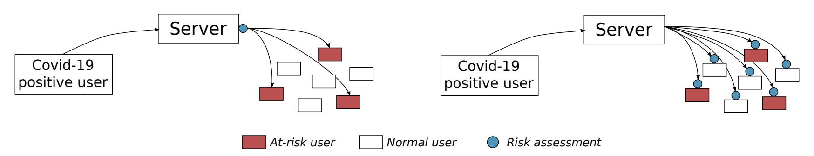
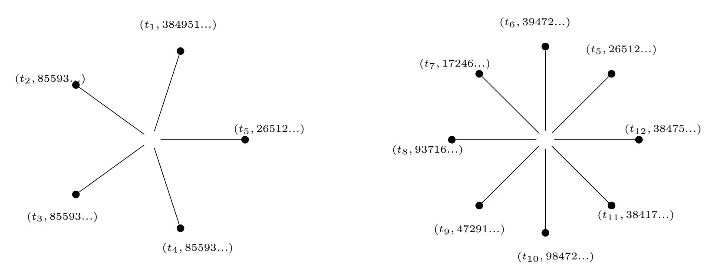
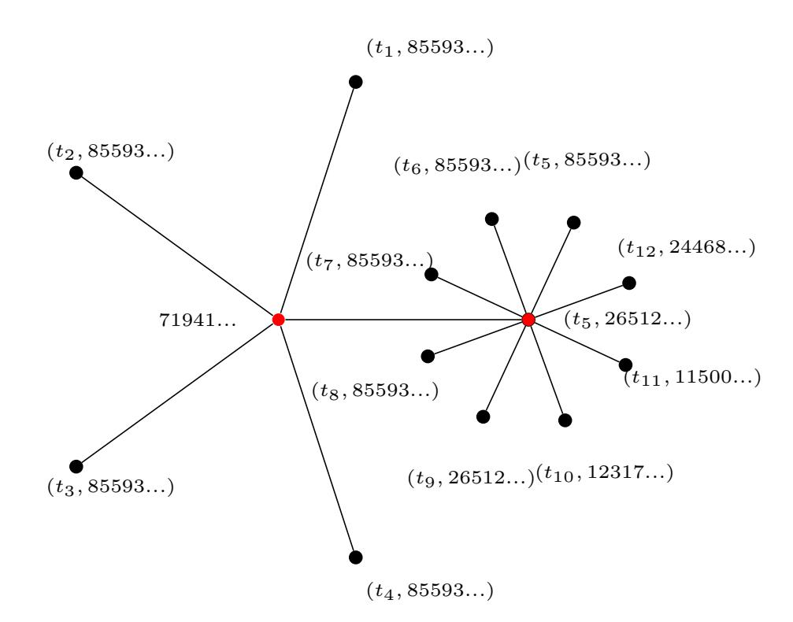

{0}------------------------------------------------

# PANDEMIC CONTACT TRACING APPS: DP-3T, PEPP-PT NTK, AND ROBERT FROM A PRIVACY PERSPECTIVE

### Fraunhofer AISEC

Garching near Munich info@aisec.fraunhofer.de

27 April 2020

# ABSTRACT

In this paper, we review different approaches on proximity tracing apps which are supposed to automate the current labor-intensive contact tracing approach conducted by national health officials. The purpose of these apps is to automatically notify people who are at risk of being infected with SARS-CoV-2 to interrupt infection chains as early as possible. However, a privacy-preserving and yet functional and scalable design of such apps is not trivial and in some parts leads to counter-intuitive properties. This paper reviews the most prominent European approaches, DP-3T, the German variant "NTK" of PEPP-PT, and its closely related concept ROBERT. We discuss their design decisions from a privacy perspective and point out the fundamentally different adversary models assumed by the approaches. In addition, we touch on practical aspects such as scalability and ease of implementation.

# 1 Introduction

In the course of the SARS-CoV-2 pandemic, the call for mobile proximity tracing applications is getting louder. They are considered by epidemiologists and politicians as a way to loosen lockdown measures in a controlled way and thereby reduce the derogation of fundamental rights caused by restrictive lockdowns. While Asian countries have had notable success using mobile applications for tracing infections, these app are highly invasive with respect to the user's privacy and would not be accepted by European citizens. As a consequence, various architectures for privacy preserving proximity tracing apps are proposed across Europe, including several variants of DP-3T, the PEPP-PT framework and the French ROBERT system. The German concept "NTK" of PEPP-PT, as described in [\[9\]](#page-15-0), and ROBERT are closely related and thus have very similar privacy properties.

All systems strive for a privacy-friendly design and must obviously be compliant with European data protection legislation. However, a closer look reveals that the systems pursue different design goals in general and thus come up with different cryptographic protocols and architectures. This comprises significantly different attacker models, different trade-offs in terms of practical application and scalability, and different levels of detail with respect to processes surrounding the core cryptographic protocols – such as integration of health authorities and epidemiologists.

In this paper we set out for a comparison of the most relevant proximity tracing app architectures in Europe, discuss their differences, and analyze to which extend they cope with different attacker models. We first discuss the overall requirements that every proximity tracing app must address in [section 2.](#page-0-0) We then describe the details of PEPP-PT based systems NTK and ROBERT in [section 3](#page-3-0) and of DP-3T in [section 4](#page-6-0) and compare them with respect to their security [\(section 6\)](#page-8-0), privacy [\(section 7\)](#page-9-0), and scalability [\(section 8\)](#page-12-0) properties. In [section 9](#page-13-0) we summarize the key differences between the approaches and conclude which approach is a better match for which scenario.

# 2 Challenges in Contact Tracing for Disease Control

To set a common ground, we first outline the current processes of contact tracing as they set the frame of the evaluation of such a system. We then introduce challenges in form of functional and non-functional requirements that any European proximity tracing app faces.

{1}------------------------------------------------

#### 2.1 Manual Contact Tracing

To break infection chains, many countries rely on plans for pandemic management that involve the identification of people infected with the disease, their contacts and the isolation of both the infected people and their contacts to contain the spread of the disease. Currently, this involves the manual collection of potential contacts at risk and in many countries, procedures similar to the scenario described below are established.

*Alice shows symptoms of Covid-19 and gets herself tested in a test-center (e.g. hospital) and is asked to self-isolate. Several days later she receives the positive test result together with a questionnaire where she has to fill in relevant contacts in the last days before showing symptoms (in Germany, the legal basis for this procedure is IfGS §16 [\[18\]](#page-16-0) and CoronaVMeldeV [\[19\]](#page-16-1) which require a de-anonymization of Alice and her contact persons towards the health authorities). Alice remembers having met Bob and notes his name and contact data in the questionnaire. She also remembers that she talked to Carol in the supermarket but does not know her contact details. Unfortunately, Alice forgot that she has also met Dave in the underground. The questionnaire is now sent to the health authority who now have a list of contacts. They can directly call Bob and explain him how to proceed (e.g. get tested, self-isolate until he is shown to be negative). The health authority further researches the phone number of Carol.*

The example shows the limitations of the current process in terms of its scalability and the completeness of the results It is also useful to set the frame for proximity tracing apps and illustrates boundary conditions they face.

- The health authority knows the full identity and the infection status of any reported person. Currently, the list of reported infections that is passed to health authorities contains personal data such as name, phone number, and address.
- When a person is notified about the test result, she is already isolated e.g. at home or in a hospital. In particular, the person is not at work or travelling.
- A person tested positive is obliged to reveal the identity of her contacts to health authorities, including contact data and even against the will of the contact persons. The Covid-19 positive patient might plausibly deny individual contacts but in general (at least in Germany) is forced to cooperate under threat of penalty (c.f. [\[18,](#page-16-0) [19\]](#page-16-1)).

Any reasonable proximity tracing app must make the process faster with less manual labor involved and at the same time be less invasive to the user's privacy. As soon as less invasive but likewise effective means to trace contacts exist, the current procedure becomes disproportionate and thus undue and possibly illegal (depending on the respective jurisdiction).

#### 2.2 Functionality & Scalability

The main purpose of each proximity tracing app is to inform users about a potential infection with SARS-CoV-2 due to extended exposure to a SARS-CoV-2 positive person. Proximity and duration of the exposure influence the likelihood of an infection. Users with an exposure that makes an infection likely are called "at-risk". It is obvious that any tracing system must thus provide at least the following two functions:

Precise distance measurement Apps must be able to calculate the distance to nearby users within a range of 1-3 meters as precisely as possible, factoring in walls, glass, movements, different hardware properties, etc.

Timely notification of contact persons As pointed out by epidemiological research (cf. [\[2\]](#page-15-1)) the time between first symptoms and notification of the "at-risk" contact persons is crucial. Especially notification times well below a single day are required to effectively reduce the spread.

Adaptive risk assessment Epidemiologists further require that the app must support a "risk-stratified quarantine" [\[2\]](#page-15-1), i.e., a mechanism which determines whether a contact was risky enough that measures (such as notification, testing, or self-quarantine) are required. This mechanism will not only depend on the measured distance, but may also consider factors such as infection clusters getting out of control.

Scalability and practical application Anonymous tracing and notification of peers sparks exciting research ideas in the fields of secure computation and zero-knowledge protocols. It must however be considered that apps must easily scale to millions of users and cope with low-budget smartphones and users with shaky connectivity or expensive mobile data plans.

{2}------------------------------------------------

Federation Especially in Europe with many comparatively small countries and freedom of movement, a proximity tracing app should support roaming between different countries to trace contacts between users registered at different servers.

#### 2.3 Security

Prevention of trolling/sybil attacks The system must be resilient against trolling attacks where malicious users create a large number of accounts to flood the system [\[1,](#page-15-2) [5\]](#page-15-3). Depending on the system architecture, this would have negative effects on scalability, but potentially also on epidemiological statistics. It might also allow an attacker to "squash" accounts and make the system unusable.

Authorized test result reporting The system must ensure that only users who are really Covid-19 positive are handled by the system as such. If a user can declare herself as infected towards the system without actually being infected, this would result in erroneous notifications of users of being at-risk and, besides the effects on individuals (e.g. psychological effects, unnecessary quarantine measures), could pollute data used for epidemiological research or even overwhelm a country's test infrastructure and healthcare system.

Authenticity of notifications to at-risk persons The notification of being at-risk must be authentic. In particular, it should not be possible for third parties to fake such notifications or messages. Similar to unauthorized test results, wrong notifications can have effects on individuals and on the healthcare system. If third parties were able to easily send such notifications to any persons, the app would be rendered useless if health authorities rely on the app to prioritize which users need to be tested for a Covid-19 infection.

#### 2.4 Privacy

Although all systems aim to protect the user's privacy, they differ in the assumed attack models and thus set different priorities on protection goals. To understand these differences, it is helpful to detail the broad term "privacy" and state *what information about which user type* should be hidden *from whom*. We detail these dimensions by discussing the three typical user types, the attacker models, and the ways how privacy can be impacted.

Each system deals with users in one of at least three different states:

Normal user are those whose proximity data is recorded by other nearby users. They have not reported SARS-CoV-2 positive and not identified as at-risk.

At-risk user have been exposed to a Covid-19 positive person to an extend that makes an infection likely, i.e., they have been close enough to an infected person for an extended period of time.

Covid-19 positive users who have received and reported a positive test result

We further distinguish the beneficiary of a de-anonymization, i.e., the attacker model under which a de-anonymization is possible. For the sake of simplicity, we consider three types of adversaries against which the system must preserve the users' privacy:

- 1. the classic Dolev-Yao attacker [\[17\]](#page-16-2) that has no special privileges in the system but can eavesdrop, modify, and suppress any message that is sent over a public network. This adversary type includes tech-savvy users and hackers who may run modified versions of the app or interfere with network traffic.
- 2. a privileged user such as a rogue administrator. All systems require a central backend for different purposes and this adversary type assumes that its operator is honest-but-curious. This means, while the adversary will comply with the protocols and not e.g. simply shut down the service, she will leak confidential information or combine existing information sources to infer additional knowledge she is not supposed to have.
- 3. a state-level adversary that combines the features of the previous attackers and additionally has the possibility to analyze network traffic at least at a nation-wide scope, issue subpoenas, and change legislation.

Finally, we distinguish between the way how a user's privacy may be violated. This can either happen through *immediate de-anonymization* which maps the user's pseudonym to her real identity. Or privacy is breached by *narrowing down* on the real identity of a user without necessarily identifying her individually. This may e.g. happen through clustering based on meta-data analysis or through location tracking which will eventually narrow down on the place of living and possibly the identity of a user.

{3}------------------------------------------------

The system must ensure ideally that none of these privacy violations is possible for any user type and any adversary model. Where trade-offs must be made, the system design must set priorities on which user type is most sensitive and which adversary model is most realistic.

# 3 PEPP-PT based approaches NTK and ROBERT

NTK and ROBERT aim at identifying close contacts to infected people at scale and in a privacy-preserving manner. While the overarching PEPP-PT framework suggests communication protocols between mobile apps and backend systems, it leaves a lot of room to address national differences for example when it comes to deciding about users' risk of infections or seamlessly integrating in the health care system.

#### 3.1 German variant NTK

In [\[9\]](#page-15-0), a concept NTK for a German app is proposed, which is intended to be provided by the national health authority, the Robert-Koch-Institute. In addition to the overall PEPP-PT protocols, the NTK concept includes protocol flows for authorizing Covid-19 positive users using barcodes issued by test laboratories and considers some specifics of the German health system, which are irrelevant for this analysis. We follow a typical user story and discuss the following steps:

- 1. Initialization
- 2. Proximity Tracing
- 3. Infection and at-risk notification

### 3.1.1 Initialization

As a first step, the user needs to register to the app. No personal data should be collected during this step, but the system should still be protected against mass-registration of accounts, a proof-of-work algorithm and a captcha is used to slow down the registration and to require human interaction. Once these challenges are solved, the account is generated and represented by a persistent pseudonym, the randomly generated 128-bit P UID. The P UID is stored in the backend.

#### 3.1.2 Proximity Tracing

Next, the app requests a list of short-lived pseudonyms, the EBID from the backend. An EBID is generated by encrypting the P UID with a key BKt. This key is only known to and securely stored in the backend and is valid for a short (e.g. 1 hour) time interval t. This key is used to derive the EBIDs for all users by encrypting their P UID with AES for an interval of time t:

$$EBID_t = \mathsf{Enc}_{AES}(BK_t, PUID)$$

On request, an app is provided with sufficient EBIDs for few days in the future.

The app now selects the EBIDt valid in the current timeframe t and starts broadcasting it via passive Bluetooth Low Energy (BLE) channels. At the same time, the app scans for EBID of apps in the proximity and locally, that is on the phone, stores them together with the current time ts and meta-data btdata of the Bluetooth channel, that is, RSSI, TX power and RX power. We denote the tuple (ts, EBIDt, btdata) of such an encounter as Contact/Time Data CT D. The CT D dates back to at most 21 days.

#### 3.1.3 Infection and at-risk notification

In case a user is infected and positively tested on Covid-19, the user has the possibility to upload the CT D stored on his phone to the backend. This process requires additional authorization of the upload by using a TAN which may come in form of a barcode issued by the test laboratories. The TAN is exchanged between the user and health authorities on an out-of-band channel. If the user associated to a TAN is tested positive on Covid-19, the TAN is set valid in the backend by the health authorities. No personal information about the user is handed to the backend and only the health authority can associate the TAN with the user.

The backend parses the CT D. In particular, for each entry (ts, EBIDt, btdata), the BKt which was valid at the time of this contact is recovered and used to retrieve the P UID by decrypting the EBIDt with

$$PUID = \mathsf{Dec}_{AES}(BK_t, EBID_t)$$

{4}------------------------------------------------

The btdata can now be used to estimate the distance between the two users and consequently update the risk of an infection for the contact. If the contact is now considered to be at high risk of an infection according to national guidelines, he is notified about this through the app.

The solution outlined for the NTK implementation makes use of push-notification services (Firebase Cloud Messaging and Apple Push Notification Service) to trigger apps to pull a message from the backend which indicates whether the user is at-risk and could - in theory - provide further instructions. To obfuscate which users are at-risk, additional push-notifications are sent to randomly selected users which also pull messages from the backend.

#### 3.2 French ROBERT System

ROBERT [\[10\]](#page-15-4) is another communication protocol which aims to enable tracing of contacts in order to contain the Covid-19 pandemic. The authors differentiate between four phases:

- 1. Initialization
- 2. Proximity Tracing
- 3. Infected User Declaration
- 4. Exposure Status Request

When starting the service, a central server is configured with the following keys and values

- KS is a secret key only known to the server
- KG is a key which is shared between servers to enable federation
- CC is the country code, an 8-bit value identifying the server

The server further stores Tptsstart indicating the time when the service is started and sets i = 0, where i is a counter containing the current epoch. Each epoch lasts for a defined timespan epoch\_duration\_sec.

#### 3.2.1 Initialization

At the beginning, the app has to register to the backend. To mitigate automated generation of new accounts on scale, this step requires solving a proof-of-work or a captcha.

Next, the backend creates a unique but random permanent pseudonym IDX for user X. The ID is 40 bit long [1](#page-4-0) . It further generates a key KX which is shared between the server and the user's app instance. The backend now provisions the app with the KX, the current epoch i, the value of epoch\_duration\_sec and the timestamp when the next epoch starts.

#### 3.2.2 Proximity Tracing

For user X, the backend regularly generates a list of tuples (EBIDX,i, ECCX,i). i denotes the epoch where such a tuple is valid and is 24-bit long. EBIDX,i is a 64-bit short-lived identifier generated with

$$EBID_{X,i} = ENC(K_S, i|ID_X)$$

ENC is a block-cipher with 64-bit block size such as Triple-DES or Blowfish. By using a 64-bit block-cipher it is possible to include additional information (the encrypted country code, a truncated timestamp and a MAC) in the payload of the Bluetooth channel which is limited to 128 bit. This requirement is fulfilled by using a comparatively short IDX (40-bit enabling a maximum of 2 40 users) and i (24-bit which is sufficient for around 1900 years if an epoch is 60 minutes long).

The 8-bit long encrypted country code ECCX,i is computed by xor-ing the country code with the 8 most significant bits of the EBIDX,i padded with 0 encrypted with AES using key KG and the:

$$ECC_{X,i} = MSB(AES(K_G, EBID_{X,i}|0^{64})) \oplus CC_X$$

The app regularly broadcasts Hello messages via Bluetooth Low Energy, where each message consists of a message MX,i = ECCX,i|EBIDX,i|T ime and a MACX,i. T ime is the 16 least significant bits of the current UNIX

1The backend randomly generates an IDX and checks that it is not already used. If it is in use, the process is repeated until no collision is found.

{5}------------------------------------------------

timestamp. The MAC is computed by HMAC-SHA256 $(K_X, c_1|M_{X,i})$  truncated to 40 bits and with  $c_1$  being a constant 8-bit prefix for every user (e.g. "01").

While a 40-bit MAC is not sufficient to provide collision-resistance in a cryptographic sense, it is still sufficient to make replay attacks on the Hello messages harder. That is, replaying the Hello messages requires an attacker to always scan the most recent message of another user which requires the attacker to be in proximity of the victim.

All apps in the proximity can scan the Hello messages and verify whether the value for time is close to the own value time' truncated to 16 bits and, if so, the app store the tuple (time', Hello) in its local proximity list.

#### 3.2.3 Infected User Declaration

When a user is tested positive on Covid-19, she can upload the local proximity list for the time interval when she was contagious, that is dating several days back2.

Upon reception of a tuple (Hello, time'), the server extracts the  $ECC_{X,i}, EBID_{X,i}, Time, MAC_{X,i}$  from the Hello message and

- decrypts the  $ECC_{X,i}$  to  $CC_X$  and verifies if it equals the own CC. If not, the tuple is forwarded to the server responsible for the resulting  $CC_X$ .
- verifies if Time is close to the truncated time'
- decrypts the  $EBID_{X,i}$  to retrieve  $i_X|ID_X$  and verify if  $ID_X$  can be found in the own database of identities
- checks if time' is in the epoch  $i_X$
- retrieves the  $K_X$  associated to  $ID_X$  from the database of keys
- verifies if the MACX,i is correct by checking MACX,i  $\stackrel{?}{=}$  HMAC-SHA256( $K_X, c_1 | ECC_{X,i} | EBID_{X,i} | Time$ )

If any of the checks fails, the tuple is rejected immediately. If all checks succeed, the server updates a list summarizing in which epoch a user was exposed to infected users within the epidemiological relevant time in the past. After processing, the tuple is deleted from the server.

#### 3.2.4 Exposure Status Request

The app regularly queries the server whether the user is at-risk of infection. It therefore sends a request containing the current  $EBID_{X,i}$ , the Time as a 32-bit timestamp in seconds and  $MAC_{X,i} = HMAC - SHA256(K_A, c_2|EBID_{X,i}|Time)$  to the server.  $c_2$  is a fixed value ("02").

The server parses the request, extracts the  $EBID_{X,i}$ , Time,  $MAC_{X,i}$  values and verifies if the Time is close to its current time, decrypts the  $EBID_{X,i}$  to extract the  $ID_X$  and retrieve the corresponding  $K_X$  and finally verifies if the  $MAC_{X,i}$  is valid. If so, the server responds with "1" if the user is at-risk or with "0" if not. In case the user is at-risk, the server sets a flag indicating that the user has been notified about the risk of infection.

The server further maintains lists to prevent users from continuously sending such requests, that is, the server stores the timestamp of the last request by a user and only responds to a new request if a threshold of minimum time between two requests has elapsed.

### 3.3 Risk assessment in the backend in NTK and ROBERT

Both, NTK and ROBERT send Bluetooth measurements to a central server which runs the risk assessment before notifying the user who are determined to be at risk. With the design choice to place the risk assessment in the backend instead of doing upfront in the clients before even reporting the contact to the server, NTK/ROBERT avoids the de-anonymization attack described in subsection 7.1 and prioritizes epidemiological insights over a further reduction of data in the backend: as the conditions for an infection with SARS-CoV-2 are not fully understood yet, the risk assessment will need to be adjusted as more is learnt about the virus. For instance, learning that contacts which have been reported but assessed as "irrelevant" or "low risk" report themselves as infected at a later time, will provide new insights into infection ways that would not be available if the client would filter out such contacts upfront. As for ease of implementation, one must consider two aspects: first, the risk assessment algorithm is not straight-forward and cannot easily be parameterized. A "contact" is not necessarily an uninterrupted sequence of BLE advertisements and

 $^2$ This time is limited by authorities to a maximum of CT days. All values recorded before this timespan are continuously deleted from the app

{6}------------------------------------------------

the risk assessment must take into account gaps in the seen EBID sequences, variances in RSSI, TX and RX power, etc. If the risk assessment algorithm would be located in the clients, adjusting it would either require to push parameters or even the whole algorithm as an executable piece of code. Deciding on a set of parameters before launch of the app is unrealistic, as the factors influencing distance measurements and risk assessment are not yet well understood. Pushing executable code into millions of clients does not seem to be a good idea from a security standpoint and is consequently forbidden by Apple's App Store policies. The trivial alternative - pushing new algorithm versions in the form of app updates - also has significant practical deficits: it makes it impossible to keep track of the different versions in use and raises questions as how to cope with clients with outdated risk assessments.

# 4 DP-3T

The Decentralized Privacy-Preserving Proximity Tracing (DP-3T) [\[4\]](#page-15-5) is a proximity tracing system that has been proposed by a consortium of various research institutions, lead by EPFL. It strives for a notification mechanism of Covid-19 positive persons that ensures data minimization, avoids tracing of non-infected persons (i.e., "normal" users and "at-risk" persons, as introduced above) and enables epidemiologists to analyze the spread of SARS-CoV-2. In a recent proposal, Google and Apple announced a system that will follow the principles of DP-3T (in its *Option 1* variant), but still requires detailed specification at the time of this writing. For a security analysis of this proposal, we refer to [\[5\]](#page-15-3).

#### 4.1 Initialization

Just as NTK and ROBERT, DP-3T relies on ephemeral pseudonyms (called *EphID*) sent over Bluetooth Low Energy which are recorded by nearby users. A key difference to NTK/ROBERT is that the secret keys for computing EphIDs are not created and managed by a backend server, but rather on the user's phone. The initialization thus does not require any user registration and any user can start using DP-3T by generating a secret symmetric random key per day, named SKt where t denotes the day. The key resides on the phone, but as it possibly needs to be published at a later time, it must be exportable. As no user registration is involved, users can run as many instances of a DP-3T app on their device as they wish.

#### 4.2 Proximity Discovery

Each key SKt is valid for a single day and the next key SKt+1 is calculated as a cryptographic hash H(·) of the previous key: SKt+1 = H(SKt). By using the key of the day SKt to seed a stream cipher, the phone creates a set of n EphIDs for each "epoch" (e.g., a minute) of the day:

$$EphID_1 \| ... \| EphID_n = PRG(PRF(SK_t, "broadcast key"))$$

where PRG denotes a stream cipher and PRF is a pseudo-random function such as HMAC-SHA256.

These EphIDs are 128 Bits long and continuously broadcast by the phone at epochs of l minutes, whereas the order of the EphIDs within a day is randomized. Nearby users listen to these advertisements and create a proximity history of the following entries per epoch:

- received EphID
- current day
- distance measurements

#### 4.3 Infected User Declaration

When a user receives a positive test result from health authorities out of band – DP-3T assumes that users will typically be notified by the authorities by phone – the health authority needs to authorize the upload of proximity data from the time frame when the user was contagious. The authorisation relies on an authorisation code that is issued by health authorities to the user at the time of taking the test and activated once a positive test result is confirmed. How this authorisation code is verified by the backend is out of scope of the DP-3T system. Users then upload their "seed key" SKt0 and the start day t0 of the respective time window to a central backend server. The backend provides the pair (SKt0 , t0) to all clients.

{7}------------------------------------------------

#### 4.4 Notification of all Clients

Each client (i.e., phone) retrieves all published pairs  $(SK_{t_0}, t_0)$  from the server and checks if its user is affected by the broadcast seed key  $SK_{t_0}$ . To do so, it generates all EphIDs for the respective day  $t_0$  and compares them with the locally stored list of collected EphIDs.

If any of the recorded EphIDs match, the app locally computes a *risk score* that determines the risk of an infection for the user. The details of this risk scoring algorithm are out of the scope of the DP-3T white paper, but the reference implementation counts the number of epochs (i.e., minutes) with exposure to any EphID that has been marked as infected. If the computed risk score is above a certain threshold, the app will notify the user and inform her that she is at risk of a SARS-CoV-2 infection.

In addition, "at-risk" users can voluntarily upload proximity data to a server for epidemiological monitoring and research. In that case, the app will upload the following information:

- a boolean tag, indicating if the user has been tested positive
- the number n(d) of unique EphIDs observed during each day d of the past 14 days.

It shall be noted that opposed to keys, EphIDs in DP-3T are valid only for the duration of an epoch (e.g., a minute, as suggested by the authors). That is, the uploaded data will allow epidemiologists to learn that a user (who is either at-risk or Covid-19 positive herself) has been exposed for n minutes to other users per day. As EphIDs cannot be linked to each other, the data will neither reveal the number of exposed individuals nor the distance or duration of the exposure.

#### 4.5 Variants of DP-3T

In addition to the previously described core protocol, DP-3T proposes several variants to mitigate known security and privacy related weaknesses. We only describe them briefly here and refer the reader to the original white paper [4] for details.

In an *Option 2*, DP-3T proposes to let a Covid-19 positive user redact the time slots (epochs) that she wants to broadcast to all other clients and avoids sending out  $SK_{t_0}$  to all clients. Rather, the Covid-19 positive user uploads  $SK_{t_0}$  to the backend which then stores all EphIDs in a Cuckoo filter and sends it to all clients in the system. While the Cuckoo filter is larger by a approx. a factor of 100 (depending on the choice of parameters) and thus creates higher traffic, it avoids sending out the private keys of infected users to all clients and reduces computational costs at the clients' side who only need to test every recorded EphID against the Cuckoo filter, rather than computing the infected EphIDs by themselves.

In an *Option 3*, DP-3T proposes to not broadcast the EphID in a single BLE advertisement, but rather to split it up into k shares. Using a k-out-of-n secret sharing scheme, this option allows to ensure that a receiving app must have been nearby a sending app for at least k epochs to reconstruct the actual EphID from k recorded advertisements. The benefit of this enhancement is that an attacker who strives for recording as many EphIDs as possible to later de-anonymize any of the users who were reported as Covid-19 positive, must remain for a longer time within the range of the users to record at least k advertisements.

### 5 Comparison of Goals and Attacker Models

All proposals aim to provide specifications to implement privacy-preserving proximity tracing. This serves to identify people who are at-risk of a Covid-19 infection after having been in close contact to Covid-19-positive people. Furthermore, in all systems, DP-3T, NTK, and ROBERT, users can voluntarily share data with epidemiologists to enable further research. However, the concepts target different goals in detail which also comes from a focus on different attacker models.

DP-3T puts strong emphasis on resilience of the system against state-level adversaries including intelligence agencies that control a central backend. This adversary's main goal is to reveal the identity of users, and to this end he combines information gained from the backend with external sources which are accessible to a state-level actor (e.g. large-scale deployment of Bluetooth sensors in cities, resolving IP addresses to real identities, large-scale traffic analysis). To this end, DP-3T accepts that a de-anonymization of individual infected persons is straight forward even for less skilled attackers.

NTK and ROBERT take a different perspective. They avoid de-anonymization of all user types by Dolev-Yao attackers (e.g., cybercriminals) or by the backend provider while providing more information about the spread of the disease to epidemiologists. To this end, they accept the risk that the backend provider acts maliciously and cooperates with a

{8}------------------------------------------------

state-level adversary to track users over a longer period of time or even de-anonymize them. From their perspective, this attack vector is out of scope, as the systems are intended to be operated by health authorities who know the real identities of infected and at-risk persons anyway.

# 6 Comparison of Security Properties

As initially stated, we consider three main security requirements: the prevention of mass-registration of accounts, authorization of the reporting of test results, and authenticity of notifications of persons at-risk.

Sybil attack/trolling As of [\[14\]](#page-15-6), DP-3T does not limit users in creating accounts. In fact, it is not specified if and how a user registers to the backend or how a user is notified, e.g. about infected users what suggests that users have to frequently pull for such data. As a user does not gain any additional information from the system by obtaining multiple accounts compared to having a user having single account, this seems to be reasonable.

In contrast, NTK and ROBERT require a user to have an account on the backend. During registration, a user has to perform some kind of proof-of-work (by solving a computationally hard problem) or proof human interaction by solving a captcha. While this cannot completely prevent a user from registering multiple accounts, it still makes registration of accounts on-scale more expensive.

Authorized test result reporting To prevent attackers from wrongly declaring themselves as infected, all three approaches suggest to share an authorization code (TAN) between the backend and the app out-of-band. Only if this authorization code is set valid in the backend by the national health authority after a positive Covid-19 test, the user is able to report himself as infected and continue with the next steps, that is, uploading his own SKt for DP-3T or the list of contacts for the NTK or ROBERT dating back several days in the past. Therefore, falsely reporting as infected requires attacking the authorization code in all schemes.

Authenticity of notifications to at-risk persons For all schemes, data exchanged between the apps and the backend should be sent via TLS connection with client- and server-side certificate validation. Therefore, this channel is assumed to be authentic. However, all schemes allow replay attacks which compromise the authenticity of notifications to persons at-risk, with significant differences depending on the scheme.

In DP-3T, the app generates a set of temporary pseudonyms (EphID) and advertises them over BLE in a randomized order. Other apps receiving the BLE advertisement store the received EphID with a timestamp, however only at the granularity of a day as a privacy measure to avoid re-identification of a contact by means of a precise timestamp. While this is in favor of privacy, it widens the window for replay attacks.

A tech-savvy adversary, Mallory, can record EphIDs from other users and replay them for the rest of the whole day, e.g. by sending them as BLE advertisements in a crowded place. If one of the users whose EphID Mallory has replayed is declared infected, all users who have received the replayed EphID from Mallory will falsely be notified to be "at-risk", although they have never been in contact with the infected person[3](#page-8-1) . Note that Mallory can replay the recorded EphID for a maximum of 24 hours and they would still be accepted by the app. Therefore, it is possible to generate a large amount of false at-risk notifications with minimal effort but a high probability.

In NTK and ROBERT, a tech-savvy adversary needs to inject the EBID or Hello message of the victim (that is, the person which will be falsely classified as "at-risk") into the contact list of a user who will be tested positive on Covid-19 few days later. This boils down to the same actions for the attacker, namely recording messages and replaying them. However, a major difference lies in the window of time for a successful attack. In the German NTK concept, the validity of the EBIDs is limited to a maximum of one hour and once a user uploads his data after a positive test, the backend verifies if the EBID was valid at the time of its recording. Therefore, an attacker can only broadcast and replay foreign EBIDs for a maximum of 1 hour.

Additionally, the Hello messages in the ROBERT protocol have included a timestamp covering approximately 18 hours as well as a keyed-hash including the timestamp. The client app can already reject Hello messages with a timestamp outside of a certain time-window. The backend can further verify if the EBID contained in the Hello message has been valid at the time of the recording, by verifying the HMAC. It is therefore only possible to replay such messages for a short amount of time (few seconds). Therefore, the attack – while it is still possible in theory – cannot be used to trigger wrong at-risk notifications on a large scale.

Note that for all schemes, an attacker might use specialized hardware to extend the range of an attack and thus inject the identifiers in the contact lists of other users over a higher distance than it would be possible using the BLE chips

3The notification can depend on further criteria e.g. duration of the contact or proximity

{9}------------------------------------------------

Figure 1: Risk assessment at the server side (PEPP-PT NTK/ROBERT) and at the client side (DP-3T)

integrated in mobile phones. It is also theoretically possible that multiple attackers team up and relay the recorded messages to other locations via other mediums (e.g. long distance radio, internet).

# 7 Comparison of Privacy Properties

A fundamental difference between the approaches is the extend to which they allow de-anonymization of different types of users. The root cause for this difference is the order of risk assessment and notifications, as illustrated in [Figure 1](#page-9-2) and explained in this section.

### 7.1 De-anonymization in DP-3T

DP-3T does a decentralized risk assessment, i.e., all users are informed of all Covid-19 cases by broadcasting the "seed" key and timestamp (SKt0 , t0) of the Covid-19 positive person. It is then up to the clients (i.e., the apps) to assess whether the contact is contained in the previously recorded proximity history and if it was close enough to impose an infection risk. This leads to a straight-forward de-anonymization attack that reveals the real identity of a Covid-19 positive user to all other users who have recorded her pseudonym. This includes not only "at-risk" users who are at risk of an infection, but also "normal" users which have seen the pseudonym only briefly or from a greater distance. The attacks works as follows:

*Mallory installs the "Covid deanonymizer" app on a phone and mounts it at a strategic point (subway entrance, parliament building entrance). The app records EphIDs and takes photos of bypassers. One of the bypassers is Alice, a normal user running a DP-3T based app. A few days later, Alice receives a positive SARS-CoV-2 test result and broadcasts her seed key and time window* (SKtk , tk)*. Mallory receives this broadcast, his Covid deanonymizer app calculates the set of EphIDs from the seed key and determines that Mallory has recorded at least one of these EphIDs. In contrast to the original DP-3T based app, the Covid deanonymizer app simply skips the risk assessment and uploads the photo of Alice to a "Corona Pillory" website.*

This de-anonymization is likewise possible in options 1 and 2 of the DP-3T. In option 3, an attacker would have to record k out of n shares to construct the EphIDs and would thus need to stay longer in the range of the sender – but not necessarily closer. This slightly raises the bar for the attack and is well suited to illustrate the root cause of the de-anonymization attack: it moves a part of the risk assessment to a point in time before the attacker receives information on the precise contact with an infected user and thus has an impact on the risk of de-anonymization. It is important to note that in this case the risk assessment must be implemented as a cryptographic protocol that prevents the attacker from simply skipping the algorithm or faking its output. In this respect, the secret sharing proposed in option 3 of D3-PT can be regarded as a simple variant of a secure multiparty computation protocol for a cryptographically secure risk assessment. Even if such a protocol would exist, it would still not fully prevent the de-anonymization of infected users, but it would at least require the attacker to be actually exposed to a Covid-19 positive person for a longer time and shorter distance, analog to NTK/ROBERT.

Thus, with respect to de-anonymization of infected persons, the quote from [\[1\]](#page-15-2) applies: "It is actually surprising that decentralization creates more privacy threats than it solves.". Other authors such as [\[3\]](#page-15-7) also acknowledge this attack vector ("This element of distributing SKt of devices owned by an infected person is in my opinion a weak point with respect to privacy."), along with the DP-3T authors themselves [\[12\]](#page-15-8). A proof-of-concept implementation of the attack has recently been published as open source[4](#page-9-3) .

4 <https://github.com/oseiskar/corona-sniffer>

{10}------------------------------------------------

Figure 2: Pseudonymous proximity graph of Covid-19 positive users around anonymous at-risk users (DP-3T)

We deem the easy de-anonymization of infected users as a major shortcoming with respect to the users' privacy, as it will foster stigmatization (as reported by various sources [6–8, 13]) and possibly further negative consequences for Covid-19 patients.

Information gain from backend data In contrast to NTK/ROBERT, where uploading of a proximity history is likewise voluntary for the user, but a prerequisite for the notification of at-risk users, DP-3T lets at-risk users voluntarily and optionally upload a proximity history to a backend for epidemiological research. To this end, the app will upload the keys  $SK_t$  of all Covid-19 positive persons the user encountered, together with a flag indicating if the user has been infected herself, the number of encounters, and the timing relative to the onset of symptoms on day t. The following table illustrates the data that Alice would upload after she encountered two Covid-19 positive users: one encounter with Bob on his third day after onset of symptoms and 4 encounters with Charlie on four subsequent days.

| $SK_{t_{Bob}}$     | 1 encounter  | day 3          | not infected myself |
|--------------------|--------------|----------------|---------------------|
| $SK_{t_{Charlie}}$ | 4 encounters | day 1          | not infected myself |
|                    |              | day 2          |                     |
|                    |              | day 3 day 4 |                     |
|                    |              | day 4          |                     |

Table 1: Proximity data uploaded by a non-infected at-risk user

The backend can build a first-order proximity graph from this information, i.e., a star-like bipartite complete graph where the root node refers to the at-risk user uploading the data (Alice) and the leaf nodes refer to encounters with Covid-19 positive users at specific days. As shown in Figure 2, the root node remains anonymous and the leaves are identified by their  $SK_t$  pseudonyms. Although this graph does not de-anonymize any of the contained users, the backend learns that the sender has regular daily encounters with the pseudonym of Charlie, which might indicate that they are family members, neighbors, or flat mates. If at a later point, Alice reports herself as Covid-19 positive, too, this information will not be linkable to his previous "at-risk" state which happened under a different pseudonym (cf. Figure 2. This is a difference to NTK/ROBERT, where the root of a proximity graph is always an infected user and can be linked to its previous "at-risk" information, unless she actively changes her pseudonym in the meanwhile. Thus, the backend information in DP-3T provides less epidemiological insight but reduces the chances for a malicious backend to narrow down on the real identity of a user.

**Location tracking of users** For a tech-savvy user, it is easily possible to track the location of infected users for the last days (e.g. 21 days) before the upload. It is only necessary to deploy devices scanning for the EphIDs and store all collected EphIDs. When the  $SK_t$  are broadcast after an infection, it is possible to recompute all EphIDs of the respective user and see which of the BT-devices has collected the EphIDs and when. By installing many such devices spanning wide areas (e.g. a city, the whole country), it is possible for the operators to precisely track the location of infected users for several days (e.g. 21 days). Most notably, it is not necessary that the BT-devices and the backend are operated by the same entity.

{11}------------------------------------------------

#### 7.2 De-anonymization of users in NTK/ROBERT

NTK/ROBERT sets different priorities on de-anonymization than DP-3T. It considers the de-anonymization of Covid-19 positive users by any other user they encountered as a high risk that must be avoided. On the other hand, it accepts that a malicious backend in co-operation with a state level adversary would be able to track users[5](#page-11-0) . From the viewpoint of NTK/ROBERT, a de-anonymization of infected and at-risk users by the authority operating the backend is a minor risk, as it would be redundant to German legislation which requires authorities to report the real identities of these user types. In contrast to DP-3T it adopts a risk assessment on the server before notifying users, so notification messages can be adopted to different likelihoods of an infection.

Active de-anonymization of infected users In general, the de-anonymization of infected users cannot be fully prevented and is possible in NTK/ROBERT. However, such an attack is significantly more complex in NTK/ROBERT than in DP-3T. If a user Bob encounters the attacker Mallory, Mallory's temporary EBID will be recorded by Bob. If Bob is reported as Covid-19 positive at a later time, his app will upload the temporary EBID of Mallory to the server. The server will then run the risk assessment and determine whether Mallory has been at risk of an infection. Here is the key difference to DP-3T: to receive an "at-risk"-message, Mallory must be determined to be at risk of an infection by the risk assessment at the server side – an algorithm that Mallory cannot simply skip or easily work around. As a consequence, the de-anonymization will only work if Mallory actually takes a high risk of getting infected himself – a large scale attack with only short encounters or at great distance is not possible. On top, as the server will not give any details about the time or location of the encounter with Bob when notifying Mallory, Mallory has to make sure that Bob is the only contact of the account which satisfies the criteria of being notified as at risk contact so he can distinguish the notification from other contacts. As illustrated in [\[16\]](#page-15-12), Mallory could solve 96 captchas and proofs-of-work to register 96 accounts per day, of which he uses one per 15 minute interval. The account receiving the notification determines the time slot of the encounter and would allow to narrow down on Bob (assuming less than one encounter per 15 minutes). In comparison to DP-3T, these prerequisites make the de-anonymization attack in NTK less likely and especially less scalable.

Passive de-anonymization of at-risk users Unlike in DP-3T, where information about all infected users is always broadcast to all users in the system, NTK notifies at-risk users. Although the message payload does not contain any plain text, a powerful attacker who is able to monitor network traffic at a large scale (e.g. an ISP or the push notification service provider) could determine that a user is at risk of an infection just by the fact that she receives a message. This attack is mitigated by creating "noise" message traffic in which the actual messages are hidden. Depending on the noise-to-content ratio r, this will leave an attacker of a probability of 1 : r that a monitored message belongs to an at-risk user.

Information gain from backend data The proximity history uploaded by an infected user to the backend is more fine-granular in NTK/ROBERT and it is a prerequisite to the notification of at-risk users. A proximity history contains a series of timestamps t, the recorded EBIDt, and a distance measurement. As the backend is in possession of the secret keys SKt, it can map all EBIDs to the persistent PUIDs. As a result, each upload of a proximity history will create a star-like graph with the PUID of the Covid-19 positive user as a single internal node and n leaves, representing the PUIDs of contact persons (not only necessarily at-risk users). This is depicted by [Figure 3.](#page-12-1)

From this graph, the backend learns regular close contacts of the Covid-19 positive user, which could relate to family members or neighbors, for instance. It also learns if (and when) the Covid-19 positive user has been part of large groups or if she has only few contacts. Assuming a malicious backend (which the authors of [\[9\]](#page-15-0) don't), the backend could use additional knowledge such as information about demonstrations or sports events to conclude that the infected person has attended any such event. An immediate de-anonymization of the user is however not possible without further measures. A significant difference to DP-3T is that individuals reported "at-risk" can later be mapped to Covid-19 positive reported users. While from an epidemiological perspective, it might help to understand when the risk of an infection has actually resulted in an infection, it creates a link between the two events in the proximity graph.

The proximity graph is a concern when considering a state-level adversary that plans on using the app for surveillance purposes. While the proximity graph alone is not enough to de-anonymize a user, it might provide hints on whether a user participated in a demonstration, for example.

De-anonymization of users by the backend In NTK/ROBERT, the backend is in possession of the secret keys used to generate the EBIDs. A malicious backend provider can thus map all EBIDs to permanent PUIDs. This is still not a de-anonymization, as long as the backend has no means to map the PUID to a real person. However, for a

5 unless they actively change their pseudonym

{12}------------------------------------------------

Figure 3: Pseudonymous proximity graph of at-risk users around Covid-19 positive users (NTK/ROBERT)

state-level adversary this would certainly be possible and as a consequence, such an adversary could reveal the identity of Covid-19 positive users and of at-risk users. Thus, by deploying Bluetooth sensors at a large scale, recording EBIDs and combining them with the secret keys provided by the backend, as well as any additional captured information that would leak the user's identity (such as a photo taken at the encounter), a state-level adversary could de-anonymize normal users.

Location tracking of users As pointed out in [\[14\]](#page-15-6), NTK allows to trace the location of users if a malicious backend operators collaborates with a state-level adversary who deploys Bluetooth sensors at a large scale and sends recorded EBID to the collaborating backend which then uses its keys BKt to resolve the EBIDs to long-term PUIDs. The impact of the attack is however limited, as users are free to change their PUID anytime and will thus appear as new unlinkable pseudonyms to the backend. Given the strong assumptions about the capabilities of the attacker in this scenario, there will be easier ways to trace users – e.g. by forcibly pushing a dedicated tracing app to the users' phones or by forcing ISPs to de-anonymize and locate mobile phone users.

# 8 Comparison of Scalability Properties

According to Johns Hopkins University, between 20,000 and 60,000 new infections are reported every day in Europe. Further, the systems aim to acquire a large user-base of several millions of users to achieve the desired effect of breaking infection chains. Therefore, scalability is a key requirement of the systems and needs to be addressed by the implementations. We evaluate the scalability based on the following estimations:

- We assume 20,000 new infections per day.
- We assume a user base of 50 million daily active users
- An ephemeral ID (EphID or EBID) is valid for 1 hour.
- The contacts of the last 21 days should be traced.
- A person has in average 10,000 contact records per day. Note that a contact record does not relate to a unique person but rather to one "epoch" of contact with a person. Considering an epoch of 1 minute, 10,000 contact minutes relate to approx. 1.5 hours of a subway ride with 100 other users plus sharing a household with another user, for instance.

In DP-3T (Option 1), the app receives a pair (t, SKt) for every infected user. In case of a daily infection rate of 20.000 users, a volume of approx. 680 KB per client which amounts to 30.9 terabyte of downstream traffic at the backend, assuming a single request per client and day only (which is not enough in practice to ensure a timely notification of users). While this is a significant number that can hardly be handled by a single server, it must be noted that the content is static and could be distributed via a content delivery network CDN.

From these keys, the app computes the EphID and compares them against the local database of contacts. Based on the estimations, for each app, the daily traffic to receive keys of infected users sums up to 20,000 ·(32 + 2) = 680 kB. From 

{13}------------------------------------------------

these keys, the app now derives all EphIDs. This requires the app to compute 20,000 · 21 = 420,000 hashes to retrieve the SKt and for each of them compute 24 EphIDs. This boils down to AES-encrypting 420,000 · 24 · 16Bytes = 161.280 MB per day if following the author's example of using AES as PRF. With an estimated hash-rate of 100,000 SHA-256 hashes per second for a mid-range smartphone, the app requires around 4sec per day to compute the hashes and only few seconds for the AES operations. For each of the EphID, the app now checks whether an entry can be found in the local database. Furthermore, for each contact to an infected person, the risk-score needs to be calculated which, depending on the precise algorithm, can also be computationally intensive.

The main concern with respect to scalability of DP-3T's option 2 is the size of the cuckoo filters that need to be downloaded. Assuming around 7 bits per entry in the filter and 10,080,000 entries (see above), this means a smartphone has to download approximately 70.5 MB of data representing the cuckoo filter every day. This estimation ends up with a data volume of 2 GB per month - a value which is most likely not acceptable for most mobile data plans.

In contrast, the German NTK approach does not require the phone to perform any local computations or download significant amount of data. The apps sole purpose is to receive a notification in case of contact to an infected person, query the backend, and receive a message of a few bytes indicating whether the person is at-risk of infection or not. An infected person, however, uploads all of his contact entries including the timestamp (and potentially further data) to the backend. For the numbers given above, this sums up to uploading 21 · 10,000 · (16 + 32)Bytes = 10 MB. Note that this upload is performed only once and when the user is really infected and is not a recurring event. Therefore, this is not problematic for the user. However, the backend needs to parse and decrypt all of the EBIDs to retrieve the long-term pseudonyms and notify the users at-risk and finally update the risk-score of affected pseudonyms and notify the respective app. For the numbers stated above, this means 21 · 10,000 · 20,000 = 4,410,000,000 of AES decrypt operations. This can easily be served by a powerful server. The app has to retrieve 24 · 16 = 384 Bytes of daily key material. Other traffic such as a notification of being at-risk is minimal and occurs rarely.

ROBERT shows similar properties to the German NTK approach. In particular, a user uploads the same amount of data on infection. Also, the message of being at-risk is similar to the approach outlined by NTK. However, differences exist when it comes to scalability of the backend infrastructure as the backend needs to hold a key KA for each user A of the system. This sums up to 50,000,000 · 16 = 8 GB of storage required for the secret keys. Also, on upload of a tuple (t, Hello), the server has to perform one decryption, and compute a hash to compare the HMAC included in the message. Performing 4,410,000,000 decrypt operations and calculating the hashes per day should still be easily feasible for a reasonable server infrastructure.

# 9 Summary

DP-3T and the NTK/ROBERT make fundamentally different assumptions about the attacker model but also have similarities, which might seem counter-intuitive at first. All systems require a central backend for their operation. If the backend operator is not trusted, availability of none of the systems is guaranteed. Also, all systems store epidemiological data in a central backend – in NTK this is a prerequisite for informing at-risk users, in DP-3T it is not. The actual data stored in the backend is pseudonymous and allows the construction of a first-order contact graph in all systems, but in NTK it allows to infer contacts between non-infected persons who have been in contact with a Covid-19 positive person. In DP-3T, nodes in the proximity graph do not refer to persistent pseudonyms and thus inferring information about contacts between non-infected persons is limited. Further, NTK and ROBERT allow the backend to detect that a user who has previously been "at-risk" reports herself as "infected" at a later time (unless the user decides to change her persistent pseudonym in between) which allows easy adoption of the algorithm used for the risk assessment. In DP-3T, this it is not possible.

The fundamental difference between DP-3T and NTK/ROBERT based systems are however two things: first, the attacker model and second, following from it, the design decision if the assessment of an infection risk should take place before or after the devices of users receive information on the risk status.

A primary design goal of DP-3T is to protect normal users from tracing and de-anonymization by a malicious backend or a state-level adversary. Consequently, the role of backend is reduced and the risk assessment is done at the client side *after* broadcasting information on all infections to all users. This comes at the cost of an easy de-anonymization of infected users by any tech-savvy adversary who is able to write or modify a mobile app. Furthermore, the location of infected users can be tracked for several days prior to the positive test result by any tech-savvy user installing sufficient Bluetooth devices.

The primary design goal of NTK and ROBERT is to avoid that attackers can trace or de-anonymize normal users, at-risk users, and also Covid-19 infected users. They consider state-level adversaries and malicious backend providers as less relevant in the addressed use case of pandemic contact tracing, where health authorities are anyway authorized and obliged to de-anonymize users. As a result, the risk assessment in NTK and ROBERT can be done in a backend

{14}------------------------------------------------

| Functionality                                      |                                                                                                                                                  |                                                                                                                                    |
|----------------------------------------------------|--------------------------------------------------------------------------------------------------------------------------------------------------|------------------------------------------------------------------------------------------------------------------------------------|
| Federation/Roaming                                 | Yes                                                                                                                                              | Yes                                                                                                                                |
| Security                                           |                                                                                                                                                  |                                                                                                                                    |
| Prevention of trolling/sybil attacks               | Not required                                                                                                                                     | Yes (PoW & Captcha)                                                                                                                |
| Authorized test result reporting                   | Idea sketch of a TAN process                                                                                                                     | Barcode provided by laboratories [15] (NTK)                                                                                     |
| Replay attack (creating false "at risk" events) | Possible for 24 hours                                                                                                                            | Possible for 1 hour (NTK) or few seconds (ROBERT)                                                                               |
| Privacy                                            |                                                                                                                                                  |                                                                                                                                    |
| De-anonymization of Covid-19 in fected users    | Trivial, scalable                                                                                                                                | If attacker is at-risk of infection, not scalable                                                                               |
| De-anonymization of at-risk users                  | No                                                                                                                                               | No                                                                                                                                 |
| De-anonymization of normal users                   | No                                                                                                                                               | No                                                                                                                                 |
| Uploading proximity graph to the backend        | Voluntary                                                                                                                                        | Voluntary, but required for sending notifications                                                                               |
| Tracing of users                                   | Any adversary with large-scale Blue tooth sensor deployments for up to 21 days prior to uploading the key (affects infected users only) | State-level adversary with large scale Bluetooth sensor deployments and continuous access to backend secret keys |
| Scalability                                        |                                                                                                                                                  |                                                                                                                                    |
| Daily traffic                                      | Moderate (Option 1), High (Option 2)                                                                                                          | Low                                                                                                                                |
| Computations on phone                              | Moderate                                                                                                                                         | Low                                                                                                                                |
| Computations in backend                            | Low (Option 1), Moderate (Option 2)                                                                                                           | Moderate                                                                                                                           |

DP-3T NTK & ROBERT

Table 2: Comparison of DP-3T with NTK and ROBERT

*before* notifications are sent out to users and thus, the de-anonymization attack against Covid-19 infect persons becomes significantly harder. It is further possible to track the location of all users for the operators of the backend by installing Bluetooth devices. However, such long-term tracing is not possible for a tech-savvy adversary and can be avoided by users by generating new accounts regularly.

We conclude that all systems are reasonably designed under their respective assumptions, but differ in the provided epidemiological information, while they all do not fully protect the user's privacy. NTK/ROBERT provides slightly more details on how infected users are authorized. NTK and ROBERT are explicit on how notifications are sent to the phones (push and pull, respectively), and ROBERT supports federation between several backends while NTK only claims it can be migrated to compatibility with ROBERT. DP-3T supports federation, but would only be a second-class citizen in ROBERT/NTK systems (NTK/ROBERT users could be informed that they have been in contact with an infected DP-3T user, but not vice versa).

From a security perspective, DP-3T is less detailed on aspects aside from the core proximity tracing protocol, but does not significantly differ from NTK and ROBERT. The only aspect worth mentioning is the extended period during which replay attacks and thus false notifications are possible in DP-3T.

Regarding scalability, NTK and ROBERT clearly benefit from a risk assessment in the backend which allows to limit notifications to the set of affected users, plus noise messages, and relieves clients from cryptographic operations. DP-3T sends seed keys of all infected users to all clients and has the clients compute EphIDs from it. Both designs should be able to scale to millions of users, but DP-3T will require more careful systems design in terms of reasonable partitioning, traffic and computation trade-offs, choice of messaging protocols, etc.

As for privacy, all approaches handle only pseudonyms and do not track the location or any other information about users which is not needed for proximity tracing. A comparison boils down to the question which attacker model is considered more relevant:

{15}------------------------------------------------

- DP-3T protects against a state-level adversary aiming to trace normal users at large scale. This comes at the cost of an easy de-anonymization of Covid-19 infected users.
- NTK and ROBERT protect against cybercriminals and adversaries aiming to trace or de-anonymize users. This comes at the cost of the backend learning the long-time pseudonyms of users.

While the approaches create different proximity graphs in the backend, and do so at different stages in the user work flow, we do not discuss the epidemiological perspective in this paper but rather leave this discussion to the experts in this field.

# References

- [1] Serge Vaudenay "Analysis of DP3T - Between Scylla and Charybdis", Cryptology ePrint Archive No 399, April 2020. <https://eprint.iacr.org/2020/399.pdf>
- [2] Luca Ferretti, Chris Wymant, Michelle Kendall, Lele Zhao, Anel Nurtay, Lucie Abeler-Dörner, Michael Parker, David Bonsall, Christophe Fraser "Quantifying SARS-CoV-2 transmission suggests epidemic control with digital contact tracing". Science, 2020.
- [3] Enrico Nardelli "How DP-3T, a solution aiming at fighting COVID-19 through privacy-preserving proximity tracing, works (as far as I've understood)". [https://link-and-think.blogspot.com/2020/04/](https://link-and-think.blogspot.com/2020/04/how-pepp-pt-solution-aiming-at-fighting.html) [how-pepp-pt-solution-aiming-at-fighting.html](https://link-and-think.blogspot.com/2020/04/how-pepp-pt-solution-aiming-at-fighting.html), Accessed on: April 17, 2020
- [4] Carmela Troncoso et al. "Decentralized Privacy-Preserving Proximity Tracing". [https://github.com/DP-3T/](https://github.com/DP-3T/documents/blob/master/DP3T White Paper.pdf) [documents/blob/master/DP3TWhitePaper.pdf](https://github.com/DP-3T/documents/blob/master/DP3T White Paper.pdf), Accessed on: April 17, 2020
- [5] Yaron Gvili "Security Analysis of the COVID-19 Contact Tracing Specifications by Apple Inc. and Google Inc", Cryptology ePrint Archive No 248, April 2020. <https://eprint.iacr.org/2020/428.pdf>
- [6] Centers for Disease Control and Prevention "Reducing Stigma". [https://www.cdc.gov/coronavirus/](https://www.cdc.gov/coronavirus/2019-ncov/daily-life-coping/reducing-stigma.html) [2019-ncov/daily-life-coping/reducing-stigma.html](https://www.cdc.gov/coronavirus/2019-ncov/daily-life-coping/reducing-stigma.html), Accessed on: April 17, 2020.
- [7] International Institute for International Political Studies "Covid-19 and the Discrimination of Medical Personnel in the Philippines". [https://www.ispionline.it/en/pubblicazione/](https://www.ispionline.it/en/pubblicazione/covid-19-and-discrimination-medical-personnel-philippines-25725) [covid-19-and-discrimination-medical-personnel-philippines-25725](https://www.ispionline.it/en/pubblicazione/covid-19-and-discrimination-medical-personnel-philippines-25725), Accessed on: April 17, 2020.
- [8] Nature "Stop the coronavirus stigma now". <https://www.nature.com/articles/d41586-020-01009-0>, Accessed on: April, 17 2020.
- [9] Pan-European Privacy-Preserving Proximity Tracing "Data Protection and Information Security Architecture – Illustrated on German Implementation". [https://github.com/pepp-pt/pepp-pt-documentation/blob/](https://github.com/pepp-pt/pepp-pt-documentation/blob/master/PEPP-PT-data-protection-information-security-architecture.pdf) [master/PEPP-PT-data-protection-information-security-architecture.pdf](https://github.com/pepp-pt/pepp-pt-documentation/blob/master/PEPP-PT-data-protection-information-security-architecture.pdf), Accessed on: April 19, 2020
- [10] Inria PRIVATICS team, Fraunhofer AISEC "ROBERT: ROBust and privacy-presERving proximity Tracing". [https://github.com/ROBERT-proximity-tracing/documents/blob/master/](https://github.com/ROBERT-proximity-tracing/documents/blob/master/ROBERT-specification-EN-v1_0.pdf) [ROBERT-specification-EN-v1\\_0.pdf](https://github.com/ROBERT-proximity-tracing/documents/blob/master/ROBERT-specification-EN-v1_0.pdf), Accessed on: April 19, 2020
- [11] Rivest et al. "The PACT protocol specification" https://pact.mit.edu/wp-content/uploads/2020/04/ The-PACTprotocol-specification-ver-0.1.pdf retrieved April 12th, 2020
- [12] The DP-3T Project. "Privacy and Security Attacks on Digital Proximity Tracing Systems." Rev. c24b3c5, Accessed on April: 21, 2020
- [13] Mitch Prothero (Business Insider) "People with COVID-19 who won't self-isolate should be killed, says president of Chechnya", March 25 2020, Last Accessed April 23, 2020, [https://www.businessinsider.com/](https://www.businessinsider.com/people-with-covid-19-killed-ramzan-kadyrov-2020-3) [people-with-covid-19-killed-ramzan-kadyrov-2020-3](https://www.businessinsider.com/people-with-covid-19-killed-ramzan-kadyrov-2020-3)
- [14] The DP-3T Project. "Security and Privacy Analysis of the document 'PEPP-PT: Data Protection and Information Security Architecture' ". Rev. b5547c8, Accessed on April: 24, 2020
- [15] Pan-European Privacy-Preserving Proximity Tracing "Stopp-Corona App German TAN-System". [https://github.com/pepp-pt/pepp-pt-documentation/blob/master/10-data-protection/](https://github.com/pepp-pt/pepp-pt-documentation/blob/master/10-data-protection/PEPP-PT-stop-corona-app-de-tan.pdf) [PEPP-PT-stop-corona-app-de-tan.pdf](https://github.com/pepp-pt/pepp-pt-documentation/blob/master/10-data-protection/PEPP-PT-stop-corona-app-de-tan.pdf), Accessed on: April 24, 2020
- [16] The DP-3T Project "Security and privacy analysis of the document Robert: ROBust and privacy-presERving proximity Tracing", April 22, 2020, rev. bd6da00 [https://github.com/DP-3T/documents/blob/master/](https://github.com/DP-3T/documents/blob/master/Security%20analysis/ROBERT%20-%20Security%20and%20privacy%20analysis.pdf) [Security%20analysis/ROBERT%20-%20Security%20and%20privacy%20analysis.pdf](https://github.com/DP-3T/documents/blob/master/Security%20analysis/ROBERT%20-%20Security%20and%20privacy%20analysis.pdf)

{16}------------------------------------------------

- [17] Dolev, D.; Yao, A. C. "On the security of public key protocol", IEEE Transactions on Information Theory, IT-29 (2): 198–208, 1983 doi:10.1109/tit.1983.105665
- [18] Gesetz zur Verhütung und Bekämpfung von Infektionskrankheiten beim Menschen (Infektionsschutzgesetz - IfSG), §16 Abs 1
- [19] Verordnung über die Ausdehnung der Meldepflicht nach § 6 Absatz 1 Satz 1 Nummer 1 und § 7 Absatz 1 Satz 1 des Infektionsschutzgesetzes auf Infektionen mit dem erstmals im Dezember 2019 in Wuhan/Volksrepublik China aufgetretenen neuartigen Coronavirus ("2019-nCoV")