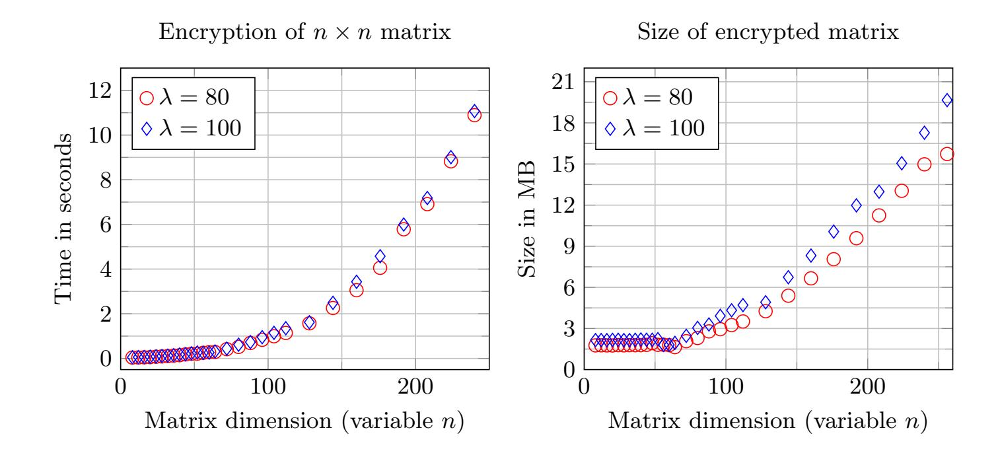

{0}------------------------------------------------

# Efficient AGCD-based homomorphic encryption for matrix and vector arithmetic

Hilder Vitor Lima Pereira

University of Luxembourg

Abstract. We propose a leveled homomorphic encryption scheme based on the Approximate Greatest Common Divisor (AGCD) problem that operates natively on vectors and matrices. To overcome the limitation of large ciphertext expansion that is typical in AGCD-based schemes, we randomize the ciphertexts with a hidden matrix, which allows us to choose smaller parameters. To be able to efficiently evaluate circuits with large multiplicative depth, we use a decomposition technique `a la GSW. The running times and ciphertext sizes are practical: for instance, for 100 bits of security, we can perform a sequence of 128 homomorphic products between 128-dimensional vectors and 128 × 128 matrices in less than one second. We show how to use our scheme to homomorphically evaluate nondeterministic finite automata and also a Na¨ıve Bayes Classifier. We also present a generalization of the GCD attacks against the some variants of the AGCD problem.

Keywords: Homomorphic Encryption · AGCD · Na¨ıve Bayes Classifier · Nondeterministic finite automata.

## 1 Introduction

With Fully Homomorphic Encryption (FHE) schemes it is possible to evaluate any computable function homomorphically, i.e., given f and a ciphertext c encrypting x, we can compute an encryption of f(x) using only the public parameters, and possibly the public key, available for the FHE scheme. However, despite several practical and theoretical improvements since the first construction due to Craig Gentry [Gen09], the size of the keys, the ciphertext expansion, and also the evaluation times are, in general, prohibitive for FHE. Thus it is plausible to consider weaker classes of homomorphic schemes, since they tend to be more efficient than fully homomorphic ones, and for several applications, they are already sufficient. The leveled homomorphic encryption (HE) scheme presented in [GGH+19] is able to compute any program that can be represented by a nondeterministic finite automaton (NFA), thus being able to homomorphically accept regular languages, which is a very restricted yet very powerful set of languages. However, the scheme for automata from [GGH+19] is based on yet a new hardness assumption. Ideally, we would like to have schemes whose security is based on more standard problems, like the Learning with errors (LWE) or the Approximate Greatest Common Divisor (AGCD). Moreover, the efficiency of [GGH+19] comes mainly from a noise-control technique in which, roughly speaking, one performs a decomposition of the ciphertexts before operating with them homomorphically, so that they are represented with smaller values and their contribution to the noise growth is reduced. That technique was first used in [GSW13] and has become standard since then. There are several proposals of such GSW-like schemes that are based on more standard problems, like LWE or R-LWE. In particular, the GSW-like scheme proposed in [BBL17] is constructed over the integers, which is appealing because of the simplicity, and it is based on the AGCD problem, that is even believed to be quantum hard. On the negative side, the scheme of [BBL17] encrypts a single bit into a high-dimensional vector, therefore, it has a very high ciphertext expansion, which hurts its efficiency.

In this work we propose a scheme that can perform vectorial operations like [GGH+19], but that is based on the AGCD problem and uses no circular security assumption, like [BBL17]. To solve the problem of ciphertext expansion, we randomize the AGCD instances with a secret

{1}------------------------------------------------

matrix, which allows us to reduce the size of parameters, as it was observed in [CP19]. Thus, we obtain an efficient scheme that has good encryption, decryption and evaluation times. We implemented it in C++ and ran experiments for two security levels. As applications, we homomorphically evaluated nondeterministic finite automata and also a Naïve Bayes Classifier. Moreover, we show new theoretical evidence supporting the analysis of [CP19] and we present a generalization of the GCD attacks against the AGCD problem.

## 1.1 Approximate-GCD problem and variants

In 2001, Howgrave-Graham [HG01] studied the Approximate Greatest Common Divisor (AGCD) problem, which asks us to recover an  $\eta$ -bit integer p, given many  $\gamma$ -bit integers  $x_i := pq_i + r_i$ , where  $r_i$  is a small  $\rho$ -bit term ( $\rho < \eta < \gamma$ ). Notice that if all  $r_i$  were zero, then p would be the GCD of all  $x_i$ , thus, the values  $r_i$  acts as noises and we only have access to approximate multiples of p.

In 2010, Dijk et al. [DGHV10] proposed a HE scheme over the integers based on the AGCD problem. After that, this problem has been used in several constructions [CCK<sup>+</sup>13,CLT14,CS15]. The AGCD problem is believed to be hard even in the presence of quantum computers. In fact, when the parameters  $\rho$ ,  $\eta$ , and  $\gamma$  are chosen properly, the best known attacks against it run in exponential time [GGM16]. Moreover, if we sample p,  $q_i$  and  $r_i$  from specific distributions, then the AGCD problem is at least as hard as the LWE problem [CS15].

In [CP19], motivated by the Kilian Randomization technique used on multilinear maps, the authors analyzed how the attacks against the AGCD problem change if instead of having access to n AGCD instances  $x_i = pq_i + r_i$ , we have an n-dimensional vector  $\mathbf{x} = (pq_1 + r_1, \dots, pq_n + r_n)\mathbf{K}$  mod  $x_0$  where  $\mathbf{K}$  is a secret matrix sampled uniformly from  $\mathbb{Z}_{x_0}^{n \times n}$ . Of course, solving this problem cannot be easier than the original AGCD problem, since given some AGCD instances, we can sample  $\mathbf{K}$ , randomize them, and use the solver of the randomized version. But in [CP19], it is stated that solving this problem is actually harder. Indeed, the known attacks against AGCD were adapted to this randomized version and the cost of the attacks that try to exploit the noise increased from  $2^{\Omega(\rho)}$  to  $2^{\Omega(n\rho)}$  and the cost of lattice attacks increased from  $2^{\Omega(\gamma/\eta^2)}$  to  $2^{\Omega(n\gamma/\eta^2)}$ , which means that we can reduce the size of the parameters, dividing them by n. In section 4.2 we present some theoretical results that confirm the analysis of [CP19].

#### 1.2 Our scheme

In this work, we propose a leveled homomorphic encryption scheme capable of evaluating vectormatrix and matrix-matrix operations homomorphically. Basically, we include an AGCD instance  $x_0 := pq_0 + r_0$  in the public parameters, and the secret key consists of a prime p and a random matrix  $\mathbf{K}$  invertible over  $\mathbb{Z}_{x_0}$ . Then, a vector  $\mathbf{m}$  is encrypted as  $\mathbf{c} := (p\mathbf{q} + \mathbf{r} + \mathbf{m})\mathbf{K}^{-1} \mod x_0$ and a matrix  $\mathbf{M}$  is encrypted as  $\mathbf{C} := (p\mathbf{Q} + \mathbf{R} + \mathbf{G}\mathbf{K}\mathbf{M})\mathbf{K}^{-1} \mod x_0$ , where  $\mathbf{G}$  is a constant matrix that does not depend on the secret values and  $\mathbf{r}, \mathbf{q}, \mathbf{R}$ , and  $\mathbf{Q}$  are random vectors and matrices. Indeed, we are adding instances  $pq_i + r_i$  of AGCD to the messages and randomizing them with  $\mathbf{K}$ , therefore, we can base the security of our scheme on the AGCD problem. To perform homomorphic products, we apply a publicly computable decomposition  $G^{-1}$  to one of the operands and multiply them modulo  $x_0$ . For any vector,  $G^{-1}$  yields vectors with small entries and it holds that  $G^{-1}(\mathbf{v})\mathbf{G} = \mathbf{v} \mod x_0$ .

Hence, our proposed scheme is a GSW-like scheme and the noise growth is only linear on the multiplicative degree, i.e., if the initial noise has magnitude  $2^{\rho}$ , then performing a sequence of L homomorphic products yields ciphertexts whose noise's size is  $O(L \cdot 2^{\rho})$ . The GSW-like scheme of [BBL17] is also based on AGCD, but it works over  $\mathbb{Z}_2$  only. In our case, the plaintext space is bigger, containing vectors and matrices with entries bounded by a parameter B. This

{2}------------------------------------------------

already improves the ciphertext expansion and increases the efficiency. Moreover, as observed in [CP19], the cost of the best attacks against AGCD increases when it is randomized with a matrix  $\mathbf{K}$ , which means that we can select smaller parameters, reducing even further the size of the ciphertexts. As a result, we have a scheme whose running times are comparable to those of [GGH<sup>+</sup>19], but that is based on a more standard problem.

## 1.3 Optimizations, implementation and applications

We implemented our scheme in C++ using the Number Theory Library<sup>1</sup> (NTL). We also tested two applications: homomorphic evaluation of NFA and a simple machine learning classification method. The scheme is efficient, with good running times and memory requirements. All the details are presented in Section 6. As a simple optimization, we propose to keep  $x_0$  private and to perform the homomorphic operations without the reduction modulo  $x_0$ , which causes the ciphertexts to increase during homomorphic evaluation, but allows us to select smaller parameters and to obtain better timings for big values of n (plaintext dimension). Moreover, we show that for NFA evaluation, the bit-length of the ciphertexts increases only slightly during the homomorphic evaluation.

## 2 Preliminaries

Vectors are denoted by bold lowercase letters and matrices by bold uppercase letters. We use the max-norm  $\|\mathbf{A}\| := \max\{|a_{i,j}| : a_{i,j} \text{ is an entry of } \mathbf{A}\}$ . Notice that  $\|\mathbf{A} + \mathbf{B}\| \le \|\mathbf{A}\| + \|\mathbf{B}\|$  and  $\|\mathbf{A} \cdot \mathbf{B}\| \le m \|\mathbf{A}\| \cdot \|\mathbf{B}\|$ , where m is the number of columns of  $\mathbf{A}$ . For vectors, we use the infinity norm  $\|\mathbf{v}\| := \|\mathbf{v}\|_{\infty}$ . We use the notation with double brackets for integer intervals, e.g., an integer interval open on b is  $[a, b[ = \mathbb{Z} \cap [a, b[$ . The notation  $[x]_m$  means the only integer y in [-m/2, m/2[ such that  $x = y \mod m$ . The nearest integer is denoted by [x]. When applied to vectors or matrices, those operators are applied entry-wise.

The Approximate-GCD problem, and therefore, our scheme, uses a secret prime, which will always be denoted by p. Moreover, the public modulus is  $x_0 := p \cdot q_0 + r_0$ . Hence, all the ciphertexts are defined over  $\mathbb{Z}_{x_0}$ . To control the noise-growth, elements of  $\mathbb{Z}_{x_0}$  are decomposed in a base b. Thus, we will denote by  $\ell$  the number of words that we need to perform such decomposition, i.e.,  $\ell := \lceil \log_b(2^\gamma) \rceil$ , and we will always use  $\mathbf{g}$  to represent the column vector  $(1, b, b^2, ..., b^{\ell-1})^T$ . Usually, b is equal to 2 and we have a binary decomposition, but we can increase b to reduce the dimensions of the encrypted matrices at the expense of increasing the accumulated noise. For any  $a \in [0, x_0[$ , let  $g^{-1}(a)$  denote the vector whose entries are the signed base-b decomposition of a and such that  $g^{-1}(a)\mathbf{g} = a$ . As our gadget matrix, we use  $\mathbf{G} = \mathbf{I}_n \otimes \mathbf{g} \in \mathbb{Z}^{n\ell \times n}$ , where  $\otimes$  denotes the tensor product ( $\mathbf{G}$  is a block-matrix with  $\mathbf{g}$  in the diagonal). For any  $\mathbf{a} \in \mathbb{Z}^n$ , we denote by  $G^{-1}(\mathbf{a})$  the vector  $G^{-1}(\mathbf{a}) = (g^{-1}(a_1), ..., g^{-1}(a_n)) \in \mathbb{Z}^{\ell n}$ . Notice that  $G^{-1}(\mathbf{a})\mathbf{G} = (g^{-1}(a_1)\mathbf{g}, ..., g^{-1}(a_n)\mathbf{g}) = \mathbf{a}$ . For  $\mathbf{A} \in \mathbb{Z}_{x_0}^{n\ell \times n}$ ,  $G^{-1}(\mathbf{A})$  is an  $n\ell \times n\ell$  matrix obtained by applying  $G^{-1}$  to each row of  $\mathbf{A}$ .

For instance, for n = 2,  $\ell = 3$ , and b = 4, we have  $\mathbf{g} = (b^0, b^1, b^2) = (1, 4, 16)$  and

$$\mathbf{G} = \begin{pmatrix} \mathbf{g} \ \mathbf{0} \\ \mathbf{0} \ \mathbf{g} \end{pmatrix} = \begin{pmatrix} 1 & 0 \\ 4 & 0 \\ 16 & 0 \\ 0 & 1 \\ 0 & 4 \\ 0 & 16 \end{pmatrix} \in \mathbb{Z}^{n\ell \times n}.$$

<sup>&</sup>lt;sup>1</sup> https://www.shoup.net/ntl/

{3}------------------------------------------------

Then, for  $\mathbf{a} = (18, -16)$ , we have  $G^{-1}(\mathbf{a}) = (g^{-1}(18), g^{-1}(-16)) = (2, 0, 1, 0, 0, -1)$ , thus, clearly,  $G^{-1}(\mathbf{a})\mathbf{G} = (g^{-1}(18) \cdot \mathbf{g}, \ g^{-1}(-16) \cdot \mathbf{g}) = \mathbf{a}$ .

We denote the uniform distribution on a finite set A by  $\mathcal{U}(A)$ . We define the statistical distance between two discrete distributions  $D_1$  and  $D_2$  over the domain X as  $\Delta(D_1, D_2) = \frac{1}{2} \sum_{x \in X} |D_1(x) - D_2(x)|$ . Moreover,  $D_1$  is statistically close to  $D_2$  if  $\Delta(D_1, D_2)$  is negligible. We state here a simplified version of the Leftover hash lemma (LHL) and some related results [BBL17].

**Definition 1 (2-universal family of hash functions).** A set  $\mathcal{H} := \{h : X \to Y\}$  of functions from a finite set X to a finite set Y is a 2-universal family of hash functions if  $\forall x, x' \in X, x \neq x' \Rightarrow \Pr_{h \leftarrow \mathcal{H}}[h(x) = h(x')] = \frac{1}{|Y|}$ .

**Lemma 1** (Matrix product as a 2-universal hash). Let  $n, m, N, p \in \mathbb{N}$  with p being prime. Define  $X := \{0, ..., N-1\}^n$  and  $Y := \mathbb{Z}_p^m$ . For any matrix  $\mathbf{B}$ , let  $h_{\mathbf{B}}(\mathbf{x}) = \mathbf{x}\mathbf{B} \pmod{p}$ . Then, the set  $\mathcal{H} := \{h_{\mathbf{B}} : \mathbf{B} \in \mathbb{Z}_p^{n \times m}\}$  is a 2-universal family of hash functions from X to Y.

**Lemma 2 (LHL).** Let  $\mathcal{H}$  be a 2-universal family of hash functions from X to Y. Suppose that  $h \leftarrow \mathcal{U}(\mathcal{H})$  and  $x \leftarrow \mathcal{U}(X)$  independently. Then, the statistical distance between (h, h(x)) and the uniform  $\mathcal{U}(\mathcal{H} \times Y)$  is at most  $\frac{1}{2}\sqrt{\frac{|Y|}{|X|}}$ .

#### 2.1 Related work

**GSW-like leveled HE over integers** In [BBL17], the authors first present a scheme that encrypts a single bit m into  $\mathbf{c} := p\mathbf{q} + \mathbf{r} + m\mathbf{g} \in \mathbb{Z}^{\gamma}$ , where  $p\mathbf{q} + \mathbf{r}$  is a vector whose each entry  $pq_i + r_i$  is an instance of the AGCD problem and  $\mathbf{g}$  is equal to  $(2^0, 2^1, \dots, 2^{\gamma-1})$ . In order to decrypt, we compute a vector with the binary decomposition of p/2, denoted p''(p/2), and notice that p''(p/2) = p/2, hence, p''(p/2) = p'/2, hence, p''(p/2) = p'/2. Then, notice that the most significant bit of p''(p/2) = p'/2, that is, |p''(p/2)| < p'/2. Then, notice that the most significant bit of p''(p/2) = p'/2, that is, |p''(p/2)| < p'/2. Thus, the decryption is performed as follows:

$$\mathsf{Dec}(\mathbf{c}) = \begin{cases} 0 & \text{if } \left| \left[ \mathbf{c} g^{-1}(p/2) \right]_p \right| < p/4 \\ 1 & \text{otherwise} \end{cases}$$

Given ciphertexts  $\mathbf{c}_i := p\mathbf{q}_i + \mathbf{r}_i + m_i\mathbf{g}$ , a homomorphic product is done as  $\mathbf{c}_{mult} := \mathbf{c}_1\mathbf{G}^{-1}(\mathbf{c}_2)$  mod  $x_0$  where  $x_0 := pq_0 + r_0$  is a fixed instance of AGCD and  $\mathbf{G}^{-1}(\mathbf{c}_2)$  is a  $\gamma \times \gamma$  matrix whose each column j has the binary decomposition of the j-th entry of  $\mathbf{c}_2$ . After observing that  $\mathbf{g}\mathbf{G}^{-1}(\mathbf{c}_2) = \mathbf{c}_2$ , it is easy to see that the homomorphic product works, since over  $\mathbb{Z}$  there exists a vector  $\mathbf{u}$  such that the following holds:

$$\mathbf{c}_{mult} = p\mathbf{q}_{1}\mathbf{G}^{-1}(\mathbf{c}_{2}) + \mathbf{r}_{1}\mathbf{G}^{-1}(\mathbf{c}_{2}) + m_{1}\mathbf{g}\mathbf{G}^{-1}(\mathbf{c}_{2}) + x_{0}\mathbf{u}$$

$$= p\mathbf{q}_{1}\mathbf{G}^{-1}(\mathbf{c}_{2}) + \mathbf{r}_{1}\mathbf{G}^{-1}(\mathbf{c}_{2}) + m_{1}(p\mathbf{q}_{2} + \mathbf{r}_{2} + m_{2}\mathbf{g}) + (pq_{0} + r_{0})\mathbf{u}$$

$$= p\underbrace{(\mathbf{q}_{1}\mathbf{G}^{-1}(\mathbf{c}_{2}) + m_{1}\mathbf{q}_{2} + q_{0}\mathbf{u})}_{\mathbf{q}_{mult}} + \underbrace{(\mathbf{r}_{1}\mathbf{G}^{-1}(\mathbf{c}_{2}) + m_{1}\mathbf{r}_{2} + r_{0}\mathbf{u})}_{\mathbf{r}_{mult}} + m_{1}m_{2}\mathbf{g}.$$

Since each of the  $\gamma$  entries of  $\mathbf{c}$  is a large integer with approximately  $\gamma$  bits, they use  $\gamma^2$  bits to encrypt a single bit, which is a huge ciphertext expansion, specially taking into account that  $\gamma$  is typically very big (the bit-length of p is  $\eta \geq \lambda$  and  $\gamma$  is several times larger than  $\eta$ ). Aiming to mend this issue, the authors also propose a batched version that uses primes  $p_1, ..., p_N$  instead of a single prime and the Chinese Remainder Theorem (CRT) to "pack" N bits into a single ciphertext. However, even this variant is not efficient as it takes several seconds to perform a single homomorphic multiplication.

{4}------------------------------------------------

FHE for Nondeterministic Finite Automata In [GGH<sup>+</sup>19], a leveled GSW-like encryption scheme that is able to homomorphically evaluate NFAs is proposed. The authors say that their scheme is similar to Hiromasa, Abe, and Okamoto's scheme [HAO15], but the secret key is chosen to be an invertible matrix  $\mathbf{S}$  (while in [HAO15],  $\mathbf{S}$  is not even square). Actually, the secret key contains  $\mathbf{S} \in \mathbb{Z}_q^{n \times n}$  and also a random low-norm matrix  $\mathbf{E} \in \mathbb{Z}_q^{n \times nm}$ , where  $m := \lceil \log_b q \rceil$ . In spite of the similarity with [HAO15], the scheme of [GGH<sup>+</sup>19] does not have a security proof based on the LWE problem. Instead, the authors assume that it is hard to distinguish between  $[\mathbf{S}^{-1}(\mathbf{G}^T - \mathbf{E})]_q$  and the uniform  $\mathcal{U}(\mathbb{Z}_q^{n \times nm})$ . They call this new problem the Matrix-inhomogeneous NTRU problem (MiNTRU), and argue that it is related with the well-known NTRU problem, although no formal connection is shown. Thus, using a standard randomized decomposition  $\phi$  such that  $\mathbf{G}^T \cdot \phi(\mathbf{A}) = \mathbf{A}$  for any  $\mathbf{A}$  and assuming that  $\mathcal{U}(\mathbb{Z}_q^{n \times nm}) \approx [\mathbf{S}^{-1}(\mathbf{G}^T - \mathbf{E})]_q$ , they prove that

$$\mathcal{U}(\mathbb{Z}_q^{n\times nm})\phi(\mathbf{M}\mathbf{G}^T)\approx\left[\mathbf{S}^{-1}\left(\mathbf{G}^T-\mathbf{E}\right)\phi(\mathbf{M}\mathbf{G}^T)\right]_q=\left[\mathbf{S}^{-1}\left(\mathbf{M}\mathbf{G}^T-\mathbf{E}\phi(\mathbf{M}\mathbf{G}^T)\right)\right]_q$$

The expression in the right-hand side is then defined as the encryption of  $\mathbf{M}$ . Finally, setting the parameters so that  $\phi$  has enough entropy, they can use the Leftover Hash Lemma to prove that  $\mathcal{U}(\mathbb{Z}_q^{n \times nm}) \cdot \phi(\mathbf{M}\mathbf{G}^T)$  is computationally indistinguishable from  $\mathcal{U}(\mathbb{Z}_q^{n \times nm})$ , which implies that the encryptions of  $\mathbf{M}$  are also so.

Furthermore, the authors argue that their scheme can be cryptanalyzed by NTRU attacks and say that for 80 and 100 bits of security, one needs to use n = 750 and n = 1024, respectively. Note, however, that a user aiming to evaluate homomorphically an NFA with few states, say, 50, would need n to be just 50. This implies that a user cannot take advantage of the low number of states to make the homomorphic evaluation faster, as would be natural. Nevertheless, we note that, when compared to other HE schemes, [GGH<sup>+</sup>19] is very efficient even for such big values of n.

#### 2.2 Approximate GCD and related distributions

In this section we define the Approximate Greatest Common Divisor (AGCD) problem formally. Following the strategy of [BBL17] to prove the security, we define not only the underlying distributions of AGCD, but also an additional bounded distribution.

**Definition 2.** Let  $\rho$ ,  $\eta$ ,  $\gamma$ , and p be integers such that  $\gamma > \eta > \rho > 0$  and p is an  $\eta$ -bit prime. The distribution  $\mathcal{D}_{\gamma,\rho}(p)$ , whose support is  $[0,2^{\gamma}-1]$  is defined as  $\mathcal{D}_{\gamma,\rho}(p) := \{Sample \ q \leftarrow [0,2^{\gamma}/p \ [and \ r \leftarrow ]-2^{\rho},2^{\rho}[] : Output \ x := pq+r\}$ . For simplicity, we will denote it by  $\mathcal{D}$ .

**Definition 3 (AGCD).** The  $(\rho, \eta, \gamma)$ -approximate-GCD problem is the problem of finding p, given polynomially many samples from  $\mathcal{D}$ .

The  $(\rho, \eta, \gamma)$ -decisional-approximate-GCD problem is the problem of distinguishing between  $\mathcal{D}$  and  $\mathcal{U}(\llbracket 0, 2^{\gamma} \rrbracket)$ .

We stress that no attack directly on the decisional version of AGCD is known, thus, it can only be solved by solving the search version first, that is, by finding p and then reducing the samples  $c_i$  modulo p, which results in the small noise terms  $r_i$ 's when  $c_i$ 's are AGCD samples, but gives us random  $\eta$ -bit integers when  $c_i$ 's are uniform. Furthermore, there are known reductions from the search version to the decisional one [CCK<sup>+</sup>13].

We also define truncated distributions, which are obtained by rejecting samples that are greater than a given value. They are important to formally prove the security of the scheme, because based on the decisional AGCD problem, we can prove properties about distributions over  $[0, 2^{\gamma} - 1]$ , but in fact, since the encryption scheme performs reductions modulo  $x_0$ , we want to make statements using the interval  $[0, x_0 - 1]$ .

{5}------------------------------------------------

**Definition 4.** Let  $\Psi$  be any distribution whose support is contained in  $\mathbb{Z}$  and let r be an integer. We define then  $\Psi_{< r}$  as the distribution  $\Psi$  conditioned on  $\Psi < r$ . If  $\Pr[\Psi < r] = 0$ , then  $\Psi_{< r}$  is undefined.

Notice that we can sample from  $\mathcal{D}_{< x_0}$  simply by sampling from  $\mathcal{D}$  and rejecting the sampled value if it is bigger than or equal to  $x_0$ , which occurs with probability less than one half if we choose  $x_0 > 2^{\gamma - 1}$ .

**Lemma 3.** Let  $x_0 > 2^{\gamma - 1}$ . Under the decisional AGCD assumption, the distributions  $\mathcal{D}_{< x_0}$  and  $\mathcal{U}(\mathbb{Z}_{x_0})$  are computational indistinguishable.

*Proof.* The proof is adapted from lemma 2.3 of [BBL17]. We included it in the appendix B for completeness.  $\Box$ 

#### 3 Our scheme

In this section, we first describe the scheme, then we show how to perform homomorphic operations, and we analyze the noise growth.

#### 3.1 Making BBL17 practical

As it is said in Section 2.1, the ciphertext expansion is one of the main sources of inefficiency of [BBL17]. However, notice that a natural way to improve that is to generalize the scheme to encrypt non-binary vectors or matrices instead of binary scalars. For instance, one could define the plaintext space over  $\mathbb{Z}_B$  for some  $B \geq 2$ , then encrypt a matrix  $\mathbf{M} \in \mathbb{Z}_B^{n \times n}$  as

$$\mathbf{C} := p\mathbf{Q} + \mathbf{R} + \mathbf{G}\mathbf{M} \in \mathbb{Z}^{n\ell \times n}$$

where  $\ell = \lceil \log_b(2^{\gamma}) \rceil$  for some  $b \geq 2$ , and **G** is a matrix with powers of b instead of the vector **g** with powers of two. With that, we would encrypt  $n^2 \log B$  bits into  $n^2 \ell \gamma$  bits, which represents a ciphertext expansion of  $n^2 \ell \gamma / (n^2 \log B) \approx \gamma^2 / (\log b \log B)$  instead of the original  $\gamma^2$ . The homomorphic product could still be performed if  $G^{-1}$  decomposed the entries of the given matrix now in base b and were multiplied by the left.

Moreover, if we randomized the ciphertexts multiplying them by a hidden matrix  $\mathbf{K} \in \mathbb{Z}_{x_0}^{n \times n}$ , then we could reduce the size of the parameters, in particular, we would have a smaller  $\gamma$ , approximately equal to the original  $\gamma$  divided by n, and the ciphertext expansion would be foreshortened even further. Hence, our scheme applies those changes in order to be more practical and other ones to maintain the homomorphic properties. We present it in detail in the next section.

## 3.2 The procedures

In what follows,  $\lambda$  is the security parameter and k is the maximum multiplicative depth of the functions to be evaluated homomorphically. The plaintext space is the set of n-dimensional integer vectors and matrices with norm bounded by B, that is,  $\mathcal{M} := [-B, B]^n \cup [-B, B]^{n \times n}$ . The value B must satisfy  $1 \leq B \leq 2^{\eta-4}$ , where  $\eta$  is the bit-length of the secret prime p. Moreover, the public modulus is  $x_0 := p \cdot q_0 + r_0$ , with  $|r_0| < 2^{\rho_0}$ .

- HE.KeyGen( $1^{\lambda}$ , n, k, B): Choose the parameters  $\eta$ ,  $\rho$ ,  $\rho_0$ , and  $\gamma$ . Sample an  $\eta$ -bit prime p. Sample  $x_0$  from  $\mathcal{D}_{\gamma,\rho_0}(p)$  until  $x_0 > 2^{\gamma-1}$ . Then, sample  $\mathbf{K}$  uniformly from  $\mathbb{Z}_{x_0}^{n \times n}$  until  $\mathbf{K}^{-1}$  exists over  $\mathbb{Z}_{x_0}$ . Define  $\alpha := \lfloor 2^{\eta-1}/(2B+1) \rfloor$ . The secret key is then  $\mathsf{sk} := (p, \mathbf{K})$  and the public parameters are  $\{n, k, B, \gamma, \eta, \rho, \rho_0, \alpha, x_0\}$ .

{6}------------------------------------------------

- HE.EncMat(sk,  $\mathbf{M}$ ): Given a  $\mathbf{M} \in \mathcal{M}$ , construct a matrix  $\mathbf{X} := p\mathbf{Q} + \mathbf{R} \in \mathbb{Z}^{n\ell \times n}$  by sampling each entry  $x_{i,j}$  independently from  $\mathcal{D}_{< x_0}$ , then compute  $\mathbf{C} := (\mathbf{X} + \mathbf{G}\mathbf{K}\mathbf{M})\mathbf{K}^{-1} \mod x_0$ . Output  $\mathbf{C}$ .
- HE.DecMat(sk, C): Compute  $\mathbf{C}' := G^{-1}(\alpha \mathbf{K}^{-1})\mathbf{C}\mathbf{K} \mod x_0$ , then reduce it modulo the secret prime p, that is,  $\mathbf{C}^* := [\mathbf{C}']_p$ , and output  $[\mathbf{C}^*/\alpha]$ .
- HE.EncVec(sk, m): Given a plaintext  $\mathbf{m} \in \mathcal{M}$ , construct an *n*-dimensional vector  $\mathbf{x} := p\mathbf{q} + \mathbf{r}$  by sampling each entry  $x_i$  independently from  $\mathcal{D}_{< x_0}$ , then output the following *n*-dimensional vector:  $\mathbf{c} := (\mathbf{x} + \alpha \mathbf{m})\mathbf{K}^{-1} \mod x_0$ .
- HE.DecVec(sk, c): Given a ciphertext  $\mathbf{c} \in \mathbb{Z}^n$ , compute  $\mathbf{c}' := \mathbf{cK} \mod x_0$ , then do  $\mathbf{c}^* := [\mathbf{c}']_p$ , and output  $\lfloor \frac{\mathbf{c}^*}{\alpha} \rfloor$ .

#### 3.3 Correctness of decryption

In this section, we provide sufficient conditions for the decryption procedures to work. For this, we will use that  $G^{-1}(\alpha \mathbf{K}^{-1})\mathbf{G} = \alpha \mathbf{K}^{-1}$  over  $\mathbb{Z}_{x_0}$ . In this analysis, we have to be careful with the contribution of  $x_0$  to the noise. Basically, during the decryption, when we do the modular reduction by  $x_0$ , we add a multiple of  $x_0$ , obtaining

$$\mathbf{c}' = \mathbf{c}\mathbf{K} \mod x_0 = p\mathbf{q} + \mathbf{r} + \alpha\mathbf{m} - \mathbf{u}x_0 = p(\mathbf{q} - \mathbf{u}q_0) + (\mathbf{r} - \mathbf{u}r_0) + \alpha\mathbf{m}.$$

Therefore, instead of having the noise given simply by  $\mathbf{r}$ , we have the extra term  $\mathbf{u}r_0$ , which is the contribution of  $x_0$ , and thus, the noise in a ciphertext is approximately  $\|\mathbf{r}\| + 2^{\rho_0} \|\mathbf{u}\|$ . But the norm of  $\mathbf{u}$  is easy to estimate. First, we know that  $\|p\mathbf{q} + \mathbf{r} + \alpha \mathbf{m}\| \approx p \|\mathbf{q}\|$ . Second, we have  $\mathbf{u} = \lfloor (p\mathbf{q} + \mathbf{r} + \alpha \mathbf{m})/x_0 \rfloor$ . Thus,  $\|\mathbf{u}\| \approx p \|\mathbf{q}\|/x_0$ , and the contribution of  $x_0$  to the noise is then  $r_0 \|\mathbf{u}\| \approx 2^{\rho_0} p \|\mathbf{q}\|/x_0$ . Consequently,  $x_0$  contributes little to the noise of fresh ciphertexts, since  $p\mathbf{q}$  has small norm in this case. But as we perform homomorphic operations, the norm of  $\mathbf{q}$  grows and the additional term  $\mathbf{u}r_0$  starts to be relevant. The same reasoning applies to matrix ciphertexts. We present these arguments formally in the following definitions and lemmas. <sup>2</sup>

**Definition 5 (Noise of vector ciphertext).** Let  $\mathbf{c}$  be a ciphertext encrypting a message  $\mathbf{m}$ . We define the noise of  $\mathbf{c}$  as  $\mathcal{N}(\mathbf{c}) := ((\mathbf{c}\mathbf{K} \mod x_0) - \alpha \mathbf{m}) \mod p$ .

**Definition 6 (Noise of matrix ciphertext).** Let  $\mathbf{C}$  be an encryption of  $\mathbf{M}$ . We define the noise of  $\mathbf{C}$  as  $\mathcal{N}(\mathbf{C}) := (G^{-1}(\alpha \mathbf{K}^{-1})\mathbf{C}\mathbf{K} \mod x_0) - \alpha \mathbf{M} \mod p$ .

Lemma 4 (A bound on the noise of vector ciphertext). For  $\mathbf{c} = (p\mathbf{q} + \mathbf{r} + \alpha \mathbf{m})\mathbf{K}^{-1} \mod x_0$ , assuming that  $\|\mathcal{N}(\mathbf{c})\| < p$ , there exists  $\mathbf{u} \in \mathbb{Z}^n$  such that  $\mathcal{N}(\mathbf{c}) := \mathbf{r} - r_0\mathbf{u}$  and  $\|\mathbf{u}\| \le \lceil \|p\mathbf{q}\|/x_0\rceil$ . As a consequence,  $\|\mathcal{N}(\mathbf{c})\| < \|\mathbf{r}\| + 2^{\rho_0} \lceil \|p\mathbf{q}\|/x_0\rceil$ . In particular, if  $\mathbf{c}$  is a fresh ciphertext, then  $\|\mathcal{N}(\mathbf{c})\| < 2^{\rho} + 2^{\rho_0}$ .

*Proof.* Let  $\mathbf{c}' := (\mathbf{c}\mathbf{K} \mod x_0)$ , then  $\mathbf{c}' = p\mathbf{q} + \mathbf{r} + \alpha \mathbf{m} \mod x_0$ , which means that  $\mathbf{c}' = p\mathbf{q} + \mathbf{r} + \alpha \mathbf{m} - x_0 \mathbf{u}$  for  $\mathbf{u} = \lfloor (p\mathbf{q} + \mathbf{r} + \alpha \mathbf{m})/x_0 \rfloor$ .

Therefore,  $\mathcal{N}(\mathbf{c}) = \mathbf{c}' - \alpha \mathbf{m} \mod p = p\mathbf{q} + \mathbf{r} - x_0 \mathbf{u} \mod p = \mathbf{r} - r_0 \mathbf{u} \mod p$ . And since  $\|\mathcal{N}(\mathbf{c})\| < p$ , we have the equality  $\mathcal{N}(\mathbf{c}) = \mathbf{r} - r_0 \mathbf{u}$  over  $\mathbb{Z}$ .

Now, to bound the norm of  $\mathbf{u}$ , notice that for each entry  $u_i$ , we have  $u_i = \left\lfloor \frac{pq_i}{x_0} + \frac{r_i + \alpha m_i}{x_0} \right\rfloor$  and  $\left| \frac{r_i + \alpha m_i}{x_0} \right| < 1$ , thus, if  $\frac{pq_i}{x_0}$  is integer, than  $u_i = \frac{pq_i}{x_0}$ , otherwise,  $-1 < u_i \le \frac{pq_i}{x_0} + 1$ . So, in both cases,  $|u_i| \le \left\lceil \frac{pq_i}{x_0} \right\rceil$ . Therefore,  $||\mathbf{u}|| \le \lceil ||p\mathbf{q}||/x_0||$ .

Notice that everything would be simplified if  $x_0$  were noiseless, since the noise of the ciphertexts would be simply  $\mathbf{r}$  or  $\mathbf{R}$ .

{7}------------------------------------------------

Finally, because  $|r_0| < 2^{\rho_0}$ , it holds that  $||\mathcal{N}(\mathbf{c})|| < ||\mathbf{r}|| + 2^{\rho_0} \left\lceil \frac{||p\mathbf{q}||}{x_0} \right\rceil$ .

For a fresh ciphertext, we have  $\|\mathbf{r}\| < 2^{\rho}$  and  $\|p\mathbf{q}\| < x_0$ , hence, the particular case holds.  $\square$ 

Lemma 5 (A bound on the noise of matrix ciphertext). For  $C = (p\mathbf{Q} + \mathbf{R} + \mathbf{GKM})\mathbf{K}^{-1}$  mod  $x_0$ , assuming that  $\|\mathcal{N}(\mathbf{C})\| < p$ , there exists  $\mathbf{U} \in \mathbb{Z}^{n\ell \times n}$  such that

$$\mathcal{N}(\mathbf{C}) := G^{-1}(\alpha \mathbf{K})\mathbf{R} - r_0 \mathbf{U}$$

and  $\|\mathbf{U}\| \le n\ell b \left\lceil \frac{\|p\mathbf{Q}\|}{x_0} \right\rceil$ . As a consequence,  $\|\mathcal{N}(\mathbf{C})\| < n\ell b \left( \|\mathbf{R}\| + 2^{\rho_0} \left\lceil \frac{\|p\mathbf{Q}\|}{x_0} \right\rceil \right)$ . In particular, if  $\mathbf{C}$  is a fresh ciphertext, then  $\|\mathcal{N}(\mathbf{C})\| < n\ell b(2^{\rho} + 2^{\rho_0})$ .

*Proof.* Write  $\mathbf{U} = \lfloor (pG^{-1}(\alpha \mathbf{K})\mathbf{Q} + G^{-1}(\alpha \mathbf{K})\mathbf{R} + \alpha \mathbf{M})/x_0 \rfloor$  and proceed in the same way as in the proof of Lemma 4. The extra term  $n\ell b$  comes from the fact that  $||G^{-1}(\alpha \mathbf{K})\mathbf{R}|| \leq n\ell b ||\mathbf{R}||$ .

For the decryption to work, the noise has to be smaller than  $\alpha/2 \approx p/(4B+2)$ . We prove that in the following lemmas.

Lemma 6 (Sufficient conditions for correctness vector decryption). Let  $\mathbf{c}$  be an encryption of  $\mathbf{m}$  and  $\|\mathbf{m}\| \leq B$ . If  $\|\mathcal{N}(\mathbf{c})\| < \frac{\alpha}{2}$ , then  $\mathsf{HE}.\mathsf{DecVec}(\mathsf{sk},\mathbf{c})$  outputs  $\mathbf{m}$ .

*Proof.* Considering the vector  $\mathbf{c}'$  defined in HE.DecVec, there is a  $\mathbf{u}$  such that

$$\mathbf{c}' = (p\mathbf{q} + \mathbf{r} + \mathbf{m})\mathbf{K}^{-1}\mathbf{K} \mod x_0 = p\mathbf{q} + \mathbf{r} + \alpha\mathbf{m} \mod x_0 = p\mathbf{q} + \mathbf{r} + \alpha\mathbf{m} - x_0\mathbf{u}.$$

Then, reducing  $\mathbf{c}'$  modulo p gives us  $\mathbf{c}^* = [\mathbf{r} + \alpha \mathbf{m} - r_0 \mathbf{u}]_p = [\alpha \mathbf{m} + \mathcal{N}(\mathbf{c})]_p$ .

But the last inequality holds over the integers because the norm of  $\alpha \mathbf{m} + \mathcal{N}(\mathbf{c})$  is bounded by p/2, namely, since  $\alpha < p/(2B+1)$ , we have

$$\|\alpha \mathbf{m}\| + \|\mathcal{N}(\mathbf{c})\| < \alpha \left(\|\mathbf{m}\| + \frac{1}{2}\right) \le \alpha \left(B + \frac{1}{2}\right) = \alpha \left(\frac{2B+1}{2}\right) < \frac{p}{2}.$$

Therefore, the output of HE.DecVec is

$$|\mathbf{c}^{\star}/\alpha| = |\alpha\mathbf{m} + \mathcal{N}(\mathbf{c})/\alpha| = \mathbf{m} + |\mathcal{N}(\mathbf{c})/\alpha| = \mathbf{m}$$

where the last equality holds because  $\alpha > 2 \|\mathcal{N}(\mathbf{c})\|$ .

Lemma 7 (Sufficient conditions for correctness matrix decryption). Let  $\mathbf{C}$  be an encryption of  $\mathbf{M}$  such that  $\|\mathbf{M}\| \leq B$ . If  $\|\mathcal{N}(\mathbf{C})\| < \frac{\alpha}{2}$ , then  $\mathsf{HE.DecVec}(\mathsf{sk}, \mathbf{c})$  outputs  $\mathbf{m}$ .

*Proof.* Essentially the same as the proof of Lemma 6. Provided in Appendix B for completeness.

## 3.4 Homomorphic Properties

- **Additions**: One just has to add the corresponding ciphertexts over  $\mathbb{Z}_{x_0}$ , since

$$\mathbf{c}_0 + \mathbf{c}_1 = (p(\mathbf{q}_0 + \mathbf{q}_1) + (\mathbf{r}_0 + \mathbf{r}_1) + \alpha(\mathbf{m}_0 + \mathbf{m}_1))\mathbf{K}^{-1} \mod x_0$$

and

$$C_0 + C_1 = (p(Q_0 + Q_1) + (R_0 + R_1) + GK(M_0 + M_1))K^{-1} \mod x_0$$

are valid encryptions of the corresponding sums.

{8}------------------------------------------------

- Matrix-matrix product: Given ciphertexts  $C_0$  and  $C_1$ , we apply  $G^{-1}$  to each row of  $C_0$  and do  $C_{mult} := G^{-1}(C_0)C_1 \mod x_0$ . Notice that the following holds over  $\mathbb{Z}_{x_0}$ :

$$\mathbf{C}_{mult} = (p\mathbf{G}^{-1}(\mathbf{C}_0)\mathbf{Q}_1 + \mathbf{G}^{-1}(\mathbf{C}_0)\mathbf{R}_1 + \mathbf{G}^{-1}(\mathbf{C}_0)\mathbf{G}\mathbf{K}\mathbf{M}_1)\mathbf{K}^{-1}$$

$$= (p\mathbf{G}^{-1}(\mathbf{C}_0)\mathbf{Q}_1 + \mathbf{G}^{-1}(\mathbf{C}_0)\mathbf{R}_1 + (p\mathbf{Q}_0 + \mathbf{R}_0 + \mathbf{G}\mathbf{K}_i\mathbf{M}_0)\mathbf{K}^{-1}\mathbf{K}\mathbf{M}_1)\mathbf{K}^{-1}$$

$$= (p\underbrace{(\mathbf{G}^{-1}(\mathbf{C}_0)\mathbf{Q}_1 + \mathbf{Q}_0\mathbf{M}_1)}_{\mathbf{Q}_{mult}} + \underbrace{(\mathbf{G}^{-1}(\mathbf{C}_0)\mathbf{R}_1 + \mathbf{R}_0\mathbf{M}_1)}_{\mathbf{R}_{mult}} + \mathbf{G}\mathbf{K}\mathbf{M}_0\mathbf{M}_1))\mathbf{K}^{-1}$$

which is a valid encryption of the matrix  $\mathbf{M}_0 \cdot \mathbf{M}_1$ .

- **Vector-Matrix product:** We can multiply  $\mathbf{c}_i$  and  $\mathbf{C}_i$  homomorphically by doing  $\mathbf{c}_{i+1} := G^{-1}(\mathbf{c}_i)\mathbf{C}_i \mod x_0$ . Like the matrix-matrix product, we have the following over  $\mathbb{Z}_{x_0}$ :

$$\mathbf{c}_{i+1} = \left(p\underbrace{(G^{-1}(\mathbf{c}_i)\mathbf{Q}_i + \mathbf{q}_i\mathbf{M}_i)}_{\mathbf{q}_{i+1}} + \underbrace{(G^{-1}(\mathbf{c}_i)\mathbf{R}_i + \mathbf{r}_i\mathbf{M}_i)}_{\mathbf{r}_{i+1}} + \alpha\mathbf{m}_i\mathbf{M}_i\right)\mathbf{K}^{-1}$$

which is a valid encryption of the vector  $\mathbf{m}_i \cdot \mathbf{M}_i$ .

#### 3.5 Analysis of the accumulated error

Using the analysis done in Section 3.4, it is easy to derive upper bounds to the noise accumulated by the homomorphic operations.

**Lemma 8 (Sum of vectors).** Let  $k \in \mathbb{Z}_{\geq 2}$ . For  $i \in [1, k]$ , let  $\mathbf{c}_i$  be an encryption of  $\mathbf{m}_i$  with noise term  $\mathcal{N}(\mathbf{c}_i)$ . Define  $\mathbf{c}$  as the homomorphic sum of those ciphertexts, i.e.,  $\mathbf{c} := \sum_{i=1}^k \mathbf{c}_i \mod x_0$ . Then,  $\mathcal{N}(\mathbf{c}) = \sum_{i=1}^k \mathcal{N}(\mathbf{c}_i)$ . In particular, if all  $\mathbf{c}_i$ 's are fresh ciphertexts, we have

$$\|\mathcal{N}(\mathbf{c})\| \le k(2^{\rho} + 2^{\rho_0}).$$

Proof. From the analysis of Section 3.4, we see that  $\mathbf{c} = \sum_{i=1}^k (p\mathbf{q}_i + \mathbf{r}_i + \alpha \mathbf{m}_i)\mathbf{K}^{-1} \mod x_0$ , from which we can easily derive that  $\mathcal{N}(\mathbf{c}) = \sum_{i=1}^k \mathcal{N}(\mathbf{c}_i)$ . If all  $\mathbf{c}_i$  are fresh ciphertexts, then  $\|\mathcal{N}(\mathbf{c}_i)\| \leq 2^{\rho} + 2^{\rho_0}$  and the particular case holds.

**Lemma 9 (Sum of matrices).** Let  $k \in \mathbb{Z}_{\geq 2}$ . For  $i \in [1, k]$ , let  $\mathbf{C}_i$  be an encryption of  $\mathbf{M}_i$ . Define  $\mathbf{C}$  as the homomorphic sum  $\mathbf{C} := \sum_{i=1}^k \mathbf{C}_i \mod x_0$ . Then,  $\mathcal{N}(\mathbf{C}) = \sum_{i=1}^k \mathcal{N}(\mathbf{C}_i)$ . In particular, if all  $\mathbf{C}_i$ 's are fresh ciphertexts, then

$$\|\mathcal{N}(\mathbf{C})\| \le kn\ell b(2^{\rho} + 2^{\rho_0}).$$

*Proof.* Essentially the same as the proof of Lemma 8. We present it in Appendix B.  $\Box$ 

Let's analyze the noise growth after a sequence of k vector-matrix products and show that computing homomorphically a ciphertext  $\mathbf{c}_k$  that encrypts a product of the form  $\mathbf{m} \left( \prod_{i=0}^{k-1} \mathbf{M}_i \right)$  makes the noise grow just linearly in k. Namely, using the bounds of lemmas 4 and 5 to say that the noise of the vector ciphertext is  $\|\mathcal{N}(\mathbf{c}_0)\| \approx \|\mathbf{r}_0\| + 2^{\rho_0} \|p\mathbf{q}_0\| / x_0$  and the noises of the ciphertexts encrypting the matrices are  $\|\mathcal{N}(\mathbf{C}_i)\| \approx n\ell b(\|\mathbf{R}_i\| + 2^{\rho_0} \|p\mathbf{Q}_i\| / x_0)$ , then we see that the noise of the final ciphertext is  $\|\mathcal{N}(\mathbf{c}_k)\| \approx nB(\|\mathcal{N}(\mathbf{c}_0)\| + \sum_{i=0}^{k-1} \|\mathcal{N}(\mathbf{C}_i)\|$ ). Notice that the noise growth is similar to the one of  $[GGH^+19]$ .

**Lemma 10** (Products of vectors and matrices). Let  $k \in \mathbb{Z}_{\geq 2}$ . For all  $i \in [1, k]$ , let  $\mathbf{C}_i$  be an encryption of  $\mathbf{M}_i$ . Let also  $\mathbf{c}_0$  be an encryption of  $\mathbf{m}_0$ . Assume that B is an upper bound to

{9}------------------------------------------------

the entries of the product of plaintext matrices, i.e.,  $\left\|\prod_{i=j}^{k-1} \mathbf{M}_i\right\| \leq B$  for  $0 \leq j \leq k-1$ . Finally, for  $1 \leq i \leq k-1$ , define  $\mathbf{c}_{i+1} := G^{-1}(\mathbf{c}_i) \cdot \mathbf{C}_i \mod x_0$ . Then,

$$\|\mathcal{N}(\mathbf{c}_{k})\| < nB \cdot (\|\mathbf{r}_{0}\| + 2^{\rho_{0}} \|p\mathbf{q}_{0}\| / x_{0}) + \sum_{i=0}^{k-1} n\ell b (\|\mathbf{R}_{i}\| + 2^{\rho_{0}} \|p\mathbf{Q}_{i}\| / x_{0})) + 2^{\rho_{0}}.$$
(1)

In particular, if  $\mathbf{c}_0$  and all the  $\mathbf{C}_i$ 's are fresh ciphertexts, then

$$\|\mathcal{N}(\mathbf{c}_k)\| < nB(2^{\rho} + 2^{\rho_0} + kn\ell b(2^{\rho} + 2^{\rho_0})) + 2^{\rho_0}. \tag{2}$$

*Proof.* By the analysis done in section 3.4, we know that the term  $\mathbf{r}_{i+1}$  of  $\mathbf{c}_{i+1}$  is  $G^{-1}(\mathbf{c}_i)\mathbf{R}_i + \mathbf{r}_i\mathbf{M}_i$ . Therefore, the term  $\mathbf{r}_k$  after k homomorphic products is

$$\mathbf{r}_k = \mathbf{r}_0 \prod_{i=0}^{k-1} \mathbf{M}_i + \sum_{i=0}^{k-1} G^{-1}(\mathbf{c}_i) \mathbf{R}_i \left( \prod_{j=i+1}^{k-1} \mathbf{M}_j \right).$$

Thus, using the properties of the max-norm, we have

$$\|\mathbf{r}_{k}\| \le n \|\mathbf{r}_{0}\| \left\| \prod_{i=0}^{k-1} \mathbf{M}_{i} \right\| + \sum_{i=0}^{k-1} n\ell \|G^{-1}(\mathbf{c}_{i})\| \left\| \mathbf{R}_{i} \prod_{j=i+1}^{k-1} \mathbf{M}_{j} \right\| \le nB \|\mathbf{r}_{0}\| + \sum_{i=0}^{k-1} n^{2}\ell bB \|\mathbf{R}_{i}\|.$$

Similarly,  $\|\mathbf{q}_k\| \le nB \|\mathbf{q}_0\| + \sum_{i=0}^{k-1} n^2 \ell bB \|\mathbf{Q}_i\|$ . Thus, we get Inequality (1) from Lemma 4, because

$$\|\mathcal{N}(\mathbf{c}_k)\| < \|\mathbf{r}_k\| + 2^{\rho_0} \left\lceil \frac{\|p\mathbf{q_k}\|}{x_0} \right\rceil \le \|\mathbf{r}_k\| + \frac{2^{\rho_0}}{x_0} \|p\mathbf{q_k}\| + 2^{\rho_0}.$$

If all the operands are fresh ciphertexts, then both  $\|\mathbf{r}_0\|$  and  $\|\mathbf{R}_i\|$  are bounded by  $2^{\rho}$  and both  $\|p\mathbf{q}_0\|$  and  $\|\mathbf{p}\mathbf{Q}_i\|$  are bounded by  $x_0$ , therefore, the particular case also holds.

When we compute a sequence of k homomorphic products like  $\prod_{i=0}^k \mathbf{M}_i$ , the noise growth is basically the same as the one described in Lemma 10, that is, approximately from  $\beta := n\ell b(2^{\rho} + 2^{\rho_0})$  to  $knB\beta$ .

**Lemma 11 (Products of matrices).** Let k be an integer bigger than 1. For  $i \in [0, k]$ , let  $\mathbf{C}_i$  be an encryption of  $\mathbf{M}_i$ . Let also  $\mathbf{C}_0' := \mathbf{C}_0$ ,  $\mathbf{C}_i' := G^{-1}(\mathbf{C}_{i-1}')\mathbf{C}_i \mod x_0$  for i > 0. (Notice that  $\mathbf{C}_i'$  is an encryption of  $\prod_{j=0}^i \mathbf{M}_j$ ). Assume that B is an upper bound to the entries of the product of plaintext matrices, i.e.,  $\left\|\prod_{i=j}^k \mathbf{M}_i\right\| \leq B$  for  $1 \leq j \leq k$ . Then,

$$\left\| \mathcal{N}(\mathbf{C'}_{k}) \right\| < nB \cdot \left( \underbrace{\|\mathbf{R}_{0}\| + 2^{\rho_{0}} \|p\mathbf{Q}_{0}\| / x_{0}}_{\approx \|\mathcal{N}(\mathbf{C}_{0})\|} + \sum_{i=1}^{k} \underbrace{n\ell b \left( \|\mathbf{R}_{i}\| + 2^{\rho_{0}} \|p\mathbf{Q}_{i}\| / x_{0} \right)}_{\approx \|\mathcal{N}(\mathbf{C}_{i})\|} \right) + 2^{\rho_{0}}.$$

In particular, if all the products only involve fresh ciphertexts, then

$$\|\mathcal{N}(\mathbf{C}'_k)\| < nB(2^{\rho} + 2^{\rho_0} + kn\ell b(2^{\rho} + 2^{\rho_0})) + 2^{\rho_0}.$$

*Proof.* Similar to the proof of Lemma 10.

{10}------------------------------------------------

## 4 Security analysis

### 4.1 Hardness of approximate GCD implies semantic security

In this section we prove that our scheme is CPA secure under the assumption that decisional AGCD problem is computationally hard. To do so, we first prove the indistinguishably of encrypted matrices. Then, essentially the same proof can be used to show that encryptions of vectors are also indistinguishable. Finally, those two results imply CPA security.

**Lemma 12.** Under the decisional AGCD assumption, encryptions of any pair of matrices are computationally indistinguishable.

*Proof.* Via a sequence of hybrids we prove that no PPT adversary  $\mathcal{A}$  can distinguish between encryptions of two matrices  $\mathbf{M}_0$  and  $\mathbf{M}_1$  of their choice.

Hybrid  $H_0$ : Use the key generation function to get  $\mathsf{sk} = (p, \mathbf{K})$  and the public parameters params. Given  $\mathbf{M}_0$  and  $\mathbf{M}_1$  chosen by  $\mathcal{A}$ , we always encrypt  $\mathbf{M}_0$ , that is, we let  $\mathbf{C}_0 := \mathsf{HE}.\mathsf{EncMat}(\mathsf{sk}, \mathbf{M}_0)$  and return  $\mathbf{C}_0$  to  $\mathcal{A}$ .

Hybrid  $H_1$ : The only difference between this hybrid and  $H_0$  is that we use  $\mathcal{U}(\mathbb{Z}_{x_0})$  instead of  $\mathcal{D}_{< x_0}$  to encrypt  $\mathbf{M}_0$ , i.e., we sample  $\mathbf{X}_1 \leftarrow \mathcal{U}(\mathbb{Z}_{x_0})^{n\ell \times n}$  and define  $\mathbf{C}_1 := (\mathbf{X}_1 + \mathbf{G}\mathbf{K}\mathbf{M}_0)\mathbf{K}^{-1} \mod x_0$ .

Since in  $H_0$  we have  $\mathbf{C}_0 := (\mathbf{X}_0 + \mathbf{G}\mathbf{K}\mathbf{M})\mathbf{K}^{-1} \mod x_0$  for some  $\mathbf{X}_0 \leftarrow (\mathcal{D}_{< x_0})^{n\ell \times n}$ , then by Lemma 3, it holds that

$$\left| \Pr_{H_0}[\mathcal{A}(1^{\lambda}, \mathsf{params}, \mathbf{C}_0)] - \Pr_{H_1}[\mathcal{A}(1^{\lambda}, \mathsf{params}, \mathbf{C}_1)] \right| \leq \operatorname{negl}(\lambda) \,.$$

Hybrid  $H_2$ : In this hybrid, we ignore the two plaintext matrices, we sample  $\mathbf{X}_2 \leftarrow \mathcal{U}(\mathbb{Z}_{x_0})^{n\ell \times n}$ , and define  $\mathbf{C}_2 := \mathbf{X}_2$ .

We know that for any  $t \in \mathbb{Z}_{x_0}$ ,  $\mathcal{U}(\mathbb{Z}_{x_0})$  and  $\mathcal{U}(\mathbb{Z}_{x_0}) + t \mod x_0$  are the same distribution. Consequently,  $\mathbf{X}_1 + \mathbf{G}\mathbf{K}\mathbf{M}_0$  follows  $\mathcal{U}(\mathbb{Z}_{x_0})^{n\ell \times n}$ . Additionally, multiplying by an invertible element also does not change the distribution, thus,  $\mathbf{C}_1 = (\mathbf{X}_1 + \mathbf{G}\mathbf{K}\mathbf{M}_0)\mathbf{K}^{-1} \mod x_0$  follows  $\mathcal{U}(\mathbb{Z}_{x_0})^{n\ell \times n}$  as well. Therefore,  $\mathbf{C}_1$  and  $\mathbf{C}_2$  are indistinguishable.

Hybrid  $H_3$ : In this hybrid, we encrypt  $\mathbf{M}_1$  using  $\mathcal{U}(\mathbb{Z}_{x_0})$ , i.e., we sample  $\mathbf{X}_3 \leftarrow \mathcal{U}(\mathbb{Z}_{x_0})^{n\ell \times n}$  and define  $\mathbf{C}_3 := (\mathbf{X}_3 + \mathbf{G}\mathbf{K}\mathbf{M}_1)\mathbf{K}^{-1} \mod x_0$ .

By the same argument used in the transition from  $H_1$  to  $H_2$ , we see that  $\mathbb{C}_2$  and  $\mathbb{C}_3$  are indistinguishable, therefore,  $\mathcal{A}$ 's advantage in distinguishing  $H_2$  from  $H_3$  is negligible.

Hybrid  $H_4$ : In this hybrid, we replace  $\mathcal{U}(\mathbb{Z}_{x_0})$  with  $\mathcal{D}_{< x_0}$  to get a valid encrypt of  $\mathbf{M}_1$ , that is, we define  $\mathbf{C}_4 := \mathsf{HE}.\mathsf{EncMat}(\mathsf{sk},\mathbf{M}_1)$  and return  $\mathbf{C}_4$  to  $\mathcal{A}$ .

Using Lemma 3 again, we conclude that  $\mathcal{A}$ 's advantage in distinguishing between hybrids 3 and 4 is also negligible. Since  $\mathcal{A}$ 's advantage in each transition is negligible, it holds that

$$\left|\Pr_{H_0}[\mathcal{A}(1^{\lambda},\mathsf{params},\mathbf{C}_0)] - \Pr_{H_4}[\mathcal{A}(1^{\lambda},\mathsf{params},\mathbf{C}_4)]\right| \leq \operatorname{negl}(\lambda) \,.$$

But this is exactly the definition of  $\mathcal{A}$ 's advantage in distinguishing encryptions of  $\mathbf{M}_0$  from encryptions of  $\mathbf{M}_1$ .

**Lemma 13.** Under the decisional AGCD assumption, encryptions of any pair of vectors are computationally indistinguishable.

{11}------------------------------------------------

*Proof.* We can use basically the same sequence of hybrids used in the proof of Lemma 12, but replacing matrices by vectors and HE.EncMat by HE.EncVec.

**Theorem 1.** The scheme is CPA-secure under the decisional AGCD assumption.

*Proof.* This follows directly from Lemma 12 and Lemma 13.

#### 4.2 Distribution of the noise term of randomized AGCD

Considering the analysis done in [CP19], the costs of attacks against the randomized AGCD are basically the n-th power of the costs of the corresponding attacks against the AGCD, e.g., GCD-attacks on AGCD cost  $\tilde{O}(2^{\rho})$  and the GCD-attacks generalized to the randomized AGCD cost  $\tilde{O}(2^{n\rho})$ . But one could wonder if the attacks proposed in [CP19] could be improved, so that we have a much smaller value multiplying the exponent, for instance,  $(\log n)\rho$  instead of  $n\rho$ , which would leave us with no choice but selecting much bigger parameters, reducing drastically the advantages of randomizing the problem.

In this section, we present some theoretical evidence that corroborates the practical analysis done in [CP19] and argue that, for typical parameters, if any improvement on those attacks can be done, the factor n in the exponent can only be replaced by  $\Theta(n)$  (e.g., improving from  $n\rho$  to  $n\rho/2$ ), but it will not be possible to replace the factor n by any function asymptotically smaller.

In fact, in the randomized AGCD problem we have n-dimensional samples  $\mathbf{x} := (p\mathbf{q} + \mathbf{r})\mathbf{K}$ , and the matrix  $\mathbf{K}$  is secret. It is then easy to see that each entry  $x_j$  of  $\mathbf{x}$  is of the form  $x_j = p\tilde{q}_j + \tilde{r}_j$  where  $\tilde{r}_j$  is the scalar product between  $\mathbf{r}$  and the j-th column of  $\mathbf{K}$  modulo p, that is,  $\tilde{r}_j = \langle \mathbf{r}, \mathbf{K}_j \rangle$  mod p, but as we will see in Lemma 14, each  $\tilde{r}_j$  is close to the uniform on  $\mathbb{Z}_p$ , which means that one cannot hope to treat each  $x_j$  as an instance of the AGCD problem and apply the known attacks against AGCD, since such distribution of the noise term erases all the information that  $x_j$  carries about p.

But the *joint* distribution of  $(\tilde{r}_1, ..., \tilde{r}_n)$  is different from  $\mathcal{U}(\mathbb{Z}_p^n)$  since they are all defined with the same vector  $\mathbf{r}$ , which implies some correlation among them. Consequently, to solve the randomized AGCD problem, we indeed need attacks "in higher dimension", that is, we must consider more than one entry of each instance  $\mathbf{x}$  in order to try to exploit the correlation in the errors.

Thus, let's consider m entries of  $\mathbf{x}$ . Without loss of generality, take the m first entries, denoted here by  $\mathbf{x}^{(m)} := (x_1, ..., x_m)$ . Likewise, let's consider the first m columns of  $\mathbf{K}$ , denoted by the matrix  $\mathbf{K}^{(m)} := [\mathbf{K}_1 ... \mathbf{K}_m] \in \mathbb{Z}^{n \times m}$ . Now, the error term of  $\mathbf{x}^{(m)}$  is  $\mathbf{r}^{(m)} = \mathbf{r}\mathbf{K}^{(m)} \mod p$ .

In which follows, we prove that for specific parameters, even when we consider m as a constant fraction of n, like n/2, the distribution  $\mathbf{r}^{(m)}$  is still statistically close to the distribution of m independent samples of  $\mathcal{U}(\mathbb{Z}_p)$ .

Lemma 14 (Distribution of  $\mathbf{r}^{(m)}$ ). If  $m \leq (\rho n + 2 - 2\lambda)/\eta$ , then the statistical distance between  $\mathbf{r}^{(m)} = \mathbf{r}\mathbf{K}^{(m)} \mod p$  and  $\mathcal{U}(\mathbb{Z}_p^m)$  is negligible in  $\lambda$ .

*Proof.* Substituting N by  $2^{\rho}$  in Lemma 1 and **B** by  $\mathbf{K}^{(m)}$ , we see that  $h_{\mathbf{B}}(\mathbf{x}) = \mathbf{r}^{(m)}$ . Therefore, by the LHL, the statistical distance between  $\mathbf{r}^{(m)}$  and  $\mathcal{U}(\mathbb{Z}_p^m)$  is upper bounded by

$$\Delta := \frac{1}{2} \sqrt{\frac{|Y|}{|X|}} = \frac{1}{2} \sqrt{\frac{p^m}{2^{n\rho}}} \le 2^{(m\eta - n\rho)/2 - 1}.$$

But  $m \leq (\rho n + 2 - 2\lambda)/\eta$  implies  $(m\eta - n\rho)/2 - 1 \leq -\lambda$ , therefore,  $\Delta \leq 2^{-\lambda}$ , which is negligible.

Thus, since we usually set  $\eta \geq \lambda$ , we see that the minimum m that we need to take to make it possible to attack the randomized AGCD problem is  $m_{\min} \approx (\rho/\eta)n$ . In particular, we have:

Corollary 1. If  $\eta = \lambda$  and  $\rho = \lambda/2$ , then  $\mathbf{r}^{(m)}$  is statistically close to  $\mathcal{U}(\mathbb{Z}_p^m)$  for all  $m \leq n/2-2$ .

{12}------------------------------------------------

#### 4.3 Practical security estimate

In this section, we analyze the known attacks and find the constraints that they impose to the parameters. There are two main types of attacks apart from the trivial factorization: the ones that focus on the noise, as Chen-Nguyen's and Lee-Seo's GCD attacks [CN12,LS14], and the ones that use lattices, as the Simultaneous Diophantine Approximation and the orthogonal lattice attacks [DGHV10,CS15]. The Simultaneous Diophantine Approximation attack does not seem to apply to our scheme, because the matrix  $\mathbf{K}$  acts as a masking forbidding the access to scalar values  $pq_i + r_i$ , which are needed to construct the lattice basis that is then reduced. Moreover, it has the same asymptotic complexity as the orthogonal lattice attack. Thus, we analyze the GCD-like and the orthogonal lattice attacks.

A unified GCD attack against variants of the AGCD problem Let's consider n-dimensional samples  $\tilde{\mathbf{c}}_i := \mathbf{c}_i \mathbf{K} = (p\mathbf{q}_i + \mathbf{r}_i)\mathbf{K}$ . In [CP19], the CGD attacks against the AGCD problem are recapitulated and Lee-Seo's attack is extended to the scenario where vectors  $\tilde{\mathbf{c}}_i$ 's and a noiseless  $x_0$  are available, obtaining then a GCD attack that runs in time  $\tilde{O}(2^{n\rho/2})$  and finds p with overwhelming probability. But this attack is not sufficient when  $x_0$  is noisy  $(r_0 \neq 0)$  or when  $x_0$  is not published. Hence, in this section we show how to generalize the attack of [LS14] to dimension n and how to combine it with the attack of [CNT12] to create a GCD attack that is applicable even when  $x_0$  is not known.

Notice that since **K** is invertible over  $\mathbb{Z}_p$ , we have  $\tilde{\mathbf{c}}_i = \tilde{\mathbf{c}}_j \pmod{p} \Leftrightarrow \mathbf{r}_i = \mathbf{r}_j$ . But for two independent samples,  $\Pr[\mathbf{r}_i = \mathbf{r}_j] = 2^{-n\rho}$ , therefore, if we have around  $2^{n\rho/2}$  samples, we expect to have a pair with same noise term, which we call a colliding pair. Thus, as in [LS14], we can construct two lists  $L_1$  and  $L_2$  with around  $2^{n\rho/2}$  vectors each and look for a collision modulo p. If there is a colliding pair  $(\tilde{\mathbf{c}}_i, \tilde{\mathbf{c}}_j) \in L_1 \times L_2$  then for each  $t \in [1, n]$ , we have that p divides the following product

$$y_t := \prod_{i=1}^{|L_1|} \prod_{j=1}^{|L_2|} (\mathbf{\tilde{c}}_i[t] - \mathbf{\tilde{c}}_j[t]).$$

Hence, each  $y_t$  is a multiple of p and we can use the strategy of [CNT12], that is, proceed taking gcd's of those  $y_t$ 's to generate smaller multiples, until we obtain  $g = p \prod z_i$  for  $z_i$ 's smaller than some relatively small S, and then we can remove those  $z_i$  using a cheap procedure like computing the S-smooth part of g.

We can use polynomial multi-point evaluation to compute each  $y_t$  using  $\tilde{O}(2^{n\rho/2})$  integer operations, however, the bit length of  $y_t$  is roughly  $\gamma 2^{n\rho}$ , therefore, computing each  $\gcd(y_t, y_{t'})$  takes time  $\tilde{O}(2^{n\rho})$  instead of  $\tilde{O}(2^{n\rho/2})$ . Notice that if we had a noiseless scalar  $x_0 = pq_0$ , then all the operations could be done over  $\mathbb{Z}_{x_0}$  and the time complexity would then be  $\tilde{O}(2^{n\rho/2})$ , since the bit length of  $y_t$  and of the other integers would not increase. And if we had a scalar  $x_0 = pq_0 + r_0$  for some  $r_0 \in [0, 2^{\rho_0} - 1]$ , then we could repeat the attack  $2^{\rho_0}$  times using  $x'_0 = x_0 - r$  (for  $0 \le r < 2^{\rho_0}$ ) as a modulus, obtaining then time complexity  $\tilde{O}(2^{\rho_0 + n\rho/2})$ . The attack is shown explicitly in Appendix C.

Therefore, if a scalar  $x_0$  is available, we have the cost

$$T_{GCD,x_0}(\eta, \rho, \rho_0, \gamma, n) := (n\rho)^2 2^{\rho_0 + n\rho/2} \gamma \log \gamma$$

where  $\rho_0 = 0$  if  $x_0$  is noiseless, and if  $x_0$  is not public, then we have

$$T_{GCD}(\eta, \rho, \gamma, n) := (n\rho)^2 2^{n\rho} \gamma \log \gamma.$$

{13}------------------------------------------------

Orthogonal Lattice attack In [CP19], the orthogonal lattice attacks are generalized to the randomized AGCD problem with a noiseless  $x_0$ . We conservatively assume that they have the same time complexity when  $x_0$  is noisy or private. To make this attack ineffective, we have to set  $\gamma = \Omega\left(\frac{\lambda(\eta-\rho)^2}{n\log\lambda}\right)$ , which is basically the same expression obtained in [CS15], if we set n=1.

**Factorization** If a noiseless  $x_0$  is given, an attacker can simply run a factorization algorithm on  $x_0$ , but if  $x_0$  has a  $\rho_0$ -bit noise term, then the attacker has to try the factorization of  $x_0 - r$  for all  $2^{\rho_0}$  possible values of r. We consider two factorization algorithms:

- Elliptic-curve factorization [Len87], whose cost is  $T_{ECM}(\eta, \gamma) := \exp\left(\sqrt{2\eta(\ln \eta)(\ln 2)}\right) \gamma \log \gamma$ .
- Number field factorization [LLMP93], which costs  $T_{NFS}(\gamma) := \exp((64/9)^{1/3}(\gamma \ln 2)^{1/3} \ln(\gamma \ln 2)^{2/3})$ .

Hence, the cost of this attack is given by

$$T_{FAC}(\eta, \rho_0, \gamma) := 2^{\rho_0} \min(T_{ECM}(\eta, \gamma), T_{NFS}(\gamma))$$

where  $\rho_0 = 0$  when  $x_0$  is noiseless. We stress that this attack does not apply when no scalar  $x_0$  is published.

### 5 Choosing the parameters

We first recall the role of the main parameters:

- $-\eta$ : it is the bit-length of the secret prime p;
- $-\rho$ : the noise terms sampled during encryption are bounded by  $2^{\rho}$ ;
- $\rho_0$ : the noise  $r_0$  of  $x_0$  satisfies  $-2^{\rho_0} < r_0 < 2^{\rho_0}$ ;
- $\gamma$ : the entries of the vectors and matrices ciphertexts are bounded by  $2^{\gamma}$ ;
- -n: it is the dimension of the vectors and matrices we want to encrypt;
- b: it is the base in which we perform the decomposition  $G^{-1}$ ;
- $-\ell$ : it is defined as  $\lceil \log_b(2^{\gamma}) \rceil$ , thus, it is the number of words used in  $G^{-1}$ ;
- B: we must have  $\|\mathbf{m}\| \leq B$  and  $\|\mathbf{M}\| \leq B$  for any plaintext  $\mathbf{m}$  or  $\mathbf{M}$ .

Taking into account the analysis of the orthogonal lattice attack, we see that we can choose  $\gamma = \lceil \lambda(\eta - \rho)^2/(n\log \lambda) \rceil$ . But when n is close to  $\lambda$ , we can have  $\gamma < 2\eta$ , and in this case we simply choose  $\gamma = 2\eta$ . Those two scenarios are very distinct, so, let's first analyze the case  $\gamma > 2\eta$ .

For the correctness, we just have to guarantee that the inequality (2) is satisfied. It basically means that we can choose  $\rho$ ,  $\rho_0$  and b such that

$$\eta - 2\log n - \log k - \log \ell - \log B = \max(\rho, \rho_0) + \log b. \tag{3}$$

Typically, we will have  $\rho \ge \rho_0$ , thus, if B is somehow small, we are free to choose  $\rho + \log b \approx \eta$ , say  $\rho + \log b = (1 - \epsilon)\eta$  for some  $\epsilon \in [0, 1[$ . Using  $\eta - \rho = \epsilon \eta + \log b$  we can express the size of encrypted matrices as

$$n^2 \ell \gamma \approx \frac{n^2 \gamma^2}{\log b} \approx \frac{\lambda^2}{\log^2 \lambda} \frac{(\eta - \rho)^4}{\log b} = \frac{\lambda^2}{\log^2 \lambda} \frac{(\epsilon \eta + \log b)^4}{\log b}$$

which is minimized when  $\log b = \epsilon \eta/3$ . The cost of evaluating a product like  $\mathbf{m} \prod_{i=1}^k \mathbf{M}_i$  is dominated by  $kn^2\ell\gamma$ , and the cost of HE.EncMat is dominated by  $n^3\ell\gamma$ , thus, both are also minimized when  $\log b = \epsilon \eta/3$ .

{14}------------------------------------------------

| <b>Table 1.</b> Proposed sets of parameters for two levels of security, considering that $x_0$ is public. Set $\ell = \lceil \log_b(2^{\gamma}) \rceil$ |
|---------------------------------------------------------------------------------------------------------------------------------------------------------|
| and $\alpha =  2^{\eta-1}/(2B+1) $ where B defines the plaintext space.                                                                                 |

|                        |          | $8 \le n \le 52$                                        | n = 64  | n = 128 | n = 256 | n = 512 | n = 1024 |
|------------------------|----------|---------------------------------------------------------|---------|---------|---------|---------|----------|
|                        | $\gamma$ |                                                         | $2\eta$ | $2\eta$ | $2\eta$ | $2\eta$ | $2\eta$  |
| $\lambda = \eta = 80$  | $\rho$   | 52                                                      | 52      | 40      | 23      | 2       | 2        |
| $\lambda = \eta = 00$  | $\rho_0$ | 38                                                      | 38      | 40      | 40      | 40      | 40       |
|                        | $\log b$ | 7                                                       | 7       | 13      | 14      | 14      | 15       |
|                        | $\gamma$ | $\left\lceil 100 \cdot 27^2 / n \log(100) \right\rceil$ | $2\eta$ | $2\eta$ | $2\eta$ | $2\eta$ | $2\eta$  |
| $\lambda = \eta = 100$ | $\rho$   | 73                                                      | 71      | 59      | 43      | 19      | 2        |
| $\lambda = \eta = 100$ | $\rho_0$ | 58                                                      | 58      | 59      | 59      | 59      | 59       |
|                        | $\log b$ | 7                                                       | 11      | 17      | 17      | 17      | 16       |

Therefore, in order to choose the parameters, we first set the desired security level  $\lambda$ . For usual applications, the noise factor  $2\log n + \log k + \log B$  in equation (3) is small and it is sufficient to take  $\eta = \lambda$ . If it is not the case, we can choose  $\eta = \lambda + c$  for some positive constant c. Once we have defined  $\eta$ , we use equation (3) to estimate  $\epsilon$ , for instance, taking  $\epsilon = 2(\log k + \log B + \log n)/\eta$ . Then, we set  $\rho = \lfloor 2\epsilon \eta/3 \rfloor$  and  $\log b = \lfloor \epsilon \eta/3 \rfloor$ .

For security reasons, we must ensure that  $T_{GCD,x_0}(\eta,\rho,\rho_0,\gamma,n) \geq 2^{\lambda}$  and  $T_{FAC}(\eta,\rho_0,\gamma) \geq 2^{\lambda}$ . In general, we can find a  $\rho_0 \leq \rho$  such that these two constraints are satisfied. If there is no such  $\rho_0$ , then we can increase  $\eta$  and choose all the parameters again. Notice that we choose  $\rho$  close to  $\eta$ , generally bigger than what we would need to guarantee the security, because it decreases the size of  $\gamma$ , which makes the operations cheaper. However if n is big enough to force us to choose  $\gamma = 2\eta$ , then there is no advantage in choosing a big  $\rho$ . In this case, we simple choose the minimum  $\rho$  and  $\rho_0$  such that  $T_{FAC}(\eta,\rho_0,\gamma) \geq 2^{\lambda}$ ,  $T_{GCD,x_0}(\eta,\rho,\rho_0,\gamma,n) \geq 2^{\lambda}$ , and  $\left[\lambda(\eta-\rho)^2/(n\log\lambda)\right] < 2\eta$ , then we choose  $\log b = (1-\epsilon)\eta - \max(\rho,\rho_0)$ , i.e., we decrease  $\rho$  and  $\rho_0$  as much as the security allows us, and we increase  $\log b$  respecting the correctness condition.

In Table 1, we propose some sets of parameters for two security levels ( $\lambda = 80$  and  $\lambda = 100$ ) and several values of n. We see that increasing n allows us to choose smaller  $\rho$  to maintain the same security, but  $\rho_0$  does not depend on n, and it is basically fixed. As a consequence, we cannot increase  $\log b$  too much as we decrease  $\rho$  in the regime  $\gamma = 2\eta$ , because when  $\rho$  becomes smaller than  $\rho_0$ , the final noise begins to be dominated by  $\rho_0$  and we must then respect the constraint  $\log b + \rho_0 = (1 - \epsilon)\eta$ . In Section 7, we attempt to resolve this problem by proposing a simple variant of the scheme that has better parameters for large n.

## 6 Implementation, performance, and applications

In this section, we show practical results, like running times of encryption functions, and also two applications, homomorphic evaluation of nondeterministic finite automata and a homomorphic Naïve Bayes Classifier.

#### 6.1 General performance

We implemented a proof of concept of our scheme<sup>3</sup> in C++ using the NTL library, version 11.3.2. All the experiments were ran on a machine with the GNU/Linux operating system Ubuntu 18.04.2 LTS, 32GB of RAM memory, and processor Intel Core i5-8600K 3.60GHz. One single core was used. We ran the experiments using parameters for the two different levels of security  $\lambda = 80$  and  $\lambda = 100$  described in Table 1.

<sup>&</sup>lt;sup>3</sup> Code available in https://github.com/hilder-vitor/HEVaM

{15}------------------------------------------------



Fig. 1. Running times of HE.EncMat and size of encrypted matrix.

The running times and the size of the encrypted matrices are shown in Figure 1. Since the the bit-length of a matrix ciphertext is  $n^2\ell\gamma$  and for small n both  $\gamma$  and  $\ell$  are proportional to 1/n, the size of the encrypted matrices and also the encryption and decryption times are approximately constant as we increase n, until we switch to the regime of parameters that uses  $\gamma=2\eta$ . From this point, the efficiency starts to deteriorate, but it is still very good even for moderate values of n. For instance, for  $\lambda=80$ , it takes less than 2.5 seconds to encrypt a  $150\times150$  matrix and we need less than 6 MB to represent the corresponding ciphertext. Even considering that the plaintext matrix is binary, we are encrypting  $150^2$  bits into 6 MB, which corresponds to a ciphertext expansion of 0.266 KB per encrypted bit. As a comparison, for 80 bits of security, the basic scheme of [BBL17] encrypts a single bit into a 19 MB ciphertext, and the batched version, that uses the CRT to encrypt several bits into a single ciphertext, encrypts roughly 70 bits into the same 19 MB, which represents a ciphertext expansion of 217 KB per encrypted bit.

#### 6.2 Nondeterministic finite-state automaton evaluation

In this section we show how to homomorphically evaluate finite state automaton using our scheme. We represent an n-state automaton A over an alphabet  $\Sigma$  by  $n \times n$  transition matrices  $\mathbf{M}_a$  for each  $a \in \Sigma$ . They are defined as follows: each entry (i,j) of  $\mathbf{M}_a$  is equal to 1 if A has a transition from state i to state j using the letter a, and it is equal to 0 otherwise. Additionally, we need an n-dimensional vector  $\mathbf{m}$  to represent the current states. At any point of the evaluation,  $m_i = 0$  if we are not in state i, and  $m_i \geq 1$  if we are in state i. If A is deterministic, we are always at one single state, then  $\mathbf{m} \in \{0,1\}^n$  and there is a unique position i such that  $m_i = 1$ . However, if A is nondeterministic, then we can be in several states at the same time and  $\mathbf{m}$  may have multiples non-zero entries, which can be larger than 1. In particular, it implies that products of transition matrices are always binary for deterministic automata, hence, the noise accumulated on the homomorphic evaluation is typically smaller, i.e., we can set the parameter B to be one, while with nondeterministic automata, we may need B > 1. However, in general we need fewer states to represent a language using non-deterministic automata.

We start the evaluation with a state vector  $\mathbf{m}_0$  that has ones in the positions corresponding to initial states and zeros elsewhere. Then, given a length-k input string  $\mathbf{s} \in \Sigma^k$ , at each step i (from 1 to k), we look at the letter  $s_i$  and update the state vector as  $\mathbf{m}_i = \mathbf{m}_{i-1}\mathbf{M}_{s_i}$ . If  $\mathbf{m}_k$  has a non-zero entry in some position corresponding to an accepting state of A, then the input string is said to be accepted by A. Hence, to evaluate an NFA homomorphically, it is sufficient to perform homomorphic vector-matrix products.

{16}------------------------------------------------

Table 2. Practical results of the homomorphic evaluation of L<sup>n</sup> on input strings with k letters. All running times are presented in seconds. The second column shows the size of each encrypted matrix. The third column shows the time needed to encrypt the entire automaton (two transition matrices and state vector). Parameters used: setting λ = 100 from Table 1. The last row shows the corresponding data for the NFA evaluation presented on [GGH<sup>+</sup>19]. For all n up to 1024, their scheme has the same encryption and evaluation times, and also ciphertext size.

|        | Encrypted matrix Encr. time |         | Evaluation time on inputs of length k |                                           |    |     |      |                  |            |  |
|--------|-----------------------------|---------|---------------------------------------|-------------------------------------------|----|-----|------|------------------|------------|--|
| n      |                             |         | 16                                    | 32                                        | 64 | 128 | 256  | 512              | 1024       |  |
| 8      | 2.15 MB                     | 0.10    | 0.015                                 | 0.028 0.06 0.12                           |    |     | 0.24 | 0.47             | 0.96       |  |
| 16     | 2.15 MB                     | 0.12    | 0.021                                 | 0.041 0.08 0.17                           |    |     | 0.34 | 0.67             | 1.34       |  |
| 32     | 2.15 MB                     | 0.20    | 0.033                                 | 0.065 0.13 0.27                           |    |     | 0.53 | 1.08             | 2.15       |  |
| 64     | 1.94 MB                     | 0.44    | 0.041                                 | 0.083 0.17 0.33                           |    |     | 0.67 | 1.33             | 2.67       |  |
| 128    | 4.91 MB                     | 2.20    | 0.121                                 | 0.240 0.49 0.98                           |    |     | 1.97 | 3.9              | 7.87       |  |
| 256    | 19.66 MB                    | 19.15   | 0.567                                 | 1.138 2.27 4.55                           |    |     |      | 9.12 18.35 36.88 |            |  |
| 512    | 78.64 MB                    | 202.60  | 2.596                                 | 5.235 10.4 20.8                           |    |     | 41.7 |                  | 83.6 167.8 |  |
| 1024   | 340.78 MB                   | 2211.96 |                                       | 22.080 44.061 86.3 174.0 352.3 704.4 1414 |    |     |      |                  |            |  |
| ≤ 1024 | 33 MB                       | 16.5    | -                                     | -                                         | -  | -   | 1.53 | 3.34             | 6.63       |  |

As a possible application of homomorphic evaluation of NFA, we can imagine a server that holds input strings, say, text files, and a user that wants to retrieve the files that contain strings respecting some regular expression R, but without revealing R. For example, to get files that contain an e-mail of someone from the University of Luxembourg, the user could use R as [az][a-z0-9][a-z0-9]\*@uni.lu, for which we can construct an NFA with 10 states. Then, the user would encrypt the 10 × 10 transition matrices and send them to the server, that would evaluate the NFA homomorphically on each file f<sup>i</sup> , generating an encrypted state vector c<sup>i</sup> , and return each c<sup>i</sup> to the user. Finally, the user could decrypt each c<sup>i</sup> to check if the file f<sup>i</sup> matches R.

In the article [GGH+19], the authors construct a homomorphic scheme for NFA evaluation. In order to compare the results of this section with their results, we use the same family of automata and the same security level used there (namely, λ = 100). Thus, let's consider the regular language L<sup>n</sup> := (a+b) <sup>∗</sup>a(a+b) n−2 . It is known that one needs at least 2n−<sup>1</sup> states to represent L<sup>n</sup> with a deterministic automaton, however, we can represent it with a nondeterministic automaton with n states [MF71]. We evaluated L<sup>n</sup> homomorphically for various values of n and k, using always random input strings sampled from {a, b} k . The practical results are summarized in Table 2. For n up to 100, our scheme is faster and requires less memory than [GGH+19]. For n = 128, our ciphertext size and encryption times are better, but the evaluation times start to be worse than theirs. Then, for bigger n, our scheme is less efficient. Notice that in their scheme, the variable n has a double role, acting as the security parameter and as the number of states at the same time. Moreover, to achieve a security level of 100 bits, they set n = 1024. Hence, to evaluate automata with less than 1024 states, they must embed the low-dimensional transition matrices into 1024 × 1024 matrices. In particular, it means that for all n presented in Table 2, their scheme uses 33 MB per encrypted matrix and around 16.5 seconds to encrypt Ln. Moreover, they use an ad hoc hardness assumption while we use the AGCD.

## 6.3 Na¨ıve Bayes Classification

As a second application, we implemented a homomorphic classifier. In this scenario, the server has a trained model and the client has some data (instances) to be classified. The client then encrypt each instance and send it to the server, which evaluate the model homomorphically and return to the client an encryption of the assigned class.

Each instance has a fixed number of attributes, say m, and is represented by a vector y = (y1, ..., ym). For example, we could have a data set about patients containing medical information as the three following attributes: x<sup>1</sup> = "blood type", x<sup>2</sup> = "age", and x<sup>3</sup> = "body mass index". 

{17}------------------------------------------------

And an instance could be  $\mathbf{y} = (O+, 47, 22)$ . The number of possible classes is fixed and typically small (say, between two and fifty). In the Naïve Bayes Classification, we use an already classified data set, called training set, to estimate the probabilities that each attribute  $x_i$  is equal to  $y_i$  given that the class is c, that is,  $\Pr[x_i = y_i | \text{class} = c]$ , and also the probabilities  $\Pr[\text{class} = c]$ . Then, to classify  $\mathbf{y}$ , we note that for each class c,

 $\Pr[\operatorname{class}(\mathbf{y}) = c]$  is equal to

$$\Pr[\text{class} = c | x_1 = y_1, ..., x_m = y_m] = \frac{\Pr[x_1 = y_1, ..., x_m = y_m | \text{class} = c] \Pr[class = c]}{\Pr[x_1 = y_1, ..., x_m = y_m]}$$

and the denominator is a constant that does not depend on c. Thus, to classify  $\mathbf{y}$ , we just compute each  $\Pr[\operatorname{class}(\mathbf{y}) = c]$  and assign the class c for which this probability is the biggest. But, ignoring the denominator, using the "naïve" hypotheses of independence of attributes, and applying logarithm, we see that  $\log(\Pr[\operatorname{class}(\mathbf{y}) = c])$  is proportional to  $\log(\Pr[\operatorname{class} = c] \prod_{i=1}^{m} \Pr[x_i = y_i | \operatorname{class} = c])$ . Thus, we classify the instances based on the following formula

$$\beta_{\mathbf{y},c} := \log(\Pr[\text{class} = c]) + \sum_{i=1}^{m} \log(\Pr[x_i = y_i | \text{class} = c]).$$

To efficiently evaluate this classifier with our scheme, we assume that each attribute  $x_i$  can be represented by the finite set  $[1, n_i]$ , for some  $n_i$ , and we define  $n := \max\{n_1, ..., n_m\}$ . If we try to classify one instance per time, the server has to send to the client an encryption of the vector  $(\beta_{\mathbf{y},c}, 0, ..., 0)$ , thus, n-1 entries are not used. Hence, we classify n instances simultaneously. To represent the instances, we use "indicator vectors", that is, we define  $\phi(i) := \mathbf{e}_i$  to be an n-dimensional binary vector with a single 1 in the i-th entry. Then, given an instance  $\mathbf{y} = (y_1, ..., y_m)$ , notice that  $\phi(y_i)$  is a vector whose non-zero entry indicates the value of the i-th attribute of  $\mathbf{y}$ . Considering that, the protocol to perform homomorphic classification is the following:

- Client's setup: Do sk = HE.KeyGen, then  $\tilde{\mathbf{e}}_i := \mathsf{HE.EncVec}(\mathbf{e}_i)$  for  $i \in [\![1,n]\!]$  and send  $(\tilde{\mathbf{e}}_i)_{i=1}^n$  to the server.
- Server's setup: Assume that all the logarithms are scaled to integers. For each class c, compute  $\tilde{\mathbf{p}}_c = \sum_{i=1}^n \log(\Pr[\text{class} = c]) \cdot \tilde{\mathbf{e}}_i$  and  $\tilde{\mathbf{p}}_{i,c} = \sum_{j=1}^n \log(\Pr[x_i = j | \text{class} = c]) \cdot \tilde{\mathbf{e}}_j$ . Precompute each decomposition  $G^{-1}(\tilde{\mathbf{p}}_{i,c})$ .
- Client's query: Given n instances  $\mathbf{y}^{(j)}$ , construct m matrices

$$\mathbf{Y}_s = \left(\phi\left(y_s^{(1)}\right) \dots \phi\left(y_s^{(n)}\right)\right) \in \{0, 1\}^{n \times n},$$

do  $\tilde{\mathbf{Y}}_s := \mathsf{HE}.\mathsf{EncMat}(\mathbf{Y}_s)$ , and send  $\tilde{\mathbf{Y}}_1, ..., \tilde{\mathbf{Y}}_m$  to the server.

- <u>Server's classification</u>: For each c, do  $\tilde{\mathbf{b}}_c := \tilde{\mathbf{p}}_c + \sum_{s=1}^m G^{-1}(\tilde{\mathbf{p}}_{i,c})\tilde{\mathbf{Y}}_s \mod x_0$ . Return all the  $\tilde{\mathbf{b}}_c$ 's to the client. If there are only two possible classes, return  $\tilde{\mathbf{b}} := \tilde{\mathbf{b}}_0 \tilde{\mathbf{b}}_1$  instead.
- Client's decoding: If there are more than two possible classes, then for each c, do  $\mathbf{b}_c := \mathsf{HE.DecVec}(\tilde{\mathbf{b}}_c)$ , and for each j, select the maximum among the j-th entry of each  $\mathbf{b}_c$  and assign to  $\mathbf{y}^{(j)}$  the class c corresponding to that maximum. If there are only two possible classes, do  $\mathbf{b} := \mathsf{HE.DecVec}(\tilde{\mathbf{b}})$ , assign class 0 to  $\mathbf{y}^{(j)}$  if the j-th entry of  $\mathbf{b}$  is positive and class 1 otherwise.

It is easy to see that each  $\tilde{\mathbf{b}}_c$  is an encryption of  $\mathbf{b}_c = (\beta_{\mathbf{y}^{(1)},c},...,\beta_{\mathbf{y}^{(n)},c})$ , therefore, we are assigning the classes based on the correct formula.

We have implemented this protocol and executed it using the Breast Cancer Wisconsin (Diagnostic) Data Set<sup>4</sup>, which is a data set with two classes, benign and malignant, and nine

<sup>&</sup>lt;sup>4</sup> UCI's Machine Learning Data Sets Repository: archive.ics.uci.edu/ml

{18}------------------------------------------------

Table 3. Homomorphic evaluation of Na¨ıve Bayes Classifier on Breast Cancer Wisconsin Data Set for two security levels. Columns Classification, Upload, and Download show values per instance.

| λ   |      | Client                                                    | Server |         |      |         |
|-----|------|-----------------------------------------------------------|--------|---------|------|---------|
|     |      | Setup Classification Upload Download Setup Classification |        |         |      |         |
| 80  | 1 ms | 34.3 ms                                                   | 46 KB  | 0.13 KB | 5 ms | 1.44 ms |
| 100 | 1 ms | 45.36 ms                                                  | 49 KB  | 0.14 KB | 5 ms | 1.66 ms |

variables about tumors (like "Clump Thickness" and "Uniformity of Cell Shape"), each one with ten possible values. The logarithms of the probabilities were computed and multiplied by 10<sup>5</sup> to scale to integers. Then we executed the homomorphic classification for the two parameter sets proposed in Table 1 (with n = 10 and B = 219). We also executed a normal Na¨ıve Bayes Classifier over the plaintext, obtaining always the same accuracy for the clear text and the homomorphic versions. We summarize the results in Table 3. The protocol is very efficient, as the amount of data that each party needs to send over the network is just a few kilobytes per classified instance and the running times are just a few milliseconds. When compared with other papers about Na¨ıve Bayes classification over encrypted data, our solution seems to be more straightforward and to run faster, although the comparisons are not trivial, since there are always some differences in the models.

For example, in [BPTG15], the client has an instance y, the server encrypts a table T with all the probabilities and sends it to the client, then the client runs the classification homomorphically and locally, obtaining ciphertexts encrypting the scores of each class. Finally, the client and the server run an interactive algorithm to reveal the class with the largest score, which is then assigned to y. But downloading the entire model may represent a huge overhead for the client and the interactive step is surely a drawback. Furthermore, when they ran their protocol on the same dataset we used, the total time to classify a single instance was 419 milliseconds using 4 cores at 2.66 GHz each, for 80 bits of security, while our protocol takes about 42 milliseconds to classify one instance on a single core at 3.6 GHz, also for λ = 80, and with no interactive step.

In [PKK+18], the protocol is non-interactive and closer to ours. Namely, the client just encrypts y and send it to the server, which then uses the client's public key to encrypt the model and to run the classification homomorphically, sending the encrypted answer to the client at the end. However, all the functions evaluated homomorphically are quite complicated, because they are described as binary circuits, thus, in low level. As for the running times, they are much worse: the authors report that the server took about 60 seconds to classify one instance of the same dataset using 4 cores at 3.4 GHz each, for 80 bits of security.

## 7 A variant with private x<sup>0</sup>

In this section we propose keeping the modulus x<sup>0</sup> secret and show that for some applications, like the homomorphic evaluation of NFA, we can obtain better running times by doing so. The main motivation is to improve the efficiency for large values of n. As observed in Section 5, when n is big, we choose γ = 2η and there is no reason to use a big value of ρ, thus, we can decrease it. Ideally, we would like to decrease both ρ and ρ<sup>0</sup> and increase b, which would give us a smaller ` = dlog<sup>b</sup> (2<sup>γ</sup> )e, reducing thus the size of the ciphertexts and improving the efficiency. But we cannot set ρ<sup>0</sup> to be a small value because of the factorization attacks that are applicable on x0, consequently, we cannot increase b as we wish, because the final noise imposes the constraint log b ≤ (1 − )η − max(ρ, ρ0).

However, if we keep x<sup>0</sup> private, the factorization attack is no longer possible, then we can set ρ<sup>0</sup> = 0 and increase b, but we cannot perform the reductions modulo x<sup>0</sup> during the homomorphic evaluations and the norm of the ciphertexts are not bounded by 2<sup>γ</sup> anymore. Actually, if we 

{19}------------------------------------------------

do not work over  $\mathbb{Z}_{x_0}$ , the bit length of the ciphertexts may increase indeterminately. But if in each homomorphic multiplication one of the operands is a fresh ciphertext (or a ciphertext that has passed for only a constant number of operations), then we are always operating with a ciphertext that is potentially large and one that is for sure short, thus, we can decompose the larger one, and the ciphertext produced by the homomorphic product has norm approximately  $n\ell b$  times the norm of the short ciphertext.

To analyze this more formally, define  $\ell_0 := \log_b(2^{\gamma}) + 1$ , which is an upper bound to the number of words that we need to use to perform the decomposition of fresh ciphertexts. Let all  $\mathbf{C}_i$  be fresh ciphertexts, thus,  $\ell n \times n$  matrices with entries bounded by  $s_0 := 2^{\gamma}$  and with  $\ell$  being some integer bigger than  $\ell_0$  (we will define later how bigger  $\ell$  must be). Let also  $\mathbf{c}_0$  be a fresh ciphertext, thus,  $\|\mathbf{c}_0\| \le s_0$ . Hence, the most significant words of the decomposition  $G^{-1}(\mathbf{c}_0)$  will be zero. Actually, only  $n\ell_0$  words of  $G^{-1}(\mathbf{c}_0)$  will be non zero.

Therefore, we see that the entries of  $\mathbf{c}_1 := G^{-1}(\mathbf{c}_0)\mathbf{C}_0$  are bounded by  $s_1 := \ell_0 nb2^{\gamma}$ . Now, letting  $\ell_1 := \log_b(s_1) + 1$ , we see that applying the decomposition  $G^{-1}$  to  $\mathbf{c}_1$  produces at most  $n\ell_1$  nonzero words. Therefore, the entries of  $\mathbf{c}_2 := G^{-1}(\mathbf{c}_1)\mathbf{C}_1$  are bounded by  $s_2 := \ell_1 nb2^{\gamma}$ .

In general, after k such products, the entries of  $\mathbf{c}_k$  are bounded by  $s_k := \ell_{k-1} nb2^{\gamma}$  and the number of words we need to decompose  $\mathbf{c}_k$  is  $\ell_k := \log_b(s_k) + 1 = \log_b(nb2^{\gamma}) + \log_b(\ell_{k-1}) + 1$ . Thus, letting  $y := \log_b(nb2^{\gamma}) + 1$ , we see that

$$\ell_k = y + \log_b(\ell_{k-1}) = y + \underbrace{\log_b(y + \log_b(y + \dots + \log_b(y + \ell_0) \dots))}_{\log_b \text{ applied } k \text{ times.}}.$$

But the growth rate of the iterated logarithm is actually very slow and, as k increases,  $\ell_k$  is bounded by  $y + \log_b y + \delta$  where  $\delta = \log_b(3) < 2$ . Thus, noticing that  $y = \ell_0 + \log_b(n) + 1$  we can set

$$\ell = y + \log_b y + \delta = \ell_0 + \log_b(n) + 1 + \log_b(\ell_0 + \log_b(n) + 1) + \delta$$

which in is just slightly bigger than the dimension  $\ell_0$  that we would need if the operations were done over  $\mathbb{Z}_{x_0}$ , considering that we choose the same value of b. But since we will be able to use bigger values of b, this  $\ell$  can even be smaller than the one we have to use when  $x_0$  is public. Consequently, the size of the entries of the ciphertexts, that is,  $s_k$ , converges to  $\ell nb2^{\gamma}$  after k homomorphic products, while they would be bounded by  $2^{\gamma}$  if we worked modulo  $x_0$ .

We now prove that the value  $\ell_k$  is bounded by the expression above.

**Lemma 15.** Let  $y, b \in \mathbb{Z}_{\geq 2}$  and  $\delta = \log_b(3)$ . Then,  $\log_b(y + \log_b(y) + \delta) \leq \log_b(y) + \delta$ .

*Proof.* Using basic properties of subtraction of logarithms, we see that

$$\log_b(y + \log_b(y) + \delta) \le \log_b(y) + \delta \Leftrightarrow 1 + \log_b(y)/y + \delta/y \le b^{\delta} = 3$$

but because  $b \geq 2$ , we have

$$1 + \log_b(y)/y + \delta/y < 1 + y/y + \delta/y \le 3.$$

**Lemma 16.** Let  $\delta = \log_b(3)$ . For all  $k \in \mathbb{N}$ ,  $\ell_k \leq \ell_0 + \log_b(n) + 1 + \log_b(\ell_0 + \log_b(n) + 1) + \delta$ .

*Proof.* Let's do a proof by induction. To simplify the notation, consider again  $y = \ell_0 + \log_b(n) + 1$ . The base case k = 0 is obviously true. Now, suppose that  $\ell_k \leq y + \log_b(y) + \delta$  for some k. Then,

$$\ell_{k+1} = y + \log_b(\ell_k)$$
 (Definition of  $\ell_{k+1}$ )  
 $\leq y + \log_b(y + \log_b(y) + \delta)$  (Inductive hypothesis)  
 $\leq y + \log_b(y) + \delta$  (Lemma 15)

{20}------------------------------------------------

**Table 4.** Proposed sets of parameters for 100 bits of security, considering that  $x_0$  is private. Set  $\ell = \lceil \log_b(2^{\gamma}) + \log_b(n) + \log_b(\log_b(2^{\gamma}) + \log_b(n) + \log_b(n) + \log_b(n) + \log_b(n) + \log_b(n) + \log_b(n) + \log_b(n) + \log_b(n) + \log_b(n) + \log_b(n) + \log_b(n) + \log_b(n) + \log_b(n) + \log_b(n) + \log_b(n) + \log_b(n) + \log_b(n) + \log_b(n) + \log_b(n) + \log_b(n) + \log_b(n) + \log_b(n) + \log_b(n) + \log_b(n) + \log_b(n) + \log_b(n) + \log_b(n) + \log_b(n) + \log_b(n) + \log_b(n) + \log_b(n) + \log_b(n) + \log_b(n) + \log_b(n) + \log_b(n) + \log_b(n) + \log_b(n) + \log_b(n) + \log_b(n) + \log_b(n) + \log_b(n) + \log_b(n) + \log_b(n) + \log_b(n) + \log_b(n) + \log_b(n) + \log_b(n) + \log_b(n) + \log_b(n) + \log_b(n) + \log_b(n) + \log_b(n) + \log_b(n) + \log_b(n) + \log_b(n) + \log_b(n) + \log_b(n) + \log_b(n) + \log_b(n) + \log_b(n) + \log_b(n) + \log_b(n) + \log_b(n) + \log_b(n) + \log_b(n) + \log_b(n) + \log_b(n) + \log_b(n) + \log_b(n) + \log_b(n) + \log_b(n) + \log_b(n) + \log_b(n) + \log_b(n) + \log_b(n) + \log_b(n) + \log_b(n) + \log_b(n) + \log_b(n) + \log_b(n) + \log_b(n) + \log_b(n) + \log_b(n) + \log_b(n) + \log_b(n) + \log_b(n) + \log_b(n) + \log_b(n) + \log_b(n) + \log_b(n) + \log_b(n) + \log_b(n) + \log_b(n) + \log_b(n) + \log_b(n) + \log_b(n) + \log_b(n) + \log_b(n) + \log_b(n) + \log_b(n) + \log_b(n) + \log_b(n) + \log_b(n) + \log_b(n) + \log_b(n) + \log_b(n) + \log_b(n) + \log_b(n) + \log_b(n) + \log_b(n) + \log_b(n) + \log_b(n) + \log_b(n) + \log_b(n) + \log_b(n) + \log_b(n) + \log_b(n) + \log_b(n) + \log_b(n) + \log_b(n) + \log_b(n) + \log_b(n) + \log_b(n) + \log_b(n) + \log_b(n) + \log_b(n) + \log_b(n) + \log_b(n) + \log_b(n) + \log_b(n) + \log_b(n) + \log_b(n) + \log_b(n) + \log_b(n) + \log_b(n) + \log_b(n) + \log_b(n) + \log_b(n) + \log_b(n) + \log_b(n) + \log_b(n) + \log_b(n) + \log_b(n) + \log_b(n) + \log_b(n) + \log_b(n) + \log_b(n) + \log_b(n) + \log_b(n) + \log_b(n) + \log_b(n) + \log_b(n) + \log_b(n) + \log_b(n) + \log_b(n) + \log_b(n) + \log_b(n) + \log_b(n) + \log_b(n) + \log_b(n) + \log_b(n) + \log_b(n) + \log_b(n) + \log_b(n) + \log_b(n) + \log_b(n) + \log_b(n) + \log_b(n) + \log_b(n) + \log_b(n) + \log_b(n) + \log_b(n) + \log_b(n) + \log_b(n) + \log_b(n) + \log_b(n) + \log_b(n) + \log_b(n) + \log_b(n) + \log_b(n) + \log_b(n) + \log_b(n) + \log_b(n) + \log_b(n) + \log_b(n) + \log_b(n) + \log_b(n) + \log_b(n) + \log_b(n) + \log_b(n) + \log_b(n) + \log_b(n) + \log_b(n) + \log_b(n) + \log_b(n) + \log_b(n) + \log_b(n) + \log_b(n) + \log_b(n) + \log_b(n) + \log_b(n) + \log_b(n) + \log_b(n) + \log_b(n) + \log_b(n) + \log_b(n) + \log_b(n) + \log_b(n) + \log_b(n) + \log_b(n) + \log_b(n$ 

|          | $8 \le n \le 52$                                        | n = 64  | n = 128 | n = 256 | n = 512 | n = 1024 |
|----------|---------------------------------------------------------|---------|---------|---------|---------|----------|
| $\gamma$ | $\left\lceil 100 \cdot 27^2 / n \log(100) \right\rceil$ | $2\eta$ | $2\eta$ | $2\eta$ | $2\eta$ | $2\eta$  |
| $\rho$   | 73                                                      | 72      | 59      | 42      | 18      | 2        |
| $\log b$ | 7                                                       | 11      | 19      | 36      | 60      | 76       |

**Table 5.** Practical results of the homomorphic evaluation of  $L_n$  on input strings with k letters when  $x_0$  is kept secret. The security level is  $\lambda = 100$  and the parameters used are presented in Table 4. The last row shows again the corresponding data for the NFA evaluation presented in [GGH<sup>+</sup>19]. Compare with Table 2.

| n E         | Encrypted matrix | Encr. time | Evaluation time on inputs of length $k$ |        |       |       |       |        |        |  |
|-------------|------------------|------------|-----------------------------------------|--------|-------|-------|-------|--------|--------|--|
|             |                  |            | 16                                      | 32     | 64    | 128   | 256   | 512    | 1024   |  |
| 128         | 5.73 MB          | 3.06       | 0.138                                   | 0.27   | 0.55  | 1.11  | 2.21  | 4.42   | 9.06   |  |
| 256         | 14.74 MB         | 14.11      | 0.351                                   | 0.704  | 1.41  | 2.81  | 5.68  | 11.32  | 22.66  |  |
| 512         | 45.87 MB         | 117.64     | 1.282                                   | 2.552  | 5.16  | 10.28 | 20.56 | 41.13  | 82.53  |  |
| 1024        | 157.28 MB        | 1020.70    | 5.354                                   | 10.768 | 21.54 | 43.49 | 87.36 | 175.48 | 350.24 |  |
| $\leq 1024$ | 33 MB            | 16.5       | _                                       | -      | _     | _     | 1.53  | 3.34   | 6.63   |  |

Thus, we propose the parameters in Table 4. Now,  $\rho_0$  is considered to be zero. The other parameters are basically the same when n is small, but when we turn to the regime  $\gamma = 2\eta$ , we can use much bigger values of b, since  $\rho_0$  has no longer impact on the noise. We then used these parameters to evaluate NFA again and obtained the results presented in Table 5 (we omit the results for small n, since they are roughly the same as when  $x_0$  is public). Comparing it with Table 2, we see that for large n the running times and the memory requirements become much better: the big values of b gives us  $\ell$  smaller than before, and since the dimensions of the ciphertext matrices are  $n\ell \times n$ , their sizes decrease and the running times are improved. For example, for  $\lambda = 100$  and n = 1024, when  $x_0$  is public, we have  $\gamma = 200$  and  $b = 2^{15}$ , which gives us  $\ell = \lceil \log_b(2^{\gamma}) \rceil = 14$ , while with private  $x_0$ , we have  $\gamma = 200$ ,  $b = 2^{76}$  and  $\ell = \lceil \log_b(2^{\gamma}) + \log_b(n) + \log_b(\log_b(2^{\gamma}) + \log_b(n) + 1) \rceil + 1 = 4$ . When compared to [GGH<sup>+</sup>19], the difference between the running times decreased for big n. For example, for n = 1024, the time we need to evaluate a string with k = 1024 letters is now around 52 times slower than the time spent by [GGH<sup>+</sup>19], but with  $x_0$  public, our evaluation time for n = k = 1024 is about 213 times slower. Notice that for n up to 100 our running times and ciphertext sizes are still better than the ones of  $|GGH^+19|$ .

#### 8 Conclusion

We presented a leveled homomorphic scheme that operates natively with vectors and matrices and is based on the AGCD problem. The running times and ciphertext expansion are good even for circuits with high multiplicative depth, and it is specially suitable for programs that do not produce large values during the computation, for example, finite automata. Another possible application is the homomorphic evaluation of Matrix Branching Programs, since they can be represented by binary matrices and evaluated using vector-matrix products. We proposed a simple classification protocol to show that it is also possible to evaluate programs on matrices with bigger entries (we used  $B=2^{19}$  in this application). When compared to other schemes and protocols, our solutions seem very efficient, specially for moderate dimension. We notice that it may still be possible to improve the efficiency of our scheme by using the Chinese Remainder Theorem to encrypt about  $\gamma/\eta$  matrices (or vectors) in a same ciphertext and to perform homomorphic operations in parallel.

{21}------------------------------------------------

## References

- [BBL17] Daniel Benarroch, Zvika Brakerski, and Tancr`ede Lepoint. Fhe over the integers: Decomposed and batched in the post-quantum regime. In Public-Key Cryptography – PKC 2017, pages 271–301, Berlin, Heidelberg, 2017. Springer Berlin Heidelberg.
- [BGV12] Zvika Brakerski, Craig Gentry, and Vinod Vaikuntanathan. (leveled) fully homomorphic encryption without bootstrapping. In Proceedings of the 3rd Innovations in Theoretical Computer Science Conference, ITCS '12, pages 309–325, New York, NY, USA, 2012. ACM.
- [BPTG15] Raphael Bost, Raluca Ada Popa, Stephen Tu, and Shafi Goldwasser. Machine learning classification over encrypted data. In NDSS, volume 4324, page 4325, 2015.
- [CCK<sup>+</sup>13] Jung Hee Cheon, Jean-S´ebastien Coron, Jinsu Kim, Moon Sung Lee, Tancr`ede Lepoint, Mehdi Tibouchi, and Aaram Yun. Batch fully homomorphic encryption over the integers. In Advances in Cryptology – EUROCRYPT 2013, pages 315–335, Berlin, Heidelberg, 2013. Springer Berlin Heidelberg.
- [CLT14] Jean-S´ebastien Coron, Tancr`ede Lepoint, and Mehdi Tibouchi. Scale-invariant fully homomorphic encryption over the integers. In Public-Key Cryptography – PKC 2014, pages 311–328, Berlin, Heidelberg, 2014. Springer Berlin Heidelberg.
- [CN12] Yuanmi Chen and Phong Nguyen. Faster algorithms for approximate common divisors: Breaking fullyhomomorphic-encryption challenges over the integers. In Advances in Cryptology – EUROCRYPT 2012, volume 7237 of Lecture Notes in Computer Science. Springer, 2012.
- [CNT12] Jean-S´ebastien Coron, David Naccache, and Mehdi Tibouchi. Public key compression and modulus switching for fully homomorphic encryption over the integers. In Advances in Cryptology – EURO-CRYPT 2012, pages 446–464, Berlin, Heidelberg, 2012. Springer Berlin Heidelberg.
- [CP19] Jean-Sebastien Coron and Hilder V. L. Pereira. On kilian's randomization of multilinear map encodings. In To appear in ASIACRYPT 2019, 2019. https://eprint.iacr.org/2018/1129.
- [CS15] Jung Hee Cheon and Damien Stehl´e. Fully Homomophic Encryption over the Integers Revisited. In EUROCRYPT 2015 - 34th Annual International Conference on the Theory and Applications of Cryptographic Techniques, pages 513–536, Sofia, Bulgaria, April 2015.
- [DGHV10] Marten van Dijk, Craig Gentry, Shai Halevi, and Vinod Vaikuntanathan. Fully homomorphic encryption over the integers. In Advances in Cryptology – EUROCRYPT 2010, volume 6110 of Lecture Notes in Computer Science. Springer, 2010.
- [Gen09] Craig Gentry. A fully homomorphic encryption scheme. PhD thesis, Stanford University, 2009. crypto. stanford.edu/craig.
- [GGH<sup>+</sup>19] Nicholas Genise, Craig Gentry, Shai Halevi, Baiyu Li, and Daniele Micciancio. Homomorphic encryption for finite automata. In To appear in ASIACRYPT 2019, 2019. https://eprint.iacr.org/2019/ 176.
- [GGM16] Steven D. Galbraith, Shishay W. Gebregiyorgis, and Sean Murphy. Algorithms for the approximate common divisor problem. LMS Journal of Computation and Mathematics, 19(A):58–72, 2016.
- [GSW13] Craig Gentry, Amit Sahai, and Brent Waters. Homomorphic encryption from learning with errors: Conceptually-simpler, asymptotically-faster, attribute-based. In Advances in Cryptology – CRYPTO 2013, pages 75–92, Berlin, Heidelberg, 2013. Springer Berlin Heidelberg.
- [HAO15] Ryo Hiromasa, Masayuki Abe, and Tatsuaki Okamoto. Packing messages and optimizing bootstrapping in gsw-fhe. In Public-Key Cryptography – PKC 2015, pages 699–715, Berlin, Heidelberg, 2015. Springer Berlin Heidelberg.
- [HG01] Nick Howgrave-Graham. Approximate integer common divisors. In Cryptography and Lattices, pages 51–66, Berlin, Heidelberg, 2001. Springer Berlin Heidelberg.
- [Len87] H. W. Lenstra. Factoring integers with elliptic curves. Annals of Mathematics, 126, 1987.
- [LLMP93] A. K. Lenstra, H. W. Lenstra, M. S. Manasse, and J. M. Pollard. The number field sieve. In The development of the number field sieve, pages 11–42, Berlin, Heidelberg, 1993. Springer Berlin Heidelberg.
- [LS14] Hyung Tae Lee and Jae Hong Seo. Security analysis of multilinear maps over the integers. In Advances in Cryptology - CRYPTO 2014 - Proceedings, Part I, 2014.
- [MF71] A. R. Meyer and M. J. Fischer. Economy of description by automata, grammars, and formal systems. In 12th Annual Symposium on Switching and Automata Theory (swat 1971), pages 188–191, Oct 1971.
- [PKK<sup>+</sup>18] Heejin Park, Pyung Kim, Heeyoul Kim, Ki-Woong Park, and Younho Lee. Efficient machine learning over encrypted data with non-interactive communication. Computer Standards and Interfaces, 58:87 – 108, 2018.

{22}------------------------------------------------

## Supplementary Material

### A An asymmetric variant

To transform our scheme into an asymmetric one, we can publish encryptions of elementary vectors and matrices along with several encryptions of zero, then, to encrypt a particular vector or matrix, one just has to sum homomorphically a linear combination of elementary plaintexts to get an encryption of the desired value and randomize it by adding a random combination of the encryptions of zero. This technique is standard and has already been used, with some variations, in several important homomorphic schemes, e.g. [DGHV10,BGV12,BBL17].

In detail, in the procedure HE.KeyGen, we let  $\mathbf{e}_i$  be a vector with 1 in the *i*-th entry and 0 elsewhere. Likewise, let  $\mathbf{E}_{i,j}$  be a matrix with 1 in the entry (i,j). Let  $\tau \in \mathbb{Z}$  be another parameter of the scheme. Then we compute  $\hat{\mathbf{e}}_i := \mathsf{HE.EncVec}(\mathsf{sk}, \mathbf{e}_i)$  and  $\hat{\mathbf{E}}_{i,j} := \mathsf{HE.EncMat}(\mathsf{sk}, \mathbf{E}_{i,j})$ , for all  $1 \leq i, j \leq n$ . Besides that, we compute  $\mathbf{z}_i := \mathsf{HE.EncVec}(\mathsf{sk}, \mathbf{0})$  and  $\mathbf{Z}_i := \mathsf{HE.EncMat}(\mathsf{sk}, \mathbf{0})$  for  $1 \leq i \leq \tau$ . Finally, the secret key is defined as before, that is to say,  $\mathsf{sk} := (p, \mathbf{K})$ , and the public key is defined as

$$\mathsf{pk} := (\hat{\mathbf{e}}_1, \dots, \hat{\mathbf{e}}_n, \hat{\mathbf{E}}_{1.1}, \dots, \hat{\mathbf{E}}_{n.n}, \mathbf{z}_1, \dots, \mathbf{z}_{\tau}, \mathbf{Z}_1, \dots, \mathbf{Z}_{\tau})$$

Hence, to encrypt a vector  $\mathbf{m} = (m_1, \dots, m_n) \in \mathbb{Z}^n$  using  $\mathsf{pk}$ , we just sample  $\tau$  random bits  $b_i$  and do

$$\mathbf{c} := \sum_{i=1}^n m_i \hat{\mathbf{e}}_i + \sum_{i=1}^{\tau} b_i \mathbf{z}_i \mod x_0.$$

Similarly, to encrypt a matrix  $\mathbf{M} \in \mathbb{Z}^{n \times n}$  whose entries are  $m_{i,j}$ , we just sample  $\tau$  random bits  $b_i$  and do

$$\mathbf{C} := \sum_{i=1}^{n} \sum_{j=1}^{n} m_{i,j} \hat{\mathbf{E}}_{i,j} + \sum_{i=1}^{\tau} b_i \mathbf{Z}_i \mod x_0.$$

The decryption methods are the same and even the analysis of the error growth is equal, with the exception that now the initial noise is approximately  $\tau 2^{\rho}$  instead of simply  $2^{\rho}$ .

To guarantee the security, it is sufficient to take  $\tau = \gamma + \Omega(\lambda)$ , since it allows us to use the Leftover hash lemma to show that random linear combination of  $\tau$  encryptions of zero modulo  $x_0$  is statistically close to  $\mathcal{U}(\mathbb{Z}_{x_0})$ , and therefore, the ciphertexts themselves are also indistinguishable from uniform.

## B Proofs

#### B.1 Proof of Lemma 3

*Proof.* The proof is adapted from lemma 2.3 of [BBL17].

We can sample efficiently from  $\mathcal{U}(\mathbb{Z}_{x_0})$  by sampling from  $\mathcal{U}(\llbracket 0, 2^{\gamma} \llbracket)$  and rejecting samples that are larger than or equal to  $x_0$ . Since  $x_0 > 2^{\gamma-1}$ , the probability that a sample is rejected is less than 1/2, therefore, sampling from  $\mathcal{U}(\mathbb{Z}_{x_0})$  uses only a constant number of calls to  $\mathcal{U}(\llbracket 0, 2^{\gamma} \rrbracket)$ . Replacing  $\mathcal{U}(\llbracket 0, 2^{\gamma} \rrbracket)$  by  $\mathcal{D}$  gives us an efficient sampling procedure to  $\mathcal{D}_{< x_0}$ .

Moreover, if one can distinguish between  $\mathcal{D}_{< x_0}$  and  $\mathcal{U}(\mathbb{Z}_{x_0})$ , then it is also possible to distinguish between  $\mathcal{D}$  and  $\mathcal{U}(\llbracket 0, 2^{\gamma} \llbracket)$  simply by using this sampling procedure and deciding whether the produced distribution is  $\mathcal{D}_{< x_0}$  or  $\mathcal{U}(\mathbb{Z}_{x_0})$ . Therefore, the decisional AGCD assumption implies that  $\mathcal{D}_{< x_0}$  is computational indistinguishable from  $\mathcal{U}(\mathbb{Z}_{x_0})$ .

{23}------------------------------------------------

## B.2 Proof of Lemma 7

*Proof.* To simplify the notation, denote  $G^{-1}(\alpha \mathbf{K}^{-1})$  by  $\mathbf{A}$ . Remember that  $\mathbf{AGK} = \alpha \mathbf{I} \mod x_0$ . Considering the matrix  $\mathbf{C}'$  defined in  $\mathsf{HE.DecMat}$ , we have

$$\mathbf{C}' = \mathbf{ACK} \mod x_0$$

$$= \mathbf{A}((p\mathbf{Q} + \mathbf{R} + \mathbf{GKM})\mathbf{K}^{-1})\mathbf{K} \mod x_0$$

$$= p\mathbf{AQ} + \mathbf{AR} + \alpha\mathbf{M} \mod x_0.$$

Thus, there exists a  $\mathbf{U} \in \mathbb{Z}^{n\ell \times n}$  such that  $\mathbf{C}' = p\mathbf{A}\mathbf{Q} + \mathbf{A}\mathbf{R} + \alpha\mathbf{M} - x_0\mathbf{U}$ . Then, when we perform the reduction modulo p, we obtain

$$\mathbf{C}^{\star} = [\mathbf{C}']_p = [\mathbf{A}\mathbf{R} + \alpha\mathbf{M} - r_0\mathbf{U}]_p = [\alpha\mathbf{M} + \mathcal{N}(\mathbf{C})]_p$$

where the last equality holds also over  $\mathbb{Z}$  because  $\|\alpha \mathbf{M} + \mathcal{N}(\mathbf{C})\|$  is bounded by

$$\alpha \|\mathbf{M}\| + \|\mathcal{N}(\mathbf{C})\| < \alpha \left( \|\mathbf{M}\| + \frac{1}{2} \right) \le \alpha \left( B + \frac{1}{2} \right) = \alpha \left( \frac{2B+1}{2} \right) < \frac{p}{2}.$$

Finally, because  $\alpha > 2 \|\mathcal{N}(\mathbf{C})\|$ , the output of HE.DecMat is

$$\left| \frac{\mathbf{C}^{\star}}{\alpha} \right| = \mathbf{M} + \left| \frac{\mathcal{N}(\mathbf{C})}{\alpha} \right| = \mathbf{M}.$$

#### B.3 Proof of Lemma 9

*Proof.* To simplify the notation, let  $\mathbf{A} = G^{-1}(\alpha \mathbf{K}^{-1})$ . Let  $\mathbf{C}'_i := \mathbf{A}\mathbf{C}_i\mathbf{K} \mod x_0 = p\mathbf{A}\mathbf{Q}_i + \mathbf{A}\mathbf{R}_i + \alpha\mathbf{M}_i - x_0\mathbf{U}_i$ . Then, the noise of  $\mathbf{C}_i$  is  $\mathcal{N}(\mathbf{C}_i) = \mathbf{A}\mathbf{R}_i - r_0\mathbf{U}_i$ . Doing the same for  $\mathbf{C}$ , we have

$$\mathbf{C}' := \mathbf{ACK} \mod x_0 = p\mathbf{A} \sum_{i=1}^k \mathbf{Q}_i + \mathbf{A} \sum_{i=1}^k \mathbf{R}_i + \alpha \sum_{i=1}^k \mathbf{M}_i - x_0 \sum_{i=1}^k \mathbf{U}_i$$

and it is easy to see that  $\mathcal{N}(\mathbf{C}) = \mathbf{A} \sum_{i=1}^k \mathbf{R}_i - r_0 \sum_{i=1}^k \mathbf{U}_i = \sum_{i=1}^k \mathcal{N}(\mathbf{C}_i)$ . If all  $\mathbf{C}_i$  are fresh ciphertexts, then  $\|\mathcal{N}(\mathbf{C}_i)\| \le n\ell b(2^{\rho} + 2^{\rho_0})$  and the particular case holds.

## C Algorithm for GCD-attack with private $x_0$

For completeness, we write explicitly the algorithm described in Section 4.3.

{24}------------------------------------------------

## Algorithm 1: GCD ATTACK

```
Input: (\rho + 1) \cdot 2^{n\rho/2} vector-AGCD samples \tilde{\mathbf{c}}_i \in \mathbb{Z}^n
     Output: The secret prime p
 1 Let L_1 be a list with 2^{n\rho/2} samples.
 2 for t=1 until n do
      Let f_t(x) be the polynomial \prod_{\tilde{\mathbf{c}} \in L_1} (x - \tilde{\mathbf{c}}[t]).
 3
 4 s \leftarrow \rho
 \mathbf{5} \ S \leftarrow 2^{n\rho(ns+1)/(ns-1)}
 6 g \leftarrow 1
                                                                             \triangleright Variable g stores p at the end of the execution
 7 for j = 1 until s do
          Let L_2 be a list with 2^{n\rho/2} samples.
 8
           for t = 1 until n do
 9
                 Use multi-point evaluation to compute d_i \leftarrow f_t(\tilde{\mathbf{c}}_i[t]) for each \tilde{\mathbf{c}}_i \in L_2.
10
                 y_t \leftarrow \prod_{i=1}^{|L_2|} d_i
if g = 1 then
11
12
                      Let y' be the S-smooth part of y_t
13
                    g \leftarrow y_t/y'
14
                  else
15
                       g \leftarrow \gcd(g, y_t)

if \eta - 1 \le \log_2 g \le \eta then

\  \  \  \  \  \  \  \  \  \  \  \  \  
16
17
18
19 return g
```