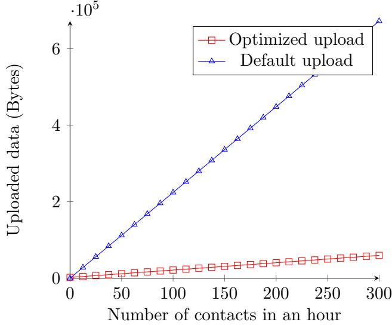
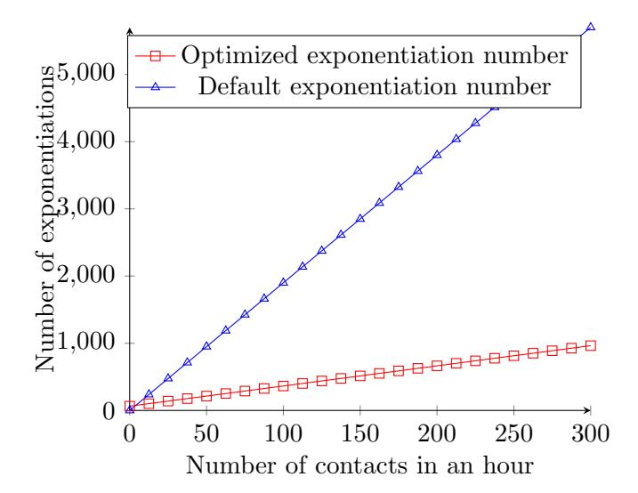

The main results of this work appeared in the paper "Privacy and Integrity Threats in Contact Tracing Systems and Their Mitigations" published in "IEEE Internet Computing Journal", volume 27, number 2, pages 13-19, ISSN: 10897801, DOI: 10.1109/MIC.2022.3213870, while a preliminary version appeared in the proceedings of the "Workshop on Secure IT Technologies against COVID-19", ISBN: 1-891562-72-X. DOI: 10.14722/coronadef.2021.23013.

Towards Defeating Mass Surveillance and SARS-CoV-2: The Pronto-C2 Fully Decentralized Automatic Contact Tracing System \*

Gennaro Avitabile1 , Vincenzo Botta1 , Vincenzo Iovino1 , and Ivan Visconti1

> 1DIEM (S3 Lab.), University of Salerno, Italy, {gavitabile,vbotta,viovino,visconti}@unisa.it

#### Abstract

Mass surveillance can be more easily achieved leveraging fear and desire of the population to feel protected while affected by devastating events. Indeed, in such scenarios, governments can adopt exceptional measures that limit civil rights, usually receiving large support from citizens.

The COVID-19 pandemic is currently affecting daily life of many citizens in the world. People are forced to stay home for several weeks, unemployment rates quickly increase, uncertainty and sadness generate an impelling desire to join any government effort in order to stop as soon as possible the spread of the virus.

Following recommendations of epidemiologists, governments are proposing the use of smartphone applications to allow automatic contact tracing of citizens. Such systems can be an effective way to defeat the spread of the SARS-CoV-2 virus since they allow to gain time in identifying potentially new infected persons that should therefore be in quarantine. This raises the natural question of whether this form of automatic contact tracing can be a subtle weapon for governments to violate privacy inside new and more sophisticated mass surveillance programs.

In order to preserve privacy and at the same time to contribute to the containment of the pandemic, several research partnerships are proposing privacy-preserving contact tracing systems where pseudonyms are updated periodically to avoid linkability attacks. A core component of such systems is Bluetooth low energy (BLE, for short) a technology that allows two smartphones to detect that they are in close proximity. Among such systems there are some proposals like DP-3T, MIT-PACT, UW-PACT and the Apple&Google exposure notification system that through a decentralized approach claim to guarantee better privacy properties compared to other centralized approaches (e.g., PEPP-PT-NTK, PEPP-PT-ROBERT). On the other hand, advocates of centralized approaches claim that centralization gives to epidemiologists more useful data, therefore allowing to take more effective actions to defeat the virus.

Motivated by Snowden's revelations about previous attempts of governments to realize mass surveillance programs, in this paper we first analyze mass surveillance attacks that leverage weaknesses of automatic contact tracing systems. We focus in particular on the DP-3T system (still our analysis is significant also for MIT-PACT and Apple&Google systems).

Based on recent literature and new findings, we discuss how a government can exploit the use of the DP-3T system to successfully mount privacy attacks as part of a mass surveillance program. Interestingly, we show that privacy issues in the DP-3T system are not inherent in BLE-based contact tracing systems. Indeed, we propose two systems named Pronto-B2 and Pronto-C2 that, in our view, enjoy a much better resilience with respect to mass surveillance

\*The main results of this work appeared in [\[ABIV23\]](#page-48-0). A preliminary version of this work appeared in [\[ABIV21\]](#page-48-1).

attacks still relying on BLE. Both systems are based on a paradigm shift: instead of asking smartphones to send keys to the Big Brother (this corresponds to the approach of the DP-3T system), we construct a decentralized BLE-based ACT system where smartphones anonymously and confidentially talk to each other in the presence of the Big Brother. Unlike Pronto-B2, Pronto-C2 relies on Diffie-Hellman key exchange providing better privacy but also requiring a bulletin board to translate a BLE beacon identifier into a group element.

Both systems can optionally be implemented using Blockchain technology, offering complete transparency and resilience through full decentralization, therefore being more appealing for citizens. Only through a large participation of citizens contact tracing systems can be really useful to defeat COVID-19, and our proposal goes straight in this direction.

# Contents

| 1 | Introduction                                                                      | 4  |  |  |  |  |  |
|---|-----------------------------------------------------------------------------------|----|--|--|--|--|--|
|   | 1.1 Our Contribution                                                           | 7  |  |  |  |  |  |
|   | 1.2 High-Level Overview of Pronto-B2 and Pronto-C2                 | 7  |  |  |  |  |  |
|   | 1.2.1 Pronto-C2                                                             | 8  |  |  |  |  |  |
|   | 1.2.2 Pronto-B2                                                             | 12 |  |  |  |  |  |
|   | 1.3 Related Work                                                               | 13 |  |  |  |  |  |
| 2 | Threat Model                                                                      | 14 |  |  |  |  |  |
| 3 | Privacy Attacks for Mass Surveillance 16                                       |    |  |  |  |  |  |
|   | 3.1 Paparazzi Attack: Tracing Infected Users with Trusted Server               | 17 |  |  |  |  |  |
|   | 3.2 Orwell Attack: Tracing Infected Users with Colluding Server             | 18 |  |  |  |  |  |
|   | 3.3 Matrix Attack: Shameless Tracing of Infected Users with Colluding Server   | 18 |  |  |  |  |  |
|   | 3.4 Brutus Attack: Creation of Mappings Between Real Identities and Pseudonyms | 18 |  |  |  |  |  |
| 4 | Other Attacks 19                                                               |    |  |  |  |  |  |
|   | 4.1 Bombolo Attack: Leakage of Contacts of Infected Users                   | 19 |  |  |  |  |  |
|   | 4.2 Gossip Attack: Proving Contact With an Infected User                    | 19 |  |  |  |  |  |
|   | 4.3 Matteotti Attack: Putting Opponents in Quarantine                       | 20 |  |  |  |  |  |
|   | 4.4 Replay Attack                                                              | 21 |  |  |  |  |  |
| 5 | Brief Description of DP-3T 21                                                  |    |  |  |  |  |  |
|   | 5.1 Security Analysis of the DP-3T Systems                                  | 22 |  |  |  |  |  |
| 6 | Pronto-B2 and Pronto-C2: Design and Analysis 26                          |    |  |  |  |  |  |
|   | 6.1 Pronto-B2                                                               | 27 |  |  |  |  |  |
|   | 6.2 Pronto-C2                                                               | 31 |  |  |  |  |  |
|   | 6.3 Analysis of Pronto-C2                                                | 34 |  |  |  |  |  |
| 7 | Suggestions for a Practical Realization of Pronto-C2 and Pronto-B2       | 39 |  |  |  |  |  |
|   | 7.1 Pronto-B2 Practical Implementation                                   | 40 |  |  |  |  |  |
|   | 7.2 Pronto-C2 Practical Implementation                                   | 41 |  |  |  |  |  |

| A |     | Differences with Previous Versions       | 52 |
|---|-----|------------------------------------------|----|
| 8 |     | Conclusion                               | 48 |
|   | 7.6 | Optimization                          | 46 |
|   | 7.5 | Performance Analysis of Pronto-C2  | 44 |
|   | 7.4 | Performance Analysis of Pronto-B2  | 43 |
|   | 7.3 | Performance Analysis                  | 42 |

# 1 Introduction

Uncertainty and fear may strongly affect citizens' psychology. Public dangers like crimes, terrorism and natural disasters can be an excuse used by a government to set up a mass surveillance program with the actual goal of controlling the population.

In 2013 Edward Snowden disclosed global surveillance programs [\[CHRT20\]](#page-49-0) opening a worldwide discussion about the tradeoff between individual privacy and collective security. A common opinion of scientists after those facts is that the task of establishing standards to be used for cryptographic protocols should not be assigned to an organization that decides on its own, without providing the full transparency that such processes deserve.

SARS-CoV-2. A major threat is currently affecting humanity: the COVID-19 pandemic. The aggressiveness and fast spread of the SARS-CoV-2 virus have a strong impact on public opinion. Several governments are taking the most restrictive measures of the last decades in order to contain the loss of human lives and to preserve their economies. Fear is spreading, citizens are forced to stay home, many jobs have been lost, and more dramatically the number of deaths goes up very fast day by day.

Contact tracing. According to epidemiologists, a major problem with COVID-19 is that the virus spreads very quickly while current procedures to detect infected people and to find and inform potentially infected people are slow. When a new infected person is detected, too much time is spent to inform her recent contacts and to take proper restrictive actions. Commonly when a new infected person is discovered, by the time her recent contacts are informed they have had already a significant chance to infect others.

In order to improve current systems, many researchers are proposing automatic systems for contact tracing. Such systems can dramatically increase chances that recent contacts of an infected person are informed before infecting others. Essentially, whenever a person is diagnosed as infected, all her recent contacts (i.e., persons that have been in close proximity to the infected one) are informed immediately. This allows to promptly take appropriate countermeasures.

Automatic contact tracing (ACT, for short) is therefore considered an important component that in synergy with physical distancing and other already existing practices can contribute to defeating the SARS-CoV-2 virus.

Privacy threats. There are serious risks that ACT systems might heavily affect privacy. Citizens could be permanently traced and arguments like "If you have nothing to hide, you have nothing to fear" (Joseph Goebbels - Reich Minister of Propaganda of Nazi Germany from 1933 to 1945) are already circulating in social networks. Governments could leverage the world-wide fear to establish automatic contact tracing systems in order to realize mass surveillance programs. Motivated by such risks, several researchers and institutions are advertising to citizens the possibility of realizing automatic contact tracing systems that also preserve privacy to some extent. Such systems crucially rely on Bluetooth low energy (BLE, for short).

The BLE-based approach. BLE is a technology that allows smartphones physically close to each other to exchange identifiers requiring an extremely low battery consumption. Such communication mechanism avoids GPS technology and third-party devices like Wi-Fi routers or base stations of cellular networks. It is therefore a viable technology to allow the design of privacy-preserving ACT systems.

BLE-based tracing is used by Apple in a privacy-preserving system to find lost devices [\[Gre19\]](#page-50-0). Matthew Green in a interesting webinar with Yehuda Lindell [\[GL20\]](#page-50-1) explicitly proposed to start with Apple's tracing system when trying to design a privacy-preserving proximity ACT system for citizens. Apple and Google have very recently announced a partnership to provide an application program interface for exposure notification (GAEN, for short) [\[App20\]](#page-48-2) that can be used to include such features in smartphone applications.

In parallel with the Apple&Google initiative, other BLE-based approaches very similar in spirit were proposed. Such BLE-based systems commonly rely on the use of pseudonyms that smartphones announce through BLE identifier beacons. After a short period of time, each smartphone replaces the already announced pseudonym with a (seemingly independent) new one. Each smartphone receives pseudonyms sent by others and stores them locally. Therefore a smartphone will have a database of the announced pseudonyms and a database of the received pseudonyms. The central idea is that whenever a person is detected infected, smartphones that have been physically close to the smartphone of the infected person should be notified and should compute a local risk scoring. In order to realize this, the smartphone of the infected person should use the above two databases to somehow reach out the smartphones that have recently been physically close to it. This communication is achieved through a backend server as follows. First the smartphone of the infected person will use the above two databases to communicate data to the backend server. The server could run some computations on data received from smartphones of infected citizens. The server will also use collected/computed data to answer pull requests of smartphones that desire to check if there is any notification for them.

Intuitively, the above approach through the unlinkability of the pseudonyms guarantees some degree of privacy. Despite the privacy-preserving nature of the BLE-based approach, the risk that such systems can be misused to realize mass surveillance programs remains a major concern that might slowdown the actual adoption of such systems. Indeed, most governments are not imposing the use of ACT systems.

Centralized vs Decentralized BLE-Based ACT. An important point of the design of a BLEbased ACT system is the generation of pseudonyms used by smartphones. Two major approaches have been proposed so far.

In a centralized approach pseudonyms are generated by the server. Each smartphone, during the setup of the ACT smartphone application, connects to the server and receives its pseudonyms. Therefore the server knows all the pseudonyms honestly used in the system. This is pretty obviously a clear open door to mass surveillance. Such dangers are discussed in [\[DT20a\]](#page-49-1). Currently the centralized approach is part of the protocols named NTK and ROBERT that are developed inside the Pan-European Privacy-Preserving Proximity Tracing (PEPP-PT) initiative [\[PEP20\]](#page-51-1).

The decentralized approach breaks the obvious linkability of pseudonyms belonging to the same smartphone by letting the smartphone itself generate such pseudonyms.

While the decentralized approach has a better potential to protect privacy, the centralized approach has a better potential to provide useful data to epidemiologists.

Straight-forward decentralized BLE-Based ACT. The most trivial way to realize a decentralized BLE-Based ACT system consists of giving to the server the role of proxy that forwards to non-infected persons the pseudonyms of those infected persons that decide to upload their pseudonyms[1](#page-5-0) after being detected infected. Therefore, everyone, including the server, clearly learns directly pseudonyms that have been used during the previous days by recently infected persons. Instead the pseudonyms generated by smartphones belonging to non-infected persons are not uploaded to the server and thus they are visible only to whoever was physically close to those smartphones. In terms of privacy, such straight-forward decentralized systems seemingly have a potential to offer a better protection compared to known systems that use the centralized approach. There are a few proposals based on the straight-forward decentralized approach, most notably Decentralized Privacy-Preserving Proximity Tracing (DP-3T, for short) and Private Automated Contact Tracing (MIT-PACT, for short).

Is privacy-preserving ACT a fig leaf ? The unlinkability of pseudonyms advertised in BLE identifier beacons is completely useless if the BLE MAC address associated to a smartphone does not change in a synchronized way with the pseudonyms [\[BLS19\]](#page-49-2). Notice that iOS and Android are (almost completely) the currently deployed operating systems for smartphones and have some serious restrictions on updating a BLE MAC address. In contrast, the smartphone application should obviously work in the background and should have control over the BLE MAC address so that this value can rotate along with the pseudonyms announced in the BLE identifier beacons. Therefore it is absolutely problematic to realize BLE-based privacy-preserving smartphone applications that can practically (in the sense of usability, battery consumption, and so on) work on (almost) all currently used BLE smartphones, unless some flexibility is allowed by Apple&Google through updates of iOS and Android.

The move of Apple&Google. Interestingly, Apple&Google have released updates of iOS and Android providing GAEN to some "chosen" smartphone apps [2](#page-5-1) resolving along with it also the MAC address linkability problem. However the two features are seemingly connected, more precisely: if you want to implement a usable smartphone application (i.e., an application that runs in the background without battery drain on a very large percentage of the currently available smartphones) that needs to rotate the BLE MAC address synchronously with the content of the BLE identifier beacon then you must use their API and therefore you must use their approach for pseudonym generation and exposition.

This lack of flexibility generates some interesting consequences. First of all, the centralized approach does not seem to be implementable since it relies on pseudonyms generated by the server and then advertised in the BLE identifier beacon by the smartphone. Instead, the generation of pseudonyms can only happen inside the smartphone when using GAEN. Such mismatch implies that the decision of Apple&Google makes hard to realize the centralized approach to privacypreserving ACT. Indeed, it is not surprising that some governments that originally had a bias towards centralization at some point decided to switch to the GAEN approach. Very sadly, GAEN also excludes better approaches that avoid replay attacks [\[Pie20\]](#page-51-2).

Snowden's revelations included memos confirming the existence of backdoors (e.g., see Dual EC DRBG) in standardized cryptographic algorithms [\[Wik\]](#page-51-3). It is therefore important to

1The actual information uploaded is a seed that generates the pseudonyms.

2They provide only the part concerning the generation, rotation, and exposure of pseudonyms along with a flag to activate/dis-activate this service in the settings. There is no user application and neither a server collecting pseudonyms.

make sure that Apple&Google will not abuse such systems, and will not help governments interested in mass surveillance.

## 1.1 Our Contribution

Starting with the inspiring list of attacks presented by Vaudenay [\[Vau20a\]](#page-51-4) in this work we first analyze the degree of privacy protection achieved by the DP-3T systems. In some of the attacks a government through its natural power controls (even partially) the server, the laboratories that detect infections and the national territory to realize mass surveillance programs.

We consider quite dangerous the fact that in the DP-3T systems (and all analogue systems) one can be traced even when walking alone, silently. Indeed, a passive antenna can detect the pseudonym without transmitting anything, and can later on check if the sniffed pseudonym belongs to the list of infected persons. It is easy to link the real identity of an infected person with the pseudonyms she used in the last two weeks. Indeed, such antennas can also be installed nearby any place where the citizen can be identified (e.g., showing an ID card or paying with a credit card) and this allows to connect pseudonyms to identities. We believe that this is an open door to help mass surveillance programs. Also other BLE devices that are in general used for other purposes (e.g., information kiosks) can be used to trace people. Obviously one can not expect that nothing else will be done with BLE except contact tracing, and thus preserving privacy while other uses of BLE continue is a necessary goal. Notice also that the use of active kiosks running precisely the BLE-based contact tracing protocol is actually recommended in [\[PAC20\]](#page-50-2) (see Remark [1](#page-23-0) in Section [5\)](#page-20-1). Instead, we believe that they can be a source of privacy attacks. The lack of privacy with respect to such adversaries is a major vulnerability in the side of DP-3T and other analogue systems[3](#page-6-2) . We stress that the issues exist regardless of the update of the MAC address of the BLE device. Technically speaking, the key weakness of the DP-3T system is actually a weakness of the straight-forward decentralized approach: asking smartphone applications to hand over the used keys/pseudonyms to the server is like asking citizens to kneel down in front of the Big Brother[4](#page-6-3) .

Next we present Pronto-B2 and Pronto-C2, two new decentralized privacy-preserving automatic proximity contact tracing systems based on BLE. We show that our systems are arguably more resilient than the DP-3T systems against mass surveillance attacks, while remaining useful for epidemiologists. Our systems can be implemented through government servers but also can be fully decentralized using blockchain technology. We believe that full decentralization can play an important role to help the work of epidemiologists since citizens obviously prefer to use their smartphones in ACT systems that are transparent and resilient to attacks, in addition to being privacy preserving.

#### 1.2 High-Level Overview of Pronto-B2 and Pronto-C2

Our main idea can be seen as a paradigm shift compared to the straight-forward decentralized approach. Indeed, instead of asking infected people to hand over their keys to the Big Brother, we allow citizens to anonymously and confidentially call each other in the presence of the Big Brother. The way we do it is explained below. We first discuss Pronto-C2 and then describe how

3We will instead show that our Pronto-C2 system does not suffer from such drawbacks.

4We refer to the George Orwell book "1984", in which the Big Brother was the leader of Oceania and every citizen of Oceania was under constant surveillance by the authorities.

we can get a more practical system that we call Pronto-B2 by relaxing some privacy guarantees still outperforming DP-3T systems.

#### 1.2.1 Pronto-C2

In the 70s Merkle, Diffie and Hellman invented public-key cryptography. Starting with Merkle's puzzles, Diffie and Hellman proposed a key exchange protocol [\[DH76\]](#page-49-3) (i.e., the Diffie-Hellman protocol) where two parties can establish a secret key K by just sending one message each on a public channel. A message consists of a group element in a setting where the so called Decision Diffie-Hellman assumption holds.

In our view, the most natural way to realize a privacy-preserving ACT system consists of having as pseudonym a group element that corresponds to a message in the DH protocol. This natural idea was also proposed to the DP-3T team by the github user a8x9 [\[a8x\]](#page-48-3). In order to actually realize such form of ACT system, one needs to solve the following two main problems.

Anonymous call: realizing a mechanism that allows an infected party to use K in order to call the other party in a secure and privacy-preserving way.

Shortening pseudonyms: making sure that the size of a group element fits the number of available bits in a BLE identifier beacon.

Calling (anonymously) the infected person. We solve the first problem by asking the infected party, after having received a proper authorization from the laboratory that detected the infection, to upload K along with the authorization to a bulletin board. The bulletin board can be just managed by a server as in the DP-3T systems, but ideally it should be implemented through a decentralized blockchain so that we can decentralize the server, making the entire process transparent and reliable.

When implementing the bulletin board with a blockchain [5](#page-7-1) then the verification of the authorization must be performed by a smart contact and thus the check should be accomplished uniquely with public information. For this reason, we suggest the use of digital signatures for implementing the authorization mechanism to upload data. In order to make unlinkable the upload of K with the real identity of the infected person, we suggest the use of blind signatures [\[Cha83\]](#page-49-4). The basic idea is that laboratories receive from the government some unpredictable activation codes that are then one by one given to infected persons. Then, an infected person connects to a service in order to exchange the authorization code with some blind signatures that will be useful to then upload on the bulletin board data associated to calls. In case of use of a blockchain to implement the bulletin board, this exchange of an authorization code with a blind signature is performed off-chain since the server will use a signature secret key and thus it can not be directly implemented by a smart contract.

If instead the bulletin board is implemented through a centralized server (like in the DP-3T systems) then other solutions are possible. For instance the blind signature could be replaced by the private retrieval of a string belonging to a super-polynomially large subsets S of all possible strings of a given length, such that membership in S can be checked only by the server.

5 In this work, when referring generically to a blockchain we always mean a permissioned blockchain (e.g., Hyperledger Fabric [\[ABB](#page-48-4)+18]).

Notice that the approach of Pronto-C2 is therefore completely different from the one adopted in the DP-3T systems. Indeed, while in the DP-3T systems the pseudonyms of the infected person are broadcast to everyone (or added to a Cuckoo filter by the server that then transmits the filter) we instead ask the infected party to send a message that is understandable uniquely by the party with which she was in close proximity. Therefore, K is more like a phone call where the infected party sends to the answering party the following message:[6](#page-8-0) "Hello, it is you that were next to me... and I've just discovered that I'm infected".

Every person that is not infected will connect to the server (or to the blockchain) and will download the recently uploaded keys to search for K (data don't need to be stored, the search can happen while downloading data). Notice that there is a different key K to check for every BLE identifier beacon received in the last two weeks that has not been already discovered. This step should be preferably performed while the phone is connected to the charger and to a Wi-Fi network. Moreover, for those cases where the daily amount of data to download is excessive, one can think of specifying target states/regions in the country, in order to manage a restricted amount of information. In this case a call would also specify a corresponding state/region.

In addition to K, the infected person can also upload the root of a Merkle tree where the leaves include committed information (e.g., about BLE signal, location, body temperature) that later on the infected person might like to share with epidemiologists. The binding of the commitment is important to avoid that such date are adaptively changed. The hiding through a Merkle tree is important to leave the ownership of this information to the person until she decides to selectively disclose it.

We remark that avoiding that two smartphones with pseudonyms A and B upload the same K (this would leak some –most likely irrelevant – information), is straightforward: A could just upload H(K||A||B) while B could just upload H(K||B||A), where H is a cryptographic hash function.

Shortening pseudonyms. Current standards suggest at least 256 bits for a group element to safely run the DH protocol over elliptic curves. This size, however, exceeds the space available in a BLE identifier beacon. Moreover, we really stand for defeating mass surveillance attacks and our system works with only a small overhead using 384 or even 512 bits. One might think to resolve the issue of the small space in a BLE identifier beacon by just resorting to very short (and therefore in our view too risky in case of mass surveillance attacks) keys [\[a8x20a\]](#page-48-5) or by splitting the information into multiple identifier beacons that rotate quickly. Obviously Pronto-C2 can work smoothly with such workarounds, but since they all bring some issues, we propose a different approach that allows to use many bits for the group element while still remaining with one standard identifier beacon only.

In Pronto-C2, we decouple the group element from the pseudonym precisely like in operating systems a large amount of data is represented by a pointer. Recall that following also previous work, a value announced in a BLE identifier beacon should last only for a few minutes, to then be replaced by a new one. The smartphone will periodically generate new independent group elements for DH and will keep them locally. Since such group elements are too large to be sent in BLE identifier beacons, the smartphone will upload them to a bulletin board. Again, our design is flexible and the bulletin board can be maintained by a server or alternatively be implemented with a blockchain. As above, we support the second option since it gives full decentralization and

6The Italian word "Pronto" stays for "Hello" and C2 pronounced in English stays for "it is you" in Neapolitan language as in the title of a very popular song of Nino D'Angelo [\[D'A83\]](#page-49-5) (see also the movie [\[Lau83\]](#page-50-3), min. 59:00).

makes more citizens willing to participate, having more chances to defeat the virus. Notice that this generation of group elements is done only once in a while, and therefore can typically be performed when the smartphone is on charge and is connected to a Wi-Fi network.

In Pronto-C2 we decouple the group element from the pseudonym by setting the 128 bit[7](#page-9-0) pseudonym as the address on the bulletin board of the corresponding group element. In other words, a pseudonym is a pointer to a public memory, therefore one can just refer to a short string to refer to an arbitrarily large amount of data [8](#page-9-1) . By using as pseudonym a short representation of the group element, we need a different mechanism to implement the key exchange. Recall that the infected person must compute the key K and push it to the server, while the non-infected person needs to compute the key K to then check if it exists on the server. Starting from a short pseudonym every player will recover the actual group element from the bulletin board that records all group elements. This is a fast operation since the pseudonym is the address of the group element and thus there is no need to download a large amount of data or to do any expensive search.

Silent tracing. Pronto-C2 is clearly secure with respect to silent tracing. The key point is that Pronto-C2 is based on virtual anonymous calls originated from a recently detected infected person, and addressed to whoever has been in close proximity to her. Indeed, when a person walks alone and passes by a silent tracing device, the sole transmission of the pseudonym used in that moment by the smartphone does not allow to understand if later on that person is infected. There will be no key K corresponding to a key agreement in the silent tracing device that can be found in the list of virtual anonymous calls.

Shameless tracing. A government can also try to trace citizens by having on its territory many devices that behave as smartphones, therefore announcing pseudonyms with the hope of receiving a call or making calls in order to infer some information on the locations and identities of the citizens. It goes without saying that such attack is easier to detect compared to silent tracing. Indeed, the smartphone application could easily inform the owner at any time on the number of BLE identifier beacons that are currently received. Therefore, there is more room for citizens to realize the existence of malicious devices and ask police to destroy them and to identify the criminals that were trying to abuse the ACT system. Any government that would like to save its reputation convincing citizens to still use the smartphone application should take severe actions against such criminals. Obviously, if there is no prompt reaction of the government then citizens will feel that some attempts of mass surveillance are in progress and will simply switch off the smartphone application.

Notice that the only dangerous BLE devices are the ones that announce the very specific identifier beacon for the contact tracing system. There are specific codes to differentiate identifier beacons for different systems. Therefore, in our system, it is still completely fine (i.e., they do not have to be destroyed) to have on the territory devices (e.g., information kiosks) that use BLE to provide other services.

Pronto-C2 is secure also against shameless tracing. Notice that with shameless tracing the infected user will upload a call for the active tracing device that was in close proximity. However there will be no way to link calls coming from the same infected citizens when sending different pseudonyms as BLE identifier beacons. Therefore, unless we are in the extreme case where there is

7This is the size for a pseudonym that is commonly allowed by BLE identifier beacons.

8A similar idea is used in IPFS [\[PL20\]](#page-51-5).

only one new infected person in a large are and in a significant amount of time, Pronto-C2 protects infected citizens from attempts to trace their movements through active BLE beacons.

Unlinkability over TCP/IP, timing, and other side-channel attacks. As in all ACT systems, users could be de-anonymized through the IP address when connecting to servers. Moreover, in Pronto-C2 when uploading a batch of group elements some attention should be paid so that they are not linkable. We therefore suggest the use of artificial delays and uploads of bogus data (i.e., dummy traffic) with the only purpose to confuse the adversary making harder any profiling attempt. We also discuss a simple solution to mitigate the above linkability issues using mixers. We assume that each user can select her own favorite mixer among several options that can belong to heterogeneous entities (e.g., political parties, large organizations defending civil rights). By doing so, users could pick their favorite options to protect their IP addresses when uploading their pseudonyms and their anonymous calls to the bulletin board and when downloading pseudonyms corresponding to the received BLE beacon identifiers. Moreover the user can send a batch of pseudonyms and calls since they will be mixed by the mixer that will also apply some artificial delays, and dummy traffic therefore guaranteeing some degree unlinkability (i.e., mixers that serve large communities give a satisfying degree of privacy, unlike mixers that serve only very few citizens). We give a more detailed description of this idea in Section [7.](#page-38-0) We remark that the server can also perform mixing and the privacy will be based on at least one among server and mixer behaving honestly. We stress that ACT systems currently deployed are affected by such issues and mostly ignore them, but still we prefer to discuss possible workarounds, even though though they obviously introduce extra overhead.

Replacing DH with other key-exchange protocols. We have proposed the DH protocol because it is computationally efficient and has very low space requirements. Nevertheless, our design is flexible and one can use other key-exchange systems as long as there is just one message per party that is moreover independently computed from the other message.

Countermeasures to DoS attacks. Typical DoS attacks can be mitigated with pretty standard approaches, just to mention some: CAPTCHAs, proofs of work, anonymous tokens. We will discuss how to mitigate DoS attacks to the bulletin boards, by allowing regular (i.e., non-infected) citizens to upload a limited amount of pseudonyms, while infected citizens will be allowed to upload a very large amount of calls.

Removing old data from the bulletin boards (even from the blockchains). The entire information available on the bulletin boards does not disclose identities. Moreover, it does not allow any player that is not a sender nor a receiver of the call to link calls with pseudonyms. Nevertheless, in order not to overload servers with old information (e.g., anything uploaded more than 20 days ago), past data can be removed from the bulletin board pretty easily. If the bulletin board is managed by a server, then old data can just be deleted. If instead the bulletin board is realized through a blockchain, then we suggest that periodically the pointer to the genesis block moves forward to the next block. Essentially, the blockchain will always consist of the blocks generated in the last relevant time period (e.g., 20 days). Moreover, this process can be made even more transparent by uploading every 10 minutes on the Bitcoin blockchain the cryptographic hash of the blocks generated in the last 10 minutes. This allows everyone to constantly verify that the bulletin board is correctly decentralized and redacted.

Refuting a claim of the DP-3T team. Vaudenay in [\[Vau20a\]](#page-51-4) showed a privacy attack to DP-3T proposing an antenna that can be used to eavesdrop the identifier beacons sent by smartphones. Some of our attacks follow the same idea even though we present them with a different syntax and focusing on a government that eavesdrops BLE communication as part of mass surveillance programs. The main point of this remark is that the DP-3T team answered to [\[Vau20a\]](#page-51-4) in [\[DT20d\]](#page-50-4) claiming that "This is a known attack vector inherent to all contact tracing systems, whether centralized or decentralized (SRE, Inherent Risk 1)". We refute this claim of the DP-3T team and indeed we contradict it by showing that Pronto-C2 is not affected by such attacks. It might be that the DP-3T team was implicitly referring to systems that follow the straight-forward approach only. This would imply that Apple&Google through GAEN are providing an ACT system that inherently suffers of privacy and security issues, and that could be exploited to help mass surveillance.

#### 1.2.2 Pronto-B2

While Pronto-C2 satisfies strong privacy notions, the mapping between pseudonyms and group elements introduces some overhead due to the need of anonymizing and making unlinkable the various items (e.g., calls, group elements) posted on bulletin boards. We therefore propose also a lighter version of Pronto-C2 that we call Pronto-B2[9](#page-11-1) and that does not require to translate the beacon identifier with a group element. Indeed, Pronto-B2 instead of performing a DH key exchange, performs a key exchange that is not confidential in the presence of an eavesdropper. This means that whoever is around Alice and Bob can compute the key K that Alice would use to make an anonymous call to Bob. The main observation is that if somebody is around, then she/he would also receive a call in case one out of Alice and Bob is infected, therefore the leakage is not that relevant. What mainly matters is that unlinkability holds. Indeed, calls made by an infected citizen corresponding to contacts in different locations and time slots must remain completely unlinkable (unlike in DP-3T systems).

The key idea to construct Pronto-B2 is rather simple: let Ai and Bi be the 128-bit beacon identifiers used by Alice and Bob in some given epoch. If later on Alice is infected, she will make an anonymous call to Bob by uploading on the bulletin board K = H(Ai ||Bi) where H is a cryptographic hash function modelled as a random oracle. Notice that like in Pronto-C2, if Alice walks alone and there is a passive antenna, then no call is generated and Alice is not traced (unlike in DP-3T). Notice also that if Alice is continuously in the range of antennas, but also in the presence of others, then the adversary would be able to see the calls generated in different epochs, but the adversary will not be able to link the calls[10](#page-11-2) .

9The name Pronto-B2 is due to the fact that recently two famous Italians with lastname starting with B unfortunately got infected and using our system they would have received (unpleasant) anonymous calls. Fortunately they both recovered pretty quickly.

10Obviously this is true only when there is more than one infected citizens making calls, otherwise linking is always successful in any system.

#### 1.3 Related Work

Our work mainly focuses on the security of the systems proposed by the DP-3T [\[DT20a\]](#page-49-1) team. However, the attacks we present are significant to many other decentralized ACT systems such as MIT-PACT [\[PAC20\]](#page-50-2), UW-PACT [\[CFG](#page-49-6)+20b] and TCN [\[TCN20\]](#page-51-6). Such decentralized ACT systems are very prone to be abused. Attacks can be carried out not only by the government, but also by unknown adversaries. These vulnerabilities have been acknowledged in [\[CFG](#page-49-6)+20b] (Section 3.1.3) where it is affirmed: "This can be abused for surveillance purposes, but arguably, surveillance itself could be achieved by other methods". As previously discussed, MIT-PACT [\[PAC20\]](#page-50-2) even makes an explicit recommendation that active BLE devices should be placed on the territory by the government itself. Their intended purpose is to relay previously detected pseudonyms in order to warn users about possibly contaminated surfaces. However, they could easily be exploited for mass surveillance, being a perfect front for shameless tracing.

Several vulnerabilities of the DP-3T systems have been previously analyzed in various works [\[Tan20,](#page-51-7) [Pie20,](#page-51-2) [Vau20a,](#page-51-4) [Vau20b\]](#page-51-8). Vaudenay [\[Vau20a,](#page-51-4) [Vau20b\]](#page-51-8) presents a detailed list of attacks against the DP-3T systems; some of the attacks in our work are indeed inspired to the ones of Vaudenay, but show with more emphasis the possibility to exploit such attacks for mass surveillance. The DP-3T team reacted to Vaudenay's work by presenting a public response to his attacks [\[DT20d\]](#page-50-4) that does not object on their applicability, and sometimes tries to convey the message that those attacks are inherent to any decentralized approach. In our work we show that this is not true.

As part of a joint partnership, Google and Apple [\[App20\]](#page-48-2) recently released an update to their mobile operating systems to introduce a new set of exposure notification APIs that is subject to all the attacks shown in this paper for the low-cost DP-3T system. The new APIs are not open source (e.g., in Android the APIs can be accessed via inter process communication to the Google play service that is a closed source application executed in background) and cannot even be tested: in order to use the APIs you need authorization by Google and Apple.

Pietrzak [\[Pie20\]](#page-51-2) proposes solutions and mitigations to replay and relay attacks against the DP-3T systems. Furthermore, Pietrzak identifies the issue that users in the DP-3T system can easily provide digital evidence of contacts with infected users. Tang [\[Tan20\]](#page-51-7) observes that the DP-3T systems may be subject to identification attacks and presents a comprehensive survey on proximity tracing systems. Furthermore, a subset of our attacks is taken into account in [\[BAL20\]](#page-48-6), where the authors propose new attacks inspired by ours and the other previous papers.

Pinkas and Ronen [\[PR20\]](#page-51-9), building upon a design similar to the DP-3T systems, propose a system with an improved resilience to relay attacks, a better verification of risks and other useful features.

The aforementioned works all focus on decentralized ACT systems. In contrast, there are several centralized proximity tracing systems, in particular TraceTogether[\[Tra\]](#page-51-10), adopted in Singapore and ROBERT [\[IPT20b\]](#page-50-5), designed by Inria and Fraunhofer (a French and a German research institution respectively).

In [\[Fra20\]](#page-50-6) the authors review the most prominent European proximity tracing systems, DP-3T, NTK, and ROBERT, analyzing the different adversarial models assumed by each system.

WeTrace[\[CFG](#page-49-7)+20a] proposes a system [11](#page-12-1) based on the use of public-key cryptography, similarly to Pronto-C2. Public keys are exchanged over the BLE channel and to solve the problem of having only 16 bytes available in the BLE beacon, users broadcast only the first 16 bytes, while the

11We became aware of WeTrace only in mid June 2020, informed by Adrienne Fichter.

remaining bytes can be retrieved by querying a server. In order to access the full public keys efficiently, these data are indexed by hashing (a part of) the first 16 bytes obtained via BLE. (i.e., using the first 16 bytes as an address to find the remaining bytes of the key, similar to the pointers proposed in Pronto-C2). An infected user A who wishes to report, uploads messages encrypted with the public keys related to close contacts she had. These encrypted messages are independent of the public key A was broadcasting while being in contact with the recipients of the messages. While this might be beneficial for A's privacy, it can be severely affected by false positives attacks. Indeed a user B may be alerted consequently to an upload performed by an infected user C who did not come into contact at all with B, but just received B's key trough other means.

Another system similar to Pronto-C2 that appeared online on April 2020[12](#page-13-1) is TraceCORONA[\[SSL20\]](#page-51-11). TraceCORONA is based on the exchange of exposure tokens that can be computed using the Diffie-Hellman protocol. Currently there are no papers associated with this ACT application proposal, therefore we do not have technical details to properly compare this solution with Pronto-C2.

After our paper appeared on ePrint, Inria published on Github a new ACT system named DESIRE[\[IPT20a\]](#page-50-7), which is also based on the Diffie-Hellman key exchange scheme. After being tested positive, a user uploads data related to the encounters he had during the previous days. As in Pronto-C2, such data is computed hashing the shared key along with an information depending on which of the two users is creating the report. This guarantees that if two users A and B have been in close proximity, and both of them end up being positive to SARS-CoV-2, they will send two different values to the server, making it impossible for the server itself to infer that A and B have been co-located. Differently from Pronto-C2, the users' at-risk status is computed on the central server.

Interestingly, in [\[Sei20\]](#page-51-12) Seiskari shows that the DP-3T low-cost system (that is even referred as "semi" decentralized) is attackable in practice. In particular he shows that positions in the prior two weeks of new infected users can be tracked by any third party (i.e., not only the government!) who can install a large fleet of BLE-sniffing devices. Notice that such devices can be completely passive (i.e., they do not broadcast an identifier beacon) and therefore are hard to detect. The attack is therefore hard to mitigate and inherent in the design of the DP-3T low-cost system. The github repository includes a Proof-of-Concept implementation of such BLE sniffer that succeeds against the low-cost DP-3T system.

Baumg¨artner et al. [\[BDF](#page-48-7)+20] provide empirical evidence for the two main risks of the Apple&Google design, namely, as in DP-3T, tracing of infected users and replay/relay attacks.

# 2 Threat Model

In this section we present the adversary goals, capabilities, and the threats covered and not covered in our work. We remark that our work introduces several distinct attacks against automatic contact tracing systems and for each of the attacks the adversary may have different goals and capabilities and collude with different entities. So, the following discussion is general in nature.

Adversary goals and threats. An adversary attacking the privacy of the system wishes to trace users. By tracing users we mean that the adversary can link different locations visited by the

12We have been informed of the existence of such system only in August 22nd 2020.

same user. This is irrespective of the fact that the adversary may not know the real identity of the user who made such visits.

Notice that, due to the fact that pseudonyms in BLE packets do not change during a time slot, tracing in these periods is inevitable. Generally, we will not deem inevitable attacks as a threat. For instance, an adversary that can place a different smartphone at each location of the space and at each time window[13](#page-14-0) can know where and at which time each diagnosed person has been in the case that there has been only a single diagnosed person; or can know at what time one of the smartphones under his control met a diagnosed person. These threats are inherent to any automatic contact tracing system.

An adversary attacking the privacy also wishes to link locations visited by users, both diagnosed and non-diagnosed, to their real identities. For instance, the adversary may attack the privacy by attempting to link information uploaded by the user to a server through the user's IP address.

An adversary attacking the integrity wishes to falsely alert users of having been in contact with a diagnosed person; replay and relay attacks fall in this category.

Adversary capabilities. We will consider different threats that involve adversaries of different capabilities. The adversary may place an arbitrary number of listening BLE devices at arbitrary locations. Such devices may operate exclusively in reception mode over the BLE channel. In this case, we say that the adversary is passive and is performing a silent tracing. An adversary may also try to trace citizens by placing many hidden devices that behave as regular smartphones. In this case, the adversary is active and is performing a shameless tracing. As explained in Section [1](#page-3-0) shameless tracing can be easily detected by citizens that will react uninstalling the application.

An adversary may instead use smartphones belonging to actual citizens (e.g., policemen) to collect information about citizens without allowing them to detect such attack.

For some of our attacks we will consider an adversary that can even corrupt the server and/or the health authority.

Types of tracing attacks. Many of the proposed attacks (cfr., Sections [3.1,](#page-16-0) [3.2,](#page-17-0) [3.3\)](#page-17-1) deal with tracing the movements of infected individuals over the contagion time window. Let us consider the strongest possible adversary who may try to trace infected users that is, as specified above, an adversary using active devices (i.e., behaving as regular smartphones) and colluding with the server. We now evaluate what is the highest level of privacy protection that can be guaranteed to infected users in this scenario. Note that an active adversary Adv is completely indistinguishable from a regular user of the system, this means that whenever Adv comes into contact with an infected user U who decides to upload data to the system, Adv will be alerted as prescribed by the system itself. In addition, Adv gets to see all the data uploaded by U to alert all the users she came into contact with. Suppose that Adv has placed a series of active devices over a certain territory, then for each of such locations where U has been over the contagion time window, U will upload data to server in order to alert Adv's devices. This means that Adv will certainly know which of his devices has been in proximity of an infected user and when.

Therefore, the best we can hope for in this scenario is that Adv cannot know whether data related to different locations are relative to the same individual. In this case, a certain degree of

13We mean that for each location and for each time window the adversary initializes a new smartphone with the automatic contact tracing application under his control.

privacy is provided to infected users whose movements remain hidden within the set of movements of all other diagnosed people who uploaded data during the same day.

More specifically, we say that a protocol enjoys partial protection (with respect to passive or active adversaries) when a (passive or active) adversary who placed (passive or active) devices at two different locations X and Y cannot figure out whether X and Y have been visited by the same infected user. This also implies that if Adv received one alert related to position X at time t1 and one related to position Y at time t2 > t1, the adversary cannot know which user visited X at time t1 and which user visited Y at time t2. (Indeed, if Adv could know which user visited resp. X and Y could also know whether X and Y have been visited by the same user, in contradiction with the partial protection property.)

Of course, in general, there may be additional information that helps Adv to disambiguate. For instance, consider the scenario in which a pseudonym is listened at location X at time t1 and another one is listened at location Y at time t2 > t1. If no other pseudonym has been listened at nearby locations at times < t1, there are two possible explanations: 1) a user turned on his phone at location X at time t1 and then moved to position Y at time t2; 2) a user U1 turned on his phone at location X at time t1 and then, at time t2, U1 turned his phone off while another user U2 turned his phone on. In this simple scenario, it seems obvious that the first case is more likely than the second one. However, disambiguating gets more difficult as the number of infected individuals and locations increases.

We say that an ACT system enjoys full protection from tracing attacks w.r.t. a certain passive adversary Adv, if Adv is not able at all to trace the movements of infected individuals during the contagion time window. To be more specific, even if there is a single infected user U, Adv does not get to know even one single location visited by U during the contagion time window. Notice instead that partial protection with respect to passive adversaries does not offer any guarantee in the case there is only a single infected user, in particular all the movements of such user could be leaked.

Furthermore, U may pass nearby such devices both when she is alone or when some other users of the system are also there. In the first case, U may not upload any data related to the period of time she was alone since there is no one to be alerted, while in the second case an alert should be sent to whom has been in contact with U. For this reason, an ACT may exhibit different levels of resilience to tracing attacks depending on the actual encounters the user had, in particular: it could protect infected users from being traced in any case (i.e., it provides full protection) or only for the periods of time they have been alone. We name the latter as solitary protection from tracing attacks. Obviously, full protection implies solitary protection.

Threats not addressed. We do not consider threats at the BLE layer such as using power signal and other side-channel information to identify users or issues at the operating system level.

# 3 Privacy Attacks for Mass Surveillance

Mass surveillance is an activity put in place to watch, even discontinuously, over a substantial fraction of the population by monitoring, for example, their movements and/or habits.

Even though decentralized solutions guarantee, in general, better privacy compared to centralized ones, mass surveillance is still a possible threat and must be mitigated as much as possible when introducing new intrusive technologies.

In the following paragraphs, we present several possible attacks towards contact tracing systems which, when successful, undermine users' privacy, eventually contributing to mass surveillance activities. Furthermore, we evaluate and compare the resilience of our Pronto-C2 and Pronto-B2 systems (see Section [6\)](#page-25-0) and the DP-3T systems against such attacks.

Our attacks are inspired by the works of Vaudenay [\[Vau20a\]](#page-51-4) and by the issues reported in the DP-3T's git repository [\[a8x20b,](#page-48-8) [a8x20a\]](#page-48-5). We carefully take into account these issues and attacks to illustrate more precise scenarios unveiling significant mass surveillance attacks.

Both the DP-3T systems, Pronto-B2 and Pronto-C2 protect the privacy of non-diagnosed people and protect the privacy of diagnosed people out of the contagion time. Since these systems are the main focus of our work, in some of the following attacks we will assume that the adversary only attacks the privacy of diagnosed people during the contagion time window (e.g., roughly, the last two weeks before being tested positive). However, we remark that privacy protection is important for all users at any time, and ACT systems might strongly violate privacy, especially when there is an extremely centralized design and when there is collusion among the various authorities of the system.

## 3.1 Paparazzi Attack: Tracing Infected Users with Trusted Server

This attack is similar to the Paparazzi attack reported in [\[Vau20a\]](#page-51-4). The main difference between the two, is that the one of [\[Vau20a\]](#page-51-4) has the purpose of de-anonymizing infected users, while here we focus on building a mass surveillance infrastructure to trace citizens[14](#page-16-1) .

- Attacker's capabilities: The attacker Adv is anyone with enough economical resources. Adv has the ability to install, in a sufficiently large number of different locations, passive BLE devices. The only capability of a passive device is to operate over BLE channels in reception mode. We also assume that such devices are provided with enough memory to store a significant amount of received data (i.e., pseudonyms and auxiliary information).
- Attack description: The passive devices record the observed pseudonyms along with a fine-grained time log. The location of each device is fixed and determined by the attacker Adv. When a user B is tested positive and uploads data into the ACT system, the system itself provides related data to all users. Adv then combines these data with his logs. Furthermore, the attack is practically undetectable by the users since the BLE devices operate only in reception mode.
- Attack's outcome: Adv traces the infected users over the contagion time window. The attack is considered successful if the system fails to provide full protection. Variants of the attack can be considered, where Adv is interested in breaking solitary protection or partial protection respectively. We name the first variant as Solitary Paparazzi attack and the second one Partial Paparazzi attack.

14This kind of attack was described in [\[SSL20\]](#page-51-11) when was discussed the possible attacks against GAEN.

#### 3.2 Orwell Attack: Tracing Infected Users with Colluding Server

Orwell attack differs from Paparazzi attack only for the capabilities of the attacker.

- Attacker's capabilities: The attacker Adv is the same as in Paparazzi attack. However, in addition, Adv can collude with the server. Note that the server could be under a significant influence of the government.
- Attack description: Adv is analogous to the one described in Paparazzi attack. The only difference is that, along with data provided to all regular users, Adv receives all data that are in possession of the server.
- Attack's outcome: The outcome is analogous to the one of Paparazzi attack, we adopt also here the same naming convention for the variants of the attack.

## 3.3 Matrix Attack: Shameless Tracing of Infected Users with Colluding Server

- Attacker's capabilities: The attacker Adv is identical to the one of the Orwell attack in terms of the information he has access to. On the other hand, Adv's devices are active and can actively send messages over the BLE channel.
- Attack description: Adv operates similarly to what has been shown in the previous attacks. Adv combines the data in his possession with the ability to actively send messages of the contact tracing protocol over the BLE channel in order to trace infected citizens over the contagion time window.
- Attack's outcome: Adv traces the infected users over the contagion time window. The attack is considered successful if the system fails to provide partial protection.

# 3.4 Brutus[15](#page-17-3) Attack: Creation of Mappings Between Real Identities and Pseudonyms

- Attacker's capabilities: The attacker Adv consists of the server and the health authorities colluding together.
- Attack description: Adv exploits the authorization mechanism, also used to avoid uploads of false positives, to find a mapping between the real identity of a user B and her uploaded data.

15Marcus Junius Brutus was a close friend of Julius Caesar, who took a leading role in his assassination. His name has become synonymous with severe acts of betrayal.

Attack's outcome: a mapping between the real identity of B and her uploaded data.

Every ACT system where the authorization mechanism grant a user B permission to upload data forwarding to the authentication server some data (e.g., an activation code) provided to B by the health authority, is vulnerable to this attack. Indeed, the health authority, who is aware of the real identity of B, can communicate the mapping between the activation code and the real identity of B to the server, which can in turn derive the mapping between this code and data uploaded by B. The authorization mechanism is not made explicit in many relevant proposals [\[PAC20,](#page-50-2) [PR20\]](#page-51-9). A reason advocated for this choice is the flexibility to different deployment scenarios. However, we want to point out that the way this check is performed reflects into serious implications on users' privacy.

# 4 Other Attacks

## 4.1 Bombolo[16](#page-18-3) Attack: Leakage of Contacts of Infected Users

- Attacker's capabilities: The attacker Adv consists of the server and the health authorities colluding together.
- Attack description: When users are tested positive, they upload data to the system. The attacker uses such data to extract information related to contacts among infected users and the number of contacts of an infected user.
- Attack's outcome: Adv succeeds in computing data as specified in the attack description.

Systems in which the infected users upload an encoding of the observed pseudonyms are more prone to this attack since the content and the amount of communicated data depend on the actual number of experienced contacts. One could think to mitigate this issue by putting a bound on the number of contacts that a user can notify. However, it is not evident what is the appropriate value for this bound to effectively fight the pandemic. Also, co-location of infected users is more likely to be exposed since infected users who met each other might end up reporting some linkable information. If at some point two infected users met each other, the information that these users sent to the server may enable the reconstruction of clusters of infected users who have been colocated. Nevertheless, such attacks are ineffective to link multiple locations visited by a given user and thus it is hard to imagine how such leakage could be exploited by mass surveillance attacks.

### 4.2 Gossip Attack: Proving Contact With an Infected User

This attack deals with the possibility to exploit ACT in order to produce plausible digital evidence of an encounter. An attack of this type against the DP-3T systems has already been reported by Pietrzak [\[Pie20\]](#page-51-2). Starting from Pietrzak's work, we give a formulation of such attack against a

16Franco Lechner, best known as Bombolo, was an Italian comedian. His characters usually played hilarious but harmless jokes.

#### general ACT.

- Attacker's capabilities: The attacker Adv has the same power as a regular user. Additionally, Adv might get access to a service making him able to prove the ownership of some data at a specific time (e.g., a blockchain).
- Attack's outcome: Adv provides a plausible evidence of having met an infected user B before B declared himself as positive through the ACT system.

Turning Gossip attack into a feature. Suppose that, due to the pandemic, laboratories are overwhelmed by requests for tests. In this scenario, having a way to prioritize the requests could be certainly useful. Indeed, there could be malicious users trying to fake risk notifications so that they eventually get tested, even if it is not actually needed.

To address this issue, one could leverage the Gossip attack as a feature. Laboratories could give a higher priority to users who are able to provide a plausible evidence of having met an infected individual. Depending on the system, a malicious user attempting to provide such fake proof would need the collaboration of someone who actually observed at least a pseudonym of an infected user. Such complications might reduce the noise of malicious users trying to create a fake plausible evidence. Therefore, prioritizing users with plausible (though not formally provable) evidence can be a concrete strategy for a health system.

This feature could be also very useful in assuring that reliable data are provided to epidemiologists. Such data are mainly related to encounters between infected individuals, therefore, providing evidence of these encounters could help to ensure that data provided to the epidemiologists are more reliable.

# 4.3 Matteotti[17](#page-19-1) Attack: Putting Opponents in Quarantine

- Attacker's capabilities: The attacker Adv colludes with the sever and the health authority. In addition, Adv can place passive BLE devices at selected locations.
- Attack description: The aim of Adv is to produce false alerts causing non-at-risk users to get tested.
- Attack's outcome: A non-at-risk user is erroneously alerted and declared as positive.

We motivate the attack with the following example. In the vast majority of world's country evoting is not currently deployed, and, also at parliamentary level, voting is always held in presence. Suppose that a law, proposed by the government, risks not to get the approval of the parliament for very few votes. Then a malicious government could attempt to falsely report hostile parliamentarians as positive. Let B be a hostile parliamentarian. Hidden passive BLE devices could be put in

17Giacomo Matteotti was an Italian socialist politician who openly denounced the electoral fraud committed by Fascists. He was kidnapped and killed by Fascists. The day he was murdered, Matteotti should have taken a speech at the parliament in which he would have disclosed significant scandals about the Duce.

place near the house of B during a given period. These BLE devices will intercept the pseudonyms EphIDBs of B and the pseudonyms EphIDCs of C, a person who lives with B. Then the government will add the EphIDCs to the list of users that will be notified as at-risk users. It is very likely that the next day C will go to get tested. At this point, if the test of C is positive, since there is a good chance that B and C will be in close proximity during the given period, the malicious health authority, colluding with the government, could issue an order of quarantine for B so that B will be unable to join the next parliament session.

We emphasize that in this attack, the adversary, that controls the server, has the power to generate false-positive notifications for a target user.

# 4.4 Replay Attack

- Attacker's capabilities: The attacker Adv is anyone who is capable of recording and broadcasting pseudonyms.
- Attack description: Vaudenay [\[Vau20a\]](#page-51-4) and Pietrzak [\[Pie20\]](#page-51-2) discuss attacks in which Adv, who collects a pseudonym at location X where the probability to meet an infected person is higher, can then broadcast those pseudonyms to users at a different location Y . This attack is denoted as replay attack when the listened pseudonyms are broadcast at a later time slot and is the only case that we consider in this paper[18](#page-20-2) .
- Attack's outcome: Users at location Y will be notified a risk even though they have been never in contact with infected people at location X.

# 5 Brief Description of DP-3T

In this section, we briefly overview the DP-3T systems as reported in the white paper [\[DT20a\]](#page-49-1). We describe two versions of the system: the first one, termed as "low-cost", is more efficient but provides lower privacy guarantees than the second one, which is termed "unlinkable". There is also another design proposed by the DP-3T team to provide better privacy requiring to secret share the ephemeral identifiers to be transmitted. Unfortunately, it seems that according to the DP-3T team this design is not practical. Indeed, the split of an identifier beacon among multiple different packets is analyzed by the DP-3T team in [\[DT20b\]](#page-49-8) where it is remarked that there are several issues at the BLE layer: splitting a beacon identifier among multiple different packets increases the load on the battery as the CPU has to be woken up more frequently.

Low-cost design. As in every straightforward decentralized ACT system, smartphones broadcast locally generated ephemeral pseudonyms (EphIDs) via BLE advertisements.

Whenever a smartphone detects an incoming EphID, it locally stores this pseudonym EphID along with a coarse time information and every data which might be needed later to compute the

18If the attack is completely run in the same time slot, then any solution inherently requires some location information (e.g., by GPS) or problematic assumptions on time synchronization, therefore we do will stick with replay attacks only since they can be defeated without adding assumptions or penalizing privacy.

risk of contagion (e.g., signal strength, duration of the contact). As the word ephemeral suggests, the pseudonyms are periodically changed to prevent tracing.

All the EphIDs that a device will ever generate can be deterministically derived from a short uniformly random secret key  $\mathsf{sk}_0$ . At each day t, a new secret key is derived as  $\mathsf{sk}_t = H(\mathsf{sk}_{t-1})$  where H is a cryptographic hash function.

Starting from  $\mathsf{sk}_t$  the whole set of  $\mathsf{EphIDs}$  for day t, is determined partitioning in 16-byte chunks a string whose length depends on how frequently the  $\mathsf{EphIDs}$  are changed. Such string is computed as  $\mathsf{PRG}(\mathsf{PRF}(\mathsf{sk}_t,c))$  where  $\mathsf{PRF}$  is a pseudo-random function, c is a fixed public string, and  $\mathsf{PRG}$  is a stream cipher. The  $\mathsf{EphIDs}$  obtained with this procedure will be eventually broadcast in random order.

When a user is tested positive, she uploads the pair  $(\mathsf{sk}_t, t)$  to a backend server which is trusted to provide this information to all other users and to check that the uploads are performed by authorized users, therefore preventing the dissemination of false positives. In [DT20e], three candidate authorization mechanisms are proposed. After this step, the infected user's device disappears from the application scenario and her device generates a completely new random secret key  $\mathsf{sk}_0$ .

Each user can periodically query (e.g., at the end of the day) the backend server in order to get the new pairs that have been added to the system. Given these pairs, the device can generate the corresponding values EphIDs seeking for matches in its local contact database. If a match is found, the risk of infection is computed given the auxiliary information and the user is notified when needed.

**Unlinkable design.** In order to get better privacy guarantees at the cost of a larger volume of downloads and storage space needed by the smartphone, the DP-3T team also proposes a slightly different design which they term unlinkable.

In this design, the EphIDs are randomly and independently generated in the following manner: when a new ephemeral pseudonym is needed, the smartphone generates the ephemeral pseudonym  $EphID_i$  as  $TRUNCATE_{128}(H(seed_i))$ .

Smartphones store all the seeds used in a relevant time window (e.g., 14 days). When a patient is tested positive, she can selectively decide which pseudonyms she wants to communicate to the server (e.g., she can exclude pseudonyms used in the presence of a specific person).

After this decision has been made, the smartphone uploads the set composed by the selected pairs ( $\mathsf{seed}_i, i$ ). Upon receiving them, the server computes  $H(\mathsf{TRUNCATE}_{128}(H(\mathsf{seed}_i))||i)$  for each pair and inserts it in a Cuckoo filter 19. Such filters are generated and made available to the users on a regular basis.

Each smartphone uses these filters to determine if contacts with infected individuals occurred. In this regard, the smartphone checks the inclusion into the filters of all its recorded ephemeral pseudonyms.

#### 5.1 Security Analysis of the DP-3T Systems

In this section we describe the security of both designs of the DP-3T team with respect to the attacks proposed in Section 3 and 4.

&lt;sup>19A Cuckoo filter is a space-efficient probabilistic data structure used to test whether an element is a member of a set. False positive matches are possible, but false negatives are not.

The low-cost design of DP-3T is vulnerable to Paparazzi attack. It is not difficult to imagine the feasibility of such an attack, as an example, one could consider a company with many stores spread over the territory. This corporation can have an interest in tracing infected costumers, even if it is not particularly interested in their health conditions, in order to use their movements to perform accurate profiling without costumers' consent.

What is needed is merely the capability to install, in a sufficiently large number of different locations, passive BLE devices recording the received EphIDs. The attack is carried out as follows. The attacker Adv controls a set of passive devices {D1, . . . , Dn}.

- 1. Each passive device Di collects the information of people that pass nearby Di , the information stored consists of a set of pairs (EphIDj , τj ), where EphIDj is the pseudonym of a user that passes near Di and τj is a fine-grained time log.
- 2. At the end of the day, Adv downloads the secret key of each infected user from the server and collects all data from each device Di .
- 3. Adv checks if each collected EphIDj is generated starting by a secret key skj downloaded from the server.
- 4. Adv tracks the infected individuals who passed nearby the passive devices over a given contagion time window.

In the scenario we envision, the amount of gathered data can be considerably large, thus resulting in a possibly very fine-grained tracing.

The key issue of the low-cost design, leading to the applicability of Paparazzi attack, lies in the fact that when the secret key of an infected person is added to the system everyone can derive all the related EphIDs, enabling the linking of pseudonyms to infected individuals. We point out that this attack is practically undetectable, at least at the application level, since the devices do not need to propagate any signal. Given the huge impact that this easy-to-deploy attack can have on users' privacy, the DP-3T's low-cost design appears utterly unsuitable for practical deployment, unless one wants to give up on protecting citizens from mass surveillance attacks.

Unlinkable design of DP-3T is vulnerable to Orwell attack. Since the Cuckoo filter allows users to only test inclusion of seemingly uncorrelated EphIDs in the filter itself, the unlinkable design succeeds in preventing the Paparazzi attack. However, the claim that "infected people in the unlinkable design are not traceable", as affirmed in [\[DT20c\]](#page-50-9) is oversimplified and requires a deeper treatment. In fact, such claim is true only with respect to attackers who do not cooperate with the server. Considering also the fact that governments might have control over the servers, an attack similar to the one described for the low-cost design can be put in place.

The devices listening on the BLE channels could be deployed or hidden in many ways. As an example consider smart kiosks, which are already used in many cities to provide useful functionalities to the citizens. For the purpose of the description, we will refer to all possible passive devices as kiosks. The attack works as follows:

1. Each kiosk D collects the information of people that pass near D, the information stored consists of (EphIDj , τj ) where the EphIDj are the pseudonyms of the users that pass near D and τj is a fine-grained time log.

- 2. Adv, that controls the kiosks and colludes with the server, obtains from the server all the seeds of the infected citizens.
- 3. Adv matches the EphIDs of records stored in the kiosks with the ones generated from the seeds of the infected individuals, thus tracing the infected individuals who passed nearby the kiosks over a given contagion time window.

The element of centralization in DP-3T requiring the server to compute the Cuckoo filter of the EphIDs, enables mass surveillance with low overhead. Moreover, it is almost impossible to determine if a process of surveillance is actually active or not.

Another important point is that governments can do a further step associating a pseudonym to the real identity of an infected user: whenever there is a police checkpoint to control people, the police can be instructed to collect EphIDs and associate them with the name and surname of the controlled persons. When a person is tested positive, the government can check data collected by the police. If one of the EphIDs comes from the seed of an infected person B, the governments can obtain all the movements of B during the contagion time window.

The same thing can happen when a citizen gets tested for SARS-CoV-2. In fact the tests are typically performed after some form of identification. If a citizen B goes to a laboratory and the smartphone application of B is active in the laboratory, EphIDs of B can be detected by a kiosk. If B is eventually tested positive and B uploads the seeds related to time in which he visited the lab, a match between B's real identity and his movements during the contagion time window can be easily exposed.

Remark 1 The idea of having kiosks spread over the territory could seem somewhat artificial. However, as stated by MIT-PACT [\[PAC20\]](#page-50-2), it is possible to justify kiosks as a way to add functionalities to contact tracing systems. In particular, the authors of MIT-PACT state that there should be a way to inform persons if a surface can be contaminated due to the prior presence of an infected individual. Therefore, in their system, kiosks actively participate to the protocol registering and relaying pseudonyms of people who have been in close proximity to the kiosks. By doing so, the kiosks could inform people about the risk of having been in contact with a contaminated surface. This system could provide an easy way to justify the deployment of kiosks in location where there is no clear need for them, thus facilitating the tracing of citizens disguising it as a service.

DP-3T systems are vulnerable to Matrix Attack. Since both designs of DP-3T provide no countermeasure to the linking of infected users' pseudonyms, it clearly follows that they are vulnerable to the Matrix attack. In particular, the additional capability of placing active devices over the territory is not even needed by an adversary succeeding in the attack against both designs.

DP-3T systems withstand Bombolo Attack. DP-3T and similar systems are not affected by this attack. Indeed, the data which are sent to the server are independent on the actual encounters the infected user had. Then, even if the attacker colludes with the server and the health authorities, the attacker cannot co-locate the seeds published on the server or infer the number of contacts infected users had.

DP-3T systems are vulnerable to Brutus attack. DP-3T proposes three candidate authorization mechanisms [\[DT20e\]](#page-50-8):

- 1. Simple Authorization Codes, in which the server generates authorizations codes that are distributed to infected users after a positive test;
- 2. Activated Authentication Codes, in which the authentications code are assigned at the testing time and only if the user is positive to SARS-CoV-2, the code is activated;
- 3. Data-Bound Authorization, in which the users commit at test time the data to upload to the server, if the user is positive to SARS-Cov-2, and then the health authority authorizes the upload of the data.

It is simple to notice that the three ways proposed by the DP-3T team are subject to the attack, and none of these mechanism addresses the problem of collusion between the server and the health authority. Indeed the data uploaded by an infected user can be always related to a single authorization code and then to the identity of the infected user.

DP-3T systems are vulnerable to Gossip Attack. An attack of this type against the DP-3T systems has already been reported by Pietrzak [\[Pie20\]](#page-51-2). As plausible evidence of an encounter with a user B, A proves to have been in possession, at a time t1 < t2, of the pseudonym EphIDB of B, who, after having been tested, reported himself as positive to the ACT system at time t2. The attack is really straightforward and it is instantiated as in [\[Pie20\]](#page-51-2). Whenever A receives a pseudonym from a user B, he commits it to the Bitcoin blockchain. If B is later diagnosed infected and decides to upload his data to the system, A could then prove that he knew the pseudonym of B prior to this upload. To do so, A just needs to open the commitment on the blockchain. This procedure works in the same way for both designs of DP-3T, since the revealed EphID can be easily matched both with the published filters and secret keys. Notice that there is no guarantee about the fact that A himself received the pseudonym over the BLE channel. For example a device D in another (even remote) location could have committed the pseudonym and transferred its opening to A, by e-mail. However, in this case the attacker is actually the pair (A,D), who indeed met B. As noted in [\[Pie20\]](#page-51-2), the attack becomes a more serious threat if coupled with de-anonymization of B.

As we note in Section [4.2,](#page-18-2) it is possible to consider this attack as a feature, but it is very problematic in the DP-3T systems. The DP-3T white paper [\[DT20a\]](#page-49-1) proposes that users, who are willing to do it, can share additional data with epidemiologists to help them in their analysis. Such additional data are mainly related to encounters between infected individuals, therefore, providing evidence of these encounters could help to ensure that data provided to the epidemiologists are more reliable.

Even though in the DP-3T systems it is possible to provide a plausible evidence of being at risk by leveraging the Gossip attack as a feature, it seems, at least at a first glance, that it would not be easily scalable to a considerable portion of the users.

The DP-3T team does not mention any explicit procedure to take advantage of this feature. However, the actual utility to provide additional data to the epidemiologists may be seriously compromised if the Gossip attack is not taken into account as a feature. The way the functionality to help epidemiologists is implemented, at least as in the current version of the DP-3T white paper [\[DT20a\]](#page-49-1), presents some shortcomings. Indeed, users who want to give a further help in fighting SARS-CoV-2 anonymously communicate data related to contacts they had with infected users. However, in both designs, the system does not provide a mechanism to verify the legitimacy of the alleged contacts. Furthermore, there is also the need to trust the correctness of any additional metadata provided by users, although this seems an inherent problem.

The unlinkable design of DP-3T is vulnerable to Matteotti attack. Even though the unlinkable design solves in part the issue of linkability of the pseudonyms, the attacker Adv that controls the server gets more power, since Adv can add in the Cuckoo filter every EphID that Adv gets to know. This can cause additional false positives.

If Adv observes EphIDB and EphIDC in the same location and during the same time slot, then Adv adds EphIDB and EphIDC to the filter. The probability that, after checking the filter, both B and C are notified a risk is high since B will find EphIDC in the filter as well as C will find EphIDB. Let us assume that B is the target of the attack. At this point, if B goes to a laboratory to get tested, the health authority would declare B as positive to SARS-CoV-2.

Replay attack against DP-3T systems. According to [\[DT20a\]](#page-49-1), the low-cost design of DP-3T is subject to replay attacks occurring within a day. Differently to the low-cost design of DP-3T, the GAEN environment uses an ephemeral identifier that is valid for 24 hours and mitigations are proposed in [\[Vau20a\]](#page-51-4) and [\[Pie20\]](#page-51-2). On the other side, since in the unlinkable design, ephemeral identifiers are cryptographically linked to the epoch in which they are broadcast, it is possible to make a replay attack only in an epoch.[20](#page-25-1)

Differently to the low-cost design of DP-3T, the GAEN environment uses a secret key that is valid for 24 hours and, as stated in the documentation of GAEN [\[App20\]](#page-48-2), the system is vulnerable to replay attacks in a window of 2 hours.

# 6 Pronto-B2 and Pronto-C2: Design and Analysis

One of the main drawbacks of previous solutions, in particular in DP-3T [\[DT20a\]](#page-49-1) and MIT-PACT [\[PAC20\]](#page-50-2) systems (in all their variants), is the possibility for an attacker to test whether a set of pseudonyms belongs to the same infected person and thus to infer the victim's movements. The problem is evident in the low-cost DP-3T system but, as analyzed in Section [5,](#page-20-1) also arises in the DP-3T's unlinkable variant.

Our approach diverges radically from the one of the DP-3T systems in that we turn the paradigm upside down. In our system it is the infected person in charge of publishing data directly to people with whom he/she got in touch. It is up to each participant to verify the occurrence of a risk. This is done through careful use of cryptography, still maintaining the system practical. In this section we present two protocols, Pronto-B2 and Pronto-C2. The former is more efficient but offers less security guarantees than the latter, still providing an arguably better protection than DP-3T designs. We will describe the protocol Pronto-B2 omitting details regarding upload authorization and communication with the server that will be made explicit in Pronto-C2. Moreover, both in the

20The DP-3T documents suggest 15 minutes as length of an epoch, so concluding that the replay attack can be performed only in a same length window. In our opinion this is imprecise due to the following reason. To preserve privacy, the length of the epochs should be randomized otherwise trivial tracing attacks can be carried out. Therefore, the epoch should not be exactly 900 seconds but a random number of seconds between, e.g., 900-d and 900+d minutes where d is a given bound (e.g., 60 seconds). Taking in account such randomization, the n-th ephemeral identifier derived by the secret key will be used up to n · d seconds later than the case without randomization. So, to preserve privacy the epoch length needs to be randomized and in this case the window in which the unlinkable design is secure against replay attacks turns out to be hours, not few minutes. Notice that randomization of epochs is concretely implemented in GAEN, probably for the same reason, and in fact GAEN is vulnerable to replay attacks in a window of 2 hours.

description of Pronto-B2 and Pronto-C2 we will not explicitly deal with the use and the need of anonymous channels; these details will be taken in account in Section [7.](#page-38-0)

## 6.1 Pronto-B2

Pronto-B2, a brief overview. In a nutshell, Pronto-B2 works as follows.

Periodically, each user U performs the following update operation. Let i be the current time slot. U setups a set of ephemeral keys EphU,i+j , j = 0, . . . , n − 1, for some parameter n; the ephemeral keys are chosen to be random[21](#page-26-1) strings of 128 bits. The idea is that these ephemeral keys will be used for the next n time slots. Each n time slots U runs again the update operation, previous keys are not overridden.

At each time slot i, user U proceeds as follows. U broadcasts Ephi and listens for ephemeral keys sent by other users. Each key received can be recorded along with auxiliary information.

Consider a simple scenario in which Bob is declared positive to COVID-19 by a medical laboratory and moreover he has been in close proximity to his neighbor Alice at time i (among possibly many other contacts). Let us denote by EphA (resp., EphB) Alice's (resp., Bob's) ephemeral key at the time of the contact. Bob sets H = RO(EphB||EphA) and uploads the "call" H to Server, where RO is a random oracle. The pair may include additional auxiliary information about the contact that for simplicity we omit.

At the end of the day, if Alice wants to know whether she has been in contact with an infected person, she does the following. For each ephemeral key EphB she received from a nearby user at a time slot i, she computes the pair H = RO(EphB||EphA), where EphA is the Alice's ephemeral key at time i. She downloads from Server the recent calls and then searches for occurrences of H in the downloaded calls. If H is present she is notified the risk.

We remark that in the above description we omit details regarding upload authorization that will be made explicit in the description of Pronto-C2. Moreover, in Section [7](#page-38-0) we will further detail practical issues to thwart linkability/deanonymization attacks.

#### Pronto-B2's system and crypto ingredients. The ingredients of our system are:

- A server Server that is used as a bulletin board (see Sections [1](#page-3-0) and [7\)](#page-38-0).
- We assume the smartphone application has the capability to communicate with Server in an anonymous manner, hiding the real identity of the user. In Section [7](#page-38-0) we show how to implement this functionality.

#### Pronto-B2's setting and actors. The actors involved in our protocols are:

- The users who run a smartphone application endowed with a BLE identifier beacon. A generic user will be denoted by U.
- The server (Server) that manages the bulletin board.
- A set of medical laboratories (HAs) who can engage with users in medical examinations and tests for the virus.

21They can also be pseudorandom, to avoid delays in generating random bits.

- U: configure the smartphone application and set the time slot to 1.
- Server: perform any necessary step to accept incoming read and write requests.

Figure 1: Setup procedure.

In the Update procedure executed at time slot i, each user  $\mathsf{U}$  computes as follows.

– U: for each  $j=0,\ldots,n-1$  generate an ephemeral key  $\mathsf{Eph}_{\mathsf{U},i+j}$  drawing an element  $\mathsf{Eph}_{\mathsf{U},i+j}$  at random from  $\{0,1\}^{128}$ .

Figure 2: Update procedure.

The Pronto-B2 system. Each user U keeps a set  $P_{\text{U}}$  that is empty at the onset. Moreover, U keeps an internal variable called *time slot*. At the start of the protocol U's time slot is set to 0 and each X seconds the time slot is increased by 1. X is a parameter of the protocol (e.g., 300 seconds). We describe Pronto-B2 through the following procedures and events.

- Setup procedure. Each actor runs a setup as described in Figure 1 when joining the system (i.e., the setup procedure is not a pre-processing performed simultaneously by all players before next steps).
- Update procedure. This procedure, described in Figure 2, is run periodically by each user U each n time slots (i.e., when U is at time slot j and j is a multiple of n).
- Broadcast procedure. There is a Broadcast procedure, described in Figure 3 that is run multiple times within the time slot. The frequency with which this procedure is executed within a single time slot is another parameter of the protocol.
- Listen Event. The Listen Event, described in Figure 4, is triggered when a BLE identifier beacon is received.
- • Test Positive Event. The Test Positive Event is triggered when a user tests positive for SARS-CoV-2 at one of the laboratories of one of the HAs. Here, we ignore details about upload authorization and interaction with the HA that will be presented later in the description of Pronto-C2. After the test (and possibly during a certain number days), U chooses a subset  $P'_{\mathsf{U}}$  of  $P_{\mathsf{U}}$ . U can decide upon which time slots to insert in  $P'_{\mathsf{U}}$  based on any arbitrary criteria (e.g., can exclude time slots in which U suspects to have met some people to whom he wants to hide his disease) and then perform an upload to Server.
  - U: Let i be the current U's time slot. Broadcast the ephemeral key  $\mathsf{Eph}_i$  generated in the last Update procedure using BLE.

Figure 3: Broadcast procedure.

When a BLE message is received as consequence of a broadcast procedure, the Listen Event is triggered by the user U that receives the message and proceeds as follows.

– U: let  $\mathsf{Eph}_R$  be the address contained in the received message, i the current time slot and t any other auxiliary information (e.g., BLE signal, location, time).

Add  $(\mathsf{Eph}_{\mathsf{U},i},\mathsf{Eph}_R,t)$  to the set  $P_\mathsf{U}$ , where  $\mathsf{Eph}_{\mathsf{U},i}$  is the ephemeral key that  $\mathsf{U}$  computed in the last Update procedures.

Figure 4: Listen Event.

- Interaction between U and HA: once U is tested positive at HA, U decides to "call" the at-risk users with whom U has been in contact.
- U  $\rightarrow$  Server: (at any time after the positive test or during some given time window) choose a subset  $P'_{\mathsf{U}}$  of  $P_{\mathsf{U}}$  and for each triple  $(\mathsf{Eph}_{\mathsf{U}}, \mathsf{Eph}_R, t) \in P'_{\mathsf{U}}$ , compute  $H = \mathsf{RO}(\mathsf{Eph}_{\mathsf{U}}||\mathsf{Eph}_R)$  and add H to H, where RO is a random oracle and H is the set of all calls that U wants to store on Server. Next, send H to Server.

Figure 5: Test Positive Event.

More in details, when the event is triggered, U interacts with Server as depicted in Figure 5.

• Verify procedure. This procedure, described in Figure 6, is carried out by a user U who wants to discover whether she got in contact with some other user U+ who tested positive for SARS-CoV-2.

**Remark 2** In the described protocol an infected user can listen for two ephemeral keys of other users and make a call using those ephemeral keys. The issue can be solved by requesting users to upload to the server a preimage of their ephemeral key w.r.t. some one-way function. Obviously in this case the value sent in broadcast will not be a (pseudo) random string but the output of H

When a user U wants to verify whether she got in contact with any user  $U^+$  who got a positive result for SARS-CoV-2, U engages in an interactive protocol with Server as follows.

- - U ← Server: Let  $P_{\mathsf{U}}$  the set computed by U during the protocol execution so far. For each triple (EphU, EphR, t) in  $P_{\mathsf{U}}$  do the following:
  - \* Set  $H = \mathsf{RO}(\mathsf{Eph}_R || \mathsf{Eph}_\mathsf{U})$ , download the recently uploaded calls from Server and search for H. If H is present, compute the risk and notify  $\mathsf{U}$ .

Figure 6: Verify procedure.

on input a (pseudo) random string. For simplicity, we omit details. Henceforth, we will assume Pronto-B2 implicitly uses this slight modification.

Replay attacks. Pronto-B2 improves DP-3T on the resilience to replay attacks. Indeed, an adversary Adv who broadcasts, at location X, the pseudonym of a user U1 collected during a prior time slot in a different location Y , would fail in the attempt of causing false at-risk notifications. This is because, to be notified, a user U2 needs to find, on the bulletin board, a call which is directed to himself and is generated by the infected user U1. However, if the two users never met, then U1 will not make calls containing a U2's ephemeral key, so U2 cannot receive a notification.

Privacy of Pronto-B2. Our first protocol Pronto-B2 is not fully secure against Paparazzi and Orwell attacks (see Section [3\)](#page-15-0). Indeed, suppose that there is only one infected user. Then, an adversary who listened for the ephemeral keys broadcast by the users can use the calls uploaded to the server in order to trace the infected user. Indeed, if a call (Eph1 , Eph2 ) contains a given ephemeral key Eph1 listened at location X and time t, this implies that the infected user who made the call has been at X at time t.

Nevertheless, if there are n infected users, each of them is hidden among the other infected individuals; this means that Pronto-B2 offers partial protection as described in Section [2.](#page-13-0) Indeed, the attacker may learn that some infected users visited two different places X and Y but he does not figure out whether the same infected user visited X and Y . This holds under the assumption that two calls appearing on the server cannot be linked to the same user, and that a call cannot be linked to a user (see Section [7](#page-38-0) on how to implement that). Furthermore, Pronto-B2 offers solitary protection as described in Section [2,](#page-13-0) while DP-3T does not. That is, an infected user who has been at locations in which no other user was present cannot be traced. This intuitively follows from the fact that no calls are sent by infected users for time slots during which they had no encounters.

Moreover, unlike DP-3T, Pronto-B2 is secure against Matrix attack. Recall that the adversary in Matrix can place active BLE devices. As discussed in Section [2,](#page-13-0) the best possible privacy guarantee regarding active attacks is partial protection and Pronto-B2 enjoys it. More precisely, under the assumption that different calls are unlinkable as explained above, even an active attacker cannot know which infected user visited a specific place out of the possible infected users and whether two different places have been visited by the same infected user assuming that there is more than one candidate.

Other attacks. Pronto-B2 (with the modification of Remark [2\)](#page-28-3) is resilient to Matteotti attack. Indeed, every call H stored on the bulletin board has the form H = RO(EphC||EphB) and additionally contains the preimage of EphC. A user B who at some time t broadcasts EphB will be notified a risk only if B received at time t an ephemeral key EphC and the preimage is consistent. Since it is hard for Adv to compute the preimage, we conclude that B is alerted only when B actually met C and C raised an alert for B. However, in such case the alert corresponds to an actual risk for B and this does not represent a successful attack.

Pronto-B2 is resilient to Brutus attack when a proper upload authorization mechanism is added. To this regard, more details can be found in the security analysis of Pronto-C2 [6.3.](#page-33-0)

Pronto-B2 is not secure against Gossip attack. Indeed, it is possible to save a listened ephemeral key Eph on a public blockchain like Bitcoin and later show a call containing Eph as a proof of contact with an infected user. More details on this can be found in Section [5.1.](#page-24-0)

Finally, Pronto-B2, has some resilience to Bombolo attack. Indeed, the calls consist of the output of the random oracle on the ephemeral keys so, under the random oracle assumption, it is hard for the attacker to get co-location information about infected individuals even if the attacker is colluding with the server and the health authority. However, when adding a proper upload authorization mechanism as we will do for Pronto-C2, the number of contacts the user had is leaked. Indeed all calls published by an infected user U will be associated to the same authorization code given by the health authority. To this regard, more details can be found in the security analysis of Pronto-C2 6.3.

#### 6.2 Pronto-C2

**Pronto-C2**, a brief overview. In a nutshell, Pronto-C2 works as follows. We assume the generator g of an elliptic curve group of prime order to be known to all participants. For simplicity, we will describe our scheme using a server Server that manages a bulletin board accessible to all participants. As explained in Section 1, our design is flexible, we can have blockchains or just servers depending on the desired level of transparency and performances.

Periodically, each user U performs the following update operation. Let i be the current time slot. U setups a set of ephemeral and secret keys  $(\mathsf{Eph}_{\mathsf{U},i+j}=g^{\mathsf{sk}_{\mathsf{U},i+j}},\mathsf{sk}_{\mathsf{U},i+j}), j=0,\ldots,n-1$  for some parameter n. For  $k=i,\ldots,i+n-1$ , U sends to Server the string  $\mathsf{Eph}_{\mathsf{U},k}$  and privately stores the address  $\mathsf{addr}_{\mathsf{U},k}$  in which  $\mathsf{Eph}_{\mathsf{U},k}$  appears on the bulletin board. The idea is that these addresses will be used for the next n time slots. Each n time slots U runs again the update operation; previous pairs of ephemeral and secret keys are not overridden.

At each time slot i, user U proceeds as follows. U broadcasts  $\mathsf{addr}_i$  and listens for addresses sent by other users. Each address received can be recorded along with auxiliary information.

Consider a simple scenario in which Bob is declared infected for COVID-19 by a medical laboratory and moreover he has been in close proximity to his neighbor Alice at time i (among possibly many other contacts). Let us denote by  $\mathsf{Eph}_\mathsf{A} = g^{\mathsf{sk}_\mathsf{A}}$  (resp.,  $\mathsf{Eph}_\mathsf{B} = g^{\mathsf{sk}_\mathsf{B}}$ ) Alice's (resp., Bob's) ephemeral key at the time of the contact. Bob computes  $K' = \mathsf{Eph}_\mathsf{A}^{\mathsf{sk}_\mathsf{B}}$  and uploads to Server the "key" (or "call")  $K = H(K'||\mathsf{Eph}_\mathsf{B}||\mathsf{Eph}_\mathsf{A})$  after requiring some authentication service AuthService to blind sign K. We require signatures by the authentication service to prevent DoS attacks and we use blind signatures to prevent the government to link patients to information on the server. To perform the authentication Bob needs to send to AuthService an activation code that Bob received from the laboratory when he got the diagnosis. We assume that Server accepts only keys with valid signatures.

At the end of the day, if Alice wants to know whether she has been in contact with an infected person, she does the following. For each address she received from a nearby user, she retrieves from Server the corresponding ephemeral key so she has Bob's ephemeral key  $\mathsf{Eph}_\mathsf{B}$ . She computes  $K' = \mathsf{Eph}_\mathsf{B}^{\mathsf{sk}_\mathsf{A}}$  and  $K = H(K'||\mathsf{Eph}_\mathsf{B}||\mathsf{Eph}_\mathsf{A})$ , downloads from Server the recent keys and then searches for occurrences of K in the downloaded keys. If K is present she is notified the risk.

As an additional step, to avoid DoS attacks at the moment in which users store their ephemeral keys to the bulletin board, we add a further authentication step: each user U that wants to store the ephemeral keys to the bulletin board must contact AuthService and obtains a blind signature for each of the ephemeral keys that U wishes to store. This step will leak information to AuthService: AuthService will know which person is using Pronto-C2 and which one is not using it. It is possible to mitigate this issue by requiring persons not using Pronto-C2 to request to AuthService blind signatures for dummy ephemeral keys.

#### Pronto-C2's system and crypto ingredients. The ingredients of our system are:

- A secure elliptic curve group of prime order p. We assume a generator g of the group to be publicly known to all participants.
- A blind signature scheme. The blind signature is used only to authorize an authentication service managed by the government to sign user's data while hiding the message. We refer to [\[Cha83,](#page-49-4) [Cha88\]](#page-49-9) for the syntax and security properties of blind signatures.
- A server Server that is used as a bulletin board (see previous discussion and Section [1\)](#page-3-0). The server allows any user to write data of the type "ephemeral keys" and "key", if the user is able to provide a valid (blind) signature issued by the authentication service. Keys will be written on the server only if the signature is valid.
- We assume the smartphone application has the capability to communicate with Server in an anonymous manner, hiding the real identity of the user. In Section [7](#page-38-0) we show how to implement this functionality.

#### Pronto-C2's setting and actors. The actors involved in our protocols are:

- The users who run a smartphone application endowed with a BLE identifier beacon. A generic user will be denoted by U.
- The server (Server) that manages the bulletin board.
- A set of medical laboratories (HAs) who can engage with users in medical examinations and tests for the virus and release the activation codes to users (see below).
- The authentication service (AuthService) that is used by all users to be authorized to upload the ephemeral keys on the bulletin board and is used by an infected U to get authorization to write data about contacts on the bulletin board. AuthService releases a set of random activation codes to each HA. User U is handed an activation code Code from HA when tested positive and U can later use Code to request a signature on some data K to AuthService. The authentication service will blind sign K only if Code is a valid authentication code released by AuthService. U can then use the signature to upload K to Server.

The Pronto-C2 system. Each user U keeps a set PU that is empty at the onset. Moreover, U keeps an internal variable called time slot. At the start of the protocol U's time slot is set to 0 and each X seconds the time slot is increased by 1. X is a parameter of the protocol (e.g., 300 seconds). We describe Pronto-C2 through the following procedures and events.

- Setup procedure. Each actor runs a setup as described in Figure [7](#page-32-0) when joining the system (i.e., the setup procedure is not a pre-processing performed simultaneously by all players before next steps).
- Update procedure. This procedure, described in Figure [8,](#page-32-1) is run periodically by each user U each n time slots (i.e., when U is at time slot j and j is a multiple of n).

We assume each time slot to be short enough to prevent significant linkage of ephemeral keys to users' movements, but long enough to correctly evaluate exposure risks. Moreover,

- U: configure the smartphone application and set the time slot to 1.
- Server: perform any necessary step to accept incoming read and write requests.
- AuthService: publish two public keys for a blind signature scheme, one to be used by the users to request an authorization to upload ephemeral keys and one to request an authorization to upload shared keys. In addition, choose random activation codes and distribute a set of them to each HA.
- HA: receive a set of activation codes from AuthService.

Figure 7: Setup procedure.

In the Update procedure executed at time slot i, each user U interacts with Server and AuthService as follows.

- − U → AuthService: for each  $j=0,\ldots,n-1$  generate a pair of ephemeral and secret keys (EphU,i+j =  $g^{\mathsf{sk}_{\mathsf{U},i+j}}$ ,  $\mathsf{sk}_{\mathsf{U},i+j}$ ) drawing an element  $\mathsf{sk}_{\mathsf{U},i+j}$  at random from  $\mathcal{Z}_p$ . a For each  $j=0,\ldots,n-1$  interact with AuthService to obtain a blind signature of  $\mathsf{Eph}_{\mathsf{U},i+j}$ .
- U  $\rightarrow$  Server: for each  $j=0,\ldots,n-1$  upload  $\mathsf{Eph}_{\mathsf{U},i+j}$  to Server after showing the corresponding blind signature computed at the previous step and store the address  $\mathsf{addr}_{i+j}$  in which  $\mathsf{Eph}_{\mathsf{U},i+j}$  appears on the bulletin board.

HAs do not perform any operation.

Figure 8: Update procedure.

we assume the parameter n to be sufficiently large to not require the users to perform the expensive Update procedure too frequently (e.g., n can be set so that the update is performed each week).

- Broadcast procedure. There is a Broadcast procedure, described in Figure 9 that is run multiple times within the time slot. The frequency with which this procedure is executed within a single time slot is another parameter of the protocol.
- Listen Event. The Listen Event, described in Figure 10, is triggered when a BLE identifier beacon is received.
- Test Positive Event. The Test Positive Event is triggered when a user tests positive for SARS-CoV-2 at one of the laboratories of one of the HAs. When a user U gets a positive result for SARS-CoV-2 at HA's lab, U gets from HA an activation code Code. After the test (and

&lt;sup>aTo optimize the space, the user could choose a single seed s during the Setup procedure and in each time slot i derive  $\mathsf{sk}_{\mathsf{U},i} = \mathsf{PRF}(s,i)$ .

- U: Let i be the current U's time slot. Broadcast the address  $\mathsf{addr}_i$  generated in the last Update procedure using BLE.

Other participants (HAs, Server and AuthService) do not perform any operation.

Figure 9: Broadcast procedure.

When a BLE message is received as consequence of a broadcast procedure, the Listen Event is triggered by the user U that receives the message and proceeds as follows.

- U: let  $\mathsf{addr}_R$  be the address contained in the received message, i the current time slot and t any other auxiliary information (e.g., BLE signal, location, time).

Add  $(\mathsf{Eph}_{\mathsf{U},i},\mathsf{sk}_{\mathsf{U},i},\mathsf{addr}_R,t)$  to the set  $P_\mathsf{U}$ , where  $\mathsf{Eph}_{\mathsf{U},i}$  (resp.,  $\mathsf{sk}_{\mathsf{U},i}$ ) is the ephemeral key (resp., secret key) that  $\mathsf{U}$  computed in the last Update procedures.

Other participants (HAs, Server and AuthService) do not perform any operation.

Figure 10: Listen Event.

possibly during a certain number days), U chooses a subset  $P'_{\mathsf{U}}$  of  $P_{\mathsf{U}}$ . U can decide upon which time slots to insert in  $P'_{\mathsf{U}}$  based on any arbitrary criteria (e.g., can exclude time slots in which U suspects to have met some people to whom he wants to hide his disease) and interacts with AuthService to get a blind signature and then perform an upload to Server.

More in details, when the event is triggered, U interacts with Server and HA as depicted in Figure 11.

• Verify procedure. This procedure, described in Figure 12, is carried out by a user U who wants to discover whether she got in contact with some other user U+ who tested positive for SARS-CoV-2.

#### 6.3 Analysis of Pronto-C2

In this section we informally argue that Pronto-C2 withstands all the attacks shown in Section 3 and 4. For the sake of simplicity for all attacks except Paparazzi attack, we analyze Pronto-C2 as if ephemeral keys were directly sent over the BLE channel, ignoring the use of addresses. We therefore assume that the procedure to store ephemeral keys on the bulletin board effectively hides the real identity of the owner of each key.

Paparazzi attack (cfr., Section 3.1):
 Recall that this attack assumes the attacker Adv to use only passive devices which operate\nin reception mode and are not able to transmit any signal. The only information a passive
device D observes consists of ephemeral keys exchanged by users at the position in which D\nis located.

- Interaction between U and HA: once U is tested positive at HA, U gets from HA an activation code Code to interact with AuthService.
- U  $\leftarrow$  Server: (at any time after the positive test or during some given time window) choose a subset  $P'_{\mathsf{U}}$  of  $P_{\mathsf{U}}$  and for each quadruple ( $\mathsf{Eph}_{\mathsf{U}}, \mathsf{sk}_{\mathsf{U}}, \mathsf{addr}_R, t$ )  $\in P'_{\mathsf{U}}$ , retrieve from Server the ephemeral key  $\mathsf{Eph}_R$  stored at address  $\mathsf{addr}_R$ , compute  $K' = \mathsf{Eph}_R^{\mathsf{sk}_{\mathsf{U}}}$  and  $K = H(K'||\mathsf{Eph}_{\mathsf{U}}||\mathsf{Eph}_R)$  and add K to  $\mathsf{K}$ , where  $\mathsf{K}$  is the set of all keys that  $\mathsf{U}$  wants to store on Server. Next, do the following:
  - \* Interaction between U and AuthService: for each value  $K \in \mathsf{K}$  computed by U as before, U uses its activation code Code to interact with AuthService to compute a blind signature  $\sigma$  of K.
  - \* U  $\rightarrow$  Server: for each  $K \in \mathsf{K}$  computed by U as before, send K and  $\sigma$  to Server.
  - \* Server  $\leftarrow$  U: upon receiving any pair  $(K, \sigma)$  from U, verify  $\sigma$  and if the signature is valid add K to the bulletin board.

Figure 11: Test Positive Event.

When a user U wants to verify whether she got in contact with any user  $U^+$  who got a positive result for SARS-CoV-2, U engages in an interactive protocol with Server as follows.

- − U ← Server: Let  $P_{\mathsf{U}}$  the set computed by U during the protocol execution so far. For each quadruple ( $\mathsf{Eph}_{\mathsf{U}}, \mathsf{sk}_{\mathsf{U}}, \mathsf{addr}_R, t$ ) in  $P_{\mathsf{U}}$  do the following:
  - \* Retrieve from Server the ephemeral key  $\mathsf{Eph}_R$  located at address  $\mathsf{addr}_R$ . Compute  $K' = \mathsf{Eph}_R^{\mathsf{sk}_{\mathsf{U}}}$  and  $K = H(K'||\mathsf{Eph}_R||\mathsf{Eph}_{\mathsf{U}})$ , download the recently uploaded keys from Server and search for  $K.^a$  If K is present, compute the risk and notify  $\mathsf{U}$ .

HAs and AuthService do not perform any operation.

&lt;sup>aAs we described the protocol, the user does not directly check the signature since the validity of the signatures is checked when the keys are uploaded to Server. For a stronger verifiability guarantee we can change the protocol so that the user is given the possibility to download and check the signatures.

To track an user of the system the attacker Adv can do what follows.

Adv can try to link together the ephemeral keys used by the target user U with the ones recorded using passive devices. Knowing which ephemeral keys belong to U, Adv could easily track U. This attack is not applicable to Pronto-C2 since different ephemeral keys generated by the same user U are not linkable.

Adv could try to track a target user U exploiting the calls available on the bulletin board. In this case the target of the attack is an infected user. Since the devices used by Adv are passive, no calls of U will ever be directed to a device D controlled by Adv. The only way for Adv to track U is to extract the ephemeral keys used to generate the calls and associate them to a single user. Since the calls are anonymously sent to Server, it is impossible for Adv to link together the calls of U. However, the analysis of Orwell attack reported below shows that, even linking all the calls, it would be impossible for Adv to extract the ephemeral keys related to each call.

#### Orwell attack (cfr., Section [3.2\)](#page-17-0):

The attack differs from Paparazzi attack in the fact that the adversary Adv can collude with Server, AuthService and HA. In this scenario, Adv has the following additional advantages with respect to the attacker of Paparazzi attack:

- Adv knows the real identities of the infected users and the associated code Code assigned to them by HA to be authorized to obtain the blind signatures for the calls;
- Adv knows the blinded messages that the infected users asked AuthService to sign.

This information is not useful for Adv to track a user U. Indeed, to track U, Adv needs to link all the calls published by U with U's ephemeral keys. Assuming that the upload of the calls on the bulletin board is performed through an anonymous channel, in order to link these calls, Adv needs to discover which calls was blinded by U to obtain the corresponding signature from AuthService. This would require Adv to break the blindness property of the blind signature, that is unlikely for a polynomial adversary. Even if Adv broke the blindness of the signature scheme, the additional information received is the set of calls sent to Server by U, but none of them can be a call that Adv can understand, since none of passive devices controlled by Adv is the recipient of a call. Then, Adv would need to take all the couples of ephemeral keys recorded by each passive device Di , and try to compute a call between the two users that owns these two ephemeral keys. If the computed call is equal to a call published by U, then Adv knows that U was located in proximity to Di . By doing it for each passive devices, Adv could track the movements of U in the last 14 days. However, if Adv is able to successfully compute a call starting from two ephemeral identifiers, it is easy to show that Adv can be used to define an adversary breaking the computational Diffie-Hellman assumption.

#### Matrix attack (cfr., Section [3.3\)](#page-17-1):

The level of resilience of Pronto-C2 to this attack can be shown with a similar argument to the one presented above for the Orwell attack. Indeed, Adv cannot link U's calls in different time slots since U uses different and unlinkable pseudonyms that in turn will produce unlinkable DH keys. Obviously there are some inherent leaks in extreme situations like for instance when there is only one new infected person in the town where pseudonyms have been collected by the adversary. Such leaks are inherent, instead the most general case with multiple new infected citizens is nicely protected by Pronto-C2 since Adv will not know which specific call was made by which infected user. Obviously the actual location related to the different calls may act as another information to disambiguate the path of an infected user, but again this is inherent and with Pronto-C2 the adversary gets lost as soon as there is some ambiguity.

#### • Bombolo attack (cfr., Section 4.1):

Co-location information among infected users are not leaked since an infected user A will upload to Server a call of the form  $K_A = H(\mathsf{Eph}_\mathsf{B}^\mathsf{sk_A}||\mathsf{Eph}_\mathsf{A}||\mathsf{Eph}_\mathsf{B})$  if A passed nearby B, likewise if B is an infected user B will upload the key  $K_\mathsf{B} = H(\mathsf{Eph}_\mathsf{A}^\mathsf{sk_B}||\mathsf{Eph}_\mathsf{B}||\mathsf{Eph}_\mathsf{A})$  if B passed nearby A. Then, the calls  $K_\mathsf{A}$  and  $K_\mathsf{B}$  uploaded by A and B are different and it is hard to "co-locate" these keys22. On the contrary, Pronto-C2 exposes the number of calls that an infected user U does when U sends these calls to the AuthService. We note that this leak of information can be mitigated adding some dummy calls.

We propose this attack because the unlinkability of the calls introduced by uploading  $K = H(K'||\mathsf{Eph_A}||\mathsf{Eph_B})$  instead of just K' contradicts the message that DP-3T's risk analysis (SR 6) [DT20c] seems to convey when claiming that "an infected person uploads all identifiers observed during the contagious window to the server. For epochs in which groups of at least three people were in close proximity to each other, this will reveal temporal colocation information about infected individuals to the server.".

#### • Brutus Attack (cfr., Section 3.4):

The data uploaded by a user U in Pronto-C2 cannot be linked to the real identity of U. Data are uploaded in the following steps:

- 1. when the infected user uses Code to access AuthService in order to obtain the blind signatures of the calls and
- 2. when the infected user uploads the calls to Server along with the unblinded signatures.

The first step involves uploading Code to AuthService in order to obtain the blind signature of the calls. Since HA knows the real identity of each infected user, it is possible for Adv to link the blind signature requests with an infected person. However, since the upload of the calls is performed through an anonymous channel, Adv cannot link the calls with the signature requests thanks to the blindness property of the signature scheme. This of course hides the authorship of the uploaded data only inside the set of the infected users, which is known to Adv.

#### • Gossip attack (cfr., Section 4.2):

At first sight, one could think that a proof of contact with an infected user U can be given by user A providing a proof about the calls on the bulletin board. For instance, let A be a user holding a secret key  $\mathsf{sk}_\mathsf{A}$  corresponding to  $\mathsf{Eph}_A$  and let  $\mathsf{Eph}_\mathsf{U}$  be the ephemeral key of a user U. If A finds a call  $K = H(\mathsf{Eph}_\mathsf{U}^{\mathsf{sk}_\mathsf{A}}||\mathsf{Eph}_\mathsf{U}||\mathsf{Eph}_\mathsf{A})$  on the bulletin board, A could prove that he knows the secret key  $\mathsf{sk}_\mathsf{A}$  corresponding to  $\mathsf{Eph}_\mathsf{A}$  and that K is computed as before, thus proving that U made a call to A. (Notice that the only data needed by A to prove a

&lt;sup>22We note that this analysis shows that co-location is difficult to obtain for both the regular users and the server that colludes with the health authority.

contact with U is the secret key  $\mathsf{sk}_A$ .) However, this alleged attack does affect Pronto-C2. Let us elaborate on that.

Recall that in Pronto-C2 all the pseudonyms used by the users are made public on the bulletin board. So, if A has been never in contact with U, A could use  $\mathsf{Eph}_\mathsf{U}$ , that is public on the bulletin board, to compute a call  $K = H(\mathsf{Eph}_\mathsf{U}^\mathsf{sk_A}||\mathsf{Eph}_\mathsf{U}||\mathsf{Eph}_\mathsf{A})$  (a call from U to A) and show  $\mathsf{sk}_\mathsf{A}$  as proof of the fact that such call has been done. Generally, any proof of the fact that U made a call to A is *not* evidence of the fact that U met A since such proof could have been computed by A even if U has never been in contact with A.

Notice however that in the case that A is not infected, a proof of the fact that U made a call to A is instead plausible evidence of the fact that U met A: indeed, only infected users can write calls to the bulletin board and U is honest. (If U is dishonest, the pair U and A can be seen as a single adversary.) For this reason, we say that the attack affects Pronto-C2 minimally in the sense that an attacker A can provide a proof (that, as shown before, is the secret key  $sk_A$ ) of the contact between U and A that convinces a third party B who believes that A is not infected. Using this fact, we can interpret this attack as a *feature*. Indeed, similarly to what stated in Section 4.2, laboratories could give a higher priority to users who are able to provide such a plausible evidence of having met an infected individual. This feature could be also very useful in assuring that reliable data about encounters among infected individuals are provided to epidemiologists.

- Matteotti attack: (cfr., Section 4.3). Every key K stored on the bulletin board has the form  $K = H(K'||\mathsf{Eph}_\mathsf{C}||\mathsf{Eph}_\mathsf{B})$ . A user B who at some time t broadcasts  $\mathsf{Eph}_\mathsf{B}$  will be notified a risk only if B received at time t an ephemeral key  $\mathsf{Eph}_\mathsf{C}$  and  $K' = \mathsf{Eph}_\mathsf{C}^\mathsf{skB}$ . Since it is hard for Adv to compute K' without knowing  $\mathsf{sk}_\mathsf{B}$  or  $\mathsf{sk}_\mathsf{C}$ , we conclude that B is alerted only when B actually met C and C put an alert for B. However, in such case the alert corresponds to an actual risk for B and does not
- Replay attack: (cfr., Section 4.4).

represent a successful attack.

Pronto-C2 is not subject to replay attacks. An adversary Adv who broadcasts, at location X, the pseudonym of a user  $\mathsf{U}_1$  collected during a prior time slot in a different location Y, would fail in the attempt of causing false at-risk notifications. Indeed, to be notified, a user  $\mathsf{U}_2$  needs to find, on the bulletin board, a call which is directed to himself and is generated by the infected user  $\mathsf{U}_1$ . Since the generation of such call requires the secret key of  $\mathsf{U}_1$  related to the time slot when the alleged meeting took place, it would be computationally infeasible for  $\mathsf{Adv}$  to trigger a fake at-risk notification for  $\mathsf{U}_2$ .

Similarly, it is easy to see that Pronto-C2 is secure against relay attacks that are one-way, that is in which the adversary can only forward information from a location X to a location Y of the space (but not from Y to X).

| Attacks   | Low-cost DP-3T | Unlinkable DP-3T | Pronto-C2 | Pronto-B2 |
|-----------|-------------------|---------------------|-----------|-----------|
| Paparazzi | ✗                 | ✓                   | ✓         | ✝         |
| Orwell    | ✗                 | ✗                   | ✓         | ✝         |
| Matrix    | ✗                 | ✗                   | ✓         | ✓         |
| Bombolo   | ✓                 | ✓                   | O         | O         |
| Brutus    | ✗                 | ✗                   | ✓         | ✓         |
| Gossip    | ✗                 | ✗                   | O         | ✗         |
| Matteotti | ✓                 | ✗                   | ✓         | ✓         |
| Replay    | ✗                 | ✓                   | ✓         | ✓         |

Figure 13: We show which system is susceptible to which attack. ✗ denotes that the system is vulnerable to the attack, ✓ denotes safety against the attack, O denotes almost safety against the attack in the sense that the system is only very mildly affected (cfr., Section [6.3\)](#page-33-0), and ✝ denotes that a given protocol offers solitary protection as described in Section [2.](#page-13-0) Recall that Gossip attack can be turned into a feature in Pronto-C2, but not in DP-3T systems or in Pronto-B2.

# 7 Suggestions for a Practical Realization of Pronto-C2 and Pronto-B2

In this section we suggest a practical implementation of Pronto-B2, and Pronto-C2 and analyze their performance in a real-world scenario. In the following section, Pronto-B2 and Pronto-C2 will involve the following actors:

- the user U, who runs the smartphone application;
- the server Server, that manages the bulletin board;
- the medical laboratory HA;
- the authentication service AuthService.

There is a risk for U because of linkability/deanonymization attacks due to timings and IP addresses of the TLS connections with Server when uploading or downloading data. Such attacks also affect the DP-3T designs that seems to ignore them, and in general are applicable to any system if no specific countermeasure is used. One might consider onion routing and mix networks to protect U against such attacks, but the impact on performance remains unclear. In order to give a fair description of a practical realization of our solutions, we do not ignore this issue and we therefore include in this section a mitigation based on mixers. We will consider a setting where U can freely select a mixer MixServer that she trusts, and mixers do not need to be approved by the government, they can be spontaneously run by anyone.

Server owns a pair of private and public keys (skServer, pkServer) of a public key encryption scheme (e.g., ElGamal [\[Gam85\]](#page-50-10) instantiated on the elliptic curve used for the key exchange), the public key of Server is made publicly available at set-up time. Every time U has to send data to Server, U will actually encrypt the data with pkServer and send the resulting ciphertexts to MixServer. A mixer waits for enough data to be collected, and then performs a mixing and sends them to Server. In addition, MixServer can also download all data from Server so that U can use MixServer also to retrieve anonymous calls and ephemeral keys.

There can be several heterogeneous mixers available, provided by large institutions like no-profit organizations, political parties, national/state/local governments, as well as several smaller mixers that can serve a district, a school, a group of friends/relatives. U will obviously choose the one that he trusts more in performing properly the service with a sufficiently large amount of collected data and without abusing it. It remains possible for a user to ignore this suggestion and to just to use some proper timing and then sending the encrypted data directly to Server using onion routing and/or relying on the partial hiding provided by mobile operators and public Wi-Fi networks since somehow they can also be seen as light forms of mixers. We will continue our discussion considering the case of a citizen using a mixer that she trusts and that remains uncorrupted.

Server works as a bulletin board, so all data ever received by Server are made publicly available after being decrypted. HAs are the laboratories that perform the SARS-CoV-2 tests. If a user U gets tested positive, a HA hands U an authorization code Code. AuthService is the service in charge of authorizing users to upload anonymous calls to the bulletin board. Moreover, in Pronto-C2, it can also be useful to issue credentials to upload ephemeral keys to the bulletin board, in order to mitigate DoS attacks23. In Pronto-B2 and Pronto-C2, we instantiate H using SHA256[NIS02] as hash function.

#### 7.1 **Pronto-B2** Practical Implementation

Our implementation assumes that Pronto-B2 takes in account the modification of Remark 2. Each user U will choose a single seed s in the Setup procedure. In each timeslot i, U will derive an  $\mathsf{sk}_{\mathsf{U},i} = \mathsf{PRF}(s,i)$  and will compute  $\mathsf{Eph}_{\mathsf{U},i} = \mathsf{SHA256}(\mathsf{sk}_{\mathsf{U},i})$ .  $\mathsf{sk}_{\mathsf{U},i}$  will be the preimage of the ephemeral key generated in the timeslot i, for each i, used by U in Pronto-B2. Every time a user U is tested positive, U will compute the anonymous call  $\mathsf{SHA256}(\mathsf{Eph}_{\mathsf{U},i}||\mathsf{Eph}_{\mathsf{U}',i})$  concatenated with the preimage  $\mathsf{sk}_{\mathsf{U},i}$  for each user U' met in the last 10 days, where i is a timeslot in the last 10 days.

Since in Pronto-B2 there is the need to authorize the users that want to upload the calls to Server, we use AuthService. Differently from Pronto-C2, Pronto-B2 will not use AuthService to authenticate the ephemeral keys used daily. In Pronto-B2, given an authorization code Code provided by HA, AuthService generates the blind signature for each anonymous call that an infected user wants to publish on the bulletin board24.

Each user U executes the following operations preferably when the smartphone is connected to a battery charger, and preferably having Internet access via Wi-Fi25:

- U generates a set of 96 ephemeral and secret keys to be used for the next day.
- U downloads from Server (this step could also be performed through MixServer that can have a local copy of data available on Server) all the calls26 that have been added on the bulletin board since when U performed the last download of the calls (e.g., the previous day). Consequently, U evaluates his contagion risk.

&lt;sup>23This step is not needed in Pronto-B2, since there is no need to publish ephemeral keys before using them.

&lt;sup>24We remark that adding this authentication mechanism will protect Pronto-B2 from Brutus attack, even if adding this authorization mechanism will make Pronto-B2 as vulnerable as Pronto-C2 to Bombolo attack.

&lt;sup>25We implicitly assume that all TCP/IP connections use TLS.

 $^{26}$ The signatures used to authorize the upload of the calls are made publicly available for transparency, but it is not mandatory for U to download and verify them.

- If U is positive to SARS-CoV-2, U receives Code from HA who delivered him the diagnosis.
- The infected user U computes the anonymous call for each ephemeral key received, optionally excluding the ones encountered at a specific time or date[27](#page-40-1), and connects to AuthService to obtain a blind signature for each call. This is done by asking AuthService to sign one call at a time. Notice that the government knows the identities of infected citizens, therefore there is no need of special protection in this step.
- The infected user U encrypts the calls along with the unblinded signatures, with pkServer. Then, U uploads these data via MixServer. If U feels uncomfortable in giving evidence of being infected to MixServer, U can send dummy encrypted calls on a daily basis (i.e., whenever U uploads new ephemeral keys).
- The infected user U encrypts the calls, with pkServer. Then, U uploads these data to MixServer. If U feels uncomfortable in giving evidence of being infected to MixServer, U can send dummy encrypted calls on a daily basis (i.e., whenever U uploads new ephemeral keys).

We note that Pronto-B2 will behave exactly as in both DP-3T designs regarding data sent during the day over the BLE channel (e.g., it will send and receive the same amount of data without performing additional computations).

#### 7.2 Pronto-C2 Practical Implementation

The operations performed by users in Pronto-C2 and the recommendations that users should follow are similar to the operation performed in Pronto-B2. Here we discuss only the different steps.

- U generates a set of 96 ephemeral and secret keys to be used for the next day (a pair every 15 minutes).
- U connects to AuthService in order to prove to be a legitimate user of the system needing to announce new pseudonyms. With this connection, U obtains 96 blind signatures of the generated ephemeral keys. This step is needed to avoid DoS attacks on the bulletin board.
- U uploads the ephemeral keys to the bulletin board. U encrypts the 96 ephemeral keys, along with the related unblinded signatures, and sends the resulting ciphertexts to MixServer that, after having collected a sufficiently large amount of data, mixes and sends them to Server who will eventually decrypt and publish them. U will obtain the addresses of his ephemeral keys by querying Server with the first l bits[28](#page-40-2) of each key. Server will return, for each query, all the ephemeral keys that match these bits, along with the addresses of such keys. U will store the addresses of his ephemeral keys and will broadcast them during the following day. By doing so, U is able to efficiently retrieve his addresses while hiding the link between them to Server since each query corresponds to a fairly big set of ephemeral keys. To add more noise, dummy queries may also be performed.

27This feature allows a user to discard calls related to specific period of time where such notifications can be uncomfortable.

28The parameter l will be discussed later.

- U downloads from Server (this step could also be performed through MixServer that can have a local copy of data available on Server) the ephemeral keys EphUi for all addri collected during the day by querying Server (or MixServer) with the first l bits of each address collected during the day. For each query, U will receive a set of ephemeral keys and U can select the needed key.
- U downloads from Server (as above this step could also be performed through MixServer) all the calls as described in Pronto-B2.
- If U is positive to SARS-CoV-2, U receives Code from HA who delivered him the diagnosis.
- The infected user U computes the anonymous call for each ephemeral key received, as done in Pronto-B2.
- The infected user U encrypts the calls along with the unblinded signatures, with pkServer. Then, U uploads these data via MixServer, as done for the upload of the ephemeral keys. If U feels uncomfortable in giving evidence of being infected to MixServer, U can send dummy encrypted calls on a daily basis (i.e., whenever U uploads new ephemeral keys).

We note that following our recommendations, Pronto-C2 will behave exactly as in both DP-3T designs regarding data sent during the day over the BLE channel (e.g., it will send and receive the same amount of data without performing additional computations).

#### 7.3 Performance Analysis

To give an idea of the overall performance, we report an example of a concrete execution in a typical scenario. To analyze the performance, we take into account the memory usage of the smartphone application, the amount of uploaded and downloaded data, and the number of exponentiations the smartphone has to execute.

In the following examples we assume that:

- 1. each user U has 100 contacts per day on average[29](#page-41-1);
- 2. we assume that there are on average 5000 new infected individuals per day within a single country[30](#page-41-2);
- 3. U uses a new pseudonym every 15 minutes;
- 4. the contagion time window is 10 days long[31](#page-41-3);
- 5. the dummy calls produced by the user are 100 per day on average;
- 6. only for Pronto-C2, we consider a scenario in which there are 5 million users that upload their ephemeral keys each day and that l is equal to 17. By doing so the resulting set of ephemeral

29Recall that this is an average value that takes very roughly into account that there are citizens staying at home for the entire day, areas with poor public transport, social distancing and several other factors that, at least in some countries, make this expectation quite conservative. It is anyway easy to adjust the analysis using different values.

30This is also a very conservative average for many countries according to current statistics.

31We use 10 days as contagion time window following the assumptions in [\[CKL](#page-49-10)+20].

keys would be of about 3663 elements on average. [32](#page-42-1). In the same scenario, if l is equal to 10, the number of ephemeral keys that is downloaded by each user to compute the anonymous calls is 468750 on average, while, increasing l to 25 the number of ephemeral keys downloaded is 15. In general, the average number of downloaded keys is the total number of ephemeral keys published divided by 2 to the number of bits fixed in the prefix. Compared to l equal to 15, in case l is equal to 10 the requests of the user are hidden in a larger number of calls, while in case l is equal to 25 the number of ephemeral keys downloaded by U is smaller and it is easier for an adversary to guess which ephemeral key was searched by U.

## 7.4 Performance Analysis of Pronto-B2

We will evaluate the performance of Pronto-B2 considering the modification proposed in Remark [2.](#page-28-3) Each user stores the preimages used to generate the Ephs in the last 10 days, in order to use them in the anonymous calls.

Memory consumption. Every smartphone has to maintain on the local memory all the ephemeral keys to be used the next day, and all the calls (i.e., SHA256(EphA||EphB)||s, where s is the preimage of EphA, A is an infected user and B is a person that was in contact with A in the last 10 days) associated to the people encountered during the last 10 days. This requires 100 × 10 × 48 = 47KB. In addition, all ephemeral keys to be transmitted the next day and their preimages occupy 96 × 32 = 3KB.

Amount of downloaded data. The only downloaded data consists of anonymous calls. Every day each user U downloads 5000 × 1000 × 48 = 229MB[33](#page-42-2) (i.e., 5000 daily anonymous calls). The data downloaded to evaluate the risk, can be used as soon as received and deleted immediately after, without flooding the memory of the smartphone. Downloading 229MB could be expensive in terms of rate plan, therefore we recommend to perform this operation when the smartphone is connected to a Wi-Fi connection. Furthermore, governments, cooperating with mobile operators, could moderate or eliminate the costs of connections directed to contact tracing servers. In this way, users who do not have access to a Wi-Fi connection would be able to benefit from the service anyway.

Amount of uploaded data. When a user U is reported positive to SARS-CoV-2, U will upload all the calls (or a subset of them) to Server. The first step performed by U is the request of a blind signature for each call to report. U will send to AuthService 1000 × 256 = 250KB for the computation of the blind signatures. The second step is to upload the encrypted calls and signatures to the server. The signature occupies 256 bytes, while each call occupies 48 bytes, so the total amount of data uploaded for each infected user is 1000 × (48 + 256) = 297KB, since the encryption process does not affect the size of the data to be transmitted.

32In practice, the smartphone could decide l dynamically, taking into account the number of ephemeral keys that have been added that day. By doing so, it can ensure that the size of the returned set of keys allows for an efficient search while providing a sufficient level of anonymity

33Even if the amount of downloaded data can seem considerable, it is worth noting that when using a video streaming application (e.g., YouTube), smartphones typically download dozens of megabytes per minute.

Number of exponentiations. The smartphone computes 1 exponentiation for each blind signature when the blind signature scheme based on RSA is used. To compute an ElGamal encryption the smartphone computes 2 exponentiations for each 32 bytes of plain-text data.

We assume that every day each user computes 100 × 10 = 1000 dummy calls. For each dummy call, U just computes two exponentiations in order to compute two random group elements, for a total of 1000 ∗ 2 = 2000 exponentiations that are computable at any moment.

Every time an infected user U uploads his set of anonymous calls, U needs to obtain a blind signature for each of these calls and must encrypt the call along with the related signature. Then, the total number of exponentiations is (10 × 1000) = 10000.

A real use case: Switzerland. Since we are comparing our protocols with DP-3T, we can take as a real case what is happening in Switzerland, where the state is using a smartphone application based on DP-3T. In Switzerland, the maximum number of contagion per day[\[Wor20\]](#page-51-13) up to now[34](#page-43-1) has been 1393. If we consider the data available from the 20th of April[35](#page-43-2), the maximum number of contagion per day has been 311.

In this real scenario our protocol Pronto-B2 will perform as follows.

- The memory consumption is identical to the previously analyzed cases.
- The amount of downloaded data differs since it depends on the daily number of infections. The worst case scenario is 1393×10×48 = 653KB. While, if we consider 311 as the maximum number of new cases per day, it will be 311 × 10 × 48 = 146KB.
- The amount of data uploaded per day is identical to the previously discussed scenario.
- The number of exponentiation is identical to the previously discussed scenario.

#### 7.5 Performance Analysis of Pronto-C2

Memory consumption. Every smartphone has to maintain on the local memory all the secret keys and the ephemeral keys to be used the next day, and all the shared keys and ephemeral keys associated to the people encountered during the last 10 days. This requires (32 + 33) × 96 × 11 = 68KB for the secret keys and the ephemeral keys, 100 × 10 × 32 = 32KB for the shared keys and 33 × 96 × 10 = 31KB for the ephemeral keys received in the last 10 days. Indeed, 33 is the size in bytes of the the compressed representation of an ephemeral key and 32 is the size of a secret key and of a shared key (each shared key is 32 bytes long since there is no need to reconstruct the curve point later on). In addition, all pseudonyms to be transmitted the next day occupy 96×16 = 2KB, where 16 is the size in bytes of each pseudonym addri .

We did not count the space required by blind signatures since they are sent to MixServer and erased as soon as they are received.

Amount of downloaded data. The vast majority of downloaded data comes from the anonymous calls. In this regard, the amount of data is equivalent to the one of Pronto-B2 except that each anonymous call in Pronto-C2 occupies 32 bytes, that are SHA256 digests instead of 48 as in Pronto-B2.

34We are reporting this on the 21st of August.

35This was the period in which there was a significant contraction in the number of COVID-19 infections.

There are four other phases in which the user will download data:

- 1. to obtain the addresses of the ephemeral keys stored on the bulletin board;
- 2. to obtain the ephemeral keys corresponding to the addresses collected during the day;
- 3. to obtain the blind signatures that authorize the user to store the ephemeral keys on the bulletin board and
- 4. to obtain the blind signatures that authorize the user to store the calls on the bulletin board when positive to SARS-CoV-2.

If Pronto-C2 is instantiated using blind signatures based on RSA [\[BNPS03\]](#page-49-11) with a length of 2048 bits for the modulus, the overall data exchanged to obtain a signature corresponds to 256B, therefore, the only significant steps in terms of downloaded data are [1](#page-44-0) and [2.](#page-44-1)

To obtain the addresses of all ephemeral keys stored on the server, the data downloaded are 3663 × 33 × 96 = 12MB. The same applies to obtain the ephemeral keys corresponding to the addresses collected during the day.

Amount of uploaded data. The upload of anonymous calls is identical to the one in Pronto-B2. In addition, in Pronto-C2, each user uploads to Server every day the ephemeral keys to be used the next day. The amount of data uploaded is 33 × 96 = 4KB. Moreover, each user uploads 96 blind signatures to AuthService, that means uploading 256 × 96 = 24KB and each user will upload every day 1000 dummy calls on average, that means 281KB per day.

Number of exponentiations. Pronto-C2 uses a blind signature scheme based on RSA to generate the signatures and an ElGamal encryption scheme to encrypt the messages, as in Pronto-B2.

We assume that every day each user computes 1000 dummy calls, computing 2000 exponentiations.

Every time U uploads an ephemeral key on Server, U needs to obtain a blind signature by AuthService and must encrypt the ephemeral key. To get such a signature, U needs compute 1 exponentiation. To encrypt the ephemeral key and the related signature U computes 9 more exponentiations, in addition to the one for the ephemeral key itself. So the overall process requires 11 exponentiations.

Since the ephemeral keys to be uploaded each day are 96, the total number of exponentiations needed to store all the ephemeral keys is 96 × 11 = 1056 per day.

Every time an infected user U uploads his set of anonymous calls, U needs to obtain a blind signature for each of these calls and must encrypt the call along with the related signature. Then, the total number of exponentiations is (10 × 1000) = 10000[36](#page-44-2) .

Checking the risk of contagion requires 1 exponentiation to compute the shared key for each pseudonym encountered during the day, since the shared keys of the encounters of the previous days are already stored. The total number of exponentiations is 100.

Therefore, the total number of exponentiations computed on average per day by a smartphone of a non-infected user is 1056 + 100 + 2000 = 3156. If the user is tested positive to SARS-CoV-2, the number of additional exponentiations he performs is 10000.

36We remark that, there is no need for the user U to compute the shared key to put in the call since U computes the shared keys from the pseudonyms encountered day by day and stores these data for 10 days.

Improved performance. We now consider a concrete instantiation which is resilient to all attacks as discussed in the analysis of Pronto-C2 except for Bombolo and Brutus attacks. Indeed if one is protected by Paparazzi attack and Orwell attacks, then we notice that the impact of a successful Bombolo or Brutus attacks is much milder (the same does not hold for DP-3T designs since they are insecure w.r.t. Orwell attacks). We show that under this relaxed but acceptable privacy, still way better than what is achieved by the DP-3T designs, one could obtain consistent performance improvements. For instance, an ACTS which is vulnerable to both Brutus and Orwell attacks is in turn vulnerable to link users' movements to their real identities. On the other hand, the Brutus attack on his own just leaks the ownership of the data uploaded by an infected user, which in Pronto-C2 are computationally indistinguishable from random strings 37. Therefore, taking this trade-off into account, one could also opt for improving the overall performance as follows:

- Batching all the anonymous calls in a single signature request to AuthService. This would leak the number of contacts an infected user had, but would dramatically reduce the number of exponentiations.
- Uploading the authorized calls directly to Server without the intervention of MixServer. This would simplify the upload procedure, at the price of exposing infected users to the Brutus attack via IP address linking, if Server and AuthService collude.

#### 7.6 Optimization

We note that in Pronto-B2, and Pronto-C2 is not catastrophic if the calls done with the same ephemeral key are linked together. It makes Pronto-B2, and Pronto-C2 vulnerable to linkability until the ephemeral key remain the same, but, as we assume in Section 6.2, we assume each time slot to be short enough to prevent significant linkage of ephemeral keys to users' movements, but long enough to correctly evaluate exposure risks. Observing this, we can optimize the phase of request of the blind signature to the AuthService in order to decrease the number of data to send and the time to complete the upload of the calls to Server. This optimization works for both Pronto-B2, and Pronto-C2, but we analyze only the case of Pronto-B2 since in Pronto-C2 it will be the same.

Every time that an user U is positive to SARS-CoV-2, U divides the calls of the last 10 days in sets  $S_1, ..., S_j$ . Each of these sets is composed by all the calls generated starting from the same  $\mathsf{Eph}_{\mathsf{U},i}$ , where i is the time slot in which the ephemeral key is valid, the calls in each  $S_i$  are stored in a random order. For each set  $S_i$ , U uses the calls as the leaves of a Merkle tree and computes the root of the Merkle tree rooti. For each set, U blinds the root rooti of the corresponding Merkle tree and send it to AuthService to obtain the blind signature  $\sigma_i$  obtaining the unblinded signature  $\mathsf{Sig}$ . For each set  $S_i$ , U encrypts the calls in  $S_i$  using the order the calls are stored and encrypts  $\mathsf{Sig}$ . U sends the encrypted calls and signatures to Server.

This optimization is useful in all these cases in which U is in contact in a single time slot with a big number of persons, think about a musical concert or similar events. In these cases it is possible that U is in contact for 15 minutes with hundreds different people. Implementing this optimization will guarantee two benefits: the first is the decrease of amount of data to send to AuthService and consequently the exponentiation number computed by the smartphone of U, and the second

&lt;sup>37Strictly speaking this is true only for a distinguisher who is not the recipient of a call. If one is the recipient of a call, she can of course discriminate a call from a random string and evaluate her risk of contagion.

benefit is the speeding up in the upload procedure of the calls to Server, since only a small number of signatures are generated for all the calls and therefore decreasing the number of check of the signatures and the number of exponentiation to compute.

If we hypothesize a number of 100 contacts per day, it means that instead of computing 100 blind signatures, U will compute at most 96 blind signatures only in the case U encounters at least one person in each time slot.

Let us consider the case in which an infected user U encountered in one of the previous 10 days a huge number of people in few hours (e.g., a music concert or a manifestation). We take into account the cases in which U is in contact with 50 persons for one hour and the case in which U is in contact with 100 persons for one hour.

In the case the number of 50 person in one hour, U will send to AuthService  $4 \times 256 = 1KB$  instead of  $50 \times 4 \times 256 = 50KB$ . The amount of data uploaded to Server for this period of time is  $50 \times 4 \times 48 + 4 \times 256 = 11KB$ , instead of  $50 \times 4 \times (48 + 256) = 60KB$ . The total amount of uploaded data with the optimization is 12KB instead of 110KB. The number of exponentiations for this hour are 4 to compute the blind signatures and  $\frac{48 \times 50 + 256 \times 4}{32} \times 2 = 214$  exponentiations to encrypt the calls and the signatures. The number of exponentiation without the optimization is  $\frac{(48 + 256) \times 50}{32} \times 2 = 950$ .

In the case the number of 100 person in one hour, U will send to AuthService  $4 \times 256 = 1KB$  instead of  $100 \times 4 \times 256 = 100KB$ . The amount of data uploaded to Server for this period of time is  $100 \times 4 \times 48 + 4 \times 256 = 20KB$ , instead of  $100 \times 4 \times (48 + 256) = 119KB$ . The number of exponentiations for this hour are 4 to compute the blind signatures and  $\frac{48 \times 100 + 256 \times 4}{32} \times 2 = 364$  exponentiations to encrypt the calls and the signatures. Without the optimization the number of exponentiations will be  $\frac{(48 + 256) \times 100}{32} \times 2 = 1900$ .

We prepare a graph of the increasing performances in the optimization is used in terms of updated data and number of exponentiations. The plots refer to an interval of one hour, with the number of people encountered in each time slot that goes from 0 to 300. In Figure 7.6 is represented the increase of the amount uploaded data in bytes of the infected users when the optimization is used or not. In Figure 7.6 is represented the increase of the number of exponentiations of the infected users when the optimization is used or not.

### 8 Conclusion

An unprecedented social pressure is pushing towards the adoption of contact tracing systems in response to the COVID-19 pandemic. Automatic contact tracing system could be abused against citizens. The proven existence of previous attempts to realize mass surveillance programs unveiled by Snowden should urge for a deep and careful scrutiny of the emerging solutions that claim to achieve *privacy-preserving* contact tracing.

In particular, we have analyzed the DP-3T's systems since one of them, according to the DP-3T website, has been endorsed by Apple and Google. Our analysis shows that there are several issues and some of them can be abused by governments interested in realizing mass surveillance programs. While one can be happy about giving up privacy in order to obtain a more effective response to the spread of the virus, we insist on the fact that the most privacy preserving solution should be used among the ones that are equally useful for epidemiologists, as advocated in [doc20]. Moreover if privacy with respect to a government is not an issue, then the centralized approach is better solution since it seemingly allow the design of a system that is more useful for epidemiologists and that can protect privacy w.r.t. attacks of third parties.

We have then shown our new system named Pronto-C2 that offers stronger protection for user privacy and is at least as good as the DP-3T systems in providing data to epidemiologists. In Figure 13 we compare Pronto-C2 with the DP-3T systems in relation to the various attacks presented in our work.

Acknowledgments. We thank: Luigi Di Biasi and Stefano Piotto for useful discussions on their BLE-based contact tracing system [ST20] as well as their remarks on decentralized vs centralized approaches in ACT; Alessandra Scafuro and Serge Vaudenay for several constructive comments on our work; Francesco Pasquale for pointing out some unclear sentences in the previous version of this paper; Dario Fiore for some remarks useful to compare DP-3T and Pronto-C2; Aggelos Kiayias for suggesting generically the possibility of using blockchains in decentralized ACT systems; Francesco Mogavero for several editorial suggestions; Giuseppe Attardi for suggesting a related work; Adrienne Fichter for pointing out WeTrace. Finally we wish to thank whoever has spent time reading our work regardless of the positive or negative feedback that we have received.

This research has been supported in part by the European Union's Horizon 2020 research and innovation programme under grant agreement No 780477 (project PRIViLEDGE) and in part by region Campania (POR), and by national funds (PON).

# References

- [a8x] a8x9. a8x9. <https://github.com/a8x9>.
- [a8x20a] a8x9. DP-3T. <https://github.com/DP-3T/documents/issues/66>, 2020.
- [a8x20b] a8x9. DP-3T. <https://github.com/DP-3T/documents/issues/210>, 2020.
- [ABB+18] Elli Androulaki, Artem Barger, Vita Bortnikov, Christian Cachin, Konstantinos Christidis, Angelo De Caro, David Enyeart, Christopher Ferris, Gennady Laventman, Yacov Manevich, Srinivasan Muralidharan, Chet Murthy, Binh Nguyen, Manish Sethi, Gari Singh, Keith Smith, Alessandro Sorniotti, Chrysoula Stathakopoulou, Marko Vukolic, Sharon Weed Cocco, and Jason Yellick. Hyperledger fabric: a distributed operating system for permissioned blockchains. In Proceedings of the Thirteenth EuroSys Conference, EuroSys 2018, Porto, Portugal, April 23-26, 2018, pages 30:1–30:15. ACM, 2018.
- [ABIV21] Gennaro Avitabile, Vincenzo Botta, Vincenzo Iovino, and Ivan Visconti. Towards Defeating Mass Surveillance and SARS-CoV-2: The Pronto-C2 Fully Decentralized Automatic Contact Tracing System. In Workshop on Secure IT Technologies against COVID-19 (CoronaDef ), 21 February, 2021. ISBN: 1-891562-72-X. URL: [https:](https://dx.doi.org/10.14722/coronadef.2021.23013) [//dx.doi.org/10.14722/coronadef.2021.23013](https://dx.doi.org/10.14722/coronadef.2021.23013).
- [ABIV23] Gennaro Avitabile, Vincenzo Botta, Vincenzo Iovino, and Ivan Visconti. Privacy and integrity threats in contact tracing systems and their mitigations. IEEE Internet Computing, 27(2):13–19, 2023. [doi:10.1109/MIC.2022.3213870](https://doi.org/10.1109/MIC.2022.3213870).
- [App20] Apple and Google. Apple and Google's exposure notification system. [https: // www.](https://www.apple.com/covid19/contacttracing) [apple. com/ covid19/ contacttracing](https://www.apple.com/covid19/contacttracing) , 2020.
- [BAL20] Francesco Buccafurri, Vincenzo De Angelis, and Cecilia Labrini. A privacy-preserving solution for proximity tracing avoiding identifier exchanging. In International Conference on Cyberworlds, CW 2020, Caen, France, September 29 - October 1, 2020, pages 235–242. IEEE, 2020.
- [BDF+20] Lars Baumg¨artner, Alexandra Dmitrienko, Bernd Freisleben, Jonas H¨ochst, Mira Mezini, Markus Miettinen, Thien Duc Nguyen, Alvar Penning, Filipp Roos, Ahmad-Reza Sadeghi, Michael Schwarz, and Christian Uhl. Mind the gap: Security & privacy risks of contact tracing apps. In TrustCom 2020, Security Track, September 2020.
- [BLL+21] Fabrice Benhamouda, Tancr`ede Lepoint, Julian Loss, Michele Orr`u, and Mariana Raykova. On the (in)security of ROS. In Advances in Cryptology - EUROCRYPT 2021 - 40th Annual International Conference on the Theory and Applications of Cryptographic Techniques, Zagreb, Croatia, October 17-21, 2021, Proceedings, Part I, volume 12696 of Lecture Notes in Computer Science, pages 33–53. Springer, 2021.

- [BLS19] Johannes K Becker, David Li, and David Starobinski. Tracking anonymized bluetooth devices. Proceedings on Privacy Enhancing Technologies, 2019(3):50–65, 2019.
- [BNPS03] Mihir Bellare, Chanathip Namprempre, David Pointcheval, and Michael Semanko. The one-more-rsa-inversion problems and the security of chaum's blind signature scheme. J. Cryptol., 16(3):185–215, 2003.
- [CFG+20a] Alessandro De Carli, Muriel Figueredo Franco, A. Gassmann, Christian Killer, Bruno Rodrigues, Eder J. Scheid, D. Schoenbaechler, and Burkhard Stiller. Wetrace - A privacy-preserving mobile COVID-19 tracing approach and application. CoRR, abs/2004.08812, 2020. URL: <https://arxiv.org/abs/2004.08812>, [arXiv:2004.](http://arxiv.org/abs/2004.08812) [08812](http://arxiv.org/abs/2004.08812).
- [CFG+20b] Justin Chan, Dean P. Foster, Shyam Gollakota, Eric Horvitz, Joseph Jaeger, Sham M. Kakade, Tadayoshi Kohno, John Langford, Jonathan Larson, Sudheesh Singanamalla, Jacob E. Sunshine, and Stefano Tessaro. PACT: privacy sensitive protocols and mechanisms for mobile contact tracing. CoRR, abs/2004.03544, 2020. URL: <https://arxiv.org/abs/2004.03544>, [arXiv:2004.03544](http://arxiv.org/abs/2004.03544).
- [Cha83] David Chaum. Blind signature system. In David Chaum, editor, CRYPTO'83, page 153. Plenum Press, New York, USA, 1983.
- [Cha88] David Chaum. Blind signature systems. U.S. Patent #4,759,063, July 1988.
- [CHRT20] Andrew Clement, Jilian Harkness, George Rain, and Laura Tribe. Snowden surveillance archive. [https: // snowdenarchive. cjfe. org/ greenstone/ cgi-bin/](https://snowdenarchive.cjfe.org/greenstone/cgi-bin/library.cgi) [library. cgi](https://snowdenarchive.cjfe.org/greenstone/cgi-bin/library.cgi) , 2020.
- [CKL+20] Ran Canetti, Yael Tauman Kalai, Anna Lysyanskaya, Ronald L. Rivest, Adi Shamir, Emily Shen, Ari Trachtenberg, Mayank Varia, and Daniel J. Weitzner. Privacypreserving automated exposure notification. IACR Cryptol. ePrint Arch., 2020:863, 2020. URL: <https://eprint.iacr.org/2020/863>.
- [D'A83] Nino D'Angelo. Pronto si tu. <https://www.youtube.com/watch?v=8DP3UyDS0Ts>, 1983.
- [DH76] Whitfield Diffie and Martin Hellman. New directions in cryptography. IEEE transactions on Information Theory, 22(6):644–654, 1976.
- [doc20] Joint Statement on Contact Tracing. [https://drive.google.com/file/d/](https://drive.google.com/file/d/1OQg2dxPu-x-RZzETlpV3lFa259Nrpk1J/view) [1OQg2dxPu-x-RZzETlpV3lFa259Nrpk1J/view](https://drive.google.com/file/d/1OQg2dxPu-x-RZzETlpV3lFa259Nrpk1J/view), 2020. Accessed: 2020-04-19.
- [DT20a] DP-3T's Team. Decentralized privacy-preserving proximity tracing. [https:](https://github.com/DP-3T/documents/blob/master/DP3T%20White%20Paper.pdf) [// github. com/ DP-3T/ documents/ blob/ master/ DP3T% 20White% 20Paper. pdf](https://github.com/DP-3T/documents/blob/master/DP3T%20White%20Paper.pdf) , 2020.
- [DT20b] DP-3T's Team. DESIRE: A Practical Assessment. [https://github.com/DP-3T/](https://github.com/DP-3T/documents/blob/master/Security%20analysis/DESIRE%20-%20A%20Practical%20Assessment.pdf) [documents/blob/master/Security%20analysis/DESIRE%20-%20A%20Practical%](https://github.com/DP-3T/documents/blob/master/Security%20analysis/DESIRE%20-%20A%20Practical%20Assessment.pdf) [20Assessment.pdf](https://github.com/DP-3T/documents/blob/master/Security%20analysis/DESIRE%20-%20A%20Practical%20Assessment.pdf), 2020. Accessed: 2020-06-01.

- [DT20c] DP-3T's Team. Privacy and Security Risk Evaluation of Digital Proximity Tracing Systems. [https://github.com/DP-3T/documents/blob/master/](https://github.com/DP-3T/documents/blob/master/Security%20analysis/Privacy%20and%20Security%20Attacks%20on%20Digital%20Proximity%20Tracing%20Systems.pdf) [Security%20analysis/Privacy%20and%20Security%20Attacks%20on%20Digital%](https://github.com/DP-3T/documents/blob/master/Security%20analysis/Privacy%20and%20Security%20Attacks%20on%20Digital%20Proximity%20Tracing%20Systems.pdf) [20Proximity%20Tracing%20Systems.pdf](https://github.com/DP-3T/documents/blob/master/Security%20analysis/Privacy%20and%20Security%20Attacks%20on%20Digital%20Proximity%20Tracing%20Systems.pdf), 2020. Accessed: 2020-04-21.
- [DT20d] DP-3T's Team. Response to 'Analysis of DP3T: Between Scylla and Charybdis'. [https://github.com/DP-3T/documents/blob/master/Security%20analysis/](https://github.com/DP-3T/documents/blob/master/Security%20analysis/Response%20to%20) [Response%20to%20'Analysis%20of%20DP3T'.pdf](https://github.com/DP-3T/documents/blob/master/Security%20analysis/Response%20to%20), 2020. Accessed: 2020-04-23.
- [DT20e] DP-3T's Team. Secure upload authorisation for digital proximity tracing. [https://github.com/DP-3T/documents/blob/master/DP3T%20-%20Upload%](https://github.com/DP-3T/documents/blob/master/DP3T%20-%20Upload%20Authorisation%20Analysis%20and%20Guidelines.pdf) [20Authorisation%20Analysis%20and%20Guidelines.pdf](https://github.com/DP-3T/documents/blob/master/DP3T%20-%20Upload%20Authorisation%20Analysis%20and%20Guidelines.pdf), 2020. Accessed: 2020-05- 03.
- [Fra20] Fraunhofer AISEC. Pandemic contact tracing apps: Dp-3t, pepp-pt ntk, and robert from a privacy perspective. Cryptology ePrint Archive, Report 2020/489, 2020. [https:](https://eprint.iacr.org/2020/489) [//eprint.iacr.org/2020/489](https://eprint.iacr.org/2020/489).
- [Gam85] Taher El Gamal. A public key cryptosystem and a signature scheme based on discrete logarithms. IEEE Trans. Inf. Theory, 31(4):469–472, 1985.
- [GL20] Mattew Green and Yehuda Lindell. Privacy & tracking to mitigate pandemics: politics and technological solutions. [https: // www. brighttalk. com/ webcast/ 17700/ 392003/](https://www.brighttalk.com/webcast/17700/392003/privacy-tracking-to-mitigate-pandemics-politics-and-technological-solutions) [privacy-tracking-to-mitigate-pandemics-politics-and-technological-solutions](https://www.brighttalk.com/webcast/17700/392003/privacy-tracking-to-mitigate-pandemics-politics-and-technological-solutions) , 2020.
- [Gre19] Andy Greenberg. The clever cryptography behind apple's 'find my' feature. [https:](https://www.wired.com/story/apple-find-my-cryptography-bluetooth/) [// www. wired. com/ story/ apple-find-my-cryptography-bluetooth/](https://www.wired.com/story/apple-find-my-cryptography-bluetooth/) , 2019.
- [IPT20a] Inria PRIVATICS Team. DESIRE: A Third Way for a European Exposure Notification System. [https://github.com/3rd-ways-for-EU-exposure-notification/](https://github.com/3rd-ways-for-EU-exposure-notification/project-DESIRE/blob/master/DESIRE-specification-EN-v1_0.pdf) [project-DESIRE/blob/master/DESIRE-specification-EN-v1\\_0.pdf](https://github.com/3rd-ways-for-EU-exposure-notification/project-DESIRE/blob/master/DESIRE-specification-EN-v1_0.pdf), 2020. Accessed: 2020-06-03.
- [IPT20b] Inria PRIVATICS Team. ROBERT: ROBust and privacy-presERving proximity Tracing. [https://github.com/ROBERT-proximity-tracing/documents/blob/master/](https://github.com/ROBERT-proximity-tracing/documents/blob/master/ROBERT-specification-EN-v1_0.pdf) [ROBERT-specification-EN-v1\\_0.pdf](https://github.com/ROBERT-proximity-tracing/documents/blob/master/ROBERT-specification-EN-v1_0.pdf), 2020. Accessed: 2020-05-02.
- [Lau83] Mariano Laurenti. La Discoteca. <https://www.youtube.com/watch?v=t9kwU27FG7U>, 1983.
- [NIS02] NIST. Secure hash standard. [https://csrc.nist.gov/csrc/media/publications/](https://csrc.nist.gov/csrc/media/publications/fips/180/2/archive/2002-08-01/documents/fips180-2withchangenotice.pdf) [fips/180/2/archive/2002-08-01/documents/fips180-2withchangenotice.pdf](https://csrc.nist.gov/csrc/media/publications/fips/180/2/archive/2002-08-01/documents/fips180-2withchangenotice.pdf), 2002. Accessed: 2020-08-13.
- [PAC20] PACT's Team. Decentralized privacy-preserving proximity tracing. [https: // pact. mit. edu/ wp-content/ uploads/ 2020/ 04/](https://pact.mit.edu/wp-content/uploads/2020/04/The-PACT-protocol-specification-ver-0.1.pdf) [The-PACT-protocol-specification-ver-0. 1. pdf](https://pact.mit.edu/wp-content/uploads/2020/04/The-PACT-protocol-specification-ver-0.1.pdf) , 2020.

- [PEP20] PEPP-T's Team. Pan-european privacy-preserving proximity tracing. [https: // www.](https://www.pepp-pt.org/) [pepp-pt. org/](https://www.pepp-pt.org/) , 2020.
- [Pie20] Krzysztof Pietrzak. Delayed authentication: Preventing replay and relay attacks in private contact tracing. IACR Cryptology ePrint Archive, 2020:418, 2020. URL: [https:](https://eprint.iacr.org/2020/418) [//eprint.iacr.org/2020/418](https://eprint.iacr.org/2020/418).
- [PL20] Protocol Labs. Ipfs. <https://ipfs.io/>, 2020. Accessed: 2020-05-05.
- [PR20] Benny Pinkas and Eyal Ronen. Hashomer - a proposal for a privacy-preserving bluetooth based contact tracing scheme for hamagen. [https://github.com/eyalr0/](https://github.com/eyalr0/HashomerCryptoRef/blob/master/documents/hashomer.pdf) [HashomerCryptoRef/blob/master/documents/hashomer.pdf](https://github.com/eyalr0/HashomerCryptoRef/blob/master/documents/hashomer.pdf), 2020. Accessed: 2020- 04-27.
- [Sei20] Otto Seiskari. Contact Tracing BLE sniffer PoC. [https://github.com/oseiskar/](https://github.com/oseiskar/corona-sniffer) [corona-sniffer](https://github.com/oseiskar/corona-sniffer), 2020. Accessed: 2020-06-02.
- [SSL20] TU DARMSTADT SYSTEM SECURITY LAB, CYSEC. TraceCORONA: Anonymous distributed contact tracing for pandemic response. <https://tracecorona.net/>, 2020. Accessed: 2020-09-05.
- [ST20] SoftMining Team. SM-COVID-19. <https://www.smcovid19.org/>, 2020. Accessed: 2020-05-05.
- [Tan20] Qiang Tang. Privacy-preserving contact tracing: current solutions and open questions. CoRR, abs/2004.06818, 2020. URL: <https://arxiv.org/abs/2004.06818>, [arXiv:](http://arxiv.org/abs/2004.06818) [2004.06818](http://arxiv.org/abs/2004.06818).
- [TCN20] TCNCoalition. TCN Protocol. [https://github.com/TCNCoalition/TCN#](https://github.com/TCNCoalition/TCN#the-tcn-protocol) [the-tcn-protocol](https://github.com/TCNCoalition/TCN#the-tcn-protocol), 2020. Accessed: 2020-05-03.
- [Tra] TraceTogether - behind the scenes look at its development process. [https://www.tech.gov.sg/media/technews/](https://www.tech.gov.sg/media/technews/tracetogether-behind-the-scenes-look-at-its-development-process) [tracetogether-behind-the-scenes-look-at-its-development-process](https://www.tech.gov.sg/media/technews/tracetogether-behind-the-scenes-look-at-its-development-process). Accessed: 2020-05-02.
- [Vau20a] Serge Vaudenay. Analysis of DP3T. Cryptology ePrint Archive, Report 2020/399, 2020. <https://eprint.iacr.org/2020/399>.
- [Vau20b] Serge Vaudenay. Centralized or decentralized? the contact tracing dilemma. IACR Cryptol. ePrint Arch., 2020:531, 2020. URL: <https://eprint.iacr.org/2020/531>.
- [Wik] Wikipedia. Bullrun (decryption program). [https: // en. wikipedia. org/ wiki/](https://en.wikipedia.org/wiki/Bullrun_(decryption_program)) [Bullrun\\_ \( decryption\\_ program\)](https://en.wikipedia.org/wiki/Bullrun_(decryption_program)) .
- [Wor20] Worldmeter. Coronavirus cases. <https://www.worldometers.info/coronavirus/>, 2020. Accessed: 2020-08-21.

# A Differences with Previous Versions

Here we summarize the main changes among versions of our work.

#### September 27th.

- We have reorganized the threat model to take into account partial protection.
- We have modified the description of the attacks consequently to the changes in the threat model.
- We have added the description of the protocol Pronto-B2 with the respective security analysis.
- We have introduced the practical implementation of Pronto-B2 with the relative performance analysis.
- We have modified the table in Figure [13](#page-38-1) to align it with the new protocols.
- We have added more citations to related work.

#### August 6th.

 In light of recent attacks [\[BLL](#page-48-9)+21] to the Okamoto-Schnorr blind signature scheme, in Section [7](#page-38-0) we now consider the construction of Chaum based on RSA.

#### July 27th.

- We suggest that users authenticate to AuthService in order to upload ephemeral keys to the bulletin board as a form of mitigation to DoS attacks and we also suggest how to mitigate the issue that AuthService might then know who is using the system and who is not.
- We have reorganized the attacks and the analysis w.r.t. DP-3T designs by first discussing the threat model and the attacks, and then summarizing DP-3T designs and analyzing their weaknesses.
- We have added the Matrix attack that takes in account adversaries with active devices and showed that Pronto-C2 is resilient to such an attack.
- We have modified the attacker capabilities in Bombolo attack and the related analysis to harmonize it with the other attacks.
- We have added more citations to related work.
- We removed the question about Immuni (formerly Q1), since it is nowadays commonly known that the shift to a decentralized system was motivated by the restrictions of the GAEN API.
- GAEN has been released from several weeks now, and it is used by many contact tracing systems. However, what is expressed in this paper regarding the GAEN API is still valid and we have performed some rewording in this respect.
- We have added replay attack to the list of attacks under consideration.
- We have added Section [7,](#page-38-0) providing an example of an instantiation of Pronto-C2 and analyzed its performances.

#### May 6th.

We have corrected a typo in the comparison table, Figure [13.](#page-38-1)

#### May 5th.

- We have added a discussion on additional related work.
- We have updated the description of low-cost DP-3T system.
- We have associated names to attacks. We have also specified more clearly the connection among our attacks and the ones proposed in related work.
- We have improved the authorization mechanism, removing the need of blind-signature services in medical laboratories.
- We have clarified the impact of Attack 5 on DP-3T and on Pronto-C2, updating also the comparison table.
- We have clarified the feature of allowing users to provide to medical laboratories plausible evidence of having encountered an infected individual.
- We suggest that smartphones of non-infected individuals download the entire list of new calls and check locally the existence of calls for them.

April 27th. This is the original version.