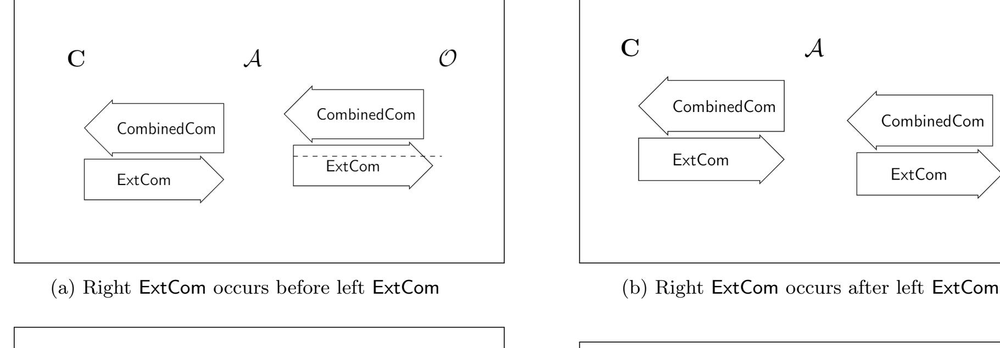
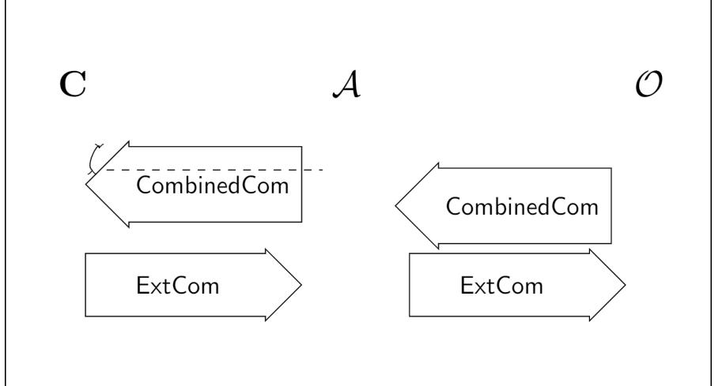
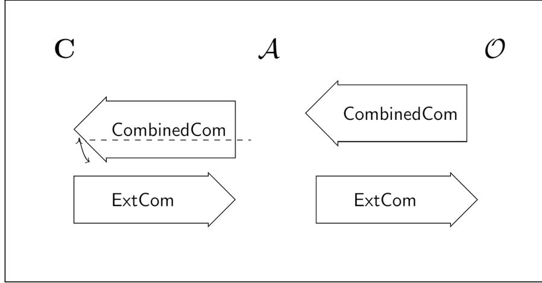

{0}------------------------------------------------

# Improved Black-Box Constructions of Composable Secure Computation?

Rohit Chatterjee, Xiao Liang, and Omkant Pandey

Stony Brook University, Stony Brook, USA {rochatterjee,liang1,omkant}@cs.stonybrook.edu

Abstract. We close the gap between black-box and non-black-box constructions of composable secure multiparty computation in the plain model under the minimal assumption of semi-honest oblivious transfer. The notion of protocol composition we target is angel-based security, or more precisely, security with super-polynomial helpers. In this notion, both the simulator and the adversary are given access to an oracle called an angel that can perform some predefined super-polynomial time task. Angel-based security maintains the attractive properties of the universal composition framework while providing meaningful security guarantees in complex environments without having to trust anyone.

Angel-based security can be achieved using non-black-box constructions in max(ROT, <sup>O</sup>e(log <sup>n</sup>)) rounds where ROT is the round-complexity of the semi-honest oblivious transfer. However, currently, the best known black-box constructions under the same assumption require max(ROT, <sup>O</sup>e(log<sup>2</sup> <sup>n</sup>)) rounds. If <sup>R</sup>OT is a constant, the gap between non-black-box and black-box constructions can be a multiplicative factor log <sup>n</sup>. We close this gap by presenting a max(ROT, <sup>O</sup>e(log <sup>n</sup>))-round black-box construction. We achieve this result by constructing constant-round 1-1 CCA-secure commitments assuming only blackbox access to one-way functions.

Keywords: Secure Multi-Party Computation · Black-Box · Composable · Non-Malleable.

# 1 Introduction

Secure multiparty computation (MPC) [\[Yao86,](#page-29-0) [GMW87\]](#page-27-0) enables two or more mutually distrustful parties to compute any functionality without compromising the privacy of their inputs. These early results [\[Yao86,](#page-29-0) [GMW87\]](#page-27-0), along with a rich body of followup work that refined and developed the concept [\[GL91,](#page-27-1) [Bea92,](#page-26-0) [MR92,](#page-29-1) [Can00,](#page-26-1) [PW01,](#page-29-2) [Can01\]](#page-26-2), demonstrated the feasibility of general secure computation and its significance to secure protocol design. The existence of semi-honest oblivious transfer (OT) was established by Kilian [\[Kil88\]](#page-28-0) as the minimal, i.e., necessary and sufficient, assumption for general secure computation. The focus of this work is on black-box constructions of composable MPC protocols. We discuss these two aspects.

Black-Box Constructions. A construction is black-box if it does not refer to the code of any cryptographic primitive it uses, and only depends on their input/output behavior. Such constructions are usually preferable since their efficiency is not affected by the implementation details of the underlying cryptographic primitives; moreover, they remain valid and applicable if the code of the underlying primitives is simply not available, e.g., in case of constructions based on hardware tokens [\[MR04,](#page-29-3) [GLM](#page-27-2)+04, [Kat07,](#page-28-1) [GIS](#page-27-3)+10, [HPV16\]](#page-28-2).

Early constructions of general-purpose MPC were non-black-box in nature particularly due to NP-reductions required by underlying zero-knowledge proofs [\[GMW87\]](#page-27-0). Ishai et al. [\[IKLP06\]](#page-28-3)

<sup>?</sup> This material is based upon work supported in part by DARPA SIEVE Award HR00112020026, NSF grant 1907908, and a Cisco Research Award. Any opinions, findings and conclusions or recommendations expressed in this material are those of the author(s) and do not necessarily reflect the views of the United States Government, DARPA, NSF, or Cisco.

{1}------------------------------------------------

presented the first black-box construction of general purpose MPC based on enhanced trapdoor permutations or homomorphic public-key encryption schemes. Together with the subsequent work of Haitner [\[Hai08\]](#page-28-4), this provided a black-box construction of a general MPC protocol under minimal assumptions (i.e., semi-honest OT). The round complexity of black-box MPC was improved to O(log<sup>∗</sup> n) rounds by Wee [\[Wee10\]](#page-29-4), and to constant rounds by Goyal [\[Goy11\]](#page-28-5). In the two party setting, a constant round construction was first obtained by Pass and Wee [\[PW09\]](#page-29-5), and subsequently a 5-round construction was given by Ostrovsky, Richelson, and Scafuro [\[ORS15\]](#page-29-6), which is known to be optimal by the results of Katz and Ostrovsky [\[KO04\]](#page-28-6).

Composable Security. The notion of security considered in early MPC works is called standalone security since it only considers a single execution of the protocol. Stronger notions of security are required for complex environments such as the Internet where several MPC protocols may run concurrently. This setting is often referred to as the concurrent setting, and unfortunately, as shown by Feige and Shamir [\[FS90\]](#page-27-4), stand-alone security does not necessarily imply security in the concurrent setting.

To address this issue, Canetti [\[Can01\]](#page-26-2) proposed the notion of universally composable (UC) security which has two important properties: concurrent security and modular analysis. The former means that UC secure protocols maintain their security in the presence of other concurrent protocols and the latter means that the security of a larger protocol in the UC framework can be derived from the UC security of its component protocols. This latter property is stated as a composition theorem which, roughly speaking, states that UC is closed under composition [\[Can01\]](#page-26-2). Unfortunately, UC security turns out to be impossible in the plain model for most tasks [\[Can01,](#page-26-2) [CF01,](#page-26-3) [CKL03\]](#page-27-5). Relaxations of UC that consider composing the same protocol were also ruled out by Lindell [\[Lin03,](#page-28-7) [Lin04\]](#page-28-8).

These strong negative results motivated the search for alternative notions of concurrent security in the plain model by endowing more power to the simulator such as super polynomial resources [\[Pas03,](#page-29-7) [PS04,](#page-29-8) [BDH](#page-26-4)+17], ability to receive multiple outputs [\[GJO10,](#page-27-6) [GJ13\]](#page-27-7), or resorting to weaker notions such as bounded concurrency [\[Bar02,](#page-26-5) [Pas04\]](#page-29-9), input indistinguishability [\[MPR06\]](#page-29-10), or a combination thereof [\[GGJ13\]](#page-27-8). While all of these notions were (eventually) achieved under polynomial hardness assumptions [\[PS04,](#page-29-8) [BS05,](#page-26-6) [MMY06,](#page-29-11) [CLP10,](#page-27-9) [GGJS12,](#page-27-10) [LP12,](#page-28-9) [PLV12,](#page-29-12) [KMO14,](#page-28-10) [Kiy14,](#page-28-11) [GLP](#page-27-11)+15, [BDH](#page-26-4)+17, [GKP18\]](#page-27-12), only angel-based security by Prabhakaran and Sahai [\[PS04\]](#page-29-8) (including its extension to interactive angels by Canetti, Lin, and Pass [\[CLP10\]](#page-27-9)) and shielded-oracle security by Broadnax et al. [\[BDH](#page-26-4)+17] are known to have the modular analysis property, i.e., admitting a composition theorem along the lines of UC. We focus on angel-based security in this work since it arguably has somewhat better composition properties than shielded oracles.[1](#page-1-0)

Angel based security is similar to UC except that it allows the simulator as well as the adversary access to a super-polynomial resource called an "angel" which can perform a pre-defined task such as inverting a one-way function. Early constructions of angel-based security were based on non-standard assumptions [\[PS04,](#page-29-8) [BS05,](#page-26-6) [MMY06\]](#page-29-11). The beautiful work of Canetti et al. [\[CLP10\]](#page-27-9) presented the first construction under polynomial hardness assumptions, and the subsequent work of Goyal et al. [\[GLP](#page-27-11)+15] improved the round complexity to <sup>O</sup>e(log <sup>λ</sup>) under general assumptions.

The first black-box construction of angel-based security was obtained by Lin and Pass [\[LP12\]](#page-28-9), under the minimal assumption of semi-honest OT. The main drawback of [\[LP12\]](#page-28-9) is that it requires

<span id="page-1-0"></span><sup>1</sup> As noted in [\[BDH](#page-26-4)<sup>+</sup>17], shielded oracle security does not technically have the modular analysis property and is actually strictly weaker than angel-based. Nevertheless, it is still "compatible" with the UC framework—the security of a composed protocol can be derived from that of its components.

{2}------------------------------------------------

polynomially many rounds even if the underlying OT protocol has constant rounds. To address this situation, Kiyoshima [Kiy14] presented a  $\widetilde{O}(\log^2 \lambda)$ -round construction assuming constant-round semi-honest OT (or alternatively,  $\max(\widetilde{O}(\log^2 \lambda), O(R_{OT}))$ ) rounds where  $R_{OT}$  is OT's round-complexity). We remark that Broadnax et al. [BDH+17] present a constant-round black-box construction for (the weaker but still composable) shielded-oracle security (utilizing prior work by Hazay and Venkitasubramaniam [HV15] who provide a constant-round protocol in the CRS-hybrid model); however, they require stronger assumptions, specifically, homomorphic commitments and public-key encryption with oblivious public-key generation.

State of the Art. To summarize our discussion above, under the minimal assumption of polynomially secure semi-honest OT, the best known round complexity of black-box constructions for angel-based security, and in fact any composable notion with modular analysis property, is due to Kiyoshima [Kiy14] which requires  $\max(\widetilde{O}(\log^2 \lambda), O(R_{OT}))$  rounds. This is in contrast to the non-black-box construction of Goyal et al. [GLP+15] which requires only  $\max(\widetilde{O}(\log \lambda), O(R_{OT}))$  rounds. Therefore, there is a multiplicative gap of  $\widetilde{O}(\log \lambda)$  between the round-complexities of state-of-the-art black-box and non-black-box constructions of angel-based MPC if, e.g., semi-honest OT has at most logarithmic rounds.

#### 1.1 Our Results

<span id="page-2-0"></span>In this work, we prove the following theorem, thus closing the gap between the round complexity of black-box and non-black-box constructions of angel-based MPC under minimal assumptions:

**Theorem 1 (Main).** Assume the existence of  $R_{\mathsf{OT}}$ -round semi-honest oblivious transfer protocols. Then, there exists a  $\max(\widetilde{O}(\log \lambda), O(R_{\mathsf{OT}}))$ -round black-box construction of a general MPC protocol that satisfies angel-based UC security in the plain model.

Note that this yields a  $\widetilde{O}(\log \lambda)$ -round construction under the general assumption of enhanced trapdoor permutations since they imply constant-round semi-honest OT.

We follow the framework of [CLP10] and its extensions in [LP12, Kiy14]. The main building block [CLP10] is a special commitment scheme called a CCA-Secure Commitment. Roughly speaking, a CCA-secure commitment is a tag-based commitment scheme that maintains hiding even in the presence of a decommitment oracle  $\mathcal{O}$ . More specifically, the adversary receives one commitment from an honest committer and may simultaneously make concurrently many commitments to  $\mathcal{O}$ (similar to non-malleable commitments [DDN91]). The oracle immediately extracts and sends back any value adversary commits successfully provided that it used a tag that is different from the one used by the honest committer. Lin and Pass [LP12] show that  $O(\max(R_{CCA}, R_{OT}))$ -round blackbox angel-based MPC can be obtained from a  $R_{CCA}$ -round CCA commitment and a  $R_{OT}$ -round semi-honest OT protocol. Kiyoshima [Kiy14] demonstrated that  $O(k \cdot \log \lambda)$ -round CCA-secure commitments can be obtained in a black-box manner from a k-round commitment scheme with slightly weaker security called "one-one CCA" where the adversary can open only one session each with the committer as well as the oracle; they further construct a  $O(\log \lambda)$ -round one-one CCA scheme from one-way functions in a black-box manner. We instead present a constant round construction of one-one CCA, which implies  $O(\log \lambda)$ -round (full) CCA commitments using [Kiy14] (and Theorem 1 using [LP12]):

<span id="page-2-1"></span>**Theorem 2 (CCA Secure Commitments).** Assume the existence of one-way functions. Then, there exists a  $\widetilde{O}(\log \lambda)$ -round black-box construction of a CCA-secure commitment scheme.

{3}------------------------------------------------

### 1.2 Overview of Techniques

### 1.2.1 Current Approaches

Let us briefly review the current approaches for constructing CCA secure commitments. The main difficulty in constructing CCA secure commitments under polynomial hardness is to move from the real world—which contains the exponential time decommitment oracle O—to a hybrid where O's responses can be efficiently simulated. A standard way to do this is to use a proof-of-knowledge (PoK): the protocol should require the (man-in-the-middle) adversary, say A, to give a PoK of the value it commits. The main difficulty in employing this is that A may open concurrently many sessions with O (referred here to as "right" side sessions), interleaved in an arbitrary manner; furthermore, these values have to be extracted immediately within each session irrespective of what happens in other sessions. This is precisely the issue in xonstructing (black-box simulatable) concurrent zero-knowledge (CZK) protocols [\[DNS98\]](#page-27-14) as well, and ideas from there are applied in this setting too. A second difficulty is that these extractions must happen without rewinding the commitment A receives (referred to as "left" side session).

It is worthwhile to quickly recall the (tag based) non-malleable commitment construction in the original work of [\[DDN91\]](#page-27-13). In this cosntruction, A has only one right session; to prove that the value on the right is (computationally) independent from that on the left, the value on the right is extracted without rewinding the sensitive parts of the left side commitments. This is done by creating two types of PoK— one each for two possible values of a bit. These PoK create rewinding "slots" for extraction such that if A uses a different bit in the tag, it risks the possibility of having to perform a PoK on its own—i.e., without any "dangerous" rewinding on the left—in one of the slots (called a "free" slot). These special PoK are performed for each bit of the tag sequentially so that at least one free slot is guaranteed since the left and right tags are different by definition. While this requires n rounds n-bit tags, it is possible to split the tag into n smaller tags of log n bits and run the protocol for each of them in parallel [\[DDN91,](#page-27-13) [LPV08\]](#page-29-13). Referred to as "LOG trick," this yields a O(log n)-round protocol.

The key idea for CCA commitments in [\[CLP10\]](#page-27-9), at a high level, is to ensure that in the concurrent setting, many free slots exist for each session so that extraction succeeds before the end of that session. This is achieved by creating a polynomial round protocol consisting of sequential repetition of special PoK as above and then relying on an analysis that is, at a high level, similar to early rewinding techniques from CZK literature [\[RK99,](#page-29-14) [CGGM00\]](#page-26-7). Once the issue of concurrent extraction is handled, the additional ideas in [\[LP12\]](#page-28-9) are (again, at a high level) to enforce this approach using cut-and-choose protocols to obtain a black-box construction. The work of Goyal et al. [\[GLP](#page-27-11)+15] shows how to separate the tasks of "concurrent extraction" and"non-malleability" in this approach by proving a "robust extraction lemma." This allows them to follow a structure similar to that of concurrent non-malleable zero-knowledge (CNMZK) from [\[BPS06\]](#page-26-8) which matches the round complexity of CZK, i.e., <sup>O</sup>e(log <sup>n</sup>). However, their approach requires non-black usage of oneway functions. Kiyoshima [\[Kiy14\]](#page-28-11) shows that the robust-extraction lemma can actually be applied to the previous black-box protocol of [\[LP12\]](#page-28-9) to get <sup>O</sup>e(<sup>k</sup> · log <sup>n</sup>) rounds if one has a slightly stronger primitive than non-malleable commitments: namely k-round 1-1 CCA commitments. To build such commitments, Kiyoshima builds non-malleability "from scratch" by combining the DDN "LOG trick" with cut-and-choose components of [\[LP12\]](#page-28-9) so that the extraction on right in the standalone setting, can be done without any dangerous rewinding on left. This however results in O(log n) rounds for 1-1 CCA and <sup>O</sup>e(log<sup>2</sup> <sup>n</sup>) for full CCA.

{4}------------------------------------------------

### 1.2.2 Our Approach

We significantly deviate from current approaches for constructing 1-1 CCA commitments. Instead of attempting to build non-malleability from scratch, our goal is to have a generic construction built around existing non-malleable commitments. The resulting protocol will not only have a simpler and more modular proof of security, but will also benefit from the efficiency and assumptions of the underlying non-malleable commitment (NMCom). Towards this goal, we return to investigate the structure of CNMZK protocols even for the simpler case of 1-1 CCA.

Setting aside the issue of round-complexity for the moment, a key idea in the construction of CNMZK protocols [\[BPS06,](#page-26-8) [LPTV10,](#page-29-15) [OPV10,](#page-29-16) [LP11\]](#page-28-13) is to have the prover give a non-malleable commitment (NMCom) which can later be switched to a "trapdoor value" set by the verifier; the non-malleability of NMCom ensures that A cannot switch his value to a trapdoor on the right (unless he did so in the real world, which can be shown impossible through other means). The prover later proves that either the statement is true or it committed the trapdoor. The main problem with this approach is that it requires us to prove a predicate over the value committed in NMCom which requires non-black-box use of cryptographic primitives.

Non-Malleable Commit-and-Prove. One potential idea to avoid non-black-box techniques is to turn to black-box commit-and-prove protocols in the literature and try to re-develop them in the context of non-malleability. Commit-and-prove protocols allow a committer to commit to a value v so that later, it can prove a predicate φ over the committed value in zero-knowledge. These protocols can be constructed in constant rounds using the powerful "MPC-in-the-head" approach introduced by Ishai et al. [\[IKOS07\]](#page-28-14). The approach allows committing multiple values v1, . . . , v<sup>n</sup> and then proving a joint predicate φ over them. One such construction is implicit in the work of Goyal et al. [\[GLOV12\]](#page-27-15). Such commitments were also used extensively by Goyal et al. to build size-hiding commit-and-prove [\[GOSV14\]](#page-27-16) and an optimal four round construction was obtained by Khurana, Ostrovsky, and Srinivasan [\[KOS18\]](#page-28-15). As noted above, if we can develop an appropriate non-malleable version of such protocols, it is conceivable that they can yield constant-round 1-1 CCA commitment. Note however that non-malleable commitments are not usually equipped to handle proofs. Therefore, such an approach will necessarily have to "open up" the construction of non-malleable commitments. In particular, like previous constructions, this approach cannot be based on non-malleable commitments in a black-box manner.

Changing the Direction of NMCom. In order to rely on non-malleable commitments directly, it is essential that we do not prove anything about the values committed inside the NMCom. Instead, we should restrict all proofs to be performed only over standard commitments since for them we can use standard black-box commit-and-prove protocols. Towards building this property, what if we change the direction of NMCom and ask the receiver of 1-1 CCA to send non-malleable commitments, which, for example, can be opened later? More specifically, in our 1-1 CCA protocol, the receiver will send a NMCom to a random value σ which it will open subsequently. The committer will send a "trapdoor commitment" t before it sees σ opened. Later, the committer will commit to the desired value v and give a PoK that either it knows v or t is a commitment to σ (the "trapdoor"). Observe that this structure completely avoids any proof directly over non-malleable commitments; all proofs only need to be performed over ordinary commitments. Therefore, if we use the commit phase of black-box commit-and-prove protocols to commit to σ and v we can easily complete the PoK in a black-box manner: the predicate φ in the proof phase will simply test for the presence of trapdoor 

{5}------------------------------------------------

σ. Some standard soundness issues arise in this approach but they can be handled by ensuring that the commit phase is extractable.

Although this approach yields a black-box construction directly from NMCom, it is hard to prove the 1-1 CCA property. At a high level, this is because of the following: if in the 1-1 CCA game, A schedules the completion of the left NMCom before the right one[2](#page-5-0) , the simulator in the security proof must extract σ from this NMCom while the right NMCom is still in play (so that it can generate t to be a commitment to σ). This involves rewinding the left NMCom (assuming it is extractable) which in turn rewinds the right session.[3](#page-5-1) A similar issue arises in the work of Jain and Pandey [\[JP14\]](#page-28-16) on black-box non-malleable zero-knowledge where it is resolved by using a NMCom that is already 1-1 CCA secure. We do not have this flexibility in our setting.

A possible fix for this issue is to rely on some kind of "delayed input" property: i.e., the commitment to t will be an extractable commitment that does not require the message m to be committed until the last round. This property can be obtained by committing to a key k in an extractable manner and then in the last round committing to m by simply encrypting with k. This however will no longer be compatible with the black-box commit-and-prove strategy since we will now have to take encryption into account.

We overcome this issue by making extensive use of extractable commitments. More specifically, we first prepend the NMCom with a standard "slot-based" extractable commitment which commits to the same value σ as the NMCom. If the NMCom also has a slot like extractable structure (e.g., the three round scheme of [\[GPR16\]](#page-28-17)), we can argue that non-synchronous adversaries must always leave a free slot either on top or at the bottom of NMCom. For example, in the troublesome scheduling discussed above, A can be easily rewound in the last two messages of NMCom (if we use [\[GPR16\]](#page-28-17)) without rewinding the right NMCom. In other non-synchronous schedules it will have a free slot in the top extractable commitment on the left. On the other hand, synchronous adversaries will fail in the NMCom step (and synchronous non-malleability suffices for our purposes). In summary, this will suffice for us to show that even if our simulator sets up the trapdoor statement on the left (by committing σ in t), A cannot do the same on the right. Other NMCom, particularly public-coin extractable NMCom also seem sufficient.

A second issue here is the intertwining of the left PoK[4](#page-5-2) with "extractable" components on the right, e.g., the right PoK (or extractable commitment steps). In order to prove that A cannot setup the trapdoor, extraction from right PoK will be necessary in the proof and this will be troublesome when changing the witness in the left PoK during hybrids. This issue can be handled using the sequential repetition technique from [\[LP09\]](#page-28-18): we use k + 1 PoK where k is the (constant) rounds in a single PoK. It is worthwhile to note that other common methods for handling this issue do not work: e.g., we cannot rely on statistical WI since it requires stronger assumptions for constant rounds; we also cannot use proofs that are secure against a fixed number of rewinds since they usually allow a noticeable probability of extraction which is insufficient for a 1-1 CCA commitment, where extraction must succeed with overwhelming probability.

<span id="page-5-0"></span><sup>2</sup> Note that NMCom's direction is opposite to that of 1-1 CCA: the receiver of 1-1 CCA is the sender of right NMCom.

<span id="page-5-1"></span><sup>3</sup> This is not an issue in the synchronous schedule since in that case, the value A commits to in NMCom is provided to the distinguisher along with the joint view.

<span id="page-5-2"></span><sup>4</sup> Observe that the PoK will just be the proof part of appropriate black-box commit-and-prove with right parameters to ensure black-box property; they will also satisfy witness-indistinguishability [\[FS90\]](#page-27-4).

{6}------------------------------------------------

### 1.3 Other Related Works

The focus of our work is constructions in the plain model. Hazay and Venkitasubramaniam [\[HV16\]](#page-28-19) gave a black-box construction of an MPC protocol without any setup assumptions that achieves composable security against an adaptive adversary. UC security can be achieved by moving to other trusted setup models such as the common reference string model [\[CLOS02,](#page-27-17) [CF01,](#page-26-3) [GO07\]](#page-27-18), assuming an honest majority of parties [\[CKL03\]](#page-27-5), trusted hardware [\[MR04,](#page-29-3) [GLM](#page-27-2)+04, [Kat07,](#page-28-1) [CCOV19\]](#page-26-9), timing assumptions on the network [\[KLP05\]](#page-28-20), registered public-key model [\[BCNP04\]](#page-26-10), setups that may be expressed as a hybrid of two or more of these setups [\[GGJS11\]](#page-27-19), and so on. Lin, Pass, and Venkitasubramaniam [\[LPV09,](#page-29-17) [PLV12\]](#page-29-12) show that a large number of these setup models could be treated in a unified manner, and black-box analogues of these results were obtained by Kiyoshima, Lin, and Venkitasubramaniam [\[KLV17\]](#page-28-21).

### 2 Preliminaries

Notations. We use <sup>λ</sup> for the security parameter. We use <sup>c</sup> ≈ to denote computational indistinguishability between two probability ensembles. For a set S, we use x \$ ←− S to mean that x is sampled uniformly at random from S. PPT denotes probabilistic polynomial time and negl(·) denotes negligible functions.

We assume familiarity with standard concepts such as commitment schemes, witness indistinguishability. We provide in the following the definitions for extractable commitments, non-malleable commitments and CCA commitments. We recall the MPC-related definitions in Section [A.](#page-30-0)

### 2.1 Extractable Commitments

Definition 1 (Extractable Commitment Schemes). A commitment scheme ExtCom = (S, R) is extractable if there exists an expected polynomial-time probabilistic oracle machine (the extractor) Ext that given oracle access to any PPT cheating sender S <sup>∗</sup> outputs a pair (τ, σ<sup>∗</sup> ) such that:

- Simulation: τ is identically distributed to the view of S <sup>∗</sup> at the end of interacting with an honest receiver R in commitment phase.
- Extraction: the probability that τ is accepting and σ <sup>∗</sup> = ⊥ is negligible.
- Binding: if σ <sup>∗</sup> 6= ⊥, then it is statistically impossible to open τ to any value other than σ ∗ .

The following construction of ExtCom (Protocol [1\)](#page-7-0) is standard [\[DDN91,](#page-27-13) [PRS02,](#page-29-18) [Ros04\]](#page-29-19). We will call it the standard ExtCom.

# 2.2 Non-Malleable Commitments

We follow the definition of non-malleability from [\[LPV08,](#page-29-13) [GPR16\]](#page-28-17). This definition is based on the comparison between a real execution with an ideal one. In the real interaction, we consider a manin-the-middle adversary A interacting with a committer C in the left session, and a receiver R in the right. We denote the relevant entities used in the right interaction as "tilde'd" version of the corresponding entities on the left. In particular, suppose that C commits to v in the left interaction, and <sup>A</sup> commits to <sup>v</sup><sup>e</sup> on the right. Let MIM<sup>v</sup> denote the random variable that is the pair (view, <sup>v</sup>e), consisting of the adversary's entire view of the man-in-the-middle execution as well as the value

{7}------------------------------------------------

### <span id="page-7-0"></span>Protocol 1: Extractable Commitment Scheme $\langle S, R \rangle$

The extractable commitment scheme, based on any commitment scheme Com, works in the following way. The scheme has 3 rounds if Com is non-interactive.

### Input:

- both S and R get security parameter  $1^{\lambda}$  as the common input.
- -S gets a string  $\sigma$  as his private input.

### **Commitment Phase:**

- The sender (committer) S commits using  $\mathsf{Com}$  to  $\lambda$  pairs of strings  $\{(v_i^0, v_i^1)\}_{i=1}^{\lambda}$  where  $(v_i^0, v_i^1) = (\eta_i, \sigma \oplus \eta_i)$  and  $\eta_i$  are random strings in  $\{0, 1\}^{\ell(\lambda)}$  for  $1 \leq i \leq \lambda$ .
- Upon receiving a challenge  $\bar{c} = (c_1, \dots, c_{\lambda})$  from the receiver R, S opens the commitments to  $(v_1^{c_1}, \dots, v_{\lambda}^{c_{\lambda}})$ .
- -R checks that the openings are valid.

#### **Decommitment Phase:**

- S sends  $\sigma$  and opens the commitments to all  $\lambda$  pairs of strings.
- R checks that all the openings are valid, and also that  $\sigma = v_1^0 \oplus v_1^1 = \cdots = v_{\lambda}^0 \oplus v_{\lambda}^1$ .

committed to by  $\mathcal{A}$  on the right (assuming C commits to v on the left). The *ideal* interaction is similar, except that C commits to some arbitrary fixed value (say 0) on the left. Let  $\mathsf{MIM}_0$  denote the pair (view,  $\widetilde{v}$ ) in the ideal interaction. We use an tag-based (or "identity-based") specification, and ensure that  $\mathcal{A}$  uses a distinct tag  $\widetilde{\mathsf{id}}$  on the right from the tag  $\mathsf{id}$  it uses on the left. This is done by stipulating that  $\mathsf{MIM}_v$  and  $\mathsf{MIM}_0$  both output a special value  $\bot_{\mathsf{id}}$  when  $\mathcal{A}$  uses the same tag in both the left and right executions. The reasoning is that this corresponds to the uninteresting case when  $\mathcal{A}$  is simply acting as a channel, forwarding messages from C on the left to R on the right and vice versa. We let  $\mathsf{MIM}_v(z)$  and  $\mathsf{MIM}_0(z)$  denote the real and ideal interactions respectively when the adversary receives auxiliary input z.

**Definition 2 (Non-Malleable Commitment Schemes).** A (tag-based) commitment scheme  $\langle C, R \rangle$  is non-malleable if for every PPT man-in-the-middle adversary  $\mathcal{A}$ , and for all values v, we have

$$\{\mathsf{MIM}_v(z)\}_{z\in\{0,1\}^*} \overset{c}{\approx} \{\mathsf{MIM}_0(z)\}_{z\in\{0,1\}^*}.$$

**Synchronizing Adversaries:** This notion refers to man-in-the-middle adversaries who upon receiving a message in one session, immediately respond with the corresponding message in the other session. An adversary is said to be *non-synchronizing* if it is not synchronizing.

<span id="page-7-1"></span><sup>&</sup>lt;sup>a</sup> The scheme supports extraction as long  $k = \omega(\log \lambda)$  pairs are used.

{8}------------------------------------------------

## 2.3 CCA Commitments

We define the notion of CCA-secure commitments (and 1-1 CCA security in particular). These definitions rely on the notion of a decommitment oracle, which provide decommitments given valid transcripts to a particular (tag based) commitment protocol. Specifically, a decommitment oracle O for a given commitment protocol acts as follows:

- O acts as an honest reciever against some committer C, participating faithfully according to the specified commitment scheme. C is allowed to pick a tag for this interaction adaptively.
- At the end of this interaction, if the honest reciever were to accept the transcript as containing a valid commitment with respect to the given tag, O returns the value v committed by C to it. Otherwise, it returns ⊥.

We denote an adversary with access to the decommitent oracle as AO. CCA security then essentially constitutes preservation of the hiding property even against adversaries enjoying such oracle access. More formally, we define the following game INDb(hC, Ri, A, O, n, z) (b ∈ {0, 1}) as follows: given the public parameter 1<sup>n</sup> and auxillary input z, the adversary A<sup>O</sup> adaptively generates two challenge values v0, v<sup>1</sup> of length n, and a tag tag ∈ {0, 1} n . Then, A<sup>O</sup> receives a commitment to v<sup>b</sup> with tag tag from the challenger. Let y be the output of A in this game. The output of the game is ⊥ if during the game, A sends O any commitment using tag tag. Otherwise, the output of the game is y. We abuse notation to denote the output of the game INDb(hC, Ri, A, O, n, z) by the same symbol INDb(hC, Ri, A, O, n, z).

<span id="page-8-0"></span>Definition 3 (CCA Commitment). Let hC, Ri be a tag-based commitment scheme, and O be an associated decommitment oracle. Then hC, Ri is said to be CCA secure w.r.t. O, if for every nonuniform PPT machine A, the following ensembles are computationally indistinguishable:

```
– {IND0(hC, Ri, A, O, n, z)}n∈N,z∈{0,1}
                                         ∗
```

$$- \{\mathsf{IND}_1(\langle C, R \rangle, \mathcal{A}, \mathcal{O}, n, z)\}_{n \in \mathbb{N}, z \in \{0, 1\}^*}$$

It is customary to call any commitment scheme that is CCA secure with respect to some decommitment oracle as just CCA secure (but in general the oracle is usually also described, and is of course necessary to prove such security). It is also customary to call the interaction between the challenger and adversary as the left interaction, and that between adversary and oracle as the right interaction, in the fashion of non-malleable commitments, where the security property chiefly considers man in the middle attacks.

1-1 CCA. A scheme is 1-1 CCA secure (denoted as CCA1:1) if the corresponding adversary is only allowed one interaction with the oracle.

# 3 A New CCA1:1 Commitment Scheme

We will require the following ingredients for our CCA1:1 protocol:

- A statistically-binding commitment Com. Naor's commitment works.
- A 3-round slot-based extractable commitment scheme ExtCom; for concreteness we will use the standard 3-round scheme (shown in Protocol [1\)](#page-7-0) based on Naor's commitment (the first message ρ of Naor's commitment is not counted in rounds and assumed to be available from other parts of the protocol).

{9}------------------------------------------------

- An (extractable) commitment scheme ENMC that is non-malleable against synchronizing adversaries. We will need this protocol to be "compatible with slots" of the ExtCom defined above. For concreteness, we assume that ENMC is the 3-round commitment scheme of [\[GPR16\]](#page-28-17) which satisfies all our requirements.
- A k round witness indistinguishable argument of knowledge WIAoK.

We stress that all of these ingredients have constant rounds, and can be constructed from standard OWFs in a black-box manner.

Our Protocol. We now describe our first protocol for CCA1:1 commitments. This protocol does not specifically try to achieve the black-box usage of cryptographic primitives. This allows us to focus on proving CCA security. However, it achieves two important properties: it is based on minimal assumptions, and it has a constant number of rounds. Moreover, the structure of this protocol is chosen in such a way that later, it will be possible to convert into a fully black-box construction. We remark that we also directly use identities of length λ directly (this is in keeping with the [\[GPR16\]](#page-28-17) construction which does the same).

The formal description of the protocol appears in Protocol [2.](#page-10-0) At a high level, the protocol proceeds as follows. First, it requires the receiver to commit to a trapdoor string α using two extractable primitives: ExtCom as well as ENMC. Next, the committer will commit to an all zerostring β using ExtCom. Jumping ahead, in the security proof a "simulator machine" on left will set β = α and use it as a "fake witness" in a WIAoK; later we shall instantiate ExtCom with, roughly speaking, a "black-box commit-and-prove" to obtain a black-box construction. The receiver simply opens α in the next step, and the committer commits to the desired value, say v, followed by a proof of knowledge of v or that β = α. A crucial observation here is that proofs are not required to deal with values inside ENMC—by ensuring that ENMC values opened in the protocol execution.

<span id="page-9-1"></span>Theorem 3. The protocol hC, RiCCA (described in Protocol [2\)](#page-10-0) is a 1-1 CCA commitment scheme.

Proof. The statistical-binding property of protocol hC, RiCCA is straightforward. The computational hiding property is implied by the 1-1 CCA security as per Definition [3.](#page-8-0) In what follows, we focus on the proof of 1-1 CCA security. We prove this property in two steps: we first exhibit a proof of security against synchronizing adversaries in Section [3.1,](#page-9-0) and then consider non-synchronizing adversaries in Section [3.2.](#page-15-0)

### <span id="page-9-0"></span>3.1 Proof for Synchronous Adversaries

1-1 CCA Security. Recall that in the CCA challenge for commitments, the adversary is a manin-the-middle adversary that interacts with an honest committer on the left and a decommitment oracle on the right that acts as an honest reciever till the end of the interaction and then reveals the committed value to the adversary if the commitment was valid. The idea is that such an adversary cannot tell apart two different values being committed on the left even given access to the decommitment returned by the oracle on the right.

We will show that the adversary's ultimate output in such a game is indistinguishable for any two distinct values being committed on the left (this is because the values to be committed can be chosen adaptively by the adversary).

Thus consider that there is a man-in-the-middle adversary A that participates in the CCA challenge outlined above. As before, we will use the convention that unmarked symbols indicate

{10}------------------------------------------------

# <span id="page-10-0"></span>Protocol 2: CCA1:1 Commitment Scheme hC, RiCCA

We let λ ∈ N denote the security parameter. All primitives used in the protocol by default have 1<sup>λ</sup> as part of their input. We omit this detail in the following. Further, we assume that the execution involves a tag or identity id ∈ {0, 1} λ .

Input: The committer C and reciever R have common input as the security parameter 1<sup>λ</sup> . Additionally, C has as private input a value v which it wishes to commit to.

# Commitment Phase. This proceeds as follows:

- Stage 0: C commits to the value v using Com, and sends this along with the identity id to R.
- Stage 1: This consists of the following steps:
  - (a) R picks a value α \$←− {0, 1} λ .
  - (b) R commits to α<sup>1</sup> = α using ExtCom.
- Stage 2: R commits to α<sup>2</sup> = α using ENMC, using identity id. For future reference, we denote by CombinedCom the joint execution of Stage 1 and 2 up to this point. Observe that CombinedCom is a statistically binding commitment scheme.
- Stage 3: C now commits to β = 0<sup>λ</sup> using ExtCom.
- Stage 4: This goes as follows:
  - 1. R decommits to both its commitments so far, revealing α<sup>1</sup> and α2.
  - 2. C checks these decommitments, aborting if α<sup>1</sup> 6= α2.
- Stage 5: C and R engage in k + 1 WIAoK protocols sequentially. We denote these WIAoK executions as WIAoK<sup>i</sup> for i = 1, . . . , k+ 1. In all these WIAoKs, C proves the same (compound) statement which is true if and only if:
  - (a) there exists randomness η s.t. c = Com(v; η); or
  - (b) β = α<sup>1</sup> = α2, where β is the unique string committed in the transcript of Stage-3.

Note that an honest prover will always use the witness for part-(a) of the above compound statement, which we refer as the "original witness". We will refer the witness for part-(b) of the compound statement. Looking ahead, some hybrids will use the trapdoor witness to go through the WIAoKs.

Decommitment Phase. The committer C decommits to v and β. R checks if these decommitments are valid, and accepts if so.

values used in the left interaction and symbols marked with a tilde indicate values used in the right interaction. Fix two arbitrary values v<sup>0</sup> and v<sup>1</sup> in the message space. We will now show

$$\{\mathsf{IND}_0(\langle C,R\rangle_{\mathsf{CCA}},\mathcal{A},\mathcal{O},n,z)\}_{n\in\mathbb{N},z\in\{0,1\}^*}\overset{\mathrm{c}}{\approx}\{\mathsf{IND}_1(\langle C,R\rangle_{\mathsf{CCA}},\mathcal{A},\mathcal{O},n,z)\}_{n\in\mathbb{N},z\in\{0,1\}^*}$$

To this end, we will use a hybrid argument.

{11}------------------------------------------------

We now describe the hybrids, and prove indistinguishability between contiguous ones. In the process, we will also mark out particular concerns that may render these arguments invalid in the non-synchronous case, and resolve these concerns later.

An Invariant Condition. In each hybrid we will need to refer to the value committed by the man-in-the-middle  $\mathcal{A}$  in Stage 3 of the protocol, denoted by  $\widetilde{\beta}$ . Since ExtCom is a statistically binding commitment, the value  $\widetilde{\beta}$  is always uniquely defined given the transcripts of ExtCom<sup>5</sup>. We can formally refer to this value w.r.t. any given machine M: if t is the output of M, we parse t to uniquely obtain the transcript corresponding to ExtCom in the right execution. We then define  $\widetilde{\beta}$  to be the value in that transcript and  $\widetilde{\beta} = \bot$  if this transcript in t is not uniquely defined. Furthermore, we define  $\widetilde{\alpha}$  to be the value that corresponds to the opening in Stage 3 on right in the output t, setting  $\widetilde{\alpha} = \bot$  if this value is not uniquely defined for the given t or the decommitments are invalid. We refer to these values by  $\widetilde{\beta}(t)$  and  $\widetilde{\alpha}(t)$  if we wish to be explicit about t, and unless specified otherwise, M is assumed to receive a parameter  $\lambda$  as its first input. Note that the role of M will be taken by hybrid machines in the proof. We can now define:

**Definition 4 (Invariant Condition).** For a Turing machine M, the invariant condition is said to hold for M if there exists a negligible function  $negl(\cdot)$  such that:

$$\Pr_{t \leftarrow M(1^{\lambda})} \left[ \widetilde{\beta}(t) = \widetilde{\alpha}(t) \right] \leq \mathsf{negl}(\lambda).$$

**Hybrid**  $H_0^0$ : This hybrid is identical to the experiment  $\mathsf{IND}_0(\langle C, R \rangle_{\mathsf{CCA}}, \mathcal{A}, \mathcal{O}, n, z)$  where the manin-the-middle  $\mathcal{A}$  receives a commitment to  $v_0$  on left. We view  $H_0^0$  (and all other subsequent hybrids) as a machine.

<span id="page-11-1"></span>**Lemma 1.** The invariant condition holds for  $H_0^0$ .

Proof. Observe that Stage-1 and Stage-2 together are referred to as CombinedCom; this defines a secure statistically binding commitment scheme since it consist of a sequential execution of two commitments (ExtCom and ENMC) which commit to the same value  $\tilde{\alpha}$ . We show that if the invariant condition does not hold for  $H_0^0$  then, we can construct a PPT adversary  $\mathcal{A}_{hid}$  to break hiding of CombinedCom. More specifically,  $\mathcal{A}_{hid}$  incorporates  $H_0^0$ ; it sends two random values  $(\tilde{\alpha}_0, \tilde{\alpha}_1)$  to an outside committer of CombinedCom; it then starts to run machine  $H_0^0$  with the following exception:

- It does not run the exponential time oracle or the **Stage-1** and **Stage-2** executions internally; instead it forwards the message from the outside committer to complete these two stages.
- It halts once the left **Stage-2** execution is done, outputting the its view  $\mathsf{view}_{\mathcal{A}_{\mathsf{hid}}}$  (which is the same as the view of  $H_0^0$  but "truncated" at the end of the right **Stage-2**).

Next, we construct a distinguisher D who incorporates  $\mathcal{A}$  (and hence  $H_0^0$ ); it gets as input the view view<sub> $\mathcal{A}_{hid}$ </sub> and proceeds as follows: D continues the execution of  $H_0^0$  from the state where  $\mathcal{A}$  halts, denoted st. Observe that D has all the information it needs to continue this execution. D halts at the end of **Stage-3** on right. If  $\mathcal{A}$  completes right **Stage 3** successfully, D runs the extractor of ExtCom to extract the committed value. By definition, if the invariant condition does not hold, it follows that  $\mathcal{A}$  commits to valid value such that  $\tilde{\beta} = \tilde{\alpha}$  with noticeable probability  $\epsilon$  (for infinitely many  $\lambda$ ), and therefor (by using standard averaging argument to account for good values of st) D learns  $\tilde{\alpha}$  in expected PPT time. This violates hiding of CombinedCom.

<span id="page-11-0"></span><sup>&</sup>lt;sup>5</sup> If the transcript can be decommitted to more than one value or no value at all, we define  $\widetilde{\beta} = \bot$ .

{12}------------------------------------------------

**Hybrid**  $H_1^0$ : This hybrid is identical to  $H_0^0$ , except that it does not run the exponential time oracle  $\mathcal{O}$ ; instead, if the right executions are accepting, it learns the committed value  $\tilde{v}$  by extracting it from WIAoK<sub>k+1</sub> (on right). If extraction fails, the extracted value is assumed to be  $\bot$ . Note that  $H_1^0$  is expected PPT.

Observe that  $H_1^0$  and  $H_0^0$  have identical executions up until the  $\mathcal{A}$  finishes its execution on right. Therefore, invariant condition holds in  $H_1^0$ . Consequently, by properties of the extractor for WIAoK, this hybrid always (i.e., with probability 1) extracts a valid witness (which includes the committed value) in expected PPT time. Thus,  $H_1^0$  and  $H_0^0$  are identically distributed.

**Hybrid**  $H_2^0$ : This hybrid is identical to  $H_1^0$ , except that whenever the left ENMC is accepting,  $H_1^0$  extracts the committed value  $\alpha$  from the left ENMC. If extraction fails,  $H_1^0$  outputs  $\bot$  and halts; otherwise it continues as  $H_1^0$ .

The outputs of  $H_1^0$  and  $H_2^0$  differ only when extraction fails, which happens with negligible probability. Therefore the two hybrids have statistically close outputs, and consequently, the invariant condition also holds in  $H_2^0$ .

<span id="page-12-0"></span>Remark 1. The above proofs for both indistinguishability and invariant condition are independent of  $\mathcal{A}$ 's scheduling, and work for the non-synchronizing case.

**Hybrid**  $H_3^0$ : This hybrid is identical to  $H_2^0$ , except that  $H_3^0$  sets  $\beta = \alpha$  (the value extracted from the left ENMC in  $H_2^0$ ) in **Stage-3** ExtCom on left.

First, note that if the invariant condition holds in  $H_3^0$ , the indistinguishability of  $H_2^0$  and  $H_3^0$  follows directly from the hiding property of left ENMC. The proof of the invariant condition for this hybrid is rather involved. We prove it in Lemma 2 towards the end. In the following, let us continue to assume that the invariant condition holds in  $H_3^0$ .

We will now define a number of hybrids in sequence:

- **Hybrid**  $H_{3+i}^0$  ( $i \in [k]$ ): This hybrid switches from proving statement (1) to statement (2) in WIAoK<sub>i</sub> (and also therefore switching from using the "original" witness to the "fake" one).
  - Indistinguishability. We note that if the invariant condition holds in  $H_3^0$ , it should also hold in  $H_{3+1}^0$  through  $H_{3+k}^0$ . This is because for each  $i \in [k]$ ,  $H_{3+i}^0$  and  $H_3^0$  are identical up to the end of **Stage-4**, and any changes after this stage do not affect the invariant condition in the synchronizing case. Now, if the invariant condition holds in  $H_{3+i}^0$  ( $i \in [k]$ ), indistinguishability between  $H_{3+i-1}^0$  and  $H_{3+i}^0$  for every i follows directly from the WI property (since the extraction only happens from WIAoK $_{k+1}$ ).
- **Hybrid**  $H^0_{3+k+1}$ : This hybrid is identical to  $H^0_{3+k}$ , except that instead of extracting the "witness" (i.e., the committed value  $\widetilde{v}$ ) from  $\mathsf{WIAoK}_{k+1}$ , it extracts from  $\mathsf{WIAoK}_1$  (which are both on the right).
  - Indistinguishability. Hybrids  $H_{3+k}^0$  and  $H_{3+k+1}^0$  proceed identically until the extraction is performed on right. Therefore, the invariant condition holds in  $H_{3+k+1}^0$ . Consequently, by the knowledge soundness of WIAoK,  $H_{3+k}^0$  and  $H_{3+k+1}^0$  are statistically close. This implies both that the invariant holds in  $H_{3+k+1}$ , and also that the outputs in hybrids  $H_{3+k}$  and  $H_{3+k+1}$  are indistinguishable.
- **Hybrid**  $H^0_{3+k+2}$ : This hybrid is identical to  $H^0_{3+k+1}$  except that it switches from the original witness to the trapdoor witness (i.e., values and randomness corresponding to  $\beta = \alpha$ ) in the left WIAoK<sub>k+1</sub>.

{13}------------------------------------------------

<u>Indistinguishability</u>. The proofs of both indistinguishability as well as the invariant condition are exactly as for  $H_{3+k}^0$  (or any of the other similar hybrids).

Note that in hybrid  $H^0_{3+k+2}$ , we can safely substitute  $v_0$  with  $v_1$  (thanks to the hiding of Com). Then we can build a sequence of hybrids similar to the above one, but in the reverse order, to finally reach the real execution  $\mathsf{IND}_1(\langle C, R \rangle_{\mathsf{CCA}}, \mathcal{A}, \mathcal{O}, n, z)$ . More formally, for  $j = 0, \ldots, 3+k+2$ , define hybrid  $H^1_j$  analogously to hybrid  $H^0_j$  (by replacing  $v_0$  with  $v_1$  on left).

First, note that the indistinguishability of  $H^0_{3+k+2}$  and  $H^1_{3+k+2}$  follows from that of Com since these hybrids do not use the "real witness" (i.e., the committed values) in their executions and they are both expected PPT. Then, using the same arguments as above, we conclude that  $H^1_{3+k+2}$  and  $H^1_0$  are computationally indistinguishable and invariant condition holds in each of them. This eventually finishes the proof for 1-1 CCA security against synchronous adversaries.

<span id="page-13-0"></span>We now prove the following Lemma, used earlier in the proof.

# **Lemma 2.** The invariant condition holds for (hybrid) machine $H_3^0$ .

*Proof.* We reduce the veracity of the invariant in this experiment to the (synchronous) non-malleability of ENMC. Recall that  $\mathcal{A}$  is the adversary for our CCA<sup>1:1</sup> scheme in  $H_3^0$ . We construct two machines to violate non-malleability of ENMC: a man-in-the-middle adversary  $A_{\text{NMC}}$  who attempts to commit a related value, and a corresponding distinguisher  $D_{\text{NMC}}$  who distinguishes the (joint) distribution of values committed by  $A_{\text{NMC}}$  on right.

At a high level, we cannot directly reduce to non-malleability of ENMC due to the presence of ExtCom in Stage-1 which commits to the same value as ENMC. Since ExtCom is not non-malleable, adversary  $\mathcal{A}$  may be able to rely on this commitment to create related values on right in our protocol. Specifically, in Stage-3, when the hybrid sets  $\beta = \alpha$  on left,  $\mathcal{A}$  may succeed in violating the invariant condition since Stage-3 uses the (possibly malleable) ExtCom. It is also not sufficient to replace the Stage-1 ExtCom with a non-malleable commitment since committed value is well defined only when both stages (1 and 2) commit to the same value. This is a relation over two values but ENMC is not concurrently non-malleable. We therefore proceed in a different manner where adversary  $A_{\text{NMC}}$  will simulate stage 1 on right (by committing one of the two random values of its choice) while receiving an ENMC commitment from outside for Stage-2. This will simulate the conditions of hybrid  $H_3^0$  with noticeable probability; and thus, if the invariant condition does not hold, the distinguisher can extract the committed value  $\widetilde{\beta}$  to violate hiding of ENMC on right.

Adversary  $A_{\text{NMC}}$ . This adversary participates in the non-malleability experiment w.r.t. commitment scheme ENMC. It does so by proceeding exactly as hybrid  $H_3^0$  internally while interacting with an outside committer as follows:

- $A_{\text{NMC}}$  picks two random values  $a_0$  and  $a_1$  and sends them to the outside committer of ENMC. (Note that the outside committer will commit to one of  $a_0$  or  $a_1$ , but  $A_{\text{NMC}}$  does not know which one).
- $A_{\text{NMC}}$  also starts the execution of adversary  $\mathcal{A}$  internally, proceeding exactly as  $H_3^0$  except that in **Stage-1** ExtCom on right, it commits to a randomly chosen value from  $\{a_0, a_1\}$ . We denote this value by  $a_b$  where b is a random bit.
- Next, in **Stage-2**,  $A_{\text{NMC}}$  does not run the ENMC internally. Instead, it sends all messages of the external (ENMC) committer as **Stage-2** messages of the *right* session for the internal adversary  $\mathcal{A}$ . Likewise, the messages of the left side stage 2 are sent to an outside receiver of ENMC.

{14}------------------------------------------------

-  $A_{\text{NMC}}$  halts at the end of **Stage-2**. For future reference, let **state** be state of machine  $A_{\text{NMC}}$  at this point.

Note that if outside committer commits to  $a_b$ , the state state of  $A_{\text{NMC}}$  is distributed identically to that of hybrid  $H_3^0$  at the end of stage 2. Let us now describe the distinguisher  $D_{\text{NMC}}$ .

**Distinguisher**  $D_{\mathsf{NMC}}$ . The input to the distinguisher is a pair  $(m,\mathsf{view})$  distributed either as  $\mathsf{MIM}^{A_{\mathsf{NMC}}}_{\mathsf{ENMC}}(a_0,\lambda,z)$  or  $\mathsf{MIM}^{A_{\mathsf{NMC}}}_{\mathsf{ENMC}}(a_1,\lambda,z)$  where z is an arbitrary advice string for algorithm  $A_{\mathsf{NMC}}$ . Note that m is the value committed by  $A_{\mathsf{NMC}}$  and  $\mathsf{view}$  is the joint view of both executions it participates in. The distinguisher incorporates  $A_{\mathsf{NMC}}$  and proceeds as follows:

- By definition, view includes the joint view of  $A_{NMC}$ , which in turn contains the view of  $\mathcal{A}$  and hence state state as well as  $(a_0, a_1)$ . Recall that hybrid  $H_3^0$  extracts the value committed in the left ENMC, denoted  $\alpha_2$ ; this value is exactly equal to m.
- $-D_{\mathsf{NMC}}$  defines the following machine  $C^*$ :  $C^*$  incorporates machine  $A_{\mathsf{NMC}}$  and has values  $(m,\mathsf{view})$  hardwired. It starts the machine  $A_{\mathsf{NMC}}$  from state state and continues to proceed exactly as  $H^0_3$  in the next stage. In particular, it does not extract anything from ENMC and simply uses m in its place. That is, it sets  $\beta = m$  in the Stage-3 execution of ExtCom on left. Furthermore,  $C^*$  forwards all messages corresponding to  $\mathit{right}$  stage 3 to an external receiver of ExtCom. Note that  $C^*$  is simply a valid committer of ExtCom.
- $D_{\mathsf{NMC}}$  runs  $C^*$  interacting with it as an honest receiver. If the commitment is accepting, it extracts the value  $\tilde{\beta}$  committed by  $C^*$  (using the extractor of ExtCom).
- If  $\tilde{\beta} = a_0$ , it outputs 0; if  $\tilde{\beta} = a_1$ , it outputs 1. Otherwise, it outputs a random bit.

Let  $\nu := \nu(\lambda)$  denote the probability that the claim is false, i.e., the invariant condition does not hold in this hybrid:  $\nu = \Pr[\widetilde{\beta} = \widetilde{\alpha}]$  where the probability is taken over transcripts (suppressed in the notation) sampled by  $H_3^0$ . Let us calculate the advantage  $|\Delta|$  of  $D_{\mathsf{NMC}}$  where

$$\Delta := \Pr\left[D\left(\mathsf{MIM}_{\mathsf{ENMC}}^{A_{\mathsf{NMC}}}\left(a_0, \lambda, z\right)\right) = 1\right] - \Pr\left[D\left(\mathsf{MIM}_{\mathsf{ENMC}}^{A_{\mathsf{NMC}}}\left(a_1, \lambda, z\right)\right) = 1\right]$$

For succinctness, let  $X_{\lambda,z}(a) := \mathsf{MIM}^{A_{\mathsf{NMC}}}_{\mathsf{ENMC}}(a,\lambda,z)$ . We have,

$$\Pr\left[D_{\mathsf{NMC}}\left(\mathsf{MIM}_{\mathsf{ENMC}}^{A_{\mathsf{NMC}}}\left(a_{0},\lambda,z\right)\right)=1\right]=\Pr\left[D_{\mathsf{NMC}}\left(X_{\lambda,z}(a_{0})\right)=1\right]$$

$$=\frac{1}{2}\cdot\left(\underbrace{\Pr\left[D_{\mathsf{NMC}}\left(X_{\lambda,z}(a_{0})\right)=1|b=0\right]}_{:=z_{0}}+\underbrace{\Pr\left[D_{\mathsf{NMC}}\left(X_{\lambda,z}(a_{0})\right)=1|b=1\right]}_{:=\delta_{0}}\right)$$

Observe that  $1 - z_0 = \Pr[D_{\mathsf{NMC}}(X_{\lambda,z}(a_0)) = 0 | b = 0]$ . Note that in this equation, since b = 0, the input to  $D_{\mathsf{NMC}}$  has distribution identical to that of stage 1 and 2 on right in the execution  $H_3^0$ . We split the probability based on the invariant condition (i.e., whether  $\widetilde{\beta} = \widetilde{\alpha}_0$ ). That is,

$$\begin{split} 1-z_0 &= \Pr\left[D_{\mathsf{NMC}}\left(X_{\lambda,z}(a_0)\right) = 0 \wedge (\widetilde{\beta} = \widetilde{\alpha}_0)|b = 0\right] \\ &+ \Pr\left[D_{\mathsf{NMC}}\left(X_{\lambda,z}(a_0)\right) = 0 \wedge (\widetilde{\beta} \neq \widetilde{\alpha}_0)|b = 0\right] \\ &= \nu + (1-\nu) \cdot \left(\frac{1}{2} - 2^{-\lambda}\right) \\ \Rightarrow z_0 &= 1/2 - \nu/2 + \mathsf{negl}(\lambda). \end{split}$$

{15}------------------------------------------------

where the first term (of the second equality above) comes from our assumption about the invariant condition, and in that case, the extractor always extracts  $\tilde{\alpha}_0$  and hence outputs 0; otherwise (i.e., with  $1-\nu$  probability), it outputs a random guess; note that in this case it is possible that  $\tilde{\beta} = \tilde{\alpha}_1$  (the other string) in which case  $D_{\text{NMC}}$  will output the "wrong" guess 1 but since  $\tilde{\alpha}_1$  is outside the view of (internal) A, this happens only with probability  $2^{-\lambda}$ . We use an analogous calculation for the case when outside committer commits to  $a_1$ .

$$\begin{split} & \Pr\left[D_{\mathsf{NMC}}\left(\mathsf{MIM}_{\mathsf{ENMC}}^{A_{\mathsf{NMC}}}\left(a_{1},\lambda,z\right)\right) = 1\right] \\ = & \frac{1}{2} \cdot \left(\underbrace{\Pr\left[D_{\mathsf{NMC}}\left(X_{\lambda,z}(a_{1})\right) = 1 \middle| b = 1\right]}_{:=z_{1}} + \underbrace{\Pr\left[D_{\mathsf{NMC}}\left(X_{\lambda,z}(a_{1})\right) = 1 \middle| b = 0\right]}_{:=\delta_{1}}\right) \end{split}$$

where,

$$\begin{split} z_1 &= \Pr\left[D_{\mathsf{NMC}}\left(X_{\lambda,z}(a_1)\right) = 1 \wedge (\widetilde{\beta} = \widetilde{\alpha}_1)|b = 1\right] \\ &+ \Pr\left[D_{\mathsf{NMC}}\left(X_{\lambda,z}(a_1)\right) = 1 \wedge (\widetilde{\beta} \neq \widetilde{\alpha}_1)|b = 1\right] \\ &= \nu + (1 - \nu) \cdot \left(\frac{1}{2} - 2^{-\lambda}\right) \\ \Rightarrow z_1 &= 1/2 + \nu/2 - \mathsf{negl}(\lambda). \end{split}$$

Finally, we observe that  $\delta_0 = \delta_1$  since both of these cases correspond to committing two random and independently chosen strings in stage 1 and 2 on right respectively; in other words, the input to  $D_{\mathsf{NMC}}$  in these cases are identically distributed. Putting everything together, we obtain  $|\Delta| = \nu/2 + \mathsf{negl}(\lambda)$ . This violates the non-malleability of ENMC if  $\nu$  is not negligible.

### <span id="page-15-0"></span>3.2 Proof for Non-synchronous Adversaries

We first define some terms and notations.

Alignments and Free Slots. Recall that ExtCom has exactly 3-rounds. Let  $(m_1, m_2, m_3)$  and  $(\widetilde{m}_1, \widetilde{m}_2, \widetilde{m}_3)$  be messages of stage-1 ExtCom on left and right respectively. We say that stage-1 ExtCom on left and right are aligned in a schedule, if  $m_1$  follows immediately after  $\widetilde{m}_1$ ,  $\widetilde{m}_2$  follows immediately after  $m_2$ , and finally  $m_3$  follows immediately after  $\widetilde{m}_3$ . We define the aligning of stage-2 ENMC on left and right, as well as stage-3 ExtCom on left and right, analogously. We refer to the last two messages of ExtCom and ENMC as slots. Next, recall that CombinedCom refers to the sequential execution of stage 1 and stage 2 (see Protocol 2); since the last message of stage 1 and first message of stage 2 can be sent together as a single message, and both stages commit to the same value, protocol CombinedCom is a 5-round commitment scheme which has 2 slots (one for ExtCom and one for ENMC). We say that left and right executions of CombinedCom are aligned if its component stages 1 and 2 are aligned with their left and right counterparts respectively.

Consider an arbitrary schedule of left and right sessions. A *free slot* of left CombinedCom is a slot that does not contain any message of the CombinedCom on right; it may however contain other protocol messages. It is not hard to see that by definition of alignment (and our modeling that the honest parties immediately respond with their next message) it follows that if left and right CombinedCom sessions are not aligned in a schedule, there must exist a free slot on left. which does

{16}------------------------------------------------

not contain *any* message of the right execution of CombinedCom. The existence of free slot is not required until later in the proof; we will do a case-by-case analysis to demonstrate that such a free slot must exist.

**Hybrids.** We now define the hybrids for the non-synchronous case following roughly the same structure as the synchronous case. The new hybrids will be called  $NewH_i^0$  for  $i=1,\ldots,3+2(k+1)$ .

**Hybrid** NewH $_0^0$ : Identical to  $H_0^0$ .

**Hybrid** NewH $_1^0$ : Identical to  $H_1^0$ .

**Hybrid** NewH<sub>2</sub><sup>0</sup>: Identical to NewH<sub>1</sub><sup>0</sup> except that it extracts a value  $\alpha^*$  on left as follows: if the left and right executions of CombinedCom are not aligned, it extracts from the free slot. Such a free slot always exists by definition. Otherwise, it proceeds exactly as  $H_2^0$  and extracts from ENMC.

We remark that if A chooses to commit different values in stage-1 and 2 on left, depending upon which slot is free, extractor may get different values for  $\alpha^*$ .

**Hybrid** NewH<sub>3</sub><sup>0</sup>: Identical to NewH<sub>2</sub><sup>0</sup> except that it sets  $\beta = \alpha^*$ . Now, for  $i \in [k+1]$ , we define:

**Hybrid** NewH $_{3+(2i-1)}^0$ : Identical to the previous hybrid, except that instead of extracting the "witness" (i.e., the committed value  $\widetilde{v}$ ) as in the previous hybrid, this hybrid extracts from WIAoK $_j$  on the right where  $j \in [k]$  is an index such that WIAoK $_j$  does not contain any message of left WIAoK $_i$ . Note that such an index j must exist: the left WIAoK $_i$  execution has but k messages, and each message can occur within at most one WIAoK execution on the right (recall that the right WIAoK executions are all sequential, so they cannot overlap by definition), and we have k+1 WIAoK executions on the right.

**Hybrid** NewH<sub>3+(2i)</sub>: Identical to the previous hybrid except that it switches from the original witness to the trapdoor witness (i.e., values and randomness corresponding to  $\beta = \alpha^*$ ) in the left WIAoK<sub>i</sub>.

Recall that from Remark 1, the proofs for indistinguishability and the invariant condition remain unchanged up to hybrid  $NewH_2^0$ . We now prove similar claims for the remaining hybrids.

Indistinguishability of NewH<sub>2</sub><sup>0</sup> and NewH<sub>3</sub><sup>0</sup>: The main concern here is if  $\mathcal{A}$  overlaps the left stage-3 ExtCom with the right WIAoK<sub>k+1</sub>, then since these hybrids extract from WIAoK<sub>k+1</sub> via rewinding, we cannot rely directly on the hiding of left stage-3 ExtCom. This is easy to fix by considering some intermediate hybrids where we first switch to extraction from a 'free' WIAoK on the right and later switch back. We describe the intermediate hybrids below.

- **Hybrid** NewH $_{2,1}^0$ : This hybrid is identical to NewH $_2^0$  except that if last two messages of stage-3 ExtCom on *left* appear after the first message of WIAoK $_{k+1}$  on right, then this hybrid performs extraction from a 'free' WIAoK session WIAoK $_*$  (instead of WIAoK $_{k+1}$  used by the previous hybrid).

Hybrids  $\mathsf{NewH}_2^0$  and  $\mathsf{NewH}_{2,1}^0$  are statistically close since they only differ when the extractor fails, which happens with negligible probability. Thus the invariant condition holds for  $H_{2,1}^0$  since it holds for  $H_2^0$ .

- **Hybrid** NewH<sub>2,2</sub>: This hybrid is identical to NewH<sub>2,1</sub> except that it sets  $\beta = \alpha^*$ .

{17}------------------------------------------------

<span id="page-17-0"></span>



(c) Left CombinedCom occurs before right Combined-Com

invariant condition also holds.



0

ExtCom

(d) Left CombinedCom occurs after right Combined-Com

Fig. 1: Various representative schedulings considered for invariant in  $NewH_3^0$ 

In hybrid  $NewH_3^0$ , we will show that (a)  $NewH_{2,2}^0$  is statistically close to  $NewH_3^0$ , and (b) invariant condition holds in NewH<sub>3</sub><sup>0</sup>. It follows that invariant condition must also hold in this hybrid. We now prove the indistinguishability of  $NewH_{2,2}^0$  and  $NewH_{2,1}^0$ . This follows directly from the hiding of stage-3 ExtCom since if it does not then we can define a machine B to break hiding of ExtCom as follows: B receives ExtCom to either  $0^{\lambda}$  or  $\alpha^*$  and uses it as the stage-3 commitment. Observe that this machine does not rewind the outside ExtCom when performing extraction from right side WIAoK: this is because stage-3 ExtCom on left has only 3 rounds, and thus, the last two messages of this stage can only be contained in one of the WIAoK $_i$  executions on the right—so all the others are always "free". The hybrid only rewinds and extract from a free WIAoK.

- **Hybrid** New $H_{2,3}^0$ : This hybrid is identical to the previous hybrid except that it always extracts from WIAoK $_{k+1}$  on right. It is straightforward to see that  $NewH_{2,2}^0$  is statistically close to the previous hybrid and thus

Observe that  $NewH_{2,2}^0$  is in fact the original hybrid  $NewH_3^0$ . Therefore,  $NewH_{3}^0$  and  $NewH_{2,2}^0$  are also statistically close as claimed above.

Invariant Condition in NewH<sub>3</sub><sup>0</sup>. Recall that this hybrid involves setting  $\beta$  to be the extracted value. It seems reasonable to expect that the invariant condition will depend on the relationship 

{18}------------------------------------------------

between the left and right executions of the stage 3 ExtCom (this makes intuitive sense because we expect a cheating adversary to gain in success by possibly 'mauling' this changed β and trying to violate the invariant). Accordingly, consider the following three cases involving the relative positions of the left and right stage 3 ExtCom executions:

- Right stage 3 ExtCom occurs before left stage 3 ExtCom: If this is the case (see Fig. [1a\)](#page-17-0), then it must be that the first message of the right stage 3 ExtCom is sent before any message of the left ExtCom is sent. Note that that the first message of ExtCom binds the commitment to the underlying value, this implies that the right stage 3 ExtCom cannot possibly commit to a value that depends on the left ExtCom. Thus the invariant holds in NewH<sup>0</sup> 3 for such schedulings by the same argument as used for NewH<sup>0</sup> 2,2 (and therefore NewH<sup>0</sup> 2 ).
- Right stage 3 ExtCom aligns with left stage 3 ExtCom: Note that this hybrid (just as NewH<sup>0</sup> 2 ) uses a conditional extraction strategy on the left. Accordingly, we consider the following two subcases:
  - Left ENMC aligns with right ENMC: In this case, our reduction to non-malleability of ENMC (arguing the validity of the invariant in H<sup>0</sup> 3 in the synchronous case) again applies (note that in this case, all of stage 0 through stage 3 is aligned on the left and the right, so that A is synchronous up till stage 3, and our argument in that case makes no assumptions about what happens after that stage).
  - Left ENMC does not align with right ENMC: Recall that we had defined CombinedCom in Protocol [2.](#page-10-0) We claim in this case that if the left and right ENMC executions are not aligned, then there must be a 'free slot' in the left CombinedCom (i.e., one of stage 1 ExtCom or ENMC on the left). There are 4 possible representative schedulings, and we deal with each separately.
    - 1. Left CombinedCom 'occurs before' right CombinedCom: By this we mean that the left CombinedCom both starts and ends before the right CombinedCom (see Fig. [1c\)](#page-17-0). In this case, the first slot in the left stage-1 ExtCom is free since no slot in CombinedCom on the right occurs within it.
    - 2. Left CombinedCom 'occurs after' right CombinedCom: By this we mean that the left CombinedCom both starts and ends after the right CombinedCom (see Fig. [1d\)](#page-17-0). In this case, the final slot in the left stage-2 ENMC is free since no slot in CombinedCom on the right occurs within it.
    - 3. Left CombinedCom 'occurs inside' right CombinedCom: By this we mean that the left CombinedCom both starts after and ends before the right CombinedCom. This implies that the left stage-1 ExtCom ends after the right one, and the left ENMC starts after the right one. Then both the final slot in the left stage-1 ExtCom and the first slot in the left stage-2 ENMC are free.
    - 4. Left CombinedCom 'envelopes' right CombinedCom: By this we mean that the left CombinedCom both starts before and ends after the right CombinedCom. Then both the first slot in the left stage-1 ExtCom and the final slot in the left stage-2 ENMC are free.

We claim that if the invariant condition is violated in this case, then we can break hiding of CombinedCom. In fact, we can apply the same proof as for lemma [1,](#page-11-1) noting that the 

{19}------------------------------------------------

reduction is unchanged because we *do not* rewind any slot in the right CombinedCom (since we extract from a free slot on the left).

- Right stage 3 ExtCom occurs *after* left stage 3 ExtCom: The argument presented for the previous case also applies to this one (see Fig. 1b).
- Right stage 3 ExtCom 'occurs inside' left stage 3 ExtCom: In this case again the first message for the right stage-3 ExtCom is sent *before* the corresponding first message for the left stage-3 ExtCom. So our argument for the first case applies here too.
- **Right stage 3** ExtCom 'envelopes' left stage 3 ExtCom: Once again, we can use our argument for the case where the left and right stage-3 ExtCom sessions are aligned, without change.

Indistinguishability of New $\mathsf{H}^0_{3+(2i-1)}$  and New $\mathsf{H}^0_{3+(2i)}$ : These hybrids are statistically close since they only differ when the extractor fails, which happens with negligible probability. This implies that the invariant condition must also hold in the latter hybrids. Indistinguishability of outputs follows immediately.

Note that this argument also serves to prove indistinguishability between  $NewH_3^0$  and  $NewH_4^0$ , in particular.

Invariant Condition in NewH $_{3+(2i)}^0$ : We consider two cases: if the execution of the stage 3 ExtCom on the right is aligned with or occurs after that on the left, then we can resort to the same argument as for NewH $_3^0$  (for the corresponding schedulings). If not, then we can use the corresponding argument showing the invariant for  $H_{3+i}^0$  in the synchronous case, since that relies only on the right ExtCom occurring before or during the stage 3 ExtCom on the left.

Indistinguishability of  $\mathsf{NewH}^0_{3+(2i)}$  and  $\mathsf{NewH}^0_{3+(2i+1)}$ : This follows directly from the witness indistinguishability of  $\mathsf{WIAoK}_i$  since if it does not then we can define a machine B that breaks witness indistinguishability of  $\mathsf{WIAoK}$  as follows: B receives prover messages proving either statement (i) (using real witness) or (ii) (using trapdoor witness) and uses it as the  $\mathsf{WIAoK}_i$  messages on the left (it forwards the replies of  $\mathcal{A}$  outside to this prover). Observe that this machine does not rewind the outside  $\mathsf{WIAoK}$  execution when performing extraction from right side  $\mathsf{WIAoK}$ : this is because we have ensured that the left  $\mathsf{WIAoK}_i$  and the right  $\mathsf{WIAoK}_j$  we extract from do not overlap. We conclude that these hybrids are indeed indistinguishable.

Thus we show that the outputs of hybrids  $\mathsf{NewH}_0^0$  and  $\mathsf{NewH}_{3+(2k+3)}^0$  are indistinguishable. As before, we can define an analogous set of hybrids  $\mathsf{NewH}_0^1, \ldots, \mathsf{NewH}_{3+(2k+3)}^1$  where hybrids commit to  $v_1$  on the left. Further, once again we observe that the indistinguishability of  $\mathsf{NewH}_{3+(2i+1)}^0$  and  $\mathsf{NewH}_{3+(2k+3)}^1$  follows from the hiding of  $\mathsf{Com}$  since these hybrids do not use the "real witness" (i.e., the committed values) in their executions and they are both expected PPT (this is the same argument as in the synchronous case, because it does not depend on the adversary's scheduling: this commitment is sent at the start of the execution on the left and takes only one round, hence cannot be rewound by the adversary). This finishes the proof of the non-synchronous case, and hence that of Theorem 3.

### 4 Our Black-Box CCA Commitment

In this section, we describe a fully black-box instantiation of our commitment scheme. We first describe black-box versions of all components of our protocol which involve a proof. The final

{20}------------------------------------------------

construction follows by simply plugging in the black-box components into our protocol. To this end, we require an instantiation of a WIAoK scheme that can handle proofs over committed values in a black-box manner and is consistent with commitments performed in multiple stages. To achieve this, we also need a new instantiation for our extractable commitment scheme.

### 4.1 Black-Box Commit-and-Prove ZKAoK

There are several formulations of "black-box commit-and-prove" protocols in the literature, usually tailored to their intended applications. For our purposes, we need a black-box commit-and-prove that, has the argument-of-knowledge property (i.e., an appropriate witness can be extracted from the prover), as well as the ZK property. We will also need the ability to give proofs over multiple commitments, each of which may have been performed independently at different times. But the proof, given the witnesses for each of these executions, should be able to prove any predicate  $\phi$  in zero-knowledge; furthermore sequential composition of a constant number of such proofs (for potentially different predicates) should be zero-knowledge. To capture these properties, we start by defining the primitive we need below.

<span id="page-20-0"></span>**Definition 5.** A black-box s-commit-and-prove ZKAoK scheme consists of a pair of protocols (BBCom, BBProve) executed between a pair of PPT machines P and V. BBCom is a statistically binding commitment scheme, and BBProve is an interactive argument system. These protocols are executed in the following stages:

- Commit Stage: P and V invoke  $\mathsf{BBCom}(x)$  such that at the end of this protocol, P is statistically committed to the value x.

  If desired, P can commit to up to s values by invoking s independent  $\mathsf{BBCom}$  instances. For  $i \in [s]$ , we use  $\tau_i$  to denote the transcript from  $\mathsf{BBCom}(x_i)$  execution. P stores private state state.
- **Prove Stage:** P and V take the transcripts  $\{\tau_1, \ldots, \tau_s\}$  and a predicate  $\phi$  as common input. P takes state as its private input. P proves to V using BBProve that there exists some values  $(x_1, \ldots, x_s)$  such that  $\{\tau_1, \ldots, \tau_s\}$  are valid commitments to them, and also  $\phi(x_1, \ldots, x_s) = 1$ .

We require that the following properties are satisfied:

- Black-Box. Both stages only require black-box access to cryptographic primitives.
- Completeness. If P and V are honest, then V accepts the proof with probability 1.
- **Zero-Knowledge.** For every PPT verifier  $V^*$ , there exist an (expected) PPT simulator Sim such that for all  $(x_1, \ldots, x_s)$ , for every polynomial time predicate  $\phi$ , for every auxiliary input  $z \in \{0,1\}^*$ , it holds that

$$\mathsf{Sim}^{V^*}(z,\phi) \stackrel{c}{\approx} \{\langle P(x_1,\ldots,x_s),V^*(z)\rangle\}_{\phi}$$

where  $\langle P(x_1,\ldots,x_s),V^*(z)\rangle_{\phi}$  denotes the view of  $V^*$  at the end of both the Commit Stage and the Prove Stage.

- **Argument of Knowledge.** There exists an (expected) PPT oracle algorithm E such that for every PPT machine  $P^*$  aand every polynomial time predicate  $\phi$ , and every auxiliary input  $z \in \{0,1\}^*$ , if  $\langle P^*, V \rangle_{\phi}$  constitutes an accepting view of V, with corresponding commit stage transcripts  $(\tau_1, \ldots, \tau_s, E^{P^*})$  will output  $(\widetilde{x}_1, \ldots, \widetilde{x}_s)$  such that  $\phi(\widetilde{x}_1, \ldots, \widetilde{x}_s) = 1$  and it is statistically impossible to decommit  $(\tau_1, \ldots, \tau_s)$  to any tuple other than  $(\widetilde{x}_1, \ldots, \widetilde{x}_s)$ .

{21}------------------------------------------------

Some remarks are in order. First, the prover can sequentially prove multiple predicates φ1, . . . , φ<sup>k</sup> over the same commit stage transcripts (τ1, . . . , τs) (or any subset of these). The zero knowledge property of this sequential composition is implied by the auxiliary input nature of the zero knowledge definition above. Furthermore, even though the simulator simulates the commit stage as well, the presence of such a simulator trivially guarantees witness indistinguishability of the proof stage as well; that is, if there are multiple witnesses for (τ1, . . . , τs), polynomial time verifiers cannot tell which witness was used in the proof stage.

We remark that known black-box commit-and-prove protocols (such as in [\[KOS18\]](#page-28-15)) do not directly satisfy Definition [5.](#page-20-0) In fact, it is unclear if the construction in [\[KOS18\]](#page-28-15) can be easily modified for our purposes. At a high level, this is since:

- (a) there is no stand-alone "commitment stage", by the end of which the committer is statistically bound to some (committed) value; this is because [\[KOS18\]](#page-28-15) considers "commit-and-prove" as a single object so that at the end of the execution, it is guaranteed that the committer is committed to a value m such that φ(m) = 1; we need the guarantee that m is already defined after a "commitment stage", which will be used in a "proof stage" that happens latter;
- (b) it is also not clear how to extend [\[KOS18\]](#page-28-15) to support multiple commitments and multiple proofs; in fact it seems that it can only support one proof since two valid responses from the prover in their protocol may lead to extraction of the committed value.

### 4.1.1 Constructions against Honest Verifiers

We note that the "MPC-in-the-head" construction in [\[IKOS07\]](#page-28-14) already achieves the honest-verifier version of Definition [5.](#page-20-0) In the following, we recall their protocol ΠIKOS. This protocol makes use of the following primitives:

- A statistically-binding commitment scheme Com (e.g. Naor's commitment [\[Nao90\]](#page-29-20));
- (n + 1, t)-perfectly verifiable secret sharing scheme ΠVSS = (VSSShare, VSSRecon)
- A t-secure MPC protocol in the malicious model.[6](#page-21-0)

We will pick our parameters such that t is a constant multiple of the security parameter λ, and n is a constant multiple of t. The prover of ΠIKOIS first commits to a value x and then prove a predicate φ on x. It consists of the following two stages:

Commit Stage (IKOS-Com(x)): To commit to a value x, the prover P runs an MPC protocol "in his head" where one dealer and n parties runs a (n+ 1, t)-VSS protocol such that each party holds one VSS share of x in the end. P commits to the views of each party (separately) using Com.

Prove Stage (IKOS-Prove(φ)): This consists of the following steps:

- (1) To prove that a predicate φ is satisfiable, the prover asks the n parties "in his head" to execute an MPC protocol where each party learns the value φ(x) as the output (note that this can be done as each party holds a VSS share of x at the end of BBCom(x)). When the computation is finished, the prover commits to the views of each party.
- (2) The verifier sends a random subset ch ⊂ [n] of size t as his challenge.

<span id="page-21-0"></span><sup>6</sup> In fact, we only need the MPC protocol to be t-private in the semi-honest model and (perfectly or statistically) t-robust in the malicious model (as defined in Definition [10\)](#page-31-0). See [\[IKOS07\]](#page-28-14) for more details.

{22}------------------------------------------------

(3) The prover then decommits to the views (in both BBCom(x) and the computation of φ(x)) of the parties specified by ch. The verifier accepts only if all the decommitments are valid and all the views are consistent as per Definition [7.](#page-30-1)

Remark 2 (Committing to Multiple Strings). In the above, the commit-and-prove is performed on a single value x. It can be extended to multiple values {x1, . . . , xs} by invoking BBCom on each of them independently (where s is polynomially related to the security parameter λ). In the proving stage, simply run the MPC protocol w.r.t. the functionality φ(x1, . . . , xs). This construction is due to Goyal et al. (in the works [\[GLOV12,](#page-27-15) [GOSV14\]](#page-27-16)).

### 4.1.2 Security against Dishonest Verifiers

The above ΠIKOIS protocol only achieves honest-verifier ZKAoK property. To make it secure against malicious verifiers (and also to prevent selective-opening attacks), [\[GLOV12,](#page-27-15) [GOSV14\]](#page-27-16) ask the verifier to commit its challenge ch before BBCom(x) starts. However, this approach only gives us a zero-knowledge protocol, which does not have the AoK property.

Remark 3. We notice that [\[IKOS07\]](#page-28-14) also presented a constructions that achieves ZKAoK against dishonest verifiers. However, they did that by invoking polynomially-many instances of Blum's cointossing protocol [\[Blu82\]](#page-26-11) sequentially. It does not satisfy our needs as we aim to have a constantround construction.

To satisfy our purpose, we show how to make above construction to be a ZKAoK based on a modified approach of [\[Lin13\]](#page-28-22).[7](#page-22-0) At a high level, we substitute the verifier's challenge ch in the above honest-verifier construction by a coin-tossing between P and V , whose result will be "interpreted" as the verifier's challenge to finish the remaining execution. This coin-tossing step is based on a ExtCom protocol, such that a ZK simulator can extract the verifier's share, thus bias the cointossing result to its advantage to finish the execution. In addition, since the coin-tossing happens after the prover's first message, a knowledge extractor can be constructed by rewinding the prover with different queries (which is done by sending different shares in the coin-tossing) to extract the witness, thus obtains AoK property. We show our construction in Protocol [3.](#page-23-0)

The security of Protocol [3](#page-23-0) is established by the following lemma.

Lemma 3. The protocol ΠBB ZKAoK is a black-box commit-and-prove zero-knowledge argument of knowledge (Definition [5\)](#page-20-0).

Proof. First, note that BBCom is a statistically-binding commitment due to the statistical binding property of the underlying Com and the reconstruction guarantees of VSS scheme. Also, completeness and black-box property are immediate. Soundness follows from the AoK property,[8](#page-22-1) which will be proved in the following. The ZK and AoK properties are achieved in the standard manner, using rewinding, to bias the coin-toss and issuing new challenges respectively. A more detailed sketch is provided below:

<span id="page-22-0"></span><sup>7</sup> The objective in [\[Lin13\]](#page-28-22) is to construct a proof (of knowledge) system in (optimal) five rounds which requires the stronger assumption of two-round statistically hiding commitments. We can avoid this assumption since we only seek a constant-round argument system

<span id="page-22-1"></span><sup>8</sup> We remark that the standard definition of ZKAoK ([\[Gol01,](#page-27-20) Definition 4.7.2]) treats soundness and AoK property separately. Although there are definitions that build soundness directly into the AoK property, treating these properties separately is arguably the better choice (see [\[BG93\]](#page-26-12)). In the current proof, AoK does imply soundness as our extractor does not assume that x ∈ L.

{23}------------------------------------------------

# <span id="page-23-0"></span>Protocol 3: Black-Box Commit-and-Prove ZKAoK $\Pi_{ZKAoK}^{BB}$

This protocool, denoted by  $\Pi_{ZKAOK}^{BB}$ , makes use of the same Com, ExtCom,  $\Pi_{VSS}$  and t-secure MPC protocol (with the same parameter settings) as in  $\Pi_{IKOS}$ . It consists of the following two stages:

Commit Stage (BBCom): this is the same as in protocol  $\Pi_{IKOS}$ . We remark that to commit to s values  $\{x_1, \ldots, x_s\}$ , P and V invokes IKOS-Com $(x_i)$  for each  $i \in [s]$  separately.

**Prove Stage** (BBProve( $\phi$ )): This stage consists of the following steps:

- (1) Same as step (1) of protocol IKOS-Prove (i.e., **Prove Stage** of  $\Pi_{IKOS}$ ). We remark that the MPC is used to compute the functionality on s committed values  $\phi(x_1, \ldots, x_s)$ .
- (2) In this stage, P and V execute a coin-tossing to decide a value ch as V's challenge:
  - (a) V samples a random string  $\mathsf{ch}_1 \stackrel{\$}{\leftarrow} \{0,1\}^{\mathsf{poly}(\lambda)}$ , and commits to  $\mathsf{ch}_1$  using the standard  $\mathsf{ExtCom}$  (Protocol 1).
  - (b) P sends a random string  $\mathsf{ch}_2 \xleftarrow{\$} \{0,1\}^{\mathsf{poly}(\lambda)}$ .
  - (c) V sends  $\mathsf{ch}_2$  along with the corresponding decommitment.

We remark that both parties agree on a size-t subset  $\mathsf{ch} \subset [n]$ , determined by the randomness  $\mathsf{ch}_1 \oplus \mathsf{ch}_2$ .

(3) Same as Step (3) of IKOS-Prove. We remark that both parties use the ch defined in last step to do the corresponding execution.

Zero-Knowledge. Our ZK simulator Sim can be built in the following way. For the commitment stage, Sim commits to 0-strings (i.e. it sets  $x_1 = \ldots = x_s = 0^{\lambda}$ ). For the proof stage, Sim proceeds as follows: it samples a random challenge  $\mathsf{ch}' \subset [n]$ , and invokes the  $\Pi_{\text{IKOS}}$  simulator HVSim on  $\mathsf{ch}'$  to get the simulated  $\mathsf{zk}'_1$  and  $\mathsf{zk}'_3$  messages. It then executes the protocol using the honest prover's strategy up to the end of step (2)-(a) of the **Prove Stage**. The simulator first extracts the value  $\mathsf{ch}_1$  committed by  $V^*$  in ExtCom, and then sends a string  $\mathsf{ch}_2$  as the step (2)-(b) message, such that  $\mathsf{ch}_1 \oplus \mathsf{ch}_2$  is the randomness deciding the challenge  $\mathsf{ch}'$ . Finally, it finishes the protocol with  $\mathsf{zk}'_3$  as the step-(3) message. It is obvious that Sim runs in (expected) polynomial time. The indistinguishability of the simulated view and the view from real execution can be proved using standard techniques.

<span id="page-23-1"></span>AoK Property. Our knowledge extractor E works during the **Prove Stage**, and can be built as follows. E executes the protocol using the honest verifier's strategy until the end. If  $P^*$  gives a convincing proof (otherwise, E aborts), E rewinds  $P^*$  to the beginning of step-(2) and finish the protocol from there with fresh randomness. E repeats this procedure until it gets to accepting transcript with different step-(2) coin-tossing results for sufficiently many challenges (e.g., t+1 if that is the threshold of our VSS). By the property of VSS, E can recover the witness E from these (sufficiently many) VSS shares. One caveat here is that E may try to bias the coin-tossing results to a single or a small set of challenges so that it manages to successfully complete the proof even if it does not "know" a witness. However, observe that doing so reveals information about the committed value in ExtCom which compromises hiding.

{24}------------------------------------------------

Remark 4 (Multi-Proof Extension). In the **Prove Stage** of Protocol 3, P proves a single predicate  $\phi$ . Actually, this scheme allows P to give proofs to (constantly) many predicates w.r.t the same commitments in the **Commit Stage**. Notice that the security of this above construction is guaranteed once we set t to be a constant fraction of n. To support k (k is some constant) proofs, we simply use a (kn+1,kt)-VSS schemes to run BBCom. Later in the **Prove Stage**, we run the proof for each  $\phi$  sequentially, where we still open t views (i.e. the coin-tossing result ch is still a size-t random subset of [kn]) in BBCom for the proof of each  $\phi$ .

### 4.1.3 A "Proof-Compatible" Extractable Commitment

As mentioned at the beginning of this section, we want to make our protocol  $\langle C, R \rangle_{\text{CCA}}$  (Protocol 2) black-box using the black-box commit-and-prove scheme to conduct the Stage-0, Stage-3 commitment and Stage-5 proofs. Note that the Stage-3 commitment should be extractable. But in our commit-and-prove protocol, the commitment BBCom does not support extraction. Therefore, we have to modify the committing stage of  $\Pi_{\text{ZKAoK}}^{\text{BB}}$  such that it becomes a extractable commitment, while still being compatible with the (black-box) proving stage. Fortunately, this can be done in the following way.

Observe that in Protocol 3, if we commit to a single value x in the committing stage, and use the identity predicate which outputs 1 on any valid input<sup>10</sup> in the proving stage, this protocol is already an extractable commitment to x. The (statistical) binding property follows from that of BBCom(x). The computational hiding property follows from ZK. The extractability follows from AoK property. Moreover, as discussed in Remark 4, we can set the parameters properly such that after the proof of  $\phi(x) \equiv 1$  there are still enough unopened views (in BBCom(x)) which can be used to support more proof stages later.

We refer to this commitment scheme as  $\Pi_{VSSCom}$ . For completeness, we provide the full description of  $\Pi_{VSSCom}$  in Section B. Jumping ahead, we will use  $\Pi_{VSSCom}$  (instead of the standard ExtCom) to instantiate Stage-3 of our protocol.

# 4.2 Black-Box Instantiation of Our CCA<sup>1:1</sup> Commitment

In this subsection, we show how we can instantiate our CCA<sup>1:1</sup> protocol  $\langle C, R \rangle_{\text{CCA}}$  (Protocol 2) with the commit-and-prove ZKAoK protocol  $\Pi^{\text{BB}}_{\text{ZKAoK}}$  we built in previous subsection, to get a constant-round black-box CCA<sup>1:1</sup> commitment  $\Pi^{\text{BB}}_{\text{CCA}}$ .

This protocol makes use of a ((k+2)n+1,(k+2)t)-perfect VSS scheme and a (k+2)t-secure MPC protocol against malicious adversaries. The **Stage-1**, **Stage-2** and **Stage-4** of  $\Pi_{\text{CCA}}^{\text{BB}}$  are the same as those of  $\langle C, R \rangle_{\text{CCA}}$ . In the following, we show the modifications to the remaining stages using  $\Pi_{\text{ZKAoK}}^{\text{BB}}$ :

- Stage-0: C commits to the value v using BBCom of  $\Pi_{\mathsf{ZKAoK}}^{\mathsf{BB}}$ . In the "MPC-in-the-head" execution, C uses (k+2)n+1 (imaginary) parties. In addition, C sends the tag id to R in the plain.
- Stage-3: C now committs to  $\beta = 0^{\lambda}$  using  $\Pi_{\text{VSSCom}}$  (Figure ??). We remark that the first stage of  $\Pi_{\text{VSSCom}}$  is exactly a BBCom commitment to  $\beta$ . Recall that in Coin-Tossing stage of  $\Pi_{\text{VSSCom}}$ , a size-t random subset ch is determined such that C will open t views specified in ch. Note that ch is still a fraction-t subset of [(k+2)n] even though we now have (k+2)n committed views.

<span id="page-24-0"></span>This is inherited from the original protocol  $\Pi_{IKOS}$ . See the soundness proof in [IKOS07] for more details.

<span id="page-24-1"></span><sup>&</sup>lt;sup>10</sup> I.e.,  $\phi(x) \equiv 1$  if and only if x is a valid bit string of appropriate size.

{25}------------------------------------------------

- Stage-5: C and R engage in k+1 sequential executions of BBProve( $\phi$ ) of protocol  $\Pi_{\mathsf{ZKAoK}}^{\mathsf{BB}}$  over the commit-stage transcripts of the two BBCom corresponding to Stage-0 and Stage-3. Predicate  $\phi$  is true if and only if:

```
1. c = \mathsf{Com}(v); or 2. \beta = \alpha_1
```

As remarked in **Stage-3**, here too ch is still a size-t random subset of [(k+2)n] in each of the k+1 independent BBProve( $\phi$ ) instances. Note BBProve( $\phi$ ) proves statements over multiple commitments and thus is the multi commitment extension of  $\Pi_{\mathsf{ZKAoK}}^{\mathsf{BB}}$ . I.e., C will decommit to both **Stage-0** and **Stage-3** commitments in addition to the views committed in the first-round of BBProve( $\phi$ ).

Remarks on the Security Proof. The security of  $\Pi_{\text{CCA}}^{\text{BB}}$  follows from that of  $\langle C, R \rangle_{\text{CCA}}$  since each of the primitives we have used achieve the properties necessary in the security proof of  $\langle C, R \rangle_{\text{CCA}}$ . This is due to the ZK and AoK properties of commit-and-prove protocol  $\Pi_{\text{ZKAoK}}^{\text{BB}}$ . Indeed,  $\Pi_{\text{ZKAoK}}^{\text{BB}}$  is used to instantiate the WIAoK and it is WI due to being ZK.

The modifications to the commitments are also "proper" in the sense that they maintain hiding and binding properties. This is since our choice of parameters guarantees that the number of opened views is no more than (k+2)t. In particular, we open (k+2)t views during **Stage-0**, and (k+1)t views during **Stage-3**, each of which is at most (k+2)t. Therefore, the ZK property of  $\Pi_{\text{CCA}}^{\text{BB}}$  is preserved. Also, in each instance of BBProve( $\phi$ ), we continue to open at least a constant fraction of n committed views, and therefore the AoK property is maintained as well (see Remark 4).

This completes the proof of the following theorem:

<span id="page-25-0"></span>**Theorem 4 (Black-Box 1-1 CCA Commitments).** Assume the existence of one-way functions. Then, there exists a constant round black-box construction of a 1-1 CCA secure commitment scheme.

# 5 Angel-Based MPC in $\widetilde{O}(\log \lambda)$ Rounds

As mentioned in the introduction, the security model that we consider is angel-based security, or UC security with superpolynomial helpers. Very briefly, this is essentially the same as the UC model used in [Can01], except that the adversary (in the real world) and the environment (in the ideal world) both have access to a superpolynomial time functionality that acts as an oracle or a helper. Formal definitions for this security model can be found in [CLP10] and [LP12]. In terms of notation, if there is a protocol  $\Pi$  that emulates a functionality  $\mathcal H$  with helper  $\mathcal H$  in this setting, we say that  $\Pi$   $\mathcal H$ -EUC-realizes  $\mathcal F$ .

Kiyoshima [Kiy14] presents a black-box construction of a CCA-secure commitment scheme with the following ingredients:

- a two-round statistically-binding commitment scheme, and a constant round "strongly extractable" commitment, both of which are known from (black-box) one-way functions;
- a concurrently-extractable commitment (due to Micciancio et al. [MOSV06]) with a "robustness parameter"  $\ell$ ;
- an R-round 1-1 CCA-secure commitment provided that  $\ell = O(R \cdot \log \lambda \cdot \log \log \lambda)$ .

{26}------------------------------------------------

The round-complexity of the resulting protocol is O(`).

We first remark that if <sup>R</sup> is a constant, Kiyoshima's technique will yield a <sup>O</sup>e(log <sup>λ</sup>)-round CCAsecure commitment. More precisely, Kiyoshima states his results with a specific value of `, namely, O(log<sup>2</sup> λ · log log λ), since R = O(log λ) in his case. However, his construction and proof work for any value of R if ` is as described above, i.e., as long as the 1-1 CCA commitment has R rounds, the resulting (fully) CCA commitment will have O(R · log λ · log log λ) rounds. Next, note that we did construct a black-box 1-1 CCA commitment scheme with round number R = O(1) (Theorem [4\)](#page-25-0). This yields the Theorem [2.](#page-2-1)

Now, as in [\[Kiy14\]](#page-28-11), we combine Theorem [2](#page-2-1) with the following two results due to Canetti et al. [\[CLP10,](#page-27-9) [CLP16\]](#page-27-21) and Lin and Pass [\[LP12\]](#page-28-9) respectively to obtain Theorem [1,](#page-2-0) the main theorem of this paper.

Theorem 5 ([\[LP12\]](#page-28-9)). Assume the existence of an RCCA-round robust CCA-secure commitment scheme hC, Ri and the existence of an ROT-round semi-honest oblivious transfer protocol hS, Ri. Then, there is an O(max(RCCA, ROT))-round protocol that H-EUC-realizes FOT. Furthermore, this protocol uses hC, Ri and hS, Ri only in a black-box way.

Theorem 6 ([\[CLP10,](#page-27-9) [CLP16\]](#page-27-21)). For every well-formed functionality F, there exists a constantround FOT-hybrid protocol that H-EUC-realizes FOT .

### References

- <span id="page-26-5"></span>Bar02. Boaz Barak. Constant-round coin-tossing with a man in the middle or realizing the shared random string model. In 43rd FOCS, pages 345–355. IEEE Computer Society Press, November 2002.
- <span id="page-26-10"></span>BCNP04. Boaz Barak, Ran Canetti, Jesper Buus Nielsen, and Rafael Pass. Universally composable protocols with relaxed set-up assumptions. In 45th FOCS, pages 186–195. IEEE Computer Society Press, October 2004.
- <span id="page-26-4"></span>BDH<sup>+</sup>17. Brandon Broadnax, Nico D¨ottling, Gunnar Hartung, J¨orn M¨uller-Quade, and Matthias Nagel. Concurrently composable security with shielded super-polynomial simulators. In Jean-S´ebastien Coron and Jesper Buus Nielsen, editors, EUROCRYPT 2017, Part I, volume 10210 of LNCS, pages 351–381. Springer, Heidelberg, April / May 2017.
- <span id="page-26-0"></span>Bea92. Donald Beaver. Foundations of secure interactive computing. In Joan Feigenbaum, editor, CRYPTO'91, volume 576 of LNCS, pages 377–391. Springer, Heidelberg, August 1992.
- <span id="page-26-12"></span>BG93. Mihir Bellare and Oded Goldreich. On defining proofs of knowledge. In Ernest F. Brickell, editor, CRYPTO'92, volume 740 of LNCS, pages 390–420. Springer, Heidelberg, August 1993.
- <span id="page-26-11"></span>Blu82. Manuel Blum. Coin flipping by telephone. In Proc. IEEE Spring COMPCOM, pages 133–137, 1982.
- <span id="page-26-8"></span>BPS06. Boaz Barak, Manoj Prabhakaran, and Amit Sahai. Concurrent non-malleable zero knowledge. In 47th FOCS, pages 345–354. IEEE Computer Society Press, October 2006.
- <span id="page-26-6"></span>BS05. Boaz Barak and Amit Sahai. How to play almost any mental game over the net - concurrent composition via super-polynomial simulation. In 46th FOCS, pages 543–552. IEEE Computer Society Press, October 2005.
- <span id="page-26-1"></span>Can00. Ran Canetti. Security and composition of multiparty cryptographic protocols. Journal of Cryptology, 13(1):143–202, January 2000.
- <span id="page-26-2"></span>Can01. Ran Canetti. Universally composable security: A new paradigm for cryptographic protocols. In 42nd FOCS, pages 136–145. IEEE Computer Society Press, October 2001.
- <span id="page-26-9"></span>CCOV19. Nishanth Chandran, Wutichai Chongchitmate, Rafail Ostrovsky, and Ivan Visconti. Universally composable secure computation with corrupted tokens. In Alexandra Boldyreva and Daniele Micciancio, editors, CRYPTO 2019, Part III, volume 11694 of LNCS, pages 432–461. Springer, Heidelberg, August 2019.
- <span id="page-26-3"></span>CF01. Ran Canetti and Marc Fischlin. Universally composable commitments. In Joe Kilian, editor, CRYPTO 2001, volume 2139 of LNCS, pages 19–40. Springer, Heidelberg, August 2001.
- <span id="page-26-7"></span>CGGM00. Ran Canetti, Oded Goldreich, Shafi Goldwasser, and Silvio Micali. Resettable zero-knowledge (extended abstract). In 32nd ACM STOC, pages 235–244. ACM Press, May 2000.

{27}------------------------------------------------

- <span id="page-27-5"></span>CKL03. Ran Canetti, Eyal Kushilevitz, and Yehuda Lindell. On the limitations of universally composable twoparty computation without set-up assumptions. In Eli Biham, editor, EUROCRYPT 2003, volume 2656 of LNCS, pages 68–86. Springer, Heidelberg, May 2003.
- <span id="page-27-17"></span>CLOS02. Ran Canetti, Yehuda Lindell, Rafail Ostrovsky, and Amit Sahai. Universally composable two-party and multi-party secure computation. In 34th ACM STOC, pages 494–503. ACM Press, May 2002.
- <span id="page-27-9"></span>CLP10. Ran Canetti, Huijia Lin, and Rafael Pass. Adaptive hardness and composable security in the plain model from standard assumptions. In 51st FOCS, pages 541–550. IEEE Computer Society Press, October 2010.
- <span id="page-27-21"></span>CLP16. Ran Canetti, Huijia Lin, and Rafael Pass. Adaptive hardness and composable security in the plain model from standard assumptions. SIAM J. Comput., 45(5):1793–1834, 2016.
- <span id="page-27-13"></span>DDN91. Danny Dolev, Cynthia Dwork, and Moni Naor. Non-malleable cryptography (extended abstract). In 23rd ACM STOC, pages 542–552. ACM Press, May 1991.
- <span id="page-27-14"></span>DNS98. Cynthia Dwork, Moni Naor, and Amit Sahai. Concurrent zero-knowledge. In 30th ACM STOC, pages 409–418. ACM Press, May 1998.
- <span id="page-27-4"></span>FS90. Uriel Feige and Adi Shamir. Witness indistinguishable and witness hiding protocols. In 22nd ACM STOC, pages 416–426. ACM Press, May 1990.
- <span id="page-27-8"></span>GGJ13. Vipul Goyal, Divya Gupta, and Abhishek Jain. What information is leaked under concurrent composition? In Ran Canetti and Juan A. Garay, editors, CRYPTO 2013, Part II, volume 8043 of LNCS, pages 220–238. Springer, Heidelberg, August 2013.
- <span id="page-27-19"></span>GGJS11. Sanjam Garg, Vipul Goyal, Abhishek Jain, and Amit Sahai. Bringing people of different beliefs together to do UC. In Yuval Ishai, editor, TCC 2011, volume 6597 of LNCS, pages 311–328. Springer, Heidelberg, March 2011.
- <span id="page-27-10"></span>GGJS12. Sanjam Garg, Vipul Goyal, Abhishek Jain, and Amit Sahai. Concurrently secure computation in constant rounds. In David Pointcheval and Thomas Johansson, editors, EUROCRYPT 2012, volume 7237 of LNCS, pages 99–116. Springer, Heidelberg, April 2012.
- <span id="page-27-3"></span>GIS<sup>+</sup>10. Vipul Goyal, Yuval Ishai, Amit Sahai, Ramarathnam Venkatesan, and Akshay Wadia. Founding cryptography on tamper-proof hardware tokens. In Daniele Micciancio, editor, TCC 2010, volume 5978 of LNCS, pages 308–326. Springer, Heidelberg, February 2010.
- <span id="page-27-7"></span>GJ13. Vipul Goyal and Abhishek Jain. On concurrently secure computation in the multiple ideal query model. In Thomas Johansson and Phong Q. Nguyen, editors, EUROCRYPT 2013, volume 7881 of LNCS, pages 684–701. Springer, Heidelberg, May 2013.
- <span id="page-27-6"></span>GJO10. Vipul Goyal, Abhishek Jain, and Rafail Ostrovsky. Password-authenticated session-key generation on the internet in the plain model. In Tal Rabin, editor, CRYPTO 2010, volume 6223 of LNCS, pages 277–294. Springer, Heidelberg, August 2010.
- <span id="page-27-12"></span>GKP18. Sanjam Garg, Susumu Kiyoshima, and Omkant Pandey. A new approach to black-box concurrent secure computation. In Jesper Buus Nielsen and Vincent Rijmen, editors, EUROCRYPT 2018, Part II, volume 10821 of LNCS, pages 566–599. Springer, Heidelberg, April / May 2018.
- <span id="page-27-1"></span>GL91. Shafi Goldwasser and Leonid A. Levin. Fair computation of general functions in presence of immoral majority. In Alfred J. Menezes and Scott A. Vanstone, editors, CRYPTO'90, volume 537 of LNCS, pages 77–93. Springer, Heidelberg, August 1991.
- <span id="page-27-2"></span>GLM<sup>+</sup>04. Rosario Gennaro, Anna Lysyanskaya, Tal Malkin, Silvio Micali, and Tal Rabin. Algorithmic tamper-proof (ATP) security: Theoretical foundations for security against hardware tampering. In Moni Naor, editor, TCC 2004, volume 2951 of LNCS, pages 258–277. Springer, Heidelberg, February 2004.
- <span id="page-27-15"></span>GLOV12. Vipul Goyal, Chen-Kuei Lee, Rafail Ostrovsky, and Ivan Visconti. Constructing non-malleable commitments: A black-box approach. In 53rd FOCS, pages 51–60. IEEE Computer Society Press, October 2012.
- <span id="page-27-11"></span>GLP<sup>+</sup>15. Vipul Goyal, Huijia Lin, Omkant Pandey, Rafael Pass, and Amit Sahai. Round-efficient concurrently composable secure computation via a robust extraction lemma. In Yevgeniy Dodis and Jesper Buus Nielsen, editors, TCC 2015, Part I, volume 9014 of LNCS, pages 260–289. Springer, Heidelberg, March 2015.
- <span id="page-27-0"></span>GMW87. Oded Goldreich, Silvio Micali, and Avi Wigderson. How to play any mental game or A completeness theorem for protocols with honest majority. In Alfred Aho, editor, 19th ACM STOC, pages 218–229. ACM Press, May 1987.
- <span id="page-27-18"></span>GO07. Jens Groth and Rafail Ostrovsky. Cryptography in the multi-string model. In Alfred Menezes, editor, CRYPTO 2007, volume 4622 of LNCS, pages 323–341. Springer, Heidelberg, August 2007.
- <span id="page-27-20"></span>Gol01. Oded Goldreich. Foundations of Cryptography: Basic Tools, volume 1. Cambridge University Press, Cambridge, UK, 2001.
- <span id="page-27-16"></span>GOSV14. Vipul Goyal, Rafail Ostrovsky, Alessandra Scafuro, and Ivan Visconti. Black-box non-black-box zero knowledge. In David B. Shmoys, editor, 46th ACM STOC, pages 515–524. ACM Press, May / June 2014.

{28}------------------------------------------------

- <span id="page-28-5"></span>Goy11. Vipul Goyal. Constant round non-malleable protocols using one way functions. In Lance Fortnow and Salil P. Vadhan, editors, 43rd ACM STOC, pages 695–704. ACM Press, June 2011.
- <span id="page-28-17"></span>GPR16. Vipul Goyal, Omkant Pandey, and Silas Richelson. Textbook non-malleable commitments. In Daniel Wichs and Yishay Mansour, editors, 48th ACM STOC, pages 1128–1141. ACM Press, June 2016.
- <span id="page-28-4"></span>Hai08. Iftach Haitner. Semi-honest to malicious oblivious transfer - the black-box way. In Ran Canetti, editor, TCC 2008, volume 4948 of LNCS, pages 412–426. Springer, Heidelberg, March 2008.
- <span id="page-28-2"></span>HPV16. Carmit Hazay, Antigoni Polychroniadou, and Muthuramakrishnan Venkitasubramaniam. Composable security in the tamper-proof hardware model under minimal complexity. In Martin Hirt and Adam D. Smith, editors, TCC 2016-B, Part I, volume 9985 of LNCS, pages 367–399. Springer, Heidelberg, October / November 2016.
- <span id="page-28-12"></span>HV15. Carmit Hazay and Muthuramakrishnan Venkitasubramaniam. On black-box complexity of universally composable security in the CRS model. In Tetsu Iwata and Jung Hee Cheon, editors, ASIACRYPT 2015, Part II, volume 9453 of LNCS, pages 183–209. Springer, Heidelberg, November / December 2015.
- <span id="page-28-19"></span>HV16. Carmit Hazay and Muthuramakrishnan Venkitasubramaniam. Composable adaptive secure protocols without setup under polytime assumptions. In Martin Hirt and Adam D. Smith, editors, TCC 2016-B, Part I, volume 9985 of LNCS, pages 400–432. Springer, Heidelberg, October / November 2016.
- <span id="page-28-3"></span>IKLP06. Yuval Ishai, Eyal Kushilevitz, Yehuda Lindell, and Erez Petrank. Black-box constructions for secure computation. In Jon M. Kleinberg, editor, 38th ACM STOC, pages 99–108. ACM Press, May 2006.
- <span id="page-28-14"></span>IKOS07. Yuval Ishai, Eyal Kushilevitz, Rafail Ostrovsky, and Amit Sahai. Zero-knowledge from secure multiparty computation. In David S. Johnson and Uriel Feige, editors, 39th ACM STOC, pages 21–30. ACM Press, June 2007.
- <span id="page-28-16"></span>JP14. Abhishek Jain and Omkant Pandey. Non-malleable zero knowledge: Black-box constructions and definitional relationships. In Michel Abdalla and Roberto De Prisco, editors, SCN 14, volume 8642 of LNCS, pages 435–454. Springer, Heidelberg, September 2014.
- <span id="page-28-1"></span>Kat07. Jonathan Katz. Universally composable multi-party computation using tamper-proof hardware. In Moni Naor, editor, EUROCRYPT 2007, volume 4515 of LNCS, pages 115–128. Springer, Heidelberg, May 2007.
- <span id="page-28-0"></span>Kil88. Joe Kilian. Founding cryptography on oblivious transfer. In 20th ACM STOC, pages 20–31. ACM Press, May 1988.
- <span id="page-28-11"></span>Kiy14. Susumu Kiyoshima. Round-efficient black-box construction of composable multi-party computation. In Juan A. Garay and Rosario Gennaro, editors, CRYPTO 2014, Part II, volume 8617 of LNCS, pages 351–368. Springer, Heidelberg, August 2014.
- <span id="page-28-20"></span>KLP05. Yael Tauman Kalai, Yehuda Lindell, and Manoj Prabhakaran. Concurrent general composition of secure protocols in the timing model. In STOC, pages 644–653, 2005.
- <span id="page-28-21"></span>KLV17. Susumu Kiyoshima, Huijia Lin, and Muthuramakrishnan Venkitasubramaniam. A unified approach to constructing black-box UC protocols in trusted setup models. In Yael Kalai and Leonid Reyzin, editors, TCC 2017, Part I, volume 10677 of LNCS, pages 776–809. Springer, Heidelberg, November 2017.
- <span id="page-28-10"></span>KMO14. Susumu Kiyoshima, Yoshifumi Manabe, and Tatsuaki Okamoto. Constant-round black-box construction of composable multi-party computation protocol. In Yehuda Lindell, editor, TCC 2014, volume 8349 of LNCS, pages 343–367. Springer, Heidelberg, February 2014.
- <span id="page-28-6"></span>KO04. Jonathan Katz and Rafail Ostrovsky. Round-optimal secure two-party computation. In Matthew Franklin, editor, CRYPTO 2004, volume 3152 of LNCS, pages 335–354. Springer, Heidelberg, August 2004.
- <span id="page-28-15"></span>KOS18. Dakshita Khurana, Rafail Ostrovsky, and Akshayaram Srinivasan. Round optimal black-box "commitand-prove". In Amos Beimel and Stefan Dziembowski, editors, TCC 2018, Part I, volume 11239 of LNCS, pages 286–313. Springer, Heidelberg, November 2018.
- <span id="page-28-7"></span>Lin03. Yehuda Lindell. Bounded-concurrent secure two-party computation without setup assumptions. In 35th ACM STOC, pages 683–692. ACM Press, June 2003.
- <span id="page-28-8"></span>Lin04. Yehuda Lindell. Lower bounds for concurrent self composition. In Moni Naor, editor, TCC 2004, volume 2951 of LNCS, pages 203–222. Springer, Heidelberg, February 2004.
- <span id="page-28-22"></span>Lin13. Yehuda Lindell. A note on constant-round zero-knowledge proofs of knowledge. Journal of Cryptology, 26(4):638–654, October 2013.
- <span id="page-28-18"></span>LP09. Huijia Lin and Rafael Pass. Non-malleability amplification. In Michael Mitzenmacher, editor, 41st ACM STOC, pages 189–198. ACM Press, May / June 2009.
- <span id="page-28-13"></span>LP11. Huijia Lin and Rafael Pass. Concurrent non-malleable zero knowledge with adaptive inputs. In Yuval Ishai, editor, TCC 2011, volume 6597 of LNCS, pages 274–292. Springer, Heidelberg, March 2011.
- <span id="page-28-9"></span>LP12. Huijia Lin and Rafael Pass. Black-box constructions of composable protocols without set-up. In Reihaneh Safavi-Naini and Ran Canetti, editors, CRYPTO 2012, volume 7417 of LNCS, pages 461–478. Springer, Heidelberg, August 2012.

{29}------------------------------------------------

- <span id="page-29-15"></span>LPTV10. Huijia Lin, Rafael Pass, Wei-Lung Dustin Tseng, and Muthuramakrishnan Venkitasubramaniam. Concurrent non-malleable zero knowledge proofs. In Tal Rabin, editor, CRYPTO 2010, volume 6223 of LNCS, pages 429–446. Springer, Heidelberg, August 2010.
- <span id="page-29-13"></span>LPV08. Huijia Lin, Rafael Pass, and Muthuramakrishnan Venkitasubramaniam. Concurrent non-malleable commitments from any one-way function. In Ran Canetti, editor, TCC 2008, volume 4948 of LNCS, pages 571–588. Springer, Heidelberg, March 2008.
- <span id="page-29-17"></span>LPV09. Huijia Lin, Rafael Pass, and Muthuramakrishnan Venkitasubramaniam. A unified framework for concurrent security: universal composability from stand-alone non-malleability. In Michael Mitzenmacher, editor, 41st ACM STOC, pages 179–188. ACM Press, May / June 2009.
- <span id="page-29-11"></span>MMY06. Tal Malkin, Ryan Moriarty, and Nikolai Yakovenko. Generalized environmental security from number theoretic assumptions. In Shai Halevi and Tal Rabin, editors, TCC 2006, volume 3876 of LNCS, pages 343–359. Springer, Heidelberg, March 2006.
- <span id="page-29-21"></span>MOSV06. Daniele Micciancio, Shien Jin Ong, Amit Sahai, and Salil P. Vadhan. Concurrent zero knowledge without complexity assumptions. In Shai Halevi and Tal Rabin, editors, TCC 2006, volume 3876 of LNCS, pages 1–20. Springer, Heidelberg, March 2006.
- <span id="page-29-10"></span>MPR06. Silvio Micali, Rafael Pass, and Alon Rosen. Input-indistinguishable computation. In 47th FOCS, pages 367–378. IEEE Computer Society Press, October 2006.
- <span id="page-29-1"></span>MR92. Silvio Micali and Phillip Rogaway. Secure computation (abstract). In Joan Feigenbaum, editor, CRYPTO'91, volume 576 of LNCS, pages 392–404. Springer, Heidelberg, August 1992.
- <span id="page-29-3"></span>MR04. Silvio Micali and Leonid Reyzin. Physically observable cryptography (extended abstract). In Moni Naor, editor, TCC 2004, volume 2951 of LNCS, pages 278–296. Springer, Heidelberg, February 2004.
- <span id="page-29-20"></span>Nao90. Moni Naor. Bit commitment using pseudo-randomness. In Gilles Brassard, editor, CRYPTO'89, volume 435 of LNCS, pages 128–136. Springer, Heidelberg, August 1990.
- <span id="page-29-16"></span>OPV10. Rafail Ostrovsky, Omkant Pandey, and Ivan Visconti. Efficiency preserving transformations for concurrent non-malleable zero knowledge. In Daniele Micciancio, editor, TCC 2010, volume 5978 of LNCS, pages 535–552. Springer, Heidelberg, February 2010.
- <span id="page-29-6"></span>ORS15. Rafail Ostrovsky, Silas Richelson, and Alessandra Scafuro. Round-optimal black-box two-party computation. In Rosario Gennaro and Matthew J. B. Robshaw, editors, CRYPTO 2015, Part II, volume 9216 of LNCS, pages 339–358. Springer, Heidelberg, August 2015.
- <span id="page-29-7"></span>Pas03. Rafael Pass. Simulation in quasi-polynomial time, and its application to protocol composition. In Eli Biham, editor, EUROCRYPT 2003, volume 2656 of LNCS, pages 160–176. Springer, Heidelberg, May 2003.
- <span id="page-29-9"></span>Pas04. Rafael Pass. Bounded-concurrent secure multi-party computation with a dishonest majority. In L´aszl´o Babai, editor, 36th ACM STOC, pages 232–241. ACM Press, June 2004.
- <span id="page-29-12"></span>PLV12. Rafael Pass, Huijia Lin, and Muthuramakrishnan Venkitasubramaniam. A unified framework for UC from only OT. In Xiaoyun Wang and Kazue Sako, editors, ASIACRYPT 2012, volume 7658 of LNCS, pages 699–717. Springer, Heidelberg, December 2012.
- <span id="page-29-18"></span>PRS02. Manoj Prabhakaran, Alon Rosen, and Amit Sahai. Concurrent zero knowledge with logarithmic roundcomplexity. In 43rd FOCS, pages 366–375. IEEE Computer Society Press, November 2002.
- <span id="page-29-8"></span>PS04. Manoj Prabhakaran and Amit Sahai. New notions of security: Achieving universal composability without trusted setup. In L´aszl´o Babai, editor, 36th ACM STOC, pages 242–251. ACM Press, June 2004.
- <span id="page-29-2"></span>PW01. Birgit Pfitzmann and Michael Waidner. A model for asynchronous reactive systems and its application to secure message transmission. In 2001 IEEE Symposium on Security and Privacy, pages 184–200. IEEE Computer Society Press, May 2001.
- <span id="page-29-5"></span>PW09. Rafael Pass and Hoeteck Wee. Black-box constructions of two-party protocols from one-way functions. In Omer Reingold, editor, TCC 2009, volume 5444 of LNCS, pages 403–418. Springer, Heidelberg, March 2009.
- <span id="page-29-14"></span>RK99. Ransom Richardson and Joe Kilian. On the concurrent composition of zero-knowledge proofs. In Jacques Stern, editor, EUROCRYPT'99, volume 1592 of LNCS, pages 415–431. Springer, Heidelberg, May 1999.
- <span id="page-29-19"></span>Ros04. Alon Rosen. A note on constant-round zero-knowledge proofs for NP. In Moni Naor, editor, TCC 2004, volume 2951 of LNCS, pages 191–202. Springer, Heidelberg, February 2004.
- <span id="page-29-4"></span>Wee10. Hoeteck Wee. Black-box, round-efficient secure computation via non-malleability amplification. In 51st FOCS, pages 531–540. IEEE Computer Society Press, October 2010.
- <span id="page-29-0"></span>Yao86. Andrew Chi-Chih Yao. How to generate and exchange secrets (extended abstract). In 27th FOCS, pages 162–167. IEEE Computer Society Press, October 1986.

{30}------------------------------------------------

# Appendix

## <span id="page-30-0"></span>A Relevant MPC Definitions

Secure Multiparty Computation: Secure multiparty computation protocols allow several parties to compute a function f on their joint private inputs even in the presence of corrupted parties that try to glean other parties' inputs. Formally, we consider n different parties, of whom t parties are corrupted. Further, let A denote a real world adversary for protocol Π that recieves auxillary input z, and S denote an ideal world adversary for Π. Denote by REALΠ,A(z),I (¯x) the random variable consisting of the output of A controlling a set of corrupted parties I, and the outputs of the honest parties with respect to an execution of Π where party P<sup>i</sup> has input x<sup>i</sup> for i ∈ [n], and x¯ = (x1, . . . xn). Similarly, denote by IDEALf,S(z),I (¯x) the corresponding output of S and other honest parties after an ideal execution with a trusted party computing f on inputs ¯x.

Definition 6 (MPC in BGW). Let f : ({0, 1} ∗ ) <sup>n</sup> −→ ({0, 1} ∗ ) n be an n-ary functionality, and let Π be a protocol. We say that Π (n,t)-statistically securely computes f if for every probabilistic adversary A in the real model, there exists a probabilistic adversary S of comparable complexity (i.e., with runtime polynomial in that of A) in the ideal model, such that for every I ⊂ [n] of cardinality at most t, every x¯ = (x1, . . . , xn) ∈ ({0, 1} ∗ ) n (where |x1| = · · · = |xn|), and every z ∈ {0, 1} ∗ , it holds that:

<span id="page-30-1"></span>
$$\{REAL_{\Pi,\mathcal{A}(z),I}(\bar{x})\} \equiv \{IDEAL_{f,S(z),I}(\bar{x})\}$$

Relating to the above, we have the following definition regarding views of parties running an MPC execution.

Definition 7 (View Consistency). A view V iew<sup>i</sup> of an honest player P<sup>i</sup> during an MPC computation Π contains input and randomness used in the computation, and all messages received from and sent to the communication tapes. We have that a pair of views (V iew<sup>i</sup> , V iew<sup>j</sup> ) are consistent with each other if

- 1. Both corresponding players P<sup>i</sup> and P<sup>j</sup> individually computed each outgoing message honestly by using the random tapes, inputs and incoming messages specified in V iew<sup>i</sup> and V iew<sup>j</sup> respectively, and:
- 2. All output messages of P<sup>i</sup> to P<sup>j</sup> appearing in V iew<sup>i</sup> are consistent with incoming messages of P<sup>j</sup> received from P<sup>i</sup> appearing in V iew<sup>j</sup> (and vice versa).

We further define the notions of correctness, privacy and robustness for multiparty protocols.

Definition 8 (Correctness). Let Π be an MPC protocol. We say that Π realizes a deterministic n-party functionality f(x, w1, . . . , wn) with perfect (resp., statistical) correctness if for all inputs x, w1, . . . , wn, the probability that the output of some party is different from the output of some party is different from the actual output of f is 0 (resp., negligible in k), where the probability is over the independent choices of the random inputs r1, . . . , r<sup>n</sup> of these parties.

Definition 9 (t-Privacy). Let 1 ≤ t < n, and let Π be an MPC protocol as above. We say that Π realizes a function f : ({0, 1} ∗ ) <sup>n</sup> −→ ({0, 1} ∗ ) <sup>n</sup> with perfect t-privacy if there is a PPT simulator SIM such that for any inputs x, w1, . . . , wn, and every set of corrupted players T ⊂ [n], where |T| ≤ t, the joint view view<sup>T</sup> (x, w1, . . . , wn) of players in T is distributed identically to 

{31}------------------------------------------------

 $\mathsf{SIM}(T, x, (wi_i)_{i \in T}, f_T(x, w_1, \dots, w_n))$ . The relaxations to statistical or computational privacy are defined in the natural way. That is, in the statistical (resp., computational) case we require that for every distinguisher D (resp. D with circuit size at most  $\mathsf{poly}(\lambda)$ ) there is a negligible function  $\delta(\cdot)$  such that

$$|\Pr[D(\mathsf{view}_T(x, w_1, \dots, w_n)) = 1] - \Pr[D(\mathsf{SIM}(T, x, \{w_i\}_{i \in T}, f_T(x, w_1, \dots, w_n))) = 1]| \le \delta(\lambda)$$

<span id="page-31-0"></span>**Definition 10 (t-Robustness).** Assume the same setting as the previous definition. We say that  $\Pi$  realizes f with perfect (resp., statistical) t-robustness if in addition to being perfectly (resp., statistical) correct in the presence of a semi-honest adversary as above, it enjoys the following robustness property against any computationally unbounded malicious adversary corrupting a set T of at most t parties, and for any inputs  $(x, w_1, \ldots, w_n)$ : if there is no  $(w'_1, \ldots, w'_n)$  such that  $f(x, w'_1, \ldots, w'_n) = 1$ , then the probability that some uncorrupted player outputs 1 in an execution of  $\Pi$  in which the inputs of the honest parties are consistent with  $(x, w_1, \ldots, w_n)$  is 0 (resp., negligible in  $\lambda$ ).

Verifiable Secret Sharing. We present the definition for verifiable secret sharing (VSS) scheme.

**Definition 11 (Verifiable Secret Sharing).** An (n + 1, t)-perfectly secure VSS scheme  $\Pi_{VSS}$  consists of a pair of protocols (VSS<sub>Share</sub>, VSS<sub>Recon</sub>) that implement respectively the sharing and reconstruction phases as follows.

- Sharing Phase VSS<sub>Share</sub>: Player  $P_{n+1}$  (referred to as dealer) runs on input a secret s and randomness  $r_{n+1}$ , while any other player  $P_i$  ( $i \in [n]$ ) runs on input a randomness  $r_i$ . During this phase players can send (both private and broadcast) messages in multiple rounds.
- Reconstruction Phase VSS<sub>Recon</sub>: Each shareholder sends its view  $v_i$  ( $i \in [n]$ ) of the sharing phase to each other player, and on input the views of all players (that can include bad or empty views) each player outputs a reconstruction of the secret s.

All computations performed by honest players are efficient. The computationally unbounded adversary can corrupt up to t players that can deviate from the above procedures. The following security properties hold.

- Commitment: if the dealer is dishonest then one of the following two cases happen: 1) during the sharing phase honest players disqualify the dealer, therefore they output a special value  $\bot$  and will refuse to play the reconstruction phase; 2) during the sharing phase honest players do not disqualify the dealer, therefore such a phase determines a unique value  $s^*$  that belongs to the set of possible legal values that does not include  $\bot$ , which will be reconstructed by the honest players during the reconstruction phase.
- **Secrecy:** if the dealer is honest then the adversary obtains no information about the shared secret before running the protocol Recon.
- Correctness: if the dealer is honest throughout the protocols then each honest player will output the shared secret s at the end of protocol Recon.

### <span id="page-31-1"></span>B Full Description of Our Extractable Commitment

We show the extractable commitment in Protocol 4. It makes use of the following primitives:

{32}------------------------------------------------

### <span id="page-32-0"></span>Protocol 4: Black-Box Extractable Commitment ΠVSSCom Compatible with Proofs

Input: The committer C and receiver R have the security parameter λ as common input. Additionally, C has as private input a value v which it wishes to commit to.

Commitment Phase: We describe the commitment protocol.

- Share-and-Commit: This consists of the following steps: C starts emulating n + 1 players "in his head". C sets the input of Pn+1 (i.e., the Dealer) to the value v, while each other player has no input. Then C runs VSSShare and each player P<sup>i</sup> obtains shares w<sup>i</sup> , for any i ∈ [n]. Let {view1, . . . , viewn+1} be the views of the n+ 1 players describing the execution of this VSSShare. C sends commitment {cm<sup>i</sup> = Com(viewi)}i∈[n] .
- Coin-Tossing: This consists of the following steps:
  - 1. R commits to a random string (of proper length) ch<sup>1</sup> \$←− {0, 1} poly(λ) using ExtCom.
  - 2. C sends a random string ch<sup>2</sup> \$←− {0, 1} poly(λ) .
  - 3. R sends ch<sup>1</sup> along with the corresponding decommitment.

We remark that both parties agree on a (pseudo) random size-t subset ch ⊂ [n], determined by the randomness ch<sup>1</sup> ⊕ ch2.

- Response: C sends {viewi}i∈ch with the corresponding decommitments information.
- Receiver's Decision: the receiver accepts if and only if the following three conditions hold:
  - the committer's decommitments in Response stage is consistent with the set ch defined towards the end of Coin-Tossing stage;
  - all the decommitments R received are valid, and the dealer Pn+1 has not been disqualified by any player;
  - all pairs of views in {view}i∈ch that R received in Response stage are consistent (according to ΠVSS).

### Decommmitment phase: This proceeds as follows:

- 1. C decommits to {cmi}i∈[n] as {viewi}i∈[n] .
- 2. R checks that all commitments to the views are opened correctly in the previous step. If not, R outputs ⊥ and halts.
- 3. R runs VSSRecon using {viewi}i∈[n] as inputs to reconstruct a value v as its output.
- A statistically-binding commitment scheme Com;
- An extractable commitment scheme ExtCom;
- (n + 1, t)-perfectly verifiable secret sharing scheme ΠVSS = (VSSShare, VSSRecon)
- A t-secure MPC protocol in the malicious model. In fact, we only need th MPC protocol to be t-private in the semi-honest model and (perfectly or statistically) t-robust in the malicious model, as defined in Definition [10.](#page-31-0)

Parameter Settings. We will pick our parameters such that t is a constant multiple of the security parameter λ, and n is a constant multiple of t.