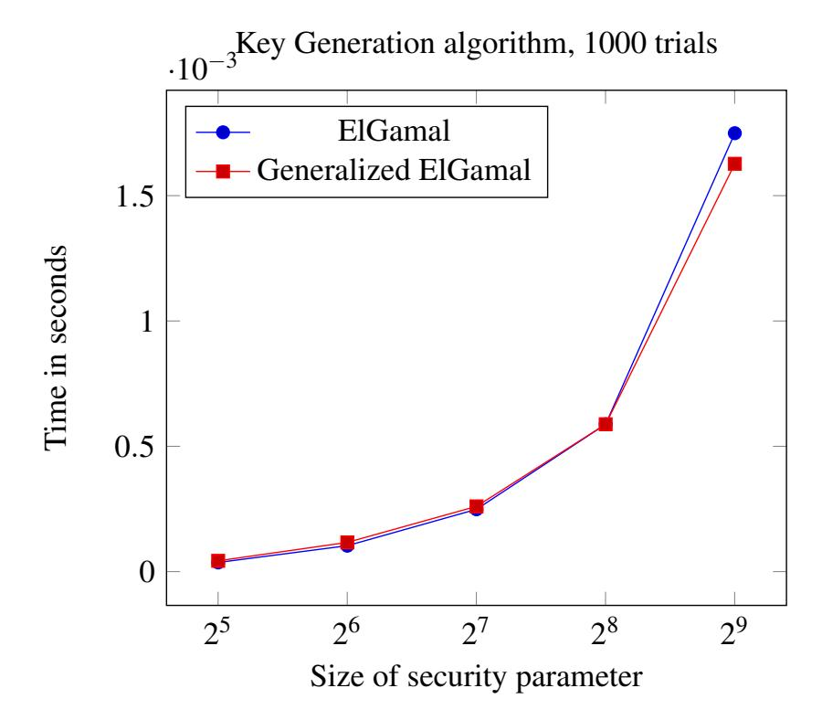
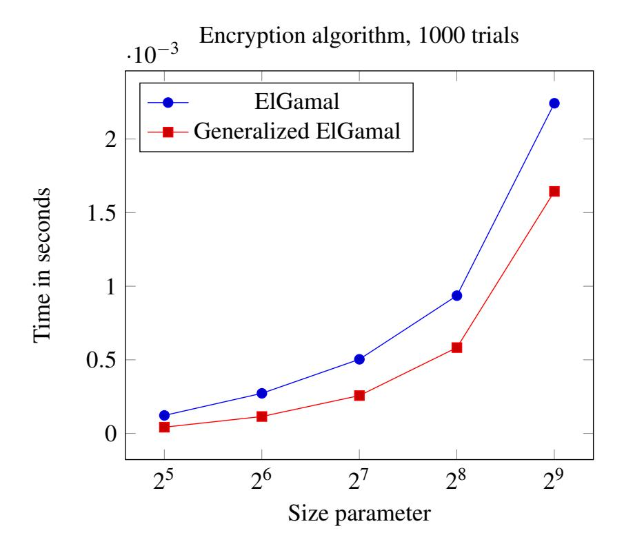
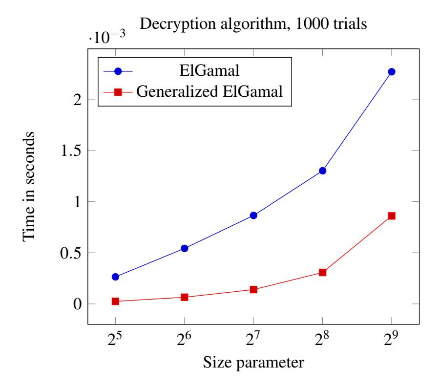
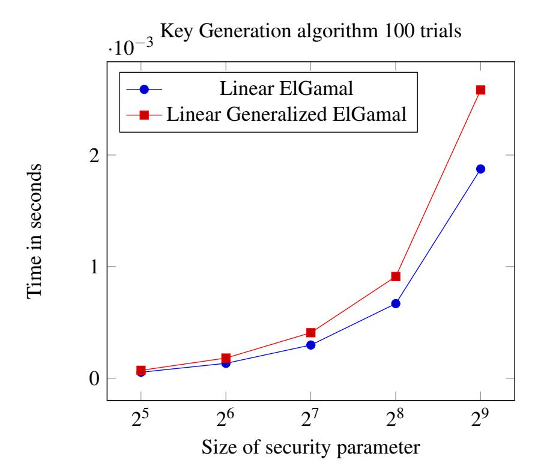
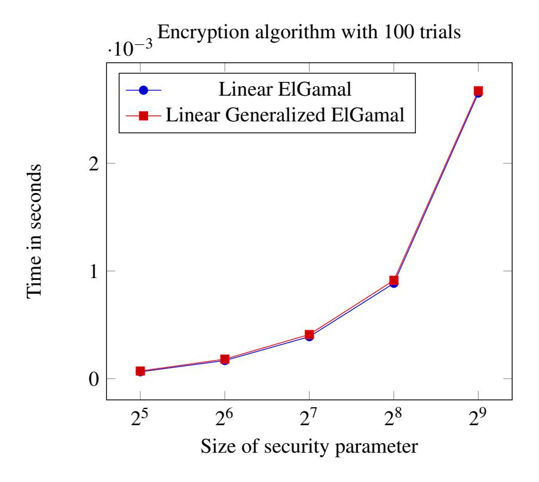
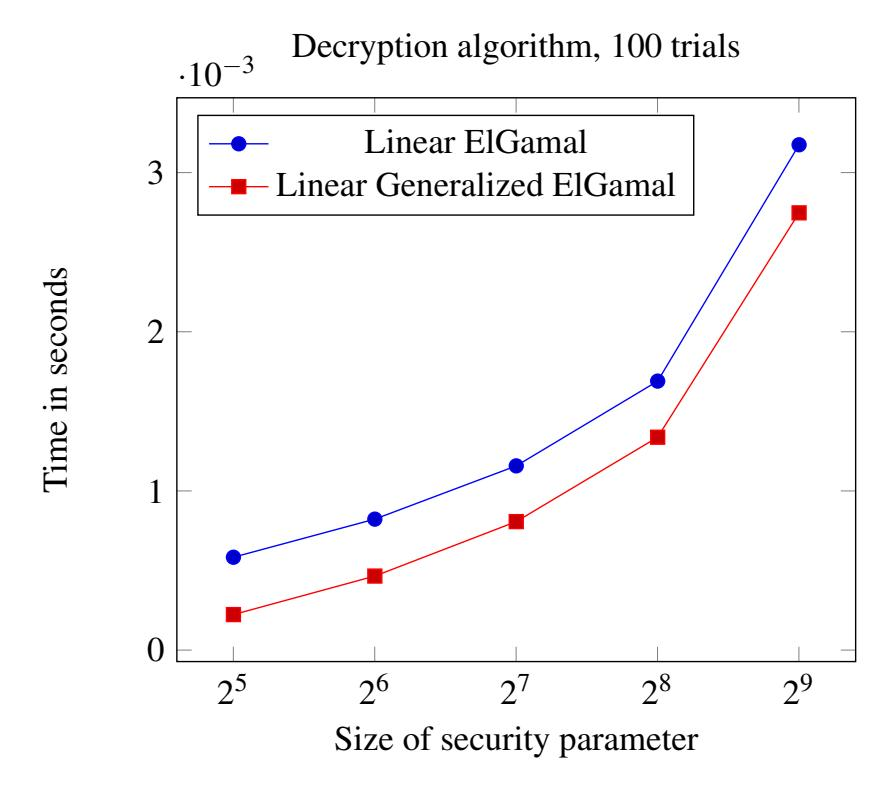

{0}------------------------------------------------

# **Linear Generalized ElGamal Encryption Scheme**

Demba Sow1, Léo Robert2, and Pascal Lafourcade2

 $^1LACGAA, Universit\'e Cheikh \ Anta \ Diop \ de \ Dakar, S\'en\'egal \ , \ dembal.sow@ucad.edu.sn$   $^2LIMOS, Universit\'e Clermont \ Auvergne, France, \ leo.robert@uca.fr \ , \ pascal.lafourcade@uca.fr$ 

Keywords: Cryptography, Partial homomorphic encryption, Linear Assumption, ElGamal encryption scheme.

Abstract: ElGamal public key encryption scheme has been designed in the 80's. It is one of the first partial homomorphic

encryption and one of the first IND-CPA probabilistic public key encryption scheme. A linear version has been recently proposed by Boneh et al. In this paper, we present a linear encryption based on a generalized version of ElGamal encryption scheme. We prove that our scheme is IND-CPA secure under the linear assumption. We design a also generalized ElGamal scheme from the generalized linear. We also run an evaluation of

performances of our scheme. We show that the decryption algorithm is faster than the existing versions.

### 1 Introduction

In 2009 in his thesis (Gentry, 2009), G. Grentry proposed the first fully homomorphic encryption scheme. It was a revolution and it solves an open problem already stated by Rivest Shamir and Adelman when they invented RSA in (Rivest et al., 1978). Many advances have been done and nowadays we have some efficient implementations like for instance SEAL developed by Microsoft (SEAL, 2019). However for some applications like the inversion of a large matrix or multiplications of large matrices fully homomorphic encryption schemes can be very slow or produce large ciphertext or even be inexact. It is why all partial homomorphic encryptions like RSA (Rivest et al., 1978), GM (Goldwasser and Micali, 1982), ElGamal (Elgamal, 1985), Benaloh (Benaloh, 1999; Fousse et al., 2011), Naccache-Stern (Naccache and Stern, 1998), Okamoto-Uchiyama (Okamoto and Uchiyama, 1998), Paillier (Paillier, 1999) or Galbraith (Galbraith, 2002), are still widely used. They can be used to solve such problems in reasonable among of time like in (Ciucanu et al., 2019).

Many cryptosystems rely on the Diffie-Hellman decision problem (DDH) (Boneh, 1998; Joux and Guyen, 2006) assumption, notably the ElGamal encryption scheme and the Cramer-Shoup encryption scheme (Cramer and Shoup, 1998). In (D. Boneh and Shacham, 2004b), Boneh et al. introduced the Decisional Linear Assumption (DLA) and a variation of ElGamal encryption scheme. Our aim it to improve this linear version of ElGamal encryption scheme using the same approach proposed in (Sow and Sow, 2011).

### **Contributions.** We propose the following results:

- Most of today's public key cryptosystems are resistant to various types of attacks and are effective. Their main role is the protection of communications so they guarantee the security of the data exchanged or stored. Thus, it will always be interesting to find a new encryption scheme or to improve a known one. It is in this context that we propose a linear Generalized ElGamal encryption scheme. The modifications are about the key generation which lead to a different encryption and decryption algorithms. Like linear ElGamal encryption, the linear Generalized ElGamal encryption scheme is IND-CPA secure under (DLA).
- We also propose the ElGamal and the Generalized ElGamal schemes from the generalized linear.
- We implement the algorithms and compare their performances with the original algorithms. Our performance evaluations show that the decryption algorithm is faster. We also demonstrate that our key generation algorithm is slower, but this is not a problem since this operation is usually done only once.
- In general, if we work in a cyclic subgroup of size d (with d a large prime), we can keep d secret and we can also use a secret exponent r for decryption of size  $\frac{|d|}{n_0}$ , (where  $n_0$  is some integer which divides |d|, the size of d). For example, it is possible, for different security levels, to use a small key for decryption. Therefore, our scheme is faster than the classical ElGamal one's for the decryption process.

{1}------------------------------------------------

**Related works.** In 1985, Taher ElGamal (Elgamal, 1985) proposed an encryption and signature scheme called ElGamal scheme.

In (Hanoymak, 2013), Turgut Hanoymak proves the security of ElGamal encryption scheme which is based on the hardness to solve the Computational Diffie-Hellman (CDH) and Decisional Diffie-Hellman (DDH) problems.

In (D. Boneh and Shacham, 2004b), Boneh et al. proposed a linear encryption scheme based on the El-Gamal encryption scheme. The linear ElGamal encryption scheme is IND-CPA secure under the (DLA).

In (Sow and Sow, 2011), a modified variant of the ElGamal scheme is presented, and it is called *Generalized ElGamal*. As ElGamal's scheme, the Generalized ElGamal scheme is based on Decisional Diffie-Hellman Problem (DDH). In the Generalized ElGamal scheme, the decryption key size is smaller than those of ElGamal scheme. Hence the Generalized ElGamal scheme is more efficient than ElGamal scheme; since the decryption process is faster. The encryption mechanism has the same efficiency than ElGamal encryption mechanism. But, the key generation algorithm of ElGamal scheme. However, this is not a problem since the key generation is done only once.

**Outline of paper.** In Section 2, we show the original ElGamal encryption scheme and the Generalized ElGamal encryption scheme. In Section 3, we present the Linear assumption, the linear ElGamal encryption scheme and the ElGamal encryption scheme from the generalized linear. In Section 4, we propose the linear Generalized ElGamal encryption scheme and the Generalized ElGamal encryption scheme from the generalized linear. In Section 5, we propose a complexity analysis of our scheme. In Section 6.1, we present the curves showing the average time of the key generation, encryption and decryption algorithms of the ElGamal encryption scheme and the Generalized ElGamal encryption scheme. In Section 6.2, we also present the curves showing the average time of the key generation, encryption and decryption algorithms of the Linear ElGamal encryption scheme and the Linear Generalized ElGamal encryption scheme.

# 2 ElGamal and Generalized ElGamal Encryption Schemes

We recall the ElGamal encryption scheme (Elgamal, 1985) and the Generalized ElGamal encryption scheme (Sow and Sow, 2011).

### 2.1 The ElGamal Encryption Scheme

Given a computational group scheme  $\mathbb{G}$ , the ElGamal public-key encryption is defined as following (Elgamal, 1985):

**Key Generation Algorithm.** To create a public/secret key, Bob should do the following:

- 1. Select a finite cyclic group  $\mathbb{G}$  of order q with generator g.
- 2. Select a random integer a such that 2 < a < q.
- 3. Compute  $h = g^a$  in  $\mathbb{G}$ .
- 4. The public key is  $pk = (\mathbb{G}, q, g, h)$  and the secret key is sk = a.

**Encryption Algorithm.** To encrypt a message *m* for Bob, Alice should do the following:

- 1. Take  $pk = (\mathbb{G}, q, g, h)$ , the Bob's public key;
- 2. Select a random integer r such that  $1 < r < q = \#\mathbb{G}$ ;
- 3. Compute  $c_1 = g^r$  and  $c_2 = m \cdot h^r$  in  $\mathbb{G}$ ;
- 4. The ciphertext is  $c = (c_1, c_2)$ .

**Decryption Algorithm.** To decrypt a ciphertext c, Bob should do the following:

- 1. Take sk = a the secret key.
- 2. Compute  $m = \frac{c_2}{(c_1)^a}$ , we note that  $m \in \mathbb{G}$ .
- 3. The plaintext is m.

Security proof of ElGamal encryption. We recall some theorems presented in (Farshim, 2011), which show the security of ElGamal encryption scheme under the CDH and DDH assumptions. Let  $\mathcal{GP}$  an algorithm which takes  $1^k$  and returns the public key  $pk = (\mathbb{G}, q, g, h)$  of the ElGamal encryption scheme.

▶ One-wayness under the CDH Assumption. If the CDH assumption holds with respect to  $\mathcal{GP}$ , then the ElGamal encryption scheme is one-way. Theorem 2.1. Let  $\mathcal{A}$  be a probabilistic polynomial-time algorithm against the ElGamal encryption scheme (Elgamal, 1985) in the OW-CPA sense. Then there is a probabilistic polynomial-time algorithm  $\mathcal{B}$  against  $\mathcal{GP}$  solving the CDH problem such that:

$$Adv_{\mathcal{GP},\mathcal{B}}^{CDH}(k) = Adv_{\Pi,\mathcal{A}}^{OW-CPA}(k).$$

▶ Indistinguishability under the DDH Assumption. If the DDH assumption holds with respect to  $\mathcal{GP}$ , then the ElGamal encryption scheme is indistinguishable under chosen-plaintext attacks, i.e., it is IND-CPA secure.

{2}------------------------------------------------

**Theorem 2.2.** ((Farshim, 2011)) Let  $\mathcal{A}$  be a probabilistic polynomial-time against the ElGamal encryption scheme in the IND-CPA sense. Then there is a probabilistic polynomial-time algorithm  $\mathcal{B}$  against  $\mathcal{GP}$  solving the DDH problem such that:

$$Adv_{\mathcal{GP},\mathcal{B}}^{DDH}(k) = \frac{1}{2} \cdot Adv_{\Pi,\mathcal{A}}^{IND-CPA}(k).$$

▶ Semantic security. In (J. Katz, 2008), Katz and *al.* prove the semantic security of the ElGamal encryption scheme.

**Theorem 2.3.** Under the DDH assumption, El-Gamal encryption scheme is semantically secure.

# 2.2 Generalized ElGamal Encryption Scheme

We give a key generation mechanism and a public key encryption algorithm (Sow and Sow, 2011), which can be view as a slight modification of ElGamal's schemes (Elgamal, 1985).

**Key generation algorithm.** To create a public/private key, we do the following:

- 1. Select a cyclic group G with sufficiently large order d = #G such that  $G = \langle g' \rangle$ .
- 2. Select a random element  $\beta < o(g') = \#G$  such that  $gcd(\beta, d) = 1$ , i.e.,  $\beta$  is invertible modulo d and compute  $g = g'^{\beta} \in G$ .
- 3. Select two random integers s and k sufficiently large such that 2 < k < s < d with d = #G and compute kd.
- 4. Compute with euclidean division algorithm, the pair (r,t) such that kd = rs + t where t = kd mod s and  $r = \left\lfloor \frac{kd}{s} \right\rfloor < d$ . Note that  $r = \left\lfloor \frac{kd}{s} \right\rfloor$ ,  $\left\lfloor \frac{s}{t} \right\rfloor$ , d r, and t must be sufficiently large, if not, return to step 3.
- 5. Compute  $\gamma = g^s$  and  $\delta = g^t$  in G; Note that  $\gamma \neq 1$  and  $\delta \neq 1$ .

Then public key is  $((\gamma, \delta), G)$  and the private key is (r, G).

**Encryption algorithm.** To encrypt a message with the public key  $((\gamma, \delta), d, G)$ , we do the following:

- 1. Select a random integer  $2 < \alpha < d = \#G$  such that  $\alpha$  and #G are co-prime.
- 2. Compute  $c_1 = \gamma^{\alpha}$  and  $\lambda = \delta^{\alpha}$  in G, hence  $c_1 \neq 1$  and  $\lambda \neq 1$ .
- 3. Transform the message m as an element of G and compute  $c_2 = \lambda m$  in G. The ciphertext is  $(c_1, c_2)$ .

**Decryption algorithm.** To decrypt a ciphertext  $(c_1, c_2)$  encrypted with the public key  $((\gamma, \delta), d, G)$  and knowing the associate secret key (r, G), we just need to compute  $c_1^r c_2$ .

Provable security of the Generalized ElGamal Encryption Scheme.

**▶** One-wayness under the CDH Assumption.

**Theorem 2.4.** Under the CDH Assumption, the Generalized ElGamal encryption scheme is One-Way secure under Chosen Plaintext Attack (OW-CPA). That is, for a security parameter k, if there is an attacker A that inverse the Generalized El-Gamal encryption then we can build an algorithm B that solves CDH, it means that

$$Adv_{GP,B}^{CDH}(k) = Adv_{\Pi,A}^{OW-CPA}(k).$$

► Indistinguishability under the DDH Assumption.

**Theorem 2.5.** Under the DDH Assumption, the Generalized ElGamal encryption scheme is indistinguishable under Chosen Plaintext Attacks, i.e., it is IND-CPA secure. So we have:

$$Adv^{DDH}_{\mathcal{GP},\mathcal{B}}(k) = \frac{1}{2} \cdot Adv^{IND-CPA}_{\Pi,\mathcal{A}}(k),$$

where A is an attacker of the Generalized ElGamal encryption and k the security parameter.

To justify the performance of Generalized ElGamal encryption scheme described in (Sow and Sow, 2011) with respect to ElGamal encryption scheme, comparison curves in execution time of the key generation, encryption and decryption algorithms are performed (see Figure 1, Figure 2 and Figure 3).

# 3 Linear Encryption

Boneh et al. (D. Boneh and Shacham, 2004b) introduced a decisional assumption, called Linear, intended to take the place of DDH in groups - in particular, bilinear groups (Joux and Nguyen, 2003) - where DDH is easy. For this setting, the Linear problem has desirable properties, as they have shown: it is hard if DDH is hard, but, at least in generic groups (Shoup, 1997), it remains hard even if DDH is easy. Letting G be a cyclic multiplicative group of prime order p, and letting  $g_1, g_2$ , and  $g_3$  be arbitrary generators of G, we consider the following problem:

**Linear Problem in** G: Given  $g_1, g_2, g_3, g_1^a, g_2^b$ ,  $g_3^c \in G$  as input, output yes if a+b=c and no otherwise. The advantage of an algorithm  $\mathcal{A}$  in deciding the Linear problem in G is denoted by  $\mathbf{Adv}_{\mathcal{A}}^{\text{linear}}$  and it is equal to:

{3}------------------------------------------------

$$|Pr[\mathcal{A}(g_1, g_2, g_3, g_1^a, g_2^b, g_3^{a+b}) = yes:$$

$$g_1, g_2, g_3 \stackrel{R}{\leftarrow} G, a, b \stackrel{R}{\leftarrow} \mathbb{Z}_p]$$

$$-Pr[\mathcal{A}(g_1, g_2, g_3, g_1^a, g_2^b, \eta) = yes:$$

 $g_1,g_2,g_3,\eta \stackrel{R}{\leftarrow} G,a,b \stackrel{R}{\leftarrow} \mathbb{Z}_p]|$  with the probability taken over the uniform random choice of the parameters to  $\mathcal{A}$  and over the coin tosses of  $\mathcal{A}$ . We say that an algorithm  $\mathcal{A}(t,\epsilon)$ -decides Linear in G if  $\mathcal{A}$  runs in time at most t, and  $\mathbf{Adv}^{\mathrm{linear}}_{\mathcal{A}}$  is at least  $\epsilon$ .

**Definition 3.1.** We say that the  $(t,\varepsilon)$ -Decision Linear Assumption holds in G if no algorithm  $(t,\varepsilon)$ -decides the Decision Linear problem in G.

The Linear problem is well defined in any group where DDH is well defined. It is mainly used in bilinear groups like in (Boneh and Franklin, 2003; D. Boneh and Shacham, 2004a; Paterson, 2005).

### 3.1 Linear ElGamal Encryption Scheme

Boneh et al proposed a linear encryption scheme based on the ElGamal encryption scheme. Given a computational group scheme G, the Linear ElGamal encryption scheme is defined as follows:

- **LE.Gg**(1 $^{\lambda}$ ): Choose a random generator  $g_3 \stackrel{\$}{\leftarrow} G$  and  $x_1, x_2 \stackrel{\$}{\leftarrow} \mathbb{Z}_p$ , and set  $g_1 \leftarrow g_3^{x_1^{-1}}$  and  $g_2 \leftarrow g_3^{x_2^{-1}}$ . The public key is  $pk = (g_1, g_2, g_3) \in G^3$ ; the secret key is  $sk = (x_1, x_2) \in \mathbb{Z}_p^2$ .
- **LE.Enc**(pk, M): To encrypt a message  $M \in G$ , parse  $pk = (g_1, g_2, g_3) \in G^3$ , choose random exponents  $r_1, r_2 \stackrel{\$}{\leftarrow} \mathbb{Z}_p$ , and set:  $u_1 \leftarrow g_1^{r_1}$  and  $u_2 \leftarrow g_2^{r_2}$  and  $u_3 \leftarrow Mg_3^{r_1+r_2}$ . The ciphertext  $ct = (u_1, u_2, u_3) \in G^3$ .
- **LE.Dec**(sk, ct): Parse the private key sk as  $(x_1, x_2) \in \mathbb{Z}_p^2$  and the ciphertext ct as  $(u_1, u_2, u_3) \in G^3$  and compute  $M \leftarrow u_3 u_1^{-x_1} u_2^{-x_2}$ .

**Correctness of decryption process.** Since  $u_1 = g_1^{r_1}$  and  $u_2 = g_2^{r_2}$ ,  $u_3 = Mg_3^{r_1+r_2}$  we have:

$$u_3/(u_1^{x_1}u_2^{x_2}) = Mg_3^{r_1+r_2}/((g_1^{r_1})^{x_1}(g_2^{r_2})^{x_2})$$
$$= (Mg_3^{r_1+r_2})/(g_3^{r_1}g_3^{r_2}) = M$$

**Theorem 3.2.** Under the Linear Assumption, the ElGamal Encryption Scheme is IND-CPA secure (D. Boneh and Shacham, 2004b).

### 3.2 ElGamal from Generalized Linear

We define three functions: the setup function, denoted LE.Gg(), the encryption function, denoted LE.Enc() and the decryption function, denoted LE.Dec().

We now describe how these functions works.

- **LE.Gg**(1 $^{\lambda}$ ): Choose a random generator  $g_n \stackrel{\$}{\leftarrow} G$  and  $x_1, x_2, \dots, x_{n-1} \stackrel{\$}{\leftarrow} \mathbb{Z}_p$ , and set:  $g_1 \leftarrow g_n^{1/x_1}$ ,  $g_2 \leftarrow g_n^{1/x_2}$ , ...,  $g_{n-1} \leftarrow g_n^{1/x_{n-1}}$ . The public key is  $pk = (g_1, g_2, \dots, g_n) \in G^n$ ; the secret key is  $sk = (x_1, x_2, \dots, x_{n-1}) \in \mathbb{Z}_p^{n-1}$ .
- **LE.Enc**(pk,M): To encrypt a message  $M \in G$ , parse  $pk = (g_1,g_2,\ldots,g_n) \in G^n$ , choose random exponents  $r_1,r_2,\ldots,r_{n-1} \stackrel{\$}{\leftarrow} \mathbb{Z}_p$ , and set:  $u_1 \leftarrow g_1^{r_1}, \ u_2 \leftarrow g_2^{r_2},\ldots u_n \leftarrow Mg_n^{r_1+r_2+\ldots+r_{n-1}}$ . the ciphertext  $ct = (u_1,u_2,\ldots,u_n) \in G^n$ .
- **LE.Dec**(sk,ct): Parse the private key sk as  $(x_1,x_2,\ldots,x_{n-1}) \in \mathbb{Z}_p^{n-1}$  and the ciphertext ct as  $(u_1,u_2,\ldots,u_n) \in G^n) \in G^n$  and compute :  $M \leftarrow u_n/(u_1^{x_1}u_2^{x_2}\ldots u_{n-1}^{x_{n-1}})$

# 4 Linear Generalized ElGamal Encryption Scheme

We present the Linear Generalized ElGamal encryption scheme, its security and the Generalized ElGamal encryption scheme from the generalized linear.

### 4.1 Algorithms

Given a computational group scheme G, the Linear Generalized ElGamal encryption scheme is composed of the following three functions: the setup function, denoted LGE.Gg(), the encryption function, denoted LGE.Enc() and the decryption function, denoted LGE.Dec().

We now describe how these functions works.

- **LGE.Gg**(1 $^{\lambda}$ ): Choose a random generator  $g \stackrel{\$}{\leftarrow} G$  and  $k \stackrel{\$}{\leftarrow} \mathbb{Z}_d$ ,  $r \stackrel{\$}{\leftarrow} \mathbb{Z}_{d/2}$ .

  Compute  $(s,t) \in \mathbb{Z}_d^2$  such that  $s \leftarrow \lfloor \frac{kd}{r} \rfloor$  and  $t \leftarrow kd \mod r$  and set  $g_1 \leftarrow g^r$ ,  $g_2 \leftarrow g^s$ , and  $g_3 \leftarrow g^t$ . The public key is  $pk = (g_1, g_2, g_3) \in G^3$  and the secret key is  $sk = (r, s, t) \in \mathbb{Z}_{d/2} \times \mathbb{Z}_d^2$ .
- **LGE.Enc**(pk, M): To encrypt a message  $M \in G$ , parse  $pk = (g_1, g_2, g_3) \in G^3$ , choose random exponents  $\alpha_1, \alpha_2 \stackrel{\$}{\leftarrow} \mathbb{Z}_d$ , and set  $c_1 \leftarrow g_1^{\alpha_1}$  and  $c_2 \leftarrow g_2^{\alpha_2}$  and  $c_3 \leftarrow Mg_3^{\alpha_1 + \alpha_2}$ ; the ciphertext  $ct = (c_1, c_2, c_3) \in G^3$ .
- **LGE.Dec**(sk, ct): Parse the private key sk as  $(r, s, t) \in \mathbb{Z}_{d/2} \times \mathbb{Z}_d^2$  and the ciphertext ct as  $(c_1, c_2, c_3) \in G^3$  and compute  $M \leftarrow c_1^s c_2^r c_3$ .

Before proving the security of our scheme in Theorem 4.1, we give its correctness.

{4}------------------------------------------------

**Correctness of decryption process.** Since  $c_1 = g_1^{\alpha_1}$ ,  $c_2 = g_2^{\alpha_2}$  and  $c_3 = Mg_3^{\alpha_1 + \alpha_2}$ , we have:

$$c_1^s c_2^r c_3 = g_1^{\alpha_1 s} g_2^{\alpha_2 r} g_3^{\alpha_1 + \alpha_2} M = M g^{\alpha_1 r s} g^{\alpha_2 s r} g^{(\alpha_1 + \alpha_2) t}$$
$$= M g^{(r s + t)(\alpha_1 + \alpha_2)} = M g^{k d(\alpha_1 + \alpha_2)} = M$$

**Theorem 4.1.** The Linear Generalized ElGamal Encryption Scheme is IND-CPA secure under the Decisional Linear Assumption (DLA).

The proof is given in Appendix.

# **4.2** Generalized ElGamal from Generalized Linear

Given a computational group scheme G, the Generalized ElGamal encryption scheme from the generalized linear is defined as follows:

**LGE.Gg**(1\(\lambda\)): Choose a random generator  $g \stackrel{\$}{\leftarrow} G$  and  $k, r_i \stackrel{\$}{\leftarrow} \mathbb{Z}_d \times \mathbb{Z}_{d/2}$ , compute  $(s_i, t_i) \in \mathbb{Z}_d^2$  such that  $s_i \leftarrow \lfloor \frac{kd}{r_i} \rfloor$  and  $t_i \leftarrow kd \mod r_i$ ,  $1 \le i \le \frac{n}{3}$  and set for  $0 \le k \le \frac{n}{3} - 1$ :  $g_{3k+1} \leftarrow g^{r_{k+1}}$ ,  $g_{3k+2} \leftarrow g^{s_{k+1}}$  and  $g_{3k+3} \leftarrow g^{t_{k+1}}$ . The public key is  $p_k = (g_1, g_2, g_3, \dots, g_{n-2}, g_{n-1}, g_n) \in G^n$  and the secret key is  $s_k = (r_i, s_i, t_i) \in \mathbb{Z}_{d/2} \times \mathbb{Z}_d^2$ ,  $1 \le i \le \frac{n}{3}$ .

**LGE.Enc**(pk, M): To encrypt a message  $M \in G$ , parse  $pk = (g_1, g_2, g_3, \dots, g_{n-2}, g_{n-1}, g_n) \in G^n$ , choose random exponents  $\alpha_1, \alpha_2, \dots, \alpha_{n-1} \stackrel{\$}{\leftarrow} \mathbb{Z}_d$ , and set  $0 \le k \le \frac{n}{3} - 1 : c_{3k+1} \leftarrow g_{3k+1}^{\alpha_{3k+1}}, c_{3k+2} \leftarrow g_{3k+2}^{\alpha_{3k+2}}, c_{3k+3} \leftarrow Mg_{3k+3}^{\alpha_{3k+1} + \alpha_{3k+2}}$ . The ciphertext ct is  $(c_{3k+1}, c_{3k+2}, c_{3k+3}) \in G^3$ .

**LGE.Dec**(sk,ct): Parse the private key sk as  $(r_i,s_i,t_i) \in \mathbb{Z}_{d/2} \times \mathbb{Z}_d^2, \ 1 \leq i \leq n/3$  and the ciphertext ct as  $(c_1,c_2,\ldots,c_n) \in G^n$  and compute

$$M \leftarrow \sqrt[n]{\prod_{k=1}^{n} c_{3k+1}^{s_{k+1}} c_{3k+2}^{r_{k+1}} c_{3k+3}}$$
.

### 5 Complexity Evaluation

We present a complexity comparison between the Linear ElGamal and the Linear Generalized ElGamal schemes. We give in this section a theoretical complexity where we study the number of computations needed in each algorithm (key generation, encryption and decryption). Let us set the following parameters:

- P = power's number (exponent),
- M = multiplication's number,
- S = sum's number,
- I = inverse's number,
- nP = number of parameters of the public key,

|            | Linear ElGamal                  | Linear General-                 |
|------------|---------------------------------|---------------------------------|
|            |                                 | ized ElGamal                    |
| Size Key   | secret key $\in \mathbb{Z}_q$ , | secret key $\in \mathbb{Z}_d$ , |
|            | q = o(G)                        | d = o(G)                        |
| Key Gen    | P=2, M=0,                       | P = 3, M = 1,                   |
|            | nP = 3, nS = 2                  | nP = 3, nS = 3                  |
| Encryption | P = 3, M = 1                    | P = 3, M = 1                    |
| Decryption | P = 2, M = 2,                   | P = 2, M = 2,                   |
|            | I=2                             | I=0                             |

Table 1: Comparison of Linear ElGamal and Linear Generalized ElGamal for each algorithm in terms of computational cost.

• nS = number of parameters of the private key.

To present the performance of the two encryption schemes, we study the number of operations performed (according to the parameters described) in the key generation, encryption and decryption processes.

From the comparative Table 1, we can clearly see that Linear Generalized ElGamal encryption scheme is slower at generating keys but is faster for decryption since no inversion is calculated.

### **6** Performance Evaluations

All our algorithms have been programmed with SageMath (The Sage Developers, 2020). The tests are performed with security parameters of size 32, 64, 128, 512, 1024 bits. Some even go up to 2048 bits. We start by comparing ElGamal and Generalized ElGamal1 before comparing Linear ElGamal and Linear Generalized ElGamal.

#### 6.1 ElGamal and Generalized ElGamal

We present the curves showing the execution time of the key generation, encryption and decryption algorithms of the ElGamal encryption scheme and the Generalized ElGamal encryption scheme.

The execution time of those two schemes is carried out under the same conditions in terms of generation of the values and sizes of the security parameters. Indeed, given a size of a security parameter, there are 1000 trials where new parameters (such as prime number and messages) are computed for each trial.

We give a detailed execution time for the key generation in Figure 1 and 4, the encryption algorithm in Figure 2 and 5 and the decryption algorithm in Figure 3 and 6.

&lt;sup>1Surprisingly this performance evaluation has not been done in (Sow and Sow, 2011).

{5}------------------------------------------------

Figure 1: Average time of key generation algorithm depending on the size of security parameter. The standard ElGamal scheme is in blue and circle points. The proposed scheme is depicted in red and square points. Each security parameter size is tested with 1000 trials.

**Key Generation Algorithms.** The curves of Figure 1 show the execution time of key generation algorithms for the ElGamal encryption scheme and for Generalized ElGamal encryption scheme. we show that the two algorithms are similar. When the key size increases then the Generalized ElGamal is a bit faster.

Encryption Algorithms. The curves of Figure 2 show the execution time of encryption algorithms of the ElGamal encryption scheme and Generalized ElGamal encryption scheme. We observe that the Generalized ElGamal encryption is always faster that ElGamal encryption.

**Decryption Algorithms.** The curves given in Figure 3 show the execution time of decryption algorithms of the ElGamal encryption scheme and Generalized ElGamal encryption scheme. We can see that the Generalized ElGamal decryption is always significantly faster that ElGamal decryption.

# **6.2 Linear ElGamal and Linear Generalized ElGamal**

We also studied the performance of Linear Generalized ElGamal encryption scheme with respect to Linear ElGamal encryption scheme. We present the execution time evaluations of the key generation in Figure 4, encryption algorithms in Figure 5 and decryption algorithms in Figure 6.

Figure 2: Average time of encryption algorithm depending on the size of security parameter. The standard ElGamal scheme is in blue and circle points. The proposed scheme is depicted in red and square points. Each security parameter size is tested with 1000 trials.

Figure 3: Average time of decryption algorithm depending on the size of security parameter. The standard ElGamal scheme is in blue and circle points. The proposed scheme is depicted in red and square points. Each security parameter size is tested with 1000 trials.

**Key Generation Algorithms.** The curves given in Figure 4 show the execution time of key generation algorithms of the Linear ElGamal encryption scheme and Linear Generalized ElGamal encryption scheme. We can see that our algorithm for key generation is clearly slower than the one proposed by Boneh et al. It is the price to pay in order to have a faster encryption and decryption algorithms. It is not an issue because the key generation is in general done only once while the encryption and decryption algorithms are more of-

{6}------------------------------------------------

Figure 4: Average time of key generation algorithm depending on the size of security parameter. The standard Linear ElGamal scheme is in blue and circle points; the proposed scheme is depicted in red and square points. Each security parameter size is tested with 100 trials.

Figure 5: Average time of encryption algorithm depending on the size of security parameter. The standard Linear El-Gamal scheme is in blue and circle points. The proposed scheme is depicted in red and square points. Each security parameter size is tested with 100 trials.

ten used.

**Encryption Algorithms.** The curves of Figure 5 give the execution time of encryption algorithms of the Linear ElGamal encryption scheme and Linear Generalized ElGamal encryption scheme. According to the complexity analysis the timings are similar since the number of exponentiations are similar. Empirically, we observe that they are similar.

Figure 6: Average time of decryption algorithm depending on the size of security parameter. The standard Linear El-Gamal scheme is in blue and circle points. The proposed scheme is depicted in red and square points. Each security parameter size is tested with 100 trials.

**Decryption Algorithms.** The curves of Figure 6 represent the execution time of decryption algorithms of the Linear ElGamal encryption scheme and Linear Generalized ElGamal encryption scheme. We clearly see that the decryption is faster using our scheme, which confirms the complexity analysis of the previous section.

## **Conclusion**

We have proposed a faster Linear Generalized El-Gamal encryption scheme based on the Generalized ElGamal encryption scheme. We prove that our linear scheme is IND-CPA secure under the Linear problem like the linear encryption scheme based on the ElGamal encryption scheme. It also has a faster encryption and decryption algorithms.

In the future, we would like to see how our approach can be applied to improved other schemes.

## Acknowledgement

This study was partially supported by the French ANR project ANR-18-CE39-0019 (MobiS5).

### **REFERENCES**

Benaloh, J. (1999). Dense probabilistic encryption.

{7}------------------------------------------------

- Boneh, D. (1998). The decision diffie-hellman problem. In *In Proceedings of the Third Algorithmic Number Theory Symposium*, volume 1423, pages 48–63.
- Boneh, D. and Franklin, M. (2003). Identity-based encryption from the weil pairing. *SIAM J. Computing*, 32(3):586–615.
- Ciucanu, R., Giraud, M., Lafourcade, P., and Ye, L. (2019). Secure strassen-winograd matrix multiplication with mapreduce. In Obaidat, M. S. and Samarati, P., editors, *Proceedings of the 16th International Joint Conference on e-Business and Telecommunications, ICETE 2019 - Volume 2: SECRYPT, 2019*, pages 220–227. SciTePress.
- Cramer, R. and Shoup, V. (1998). A practical public key cryptosystem provably secure against adaptive chosen ciphertext attack. In *Proc. of the 18th Annual International Cryptology Conference on Advances in Cryptology, CRYPTO'98*.
- D. Boneh, B. L. and Shacham, H. (Sept. 2004a). Short signatures from the weil pairing. *J. Cryptology*, 17(4):297–319.
- D. Boneh, X. B. and Shacham, H. (Aug. 2004b). Short group signatures. In *In M. Franklin, editor,Proceedings of Crypto 2004*, volume 3152, pages 41–55.
- Elgamal, T. (1985). A public key cryptosystem and a signature scheme based on discrete logarithms. *IEEE Transactions on Information Theory*, 31(4):469–472.
- Farshim, P. (2011). *Provable-Security of Public-Key Encryption Schemes*. farshim.files.wordpress.com/2011/09/lectures.pdf.
- Fousse, L., Lafourcade, P., and Alnuaimi, M. (2011). Benaloh's Dense Probabilistic Encryption Revisited. In *Progress in Cryptology - AFRICACRYPT 2011 - 4th Conference on the Theory and Application of Cryptographic Techniques in Africa*, volume 6737 of *Lecture Notes in Computer Science*, pages 348–362. Springer.
- Galbraith, S. D. (2002). Elliptic curve paillier schemes. *J. Cryptol.*, 15(2):129138.
- Gentry, C. (2009). *A Fully Homomorphic Encryption Scheme*. PhD thesis, Stanford, CA, USA.
- Goldwasser, S. and Micali, S. (1982). Probabilistic encryption and how to play mental poker keeping secret all partial information. In *Proceedings of the Fourteenth Annual ACM Symposium on Theory of Computing*, STOC 82.
- Goldwasser, S. and Micali, S. (1984). Probabilistic encryption. *Journal of Computer and System Sciences*, 28:270–299.

- Hanoymak, T. (2013). On provable security of cryptographic schemes. *International Journal of Information Security Science*, 2, No.2.
- J. Katz, Y. L. (2008). Introduction to modern cryptography. *CRC PRESS*.
- Joux, A. and Guyen, K. (2006). Separating decision diffe-hellman to diffe hellmann in cryptographie groups.
- Joux, A. and Nguyen, K. (Sept. 2003). Separating decision diffie-hellman from computational diffiehellman in cryptographic groups. *J. Cryptology*, 16(4):239–47.
- Naccache, D. and Stern, J. (1998). A new public key cryptosystem based on higher residues. In *Proceedings of the 5th ACM Conference on Computer and Communications Security*, CCS 98, page 5966, New York, NY, USA. Association for Computing Machinery.
- Okamoto, T. and Uchiyama, S. (1998). A new publickey cryptosystem as secure as factoring. In Nyberg, K., editor, *Advances in Cryptology — EU-ROCRYPT'98*, pages 308–318, Berlin, Heidelberg. Springer Berlin Heidelberg.
- Paillier, P. (1999). Public-key cryptosystems based on composite degree residuosity classes. In Stern, J., editor, *Advances in Cryptology — EURO-CRYPT '99*, pages 223–238, Berlin, Heidelberg. Springer Berlin Heidelberg.
- Paterson, K. (2005). Cryptography from pairings. *Cambridge University Press*, 317 of London Mathematical Society Lecture Notes:215–51.
- Rivest, R. L., Shamir, A., and Adleman, L. (1978). A method for obtaining digital signatures and public-key cryptosystems. *Commun. ACM*, 21(2):120126.
- SEAL (2019). Microsoft SEAL (release 3.4). https: //github.com/Microsoft/SEAL. Microsoft Research, Redmond, WA.
- Shoup, V. (May 1997). Lower bounds for discrete logarithms and related problems. In *In W. Fumy, editor, Proceedings of Eurocrypt 1997*, volume 1233 of LNCS, pages 256–66.
- Sow, D. and Sow, D. (2011). A new variant of el gamal's encryption and signatures schemes. *Journal of Algebra, Number Theory and Applications*, 20(1):21–39.
- The Sage Developers (2020). *SageMath, the Sage Mathematics Software System (Version 9.0)*. https://www.sagemath.org.

{8}------------------------------------------------

## A Cryptographic Recalls

We recall some notions about public key encryption schemes: success probability of an adversary, security models in terms of the adversarial goals and the adversarial capabilities (see (Hanoymak, 2013)). We also recall some notions on security models.

## A.1 Public Key Encryption Schemes

Definition A.1. *A* public key encryption scheme *is a tuple of probabilistic polynomial time algorithms* Π = (*Gen*,*Enc*,*Dec*) *such that:*

- *1. The* key generation algorithm *Gen takes as input the security parameter and outputs a pair of public and secret keys* (*pk*,*sk*)*.*
- *2. The* encryption algorithm *Enc takes as input a public key pk and a message m from some underlying plaintext message space. It outputs a ciphertext c, i.e., c* = *Encpk*(*m*)*.*
- *3. The* decryption algorithm *Dec takes as input* (*sk*, *c*) *and outputs a message m or* ⊥*. We denote the decryption algorithm by m* = *Decsk*(*c*)*.*

We note that *Enc* may be probabilistic but *Dec* must be deterministic and the following equation should hold for any message:

$$Dec_{sk}(Enc_{pk}(m)) = m$$

## A.2 Security Notions

In this subsection, we recall some security notions:

Chosen Plaintext Attack (CPA). A chosenplaintext attack (CPA) is an attack model for cryptanalysis which presumes that the attacker can obtain the ciphertexts for arbitrary plaintexts. The goal of the attack is to gain information that reduces the security of the encryption scheme.

Modern ciphers aim to provide semantic security, also known as ciphertext indistinguishability under chosen-plaintext attack, and are therefore by design generally immune to chosen-plaintext attacks if correctly implemented.

One-Wayness. This goal is defined via a game between the adversary and the challenger as follows:

#### Game 1: The One Wayness Game: *PubKow A*,Π

- 1: Gen is run to obtain the keys (*pk*,*sk*)
- 2: *m* is chosen at random from message space
- 3: The challenge ciphertext *c* = *Encpk*(*m*)
- 4: Adversary *A* is given *pk* and *c* to produce *m* 0 = *A*(*pk*, *c*)
- 5: The output of the game is defined to be 1 if *m* 0 = *m* and ⊥ otherwise.

Definition A.2. *A public key encryption scheme* Π = (*Gen*,*Enc*,*Dec*) *is* one-way secure against chosen plaintext attacks *(OW-CPA) if the advantage of any probabilistic polynomial-time algorithm A defined by*

$$Adv_{\Pi,\mathcal{A}}^{ow-cpa}(k) = Pr\left[Exp_{\Pi,\mathcal{A}}^{ow}(k) \Rightarrow true\right]$$

*is negligible as a function k, where Expow* Π,*A* (*k*) *is the experiment.*

Indistinguishability. Here, the goal of the adversary is to find out which of the plaintexts have been selected by the challenger.

#### Game 2 IND-CPA Game: *PubKind*−*cpa A*,Π

- 1: *Gen* is run to obtain public and secret keys (*pk*,*sk*).
- 2: Adversary *A* is given *pk*, outputs a pair of messages (*m*0,*m*1) of equal length.
- 3: A random bit *b* ∈ {0,1} is chosen, the challenge ciphertext *c* = *Encpk*(*mb*) is computed and given to *A*.
- 4: *A* outputs a bit *b* 0 .
- 5: The output of the game is defined to be 1 if *b* 0 = *b* and 0 otherwise.

Definition A.3. *A public key encryption scheme* Π = (*Gen*,*Enc*,*Dec*) *is* indistinguishable secure against chosen plaintext attacks *(IND-CPA) if for all probabilistic polynomial time adversaries A, there exists a negligible function such that*

$$Pr\left[PubK_{A,\Pi}^{ind-cpa}=1\right] \leq \frac{1}{2} + negl.$$

*where a* negligible *function µ* : N → R + *is function such that for every positive polynomial p*(·) *there exists Np* ∈ N *such that for all integers x* > *Np, we have µ*(*x*) < 1 *p*(*x*) *.*

### A.3 Semantic security:

This definition comes from (Goldwasser and Micali, 1984), where is called polynomial indistinguishability, and semantic security is actually the name of a 

{9}------------------------------------------------

syntactically different, but equivalent, characterization. This is formally defined via a game between an adversary and a challenger.

- The challenger computes:  $(pk, sk) \stackrel{\$}{\leftarrow} KeyGen()$ , and gives pk to the adversary.
- The adversary chooses two messages  $m_0, m_1 \in M$ , and gives these to the challenger.
- The challenger computes

$$b \stackrel{\$}{\leftarrow} \{0,1\}, \ \psi \stackrel{\$}{\leftarrow} E(pk,m_b)$$

and gives the "target ciphertext"  $\psi$  to the adversary.

• The adversary outputs  $\hat{b} \in \{0,1\}$ . We define the SS-advantage of the adversary to be:

$$|Pr[b=\widehat{b}] - \frac{1}{2}|$$

Semantic security means that any efficient adversary's *SS*-advantage is negligible.

### A.4 Homomorphic encryption

Homomorphic encryption is a form of encryption that allows specific types of computations to be executed on ciphertexts and obtain an encrypted result that is the ciphertext of the result of operations performed on the plain text. A homomorphic encryption allows a user to manipulate without needing to decrypt it first. An example of homomorphic encryption is the RSA algorithm. Other examples of homomorphic encryption schemes are the ECC encryption, the ElGamal cryptosystem (Elgamal, 1985), and the Pailler cryptosystem.

Typically, secure data aggregation mechanisms require nodes to perform the following operations:

- at the transmitting node, prior to transmission, data are encrypted with some cryptographic function  $\mathcal{E}$ ;
- at the receiving node, all received data packets are decrypted with the inverse cryptographic function \$\mathcal{D} = \mathcal{E}^{-1}\$ to retrieve the original data;
- data are aggregated with an aggregation function;
- prior to re-transmission, aggregated data are encrypted through E and relayed to the next hop.

**Lemma A.4.** Linear Generalized ElGamal Encryption Scheme is a homomorphic encryption.

*Proof.* The ElGamal encryption scheme, Linear El-Gamal encryption and Generalized ElGamal Encryption scheme are homomorphic encryptions. Our Linear Generalized ElGamal Encryption scheme has the same encryption mechanism than these schemes but with some parameters then it is also a homomorphic encryption.

### **B** Security Proof

**Theorem 4.1.** The Linear Generalized ElGamal Encryption Scheme is IND-CPA secure under the Decisional Linear Assumption (DLA).

*Proof.* Let G be a group and g be a random generator of G. Let a random instance  $(g_1 = g^r, g_2 = g^s, g_3 = g^t)$  of the Decisional Linear problem that one wants to solve, considering the adversary  $\mathcal{A}$  against the Linear Generalized ElGamal encryption in time t. We write **Game 0** the adversary's scenarios and we modify it gradually to the Decisional Linear problem. We note C the challenger and D a distinguisher and compare each output when a random is generated or when DH is computed.

### **Game 0:** challenger C, adversary A

- 1:  $g \stackrel{\$}{\leftarrow} G$  and  $k, r \stackrel{\$}{\leftarrow} \mathbb{Z}_d \times \mathbb{Z}_{d/2}$ , compute (s,t) such that kd = rs + t and output  $(g_1, g_2, g_3) = (g^r, g^s, g^t)$ : C
- 2:  $(m_0, m_1) \leftarrow \mathcal{A}(g_1, g_2, g_3)$
- 3:  $(c_1, c_2, c_3) \leftarrow \mathcal{E}((g_1, g_2, g_3), m_{\sigma}, \alpha_1, \alpha_2)$  where  $\sigma \stackrel{\$}{\leftarrow} \{0, 1\}$  and  $\alpha_1, \alpha_2 \stackrel{\$}{\leftarrow} G : C$
- 4:  $\{0,1\} \ni \sigma' \longleftarrow \mathcal{A}(c_1,c_2,c_3)$

Here, we have modeled the adversary  $\mathcal{A}$  as a deterministic algorithm that takes as input a random element sampled uniformly from some set. It should be evident that this algorithm faithfully represents the attack game. If we define  $S_0$  to be the event that  $\sigma = \sigma'$ , then the adversary's advantage is  $|Pr[S_0] - \frac{1}{2}|$ .

**Game 1**. (This is a transition based on indistinguishability). We now make one small change to the above game. Namely, instead of computing  $c_3$  as  $g_3^{\alpha_1+\alpha_2}$ , we compute it as  $g^{z_1+z_2}$  for randomly chosen  $z_1,z_2 \in \mathbb{Z}_d$ . We can describe the resulting game algorithmically as follows:

### **Game 1:** challenger C and adversary A

- 1:  $g \stackrel{\$}{\leftarrow} G$  and  $k, r \stackrel{\$}{\leftarrow} \mathbb{Z}_d \times \mathbb{Z}_{d/2}$ , compute (s, t) such that kd = rs + t: C
- 2:  $(m_0, m_1) \leftarrow \mathcal{A}(g_1, g_2, g_3)$
- 3:  $(c_1, c_2, c_3) \leftarrow \mathcal{E}((g_1, g_2, g^{t(z_1+z_2)}), m_{\sigma}, \alpha_1, \alpha_2)$ where  $\sigma \stackrel{\$}{\leftarrow} \{0, 1\}$  and  $\alpha_1, \alpha_2 \stackrel{\$}{\leftarrow} G : C$
- 4:  $\{0,1\} \ni \sigma' \longleftarrow \mathcal{A}(c_1,c_2,c_3)$

Let  $S_1$  be the event that  $\sigma = \sigma'$  in **Game 1**.

**Claim B.1.** We prove that:  $Pr[S_1] = \frac{1}{2}$ .

{10}------------------------------------------------

This follows from the fact that in Game 1,  $g^{t(z_1+z_2)}$  is effectively a one-time pad, and as such, the adversary's output  $\sigma'$  is independent of the hidden bit  $\sigma$ . To prove this more rigorously, it suffices to show that  $\sigma, \alpha_1, \alpha_2, g_1, g_2, g_3, c_1, c_2, c_3$  are mutually independent, since from this, it follows that  $\sigma$  and  $\sigma' = \mathcal{A}(\alpha_1, \alpha_2, g_1, g_2, g_3, c_1, c_2, c_3)$  are independent. First observe that by construction,  $\sigma, \alpha_1, \alpha_2, g_1, g_2, g_3, c_1, c_2, g^{z_1+z_2}$  are mutually independent. It suffices to show that conditioned on any fixed values of  $\sigma$ ,  $\alpha_1$ ,  $\alpha_2$ ,  $g_1$ ,  $g_2$ ,  $g_3$ ,  $c_1$ ,  $c_2$ , the conditional distribution of  $c_3$  is the uniform distribution over G. Now, if  $\sigma, \alpha_1, \alpha_2, g_1, g_2, g_3, c_1, c_2$  are fixed, then so are  $m_0$ ,  $m_1$ , since they are determined by  $\alpha_1, \alpha_2, g_1, g_2, g_3$ ; moreover, by independence, the conditional distribution of  $g^{z_1+z_2}$  is the uniform distribution on G, and hence from this, one sees that the conditional distribution of  $c_3 = g^{t(z_1+z_2)} \cdot m_{\sigma}$  is the uniform distribution on G.

**Claim B.2.** We prove that  $|Pr[S_0] - Pr[S_1]| = \varepsilon_{dla}$  where  $\varepsilon_{dla}$  is the DLA-advantage of some efficient algorithm (and hence negligible under the DLA (Decisional Linear Assumption).

The proof of this is essentially the observation that in **Game 0**, the triple  $(g^{r\alpha_1}, g^{s\alpha_2}, g^{t(z_1+z_2)})$  is of the form  $(g^{r\alpha_1}, g^{s\alpha_2}, g^{t(\alpha_1+\alpha_2)})$ , while in **Game 1**, it is of the form  $(g^{r\alpha_1}, g^{s\alpha_2}, g^{t(z_1+z_2)})$ , and so the adversary should not notice the difference, under the DLA assumption. To be more precise, our distinguishing algorithm  $\mathcal{D}$  works as follows:

**Algorithm:**  $\mathcal{D}(g^{r\alpha_1}, g^{s\alpha_2}, g^{t(z_1+z_2)})$ 

- $(m_0, m_1) \longleftarrow \mathcal{A}^{\mathcal{D}}(g_1, g_2, g_3)$
- $(c_1, c_2, \lambda \cdot m_{\sigma}) \leftarrow \mathcal{E}((g_1, g_2, g_3), m_{\sigma}, \alpha_1, \alpha_2)$ where  $\lambda = g^{t(z_1 + z_2)}, \sigma \stackrel{\$}{\leftarrow} \{0, 1\}; \alpha_1, \alpha_2 \stackrel{\$}{\leftarrow} G : C$
- $\{0,1\} \ni \mathbf{\sigma}' \longleftarrow \mathcal{A}^{\mathcal{D}}(c_1,c_2,c_3)$
- If  $\sigma = \sigma'$ 
  - then output 1
  - else output 0

Algorithm  $\mathcal{D}$  effectively "interpolates" between **Games 0** and **1**. If the input to  $\mathcal{D}$  is of the form  $(g^{r\alpha_1}, g^{s\alpha_2}, g^{t(\alpha_1+\alpha_2)})$ , then computation proceeds just as in **Game 0**, and therefore

$$Pr[\alpha_1, \alpha_2 \stackrel{\$}{\longleftarrow} \mathbb{Z}_d : \mathcal{D}(g^{r\alpha_1}, g^{s\alpha_2}, g^{t(\alpha_1 + \alpha_2)}) = 1] = Pr[S_0].$$

If the input to  $\mathcal{D}$  is of the form  $(g^{r\alpha_1}, g^{s\alpha_2}, g^{t(z_1+z_2)})$ , then computation proceeds just as in **Game 1**, and therefore

$$Pr[\alpha_1, \alpha_2 \stackrel{\$}{\longleftarrow} \mathbb{Z}_d : \mathcal{D}(g^{r\alpha_1}, g^{s\alpha_2}, g^{t(z_1+z_2)}) = 1] = Pr[S_1]$$

From this, it follows that the DLA-advantage of  $\mathcal{D}$  is equal to  $|Pr[S_0] - Pr[S_1]|$ . That completes the proof of Claim B.2.

Combining Claim B.1 and Claim B.2, we see that  $|Pr[S_0] - \frac{1}{2}| = \varepsilon_{dla}$ , and this is negligible. That completes the proof of security of Linear Generalized El-Gamal encryption.