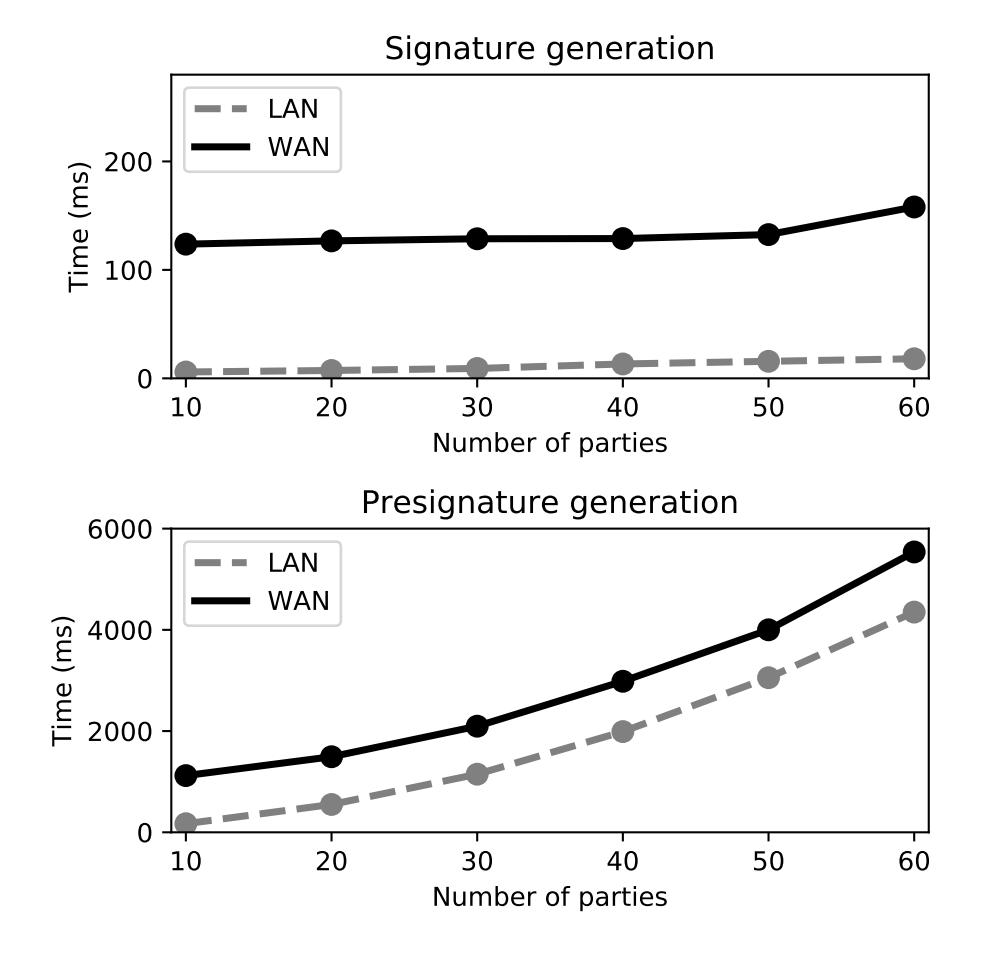
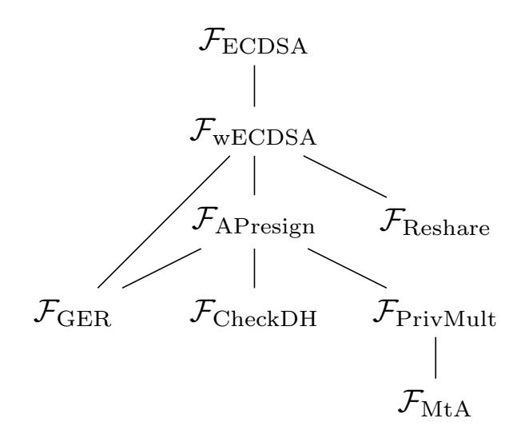

{0}------------------------------------------------

# Threshold ECDSA for Decentralized Asset Custody

Adam Gągol, Jędrzej Kula, Damian Straszak, Michał Świętek

cardinals.cc

#### Abstract

The surge of interest in decentralization-enabling technologies sparked by the recent success of Bitcoin and other blockchains has led to several new challenges in cryptography and protocol design. One such challenge concerns the widely used digital signature scheme – ECDSA – that has in particular been chosen to secure transactions in Bitcoin and several other blockchain systems. To empower decentralized interoperability between such blockchains one would like to implement distributed custody over Bitcoin accounts, which technically can be realized via a threshold ECDSA protocol. Even though several threshold ECDSA protocols already exist, as we argue, due to lack of robustness in signature generation, they are not well suited for deployment scenarios with large committees of parties, out of which a significant fraction might be malicious or prone to DDoS attacks. We propose a new threshold ECDSA protocol that improves upon the state-of-the-art solutions by enabling robustness and fault attributability during signature generation. In addition to that, we improve the signing time and bandwidth of previous solutions by moving expensive operations that are oblivious to the signed message to a separate setup phase. Finally, we back our theoretical results via an empirical evaluation of our protocol in large-scale experiments in LAN and WAN settings.

# 1 Introduction

There has been recently a surge of interest in blockchain technologies, tracing back to the significant success of Bitcoin, the digital currency introduced by Nakamoto [\[Nak08\]](#page-22-0). The main postulate underlying blockchain is that of decentralization, i.e., reducing the power and impact of central authorities in banking, finance, economy and beyond. Nakamoto's idea to achieve decentralization was to design a distributed system, with hundreds, thousands or even millions participants that is able to replace central authorities. Thus, consequently, the trust in these central coordinators is transferred towards the community of all participants running the system and the technology that guarantees the system's security.

The blockchain technology heavily builds upon classical work on reliable broadcast [\[Bra87\]](#page-19-0), consensus protocols [\[Lam78,](#page-21-0) [CL99,](#page-19-1) [DLS88\]](#page-20-0), multi-party computation [\[BGW88,](#page-19-2) [GM82,](#page-21-1) [Bea91\]](#page-18-0) and cryptographic primitives such as digital signatures [\[RSA78\]](#page-22-1), encryption [\[ElG85\]](#page-20-1) or zero-knowledge proofs [\[BFM88\]](#page-18-1). On the other hand, the interest in blockchain has also led to important new developments on all these topics, including the recent work on efficient consensus protocols [\[MXC](#page-22-2)<sup>+</sup>16, [YMR](#page-22-3)<sup>+</sup>19, [GLSS19\]](#page-21-2), signature aggregation [\[BGLS03\]](#page-19-3), verifiable delay functions [\[BBBF18,](#page-18-2) [Wes19\]](#page-22-4) and succinct non-interactive zero-knowledge proofs [\[Gro10\]](#page-21-3). Significant progress has been also made in the field of threshold cryptography, whose main goal is to design threshold versions of classical protocols for signing, encryption etc. Here, by a threshold protocol for, say, signing we mean a protocol that is run by a possibly large group of parties, such that a signature under a particular message can be successfully generated if and only if a predetermined fraction of all the participating parties agree for this to happen. Threshold protocols of this type has been known for a long list of centralized cryptographic protocols such as RSA signatures and encryption [\[DK01\]](#page-20-2), ElGamal encryption, Schnorr signatures [\[SS01\]](#page-22-5) or BLS signatures [\[Bol03\]](#page-19-4). In contrast to that, the widely used DSA (Digital Signature Algorithm) or its successor ECDSA (Elliptic Curve DSA) had no practical threshold variants. Gennaro et

<sup>∗</sup>The research was partially funded by the Aleph Zero Foundation.

{1}------------------------------------------------

al. [GJKR01] introduced a protocol that requires 2N/3 out of N parties to sign a message, but is vulnerable to an adversary controlling N/3 or more parties (which can steal the private key in this case). At this point it was unclear whether one can achieve threshold optimality, i.e., a protocol that for a prespecified threshold  $1 \le t \le N$  allows any t parties to sign, at the same time being resistant to an adversary controlling t-1 parties. There has been a significant amount of work to achieve it in the simpler (yet still far from simple) two-party case [MR04, Lin17, DKLS18] yet only in 2016, threshold-optimal protocols were obtained for the general case [GGN16, BGG17], followed by more practical protocols by Gennaro and Goldfeder [GG18] and by Lindell and Nof [LN18] in 2018.

The importance of ECDSA has been elevated by its use in the design of Bitcoin and several other blockchains. More specifically, each Bitcoin account is associated with an ECDSA public key, and each transaction sent from such an account is confirmed by an appropriate ECDSA signature. While the choice of ECDSA as the Bitcoin signature scheme does not impact regular users, it is a key technical aspect when it comes to interoperability with other blockchains, in particular building bridges that, roughly speaking, allow to deposit BTC on a different blockchain (such as for instance Ethereum) and move it there freely, or withdraw upon request. Technically, the issue with building such a bridge stems from limitations on the Bitcoin side, most importantly, no suitable support for scripting (smart contracts). This effectively forces such a system to emulate a single user of the Bitcoin blockchain. One particular approach to build such a bridge between Bitcoin and Ethereum is wBTC [WBT19] which uses a trusted central authority to hold custody over the corresponding Bitcoin account. Such a solution is not quite satisfactory though, as Bitcoin and Ethereum were built to avoid central authorities in the first place, and thus having a decentralized bridge would be preferred (see tBTC | Kee19| for an example of such a design). This is where threshold ECDSA naturally comes into play. Unfortunately, the existing threshold ECDSA protocols are not quite suitable for this purpose. The reason is that to generate a signature with a threshold t out of N, all the protocols [GGN16, BGG17, GG18, LN18] require to first elect a subcommittee of t honest parties and only then proceed with a signing protocol within this subcommittee. The issue becomes that even if a single party out of these t parties crashes, or is malicious, then the signing protocol fails, without giving any feedback on which party is responsible. This can be easily turned into attacks where an adversary controlling just a single party (or a small number of them) impedes any attempt to sign a transaction and this way causes significant funds to be blocked on an account with threshold custody.

In this work, building upon the work of Lindell and Nof [LN18], we present a new threshold ECDSA protocol that is designed with the above interoperability applications in mind and achieves several improvements over previous solutions. In particular, it offers a robust signing protocol that does not require a choice of an "honest subcommittee", as previous approaches do. On top of that, the presented protocol significantly improves the running time and bandwidth of signing, by moving certain expensive operations to a setup phase.

# <span id="page-1-0"></span>2 Our Results

### 2.1 DSA and ECDSA

To describe the DSA in the abstract, generic form, consider a group G of prime order q and a fixed generator  $g \in G$ . The private key in DSA is an element  $x \in \mathbb{Z}_q$  chosen uniformly at random (where by  $\mathbb{Z}_q$  we denote the field of integers modulo q) and the public key is  $y := g^x \in G$ . To sign a message  $m \in \mathbb{Z}_q$  one performs the following steps

- 1. Choose  $k \in \mathbb{Z}_q$  uniformly at random.
- 2. Compute  $r := H(g^k) \in \mathbb{Z}_q$ , where H is an agreed upon mapping  $H : G \to \mathbb{Z}_q$ .
- 3. Compute  $s := k^{-1}(m + rx) \mod q$ .
- 4. Return a signature  $(r, s) \in \mathbb{Z}_q^2$ .

Conversely, given a signature (r, s) of a message m, to verify its correctness one checks whether

$$H\left(g^{s^{-1}m}y^{-r}\right) \stackrel{?}{=} r.$$

{2}------------------------------------------------

The specific instantiation of DSA that we consider in this work (although the protocol we propose is general and works for any group), is ECDSA, i.e., the case when  $G \subseteq \mathbb{Z}_p^2$  is an elliptic curve over a finite field  $\mathbb{Z}_p$  (of prime size p) and the mapping H simply outputs the first coordinate (modulo q) of a point on this elliptic curve. This variant is most relevant in practice because of its widespread use, for instance in Bitcoin and Ethereum.

# <span id="page-2-1"></span>2.2 Threshold ECDSA and Decentralized Custody

Threshold cryptography allows for N parties to jointly control a single private key x in such a way that for an agreed upon threshold  $1 \le t \le N$  and whenever t or more parties agree to sign a message m, a valid signature is created, whereas no subset of parties of cardinality < t is able to sign a message.

An important application of threshold ECDSA, which is the main motivation for this work, is decentralized custody over digital assets. For concreteness, let us consider the example of Bitcoin: we would like to design a secure, distributed system that operates outside of the Bitcoin Blockchain (for instance: on Ethereum or on a different platform) and holds custody over a Bitcoin account (recall that Bitcoin addresses are directly associated with public keys for ECDSA signatures). Such a system is controlled externally, say, by a specific Ethereum smart contract, and its purpose is to (after an initial setup when a Bitcoin address is generated), once in a while, sign messages – Bitcoin transactions – that are provided to it by the external control mechanism. A canonical example where such a system is essential is in the design of a *Decentralized Bridge* between Bitcoin and Ethereum, such as tBTC [Kee19].

A promising approach to designing such a system is to let a committee of, say, N=100 parties hold a threshold custody over a Bitcoin address. These parties could be chosen as trusted members of a specific community or independent workers who after paying an entry deposit, serve as committee members in return for some interest. If we set the threshold to say t=67, then it would require more than 2/3 of the committee to collude in order to steal the funds. At the same time, such a system is robust, in the sense that even when 1/3 of the committee members go offline (or crash), it does not cause the system to halt. Altogether, such a system can be considered as relatively safe<sup>1</sup>, given that such a threshold custody over a Bitcoin address (thus really over an ECDSA key) is possible to realize.

First of all, due to the technical limitations of the Bitcoin Script, it is not possible to realize such a threshold custody via multisignatures (it would be also overly expensive to do so due to the large transaction size). Secondly, even though several universal threshold schemes for ECDSA already exist (see [LN18, GG18, CCL+20]) they do not allow for the construction of such a system, due to a specific way these protocols operate. More specifically, each of the protocols [LN18, GG18, CCL+20] generates a t-threshold sharing of a secret key  $x \in \mathbb{Z}_q$ , then, given a message  $m \in \mathbb{Z}_q$  and a subset S of exactly t out of the N parties, these t parties run a Sign(m) protocol that results in one of:

- 1. a correct signature (r, s) of m in case all t parties in S honestly participate in the protocol,
- 2. an abort, in which case no information attributing this failure to a particular party is obtained.

The issue now becomes that the external control over the system needs to pick a subset of exactly t out of N parties to attempt signing a message. Whenever such an attempt fails, it needs to try again with a different subset. Clearly, it is virtually impossible to succeed in this if a malicious adversary controls even a couple, say 5 parties, because it is hard to learn who the corrupt parties are, given such a poor feedback in case of failure.

A desirable property of such a system would be the following form of robustness: upon a Sign(m) request, all N parties are allowed to participate in a signing protocol (in contrast to a subset of t of them as in the previous approaches described above) and whenever at least t of these parties behave honestly, the protocol succeeds in generating a signature. In this paper we construct the first threshold ECDSA protocol that operates in this mode.

<span id="page-2-0"></span><sup>&</sup>lt;sup>1</sup>Certainly, it is still possible that a large enough fraction of the committee members collude and take control of the funds. This possibility however is supposed to be countered on a different level, for instance by providing suitable incentives to committee members.

{3}------------------------------------------------

It is worth mentioning that in contrast to ECDSA, the BLS [\[BLS04\]](#page-19-7) signature scheme (as well as some others) has a particularly simple threshold variant which allows non-interactive signing. What this means is that after a Sign(m) request, each party l ∈ [N] simply broadcasts a piece of data sl(m), called a signature share (whose correctness can be verified by any party) and any subset of t such signature shares can be combined into a unique, correct signature of m. While full non-interactivity may not be possible to achieve for ECDSA, the protocol presented in this paper is constructed in a way to make signing as close as possible to non-interactive, and in particular offers a form identifiable abort and is also significantly faster in the signing phase than state-of-the-art solutions.

# 2.3 Our Contribution

The main contributions of this paper are:

- 1. Building upon the work of Lindell and Nof [\[LN18\]](#page-21-7), we construct the first dishonest majority threshold ECDSA protocol that is robust in the signing phase, i.e., guarantees that the signature is successfully generated even in the presence of a malicious adversary.
- 2. Our protocol enables fault attributability in the signing phase, i.e., allows to reveal identities of misbehaving parties.
- 3. Thanks to the novel idea of creating presignatures, our protocol is efficient and requires almost no interaction in the signing phase.
- 4. We provide a complete simulation-based security proof of our protocol with respect to the standard ECDSA functionality.
- 5. We have implemented our protocol and present results of large-scale experiments both in a LAN and WAN settings that confirm its efficiency. For the first time, we demonstrate that a threshold ECDSA protocol can scale to even N = 60 parties and beyond.

# 2.4 Our Protocol

Below we provide a succinct discussion of our protocol's features. As before, N denotes the number of parties and t is the security threshold.

- 1. Setup. In the setup phase, the parties generate a secret private key x and the public key y := g x , as well as a predetermined[2](#page-3-0) number K of so-called presignatures. This phase requires full cooperation of all parties in order to succeed, but unless the adversary controls at least t parties, no information about x is leaked.
- 2. Signing. After a successful setup, whenever Sign(m) is requested, for some message m ∈ Zq, the parties utilize a single presignature (which needs to be discarded afterwards) and run a protocol that results in a signature (r, s) of m. For this protocol to succeed at least t parties need to behave honestly.
- 3. Attributability. Whenever Sign(m) fails, the identities of at least N − t + 1 parties that did not execute the protocol correctly are publicly revealed. In fact, even an external party is able to identify the faulty parties in the protocol by inspecting the public part of the protocol transcript.

The requirement that all parties behave honestly during the setup might seem strong, but as we argue below, it is justifiable for the digital asset custody use cases we are focusing on, furthermore this is an assumption also present in previous work[3](#page-3-1) . A fail during the setup phase is not critical, because no funds are ever transferred to an account before the setup has concluded successfully. Moreover, such a setup

<span id="page-3-0"></span><sup>2</sup>For simplicity of exposition we assume here that presignatures are generated in the setup phase. However, the protocol does not require that and allows generating new presignatures also after one or more signatures have been generated.

<span id="page-3-1"></span><sup>3</sup>Both in [\[GG18\]](#page-20-5) and [\[CCL](#page-19-6)+20] the key generation protocol can be aborted by a single dishonest party. In [\[LN18\]](#page-21-7) the key generation protocol is only specified for t = N and robustness is not claimed for t < N.

{4}------------------------------------------------

can be rerun in case of failure, and it is fair to say that prior to a successful setup, parties do not have any incentives to behave maliciously. It is only after the setup, when the parties jointly hold custody over possibly significant funds and might attempt to steal them. However, the protocol offers strong security and fault attributability post-setup: whenever a party attempts to cheat during signing, it will be publicly caught in doing so.

In the simplest deployment scenario of such a protocol, the following rule can be adopted: whenever the generated presignatures are about to run out and it is not possible to generate more (because of malicious behavior of some parties), the system can fallback into transition mode. In such a case, the remaining presignatures are used to transfer all the funds in custody to a new address handled by a possibly different committee, whose setup has terminated successfully.

We provide a technical overview of the protocol in Section 3 and subsequently in Section 4 we describe the protocol in full detail. We prove security of our protocol in the standard simulation-based framework. In Section A we introduce an appropriate ECDSA ideal functionality  $\mathcal{F}_{\text{ECDSA}}$ , formally state the security claim for our protocol (see Theorem A.1) and finally give a bird-eye view of the security proof.

Finally, in Section 6 we present results of an empirical evaluation of our protocol.

## 2.5 Previous Work and Technical Discussion

From the perspective of digital asset custody, as explained in Section 2.2 we can distinguish two approaches to building threshold ECDSA. Importantly, by "approach" we mean not only the method to solve the threshold ECDSA problem, but also how to define the problem itself. In particular, as argued above, requiring simply that "any set of t parties can sign, while any set of t-1 or less cannot" might not be the right formulation of the problem when digital asset custody applications are considered. The above could be termed as "honest signers"-style approach, because it essentially requires to pick a subset of t honest parties to sign a message. This approach is followed by all the recent, practical, threshold-optimal protocols [GG18, LN18, CCL<sup>+</sup>20]. On the other hand the classical work of Gennaro et al. [GJKR01] has the following guarantee when it comes to signing: all N parties take part in signing and whenever there are  $\leq t-1$  dishonest parties and  $\geq 2t$  honest parties, signing succeeds. In the literature, this property – that a protocol is guaranteed to succeed even in the presence of malicious faults – is called roubustness. Such a "rubust" approach is highly desirable for our applications, however the protocol in [GJKR01] has several downsides: it can only handle thresholds  $t \leq N/3$ and even in such a regime the adversary has an advantage, indeed N/3 malicious parties can steal the key and break the protocol, while N/3 honest parties are not enough to sign messages (2N/3) are required). These caveats come from limitations of error correction of polynomial codes that are at the core of [GJKR01] and any protocol using this technique does not extend to the dishonest-majority case. In fact, it is well known that no protocol can achieve robustness in the dishonest-majority case (see for instance [FLM86]) – in this paper we aim to get as close as possible to robustness while being able to handle high thresholds.

Our protocol is inspired by the work of Lindell and Nof LN18, most notably by the way multiplication is performed in LN18 (the use of ElGamal encryption). Based on these ideas we construct a protocol that allows aborts in the setup phase and requires collaboration of all parties (thus same as LN18, GG18, CCL<sup>+</sup>20|), but after a successful setup, each message signing is robust. To give some rough idea about our innovation, let us briefly explain how [LN18] (and [GG18, CCL<sup>+</sup>20]) work. In the key generation phase, a Shamir secret sharing with threshold t of the private key  $x \in \mathbb{Z}_q$  is established using well-known techniques (thus each party holds an evaluation of a random polynomial  $f \in \mathbb{Z}_q[X]$  of degree t-1 such that f(0)=x). To sign a message m, a subset of parties  $S \subseteq [N]$  of cardinality t is elected (this election is not part of the protocol) and based on their shares of the secret x and appropriate Lagrange interpolation coefficients, they compute an additive sharing of x, i.e., each party  $l \in S$  holds a secret  $w_l \in \mathbb{Z}_q$  such that  $\sum_{l \in S} w_l = x$ . These t parties then engage in a protocol that generates an additive sharing of a random value  $k \in \mathbb{Z}_q$  and performs a series of multiplications and other arithmetic operations on the shared secret values and m to obtain a signature (r, s). Importantly, all parties in S must act honestly in order for the signing to succeed. Our protocol, in contrast, generates in the setup phase an additive sharing of the private key  $x \in \mathbb{Z}_q$  and subsequently performs a certain number of "presignatures", each of which can be seen as precomputing all the multiplications between secret values that are required in the signing but in a way that is oblivious

{5}------------------------------------------------

to the message m being later signed. We refer to Section [3.1](#page-8-0) for more details. These "presignatures" are then converted from additively shared secrets to threshold-t shared secrets guarded with a special type of homomorphic commitments.

Importantly, the presignatures generated in the setup are guaranteed to be correct, as they go through a validation phase, which terminates successfully only if there are no faults (or malicious misbehavior) in the setup. When it then comes to signing, because of the homomorphic properties of the commitment (we use ElGamal commitments, as in [\[LN18\]](#page-21-7)), each party's commitment to the correct shares of the signature are publically computable, and thus each party is forced to reveal the correct share – this is how we can guarantee robustness. Thus, at a high level, while [\[LN18\]](#page-21-7) guard multiplications with ElGamal commitments (and reveal the results afterwards), in our protocol all the computations are guarded with ElGamal commitments, and the values are revealed only at the very end.

When it comes to security, we construct a simulation-based proof, thus similarly as [\[LN18\]](#page-21-7) obtain a stronger notion of security than the game-based definition in [\[GG18\]](#page-20-5) and [\[CCL](#page-19-6)+20]. The ECDSA ideal functionality that we introduce is slightly different than in [\[LN18\]](#page-21-7) as in particular ours incorporates the robustness and fault attributability. When compared to [\[LN18\]](#page-21-7) we also formalize the security of the multiplication protocol differently – instead of a definition based on Privacy and Input Indistinguishability (as in [\[MPR06\]](#page-21-9)) we formulate an ideal functionality FPrivMult and show in particular that the Oblivious-Transfer based protocol of [\[DKLS18\]](#page-20-3) realizes it.

# 2.6 Concurrent Work

Along with this paper, two other works on threshold ECDSA ([\[CMP20\]](#page-19-8) by Canetti et al. and [\[DJN](#page-19-9)<sup>+</sup>20] by Damgård et al.) have been made public on the Cryptology ePrint Archive within a one-day time window. Interestingly, all three groups independently came up with the idea of presignatures and non-interactive signing. In fact, even the term "presignature" is common in all these papers! This is a clear indication how natural the idea is, and also perhaps that it has been overlooked for quite some time in the past.

Despite these similarities, the results achieved and techniques used in these works are quite different. Canetti et al. [\[CMP20\]](#page-19-8) give a new protocol based on the work of Gennaro and Goldfeder [\[GG18\]](#page-20-5). The novel use of Paillier encryption as a commitment scheme allows them to generate presignatures, which in turn enable non-interactive signing. (This is similar to our work, yet we use ElGamal commitments.) On top of that, the protocol [\[CMP20\]](#page-19-8) is equipped with a periodic refresh mechanism that makes it proactively secure. On the other hand, [\[CMP20\]](#page-19-8) does not offer fault attributability, achieving which is the main contribution of our work.

The protocol of Damgård et al. [\[DJN](#page-19-9)<sup>+</sup>20] focuses on the honest majority case (i.e., when the number of corruptions t is less than N/2) and offers significant gain in efficiency compared to previous work. It comes in two versions: one that is heavily optimized for efficiency yet has no abort protection, and another one that has a bit more overhead but is robust in the online phase. The latter one, thanks to the use of Pedersen commitments to guard secret shares, allows, similarly as our protocol, to identify faulty parties during signing.

Another, closely related paper was made public by Gennaro and Goldfeder [\[GG20\]](#page-20-7) not long after those papers mentioned above. The main result of [\[GG20\]](#page-20-7) is an adaptation of the protocol [\[GG18\]](#page-20-5) by the same authors which additionally offers fault attributatibility in case of aborts. The new protocol [\[GG20\]](#page-20-7) still follows the "honest signers" paradigm, thus does not offer robustness when signing, and therefore each signing attempt can be aborted even if only a single adversarial party is member of the subset of t parties selected for signing. However, in such a case the faulty party is identified and can be later banned. We point out that while fault attributability in our protocol is "out-of-the-box", i.e., a run with faults does not differ from a regular, correct execution (in fact it boils down to checking whether a party sent a certain message or not), in [\[GG20\]](#page-20-7) each time a fault happens, a separate, intricate protocol is run that backtracks all the steps of the main protocol, revealing secret messages of all the parties in order to find the offender. One particularly unpleasant caveat of this approach is the requirement that each protocol message must be sent 

{6}------------------------------------------------

to the broadcast channel, which causes an N-fold increase<sup>4</sup> in communication complexity, when compared to [GG18].

An additional contribution of [GG20] (and Canetti et al. [CMP20]) is to bring down the online phase of signing to just a single round of communication. Our protocol, in contrast, requires three rounds<sup>5</sup> for that. It is worth noting that this does not come for free, as proving security of such a protocol requires a stronger assumption, namely that revealing  $g^k$  before the signed message m is selected does not make ECDSA forgeable (which is a plausible, yet not standard assumption). Nevertheless, it is certainly a novel and interesting idea by [CMP20] and [GG20] to work in this model – with no doubt it will bring more efficiency gains in future protocols.

We note that attributability in [GG20] is enabled both in the online phase (signing) and in the offline phase (presigning), whereas in our protocol it is possible only in the online phase. While it is certainly an important future research direction to strenghten our protocol by enabling attributability during presigning, we argue that for the kind of applications we aim for in this work, this drawback has limited practical significance. Specifically, the regular mode of operation of such a protocol is to run a setup phase consisting of key generation and preparing, say, 100 presignatures, followed by the online phase, in which at most 100 messages are signed. In case one would like to achieve attributatibility in setup, and accepts the price of efficiency loss, it is enough to modify the protocol so that all messages are sent to the broadcast channel (suitably encrypted and signed, as in [GG20]), and in case of an abort to reveal all these messages to identify a faulty party. Note that this might cause revealing the shared private key<sup>6</sup> as well, yet this is not an issue, since the key is never used before the setup terminates, and in case of abort the setup is rerun anyway.

In conclusion, all these are exciting developments on threshold ECDSA. The authors are certain that more will come, as it is very likely that a careful combination of all the diverse ideas that appeared in these works will result in an even more robust and efficient protocol.

# <span id="page-6-0"></span>3 Background and High Level Protocol Overview

The protocol is described with respect to a cyclic group G of prime order q, the security parameter  $\lambda$  in our construction is the bit length of q, i.e,  $\lambda := \log(q)$ . We denote group elements using small letters of the latin alphabet, typically g, h, u, v and throughout the paper g always denotes the fixed generator of G that comes as part of the description of G. Scalars, i.e., elements of  $\mathbb{Z}_q$  are denoted by small letters of the latin or greek alphabet, such as  $a, b, c, d, k, r, x, \ldots, \alpha, \beta, \delta, \tau, \ldots$  Even though the group G is abelian, we employ the multiplicative convention when denoting the group operation.

**ElGamal Commitments.** One of the most important components of the whole protocol are what we call ElGamal commitments (also called "ElGamal encryptions in the exponent" by Lindell and Nof in [LN18]).

Given a private key  $d \in \mathbb{Z}_q$ , the public key for ElGamal commitments h is  $g^d$ . With respect to this public key, we define an ElGamal commitment to  $x \in \mathbb{Z}_q$  as

$$E(x) := (g^r, h^r g^x) \in G^2 \quad \text{for a uniformly random } r \in \mathbb{Z}_q.$$
 (1)

As it follows from the above definition, a commitment to a value  $x \in \mathbb{Z}_q$  is not unique and involves a randomizing element  $r \in \mathbb{Z}_q$ . We sometimes write E(x;r) to emphasize that r is the randomizing element in the commitment. From now on, whenever we talk about ElGamal commitments, the public key is denoted by h; it will be always clear from the context what public key is meant.

A crucial property of ElGamal commitments is that they are additively homomorphic, more precisely, for  $x_1, x_2, r_1, r_2 \in \mathbb{Z}_q$  we have

$$E(x_1; r_1) \cdot E(x_2; r_2) = E(x_1 + x_2; r_1 + r_2),$$

<span id="page-6-1"></span><sup>&</sup>lt;sup>4</sup>In the multiplication protocol, the messages sent privately between each pair of parties now must be reliably broadcast to everyone.

<span id="page-6-3"></span><span id="page-6-2"></span><sup>&</sup>lt;sup>5</sup>In fact one can squeeze it two rounds, by doing two reveals in parallel, although one round is not possible to achieve.

<sup>&</sup>lt;sup>6</sup>We remark that in [GG20] the private key is not revealed in case of aborts in the presignature protocol, yet still the adversary might attack the key generation protocol to cause a restart.

{7}------------------------------------------------

where " $\cdot$ " in the left hand side denotes coordinate-wise multiplication in  $G^2$ . Consequently also, given a commitment E(x) and a scalar  $\alpha \in \mathbb{Z}_q$ , we can compute (without the knowledge of  $x \in \mathbb{Z}_q$ ) a commitment  $E(\alpha x)$  by fast exponentiation.

**Non-Malleable Commitments.** Except for ElGamal commitments, we also need a different kind of commitments that allow the parties to commit to any piece of data and guarantee non-malleability, i.e., roughly speaking, given a commitment C(d) to a piece of data d, it is computationally infeasible to generate a commitment C(d') for d' that is in any non-trivial way related to d. A reader interested in the formalization of this concept we refer the reader to the discussion of the  $\mathcal{F}_{\text{Com}}$  functionality in Section  $\mathbb{C}$ . We offer a simple, practical implementation of this component that is based on a hash function  $\text{Hash}(\cdot)$  and can be formalized in the Random Oracle model.

The commitment functionality consists of two procedures:  $\mathsf{Commit}(\cdot)$  and  $\mathsf{Decommit}(\cdot)$ 

- To perform  $\mathsf{Commit}(d)$  for a bitstring  $d \in \{0,1\}^*$ , a party generates  $r \in \{0,1\}^{\lambda}$  uniformly at random and broadcasts  $C := \mathsf{Hash}(d||r||k)$  to the public, where || is a special symbol used for concatenation and k is the ID of the committing party in binary form.
- To perform  $\mathsf{Decommit}(C)$ , the party brodcasts publically the piece of data d and the random bitstring r and all the remaining parties check whether indeed  $\mathsf{Hash}(d||r||k) \stackrel{?}{=} C$ .

Note that such a scheme would not be non-malleable, if the ID of the party was not appended to the hashed string, as an adversary could simply copy an honest commitment and decommit to the same data and random string after an honest party has done that.

**Zero Knowledge Proofs.** In our protocol we frequently make use of Zero Knowledge Proofs (ZKPs) [BFM88] Here we give an informal introduction to ZKPs, for a formal treatment we refer to Section C. In the context of our protocol, ZKPs appear most commonly in the following situation: a party holds some secret piece of data w that along with a public part d is used to compute F(w,d) – a result of applying a function  $F(\cdot,\cdot)$  to the private and public part. To make sure that a value y that the party broadcasts to the public is indeed the result of such a computation, this party publishes a "certificate"  $\pi$  alongside y that "proves" that indeed the party holds a secret w such that F(w,d) = y. A crucial requirement for such a certificate is that it is computationally infeasible to recover any additional information about w from  $\pi$ .

A concrete example present in our  $\mathcal{P}_{GER}$  protocol is when submitting  $g^w \in G$ , the party must include a proof that it knows  $w \in \mathbb{Z}_q$  – this is called a zero knowledge proof of knowledge (ZKPoK) of the discrete logarithm and can be realized using the Schnorr protocol [Sch89]. We provide a more in-depth discussion on the formalization of zero knowledge proofs in Section C (see the  $\mathcal{F}_{ZK}$  functionality) and how to generate such proofs in the non-interactive setting based on  $\Sigma$ -protocols and the Fiat-Shamir heuristic [FS87]. Whenever zero-knowledge proofs appear in our protocol pseudocode, we also include the name of the relation (see Section C.4 for a list) for which this given proof is based.

**Network and Communication.** Since we work in the dishonest majority scenario, this effectively rules out asynchrony (due to well-known impossibility results), thus we employ a synchronous model of communication, which allows for the protocol to proceed in well-defined rounds.

We assume there are point-to-point authenticated communication channels between each pair of parties as well as a broadcast channel which is used to reliably broadcast a message to all parties. It is not hard to argue that a broadcast channel can be emulated by point-to-point channels (see for instance [LN18]) when it comes to realizing functionalities with abort (i.e., when even a single adversarial party can force abort). However, as alluded before, the strength of our protocol stems from the fact that it cannot bet aborted during the signing phase if the adversary controls less than N-t+1 parties. To achieve this, some form of consensus regarding the public messages sent by all the parties is required (to judge which of them are cheating), which in the case of honest majority is impossible (see [CL17]). Therefore, the broadcast channel assumption is in fact necessary here (but only in the signing phase), yet for the type of applications we aim for (digital asset custody, see Section 2.2), this requirement is not an issue. The parties report to the external control system, and thus can use it as a broadcast channel (importantly, only O(1) messages per party need to be published this way per one signature).

{8}------------------------------------------------

## <span id="page-8-0"></span>3.1 Protocol Overview

We start by explaining the basic idea behind the protocol in the case of t = N, i.e., all parties are required to sign but also the adversary would need to compromise all parties in order to learn the secret key. This case is slightly simpler to explain than the general one, because it does not require to run a "resharing" phase, but otherwise all the essential ideas are already present for t = N.

At start, the parties generate an additive sharing of the private key  $x \in \mathbb{Z}_q$ , which essentially means that  $x := \sum_{l \in [N]} x_l$ , where  $x_l$  is the uniformly random share generated by party  $l \in [N]$ . Subsequently, computing a signature for a message  $m \in \mathbb{Z}_q$  can be divided into two parts: **presigning** which is completely oblivious to m and thus can be done during the setup, and the actual **signing** which uses data generated in presigning to force honest behavior from parties.

Recall that a signature for a message  $m \in \mathbb{Z}_q$  is a pair (r, s), where  $s = k^{-1}(xr+m)$ , k is chosen uniformly at random from  $\mathbb{Z}_q$  and  $r = H(g^k)$ . Thus, except for computing r, only arithmetic operations on elements in  $\mathbb{Z}_q$  occur in this phase. Thus, to some extent, producing a signature can be seen as evaluating a specific arithmetic circuit, i.e., it is a special case of MPC (Multi-Party Computation). Consequently, it makes sense to explain our protocol by describing how the parties share elements in  $\mathbb{Z}_q$  and how they perform arithmetic operations on them.

**Sharing a value.** A value  $a \in \mathbb{Z}_q$  is shared additively as  $a = \sum_{l \in [N]} a_l$  such that  $a_l \in \mathbb{Z}_q$  is only known to party l. On top of that, each party  $l \in [N]$  publishes an ElGamal commitment  $E(a_l)$  to its share. Thus, for a single variable a in the protocol, each party l knows its own share  $a_l$  and  $E(a_k)$  for  $k \neq l$ , i.e. the homomorphic commitments to the shares of all the other parties.

Adding two values. Whenever a sum of two values  $a \in \mathbb{Z}_q$  and  $b \in \mathbb{Z}_q$  is required, to obtain a new value c := a + b, each party  $k \in [N]$  performs the following operations locally: it computes  $c_k := a_k + b_k$  as its share of c and subsequently computes the commitments  $\mathsf{E}(c_l) = \mathsf{E}(a_l)\mathsf{E}(b_l)$  for each  $l \in [N]$ , using the homomorphic properties of ElGamal commitments.

Multiplying a value by a scalar. Whenever a value  $a \in \mathbb{Z}_q$  has to be multiplied by a publicly known scalar  $\alpha \in \mathbb{Z}_q$  to yield  $c := \alpha a$ , each party  $k \in [N]$  performs the following operations locally: it computes  $c_k = \alpha a_k$  and subsequently computes the commitments  $\mathsf{E}(c_l) = \mathsf{E}(a_l)^{\alpha}$  using fast exponentiation in the group G (thus performing roughly  $\log q$  group multiplications).

Multiplying two values. While addition and multiplication by scalars are quite straightforward local operations, multiplication, i.e., computing  $c := a \cdot b$ , where both a and b are shared values is highly nontrivial and comprises a bulk of the technical core of this paper (building upon [LN18]). We refer to Section 5.1 for a detailed description of the multiplication protocol.

It is worth emphasizing that the fact that arithmetic in our protocol is "guarded" by ElGamal commitments is crucial for its security. In particular, replacing it by MPC protocols such as SPDZ [DPSZ12] would not allow us to achieve security under the proposed model. Roughly speaking, this is a consequence of the fact that signing a message is not purely an arithmetic task in  $\mathbb{Z}_q$  (because  $g^k$  is revealed as well), and thus it is not possible to show that the data revealed by honest parties reveals nothing to the adversary.

Given protocols to perform arithmetic in a distributed fashion, we are ready to present the main idea behind the signing protocol. We describe it in a simplified form for clarity of exposition. In the presignature phase (when the message m to be signed is not known yet), the parties start by sampling k via additive sharing (similarly as x), i.e.,  $k := \sum_{l \in [N]} k_l$  and, in addition to that, each party  $l \in [N]$  publishes an ElGamal commitment  $\mathbf{E}(k_l)$  to its share. Now, after computing  $g^k \in G$  (this is not hard and we omit it in this overview) and then  $r := H(g^k)$  (which can be publicly announced), the parties need to perform some arithmetic to compute s, i.e., compute s i.e., compute s i.e., compute s i.e., compute s in the presignature phase, the parties compute s is s and the following two

<span id="page-8-1"></span><sup>&</sup>lt;sup>7</sup>To compute an additive sharing of  $k^{-1}$  one can use the following Beaver's trick: generate an additive sharing of a random scalar  $\gamma \in \mathbb{Z}_q$  and perform a multiplication to obtain an additive sharing of  $\delta := k\gamma$ . Then, each party reveals its share of  $\delta$  so that  $\delta$  is recovered in the plain. Subsequently,  $\delta^{-1} \cdot \gamma_l$  is the lth party additive share of  $k^{-1}$ .

{9}------------------------------------------------

variables:  $e := k^{-1}$  and  $f := k^{-1}x$  using the multiplication protocol (hence each party holds its own private shares and the commitments of the remaining parties). At the end of the presignature phase, a specific check based on ElGamal commitments is performed to ensure that all parties will be able to construct correct signature shares.

Then in the signing phase, given a message  $m \in \mathbb{Z}_q$  the parties can easily obtain an additive sharing of  $s := k^{-1}(xr + m)$  because it is a linear function of the values computed in the presignature phase, i.e.,

$$s = k^{-1}(xr + m) = (k^{-1}x)r + k^{-1}m = rf + me,$$

where both r and m are publicly known scalars. Consequently, the parties can compute locally an additive sharing of s guarded by ElGamal commitments. Given such shares and commitments, each party  $k \in [N]$  now reveals its share  $s_k \in \mathbb{Z}_q$  and proves in zero-knowledge that this is the same share as in the public ElGamal commitment  $E(s_k)$ . At this point, it is no longer possible to provide a wrong share, since it is verified against the commitment (which is guaranteed to be correct). Thus, the only possible way a party can cheat is by not providing any share, in which case it is declared as "faulty."

Beyond the t=N case. The extension from t=N to any  $t\in\{1,2,\ldots,N\}$  is quite straightforward: at the end of the presignature phase, each relevant (additively shared) variable is transformed into its threshold shared version. More concretely, Shamir Secret Sharing is employed: for a value  $a\in\mathbb{Z}_q$  each party  $l\in[N]$  now holds the value  $f(l)\in\mathbb{Z}_q$  where  $f(X)\in\mathbb{Z}_q[X]$  is a (random) polynomial of degree t-1 such that f(0)=a. For both the additively shared variables and the threshold shared variables, we maintain appropriate ElGamal commitments. The protocol for transforming additive shares into threshold shares of a particular value is called resharing and is described in detail in Section 5.4. While multiplication of threshold-shared values is rather non-trivial, all linear operations (addition and multiplication by scalars) are simple and can be performed locally. Consequently, the signing phase (after threshold presignatures are ready) is simple and efficient in the general case. Moreover, whenever a presignature is available and at least t parties are honest, it is not possible for the adversary to interrupt the signing process, since the published shares are guaranteed to be correct, and having at least t of them, the s value can be recovered using polynomial interpolation.

# <span id="page-9-0"></span>4 Protocol Description

This Section is devoted to presenting a detailed description of the main protocol of this paper –  $\mathcal{P}_{ECDSA}$  that realizes threshold ECDSA.

Before we dive into that, let us make a comment regarding notation: when talking about variables such as k, r or x in the protocol, occasionally a confusion might arise of whether we refer to the actual value of the variable (in  $\mathbb{Z}_q$ ) or just the "name" of the variable. While in most cases the context is self-explanatory, we still sometime try to avoid this confusion by writing "k" instead of k. This is often to emphasize that a particular subprotocol which takes an identifier of a variable, is run for that variable, not for the underlying value (which would anyway make no sense since the value is not known to any party).

## <span id="page-9-1"></span>4.1 General outline

The  $\mathcal{P}_{\text{ECDSA}}$  protocol consists of three main subprotocols: GenKey(), Presign() and Sign(m), which we describe in detail below. All the parties maintain two global variables presigned and signed (initially both are 0) that count the number of produced presignatures and the number of produced signatures respectively. In particular, at all times presigned  $\geq$  signed and it is not possible to sign a new message if these values are equal (since each signature consumes a single presignature).

• In GenKey() the parties generate an additive sharing of the private key x and the public key  $g^x$  (this is done within the call to a subprotocol  $\mathcal{P}_{GER}$ ). Subsequently, the parties run the  $\mathcal{P}_{APresign}$ .Setup() subprotocol which generates a random  $h \in G$  for ElGamal commitments (in fact the underlying secret key  $d \in \mathbb{Z}_q$  such that  $h = g^d$  is additively shared among parties).

{10}------------------------------------------------

- The Presign() subprotocol results in generating a new presignature (that can be later used to generate a signature), as a result the value of presigned is incremented by 1. A presignature is a set of shares and commitments to 4 specific random values  $(k, \rho, \eta, \tau)$  that are generated in a distributed fashion, according to the following method:
  - Generate  $k, \rho \in \mathbb{Z}_q$  uniformly at random.
  - Compute  $\eta := k \cdot x$  and  $\tau := k \cdot \rho$ .

The presignature for party  $k \in [N]$  consists, for each  $a \in \{k, \rho, \eta, \tau\}$  of shares  $a_k \in \mathbb{Z}_q$  and ElGamal commitments  $\mathsf{E}(a_l) \in G^2$  for each  $l \in [N]$ . Thus 4 shares and 4N commitments in total. After generating such a presignature by calling the  $\mathcal{P}_{\mathsf{APresign}}$  protocol, the resulting additively shared variables are then turned into threshold-t shared variables by executing the  $\mathcal{P}_{\mathsf{Reshare}}(t)$  protocol. Since the ElGamal commitments and zero-knowledge proofs are carried through all the stages of presigning, if the protocol is not aborted, then all parties necessarily have correct presignatures at the end of this subprotocol.

• When executing the  $\mathsf{Sign}(m)$  subprotocol, the parties are given a message  $m \in \mathbb{Z}_q$  as input. The parties fetch from memory a yet unused presignature  $(k, \rho, \eta, \tau)$  and run the  $\mathcal{P}_{\mathsf{ECDSA}}$ . ExpRevealThreshold("k") protocol to compute  $R := g^k$  and subsequently  $r = H(R) \in \mathbb{Z}_q$ . After that, the parties publicly reveal the value of the  $\tau$  variable by running the  $\mathcal{P}_{\mathsf{ECDSA}}$ . Reveal(" $\tau$ ") protocol. Subsequently, as explained in the overview Section 3.1, the parties locally compute a threshold secret sharing of the value

$$s := \tau^{-1}(m\rho + r\eta) = (k\rho)^{-1}(m\rho + r\rho x) = k^{-1}(m + rx).$$

Finally, the parties run  $\mathcal{P}_{\text{ECDSA}}$ . Reveal ("s") to reveal the value of s and thus generate the signature (r, s).

# 4.2 Auxiliary subprotocols

We proceed to formulate and discuss some auxiliary subprotocols that are used in  $\mathcal{P}_{ECDSA}$  in Section 4.1. These include 3 subprotocols (see Auxiliary subprotocols of  $\mathcal{P}_{ECDSA}(t)$ )-ExpRevealThreshold, Lin and Revealthat were omitted for clarity from the previous section, as well as the  $\mathcal{P}_{GER}$  protocol that is used both in  $\mathcal{P}_{ECDSA}$  and in  $\mathcal{P}_{APresign}$  (see Section 5.1). We start by a brief description of ExpRevealThreshold, Lin and Reveal, followed by pseudocode.

- In ExpRevealThreshold(a) the input a is a "name" of a threshold-shared variable (more specifically it will always be instantiated for the "k" variable) and the expected output is the element  $g^a$ . To achieve it, each party  $l \in [N]$  computes and publishes  $g^{\widehat{a}_l}$  (where  $\widehat{a}_l$  is the share of the lth party) along with a zero knowledge proof that the published element agrees with the public commitment  $E(\widehat{a}_l)$ . Given t such elements (from different parties) it is then possible to recover  $g^a$  by "interpolation in the exponent." In case some parties do not deliver their respective shares, and there is not enough shares for interpolation, they are declared as "faulty."
- The purpose of  $\text{Lin}(a, \alpha, b, \beta, c)$  is to create a new threshold-shared variable "c" by taking a linear combination of "a" and "b" with (public) scalar coefficients  $\alpha, \beta \in \mathbb{Z}_q$ . As explained in Section 3.1 this is a simple local computation, because no multiplication between two shared variables is required.
- The Reveal(a) works exactly as ExpRevealThreshold(a) except that now the value of a is revealed instead of  $g^a$ , thus parties broadcast their threshold shares  $\hat{a}_l$  and use regular interpolation to find a.

The purpose of the  $\mathcal{P}_{GER}$  protocol is to generate a uniformly random scalar  $a \in \mathbb{Z}_q$  and reveal  $g^a$  to the public. This protocol is used to generate the shared ECDSA private key x as well as the ElGamal private key d (so that  $h := g^d$  is the public key used for ElGamal commitments).

To achieve this, each party  $l \in [N]$  generates its additive share  $a_l \in \mathbb{Z}_q$  uniformly at random and subsequently publicly commits to  $g^{a_l}$  and a ZKPoK of  $a_l$  (the discrete log of the committed value). After

{11}------------------------------------------------

### Protocol PECDSA(t)

<span id="page-11-1"></span>/\* The instructions in all protocols are written from the perspective of party k ∈ [N]. \*/

#### GenKey():

- 1. Set presigned = 0 and signed = 0.
- 2. Call PGER. As a result, key shares (g <sup>x</sup><sup>1</sup> , gx<sup>2</sup> , . . . , gx<sup>N</sup> ) that together form the public key y := g <sup>x</sup> = Q l∈[N] g <sup>x</sup><sup>l</sup> are published. Also receive a private key share x<sup>k</sup> as output from PGER.
- 3. Call PAPresign.Setup() and store the generated public key for ElGamal commitments as h ∈ G.

### Presign():

- 1. Call the PAPresign.Gen() protocol to receive: commitments E(kl), E(ρl), E(ηl), E(τl) for all l ∈ [N], and private shares kk, ρk, ηk, τk.
- 2. Call the PReshare(t) protocol on each of the variables k, ρ, η, τ to generate t-threshold sharings of these variables out of the available additive sharings. Receive commitments E bkl , <sup>E</sup>(ρbl), <sup>E</sup>(ηbl), <sup>E</sup>(τbl) for each <sup>l</sup> <sup>∈</sup> [N], and the private shares <sup>b</sup>kk, <sup>ρ</sup>bk, <sup>η</sup>bk, <sup>τ</sup>bk.
- 3. Increment presigned ← presigned + 1 and set p := presigned for brevity.
- 4. Save all information (shares and commitments) regarding (k, ρ, η, τ) under presig[p].

#### Sign(m):

- 1. If signed ≥ presigned then exit (ignore this call to Sign(·)).
- 2. Let p := signed and increment signed ← signed + 1.
- 3. Load all information stored about a previously created presignature (k, ρ, η, τ) from presig[p].
- 4. Call PECDSA.ExpRevealThreshold("k") to reveal R := g <sup>k</sup> ∈ G and compute r = H(R) ∈ Zq.
- 5. Call PECDSA.Reveal("τ") to reveal τ ∈ Zq.
- 6. Call PECDSA.Lin("ρ", τ−1m, "η", τ−1r, "s") to compute

$$s := \tau^{-1}(m\rho + r\eta) = k^{-1}(m + rx).$$

- 7. Call PECDSA.Reveal("s").
- 8. output (r, s).

all the parties have done that, the reveal phase follows. Crucially, at the moment of executing this protocol, the ElGamal commitments are not yet avaialable (in fact, we need this protocol to generate the ElGamal key), which explains why do we need to use some other commitments here.

# 5 Subprotocols of PECDSA

This section is devoted to presenting the subprotocols PAPresign and PReshare along with all their components.

# <span id="page-11-0"></span>5.1 Additive Presign Protocol PAPresign

The PAPresign protocol is run in PECDSA.Presign() in order to generate a new (additively shared) presignature (we refer to Section [4.1](#page-9-1) for a discussion on presignatures). Crucially, this requires multiplication of additively shared variables which constitutes the core of this protocol. We start by providing brief descriptions of all the PAPresign protocol methods:

• The main goal of Setup() is generating a random public key h for ElGamal commitments. This is done using the PGER protocol. For technical reasons (to allow modularity in the security proof) in the first step of this subprotocol we require each party l ∈ [N] to provide a ZKPoK of the logarithm of its corresponding share g <sup>x</sup><sup>l</sup> of the public ECDSA key. This step can be omitted if the PAPresign is called from PECDSA, as the parties prove knowledge of their private shares there as well.

{12}------------------------------------------------

#### Auxiliary subprotocols of $\mathcal{P}_{\text{ECDSA}}(t)$

<span id="page-12-0"></span>/\* The instructions in all protocols are written from the perspective of party  $k \in [N]$ .

#### ExpRevealThreshold(a):

1. Publish  $g^{\hat{a}_k}$ , where  $\hat{a}_k$  is the threshold share of a, together with a ZKP that it agrees with the ElGamal commitment (R<sub>EGRefresh</sub>).

\*/

- 2. Let  $F \subseteq [N]$  be the set of parties that did not publish correct values (either did not publish anything before a prespecified deadline or published an incorrect proof).
- 3. If  $N-|F| \ge t$  then recover  $g^a$  using Lagrange interpolation in the exponent and output it, otherwise fail announcing F as the set of "faulty parties".

#### $Lin(a, \alpha, b, \beta, c)$ :

- 1. Compute threshold share of c as  $\hat{c}_k = \alpha \hat{a}_k + \beta \hat{b}_k$  where  $\hat{a}_k$  and  $\hat{b}_k$  are threshold shares of a and b respectively.
- 2. Compute ElGamal commitments to threshold shares  $\{\widehat{c}_l\}_{l\in[N]}$ , for  $l\in[N]$  as

$$\mathtt{E}(\widehat{c}_l) = \mathtt{E}(\widehat{a}_l)^{\alpha} \mathtt{E}\Big(\widehat{b}_l\Big)^{\beta}$$

where  $E(\widehat{a}_l)$  and  $E(\widehat{b}_l)$  are public.

#### Reveal(a):

- 1. Publish threshold share of a:  $\hat{a}_k$  together with a ZKP that it agrees with the ElGamal commitment (R<sub>EGReveal</sub>).
- 2. Let  $F \subseteq [N]$  be the set of parties that did not publish correct shares (either did not publish anything before a prespecified deadline or published an incorrect proof)
- 3. If  $N |F| \ge t$  then recover the value of a using Lagrange interpolation and output it, otherwise fail and announce F as the set of "faulty parties".

#### Protocol $\mathcal{P}_{GER}$

/\* The instructions in all protocols are written from the perspective of party  $k \in [N]$ . \*/

#### GenExpReveal()

- 1. Generate a uniformly random  $a_k \in \mathbb{Z}_q$  and publicly commit to  $(g^{a_k}, \pi_k)$  where  $\pi_k$  is a non-interactive ZKPoK of  $a_k$  (R<sub>DLog</sub>).
- 2. After receiving all commitments from other parties, decommit to  $(g^{a_k}, \pi_k)$ .
- 3. Wait for all the decommitments and continue only if all the proofs are correct.
- AdditivePresign creates presignatures by calling Gen and Mult we refer to Section 4.1 for a discussion of  $(k, \rho, \eta, \tau)$  and how are they later used.
- The purpose of Gen(a) is to generate a fresh random value for the variable "a". This is done by simply generating a random share and publishing an ElGamal commitment to this share by each party. The parties are also required to provide ZKPoK of their shares, otherwise the adversarial parties could use honest parties' commitments to create their own and possibly force a specific value of a, instead of a random one.
- In the  $\operatorname{\mathsf{Mult}}(a,b,c)$  subprotocol, the parties hold an additive sharing of a and b and would like to obtain an additive sharing of  $c:=a\cdot b$ . The idea of this subprotocol follows [LN18]: first the parties involve in a multiplication protocol  $\mathcal{P}_{\operatorname{PrivMult}}$  (we discuss it in Section 5.2) that guarantees privacy (nothing is leaked to the adversary) but does not guarantee correctness (the adversary might inject errors in the output). Let the output shares of  $\mathcal{P}_{\operatorname{PrivMult}}$  be  $(c_1, c_2, \ldots, c_N)$ , the goal is to check that  $\sum_{l\in[N]}c_l=a\cdot b$ . For this, the parties make use of the ElGamal commitments to the shares of a,b and c. First, they participate in a protocol whose result is an ElGamal commitment to the product  $\mathsf{E}(ab)$  and subsequently, the parties compute  $\mathsf{E}(c)$ , where  $c:=\sum_{l\in[N]}c_l$ . It is now not hard to see that

{13}------------------------------------------------

by denoting  $(u, v) := \mathbb{E}(ab) \cdot \mathbb{E}(c)^{-1}$ , we have c = ab if and only if (h, u, v) is a Diffie-Hellman triple. Consequently, the parties invoke the  $\mathcal{P}_{\text{CheckDH}}$  protocol whose purpose is checking whether (h, u, v) is a Diffie-Hellman tuple.

### Protocol $\mathcal{P}_{\text{APresign}}$

**Public input:** Group elements  $(g^{x_1}, g^{x_2}, \dots, g^{x_N})$  that together form an ECDSA public key  $y := g^x = \prod_{l \in [N]} g^{x_l}$ . **Private input:** Each party  $l \in [N]$  holds its private, additive share  $x_l \in \mathbb{Z}_q$  of the ECDSA private key. /\* The instructions in all protocols are written from the perspective of party  $k \in [N]$ .

#### $\mathsf{Setup}()$ :

- 1. Publish a ZKPoK of  $x_k$  (R<sub>DLog</sub>).
- 2. After receiving correct ZKPoK from all parties, run the  $\mathcal{P}_{GER}$  protocol. As a result, public key shares  $(g^{d_1}, g^{d_2}, \dots, g^{d_N})$  are published that together form the public key  $h := g^d = \prod_{l \in [N]} g^{d_l}$  for ElGamal commitments. Also receive the private share  $d_k$  as output from  $\mathcal{P}_{GER}$ .
- 3. Run  $\mathcal{P}_{\text{CheckDH}}.\text{Init}()$  with private input  $d_k$  and public input  $(g^{d_1}, g^{d_2}, \dots, g^{d_N})$ .

#### AdditivePresign():

- 1. Call Gen("k")
- 2. Call  $Gen("\rho")$
- 3. Call  $Mult("\rho", "x", "\eta")$
- 4. Call  $Mult("k", "\rho", "\tau")$

#### Gen(a):

- 1. Sample  $a_k, r_k \in \mathbb{Z}_q$  uniformly at random and publish  $E(a_k, r_k)$  together with a ZKPoK of  $a_k$  and  $r_k$  (R<sub>EGKnow</sub>).
- 2. After receiving correct commitments and proofs from all parties, continue. If any of the received proofs is incorrect, abort.

#### Mult(a, b, c):

- 1. Compute  $E(b) := \prod_{l \in [N]} E(b_l)$  from publicly available commitments  $E(b_l)$  for  $l \in [N]$ .
- 2. Run the  $\mathcal{P}_{\text{PrivMult}}$  protocol with shares  $a_k$  and  $b_k$  and store the output as  $c_k$ .
- 3. Choose a random  $r_k \in \mathbb{Z}_q$ , and publish  $E(c_k; r_k)$  together with a ZKPoK of  $c_k$  and  $r_k$  (R<sub>EGKnow</sub>).
- 4. Choose a random r' and publish  $E(b \cdot a_k) = (E(b))^{a_k} \cdot E(0; r')$  together with a ZKP that  $E(b \cdot a_k)$  was computed correctly (R<sub>EGExp</sub>).
- 5. After receiving  $E(c_l; r_l)$  and  $E(b \cdot a_l)$  with correct proofs from all parties  $l \in [N]$ , compute  $E(a \cdot b) := \prod_{l \in [N]} E(b \cdot a_k)$  and  $E(c) = \prod_{l \in [N]} E(c_l)$ .
- 6. Run the  $\mathcal{P}_{\text{CheckDH}}.\text{Query}(u,v)$  protocol with input  $(u,v) := \mathsf{E}(a \cdot b) \cdot \mathsf{E}(c)^{-1}$ ; continue in case the output is accept and abort in case the output is reject.

# <span id="page-13-0"></span>5.2 Private Multiplication Protocol $\mathcal{P}_{PrivMult}$

The private multiplication we employ in our protocol is not new and appears the previous work on Multi-Party Computation [BDOZ11, KPR18] and threshold ECDSA [GG18, LN18]. The main idea is to reduce multiplication among N parties to a bunch of pairwise multiplications. More specifically, suppose that parties hold shares  $(a_1, a_2, \ldots, a_N)$  and  $(b_1, b_2, \ldots, b_N)$  then the result of multiplication is

$$\left(\sum_{l\in[N]}a_l\right)\cdot\left(\sum_{l\in[N]}b_l\right)=\sum_{l\in[N]}a_lb_l+\sum_{l,k\in[N],l\neq k}a_lb_k.$$

Thus for each pair of different parties  $l, k \in [N]$ , these two parties implicitly share the values  $a_l b_k$  and  $a_k b_l$  multiplicatively. Thus what would be desirable is a two-party protocol that "converts" multiplicative

{14}------------------------------------------------

sharing to additive sharing in the following sense: for two distinct parties  $l, k \in [N]$  with private inputs  $a_l$  and  $b_k$  respectively, the outputs are uniformly random  $\alpha_{l\to k}$  (private output for party l) and  $\beta_{l\to k}$  (private output for party k) such that  $\alpha_{l\to k}+\beta_{l\to k}=a_lb_k$ . Given such a protocol, each party  $l\in [N]$  can then set

$$c_l := a_l b_l + \sum_{k \neq l} \alpha_{l \to k} + \sum_{k \neq l} \beta_{k \to l},$$

and by simple algebra it follows that  $\sum_{l \in [N]} c_l = ab$ , assuming all parties executed the protocol correctly. Clearly, such a protocol does not guarantee correctness, as the adversary can manipulate the results of the pairwise "conversions", but, as mentioned before, we do not aim for correctness here, only privacy. Consequently, all that remains, is to design a protocol  $\mathcal{P}_{MtA}$  that realizes this conversion.

#### Protocol $\mathcal{P}_{\text{PrivMult}}$

**Private input:** Each party  $l \in [N]$  holds its private, additive shares  $a_l, b_l \in \mathbb{Z}_q$  of a and b respectively.

- /\* The instructions in all protocols are written from the perspective of party  $k\in [N]$  .
  - 1. Run with party l (for every party  $l \neq k$ ) an instance of  $\mathcal{P}_{MtA}$  as Alice, with input share  $a_k$ . Let the output share be  $\alpha_{k \to l}$ .

\*/

- 2. Run with party l (for every party  $l \neq k$ ) an instance of  $\mathcal{P}_{MtA}$  as Bob, with input share  $b_k$ . Let the output share be  $\beta_{l \to k}$ .
- 3. Compute the output share as

$$c_k := a_k b_k + \sum_{l \neq k} \alpha_{k \to l} + \sum_{l \neq k} \beta_{l \to k}.$$

There are multiple ways to design the  $\mathcal{P}_{MtA}$  protocol that converts from multiplicative sharing to additive sharing. Here we specifically sketch two solutions: one based on additively Homomorphic Encryption and another based on Oblivious Transfer. Note that the pseudocode provided in this section is only to explain the idea behind these approaches and is not sufficient for security against malicious faults! For details, we refer to Section B.3 and to full implementations: to [LN18] for the Homomorphic-Encryption based protocol and to [DKLS18] for the one based on Oblivious Transfer.

### A $\mathcal{P}_{\mathrm{MtA}}$ protocol based on additively Homomorphic Encryption.

We start by sketching a protocol that appeared in [BDOZ11]. We again emphasize that this is only a sketch and to make the protocol secure against active adversaries one has to enrich the protocol with zero-knowledge proofs. The pseudocode is given in the table **Protocol**  $\mathcal{P}_{MtA}$ -HE. We assume that  $\operatorname{Enc}_B$  and  $\operatorname{Dec}_B$  are respectively the encryption and decryption procedures for Bob's key for additively homomorphic encryption. For simplicity we assume that this scheme is homomorphic in  $\mathbb{Z}_q$  ([CCL<sup>+</sup>20] show how to achieve that), i.e., for  $x, y \in \mathbb{Z}_q$  we have  $\operatorname{Enc}_A(x + y) = \operatorname{Enc}_A(x) +_A \operatorname{Enc}_A(y)$ , where  $+_A$  is ciphertext addition.

#### Protocol $\mathcal{P}_{MtA}$ -HE (Sketch only! Not secure against active adversaries.)

<span id="page-14-0"></span>**Private input:** Alice holds  $\alpha \in \mathbb{Z}_q$  and Bob holds  $\beta \in \mathbb{Z}_q$ .

- 1. Bob sends  $\operatorname{Enc}_B(\beta)$  to Alice.
- 2. Alice samples  $t_A \in \mathbb{Z}_q$  and responds with  $\operatorname{Enc}_B(\alpha\beta t_A)$ .
- 3. Bob decrypts it and sets  $t_B = \alpha \beta t_A$ .

It is not hard to see that if both Alice and Bob act honestly then  $t_A + t_B = \alpha \cdot \beta$  and the pair  $(t_A, t_B)$  is uniformly distributed among such.

#### A $\mathcal{P}_{\mathrm{MtA}}$ protocol based on Oblivious Transfer.

In the table Protocol  $\mathcal{P}_{MtA}$ -OT we sketch a variant of the Gilboa [Gil99] protocol for two-party multiplicative-to-additive share conversion. As in the case of the previous protocol, also this one is presented here for the

{15}------------------------------------------------

sake of explaining the idea only and is not secure against active adversaries. For a variant that is secure we refer the reader to [\[DKLS18\]](#page-20-3).

For this we will need the following variant of Oblivious Transfer (see also [\[Bea96\]](#page-18-4)): Alice (as a dealer) has two values δ<sup>0</sup> ∈ Z<sup>q</sup> and δ<sup>1</sup> ∈ Z<sup>q</sup> and Bob holds a bit b ∈ {0, 1}. As a result of OT we want Bob to learn δ<sup>b</sup> only (and in particular not learn δ1−b) and Alice should not learn Bob's bit b.

### Protocol PMtA-OT (Sketch only! Not secure against active adversaries.)

<span id="page-15-1"></span>Private input: Alice holds α ∈ Z<sup>q</sup> and Bob holds β ∈ Zq.

- 1. Bob writes down β in base-2: β = P<sup>λ</sup> <sup>i</sup>=0 βi2 i , with β<sup>i</sup> ∈ {0, 1} being individual bits, for i = 0, 1, . . . , λ.
- 2. For i = 0, 1, 2, . . . , λ Alice and Bob engage in Oblivious Transfer with Alice being the dealer with the following values:
  - Alice's values are δ<sup>0</sup> = a + γ<sup>i</sup> and δ<sup>1</sup> = γ<sup>i</sup> for γ<sup>i</sup> ∈ Z<sup>q</sup> chosen uniformly at random by Alice.
  - Bob's bit b := βi.

Let the values received by Bob from subsequent oblivious transfers be τ0, τ1, . . . , τλ.

- 3. Alice sets her share t<sup>A</sup> := − P<sup>λ</sup> <sup>i</sup>=0 2 <sup>i</sup>γi.
- 4. Bob sets his share t<sup>B</sup> := P<sup>λ</sup> <sup>i</sup>=0 2 <sup>i</sup>τi.

It is not hard to see that in the PMtA-OT protocol if both Bob and Alice are honest then t<sup>A</sup> + t<sup>B</sup> = αβ is a uniformly random additive sharing of the product of input shares. However, this variant of the protocol unfortunately does not realize our FMtA ideal functionality presented in Section [B.2](#page-25-0) and needs some adjustments, as in [\[DKLS18\]](#page-20-3), to achieve that.

# 5.3 Checking Diffie-Hellman Tuples

The purpose of the PCheckDH protocol is: given a pair (u, v) ∈ G<sup>2</sup> of group elements, check whether (h, u, v) is a Diffie-Hellman triple, where h is a publicly known group element (used as the public key for ElGamal commitments). Clearly, such a task is computationally hard to solve, hence without additional assumptions we cannot hope to design an efficient protocol to solve this problem. The trick here is that the discrete log, i.e. log<sup>g</sup> (h), is additively shared between parties. More precisely, each party l ∈ [N] holds a scalar d<sup>l</sup> ∈ Z<sup>q</sup> such that P l∈[N] d<sup>l</sup> = d and h = g d . Furthermore, the group elements {g <sup>d</sup>l}l∈[N] are publicly known. This additional information allows for the design of an efficient protocol that checks Diffie-Hellman triples [\[LN18\]](#page-21-7).

Consider first the following simple protocol for checking Diffie-Hellman tuples. Note that our task is equivalent to checking whether u <sup>d</sup> = v. Thus, all that needs to be done is to raise u to the d-th power. To this end, each party l ∈ [N] broadcasts u <sup>d</sup><sup>l</sup> ∈ G along with a ZKP of correctness (i.e., that the power of u in the broadcast element is the same as the power of g in the publicly known g <sup>d</sup><sup>l</sup> ). Subsequently all these elements are multiplied together to yield u d , which is compared against v to find out whether (h, u, v) is a Diffie-Hellman tuple.

While the above sketched protocol is certainly correct, unfortunately it is not provably secure. To fix this, the parties first "re-randomize" the input (u, v) into another (u 0 , v<sup>0</sup> ) such that if (h, u, v) is a DH tuple, then (h, u<sup>0</sup> , v<sup>0</sup> ) is a uniformly random DH tuple (for fixed h) and otherwise (u 0 , v<sup>0</sup> ) is uniformly random in G<sup>2</sup> . After such a randomization, the above protocol becomes secure.

# <span id="page-15-0"></span>5.4 Reshare Protocol PReshare

The PReshare(t) protocol has a parameter t ∈ {1, 2, . . . , N}, which indicates how many parties need to collude in order to reveal all the shared values in the plain. The purpose of resharing is to convert an additively shared value a to threshold sharing. What we mean by that is: at the beginning, each party l ∈ [N] holds an additive share a<sup>l</sup> such that P l∈[N] a<sup>l</sup> = a (and each such share is guarded via a public ElGamal commitment <sup>E</sup>(al)), and as the output each party <sup>l</sup> <sup>∈</sup> [N] learns its private share <sup>b</sup>a<sup>l</sup> such that <sup>b</sup>a<sup>l</sup> <sup>=</sup> <sup>f</sup>(l),

{16}------------------------------------------------

#### Protocol $\mathcal{P}_{\mathrm{CheckDH}}$

\*/

**Public Input:** A tuple  $(g^{d_1}, g^{d_2}, \dots, g^{d_N})$  representing shares of the public key  $h := g^d = \prod_{l \in [N]} g^{d_l}$ . **Private Input:** Each party  $l \in [N]$  holds the respective private key  $d_l \in \mathbb{Z}_q$ .

/\* The instructions in all protocols are written from the perspective of party  $k \in [N]$ .

### Init():

- 1. Publish a ZKPoK of the logarithm of  $g^{d_k}$  (R<sub>DLog</sub>).
- 2. Continue only after receiving correct proofs from all other parties.

#### Query(u, v):

- 1. Sample uniformly at random  $\alpha_k, \beta_k \in \mathbb{Z}_q$ , compute  $(u_k, v_k) = (u^{\alpha_k} g^{\beta_k}, v^{\alpha_k} h^{\beta_k})$  and form  $\pi_k$ : a non-interactive ZKPoK of  $\alpha_k$  and  $\beta_k$  (R<sub>Rerand</sub>). Commit to  $(u_k, v_k, \pi_k)$ .
- 2. Upon receiving all commitments from other parties, publicly decommit.
- 3. Upon seing all decommited  $(u_l, v_l)$  along with correct ZKPoKs  $\pi_l$  from all parties  $l \in [N]$ , compute  $u' := \prod_{l \in [N]} u_l$  and  $v' := \prod_{l \in [N]} v_l$ .
- 4. Publish  $u'_k := u'^{d_k}$  along with a ZKP that this value was correctly computed from u' and  $g^{d_k}$  (R<sub>EGExp</sub>).
- 5. Upon receiving all elements  $u'_l$  along with ZKPs from all parties  $l \in [N]$ , check whether  $\prod_{l \in [N]} u'_l = v'$ : if this is the case output accept else output reject.

where  $f(X) \in \mathbb{Z}_q[X]$  is a uniformly random polynomial of degree at most t-1 such that f(0) = a (and we still require that each  $\widehat{a}_l$  is guarded by an ElGamal commitment  $\mathbb{E}(\widehat{a}_l)$ ).

The main idea behind the  $\mathcal{P}_{\text{Reshare}}$  protocol is as follows: each party  $k \in [N]$  generates its degree  $\leq t-1$  polynomial  $f_k \in \mathbb{Z}_q[X]$  uniformly at random such that  $f_k(0) = a_k$ . (This in principle resembles Feldman's VSS protocol [Fel87], but we also preserve ElGamal commitments at each step.) In the end, we would like to use  $f(X) = f_1(X) + f_2(X) + \ldots + f_N(X)$  to share a. Indeed the above f(X) satisfies the requirement that f(0) = a, and as long as the adversary cannot generate its polynomials based on the ones by honest parties, f(X) is also uniformly random subject to this condition. In order for each party  $k \in [N]$  to learn its share  $\widehat{a}_k = f(k)$ , after generating the polynomial  $f_k(X)$ , for every  $l \in [N]$ , the party k sends the evaluation  $f_k(l)$  to party k. Consequently, k receives k values k values k for each k for each k and can compute k for k sends the evaluation k for each k for each k for each k for each k for each k for each k for each k for each k for each k for each k for each k for each k for each k for each k for each k for each k for each k for each k for each k for each k for each k for each k for each k for each k for each k for each k for each k for each k for each k for each k for each k for each k for each k for each k for each k for each k for each k for each k for each k for each k for each k for each k for each k for each k for each k for each k for each k for each k for each k for each k for each k for each k for each k for each k for each k for each k for each k for each k for each k for each k for each k for each k for each k for each k for each k for each k for each k for each k for each k for each k for each k for each k for each k for each k for each k for each k for each k for each k for each k for each k for each k for each k for each k for each k for each

To make this work, one has to make sure the adversary cannot choose its polynomial after seeing some information about honest parties' polynomials. Further, everything needs to be guarded with ElGamal commitments, in order to recompute the required commitments for the new sharing scheme. Roughly speaking, taking care of commitments is not hard, as all transformations that are happening in this protocol are linear, and hence "locally computable". For details we refer to the pseudocode below.

It might appear confusing to the reader why is step 1. in the above protocol necessary. Indeed, whenever this protocol is run as part of  $\mathcal{P}_{\text{ECDSA}}$ , then such zero-knowledge proofs as in step 1. has been already published by each party. Therefore, it is correct to omit this step, as it is not necessary for the security of  $\mathcal{P}_{\text{ECDSA}}$ . The reason why we still write down this step in  $\mathcal{P}_{\text{Reshare}}(t)$  is to allow modularity in our proofs. Indeed, if one wants to consider the  $\mathcal{P}_{\text{Reshare}}(t)$  in isolation from  $\mathcal{P}_{\text{ECDSA}}$  (as we do in Section B.6), then we have no control over h. In principle,  $\mathcal{A}$  could know  $\log_g h$ , which destroys the secrecy property of  $\mathbf{E}(\cdot)$ , while in  $\mathcal{P}_{\text{ECDSA}}$  this is not the case by the way h is chosen.

# <span id="page-16-0"></span>6 Experiments

In order to measure the practical performance of our protocol, we have implemented it in the Golang programming language and run two types of experiments on the AWS platform:

• LAN experiments use m5.xlarge instances located in a single datacenter in Ireland,

{17}------------------------------------------------

#### Protocol $\mathcal{P}_{Reshare}(t)$

**Public input:** An element  $h \in G$  used to form ElGamal commitments and a tuple  $C = (c_1, c_2, \dots, c_N)$  of public ElGamal commitments, i.e.,  $c_l \in G^2$  for each  $l \in [N]$ .

**Private input:** Each party  $l \in [N]$  holds  $a_l, \widetilde{r}_l \in \mathbb{Z}_q$  such that  $\mathbf{E}(a_l, \widetilde{r}_l) = c_l$ .

/\* The instructions in all protocols are written from the perspective of party  $k \in [N]$ .

- 1. Publish a proof of knowledge of values  $a_k, \tilde{r}_k$  such that  $E(a_k, \tilde{r}_k) = c_k$ . (R<sub>EGKnow</sub>)
- 2. Pick a random polynomial  $f_k(X) = \sum_{\iota=0}^{t-1} f_{k,\iota} X^i \in \mathbb{Z}_q[X]$  by setting  $f_{k,0} = a_l$  and choosing  $f_{k,\iota}$  uniformly at random in  $\mathbb{Z}_q$  for  $\iota = 1, 2, \ldots, t-1$ .
- 3. Compute commitments to coefficients of  $f_k$ :  $C_k := \{ \mathbb{E}(f_{k,\iota}, r_{k,\iota}) : \iota = 0, 1, 2, \dots, t-1 \}$  together with  $\Pi_k$ : a ZKPoK of committed values  $(R_{\text{EGKnow}})$  and  $\pi_l$ : a ZKP that  $\mathbb{E}(f_{k,0}, r_{k,0})$  commits to the same value as  $c_k$   $(R_{\text{EGRefresh}})$ .
- 4. Commit to  $(C_k, \Pi_k, \pi_k)$ .
- 5. After receiving commitments from all other parties, decommit to  $(C_k, \Pi_k, \pi_k)$ .
- 6. Upon receiving decommitments from all parties along with correct proofs, compute

$$\mathtt{E}(f_k(l),r_{k\to l}) := \prod_{0 \leq \iota \leq t-1} \mathtt{E}\big(f_{k,\iota},r_{k,\iota}\big)^{l^\iota} \quad \text{ for } l \in [N].$$

- 7. For each  $l \in [N]$  recommit to  $f_k(l)$  by sampling a fresh randomizing element  $r'_{k \to l} \in \mathbb{Z}_q$  and publishing  $\mathbf{E}(f_k(l), r_{k \to l})$  along with a zero-knowledge proof that it agrees with the previous commitment  $(\mathbf{R}_{\mathrm{EGRefresh}})$ .
- 8. Privately send the share  $(f_k(l), r'_{k \to l})$  to each party l.
- 9. After receiving the shares from other parties, verify that all of them agree with the public commitments, in case not, abort. Otherwise, compute

$$\begin{split} s_k &= \sum_{l \in [N]} f_l(k), \qquad r_k' = \sum_{l \in [N]} r_{l \to k}', \quad \text{and} \\ \mathbf{E}\big(s_l, r_l'\big) &= \prod_{i \in [N]} \mathbf{E}\big(f_i(l), r_{i \to l}'\big) \quad \text{ for each } l \in [N]. \end{split}$$

- 10. Recommit to  $s_k$  by sampling a fresh randomizing element  $r_k'' \in \mathbb{Z}_q$  and publishing  $\mathbf{E}(s_k, r_k'')$  along with a ZKP that it agrees with the previous commitment (R<sub>EGRefresh</sub>).
- WAN experiments use m5.xlarge instances evenly distributed across four regions: Ohio, Virginia, California and Oregon.

For each of these settings we have run the protocol with N=10,20,30,40,50 and 60 parties. In all these tests we used t=4/5N as a representative "hard" threshold for threshold ECDSA protocols – it lies in the dishonest majority regime, and yet is significantly lower than N, hence problematic for the "honest-signers" type protocols (such as [GG18, LN18]). We also note that the cost of our protocol does not depend on t (because the most expensive part is creating presignatures, which does not depend on t) and therefore we do not vary t in our experiments.

In each of our experiments a new key was generated, and 1000 messages were signed using this key. We separately report the time needed for generating a single presignature, and to sign a new message using a presignature (averaged over these 1000 messages). The results are depicted in Figure 1.

The experiments show that indeed the signing protocol is highly efficient, as one would expect from its low round complexity and little interaction requirement. The signing time is in fact mainly dominated by unavoidable network latency, as follows from comparing the results in the LAN and WAN settings. On the other hand, presignature generation requires a significant amount of CPU time. Overall, the experiments are a clear indication that the protocol is capable of scaling to N=100 or even more parties.

<span id="page-17-0"></span><sup>&</sup>lt;sup>8</sup>In fact the simplest case for our protocol is t = N, because resharing can be then omitted.

{18}------------------------------------------------

<span id="page-18-5"></span>

Figure 1: The results of experiments: average time to generate a signature and presignature respectively depending on the number of parties N. In all experiments the standard deviation is below 1% and thus is not marked.

# Acknowledgements

We would like to thank Matthew Niemerg for a careful reading of the manuscript and providing the authors with useful comments that improved the overall clarity of the paper.

# References

- <span id="page-18-2"></span>[BBBF18] Dan Boneh, Joseph Bonneau, Benedikt Bünz, and Ben Fisch. Verifiable delay functions. In Advances in Cryptology - CRYPTO 2018 - 38th Annual International Cryptology Conference, Santa Barbara, CA, USA, August 19-23, 2018, Proceedings, Part I, pages 757–788, 2018.
- <span id="page-18-3"></span><span id="page-18-0"></span>[BDOZ11] Rikke Bendlin, Ivan Damgård, Claudio Orlandi, and Sarah Zakarias. Semi-homomorphic encryption and multiparty computation. In Kenneth G. Paterson, editor, Advances in Cryptology - EUROCRYPT 2011 - 30th Annual International Conference on the Theory and Applications of Cryptographic Techniques, Tallinn, Estonia, May 15-19, 2011. Proceedings, volume 6632 of Lecture Notes in Computer Science, pages 169–188. Springer, 2011.
  - [Bea91] Donald Beaver. Efficient multiparty protocols using circuit randomization. In Joan Feigenbaum, editor, Advances in Cryptology - CRYPTO '91, 11th Annual International Cryptology Conference, Santa Barbara, California, USA, August 11-15, 1991, Proceedings, volume 576 of Lecture Notes in Computer Science, pages 420–432. Springer, 1991.
  - [Bea96] Donald Beaver. Correlated pseudorandomness and the complexity of private computations. In Gary L. Miller, editor, Proceedings of the Twenty-Eighth Annual ACM Symposium on the Theory of Computing, Philadelphia, Pennsylvania, USA, May 22-24, 1996, pages 479–488. ACM, 1996.
- <span id="page-18-4"></span><span id="page-18-1"></span>[BFM88] Manuel Blum, Paul Feldman, and Silvio Micali. Non-interactive zero-knowledge and its applications (extended abstract). In Janos Simon, editor, Proceedings of the 20th Annual ACM

{19}------------------------------------------------

- Symposium on Theory of Computing, May 2-4, 1988, Chicago, Illinois, USA, pages 103–112. ACM, 1988.
- <span id="page-19-5"></span>[BGG17] Dan Boneh, Rosario Gennaro, and Steven Goldfeder. Using level-1 homomorphic encryption to improve threshold DSA signatures for bitcoin wallet security. In Tanja Lange and Orr Dunkelman, editors, Progress in Cryptology - LATINCRYPT 2017 - 5th International Conference on Cryptology and Information Security in Latin America, Havana, Cuba, September 20-22, 2017, Revised Selected Papers, volume 11368 of Lecture Notes in Computer Science, pages 352–377. Springer, 2017.
- <span id="page-19-3"></span>[BGLS03] Dan Boneh, Craig Gentry, Ben Lynn, and Hovav Shacham. Aggregate and verifiably encrypted signatures from bilinear maps. In Eli Biham, editor, Advances in Cryptology - EUROCRYPT 2003, International Conference on the Theory and Applications of Cryptographic Techniques, Warsaw, Poland, May 4-8, 2003, Proceedings, volume 2656 of Lecture Notes in Computer Science, pages 416–432. Springer, 2003.
- <span id="page-19-2"></span>[BGW88] Michael Ben-Or, Shafi Goldwasser, and Avi Wigderson. Completeness theorems for noncryptographic fault-tolerant distributed computation (extended abstract). In Janos Simon, editor, Proceedings of the 20th Annual ACM Symposium on Theory of Computing, May 2-4, 1988, Chicago, Illinois, USA, pages 1–10. ACM, 1988.
- <span id="page-19-7"></span>[BLS04] Dan Boneh, Ben Lynn, and Hovav Shacham. Short signatures from the weil pairing. J. Cryptology, 17(4):297–319, 2004.
- <span id="page-19-4"></span>[Bol03] Alexandra Boldyreva. Threshold signatures, multisignatures and blind signatures based on the gap-diffie-hellman-group signature scheme. In Public Key Cryptography - PKC 2003, 6th International Workshop on Theory and Practice in Public Key Cryptography, Miami, FL, USA, January 6-8, 2003, Proceedings, pages 31–46, 2003.
- <span id="page-19-0"></span>[Bra87] Gabriel Bracha. Asynchronous byzantine agreement protocols. Inf. Comput., 75(2):130–143, 1987.
- <span id="page-19-11"></span>[Can00] Ran Canetti. Security and composition of multiparty cryptographic protocols. J. Cryptol., 13(1):143–202, January 2000.
- <span id="page-19-6"></span><span id="page-19-1"></span>[CCL<sup>+</sup>20] Guilhem Castagnos, Dario Catalano, Fabien Laguillaumie, Federico Savasta, and Ida Tucker. Bandwidth-efficient threshold ec-dsa. Cryptology ePrint Archive, Report 2020/084, 2020. [https:](https://eprint.iacr.org/2020/084) [//eprint.iacr.org/2020/084](https://eprint.iacr.org/2020/084).
  - [CL99] Miguel Castro and Barbara Liskov. Practical byzantine fault tolerance. In Proceedings of the Third USENIX Symposium on Operating Systems Design and Implementation (OSDI), New Orleans, Louisiana, USA, February 22-25, 1999, pages 173–186, 1999.
  - [CL17] Ran Cohen and Yehuda Lindell. Fairness versus guaranteed output delivery in secure multiparty computation. J. Cryptology, 30(4):1157–1186, 2017.
- <span id="page-19-10"></span><span id="page-19-8"></span>[CMP20] Ran Canetti, Nikolaos Makriyannis, and Udi Peled. Uc non-interactive, proactive, threshold ecdsa. Cryptology ePrint Archive, Report 2020/492, 2020. [https://eprint.iacr.org/2020/](https://eprint.iacr.org/2020/492) [492](https://eprint.iacr.org/2020/492).
- <span id="page-19-9"></span>[DJN<sup>+</sup>20] Ivan Damgård, Thomas Pelle Jakobsen, Jesper Buus Nielsen, Jakob Illeborg Pagter, and Michael Bæksvang Østergård. Fast threshold ecdsa with honest majority. Cryptology ePrint Archive, Report 2020/501, 2020. <https://eprint.iacr.org/2020/501>.

{20}------------------------------------------------

- <span id="page-20-2"></span>[DK01] Ivan Damgård and Maciej Koprowski. Practical threshold RSA signatures without a trusted dealer. In Birgit Pfitzmann, editor, Advances in Cryptology - EUROCRYPT 2001, International Conference on the Theory and Application of Cryptographic Techniques, Innsbruck, Austria, May 6-10, 2001, Proceeding, volume 2045 of Lecture Notes in Computer Science, pages 152–165. Springer, 2001.
- <span id="page-20-3"></span><span id="page-20-0"></span>[DKLS18] Jack Doerner, Yashvanth Kondi, Eysa Lee, and Abhi Shelat. Secure multi-party threshold ecdsa from ecdsa assumptions. In Oakland S&P'2018, 2018.
  - [DLS88] Cynthia Dwork, Nancy A. Lynch, and Larry J. Stockmeyer. Consensus in the presence of partial synchrony. J. ACM, 35(2):288–323, 1988.
  - [DN07] Ivan Damgård and Jesper Buus Nielsen. Scalable and unconditionally secure multiparty computation. In Alfred Menezes, editor, Advances in Cryptology - CRYPTO 2007, 27th Annual International Cryptology Conference, Santa Barbara, CA, USA, August 19-23, 2007, Proceedings, volume 4622 of Lecture Notes in Computer Science, pages 572–590. Springer, 2007.
- <span id="page-20-12"></span><span id="page-20-9"></span><span id="page-20-1"></span>[DPSZ12] Ivan Damgård, Valerio Pastro, Nigel P. Smart, and Sarah Zakarias. Multiparty computation from somewhat homomorphic encryption. In Reihaneh Safavi-Naini and Ran Canetti, editors, Advances in Cryptology - CRYPTO 2012 - 32nd Annual Cryptology Conference, Santa Barbara, CA, USA, August 19-23, 2012. Proceedings, volume 7417 of Lecture Notes in Computer Science, pages 643–662. Springer, 2012.
  - [ElG85] Taher ElGamal. A public key cryptosystem and a signature scheme based on discrete logarithms. IEEE transactions on information theory, 31(4):469–472, 1985.
  - [Fel87] Paul Feldman. A practical scheme for non-interactive verifiable secret sharing. In 28th Annual Symposium on Foundations of Computer Science, Los Angeles, California, USA, 27-29 October 1987, pages 427–437. IEEE Computer Society, 1987.
- <span id="page-20-11"></span><span id="page-20-8"></span><span id="page-20-6"></span>[FLM86] Michael J. Fischer, Nancy A. Lynch, and Michael Merritt. Easy impossibility proofs for distributed consensus problems. Distributed Comput., 1(1):26–39, 1986.
  - [FS87] Amos Fiat and Adi Shamir. How to prove yourself: Practical solutions to identification and signature problems. In Andrew M. Odlyzko, editor, Advances in Cryptology — CRYPTO' 86, pages 186–194, Berlin, Heidelberg, 1987. Springer Berlin Heidelberg.
  - [GG18] Rosario Gennaro and Steven Goldfeder. Fast multiparty threshold ECDSA with fast trustless setup. In David Lie, Mohammad Mannan, Michael Backes, and XiaoFeng Wang, editors, Proceedings of the 2018 ACM SIGSAC Conference on Computer and Communications Security, CCS 2018, Toronto, ON, Canada, October 15-19, 2018, pages 1179–1194. ACM, 2018.
- <span id="page-20-7"></span><span id="page-20-5"></span>[GG20] Rosario Gennaro and Steven Goldfeder. One round threshold ecdsa with identifiable abort. Cryptology ePrint Archive, Report 2020/540, 2020. <https://eprint.iacr.org/2020/540>.
- <span id="page-20-10"></span><span id="page-20-4"></span>[GGN16] Rosario Gennaro, Steven Goldfeder, and Arvind Narayanan. Threshold-optimal DSA/ECDSA signatures and an application to bitcoin wallet security. In Mark Manulis, Ahmad-Reza Sadeghi, and Steve Schneider, editors, Applied Cryptography and Network Security - 14th International Conference, ACNS 2016, Guildford, UK, June 19-22, 2016. Proceedings, volume 9696 of Lecture Notes in Computer Science, pages 156–174. Springer, 2016.
  - [Gil99] Niv Gilboa. Two party RSA key generation. In Michael J. Wiener, editor, Advances in Cryptology - CRYPTO '99, 19th Annual International Cryptology Conference, Santa Barbara, California, USA, August 15-19, 1999, Proceedings, volume 1666 of Lecture Notes in Computer Science, pages 116–129. Springer, 1999.

{21}------------------------------------------------

- <span id="page-21-4"></span>[GJKR01] Rosario Gennaro, Stanislaw Jarecki, Hugo Krawczyk, and Tal Rabin. Robust threshold DSS signatures. Inf. Comput., 164(1):54–84, 2001.
- <span id="page-21-2"></span><span id="page-21-1"></span>[GLSS19] Adam Gagol, Damian Lesniak, Damian Straszak, and Michal Swietek. Aleph: Efficient atomic broadcast in asynchronous networks with byzantine nodes. In AFT 2019, Zurich, October 21-23, 2019., pages 214–228, 2019.
  - [GM82] Shafi Goldwasser and Silvio Micali. Probabilistic encryption and how to play mental poker keeping secret all partial information. In Harry R. Lewis, Barbara B. Simons, Walter A. Burkhard, and Lawrence H. Landweber, editors, Proceedings of the 14th Annual ACM Symposium on Theory of Computing, May 5-7, 1982, San Francisco, California, USA, pages 365–377. ACM, 1982.
  - [Gro10] Jens Groth. Short pairing-based non-interactive zero-knowledge arguments. In Masayuki Abe, editor, Advances in Cryptology - ASIACRYPT 2010 - 16th International Conference on the Theory and Application of Cryptology and Information Security, Singapore, December 5-9, 2010. Proceedings, volume 6477 of Lecture Notes in Computer Science, pages 321–340. Springer, 2010.
  - [Kee19] Keep.Network. tbtc a decentralized redeemable btc-backed erc-20 token. [http://docs.keep.](http://docs.keep.network/tbtc/index.pdf) [network/tbtc/index.pdf](http://docs.keep.network/tbtc/index.pdf), September 2019.
- <span id="page-21-10"></span><span id="page-21-8"></span><span id="page-21-3"></span>[KPR18] Marcel Keller, Valerio Pastro, and Dragos Rotaru. Overdrive: Making SPDZ great again. In Jesper Buus Nielsen and Vincent Rijmen, editors, Advances in Cryptology - EUROCRYPT 2018 - 37th Annual International Conference on the Theory and Applications of Cryptographic Techniques, Tel Aviv, Israel, April 29 - May 3, 2018 Proceedings, Part III, volume 10822 of Lecture Notes in Computer Science, pages 158–189. Springer, 2018.
- <span id="page-21-0"></span>[Lam78] Leslie Lamport. Time, clocks, and the ordering of events in a distributed system. Commun. ACM, 21(7):558–565, 1978.
- <span id="page-21-12"></span>[Lin11] Yehuda Lindell. Highly-efficient universally-composable commitments based on the DDH assumption. In Kenneth G. Paterson, editor, Advances in Cryptology - EUROCRYPT 2011 - 30th Annual International Conference on the Theory and Applications of Cryptographic Techniques, Tallinn, Estonia, May 15-19, 2011. Proceedings, volume 6632 of Lecture Notes in Computer Science, pages 446–466. Springer, 2011.
- <span id="page-21-11"></span>[Lin16] Yehuda Lindell. How to simulate it - a tutorial on the simulation proof technique. Cryptology ePrint Archive, Report 2016/046, 2016. <https://eprint.iacr.org/2016/046>.
- <span id="page-21-6"></span>[Lin17] Yehuda Lindell. Fast secure two-party ECDSA signing. In Jonathan Katz and Hovav Shacham, editors, Advances in Cryptology - CRYPTO 2017 - 37th Annual International Cryptology Conference, Santa Barbara, CA, USA, August 20-24, 2017, Proceedings, Part II, volume 10402 of Lecture Notes in Computer Science, pages 613–644. Springer, 2017.
- <span id="page-21-7"></span>[LN18] Yehuda Lindell and Ariel Nof. Fast secure multiparty ecdsa with practical distributed key generation and applications to cryptocurrency custody. In Proceedings of the 2018 ACM SIGSAC Conference on Computer and Communications Security, CCS '18, page 1837–1854, New York, NY, USA, 2018. Association for Computing Machinery.
- <span id="page-21-9"></span><span id="page-21-5"></span>[MPR06] Silvio Micali, Rafael Pass, and Alon Rosen. Input-indistinguishable computation. In 47th Annual IEEE Symposium on Foundations of Computer Science (FOCS 2006), 21-24 October 2006, Berkeley, California, USA, Proceedings, pages 367–378. IEEE Computer Society, 2006.
  - [MR04] Philip D. MacKenzie and Michael K. Reiter. Two-party generation of DSA signatures. Int. J. Inf. Sec., 2(3-4):218–239, 2004.

{22}------------------------------------------------

- <span id="page-22-8"></span><span id="page-22-2"></span><span id="page-22-1"></span><span id="page-22-0"></span>[MXC+16] Andrew Miller, Yu Xia, Kyle Croman, Elaine Shi, and Dawn Song. The honey badger of BFT protocols. In Proceedings of the 2016 ACM SIGSAC Conference on Computer and Communications Security, Vienna, Austria, October 24-28, 2016, pages 31–42, 2016.
  - [Nak08] Satoshi Nakamoto. Bitcoin: A peer-to-peer electronic cash system. 2008.
  - [RSA78] Ronald L. Rivest, Adi Shamir, and Leonard M. Adleman. A method for obtaining digital signatures and public-key cryptosystems. Commun. ACM, 21(2):120–126, 1978.
  - [Sch89] Claus-Peter Schnorr. Efficient identification and signatures for smart cards. In Gilles Brassard, editor, Advances in Cryptology - CRYPTO '89, 9th Annual International Cryptology Conference, Santa Barbara, California, USA, August 20-24, 1989, Proceedings, volume 435 of Lecture Notes in Computer Science, pages 239–252. Springer, 1989.
  - [SS01] Douglas R. Stinson and Reto Strobl. Provably secure distributed schnorr signatures and a (t, n) threshold scheme for implicit certificates. In Vijay Varadharajan and Yi Mu, editors, Information Security and Privacy, 6th Australasian Conference, ACISP 2001, Sydney, Australia, July 11-13, 2001, Proceedings, volume 2119 of Lecture Notes in Computer Science, pages 417–434. Springer, 2001.
- <span id="page-22-6"></span><span id="page-22-5"></span><span id="page-22-4"></span>[WBT19] WBTC.Network. Wrapped tokens a multi-institutional framework for tokenizing any asset. <https://www.wbtc.network/assets/wrapped-tokens-whitepaper.pdf>, January 2019.
  - [Wes19] Benjamin Wesolowski. Efficient verifiable delay functions. In Advances in Cryptology EU-ROCRYPT 2019 - 38th Annual International Conference on the Theory and Applications of Cryptographic Techniques, Darmstadt, Germany, May 19-23, 2019, Proceedings, Part III, pages 379–407, 2019.
- <span id="page-22-3"></span>[YMR<sup>+</sup>19] Maofan Yin, Dahlia Malkhi, Michael K. Reiter, Guy Golan-Gueta, and Ittai Abraham. Hotstuff: BFT consensus with linearity and responsiveness. In Peter Robinson and Faith Ellen, editors, Proceedings of the 2019 ACM Symposium on Principles of Distributed Computing, PODC 2019, Toronto, ON, Canada, July 29 - August 2, 2019, pages 347–356. ACM, 2019.

# <span id="page-22-7"></span>A Formalization of Security

In this section, we state the main theorem of this paper about the security of the PECDSA protocol. This is preceded by a formal introduction of the definition of security that we use. Finally, we offer an overview of the structure of the proof of the security so that the actual proof in Section [B](#page-25-1) is easy to navigate and the reader can simply focus on the part of interest.

# A.1 The FECDSA Functionality

We pursue the security of our protocol according to the standard simulation-based definition with the real/ideal model (see [\[Can00\]](#page-19-11) and the introduction to the simulation technique [\[Lin16\]](#page-21-11)).

Each functionality we describe interacts directly with honest parties (we denote them by J ⊆ [N]) and the adversary A who is in control of the remaining parties (we denote the dishonest parties by I := [N] \ J). The threshold t determines how many dishonest parties are required to completely compromise security, by recovering the private key and being able to sign unauthorized messages. Thus, when describing the functionalities, we always assume that |I| ≤ t − 1 (and to further avoid trivial cases we assume |I| ≥ 1). There is another interesting threshold, namely N−t+1, if it is reached by the adversary (i.e., if |I| ≥ N−t+1), then even though there might be not enough dishonest parties to steal the key, it is possible for the adversary to prevent any message to be signed successfully – see point 7. in Sign(m) in the FECDSA(t) functionality.

{23}------------------------------------------------

```
Functionality \mathcal{F}_{\text{ECDSA}}(t)
GenKey():
    1. Sample x \in \mathbb{Z}_q (the private key) uniformly at random.
    2. Send g^x to \mathcal{A}, \mathcal{A} may choose to abort.
    3. Publish q^x.
    4. Store presigned = 0, signed = 0.
    5. Ignore future calls to GenKey().
Presign():
    1. Ignore this call if GenKey() has not yet been called.
    2. \mathcal{A} may choose to abort.
    3. Set presigned \leftarrow presigned +1.
\mathsf{Sign}(m):
    1. If GenKey() was not called yet or presigned \leq signed, ignore this call.
    2. signed \leftarrow signed +1.
    3. Generate random k \in \mathbb{Z}_q.
    4. Compute R = g^k and r = R_x \mod q.
    5. Compute s = k^{-1}(m + rx).
    6. Send (r, s) to \mathcal{A}
    7. A may choose to cause fail if |I| \geq N - t + 1, in which case
            • \mathcal{A} chooses a set F \subseteq I of at least N-t+1 adversarial parties and sends F to the \mathcal{F}_{\text{ECDSA}} functionality.
            • \mathcal{F}_{\text{ECDSA}} terminates \mathsf{Sign}(\cdot) with fail and publicly announces F as the "faulty parties".
    8. Publish (r, s).
```

To better understand the specifics of  $\mathcal{F}_{ECDSA}$ , let us review what is a "typical" sequence of calls to this functionality. At the very beginning GenKey() is called once. Subsequently, whenever there is need to sign a message m, one can first call Presign() and then Sign(m) to generate a signature. It is important to note that both GenKey() as well as Presign() can be aborted by the adversary (even if  $\mathcal{A}$  controls a single party only). For this reason, it might make more sense to act as follows: run a "setup phase" that consists of GenKey() and 100 Presign() calls. After such a successful setup, it is now much harder for the adversary to halt signing – indeed, to generate a signature for m, one just needs to call Sign(m) and signing succeeds unless there are at least N-t+1 dishonest parties. After 100 messages are signed, one needs to top-up the presignature pool in order to continue.

To compare our  $\mathcal{F}_{\text{ECDSA}}$  functionality to that of Lindell and Nof [LN18], note first that in the case when t = N they are functionally equivalent, since Presign can be erased in this case. The difference only appears when t < N. While in this case the  $\mathcal{F}_{\text{ECDSA}}$  functionality is not explicitly specified in [LN18], one way to define it would be to have an additional parameter  $S \subseteq [N]$  in the Sign(m) method that specifies the set of parties of cardinality t that are selected to sign m. Within Sign(m) the adversary  $\mathcal{A}$  then controls parties  $I \cap S$  and can cause abort whenever  $|I \cap S| \ge 1$ . As already mentioned in Section 2, in practice, choosing S is particularly problematic, and gives a simple attack vector that halts signing. In contrast, in our solution after a successful setup, the signing process is "hard" to abort.

### A.2 Security Result

The security of our protocol relies on the Diffie-Hellman assumption. Recall that each triple of the form  $(g^a, g^b, g^{ab}) \in G^3$  for some scalars  $a, b \in \mathbb{Z}_q$  is called a Diffie-Hellman triple, and the problem of distinguishing a random triple in  $G^3$  from a random Diffie-Hellman triple is called the Decisional Diffie-Hellman problem.

{24}------------------------------------------------

<span id="page-24-1"></span>

Figure 2: Dependency structure of functionalities used in the proof.

<span id="page-24-0"></span>Theorem A.1. Suppose the Decisional Diffie-Hellman problem is hard in G, then the PECDSA protocol securely computes the FECDSA functionality in the (FZK, FComZK)-Hybrid Model.

We note that the above assumes that we use the Oblivious-Transfer based implementation of PMtA. In case Homomorphic Encryption is used instead, one additionally needs to assume the semantic security of Paillier Encryption (or some other additively homomorphic encryption scheme that one can use instead of Paillier).

# A.3 Proof Organization

We prove that PECDSA is secure under the simulation-based definition, showing that it securely computes the FECDSA functionality. For the sake of making the proof cleaner, we introduce an intermediate functionality FwECDSA (see Section [B.8,](#page-37-0) w in wECDSA stands for "weak") that is somewhere in between FECDSA and our protocol. Regarding FwECDSA, we show that it is "equivalent" to FECDSA in the sense that any adversary for FwECDSA can be simulated by an adversary for FECDSA. Thus, any protocol securely computing FwECDSA also securely computes FECDSA (see Lemma [B.8\)](#page-41-0). Given that fact, it is enough to show that PECDSA realizes the FwECDSA functionality. Towards this end, for each of the PECDSA subprotocols, we define an associated functionality that is securely computed by that protocol.

Figure [2](#page-24-1) outlines the structure of dependencies among functionalities associated with PECDSA subprotocols. The edge between a higher-level functionality F<sup>h</sup> and lower-level functionality F<sup>l</sup> indicates that the protocol corresponding to F<sup>h</sup> contains a call to the protocol corresponding to F<sup>l</sup> . In such a case, after proving that F<sup>l</sup> is securely computed by its protocol, we prove the same for Fh, but working in Fl-hybrid model (thus rely on the composition theorem, see [\[Can00\]](#page-19-11)). Besides functionalities outlined in the figure, we always work in the "basic" hybrid model with FCom, FComZK, FZK, see Section [C](#page-44-0) for their definitions.

Note on Formalism. An important objective we want to achieve in this paper is to make the content accessible to as many readers as possible without requiring deep background in cryptography and secure computation. For this reason, we write our protocols in a slightly informal style while trying to provide additional (sometimes perhaps redundant) intuition regarding various steps in the pseudocode. In particular, we do not employ the formalism based on Interactive Turing Machines (see e.g. [\[Can00\]](#page-19-11)) when describing protocols and functionalities. Instead, we use jargon of the form "call functionality F" (or "run protocol P") to mean that all parties should send a particular message to F and make sure that it has a unique session id, etc. (we do not keep track of session ids in functionalities). While it would certainly require significant work to rewrite the protocol (and proofs) within the strictest formalism level based on ITMs, such work would be merely automatic and not require any novel ideas. At this point, it is important to remark that implementing such a protocol also requires a certain formalization of the pseudocode, but not quite of the same type as the ITMs formalism used for security proofs. We hope that by keeping the formalism at this level, the protocol description is easy to understand for developers interested in implementing it, and, at the same time, the proofs are not hard to follow for security experts.

{25}------------------------------------------------

# <span id="page-25-1"></span>B Security proof

### **B.1** Notation and Conventions

Throughout this section, for the sake of brevity, we use the following conventions in notation

- We use  $I \subseteq [N]$  for dishonest parties and  $J \subseteq [N]$  for honest parties. The very nice convention from [LN18] that we follows here is that we use i as a running index over dishonest parties, i.e.,  $i \in I$ , and we use j for honest parties, i.e.,  $j \in J$ . We also use l as a running index over all parties,  $l \in [N]$ .
- Occasionally, if we have a vector of values  $\{a_l\}_{l\in[N]}$  and a subset  $S\subseteq[N]$ , we write  $a_S$  in short for  $\{a_l\}_{l\in S}$ , i.e., the vector of all values corresponding to indices in S.

When describing functionalities with abort (thus all functionalities that are "used" in GenKey or Presign), for brevity we occasionally neglect to explicitly mark all steps in which the adversary has the possibility to abort. Indeed, an abort can happen at any step in the functionality where the adversary is supposed to send some message.

# <span id="page-25-0"></span>B.2 Analysis of $\mathcal{P}_{MtA}$

We start by introducing the  $\mathcal{F}_{MtA}$  functionality. The parties in  $\mathcal{F}_{MtA}$  are Alice and Bob who given private inputs  $\alpha, \beta \in \mathbb{Z}_q$  respectively would like to compute  $t_A, t_B$  such that  $t_A + t_B = \alpha \beta$  and  $t_A$  is uniformly random in  $\mathbb{Z}_q$ . Since the protocols for realizing  $\mathcal{F}_{MtA}$  are not quite symmetric (the role of Alice and Bob differ) we find it best to have two versions of the  $\mathcal{F}_{MtA}$  functionality: one when the adversary controls Alice and one when it controls Bob.

### Functionality $\mathcal{F}_{\mathrm{MtA}}$ ( $\mathcal{A}$ controls Alice)

**Private input:** Alice holds  $\alpha \in \mathbb{Z}_q$  and Bob holds  $\beta \in \mathbb{Z}_q$ 

- 1. Bob sends  $\beta$  to  $\mathcal{F}_{MtA}$
- 2.  $\mathcal{F}_{MtA}$  samples  $t_A \in \mathbb{Z}_q$  and sends it to  $\mathcal{A}$  (Alice)
- 3.  $\mathcal{A}$  (Alice) sends  $(\alpha, \delta) \in \mathbb{Z}_q^2$  to  $\mathcal{F}_{MtA}$
- 4.  $\mathcal{F}_{MtA}$  sends output  $t_B = \alpha \beta + \delta t_A$  to Bob

#### Functionality $\mathcal{F}_{MtA}$ ( $\mathcal{A}$ controls Bob)

**Private input:** Alice holds  $\alpha \in \mathbb{Z}_q$  and Bob holds  $\beta \in \mathbb{Z}_q$ 

- 1. Alice sends  $\alpha$  to  $\mathcal{F}_{MtA}$
- 2.  $\mathcal{F}_{MtA}$  samples  $t_B \in \mathbb{Z}_q$  and sends it to  $\mathcal{A}$  (Bob)
- 3.  $\mathcal{A}$  (Bob) sends  $\beta \in \mathbb{Z}_q$  to  $\mathcal{F}_{MtA}$
- 4.  $\mathcal{F}_{MtA}$  sends output  $t_A = \alpha \beta t_B$  to Alice

Recall that in Section 5.2, we did not provide any secure implementation of  $\mathcal{F}_{MtA}$ , but rather sketches of protocols that are secure only against static adversaries. Here we prove that the Two-party Multiplication protocol  $\pi_{2PMul}^1$  in [DKLS18] based on Oblivious Transfer securely computes  $\mathcal{F}_{MtA}$ . We do not provide a description of  $\pi_{2PMul}^1$  in this paper as it would require significant space to introduce the required notation and background on Oblivious Transfer, and instead we refer to the well-written paper [DKLS18]. We also refer to [GG18, LN18, CCL<sup>+</sup>20] for a secure version of  $\mathcal{P}_{MtA}$  based on additively homomorphic addition.

**Lemma B.1.** The  $\pi_{2\mathsf{PMul}}^1$  protocol (with "cheat detected" replaced by "abort") from [DKLS18] securely computes the  $\mathcal{F}_{\mathrm{MtA}}$  functionality.

{26}------------------------------------------------

## Functionality $\mathcal{F}_{\mathsf{2PM}}^1$

**Private input:** Alice holds  $\alpha \in \mathbb{Z}_q$  and Bob holds  $\beta \in \mathbb{Z}_q$ .

- 1. Bob sends  $\beta$  to  $\mathcal{F}^1_{2\mathsf{PMul}}$ .
- 2.  $\mathcal{F}_{2\mathsf{PMul}}^1$  samples  $t_A$  uniformly at random and sends it to Alice.
- 3. Alice sends  $(\alpha, \delta, c)$  to  $\mathcal{F}^1_{\mathsf{2PMul}}$ .
- 4. If c > 0 and  $\delta = 0$ , abort, otherwise:
  - 5a. Toss c coins, if any of them output 1, send cheat detected to Bob and abort.
  - 5b. compute  $t_B = \alpha \beta + \delta t_A$  and send it to Bob.

*Proof.* We inspect the  $\mathcal{F}_{2\mathsf{PMul}}^1$  functionality introduced in [DKLS18] that is securely computed by  $\pi_{2\mathsf{PMul}}^1$ .

Intuitively,  $\mathcal{F}_{2\mathsf{PMul}}^1$  is "stronger" than  $\mathcal{F}_{MtA}$  in the sense that every "cheating attempt" by Alice goes through in  $\mathcal{F}_{MtA}$ . On the other hand, in  $\mathcal{F}_{2\mathsf{PMul}}^1$ , an additional randomized test is performed (which succeeds with probability at least 0.5, since  $c \in \{1, 2, 3, ...\}$ ). To formalize this notion, one can write down a protocol  $\pi_{Mul}$  in the  $\mathcal{F}_{2\mathsf{PMul}}^1$ -hybrid model that invokes the  $\mathcal{F}_{2\mathsf{PMul}}^1$  functionality and the cheat detected output is interpreted as Alice's abort. Subsequently, it is easy to show that  $\pi_{Mul}$  securely computes  $\mathcal{F}_{MtA}$ .

# <span id="page-26-0"></span>B.3 Analysis of $\mathcal{P}_{\text{PrivMult}}$

We start by introducing the  $\mathcal{F}_{PrivMult}$  ideal functionality that we would like the  $\mathcal{P}_{PrivMult}$  protocol to securely compute.

#### Functionality $\mathcal{F}_{PrivMult}$

**Private Input:** Each party  $l \in [N]$  holds a pair of shares  $a_l \in \mathbb{Z}_q$  and  $b_l \in \mathbb{Z}_q$ .

- 1. Receive shares  $\{a_j, b_j\}_{j \in J}$  from honest parties.
- 2. Receive  $\{a_{i,j}, b_{i,j}\}_{i \in I, j \in J}$  from the adversary  $\mathcal{A}$
- 3. Receive  $\delta$  from the adversary  $\mathcal{A}$ .
- 4. Sample  $\{c_j\}_{j\in J}$  uniformly at random subject to:

$$\sum_{j} c_{j} = \delta + \left(\sum_{j} a_{j}\right) \left(\sum_{j} b_{j}\right) + \sum_{i,j} b_{j} a_{i,j} + \sum_{i,j} a_{j} b_{i,j}$$

5. send output  $c_j$  to each honest party  $j \in J$ 

To provide some intuition, let us first explain how an "honest" adversary would behave:  $\mathcal{A}$  would simply send  $a_{i,j} = a_i$  and  $b_{i,j} = b_i$  for each  $i \in I$  and  $j \in J$  (with  $a_i$  and  $b_i$  being the true shares of the dishonest parties  $i \in I$ ). Subsequently,  $\mathcal{A}$  would sample uniformly at random  $c_i \in \mathbb{Z}_q$  for each  $i \in I$  and set

$$\delta := \left(\sum_{i} a_{i}\right) \left(\sum_{i} b_{i}\right) - \sum_{i} c_{i}.$$

In such a case indeed  $\{c_l\}_{l\in[N]}$  is a random vector satisfying  $\sum_l c_l = (\sum_l a_l) (\sum_l b_l)$ .

The shape of this functionality, specifically the way  $\mathcal{A}$  is allowed to cheat, is dictated by how the  $\mathcal{P}_{\text{PrivMult}}$  protocol looks like. Indeed, nothing forces the adversary participating in  $\mathcal{P}_{\text{PrivMult}}$  to use the same set of shares in every invocation of  $\mathcal{P}_{\text{MtA}}$  with different honest parties.

We analyze the  $\mathcal{P}_{\text{PrivMult}}$  protocol in the  $\mathcal{F}_{\text{MtA}}$ -hybrid model. To this end, we replace each execution of  $\mathcal{P}_{\text{MtA}}$  by a call to the  $\mathcal{F}_{\text{MtA}}$  functionality. It will be convenient also to denote the call to  $\mathcal{F}_{\text{MtA}}$  corresponding to the instance where party  $k \in [N]$  acts as Alice and party  $l \in [N]$  acts as Bob by  $\mathcal{F}_{\text{MtA}}^{k \to l}$ . Thus, in particular, in step 1. of  $\mathcal{P}_{\text{PrivMult}}$  party  $k \in [N]$  interacts with  $\mathcal{F}_{\text{MtA}}^{k \to l}$  and in step 2. party k interacts with  $\mathcal{F}_{\text{MtA}}^{l \to k}$ .

{27}------------------------------------------------

**Lemma B.2.** Protocol  $\mathcal{P}_{PrivMult}$  securely computes the  $\mathcal{F}_{PrivMult}$  functionality in the  $\mathcal{F}_{MtA}$  hybrid model.

*Proof.* Let  $\mathcal{A}$  by any adversary for  $\mathcal{P}_{PrivMult}$ , we start by describing a suitable simulator  $\mathcal{S}$ .

- 1. The simulator S interacts with A (acting as  $\mathcal{F}_{MtA}^{i \to j}$ ) and sends A a uniformly random  $\alpha_{i \to j} \in \mathbb{Z}_q$  and (acting as  $\mathcal{F}_{MtA}^{j \to i}$ ) sends to A a uniformly random  $\beta_{j \to i} \in \mathbb{Z}_q$ .
- 2. The simulator S (controlling the functionalities  $\mathcal{F}_{\mathrm{MtA}}^{i \to j}$  and  $\mathcal{F}_{\mathrm{MtA}}^{j \to i}$  for  $i \in I$  and  $j \in J$ ) internally intercepts the values  $a_{i,j}, \delta_{i,j}$  and  $b_{i,j}$  that the adversary A sends to them.
- 3. The simulator  $\mathcal{S}$  sends  $\{a_{i,j}, b_{i,j}\}_{i \in I, j \in J}$  to  $\mathcal{F}_{\text{PrivMult}}$ .
- 4. The simulator S computes  $\delta$  as follows:

$$\delta := \sum_{i \in I, j \in J} \delta_{i,j} - \sum_{i,j} \alpha_{i \to j} - \sum_{i,j} \beta_{j \to i}$$

and sends  $\delta$  to  $\mathcal{F}_{PrivMult}$ .

5. The simulator outputs whatever  $\mathcal{A}$  outputs and halts.

It remains to show computational indistinguishability between the real execution and the ideal execution. Actually, we show these two distributions are exactly the same.

Note that because the adversary (in the real execution) interacts with  $\mathcal{F}_{\mathrm{MtA}}^{i \to j}$  and  $\mathcal{F}_{\mathrm{MtA}}^{j \to i}$  only (and with  $\mathcal{F}_{\mathrm{MtA}}^{i \to i'}$  for  $i, i' \in I$ , but this interaction does nothing), the **only** messages it obtains in the protocol are the uniformly random values  $\alpha_{i \to j}$  and  $\beta_{j \to i}$ . Thus, the adversary can be thought of as a black-box

$$\mathcal{A}(\alpha,\beta) = (a,b,\delta).$$

where for brevity we denote  $\alpha = \{\alpha_{i \to j}\}_{i \in I, j \in J}$  and  $\beta = \{\beta_{i \to j}\}_{i \in I, j \in J}$ , similarly a and b are suitable vectors, and  $\delta \in \mathbb{Z}_q$ .

In the ideal execution, the inputs  $\alpha, \beta$  to the adversary are also uniformly random, so the distributions of the adversary outputs match between the real execution and the ideal one. It remains to check whether the outputs of the honest parties are also distributed the same way.

In the real execution, party j has output

$$c_{j} = a_{j}b_{j} + \sum_{l \neq j} \alpha_{j \to l} + \sum_{l \neq j} \beta_{l \to j}$$

$$= a_{j}b_{j} + \sum_{j' \in J, j' \neq j} (\alpha_{j \to j'} + \beta_{j' \to j}) + \sum_{i \in I} \alpha_{j \to i} + \sum_{i \in I} \beta_{i \to j}$$

$$= a_{j}b_{j} + \sum_{j' \in J, j' \neq j} (\alpha_{j \to j'} + \beta_{j' \to j}) + \sum_{i \in I} (a_{j}b_{i,j} - \beta_{j \to i})$$

$$+ \sum_{i \in I} (b_{j}a_{i,j} + \delta_{i,j} - \alpha_{i \to j})$$

thus

$$\begin{aligned} c_j &= a_j b_j + \sum_{j' \in J, j' \neq j} (\alpha_{j \to j'} + \beta_{j' \to j}) + \sum_i \delta_{i,j} \\ &+ \sum_i (b_j a_{i,j} + a_j b_{i,j}) - \sum_i \alpha_{i \to j} - \sum_i \beta_{j \to i} \\ &= \tau_j + \sum_i \delta_{i,j} + \sum_i (b_j a_{i,j} + a_j b_{i,j}) - \sum_i \alpha_{i \to j} - \sum_i \beta_{j \to i} \end{aligned}$$

{28}------------------------------------------------

Where we denoted  $\tau_j := a_j b_j + \sum_{j' \in J, j' \neq j} (\alpha_{j \to j'} + \beta_{j' \to j})$ . Now, note that  $\alpha_{j \to j'}$  and  $\beta_{j' \to j}$  come from interactions between two honest parties via  $\mathcal{F}_{\text{MtA}}$ , and, thus, are uniformly random subject to  $\alpha_{j \to j'} + \beta_{j \to j'} = a_j b_{j'}$ , hence

$$\sum_{j} \tau_{j} = \left(\sum_{j} a_{j}\right) \left(\sum_{j} b_{j}\right).$$

Moreover,  $\{\tau_j\}_{j\in J}$  are distributed uniformly subject to this constraint. (This might sound strange if |J|=1 but is also correct.) Consequently, it follows that the outputs  $\{c_j\}_{j\in J}$  of honest parties in  $\mathcal{F}_{\text{PrivMult}}$  have uniform distribution subject to

$$\sum_{j} c_j = \delta + \left(\sum_{j} a_j\right) \left(\sum_{j} b_j\right) + \sum_{i,j} b_j a_{i,j} + \sum_{i,j} a_j b_{i,j}.$$

# B.4 Analysis of $\mathcal{P}_{\mathrm{CheckDH}}$

We start by defining the  $\mathcal{F}_{\text{CheckDH}}$  ideal functionality.

### Functionality $\mathcal{F}_{\mathrm{CheckDH}}$

**Public Input:** A tuple  $(g^{d_1}, g^{d_2}, \dots, g^{d_N})$  representing shares of the public key  $h := g^d = \prod_{l \in [N]} g^{d_l}$ .

**Private Input:** Each party  $l \in [N]$  holds a share  $d_l \in \mathbb{Z}_q$ . of the public key  $h := g^d = \prod_{l \in [N]} g^{d_l}$ .

Init():

- 1. Receive the private input  $d_l \in \mathbb{Z}_q$  from every party  $l \in [N]$ . In case it does not agree with the public key  $g^{d_l}$ , abort.
- 2. Store  $d := \sum_{l \in [N]} d_l$ .

Query(u, v):

1. If  $u^d = v$  then publish accept, else publish reject.

Subsequently, we show that  $\mathcal{P}_{CheckDH}$  securely computes the  $\mathcal{F}_{CheckDH}$  functionality. To this end, we first reformulate the  $\mathcal{P}_{CheckDH}$  protocol in the  $(\mathcal{F}_{ZK}, \mathcal{F}_{ComZK})$ -hybrid model, below we list the necessary changes:

- In step 1 of Init the parties call  $\mathcal{F}_{ZK}(R_{DLog})$
- In steps 1,2,3 of Query the parties interact with  $\mathcal{F}_{\text{ComZK}}(R_{\text{Rerand}})$
- In steps 4, 5 of Query the parties interact with  $\mathcal{F}_{ZK}(R_{EGExp})$ .

**Lemma B.3.** The  $\mathcal{P}_{CheckDH}$  protocol securely computes the  $\mathcal{F}_{CheckDH}$  functionality in the  $(\mathcal{F}_{ZK}, \mathcal{F}_{ComZK})$ -hybrid model.

*Proof.* Let  $\mathcal{A}$  be any adversary for  $\mathcal{P}_{CheckDH}$ , we start by describing a suitable simulator  $\mathcal{S}$ . Simulating Init()

1. S intercepts the values  $\{d_i\}_{i\in I}$  the adversary A sends to  $\mathcal{F}_{ZK}$ . In case for some  $i\in I$  the received value does not agree with the public  $g^{d_i}$ , S simulates reject by  $\mathcal{F}_{ZK}$ .

### Simulating Query(u, v)

At the very beginning, S receives the result, either accept or reject from the  $\mathcal{F}_{CheckDH}$  functionality. The simulation is then performend according to one of the below recipes depending on this result.

### The case of accept:

- 1. S samples  $(u', v') \in G^2$  as follows: choose  $\gamma \in \mathbb{Z}_q$  uniformly at random and set  $u' := g^{\gamma}$  and  $v' := h^{\gamma}$ .
- 2.  $\mathcal{S}$  simulates  $\mathcal{F}_{\text{ComZK}}$  sending accept to  $\mathcal{A}$  for every  $j \in J$ .

{29}------------------------------------------------

- 3.  $\mathcal{S}$  intercepts  $(u_i, v_i)$  along with  $(\alpha_i, \beta_i)$  for each  $i \in I$  that  $\mathcal{A}$  sends to  $\mathcal{F}_{\text{ComZK}}$  and simulates the execution of  $\mathcal{F}_{\text{ComZK}}$ .
- 4. S picks any honest party  $j_0 \in J$  and generates  $(u_j, v_j) \in G^2$  as follows:
  - Sample  $\eta_j \in \mathbb{Z}_q$  uniformly at random and set  $(u_j, v_j) = (g^{\eta_j}, h^{\eta_j})$  for  $j \in J \setminus \{j_0\}$ .
  - Set  $u_{j_0} := u' \cdot \left(\prod_{l \neq j_0} u_l\right)^{-1}$  and  $v_{j_0} := u' \cdot \left(\prod_{l \neq j_0} v_l\right)^{-1}$ .
- 5. S simulates  $\mathcal{F}_{\text{ComZK}}$  to decommit  $(u_j, v_j)$  for  $j \in J$  to the adversary  $\mathcal{A}$ .
- 6. S computes  $u'_j := (g^{d_j})^{\gamma}$  and publishes it internally to A. We note that S does not need to know  $d_j$  to compute  $u'_j$ , it is enough to know  $g^{d_j}$  which is publicly available.
- 7. S simulates  $\mathcal{F}_{ZK}$  sending accept for each  $j \in J$  to A.
- 8. S faithfully simulates  $\mathcal{F}_{ZK}$  when interacting with A (publishing reject if necessary).

### The case of reject:

- 1. S samples  $(u', v') \in G^2$  as follows: choose  $\gamma_1, \gamma_2 \in \mathbb{Z}_q$  uniformly at random and set  $u' := g^{\gamma_1}$  and  $v' := h^{\gamma_2}$ .
- 2. S simulates  $\mathcal{F}_{\text{ComZK}}$  sending accept to A for every  $j \in J$ .
- 3.  $\mathcal{S}$  intercepts  $(u_i, v_i)$  along with  $(\alpha_i, \beta_i)$  for each  $i \in I$  that  $\mathcal{A}$  sends to  $\mathcal{F}_{\text{ComZK}}$  and simulates the execution of  $\mathcal{F}_{\text{ComZK}}$ .
- 4. S picks any honest party  $j_0 \in J$  and generates  $(u_j, v_j) \in G^2$  as follows:
  - Sample  $\alpha_j, \beta_j$  uniformly at random from  $\mathbb{Z}_q$  and set  $u_j := u^{\alpha_j} g^{\beta_j}$  and  $v_j := v^{\alpha_j} h^{\beta_j}$  for  $J \setminus \{j_0\}$ .
  - Set  $u_{j_0} := u' \cdot \left(\prod_{l \neq j_0} u_l\right)^{-1}$  and  $v_{j_0} := v' \cdot \left(\prod_{l \neq j_0} v_l\right)^{-1}$ .
- 5.  $\mathcal{S}$  simulates  $\mathcal{F}_{\text{ComZK}}$  to decommit  $(u_j, v_j)$  for  $j \in J$  to the adversary  $\mathcal{A}$ .
- 6. S computes  $u'_j := (g^{d_j})^{\gamma_1}$  and publishes it internally to A.
- 7. S simulates  $\mathcal{F}_{ZK}$  sending accept for each  $j \in J$  to A.
- 8. S faithfully simulates  $\mathcal{F}_{ZK}$  when interacting with A (publishing reject if necessary).

Having specified the simulator S, we now proceed to show the indistinguishability between the ideal and simulated runs of the protocol. We begin by noting that in a real execution, since A needs to decide on  $\{(u_i, v_i)\}_{i \in I}$  before seeing any of  $(u_j, v_j)$  for  $j \in J$  then (u', v'):

- either forms a uniformly random DH-tuple (h, u', v') in case (h, u, v) is a DH-tuple,
- or is a uniformly random pair of elements of G in case (h, u, v) is not a DH-tuple.

In particular, the honest parties have only  $\frac{1}{q}$  probability of outputting a false positive when the answer should be reject, and always correctly output accept in case (u, v) should be accepted (unless the protocol is aborted at any point). It is thus enough to show that the view of the adversary in the real execution is identically distributed as his view in the simulation with S.

In both cases (accept and reject), the simulator computes  $\{u'_j\}_{j\in J}$  correctly given  $\{(u_l,v_l)\}_{l\in [N]}$  or in other words, conditioned on  $\{(u_l,v_l)\}_{l\in [N]}$  the view of the adversary in the real execution and in the simulation are exactly the same. Consequently, it suffices to show that the distribution of  $\{(u_j,v_j)\}_{j\in J}$ , conditioned on

{30}------------------------------------------------

the public input and (u, v) is the same in both scenarios. We do it separately for the accept and reject cases.

Case of accept: In this case, (h, u, v) is a DH-tuple; thus, in the real execution, each  $(u_j, v_j)$  (for  $j \in J$ ) is distributed as follows:  $u_j$  is uniformly random in G and  $v_j = u_j^d$ . In the simulated execution, it is easy to see that  $(u_j, v_j)$  for  $j \in J \setminus \{j_0\}$  are distributed also the same way. Finally,  $u_{j_0}$  is chosen so as to satisfy  $u_{j_0} \prod_{l \neq j_0} u_l = u'$ , where u' is uniformly random and independent of  $\{u_l\}_{l \neq j_0}$ . Hence,  $u_{j_0}$  is also uniformly distributed. It is also evident, from the formula according to which  $v_{j_0}$  is chosen, that  $v_{j_0} = u_{j_0}^d$ . Hence the distributions indeed coincide.

Case of reject: In this case, (h, u, v) is not a DH-tuple, which in turn implies that, in the real execution, each  $(u_j, v_j)$  (for  $j \in J$ ) is a uniformly random pair of group elements. As before, in the simulated execution, for  $j \neq j_0$  we obtain a matching distribution of  $(u_j, v_j)$ . Finally, by an analogous argument as for the accept case, both  $u_{j_0}$  and  $v_{j_0}$  are uniformly random elements of G (because u' and v' are), independent of the remaining  $\{(u_j, v_j)\}_{j \in J \setminus \{j_0\}}$ .

# B.5 $\mathcal{F}_{GER}$ - GenExpReveal

<span id="page-30-1"></span>The appropriate  $\mathcal{F}_{GER}$  functionality appears in the table Functionality  $\mathcal{F}_{GER}$ . We proceed to reformulate

#### Functionality $\mathcal{F}_{\text{GER}}$

- 1. Receive from A shares  $\{a_i\}_{i\in I}\subseteq \mathbb{Z}_q$ .
- 2. Generate uniformly at random shares  $\{a_j\}_{j\in J}\subseteq \mathbb{Z}_q$
- 3. Send  $\{g^{a_j}\}_{j\in J}$  to  $\mathcal{A}$ . At this point  $\mathcal{A}$  may choose to abort.
- 4. Send  $a_j$  to party j for each  $j \in J$ .

 $\mathcal{P}_{GER}$  in a suitable hybrid model. The only modification to  $\mathcal{P}_{GER}$  one needs to make is that in steps 1. and 2. the parties interact with the  $\mathcal{F}_{ComZK}(R_{DLog})$  functionality.

**Lemma B.4.** The  $\mathcal{P}_{GER}$  protocol securely computes the  $\mathcal{F}_{GER}$  functionality in the  $\mathcal{F}_{ComZK}$ -hybrid model.

*Proof.* Let  $\mathcal{A}$  be any adversary for  $\mathcal{P}_{GER}$ . We start by describing a suitable simulator  $\mathcal{S}$ .

- 1. The simulator S receives from A shares  $\{a_i\}_{i\in I}$  by simulating CommitProof, acting as  $\mathcal{F}_{\text{ComZK}}$ .
- 2. The simulator S sends the obtained shares to  $\mathcal{F}_{GER}$ .
- 3. S generates the honest shares  $\{a_j\}_{j\in J}$  uniformly at random.
- 4. S simulates  $\mathcal{F}_{\text{ComZK}}$  to decommit to  $g^{a_j}$  for  $j \in J$ .

Indistiniguishability between ideal and simulated runs follows simply from the definition of  $\mathcal{F}_{\text{ComZK}}$  and the fact that the shares generated by  $\mathcal{A}$  do not depend on  $\{a_j\}_{j\in J}$  (which are independent, uniformly random in  $\mathbb{Z}_q$  each).

# <span id="page-30-0"></span>B.6 Analysis of $\mathcal{P}_{\text{Reshare}}$

To begin with, we define the  $\mathcal{F}_{Reshare}(t)$  ideal functionality which describes what  $\mathcal{P}_{Reshare}(t)$  is trying to achieve.

The next step is to reformulate the  $\mathcal{P}_{Reshare}$  protocol so that it is stated in an appropriate hybrid model. For this, the following modifications are required:

- In step 1. the parties invoke the  $\mathcal{F}_{ZK}(R_{EGKnow})$  functionality.
- In steps 3., 4. and 5. the parties interact with  $\mathcal{F}_{\text{ComZK}}(R_{\text{EGKnow}})$  and  $\mathcal{F}_{\text{ComZK}}(R_{\text{EGRefresh}})$ .

{31}------------------------------------------------

#### Functionality $\mathcal{F}_{\mathrm{Reshare}}(t)$

**Public input:** An element  $h \in G$  used to form ElGamal commitments. A tuple  $C = (c_1, c_2, \dots, c_N)$  of ElGamal commitments, i.e.,  $c_l \in G^2$  for each  $l \in [N]$ .

- 1. Receive input  $(a_l, r'_l) \in \mathbb{Z}_q$  from each party  $l \in [N]$ .
- 2. Verify that  $E(a_l, r'_l) = c_l$  for each  $l \in [N]$  and abort if this is not the case.
- 3. Compute  $a = \sum_{l \in [N]} a_l$  and sample a uniformly random polynomial  $f \in \mathbb{Z}_q[X]$  of degree  $\leq t 1$  such that f(0) = a.
- 4. Send  $\widehat{a}_i := f(i)$  for  $i \in I$  to  $\mathcal{A}$ .
- 5.  $\mathcal{A}$  may choose to abort.
- 6. Send  $\widehat{a}_j := f(j)$  to each party  $j \in J$ .
- 7. Sample  $r_j \in \mathbb{Z}_q$  for every  $j \in J$  and publish  $\mathbb{E}(\widehat{a}_j; r_j)$ .
- 8. Receive  $\{r_i\}_{i\in I}$  from  $\mathcal{A}$  and publish  $\mathtt{E}(\widehat{a}_i;r_i)$ .
- In step 7. the parties invoke  $\mathcal{F}_{ZK}(R_{EGRefresh})$ .
- In step 10. the parties invoke  $\mathcal{F}_{ZK}(R_{EGRefresh})$ .

**Lemma B.5.** For each  $t \in \{1, 2, ..., N\}$ , the  $\mathcal{P}_{Reshare}(t)$  protocol securely computes the  $\mathcal{F}_{Reshare}(t)$  functionality in the  $(\mathcal{F}_{ZK}, \mathcal{F}_{ComZK})$ -hybrid model.

*Proof.* Let  $\mathcal{A}$  be any adversary for  $\mathcal{P}_{Reshare}(t)$ , we start by describing a suitable simulator  $\mathcal{S}$ .

- 1. S acts as  $\mathcal{F}_{ZK}$  and sends 1 to A for each honest party  $j \in J$  confirming correctness of proofs of knowledge of honest parties.
- 2. S intercepts the pairs  $(a_i, r'_i)$  sent by A to the  $\mathcal{F}_{ZK}$  functionality. S sends  $(a_i, r'_i)$  as input for party  $i \in I$  to the functionality  $\mathcal{F}_{Reshare}(t)$ .
- 3.  $\mathcal{S}$  receives  $\widehat{a}_i$  for  $i \in I$  from  $\mathcal{F}_{Reshare}(t)$ .
- 4. S simulates the  $\mathcal{F}_{\text{ComZK}}$  functionality and intercepts the polynomials  $f_i \in \mathbb{Z}_q[X]$  for  $i \in I$  committed by A.
- 5. S defines the polynomials  $f_j$  for  $j \in J$  as follows:
  - (a) For  $j \neq j_0$  the polynomial is sampled honestly, i.e.,  $f_{j,0} = a_j$  and  $f_{j,\iota}$  is uniformly random in  $\mathbb{Z}_q$  for  $\iota = 1, 2, \ldots, t-1$ .
  - (b) For  $j = j_0$  the polynomial satisfies the following constraints:
    - $\bullet$   $f_{i_0,0} = a_{i_0}$ ,
    - $f_{j_0}(i) = \widehat{a}_i \sum_{l \in [N], l \neq j_0} f_l(i)$  for all  $i \in I$

<span id="page-31-0"></span>The above specify |I|+1 linearly independent constraints. To specify the polynomial  $f_{j_0}$  completely,  $\mathcal{S}$  also chooses  $f_{j_0,\iota}$  uniformly at random, for  $\iota=1,2,\ldots,t-|I|-1$ .

We note that S does not know any  $a_j$  for  $j \in J$ , and, hence, S cannot compute  $f_j[X]$ ; nevertheless, each of these polynomials is now uniquely specified, and, furthermore, each of their coefficients can be expressed in the form

$$\beta_0 + \sum_{j \in J} \beta_j a_j, \tag{2}$$

where  $\beta_0$  and  $\{\beta_j\}_{j\in J}$  are field elements known to (efficiently computable by)  $\mathcal{S}$ .

6. S computes correct, random commitments  $C_j$  to the coefficients of polynomials  $f_j[X]$ . This is done using the public commitments  $c_j = \mathbb{E}(a_j, \widetilde{r}_j)$  and the fact (2) by taking advantage of the homomorphic properties of  $\mathbb{E}(\cdot)$ . To make these commitments random, S multiplies each of them by a random commitment to  $0 \in \mathbb{Z}_q$ .

{32}------------------------------------------------

- 7. S simulates  $\mathcal{F}_{ComZK}$  to decommit to  $C_j$  for each  $j \in J$  and proves that these commitments are correctly formed.
- 8. S computes the commitments to the evaluations of all polynomials as in the protocol.
- 9. S simulates  $\mathcal{F}_{ZK}$  to refresh the commitments  $\mathbb{E}(f_j(i), r_{j \to i})$  for  $i \in I$  and  $j \in J$  (for which it does not know  $r_{j \to i}$ ) to  $\mathbb{E}(f_j(i), r'_{j \to i})$  with uniformly random  $r'_{j \to i}$ .
- 10. For each  $j \in J$  and  $i \in I$ , S acting as j sends the share  $(f_j(i), r'_{i \to i})$  to A.
- 11. S receives the shares A sends to honest parties, and simulates abort if any turns out incorrect.
- 12. S computes (using the public commitments) commitments to  $\widehat{a}_k := \sum_{l \in [N]} f_l(k)$  for every  $k \in [N]$ , again using the fact that each of these values is of the form (2).
- 13. S simulates  $\mathcal{F}_{ZK}$  to refresh the commitments to  $\widehat{a}_j$  for  $j \in J$  from the public ones (to which S does not know the randomizing elements) to  $\mathbb{E}(\widehat{a}_j, r_j'')$  for uniformly random  $r_j'' \in \mathbb{Z}_q$ .

We prove that the distributions over views of  $\mathcal{A}$  in the real execution and in the simulation are equal, i.e., the simulation is perfect. To this end, note first that after the polynomials  $f_j[X]$  for  $j \in J$  and  $f_i[X]$  for  $i \in I$  are specified, from the viewpoint of  $\mathcal{A}$ ,  $\mathcal{S}$  perfectly emulates the execution of honest parties, by sending correct commitments and correct shares with uniformly random randomizing elements (even though  $\mathcal{S}$  does not know all the coefficients of  $f_j[X]$  for  $j \in J$ ). The only potential source of distinguishability is the distribution from which  $\{f_j[X]\}_{j\in J}$  are drawn in a real execution versus the simulated one. We proceed to comparing these two distributions.

**Real Execution:** Recall that in the real execution, each coefficient  $f_{j,\iota}$  for  $j \in J$ ,  $\iota = 1, 2, \ldots, t-1$  is sampled uniformly at random, while  $f_{j,0}$  is set to  $a_j$ .

**Simulation:** In the simulation, the distributions of  $f_j[X]$  for  $j \neq j_0$  are the same as in the real execution. Consider now the method of choosing  $f_{j_0}$ :

- $f_{j_0,0} = a_{j_0}$ ,
- $f_{j_0,\iota}$  is uniformly random for  $\iota = 1, 2, \ldots, t |I| 1$ ,
- First, for  $i \in I$ ,  $\mathcal{S}$  computes values  $\widetilde{b}_i := \sum_{l \neq j_0} f_l(i)$  which depend, in particular, on the choice of  $\mathcal{A}$ 's polynomials. Next, independently of  $\widetilde{b}_i$ 's,  $\{\widetilde{a}_i\}_{i \in I} \in \mathbb{Z}_q^I$  are sampled uniformly at random by the functionality  $\mathcal{F}_{\text{Reshare}}$ . Next,  $\mathcal{S}$  puts the remaining constraints  $f_{j_0}(i) = \widetilde{b}_i \widetilde{a}_i$  on  $f_{j_0}$ .

Consequently,  $f_{j_0}$  is determined by setting  $f_{j_0,0} = a_{j_0}$  and sampling  $f_{j_0,\iota}$  for  $\iota = 1, 2, \ldots, t - |I| - 1$  and  $f_{j_0}(i)$  for  $i \in I$  uniformly at random (because  $\widetilde{b}_i - \widetilde{a}_i$  is uniformly random). From the super-invertibility of Vandermonde matrices (see for instance [DN07]) it now easily follows that this results in the same distribution as choosing all  $f_{j_0,\iota}$  for  $\iota = 1, 2, \ldots, t - 1$  independently, uniformly at random (we use the fact that the underlying field is large enough, i.e.,  $N \ll q$ ).

# B.7 Analysis of $\mathcal{P}_{APresign}$

We define the appropriate functionality in the table Functionality  $\mathcal{F}_{APresign}$ . Before stating a result on the security of  $\mathcal{P}_{APresign}$ , we need to reformulate this protocol in an appropriate hybrid model. Below are listed the required modifications to  $\mathcal{P}_{APresign}$ :

- In step 1. of Setup() the parties interact with  $\mathcal{F}_{ZK}(R_{DLog})$ .
- In step 2. of Setup() instead of running the  $\mathcal{P}_{GER}$  protocol, the parties interact with  $\mathcal{F}_{GER}$ .

34

{33}------------------------------------------------

#### Functionality FAPresign

<span id="page-33-0"></span>Public input: Group elements (g <sup>x</sup><sup>1</sup> , gx<sup>2</sup> , . . . , gx<sup>N</sup> ) that together form an ECDSA public key y := g <sup>x</sup> = Q l∈[N] g <sup>x</sup><sup>l</sup> .

## Setup()

- 1. Receive x<sup>l</sup> from each party l ∈ [N]. If any of these inputs does not match with the public g <sup>x</sup><sup>l</sup> , abort.
- 2. Sample uniformly at random d ∈ Z<sup>q</sup> and publish h := g <sup>d</sup> the public key for ElGamal commitments.

### AdditivePresign()

- 1. Receive from the adversary A the following 4 sets of shares {ki}i∈<sup>I</sup> , {ρi}i∈<sup>I</sup> , {ηi}i∈<sup>I</sup> and {τi}i∈<sup>I</sup> .
- 2. Compute "honest shares" as follows:
  - Sample uniformly at random shares {kj}j∈<sup>J</sup> and compute k := P l∈[N] kl
  - Sample uniformly at random shares {ρj}j∈<sup>J</sup> and compute ρ := P l∈[N] ρl
  - Compute η := ρx and sample shares {ηj}j∈<sup>J</sup> uniformly at random subject to P j∈J η<sup>j</sup> = η − P i∈I ηi
  - Compute τ := ρk and sample shares {τj}j∈<sup>J</sup> uniformly at random subject to P j∈J τ<sup>j</sup> = τ − P i∈I τi
- 3. Generate {r (k) j , r (ρ) j , r (η) j , r (τ) j }j∈<sup>J</sup> uniformly at random and send commitments E k<sup>j</sup> ; r (k) j , E ρ<sup>j</sup> ; r (ρ) j , E η<sup>j</sup> ; r (η) j , E τ<sup>j</sup> ; r (τ) j for j ∈ J to A
- 4. A may decide to abort, in case of continue, A sends its blinding elements {r (k) i , r (ρ) i , r (η) i , r (τ) i }i∈<sup>I</sup> to FAPresign
- 5. Publish all the commitments E kl ; r (k) l , E ρl ; r (ρ) l , E ηl ; r (η) l , E τl ; r (τ) l for l ∈ [N].
- In step 3. of Setup() instead of running PCheckDH.Init(), the parties interact with FCheckDH by calling FCheckDH.Init().
- In step 1., 2. od Gen(·) the parties interact with FZK(REGKnow).
- In step 2. of Mult(·, ·, ·) the parties invoke the FPrivMult functionality instead of running the PPrivMult protocol.
- In step 3. of Mult(·, ·, ·) the parties interact with FZK(REGKnow).
- In step 4. of Mult(·, ·, ·) the parties interact with FZK(REGExp).
- In step 6. of Mult(·, ·, ·) instead of PCheckDH.Query(·, ·), the parties interact with the FCheckDH functionality by calling FCheckDH.Query(·, ·).

<span id="page-33-1"></span>Lemma B.6. The PAPresign protocol securely computes the FAPresign functionality in the (FCheckDH, FPrivMult, FGER, FZK) hybrid model.

Proof. Let A be any adversary for PAPresign. We start by describing a suitable simulator S. Simulation of Setup():

- 1. S simulates the FZK and accepts all proves of honest parties and honestly simulates FZK when interacting with A.
- 2. S honestly simulates the FGER functionality.

## Simulation of Gen("a") for a ∈ {ρ, k}:

- 1. S intercepts the values a<sup>i</sup> , r<sup>i</sup> for i ∈ I that the adversary A sends to FZK and stores them.
- 2. S sends uniformly random pairs of group elements (u<sup>j</sup> , v<sup>j</sup> ) ∈ G<sup>2</sup> as commitments to A for every j ∈ J, and simulates accept acting as FZK.

Simulation of Mult("a", "b", "c") (for (a, b, c) equal to either (k, ρ, τ ) or (x, ρ, η), depending on the call):

1. S interacts with A by faithfully simulating FZK.

{34}------------------------------------------------

- 2.  $\mathcal{S}$  intercepts the values  $\{\widetilde{a}_{i,j}, \widetilde{b}_{i,j}\}_{i \in I, j \in J}$  and  $\delta$  that  $\mathcal{A}$  sends to the  $\mathcal{F}_{\text{PrivMult}}$  functionality.
- 3. For each  $j \in J$ , S sends to A (and simulates accept acting as  $\mathcal{F}_{ZK}$ ) a uniformly random commitment (these were supposed to commit to shares  $c_j$  for  $j \in J$ )
- 4. S intercepts the values  $\tilde{c}_i$  for  $i \in I$  that A sends to  $\mathcal{F}_{ZK}$
- 5. S sends |J| random pairs of group elements to A and simulates accept by  $\mathcal{F}_{ZK}$  (these were supposed to commit to  $a_j b$ ).
- 6. (executed only for  $(a, b, c) = (k, \rho, \tau)$ ) S simulates the  $\mathcal{F}_{CheckDH}$  functionality and publishes accept (otherwise reject) if and only if both the conditions below hold:

$$\sum_{i \in I} \widetilde{a}_{i,j} = \sum_{i \in I} a_i \quad \text{for every } j \in J,$$
 (3)

$$\sum_{i \in I} \widetilde{b}_{i,j} = \sum_{i \in I} b_i \quad \text{for every } j \in J.$$
 (4)

7. (executed only for  $(a, b, c) = (x, \rho, \eta)$ ) S computes  $\widetilde{\delta}_j \in \mathbb{Z}_q$  and  $\widetilde{\delta} \in \mathbb{Z}_q$  as follows:

$$\widetilde{\delta} := \left(\sum_{i \in I} a_i\right) \left(\sum_{i \in I} b_i\right) - \delta - \sum_{i \in I} \widetilde{c}_i$$

$$\widetilde{\delta}_j := \sum_{i \in I} \widetilde{b}_{i,j} - \sum_{i \in I} b_i$$

where  $\{a_i, b_i\}_{i \in I}$  are the values stored by  $\mathcal{S}$  that have been obtained by  $\mathcal{S}$  during  $\mathsf{Gen}()$  calls (i.e.,  $\mathsf{Gen}(x)$  and  $\mathsf{Gen}(\rho)$ ). Subsequently,  $\mathcal{S}$  simulates the  $\mathcal{F}_{\mathsf{CheckDH}}$  functionality and publishes accept (otherwise reject) if and only if both the conditions below hold:

<span id="page-34-0"></span>
$$\sum_{i \in I} \widetilde{a}_{i,j} = \sum_{i \in I} a_i \quad \text{for every } j \in J,$$
 (5)

$$\sum_{j \in J} a_j \widetilde{\delta}_j = \widetilde{\delta}. \tag{6}$$

We note that in the latter equation,  $\mathcal{S}$  knows  $\widetilde{\delta}$  and all  $\widetilde{\delta}_j$  for  $j \in J$  and all  $g^{a_j}$  for  $j \in J$ . Consequently  $\mathcal{S}$  can verify condition (6) by doing computations in the exponent.

## Simulation of a call to the $\mathcal{F}_{Reshare}$ functionality (regarding variable "a"):

- 1. S intercepts the values  $(a_i, r'_i)$  for  $i \in I$  that A sends to the  $\mathcal{F}_{Reshare}$  functionality and verifies that they agree with the public commitments. If not, S simulates abort by  $\mathcal{F}_{Reshare}$ .
- 2. S sends uniformly random shares  $\{\hat{a}_i\}_{i\in I}$  to A.
- 3.  $\mathcal{S}$  publishes uniformly random pairs of elements of G in place of  $\mathbb{E}(\widehat{a}_j, r_j)$  that  $\mathcal{F}_{\text{Reshare}}$  is supposed to publish.
- 4. S receives the randomizing elements  $\{r_i\}_{i\in I}$  from  $\mathcal{A}$  and publishes the commitments  $\mathbb{E}(\widehat{a}_i, r_i)$  for  $i \in I$ .

Finally, whenever S encounters a reject when simulating  $\mathcal{F}_{ZK}$  it sends abort to  $\mathcal{F}_{ECDSA}$ , copies A output and terminates.

We now proceed to the proof that the output distribution generated by an execution with S in the ideal world is computationally indistinguishable from the distribution generated by A in a real-world execution. We proceed via a sequence of games:

{35}------------------------------------------------

**Game 0:** Ideal execution with the simulator  $\mathcal{S}$  defined above.

**Game 1:** In this game, we modify  $\mathcal{F}_{APresign}$  so that it sends all honest parties' inputs  $x_j, d_j$  to  $\mathcal{S}$  at the beginning of the execution. Additionally  $\mathcal{F}_{APresign}$  sends to  $\mathcal{S}$  honest parties' shares  $k_j, \rho_j, \eta_j, \tau_j$  together with their randomizing elements  $r_j^{(k)}, r_j^{(\rho)}, r_j^{(\eta)}, r_j^{(\tau)}$  just after they are sampled. Since  $\mathcal{S}$  is unchanged, distributions generated by Games 0 and 1 are identical.

**Game 2:** The simulator  $\mathcal{S}$  faithfully simulates  $\mathcal{F}_{\text{CheckDH}}$  in the execution of  $\mathcal{P}_{\text{APresign}}$ . Mult("k"," $\rho$ "," $\tau$ "). Let us denote

$$\widetilde{\delta} := \left(\sum_{i \in I} a_i\right) \left(\sum_{i \in I} b_i\right) - \delta - \sum_{i \in I} \widetilde{c}_i$$

$$\widetilde{\delta}_j := \sum_{i \in I} \widetilde{b}_{i,j} - \sum_{i \in I} b_i$$

$$\widetilde{\delta}'_j := \sum_{i \in I} \widetilde{a}_{i,j} - \sum_{i \in I} a_i$$

In Game 1, instead of simulating  $\mathcal{F}_{\text{CheckDH}}$  honestly,  $\mathcal{S}$  checks whether both the following conditions hold:

<span id="page-35-0"></span>
$$\sum_{i \in I} \widetilde{a}_{i,j} = \sum_{i \in I} a_i \quad \text{for every } j \in J, \tag{7}$$

<span id="page-35-1"></span>
$$\sum_{i \in I} \widetilde{b}_{i,j} = \sum_{i \in I} b_i \quad \text{for every } j \in J.$$
 (8)

In contrast, in Game 2 (and the real execution), a call to  $\mathcal{F}_{\text{CheckDH}}$  terminates with accept iff:

$$\left(\sum_{j\in J}a_j\right)\cdot\left(\sum_{i\in I}\widetilde{b}_{i,j}\right)+\left(\sum_{j\in J}b_j\right)\cdot\left(\sum_{i\in I}\widetilde{a}_{i,j}\right)+\left(\sum_{j\in J}a_j\right)\cdot\left(\sum_{i\in I}b_j\right)+\delta=\sum_{j\in J}c_j$$

After subtracting  $(\sum_{l \in [N]} a_l)(\sum_{l \in [N]} b_l) = (\sum_{l \in [N]} c_l)$ , it simplifies to:

<span id="page-35-2"></span>
$$\sum_{j \in J} a_j \widetilde{\delta}_j + \sum_{j \in J} b_j \widetilde{\delta}_j' = \widetilde{\delta}. \tag{9}$$

Equations (7) and (8) translate to  $\widetilde{\delta}'_{j} = 0$  and  $\widetilde{\delta}_{j} = 0$  for every  $j \in J$ , so the condition checked in Game 1 is strictly stronger. Additionally, while  $\widetilde{\delta}'_i, \widetilde{\delta}_j$ , and  $\widetilde{\delta}$  are set by  $\mathcal{A}$ ,  $a_j$  and  $b_j$  has been randomly sampled, and none of the messages that the adversary has seen depends on them. Hence, the probability of  $\mathcal{A}$  choosing  $\delta'_i, \delta_j$ , and  $\delta$  such that  $\mathcal{F}_{\text{CheckDH}}$  rejects in Game 1 and accepts in Game 2 is negligible, and, as a consequence, the distributions of outputs in both games are computationally indistinguishable.

**Game 3:** The simulator  $\mathcal{S}$  faithfully simulates  $\mathcal{F}_{\text{CheckDH}}$  in the execution of  $\mathcal{P}_{\text{APresign}}$ . Mult("x", " $\rho$ ", " $\eta$ "). Similarly, as in the above argument, we prove that the probability of finding such  $\delta$ 's by  $\mathcal{A}$  that  $\mathcal{F}_{\text{CheckDH}}$ accepts in Game 3 and rejects in Game 2 is negligible, hence the output distributions are computationally indistinguishable. Following the notation from above, the check in Game 2 passes if both of the equations hold:

<span id="page-35-4"></span><span id="page-35-3"></span>
$$\sum_{i \in I} \widetilde{a}_{i,j} = \sum_{i \in I} a_i \quad \text{for every } j \in J, \tag{10}$$

$$\sum_{i \in I} \widetilde{a}_{i,j} = \sum_{i \in I} a_i \quad \text{for every } j \in J,$$

$$\sum_{j \in J} a_j \widetilde{\delta}_j = \widetilde{\delta}. \tag{10}$$

{36}------------------------------------------------

Thus it is a strictly stronger condition than an honest check  $\mathcal{F}_{\text{CheckDH}}$  performed in Game 3, as in equation (9). As (10) simplifies to  $\widetilde{\delta}'_j = 0$ , the only variable assignments that passes Game 3 check and fails Game 2 check are such that:

<span id="page-36-1"></span><span id="page-36-0"></span>
$$\widetilde{\delta}'_j \neq 0$$
 for some  $j \in J$ , (12)
$$0 \cdot \widetilde{\delta}'_j = 0$$

$$\sum_{j \in J} b_j \widetilde{\delta}_j' = 0, \tag{13}$$

where (13) comes from subtracting (11) from (9). As  $\tilde{\delta}'_j$  are under  $\mathcal{A}$ 's control,  $b_j$ 's are randomly sampled and no message sent to  $\mathcal{A}$  depends on them, the probability of choosing  $\tilde{\delta}'_j$  satisfying both (12) and (13) is negligible. Consequently, Games 2 and 3 are computationally indistinguishable.

Game 4: The simulator S instead of using random pairs of group elements, generates correct commitments whenever publishing commitments as an honest party. To do so, it uses honest parties' shares obtained from  $\mathcal{F}_{\text{APresign}}$  (due to the modification introduced in Game 1).

To prove output indistinguishability between Games 3 and 4 we construct a reduction to the DDH assumption. This argument follows closely that of Lindell and Nof [LN18] and uses the following function (g, h) are fixed elements of G, in our case the prespecified generator and the key to ElGamal commitments respectively):

$$Rerand(u, v, s, t) = (u^s g^t, v^s h^t),$$

where  $u, v \in G$  and  $s, t \in \mathbb{Z}_q$ . When writing Rerand(u, v) we mean that s, t are chosen uniformly at random in  $\mathbb{Z}_q$ . The crucial property of Rerand is the following:

- 1. If (g, h, u, v) form a Diffie-Hellman tuple (that is, if  $u^r = v$  and  $g^r = h$  for some r) then  $\operatorname{Rerand}(u, v) = (u', v')$  is a random tuple under the constraint that (g, h, u', v') forms a Diffie-Hellman tuple.
- 2. If, on the other hand, (g, h, u, v) do not form a Diffie-Hellman tuple, then Rerand(u, v) = (u', v') is a random pair in  $G^2$ .

To see that, let us write u, v as  $g^{r_1}, g^{r_2}$  and denote  $(u', v') := \mathsf{Rerand}(g^{r_1}, g^{r_2}, s, t)$ , then

$$(u',v') = ((g^{r_1})^s g^t, (g^{r_2})^s (g^d)^t) = (g^{sr_1+t}, g^{sr_2+dt}).$$

Note that  $u' = g^{sr_1+t}$  is a random group element, and if  $r_2 = dr_1$  (i.e., exactly when (g, h, u, v) is a DH tuple) then  $v' = g^{d(sr_1+1)}$ , and, hence, (g, h, u', v') is a Diffie-Hellman tuple. On the other hand, if  $r_2 = dr_1 + r'$  for some  $r' \neq 0$ , then we can write v' as  $g^{sdr_1+sr'+dt} = (u')^d g^{sr'}$ . Since s is random and independent from u, d, r', then v' is random and independent from u'.

Given this property of Rerand we are ready to construct a distinguisher  $\mathcal{D}$  which, upon receiving a tuple  $(g, \hat{h}, u, v)$  as input, generates output with distribution indistinguishable from that of Game 4 if  $(g, \hat{h}, u, v)$  is a DH tuple, and indistinguishable from Game 3 if it is not a DH tuple. Under the DDH assumption, this implies the indistinguishability of these two games. The distinguisher  $\mathcal{D}$  runs the simulation as in Game 3 with the following exceptions:

- 1. During the execution of  $\mathsf{Setup}()$ ,  $\mathcal{D}$  simulates  $\mathcal{F}_{\mathsf{GER}}$  so that honest parties' shares are random under the restriction that  $\prod_{l \in [N]} g^{d_l} = \hat{h}$ .
- 2. Whenever  $\mathcal{D}$  needs to generate an ElGamal commitment to some share  $a_j$ , acting as party  $j \in J$ ,  $\mathcal{D}$  computes  $(u', v') = \mathsf{Rerand}(u, v)$  and publishes  $(u', v'g^{a_j})$  as the commitment. There are four cases:
  - (a) When publishing the commitment to  $a_j$  during the execution of Gen(a), the simulator knows  $a_j$  thanks to the modification introduced in Game 1.

{37}------------------------------------------------

- (b) When publishing the commitment to  $c_j$  during the execution of  $\mathsf{Mult}(\mathsf{a},\mathsf{b},\mathsf{c})$ , the simulator knows  $c_j$  from the functionality  $\mathcal{F}_{\mathsf{PrivMult}}$ .
- (c) When publishing the commitment to  $x \cdot k_j$  during the execution of Mult("k", "x", " $\eta$ "), the simulator knows x from simulating  $\mathcal{F}_{ZK}$  during the Setup and  $k_j$  thanks to the modification introduced in Game 1.
- (d) When publishing the commitment to  $\rho \cdot k_j$  during the execution of Mult("k", " $\rho$ ", " $\tau$ "), the simulator knows  $\rho$  and  $k_j$  from simulating  $\mathcal{F}_{ZK}$  during execution of Gen(" $\rho$ ") and thanks to the modification introduced in Game 1.

It is now crucial to observe that if  $(g, \hat{h}, u, v)$  is a DH tuple (that is,  $u = g^r, v = \hat{h}^r$  for some r), then  $(u', v'g^a)$  is a correct, uniformly random ElGamal commitment to a, as we have

$$(u', v'g^a) = ((g^r)^s g^t, (h^r)^s h^t g^a) = (g^{rs+t}, h^{rs+t} g^a).$$

On the other hand, if  $(g, \hat{h}, u, v)$  is not a DH tuple, then  $(u', v'g^a)$  is uniformly random in  $G^2$ . Hence, if  $(g, \hat{h}, u, v)$  is a DH tuple, the execution is indistinguishable from the execution of Game 4 (as all commitments generated by S are correct and random), and if  $(g, \hat{h}, u, v)$  is not a DH tuple, the execution is indistinguishable from Game 3 (as all commitments generated by S are just random pairs in  $G^2$ ).

Since up to technicalities, Game 4 is identical to the real execution, that concludes the proof.

## <span id="page-37-0"></span>B.8 Analysis of $\mathcal{P}_{\text{ECDSA}}$

As alluded before, we do not show directly that  $\mathcal{P}_{ECDSA}$  securely computes the  $\mathcal{F}_{ECDSA}$  functionality but rather prove this via an intermediate functionality called  $\mathcal{F}_{wECDSA}$ . In this section, we define  $\mathcal{F}_{wECDSA}$  (we refer to the table titled Functionality  $\mathcal{F}_{wECDSA}(t)$ ) and subsequently show that  $\mathcal{P}_{ECDSA}$  securely computes it in a suitable hybrid model. In Section B.9 we show that  $\mathcal{F}_{ECDSA}$  is in fact "no stronger" than  $\mathcal{F}_{wECDSA}$  and thus  $\mathcal{P}_{ECDSA}$  computes  $\mathcal{F}_{ECDSA}$  as well.

Before we state a lemma, we need to reformulate  $\mathcal{P}_{ECDSA}$  in an appropriate hybrid model. Below we list the necessary changes to  $\mathcal{P}_{ECDSA}$ :

- In step 2. of GenKey(), the parties interact with  $\mathcal{F}_{GER}$  instead of running  $\mathcal{P}_{GER}$ .
- In step 3. of GenKey(), instead of running  $\mathcal{P}_{APresign}.Setup()$  the parties interact with  $\mathcal{F}_{APresign}$  by invoking Setup().
- In step 1. of Presign(), instead of running  $\mathcal{P}_{\mathrm{APresign}}.\mathsf{Setup}()$  the parties interact with  $\mathcal{F}_{\mathrm{APresign}}$  by invoking  $\mathsf{Gen}()$ .
- In step 2. of Presign(), the parties call the  $\mathcal{F}_{Reshare}(t)$  functionality instead of the  $\mathcal{P}_{Reshare}(t)$  protocol.
- In step 1. of ExpRevealThreshold(·), the parties interact with  $\mathcal{F}_{ZK}(R_{EGRefresh})$ .
- In step 1. of Reveal(·), the parties interact with  $\mathcal{F}_{ZK}(R_{EGReveal})$ .

**Lemma B.7.** For each  $t \in \{1, 2, ..., N\}$  the  $\mathcal{P}_{ECDSA}(t)$  protocol securely computes the  $\mathcal{F}_{wECDSA}(t)$  functionality in the  $(\mathcal{F}_{GER}, \mathcal{F}_{APresign}, \mathcal{F}_{Reshare}(t), \mathcal{F}_{ZK})$ -hybrid model.

*Proof.* Let  $\mathcal{A}$  be any adversary for  $\mathcal{P}_{ECDSA}(t)$ . We start by describing a suitable simulator  $\mathcal{S}$ . Simulating GenKey()

- 1. S acting as the  $\mathcal{F}_{GER}$  functionality receives shares  $\{x_i\}_{i\in I}$  from A.
- 2.  $\mathcal{S}$  sends  $\{x_i\}_{i\in I}$  to the  $\mathcal{F}_{\text{wECDSA}}$  functionality and receives back  $\{g^{x_j}\}_{j\in J}$ .
- 3. S simulates the  $\mathcal{F}_{GER}$  functionality by sending  $\{g^{x_j}\}_{j\in J}$  to A. If A chooses to abort, S aborts as well.
- 4. S simulates  $\mathcal{F}_{APresign}$ . Setup() and picks the public key h for ElGamal commitments uniformly at random in G.

{38}------------------------------------------------

## Simulating Presign()

- 1.  $\mathcal{S}$  samples uniformly at random and stores adversarial threshold shares  $\{\hat{k}_i\}_{i\in I}$ ,  $\{\hat{\rho}_i\}_{i\in I}$ ,  $\{\hat{\eta}_i\}_{i\in I}$  and  $\{\hat{\tau}_i\}_{i\in I}$  and externally sends them to the  $\mathcal{F}_{\text{wECDSA}}$  functionality.
- 2. S, acting as the  $\mathcal{F}_{APresign}$  functionality, receives shares  $\{k_i\}_{i\in I}$ ,  $\{\rho_i\}_{i\in I}$ ,  $\{\eta_i\}_{i\in I}$  and  $\{\tau_i\}_{i\in I}$  from the adversary.
- 3. S generates uniformly random pairs of group elements  $(u_j^{(a)}, v_j^{(a)}) \in G^2$  for each  $j \in J$  and  $a \in \{k, \rho, \eta, \tau\}$  and internally sends them to  $\mathcal{A}$  (acting as  $\mathcal{F}_{APresign}$ ). If  $\mathcal{A}$  aborts at this point,  $\mathcal{S}$  aborts as well.
- 4. S acting as the  $\mathcal{F}_{APresign}$  functionality receives blinding elements  $\{r_i^{(k)}, r_i^{(\rho)}, r_i^{(\eta)}, r_i^{(\tau)}\}_{i \in I}$  from A.
- 5. S acting as  $\mathcal{F}_{APresign}$ , publishes the appropriate commitments: correct for  $i \in I$  and randomly generated for  $j \in J$ .
- 6. S simulates  $\mathcal{F}_{Reshare}(t)$  for variables  $a \in \{k, \rho, \eta, \tau\}$  as follows:
  - (a) S fetches the adversarial shares  $\{\hat{a}_i\}_{i\in I}$  generated by S in step (1) of the simulation of Presign to A. In case A aborts, S aborts as well.
  - (b)  $\mathcal{S}$  externally hands  $\{\widehat{a}_i\}_{i\in I}$  to the  $\mathcal{F}_{\text{wECDSA}}$  functionality
  - (c) S samples uniformly random pairs of group elements  $(\widehat{u}_j^{(a)}, \widehat{v}_j^{(a)}) \in G^2$  for  $j \in J$  and publishes them as commitments  $E(\widehat{a}_j; r_j)$ .
  - (d) S receives from A the blinding factors  $\{\hat{r}_i^{(a)}\}_{i\in I}$  for adversarial commitments and publishes the commitments accordingly.

## $\textbf{Simulating }\mathsf{Sign}(m)$

- 1. S fetches the data gathered (when simulating the corresponding Presign call) regarding the variables  $(k, \rho, \eta, \tau)$  corresponding to the appropriate currently used presignature.
- 2. S simulates the ExpRevealThreshold(k) subprotocol call:
  - (a)  $\mathcal{S}$  receives  $\{g^{\hat{k}_j}\}_{j\in J}$  from the  $\mathcal{F}_{\text{wECDSA}}$  functionality.
  - (b) S acting as honest parties publishes  $g^{\hat{k}_j}$  for  $j \in J$  and simulates  $\mathcal{F}_{ZK}$  sending accept to A.
  - (c) S receives  $g^{\widehat{k}_i}$  from a subset  $I' \subseteq I$  of adversarial parties. At this point, S simulates  $\mathcal{F}_{ZK}$  and accepts only the revealed elements which agree with the shares  $\{\widehat{k}_i\}_{i\in I}$  the adversary committed to in  $\mathsf{Presign}()$ .
  - (d) S sends the subset I' to the  $\mathcal{F}_{wECDSA}$  functionality.
  - (e) If  $|J| + |I'| \le t 1$  then S simulates each honest party  $j \in J$  to fail and declares the set of "faulty parties" as  $I \setminus I'$ .
  - (f) S computes  $R := g^k$  and  $r := R_x \mod q$ .
- 3.  $\mathcal{S}$  simulates the Reveal $(\tau)$  subprotocol call:
  - (a) S receives  $\{\hat{\tau}_j\}_{j\in J}$  from the  $\mathcal{F}_{\text{wECDSA}}$  functionality
  - (b) S acting as honest parties publishes  $\hat{\tau}_j$  for  $j \in J$  and simulates  $\mathcal{F}_{ZK}$  sending accept to A.
  - (c) S receives  $\widehat{\tau}_i$  from a subset  $I'' \subseteq I$  of adversarial parties. Here S simulates  $\mathcal{F}_{ZK}$  and accepts only the revealed elements which agree with the shares  $\{\widehat{\tau}_i\}_{i\in I}$  the adversary committed to in Presign().
  - (d)  $\mathcal{S}$  sends the subset I'' to the  $\mathcal{F}_{\text{wECDSA}}$  functionality.

{39}------------------------------------------------

- (e) If |J| + |I <sup>00</sup>| ≤ t − 1 then S simulates each honest party j ∈ J to fail and declares the set of "faulty parties" as I \ I 00 .
- (f) S computes τ .
- 4. S honestly computes the ElGamal commitments to shares of s resulting from previously published commitments.
- 5. S simulates the Reveal(s) subprotocol call exactly like for Reveal(τ ).

To show indistinguishability between the ideal and real execution we proceed via a sequence of games. Game 0: Ideal Execution.

Game 1: In this game the simulator S in GenKey() instead of using the values {g <sup>x</sup><sup>j</sup> }j∈<sup>J</sup> obtained from FwECDSA honestly simulates the FGER functionality and thus generates these elements within FGER.

Indistinguishability between Game 0 and Game 1 follows from the fact that both the distribution of {xj}j∈<sup>J</sup> in FwECDSA and when generated by FGER are uniform in Z J q .

Game 2: In this game we modify the FwECDSA functionality so that during Presign, FwECDSA hands S the values {bkj}j∈<sup>J</sup> , {ρbj}j∈<sup>J</sup> , {ηbj}j∈<sup>J</sup> and {τbj}j∈<sup>J</sup> . After receiving these shares, <sup>S</sup> immediately recovers the values k, ρ, η and τ (as S already knows adversarial threshold shares).

Since S only learns these values but does not use them yet, Games 1 and 2 are indistinguishable.

Game 3: In this game S after receiving adversarial additive shares at the start of the simulation of Presign() generates "honest shares" k<sup>J</sup> , ρ<sup>J</sup> , η<sup>J</sup> , τ<sup>J</sup> uniformly at random, subject to constraints: (We recall that at this point S knows all the values k, ρ, η, τ as explained in the previous step.)

$$\sum_{j \in J} k_j = k - \sum_{i \in I} k_i, \qquad \sum_{j \in J} \rho_j = \rho - \sum_{i \in I} \rho_i,$$
$$\sum_{j \in J} \eta_j = \eta - \sum_{i \in I} \eta_i, \qquad \sum_{j \in J} \tau_j = \tau - \sum_{i \in I} \tau_i.$$

Again, this is indistinguishable since S does not use these values in the simulation.

Game 4: In this game the simulator S generates all the values k, ρ, η, τ and all (additive and threshold) "honest shares" by itself instead of relying on the FwECDSA functionality, specifically in the simulation of Presign() the simulator S now acts as follows

- S starts by picking k and ρ uniformly at random in Z<sup>q</sup> and subsequently computes η := ρ · x and τ := ρ · k.
- S, given adversarial additive shares k<sup>I</sup> , ρ<sup>I</sup> , η<sup>I</sup> , τ<sup>I</sup> (from the simulation of FAPresign), generates additive threshold shares of honest parties uniformly at random subject to an appropriate sum constraint (as in Game 3).
- S simulates the FReshare(t) functionality honestly (except that in place of ElGamal commitments S still uses random pairs in G<sup>2</sup> ) thus learning the adversarial threshold shares and generating the "honest shares" via random polynomials.

We argue that the distribution of all shares (additive and threshold shares) of k, ρ, η and τ are exactly the same in Game 3 and Game 4. To this end we break down how these shares are generated in these two games Generating shares in Game 3:

- 1. A reveals k<sup>I</sup> , ρ<sup>I</sup> , η<sup>I</sup> , τ<sup>I</sup> ,
- 2. <sup>S</sup> generates <sup>b</sup>k<sup>I</sup> , <sup>ρ</sup>b<sup>I</sup> , <sup>η</sup>b<sup>I</sup> , <sup>τ</sup>b<sup>I</sup> uniformly at random,

{40}------------------------------------------------

- 3. the  $\mathcal{F}_{\text{wECDSA}}$  functionality generates  $k, \rho \in \mathbb{Z}_q$  uniformly at random, sets  $\eta := kx$ ,  $\tau = k\rho$  and picks uniformly random polynomials  $f^{(a)} \in \mathbb{Z}_q[X]$  of degree  $\leq t-1$  (for  $a \in \{k, \rho, \eta, \tau\}$ ) such that  $f^{(a)}(0) = a$  and  $f^{(a)}(i) = a_i$  for all  $i \in I$  and  $a \in \{k, \rho, \eta, \tau\}$ . For each  $a \in \{k, \rho, \eta, \tau\}$  and  $j \in J$ ,  $a_j$  is specified as  $f^{(a)}(j)$ .
- 4. S samples  $a_J \in \mathbb{Z}_q^J$  uniformly at random subject to the constraint  $\sum_{j \in J} a_j = a \sum_{i \in I} a_i$  for all  $a \in \{k, \rho, \eta, \tau\}$ .

Generating shares in Game 4:

- 1.  $\mathcal{A}$  reveals  $k_I, \rho_I, \eta_I, \tau_I$ ,
- 2.  $\mathcal{S}$  generates  $\hat{k}_I, \hat{\rho}_I, \hat{\eta}_I, \hat{\tau}_I$  uniformly at random,
- 3. S generates  $k, \rho$  uniformly at random in  $\mathbb{Z}_q$  and computes  $\eta, \tau$ ,
- 4. S samples  $a_J \in \mathbb{Z}_q^J$  uniformly at random subject to the constraint  $\sum_{j \in J} a_j = a \sum_{i \in I} a_i$  for all  $a \in \{k, \rho, \eta, \tau\}$ .
- 5. S picks uniformly random polynomials  $f^{(a)} \in \mathbb{Z}_q[X]$  of degree  $\leq t-1$  (for  $a \in \{k, \rho, \eta, \tau\}$ ) such that  $f^{(a)}(0) = a$  and  $f^{(a)}(i) = a_i$  for all  $i \in I$  and  $a \in \{k, \rho, \eta, \tau\}$ . For each  $a \in \{k, \rho, \eta, \tau\}$  and  $j \in J$ ,  $a_j$  is specified as  $f^{(a)}(j)$ .

We note first that the only impact A has is picking additive adversarial shares in Step (1) (in both of the above lists). Further, steps (1) and (2) are in both cases the same, showing that the distribution of adversarial (additive and threshold) shares is in both case the same.

To see that also honest shares are identically distributed, note first that  $k, \rho$  are in both cases chosen independently, uniformly at random (and  $\eta, \tau$  are computed deterministically from these variables). Honest shares are then sampled by the exact same method in both cases, though in a different order and by different entities ( $\mathcal{F}_{wECDSA}$  or  $\mathcal{S}$ ), thus their distributions match.

Finally, let us argue that the mere fact that the distributions of shares are the same implies indistinguishability between Game 3 and Game 4. Firstly: the only part of this distribution  $\mathcal{A}$  learns during Presign are the adversarial shares  $k_I$ ,  $\rho_I$ ,  $\eta_I$ ,  $\tau_I$  (which  $\mathcal{A}$  chooses) and  $\hat{k}_I$ ,  $\hat{\rho}_I$ ,  $\hat{\eta}_I$ ,  $\hat{\tau}_I$  (which are chosen independently, uniformly at random by  $\mathcal{S}$ ). Thus, during Presign() the adversary  $\mathcal{A}$  cannot make a distinction. On the other hand, during Sign(·) the distribution over  $\mathcal{A}$ 's views depends solely on the shares  $\hat{k}_I$ ,  $\hat{\rho}_I$ ,  $\hat{\eta}_I$ ,  $\hat{\tau}_I$  and  $\hat{k}_J$ ,  $\hat{\rho}_J$ ,  $\hat{\eta}_J$ ,  $\hat{\tau}_J$  generated in Presign(), hence we conclude indistinguishability between Game 3 and Game 4.

**Game 5:** In this game, S does not generate  $k, \rho, \eta, \tau$  and the additive shares explicitly by itself, instead it honestly simulates the execution of  $\mathcal{F}_{\text{APresign}}$ , with the only modification that at the end, S generates random pairs in  $G^2$  instead of ElGamal commitments to shares of honest parties.

It suffices to argue that the distribution of  $(k_J, \rho_J, \eta_J, \tau_J)$  conditioned on the choice of  $(k_I, \rho_I, \eta_I, \tau_I)$  by  $\mathcal{A}$ , is the same as in Game 4. This is clear since by simulating  $\mathcal{F}_{\text{APresign}}$  we obtain uniformly random shares  $(k_J, \rho_J)$  and uniformly random shares  $(\eta_J, \tau_J)$ , subject to  $\sum_{j \in J} a_j + \sum_{i \in I} a_i = a$  for  $a \in \{\eta, \tau\}$ . The only difference between Game 4 and Game 5 is that in the former  $\mathcal{S}$  first samples k and  $\rho$  uniformly at random and only then chooses  $(k_J, \rho_J)$  subject to  $\sum_{j \in J} k_j + \sum_{i \in I} k_i = k$  and  $\sum_{j \in J} \rho_j + \sum_{i \in I} \rho_i = \rho$ . This is clearly equivalent to what happens in Game 5.

**Game 6:** In this game S generates ElGamal commitments honestly instead of using uniformly random pairs in  $G^2$ , i.e.

- S honestly commits to the *additive* shares of honest parties, while simulating  $\mathcal{F}_{APresign}$ ,
- $\mathcal{S}$  honestly commits to the threshold shares of honest parties, while simulating  $\mathcal{F}_{Reshare}(t)$ .

{41}------------------------------------------------

The indistinguishability between Game 5 and Game 6 follows from the Diffie-Hellman assumption. The construction of a distinguisher is the same as in the proof of Lemma [B.6](#page-33-1) (Game 4). Importantly, the distinguisher is allowed to "choose" h ∈ G (given as the first element in its input tuple for a Diffie-Hellman check), this is done by setting the appropriate h in the simulation of FAPresign.Setup() in step 4. of the simulation of GenKey().

## Game 7: Real Execution.

The only difference between Game 6 and Game 7 is that each honest party now explicitly interacts with A and the corresponding functionalities instead of that being done by S.

# <span id="page-41-1"></span>B.9 From FECDSA to FwECDSA

In this section we show that every protocol that securely computes FwECDSA also securely computes FECDSA. This is expressed in the lemma below.

<span id="page-41-0"></span>Lemma B.8. Every adversary for the FwECDSA functionality can be simulated by an adversary for the FECDSA functionality.

Proof. Let A be an adversary for the FwECDSA functionality, we construct a simulator S that is an adversary for the FECDSA functionality and the distributions of outputs generated by these two adversaries by interacting with FwECDSA and FECDSA respectively are computationally indistinguishable (more specifically, the total variation distance between these distributions is at most O(q −1 )). For brevity, in the simulation below we ignore the bookkeeping of (signed, presigned) variables, which are maintained in a straightforward way by S.

## Simulating GenKey()

- 1. S externally interacts with FECDSA and receives the public key y := g <sup>x</sup> ∈ G (but does not know the private key x ∈ Zq)
- 2. S internally interacts with A to receive the shares {xi}i∈<sup>I</sup> of dishonest parties.
- 3. Let j<sup>0</sup> ∈ J be an index of any honest party. S samples the shares of private key of honest parties as follows:
  - Sample the shares x<sup>j</sup> for j ∈ J \ {j0} uniformly at random from Z<sup>q</sup>
  - Pick xj<sup>0</sup> so that it satisfies g <sup>x</sup>j<sup>0</sup> = y · P l∈[N],l6=j<sup>0</sup> g xl <sup>−</sup><sup>1</sup> .

We emphasize that S does not know xj<sup>0</sup> because to compute it, S would need to learn log<sup>g</sup> (y) which is presumably hard. Still, x<sup>j</sup><sup>0</sup> is uniquely determined and S knows g <sup>x</sup>j<sup>0</sup> which will turn out to be sufficient.

4. S internally sends {g <sup>x</sup><sup>j</sup> }j∈<sup>J</sup> to A and simulates A's response.

### Simulating Presign()

- 1. S sends abort to FECDSA after receiving internal abort from by A.
- 2. Receive from A and record (at presig[p] for p := presigned) the four sets of shares {ki}i∈<sup>I</sup> , {ρi}i∈<sup>I</sup> , {ηi}i∈<sup>I</sup> and {τi}i∈<sup>I</sup> .

#### Simulating Sign(m)

{42}------------------------------------------------

- 1.  $\mathcal{S}$  externally receives a signature (r, s) from  $\mathcal{F}_{\text{ECDSA}}$  and computes  $R = g^{ms^{-1}} \cdot (g^x)^{rs^{-1}}$  (Note that  $R = g^k$  for the k chosen by  $\mathcal{F}_{\text{ECDSA}}$ ).
- 2. S fetches A's shares of  $k, \rho, \eta, \tau$  stored at  $\mathsf{presig}[p]$  (for  $p := \mathsf{signed}$ ). The goal of S becomes now to act in such a way, so as to convince A that the threshold-shared value k (that was supposed to be generated during the corresponding  $\mathsf{Presign}()$  call indeed satisfies  $R = g^k$ . This is tricky, because S does not know k (it would need to compute  $\log_g(R)$  to learn k).
- 3. Let J' be any subset of honest parties that satisfies |J'| + |I| = t 1. The simulator randomly samples the shares  $\hat{k}_j \in \mathbb{Z}_q$  for  $j \in J'$ . Now the values of the polynomial  $f^{(k)} \in \mathbb{Z}_q[X]$  that is used to share k are specified at t points
  - $f^{(k)}(l) = \hat{k}_l$  for  $l \in I \cup J'$ , recall that the adversarial shares were sent by  $\mathcal{A}$  to  $\mathcal{S}$  during Presign()
  - $\bullet$   $f^{(k)}(0) = k$ , not knowing  $k = \log_g(R)$  is not a problem here since it will never be used in computations

Hence f is uniquely specified, as a polynomial of degree at most t-1. It follows that the share  $\hat{k}_j$  (i.e., the value  $f^{(k)}(j)$ ) for  $j \in J \setminus J'$  is now uniquely specified as

$$g^{\widehat{k}_j} = R^{\lambda_0} \cdot g^{\sum_{l \in I \cup J'} \lambda_l \widehat{k}_l}$$

for some interpolation coefficients  $\{\lambda_l\}\subseteq \mathbb{Z}_q$  that depend upon j only.

- 4. S sends the group elements  $g^{\hat{k}_j}$  for  $j \in J$  (computing them as explained in previous step) to A and simulates A's response (a set I')
- 5. S internally publishes  $g^{\hat{k}_l}$  for  $l \in J \cup I'$ . In case when  $|J| + |I'| \le t 1$ , S externally terminates  $Sign(\cdot)$  with fail and declares  $F := I \setminus I'$  as the "faulty parties".
- 6. S samples a random polynomial  $f^{(\tau)} \in \mathbb{Z}_q[X]$  of degree  $\leq t-1$  subject to the constraints  $f^{(\tau)}(i) = \widehat{\tau}_i$ .
- 7. S computes  $\widehat{\tau}_j := f^{(\tau)}(j)$  for  $j \in J$  and sends  $\{\widehat{\tau}_j\}_{j \in J}$  to A and receives a set I'' as a response.
- 8. S internally publishes the shares  $\{\widehat{\tau}_l\}$  for  $l \in J \cup I''$ . In case when  $|J| + |I''| \le t 1$ , S externally terminates  $\mathsf{Sign}(\cdot)$  with fail and declares  $F := I \setminus I''$  as the "faulty parties".
- 9. S samples a random polynomial  $f^{(s)} \in \mathbb{Z}_q[X]$  of degree  $\leq t-1$  subject to the constraints:
  - $f^{(s)}(i) = \hat{s}_i$ , where  $\hat{s}_i := \hat{\eta}_i r + \hat{\rho}_i m$ ,
  - $f^{(s)}(0) = s$ .
- 10. S computes  $\hat{s}_j := f^{(s)}(j)$  for  $j \in J$  and sends  $\{\hat{s}_j\}_{j \in J}$  to A and receives a set I''' as a response.
- 11. S internally publishes the shares  $\{\hat{s}_l\}$  for  $l \in J \cup I'''$ . In case when  $|J| + |I'''| \le t 1$ , S externally terminates  $\mathsf{Sign}(\cdot)$  with fail and declares  $F := I \setminus I'''$  as the "faulty parties".
- 12. S outputs whatever A outputs and halts.

We now show that the output distribution of  $\mathcal{A}$  is the same as the output distribution of  $\mathcal{S}$  (up to events of probability  $O(q^{-1})$ ). To start, let us see that the distribution of  $\{x_l\}_{l\in[N]}$  is the same when generated inside  $\mathcal{F}_{\text{wECDSA}}$  and in the simulation by  $\mathcal{S}$ :

- In  $\mathcal{F}_{\text{wECDSA}}$ :  $\mathcal{A}$  generates  $\{x_i\}_{i\in I}$ , next  $\{x_j\}_{j\in J}$  are chosen uniformly at random and  $x:=\sum_{l\in [N]}x_l$ .
- In the simulation:  $\mathcal{A}$  generates  $\{x_i\}_{i\in I}$ ,  $x\in\mathbb{Z}_q$  is generated uniformly at random and  $\{x_j\}_{j\in J}$  are uniformly random subject to  $\sum_{j\in J} x_j = x \sum_{i\in I} x_i$ .

{43}------------------------------------------------

The two distributions above are clearly the same.

The second step is to show that for a fixed x, the distributions of

<span id="page-43-0"></span>
$$(\widehat{k}_J, \widehat{\tau}_J, \widehat{s}_J)$$
 conditioned on  $(\widehat{k}_I, \widehat{\rho}_I, \widehat{\eta}_I, \widehat{\tau}_I)$  (14)

for two corresponding calls of Presign() and Sign(m) are the same when generated inside  $\mathcal{F}_{\text{wECDSA}}$  and in the simulation with  $\mathcal{S}$ . We note that the tuple  $(\hat{k}_J, \hat{\tau}_J, \hat{s}_J)$  in (14) is all that the adversary can see in an execution of  $\mathcal{F}_{\text{wECDSA}}$  and thus all that needs to be considered in the analysis; in particular, the shares  $\hat{\eta}_J$  and  $\hat{\rho}_J$  are never revealed to  $\mathcal{A}$ .

We first show that the distributions of  $\hat{k}_J$  in the execution of  $\mathcal{F}_{\text{wECDSA}}$  and in the simulation are the same. Indeed:

- In  $\mathcal{F}_{\text{wECDSA}}$ :  $\mathcal{A}$  generates  $\widehat{k}_I$ , next, subject to the constraints  $f^{(k)}(i) = \widehat{k}_i$  for  $i \in I$  the polynomial  $f^{(k)}$  is chosen uniformly at random from all polynomials of degree  $\leq t-1$  in  $\mathbb{Z}_q$ . More concretely, this can be achieved by picking a subset  $J'' \subseteq J$  of cardinality t-|I|, and choosing  $f^{(k)}(j)$  for  $j \in J''$  independently, uniformly at random and then computing  $f^{(k)}$  by interpolation.
- In the simulation:  $\mathcal{A}$  generates  $\hat{k}_I$ , next, a uniformly random  $k \in \mathbb{Z}_q$  is (implicitly generated by  $\mathcal{F}_{\text{ECDSA}}$  and a set  $J' \subseteq J$  is chosen of cardinality t |I| 1 and the polynomial  $f^{(k)}$  is chosen as satisfying:  $f^{(k)}(i) = \hat{k}_i$ ,  $f^{(k)}(0) = k$  and  $f^{(k)}(j)$  being uniformly random for  $j \in J'$ .

Thus, in both cases,  $f^{(k)}$  is constrained to satisfy  $f^{(k)}(i) = \hat{k}_i$  and is chosen uniformly at random for t - |I| different inputs, and, thus, the distributions coincide.

When analyzing  $\hat{\tau}_J$  the situation is quite simple, since in both scenarios these shares come from the same distribution, i.e., a polynomial  $f^{(\tau)}$  is chosen uniformly at random, subject to  $f^{(\tau)}(i) = \hat{\tau}_i$  for  $i \in I$ , the values  $\hat{\tau}_J$  are simply evaluations of  $f^{(\tau)}$  over all  $j \in J$ .

Finally, we argue that the distribution of  $\hat{s}_J$  is also (almost) identical in both scenarios. We start with an observation that  $\mathcal{F}_{\text{wECDSA}}$  could alternatively generate (in Presign()) the polynomials  $f^{(k)}$ ,  $f^{(\rho)}$ ,  $f^{(\eta)}$ ,  $f^{(\tau)}$  in a slightly different way, without affecting the distribution too much (only by  $O(q^{-1})$  total variation distance), i.e., start with  $f^{(k)}$  and  $f^{(\tau)}$  (by picking  $f^{(\tau)}(0) = \tau$  uniformly at random) and then generate  $f^{(\rho)}$  requiring that  $f^{(\rho)}(0) = \tau k^{-1}$  and  $f^{(\eta)}$  as before. To make sure we never divide by 0, we assume that none of the variables  $k, \rho, \eta, \tau$  equals 0 in either of the executions, such an event happens with probability  $O(q^{-1})$  and hence is negligible. Given this observation, we can describe the two scenarios of sampling  $\hat{s}_J$  as follows.

### 1. In $\mathcal{F}_{wECDSA}$ :

- $\mathcal{A}$  generates  $(\widehat{k}_I, \widehat{\rho}_I, \widehat{\eta}_I, \widehat{\tau}_I)$
- $\mathcal{F}_{\text{wECDSA}}$  generates  $f^{(k)}(0)$  and the value k is chosen as  $f^{(k)}(0)$  and R, r are determined.
- The polynomial  $f^{(\tau)}$  is generated by  $\mathcal{F}_{\text{wECDSA}}$ , followed by  $f^{(\rho)}$ ,  $f^{(\eta)}$ . The values and shares of  $\rho, \eta, \tau$  are computed accordingly.
- $\mathcal{F}_{\text{wECDSA}}$  computes  $f^{(s)} = \tau^{-1}(rf^{(\eta)} + mf^{(\rho)})$ . The shares  $\hat{s}_J$  are now given as  $f^{(s)}(j)$  for  $j \in J$ .

#### 2. In the simulation:

- $\mathcal{A}$  generates  $(\widehat{k}_I, \widehat{\rho}_I, \widehat{\eta}_I, \widehat{\tau}_I)$
- S given (r, s) from  $\mathcal{F}_{ECDSA}$  generates the polynomial  $f^{(k)}$  which determines k, R and r.
- The polynomial  $f^{(\tau)}$  is generated by S and the value  $\tau$  and shares  $\tau_J$  are determined.
- S computes a polynomial  $f^{(s)}$  by setting  $f^{(s)}(i) = \widehat{s}_i$ ,  $f^{(s)}(0) = s$  and choosing it uniformly at random subject to these constraints. The shares  $\widehat{s}_J$  are now given as  $f^{(s)}(j)$  for  $j \in J$ .

{44}------------------------------------------------

To see that the distribution of  $\hat{s}_J$  is the same in both cases, we show that the polynomial  $f^{(s)}$  is identically distributed. To this end, note first that the distribution of  $\hat{s}_I$  is the same in both scenarios. Further, in the simulation  $f^{(s)}$  is determined via the constraints  $f^{(s)}(0) = s$  and  $f^{(s)}(i) = \hat{s}_i$  for  $i \in I$  (and uniformly at random otherwise), while in the execution within  $\mathcal{F}_{\text{wECDSA}}$  the polynomial  $f^{(s)}$  satisfies the same constraints on the values at 0 and i for  $i \in I$  and for a set  $J' \subseteq J$  of cardinality t - |I| - 1 it satisfies

$$f^{(s)}(j) = \tau^{-1}(rf^{(\eta)}(j) + mf^{(\rho)}(j))$$
 for  $j \in J'$ .

Since the values  $f^{(\eta)}(j)$  and  $f^{(\rho)}(j)$  are chosen uniformly at random by  $\mathcal{F}_{\text{wECDSA}}$  (with  $\tau, r, m$  fixed), the evaluations of  $f^{(s)}(j)$  over  $j \in J'$  in the execution of  $\mathcal{F}_{\text{wECDSA}}$  are also uniformly random (for this we require that at least one of r or m is non-zero, but the probability that r = 0 is  $O(q^{-1})$ ). This implies that the distributions of  $f^{(s)}$  in both scenarios are the same up to  $O(q^{-1})$  total variation distance.

# <span id="page-44-0"></span>C Zero Knowledge Proofs and Commitments

# C.1 The $\mathcal{F}_{\text{ZK}}$ Functionality

The zero-knowledge functionality  $\mathcal{F}_{ZK}(R)$  (see the table Functionality  $\mathcal{F}_{ZK}(R)$ ) is parametrized by a relation R = R(x, w) which takes public data x and a private "witness" w. To give an example, consider

$$R_{\text{Log}} := \{(h, w) : w \in \mathbb{Z}_q, h = g^w \in G\},\$$

which is the relation representing knowledge of a discrete log of the public group element h, with respect to a fixed generator  $g \in G$ . In Section C.4, we list all relations that are used in zero-knowledge proofs in our protocol.

The above standard functionality simply receives both the public and private data (x, w) from a particular party  $l \in [N]$  corresponding to a unique identifier id, and broadcasts x along with the information whether  $(x, w) \in R$  to all the parties. The  $\mathcal{F}_{ZK}(R)$  functionality, for all the relations R that are of use in our protocol has efficient non-interactive realizations. We refer to [LN18] where all of them are described in detail. Roughly speaking, each of the relations R has a corresponding  $\Sigma$ -protocol which via a standard application of Fiat-Shamir heuristic [FS87] can be compiled into a non-interactive zero-knowledge proof of knowledge.

# C.2 The $\mathcal{F}_{\mathrm{Com}}$ Functionality

In the table Functionality  $\mathcal{F}_{\text{Com}}$ , we present the standard definition of the commitment  $\mathcal{F}_{\text{Com}}$  ideal functionality. In Section 3 we present a practical way of realizing this functionality in the random oracle model. See also [Lin11] for a UC-secure implementation based on the DDH assumption.

# C.3 The $\mathcal{F}_{\mathrm{ComZK}}$ Functionality

Finally, in the table Functionality  $\mathcal{F}_{\text{ComZK}}(R)$  we describe the "Committed Zero Knowledge" ideal functionality  $\mathcal{F}_{\text{ComZK}}$  following Lindell [Lin17] that allows a party to commit to a piece of data that satisfies a particular relation. Thus, in principle,  $\mathcal{F}_{\text{ComZK}}$  is a combination of  $\mathcal{F}_{\text{ZK}}$  and  $\mathcal{F}_{\text{Com}}$ . As in the case of  $\mathcal{F}_{\text{Com}}$ , this functionality is parametrized by a relation R. As remarked in [LN18], the  $\mathcal{F}_{\text{ComZK}}$  can be efficiently realized by simply committing to a pair  $(x, \pi)$  where  $\pi$  is a non-interactive zero-knowledge proof of knowledge that the party knows w such that  $(x, w) \in R$ . Thus, it can be easily composed from the tools that are used in implementing  $\mathcal{F}_{\text{ZK}}$  and  $\mathcal{F}_{\text{Com}}$ .

<span id="page-44-1"></span><sup>&</sup>lt;sup>9</sup>The purpose of id's is to allow multiple different calls to a single copy of this functionality without confusing these calls with each other.

{45}------------------------------------------------

### <span id="page-45-0"></span>C.4 Relations for Zero-Knowledge Proofs

In this section, we list and briefly describe relations that are used with the  $\mathcal{F}_{ZK}$  and  $\mathcal{F}_{ComZK}$  functionalities in our protocol. As already mentions,  $\Sigma$ -protocols for these relations are described in great detail in [LN18]. In all the relations below, we assume that G is a cyclic group of order q and g is its fixed generator.

#### 1. Rerandomization.

$$R_{Rerand} := \{((h, u_1, v_1, u_2, v_2), (r, s)) : (u_2, v_2) = (g^s u_1^r, h^s v_1^r)\}.$$

In this relation, h is the key to ElGamal commitments and both  $(u_1, v_1)$  and  $(u_2, v_2)$  are ElGamal commitments to certain values  $w_1, w_2 \in \mathbb{Z}_q$ , respectively. If we denote the randomizing element of the first commitment by  $r_1 \in \mathbb{Z}_q$ , so that  $(u_1, v_1) = \mathbb{E}(w_1; r_1)$ , then this relation says that  $(u_2, v_2) = \mathbb{E}(w_1; r_1)^r \cdot \mathbb{E}(0, s)$  for some secret values  $r, s \in \mathbb{Z}_q$ . This relation is used in the  $\mathcal{P}_{\text{CheckDH}}$  protocol to rerandomize the input tuple of the group elements.

### 2. Knowledge of ElGamal committed value.

$$R_{EGKnow} := \{((h, u, v), (x, r)) : (u, v) = E(x, r)\}.$$

In this relation, (u, v) is an ElGamal commitment to a secret value  $x \in \mathbb{Z}_q$  with randomizing element  $r \in \mathbb{Z}_q$ .

### 3. Exponentiation of ElGamal commitment with an ElGamal committed exponent.

$$R_{\text{EGExp}} := \{ ((h, u_1, v_1, u_2, v_2, u_3, v_3), (t, r, y)) :$$

$$(u_2, v_2) = E(y; t) \land (u_3, v_3) = (u_1^y g^r, v_1^y h^r) \}.$$

In this relation,  $(u_1, v_1)$  is meant to be an ElGamal commitment E(x) to a certain (possible unknown) value x,  $(u_2, v_2) = E(y, t)$  is an ElGamal commitment known to the prover (both the value and the randomizing element). The relation says that the third ElGamal commitment  $(u_3, v_3)$  is formed as  $E(x)^y \cdot E(0; r)$ .

### 4. Reveal of ElGamal committed value.

$$R_{EGReveal} := \{((h, u, v, x), (r)) : (u, v) = E(x; r)\}$$

In this relation, the pair  $(u, v) \in G^2$  ElGamal-commits to the public value  $x \in \mathbb{Z}_q$ , with a secret randomizing element  $r \in \mathbb{Z}_q$ .

### 5. Refreshing ElGamal commitment.

$$R_{\text{EGRefresh}} := \{ ((h, u_1, v_1, u_2, v_2), (r)) : (u_2, v_2) = (u_1 g^r, v_1 h^r) \}.$$

In this relation  $(u_2, v_2)$  is meant to be an ElGamal commitment to the same value as  $(u_1, v_1)$ . More precisely, the relation says that  $(u_2, v_2) = (u_2, v_2) \cdot E(0; r)$  for a secret randomizing element  $r \in \mathbb{Z}_q$ .

### 6. Knowledge of discrete logarithm.

$$R_{\mathrm{DLog}} := \{ (g^w, w) : w \in \mathbb{Z}_q \}$$

This is the classical relation representing knowledge of the logarithm of a given element with respect to the generator  $g \in G$ .

{46}------------------------------------------------

#### Functionality $\mathcal{F}_{\text{wECDSA}}(t)$

#### <span id="page-46-0"></span>GenKey():

- 1. Receive from  $\mathcal{A}$  shares  $\{x_i\}_{i\in I}\subseteq \mathbb{Z}_q$
- 2. Generate shares of honest parties  $\{x_j\}_{j\in J}$  uniformly at random in  $\mathbb{Z}_q$ .
- 3. Send  $\{g^{x_j}\}_{j\in J}$  to  $\mathcal{A}$ .  $\mathcal{A}$  may decide to abort if |I|>1.
- 4. Store presigned = 0, signed = 0.
- 5. Ignore future calls to GenKey().

#### Presign():

- 1. Ignore this call if GenKey() has not yet been executed.
- 2.  $\mathcal{A}$  may choose to abort if |I| > 1.
- 3. Receive from the adversary  $\mathcal{A}$  the following 4 sets of shares  $\{\widehat{k}_i\}_{i\in I}$ ,  $\{\widehat{\rho}_i\}_{i\in I}$ ,  $\{\widehat{\eta}_i\}_{i\in I}$  and  $\{\widehat{\tau}_i\}_{i\in I}$ .
- 4. Compute "honest shares" as follows:
  - (a) Sample a uniformly random polynomial  $f^{(k)} \in \mathbb{Z}_q[X]$  of degree  $\leq t-1$  subject to constraints  $f^{(k)}(i) = \hat{k}_i$  for  $i \in I$  and compute  $\hat{k}_j = f^{(k)}(j)$  for  $j \in J$ .
  - (b) Sample a uniformly random polynomial  $f^{(\rho)} \in \mathbb{Z}_q[X]$  of degree  $\leq t-1$  subject to constraints  $f^{(\rho)}(i) = \widehat{\rho}_i$  for  $i \in I$  and compute  $\widehat{\rho}_j = f^{(\rho)}(j)$  for  $j \in J$ .
  - (c) Compute  $k := f^{(k)}(0)$  and  $\rho := f^{(\rho)}(0)$ .
  - (d) Sample a uniformly random polynomial  $f^{(\eta)} \in \mathbb{Z}_q[X]$  of degree  $\leq t-1$  subject to constraints  $f^{(\eta)}(i) = \widehat{\eta}_i$  for  $i \in I$  and  $f^{(\eta)}(0) = xk$ . Compute  $\widehat{\eta}_j = f^{(\eta)}(j)$  for  $j \in J$ .
  - (e) Sample a uniformly random polynomial  $f^{(\tau)} \in \mathbb{Z}_q[X]$  of degree  $\leq t-1$  subject to constraints  $f^{(\tau)}(i) = \widehat{\tau}_i$  for  $i \in I$  and  $f^{(\tau)}(0) = k\rho$ . Compute  $\widehat{\tau}_j = f^{(\tau)}(j)$  for  $j \in J$ .
- 5. Let p:= presigned and store the computed shares as  $\operatorname{presig}[p]:=\{\{k_l\}_{l\in[N]},\{\rho_l\}_{l\in[N]},\{\eta_l\}_{l\in[N]},\{\tau_l\}_{l\in[N]}\}$
- 6. Set presigned  $\leftarrow$  presigned +1.

#### $\mathsf{Sign}(m)$ :

- 1. If GenKey() was not called yet or presigned  $\leq$  signed, abort.
- 2. signed  $\leftarrow$  signed +1.
- 3. Fetch the values and the shares of  $(k, \rho, \eta, \tau)$  stored in memory at presig[p], where p := signed
- 4. Send  $\{g^{\hat{k}_j}\}_{j\in J}$  to  $\mathcal{A}$  and receive a subset  $I'\subseteq I$  from  $\mathcal{A}$
- 5. Publish  $g^{\hat{k}_l}$  for all  $l \in J \cup I'$
- 6. If  $|J| + |I'| \le t 1$  terminate  $Sign(\cdot)$  with fail and publicly declare parties  $I \setminus I'$  as "faulty parties".
- 7. Compute  $R = g^k$  and  $r = R_x \mod q$ .
- 8. Send  $\{\hat{\tau}_j\}_{j\in J}$  to  $\mathcal{A}$  and receive another subset  $I''\subseteq I$  from  $\mathcal{A}$
- 9. Publish  $\widehat{\tau}_l$  for all  $l \in J \cup I''$ .
- 10. If  $|J| + |I''| \le t 1$  terminate  $Sign(\cdot)$  with fail and publicly declare parties  $I \setminus I''$  as "faulty parties".
- 11. Compute  $\hat{s}_l := \tau^{-1}(\hat{\eta}_l r + \hat{\rho}_l m)$  for each  $l \in [N]$ .
- 12. Send  $\{\widehat{s}_j\}_{j\in J}$  to  $\mathcal{A}$  and receive a third subset  $I'''\subseteq I$  from I
- 13. Publish  $\widehat{s}_l$  for  $l \in J \cup I'''$
- 14. If  $|J| + |I'''| \le t 1$  terminate  $Sign(\cdot)$  with fail and publicly declare parties  $I \setminus I'''$  as "faulty parties".
- 15. Publish (r, s) (at this point s can be also computed from publicly available data).

{47}------------------------------------------------

### Functionality FZK(R)

#### <span id="page-47-0"></span>Prove(l, id):

- 1. If Prove(·, ·) has been already called with parameters (l, id) then ignore this call.
- 2. Receive (x, w) from party l ∈ [N].
- 3. If (x, w) ∈ R send x to all parties k ∈ [N] along with an accept verdict.
- 4. If (x, w) ∈/ R send x to all parties k ∈ [N] along with a reject verdict.

### Functionality FCom

#### <span id="page-47-1"></span>Commit(l, id):

- 1. If Commit(·, ·) has been already called with parameters (l, id) then ignore this call.
- 2. Receive a piece of data d from party l ∈ [N] and record the triple (l, id, d) in memory.

### Decommit(l, id):

- 1. Fetch from memory the unique triple (l, id, d) stored. In case no such triple exists abort.
- 2. Send d to all parties.

### Functionality FComZK(R)

#### <span id="page-47-2"></span>CommitProof(l, id):

- 1. If CommitProof(·, ·) has been already called with parameters (l, id) then ignore this call.
- 2. Receive a pair (x, w) from party l ∈ [N] and record the tuple (l, id, x, w) in memory.

#### DecommitProof(l, id):

- 1. Fetch from memory the unique tuple (l, id, x, w) stored. In case no such tuple exists abort.
- 2. In case (x, w) ∈ R send x along with accept verdict to all parties, otherwise send x with reject verdict to all parties.