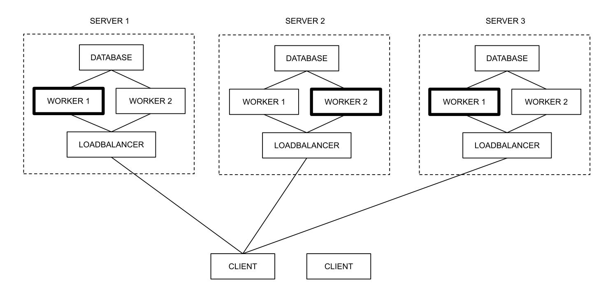

{0}------------------------------------------------

# Fast Threshold ECDSA with Honest Majority

Ivan Damg˚ard<sup>1</sup> , Thomas Pelle Jakobsen<sup>2</sup> , Jesper Buus Nielsen<sup>1</sup> , Jakob Illeborg Pagter<sup>2</sup> , and Michael Bæksvang Østergaard<sup>2</sup>

> <sup>1</sup> Aarhus University, Denmark {ivan,jb}@cs.au.dk <sup>2</sup> Sepior {tpj,jip,mbo}@sepior.com

Abstract. ECDSA is a widely adopted digital signature standard. A number of threshold protocols for ECDSA have been developed that let a set of parties jointly generate the secret signing key and compute signatures, without ever revealing the signing key. Threshold protocols for ECDSA have seen recent interest, in particular due to the need for additional security in cryptocurrency wallets where leakage of the signing key is equivalent to an immediate loss of money.

We propose a threshold ECDSA protocol secure against an active adversary in the honest majority model with abort. Our protocol is efficient in terms of both computation and bandwidth usage, and it allows the parties to pre-process parts of the signature, such that once the message to sign becomes known, the they can compute a secret sharing of the signature very efficiently, using only local operations. We also show how to obtain fairness in the online phase at the cost of some additional work in the pre-processing, i.e., such that it either aborts during pre-processing phase, in which case nothing is revealed, or the signature is guaranteed to be delivered to all honest parties.

### 1 Introduction

A hot topic of the 80s was threshold cryptography [10, 11]. This notion covers encryption and signature schemes where the key is secret shared among a number of parties in a way that lets the parties sign or decrypt messages despite the fact that the key remains secret shared. The key remains protected as long as at most a certain threshold t of the parties are corrupted.

Threshold cryptography, being a special kind of secure multiparty computation, is stronger than simply secret sharing the key, since it allows to sign or encrypt without any one party reconstructing the key. Threshold cryptography therefore increases security by ensuring that an attacker must compromise t points instead of a single point. It is also well-suited in cases with multiple owners of the key and where it should be enforced that signing or decryption only occur when a certain threshold of the owners agree.

The elliptic curve digital signature standard ECDSA [22, 20] has recently become very popular. It has for example been adopted by TLS and popular cryptocurrencies such as Bitcoin and Ethereum. This has caused a growing need 

{1}------------------------------------------------

for a threshold version of ECDSA. In particular, its use in cryptocurrencies implies that loss of the secret signing key immediately translates to a loss of money.<sup>3</sup>

However, while efficient threshold versions of e.g. RSA and ElGamal encryption and Schnorr signatures have been proposed early [30, 32], efficient threshold variants of DSA/ECDSA have proved hard to achieve.

### 1.1 Related Work and Our Contribution

Gennaro et al. proposed one of the first threshold protocol for DSA signatures [17–19]. The authors give a simulation-based proof that the protocol is secure and robust against a static, malicious adversary corrupting at most t out of n parties for n ≥ 4t + 1. (A solution for n ≥ 3t + 1 is also sketched with no proof.) The protocol assumes a consistent and reliable broadcast channel and uses Pedersen's verifiable secret sharing [27].

Another line of work has focused on DSA/ECDSA threshold signatures in the case of a dishonest majority, i.e., with full threshold t = n−1. This was initiated by MacKenzie and Reiter [26] who proposed a two-party protocol. Gennaro et al. later followed up with ECDSA schemes for more than two parties [16, 3]. Common to these protocols were that they were not really practical, especially due to the work required by the distributed key generation.

Lindell and others [23, 12, 6] later improved on this in the two-party setting. Finally, recent results [25, 15, 13] provide full threshold ECDSA for any number of parties.

Recent results [31, 9] show how to do threshold ECDSA based on schemes for general MPC. As shown by Dalskov et al. [9] this can lead to very practical protocols when instantiating the MPC with protocols for honest majority with abort.

Our protocol compared to existing dishonest majority protocols The ECDSA protocols for dishonest majority [26, 16, 3, 23, 12, 25, 15, 6, 13] all rely on computationally heavy primitives such as Paillier encryption and zero-knowledge proofs, or they are based on oblivious transfer [12, 13] which incurs high bandwith. In comparison, our protocol is considerably simpler and efficient in terms of both computation and bandwidth usage.

In addition, except from Doerner et al. [13], these protocols somehow relax security, either by relying on assumptions not implied by ECDSA itself, such as decisional Diffie-Hellman [25] or the quadratic residuosity assumption [23, 15], or they implement relaxed versions of the ECDSA functionality [12]. In contrast, we prove a proof in the UC model that our protocol (perfectly) implements the standard ECDSA functionality without additional assumptions.

Finally, most of these protocols are restricted to the two-party setting and/or require one or more rounds of interaction between the parties in the online phase,

<sup>3</sup> For this reason Bitcoin uses multisignatures [1]. But as discussed in length in e.g. Gennaro et al. [16] threshold signatures are in several ways more suited.

{2}------------------------------------------------

i.e., after the message to be signed is known. Contrary to this, our protocol allows the parties to locally compute a sharing of the final signature without interaction, given suitable preprocessing prior to knowing the message. The only other protocol comparable to ours in this regard is Doerner et al. [13] which, as mentioned, has a higher bandwith consumption than our protocol.

That said, all of these protocols of course achieve stronger security in the sense that they can tolerate up to n − 1 corruptions.

Our protocol compared to the GJKR protocol [17–19] The protocol of Gennaro et al. [17–19] was designed for the honest majority setting and, like ours, avoids additional cryptographic assumptions and has a non-interactive online phase. Assuming a reliable broadcast channel, Gennaro et al. provides full security (including both termination guarantee and fairness) as long as n ≥ 4t + 1.

From a practical perspective the n ≥ 4t + 1 constraint can be problematic. It means that one has to find at least five parties that are willing to run the protocol, and even if found, only one corrupt party can be handled.

Another practical problem is the network model used by Gennaro et al. The fairness and termination guarantees they provide rely on the existence of a broadcast channel with guaranteed consistency and message delivery. As the internet lacks both of these properties, one has to implement them. This can be done, but it leads to additional rounds of communication, something that negatively affects the performance, especially when running the protocol in a WAN setting.

Moreover, to simulate guaranteed message delivery on the internet where message delivery is inherently unreliable, one has to resort to using timeouts: If an expected message is not received within a given timeout, the receiver continues, treating the sender as corrupt. A practical problem with this is that if the timeouts are too small, then otherwise honest parties will soon be deemed corrupt due to the message delays that naturally occur on the internet, and soon enough parties are corrupt to exceed the security threshold. To avoid this, large timeouts must be used. But using large timeouts lets a single malicious party cause the protocol to run exceptionally slow.

In many practical cases, the termination and fairness guarantees as provided by Gennaro et al. [17] may not be required.<sup>4</sup> We instead follow a recent trend also seen in the construction of general honest majority MPC protocols [14, 24, 7] of giving up on these guarantees to achieve faster, more practical protocols. Doing so, the above issues are avoided. If for example a message is lost, the parties can simply abort after a short timeout and retry later.

As a result of this, where Gennaro et al. [17] require 12t + 8n + 1 long curve multiplications per party, primarily due to the use of computationally heavy Pedersen commitments, we manage to reduce this to only 5. Consequently, with parties connected on a local network, under the reasonable assumption that long

<sup>4</sup> In fact, in the case of a dishonest majority these guarantees are generally impossible to achieve, and therefore usually not addressed. This is the case for all the dishonest majority ECDSA protocols above [26, 16, 3, 23, 12, 25, 15, 13].

{3}------------------------------------------------

curve multiplications in this setting are the performance bottleneck, our protocol will have a signature throughput 7.4 times than of Gennaro et al. [17–19] for n = 3, and 13 times Gennaro et al. for n = 5, etc.

Sometimes, however, fairness is important. To address this, we show how to achieve fairness in our online phase, at the cost of some additional work which can be pre-processed. This means that the protocol may abort during pre-processing, in which case nothing leaks, but if it does not, then it is guaranteed to deliver the signature to all honest parties in the online phase.

Importantly, both versions of our protocol achieve a better security threshold of n ≥ 2t + 1, which means that it can run with only three parties and only requires pairwise authentic and private channels.

### Our Contribution

- We provide a practical and efficient threshold protocol for DSA and ECDSA signatures in the honest majority model with abort. It is secure against an active adversary and works for any number of parties n and security thresholds t as long as n ≥ 2t + 1.
- The protocol is accompanied by a full proof in the UC model [5]. The proof shows that our protocol (perfectly) realizes the standard ECDSA functionality, and it relies on no additional assumptions.
- The protocol is well-suited for pre-processing: Most of the work can be done before the message to be signed is known, and if doing so, the protocol achieves excellent online performance. In the basic variant, when the parties receive the message to be signed, they can compute a sharing of the signature using only local operations, without interacting with each other.
- We show how to extend our basic protocol to ensure fairness and termination in the online phase.
- We demonstrate practicality by benchmarking in the LAN as well as the WAN setting. Using a close-to-real-world deployment with load balancers and authenticated channels we show that our protocol achieves both low latency and high throughput.

## 2 Our Threshold ECDSA Protocol

In this section we describe our basic protocol and the overall strategy for its simulation. To keep the description simple, we focus on the basic protocol and consider pre-processing and fairness later.

We assume familiarity with the DSA/ECDSA signature scheme and Shamir sharing. We will use F(R) to denote the mapping of a point R to Zq, i.e., for ECDSA F(R) will output the x-coordinate of R, for DSA F(R) = R mod q. We will use [x] ← RSS(t) to denote joint random secret sharing where the parties obtain a sharing of a random value x ∈ Z<sup>q</sup> over a random polynomial of degree t. It is done simply by having each party create a random sharing, and then adding up the shares. Similarly, we use [x] ← ZSS(t) for a random sharing of zero. Given shares x<sup>i</sup> over a polynomial f, corresponding points y<sup>i</sup> = g xi for a generator g, 

{4}------------------------------------------------

and x<sup>0</sup> ∈ Z<sup>q</sup> we use ExpInt(y<sup>i</sup> ; x0) = g f(x0) to denote Lagrange interpolation "in the exponent". A more detailed recap of ECDSA, joint random sharing, and interpolation in the exponent can be found in Appendix A.

### 2.1 Technical Overview

At a high level, we follow the scheme of Gennaro et al. [19]. The parties first generate the private key [x] using joint random secret sharing. Then they run a protocol to reveal the public key y = g x . To avoid certain subtleties related to joint random secret sharing with guaranteed termination [18], and to avoid additional assumptions, Gennaro et al. use a rather complicated protocol based on Pedersen verifiable secret sharing. Since we allow abort, we can use plain Shamir secret sharing along with a simpler protocol for revealing g x . Our protocol for revealing g <sup>x</sup> works despite malicious parties and is designed to abort also if [x] is not a consistent sharing.

When signing a message M, the parties generate a sharing of the nonce [k] using joint random secret sharing and reveal g <sup>k</sup> using the same protocol as for revealing the public key g x . They then use Beaver's inversion trick to compute [k −1 ]: They first generate a random sharing [a], then multiply and and open w = [a][k]. This is done using a simple passively secure protocol where the parties just reveal the product of their shares. Since this is a degree 2t sharing of ak they can recover ak as long as all parties participate honestly. With malicious parties the result is not necessarily correct. Gennaro et al. used error correcting codes to handle this. We tolerate abort and can instead use the same protocol as before to correctly open an authenticator W = g ak that lets the parties verify the correctness by checking that g <sup>w</sup> = W.

If ok, the parties compute [a] · w <sup>−</sup><sup>1</sup> = [k −1 ] and m = H(M), and they can now compute and open [s] = [k −1 ](m + r[x]) as they opened [a][k] before. This time, however, since we tolerate abort, it suffices to check correctness of s by validating the resulting signature (r, s) on M using the public key y.

### 2.2 Computing Powers of a Point

A central building block in our protocol is a subprotocol that given a sharing [x] and a generator g ∈ G (on which all honest parties agree) reveals the value y = g x . We let y ← POWOPEN(g, [x]) denote this protocol.

The protocol works as follows:

- 1. Each party P<sup>i</sup> sends y<sup>i</sup> = g <sup>x</sup><sup>i</sup> to all the other parties. Let f be the unique degree t polynomial defined by the t+ 1 (or more) honest parties' shares, i.e. f(0) = x.
- 2. When P<sup>i</sup> receives all g xj for each y<sup>j</sup> ∈ {yt+2, yt+3, . . . , yn} it verifies that y<sup>j</sup> is consistent with the degree t polynomial defined by the first t + 1 values y1, y2, . . . , yt+1. It does so by doing Lagrange interpolation "in the exponent".

{5}------------------------------------------------

3. If so,  $P_i$  knows that  $y_1, ..., y_{t+1}$  are valid points on f, and  $P_i$  then uses again Lagrange interpolation "in the exponent" on  $y_1, y_2, ..., y_{t+1}$  to compute  $y = g^x = g^{f(0)}$ .

Since  $n \ge 2t+1$  there are at least t+1 honest parties. This means that each honest party will receive at least t+1 correct shares "in the exponent", enough to uniquely define f. Hence, if any of the t corrupted parties cheat, all honest parties will abort in Step 2.

Intuitively, seeing the values  $g^{x_i}$  reveals nothing on the shares  $x_i$  since computing discrete logarithms in G is assumed to be hard. As we will later see, our simulation does in fact not rely on this property. The simulation works even for computationally unbounded adversaries.

A notable feature of POWOPEN is that for  $n \geq 2t+1$  all honest parties will abort if the input sharing defined by the honest parties is inconsistent, i.e., if these shares are not points on a degree t polynomial, no matter what the corrupted parties do.

Simulation Consider how to simulate POWOPEN. The simulator does not know the value x and so must use random shares  $x_j$  for the corrupted parties. During simulation each party  $P_i$  reveals  $g^{x_i}$  to all other parties. The challenge is that the simulator only knows t points on the polynomial f, namely f(j) for the corrupted parties  $P_j$ . (This follows from the context in which POWOPEN is used, see e.g. next section on key generation.) But the simulated adversary sees all  $y_i = g^{x_i}$ . So in order to succeed, the simulator must make these values consistent with the environment's view (which includes  $y = g^x$ ). In other words, the simulator must use values  $y_i'$  such that  $\text{ExpInt}(y_i';0) = y = g^x$ , but without knowing x.

Simulation is possible since the simulator knows an additional point on f "in the exponent", namely  $y = g^x = g^{f(0)}$  (this requires that y is leaked to the adversary/simulator at the beginning of the protocol). So "in the exponent" the simulator knows t+1 points on f, enough to fully determine f. Thus, using Lagrange interpolation "in the exponent" with y and the t random shares of the corrupted parties, the simulator can compute points to use for the honest parties in the simulation that are consistent with the adversary's view that includes  $y = g^x$ .

#### 2.3 Key Generation

The aim of key generation is to have the parties generate a sharing [x] of a uniformly random value  $x \in Z_q$  and reveal to each party  $y = g^x$ . To generate [x] the parties run  $[x] \leftarrow \mathtt{RSS}(t)$  to obtain a sharing of a random value  $x \in Z_q$  over a random polynomial. To obtain  $y = g^x$  we let the parties run the protocol  $y \leftarrow \mathtt{POWOPEN}(g, [x])$ .

Regarding correctness: We use plain Shamir sharing and not verifiable secret sharing (VSS). This means that a single malicious party  $P_i$  may cause [x] to be an inconsistent sharing, by dealing inconsistently for  $x^{(i)}$ . As discussed above, this will cause POWOPEN to abort, which is enough in our case, as we allow abort.

{6}------------------------------------------------

Also, at least one party  $P_j$  will correctly choose uniform shares  $x_j^{(i)}$ , which is enough to ensure that [x] is random and that all honest parties' shares of x are random.

An important part of the protocol is that no honest party  $P_i$  reveals his value  $g^{x_i}$  until he has received shares  $x_j$  from all other parties  $P_j$ . This forces the corrupt parties  $P_j$  to "commit" to their values  $x^{(j)}$  before they see y. Without this, a corrupt party  $P_j$  could let  $x^{(j)}$  depend on y.

The protocol guarantees that if two parties output a public key, they output the same public key y. In addition, all subsets of t+1 honest parties that receive output, will receive shares of the same private key x satisfying  $g^x = y$ . The protocol also ensures that each share  $x_i$  and the private key x (and hence also the public key) is uniformly distributed.

By having all parties send an ACK message to the others once they have succeeded, and require that parties only continue once an ACK have been received from all other parties, we get the property that the adversary can decide to abort or not, but if an honest party delivers output then so do all honest parties.

Regarding simulation, RSS is information-theoretically secure so the simulator can just simulate the protocol using random values  $x'_i$ , and we already described how to simulate POWOPEN.

### 2.4 Signature Generation

Assume that key generation has been done without abort, such that the parties hold a consistent sharing of a random key [x] and each party holds the corresponding public key  $y = g^x$ . Assume also that the parties agree on the (hashed) message  $m \in \mathbb{Z}_q$  to be signed. Then the signature protocol proceeds as follows.

First a random sharing [k] is generated and  $R = g^k$  is revealed, using the RSS and POWOPEN protocols. We then compute  $[k^{-1}]$  using Beaver's inversion protocol. The idea is to compute a random [a] and open [a][k] (a is used to blind k). Then  $[k^{-1}]$  can be computed locally as  $[a] \cdot w^{-1}$ .

So we let the parties generate [a] using RSS and then compute [w] = [a][k] and open [w]. The multiplication is done as follows: The parties simply compute their shares  $w_i = a_i k_i$ . This results in shares on a polynomial  $f_w$  of degree 2t with  $f_w(0) = w$ . But since  $n \geq 2t+1$  there are enough parties (2t+1) to interpolate w if they all reveal their shares. To avoid that their shares leak unintended information, they first compute a random degree 2t zero sharing  $[b] \leftarrow \text{ZSS}(2t)$  and then reveal instead shares  $a_i k_i + b_i$ . We denote this protocol  $w \leftarrow \text{WMULOPEN}([a], [k]; [b])$ . The "w" is for "weak", since a single malicious party can cause the protocol to output anything. The only guarantee provided by the protocol is that it reveals no information about a and b, except of course the product ak.

Recall that [a] and [b], being generated using RSS and ZSS, are not known to be consistent sharings at this point. But at least each share  $b_i$  is known to be a random value that blinds the share  $a_i k_i$ , which is not necessarily random.

{7}------------------------------------------------

Note that there is not enough shares for any error detection on w: A single corrupt party could reveal a bad share w<sup>i</sup> resulting in the parties ending up with a wrong value of w. To deal with this we use a trick in order to compute an authenticator W = g ak. This allows each party to check that g <sup>w</sup> = W and abort if not. W is computed as follows: Recall that g <sup>k</sup> was correctly computed by POWOPEN. The parties then invoke POWOPEN again, this time using g <sup>k</sup> as the base, i.e. they compute g ak ← POWOPEN(g k , [a]). Since correctness of POWOPEN is ensured as explained above, even if [a] is not a consistent sharing, all honest parties will abort at this point unless w = ak.

Finally, given [x], [k −1 ], r = F(g k ) and the message m to sign, the parties compute the value

$$[s] = [k^{-1}](m + r[x])$$
.

Note that this boils down to another multiplication of two degree t sharings, which can be done locally since n ≥ 2t+1, resulting in a degree 2t sharing, Again, to avoid that the shares leak information, a random degree 2t zero sharing [c] is created using ZSS and each party reveals s<sup>i</sup> = hi(m + rxi) + ci where h<sup>i</sup> is party Pi 's share of k −1 .

As before when opening ak, the resulting value s can be recovered from 2t+1 shares, but when n = 2t+ 1 there is not enough shares to do any error detection. So a single party can introduce any error on s. Before, we detected this by computing correctly the authenticator g ak. This time we instead just lets the parties verify the resulting signature (r, s) on the message m using the public key y. Our analysis below shows that the only way the adversary can make the protocol succeed is by not introducing any fault on s.

Coping with message disagreement To obtain a practical protocol we must make sure that the protocol aborts and no information leaks even if the honest parties do not agree on the message m to sign. Suppose that honest party P<sup>1</sup> got message m + ∆ while the other honest parties used m. Then P<sup>1</sup> would reveal s<sup>1</sup> = h1(m + ∆ + rx1) + c1. Anyone receiving all shares could then compute s P <sup>0</sup> = λis<sup>i</sup> = s + λ1h1∆ (where λ<sup>i</sup> are the Lagrange coefficients). This shows that if an adversary could introduce an error on the message used by an honest party and somehow obtain the correct signature s then that party's share of k would have leaked.

To avoid this, the parties could of course send the message to each other and abort if there is any mismatch, and then proceed by opening s. But for efficiency, we would like a protocol that only requires one round once the message is known. To achieve this, we do as follows: During the initial rounds, we generate not just one zero-sharing [c], but two degree 2t sharings of zero, [d], [e], using ZSS(2t). When signing we then compute

$$[s] = [k^{-1}](m + r[x]) + [d] + m[e].$$

If all parties are honest and agree on m then [d]+m[e] = [0]. If not, then [d]+m[e] turns into a random pad that completely hides the honest parties shares s<sup>i</sup> and ensures that the verification will fail. Note that [d] and [e] may not be zero, or 

{8}------------------------------------------------

may even be inconsistent, but it is guaranteed that each share of d and e are at least random, which is all that we need here.

Simulation The simulator uses the same simulation strategy when simulating R ← POWOPEN(g, [k]) as when simulating y ← POWOPEN(g, [x]), i.e., where Lagrange interpolation "in the coefficient" allows to patch the honest parties' values g ki . The use of a uniformly random [a] to blind [k] means that the simulator can run W ← POWOPEN(R, [a]) and w ← WMULOPEN([a], [k]; [b]) without patching. Finally, s ← WMULOPEN([k −1 ], [m + rx]; [c]) can be simulated because the simulator knows the correct value s as well as the corrupted parties' shares s<sup>j</sup> of s (these are defined by the simulators choice of the corrupted parties's shares of k, a, b, d, e). This fixes t+ 1 points on the a degree 2t polynomial f<sup>s</sup> over which s is shared, and because [s] includes the random zero sharing [c] which effectively randomizes the polynomial, the simulator can simulate by picking a random degree 2t polynomial as long as it is consistent with these t + 1 points.

We emphasize that the simulation is in fact perfect as it relies on no computational assumptions and works even when Z<sup>q</sup> and G are small.

Security This completes our informal description of the protocol. A full listing of the protocol can be found in Figure 3 (key generation) and Figure 4 (signing) in Appendix B

Theorem 1. (informal) The described protocol for ECDSA signatures achieves perfect UC-security with abort against a static, malicious adversary corrupting at most t parties if the total number of parties n satisfies n ≥ 2t + 1.

Proof. A full UC-proof can be found in Appendix B. For completeness we also formally prove in Appendix B that re-running the protocol a reasonable number of times if it aborts is secure.

## 3 Fairness in the Online Phase

Unlike Gennaro et al. [17] (but like the ECDSA protocols for dishonest majority [26, 23, 12, 25, 15]) our basic protocol described above has no fairness or termination guarantee. So the adversary gets to see the signature r, s and may then abort the protocol before any honest party receives the signature. In practice, parties will retry on abort and the adversary may therefore end up with several valid signatures (r1, s1), . . .(rL, sL) on message M without any of the honest parties knowing any of these signatures.

This is of course not a forgery, since it can only happen with messages that the honest parties actually intended to sign. But it may nevertheless be unacceptable in some applications. For example if presenting a fresh signature allows to transfer a certain additional amount of money from someone's bank account.

Since we assume an honest majority it is indeed possible to achieve fairness. In fact, our basic protocol can be extended with just two additional pre-processing rounds in order to achieve fairness. The main idea is that in addition to R and 

{9}------------------------------------------------

 $[k^{-1}]$  the parties also prepare a sharing of  $[x \cdot k^{-1}]$  in the pre-processing. Doing so, [s] can be computed as  $[s] = m[k^{-1}] + r[xk^{-1}]$ , using only linear operations. Taking this one step further, by reducing the degree of  $[x \cdot k^{-1}]$  to t and turning both  $[k^{-1}]$  and  $[xk^{-1}]$  into suitable verifiable secret sharings [27], we achieve the property that online, when M is known, the signature can be computed given only t+1 correct shares and the correctness of each share can be validated.

The extended protocol works as follows. Let  $[[a]]_t$  denote a verifiable secret sharing (VSS) of a, that is, every party is committed to his share of a via a Pedersen commitment, and shares are guaranteed to be consistent with a polynomial of degree at most t. Such sharings are additive, we have [[a]] + [[x]] = [[a+x]], where addition denotes local addition of shares and commitment opening data [27].

To create a verifiable secret sharing  $[[s]]_t$ , a party P commits to the coefficients of a polynomial f of degree at most t, including a commitment to s that plays the role of the degree 0 coefficient. Now anyone can compute a commitment to f(i) for  $i = 1 \dots n$  using the homomorphic property of commitments. P sends privately opening information for this commitment to  $P_i$ . In the next round,  $P_i$  will complain if what he gets does not match his commitment. In the same way, we can get a pair  $[[s]]_t$ ,  $[[s]]_{2t}$  if P uses the same commitment to s in both VSSs. If each party  $P_j$  creates  $[[s_j]]_t$ ,  $[[s_j]]_{2t}$  in this way, we can add them all and get  $[[s]]_t$ ,  $[[s]]_{2t}$  where s is random and unknown to the adversary.

Using this in the context of our threshold signature protocol, we can assume that we have  $[[x]]_t$  once and for all from the key generation phase. Using our protocol as described before, we can create r and  $[k^{-1}]$ . Now, the goal of the following subprotocol is to start from  $[[x]]_t$  and  $[k^{-1}]$  and obtain  $[[k^{-1}x]]_t$ .

So we do the following:

- 1. At the start of the entire protocol, each party will send his contribution to creating a pair  $[[s]]_t$ ,  $[[s]]_{2t}$  and one VSS  $[[b]]_t$  as described above, to all other parties. In the following round, the objects  $[[s]]_t$ ,  $[[s]]_{2t}$ ,  $[[b]]_t$  can be computed (or we abort). Therefore we can assume that when  $[k^{-1}]$  is ready, the VSSs are also ready. We can also assume that each party  $P_i$  has committed to his share  $k_i$  in  $k^{-1}$ , as he can do this as soon as he knows this share.
- 2. Now, each  $P_i$  opens the difference between  $k_i$  and his share of b to all parties.
- 3. If the set of opened differences are consistent with a degree t polynomial, we continue, else we abort. Adjust the commitments to shares in  $[[b]]_t$  using the opened differences to get  $[[k^{-1}]]_t$  (only local computation). Now each party commits to the product of his share in  $k^{-1}$  and in x and does a standard ZK proof that this was done correctly. This implicitly forms  $[[k^{-1}x]]_{2t}$ . He also opens the difference between his share in  $k^{-1}x$  and in  $[[s]]_{2t}$ .
- 4. Using the differences just opened, all parties reconstruct  $k^{-1}x s$  and add this  $[[s]]_t$  so we now have  $[[k^{-1}x]]_t$ .
- 5. Finally, each party broadcasts a hash of his public view of the protocol so far (i.e., all the messages that he received and which were supposed to be sent to all parties) together with "OK" if he thinks the protocol went well so far. Each party aborts unless he gets an "OK" from all other parties and the

{10}------------------------------------------------

hash of his own public view matches the hashes he receives from all other parties.

Given this, once the message M is known, the parties can compute m = H(M) and [[s]]<sup>t</sup> = m · [[k −1 ]]<sup>t</sup> + r · [[k <sup>−</sup>1x]]<sup>t</sup> using only local operations. To output the signature (r, s) each party sends r along with its share of s and the corresponding commitment opening to the receiver. Since the degree of [[s]]<sup>t</sup> is t the receiver only needs t + 1 correct shares, and by verifying the commitment of each share, the receiver knows which shares are correct. Since we assume n ≥ 2t + 1 we know that at least t + 1 parties are honest, and thus the receiver is guaranteed to get the signature.

In other words, we get the desired property that either the protocol aborts during pre-processing and neither the adversary nor any other party gets the signature, or intended receiver(s) are guaranteed to get the signature.<sup>5</sup>

## 4 Performance

In this section we elaborate the performance of our basic protocol (with abort).

The protocol requires four rounds of interaction between the servers to generate a signature. But the first three rounds can be processed before the message to be signed is known. We let a presignature denote the value R and the sharings [k −1 ], [e], [d] produced during the first three rounds. Each party can save R and its shares of k −1 , e, d under a unique presignature id (such as R). When the message M is known, the parties need only then agree on a presignature id in order to complete the signature protocol in one round.

The protocol is designed to run with any number of n ≥ 2t + 1 parties. Recall that a random element r ∈ Z<sup>q</sup> can be represented using log<sup>2</sup> q bits and an element in G ⊂ Z<sup>p</sup> × Z<sup>p</sup> using log<sup>2</sup> p bits (roughly) using point compression. The protocol is constant-round and the communication complexity is O(κn<sup>2</sup> ) assuming that both log p and log q are proportional to a security parameter κ.

For a small number of parties, unless special hardware acceleration is available, the computational bottleneck is likely to be the "long" curve exponentiations, i.e., computing g r for random values r ∈ Zq. <sup>6</sup> However, each party only needs to do a constant number of these operations. The constants are quite small as shown in Table 1.

For large n, since the protocol is constant round, the O(n 2 ) amount of arithmetics in Z<sup>q</sup> that each does, will eventually become the bottleneck. In this case,

<sup>5</sup> It still holds that no interaction is required among the parties in the online phase. But the trick used in our basic protocol of blinding [s] with m[d] + [e] only works for degree 2t sharings. So unlike our basic protocol, we here require that the honest parties agree on M.

<sup>6</sup> This is especially the case with an implementation resistant to timing attacks. For high security we recommend using a timing attack resistant implementation for all long curve multiplications, except for computing g <sup>w</sup> for w = ak when signing since w is not a secret value.

{11}------------------------------------------------

| Protocol | Bits sent per party | Long curve multiplications |
|----------|---------------------|----------------------------|
|          |                     | per party                  |
| KEYGEN   | n log q + n log p   | 1                          |
| PRESIG   | 6n log q + 2n log p | 3                          |
| SIGN     | n log q             | 2                          |

Table 1. Concrete Performance

a more efficient protocol can be obtained by using hyperinvertible matrices [2] to improve performance of RSS and the (passively secure) multiplication of w and s. Note however, that O(n 2 ) communication is still required for POWOPEN.

For small n we can save bandwidth and one round by computing the sharings [k], [a], [b], [e], [d] using pseudo-random secret sharing [8].

### 4.1 Benchmarks

In order to determine the actual performance of our protocol we have implemented it and run a number of benchmarks. We have done several things to ensure that our benchmarks best reflect a real deployment scenario.

First, we benchmark the client-server setting where we include the time it takes for an external client to initiate the protocol by sending a request to the parties and receive a response when the operation is done. Also, we ensure that the parties are connected with secure channels. Note that this requires an additional round trip and computation for key agreement using mechanisms from the Noise Protocol framework [28]. We also let each party store its key shares in encrypted form in a PostgreSQL database. For elliptic curve operations we use OpenSSL v1.1.1b which provides the required timing attack resistant implementation for long curve multiplications. However when no secret values are involved we use the faster version also provided by OpenSSL. In the latter case we use precomputation to speed up the curve multiplication when using the default generator for the given elliptic curve.

Finally, as mentioned above, we split the protocol up in pre-processing and online processing. Hence we benchmark the individual operations (1) keygen, (2) presig, and (3) sign.

Latency For a threshold signature scheme to be useful in practice it is important that a user should not be forced to wait for minutes before his key is generated or before he receives the signature that he requested.

To measure the latency we deploy each party on a separate m5.xlarge Amazon EC2 instance. Each instance runs CoreOS with two Docker containers: One with the actual implementation of the threshold protocol party, implemented in Java, and another container with a PostgreSQL instance for storing key and presignature shares.

We then let a single client issue a single requests to the servers, causing the servers to generate a single key, presignature or signature. In this benchmark, 

{12}------------------------------------------------

the servers are configured to use a single worker thread, i.e., each server uses only one CPU core for executing the protocol (including computing the long curve multiplications).

We run this benchmark for various combinations of parties and security thresholds, in both the LAN setting and the WAN setting. In the LAN setting all servers are located in the same Amazon region, where the network latency is usually less than 1 ms, whereas in the WAN setting the servers are located in different regions (Frankfurt, California, Tokyo) where package latency is often in the order of 50-200 ms.<sup>7</sup>

Table 2 shows the average time it takes for the keygen, presig and sign requests to finish in these settings after a number of warm-up requests. In the keygen operation, a client sends a keygen request to the servers, which run the keygen protocol and return a key id to the client. In the presig operation, a client sends a presig request to the servers which then generate the presignature and return a presignature id to the client. In the sign operation, the client sends a key id and a presignature id to the servers (for a key and a presignature that have previously been generated), and the servers then compute and return their signature shares to the client who recombines and verifies the signature.

It can be seen that in the LAN setting the latency increases with the number of parties and the security threshold. This is because the amount of work, especially the number of long curve multiplications that each party must compute, increases (quadratically) with the number of parties, and with low network latency, this is significant for the overall latency. In the WAN setting, however, the network latency is high enough that it almost completely dominates the overall latency. (At least for up to 9 parties. Adding parties, the latency caused by local computation will eventually dominate also in the WAN setting.)

LAN WAN n, t keygen presig sign keygen presig sign 3, 1 28.2 ms 34.2 ms 19.9 ms 1.22 s 1.47 s 0.73 s 5, 2 39.9 ms 44.8 ms 25.0 ms 1.47 s 1.71 s 0.98 s 7, 3 54.6 ms 60.0 ms 30.8 ms 1.48 s 1.72 s 0.98 s 9, 4 66.4 ms 74.0 ms 34.8 ms 1.48 s 1.72 s 1.00 s

Table 2. Latency per operation

Throughput In realistic deployments, as mentioned above, a threshold signature scheme like ours will often run in the client-server setting with many concurrent key generation and signature protocol instances on behalf of clients. We therefore

<sup>7</sup> In the WAN setting, since we use only three different regions, with n > 3 this means that some of the parties run in the same region. However, since the overall latency of the protocol is determined by the pair-wise connection with the largest latency, this makes no difference.

{13}------------------------------------------------

measure the throughput, that is, the number of operations that the servers can handle per second in this setting.

It is likely that signing will happen more often than key generation. If for example BIP-32 key derivation [33] is used, key generation is only run once to obtain a sharing of the master key whereas subsequent keys are derived in an efficient non-interactive manner.

Also, given already computed presignatures, generating the final signature is a lightweight operation for the servers, since signing for the servers then only imply a few local operations in Z<sup>q</sup> and sending a share of s to the client who verifies it. For these reasons, in a real deployment, we expect that presignature generation will be the overall bottleneck with respect to throughput. We therefore focus on presignature generation in this benchmark.

We run this benchmark with tree servers (n = 3) and security threshold t = 1. To best reflect an actual real-world deployment, each server consists of a load balancer (haproxy), a database server (PostgreSQL), and a number of worker hosts. Clients contact the load balancer using a secure channel. The load balancer ensures that the workload is distributed evenly among the workers based on the key id. All workers connect to the database server where the key shares are stored in encrypted form. Load balancer, database server and workers as well as all clients run on separate m5.xlarge Amazon EC2 instances (4 vCPUs, 16 GiB memory) in the same Amazon region.

Figure 1 illustrates this deployment: A client requests a presignature by contacting the three servers. Based on the given key id, one worker at each server is assigned the task (marked with bold lines). These workers then execute the presignature generation protocol and returns the presignature id to the client.



Fig. 1. A deployment in the client-server setting with three servers and two workers per server.

{14}------------------------------------------------

To benchmark, once the servers are ready, we spin up enough clients, each client sending a lot of presig requests to the server, such that the servers are completely busy and no increase in throughput is achieved by adding more clients. Table 3 shows the resulting throughput in the case where each client requests a single presignature per request as well as in the case where each client requests 100 presignatures in per request.

As expected, throughput scales almost linearly with the number of workers used by each server.

On m5.xlarge we have benchmarked that each (timing attack resistant) long curve multiplication occupies a core (i.e., 2 vCPU) for roughly 0.5ms. Since each presig requires three multiplication, if these were the only thing to compute, we would expect 2 multiplications per ms or 666 presig/s.

In the batched setting where 100 presignatures are computed per client request, we are close to this limit and the bottleneck clearly is the CPU required to do the long curve multiplications, getting a throughput of roughly 600 presig/s. Thus, for each additional m5.xlarge worker, the system can handle roughly 600 extra presignatures per second.

In the case where only a single presignature is computed per request, the throughput is lower, since the servers must spend a larger fraction of their resources by handling the many active sessions. In this case each worker can handle roughly 150 additional presigs per second.

| Workers per server | 1 presig per request | 100 presigs per request |
|--------------------|----------------------|-------------------------|
| 2                  | 347 presig/s         | 1,249 presig/s          |
| 4                  | 649 presig/s         | 2,464 presig/s          |
| 6                  | 919 presig/s         | 3,606 presig/s          |

Table 3. Throughput for Presignature Generation

## References

- 1. Andresen, G.: BIP-11: M-of-n standard transactions. https://github.com/bitcoin/bips/blob/master/bip-0011.mediawiki, accessed: 2020-04-15
- 2. Beerliov´a-Trub´ıniov´a, Z., Hirt, M.: Perfectly-secure MPC with linear communication complexity. In: Canetti, R. (ed.) Theory of Cryptography, Fifth Theory of Cryptography Conference, TCC 2008, New York, USA, March 19-21, 2008. Lecture Notes in Computer Science, vol. 4948, pp. 213–230. Springer (2008). https://doi.org/10.1007/978-3-540-78524-8 13, https://doi.org/10.1007/978-3- 540-78524-8 13
- 3. Boneh, D., Gennaro, R., Goldfeder, S.: Using level-1 homomorphic encryption to improve threshold dsa signatures for bitcoin wallet security (2017)

{15}------------------------------------------------

- 4. Brown, D.R.L.: Generic groups, collision resistance, and ECDSA. Des. Codes Cryptography 35(1), 119–152 (2005), http://www.springerlink.com/index/10.1007/s10623-003-6154-z
- 5. Canetti, R., Fischlin, M.: Universally composable commitments. In: Kilian, J. (ed.) Advances in Cryptology - CRYPTO 2001, 21st Annual International Cryptology Conference, Santa Barbara, California, USA, August 19-23, 2001, Proceedings. Lecture Notes in Computer Science, vol. 2139, pp. 19–40. Springer (2001). https://doi.org/10.1007/3-540-44647-8 2, https://doi.org/10.1007/3-540- 44647-8 2
- 6. Castagnos, G., Catalano, D., Laguillaumie, F., Savasta, F., Tucker, I.: Twoparty ECDSA from hash proof systems and efficient instantiations. In: Boldyreva, A., Micciancio, D. (eds.) Advances in Cryptology - CRYPTO 2019 - 39th Annual International Cryptology Conference, Santa Barbara, CA, USA, August 18-22, 2019, Proceedings, Part III. Lecture Notes in Computer Science, vol. 11694, pp. 191–221. Springer (2019). https://doi.org/10.1007/978-3-030-26954-8 7, https://doi.org/10.1007/978-3-030-26954-8 7
- 7. Chida, K., Genkin, D., Hamada, K., Ikarashi, D., Kikuchi, R., Lindell, Y., Nof, A.: Fast large-scale honest-majority MPC for malicious adversaries. In: Shacham, H., Boldyreva, A. (eds.) Advances in Cryptology - CRYPTO 2018 - 38th Annual International Cryptology Conference, Santa Barbara, CA, USA, August 19-23, 2018, Proceedings, Part III. Lecture Notes in Computer Science, vol. 10993, pp. 34–64. Springer (2018). https://doi.org/10.1007/978-3-319-96878-0 2, https://doi.org/10.1007/978-3-319-96878-0 2
- 8. Cramer, R., Damg˚ard, I., Ishai, Y.: Share conversion, pseudorandom secret-sharing and applications to secure computation. In: Kilian, J. (ed.) Theory of Cryptography, Second Theory of Cryptography Conference, TCC 2005, Cambridge, MA, USA, February 10-12, 2005, Proceedings. Lecture Notes in Computer Science, vol. 3378, pp. 342–362. Springer (2005). https://doi.org/10.1007/978-3-540-30576- 7 19, https://doi.org/10.1007/978-3-540-30576-7 19
- 9. Dalskov, A.P.K., Keller, M., Orlandi, C., Shrishak, K., Shulman, H.: Securing DNSSEC keys via threshold ECDSA from generic MPC. IACR Cryptology ePrint Archive 2019, 889 (2019), https://eprint.iacr.org/2019/889
- 10. Desmedt, Y.: Society and group oriented cryptography: A new concept. In: Pomerance, C. (ed.) Advances in Cryptology - CRYPTO '87, A Conference on the Theory and Applications of Cryptographic Techniques, Santa Barbara, California, USA, August 16-20, 1987, Proceedings. Lecture Notes in Computer Science, vol. 293, pp. 120–127. Springer (1987). https://doi.org/10.1007/3-540-48184-2 8, https://doi.org/10.1007/3-540-48184-2 8
- 11. Desmedt, Y., Frankel, Y.: Threshold cryptosystems. In: Brassard, G. (ed.) Advances in Cryptology - CRYPTO '89, 9th Annual International Cryptology Conference, Santa Barbara, California, USA, August 20-24, 1989, Proceedings. Lecture Notes in Computer Science, vol. 435, pp. 307–315. Springer (1989). https://doi.org/10.1007/0-387-34805-0 28, https://doi.org/10.1007/0-387- 34805-0 28
- 12. Doerner, J., Kondi, Y., Lee, E., Shelat, A.: Secure two-party threshold ECDSA from ECDSA assumptions. In: 2018 IEEE Symposium on Security and Privacy, SP 2018, Proceedings, 21-23 May 2018, San Francisco, California, USA. pp. 980–997. IEEE Computer Society (2018). https://doi.org/10.1109/SP.2018.00036, https://doi.org/10.1109/SP.2018.00036

{16}------------------------------------------------

- 13. Doerner, J., Kondi, Y., Lee, E., Shelat, A.: Threshold ECDSA from ECDSA assumptions: The multiparty case. In: 2019 IEEE Symposium on Security and Privacy, SP 2019, San Francisco, CA, USA, May 19- 23, 2019. pp. 1051–1066. IEEE (2019). https://doi.org/10.1109/SP.2019.00024, https://doi.org/10.1109/SP.2019.00024
- 14. Furukawa, J., Lindell, Y., Nof, A., Weinstein, O.: High-throughput secure threeparty computation for malicious adversaries and an honest majority. In: Coron, J., Nielsen, J.B. (eds.) Advances in Cryptology - EUROCRYPT 2017 - 36th Annual International Conference on the Theory and Applications of Cryptographic Techniques, Paris, France, April 30 - May 4, 2017, Proceedings, Part II. Lecture Notes in Computer Science, vol. 10211, pp. 225–255 (2017). https://doi.org/10.1007/978- 3-319-56614-6 8, https://doi.org/10.1007/978-3-319-56614-6 8
- 15. Gennaro, R., Goldfeder, S.: Fast multiparty threshold ECDSA with fast trustless setup. In: Lie, D., Mannan, M., Backes, M., Wang, X. (eds.) Proceedings of the 2018 ACM SIGSAC Conference on Computer and Communications Security, CCS 2018, Toronto, ON, Canada, October 15-19, 2018. pp. 1179–1194. ACM (2018). https://doi.org/10.1145/3243734.3243859, https://doi.org/10.1145/3243734.3243859
- 16. Gennaro, R., Goldfeder, S., Narayanan, A.: Threshold-optimal DSA/ECDSA signatures and an application to bitcoin wallet security. In: Manulis, M., Sadeghi, A., Schneider, S. (eds.) Applied Cryptography and Network Security - 14th International Conference, ACNS 2016, Guildford, UK, June 19-22, 2016. Proceedings. Lecture Notes in Computer Science, vol. 9696, pp. 156–174. Springer (2016). https://doi.org/10.1007/978-3-319-39555-5 9, https://doi.org/10.1007/978-3-319- 39555-5 9
- 17. Gennaro, R., Jarecki, S., Krawczyk, H., Rabin, T.: Robust threshold DSS signatures. In: Maurer, U.M. (ed.) Advances in Cryptology - EUROCRYPT '96, International Conference on the Theory and Application of Cryptographic Techniques, Saragossa, Spain, May 12-16, 1996, Proceeding. Lecture Notes in Computer Science, vol. 1070, pp. 354–371. Springer (1996). https://doi.org/10.1007/3-540- 68339-9 31, https://doi.org/10.1007/3-540-68339-9 31
- 18. Gennaro, R., Jarecki, S., Krawczyk, H., Rabin, T.: Secure distributed key generation for discrete-log based cryptosystems. In: Stern, J. (ed.) Advances in Cryptology - EUROCRYPT '99, International Conference on the Theory and Application of Cryptographic Techniques, Prague, Czech Republic, May 2-6, 1999, Proceeding. Lecture Notes in Computer Science, vol. 1592, pp. 295–310. Springer (1999). https://doi.org/10.1007/3-540-48910-X 21, https://doi.org/10.1007/3-540- 48910-X 21
- 19. Gennaro, R., Jarecki, S., Krawczyk, H., Rabin, T.: Robust threshold DSS signatures. Inf. Comput. 164(1), 54–84 (2001). https://doi.org/10.1006/inco.2000.2881, https://doi.org/10.1006/inco.2000.2881
- 20. Johnson, D., Menezes, A., Vanstone, S.A.: The elliptic curve digital signature algorithm (ECDSA). Int. J. Inf. Sec. 1(1), 36–63 (2001). https://doi.org/10.1007/s102070100002, https://doi.org/10.1007/s102070100002
- 21. Katz, J., Lindell, Y.: Introduction to Modern Cryptography, Second Edition. CRC Press (2014)
- 22. Kerry, C.F., Secretary, A., Director, C.R.: Fips pub 186-4 federal information processing standards publication: Digital signature standard (dss) (2013)
- 23. Lindell, Y.: Fast secure two-party ECDSA signing. In: Katz, J., Shacham, H. (eds.) Advances in Cryptology - CRYPTO 2017 - 37th Annual In-

{17}------------------------------------------------

- ternational Cryptology Conference, Santa Barbara, CA, USA, August 20- 24, 2017, Proceedings, Part II. Lecture Notes in Computer Science, vol. 10402, pp. 613–644. Springer (2017). https://doi.org/10.1007/978-3-319-63715- 0 21, https://doi.org/10.1007/978-3-319-63715-0 21
- 24. Lindell, Y., Nof, A.: A framework for constructing fast MPC over arithmetic circuits with malicious adversaries and an honest-majority. In: Thuraisingham, B.M., Evans, D., Malkin, T., Xu, D. (eds.) Proceedings of the 2017 ACM SIGSAC Conference on Computer and Communications Security, CCS 2017, Dallas, TX, USA, October 30 - November 03, 2017. pp. 259–276. ACM (2017). https://doi.org/10.1145/3133956.3133999, https://doi.org/10.1145/3133956.3133999
- 25. Lindell, Y., Nof, A.: Fast secure multiparty ECDSA with practical distributed key generation and applications to cryptocurrency custody. In: Lie, D., Mannan, M., Backes, M., Wang, X. (eds.) Proceedings of the 2018 ACM SIGSAC Conference on Computer and Communications Security, CCS 2018, Toronto, ON, Canada, October 15-19, 2018. pp. 1837–1854. ACM (2018). https://doi.org/10.1145/3243734.3243788, https://doi.org/10.1145/3243734.3243788
- 26. MacKenzie, P.D., Reiter, M.K.: Two-party generation of DSA signatures. Int. J. Inf. Sec. 2(3-4), 218–239 (2004). https://doi.org/10.1007/s10207-004-0041-0, https://doi.org/10.1007/s10207-004-0041-0
- 27. Pedersen, T.P.: Non-interactive and information-theoretic secure verifiable secret sharing. In: Feigenbaum, J. (ed.) Advances in Cryptology - CRYPTO '91, 11th Annual International Cryptology Conference, Santa Barbara, California, USA, August 11-15, 1991, Proceedings. Lecture Notes in Computer Science, vol. 576, pp. 129–140. Springer (1991). https://doi.org/10.1007/3-540-46766-1 9, https://doi.org/10.1007/3-540-46766-1 9
- 28. Perrin, T.: The noise protocol framework. http://www.noiseprotocol.org (2015)
- 29. Shamir, A.: How to share a secret. Commun. ACM 22(11), 612–613 (1979). https://doi.org/10.1145/359168.359176, http://doi.acm.org/10.1145/359168.359176
- 30. Shoup, V.: Practical threshold signatures. In: Preneel, B. (ed.) Advances in Cryptology - EUROCRYPT 2000, International Conference on the Theory and Application of Cryptographic Techniques, Bruges, Belgium, May 14-18, 2000, Proceeding. Lecture Notes in Computer Science, vol. 1807, pp. 207–220. Springer (2000). https://doi.org/10.1007/3-540-45539-6 15, https://doi.org/10.1007/3-540- 45539-6 15
- 31. Smart, N.P., Alaoui, Y.T.: Distributing any elliptic curve based protocol. In: Albrecht, M. (ed.) Cryptography and Coding - 17th IMA International Conference, IMACC 2019, Oxford, UK, December 16-18, 2019, Proceedings. Lecture Notes in Computer Science, vol. 11929, pp. 342–366. Springer (2019). https://doi.org/10.1007/978-3-030-35199-1 17, https://doi.org/10.1007/978-3- 030-35199-1 17
- 32. Stinson, D.R., Strobl, R.: Provably secure distributed schnorr signatures and a (t, n) threshold scheme for implicit certificates. In: Varadharajan, V., Mu, Y. (eds.) Information Security and Privacy, 6th Australasian Conference, ACISP 2001, Sydney, Australia, July 11-13, 2001, Proceedings. Lecture Notes in Computer Science, vol. 2119, pp. 417–434. Springer (2001). https://doi.org/10.1007/3-540-47719-5 33, https://doi.org/10.1007/3-540-47719-5 33

{18}------------------------------------------------

33. Wuille, P.: BIP-32: Hierarchical deterministic wallets. https://github.com/bitcoin/bips/blob/master/bip-0032.mediawiki, accessed: 2020-04-15

### A Basic Tools and Definitions

### A.1 Signature Schemes

Recall that a signature scheme is defined by three efficient algorithms:  $pk, sk \leftarrow \text{Gen}(1^{\kappa}); \sigma \leftarrow \text{Sign}_{sk}(M); b \leftarrow \text{Verify}_{pk}(M, \sigma)$  [21]. A signature scheme satisfies two properties:

- Correctness. With overwhelmingly high probability (in the security parameter  $\kappa$ ) it must hold that all valid signatures must verify.
- Existential unforgeability. This is modeled with the following game G<sub>FORGE</sub>:
  - Run  $pk, sk \leftarrow \text{Gen}(1^{\kappa})$ ; input pk to the adversary A.
  - On (SIGN, M) from A: Return  $\sigma \leftarrow \text{Sign}_{sk}(M)$  to A and add M to a set Q.
  - On (FORGE,  $M', \sigma'$ ) from A: If  $M' \notin Q$  and  $\operatorname{Verify}_{pk}(M', \sigma') = \top$ , output  $\top$  and halt; else output  $\bot$  and halt.

The signature scheme is existentially unforgeable if for any PPT A the probability  $\Pr[G_{FORGE} = \top]$  is negligible in  $\kappa$ . That is, even with access to a signing oracle, no adversary can produce a valid signature.

A correct and existentially unforgeable signature scheme is simply called secure.

#### A.2 The DSA/ECDSA Standard

An instance of the DSA signature scheme [22, 20] has the parameters

$$(G,q,g,H,F) \leftarrow \operatorname{Gen}(1^{\kappa})$$

where G is a cyclic group of order q with generator  $g \in G$ , H a hash function  $H: \{0,1\}^* \mapsto Z_q$  and F a function  $F: G \mapsto Z_q$ .

For  $a, b \in G$  we will let ab denote the group operation (multiplicative notation). For  $c \in Z_q$  and  $g \in G$  we let  $g^c$  denote  $gg \cdots g$ , i.e., the group operation applied c times on g.

A key pair is generated by sampling uniformly the private key  $x \in Z_q$  and computing the public key as  $y = g^x$ . Given a message  $M \in \{0,1\}^*$  a signature is computed as follows: Let m = H(M). Pick a random  $k \in Z_q$ , set  $R = g^k$ , r = F(R),  $s = k^{-1}(m+rx)$ . The resulting signature is r, s. Given a public key g, a message M and signature r, s, one can verify the signature by computing m = H(M) and checking that  $r = F(g^{ms^{-1}}y^{rs^{-1}})$ .

{19}------------------------------------------------

In DSA G is Z<sup>p</sup> for some prime p > q. In ECDSA G is generated by a point g on an elliptic curve over Z<sup>p</sup> for some p > q. In this case F : G 7→ Z<sup>q</sup> is the function that given R = (Rx, Ry) ∈ G ⊂ Z<sup>p</sup> × Z<sup>p</sup> outputs R<sup>x</sup> mod q.

ECDSA has been proved secure in the Generic Group Model assuming that computing the discrete log in G is hard, and assuming that H is collision resistant and uniform [4].

Our protocol works for both DSA and ECDSA. In particular, it is suitable for ECDSA with the "Bitcoin" curve secp256k1 that is believed to have a 128-bit security level.

### A.3 Shamir's Secret Sharing

Recall that in Shamir's secret sharing scheme [29] a dealer can secret share a value m ∈ Z<sup>q</sup> (for a prime number q) among n parties by choosing a random degree t polynomial f(x) over Z<sup>q</sup> subject to f(0) = m. The dealer then sends a share m<sup>i</sup> = f(i) to each party P<sup>i</sup> . This reveals no information about m as long as at most t parties are corrupted. We will use [m] to denote such a sharing where each party P<sup>i</sup> holds a share m<sup>i</sup> .

If the dealer is honest, any subset of t + 1 parties can reconstruct the secret using Lagrange interpolation. More generally, one can compute the value f(j) for any value j ∈ Z<sup>q</sup> on a degree t polynomial f() using Lagrange interpolation given values y<sup>i</sup> = f(xi) for any t + 1 distinct values x<sup>i</sup> . For the specific values f(1), f(2), . . . , f(t + 1) we can efficiently compute f(j) for any j ∈ Z<sup>q</sup> as

$$f(j) = \lambda_1 f(1) + \lambda_2 f(2) + \dots + \lambda_{t+1} f(t+1)$$

where the Lagrange coefficients are defined as

$$\lambda_i := \prod_{1 < m < t+1, m \neq i} \frac{j-m}{i-m} .$$

For example, for n = 3, t = 1 and j = 3 we have λ<sup>1</sup> = (3 − 2)/(1 − 2) = −1 and λ<sup>2</sup> = (3 − 1)/(2 − 1) = 2 so for any degree-1 polynomial f(x) = ax + b we can compute f(3) = −1 · f(1) + 2 · f(2).

For g ∈ G we will sometimes do Lagrange interpolation in "the exponent" as follows: For Y<sup>1</sup> = g <sup>f</sup>(1), Y<sup>2</sup> = g <sup>f</sup>(2), . . . , Yt+1 = g <sup>f</sup>(t+1) define

$$\mathtt{ExpInt}(Y_1,Y_2,\dots Y_{t+1};j) := \prod_{i=1}^{t+1} Y_i^{\lambda_i} = g^{\sum_{i=1}^{t+1} \lambda_i y_i} = g^{f(j)} \; .$$

We will also need to interpolate the value p(0) on a degree 2t polynomial p(x) from the 2t + 1 values p(1), p(2), . . . , p(2t + 1). We denote this function

$$Int2t(p(1), p(2), \dots, p(2t+1))$$
.

Recall that Shamir's secret sharing scheme is linear. This means that once sharings [m1] and [m2] are established, and if the parties agree on a public constant a ∈ Z<sup>q</sup> then they can compute [a·m1] and [m1+m2] efficiently, without communicating. We use a · [m1] and [m1] + [m2] to denote these operations.

{20}------------------------------------------------

### A.4 Joint Random Secret Sharing

We will need a protocol  $[r] \leftarrow \mathtt{RSS}(t)$  to generate a Shamir sharing of a random value r over a random degree-t polynomial  $f_r$  such that no party learns the value r. For this we use the common technique where each party  $P_i$  acts as dealer for a random degree t polynomial  $f^{(i)}$  of his choice. Using that secret sharing is linear, each party can then compute its share  $r_i$  of [r] as  $r_i^{(1)} + r_i^{(2)} + \cdots + r_i^{(n)}$ . If one or more parties are malicious, the resulting sharing [r] may be incon-

If one or more parties are malicious, the resulting sharing [r] may be inconsistent, meaning that the shares held by the honest parties are not points on any degree t polynomial. But in this case, the shares held by the honest parties are still uniformly random, since at least some of the values  $r^{(j)}$  are random.

Similarly, a random Shamir sharing of zero can be created if each party  $P_i$  chooses  $f^{(i)}$  at random, but subject to  $f^{(i)} = 0$ . We denote this by  $[0] \leftarrow \mathsf{ZSS}(t)$ . In this case, however, if there is a malicious party, it is not guaranteed that the sharing is in fact a sharing of zero.

### B Security Analysis

### **B.1** The Formal Ideal Functionality and Protocol

We here describe formally our basic protocol (with abort) and the ideal functionality that it realizes in the UC model [5].

To complement the formal protocol given here we include in Appendix ?? a concrete instantiation of our protocol for three parties, that shows how it works with both pre-processing and BIP-32 key derivation [33].

For simplicity we consider the case where the parties generate a single key pair and use this for multiple signatures. Security in the case with multiple keys follows immediately by the UC composition theorem [5]. Also, we will not divide the protocol into pre-processing and online parts. Extending the proof to handle this is straight-forward, but tedious. Finally, we will implicitly assume standard UC bookkeeping. We e.g. assume that session ids and party ids are sent along with the messages so that the ideal functionality knows to which instance a message belongs, and we assume that the functionality aborts if a party tries to reuse session ids or sends messages out of order. We also leave implicit that the functionality and the protocol are both parameterized by a single DSA/ECDSA instance (G, g, q, H, F) and concrete values n and t.

We use a subscript I (as in  $x_I$ ,  $y_I$ ) for values in the ideal functionality to emphasize that these values are correct by definition.

The ideal functionality for ECDSA,  $F_{\text{TDSA}}$ , is defined in Figure 2. In addition to the keygen and sign messages it receives from the parties  $P_i$ , it interacts with the adversary A in what defines the "allowed" adversarial influence and leakage. Note how abort and the lack of fairness is modeled:  $F_{\text{TDSA}}$  leaks the full signature  $R_I$ ,  $s_I$  at the beginning of sign, before any honest parties receive the output, and the adversary can abort the protocol on behalf of any of the parties  $P_i$  at any time by sending (ABORT,  $P_i$ ) to the functionality. Note also that  $R_I$  and not  $r_I$  is output by  $F_{\text{TDSA}}$ . This simplifies the proof a bit and does not reveal anything

{21}------------------------------------------------

extra, since R<sup>I</sup> is uniquely determined by the values m, y<sup>I</sup> , r<sup>I</sup> , s<sup>I</sup> . It is of course ok for a given application using FTDSA to compute r<sup>I</sup> = F(R<sup>I</sup> ) and use r<sup>I</sup> , s<sup>I</sup> instead of R<sup>I</sup> , s<sup>I</sup> as the signature.

Fig. 2. The ideal functionality FTDSA

```
Abort
  On (ABORT, Pi) from A: Output (ABORT) to Pi
KeyGen
  On (KEYGEN) from Pi:
    Output (KEYGEN-START, Pi) to A
    On input KEYGEN from t + 1 parties:
       Choose random xI ∈ Zq
       If x = 0: Output (ABORT, id) to all Pi and halt
       Let yI = g
                 xI
       Send (KEYGEN-LEAK, yI ) to A
  On (KEYGEN-END, Pi) from A:
    If undef xI : ignore
    Else: output (KEYGEN-END, yI ) to Pi
    If all parties have received KEYGEN-END: Store (READY)
Sign
  On (SIGN, id, Mi) from Pi:
    If not (READY) or (USED, id): ignore
    Output (SIGN-START, id, Pi, Mi) to A
    On input (SIGN, id, · ) to t + 1 parties:
       Store (USED, id)
       Choose random kI ∈ Zq
       If kI = 0: Output (ABORT, id) to all Pi and return
       Let RI = g
                  kI
                    , rI = F(RI )
       Send (SIGN-LEAK-1, id, RI ) to A
       If any two Mi 6= Mj :
         Output (ABORT, id) to all Pi and return
    Let m = H(M), sI := k
                            −1
                            I
                               (m + rIxI )
    If sI = 0: Output (ABORT, id) to all Pi and return
    Store (id, RI , sI )
    Send (SIGN-LEAK-2, id, sI ) to A
  On (SIGN-END, id, Pi) from A:
    If (id, RI , sI ) stored:
       Output (SIGN-END, id, RI , sI ) to Pi
       (only the first time this message arrives)
```

We continue to describe the protocol ΠTDSA depicted in Figure 3 and 4. Here the parties receive input from the environment E and communicate with each other. Formally, ΠTDSA works in the FCOM-hybrid model, where FCOM is an ideal functionality for pairwise authentic and private channels. For simplicity we will not mention FCOM, but just say that a message is sent to another party. In Figure 4 

{22}------------------------------------------------

the we use PRESIG to emphasize that the first rounds do not depend on the message to be signed. In the last round the signature is opened up to all parties.

Fig. 3. The protocol ΠTDSA (keygen)

```
Pi on input (KEYGEN) from E:
  Choose random degree t polynomial f
                                            X
                                            i ∈ Zq[z]
  Let xi,j = f
               X
               i (j)
  Send (KEYGEN-R1, xi,j ) to Pj for j = 1, 2, . . . , n
Pi on (KEYGEN-R1, xj,i) from all Pj :
  Let xi = x1,i + x2,i + · · · + xn,i
  Let yi = g
             xi
  Send (KEYGEN-R2, yi) to Pj for j = 1, 2, . . . , n
Pi on (KEYGEN-R2, yj ) from all Pj :
  For j = t + 2, . . . , n do:
     If not ExpInt(y1, y2, ..., yt+1; j) = yj :
       Output (ABORT) to E and halt [Check1]
  Let y = ExpInt(y1, y2, . . . , yt+1; 0)
  If y = 1: Output (ABORT) to E and halt [Check2]
  Send (KEYGEN-R3, ok) to Pj for j = 1, 2, . . . , n
```

Theorem 2. ΠTDSA securely realizes FTDSA in the FCOM-hybrid model against a static, malicious adversary corrupting at most t parties if the total number of parties n satisfies n ≥ 2t + 1.

To prove Theorem 2 we must prove that for any adversary A there exists a simulator S such that for any environment E the value

$$|\text{Pr}\left[\text{REAL}_{\Pi_{\text{TDSA}},A,E}(\kappa)=1\right] - \text{Pr}\left[\text{IDEAL}_{F_{\text{TDSA}},S,E}(\kappa)=1\right]|$$

goes to zero faster than any inverse polynomial in the security parameter κ, where REALΠTDSA,A,E(κ) and IDEALFTDSA,S,E(κ) are the real and ideal executions in the UC framework [5].

We will in fact prove that ΠTDSA realizes FTDSA perfectly. This means that the probability that E outputs 1 is the same in the real and the ideal execution. This means that Theorem 2 does not depend on any computational assumptions, and security does not rely on e.g. the size of q. As we will later see, this means that the only assumption is the unforgeability of the standard DSA/ECDSA signature scheme itself.

Consider first an execution REAL<sup>Π</sup>TDSA,E,A(κ). Recall that we say that a degree t sharing [x] is inconsistent if the shares of the honest parties do not uniquely define a degree t polynomial and that we have no error correction on the final WMULOPEN producing the signature. Let ∆ (i) <sup>s</sup> be the error that A introduces on the signature output to P<sup>i</sup> , i.e., P<sup>i</sup> receives the value s + ∆ (i) <sup>s</sup> where s is the value that would be output with no malicious behavior. Then we can define the following events in the execution:

{23}------------------------------------------------

Fig. 4. The protocol  $\Pi_{\texttt{TDSA}}$  (sign)

```
P_i on (SIGN, id, M) from E:
  If undef y or (USED, id): ignore
  Store (USED, id)
  Choose random degree t polynomials f_i^K, f_i^A \in Z_q[z]
Choose random degree 2t polynomials f_i^B, f_i^D, f_i^E \in Z_q[z]
     subject to f_i^B(0) = f_i^D(0) = f_i^E(0) = 0
  Let a_{i,j} = f_{i_{-}}^{A}(j), k_{i,j} = f_{i_{-}}^{K}(j)
  Let b_{i,j} = f_i^B(j), d_{i,j} = f_i^D(j), e_{i,j} = f_i^E(j)
  Send (PRESIG-R1, k_{i,j}, a_{i,j}, b_{i,j}, d_{i,j}, e_{i,j})
     to P_j for j = 1, 2, ..., n
P_i on (PRESIG-R1, k_{j,i}, a_{j,i}, b_{j,i}, d_{j,i}, e_{j,i}) from all P_j:
  Let k_i = k_{1,i} + k_{2,i} + \cdots + k_{n,i}
  Let a_i = a_{1,i} + a_{2,i} + \dots + a_{n,i}
  Let b_i = b_{1,i} + b_{2,i} + \dots + b_{n,i}
  Let d_i = d_{1,i} + d_{2,i} + \dots + d_{n,i}
  Let e_i = e_{1,i} + e_{2,i} + \dots + e_{n,i}
  Let R_i = g^{k_i}, w_i = k_i a_i + b_i
  Send (PRESIG-R2, R_i, w_i) to P_j for j = 1, 2, ..., n
P_i on (PRESIG-R2, R_j, w_j) from all P_j:
  For j = t + 2, ..., n do:
     If not \text{ExpInt}(R1, R2, \dots, Rt + 1; j) = R_j:
         Output (ABORT) to E and halt [Check3]
  Let R = \texttt{ExpInt}(R_1, R_2, \dots, R_{t+1}; 0)
  If R = 1: Output (ABORT) to E and halt [Check4]
  Let W_i = R^{a_i}
  Send (PRESIG-R3, W_i) to P_j for j = 1, 2, ..., n
P_i on (PRESIG-R3, W_j) from all P_j
  For j = t + 2, ..., n do:
     If not \text{ExpInt}(W_1, W_2, \dots, W_{t+1}; j) = W_j:
         Output (ABORT) to E and halt [Check5]
  Let W = \text{ExpInt}(W_1, W_2, ..., W_{t+1}; 0)
  Let w = Int2t(w_1, w_2, \dots, w_{2t+1})
  If w = 0: Output (ABORT) to E and halt [Check6]
  If g^w \neq W: Output (ABORT) to E and halt [Check7]
  Let r = F(R); h_i = a_i \cdot w^{-1}
  Let m = H(M); c_i = md_i + e_i; s_i = h_i(m + rx_i) + c_i
  Send (SIGN-R1, s_i) to P_j for j = 1, 2, ..., n
P_i on (SIGN-R1, s_i) from all P_j:
  Let s = \text{Int2t}(s_1, s_2, \dots, s_{2t+1})
  If s=0: Output (ABORT) to E and halt [Check8]
  If R^s \neq g^m y^r: Output (ABORT) to E and halt [Check9]
   Output (SIGN-END, r, s) to E
```

{24}------------------------------------------------

- $B_1$ : Some honest party P passes Check1 (Figure 3) without abort and either [x] is inconsistent or P receives  $y' \neq g^x$ .
- $B_2$ : Some honest party P passes Check3 (Figure 4) without abort and either [k] is inconsistent or P receives  $R' \neq g^k$ .
- $B_3$ : Some honest party P passes Check5 (Figure 4) without abort and either [a] is inconsistent or P receives  $W' \neq g^{ak}$ .
- $B_4$ : Some honest party  $P_i$  passes Check9 (final signature verification, Figure 4), but  $\Delta_s^{(i)} \neq 0$ .

For example,  $\neg B_1$  is the "good" event that either all honest parties abort (due to Check1 when computing POWOPEN(g,[x])) or one or more honest parties continue past Check1, but then the sharing [x] is consistent and all honest parties that do get by Check1 without aborting agree on  $y = g^x$ . Let B be the event that "something" bad happens, i.e.,  $B = B_1 \wedge B_2 \wedge B_3 \wedge B4$ .

**Proposition 1.** For any A, E it holds that Pr[B] = 0 in the probability space over the random coins of E, A and the honest parties in the real execution  $REAL_{\Pi_{TDSA},E,A}(\kappa)$ .

Proof. The events  $B_1, B_2, B_3, B_4$  are not independent. However, it follows from the argumentation in the previous section about POWOPEN that  $\Pr[\neg B_1] = 1$ . (There is no way, even for an all-powerful adversary to make an honest party proceed if the honest parties' shares of x are inconsistent. And if consistent, every honest party will either abort or output  $y = g^x$ .) For the same reasons,  $\Pr[\neg B_2 \mid \neg B_1] = 1$ . Given that all honest parties's shares [k] are consistent and they all agree on  $R = g^k$ , the same arguments apply for the final call to POWOPEN, namely  $\Pr[\neg B_3 \mid \neg B_1 \land \neg B_2] = 1$ .

Assuming none of the events  $B_1, B_2, B_3$  happen we continue to analyze the probability of  $B_4$  via the following game  $G_{S-ERR}$  for an adversary  $A_{S-ERR}$ :

- 1.  $x, a, k, \Delta_s, m \leftarrow A_{S-ERR}()$
- 2. If ak = 0 then halt
- 3. Let  $r = F(g^k)$ ,  $s' = a(ak)^{-1}(m + rx) + \Delta_s$ .
- 4. If s' = 0,  $s' = k^{-1}(m + rx)$  or  $g^{ks'} = g^m y^r$  then halt
- 5. Output ⊤

This models that  $A_{S-ERR}$  wins if he can provoke a "false" signature  $s' \notin \{0, s\}$  such that the protocol does not abort when the signature is validated by a party in the protocol.

Note that we make the (realistic) assumption that  $A_{S-ERR}$  can choose the message m. In the actual protocol  $x, a, k \in Z_q$  are guaranteed to be uniformly random and hidden from A (assuming that computing discrete logs is hard). Here, however, we allow  $A_{S-ERR}$  to choose these values as he likes, only subject to  $ak \neq 0$ . This only makes our argument stronger.

<sup>&</sup>lt;sup>8</sup> Assuming correctness of POWOPEN (i.e.,  $\neg B_1, \neg B_2, \neg B_3$ ), this is how s is actually computed in the protocol.

{25}------------------------------------------------

 $A_{S-ERR}$  cannot win if ak=0 or s'=0. This is because the honest parties can check this and abort if so. Finally, to win,  $A_{S-ERR}$  must produce a value s' different from the correct s, but still such that  $g^{ks'}=g^my^r$ , i.e. such that the validation of  $(R,s')=(g^k,s')$  succeeds, where the correct values  $g^k$  and y are used and  $s'=a(ak)^{-1}(m+rx)+\Delta_s$ . The latter models our assumption that neither  $B_1,B_2$  nor  $B_3$  happen. Hence

$$\Pr\left[\neg B_4 \mid \neg B_1 \wedge \neg B_2 \wedge \neg B_3\right] \leq \Pr\left[\mathsf{G}_{\mathtt{S-ERR}}^{\mathtt{A}_{\mathtt{S-ERR}}}(\kappa) = 0\right]$$
.

We claim that for any adversary  $A_{S-ERR}$  it holds that

$$\Pr\left[\mathtt{G}_{\mathtt{S-ERR}}^{\mathtt{A}_{\mathtt{S-ERR}}} = \top\right] = 0$$
 .

To see this, assume that some  $A_{S-ERR}$  wins the game. Since  $ak \neq 0$  it must hold that  $k \neq 0$  and  $a \neq 0$ . It follows that

$$R^{s'} = g^m y^r \iff g^{ks'} = g^{m+rx}$$

$$\iff ks' = m + rx$$

$$\iff k(a(ak)^{-1}(m+rx) + \Delta_s) = m + rx \quad \text{(since } ak \neq 0\text{)}$$

$$\iff k(k^{-1}(m+rx) + \Delta_s) = m + rx \quad \text{(since } k \neq 0\text{)}$$

$$\iff m + rx + k\Delta_s = m + rx$$

$$\iff k\Delta_s = 0$$

But this contradicts the fact that  $k \neq 0$  and  $s \neq 0$ . We conclude that  $\Pr[\neg B_4 \mid \neg B_1 \land \neg B_2 \land \neg B_3] = 1$  and hence, by the chain rule, that

$$\Pr\left[\neg B_1 \wedge \neg B_2 \wedge \neg B_3 \wedge \neg B_4\right] = \Pr\left[\neg B\right] = 1$$

.

Let A be an adversary. Recall that our goal is to prove that there exists a simulator S such that for any environment E the value

$$|\Pr[\mathtt{REAL}_{\Pi_{\mathtt{TDSA}},A,E}(\kappa)=1] - \Pr[\mathtt{IDEAL}_{F_{\mathtt{TDSA}},S,E}(\kappa)=1]|$$

goes to zero faster than any inverse polynomial in the security parameter  $\kappa$ . Note that

$$\begin{split} \Pr\left[\mathtt{REAL}_{\varPi_{\mathtt{TDSA}},A,E}(\kappa) = 1\right] = \\ \Pr\left[B\right] \Pr\left[\mathtt{REAL}_{\varPi_{\mathtt{TDSA}},A,E}(\kappa) = 1 \mid B\right] + \\ \left(1 - \Pr\left[B\right]\right) \Pr\left[\mathtt{REAL}_{\varPi_{\mathtt{TDSA}},A,E}(\kappa) = 1 | \neg B\right] \;. \end{split}$$

From Proposition 1 we know that Pr[B] = 0 so it suffices to construct a simulator S such that for every E it holds that

$$\Pr\left[\mathtt{REAL}_{H_{\mathtt{TDSA}},A,E}(\kappa) = 1 \mid B\right] = \Pr\left[\mathtt{IDEAL}_{F_{\mathtt{TDSA}},S,E}(\kappa) = 1\right] \; .$$

In the following we construct the simulator and argue that the simulation works, given that none of the events  $B_1, B_2, B_3, B_4$  happen.

{26}------------------------------------------------

#### B.2 The Simulator

Assume w.l.o.g. that n=2t+1. Recall that the adversary is static, so the simulator knows from the beginning which parties are corrupted. Assume w.l.o.g. that  $\texttt{Good} = \{1, 2, \dots, t+1\}$  are the honest parties and  $\texttt{Bad} = \{t+2, \dots, n\}$  are the corrupted parties.

Recall that we use subscript I for values within  $F_{\text{TDSA}}$ . We will use a mark (like A' and x', y') for the adversary, parties, and values in the simulation to help distinguish them from values in the real execution and  $F_{\text{TDSA}}$ . We will also use a star, like  $y^*$ , to denote patched values in the simulation.

The simulator S works as follows: It runs internally an instance of the real execution consisting of A and the parties (and  $F_{COM}$ ). During simulation the simulator relays any messages between the environment E and the simulated adversary A'. The task of the simulator is to make the view of A' indistinguishable from the view of A in the real execution, and to ensure that the A''s view of the simulated execution remains consistent with the values that the environment inputs to and receives from the parties. To ensure the consistency, the simulator will need to patch some of the values in the simulation.

When S receives (KEYGEN-START,  $P_i$ ), or (SIGN-START,  $P_i$ ,  $M_i$ ) from  $F_{\text{TDSA}}$  it inputs (KEYGEN) or (SIGN,  $M_i$ ) accordingly to  $P_i'$  in its simulation. Whenever one of the parties  $P_i'$  in the simulation aborts, S aborts on behalf of that party by sending (ABORT,  $P_i$ ) to  $F_{\text{TDSA}}$ . When a simulated party  $P_i'$  outputs (KEYGEN-END,  $P_i$ ) S sends (KEYGEN-END,  $P_i$ ) to S which in turn makes S output S to S when a simulated party S outputs (SIGN-END, S it sends (SIGN-END, S it outputs (SIGN-END, S it outputs (SIGN-END, S it outputs (SIGN-END, S it outputs (SIGN-END, S it outputs (SIGN-END, S it outputs (SIGN-END, S it outputs (SIGN-END, S it outputs (SIGN-END, S it outputs (SIGN-END, S it outputs (SIGN-END, S it outputs (SIGN-END, S it outputs (SIGN-END, S it outputs (SIGN-END, S it outputs (SIGN-END, S it outputs (SIGN-END, S it outputs (SIGN-END, S it outputs (SIGN-END, S it outputs (SIGN-END, S it outputs (SIGN-END, S it outputs (SIGN-END, S it outputs (SIGN-END, S it outputs (SIGN-END, S it outputs (SIGN-END, S it outputs (SIGN-END, S it outputs (SIGN-END, S it outputs (SIGN-END, S it outputs (SIGN-END, S it outputs (SIGN-END, S it outputs (SIGN-END, S it outputs (SIGN-END, S it outputs (SIGN-END, S it outputs (SIGN-END, S it outputs (SIGN-END, S it outputs (SIGN-END, S it outputs (SIGN-END, S it outputs (SIGN-END, S it outputs (SIGN-END, S it outputs (SIGN-END, S it outputs (SIGN-END, S it outputs (SIGN-END, S it outputs (SIGN-END, S it outputs (SIGN-END, S it outputs (SIGN-END, S it outputs (SIGN-END, S it outputs (SIGN-END, S it outputs (SIGN-END, S it outputs (SIGN-END, S it outputs (SIGN-END, S it outputs (SIGN-END, S it outputs (SIGN-END, S it outputs (SIGN-END, S it outputs (SIGN-END, S it outputs (SIGN-END, S it outputs (SIGN-END, S it outputs (SIGN-END, S it outputs (SIGN-END, S it outputs (SIGN-END, S it outputs (SIGN-END, S it outputs (SIGN-EN

During the simulation the simulator acts as follows: In KEYGEN-R1 S just follows the protocol. For each honest  $P_i, i \in \mathsf{Good}$  the adversary sees only the t shares  $x'_{i,j}$  for  $j \in \mathsf{Bad}$ . These are uniformly distributed and can be consistent with any value x (shared via a degree t polynomial). Also, since A' does not learn  $x_i$  for  $i \in \mathsf{Good}$  the secret  $x = x_1 + x_2 + \cdots + x_n$  remains hidden from A', making this a perfect simulation.

In KEYGEN-R2 S simulates POWOPEN(g,[x]) as explained earlier: A' has already seen t+1 points on a (random) degree t polynomial  $f_X$ , namely  $f_X(j) = x_j'$  for  $j \in \text{Bad}$  and  $f_X(0) = x_I$ . The last point is unknown to S and hence it cannot determine  $f_X$ . But in order to simulate consistently, it must somehow compute the patched values  $y_i^* = g^{f_X(i)}, i \in \text{Good}$  sent from the honest to the corrupted parties in the simulation. This can be done by Lagrange interpolation "in the exponent" since S knows  $y_I = g^{x_I} = g^{f_X(0)}$ , i.e., the (t+1)'th point "in the exponent". So for  $i=1,2,\ldots,t+1$  the simulator computes the Lagrange coefficients  $\lambda_0^i, \lambda_{t+2}^i, \ldots, \lambda_n^i$  that given the t+1 points  $f_X(0), f_X(t+2), \ldots, f_X(n)$  interpolates the point f(i). S then sets

$$y_i^* := (y_I)^{\lambda_0^i} \prod_{j=t+2}^n g^{\lambda_j^i x_{I,j}} = g^{x_{I,i}}.$$

 $<sup>^{9}</sup>$  We assume t corrupted parties. If less, the simulator can simply choose to corrupt additional parties in the simulation.

{27}------------------------------------------------

This ensures that the view of the adversary is consistent, in other words,  $\log_g y_i^*$ ,  $i = 1, 2, \ldots, t+1$  are points on a uniformly random degree t polynomial  $f_X$  subject only to  $f_X(0) = x_I$  and  $f_X(j) = x_j'$  for  $j \in \text{Bad}$ .

In PRESIG-R1 the simulator follows the protocol, using random polynomials  $f_K', f_A', f_B', f_D', f_E'$ . This simulation is perfect for the same reasons as in KEYGEN-R1 above.

In PRESIG-R2 S must ensure that A''s view remains consistent with the values  $R_I, s_I$ . It receives  $R_I$  from  $F_{\text{TDSA}}$  and as before, for i = 1, 2, ..., t, it defines

$$R_i^* := (R_I)^{\lambda_0^i} \prod_{j=t+2}^n g^{\lambda_j^i k_{I,j}} = g^{k_{I,i}}.$$

and uses  $R_i^*$  to patch the values sent from the honest parties  $P_i$  to the corrupted parties.

Consider the simulation of WMULOPEN([a], [k]; [b]). Here the simulator just follows the protocol such that A' sees shares  $w'_i = k'_i a'_i + b'_i$ . At this point the honest parties' shares of [a], [k] and [b] are not guaranteed to be consistent and even if [b] is a consistent degree 2t polynomial it might not be a sharing of zero. But we know that the honest parties' shares  $a_i$  and  $b_i$  are uniformly random. This is enough to ensure that the shares  $w'_i$  are also uniformly random and if consistent, will interpolate to something uniformly random (if inconsistent, any subset of t+1 honest parties' shares  $w_i$  will interpolate to something random). This is enough to make the simulation perfectly indistinguishable from the real execution.

In PRESIG-R3, assuming  $\neg B_2$ , all honest parties reaching this step agree on  $g^k$ . When computing POWOPEN $(g^k, [a])$  the simulator this time just follows the protocol, with no patching of the values  $W_i' = (g^{k'})a_i'$ . A' then learns  $R_I = g^{k_I}$ , w' = k'a' and  $W' = g^{k'a'}$ , which is indistinguishable from the real view  $g^k, w = ka, W = g^{ka}$  since a is uniformly random and completely unknown to A. Since the protocol aborts if R = 1 we know that  $k \neq 0$ , hence these views are in fact perfectly indistinguishable. If [a] is inconsistent any subset of t+1 honest parties will send shares  $W_i'$  that interpolate (in the exponent) to something uniformly random as in the real execution.

Regarding the distribution of the *individual* shares  $ka_i$ , note again that the protocol requires the honest parties to abort if R = 1, i.e., if k = 0. So at this point  $ka_i$  and hence  $W_i = g^{ka_i}$  is uniformly random and therefore perfectly simulated by  $W'_i$ .

In SIGN-R1 the simulator must simulate the shares  $s_i, i \in Good$  that the honest parties send to the corrupted parties. The simulation of  $s_i$  is different from the simulation of  $w_i$  above, since w was a uniformly random value internal to the protocol and no patching was needed. In contrast, the result of WMULOPEN in SIGN-R1 has to match  $s_I$  provided by  $F_{\text{TDSA}}$ , so the simulator cannot just use  $s_i'$  but must do some patching as described here:

Assume for a moment that all honest parties agree on the message M to sign (and recall that we proved  $\neg B$ ). A then expects to see shares  $s_i = h_i(m + rx_i) + md_i + e_i$  from the honest parties. In the worst case, the corrupted parties  $P_j$  do

{28}------------------------------------------------

not send out their shares  $s_j$  until they have received shares  $s_i$  from all the honest parties. The simulator must be able to simulate  $s_i$ . Since the shares  $e_i$  of the honest parties are guaranteed to be uniformly random, the shares  $s_i$ ,  $i \in Good$  are shares of a uniformly random degree 2t polynomial  $f_s$  subject to  $f_s(0) = s_I$  and  $f_s(j) = s'_i$ ,  $j \in Bad$ .

Recall that when the honest parties agree on M, S receives  $s_I$  from  $F_{\text{TDSA}}$ . In the special case t=1 the simulator then knows 2t+1 shares of  $f_s$ , namely the t+1 honest shares and  $s_I$ , and this is enough shares to uniquely determine  $f_s$ , so it can use  $f_s(i)$ ,  $i \in \text{Good}$  as the honest parties' shares in the simulation.

But if t>1 (for example in the case n=5, t=2)  $s_i', i\in \mathsf{Good}$  and  $s_I$  are not enough points to determine  $f_s$ . In this case the simulation relies on the fact that S can compute the shares  $s_j', j\in \mathsf{Bad}$  that the corrupted parties would send to the honest parties in the simulation if they were honest. So S chooses a uniformly random degree 2t polynomial  $f_s$  subject to  $f_s(0)=s_I$  and  $f_s(j)=s_j, j\in \mathsf{Bad}$  and patches the simulation such that the honest parties send  $s_i^*=f_s(i), i\in \mathsf{Good}$  to the corrupted parties.

In fact, since it is not guaranteed at this point that [e] and [d] are sharings of zero, or even consistent sharings, S chooses instead a random  $f_s$  subject to  $f_s(0) = s_I$  and  $f_s(j) = (a'k')^{-1}a'_j(m+rx'_j), j \in \text{Bad}$  (note that a' and k' are well-defined at this point since  $\neg B_2$  and  $\neg B_3$  and  $a'k' \neq 0$  due to Check6 and Check7) and then uses  $s_i^* = f_s(i) + d'_i m + e'_i, i \in \text{Good}$  in the simulation. This ensures that any errors on [d] and [e] are simulated as well.

Consider then the case where the honest parties do not agree on the message to sign. We claim that in this case S can simply use uniformly random values  $s_i$  in the simulation. Assume w.l.o.g. that n=3, t=1 and that  $P_1, P_2, P_3$  use different messages  $m_1 \neq m_2 \neq m_3$ . Since  $c_i = d_i m_i + e_i$  are used to blind the shares in the real execution it suffices to show that these the values  $c_i$  are uniformly random, mutually independent values. Note that we can write

$$(c_1, c_2, c_3) = (d_1 m_1 + e_1, d_2 m_1 + e_2, d_3 m_1 + e_3) + (0, d_2 (m_2 - m_1), d_3 (m_3 - m_1)).$$

The values  $e_1, e_2$  are uniformly random and independent (unlike  $e_1, e_2, e_3$  which are shares in a degree 2t sharing if zero, so the third share is determined by the two others). So  $c_1, c_2$  are uniform and independent. Since  $d_2, d_3$  are uniformly random and mutually independent (also regarding  $e_i, m_i$ ) the values  $d_2(m_2 - m_1), d_3(m_3 - m_1)$  ensure that all three values  $c_i$  are uniformly random and mutually independent. Generally, with different messages, [e] ensures that all but one of the shares  $c_i$  are uniform and mutually independent, while [d] ensures that the last share is also uniform and independent of the others.

The success of the simulation in SIGN-R1 finally depends on  $\neg B_4$ , i.e., that the only possible value of s that can pass the final signature validation (Check9) is indeed the value s computed by the protocol. Otherwise A could use the error  $\Delta_s$  to let the protocol output valid signatures with a distribution unknown to the simulator, which would make the simulation fail.

{29}------------------------------------------------

Finally, consider how to simulate abort. FTDSA gives S the power to abort on behalf of any party at any time in the ideal execution. So we simply let S abort on behalf of a party P<sup>i</sup> if P 0 i aborts in the simulation. We have already argued that everything else is perfectly simulated, so we just need to argue that any abort in the real execution happens based on information that is available to the simulator. This ensures that abort is perfectly simulated.

To see this, note that honest parties only abort in these cases:

```
– If FCOM aborts
– If Check1 (Figure 3) fails in KEYGEN (validating y)
– If Check2 (Figure 3) fails in KEYGEN (if y = 1)
– If Check3 (Figure 4) fails in PRESIG-R2 (validating R)
– If Check4 (Figure 4) fails in PRESIG-R2 (if R = 1)
– If Check5 (Figure 4) fails in PRESIG-R3 (validating W)
– If Check6 (Figure 4) fails in PRESIG-R3 (if w = 0)
– If Check7 (Figure 4) fails in PRESIG-R3 (if not g
                                                   w = W)
– If Check8 (Figure 4) fails in SIGN-R1 (if s = 0)
– If Check9 (Figure 4) fails in SIGN-R1 (if R, s is an invalid signature of Mi
  with respect to y)
```

In all of these cases the values are known to the simulator (such as y, R), or unknown to the environment and the distribution of the value known to the simulator (such as w and W). Hence abort can be perfectly simulated. (This is in contrast to a setting where the abort of an honest party may depend on some private input that the honest parties receive from the environment and which is therefore unknown to the simulator.)

The simulator is summarized in Figure 5. Note that its running time is polynomial in the running time of the adversary A<sup>0</sup> that it simulates.

This completes our argument that

$$\Pr\left[\mathtt{REAL}_{\Pi_{\mathtt{TDSA}},A,E}(\kappa) = 1 \mid \neg B\right] = \Pr\left[\mathtt{IDEAL}_{F_{\mathtt{TDSA}},S,E}(\kappa) = 1\right]$$

and hence the proof of Theorem 2. Note that the simulation is indeed perfect in the sense that nothing in the proof depends on computational assumptions and Pr [REALΠTDSA,A,E(κ) = 1] is not just close to, but in fact equal to Pr [IDEAL<sup>F</sup>TDSA,S,E(κ) = 1]. QED.

### B.3 Unforgeability in the Threshold Case

Theorem 2 states that the protocol ΠTDSA emulates FTDSA in a strong sense. Even an all-powerful adversary that can solve discrete logs or forge signatures cannot gain any other information or do any other harm than what is explicitly defined by FTDSA, not even when many instances of the protocol run concurrently. This means that when analyzing the security we can safely forget about the protocol and instead focus on FTDSA. In other words, given Theorem 2 it is sufficient to prove that no adversary with oracle access to FTDSA can forge signatures. The

{30}------------------------------------------------

Fig. 5. The simulator for  $\Pi_{\text{TDSA}}$ 

On (KEYGEN-LEAK,  $y_I$ ) from  $F_{\text{TDSA}}$ : Store  $y_I$  for later use On (KEYGEN-END, y') from  $P'_i$ : Send (KEYGEN-END,  $P_i$ ) to  $F_{\text{TDSA}}$  On (ABORT) from  $P'_i$ : Input (ABORT,  $P_i$ ) to  $F_{\text{TDSA}}$  On (SIGN-START,  $P_i$ , m) from  $F_{\text{TDSA}}$ : Input (SIGN-START, m) to  $P'_i$ 

On (SIGN-LEAK-1,  $R_I$ ) from  $F_{TDSA}$ : Store  $R_I$  for later use On (SIGN-LEAK-2,  $s_I$ ) from  $F_{TDSA}$ : Store  $s_I$  for later use

On (SIGN-END, r', s') from  $P'_i$ : Send (SIGN-END,  $P_i, r_I, s_I$ ) to  $F_{\text{TDSA}}$ 

Patching [KEYGEN-R2]: Let  $x'_{t+2}, x'_{t+3}, \ldots, x'_n$  be the corrupted parties' shares of x' in the simulation. For each honest party  $P_1, P_2, \ldots, P_{t+1}$  the simulator computes the Lagrange coefficients  $\lambda_0^i, \lambda_{t+2}^i, \ldots, \lambda_n^i$  that given the t+1 points  $f(0), f(t+2), \ldots, f(n)$  interpolate the point f(i). S then patches the share  $y'_i$  sent by  $P'_i$  to the other parties, replacing it by

$$y_i^* := y_I^{\lambda_0^i} \prod_{j=t+2}^n g^{\lambda_j^i x_j'} = g^{\lambda_0^i x_I + \lambda_{t+2}^i x_{t+2}' + \dots + \lambda_n^i} = g^{x_{I,j}}.$$

Patching [PRESIG-R2]: Let  $k'_{t+2}, k'_{t+3}, \ldots, k'_n$  be the corrupted parties' shares of k' in the simulation. For each honest party  $P_1, P_2, \ldots, P_{t+1}$  the simulator computes the Lagrange coefficients  $\lambda_0^i, \lambda_{t+2}^i, \ldots, \lambda_n^i$  that given the t+1 points  $f(0), f(t+2), \ldots, f(n)$  interpolate the point f(i). S then patches the share  $R'_i$  sent by  $P'_i$  to the other parties, replacing it by

$$R_i^* := R_I^{\lambda_0^i} \prod_{j=t+2}^n g^{\lambda_j^i k_j'} = g^{\lambda_0^i k_I + \lambda_{t+2}^i k_{t+2}' + \dots + \lambda_n^i} = g^{k_{I,j}}.$$

Patching [SIGN-R1]: Let  $f_s$  be a uniformly random degree 2t polynomial subject to  $f_s(0) = s_I$  and  $f_s(j) = (a'k')^{-1}a'_j(m+rx'_j), j \in \text{Bad}$ . Note that at this point a' and k' are well-defined and  $a'k' \neq 0$ . Patch the simulation by replacing the shares  $s'_i$  sent by the honest parties with the values  $s^*_i = f_s(i) + d'_i m_i + e'_i$ .

{31}------------------------------------------------

proof is a straight-forward reduction to the standard unforgeability game for signature schemes, but we include it here for completeness.

Consider the following game  $G_{T-FORGE}$ :

- 1. Run an instance of  $F_{\mathtt{TDSA}}$  where A is allowed to
  - (a) Provide input to and receive output from the parties
  - (b) Provide the allowed adversarial input (such as KEYGEN-END) and receive the adversarial output (such as SIGN-LEAK) as defined by  $F_{\mathtt{TDSA}}$
- 2. Let  $x_I, y_I$  be the key pair generated by  $F_{\text{TDSA}}$ . Let Q be the set of messages that is signed by  $F_{\text{TDSA}}$  (i.e., where at least one party  $P_i$  receives the signature)
- 3. On (FORGE, M, r', s') from A
  - (a) If  $M \notin Q$  and  $\operatorname{Verify}_y(M,r',s') = \top$  output  $\top$  and halt;
  - (b) else, output  $\perp$  and halt

We say that  $F_{\text{TDSA}}$  is existentially unforgeable if no A can make  $G_{\text{T-FORGE}}$  output  $\top$  except with probability negligible in  $\kappa$ . Note that this models the realistic setting where the adversary can influence also the messages of the honest parties.

**Proposition 2.** Assuming that the ECDSA signature scheme used by  $F_{TDSA}$  is existentially unforgeable, then  $F_{TDSA}$  is existentially unforgeable.

*Proof.* Proposition 2 is proved by the following simple reduction. Assume that  $F_{\text{TDSA}}$  is not unforgeable. This means that some  $A_{\text{T-FORGE}}$  wins  $G_{\text{T-FORGE}}$  with non-negligible probability p. We construct an adversary  $A_{\text{FORGE}}$  for the standard unforgeability game  $G_{\text{FORGE}}$  (see previous section on signature schemes) as follows:

- A<sub>FORGE</sub> runs internally an instance of A<sub>T-FORGE</sub> while playing the role of G<sub>T-FORGE</sub>.
- When  $A_{FORGE}$  receives the public key  $y_I$  from  $G_{FORGE}$ , it saves it for later. If  $A_{T-FORGE}$  at some point inputs (KEYGEN) to t+1 honest parties,  $A_{FORGE}$  inputs the message (KEYGEN-LEAK,  $y_I$ ) to  $A_{T-FORGE}$ .
- Whenever  $A_{T-FORGE}$  inputs (SIGN, sid, ·) to all parties for some session sid, if the messages differ, just input the message (SIGN-LEAK-1, sid, R') for a random value  $R' \in G$ . If the messages are all equal (call this message M),  $A_{FORGE}$  inputs (SIGN, M) to  $G_{FORGE}$  and receives r, s. It then computes m = H(M),  $R = g^{ms^{-1}}y^{rs^{-1}}$  and inputs (SIGN-LEAK-1, sid, R) and (SIGN-LEAK-2, sid, s) to  $A_{T-FORGE}$ .
- On (FORGE, M', r', s') from  $A_{T-FORGE}$ , the adversary  $A_{FORGE}$  outputs the message (FORGE, M', r', s') to  $G_{FORGE}$ .

It is clear from this construction that the running time of  $A_{FORGE}$  is polynomial in the running time of  $A_{T-FORGE}$  and that  $A_{FORGE}$  wins  $G_{FORGE}$  with the same non-negligible probability p. (If the messages to the signing session differ,  $g^k$  is leaked, but this is perfectly simulated by R'.) This contradicts the assumption that the underlying ECDSA scheme is unforgeable.

{32}------------------------------------------------

#### B.4 On the Lack of Termination Guarantee

Recall that contrary to Gennaro et al. [17,19] we allow a single corrupt party to abort the protocol at any time, and that this ability is also built into  $F_{\mathtt{TDSA}}$ .

In practice, when key generation aborts, the parties will usually start from scratch, trying to generate a new key. And if signing aborts, they will usually retry signing with the same key, but with a fresh randomizer k. Only after retrying a reasonable number of times will the protocol be aborted totally. In this sense,  $F_{\text{TDSA}}$  does not fully model real usage, since it allows only "one shot" at generating the key and doing a signature.

Recall that the adversary learns  $g^x$  and  $g^k$  and may abort on these values. Intuitively, allowing the protocol to rerun L times on abort is therefore equivalent to letting the adversary "decide"  $\log_2 L$  bits of  $g^x$  and  $g^k$ . This is different from the basic DSA/ECDSA standard that states that x and k should be chosen uniformly at random.

However, it can be shown that retrying a reasonable number of times on abort, thereby allowing the adversary to decide a few bits of  $g^x$  and  $g^y$ , does not harm security. We include the proof here for completeness.

Consider the game  $G_R$  that works as  $G_{T-FORGE}$ , but where the adversary in addition can request that the signature generation is rerun with the same key  $x_I$  but a new randomizer  $k_I'$  (and a new message), and hence (SIGN-LEAK-1,  $g^{k'I}$ ) and (SIGN-LEAK-2,  $s_I'$ ) is output to the adversary. This models the realistic setting where the adversary causes the sign protocol rerun on abort. But intuitively, this gives the adversary no additional power since it already has the power to request a new signature generation by inputting (SIGN, ·) to the parties.

**Proposition 3.** For any  $A_R$  with running time t there exists an adversary  $A_{T-FORGE}$  with running time polynomial in t such that  $Pr[G_{T-FORGE}^{A_{T-FORGE}} = \top] = Pr[G_R^{A_R} = \top]$ .

*Proof.* The reduction is simple: Given  $A_R$  that wins  $G_R$  with non-negligible probability  $p_R$  we can construct  $A_{T-FORGE}$  as follows:  $A_{T-FORGE}$  runs internally  $A_R$ . If  $A_R$  requests that signature generation is rerun,  $A_{T-FORGE}$  instead inputs (SIGN, sid, M) to the parties in  $G_{T-FORGE}$  using a fresh session identifier. It then receives the message (SIGN-LEAK-1,  $g^k$ ) and (SIGN-LEAK-2, s) from  $F_{TDSA}$  in  $G_{T-FORGE}$  and forwards these messages to  $A_R$ . From this construction it is clear that  $A_{T-FORGE}$  wins  $G_{T-FORGE}$  with exactly the same probability  $p_R$ .

We finally consider the even more realistic setting where the protocol may also be rerun up to M times during key generation. We model this by the following game  $G_{YR}$  against an adversary  $A_{YR}$ :

- As  $G_R$  the game  $G_{YR}$  runs internally an instance of  $F_{TDSA}$ .  $A_{YR}$  gets to decide the input to the parties and the adversarial input to  $F_{TDSA}$ , and  $A_{YR}$  gets to see the parties' output and the adversarial leakage from  $F_{TDSA}$ . It can also cause the signing phase to be re-run as in  $G_R$ .

{33}------------------------------------------------

- $G_{YR}$  accepts an additional message RESET-KEYGEN from  $A_{YR}$ :<sup>10</sup> If more than L of these messages have been received,  $G_{YR}$  halts; If any honest party have already output (KEYGEN-END, ·) in the current instance of  $F_{TDSA}$  then  $G_{YR}$  outputs  $\bot$  and halts;<sup>11</sup> Otherwise,  $G_{YR}$  deletes the current instance of  $F_{TDSA}$  and starts a completely new  $F_{TDSA}$  instance using fresh randomness.
- As in  $G_R$  the adversary  $A_{YR}$  is allowed to send the message (FORGE, M', r', s'). For  $i=1,2,\ldots,L$  let  $y_I^{(i)}$  be the (up to) L public keys produced by the L instances of  $F_{TDSA}$  and let  $Q^{(i)}$  be the set of messages for which a signature was output to a party using  $y_I^{(i)}$ .  $G_{YR}$  outputs  $\top$  on (FORGE, M', r', s') only if there is an i such that  $M' \notin Q^{(i)} \wedge \text{Verify}_{y^{(i)}I}(M', r', s') = \top$ . (That is, to win  $G_{YR}$  it is enough to be able to forge with respect to any of the public keys.)

We say that  $F_{TDSA}$  is unforgeable with retries if no adversary  $A_{YR}$  wins  $G_{YR}$  except with negligible probability.

**Proposition 4.** For any  $A_{YR}$  with running time t there exists an adversary  $A_R$  with running time polynomial in t such that

$$\textit{Pr}\big[\textit{\textit{G}_{\textit{R}}}^{\textit{A}_{\textit{R}}} = \top\big] \geq \frac{1}{L}\cdot\textit{Pr}\big[\textit{\textit{G}_{\textit{YR}}}^{\textit{A}_{\textit{YR}}} = \top\big] \;.$$

*Proof.* Let  $A_{YR}$  be an adversary for  $G_{YR}$ , i.e.  $A_{YR}$  can interact with  $G_{YR}$  and then output M', r', s' such that r', s' is a valid signature on M' relative to one of the keys generated internally in  $G_{YR}$ .

We construct an  $\mathtt{A}_\mathtt{R}$  as follows:

- $A_R$  runs internally an instance of  $A_{YR}.$  Recall that  $A_R$  can only interact with  $A_{YR}$  via the interface defined by  $G_{YR}.$
- $A_R$  forwards any adversarial influence (such as KEYGEN-END, SIGN-END) and any input to the parties (such as messages to sign) from  $A_{YR}$  to  $G_R$ . Any adversarial leakage from  $G_R$  is forwarded to  $A_R$ .
- The only situation where  $A_R$  cannot naturally forward messages is when  $A_{YR}$  sends the KEYGEN-RESET message. To handle this, when  $A_R$  receives the message (KEYGEN-LEAK,  $y_I$ ) from  $G_R$  (this happens at most once),  $A_R$  creates a set of public keys PK consisting of  $y_I$  and L-1 random dummy keys  $y_1', \ldots, y_{L-1}'$ . When receiving (KEYGEN-RESET)  $A_R$  removes a random key y from PK and sends (KEYGEN-LEAK, y) to  $A_{YR}$ .

Let E be the event that  $A_{YR}$  does not send another KEYGEN-RESET message after receiving (KEYGEN-LEAK,  $y_I$ ). That is, E is the event that  $A_{YR}$  "accepts" the

<sup>&</sup>lt;sup>10</sup> We could also have defined this game such that it restarted keygen on abort (as in the real setting), but it is just as powerful to simply allow the adversary to reset the functionality using an explicit command.

At this point in the real execution, each honest party knows that the key generation was successful and that all honest parties holds the correct public key, so they can safely refuse any rerun of keygen at this point.

{34}------------------------------------------------

real public key y<sup>I</sup> and not one of the dummy keys for signing. Then, it is clear that by construction we have Pr [G<sup>R</sup> <sup>A</sup><sup>R</sup> = > | E] = Pr [GYR <sup>A</sup>YR ]. Also, since there are L keys in PR and A<sup>R</sup> removes keys from PK at random, Pr [E] = 1/L. Hence

$$\begin{split} \Pr\left[\mathsf{G_R}^{\mathsf{A_R}} = \top \mid E\right] &= \Pr\left[\mathsf{G_R}^{\mathsf{A_R}} = \top \cap E\right] / \Pr\left[E\right] \\ &= L \cdot \Pr\left[\mathsf{G_R}^{\mathsf{A_R}} = \top \cap E\right] \\ &\leq L \cdot \Pr\left[\mathsf{G_R}^{\mathsf{A_R}} = \top\right] \;. \end{split}$$

Theorem 3. If the DSA/ECDSA signature scheme used by FTDSA is existentially unforgeable then FTDSA is unforgeable with retries.

Proof. Assume that some adversary AYR wins GYR with non-negligible probability p. Then by Proposition 3 and Proposition 4 there exists an adversary AT-FORGE that runs in polynomial time in the running time of AYR and that wins GT-FORGE with probability at least p/L. Then, by Proposition 2 there exists an adversary AFORGE with running time polynomial in the running time of AT-FORGE that wins GFORGE with probability p/L. This contradicts the unforgeability of the signature scheme used by FTDSA.

Since by Theorem 2 the ideal execution with FTDSA perfectly emulates the real protocol execution, we conclude that no adversary for our threshold protocol can succeed in forging signatures with more than probability L· p where p is the probability that an adversary can forge signatures in the standard DSA/ECDSA signature scheme.