{0}------------------------------------------------

# Applying Blockchain Layer2 Technology to Mass E-Commerce

Sijia Zhao, Donal O'Mahony

Trinity College Dublin szhao@tcd.ie, Donal.OMahony@cs.tcd.ie

#### Abstract

The emergence of e-commerce has changed the way people trade. However, merchants are charged high fees for their use of the platform and for payment services. These costs are passed on to customers in the form of higher prices. Blockchain technology can provide lower transaction fees with high security and privacy level but is incapable of delivering the number of transactions per second demanded by real e-commerce. Establishing a layer above the blockchain to manage transactions which we called Blockchain Layer2 technology, has the potential to solve these issues. In this article, we focus on the effect that layer2 technology can provide in reducing fee costs and improving transaction volumes. We introduce the problems that the e-commerce industry is facing currently and how blockchain layer2 technology can help to address these issues. We list and describe the main layer2 mechanisms based on the Bitcoin and Ethereum blockchains. We discuss issues that arise when applying layer 2 technology to e-commerce. We analyse the costs associated with difference e-commerce payment network topologies and investigate the funds-capacity needed to support high levels of value transfer.

## 1 Introduction

An e-commerce platform is an application which acts as a trading bridge between merchants and purchasers. With the rapid development of Internet and e-commerce technology, online shopping has become an important part of people's daily life. In recent years, the number of e-commerce online customers in various regions of the world has increased significantly. There are more than three million companies worldwide engaged in e-commerce[1], including Amazon, eBay, Alibaba and Walmart. There are also many festivals around the world which cause peaks in e-commerce, such as Singles' Day, Black Friday, Cyber Monday, or the Christmas Sales. For example, Alipay handled a peak of 325,000 transactions per second on Singles' Day, 2018[2].

Internet electronic payment is an indispensable part of e-commerce transactions. Customers select products from the merchant via the Internet and purchase with an electronic payment. Credit or debit cards are accepted by most e-commerce platforms. We take a MasterCard payment as an example. There are several steps that must be undertaken to complete a payment, including authorization, clearing and settlement. The processes involve a customer, an e-commerce platform, a customer's bank, the MasterCard company or MasterCard system, a MasterCard settlement bank, a merchant's bank, and result in nearly 20 transactions or messages being exchanged among these participants[3].

E-Commerce has the following three main features and we take Amazon.com as an example.

(1) High transaction frequency. Amazon has an average 50 sales/second and had 2.2 billion sales

{1}------------------------------------------------

in the year 2016[4].

- (2) The average payment amount is small.
- (3) There are a great number of products and diverse trading entities. There are 200 million active products on Amazon, and 244 million active user accounts.

However, the existing e-commerce system structure has several problems.

- (1) E-commerce platforms control the system and user's data. An e-commerce platform maintains its databases. Even though the databases are distributed, these data are controlled by the company itself. Users do not know how the e-commerce company uses their private information or whether their data has been leaked.
- (2) High processing fees charged by e-commerce platforms and intermediaries. The transaction fees include a processing fee and an authorization fee. For domestic purchasing, the processing fee is 2.9% of the product cost and the authorization fee is \$0.30. For international purchasing, the processing fee is 3.9% of the product with the same authorization fee[5]. These transaction fees will increase as the value of the order increases. These extra fees are levied on merchants. However, ultimately the customers will pay.

Therefore, better solutions are sought for this industry. Blockchain technology has great potential to impact the e-commerce industry. Blockchain Technology is best known as the underlying technology of the Bitcoin cryptocurrency. The blockchain is a sequence of blocks which acts as an unchangeable public ledger combining technology and incentive mechanisms to ensure data correctness and trustworthiness without a central authority. Bitcoin was proposed by Satoshi Nakamoto in 2008[6] and Vitalik Buterin proposed Ethereum in 2013[7]. Blockchain is a great technology and can make organizations or transactions more transparent, democratic, decentralized, effective, and secure. However, compared with traditional solutions, like Visa, the Transactions per Second (TPS) of blockchain is significantly low. The Visa Credit Card processing system can process more than 65,000 transactions per second theoretically in 2018 and the actual average transaction rate is around 1,700 per second[8]. Bitcoin can actually handle 3-7 transactions per second[9]. Ethereum theoretically can support 29 transactions per second, but it actually supports around 8[10].

Blockchain Layer2 approaches have the potential to help the e-commerce industry enabling the blockchain to service high traffic volumes. The layer2 solution is to move a lot of transactions off the blockchain. Only the final status is submitted to the Layer1 chain (blockchain or On-Chain) for verification. This can significantly improve the current limitation on the number of transactions per second. At the same time, the first layer can guarantee the security and trust of the second layer. The following are some advantages that blockchain Layer2(Off-Chain) approaches can give to e-commerce.

- (1) Instant payments. Unlike traditional payments where multiple participants and processes are involved, payments through Layer2 are just between a customer and a merchant. As long as participants agree their balance status, that status can be confirmed locally.
- (2) No third party. Status updates are propagated between peers. They do not require a consensus mechanism which saves time. Compared with the traditional e-commerce network, customers and merchants do not need to interact with banks or intermediaries for every transaction.
- (3) Protect privacy. Status updates are off the chain. Peer-to-peer communication guarantees privacy and only the final status is submitted to the blockchain which can better protect users privacy than the traditional e-commerce platforms.
- (4) Low transaction fees. Only on-chain transactions consume significant transaction fees, and status updates are free. Hundreds of thousands of transactions can be generated between a merchant

{2}------------------------------------------------

and a customer, with very low or no transaction fees. Applying Layer2 approaches can significantly reduce transactions fees for e-commerce users.

This article is organized as follows: In Section 2, we review related work and introduce basic concepts of blockchain technology. In Section 3, we present and analyze the blockchain Layer2 approaches proposed or implemented in recent years. In Section 4, we apply Layer2 approaches to mass e-commerce and discuss topology and funds capacity issues. Section 5 concludes this article and reflects our contribution.

## 2 Blockchain Overview and Related Work

## 2.1 Blockchain

The blockchain is a ledger used to record transactions taking place around the world which provides an alternative payment method without requiring trust in any third party. The word "Blockchain" consists of "block" and "chain". A block is made up of many digital transaction records. Take an e-commerce scenario as an example. When a customer purchases a product on an e-commerce platform, a record is generated including the date, order time, and amount of purchase. In the same time period, there are hundreds of transaction records generated by customers in different parts of the world. If the payment is to be processed on the blockchain, these transactions which are waiting to be processed are placed in an "unconfirmed transaction pool". Figure 1 shows an example of one of these pools. Each transaction must be confirmed for validity by other computers which we call "miners". Miners pick up transactions from the pool and check if the sender has sufficient funds based on his transfer history. If the transaction is eligible to be executed, it can be added to a block together with the customer's signature. Miners can select hundreds or thousands of transactions to be placed in a block as long as this number does not reach the block size[9] limitation of Bitcoin or gas limitation[10] of Ethereum. Miners get transaction fees as part of their reward when they produce a successful block. Therefore, increasing transaction fees can help a customer to have his transaction quickly chosen for adding to the blockchain.

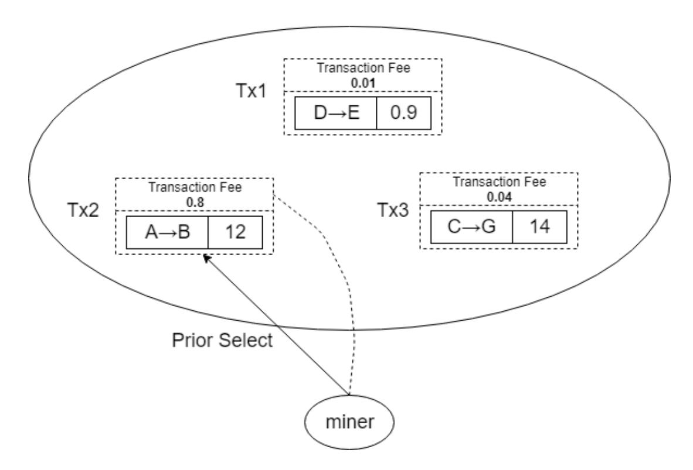

Figure 1: Transaction Selection for a Miner(Tx1, Tx2, Tx3 are in the pool. The miner selects Tx2 which has the highest transaction fee.)

{3}------------------------------------------------

A block[11] consists of a block header and a block body. Figure 2 shows the structure of a block in the Bitcoin blockchain. The block body contains transactions. Transactions are messages that detail funds transmissions from one user to another. Each block has a unique hash code that allows others to distinguish it from other blocks. Miners have to solve a difficult mathematical problem to find a hash for a block they want to add to the blockchain. This process is called "mining" and the problem-solving algorithm is called "Proof-of-Work". The metadata of a block header is an input of the hash function. When a hash function is applied, even a one-bit change of the input causes a completely different output. This feature makes the problem hard to solve but easy to check. Figure 2 shows the block header structure. Miners repeatably change the Nonce value in the block header to impact the hash result to match the target output. The algorithm can automatically readjust the difficulty value in the block header to ensure a stable block generating speed. The block can be added to the blockchain once a miner finds a valid hash. Transactions in this block can then be viewed by the public.

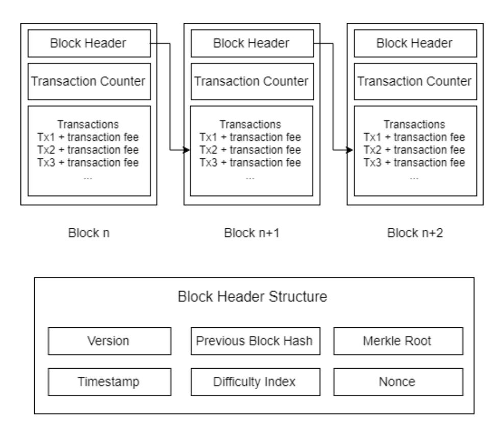

Figure 2: The block structure of Bitcoin blockchain

The two most popular public blockchains are: the Bitcoin blockchain and the Ethereum blockchain.

## 2.2 Bitcoin Blockchain

The Bitcoin blockchain was proposed by Santoshi Nakamoto in 2008[6]. In Bitcoin, Unspent Transaction Outputs(UTXOs) are used to record transfers. UTXOs are coins available to be spent[12]. In UTXO's accounting method, each transaction is divided into inputs and outputs. Each transaction consumes the UTXO generated by the previous transaction, and then generates a new UTXO. The UTXO model is stateless. The balance of an account is all the unspent UTXO collections belonging to the address. Figure 3 shows the how UTXOs work.

The Bitcoin blockchain uses scripts to execute transactions. Script is a kind of programming language for accessing and spending outputs. Locking scripts are placed on outputs which specify the conditions that must be true to spend the UTXO. Unlocking scripts are placed on inputs which prove inputs fulfil the conditions specified in the UTXO. These unlocking scripts contain user's digital signatures. When a node receives a transaction, it will execute the locking and unlocking

{4}------------------------------------------------

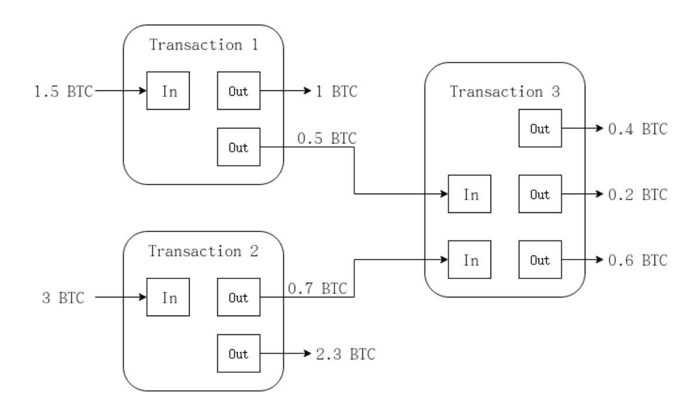

Figure 3: UTXO

scripts together to see whether the digital signature matches the address that the output is locked to[13].

In the Bitcoin blockchain, The sequence order can be easily verified. Inputs link to existing outputs. A node can check whether an output has been consumed or not. In addition, transactions are both the result and the proof. There is no extra computation and state storage required.

However, bitcoin scripts are stateless and cannot execute loops or other complex functions.

## 2.3 Ethereum Blockchain

The Ethereum blockchain was proposed by Vitalik Buterin[7] in 2013. Ethereum intends to create a more general protocol that supports a Turing-complete programming language, where users can write smart contracts and create a variety of decentralized applications. The concept of Smart Contracts was proposed by Nick Szabo[14] in 1994. In Ethereum, smart contracts are more complex scripts than those used on the Bitcoin blockchain. Ethereum smart contracts have contract storage that can influence the behavior of the program. The Ethereum blockchain uses smart contracts to automatically execute interactions between the blockchain platform and users without the need for trusted intermediaries. There are several languages used to implement smart contract code, including Solidity and Vyper. Solidity is the most commonly used. Solidity is a JavaScript-like language. The Solidity compiler can translate solidity code into bytecode which can be executed by the Ethereum Client, which is implemented by each node on the Ethereum Network. In this way, a smart contract is stored in the blockchain and is identified by its address. We can trigger a smart contract by sending a transaction to its address which may include parameters. The Bitcoin blockchain uses UTXOs to save records in a point-to-point electronic cash system. Due to the lack of state preservation and programmability in the UTXO model, Ethereum introduced an Account/Balance model to generate records. The Account/Balance model is similar to how our bank accounts work. In the Ethereum platform, transactions deploy contracts, do function calls, and transfer funds. With this model, interactions between accounts become simple and it is easy to check whether there are enough funds in an account. Unlike UTXOs linked one by one, accounts do not depend on each other which provides convenience and efficiency.

Unlike traditional e-commerce platforms, the data and transactions are managed and viewed by all participants in the blockchain-based e-commerce network which provides transparency. When 

{5}------------------------------------------------

a customer or a merchant joins the blockchain network, he will have a copy of records on the blockchain which is automatically updated when a new transaction is added. This ensures the record cannot be changed by the platform itself. However, there are still some limitations of onchain transactions, like the number of transactions per second.

## 2.4 Related Work

Blockchain technology has great potential to impact the e-commerce industry. Some researchers and companies have already made contributions on this field. C. Liu, et al., proposed a transaction settlement system based on blockchain technology to manage transactions automatically using smart contracts [15]. W. Xie, et al., introduced a consensus algorithm to ensure trusted trading in e-commerce industry based on the blockchain technology[16]. It allowed simple purchases and refunds to be made between participants. Y. Li, et al.[17], proposed a balanced e-commerce model that allows direct payment based on a blockchain between customers and suppliers without involving an e-commerce service provider, like Amazon. This method creates a great number of transactions on the blockchain which may cause congestion if the active user group is large enough. These approaches use the blockchain to improve trust and contracts that execute automatically. However, they use existing unmodified blockchain networks, like Bitcoin or Ethereum, and do not deal with scalability issues. B. Li and Y. Wang designed a blockchain-based transaction method taking ecommerce as an example which moves the dispute process off the blockchain to protect privacy in the system[18]. X. Min, et al., presented a blockchain protocol to provide better performance in terms of throughput, capacity and latency in the e-commerce platform[19] using a global consensus algorithm. These papers move dispute processes or transactions off the blockchain to protect the privacy and increase the speed of processing a transaction.

As public blockchains, Bitcoin and Ethereum need to handle more transactions if they want to match today's e-commerce demand. The problem that blockchain technology is facing is how to ensure its security while extending its capability to handle a great number of transactions. There are two basic categories for scalability solutions, Layer1 solutions and Layer2 solutions.

Layer1 solutions take measures on the blockchain itself, including extending the block size[20][21][22], decreasing the block interval[23][24], and sharding[25]. A low block size limitation reduces the number of transactions in a block and needs a high transaction fee to incentivize miners. There have been attempts to scale the block size. Gavin Andresen, a core developer of Bitcoin, proposed, in 2009, that the block size needed to increase to 8MB and be doubled every two years[26]. However, it is difficult to know whether this growth is appropriate for the Bitcoin network in the future. Jeff Garzik, another core developer of Bitcoin, proposed increasing the block size to 2MB in 2016[9]. A proposal called Segwit2x tried to implement the change of block size to 2MB. However, it was cancelled because of a lack of consensus in 2017[27]. Decreasing the block interval is another option. As we mentioned before, the block interval for Bitcoin is 10 minutes and 15 seconds for Ethereum. Reducing the block interval will allow a transaction to be confirmed much faster. However, the shorter the block interval, the easier it is to produce Orphaned Blocks which cannot be included in the main chain and waste computation power. The current blockchain is like a single thread computation. Sharding aims to extend it to be multithreaded which means several miners do the computation and verification at the same time and all valid work will be recorded on the blockchain.

Layer 2 solutions give another option. These solutions attempt to decrease the number of transactions taking place on the blockchain network. Unlike Layer 1 computation and storage, a Layer 2 scaling method is an approach to increase the speed of the network without modifying the

{6}------------------------------------------------

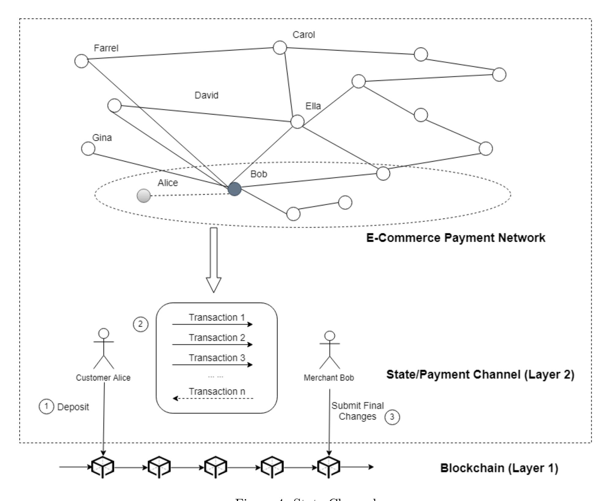

Figure 4: State Channel

root blockchain. It requires an additional communication layer or structure which allows traders to make hundreds of thousands of payments or micropayments outside the blockchain. In this paper, we will focus on the second layer solutions.

## 3 Layer2 Approaches

## 3.1 State Channel Based Approaches for E-Commerce

State channel based approaches establish an exchange layer above the blockchain which enables customers and merchants/platforms to update balance states without interacting with the blockchain.

Figure 4 shows the workflow of state channel based approaches for e-commerce. A customer, Alice and a merchant, Bob generate a channel and lock up deposits via a multisignature wallet in Bitcoin or a smart contract in Ethereum. This step gives an initial state for their channel. 

{7}------------------------------------------------

Then participants can generate and sign transactions to counterparties via the channel in Layer2. Transactions in Layer2 are off-chain messages which indicate balance changes between participants. Customer Alice can continually or periodically purchase products as long as she has enough funds in the channel. When they choose to close the channel, both of them can sign and commit that final state to the blockchain, and withdraw their funds according to the final state. State changes are stored by participants locally. If one of them finds their counterparty did not commit the up-to-date state to the blockchain, he can use a recent state to rebut his counterparty.

There are several state channel based solutions for Bitcoin and Ethereum. BitcoinJ[28] is a library which implemented a unidirectional payment channel for Bitcoin client/server application in 2013. The transaction can only be sent from one side to another side and only the sender has to deposit to the channel which suits scenarios like a coffee shop. It was one of the first implementations of micropayment channels. The Lightning Network[29] is another payment channel based implementation which was proposed by Joseph Poon and Thaddeus Dryja in 2016. Unlike BitcoinJ, the Lightning Network supports bidirectional payment channels which means both participants can deposit to the channel. It was launched on the Bitcoin Mainnet in 2018. However, due to the limitation of Bitcoin scrips which cannot support multi-stage transactions, the Lightning Network is unable to support multiple deposits. That means if the initial deposit is not enough and participants want to send more transactions to each other, they need to close the channel, deposit more funds and reopen the channel. Also, participants need to continually monitor the blockchain to avoid fraud, checking that their counterparty has not submitted out-of-date state. Eltoo[30] is an improvement on the Lightning Network which was proposed by Lighting Labs, in 2017. It uses a flag for the Bitcoin protocol, SIGHASH NOINPUT, which helps to order state changes and ensure the latest state will be committed to the blockchain instead of the fraudulent old state. The Raiden Network[31] is a state channel based solution designed for the Ethereum network. It is similar to the Lightning Network but uses smart contracts to implement operations which allows multiple deposits without closing channels. It also can allow payment using ERC-20 standard tokens rather than the underlying Ethereum coin, Ether. The first release of the Raiden Network, µRaiden Network[32] which allowed unidirectional many-to-one payments, was launched on the Ethereum mainnet in 2017. The Raiden "Red Eye" version was released in 2018 which enables users to send bidirectional payments. The Lightning Network and Raiden Network can also support payment channel network transfer. Channels linking nodes form a channel network. If there is no direct channel between two participants, they can send transactions with the help of other nodes and channels. For example, in Figure 1, when Gina wants to send 1BTC to Ella without a direct channel, this payment can pass through Bob to Ella with the help of Hashed TimeLock Contracts (HTLCs). Ella creates a value V which acts as a private key. Then she sends the hash of V , H to Gina. Gina shares H with Bob and promises if Bob can disclose V , she will send 1.01BTC to him. In order to get V , Bob sends 1BTC to Ella. After receiving V , he will send it to Gina and get 1.01BTC from Gina. This is the process by which HTLCs work. However, if intermediaries become unresponsive, participants along the route have to wait until the timelocks expire. Sprites[33] is a solution which aims to reduce the waiting time in this situation. Sprites introduced a global smart contract, called a "PreimageManager(PM)" to organize the state of each intermediate node. The PM can automatically confirm the payment transfer throughout the route. Revive[34] is another state channel based solution implemented on Ethereum which was proposed by Rami Khalil and Arthur Gervais in 2017. It provides a scheme to transfer deposits among channels of users to rebalance the existing payment network without interrupting channels. Rapido[35] 

{8}------------------------------------------------

is a solution based on Bitcoin. It splits the payment value into small shares and sends them via different routing paths to the destination which will be helpful when there is not enough deposits in a single channel. Duplex Micropayment Channel[36] is based on Bitcoin and was proposed by Christian Decker in 2015. Participants have to set up two unidirectional payment channels to enable bidirectional payments. When a new transaction is generated, the timelock of this transaction will be lower than the previous one which ensures the latest state will be committed to the blockchain. However, after the timelock is "exhausted", channels must be closed and reopened to enable more transactions. Channel Factory[37] improves upon the Duplex Micropayment Channel to enable more transactions generated off the blockchain by resetting the timelock. It also enable several participants to lock funds in a shared wallet and generate transactions among these participants.

#### 3.1.1 Applications Using State Channel based Payments

There are several applications based on blockchain technology using or attempting to use state channel based Layer2 approaches to scale their payments system. Connext Network[38], a state channel based p2p micropayment infrastructure, was launched on the Ethereum mainnet in September 2018. Counterfactual[39] proposed to use a state channel protocol to allow more applications to achieve instant payments in November 2018. Funfair[40], a game application based on Ethereum, implemented payment channels for online game transactions. SpankChain[41], an entertainment ecosystem based on the Ethereum blockchain, has already implemented payment channels on the mainnet in 2018. Magmo[42], another game applications which is using state channels, has presented their demo in Devcon4, a popular Ethereum Developer Conference, in 2018.

Approach BitcoinJ Lightning Raiden µRaiden Sprites REVIVE Rapido Duplex ChaneelFactory Unidirectional X X X X Bidirectional X X X X X Timelock X X Punishment X X X X X X Bitcoin X X X X Ethereum X X X X X Cryptocurrency/ Bitcoin Bitcoin RDN & RDN & ERC-20 ERC-20 ERC-20 Bitcoin Bitcoin Token ERC-20 ERC-20 Multi-hop X X X X X Network Multiple X X X X Deposits Multiple X X X X X Withdrawals

Table 1: Comparison for State Channel Based Approaches

#### 3.1.2 State Channel Based Approaches Discussion

Table 1 shows a comparison of State Channel based approaches. State channel based approaches can be classified into two categories: unidirectional and bidirectional. BitcoinJ Micropayment Channel and µRaiden Network are unidirectional payment channels which support transactions 

{9}------------------------------------------------

from only one direction, like in a coffee shops scenario. Compared with unidirectional payment channels, bidirectional payment channels use a shared account to link different participants and enable payment to each other. Unidirectional payment channels are simpler than bidirectional payment channels. However, in reality in the e-commerce industry, if customers get refunds from a merchant, the unidirectional approaches will cause more on-chain transactions than bidirectional ones. For example, the average return rate of Singles' Day was 27% in 2017[43]. That means a great number of merchants have to be able to send transactions to customers. These approaches can be classified into two different categories by how they prevent fraud. One is time-based bidirectional channels, like the Duplex Micropayment Channel and the Channel Factory, which uses two unidirectional channels with a limited lifetime to enable bidirectional transactions. The other kind of bidirectional channels are punishment-based bidirectional payment channels, like the Lightning Network, Raiden Network, Sprites, Revive and Rapido, which use a punishment mechanism to ensure honesty between participants. The dishonest party may lose all the funds if a fraud happens. There are no other costs during the transactions as long as there are enough funds in the channel. However, this still needs every participant to monitor each other's behavior to avoid loss.

A Payment Network here means transactions can be sent from a customer to a merchant via intermediaries, such as an e-commerce platform. The BitcoinJ Micropayment Channel and µRaiden Network are unidirectional payment channels which do not support a payment network. Duplex Micropayment Channel and the Channel Factory can support a group of participants. Even though they allow multiple participants, there are no payment networks in the Duplex Micropayment Channel and the Channel Factory. But they may suit for "Group Buying" e-commerce models. The Lightning Network, Raiden Network, Sprites, Rapido and Revive can transfer payments via intermediaries. Compared with the Lightning Network and the Raiden Network, Sprites decreases the time cost of unlocking funds from the channels using a PreimageManager contract. Rapido allows payments to be transferred via multiple channels. However, if participants generate transactions in one direction frequently, deposits can be easily exhausted and participants have to redeposit to this channel. This causes more on-chain transactions. Revive can help intermediaries to rebalance their channels to support more transactions without closing and reopening channels. An e-commerce platform can use this rebalancing feature to support more transactions in one-directional frequently used channels. However, all participants' signatures need to be collected to rebalance channels. If one or more participants are unresponsive during the rebalancing process, all others need to wait for a time-out to roll back the status. During this period, the state of these channels is frozen and no one can send transactions. If this happens frequently, it may result in a denial of service which may provide a bad user experience for customers. The settings of timeouts or relative thresholds will seriously affect the efficiency of this off-chain layer.

From the comparison, the Lightning Network and Raiden Network are the two most important implementations of state channel protocols. They can support transactions via intermediaries. They also have drawbacks, such as the time cost for unlocking funds from intermediaries and poor availability of resetting channels. Sprites achieves the simultaneous release of funds from intermediaries, but increases the centralized control risk. Rapido and Revive improve on the Lightning Network by continually sending transactions without immediately closing channels but they increase the communication costs.

In the Lightning Network, Raiden Network, Sprites and Revive, intermediaries need to lock the same amount of funds as the end-points to support a transfer. This means an e-commerce platform has to provide enough fluid capital to enable services. Rapido divides the total value into small 

{10}------------------------------------------------

amounts which helps more intermediaries to participate in the network. But this still leaves the problem of intermediary failure. Intermediaries can be other merchants or e-commerce platforms. If an intermediate node fails during a transmission, other participants have to wait for a period to close channels and withdraw their funds. The more intermediaries, the longer participants need to wait. Sprites can relieve this issue using the PreimageManager contract. The unlock request is controlled by a contract. Once the failing node has recovered, funds can be unlocked simultaneously.

Participants can deposit only once when they use BitcoinJ, Lightning Network, Rapido, Duplex Micropayment Channel. The Raiden Network, µRaiden Network, Sprites and Revive allow multiple deposits and withdrawals by using smart contracts. Due to the use of smart contracts, Ethereum based approaches have a greater ability to support continuous deposits and withdrawals with fewer on-chain transactions.

#### 3.1.3 Advantages Compared with On-Chain Payments

- (1) Privacy. Everything happens inside the channel, not on the entire network and the chain. The public only sees the open and close transactions.
- (2) Low transaction fees. For frequent transactions, the transaction costs can be effectively reduced. Creating a channel or deploying a contract will have initial costs. After deployment, the cost of each status update within the channel is very low.
- (3) Instant payment. Every transaction on the blockchain needs to wait to be included in a block and receive confirmation from multiple blocks afterwards. But in state channels, participants can receive their status update immediately.

#### 3.1.4 Issues of State Channels

State channel or payment channel networks are very young ideas having been first proposed in 2013. State channels require full availability of all participants. Since the final closure of the channel and the final status submission may be submitted by a malicious party, there is a risk of losing funds if you do not pay attention to completing the transaction.

## 3.2 Sidechain Based Approaches for E-Commerce

Sidechain based approaches are another option for Blockchain Layer2 based e-commerce industry. This approach was first proposed in 2014[44]. Figure 5 shows the workflow involved.

Customers and merchants/platforms lock funds on the mainchain via scripts in Bitcoin or smart contracts in Ethereum. The same value of alternative tokens(tokens used in sidechains) will be released on the sidechain. Customers can use these alter-token to generate transactions on the sidechain. These transactions can be included in sidechain blocks. After they finish payments, they can provide a proof of locked assets on the sidechain to the mainchain and withdraw their funds in the mainchain. Participants in the blockchains can lock their funds in blockchains with high transaction volume and low transaction speed, and unlock other coins in chains with low transaction volume and high transaction speed. The main chain can ensure the funds security while the sidechains allow more micropayments and frequent e-commerce trading.

There are several sidechain based solutions for Bitcoin and Ethereum. Rootstock(RSK)[45] is one of the most well known two-way pegged Bitcoin sidechains which was created by the Bitcoin core team in 2013. Users lock up their BTC and get an equivalent amount of RBTC in the sidechain,

{11}------------------------------------------------

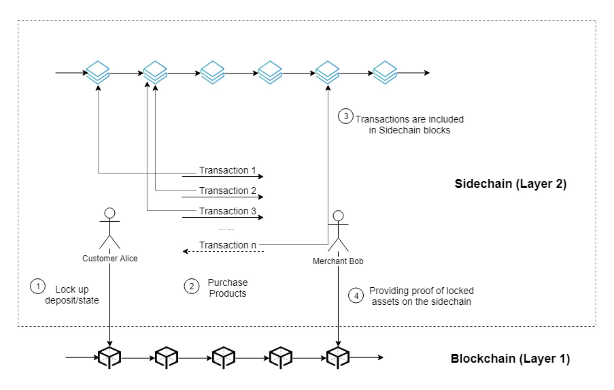

Figure 5: Sidechains

rootstock. Rootstock introduces Federations, a set of semi-trusted third-parties (STTPs), to help lock and release bitcoins on the Bitcoin blockchain. Rootstock requires the Federations to have the ability to check the correctness of the release of BTC funds. There are 25 leading bitcoin industry companies in the RSK Federation list, including Bitfinex, Bitbulls and Huobi[46]. These companies act as notaries in the RSK Federation. When STTPs receive commands from the RSK blockchain, only the majority of STTPs need to approve the transaction and BTC funds can be released on the Bitcoin blockchain. RSK proposes to be launched on the Bitcoin mainnet in 2020[47]. Plasma[48] is a sidechain based solution for the Ethereum blockchain which was proposed by Joseph Poon in 2017. It is a framework that uses a Proof-of-Stake protocol to maintain the sidechain and uses a UTXO model, like Bitcoin to handle payments. Smart contracts are used to lock funds in the Ethereum blockchain. The Plasma team published their first implementation "Minimal Viable Plasma"(MVP)[49] in 2018, a simplified version of Plasma. The plasma contract has been deployed to the Ethereum blockchain mainnet. There are three entities involved in Plasma MVP, the Ethereum blockchain with Plasma contracts, Operators, and clients. The Ethereum blockchain together with Plasma contracts are used to lock funds from clients and verify the commitments. A Plasma Operator is a centralized authority which can generate plasma blocks with specific rules. The operator is responsible for collecting transactions into blocks and will send the hash of blocks which include transactions to the root Ethereum blockchain and let the root chain make the confirmation. Clients are users who want to transfer their funds. Participants use signatures to verify or confirm a transaction. For example, when Alice sends a transaction, she needs to sign a transaction which means she saw this transaction and passed it to Bob. Bob then signs it, which means he also 

{12}------------------------------------------------

saw it and now the transaction is valid.

Plasma Cash[50] is another implementation of Plasma proposed by Plasma team in 2018. It uses Non-Fungible-Tokens(NFTs) to enable less user data checking and Sparse Merkle Trees to check the ownership of coins. NFTs are a kind of token which are not interchangeable. A fungible token is like gasoline, one unit is replaceable by any other. But a non-fungible token is like a airplane ticket which has customer name, departure time and seat number and is unique to each other. There are some other implementations, including More Viable Plasma (MoreVP)[51],Plasma Snapp[52], Plasma Debit[53] and Plasma Bridge[54]. MoreVP reduces the number of exchanged message compared with Minimal Viable Plasma. In MoreVP, a latest transaction has the highest priority which ensures the new transaction can be committed to the blockchain without exchanging signatures like in Minimal Viable Plasma. Plasma Snapp uses a double-signed mechanism which ensures all owners for this block can prove transactions are valid and up to date which can prevent fraud. In Plasma Snapp, the operator sends a hash of transactions to their owners. When participants confirm transactions are included and valid, both of them need to sign the hash. Otherwise, the hash of that block is invalid. Plasma Bridge proposes to use the plasma chain to connect two layer1 chains which enables coin exchange between two main chains. In Plasma Debit, when a user wants to pay another user, they simply pay the operator and have the operator pay the other user.

#### 3.2.1 Applications Using Sidechain based Payments

OmiseGo[55], a Decentralized Exchange platform is building Minimal Viable Plasma to increase the number of transactions per second they can support. Loom Network is a multichain interoperability platform which used Plasma Cash to support their transactions[56] in 2018. Liquid[57], a commercial sidechain implemented by Blockstream[58], moves funds between exchanges. POA[59] is an Ethereum sidechain which enables a 5 second block interval in their sidechain.

| Approach          | Third Party | Native Token        | Bitcoin | Ethereum |
|-------------------|-------------|---------------------|---------|----------|
| P egged Sidechain | Federation  | BTC,sidechain token | X       |          |
| Rootstock         | Federation  | BTC,RBTC            | X       |          |
| MV P              | Operator    | ETH,ERC-20          |         | X        |
| Plasma Cash       | Operator    | ETH,NFT             |         | X        |
| MoreV P           | Operator    | ETH,ERC-20          |         | X        |
| Plasma Snapp      | Operator    | ETH,ERC-20          |         | X        |
| Plasma Debit      | Operator    | ETH,ERC-20          |         | X        |
| PlasmaBridge      | Operator    | ETH,ERC-20          |         | X        |

Table 2: Comparison for Sidechain Based Approaches

#### 3.2.2 Sidechain Based Approaches Discussion

Table 2 presents the comparison of Sidechain based approaches. Sidechains or Plasma can help to deal with more transactions than the main blockchains. Unlike state channels which can be opened and closed by participants, once a sidechain is established, it becomes permanent. Participants can only lock and unlock funds from the sidechain instead of closing a sidechain. Transaction records in sidechains are also permanent.

However, participants need to trust a group of third parties, such as a Federation(Cryptocurrency Exchange Platforms) or Operator, to ensure security tokens are locked. This federation or opera

{13}------------------------------------------------

tor structure adds another layer between the main chain(Layer1) and "sidechains"(layer2) which increases risks. In addition, "sidechains" have to maintain their own security. For example, if there are not enough miners working on the sidechain, it may be easy to subvert.

#### 3.2.3 Advantages Compared with On-Chain Payments

- (1) Low transaction fees.
- (2) Permanent. As long as a sidechain is created, it can used by anyone on the mainchain.

#### 3.2.4 Issues of Sidechain based Approaches

- (1) Less privacy. Compared with state channel based approaches, transactions on sidechains are not private. All participants involved in the same sidechain can view these transactions.
- (2) High initial cost. Sidechains have their consensus mechanism and security level. This means miners also need to work on sidechains. If there is not enough mining power to ensure the security of a sidechain, it could be attacked.
- (3) Third-party or intermediary. Sidechain based approaches require federations or operators to connect the original chain and sidechain. These intermediaries may easily to be attacked.

These Layer 2 solutions have great potential to increase the number of transactions processed per second which improves the scalability of the blockchain itself. We will now discuss the possibility and issues of applying Layer2 methods to the e-commerce industry.

## 4 Realising Layer 2 Technology for Potential E-Commerce

In the e-commerce industry, we assume there are merchants, customers and e-commerce platforms. A customer must establish Layer2 links to send transactions to merchants. To apply Layer2 approaches to the e-commerce industry, there are several issues we have to consider, including the topology of the Layer 2 e-commerce network and the fee costs for different topologies.

## 4.1 Topology

Topology is the geographic arrangement of elements of a communication network. These elements include nodes and links. For Layer2 approaches, nodes are customers, intermediate service providers and merchants; links are payment channels established between every two participants or groupings of participants in case of the sidechains.

There are several types of topology that could be used to serve the e-commerce industry. We assume participants are all connected to the Internet and they can all access the public blockchain, but there are no Layer2 connections among these participants originally.

#### 4.1.1 Single Merchant

In the simplest scenario, there is only one merchant providing products, but this merchant may manage a number of nodes in Layer2. For example, Apple operates an online store and customers can directly buy products from its website. Figure 6 shows a simple single merchant topology. Nodes owned by this merchant connect with each other and customers connect with one of these merchant nodes.

{14}------------------------------------------------

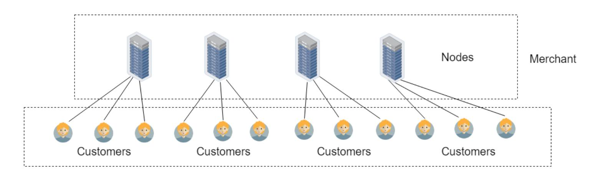

Figure 6: Single Merchant Topology

If State Channel based approaches are used in this topology, each customer must establish a payment channel with a merchant node to generate transactions. We assume Customer = {c1, c2, c3, ...} is the collection of customers for a merchant, |Customer| is total number of customers and Off chainT ransaction = {oct1, oct2, oct3, ...} is number of off-chain transactions generated by each customer. Figure 7 shows an example of Single Merchant Topology.

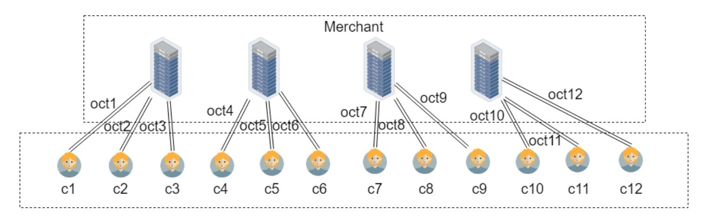

Figure 7: Single Merchant Payments based on State Channel

The total number of payment channels for this kind of topology is |Customer|. The initial number of on-chain transactions is 2×|Customer|, including opening and closing channels. Besides, the total number of off-chain transactions NOCT is

$$NOCT = \sum_{i=1}^{|Customer|} oct_i \tag{1}$$

If Sidechain based approaches are applied in this topology, we assume Merchant = {m1, m2, m3, ...} is the collection of merchant nodes, Customer = {c1, c2, c3, ...} is the collection of customers, |Merchant| is number of merchants and |Customer| is number of customers, MCT F is the main chain transaction fee for a single transaction, SCT F is the sidechain transaction fee for a single transaction, P articipants = |Merchant| + |Customer| is number of participants, including all merchant nodes and customers, SidechainT ransactions = {sct1, sct2, sct3, ...} is the number of transactions generated in "sidechains" by each customer. Figure 8 shows the workflow of sidechain based single merchant payments. The total fee costs T F C of sidechain based approaches are

$$TFC = 2 \times MCTF \times Participants + SCTF \times \sum_{i=1}^{|Customer|} sct_i$$
 (2)

{15}------------------------------------------------

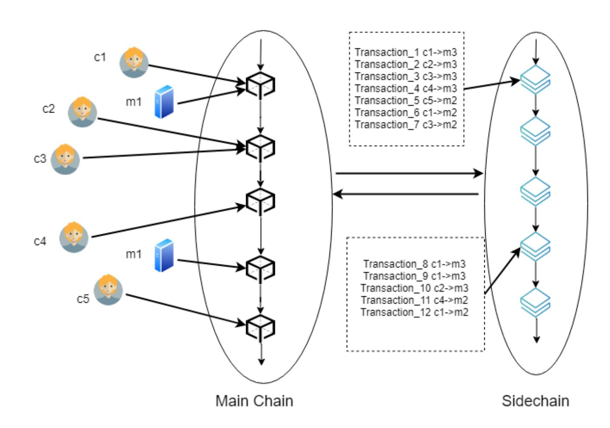

Figure 8: Single Merchant Payments based on Sidechain

The transaction fee costs of sidechain based approaches include fees for locking and unlocking funds on the main chain as well as transaction fees on the sidechains.

#### 4.1.2 Single Platform plus Multiple Merchants

An e-commerce platform, like Amazon, provides services to customers and merchants. All transactions can be made using Amazon as an intermediary. Figure 9 shows a single platform topology. With the e-commerce platform node acting as an intermediary, a customer and a merchant both have to establish connections with a platform node. The e-commerce platform manages a number of nodes to provide transfer services.

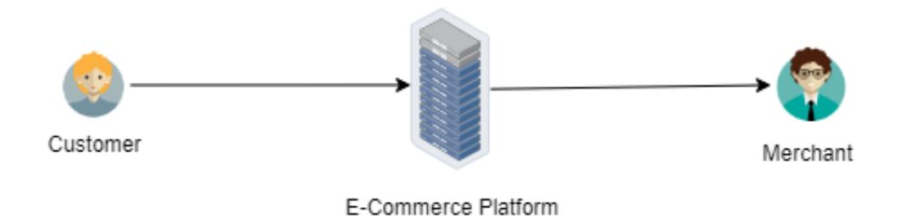

Figure 9: The Customer-Platform-Merchant Topology

In State Channel based approaches, we assume EPlatform = {p1, p2, p3, ...} is a collection of e-commerce platform nodes, Merchant = {m1, m2, m3, ...} is a collection of merchants, Customer = {c1, c2, c3, ...} is a collection of customers, |Merchant| shows the number of merchants and |Customer| shows the number of customers, Off chainT ransactions = {oct1, oct2, oct3, ...} is number of off-chain transactions generated by customers. Figure 10 shows an example of Single Platform Topology based on State Channels. The e-commerce platform might maintain hundreds of thousands of nodes as intermediaries. These platform nodes connect with each other to ensure customers who connect with different nodes can find payment routes to merchants. The number of 

{16}------------------------------------------------

platform payment channels that connect these platform nodes is PPC.

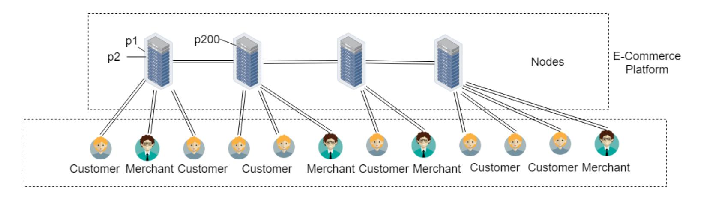

Figure 10: Single Platform Topology based on State Channels

The total number of payment channels in this topology is N = |Customer| + |Merchant| + PPC and the initial number of on-chain transactions, including opening and closing channels, is 2N.

The number of off-chain transactions is  $NOCT = \sum_{i=1}^{|Customer|} oct_i$ .

In Sidechain based approaches, we assume  $EPlatform = \{p1, p2, p3, ...\}$  is the collection of e-commerce platform nodes,  $Merchant = \{m1, m2, m3, ...\}$  is the collection of merchants,  $Customer = \{c1, c2, c3, ...\}$  is the collection of customers, MCTF is the main chain transaction fee for a single transaction, SCTF is the sidechain transaction fee for a single transaction, Participants = |EPlatform| + |Merchant| + |Customer| is the number of participants, including platforms, merchants and customers,  $SidechainCustomerTransaction = \{scct1, scct2, scct3, ...\}$  represents the number of customer-to-platform transactions carried out by each customer,  $SidechainPlatformTran\{scpt1, scpt2, scpt3, ...\}$  represents the number of platform-to-merchant transactions carried out by each platform node.

The total fee costs of sidechain based approaches includes locking and unlocking transaction fees on the main chain of all participants and transaction fees generated by customers (customers  $\rightarrow$  platforms) and platforms (platforms  $\rightarrow$  merchants) on the sidechain. The total fee costs TFC of sidechain based approaches are

$$TFC = 2 \times MCTF \times Participants + SCTF \times (\sum_{i=1}^{|Customer|} scct_i + \sum_{j=1}^{|Merchant|} scpt_j)$$
 (3)

In the next section, we will use (1)-(4) to compare the total fee costs of different topology.

#### 4.1.3 Analysis

We consider a company like Apple as a single merchant example and Taobao.com as a single platform example. For Apple, there are 588 million of users worldwide. For Taobao.com, there were 693 million active users in 2019[60] and 7 million merchants[61].

{17}------------------------------------------------

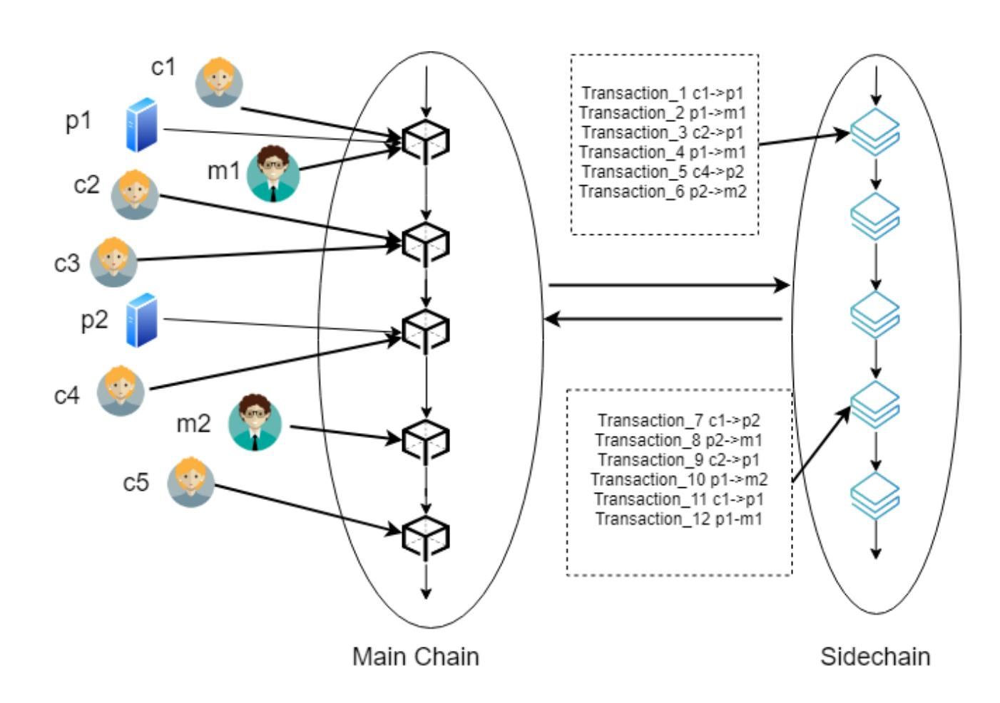

Figure 11: Single Platform Topology based on Sidechains

Table 3: Comparison of Different Payment Methods

| Payment Method            | Transaction Fee | Transaction Speed                  | Transaction Settlement Time                           |
|---------------------------|-----------------|------------------------------------|-------------------------------------------------------|
| CreditCard                | 1.5-2.9%        | 1700 transactions/second           | 24hours-3days                                         |
| Layer1 − Bitcoin          | \$0.21          | 7 transactions/second              | 10 minutes-1 hour                                     |
| Layer1 − Ethereum         | \$0.11-0.39     | 8 transactions/second              | 15 seconds-5 minutes                                  |
| Layer2 − LightningNetwork | \$0.00008       | 1 million transactions/second [62] | Depends on when participants close the channel        |
| Layer2 − Plasma           | -               | 22000 transactions/second[63]      | Depends on when participants withdraw from main chain |

Table 3 shows the comparison of different payment methods, including Credit Card, Bitcoin, Ethereum, a State Channel based Layer2 approach and a Sidechain based Layer2 approach. We compare the transaction fee, the transaction speed and how long before the merchant can withdraw their payment (settlement time). For the Layer2 technology Plasma, incentive mechanisms are proposed which attaches a transaction fee to each transaction. However, these mechanisms have not been applied for Plasma[64]. Therefore, the transaction fee in a Plasma chain is 0 currently[65]. In Figure 12, we take Taobao.com as an example to show the different costs of these payment methods when applied to Singles' Day. For Layer2, we assume all parties are already participating in the Lightning Network or Plasma chain. There is no initial cost to join Layer2 network. According to CAINIAO Global[66], the official global parcel tracking platform of Alibaba, there are 1.35 billion delivery orders on Singles' Day and the total value of these products is \$38.4 billion. The Bitcoin blockchain cannot process this amount of transactions currently. If we had a faster Bitcoin transaction speed available to us, we get the result in Figure 12. From Figure 12, we notice Layer2 approaches can significantly reduce transaction fees.

We take the production Lightning Network as a State Channel based example. From 1ML.com[67], a Lightning Network analysis engine, the most connected node currently has 35,137 channels. We

{18}------------------------------------------------

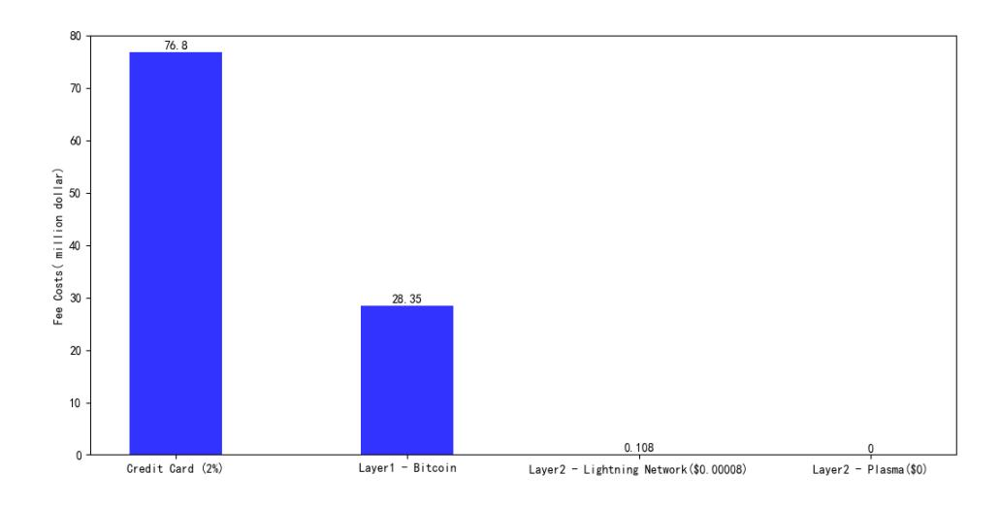

Figure 12: Comparison of Fee Costs Associated with Different Payment Methods for E-Commerce Traffic on Singles' Day

adopt this figure in our calculation and assume that each merchant node in our Single Merchant Topology and each platform node in our Single Platform Topology can connect up to 35,137 payment channels. Table 3 shows the number of merchant nodes or platform nodes required.

Table 4: Number of Users and Nodes required

|                                | Single Merchant (Apple) | Single Platform (Taobao) |
|--------------------------------|-------------------------|--------------------------|
| T otalNumber of Users          | 588 million             | 700 million              |
| T otalNumber of Nodes Required | 16,800                  | 20,000                   |

We observe the total fee costs of different payment methods according to previous formula we proposed. The average on-chain transaction fee is \$0.21. Figure 13 shows how costs rise when: 1) directly generating transactions with the merchant on the blockchain, 2) sending transactions via state channels, 3) sending transactions using sidechains without transaction fees, 4)sending transactions using sidechains with \$0.01 transaction fees on the sidechain, 5) sending transactions using sidechains with \$0.05 transaction fees on the sidechain.

In Figure 13, "Number of Transactions" is the transactions customers intend to send. We can see if these transactions are sent via Layer2 approaches, there are initial costs for opening and closing payment channels in State Channel based approaches or locking and unlocking funds in Sidechain based approaches. Layer2 approaches can save transaction fees only when the number of off-chain transactions is more than the initial number of on-chain transactions required to set up Layer2. In plots 3), 4), and 5), we show sidechain based results. We can notice the slope increases as the transaction fee increases. The plots of 2) and 3) almost coincide in Figure 13. State Channel based approaches can, in general, consume lower transaction fees than Sidechain based approaches.

Figure 14 shows the analysis of the Single Platform Topology. The total fee costs of each approach is similar to the Single Merchant Topology. However, when the number of users increases, the total fee costs is more than for the Single Merchant Topology with the same number of transactions. In Table 3, there are 20,000 nodes maintained by the e-commerce platform. In Figure 15, we analyze the fee costs with different numbers of payment channel connections among the platform nodes. More connections can ensure the availability of the network when some of these connections are crashed. We take the Lightning Network as an example. The average fee charged

{19}------------------------------------------------

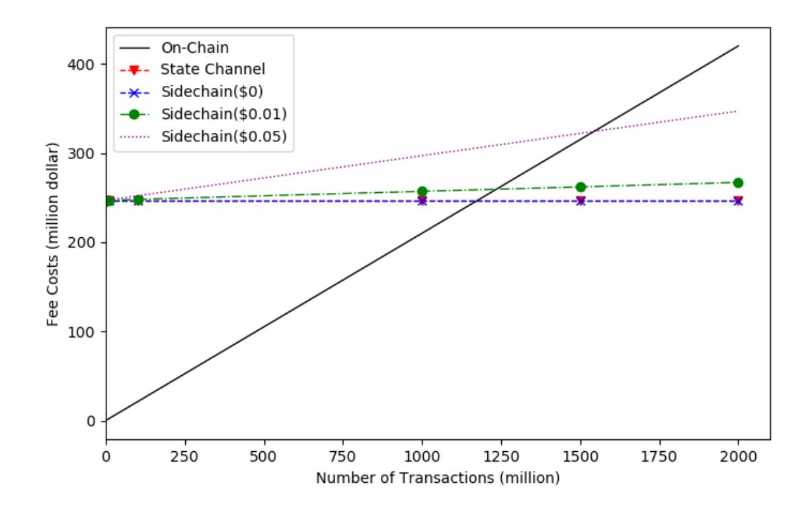

Figure 13: Single Merchant Topology Analysis Assuming 588 Million Users

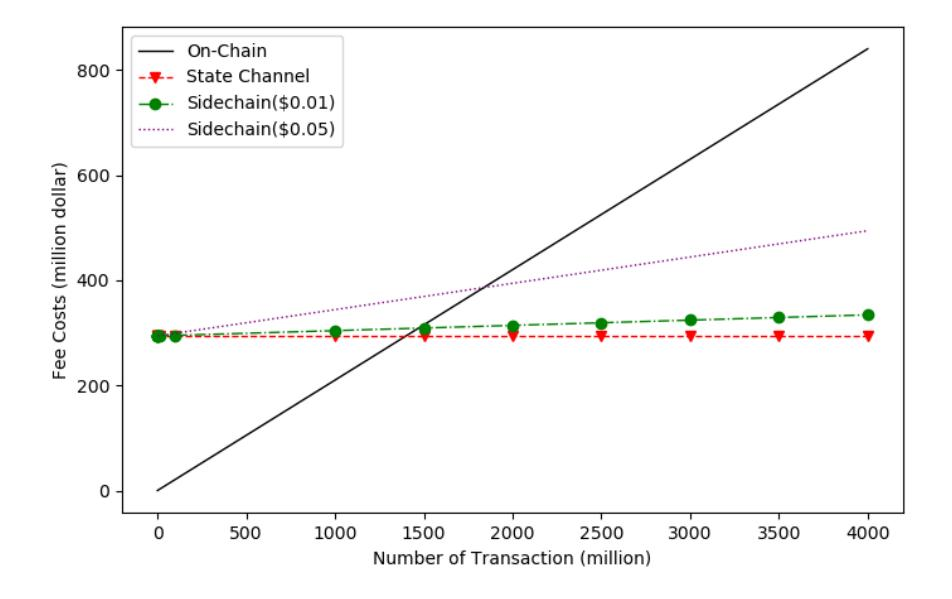

Figure 14: Single Platform Topology Analysis Assuming 700 Million Users

by intermediaries is 1 satoshi which equals to \$0.00008 in Nov, 2019. The graphs plotted are 1) each node only has one payment channel that connects to one other intermediate node, 2) each node has two payment channels that connect to two other nodes, 3) each node has 10 payment channels that connect to ten other nodes, and 4) each node has 100 payment channels that connect to one hundred other nodes. Payments just pass through one intermediary in Figure 15. We can see that when there are more payment channels among these intermediaries, total fees rise.

Figure 16 shows the results with different number of intermediaries. With 2 billion transactions and \$0.00008 intermediary transaction fee, 10 intermediaries costs \$800,000 more than 5 intermediaries and 5 intermediaries costs \$700,000 more than 1 intermediary. This gap will increase with the increasing of the number of transactions. Thus, we can see when a transaction pass through more hops, total fees rise.

In the topology analysis, we find Layer2 approaches can significantly save transaction fees only when the number of off-chain transactions is more than the initial number of on-chain transactions

{20}------------------------------------------------

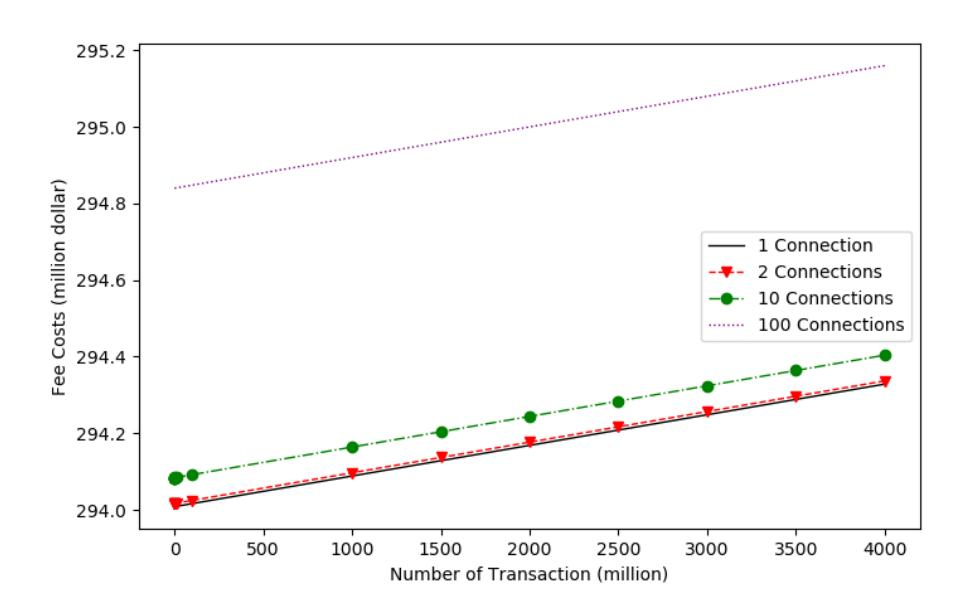

Figure 15: Comparison of State Channel based approaches with adjust the number of connections between adjacent platform nodes

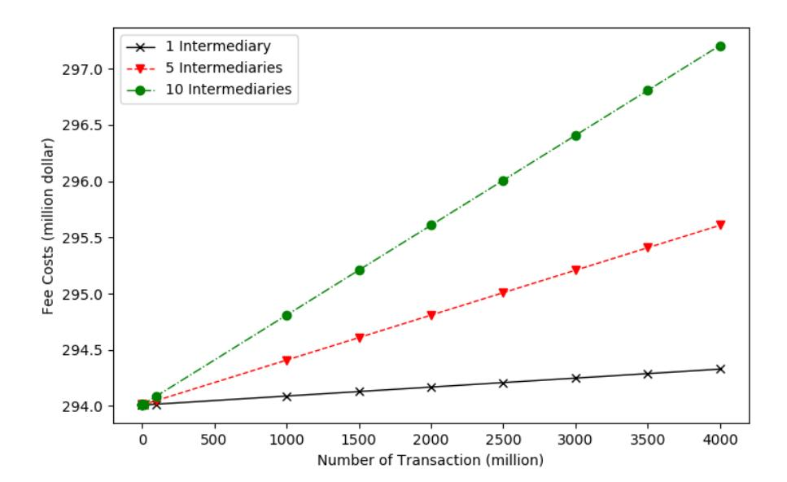

Figure 16: Comparison of State Channel based approaches with different number of intermediaries

required for setting up the Layer2 network. State channel based approaches provide the lowest total fee costs compared with sidechain based approaches and directly generating on-chain transactions with merchants or platforms. The merchant or platform can manage a number of nodes to provide payment services. However, the connection rules among these nodes will affect the total costs. The more payment channels are established with other platform nodes, the more on-chain transactions will be generated and thus, cost will be higher. From our results, 1 channel or 2 channels between each platform node provide the lowest cost. However, using 1 payment channel may be equivalent to using a star topology. If the central node crashes in a star topology, the whole system will be affected. Therefore, 2 payment channels and 1 intermediate hop should be a good compromise connection for a platform-node topology because it provides some resilience with a low cost.

## 4.2 Funds Capacity

In State Channel based approaches, intermediaries have to lock an amount of funds equal to the transaction value that will flow through the node. In Sidechain based approaches, if there are 

{21}------------------------------------------------

platform nodes in the topology, they are similar to agents which are used to receive payments from customers and send them to merchants. Platform nodes do not need to lock funds like State Channel based approaches. Therefore, we only discuss State Channel based approaches in this section. In State Channel based payments, 'funds capacity' is the amount of funds that must be locked by intermediaries, such as e-commerce platforms, to support transactions from customers to merchants. In previous sections, we have already discussed a Single Platform Topology. In this section, we will discuss how the structure of these intermediaries may affect the funds capacity of the e-commerce platform.

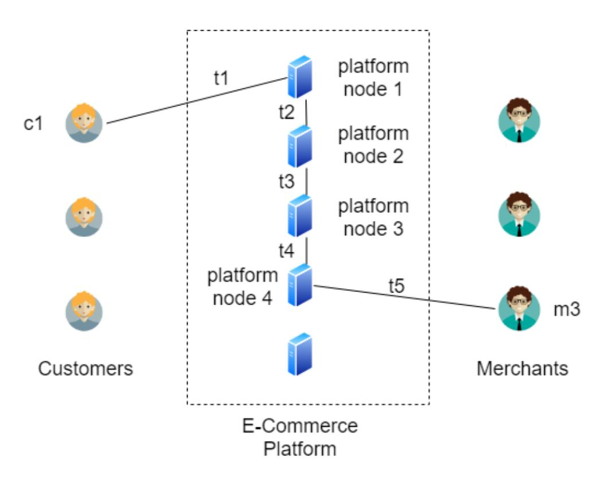

Figure 17: A Payment via multiple Intermediaries (In this figure, PT=t1+t2+t3+t4+t5)

Figure 17 shows a payment process traversing several platform nodes en route to a merchant. In this section, we will discuss something different from the previous sections and with different variables definition. In State Channel based approaches, we assume it takes time T = {t1, t2, t3, ...} to transfer funds from a customer to a merchant using a payment channel network. The total number of transactions generated during this period is T T. The set of payment values is V = {v1, v2, v3, ...}. Each payment will pass through different routes which have different number of intermediaries. The number of intermediaries is I = {i1, i2, i3, ...}. Figure 18 shows an example where two payments v1 = 5 and v2 = 10 are sent from the customer c1 to the merchant m1 via two different routes. In order to support these payments, intermediate nodes have to lock the same amount of funds. For the Route 1, 15 coins need to be locked by the e-commerce platform. For the Route 2, 20 coins need to be locked by the platform. These locked funds cannot be reused until c1 successfully release these payments via Hashed TimeLock Contracts (HTLCs).

Therefore, if each intermediary locks the same amount of funds, the funds capacity F C that needs to be locked in the platform for the time P T = P|T| i=1 ti is

$$FC = \sum_{i=1}^{TT} v_i \times I_i \tag{4}$$

If we attempt to calculate the amount of transactions that the network can carry over a period of time, we define this period is P P and the amount of value is L. Then L is

{22}------------------------------------------------

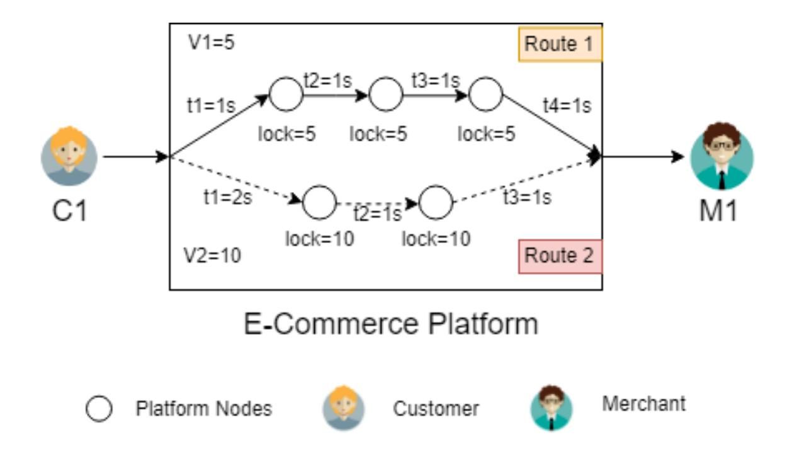

Figure 18: Payments Transferring via Different Routes (upper solid line is Route 1 which via three intermediaries,  $i_1 = 3$ , the process time is t1 + t2 + t3 + t4 = 4s; lower dot line is Route 2 which via two intermediaries,  $i_2 = 2$ , the process time is t1 + t2 + t3 = 4s)

$$L = \begin{cases} \sum_{i=1}^{TT} v_i, & \frac{PP}{PT} \le 1\\ \lceil \frac{PP}{PT} \rceil \sum_{i=1}^{TT} v_i, & \frac{PP}{PT} > 1 \end{cases}$$
 (5)

After PT, the funds locked by intermediaries can be reused. In Formula 6, if the  $\frac{PP}{PT} \leq 1$ , this means intermediate nodes have not unlocked funds from their neighbors yet during the period PP. Therefore, these funds cannot be used for other payments. If  $\frac{PP}{PT} > 1$ , it means funds have been unlocked and another amount of value  $\sum_{i=1}^{TT} v_i$  can be transferred through these nodes.

#### 4.2.1 Analysis

Table 5 shows sales volume of Alibaba on Singles' Day in 24 hours from 2016 to 2019[68][69][70].

Table 5: Alibaba Singles' Day Sales Volume

| Year      | 2016       | 2017         | 2018         | 2019         |
|-----------|------------|--------------|--------------|--------------|
| Sales(\$) | 20 billion | 25.3 billion | 30.8 billion | 38.4 billion |

In 2019, the sales volume L=38.4billion. We assume PP=86400s (a day) and time for transferring payment in each channels is equal to t. If t=1s with 1 intermediary, we know PT=2s and the funds capacity FC is \$888,889. If we set t=1500s and still 1 intermediary, PT=3000s and funds capacity FC is 1.3 billion dollars. If t=1s and 5 intermediate hops, PT=6s and funds capacity FC is \$13.3 million. Therefore, with the same number of intermediaries, a longer transfer time requires more funds capacity to support the same sales volume. With the same transfer time period, more intermediate hops require more funds capacity.

From the previous sections, we find the main contribution of Layer2 technology is to reduce the number of transactions generated on the blockchain. However, due to initial cost of Layer2 approaches, only when the number of off-chain transactions is more than the initial number of 

{23}------------------------------------------------

on-chain transactions for setting up Layer2, Layer2 approaches can significantly save transaction fees. Due to no transaction fee on Plasma chain currently, if customers and merchants are already in Lightning Network or Plasma chain, the latter one could provide lower fee costs. With the same Layer2 transaction fees, State Channel based approaches provide lower fee costs than Sidechain based approaches in the e-commerce scenario because there is no initial cost for merchants and only customers need to generate opening channel transactions on the blockchain. However, in Sidechain based approaches, both customers and merchants have to generate locking and unlocking funds transactions on the blockchain.

The e-commerce platform can organize a number of nodes to balance the traffic. Customers and merchants can connect to one or two of them and these nodes connect with each other. It ensures every customer can transfer payments even merchants do not connect with the same platform node with him. The fewer payment channels among platform nodes and the fewer intermediaries passed through, the lower total fee costs.

We also find the funds capacity in State Channel based approaches depends on the processing time for a transaction to complete and the number of intermediaries. The longer the process time of a transaction or the more intermediaries, the more funds capacity need to be locked in the network.

## 4.3 Time to Construct the Network

In using layer 2 payment systems, there is an up-front cost in the transaction fees that are required to construct the payment network. Once this network is established and these substantial costs incurred, subsequent transactions can be carried out cheaply and efficiently.

Besides the total fee costs we discussed previously, a second consideration is the time that will elapse while the network is being set up. Each customer and merchant must engage in on-chain transactions to establish their channels with intermediaries and there are a very large number of these. We have calculated that for a scenario in which there are 6 million merchants and 700 million customers that the required number of on-chain transactions for opening channels in State Channel based approaches is 700 million, for joining a sidechain in Sidechain based approaches is 706 million.

Performing these transactions on today's public blockchains will take many hundreds of days. For example, if we use Ethereum's transaction rate of 20 Tps, it will require all of the blockchain's capacity for 405 hundred days to establish the network. Incremental improvements in Ethereum's performance can make a huge difference to the feasibility of this though. The 2020 release of Ethereum, referred to as the Istanbul hard-fork[71], claims to be able to achieve 3,000 Tps and this would shrink this time to 2.7 days.

It is also unlikely that the system would be employed in a big-bang fashion. More likely it would see test deployments with a gradual building of capacity such that it would be capable of handling traffic peaks like Singles Day a year or more after initial deployments. We can see that although this setup traffic would strain the capacity of today's blockchain capacity it is still in the realms of feasibility.

## 5 Conclusion

In this article, we find blockchain Layer2 technology is feasible for mass e-commerce. Blockchain Layer2 technology is considered as a revolution which has the potential to change the e-commerce 

{24}------------------------------------------------

industry. It aims to provide secure, automatic and trustworthy payments with fewer transaction fees than blockchain transactions or traditional payment systems, like credit cards. The main features of e-commerce are high transaction frequency, small average payment amount, a great number of products and diverse trading entities. In the network configurations that we have explored, Layer2 technology can support thousands of times the transaction volumes that can be achieved with using Layer1 blockchain transactions alone. This corresponds to hundreds of times the transaction rates that are currently being achieved with credit cards in today's ecommerce environment. With Layer2 approaches, customers can send micro and instant transactions directly to merchants without transaction fees or only with a small fee of less than 1 cent. If customers, merchants or e-commerce platforms successfully set up Layer2 network, customers can send micro and instant transactions to merchants without Layer2 transaction fees or only with a small fee of less than 1 cent. In addition, when a new customer or merchant joins to the Layer2 network, he only needs to connect to a node and use the existing topology to send or receive payments. It is scalable and suitable for mass e-commerce scenarios which involve a great number of entities. Moreover, there are no issues of funds capacity required in Sidechain based Layer2 approaches. If we use State Channel based Layer2 approaches, with few intermediaries and a short delay, the e-commerce platform does not need to lock up a very large amount of funds. After analyzing the time cost, applying Layer2 technology to e-commerce industry is also feasible.

## References

- [1] Austan D. Goolsbee and Peter J. Klenow. Internet rising, prices falling: Measuring inflation in a world of e-commerce. Nber working papers, National Bureau of Economic Research, Inc, May 2018.
- [2] ELI MEIXLER. How singles day grew to be the world's biggest shopping event, 2018. https://time.com/5445756/singles-day-vs-black-friday/.
- [3] Susan Herbst-Murphy. Clearing and settlement of interbank card transactions: A mastercard tutorial for federal reserve payments analysts, October 2013.
- [4] Warut Khern-am nuai, Hossein Ghasemkhani, and Karthik Natarajan Kannan. The impact of online qas on product sales: The case of amazon answer. SSRN, 2017. Available at SSRN: https://ssrn.com/abstract=2794149 or http://dx.doi.org/10.2139/ssrn.2794149.
- [5] Amazon. Amazon pay fees, 2012. https://pay.amazon.com/us/help/201212280.
- [6] Satoshi Nakamoto. Bitcoin: A peer-to-peer electronic cash system, 2008. http://bitcoin.org/bitcoin.pdf.
- [7] Vitalik Buterin. Ethereum white paper, 2013. https://github.com/ethereum/wiki/wiki/White-Paper.
- [8] Visa Inc. Visa annual report 2018, 2018. https://s1.q4cdn.com/050606653/files/doc financials/annual/2018/Visa-2018-Annual-Report-FINAL.pdf.
- [9] Jeff Garzik. Block size increase to 2mb, 2015. https://github.com/bitcoin/bips/blob/master/bip-0102.mediawiki.

{25}------------------------------------------------

- [10] Etherscan. Ethereum transaction history:charts stats, 2019. https://etherscan.io/chart.
- [11] Boohyung Lee and Jong-Hyouk Lee. Blockchain-based secure firmware update for embedded devices in an internet of things environment. The Journal of Supercomputing, 73(3):1152--1167, Mar 2017.
- [12] Arvind Narayanan, Joseph Bonneau, Edward Felten, Andrew Miller, and Steven Goldfeder. Bitcoin and cryptocurrency technologies: A comprehensive introduction. 2016.
- [13] Stefano Bistarelli, Ivan Mercanti, and Francesco Santini. An analysis of non-standard transactions. Frontiers in Blockchain, 2:7, 2019.
- [14] Nick Szabo. Formalizing and securing relationships on public networks. First Monday, 2(9), 1997.
- [15] C. Liu, Y. Xiao, V. Javangula, Q. Hu, S. Wang, and X. Cheng. Normachain: A blockchainbased normalized autonomous transaction settlement system for iot-based e-commerce. IEEE Internet of Things Journal, pages 1–1, 2018.

[16]

- [17] Y. Li, S. Xue, X. Liang, and X. Zhu. I2i: A balanced ecommerce model with creditworthiness cloud. In 2017 IEEE 14th International Conference on e-Business Engineering (ICEBE), pages 150–158, November 2017.
- [18] B. Li and Y. Wang. Rzkpb: A privacy-preserving blockchain-based fair transaction method for sharing economy. In 2018 17th IEEE International Conference On Trust, Security And Privacy In Computing And Communications/ 12th IEEE International Conference On Big Data Science And Engineering (TrustCom/BigDataSE), pages 1164–1169, August 2018.
- [19] X. Min, Q. Li, L. Liu, and L. Cui. A permissioned blockchain framework for supporting instant transaction and dynamic block size. In 2016 IEEE Trustcom/ BigDataSE/ ISPA, pages 90–96, August 2016.
- [20] TradeBlock. Bitcoin network capacity analysis, 2015. https://tradeblock.com/blog/bitcoinnetwork-capacity-analysis-part-1-macro-block-trends.
- [21] Kyle Croman, Christian Decker, Ittay Eyal, Adem Efe Gencer, Ari Juels, Ahmed Kosba, Andrew Miller, Prateek Saxena, Elaine Shi, Emin G¨un Sirer, Dawn Song, and Roger Wattenhofer. On scaling decentralized blockchains. In Jeremy Clark, Sarah Meiklejohn, Peter Y.A. Ryan, Dan Wallach, Michael Brenner, and Kurt Rohloff, editors, Financial Cryptography and Data Security, pages 106–125, Berlin, Heidelberg, 2016. Springer Berlin Heidelberg.
- [22] J. Bonneau, A. Miller, J. Clark, A. Narayanan, J. A. Kroll, and E. W. Felten. Sok: Research perspectives and challenges for bitcoin and cryptocurrencies. In 2015 IEEE Symposium on Security and Privacy, pages 104–121, May 2015.
- [23] Arthur Gervais, Ghassan O. Karame, Karl W¨ust, Vasileios Glykantzis, Hubert Ritzdorf, and Srdjan Capkun. On the security and performance of proof of work blockchains. In Proceedings of the 2016 ACM SIGSAC Conference on Computer and Communications Security, CCS '16, pages 3–16, New York, NY, USA, 2016. ACM.

{26}------------------------------------------------

- [24] Ittay Eyal, Adem Efe Gencer, Emin G¨un Sirer, and Robbert Van Renesse. Bitcoin-ng: A scalable blockchain protocol. In Proceedings of the 13th Usenix Conference on Networked Systems Design and Implementation, NSDI'16, pages 45–59, Berkeley, CA, USA, 2016. USENIX Association.
- [25] Loi Luu, Viswesh Narayanan, Chaodong Zheng, Kunal Baweja, Seth Gilbert, and Prateek Saxena. A secure sharding protocol for open blockchains. In Proceedings of the 2016 ACM SIGSAC Conference on Computer and Communications Security, CCS '16, pages 17–30, New York, NY, USA, 2016. ACM.
- [26] Gavin Andresen. Increase maximum block size. Bitcoin BIPs, 2015. https://github.com/bitcoin/bips/blob/master/bip0101.mediawiki.
- [27] Aaron van Wirdum. Now the segwit2x hard fork has really failed to activate, 2017. https://bitcoinmagazine.com/articles/nowsegwit2xhardforkhasreallyfailedactivate/.
- [28] BitcoinJ. Working with micropayment channels, 2013.
- [29] Joseph Poon and Thaddeus Dryja. The bitcoin lightning network: Scalable off-chain instant payments, 2016. https://lightning.network/lightning-network-paper.pdf.
- [30] Rusty R. Christian D. eltoo: A simple layer2 protocol for bitcoin, 2017. https://blockstream.com/eltoo.pdf.
- [31] Raiden. Raiden specification, 2016. http://raidennetwork.readthedocs.io/en/stable/spec.html.
- [32] Ethereum. A quick classification of µraiden, 2016. https://microraiden.readthedocs.io/en/docs-develop/introduction/introduction.html.
- [33] Andrew Miller, Iddo Bentov, Ranjit Kumaresan, and Patrick McCorry. Sprites: Payment channels that go faster than lightning. CoRR, abs/1702.05812, 2017.
- [34] Rami Khalil and Arthur Gervais. Revive: Rebalancing off-blockchain payment networks. In Proceedings of the 2017 ACM SIGSAC Conference on Computer and Communications Security, CCS '17, pages 439–453, New York, NY, USA, 2017. ACM.
- [35] C. Lin, M. Ma, X. Wang, Z. Liu, J. Chen, and S. Ji. Rapido: A Layer2 Payment System for Decentralized Currencies. ArXiv e-prints, August 2018.
- [36] Christian Decker and Roger Wattenhofer. A fast and scalable payment network with bitcoin duplex micropayment channels. In Andrzej Pelc and Alexander A. Schwarzmann, editors, Stabilization, Safety, and Security of Distributed Systems, pages 3–18, Cham, 2015. Springer International Publishing.
- [37] Wattenhofer R. Burchert C., Decker C. Scalable funding of bitcoin micropayment channel networks. 19th International Symposium on Stabilization, Safety, and Security of Distributed Systems (SSS), 2017.
- [38] Connext. Cheaper, fairer payments, 2018. https://connext.network/.

{27}------------------------------------------------

- [39] Counterfactual. State machines, 2018. https://specs.counterfactual.com/02statemachines.
- [40] Funfair. Blockchain solutions for gaming, 2018. https://funfair.io/wpcontent/uploads/FunFair-Commercial-White-Paper-v2-draft.pdf.
- [41] Ameen Soleimani and William Bentley de Vogelaere. Spankchain: A cryptoeconomic powered adult entertainment ecosystem built on the ethereum network, 2017. https://spankchain.com/static/SpankChain%20Whitepaper%20(EN).pdf.
- [42] Tom Close. Introducing the force-move games framework for state channels, 2018. https://medium.com/statechannels/introducingtheforcemovegamesframeworkforstatechannelsb32dd953c13f.
- [43] M. Guo, J. Peng, J. Zhao, J. Quan, L. Wu, and T. Ye. Game analysis on sales return involving b2c e-commerce seller, buyer and platform. In 2018 2nd International Conference on Data Science and Business Analytics (ICDSBA), pages 488–494, Sep. 2018.
- [44] Luke Dashjr Mark Friedenbach Gregory Maxwell Andrew Miller Andrew Poelstra Jorge Tim´on Adam Back, Matt Corallo and Pieter Wuille. Enabling blockchain innovations with pegged sidechains, 2014. http://www.bubifans.com/ueditor/php/upload/file/20181015/1539599182599463.pdf.
- [45] Sergio Demian Lerner. Rsk-bitcoin powered smart contracts whitepaper overview, 2019. https://www.rsk.co/wp-content/uploads/2019/02/RSK-White-Paper-Updated.pdf.
- [46] Rootstock. Smart bitcoin(rbtc), 2019. https://www.rsk.co/smart-bitcoin-rbtc/.
- [47] RSK Labs. Roadmap, 2019. https://www.rsk.co/development-roadmap.
- [48] Joseph Poon and Vitalik Buterin. Plasma: Scalable autonomous smart contracts, 2017. https://plasma.io/plasma.pdf.
- [49] Vitalik Buterin. Minimal viable plasma, 2017. https://ethresear.ch/t/minimal-viableplasma/426.
- [50] Georgios Konstantopoulos. Plasma cash: Towards more efficient plasma constructions, 2018. https://github.com/loomnetwork/plasmapaper/blob/master/plasma cash.pdf.
- [51] Kelvin Fichter Ben Jones. More viable plasma, 2018. https://ethresear.ch/t/more-viableplasma/2160.
- [52] Josojo. Plasma snapp fully verified plasma chain. Ethereum Research, 2018. https://ethresear.ch/t/plasma-snapp-fully-verified-plasma-chain/3391.
- [53] Dan Robinson. Plasma debit: Arbitrary-denomination payments in plasma cash. Ethereum Research, 2018. https://ethresear.ch/t/plasma-debit-arbitrary-denomination-payments-inplasma-cash/2198.
- [54] Andras Kristof. Plasma bridge connecting two layer 1 blockchains with a plasma chain. Medium, 2018. https://medium.com/akomba/plasma-bridge-48122c554e38.

{28}------------------------------------------------

- [55] OmiseGO Team Joseph Poon. Omisego: Decentralized exchange and payments platform, 2017. https://cdn.omise.co/omg/whitepaper.pdf.
- [56] Matthew Campbell and Georgios Konstantopoulos. Plasma cash initial release plasmabacked nfts now available on loom network sidechains, 2018. https://medium.com/loomnetwork/plasma-cash-initial-release-plasma-backed-nfts-now-available-on-loom-networksidechains-37976d0cfccd.
- [57] Johnny Dilley, Andrew Poelstra, Jonathan Wilkins, Marta Piekarska, Ben Gorlick, and Mark Friedenbach. Strong federations: An interoperable blockchain solution to centralized third party risks. CoRR, abs/1612.05491, 2016.
- [58] Blockstream. Rethinking trust, 2014. https://blockstream.com/.
- [59] Vadim Arasev. Poa network whitepaper, 2018. https://github.com/poanetwork/wiki/wiki/POA-Network-Whitepaper.
- [60] Agne Blazyte. Alibaba: cumulative active online buyers q3 2014-q3 2019, 2019. https://www.statista.com/statistics/226927/alibaba-cumulative-active-online-buyers-taobaotmall/.
- [61] Craig Smith. 30 amazing taobao statistics and facts (2019), 2019. https://expandedramblings.com/index.php/taobao-statistics/.
- [62] CoinTelegraph. What is lightning network and how it works, 2019. https://cointelegraph.com/lightning-network-101/what-is-lightning-network-and-how-itworks.
- [63] BITCOINIST. Bankex plasma protocol reports 22k transactions per second, 2018. https://bitcoinist.com/bankex-plasma-protocol-reports-22k-transactions-per-second/.
- [64] Kelvin Fichter. Implement a fee structure, 2018. https://github.com/omisego/plasmamvp/issues/54.
- [65] Kelvin Fichter. Plasma mvp client, 2018. https://github.com/omisego/plasmamvp/blob/ebe6a4e7f6f7cb3685806d9ce3fba6a8ac003fe4/plasma/client/client.py.
- [66] Nicole Jao. Cainiao delivers the first 100 million singles' day parcels in 2.6 days, 2018. https://technode.com/2018/11/14/cainiao-singles-day/.
- [67] 1ML.com. Node: Lightningpowerusers.com, 2019. https://1ml.com/node/0331f80652fb840239df8dc99205792bba2e559a05469915804c08420230e23c7c.
- [68] Cheang Ming. Singles' day: Alibaba smashes records at world's largest online shopping event, 2016. https://www.cnbc.com/2016/11/11/singles-day-news-alibaba-poised-to-smash-recordsat-worlds-largest-online-shopping-event.html.
- [69] Arjun Kharpal. Alibaba sets new singles day record with more than \$30.8 billion in sales in 24 hours, 2018. https://www.cnbc.com/2018/11/11/alibaba-singles-day-2018-record-sales-onlargest-shopping-event-day.html.

{29}------------------------------------------------

- [70] CIW Team. Double 11 festival statistics 2019; alibaba tmall one day sales us\$38 billion, 2019. https://www.chinainternetwatch.com/29999/double-11-2019/.
- [71] Miko Matsumura. Ethereum istanbul faster, but still not the world computer, 2019. https://cointelegraph.com/news/ethereum-istanbul-faster-but-still-not-the-world-computer.