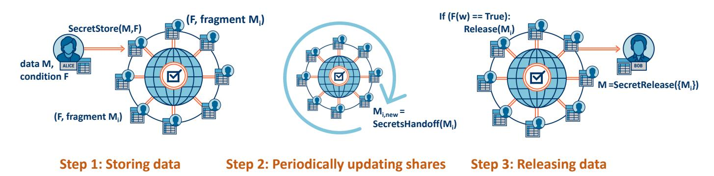
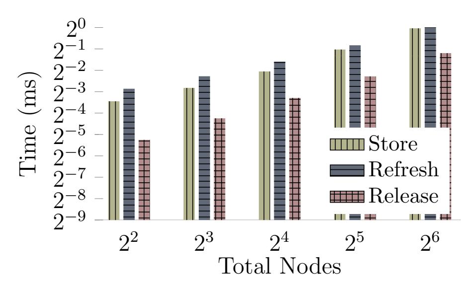
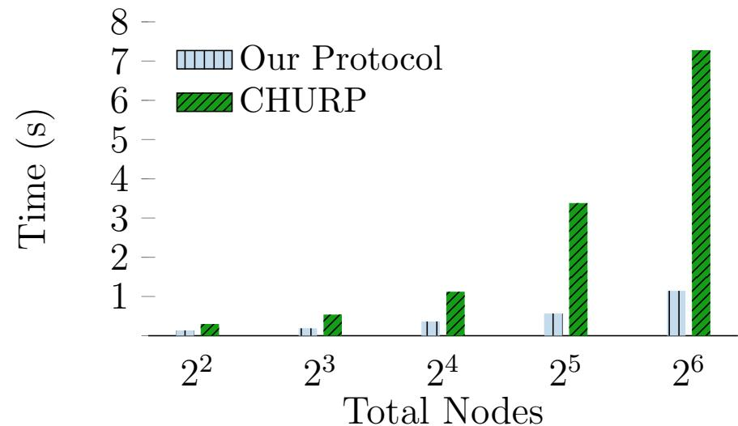

{0}------------------------------------------------

# Storing and Retrieving Secrets on a Blockchain

Vipul Goyal Abhiram Kothapalli Elisaweta Masserova Bryan Parno Yifan Song Carnegie Mellon University

June 18, 2020

#### Abstract

Multiple protocols implementing exciting blockchain-based cryptographic functionalities (e.g., time-lock encryption, one-time programs, and fair multi-party computation) assume the existence of a cryptographic primitive called extractable witness encryption. Unfortunately, there are no known efficient constructions (or even constructions based on any well-studied assumptions) of extractable witness encryption. In this work, we propose a protocol that uses a blockchain to provide a functionality that is effectively the same as extractable witness encryption. Hence, by making small adjustments to existing blockchains, we can easily implement applications that rely on extractable witness encryption. This includes both new applications, and those that previously existed only as theoretical designs. As a key building block, our protocol uses a new and highly efficient batched dynamic proactive secret sharing (DPSS) scheme which may be of independent interest. We provide a proof-of-concept implementation of our protocol.

# 1 Introduction

In recent years, new blockchain-based cryptographic constructions have (theoretically) enabled exciting applications thought to be impossible to achieve in the standard model. For example, Liu et al. [\[LJKW18\]](#page-58-0) propose a time-lock encryption scheme that allows one to encrypt a message such that it can only be decrypted once a certain deadline has passed, without relying on trusted third parties or imposing high computational overhead on the receiver. The construction of Choudhuri et al. [\[CGJ](#page-56-0)+17] achieves fairness in multi-party computation against a dishonest majority. Goyal and Goyal [\[GG17\]](#page-57-0) present the first construction for one-time programs (that run only once and then "self-destruct") that does not use tamper-proof hardware.

These exciting constructions have something in common — they all rely on blockchains and the notion of extractable witness encryption. Indeed, the combination of blockchains and witness encryption has proven remarkably powerful. Introduced by Garg et al. [\[GGSW13\]](#page-57-1), a witness encryption scheme is, roughly, a primitive that allows one to encrypt a message with respect to a problem instance. Such a problem instance could be a sudoku puzzle in a newspaper or an allegedly bug-free program, or more generally, any NP search problem. If the decryptor knows a valid witness for the corresponding problem instance, such as a sudoku solution or a bug in the program, she can decrypt the ciphertext. Extractable security is a strong notion of security for witness encryption. If a witness encryption scheme is extractable, then an adversary who is able to learn any non-trivial information about the encrypted message is also able to provide a witness for the corresponding problem instance.

Unfortunately, extractable witness encryption typically relies on a strong (and expensive) form of obfuscation, so-called differing-inputs obfuscation [\[BGI](#page-56-1)+12, [ABG](#page-56-2)+13]. Indeed currently, there 

{1}------------------------------------------------

are no known practical extractable witness encryption schemes. In fact, there exist no constructions based on standard assumptions, and the work of Garg et al. [GGHW14] suggests that it may be impossible to achieve extractable witness encryption when the adversary has access to arbitrary auxiliary inputs.

In this work, however, we use a blockchain to achieve a functionality that is essentially equivalent to extractable witness encryption. Roughly, we allow users to encode a secret along with a release condition. A predefined set of n blockchain users (in the following, miners) jointly and securely store the encoding and release the secret once the release condition is satisfied. We introduce a formal definition for extractable Witness Encryption on Blockchain (eWEB) and a protocol that can augment existing blockchains with this functionality. By making only small changes to the code run by miners, it is now possible to easily implement the many applications that use extractable witness encryption as a building block (see §10). Conveniently, many such constructions [LJKW18, CGJ+17, GG17] already rely on the guarantees provided by a blockchain, so building extractable witness encryption into the blockchain does not change their assumptions. We provide a formal proof of security of our construction, relying on the guarantees provided by the blockchain setting. Specifically, we select a set (or rather, a multiset) of miners such that the majority of the selected miners are honest. As pointed out by Goyal and Goyal [GG17], one way to select such set of miners is by selecting miners who were responsible for mining the last n blocks (where n is large enough). Indeed, a single miner might mine multiple blocks and if so, appears multiple times in the set. For proof of work blockchains such as Bitcoin, the probability of successful mining is proportional to the amount of computational power, and hence if a majority of the computing power is honest, majority of the selected miners can be expected to be honest. For proof of stake blockchains, where the probability of successful mining is proportional to the amount of coins possessed by the miner, this property follows from the assumption that honest miners possess the majority of stake in the system.

| Scheme                   | Dynamic setting | C Adversary | Threshold              | Network | Comm. (amort.) | Comm. (non-amort.) |
|--------------------------|-----------------|------------------------|------------------------|---------|----------------|--------------------|
| Herzberg et al. [HJKY95] | No              | Active                 | t/n < 1/2              | synch.  | $O(n^2)$       | $O(n^2)$           |
| Cachin et al. [CKLS02]   | No              | Active                 | t/n < 1/3              | asynch. | $O(n^4)$       | $O(n^4)$           |
| Desmedt et al. [DJ97]    | Yes             | Passive                | t/n < 1/3              | asynch. | $O(n^2)$       | $O(n^2)$           |
| Wong et al. [WWW02]      | Yes             | Active                 | t/n < 1/2              | synch.  | exp(n)         | exp(n)             |
| Zhou et al. [ZSVR05]     | Yes             | Active                 | t/n < 1/3              | asynch. | exp(n)         | exp(n)             |
| Schultz-MPSS [SLL08]     | Yes             | Active                 | t/n < 1/3              | asynch. | $O(n^4)$       | $O(n^4)$           |
| Baron et al. [BDLO15]    | Yes             | Active                 | $t/n < 1/2 - \epsilon$ | synch.  | O(1)           | $O(n^3)$           |
| CHURP $[MZW^+19]$        | Yes             | Active                 | t/n < 1/2              | synch.  | $O(n^2)$       | $O(n^2)$           |
| This work                | Yes             | Active                 | t/n < 1/2              | synch.  | O(n)           | $O(n^2)$           |

Figure 1: Comparison of PSS Schemes. The Comm. columns indicate the communication cost per secret in each hand-off round.

To ensure that dishonest miners cannot leak the user's secret, our extractable witness encryption scheme is built on top of a secret sharing scheme. A secret sharing scheme enables one party to distribute shares of a secret to n parties and ensures that an adversary in control of t out of n parties will learn no information about the secret. In our protocol, the miners hold the shares of the secret. Since we assume that the majority of the selected miners are honest, using a threshold of  $t = \frac{n}{2} - 1$  enables us to securely store the secret.

However, traditional secret sharing schemes are insufficient for eWEB, since the set of par-

{2}------------------------------------------------

ties (miners) who hold secret shares is constantly changing. To achieve security in this case, dynamic proactive secret sharing (DPSS) is required ([MZW+19, DJ97, SLL08, BDLO15, ZSVR05, WWW02]). DPSS schemes proactively update the secret shares held by the parties and allow for changing set of parties holding the secrets.

As part of our work, we develop a new and highly optimized batched DPSS scheme. We are specifically interested in the batched setting as there might be thousands of secrets stored in the system at any given time, and we need an efficient way to update all of those secrets in parallel. In contrast to previous work on batched DPSS [BDLO15], which focused on a single client submitting a batch of secrets and does not allow to store and release secrets independently, we allow for multiple different clients dynamically sharing and releasing secrets. Our construction is the most efficient DPSS scheme that allows the highest-possible adversarial threshold of  $\frac{1}{2}$  (Figure 1). We have formally proven secure and implemented this new scheme and believe that it is of independent interest.

Our prototype demonstrates the concrete practicality of our scheme, with all operations completing in seconds (§12). We also outperform a prior state-of-the-art implementation by over  $6\times$ . In summary, we make the following contributions:

- We propose a new cryptographic primitive extractable witness encryption on blockchain (§6).
- We design and formally prove secure a protocol which satisfies the notion of extractable witness encryption on blockchain (§7).
- We present and formally prove secure a highly efficient batched dynamic proactive secret sharing construction (§3).

Organization. We begin by providing an overview of the cryptographic building blocks used in our system (Section 2). Then, in Section 3 we discuss DPSS - the key component in our system. We discuss the DPSS functionality, including adversarial model and definition of security, and provide an overview of our DPSS construction. We then provide the full DPSS construction in Section 4 and its security proof in Section 5. Next, we formally define extractable witness encryption on blockchain (eWEB) in Section 6, including syntax (§6.1), and security definition (§6.2). In Section 7 we provide our eWEB construction, we give its security proof in Section 8. In Section 9 we provide a protocol that is similar to eWEB, but targets a slightly different use case. In Section 10 we discuss various applications that can be implemented using our constructions. We discuss implementation and evaluation of our eWEB construction in Sections 11 and 12. Finally, we discuss related work on dynamic proactive secret sharing and extractable witness encryption in Section 13.

## 2 Preliminaries

In this section, we introduce cryptographic building blocks used in our system.

### 2.1 Encryption schemes

In our protocol, we rely on public key encryption schemes. We use a standard definition of a public key encryption scheme consisting of a key generation algorithm Gen, an encryption algorithm Enc, and a decryption algorithm Dec that satisfy the correctness property. For security purposes, in our scheme we rely on **multi-message IND-CCA security**, defined as follows:

**Definition 2.1.** Multi-message IND-CCA security

{3}------------------------------------------------

An encryption scheme (Gen,Enc, Dec) is said to be IND-CCA secure if any PPT adversary A is successful in the following game with the probability at most 1 2 + negl(n), where negl(·) is a negligible function:

- The challenger generates keys (pk, sk) ← Gen(1n ).
- A receives pk as input.
- The challenger chooses b ← {0, 1} at random.
- A gets a black-box access to Decsk(·).
- In each round i until A wishes to end the game the following happens:
  - A chooses mi .
  - The challenger gives A the challenge ciphertext ci = Encpk(mi) if b = 0, and ci = Encpk(0) otherwise.
  - A's access to Decsk(·) is now restricted A is not allowed to ask for the decryption of ci .
- A outputs b ∗ ∈ {0, 1} and wins if b = b ∗ .

Note that the multi-message IND-CCA security is equivalent to the (single-message) IND-CCA security.

### 2.2 Non-interactive zero-knowledge proofs

Non-interactive zero-knowledge proofs (NIZKs) allow one party (the prover) prove validity of some statement to another party (the verifier), in a way that nothing except for the validity of the statement is revealed and no interaction between the prover and the verifier is needed. More formally, as defined by Groth [\[Gro06\]](#page-57-4):

Let R be an efficiently computable binary relation. For pairs (x, w) ∈ R we call x the statement and w the witness.

A proof system for relation R consists of a key generation algorithm KeyGen, a prover P and a verifier V . The key generation algorithm produces a CRS σ. The prover takes as input (σ, x, w) and produces a proof π. The verifier takes as input (σ, x, π) and outputs 1 if the proof is acceptable and 0 otherwise.

#### Definition 2.2. Proof system

We say (KeyGen, P, V ) is a proof system for R if it satisfies the following properties:

Perfect completeness. For all adversaries A holds:

$$Pr[\sigma \leftarrow KeyGen(1^k); (x, w) \leftarrow \mathcal{A}(\sigma); \pi \leftarrow P(\sigma, x, w) : V(\sigma, x, \pi) = 1 \text{ if } (x, w) \in R] = 1$$

Perfect soundness. For all adversaries A holds:

$$Pr[\sigma \leftarrow KeyGen(1^k); (x,\pi) \leftarrow \mathcal{A}(\sigma) : V(\sigma,x,\pi) = 0 \text{ if } x \notin L] = 1$$

We call (KeyGen, P, V ) a proof of knowledge for R if there exists a polynomial time extractor E = (E1, E2) with the following properties:

For all adversaries A holds:

$$Pr[\sigma \leftarrow KeyGen(1^k) : \mathcal{A}(\sigma) = 1] = Pr[(\sigma, \epsilon) \leftarrow E_1(1^k) : \mathcal{A}(\sigma) = 1], \text{ and}$$
  
 $Pr[(\sigma, \epsilon) \leftarrow E_1(1^k); (x, \pi) \leftarrow \mathcal{A}(\sigma); w \leftarrow E_2(\sigma, \epsilon, x, \pi) : V(\sigma, x, \pi) = 0 \text{ or } (x, w) \in R] = 1$ 

Definition 2.3. NIZK

{4}------------------------------------------------

We call a non-interactive proof system (KeyGen, P, V ) a non-interactive zero-knowledge proof (NIZK) for R if there exists a polynomial time simulator S = (S1, S2), which satisfies the following property:

(Unbounded) computational zero-knowledge. For all PPT adversaries A holds

$$Pr[\sigma \leftarrow KeyGen(1^k) : \mathcal{A}^{P(\sigma, \cdot, \cdot)}(\sigma) = 1] \approx Pr[(\sigma, \tau) \leftarrow S_1(1^k) : \mathcal{A}^{S(\sigma, \tau, \cdot, \cdot)}(\sigma) = 1],$$

where f(k) ≈ g(k) means that there exists a negligible function negl(k) s.t. |f(k)−g(k)| < negl(k)

Finally, in our protocol we require that if after seeing some number of simulated proofs the adversary is able to produce a new valid proof, we are able to extract a witness from this proof. This property is called simulation sound extractability [\[Gro06\]](#page-57-4):

(Unbounded) simulation sound extractability. We say a NIZK proof of knowledge (KeyGen, P, V, S1, S2, E1, E2) is simulation sound extractable, if for all PPT adversaries A holds

$$Pr[(\sigma, \tau, \epsilon) \leftarrow SE_1(1^k); (x, \pi) \leftarrow \mathcal{A}^{S_2(\sigma, \tau, \cdot)}(\sigma, \epsilon); w \leftarrow E_2(\sigma, \epsilon, x, \pi) : (x, \pi) \notin Q \text{ and } (x, w) \notin R \text{ and } V(\sigma, x, \pi) = 1] \approx 0,$$

where SE1 is an algorithm that outputs (σ, τ, ) such that it is identical to S1 when restricted to the first two parts (σ, τ ), and Q is a list of simulation queries and responses (i.e., simulated proofs).

## 2.3 Hash functions

To reduce communication cost of our protocol, we use hash functions. In the following, we formally define a hash function family and the collision-resistance property that we rely on in our construction.

Definition 2.4. Hash function family

A family of functions H = {hi : Di → Ri}i∈I is a hash function family, if the following holds:

Easy to sample. There exists a PPT algorithm Gen outputting i s.t. hi is a random member of H.

Easy to evaluate. There exists a PPT algorithm Eval s.t. for all i ∈ I and x ∈ Di , Eval(i, x) = hi(x).

Compression. For all i ∈ I holds |Ri | < |Di |.

We say a hash function family is a collision resistant hash function (CRHF) if the following condition holds:

Collision-resistance. Foll all PPT A, security parameter k and a negligible function negl(·) holds:

$$Pr[i \leftarrow Gen(k); (x, x') \leftarrow \mathcal{A}(i) : x \neq x' \text{ and } h_i(x) = h_i(x')] \leq negl(k)$$

### 2.4 DPSS Security Definition

A dynamic proactive secret-sharing scheme allows a party to distribute shares of a secret to n parties and periodically update the set of parties holding this secret. It is required to satisfy two properties, robustness and secrecy. At a high-level, robustness requires that it should always be possible to recover the secret. Secrecy requires that an adversary should not learn any further information about the secret beyond what has been learned before running the protocol.

Robustness. For any PPT adversary A with corruption threshold t it holds that after each setup phase, there exists a fixed secret s ? for each sharing distributed during this phase. If the setup phase was executed by an honest client, this secret is the same as the one chosen by this client. 

{5}------------------------------------------------

When at some point an honest client asks for a reconstruction of this secret, the client receives the correct secret s ? .

Secrecy. For any PPT adversary A with corruption threshold t, there exists a simulator S with access to our security model Idealsafe (described in [Ideal Secrecy\)](#page-5-0), such that the view of A interacting with S is computationally indistinguishable from the view in the real execution.

### Ideal Secrecy: Idealsafe

- 1. Idealsafe receives the secrets from the clients in the setup phase.
- 2. When an honest client asks for the reconstruction of some specific secret s ? , Idealsafe sends s ? to that client.

Definition 2.5. A dynamic proactive secret-sharing scheme is secure if for any PPT adversary A and threshold t, it satisfies both robustness and secrecy.

## 2.5 Shamir Secret Sharing

As a part of our DPSS construction, we use the standard Shamir secret sharing scheme [\[Sha79\]](#page-58-6).

For a finite field F, a degree-d Shamir sharing of w ∈ F is a vector (w1, . . . , wn) which satisfies that there exists a polynomial f(·) ∈ F[X] of degree at most d such that f(0) = w and f(i) = wi for i ∈ {1, . . . , n}. Each party Pi holds a share wi and the whole sharing is denoted as [w]d.

### 2.6 Polynomial Commitment Schemes

In essence, a degree-d Shamir sharing is a degree-d polynomial. In our DPSS construction we will use polynomial commitment schemes to transform a plain Shamir sharing to a verifiable secret sharing. The following definition of polynomial commitment scheme was given by Kate et al. [\[KZG10\]](#page-58-7). For simplicity, we only focus on perfectly hiding commitment schemes.

#### Definition.

A polynomial commitment scheme contains the following 6 algorithms.

- Setup(1κ , t): It generates a pair of public-private keys (PK, SK) to commit a polynomial of degree at most t in F. SK is not required in the rest of the scheme.
- Commit(PK, f(·)): It outputs a commitment Com to the polynomial f(·) and some associated decommitment information d.
- Open(PK, Com, f(·), d): It outputs the polynomial f(·) used to create the commitment Com, with decommitment information d.
- VerifyPoly(PK, Com, f(·), d): It verifies the correctness of the opening. If the opening is correct, it outputs 1. Otherwise, it outputs 0.
- CreateWitness(PK, f(·), i, d): It outputs (i, f(i), wi) where wi is a witness to check the correctness of f(i).
- VerifyEval(PK, Com, i, f(i), wi): It verifies the correctness of the evaluation of f(i). If the evaluation is correct, it outputs 1. Otherwise, it outputs 0.

Definition 2.6 ([\[KZG10\]](#page-58-7)). We say (Setup, Commit, Open, VerifyPoly, CreateWitness, VerifyEval) is a secure polynomial commitment scheme if it satisfies the following properties.

{6}------------------------------------------------

Correctness. For all  $f(\cdot) \in \mathbb{F}[X]$ , let  $PK \leftarrow \mathsf{Setup}(1^{\kappa}, t)$  and  $\mathcal{C}om \leftarrow \mathsf{Commit}(PK, f(\cdot))$ .

- The output of  $\mathsf{Open}(\mathsf{PK}, \mathcal{C}om, f(\cdot), d)$  is successfully verified by  $\mathsf{VerifyPoly}(\mathsf{PK}, \mathcal{C}om, f(\cdot), d)$ .
- For all  $(i, f(i), w_i) \leftarrow \mathsf{CreateWitness}(\mathsf{PK}, f(\cdot), i, d)$ , it is successfully verified by  $\mathsf{VerifyEval}(\mathsf{PK}, \mathcal{C}om, i, f(i), w_i)$ .

**Polynomial Binding.** There exists a negligible function  $\epsilon(\cdot)$  such that for all adversaries  $\mathcal{A}$ :  $\Pr[PK \leftarrow \mathsf{Setup}(1^{\kappa}, t), (\mathcal{C}om, f(\cdot), f'(\cdot), d, d') \leftarrow \mathcal{A}(PK) :$ 

VerifyPoly(PK, Com,  $f(\cdot)$ , d) = 1 and VerifyPoly(PK, Com,  $f'(\cdot)$ , d') = 1 and  $f \neq f'$ ]  $\leq \epsilon(\kappa)$ .

**Evaluation Binding.** There exists a negligible function  $\epsilon(\cdot)$  such that for all adversaries  $\mathcal{A}$ :

$$\Pr[PK \leftarrow \mathsf{Setup}(1^{\kappa}, t), (\mathcal{C}om, \langle i, f(i), w_i \rangle, \langle i, f'(i), w_i' \rangle) \leftarrow \mathcal{A}(PK) :$$

VerifyEval(PK, 
$$Com, i, f(i), w_i$$
) = 1 and VerifyEval(PK,  $Com, i, f'(i), w'_i$ ) = 1 and  $f(i) \neq f'(i)$ ]  $\leq \epsilon(\kappa)$ .

**Hiding.** Given (PK, Com) and  $\{(i_j, f(i_j), w_{i_j})\}_{j \in [t]}$  for  $f(\cdot) \in \mathbb{F}[X]$  such that  $VerifyEval(PK, Com, i_j, f(i_j), w_{i_j}) = 1$  for all  $j \in [t]$ , no computationally unbounded adversary A has any information about f(k) where  $k \notin \{i_1, \ldots, i_t\}$ .

**KZG Commitment Scheme.** The following commitment scheme was proposed by Kate et al. [KZG10].

- Setup(1 $\kappa$ , t): It generates two groups  $\mathbb{G}$  and  $\mathbb{G}_T$  of prime order p (with  $p \geq 2^{\kappa}$ ) such that there exists a symmetric bilinear pairing  $e : \mathbb{G} \times \mathbb{G} \to \mathbb{G}_T$  where t SDH assumption holds. Then it randomly samples two generators  $g, h \in \mathbb{G}$  and  $\alpha \in [p-1]$ . The secret key SK is  $\alpha$  and the public key PK is  $(\mathbb{G}, \mathbb{G}_T, e, g, g^{\alpha}, g^{\alpha^2}, \dots, g^{\alpha^t}, h, h^{\alpha}, \dots, h^{\alpha^t})$ . The field  $\mathbb{F}$  is set to be  $\mathbb{Z}_p$ .
- Commit(PK,  $f(\cdot)$ ): It chooses a random polynomial  $r(\cdot) \in \mathbb{Z}_p[X]$  of degree t. Then it computes the commitment  $\mathcal{C}om = g^{f(\alpha)}h^{r(\alpha)}$  using PK. Set  $d = r(\cdot)$ .
- Open(PK,  $\mathcal{C}om, f(\cdot), r(\cdot)$ ): It outputs  $f(\cdot), r(\cdot)$ .
- VerifyPoly(PK, Com,  $f(\cdot)$ ,  $r(\cdot)$ ): If the degree of either  $f(\cdot)$  or  $r(\cdot)$  is larger than t, it outputs 0. Otherwise, it computes  $g^{f(\alpha)}h^{r(\alpha)}$  using PK and compares with Com. If the result matches Com, it outputs 1. Otherwise, it outputs 0.
- CreateWitness(PK,  $f(\cdot)$ , i,  $r(\cdot)$ ): It first computes  $f'(x) = \frac{f(x) f(i)}{x i}$  and  $r'(x) = \frac{r(x) r(i)}{x i}$ . Then it computes  $w_i = g^{f'(\alpha)}h^{r'(\alpha)}$  using PK. Finally, output  $(i, f(i), r(i), w_i)$ .
- VerifyEval(PK, Com, i, f(i), r(i),  $w_i$ ): It checks whether  $e(Com, g) = e(w_i, g^{\alpha}/g^i)e(g^{f(i)}h^{r(i)}, g)$ . If true, it outputs 1. Otherwise, it outputs 0.

**Definition 2.7** (t-Strong Diffie-Hellman (t-SDH) Assumption [KZG10]). Let  $\alpha$  be a random element in  $\mathbb{Z}_p^*$ . Given as input a (t+1)-tuple  $\langle g, g^{\alpha}, g^{\alpha^2}, \dots, g^{\alpha^t} \rangle \in \mathbb{G}^{t+1}$ , for every adversary  $\mathcal{A}_{t\text{-SDH}}$ , the probability

$$\Pr[\mathcal{A}_{t\text{-SDH}}(g, g^{\alpha}, g^{\alpha^2}, \dots, g^{\alpha^t}) = \langle c, g^{\frac{1}{\alpha + c}} \rangle]$$

is negligible for any value  $c \in \mathbb{Z}_p \setminus \{-\alpha\}$ .

**Lemma 2.1 ([KZG10]).** The above scheme is a secure polynomial commitment scheme provided the t – SDH assumption holds in  $(e, \mathbb{G}, \mathbb{G}_T)$ .

**Linear Homomorphism of the KZG Commitment Scheme.** In the following, we use  $Com_{\text{KZG}}(f;r)$  to denote the commitment of  $f(\cdot)$  that uses a polynomial  $r(\cdot)$  as randomness. We use  $w_i(f;r)$  to denote the witness associated with the evaluation point i. Concretely,

$$Com_{KZG}(f;r) = g^{f(\alpha)}h^{r(\alpha)}, \ w_i(f;r) = g^{\frac{f(\alpha)-f(i)}{\alpha-i}}h^{\frac{r(\alpha)-r(i)}{\alpha-i}}.$$

{7}------------------------------------------------

It is easy to verify that, for any constants  $c_1, c_2$  and polynomials  $f_1, f_2, r_1, r_2$ ,  $\mathcal{C}om_{\text{KZG}}(c_1f_1 + c_2f_2; c_1r_1 + c_2r_2) = (\mathcal{C}om_{\text{KZG}}(f_1; r_1))^{c_1} \cdot (\mathcal{C}om_{\text{KZG}}(f_2; r_2))^{c_2},$   $w_i(c_1f_1 + c_2f_2; c_1r_1 + c_2r_2) = (w_i(f_1; r_1))^{c_1} \cdot (w_i(f_2; r_2))^{c_2}.$ 

## 2.7 Preparing Random Sharings

In our DPSS construction we rely on the following protocol, proposed by Damgård and Nielsen [DN07], which allows a set of parties to prepare a batch of random sharings. The protocol will utilize a predetermined and fixed Vandermonde matrix of size  $n \times (n-t)$ , which is denoted by  $M^{T}$  (therefore M is a  $(n-t) \times n$  matrix). An important property of a Vandermonde matrix is that any  $(n-t) \times (n-t)$  submatrix of  $M^{T}$  is invertible. Therefore, given the sharings generated by corrupted parties, there is a one-to-one map from the first (n-t) random sharings generated by honest parties to the resulting (n-t) sharings. If the input sharings of the honest parties are uniformly random, the one-to-one mapping ensures that the output sharings are uniformly random as well [DN07]. The description of RAND appears in Protocol 1. The communication complexity of RAND is  $O(n^2)$  field elements.

### Protocol 1 RAND

- 1. Each party  $C_i$  randomly samples a sharing  $[s^{(i)}]_t$  and distributes the shares to other parties.
- 2. All parties locally compute

$$([r^{(1)}]_t, [r^{(2)}]_t, \dots, [r^{(n-t)}]_t)^{\mathrm{T}} = \boldsymbol{M}([s^{(1)}]_t, [s^{(2)}]_t, \dots, [s^{(n)}]_t)^{\mathrm{T}}$$
and output  $[r^{(1)}]_t, [r^{(2)}]_t, \dots, [r^{(n-t)}]_t$ .

**Lemma 2.2 ([DN07]).** For a semi-honest adversary  $A, r^{(1)}, \ldots, r^{(n-t)}$  are uniformly random given the views of A.

#### 2.8 Generating Challenge

In the DPSS scheme we use the following protocol Challenge, proposed by Ben-Sasson et al. [BSFO12], to let all parties generate an element in  $\mathbb{F}$  with high min-entropy. The cost of Challenge is  $O(\kappa)$  on-chain communication.

#### Protocol 2 CHALLENGE

- 1. Each party  $P_i$  chooses a random string  $\operatorname{str}_i \in \{0,1\}^{\frac{\log |\mathbb{F}|}{n}}$  and publishes  $\operatorname{str}_i$ .
- 2. All parties convert  $(\mathtt{str}_1, \ldots, \mathtt{str}_n)$  into an element  $\lambda$  in  $\mathbb{F}$ .

**Lemma 2.3** ([BSFO12]). For any fixed set of t corrupt parties and for any given subset  $S \in \mathbb{F}$ , the probability that a challenge generated by CHALLENGE lies in S is at most

$$\frac{|\mathcal{S}|}{2^{(n-t)\frac{\log|\mathbb{F}|}{n}}} \leq \frac{|\mathcal{S}|}{2^{\kappa/2}}.$$

{8}------------------------------------------------

# 3 Dynamic Proactive Secret Sharing (DPSS)

We start by discussing dynamic proactive secret sharing, which is the key building block for our eWEB construction. We first informally explain the DPSS process and provide the adversarial model and the definition of its security properties. Then, we give an overview of our protocol. The full construction and its security proof are provided in the Section [4](#page-13-0) and Section [5.](#page-24-0)

## 3.1 DPSS Background

A dynamic proactive secret sharing scheme (DPSS) allows a party to distribute shares of a secret to n parties. The scheme ensures that an adversary in control of some threshold number of parties t will learn no information about the secret. Over the course of running the protocol the set of parties holding the secret is constantly changing, and the adversary might "release" some parties (corresponding to users who regain control of their systems) and corrupt new ones.

A DPSS scheme consists of the following three phases.

Setup. In each setup phase, one or more independent clients secret-share a total of m secrets to a set of n parties, known as a committee, denoted by C = {P1, . . . , Pn}. After each setup phase, each committee member holds one share for each secret s distributed during this phase.

Hand-off. As the protocol runs, the hand-off phase is periodically invoked. In the hand-off phase, the sharing of each secret is passed from the old committee, C, to a new committee, C 0 . This process reflects parties leaving and joining the committee. After the hand-off phase, all parties in the old committee delete their shares, and all parties in the new committee hold a sharing for each secret s. The hand-off phase is particularly challenging, since during the hand-off a total of 2t parties may be corrupted (t parties in the old committee and t parties in the new committee).

Reconstruction. When a client (which need not be one who participated in the setup phase) asks for the reconstruction of a specific secret, that client and all parties in the current committee engage in a reconstruction process to allow the client learn the secret.

### 3.1.1 Adversary Model

We consider a fully malicious adversary A with the power to adaptively choose parties to corrupt at any time. A can corrupt any number of clients distributing secrets and learn the secrets held by the corrupted clients. When a party Pi is corrupted by A, A can arbitrarily control the behavior of Pi and modify the memory state of Pi . Even if A releases its control of Pi , the memory state of Pi may have already been modified; e.g., its share might have been erased.

Note that for a party Pi in both the old committee C and the new committee C 0 , if A has the control of Pi during the hand-off phase, then Pi is considered to be corrupted in both committees. If A releases its control before the hand-off phase in which the secret sharing is passed from C to C 0 , then Pi is only considered to be corrupted in the old committee C. Similarly, if A only corrupts Pi after the hand-off phase, Pi is only considered to be corrupted in the new committee C 0 .

In this paper, we focus on computationally bounded adversaries. For each committee C with a threshold t < |C|/2, A can corrupt at most t parties in C.

For simplicity, in the following, we assume that there exist secure point-to-point channels between the parties and the corruption threshold is a fixed value t. Our construction can be easily adapted to allow different thresholds for different committees (see Section [4.5](#page-23-0) for details).

{9}------------------------------------------------

#### 3.1.2 DPSS Security Definition

A dynamic proactive secret-sharing scheme is required to satisfy two properties, robustness and secrecy. At a high-level, robustness requires that it should always be possible to recover the secret. Secrecy requires that an adversary should not learn any further information about the secret beyond what has been learned before running the protocol. Our formal definition (see Section 2.4) is similar to the one used by Baron et al. [BDLO15], but in contrast to their work, we consider not only the scenario of one client submitting secrets, but many different clients submitting (and requesting the release of) secrets independently at different points in time.

#### 3.2 Overview: Our DPSS Construction

We now provide an overview of our batched DPSS construction. We first discuss the hand-off phase of our construction in the semi-honest case ( $\S 3.2.1$ ) and then explain how it can be modified when the adversary is fully malicious ( $\S 3.2.2$ ). Next, we present the setup phase ( $\S 3.2.3$ ) as a special case of our hand-off phase, summarize our reconstruction phase ( $\S 3.2.4$ ), and provide intuition for our construction's security proof ( $\S 3.2.5$ ).

In the following, we assume the corruption threshold for each committee is fixed to t. The construction is based on Shamir Secret Sharing Scheme [Sha79]. We use  $[x]_d$  to denote a degree-d sharing, i.e., (d+1)-out-of-n Shamir sharing. It requires at least d+1 shares to reconstruct the secret and any d or fewer shares do not leak any information about the secret. Note that Shamir Secret Sharing is additively homomorphic.

#### 3.2.1 Skeleton of Our Construction: Semi-honest Case

We first explain the high-level idea of our protocol in the semi-honest setting; i.e., all parties honestly follow the protocol. The crux of our construction is that both the old and the new committee hold a sharing of a random value. While the *sharing* is different for the two committees, the *value* this sharing corresponds to is the same. Let  $([r]_t, [\tilde{r}]_t)$  denote these two sharings, where  $[r]_t$  is held by the old committee, and  $r = \tilde{r}$ . Suppose the secret sharing we want to refresh is  $[s]_t$ , held by the old committee. Then the old committee will compute the sharing  $[s+r]_t = [s]_t + [r]_t$  and reconstruct the secret s+r. Since r is a uniform element, s+r does not leak any information about s. Now, the new committee can compute  $[\tilde{s}]_t = (s+r) - [\tilde{r}]_t$ . Since  $\tilde{r} = r$ , we have  $\tilde{s} = s$ . This whole process is split into *preparation* and *refresh* phases:

- In the preparation phase, parties in the new committee prepare two degree-t sharings of the same random value  $r(=\tilde{r})$ , denoted by  $[r]_t$  and  $[\tilde{r}]_t$ . The old committee receives the shares of  $[r]_t$  and the new committee holds the shares of  $[\tilde{r}]_t$ . We refer to these two sharings as a coupled sharing.
- In the refresh phase, the old committee reconstructs the sharing  $[s]_t + [r]_t$  and publishes the result. The new committee sets  $[\tilde{s}]_t = (s+r) [\tilde{r}]_t$ .

We start by explaining the *preparation phase* with the goal of generating a coupled sharing of a random value. In the following, let  $\mathcal{C}$  denote the old committee and  $\mathcal{C}'$  denote the new committee. Intuitively, the new committee can prepare a coupled sharing as follows:

1. Each party  $P'_i \in \mathcal{C}'$  prepares a coupled sharing  $([u^{(i)}]_t, [\tilde{u}^{(i)}]_t)$  of a random value and distributes  $[u^{(i)}]_t$  to the old committee and  $[\tilde{u}^{(i)}]_t$  to the new committee.

{10}------------------------------------------------

2. All parties in the old committee compute  $[r]_t = \sum_{i=1}^n [u^{(i)}]_t$ . All parties in the new committee compute  $[\tilde{r}] = \sum_{i=1}^n [\tilde{u}^{(i)}]_t$ .

Since for each i,  $u^{(i)} = \tilde{u}^{(i)}$ , we have  $r = \tilde{r}$ .

However, this way of preparing coupled sharings is wasteful since at least (n-t) coupled sharings are generated by honest parties, which appear uniformly random to corrupted parties. In order to get (n-t) random coupled sharings instead of just 1, we borrow an idea from Damgård and Nielsen [DN07].

In their work, parties need to prepare a batch of random sharings which will be used in an MPC protocol. All parties first agree on a fixed and public Vandermonde matrix  $\mathbf{M}^{\mathrm{T}}$  of size  $n \times (n-t)$ . An important property of a Vandermonde matrix is that any  $(n-t) \times (n-t)$  submatrix of  $\mathbf{M}^{\mathrm{T}}$  is *invertible*. To prepare a batch of random sharings, each party  $P_i$  generates and distributes a random sharing  $[u^{(i)}]_t$ . Next, all parties compute

$$([r^{(1)}]_t, [r^{(2)}]_t, \dots, [r^{(n-t)}]_t)^{\mathrm{T}} = \boldsymbol{M}([u^{(1)}]_t, [u^{(2)}]_t, \dots, [u^{(n)}]_t)^{\mathrm{T}},$$

and take  $[r^{(1)}]_t, [r^{(2)}]_t, \dots, [r^{(n-t)}]_t$  as output. Since any  $(n-t) \times (n-t)$  submatrix of M is invertible, given the sharings distributed by corrupted parties, there is a one-to-one map from the output sharings to the sharings distributed by honest parties. Since the input sharings of the honest parties are uniformly random, the one-to-one mapping ensures that the output sharings are uniformly random as well [DN07].

Note that any linear combination of a set of coupled sharings is also a valid coupled sharing. Thus, in our protocol, instead of computing  $([r]_t, [\tilde{r}]_t) = \sum_{i=1}^n ([u^{(i)}]_t, [\tilde{u}^{(i)}]_t)$ , parties in the old committee can compute

$$([r^{(1)}]_t, [r^{(2)}]_t, \dots, [r^{(n-t)}]_t)^{\mathrm{T}} = \boldsymbol{M}([u^{(1)}]_t, [u^{(2)}]_t, \dots, [u^{(n)}]_t)^{\mathrm{T}},$$

and parties in the new committee can compute

$$([\tilde{r}^{(1)}]_t, [\tilde{r}^{(2)}]_t, \dots, [\tilde{r}^{(n-t)}]_t)^{\mathrm{T}} = \boldsymbol{M}([\tilde{u}^{(1)}]_t, [\tilde{u}^{(2)}]_t, \dots, [\tilde{u}^{(n)}]_t)^{\mathrm{T}}.$$

Now all parties get (n-t) random coupled sharings. The amortized cost of communication per pair is O(n) elements.

We now describe the refresh phase. For each sharing  $[s]_t$  of a client secret which needs to be refreshed, one random coupled sharing  $([r]_t, [\tilde{r}]_t)$  is consumed. Parties in the old committee first select a special party  $P_{\text{king}}$ . To reconstruct  $[s]_t + [r]_t$ , parties in the old committee locally compute their shares of  $[s]_t + [r]_t$ , and then send the shares to  $P_{\text{king}}$ . Then,  $P_{\text{king}}$  uses these shares to reconstruct s + r and publishes the result. Finally, parties in the new committee can compute  $[\tilde{s}]_t = (s+r) - [\tilde{r}]_t$ .

### 3.2.2 Moving to a Fully-Malicious Setting

When faced with a fully-malicious adversary, three problems arise.

- $\bullet$  During preparation, a corrupted party may distribute an inconsistent degree-t sharing or incorrect coupled sharing.
- During refresh, a corrupted party may provide an incorrect share to  $P_{\text{king}}$ , resulting in a reconstruction failure.
- A malicious  $P_{\text{king}}$  may provide an incorrectly reconstructed value.

{11}------------------------------------------------

We address these problems by checking the correctness of coupled sharings in the preparation phase and relying on polynomial commitments to transform a plain Shamir secret sharing into a verifiable one.

Checking the Correctness of Coupled Sharings. Recall that any linear combination of coupled sharings is also a valid coupled sharing. Thus, to increase efficiency, instead of checking the correctness of *each* coupled sharing, it is possible to check *a random linear combination* of the coupled sharings distributed by each party.

To protect the privacy of the coupled sharing  $([u^{(i)}]_t, [\tilde{u}^{(i)}]_t)$  generated by  $P'_i$ ,  $P'_i$  will generate one additional random coupled sharing as a random mask, which is denoted by  $([\mu^{(i)}]_t, [\tilde{\mu}^{(i)}]_t)$ .

Consider the following two sharings of polynomials of degree-(2n-1):

$$\begin{aligned} [F(X)]_t &= \sum_{i=1}^n ([\mu^{(i)}]_t + [u^{(i)}]_t \cdot X) X^{2(i-1)}, \\ [\tilde{F}(X)]_t &= \sum_{i=1}^n ([\tilde{\mu}^{(i)}]_t + [\tilde{u}^{(i)}]_t \cdot X) X^{2(i-1)}. \end{aligned}$$

If all coupled sharings are correct, then  $([F(\lambda)]_t, [\tilde{F}(\lambda)]_t)$  is also a coupled sharing for any  $\lambda$ . Otherwise, the number of  $\lambda$  such that  $([F(\lambda)]_t, [\tilde{F}(\lambda)]_t)$  is a coupled sharing is bounded by 2n-1. Therefore, it is sufficient to test  $([F(\lambda)]_t, [\tilde{F}(\lambda)]_t)$  at a random evaluation point  $\lambda$ . Note that each individual coupled sharing  $([u^{(i)}]_t, [\tilde{u}^{(i)}]_t)$  is masked by  $([\mu^{(i)}]_t, [\tilde{\mu}^{(i)}]_t)$ . Therefore, revealing  $([F(\lambda)]_t, [\tilde{F}(\lambda)]_t)$  does not leak any information about the individual coupled sharings.

Therefore, all parties first generate a random challenge  $\lambda$  (see Section 2.8). Parties in the old committee compute  $[F(\lambda)]_t$  and publish their shares. Parties in the new committee compute  $[\tilde{F}(\lambda)]_t$  and publish their shares. Finally, all parties check whether  $([F(\lambda)]_t, [\tilde{F}(\lambda)]_t)$  is a valid coupled sharing.

If the check fails, we need to pinpoint the parties who distributed incorrect coupled sharings. Each coupled sharing  $([u^{(i)}]_t, [\tilde{u}^{(i)}]_t)$  is masked by  $([\mu^{(i)}]_t, [\tilde{\mu}^{(i)}]_t)$ . Therefore it is safe to open the whole sharing  $([\mu^{(i)}]_t + [u^{(i)}]_t \cdot \lambda, [\tilde{\mu}^{(i)}]_t + [\tilde{u}^{(i)}]_t \cdot \lambda)$  and check whether it is a valid coupled sharing. For each i, parties in the old committee compute  $[\mu^{(i)}]_t + [u^{(i)}]_t \cdot \lambda$  and publish their shares, and parties in the new committee compute  $[\tilde{\mu}^{(i)}]_t + [\tilde{u}^{(i)}]_t \cdot \lambda$  and publish their shares. This way, we can tell which coupled sharings are inconsistent. This inconsistency in the coupled sharing distributed by some party  $P_i'$  (in the following, dealer) has two possible causes:

- The dealer  $P'_i$  distributed an invalid coupled sharing (either the secrets were not the same or one of the t-sharings was invalid).
- Some corrupted party  $P_j \in C \cup C'$  provided an incorrect share during the verification of the sharing distributed by the dealer  $P'_i$ .

The first case implies that the dealer is a corrupted party. To distinguish the first case from the second, we will rely on polynomial commitments, which can be used to transform a plain Shamir secret sharing into a verifiable one so that an incorrect share (e.g., in case 2) can be identified and rejected by all parties.

**Relying on Polynomial Commitments.** A degree-t Shamir secret sharing corresponds to a degree-t polynomial  $f(\cdot)$  such that: (a) the secret is f(0), and (b) the i-th share is f(i). Thus, each dealer can commit to f by using a polynomial commitment scheme (defined in §2.6) to add verifiability.

A polynomial commitment scheme allows the dealer to open one evaluation of f (which corresponds to one share of the Shamir secret sharing) and the receiver can verify the correctness of this evaluation value. Essentially, whenever a dealer distributes a share it also provides a *witness* which can be used to verify this share. Informally, a polynomial commitment scheme should satisfy two binding properties and one hiding property:

{12}------------------------------------------------

- Polynomial Binding: One commitment cannot be opened to two different polynomials.
- Evaluation Binding: One commitment cannot be opened to two different values at the same evaluation point.
- Hiding: The commitment should not leak any information about the committed polynomial.

We use the polynomial commitment as follows: in the beginning, each dealer first commits to the sharings it generated and opens the shares to corresponding parties. To ensure that each party is satisfied with the shares it received, there is an accusation-and-response phase that proceeds as follows:

- 1. Each party publishes (accuse,  $P'_i$ ) if the share received from  $P'_i$  does not pass the KZG verification algorithm.
- 2. For each accusation made by  $P_j$ ,  $P'_i$  opens the j-th share to all parties, and  $P_j$  uses the new share published by  $P'_i$  if this share passes the verification. Otherwise,  $P'_i$  is regarded as a corrupted party by everyone else.

Note that an honest party will never accuse another honest party. Additionally, if a malicious party accuses an honest party, no more information is revealed to the adversary than what the adversary knew already. Therefore it is safe to reveal the share sent from  $P'_i$  to  $P_j$ . After this step, all parties should always be able to provide valid witnesses for their shares.

Recall that parties need to do various linear operations on the sharings. In our construction we use the KZG commitment scheme [KZG10], which is linearly homomorphic. Thus, even if the share is a result of a number of linear operations, it is still possible for a party to compute the witness for this share. From now on, each time a party sends or publishes a share, this party also provides the associated witness to allow other parties verify the correctness of the share. Since honest parties will always provide shares with valid witnesses and there are at least  $n - t \ge t + 1$  honest parties, all parties will only use shares that pass verification. Intuitively, this solves the problem of incorrect shares provided by corrupted parties since corrupted parties cannot provide valid witnesses for those shares. Similarly, it should solve the problem of a malicious  $P_{\text{king}}$ , since he cannot provide a valid witness for the incorrectly reconstructed value. However, due to a subtle limitation of the KZG commitment scheme, we actually need to add an additional minor verification step (see Appendix A for details).

We give the complete description of the hand-off protocol in Figure 9 in Section 4.1.

#### 3.2.3 DPSS Setup Phase

At a high level, the setup phase uses a similar approach to the hand-off phase. First, the committee prepares random sharings. As in the hand-off phase, the validity of the distributed shares is verified using the KZG commitment scheme. For each secret s distributed by a client, one random sharing  $[r]_t$  is consumed. The client receives the whole sharing  $[r]_t$  from the committee and reconstructs the value r. Finally, the client publishes s + r. The committee then computes  $[s]_t = s + r - [r]_t$ . The full description of the setup phase is in Figure 16 in Section 4.2.

#### 3.2.4 DPSS Reconstruction Phase

When a client asks for the reconstruction of some secret  $s^*$ , all parties in the current committee simply send their shares of  $[s^*]_t$  and the associated witnesses to the client. The client can then reconstruct the secret using the first t+1 shares that pass the verification checks. The complete description of the reconstruction protocol is in Figure 17 in Section 4.3.

{13}------------------------------------------------

#### 3.2.5 Robustness and Secrecy of Our Construction.

We give a high-level idea of our proof. See Section 5 for details.

To show robustness, note that all parties together verify the correctness of the sharings and commitments dealt by each party. This step ensures that the sharings determined by the shares held by honest parties are correct openings of the commitments. If a corrupted party provides an incorrect share with a valid witness, it effectively breaks the evaluation binding property of the KZG commitment scheme. Therefore, with overwhelming probability, incorrect shares provided by corrupted parties will be rejected, and each sharing can be reconstructed by using the shares with valid witnesses. Since there are at least t+1 honest parties, we always have enough correct shares to reconstruct the secret.

As for secrecy, we provide a simulation-based proof. Note that for each sharing, corrupted parties receive at most t shares, which are independent of the secret. Therefore, when an honest party needs to distribute a random sharing, the simulator can send random elements to corrupted parties as their shares without fixing the shares of honest parties. Since we use the perfectly hiding variant of the KZG commitment, the commitment is independent of the secret, and can be generated using the trapdoor of the KZG commitment. Furthermore, we can adaptively open t shares chosen by the adversary after the commitment is generated. This allows our protocol to be secure against adaptive corruptions.

## 4 Our DPSS Construction

In the following, we describe our complete DPSS protocol. We start by explaining the handoff phase (4.1), then describe the setup phase (4.2) and the reconstruction phase (4.3), and give the full protocol in (4.4). We provide the proof of security in Section 5.

#### 4.1 Hand-off Phase

In the following, we will use  $C = \{P_1, \dots, P_n\}$  to represent the old committee and  $C' = \{P'_1, \dots, P'_n\}$  to represent the new committee.

The hand-off phase includes two steps, preparation phase and refresh phase.

- In the preparation phase, the new committee will prepare two degree-t sharings of the same random value  $r(=\tilde{r})$ , denoted by  $[r]_t$  and  $[\tilde{r}]_t$ . The old committee will hold the shares of  $[r]_t$ , while the new committee will hold the shares of  $[\tilde{r}]_t$ . We refer to these two sharings as a coupled sharing.
- In the refresh phase, the old committee will reconstruct the sharing  $[s]_t + [r]_t$  and publish the result. The new committee will set  $[\tilde{s}]_t = (s+r) [\tilde{r}]_t$ . Since  $r = \tilde{r}$ , we have  $s = \tilde{s}$ .

Preparing Coupled Sharings with Polynomial Commitments. The coupled sharings are prepared in a batch way. Recall that each Shamir sharing itself is a polynomial. In the following, we use a sharing  $[s]_t$  to also denote its corresponding polynomial. We use  $Com_{KZG}([s]_t; [z]_t)$  to denote the KZG commitment of  $[s]_t$  using the random polynomial  $[z]_t$ . Let  $w_i([s]_t; [z]_t)$  denote the witness output by CreateWitness(PK,  $[s]_t$ ,  $[s]_t$ ).

Distribution. Each party  $P'_i$  in the new committee first prepares two random coupled sharings  $([u^{(i)}]_t, [\tilde{u}^{(i)}]_t), ([v^{(i)}]_t, [\tilde{v}^{(i)}]_t)$ . The second random coupled sharing is used as random polynomials when committing to the first random coupled sharing. Concretely, each  $P'_i$  computes  $Com_{\mathrm{KZG}}([u^{(i)}]_t; [v^{(i)}]_t)$  and  $Com_{\mathrm{KZG}}([\tilde{u}^{(i)}]_t; [\tilde{v}^{(i)}]_t)$ .

{14}------------------------------------------------

Then for each  $P_j \in \mathcal{C}$ ,  $P'_i$  sends  $P_j$  the j-th shares of  $[u^{(i)}]_t$ ,  $[v^{(i)}]_t$  and the associated witness  $w_j([u^{(i)}]_t; [v^{(i)}]_t)$ . For each  $P'_j \in \mathcal{C}'$ ,  $P'_i$  sends  $P'_j$  the j-th shares of  $[\tilde{u}^{(i)}]_t$ ,  $[\tilde{v}^{(i)}]_t$  and the associated witness  $w_j([\tilde{u}^{(i)}]_t; [\tilde{v}^{(i)}]_t)$ . Additionally,  $P'_i$  publishes the commitments to  $[u^{(i)}]_t$ ,  $[\tilde{u}^{(i)}]_t$ .

Finally, all parties verify the validity of their shares and witnesses. The description of DISTRIBUTION appears in Protocol 3. The communication complexity of DISTRIBUTION is  $O(n^2)$  elements plus O(n) elements of broadcasting.

#### Protocol 3 DISTRIBUTION

- 1. Each party  $P'_i$  in the new committee randomly samples two pairs of couple sharings  $([u^{(i)}]_t, [\tilde{u}^{(i)}]_t)$  and  $([v^{(i)}]_t, [\tilde{v}^{(i)}]_t)$ .
- 2. Each party  $P'_i$  in the new committee computes  $Com_{\mathrm{KZG}}([u^{(i)}]_t, [v^{(i)}]_t)$ ,  $Com_{\mathrm{KZG}}([\tilde{u}^{(i)}]_t, [\tilde{v}^{(i)}]_t)$  and publishes the commitments.
- 3. Each party  $P'_i$  in the new committee distributes  $[u^{(i)}]_t, [v^{(i)}]_t$  associated with the witnesses to the old committee  $\mathcal{C}$  and distributes  $[\tilde{u}^{(i)}]_t, [\tilde{v}^{(i)}]_t$  associated with the witnesses to the new committee  $\mathcal{C}'$ .
- 4. All parties verify the validity of their shares and witnesses by invoking VerifyEval of the KZG commitment scheme.

Accusation and Response. After DISTRIBUTION, all parties run a two-round accusation-response protocol to ensure the success of the distribution of the random coupled sharings.

Specifically, if some party  $P_j \in \mathcal{C} \cup \mathcal{C}'$  finds that the shares and the witness received from  $P'_i$  are invalid,  $P_j$  publishes (accuse,  $P'_i$ ). In response,  $P'_i$  publishes the shares and the witness which were sent to  $P_j$ .

If the shares and the witness published by  $P'_i$  are invalid, all parties regard  $P'_i$  as a corrupted party. Otherwise,  $P_j$  will use the new shares and witness. Note that an honest party never accuses another honest party. Therefore, either  $P_j$  is corrupted or  $P'_i$  is corrupted. In either case, the shares and the witness are known to the adversary and therefore are free to be published.

Note that after this step, a party who fails to provide a share with a valid witness of some sharing prepared in DISTRIBUTION must be corrupted. The description of ACCUSATION-RESPONSE appears in Protocol 4. Note that in the best case where all parties behave honestly, there is no accusation and ACCUSATION-RESPONSE requires no communication. In the worst case, each party may accuse O(n) parties, resulting in  $O(n^2)$  elements of broadcasting.

#### Protocol 4 Accusation-Response

- 1. For each party  $P_j \in \mathcal{C} \cup \mathcal{C}'$ , if the shares and the witness received from  $P_i' \in \mathcal{C}'$  are invalid,  $P_j$  publishes (accuse,  $P_i'$ ).
- 2. For each accusation against  $P'_i$  made by  $P_j$ ,  $P'_i$  publishes the shares and the witness which were sent to  $P_i$ .
- 3. For each accusation against  $P'_i$  made by  $P_j$ , all parties check the validity of the shares and the witness published by  $P'_i$ .
  - If the shares and the witness are invalid, all parties regard  $P'_i$  as a corrupted party.
  - Otherwise,  $P_j$  uses the shares and the witness published by  $P'_i$ .

{15}------------------------------------------------

Verification. Now, we need to check whether the commitments are correctly computed and whether  $u = \tilde{u}$  and  $v = \tilde{v}$ .

All parties first invoke DISTRIBUTION and ACCUSATION-RESPONSE again. Let  $([\mu^{(i)}]_t, [\tilde{\mu}^{(i)}]_t), ([\nu^{(i)}]_t, [\tilde{\nu}^{(i)}]_t)$  denote the coupled sharings generated by  $P'_i \in \mathcal{C}'$ . Then parties in the old committee hold shares of  $[\mu^{(i)}]_t, [\nu^{(i)}]_t$  and valid witnesses. Parties in the new committee hold shares of  $[\tilde{\mu}^{(i)}]_t, [\tilde{\nu}^{(i)}]_t$  and valid witnesses. These sharings are used as random masks to protect the secrecy of the original sharings in the following check.

Let  $F(\cdot), \tilde{F}(\cdot), H(\cdot), \tilde{H}(\cdot)$  be 4 polynomials of degree 2n-1 such that

$$F(X) = \sum_{i=1}^{n} (\mu^{(i)} + u^{(i)}X)X^{2i-2}, \quad \tilde{F}(X) = \sum_{i=1}^{n} (\tilde{\mu}^{(i)} + \tilde{u}^{(i)}X)X^{2i-2},$$
$$H(X) = \sum_{i=1}^{n} (\nu^{(i)} + v^{(i)}X)X^{2i-2}, \quad \tilde{H}(X) = \sum_{i=1}^{n} (\tilde{\nu}^{(i)} + \tilde{v}^{(i)}X)X^{2i-2}.$$

Recall that the KZG commitment scheme is linearly homomorphic. Then for all constant  $\lambda$ , the old committee can compute  $[F(\lambda)]_t$ ,  $[H(\lambda)]_t$  and the commitment  $Com_{KZG}([F(\lambda)]_t; [H(\lambda)]_t)$  with corresponding witnesses. The new committee can compute  $[\tilde{F}(\lambda)]_t$ ,  $[\tilde{H}(\lambda)]_t$  and the commitment  $Com_{KZG}([\tilde{F}(\lambda)]_t; [\tilde{H}(\lambda)]_t)$  with corresponding witnesses.

Note that if for at least 2n points  $\{\lambda_i\}_{i\in[2n]}$ ,

- 1.  $F(\lambda_i) = \tilde{F}(\lambda_i)$  and  $H(\lambda_i) = \tilde{H}(\lambda_i)$ ,
- 2. the commitments  $Com_{KZG}([F(\lambda_i)]_t; [H(\lambda_i)]_t)$  and  $Com_{KZG}([\tilde{F}(\lambda_i)]_t; [\tilde{H}(\lambda_i)]_t)$  are correctly computed,

then all coupled sharings and commitments are correctly generated. Therefore, if some party  $P'_i$  distributed incorrect coupled sharings or provided invalid commitments, we can detect it with overwhelming probability by testing a random evaluation point.

To this end, all parties in the new committee C' invoke Challenge to generate a challenge  $\lambda \in \mathbb{Z}_p$ . Parties in the old committee publish their shares of  $[F(\lambda)]_t, [H(\lambda)]_t$  and the associated witnesses. Parties in the new committee publish their shares of  $[\tilde{F}(\lambda)]_t, [\tilde{H}(\lambda)]_t$  and the associated witnesses. For each sharing, all parties use the first t+1 shares that pass the verification to reconstruct the whole sharing. Then all parties check if

- 1.  $F(\lambda) = \tilde{F}(\lambda)$  and  $H(\lambda) = \tilde{H}(\lambda)$ ,
- 2. the commitments  $Com_{KZG}([F(\lambda)]_t; [H(\lambda)]_t)$  and  $Com_{KZG}([\tilde{F}(\lambda)]_t; [\tilde{H}(\lambda)]_t)$  are correctly computed.

If the check fails, all parties take fail as output. The description of VERIFICATION appears in Protocol 5. The communication complexity of VERIFICATION is  $O(n^2)$  elements plus O(n) elements of broadcasting when all parties behave honestly, and  $O(n^2)$  elements plus  $O(n^2)$  elements of broadcasting in the worst case.

**Lemma 4.1.** If at least one party  $P'_i$  did not generate valid coupled sharings or commitments in Setup-Dist, with probability at least  $1 - \frac{2n}{2\kappa/2}$ , all parties take fail as output in Verification.

*Proof.* Note that if the check passes, by the evaluation binding property of the KZG commitment, for each sharing, the shares held by honest parties must be consistent with the first t+1 shares that pass the verification. Therefore, this check equivalently verifies whether the sharings held by honest parties are correct coupled sharings and whether the commitments are correctly computed based on the shares held by honest parties.

{16}------------------------------------------------

#### Protocol 5 VERIFICATION

- 1. All parties invoke DISTRIBUTION and ACCUSATION-RESPONSE. Let  $([\mu^{(i)}]_t, [\tilde{\mu}^{(i)}]_t), ([\nu^{(i)}]_t, [\tilde{\nu}^{(i)}]_t)$  denote the random coupled sharings generated by  $P'_i \in \mathcal{C}'$ .
- 2. All parties in the new committee  $\mathcal{C}'$  invoke Challenge to generate a challenge  $\lambda \in \mathbb{Z}_p$ .
- 3. Let

$$F(X) = \sum_{i=1}^{n} (\mu^{(i)} + u^{(i)}X)X^{2i-2},$$

$$\tilde{F}(X) = \sum_{i=1}^{n} (\tilde{\mu}^{(i)} + \tilde{u}^{(i)}X)X^{2i-2},$$

$$H(X) = \sum_{i=1}^{n} (\nu^{(i)} + v^{(i)}X)X^{2i-2},$$

$$\tilde{H}(X) = \sum_{i=1}^{n} (\tilde{\nu}^{(i)} + \tilde{v}^{(i)}X)X^{2i-2}.$$

Each party  $P_j$  in the old committee publishes the j-th shares of  $[F(\lambda)]_t$ ,  $[H(\lambda)]_t$  and the witness  $w_j([F(\lambda)]_t; [H(\lambda)]_t)$ . Each party  $P'_j$  in the new committee publishes the j-th shares of  $[\tilde{F}(\lambda)]_t$ ,  $[\tilde{H}(\lambda)]_t$  and the witness  $w_j([\tilde{F}(\lambda)]_t; [\tilde{H}(\lambda)]_t)$ .

- 4. All parties compute the commitment  $Com_{\mathrm{KZG}}([F(\lambda)]_t; [H(\lambda)]_t)$  using  $\{Com_{\mathrm{KZG}}([u^{(i)}]_t; [v^{(i)}]_t)\}_{i \in [n]}, \{Com_{\mathrm{KZG}}([\mu^{(i)}]_t; [v^{(i)}]_t)\}_{i \in [n]}, \text{ and compute the commitment } Com_{\mathrm{KZG}}([\tilde{F}(\lambda)]_t; [\tilde{H}(\lambda)]_t) \text{ using } \{Com_{\mathrm{KZG}}([\tilde{u}^{(i)}]_t; [\tilde{v}^{(i)}]_t)\}_{i \in [n]}, \{Com_{\mathrm{KZG}}([\tilde{\mu}^{(i)}]_t; [\tilde{v}^{(i)}]_t)\}_{i \in [n]}.$
- 5. All parties use the first t+1 shares that pass the verification to reconstruct the whole sharings  $[F(\lambda)]_t, [\tilde{F}(\lambda)]_t, [H(\lambda)]_t, [\tilde{H}(\lambda)]_t$ . All parties check if
  - (a)  $F(\lambda) = \tilde{F}(\lambda)$  and  $H(\lambda) = \tilde{H}(\lambda)$ ,
  - (b)  $Com_{KZG}([F(\lambda)]_t; [H(\lambda)]_t)$  and  $Com_{KZG}([\tilde{F}(\lambda)]_t; [\tilde{H}(\lambda)]_t)$  are correctly computed.

If any check fails, all parties take fail as output.

In the case that at least one party  $P'_i$  did not generate valid coupled sharings or commitments, the number of  $\lambda$  such that both checks pass is bounded by 2n-1. The lemma follows from Lemma 2.3.

Single Verification. This step is only invoked when all parties take fail as output in VERIFI-CATION. In this case, we want to pinpoint the parties who deviate from the protocol.

Recall that  $\lambda$  is the challenge generated in VERIFICATION. To check  $P_i'$ , parties in the old committee publishes their shares of  $[\mu^{(i)}]_t + \lambda[u^{(i)}]_t, [\nu^{(i)}]_t + \lambda[v^{(i)}]_t$  and the associated witnesses. Parties in the new committee publishes their shares of  $[\tilde{\mu}^{(i)}]_t + \lambda[\tilde{u}^{(i)}]_t, [\tilde{\nu}^{(i)}]_t + \lambda[\tilde{v}^{(i)}]_t$  and the associated witnesses. For each sharing, all parties use the first t+1 shares that pass the verification to reconstruct the whole sharing.

For each  $i \in [n]$ , all parties compute the commitments

$$\mathcal{C}om_{\mathrm{KZG}}([\mu^{(i)}]_t + \lambda[u^{(i)}]_t; [\nu^{(i)}]_t + \lambda[v^{(i)}]_t) = \mathcal{C}om_{\mathrm{KZG}}([\mu^{(i)}]_t; [\nu^{(i)}]_t) \cdot (\mathcal{C}om_{\mathrm{KZG}}([u^{(i)}]_t; [v^{(i)}]_t))^{\lambda},$$

{17}------------------------------------------------

and

$$Com_{KZG}([\tilde{\mu}^{(i)}]_t + \lambda[\tilde{u}^{(i)}]_t; [\tilde{\nu}^{(i)}]_t + \lambda[\tilde{v}^{(i)}]_t) = Com_{KZG}([\tilde{\mu}^{(i)}]_t; [\tilde{\nu}^{(i)}]_t) \cdot (Com_{KZG}([\tilde{u}^{(i)}]_t; [\tilde{v}^{(i)}]_t))^{\lambda}.$$

Then all parties check if

- 1.  $\mu^{(i)} + \lambda u^{(i)} = \tilde{\mu}^{(i)} + \lambda \tilde{u}^{(i)}$  and  $\nu^{(i)} + \lambda v^{(i)}, \tilde{\nu}^{(i)} + \lambda \tilde{v}^{(i)},$
- 2.  $Com_{KZG}([\mu^{(i)}]_t + \lambda[u^{(i)}]_t; [\nu^{(i)}]_t + \lambda[v^{(i)}]_t)$  and  $Com_{KZG}([\tilde{\mu}^{(i)}]_t + \lambda[\tilde{u}^{(i)}]_t; [\tilde{\nu}^{(i)}]_t + \lambda[\tilde{v}^{(i)}]_t)$  are correctly computed.

If the check fails,  $P'_i$  is regarded as a corrupted party. The description of SINGLE-VERI appears in Protocol 6. The communication complexity of each call of SINGLE-VERI is O(n) elements of broadcasting. When all parties behave honestly, there is no need to run SINGLE-VERI. Otherwise, SINGLE-VERI is invoked for each dealer  $P'_i$ , resulting in  $O(n^2)$  elements of broadcasting in total.

# Protocol 6 Single-Veri $(\overline{P_i'})$

- 1. Each party  $P_j$  in the old committee publishes the j-th shares of  $[\mu^{(i)}]_t + \lambda[u^{(i)}]_t$ ,  $[\nu^{(i)}]_t + \lambda[v^{(i)}]_t$  and the witness  $w_j([\mu^{(i)}]_t + \lambda[u^{(i)}]_t; [\nu^{(i)}]_t + \lambda[v^{(i)}]_t)$ . Each party  $P'_j$  in the new committee publishes the j-th shares of  $[\tilde{\mu}^{(i)}]_t + \lambda[\tilde{u}^{(i)}]_t, [\tilde{\nu}^{(i)}]_t + \lambda[\tilde{v}^{(i)}]_t$  and the witness  $w_j([\tilde{\mu}^{(i)}]_t + \lambda[\tilde{u}^{(i)}]_t; [\tilde{\nu}^{(i)}]_t + \lambda[\tilde{v}^{(i)}]_t)$ .
- 2. All parties compute the commitments  $Com_{KZG}([\mu^{(i)}]_t + \lambda[u^{(i)}]_t; [\nu^{(i)}]_t + \lambda[v^{(i)}]_t)$  by

$$Com_{KZG}([\mu^{(i)}]_t; [\nu^{(i)}]_t) \cdot (Com_{KZG}([u^{(i)}]_t; [v^{(i)}]_t))^{\lambda}$$

and 
$$Com_{KZG}([\tilde{\mu}^{(i)}]_t + \lambda [\tilde{u}^{(i)}]_t; [\tilde{\nu}^{(i)}]_t + \lambda [\tilde{v}^{(i)}]_t)$$
 by

$$\mathcal{C}om_{\mathrm{KZG}}([\tilde{\mu}^{(i)}]_t; [\tilde{\nu}^{(i)}]_t) \cdot (\mathcal{C}om_{\mathrm{KZG}}([\tilde{u}^{(i)}]_t; [\tilde{v}^{(i)}]_t))^{\lambda}.$$

- 3. All parties use the first t+1 shares that pass the verification to reconstruct the whole sharings  $[\mu^{(i)}]_t + \lambda[u^{(i)}]_t, [\tilde{\mu}^{(i)}]_t + \lambda[\tilde{u}^{(i)}]_t, [\nu^{(i)}]_t + \lambda[v^{(i)}]_t, [\tilde{\nu}^{(i)}]_t + \lambda[\tilde{v}^{(i)}]_t$ . All parties check if
  - (a)  $\mu^{(i)} + \lambda u^{(i)} = \tilde{\mu}^{(i)} + \lambda \tilde{u}^{(i)}$  and  $\nu^{(i)} + \lambda v^{(i)}, \tilde{\nu}^{(i)} + \lambda \tilde{v}^{(i)}$
  - (b)  $Com_{KZG}([\mu^{(i)}]_t + \lambda[u^{(i)}]_t; [\nu^{(i)}]_t + \lambda[v^{(i)}]_t)$  and  $Com_{KZG}([\tilde{\mu}^{(i)}]_t + \lambda[\tilde{u}^{(i)}]_t; [\tilde{\nu}^{(i)}]_t + \lambda[\tilde{v}^{(i)}]_t)$  are correctly computed.

If any check fails,  $P'_i$  is regarded as a corrupted party.

**Lemma 4.2.** With probability at least  $1 - \frac{n}{2^{\kappa/2}}$ , all corrupted parties that did not generate valid coupled sharings or commitments in Setup-Dist can be identified in Single-Veri.

*Proof.* Note that if the check passes, by the evaluation binding property of the KZG commitment, for each sharing, the shares held by honest parties must be consistent with the first t+1 shares that pass the verification. Therefore, this check equivalently verifies whether the sharings held by honest parties are correct coupled sharings and whether the commitments are correctly computed based on the shares held by honest parties.

In the case that  $P'_i$  did not generate a valid coupled sharing or commitment, the number of  $\lambda$  such that both checks pass is bounded by 1. The lemma follows from the union bound and Lemma 2.3.

{18}------------------------------------------------

Output. For each identified corrupted party  $P'_i$ , all parties use all 0 sharings instead of the one distributed by  $P'_i$ . Let  $\mathbf{M}^{\mathrm{T}}$  be a fixed Vandermonde matrix of size  $n \times (n-t)$ . Then, the old committee  $\mathcal{C}$  computes

$$([r^{(1)}]_t, [r^{(2)}]_t, \dots, [r^{(n-t)}]_t)^{\mathrm{T}} = \boldsymbol{M}([u^{(1)}]_t, [u^{(2)}]_t, \dots, [u^{(n)}]_t)^{\mathrm{T}}$$
$$([\psi^{(1)}]_t, [\psi^{(2)}]_t, \dots, [\psi^{(n-t)}]_t)^{\mathrm{T}} = \boldsymbol{M}([v^{(1)}]_t, [v^{(2)}]_t, \dots, [v^{(n)}]_t)^{\mathrm{T}}.$$

The new committee  $\mathcal{C}'$  computes

$$([\tilde{r}^{(1)}]_t, [\tilde{r}^{(2)}]_t, \dots, [\tilde{r}^{(n-t)}]_t)^{\mathrm{T}} = \boldsymbol{M}([\tilde{u}^{(1)}]_t, [\tilde{u}^{(2)}]_t, \dots, [\tilde{u}^{(n)}]_t)^{\mathrm{T}}$$
$$([\tilde{\psi}^{(1)}]_t, [\tilde{\psi}^{(2)}]_t, \dots, [\tilde{\psi}^{(n-t)}]_t)^{\mathrm{T}} = \boldsymbol{M}([\tilde{v}^{(1)}]_t, [\tilde{v}^{(2)}]_t, \dots, [\tilde{v}^{(n)}]_t)^{\mathrm{T}}.$$

Note that the KZG commitment scheme is linearly homomorphic. Therefore, the old committee  $\mathcal{C}$  can compute the commitments  $\{\mathcal{C}om_{\mathrm{KZG}}([r^{(i)}]_t; [\psi^{(i)}]_t)\}_{i\in[n-t]}$  and the witnesses associated with their shares (and does so). Similarly, the new committee  $\mathcal{C}'$  can compute the commitments  $\{\mathcal{C}om_{\mathrm{KZG}}([\tilde{r}^{(i)}]_t; [\tilde{\psi}^{(i)}]_t)\}_{i\in[n-t]}$  and the witnesses associated with their shares (and does so).

As a result, the parties obtain the following (n-t) coupled sharings

$$([r^{(1)}]_t, [\tilde{r}^{(1)}]_t), \dots, ([r^{(n-t)}]_t, [\tilde{r}^{(n-t)}]_t).$$

According to Lemma 2.2, the resulting (n-t) pairs of coupled sharings are uniformly random. The description of Output appears in Protocol 7. Note that Output does not require any communication.

#### Protocol 7 OUTPUT

- 1. For each party  $P'_i \in \mathcal{C}'$ , if  $P'_i$  is identified as a corrupted party, all sharings generated by  $P'_i$  are replaced by all 0 sharings.
- 2. Parties in the old committee  $\mathcal{C}$  compute

$$([r^{(1)}]_t, [r^{(2)}]_t, \dots, [r^{(n-t)}]_t)^{\mathrm{T}} = \boldsymbol{M}([u^{(1)}]_t, [u^{(2)}]_t, \dots, [u^{(n)}]_t)^{\mathrm{T}}$$
$$([\psi^{(1)}]_t, [\psi^{(2)}]_t, \dots, [\psi^{(n-t)}]_t)^{\mathrm{T}} = \boldsymbol{M}([v^{(1)}]_t, [v^{(2)}]_t, \dots, [v^{(n)}]_t)^{\mathrm{T}}.$$

- 3. All parties in the old committee compute the commitments  $\{Com_{KZG}([r^{(i)}]_t; [\psi^{(i)}]_t)\}_{i \in [n-t]}$  and the witnesses associated with their shares.
- 4. Parties in the new committee C' compute

$$([\tilde{r}^{(1)}]_t, [\tilde{r}^{(2)}]_t, \dots, [\tilde{r}^{(n-t)}]_t)^{\mathrm{T}} = \boldsymbol{M}([\tilde{u}^{(1)}]_t, [\tilde{u}^{(2)}]_t, \dots, [\tilde{u}^{(n)}]_t)^{\mathrm{T}} ([\tilde{\psi}^{(1)}]_t, [\tilde{\psi}^{(2)}]_t, \dots, [\tilde{\psi}^{(n-t)}]_t)^{\mathrm{T}} = \boldsymbol{M}([\tilde{v}^{(1)}]_t, [\tilde{v}^{(2)}]_t, \dots, [\tilde{v}^{(n)}]_t)^{\mathrm{T}}.$$

5. All parties in the new committee compute the commitments  $\{Com_{KZG}([\tilde{r}^{(i)}]_t; [\tilde{\psi}^{(i)}]_t)\}_{i \in [n-t]}$  and the witnesses associated with their shares.

**Refresh Phase.** We maintain the invariant that for each secret s, the old committee  $\mathcal{C}$  holds the sharing  $[s]_t$ . In addition, the old committee holds another random sharing  $[z]_t$ , which is used to commit to the sharing  $[s]_t$ . The commitment of  $[s]_t$ , i.e.,  $\mathcal{C}om_{\mathrm{KZG}}([s]_t;[z]_t)$  has been published. Each party  $P_j \in \mathcal{C}$  holds the witness  $w_j([s]_t;[z]_t)$ .

{19}------------------------------------------------

For each secret sharing  $[s]_t$  held by the old committee, one coupled sharing  $([r]_t, [\tilde{r}]_t)$  generated in the preparation phase is consumed. Let  $[\psi]_t$  and  $[\tilde{\psi}]_t$  be the random sharings which are used to commit to  $[r]_t$  and  $[\tilde{r}]_t$  respectively. Then the commitments of  $[r]_t$ , i.e.,  $\mathcal{C}om_{\mathrm{KZG}}([r]_t; [\psi]_t)$ ,  $\mathcal{C}om_{\mathrm{KZG}}([\tilde{r}]_t; [\tilde{\psi}]_t)$  have been published. Each party  $P_j \in \mathcal{C}$  holds the witness  $w_j([r]_t; [\psi]_t)$ . Each party  $P'_j \in \mathcal{C}'$  holds the witness  $w_j([\tilde{r}]_t; [\tilde{\psi}]_t)$ . A special party  $P_{\mathrm{king}} \in \mathcal{C}$  is selected and is responsible to do the reconstruction. The description of Refresh appears in Protocol 8. The communication complexity of Refresh is O(n) elements plus O(1) broadcasting.

## Protocol 8 Refresh

- 1. All parties in the old committee compute  $[s+r]_t = [s]_t + [r]_t$  and  $[z+\psi]_t = [z]_t + [\psi]_t$ .
- 2. Each party  $P_j \in \mathcal{C}$  computes the witness associated with its share of  $[s+r]_t$ , i.e.,  $w_j([s+r]_t; [z+\psi]_t) = w_j([s]_t; [z]_t)w_j([r]_t; [\psi]_t)$ .
- 3. All parties compute the commitment of  $[s+r]_t$  by  $\mathcal{C}om_{\mathrm{KZG}}([s+r]_t; [z+\psi]_t) = \mathcal{C}om_{\mathrm{KZG}}([s]_t; [z]_t)\mathcal{C}om_{\mathrm{KZG}}([r]_t; [\psi]_t)$ .
- 4. Each party  $P_j \in \mathcal{C}$  sends its shares of  $[s+r]_t$ ,  $[z+\psi]_t$  and the associated witness to  $P_{\text{king}}$ .
- 5.  $P_{\text{king}}$  verifies the correctness of the received shares and reconstructs  $s + r, z + \psi$  using the first t + 1 shares that pass the verification.
- 6.  $P_{\text{king}}$  computes the witness  $w_0([s+r]_t; [z+\psi]_t)$ . Note that  $P_{\text{king}}$  holds enough shares to reconstruct the whole sharings  $[s+r]_t, [z+\psi]_t$ .
- 7.  $P_{\text{king}}$  publishes the values  $s + r, z + \psi$  and the witness  $w_0([s + r]_t; [z + \psi]_t)$ .
- 8. All parties check the correctness of the reconstruction. If the check fails, all parties regard  $P_{\text{king}}$  as a corrupted party and take (corrupted,  $P_{\text{king}}$ ) as output. Otherwise, all parties in the new committee compute  $[\tilde{s}]_t = (s+r) [\tilde{r}]_t, [\tilde{z}]_t = (z+\psi) [\tilde{\psi}]_t$ . The last step is done by regarding  $(s+r), (z+\psi)$  as constant sharings, i.e., each party takes  $(s+r), (z+\psi)$  as its shares. Since the whole sharings are public, each party  $P'_j \in \mathcal{C}'$  can compute  $\mathcal{C}om_{\text{KZG}}(s+r;z+\psi)$  and  $w_j(s+r;z+\psi)$ .
- 9. Each party  $P'_j \in \mathcal{C}'$  computes the witness associated with its share of  $[\tilde{s}]_t$ , i.e.,  $w_j([\tilde{s}]_t; [\tilde{z}]_t) = w_j(s+r;z+\psi)/w_j([\tilde{r}]_t; [\tilde{\psi}]_t)$ , and the commitment of  $[\tilde{s}]_t$ , i.e.,  $\mathcal{C}om_{\mathrm{KZG}}([\tilde{s}]_t; [\tilde{z}]_t) = \mathcal{C}om_{\mathrm{KZG}}(s+r;z+\psi)/\mathcal{C}om_{\mathrm{KZG}}([\tilde{r}]_t; [\tilde{\psi}]_t)$ .

The full description of the hand-off phase appears in Protocol 9. We give a brief analysis of the communication complexity.

#### • Preparation Phase:

- When all parties behave honestly, the communication complexity is  $O(n^2)$  elements plus O(n) elements of broadcasting. On average, each coupled sharing requires O(n) elements plus O(1) elements of broadcasting.
- When one or more parties behave maliciously, the communication complexity is  $O(n^2)$  elements plus  $O(n^2)$  elements of broadcasting. On average, each coupled sharing requires O(n) elements plus O(n) elements of broadcasting.

#### • Refresh Phase:

- When all parties behave honestly, the communication complexity per secret is O(n) elements plus O(1) elements of broadcasting.

{20}------------------------------------------------

- In the worst case, the communication complexity per secret is  $O(n^2)$  elements plus O(n) elements of broadcasting.

In summary, when all parties behave honestly, refreshing each secret requires O(n) elements plus O(1) elements of broadcasting. In the worst case, refreshing each secret requires  $O(n^2)$  elements plus O(n) elements of broadcasting.

#### Protocol 9 Hand-off

#### • Preparation Phase

- 1. All parties invoke Distribution and Accusation-Response.
- 2. All parties invoke Verification to verify the correctness of the sharings generated in Step 1. If Verification fails, all parties invoke Single-Veri $(P'_i)$  for all  $P'_i \in C'$ .
- 3. All parties invoke Output.

#### • Refresh Phase

For each secret sharing  $[s]_t$  held by the old committee, one random coupled sharing  $([r]_t, [\tilde{r}]_t)$  is consumed. Repeat the following steps until  $[s]_t$  is successfully shared to the new committee.

- 1. All parties agree on a special party  $P_{\text{king}}$  which is not identified as a corrupted party.
- 2. All parties invoke Refresh.

#### 4.2 Setup Phase

At the beginning of the protocol, a trusted third party prepares the public key PK for the KZG commitment scheme (if the use of a trusted third party is undesirable, it is possible to substitute it with an MPC protocol [RBO89] executed between the miners of the initial committee). Then, parties in the first committee run a distribution protocol with the client to share the secrets.

At a high level, the committee first uses a similar approach to the preparation phase of the handoff phase to prepare random sharings. For each secret s, one random sharing  $[r]_t$  is consumed. The
client collects the whole sharing  $[r]_t$  and then reconstructs the value r. Finally, the client publishes s + r. The committee can compute  $[s]_t = s + r - [r]_t$ .

Preparing Random Sharings with Polynomial Commitments. Following the structure of the hand-off phase, we provide the descriptions of Setup-Dist, Setup-Acc-Res Setup-Veri, Setup-Single-Veri and Setup-Output (in Protocol 10, Protocol 11, Protocol 12, Protocol 13 and Protocol 14 respectively), that are based on similar ideas as their hand-off counterparts. Compared to the preparation phase in the hand-off phase, each dealer only needs to prepare random sharings instead of random *coupled* sharings.

**Lemma 4.3.** If at least one party  $P_i$  did not generate valid commitments in Setup-Dist, with probability at least  $1 - \frac{2n}{2^{\kappa/2}}$ , all parties take fail as output in Setup-Veri.

**Lemma 4.4.** With probability at least  $1 - \frac{n}{2^{\kappa/2}}$ , all corrupted parties that did not generate valid commitments in Setup-Dist can be identified in Setup-Single-Veri.

**Fresh Phase.** After random sharings are prepared, the client acts like the  $P_{\text{king}}$  in the Refresh step of the hand-off phase. For each secret s, a random sharing  $[r]_t$  is consumed. Let  $[\psi]_t$  denote the random sharing which is used to compute the commitment of  $[r]_t$ , i.e.,  $Com_{\text{KZG}}([r]_t; [\psi]_t)$ . All

{21}------------------------------------------------

### Protocol 10 Setup-Dist

- 1. Each party  $P_i$  randomly samples two sharings  $[u^{(i)}]_t$  and  $[v^{(i)}]_t$ .
- 2. Each party  $P_i$  computes  $Com_{KZG}([u^{(i)}]_t, [v^{(i)}]_t)$  and publishes the commitment.
- 3. Each party  $P_i$  distributes  $[u^{(i)}]_t$ ,  $[v^{(i)}]_t$  associated with the witnesses to all other parties.
- 4. All parties verify the validity of their shares and witnesses by invoking VerifyEval of the KZG commitment scheme.

#### Protocol 11 Setup-Acc-Res

- 1. For each party  $P_j$ , if the shares and the witness received from  $P_i$  are invalid,  $P_j$  publishes (accuse,  $P_i$ ).
- 2. For each accusation against  $P_i$  made by  $P_j$ ,  $P_i$  publishes the shares and the witness which were sent to  $P_j$ .
- 3. For each accusation against  $P_i$  made by  $P_j$ , all parties check the validity of the shares and the witness published by  $P_i$ .
  - If the shares and the witness are invalid, all parties regard  $P_i$  as a corrupted party.
  - Otherwise,  $P_j$  uses the shares and the witness published by  $P_i$ .

### Protocol 12 SETUP-VERI

- 1. All parties invoke Setup-Dist and Setup-Acc-Res. Let  $[\mu^{(i)}]_t$ ,  $[\nu^{(i)}]_t$  denote the random sharings generated by  $P_i$ .
- 2. All parties invoke Challenge to generate a challenge  $\lambda \in \mathbb{Z}_p$ .
- 3. Let

$$F(X) = \sum_{i=1}^{n} (\mu^{(i)} + u^{(i)}X)X^{2i-2},$$

$$H(X) = \sum_{i=1}^{n} (\nu^{(i)} + v^{(i)}X)X^{2i-2}.$$

Each party  $P_j$  publishes the j-th shares of  $[F(\lambda)]_t, [H(\lambda)]_t$  and the witness  $w_j([F(\lambda)]_t; [H(\lambda)]_t)$ .

- 4. All parties compute the commitment  $\mathcal{C}om_{\mathrm{KZG}}([F(\lambda)]_t; [H(\lambda)]_t)$  using  $\{\mathcal{C}om_{\mathrm{KZG}}([u^{(i)}]_t; [v^{(i)}]_t)\}_{i \in [n]}, \{\mathcal{C}om_{\mathrm{KZG}}([\mu^{(i)}]_t; [v^{(i)}]_t)\}_{i \in [n]}.$
- 5. All parties use the first t+1 shares that pass the verification to reconstruct the whole sharings  $[F(\lambda)]_t, [H(\lambda)]_t$ . All parties check if  $Com_{KZG}([F(\lambda)]_t; [H(\lambda)]_t)$  is correctly computed. If not, all parties take fail as output.

parties hold their shares of  $[r]_t$ ,  $[\psi]_t$  and the associated witnesses. The description of Setup-Fresh appears in Protocol 15. The communication complexity of Setup-Fresh is O(n) elements plus O(1) elements of broadcasting.

The full description of the setup phase appears in Protocol 16. When all parties behave honestly,

{22}------------------------------------------------

### **Protocol 13** SETUP-SINGLE-VERI $(P_i)$

- 1. Each party  $P_j$  publishes the *j*-th shares of  $[\mu^{(i)}]_t + \lambda[u^{(i)}]_t, [\nu^{(i)}]_t + \lambda[v^{(i)}]_t$  and the witness  $w_j([\mu^{(i)}]_t + \lambda[u^{(i)}]_t; [\nu^{(i)}]_t + \lambda[v^{(i)}]_t)$ .
- 2. All parties compute the commitment  $Com_{KZG}([\mu^{(i)}]_t + \lambda[u^{(i)}]_t; [\nu^{(i)}]_t + \lambda[v^{(i)}]_t)$  by

$$Com_{KZG}([\mu^{(i)}]_t; [\nu^{(i)}]_t) \cdot (Com_{KZG}([u^{(i)}]_t; [v^{(i)}]_t))^{\lambda}.$$

3. All parties use the first t+1 shares that pass the verification to reconstruct the whole sharings  $[\mu^{(i)}]_t + \lambda[u^{(i)}]_t, [\nu^{(i)}]_t + \lambda[v^{(i)}]_t$ . All parties check if  $Com_{KZG}([\mu^{(i)}]_t + \lambda[u^{(i)}]_t; [\nu^{(i)}]_t + \lambda[v^{(i)}]_t)$  is correctly computed. If not,  $P_i$  is regarded as a corrupted party.

#### Protocol 14 SETUP-OUTPUT

- 1. For each party  $P_i$ , if  $P_i$  is identified as a corrupted party, all sharings generated by  $P_i$  are replaced by all 0 sharings.
- 2. All parties compute

$$([r^{(1)}]_t, [r^{(2)}]_t, \dots, [r^{(n-t)}]_t)^{\mathrm{T}} = \mathbf{M}([u^{(1)}]_t, [u^{(2)}]_t, \dots, [u^{(n)}]_t)^{\mathrm{T}}$$
$$([\psi^{(1)}]_t, [\psi^{(2)}]_t, \dots, [\psi^{(n-t)}]_t)^{\mathrm{T}} = \mathbf{M}([v^{(1)}]_t, [v^{(2)}]_t, \dots, [v^{(n)}]_t)^{\mathrm{T}}.$$

3. All parties compute the commitments  $\{Com_{KZG}([r^{(i)}]_t; [\psi^{(i)}]_t)\}_{i \in [n-t]}$  and the witnesses associated with their shares.

#### Protocol 15 Setup-Fresh

- 1. All parties send their shares of  $[r]_t$ ,  $[\psi]_t$  and the associated witnesses to the client.
- 2. The client verifies the correctness of the received shares and reconstructs  $r, \psi$  using the first t+1 shares that pass the verification.
- 3. The client randomly samples z. Then it publishes  $s + r, z + \psi$ .
- 4. All parties compute  $[s]_t = (s+r) [r]_t, [z]_t = (z+\psi) [\psi]_t$ . The last step is done by regarding  $(s+r), (z+\psi)$  as constant sharings, i.e., each party takes  $(s+r), (z+\psi)$  as its shares. Since the whole sharings are public, each party can compute  $Com_{KZG}(s+r;z+\psi)$  and  $w_j(s+r;z+\psi)$ .
- 5. Each party computes the witness associated with its share of  $[s]_t$ , i.e.,  $w_j([s]_t; [z]_t) = w_j(s + r; z + \psi)/w_j([r]_t; [\psi]_t)$ , and the commitment of  $[s]_t$ , i.e.,  $Com_{KZG}([s]_t; [z]_t) = Com_{KZG}(s + r; z + \psi)/Com_{KZG}([r]_t; [\psi]_t)$ .

sharing each secret requires O(n) elements plus O(1) elements of broadcasting. In the worst case, sharing each secret requires O(n) elements plus O(n) elements of broadcasting.

## 4.3 Reconstruction Phase

When a client asks for a reconstruction of some secret  $s^*$ , all parties in the current committee simply send their shares of  $[s^*]_t$  and the associated witnesses to the client. Then the client can

{23}------------------------------------------------

# Protocol 16 Setup

#### Preparation Phase

- 1. All parties invoke Setup-Dist and Setup-Acc-Res.
- 2. All parties invoke Setup-Veri to verify the correctness of the sharings generated in Step 1. If Setup-Veri fails, all parties invoke Setup-Single-Veri(Pi) for all Pi .
- 3. All parties invoke Setup-Output.

#### Fresh Phase

For each secret s held by some client, one random sharing is consumed. All parties invoke Setup-Fresh with this client.

reconstruct the secret using the first t + 1 shares that pass the verification. The description of Reconstruction appears in Protocol [17.](#page-23-2) The communication complexity of Reconstruction is O(n) elements.

# Protocol 17 Reconstruction

Suppose [s ? ]t is the sharing all parties want to reconstruct and Client is the receiver.

- 1. All parties in the current committee send their shares of [s ? ]t and the associated witnesses to Client.
- 2. Client verifies the correctness of the received shares and witnesses. Then reconstruct s ? using the first t + 1 shares that pass the verification.

## 4.4 Full DPSS Protocol

The full construction is presented in Protocol [18.](#page-24-1) We summarize the communication complexity of each phase as follows:

- Setup Phase: When all parties behave honestly, sharing each secret requires O(n) elements plus O(1) elements of broadcasting. In the worst case, sharing each secret requires O(n) elements plus O(n) elements of broadcasting.
- Hand-off Phase: When all parties behave honestly, refreshing each secret requires O(n) elements plus O(1) elements of broadcasting. In the worst case, refreshing each secret requires O(n 2 ) elements plus O(n) elements of broadcasting.
- Reconstruction Phase: Reconstructing each secret requires O(n) field elements.

Theorem 4.1. Assuming the t-SDH assumption holds, our construction satisfies the DPSS security definition (Definition [2.5\)](#page-5-2) for all t < 1 2 n.

We present the proof of this theorem in Section [5.](#page-24-0)

## 4.5 Extension to Various Thresholds

We note that our construction can be easily extended to handle various sizes of committees with the only requirement that each committee satisfies honest majority. At a high-level, we simply use secret sharings of different thresholds for different committees.

{24}------------------------------------------------

# Protocol 18 Main

 Initialization - A trusted party invokes Setup(1κ , t) of the KZG commitment scheme and publishes the public key PK. If the use of a trusted third party is undesirable, it is possible to substitute it with an MPC protocol [\[RBO89\]](#page-58-8) executed between the miners of the initial committee.

### Setup Phase

- 1. The current committee and the clients invoke Setup to share the secret values.
- 2. All parties only keep their shares of the secrets and the associated witnesses and erase anything else.

### Hand-off Phase

- 1. All parties invoke Hand-off to pass the sharings of the secrets from the old committee to the new committee.
- 2. Parties in the old committee erases all their shares and witnesses. Parties in the new committee only keep their shares of the secrets and the associated witnesses and erase anything else.

#### Reconstruction Phase

Let s ? be the secret all parties need to reconstruct and Client be the receiver. All parties invoke Reconstruction on [s ? ]t and Client.

Specifically, let n, t denote the number of parties and the threshold for the old committee, and, n 0 , t0 , for the new committee. Now the coupled sharings will be two sharings of the same value where one is a degree-t sharing and the other one is a degree-t 0 sharing.

When preparing coupled sharings in the preparation phase, each party in the new committee will generate a random coupled sharing and distribute the degree-t sharing to the old committee and the degree-t 0 sharing to the new committee. The verification step processes as before except that the old committee uses the threshold t and the new committee uses the threshold t 0 . The refresh phase remains unchanged.

The security can be shown in a similar way as that of Protocol [18.](#page-24-1)

# 5 DPSS Security Proof

### 5.1 DPSS Robustness Proof

To show the robustness, it is sufficient to prove the following three lemmas.

Lemma 5.1. With overwhelming probability, after the setup phase, there exists a fixed secret for each sharing. Especially, if the client is honest, then the secret is the same as the one chosen by the client.

Proof. According to Lemma [4.3,](#page-20-2) all parties can detect misbehaviors in Setup-Veri with overwhelming probability. Then in Setup-Single-Veri, according to Lemma [4.4](#page-20-3) and the union bound, all corrupted parties that did not generate valid commitments in Setup-Dist can be identified. 

{25}------------------------------------------------

The reason for using the union bound is because we use the same challenge string λ in Setup-Veri and Setup-Single-Veri.

Therefore, in Setup-Output, for each Pi ∈ C which is not identified as a corrupted party, with overwhelming probability,

- 1. for each sharing distributed by Pi , the shares held by honest parties are consistent.
- 2. honest parties hold valid witnesses associated with their shares and the KZG commitments published by Pi are correctly computed.

Note that, from the shares held by honest parties, we can compute the shares and the associated witnesses that corrupted parties should hold. According to the evaluation binding property of the KZG commitment scheme, a corrupted party cannot generate a different share with a valid witness.

Therefore, with overwhelming probability, for each sharing [r]t output by Setup-Output, the secret r can be determined by the shares held by honest parties, and, corrupted parties cannot generate different shares with valid witnesses. Thus, in Setup-Fresh, the client is able to compute the correct secret r using the first t+1 shares that pass the verification. Suppose the client publishes s+r. Since [r]t is correctly shared among the committee C, all parties in C can compute the sharing [s]t = (s+r)−[r]t . According to the correctness of [r]t , (1) honest parties in C hold consistent shares of [s]t with valid witnesses, (2) the KZG commitment of [s]t is correctly computed. According to the evaluation binding property of the KZG commitment scheme, a corrupted party in C is unable to provide a wrong share of [s]t with a valid witness.

The secret of the sharing [s]t = s + r − [r]t is s, which is a fixed value and determined by the shares held by honest parties. In particular, if the client is honest, then s remains the same as the choice of the client.

Lemma 5.2. With overwhelming probability, after each of the hand-off phase, for each secret, all honest parties in the new committee C 0 receive the correct shares of the original secret. For any set T ⊂ C0 , the shares provided by parties in T can only be reconstructed (by an honest reconstructor) to either the original secret or ⊥, where ⊥ means a failure in the reconstruction. In particular, if T contains at least t + 1 honest parties, then the shares provided by parties in T can always be reconstructed (by an honest reconstructor) to the original secret.

Proof. According to Lemma [4.1,](#page-15-0) all parties can detect misbehaviors in Verification with overwhelming probability. Then in Single-Veri, according to Lemma [4.2](#page-17-1) and the union bound, all corrupted parties that did not generate valid coupled sharings or commitments can be identified. The reason for using the union bound is because we use the same challenge string λ in Verification and Single-Veri.

Therefore, in Output, for each P 0 i ∈ C0 which is not identified as a corrupted party, with overwhelming probability,

- 1. for each sharing distributed by P 0 i , the shares held by honest parties are consistent.
- 2. the secrets of the two sharings in a coupled sharing are the same.
- 3. honest parties hold valid witnesses associated with their shares and the KZG commitments published by P 0 i are correctly computed.

Note that, from the shares held by honest parties, we can compute the shares and the associated witnesses that corrupted parties should hold. According to the evaluation binding property of the KZG commitment scheme, a corrupted party cannot generate a different share with a valid witness.

Assume the robustness holds for the old committee C. Then, in Refresh, a corrupted party cannot provide a wrong share of [s + r]t with a valid witness to Pking. Since Pking receives at 

{26}------------------------------------------------

least t+1 correct shares with valid witnesses from honest parties,  $P_{\text{king}}$  can always reconstruct the sharing  $[s+r]_t$ . In addition, according to the evaluation binding property of the KZG commitment scheme again, a corrupted  $P_{\text{king}}$  cannot generate a value different from s+r with a valid witness. Since  $[\tilde{r}]_t$  is correctly shared among the new committee  $\mathcal{C}'$  and  $r=\tilde{r}$ , all parties in  $\mathcal{C}'$  can compute the sharing  $[\tilde{s}]_t = (s+r) - [\tilde{r}]_t$  such that  $\tilde{s}=s$ . According to the correctness of  $[\tilde{r}]_t$ , (1) honest parties in  $\mathcal{C}'$  hold consistent shares of  $[\tilde{s}]_t$  with valid witnesses, (2) the secret is  $\tilde{s}=s$  and (3) the KZG commitment of  $[\tilde{s}]_t$  is correctly computed. According to the evaluation binding property of the KZG commitment scheme, a corrupted party in  $\mathcal{C}'$  is unable to provide a wrong share of  $[s]_t$  with a valid witness.

Therefore, for any subset  $\mathcal{T} \subset \mathcal{C}'$ , either the shares provided by parties in  $\mathcal{T}$  contain at least t+1 valid shares, which can be used to reconstruct the correct secret, or contain at most t valid shares, which leads to an abort of the reconstruction.

**Lemma 5.3.** With overwhelming probability, the client in RECONSTRUCTION can always reconstruct the correct secret  $s^*$ .

*Proof.* Note that the current committee contains at least t+1 honest parties. The statement follows from Lemma 5.2.

### 5.2 DPSS Secrecy Proof

We will first construct a simulator S and then show that the transcript of the interaction between S and the adversary A is indistinguishable from the real execution.

Simulating the Setup Phase. The simulator S first prepares the public key. S invokes  $\mathsf{Setup}(1^{\kappa}, t)$  and receives two groups  $\mathbb{G}, \mathbb{G}_T$  of prime order p and a symmetric bilinear pairing  $e : \mathbb{G} \times \mathbb{G} \to \mathbb{G}_T$ .

 $\mathcal{S}$  samples a random generator  $g \in \mathbb{G}$ . Then it randomly samples  $\alpha, \beta \in \mathbb{Z}_p$ . Let  $h = g^{\beta}$ . The public key PK is set to be  $(\mathbb{G}, \mathbb{G}_T, e, g, g^{\alpha}, \dots, g^{\alpha^t}, h, h^{\alpha}, \dots, h^{\alpha^t})$ .

Simulating Setup-Dist. Recall that a sharing  $[s]_t$  is also used to denote its corresponding polynomial. We use the notation  $[s]_t(x)$  to denote the value of this polynomial at the point x.

For each honest party  $P_i$ , the simulator  $\mathcal{S}$  chooses two random elements for each corrupted party as its shares of  $[u^{(i)}]_t$  and  $[v^{(i)}]_t$ . Recall that  $h = g^{\beta}$ .  $\mathcal{S}$  randomly samples a sharing as  $[u^{(i)}]_t + \beta[v^{(i)}]_t$  such that the shares held by corrupted parties match the shares of  $[u^{(i)}]_t$  and  $[v^{(i)}]_t$  chosen for corrupted parties. Then  $\mathcal{S}$  computes the commitment

$$Com_{KZG}([u^{(i)}]_t; [v^{(i)}]) = q^{[u^{(i)}]_t(\alpha)} h^{[v^{(i)}]_t(\alpha)} = q^{([u^{(i)}]_t + \beta[v^{(i)}]_t)(\alpha)}.$$

For each corrupted party  $P_j$ , the witness associated with its share  $[u^{(i)}]_t(j)$  can be computed by

$$w_{j}([u^{(i)}]_{t}; [v^{(i)}]_{t}) = g^{\frac{[u^{(i)}]_{t}(\alpha) - [u^{(i)}]_{t}(j)}{\alpha - j}} h^{\frac{[v^{(i)}]_{t}(\alpha) - [v^{(i)}]_{t}(j)}{\alpha - j}}$$

$$= g^{\frac{[u^{(i)}]_{t}(\alpha) + \beta[v^{(i)}]_{t}(\alpha) - [u^{(i)}]_{t}(j) - \beta[v^{(i)}]_{t}(j)}{\alpha - j}}$$

$$= g^{\frac{([u^{(i)}]_{t} + \beta[v^{(i)}]_{t})(\alpha) - ([u^{(i)}]_{t} + \beta[v^{(i)}]_{t})(j)}{\alpha - j}}$$

$$= g^{\frac{([u^{(i)}]_{t} + \beta[v^{(i)}]_{t})(\alpha) - ([u^{(i)}]_{t} + \beta[v^{(i)}]_{t})(j)}{\alpha - j}}$$

The simulator S faithfully follows the rest of the steps in Setup-Dist.

{27}------------------------------------------------

Simulating Setup-Acc-Res. Note that an honest party never accuses another honest party. Since all shares sent from honest parties to corrupted parties are generated explicitly,  $\mathcal{S}$  simply follows the protocol.

Simulating Setup-Veri and Setup-Single-Veri. In the first step, S simulates Setup-Dist and Setup-Acc-Res in the same way as described above. S faithfully follows Challenge when generating a challenge  $\lambda \in \mathbb{Z}_p$ .

For each honest party  $P_i$ , S randomly samples a sharing as  $[\mu^{(i)}]_t + \lambda[u^{(i)}]_t$  such that the shares held by corrupted parties match the shares of  $[u^{(i)}]_t$  and  $[\mu^{(i)}]_t$  sent to corrupted parties. Then  $[\nu^{(i)}]_t + \lambda[v^{(i)}]_t$  is set to be

$$\beta^{-1}(\lambda([u^{(i)}]_t + \beta[v^{(i)}]_t) + ([\mu^{(i)}]_t + \beta[\nu^{(i)}]_t) - ([\mu^{(i)}]_t + \lambda[u^{(i)}]_t)).$$

Note that the following two sharings  $[u^{(i)}]_t + \beta[v^{(i)}]_t$ ,  $[\mu^{(i)}]_t + \beta[\nu^{(i)}]_t$  have been explicitly generated when S simulated Setup-Dist.

The simulator  $\mathcal{S}$  faithfully follows the rest of the steps in Setup-Veri and Setup-Single-Veri. Simulating Setup-Output. Since Setup-Output does not need communication,  $\mathcal{S}$  simply follows the protocol. Note that for each pair of sharings  $([r^{(i)}]_t, [\psi^{(i)}]_t)$ ,  $\mathcal{S}$  can compute the whole sharing  $[r^{(i)}]_t + \beta[\psi^{(i)}]_t$  using  $\{[u^{(j)}]_t + \beta[v^{(j)}]_t\}_{j \in [n]}$ .

Simulating Setup-Fresh. Depending on whether the client is honest or corrupted, there are two cases.

- If the client is honest, S chooses two random elements as  $s+r, z+\psi$  and publishes them on behalf of the client.
- If the client is corrupted, S randomly samples a sharing as  $[r]_t$  based on the shares held by corrupted parties, and computes  $[\psi]_t = \beta^{-1}(([r]_t + \beta[\psi]_t) [r]_t)$ . S faithfully sends the shares and witnesses of honest parties to the client. After receiving  $s + r, z + \psi$  from the client, S computes the secret s from s + r, r and sends the secret to  $|\text{deal}_{safe}|$ .

Finally,  $\mathcal{S}$  computes the sharing  $[s]_t + \beta[z]_t := ((s+r) + \beta(z+\psi)) - ([r]_t + \beta[\psi]_t)$ .

Handling Adaptive Corruptions. Suppose  $P_j$  is corrupted by  $\mathcal{A}$ . The simulator  $\mathcal{S}$  needs to prepare the sharings dealt by  $P_j$  and the messages sent from other honest parties to  $P_j$ .

We first prepare the sharings dealt by  $P_j$ . Based on the shares held by corrupted parties,  $\mathcal{S}$  randomly samples a sharing as  $[u^{(j)}]_t$ . Then  $[v^{(j)}]_t$  is set to be  $\beta^{-1}(([u^{(j)}]_t + \beta[v^{(j)}]_t) - [u^{(j)}]_t)$ . Regarding the sharings  $[\mu^{(j)}]_t$ ,  $[\nu^{(j)}]_t$ , there are two cases.

- If  $P_j$  is corrupted before the challenge  $\lambda$  is generated in Setup-Veri,  $[\mu^{(j)}]_t$  and  $[\nu^{(j)}]_t$  can be prepared in the same way.
- Otherwise,  $[\mu^{(j)}]_t$ ,  $[\nu^{(j)}]_t$  are set to be  $([\mu^{(j)}]_t + \lambda[u^{(j)}]_t) \lambda \cdot [u^{(j)}]_t$  and  $([\nu^{(j)}]_t + \lambda[v^{(j)}]_t) \lambda \cdot [v^{(j)}]_t$  respectively.

Then, we prepare the messages sent from other honest parties to  $P_j$ . Recall that  $[r^{(1)}]_t(j), \ldots, [r^{(n-t)}]_t(j)$  are the j-th shares of  $[r^{(1)}]_t, \ldots, [r^{(n-t)}]_t$  output by Setup-Output. For each  $i \in [n-t]$ , if  $[r^{(i)}]_t(j)$  has not been determined,  $\mathcal{S}$  randomly samples an element as  $[r^{(i)}]_t(j)$  (Note that if  $[r^{(i)}]_t$  is used to share a secret of a corrupted client, then  $[r^{(i)}]_t(j)$  may be explicitly generated depending on the time when  $P_i$  is corrupted by  $\mathcal{A}$ ).

Let  $\mathcal{H} \subseteq \mathcal{C}$  be a set of (n-t) honest parties and  $M_{\mathcal{H}}$  denote the submatrix containing the columns with indices  $i \in \mathcal{H}$ . According to the property of the Vandermonde matrix,  $M_{\mathcal{H}}$  is invertible. There is a one-to-one map from the j-th shares of  $[r^{(1)}]_t, \ldots, [r^{(n-t)}]_t$  to the j-th shares of  $[u^{(i)}]_t\}_{P_i \in \mathcal{H}}$ . For each honest party  $P_i \notin \mathcal{H}$ ,  $\mathcal{S}$  randomly samples an element as the j-th share of

{28}------------------------------------------------

 $[u^{(i)}]_t$ . Then, the j-th shares of  $\{[u^{(i)}]_t\}_{P_i \in \mathcal{H}}$  can be computed from the j-th shares of  $\{[r^{(i)}]_t\}_{i \in [n-t]}$  and  $\{[u^{(i)}]_t\}_{P_i \notin \mathcal{H}}$ .

Regarding the j-th shares of  $[\mu^{(i)}]_t$ ,  $[\nu^{(i)}]_t$  dealt by an honest party  $P_i$ , there are two cases.

• If  $P_j$  is corrupted before the challenge  $\lambda$  is generated in Setup-Veri, for each honest party  $P_i$ , the j-th share of  $[\mu^{(i)}]_t$  is set to be a uniform element and the j-th share of  $[\nu^{(i)}]_t$  is set to be

$$\beta^{-1}(([\mu^{(i)}]_t + \beta[\nu^{(i)}]_t)(j) - [\mu^{(i)}]_t(j)).$$

• Otherwise, the *j*-th shares of  $[\mu^{(i)}]_t$ ,  $[\nu^{(i)}]_t$  are set to be  $([\mu^{(i)}]_t + \lambda[u^{(i)}]_t)(j) - \lambda \cdot [u^{(i)}]_t(j)$  and  $([\nu^{(i)}]_t + \lambda[v^{(i)}]_t)(j) - \lambda \cdot [v^{(i)}]_t(j)$  respectively.

Once the j-th shares are prepared, the associated witnesses can be computed in the same way as those for corrupted parties.

Simulating the Hand-off Phase.

We will maintain the following invariant:

- 1. for each sharing  $[s]_t$ , the simulator S learns the shares that should be held by corrupted parties.
- 2. for each commitment  $Com_{KZG}([s]_t; [z]_t)$ , the simulator S knows the whole sharing  $[s]_t + \beta[z]_t$ . It is clear that this invariant holds in the first call of the hand-off phase.

Simulating Distribution. Distribution is simulated in a similar way to Setup-Dist.

Concretely, for each honest party  $P'_i \in \mathcal{C}'$ , the simulator  $\mathcal{S}$  chooses two random elements for each corrupted party in the old committee as its shares of  $[u^{(i)}]_t$  and  $[v^{(i)}]_t$  and two random elements for each corrupted party in the new committee as its shares of  $[\tilde{u}^{(i)}]_t$  and  $[\tilde{v}^{(i)}]_t$ . Recall that  $h = g^{\beta}$ .  $\mathcal{S}$  randomly samples a value as  $u^{(i)} + \beta v^{(i)} = \tilde{u}^{(i)} + \beta \tilde{v}^{(i)}$ . Based on this value and the shares of corrupted parties,  $\mathcal{S}$  randomly samples two sharings as  $[u^{(i)}]_t + \beta[v^{(i)}]_t$  and  $[\tilde{u}^{(i)}]_t + \beta[\tilde{v}^{(i)}]_t$ .

 $\mathcal{S}$  computes the commitments  $\mathcal{C}om_{\mathrm{KZG}}([u^{(i)}]_t;[v^{(i)}]_t)$ ,  $\mathcal{C}om_{\mathrm{KZG}}([\tilde{u}^{(i)}]_t;[\tilde{v}^{(i)}]_t)$  and the witnesses associated with the shares of corrupted parties in the same way as when simulating Setup-Dist.

The simulator S faithfully follows the rest of the steps in Distribution.

Simulating Accusation-Response. Note that an honest party never accuses another honest party. Since all shares sent from honest parties to corrupted parties are generated explicitly,  $\mathcal{S}$  simply follows the protocol.

Simulating Verification and Single-Veri. In the first step, S simulates Distribution and Accusation-Response in the same way as described above. S faithfully follows Challenge when generating a challenge  $\lambda \in \mathbb{Z}_p$ .

For each honest party  $P_i$ , S randomly samples a value as  $\mu^{(i)} + \lambda u^{(i)} = \tilde{\mu}^{(i)} + \lambda \tilde{u}^{(i)}$ . Based on this value and the shares of corrupted parties, S randomly samples two sharings as  $[\mu^{(i)}]_t + \lambda [u^{(i)}]_t$  and  $[\tilde{\mu}^{(i)}]_t + \lambda [\tilde{u}^{(i)}]_t$  are set to be

$$\beta^{-1}(\lambda([u^{(i)}]_t + \beta[v^{(i)}]_t) + ([\mu^{(i)}]_t + \beta[\nu^{(i)}]_t) - ([\mu^{(i)}]_t + \lambda[u^{(i)}]_t)),$$
  
$$\beta^{-1}(\lambda([\tilde{u}^{(i)}]_t + \beta[\tilde{v}^{(i)}]_t) + ([\tilde{\mu}^{(i)}]_t + \beta[\tilde{\nu}^{(i)}]_t) - ([\tilde{\mu}^{(i)}]_t + \lambda[\tilde{u}^{(i)}]_t))$$

respectively. Note that the following sharings  $[u^{(i)}]_t + \beta[v^{(i)}]_t$ ,  $[\mu^{(i)}]_t + \beta[\nu^{(i)}]_t$  and  $[\tilde{u}^{(i)}]_t + \beta[\tilde{v}^{(i)}]_t$ ,  $[\tilde{\mu}^{(i)}]_t + \beta[\tilde{v}^{(i)}]_t$  have been explicitly generated when S simulates DISTRIBUTION.

The simulator S faithfully follows the rest of the steps in Verification and Single-Veri.

Simulating Output. Since Output does not need communication, S simply follows the protocol. Note that for each  $i \in [n-t]$ , S can compute the whole sharings  $[r^{(i)}]_t + \beta[\psi^{(i)}]_t$  and  $[\tilde{r}^{(i)}]_t + \beta[\tilde{\psi}^{(i)}]_t$  using  $\{[u^{(j)}]_t + \beta[v^{(j)}]_t\}_{j \in [n]}$  and  $\{[\tilde{u}^{(j)}]_t + \beta[\tilde{v}^{(j)}]_t\}_{j \in [n]}$  respectively.

{29}------------------------------------------------

Simulating Refresh. Based on the shares of corrupted parties, S first chooses a random sharing as  $[s+r]_t = [s]_t + [r]_t$ . Then, the sharing  $[z+\psi]_t$  is set to be

$$\beta^{-1}(([s]_t + \beta[z]_t) + ([r]_t + \beta[\psi]_t) - ([s]_t + [r]_t)).$$

According to the invariant, S knows the sharing  $[s]_t + \beta[z]_t$ . S also learns  $[r]_t + \beta[\psi]_t$  when simulating OUTPUT.

Since the whole sharings  $[s+r]_t$  and  $[z+\psi]_t$  are known to  $\mathcal{S}$ ,  $\mathcal{S}$  computes the witnesses associated with the shares of honest parties.  $\mathcal{S}$  faithfully follows the rest of the protocol.

Finally,  $\mathcal{S}$  computes the sharing  $[\tilde{s}] + \beta[\tilde{z}] := ((s+r) + \beta(z+\psi)) - ([\tilde{r}]_t + \beta[\tilde{\psi}]_t)$ .

Handling Adaptive Corruptions. Depending on which committee the party corrupted by  $\mathcal{A}$  belongs to, there are two cases.

• Suppose  $P'_j$  in the new committee is corrupted. The simulator  $\mathcal{S}$  needs to prepare the shares dealt by  $P'_j$  and the messages sent from other honest parties  $P'_i \in \mathcal{C}' \setminus \{P'_j\}$ . For each honest party  $P'_i \in \mathcal{C}' \setminus \{P'_j\}$ ,  $\mathcal{S}$  randomly samples an element as the j-th share of  $[\tilde{u}^{(i)}]_t$ . The j-th share of  $[\tilde{v}^{(i)}]_t$  is set to be  $\beta^{-1}(([\tilde{u}^{(i)}]_t + \beta[\tilde{v}^{(i)}]_t)(j) - [\tilde{u}^{(i)}]_t(j))$ . The witness can be computed in the same way as that for a corrupted party. For  $P'_j$ , based on the shares held by corrupted parties,  $\mathcal{S}$  randomly samples a pair of couple sharings  $([u^{(j)}]_t, [\tilde{u}^{(j)}]_t)$ . Then  $[v^{(j)}]_t$  and  $[\tilde{v}^{(j)}]_t$  are set to be

$$\beta^{-1}(([u^{(j)}]_t + \beta[v^{(j)}]_t) - [u^{(j)}]_t)$$
$$\beta^{-1}(([\tilde{u}^{(j)}]_t + \beta[\tilde{v}^{(j)}]_t) - [\tilde{u}^{(j)}]_t)$$

respectively.

- 1. If  $P'_j$  is corrupted before the challenge  $\lambda$  is generated in VERIFICATION,  $([\mu^{(j)}]_t, [\tilde{\mu}^{(j)}]_t), ([\nu^{(j)}]_t, [\tilde{\nu}^{(j)}]_t)$ , and the j-th shares of  $[\tilde{\mu}^{(i)}]_t, [\tilde{\nu}^{(i)}]_t$  with the witnesses for all honest parties  $P'_i \in \mathcal{C}' \setminus \{P'_j\}$  can be prepared in the same way.
- 2. If  $P'_j$  is corrupted after the challenge  $\lambda$  is generated,  $([\mu^{(j)}]_t, [\tilde{\mu}^{(j)}]_t)$  and  $([\nu^{(j)}]_t, [\tilde{\nu}^{(j)}]_t)$  are set to be

$$([\mu^{(j)}]_t + \lambda[u^{(j)}]_t, [\tilde{\mu}^{(j)}]_t + \lambda[\tilde{u}^{(j)}]_t) - \lambda \cdot ([u^{(j)}]_t, [\tilde{u}^{(j)}]_t)$$
$$([\nu^{(j)}]_t + \lambda[v^{(j)}]_t, [\tilde{\nu}^{(j)}]_t + \lambda[\tilde{v}^{(j)}]_t) - \lambda \cdot ([v^{(j)}]_t, [\tilde{v}^{(j)}]_t)$$

respectively. For each honest party  $P_i' \in \mathcal{C}' \setminus \{P_j'\}$ , the j-th shares of  $[\tilde{\mu}^{(i)}]_t$  and  $[\tilde{\nu}^{(i)}]_t$  are set to be

$$([\tilde{\mu}^{(i)}]_t + \lambda [\tilde{u}^{(i)}]_t)(j) - \lambda \cdot [\tilde{u}^{(i)}]_t(j) ([\tilde{\nu}^{(i)}]_t + \lambda [\tilde{v}^{(i)}]_t)(j) - \lambda \cdot [\tilde{v}^{(i)}]_t(j)$$

respectively. The witness can be computed in the same way as that for a corrupted party.

• Suppose  $P_j$  in the old committee is corrupted. The simulator  $\mathcal{S}$  needs to prepare the j-th share of each sharing  $[s]_t$  and the messages sent from honest parties. For each sharing  $[s]_t$ , let  $[z]_t$  denote the random sharing which is used to commit  $[s]_t$ .

{30}------------------------------------------------

- If the old committee is the first committee, and  $[s]_t$  is dealt by a corrupted client, S does nothing. Recall that the whole sharing  $[s]_t$ ,  $[z]_t$  were explicitly generated when simulating Setup-Fresh.
- Otherwise, S randomly samples an element as the j-th share of  $[s]_t$ . The j-th share of  $[z]_t$  is computed by  $\beta^{-1}(([s]_t + \beta[z]_t)(j) [s]_t(j))$ . The witness can be computed by

$$w_j([s]_t; [z]_t) = g^{\frac{([s]_t + \beta[z]_t)(\alpha) - ([s]_t + \beta[z]_t)(j)}{\alpha - j}}.$$

Then, we prepare the messages sent from honest parties to  $P_j$ . Recall that  $[r^{(1)}]_t(j), \ldots, [r^{(n-t)}]_t(j)$  are the j-th shares of  $[r^{(1)}]_t, \ldots, [r^{(n-t)}]_t$  output by Output. For each  $i \in [n-t]$ , if  $[r^{(i)}]_t(j)$  has not been determined,  $\mathcal{S}$  randomly samples an element as  $[r^{(i)}]_t(j)$  (Note that if  $[r^{(i)}]_t$  has been used in Refresh for  $[s^{(i)}]_t$ , since the whole sharing  $[s^{(i)} + r^{(i)}]_t$  was generated when simulating Refresh and the j-th share of  $[s^{(i)}]_t$  has been prepared as above, the j-th share of  $[r^{(i)}]_t$  is determined).

Let  $\mathcal{H} \subseteq \mathcal{C}'$  be a set of (n-t) honest parties and  $M_{\mathcal{H}}$  denote the submatrix containing the columns with indices  $i \in \mathcal{H}$ . According to the property of the Vandermonde matrix,  $M_{\mathcal{H}}$  is invertible. There is a one-to-one map from the j-th shares of  $[r^{(1)}]_t, \ldots, [r^{(n-t)}]_t$  to the j-th shares of  $\{[u^{(i)}]_t\}_{P'_i \in \mathcal{H}}$ . For each honest party  $P'_i \notin \mathcal{H}$ ,  $\mathcal{S}$  randomly samples an element as the j-th share of  $[u^{(i)}]_t$ . Then, the j-th shares of  $\{[u^{(i)}]_t\}_{P'_i \in \mathcal{H}}$  can be computed from the j-th shares of  $\{[r^{(i)}]_t\}_{i \in [n-t]}$  and  $\{[u^{(i)}]_t\}_{P'_i \notin \mathcal{H}}$ .

Regarding the j-th shares of  $[\mu^{(i)}]_t$ ,  $[\nu^{(i)}]_t$  dealt by an honest party  $P'_i$ , there are two cases.

– If  $P_j$  is corrupted before the challenge  $\lambda$  is generated in Verification, for each honest party  $P'_i$ , the j-th share of  $[\mu^{(i)}]_t$  is set to be a uniform element and the j-th share of  $[\nu^{(i)}]_t$  is set to be

$$\beta^{-1}(([\mu^{(i)}]_t + \beta[\nu^{(i)}]_t)(j) - [\mu^{(i)}]_t(j)).$$

- Otherwise, the *j*-th shares of  $[\mu^{(i)}]_t$ ,  $[\nu^{(i)}]_t$  are set to be  $([\mu^{(i)}]_t + \lambda[u^{(i)}]_t)(j) - \lambda \cdot [u^{(i)}]_t(j)$  and  $([\nu^{(i)}]_t + \lambda[v^{(i)}]_t)(j) - \lambda \cdot [v^{(i)}]_t(j)$  respectively.

Once the j-th shares are prepared, the associated witnesses can be computed in the same way as those for corrupted parties.

Simulating the Reconstruction Phase. Note that if the receiver Client is honest, there is no need to send any message to the adversary. S does nothing. Now assume that Client is corrupted. Suppose  $[s^*]_t$  is the sharing all parties want to reconstruct. In addition, let  $[z^*]_t$  be the sharing used to compute the commitment of  $[s^*]_t$ , i.e.,  $Com_{KZG}([s^*]_t; [z^*]_t)$ . By the invariant, S learns the whole sharing  $[s^*]_t + \beta[z^*]_t$ .

 $\mathcal{S}$  first queries the secret  $s^*$  from  $\mathsf{Ideal}_{\mathsf{safe}}$ .

- If the current committee has already generated the whole sharing  $[s^*]_t$ ,  $[z^*]_t$ , S does nothing. It corresponds to the following two possible scenarios.
  - If  $s^*$  is dealt by a corrupted client and the current committee is the first committee, the whole sharings  $[s^*]_t$ ,  $[z^*]_t$  were explicitly generated when simulating Setup-Fresh.
  - If  $s^*$  was just reconstructed to a corrupted client and  $[s^*]_t$  has not been refreshed yet, the whole sharings  $[s^*]_t$ ,  $[z^*]_t$  were explicitly generated when simulating the last call of RECONSTRUCTION.

{31}------------------------------------------------

• Otherwise, based on the shares of  $[s^*]_t$  held by corrupted parties and the secret  $s^*$ ,  $\mathcal{S}$  randomly samples a sharing as  $[s^*]_t$ . Then set  $[z^*]_t$  to be  $\beta^{-1}(([s^*]_t + \beta[z^*]_t) - [s^*]_t)$ .

Since the whole sharings are prepared, S computes the witness for each honest party. Finally, S sends the shares of honest parties with witnesses to Client.

Proving indistinguishability. We show that any PPT adversary  $\mathcal{A}$  cannot distinguish the view when interacting with the simulator  $\mathcal{S}$  constructed above from the view in the real world. Considering the following hybrids.

 $\mathbf{Hybrid_0}$ : Execution in the real world. The simulator controls all honest parties and follows the protocol.

 $\mathbf{Hybrid_1}$ : The simulator  $\mathcal{S}$  prepares the public key PK and stores  $\alpha, \beta$ . The rest of the steps remain the same as  $\mathbf{Hybrid_0}$ . The distribution is identical to  $\mathbf{Hybrid_0}$ .

 $\mathbf{Hybrid_2}$ : In this hybrid,  $\mathcal{S}$  uses the shares of honest parties to recover the secrets dealt by corrupted clients and sends them to  $\mathsf{Ideal_{safe}}$ . The distribution is identical to  $\mathbf{Hybrid_1}$ .

**Hybrid3**: In Setup-Dist, S does not generate the whole sharings  $[u^{(i)}]_t$ ,  $[v^{(i)}]_t$  for each honest party  $P_i$ . Instead, S simulates Setup-Dist, Setup-Acc-Res, Setup-Veri and Setup-Single-Veri in the way we described above. In Setup-Output, S generates a random sharing  $[u^{(i)}]_t$  based on the shares held by corrupted parties.

Recall that S has generated the whole sharing  $[u^{(i)}]_t + \beta[v^{(i)}]_t$  when simulating Setup-Dist. Therefore,  $[v^{(i)}]_t$  is set to be  $\beta^{-1}(([u^{(i)}]_t + \beta[v^{(i)}]_t) - [u^{(i)}]_t)$ .

As for  $[\mu^{(i)}]_t$  and  $[\nu^{(i)}]_t$ , recall that  $\mathcal{S}$  has generated the whole sharing  $[\mu^{(i)}]_t + \lambda[u^{(i)}]_t$  and  $[\nu^{(i)}]_t + \lambda[v^{(i)}]_t$ . Therefore,  $[\mu^{(i)}]_t$  and  $[\nu^{(i)}]_t$  are set to be

$$([\mu^{(i)}]_t + \lambda [u^{(i)}]_t) - \lambda \cdot [u^{(i)}]_t$$
$$([\nu^{(i)}]_t + \lambda [v^{(i)}]_t) - \lambda \cdot [v^{(i)}]_t$$

respectively.

Regarding adaptive corruption, if  $P_j$  is corrupted by  $\mathcal{A}$  before Setup-Output, the view of  $P_j$  is prepared by  $\mathcal{S}$  in the way we described above.

Note that for each honest party  $P_i$ , the sharing  $[\mu^{(i)}]_t$  is prepared as a random mask to protect the secrecy of  $[u^{(i)}]_t$ . Therefore,  $[\mu^{(i)}]_t + \lambda [u^{(i)}]_t$  is a random sharing.  $\mathcal{S}$  perfectly simulates the behaviors of honest parties. The distribution is identical to  $\mathbf{Hybrid_2}$ .

**Hybrid4**: Similarly to **Hybrid3**, S simulates DISTRIBUTION, ACCUSATION-RESPONSE, VERIFICATION and SINGLE-VERI in the way we described above. The generation of the whole sharings  $([u^{(i)}]_t, [\tilde{u}^{(i)}]_t), ([v^{(i)}]_t, [\tilde{v}^{(i)}]_t)$  for each honest party  $P_i'$  is postponed to Output. If  $P_j \in \mathcal{C} \cup \mathcal{C}'$  is corrupted by  $\mathcal{A}$  before Output, the view of  $P_j$  is prepared by  $\mathcal{S}$  in the way we described above. The distribution is identical to **Hybrid3**.

**Hybrid5**: In Setup-Output, S changes its strategy of generating  $[u^{(i)}]_t$ ,  $[v^{(i)}]_t$  for each honest party  $P_i$ . Recall that all parties compute

$$([r^{(1)}]_t, [r^{(2)}]_t, \dots, [r^{(n-t)}]_t)^{\mathrm{T}} = \boldsymbol{M}([u^{(1)}]_t, [u^{(2)}]_t, \dots, [u^{(n)}]_t)^{\mathrm{T}}$$

in Setup-Output. Let  $\mathcal{H} \subseteq \mathcal{C}$  be a set of (n-t) honest parties and  $M_{\mathcal{H}}$  denote the submatrix containing the columns with indices  $i \in \mathcal{H}$ . By the property of the Vandermonde matrix,  $M_{\mathcal{H}}$  is invertible. There is a one-to-one map from  $\{[r^{(j)}]_t\}_{j\in[n-t]}$  to  $\{[u^{(i)}]_t\}_{P_i\in\mathcal{H}}$ .

For each  $j \in [n-t]$ ,  $\mathcal{S}$  generates a random sharing  $[r^{(j)}]_t$  based on the shares held by corrupted parties. For each honest party  $P_i \notin \mathcal{H}$ ,  $\mathcal{S}$  generates a random sharing  $[u^{(i)}]_t$  based on the shares

{32}------------------------------------------------

held by corrupted parties. Then, the sharings  $\{[u^{(i)}]_t\}_{P_i \in \mathcal{H}}$  can be determined by  $\{[r^{(j)}]_t\}_{j \in [n-t]}$  and  $\{[u^{(i)}]_t\}_{P_i \notin \mathcal{H}}$ . After  $[u^{(i)}]_t$  for each honest party  $P_i$  is generated,  $[v^{(i)}]_t$ ,  $[\mu^{(i)}]_t$ ,  $[\nu^{(i)}]_t$  are computed in the same way as that in **Hybrid**3.

Note that any misbehavior of corrupted parties can be detected and identified with overwhelming probability. In the case that each sharing  $[u^{(i)}]_t$  dealt by a corrupted party  $P_i$  is consistent, by Lemma 2.2, the resulting sharings  $[r^{(1)}]_t, \ldots, [r^{(n-t)}]_t$  are random sharings. Therefore, the distribution is statistically close to  $\mathbf{Hybrid_4}$ . The negligible difference comes from the case where some misbehavior is not detected in Setup-Veri or identified in Setup-Single-Veri.

**Hybrid6**: Similarly to **Hybrid5**, in Output,  $\mathcal{S}$  changes its strategy of generating  $([u^{(i)}]_t, [\tilde{u}^{(i)}]_t)$ ,  $([v^{(i)}]_t, [\tilde{v}^{(i)}]_t)$  for each honest party  $P_i$ . In a nutshell,  $\mathcal{S}$  first generates  $\{([r^{(j)}], [\tilde{r}^{(j)}])\}_{j \in [n-t]}$  and then generates  $([u^{(i)}]_t, [\tilde{u}^{(i)}]_t), ([v^{(i)}]_t, [\tilde{v}^{(i)}]_t)$  for each honest party  $P_i$ . The distribution is statistically close to **Hybrid5**.

**Hybrid**7: In this hybrid, S further changes its strategy of generating  $([r^{(j)}]_t, [\tilde{r}^{(j)}]_t)$  for all  $j \in [n-t]$  in OUTPUT. In REFRESH, S first samples a random sharing as  $[s+r]_t$  based on the shares held by corrupted parties. Then, the sharing  $[r]_t$  is set to be  $[s+r]_t - [s]_t$ . S samples a random sharing  $[\tilde{r}]_t$  based on the secret  $\tilde{r} = r$  and the shares held by corrupted parties. Note that this new way of generating  $\{([r^{(j)}]_t, [\tilde{r}^{(j)}]_t)\}_{j \in [n-t]}$  does not change the distribution of  $\{([r^{(j)}]_t, [\tilde{r}^{(j)}]_t)\}_{j \in [n-t]}$ . Therefore the distribution remains the same as **Hybrid**6.

**Hybrid8**: In this hybrid,  $\mathcal{S}$  first computes the sharings  $\{([r^{(j)}]_t + \beta[\psi^{(j)}]_t, [\tilde{r}^{(j)}]_t + \beta[\tilde{\psi}^{(j)}]_t)\}_{j \in [n-t]}$  using  $\{([u^{(i)}]_t + \beta[v^{(i)}]_t, [\tilde{u}^{(i)}]_t + \beta[\tilde{v}^{(i)}]_t)\}_{i \in [n]}$ . In Refresh,  $[z + \psi]_t$  can be computed by

$$[z + \psi]_t = \beta^{-1}(([s]_t + \beta[z]_t) + ([r]_t + \beta[\psi]_t) - ([s]_t + [r]_t)).$$

Note that  $[s+r]_t$  and  $[z+\psi]_t$  are prepared without using  $[s]_t$ ,  $[r]_t$ ,  $[z]_t$ ,  $[\psi]_t$ . So far, Hand-off is fully simulated by  $\mathcal{S}$ . If  $P_j \in \mathcal{C} \cup \mathcal{C}'$  is corrupted by  $\mathcal{A}$ , the view of  $P_j$  is prepared by  $\mathcal{S}$  in the way we described above. Since  $[\tilde{s}]_t$  may be used by Reconstruction,  $\mathcal{S}$  prepares the whole sharing  $[\tilde{s}]_t$ . Recall that  $[\tilde{s}]_t := (s+r) - [\tilde{r}]_t$  and  $\tilde{s} = s$ .  $\mathcal{S}$  samples a random sharing  $[\tilde{s}]_t$  based on the secret  $\tilde{s} = s$  and the shares held by corrupted parties. The distribution is the same as **Hybrid**7.

**Hybrid**9: In this hybrid,  $\mathcal{S}$  further changes its strategy of generating  $[r^{(j)}]_t$  for all  $j \in [n-t]$  in Setup-Output. Recall that in **Hybrid**5,  $\mathcal{S}$  first generates  $\{[r^{(j)}]_t\}_{j\in[n-t]}$  and then generates  $[u^{(i)}]_t$  for each honest party  $P_i$ .

In Setup-Fresh, for an honest client, S first samples a random value as s+r. Then, S samples a random sharing  $[s+r]_t$  based on the secret s+r and the shares held by corrupted parties. The sharing  $[r]_t$  is set to be  $[s+r]_t-s$ . Note that this new way of generating  $\{[r^{(j)}]_t\}_{j\in[n-t]}$  does not change the distribution of  $\{[r^{(j)}]_t\}_{j\in[n-t]}$ . Therefore the distribution remains the same as **Hybrid**8.

**Hybrid**10: In this hybrid, S changes its strategy of generating z for an honest client. S chooses a random value as  $z + \psi$  and then set  $z = (z + \psi) - \psi$ . Note that s + r and  $z + \psi$  are prepared without using s, z. So far, Setup is fully simulated by S. If  $P_j \in C$  is corrupted by A, the view of  $P_j$  is prepared by S in the way we described above. Since  $[s]_t$  may be used by Reconstruction, S prepares the whole sharing  $[s]_t$ . Note that if s is dealt by a corrupted client, the whole sharing  $[s]_t$  has already been generated. For an honest client, recall that  $[s]_t := (s + r) - [r]_t$ . S samples a random sharing  $[s]_t$  based on the secret s and the shares held by corrupted parties. The distribution is the same as  $\mathbf{Hybrid}_9$ .

**Hybrid**11: So far, the sharing  $[s]_t$  is only used in RECONSTRUCTION and it is generated in the same way as that in RECONSTRUCTION. Therefore, S only generates the sharing  $[s]_t$  when

{33}------------------------------------------------

Reconstruction is invoked and Client is corrupted. Note that in this case S can learn the secret by querying Idealsafe. The distribution is the same as Hybrid10.

Note that in the last hybrid, the simulator does not need to have access to the secrets to simulate the whole process. We conclude that the distribution of Hybrid11 is computationally indistinguishable to the distribution of Hybrid0 .

# 6 Defining Extractable Witness Encryption on the Blockchain

Witness encryption [\[GGSW13\]](#page-57-1) allows a party to encrypt a message to an instance x of an NP language. Another party can then decrypt the ciphertext using a witness that x is in the language. The traditional notion of security for witness encryption schemes, introduced by Garg et al. [\[GGSW13\]](#page-57-1), is called soundness security and states that if a message was encrypted to some instance x that is not in the language, then no adversary can learn any non-trivial information about the encrypted message. However, this security notion is often insufficient. Many constructions [\[LJKW18,](#page-58-0) [CGJ](#page-56-0)+17, [GG17\]](#page-57-0) consider the case where the instance x is in the language, and must rely on a stronger version of extractable security. Informally, if an adversary is able to distinguish between two different ciphertexts encrypted to the same problem instance, then he is also able to provide a witness to this problem instance.

In our work we propose to use a blockchain to achieve a similar goal. Although they may overlap in practice, for ease of exposition, we distinguish between users who deposit secrets (depositors), users who request that a secret be released (requesters), and a changing set of miners who are executing these requests. A depositor who wishes to securely store a secret until some condition is satisfied will distribute the encoded secret among the miners and specify the release condition. When a requester wishes to learn the secret, they must provide a valid witness for the release condition. The miners will check the witness, and if it is valid, securely provide the secret to the requester. In addition to storing and releasing secrets, we require a hand-off procedure to be periodically executed by the miners, since the set of miners is constantly changing. During the hand-off process, the collection of deposited secrets are handed from the old set of miners (old committee) to the new set of miners (new committee). The full process is depicted in Figure [2.](#page-33-1) Intuitively, no adversary should learn any non-trivial information about a user's secret unless he knows a witness for the corresponding release condition. Further, no one should be able to change stored secrets.

We provide formal syntax for the primitive in §[6.1.](#page-34-0) Using this syntax, we define the security of extractable witness encryption on a blockchain by providing a security game in §[6.2.](#page-34-1) §[7](#page-36-0) then presents our eWEB protocol.

Figure 2: High-level overview of eWEB.

{34}------------------------------------------------

### 6.1 Syntax

An extractable witness encryption on blockchain (eWEB) system consists of the following, possibly randomized and interactive, subroutines:

 $SecretStore(M,F) \to (id,\{frag_1,..,frag_n\},F):$  A depositor stores a secret M which can be released to a requester who knows a witness w s.t. F(w) is true. After interacting with the depositor, each of the n miners obtains a "fragment",  $frag_i$ , of the secret that is associated with the secret storage request with the identifier id.

 $SecretsHandoff\left(\{frag_{1}^{1},..,frag_{n}^{1}\},..,\{frag_{1}^{m},..,frag_{n}^{m}\}\right) \rightarrow \left(\{frag_{1}^{1},..,frag_{n}^{1}\},..,\{frag_{1}^{m},..,frag_{n}^{m}\}\right):$  Miners periodically execute the SecretsHandoff function to hand over all m stored secrets from the old committee to the new committee. Each miner i of the old committee possesses m fragments (one for each secret)  $frag_{i}^{1},..,frag_{i}^{m}$  at the start of the hand-off protocol. Each miner i of the new committee possesses m fragments (one for each secret)  $frag_{i}^{1},..,frag_{i}^{m}$  at the end of the protocol.

 $SecretRelease(id, w) \to M$  or  $\bot$ : A requester uses this function to request the release of the secret with the identifier id. The requester specifies the witness w to the decryption condition. Miners then check whether the requester holds a valid witness. If so, as a result of the interaction with the miners, the requester obtains the secret M. Otherwise the function returns  $\bot$ , indicating a failed attempt.

#### 6.2 Security Game Definition

We define security via a game.

**Definition 6.1 (Security Game).** The game is played between the adversary,  $\mathcal{A}$ , and a challenger,  $\mathcal{C}$ .  $\mathcal{A}$  is a probabilistic, polynomial-time adversary who controls t parties of the old committee and t parties of the new committee during each handoff round. The game is parametrized by the number of parties n participating in each round as well as the number of rounds d. The challenger creates a set of (n-t)\*d (unique) party identifiers and a corresponding set  $PK_H$  of the public keys for the honest parties. These IDs and keys are known to  $\mathcal{A}$ . The decryption condition F is public information as well. The game takes as input a list W of witnesses for F such that  $\forall w \in W: F(w) = true$ . Our security game is quantified over all choices of this list. Note that the same witness can occur multiple times in this list, and so if there exists at least one witness for F we assume w.l.o.g. that W is of length d. If no witness for F exists, the list is empty. One can iterate through the list using the next() function, which returns the next witness in the list or  $\bot$ , if no such witness exists. Whenever messages are exchanged between parties, the adversary sees them (including messages sent from honest to honest parties).

- 1.  $\mathcal{A}$  chooses two strings  $M_1$  and  $M_2$  of the same length, and submits both to the challenger.
- 2. The challenger flips a coin,  $b \in \{0,1\}$ , uniformly at random, which is fixed for the duration of the game.
- 3. In each round, until  $\mathcal{A}$  finishes the game:

## A new committee is chosen and secrets (if any exist) are handed over

- $\mathcal{A}$  chooses a set T of t indices for the adversarial parties of the new committee and generates a public key  $pk_i$  for each adversarial member of this committee. Then,  $\mathcal{A}$  sends T and the public keys  $\{pk_i\}_{i\in T}$  to  $\mathcal{C}$ .
- $\mathcal{A}$  chooses a set H of n-t public keys from the set  $PK_H$  for the honest parties of the new committee and sends H to  $\mathcal{C}$ .

{35}------------------------------------------------

- If at least one secret is stored on the blockchain, C carries out SecretsHandoff for each honest member of the old and the new committee.
- 4. Additionally, until  $\mathcal{A}$  finishes the game, one of the following can happen in each round:
  - (a)  $\mathcal{A}$  may ask the challenger to create a secret storage request for the challenge (only once)
  - If this is the first time A makes such a request, the challenger carries out SecretStore for the secret  $M_b$  and the secret release condition F.
  - (b) If the challenge secret storage request was executed, A may ask the challenger to have an honest party (with identifier  $p_{id}$ ) create a release request for the challenge.
  - C carries out SecretRelease for the challenge using the public key pk of the party with the identifier  $p_{id}$  and a witness w = W.next(). If  $w = \bot$ , A loses the game.
  - (c) A may create new secret deposits
  - C carries out SecretStore for the new request for each honest member of the committee using the information supplied by the adversary.
  - (d)  $\mathcal{A}$  may create new release requests for any number of storage requests with IDs  $id_i$
  - C carries out SecretRelease for each request  $id_i$  for each honest member of the committee using the information supplied by the adversary.
  - (e) A may end the game with its guess, b', for b.

**Definition 6.2.** (Secrecy) For a security parameter  $\lambda$ , number of parties participating in each round n, number of rounds d, corruption threshold t, decryption condition F, and list of witnesses W of size d (or 0 if no witness for F exists) s.t.  $\forall w \in W : F(w) = true$ , let the advantage  $Adv[A, 1^{\lambda}, n, d, t, F, W]$  of the adversary A in the game introduced above be defined as follows:

$$\mathsf{Adv}[\mathcal{A}, 1^{\lambda}, n, d, t, F, W] = \left| Pr[b' = b] - \frac{1}{2} \right|$$

The system provides secrecy if for any polynomial-time probabilistic adversary  $\mathcal{A}$  and any predicate function F that is verifiable in PPT, there exists a PPT extractor  $\mathcal{E}$  that uses  $\mathcal{A}$  as an oracle such that:

$$\mathsf{Adv}[\mathcal{A}, 1^\lambda, n, d, t, F, W] \geq \tfrac{1}{poly(n)} \Rightarrow Pr[E^\mathcal{A}(F, 1^n) = w \land F(w) = True] \geq \tfrac{1}{poly'(n)},$$

where poly(n), poly'(n) are polynomials.

Practically, this definition means that if an adversary is able to distinguish between the protocol executed with secret  $M_0$  and the protocol executed with secret  $M_1$ , then we can extract a valid witness for the release condition F using this adversary. Note that E does not get access to the list of witnesses. Intuitively, this notion is quite similar to the extractable security of witness encryption, which states that if an adversary can distinguish between two ciphertexts, then he can also extract a witness from the corresponding problem instance.

We define the robustness of an eWEB scheme as follows:

**Definition 6.3.** (Robustness) For any PPT adversary  $\mathcal{A}$  with corruption threshold t, it holds that after SecretStore(M, F), there exists a fixed secret (identified by id) for the distributed fragmentation  $\{frag_1, ..., frag_n\}$ . In particular, the fragmentation dealt by an honest depositor has the same secret M as the one chosen by this depositor. When at some point a requester executes SecretRelease(id, w), where F(w) = true, the requester reconstructs the correct secret M.

**Remark 6.1.** Removing step (4b) in the game above produces a slightly relaxed security notion we dub *Public Witness* security. Here, the secret is made public after a single successful secret

{36}------------------------------------------------

release. As shown in §10, this notion proves quite useful in a number of applications.

# 7 Our eWEB Protocol Design

In this section, we introduce our construction. First, we provide an overview of the assumptions that we rely on in our construction (§7.1). Then, we describe our eWEB construction (§7.2). Finally, we provide a security proof sketch for this construction (§7.3), with a formal proof in Section 8.

Additionally, in Section 9 we provide a PublicWitness protocol that is very similar to our eWEB construction, but targets the use case in which the secret is made public after a single successful release request.

### 7.1 Assumptions

Adversary model. We assume that the adversary is able to control a polynomial number of users and miners, subject to the constraint that the blockchain has  $(\frac{n}{2}+1,n)$ -chain quality, meaning that for each n or more continuous blocks mined in the system, more than half were mined by honest parties. As noted by Goyal and Goyal [GG17], for proof of work blockchains, where the probability of successful mining is proportional to the amount of computational power, this assumption follows from the assumption that honest miners possess the majority of the computational power in the system. We assume this majority is "significant enough" (to, for example, defeat selfish mining attacks [ES14] that would threaten Bitcoin's security). For proof of stake blockchains, where the probability of successful mining is proportional to the amount of coins possessed by the miner, it follows from the assumption that honest miners possess the majority of stake in the system. In practice, we pick an n that is big enough to provide this property with only a very small error probability.

We assume that once an adversary corrupts a party it remains corrupted. The adversary cannot adaptively corrupt previously honest parties. When a party is corrupted by the adversary, the adversary fully controls this party's behaviour and internal memory state. We do not distinguish between adversarial parties and honest parties that behave maliciously unintentionally; e.g., those that have connection issues and cannot access the blockchain to participate in the protocol.

Infrastructure model. It is common for public keys to be known in blockchains. In addition to this assumption, we require that each party  $p_i$  has a unique identifier, denoted by  $pid_i$ , that is known to all other parties in the system as well. In practice, this unique identifier can be the hash of the party's public key. For simplicity, we present the protocol as if there were authenticated channels between all parties in the system. In practice, these channels can be realized using standard techniques such as signatures.

Communication model. Our DPSS scheme assumes secure point-to-point communication channels. In the decentralized blockchain setting of the eWEB system it is preferable not to make such an assumption. As mentioned in CHURP [MZW+19], this assumption is undesirable since establishing direct point-to-point channels could comprise nodes' anonymity and could lead to targeted attacks. Instead, we assume that parties communicate via an existing blockchain. We distinguish between posting a message on the blockchain and using the blockchain for broadcast. Point-to-point channels can be simulated using IND-CCA secure encryption and broadcasting the ciphertexts.

Storage. We assume that, in addition to each party's internal storage, there exists some publicly accessible off-chain storage that is cheaper than on-chain storage. The robustness of our system

{37}------------------------------------------------

depends on the robustness properties of the off-chain storage and thus storage systems with a reputation for high availability should be chosen. However, as we show in Section [8,](#page-40-0) malicious off-chain storage does not impact the secrecy guarantees of our system. Alternatively, at a higher cost, we can simply use on-chain storage for everything.

### 7.2 Our eWEB Construction

We now describe our eWEB construction. Its key building block is a DPSS scheme that we use in a black-box way. We set the initial committee to be the miners that mined the most recent n blocks in the blockchain we are building upon.

Given a secret message M and a release condition F, the depositor stores the release condition F on the blockchain and secret-shares M among the miners using the secret storage (setup) algorithm of the DPSS scheme.

During the protocol's periodically executed hand-off phase, the secrets are passed from the miners of the old committee to the miners of the new committee using the DPSS hand-off algorithm. The new committee consists of the miners who mined the most recent n blocks. This keeps the size of the committee constant and allows all parties to determine the current committee by looking at the blockchain state. It is possible that some committee members receive more information about the secrets than others — roughly, if a party mined m out of the last n blocks, this party receives m n of all the shares. This reflects the distribution of the computing power (for POW blockchains) or stake (for POS blockchains) in the system.

In order to retrieve a stored secret, a requester U needs to prove that they are eligible to do so. This poses a challenge. An insecure solution is to just send a witness w to the miners such that the release condition is satisfied: F(w) = true. One obvious problem with this solution is that a malicious miner is able to use the provided witness to construct a new secret release request and retrieve the secret himself. To solve this problem, instead of sending the witness in clear, the user will prove that they know a valid witness. Thus, while the committee members are able to check the validity of the request and privately release the secret to U, the witness remains hidden. In the protocol, we rely on non-interactive zero knowledge proofs (NIZKs) [\[BFM88\]](#page-56-6). Roughly, such proofs allow one party (the prover) to prove validity of some statement to another party (the verifier), such that nothing except for the validity of the statement is revealed. In our construction we specifically rely on simulation extractable non-interactive zero knowledge proofs of knowledge, which allow the prover convince the verifier that they know a witness to some statement. We provide formal definitions of the NIZK's security properties we rely on in Section [2.2.](#page-3-0) We use these proofs for relation R = {(pk, w) | F(w) = true and pk = pk}, where F(·) is the secret release condition submitted by the depositor and pk is the public key of user U and is used to identify the user eligible to receive the secret. After the miners verify the validity of the request, they engage in the DPSS's secret reconstruction algorithm with the requester U to release the secret to U.

We provide the full secret storage protocol in Figure [21.](#page-39-0) The hand-off protocol is given in Figure [22.](#page-39-1) The secret release protocol is in Figure [23.](#page-40-1) The complete construction is provided in Figure [24.](#page-40-2) Note that the asymptotics of eWEB match those of our underlying DPSS scheme. Below, we elaborate on additional details of our construction.

{38}------------------------------------------------

#### 7.2.1 Subtleties of Point-to-Point Channels

As mentioned in §[7.1,](#page-36-1) while our DPSS protocol assumes secure point-to-point channels, we do not make such an assumption in the eWEB construction. Instead, we rely on authenticated encryption and Protocols [19](#page-38-1) and [20.](#page-39-2) Protocol [19](#page-38-1) is executed whenever a message needs to be securely sent from one party to another. Note that it is employed not only for the messages exchanged in the eWEB protocol, but also for the messages in the underlying DPSS protocol. Whenever a party receives an encrypted message, it performs an authentication check via Protocol [20](#page-39-2) to ensure that a ciphertext received from some party was generated by that party. This prevents the following malleability issue - a malicious user desiring to learn a secret with the identifier id could generate a new secret storage request with a function F˜ for which he knows a witness, copy the DPSS messages sent by the user who created the storage request id to the miners and later on prove his knowledge of a witness for F˜ to release the corresponding secret. Without the authentication check our construction would be insecure, and our security proof (see Section [8\)](#page-40-0) would not go through.

#### 7.2.2 Storage Identifiers

Each storage request has a unique identifier id. This can, e.g., be address of this particular transaction in the blockchain. This identifier is specified in messages exchanged by the parties to let the receiving party know for which request the data is meant to be used, and it is not relevant for the security of our construction.

#### 7.2.3 Handling Large Secrets

Since the secret itself might be very large, it is also possible to first encrypt the secret using a symmetric encryption scheme, store the ciphertext publicly off chain and then secret-share the symmetric key instead. Also, we store request parameters (such as release conditions or proofs) off-chain, saving only the hash of the message on-chain.

#### 7.2.4 Miner Incentivisation

Miners are incentivized to participate using whatever mechanism already exists in the blockchain to motivate them to mine. Further research on this topic is an interesting direction for future work.

# Protocol 19 MessagePreparation

- 1. For a message m to be sent by party Ps to party Pr, Ps computes the following ciphertext c ← Encpkr (m|pids), where pkr is the public key of Pr and pids is the party identifier of Ps.
- 2. Ps prepends the storage identifier id of his request and sends the tuple (id, c) to Pr.

### 7.3 Security Proof Intuition

We formally prove the security of our protocol in Section [8.](#page-40-0) Informally, we show that the protocol satisfies the security definition for extractable witness encryption on blockchain given in §[6.2](#page-34-1) by providing a hybrid proof. In this proof, we rely on zero-knowledge and simulation sound extractability properties of the NIZK scheme to switch from providing honest proofs to using simulated proofs. Next, we rely on the collision-resistance of the hash function to show that any modification of the

{39}------------------------------------------------

# Protocol 20 AuthenticatedDecryption

- 1. Upon receiving a tuple (id, c) from party Ps over an authenticated channel, the receiving party Pr decrypts c using its secret key sk to obtain m ← Decsk(c).
- 2. Pr verifies that m is of the form m0 |pids for some message m0 , where pids is the identifier of party Ps.
- 3. If the verification check fails, Pr stops processing c and outputs an error message.

# Protocol 21 SecretStore

- 1. The depositor executes NIZK's KeyGen protocol to obtain a CRS: σ ← KeyGen(1k ).
- 2. The depositor computes hash requestHash ← H(F|σ), and publishes requestHash on the blockchain. Let id be the storage identifier of the published request.
- 3. The depositor stores the tuple (id, F|σ) offchain.
- 4. The depositor and the current members of the miner committee engage in the DPSS Setup Phase protocol for the user's secret M.
- 5. Each committee member retrieves requestHash from the blockchain, F|σ from the offchain storage, and verifies that requestHash is indeed the hash of F|σ:

requestHash 
$$\stackrel{?}{=} H(F|\sigma)$$

If this is not the case, the committee member stops processing this request.

6. Otherwise, Ci stores (id, dpss-datai ) internally, where dpss-datai is the DPSS data obtained from the DPSS Setup Phase procedure.

# Protocol 22 SecretsHandoff

- 1. For each secret storage identifier id, the miners of the old and the new committee engage in the DPSS Handoff Phase for the corresponding secret. Let dpss-dataid i denote the resulting DPSS data corresponding to the storage identifier id of party Ci of the new committee after the handoff phase.
- 2. For each secret storage identifier id, each miner of the new committee stores (id, dpss-dataid i ) internally.

data stored offchain will be detected. Then, we rely on the multi-message IND-CCA security of the encryption scheme to change all encrypted messages exchanged between honest parties to encryptions of zero. Finally, we rely on the secrecy property of our DPSS scheme to switch from honestly executing the DPSS protocol to using a DPSS simulator. At this point, we can show that either the adversary was able to provide a valid secret release request for the challenge's secret-release function, in which case we are able to extract a witness from the provided NIZK proof (relying on the NIZK's proof-of-knowledge property), or the adversary did not provide a valid secret release request and in this case we are able to "forget" the secret altogether, since it is never used.

{40}------------------------------------------------

# Protocol 23 SecretRelease

1. To request the release of a secret with identifier id, the requester retrieves requestHash from the blockchain, F|σ from off-chain storage, and verifies that requestHash is indeed the hash of F|σ:

$$\mathsf{requestHash} \stackrel{?}{=} H(F|\sigma)$$

If this is not the case, the requester aborts.

2. The requester computes a NIZK proof of knowledge of the witness for F and his identifier pid:

$$\pi \leftarrow P(\sigma, p_{id}, w),$$

- 3. The requester computes hash of the storage identifier, his identifier and the proof to obtain requestHash∗ ← H(id|pid|π) and publishes requestHash∗ on blockchain. Let id∗ be the identifier of the published request.
- 4. The requester stores (id∗ , id|pid|π) offchain.
- 5. Each committee member retrieves requestHash∗ from the blockchain request with the identifier id∗ , id|pid|π from the offchain storage, and verifies that requestHash∗ is the hash of id|pid|π:

$$\mathsf{requestHash}^* \stackrel{?}{=} H(id|p_{id}|\pi)$$

If not, the committee member aborts.

6. Each committee member retrieves requestHash from the blockchain request with the identifier id, F|σ from the offchain storage, and verifies that requestHash is indeed the hash of F|σ:

requestHash 
$$\stackrel{?}{=} H(F|\sigma)$$

If not, the committee member aborts.

- 7. Each committee member Ci retrieves its share of the secret, dpss-datai , from its internal storage.
- 8. Each committee member Ci checks if π is a valid proof using the NIZK's verification algorithm V :

$$V(\sigma, p_{id}, \pi) \stackrel{?}{=} true$$

If so, Ci and party pid engage in the DPSS Reconstruction Phase using dpss-datai .

# Protocol 24 eWEB

- 1. A user can initiate secret storage by executing SecretStore [\(21\)](#page-39-0).
- 2. A user can initiate secret release by executing SecretRelease [\(23\)](#page-40-1).
- 3. Each round, miners execute SecretsHandoff [\(22\)](#page-39-1).

# 8 eWEB Security Proof

In the following, we prove that the eWEB construction (Protocol [24\)](#page-40-2) satisfies the security definition given in §[6.2.](#page-34-1) Hereby we rely on security properties of encryption schemes, NIZKs and hash 

{41}------------------------------------------------

functions as defined in Section 2 and security of the DPSS scheme as defined in §3. Let  $\epsilon_i$  denote the success probability of the adversary in hybrid  $\mathbf{H_i}$ .

For **secrecy**, we proceed with the proof using a number of hybrid games.

*Proof.*  $\mathbf{H_0}$ : This hybrid corresponds to the execution of the game using the HIDDENWITNESS construction as specified in Protocol 24.

 $\mathbf{H_1}$ : In this hybrid, SecretStore and SecretRelease functions are changed: instead of honestly constructing the CRS  $\sigma$  in step 2 of SecretStore using KeyGen(1k), the challenger executes the simulator  $S_1(1^k)$  to get  $(\sigma', \tau)$ , and instead of honestly constructing a proof  $\pi$  in step 2 of SecretRelease using  $P(\sigma, pk, w)$ , the challenger uses the simulator  $S_2(\sigma, \tau, pk)$  to get a proof  $\pi'$ . The simulator  $S = (S_1, S_2)$  is given by the unbounded computation zero-knowledge property of the used NIZK (as defined in §2.2). The challenger then uses  $\sigma'$  instead of  $\sigma$  and  $\pi'$  instead of  $\pi$ .

**Lemma 8.1.** By the unbounded zero-knowledge property of the used NIZK system, there exists a negligible function  $negl_1(\lambda)$  such that the following holds:  $|\epsilon_1 - \epsilon_0| \leq negl_1(\lambda)$ .

Proof. Given an adversary  $\mathcal{A}$  that distinguishes between  $\mathbf{H_0}$  and  $\mathbf{H_1}$ , we define an adversary  $\mathcal{B}$  on the unbounded zero-knowledge property of the used NIZK.  $\mathcal{B}$  behaves like a challenger to  $\mathcal{A}$ , following the description of the security game defined in §6.2, except that instead of generating the CRS  $\sigma$  on its own,  $\mathcal{B}$  uses the one supplied by its own challenger. Then, whenever  $\mathcal{A}$  requests  $\mathcal{B}$  to create a secret release request for an honest identifier  $p_{id}$ , instead of providing the proof on its own,  $\mathcal{B}$  chooses a witness  $w \in W$ , forwards the identifier  $p_{id}$  and the witness w to its challenger and supplies the resulting proof to  $\mathcal{A}$ . Upon  $\mathcal{A}$  ending the game,  $\mathcal{B}$  responds to its challenger with 0 (meaning the challenger was using the real prover algorithm) if  $\mathcal{A}$ 's response was  $H_0$ , and 1 otherwise. Note that if  $\mathcal{B}$ 's challenger was using the real prover algorithm, the game  $\mathcal{A}$  is in is exactly  $\mathbf{H_0}$ , while if  $\mathcal{B}$ 's challenger was using the simulator, the game  $\mathcal{A}$  is in is exactly  $\mathbf{H_1}$ . Thus, the advantage of the adversary  $\mathcal{B}$  is exactly the same as the advantage of the adversary  $\mathcal{A}$ , and since the advantage of  $\mathcal{B}$  is negligible by the unbounded zero-knowledge property of the used NIZK, the advantage of  $\mathcal{A}$  is negligible as well.

 $\mathbf{H_2}$ : In this hybrid, SecretStore is changed: instead of using the simulator  $S_1(1^k)$ , the challenger uses the simulator  $SE_1(\sigma, \tau, pk)$ , given by the simulation sound extractability property of the used NIZK (as defined in §2.2).

**Lemma 8.2.** For the hybrids  $\mathbf{H_1}$  and  $\mathbf{H_2}$ : holds:  $|\epsilon_2 - \epsilon_1| = 0$ .

*Proof.* Since the output of  $SE_1$  is identical to  $S_1$  when restricted to the first two parts  $(\sigma, \tau)$  (as defined in §2.2), from the adversary's perspective nothing changed.

 $\mathbf{H_3}$ : In this hybrid, in addition to storing  $(id, F|\sigma)$  off-chain in step 3 of the SecretStore procedure, the challenger stores this information internally. In step 5 of SecretStore and steps 1 and 6 of SecretRelease, if private copy is available for the request, instead of checking the correctness of the hash, the off-chain data is compared directly with the private copy.

**Lemma 8.3.** By the collision-resistance of the hash function used in our construction, there exists a negligible function  $negl_3(\lambda)$  such that the following holds:  $|\epsilon_3 - \epsilon_2| \leq negl_3(\lambda)$ .

{42}------------------------------------------------

Proof. Given an adversary A that distinguishes between H2 and H3, we define an adversary B on the collision-resistance of the used hash function. B behaves like a challenger to A, as defined in hybrid H2, and additionally internally stores F|σ of the challenge request (note that this is the only storage request executed by the challenger acting as a user). Denote the internal copy by Fintern|σintern. Then, when the challenger in the security game would get the offchain data F 0 |σ 0 and check the hash, B chooses a random bit b, and checks the hash of the offchain data if b is 0, and compares the offchain data to the internal one if b is 1. In any case, B sends F 0 |σ 0 and Finter|σinter to its challenger.

If the offchain data is not altered, the check requestHash ?= H(F 0 |σ 0 ) returns true, same as the check Fintern|σinter ?= F 0 |σ 0 . If the offchain data is altered and the hash of the altered data is not the same as of the original data, the results of the comparison are again the same - both return f alse. Thus, the only case where the challenger behaves differently in hybrids H2 and H3 (and the adversary thus has the chance of distinguishing H2 and H3) is the case where the offchain data is altered, but the hash of the altered data is still the same as that of the original. Thus, the advantage of the adversary A is at most the same as the winning probability of the adversary B. Since by the collision-resistance property of the hash function used the winning probability of B is negligible, so is the advantage of A.

H4,(i,j)∈[n∗d]×[n∗d] : In this hybrid, all encrypted message sent from an honest party Pi to an honest party Pj are changed to encryptions of zero strings of the same length.

Lemma 8.4. By the multi-message IND-CCA security of the encryption function used in our construction, there exists a negligible function negl4,(i,j) (λ) such that the following holds: |4,(i,j) − 4,(i 0 ,j0) | ≤ negl4,(i,j) (λ), where 4,(i 0 ,j0) denotes the advantage of the adversary in the hybrid previous to H4,(i,j) .

Proof. Given an adversary A that distinguishes between H4,(i,j) and the previous hybrid H4,(i 0 ,j 0) , we define an adversary B on the IND-CCA security of the used encryption scheme. B receives a public key pk from its challenger and sets the public key of Pj to be pk. Then, B behaves like a challenger to A as defined in the previous hybrid, except when Pi sends a message to Pj or when a message to Pj needs to be decrypted. In the former case, B submits the string m|pid,i, where m is the corresponding message and pid,i is the identifier of Pi to its challenger and uses the resulting challenge instead of the encryption of the message. In the latter case, if the requested ciphertext is not the same as one of the challenge messages, B obtains the corresponding plaintext using its decryption oracle for pk. If the requested ciphertext c is one of the challenge messages and was sent by one of the adversarial parties, B responds with an error message "Authentication check failed". Note that this is possible since by the correctness property of the used encryption scheme we know that the message contained inside the ciphertext c is of the form (m|pid,i) since c is a duplicate of a ciphertext produced by Pi . Thus, since c is coming from an adversarial party and the party identifiers are unique, we know that this ciphertext does not pass the authentication check as defined in Protocol [20.](#page-39-2) Thus, B acts the same way the challenger for A would act. Upon A ending the game, B responds to its challenger with 0 (meaning the challenge contained real messages) if A's response was H4,(i 0 ,j 0) , and 1 otherwise. Note that if B's challenger chose real messages, the game A is in is exactly H4,(i 0 ,j 0) , while if B's challenger chose zero strings, the game A is in is exactly H4,(i,j). Thus, the advantage of the adversary B is exactly the same as the advantage of

{43}------------------------------------------------

the adversary A, and since the advantage of B is negligible by the IND-CCA security of the used encryption scheme, the advantage of A is negligible as well.

H5 : In this hybrid, the challenger switches from honestly executing the DPSS protocol to using the DPSS simulator Sdpss while honestly simulating Idealsafe himself. In order to use Sdpss, the challenger simulates point-to-point channels of the DPSS protocol as follows:

- Whenever A sends a DPSS message to the challenger, the challenger decrypts the ciphertext using the secret key of a corresponding honest party to obtain a message of the form m|pid, and if it passes the authentication check (Protocol [20\)](#page-39-2), eliminates the party identifier and forwards the resulting message m to Sdpss.
- Whenever the challenger receives a message m from Sdpss that is designated for an adversarial party pr and is coming from an honest party ps, the challenger sends the ciphertext Encpkr (m|pid,s) to A, where pid,s is the identifier of the party ps and pkr is the public key of pr.
- Whenever a DPSS message must be sent from one honest party to another, the challenger proceeds the same way as in H4,(n∗d,n∗d) - sends encryption of the zero string of the same length as the corresponding message.

Additionally, upon receiving a secret storage request for the challenge from A, the challenger asks the simulator to execute SecretStore request as an honest client.

Finally, the challenger simulates Idealsafe by storing a list L of identifier-secret pairs as follows:

- Once the challenger executed the secret storage request for the challenge, the challenger stores the pair (id, MB) in L, where id is the identifier of the challenge request.
- Upon receiving a secret s from the simulator, the challenger stores the pair (id, s) in L, where id is the identifier of corresponding secret storage request.
- Upon Sdpss querying Idealsafe, the challenger looks up the list of the stored secrets and provides s if the pair (id, s) is in L.

Lemma 8.5. By the secrecy of the used DPSS scheme, there exists a negligible function negl5(λ) such that the following holds: |5 − 4,(n∗d,n∗d) | ≤ negl5(λ).

Proof. Assume that there exists some adversary A able to distinguish between the hybrids H5 and H4,(n∗d,n∗d) . Then, we can construct an adversary B on the secrecy of the used DPSS scheme. B behaves as a challenger to A. First, B sets up the public keys and the identifiers of the honest parties and submits these to A. Then, whenever A chooses a new set of adversarial parties, B forwards its choice to its challenger. Whenever a DPSS message is sent by A to an honest party, B decrypts it using the secret key of this honest party to obtain a message of the form m|pid,s and if it passes the authentication check, B forwards it to its challenger (otherwise B can safely abort outputting an error message "Authentication check failed"). Whenever B receives a message from its challenger that is designated for an adversarial party pr (with a public key pkr) and is coming from an honest party ps, B sends the ciphertext Encpkr (m|pid,s) to A, where pid,s is the identifier of the party ps. Upon receiving a first secret storage request for the challenge from A, B forwards Mb to its own challenger requesting to execute SetupPhase for Mb. Note that B's challenger does not provide B with messages that are directed to honest parties. B keeps track of the DPSS protocol and whenever an encryption of such message is expected by A, B proceeds the same way as in H4,(n∗d,n∗d) - sends encryption of the zero string of the same length. Note that if B's challenger uses the real DPSS protocol, the game A is in is exactly H4,(n∗d,n∗d) , while if B's challenger uses 

{44}------------------------------------------------

the simulator, the game  $\mathcal{A}$  is in is exactly  $\mathbf{H_5}$ . Thus, the advantage of the adversary  $\mathcal{B}$  is at least the same as the advantage of  $\mathcal{A}$ , and since the advantage of  $\mathcal{B}$  is negligible by the secrecy of the DPSS scheme, the advantage of  $\mathcal{A}$  is negligible (denote it by  $negl_{5,1}(\lambda)$ ) as well.

 $\mathbf{H_6}$ : In this hybrid, the challenger changes the way it is generating  $M_b$  and simulating  $\mathbf{Ideal_{safe}}$ : instead of saving  $(id, M_b)$  in L upon the SecretStore request, the challenger generates and stores it only upon it is requested by the simulator.

**Lemma 8.6.** For the hybrids  $\mathbf{H_5}$  and  $\mathbf{H_6}$  holds  $|\epsilon_6 - \epsilon_5| = 0$ .

*Proof.* Note that  $M_b$  is used only in the simulation of  $\mathbf{Ideal_{safe}}$ . The simulator of the DPSS scheme does not use a message stored in  $\mathbf{Ideal_{safe}}$  until the reconstruction of this message is requested. Thus, it makes no difference whether the message is stored in L upon SecretStore request or only once its reconstruction may be requested.

Now, note that in the last hybrid the following holds:

Case 1: A provided a valid secret release request for function F for an identifier  $p_{id}$  of a dishonest user in step 8d) of the security game. In hybrid  $H_1$  the challenger switched from providing real CRS and proofs to providing simulated CRS and proofs and in hybrid  $H_2$  the challenger switched from using the simulator  $S_1$  to using the simulator  $SE_1$ . Thus, in this case  $\mathcal{A}$  interacts with the simulator  $(SE_1, S_2)$  and outputs a new (since the used party identifier is not honest) proof that is accepted by the challenger (acting as a verifier). By the proof of knowledge property of the used NIZK proof, there exists an extractor  $E_2$  extracting a witness  $w \leftarrow E_2(\sigma, \epsilon, pk, \pi)$ . By the unbounded simulation sound extractability of the NIZK used the property F(w) = true holds with the probability  $1 - negl_{6,0}(\lambda)$  for some negligible function  $negl_{6,0}(\lambda)$ . Thus, in case 1, we extract a valid witness with an overwhelming probability  $1 - (negl_{6,0}(\lambda) + negl(n)_5(\lambda) + \sum_{i \in [3]} negl(n)_i(\lambda)$ ) and the security of the scheme holds in this case.

Case 2: A did not provide a valid secret release request for function F for a dishonest identifier  $p_{id}$  in step 8d) of the security game. In this case, we know that the adversary did not create a secret release request for the challenge in step 8d) of the security game. Thus, the DPSS simulator never requests  $M_b$ . Thus,  $M_b$  is never generated. Since we removed all information about the secret, the advantage of the adversary in winning in the last hybrid game is negligible (denote it by  $negl_{6,1}(\lambda)$ ). Thus, the advantage of the adversary in  $H_0$  is at most  $\frac{1}{2} + negl_{6,1}(\lambda) + negl(n)_5(\lambda) + \sum_{(i,j) \in [n*d] \times [n*d]} negl(n)_{4,(i,j)}(\lambda) + \sum_{i \in [3]} negl(n)_i(\lambda)$ .

Now, we outline why the scheme also has the **robustness** property assuming that the underlying off-chain storage is always available and it is not possible to change the data stored in the off-chain storage.

First, note that since hash function is a deterministic function and we assume that the data stored off-chain can not be altered, the test in line 5 of Protocol 21 always returns true for an honest client. If a client is dishonest and provided a wrong request hash, all honest miners abort the procedure and return  $\bot$ . In the first case, the miners subsequently store the information received through the DPSS protocol and by the robustness of the used DPSS scheme, after the execution of SecretStore there exists a fixed secret and if the client that executed SecretStore was honest, this secret is the same as the one chosen by the client.

{45}------------------------------------------------

Second, note that each eWEB SecretsHandoff phase is exactly the handoff phase of the DPSS protocol.

Third, since hash function is a deterministic function and we assume that the data stored offchain can not be altered, the tests in line 1, line 5 and line 6 of Protocol [23](#page-40-1) always return true for honest clients that executed SecretStore and SecretRelease. If the client executing SecretRelease is dishonest and provided a wrong request hash, all honest miners abort the procedure and return ⊥. If the client who executed SecretStore was dishonest, the honest client executing SecretRelease aborts the procedure and returns ⊥. If both clients provided the correct request hashes and the client executing SecretRelease provided a valid proof, the client and the miners execute the DPSS Reconstruction phase and thus by the robustness of the DPSS protocol the client reconstructs the secret that existed at the end of the SecretStore phase.

# 9 Public Witness Protocol

In this section we provide a construction, which we call the public witness protocol, that is very similar to our eWEB protocol. However, in contrast to eWEB, the user requesting the release of the secret provides the witness for the secret release condition publicly, allowing everyone to reconstruct the secret. This is indeed useful, since in some applications it may be unnecessary to continue hiding the secret once a valid witness is submitted. Imagine a dead-man's switch, where certain information must be publicly released once a person has been confirmed dead. Another example is a new episode of a top TV show that must be publicly released at a certain time.

- Instead of using NIZK proofs, the witness can be submitted in clear.
- Instead of engaging in the DPSS Reconstruction phase with the user who provided a valid witness, miners post the corresponding reconstruction data off-chain and the signed hash of this data on-chain.
- Users retrieve the hashes from blockchain and verify the signatures. Using the retrieved information, users get the data from the off-chain storage, check the validity using the verified hashes and execute the DPSS Reconstruction phase to reconstruct the secret.

The complete construction is provided in Figure [28.](#page-47-0) As in §[7.2,](#page-37-0) the construction uses Protocol [19](#page-38-1) and Protocol [20](#page-39-2) to handle point-to-point channels between the members of the system.

# 10 Application examples

In this section, we first present some motivational application examples and briefly explain the key ideas behind implementing each of them using our construction. Then, we discuss a specific application - voting - in more detail.

Time-lock encryption. Time-lock encryption, related to timed-release encryption introduced by Rivest et al. [\[RSW96\]](#page-58-9), allows one to encrypt a message such that it can only be decrypted after a certain deadline has passed. As outlined by Liu et al. [\[LJKW18\]](#page-58-0), time-lock encryption must satisfy the following properties:

- The encrypter need not be available for decryption.
- There are no trusted third parties.

{46}------------------------------------------------

### Protocol 25 SecretStore-PublicWitness

- 1. The user computes hash of the decryption condition requestHash  $\leftarrow H(F)$ , and publishes requestHash on blockchain. Let id be the storage identifier of the published request.
- 2. The user stores the tuple (id, F) offchain.
- 3. The user and the current members of the miner committee engage in DPSS **Setup Phase** protocol for the user's secret M.
- 4. Each committee member retrieves requestHash from the blockchain, F from the offchain storage, and verifies that requestHash is indeed the hash of F:

$$\mathsf{requestHash} \stackrel{?}{=} H(F)$$

If this is not the case, the committee member stops processing this request.

5. Otherwise,  $C_i$  stores  $(id, \mathsf{dpss-data}_i)$  internally, where  $\mathsf{dpss-data}_i$  is the DPSS data obtained after the DPSS **Setup Phase** procedure.

### Protocol 26 SecretRelease-PublicWitness

- 1. The user computes hash requestHash\*  $\leftarrow H(id|w)$ , and publishes requestHash\* on blockchain. Here, id is the storage identifier of the desired secret, and w is the witness to the decryption condition of this request on blockchain. Let id\* be the identifier of the published request.
- 2. The user stores the tuple  $(id^*, id|w)$  offchain.
- 3. Each committee member retrieves requestHash\* from the blockchain request with the identifier  $id^*$ , id|w from the offchain storage, and verifies that requestHash\* is indeed the hash of id|w:

$$\mathsf{requestHash}^* \stackrel{?}{=} H(id|w)$$

If this is not the case, the committee member stops processing this request.

4. Each committee member retrieves requestHash from the blockchain request with the identifier id, F from the offchain storage, and verifies that requestHash is indeed the hash of F:

$$\mathsf{requestHash} \stackrel{?}{=} H(F)$$

If this is not the case, the committee member stops processing this request.

- 5. Each committee member  $C_i$  retrieves the DPSS data dpss-data $_i^{id}$  corresponding to the storage identifier id from its internal storage.
- 6. Each committee member  $C_i$  checks whether w is a valid witness for F:

$$F(w) \stackrel{?}{=} true$$

If so,  $C_i$  computes shareHash $_{id,i} \leftarrow H(id|\mathsf{dpss\text{-}data}_i^{id})$ , publishes signed shareHash on blockchain, and stores  $id|\mathsf{dpss\text{-}data}_i^{id}$  offchain.

• Starting to decrypt before the deadline does not provide any advantage; i.e., a party who starts to decrypt before the deadline will succeed at some time t after the deadline, the same

{47}------------------------------------------------

#### Protocol 27 SecretReconstruction

- 1. For the secret storage identifier id, the user retrieves the signed hashes shareHash $_{id,i}$  from blockchain and verifiers the signatures.
- 2. For each correctly signed hash  $\mathsf{shareHash}_{id,i}$ , the user retrieves the corresponding data  $id|\mathsf{dpss\text{-}data}_i^{id}$  from the offchain storage and verifies that  $\mathsf{shareHash}_{id,i}$  is indeed the hash of  $id|\mathsf{dpss\text{-}data}_i^{id}$ :

shareHash 
$$\stackrel{?}{=} H(id|\mathsf{dpss-data}_i^{id})$$

3. The user uses published shares  $\mathsf{dpss\text{-}data}_i^{id}$  to reconstruct the secret as done in the DPSS Reconstruction Phase protocol.

#### Protocol 28 PublicWitness

- 1. A user can initiate secret storage by executing SecretStore-PublicWitness (25).
- 2. A user can initiate secret release by executing SecretRelease-PublicWitness (26).
- 3. After Secret Release-Public Witness was successfully executed at least once, any user can obtain the secret using Secret Reconstruction procedure (27).
- 4. In each round, miners execute SecretsHandoff (22) procedure.

time as a party who starts to decrypt immediately after the deadline has passed.

Time-lock encryption can be easily implemented using the PUBLICWITNESS protocol (see Section 9). Using this protocol, the encrypter executes SecretStore with a secret release condition F specifying the time t when the message can be released. Once the time has passed, a user who wishes to see the message submits a SecretRelease request with the witness "The deadline has passed". Miners then check whether the time is indeed past t and if so, release their fragments of the secret as specified by SecretRelease. With only a slight modification to our protocol, it is also possible to allow for automatic decryption - upon receiving a secret storage request with an "automatic" tag miners would place the identifier in a list and periodically check whether the secret release condition holds for any request in this list. Furthermore, note that our construction evades the issue that some time-lock encryption schemes [LJKW18] have: even if the adversary becomes computationally more powerful, it does not allow him to receive the secret message earlier. Additionally, we avoid the computational waste of timed-release encryption schemes [RSW96], which often require the decrypter to, say, compute a long series of repeated modular squarings.

Dead-man's switch. A dead-man's switch is designed to be activated or deactivated when the human operator becomes incapacitated. Software versions of the dead-man's switch typically trigger a process such as making public (or deleting) some data. The triggering event, for centralized software versions, can be a user failing to log in for three days, a GPS-enabled mobile phone that does not move for a period of time, or a user failing to respond to an automated email. A dead-man's switch can be seen as insurance for journalists and whistleblowers.

A dead-man's switch can use our PublicWitness protocol as follows: the person who wishes to setup the switch generates a SecretStore request with the desired secret release condition F. Such release condition can be failing to post a signed message on the blockchain for several days or anything publicly verifiable. As in time-lock encryption, we can either use the standard protocol where a person (e.g., a relative or a friend) proves to the miners that the release condition has been

{48}------------------------------------------------

satisfied or specify an "automatic" request where the miners periodically check the secret-release condition.

Fair MPC. Multi-party computation (MPC) is considered fair if it ensures that either all parties receive the output of the protocol, or none. In the standard model, fair MPC was proven to be impossible to achieve for general functions when a majority of the parties are dishonest [\[Cle86\]](#page-57-7). However, we can achieve it by simply adapting the construction of Choudhuri et al. [\[CGJ](#page-56-0)+17] to use our eWEB protocol, instead of traditional witness encryption. Conveniently, Choudhuri et al.'s scheme relies on a public bulletin board, which is most readily realized in practice via a blockchainbased ledger. Thus, by replacing witness encryption with our blockchain-based protocol, we do not add any extra assumptions to Choudhuri et al.'s construction.

One-time programs. A one-time program is a program that runs only once and then "selfdestructs". This notion was introduced by Goldwasser et al. [\[GKR08\]](#page-57-8). In the same work they presented a proof of concept construction that relies on tamper-proof hardware. Considerable work on one-time programs followed [\[GIS](#page-57-9)+10, [BHR12,](#page-56-7) [AIKW15,](#page-56-8) [DDKZ13\]](#page-57-10), but all such schemes relied on tamper-proof hardware. Goyal and Goyal [\[GG17\]](#page-57-0), however, present the first construction for one-time programs that does not rely on tamper-proof hardware (but does rely on extractable witness encryption). As with fair MPC and Choudhuri et al.'s construction, by replacing the witness encryption scheme with our eWEB protocol in the Goyal and Goyal's one-time program construction with public inputs, we are not adding any extra assumptions since they already rely on blockchains. Note that since eWEB reveals whether a secret was retrieved additional mechanisms are needed in the case where the inputs submitted to the one-time program must be kept private.

Non-repudiation/Proof of receipt. A protocol allows repudiation if one of the entities involved can deny participating in all or part of the communication. With our eWEB protocol, it is easy to provide a proof that a person received certain data. In this case, the user providing the data stores it using the SecretStore protocol. To satisfy the release condition F, a user with public identifier pid publishes a signed message "User pid wishes to receive the message". The miners then securely release a secret to the user pid as specified by SecretRelease. The publicly verifiable signature on the message "User pid wishes to receive the message" then serves as a proof that party pid indeed received the data.

### 10.1 Voting Protocol

As a more detailed example, we show how eWEB can support a "yes-no" voting application. Specifically, using eWEB, each voter can independently and asynchronously cast their vote by secret sharing a −1 for a "no" or a 1 for a "yes" (note that (0, 1) voting can be similarly supported). When voting closes, the miners release an aggregate of the votes. The vote of any particular client must be kept private (ensured by eWEB's secrecy guarantee), and no client should be able to manipulate the outcome more than with his "yes-no" vote.

To prevent improper votes, the committee must verify the correctness of the secrets shared by the clients; i.e., that each s ∈ {−1, 1}. Our key idea is to let each client first commit to its secret and then prove its correctness to the miners. However, this requires the client to prove that the committed value is the same as the value the client shared to the committee. To avoid this expensive check, committee members will instead compute the necessary commitment using the secret shares they receive from the client (guaranteeing consistency by construction). We now show that the committee members can prepare Pedersen commitments [\[Ped92\]](#page-58-10) for all of the clients with constant amortized cost.

{49}------------------------------------------------

#### 10.1.1 Verifying Secret: Preparing the Commitment for the Secret

Recall that in the setup phase of our DPSS construction, all parties in the committee first prepare a random sharing  $[r]_t$ . Then the client collects the whole sharing  $[r]_t$ , reconstructs the value r, and publishes s + r. Finally, all parties compute  $[s]_t = s + r - [r]_t$ .

Let  $[z]_t$  denote the random sharing used for the KZG commitment of  $[s]_t$  in our DPSS setup phase. Recall that g, h are two random generators of the group  $\mathbb{G}$  in the public key PK of the KZG commitment scheme. Then  $g^sh^z$  is the Pedersen commitment [Ped92] of s. A straightforward way of preparing this commitment is asking the client to compute it and publish the commitment to all parties. However, it will require the client to prove that the value this commitment holds is the same as the secret it shares to the committee. We want to avoid this expensive check.

Note that the Pedersen commitment is linearly homomorphic. If all parties know the Pedersen commitment of r, after the client publishes s + r, all parties can locally compute the Pedersen commitment of s by themselves.

To this end, we modify the setup phase of our DPSS construction as follows. In Setup-Dist (Protocol 10), each party  $P_i$  will distribute two sharings  $[u^{(i)}]_t, [v^{(i)}]_t$  and publish the commitment  $Com_{\text{KZG}}([u^{(i)}]_t; [v^{(i)}]_t)$ . We require that each  $P_i$  further publishes the Pedersen commitment of  $u^{(i)}$ , i.e.,  $g^{u^{(i)}}h^{v^{(i)}}$ . In Setup-Veri (Protocol 12), all parties also compute the Pedersen commitment of  $F(\lambda)$  and check its correctness. Similarly, in Setup-Single-Veri (Protocol 13), all parties compute the Pedersen commitment of  $\mu^{(i)} + \lambda u^{(i)}$  and check its correctness. Finally, in Setup-Output (Protocol 14), all parties locally compute the Pedersen commitments of  $r^{(1)}, \ldots, r^{(n-t)}$ .

We note that the Pedersen commitment is perfectly hiding. Therefore, the secrecy of the DPSS protocol still holds. In particular, for an honest party  $P_i$ , the simulator we constructed in Section 5 will generate  $[u^{(i)}]_t + \beta[v^{(i)}]_t$  in clear, where  $\beta$  satisfies that  $h = g^{\beta}$ . Therefore, the simulator can compute the Pedersen commitment of  $u^{(i)}$  by  $g^{u^{(i)}+\beta v^{(i)}} = g^{u^{(i)}}h^{v^{(i)}}$ .

For a client with secret s, the resulting commitment is of the form  $c = g^s h^z$ , where z is a random value (known to the client) and g, h are two publicly known generators with  $h = g^{\beta}$  for some unknown  $\beta$ .

Given such a commitment, we now show how the client can prove  $s \in \{-1, 1\}$ .

#### 10.1.2 Verifying Secret: Proving the Correctness of the Secret

Note that verifying that  $s \in \{-1, 1\}$  is equivalent to verifying that  $s^2 = 1$ .

To verify the last statement, the client computes  $w = g^{2sz}h^{z^2}$  and publishes w to all parties. Note that it can be done since the client knows s and z. Let  $\beta$  satisfy that  $h = g^{\beta}$ . To verify whether  $s^2 = 1$ , all parties can now just check the following equation:

$$e(g^{s}h^{z}, g^{s}h^{z}) = e(g, g) \cdot e(h, w).$$

Correctness. To show correctness, note that

LHS = 
$$e(g^{s+\beta z}, g^{s+\beta z}) = e(g, g)^{s^2 + 2\beta sz + \beta^2 z^2}$$
  
RHS =  $e(g, g) \cdot e(g^{\beta}, g^{2sz + \beta z^2}) = e(g, g)^{1 + 2\beta sz + \beta^2 z^2}$ .

Therefore, if the equation holds, then we have  $s^2 = 1$ .

**Security.** We show that

{50}------------------------------------------------

- 1. if the client is corrupted and its secret  $s \notin \{-1,1\}$ , then all parties will reject the proof published by the client
- 2. if the client is honest, corrupted parties cannot learn anything beyond  $s \in \{-1,1\}$  from the proof published by the client

We start by showing the first point. Specifically, we prove that if the corrupted client is able to provide a valid proof for  $s \notin \{-1,1\}$ , then we can break the t-SDH assumption. Consider the security game of the t-SDH assumption, where the adversary gets a t-tuple  $(g, g^{\beta}, \ldots, g^{\beta^t})$  from its challenger and wins the game if it is able to provide a pair of the form  $(c, g^{\frac{1}{\beta+c}})$ . Let adversary  $\mathcal{A}$  be the adversary on the security of the t-SDH assumption and let adversary  $\mathcal{B}$  be the adversary trying to convince the miners that his secret is in  $\{-1,1\}$ . Adversary  $\mathcal{A}$  will use adversary  $\mathcal{B}$  to win its game.

The adversary  $\mathcal{A}$  first prepares PK. Let  $h = g^{\beta}$ .  $\mathcal{A}$  randomly samples  $\alpha$  and computes  $(g, g^{\alpha}, \dots, g^{\alpha^t}, h, h^{\alpha}, \dots, h^{\alpha^t})$ . Then  $\mathcal{A}$  faithfully emulates the behavior of honest parties. Let  $[s]_t$  denote the sharing of the secret shared by  $\mathcal{B}$ , and  $[z]_t$  denote the random sharing used in the KZG commitment. Since  $\mathcal{A}$  learns the shares of honest parties,  $\mathcal{A}$  can reconstruct both sharings and learn s, z. Suppose that  $w = g^x$  published by  $\mathcal{B}$  passes the verification while  $s \notin \{-1, 1\}$ . Then, we have

$$e(g^{s}h^{z}, g^{s}h^{z}) = e(g, g)^{s^{2}+2\beta sz+\beta^{2}z^{2}}$$
  
 $e(g, g) \cdot e(h, w) = e(g, g) \cdot e(g^{\beta}, g^{x}) = e(g, g)^{1+\beta x}.$ 

Therefore,  $x = \frac{s^2 + 2\beta sz + \beta^2 z^2 - 1}{\beta} = \frac{s^2 - 1}{\beta} + 2sz + \beta z^2$ . The simulator computes

$$y = \left(\frac{w}{g^{2sz} \cdot h^{z^2}}\right)^{\frac{1}{s^2 - 1}} = g^{1/\beta}.$$

Finally, the simulator provides  $\langle 0, y = g^{1/\beta} \rangle$  to the challenger.

We now consider an honest client. We show that the simulator we constructed in Section 5 is able to compute w (and thus w, which is the only "additional" information an adversary receives about the client's secret in comparison to the original DPSS protocol, does not leak any information about the secret). In this setting, the public key PK is prepared by the simulator. Recall that the simulator knows  $\beta$  and  $s + \beta z$  when simulating SETUP (Protocol 16). Therefore, the simulator can compute w by

$$g^{\frac{(s+\beta z)^2-1}{\beta}}.$$

Since the client is honest, s satisfies that  $s^2 = 1$ . Therefore,  $\frac{(s+\beta z)^2-1}{\beta} = 2sz + \beta z^2$ , which means that

$$g^{\frac{(s+\beta z)^2-1}{\beta}} = g^{2sz+\beta z^2} = g^{2sz}h^{z^2} = w.$$

**Remark 10.1.** In their work [KZG10], Kate et al. introduce a variant of the KZG commitment scheme which is computationally hiding. The Pedersen commitment  $g^sh^z$  can be viewed as the KZG commitment of the polynomial  $f(x) = s + z \cdot x$ . Then, proving  $s^2 = 1$  is equivalent to proving  $f^2(0) = 1$ . Thus, the above process can be seen as the client committing to the polynomial  $f^2(x)$  and opening the evaluation of  $f^2(x)$  at point x = 0.

Since the verification of opening only requires  $e(g^{f^2(\beta)}, g) = e(g^{f(\beta)}, g^{f(\beta)})$ , the client does not need to publish the commitment  $Com = g^{f^2(\beta)}$ .

{51}------------------------------------------------

**Figure 3:** Time required for high-level eWEB steps on a LAN. Non-DPSS operations are too small to see.

#### 10.1.3 Computing Voting Result

To compute the result of the voting procedure the committee can compute the sharing of the result relying on the linear homomorphism of Shamir's secret sharing scheme and of the KZG commitment scheme, and then follow the usual *SecretRelease* procedure.

# 11 Implementation

We implement both our eWEB scheme and our new DPSS scheme in about 2000 lines of Python code. To perform the underlying field and curve operations, we add Python wrappers around the C++ code of the Ate-Pairings library [Shi14]. For networking, we rely on gRPC [gRP], and for hashing, we use SHA256. For our NIZK scheme, we currently use Schnorr proofs of knowledge [Sch90], which we make non-interactive via the Fiat-Shamir heuristic [FS86]. Over time, we plan to add support for additional NIZK schemes.

Polynomial arithmetic is done over the polynomial ring  $\mathbb{F}_p[X]$  for a 254-bit prime p. For the KZG commitment scheme [KZG10], we use an ate pairing over Barreto-Naehrig curves of the form  $y^2 = x^3 + b$  for constant b over  $\mathbb{F}_p$  with a 254-bit prime p. We implement polynomial interpolation for polynomials of degree n in time  $O(n \log^2 n)$  using an algorithm presented by Aho et al. [AHU74].

# 12 Experimental Evaluation

Our eWEB protocol aims to offer a practical option for extractable witness encryption. In this section, we evaluate its costs and show that:

- 1. Our eWEB prototype's performance matches the expected asymptotics with small constants (§12.1), making it practical to integrate with existing blockchains.
- 2. Our performance is dominated by our new DPSS scheme, which outperforms the prior state-of-the-art (§12.2).

**Setup.** We run our experiments using CloudLab [DRM+19], an NSF-sponsored testbed that provides compute nodes along with a configurable networking substrate. We run experiments in a LAN setting (0.8 ms ping) to focus on the CPU overhead of our cryptography. We use CloudLab VMs configured with a single core 2.10GHz vCPU and 860 MB of RAM.

{52}------------------------------------------------

Figure 4: Refresh times for our DPSS vs. CHURP on a LAN.

Since eWEB is compatible with a wide range of blockchains, we abstract away the blockchain and simulate it via a single trusted node. In practice, of course, writing to the blockchain will incur additional blockchain-specific latency.

In our experiments, we report the average time for 150 runs.

#### 12.1 eWEB Performance

Our first experiment measures the costs of eWEB's three top-level operations (SecretStore, SecretsHandoff, and SecretRelease) for increasing numbers of nodes in the committee (and correspondingly larger numbers of client secrets).

Figure 3 summarizes our results (note the log-log scale). Each bar shows the split between eWEB operations (e.g., preparing the NIZK proof) and the underlying DPSS operations. Note that the time for *SecretsHandoff* includes both the preparation phase that produces a new coupled sharing of a random value, and the refresh phase.

Unsurprisingly, the DPSS costs dominate, even on the LAN, to the point where the time for eWEB operations cannot be seen. Note that the performance results match our expectation of linear asymptotic growth, and concretely cost  $\sim 50$  milliseconds/node. This suggests if CloudLab allowed us to scale beyond 64 nodes, we would expect eWEB to store, refresh, release secrets in  $12\,\mathrm{s}$ ,  $9.5\,\mathrm{s}$ , and  $7\,\mathrm{s}$  respectively, even with 1000 nodes.

## 12.2 DPSS Comparison

As §13 discusses, the most efficient prior DPSS schemes are CHURP [MZW+19] and that of Baron et al. [BDLO15]. Since CHURP reports [MZW+19, §6.3] that their performance dominates that of Baron et al., we focus our comparison on CHURP.

In our experiment, we measure the time and bandwidth required for each scheme to handoff secrets to a new committee in the optimistic case where parties behave honestly. Both schemes have a fallback path for when malfeasance is detected, but this path adds an O(n) factor to both schemes.

Figure 4 show our results. As expected from our asymptotic analysis, our DPSS scheme increasingly out-performs CHURP as the number of nodes increases, to the point where our scheme is  $\sim 6 \times$  faster than CHURP with 64 nodes. Naturally, the absolute difference will to increase as committee sizes grow.

{53}------------------------------------------------

## 12.3 Microbenchmarks

To better understand the sources of overhead in our protocol, we measure the costs of the underlying primitives (Table [1\)](#page-53-1). Because operations on the "twist" curve are about twice as expensive as the base, we perform most of the protocol operations over the latter. Ultimately, a party only needs to perform 2n operations on the twist curve whenever a shared secret needs to be reconstructed.

| Operation            | Time     |
|----------------------|----------|
| Field Addition       | 25.3 µs  |
| Field Multiplication | 26.2 µs  |
| Field Division       | 85.9 µs  |
| Curve Addition       | 23.9 µs  |
| Curve Scalar Mult    | 406.8 µs |
| Pairing              | 541.3 µs |

Table 1: Cost of Field and Curve Operations. (Over 500 trials)

We also measure and report the costs of the core operations in our implementation of the KZG polynomial commitment scheme (Table [2\)](#page-53-2). Setup refers to the time required to generate a public key for a polynomial with a given degree. This is a one time cost across all committed polynomials.

|                                                                    |                                      | Degree                                  |                                         |
|--------------------------------------------------------------------|--------------------------------------|-----------------------------------------|-----------------------------------------|
|                                                                    | 16                                   | 32                                      | 64                                      |
| Setup Polynomial Commit Polynomial Eval Polynomial Verify | 8.8 ms 8.7 ms 9.7 ms 2.7 ms | 15.5 ms 16.1 ms 17.9 ms 2.6 ms | 32.1 ms 30.8 ms 38.7 ms 3.4 ms |

Table 2: Cost of KZG Commitment Scheme. Used to verify the correctness of shares. (Over 500 trials)

# 13 Related work

### 13.1 Prior Work on DPSS

Since the introduction of proactive secret sharing by Herzberg et al. [\[HJKY95\]](#page-58-1), many PSS schemes have been developed. These schemes vary in terms of security guarantees, network assumptions (synchronous or asynchronous), communication complexity and whether they can handle dynamic changes in the committee membership. In Figure [1](#page-1-0) we provide an overview of PSS schemes and compare the relevant parameters.

Below, we compare our DPSS construction in detail with the two constructions (CHURP [\[MZW](#page-58-5)+19], Baron et al. [\[BDLO15\]](#page-56-4)) that are most closely related to our protocol, as they are also the most efficient DPSS schemes to date.

In the best case, CHURP [\[MZW](#page-58-5)+19] achieves communication complexity O(n 2 ) plus O(n) · B to refresh each secret in the hand-off phase, where n is the number of parties and B denotes the cost of broadcasting a bit. In the worst case (where some corrupted party deviates from the protocol), it requires O(n 2 ) · B communication per secret.

In the single-secret setting, our protocol achieves the same asymptotic communication complexity as CHURP. However, our protocol achieves amortized communication complexity O(n) 

{54}------------------------------------------------

plus O(1) · B per secret in the best case, and O(n 2 ) plus O(n)· B per secret in the worst case. The batched setting is very relevant to our eWEB application since there may be thousands of secrets stored at any given time.

In terms of techniques, while CHURP uses asymmetric bivariate polynomials to refresh a secret in the hand-off phase, we use a modified version of a technique borrowed from Damg˚ard et al. [\[DN07\]](#page-57-5) to prepare a batch of random secret sharings. Generating random secret sharings is much more efficient than generating bivariate polynomials. Specifically, each bivariate polynomial requires O(n) communication per party; i.e., O(n 2 ) in total. On the other hand, we can prepare O(n) random sharings with the same communication cost as preparing one bivariate polynomial. To benefit from it, we use a entirely different way to refresh each secret.

The work of Baron et al. [\[BDLO15\]](#page-56-4) focuses on a slightly different setting from ours: they are interested in DPSS protocols with unconditional security and a (1/2−) corruption threshold, where is a constant. Their construction achieves O(1) amortized communication per secret. However, in the single-secret setting, it requires O(n 3 ) communication to refresh a secret.

Because Baron et al. consider a (1/2 − ) corruption threshold, they are able to utilize the technique of packed secret sharing [\[FY92\]](#page-57-13), which allows one to store a batch of O(n) secrets in one sharing by encoding multiple secrets as distinct points of a single polynomial. Therefore, refreshing each sharing effectively refreshes a batch of O(n) secrets at the same time. However, with this construction, secrets in the same batch can only be refreshed or reconstructed together. In contrast, our construction only generates random sharings in a batch. After that, each secret is refreshed (and can be released) individually.

### 13.2 Extractable Witness Encryption

The notion of witness encryption was introduced by Garg et al. [\[GGSW13\]](#page-57-1). The notion of extractable security for witness encryption schemes was first proposed by Goldwasser et al. [\[GKP](#page-57-14)+13]. In their work a candidate construction was introduced that requires very strong assumptions over multilinear maps. As mentioned by Liu et al. [\[LJKW18\]](#page-58-0), existing witness encryption schemes have no efficient extraction methods. The work of Garg et al. [\[GGHW14\]](#page-57-2) suggests that it even might be impossible to achieve extractable witness encryption with arbitrary auxiliary inputs.

Nevertheless, as mentioned in Sections [1](#page-0-0) and [10,](#page-45-0) the notion of extractable witness encryption has been extensively used in various cryptographic protocols [\[CGJ](#page-56-0)+17, [GG17,](#page-57-0) [BH15,](#page-56-10) [LJKW18\]](#page-58-0), especially in conjunction with blockchains.

### 13.3 Storing Secrets on Blockchains

Kokoris-Kogias et al. proposed Calypso [\[KKAS](#page-58-14)+18], a verifiable data-management solution that relies on blockchains and threshold encryption. Calypso targets a different use case than our eWEB system - it allows verifiable sharing of data to parties that are explicitly authorized (either by the depositor or by a committee of authorized parties) to have access rather than specifying a general secret release condition that allows anyone who is able to satisfy this condition to get the data. Kokoris-Kogias et al. do not provide a formal security definition or formal security proof of their system. The major part of their work focuses on the static committee of parties holding the secrets, the dynamic committee setting is only discussed very briefly.

Shortly before submission, Benhamouda et al. published a manuscript [\[BGG](#page-56-11)+20] that also proposes conditionally storing secrets on a blockchain. Unlike eWEB, their work is specific to proof

{55}------------------------------------------------

of-stake blockchains. Like us, they design a new DPSS scheme, but they target a very specific (albeit intriguing!) use case — in their setting, the members of a committee must remain anonymous, even to the members of the previous committee. They also consider a stronger adversary who can corrupt and uncorrupt previously honest parties, but they only tolerate 25% corruption, versus 50% for our scheme. Finally, they do not explain how to release secrets without revealing witnesses to the miners, nor provide an implementation.

# 14 Conclusion

We have introduced a new cryptographic primitive: extractable witness encryption on a blockchain, which allows the blockchain to store and release secrets. We provided a proof of concept eWEB protocol. A key building block of this protocol is a highly efficient batched dynamic secret sharing scheme that may be of independent interest.

{56}------------------------------------------------

# References

- [ABG+13] Prabhanjan Ananth, Dan Boneh, Sanjam Garg, Amit Sahai, and Mark Zhandry. Differing-inputs obfuscation and applications. IACR Cryptology ePrint Archive, 2013.
- [AHU74] A. Aho, J. Hopcroft, and J. Ulman. The Design and Analysis of Computer Algorithms. Addison-Wesley, 1974.
- [AIKW15] Benny Applebaum, Yuval Ishai, Eyal Kushilevitz, and Brent Waters. Encoding functions with constant online rate, or how to compress garbled circuit keys. SIAM Journal on Computing, 44(2):433–466, 2015.
- [BDLO15] Joshua Baron, Karim El Defrawy, Joshua Lampkins, and Rafail Ostrovsky. Communication-optimal proactive secret sharing for dynamic groups. In Tal Malkin, Vladimir Kolesnikov, Allison Bishop Lewko, and Michalis Polychronakis, editors, Applied Cryptography and Network Security, pages 23–41, Cham, 2015. Springer International Publishing.
- [BFM88] Manuel Blum, Paul Feldman, and Silvio Micali. Non-interactive zero-knowledge and its applications. In Proceedings of the Twentieth Annual ACM Symposium on Theory of Computing, STOC '88, page 103–112. Association for Computing Machinery, 1988.
- [BGG+20] Fabrice Benhamouda, Craig Gentry, Sergey Gorbunov, Shai Halevi, Hugo Krawczyk, Chengyu Lin, Tal Rabin, and Leonid Reyzin. Can a blockchain keep a secret? Cryptology ePrint Archive, Report 2020/464, 2020. <https://eprint.iacr.org/2020/464>.
- [BGI+12] Boaz Barak, Oded Goldreich, Russell Impagliazzo, Steven Rudich, Amit Sahai, Salil Vadhan, and Ke Yang. On the (im) possibility of obfuscating programs. Journal of the ACM (JACM), 59(2):1–48, 2012.
- [BH15] Mihir Bellare and Viet Tung Hoang. Adaptive witness encryption and asymmetric password-based cryptography. In IACR International Workshop on Public Key Cryptography, pages 308–331. Springer, 2015.
- [BHR12] Mihir Bellare, Viet Tung Hoang, and Phillip Rogaway. Adaptively secure garbling with applications to one-time programs and secure outsourcing. In International Conference on the Theory and Application of Cryptology and Information Security, pages 134–153. Springer, 2012.
- [BSFO12] Eli Ben-Sasson, Serge Fehr, and Rafail Ostrovsky. Near-linear unconditionally-secure multiparty computation with a dishonest minority. In Reihaneh Safavi-Naini and Ran Canetti, editors, Advances in Cryptology – CRYPTO 2012, pages 663–680, Berlin, Heidelberg, 2012. Springer Berlin Heidelberg.
- [CGJ+17] Arka Rai Choudhuri, Matthew Green, Abhishek Jain, Gabriel Kaptchuk, and Ian Miers. Fairness in an unfair world: Fair multiparty computation from public bulletin boards. In Proceedings of the 2017 ACM SIGSAC Conference on Computer and Communications Security, pages 719–728, 2017.
- [CHM+19] Alessandro Chiesa, Yuncong Hu, Mary Maller, Pratyush Mishra, Noah Vesely, and Nicholas Ward. Marlin: Preprocessing zksnarks with universal and updatable srs. Cryptology ePrint Archive, Report 2019/1047, 2019. https://eprint.iacr.org/2019/1047.
- [CKLS02] Christian Cachin, Klaus Kursawe, Anna Lysyanskaya, and Reto Strobl. Asynchronous verifiable secret sharing and proactive cryptosystems. In Proceedings of the 9th ACM Conference on Computer and Communications Security, pages 88–97, 2002.

{57}------------------------------------------------

- [Cle86] Richard Cleve. Limits on the security of coin flips when half the processors are faulty. In Proceedings of the eighteenth annual ACM symposium on Theory of computing, pages 364–369, 1986.
- [DDKZ13] Konrad Durnoga, Stefan Dziembowski, Tomasz Kazana, and Michal Zajac. One-time programs with limited memory. In International Conference on Information Security and Cryptology, pages 377–394. Springer, 2013.
- [DJ97] Yvo Desmedt and Sushil Jajodia. Redistributing secret shares to new access structures and its applications. Technical report, Citeseer, 1997.
- [DN07] Ivan Damg˚ard and Jesper Buus Nielsen. Scalable and unconditionally secure multiparty computation. In Annual International Cryptology Conference, pages 572–590. Springer, 2007.
- [DRM+19] Dmitry Duplyakin, Robert Ricci, Aleksander Maricq, Gary Wong, Jonathon Duerig, Eric Eide, Leigh Stoller, Mike Hibler, David Johnson, Kirk Webb, Aditya Akella, Kuangching Wang, Glenn Ricart, Larry Landweber, Chip Elliott, Michael Zink, Emmanuel Cecchet, Snigdhaswin Kar, and Prabodh Mishra. The design and operation of CloudLab. In Proceedings of the USENIX Annual Technical Conference (ATC), July 2019.
- [ES14] Ittay Eyal and Emin G¨un Sirer. Majority is not enough: Bitcoin mining is vulnerable. In International conference on financial cryptography and data security, pages 436–454. Springer, 2014.
- [FS86] Amos Fiat and Adi Shamir. How to prove yourself: Practical solutions to identification and signature problems. In Conference on the theory and application of cryptographic techniques, pages 186–194. Springer, 1986.
- [FY92] Matthew Franklin and Moti Yung. Communication complexity of secure computation. In Proceedings of the twenty-fourth annual ACM symposium on Theory of computing, pages 699–710, 1992.
- [GG17] Rishab Goyal and Vipul Goyal. Overcoming cryptographic impossibility results using blockchains. In Theory of Cryptography Conference, pages 529–561. Springer, 2017.
- [GGHW14] Sanjam Garg, Craig Gentry, Shai Halevi, and Daniel Wichs. On the implausibility of differing-inputs obfuscation and extractable witness encryption with auxiliary input. In Annual Cryptology Conference, pages 518–535. Springer, 2014.
- [GGSW13] Sanjam Garg, Craig Gentry, Amit Sahai, and Brent Waters. Witness encryption and its applications. In Proceedings of the forty-fifth annual ACM symposium on Theory of computing, pages 467–476. ACM, 2013.
- [GIS+10] Vipul Goyal, Yuval Ishai, Amit Sahai, Ramarathnam Venkatesan, and Akshay Wadia. Founding cryptography on tamper-proof hardware tokens. In Theory of Cryptography Conference, pages 308–326. Springer, 2010.
- [GKP+13] Shafi Goldwasser, Yael Tauman Kalai, Raluca Ada Popa, Vinod Vaikuntanathan, and Nickolai Zeldovich. How to run Turing machines on encrypted data. In Annual Cryptology Conference, pages 536–553. Springer, 2013.
- [GKR08] Shafi Goldwasser, Yael Tauman Kalai, and Guy N Rothblum. One-time programs. In Annual International Cryptology Conference, pages 39–56. Springer, 2008.
- [Gro06] Jens Groth. Simulation-sound nizk proofs for a practical language and constant size group signatures. In International Conference on the Theory and Application of Cryptology and Information Security, pages 444–459. Springer, 2006.

{58}------------------------------------------------

- [gRP] gRPC: A high performance, open-source universal RPC framework. [https://grpc.](https://grpc.io/) [io/](https://grpc.io/).
- [HJKY95] Amir Herzberg, Stanis law Jarecki, Hugo Krawczyk, and Moti Yung. Proactive secret sharing or: How to cope with perpetual leakage. In Annual International Cryptology Conference, pages 339–352. Springer, 1995.
- [KKAS+18] Eleftherios Kokoris-Kogias, Enis Ceyhun Alp, Sandra Deepthy Siby, Nicolas Gailly, Linus Gasser, Philipp Jovanovic, Ewa Syta, and Bryan Ford. Verifiable management of private data under byzantine failures. Cryptology ePrint Archive, Report 2018/209, 2018. <https://eprint.iacr.org/2018/209>.
- [KZG10] Aniket Kate, Gregory M. Zaverucha, and Ian Goldberg. Constant-size commitments to polynomials and their applications. In Masayuki Abe, editor, Advances in Cryptology - ASIACRYPT 2010, pages 177–194, Berlin, Heidelberg, 2010. Springer Berlin Heidelberg.
- [LJKW18] Jia Liu, Tibor Jager, Saqib A Kakvi, and Bogdan Warinschi. How to build time-lock encryption. Designs, Codes and Cryptography, 86(11):2549–2586, 2018.
- [MZW+19] Sai Krishna Deepak Maram, Fan Zhang, Lun Wang, Andrew Low, Yupeng Zhang, Ari Juels, and Dawn Song. Churp: Dynamic-committee proactive secret sharing. In Proceedings of the 2019 ACM SIGSAC Conference on Computer and Communications Security, pages 2369–2386, 2019.
- [Ped92] Torben Pryds Pedersen. Non-interactive and information-theoretic secure verifiable secret sharing. In Joan Feigenbaum, editor, Advances in Cryptology — CRYPTO '91, pages 129–140, Berlin, Heidelberg, 1992. Springer Berlin Heidelberg.
- [RBO89] Tal Rabin and Michael Ben-Or. Verifiable secret sharing and multiparty protocols with honest majority. In Proceedings of the twenty-first annual ACM symposium on Theory of computing, pages 73–85. ACM, 1989.
- [RSW96] Ronald L Rivest, Adi Shamir, and David A Wagner. Time-lock puzzles and timedrelease crypto. 1996.
- [Sch90] Claus-Peter Schnorr. Efficient identification and signatures for smart cards. In Advances in Cryptology — CRYPTO' 89 Proceedings, pages 239–252, 1990.
- [Sha79] Adi Shamir. How to share a secret. Commun. ACM, 22(11):612–613, November 1979.
- [Shi14] Mitsunari Shigeo. High-Speed Software Implementation of the Optimal Ate Pairing over Barreto-Naehrig Curves, December 2014.
- [SLL08] David A Schultz, Barbara Liskov, and Moses Liskov. Mobile proactive secret sharing. In Proceedings of the twenty-seventh ACM symposium on Principles of distributed computing, pages 458–458, 2008.
- [WWW02] Theodore M Wong, Chenxi Wang, and Jeannette M Wing. Verifiable secret redistribution for archive systems. In First International IEEE Security in Storage Workshop, 2002. Proceedings., pages 94–105. IEEE, 2002.
- [ZSVR05] Lidong Zhou, Fred B Schneider, and Robbert Van Renesse. Apss: Proactive secret sharing in asynchronous systems. In ACM transactions on information and system security (TISSEC), pages 259–286, 2005.

{59}------------------------------------------------

# A Limitation of the KZG Commitment Scheme

In §[3.2](#page-9-1) (overview of our DPSS scheme), we elaborate on the use of polynomial commitments to prevent a corrupted party from lying about its share. Intuitively, the use of a polynomial commitment scheme should prevent this from happening, because a corrupted party should not be able to provide a valid witness for a wrong share. This, in turn, is based on the fact that when the dealer is able to open the commitment to two different values at the same evaluation point, it breaks the evaluation binding property. However, if the dealer is corrupted, it may not even know how to open the commitment properly. Usually, this problem can be tackled by requiring the polynomial commitment scheme to be extractable, i.e., there exists an extractor which can extract the polynomial the dealer committed.

However, a major limitation of the KZG commitment scheme is that the commitment is not extractable. It turns out that directly adding extractability feature to the KZG commitment scheme is expensive (or requires additional assumptions) [\[CHM](#page-56-12)+19]. To avoid such cost, our idea is to additionally verify the computation of the commitments during the verification of couple sharings.

We note that a nice feature of the KZG commitment is that if a commitment is correctly computed, from t + 1 shares with valid witnesses, one can compute the commitment of this sharing (i.e., the witnesses include all randomness which is necessary to compute the commitment). Therefore, when checking the correctness of coupled sharings, all parties also use the shares with valid witnesses to check whether the commitment is correctly computed. Note that this guarantees that from the shares and witnesses held by honest parties, one can re-compute the whole sharings and valid witnesses for all shares. It achieves the same effect as the extractable feature. If a corrupted party provides an incorrect share with a valid witness at a later point, then it effectively breaks the evaluation binding property since we have already learnt the correct share and the witness of this party from the shares and witnesses held by honest parties.