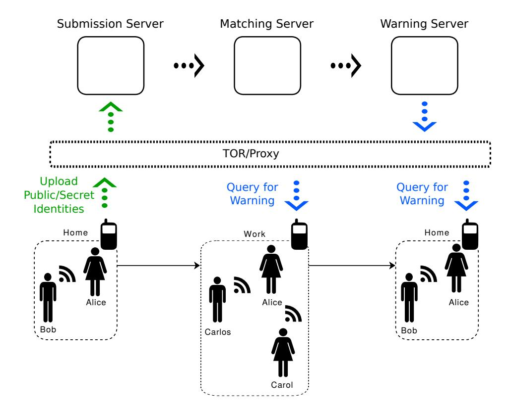
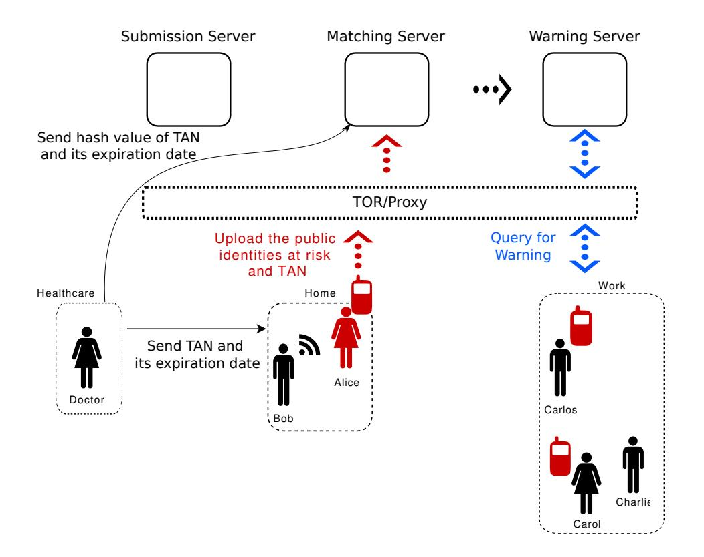
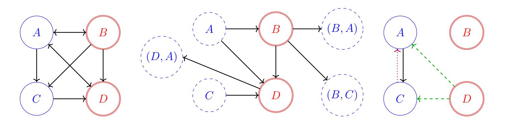

{0}------------------------------------------------

# ConTra Corona:

# Contact Tracing against the Coronavirus by Bridging the Centralized–Decentralized Divide for Stronger Privacy?

Wasilij Beskorovajnov1 , Felix D¨orre2 , Gunnar Hartung2 , Alexander Koch2 [,](https://orcid.org/0000-0002-3510-9669) J¨orn M¨uller-Quade2 , and Thorsten Strufe2

- 1 FZI Research Center for Information Technology, Karlsruhe, Germany lastname@fzi.de
  - 2 Competence Center for Applied Security Technology (KASTEL), Karlsruhe Institute of Technology (KIT), Karlsruhe, Germany firstname.lastname@kit.edu

Abstract. Contact tracing is among the most important interventions to mitigate the spread of any pandemic, usually in the form of manual contact tracing. Smartphone-facilitated digital contact tracing may help to increase tracing capabilities and extend the coverage to those contacts one does not know in person. Most implemented protocols use local Bluetooth Low Energy (BLE) communication to detect contagion-relevant proximity, together with cryptographic protections, as necessary to improve the privacy of the users of such a system. However, current decentralized protocols, including DP3T [T +[20](#page-30-0)], do not sufficiently protect infected users from having their status revealed to their contacts, which raises fear of stigmatization.

We alleviate this by proposing a new and practical solution with stronger privacy guarantees against active adversaries. It is based on the uploadwhat-you-observed paradigm, includes a separation of duties on the server side, and a mechanism to ensure that users cannot deduce which encounter caused a warning with high time resolution. Finally, we present a simulation-based security notion of digital contact tracing in the real– ideal setting, and prove the security of our protocol in this framework.

Keywords: Digital Contact Tracing · Privacy · Transmissible Diseases · Active Security · Anonymity · Security Modeling · Ideal Functionality

# 1 Introduction

During the early stages of a pandemic, when a vaccine is not yet available, one of the most important interventions to contain its spread, is – besides the reduction of face-to-face encounters in general – the consequent isolation of infected persons,

? This article is based on an earlier article: [[BDH](#page-28-0)+21a], c IACR 2021 hDOIi. An extended abstract of this work appeared in [[BDH](#page-28-1)+21b].

{1}------------------------------------------------

as well as those who have been in close contact with them ("contacts") to break the chain of infections. In phases with low case numbers of the SARS-CoV-2 pandemic, contact tracing has been the used to keep case numbers in check (for a longer time). However, tracing contacts manually (by interviews with infected persons) is not feasible when the number of infections is too high. Hence, more scalable and automated solutions are needed to safely relax restrictions of personal freedom imposed by a strict lockdown, without the risk of returning to a phase of exponential spread of infections. *Digital contact tracing* using off-the-shelf smartphones is used as an additional measure that is more scalable, does not depend on infected persons' ability to recall their location history during the days before the interview, and can even track contacts between strangers.

In many digital contact tracing protocols, e.g. [AHL18; C+20; R+20; CTV20; R+; T+20; P20a; BRS20; CIY20; BBH+20; AG20], users' devices perform automatic proximity detection via short-distance wireless communication mechanisms, such as Bluetooth Low Energy (BLE), and jointly perform an ongoing cryptographic protocol which enables users to check whether they have been colocated with contagious users. However, naïve designs for digital contact tracing pose a significant risk to users' privacy, as they process confidential information about users' location history, meeting history, and health condition [KBS21].

This has sparked a considerable research effort to design protocols for privacy-preserving contact tracing, most of which revolve around the following idea: Participating devices continuously broadcast ephemeral, short-lived pseudonyms and record pseudonyms broadcast by close-by devices. When a user is diagnosed, she submits either all the pseudonyms her device used while she was contagious or all the pseudonyms her device has recorded (during the same period) to a server. The first approach is the *upload-what-you-sent* paradigm, while the second is called *upload-what-you-observed* paradigm. Users' devices are then either actively notified by the server, or they regularly query the server for pseudonyms uploaded by infected users.

Some of the designs that received the most attention are the centralized PEPP-PT proposals [P20c; P20b], as well as the more decentralized approach of [CTV20] and DP3T [T+20], which served as sketches for the subsequently proposed Apple/Google-API (GAEN) [AG20]. While the "centralized" approaches of PEPP-PT do not provide any privacy guarantees towards the users against the central server infrastructure [D20b; D20c] (unless they are augmented by, e.g. mix-nets), the DP3T approach [T+20], as well as the similar protocol by Canetti, Trachtenberg, and Varia [CTV20], expose the ephemeral pseudonyms of every infected user, which enables her contacts to learn whether she is infected. A detailed comparison is given in [F20].

We argue that both, protection against a centralized actor, as well as protection of infected users from being stigmatized for their status3, is important for any real-world solution. By specifying a protocol that achieves both of these goals and

&lt;sup>3 See https://coronadetective.eu for a service that detects the contacts that caused a warning for DP3T-based approaches.

{2}------------------------------------------------

detailing the corresponding design choices, we aim to contribute to the ongoing discussion on privacy-preserving digital contact tracing.

### 1.1 Contribution

We propose a strong and encompassing simulation-based security notion via an ideal contact tracing functionality (in [Section 5\)](#page-17-0) that allows us to capture the following privacy and security guarantees.

- It makes the exact leakage an attacker would gather explicit. This leakage can be described by a partially anonymized, partially pseudonymized contact graph (described and motivated in detail in [Section 5](#page-17-0) and [Figure 3\)](#page-18-0), a list of positively tested and corrupted participants, and their warning status. This (minimal) leakage is inherent to BLE-based contact tracing schemes.
- It captures that the locally exchanged identifiers do change quickly (each "short-term epoch") in an unlinkable fashion, but the time of an encounter causing a warning can only be narrowed down on a more coarse-grained timescale. In other words, while observed identifiers change, e.g. every 15 minutes, a warning does only give away the day (or another globally-fixed "long-term epoch") of the encounter.
- It captures the worst-case guarantees in the sense that our guarantees hold, no matter how history unfolds, people meet, move and get infected, i.e., the environment can fully control the (directed) contact graph and infection status per short-term epoch.
- It provides guarantees against not being warned despite a (BLE-detectable) risk contact with an honest user (false negatives). For this, we assume that an attacker does not jam any local communication.
- It provides guarantees against being warned without a corresponding risk contact (false positives), unless the user was in proximity to a corrupted user and a corrupted user is infected or in proximity to an infected user. (This restriction is necessary, as in any protocol not protecting against malicious replays of proximity beacons, any attacker can cause a false positive under these conditions. However, protecting against replays would require processing time and location information, which is deemed undesirable.)

As a second part, we specify a privacy-preserving contact tracing protocol that achieves this security notion. It follows the upload-what-you-observed paradigm and achieves its goals by the following mechanisms:

- We split up the identifiers into short-lived public identifiers (pids) used for broadcasting, and longer-lived secret identifiers used for querying for warnings (cf. [Sections 3.1](#page-6-0) and [3.2\)](#page-7-0).
- We employ a strict server separation concept, where the servers (for uploading the lookup table for this split-up identifiers, for matching, and for warning queries) carry out different functions (cf. [Section 3.3\)](#page-8-0). For reasons of complexity reduction, the ideal functionality in the main body does not include server corruptions. However, the case of passive server corruptions is given informally in [Section 6.2](#page-23-0) and formally in [Appendix D.](#page-48-0)

{3}------------------------------------------------

– We employ strong, but anonymous anti-Sybil protections coupled to, e.g., an SMS challenge, to ensure that the guarantees cannot be circumvented by registering multiple Sybil identities (cf. [Section 3.4\)](#page-9-0).

Additionally, we argue that our protocol is similar in efficiency to DP3T, on the side of the smartphone used, see our efficiency analysis on p. [17.](#page-16-0) While our protocol was designed with the current COVID-19 pandemic in mind, note that it can easily be generalized to perform contact tracing for other transmissible diseases and enable an effective containment in case a new virus is about to hit a population without any immunity from prior exposition.

Finally, [Appendix C](#page-47-0) includes extensions, such as identifying the timing of Bluetooth beacons as a side-channel that can be exploited to link distinct public identifiers, and using secret sharing to ensure a lower bound on necessary contact time for a warning.

# 1.2 Outline

We define our informal security model for BLE-based contact tracing in [Section 2,](#page-3-0) the formal version is given in [Section 5.](#page-17-0) For this protocol, [Section 3](#page-6-1) proposes a number of core security mechanisms in a modular way, which are applied to obtain our overall protocol presented in [Section 4.](#page-10-0) An informal security and privacy analysis of the protocol follows in [Section 6.](#page-22-0)

# 2 Security Model

Our main goals are privacy, i.e. limiting disclosure of information about participating individuals, and security, i.e. limiting malicious users' abilities to produce "wrong protocol outcomes", such as being warned without a (BLE-detectable) risk contact (false negatives), or not being warned despite a risk contact (false positives). For privacy, we consider the following types of private information: (i) where users have been at which point in time, (ii) whom they have met (and when and where), (iii) whether a user has been infected, (iv) whether a user has received a warning because she was colocated with an infected user. We have a precise analysis of which of these goals are achieved under which conditions, and refer to [Sections 5](#page-17-0) and [6](#page-22-0) for details. We refer the interested reader to [[KBS21](#page-30-4)] for a systematization of different privacy desiderata.

Ideal–Real Paradigm. Formally, we cast our security guarantees in the ideal– real paradigm [[MR91](#page-30-7); [B92](#page-28-5)], to obtain strong, simulation-based security definitions, as is also common in proofs in the Universal Composability framework [[C01](#page-28-6)]. In contrast to a fixed list of security properties, which might leave doubt about whether everything the system should guarantee is captured, this has the advantage that the correctness guarantees and exact privacy leakage (dependent on the behavior of the adversary) are made explicit. We refer the interested reader to [[L17](#page-30-8)]. Slightly more specific, we consider a scenario in which an interactive

{4}------------------------------------------------

distinguisher Z (also called environment) that can choose the parties' inputs, observe their outputs and can communicate with the adversary arbitrarily during the execution, has to find out if it is running within a "real" experiment ("real world") or an "ideal" experiment ("ideal world").

In the "real" experiment, the protocol is executed and an attacker interferes with it. In the "ideal" experiment, the attacker is replaced by a Simulator S (which simulates protocol messages so that they look like in the real experiment) and all honest parties calculate their result via an ideal (contact tracing) functionality FCT (later given in [Section 5\)](#page-17-0). The real-world protocol is considered secure if no PPT distinguisher Z has a non-negligible advantage in distinguishing an execution of the real protocol (in the "real" setting) from an execution in the ideal setting. In this sense, the real world only permits attacks that would also be possible in the ideal world, which behaves perfectly as prescribed/is secure by definition. Hence, FCT formalizes the security guarantees we require for a contact tracing protocol.

Modeling Time. We assume time is divided into disjoint, consecutive intervals called epochs (or short-term epochs). A long-term epoch is the union of a fixed number of consecutive short-term epochs. Again, all long-term epochs are disjoint and consecutive. In the following, we assume each short-term epoch corresponds to a 15 minute interval, and each long-term epoch corresponds to a day. Hence, there are 96 short-term epochs in a long-term epoch, and a tuple from N×Z96 specifies a short-term epoch. (These durations are parameters, but for concreteness we describe our protocol with these parameters fixed.)

Allowing the Distinguisher to Define Reality. We let the distinguisher Z define the physical reality for each epoch t ∈ N × Z96, i.e. who meets whom (defined by a contact graph Gt) and who is infected (a set of parties Pinfected,t). Nodes in Gt correspond to participating parties, and Gt contains an edge (P1, P2) if P2 registered a contact with P1. Since who registered a contact with whom might not be a symmetric relation (e.g. due to noise in the wireless signal), each Gt is a directed graph. [4](#page-4-0) (We do not impose any restrictions on Gt or Pinfected,t, the environment may set these arbitrarily, even in ways that would be impossible in the physical world.) The distinguisher Z defines these values by sending them to a party Pmat (named after the ideal functionality Fmat as explained below). Each such input marks the beginning of a new short-term epoch. In the ideal experiment, this is a dummy party which forwards these inputs to FCT. In the real experiment, Pmat sends Pinfected to Fmed and G to Fmat. This hybrid (i.e. ideal, but used in the real world to abstract from a realization of it) functionality Fmat represents the "world state" or "material world"[5](#page-4-1) , including a representation of who met whom (controlable by the environment), and a synchronized "epochwise" clock. This functionality is used for local broadcast and to decide which

4 This captures a relaxed notion of "proximity", as high-gain antennas could be used to register a contact, although not physically being in proximity.

5 Internally, the author(s) humorously prefer to read the name of Fmat as "the matrix".

{5}------------------------------------------------

participant receives a particular public identifier pid. Here, Servers constitutes a set of centralized servers, see [Section 3.3.](#page-8-0)

$$\mathcal{F}_{\mathrm{mat}}(\mathcal{P}, P_{\mathrm{mat}}, \mathsf{Servers})$$

# State:

- Current contact graph G = (P, E)
- Current time e = (elt, est) ∈ N × Z96.

## Set Neighborhood:

- 1. Receive and store directed contact graph G = (P, E) from party Pmat.
- 2. Increment est (in Z96). If est = 0, increment elt and send (newLongTermEpoch) to all servers, and then to all parties except Pmat.

## Receiving Broadcasts:

- 1. Receive (pid) from a participant P, where pid is a public identifier.
- 2. Send (pid) to all P 0 with (P, P0 ) ∈ E.

As mentioned above, the incorruptible party Pmat just forwards the contact graph G and the set of infected parties Pinfected to the relevant functionalities Fmat and Fmed (which represents the medical professional that is informed about who is infected, and will be given in [Section 4](#page-10-0) on p. [13\)](#page-12-0), respectively.

# Protocol of Pmat in the Real Setting

Update Neighborhood and Infections:

- 1. Receive a contact graph G and a set of infected parties Pinfected from the environment as input.
- 2. Send G to Fmat.
- 3. Send Pinfected to Fmed.

Communication Channels. Channels between the parties, functionalities and the servers are assumed to be confidential and authentic (in the fitting direction). We assume the attacker does not jam any wireless communication between honest parties. (The distinguisher Z can emulate a suppression of broadcasts by leaving out edges in the contact graph.)

When a user, e.g. uploads data used in the protocol that should not be linked to the person (e.g. public or secret identifiers), the server can easily link these pairs with communication metadata (such as the user's IP address), which might be used to ultimately link this data to a specific individual. We therefore use an anonymous communication channel for all communication with the servers. In practice, one can communicate via publicly available proxies that are managed by operators separate from the protocol servers. Alternatively, one might also 

{6}------------------------------------------------

employ the TOR onion routing network [[TOR](#page-30-9)]. (We analyze the load that would be placed on TOR on p. [17.](#page-16-0))

Corruption Model. In the formal modeling and our security proofs – to keep the complexity of the description and proofs manageable – centralized servers are perfectly trusted. However, the protocol was designed in a way that the information leakage to the servers is still acceptable in the case of a passive (honest-but-curious) server corruption, as will be explained in [Section 6.2.](#page-23-0) (A formal security notion with passive server corruptions is given in [Appendix D.](#page-48-0)

Regarding the users, we do only consider static corruptions, i.e. corruptions that happen at the beginning the the protocol execution. We do not distinguish between "the attacker" and corrupted, malicious, or compromised parties.

Modeling Medical Professionals. Furthermore, we trust medical professionals to not disclose data regarding the users who are under their care, as is their duty under standard medical confidentiality. This is abstracted by introducing a hybrid functionality Fmed, which represents medical professionals who are aware about the infection status of all users. Fmed is defined in [Section 4](#page-10-0) on p. [13.](#page-12-0)

# 3 Core Security Mechanisms

We start by giving a relatively generic, abstract template of contact tracing protocols, which are characterized by send-what-you-observed upon infection. This allows us to put our core security mechanisms in context and serve as a starting point for describing them.

Generation of "Random" Identifiers. For every time period t, the user's device generates an identifier pidt . (These identifiers can look uniformly random and be computationally unlinkable, unless they incorporate additional time/location information for replay/relay protections.)

Broadcasting and Recording. During the time period t the identifier pidt is repeatedly broadcast so nearby participants can record it, together with the date/time (maybe involving additional postcomputation before storing).

Warning Co-located Users. When a user is tested positive, one extracts a list of all recorded pid0 from the infected user's device (assuming that old ones are periodically deleted). The user is then given a TAN code that she can use to send this list to a central server. The server marks the respective pids as potentially infected, and then allows users to query for a given pid, answering whether it is marked as potentially infected.

We now describe the security mechanisms our protocol is built upon:

# 3.1 Splitting of Identifiers

We propose to use, instead of just one public identifier pid that is used for both, broadcasts and warning queries, two versions of identifiers: public identifiers pid

{7}------------------------------------------------

that are used for broadcasting, and a secret identifiers sid which are used to query the server for warnings. The server internally keeps a table linking sids to pids, where users can submit new entries to. This split-up of identifiers achieves better privacy, because malicious users cannot just use public identifiers they have observed to query the server for the warning status of the pids' owners. Note that later mechanisms from [Sections 3.2](#page-7-0) and [3.3](#page-8-0) will further modify this.

Generation of "Random" Identifiers. For every time period t, the device generates pidt , sidt in a such way that one cannot efficiently derive sidt from pidt . Moreover, given a set of pids which are either all from the same user, or all from different users, it should not be possible to distinguish which is the case. Finally, we require that only the user to whom these ids belong can submit them, e.g. by her knowing a preimage that is used to generate both in tandem and also submitting the preimage.[6](#page-7-1)

Broadcasting and Recording. Proceeds as above.

Warning Co-Located Users. When an infected user sends a list of all recorded pid0 as above, the server looks up the respective sids in his database of (sid, pid) tuples and marks them as potentially infected. The server then allows users to query for sids, answering whether they are marked as potentially infected.

# 3.2 Lower-Resolution Secret Identifiers for Improved Infection-Status Privacy

In the protocol sketch described in [Section 3.1,](#page-6-0) users receiving a warning can immediately observe which of their secret identifiers sid was published. By correlating this information with the knowledge on when they used which public identifier pid, they can learn at which time they have met an infected person, which poses a threat to the infected person's privacy. Note that the DP3T protocol [T +[20](#page-30-0)] and [[CTV20](#page-29-0)] succumb to analogous problems, see [[V20a](#page-31-0)].

To mitigate this risk, we propose to associate a secret identifier sid with many public identifiers pid, i.e. we use the same sid during a long-term epoch, but change pids per short-term epoch. As the example of deriving (sidt, pidt ) pairs for time epoch t from [Footnote 6](#page-7-1) does not allow such longer-term secret identifiers, we modify this procedure as follows:

Generation of "Random" Identifiers. The user generates a single random key, now called warning identifier, once per long-term epoch. More concretely, a user generates a random warning identifier widelt ←\$ {0, 1} n per long-term epoch elt (e.g. a day), and encrypts it with the server's public key pkW to

6 We give a simple example of how this might be done. Note however, our protocol uses a different method, see [Section 3.2.](#page-7-0) For this example, let H be a hash function, such that H(kkx) is a pseudorandom function (PRF) with key k ∈ {0, 1} n evaluated on input x. For every time period t, the device generates a random key kt ←\$ {0, 1} n , and computes sidt := H(ktk0) and pidt := H(ktk1), stores them, and anonymously uploads kt to the central server, who recomputes sidt, pidt in the same way. Both parties store (sidt, pidt ).

{8}------------------------------------------------

**Fig. 1.** Overview of the application's infrastructure. The figure depicts different possible scenarios: In the morning, Alice uploads her daily public/secret identifiers to the submission server, and periodically queries the warning server for warnings. Throughout the day, while she is in proximity to Bob, Carlos and Carol, the application exchanges public identifiers with their phones.

obtain  $\operatorname{sid} := \operatorname{Enc}(\operatorname{pk}_{\mathcal{W}}, \operatorname{wid}_{e_{lt}})$ , using a  $\operatorname{rerandomizable}$  public-key encryption scheme. For each shorter time period t (e.g., 15 minutes), the user generates a rerandomization  $\operatorname{sid}'_t$  of  $\operatorname{sid}$ , where the randomness is derived from a PRG, and computes  $\operatorname{pid}_t := \operatorname{H}(\operatorname{sid}'_t)$ . Once per long-term epoch, the user uploads  $\operatorname{sid}$  and the PRG seed to the server, who performs the same rerandomization, obtaining the same  $\operatorname{pid}_t$  values, and the corresponding  $\operatorname{wid}_{e_{lt}}$  by decryption.

The user then broadcasts the  $\mathsf{pid}_t$  in random order during the current long-term epoch. The warning of co-located users proceeds as before, with the only change that the server maintains a database of (wid, pid) tuples, and allows users to query for wids (instead of sids).

There is a trade-off regarding the length of the long-term epochs: While warnings are more precise for shorter long-term epochs, they also give more information about when the encounter of the warning happened. In practice, choosing a long-term epoch of a day is reasonable.

#### 3.3 Splitting-Up the Server into a Pipeline

The change introduced in Section 3.2 allows to split the process of warning co-located users into three tasks for three non-colluding7 servers, the submission server, the matching server, and the warning server:

&lt;sup>7 To make sure servers do not collude, they should be run by different organizations whose independence is guaranteed by law, e.g. supervisory agencies on privacy (ideally

{9}------------------------------------------------

- The submission server collects the uploaded secret and public identifiers from different users (more precisely, it receives sid and the seed for the PRG) and then computes the  $(\operatorname{sid}'_i,\operatorname{pid}_i)$  pairs using the PRG with the given seed. It rerandomizes the  $\operatorname{sid}'_i$  values another time with fresh, non-reproducible randomness (obtaining  $\operatorname{sid}''_i$ ), and stores  $(\operatorname{sid}''_i,\operatorname{pid}_i)$  for a short period of time. When the submission server has a sufficient number of submissions, it shuffles them and sends them to the matching server. For ease of notation, we assume that this transaction happens at the beginning of the next long-term epoch. (We assume that enough users participate, for the batching to make sense.)
- The matching server collects the  $(\operatorname{sid}_i'',\operatorname{pid}_i)$  pairs and stores them. Upon receiving the pids recorded by the devices of infected users, which we call a match request, the matching server looks up the respective  $\operatorname{sid}_i''$ s of all potentially infected users and sends them to the warning server.
- The warning server decrypts  $\operatorname{sid}_{i}''$  to recover  $\operatorname{wid} := \operatorname{Dec}_{\operatorname{sk}_{\mathcal{W}}}(\operatorname{sid}_{i}'')$  for all potentially infected users. It then allows to query for warning ids by the users, which we call warning query in the following.

For illustration, see Figure 1. We assume all communication between the servers uses confidential and authenticated channels. Section 6.2 contains a privacy analysis in case of compromised, honest-but-curious and partly colluding servers.

# 3.4 Protecting from Encounter-wise Warning Identifiers and Sybil Attacks

Our measures from Section 3.2, namely having a lower resolution for the secret/warning identifiers are not yet sufficient to hide the infection against the following, more motivated attack: An attacker that is able to upload an unlimited number of sid and PRG seed values to the submission server, can change to a set of pids that belong to a different warning identifier, after each short-term epoch. Upon warning, the attacker can then deduce which of the warning identifiers have been warned, and from that deduce the exact short-term epoch the encounter happened. A simple rate-limiting on the side of the app is ineffective against malicious attackers, and a simple traffic-based rate-limiting on the side of the servers per app instance is not possible due to the anonymized communication. Moreover, the above attacker can run a so-called *Sybil attack*, i.e. creating multiple (seemingly) independent app instances. Hence, we aim to prevent this type of attack and ideally to ensure a limitation of uploads to the submission server to one per user (identifier) per day. For this, it is helpful to use a users identifier that is difficult to obtain in larger numbers, to force the adversary to invest additional resources for spawning Sybil instances. While there are a number of solutions, for concreteness, we propose to bind each app instance to a phone number (as the aforementioned user identifier) and require a registration process using an SMS challenge. (Note that this approach does not prevent an attacker

multiple different ones per nation-state) and non-governmental organisations that are widely trusted by the general public.

{10}------------------------------------------------

from performing a Sybil attack on lower scale, as the attacker might own multiple phone numbers.8)

Binding an app to an identifiable resource (such as a valid phone number) while ensuring the user's anonymity, requires a bit of care. For this, we use the periodic n-times anonymous authentication scheme from [CHK+06]. In such a scheme, token dispensers are issued to parties using an Obtain protocol. These dispensers can be used n times in a Show protocol in a given epoch. The server participating in the Obtain protocol can not link these requests to the executions of the Show protocol.

In our setting, we choose n=1 and choose as time period the long-term epoch period, i.e. the user can obtain one "e-token" per long-term epoch to upload a new sid and PRG seed to the submission server. The submission server validates the "e-tokens" and only accepts submissions with valid tokens while checking for double-spending. The token dispenser is then issued to the user during a registration process, which uses the aforementioned SMS challenges. Formally, we define the hybrid functionality  $\mathcal{F}_{\text{reg}}$ , which represents the party towards which parties run the registration protocol, and which keeps a list of registered parties, and is given below. This is e.g. for obtaining a token dispenser to perform the regular uploads. To keep the model simple, we do not incorporate SMS challenges into  $\mathcal{F}_{\text{reg}}$ . (An SMS challenge, as well as the upload TAN, might be modeled via an authenticated channel from the party, for which an adversary can break authentication by guessing. See [AGH+19] for a formalization).

$$\mathcal{F}_{\rm reg}(\mathcal{P})$$

## State:

- Set of registered parties and their public keys as pairs  $\mathcal{RP}$ .
- Issuer secret and public key for e-token dispensers  $(\mathsf{sk}_{\mathcal{I}}, \mathsf{pk}_{\mathcal{I}})$

#### Registering a Party:

- 1. Upon  $(register, pk_{\mathcal{U}})$  from party P: if P is not already in a pair in  $\mathcal{RP}$ , store  $(P, pk_{\mathcal{U}})$  in  $\mathcal{RP}$ , else abort.
- 2. Issue a new e-token dispenser for P acting as  $\mathcal{U}$  by participating as  $\mathcal{I}$  in the protocol  $\mathsf{Obtain}(\mathcal{U}(\mathsf{pk}_{\mathcal{I}},\mathsf{sk}_{\mathcal{U}},1),\mathcal{I}(\mathsf{pk}_{\mathcal{U}},\mathsf{sk}_{\mathcal{I}},1))$ .

# 4 Our Contact-Tracing Protocol

We can now describe the full protocol. For this, let n denote the security parameter,  $\mathbb{G}$  be a group of prime order such that the decisional Diffie-Hellman problem in  $\mathbb{G}$  is intractable. We assume a IND-CPA secure, rerandomizable public key encryption scheme (Gen, Enc, Dec, ReRand) having message space  $\mathcal{M} = \mathbb{G}$ . (We propose standard ElGamal for instantiation.) Let PRG be a secure pseudorandom generator, and H be a one-way function. Finally, let

&lt;sup>8 One might use remotely verifiable electronic ID cards instead.

{11}------------------------------------------------

 $\Sigma_{\text{tok}} = (\text{Gen}_{\mathcal{I}}, \text{Gen}_{\mathcal{U}}, \text{Obtain}, \text{Show}, \text{Identify})$  be an anonymous e-token dispenser scheme as in [CHK+06]. The exact definitions can be found in Appendix B.

**App Setup.** When the proximity tracing software is first installed on a user's device, for anti-Sybil measures as described in Section 3.4, the application proves possession of a phone number (e.g. via an SMS challenge) and obtains an e-token dispenser.

Creating Secret Warning Identifiers. For each long-term epoch, the application generates a random warning identifier wid  $\leftarrow_{\$} \mathbb{G}$ .

**Deriving Public Identifiers.** For each warning identifier wid, the app computes sid :=  $Enc(pk_{\mathcal{W}}, wid)$ , where Enc is the encryption algorithm of a rerandomizable, IND-CPA-secure public-key encryption scheme, and  $pk_{\mathcal{W}}$  is the warning server's public key. Additionally, the app chooses a random  $seed \leftarrow_{\$} \{0,1\}^n$  (rerandomization seed) per warning identifier.

The app (interactively) presents an e-token  $\tau$  to the submission server via an anonymous channel, and uploads (sid, seed) to the submission server via the same channel. If the e-token is invalid (or the server detects double-spending of this e-token), the server refuses to accept (sid, seed). Both the submission server and the app compute 96 rerandomization values  $r_1, \ldots, r_{96} = \mathsf{PRG}(\mathsf{seed})$ , and rerandomize sid using these values, obtaining  $\mathsf{sid}_i' \coloneqq \mathsf{ReRand}(\mathsf{sid}; r_i)$  for  $i \in \{1, \ldots, 96\}$ . The ephemeral public identifiers of the user are defined as  $\mathsf{pid}_i \coloneqq \mathsf{H}(\mathsf{sid}_i')$  for all i. The app saves the public identifiers for broadcasting during the day of validity of wid. The submission server rerandomizes each  $\mathsf{sid}_i'$  again (using non-reproducible randomness) to obtain  $\mathsf{sid}_i''$  and stores the ( $\mathsf{sid}_i''$ ,  $\mathsf{pid}$ ) pairs.

Broadcasting and Recording. During each time period i, the device repeatedly broadcasts  $\mathsf{pid}_i$ . When it receives a broadcast value  $\mathsf{pid}'$  from someone else, it stores  $(e_{lt},\mathsf{pid}')$ , where  $e_{lt}$  is the current long-term epoch. Every long-term epoch, the device deletes all  $\mathsf{pid}'$ s that are old enough to no longer be epidemiologically relevant.

**Sending a Warning.** When a user is tested positive, the medical personnel generates a TAN and registers it at the matching server. The user collects a list of public identifiers pid' that have been received by his device while the user was likely infectious, and sends this list together with the TAN to the matching server, see p. 16.

The medical professional is modeled by the hybrid functionality  $\mathcal{F}_{\text{med}}$ , which gives out a TAN to parties which are deemed infected, as given below. In a bit more detail,  $\mathcal{F}_{\text{med}}$  stores a set  $\mathcal{P}_{infected}$  of infected/positively tested participants as provided by the environment  $\mathcal{Z}$ . If such a participant  $P \in \mathcal{P}_{infected}$  requests a TAN (using warningRequest),  $\mathcal{F}_{\text{med}}$  chooses a TAN, registers its hash value with the matching server and sends it to P. For an illustration, see Figure 2.

{12}------------------------------------------------

Fig. 2. Information flow upon issuing a warning. When the doctor is informed about a positive test, she generates a new TAN and sends it to the matching server and then communicates it to positively tested Alice. Then, using this TAN, Alice uploads all public identifiers she observed during her infectious period. The application regularly queries for its warnings to its the warning server. In the case of Carlos and Carol, who have been in contact with Alice in [Figure 1,](#page-8-2) this check will turn out to be positive.

# Fmed(Pmat, Matching Server )

# State:

– Set of infected parties Pinfected .

## Set Infected:

1. Receive and store the set of infected parties Pinfected from a party Pmat.

#### Handling Warning Request:

- 1. Upon (warningRequest) from P ∈ Pinfected .
- 2. Generate tan ←\$ {0, 1} 2n.
- 3. Send (H(tan)) to the Matching Server.
- 4. Send (tan) to P.

Retrieving Warnings. The application regularly queries the warning server for the warning identifiers it has used during the last 28 days itself. This is done via an anonymous channel with proper authentication of the warning server. If the query returns that the warning identifier has been marked as at-risk, it informs the user she has been in contact with an infected person during the long-term epoch when the warning identifier was used.

{13}------------------------------------------------

## Protocol of the App/Users

#### State:

- Current epoch  $e = (e_{lt}, e_{st}) \in \mathbb{N} \times \mathbb{Z}_{96}$
- Current token dispenser D.
- Set of recorded broadcasts of pids.
- Let  $pk_{\mathcal{W}}$  and  $pk_{\mathcal{I}}$  be the hardwired public key of the warning server, and e-token dispenser issuer, respectively.
- Let  $(\mathsf{sk}_{\mathcal{U}}, \mathsf{pk}_{\mathcal{U}})$  be the generated user secret/public key pair during the registration.
- Current Warning identifier wid
- Set of earlier warning identifiers (wid, k), where k is the according long-term epoch.
- The public identifiers of the current long-term epoch  $(\mathsf{pid}_j)_{j \in [1,...,96]}$

#### Register:

- 1. When a new party is created by the environment, it first generates a token-dispenser secret/public key pair  $(sk_{\mathcal{U}}, pk_{\mathcal{U}})$  and then sends  $(register, pk_{\mathcal{U}})$  to  $\mathcal{F}_{reg}$ .
- 2. Obtain a token dispenser D by participating as  $\mathcal{U}$  in  $\mathsf{Obtain}(\mathcal{U}(\mathsf{pk}_{\mathcal{I}},\mathsf{sk}_{\mathcal{U}},1),\mathcal{I}(\mathsf{pk}_{\mathcal{U}},\mathsf{sk}_{\mathcal{I}},1))$  with  $\mathcal{F}_{\mathrm{reg}}$  acting as  $\mathcal{I}$ .
- 3. Initialize the state and run "Upload Submission".

#### Upload Submission:

- 1. Generate fresh (wid, seed, sid) and the according list of  $\{(\mathsf{sid}_i',\mathsf{pid}_i)\}_{j\in[1,\cdots,96]}.$
- 2. Enqueue the current (wid,  $e_{lt}$ ).
- 3. Submit a token by participating as  $\mathcal{U}$  in  $\mathsf{Show}(\mathcal{U}(D,\mathsf{pk}_{\mathcal{I}},e_{lt},1),\mathcal{V}(\mathsf{pk}_{\mathcal{I}},e_{lt},1))$  to the Submission Server, which acts as  $\mathcal{V}$ .
- 4. Send (seed, sid) over the same channel to the Submission Server.

#### Scheduled Upload:

- 1. Upon (newLongTermEpoch) from  $\mathcal{F}_{mat}$ .
- 2. Increment  $e_{lt}$ .
- 3. Dequeue outdated wids and recorded pids.
- 4. Continue as in "Upload Submission".

#### Sending Broadcasts:

- 1. Upon (sendBroadcast) from the environment.
- 2. Send  $(pid_{e_{st}})$  to  $\mathcal{F}_{mat}$  and increment  $e_{st}$ .

#### Recording Broadcasts:

- 1. Upon (pid) from  $\mathcal{F}_{\text{mat}}$ .
- 2. Enqueue (pid,  $e_{lt}$ ).

{14}------------------------------------------------

#### Match Request:

- 1. Upon (positive) from the environment.
- 2. Send (warningRequest) to  $\mathcal{F}_{\text{med}}$ .
- 3. Receive (tan) from  $\mathcal{F}_{\text{med}}$ .
- 4. Extract the list L of all recorded/received public identifiers from the queue.
- 5. Send  $(L, \tan)$  to the Matching Server.

#### Querying a Warning:

- 1. Upon (query, t) from the environment.
- 2. Find the corresponding wid for long-term epoch t and send (wid) to the Warning Server.
- 3. Receive bit b from the warning server.
- 4. Output b to the environment.

Collecting Daily Submissions. The submission server rerandomizes all the  $\mathsf{sid}_i'$  values using fresh randomness, obtaining  $\mathsf{sid}_i'' \coloneqq \mathsf{ReRand}(\mathsf{sid}_i')$ , and saves a list of the  $(\mathsf{sid}_i'', \mathsf{pid}_i)$  tuples. When the submission server has accumulated a sufficiently large list, originating from sufficiently many submissions, it shuffles the list, forwards all tuples to the matching server and clears the list.

#### Protocol of the Submission Server

#### State:

- Current epoch  $e_{lt}$ .
- The current batch of  $\{(\operatorname{sid}_{j}^{"k},\operatorname{pid}_{j}^{k})\}_{j\in[1,\cdots,96]}$ .

#### Handling Submissions:

- 1. Verify the token by participating as  $\mathcal{V}$  in  $\mathsf{Show}(\mathcal{U}(D,\mathsf{pk}_{\mathcal{I}},e_{lt},1),\mathcal{V}(\mathsf{pk}_{\mathcal{I}},e_{lt},1)).$
- 2. Detect possible double spending.
- 3. Receive (seed, sid) from  $\mathcal{U}$ .
- 4. Generate  $\{(\mathsf{sid}'_j, \mathsf{pid}_j)\}_{j \in [1, \dots, 96]}$  with the help of seed.
- 5. Rerandomize the  $sid'_j$  using fresh randomness, i.e.  $sid''_j = ReRand(sid'_j)$
- 6. Add the generated tuples (with rerandomization)  $\{(\mathsf{sid}_j'', \mathsf{pid}_j)\}_{j \in [1, \dots, 96]}$  to the batch of  $e_{lt}$ .

#### Forwarding Submissions:

- 1. Upon (newLongTermEpoch) from  $\mathcal{F}_{mat}$ .
- 2. Shuffle the last batch and send the complete batch to the *Matching* Server together with  $e_{lt}$ .
- 3. Increment  $e_{lt}$ .
- 4. Create a new empty batch for the new epoch.

{15}------------------------------------------------

Performing Contact Matching. The matching server maintains a list of hash values of all TANs issued by medical professionals and all tuples it has received from the submission server, deleting each tuple after three weeks. When a user submits a list of public identifiers together with a valid TAN, the matching server marks the TAN's hash value as invalid by deleting it from its list. The server looks up the corresponding secret identifiers sid and sends them to the warning server.

## Protocol of the Matching Server

#### State:

- The current epoch  $e_{lt}$ .
- Per long-term epoch t a set  $\mathcal{B}_t$  of (sid', pid) pairs.
- Set of TANs of pending matching requests  $T_{corrupted}.$

#### Removing Outdated Information:

- 1. Upon (newLongTermEpoch) from  $\mathcal{F}_{mat}$ .
- 2. Increment  $e_{lt}$  and delete all sets  $\mathcal{B}_t$  where  $0 \leq t \leq e_{lt} 14$ .

#### Handling Submissions:

1. Receive a set of (sid', pid) tuples and an epoch t from the *Submission Server* and store it as  $\mathcal{B}_t$ .

#### Preparing Match Request:

1. Receive  $(h_{tan})$  from  $\mathcal{F}_{med}$  and insert  $(h_{tan}, e_{lt})$  into  $T_{corrupted}$ .

#### Handling Match Request:

- 1. Receive  $(S, \tan)$  from party P, where S is a set of pids.
- 2. If there is an index  $t \in \mathbb{N}$  such that there is an entry  $(\mathsf{H}(\tan), t) \in T_{corrupted}$ , remove this entry from  $T_{corrupted}$ , otherwise abort.
- 3. Let  $M := \{ (\operatorname{sid}'_l, t_l) : \exists \operatorname{pid}_l \in S, t_l \in \mathbb{N} \text{ such that } (\operatorname{sid}'_l, \operatorname{pid}_l) \in \mathcal{B}_{t_l} \land t_l \leq t \}.$
- 4. Rerandomize all the  $\operatorname{sid}'_l \in M$  from the previous step and send  $\{(\operatorname{sid}''_l) : (\operatorname{sid}'_l, t_l) : (\operatorname{sid}'_l, t_l) \in M\}$  to the warning server.

**Processing of Warnings.** The warning server decrypts the secret identifiers received from the matching server to recover the warning identifier wid contained in them. Users may query the warning server for specific wids. On such queries, the warning server returns either 1 (if this wid was recovered by decryption during the last two weeks) or 0 (otherwise).

&lt;sup>9 If a user A has been in contact with an infected user B, and if B takes up to three weeks to show symptoms and have a positive test result, the data retention on the matching server is sufficient to deliver a warning to A.

{16}------------------------------------------------

#### Protocol of the Warning Server

#### State:

- The current epoch  $e_{lt}$ .
- PKE key pair  $(\mathsf{sk}_{\mathcal{W}}, \mathsf{pk}_{\mathcal{W}})$ .
- Set  $\mathcal{WL}$  of released wids and their validity epoch t.

# Removing Outdated Information:

- 1. Upon (newLongTermEpoch) from  $\mathcal{F}_{mat}$ .
- 2. Increment  $e_{lt}$  and delete all (wid, t)  $\in \mathcal{WL}$ , with  $0 \le t \le e_{lt} 14$ .

#### Issuing Warnings:

- 1. Receive a list  $\{(\operatorname{sid}_{l}^{\prime\prime}, t_{l})\}$  from the *Matching Server*.
- 2. Decrypt, deduplicate and add the received warning identifiers  $\{(\mathsf{wid}_l = \mathsf{Dec}_{\mathsf{sk}_{\mathcal{W}}}(\mathsf{sid}''), t_l)\}$  to  $\mathcal{WL}$ .

#### Warning Query:

- 1. Receive warning identifier (wid).
- 2. Search all finished *epoch* for wid and return 1 if a match is found, 0 otherwise.

This concludes the description of our protocol, cf. Figures 1 and 2 for illustration.

# 4.1 Efficiency

Our protocol incurs computation, communication and storage cost on the smartphone, submission server, matching server and the warning server.

First of all we argue that the application on the smartphone does not incur significantly larger costs than currently deployed solutions. Computation-wise, the most expensive operations, i.e. operations needed for using the token-dispenser scheme and 96 reencryptions, have to be performed only once a day (long-term epoch). These are 12 multi-base exponentiations in the domain group of a pairing and 23 multi-base exponentiations in the target group as was shown in [CHK $^+$ 06]. The remaining computations, i.e. 96 hashes for the pids and the generation of seed, wid, sid, are cost-wise similar to currently deployed solutions for contact tracing and thus the overall battery consumption and CPU load are comparable. The application has to store a constant amount of information of several kilobytes, i.e.  $28 \times \text{wid}$ ,  $96 \times \text{pid}$ . The only growing variable is the set of recorded/observed pids. We argue that the number of received pids will be rather small as current studies suggest, i.e. [FM21]. The communication comprises several small requests a day to different servers and the broadcast/reception of a pid, which we deem overall negligible.

Next, we analyze the computational cost on the submission server. Considering that the population of the EU is approximately 448 Mio. and current experience with the German contact-tracing application CWA shows that 30%

{17}------------------------------------------------

of the German population have adopted the application, we may assume for further considerations 134 Mio. users in our protocol. The submission server must perform  $2 \cdot 96$  reencryptions of the sids per day and user, which means that  $2 \cdot 96 \cdot 134 \cdot 10^6 \approx 2.6 \cdot 10^{10}$  reencryptions a day or  $\approx 300000$  a second. Using the ElGamal scheme, the dominant part of the reencryption are two modular exponentiations or scalar multiplications if we use the ECC variant of ElGamal. For an upper bound we may use current benchmarks for the verification algorithm of ECDSA, which has two dominant scalar multiplications on elliptic curves as well. According to [BL21] the verification of ecdonaldp256 on an (2018) AMD EPYC 7371 with  $16 \times 3100 \text{MHz}$  requires 425723 cycles, which means that we are able to verify  $\frac{16 \cdot 3100 \cdot 10^6}{425723} \approx 116507$  signatures a second. We argue therefore that  $\approx 300000$  reencryptions per second is a realistic requirement and the computational load on the submission server—while undeniably high—can be handled with a realistic amount of equipment.

Next, we analyze the amount of data uploaded from the users' devices to the submission server. Our estimation shows that a daily upload by our protocol is at most 240 kbit. With 138 Mio. users the submission server has to handle 33Tbit a day. By scattering uploads across the span of the day we achieve a lower bound of 0.3Gbit/s, which we deem realistic. While the server may be able to handle this amount of requests, our protocol requires that the uploads are performed through an anonymous channel. To this end one may use TOR and we argue that the EU-wide deployment of our protocol relying on TOR is within TOR's capacities. As of 2020 the advertised bandwidth of the TOR network is approx. 500 Gbit/s and the consumed bandwidth is approx. 250Gbit/s (cf. https://metrics.torproject. org/bandwidth.html), which is sufficient for our 0.3Gbit/s. Another important restriction of TOR is the number of active users, which currently is around 2Mio users (cf. https://metrics.torproject.org/userstats-relay-country.html). If our server is able to handle 0.3Gbit/s then the amount of users served per second will be 1550, which is a rather small delta to the overall number of TOR users. The latency added by using TOR is in the magnitude of seconds and has no impact on the protocol, as a warning delivered a few seconds later is acceptable. Similar considerations can be made for the matching and the warning server. However, the costs of computation and communication are overall smaller than on the submission server and are hence tamable in the same fashion.

# 5 Formal Security Notion

Before we are ready to state our ideal contact-tracing functionality, let us begin with several assumptions that allow us to simplify our proof and reduce complexity: (i) In this section, we assume that the servers are uncorruptible. However, we provide a discussion on security against server corruptions in Section 6.2 and give a strengthened ideal functionality in Appendix D. (ii) The per-day uploads are synchronous. We assume that before any pid is broadcast, all parties have

{18}------------------------------------------------

made their per-day upload.10 (iii) All parties, even corrupted ones, send exactly one broadcast per epoch. (The distinguisher can emulate a single corrupted party making multiple broadcasts by using additional corrupted parties with similar/equal sets of recipients.) (iv) For formal reasons, parties can only perform computations and broadcasts when they receive an input. Hence, we assume the distinguisher  $\mathcal{Z}$  inputs a dummy message (sendBroadcast) to all honest participants at the beginning of a new epoch. (v) Contacts happening on the day an infected person is uploading their list do not incur immediate warnings. These are delayed until the next long-term epoch. This is also a privacy feature, ensuring that no one can learn the time of an encounter with an infected person with precision higher than a long-term epoch.

We are now ready to describe important aspects and notions used in our ideal functionality  $\mathcal{F}_{CT}$ , which formalizes our security and privacy guarantees: Whenever the environment  $\mathcal{Z}$  starts a new short-term epoch by sending  $G_i = (\mathcal{P}, E_i)$  and  $\mathcal{P}_{infected}$  to  $\mathcal{F}_{CT}$  (via  $P_{mat}$ ),  $\mathcal{F}_{CT}$  creates two derived graphs  $G'_i$  and  $(\mathcal{P}, \hat{E}_i)$ .  $G'_i$  is a partially anonymized, partially pseudonymized version of  $G_i$ . We let  $\mathcal{F}_{CT}$  output  $G'_i$  and  $\mathcal{P}_{infected} \cap \mathcal{P}_{corrupted}$  to the simulator, hence this is the information leakage of our protocol. The edge set  $\hat{E}_i$  represents who will receive warnings from whom, hence the simulator's abilities to modify  $\hat{E}_i$  represent the attacker's abilities to induce and suppress warnings.

Fig. 3. Left: An example of a contact graph  $G_t = (\mathcal{P}, E_t)$  with two honest parties A and C and two corrupted parties B and D. The edges indicate where a broadcast is delivered. Middle: The pseudonymized graph  $G'_t = (\mathcal{Q}_t, E'_t)$  of  $G_t$  as leaked by  $\mathcal{F}_{CT}$  to the simulator. Dashed node borders indicate that the node name is replaced with an opaque pseudonym. Right: An example for  $(\mathcal{P}, \hat{E}_t)$ . This graph is initialized with all edges from  $G_t$  between honest parties (shown in solid black). The adversary has already inserted edges using the commands (relay, t, pseudonymize(C), D, B, pseudonymize((B, A))) as in "Replay/Relay" (shown in dotted purple) and (sendBroadcast, t, t, B, D) as in "Broadcasts From Corrupted User" (shown in dashed green). Note that warnings from honest parties are delivered against the direction of all the edges. So an infected A would warn C and D, an infected C would warn A and D.

In practice, parties can make their uploads a few days ahead of time without incurring additional risk.

{19}------------------------------------------------

Information Leakage on the Contact Graph. We now describe the anonymization and pseudonymization process for  $G_i'$  in detail, cf. steps 3 to 5 in "Set Neighborhood/Infected" below. The process is exemplified by the graphs  $G_t$  and  $G'_t$  shown in Figure 3 (left and middle, respectively). Nodes corresponding to uncorrupted parties are renamed to a pseudonym chosen independently for each epoch (in the example, the nodes of A and C are shown as dashed). This means that an attacker cannot re-identify participants encountered earlier and hence cannot track them over time. Edges between uncorrupted parties are removed entirely (in the example the edge (A, C) is removed), hence the attacker is completely oblivious of contacts between honest parties. Edges between corrupted parties (in the example (B,D)) are preserved without modifications, since we assume they are fully controlled by the attacker and hence the attacker is completely aware of any contacts between them. Before the pseudonymization takes place, nodes corresponding to honest receivers are duplicated for each incoming edge, leaving only the outgoing edges on the original node, since corrupted senders cannot detect if they are broadcasting to the same participant. This step anonymizes edges to honest nodes. In the example the newly introduced nodes by this step are: (D,A), (B,A) and (B,C). The outgoing edges are left at their original node (for example from A), since corrupted receivers (in the example B and D) can easily detect they were in contact with the same person at approximately the same time by comparing the broadcast values. Note that this disadvantage is shared by many contact tracing protocols.

Additionally, all users of the protocol can query  $\mathcal{F}_{CT}$  to check if they have received a warning, which might enable them to infer additional information about the infection status of other participants. (However, this information is inherent to all contact tracing protocols.)

Manipulation of Warnings. We now discuss the attacker's ability to manipulate warnings, i.e. the attacker's options to influence  $\hat{E}_i$ . Note that  $\hat{E}_i$  is initialized to contain all edges between honest parties (step 7 in "Set Neighborhood/Infected" below). The simulator does not have the ability to remove edges from  $\hat{E}_i$ , but it can introduce new edges (under certain conditions) by causing  $\mathcal{F}_{CT}$  to execute "Replay/Relay" and "Broadcasts From Corrupted User".

"Replay/Relay" models a situation where a corrupted user re-broadcasts a value previously broadcast by an honest party: In this scenario – see the dotted purple edges of Figure 3 (right) – an honest party C broadcasted certain value during an epoch t, received by the corrupted party D. D cooperates with B and B re-broadcasts the same value in the presence of A. Hence, in our protocol, if A was infected, it would cause a warning to be delivered to C (regarding a contact during epoch t), even if those parties did not meet.

"Broadcasts From Corrupted User" models a situation, see the dashed green edges of Figure 3 (right), where a corrupted user B broadcasts a pid potentially uploaded by another corrupted user D, or potentially not even uploaded, yet. Broadcasting another user's pid causes warnings to be delivered to that user (D), as if D had been performing the broadcast instead of B, hence we add

{20}------------------------------------------------

corresponding edges to  $\hat{E}_i$ . Note that the time of broadcast can be different from the long-term epoch for which the pid was (or will be) uploaded.

In addition to the ability to manipulate  $\hat{E}_i$  discussed above, the attacker is able to directly send warnings in case a corrupted party is infected.  $\mathcal{F}_{CT}$  enforces that the attacker can only send warnings to honest parties who have been in contact with any corrupted party during the last 14 long-term epochs and a corrupted party is infected after this encounter took place (see step 6 of "Handling Match Requests" on p. 22). The simulator is allowed to specify honest parties fulfilling these conditions (via their pseudonyms).  $\mathcal{F}_{CT}$  will add these parties to the set  $\mathcal{WP}$  of parties who have received a warning. When these parties next send (query, t) for the corresponding long-term epoch t to  $\mathcal{F}_{CT}$ ,  $\mathcal{F}_{CT}$  will find the warning in  $\mathcal{WP}$  and return 1, indicating a warning has been issued.

# $\mathcal{F}_{\mathrm{CT}}(\mathcal{P}, P_{\mathrm{mat}})$

#### State:

- Current epoch  $(e_{lt}, e_{st}) \in \mathbb{N} \times \mathbb{Z}_{96} =: I.$
- Set of corrupted parties  $\mathcal{P}_{corrupted}$ .
- Set of honest parties  $\mathcal{P}_{honest} = \mathcal{P} \setminus \mathcal{P}_{corrupted}$ .
- A sequence  $(\mathcal{P}_{infected,i})_{i\in I}$  of sets of infected parties, i.e. the history of infected parties.
- Set of currently infected parties  $\mathcal{P}_{infected}$
- A sequence of all contact graphs so-far  $(G_i = (\mathcal{P}_i, E_i))_{i \in I}$ , i.e. the global meeting history.
- Current contact graph  $G = (\mathcal{P}, E) = G_{(e_{lt}, e_{st})}$  and its pseudonymized version  $G' = (\mathcal{Q}, E')$
- Parties at risk  $WP \subseteq P \times \mathbb{N}$ , which signifies which parties have encountered a positive participant (that generated a warning) in the last 14 long-term epochs and during which long-term epochs the encounters took place.
- A sequence of edge sets  $(\hat{E}_i)_{i\in I}$  on  $\mathcal{P}_i$  which does some bookkeeping necessary to know who is to be warned. Let  $\hat{E}$  be the edge set of the current epoch.

#### Set Neighborhood/Infected:

- 1. Receive a contact graph  $G = (\mathcal{P}, E)$  and a set of infected parties  $\mathcal{P}_{infected}$  from party  $P_{\text{mat}}$ .
- 2. Add G to the global meeting history, and  $\mathcal{P}_{infected}$  to the history of infected parties.
- 3. Set  $E' = \{(P_0, P_1) \in E \mid P_0 \in \mathcal{P}_{corrupted} \lor P_1 \in \mathcal{P}_{corrupted}\}.$
- 4. For all  $\alpha = (P_0, P_1) \in E'$  with  $P_0 \in \mathcal{P}_{corrupted}$ ,  $P_1 \in \mathcal{P}_{honest}$ , replace  $\alpha$  with  $\alpha' = (P_0, \alpha)$ .
- 5. Select a random, injective mapping pseudonymizei:  $\mathcal{P}_{honest} \cup (\mathcal{P} \times \mathcal{P}) \rightarrow \{0,1\}^{2n}$  where  $i = (e_{lt}, e_{st})$ . Extend it by pseudonymizei(P) = P for all  $P \in \mathcal{P}_{corrupted}$ . Set  $E' := \{(\text{pseudonymize}_i(x), \text{pseudonymize}_i(y)) : (x, y) \in E'\}$ , i.e. rename all nodes in E'. Let  $\mathcal{Q}$  be the set of nodes used in the set of edges E'.

{21}------------------------------------------------

- 6. Leak (Q, E'),  $\mathcal{P}_{infected} \cap \mathcal{P}_{corrupted}$  to the adversary.
- 7. Let  $\hat{E} := (\mathcal{P}_{honest} \times \mathcal{P}_{honest}) \cap E$ .
- 8. Increment  $e_{st}$  (in  $\mathbb{Z}_{96}$ ).
- 9. If  $e_{st} = 0$  then increment  $e_{lt}$  and delete all (P, t) pairs from  $\mathcal{WP}$  where  $0 \le t \le e_{lt} - 14$ .

#### Send Broadcast:

1. Receive and ignore (sendBroadcast) from a participant P.

#### Broadcasts From Corrupted User:

- 1. Receive  $(sendBroadcast, t_1, t_2, P_1, P_2)$  from the adversary, with  $t_1, t_2 \in [e_{lt} 14, e_{lt}] \times \mathbb{Z}_{96}$ ,  $P_1, P_2 \in \mathcal{P}_{corrupted}$  (with the meaning that  $P_1$  broadcasts in the name of (i.e. the pids registered by)  $P_2$ ).
- 2. For each  $(P_1, x) \in E_{t_1}$ , add edge  $(P_2, x)$  to  $E_{t_2}$ .

## Replay/Relay:

- 1. Receive  $(relay, t, P'_1, P'_2, P'_3, P'_4)$  from the adversary, where  $P'_1 \in \text{pseudonymize}(\mathcal{P}), P'_2, P'_3 \in \mathcal{P}_{corrupted}, P'_4 \in \text{pseudonymize}(\mathcal{P}_{corrupted} \times \mathcal{P}_{honest})$ .
- 2. Let  $P_j := \text{pseudonymize}_i^{-1}(P_j')$  for j = 1, 2, 3, 4. (Note that  $P_2 = P_2'$ ,  $P_3 = P_3'$ .)
- 3. If  $(P_1, P_2) \in E_t$ ,  $(P'_3, P'_4) \in E'$ , let  $\hat{P}_4 \in \mathcal{P}$  be the node such that  $P_4 = (P_3, \hat{P}_4)$ , and add the new edge  $(P_1, \hat{P}_4)$  to  $\hat{E}_t$ .

#### Handling Match Requests:

- 1. Receive (positive) from party P.
- 2. If  $P \in \mathcal{P}_{corrupted}$ , skip to step 6.
- 3. If  $P \notin \mathcal{P}_{infected}$ , return. Otherwise, continue:
- 4. Let  $\hat{R} := \mathring{\mathbb{N}} \cap [e_{lt} - 14, e_{lt})$ . For each epoch  $i \in R \times \mathbb{Z}_{96}$  (the relevant time period), determine the set  $\Delta \mathcal{WP}_i$  (new parties at risk) of nodes P' such that  $(P', P) \in \hat{E}_i$ .
- 5. Skip to step 7.
- 6. Let  $lastInfected_{lt} := \max\{i \in \mathbb{N} : \exists j \in \mathbb{Z}_{96}, \text{ such that } P \in \mathcal{P}_{infected,(i,j)}\}$ . (Let  $lastInfected_{lt} := -\infty$  if this set is empty.) Let  $R := \mathbb{N} \cap [e_{lt} - 14, e_{lt}) \cap [0, lastInfected_{lt}]$ . Send (forceWarning) to the adversary, asking for subsets  $S_i$  of (the pseudonyms of) uncorrupted parties which have been in proximity to a corrupted party during epochs in R, i.e.  $S_i \subseteq \{q \in \text{pseudonymize}_i(\mathcal{P}_{honest}) \mid \exists q' \in \mathcal{P}_{corrupted} \text{ where } (\text{pseudonymize}_i^{-1}(q), q') \in E_i\}$ . After the response, set  $\Delta \mathcal{WP}_i = \text{pseudonymize}_i^{-1}(S_i)$  as the set of parties that will be warned for the current epoch.
- 7. For each  $i = (i_{lt}, i_{st}) \in R \times \mathbb{Z}_{96}$ , add  $\{(P', i_{lt}) \mid P' \in \Delta W \mathcal{P}_i\}$  to the list of active warnings  $W\mathcal{P}$ .

#### Handling Warning Query:

- 1. Receive (query, t) from party P
- 2. Return 1 if  $(P,t) \in \mathcal{WP}$ , otherwise return 0.

{22}------------------------------------------------

# 6 Security and Privacy Analysis

Our protocol's security is summarized as follows.

Theorem 1. Under the following list of assumptions, the real protocol (as specified in [Section 4\)](#page-10-0) realizes the ideal protocol FCT (cf. [Section 5\)](#page-17-0) in the Fmed, Fmat, Freg-hybrid model and with static corruptions, assuming that Pmat as well as the submission, matching and warning server are honest. Assumptions:

- Let ΣR = (GenR, EncR, DecR, ReRand) be an IND-CPA-secure, rerandomizable encryption scheme with message space M = G, ciphertext space C.
- Let PRG be a secure pseudorandom generator.
- Let H: C → {0, 1} 2n be a one-way function.
- Let Σtok = (GenI, GenU , Obtain, Show, Identify) be a sound, anonymous etoken dispenser scheme with identification of double-spending.

Having stated the formal security guarantee that we capture with this theorem, we proceed to discuss the interpretation and limitations on what we achieve exactly. For exact definitions of the required primitives and the proof see [Appendix B](#page-45-0) and [Appendix A.](#page-31-1) For example, the extensive powers of the environment, also in determining the number and place of corrupted users, make it less clear what, e.g. our anti-Sybil protections actually achieve w.r.t. the privacy of the users. While in our argumentation in [Section 3.4](#page-9-0) we state that the e-token dispenser is meant to guarantee that not too many malicious users/Sybils exists because they are hard to create, in our formal terms this only corresponds to the guarantee that the number of daily uploads is bounded by the number of users(cf. [Game 9\)](#page-38-0). Hence, for real-word security we believe that we can exclude excessive Sybil attacks.

Note that this points at a larger aspect that is typical for security modeling in general, but also relevant to fully understand the scope of our modeling: Giving the environment a lot of power to shape the scenarios in which the protocols are used, is an instance of a strong worst-case modelling. By quantifying over all environments (and implicitly over all computable "real world" scenarios of contact graphs and infection statuses), without a proper analysis of the costs and impracticalities of achieving this in the real, physical world[11](#page-22-1), we simplify the analysis and abstract from the many scenarios that may arise in its actual use. In the light of this, we give, in the following, an interpretation of our security guarantees and a discussion of guarantees and limitations not captured by our model, in the following:

# 6.1 Privacy

For our privacy analysis, we assume corrupted users can link some public identifiers they directly observe to the real identities of the corresponding user, e.g. by

11 While it would be perfectly possible for an environment to use as a contact graph a fresh, and independently sampled random graph on P for each short-term epoch, the costs of implementing this in real time for 15 minute epochs would be quite challenging.

{23}------------------------------------------------

accidentally meeting someone they know. This pessimistic approach yields a worst-case analysis regarding the information available to corrupted users.

Privacy of Positively Tested Participants. In the ideal functionality (FCT in [Section 5\)](#page-17-0), the attacker is provided with Pinfected ∩ Pcorrupted , so the infection status of honest parties is protected here. The pseudonymized contact graph is independent of the infection status. Apart from the inherent leakage about the infection status from warning queries, this models that the protocol does not introduce any additional information leaks on the infection status of honest participants. (For example, a motivated "paparazzi" attacker might take a "group testing" approach in that he tries to get near several subgroups of a larger group to later single out positively tested participants upon warning.) Note that is in contrast to DP3T, where short-term identifiers of a whole day can be linked together, upon uploading data in case of an infection.

Privacy of Warned Participants. Our protocol naturally protects the privacy of warned participants and their social graph as the published warning identifier is computationally unlinkable to any information that can be recorded locally (i.e. pids), and also deciding whether some identifiers belong to the same user, is impossible. Thus, a wid does not help the attacker in breaking the users' privacy.

#### 6.2 Privacy in the Case of Compromised Servers

This section presents an analysis of the privacy guarantees offered by our protocol if servers are compromised. See [Appendix D](#page-48-0) for the formal guarantees in case of passively corrupted servers.

Linking Public Identifiers from the Long-Term Epoch. If the submission server is compromised, the attacker will be able to link different public identifiers pid to the same secret sid, and hence can link the public identifiers the user is using during the same long-term epoch. This poses a privacy threat, if the attacker additionally has observed some of the targeted public identifiers pid, which requires users colluding with the server.

Similarly, if both the matching server and the warning server are corrupted, the attacker can decrypt the sid values stored by the matching server to recover the wid value, and hence again link public identifiers to the secret identifiers sid and the respective warning identifier wid. Such an attacker that also colludes with corrupted users may be able to link public identifiers to times and places where these identifiers have been broadcast, and hence observe parts of the user's location history and track a user for up to one day. We stress that even if all servers are compromised, an attacker will not be able to link public identifiers used on different days (assuming the use of anonymous channels).

{24}------------------------------------------------

Contact Information of Infected Users. Information about encounters between users is stored strictly on the user's devices. Only the meeting history, i.e. the list of encountered public identifiers, without times and places of meetings, of infected users is transmitted to the central servers.

If the attacker has compromised the matching server and is able to link public identifiers used on the same long-term epoch (as in the previous scenario), the attacker might be able to infer repeated meetings of the infected user, i.e. she can learn how many encounters with the same persons the infected user's device has registered within each day. If the attacker has additionally observed some of the warned public identifiers at specific times and places, the attacker will also learn where and when the encounter took place, and hence learn parts of the location history of the infected user as well as the warned users.

Warnings Issued. If the attacker has compromised the matching server, she can immediately observe the public identifiers of all users who have been colocated with infected users. If the attacker can additionally link a public identifier to a specific individual, the attacker can conclude this person has received a warning. (Note that a similar attack is possible in the DP3T protocol [T +[20](#page-30-0)], but even without compromising a server.)

## 6.3 Security

We now analyze an attacker's ability to cause false negatives or false positives. As above, we assume central servers to follow the protocol. See [Appendix D](#page-48-0) for the formal guarantees in case of passively corrupted servers.

Creating False Negatives. A false negative occurs when an uncorrupted user A has been in colocation with an uncorrupted infected user B but A does not receive a warning. These false negatives are not possible in our protocol. In FCT this property is modeled by, Eˆ initially containing all edges between honest users, and during the protocol edges can only be added and never removed. (Note that we excluded jamming of the BLE signal by the adversary, as motivated in [Section 2.](#page-3-0))

Only in the case of a (passively) corrupted matching server can the adversary evade these guarantees regarding false negatives. This is because a corrupted matching server will learn the TANs at the time when honest users upload their list of observed identifiers. Exactly during (in parallel to) this step, an adversary may "use up" (and thereby invalidate) this TAN (after the matching server learned it), but before the honest user's request is finished. However, note that in this case, it is evident to the honest user that the TAN has been invalidated, pointing towards a passive corruption of the matching server (which is hence incentivised to not use this attack.)

False Positives Regarding Honest Users. An honest user A is subject of a false positive if she has not been colocated with an infected user, but she 

{25}------------------------------------------------

nonetheless receives a warning. Our security goal is to prevent false positives, unless i) A was in proximity to a corrupted user, and ii) the attacker is in proximity to an infected user, or has been infected themselves.

This is captured by the following fact: In order for an honest party A to be warned, the party has to be included in  $\mathcal{WP}$ . It can only be included in  $\mathcal{WP}$ , if there is an outgoing edge from A in  $\hat{E}$  (warning triggered from an honest party) or there is an outgoing edge from A to a corrupted party in E (warning triggered from a corrupt party).

If A was not in proximity to a corrupted user, the attacker cannot use "Replay/Relay" to add new outgoing edges to  $\hat{E}$  (as  $(P'_3, P'_4) \notin E'$  in step 3, because  $P'_3$  is corrupted and  $\hat{P}_4 = A$  is not in proximity to a corrupted user) and hence cannot trigger a false warning from an honest party (unless the submission or the matching server is passively corrupted, as in this case the adversary learns otherwise unobserved pids to use for this). The attacker cannot trigger a warning for an honest that has not been in contact with a corrupt party, as step 6 of "Handling Match Requests" requires all  $S_i$  to be empty in this case (unless the submission or the matching server is passively corrupted).

If the attacker has not been in proximity to an infected user and no corrupted party has been infected, the attacker can only insert edges into  $\hat{E}$  using "Replay/Relay" where the target will never be infected. So a false warning cannot be triggered from an honest party. Regarding warnings triggered from a corrupt party,  $lastInfected_{lt}$  will always be  $-\infty$  in step 6 of "Handling Match Requests" and parties can be added to  $\mathcal{WP}$ . This concludes our argument that producing a false positive for an honest user requires proximity of the attacker to both, the honest user and to an infected user (or the a corrupted user is infected).

#### 7 Related Work

Canetti et al. [CTV20] mention an extension of their protocol using private set intersection protocols in order to protect the health status of infected individuals. However, it is unclear how feasible such a solution is with regard to the computational load incurred on both, the smartphone and the server, cf. [D20d, P3]. Whereas DP3T [T+20] claims that protecting the infection status of individuals in decentralized protocols is impossible by [D20a, IR 1] and therefore does not address further countermeasures.

Chan et al. [C+20, Sect. 4.1] include a short discussion of protocols in the upload-what-you-observed paradigm, and propose a form of rerandomization of identifiers at the side of the smartphone. In this protocol, a user downloads all published identifiers and checks whether they are a rerandomization of their own identifier (requiring one exponentiation). Hence, this approach puts a regular heavy computation cost on the user's device, and is likely not practical. Bell et al. [BBH+20] propose a solution for digital contact tracing based on homomorphic equality tests, aimed at protecting the infection status. However, there the central server learns the full contact graph for infected and non-infected users alike, as all users periodically upload their observations.

{26}------------------------------------------------

Besides BLE-based approaches, there are also proposals that use GPS traces of infected individuals to discover hot spots as well as colocation, such as [[BBV](#page-28-9)+20; [FMP](#page-30-10)+20]. However, there is a consensus that GPS-based approaches do not offer a sufficient spatial resolution to estimate the distance between two participants with sufficient precision.

The protocols of Garofalo et al. [[GhP](#page-30-11)+21], and DESIRE [[CBB](#page-28-10)+20] (another hybrid approach, constituting concurrent work), broadcast public keys and compute Diffie-Hellman shared secret upon receiving a broadcast. Both are very similar to a proposal from Cho, Ippolito, and Yu [[CIY20](#page-29-1)]. Both constructions compute two separate hashes of a shared secret, which constitutes an encounter, and use one for reporting contacts at risk and another one for querying their status. An advantage of registering an encounter by computing a shared secret from a Non-Interactive Key Exchange is the protection against certain kinds of replay attacks as observing a public key is not enough for impersonation. The main disadvantage, is that a public key does usually not fit into a single advertisement packet and therefore additional workarounds are necessary. Also, the security model of DESIRE is different from ours, e.g. if two corrupted users would like to know whether and when they met the same honest non-infected user, they could cooperate with the DESIRE server (which can link all encounter tokens of a user together, because a user has to upload all of them at once when querying for a warning) to link both encounters. Garofalo at al. introduce a Central Health Authority server, and a matching server that has some similarities to our server pipeline.

Instead of broadcasting large public keys, the protocol Pronto-C2 by [[ABI](#page-27-3)+20] broadcasts addresses, where the public keys can be retrieved from. This requires the public keys to be anonymously uploaded in advance, which is similar to the submission routine in our protocol. Pronto-C2 separates the task for authenticating app requests from the central server and leaves the task for matching and risk-computation to the smartphone, which might incur a significant workload on the smartphone. On the other hand, our protocol utilizes a dedicated party for every privacy-sensitive task, i.e. submission, matching, warning and registering, and leaves only the task of risk-computation to the smartphone. The interested reader is referred to [[V20b](#page-31-2)] for a general discussion on hybrid approaches.

The protocol Epione by [[TSS](#page-30-12)+20], as well as the protocol Catalic by [[DPT20](#page-29-8)] make use of private set intersection to improve on the privacy side.

Canetti et al. [[CKL](#page-29-9)+20] introduce two protocols and also feature a universal composability (UC) modeling of contact tracing functionalities, which constitutes concurrent and independent work. While their modelling takes broad strokes by employing a global functionality for interacting with the physical world, via a set of allowable measurement functions and faking functions to the physical world, we specifically model the aspect of people being in relevant closeness to each other using a contact graph, and can hence model the leakage and e.g. relay attacks by certain operations on the graph – yielding a more easy-to-handle criterion. Moreover, only an extension of one of their protocols, called CertifiedCleverParrot, incorporates anti-Sybil protections, but this is not modeled and proven secure in

{27}------------------------------------------------

their UC setting. For an alternative modelling and analysis of security notions using game-based definitions, such as forward security, see the concurrent work of Danz et al. [[DDL](#page-29-10)+20].

# 8 Summary

Our protocol "ConTra Corona" provides a new and "hybrid" approach to digital contact tracing that protects both, the contact graph/encounter history, and the infection status. For this, it is important to fully understand, what security and privacy of contact tracing protocols mean, and to formalize this in a rigorous manner, with a simulation-based security notion in the real–ideal paradigm constituting a gold standard for such an endeavour in the cryptography landscape. Our notion makes the exact leakage and the attacker capabilities (in terms of inducing false positives/negatives) explicit. In [Appendix A](#page-31-1) we present a proof that our protocol fulfills this security notion.

In order to reduce the required trust into the central server components, we described how the server's functions may be separated by distributing core functions to different organizations. In conclusion, we argue that our protocol represents an overall improvement regarding security and privacy and remains practical.

#### Acknowledgements

We would like to express our gratitude to Michael Klooß and Jeremias Mechler for helpful comments. This work was supported by funding from the topic Engineering Secure Systems of the Helmholtz Association (HGF) and by KASTEL Security Research Labs. We thank Serge Vaudenay for his comments.

# References

- [ABI+20] G. Avitabile, V. Botta, V. Iovino, and I. Visconti. Towards Defeating Mass Surveillance and SARS-CoV-2: The Pronto-C2 Fully Decentralized Automatic Contact Tracing System. 2020. Cryptology ePrint Archive, Report [2020/493](https://eprint.iacr.org/2020/493).
- [AG20] Apple and Google. Privacy-Preserving Contact Tracing. 2020. url: <http://www.apple.com/covid19/contacttracing>.
- [AGH+19] D. Achenbach, R. Gr¨oll, T. Hackenjos, A. Koch, B. L¨owe, J. Mechler, J. M¨uller-Quade, and J. Rill. "Your Money or Your Life—Modeling and Analyzing the Security of Electronic Payment in the UC Framework". In: FC 2019. Ed. by I. Goldberg and T. Moore. LNCS 11598. Springer, 2019, pp. 243–261. doi: [10.1007/978-3-030-32101-7](https://doi.org/10.1007/978-3-030-32101-7_16) 16.
- [AHL18] T. Altuwaiyan, M. Hadian, and X. Liang. "EPIC: Efficient Privacy-Preserving Contact Tracing for Infection Detection". In: ICC 2018. IEEE, 2018, pp. 1–6. doi: [10.1109/ICC.2018.8422886](https://doi.org/10.1109/ICC.2018.8422886).

{28}------------------------------------------------

- [B92] D. Beaver. "How to Break a 'Secure' Oblivious Transfer Protocol". In: EUROCRYPT 1992. Ed. by R. A. Rueppel. LNCS 658. Springer, 1992, pp. 285–296. doi: [10.1007/3-540-47555-9](https://doi.org/10.1007/3-540-47555-9_24) 24.
- [BBH+20] J. Bell, D. Butler, C. Hicks, and J. Crowcroft. "TraceSecure: Towards Privacy Preserving Contact Tracing". In: ArXiv e-prints (2020). id: [2004.04059 \[cs.CR\]](https://arxiv.org/abs/2004.04059).
- [BBV+20] A. Berke, M. Bakker, P. Vepakomma, R. Raskar, K. Larson, and A. Pentland. "Assessing Disease Exposure Risk with Location Data: A Proposal for Cryptographic Preservation of Privacy". In: ArXiv e-prints (2020). id: [2003.14412 \[cs.CR\]](https://arxiv.org/abs/2003.14412).
- [BDH+21a] W. Beskorovajnov, F. D¨orre, G. Hartung, A. Koch, J. M¨uller-Quade, and T. Strufe. "ConTra Corona: Contact Tracing against the Coronavirus by Bridging the Centralized–Decentralized Divide for Stronger Privacy". In: ASIACRYPT 2021. Ed. by M. Tibouchi and H. Wang. LNCS. Springer, 2021. In press.
- [BDH+21b] W. Beskorovajnov, F. D¨orre, G. Hartung, A. Koch, J. M¨uller-Quade, and T. Strufe. "ConTra Corona: Contact Tracing against the Coronavirus by Bridging the Centralized–Decentralized Divide for Stronger Privacy". In: crypto day matters 32. Ed. by S.-L. Gazdag, D. Loebenberger, and M. N¨usken. Gesellschaft f¨ur Informatik e.V. / FG KRYPTO, 2021. doi: [10.18420/cdm-2021-32-43](https://doi.org/10.18420/cdm-2021-32-43).
- [BL21] D. J. Bernstein and T. Lange, eds. eBACS: ECRYPT Benchmarking of Cryptographic Systems. 2021. url: [https://bench.cr.yp.to/results](https://bench.cr.yp.to/results-sign.html)[sign.html](https://bench.cr.yp.to/results-sign.html).
- [BRS20] S. Brack, L. Reichert, and B. Scheuermann. CAUDHT: Decentralized Contact Tracing Using a DHT and Blind Signatures. Ed. by H. Tan, L. Khoukhi, and S. Oteafy. 2020. doi: [10.1109/LCN48667.2020.](https://doi.org/10.1109/LCN48667.2020.9314850) [9314850](https://doi.org/10.1109/LCN48667.2020.9314850).
- [C +20] J. Chan et al. "PACT: Privacy Sensitive Protocols and Mechanisms for Mobile Contact Tracing". In: ArXiv e-prints (2020). id: [2004.](https://arxiv.org/abs/2004.03544) [03544 \[cs.CR\]](https://arxiv.org/abs/2004.03544).
- [C01] R. Canetti. "Universally Composable Security: A New Paradigm for Cryptographic Protocols". In: FOCS 2001. IEEE Computer Society, 2001, pp. 136–145. doi: [10.1109/SFCS.2001.959888](https://doi.org/10.1109/SFCS.2001.959888).
- [CBB+20] C. Castelluccia, N. Bielova, A. Boutet, M. Cunche, C. Lauradoux, D. L. M´etayer, and V. Roca. DESIRE: A Third Way for a European Exposure Notification System. 2020. url: [https://github.com/3rd](https://github.com/3rd-ways-for-EU-exposure-notification/project-DESIRE)[ways-for-EU-exposure-notification/project-DESIRE](https://github.com/3rd-ways-for-EU-exposure-notification/project-DESIRE).
- [CHK+06] J. Camenisch, S. Hohenberger, M. Kohlweiss, A. Lysyanskaya, and M. Meyerovich. "How to win the clonewars: efficient periodic ntimes anonymous authentication". In: CCS 2006. Ed. by A. Juels, R. N. Wright, and S. D. C. di Vimercati. ACM, 2006, pp. 201–210. doi: [10.1145/1180405.1180431](https://doi.org/10.1145/1180405.1180431).

{29}------------------------------------------------

- [CIY20] H. Cho, D. Ippolito, and Y. W. Yu. "Contact Tracing Mobile Apps for COVID-19: Privacy Considerations and Related Trade-offs". In: ArXiv e-prints (2020). id: [2003.11511 \[cs.CR\]](https://arxiv.org/abs/2003.11511).
- [CKL+20] R. Canetti, Y. T. Kalai, A. Lysyanskaya, R. L. Rivest, A. Shamir, E. Shen, A. Trachtenberg, M. Varia, and D. J. Weitzner. Privacy-Preserving Automated Exposure Notification. 2020. Cryptology ePrint Archive, Report [2020/863](https://eprint.iacr.org/2020/863).
- [CTV20] R. Canetti, A. Trachtenberg, and M. Varia. "Anonymous Collocation Discovery: Harnessing Privacy to Tame the Coronavirus". In: ArXiv e-prints (2020). id: [2003.13670 \[cs.CY\]](https://arxiv.org/abs/2003.13670).
- [D20a] DP-3T Project. Privacy and Security Risk Evaluation of Digital Proximity Tracing Systems. 2020. url: [https ://github . com/DP -](https://github.com/DP-3T/documents/blob/master/Security%20analysis/Privacy%20and%20Security%20Attacks%20on%20Digital%20Proximity%20Tracing%20Systems.pdf) [3T/documents/blob/master/Security%20analysis/Privacy%20and%](https://github.com/DP-3T/documents/blob/master/Security%20analysis/Privacy%20and%20Security%20Attacks%20on%20Digital%20Proximity%20Tracing%20Systems.pdf) [20Security%20Attacks%20on%20Digital%20Proximity%20Tracing%](https://github.com/DP-3T/documents/blob/master/Security%20analysis/Privacy%20and%20Security%20Attacks%20on%20Digital%20Proximity%20Tracing%20Systems.pdf) [20Systems.pdf](https://github.com/DP-3T/documents/blob/master/Security%20analysis/Privacy%20and%20Security%20Attacks%20on%20Digital%20Proximity%20Tracing%20Systems.pdf).
- [D20b] DP-3T Project. Security and privacy analysis of the document 'PEPP-PT: Data Protection and Information Security Architecture'. 2020. url: [https://github.com/DP-3T/documents/blob/master/](https://github.com/DP-3T/documents/blob/master/Security%20analysis/PEPP-PT_%20Data%20Protection%20Architecture%20-%20Security%20and%20privacy%20analysis.pdf) Security%20analysis/PEPP-PT [%20Data%20Protection%20Architectur](https://github.com/DP-3T/documents/blob/master/Security%20analysis/PEPP-PT_%20Data%20Protection%20Architecture%20-%20Security%20and%20privacy%20analysis.pdf)e% [20-%20Security%20and%20privacy%20analysis.pdf](https://github.com/DP-3T/documents/blob/master/Security%20analysis/PEPP-PT_%20Data%20Protection%20Architecture%20-%20Security%20and%20privacy%20analysis.pdf).
- [D20c] DP-3T Project. Security and privacy analysis of the document 'ROBERT: ROBust and privacy-presERving proximity Tracing'. 2020. url: [https://github.com/DP-3T/documents/blob/master/Security](https://github.com/DP-3T/documents/blob/master/Security%20analysis/ROBERT%20-%20Security%20and%20privacy%20analysis.pdf)% [20analysis/ROBERT%20-%20Security%20and%20privacy%20analysis.](https://github.com/DP-3T/documents/blob/master/Security%20analysis/ROBERT%20-%20Security%20and%20privacy%20analysis.pdf) [pdf](https://github.com/DP-3T/documents/blob/master/Security%20analysis/ROBERT%20-%20Security%20and%20privacy%20analysis.pdf).
- [D20d] DP3T Project. FAQ: Decentralized Proximity Tracing. 2020. url: <https://github.com/DP-3T/documents/blob/master/FAQ.md>.
- [DDL+20] N. Danz, O. Derwisch, A. Lehmann, W. P¨unter, M. Stolle, and J. Ziemann. Provable Security and Privacy of Decentralized Cryptographic Contact Tracing. 2020. Cryptology ePrint Archive, Report [2020/1309](https://eprint.iacr.org/2020/1309).
- [DDP06] I. Damg˚ard, K. Dupont, and M. Ø. Pedersen. "Unclonable Group Identification". In: EUROCRYPT 2006. Ed. by S. Vaudenay. Vol. 4004. LNCS. Springer, 2006, pp. 555–572. doi: [10.1007/11761679](https://doi.org/10.1007/11761679_33) 33.
- [DPT20] T. Duong, D. H. Phan, and N. Trieu. "Catalic: Delegated PSI Cardinality with Applications to Contact Tracing". In: ASIACRYPT 2020. LNCS 12493. Springer, 2020, pp. 870–899. doi: [10.1007/978-](https://doi.org/10.1007/978-3-030-64840-4_29) [3-030-64840-4](https://doi.org/10.1007/978-3-030-64840-4_29) 29.
- [F20] Fraunhofer AISEC. Pandemic Contact Tracing Apps: DP-3T, PEPP-PT NTK, and ROBERT from a Privacy Perspective. 2020. Cryptology ePrint Archive, Report [2020/489](https://eprint.iacr.org/2020/489).
- [FM21] D. M. Feehan and A. S. Mahmud. "Quantifying population contact patterns in the United States during the COVID-19 pandemic". In: Nature communications 12.1 (2021), pp. 1–9. doi: [10.1038/s41467-](https://doi.org/10.1038/s41467-021-20990-2) [021-20990-2](https://doi.org/10.1038/s41467-021-20990-2).

{30}------------------------------------------------

- [FMP+20] J. K. Fitzsimons, A. Mantri, R. Pisarczyk, T. Rainforth, and Z. Zhao. "A note on blind contact tracing at scale with applications to the COVID-19 pandemic". In: *ARES* 2020. Ed. by M. Volkamer and C. Wressnegger. ACM, 2020, 92:1–92:6. DOI: 10.1145/3407023.3409204.
- [GhP+21] G. Garofalo, T. V. hamme, D. Preuveneers, W. Joosen, A. Abidin, and M. A. Mustafa. *PIVOT: PrIVate and effective cOntact Tracing*. 2021. Cryptology ePrint Archive, Report 2020/559.
- [KBS21] C. Kuhn, M. Beck, and T. Strufe. "Covid Notions: Towards Formal Definitions – and Documented Understanding – of Privacy Goals and Claimed Protection in Proximity-Tracing Services". In: Online Soc. Networks Media 22 (2021). DOI: 10.1016/j.osnem.2021.100125.
- Y. Lindell. "How to Simulate It - A Tutorial on the Simulation Proof Technique". In: *Tutorials on the Foundations of Cryptography*. Ed. by Y. Lindell. Springer, 2017, pp. 277–346. DOI: 10.1007/978-3-319-57048-8\_6.
- [MR91] S. Micali and P. Rogaway. "Secure Computation (Abstract)". In: *CRYPTO 1991*. Ed. by J. Feigenbaum. LNCS 576. Springer, 1991, pp. 392–404. DOI: 10.1007/3-540-46766-1\_32.
- [P20a] PePP-PT e.V. Pan-European Privacy-Preserving Proximity Tracing. 2020. URL: https://www.pepp-pt.org/content.
- [P20b] PePP-PT e.V. *PEPP-PT NTK High-Level Overview*. 2020. URL: https://github.com/pepp-pt/pepp-pt-documentation/blob/master/PEPP-PT-high-level-overview.pdf.
- [P20c] PePP-PT e.V. ROBust and privacy-presERving proximity Tracing protocol. 2020. URL: https://github.com/ROBERT-proximity-tracing/documents.
- [PR07] M. Prabhakaran and M. Rosulek. "Rerandomizable RCCA Encryption". In: *CRYPTO 2007*. Ed. by A. Menezes. Vol. 4622. LNCS. Springer, 2007, pp. 517–534. DOI: 10.1007/978-3-540-74143-5\_29.
- [R+] R. L. Rivest et al. A Global Coalition for Privacy-First Digital Contact Tracing Protocols to Fight COVID-19. URL: https://tcn-coalition.org/.
- [R+20] R. L. Rivest et al. *The PACT protocol specification*. 2020. URL: https://pact.mit.edu/wp-content/uploads/2020/04/The-PACT-protocol-specification-ver-0.1.pdf.
- [T+20] C. Troncoso et al. "Decentralized Privacy-Preserving Proximity Tracing". In: *IEEE Data Eng. Bull.* 43.2 (2020). First published 3 April 2020 on https://github.com/DP-3T/documents, pp. 36–66. URL: http://sites.computer.org/debull/A20june/p36.pdf.
- [TOR] The Tor Project, Inc. TOR Project. URL: https://www.torproject.org/.

  [TSS+20] N. Trieu, K. Shehata, P. Saxena, R. Shokri, and D. Song. "Epione: Lightweight Contact Tracing with Strong Privacy". In: IEEE Data Eng. Bull. 43.2 (2020), pp. 95–107. URL: http://sites.computer.org/debull/A20june/p95.pdf.

{31}------------------------------------------------

- [V20a] S. Vaudenay. Analysis of DP3T. 2020. Cryptology ePrint Archive, Report 2020/399.
- [V20b] S. Vaudenay. Centralized or Decentralized? The Contact Tracing Dilemma. 2020. Cryptology ePrint Archive, Report 2020/531.

# A Proof of Theorem 1

We first give the pseudocode of the simulator. A proof showing the distinguisher  $\mathcal{Z}$  cannot distinguish the "real world" experiment (where a real adversary tries to attack the real protocol) and the "ideal world" (where the simulator  $\mathcal{S}$  interacts with the ideal functionality  $\mathcal{F}_{\text{CT}}$ ) is given below. Note that the simulator internally executes the adversary and thereby all corrupted parties.

#### Simulator S

#### State:

- Short term epoch  $e_{st} \in \mathbb{Z}_{96}$  and long term epoch  $e_{lt} \in \mathbb{N}$ . We write e for  $(e_{lt}, e_{st})$ .
- Set of corrupted parties  $\mathcal{P}_{corrupted}$ .
- Set of infected corrupted parties  $(\mathcal{P}_{infected})_i$ .
- A sequence of all pseudonymized contact graphs so-far  $(G'_i = (Q_i, E'_i))_i$ , i.e. a pseudonymized meeting history from the point of view of the adversary.
- Current pseudonymized contact graph  $G' = (\mathcal{Q}, E') = G'_{(e_{lt}, e_{st})}$ .
- List WL of active of warnings (wid, t) from corrupted parties to corrupted parties.
- Issuer key pair for token dispensers  $(sk_{\mathcal{I}}, pk_{\mathcal{I}})$ .
- The key pair  $(sk_{\mathcal{W}}, pk_{\mathcal{W}})$  of the simulated warning server.
- Set  $\mathcal{R}$ , which records the information exchanged between corrupted parties and the simulated parties by storing tuples  $(P, \mathsf{wid}, e_{lt}, \mathsf{pid}_1, \dots \mathsf{pid}_{96})$ .
- A set  $\mathcal{H}$  of tuples (pid, P, t) indicating broadcasts by corrupted parties.
- Tuple (L,t) which represents the current pending match request.
- A set  $T_{corrupted}$  of tuples  $(\tan, t, P)$  consisting of TANs, the day during which each tan was generated and the party which requested it.

#### Register a Party:

- 1. Upon  $(register, pk_{\mathcal{U}})$  from  $P \in \mathcal{P}_{corrupted}$  for  $\mathcal{F}_{reg}$ .
- 2. Issue a new token dispenser for P like  $\mathcal{F}_{reg}$  does.

#### Next Epoch:

- 1. Upon receiving  $((\mathcal{Q}, E'), \mathcal{P}'_{infected})$  from  $\mathcal{F}_{CT}$  replace the current contact graph and add it to the history of pseudonymized contact graphs.
- 2. Increment  $e_{st}$  (in  $\mathbb{Z}_{96}$ ).
- 3. If  $e_{st} = 0$  then increment  $e_{lt}$  and remove all entries (wid, t) from  $\mathcal{WL}$  where  $t \leq e_{lt} 14$ .

{32}------------------------------------------------

- 4. For each honest node  $q \in \mathcal{Q}$ , assign a fresh  $\mathsf{pid} = \mathsf{H}(x)$ , where x is a random element  $x \in \mathcal{C}$  from the ciphertext space of  $\Sigma_{\mathbf{R}}$ . If the same  $\mathsf{pid}$  is assigned to two distinct nodes  $q \neq q'$ , abort.
- 5. For each edge  $(P_1, P_2) \in E'$ , where  $P_1 \in \mathcal{P}_{honest}$  and  $P_2 \in \mathcal{P}_{corrupted}$ , send the pid assigned to  $P_1$  to  $P_2$  on behalf of  $\mathcal{F}_{mat}$ .

#### Upload from Corrupted User:

- 1. When  $P \in \mathcal{P}_{corrupted}$  wants to show a token, act as  $\mathcal{V}$  and verify the token.
- 2. If the token is correct (and not reused) receive (seed, sid) from  $P \in \mathcal{P}_{corrupted}$  for the Submission Server.
- 3. Compute sid' and  $pid_1, \ldots, pid_{96}$  as prescribed by the protocol based on sid, seed.
- 4. If any of  $pid_1, \ldots, pid_{96}$  is already assigned to an honest node, abort the simulation.
- 5. Compute wid :=  $Dec(sk_{\mathcal{W}}, sid)$ .
- 6. If there is a P' s.t.  $(P', \mathsf{wid}, e_{lt}, \mathsf{pid}_1, \ldots, \mathsf{pid}_{96}) \in \mathcal{R}$ , return.
- 7. Otherwise, choose  $P' \in \mathcal{P}_{corrupted}$  with  $(P', \cdot, e_{lt}, \cdot, \dots, \cdot) \notin \mathcal{R}$ . If such a P' does not exist, abort the simulation.
- 8. For each  $(\operatorname{pid}, P'', t) \in \mathcal{H}$ , with  $\operatorname{pid} = \operatorname{pid}_i$  (for an  $i \in \mathbb{Z}_{96}$ ) send  $(\operatorname{sendBroadcast}, t, (e_{lt}, i), P'', P')$
- 9. Store  $(P', \mathsf{wid}, e_{lt}, \mathsf{pid}_1, \ldots, \mathsf{pid}_{96})$  in  $\mathcal{R}$ .

#### Broadcast from Corrupted User:

- 1. Upon receiving (pid) from a participant  $P \in \mathcal{P}_{corrupted}$  for  $\mathcal{F}_{mat}$ .
- 2. Insert (pid, P, e) into  $\mathcal{H}$ .
- 3. For each  $(P_2, \cdot, t, \dots, \mathsf{pid}_i) = \mathsf{pid}, \dots$   $\in \mathcal{R}$ , send  $(sendBroadcast, e, (t, i), P, P_2)$  to  $\mathcal{F}_{\mathrm{CT}}$ .
- 4. Determine the set of receivers of this broadcast, i.e. the set of corrupted parties  $P' \in \mathcal{P}_{corrupted}$  such that  $(P, P') \in G'$ . For each such P' send (pid) to P' as coming from  $\mathcal{F}_{mat}$ .
- 5. Look up if one of the nodes in one of the  $G'_i$  (or G') was assigned pid. If so, let  $P_1$  be the node,  $P_2$  be an arbitrary corrupted receiver of the broadcast from  $P_1$ ,  $P_3 = P$ , t be the corresponding epoch of  $G'_i$  (or G'). For each target  $P_4$ , send  $(relay, t, P_1, P_2, P_3, P_4)$  to  $\mathcal{F}_{CT}$ .

## Warning Request from Corrupted User:

- 1. Upon receiving (warningRequest) from  $P \in \mathcal{P}_{infected}(e_{lt}, e_{st}) \cap \mathcal{P}_{corrupted}$  for  $\mathcal{F}_{med}$ .
- 2. Generate a TAN tan  $\leftarrow$ \$  $\{0,1\}^{2n}$ .
- 3. Add  $(\tan, e_{lt}, P)$  to the list of valid tans  $T_{corrupted}$ .
- 4. Send tan to P from  $\mathcal{F}_{\text{med}}$ .

{33}------------------------------------------------

### Handle Match Request for Corrupted Parties:

- 1. Upon receiving  $(L, \tan)$  from an arbitrary corrupted party for the *Matching Server*, where L is a finite set of public identifiers.
- 2. Look up an entry  $(\tan, t, P') \in T_{corrupted}$  to find t and P'. If there is no such entry, ignore the request.
- 3. For each pid  $\in L$  try looking up pid in  $\mathcal{R}$ . For each match with corresponding warning identifier wid and long-term epoch t', where  $e_{lt} - 14 \le t' \le t$ , mark wid as at-risk by inserting (wid, t') into  $\mathcal{WL}$ .
- 4. Store (L,t) in the state.
- 5. Remove  $(\tan, t, P')$  from  $T_{corrupted}$ .
- 6. Send (positive) to  $\mathcal{F}_{CT}$  from P'.

#### Force a Warning:

- 1. Upon receiving (force Warning) from  $\mathcal{F}_{CT}$ .
- 2. Find the corresponding set L which the corrupted party was trying to send to the matching server and epoch t in the state.
- 3. Let  $R := \mathbb{N} \cap [e_{lt} 14, e_{lt}) \cap [0, t]$ .
- 4. Let  $S_i := \emptyset$  for  $i \in R \times \mathbb{Z}_{96}$ .
- 5. For each pid  $\in L$ : Search the graphs  $G'_i$  (for  $i \in R \times \mathbb{Z}_{96}$ ) for a node q labeled pid. If a node is found in graph  $G'_i$ , insert q into  $S_i$ .
- 6. Send the sets  $S_i$  back to  $\mathcal{F}_{CT}$ .

#### Warning Query from Corrupted User:

- 1. Upon receiving (wid) from a participant  $P \in \mathcal{P}_{corrupted}$  for the Warning Server.
- 2. If there is a t s.t. (wid, t) is in  $\mathcal{WL}$ , return 1.
- 3. Else, for each (P', t') with  $(P', \text{wid}, t', \cdot, \cdot \cdot \cdot) \in \mathcal{R}$ , send (query, t') from party P' to  $\mathcal{F}_{CT}$ , compute the logical or of all the replies from  $\mathcal{F}_{CT}$  to P', and return the result to P.
- 4. If wid is neither in  $\mathcal{WL}$  nor in  $\mathcal{R}$ , return 0.

Proof (Proof Sketch). It is sufficient to prove there is a simulator  $\mathcal{S}$  (running in the ideal experiment) which can replace the attacker  $\mathcal{A}$  (running in the real version of the experiment), such that all environment machines  $\mathcal{Z}$  have at most negligible advantage in distinguishing these games. We claim the simulator given above achieves this. We prove this by giving a sequence of "hybrid" games/experiments and showing that each pair of consecutive games is indistinguishable. We briefly sketch the sequence of games. For brevity, we only describe the differences of each game to the previous one.

Game 0 (Real Experiment). This is real experiment, running the code of all machines as given in Section 4.

Game 1 (All-powerful Simulator). The game is modified to redirect all communication between the environment and other parties to the simulator. We

{34}------------------------------------------------

introduce an intermediate simulator  $S_1$ , who internally runs the attacker A as well as the code (as given in Section 4) of all parties and hybrid functionalities, including the honest parties and  $P_{\text{mat}}$ , and forwards the communication between them accordingly.

**Proposition 1.** The views of the environment  $\mathcal{Z}$  in Games 0 and 1 are perfectly indistinguishable.

Game 2 (Replacing  $r_i$  by Random Values). The simulator behaves as in the previous game, with the following difference: When the simulator is running the "Upload Submission" code of honest parties and the "Handling Submissions" upload handling code of the submission server, it no longer uses the seed to generate the rerandomization values  $r_1, \ldots, r_{96}$  used for the ReRand procedure (applied to sid). Instead, it chooses the values  $r_1, \ldots, r_{96}$  uniformly and independently at random (making sure that both the honest party and the submission server use the same randomness).

**Proposition 2.** If there exists an environment Z which can distinguish between Games 1 and 2 with non-negligible advantage in polynomial time, then there exists a PPT attacker breaking the security of the PRG with non-negligible advantage.

Game 3 (Replacing the sid' by Random Ciphertexts). The simulator acts as before, with the following differences: When an honest party uploads (seed, sid) to the submission server, the values  $sid'_j$  are no longer derived by rerandomizing the ciphertext sid, but instead chosen uniformly (and independently) at random from the encryption scheme's ciphertext space  $\mathcal{C}$ . For corrupted parties, the sid' continue to be generated as prescribed by the protocol. Public identities pid, continue to be chosen as  $pid_j := H(sid'_j)$ . For both honest and corrupted parties P, the simulator decrypts sid to recover wid, and sets x := P (if P is honest) and  $x := \bot$  otherwise, where  $\bot$  is a placeholder symbol to be replaced in a later game. The (simulated) submission server stores  $(x, wid, e_{lt}, pid_1, \dots, pid_{96})$  in the current batch (instead of the generated  $(sid'_j, pid_j)$  tuples). The simulator keeps track of all tuples generated this way by adding them to a list  $\mathcal{R}$ . When the current long-term epoch ends, the batch is forwarded to the matching server. The matching server (simulated by  $\mathcal{S}$ ) is adapted accordingly: It stores the received set as  $\mathcal{B}_t$  and continues to delete old sets  $\mathcal{B}_{t'}$  where  $t' \leq e_{lt} - 14$ . When a match request  $(S, \tan)$  is received by the matching server the matching server (as before) first checks the tan and removes it from the list. Afterwards, the matching server looks up the corresponding widl and epoch  $t_l$  for each  $pid_l \in S$  in his state and forwards the list of all corresponding ( $wid_l, t_l$ ) to the warning server. The warning server (simulated by  $\mathcal{S}$ ) omits the decryption, and directly adds all received  $(\mathsf{wid}_l, t_l)$  tuples to its list  $\mathcal{WL}$ .

**Proposition 3.** If there exists an environment  $\mathcal{Z}$  which can distinguish between Games 2 and 3 with non-negligible advantage in polynomial time, then there exists a PPT attacker with non-negligible advantage in distinguishing ciphertexts from random elements of the ciphertext space  $\mathcal{C}$ .

{35}------------------------------------------------

Game 4 (Checking for collisions on corrupted uploads). The simulator acts as before, with the added check from step 4: When an honest party uploads a (seed, sid) pair to the submission server, the  $\operatorname{pid}_j$  values are no longer generated as hashes of the  $\operatorname{sid}'_j$  values, but as hashes from a value x, chosen (uniformly and independently) at random from  $\mathcal{C}$ . When a corrupted party performs a new upload. Check that the generated pids are not already assigned to honest parties. If they are, abort the simulation.

**Proposition 4.** If there exists an environment  $\mathcal{Z}$  which can distinguish between Games 3 and 4 with non-negligible advantage in polynomial time, then there exists a PPT attacker with non-negligible advantage that can break the one-wayness property of  $\mathsf{H}$ .

*Proof (Proof Sketch)*. After obtaining the challenge for the one-wayness game, choose a random index of an honest node to embed the challenge into. When the abortion happens the simulator knows the corresponding sid which is a preimage for the given challenge under H.

Game 5 (Checking for honest pid collisions). The simulator acts as before, with the added check from step 4: If the same pid is assigned to two distinct nodes  $q \neq q'$ , abort.

Proof (Proof Sketch). Consider the experiment of drawing n random elements  $x_i \in \mathcal{C}$  and then the event of having  $\mathsf{H}(x_i) = \mathsf{H}(x_j)$  for a pair  $i \neq j$ . Lets assume this event happens with non-negligible probability p. In the security experiment for the one-wayness of  $\mathsf{H}$  the challenger draws a random  $\tilde{x}$  and gives  $\mathsf{H}(\tilde{x})$  to the attacker. The attacker now draws n-1 additional random elements  $x_i \in \mathcal{C}$ . The experiment is identical and so the probability of a collision in  $\{\mathsf{H}(\tilde{x}),\mathsf{H}(x_1),\ldots,\mathsf{H}(x_{n-1})\}$  is also p. Because the elements are all chosen randomly independent of each other, the probability of the collision happening between  $\mathsf{H}(\tilde{x})$  and a  $\mathsf{H}(x_{\tilde{i}})$  is at least  $\frac{p}{n}$ . The attacker can then supply  $x_{\tilde{i}}$  as reply. This attacker runs in polynomial time and is successful with a non-negligible probability of at least  $\frac{p}{n}$  which would break the one-wayness property of  $\mathsf{H}$ .

Game 6 (TANs are unique). The simulator acts as before, but whenever  $\mathcal{F}_{\text{med}}$  generates a new tan, the simulator checks whether the tan has already been assigned, i.e. there exists a tuple  $(\tan, \cdot) \in T_{corrupted}$ . If this is the case, the simulator aborts. Otherwise,  $\mathcal{F}_{\text{med}}$  proceeds as in the previous games (i.e. the tan is sent to the requesting infected participant and the matching server).

**Proposition 5.** For all PPT environments  $\mathcal{Z}$ , the probability of an abort in game Game 6 is negligible in n.

Proof (Proof Sketch). The number of tans in the tan list  $T_{corrupted}$  is at most polynomial, and all tans are chosen uniformly and independently at random. Hence, the probability of a collision is given by the so-called "birthday bound". Since tans are chosen from a space of exponential size  $(\{0,1\}^{2n})$ , the probability of a collision is negligible in n.

{36}------------------------------------------------

Game 7 (Honest Users' TANs cannot be Guessed). The simulator acts as before, but maintains two lists of tans:  $T_{corrupted}$ , holding tans (and their creation date t and requester P) sent out by  $\mathcal{F}_{med}$  to corrupted users (and the matching server) and  $T'_{corrupted}$ , holding tans (and, again, their creation date t and requester P) sent out by  $\mathcal{F}_{med}$  to honest users (and the matching server).

When  $\mathcal{F}_{\text{med}}$  generates a new tan, the simulator still checks the tan's uniqueness, but now uses  $T_{corrupted} \cup T'_{corrupted}$  for this check, i.e. the simulator aborts if there is a tuple  $(\tan, \cdot, \cdot) \in T_{corrupted} \cup T'_{corrupted}$ . Otherwise,  $\mathcal{F}_{\text{med}}$  proceeds as before.

Step 2 of "Handling Match Request" of the matching server (see p. 16) is adapted as follows: When a party  $P \in \mathcal{P}_{honest}$  sends a match request to the matching server, the simulator uses  $T'_{corrupted}$  to check the tan, and removes the corresponding entry  $(\tan, t, P)$  from  $T'_{corrupted}$  if the tan is found. When a party  $P \in \mathcal{P}_{corrupted}$  sends a match request, the simulator checks if there is a tuple  $(\tan, \cdot, \cdot) \in T_{corrupted}$  and rejects the request if this is not the case. If the request succeeds, tan is removed from  $T_{corrupted}$ .

**Proposition 6.** Every PPT environment  $\mathcal{Z}$  has at most negligible advantage in distinguishing Games 6 and 7.

Proof (Proof Sketch). From the perspective of  $\mathcal{Z}$ , Game 7 is the same as Game 6, except that corrupted parties cannot call "Handling Match Request" with tans of honest users. Since these tans are uniformly random on  $\{0,1\}^{2n}$  and perfectly hidden from the attacker (and  $\mathcal{Z}$ ), the attacker can only try to guess these tans. However, there are at most polynomially many tans of honest users in an exponentially large space, hence  $\mathcal{Z}$ 's chance of guessing one of them is negligible.

Game 8 (Warnings from Honest to Honest Parties). The simulator acts as before with the following differences. The ideal functionality  $\mathcal{F}_{\mathrm{CT}}^{(8)}$  now acts as follows:

# $\mathcal{F}_{\mathrm{CT}}^{(8)}$

State:

- Current epoch  $(e_{lt}, e_{st}) \in \mathbb{N} \times \mathbb{Z}_{96} =: I.$
- Set of corrupted parties  $\mathcal{P}_{corrupted}$ .
- Set of honest parties  $\mathcal{P}_{honest} = \mathcal{P} \setminus \mathcal{P}_{corrupted}$ .
- A sequence  $(\mathcal{P}_{infected,i})_{i\in I}$  of sets of infected parties, i.e. the history of infected parties.
- Set of currently infected parties  $\mathcal{P}_{infected}$
- A sequence of all neighbourhood graphs so-far  $(G_i = (\mathcal{P}_i, E_i))_i$ , i.e. the global meeting history.
- Current contact graph  $G = (\mathcal{P}, E) = G_{(e_{lt}, e_{st})}$ .
- Parties at risk  $WP \subseteq P \times \mathbb{N}$ , which signifies which parties have encountered a positive participant (that generated a warning) in the last 14 long-term epochs and during which long-term epochs the encounters took place.

{37}------------------------------------------------

- A sequence of edge sets  $(\hat{E}_i)_i$  on  $\mathcal{P}_i$  which does some bookkeeping necessary to know who is to be warned. Let  $\hat{E}$  be the edge set of the current epoch.

## Set Neighborhood/Infected:

- 1. Receive a contact graph  $G = (\mathcal{P}, E)$  and a set of infected parties  $\mathcal{P}_{infected}$  from party  $P_{\text{mat}}$ .
- 2. Add G to the global meeting history and  $\mathcal{P}_{infected}$  to the history of infected parties.
- 3. Set  $E' = \{(P_0, P_1) \in E \mid P_0 \in \mathcal{P}_{corrupted} \lor P_1 \in \mathcal{P}_{corrupted}\}.$
- 4. Leak  $(\mathcal{P}, E')$ ,  $\mathcal{P}_{infected}$  to the adversary.
- 5. Execute steps 7 to 9 of "Set Neighborhood/Infected" from  $\mathcal{F}_{CT}$  (p. 21).

Send Broadcast: As in "Send Broadcast" of  $\mathcal{F}_{CT}$ .

# Handling Match Requests:

- 1. Receive (positive) from party P.
- 2. If  $P \in \mathcal{P}_{corrupted}$ , abort.
- 3. If  $P \notin \mathcal{P}_{infected}$ , return. Otherwise, continue:
- 4. Let  $R := \mathbb{N} \cap [e_{lt} 14, e_{lt})$ . For each epoch  $i \in R \times \mathbb{Z}_{96}$ , determine the set  $\Delta \mathcal{WP}_i$  of nodes P' such that  $(P', P) \in \hat{E}_i$ .
- 5. For each  $i = (i_{lt}, i_{st}) \in R \times \mathbb{Z}_{96}$ , add  $\{(P', i_{lt}) \mid P' \in \Delta W \mathcal{P}_i\}$  to the list of active warnings  $W\mathcal{P}$ .

### Handling Warning Query:

- 1. Receive (query, t) from party P
- 2. Return 1 if  $(P,t) \in \mathcal{WP}$ , otherwise return 0.

The party  $P_{\text{mat}}$  is adapted to forward its inputs G,  $\mathcal{P}_{infected}$  to  $\mathcal{F}_{\text{CT}}^{(8)}$  (instead of  $\mathcal{F}_{\text{mat}}$  and  $\mathcal{F}_{\text{med}}$ , respectively). The simulator, when it receives an input G = $(\mathcal{P}, E), \mathcal{P}_{infected}$  from  $\mathcal{Z}$  to  $P_{\text{mat}}$ , does no longer use these inputs directly, but uses the information G',  $\mathcal{P}_{infected}$  it receives from  $\mathcal{F}_{CT}^{(8)}$  instead. (In particular,  $\mathcal{S}$  uses these inputs when simulating  $\mathcal{F}_{\text{mat}}$  and  $\mathcal{F}_{\text{med}}$ .) The behaviour of the matching server is changed as follows: When an honest participant P reports as infected by sending a set S (of pids of P's contacts) and a tan, the matching server checks and invalidates the tan as before, but only forwards the (wid, t) pairs uploaded by corrupted parties to the warning server. (The matching server's behaviour is unmodified when corrupted parties report themselves infected.) When  $\mathcal{Z}$  sends (sendBroadcast) to an honest party, the simulator sends the same message to  $\mathcal{F}_{\mathrm{CT}}^{(8)}$ . (Additionally, the honest party sends its current pid to  $\mathcal{F}_{\mathrm{mat}}$ , as in the real protocol.) When  $\mathcal{Z}$  inputs (positive) to an honest party P, the simulator forwards this message to  $\mathcal{F}_{\mathrm{CT}}^{(8)}$  on behalf of P, and (as before) has P run the protocol of the app for "Match Request". When  $\mathcal{Z}$  sends (query, t) to an honest party P, the simulator forwards this to  $\mathcal{F}_{CT}$  and receives a bit  $b_1$ . Additionally, the simulator 

{38}------------------------------------------------

executes P's code, and sends the party P's warning id wid for epoch t to the warning server, which will return a bit  $b_2$ . The simulator returns  $b_1 \vee b_2$  to  $\mathcal{Z}$ , where  $\vee$  denotes the logical or of the two bits.

**Proposition 7.** For every PPT environment  $\mathcal{Z}$  the views in Games 7 and 8 are statistically indistinguishable.

Proof (Proof Sketch). In Game 8, warnings between honest parties are delivered via  $\mathcal{F}_{\mathrm{CT}}^{(8)}$  (using the complete neighbourhood graph G) instead of via the server pipeline.

In more detail, honest parties no longer broadcast their pids to other honest parties, so the receiving honest party can no longer upload the sending party's pid to the matching server in the case of an infection. However, when the receiving party reports as infected, it will now (additionally) invoke "Handling Match Requests" of  $\mathcal{F}_{CT}^{(8)}$ , adding the sending party to the warning list (since  $\hat{E}_i$  contains all edges between honest parties). When the sending party later attempts to find out if it has received a warning, it will consider both warnings delivered via  $\mathcal{F}_{CT}^{(8)}$  (i.e. warnings from other honest parties) and warnings delivered via the server pipeline (i.e. warnings from corrupted parties).

All other behaviour is unchanged.

Game 9 (Limiting the Number of Uploads). The simulator acts as before, with the following difference: Whenever a *corrupted* party is uploading a (seed, sid) pair (after Show-ing an e-token) the simulator behaves as described in steps 3 and 5 to 9 of "Upload from Corrupted User" on p. 33. (This behavior replaces the behaviour of storing tuples containing  $\bot$  introduced in Game 3.) In return, the simulator no longer runs the "real" code of the submission server ("Handling Submissions" and "Forwarding Submissions", see p. 15).

Note that, due to this change, the simulator will abort the simulation if (during any epoch e) the corrupted parties succeed in having the (simulated) submission server (acting as  $\mathcal{V}$  in the Show protocol of the e-token dispenser scheme) accept more than n protocol runs, where n is the total number of corrupted parties. This requires that the attacker has succeeded in having the (simulated) submission server accept more than n e-tokens in the epoch e, which constitutes a violation of the soundness property of the e-token dispenser scheme.

**Proposition 8.** If there exists a PPT environment  $\mathcal{Z}$  which causes the game to abort with non-neglibile probability, then there exists a PPT attacker breaking the soundness of the e-token dispenser scheme with non-negligible probability.

**Corollary.** If the e-token dispenser scheme is sound, then for every PPT environment  $\mathcal{Z}$ , the environment's probability of distinguishing Games 8 and 9 is negligible.

Game 10 (Warnings from Corrupted to Honest Users). The ideal functionality is adapted to  $\mathcal{F}_{CT}^{(10)}$  by inserting, after step 3 of "Set Neighborhood/Infected":

{39}------------------------------------------------

4. Select a random, injective mapping pseudonymize'\_i:  $\mathcal{P}_{honest} \to \{0,1\}^{2n}$  and extend it to the whole set  $\mathcal{P}$  via pseudonymize'\_i(P) = P for all  $P \in \mathcal{P}_{corrupted}$ . Set  $E' \coloneqq \{(\text{pseudonymize}'_i(x), \text{pseudonymize}'_i(y)) \mid (x,y) \in E' \land y \in \mathcal{P}_{corrupted}\} \cup \{(x,y) \mid (x,y) \in E' \land y \notin \mathcal{P}_{corrupted}\}$ . Let  $\mathcal{Q}$  be the set of nodes associated with the set of edges E'. (This is a modified version of step 5 of "Set Neighborhood/Infected" in  $\mathcal{F}_{CT}$ .)

Step 4 of "Set Neighborhood/Infected" (see p. 38) is adapted to leak (Q, E') (and  $\mathcal{P}_{infected}$ ) to  $\mathcal{S}$  (instead of  $(\mathcal{P}, E')$ ). Moreover, we add steps 5 and 6 of "Handling Match Requests" of  $\mathcal{F}_{CT}$  to  $\mathcal{F}_{CT}^{(10)}$  at the respective positions, where the functions pseudonymizei, pseudonymizei-1 are replaced by pseudonymize'i and pseudonymize'i-1, respectively. Step 2 of "Handling Match Requests" (see p. 38) is replaced by step 2 of the respective function on p. 22.

The simulator  $\mathcal{S}$  is adapted as follows. When  $\mathcal{S}$  receives  $G' = (\mathcal{Q}, E')$  and  $\mathcal{P}_{infected}$  from  $\mathcal{F}_{CT}^{(10)}$ , it acts as described in "Next Epoch" on page 32. (The simulator continues to send G' to  $\mathcal{F}_{mat}$ . Moreover, the simulator continues to use  $\mathcal{P}_{infected}$  for emulating  $\mathcal{F}_{med}$ .)

 $\mathcal{F}_{\text{mat}}$  now looks up recipients in E' instead of in E.

When a corrupted party sends  $(L, \tan)$  to the matching server, the simulator looks up whether there is a tuple  $(\tan, t, P')$  contained in the simulated matching server's tan list  $T_{corrupted}$  and ignores the request if this is not the case (step 2 of "Handle Match Request for Corrupted Parties" of the simulator on p. 34). Otherwise, temporarily store (L, t) in the simulator's state, remove the corresponding tuple  $(\tan, t, P')$  from  $T_{corrupted}$  and send (positive) from P' to  $\mathcal{F}_{CT}^{(10)}$  (steps 4 to 6). When the ideal functionality  $\mathcal{F}_{CT}^{(10)}$  responds with (force Warning), the simulator acts as defined in "Force a Warning" on page 34.

Additionally, the simulator searches through  $\mathcal{R}$  to find the respective pids given in L, extracts (wid, t) from the tuples found and adds all of these (wid, t) tuples to the warning server's list  $\mathcal{WL}$ , as before. (This is analogous to step 3 of "Handle Match Request for Corrupted Parties" on p. 34.)

When  $\mathcal{Z}$  inputs (sendBroadcast) to an honest party P, the simulator no longer sends P's current pid to  $\mathcal{F}_{mat}$ . (But  $\mathcal{S}$  continues to send (sendBroadcast) to  $\mathcal{F}_{CT}^{(10)}$  from P.) When  $\mathcal{Z}$  sends (query,t) to an honest party P, the simulator no longer has P send the corresponding wid to the warning server. Instead, the simulator only sends (query,t) to  $\mathcal{F}_{CT}^{(10)}$  on behalf of P, receiving a bit b in return (as before). The simulator sends b to  $\mathcal{Z}$  from P.

The simulator skips executing "Register" and "Upload Submission" (p. 14) for honest parties.

**Proposition 9.** For each PPT environment  $\mathcal{Z}$  the probability of distinguishing Games 9 and 10 is negligible.

*Proof (Proof Sketch)*. In Game 10 warnings from corrupted parties to honest parties are now delivered via  $\mathcal{F}_{\mathrm{CT}}^{(10)}$  (instead of via the simulated servers).

{40}------------------------------------------------

Suppose an honest party P broadcasts a pid in Game 9, this pid is received by a corrupted party, and the attacker attempts to generate a warning for this pid at a later point in time. Let e be the epoch of this broadcast.

In Game 9, the honest party P will upload (seed, sid) corresponding to the pid to the submission server, and the simulator will add a corresponding tuple to  $\mathcal{R}$ . When  $\mathcal{Z}$  in epoch e inputs (sendBroadcast) to the honest party, it will send its current pid to  $\mathcal{F}_{mat}$ , which will forward the pid to all corrupted parties P' with  $(P, P') \in E$ . The corrupted parties will receive this pid but will not be able to determine which honest party broadcasted this pid (except from what is obvious from the structure of the graph G).

When a corrupted party sends a warning  $(L, \tan)$  to the simulated matching server in Game 9, the simulator will look up all  $\operatorname{pid}_i$ s (contained in L) in  $\mathcal{R}$  and add the corresponding wids to the warning server's list  $\mathcal{WL}$ . Note that the matching server does not store  $\operatorname{pid}_i$ s older than 14 long term epochs, so these  $\operatorname{pid}_i$ s cannot be matched. Vice versa, the matching server does not consider  $\operatorname{pid}_i$ s newer than the TAN for matching (step 3).

The environment can check whether this warning is delivered to P by sending (query, t) to P with the corresponding epoch number t. (The environment also has a chance to detect this warning by having the attacker submit the corresponding wid to the simulated warning server. However, this warning identity is perfectly hidden from the view of  $\mathcal{Z}$ , so  $\mathcal{Z}$ 's chance of finding a the corresponding wid is negligible, if wid is from a domain of super-polynomial size.)

In Game 10, the simulator skips simulating the "Register" and "Upload Submission" code for honest parties, so the records of honest parties are no longer added to  $\mathcal{R}$  (in particular, pid is no longer contained in  $\mathcal{R}$ ). Moreover, when  $\mathcal{Z}$  in epoch e inputs (sendBroadcast) to an honest party P, pid is no longer sent to  $\mathcal{F}_{mat}$ . However, the simulator will now assign random pidis to all nodes of honest parties in step 4 of "Next Epoch" (p. 32) and send these pidis to neighboring corrupted parties (step 5). (The pidis have been chosen uniformly at random from  $\{0,1\}^{2n}$  before, so their distribution is unchanged.)

Honest parties'  $\operatorname{pid}_i$ s which are not observed by any corrupted party are effectively removed from the game because  $\mathcal{S}$  skips simulating the parties' "Upload Submission" code. Therefore corrupted parties can no longer send warnings to such  $\operatorname{pid}_i$ s. However, since the  $\operatorname{pid}_i$ s have been selected uniformly at random from  $\{0,1\}^{2n}$  and perfectly hidden from the attacker, the attacker's chance of sending a warning to such a  $\operatorname{pid}_i$  was negligible.

When a corrupted party (not necessarily one of the parties who received pid) attempts to send warnings by sending  $(L, \tan)$  to the matching server in Game 10, the simulator ("Handle Match Request for Corrupted Parties" on p. 34) first checks (step 2) the tan and determines the corrupted party P' who requested the tan and the long-term epoch t during which the tan was requested. If the tan is found, it is invalidated later on (step 5).

As its next step (step 3), it looks up the  $pid_i$ s given in L in  $\mathcal{R}$ , and adds the corresponding (widi, t') tuples to  $\mathcal{WL}$ . (Since, at this point,  $\mathcal{R}$  only contains widis and  $pid_i$ s uploaded by corrupted users, this only affects warnings from corrupted

{41}------------------------------------------------

users to corrupted users, and the behavior for such warnings remains unchanged.) Note that step 3 corresponds to the restrictions from Game 9, preventing warnings for pidis older than 14 long-term epochs or newer than tan.

Next, the simulator temporarily stores (L,t) (step 4) and sends (positive) to  $\mathcal{F}_{\mathrm{CT}}^{(10)}$  from P' (step 6).  $\mathcal{F}_{\mathrm{CT}}^{(10)}$  ("Handling Match Requests" on p. 22) will determine  $lastInfected_{lt}$ , the most recent epoch during which P' was infected, and ask the simulator for (pseudonyms of) parties to be warned by sending (force Warning) to  $\mathcal{S}$ . Note that as only infected parties are given a tan by the simulator,  $lastInfected_{lt} \geq t$ . The simulator will look up the  $pid_j$ s from L to determine if they were assigned to a graph node q of some graph  $G'_i$ , where i refers to the epochs in the time frame from 14 long-term epochs prior to the current epoch until the generation of the tan, as described in step 5 of "Force a Warning". Note that this time frame is exactly the same as in Game 9 and contained in the R determined by  $\mathcal{F}_{\mathrm{CT}}^{(10)}$  in step 6 of "Handling Match Requests".  $\mathcal{S}$  will send the sets  $S_i$  of these nodes q (grouped by the corresponding epoch) to  $\mathcal{F}_{\mathrm{CT}}^{(10)}$ .

 $\mathcal{F}_{\mathrm{CT}}^{(10)}$  depseudonymizes the entries in  $S_i$  and ensures that for each entry q there exists a corrupted party q' such that q was in proximity to q' in epoch i. This has to be the case for all  $S_i$  returned by the  $\mathcal{S}$ , because corrupted parties can only obtain  $\mathsf{pid}_j$ s using the broadcast functionality which respects the current proximity graph.  $\mathcal{F}_{\mathrm{CT}}^{(10)}$  adds the to-be-warned parties to  $\mathcal{WP}$  which triggers the same warnings for honest parties as in Game 9.

Game 11 (Warnings from Honest to Corrupted Users). The ideal functionality is replaced by  $\mathcal{F}_{\mathrm{CT}}^{(11)}$ , which acts as before, with the following differences: When  $\mathcal{F}_{\mathrm{CT}}^{(11)}$  receives a contact graph  $G = (\mathcal{P}, E)$  and  $\mathcal{P}_{infected}$  from  $P_{\mathrm{mat}}$ , it behaves as described in "Set Neighborhood/Infected" of  $\mathcal{F}_{\mathrm{CT}}$  on page 21. In effect, this adds the step of splitting honest parties (step 4 of  $\mathcal{F}_{\mathrm{CT}}$ ), replaces the modified version of step 5 (introduced as step 4 in Game 10), and restricts the leakage output by  $\mathcal{F}_{\mathrm{CT}}^{(11)}$  to  $\mathcal{S}$  from  $\mathcal{P}_{infected}$  to  $\mathcal{P}_{infected} \cap \mathcal{P}_{corrupted}$  (step 6 of  $\mathcal{F}_{\mathrm{CT}}$ ). Moreover, we revert the replacement of the pseudonymization functions (introduced in Game 10) in step 6 of "Handling Match Requests" in  $\mathcal{F}_{\mathrm{CT}}$  by replacing the functions pseudonymize, pseudonymize, pseudonymize, and pseudonymize, are pseudonymize.

Furthermore, we add "Broadcasts From Corrupted User" and "Replay/Relay" (see p. 22) to  $\mathcal{F}_{\mathrm{CT}}^{(11)}$ . Observe that after this change,  $\mathcal{F}_{\mathrm{CT}}^{(11)} = \mathcal{F}_{\mathrm{CT}}$ .

The simulator is adapted as follows. When the environment  $\mathcal{Z}$  inputs (positive) to an honest party P, the simulator no longer executes the app's code for "Match Request" (see page 15). As a consequence, honest parties no longer request tans, and the list  $T'_{corrupted}$  of tans for honest users is removed from the game. However,  $\mathcal{S}$  continues to send (positive) to  $\mathcal{F}_{\text{CT}}$  on behalf of P.

Moreover, "Scheduled Upload" and "Recording Broadcasts" (p. 14) are removed from the honest parties.

{42}------------------------------------------------

The matching server and the warning server are removed from the simulation. Their functionalities are replaced by adding step 3 of "Handle Match Request for Corrupted Parties" (see p. 34) and "Warning Query from Corrupted User" to  $\mathcal{S}$ .

When a corrupted party  $P \in \mathcal{P}_{corrupted}$  sends a broadcast pid to  $\mathcal{F}_{mat}$ , the simulator runs the code given under "Broadcast from Corrupted User" on p. 33 instead of simulating  $\mathcal{F}_{mat}$ . In fact,  $\mathcal{F}_{mat}$  is completely removed from the simulation. The party  $P_{mat}$  is replaced by the dummy party from the "ideal" world, i.e. it only forwards its inputs to  $\mathcal{F}_{CT}^{(11)}$ . When  $\mathcal{Z}$  sends (sendBroadcast) to an honest party P, the simulator no longer forwards the respective pid from P to  $\mathcal{F}_{mat}$ .

The ideal functionality  $\mathcal{F}_{\text{med}}$  is removed from the simulation. The simulator takes over the generation of tans and keeping track of  $T_{corrupted}$  (see "Warning Request from Corrupted User" on p. 33).

**Proposition 10.** For each PPT environment  $\mathcal{Z}$  the probability of distinguishing Games 10 and 11 is negligible.

*Proof (Proof Sketch)*. In Game 11 warnings from honest parties to corrupted parties are now delivered via  $\mathcal{F}_{\mathrm{CT}}^{(11)}$  (instead of via the simulated servers).

Suppose a corrupted party P broadcasts a pid in Game 10, this pid is received by an honest party P', and the environment attempts to generate a warning for this pid at a later point in time. Let  $e = (e_{lt}, e_{st})$  be the epoch of this broadcast.

In Game 10, a corrupted party performs this broadcast by sending pid to  $\mathcal{F}_{\text{mat}}$ . The simulator (who had provided the pseudonymized graph G' to  $\mathcal{F}_{\text{mat}}$  before) simulates  $\mathcal{F}_{\text{mat}}$ , effectively sending pid to all parties P'' such that  $(P, P'') \in E'$ . Note that due to the setup of E' (see step 4 in Game 10 on p. 40), the receiving side y of an edge (x, y) is never pseudonymized: If the receiver y is corrupted, one applies pseudonymize'i, but pseudonymize'i is the identity map on corrupted parties, and if the receiver y is honest, then pseudonymize'i is not applied. Thus, the simulator  $\mathcal{S}$  (simulating  $\mathcal{F}_{\text{mat}}$ ) will forward pid to all receivers specified in G' (or G, respectively).

Corrupted parties P'' may react to this input in arbitrary ways, S simply simulates the attacker to imitate this behaviour. Honest parties P' receiving such a pid will store (pid,  $e_{lt}$ ) ("Recording Broadcasts" on p. 14).

When the environment  $\mathcal{Z}$  later (during the long term epochs e+1 through e+14) inputs (positive) to an honest, infected party P' who received pid, the party P' will request a TAN from  $\mathcal{F}_{\text{med}}$  (simulated by  $\mathcal{S}$ ) and upload a list of its received pidis (together with the tan) to the matching server. The simulator  $\mathcal{S}$  (simulating the matching server) will issue warnings to honest parties P'' as described in the proof sketch of Proposition 7 (p. 39).

Warnings to corrupted parties are delivered as follows. If the pid matches a pid that was generated from the upload of a corrupted party to the submission server, the simulator has a record  $(P'', \text{wid}, t, ...) \in \mathcal{R}$ . The simulator will (upon upload to the simulated matching server) add wid to the warning server's list  $\mathcal{WL}$  allowing a corrupted to query for this warning, wid was uploaded by a corrupted party, the environment will be aware of the wid and can test whether a warning

{43}------------------------------------------------

was generated by having an (arbitrary) corrupted party send (wid) to the warning server.

In Game 11, when a corrupted party P broadcasts pid (by sending pid to  $\mathcal{F}_{\mathrm{mat}}$ ), the simulator will (in step 4) simulate  $\mathcal{F}_{\mathrm{mat}}$ . Note that in Game 11  $\mathcal{F}_{\mathrm{CT}}$  leaks a more thoroughly pseudonymized graph G' in comparison to Game 10 (step 4 step 5 of "Set Neighborhood/Infected" on p. 21). In particular, honest parties receiving pids broadcasted by corrupted parties have an independent pseudonym for each broadcast received, and an additional one for their own broadcast.

Since corrupted parties are never pseudonymized the leaked graph G' still contains edges between two corrupted parties "in the clear", so the simulator can simulate  $\mathcal{F}_{\text{mat}}$  for these edges as before.

For all honest receivers there are three cases: Either the pid was previously uploaded by a corrupted party (handled in step 3), or the pid was previously broadcast by an honest party (handled in step 5), or the pid is a new value which is ignored by the simulator. (Note that case 3 is disjunct from cases 1 and 2 by definition. If a corrupted party is able to upload a pid, that was chosen at random as the broadcast of an honest party, this would violate the one-way property of the used hash function, as the corrupted party has to find a  $\operatorname{sid}'_j$  such that  $\operatorname{pid} = \operatorname{H}(\operatorname{sid}'_j)$ . Vice versa, the pids for honest parties are chosen at random and are only equal to previously uploaded pids with negligible probability. Hence, the probability of cases 1 and 2 occurring at the same time is negligible for each PPT  $\mathcal{Z}$ . Additionally, observe that in case 2, the probability that the pid was assigned to two distinct parties is negligible, because pids are chosen at random from an exponentially large space, but the total number of pids assigned this way is only polynomial.)

If the pid was uploaded by a corrupted party  $P_2$  for an epoch  $t = (t_{lt}, t_{st})$  (case 1),  $\mathcal{S}$  will send ( $sendBroadcast, e, t, P, P_2$ ) to  $\mathcal{F}_{CT}$ , which will "copy" all edges  $(P, x) \in E$  of the "real" contact graph to  $\hat{E}_t$ , replacing P by  $P_2$ . This will cause  $\mathcal{F}_{CT}$  to generate a warning for  $P_2$  (regarding long-term epoch  $t_{lt}$ ) of an encounter with any infected honest party that was in contact with P (in step step 4 of "Handling Match Requests" on p. 22). This matches the behaviour in Game 10 perfectly, so  $\mathcal{Z}$  cannot distinguish Games 10 and 11 this way.

Regarding case 2, note that a corrupted party P is re-broadcasting a pid which had previously been assigned to an honest user by S. In this case, the simulator determines the epoch  $t = (t_{lt}, t_{st})$  during which the pid was assigned, the (pseudonym of) the honest party  $P_1$  who initially broadcasted pid, a corrupted receiver  $P_2$  of the initial broadcast, and all targets  $P_4$  (in particular P') of the current re-broadcast by the corrupted party  $P = P_3$ . For each such party  $P_4$ , the simulator sends (relay, t,  $P_1$ ,  $P_2$ ,  $P_3$ ,  $P_4$ ) to  $\mathcal{F}_{CT}$  (step step 5 of "Broadcast from Corrupted User").  $\mathcal{F}_{CT}$  first maps the pseudonyms back to the actual parties (step 2 of "Replay/Relay" on p. 22). (Again, note that corrupted parties are not pseudonymized.) Then  $\mathcal{F}_{CT}$  checks if  $(P_1, P_2) \in E_t$ . Note that this always is the case, by the choice of  $P_2$  done by the simulator. Such a  $P_2$  has to exist, as otherwise a pid would not have been assigned to the honest party. The choice of

{44}------------------------------------------------

 $P_2$  can be arbitrary, if multiple such parties exists, as this is the only occurrence of  $P_2$  in the code of  $\mathcal{F}_{CT}$ .

 $\mathcal{F}_{\text{CT}}$  will then add  $(P_1, \hat{P}_4)$  to  $\hat{E}_t$ . When P' reports as infected later,  $\mathcal{F}_{\text{CT}}$  will generate a warning for the original "owner"  $P_1$  of pid in step 4 of "Handling Match Requests" (p. 22).

Observe that a corrupted party  $P_1$  might broadcast a pid in epoch  $t_1$  before the corresponding (sid, seed) tuple is uploaded. In this case, once (sid, seed) are uploaded, let  $P_2$  by the party chosen by S in step 7 of "Upload from Corrupted User", and let  $t_2$  be the (short-term) epoch for which pid was uploaded. In this case, S will call (sendBroadcast,  $t_1$ ,  $t_2$ ,  $P_1$ ,  $P_2$ ) when the upload happens, again causing  $\mathcal{F}_{CT}$  to add corresponding edges to  $\hat{E}_{t_2}$ , see step 8 of "Upload from Corrupted User" on p. 33.

When  $\mathcal{Z}$  later inputs  $(query, t_{lt})$  to the party  $P_1$ , the functionality  $\mathcal{F}_{CT}$  will respond with 1, since  $(P_1, t_{lt})$  has been added to  $\mathcal{WP}$ .

The environment could try to detect the lack of the corresponding wid on the warning server by having a corrupted party query for the wid. In Game 11, the environment  $\mathcal{Z}$ 's chance of receiving a warning for a wid not uploaded by a corrupted user is 0. However, even in Game 10, honest users' wids are perfectly hidden from the environment (since the pids are chosen uniformly at random and independently from the wids), so the environment's chance of finding a wid not uploaded by a corrupted user but being present on the warning server is negligible. Hence, any PPT environment's chance of distinguishing Games 10 and 11 in this way is negligible.

Observe that in both case 1 and 2 the honest party directly communicates with  $\mathcal{F}_{CT}$  and does not never attempts to communicate with  $\mathcal{F}_{med}$ . Therefore the simulator does not need to simulate  $\mathcal{F}_{med}$  when invoked by an honest party and the leakage of  $\mathcal{P}_{infected} \cap \mathcal{P}_{corrupted}$  instead of  $\mathcal{P}_{infected}$  (step 6 of "Set Neighborhood/Infected", p. 22) is sufficient for the simulator.

In summary, all PPT environment  $\mathcal{Z}$  have only negligible probability in distinguishing Games 10 and 11 in cases 1 and 2. In case 3, the broadcast has no effect neither in Game 10, nor in Game 11, hence the games are indistinguishable in this case, too.

Game 12 (Ideal Experiment).  $\mathcal{F}_{reg}$  is removed from the game. Its functionality is replaced by adding "Register a Party" (p. 32) to  $\mathcal{S}$ . The simulator no longer aborts when generating a new tan that is already contained in  $T_{corrupted}$ . Observe that, after these changes, the game is identical to the ideal experiment.

**Proposition 11.** For each PPT environment  $\mathcal{Z}$  the probability of distinguishing Games 11 and 12 is negligible.

Proof (Proof Sketch). Removing  $\mathcal{F}_{reg}$  is indistinguishable for  $\mathcal{Z}$ , since the simulator's "Register a Party" emulates its functionality exactly.

Since tans are chosen uniformly at random from an exponentially large space, the probability of a tan being selected twice is negligible, since a PPT environment  $\mathcal{Z}$  can only cause polynomially many tans to be generated. Hence, the probability

{45}------------------------------------------------

of an abort in Game 11 was negligible. Removing this abort condition hence only gives at most a negligible advantage in distinguishing Games 11 and 12.

Combining Propositions 1 through 11 shows that the real experiment and the ideal experiment are computationally indistinguishable for any PPT distinguisher  $\mathcal{Z}$ .

### **B** Definitions

We define the syntax and correctness for rerandomizable encryption  $\Sigma_{\rm R} = (\mathsf{Gen}_{\rm R}, \mathsf{Enc}_{\rm R}, \mathsf{Dec}_{\rm R}, \mathsf{ReRand})$  in the following way.

# Definition 1 (Rerandomizable PKE $\Sigma_{\mathbf{R}}$ [PR07]).

- $\operatorname{\mathsf{Gen}}_R$  is a randomized algorithm which outputs a public key  $\operatorname{\mathsf{pk}}$  and a corresponding secret key  $\operatorname{\mathsf{sk}}$ .
- $\mathsf{Enc}_R$  is a randomized encryption algorithm which takes a plaintext  $\mathsf{m} \in \mathcal{M}$  and a public key and outputs a ciphertext.
- ReRand is a randomized algorithm which takes a ciphertext a outputs another ciphertext.
- $Dec_R$  is a deterministic decryption algorithm which takes a private key and a ciphertext, and outputs either a plaintext or an error indicator  $\bot$ .

For the property of correctness to hold we require  $\Sigma_{\rm R}$  to satisfy the following conditions.

# Definition 2 (Correctness of $\Sigma_{\mathbf{R}}$ [PR07]).

- $\forall \mathsf{m} \in \mathcal{M} : \mathsf{Dec}_R(\mathsf{sk}, \mathsf{Enc}_R(\mathsf{pk}, \mathsf{m})) = \mathsf{m}$
- For every independently chosen  $(pk', sk') \leftarrow Gen_R$ , the sets of honest generated ciphertexts under pk and pk' are disjoint, with overwhelming probability over the randomness of  $Gen_R$ .
- For every plaintext m and every (honestly generated) ciphertext  $c \leftarrow \mathsf{Enc}_R(\mathsf{pk},\mathsf{m})$ , the distribution of  $\mathsf{ReRand}(c)$  is identical to that of  $\mathsf{Enc}_R(\mathsf{pk},\mathsf{m})$ .
- For every (purported) ciphertext c and every  $c' \leftarrow \mathsf{ReRand}(c)$ , we must have  $\mathsf{Dec}_R(\mathsf{sk},c') = \mathsf{Dec}_R(\mathsf{sk},c)$

To fulfil the second correctness property, one can include the public key in all ciphertexts and copy/check it during rerandomization/decryption. This ensures that a ciphertext can only be decrypted under at most one key pair.

**Definition 3 (Pseudorandom Generator** PRG). Let l be a polynomial and let G be a deterministic polynomial-time algorithm such that for any n and any input  $s \in \{0,1\}^n$  the result G(s) is a string of length l(n). We say that G is a pseudorandom generator if the following condition hold:

1. **Expansion**: For every n it holds that l(n) > n

{46}------------------------------------------------

2. **Pseudorandomness**: For any PPT algorithm D, there is a negligible function negl such that

$$|Pr[\mathsf{D}(\mathsf{G}(\mathsf{s})) = 1] - Pr[\mathsf{D}(\mathsf{r}) = 1]| \le \mathsf{negl}(\mathsf{n})$$

where the first probability is taken over uniform choice of  $s \in \{0,1\}^n$  and the randomness of D, and the second probability is taken over uniform choice of  $r \in \{0,1\}^{l(n)}$  and the randomness of D.

A periodic n-time anonymous authentication is a scheme  $\Sigma_{\text{tok}}$  where users  $\mathcal{U}$  obtain e-token dispensers from the issuer  $\mathcal{I}$ , in our case the registration server, and each dispenser may only issue up to n anonymous and unlinkable e-tokens. For more than n e-tokens a user is required to obtain a fresh dispenser. A designated verifier  $\mathcal{V}$ , in our case the submission server, is then able to verify each e-token. As each user is allowed to upload only once a day the number of dispensable tokens is set to n = 1, in which case the scheme from [CHK+06] solves exactly the problem from [DDP06]. Nevertheless we decided to use the terminology from [CHK+06] for the sake of generality. In the following we show a slightly simplified version of the fully fledged definition from [CHK+06] as we do not require all of the features.

## Definition 4 (Periodic *n*-time Anonymous Authentication [ $CHK^{+}06$ ]).

- $\mathsf{Gen}_{\mathcal{I}}(1^k)$  is the key generation algorithm of the e-token issuer  $\mathcal{I}$ . It outputs a key pair  $(\mathsf{pk}_{\mathcal{I}}, \mathsf{sk}_{\mathcal{I}})$ .
- $\mathsf{Gen}_{\mathcal{U}}$  creates the user's key pair  $(\mathsf{pk}_{\mathcal{U}}, \mathsf{sk}_{\mathcal{U}})$  analogously.
- Obtain( $\mathcal{U}(\mathsf{pk}_{\mathcal{I}}, \mathsf{sk}_{\mathcal{U}}, n), \mathcal{I}(\mathsf{pk}_{\mathcal{U}}, \mathsf{sk}_{\mathcal{I}}, n)$ ) is a protocol between a user  $\mathcal{U}$  and an issuer  $\mathcal{I}$ . At the end of this protocol, the user  $\mathcal{U}$  obtains an e-token dispenser D, usable n times per time period.
- Show( $\mathcal{U}(D, \mathsf{pk}_{\mathcal{I}}, t, n)$ ,  $\mathcal{V}(\mathsf{pk}_{\mathcal{I}}, t, n)$ ) is a protocol between a user  $\mathcal{U}$  and a verifier  $\mathcal{V}$ . The verifier outputs a token serial number (TSN) S and a transcript  $\tau$ . The user's output is an updated e-token dispenser D'.
- Identify( $pk_{\mathcal{I}}, S, \tau, \tau'$ ). Given two records  $(S, \tau)$  and  $(S, \tau')$  output by honest verifiers in the Show protocol, where  $\tau \neq \tau'$ , computes a value  $s_{\mathcal{U}}$  that can identify the owner of the dispenser D that generated the TSN S.

There are several properties that an e-token dispenser  $\Sigma_{\text{tok}}$  is required to satisfy. Again we will state the simplified variant that applies to our setting with a single verifier  $\mathcal{V}$  instead of multiple.

**Definition 5 (Soundness of**  $\Sigma_{\mathbf{tok}}$  [CHK+06]). Given a honest issuer  $\mathcal{I}$ , a honest verifier is guaranteed that it will not accept more than n e-tokens from a single e-token dispenser in a single time period. Let  $\mathcal{E}$  be a knowledge extractor that executes u Obtain protocols with all adversarial users and produces functions,  $f_1, \dots, f_u$  with  $f_i : \mathbb{T} \times \mathbb{I} \to \mathbb{S}$ , where  $\mathbb{I}$  is the index set  $[0, \dots, n-1]$ ,  $\mathbb{T}$  is the domain of the time period identifiers and  $\mathbb{S}$  is the domain of TSN's. Running through all  $j \in \mathbb{I}$ ,  $f_i(t,j)$  produces all n TSNs for dispenser i at time  $t \in \mathbb{T}$ .

We require that for every adversary the probability that an honest verifier will accept S as a TSN of a Show protocol executed in time period t, where  $S \neq f_i(t, j)$ ,  $\forall 1 \leq i \leq u$  and  $\forall 0 \leq j \leq n$  is negligible.

{47}------------------------------------------------

Definition 6 (Identification of  $\Sigma_{\text{tok}}$  [CHK+06]). There exists an efficient function  $\phi$  with the following property.

Suppose the issuer and verifiers  $V_1, V_2$  are honest. If  $V_1$  outputs  $(S, \tau)$  and  $V_2$  outputs  $(S, \tau')$  as the result of Show protocols, then  $ldentify(pk_{\mathcal{I}}, S, \tau, \tau')$  outputs a value  $s_{\mathcal{U}}$ , such that  $\phi(s_{\mathcal{U}}) = pk_{\mathcal{U}}$ , the violator's public key.

By saying that a user has *reused* an e-token, we mean that there exists  $(S, \tau)$ ,  $(S, \tau')$  that are both output by honest verifiers.

Definition 7 (Anonymity of  $\Sigma_{tok}$  [CHK+06]). The adversary, acting as the issuer, may run many Obtain with many honest users. Then this adversary may invoke Show protocols with users of his choice, up to n times per time period with the same user. The adversary should not be able to distinguish whether he is indeed interacting with real users or with simulator S that predents to be real users without knowing anything about them, including which users it is supposed to be at any point in time, and without access to any secret or public key, or the user's e-token dispenser D.

#### C Security Extensions

# C.1 Using Secret Sharing to Enforce a Lower Bound on Contact Time

The DP3T document [T+20] proposes splitting the broadcasted identifiers with a secret sharing scheme to ensure that malicious users cannot record identifiers that they observe for less than a specified period of time (e.g. 15 minutes). However, it does not specify how one would rotate such shared identifiers if one wishes to switch to the next public identifier. Just stopping with one set of shares and starting the next set of shares (of a different public identifier) would prevent recording of contact if the contact happens during such an identity rotation.

To solve this issue, we propose to broadcast multiple public identities in parallel with overlapping intervals. As an example we could use a 15-out-of-30 secret sharing scheme and always broadcast two identities, in such a way that the new identity starts to be broadcast when the last identity has already had 15 shares broadcast. That way every contiguous interval of 15 minutes contains enough shares of one identity to be able to reconstruct the identity.

Additionally, care has to be taken that an observer needs to know which beacons belong to the same shared identifier, in order to choose the right shares to combine.

A per-identity marker can be incorporated into the payload. It needs to be long enough to make local collisions unlikely. In this situation the Bluetooth hardware address should be rotated once per beacon to not provide any unnecessary linkability between multiple identities.

Note that, due to the security of the secret sharing scheme, observing a public identity requires being in proximity to the user's device for approximately 15 minutes. This restrains the attacker's ability to observe public identities at specific times and places in the first place.

{48}------------------------------------------------

#### C.2 Broadcast Timing Side Channel

If the application sends broadcasts in strict, exact intervals, an attacker might be able to link the two public identities by observing the offset of the broadcast times to her own clock. For example, if an application sends a broadcast in exact intervals of one minute and the attacker can observe that one device is continuously broadcasting whenever the attacker's clock is 10 seconds into the current minute, the attacker may be able to link several broadcasts to the same device even if the public identities being broadcast have changed in between. This may be used to link public identities both if they are used in direct succession, and if the attacker did not observe any broadcasts for a longer period of time.

To mitigate this attack, we propose to add random jitter to the starting point for broadcasting identities. When applying jitter, care has to be taken to add a few more shares to each identity to still ensure that the identity can be reconstructed from any 15 minute interval. When broadcasting the identity as a single beacon the jitter adds uncertainty to the observed exposure times.

When applying relative jitter, one can think of the jitter as a random pause time between broadcasting identities. The user would start to send identity  $\operatorname{pid}_i$  at  $i \cdot \delta + \sum_{j=0}^i \Delta_j$ . This way the jitter accumulates over time, and after a long enough period without observation the starting point for broadcasting identities will appear to be random.

As an example, consider 15-out-of-45 secret sharing, with every share being broadcast in 1-minute intervals. When a broadcast is started a random time between 15 and 30 minutes is chosen uniformly at random and after this delay the next ID-broadcast is started. Note that with this change two or three identities are being used simultaneously at every point in time. This ensures that in any 15 minute interval there is at least one public identifier broadcast completely covering the interval. Additionally this jitter accumulates very quickly to destroy the linkability of different broadcasted IDs.

# D Our Formal Security Notion with Passive Server Corruptions

In this section, we give a version of  $\mathcal{F}_{CT}(\mathcal{P}, P_{mat})$  which specifies the security guarantees when server corruptions are allowed. All changes to the  $\mathcal{F}_{CT}$  in the main body are in red. A strengthened simulator for this more refined security notion is given in Appendix E.

$$\mathcal{F}_{\mathrm{CT}}(\mathcal{P}, P_{\mathrm{mat}})$$

State:

- Current epoch  $(e_{lt}, e_{st}) \in \mathbb{N} \times \mathbb{Z}_{96} =: I.$
- Set of corrupted parties  $\mathcal{P}_{corrupted}$ .
- Set of honest parties  $\mathcal{P}_{honest} = \mathcal{P} \setminus \mathcal{P}_{corrupted}$ .

{49}------------------------------------------------

- A sequence  $(\mathcal{P}_{infected,i})_{i\in I}$  of sets of infected parties, i.e. the history of infected parties.
- Set of currently infected parties  $\mathcal{P}_{infected}$
- A sequence of all contact graphs so-far  $(G_i = (\mathcal{P}_i, E_i))_{i \in I}$ , i.e. the global meeting history.
- Current contact graph  $G = (\mathcal{P}, E) = G_{(e_{lt}, e_{st})}$  and its pseudonymized version  $G' = (\mathcal{Q}, E')$
- Parties at risk  $WP \subseteq P \times \mathbb{N}$ , which signifies which parties have encountered a positive participant (that generated a warning) in the last 14 long-term epochs and during which long-term epochs the encounters took place.
- A sequence of edge sets  $(\hat{E}_i)_{i\in I}$  on  $\mathcal{P}_i$  which does some bookkeeping necessary to know who is to be warned. Let  $\hat{E}$  be the edge set of the current epoch.

#### Set Neighborhood/Infected:

- 1. Receive a contact graph  $G = (\mathcal{P}, E)$  and a set of infected parties  $\mathcal{P}_{infected}$  from party  $P_{\text{mat}}$ .
- 2. If the submission server or the warning server is corrupted and  $e_{st} = 0$ , select a random, injective mapping lt-pseudonymize $e_{lt}$ :  $\mathcal{P}_{honest} \to \{0,1\}^{2n}$ . Extend it by lt-pseudonymize $e_{lt}$  (P) = P for all  $P \in \mathcal{P}_{corrupted}$ .
- 3. Add G to the global meeting history, and  $\mathcal{P}_{infected}$  to the history of infected parties.
- 4. Set  $E' = \{(P_0, P_1) \in E \mid P_0 \in \mathcal{P}_{corrupted} \lor P_1 \in \mathcal{P}_{corrupted}\}.$
- 5. For all  $\alpha = (P_0, P_1) \in E'$  with  $P_0 \in \mathcal{P}_{corrupted}, P_1 \in \mathcal{P}_{honest}$ , replace  $\alpha$  with  $\alpha' = (P_0, \alpha)$ .
- 6. Select a random, injective mapping pseudonymizei:  $\mathcal{P}_{honest} \cup (\mathcal{P} \times \mathcal{P}) \to \{0,1\}^{2n}$  where  $i = (e_{lt}, e_{st})$ . Extend it by pseudonymizei(P) = P for all  $P \in \mathcal{P}_{corrupted}$ . Set  $E' := \{(\text{pseudonymize}_i(x), \text{pseudonymize}_i(y)) : (x, y) \in E'\}$ , i.e. rename all nodes in E'. Let  $\mathcal{Q}$  be the set of nodes used in the set of edges E'.
- 7. Leak (Q, E'),  $\mathcal{P}_{infected} \cap \mathcal{P}_{corrupted}$  to the adversary.
- 8. If the submission server is corrupted, or if both the matching and the warning server are corrupted, leak  $\{(\text{lt-pseudonymize}_{e_{lt}}(x), \text{pseudonymize}_{i}(x)) \mid x \in \mathcal{P}_{honest}\}$  to the adversary.
- 9. Let  $E := (\mathcal{P}_{honest} \times \mathcal{P}_{honest}) \cap E$ .
- 10. Increment  $e_{st}$  (in  $\mathbb{Z}_{96}$ ).
- 11. If  $e_{st} = 0$  then increment  $e_{lt}$  and delete all (P, t) pairs from  $\mathcal{WP}$  where  $0 \le t \le e_{lt} 14$ .

# Send Broadcast:

1. Receive and ignore (sendBroadcast) from a participant P.

{50}------------------------------------------------

#### Broadcasts From Corrupted User:

- 1. Receive  $(sendBroadcast, t_1, t_2, P_1, P_2)$  from the adversary, with  $t_1, t_2 \in [e_{lt} 14, e_{lt}] \times \mathbb{Z}_{96}$ ,  $P_1, P_2 \in \mathcal{P}_{corrupted}$  (with the meaning that  $P_1$  broadcasts in the name of (i.e. the pids registered by)  $P_2$ ).
- 2. For each  $(P_1, x) \in E_{t_1}$ , add edge  $(P_2, x)$  to  $\hat{E}_{t_2}$ .

#### Replay/Relay:

- 1. Receive  $(relay, t, P'_1, P'_2, P'_3, P'_4)$  from the adversary, where  $P'_1 \in \text{pseudonymize}(\mathcal{P}), P'_2, P'_3 \in \mathcal{P}_{corrupted}, P'_4 \in \text{pseudonymize}(\mathcal{P}_{corrupted} \times \mathcal{P}_{honest})$ .
- 2. Let  $P_j := \text{pseudonymize}_i^{-1}(P_j')$  for j = 1, 2, 3, 4. (Note that  $P_2 = P_2'$ ,  $P_3 = P_3'$ .)
- 3. If  $(P_1, P_2) \in E_t$  or if the submission server or the matching server is corrupted, and,  $(P_3', P_4') \in E'$ , let  $\hat{P}_4 \in \mathcal{P}$  be the node such that  $P_4 = (P_3, \hat{P}_4)$ , and add the new edge  $(P_1, \hat{P}_4)$  to  $\hat{E}_t$ .

#### Handling Match Requests:

- 1. Receive (positive) from party P.
- 2. If  $P \in \mathcal{P}_{corrupted}$ , skip to step 9.
- 3. If  $P \notin \mathcal{P}_{infected}$ , return. Otherwise, continue:
- 4. Let  $R := \mathbb{N} \cap [e_{lt} 14, e_{lt})$ . For each epoch  $i \in R \times \mathbb{Z}_{96}$  (the relevant time period), determine the set  $\Delta \mathcal{WP}_i$  (new parties at risk) of nodes P' such that  $(P', P) \in \hat{E}_i$ .
- 5. If the matching server is corrupted, then: For each epoch  $i \in R \times \mathbb{Z}_{96}$ , send pseudonymizei(P') of nodes  $P' \in \Delta W \mathcal{P}_i$  to  $\mathcal{S}$ .
- 6. If the matching server is corrupted, S is given the opportunity to replace (for all  $i \in R \times \mathbb{Z}_{96}$  together)  $\Delta \mathcal{WP}_i$  with  $S_i$  as described in step 9 below. If this happens, set  $\Delta \mathcal{WP}_i = \text{pseudonymize}_i^{-1}(S_i)$  as the set of parties that will be warned for the current epoch.
- 7. If the warning server is (passively) corrupted, then: For each epoch  $e \in R$ , send lt-pseudonymizee(P') of nodes  $P' \in \Delta \mathcal{WP}_{(e,i)}$  for all  $i \in \mathbb{Z}_{96}$  to  $\mathcal{S}$ .
- 8. Skip to step 10.
- 9. Let  $lastInfected_{lt} := \max\{i \in \mathbb{N} : \exists j \in \mathbb{Z}_{96}, \text{ such that } P \in \mathcal{P}_{infected,(i,j)}\}$ . (Let  $lastInfected_{lt} := -\infty$  if this set is empty.) Let  $R := \mathbb{N} \cap [e_{lt} - 14, e_{lt}) \cap [0, lastInfected_{lt}]$ . Send (forceWarning) to the adversary, asking for subsets  $S_i$  of (the pseudonyms of) uncorrupted parties which have been in proximity to a corrupted party during epochs in R, i.e.  $S_i \subseteq \{q \in \text{pseudonymize}_i(\mathcal{P}_{honest}) \mid \exists q' \in \mathcal{P}_{corrupted} \text{ where (pseudonymize}_i^{-1}(q), q') \in E_i\}$ . If the submission or the matching server are corrupted,  $S_i$  can contain any honest party. After the response, set  $\Delta \mathcal{WP}_i = \text{pseudonymize}_i^{-1}(S_i)$  as the set of parties that will be warned for the current epoch.
- 10. For each  $i = (i_{lt}, i_{st}) \in R \times \mathbb{Z}_{96}$ , add  $\{(P', i_{lt}) \mid P' \in \Delta W \mathcal{P}_i\}$  to the list of active warnings  $W\mathcal{P}$ .

{51}------------------------------------------------

#### Handling Warning Query:

- 1. Receive (query, t) from party P
- 2. If the warning server is corrupted, and  $P \in \mathcal{P}_{honest}$ , send  $(query, \text{lt-pseudonymize}_t(P))$  to  $\mathcal{S}$ .
- 3. Return 1 if  $(P,t) \in \mathcal{WP}$ , otherwise return 0.

# E Adapted Simulator for Passive Server Corruptions

The pseudocode given in this section demonstrates that our protocol fulfills the security notion given above. The differences to the simulator given in the main version of this work are shown in red. They show how the additional information the attacker can obtain by passively corrupting the servers affects the simulation.

#### Simulator S

#### State:

- Short term epoch  $e_{st} \in \mathbb{Z}_{96}$  and long term epoch  $e_{lt} \in \mathbb{N}$ . We write e for  $(e_{lt}, e_{st})$ .
- Set of corrupted parties  $\mathcal{P}_{corrupted}$ .
- Set of infected corrupted parties  $(\mathcal{P}_{infected})_i$ .
- A sequence of all pseudonymized contact graphs so-far  $(G'_i = (Q_i, E'_i))_i$ , i.e. a pseudonymized meeting history from the point of view of the adversary.
- Current pseudonymized contact graph  $G' = (\mathcal{Q}, E') = G'_{(e_{lt}, e_{st})}$ .
- List WL of active of warnings (wid, t) from corrupted parties to corrupted parties.
- Issuer key pair for token dispensers  $(sk_{\mathcal{I}}, pk_{\mathcal{I}})$ .
- The key pair  $(sk_{\mathcal{W}}, pk_{\mathcal{W}})$  of the simulated warning server.
- Set  $\mathcal{R}$ , which records the information exchanged between corrupted parties and the simulated parties by storing tuples  $(P, \mathsf{wid}, e_{lt}, \mathsf{pid}_1, \dots \mathsf{pid}_{96})$ .
- A set  $\mathcal{H}$  of tuples (pid, P, t) indicating broadcasts by corrupted parties.
- Tuple (L,t) which represents the current pending match request.
- A set  $T_{corrupted}$  of tuples  $(\tan, t, P)$  consisting of TANs, the day during which each tan was generated and the party which requested it.
- In case the submission server is corrupted: A set  $\Psi$  of tuples (pseudonym, t, pid)
- In case the warning server is corrupted: A set  $\Phi$  of tuples (lt-pseudonomizee(P), wid) for  $P \in \mathcal{P}_{honest}$ , and long-term epochs e and random warning ids wid.

# Register a Party:

- 1. Upon  $(register, pk_{\mathcal{U}})$  from  $P \in \mathcal{P}_{corrupted}$  for  $\mathcal{F}_{reg}$ .
- 2. Issue a new token dispenser for P like  $\mathcal{F}_{reg}$  does.

{52}------------------------------------------------

#### Next Epoch:

- 1. Upon receiving  $((Q, E'), \mathcal{P}'_{infected})$  from  $\mathcal{F}_{CT}$  replace the current contact graph and add it to the history of pseudonymized contact graphs.
- 2. If the submission server is corrupted, or if both the matching and the warning server are corrupted, then: upon receiving  $\{(\text{lt-pseudonymize}_{e_{lt}}(x), \text{pseudonymize}_{i}(x)) \mid x \in \mathcal{P}_{honest}\}$ . If  $e_{st}$  is 0, then for each pseudonym in the set generate a random wid, sid =  $\mathsf{Enc}_{\mathsf{pk}_{\mathcal{W}}}(\mathsf{wid})$  and a random seed seed. Insert  $(pseudonym, \mathsf{wid})$  into  $\Phi$  (this will only be used, if the warning server is corrupted). Generate  $\{(\mathsf{sid}'_j, \mathsf{pid}_j)\}_{j \in [1, \dots, 96]}$  with the help of seed. Store  $(pseudonym, (e_{lt}, j), \mathsf{pid}_j)$  in  $\Psi$ . If the submission server is corrupted, use the corresponding token dispenser to participate as  $\mathcal{U}$  in  $\mathsf{Show}(\mathcal{U}(D, \mathsf{pk}_{\mathcal{I}}, e_{lt}, 1), \mathcal{V}(\mathsf{pk}_{\mathcal{I}}, e_{lt}, 1))$  with the adversary acting as submission server and send  $(\mathsf{seed}, \mathsf{sid})$  to the adversary acting as submission server.
- 3. If the submission server and the matching server are honest, then, for each honest node  $q \in \mathcal{Q}$ , assign a fresh  $\operatorname{pid} = \operatorname{H}(x)$ , where x is a random element  $x \in \mathcal{C}$  from the ciphertext space of  $\Sigma_{\mathbf{R}}$ . If the same  $\operatorname{pid}$  is assigned to two distinct nodes  $q \neq q'$ , abort. Otherwise, if the submission server is corrupted look up the corresponding  $\operatorname{pid}$  in  $\Psi$  and assign it to the honest node  $q \in \mathcal{Q}$ .

If the matching server is corrupted, but the submission and warning server are honest, generate random ciphertexts sid (namely, draw a random wid and encrypt it under the warning server's public key  $pk_{\mathcal{W}}$ ), send (sid, pid) and  $e_{lt}$  as coming from the submission server to the adversary acting as matching server, and assign pid = H(sid) to all honest nodes  $q \in \mathcal{Q}$ .

- 4. Increment  $e_{st}$  (in  $\mathbb{Z}_{96}$ ).
- 5. If  $e_{st} = 0$  then increment  $e_{lt}$  and remove all entries (wid, t) from  $\mathcal{WL}$  where  $t \leq e_{lt} 14$ . In this case, send (newLongTermEpoch) to any corrupted servers and then to all corrupted parties.
- 6. For each edge  $(P_1, P_2) \in E'$ , where  $P_1 \in \mathcal{P}_{honest}$  and  $P_2 \in \mathcal{P}_{corrupted}$ , send the pid assigned to  $P_1$  to  $P_2$  on behalf of  $\mathcal{F}_{mat}$ .

#### Upload from Corrupted User:

- 1. When  $P \in \mathcal{P}_{corrupted}$  wants to show a token, act as  $\mathcal{V}$  and verify the token.
- 2. If the token is correct (and not reused) receive (seed, sid) from  $P \in \mathcal{P}_{corrupted}$  for the Submission Server.
- 3. Compute  $\operatorname{sid}'$  and  $\operatorname{pid}_1, \ldots, \operatorname{pid}_{96}$  as prescribed by the protocol based on  $\operatorname{sid}$ , seed.
- 4. If any of  $\mathsf{pid}_1, \ldots, \mathsf{pid}_{96}$  is already assigned to an honest node, abort the simulation.
- 5. Compute wid  $:= Dec(sk_{\mathcal{W}}, sid)$ .
- 6. If there is a P' s.t.  $(P', \mathsf{wid}, e_{lt}, \mathsf{pid}_1, \ldots, \mathsf{pid}_{96}) \in \mathcal{R}$ , return.

{53}------------------------------------------------

- 7. Otherwise, choose  $P' \in \mathcal{P}_{corrupted}$  with  $(P', \cdot, e_{lt}, \cdot, \dots, \cdot) \notin \mathcal{R}$ . If such a P' does not exist, abort the simulation.
- 8. For each  $(\operatorname{pid}, P'', t) \in \mathcal{H}$ , with  $\operatorname{pid} = \operatorname{pid}_i$  (for an  $i \in \mathbb{Z}_{96}$ ) send  $(\operatorname{sendBroadcast}, t, (e_{lt}, i), P'', P')$
- 9. Store  $(P', \mathsf{wid}, e_{lt}, \mathsf{pid}_1, \ldots, \mathsf{pid}_{96})$  in  $\mathcal{R}$ .

#### Broadcast from Corrupted User:

- 1. Upon receiving (pid) from a participant  $P \in \mathcal{P}_{corrupted}$  for  $\mathcal{F}_{mat}$ .
- 2. Insert (pid, P, e) into  $\mathcal{H}$ .
- 3. For each  $(P_2, \cdot, t, \dots, \mathsf{pid}_i = \mathsf{pid}, \dots) \in \mathcal{R}$ , send  $(sendBroadcast, e, (t, i), P, P_2)$  to  $\mathcal{F}_{\mathsf{CT}}$ .
- 4. Determine the set of receivers of this broadcast, i.e. the set of corrupted parties  $P' \in \mathcal{P}_{corrupted}$  such that  $(P, P') \in G'$ . For each such P' send (pid) to P' as coming from  $\mathcal{F}_{mat}$ .
- 5. Look up if one of the nodes in one of the  $G'_i$  (or G') was assigned pid. If so, let  $P_1$  be the node,  $P_2$  be an arbitrary corrupted receiver of the broadcast from  $P_1$  (If the submission server or the matching server is corrupted,  $P_2$  does not have to exist, in that case choose  $P_2 = P$ ),  $P_3 = P$ , t be the corresponding epoch of  $G'_i$  (or G'). For each target  $P_4$ , send  $(relay, t, P_1, P_2, P_3, P_4)$  to  $\mathcal{F}_{CT}$ .

#### Warning Request from Corrupted User:

- 1. Upon receiving (warningRequest) from  $P \in \mathcal{P}_{infected}(e_{lt}, e_{st}) \cap \mathcal{P}_{corrupted}$  for  $\mathcal{F}_{med}$ .
- 2. Generate a TAN  $\tan \leftarrow \{0,1\}^{2n}$ .
- 3. If the matching server is corrupted, send (H(tan)) as coming from  $\mathcal{F}_{med}$  to the adversary acting as matching server.
- 4. Add  $(\tan, e_{lt}, P)$  to the list of valid tans  $T_{corrupted}$ .
- 5. Send tan to P from  $\mathcal{F}_{\text{med}}$ .

#### Handle Match Request for Honest Parties:

- 1. Upon receiving  $\{P'\}$  from  $\mathcal{F}_{CT}$  (which will only happen, if the matching server is corrupted).
- 2. For  $\{P'\}$  look up the corresponding  $\{\text{pid}\}$  in  $\mathcal{Q}$
- 3. Generate a TAN tan  $\leftarrow$ s  $\{0,1\}^{2n}$ .
- 4. Insert tan into  $T_{honest}$
- 5. Send (H(tan)) as coming from  $\mathcal{F}_{med}$  to the adversary acting as matching server.
- 6. Send ({pid}, tan) (as coming from an anonymous channel) to the adversary acting as matching server.
- 7. Remove tan from  $T_{honest}$

{54}------------------------------------------------

### Handle Match Request for Corrupted Parties:

- 1. Upon receiving  $(L, \tan)$  from an arbitrary corrupted party for the *Matching Server*, where L is a finite set of public identifiers.
- 2. Look up an entry  $(\tan, t, P') \in T_{corrupted}$  to find t and P'.
- 3. Lookup up tan in  $T_{honest}$ . If it exists, remove it from  $T_{honest}$  and continue with  $P' = \bot, t = e_{lt}$
- 4. If there is no entry (neither in  $T_{corrupted}$  nor in  $T_{honest}$ ), ignore the request.
- 5. For each pid  $\in L$  try looking up pid in  $\mathcal{R}$ . For each match with corresponding warning identifier wid and long-term epoch t', where  $e_{lt} 14 \le t' \le t$ , mark wid as at-risk by inserting (wid, t') into  $\mathcal{WL}$ . If the warning server is corrupted, send  $\{\mathsf{Enc}_{\mathsf{pk}_{\mathcal{W}}}(\mathsf{wid})\}$  to the warning server.
- 6. Store (L,t) in the state.
- 7. If  $P' = \bot$  skip to step 11
- 8. Remove  $(\tan, t, P')$  from  $T_{corrupted}$ .
- 9. Send (positive) to  $\mathcal{F}_{CT}$  from P'.
- 10. Skip to after step 11
- 11. Resume the waiting  $\mathcal{F}_{CT}$  so that it asks for force Warning.

#### Handle Match Request for Warning Server:

- 1. Upon receiving  $\{P_i\}$  from  $\mathcal{F}_{CT}$  (which will only happen, if the warning server is corrupted).
- 2. Look up  $(P_i, \mathsf{wid}_i)$  in  $\Phi$ . If the submission server is honest, it may be that such an entry does not exist for  $P_i$ . In this case, generate  $\mathsf{wid}_i$  uniformly at random and insert it into  $\Phi$ .
- 3. Send  $\{\mathsf{Enc}_{\mathsf{pk}_{\mathcal{W}}}(\mathsf{wid}_i)\}$  to the warning server

## Force a Warning:

- 1. Upon receiving (force Warning) from  $\mathcal{F}_{CT}$ .
- 2. Find the corresponding set L which the corrupted party was trying to send to the matching server and epoch t in the state.
- 3. Let  $R := \mathbb{N} \cap [e_{lt} 14, e_{lt}) \cap [0, t]$ .
- 4. Let  $S_i := \emptyset$  for  $i \in R \times \mathbb{Z}_{96}$ .
- 5. For each pid  $\in L$ : Search the graphs  $G'_i$  (for  $i \in R \times \mathbb{Z}_{96}$ ) for a node q labeled pid. If a node is found in graph  $G'_i$ , insert q into  $S_i$ .
- 6. Send the sets  $S_i$  back to  $\mathcal{F}_{CT}$ .

## Warning Query from Corrupted User:

- 1. Upon receiving (wid) from a participant  $P \in \mathcal{P}_{corrupted}$  for the Warning Server.
- 2. If there is a t s.t. (wid, t) is in  $\mathcal{WL}$ , return 1.
- 3. Else, for each (P', t') with  $(P', \mathsf{wid}, t', \cdot, \cdots) \in \mathcal{R}$ , send (query, t') from party P' to  $\mathcal{F}_{CT}$ , compute the logical or of all the replies from  $\mathcal{F}_{CT}$  to P', and return the result to P.
- 4. If wid is neither in  $\mathcal{WL}$  nor in  $\mathcal{R}$ , return 0.

{55}------------------------------------------------

#### Warning Query Answer:

- 1. Upon receiving (query, lt-pseudonymizet (P)) from FCT (which will only happen, if the warning server is corrupted).
- 2. Look up (lt-pseudonymizet (P),wid) in Φ and send wid to the warning server.