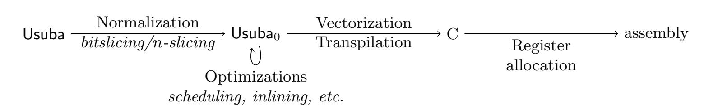
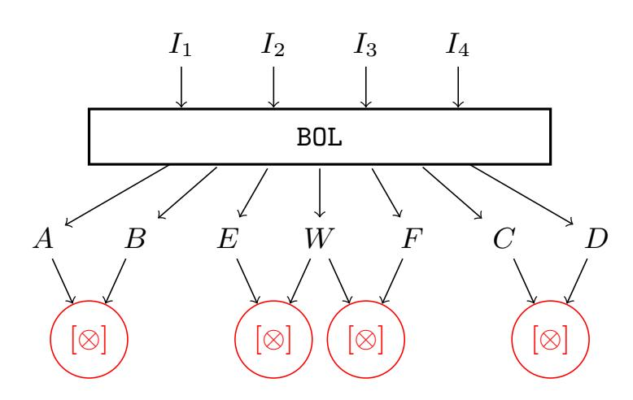
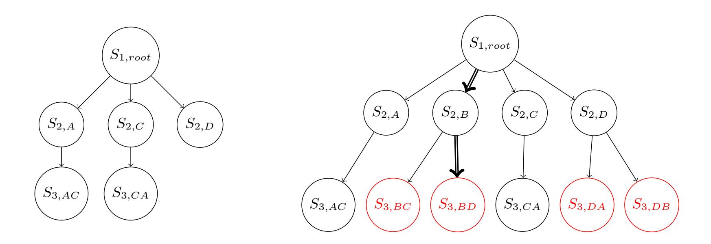
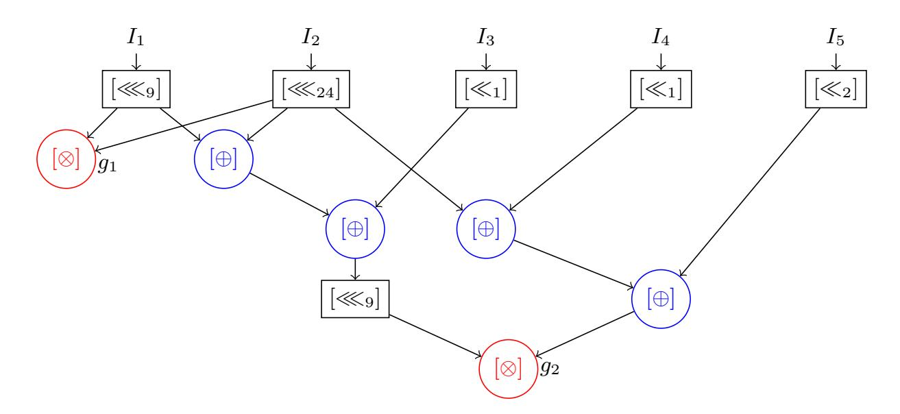
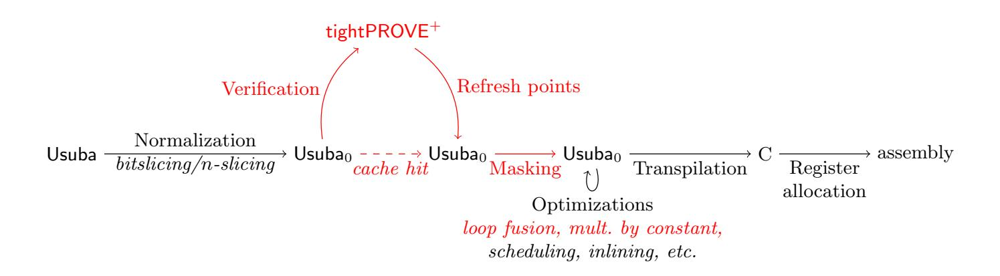

{0}------------------------------------------------

# Tornado: Automatic Generation of Probing-Secure Masked Bitsliced Implementations

Sonia Bela¨ıd<sup>1</sup> , Pierre-Evariste Dagand ´ <sup>2</sup> , Darius Mercadier<sup>2</sup> , Matthieu Rivain<sup>1</sup> , and Rapha¨el Wintersdorff

> <sup>1</sup> CryptoExperts, Paris, France <sup>2</sup> Sorbonne Universit´e, Paris, France

{sonia.belaid,matthieu.rivain}@cryptoexperts.com {pierre-evariste.dagand,darius.mercadier}@lip6.fr raphaelwin@hotmail.com

Abstract. Cryptographic implementations deployed in real world devices often aim at (provable) security against the powerful class of side-channel attacks while keeping reasonable performances. Last year at Asiacrypt, a new formal verification tool named tightPROVE was put forward to exactly determine whether a masked implementation is secure in the well-deployed probing security model for any given security order t. Also recently, a compiler named Usuba was proposed to automatically generate bitsliced implementations of cryptographic primitives.

This paper goes one step further in the security and performances achievements with a new automatic tool named Tornado. In a nutshell, from the high-level description of a cryptographic primitive, Tornado produces a functionally equivalent bitsliced masked implementation at any desired order proven secure in the probing model, but additionally in the so-called register probing model which much better fits the reality of software implementations. This framework is obtained by the integration of Usuba with tightPROVE<sup>+</sup>, which extends tightPROVE with the ability to verify the security of implementations in the register probing model and to fix them with inserting refresh gadgets at carefully chosen locations accordingly.

We demonstrate Tornado on the lightweight cryptographic primitives selected to the second round of the NIST competition and which somehow claimed to be masking friendly. It advantageously displays performances of the resulting masked implementations for several masking orders and proves their security in the register probing model.

Keywords: Compiler, Masking, Automated verification, Bitslice

# 1 Introduction

Cryptographic implementations susceptible to power and electromagnetic side-channel attacks are usually protected by masking. The general principle of masking is to apply some secret sharing scheme to the sensitive variables processed by the implementation in order to make the side-channel information either negligible or hard to exploit in practice. Many masked implementations rely on Boolean masking in which a variable x is represented as n random shares x1, . . . , x<sup>n</sup> satisfying the completeness relation x<sup>1</sup> ⊕ · · · ⊕ x<sup>n</sup> = x (where ⊕ denotes the bitwise addition).

The probing model is widely used to analyze the security of masked (software) implementations vs. side-channel attacks. This model was introduced by Ishai, Sahai and Wagner in [26] to construct circuits resistant to hardware probing attacks. It was latter shown that this model and the underlying construction were instrumental to the design of efficient practically-secure masked cryptographic implementations [32, 15, 18, 19]. A masking scheme secure against a t-probing adversary, i.e. who can probe t arbitrary variables in the computation, is indeed secure by design against the class of side-channel attacks of order t [17].

Most masking schemes consider the implementation to be protected as a Boolean or arithmetic circuit composed of gates of different natures. These gates are then replaced by gadgets processing masked variables. One of the important contributions of [26] was to propose a multiplication gadget secure against t-probing attacks for any t, based on a Boolean masking of order n = 2t+1. This was 

{1}------------------------------------------------

reduced to the tight order n = t+1 in [32] by constraining the two input sharings to be independent, which could be ensured by the application of a mask-refreshing gadget when necessary. The design of secure refresh gadgets and, more generally, the secure composition of gadgets were subsequently subject to many works [18, 16, 5, 6]. Of particular interest, the notions of Non-Interference (NI) and Strong Non-Interference (SNI) introduced in [5] provide a practical framework for the secure composition of gadgets which yields tight probing-secure masked implementations. In a nutshell, such implementations are composed of ISW multiplication and refresh gadgets (from the names of their inventors Ishai, Sahai, and Wagner [26]) achieving the SNI property, and of sharewise addition gadgets. The main technical challenge in such a context is to identify the number of required refresh gadgets and their (optimal) placing in the implementation to obtain a provable t-probing security. Last year at Asiacrypt, a formal verification tool called tightPROVE was put forward by Bela¨ıd, Goudarzi, and Rivain [8] which is able to clearly state whether a tight masked implementation is t-probing secure or not. Given a masked implementation composed of standard gadgets (sharewise addition, ISW multiplication and refresh), tightPROVE either produces a probing-security proof (valid at any order) or exhibits a security flaw that directly implies a probing attack at a given order. Although nicely answering a relevant open issue, tightPROVE still suffers two important limitations. First it only applies to Boolean circuits and does not straightforwardly generalize to software implementation processing `-bit registers (for ` > 1). Secondly, it does not provide a method to place the refresh whenever a probing attack is detected.

In parallel to these developments, many works have focused on the efficient implementation of masking schemes with possibly high orders. For software implementations, it was recently demonstrated in several works that the use of bitslicing makes it possible to achieve (very) aggressive performances. In the bitsliced higher-order masking paradigm, the ISW scheme is applied to secure bitwise and instructions which are significantly more efficient than their field-multiplication counterparts involved in the so-called polynomial schemes [25, 27]. Moreover, the bitslice strategy allows to compute several instances of a cryptographic primitive in parallel, or alternatively all the s-boxes in parallel within an instance of the primitive. The former setting is simply called (full) bitslice in the present paper while the latter setting is referred to as n-slice. In both settings, the high degree of parallelization inherited from the bitslice approach results in important efficiency gains. Verifying the probing security of full bitslice masked implementation is possible with tightPROVE since the different bit slots (corresponding to different instances of the cryptographic primitive) are mutually independent. Therefore, probing an `-bit register in the bitslice implementation is equivalent to probing the corresponding variable in ` independent Boolean circuits, and hence tightPROVE straightforwardly applies. For n-slice implementations on the other hand, the different bit slots are mixed together at some point in the implementation which makes the verification beyond the scope of tightPROVE. In practice, for masked software implementations, the register probing model makes much more sense than the bit probing model because a software implementation works on `-bit registers containing several bits that leak all together.

Another limitation of tightPROVE is that it simply verifies an implementation under the form of an abstract circuit but it does not output a secure implementation, nor provide a sound placing of refresh gadgets to make the implementation secure. In practice one could hope for an integrated tool that takes an input circuit in a simple syntax, determine where to place the refresh gadgets and compile the augmented circuit into a masked implementation, for a given masking order on a given computing platform. Usuba, introduced by Mercadier and Dagand in [29], is a highlevel programming language for specifying symmetric block ciphers. It provides an optimizing compiler that produces efficient bitsliced implementations. On high-end Intel platforms, Usuba has demonstrated performance on par with several, publicly available cipher implementations. As part of its compilation pipeline, Usuba features an intermediate representation, Usuba0, that shares many commonalities with the input language of tightPROVE.

It is therefore natural to consider integrating both tools in a single programming environment. We aim at enabling cryptographers to prototype their algorithms in Usuba, letting tightPROVE verify or repair its security and letting the Usuba back-end perform masked code generation.

Our Contributions. The contributions of our work are threefold:

{2}------------------------------------------------

Extended probing-security verification tool. We tackle the limitations of tightPROVE and propose an extended verification tool, that we shall call tightPROVE+. This tool can verify the security of any masked bitslice implementation in the register probing model (which makes more sense than the bit probing model w.r.t. masked software implementations). Given a masked bitslice/nslice implementation composed of standard gadgets for bitwise operations, tightPROVE<sup>+</sup> either produces a probing-security proof or exhibits a probing attack.

New integrated compiler for masked bitslice implementations. We present (and report on the development of) a new compiler Tornado<sup>3</sup> which integrates Usuba and tightPROVE<sup>+</sup> in a global compiler producing masked bitsliced implementations proven secure in the bit/register probing model. This compiler takes as input a high-level, functional specification of a cryptographic primitive. If some probing attacks are detected by tightPROVE+, the Tornado compiler introduces refresh gadgets, following a sound heuristic, in order to thwart these attacks. Once a circuit has been identified as secure, Tornado produces bitsliced C code achieving register probing security at a given input order. To account for the limited resources available on embedded systems, Tornado exploits a generalization of bitslicing – implemented by Usuba – to reduce register pressure and implements several optimizations specifically tailored for Boolean masking code. The source code of Tornado is available at:

# https://github.com/CryptoExperts/Tornado

Benchmarks of NIST lightweight cryptography candidates. We evaluate Tornado on 11 cryptographic primitives from the second round of the ongoing NIST lightweight cryptography standardization process.<sup>4</sup> The choice of cryptographic primitives has been made on the basis that they were self-identified as being amenable to masking. These implementation results give a benchmark of these different candidates with respect to masked software implementation for a number of shares ranging between 1 and 128. The obtained performances are pretty satisfying. For instance, the n-slice implementations of the tested primitives masked with 128 shares takes from 1 to a few dozen megacycles on an Cortex-M4 processor.

# 2 Technical Background

#### 2.1 Usuba

Usuba is a domain-specific language for describing bitsliced algorithms. It has been designed around the observation that a bitsliced algorithm is essentially a combinational circuit implemented in software. As a consequence, Usuba's design is inspired by high-level synthesis languages, following a dataflow specification style. For instance, the language offers the possibility to manipulate bit-level quantities as well as to apply bitwise transformations to compound quantities. A domain-specific compiler then synthesizes an efficient software implementation manipulating machine words.

Figure 1 shows the Usuba implementation of the Ascon cipher. To structure programs, we use node's (Figure 1b, 1c & 1d) , of which table's (Figure 1a) are a special case of, specified through their truth table. A node specifies a set of input values, output values as well as a system of equations relating these variables. To streamline the definition of repeating systems (e.g. , the 12 rounds of Ascon), Usuba offers bounded loops, which simply desugar into standalone equations. A static analysis ensures that the system of equations admits a solution. The semantics of an Usuba program is thus straightforward: it is the (unique) solution to the system of equations.

Aside from custom syntax, Usuba features a type system that documents and enforces parallelization strategies. Traditionally, bitslicing [12] consists in treating an m-word quantity as m variables, such that a combinational circuit can be straightforwardly implemented by applying the corresponding bitwise logical operations over the variables. On a 32-bit architecture, this means that 32 circuits are evaluated "in parallel": for example, a 32-bit and instruction is seen as 32

<sup>3</sup> Tornado ambitions to be the workhorse of those cryptographers that selflessly protect their ciphers through provably secure masking and precise bitslicing.

<sup>4</sup> https://csrc.nist.gov/Projects/lightweight-cryptography/round-2-candidates

{3}------------------------------------------------

```
table Sbox(x:v5) returns (y:v5) {
  0x4, 0xb, 0x1f, 0x14, 0x1a, 0x15,
  0x9, 0x2, 0x1b, 0x5, 0x8, 0x12,
  0x1d, 0x3, 0x6, 0x1c, 0x1e, 0x13,
  0x7, 0xe, 0x0, 0xd, 0x11, 0x18,
  0x10, 0xc, 0x1, 0x19, 0x16, 0xa,
  0xf, 0x17
}
     (a) S-box specified by its truth table.
                                                                node AddConstant(state:u64x5,c:u64)
                                                                            returns (stateR:u64x5)
                                                                let
                                                                    stateR = (state[0,1], state[2] ^ c,
                                                                              state[3,4]);
                                                                tel
                                                                        (b) Node manipulating a 5-uple
node LinearLayer(state:u64x5)
          returns (stateR:u64x5)
let
  stateR[0] = state[0]
            ^ (state[0] >>> 19)
            ^ (state[0] >>> 28);
  stateR[1] = state[1]
            ^ (state[1] >>> 61)
            ^ (state[1] >>> 39);
  stateR[2] = state[2]
            ^ (state[2] >>> 1)
            ^ (state[2] >>> 6);
  stateR[3] = state[3]
            ^ (state[3] >>> 10)
            ^ (state[3] >>> 17);
  stateR[4] = state[4]
            ^ (state[4] >>> 7)
            ^ (state[4] >>> 41);
tel
       (c) Node involving rotations and xors
                                                            node ascon12(input:u64x5)
                                                                      returns (output:u64x5)
                                                            vars
                                                                consts:u64[12],
                                                                state:u64x5[13]
                                                            let
                                                                consts = (0xf0, 0xe1, 0xd2, 0xc3,
                                                                          0xb4, 0xa5, 0x96, 0x87,
                                                                          0x78, 0x69, 0x5a, 0x4b);
                                                                state[0] = input;
                                                                forall i in [0, 11] {
                                                                    state[i+1] = LinearLayer
                                                                              (Sbox
                                                                              (AddConstant
                                                                              (state[i],consts[i])))
                                                                }
                                                                output = state[12]
                                                            tel
                                                                  (d) Main node composing the 12 rounds
```

Fig. 1: Ascon cipher in Usuba

Boolean and gates. To ensure that an algorithm admits an efficient bitsliced implementation, Usuba only allows bitwise operations and forbids stateful computations [30].

However, bitslicing can be generalized to n-slicing [29] (with n > 1). Whereas bitslicing splits an m-word quantity into m individual bits, we can also treat it at a coarser granularity<sup>5</sup> , splitting it into k variables of n bits each (preserving the invariant that m = k × n). The register pressure is thus lowered, since we introduce k variables rather than m, and, provided some support from the underlying hardware or compiler, we may use arithmetic operations in addition to the usual Boolean operations. Conversely, certain operations become prohibitively expensive in this setting, such as permuting individual bits. The role of Usuba's type system is to document the parallelization strategy decided by the programmer (e.g. , u64x5 means that we chose to treat a 320-bit block at the granularity of 64-bit atoms) and ensure that the programmer only used operations that can be efficiently implemented on a given architecture.

The overall architecture of the Usuba compiler is presented in Figure 2. It involves two essential steps. Firstly, normalization expands the high-level constructs of the language to a minimal core language called Usuba0. Usuba<sup>0</sup> is the software equivalent of a netlist: it represents the sliced implementation in a flattened form, erasing tuples altogether. Secondly, optimizations are applied at this level, taking Usuba<sup>0</sup> circuits to (functionally equivalent) Usuba<sup>0</sup> circuits. In particular, scheduling is responsible for ordering the system of equations in such a way as to enable sequential execution as well as maximize instruction-level parallelism. To obtain a C program from a scheduled Usuba<sup>0</sup> circuit, we merely have to replace the Boolean and arithmetic operations of the circuit with the corresponding C operations. The resulting C program is in static single assignment (SSA) form, involving only operations on integer types: we thus solely rely on the C compiler to perform register allocation and produce executable code.

<sup>5</sup> The literature [29, Fig.2] distinguishes vertical from horizontal n-slicing: lacking the powerful SIMD instructions required by horizontal n-slicing, we focus here solely on vertical n-slicing, which we abbreviate unambiguously to "n-slicing".

{4}------------------------------------------------



Fig. 2: High-level view of the Usuba compiler

At compile-time, a specific node is designated as the cryptographic primitive of interest (here, ascon12): the Usuba compiler is then tasked to produce a C file exposing a function corresponding to the desired primitive. In this case, the bitsliced primitive would have type

```
void Ascon12 (uint32_t plain[320], uint32_t cipher[320])
```

whereas the 64-sliced primitive would have type

```
void Ascon12 (uint64_t plain[5], uint64_t cipher[5])
```

Usuba targets C so as to maximize portability: it has been successfully used to deploy cryptographic primitives on Intel, PowerPC, Arm and Sparc architectures. However, a significant amount of optimization is carried by the Usuba compiler: because this programming model is subject to stringent invariants, the compiler is able to perform far-reaching, whole program optimizations that a C compiler would shy away from. For example, it features a custom instruction scheduling algorithm, aimed at minimizing the register pressure of bitsliced code. On high-end Intel architectures featuring Single Instruction Multiple Data (SIMD) extensions, Usuba has demonstrated performance on par with hand-optimized reference implementations [29].

Usuba offers an ideal setting in which to automate Boolean masking. Indeed, ciphers specified in Usuba are presented at a suitable level of abstraction: they consist in combinational circuits, by construction. As a result, the Usuba compiler can perform a systematic source-to-source transformation, automating away the tedious introduction of masking gadgets and refreshes. Besides, the high-level nature of the language allows us to extract a model of an algorithm, analyzable by static analysis tools such as SAT solvers – to check program equivalence, which is used internally to validate the correctness of optimizations – or tightPROVE – to verify probing security.

#### 2.2 tightPROVE

tightPROVE is a verification tool which aims to verify the probing security of a shared Boolean circuit. It takes as input a list of instructions that describes a shared circuit made of specific multiplication, addition and refresh gadgets and outputs either a probing security proof or a probing attack. To that end, a security reduction is made through a sequence of four equivalent games. In each of them, an adversary  $\mathcal A$  chooses a set of probes  $\mathcal P$  (indices pointing to wires in the shared circuit) in the target circuit C, and a simulator  $\mathcal S$  wins the game if it successfully simulates the distribution of the tuple of variables carried by the corresponding wires without knowledge of the secret inputs.

Game 0 corresponds to the t-probing security definition: the adversary can choose t probes in a t+1-shared circuit, on whichever wires she wishes. In Game 1, the adversary is restricted to only probe gadget inputs: one probe on an addition or refresh gadget becomes one probe on one input share, one probe on a multiplication gadget becomes one probe on each of the input sharings. In Game 2, the circuit C is replaced by another circuit C' that has a multiplicative depth of one, through a transformation called **Flatten**, illustrated in the original paper [8]. In a nutshell, each output of a multiplication or refresh gadget in the original circuit gives rise to a new input with a fresh sharing in C'. Finally, in Game 3, the adversary is only allowed to probe pairs of inputs of multiplication gadgets. The transition between these games is mainly made possible by an important property of the selected refresh and multiplication gadgets: in addition to being t-probing secure, they are t-strong non interfering (t-SNI for short) [5]. Satisfying the latter means that t probed variables in their circuit description can be simulated with less than  $t_1$  shares of

{5}------------------------------------------------

each input, where  $t_1 \leq t$  denotes the number of internal probes *i.e.* which are not placed on output shares.

Game 3 can be interpreted as a linear algebra problem. In the flattened circuit, the inputs of multiplication gadgets are linear combinations of the circuit inputs. These can be modelled as Boolean vectors that we call operand vectors, with ones at indexes of involved inputs. From the definition of Game 3, the 2t probes made by the adversary all target these operand vectors for chosen shares. These probes can be distributed into t+1 matrices  $M_0, \ldots, M_t$ , where t+1 corresponds to the (tight) number of shares, such that for each probe targeting the share i of an operand vector  $\mathbf{v}$ , with i in  $\{0,\ldots,t\}$ ,  $\mathbf{v}$  is added as a row to matrix  $M_i$ . Deciding whether a circuit is t-probing secure can then be reduced to verifying whether  $\langle M_0^T \rangle \cap \cdots \cap \langle M_t^T \rangle = \emptyset$  (where  $\langle \cdot \rangle$  denotes the column space of a matrix). The latter can be solved algorithmically with the following high-level algorithm for a circuit with m multiplications:

For each operand vector  $\mathbf{w}$ ,

- 1. Create a set  $\mathcal{G}_1$  with all the multiplications for which **w** is one of the operand vectors.
- 2. Create a set  $\mathcal{O}_1$  with the co-operand vectors of  $\mathbf{w}$  in the multiplications in  $\mathcal{G}_1$ .
- 3. Stop if  $\mathbf{w} \in \langle \mathcal{O}_1 \rangle$  ( $\mathcal{O}_1$ 's linear span), that is if  $\mathbf{w}$  can be written as a linear combination of Boolean vectors from  $\mathcal{O}_1$ .
- 4. For i from 2 to m, create new sets  $\mathcal{G}_i$  and  $\mathcal{O}_i$  by adding to  $\mathcal{G}_{i-1}$  multiplications that involve an operand  $\mathbf{w}'$  verifying  $\mathbf{w}' \in (\mathbf{w} \oplus \langle \mathcal{O}_{i-1} \rangle)$ , and adding to  $\mathcal{O}_{i-1}$  the other operand vectors of these multiplications. Stop whenever i = m or  $\mathcal{G}_i = \mathcal{G}_{i-1}$  or  $\mathbf{w} \in \langle \mathcal{O}_i \rangle$ .

If this algorithm stops when  $\mathbf{w} \in \langle \mathcal{O}_i \rangle$  for some i, then there is a probing attack on  $\mathbf{w}$ , i.e., for a certain t, the attacker can recover information on  $\mathbf{x} \cdot \mathbf{w}$  (where  $\mathbf{x}$  denote the vector of plain inputs), with only t probes on the (t+1)-shared circuit. In the other two scenarios, the circuit is proven to be t-probing secure for any value of t.

# 3 Extending tightPROVE to the Register-Probing Model

#### 3.1 Model of Computation

**Notations.** In this paper, we denote by  $\mathbb{K} = \mathbb{F}_2$  the field with two elements and by  $\mathcal{V} = \mathbb{K}^s$  the vector space of dimension s over  $\mathbb{K}$ , for some given integer s (which will be used to denote the register size). Vectors, in any vector space, are written in bold. [i,j] denotes the integer interval  $\mathbb{Z} \cap [i,j]$  for any two integers i and j. For a finite set  $\mathcal{X}$ , we denote by  $|\mathcal{X}|$  the cardinality of  $\mathcal{X}$  and by  $x \leftarrow \mathcal{X}$  the action of picking x from  $\mathcal{X}$  independently and uniformly at random. For some (probabilistic) algorithm  $\mathcal{A}$ , we further denote  $x \leftarrow \mathcal{A}(in)$  the action of running algorithm  $\mathcal{A}$  on some inputs in (with fresh uniform random tape) and setting x to the value returned by  $\mathcal{A}$ .

**Basic Notions.** We call *register-based circuit* any directed acyclic graph, whose vertices either correspond to an input gate, a constant gate outputting an element of  $\mathcal{V}$  or a gate processing one of the following functions:

- XOR and AND, the coordinate-wise Boolean addition and multiplication over  $\mathbb{K}^s$ , respectively. For the sake of intelligibility, we write  $\mathbf{a} + \mathbf{b}$  and  $\mathbf{a} \cdot \mathbf{b}$  instead of  $\mathsf{XOR}(\mathbf{a}, \mathbf{b})$  and  $\mathsf{AND}(\mathbf{a}, \mathbf{b})$  respectively when it is clear from the context that we are performing bitwise operations between elements of  $\mathcal{V}$ .
- $(\mathsf{ROTL}_r)_{r \in \llbracket 1, s-1 \rrbracket}$ , the family of vector Boolean rotations. For all  $r \in \llbracket 1, s-1 \rrbracket$ ,

$$\mathsf{ROTL}_r \colon \mathcal{V} \to \mathcal{V}$$
  
 $(v_1, \dots, v_s) \mapsto (v_{r+1}, \dots, v_s, v_1, \dots, v_r)$ 

-  $(\mathsf{SHIFTL}_r)_{r \in \llbracket 1, s-1 \rrbracket}$  and  $(\mathsf{SHIFTR}_r)_{r \in \llbracket 1, s-1 \rrbracket}$ , the families of vector Boolean left and right shifts. For all  $r \in \llbracket 1, s-1 \rrbracket$ ,

$$\mathsf{SHIFTL}_r \colon \mathcal{V} \to \mathcal{V}$$

$$(v_1, \dots, v_s) \mapsto (v_{r+1}, \dots, v_s, 0, \dots, 0)$$

$$\mathsf{SHIFTR}_r \colon \mathcal{V} \to \mathcal{V}$$

$$(v_1, \dots, v_s) \mapsto (0, \dots, 0, v_1, \dots, v_{s-r})$$

{6}------------------------------------------------

A randomized circuit is a register-based circuit augmented with gates of fan-in 0 that output elements of V chosen uniformly at random.

Translation to the Masking World. A d-sharing of x ∈ V refers to any random tuple [x]<sup>d</sup> = (x0, x<sup>1</sup> . . . , xd−1) ∈ V<sup>d</sup> that satisfies x = x<sup>0</sup> + x<sup>1</sup> + · · · + xd−1. A d-sharing [x]<sup>d</sup> is uniform if it is uniformly distributed over the subspace of tuples satisfying this condition, meaning that for any k < d, any k-tuple of the shares of x is uniformly distributed over V k . In the following, we omit the sharing order d when it is clear from the context, so a d-sharing of x is denoted by [x]. We further denote by Enc a probabilistic encoding algorithm that maps x ∈ V to a fresh uniform sharing [x].

In this paper, we call a d-shared register-based circuit a randomized register-based circuit working on d-shared variables as elements of V that takes as inputs some d-sharings [x1], . . . , [xn] and performs operations on their shares with the functions described above. Assuming that we associate an index to each edge in the circuit, a probe refers to a specific edge index. For such a circuit C, we denote by C([x1], . . . , [xn])<sup>P</sup> the distribution of the tuple of values carried by the wires of C of indexes in P when the circuit is evaluated on [x1], . . . , [xn].

We consider circuits composed of subcircuits called gadgets. Gadgets are d-shared circuits performing a specific operation. They can be seen as building blocks of a more complex circuit. We furthermore say that a gadget is sharewise if each output share of this gadget can be expressed as a deterministic function of its input shares of the same sharing index. In this paper, we specifically consider the following gadgets:

- The ISW-multiplication gadget [⊗] takes two d-sharings [a] and [b] as inputs and outputs a d-sharing [c] such that c = a · b as follows:
  - 1. for every 0 ≤ i < j ≤ d − 1, ri,j ← V;
  - 2. for every 0 ≤ i < j ≤ d − 1, compute rj,i ← (ri,j + a<sup>i</sup> · b<sup>j</sup> ) + a<sup>j</sup> · b<sup>i</sup> ;
  - 3. for every 0 ≤ i ≤ d − 1, compute c<sup>i</sup> ← a<sup>i</sup> · b<sup>i</sup> + P j6=i ri,j .
- The ISW-refresh gadget [R] is the ISW-multiplication gadget in which the second operand [b] is set to the constant sharing (1, 0, . . . , 0), where 0 ∈ V and 1 ∈ V denote the all 0 and all 1 vector respectively.
- The sharewise addition gadget [⊕] computes a d-sharing [c] from sharings [a] and [b] such that <sup>c</sup> <sup>=</sup> <sup>a</sup> <sup>+</sup> <sup>b</sup> by letting <sup>c</sup><sup>i</sup> <sup>=</sup> <sup>a</sup><sup>i</sup> <sup>+</sup> <sup>b</sup><sup>i</sup> for <sup>i</sup> <sup>∈</sup> <sup>J</sup>0, d <sup>−</sup> <sup>1</sup>K.
- The sharewise left shift, right shift and rotation gadgets ([<sup>n</sup>], [<sup>n</sup>] and [≪n] respectively) take a sharing [a] as input and output a sharing [c] such that c = f(a) by letting c<sup>i</sup> = f(ai) for <sup>i</sup> <sup>∈</sup> <sup>J</sup>0, d <sup>−</sup> <sup>1</sup>K, <sup>f</sup> being the corresponding function described in the section above.
- The sharewise multiplication by a constant [⊗k] takes a sharing [a] and a constant k ∈ V as inputs and outputs a sharing [c] such that <sup>c</sup> <sup>=</sup> <sup>k</sup> · <sup>a</sup> by letting <sup>c</sup><sup>i</sup> <sup>=</sup> <sup>k</sup> · <sup>a</sup><sup>i</sup> for <sup>i</sup> <sup>∈</sup> <sup>J</sup>0, d <sup>−</sup> <sup>1</sup>K.
- The sharewise addition with a constant [⊕k] takes a sharing [a] and a constant k ∈ V as input and outputs a sharing [c] such that <sup>c</sup> <sup>=</sup> <sup>a</sup> <sup>+</sup> <sup>k</sup> by letting <sup>c</sup><sup>i</sup> <sup>=</sup> <sup>a</sup><sup>i</sup> for <sup>i</sup> <sup>∈</sup> <sup>J</sup>0, d <sup>−</sup> <sup>1</sup><sup>K</sup> and c<sup>0</sup> = a<sup>0</sup> + k. The coordinate-wise logical complement NOT is captured by this definition with k = (1, . . . , 1).

#### 3.2 Security Notions

In this section, we recall the t-probing security originally introduced in [26] as formalized through a concrete security game in [8]. It is based on two experiments described in Figure 3 from [8] in which an adversary A, modelled as a probabilistic algorithm, outputs of set of t probes P and n inputs x1, . . . , x<sup>n</sup> in a set K. In the first experiment, ExpReal, the inputs are encoded and given as inputs to the shared circuit C. The experiment then outputs a random evaluation of the chosen probes (v1, . . . , vt). In the second experiment, ExpSim, the simulator outputs a simulation of the evaluation C([x1], . . . , [xn])<sup>P</sup> without the input sharings. It wins the game if and only if the distributions of both experiments are identical.

Definition 1 ([8]). A shared circuit C is t-probing secure if and only if for every adversary A, there exists a simulator S that wins the t-probing security game defined in Figure 3, i.e. the random experiments ExpReal(A, C) and ExpSim(A, S, C) output identical distributions.

{7}------------------------------------------------

```
\frac{\mathsf{ExpReal}(\mathcal{A},C):}{1.\ (\mathcal{P},x_1,\ldots,x_n)\leftarrow\mathcal{A}()} \\ 2.\ [x_1]\leftarrow\mathbf{Enc}(x_1),\ldots,[x_n]\leftarrow\mathbf{Enc}(x_n) \\ 3.\ (v_1,\ldots,v_t)\leftarrow C([x_1],\ldots,[x_n])_{\mathcal{P}} \\ 4.\ \mathrm{Return}\ (v_1,\ldots,v_t) \\ \hline \end{aligned} \begin{array}{l} \underline{\mathsf{ExpSim}(\mathcal{A},\mathcal{S},C):} \\ 1.\ (\mathcal{P},x_1,\ldots,x_n)\leftarrow\mathcal{A}() \\ 2.\ (v_1,\ldots,v_t)\leftarrow\mathcal{S}(\mathcal{P}) \\ 3.\ \mathrm{Return}\ (v_1,\ldots,v_t) \\ \hline \end{array}
```

Fig. 3: t-probing security game from [8].

In [8], the notion of t-probing security was defined for a Boolean circuit, with  $\mathbb{K} = \mathbb{F}_2$ , that is with  $x_1, \ldots, x_n \in \mathbb{F}_2$  and  $v_1, \ldots, v_t \in \mathbb{F}_2$ . We further refer to this specialized notion as t-bit probing security.

While the notion of t-bit probing security is relevant in a hardware scenario, in the reality of masked software embedded devices, variables are manipulated in registers which contain several bits that leak all together. To capture this model, in this paper, we extend the verification to what we call the t-register probing model in which the targeted circuit manipulates variables on registers of size s for some  $s \in \mathbb{N}^+$  and the adversary is able to choose t probes as registers containing values in  $\mathcal{V} = \mathbb{F}_2^s$ . Notice that the t-bit probing model can be seen as a specialization of the t-register probing model with s = 1.

Cautionary note. In software implementations, we may also face transition leakages, modeled as functions of two  $\ell$ -bit variables when they are successively stored in the same register. In that scenario, the masking order t might be halved [2,31]. While specific techniques can be settled to detect and handle such leakages, we leave it for future work and focus on simple register probing model in this paper, in which one observation reveals the content of a single register.

#### 3.3 Security Reductions in the Register Probing Model

Just like for the bit-probing version of tightPROVE, the security notions are formalized through games. Similar notions are used which only differ in the fact that the probes in the new model now point to wires of register-based circuits, which carry vectors of  $\mathcal{V}$ . In this section, we present the differences between the security games in the bit-probing model and the register-probing model. The games are still equivalent to one another, and we give a sketch of proof for each transition (as well as a full proof in the appendix). We then give a description of the linear algebra problem induced by the last game.

**Sequence of Games.** Similarly to the bit-probing case, Game 0 corresponds to the probing security definition for a register-based circuit, and still features an adversary  $\mathcal{A}$  that chooses a set of probes  $\mathcal{P}$  in a circuit C, and a simulator  $\mathcal{S}$  that wins the game if it successfully simulates  $C([\mathbf{x}_1],\ldots,[\mathbf{x}_n])_{\mathcal{P}}$ , for inputs  $x_1,\ldots,x_n\in\mathcal{V}$ .

Game 1. In Game 1, the adversary returns a set of probes  $\mathcal{P}' = \mathcal{P}'_r \cup \mathcal{P}'_m \cup \mathcal{P}'_{sw}$ , where  $|\mathcal{P}'| = t$  and the sets  $\mathcal{P}'_r$ ,  $\mathcal{P}'_m$  and  $\mathcal{P}'_{sw}$  contain probes pointing to refresh gadgets' inputs, pairs of probes pointing to multiplication gadgets' inputs and probes pointing to sharewise gadgets' inputs or outputs respectively.  $C([\mathbf{x}_1], \ldots, [\mathbf{x}_n])_{\mathcal{P}'}$  is then a q-tuple for  $q = 2|\mathcal{P}'_m| + |\mathcal{P}'_r \cup \mathcal{P}'_{sw}|$ . Besides the definition set of variables, the only difference with the bit-probing case stands in the fact that the sharewise gadgets are not restricted to addition gadgets.

Game 2. In Game 2, the circuit C is replaced by an equivalent circuit C' of multiplicative depth 1, just like in the bit-probing case. The **Flatten** operation can be trivially adapted to register-based circuits, as the outputs of refresh and multiplication gadgets can still be considered as uniform sharings.

{8}------------------------------------------------

Game 3. In this last game, the adversary is restricted to only position its t probes on multiplication gadgets, i.e.  $\mathcal{A}$  returns a set of probes  $\mathcal{P}'' = \mathcal{P}'_r \cup \mathcal{P}'_m \cup \mathcal{P}'_{sw}$  such that  $\mathcal{P}'_{sw} = \mathcal{P}'_r = \emptyset$  and  $\mathcal{P}'' = P'_m$ .  $C([\mathbf{x}_1], \ldots, [\mathbf{x}_n])_{\mathcal{P}''}$  thus returns a q-tuple for q = 2t since all the elements in  $\mathcal{P}''$  are pairs of inputs of multiplication gadgets.

**Theorem 1.** Let C be a shared circuit. We have the following equivalences:

$$\forall \mathcal{A}_0, \exists \mathcal{S}_0, \mathcal{S}_0 \text{ wins } Game \ 0. \iff \forall \mathcal{A}_1, \exists \mathcal{S}_1, \mathcal{S}_1 \text{ wins } Game \ 1.$$

$$\iff \forall \mathcal{A}_2, \exists \mathcal{S}_2, \mathcal{S}_2 \text{ wins } Game \ 2.$$

$$\iff \forall \mathcal{A}_3, \exists \mathcal{S}_3, \mathcal{S}_3 \text{ wins } Game \ 3.$$

For the sake of clarity, we define one lemma per game transition. The corresponding proofs are available in Appendix A, but an informal reasoning that supports these ideas is given in the following, as well as the differences with the proofs established in [8].

**Lemma 1.**  $\forall A_0, \exists S_0, S_0 \text{ wins } Game \ 0. \iff \forall A_1, \exists S_1, S_1 \text{ wins } Game \ 1.$ 

Proof (sketch). The proof for the first game transition is based on the fact that multiplication and refresh gadgets are t-SNI gadgets, and that each probe on such gadgets can be replaced by at most one probe on each input sharing. The reason why this still works in the new model is that the ISW multiplication and refresh gadgets are still SNI for register-based circuits performing bitwise operations on  $\mathcal{V}$ . This transition can thus be reduced to the original transition.

**Lemma 2.**  $\forall A_1, \exists S_1, S_1 \text{ wins } Game 1. \iff \forall A_2, \exists S_2, S_2 \text{ wins } Game 2.$ 

Proof (sketch). The proof for the second game transition relies on the fact that just as the output of a Boolean multiplication gadget is a random uniform Boolean sharing, independent of its input sharings, the outputs of the multiplication gadgets we consider can be treated as new, fresh input encodings. Thus, a circuit C is t-probing secure if and only if the circuit C' = Flatten(C) is t-probing secure.

**Lemma 3.**  $\forall A_2, \exists S_2, S_2 \text{ wins } Game \ 2. \iff \forall A_3, \exists S_3, S_3 \text{ wins } Game \ 3.$ 

Proof (sketch). A cross product of shares  $\mathbf{a}_i \cdot \mathbf{b}_j$  carries informations on both shares  $\mathbf{a}_i$  and  $\mathbf{b}_j$ , as each of the s slots in the cross product carries information about each share. Thus, placing probes on multiplication gadgets only is optimal from the attacker point of view. The complete proof for Lemma 3 makes use of formal notions which are introduced in the next paragraph.

**Translation to Linear Algebra.** From now on, the column space of a matrix M is denoted by  $\langle M \rangle$  and the column space of the concatenation of all the matrices in a set E is denoted by  $\langle E \rangle$ .

From Lemma 1 and Lemma 2, checking the t-probing security of a shared circuit C has been reduced to verifying the t-probing security of a shared circuit  $C' = \mathbf{Flatten}(C)$ , for which the attacker is restricted to use probes on its multiplication and refresh gadgets' inputs. We can translate this problem into a linear algebra problem that we can solve algorithmically. In the following, let us denote by  $\mathbf{x}_{i,j} \in \mathcal{V}$  the  $j^{th}$  share of the  $i^{th}$  input sharing  $[\mathbf{x}_i]$ , so that

$$\forall i \in [1, N], [\mathbf{x}_i] = (\mathbf{x}_{i,0}, \mathbf{x}_{i,1}, \dots, \mathbf{x}_{i,t}) \in \mathcal{V}^{t+1}$$

We also denote by  $\mathbf{x}_{||j}$  the concatenation of the  $j^{th}$  shares of the input sharings:

$$\forall j \in [0, t], \mathbf{x}_{||j} = \mathbf{x}_{1,j} || \mathbf{x}_{2,j} || \dots || \mathbf{x}_{N,j} \in \mathbb{K}^{sN}$$

The probed variables in the flattened circuit C' form a q-tuple  $(\mathbf{v}_1, \dots, \mathbf{v}_q) = C'([\mathbf{x}_1], \dots, [\mathbf{x}_N])_{\mathcal{P}'}$ . It can be checked that all these variables are linear combinations of inputs shares' coordinates since (1) the circuit C' has a multiplicative depth of one, (2) the adversary can only place probes on inputs for multiplication and refresh gadgets, and (3) other types of gadgets are linear. Since the gadgets other than multiplication and refresh are sharewise, we can assert that for every  $k \in [1, q]$ , there exists a single share index j for which  $\mathbf{v}_k$  only depends on the  $j^{th}$  share of the input sharings

{9}------------------------------------------------

and thus only depends on  $\mathbf{x}_{||j}$ . Therefore there exists a Boolean matrix  $A_k \in \mathbb{K}^{sN \times s}$ , that we refer to as a block from now on, such that

$$\mathbf{v}_k = \mathbf{x}_{||j} \cdot A_k \in \mathcal{V}.$$

Let us denote by  $\mathbf{v}_{||j}$  the concatenation of all  $n_j$  probed variables  $\mathbf{v}_i$  with  $i \in [1, q]$  such that  $\mathbf{v}_i$  only depends on share j. Similarly, we denote by  $M_j \in \mathbb{K}^{sN \times sn_j}$  the matrix obtained from the concatenation of all the corresponding blocks  $A_i$  (in the same order). We can now write

$$\mathbf{v}_{||0} = \mathbf{x}_{||0} \cdot M_0 , \quad \mathbf{v}_{||1} = \mathbf{x}_{||1} \cdot M_1 , \dots , \quad \mathbf{v}_{||t} = \mathbf{x}_{||t} \cdot M_t$$

which leads us to the following proposition.

**Proposition 1.** For any  $(\mathbf{x}_1, \dots, \mathbf{x}_N) \in \mathcal{V}^N$ , the q-tuple of probed variables  $(\mathbf{v}_1, \dots, \mathbf{v}_q) = C([\mathbf{x}_1], [\mathbf{x}_2], \dots, [\mathbf{x}_N])_{\mathcal{P}'}$  can be perfectly simulated if and only if the  $M_j$  matrices satisfy

$$\langle M_0 \rangle \cap \langle M_1 \rangle \cap \cdots \cap \langle M_t \rangle = \emptyset$$
.

Proof. Let us denote by  $\mathbf{x} = (\mathbf{x}_1 \| \mathbf{x}_2 \| \dots \| \mathbf{x}_N)$  the concatenation of all the inputs. We split the proof into two parts to handle both implications.

From left to right. Let us assume that there exist a non-null vector  $\mathbf{w} \in \mathbb{K}^{sN}$  and vectors  $\mathbf{u}_0 \in \mathbb{K}^{sn_0}, \dots, \mathbf{u}_t \in \mathbb{K}^{sn_t}$  that verify  $\mathbf{w} = M_0 \cdot \mathbf{u}_0 = \dots = M_t \cdot \mathbf{u}_t$ . This implies the following sequence of equalities:

$$\sum_{j=0}^{t} \mathbf{v}_{||j} \cdot \mathbf{u}_{j} = \sum_{j=0}^{t} \mathbf{x}_{||j} \cdot M_{j} \cdot \mathbf{u}_{j} = \sum_{j=0}^{t} \mathbf{x}_{||j} \cdot \mathbf{w} = \mathbf{x} \cdot \mathbf{w}$$

which implies that the distribution of  $(\mathbf{v}_1, \dots, \mathbf{v}_q)$  depends on  $\mathbf{x}$ , and thus cannot be perfectly simulated.

From right to left. Since the sharings  $[\mathbf{x}_1], \ldots, [\mathbf{x}_N]$  are uniform and independent, the vectors  $\mathbf{x}_{||1}, \ldots, \mathbf{x}_{||t}$  are independent uniform random vectors in  $\mathbb{K}^{sN}$ , and can thus be perfectly simulated without the knowledge of any secret value. As a direct consequence, the distribution of  $(\mathbf{v}_{||1}, \ldots, \mathbf{v}_{||t})$  can be simulated. From the definition  $\mathbf{v}_{||0} = \mathbf{x}_{||0} \cdot M_0$ , each coordinate of  $\mathbf{v}_{||0}$  is the result of a product  $\mathbf{x}_{||0} \cdot \mathbf{c}$  where  $\mathbf{c}$  is a column of  $M_0$ . By assumption, there exists  $j \in \{1, \ldots, t\}$  such that  $\mathbf{c} \notin \langle M_j \rangle$ . Since  $\mathbf{x}_{||1}, \ldots, \mathbf{x}_{||t}$  are mutually independent,  $\mathbf{x}_{||j} \cdot \mathbf{c}$  is a random uniform bit independent of  $\mathbf{x}_{||1} \cdot M_1, \ldots, \mathbf{x}_{||j-1} \cdot M_{j-1}, \mathbf{x}_{||j+1} \cdot M_{j+1}, \ldots, \mathbf{x}_{||t} \cdot M_t$ , and since  $\mathbf{c} \notin \langle M_j \rangle$ , it is also independent of  $\mathbf{x}_{||j} \cdot M_j$ . This means that  $\mathbf{x}_{||j} \cdot \mathbf{c}$  is a random uniform bit independent of  $\mathbf{v}_{||1}, \ldots, \mathbf{v}_{||t}$ , and so is  $\mathbf{x}_{||0} \cdot \mathbf{c}$ , as  $\mathbf{x}_{||0} \cdot \mathbf{c} = \mathbf{x}_{||j} \cdot \mathbf{c} + (\mathbf{x}_{||1} \cdot \mathbf{c} + \cdots + \mathbf{x}_{||j-1} \cdot \mathbf{c} + \mathbf{x}_{||j+1} \cdot \mathbf{c} + \cdots + \mathbf{x}_{||t} \cdot \mathbf{c} + \mathbf{x} \cdot \mathbf{c})$ . Since  $\mathbf{v}_{||0} = \mathbf{x}_{||0} \cdot M_0$ , we can then perfectly simulate  $\mathbf{v}_{||0}$ . As a result,  $(\mathbf{v}_1, \ldots, \mathbf{v}_q)$  can be perfectly simulated.

#### 3.4 Verification in the Register Probing Model

In this section, we present a method based on Proposition 1 that checks whether a (t+1)-shared circuit C achieves t-register probing security for every  $t \in \mathbb{N}^*$ . We start by introducing some notations and formalizing the problem, then we give a description of the aforementioned method, along with a pseudocode of the algorithm. The method is finally illustrated with some examples.

**Formal Definitions.** Now that the equivalence between the t-register probing security game was proven to be equivalent to Game 3, in which the adversary can only probe variables that are inputs of multiplication gadgets in a flattened circuit C', we formally express the verification of the t-register probing security as a linear algebra problem. For a given multiplication gadget of index g, let us denote by  $[\mathbf{a}_g]$  and  $[\mathbf{b}_g]$  its input sharings, i.e.

$$[\mathbf{a}_g] = (\mathbf{x}_{||0} \cdot A_g, \dots, \mathbf{x}_{||t} \cdot A_g) \text{ and } [\mathbf{b}_g] = (\mathbf{x}_{||0} \cdot B_g, \dots, \mathbf{x}_{||t} \cdot B_g)$$

{10}------------------------------------------------

for some constant blocks  $A_g$  and  $B_g$  that we now call operand blocks. The adversary outputs a set of t pairs of probes  $\mathcal{P} = \{(p_1^1, p_2^1), (p_1^2, p_2^2), \dots, (p_1^t, p_2^t)\}$ , where for i in  $\{1, \dots, t\}$ ,  $p_1^i$  and  $p_2^i$  are wire indices corresponding to one element of each input sharings of the same multiplication. For all  $j \in [0, t]$ , we define the matrix  $M_j$  as the concatenation of all the blocks corresponding to probed shares of share index j.

By Proposition 1, there is a register probing attack on C if and only if  $\bigcap_{i=0}^t \langle M_j \rangle \neq \emptyset$ . For an attack to exist, the matrices must be non-empty, and since these matrices contain 2t blocks, at least one of them is made of a single block D that belongs to the set of operand blocks  $\{A_g, B_g\}_g$ . We can now say that there exists a register probing attack on C if and only if there exists a non-empty subspace S of  $\mathbb{K}^{sN}$  such that  $S = \bigcap_{i=0}^t \langle M_j \rangle \subseteq \langle D \rangle$ . In that case, there is an attack on the subset S that we now refer to as the attack span.

**tightPROVE**<sup>+</sup>. When s=1 (i.e., in the t-bit probing model case), the dimension of  $S=\bigcap_{i=0}^t \langle M_j \rangle$  is at most 1, so checking whether an operand block W leads to an attack or not reduces to verifying whether there exists a set of probes for which  $S=\langle W \rangle$ . However, for s>1, there can be many possible subspaces of  $\langle W \rangle$  for an operand block W, so that any non-null subspace of  $\langle W \rangle \cap S$  leads to an attack. That is why the new method not only has to determine whether there is an attack, but also which subsets of  $\langle W \rangle$  could possibly intersect with the attack span S.

Our method loops over all the operand blocks  $W \in \{A_g, B_g\}_g$  of multiplication gadgets and checks whether there is a probing attack on a subset of  $\langle W \rangle$ . For each  $W \in \{A_g, B_g\}_g$ , we create a layered directed acyclic graph  $\mathcal{G}_W$  for which each node is associated with a permissible attack span that represents the subspace of  $\langle W \rangle$  in which an attack could possibly be found. The permissible attack span in a node is a subset of the permissible attack span in its parent node. Each node is indexed by a layer number i and a unique index b. Besides, the permissible attack span denoted  $S_{i,b}$ , the node contains some information in the form of three additional sets  $\mathcal{G}_{i,b}$ ,  $\mathcal{O}_{i,b}$  and  $\mathcal{Q}_{i,b}$ .  $\mathcal{G}_{i,b}$  is a list of multiplication gadgets which could be used to find an attack.  $\mathcal{Q}_{i,b}$  contains the operand blocks of the multiplications in  $\mathcal{G}_{i,b}$  that can be combined with other operands to obtain elements of  $\langle W \rangle$ . And then  $\mathcal{O}_{i,b}$ , called the set of free operand blocks, contains the other operand blocks of  $\mathcal{G}_{i,b}$ . If there is a way to combine free operands to obtain an element of  $\langle W \rangle$ , then a probing attack is found.

We start with the first node *root*. We assign to  $S_{1,root}$  the span  $\langle W \rangle$ , to  $\mathcal{G}_{1,root}$  the set of multiplications for which W is an operand and to  $\mathcal{Q}_{1,root}$  the operand W.  $\mathcal{O}_{1,root}$  can then be deduced from  $\mathcal{G}_{1,root}$  and  $\mathcal{Q}_{1,root}$ :

$$\begin{cases} S_{1,root} = \langle W \rangle \\ \mathcal{G}_{1,root} = \{g \mid A_g = W\} \cup \{g \mid B_g = W\} \\ \mathcal{O}_{1,root} = \{B_g \mid A_g = W\} \cup \{A_g \mid B_g = W\} \\ \mathcal{Q}_{1,root} = \{W\} \end{cases}$$

At each step i (from i=1) of the algorithm, for each node b in the  $i^{th}$  layer, if  $S_{i,b} \cap \langle \mathcal{O}_{i,b} \rangle \neq \emptyset$ , the method stops and returns False: the circuit is not tight t-register probing secure for any t. If not, for each node b in the  $i^{th}$  layer, for each operand block  $A \in \{A_g, B_g\}_g \setminus \mathcal{Q}_{i,b}$ , if  $S_{i,b} \cap (\langle A \rangle + \langle \mathcal{O}_{i,b} \rangle) \neq \emptyset$  (where  $\langle A \rangle + \langle \mathcal{O}_{i,b} \rangle$  denotes the Minkowski sum of  $\langle A \rangle$  and  $\langle \mathcal{O}_{i,b} \rangle$ ), then we connect b to a new node b' in the next layer i+1, containing the following information:

$$\begin{cases} S_{i+1,b'} = S_{i,b} \cap (\langle A \rangle + \langle \mathcal{O}_{i,b} \rangle) \\ \mathcal{G}_{i+1,b'} = \mathcal{G}_{i,b} \cup \{g \mid A \text{ is an operand block of the multiplication gadget } g\} \\ \mathcal{O}_{i+1,b'} = \mathcal{O}_{i,b} \cup \{B \mid A \text{ is a co-operand block of } B \text{ in a multiplication gadget}} \\ \mathcal{Q}_{i+1,b'} = \mathcal{Q}_{i,b} \cup \{A\} \end{cases}$$

If no new node is created at step i, then the algorithm stops and returns True: the circuit is tight t-register probing secure for any t. The method eventually stops, as the number of nodes we can create for each graph is finite. Indeed, at each step i, each node b can only produce  $|\{A_g, B_g\}_g| - |\mathcal{Q}_{i,b}|$  new nodes, and for each of them the set  $\mathcal{Q}$  grows by one. In total, each graph can contain up to  $(|\{A_g, B_g\}_g| - 1)!$  nodes.

The pseudocode of Algorithm 1 gives a high-level description of our method. In this algorithm, each edge on the graph corresponds to adding an operand in Q. Multiple operands can be added

{11}------------------------------------------------

at once if the corresponding permissible attack span is the same for all of those operands. For the sake of simplicity, we decide to omit this optimization in the algorithm.

```
Algorithm 1: tightPROVE+
 input : A description of a circuit C
 output: True or False, along with a proof (and possibly a list of attacks)
 foreach operand W do
    /* create root for the new graph GW */
    S1,root = hWi
    G1,root = {g | Ag = W} ∪ {g | Bg = W}
    O1,root = {Bg | Ag = W} ∪ {Ag | Bg = W}
    Q1,root = {W}
    foreach step i do
        foreach branch b in layer i do
            if Si,b ∩ hOi,bi 6= ∅ then return False;
        end
        foreach branch b in layer i do
            foreach operand A /∈ Qi,b do
                if Si,b ∩ (hAi + hOi,bi) 6= ∅ then
                    /* add new branch b
                                        0
                                          */
                    Si+1,b0 = Si,b ∩ (hAi + hOi,bi)
                    Gi+1,b0 = Gi,b ∪ {g | A is an operand of the mult. gadget g}
                    Oi+1,b0 = Oi,b ∪ {B | A is an operand of a mult. gadget}
                    Qi+1,b0 = Qi,b ∪ {A}
                end
            end
        end
    end
 end
 return True
```

# Proposition 2. Algorithm 1 is correct.

Proof (sketch). The proof is organized in two parts. First, we show that there are no false negatives: if the algorithm returns False, then there is a probing attack on the input circuit C. This is done with a constructive proof. Assuming that the algorithm returns False, we construct from the graph a set of matrices (as defined in section 3.3) such that the intersection of their images is non-empty. Then we prove that there are no false positives by showing that if there is a probing attack on a circuit C, then the algorithm cannot stop as long as no attack is found. Since the algorithm has been proven to terminate, it must return False. ut

The complete proof is provided in Appendix B.

Complete Characterization. The verification algorithm can be slightly modified to output all the existing t-register probing attack paths on the input circuit. This extension mostly amounts to continuing to add new nodes to the graph even when an attack has been detected until no new node can be added, and slightly changing the condition to add a node. The new condition can be written Si,b ∩ (hAi <sup>∗</sup> + hOi,bi) 6= ∅, where hAi <sup>∗</sup> denotes the set of non-null vectors of the column space of A. And with this, it is possible to determine the least attack order, which is the least amount of probes tmin that can be used to recover a secret value in a (tmin + 1)-shared circuit.

Toy example. We illustrate tightPROVE<sup>+</sup> on a toy example. The flattened circuit is displayed on Figure 4 (the extended inputs are omitted for clarity as they do not have any impact on the circuit). It uses 3-bit registers and it is made of a bitwise operation layer (BOL) that takes 4 inputs 

{12}------------------------------------------------

x1, x2, x3, x<sup>4</sup> and produces 7 vectors a, b, e, w, f, c, d ∈ V, plus a single layer of multiplications. In the figure, the aforementioned variables are denoted by I1, I2, I3, I<sup>4</sup> and A, B, E, W, F, C, D, their corresponding blocks. The values we chose for those blocks are:

$$A = \begin{pmatrix} 1 & 0 & 0 \\ 1 & 0 & 0 \\ 0 & 0 & 0 \\ 0 & 0 & 0 \\ 0 & 0 &$$



Fig. 4: Graph representation of the example circuit C.

Two graphs are displayed in Figure 5 to illustrate our algorithm working on operands W and F.



Fig. 5: Examples of graphs G<sup>F</sup> (left) and G<sup>W</sup> (right) created during the algorithm.

Operand F. The algorithm starts by creating the node root. Without any constraint yet, the permissible attack span S1,root is initialized to hFi. G1,root contains the only multiplication for which F is a block operand: (F, W). The set of used operands Q1,root contains F, and thus the set of free operands O1,root only contains one operand block, W. All in one, the root node is built as follows:

$$\begin{cases} S_{1,root} = \langle F \rangle \\ \mathcal{G}_{1,root} = \{(F,W)\} \\ \mathcal{O}_{1,root} = \{W\} \\ \mathcal{Q}_{1,root} = \{F\} \end{cases}$$

{13}------------------------------------------------

Since hFi ∩ hWi = ∅, and the current permissible attack span is not empty, new nodes are investigated to be added to the graph. Denoting by a1, a2, a<sup>3</sup> the 3 column vectors of A, b1, b2, b<sup>3</sup> the 3 column vectors of B and so on, we have

$$\langle F \rangle \cap (\langle A \rangle + \langle W \rangle) = \langle \mathbf{f}_3 \rangle \neq \emptyset$$

because f<sup>3</sup> = a<sup>2</sup> and it is clear that we cannot obtain f<sup>1</sup> or f<sup>2</sup> from column vectors of W and A. We also have

$$\langle F \rangle \cap (\langle C \rangle + \langle W \rangle) = \langle \mathbf{f}_3 \rangle \neq \emptyset \qquad (\mathbf{f}_3 = \mathbf{c}_2)$$
  
and  $\langle F \rangle \cap (\langle D \rangle + \langle W \rangle) = \langle \mathbf{f}_1 \rangle \neq \emptyset \qquad (\mathbf{f}_1 = \mathbf{d}_1 + \mathbf{w}_1 + \mathbf{w}_2).$ 

The other intersections being empty, 3 new nodes are connected to the root one:

$$\begin{cases} S_{2,A} = \langle \mathbf{f}_{3} \rangle \\ \mathcal{G}_{2,A} = \{(F,W), (A,B)\} \\ \mathcal{O}_{2,A} = \{W,B\} \\ \mathcal{Q}_{2,A} = \{F,A\} \end{cases} \begin{cases} S_{2,C} = \langle \mathbf{f}_{3} \rangle \\ \mathcal{G}_{2,C} = \{(F,W), (C,D)\} \\ \mathcal{O}_{2,C} = \{W,D\} \\ \mathcal{Q}_{2,C} = \{F,C\} \end{cases} \begin{cases} S_{2,D} = \langle \mathbf{f}_{1} \rangle \\ \mathcal{G}_{2,D} = \{(F,W), (D,C)\} \\ \mathcal{O}_{2,D} = \{W,C\} \\ \mathcal{Q}_{2,D} = \{F,D\} \end{cases}$$

None of the permissible attack spans in this new layer intersects with their set of free block operands, and none are empty, so the algorithm tries to find new nodes to add to each of them. No new node can be found for the last one, as f<sup>1</sup> cannot be obtained with column vectors of blocks of O2,D and other block operands that are not in Q2,D. For the first two nodes, however, we have

$$S_{2,A} \cap (\langle C \rangle + \langle \mathcal{O}_{2,A} \rangle) = \langle \mathbf{f}_3 \rangle \neq \emptyset$$
 and  $S_{2,C} \cap (\langle A \rangle + \langle \mathcal{O}_{2,C} \rangle) = \langle \mathbf{f}_3 \rangle \neq \emptyset$ ,

so new nodes are created:

$$\begin{cases} S_{3,AC} = \langle \mathbf{f}_3 \rangle \\ \mathcal{G}_{3,AC} = \{(F,W), (A,B), (C,D)\} \\ \mathcal{O}_{3,AC} = \{W,B,D\} \\ \mathcal{Q}_{3,AC} = \{F,A,C\} \end{cases} \begin{cases} S_{3,CA} = \langle \mathbf{f}_3 \rangle \\ \mathcal{G}_{3,CA} = \{(F,W), (C,D), (A,B)\} \\ \mathcal{O}_{3,CA} = \{W,D,B\} \\ \mathcal{Q}_{3,CA} = \{F,C,A\} \end{cases}$$

None of the permissible attack spans in this last layer intersects with their corresponding set of free block operands, and none leads to the creation of new nodes, which is why the algorithm ends the creation of this graph and goes on to the next one.

Operand W. Since the first steps are similar to the previous example, only the steps that lead to an attack are detailed hereafter. The full graph can be found in Figure 5 in which red circles denote nodes where an attack is found. We detail the construction of the nodes on the path displayed with a double arrow.

The algorithm starts by creating the root node:

$$\begin{cases} S_{1,root} = \langle W \rangle \\ \mathcal{G}_{1,root} = \{(W,E), (W,F)\} \\ \mathcal{O}_{1,root} = \{E,F\} \\ \mathcal{Q}_{1,root} = \{W\} \end{cases}$$

As hWi ∩ h{E, F}i = ∅, the algorithm searches for new nodes to add. Since

$$\langle W \rangle \cap (\langle B \rangle + \langle \{E, F\} \rangle) = \langle \mathbf{w}_1 + \mathbf{w}_2 \rangle \neq \emptyset \qquad (\mathbf{w}_1 + \mathbf{w}_2 = \mathbf{b}_1 + \mathbf{b}_3 + \mathbf{e}_1),$$

the following node is created:

$$\begin{cases} S_{2,B} = \langle \mathbf{w}_1 + \mathbf{w}_2 \rangle \\ \mathcal{G}_{2,B} = \{(W, E), (W, F), (B, A)\} \\ \mathcal{O}_{2,B} = \{E, F, A\} \\ \mathcal{Q}_{2,B} = \{W, B\} \end{cases}$$

{14}------------------------------------------------

There is still no attack at this point, as  $\langle \mathbf{w}_1 + \mathbf{w}_2 \rangle \notin \langle \{E, F, A\} \rangle$ . However,

$$\langle \mathbf{w}_1 + \mathbf{w}_2 \rangle \cap (\langle D \rangle + \langle \{E, F, A\} \rangle) = \langle \mathbf{w}_1 + \mathbf{w}_2 \rangle \neq \emptyset \quad (\mathbf{w}_1 + \mathbf{w}_2 = \mathbf{d}_1 + \mathbf{f}_1),$$

so the following node is created:

$$\begin{cases}
S_{3,BD} = \langle \mathbf{w}_1 + \mathbf{w}_2 \rangle \\
\mathcal{G}_{3,BD} = \{(W, E), (W, F), (B, A), (D, C)\} \\
\mathcal{O}_{3,BD} = \{E, F, A, C\} \\
\mathcal{Q}_{3,BD} = \{W, B, D\}
\end{cases}$$

This time, we have  $\langle \mathbf{w}_1 + \mathbf{w}_2 \rangle \in \langle \{E, F, A, C\} \rangle$ , as  $\mathbf{w}_1 + \mathbf{w}_2 = \mathbf{a}_1 + \mathbf{c}_1$ . Thus there exists a register probing attack, and the algorithm returns False.

Let us now go one step further by showing that this circuit is not tight t-register probing secure for any  $t \geq 4$ . We assume that the circuit is d-shared with  $d \geq 5$ , and denote by  $w_{i,j}$  the  $i^{th}$  coordinate of the  $j^{th}$  share of  $[\mathbf{w}]$ , by  $a_{i,j}$  the  $i^{th}$  coordinate of the  $j^{th}$  share of  $[\mathbf{a}]$  and so on. By probing the multiplications (A, B), (C, D), (W, E) and (W, F), an attacker can get the values of

- $-a_{1,0}, b_{1,1}, b_{3,1}$  with a probe on (A, B) targeting shares 0 for A and 1 for B,
- $-c_{1,0}, d_{1,2}$  with a probe on (C, D) targeting shares 0 for C and 2 for D,
- $-w_{1,3}, w_{2,3}, e_{1,1}$  with a probe on (W, E) targeting shares 3 for W and 1 for E,
- $-w_{1,4}, w_{2,4}, f_{1,2}$  with a probe on (W, F) targeting shares 4 for W and 2 for F.

With those values, one can compute:

$$w_{1,0} + w_{2,0} = a_{1,0} + c_{1,0}$$

$$w_{1,1} + w_{2,1} = b_{1,1} + b_{3,1} + e_{1,1}$$

$$w_{1,2} + w_{2,2} = d_{1,2} + f_{1,2}$$

$$w_{1,3} + w_{2,3}$$

$$w_{1,4} + w_{2,4}$$

With 4 probes, an attacker can thus get the sum of the first two coordinates of 5 shares of  $\mathbf{w}$ , i.e., the circuit is not tight t-register probing secure for  $t \geq 4$ .

Concrete Example. We now present an example that shows how tightPROVE<sup>+</sup> applies to real-life implementations of cryptographic primitives. We take as example an Usuba implementation of the Gimli [10] cipher, a 384-bit permutation, with 32-bit registers. When applying tightPROVE<sup>+</sup> on this circuit, register probing attacks are identified. Let us describe one of them and display the subgraph of the circuit it is based on in Figure 6.

The subcircuit uses 5 input blocks  $I_1, I_2, I_3, I_4, I_5$ . We denote by [x] the sharing obtained after the rotation of  $I_2$  and [y] the one after the rotation of  $I_1$ . By probing the multiplication  $g_1$ , one can get the values  $x_{32,0}$  and  $y_{32,1}$  (the first index denotes the bit slot in the register and the second one denotes the share). Due to the left shifts, one can get the values  $x_{32,2}$  and  $x_{32,1} + y_{32,1}$  by probing  $g_2$ . The following values can thus be obtained:  $x_{32,0}, x_{32,1} = (x_{32,1} + y_{32,1}) + y_{32,1}$ , and  $x_{32,2}$ . This implies that  $x_{32}$ , the last slot of the secret value x, can be retrieved with t probes when the circuit is (t+1)-shared for any  $t \geq 2$ .

# 4 Tornado: Automating Slicing & Masking

Given a high-level description of a cryptographic primitive, Tornado synthesizes a masked implementation using the ISW-based multiplication and refresh gadgets. The gadgets are provided as C functions, presented in Figure 7 and where the macro MASKING\_ORDER is instantiated at compile time to the desired masking order. The key role of Usuba is to automate the generation of a sliced implementation, upon which tightPROVE<sup>+</sup> is then able to verify either the bit probing or register probing security, or identify the necessary refreshes. By integrating both tools, we derive a masked implementation from the sliced one. This is done by mapping linear operations over all shares, by using isw\_mult for bitwise and operations and by calling isw\_refresh where necessary.

{15}------------------------------------------------



Fig. 6: Graph representation of a sub-circuit of Gimli.

```
static void isw_mult(uint32_t *res,
                                                                       static void isw_refresh(uint32_t *res,
                  const uint32_t *op1,
                                                                                               const uint32_t *in) {
                   const uint32_t *op2) {
                                                                         for (int i=0; i<=MASKING_ORDER; i++)</pre>
  for (int i=0; i<=MASKING_ORDER; i++)</pre>
                                                                           res[i] = in[i];
    res[i] = 0;
                                                                         for (int i=0; i<=MASKING_ORDER; i++) {</pre>
  for (int i=0; i<=MASKING_ORDER; i++) {</pre>
                                                                           for (int j=i+1; j<=MASKING_ORDER; j++) {</pre>
    res[i] ^= op1[i] & op2[i];
                                                                             uint32_t rnd = get_random();
                                                                             res[i] ^= rnd;
                                                                             res[j] ^= rnd;
    for (int j=i+1; j<=MASKING_ORDER; j++) {</pre>
      uint32_t rnd = get_random();
                                                                           }
      res[i] ^= rnd;
                                                                         }
      res[j] ^= (rnd ^ (op1[i] & op2[j]))

                                                                       }
    }
 }
}
```

Fig. 7: ISW gadgets.

The overall architecture of the Tornado compiler is shown in Figure 8. It consists essentially in the integration of Usuba and tightPROVE<sup>+</sup> within a single, unified framework. This integration is reasonably simple since the Usuba<sub>0</sub> intermediate representation amounts essentially to a register-based circuit extended with a notion of function node (for code reuse), whereas the input language of tightPROVE<sup>+</sup> consists in unrolled inlined register-based circuits. We therefore easily obtain an input suitable for tightPROVE<sup>+</sup> by inlining all the nodes within the Usuba<sub>0</sub> generated by Usuba. We also need to specify the probing model to use when carrying the analysis in tightPROVE<sup>+</sup>: this corresponds exactly to the typing information specified in Usuba, whether we are considering a bitsliced implementation (in which case we select the bit probing model), or an n-sliced implementation (in which case we select the register probing model, registers whose size is m).



Fig. 8: High-level view of the Tornado compiler.

{16}------------------------------------------------

Having sent a register-based circuit to the extended tool tightPROVE+, it may either be accepted as-is or tightPROVE<sup>+</sup> may have identified necessary refresh points to achieve bit or register probing security. In the latter case, Tornado maps these refresh points back into the initial, noninlined Usuba<sup>0</sup> code: each refresh point is turned into a custom refresh operator that is treated specifically by the Tornado backend (in particular, it cannot be optimized out). Upon emitting C code, this operator turns into a call to the isw\_refresh gadget of Figure 7.

#### 4.1 Addition of Refresh Gadgets

In order to make the generation of secure masked implementations fully automatic, we use heuristic methods to determine a set of operands to be refreshed in order to make the resulting circuit secure in the considered probing model.

When a circuit is built from the combination of several instances of the same subcircuit, the description of the subcircuit is analyzed first, assuming that it has random, uniform and independent inputs. If probing attacks are found, an exhaustive search of the placement of refresh gadgets can be done if the size of the subcircuit is not too big. The same placement of refresh is then applied every time this subcircuit appears. Doing so is relevant, as any attack that can be done on a subfunction alone also exists when that subfunction is part of a wider circuit.

Then, tightPROVE<sup>+</sup> verifies that the resulting circuit is secure. If probing attacks are still found, then tightPROVE<sup>+</sup> is called in full characterization mode which yields the complete list of multiplications involved in each attack. We then select an operand of the multiplication that appears the most in that list, and apply a refresh to this operand. This step is repeated until no more attacks can be found. This method is bound to stop and yield a secure circuit since, as proven in the original paper describing tightPROVE, refreshing one input per multiplication guarantees that the resulting circuit is secure.

We stress that this method is not optimal in the sense that it does not always find the minimal number of refresh gadgets needed to make a circuit secure, but it provides a sound heuristic. Finding an optimal and efficient method to place refresh gadgets is left open for future research.

#### 4.2 Optimizations

Whereas this compilation scheme is functionally sufficient to guarantee security, further optimizations are beneficial to make it scale to large masking orders on a typical embedded platform. Tornado therefore integrates a modicum of optimizations to optimize stack usage (especially for bitsliced implementations), to reduce the overhead of repeatedly iterating over shares and to minimize the number of masked multiplications. Note that the objective of the present work is not to demonstrate best-in-class performance results: we are instead interested in 1. the asymptotic performance of a given primitive across a sizable choice of masking orders; and 2. the comparative performance of sizable number primitives at a given masking order.

To this end, Tornado has proved to be a valuable tool. We enable the first point by minimizing the impact that the C compiler can have on the quality (or lack thereof) of the resulting code. For example and as the masking order grows, the compiler tends to shy away from certain looprelated optimizations that are beneficial. We therefore systematically carry these optimizations in Tornado. We enable the second point by subjecting all the primitives to the same, predictable (even if imperfect) compilation process tailored to the platform of interest.

We have therefore identified two optimizations that are necessary to scale to large masking orders: aggressive constant propagation for multiplications and loop fusion. Masked multiplication being expensive, we strive to spot the case where the operand of a multiplication is in fact a constant value. We do so through a constant propagation analysis in Usuba<sup>0</sup> followed by a specific compilation rule in this case: we directly multiply all the shares with the constant.

To mask a sequence of instructions, Tornado replaces each of them with a masked gadget. Gadgets for linear operations consist in a loop applying iteratively a basic operation over each share, such as

```
for (int i=0; i<=MASKING_ORDER; i++) A(i);
for (int i=0; i<=MASKING_ORDER; i++) B(i);
for (int i=0; i<=MASKING_ORDER; i++) C(i);
```

{17}------------------------------------------------

where A, B and C are linear operations storing their results in a number of variables linear with MASKING\_ORDER. As a result, stack usage increases linearly with the masking order, which means that, when considering implementations as register-hungry as bitslicing ones, even small masking orders can be too heavy. Besides, operating each loop (increment, comparison, branching) impedes an overhead that the C compiler is something heuristically willing to optimize out at small orders, leading to confusing threshold effects when benchmarking. To address both issues, we systematically perform loop fusion, thus obtaining

```
for (int i=0; i<=MASKING_ORDER; i++) {
   A(i); B(i); C(i);
}</pre>
```

on the above example, followed by instruction scheduling, which will strive to reduce the live range [29] (and thus the number of temporaries) of, for example, the variables set in A and used in B.

This optimization allows us to reduce stack usage of our bitsliced implementations by 11kB on average whereas this saves us, on average, 3kB of stack for our n-sliced implementations (recall that our platform offers a measly 96kB of SRAM). It also positively impacts performance, with a 16% average speedup for bitslicing and a 21% average speedup for n-slicing.

# 5 Evaluation

We evaluated Tornado on 11 cryptographic primitives from the second round of the NIST lightweight cryptography competition<sup>6</sup>. The choice of cryptographic primitives was made on the basis that they were self-identified as being amenable to masking. We stress that we do not focus on the full authenticated encryption, message authentication, or hash protocols but on the underlying primitives, mostly block ciphers and permutations.

Table 1 provides an overview of these primitives. Whenever possible, we generate both a bit-sliced and an n-sliced implementation for each primitive, which allows us to exercise the bit-probing and the register-probing models of tightPROVE<sup>+</sup>. However, 4 primitives do not admit a straightforward n-sliced implementation. The Subterranean permutation involves a significant amount of bit-twiddling across its 257-bit state, which makes it a resolutely bitsliced primitive (as confirmed by its reference implementation). Photon, Skinny, Spongent rely on lookup tables that would be too expansive to emulate in n-sliced mode. In bitslicing, these tables are simply implemented by their Boolean circuit, either provided by the authors (Photon, Skinny) or generated through SAT [34] with the objective of minimizing multiplicative complexity (Spongent, with 4 ANDs and 28 XORs). Spook and Elephant respectively rely on the Clyde and Spongent primitives, which we therefore include in our evaluation.

Note that the *n*-sliced implementations, when they exist, are either 32-sliced or 64-sliced. This means in particular that, unlike bitslicing that processes multiple blocks in parallel, these implementations process a single block at once on our 32-bit Cortex M4.

In Subsection 5.1, we present the results of tightPROVE<sup>+</sup> on the considered primitives using the refresh placement strategy explained in Subsection 4.1. Finally, we benchmark our unmasked implementations against reference implementations in Subsection 5.2, and compare their masked versions in Subsection 5.3.

#### 5.1 tightPROVE<sup>+</sup>

Table 2 contains the results of tightPROVE<sup>+</sup> for the aforementioned primitives. We display the output of our algorithm for each circuit, along with the size of the registers used and the time it takes for tightPROVE<sup>+</sup> to output the results. Table 3 provides additional information about the implementations that are not secure in the register probing model. This includes the size of the registers, the time it takes to find the first attack, the time it takes to find all the operands that

<sup>&</sup>lt;sup>6</sup> See https://csrc.nist.gov/Projects/lightweight-cryptography/round-2-candidates for the list of candidates together with specifications and reference implementations.

{18}------------------------------------------------

| Table 1: Over | view of the      | selected | cryptographic  | primitives   |
|---------------|------------------|----------|----------------|--------------|
| Table 1. Over | . VIC VV OI UIIC | beleeved | cry prographic | priming ves. |

| muino itimo       | state size | multip  | lications | mult            | ./bits   | a alicachla | slice |
|-------------------|------------|---------|-----------|-----------------|----------|-------------|-------|
| primitive         | (bits)     | n-slice | bitslice  | <i>n</i> -slice | bitslice | n-sliceable | size  |
| Ace [1]           | 320        | 384     | 12288     | 1.2             | 38       | ✓           | 32    |
| ASCON [23]        | 320        | 60      | 3840      | 0.19            | 12       | ✓           | 64    |
| Clyde [9]         | 128        | 48      | 1536      | 0.37            | 12       | ✓           | 32    |
| Gift [3]          | 128        | 160     | 5120      | 1.25            | 40       | ✓           | 32    |
| Gimli [11]        | 384        | 288     | 9216      | 0.75            | 24       | ✓           | 32    |
| PHOTON [4]        | 256        | -       | 3072      | -               | 12       | X           | - 1   |
| Pyjamask [24]     | 128        | 56      | 1792      | 0.44            | 14       | ✓           | 32    |
| SKINNY [7]        | 128        | -       | 6144      | _               | 48       | X           | -     |
| Spongent [13, 14] | 160        | -       | 12800     | _               | 80       | X           | -     |
| Subterranean [22] | 257        | -       | 2056      | _               | 8        | X           | -     |
| Xoodoo [21, 20]   | 384        | 144     | 4608      | 0.37            | 12       | ✓           | 32    |

can be retrieved, then the least attack order, the optimal number of refresh gadgets needed to make the implementation secure in the register probing model, and finally the time tightPROVE<sup>+</sup> takes to verify that the refreshed implementation is indeed secure. All calculations were made on an iMac with an intel Core i7 processor (4 GHz) and 16 GB of DDR3 RAM (1600 MHz), with parallel computing on its 8 CPUs.

Following the method described in Section 4.1, tightPROVE<sup>+</sup> places refresh gadgets for the considered implementations of ACE, Clyde and Gimli. For the two first primitives, there is exactly one subcircuit which is responsible for the identified register probing attacks, which can be fixed by adding only one refresh gadget. This gives us a lower bound for the optimal number of refresh gadgets, and since tightPROVE<sup>+</sup> does not find any further attack after the addition of refresh gadgets, it is also an upper bound. Gimli, however, is made of 6 subsequent identical subcircuits that are subject to register probing attacks, but the method uses 20 refresh gadgets per subcircuits to make the implementation secure. We can thus only conclude that we have an upper bound of 120 for the optimal number of gadgets, and that it is a multiple of 6, but in the current method, we cannot ascertain that it is optimal without setting up an exhaustive search.

#### 5.2 Baseline Performance Evaluation

In the following, we benchmark our implementations – in Usuba and compiled with Tornado – of the NIST submissions against the reference implementation provided by the contestants. This allows us to establish a performance baseline (without masking), thus providing a common frame of reference for the performance of these primitives based on their implementation synthesized from Usuba. In doing so, we have to bear in mind that the reference implementations provided by the NIST contestants are of varying quality: some appear to have been finely tuned for performance while others focus on simplicity, acting as an executable specification.

In an effort to level the playing field, we ran our benchmark on an Intel i5-6500 @  $3.20\,\mathrm{GHz}$ , running Linux 4.15.0-54. The implementations were compiled with Clang 7.0.0 with flags -03-fno-slp-vectorize -fno-vectorize. These flags prevent Clang from trying to produce vectorized code, which would artificially advantage some implementations at the expense of others because of brittle, hard-to-predict vectorization heuristics. Besides, vectorized instructions remain an exception in the setting of embedded devices (e.g., Cortex M). At the exception of Subterranean (which is bitsliced), the reference implementations follow a n-sliced implementation pattern, representing the state of the primitive through a matrix of 32-bit values, or 64-bit in the case of Ascon. To evaluate bitsliced implementations, we simulate a 32-bit architecture, meaning that the throughput we report corresponds to the parallel encryption of 32 independent blocks.

The results are shown in Table 4. We notice that Usuba often delivers performance that is on par or better than the reference implementations. Note that this does not come at the expense of intelligibility: our Usuba implementations are written in a high-level language, which is amenable

{19}------------------------------------------------

Table 2: Results of tightPROVE<sup>+</sup> on all the implementations.

| submissions                            | primitive                                       | time<br>(bitslice) | bit<br>probing<br>security | register<br>size | time<br>(n-slice) | register<br>probing<br>security |  |  |  |
|----------------------------------------|-------------------------------------------------|--------------------|----------------------------|------------------|-------------------|---------------------------------|--|--|--|
| block ciphers                          |                                                 |                    |                            |                  |                   |                                 |  |  |  |
| Gift-COFB,<br>HYENA,<br>SUNDAE<br>Gift | Gift-128                                        | 55 H 40 min        | ✓                          | 32               | 2 H 15 min        | ✓                               |  |  |  |
| Pyjamask                               | Pyjamask-128                                    | 30 min             | ✓                          | 32               | 6 min             | ✓                               |  |  |  |
| Skinny,<br>Romulus                     | Skinny-128-256                                  | 10 H               | ✓                          | -                | -                 | -                               |  |  |  |
| Spook                                  | Clyde-128                                       | 10 min             | ✓                          | 32               | 32 s              | ✗                               |  |  |  |
|                                        |                                                 | permutations       |                            |                  |                   |                                 |  |  |  |
| Ace                                    | Ace<br>54 H 30 min                              |                    | ✓                          | 32               | 10 min            | ✗                               |  |  |  |
| Ascon                                  | 12<br>p                                         | 1 H 45 min         | ✓                          | 64               | 1 H 13 min        | ✓                               |  |  |  |
| Elephant                               | Spongent<br>π[160](1<br>round)                  | 6 s                | ✓                          | -                | -                 | -                               |  |  |  |
| Elephant                               | Spongent<br>π[160](10<br>20 min 40 s<br>rounds) |                    | ✓                          | -                | -                 | -                               |  |  |  |
| Gimli                                  | Gimli-36                                        | 22 H 45 min        | ✓                          | 32               | 1 H 10 min        | ✗                               |  |  |  |
| ORANGE,<br>Photon<br>BEETLE            | Photon-256                                      | 2 H                | ✓                          | -                | -                 | -                               |  |  |  |
| Xoodyak                                | Xoodoo[12]                                      | 2 H 50 min         | ✓                          | 32               | 4 H 5 min         | ✓                               |  |  |  |
|                                        | others                                          |                    |                            |                  |                   |                                 |  |  |  |
| Subterranean                           | blank(8)                                        | 17 min             | ✓                          | -                | -                 | -                               |  |  |  |

to formal reasoning thanks to its straightforward semantic model (unlike any implementation in C). The reference implementations of Skinny and Photon use lookup tables, which do not admit a straightforward implementation in terms of constant-time, combinational operations. As a result, we are unable to implement a constant-time n-sliced version in Usuba and to, in Section 5.3, mask such an implementation.

We now turn our attention specifically to a few implementations that exhibit interesting performance with the following observations:

- The reference implementation of Subterranean is an order of magnitude slower than in Usuba because its implementation is bit-oriented (each bit is stored in a distinct 8-bit variable) but only a single block is encrypted at a time. Switching to 32-bit variables and encrypting 32 blocks in parallel, as Usuba does, significantly improves performance.
- The reference implementation of Spongent is slowed down by a prohibitively expensive bitpermutation over 160 bits, which is spread across 20 8-bit variables. Thanks to bitslicing,

Table 3: Complementary information on flawed implementations.

| primitive | register<br>size | first attack | all operands | least attack<br>refresh<br>order<br>gadgets needed |       | refreshed<br>circuit |
|-----------|------------------|--------------|--------------|----------------------------------------------------|-------|----------------------|
| Ace       | 32               | 10 min       | 25 min       | 1                                                  | 384   | 70 H                 |
| Clyde-128 | 32               | 32 s         | 2 min 10 s   | 2                                                  | 6     | 3 min 10 s           |
| Gimli-36  | 32               | 1 H 10 min   | 66 H 20 min  | 2                                                  | ≤ 120 | 8 H 50 min           |

{20}------------------------------------------------

Usuba turns this permutation into a purely static renaming of variable, which occurs purely at compile-time.

- On Ascon, our n-sliced implementation is twice slower than the reference implementation. Unlike the reference implementation, we have refrained from performing aggressive function inlining and loop unrolling to keep code size in check, since we target embedded systems. However, if we instruct the Usuba compiler to perform these optimizations, the performance of our n-sliced implementation is on par with the reference one.
- Ace reference implementation suffers from significant performance issues, relying on an excessive number of temporary variables to store intermediate results.
- Finally, Gimli offers two reference implementations, one being a high-performance SSE implementation with the other serving as an executable specification on general-purpose registers. We chose the general-purpose one here (which had not been subjected to the same level of optimizations) because our target architecture (Cortex M) does not provide a vectorized instruction set.

|              | Performances (cycles/bytes) |                                        |         |  |  |  |  |
|--------------|-----------------------------|----------------------------------------|---------|--|--|--|--|
| primitive    | (lower is better)           |                                        |         |  |  |  |  |
|              |                             | Usuba n-slice Usuba bitslice reference |         |  |  |  |  |
| Ace          | 34.25                       | 55.89                                  | 276.53  |  |  |  |  |
| Ascon        | 9.84                        | 4.94                                   | 5.18    |  |  |  |  |
| Clyde        | 33.72                       | 21.99                                  | 37.69   |  |  |  |  |
| Gimli        | 15.77                       | 5.80                                   | 44.35   |  |  |  |  |
| Gift         | 565.30                      | 45.51                                  | 517.27  |  |  |  |  |
| Photon       | -                           | 44.88                                  | 214.47  |  |  |  |  |
| Pyjamask     | 246.72                      | 131.33                                 | 267.35  |  |  |  |  |
| Skinny       | -                           | 46.87                                  | 207.82  |  |  |  |  |
| Spongent     | -                           | 146.93                                 | 4824.97 |  |  |  |  |
| Subterranean | -                           | 17.64                                  | 355.38  |  |  |  |  |
| Xoodoo       | 14.93                       | 6.47                                   | 10.14   |  |  |  |  |

Table 4: Comparison of Usuba vs reference implementations.

# 5.3 Masking Benchmarks

We now turn to the evaluation of the masked implementations produced by Tornado using the Usuba implementations presented in the previous section. Our benchmarks are run on a Nucleo STM32F401RE offering an Arm Cortex-M4 with 512 Kbytes of Flash memory and 96 Kbytes of SRAM. We used the GNU C compiler arm-none-eabi-gcc version 9.2.0 at optimization level -O3. We considered two modes regarding the Random Number Generator (RNG):

- Pooling mode: The RNG generates random numbers at a rate of 32 bits every 64 clock cycles. Fetching a random number can thus take up to 65 clock cycles.
- Fast mode: The RNG only takes a few clock cycles to generate a 32-bit random word. The RNG routine thus can simply read a register containing this 32-bit random word without checking for its availability.

Those two modes were chosen because they are the ones used in the submission of Pyjamask, which is the only submission detailing the question of how to get random numbers for a masked implementation.

Of these 11 NIST submissions, only Pyjamask provides a masked implementation. Our implementation is consistently (at every order, and with both the pooling and fast RNGs) 1.8 times 

{21}------------------------------------------------

slower than their masked implementation. The reason is twofold. First, their reference implementation has been heavily optimized to take advantage of the barrel shifter on the Cortex M4, which we do not exploit. Second, our implementation uses the generic ISW multiplication (Figure 7) whereas the reference implementation employs a specialized, hand-tuned implementation in assembly.

n-sliced implementations. Table 5a gives the performances of the n-sliced implementations produced by Tornado in terms of cycles per byte. Note that these implementations are provably secure, with refreshing gadgets being inserted if necessary.

Table 5: Performances of Tornado generated n-sliced masked implementations.

(a) cycles per byte

|               | Performances (cycles/bytes) |               |                   |        |        |        |                              |       |       |  |
|---------------|-----------------------------|---------------|-------------------|--------|--------|--------|------------------------------|-------|-------|--|
|               | primitive mult./bytes TRNG  |               | (lower is better) |        |        |        |                              |       |       |  |
|               |                             |               | d = 0             | d = 3  | d = 7  |        | d = 15 d = 31 d = 63 d = 127 |       |       |  |
| Ascon         |                             | pooling       | 49                | 1.34k  | 4.57k  | 20.54k | 79.24k                       | 324k  | 1.30m |  |
|               | 1.375                       | fast          | 49                | 1.05k  | 3.08k  | 11.61k | 42.48k                       | 163k  | 640k  |  |
|               |                             | pooling       | 63                | 1.71k  | 6.96k  | 29.07k | 113k                         | 448k  | 1.73m |  |
| Xoodoo<br>1.5 |                             | fast          | 63                | 889    | 3.26k  | 10.84k | 39.43k                       | 143k  | 555k  |  |
| Clyde<br>3    |                             | pooling       | 92                | 1.88k  | 7.58k  | 31.43k | 121k                         | 483k  | 1.87m |  |
|               |                             | fast          | 92                | 961    | 3.53k  | 11.84k | 41.88k                       | 161k  | 653k  |  |
|               |                             | pooling       | 994               | 5.93k  | 17.16k | 59.66k | 194k                         | 646k  | 2.27m |  |
| Pyjamask      | 3                           | fast          | 994               | 4.97k  | 12.84k | 38.40k | 108k                         | 297k  | 950k  |  |
|               |                             | pooling       | 56                | 3.97k  | 17.35k | 73.42k | 293k                         | 1.17m | 4.56m |  |
| Gimli         | 6                           | fast          | 56                | 1.77k  | 7.14k  | 24.71k | 95.20k                       | 356k  | 1.40m |  |
| Gift          |                             | pooling 1.12k |                   | 15.27k | 44.68k | 138k   | 532k                         | 1.82m | 6.40m |  |
|               | 10                          | fast          | 1.13k             | 12.53k | 32.27k | 77.61k | 285k                         | 819k  | 2.64m |  |
| Ace           |                             | pooling       | 92                | 7.55k  | 32.94k | 114k   | 495k                         | 1.96m | 7.77m |  |
|               | 19.2                        | fast          | 92                | 3.88k  | 13.29k | 40.06k | 190k                         | 746k  | 2.84m |  |

(b) cycles per bloc

|                      |     |                | Performances (cycles) |         |         |         |         |        |         |  |
|----------------------|-----|----------------|-----------------------|---------|---------|---------|---------|--------|---------|--|
| primitive mult. TRNG |     |                | (lower is better)     |         |         |         |         |        |         |  |
|                      |     |                | d = 0                 | d = 3   | d = 7   | d = 15  | d = 31  | d = 63 | d = 127 |  |
| Clyde                | 48  | pooling 1.47k  |                       | 30.08k  | 121.28k | 502.88k | 1.94m   | 7.73m  | 29.92m  |  |
|                      |     | fast           | 1.47k                 | 15.38k  | 56.48k  | 189.44k | 670.08k | 2.58m  | 10.45m  |  |
| Pyjamask             | 56  | pooling 15.90k |                       | 94.88k  | 274.56k | 954.56k | 3.10m   | 10.34m | 36.32m  |  |
|                      |     | fast           | 15.90k                | 79.52k  | 205.44k | 614.40k | 1.73m   | 4.75m  | 15.20m  |  |
| Ascon                | 60  | pooling 1.96k  |                       | 53.60k  | 182.80k | 821.60k | 3.17m   | 12.96m | 52.00m  |  |
|                      |     | fast           | 1.96k                 | 42.00k  | 123.20k | 464.40k | 1.70m   | 6.52m  | 25.60m  |  |
| Xoodoo               | 144 | pooling 3.02k  |                       | 82.08k  | 334.08k | 1.40m   | 5.42m   | 21.50m | 83.04m  |  |
|                      |     | fast           | 3.02k                 | 42.67k  | 156.48k | 520.32k | 1.89m   | 6.86m  | 26.64m  |  |
| Gift                 | 160 | pooling 17.92k |                       | 244.32k | 714.88k | 2.21m   | 8.51m   | 29.12m | 102.40m |  |
|                      |     | fast           | 18.08k                | 200.48k | 516.32k | 1.24m   | 4.56m   | 13.10m | 42.24m  |  |
| Gimli                | 288 | pooling 2.69k  |                       | 190.56k | 832.80k | 3.52m   | 14.06m  | 56.16m | 218.88m |  |
|                      |     | fast           | 2.69k                 | 84.96k  | 342.72k | 1.19m   | 4.57m   | 17.09m | 67.20m  |  |
| Ace                  | 384 | pooling 3.68k  |                       | 302.00k | 1.32m   | 4.56m   | 19.80m  | 78.40m | 310.80m |  |
|                      |     | fast           | 3.68k                 | 155.20k | 531.60k | 1.60m   | 7.60m   | 29.84m | 113.60m |  |

Since masking a multiplication has a quadratic cost in the number of shares, we expect performance at high orders to be mostly proportional with the number of multiplications used by the primitives. We thus report the number of multiplications involved in our implementation normalized to the block size (in bytes) of the primitive. This is confirmed by our results with 128 shares (on the Cortex M4). This effect is less pronounced at small orders since the execution time 

{22}------------------------------------------------

remains dominated by linear operations. Using the pooling RNG increases the cost of multiplications compared to the fast RNG, which results in performances being proportional to the number of multiplications at smaller order than with the fast RNG.

Pyjamask illustrates the influence of the number of multiplications on scaling. Because of its use of dense binary matrix multiplications, it involves a significant number of linear operations for only a few multiplications. As a result, it is slower than Gimli and ACE at order 3, despite the fact that they use respectively  $2\times$  and  $6\times$  more multiplications. With the fast RNG, the inflection point is reached at order 7 for ACE and order 31 for Gimli, only to improve afterward. Similarly when compared to Clyde, Pyjamask goes from  $5\times$  slower at order 3 to 50% slower at order 127 with the fast RNG and 20% slower at order 127 with the pooling RNG. The same analysis applies to GIFT and ACE, where the linear overhead of GIFT is only dominated at order 63 with the pooling RNG and at order 127 with the fast RNG.

One notable exception is Ascon with the fast RNG, compared in particular to Xoodoo and Clyde. Whereas Ascon uses a smaller number of multiplications, it involves a 64-sliced implementation (Table 1), unlike its counterparts that are 32-sliced. Running on our 32-bit Cortex-M4 requires GCC to generate 64-bit emulation code, which induces a significant operational overhead and prevents further optimization by the compiler. When using the pooling RNG however, Ascon is faster than both Xoodoo and Clyde at every order, thanks to its smaller number of multiplications.

For scenarios in which one is not interested in encrypting a lot of data but rather a single block, possibly short, then it makes more sense to look at the performances of a single run of a cipher, rather than its amortized performances over the amount of bytes it encrypts. This is shown in Table 5b. The ciphers that use the least amount of multiplications have the upper hand when masking order increases: Clyde is clearly the fastest primitive at order 127, closely followed by Pyjamask. Ascon, which is the fastest one when looking at the cycles/bytes actually owns its performances to his low number of multiplications compared to its 320-bit block size. Therefore, when looking at a single run, it is actually 1.7× slower than Clyde at order 127. Similarly, Xoodoo performs well on the cycles/bytes metric, but has a block size of 384 bits, making it 2.5× slower.

Bitsliced implementations. The key limiting factor to execute bitslice code on an embedded device is the amount of memory available. Bitsliced programs tend to be large and to consume a significant amount of stack. Masking such implementations at high orders becomes quickly impractical because of the quadratic growth of the stack usage.

To reduce stack usage and allow us to explore high masking orders, our bitsliced programs manipulate 8-bit variables, meaning that 8 independent blocks can be processed in parallel. This trades memory usage for performance, as we could have used 32-bit variables and improved our throughput by a factor 4. However, doing so would have put an unbearable amount of pressure on the stack, which would have prevented us from considering masking orders beyond 7. Besides, it is not clear whether there is a use-case for such a massively parallel (32 independent blocks) encryption primitive in a lightweight setting. As a result of our compilation strategy, we have been able to mask all primitives with up to 16 shares and, additionally, reach 32 shares for Photon, Skinny, Spongent and Subterranean.

As for the n-sliced implementations, we observe a close match between the asymptotic performance of the primitive and their number of multiplications per bits (Table 6), which becomes even more prevalent as order increases and the overhead of linear operations becomes comparatively smaller. Pyjamask remains a good example to illustrate this phenomenon, the inflection point being reached at order 15 with respect to ACE (which uses  $3 \times$  more multiplications).

The performance of ASCON with the fast RNG, which was slowed down by its suboptimal use of 64-bit registers in *n*-slicing, is streamlined in bitslicing: here, it exhibits the same number of multiplication per bits as Xoodoo and, indeed, their performance match remarkably well.

Finally, we observe that with the pooling RNG, already at order 15, the performances of our implementations is in accord with their relative number of multiplications per bits. In bitslicing (more evidently than in n-slicing), the number of multiplications is performance critical, even at relatively low masking order.

{23}------------------------------------------------

Table 6: Performances of Tornado generated bitslice masked implementations.

|              |                 |               | Performances (cycles/bytes) |        |        |        |               |
|--------------|-----------------|---------------|-----------------------------|--------|--------|--------|---------------|
| primitive    | mult./bits TRNG |               | (lower is better)           |        |        |        |               |
|              |                 |               | d = 0                       | d = 3  | d = 7  |        | d = 15 d = 31 |
|              |                 | pooling       | 94                          | 4.46k  | 19.13k | 79.63k | 312k          |
| Subterranean | 8               | fast          | 94                          | 2.15k  | 7.18k  | 27.03k | 95.19k        |
| Ascon        |                 | pooling       | 101                         | 7.33k  | 30.33k | 125k   | -             |
|              | 12              | fast          | 101                         | 3.07k  | 11.45k | 42.39k | -             |
|              |                 | pooling       | 112                         | 6.69k  | 28.79k | 120k   | -             |
| Xoodoo       | 12              | fast          | 112                         | 3.12k  | 10.49k | 39.35k | -             |
|              | 12              | pooling       | 177                         | 7.88k  | 31.04k | 127k   | -             |
| Clyde        |                 | fast          | 161                         | 3.44k  | 13.57k | 45.34k | -             |
| Photon       | 12              | pooling       | 193                         | 10.47k | 31.77k | 126k   | 476k          |
|              |                 | fast          | 193                         | 7.66k  | 14.28k | 44.99k | 154k          |
|              | 14              | pooling 1.59k |                             | 20.33k | 52.81k | 193k   | -             |
| Pyjamask     |                 | fast          | 1.59k                       | 16.52k | 31.74k | 97.88k | -             |
|              | 24              | pooling       | 127                         | 12.14k | 53.64k | 236k   | -             |
| Gimli        |                 | fast          | 127                         | 5.51k  | 19.15k | 76.91k | -             |
| Ace          |                 | pooling       | 336                         | 19.94k | 89.12k | 395k   | -             |
|              | 38              | fast          | 336                         | 8.22k  | 35.29k | 123k   | -             |
| Gift         | 40              | pooling       | 358                         | 21.38k | 93.92k | 405k   | -             |
|              |                 | fast          | 358                         | 11.08k | 36.79k | 136k   | -             |
| Skinny       | 48              | pooling       | 441                         | 34.28k | 131k   | 525k   | 1.97m         |
|              |                 | fast          | 441                         | 18.19k | 61.75k | 200k   | 664k          |
| Spongent     | 80              | pooling       | 624                         | 44.04k | 188k   | 816k   | 3.15m         |
|              |                 | fast          | 624                         | 19.45k | 64.78k | 259k   | 948k          |

# 6 Conclusion

In this paper, we have introduced tightPROVE+, an extension of tightPROVE that operates on the register-probing model. Stepping beyond the bit-probing model allows us to establish provable security in a purely software context. By combining tightPROVE<sup>+</sup> with the Usuba programming language, we have obtained an integrated development environment, called Tornado, that streamlines the definition of symmetric ciphers and automates their compilation into provably-secure masked implementations. Thanks to this framework, we have been able to systematically evaluate 11 NIST lightweight cryptography round-2 submissions that are amenable to masking. We have identified 3 ciphers (Ace, Clyde, Gimli) that are not safe in the register probing model and proposed some refresh points to repair them. We have also carried out an extensive performance evaluation, studying the asymptotic behavior of these ciphers across a large range of masking orders.

As part of future work, we intend to further enrich our compiler backend with optimizations specific to embedded architectures (Cortex M and/or Risc-V), systematizing various primitivespecific optimizations documented in the literature [35, 28, 33]. Previous results on Intel architecture [29] has demonstrated that Usuba can produce code whose performance is on par with hand-optimized, assembly implementations.

Acknowledgments. This work is partly supported by the French FUI-AAP25 VeriSiCC project, the Emergence(s) program of the City of Paris and the EDITE doctoral school. ´

# References

1. Mark Aagaard, Riham AlTawy, Guang Gong, Kalikinkar Mandal, and Raghvendra Rohit. Ace: An Authenticated Encryption and Hash Algorithm. 2019.

{24}------------------------------------------------

- 2. Josep Balasch, Benedikt Gierlichs, Vincent Grosso, Oscar Reparaz, and Fran¸cois-Xavier Standaert. On the cost of lazy engineering for masked software implementations. Cryptology ePrint Archive, Report 2014/413, 2014. http://eprint.iacr.org/2014/413.
- 3. Subhadeep Banik, Avik Chakraborti, Tetsu Iwata, Kazuhiko Minematsu, Mridul Nandi, Thomas Peyrin, Yu Sasaki, Siang Meng Sim, and Yosuke Todo. Gift-COFB. 2019.
- 4. Zhenzhen Bao, Avik Chakraborti, Nilanjan Datta, Jian Guo, Mridul Nandi, Thomas Peyrin, and Kan Yasuda. Photon-Beetle Authenticated Encryption and Hash Family. 2019.
- 5. Gilles Barthe, Sonia Bela¨ıd, Fran¸cois Dupressoir, Pierre-Alain Fouque, Benjamin Gr´egoire, Pierre-Yves Strub, and R´ebecca Zucchini. Strong non-interference and type-directed higher-order masking. In Edgar R. Weippl, Stefan Katzenbeisser, Christopher Kruegel, Andrew C. Myers, and Shai Halevi, editors, ACM CCS 2016: 23rd Conference on Computer and Communications Security, pages 116–129. ACM Press, October 2016.
- 6. Alberto Battistello, Jean-S´ebastien Coron, Emmanuel Prouff, and Rina Zeitoun. Horizontal sidechannel attacks and countermeasures on the ISW masking scheme. In Benedikt Gierlichs and Axel Y. Poschmann, editors, Cryptographic Hardware and Embedded Systems – CHES 2016, volume 9813 of Lecture Notes in Computer Science, pages 23–39. Springer, Heidelberg, August 2016.
- 7. Christof Beierle, Jrmy Jean, Stefan Klbl, Gregor Leander, Amir Moradi, Thomas Peyrin, Yu Sasaki, Pascal Sasdrich, and Siang Meng Sim. Skinny-AED and Skinny-Hash. 2019.
- 8. Sonia Bela¨ıd, Dahmun Goudarzi, and Matthieu Rivain. Tight private circuits: Achieving probing security with the least refreshing. In Thomas Peyrin and Steven Galbraith, editors, Advances in Cryptology – ASIACRYPT 2018, Part II, volume 11273 of Lecture Notes in Computer Science, pages 343–372. Springer, Heidelberg, December 2018.
- 9. Davide Bellizia, Francesco Berti, Olivier Bronchain, Gatan Cassiersand, Sbastien Duvaland, Chun Guo, Gregor Leander, Gatan Leurent, Itamar Levi, Charles Momin, Olivier Pereira, Thomas Peters, Franois-Xavier Standaert, and Friedrich Wiemer. Spook: Sponge-Based Leakage-Resilient AuthenticatedEncryption with a Masked Tweakable Block Cipher. 2019.
- 10. Daniel J. Bernstein, Stefan K¨olbl, Stefan Lucks, Pedro Maat Costa Massolino, Florian Mendel, Kashif Nawaz, Tobias Schneider, Peter Schwabe, Fran¸cois-Xavier Standaert, Yosuke Todo, and Benoˆıt Viguier. Gimli : A cross-platform permutation. In Wieland Fischer and Naofumi Homma, editors, Cryptographic Hardware and Embedded Systems – CHES 2017, volume 10529 of Lecture Notes in Computer Science, pages 299–320. Springer, Heidelberg, September 2017.
- 11. Daniel J. Bernstein, Stefan Klbl, Stefan Lucks, Pedro Maat Costa Massolino, Florian Mendel, Kashif Nawaz, Tobias Schneider, Peter Schwabe, Franois-Xavier Standaertand, Yosuke Todo, and Benot Viguier. Gimli. 2019.
- 12. Eli Biham. A fast new DES implementation in software. In FSE, 1997.
- 13. Andrey Bogdanov, Miroslav Knezevic, Gregor Leander, Deniz Toz, Kerem Varici, and Ingrid Verbauwhede. Spongent: A lightweight hash function. In Cryptographic Hardware and Embedded Systems - CHES 2011 - 13th International Workshop, Nara, Japan, September 28 - October 1, 2011. Proceedings, pages 312–325, 2011.
- 14. Tim Byene, Yu Long Chen, Christoph Dobraunig, and Bart Mennink. Elephant v1. 2019.
- 15. Claude Carlet, Louis Goubin, Emmanuel Prouff, Micha¨el Quisquater, and Matthieu Rivain. Higherorder masking schemes for S-boxes. In Anne Canteaut, editor, Fast Software Encryption – FSE 2012, volume 7549 of Lecture Notes in Computer Science, pages 366–384. Springer, Heidelberg, March 2012.
- 16. Claude Carlet, Emmanuel Prouff, Matthieu Rivain, and Thomas Roche. Algebraic decomposition for probing security. In Rosario Gennaro and Matthew J. B. Robshaw, editors, Advances in Cryptology – CRYPTO 2015, Part I, volume 9215 of Lecture Notes in Computer Science, pages 742–763. Springer, Heidelberg, August 2015.
- 17. Jean-S´ebastien Coron, Emmanuel Prouff, and Matthieu Rivain. Side channel cryptanalysis of a higher order masking scheme. In Pascal Paillier and Ingrid Verbauwhede, editors, Cryptographic Hardware and Embedded Systems – CHES 2007, volume 4727 of Lecture Notes in Computer Science, pages 28–44. Springer, Heidelberg, September 2007.
- 18. Jean-S´ebastien Coron, Emmanuel Prouff, Matthieu Rivain, and Thomas Roche. Higher-order side channel security and mask refreshing. In Shiho Moriai, editor, Fast Software Encryption – FSE 2013, volume 8424 of Lecture Notes in Computer Science, pages 410–424. Springer, Heidelberg, March 2014.
- 19. Jean-S´ebastien Coron, Arnab Roy, and Srinivas Vivek. Fast evaluation of polynomials over binary finite fields and application to side-channel countermeasures. In Lejla Batina and Matthew Robshaw, editors, Cryptographic Hardware and Embedded Systems – CHES 2014, volume 8731 of Lecture Notes in Computer Science, pages 170–187. Springer, Heidelberg, September 2014.
- 20. Joan Daemen, Seth Hoffert, Gilles Van Assche, and Ronny Van Keer. Xoodoo cookbook. IACR Cryptology ePrint Archive, 2018:767, 2018.
- 21. Joan Daemen, Seth Hoffert, Michal Peeters, Gilles Van Assche, and Ronny Van Keer. Xoodyak, a lightweight cryptographic scheme. 2019.

{25}------------------------------------------------

- 22. Joan Daemen, Pedro Maat Costa Massolino, and Yann Rotella. The Subterranean 2.0 cipher suite. 2019.
- 23. Christoph Dobraunig, Maria Eichlseder, Florian Mendal, and Martin Schffer. Ascon. 2019.
- 24. Dahmun Goudarzi, Jrmy Jean, Stefan Klbl, Thomas Peyrin, Matthieu Rivain, Yu Sasaki, and Siang Meng Sim. Pyjamask. 2019.
- 25. Dahmun Goudarzi and Matthieu Rivain. How fast can higher-order masking be in software? In Jean-S´ebastien Coron and Jesper Buus Nielsen, editors, Advances in Cryptology – EUROCRYPT 2017, Part I, volume 10210 of Lecture Notes in Computer Science, pages 567–597. Springer, Heidelberg, April / May 2017.
- 26. Yuval Ishai, Amit Sahai, and David Wagner. Private circuits: Securing hardware against probing attacks. In Dan Boneh, editor, Advances in Cryptology – CRYPTO 2003, volume 2729 of Lecture Notes in Computer Science, pages 463–481. Springer, Heidelberg, August 2003.
- 27. Anthony Journault and Fran¸cois-Xavier Standaert. Very high order masking: Efficient implementation and security evaluation. In Wieland Fischer and Naofumi Homma, editors, Cryptographic Hardware and Embedded Systems – CHES 2017, volume 10529 of Lecture Notes in Computer Science, pages 623–643. Springer, Heidelberg, September 2017.
- 28. Matthias J. Kannwischer, Joost Rijneveld, Peter Schwabe, and Ko Stoffelen. pqm4: Testing and benchmarking NIST PQC on ARM cortex-m4. IACR Cryptology ePrint Archive, 2019:844, 2019.
- 29. Darius Mercadier and Pierre-Evariste Dagand. Usuba: high-throughput and constant-time ciphers, ´ by construction. In PLDI, pages 157–173, 2019.
- 30. Darius Mercadier, Pierre-Evariste Dagand, Lionel Lacassagne, and Gilles Muller. Usuba: Optimizing ´ & trustworthy bitslicing compiler. In Proceedings of the 4th Workshop on Programming Models for SIMD/Vector Processing, WPMVP@PPoPP 2018, Vienna, Austria, February 24, 2018, pages 4:1–4:8, 2018.
- 31. Kostas Papagiannopoulos and Nikita Veshchikov. Mind the gap: Towards secure 1st-order masking in software. In Sylvain Guilley, editor, COSADE 2017: 8th International Workshop on Constructive Side-Channel Analysis and Secure Design, volume 10348 of Lecture Notes in Computer Science, pages 282–297. Springer, Heidelberg, April 2017.
- 32. Matthieu Rivain and Emmanuel Prouff. Provably secure higher-order masking of AES. In Stefan Mangard and Fran¸cois-Xavier Standaert, editors, Cryptographic Hardware and Embedded Systems – CHES 2010, volume 6225 of Lecture Notes in Computer Science, pages 413–427. Springer, Heidelberg, August 2010.
- 33. Peter Schwabe and Ko Stoffelen. All the AES you need on cortex-m3 and M4. In Selected Areas in Cryptography - SAC 2016 - 23rd International Conference, St. John's, NL, Canada, August 10-12, 2016, Revised Selected Papers, pages 180–194, 2016.
- 34. Ko Stoffelen. Optimizing s-box implementations for several criteria using SAT solvers. In Thomas Peyrin, editor, Fast Software Encryption - 23rd International Conference, FSE 2016, Bochum, Germany, March 20-23, 2016, Revised Selected Papers, volume 9783 of Lecture Notes in Computer Science, pages 140–160. Springer, 2016.
- 35. Ko Stoffelen. Efficient cryptography on the RISC-V architecture. In Progress in Cryptology LAT-INCRYPT 2019 - 6th International Conference on Cryptology and Information Security in Latin America, Santiago de Chile, Chile, October 2-4, 2019, Proceedings, pages 323–340, 2019.

{26}------------------------------------------------

# A Proofs of section 3.3

Let us recall the formal games.

- In Game 0, the adversary  $\mathcal{A}_0$  outputs values  $\mathbf{x}_1, \dots, \mathbf{x}_n \in \mathcal{V}$  and a set of probes  $\mathcal{P} = \mathcal{P}_r \cup \mathcal{P}_m \cup \mathcal{P}_{sw}$  with no restriction on the placement of probes.
- In Game 1, the adversary  $\mathcal{A}_1$  outputs values  $\mathbf{x}_1, \dots, \mathbf{x}_n \in \mathcal{V}$  and a set of probes  $\mathcal{P}' = \mathcal{P}'_r \cup \mathcal{P}'_m \cup \mathcal{P}'_{sw}$ . The probes in  $\mathcal{P}'_{sw}$  can be any index in sharewise gadgets, those in  $\mathcal{P}'_m$  are pairs of index in multiplication gadgets, and those in  $\mathcal{P}'_r$  can only be an index of the input of refresh gadgets.
- In Game 2, the adversary  $\mathcal{A}_2$  outputs values  $\mathbf{x}_1, \dots, \mathbf{x}_N \in \mathcal{V}$  and a set of probes  $\mathcal{P}' = \mathcal{P}'_r \cup \mathcal{P}'_m \cup \mathcal{P}'_{sw}$  as in Game 1, except that the circuit is flattened, by considering the outputs of multiplications as new inputs.
- In Game 3, the adversary  $\mathcal{A}_3$  outputs values  $\mathbf{x}_1, \dots, \mathbf{x}_N \in \mathcal{V}$  and a set of probes  $\mathcal{P}'' = \mathcal{P}''_r \cup \mathcal{P}''_m \cup \mathcal{P}''_{sw}$  where  $\mathcal{P}''_r = \mathcal{P}''_{sw} = \emptyset$ .

In each game, a simulator S aims at simulating the distribution of the probed variables, and wins the game if it manages to do so.

# A.1 Game 0 - Game 1 transition

Let us prove the following equivalence:

$$\forall \mathcal{A}_0, \exists \mathcal{S}_0, \mathcal{S}_0 \text{ wins Game } 0 \iff \forall \mathcal{A}_1, \exists \mathcal{S}_1, \mathcal{S}_1 \text{ wins Game } 1$$

considering separately both implications.

In a first attempt, we assume that  $\forall \mathcal{A}_1, \exists \mathcal{S}_1, \mathcal{S}_1$  wins Game 1. Let  $\mathcal{A}_0$  be the adversary that outputs values  $\mathbf{x}_1, \ldots, \mathbf{x}_n \in \mathcal{V}$  and a set of probes  $\mathcal{P} = \mathcal{P}_r \cup \mathcal{P}_m \cup \mathcal{P}_{sw}$ . In the bit probing model, the multiplication and refresh gadgets are t-SNI, which implies that the distribution of a variable probed inside the gadget can be simulated from at most one share of each input. In the register probing model, the multiplication (resp. refresh) gadgets can be seen as a concatenation of bitwise multiplication (resp. refresh) gadgets. As a result, they are t-SNI, and for each probe in  $\mathcal{P}_r \cup \mathcal{P}_m$ , the distribution of the variable it points to can be simulated by (at most) one share of each input. This means that the t shares pointed by  $\mathcal{P} = \mathcal{P}_r \cup \mathcal{P}_m \cup \mathcal{P}_{sw}$  can be perfectly simulated from a set of t probes  $\mathcal{P}' = \mathcal{P}'_r \cup \mathcal{P}'_m \cup \mathcal{P}_{sw}$  pointing to shares in a sharewise gadget or inputs shares of refresh gadgets or pairs of inputs shares of multiplication gadgets. We define  $\mathcal{A}_1$  as the adversary that outputs the same values  $\mathbf{x}_1, \ldots, \mathbf{x}_n$  and the set of probes  $\mathcal{P}'$ . By assumption, there exists a simulator  $\mathcal{S}_1$  that wins Game 1, meaning that it outputs a perfect simulation of  $C([\mathbf{x}_1], \ldots, [\mathbf{x}_n])_{\mathcal{P}'}$ , with which we can in turn simulate  $C([\mathbf{x}_1], \ldots, [\mathbf{x}_n])_{\mathcal{P}}$ . This means that there exists a simulator  $\mathcal{S}_0$  that wins Game 0.

In a second attempt, we assume that  $\exists A_1, \forall S_1, S_1$  fails Game 1 and we show the contrapositive statement:

$$\exists \mathcal{A}_1, \forall \mathcal{S}_1, \mathcal{S}_1$$
 fails Game  $1 \Longrightarrow \exists \mathcal{A}_0, \forall \mathcal{S}_0, \mathcal{S}_0$  fails Game 0.

By assumption, there exists an adversary  $\mathcal{A}_1$  that outputs values  $\mathbf{x}_1, \ldots, \mathbf{x}_n \in \mathcal{V}$  and a set of probes  $\mathcal{P}' = \mathcal{P}'_r \cup \mathcal{P}'_m \cup \mathcal{P}'_{sw}$  such that no simulator  $\mathcal{S}_1$  can simulate the tuple  $(\mathbf{v}_1, \ldots, \mathbf{v}_q) = C([\mathbf{x}_1], \ldots, [\mathbf{x}_n])_{\mathcal{P}'}$ . Let  $\mathcal{A}_0$  be the adversary that outputs the same input values  $\mathbf{x}_1, \ldots, \mathbf{x}_n$  and a set of probes  $\mathcal{P} = \mathcal{P}_r \cup \mathcal{P}_m \cup \mathcal{P}_{sw}$  such that  $\mathcal{P}_r = \mathcal{P}'_r$  and  $\mathcal{P}_{sw} = \mathcal{P}'_{sw}$ . We now show how to construct the set  $\mathcal{P}_m$  so that no simulator  $S_0$  can simulate  $C([\mathbf{x}_1], \ldots, [\mathbf{x}_n])_{\mathcal{P}}$ :

- If  $\mathcal{P}'_m = \emptyset$ : no simulator can simulate  $C([\mathbf{x}_1], \dots, [\mathbf{x}_n])_{\mathcal{P}} = C([\mathbf{x}_1], \dots, [\mathbf{x}_n])_{\mathcal{P}'}$ .
- If  $\mathcal{P}'_m = \{(i,j)\}$ : we can assume that i and j are indices pointing to the variables  $\mathbf{v}_1$  and  $\mathbf{v}_2$ . We can also assume that there exists a simulator  $\mathcal{S}_0$  that simulates  $(\mathbf{v}_3, \dots, \mathbf{v}_q)$ , since otherwise we could just define  $\mathcal{A}_0$  as the adversary that returns the probes  $\mathcal{P}'_r \cup \mathcal{P}'_{sw}$ . We can now say that no simulator can perfectly simulate  $(\mathbf{v}_1, \mathbf{v}_2)$  given  $(\mathbf{v}_3, \dots, \mathbf{v}_q)$ . Let us denote by  $v_{ij}$  the  $j^{th}$  coordinate of  $\mathbf{v}_i$ . Since the coordinates of shares of inputs of multiplication gadgets are linear combinations of the coordinates of the input shares, we can write for every  $i \in \{1, 2\}$

{27}------------------------------------------------

and  $j \in [1, s]$   $v_{ij} = f_{ij}(\mathbf{x}_1, \dots, \mathbf{x}_n) + g_{ij}(\mathbf{v}_3, \dots, \mathbf{v}_q) + r_{ij}$ , where  $f_{ij}$  and  $g_{ij}$  are deterministic functions and  $r_{ij}$ , called random part of  $v_{ij}$ , is either a random element of  $\mathbb{K}$  or 0.

Let us start by creating a new pair of registers that is easier to work with, but for which simulating it is equivalent to simulating  $(\mathbf{v}_1, \mathbf{v}_2)$ .

We first create  $\mathbf{v}'_1$  and  $\mathbf{v}'_2$ , defined as follows: for every  $i \in \{1, 2\}$  and  $j \in [1, s]$ , if there exists  $j_2 < j$  such that  $r_{ij} = r_{ij_2} \neq 0$ , then  $v'_{ij} = v_{ij} + v_{ij_2}$ , and otherwise  $v'_{ij} = v_{ij}$ . Since simulating a pair  $(v_{ij_1}, v_{ij_2})$  is equivalent to simulating  $(v_{ij_1}, v_{ij_1}, +v_{ij_2})$ , it is clear that simulating  $(\mathbf{v'}_1, \mathbf{v'}_2)$ is equivalent to simulating  $(\mathbf{v_1}, \mathbf{v_2})$ . Now neither  $\mathbf{v'_1}$  nor  $\mathbf{v'_2}$  contains two identical non-zero random parts.

We then create  $\mathbf{v''}_1$  and  $\mathbf{v''}_2$ , defined as follows:  $\mathbf{v''}_1 = \mathbf{v'}_1$ ,  $\mathbf{v''}_2 = \mathbf{v'}_2$  and for every  $j_1 \in [1, s]$ , if there exists  $j_2 \neq j_1$  such that  $r'_{1j_1} = r'_{2j_2} \neq 0$ , then swap the slots  $j_1$  and  $j_2$  of  $\mathbf{v''}_2$ . It is not hard to see that simulating  $(\mathbf{v''}_1, \mathbf{v''}_2)$  is equivalent to simulating  $(\mathbf{v}_1, \mathbf{v}_2)$ . Now, two equal and non-zero random parts in  $\mathbf{v''}_1$  and  $\mathbf{v''}_2$  are on the same slot.

All the random parts in  $\mathbf{v''}_1$  and  $\mathbf{v''}_2$  cannot be random uniform independent bits, otherwise  $(\mathbf{v''}_1, \mathbf{v''}_2)$  can be straightforwardly simulated, and then  $(\mathbf{v}_1, \mathbf{v}_2)$  can be simulated, which contradicts our hypothesis). This implies that there exists a slot j for which  $(r''_{1j}, r''_{2,j}) \in$  $\{(0,0),(0,r),(r,0),(r,r)\}$  where r is a random uniform element of  $\mathbb{K}$ . We consider four cases:

• There exists a slot j for which  $(r''_{1j},r''_{2,j})=(0,0)$  and either  $f''_{1j}$  or  $f''_{2j}$  is not constant.

• There exists a slot j for which  $(r''_{1j},r''_{2,j})=(0,r)$  and  $f''_{1j}$  is not constant.

• There exists a slot j for which  $(r''_{1j},r''_{2,j})=(r,0)$  and  $f''_{2j}$  is not constant.

• There exists a slot j for which  $(r''_{1j},r''_{2,j})=(r,r)$  and  $f''_{1j}+f''_{2j}$  is not constant.

One of these cases must be true, as otherwise  $(\mathbf{v''}_1,\mathbf{v''}_2)$  could be simulated. Then, for any j

verifying one of these conditions, we can refer to the proof in the original paper to determine which probe to add to  $\mathcal{P}_m$  so that no simulator can simulate  $C([\mathbf{x}_1], \ldots, [\mathbf{x}_n])_{\mathcal{P}}$ .

- Finally, if  $\mathcal{P}'_m$  contains more than one pair of probes, we use the same reasoning to prove that no simulator can simulate  $C([\mathbf{x}_1], \dots, [\mathbf{x}_n])_{\mathcal{P}_1}$  where  $\mathcal{P}_1$  is obtained by replacing one pair of probes in  $\mathcal{P}'$  by a single index i or j or a probe pointing to a cross-product inside a multiplication gadget. We can then apply this method on the new set of probes  $\mathcal{P}_1$ , to get another set of probes  $\mathcal{P}_2$  where another pair of probes is replaced, and so on, until no pairs of probes are left. We then define  $A_0$  as the adversary that returns the last set of probes obtained this way. By construction, no simulator can output a perfect simulation of the evaluation of C under this set of probes.

#### Game 1 - Game 2 transition $\mathbf{A.2}$

Let us show the following equivalence:

$$\forall \mathcal{A}_1, \exists \mathcal{S}_1, \mathcal{S}_1 \text{ wins Game } 1 \iff \forall \mathcal{A}_2, \exists \mathcal{S}_2, \mathcal{S}_2 \text{ wins Game } 2$$

by considering separately both implications.

We first assume that  $\forall A_2, \exists S_2, S_2$  wins Game 2. Let  $A_1$  be the adversary that outputs values  $\mathbf{x}_1, \dots, \mathbf{x}_n \in \mathcal{V}$  and a set of probes  $\mathcal{P}'$ . We define  $\mathcal{A}_2$  as the adversary that outputs the same set of probes  $\mathcal{P}'$  and input values  $\mathbf{x}_1, \dots, \mathbf{x}_N$  where the *n* first elements are the inputs  $\mathcal{A}_1$  chose, and the N-n remaining ones are the decoded outputs of the multiplication and refresh gadgets. It has been shown in the original paper that the ISW multiplication gadget produces as output a fresh random uniform sharing. This implies that the multiplication gadgets we consider output a fresh random uniform sharing vector. These outputs can thus be treated as new uniform inputs sharing of the same plain value without modifying the evaluation. Thus,  $C(|\mathbf{x}_1|,\ldots,|\mathbf{x}_n|)_{\mathcal{P}'}$ , and  $C'([\mathbf{x}_1],\ldots,[\mathbf{x}_N])_{\mathcal{P}'}$  output the same distribution. Since, by assumption, there exists  $\mathcal{S}_2$  that wins Game 2, there exists  $S_1$  that wins Game 1 by outputting the same distribution as  $S_2$  for the adversary  $A_2$ .

We now assume that  $\forall A_1, \exists S_1, S_1$  wins Game 1. Let  $A_2$  be the adversary that outputs values  $\mathbf{x}_1, \dots, \mathbf{x}_N \in \mathcal{V}$  and a set of probes  $\mathcal{P}'$ . We define  $\mathcal{A}_1$  as the adversary that outputs the same set of probes  $\mathcal{P}'$  and the first n values of  $\mathbf{x}_1, \ldots, \mathbf{x}_N$ . For the same reasons as before,  $C([\mathbf{x}_1], \ldots, [\mathbf{x}_n])_{\mathcal{P}'}$ , and  $C'([\mathbf{x}_1], \ldots, [\mathbf{x}_N])_{\mathcal{P}'}$  output the same distribution, so we can just define a simulator  $\mathcal{S}_2$  that wins Game 2 by outputting the same distribution as  $S_1$ , a simulator that wins Game 1 for the adversary  $A_1$ . 

{28}------------------------------------------------

#### A.3 Game 2 - Game 3 transition

Let us show the following equivalence:

$$\forall \mathcal{A}_2, \exists \mathcal{S}_2, \mathcal{S}_2 \text{ wins Game } 2 \iff \forall \mathcal{A}_3, \exists \mathcal{S}_3, \mathcal{S}_3 \text{ wins Game } 3$$

by considering separately both implications.

From left to right, we first assume that  $\forall \mathcal{A}_2, \exists \mathcal{S}_2, \mathcal{S}_2$  wins Game 2. Let  $\mathcal{A}_3$  be the adversary that outputs values  $\mathbf{x}_1, \dots, \mathbf{x}_N \in \mathcal{V}$  and a set of probes  $\mathcal{P}''$  pointing to pairs of inputs of multiplications. We define  $\mathcal{A}_2$  as the adversary that outputs the same set of probes  $\mathcal{P}''$  and the same inputs. By assumption, there exists a simulator  $\mathcal{S}_2$  that can perfectly simulate  $C'([\mathbf{x}_1], \dots, [\mathbf{x}_N])_{\mathcal{P}''}$  and thus win Game 2. We can then say that there exists  $\mathcal{S}_3$  that wins Game 3 by outputting the same distribution as  $\mathcal{S}_2$  for the adversary  $\mathcal{A}_2$ .

From right to left, we then assume that  $\exists \mathcal{A}_2, \forall \mathcal{S}_2, \mathcal{S}_2$  fails Game 2 and show the contrapositive statement:

$$\exists \mathcal{A}_2, \forall \mathcal{S}_2, \mathcal{S}_2$$
 fails Game  $2 \Longrightarrow \exists \mathcal{A}_3, \forall \mathcal{S}_3, \mathcal{S}_3$  fails Game 3.

By assumption, there exists an adversary  $\mathcal{A}_2$  that ouputs values  $\mathbf{x}_1, \dots, \mathbf{x}_N \in \mathcal{V}$  and a set of probes  $\mathcal{P}' = \mathcal{P}'_r \cup \mathcal{P}'_m \cup \mathcal{P}_{sw}$  such that no simulator  $\mathcal{S}_2$  can win Game 2. Let us denote by  $M_0, \dots, M_t$  the induced matrices from  $\mathcal{P}'$  as defined in Section 3.3. Since the distribution of the variables pointed by the probes cannot be simulated, we have  $\bigcap_{i=0}^t \langle M_i \rangle \neq \emptyset$ . Since each of these matrices is non-empty and made up of a concatenation of blocks, with a total number of  $q \leq 2t$  blocks distributed among t+1 matrices, at least one of these matrices is made of exactly one block. We now show that one of the matrices is made of exactly one block W that is induced by a probe on a multiplication gadget.  $\mathcal{A}_2$  can use t probes. If  $t_{other}$  are placed on gadgets other than multiplication gadgets, then a least  $t+1-t_{other}$  matrices are filled with  $2(t-t_{other})$  blocks induced by probes on multiplication gadgets. For the same reasons as before, this implies that there exists a matrix that contain exactly one block, induced by a probe on a multiplication gadget. Let us define  $\mathcal{A}_3$  as the adversary that outputs the same input values as  $\mathcal{A}_2$  and a set of probes  $\mathcal{P}''$  defined as follows:

- Select a block W as defined above, induced by a probe on a multiplication gadget m. We can assume without loss of generality that W comes from the left operand of m.
- For every pair  $(p_1, p_2) \in \mathcal{P}'_m$ , include  $(p_1, p_2)$  to  $\mathcal{P}''$ .
- For every probe  $p \in \mathcal{P}'_r \cup \mathcal{P}_{rw}$ , let j be the share index of the variable pointed by p. Then, include  $(p_1, p_2)$  to  $\mathcal{P}''$ , where  $p_1$  denotes a probe on the  $j^{th}$  share of the left operand and  $p_2$  a probe on the right operand.

By construction, the new set of operands  $\mathcal{P}''$  induce matrices whose images still intersect, meaning that no simulator  $\mathcal{S}_3$  can output a perfect simulation of  $C'([\mathbf{x}_1], \dots, [\mathbf{x}_N])_{\mathcal{P}''}$ , and thus no simulator can win Game 3 for the adversary  $\mathcal{A}_3$ .

#### **B** Proof of Correctness

Let us denote by  $\mathscr{A}(C)$  the result of Algorithm 1 when run with the circuit C as its input. We show the following equivalence:

there is a *t*-probing attack on  $C \Longleftrightarrow \mathscr{A}(C)$  is False

which is equivalent to

$$\exists M_0, \dots, M_t \text{ (as defined in section 3.3)}, \quad \bigcap_{i=0}^t M_i \neq \emptyset \iff \mathcal{A}(C) \text{ is False}$$

from both implications.

{29}------------------------------------------------

# B.1 There is a *t*-probing attack on $C \Longleftarrow \mathscr{A}(C)$ is False

Let us assume that  $\mathscr{A}(C)$  is False and let us denote by  $\mathscr{G}$  a graph created during the execution of the algorithm such that there exists a node b in  $\mathscr{G}$  and a layer i for which  $S_{i,b} \cap \langle \mathcal{O}_{i,b} \rangle \neq \emptyset$ . By construction, there is exactly one path in  $\mathscr{G}$  that goes from the node called root and b, where each node on the path is in a different layer. For the sake of readability, we now label the information contained in the nodes of that path only by the layer number. For example,  $S_{i,b} \cap \langle \mathcal{O}_{i,b} \rangle$  can now be written  $S_i \cap \langle \mathcal{O}_i \rangle$  without ambiguity.

Let us denote by  $\mathcal{O}_i(\alpha)$  and  $\mathcal{G}_i(\alpha)$  the  $\alpha^{th}$  elements of the sets  $\mathcal{O}_i$  and  $\mathcal{G}_i$  respectively (the elements being ordered by the order in which they were added to the sets during the execution of the algorithm), and let us further denote by  $B(\beta)$  the  $\beta^{th}$  column vector of a block B.

Since  $S_i \cap \langle \mathcal{O}_i \rangle \neq \emptyset$ , there exists a vector  $\mathbf{w} \in S_i$ , indexes  $\alpha_1, \ldots, \alpha_{r_i} \in [1, |\mathcal{O}_i|]$  and sets of indexes  $\beta_1, \ldots, \beta_{r_i} \subseteq [1, s]$  such that

$$\mathbf{w} = \sum_{r=1}^{r_i} \sum_{\beta \in \beta_r} \mathcal{O}_i(\alpha_r)(\beta),$$

meaning that **w** is a linear combination of column vectors of free operand blocks. For a given input block A of a multiplication, let us denote by  $\overline{A}$  the other input operand block. We now define the matrix  $M_0 = \mathcal{O}_i(\alpha_1) \| \dots \| \mathcal{O}_i(\alpha_{r_i})$ , the concatenation of the blocks used in the linear combination **w** equals to. We also define, for all  $k \in [1, r_i]$  the matrix  $M'_k = \overline{\mathcal{O}_i(\alpha_k)} \in \mathcal{Q}_i$ . Let W be the only block in the set  $\mathcal{Q}_1$ , and let us call  $S_0$  the vector space  $\langle W \rangle$  and  $\mathcal{O}_0 = \emptyset$ . For all  $A \in \mathcal{Q}_i$ , there exists  $k \in [0, i-1]$  such that

$$S_{k+1} = S_k \cap (\langle A \rangle + \langle \mathcal{O}_k \rangle),$$

and since  $S_i \subseteq S_j$  for every  $j \leq i$ , we have

$$\mathbf{w} \in S_i \subseteq S_{k+1} \subseteq \langle A \rangle + \langle \mathcal{O}_k \rangle.$$

As  $\langle \mathcal{O}_k \rangle \subseteq \langle \mathcal{O}_{i-1} \rangle$ , we can further say that

$$\mathbf{w} \in \langle A \rangle + \langle \mathcal{O}_{i-1} \rangle$$

meaning that we can construct **w** from any operand in  $Q_i$  along with free operands of the previous layer. For every  $k \in [1, r_i]$ , we thus have

$$\mathbf{w} \in \langle M_k' \rangle + \langle \mathcal{O}_{i-1} \rangle,$$

so there exists indexes  $\alpha_{k,1}, \ldots, \alpha_{k,f_k} \in [1, |\mathcal{O}_{i-1}|]$  and sets of indexes  $\beta_{k,0}, \ldots, \beta_{k,f_k} \subseteq [1, s]$  such that

$$\mathbf{w} = \sum_{\beta \in \beta_{k,0}} M'_k(\beta) + \sum_{r=1}^{f_k} \sum_{\beta \in \beta_{k,r}} \mathcal{O}_{i-1}(\alpha_{k,r})(\beta).$$

meaning that **w** is a linear combination of column vectors of  $M'_k$  and column vectors of  $f_k$  free operand blocks that are in  $\mathcal{O}_{i-1}$ .

We then complete the matrix  $M_k'$  by defining  $M_k = M_k' \| (\| f_{r=1}^k \mathcal{O}_{i-1}(\alpha_{k,r}))$ . All the blocks involved in the linear combination are then present in this matrix. In other words, we have  $\mathbf{w} \in \langle M_k \rangle$ . For all  $r \in [1, f_k]$ , we also define the matrix  $M_j'$  (with  $j = r_i + (\sum_{u=1}^{k-1} f_u) + r$ ) by  $M_j' = \overline{\mathcal{O}_{i-1}(\alpha_{k,r})} \in \mathcal{Q}_{i-1}$ . We now have  $r_{i-1} = f_1 + \dots + f_{r_i}$  new matrices  $M_{r_i+1}, \dots, M_{r_i+r_{i-1}}$  made of one block of  $\mathcal{Q}_{i-1}$  to complete. For the same reasons as before, for every  $k \in [r_i + 1, r_i + r_{i-1}]$ ,  $M_k' \in \mathcal{Q}_{i-1}$ , so  $\mathbf{w} \in \langle M_k' \rangle + \langle \mathcal{O}_{i-2} \rangle$ , and then we can reiterate the same process to complete the matrices  $M_k'$  and create  $r_{i-2}$  new matrices to complete, made of one block of  $\mathcal{Q}_{i-2}$ . We repeat this process until we have  $r_1$  matrices  $M_{J+1}', \dots, M_{J+r_1}'$  (with  $J = \sum_{k=2}^i r_k$ ) made of one block of  $\mathcal{Q}_1$ . Since  $\mathcal{Q}_1 = \{W\}$ , all these matrices are W, and we define  $M_j = M_j'$  for all  $j \in [J+1, J+r_1]$ . If we call  $R = \sum_{k=1}^i r_k$ , we thus have defined R+1 matrices  $M_0, M_1, \dots, M_R$  made of a total of R pairs of block operands that satisfy  $\mathbf{w} \in \bigcap_{j=0}^R \langle (\rangle M_j)$ , meaning that there is a probing attack on C (of order t=R).

{30}------------------------------------------------

#### B.2 There is a *t*-probing attack on $C \Longrightarrow \mathscr{A}(C)$ is False

We now assume that there exists matrices  $M_0, M_1, \ldots, M_t$ , made of a total of 2t operand blocks of probed multiplications, that verify

$$\bigcap_{j=0}^{t} \langle M_j \rangle = S \neq \emptyset.$$

In the following, we denote by dec the function that associates a matrix made of concatenated blocks to the set of blocks it is made of. For a given block operand A of a probed multiplication, we denote by  $\overline{A}$  the other block operand of the multiplication.

Let **w** be a vector in S. As shown in the demonstration of the game transition between Game 2 and Game 3, there exists  $j \in [0, t]$  and  $W \in \{A_g, B_g\}_g$  a block operand of a multiplication gadget such that  $M_j = W$ . Since  $W \in \{A_g, B_g\}_g$ , the algorithm creates a graph  $\mathcal{G}_W$ , with  $\mathcal{Q}_{1,root} = \{W\}$ . Let us define an additional fictive node root' such that  $S_{0,root'} = \langle W \rangle$ ,  $\mathcal{G}_{0,root'} = \emptyset$ ,  $\mathcal{O}_{0,root'} = \emptyset$ , and  $\mathcal{Q}_{0,root'} = \emptyset$ . We now show by induction that the following statement  $P_i$  is true for all  $i \in \mathbb{N}$ :

$$P_{i}: (\forall j < i, \forall b, \mathbf{w} \notin S_{j,b} \cap \langle \mathcal{O}_{j,b} \rangle)$$

$$\implies ((\exists b, \mathbf{w} \in S_{i,b} \cap \langle \mathcal{O}_{i,b} \rangle) \text{ or } (\exists b, \exists A \in \{A_{g}, B_{g}\}_{g} \backslash \mathcal{Q}_{i,b}, \mathbf{w} \in S_{i,b} \cap (\langle A \rangle + \langle \mathcal{O}_{i,b} \rangle)))$$

Intuitively, this property means that if no attack on  $\mathbf{w}$  was found by the algorithm before layer i, then it either finds an attack on layer i or creates a new node in layer i+1. We start by showing that  $P_0$  is true. Since

$$\mathbf{w} \in S_{0,root'} \cap (\langle W \rangle + \langle \mathcal{O}_{0,root'} \rangle) = \langle W \rangle,$$

the right predicate is true, so the implication is true as well. We now assume that  $P_i$  is true for a given  $i \in \mathbb{N}$ , and show that  $P_{i+1}$  is true. We also assume the left side of the implication to be true:  $\forall j < i+1, \forall b, \mathbf{w} \notin S_{j,b} \cap \langle \mathcal{O}_{j,b} \rangle$ . In particular, we have

$$\forall j < i, \forall b, \mathbf{w} \notin S_{i,b} \cap \langle \mathcal{O}_{i,b} \rangle$$
,

and by the induction hypothesis, we deduce that we have

$$(\exists b, \mathbf{w} \in S_{i,b} \cap \langle \mathcal{O}_{i,b} \rangle)$$
 or  $(\exists b, \exists A \in \{A_g, B_g\}_g \setminus \mathcal{Q}_{i,b}, \mathbf{w} \in S_{i,b} \cap (\langle A \rangle + \langle \mathcal{O}_{i,b} \rangle)).$ 

The former cannot be true by assumption, so the latter is true, meaning that there exists b' such that  $\mathbf{w} \in S_{i+1,b'}$ . We now assume that  $\forall b, \mathbf{w} \notin S_{i+1,b} \cap \langle \mathcal{O}_{i+1,b} \rangle$  and show that

$$\exists b, \exists A \in \{A_q, B_q\}_q \setminus \mathcal{Q}_{i+1,b}, \mathbf{w} \in S_{i+1,b} \cap (\langle A \rangle + \langle \mathcal{O}_{i+1,b} \rangle).$$

More particularly, we show that this is true for b = b'. For all  $j \in [0, t]$ , let  $E_j$  be the set  $dec(M_j) \cap \mathcal{Q}_{i+1,b'}$ , and let us define  $t_i = \sum_{j=0}^t |E_j|$ . For all  $j \in [0, t]$ , for every block  $A \in E_j$ , A and  $\overline{A}$  must be present in the matrices, so we have  $2t_i$  blocks of  $\mathcal{O}_{i+1,b'}$  and  $\mathcal{Q}_{i+1,b'}$  in the matrices. We show that however the remaining  $2t - 2t_i$  blocks are placed in the matrices, the right-hand side of the implication is true.

Let us define

$$t_{\alpha} = |\{j \in [0, t] \mid dec(M_i) \cap Q_{i+1, b'} = \emptyset\}|.$$

We have  $t+1-t_{\alpha} \leq t_{i}$ , so  $t-t_{i} \leq t_{\alpha}-1 < t_{\alpha}$ , which implies  $2t-2t_{i} < 2t_{\alpha}$ . This means that there exists at least one matrix M for which there exists a block  $A' \in \{A_{g}, B_{g}\}_{g} \setminus \mathcal{Q}_{i+1,b'}$  such that  $\{A'\} \subseteq dec(M) \subseteq \mathcal{O}_{i+1,b'} \cup \{A'\}$ . Since  $\mathbf{w} \in \langle M \rangle$  and  $\mathbf{w} \in S_{i+1,b'}$ , this implies that

$$\mathbf{w} \in S_{i+1,b'} \cap (\langle A' \rangle + \langle \mathcal{O}_{i+1,b'} \rangle),$$

which is exactly what we needed to show.

For all  $i \in \mathbb{N}$ ,  $P_i$  is true, but since  $\mathscr{G}_W$  has a finite number of layers l, then for i = l + 1, the implication is true while the right predicate is false, which implies that the left predicate is false, which is equivalent to

$$\exists j \leq l, \exists b, \ \mathbf{w} \in S_{j,b} \cap \langle \mathcal{O}_{j,b} \rangle.$$

The algorithm thus returns False, and we can further say that an attack on  $\mathbf{w}$  is detected. And since this is true for any  $\mathbf{w} \in S$ , we can also say that all the operands that can be retrieved with probing attacks can be found by the algorithm.