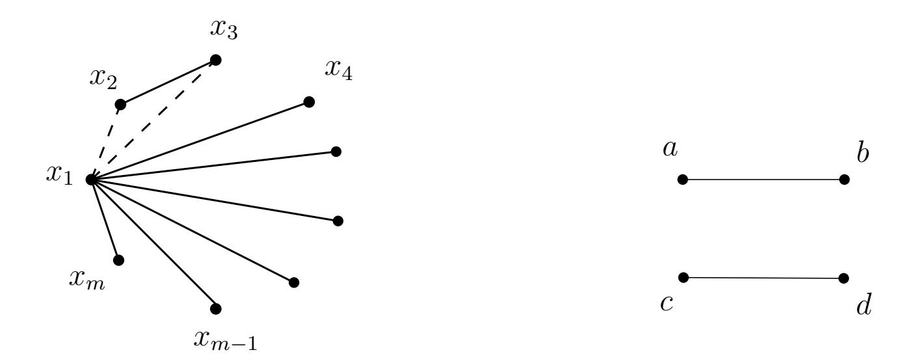

{0}------------------------------------------------

# Characteristics of Hadamard square of ReedMuller subcodes of special type (Extended abstract)

Victoria Vysotskaya

#### Abstract

The existence of some structure in a code can lead to the decrease of security of the whole system built on it. Often subcodes are used to disguise the code as a general-looking one. However, the security of subcodes, whose Hadamard square is equal to the square of the base code, is reduced to the security of this code, i.e. this condition is undesirable. The paper nds the limiting conditions on the number of vectors of degree r removing of which retains this weakness for Reed Muller subcodes and, accordingly, conditions for it to vanish. For r = 2 the exact structure of all resistant subcodes was found. For an arbitrary code RM(r, m), the desired number was estimated from both sides. Finally, the ratio of subcodes, whose Hadamard square is not equal to the square of the original code, was proven to tend to zero if additional conditions on the codimension of the subcode and the parameter r are imposed and m → ∞. Thus, the implementation of checks proposed in the paper helps to immediately lter out some insecure subcodes.

Keywords: post-quantum cryptography, code-based cryptography, ReedMuller subcodes, ReedMuller codes, Hadamard product, McEliece cryptosystem.

## 1 Introduction

The security of all standardized cryptographic algorithms used all around the world is based on the complexity of several number-theoretical problems. They usually are the discrete logarithm or factorization problem. However, in 1994 P. Shor showed [1] that quantum computers could break all schemes constructed this way. And in 2001 the Shore's algorithm was implemented on a 7-qubit quantum computer. Since then various companies have been actively developing more powerful quantum computers. Progress in this area poses a real threat to modern public-key cryptography.

There are several approaches to build post-quantum cryptographic schemes. One approach is to use error-correcting codes. No successful quantum-computer attacks on hard problems from this area are known. 

{1}------------------------------------------------

Classical examples of code-based schemes are the McEliece cryptosystem [2] and the Niederreiter cryptosystem [3], that are equivalent in terms of security.

The interest in code-based schemes as post-quantum ones can be noticed while analyzing the works submitted to the contest for prospective public key post-quantum algorithms which was announced in 2016 by the US National Institute of Standards and Technology (NIST) [4]. The algorithms that win this contest will be accepted as US national standards. 21 of 69 applications led (that is, almost a third of all works) were based on coding theory. Despite the fact that some of them were attacked, it seems that this approach looks quite promising and deserves further study and development. This interest is also traced in Russian cryptography. Code-based schemes were chosen by the Technical Committee for Standardization Cryptographic and Security Mechanisms (TC 26) as one of directions in developing draft Russian national standards of post-quantum cryptographic algorithms.

When one is facing the challenge to synthesize a new code-based scheme, the rst thing to think about is the choice of basic code. Some schemes do not specify the code, thus leaving it to the discretion of the user. Such schemes are usually more reliable since their security is often directly reduced to NPcomplete problems. Most often, these problems are decoding and syndrome decoding. However, choosing a special code also has some advantages. For example, such codes provide asymmetric complexity in solving the decoding problem for the legal user and adversary. In addition, due to the structure of the code, the sizes of the public keys can be signicantly reduced.

However, the structure can also cause a signicant decrease in security of the code, therefore one of the most important tasks is to disguise the code as a general-looking one. One solution is to use subcodes. This approach allows to destroy the structure of the code, retaining the ability to work with the result in mostly the same way as with the original one. Nevertheless, it is worth considering that many of proposed systems based on subcodes turned out to be vulnerable. So in [5] and [6] Ñ. Wieschebrink built ecient attacks on some special cases of the BergerLoidreauo cryptosystem [7], that is based on subcodes of the ReedSolomon code. The McEliece cryptosystem based on subcodes of algebraic geometry codes was attacked in [8]. The digital signature based on modied ReedMuller codes and described in [9] was also attacked during the peer review at the NIST contest.

One of the mechanisms for analyzing codes with a hidden structure is the use of the technique of Hadamard product of two codes. This method was used by M. Borodin and I. Chizhov in [10] to improve MinderShokrollahi attack [11] on the McEliece cryptosystem based on ReedMuller codes. In 

{2}------------------------------------------------

another work [12] this technique allowed Chizhov and Borodin to reduce the security of the cryptosystem on subcodes of ReedMuller codes of codimension one to the security of the scheme on full codes. The paper [13] describes the distinguisher between random codes and ReedSolomon codes using Hadamard product.

In our paper the mentioned technique will be used to analyze Reed Muller subcodes without restriction on codimension. The main question that we will try to answer is: which ReedMuller subcodes do not allow Chizhov Borodin's approach. Since the reduction can be performed to a subcode, which Hadamard square coincides with the square of the original code, we will look for conditions under which this equality ceases to hold. Codes obtaining these conditions will be called unstable codes, the others stable codes. In addition we will try to compute the probability that a randomly chosen ReedMuller subcode is unstable.

In Section 2 the exact structure of all stable subcodes of RM(2, m) is found. Thus, to provide the security it is necessary to choose at least another subcode. To be sure that a subcode of RM(2, m) is unstable it is sucient to exclude m + 1 monomials of degree 2. For an arbitrary ReedMuller code RM(r, m) in Section 3 we estimate (both from the above and below) the number of vectors of degree r that must be excluded from the code in order to distort its square. Finally, in Section 4 we show that the ratio of unstable subcodes tends to zero (as m → ∞) given some additional conditions on the codimension of the subcode and the parameter r. Thus, it is not enough to choose an arbitrary ReedMuller subcode when synthesizing a real scheme. It is necessary to check the property formulated below as Proposition 4. At the same time subcodes satisfying this property require additional consideration since they may have some special structure.

## 2 The structure of stable RM(2, m) subcodes

Recall that ReedMuller code RM(r, m) is the set of all Boolean functions f of m variables such that deg(f) < r. Consider the code RM(1, m). We look for the minimum number of monomials f1, . . . , fw of degree 2 such that the code

$$(RM(1,m) \cup \{f_1,\ldots,f_w\})^2 = RM(4,m).$$

Here the squaring operation refers to the squaring of Hadamard. Hadamard product of two vectors is a vector obtained as a result of component-wise

{3}------------------------------------------------

Figure 1:

Figure 2: Graph H

product of coordinates of these vectors:

$$(a_1,\ldots,a_n)\circ(b_1,\ldots,b_n)=(a_1b_1,\ldots,a_nb_n),$$

and Hadamard product of two codes A and B is the span of all pairwise products of form a ◦ b, where a ∈ A, b ∈ B.

So we look for minimum number of monomials f1, . . . , fw of degree 2 such that the code

$$RM(1,m) \cup \{f_1,\ldots,f_w\} \tag{1}$$

is stable. Obviously, after nding this number, one can also answer another question: what is the maximum number of monomials of degree 2 that can be removed from the code RM(2, m) so that the code

$$RM(2,m) \setminus \{g_1,\ldots,g_q\}$$
 (2)

is still stable. And so, after removing (q + 1) vectors, one gets an unstable code.

Now let us proceed to the graph interpretation of this problem. We match a subcode A ⊂ RM(2, m) with a graph G with m vertices labeled x1, . . . , xm. An edge {xi , xj} is present if and only if monomial xixj ∈ A.

We will say that a graph with m vertices satises the property P if

- 1. the degree deg(v) of any vertex v is not less than (m − 3);
- 2. if deg(v) = m − 3 and edges {v, u} and {v, w} are missing, then the edge {u, w} is present.

The case deg(x1) = m − 3 is shown in Fig.1. Lines denote present edges and dots the missing ones.

Theorem 1. Subcode of the form (1) is stable if and only if the property P is satised for the corresponding graph.

{4}------------------------------------------------

Proof. Denote G = (V, E) the graph corresponding to the subcode of form (1). Note that the condition

$$(RM(1,m) \cup \{f_1,\ldots,f_\ell\})^2 \supset RM(4,m) \setminus RM(3,m)$$
 (3)

is equivalent to the condition that any induced subgraph of G with 4 vertices has a subgraph isomorphic to the graph H shown in Fig.2. The edges {a, b} and {c, d} correspond to degree-2 monomial used to produce the monomial abcd. Also note that from (3) it follows that subcode (1) is stable if we can obtain any monomial of degree 4 as product of some fi and fj , then any monomial of degree 3 can be obtained as product of some fi and some xj ,

Now we can prove the necessity. Fix any vertex v. If any 3 incident edges {v, uj} for j = 1, 2, 3 are missing, then, obviously, the induced subgraph on vertices v, u1, u2, u3 would not have the necessary subgraph. The contradiction proves that deg(v) > m − 3.

If, however, deg(v) = m − 3 and edges {u, v1} and {u, v2} are missing, the edge {v1, v2} must be present, as otherwise none of the induced 4-vertex subgraphs containing vertices {u, v1, v2} will have the necessary subgraph. Thus, the property P is satised.

Now to the proof of suciency. Fix any induced subgraph with 4 vertices. Obviously, it satises the property P for m = 4. If any vertex v has degree 1, i.e. the edge {v, w} is present, but {v, u1} and {v, u2} are not, then by P the edge {u1, u2} must be present. Thus, we have edges {v, w} and {u1, u2} necessary for the H-isomorphic subgraph.

If all 4 vertices have degree at least 2, then we can nd a simple cycle in our graph. Obviously, its length is either 3 or 4. If it is 4, the presence of H-isomorphic subgraph is obvious. Otherwise, we have a triangle u, v, w and, moreover, the fourth vertex q has degree at least 2. Assume (without loss of generality) the edge {q, u} is present, then for H-isomorphic subgraph we can take the edges {q, u} and {v, w}.

From Theorem 1 it is obvious that the minimum number of edges is obtained in case if the condition P is true for the graph and the degree of each vertex is (m − 3). It remains to describe such graphs.

Proposition 1. If the condition P is satised for some graph G and the degree of each vertex is (m − 3), then the complementary graph G is union of cycles of length at least 4.

Proof. Graph G is triangle-free and all its vertices have degree 2. Choose an arbitrary vertex u1. It is not isolated, therefore, one can select a vertex 

{5}------------------------------------------------

adjacent to it, call it u2, As deg(u2) = 2, there exists some adjacent vertex u3 6= u1. Continue in this way until uj coincides with one of u1, . . . , uj−1. Note that uj cannot coincide with ui for i > 1 as it would mean that deg(ui) > 3. Thus u1, . . . , uj−1 form a simple cycle. Its length is at least 4, as G is trianglefree.

Thus, we have described the structure of the graph corresponding to the minimal stable subcode of form (1). Now let us describe the complete structure of such codes. Let us call a bamboo graph a tree which either has one vertex or has two vertices of degree 1 and every other vertices of degree 2.

Proposition 2. If the condition P is satised for some graph G, then the complementary graph G is a union of cycles of length at least 4 and bamboo graphs.

Proof. We proceed as in Proposition 1 and try to nd a cycle in G. But we can stop in a vertex of degree 1, thus obtaining a bamboo graph. Isolated vertices are bamboo graphs by denition.

Corollary 1. Assume that m > 4. Then minimum number of monomials of degree 2 needed to get a stable subcode of form (1) is m(m−3)/2; maximum number of monomials of degree 2 such that the code of form (2) is stable is m.

Proof. As follows from Theorem 1, we need to consider the subcodes corresponding to graphs satisfying property P. From Proposition 2 it follows that G has no more than m edges (this bound is exact for graph consisting of cycles). Thus G has at least C 2 m − m = m(m − 3)/2 edges. Moreover, it means that removing not more than m edges we remain in the stable code.

Note that removing m + 1 or more monomials of degree 2 from the code RM(2, m) we get an unstable code.

## 3 Lower and upper bounds for minimal stable RM(r, m) subcodes sizes

In this section we try to carry out argument for r > 2. That is, we will look for the minimum number w, such that the code

$$RM(r-1,m) \cup \{f_1,\ldots,f_w\} \tag{4}$$

is stable. Here fi is a monomial of degree r. We match a subcode A ⊂ RM(r, m) with a hypergraph G with m vertices labeled x1, . . . , xm. 

{6}------------------------------------------------

An r-edge  $\{x_{i_1}, \ldots, x_{i_r}\}$  is present if and only if monomial  $x_{i_1} \ldots x_{i_r} \in \mathcal{A}$ . In the general case the condition similar to having an H-isomorphic subgraph in each 4-vertex induced subgraph is equivalent to condition of the code (4) being stable. Namely, each set of 2r vertices must be covered by two disjoint r-edges. Let us denote a graph satisfying this condition by  $stable\ graph$ . Note about covering monomials of lower degrees is the same as in the case of r=2.

To find the minimum number of monomials to remove for obtaining an unstable code can be computed by subtracting from the total number of r-edges the found minimum w. Therefore, we will not dwell on this issue separately.

In what follows we will use terms "graph" and "hypergraph" interchangeably. Denote w(r, m) the minimal number of degree-r monomials needed to make subcode (4) stable, or, alternatively, minimal number of edges in a stable r-hypergraph with m vertices.

**Proposition 3.** For any natural r and  $m \ge 2r$ 

$$w(m,r) \geqslant C_m^{2r}/C_{m-r}^r.$$

*Proof.* Note that any set of 2r vertices in a stable graph contains at least one edge. Moreover, any edge is contained in exactly  $C_{m-r}^r$  such sets. Thus total number of edges multiplied by  $C_{m-r}^r$  is at least number of all sets of 2r vertices, which is  $C_m^{2r}$ . This gives the necessary bound.

Corollary 2. Any stable graph contains at least  $1/C_{2r}^r$  edges of a complete graph.

*Proof.* The total possible number of r-edges in a graph with m vertices is  $C_m^r$ . Then

$$\frac{C_m^{2r}}{C_{m-r}^r \cdot C_m^r} = \frac{(r!)^2}{(2r)!} = \frac{1}{C_{2r}^r}.$$

Let all the vertices of the graph be divided into sets  $S_i$ , i = 1, ..., t of size 2r, intersecting each other in some way. Let the size of maximum pairwise intersection be h. Let us denote  $S = \{S_i\}_{i=1}^t$ .

**Lemma 1.** If h < r/3, then for any set  $Q \notin \mathcal{S}$  there are at most two sets from  $\mathcal{S}$  such that their intersection with Q have size at least r.

*Proof.* Assume that Q intersects with at least 3 sets such that intersection size is at least r. Without loss of generality we assume that the sets are  $S_1, S_2$  and  $S_3$ . Let us denote  $Q \cap S_1 = A_1, Q \cap S_2 = A_2, Q \cap S_3 = A_3$ .

{7}------------------------------------------------

Since |Q| = 2r, then it is obvious that |A1 ∪ A2 ∪ A2| 6 2r. On the other hand, according to the inclusion-exclusion formula,

$$|A_1 \cup A_2 \cup A_2| \geqslant |A_1| + |A_2| + |A_3| - |A_1 \cap A_2| - |A_1 \cap A_3| - |A_2 \cap A_3|.$$

Then

$$\sum_{i=1}^{3} |A_i| \leqslant 2r + 3h.$$

By condition |Ai | > r, i ∈ {1, 2, 3}, therefore

$$\sum_{i=1}^{3} A_i \geqslant 3r.$$

Whence 3r 6 2r + 3h and h > r/3, which contradicts the condition.

Let us nd the maximum possible number of edges that can be removed from the complete graph using the above arguments, such that the graph remains stable.

Theorem 2. For any natural r > 2, m > 2r and h < r/3

$$w(m,r) \leqslant C_m^r - T(r,m,h) \cdot (C_{2r}^r - 2)$$
,

where

$$T(r, m, h) = \max \{ t : \exists S_1, \dots, S_t, |S_i| = 2r, |S_i \cap S_j| \leq h,$$
  
 $s_i \in \{1, \dots, m\} \ \forall s_i \in S_i \}.$ 

Proof. Note that two disjoint r-edges are sucient to cover a set of 2r vertices. Thus, it is possible to remove δ = (C r 2r − 2) r-edges from the complete graph on the 2r vertices and preserve the stability of it. Obviously, no more edges can be removed.

Suppose that δ edges are removed from each set from S so that all of them are covered by at least two r-edges. It remains to verify that there exists a similar cover for any set of 2r vertices. Since by construction we can certainly cover any set Si , we will prove that we can also cover any set Q, |Q| = 2r.

Note that if the cardinality of the intersection with some Si does not exceed (r −1), then removing edges in it does not aect the number of edges in Q. At the same time, according to Lemma 1, for h < r/3 any set of size 2r can have intersection of size at least r with no more than two sets from S. If there is only one such set, say, S1, then we have two cases:

{8}------------------------------------------------

- 1.  $|Q \cap S_1| = 2r 1$ . In this case there exist some edge  $e_1$  not containing vertex v,  $\{v\} = S_1 \setminus Q$  (as  $S_1$  must be covered by two disjoint edges). Thus, we can take  $e_2 = Q \setminus e_1$  (it must be present as we have removed only edges contained inside sets  $S_i$ ), and  $\{e_1, e_2\}$  form the disjoint cover of Q.
- 2.  $|Q \cup S_1| < 2r 1$ . In this case there are at least two vertices  $v_1$  and  $v_2$  inside  $Q \setminus S_1$  and the cover can be formed using any two disjoint edges  $e_1, e_2 \subset Q$  such that  $v_1 \in e_1, v_2 \in e_2$ .

Now consider the case when there are exactly two sets  $S_1$  and  $S_2$  intersecting with Q at no less than r vertices. Assume that  $|A_1| > r + h$ . Then, according to the inclusion-exclusion formula  $|A_1 \cap A_2| = |A_1| + |A_2| - |A_1 \cup A_2| > r + h + r - 2r = h$  that contradicts with  $|S_1 \cap S_2| \leq h$ . Thus  $r \leq |A_i| \leq r + h$ , i = 1, 2. So there are at most  $2 \cdot C_{r+h}^r$  edges removed from Q. Note that

$$\frac{C_{2r}^r}{2 \cdot C_{r+h}^r} = \frac{(2r)! \, r! \, h!}{2r! \, r! \, (r+h)!} = r(2r-1) \dots (r+h+1) > 2,$$

because  $r \ge 2$  and 2r - 1 > 1. There are  $C_{2r}^r/2$  pairs of disjoint edges inside Q, so there remains at least one such pair after removal of  $2 \cdot C_{r+h}^r < C_{2r}^r/2$  edges from Q.

So we obtained a stable graph removing  $\delta$  edges from a complete graph for each set from  $\mathcal{S}$ . It remains to note that  $|\mathcal{S}|$  is the number of sets of size 2r whose intersections are not larger than h.

**Remark 1.** In [14] P. Erdös and J. Spencer introduce the value m(n, k, t). It determines the size of the largest set of k-element subsets of  $\{1, \ldots, n\}$  such that any two members of this set intersect in less than t elements. Later V. Rödl [15] proves that

$$\lim_{n \to \infty} m(n, k, t) = \frac{C_n^t}{C_k^t}.$$

That is, in our case,

$$\lim_{m \to \infty} T(r, m, h) = \lim_{m \to \infty} m(m, 2r, \lfloor r/3 \rfloor) = \frac{C_m^{\lfloor r/3 \rfloor}}{C_{2r}^{\lfloor r/3 \rfloor}}.$$

{9}------------------------------------------------

## 4 The ratio of unstable RM(r, m) subcodes

The standard basis of the ReedMuller code RM(r, m) is the basis that includes all monomials of m variables of degree from 0 to r inclusively, i.e.

$$1, x_1, x_2, \ldots, x_m, x_1 x_2, \ldots, x_{m-1} x_m, \ldots, x_1 \cdots x_r, \ldots, x_{m-r-1} \cdots x_m.$$

We consider subcodes of the standard basis of the Reed Muller code in which ` vectors are missing. This number is called the codimension of the subcode. Let us denote the set of subcodes of codimension ` by RM` (r, m).

For the given parameter s and the set I = {ij} s j=1 we will call unordered pairs {A, B} critical partition if:

$$A \cap B = \emptyset,$$
  
 $A \cup B = I,$   
 $1 \leq |A|, |B| \leq r.$ 

Then it is impossible to obtain the monomial xi1 . . . xis after squaring a subcode if and only if at least one element of each critical partition is removed. Obviously, the following proposition is true.

Proposition 4. A code is unstable RM(r, m) subcode if and only if at least one element from each critical partition for some monomial xi1 . . . xis is removed.

Proposition 5. For the given parameter s and the set I the number of critical partitions is

$$w(s) = \sum_{p=\max\{s-r,1\}}^{\min\{r,s-1\}} \frac{1}{2} C_s^p.$$

Proof. On the one hand the sizes of the subsets must not exceed r. On the other hand the partition must be non-trivial, that is, partitioning into an empty set and a set, coinciding with I, is unacceptable. Finally, when considering all partitions, each pair is counted twice.

Let us order in some way (say, lexicographically) the elements of each critical partition and then the critical partitions themselves. Now we consider any set M consisting of elements of critical partitions and having the property that for every critical partition M contains at least one element of this partition. We can encode M with a string α ∈ {1, 2, 3} w(s) , where

$$\alpha_{j} = \begin{cases} 1 & \Leftrightarrow \text{ the 1st element of the } j\text{-th pair lies in } A, \\ 2 & \Leftrightarrow \text{ the 2nd element of the } j\text{-th pair lies in } A, \\ 3 & \Leftrightarrow \text{ both elements of the } j\text{-th pair lie in } A; \end{cases}$$

{10}------------------------------------------------

We will also write  $M(\alpha)$  to denote the set corresponding to a given  $\alpha \in \{1, 2, 3\}^{w(s)}$ . It can be easily seen that

$$|M(\alpha)| = \#_{\alpha}(1) + \#_{\alpha}(2) + 2 \cdot \#_{\alpha}(3),$$

where  $\#_{\alpha}(c)$  is the number of symbols c in the string  $\alpha$ .

Let us denote  $k = \sum_{p=0}^{r} C_m^p$  the dimension of the original code (or the number of vectors in its standard basis). There are exactly two kinds of unstable subcodes: those containing monomial 1 and those not containing it. There are obviously  $C_{k-1}^{\ell-1}$  subcodes of the first kind.

Now we fix s, an index set I and a string  $\alpha \in \{1, 2, 3\}^{w(s)}$ . Among the subcodes of the second type there are

$$C_{k-1-2w(s)}^{\ell-|M(\alpha)|}$$

ones that satisfy the condition: among the monomials comprising critical partitions for I exactly monomials from  $M(\alpha)$  are missed. The reason is that we need to choose  $\ell - |M(\alpha)|$  monomials from all monomials of degree more than 0 that do not comprise any critical partition (there are k - 1 - 2w(s) of them).

For a given s there are  $C_m^s$  variants of choosing index set I, so we can consider the following theorem proved.

**Theorem 3.** The number of unstable RM(r, m) subcodes is

$$\theta = \sum_{s=2}^{2r} C_m^s \cdot \sum_{\alpha \in \{1,2,3\}^{w(s)}} C_{k-1-2w(s)}^{\ell-|M(\alpha)|} + C_{k-1}^{\ell-1}.$$

**Theorem 4.** If  $\ell = const$  and  $r \ge 2\ell + 1$ , then the ratio of unstable RM(r,m) subcodes tends to zero as  $m \to \infty$ .

*Proof.* Our goal is the asymptotic estimate of the probability of the event that after removing  $\ell$  vectors from the standard basis of the code RM(r,m), the square of the resulting code will differ from RM(2r,m). The upper bound for it is  $\theta/C_k^{\ell}$ . We divide this bound into two parts and show the tendency to zero for each of them independently. For one of them it follows immediately from the fact that

$$\frac{C_{k-1}^{\ell-1}}{C_k^{\ell}} = \frac{\ell}{k} \xrightarrow[m \to \infty]{} 0,$$

since  $k \to \infty$  as  $m \to \infty$ .

Now we consider the value  $\gamma/C_k^{\ell}$ . Notice that

$$\#_{\alpha}(1) + \#_{\alpha}(2) + 2 \cdot \#_{\alpha}(3) = |M(\alpha)| \geqslant w(s) = \#_{\alpha}(1) + \#_{\alpha}(2) + \#_{\alpha}(3).$$

{11}------------------------------------------------

Then the number of removed vectors that are elements of critical partitions for s is  $|M(\alpha)| \geqslant w(s)$  and the total number of removed vectors is  $\ell$ . That is,  $w(s) \leqslant \ell$  and

$$\sum_{p=\max\{s-r,1\}}^{r} C_s^p \leqslant 2\ell.$$

Therefore, we can consider only parameters s satisfying  $w(s) \leq \ell$ . Then

$$2w(s) = \sum_{p=\max\{s-r,1\}}^{\min\{r,s-1\}} C_s^p \le 2\ell.$$
 (5)

We consider separately two cases. If  $s \ge r+1$ , we have  $\min\{r,s-1\}=r$  and in the sum (5) there is the element  $C_s^r$ . Thus

$$2\ell \geqslant 2w(s) \geqslant C_s^r \geqslant s.$$

The last inequality follows from the fact that

$$C_s^r = \frac{s^r}{r!} = \frac{(r+1)}{2} \cdot \frac{(r+2)}{3} \cdot \dots \cdot \frac{(s-1)}{r} \cdot \frac{s}{1}.$$

If, on the other hand, s < r + 1, we have  $\max\{s - r, 1\} = 1$  and there is the element  $C_s^1$  in the sum (5). Hence

$$2\ell \geqslant 2w(s) \geqslant C_s^1 = s.$$

So either way the inequality  $s \leq 2\ell$  is satisfied.

We simplify the upper bound for  $\gamma$  using this inequality and the monotonicity of the binomial coefficient  $C_n^k$  with respect to the parameter k, which guarantees the increase of the value  $C_n^k$  with the increase of k:

$$\sum_{s=2}^{2r} C_m^s \cdot \sum_{\alpha \in \{1,2,3\}^{w(s)}} C_{k-1-2w(s)}^{\ell-|M(\alpha)|} \leqslant \sum_{s=2}^{2\ell} C_m^{2\ell} \cdot \sum_{\alpha \in \{1,2,3\}^{w(s)}} C_{k-1-2w(s)}^{\ell-|M(\alpha)|} \leqslant 2\ell \cdot C_m^{2\ell} \max_{s \in [2,2\ell]} \left\{ C_{k-1-2w(s)}^{\ell-z} \cdot 3^{w(s)} \right\},$$

where  $z = \min_{\alpha \in \{1,2,3\}^{w(s)}} \{|M(\alpha)|\}.$ 

Note that  $\ell = const$  and  $3^{w(s)} \leq const$ , since  $s \leq 2\ell$ , and  $w(s) < 2^s$ . The last is true by virtue of

$$2^{s} = (1+1)^{s} = \sum_{p=0}^{s} C_{s}^{k} > \frac{1}{2} \sum_{p=\max\{s-r,1\}}^{\min\{r,s-1\}} C_{s}^{p}.$$

{12}------------------------------------------------

These considerations, as well as the monotonicity of the binomial coefficient  $C_n^k$  with respect to n and the inequality  $|M(\alpha)| \ge w(s)$ , allow us to obtain the upper bound

$$const \cdot C_m^{2\ell} \cdot C_k^{\ell-w(s)} \leqslant const \cdot C_m^{2\ell} \cdot C_k^{\ell-1} := \psi.$$

We proceed to the ratio estimation.

$$\frac{\gamma}{C_k^{\ell}} \leqslant \frac{\psi}{C_k^{\ell}} = \frac{const \cdot C_m^{2\ell} \cdot C_k^{\ell-1}}{C_k^{\ell}} = \frac{const \cdot C_m^{2\ell} \cdot \ell}{k - \ell + 1} = \frac{const \cdot C_m^{2\ell}}{k - \ell + 1} \leqslant const \cdot \frac{m^{2\ell}}{2k}.$$

After tending m to infinity we can claim that  $p = 2\ell + 1$  exists, that is, summand  $C_m^{2\ell+1} \ge m^{2\ell+1}$  is an element of the sum representation of k. Then

$$const \cdot \frac{m^{2\ell}}{2k} \leqslant const \cdot \frac{m^{2\ell}}{m^{2\ell+1}} = const \cdot \frac{1}{m} \xrightarrow[m \to \infty]{} 0.$$

## Future research

More accurate estimates on the minimal stable code sizes for general case are still required, as are better estimates of the ratio of stable subcodes. In addition, an idea for future research could be to find an analogues of the obtained results for an arbitrary basis of the Reed–Muller code.

### References

- [1] Shor P. V., "Polynomial-time algorithms for prime factorization and discrete logarithms on a quantum computer", SIAM Journal on Computing, 26:5 (1997), 1484–1509.
- [2] McEliece R. J., "A public-key cryptosystem based on algebraic coding theory", DSN Progress Report, 4244, 1978, 114–116.
- [3] Niederreiter H., "Knapsack-type cryptosystems and algebraic coding theory", *Problems of Control and Information Theory*, **15**:2 (1986), 159–166.
- [4] https://csrc.nist.gov/Projects/post-quantum-cryptography/Post-Quantum-Cryptography-Standardization/Call-for-Proposals.
- [5] Wieschebrink C., "An Attack on a Modified Niederreiter Encryption Scheme", *Public Key Cryptography PKC 2006*, PKC 2006, Lecture Notes in Computer Science, **3958**, eds. Yung M., Dodis Y., Kiayias A., Malkin T., Springer, Berlin, Heidelberg, 2006, 14–26.
- [6] Wieschebrink C., "Cryptanalysis of the Niederreiter Public Key Scheme Based on GRS Subcodes", *Post-Quantum Cryptography*, PQCrypto 2010, Lecture Notes in Computer Science, **6061**, eds. Sendrier N., Springer, Berlin, Heidelberg, 2010, 61–72.
- [7] Berger T. P., Loidreau P., "How to mask the structure of codes", Designs, Codes and Cryptography, **35**:1 (2005), 63–79.
- [8] Couvreur A., Marquez-Corbella I., Pellikaan R., "Cryptanalysis of public-key cryptosystems that use subcodes of algebraic geometry codes", Coding Theory and Applications, CIM Series in Mathematical Sciences, 3, eds. Pinto R., Rocha Malonek P., Vettori P., Springer, Cham, 2015, 133–140.

{13}------------------------------------------------

- [9] Lee W., Kim Y.-S., Lee Y.-W., No J.-S., Post quantum signature scheme based on modified Reed-Muller code pqsigRM, 2017, 35 pp., NIST proposal.
- [10] Borodin M., Chizhov I., "Effective attack on the McEliece cryptosystem based on Reed-Muller codes", Discrete Mathematics and Applications, 24:5 (2014), 10–20.
- [11] Minder L., Shokrollahi A., "Cryptanalysis of the Sidelnikov Cryptosystem", Advances in Cryptology EUROCRYPT 2007, EUROCRYPT 2007, Lecture Notes in Computer Science, 4515, eds. Naor M., Springer, Berlin, Heidelberg, 2007, 347–360.
- [12] Chizhov I., Borodin M., "Hadamard products classification of subcodes of Reed-Muller codes codimension 1", Discrete Mathematics and Applications (to appear).
- [13] Couvreur A., Gaborit P., Gauthier-Umãna V., Otmani A., Tillich J.-P., "Distinguisher-based attacks on public-key cryptosystems using Reed-Solomon codes", *Designs, Codes and Cryptography*, **73**:2 (2014), 641–666.
- [14] Erdös P., Spencer J., *Probabilistic Methods in Combinatorics*, Akadèmiai Kiadó, Budapest, 1974, 106 pp.
- [15] Rödl V., "On a Packing and Covering Problem", European Journal of Combinatorics, 6:1 (1985), 69–78