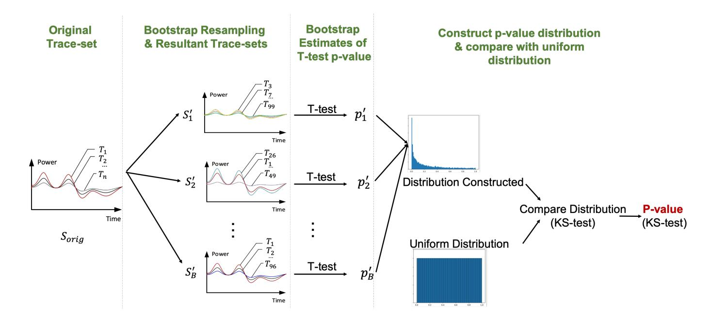
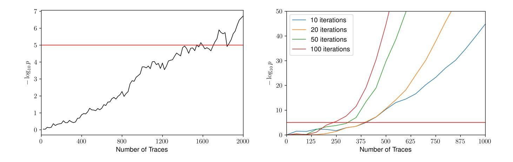
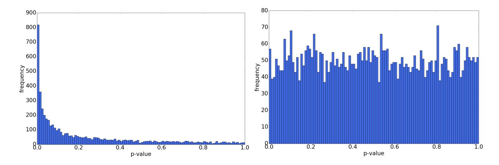
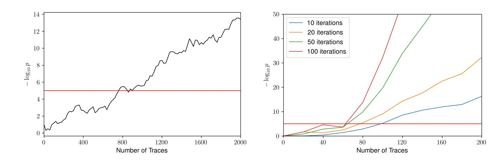
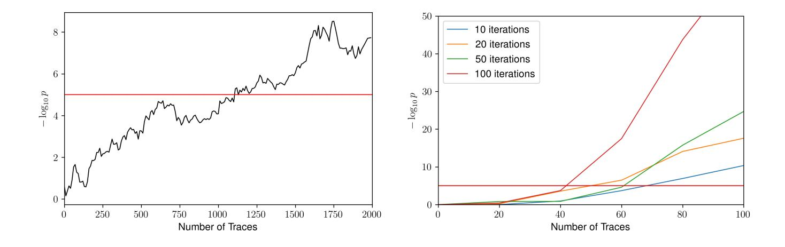
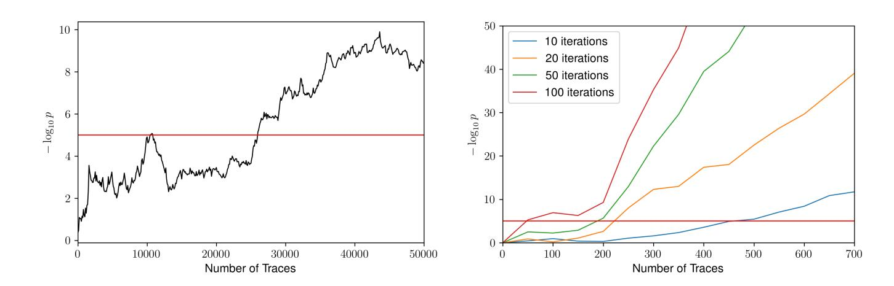
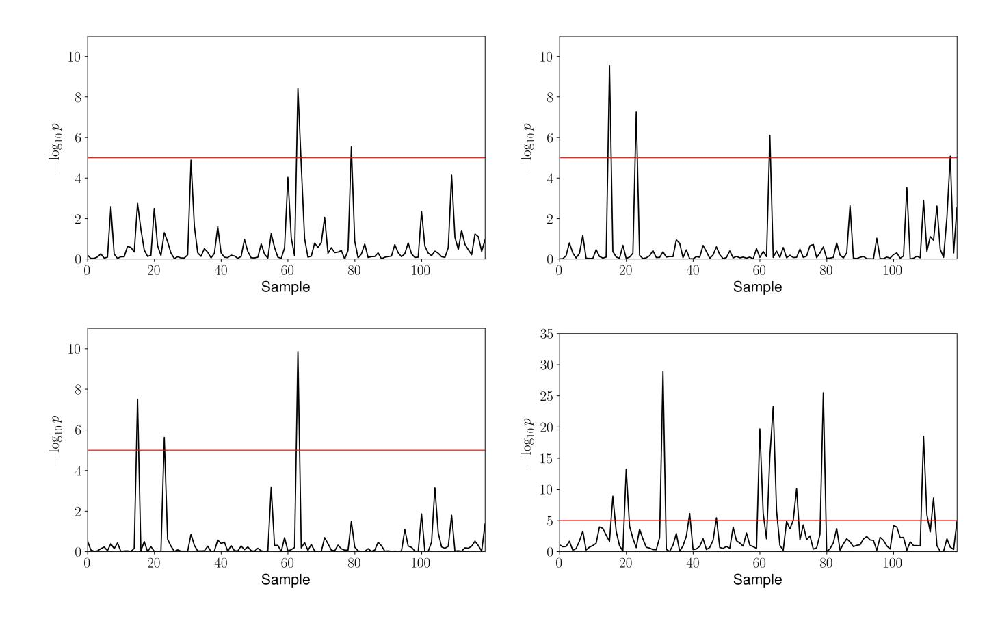

{0}------------------------------------------------

# Augmenting Leakage Detection using Bootstrapping

Yuan Yao<sup>1</sup> , Michael Tunstall<sup>2</sup> , Elke De Mulder<sup>2</sup> , Anton Kochepasov<sup>2</sup> , and Patrick Schaumont<sup>1</sup>

<sup>1</sup> Virginia Tech, Blacksburg, VA 24060, United States {yuan9,schaum@}vt.edu <sup>2</sup> Rambus Cryptography Research, 425 Market Street, 11th Floor, San Francisco, CA 94105, United States {michael.tunstall,elke.demulder,anton.kochepasov}@cryptography.com

Abstract. Side-channel leakage detection methods based on statistical tests, such as t-test or χ 2 -test, provide a high confidence in the presence of leakage with a large number of traces. However, practical limitations on testing time and equipment may set an upper-bound on the number of traces available, turning the number of traces into a limiting factor in side-channel leakage detection. We describe a statistical technique, based on statistical bootstrapping, that significantly improves the effectiveness of leakage detection using a limited set of traces. Bootstrapping generates additional sample sets from an initial set by assuming that it is representative of the entire population. The additional sample sets are then used to conduct additional leakage detection tests, and we show how to combine the results of these tests. The proposed technique, applied to side-channel leakage detection, can significantly reduce the number of traces required to detect leakage by one, or more orders of magnitude. Furthermore, for an existing measured sample set, the method can significantly increase the confidence of existing leakage hypotheses over a traditional (non-bootstrap) leakage detection test. This paper introduces the bootstrapping technique for leakage detection, applies it to three practical cases, and describes techniques for its efficient computation.

Keywords: Side-Channel Analysis · Leakage Detection · Bootstrapping

# 1 Introduction

Testing the side-channel leakage of a design is a challenging task. The test requires careful planning of an experiment to measure a side-channel, such as the power consumption, followed by analysis of the measurements. The objective of the analysis is to detect side-channel leakage within a reasonable amount of time. Traditionally, the analysis was done using a side-channel analysis attack 

{1}------------------------------------------------

such as Differential Power Analysis [8]. However, the number of attacks and possible attack targets in a typical cryptographic implementation can be very large. Therefore, it becomes desirable to formulate the analysis in a generic manner independent of specific attacks for a side-channel leakage assessment. The most popular among those assessments is Test Vector Leakage Assessment (TLVA), proposed in 2011 by Goodwill et al. [6]. TVLA uses Welch's t-test, under a null hypothesis that no leakage is present, in a pointwise comparison of two sets of power consumption traces. In a non-specific TVLA test, the two sets correspond to power traces under a constant (plaintext) input on the one hand, and power traces under a random (plaintext) input on the other hand. Any tstatistic greater than 4.5σ (corresponding to a false positive rate of 1 × 10−<sup>5</sup> ) would indicate the presence of leakage. A known, but accepted, disadvantage of TVLA is that the test does not establish a relationship between leakage and exploitability. Hence, side-channel leakage confirmed by TVLA does not imply that the leakage can be efficiently exploited by a side-channel attack. An example of a difficult-to-exploit side-channel leakage would occur during the middle round of a cipher, since an efficient side-channel attack such as DPA would typically require side-channel leakage in the initial and/or final round of the cipher.

While TVLA is widely used for research and testing, it brings its own unique challenges. False negatives occur when the measurements contain side-channel information but TVLA fails to detect it. This can have several causes. First, TVLA confirms side-channel leakage by demonstrating a statistically meaningful difference-of-means between two sets of measurements. If the amount of sidechannel leakage is small, that difference of means will be small as well. The number of measurements in that case may be insufficient to discern a meaningful difference. Second, the measurements could be very noisy and have a low Signalto-Noise Ration (SNR) [9, 18]) and, again, the number of measurements may be too small to detect a statistically meaningful difference.

The risk of a false negative in TVLA can be minimized by increasing the number of measurements or by enhancing the test by, for example, using multiple input vectors for the fixed set [2, 15]. Another strategy is to deploy a fixed-versusfixed TVLA test [15] (as opposed to fixed-versus-random). This will reduce the algorithmic noise but it has the added drawback that some leakage may not show up due to the choice of inputs. Ideally, the confidence in the outcome of the evaluation can be improved by repeating the TVLA test multiple times over new measurements.

Hence, all known techniques that reduce the number of false negatives for TVLA require an increase in the total number of measurements. This is problematic, since the number of measurements is typically limited in practice by the available testing time.

In this work, we seek to reduce the number of false negatives in TVLA, without the need for more physical measurements, or, looking at it from a different angle, we aim to decrease the number of measurements needed for detecting leakage. We base our work on statistical bootstrapping, a computer-based technique for statistical inference proposed by Efron [5]. Bootstrapping starts from an ini

{2}------------------------------------------------

tial sample set, which is assumed to be representative of the population. The bootstrapping procedure infers population parameters by repeated re-sampling of the initial sample set and by analyzing the resulting re-sampled data sets. Applied to side-channel leakage detection, we aim to decide if the population, corresponding to the set of power traces, shows side-channel leakage at a given confidence level. To demonstrate this hypothesis, we make use of an initial sample of a limited set of power traces and use the bootstrapping method. Our results show that bootstrapping based leakage detection reduces the size of the sample (i. e. , the number of traces required) by at least one order of magnitude while maintaining the same confidence level.

We first demonstrate the proposed methodology using simulations, where we control the amount of leakage that is present. We then further demonstrate our findings by analyzing three practical implementations, including a software AES with Boolean masking, an unprotected hardware AES and a lightly protected hardware AES. In addition to this experimental work, we also describe the limitations of the proposed bootstrap method. Finally, we discuss an optimized technique to compute leakage detection parameters using bootstrapping on an initial sample. Our proposed technique enhances earlier work that computes the test statistics using trace histograms instead of individual traces [13].

This paper is organized as follows. Section 2 introduces several preliminary concepts: the Welch's t-test, the bootstrapping mechanism, and the Kolmogorov-Smirnov test. Section 3 applies bootstrapping to the leakage detection problem. We discuss results based on simulations and a variety of software and hardware implementations. Section 4 clarifies the limitations of bootstrapping. Section 5 describes a technique for the efficient implementation of bootstrapping applied to TVLA. We then conclude the paper.

# 2 Preliminaries

We first provide an introduction to the methods we will use throughout the text.

## 2.1 Leakage Detection using Welch's t-test.

Welch's t-test is a statistical test used to compare sample means of two sets with, possibly, unequal variance but still under the assumption of normality. The output of the test provides a test statistic which can be combined with a threshold to validate the null hypothesis H<sup>0</sup> that both sets have equal means, or state there is no evidence supporting the null hypothesis so the alternative hypothesis H<sup>a</sup> holds. We consider sets A, B of size nA, nB, with means µA, µ<sup>B</sup> and standard deviation σA, σB, respectively. With these notations, the null hypothesis and the alternative hypothesis are noted as follows,

$$H_0: \mu_A = \mu_B \quad H_a: \mu_A \neq \mu_B \tag{1}$$

{3}------------------------------------------------

and the t-statistic is calculated with the following formula:

$$\psi = \frac{\mu_A - \mu_B}{\sqrt{\frac{\sigma_A^2}{n_A} + \frac{\sigma_B^2}{n_B}}} \tag{2}$$

where  $\psi \sim t(0, \nu)$  with  $\nu$  degrees of freedom. In practice, we use the result that the t-distribution is asymptotically equivalent to the standard normal distribution as the degrees of freedom increase, i.e. we can assume  $\psi \sim N(0,1)$ . We then transform the t-statistic into a p-value using the Cumulative Density Function (CDF) to argue about the validity of  $H_0$ .

Goodwill et al. [6] proposed to use Welch's t-test to detect leakage in implementations of cryptographic algorithms by comparing two sets of side-channel acquisitions. One set would be acquired with fixed input and the other with random input. Welch's t-test can be computed point-wise on the acquisitions. A null hypothesis is formulated at each point individually assuming independence of the points. Intuitively, one can see that if the means of those two sets (or the distributions) are not equal, the power consumption is data-dependent and could potentially leak information.

Goodwill et al. [6] proposed a Type I error, i.e. a false positive, rate of  $1 \times 10^{-5}$ , meaning the two-tailed p-value  $p < 1 \times 10^{-5}$  would stipulate there is no evidence  $H_0$  is true. This corresponds to an absolute value of  $|\psi| > 4.5$ . In practice, Welch's t-test is applied point-wise across a set of acquisitions so the probability of seeing at least one Type I error is significantly larger than  $1 \times 10^{-5}$ . Ding et al. [18] proposed adjusting the threshold by taking the trace length (total number of points in a measurement) into consideration. For ease of expression, we will use the threshold defined by Goodwill et al. [6], but a different threshold may be appropriate when applying our method.

#### 2.2 The Bootstrapping Method.

The bootstrapping method is a computation-based statistical tool proposed by Efron [5] to make inferences about a population parameter based on a sample set. It is typically used to estimate statistical distributions and to quantify uncertainty, under the assumption that the sample set is representative of the population.

Given a set of observations  $S_{obs}$  consisting of n samples,  $\{s_1, \ldots, s_n\}$ , from a given population we can apply bootstrapping by repeated sampling, with replacement, from  $S_{obs}$ . This process can be repeated b times, producing b sets  $\{S'_1, \ldots, S'_b\}$ , where b is chosen arbitrarily. More explicitly, we detail this process in Algorithm 1, where we define the operation  $\stackrel{R}{\leftarrow}$  as taking a random sample from a set. Statistical tests can then be applied to each of these sets producing a set of statistics, which can allow a better analysis than just relying on the observed set  $S_{orig}$ .

Pattengale et al. [11] recommended repeating this process 100–500 times to get a robust description of the distribution of the population. In our work, we show that far fewer iterations are required for leakage detection.

{4}------------------------------------------------

## Algorithm 1: Generating Bootstrapping Sets

```
Input: S_{obs} = \{s_1, ..., s_n\} with n, b \in \mathbb{Z}_{>0}

Output: \{S'_1, ..., S'_b\}

1 for i = 1 to b do

2 | for i = 1 to n do

3 | s'_j \stackrel{R}{\leftarrow} \{s_1, ..., s_n\};

4 | end

5 | S'_i \leftarrow \{s'_1, ..., s'_n\};

6 end

7 return \{S'_1, ..., S'_b\}
```

## 2.3 Kolmogorov-Smirnov Test

In this paper, we also apply the one-sample Kolmogorov-Smirnov test (KS test), which is a measure of the difference between a sample distribution and a defined distribution. The null hypothesis of the test  $H_0$  is that the samples come from the defined distribution, with the alternative hypothesis  $H_a$  that the samples have a different distribution.

Let  $(s_1, s_2, ..., s_n)$  be the samples in a data-set. For any number x, the empirical distribution function value is the fraction of the data that is smaller than x:

$$F_n(t) = \frac{1}{n} \sum_{i=1}^n I_{\{s_j \le x\}}$$
 (3)

Where I is the indicator function. The test statistic D exploits the maximum distance of the empirical distribution from the sampled distribution and the defined distribution:

$$D = \sup_{x} |F_n(x) - G(x)| \tag{4}$$

Where G computes the CDF of the defined distribution and  $\sup$  is the supremum function. After getting the D statistic for the KS-test, the corresponding p-value can be calculated from the CDF of the one-sample Kolmogorov-Smirnov distribution.

## 3 Applying Bootstrapping to Leakage Detection

In this section, we describe how we apply bootstrapping to leakage detection. Without loss of generality, we discuss our results using Welch's t-test, since the same method could be applied to any other test that produces a p-value. That is, similar improvements would be seen if one were to use other statistical tests, such as the  $\chi^2$  test [10], Hoteling's  $T^2$ -test or Diagonal-test(D-test) [4].

Let  $S_{obs} = \{s_1, \ldots, s_n\}$  be the set of n acquisitions to be used in a leakage detection test, as described in Section 2.1. Each  $s_i$ , for  $i \in \{1, \ldots, n\}$ , consists of an acquisition and the corresponding metadata indicating whether it belongs to

{5}------------------------------------------------

set A or B. We apply bootstrapping, as shown in Algorithm 1, to  $S_{obs}$  to provide b sample sets  $\{S'_1, \ldots, S'_b\}$ , where the choice of b is arbitrary. We then conduct Welch's t-test on each set and compute the resulting p-value, giving  $\{p'_1, \ldots, p'_b\}$ . Each p-value represents a test with

$$H_0$$
: no leakage  $H_a$ : leakage (5)

and we wish to combine the p-values to test this null hypothesis. Figure 1 demonstrates the proposed methodology.



Fig. 1. Bootstrap Leakage Detection Enhancement

In general, the p-value is a measure of evidence on whether the null hypothesis is true, where a p-value close to 0 can be taken as a lack of evidence that the null hypothesis is true, and that the alternate hypothesis may be true. By definition, if the null hypothesis is true then the p-value is uniformly distributed over the interval [0,1]. It has been shown that the p-value distribution is highly skewed when the alternative hypothesis is true [7].

In this work, we use the distribution of the p-values  $\{p'_1, \ldots, p'_b\}$  to evaluate whether there is evidence that the null hypotheses are true. That is, if the null hypotheses are true then

$$\{p'_1,\ldots,p'_b\} \sim U(0,1)$$
.

We can test whether this is the case using the one-sample Kolmogorov-Smirnov test to compare  $\{p'_1, \ldots, p'_b\}$  to a uniform distribution. In the KS-test we have the null hypothesis that the data-set is drawn from the defined distribution, and the alternate hypothesis that it is not. That is,

$$H_0: \{p'_1, \dots, p'_b\} \sim U(0, 1)$$
 and  $H_a: \{p'_1, \dots, p'_b\} \not\sim U(0, 1)$ . (6)

The resultant KS test statistic reflects the similarity of the distribution of the p-values with the uniform distribution. That is, we use the KS-test to combine

{6}------------------------------------------------

{p 0 1 , . . . , p<sup>0</sup> b } to a single p-value to test the null hypothesis:

$$H_0$$
: no leakage  $H_a$ : leakage (7)

As proposed by Goodwill et al. [6], we shall assume the significance level α of 1×10−<sup>5</sup> , and reject the null hypothesis if the p-value return by the KS-test gives p < 1 × 10−<sup>5</sup> .

## 3.1 Simulating Leakage Detection

To demonstrate the effectiveness of our method we simulated a single sample, i. e. a simulated acquisition with a trace length of one. We generated sets of data where the sample is the Hamming weight of an 8-bit value with added Gaussian noise to achieve a signal-to-noise ratio of 1 dB. This simulates the setup in the practical environment where the traces are noisy and multiple traces are needed for the t-test to reach the threshold used to indicate leakage.

In Figure 2, we show how the t-statistic, converted to a p-value, produced by TVLA evolves as the number of traces increases, compared to the evolution of the p-values produced by the KS test on the p-values generated by Bootstrapping, as described above. As proposed by Moradi et al. [10], we plot the negative logarithm base 10 of the p-value in both cases. This allows for simple comparison and the 4.5σ threshold becomes 5. In our simulation, a straightforward implementation of the TVLA will show leakage after 1600 traces. If we apply bootstrapping we can see the leakage from 200 to 400 traces, depending on the number of iterations of the bootstrapping method that is applied.



Fig. 2. The evolution of the p-value with increasing number of traces for TVLA (left) and with bootstrapping (right) using simulated traces

To demonstrate why this occurs we generated three sets of single-point traces: Trace-set-A is calculated as the fixed value 5. Trace-set-B and Trace-set-C are calculated from the Hamming weights of 8-bit random values. As above, we added Gaussian noise to achieve a signal-to-noise ratio of 1 dB. In Figure 3, we can see two plots of frequency versus p-value, where the p-values are generated 

{7}------------------------------------------------

from 5000 iterations of the bootstrapping method on 1000 samples. The left plot is the result of applying bootstrapping to TVLA between Trace-set-A and Traceset-B, and the right plot from applying bootstrap enhanced TVLA to Trace-set-B and Trace-set-C. These tests represent the fixed-versus-random case and a comparison case of random-versus-random. In each case the resulting p-values are grouped into bins defined by dividing up the interval [0, 1] into 100 equally sized bins. The difference in the observed distributions is quite striking.



Fig. 3. The sample distribution of the p-values taken from 5000 iterations of the bootstrapping method applied to samples where a the null hypothesis is false (left) and true (right)

## 3.2 Experimental Results

We then performed experiments to evaluate the practical benefits of bootstrapped enhanced TVLA on a variety of implementations and platforms.

Software AES with Boolean masking. The first experiment is an application of the proposed test to a na¨ıve implementation of a Boolean masked AES on an NXP LPC2124, a 16/32 bit ARM7TDMI-S chip. The implementation was a straightforward 8-bit implementation making use of randomized masked tables for the S-box and the xtime operations. As noted by Balash et al. [2], such implementations are unlikely to be secure. Measurements were acquired with a Langer RF − U2, 5 − 2 electromagnetic probe over a decoupling capacitor using a PicoScope 3206D at 400 MS/s with 200 MHz bandwidth. The results of applying bootstrapping to TVLA compared to a straightforward application of TVLA are given in Figure 4. A straightforward implementation of TVLA shows leakage after around 800 traces. In comparison, we can detect leakage from 60 to 90 traces using Bootstrapping, depending on the number of iterations of the bootstrapping method that is applied.

Unprotected hardware AES. Our next target was a straightforward single round per clock cycle hardware implementation, i. e. all 16 S-boxes are computed in parallel, on a Xilinx Kintex-7 FPGA. We used a custom FPGA

{8}------------------------------------------------



Fig. 4. The evolution of the p-value with increasing number of traces for TVLA (left) and with bootstrapping (right) applied to an implementation of AES in software

prototyping board where we measured the voltage drop across a measurement resistor using a Tektronix DPO7104C at 1 GS/s. The results of applying bootstrapping to TVLA compared to a straightforward application of TVLA are given in Figure 5. We only need, at most, around 70 traces to detect the leakage using bootstrapping, while 1000 traces are needed for straightforward TVLA.



Fig. 5. The evolution of the p-value with increasing number of traces for TVLA (left) and with bootstrapping (right) applied to an unprotected implementation of AES on an FPGA

Lightly protected hardware AES. Our last target was an AES implementation protected with a dual-rail countermeasure with no regard to glitches [16] implemented on the same FPGA platform as the unprotected AES implementation, described above. As previously, we used a custom FPGA prototyping board where we measured the voltage drop across a measurement resistor using a Tektronix DPO7104C at 1 GS/s. Figure 6 shows the results of applying bootstrapping to TVLA compared to a straightforward application of TVLA. Similar to previous cases, significant acceleration of leakage detection can be observed when applying Bootstrapping.

{9}------------------------------------------------



Fig. 6. The evolution of the p-value with increasing number of traces for TVLA (left) and with bootstrapping (right)

In the three experiments presented above, we can see that the bootstrapping method reduces the number of traces required to detect leakage by at least one order of magnitude in all cases. Or, were we to use all the measurements, we would get with a high certainty all the leaking points this set could uncover. For the first two targets presented there is some modest variation in the required number of traces required to see leakage as we increase the number of iterations of the bootstrapping method. However, for the third target(lightly protected hardware AES) the difference is much larger. If bootstrapping is applied 10 times we require 450 traces to detect leakage, whereas we only require 40 traces if bootstrapping is applied 100 times. Both of these numbers stand in stark contrast to the number of traces required by a straightforward TVLA, which is in the order of 1 × 10<sup>4</sup> . This highlights that Bootstrapping significantly accelerates leakage detection.

# 4 Limitations

The idea of the bootstrap technique is to get an estimate of the deviation of a sample statistic from the true value of the statistic, and relies on the independence of the samples to do so. It does not allow one to extrapolate information from the underlying data if it is not represented in the acquired set. What it can do is give us some assurance on the test statistic and its variation to give more accurate picture. That is, if the collected data set is representative of the underlying distribution, re-sampling will help produce a more accurate statistical analysis. There exists limitations of this technique, as demonstrated in Figure 7. The top left plot shows the result of a straightforward fixed-versus-random TVLA test, as described in Section 2.1, on 5 × 10<sup>5</sup> traces, where the t-test statistic is turned into a p-value under the null hypothesis that there is no leakage. From this picture, it is clear that some points are already crossing the 4.5σ line (i.e. where − log<sup>10</sup> p = 5), while other points are getting close to the line. As has been clear from the literature, the results of a t-test are greatly affected by the signal-tonoise ratio of the measurements, and reliably identifying false negatives and false 

{10}------------------------------------------------

positives is problematic. The bottom right plot shows the bootstrapping method applied b = 5 times to the same 5 × 10<sup>5</sup> traces (we note recommendations on b are significantly larger in literature [11]). This demonstrates that we get a lot more assurance on the points that do not provide evidence the null hypothesis is correct and all points which showed leakage in the original figure are present. The top right plot shows the result of bootstrapping a 1000 traces with b=20, and the bottom left plot shows the result of a bootstrapping of 5000 traces with bootstrapping method applied b = 5 times. Neither of these figures are showing the peak around sample point 30 visible in the top left plot indicating that the underlying data is not sufficiently representative of the full set because we have restricted the number of traces. However, we do have peaks at other points that are not visible in the entire set, again caused by bias in the smaller number of traces. While bootstrapping can allow one to determine if leakage is visible on a smaller number of traces, it is subject to bias in the acquired traces.



Fig. 7. The negative log of p-value returned by the TVLA test for a fixed-versus-random t-test with 50000 traces (top left), 1000 traces with 20 iterations of the bootstrapping method (top right), 5000 traces with 5 iterations of the bootstrapping method (bottom left) and 50000 traces with 5 iterations of the bootstrapping method (bottom right)

{11}------------------------------------------------

# 5 Implementation Details

```
Algorithm 2: Updating H
   Input: H with elements eijkl where i ∈ {1, . . . , c}, j ∈ {1, . . . , q},
           k ∈ {1, . . . , m}, l ∈ {1, . . . , 2
                                       r}, a set of n traces S = {s1, . . . , sn}
           with st = {st1, . . . , stm} for t ∈ 1, . . . , n and associated classifier
           values zti for each of the classifications. For ease of notation,
           classifier values will be in 1, . . . , q rather than the actual value.
   Output: H
 1 for t = 1 to n do
 2 for i = 1 to c do
 3 for k = 1 to m do
 4 j ← ci
                    ;
 5 l ← st,k ;
 6 ei,j,k,l ← ei,j,k,l + 1 ;
 7 end
 8 end
 9 end
10 return H
```

Statistical processing for side-channel analysis can be computationally intensive and, since bootstrapping runs a statistical analysis multiple times, the process can be even more demanding. The most straightforward approach to computing statistical tests is to store all the acquisitions to a hard disk, read the measurements, run the data through the algorithm of interest and compute the results. Another approach is to use one-pass algorithms, which find the required statistical characteristics during acquisition. Implementations of this concept vary from having all the statistics ready and updating them on-thefly to updating an accumulator for each new sample and computing results on demand [12–14, 17].

Our bootstrapping method requires calculating different statistical tests (i. e. , Welch's t-test and KS-test), which use statistical moments and observed frequencies. Hence, we chose a histogram approach, where the histogram contains all the information about the sample distribution that becomes available while acquiring traces and, therefore, describes the sample distributions. It is then possible to derive properties appropriate for both tests as required. Our statistical technique is based on the work by Reparaz et al. [13]. However, we describe in more detail how to implement it using a tensor and how to apply the technique for statistics other than the t-statistic.

We assume that the leakage assessment is performed over a set of observed samples S with n traces of m sample points with c classifications. Each sample point in the measurement has r meaningful bits, corresponding to 2<sup>r</sup> integer 

{12}------------------------------------------------

values, which are used as indices of counter bins. Each classification should have q sets of histograms, where q is the number of bins required to cover each possible classifier value. This approach can be represented as a 4-dimensional set  $\mathbb{Z}_c\mathbb{Z}_q\mathbb{Z}_m\mathbb{Z}_{2^r}$ . We shall denote an instance of this set as  $\mathcal{H}$ . An element of  $\mathcal{H}$  is denoted  $e_{ijkl}$  where  $i \in \{1, \ldots, c\}, j \in \{1, \ldots, q\}, k \in \{1, \ldots, m\}, l \in \{1, \ldots, 2^r\}$ . For example, in an evaluation of the non-specific fixed-versus-random test, we have c = 1 and q = 2. If we would wish to conduct a correlation power analysis [3] on an 8-bit intermediate state with the hamming weight model we would have a separate classifier with c = 256 and q = 9.

Before acquiring data one would set  $\mathcal{H}$  to all zeros and update  $\mathcal{H}$  after each acquisition of n traces with using Algorithm 2. At any given moment, the results of the statistical tests can be rapidly computed from  $\mathcal{H}$ .

In this approach, the first two statistical moments,  $\mu$  and  $\sigma^2$ , with respective elements  $\mu_{ijk}$  and  $\sigma^2_{ijk}$ , for Welch's t-test become:

$$\mu_{ijk} = \frac{1}{N_{ijk}} \sum_{l=1}^{2^r} e_{i,j,k,l} l$$

$$\sigma_{ijk}^2 = \frac{1}{N_{ijk} - 1} \sum_{l=1}^{2^b} e_{i,j,k,l} (l - \mu_{ijk})^2$$
(8)

where  $N_{ij} = \sum_{l=1}^{2^r} e_{i,j,1,l}$ .

The CDF function d, which is used to define the sampled distribution, see (3), and to compute the KS test, for each point k, classifier i and classifier value j becomes:

$$d_{ijkl} = \sum_{s=1}^{l} e_{i,j,k,s}.$$
 (9)

Note that it is easy to compute more statistics in a straightforward way. As an example, the correlation traces  $\rho$  with elements  $r_{ik}$ , representing the k-th point in the i-th trace, are computed from  $\mathcal{H}$  as shown in Equation (10).

We define a mean and variance trace as the the first two statistical moments of the trace samples, split by classifiers, with respective elements  $\mu_{ik}$  and  $\sigma_{ik}^2$ . We define the mean and variance of the classifiers as the  $\mu'_i$  and  ${\sigma'_i}^2$ . The pointwise covariance of the traces and classifiers is defined as  $cov_{ik}$  with the number of

{13}------------------------------------------------

traces defined as N.

$$N = \sum_{j=1}^{q} \sum_{\ell=1}^{2^{r}} e_{1,j,1,\ell}$$

$$\mu_{ik} = \frac{1}{N} \sum_{j=1}^{q} \sum_{\ell=1}^{2^{r}} \ell e_{i,j,k,\ell}$$

$$\sigma_{ik}^{2} = \frac{1}{N} \sum_{j=1}^{q} \sum_{\ell=1}^{2^{r}} H_{i,j,k,\ell} (\ell - \mu_{ik})^{2}$$

$$\mu'_{i} = \frac{1}{N} \sum_{j=1}^{q} \sum_{\ell=1}^{2^{r}} \ell e_{i,j,1,\ell}$$

$$\sigma'_{i}^{2} = \frac{1}{N} \sum_{j=1}^{q} \sum_{\ell=1}^{2^{r}} \ell e_{i,j,1,\ell} (\ell - \mu'_{ij})^{2}$$

$$cov_{ik} = \sum_{j=1}^{q} \sum_{\ell=1}^{2^{r}} \ell e_{i,j,k,\ell}$$

$$r_{ik} = \frac{(cov_{ik} - \mu_{ik} \mu'_{i})}{\sqrt{\sigma_{ik}\sigma'_{i}}}$$

$$(10)$$

Equations (8), (9) and (10) use the notation used in Algorithm 2, where i is a classifier index, j is a bin, k is a trace sample point, and l is a counter bin index.

This approach has been implemented as a native code python module, compiled from cython code to C code to a dynamically linked DLL. The Intel MKL library has been used to derive the required statistics. The space H has an element type represented by a 32-bit unsigned integer, which establishes the memory requirement for H as 4 × c × q × m · 2 <sup>r</sup> bytes. This would allow one to process up to 4 billion traces, which is typically more than sufficient to evaluate leakage. It is important to note that the size of H should be small enough to fit within CPU L3 cache, which is typically 5, 7 or 15MB. This implementation strategy allowed us to efficiently evaluate the bootstrapping method.

The speed increase achieved by using bootstrapping is highly dependent on the collection speed. For fast implementations, analysis may take around the same amount of time as the time required to collect all the acquisitions. For some other implementations, where inputs have to be provided for each acquisition, e. g. over a serial port, the time required to collect all the acquisitions can be considerably slower than the subsequent analysis. As noted by Reparaz et al. [13], the speedup of using histograms is a factor of 500 times faster than a regular implementation of the t-statistic calculation, assuming that the acquisitions fit within CPU L3 cache. If we consider bootstrapping, one can argue that an order of magnitude fewer traces are required to get the same information, which will mean that the time required to collect all the acquisitions will decrease by 

{14}------------------------------------------------

same amount, at the cost of running b bootstrapped regular tests fewer traces. Fortunately, as shown above, we do not require b to be very large to get significant results, and in general it does make sense to apply bootstrapping.

# 6 Conclusion

In this paper, we describe how to use bootstrapping to augment side-channel leakage detection tests by repeated sampling with replacement from an acquired set of traces and combining the results of each set. Simulations and experiments show that even a small number of iterations of the bootstrapping method present significant improvements over straightforward TVLA [6]. The bootstrapping method presented above can be applied to other statistical leakage detection methods [4, 10], and we would likewise expect a similar increase in performance at the cost of extra calculation time. We also show an efficient way of computing the necessary statistics to compensate for the extra calculation time, based on methods described by Reparaz et al. [13].

Recent work by Bache et al. [1] proposed a somewhat similar approach to our work, although without the application of bootstrapping. They describe using the confidence interval, instead of a single p-value/t-statistic, to improve the assurance of the presence, or absence, of leakage. The confidence interval provides the error-probability for a false negative. However, the confidence interval makes it harder for an evaluator to make a judgment about leakage, when compared to the pass/fail criteria used in straightforward TVLA. In comparison, applying bootstrapping to TVLA, as we describe, provides a single pass/fail parameter from combining p-values, making the results easier to interpret than those provided by the method presented by Bache et al. [1]. Moreover, since applying bootstrapping extracts more information from an existing set of acquisitions, applying bootstrapping to TVLA improves the data-efficiency in leakage detection. That is, it can predict/detect leakage with fewer acquisitions. In comparison, the accuracy of the method presented by Bache et al. using the confidence interval is highly dependent on the number of acquisitions.

# 7 Acknowledgement

This research was supported in part by National Science Foundation Award 1617203. I also would like to express my deep gratitude to my co-authors for their great support in my internship and development of this research work. The authors would like to thank anonymous reviewers for their valuable feedback.

# References

1. Bache, F., Plump, C., G¨uneysu, T.: Confident leakage assessment–a side-channel evaluation framework based on confidence intervals. In: DATE 2018. pp. 1117– 1122. IEEE (2018)

{15}------------------------------------------------

- 2. Balasch, J., Gierlichs, B., Grosso, V., Reparaz, O., Standaert, F.: On the cost of lazy engineering for masked software implementations. In: Joye, M., Moradi, A. (eds.) CARDIS 2014. LNCS, vol. 8968, pp. 64–81. Springer (2015)
- 3. Brier, E., Clavier, C., Olivier, F.: Correlation power analysis with a leakage model. In: Joye, M., Quisquater, J.J. (eds.) CHES 2004. LNCS, vol. 3156, pp. 16–29. Springer (2004)
- 4. Bronchain, O., Schneider, T., Standaert, F.X.: Multi-tuple leakage detection and the dependent signal issue. IACR Transactions on Cryptographic Hardware and Embedded Systems (2), 318–345 (2019)
- 5. Efron, B.: Bootstrap methods: Another look at the jackknife. The Annals of Statistics 7(1), 1–26 (1979)
- 6. Goodwill, G., Jun, B., Jaffe, J., Rohatgi, P.: A testing methodology for side-channel resistance validation. In: NIST non-invasive attack testing workshop. vol. 7, pp. 115–136 (2011)
- 7. Hung, H.J., O'Neill, R.T., Bauer, P., Kohne, K.: The behavior of the p-value when the alternative hypothesis is true. Biometrics pp. 11–22 (1997)
- 8. Kocher, P., Jaffe, J., Jun, B.: Differential power analysis. In: Annual International Cryptology Conference. pp. 388–397. Springer (1999)
- 9. Mangard, S., Oswald, E., Standaert, F.X.: One for all–all for one: unifying standard differential power analysis attacks. IET Information Security 5(2), 100–110 (2011)
- 10. Moradi, A., Richter, B., Schneider, T., Standaert, F.X.: Leakage detection with the χ 2 -test. IACR Transactions on Cryptographic Hardware and Embedded Systems (1), 209–237 (2018)
- 11. Pattengale, N.D., Alipour, M., Bininda-Emonds, O.R.P., Moret, B.M.E., Stamatakis, A.: How many bootstrap replicates are necessary? Journal of Computational Biology 17(3), 337–354 (2010)
- 12. Pebay, P.P.: Formulas for robust, one-pass parallel computation of covariances and arbitrary-order statistical moments. Tech. rep., Sandia National Laboratories (2008)
- 13. Reparaz, O., Gierlichs, B., Verbauwhede, I.: Fast leakage assessment. In: Fischer, W., Homma, N. (eds.) CHES 2017. LNCS, vol. 10529, pp. 387–399. Springer (2017)
- 14. Schneider, T., Moradi, A.: Leakage assessment methodology. In: G¨uneysu, T., Handschuh:, H. (eds.) CHES 2015. LNCS, vol. 9293, pp. 495–513. Springer (2015)
- 15. Standaert, F.X.: How (not) to use Welch's t-test in side-channel security evaluations. In: Bilgin, B., Fischer, J.B. (eds.) CARDIS 2018. LNCS, vol. 11389, pp. 65–79. Springer (2019)
- 16. Tiri, K., Verbauwhede, I.: Securing encryption algorithms against DPA at the logic level: Next generation smart card technology. In: Walter, C.D., Ko¸c, C¸ .K., Paar, C. (eds.) Cryptographic Hardware and Embedded Systems - CHES 2003, 5th International Workshop, Cologne, Germany, September 8-10, 2003, Proceedings. Lecture Notes in Computer Science, vol. 2779, pp. 125–136. Springer (2003). https://doi.org/10.1007/978-3-540-45238-6 11, https://doi.org/10.1007/978-3-540-45238-6 11
- 17. Welford, B.: Note on a method for calculating corrected sums of squares and products. Technometrics 4(3), 419–420 (1962)
- 18. Zhang, L., Ding, A.A., Durvaux, F., Standaert, F.X., Fei, Y.: Towards sound and optimal leakage detection procedure. IACR Cryptology ePrint Archive 2017, 287 (2017)