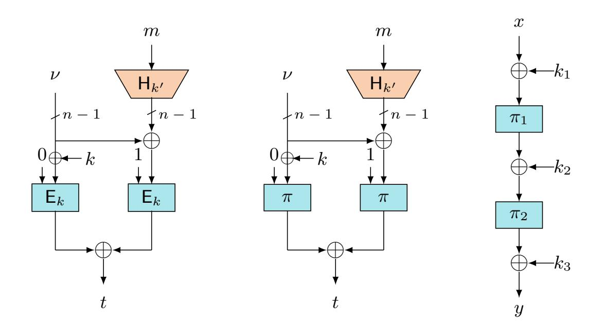
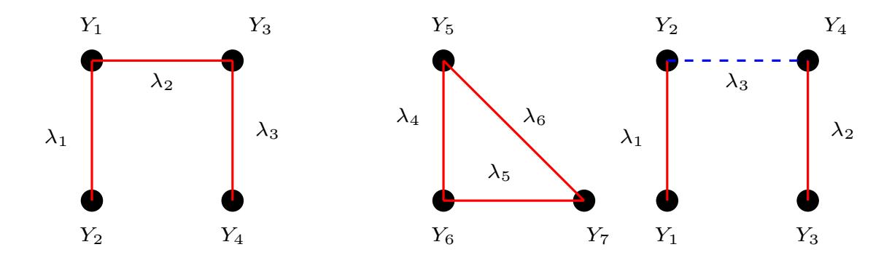

{0}------------------------------------------------

# BBB Secure Nonce Based MAC Using Public Permutations

Avijit Dutta and Mridul Nandi

Indian Statistical Institute, Kolkata. avirocks.dutta13@gmail.com, mridul.nandi@gmail.com

Abstract. In the recent trend of CAESAR competition and NIST lightweight competition, cryptographic community have witnessed the submissions of several cryptographic schemes that are build on public random permutations. Recently, in CRYPTO 2019, Chen et al. have initiated an interesting research direction in designing beyond birthday bound PRFs from public random permutations and they proposed two instances of such PRFs. In this work, we extend this research direction by proposing a nonce-based MAC build from public random permutations. We show that our proposed MAC achieves 2n/3 bit security (with respect to the state size of the permutation) and the bound is essentially tight. Moreover, the security of the MAC degrades gracefully with the repetition of the nonce.

Keywords: Faulty Nonce, Mirror Theory, Public Permutation, Expectation Method.

# 1 Introduction

Nonce-Based MAC. Message Authentication Code (or in short MAC) is an important cryptogaphic primitive to authenticate any digital message or packet transmitted over an insecure communication channel. When a sender wants to send a message m, she computes a MAC function with input m, the shared secret key k, and possibly an auxiliary input variable ν (called nonce), and obtains a tag t. Then she sends (ν, m, t) to the receiver. Upon receiving, receiver verifies the authenticity of (ν, m, t) by computing the MAC using (ν, m, k) and checks whether the computed tag t <sup>0</sup> matches with t.

Wegman-Carter (WC) MAC [25] is the first example of a nonce-based MAC which masks the hash value of the message with an encrypted nonce to generate the tag. WC MAC gives optimal security when the nonce is unique for every authenticated messages. However, its security is compromised if the nonce repeats even once. Wegman-Cater MAC, when instantiated with a polynomial hash, then the repetition of the nonce reveals the hash key of the polynomial hash. However, maintaining the uniqueness of the nonce for every authenticated messages is a challenging task in practical contexts. For example, it is difficult to maintain the uniqueness of the nonce while implementing the cipher in a 

{1}------------------------------------------------

stateless device or in cases where the nonce is chosen randomly from a small set. The nonce may also accidentlly repeats due to a faulty implementation of the cipher or due to the fault occured by resetting of the nonce itself [4]. Therefore, the guard from the nonce repetition attack is much desired from a nonce-based MAC.

As a remedy of this, Encrypted Wegman-Carter-Shoup (EWCS) [11] MAC was proposed that guarantees the security even when the nonce repeats. But its security is limited only up to the birthday bound even when nonce is unique. To this end, Encrypted Wegman-Carter with Davies-Meyer [11] (or EWCDM) and Decrypted Wegman-Carter with Davies-Meyer [13] (or DWCDM) have been proposed that gives beyond the birthday bound security when nonce is unique <sup>1</sup> and birthday bound security when nonce repeats <sup>2</sup> . However, the security of both these constructions fall to the birthday bound with a single repetition of the nonce, i.e., if the nonce ever repeats accidentally, security of both the constructions immediately drops to the birthday bound.

Nonce Based Enhanced Hash-then-Mask. In FSE 2010 [21], Minematsu proposed EHtM, a beyond birthday bound secure probabilisitic MAC. It is build upon two independent n-bit keyed functions F<sup>k</sup><sup>1</sup> and F<sup>k</sup><sup>2</sup> and an n-bit axu hash function Hk<sup>h</sup> , defined as follows:

$$\mathsf{EHtM}(m) \stackrel{\Delta}{=} (r \leftarrow_{\$} \{0,1\}^n, \mathsf{F}_{k_1}(r) \oplus \mathsf{F}_{k_2}(r \oplus \mathsf{H}_{k_h}(m))).$$

This construction has been further analyzed in [15] for improving its security bound. In Eurocrypt 2019, Dutta et al. [16] proposed a nonce-based variant of EHtM, called nEHtM MAC, where the random salt r is replaced by an n − 1 bit nonce value ν and an n-bit block cipher E<sup>k</sup> is used as an internal primitive instead of two independent n-bit keyed functions. Schematic diagram of nEHtM is shown in Fig. 1.1. Similar to EWCDM and DWCDM, nEHtM gives beyond the (birthday bound) security in nonce-respecting (resp. nonce misuse) setting. But, unlike these two constructions, security of nEHtM MAC degrades gracefully with the repetition of the nonce. In other words, security of nEHtM remains beyond the birthday bound with a single repetition of the nonce (which is not true for EWCDM and DWCDM). That is, one can get adequate security from nEHtM if the repetition of the nonce occurs in a controlled way, a feature which is not present in EWCDM or DWCDM. This phenomena is formally captured by a notion, called faulty nonce model [16]. Informally, it says that a nonce is faulty if it appears in a previous signing query. It has been stated in [16] that faulty nonce model is a weaker notion than multicollision of nonces – a natural and a popular metric to measure the misuses of nonce. Under the notion of faulty nonce model, Dutta et al. have shown that nEHtM is secured roughly upto 2<sup>2</sup>n/<sup>3</sup> queries.

We would like to mention here that this construction was also analyzed by Moch and List [22] in parallel to [16] in the name of HPxNP, where two independent n-bit block ciphers have been used (as they did not use the domain separation

<sup>1</sup> We call this notion nonce-respecting setting

<sup>2</sup> We call this notion nonce-misuse setting

{2}------------------------------------------------

technique). However, Moch and List analyzed its security under the condition of the uniqueness of the nonce, whereas Dutta et al. [16] proved its graceful security with respect to the repetition of the nonce.

### 1.1 Permutation Based Cryptography

All the above discussed nonce-based MACs are build on block ciphers as their underlying primitives and even stronger, these primitives are evaluated only in the forward direction. As most of the block ciphers are designed to be efficient in both the forward and the inverse direction, block ciphers are over-hyped primitives for such purpose [10]. On the other extreme, cryptographic permutations are particularly designed with the motive to be fast in the forward direction, but not neccessarily in the inverse direction. Examples of such permutation includes Keccak [2], Gimli [1], SPONGENT [5]. Moreover, in most of the cases evaluating an unkeyed public permutation is faster than evaluating a keyed block cipher, as the latter involves in evaluating the underlying key scheduling algorithm each time the block cipher is invoked in the design. With the advancement of public permutation-based designs and the efficiencies of evaluating it in the forward direction, numerous public permutation-based inverse-free hash and authenticated encryption designs have been proposed. The use of cryptographic permutation gained the momentum during SHA-3 competition [24]. Furthermore, the selection of the permutation-based Keccak sponge function as the SHA-3 standard has given a high level of confidence on using this primitive in the community. Today, permutation-based sponge construction has become a successful and a full-fledged alternative to the block cipher-based modes. In fact, in the first round of the ongoing NIST light-weight competition [23], 24 out of 57 submissions are based on cryptographic permutations, and out of 24, 16 permutation based proposals have been qualified for the second round. This statistics, beyond any doubt, clearly depicts the wide adoption of permutation based designs [7, 1, 3, 8, 12, 14] in the community. In another direction, a long line of research work has been carried out in the study of designing block ciphers and tweakable block ciphers out of public random permutations. Even Mansour (EM) [17] and Iterated Even Mansour (IEM) cipher [6] are the notable approaches in this direction.

Nonce-based MAC build from Public Permutations. Nonce-based MACs using public permutations are mostly designed with sponge type of constructions. But the drawback of such designs are: (i) they do not use the full size of the permutation for guarranting security and (ii) they attain only the birthday bound security in the size of its capacity c, i.e., c/2 bit security (except Bettle [7], whose security bound is roughly the size of its capacity). Now, it is an admissible fact that the sponge type designs, which offer c/2-bit security, are good in practice when they are instantiated with large size permutations such as Keccak [2], whose state size is 1600 bits. But such large size permutations are not suitable for use in resource constrained environment. In such scneario, instead of using such large size permutations, one aims to use light-weight permutations such as SPONGENT [5] and PHOTON [18], whose state size go as

{3}------------------------------------------------

low as 88 and 100 bits respectively. If we use these light-weight permutations as underlying primitives in birthday bound secure sponge type constructions, then it practically offers inadequate security. As a result, sponge type constructions instantiated with light-weight permutations are not suitable for deploying in resource constrained environment. Thus, it is natural to ask

Can we design a public permutation-based nonce-based MAC that gives an adequate security when instantiated with light-weight permutation ?

This question hinted us to think of designing a MAC whose security depends on the entire size of the underlying permutation (unlike sponge type constructions whose security depends on only a part of the entire size of the underlying permutation) and the security must cross the birthday barrier. Coming up with such a design is the goal of this paper. In this direction, Chen et al. [10] have shown two instances of public permutation-based pseudo random functions that give beyond the birthday bound security with respect to the size of the permutation. We extend this line of research work by designing a public permutation-based nonce-based MAC that gives beyond the birthday bound security with respect to the size of the permutation.

Our Contribution. The sole contribution of this paper is to design a beyond birthday bound secure nonce-based MAC using public random permutations. To this end we propose nEHtMp, a nonce based MAC desiged using public permutations. As depicted in Fig. 1.1, our construction structurally resembles to the nEHtM MAC [16] where we replace its block cipher with a public random permutation and an appropriate masking of the key.



Fig. 1.1. (Left): nEHtM MAC based on block cipher Ek; (Middle): nEHtM<sup>p</sup> MAC based on single public random permutation π; (Right): 2-round iterated even mansour cipher.

Note that, by instantiating the underlying block cipher of nEHtM MAC with 2 round iterated Even-Mansour cipher (as shown in Fig 1.1), one can easily make 

{4}------------------------------------------------

the public permutation variant of nEHtM MAC, which becomes secure beyond the birthday bound (in faulty nonce model). However such transformation requires 4 permutation calls, 7 xor operations and one hash evaluation. Compared to this, nEHtM<sub>p</sub> requires only 2 permutation calls, 3 xor operations and one hash evaluation. We have shown that nEHtM<sub>p</sub> is secured roughly up to  $2^{2n/3}$  queries in the nonce-respecting setting. Moreover, this security bound degrades in a graceful manner under the faulty nonce model [16]. We show the unforgeability of this construction through an extended distinguishing game and apply the expectation method to bound its distinguishing advantage. We also show that our proven security bound is tight by giving a matching attack on it with roughly  $2^{2n/3}$  query complexity and  $2^{2n-4}$  time complexity <sup>3</sup>.

# 2 Preliminaries

General Notations: For  $n \in \mathbb{N}$ , we denote the set of all binary strings of length n and the set of all binary strings of finite arbitrary length by  $\{0,1\}^n$ and  $\{0,1\}^*$  respectively. We often refer the elements of  $\{0,1\}^n$  as block. For an *n*-bit binary string  $x = (x_{n-1} \dots x_0)$ ,  $\mathsf{msb}(x)$  denotes the first bit of x in left to right ordering, i.e.  $\mathsf{msb}(x) = x_{n-1}$ . Moreover,  $\mathsf{chop}_{\mathsf{msb}}(x) \stackrel{\Delta}{=} (x_{n-2}, \dots, x_0)$ , i.e.,  $\mathsf{chop}_{\mathrm{msb}}(x)$  returns the string x by dropping just its msb. For any element  $x \in \{0,1\}^*, |x| \text{ denotes the number of bits in } x \text{ and for } x,y \in \{0,1\}^*, x \| y \text{ denotes} \| y \|_{L^2(\mathbb{R}^n)}$ the concatenation of x followed by y. We denote the bitwise xor operation of  $x,y \in \{0,1\}^n \text{ by } x \oplus y. \text{ We parse } x \in \{0,1\}^* \text{ as } x = x_1 \|x_2\| \dots \|x_l \text{ where } x \in \{0,1\}^n \text{ by } x \oplus y.$ for each  $i = 1, \ldots, l-1, x_i$  is a block and  $1 \leq |x_l| \leq n$ . For a sequence of elements  $(x^1, x^2, \dots, x^s) \in \{0, 1\}^*$ ,  $x_a^i$  denotes the a-th block of i-th element  $x^i$ . For a value s, we denote by  $t \leftarrow s$  the assignment of s to variable t. For any natural number  $j \in \mathbb{N}, \langle j \rangle_s$  denotes the s bit binary representation of integer j. For  $i \in \{0,1\}^n$ , left<sub>k</sub>(i) represents the leftmost k bits of i. Similarly, right<sub>k</sub>(i) represents the rightmost k bits of i. For any finite set  $\mathcal{X}$ ,  $X \leftarrow_{\$} \mathcal{X}$  denotes that X is sampled uniformly at random from  $\mathcal{X}$  and  $X_1, \ldots, X_s \leftarrow_{\$} \mathcal{X}$  denotes that  $X_i$ 's are sampled uniformly and independently from  $\mathcal{X}$ .  $\mathbb{F}_{\mathcal{X}}(n)$  denotes the set of all functions from  $\mathcal{X}$  to  $\{0,1\}^n$ . We often write  $\mathbb{F}(n)$  when the domain is clear from the context. We denote the set of all permutations over  $\{0,1\}^n$  by  $\mathbb{P}(n)$ . For integers  $1 \le b \le a$ ,  $(a)_b$  denotes the product  $a(a-1) \dots (a-b+1)$ , where  $(a)_0 = 1$  by convention and for  $q \in \mathbb{N}$ , [q] refers to the set  $\{1, \ldots, q\}$ .

### 2.1 Public Permutation Based Nonce Based MAC

Let  $F : \mathcal{K} \times \mathcal{N} \times \mathcal{M} \to \mathcal{T}$  be a keyed function where  $\mathcal{K}, \mathcal{N}, \mathcal{M}$  and  $\mathcal{T}$  are the key space, nonce space, message space and the tag space respectively. We assume that F makes internal calls to the public random permutations  $\boldsymbol{\pi} = (\pi_1, \dots, \pi_d)$  for  $d \geq 1$ , where all of the d permutations are independent and uniformly sampled

<sup>&</sup>lt;sup>3</sup> time complexity does not refer to the evaluation of permutations, but only refers to the time required to find a suitable matching pair

{5}------------------------------------------------

from  $\mathbb{P}(n)$  for some  $n \in \mathbb{N}$ . For simplicity, we write  $\mathsf{F}_k^{\boldsymbol{\pi}}$  to denote  $\mathsf{F}$  with uniform k and uniform  $\boldsymbol{\pi}$ . Based on  $\mathsf{F}_k^{\boldsymbol{\pi}}$ , we define the nonce-based message authentication code  $\mathcal{I} = (\mathcal{I}.\mathsf{KGen}, \mathcal{I}.\mathsf{Sign}, \mathcal{I}.\mathsf{Ver})$  build from public permutations as follows: For  $k \in \mathcal{K}$ , the signing algorithm  $\mathcal{I}.\mathsf{Sign}_k$ , takes as input  $(\nu,m) \in \mathcal{N} \times \mathcal{M}$  and outputs  $t \leftarrow \mathsf{F}_k^{\boldsymbol{\pi}}(\nu,m)$  and the verification algorithm  $\mathcal{I}.\mathsf{Ver}_k$ , takes as input  $(\nu,m,t) \in \mathcal{N} \times \mathcal{M} \times \mathcal{T}$  and outputs 1 if  $\mathsf{F}_k^{\boldsymbol{\pi}}(\nu,m) = t$ ; otherwise it outputs 0. A signing query  $(\nu,m)$  by an adversary A is called a **faulty query** if A has already queried to the signing algorithm with the same nonce but with a different

A signing query  $(\nu, m)$  by an adversary A is called a **faulty query** if A has already queried to the signing algorithm with the same nonce but with a different message. Let A be a  $(\eta, q_m, q_v, p, t)$ -adversary against the unforgeability of  $\mathcal{I}$  with oracle access of the signing algorithm  $\mathcal{I}.\mathsf{Sign}_k$ , the verification algorithm  $\mathcal{I}.\mathsf{Ver}_k$  and the d-tuple of permutations  $\pi$  and their inverses  $\pi^{-1} = (\pi_1^{-1}, \dots, \pi_d^{-1})$  such that it makes at most  $\eta$  faulty signing queries out of  $q_m$  signing,  $q_v$  verification and p primitive queries with running time of A at most t. A is said to be nonce respecting (resp. nonce misuse) if  $\eta = 0$  (resp.  $\eta \geq 1$ ). However, A may repeats nonces in its verification queries. Moreover, the primitive queries are interleaved with the signing and the verification queries. A is said to forge  $\mathcal{I}$  if for any of its verification queries (not obtained through a previous signing query), the verification algorithm returns 1. The advantage of A against the unforgeability of the nonce based MAC  $\mathcal{I}$  is defined as

$$\mathbf{Adv}_{\mathcal{I}}^{\mathrm{nMAC}}(\mathsf{A}) \stackrel{\Delta}{=} \Pr \left[ \mathsf{A}^{\mathcal{I}.\mathsf{Sign}_{k},\mathcal{I}.\mathsf{Ver}_{k},\boldsymbol{\pi},\boldsymbol{\pi}^{-1}} \text{ forges } \right],$$

where the randomness is defined over  $k \leftarrow_{\$} \mathcal{K}, \pi_1, \dots, \pi_d \leftarrow_{\$} \mathbb{P}(n)$  and the randomness of the adversary (if any). We write

$$\mathbf{Adv}_{\mathcal{I}}^{\mathrm{nMAC}}(\eta, q_m, q_v, p, \mathsf{t}) \stackrel{\Delta}{=} \max_{\mathsf{A}} \mathbf{Adv}_{\mathcal{I}}^{\mathrm{nMAC}}(\mathsf{A}),$$

where the maximum is taken over all  $(\eta, q_m, q_v, p, t)$ -adversaries A. In this paper, we skip the time parameter of the adversary as we will assume throughout the paper that the adversary is computationally unbounded. This will render us to assume that the adversary is deterministic.

UPPER BOUND ON  $\mathbf{Adv}_{\mathcal{I}}^{\mathrm{nMAC}}(\mathsf{A})$  ([15]). To obtain an upper bound for  $\mathbf{Adv}_{\mathcal{I}}^{\mathrm{nMAC}}(\mathsf{A})$ , we consider a random oracle RF that samples the tag t independently and uniformly at random from  $\{0,1\}^n$  for every nonce message pair  $(\nu,m)$  and the Rej oracle always returns  $\bot$  for any  $(\nu,m,t)$ . Then,  $\mathbf{Adv}_{\mathcal{I}}^{\mathrm{nMAC}}(\mathsf{A})$  is upper bounded by

$$\max_{\mathsf{A}} \left| \Pr \left[ \mathsf{A}^{\mathcal{I}.\mathsf{Sign}_{k}, \mathcal{I}.\mathsf{Ver}_{k}, \boldsymbol{\pi}, \boldsymbol{\pi}^{-1}} \Rightarrow 1 \right] - \Pr \left[ \mathsf{A}^{\mathsf{RF},\mathsf{Rej}, \boldsymbol{\pi}, \boldsymbol{\pi}^{-1}} \Rightarrow 1 \right] \right|, \tag{1}$$

where  $A^{\mathcal{O}} \Rightarrow 1$  denotes that adversary A outputs 1 after interacting with its oracle  $\mathcal{O}$  (which could be a multiple of oracles).

#### 2.2 Almost Xor Universal and Almost Regular Hash Function

Let  $\mathcal{K}_h$  and  $\mathcal{X}$  be two non-empty finite sets and H be a keyed function H:  $\mathcal{K}_h \times \mathcal{X} \to \{0,1\}^n$ . Then, H is said to be an  $\epsilon_{\text{axu}}$ -almost xor universal (axu) hash

{6}------------------------------------------------

function, if for any distinct x, x<sup>0</sup> ∈ X and for any ∆ ∈ {0, 1} n,

$$\Pr\left[K_h \leftarrow_{\$} \mathcal{K}_h : \mathsf{H}_{K_h}(x) \oplus \mathsf{H}_{K_h}(x') = \Delta\right] \leq \epsilon_{\mathrm{axu}}.$$

Moreover, H is said to be an reg-almost regular (ar) hash function, if for any x ∈ X and for any ∆ ∈ {0, 1} n,

$$\Pr\left[K_h \leftarrow_{\$} \mathcal{K}_h : \mathsf{H}_{K_h}(x) = \Delta\right] \le \epsilon_{\text{reg}}.$$

#### 2.3 Expectation Method

The Expectation Method of Hoang and Tessaro [19] was used to derive a tight multi-user security bound of the key-alternating cipher. This technique has subsequently been used in [20, 16]. Let A be a computationally unbounded deterministic distinguisher that interacts with either of the two worlds: Ore or Oid, where these oracles are possibly randomized stateful systems. After the interaction, A returns a single bit. This interaction between A and the system results in an ordered sequence of queries and responses which is summarized in τ = ((x1, y1),(x2, y2), . . . ,(xq, yq)), called a transcript, where x<sup>i</sup> is the i-th query of A and y<sup>i</sup> is the corresponding response of the system to which A interacts with. Let Dre (resp. Did) be the random variable that takes a transcript resulting from the interaction between A and Ore (resp. Oid). A transcript τ is said to be attainble if Pr[Did = τ ] > 0. Let Θ denotes the set of all attainable transcripts.

Let Φ : Θ → [0, ∞) be a non-negative function which maps any attainable transcript to a non-negative real value. Suppose there is a set of good transcripts GoodT ⊆ Θ such that for any τ ∈ GoodT,

$$\frac{\Pr\left[\mathsf{D}_{\mathrm{re}} = \tau\right]}{\Pr\left[\mathsf{D}_{\mathrm{id}} = \tau\right]} \ge 1 - \Phi(\tau). \tag{2}$$

Then, the statistical distance between Dre and Did can be bounded as

$$\Delta(\mathsf{D}_{\mathrm{re}},\mathsf{D}_{\mathrm{id}}) \le \mathbf{E}[\Phi(\mathsf{D}_{\mathrm{id}})] + \Pr[\mathsf{D}_{\mathrm{id}} \in \mathsf{BadT}],\tag{3}$$

where BadT <sup>∆</sup>= Θ \ GoodT is the set of all bad transcripts. In other words, the advantage of A in distinguishing Ore from Oid is bounded by E[Φ(Did)]+Pr[Did ∈ BadT]. In the rest of the paper, we write Θ, GoodT and BadT to denote the set of attainable, set of good and set of bad transcripts respectively.

#### 2.4 Sum-Capture Lemma

We use the sum capture lemma by Chen et al. [9]. Informally, the result states that for a random subset S of {0, 1} <sup>n</sup> of size q and for any two arbitrary subsets A and B of {0, 1} <sup>n</sup>, the size of the set {(s, a, b) ∈ S × A × B : s = a ⊕ b} is at most q|A||B|/2 <sup>n</sup>, except with negligible probabilty. In our setting, S is the set of tag values t<sup>i</sup> , which are sampled with replacement from {0, 1} n.

{7}------------------------------------------------

**Lemma 1 (Sum-Capture Lemma).** Let  $n, q \in \mathbb{N}$  such that  $9n \leq q \leq 2^{n-1}$ . Let  $S = \{t_1, \ldots, t_q\} \subseteq \{0, 1\}^n$  such that  $t_i$ 's are with replacement sample of  $\{0, 1\}^n$ . Then, for any two subsets A and B of  $\{0, 1\}^n$ , we have

$$\Pr[|\{(t, a, b) \in \mathcal{S} \times \mathcal{A} \times \mathcal{B} : t = a \oplus b\}| \ge q|\mathcal{A}||\mathcal{B}|/2^n + 3\sqrt{nq|\mathcal{A}||\mathcal{B}|}] \le \frac{2}{2^n}, \quad (4)$$

where the randomness is defined over the set S.

# 3 Solving a System of Affine (Non)-Equations

In this section, we present a lower bound on the number of solutions of a system of bi-variate affine equations and bi-variate affine non-equations over a finite number of unknown variables which are without replacement samples of  $\{0,1\}^n$ . This result will become handy for analysing the security of our proposed construction.

INITIAL SETUP: Consider an undirected edge-labelled acylic graph  $G = (\mathcal{V} \stackrel{\triangle}{=} \{Y_1, \dots, Y_{\alpha}\}, \mathcal{F} \sqcup \mathcal{F}', \mathcal{L})$  with edge labelling function  $\mathcal{L} : \mathcal{F} \sqcup \mathcal{F}' \to \{0,1\}^n$ , where the edge set is partitioned into two disjoint sets  $\mathcal{F}$  and  $\mathcal{F}'$ . For an edge  $\{Y_i, Y_j\} \in \mathcal{F}$ , we write  $\mathcal{L}(\{Y_i, Y_j\}) = \lambda_{ij}$  (and so  $\lambda_{ij} = \lambda_{ji}$ ) and  $\mathcal{L}(\{Y_i, Y_j\}) = \lambda'_{ij}$  for all  $\{Y_i, Y_j\} \in \mathcal{F}'$ . Let  $G^= \stackrel{\triangle}{=} (\mathcal{V}, \mathcal{F}, \mathcal{L}_{|\mathcal{F}})$  denotes the subgraph of G, where  $\mathcal{L}_{|\mathcal{F}}$  is the function  $\mathcal{L}$  restricted over the set  $\mathcal{F}$ . We say G is **good** if it satisfies the following two conditions: (i) for all paths  $P_{st}$  in graph  $G^=$ ,  $\mathcal{L}(P_{st}) \neq \mathbf{0}$ . where  $\mathcal{L}(P_{st}) \stackrel{\triangle}{=} \sum_{e \in P_{st}} \mathcal{L}(e) = Y_s \oplus Y_t$  and  $P_{st}$  is a path of  $G^=$  between vertex s and t and (ii) for all cycles C in G such that the edge set of C contains exactly one non-equation edge  $e' \in \mathcal{F}'$ ,  $\mathcal{L}(C) \neq \mathbf{0}$ , where  $\mathcal{L}(C) \stackrel{\triangle}{=} \sum_{e \in C} \mathcal{L}(e)$ . For such a good graph G, the induced system of equations and non-equations is defined as:

$$\mathcal{E}_{G} = \begin{cases} Y_{i} \oplus Y_{j} &= \lambda_{ij} \ \forall \ \{Y_{i}, Y_{j}\} \in \mathcal{F}, \\ Y_{i} \oplus Y_{j} &\neq \lambda'_{ij} \ \forall \ \{Y_{i}, Y_{j}\} \in \mathcal{F}', \end{cases}$$

The set of components in G is denoted by  $\mathsf{comp}(G) = (\mathsf{C}_1, \ldots, \mathsf{C}_k)$ ,  $\mu_i$  denotes the size of (i.e. the number of vertices in) the i-th component  $\mathsf{C}_i$  and  $\mu_{\max} = \max\{\mu_1, \ldots, \mu_k\}$  is the size of the largest component of G.  $\rho_i$  the total number of vertices upto the i-th component with the convention that  $\rho_0 = 0$ .

**Definition 1 (Injective Solution).** With respect to the system of equations and non-equations  $\mathcal{E}_G$  (as defined above), an injective function  $\Phi: \mathcal{V} \to \mathcal{R}$ , where  $\mathcal{R} \subseteq \{0,1\}^n$ , is said to be an injective solution if  $\Phi(Y_i) \oplus \Phi(Y_j) = \lambda_{ij}$  for all  $\{Y_i, Y_j\} \in \mathcal{F}$  and  $\Phi(Y_i) \oplus \Phi(Y_j) \neq \lambda'_{ij}$  for all  $\{Y_i, Y_j\} \in \mathcal{F}'$ .

**Theorem 1.** Let  $\mathcal{U} = \{u_1, \ldots, u_{\sigma}\}$  be a non-empty finite subset of  $\{0,1\}^n$ , for some  $\sigma \geq 0$ . Let  $G = (\mathcal{V}, \mathcal{F} \sqcup \mathcal{F}', \mathcal{L})$  be a good graph with  $\alpha$  vertices such that  $|\mathcal{F}| = q_m, |\mathcal{F}'| = q_v$ . Let  $\mathsf{comp}(G^=) = (\mathsf{C}_1, \ldots, \mathsf{C}_k)$  and  $|\mathsf{C}_i| = \mu_i$ ,  $\rho_i = (\mu_1 + \cdots + \mu_i)$ . Then the total number of injective solutions, chosen from a set

{8}------------------------------------------------



**Fig. 3.1.** (Left): Graph is a tree of size 4; (Middle): Graph is a cycle of size 3; (Right): Graph with equation edges and non-equation edge. Continuous red edge represents equation edge and dashed blue edge represents non-equation edge.

 $\mathcal{Z} = \{0,1\}^n \setminus \mathcal{U}$  of size  $2^n - \sigma$ , for the induced system of equations and nonequations  $\mathcal{E}_G$  is at least:

$$\frac{(2^n - \sigma)_{\alpha}}{2^{nq_m}} \left( 1 - \sum_{i=1}^k \frac{6(\rho'_{i-1})^2 \binom{\mu_i}{2}}{2^{2n}} - \frac{2q_v}{2^n} \right), \tag{5}$$

provided  $\rho'_k \mu_{\max} \leq 2^n/4$  where  $\rho'_i = \rho_i + \sigma$ .

**Proof.** We proceed the proof by counting the number of solutions in each of the k components. Let  $\tilde{\mu}_{ij}$  denotes the number of edges from  $\mathcal{F}'$  connecting vertices between i-th and j-th component of  $G^{=}$  and  $\mu'_i$  to be the number of edges in  $\mathcal{F}'$ incident on  $v_i \in \mathcal{V} \setminus G^=(\mathcal{V})$ . For the first component, the number of solutions is at least exactly  $(2^n - \mu_1 \sigma)$ . We fix such a solution and count the number of solutions for the second component. which is  $(2^n - \mu_1 \mu_2 - \tilde{\mu}_{1,2} - \mu_2 \sigma)$ . This is because, let  $Y_{i_{\mu_1+1}}$  be an arbitrary vertex of the second component and let  $y_{i_{\mu_1+1}}$ be a solution of it. This solution is valid if the following conditions hold:

- $y_{i_{\mu_1+1}} \notin \mathcal{U}$ .
- $y_{i_{\mu_1+1}}$  does not take  $\mu_1$  values  $(y_{i_1}, \dots, y_{i_{\mu_1}})$  from the first component. It must discard  $\mu_1(\mu_2-1)$  values  $(y_{i_1} \oplus \mathcal{L}(P_j), \dots, y_{i_{\mu_1}} \oplus \mathcal{L}(P_j))$  for all possible paths  $P_j$  from a fixed vertex to any other vertex in the second component.
- It must discard  $p(\mu_2 1)$  values as  $(y_{i_{\mu_1+1}} \oplus \mathcal{L}(P_j)) \notin \mathcal{Y}$  for all possible paths  $P_j$  from  $Y_{i_{\mu_1+1}}$  to any other vertices in the second component.
- $y_{i_{\mu_1+1}}$  does not take  $\tilde{\mu}_{12}$  values to compensate for the fact that the set of values is no longer a group.

Summing up all the conditions, the number of solutions for the second component is at least  $(2^n - \mu_1 \mu_2 - \mu_2 \sigma - \tilde{\mu}_{12})$ . In general, the total number of solutions for the *i*-th component is at least  $\prod_{i=1}^k \left(2^n - \rho_{i-1}\mu_i - \mu_i\sigma - \sum_{i=1}^{i-1} \tilde{\mu}_{ij}\right)$ . Suppose there are k' vertices that do not belong to the set of vertices of the subgraph  $G^{=}$ . Fix such a vertex  $Y_{\rho_k+i}$  and let us assume that  $\mu'_{\rho_k+i}$  blue dashed edges are incident on it. If  $y_{\rho_k+i}$  is a valid solution to the variable  $Y_{\rho_k+i}$ , then we must have (a)

{9}------------------------------------------------

 $y_{\rho_k+i}$  should be distinct from the previous  $\rho_k$  assigned values, (b)  $y_{\rho_k+i}$  should be distinct from the (i-1) values assigned to the variables that do not belong to the set of vertices of the subgraph  $G^=(\mathcal{V})$ , (c)  $y_{\rho_k+i}$  should be distinct from the values of  $\mathcal{U}$ , and (d)  $y_{\rho_k+i}$  should not take those  $\mu'_{\rho_k+i}$  values. Therefore, the total number of solutions is at least

$$h_{\alpha} \ge \prod_{i=1}^{k} \left( 2^{n} - \rho_{i-1}\mu_{i} - \mu_{i}\sigma - \sum_{j=1}^{i-1} \tilde{\mu}_{ij} \right) \cdot \prod_{i \in [k']} (2^{n} - \rho_{k} - \sigma - i + 1 - \mu'_{\rho_{k}+i}).$$
 (6)

Let  $\chi_i \stackrel{\Delta}{=} (\tilde{\mu}_{i1} + \ldots + \tilde{\mu}_{i,i-1}), q_v'' \stackrel{\Delta}{=} (\mu_{\rho_k+1}' + \ldots + \mu_{\rho_k+k'}')$  and  $\rho_i' = \rho_i + \sigma$ . After a simple algebraic calculation on Eqn. (6), we obtain

$$h_{\alpha} \frac{2^{nq_m}}{(2^n - \sigma)_{\alpha}} \ge \underbrace{\prod_{i=1}^k \frac{(2^n - \rho'_{i-1}\mu_i - \chi_i)2^{n(\mu_i - 1)}}{(2^n - \rho'_{i-1})_{\mu_i}} \underbrace{\prod_{i=1}^{k'} \frac{(2^n - \rho'_k - i + 1 - \mu'_{\rho_k + i})}{(2^n - \rho'_k - i + 1)}}_{\text{D.2}}.$$

By expanding 
$$(2^n - \rho'_{i-1})_{\mu_i}$$
 we have  $(2^n - \rho'_{i-1})_{\mu_i} \le 2^{n\mu_i} - 2^{n(\mu_i - 1)} \left( \rho'_{i-1} \mu_i + (\frac{\mu_i}{2}) \right) + 2^{n(\mu_i - 2)} A_i$ , where  $A_i = \left( {\mu_i \choose 2} (\rho'_{i-1})^2 + {\mu_i \choose 2} (\mu_i - 1) \rho'_{i-1} + {\mu_i \choose 2} \frac{(\mu_i - 2)(3\mu_i - 1)}{12} \right)$ .

BOUNDING D.1. With a simplification on the expression of D.1, we have

$$\mathsf{D.1} \geq \prod_{i=1}^k \left( 1 - \frac{A_i}{2^{2n} - 2^n (\rho'_{i-1}\mu_i + \binom{\mu_i}{2}) + A_i} - \frac{2^n \chi_i}{2^{2n} - 2^n (\rho'_{i-1}\mu_i + \binom{\mu_i}{2}) + A_i} \right)$$

$$\stackrel{(4)}{\geq} \prod_{i=1}^k \left( 1 - \frac{2A_i}{2^{2n}} - \frac{2\chi_i}{2^n} \right) \stackrel{(5)}{\geq} \left( 1 - \sum_{i=1}^k \frac{6(\rho'_{i-1})^2 \binom{\mu_i}{2}}{2^{2n}} - \frac{2q'_v}{2^n} \right),$$

where (4) follows from the fact that  $2^n(\rho'_{i-1}\mu_i + {\mu_i \choose 2}) - A_i \leq 2^{2n}/2$ , which holds true when  $\rho'_k \mu_{\max} \leq 2^n/4$ , (5) holds true due to the fact that  $A_i \leq 3(\rho'_{i-1})^2 {\mu_i \choose 2}$  and  $(\chi_1 + \ldots + \chi_k) = q'_v$ , the total number of blue dashed edges across the components of  $G^=$  and  $\mu_1 + \ldots + \mu_k \leq \alpha$ .

BOUNDING D.2. For bounding D.2, we have

$$D.2 \ge \prod_{i=1}^{k'} \left( 1 - \frac{\mu'_{\rho_k + i}}{(2^n - \rho'_k - i + 1)} \right) \stackrel{(6)}{\ge} \left( 1 - \sum_{i=1}^{k'} \frac{2\mu'_{\rho_k + i}}{2^n} \right) \stackrel{(7)}{\ge} \left( 1 - \frac{2q''_v}{2^n} \right),$$

where (6) follows due to the fact that  $(\rho'_k + i - 1) \leq 2^n/2$  and (7) follows as we denote  $(\mu'_{\rho_k+1} + \ldots + \mu'_{\rho_k+k'}) = q''_v$ , the total number of blue dashed edges incident on the vertices outside of the set  $G^=(\mathcal{V})$ .

{10}------------------------------------------------

COMBINING D.1 AND D.2. Finally, by combining the expression of D.1 and D.2, we have

$$h_{\alpha} \frac{2^{nq_m}}{(2^n - \sigma)_{\alpha}} \ge \left(1 - \sum_{i=1}^k \frac{6(\rho'_{i-1})^2 \binom{\mu_i}{2}}{2^{2n}} - \frac{2q_v}{2^n}\right),$$

where  $q_v = q'_v + q''_v$ , the total number of non-equation edges in G.

### 4 Security of nEHtM in Public Permutation Model

In this section, we first state that  $\mathsf{nEHtM}_p$  achieves 2n/3-bit security in public permutaion model in the faulty nonce model. Followed by this, we demonstrate a matching attack in subsect. 4.2 to show the security bound is tight.

#### 4.1 Security of nEHtM<sub>p</sub>

We show that  $\mathsf{nEHtM}_p$  is secure against all adversaries that makes roughly  $2^{2n/3}$  queries in the faulty nonce model. However, similar to  $\mathsf{nEHtM}$ , the construction posses a birthday bound forging attack when the number of faulty nonces reaches to an order of  $2^{n/2}$  [16].

**Theorem 2.** Let  $\mathcal{M}$  and  $\mathcal{K}_h$  be two finite and non-empty sets. Let  $\pi \leftarrow_{\$} \mathbb{P}(n)$  be an n-bit public random permutation and  $H: \mathcal{K}_h \times \mathcal{M} \to \{0,1\}^{n-1}$  be an (n-1)-bit  $\epsilon_{\text{axu}}$ -almost xor universal and  $\epsilon_{\text{reg}}$ -almost regular hash function. Moreover,  $K \leftarrow_{\$} \{0,1\}^{n-1}$  be an n-1 bit random key and  $\eta$  be a fixed parameter. Then the forging advantage for any  $(\eta, q_m, q_v, 2p)$ -adversary against the construction  $\mathsf{nEHtM}_p[\pi, H, K]$  that makes at most  $\eta$  faulty queries out of  $q_m$  signing,  $q_v$  veritication and altogether 2p primitive queries, is given by

$$\begin{aligned} \mathbf{Adv}_{\mathsf{nEHtM}_p}^{\mathsf{MAC}}(\eta, q_m, q_v, 2p) &\leq \frac{12\eta^2}{2^{2n}} \bigg( q_m + 2p \bigg)^2 + \bigg( p + q_m \bigg) \bigg( \frac{192pq_m}{2^{2n}} + \frac{48pq_m^2 \epsilon_{\mathsf{axu}}}{2^{2n}} \bigg) \\ &+ \frac{48q_m^3}{2^{2n}} + \frac{12q_m^4 \epsilon_{\mathsf{axu}}}{2^{2n}} + \frac{2q_v}{2^n} + \frac{p^2 \epsilon_{\mathsf{reg}}}{2^n} \bigg( 3q_m + 2q_v \bigg) + \frac{q_m}{2^n} \\ &+ \epsilon_{\mathsf{axu}} \bigg( \frac{4q_m^3}{2^n} + 2\eta q_m + \frac{pq_m^2}{2^n} + \frac{q_m^2}{2^{n+1}} + (\eta + 1)q_v \bigg) \\ &+ \epsilon_{\mathsf{reg}} (2\eta p + p\sqrt{3nq_m}) + \frac{2p^2q_m}{2^{2n}} + \frac{2 + 2\eta}{2^n} + \frac{2p\sqrt{3nq_m}}{2^n}. \end{aligned}$$

By assuming  $\epsilon_{\rm axu} \approx 2/2^n$  and  $\epsilon_{\rm reg} \approx 2/2^n$ , the above bound is simplified to

$$\mathbf{Adv}_{\mathsf{nEHtM}_p}^{\mathsf{MAC}}(\eta, q_m, q_v, 2p) \leq \frac{80q_m^3}{2^{2n}} + \frac{4(q_m + q_v)}{2^n} + \frac{4p\sqrt{3nq_m}}{2^n} + \frac{12\eta^2}{2^{2n}} \left(q_m + 2p\right)^2 + (p + q_m) \left(\frac{200pq_m}{2^{2n}} + \frac{96pq_m^2}{2^{3n}} + \frac{4\eta}{2^n}\right) + \frac{2\eta q_v}{2^n} + \frac{4p^2q_v}{2^{2n}} + \frac{2\eta}{2^n} + \frac{2\eta}{2^n}$$

{11}------------------------------------------------

We defer the proof of this theorem in Sect. 5. The forging advantage of  $n\mathsf{EHtM}_p$  for  $\eta \leq 2^{n/3}$ ,  $q_m \leq 2^{2n/3}$  and  $p \leq 2^{2n/3}$  is thus given by

$$\mathbf{Adv}_{\mathsf{nEHtM}_p}^{\mathsf{MAC}}(q_m,q_v,2p) \leq \left(\frac{29q_m}{2^{2n/3}} + \frac{6q_v}{2^{2n/3}} + \frac{28p}{2^{2n/3}}\right) + \frac{296p^2q_m}{2^{2n}} + \frac{296pq_m^2}{2^{2n}} + \frac{4p^2q_v}{2^{2n}} + \frac{4}{2^{2n/3}}.$$

# 4.2 Matching Attack on nEHtM<sub>p</sub>

In this section we show a matching attack on  $\mathsf{nEHtM}_p$  with  $2^{2n/3}$  signing queries and total  $2^{2n/3} + 2$  primitive queries. For carrying out the attack, we consider the following version of Polyhash function, a specific instantiation of an axu and ar hash function: for a message m, if the size of m is not a multiple of n, where n is the key size of the hash function, then we first apply an injective padding (e.g.,  $10^*$ ) on it to generate a padded message m'. Then the output of the hash function for m' is computed as follows:

$$\mathsf{Poly}_{k_h}(m') = k_h^{l+1} \oplus k_h^l \cdot m_l' \oplus k_h^{l-1} m_{l-1}' \oplus \ldots \oplus k_h \cdot m_1',$$

where l denotes the number of message blocks of m' and  $m'_i$  denotes the i-th message block of m'. Now, it is easy to see that the hash function is  $(l_{\text{max}}+1)/2^n$ -secure axu and ar hash function, where  $l_{\text{max}}$  is the maximum number of message blocks allowed. With this instance of the hash function of  $\mathsf{nEHtM}_p$ , we mount the following attack. To begin with, we exploit bad event B.1 to mount the attack on the construction. We construct a deterministic adversary A that forges  $\mathsf{nEHtM}_p$  by making  $2^{2n/3}$  signing queries and total  $2^{2n/3}+2$  many primitive queries to  $\pi$  as follows:

#### Attack Algorithm:

- 1. A first chooses a single block message m consisting of all zeroes, i.e.,  $m = 0^n$ .
- 2. Then A makes  $2^{2n/3}$  signing queries with  $(\nu_j, m)$  and obtains the tag  $t_j$  for  $j \in [2^{2n/3}]$ , where  $\nu_j = 0^{n/3-1} ||\langle j \rangle_{2n/3}$ .
- 3. A makes  $2^{2n/3-1}$  forward primitive queries to  $\pi$  with  $x_j^1$  and obtains the output  $y_j^1$  for  $j \in [2^{2n/3-1}]$ , where  $x_j^1 = 0 \|\langle j \rangle_{2n/3-1} \|0^{n/3}$ .
- 4. A makes again  $2^{2n/3-1}$  forward primitive queries to  $\pi$  with  $x_j^2$  and obtains the output  $y_j^2$  for  $j \in [2^{2n/3-1}]$ , where  $x_j^2 = 1 \| \mathsf{left}_{n/3-1}(\langle j \rangle_{2n/3-1}) \| 0^{n/3} \| \mathsf{right}_{n/3}(\langle j \rangle_{2n/3-1})$ .
- 5. Then, A finds a tripet  $(i, j, l) \in [2^{2n/3}] \times [2^{2n/3-1}] \times [2^{2n/3-1}]$  such that  $t_i = y_i^1 \oplus y_l^1$ .
- 6. A makes two aditional forward primitive queries to  $\pi$  with  $x_{\star}^1 = x_j^1 \oplus 0 || 1^{n-1}$  and  $x_{\star}^2 = x_k^2 \oplus 0 || 1^{n-1}$ . Let the received response be  $y_{\star}^1$  and  $y_{\star}^2$  respectively.
- 7. Finally, A forges with  $(\nu_i \oplus 1^{n-1}, m, y_{\star}^1 \oplus y_{\star}^2)$ .

ANALYSIS OF THE FORGING ADVANTAGE. We first note that the structure of  $\nu_j, x_j^1$  and  $x_j^2$  are as follows:

$$\nu = \left\{ \underbrace{0 \ 0 \dots 0}_{n/3-1} \| \underbrace{\star \star \dots \star}_{n/3} \| \underbrace{\star \star \dots \star}_{n/3} \right\}, \ x^1 = \left\{ 0 \| \underbrace{\star \star \dots \star}_{n/3-1} \| \underbrace{\star \star \dots \star}_{n/3} \| \underbrace{0 \ 0 \dots 0}_{n/3} \right\}.$$

{12}------------------------------------------------

$$x^{2} = \left\{ 1 \| \underbrace{\star \star \ldots \star}_{n/3-1} \| \underbrace{0 \ 0 \ldots 0}_{n/3} \| \underbrace{\star \star \ldots \star}_{n/3} \right\}.$$

Note that, the number of elements  $(\nu_i, x_j^1)$  that satisfy the relation  $0 \| (\nu_i \oplus k) = x_j^1$  is exactly  $2^{n/3}$ . As a result, the expected number of triplets  $(i, j, \ell)$  that satisfy  $0 \| (\nu_i \oplus k) = x_j^1$  and  $1 \| (\nu_i \oplus k_h^2) = x_\ell^2$  is exactly 1. For this particular triplet  $(i, j, \ell)$  that satisfies the relation, A makes two additional forward primitive queries to  $\pi$  with  $x_{\star}^1 = x_j^1 \oplus \Delta$  and  $x_{\star}^2 = x_\ell^2 \oplus \Delta$ , where  $\Delta = 0 \| 1^{n-1}$ . Thus, if A makes a forging query with  $\nu_i \oplus 1^{n-1}$  (which is distinct from all other nonces that belong to the signing queries) and with the same message  $m = 0^n$ , then we have

$$\pi(0\|(\nu_i \oplus 1^{n-1} \oplus k)) \oplus \pi(1\|(\nu_i \oplus 1^{n-1} \oplus k_h^2))$$

$$= \pi((0\|(\nu_i \oplus k)) \oplus \Delta) \oplus \pi((1\|(\nu_i \oplus k_h^2)) \oplus \Delta) = \pi(x_{\star}^1) \oplus \pi(x_{\star}^2) = y_{\star}^1 \oplus y_{\star}^2$$

which makes  $(\nu_i \oplus 1^{n-1}, m, y_{\star}^1 \oplus y_{\star}^2)$  a valid and successful forging attempt. Note that, the number of signing queries required is  $2^{2n/3}$  and the total number of primitive queries required is  $2^{2n/3} + 2$ . However, the time complexity of this attack is  $2^{2n-2}$ .

# 5 Proof of Theorem 2: MAC Security of nEHtM<sub>p</sub>

Due to Eqn. (1), we bound the distinguishing advantage instead of bounding the forging advantage of  $\mathsf{nEHtM}_p$ . For this, we consider any information theoretic deterministic distinghisher A that has access to the following oracles in either the real world or in the ideal world: in the real world it has access to  $(\mathsf{nEHtM}_p.\mathsf{Sig}_{(k,k_h)}^\pi,\mathsf{nEHtM}_p.\mathsf{Ver}_{(k,k_h)}^\pi,\pi,\pi^{-1});$  in the ideal world it has access to  $(\mathsf{RF},\mathsf{Rej},\pi,\pi^{-1}).$  We summarize the interactions of the distinguisher with its oracle in a transcript  $\tau_m \cup \tau_v$ , where  $\tau_m \triangleq \{(\nu_1,m_1,t_1),\ldots,(\nu_{q_v},m_{q_v},t_{q_v}',b_{q_v}')\}$  is the MAC transcript and  $\tau_v \triangleq \{(\nu_1',m_1',t_1',b_1'),\ldots,(\nu_{q_v}',m_{q_v}',t_{q_v}',b_{q_v}')\}$  is the verification transcript. Primitives queries to  $\pi$  are summarized in two lists in the form of  $\tau_p^{(1)} \triangleq \{(x_1^1,y_1^1),\ldots,(x_p^1,y_p^1)\}$  and  $\tau_p^{(2)} \triangleq \{(x_1^2,y_1^2),\ldots,(x_p^2,y_p^2)\}$ , where  $\mathsf{msb}(x_i^1) = 0$  and  $\mathsf{msb}(x_i^2) = 1$ . We assume that none of the transcripts contain any duplicate elements and after the interaction, we reveal the keys  $k,k_h$  to the distinguisher (before it output its decision), which happens to be the keys used in the construction for the real world and uniformly sampled dummy keys for the ideal world. The complete view is denoted by  $\tau' = (\tau_m, \tau_v, \tau_p^{(1)}, \tau_p^{(2)}, k, k_h).$ 

#### 5.1 Definition and Probability of Bad Transcripts

For the notational simplicity, we denote  $\mathsf{H}_{k_h}(m_i) = \mathsf{H}_i$ .  $\hat{x}_i^b$  denotes  $\mathsf{chop}_{\mathrm{msb}}(x_i^b)$  for b = 1, 2. We also define three sets: (a)  $\mathcal{T} \stackrel{\Delta}{=} \{t_i : (\nu_i, m_i, t_i) \in \tau_m\}$ , (b)  $\mathcal{Y}_1 \stackrel{\Delta}{=} \{y_i^1 : (x_i^1, y_i^1) \in \tau_p^{(1)}\}$  and (c)  $\mathcal{Y}_2 \stackrel{\Delta}{=} \{y_i^2 : (x_i^2, y_i^2) \in \tau_p^{(2)}\}$ . The main idea of identifying bad events is to avoid the input collision of the permutation with

{13}------------------------------------------------

primitive queries as that will determine the corresponding tag; hence losing the randomness of the tag, which in turn, will help the adversary to distinguish the output from random.

**Definition 2** (Bad Transcript for nEHtM<sub>n</sub>). Given a parameter  $\xi \in \mathbb{N}$ , where  $\xi \geq \eta$ , an attainable transcript  $\tau' = (\tau_m, \tau_v, \tau_p^{(1)}, \tau_p^{(2)}, k, k_h)$  is called a bad transcript if any one of the following holds:

```
- B.1 : \exists i \in [q_m], j, \ell \in [p] such that \nu_i \oplus k = \hat{x}_i^1, \nu_i \oplus \mathsf{H}_i = \hat{x}_\ell^2.
```

- B.2 : 
$$\exists i, j, \ell \in [q_m], i \neq j, i \neq \ell \text{ such that } \nu_i = \nu_j \text{ and } \nu_i \oplus \mathsf{H}_i = \nu_\ell \oplus \mathsf{H}_\ell$$

- B.2 : 
$$\exists i, j, \ell \in [q_m], i \neq j, i \neq \ell \text{ such that } \nu_i = \nu_j \text{ and } \nu_i \oplus \mathsf{H}_i = \nu_\ell \oplus \mathsf{H}_\ell$$
.  
- B.3 :  $\exists i \neq j \in [q_m], \ell \in [p] \text{ such that } \nu_i \oplus k = \hat{x}^1_\ell \text{ and } \nu_i \oplus \mathsf{H}_i = \nu_j \oplus \mathsf{H}_j$ .

- B.4 :  $\exists i \neq j \in [q_m], \ell \in [p] \text{ such that } \nu_i = \nu_j \text{ and } \nu_i \oplus \mathsf{H}_i = \hat{x}_\ell^2$ .
- B.5 :  $\exists i \neq j \in [q_m]$  such that  $\nu_i = \nu_j$  and  $t_i = t_j$ .
- B.6 :  $\exists i \neq j \in [q_m]$  such that  $\nu_i \oplus H_i = \nu_j \oplus H_j$  and  $t_i = t_j$ . B.7 :  $\#\{(t_i, y_j^1, y_\ell^2) \in \mathcal{T} \times \mathcal{Y}_1 \times \mathcal{Y}_2 : t_i = y_j^1 \oplus y_\ell^2\} \geq p^2 q_m/2^n + p\sqrt{3nq_m}$ .
- B.8 :  $\exists i \in [q_m], j, \ell \in [p]$  such that  $\nu_i \oplus k = \hat{x}_j^1, y_j^1 \oplus t_i = y_\ell^2$ .
- B.9 :  $\exists i \in [q_m], j, \ell \in [p] \text{ such that } \nu_i \oplus \mathsf{H}_i = \hat{x}_i^2, y_i^2 \oplus t_i = y_\ell^1.$
- B.10 :  $\{i_1,\ldots,i_{\xi+1}\}\subseteq [q_m]$  such that  $\nu_{i_1}\oplus \mathsf{H}_{i_1}=\nu_{i_2}\oplus \mathsf{H}_{i_2}=\ldots=\nu_{i_{\xi+1}}\oplus \mathsf{H}_{i_{\xi+1}}$  (the optimal value of  $\xi$  shall be determined later in the proof). B.11  $\exists \ a\in [q_v], \ \exists \ i\in [q_m]$  such that  $\nu_i=\nu_a', \ \nu_i\oplus \mathsf{H}_i=\nu_a'\oplus \mathsf{H}_a'$  and  $t_i=t_a'$ . B.12  $\exists \ a\in [q_v], \ \exists \ j,\ell\in [p]$  such that  $\nu_a'\oplus k=\hat{x}_j^1, \ \nu_a'\oplus \mathsf{H}_a'=\hat{x}_\ell^2$  and

- $t_a'=y_j^1\oplus y_\ell^2.$  B.13  $\exists~i\in [q_m]~such~that~t_i=0^n.$

**Lemma 2.** Let D<sub>id</sub> and BadT be defined as in Sect. 2.3. Then

$$\begin{split} \Pr[\mathsf{D}_{\mathrm{id}} \in \mathsf{BadT}] & \leq \frac{p^2 \epsilon_{\mathrm{reg}}}{2^n} (3q_m + 2q_v) + \epsilon_{\mathrm{axu}} \bigg( \frac{q_m^2}{2\xi} + 2\eta q_m + \frac{pq_m^2}{2^n} + \frac{q_m^2}{2^{n+1}} + (\eta + 1)q_v \bigg) \\ & + \epsilon_{\mathrm{reg}} (2\eta p + p\sqrt{3nq_m}) + \frac{2p^2q_m}{2^{2n}} + \frac{2 + 2\eta}{2^n} + \frac{2p\sqrt{3nq_m}}{2^n} + \frac{q_m}{2^n}. \end{split}$$

Proof of the lemma can be found in Sect. 6.

#### Analysis of Good Transcripts 5.2

For a good transcript  $\tau' = (\tau_m, \tau_v, \tau_p^{(1)}, \tau_p^{(2)}, k_h, k)$ , the ideal interpolation probability is

$$\mathsf{p}_{\mathrm{id}}(\tau') \stackrel{\Delta}{=} \Pr[\mathsf{D}_{\mathrm{id}} = \tau'] = \frac{1}{|\mathcal{K}_h|} \cdot \frac{1}{2^{n-1}} \cdot \frac{1}{2^{nq_m}} \cdot \frac{1}{(2^n)_{2p}}. \tag{7}$$

COMPUTING REAL INTERPOLATION PROBABILITY. To compute the real interpolation probability, we regroup the elements of  $\tau_m, \tau_p^{(1)}$  and  $\tau_p^{(2)}$  into three new transcripts  $\hat{\tau}_m, \hat{\tau}_p^{(1)}$  and  $\hat{\tau}_p^{(2)}$  in the following way: initially the new transcripts are set to the old one. Now, for each  $(\nu_i, m_i, t_i) \in \tau_m$ , if (a)  $\nu_i \oplus k = \hat{x}_i^1$ , then  $\hat{\tau}_m \leftarrow \tau_m \setminus \{(\nu_i, m_i, t_i)\} \text{ and } \hat{\tau}_p^{(2)} \leftarrow \hat{\tau}_p^{(2)} \cup \{1 | (\nu_i \oplus \mathsf{H}_i), t_i \oplus y_i^1); \text{ if (b) } \nu_i \oplus \mathsf{H}_i = \hat{x}_i^2,$ 

{14}------------------------------------------------

then  $\hat{\tau}_m \leftarrow \tau_m \setminus \{(\nu_i, m_i, t_i)\}$  and  $\hat{\tau}_p^{(1)} \leftarrow \hat{\tau}_p^{(1)} \cup \{0 || (\nu_i \oplus k), t_i \oplus y_j^2)$ . Since  $\tau'$  is a good transcript, it does not meet any of the bad conditions listed in Defn. 2. We know that if  $\nu_i \oplus k = \hat{x}_j^1$ , then  $\nu_i \oplus \mathsf{H}_i$  cannot collide with  $\hat{x}_\ell^2$  (due to  $\neg \mathsf{B.1}$ ) and  $y_j^1 \oplus t_i$  cannot collide with  $y_\ell^2$  (due to  $\neg \mathsf{B.8}$ ). Similarly for  $\hat{\tau}_p^{(2)}$ . This way, we will end up with soundly defined  $\hat{\tau}_p^{(1)}$  and  $\hat{\tau}_p^{(2)}$  and a set of signing queries  $\hat{\tau}_m$  that does not collide with any tuple in  $\hat{\tau}_p^{(1)}$  or  $\hat{\tau}_p^{(2)}$ .

Let  $s_1, s_2 \leq p$  be the number of signing queries that collides with any element of  $\tau_p^{(1)}$  and  $\tau_p^{(2)}$  respectively. Therefore,  $p_1 \stackrel{\Delta}{=} |\hat{\tau}_p^{(1)}| = p + s_2, p_2 \stackrel{\Delta}{=} |\hat{\tau}_p^{(2)}| = p + s_1$  and  $q_m' \stackrel{\Delta}{=} |\hat{\tau}_m| = q_m - s_1 - s_2$ . We denote  $q_p' = p_1 + p_2 = 2p + s_1 + s_2$ . We say that a permutation  $\pi$  is compatible with  $\hat{\tau} \stackrel{\Delta}{=} \hat{\tau}_m \cup \tau_v \cup \hat{\tau}_p^{(1)} \cup \hat{\tau}_p^{(2)}$  if the following holds:

- for all  $(\nu_i, m_i, t_i) \in \hat{\tau}_m, \pi(0 || (\nu_i \oplus k)) \oplus \pi(1 || (\nu_i \oplus \mathsf{H}_i)) = t_i$
- forall  $a \in [q_v], \pi(0 || (\nu'_a \oplus k)) \oplus \pi(1 || (\nu'_a \oplus \mathsf{H}'_a)) \neq t'_a$
- for all  $(x_i^1, y_i^1) \in \hat{\tau}_p^{(1)}, \, \pi(x_i^1) = y_i^1$
- for all  $(x_i^2, y_i^2) \in \hat{\tau}_p^{(2)}, \, \pi(x_i^2) = y_i^2$ .

Therefore, the remaining part is to count the number of compatible permutations  $\pi$ . As a result, we have

$$\mathsf{p}_{\mathrm{re}}(\tau') \stackrel{\Delta}{=} \Pr[\mathsf{D}_{\mathrm{re}} = \hat{\tau}] = \frac{1}{|\mathcal{K}_h|} \cdot \frac{1}{2^{n-1}} \cdot \frac{h_\alpha}{(2^n)_{p_1 + p_2 + \alpha}},\tag{8}$$

where  $h_{\alpha}$  denotes the number of injective solutions to the following system of equations and non-equations ( $\mathcal{E}^{=} \cup \mathcal{E}^{\neq}$ ), with  $\alpha$  many distinct variables. For notational simplicity, we denote  $\pi(0||\nu_{i} \oplus k)$  as  $U_{i}$  and  $\pi(1||\nu_{i} \oplus \mathsf{H}_{i})$  as  $V_{i}$ .

$$\mathcal{E}^{=} = \begin{cases} U_{1} \oplus V_{1} = t_{1} \\ U_{2} \oplus V_{2} = t_{2} \\ \vdots \\ U_{q'_{m}} \oplus V_{q'_{m}} = t_{q'_{m}} \end{cases} \qquad \mathcal{E}^{\neq} = \begin{cases} U'_{1} \oplus V'_{1} \neq t'_{1} \\ U'_{2} \oplus V'_{2} \neq t'_{2} \\ \vdots \\ U'_{q_{v}} \oplus V'_{q_{v}} \neq t'_{q_{v}} \end{cases}$$

where  $q'_m = q_m - s_1 - s_2$ . It is to be noted here that  $\mathcal{E}^= \cup \mathcal{E}^{\neq}$  is defined over  $\alpha$  many distinct variables. Therefore, some variables in  $\mathcal{E}^= \cup \mathcal{E}^{\neq}$  may collide to each other. Thus, from Eqn. (7) and Eqn. (8), we have,

$$\frac{\mathsf{p}_{\rm re}(\tau')}{\mathsf{p}_{\rm id}(\tau')} = \underbrace{\frac{2^{ns_1}}{(2^n - 2p)_{s_1}}}_{\mathsf{A}.1} \cdot \underbrace{\frac{2^{ns_2}}{(2^n - 2p - s_1)_{s_2}}}_{\mathsf{A}.2} \cdot \underbrace{\frac{h_\alpha \cdot 2^{nq'_m}}{(2^n - 2p - s_1 - s_2)_\alpha}}_{\mathsf{A}.3}. \tag{9}$$

Note that,  $A.1 \ge 1$  and  $A.2 \ge 1$ . Therefore, we are left to bound A.3. Note that, the induced graph G of  $\mathcal{E}^{=} \cup \mathcal{E}^{\neq}$  has  $\alpha$  many vertices. Moreover,  $|\mathcal{F}| = q_m$  and  $|\mathcal{F}'| = q_v$ . It is easy to verify that as  $\tau'$  is a good transcript, G is a good graph.

{15}------------------------------------------------

Therefore, by putting  $\sigma=q_p'$  in Theorem 1, we have

$$h_{\alpha} \ge \frac{(2^{n} - 2p - s_{1} - s_{2})_{\alpha}}{2^{nq'_{m}}} \cdot \left(1 - \sum_{i=1}^{k} \frac{6(\rho'_{i-1})^{2} \binom{\mu_{i}}{2}}{2^{2n}} - \frac{2q_{v}}{2^{n}}\right). \tag{10}$$

From Eqn. (8) and Eqn. (10), we have

$$\frac{\mathsf{p}_{\mathrm{re}}(\tau')}{\mathsf{p}_{\mathrm{id}}(\tau')} \geq \bigg(1 - \sum_{i=1}^k \frac{6(\rho'_{i-1})^2 \binom{\mu_i}{2}}{2^{2n}} - \frac{2q_v}{2^n} \bigg) \overset{(1)}{\geq} 1 - \bigg(\underbrace{\sum_{i=1}^k \frac{24(q'_m + q'_p)^2 \binom{\mu_i}{2}}{2^{2n}} + \frac{2q_v}{2^n}}_{\Phi(\tau')} \bigg),$$

where the simplification for (1) follows from the fact  $\rho'_{i-1} = \alpha + q'_p \leq 2(q'_m + q'_p)$ . Now, from Sect.6.2 of [16] we have

$$\mathbf{E}\left[\sum_{i=1}^{k} {\mu_i \choose 2}\right] \le (q'_m)^2 \epsilon_{\text{axu}}/2 + \eta^2/2 + 2q'_m.$$
 (11)

By applying the expectation method of Sect. 2.3 on Eqn. (11), we have

$$\mathbf{E}[\Phi(\mathsf{D}_{\mathrm{id}})] \le \frac{12(q'_m + q'_p)^2}{2^{2n}} \left( (q'_m)^2 \epsilon_{\mathrm{axu}} + \eta^2 + 4q'_m \right) + \frac{2q_v}{2^n}. \tag{12}$$

By doing a simple algebra on Eqn. (12) and by assuming  $q'_m \leq q_m, q'_p \leq 4p$ , we have

$$\mathbf{E}[\Phi(\mathsf{D}_{\mathrm{id}})] \leq \left(\frac{12q_{m}^{4}\epsilon_{\mathrm{axu}}}{2^{2n}} + \frac{12\eta^{2}q_{m}^{2}}{2^{2n}} + \frac{48q_{m}^{3}}{2^{2n}} + \frac{48pq_{m}^{3}\epsilon_{\mathrm{axu}}}{2^{2n}} + \frac{48\eta^{2}pq_{m}}{2^{2n}} + \frac{192pq_{m}^{2}}{2^{2n}} + \frac{192p^{2}q_{m}}{2^{2n}} + \frac{2q_{v}}{2^{2n}}\right). \tag{13}$$

FINALIZING THE PROOF. We have assumed that  $\xi \geq \eta$  and from the condition of Theorem 1, we have  $\xi \leq 2^n/(8q'_m + 2q'_p) \leq 2^n/8q'_m$ . By assuming  $\eta \leq 2^n/8q'_m$  (otherwise the bound becomes vacuously true) we choose  $\xi = 2^n/8q'_m$ . Hence, the result follows by applying Eqn. (3), Lemma 2, Eqn. (13) and  $\xi = 2^n/8q'_m$ .

#### 6 Proof of Lemma 2

By the union bound,

$$\Pr[\mathsf{D}_{\mathrm{id}} \in \mathsf{BadT}] \le \sum_{i=1}^{7} \Pr[\mathsf{B}.\mathsf{i}] + \Pr[\mathsf{B}.\mathsf{8} \mid \overline{\mathsf{B}}.\overline{\mathsf{7}}] + \Pr[\mathsf{B}.\mathsf{9} \mid \overline{\mathsf{B}}.\overline{\mathsf{7}}] + \sum_{i=10}^{13} \Pr[\mathsf{B}.\mathsf{i}]. \ (14)$$

{16}------------------------------------------------

In the following, we bound the probabilities of all the bad events individually. The lemma will follow by adding the individual bounds.

Bounding B.1. For any possible signing query  $(\nu_i, m_i, t_i) \in \tau_m$  and a pair of any possible primitive queries  $(x_j^1, y_j^1) \in \tau_p^{(1)}$  and  $(x_\ell^2, y_\ell^2) \in \tau_p^{(2)}$ , the only randomness in the equation  $\nu_i \oplus k = \hat{x}_j^1$  is k and the randomness in the equation  $\nu_i \oplus \mathsf{H}_i = \hat{x}_\ell^2$  is  $k_h$ , the hash key. In the ideal world, k and  $k_h$  are dummy keys, sampled uniformly and independently from their respective space. Therefore, for a fixed choice of i, j and  $\ell$ , the probability of the event is  $\epsilon_{\text{reg}}/2^{n-1}$ , where  $\epsilon_{\text{reg}}$  is the regular advantage of the underlying hash function. Summing over all possible choices of i, j and  $\ell$  we have

$$\Pr[\mathsf{B}.1] \le \frac{2p^2 q_m \epsilon_{\text{reg}}}{2^n}.\tag{15}$$

**Bounding B.2.** Let  $\mathcal{N}$  be the set of all query indices i for which there is a  $j \neq i$  such that  $\nu_i = \nu_j$ . It is easy to see that  $|\mathcal{N}| \leq 2\eta$ . Event B.2 occurs if for some  $j \in \mathcal{N}$ ,  $\nu_j \oplus \mathsf{H}_j = \nu_\ell \oplus \mathsf{H}_\ell$  for some  $\ell \neq j$ . For any such fixed  $i, j, \ell$ , the probability of the event is at most  $\epsilon_{\text{axu}}$ , where  $\epsilon_{\text{axu}}$  is the almost xor universal advantage of the underlying hash function. The number of such choices of  $(i, j, \ell)$  is at most  $2\eta q_m$ . Hence,

$$\Pr[\mathsf{B.2}] \le 2\eta q_m \epsilon_{\mathrm{axu}}.\tag{16}$$

**Bounding B.3.** For any two signing queries  $(\nu_i, m_i, t_i), (\nu_j, m_j, t_j) \in \tau_m$  and a primitive query  $(x_\ell^1, y_\ell^1) \in \tau_p^{(1)}$ , the only randomness in the equation  $\nu_i \oplus k = \hat{x}_\ell^1$  is k and the randomness in the equation  $H_i \oplus H_j = \nu_i \oplus \nu_j$  is  $k_h$ . In the ideal world, k and  $k_h$  are dummy keys, sampled uniformly and independently from their respective space. Therefore, for a fixed choice of i, j and  $\ell$ , the probability of the event is  $\epsilon_{\text{axu}}/2^{n-1}$ , where  $\epsilon_{\text{axu}}$  is the almost xor universal advantage of the underlying hash function. Summing over all possible choices of i, j and  $\ell$  we have

$$\Pr[\mathsf{B.3}] \le \frac{pq_m^2 \epsilon_{\mathrm{axu}}}{2^n}.\tag{17}$$

**Bounding B.4.** For any two signing queries  $(\nu_i, m_i, t_i), (\nu_j, m_j, t_j) \in \tau_m$  and a primitive query  $(x_\ell^2, y_\ell^2) \in \tau_p^{(2)}$ , the only randomness in the equation  $\nu_i \oplus \mathsf{H}_i = \hat{x}_\ell^2$  is  $k_h$ . In the ideal world,  $k_h$  is sampled uniformly from  $\mathcal{K}_h$ . Therefore, for a fixed choice of i, j and  $\ell$ , the probability of the event is  $\epsilon_{\text{reg}}$ . The number of choices of  $i \neq j \in [q_m]$  such that  $\nu_i = \nu_j$  is at most  $2\eta$  and the number of choices of  $\ell$  is at most p. Summing over all possible choices of i, j and  $\ell$  we have

$$\Pr[\mathsf{B.4}] \le 2\eta p \epsilon_{\rm reg}.\tag{18}$$

**Bounding B.5.** For a fixed choice of indices i and j, the probability of the event is at most  $1/2^n$ . Number of choices of i and j such that  $\nu_i = \nu_j$  is at most  $2\eta$ . Summing over all possible choices of i and j we have

$$\Pr[\mathsf{B.5}] \le \frac{2\eta}{2^n}.\tag{19}$$

{17}------------------------------------------------

**Bounding B.6.** Similar to B.5, for a fixed choice of indices i and j, the probability of the event is at most  $\epsilon_{\text{axu}}/2^n$ , as the event  $\nu_i \oplus \mathsf{H}_i = \nu_j \oplus \mathsf{H}_j$  is independent over  $t_i = t_j$ . Summing over all possible choices of i and j we have

$$\Pr[\mathsf{B.6}] \le \frac{q_m^2 \epsilon_{\mathrm{axu}}}{2^{n+1}}.\tag{20}$$

**Bounding B.7.** Event B.7 is bounded by Lemma 1, where we take  $\mathcal{A} = \mathcal{Y}_1$  and  $\mathcal{B} = \mathcal{Y}_2$ .

$$\Pr[\mathsf{B.7}] \le \frac{2}{2^n}.\tag{21}$$

**Bounding B.8** |  $\overline{\text{B.7}}$ . Let  $C \triangleq p^2 q_m/2^n + p\sqrt{3nq_m}$ . As we are bounding the event B.8 |  $\overline{\text{B.7}}$ , number of i, j and  $\ell$  that satisfies  $t_i = y_j^1 \oplus y_\ell^2$  is at most C. For a fixed choice of indices i, j and  $\ell$ , the probability of the event is at most  $1/2^{n-1}$ . Hence, by summing over all possible choices of i, j and  $\ell$ , we have

$$\Pr[\mathsf{B.8} \mid \overline{\mathsf{B.7}}] \le \frac{2p^2 q_m}{2^{2n}} + \frac{2p\sqrt{3nq_m}}{2^n}.$$
 (22)

**Bounding B.9** |  $\overline{\text{B.7}}$ . Bounding B.9 |  $\overline{\text{B.7}}$  is identical to that of B.8 |  $\overline{\text{B.7}}$ . For a fixed choice of indices i, j and  $\ell$ , the probability of the event is at most  $\epsilon_{\text{reg}}$ . Summing over all possible choices of i, j and  $\ell$  we have

$$\Pr[\mathsf{B.9} \mid \overline{\mathsf{B.7}}] \le \frac{p^2 q_m \epsilon_{\mathrm{reg}}}{2^n} + p\sqrt{3nq_m} \epsilon_{\mathrm{reg}}. \tag{23}$$

Bounding B.10. Event B.10 occurs if there exist  $\xi + 1$  distinct signing query indices  $\{i_1, \ldots, i_{\xi+1}\} \subseteq [q_m]$  such that  $\nu_{i_1} \oplus \mathsf{H}_{i_1} = \ldots = \nu_{i_{\xi+1}} \oplus \mathsf{H}_{i_{\xi+1}}$ . This event is thus a  $(\xi + 1)$ -multicollision on the  $\epsilon_{\text{univ}}$ -universal hash function <sup>4</sup> mapping  $(\nu, m)$  to  $\nu \oplus \mathsf{H}_{k_h}(m)$  (as  $\mathsf{H}_{k_h}$  is an  $\epsilon_{\text{axu}}$ -almost-xor universal). Therefore, by applying the multicollision theorem of universal hash function (Theorem 1) of [16], we have

$$\Pr[\mathsf{B.10}] \le q_m^2 \epsilon_{\mathrm{axu}} / 2\xi. \tag{24}$$

**Bounding B.11.** For some  $a \in [q_v]$  and  $i \in [q_m]$ , if  $\nu_i = \nu'_a$ ,  $\nu_i \oplus \mathsf{H}_i = \nu'_a \oplus \mathsf{H}'_a$  and  $t_i = t'_a$ , then  $m_i \neq m'_a$  (as the distinguisher is non-trivial). Hence the probability that  $\nu_i \oplus \mathsf{H}_i = \nu'_a \oplus \mathsf{H}'_a$  holds is at most  $\epsilon_{\rm axu}$ , due to the axu probability of the hash function. Now, for any choice of  $a \in [q_v]$ , there can be at most  $(\eta + 1)$  indices i such that  $\nu_i = \nu'_a$ . Hence, the required probability is bounded as

$$\Pr[\mathsf{B.11}] \le (\eta + 1)q_v \epsilon_{\mathrm{axu}}.\tag{25}$$

**Bounding B.12.** For any possible verification query  $(\nu_a', m_a', t_a') \in \tau_v$  and a pair of any possible primitive queries  $(x_j^1, y_j^1) \in \tau_p^{(1)}$  and  $(x_\ell^2, y_\ell^2) \in \tau_p^{(2)}$ , the only randomness in the equation  $\nu_a' \oplus k = x_j^1$  is k and the randomness in the equation

<sup>&</sup>lt;sup>4</sup> A hash function  $\mathsf{H}_{k_h}$  is said to be an  $\epsilon_{\text{univ}}$ -universal hash function if for all  $x \neq x'$ ,  $\Pr[\mathsf{H}_{k_h}(x) = \mathsf{H}_{k_h}(x')] \leq \epsilon_{\text{univ}}$ .

{18}------------------------------------------------

 $\nu'_a \oplus \mathsf{H}'_a = x_\ell^2$  is  $k_h$ . In the ideal world, k and  $k_h$  are dummy keys, sampled uniformly and independently from their respective spaces. Therefore, for a fixed choice of a, j and  $\ell$ , the probability of the event is  $\epsilon_{\rm reg}/2^{n-1}$ . Summing over all possible choices of a, j and  $\ell$  we have

$$\Pr[\mathsf{B.12}] \le \frac{2q_v p^2 \epsilon_{\text{reg}}}{2^n}.\tag{26}$$

**Bounding B.13.** For a fixed choice of i, the probability that  $t_i = 0^n$  is exactly  $2^{-n}$ . Summing over all possible choices of i we have

$$\Pr[\mathsf{B.13}] \le \frac{q_m}{2^n}.\tag{27}$$

The proof follows from Eqn. (14)-Eqn. (27).

ACKNOWLEDGEMENT: We would like to thank all the anonymous reviewers of Africacrypt 2020. Mridul Nandi is supported by NTRO Project.

# References

- 1. Daniel J. Bernstein, Stefan Kölbl, Stefan Lucks, Pedro Maat Costa Massolino, Florian Mendel, Kashif Nawaz, Tobias Schneider, Peter Schwabe, François-Xavier Standaert, Yosuke Todo, and Benoît Viguier. Gimli: A cross-platform permutation. In Cryptographic Hardware and Embedded Systems CHES 2017 19th International Conference, Taipei, Taiwan, September 25-28, 2017, Proceedings, pages 299–320, 2017.
- 2. Guido Bertoni, Joan Daemen, Michaël Peeters, and Gilles Van Assche. Keccak. In Advances in Cryptology EUROCRYPT 2013, 32nd Annual International Conference on the Theory and Applications of Cryptographic Techniques, Athens, Greece, May 26-30, 2013. Proceedings, pages 313–314, 2013.
- 3. Tim Beyne, Yu Long Chen, Christoph Dobraunig, and Bart Mennink. Elephant. NIST LWC, 2019.
- 4. Hanno Böck, Aaron Zauner, Sean Devlin, Juraj Somorovsky, and Philipp Jovanovic. Nonce-disrespecting adversaries: Practical forgery attacks on GCM in TLS. In 10th USENIX Workshop on Offensive Technologies, WOOT 16, Austin, TX, USA, August 8-9, 2016., 2016.
- 5. Andrey Bogdanov, Miroslav Knezevic, Gregor Leander, Deniz Toz, Kerem Varici, and Ingrid Verbauwhede. SPONGENT: the design space of lightweight cryptographic hashing. *IEEE Trans. Computers*, 62(10):2041–2053, 2013.
- 6. Andrey Bogdanov, Lars R. Knudsen, Gregor Leander, Francois-Xavier Standaert, John Steinberger, and Elmar Tischhauser. Key-alternating ciphers in a provable setting: Encryption using a small number of public permutations. In *Advances in Cryptology EUROCRYPT 2012*, pages 45–62, 2012.
- 7. Avik Chakraborti, Nilanjan Datta, Mridul Nandi, and Kan Yasuda. Beetle family of lightweight and secure authenticated encryption ciphers. *IACR Trans. Cryptogr. Hardw. Embed. Syst.*, 2018(2):218–241, 2018.
- 8. Bishwajit Chakraborty and Mridul Nandi. Orange. NIST LWC, 2019.
- 9. Shan Chen, Rodolphe Lampe, Jooyoung Lee, Yannick Seurin, and John P. Steinberger. Minimizing the two-round even-mansour cipher. In *Advances in Cryptology CRYPTO 2014*, pages 39–56, 2014.

{19}------------------------------------------------

- 10. Yu Long Chen, Eran Lambooij, and Bart Mennink. How to build pseudorandom functions from public random permutations. In Advances in Cryptology - CRYPTO 2019 - 39th Annual International Cryptology Conference, Santa Barbara, CA, USA, August 18-22, 2019, Proceedings, Part I, pages 266–293, 2019.
- 11. Benoˆıt Cogliati and Yannick Seurin. EWCDM: an efficient, beyond-birthday secure, nonce-misuse resistant MAC. In CRYPTO 2016, Proceedings, Part I, pages 121–149, 2016.
- 12. Joan Daemen, Seth Hoffert, Michal Peeters, Gilles Van Assche, and Ronny Van Keer. Xoodyak, a lightweight cryptographic scheme. NIST LWC, 2019.
- 13. Nilanjan Datta, Avijit Dutta, Mridul Nandi, and Kan Yasuda. Encrypt or decrypt? to make a single-key beyond birthday secure nonce-based MAC. In Advances in Cryptology - CRYPTO 2018 - 38th Annual International Cryptology Conference, Santa Barbara, CA, USA, August 19-23, 2018, Proceedings, Part I, pages 631–661, 2018.
- 14. Christoph Dobraunig, Maria Eichlseder, Florian Mendel, and Martin Schlffer. Ascon v1.2. NIST LWC, 2019.
- 15. Avijit Dutta, Ashwin Jha, and Mridul Nandi. Tight security analysis of ehtm MAC. IACR Trans. Symmetric Cryptol., 2017(3):130–150, 2017.
- 16. Avijit Dutta, Mridul Nandi, and Suprita Talnikar. Beyond birthday bound secure MAC in faulty nonce model. In Advances in Cryptology - EUROCRYPT 2019 - 38th Annual International Conference on the Theory and Applications of Cryptographic Techniques, Darmstadt, Germany, May 19-23, 2019, Proceedings, Part I, pages 437–466, 2019.
- 17. Shimon Even and Yishay Mansour. A construction of a cipher from a single pseudorandom permutation. J. Cryptology, 10(3):151–162, 1997.
- 18. Jian Guo, Thomas Peyrin, and Axel Poschmann. The PHOTON family of lightweight hash functions. In Advances in Cryptology - CRYPTO 2011 - 31st Annual Cryptology Conference, Santa Barbara, CA, USA, August 14-18, 2011. Proceedings, pages 222–239, 2011.
- 19. Viet Tung Hoang and Stefano Tessaro. Key-alternating ciphers and key-length extension: Exact bounds and multi-user security. In Advances in Cryptology - CRYPTO 2016 - 36th Annual International Cryptology Conference, Santa Barbara, CA, USA, August 14-18, 2016, Proceedings, Part I, pages 3–32, 2016.
- 20. Viet Tung Hoang and Stefano Tessaro. The multi-user security of double encryption. In Advances in Cryptology - EUROCRYPT 2017 - 36th Annual International Conference on the Theory and Applications of Cryptographic Techniques, Paris, France, April 30 - May 4, 2017, Proceedings, Part II, pages 381–411, 2017.
- 21. Kazuhiko Minematsu. How to thwart birthday attacks against macs via small randomness. In Fast Software Encryption, FSE 2010, pages 230–249, 2010.
- 22. Alexander Moch and Eik List. Parallelizable macs based on the sum of prps with security beyond the birthday bound. In Applied Cryptography and Network Security - 17th International Conference, ACNS 2019, Bogota, Colombia, June 5-7, 2019, Proceedings, pages 131–151, 2019.
- 23. NIST. Lightweight cryptography, 2018. Online: https://csrc.nist.gov/Projects/Lightweight-Cryptography. Accessed: August 01, 2019.
- 24. Phillip Rogaway, Mihir Bellare, and John Black. Sha-3 standard. ACM Transactions on Information and System Security (TISSEC), 6(3):365–403, 2003.
- 25. Mark N. Wegman and Larry Carter. New hash functions and their use in authentication and set equality. J. Comput. Syst. Sci., 22(3):265–279, 1981.