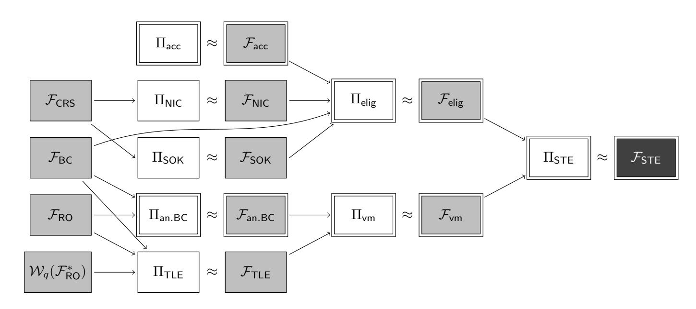
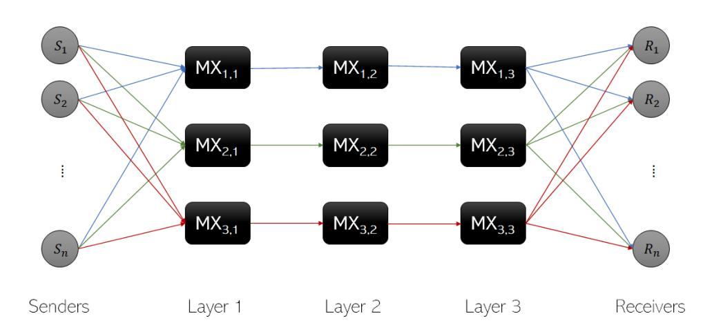

{0}------------------------------------------------

# E-cclesia: Universally Composable Self-Tallying Elections

Leo Ackermann<sup>1</sup> , Myrto Arapinis<sup>2</sup> , Pavlos Georgiou<sup>2</sup> , Nikolaos Lamprou<sup>2</sup> , Lenka Marekova<sup>3</sup> , and Thomas Zacharias<sup>2</sup>

> <sup>1</sup> Université de Rennes 1, Rennes, France <sup>2</sup> The University of Edinburgh, Edinburgh, UK <sup>3</sup> Royal Holloway, University of London, London, UK

Abstract. The technological advancements of the digital era paved the way for the facilitation of electronic voting (e-voting) in the promise of efficiency and enhanced security. In standard e-voting designs, the tally process is assigned to a committee of designated entities called talliers. Naturally, the security analysis of any e-voting system with tallier designation hinges on the assumption that a subset of the talliers follows the execution guidelines and does not attempt to breach privacy. As an alternative approach, Kiayias and Yung [PKC '02] pioneered the selftallying elections (STE) paradigm, where the post-ballot-casting (tally) phase can be performed by any interested party, removing the need for tallier designation.

In this work, we explore the prospect of decentralized e-voting where security is preserved under concurrent protocol executions. In particular, we provide the first comprehensive formalization of STE in the universal composability (UC) framework introduced by Canetti [FOCS '01] via an ideal functionality that captures required security properties such as voter privacy, eligibility, fairness, one-voter one-vote, and verifiability. We provide a concrete instantiation, called E-cclesia, that UC realizes our functionality. The design of E-cclesia integrates several cryptographic primitives such as signatures of knowledge for anonymous eligibility check, dynamic accumulators for scalability, time-lock encryption for fairness, and anonymous broadcast channels for voter privacy. For the latter primitive, we provide the first UC formalization along with a novel construction based on mix-nets that utilises layered encryption, threshold secret sharing and equivocation techniques. Additionally, we provide the first UC formalization of dynamic accumulators without a trusted setup along with a UC realization based on existing constructions.

Keywords: e-voting, anonymous broadcast, dynamic accumulators, universally composable security

## 1 Introduction

In democratic societies, a wide spectrum of people with respect to their beliefs and social status can participate equally in shaping decisions that affect 

{1}------------------------------------------------

governance both at a national or smaller (e.g., unions, corporations, academic institutes, associations) scale. The means for achieving this is voting, which is essential so that governance can operate in a transparent and fair way. With the technological advancements of the digital era, electronic voting (e-voting) has been introduced, promising better efficiency, enhanced security and greater transparency than traditional voting.

Arguably, one critical aspect of e-voting design is to determine the level of centralisation desired (or feasible), given that conflicts naturally arise between scalability on the one hand, and security and privacy on the other. In principle, election tasks such as setup, registration, vote collection, tally, and result announcement, can be carried out in one of the three following manners in terms of decentralization: (i) completely centralized by a single authority, (ii) by a committee of designated entities, or (iii) fully decentralized such that the voters themselves are responsible for performing the task. Depending on the election setting, decentralization may be a requirement for some task, but considered impractical for another one. For instance, distributing trust for voter privacy during tallying is often highly recommended, yet one cannot expect a direct consensus among voters on a large scale election setup.

In this work, we explore the prospect of decentralized tallying. Since taking the centralized approach often results in privacy and robustness attacks [62, 6] on the authorities that constitute single points of failure, most state-of-the-art evoting systems include a committee of designated parties called talliers in charge of tallying the result of the election (e.g., [16, 2, 22, 39, 21, 56, 20, 23, 43, 18]). In what we call tallier designation e-voting, security hinges on the assumption that a subset of the talliers follows the execution guidelines and does not attempt to breach privacy. Indeed, in any e-voting system of this type, privacy is trivially violated if all the talliers collude in order to jointly retrieve the voters' preferences (typically, by combining their partial decryption keys). Moreover, in the case where the voters post their votes to a publicly accessible bulletin board (e.g., [2, 22, 39, 23, 43, 18]), then partial results can be leaked during the ballot casting period (fairness violation) under full tallier collusion. Hence, while distributing trust among talliers strengthens the system w.r.t. privacy and robustness, the introduction of assumptions regarding the tallier corruption threshold to argue about security cannot be considered ideal. In fact, real world examples indicate that designated tallying authorities can be the weak link in the system's overall performance and security, either due to benign errors or by becoming high priority targets of attackers (e.g., the cases of the tallying machines in Georgia, USA [49]). Towards overcoming the limitations present in tallier designation e-voting, we explore the potential of an alternative approach expressed by the self-tallying elections (STE) paradigm [42]. Namely, an e-voting system is self-tallying if the post-ballot-casting (tally) phase can be performed by any interested party. Designing STE systems that satisfy a list of standard e-voting security properties such as eligibility, fairness, voter privacy, and verifiability raises a number of challenges. Specifically, the main challenges of STE are (i) guaranteeing that no voter (or coalition of voters) can boycott the election; (ii) 

{2}------------------------------------------------

no intermediate results are being leaked during the ballot casting phase (fairness); (iii) no vote can be linked back to the voter that cast it (voter privacy). Unfortunately, the existing STE proposals [59, 42, 35, 28, 64, 41, 50, 37, 47, 36, 61, 53, 38, 48] lack formal treatment and/or suffer from limitations such as being susceptible to abort, in the sense that there is a moment in the execution where the participation of all active voters is required for tally to take place, or requiring a trusted party to be involved during voting so that fairness can be achieved.

Contributions: We tackle all the aforementioned design challenges by deploying a formal framework where security is preserved under concurrent executions. In particular, we present E-CCLESIA, an STE protocol that constitutes a fine-grained integration of fundamental and special cryptographic tools (e.g., signatures of knowledge, non-interactive commitments, dynamic accumulators, time-lock encryption, anonymous broadcast), and is provably secure in Canetti's universal composability model (UC) [11] (cf. Supplementary material A). We summarize in a bottom up fashion our contributions below.

- 1. UC formalization and realization of anonymous broadcast. We provide the first UC treatment of the anonymous broadcast notion by introducing the ideal functionality  $\mathcal{F}_{an.BC}$  and a protocol based on mix-nets [16] that UC-realizes  $\mathcal{F}_{an.BC}$  in the presence of (plain) broadcast channels and a programmable random oracle. In our protocol, we split the messages into shares [58] and each share is layer encrypted and sent to a row of a stratified mix network [27]. In order to achieve UC realization, we borrow techniques from non-committing encryption [52] for the correct opening of the messages. In addition, we apply cover traffic to hide the senders' activity. The shares are randomly reordered by each layer of the mix servers and after some delay, they are broadcast to all parties, thus preventing timing attacks [40]. Although  $\mathcal{F}_{an.BC}$  and the protocol that UC realises it fit the purposes of E-CCLESIA, it is a novelty beyond the concept of STE and is of independent interest. For instance, in [30] a novel cryptographic primitive is introduced, named *Anonymous Authenticated Communication* (ACC), which assumes the existence of an anonymous broadcast channel.
- 2. UC formalization and realization of dynamic accumulators without trusted setup. We formalize the concept of dynamic accumulators without trusted setup in the UC framework via the ideal functionality  $\mathcal{F}_{acc}$ . Contrary to [5], our functionality and construction do not rely on a trusted dealer that would maintain a global accumulator state, which was the initial motivation of the accumulators when firstly introduced by Benaloh et al. [7]. The challenge here is to ensure consistency between different parties' local accumulator states. We prove that the Merkle tree-based construction proposed in [55] UC-realizes  $\mathcal{F}_{acc}$ . Again, our formal treatment of public dynamic accumulators is of independent interest as many applications (e.g., Zcash, Zerocoin, Distributed Public Key Infrastructure) rely on dynamic accumulators without a trusted dealer to coordinate the parties. For example, in a public ledger setting [29] the miners should be able to update the accumulator state with domain names without any trapdoor information or trusted setup.

{3}------------------------------------------------

3. UC formalization of STE and modular design. We formalize the concept of STE through the ideal functionality  $\mathcal{F}_{\mathsf{STE}}$ . Our functionality captures correctness and standard e-voting properties such as eligibility, fairness, voter privacy, one-voter one-vote, and verifiability. Specifically, we only allow eligible voters to vote no more than once. Regarding privacy and fairness, we only leak to the simulator the length of the message. In the casting phase, the voters' identity remains hidden. The ballots are opened only after the end of the casting phase and thus we guarantee fairness. Finally, during the tally phase, anyone can retrieve and/or verify the election result which the adversary cannot alter or drop, thus correctness is satisfied.

We adopt a resolutely modular approach in our formal treatment of STE in accordance with the UC framework. We decompose  $\mathcal{F}_{\mathsf{STE}}$  into two smaller modules named  $\mathcal{F}_{\mathsf{elig}}$  and  $\mathcal{F}_{\mathsf{vm}}$ . The functionality  $\mathcal{F}_{\mathsf{elig}}$  is responsible for the *eligibility* part of  $\mathcal{F}_{\mathsf{STE}}$  (e.g., credential generation and ballot authentication), while  $\mathcal{F}_{\mathsf{vm}}$  is responsible for the *vote management* part of  $\mathcal{F}_{\mathsf{STE}}$  (e.g., ballot generation, casting, and opening). Our modular approach facilitates easier future updates without the need for reproving the security of the whole STE protocol.

4. UC realization of  $\mathcal{F}_{STE}$ : the E-cclesia protocol. We present E-cclesia, a self-tallying protocol that UC realizes  $\mathcal{F}_{STE}$ . In its design, E-cclesia combines several cryptographic primitives such as time-lock encryption (TLE) to guarantee fairness, signatures of knowledge (SoK) and anonymous broadcast channels to guarantee eligibility, privacy, and the one-voter one-vote property, and dynamic accumulators for efficiency. E-cclesia relies on random oracles [52], common reference string [13], broadcast channels [31], and a global clock [4].

#### 2 Related work

**Tallier designation e-voting.** E-voting research spans over four decades [16, 2, 22, 39, 21, 56, 20, 23, 43, 18, 19. E-voting design faces the challenge of capturing (a reasonable subset of) security properties (e.g., eligibility, verifiability, fairness, voter privacy, receipt-freeness, coercion resistance) that may be conflicting. In the standard design approach, the execution of election processes such as setup, registration, vote collection, tally, and result announcement is assigned to designated entities. As already mentioned, under a full tallier collusion setting, tallier designation e-voting systems [16, 2, 22, 39, 21, 56, 20, 23, 43, 18] cannot preserve voter privacy, and not even fairness when vote collection is carried out via posting to a bulletin board [2, 22, 39, 23, 43, 18]. We stress that fairness is always violated if the talliers additionally collude with the vote collection authorities (e.g., ballot box) to retrieve the votes prior to the tally phase. On the contrary, E-cclesia satisfies fairness unconditionally w.r.t. corruption setting, i.e., it relies only on the security of the underlying cryptographic primitives (TLE). **Self-tallying voting.** The STE notion was introduced in [42], and fairness was already pointed out as one of the challenges; the last voter can learn the (partial) election outcome before choosing their vote which may lead to the following issues: the last voter 1) adapts her vote according to the partial results, or 2)

{4}------------------------------------------------

aborts, where an aborting voter prevents the other voters from performing tally. The construction in [42] addresses Issue 1 by considering a trusted party that casts a final "dummy vote", and Issue 2 by including an additional "recovery" round, yet in that round all remaining voters must participate. Subsequent works based on the ideas of [42] have the same limitations [59, 35, 28, 64]. In [41] and [50] (the latter presents an implementation of [37]), commitments are deployed to confront the adaptivity of the last voter. Moreover, any construction that relies on a recovery round [41, 47, 36] is susceptible to abort. Alternatively, enforcing financial incentives to achieve the participation of all voters was proposed in [50].

Regarding security modeling, we observe that in the literature, there is lack of a formal framework for the desired STE properties [42, 35, 28, 64, 41, 50, 37, 47, 36, 61, 53, 38, 48] (only ballot secrecy is formalized in [41, 47]). A more formal approach can be found in [59], where the authors define an ideal functionality for e-voting that captures several properties such as correctness, eligibility, and privacy, and a separate definition for universal verifiability. The modeling in [59] has limitations, as the said functionality (a) allows a single voter to cause the election to abort; (b) does not capture timing attacks for all tally functions (e.g., individual handling of votes); (c) lacks detailed formal description (e.g., token handling in the UC framework); (d) considers the list of eligible voters as a fixed parameter, rather than an input to the execution that varies per session.

The use of TLE for constructing STE has been suggested in [47]. In [48], selftallying voting is proposed as an application of homomorphic time-lock puzzles, without further security analysis.

Anonymous broadcast channels. The concept of anonymous broadcast was first studied in the context of DC-nets [17, 60, 33] that offer unconditional security but typically have limitations such as message drop due to collisions, vulnerability to jamming attacks, and/or quadratic complexity for broadcasting a single bit. Several anonymous broadcast protocols have been proposed, yet their analysis is under security models that do not support composition. The protocol in [35] is based on ideas of the STE construction in the same work. In [63], the authors build their protocol on top of the secure multiparty computation in [24]. In [46], the authors propose an anonymous broadcast implementation based on DC-nets. Moreover, the security analysis of the construction in [51] is inspired by the ideal/real world paradigm; however, the ideal functionality in [51] is not compatible with the UC setting (there is no environment that provides the parties with inputs over time).

Dynamic accumulators. The first UC treatment of dynamic accumulators was presented in [5]. It relies however on a trusted dealer for setup, update, and deletion. Our ideal functionality Facc is designed for decentralized settings (i.e., with no designated trusted parties). We further only consider additions and membership checks, so Facc abstracts the class of additive and positive accumulators. Besides, we are interested in scenarios where, although there may be an agreement on the accumulated elements, the accumulated values' computation is done locally by each party. Thus, unlike the functionality in [5] that captures the maintenance of a shared accumulator state by an accumulator manager, our 

{5}------------------------------------------------

functionality Facc handles an accumulator state for each honest party where the only shared data are the accumulator algorithms and the initial value and auxiliary information. Moreover, we do not require a mechanism that verifies if the Update operation was carried out correctly, as each party is responsible for updating their value locally.

# 3 Protocol specification

In this section, we provide a concise description of the E-cclesia self-tallying protocol. First, we present the cryptographic building blocks that our protocol utilizes, the parties involved in an execution, and the intuitive security properties that it achieves. Throughout the paper, we use λ as security parameter, and denote by negl(·) a negligible function.

#### 3.1 Cryptographic building blocks

The E-cclesia protocol design encompasses a delicate integration of a set of cryptographic primitives. Below, we outline these building blocks' operations and refer the reader to the full description of the corresponding ideal functionalities.

- We assume the existence of a global clock that synchronizes all entities involved in the execution (cf. Figure 8 and [4] for the functionality Gclock). The time Cl increases when all entities are ready to advance in time and can be read by anyone upon request.
- A random oracle (RO) (cf. Figure 9 and [52] for the functionality FRO) models the behavior of a randomly sampled function; The queries to the RO are responded with a random value in a consistent manner, i.e., querying for the same argument will result in the same response.
- A common reference string (CRS) (cf. Figure 10 and [11] for the functionality FCRS) models a (structured) randomness r shared across all parties in the execution. Any party can obtain r from the CRS functionality upon request.
- We use the broadcast (BC) channel functionality FBC of [31] for message delivery in the pre-voting period (cf. Figure 11). This BC channel considers communication where the sender is authenticated.
- We introduce an anonymous broadcast channel, where a sender party P can broadcast a message M to all parties in the execution anonymously, i.e., without P's identity being disclosed. In Section 5, we formalize the notion (cf. Figure 3) and present a provably secure anonymous broadcast protocol based on mixnets [16].
- We make use of non-interactive commitments (NICs) (cf. Figure 12 and [8] for the functionality FNIC) that are (i) binding and (ii) trapdoor (thus, also hiding), such as the Pedersen scheme [54].
- We utilize signatures of knowledge (SoKs) (cf. Figure 13 and [15] for the functionality FSOK), so that the voters prove their eligibility without revealing their identity. In SoKs, anyone (and only them) holding a witness w for a statement

{6}------------------------------------------------

x in some language L is able to produce a signature  $\sigma_{m,x,L}$  on a message m that verifies correctly.

- We deploy a secure *accumulator*, a primitive that allows the compact representation of a set of elements, that is *additive* (i.e., it supports only addition of elements to the set) and *positive* (i.e., it supports membership proofs that a certain element is in the set). We refer the reader to Section 6 for our formal UC treatment of accumulators without trusted setup. In our concrete protocol instantiation, we choose the secure hash-based accumulator construction in [55].
- To realize a secure STE construction, we turn to a special type of encryption, called time-lock encryption (TLE) (cf. Figure 14 and [3] for the functionality  $\mathcal{F}_{\mathsf{TLE}}$ ). In TLE, the encryption algorithm takes as input a message m and some time difficulty  $\tau_{\mathsf{dec}}$  and outputs a ciphertext c. The decryption algorithm allows the decryption of c only after time  $\tau_{\mathsf{dec}}$  has elapsed. Decryption is available to any party who has a decryption witness  $w_{\tau_{\mathsf{dec}}}$  that can be produced via some publicly known process (in our protocol, the witness is produced after the party has made a specific number of calls to a RO). In particular, we make use of the TLE construction in [3]. We denote the pair of encryption and decryption algorithms by  $(e_{\mathcal{F}_{\mathsf{RO}}}, d_{\mathcal{F}_{\mathsf{RO}}})$ , where  $\mathcal{F}_{\mathsf{RO}}$  is the RO associated with the algorithms.
- To formally capture the parties' computational restrictions in the UC setting, we invoke a wrapper functionality,  $W_q$ , (cf. Figure 15 and [3]) that is parameterized by a number of queries q to a random oracle. Informally, the wrapper restricts the access to the RO by allowing parties to call the RO only up to q number of times per round (clock tick).

#### 3.2 Parties

An execution of the E-cclesia protocol comprises four election phases **Setup**, **Credential generation**, **Cast**, and **Tally**. The parties involved in the different phases of a protocol execution are:

- The setup authority (SA) that is active only prior to the voting period. Specifically, during **Setup**, SA is responsible for providing the election parameters, that include the list of eligible voters, the set of valid election preferences, and the period of each election phase.
- The voters  $V_1, \ldots, V_n$ . Each voter engages as follows:
  - In **Setup**, she receives the election parameters from SA.
  - In **Credential generation**, if she is eligible, she locally generates her private credential and broadcasts the public part of the credential to the other voters.
  - In **Cast**, if she is eligible, she generates a ballot for her choice and broadcasts the ballot to all voters.
  - In **Tally**, she computes the tally that corresponds to the set of ballots she received from other eligible voters.

In our threat model, voters can be statically corrupted while SA remains honest.

{7}------------------------------------------------

#### 3.3 Desired security properties

Intuitively, the security properties that E-cclesia satisfies (and any other STE system should satisfy) are the following:

- 1. Correctness: Every honestly cast vote will be included in the tally set which is the same for all honest voters.
- 2. *Eligibility*: Only eligible voters' votes will be included in the tally set of each honest voter.
- 3. Fairness: During the Cast phase, no party can learn partial results.
- 4. Voter Privacy: The (honest) voters' identities cannot be linked to their votes.
- 5. One voter-one vote: Only one vote per (eligible) voter can be included in the tally set of each honest voter.
- 6. Verifiability: Every voter can verify that the result corresponds to the ballots broadcast in the **Cast** phase, subject to the eligibility and one voter-one vote properties [45].

The aforementioned six properties are formally captured via the description of our ideal STE functionality (cf. Section 4).

#### 3.4 Protocol overview

An execution of E-CCLESIA considers two distinct ROs, denoted by  $\mathcal{F}_{\mathsf{RO}}^1$  and  $\mathcal{F}_{\mathsf{RO}}^2$ . All parties have the description of an accumulator scheme  $\Sigma_{\mathsf{acc}}$ . In addition, all voters have the description of a NIC scheme  $\Sigma_{\mathsf{NIC}}$ , a SoK scheme  $\Sigma_{\mathsf{SoK}}$ , a pair of TLE encryption and decryption algorithms  $(e_{\mathcal{F}_{\mathsf{RO}}^2}, d_{\mathcal{F}_{\mathsf{RO}}^2})$ , and can access  $\mathcal{F}_{\mathsf{RO}}^1$ ,  $\mathcal{F}_{\mathsf{RO}}^2$ . In the beginning of the execution, SA is given the set of eligible voters  $\mathbf{V}_{\mathsf{elig}}$ , the set of valid election preferences  $\mathbf{O}$ , and two time moments  $t_{\mathsf{cast}}, t_{\mathsf{open}}$ . The four phases are executed as follows:

**Setup.** First, SA checks that  $\mathbf{V}_{\mathsf{elig}} \subseteq \mathbf{V} = \{V_1, \dots, V_n\}$  and  $t_{\mathsf{cast}} < t_{\mathsf{open}}$ . If both checks succeed, then it does (if not, it aborts):

- 1. Given  $t_{\mathsf{cast}}, t_{\mathsf{open}}$  and the latency of the underlying anonymous broadcast channel delay\_cast, it sets  $\vec{t} := (t_{\mathsf{cast}}, t_{\mathsf{open}}, \mathsf{delay\_cast})$  that specifies the beginning and the end of all subsequent election phases.
- 2. It sets the voting parameters as vote.par :=  $(\mathbf{V}_{\mathsf{elig}}, \mathbf{O}, \vec{t})$ .
- 3. It broadcasts vote.par to all voters.
- 4. It sets the registration parameters as reg.par :=  $(\mathbf{V}_{elig}, \mathbf{O}, \vec{t})$ .
- 5. It broadcasts reg.par to all voters.

Upon receiving (SA, vote.par) and (SA, reg.par) from the (authenticated) broadcast channel, the voter V stores vote.par, reg.par.

Credential generation. The voter V reads the time CI from the global clock and checks that the credential period is running. If so, then she does:

- 1. She randomly samples her credential cr from the commitment message space  $\mathcal{M}$  and creates a commitment for cr, denoted by  $\hat{cr}$ , using randomness aux.
- 2. She broadcasts the commitment cr to all voters.

{8}------------------------------------------------

3. Upon receiving  $(V^*, \hat{\mathsf{cr}}^*)$  from the broadcast channel during the **Credential generation** phase, she stores the pair  $(V^*, \hat{\mathsf{cr}}^*)$ , as long as (i)  $V^* \in \mathbf{V}_{\mathsf{elig}}$  and (ii) she has never received a similar message from  $V^*$  before.

<u>Cast.</u> Each (honest and eligible) voter V engages in the voting process once by generating and casting an authenticated ballot v for her preference  $o \in \mathbf{O}$ . Specifically, V reads the time CI from the global clock and checks that the casting period is running. If so, then she does:

- 1. She computes the time-lock encryption v of her choice o as follows:
  - (i) She generates a new puzzle puz of difficulty  $t_{\sf open} ({\sf Cl} + 1)$ , and the corresponding solution sol. Note that for puzzle generation access to RO  $\mathcal{F}^1_{\sf RO}$  is required.
  - (ii) She computes the encryption of a random string r under a key derived from sol. Let  $c_1$  denote the resulting ciphertext.
  - (iii) To allow equivocation, she then queries RO  $\mathcal{F}_{RO}^2$  for r and receives a response h. Then, she sets  $c_2 \leftarrow h \oplus o$ . Next, she queries  $\mathcal{F}_{RO}^2$  for r||o (where || denotes concatenation of strings) and receives a response  $c_3$ .
  - (iv) She sets the ballot as  $v \leftarrow (c_1, c_2, c_3)$ .
- 2. She runs ballot authentication for v as follows:
  - (i) She computes the accumulated value for all received credential commitments (including her own) according to the order these were received<sup>4</sup>, by adding one commitment at a step and storing the intermediate accumulator values for each step.
  - (ii) Assume that her credential was the k-th to be added to the accumulator. Upon completing the addition of all received commitments, she updates the accumulator witness for the commitment  $\hat{\mathsf{cr}} = \hat{\mathsf{cr}}_k$  of her own credential  $\mathsf{cr}$  and receives the new witness  $w_k^{\hat{\mathsf{cr}}_k}$ .
  - (iii) She computes a SoK,  $\sigma$ , for the ballot v of her credential being included in the accumulator. The SoK is produced under the statement  $x = (\mathsf{cr}, \alpha_{t_{\mathsf{max}}})$ , where  $\alpha_{t_{\mathsf{max}}}$  is the final accumulator value, which is computed identically for all voters, and the SoK witness  $w = (\hat{\mathsf{cr}}, \mathsf{aux}, w_k^{\hat{\mathsf{cr}}_k})$ .
- 3. She anonymously broadcasts  $(v, cr, \sigma)$  to all voters.
- 4. She stores any triple  $(v^*, \mathbf{cr}^*, \sigma^*)$  she receives from the anonymous broadcast channel during the **Cast** phase.

Puzzle solving: Before completing her part in a round (clock tick), the voter V engages in the puzzle solving procedure for all the puzzles that are related to the ballots she has received from the anonymous broadcast channel. In particular, by parsing a ballot  $v^*$  that she has just received as  $(c_1^*, c_2^*, c_3^*)$ , V can extract a puzzle included in  $c_1^*$  whose solution will produce the TLE decryption witness  $w_{t_{\text{open}}}^*$ , necessary for opening  $v^*$  at Tally phase. During the puzzle solving procedure, V makes up to q oracle queries to the RO  $\mathcal{F}_{\text{RO}}^1$  (a restriction that  $\mathcal{W}_q$  imposes). The idea is that each puzzle is created in chain-based manner, in the sense that the response of the i-th query becomes the i-th query, which implies that each puzzle will be solved sequentially after some well-defined time has elapsed

<sup>&</sup>lt;sup>4</sup> Note that the broadcast channel we use (cf. Figure 11 and [31]) guarantees that all voters received each other's credentials in the same chronological order.

{9}------------------------------------------------

(i.e., with time difficulty adjusted so that time  $t_{open}$  has been reached).

<u>Tally.</u> The voter V reads the time CI from the global clock and checks that the tally period is running. If so, then she computes the tally by executing the following steps:

- 1. For every triple  $(v^*, \mathsf{cr}^*, \sigma^*)$  she has received during the **Cast** phase, she verifies the SoK  $\sigma^*$  for  $v^*$  under the statement  $(\mathsf{cr}^*, \alpha_{t_{\mathsf{max}}})$ . If the verification is successful, she adds  $(v^*, \mathsf{cr}^*, \sigma^*)$  to the tally set. In this step, V discards any received triple such that the included credential does not correspond to any accumulated commitment value. However, note that after this step is completed, the tally set may contain multiple triples  $(v_1^*, \mathsf{cr}_1^*, \sigma_1^*), \ldots, (v_{\mu^*}^*, \mathsf{cr}_{\mu^*}^*, \sigma_{\mu^*}^*)$  that were broadcast by the same (dishonest) voter.
- 2. She discards multiple triples by pairwise checking whether the received triples include credentials that match. Namely, for any two triples  $(v^*, \mathsf{cr}^*, \sigma^*)$  and  $(v^{**}, \mathsf{cr}^{**}, \sigma^{**})$  such that  $\mathsf{cr}^* = \mathsf{cr}^{**}$ , she discards the triple she received last out of those two. Clearly, after this pairwise check is completed, all except one of triples that correspond to the same credential will be removed from the tally set.
- 3. After the tally set has been "filtered" regarding multiple triples, V decrypts every ballot  $v^* = (c_1^*, c_2^*, c_3^*)$  of a triple  $(v^*, \sigma^*, \operatorname{cr}^*)$  in the tally set as follows:
  - (i) She runs the TLE decryption algorithm  $d_{\mathcal{F}^2_{\mathsf{RO}}}$  on input  $c_1^*$  and the corresponding decryption witness  $w_{t_{\mathsf{open}}}^*$  and receives the output  $r^*$ .
  - (ii) She queries  $\mathcal{F}^2_{\mathsf{RO}}$  for  $r^*$  and receives a response  $h^*$ . She extracts the election option as  $o^* \leftarrow h^* \oplus c_2^*$ .
  - (iii) She verifies the validity of  $o^*$  by first checking that  $o^* \in \mathbf{O}$ , and then querying  $\mathcal{F}^2_{\mathsf{RO}}$  for  $r^*||o^*$  and checking if the response matches  $c_3^*$ . If so, then she records  $o^*$  as valid.
- 4. She returns as election tally the set of all options that have been recorded as valid during the execution of Steps 3(i)-(iii).

We now informally argue about the security of our protocol.

- 1) Correctness: is achieved by the binding property of commitments, the correctness of all other cryptographic primitives, and the availability of the underlying broadcast network. In particular, all credential commitments and authenticated ballots will be delivered to all voters in the same chronological order while a malicious party cannot create a different valid credential cr' for a broadcast commitment cr that was created originally for the honest voter's credential cr.
- 2) Eligibility: is satisfied by the security of the accumulator, the unforgeability of the SoK scheme, the binding property of commitments, and the fact that voters store only the credential commitments that they received from the eligible voters during the **Credential generation** phase. In addition, network availability and synchronicity is essential, so that the voters agree on (i) the transition between election phases, and (ii) the order of the received commitments that are going to produce the final accumulated value. Given the above, at verification Step 1, the voter is ascertained that no invalid credential has been added to the accumulator.

{10}------------------------------------------------

- 3) Fairness: is achieved by the security of the TLE algorithms. Namely, no broadcast encrypted vote can be decrypted before the **Cast** phase ends. Therefore, no party can learn some partial result before that point.
- 4) Voter Privacy: is preserved by the anonymity offered by the anonymous broadcast channel, as well as the hiding property of commitments and the zero-knowledge property of the SoK scheme. In particular, upon receiving a credential cr during the Cast phase, a party cannot link cr to the corresponding commitment cr this party recorded during the Credential generation phase.
- 5) One voter-one vote: is guaranteed by the multiple triples elimination Step 2, where the voter performs the pairwise check for possible matching credentials.
- 6) Verifiability: is supported by the security of the authenticated broadcast channel, the unforgeability of the SoK scheme, and the correctness of the TLE scheme.

#### 3.5 Road-map of formal analysis of E-cclesia

In this work, we embrace the modular approach of the UC framework, as depicted in Figure 1. This figure can be read as the road-map for proving that the *self-tallying* ideal functionality  $\mathcal{F}_{\mathsf{STE}}$  is UC realizable from the protocol presented above. The road-map consists of intermediate functionalities, which can be found in later sections, along with the logical order of their UC realization. All proofs and theorem statements can be found both in later sections and Supplementary Materials. For a recap of the UC framework, cf. Supplementary material A.



Fig. 1. Modular design. Our contributions are denoted with double outlines.

# 4 The $\mathcal{F}_{\mathsf{STE}}$ functionality

In this section, we describe the functionality  $\mathcal{F}_{\mathsf{STE}}$  which captures our security requirements for STE elections (correctness, eligibility, fairness, voter privacy, one voter-one vote, verifiability). The functionality  $\mathcal{F}_{\mathsf{STE}}$  interacts with the setup

{11}------------------------------------------------

authority SA, the voters in the set  $\mathbf{V} = \{V_1, ..., V_n\}$  and the simulator  $\mathcal{S}$ . It is summarized in the next paragraphs and is formally presented in Figure 2.

The functionality is parameterized by SA, the set V, an integer delay\_gen which shows the number of rounds that are needed for the generation of the ballot, an integer value delay\_cast which shows how many rounds a message needs to reach its recipient from the time of casting, and the predicate Status that given the current time CI, the time values that define the election, and an election phase, outputs  $\top$  if that phase is active or  $\bot$  otherwise.

In the **Setup** phase, the functionality registers the set of eligible voters  $\mathbf{V}_{\mathsf{elig}}$ , the set of valid election preferences  $\mathbf{O}$ , and the duration of the election (in the time vector  $\vec{t}$ ), upon request from SA and the permission of  $\mathcal{S}$ .

The **Credential generation** phase is active for every CI such that  $Status(CI, \vec{t}, Cred) = \top$ . In this phase, each credential request from an eligible voter V is sent to S. If S replies with ready, then V is marked as ready to vote.

The **Cast** phase is active for every Cl such that  $\mathtt{Status}(\mathsf{Cl}, \vec{t}, \mathsf{Cast}) = \top$ . In this phase, if a voter is ready to vote,  $\mathcal{F}_{\mathsf{STE}}$  leaks to the simulator  $\mathcal{S}$  the length of the vote and a fresh random value tag. The latter is necessary as we allow  $\mathcal{S}$  to update this message with a ciphertext later on. So,  $\mathcal{S}$  needs a reference point for updating that message without getting the message itself (preserving privacy).

Each time  $\mathcal{F}_{\mathsf{STE}}$  receives a command message it follows the *delayed ballot* generation and casting subroutine. Specifically,  $\mathcal{F}_{\mathsf{STE}}$  checks if by the time it received a cast ballot request from an honest voter V the time for ballot generation delay\_gen has elapsed. Then, it checks if the ballot can still be cast by executing the predicate Status for the current time Cl. If so,  $\mathcal{F}_{\mathsf{STE}}$  includes that ballot both into the lists of cast ballots and the ballots pending for reception along with the current recording time Cl. Then, it checks for every ballot in the list of ballots pending for reception if delay\_cast time has elapsed. If so, it informs  $\mathcal{S}$ . All the ballots in the list of cast ballots will be accessible for tallying, as by the time of recording, the execution is still in the Cast phase, taking into consideration delay\_cast. Observe that  $\mathcal{S}$  might receive a vote before the Tally phase. This does not break fairness as the Cast phase would be over.

Finally, the **Tally** phase is active for every Cl such that  $\mathsf{Status}(\mathsf{Cl}, \vec{t}, \mathsf{Tally}) = \top$ . In this phase, the voter V requests the tally from  $\mathcal{F}_{\mathsf{STE}}$  and receives the multi set of the valid cast ballots. Moreover,  $\mathcal{S}$  can request the election outcome and receive it if  $\mathsf{Status}(\mathsf{Cl}, \vec{t}, \mathsf{Tally}) = \top$  or  $\mathsf{Status}(\mathsf{Cl}, \vec{t}, \mathsf{Cred}) = \mathsf{Status}(\mathsf{Cl}, \vec{t}, \mathsf{Cast}) = \mathsf{Status}(\mathsf{Cl}, \vec{t}, \mathsf{Tally}) = \bot$ . The latter condition captures cases in which  $\mathcal{S}$  might be able to learn the tally earlier from the **Tally** phase but still after the **Cast** phase would be over, meaning that fairness is preserved. In addition, V or  $\mathcal{S}$  may execute verification by providing  $\mathcal{F}_{\mathsf{STE}}$  with some multiset  $\hat{\mathbf{T}}$ , which replies by 1 or 0 depending on whether  $\hat{\mathbf{T}}$  matches the tally multiset or not. The predicate  $\mathsf{Status}: \mathbb{N} \times (\mathbb{N})^3 \times \{\mathsf{Cred}, \mathsf{Cast}, \mathsf{Tally}\} \to \{\top, \bot\}$  is defined as follows.

{12}------------------------------------------------

Given the current time  $Cl \in \mathbb{N}$ , the time vector  $\vec{t} = (t_{cast}, t_{open}, delay\_cast) \in (\mathbb{N})^3$ , and  $\phi \in \{Cred, Cast, Tally\}$ :

$$\mathtt{Status}(\mathsf{CI}, \vec{t}, \phi) = \begin{cases} \top, & \phi = \mathsf{Cred} \wedge \mathsf{CI} < t_{\mathsf{cast}} \\ \top, & \phi = \mathsf{Cast} \wedge t_{\mathsf{cast}} \leq \mathsf{CI} < t_{\mathsf{open}} - \mathsf{delay\_cast} \\ \top, & \phi = \mathsf{Tally} \wedge t_{\mathsf{open}} \leq \mathsf{CI} \\ \bot, & \mathsf{otherwise} \end{cases}$$

## $\mathcal{F}_{\mathsf{STE}}(\mathsf{SA}, \mathbf{V}, \mathsf{delay\_gen}, \mathsf{delay\_cast}).$

The functionality initializes as empty the lists of eligible voters' credentials  $L_{\text{elig}}$ , generated ballots  $L_{\text{gball}}$ , cast ballots  $L_{\text{cast}}$ , pending for reception ballots  $L_{\text{pend}}$ , a list  $L_{\text{adv}}$  of the (dummy) parties that have submitted an ADVANCE\_CLOCK message for the current round, and a multiset  $\mathbf{T}$ . Upon receiving (sid, CORRUPT,  $\mathbf{V}_{\text{corr}}$ ) from  $\mathcal{S}$ , if  $\mathbf{V}_{\text{corr}} \subseteq \mathbf{V}$ , it fixes  $\mathbf{V}_{\text{corr}}$  as the set of corrupted voters.

Each time the functionality receives a command message it executes the delayed ballot generation and casting procedure as described below:

<u>Delayed ballot generation and casting:</u> Upon receiving (sid/SID<sub>C</sub>,  $\mathcal{I}$ , input) from  $V \in \mathbf{V} \setminus \mathbf{V}_{corr}$ , where  $\mathcal{I} \in \{\text{GEN\_CRED}, \text{CAST}, \text{UPDATE}, \text{CAST\_CHECK}, \text{ADVANCE\_CLOCK}, \text{READ\_CLOCK}, \text{TALLY}\}$ , if  $\mathbf{V} \setminus \mathbf{V}_{corr} \subseteq L_{adv}$ , it sends (SID<sub>C</sub>, ADVANCE\\_CLOCK) to  $\mathcal{G}_{clock}$  to proceed to the next round. Upon receiving (SID<sub>C</sub>, ADVANCED\\_CLOCK,  $\mathcal{F}_{STE}$ ) from  $\mathcal{G}_{clock}$ , it reads the time CI from  $\mathcal{G}_{clock}$  and does:

- 1. For every tuple  $(V, v, o, \mathsf{tag}, \mathsf{Cl}', 1)$  in  $L_{\mathsf{gball}}$  such that  $\mathsf{Cl}-\mathsf{Cl}' \geq \mathsf{delay\_gen}$ , if  $\mathsf{Status}(\mathsf{Cl}, \vec{t}, \mathsf{Cast}) = \top$ , it adds  $(V, v, o, \mathsf{Cl}, 1)$  to  $L_{\mathsf{cast}}$ , and  $(v, V, \mathsf{Cl})$  to  $L_{\mathsf{pend}}$ , and removes  $(V, v, o, \mathsf{tag}, \mathsf{Cl}', 1)$  from  $L_{\mathsf{gball}}$ .
- 2. For every triple  $(v^*, V^*, \mathsf{Cl}^*) \in L_{\mathsf{pend}}$  such that  $\mathsf{Cl} \mathsf{Cl}^* = \mathsf{delay\_cast}$ , it sends  $(\mathsf{sid}, \mathsf{CAST\_BALLOT}, v^*)$  to  $\mathcal{S}$  only if  $\mathsf{Status}(\mathsf{Cl}, \vec{t}, \mathsf{Cast}) = \bot$ . Then, it removes  $(v^*, V^*, \mathsf{Cl}^*)$  from  $L_{\mathsf{pend}}$ .
- 3. It sets  $L_{\mathsf{adv}}$  as empty.

Then, it executes  $(\operatorname{sid}/\operatorname{SID}_C, \mathcal{I}, \operatorname{input})$  as described below.

- Upon receiving (sid, Election\_Info,  $\mathbf{V}_{\mathsf{elig}}$ ,  $\mathbf{O}$ ,  $t_{\mathsf{cast}}$ ,  $t_{\mathsf{open}}$ ) from SA for the first time, if  $\mathbf{V}_{\mathsf{elig}} \subseteq \mathbf{V}$  and  $t_{\mathsf{cast}} < t_{\mathsf{open}}$ , it forwards the message to  $\mathcal{S}$ . Upon receiving (sid, Election\_Info\_OK,  $\mathbf{V}_{\mathsf{elig}}$ ,  $\mathbf{O}$ ,  $t_{\mathsf{cast}}$ ,  $t_{\mathsf{open}}$ ) from  $\mathcal{S}$ , it sets  $\vec{t} \leftarrow (t_{\mathsf{cast}}, t_{\mathsf{open}}, \mathsf{delay}_{\mathsf{cast}})$  and reg.par :=  $(\mathbf{V}_{\mathsf{elig}}, \mathbf{O}, \vec{t})$ .
- Upon receiving (sid, GEN\_CRED) from  $V \in \mathbf{V}_{\mathsf{elig}}$  for the first time, it reads time CI from  $\mathcal{G}_{\mathsf{clock}}$ . If Status(CI,  $\vec{t}$ , Cred) =  $\top$ , it sends (sid, GEN\_CRED, V) to  $\mathcal{S}$ . Upon receiving (sid, GEN\_CRED, V, ready) from  $\mathcal{S}$ , if  $V \notin \mathbf{V}_{\mathsf{corr}}$ , it adds (V, ready, 1) to  $L_{\mathsf{elig}}$ . Else, it adds (V, ready, 0) to  $L_{\mathsf{elig}}$ .
- Upon receiving (sid, Cast, o) from  $V \in \mathbf{V} \setminus \mathbf{V}_{\mathsf{corr}}$  for the first time such

{13}------------------------------------------------

that  $(V, \text{ready}, 1) \in L_{\text{elig}}$  and  $o \in \mathbf{O}$ , it reads the time CI from  $\mathcal{G}_{\text{clock}}$ . If Status $(\text{CI}, \vec{t}, \text{Cast}) = \top$  it does:

- 1. It picks tag  $\stackrel{\$}{\leftarrow}$  TAG and it inserts the tuple  $(V, \mathsf{Null}, o, \mathsf{tag}, \mathsf{Cl}, 1) \to L_{\mathsf{gball}}$ .
- 2. It sends (sid, GEN\_BALLOT, tag, Cl,  $0^{|o|}$ ) to S. Upon receiving the token back from S, it returns (sid, CASTING) to V.
- Upon receiving (sid, UPDATE,  $\{(v_j, \mathsf{tag}_j)\}_{j=1}^{p(\lambda)}$ ) from  $\mathcal{S}$  for all  $v_j \neq \mathsf{Null}$ , if there is a tuple  $(\cdot, v_j, \cdot, \cdot, \cdot, 1)$  in  $L_{\mathsf{gball}}$  or if there are  $j, j^* \in [1, p(\lambda)]$  such that  $v_j = v_{j^*}$  it returns (sid, UPDATE,  $\{(v_j, \mathsf{tag}_j)\}_{j=1}^{p(\lambda)}, \bot$ ) to  $\mathcal{S}$ . Else, it updates each tuple  $(V, \mathsf{Null}, o_j, \mathsf{tag}_j, \mathsf{Cl}_j, 1)$  to  $(V, v_j, o_j, \mathsf{tag}_j, \mathsf{Cl}_j, 1)$  in  $L_{\mathsf{gball}}$ .
- Upon receiving (sid, Cast, v, V) from S for  $V \in \mathbf{V}_{\mathsf{corr}}$  for the first time, it reads the time CI from  $\mathcal{G}_{\mathsf{clock}}$ . If  $\mathsf{Status}(\mathsf{CI}, \vec{t}, \mathsf{Cast}) = \top$  and there is a tuple  $(V, \mathsf{ready}, 0) \in L_{\mathsf{elig}}$ , it adds  $(V, v, \cdot, \mathsf{CI}, 0)$  to  $L_{\mathsf{cast}}$ .
- Upon receiving (SID<sub>C</sub>, ADVANCE\_CLOCK) from a voter  $V \in \mathbf{V} \setminus \mathbf{V}_{corr}$ , if  $P \notin L_{adv}$ , it adds P to  $L_{adv}$  and forwards (SID<sub>C</sub>, ADVANCE\_CLOCK) to  $\mathcal{G}_{clock}$  on behalf of P.
- Upon receiving (SID<sub>C</sub>, READ\_CLOCK) from a voter  $V \in \mathbf{V} \setminus \mathbf{V}_{corr}$ , it reads the time CI from  $\mathcal{G}_{clock}$  and returns (SID<sub>C</sub>, READ\_CLOCK, CI) to P.
- Upon receiving (sid, Tally) from a voter  $V \in \mathbf{V} \setminus \mathbf{V}_{\mathsf{corr}}$ , it reads time Cl from  $\mathcal{G}_{\mathsf{clock}}$ . If  $\mathsf{Status}(\mathsf{Cl}, \vec{t}, \mathsf{Tally}) = \top$ , it does:
- 1. If  $\mathbf{T} = \emptyset$ , for every tuple  $(V^*, v, \cdot, \mathsf{Cl}, 0) \in L_{\mathsf{cast}}$  it sends  $(\mathsf{sid}, \mathsf{OPENING}, V^*, v)$  to  $\mathcal{S}$ . Upon receiving  $(\mathsf{sid}, \mathsf{OPENING}, V^*, v, o)$  from  $\mathcal{S}$ , if  $o \in \mathbf{O}$ , then it updates the tuple as  $(V^*, v, o, \mathsf{Cl}, 0)$  in  $L_{\mathsf{cast}}$ . Finally, it sets the tally multiset as  $\mathbf{T} \leftarrow \{o \in \mathbf{O} | (V^*, \cdot, o, \cdot, \cdot) \in L_{\mathsf{cast}}\}$ .
- 2. It returns (sid, Tally,  $\mathbf{T}$ ) to V.
- Upon receiving (sid, Tally) from S, it reads the time Cl from  $\mathcal{G}_{\mathsf{Clock}}$ . If  $\mathsf{Status}(\mathsf{Cl}, \vec{t}, \mathsf{Cred}) = \mathsf{Status}(\mathsf{Cl}, \vec{t}, \mathsf{Cast}) = \mathsf{Status}(\mathsf{Cl}, \vec{t}, \mathsf{Tally}) = \bot$  or  $\mathsf{Status}(\mathsf{Cl}, \vec{t}, \mathsf{Tally}) = \top$ , it returns the tally to S. Specifically, it returns the multiset of all pairs (v, o) such that  $(V, v, o, \mathsf{tag}, \mathsf{Cl}^*, 1) \in L_{\mathsf{gball}} \land (V, v, o, \mathsf{Cl}', 1) \in L_{\mathsf{cast}}$  for some ballot generation time and casting time  $\mathsf{Cl}^*$  and  $\mathsf{Cl}'$ , respectively.
- Upon receiving (sid, Verify,  $\hat{\mathbf{T}}$ ) from a voter  $V \in \mathbf{V} \setminus \mathbf{V}_{corr}$ , it reads Cl from  $\mathcal{G}_{clock}$ . If Status(Cl,  $\vec{t}$ , Tally) =  $\top$ , it does:
- 1. If  $\mathbf{T} = \emptyset$ , it computes the tally multiset as if it received a (sid, Tally) command.
- 2. If  $\hat{\mathbf{T}} = \mathbf{T}$ , it returns (sid, Verify,  $\hat{\mathbf{T}}$ , 1) to V. Else, it returns (sid, Verify,  $\hat{\mathbf{T}}$ , 0) to V.

Fig. 2. The self-tallying election functionality  $\mathcal{F}_{\mathsf{STE}}$ .

■:Voter privacy, ■:One voter-one vote, ■:Eligibility, ■:Fairness, ■: Verifiability

{14}------------------------------------------------

## 5 Realizing UC anonymous broadcast

In this section, we provide a formalization of the notion of anonymous broadcast and a UC realization that is based on mix-nets [16]. We stress that our approach guarantees a high level of sender anonymity, thus supporting resistance against timing attacks [44,1]. In later sections, we use  $\mathcal{F}_{an.BC}$  for the UC realization of  $\mathcal{F}_{vm}$  (cf. Figure 1).

The ideal functionality  $\mathcal{F}_{\mathsf{an.BC}}^{\ell,B,p}$ : The functionality  $\mathcal{F}_{\mathsf{an.BC}}^{\ell,B,p}$  is presented in Fig- $\overline{\text{ure 3. The parameter } \ell \text{ determine}}$ s the communication delay from the moment that a message is transmitted till the moment it is received by all parties. In addition,  $\mathcal{F}_{\mathsf{an.BC}}^{\ell, B, p}$  is parameterized by B, which is a bound on the number of messages that each party can broadcast per round. We stress that this bound appears to be necessary, otherwise the functionality would become unrealistic. Namely, in any real-world protocol, if the maximum number of messages that the environment can instruct a sender party to broadcast in some round is unknown, then any attempt to create a "cover traffic" effect via the transmission of (indistinguishable) dummy messages would fail. Thus, the sender's broadcast rate would be revealed to an adversary that observes the entire network (global adversary) and anonymity, as determined by a functionality that does not consider a bound B, could easily be broken. Finally, our functionality is parameterized by a polynomial  $p(\cdot)$  that sets an upper bound on the length of the messages that are allowed to be broadcast. Like B, this bound seems to be necessary, otherwise in any realization attempt, the length of the dummy messages would not be able to support a cover traffic effect over actual messages of unknown variable length.

Overall,  $\mathcal{F}_{\mathsf{an.BC}}^{\ell,B,p}$  captures the highest possible level of sender anonymity by hiding all sender's activity apart from the fact that it has not broadcast more than B messages per round, and that the message length is bounded by  $p(\lambda)$ .

# The Anonymous Broadcast functionality $\mathcal{F}_{\mathsf{an.BC}}^{\ell,B,p}(\mathbf{P})$ .

The functionality initializes as empty a list  $L_{pool}$  of messages pending to be broadcast, and a list  $L_{adv}$  of the (dummy) parties that have submitted an ADVANCE\_CLOCK message for the current round. In addition, it sets a flag status as 0 and for every party  $P \in \mathbf{P}$ , it sets a counter count<sub>P</sub> also as 0. Let  $\mathbf{P}_{corr} \subseteq \mathbf{P}$  be the set of corrupted parties.

Every time the functionality receives a command message from a party  $P \in \mathbf{P}$ , it executes the procedure Setup or Broadcast as described below and then executes the command message according to its description.

<u>Setup or Broadcast:</u> Upon receiving (sid/SID<sub>C</sub>,  $\mathcal{I}$ , input) from  $P \in \mathbf{P} \setminus \mathbf{P}_{corr}$ , where  $\mathcal{I} \in \{\text{Broadcast}, \text{Advance\_Clock}, \text{Read\_Clock}\}$ , if status = 0, it sends (sid, Setup, P) to  $\mathcal{S}$ . Upon receiving (sid, Setup\_No, P) from  $\mathcal{S}$ , it halts. Else, upon receiving (sid, Setup\_OK, P) from  $\mathcal{S}$ , it sets status = 1.

{15}------------------------------------------------

Next, it reads the time Cl from  $\mathcal{G}_{\mathsf{clock}}$ . If  $\mathbf{P} \setminus \mathbf{P}_{\mathsf{corr}} \subseteq L_{\mathsf{adv}}$ , it sends  $(\mathsf{SID}_C, \mathsf{ADVANCE\_CLOCK})$  to  $\mathcal{G}_{\mathsf{clock}}$  to proceed to the next round. Upon receiving  $(\mathsf{SID}_C, \mathsf{ADVANCED\_CLOCK}, \mathcal{F}_{\mathsf{an.BC}}^{\ell,B,p})$  from  $\mathcal{G}_{\mathsf{clock}}$ , it does:

- 1. It randomly chooses a permutation  $\pi \stackrel{\$}{\leftarrow} \{1, \ldots, |L_{pool}|\}$ , where  $|L_{pool}|$  is the number of elements in  $L_{pool}$ .
- 2. It reorders the entries in  $L_{pool}$  w.r.t.  $\pi$ , i.e.,  $L_{pool} \leftarrow \pi(L_{pool})$ .
- 3. For every triple  $(M^*, P^*, \mathsf{Cl}^*) \in L_{\mathsf{pool}}$  such that  $\mathsf{Cl} \mathsf{Cl}^* = \ell + 1$ , it anonymously broadcasts  $M^*$  to  $P_1, \ldots, P_n$  and  $\mathcal{S}$  as follows: it sends (sid, BROADCAST,  $M^*$ , sender) to  $P^*$  and (sid, BROADCAST,  $M^*$ ) to all other parties in  $\mathbf{P} \setminus \{P^*\}$  and  $\mathcal{S}$ . Then, it removes  $(M^*, P^*, \mathsf{Cl}^*)$  from  $L_{\mathsf{pool}}$ . For the triples of the form (tag,  $P^*, \mathsf{Cl}^*$ ) it does the same except that it first requests from  $\mathcal{S}$  the broadcast message  $M^*$  that corresponds to tag.
- 4. It sets  $L_{\mathsf{adv}}$  as empty and for every  $P^* \in \mathbf{P}$  it resets  $\mathsf{count}_{P^*}$  as 0.

Subsequently, it executes  $(sid/SID_C, \mathcal{I}, input)$  as described below.

- Upon receiving (sid, BROADCAST, M) from a party  $P \in \mathbf{P} \setminus \mathbf{P}_{\mathsf{corr}}$ , if  $\mathsf{count}_P = B$  or  $|M| > p(\lambda)$  or  $P \in L_{\mathsf{adv}}$ , it ignores the message. Otherwise, it reads the time CI from  $\mathcal{G}_{\mathsf{clock}}$ , it adds  $(M, P, \mathsf{CI})$  to  $L_{\mathsf{pool}}$  and increases  $\mathsf{count}_P$  by 1.
- Upon receiving (sid, BROADCAST, tag,  $\hat{P}$ ) from  $\mathcal{S}$  on behalf of a party  $\hat{P} \in \mathbf{P}_{\mathsf{corr}}$ , it reads the time Cl from  $\mathcal{G}_{\mathsf{clock}}$  and adds (tag,  $\hat{P}$ , Cl) to  $L_{\mathsf{pool}}$ .
- Upon receiving (SID<sub>C</sub>, ADVANCE\_CLOCK) from a party  $P \in \mathbf{P} \setminus \mathbf{P}_{\mathsf{corr}}$ , if  $P \notin L_{\mathsf{adv}}$ , it adds P to  $L_{\mathsf{adv}}$  and forwards (SID<sub>C</sub>, ADVANCE\_CLOCK) to  $\mathcal{G}_{\mathsf{clock}}$  on behalf of P.
- Upon receiving (SID<sub>C</sub>, READ\_CLOCK) from a party  $P \in \mathbf{P} \setminus \mathbf{P}_{\mathsf{corr}}$ , it reads the time Cl from  $\mathcal{G}_{\mathsf{clock}}$  and returns (SID<sub>C</sub>, READ\_CLOCK, Cl) to P.

**Fig. 3.** The anonymous broadcast functionality  $\mathcal{F}_{\mathsf{an.BC}}^{\ell,B,p}$ .

The protocol  $\Pi_{\mathsf{an.BC}}^{m,\ell,t,B,p}$ : Our mix-net-based construction is built upon a special case of a  $m \times \ell$  stratified mix-net architecture [27]; For  $j \in [m]$ , there is a cascade of  $\ell$  mix servers  $\mathsf{MX}_{j,1} \to \cdots \to \mathsf{MX}_{j,k} \to \cdots \to \mathsf{MX}_{j,\ell}$ . The input to the server  $\mathsf{MX}_{j,1}$  is encrypted via  $\ell$ -level layered encryption. Let  $\mathsf{MX} = \{\mathsf{MX}_{j,k}\}_{j\in[m],k\in[\ell]}$  be the set of all mix servers.

The protocol execution is initialized by the first activated party broadcasting (via  $\mathcal{F}_{BC}$ ) a "setup" message to all mix servers. In turn, every  $\mathsf{MX}_{j,k}$  generates a pair of a secret and a public key  $(\mathsf{sk}_{j,k}, \mathsf{pk}_{j,k})$  and broadcasts  $\mathsf{pk}_{j,k}$  to all parties.

Subsequently, anonymous broadcast of messages is carried out. To achieve the high level of sender anonymity required by  $\mathcal{F}_{\mathsf{an.BC}}^{\ell,B,p}$ , our design encompasses the following techniques:

{16}------------------------------------------------

- 1. Padding: Only messages of length up to  $p(\lambda)$  will be broadcast. To achieve transmission of messages of equal length standard padding is used. Upon receiving (sid, Broadcast, M) from  $\mathcal{Z}$ , if the sender party P has not already received B Broadcast commands from  $\mathcal{Z}$  for the current round and if the message M has length  $|M| < p(\lambda)$ , then M is padded (e.g., with leading zeros) so that  $|M| = p(\lambda)$ . For notation simplicity, we will still write the padded message as M and will clarify when necessary.
- 2. Equivocation: The sender applies the equivocation technique of [52] on the padded message M that utilizes a random oracle  $H(\cdot)$  (modeled as  $\mathcal{F}_{\mathsf{RO}}$  in the UC setting) for producing the pair  $(r, H(r) \oplus M)$ , where r is some randomness. In the security proof, this step allows the simulator that controls  $\mathcal{F}_{\mathsf{RO}}$  to emulate message transmission and produce a consistent view to the adversary, even if it receives the real broadcast messages from  $\mathcal{F}_{\mathsf{an.BC}}^{\ell,B,p}$  with delay  $\ell$ .
- 3. Share-wise transmission: To be transmitted to the mix-net, the pair  $(r, H(r) \oplus M)$  is first split into m shares via Shamir's (t, m)-threshold secret sharing (TSS) scheme [58], where t is the threshold of shares required for recovering the secret. Each share  $[(r, H(r) \oplus M)]_j, j \in [m]$ , intended for the j-th cascade, is encrypted into  $\ell$  layers as PKE.Enc $(\mathsf{pk}_{j,1}, \ldots, (\mathsf{PKE.Enc}(\mathsf{pk}_{j,\ell}, (\mathsf{tag}, [(r, H(r) \oplus M)]_j))))$ , where  $\mathsf{tag}$  is a random tag common for all shares of  $(r, H(r) \oplus M)]$ . By utilising (t, m)-TSS, we achieve fault-tolerance (up to a fixed threshold m t) against fail-stop failures and totally hide  $(r, H(r) \oplus M)$  from a coalition of up to t 1 corrupted exit servers.
- 4. Cover traffic and batch transmission: Each party creates a cover traffic effect by transmitting as many dummy ciphertexts to each input (first layer) server, so that the bound B is reached. The party transmits all real and dummy ciphertexts together right before completing her round, i.e., when it receives a (SID<sub>C</sub>, ADVANCE\_CLOCK) command from  $\mathcal{Z}$ . By applying cover traffic and batch transmission, the protocol provides resistance against timing attacks.
- 5. Anonymous routing: Each input server of the m cascades receives the corresponding encrypted share of the message  $(r, H(r) \oplus M)$ , where all encrypted shares are accompanied by the same random tag. In each layer, the servers remove one layer of encryption and in the beginning of the next round, they randomly permute the (encrypted) shares they received in the current round. By permuting the shares, the knowledge that the global adversary has on the activation sequence of the senders during a round (inherent in the UC framework) is neutralized. Then,  $\mathsf{MX}_{j,k}$  forwards the pool of permuted encrypted shares to  $\mathsf{MX}_{i,k+1}$ , for  $k=1,\ldots,\ell-1$ . In the final  $\ell$ -th layer, the exit server of each cascade decrypts and obtains the shuffled shares of this cascade in plaintext. In the beginning of the next round and upon randomly permuting the shares, the exit server broadcasts the shares to all parties. The whole anonymization process imposes an aggregate delay  $\ell$  (1 clock tick per layer). Moreover, the mix servers discard all ciphertexts that they have previously received. This step guarantees protection against replay attacks, where the adversary eventually links an honest message to its original sender by retransmitting its original encryption a distinct number of times. Note that the security of the underlying encryption scheme

{17}------------------------------------------------

implies that no message will be honestly encrypted twice in an identical manner (i.e., using the same randomness) except from some  $\mathsf{negl}(\lambda)$  probability, so the servers can safely discard repeated ciphertexts.

6. Message recovery: Upon receiving at least t broadcast shares, every recipient can reconstruct the pair  $(r, H(r) \oplus M)$  from the shares that are linked to the same tag. Then, the recipient queries the random oracle on r, obtains H(r), and finally recovers message  $M \leftarrow H(r) \oplus (H(r) \oplus M)$  and removes the pads.

In terms of communication infrastructure, authentication is required from a sender party to an input server and from a server at the k-th layer to the server of the k+1-th layer of the same cascade. Broadcast is required at initialization, and during execution only at the final layer where the exit servers send the decrypted shares to all recipients. In our protocol description, to avoid inserting an extra hybrid message authentication functionality (such as the one in [12]) we make use of the authenticated broadcast functionality  $\mathcal{F}_{BC}$  of [31] (cf. Figure 11) that is sufficient for all communications.

The protocol  $\Pi_{\mathsf{an.BC}}^{m,\ell,t,B,p}$  is formally presented in Figure 20 (cf. Supplementary material E.1). Its design enables defense against adversaries that can (i) observe the whole network traffic (global adversary), (ii) corrupt parties, and (iii) corrupt up to a threshold of mix servers (specified by  $m,\ell,t$ ), in a fail-stop manner, i.e., the corrupted server follows the protocol semi-honestly, and can additionally abort at any time. We prove the following theorem in Supplementary material E.2.

**Theorem 1.** Let  $m, \ell, t, B$  be non-negative integers such that  $m, \ell, B \geq 1$  and  $t \leq m$ . Let  $p(\cdot)$  be some polynomial. Let  $\Sigma_{\mathsf{PKE}}$  be a public key encryption scheme that is IND-CPA secure. The protocol  $\Pi_{\mathsf{an.BC}}^{m,\ell,t,B,p}(\mathbf{P},\mathcal{F}_{\mathsf{BC}},\mathcal{F}_{\mathsf{RO}})$  described in Figure 20 over  $\Sigma_{\mathsf{PKE}}$  UC-realizes  $\mathcal{F}_{\mathsf{an.BC}}^{\ell,B,p}(\mathbf{P})$  in the  $(\mathcal{F}_{\mathsf{BC}},\mathcal{F}_{\mathsf{RO}},\mathcal{G}_{\mathsf{clock}})$ -hybrid model against all adversaries that (i) are global, (ii) can corrupt parties, and (iii) can corrupt mix servers in a fail-stop manner according to the following restrictions:

- 1. For every  $j \in [m]$ , there is at least a  $k_j \in [\ell]$  such that  $\mathsf{MX}_{j,k_j}$  is honest (i.e., in every cascade, not all mix servers are corrupted).
- 2.  $|\{j \mid \exists k \text{ such that } \mathsf{MX}_{j,k} \text{ is corrupted}\}| \leq m t \text{ (i.e, there are at least } t \text{ cascades with no corrupted mix servers).}$
- 3.  $|\{j \mid \mathsf{MX}_{j,\ell} \text{ is corrupted}\}| < t \text{ (i.e., the number of corrupted exit servers is less than } t).$

# 6 Realizing a universally composable accumulator without trusted party

As mentioned in Section 3, we utilize signatures of knowledge so that the voters prove their eligibility without revealing their identity. To achieve scalability by eliminating the dependency between the signature size and the voting population, we introduce dynamic accumulators in our construction. While [5] provides a UC treatment of dynamic accumulators, it relies on a trusted dealer for setup, update, and deletion. Our decentralized setting calls for a decentralized (i.e., with

{18}------------------------------------------------

no designated trusted party) functionality and realization. Below, we present our ideal accumulator functionality  $\mathcal{F}_{acc}$  and the protocol  $\Pi_{acc}$  that UC realises it. In addition, we prove that the accumulator scheme in [55] allows the execution of  $\Pi_{acc}$  without the involvement of a trusted party such as a CRS. For the full version of this section and the UC proof, cf. Supplementary material F.

The ideal functionality  $\mathcal{F}_{acc}$ : The functionality is presented in Figure 4. The challenge here is to ensure consistency between different parties' local accumulator states. Further notable differences between our functionality and [5] are:

- The initial set (denoted as  $S_0$  in [5]) is always  $\emptyset$ .
- Since the hash-based construction in [55] that will be used in our realization does not utilize a secret key, the Gen algorithm does not output a value sk in our case.
- In an UPDATE request,  $\mathcal{F}_{\mathsf{acc}}$  also accepts an accumulated value  $\alpha$  (besides x). This is because in our setting, there is no shared state and we allow "branches" in the history of accumulated multisets/lists<sup>5</sup>. Thus, we provide  $\alpha$  that serves as the starting point.

# The accumulator functionality $\mathcal{F}_{\mathsf{acc}}(\mathbf{P})$ .

The functionality initializes the following for each party P: the mapping  $\mathbf{S}^P$  from the number of accumulated elements to the accumulated  $\operatorname{multiset/list}$  as  $\mathbf{S}^P[0] = \emptyset$ ; a counter  $\mathbf{t}_P$  that represents the number of elements in the accumulator as 0; the list of tuples  $L^P_{\mathsf{state}}$  as empty, where each tuple contains (i) the accumulated value  $\alpha_{\mathsf{t}_P}$ , (ii) the auxiliary information  $m_{\mathsf{t}_P}$  for verifying the membership of an element, (iii) the update message  $\mathsf{upmsg}_{\mathsf{t}_P}$  for updating older witnesses, (iv) the  $\operatorname{multiset/list} \mathbf{S}^P[\mathsf{t}_P-1]$  of the previous accumulated value, (v) the new accumulated element x, (vi) its related witness  $w^x$ , and (vii) the counter  $\mathsf{t}_P$ . Moreover, the functionality initializes the shared parameters vector  $\mathsf{shared\_params}$ , that consists of the accumulation algorithms and a generated initialization triple, as  $\emptyset$ . It initializes a set  $\mathsf{P}_{\mathsf{ready}}$  of parties ready to engage as empty. Upon receiving (sid, CORRUPT,  $\mathsf{P}_{\mathsf{corr}}$ ) from  $\mathcal{S}$ , if  $\mathsf{P}_{\mathsf{corr}} \subseteq \mathsf{P}$ , it fixes  $\mathsf{P}_{\mathsf{corr}}$  as the set of corrupted parties.

- Upon receiving (sid, Setup) from some party  $P \notin \mathbf{P}_{\mathsf{corr}}$  or (sid, Setup, P) from  $\mathcal{S}$  for some party  $P \in \mathbf{P}_{\mathsf{corr}}$ , it does:
- 1. If shared params =  $\emptyset$ , it executes the **Generation** procedure as follows:
  - (a) It sends ( $\operatorname{sid}$ , GEN) to  $\mathcal{S}$ . Upon receiving ( $\operatorname{sid}$ , GEN, Gen, Update, WitUp, VerStatus) from  $\mathcal{S}$ , it stores the algorithms Gen, Update, WitUp, VerStatus.
  - (b) It computes the initialization triple  $(\alpha_0, m_0, v_0) \leftarrow \text{Gen}(1^{\lambda})$ .

<sup>&</sup>lt;sup>5</sup> For commutative accumulators the ideal functionality will maintain the multiset of accumulated values, while if commutativity is not satisfies the accumulated values are stores in an ordered list.

{19}------------------------------------------------

- (c) If  $VerStatus(\alpha_0, Null, v_0) = 1$ , it sets  $shared\_params := \langle (\alpha_0, m_0, v_0), Update, WitUp, VerStatus \rangle$ . Otherwise, it sets  $shared\_params := \bot$ .
- 2. If  $P \notin \mathbf{P}_{\mathsf{ready}}$ , it adds P to  $\mathbf{P}_{\mathsf{ready}}$ .
- 3. If  $P \notin \mathbf{P}_{\mathsf{corr}}$  and shared\_params =  $\langle (\alpha_0, m_0, v_0), \mathsf{Update}, \mathsf{WitUp}, \mathsf{VerStatus} \rangle$ , then it appends the tuple  $(\alpha_0, (m_0, v_0), \mathsf{Null}, \mathsf{Null}, \mathsf{Null}, \mathsf{Null}, \mathsf{0})$  to  $L^P_{\mathsf{state}}$ .
- 4. It sends (sid, Setup, shared\_params) to P or S.
- Upon receiving (sid, UPDATE,  $\alpha, x$ ) from some party  $P \in \mathbf{P}_{\mathsf{ready}} \setminus \mathbf{P}_{\mathsf{corr}}$ , if there exists a tuple  $(\alpha, m_{\mathsf{t}_{\mathsf{P}}}, \mathsf{upmsg}_{\mathsf{t}_{\mathsf{P}}}, \mathbf{S}^P[\mathsf{t}_{\mathsf{P}} 1], x', w_{\mathsf{t}_{\mathsf{P}}}^{x'}, \mathsf{t}_{\mathsf{P}})$  or  $(\alpha, (m_0, v_0), \mathsf{Null}, \mathsf{Null}, \mathsf{Null}, \mathsf{Null}, \mathsf{Null}, \mathsf{O})$  in  $L_{\mathsf{state}}^P$ , it does:
- 1. It increases the counter  $t_P \leftarrow t_P + 1$ .
- 2. It computes  $(\alpha_{\mathsf{t}_{\mathsf{P}}}, m_{\mathsf{t}_{\mathsf{P}}}, w_{\mathsf{t}_{\mathsf{P}}}^x, \mathsf{upmsg}_{\mathsf{t}_{\mathsf{P}}}) \leftarrow \mathsf{Update}(\alpha, m_{\mathsf{t}_{\mathsf{P}}-1}, x).$  If  $\mathsf{t}_{\mathsf{P}} \neq 1$ , it sets  $\mathbf{S}^P[\mathsf{t}_{\mathsf{P}}-1] = \mathbf{S}^P[\mathsf{t}_{\mathsf{P}}-2] \cup \{x\}.$  It adds  $(\alpha_{\mathsf{t}_{\mathsf{P}}}, m_{\mathsf{t}_{\mathsf{P}}}, \mathsf{upmsg}_{\mathsf{t}_{\mathsf{P}}}, \mathbf{S}^P[\mathsf{t}_{\mathsf{P}}-1], x, w_{\mathsf{t}_{\mathsf{P}}}^x, \mathsf{t}_{\mathsf{P}})$  to  $L_{\mathsf{state}}^P$ .
- 3. If VerStatus $(\alpha_{\mathsf{tp}}, x, w_{\mathsf{tp}}^x) \neq 1$ , it returns (sid, UPDATE,  $\alpha, x, \perp$ ) to P.
- 4. If  $VerStatus(\alpha_{t_P}, x, w_{t_P}^x) = 1$ , it returns  $(sid, UPDATE, \alpha, x, \alpha_{t_P}, w_{t_P}^x, upmsg_{t_P})$  to P.
- Upon receiving (sid, WIT\_UP,  $\alpha_{\mathsf{old}}$ ,  $\alpha_{\mathsf{new}}$ , x,  $w_{\mathsf{old}}$ , ( $\mathsf{upmsg}_{\mathsf{old}+1}$ , ...,  $\mathsf{upmsg}_{\mathsf{new}}$ )) from party  $P \in \mathbf{P}_{\mathsf{ready}} \setminus \mathbf{P}_{\mathsf{corr}}$ , if there exist tuples  $\{(\alpha_{\mathsf{old}}, m_{\mathsf{old}}, \mathsf{upmsg}_{\mathsf{old}}, \mathbf{S}^P[\mathsf{old} 1], x, w_{\mathsf{old}}, \mathsf{old}), \cdots, (\alpha_{\mathsf{new}}, m_{\mathsf{new}}, \mathsf{upmsg}_{\mathsf{new}}, \mathbf{S}^P[\mathsf{new}-1], x_{\mathsf{new}}, w_{\mathsf{new}}, \mathsf{new})\}$  in  $L^P_{\mathsf{state}}$  with  $\mathsf{new} > \mathsf{old}$  such that  $x \in \mathbf{S}^P[\mathsf{old}-1] \cap \cdots \cap \mathbf{S}^P[\mathsf{new}-1]$ , it does:
- 1. It computes  $w_{\mathsf{new}} \leftarrow \mathsf{WitUp}(x, w_{\mathsf{old}}, (\mathsf{upmsg}_{\mathsf{old}+1}, \dots, \mathsf{upmsg}_{\mathsf{new}}))$ .
- 2. If  $VerStatus(\alpha_{new}, x, w_{new}) \neq 1$ , it returns  $(sid, WITUP, \alpha_{old}, \alpha_{new}, x, w_{old}, (upmsg_{old+1}, \dots, upmsg_{new}), \bot)$  to P.
- 3. If  $\operatorname{VerStatus}(\alpha_{\mathsf{new}}, x, w_{\mathsf{new}}) = 1$ , it returns  $(\operatorname{sid}, \operatorname{WIT}_{\mathsf{UP}}, \alpha_{\mathsf{old}}, \alpha_{\mathsf{new}}, x, w_{\mathsf{old}}, (\operatorname{\mathsf{upmsg}}_{\mathsf{old}+1}, \dots, \operatorname{\mathsf{upmsg}}_{\mathsf{new}}), w_{\mathsf{new}})$  to P.
- Upon receiving (sid, VER\_STATUS,  $\alpha$ , VerStatus', x, w) from party  $P \in \mathbf{P}_{\mathsf{ready}} \setminus \mathbf{P}_{\mathsf{corr}}$  or (sid, VER\_STATUS,  $\alpha$ , VerStatus', x, w, P) from  $\mathcal{S}$  for some party  $P \in \mathbf{P}_{\mathsf{corr}}$ , it does:
- 1. If VerStatus' = VerStatus and for some largest integer  $t_{P^*}$ , there exists a tuple  $(\alpha, m_{t_{P^*}}, \mathsf{upmsg}_{t_{P^*}}, \mathbf{S}^{P^*}[t_{P^*}-1], x_{t_{P^*}}, w_{t_{P^*}}, t_{P^*})$  in  $L_{\mathsf{state}}^{P^*}$  for some (honest) party  $P^*$  such that  $(x_{t_{P^*}} \neq x) \lor (x \notin \mathbf{S}^{P^*}[t_{P^*}-1])$  and VerStatus $(\alpha, x, w) = 1$ , it returns (sid, VER\_STATUS,  $\alpha, x, w, \bot$ ) to P. Otherwise, it computes  $\phi \leftarrow \mathsf{VerStatus}'(\alpha, x, w)$ .
- 2. It returns (sid, VER\_STATUS,  $\alpha, x, w, \phi$ ) to P or S.
- Upon receiving any command message from party  $P \in \mathbf{P}_{\mathsf{corr}}$ , it forwards it to  $\mathcal{S}$ . Upon receiving the token back from  $\mathcal{S}$  on behalf of P, it returns whatever it receives back to P.

**Fig. 4.** The accumulator functionality  $\mathcal{F}_{Acc}(\mathbf{P})$ .

{20}------------------------------------------------

The protocol  $\Pi_{acc}$ : The protocol  $\Pi_{acc}$  is presented in Figure 5 and builds upon an accumulator scheme  $\Sigma_{acc} = (Gen, Update, WitUp, VerStatus)$ .

#### $\Pi_{\mathsf{acc}}(\mathbf{P}, \mathtt{Gen}, \mathtt{Update}, \mathtt{WitUp}, \mathtt{VerStatus})$

Each party  $P \in \mathbf{P}$  has hard-coded the accumulator algorithms (Update, WitUp, VerStatus) and Gen, in which the last returns always an empty string. Also, she has initialized the counter  $t_P$  as 0, the mapping from the number of accumulated elements to the accumulated list as  $\mathbf{S}^P$  such that  $\mathbf{S}^P[0] = \emptyset$ , and the list  $L_{\mathsf{state}}^P$  as described in Subsection F.1.

- Upon receiving (sid, Setup) from  $\mathcal{Z}$  for the first time, P does:
- 1. She computes  $(\alpha_0 = \text{Null}, m_0 = \text{Null}, v_0 = \text{Null}) \leftarrow \text{Gen}(1^{\lambda})$  and appends the tuple  $(\alpha_0, (m_0, v_0), \text{Null}, \text{Null}, \text{Null}, \text{Null}, 0)$  to  $L_{\text{state}}^P$ .
- 2. She returns (sid, Setup,  $\langle (\alpha_0, m_0, v_0), \text{Update}, \text{WitUp}, \text{VerStatus} \rangle$ ) to  $\mathcal{Z}$ .
- Upon receiving (sid, UPDATE,  $\alpha, x$ ) from  $\mathcal{Z}$ , if P has submitted a SETUP request and there exists a tuple  $(\alpha, m_{\mathsf{t}_\mathsf{P}}, \mathsf{upmsg}_{\mathsf{t}_\mathsf{P}}, \mathsf{S}^P[\mathsf{t}_\mathsf{P}-1], x', w_{\mathsf{t}_\mathsf{P}}^{x'}, \mathsf{t}_\mathsf{P})$  or  $(\alpha, (m_0, v_0), \mathsf{Null}, \mathsf{Null}, \mathsf{Null}, \mathsf{Null}, \mathsf{O})$  in  $L_{\mathsf{state}}^P$ , she does:
- 1. She increases the counter  $t_P \leftarrow t_P + 1$ .
- 2. She computes  $(\alpha_{\mathsf{t}_{\mathsf{P}}}, m_{\mathsf{t}_{\mathsf{P}}}, w_{\mathsf{t}_{\mathsf{P}}}^x, \mathsf{upmsg}_{\mathsf{t}_{\mathsf{P}}}) \leftarrow \mathsf{Update}(\alpha, m_{\mathsf{t}_{\mathsf{P}}-1}, x)$ , if  $\mathsf{t}_{\mathsf{P}} \neq 1$  sets  $\mathbf{S}^P[\mathsf{t}_{\mathsf{P}}-1] = \mathbf{S}^P[\mathsf{t}_{\mathsf{P}}-2] \cup \{x\}$ . She appends  $(\alpha_{\mathsf{t}_{\mathsf{P}}}, m_{\mathsf{t}_{\mathsf{P}}}, \mathsf{upmsg}_{\mathsf{t}_{\mathsf{P}}}, \mathbf{S}^P[\mathsf{t}_{\mathsf{P}}-1], x, w_{\mathsf{t}_{\mathsf{P}}}^x, \mathsf{t}_{\mathsf{P}})$  to  $L_{\mathsf{state}}^P$ .
- 3. She returns (sid, UPDATE,  $\alpha$ , x,  $\alpha_{\mathsf{t}_{\mathsf{P}}}$ ,  $w_{\mathsf{t}_{\mathsf{P}}}^{x}$ , upmsg<sub>tp</sub>) to  $\mathcal{Z}$ .
- Upon receiving (sid, WIT\_UP,  $\alpha_{\text{old}}$ ,  $\alpha_{\text{new}}$ , x,  $w_{\text{old}}$ , (upmsg<sub>old+1</sub>,..., upmsg<sub>new</sub>)) from  $\mathcal{Z}$ , if P has submitted a SETUP request and there exist tuples  $\{(\alpha_{\text{old}}, m_{\text{old}}, v_{\text{old}}, \text{upmsg}_{\text{old}}, \mathbf{S}^P[\text{old} 1], x, w_{\text{old}}, \text{old}), \ldots, (\alpha_{\text{new}}, m_{\text{new}}, v_{\text{new}}, \text{upmsg}_{\text{new}}, \mathbf{S}^P[\text{new} 1], x_{\text{new}}, w_{\text{new}}, \text{new})\}$  in  $L_{\text{state}}^P$  with new > old such that  $x \in \mathbf{S}^P[\text{old} 1] \cap \cdots \cap \mathbf{S}^P[\text{new} 1]$ , she does:
- 1. She computes  $w_{\mathsf{new}} \leftarrow \mathtt{WitUp}(x, w_{\mathsf{old}}, (\mathsf{upmsg}_{\mathsf{old}+1}, \dots, \mathsf{upmsg}_{\mathsf{new}}))$ .
- 2. She returns (sid, WIT\_UP,  $\alpha_{\text{old}}$ ,  $\alpha_{\text{new}}$ , x,  $w_{\text{old}}$ , (upmsg<sub>old+1</sub>,..., upmsg<sub>new</sub>),  $w_{\text{new}}$ ) to  $\mathcal{Z}$ .
- Upon receiving (sid, Ver\_Status,  $\alpha, x, w$ ) from  $\mathcal{Z}$ , if P has submitted a Setup request, she does:
- 1. She computes  $\phi = \text{VerStatus}(\alpha, x, w)$ .
- 2. She returns (sid, Ver\_Status,  $\alpha, x, w, \phi$ ) to  $\mathcal{Z}$ .

**Fig. 5.** The accumulator protocol  $\Pi_{\text{acc}}$  for parties in **P**, parameterized by the accumulator algorithms Gen, Update, WitUp, VerStatus, and  $\mathcal{F}_{\text{CRS}}$  w.r.t. the distribution  $D = \{r : (\alpha_0, m_0, v_0) \leftarrow \text{Gen}(1^{\lambda}); r = (\alpha_0, m_0, v_0)\}$ .

We prove that the protocol  $\Pi_{acc}$  UC realizes  $\mathcal{F}_{acc}$  as stated in the next theorem (cf. Supplementary material F.4).

{21}------------------------------------------------

**Theorem 2.** The protocol  $\Pi_{\text{acc}}(\mathbf{P}, \Sigma_{\text{acc}})$  in Figure 5 UC-realizes  $\mathcal{F}_{\text{acc}}(\mathbf{P})$  if and only if  $\Sigma_{\text{acc}} = (\text{Gen}, \text{Update}, \text{WitUp}, \text{VerStatus})$  satisfies Correctness (cf. Definition 5) and Soundness (cf. Definition 6) properties defined in [55].

In particular, if  $\Sigma_{\mathsf{acc}}$  is instantiated with the scheme in [55], then  $\Pi_{\mathsf{acc}}(\mathbf{P}, \Sigma_{\mathsf{acc}})$  UC-realizes  $\mathcal{F}_{\mathsf{acc}}(\mathbf{P})$  without relying on any trusted party for executing  $\mathsf{Gen}^6$ .

# 7 Definition and realization of the eligibility functionality

In this section, we present the command interface of the *eligibility* functionality  $\mathcal{F}_{\text{elig}}$  (the formal description can be found in Supplementary material D.1) along with its UC realization.  $\mathcal{F}_{\text{elig}}$  handles the credential generation, ballot authentication of eligible voters and ballot verification. In Section 9, we use  $\mathcal{F}_{\text{elig}}$  as a building block for UC realizing  $\mathcal{F}_{\text{STE}}$ .

The functionality  $\mathcal{F}_{\text{elig}}(\mathsf{SA}, \mathbf{V}, \mathsf{delay\_cast})$ : (cf. Figure 16) It records the set of corrupted voters  $\mathbf{V}_{\mathsf{corr}}$  provided by  $\overline{\mathcal{S}}$ .

- Upon receiving (sid, ELIGIBLE,  $\mathbf{V}_{\mathsf{elig}}$ ,  $\mathbf{O}$ ,  $t_{\mathsf{cast}}$ ,  $t_{\mathsf{open}}$ ) from SA, if the parameters are valid, it requests and receives algorithms GenCred, AuthBallot, VrfyBallot, UpState, and state  $St_{\mathsf{gen}}$  from  $\mathcal{S}$ . Then, it sends the registration parameters (sid, ELIG\_PAR, ( $\mathbf{V}_{\mathsf{elig}}$ ,  $\mathbf{O}$ ,  $\vec{t}$  := ( $t_{\mathsf{cast}}$ ,  $t_{\mathsf{open}}$ , delay\_cast),  $St_{\mathsf{gen}}$ )) to  $\mathbf{V}$  and  $\mathcal{S}$ .
- Upon receiving (sid, GEN\_CRED) from  $V \in \mathbf{V}_{\mathsf{elig}} \setminus \mathbf{V}_{\mathsf{corr}}$  once during the **Credential generation** phase, it computes a credential triple (cr, cr, aux) ←  $\mathsf{GenCred}(1^{\lambda}, \mathsf{reg.par})$ . It sends (sid, GEN\_CRED,  $V, \mathsf{cr}, \mathsf{sender}$ ) to V and (sid, GEN\_CRED,  $V, \mathsf{cr}$ ) to all other voters in  $\mathbf{V} \setminus \{V\}$  and  $\mathcal{S}$ . The functionality allows  $\mathcal{S}$  to generate credential triples on behalf of eligible corrupted voters.
- Upon receiving (sid, Auth\_Ballot, v) from  $V \in \mathbf{V}_{\mathsf{elig}} \setminus \mathbf{V}_{\mathsf{corr}}$  during the **Cast** phase, it runs ballot authentication by computing  $\sigma \leftarrow \mathsf{AuthBallot}(v,\mathsf{cr},St_{\mathsf{fin}},\mathsf{reg.par},\mathsf{aux})$ , where  $St_{\mathsf{fin}}$  is generated by the UpState algorithm. It returns (sid, Auth\_Ballot, v,  $\sigma$ ) to V. The functionality allows  $\mathcal{S}$  to authenticate eligible corrupted voters' ballots.
- Upon receiving (sid, Ver\_Ballot,  $v, \vec{\sigma} = (cr, \sigma)$ ) from  $V \in \mathbf{V}$ , it runs ballot verification by computing  $x \leftarrow \mathsf{VrfyBallot}(v, \vec{\sigma}, St_\mathsf{fin}, \mathsf{reg.par})$ . If cr is recorded and v has been honestly authenticated via  $\vec{\sigma}$ , it sends (sid, Ver\_Ballot,  $v, \vec{\sigma}, 1$ ) to V. If x = 1 and v has not been authenticated via  $\vec{\sigma}$ , it sends (sid, Ver\_Ballot,  $v, \vec{\sigma}, \bot$ ) to V and halts. If x = 1 and there is an honest ballot  $v' \neq v$  authenticated via  $\vec{\sigma}' = (\mathsf{cr}, \sigma')$ , it sends (sid, Ver\_Ballot,  $v, \vec{\sigma}, \bot$ ) to V and halts. Else, it sends (sid, Ver\_Ballot,  $v, \vec{\sigma}, x$ ) to V.
- Upon receiving (sid, LINK\_BALLOTS,  $(v_1, (\mathsf{cr}_1, \sigma_1)), (v_2, (\mathsf{cr}_2, \sigma_2))$ ) from  $V \in \mathbf{V}$ , it returns (sid, LINK\_BALLOTS,  $(v_1, (\mathsf{cr}_1, \sigma_1)), (v_2, (\mathsf{cr}_2, \sigma_2)), x$ ) to V, where x = 1 if  $\mathsf{cr}_1 = \mathsf{cr}_2$  and  $v_1, v_2$  have been authenticated via  $(\mathsf{cr}_1, \sigma_1)$  and  $(\mathsf{cr}_2, \sigma_2)$ , respectively, and x = 0, otherwise.

Realizing  $\mathcal{F}_{elig}$  via accumulators, SoK, and NICs: We present the protocol  $\Pi_{elig}$  that UC realizes  $\mathcal{F}_{elig}$ . In  $\Pi_{elig}$ , the SA sets up: (i) the accumulator

<sup>&</sup>lt;sup>6</sup> Unlike the constructions in [26, 34, 10] that rely on a CRS.

{22}------------------------------------------------

functionality  $\mathcal{F}_{acc}$  used for accumulating the commitments of all voters' credentials; (ii) the non-interactive commitment functionality  $\mathcal{F}_{NIC}$  responsible for generating the voters' credentials; (iii) the signature of knowledge functionality  $\mathcal{F}_{SOK}$  used by each eligible voter to authenticate her ballot.

# $\Pi_{\mathsf{elig}}(\mathsf{SA}, \mathbf{V}, \mathcal{F}_{\mathsf{acc}}, \mathcal{F}_{\mathsf{NIC}}, \mathcal{F}_{\mathsf{SOK}}, \mathcal{F}_{\mathsf{BC}}, \mathsf{delay\_cast})$

All parties have hard-coded the predicate Status. Each voter V maintains the list that contains information related to the accumulation of elements  $L^V_{\mathsf{info}}$  and the list of authenticated committed credentials  $L^V_{\mathsf{cred}}$  both initially as empty. If at any point a hybrid functionality returns an error or  $\bot$ , the party forwards the message to  $\mathcal{Z}$ .

- Upon receiving (sid, ELIGIBLE,  $\mathbf{V}_{\mathsf{elig}}$ ,  $\mathbf{O}$ ,  $t_{\mathsf{cast}}$ ,  $t_{\mathsf{open}}$ ) from  $\mathcal{Z}$ , if  $\mathbf{V}_{\mathsf{elig}} \subset \mathbf{V}$ , SA does:
- 1. It sends (sid, Setup) to  $\mathcal{F}_{acc}$ .
- 2. Upon receiving (sid, Setup, shared\_params) from  $\mathcal{F}_{acc}$ , it stores shared\_params and sends (sid, Com\_Setup\_Ini) to  $\mathcal{F}_{NIC}$ . Upon receiving (sid, Com\_Setup\_End, OK) from  $\mathcal{F}_{NIC}$ , SA sends (sid, Setup) to  $\mathcal{F}_{SoK}$ . Upon receiving (sid, Algorithms, Sign, Verify) from  $\mathcal{F}_{SoK}$ , it sets  $St_{gen} = \alpha_0$  (extracted from shared\_params) and sets  $\vec{t} \leftarrow (t_{cast}, t_{open}, delay_cast)$ , and reg.par  $\leftarrow (\mathbf{V}_{elig}, \mathbf{O}, \vec{t}, St_{gen})$ .
- 3. It sends ( $\operatorname{sid}_{\operatorname{all}}$ ,  $\operatorname{BROADCAST}$ ,  $\operatorname{reg.par}$ ) to  $\mathcal{F}_{\operatorname{BC}}$  for  $\operatorname{sid}_{\operatorname{all}} = (\operatorname{sid}, \operatorname{SA} \cup \mathbf{V})$ . Upon receiving ( $\operatorname{sid}_{\operatorname{all}}$ ,  $\operatorname{BROADCAST}$ ,  $\operatorname{reg.par}$ ) from  $\mathcal{F}_{\operatorname{BC}}$ , it returns ( $\operatorname{sid}$ ,  $\operatorname{ELIGPAR}$ ,  $\operatorname{reg.par}$ ) to  $\mathcal{Z}$ .
- Upon receiving  $(sid_{all}, BROADCAST, (SA, reg.par))$  from  $\mathcal{F}_{BC}$ , V stores reg.par.
- Upon receiving (sid, GEN\_CRED) from  $\mathcal{Z}$  for the first time, V reads Cl from  $\mathcal{G}_{clock}$ . If Status(Cl,  $\vec{t}$ , Cred) =  $\top$ , then V does:
- 1. She picks a random cr from the message space  $\mathcal{M}$  and sends (sid, COM\_COMMIT\_INI, cr) to  $\mathcal{F}_{NIC}$ . Upon receiving (sid, COM\_COMMIT\_END, cr, aux) from  $\mathcal{F}_{NIC}$ , if cr  $\notin D$ , she repeats this step until it does. She stores (cr, cr, aux).
- 2. She sends  $(\operatorname{sid}_{\operatorname{all}},\operatorname{Broadcast}, \hat{\operatorname{cr}})$  to  $\mathcal{F}_{\operatorname{BC}}$ . Upon receiving  $(\operatorname{sid}_{\operatorname{all}},\operatorname{Broadcast},(V,\hat{\operatorname{cr}}))$  from  $\mathcal{F}_{\operatorname{BC}}$ , she appends  $(V,\hat{\operatorname{cr}})$  to  $L_{\operatorname{cred}}$ .
- Upon receiving ( $\operatorname{sid_{all}}$ , BROADCAST,  $(V^*, \hat{\operatorname{cr}}^*)$ ) from  $\mathcal{F}_{\mathsf{BC}}$ , V reads CI from  $\mathcal{G}_{\mathsf{clock}}$ . If  $\operatorname{Status}(\mathsf{CI}, \vec{t}, \mathsf{Cred}) = \top$  and  $V^* \in \mathbf{V}_{\mathsf{elig}}$ , then V appends  $(V^*, \hat{\operatorname{cr}}^*)$  to  $L_{\mathsf{cred}}$ .
- Upon receiving (sid, Auth\_Ballot, v) from  $\mathcal{Z}$ , V reads CI from  $\mathcal{G}_{\mathsf{clock}}$ . If Status(CI,  $\vec{t}$ , Cast) =  $\top$ , then V does:
- 1. For all pairs  $(V_1, \hat{\mathsf{cr}}_1), \ldots, (V, \hat{\mathsf{cr}} = \hat{\mathsf{cr}}_k), \ldots, (V_{t_{\mathsf{max}}}, \hat{\mathsf{cr}}_{t_{\mathsf{max}}})$  (in that order), V sends  $(\mathsf{sid}, \mathsf{UPDATE}, \alpha_{t-1}, \hat{\mathsf{cr}}_t)$  to  $\mathcal{F}_{\mathsf{acc}}$ . Upon receiving  $(\mathsf{sid}, \mathsf{UPDATE}, \alpha_{t-1}, \hat{\mathsf{cr}}_t, \alpha_t, w_t^{\hat{\mathsf{cr}}}, \mathsf{upmsg}_t)$  from  $\mathcal{F}_{\mathsf{acc}}$ , she appends the tuple  $(V_t, \alpha_t, \hat{\mathsf{cr}}_t, w_t^{\hat{\mathsf{cr}}}, \mathsf{upmsg}_t)$  to  $L_{\mathsf{info}}$ .

{23}------------------------------------------------

- 2. She sends (sid, WIT\_UP,  $\alpha_k$ ,  $\alpha_{t_{\text{max}}}$ ,  $\hat{\text{cr}}_k$ ,  $w_k^{\hat{\text{cr}}_k}$ , (upmsg<sub>k+1</sub>, · · · , upmsg<sub>t\_{max}</sub>)) to  $\mathcal{F}_{\text{acc}}$  where  $t_{\text{max}}$  the last element in the list  $L_{\text{info}}$ .
- 3. Upon receiving (sid, WIT\_UP,  $\alpha_k$ ,  $\alpha_{t_{\text{max}}}$ ,  $\hat{\text{cr}}_k$ ,  $w_k^{\hat{\text{cr}}_k}$ , (upmsg $_{k+1}$ ,  $\cdots$ , upmsg $_{t_{\text{max}}}$ ),  $w_{\alpha_{t_{\text{max}}}}^{\hat{\text{cr}}_k}$ ) from  $\mathcal{F}_{\text{acc}}$ , V sets  $St_{\text{fin}} = \alpha_{t_{\text{max}}}$  and sends (sid, SIGN, v, (cr,  $\alpha_{t_{\text{max}}}$ ), ( $\hat{\text{cr}}_k$ ,  $w_{\alpha_{t_{\text{max}}}}^{\hat{\text{cr}}_k}$ , aux)) to  $\mathcal{F}_{\text{SOK}}$ .
- 4. Upon receiving (sid, Sign, v, (cr,  $\alpha_{t_{\text{max}}}$ ), ( $\hat{\text{cr}}_k$ ,  $w_{\alpha_{t_{\text{max}}}}^{\hat{\text{cr}}_k}$ , aux),  $\sigma$ ) from  $\mathcal{F}_{\text{SOK}}$ , V returns (sid, Auth\_Ballot, v,  $\sigma$ ) to  $\mathcal{Z}$ .
- Upon receiving (sid, Ver\_Ballot,  $v, \vec{\sigma} = (cr, \sigma)$ ) from  $\mathcal{Z}$ , V sends (sid, Verify,  $v, (cr, St_{fin}), \sigma$ ) to  $\mathcal{F}_{SOK}$  and returns to  $\mathcal{Z}$  whatever it receives.
- Upon receiving (sid, LINK\_BALLOTS,  $(v_1, \vec{\sigma}_1 = (cr_1, \sigma_1)), (v_2, \vec{\sigma}_2 = (cr_2, \sigma_2))$ ) from  $\mathcal{Z}$ , then V does:
- 1. She sends (sid, Verify, v,  $\operatorname{cr}_j, \sigma_j$ ) for both j=1,2 to  $\mathcal{F}_{\mathsf{SOK}}$ . If for both j=1,2  $\mathcal{F}_{\mathsf{SOK}}$  returns (sid, Verify, v,  $\operatorname{cr}_j, \sigma_j, 1$ ), she checks if  $\operatorname{cr}_1 = \operatorname{cr}_2$  and sets b=1. If for both j  $\mathcal{F}_{\mathsf{SOK}}$  returns (sid, Verify, v,  $\operatorname{cr}_j, \sigma_j, 1$ ) and  $\operatorname{cr}_1 \neq \operatorname{cr}_2$ , she sets b=0.
- 2. She returns (sid, LINK\_BALLOTS,  $(v_1, \vec{\sigma}_1), (v_2, \vec{\sigma}_2), b$ ) to  $\mathcal{Z}$ .

**Fig. 6.** The eligibility protocol  $\Pi_{\text{elig}}$ 

We provide a proof of the following theorem in Supplementary material G.

**Theorem 3.** The protocol  $\Pi_{\text{elig}}(\mathsf{SA}, \mathbf{V}, \mathcal{F}_{\mathsf{acc}}, \mathcal{F}_{\mathsf{NIC}}, \mathcal{F}_{\mathsf{SOK}}, \mathcal{F}_{\mathsf{BC}}, \mathsf{delay\_cast})$  in Figure 6 UC-realizes  $\mathcal{F}_{\mathsf{elig}}(\mathsf{SA}, \mathbf{V}, \mathsf{delay\_cast})$  in the  $(\mathcal{F}_{\mathsf{acc}}, \mathcal{F}_{\mathsf{NIC}}, \mathcal{F}_{\mathsf{SOK}}, \mathcal{F}_{\mathsf{BC}}, \mathcal{G}_{\mathsf{clock}})$ -hybrid model.

# 8 Definition and realization of the vote management functionality

In this section, we present the command interface of the *vote management* functionality  $\mathcal{F}_{vm}$  (the formal description can be found in Supplementary material D.2) along with its UC realization.  $\mathcal{F}_{vm}$  handles the ballot generation, casting, and opening. In Section 9, we use  $\mathcal{F}_{vm}$  as a building block for UC realizing  $\mathcal{F}_{STE}$ .

The functionality  $\mathcal{F}_{vm}(SA, \mathbf{V}, delay\_gen, delay\_cast)$ : (cf. Figure 17) It records the set of corrupted voters  $\mathbf{V}_{corr}$  provided by  $\mathcal{S}$ .

- Upon receiving (sid, Election\_Info,  $\mathbf{O}$ ,  $\mathbf{V}_{\mathsf{elig}}$ ,  $t_{\mathsf{cast}}$ ,  $t_{\mathsf{open}}$ ) from SA for the first time, if parameters are valid, it sends the voting parameters (sid, Election\_Info,  $(\mathbf{V}_{\mathsf{elig}}, \mathbf{O}, \vec{t} := (t_{\mathsf{cast}}, t_{\mathsf{open}}, \mathsf{delay\_cast}))$ ) to SA and  $\mathcal{S}$ .
- Upon receiving (sid, GEN\_BALLOT, o) from  $V \notin \mathbf{V}_{corr}$  for the first time, if  $o \in \mathbf{O}$ , it records the time that V submitted the request for selection o associating it with some random tag, and asks from S to generate a ballot for  $0^{|o|}$ , i.e., by disclosing only the length of o. It returns (sid, GENERATING) to V. The

{24}------------------------------------------------

functionality allows S to generate ballots on behalf of the corrupted voters for selections of its choice.

- Upon receiving (sid, UPDATE,  $\{(v_j, \mathsf{tag}_j)\}_{j=1}^{p(\lambda)}$ ) from  $\mathcal{S}$ , it associates each ballot  $v_j$  with the preference  $o_j$  of V that is recorded under the same  $\mathsf{tag}_j$ .
- Upon receiving (sid, Retrieve) from  $V \not\in \mathbf{V}_{\mathsf{corr}}$ , it returns (sid, Retrieve, (o, v)) to V, if ballot v is associated with the selection o of V that was recorded at least delay\_gen time earlier. Else, it returns (sid, Retrieve,  $\bot$ ) to V.
- Upon receiving (sid, Cast,  $v, \vec{\sigma}$ ) from  $V \in \mathbf{V}_{\mathsf{elig}} \setminus \mathbf{V}_{\mathsf{corr}}$  during the **Cast** phase, if there is a ballot v associated with a selection o of V that was recorded at least delay\_gen time earlier, then it marks  $(v, \vec{\sigma})$  as "pending" to be cast on behalf of V. Otherwise, it returns (sid, Cast,  $v, \vec{\sigma}, \bot$ ) to V. The functionality allows casting of any corrupted voters' ballots during the **Cast** phase.
- The functionality forwards the requests of all honest parties to  $\mathcal{G}_{\mathsf{clock}}$  and monitors the ADVANCE\_CLOCK messages forwarded during each round. If all honest parties have made an ADVANCE\_CLOCK request for the current round, it sends an ADVANCE\_CLOCK request for itself to proceed to the next round. Then, for every  $M^*$  pending to be cast on behalf of  $V^*$  for delay\_cast time, it sends (sid, CAST\_BALLOT,  $M^*$ , sender) to  $V^*$  and (sid, CAST\_BALLOT,  $M^*$ ) to all voters in  $\mathbf{V} \setminus \{V^*\}$  and  $\mathcal{S}$ .
- Upon receiving (sid, OPEN, v) from any party  $P \in \mathbf{V} \cup \{\mathcal{S}\}$  during the **Tally** phase, if v is associated with an honestly recorded selection o, it sends (sid, OPEN, v, o) to P. Besides, the corrupted voters' ballots are opened as  $\mathcal{S}$  instructs.
- Upon receiving (sid, Leakage) from  $\mathcal{S}$  during either (i) a "waiting" period that neither credential generation, casting nor tally happens, or (ii) during the **Tally** phase, it provides  $\mathcal{S}$  with all the honestly cast ballots and their associated selections.

Realizing  $\mathcal{F}_{\text{vm}}$  via time-lock encryption and anonymous broadcast: We construct a real-world protocol  $\Pi_{\text{vm}}$  that UC-realizes the vote management functionality  $\mathcal{F}_{\text{TLE}}^{\text{leak},\text{delay}_{\text{gen}}}$  as introduced and UC-realized in the  $(\mathcal{G}_{\text{clock}},\mathcal{F}_{\text{BC}},\mathcal{F}_{\text{RO}})$ -hybrid model in [3] (cf. Figure 14) where the leakage function is defined as leak(Cl) = Cl + 1. We provide a proof that  $\Pi_{\text{vm}}$  UC-realizes  $\mathcal{F}_{\text{vm}}$  in the  $(\mathcal{F}_{\text{TLE}}^{\text{leak},\text{delay}_{\text{gen}}},\mathcal{F}_{\text{BC}},\mathcal{F}_{\text{an.BC}}^{\ell,1,p},\mathcal{G}_{\text{clock}})$ -hybrid model, where  $\ell = \text{delay}_{\text{cast}} - 1$  and  $p(\lambda)$  is the length of a pair of a ballot v and authentication data  $\vec{\sigma}$ .

# $\varPi_{\mathsf{vm}}(\mathsf{SA}, \mathbf{V}, \mathcal{F}_{\mathsf{TLE}}^{\mathsf{leak}, \mathsf{delay}_{-}\mathsf{gen}}, \mathcal{F}_{\mathsf{BC}}, \mathcal{F}_{\mathsf{an}.\mathsf{BC}}^{\ell,1,p}).$

- Upon receiving (sid, Election\_Info,  $\mathbf{V}_{\mathsf{elig}}, t_{\mathsf{cast}}, t_{\mathsf{open}}$ ) for the first time from  $\mathcal{Z}$ , if  $\mathbf{V}_{\mathsf{elig}} \subseteq \mathbf{V}$  and  $t_{\mathsf{cast}} < t_{\mathsf{open}}$ , SA sets delay\_cast  $\leftarrow \ell + 1$ ,  $\vec{t} \leftarrow (t_{\mathsf{cast}}, t_{\mathsf{open}}, \mathsf{delay\_cast})$  and sends (sid<sub>all</sub>, Broadcast, vote.par =  $(\mathbf{V}_{\mathsf{elig}}, \mathbf{O}, \vec{t})$ ) to  $\mathcal{F}_{\mathsf{BC}}$ , where  $\mathsf{sid}_{\mathsf{all}} = (\mathsf{sid}, \mathsf{SA} \cup \mathbf{V})$ .
- Upon receiving  $(sid_{all}, Broadcast, (SA, vote.par))$  from  $\mathcal{F}_{BC}$ , V stores  $(\mathbf{V}_{elig}, \mathbf{O}, \vec{t})$ .
- Upon receiving (sid, GEN BALLOT, o) from  $\mathcal{Z}$ , V does:

{25}------------------------------------------------

- 1. If this is the first time receiving this command,  $o \in \mathbf{O}$ , and  $V \in \mathbf{V}_{\mathsf{elig}}, V \text{ sends } (\mathsf{sid}, \mathsf{Enc}, o, t_{\mathsf{open}}) \text{ to } \mathcal{F}_{\mathsf{TLE}}^{\mathsf{leak}, \mathsf{delay\_gen}}$ . Upon receiving  $(\mathsf{sid}, \mathsf{Encrypting}) \text{ from } \mathcal{F}_{\mathsf{TLE}}^{\mathsf{leak}, \mathsf{delay\_gen}}, V \text{ sends } (\mathsf{sid}, \mathsf{Generating}) \text{ to } \mathcal{Z}.$
- 2. Else, V returns to  $\mathcal{Z}$  (sid, GEN\_BALLOT,  $o, \perp$ ).
- Upon receiving (sid, RETRIEVE) from  $\mathcal{Z}$ , V sends (sid, RETRIEVE) to  $\mathcal{F}_{\mathsf{TLE}}^{\mathsf{leak},\mathsf{delay\_gen}}$ . Upon receiving (sid, RETRIEVE,  $(o, v, t_{\mathsf{open}})$ ) from  $\mathcal{F}_{\mathsf{TLE}}^{\mathsf{leak},\mathsf{delay\_gen}}$ , she records the tuple (V, v, o, 1) and sends (sid, RETRIEVE, (o, v)) to  $\mathcal{Z}$ .
- Upon receiving (sid, Cast,  $v, \vec{\sigma}$ ) from  $\mathcal{Z}$ , V reads the time CI from  $\mathcal{G}_{\mathsf{clock}}$ . If  $\mathsf{Status}(\mathsf{leak}(\mathsf{CI}), \vec{t}, \mathsf{Cast}) = \top$ , V does:
- 1. She sends (sid, Retrieve) to  $\mathcal{F}_{\mathsf{TLE}}^{\mathsf{leak},\mathsf{delay\_gen}}$ . Upon receiving (sid, Retrieve,  $(o', v', t_{\mathsf{open}})$ ) from  $\mathcal{F}_{\mathsf{TLE}}^{\mathsf{leak},\mathsf{delay\_gen}}$  she records the tuple (V, v', o', 1).
- 2. If there is a tuple of the form  $(V, v, \cdot, 1)$  stored and it is the first time receiving this command, V sends (sid, BROADCAST,  $(v, \vec{\sigma})$ ) to  $\mathcal{F}_{\mathsf{an.BC}}^{\ell,1,p}$ .
- 3. Else, V returns (sid, Cast,  $v, \vec{\sigma}, \perp$ ) to  $\mathcal{Z}$ .
- Upon receiving (sid, Broadcast,  $(v, \vec{\sigma})$ ) from  $\mathcal{F}_{\mathsf{an.BC}}^{\ell,1,p}$ ,  $V^*$  stores the tuple  $(v, \vec{\sigma})$  to  $L_{\mathsf{cast}}^{V^*}$ .
- Upon receiving (sid, OPEN,  $v^*$ ) from  $\mathcal{Z}$ , if there is a tuple  $(v^*, \vec{\sigma}^*) \in L^V_{\mathsf{cast}}$ , V sends (sid, Dec,  $v^*$ ,  $t_{\mathsf{open}}$ ) to  $\mathcal{F}^{\mathsf{leak},\mathsf{delay\_gen}}_{\mathsf{TLE}}$ .
- 1. Upon receiving (sid, DEC,  $v^*$ ,  $t_{\text{open}}$ ,  $o^*$ ) from  $\mathcal{F}_{\mathsf{TLE}}^{\mathsf{leak},\mathsf{delay}}$ , V returns the message (sid, OPEN,  $v^*$ ,  $o^*$ ) to  $\mathcal{Z}$ .
- 2. Upon receiving (sid, Dec,  $v^*$ ,  $t_{\text{open}}$ ,  $\perp$ ) from  $\mathcal{F}_{\text{TLE}}^{\text{leak,delay\_gen}}$ , V returns the message (sid, Open,  $v^*$ ,  $\perp$ ) to  $\mathcal{Z}$ .

Fig. 7. The vote management protocol  $\Pi_{vm}$ .

We provide a proof of the following theorem in Supplementary material H.

**Theorem 4.** The protocol  $\Pi_{vm}(SA, \mathbf{V}, \mathcal{F}_{\mathsf{TLE}}^{\mathsf{leak}, \mathsf{delay\_gen}}, \mathcal{F}_{\mathsf{BC}}, \mathcal{F}_{\mathsf{an.BC}}^{\ell,1,p})$  in Figure 7 UC-realizes  $\mathcal{F}_{vm}(SA, \mathbf{V}, \mathsf{delay\_gen}, \mathsf{delay\_cast})$  in the  $(\mathcal{F}_{\mathsf{TLE}}^{\mathsf{leak}, \mathsf{delay\_gen}}, \mathcal{F}_{\mathsf{BC}}, \mathcal{F}_{\mathsf{an.BC}}^{l,1,p}, \mathcal{G}_{\mathsf{clock}})$ -hybrid model, where  $\mathsf{leak}(\mathsf{Cl}) = \mathsf{Cl} + 1$ ,  $\mathsf{delay\_cast} = \ell + 1$ , and  $p(\lambda)$  is the length of a pair of a ballot v and authentication data  $\vec{\sigma}$ .

# 9 E-CCLESIA: A UC realization of $\mathcal{F}_{\mathsf{STE}}$

In this section, we conclude our formal reasoning on the UC realization of  $\mathcal{F}_{\mathsf{STE}}$ . Specifically, we present the  $(\mathcal{F}_{\mathsf{elig}}, \mathcal{F}_{\mathsf{vm}})$ -hybrid protocol  $\Pi_{\mathsf{STE}}$  that UC realizes  $\mathcal{F}_{\mathsf{STE}}$ . Given the UC realizations of  $\mathcal{F}_{\mathsf{elig}}$  and  $\mathcal{F}_{\mathsf{vm}}$  in Sections 7 and 8 respectively, this provides a UC realization of  $\mathcal{F}_{\mathsf{STE}}$  in the  $(\mathcal{F}_{\mathsf{acc}}, \mathcal{F}_{\mathsf{NIC}}, \mathcal{F}_{\mathsf{SOK}}, \mathcal{F}_{\mathsf{BC}}, \mathcal{F}_{\mathsf{TLE}}^{\mathsf{leak}, \mathsf{delay\_gen}},$ 

{26}------------------------------------------------

 $\mathcal{F}_{\mathsf{an.BC}}^{l,1,p}, \mathcal{G}_{\mathsf{clock}}$ )-hybrid model. Finally we derive E-CCLESIA via the concrete instantiations of  $\mathcal{F}_{\mathsf{acc}}$ ,  $\mathcal{F}_{\mathsf{NIC}}$ ,  $\mathcal{F}_{\mathsf{SOK}}$ ,  $\mathcal{F}_{\mathsf{TLE}}^{\mathsf{leak},\mathsf{delay\_gen}}$ , and  $\mathcal{F}_{\mathsf{an.BC}}^{l,1,p}$  as the protocols from Section 6, [8], [15], [3], and Section 5, respectively.

The protocol  $\Pi_{\mathsf{STE}}^{\mathcal{F}_{\mathsf{elig}},\mathcal{F}_{\mathsf{vm}}}(\mathsf{SA}, \mathbf{V}, \mathsf{delay\_gen}, \mathsf{delay\_cast})$ : The protocol is presented in details in Supplementary material D.3 (cf. Figure 18) along with the proof of the following theorem. Its purpose is to combine the two interfaces of  $\mathcal{F}_{\mathsf{elig}}$  and  $\mathcal{F}_{\mathsf{vm}}$  in order to build a complete hybrid protocol that realizes  $\mathcal{F}_{\mathsf{STE}}$ .

In the **Setup** phase, SA accepts the set of the eligible voters  $V_{\text{elig}}$ , the set of valid election preferences O, and the times that define the duration of the election  $(t_{\text{open}}, t_{\text{open}})$  from  $\mathcal{Z}$ . Then, SA calls both  $\mathcal{F}_{\text{elig}}$  and  $\mathcal{F}_{\text{vm}}$  for setting up the parameters of the election.

In the **Credential generation** phase, each voter V generates their credential upon request from  $\mathcal{Z}$ . Specifically, V calls  $\mathcal{F}_{\mathsf{elig}}$  and either receives the public part of her credential or  $\bot$ , in case a credential request has been made in the past.

Next, in the **Cast** phase, each voter V generates her ballot by calling  $\mathcal{F}_{vm}$ . If the time that is required for ballot generation, delay\_gen, is equal to 0, then she retrieves her ballot in the same round from  $\mathcal{F}_{vm}$  and executes the **Cast** procedure. Specifically, she authenticates the ballot by calling  $\mathcal{F}_{elig}$  and broadcasts it by calling  $\mathcal{F}_{vm}$ . In any other case, she returns CASTING to  $\mathcal{Z}$ . In case V receives a clock advancement command from  $\mathcal{Z}$ , she checks if her ballot is generated (e.g. time delay\_gen has elapsed) by sending RETRIEVE to  $\mathcal{F}_{vm}$ . If this is the case, she executes the **Cast** procedure as described above.

Finally, in the **Tally** phase, each voter V upon request from  $\mathcal{Z}$  produces the election outcome. Specifically, each voter verifies if each one of the cast ballots has originated from eligible voters by calling  $\mathcal{F}_{\text{elig}}$ . She keeps the ballots that pass the verification of  $\mathcal{F}_{\text{elig}}$  and drops the others. Next, for the remaining ballots, she checks through  $\mathcal{F}_{\text{elig}}$  if more than one ballots are linked to the same voter (cf. Link\_Ballots command). If she finds ballots that are linked to the same voter (without knowing exactly which one), then she keeps the first one in the order she received them (note that the receiving order is the same for every voter). Last, for the remaining ballots she requests a ballot opening by issuing the command message Open to  $\mathcal{F}_{\text{vm}}$ . The tally is the multiset  $\mathbf{T}$  of all ballot openings that are valid election preferences. In case V is provided with the multiset  $\hat{\mathbf{T}}$  presented as the election outcome by  $\mathcal{Z}$ , she can verify it by checking it against her own computed tally  $\mathbf{T}$ .

**Theorem 5.** The protocol  $\Pi_{\mathsf{STE}}^{\mathcal{F}_{\mathsf{elig}},\mathcal{F}_{\mathsf{vm}}}$  (SA, V, delay\_gen, delay\_cast) in Figure 18 UC-realizes  $\mathcal{F}_{\mathsf{STE}}(\mathsf{SA}, \mathbf{V}, \mathsf{delay}_\mathsf{gen}, \mathsf{delay}_\mathsf{cast})$  in the  $(\mathcal{F}_{\mathsf{elig}}, \mathcal{F}_{\mathsf{vm}}, \mathcal{G}_{\mathsf{clock}})$ -hybrid model.

Subsequently, we provide concrete realizations of  $\mathcal{F}_{elig}$  and  $\mathcal{F}_{vm}$  which results in E-CCLESIA, the first instantiation of  $\Pi_{STE}^{\mathcal{F}_{elig},\mathcal{F}_{vm}}$ . We make the following two observations:

1.  $\mathcal{F}_{elig}(SA, V, delay\_cast)$  can be realized in the  $(\mathcal{F}_{CRS}, \mathcal{F}_{BC}, \mathcal{G}_{clock})$ -hybrid model. This stems from Theorem 3 and the facts that

{27}------------------------------------------------

- (i)  $\mathcal{F}_{\mathsf{acc}}$  can be realized in the standard model (cf. Theorem 2),
- (ii)  $\mathcal{F}_{NIC}$  can be realized in the  $\mathcal{F}_{CRS}$ -hybrid model (cf. [8, full version, Theorem 4] and Supplementary material C.1),
- (iii)  $\mathcal{F}_{SOK}$  can be realized in the  $\mathcal{F}_{CRS}$ -hybrid model (cf. [15] and Supplementary material C.2).
- Let  $\Pi_{\mathsf{elig}}(\mathsf{SA}, \mathbf{V}, \mathcal{F}_{\mathsf{CRS}}, \mathcal{F}_{\mathsf{BC}}, \mathsf{delay\_cast})$  be the UC realization of  $\mathcal{F}_{\mathsf{elig}}$  that derives from  $\Pi_{\mathsf{elig}}$  by replacing  $\mathcal{F}_{\mathsf{acc}}, \mathcal{F}_{\mathsf{NIC}}, \mathcal{F}_{\mathsf{SOK}}$  with their realizations.
- 2.  $\mathcal{F}_{\text{vm}}(\text{SA}, \mathbf{V}, \text{delay\_gen}, \text{delay\_cast})$  can be realized in the  $(\mathcal{W}_q(\mathcal{F}_{\text{RO}}^*), \mathcal{F}_{\text{RO}}, \mathcal{F}_{\text{BC}}, \mathcal{G}_{\text{clock}})$ -hybrid model. This stems from Theorem 4 and the facts that
  - (i)  $\mathcal{F}_{\mathsf{TLE}}$  can be realized in the  $(\mathcal{W}_q(\mathcal{F}_{\mathsf{RO}}^*), \mathcal{F}_{\mathsf{RO}}, \mathcal{F}_{\mathsf{BC}}, \mathcal{G}_{\mathsf{clock}})$ -hybrid model (cf. [3, Theorems 1 and 2]),
  - (ii)  $\mathcal{F}_{an,BC}$  can be realized in the  $(\mathcal{F}_{RO}, \mathcal{F}_{BC}, \mathcal{G}_{clock})$ -hybrid model (cf. Theorem 1)
  - Let  $\tilde{\Pi}_{vm}(SA, \mathbf{V}, \mathcal{W}_q(\mathcal{F}_{RO}^*), \mathcal{F}_{RO}, \mathcal{F}_{BC}, delay\_gen, delay\_cast)$  be the UC realization of  $\mathcal{F}_{vm}$  that derives from  $\Pi_{vm}$  by replacing  $\mathcal{F}_{TLE}, \mathcal{F}_{an.BC}$  with their realizations.

By the above two observations, Theorem 5, and the UC composition theorem, we derive the following concluding theorem.

**Theorem 6.** Let E-CCLESIA be the protocol that results from  $\Pi_{\mathsf{STE}}^{\mathcal{F}_{\mathsf{elig}},\mathcal{F}_{\mathsf{vm}}}(\mathsf{SA}, \mathbf{V}, \mathsf{delay\_gen}, \mathsf{delay\_cast})$  by replacing (i) the functionality  $\mathcal{F}_{\mathsf{elig}}$  with the protocol  $\tilde{\Pi}_{\mathsf{elig}}(\mathsf{SA}, \mathbf{V}, \mathcal{F}_{\mathsf{CRS}}, \mathcal{F}_{\mathsf{BC}}, \mathsf{delay\_cast})$  and (ii) the functionality  $\mathcal{F}_{\mathsf{vm}}$  with the protocol  $\tilde{\Pi}_{\mathsf{vm}}(\mathsf{SA}, \mathbf{V}, \mathcal{W}_q(\mathcal{F}_{\mathsf{RO}}^*), \mathcal{F}_{\mathsf{RO}}, \mathcal{F}_{\mathsf{BC}}, \mathsf{delay\_gen}, \mathsf{delay\_cast})$ . E-CCLESIA UC realizes  $\mathcal{F}_{\mathsf{STE}}(\mathsf{SA}, \mathbf{V}, \mathsf{delay\_gen}, \mathsf{delay\_cast})$  in the  $(\mathcal{W}_q(\mathcal{F}_{\mathsf{RO}}^*), \mathcal{F}_{\mathsf{RO}}, \mathcal{F}_{\mathsf{CRS}}, \mathcal{F}_{\mathsf{BC}}, \mathcal{G}_{\mathsf{clock}})$ -hybrid model.

#### References

- 1. Abbott, T.G., Lai, K.J., Lieberman, M.R., Price, E.C.: Browser-based attacks on tor. In: PETs. pp. 184–199. Springer (2007)
- 2. Adida, B.: Helios: Web-based open-audit voting. In: USENIX security symposium. pp.  $335-348\ (2008)$
- 3. Arapinis, M., Lamprou, N., Zacharias, T.: Astrolabous: A universally composable time-lock encryption scheme. In: ASIACRYPT 2021. pp. 398–426. Springer (2021)
- 4. Badertscher, C., Maurer, U., Tschudi, D., Zikas, V.: Bitcoin as a transaction ledger: A composable treatment. In: CRYPTO. pp. 324–356 (2017)
- 5. Badimtsi, F., Canetti, R., Yakoubov, S.: Universally composable accumulators. In: Topics in Cryptology CT-RSA 2020. pp. 638–666 (2020)
- 6. Bannet, J., Price, D.W., Rudys, A., Singer, J., Wallach, D.S.: Hack-a-vote: Security issues with electronic voting systems. IEEE S&P 2(1), 32–37 (2004)
- 7. Benaloh, J., de Mare, M.: One-way accumulators: A decentralized alternative to digital signatures. In: EUROCRYPT. pp. 274–285 (1994)
- 8. Camenisch, J., Dubovitskaya, M., Rial, A.: UC commitments for modular protocol design and applications to revocation and attribute tokens. In: CRYPTO (2016)
- 9. Camenisch, J., Lehmann, A., Neven, G., Rial, A.: Privacy-preserving auditing for attribute-based credentials. In: ESORICS 2014. pp. 109–127 (2014)

{28}------------------------------------------------

- 10. Camenisch, J., Lysyanskaya, A.: Dynamic accumulators and application to efficient revocation of anonymous credentials. In: CRYPTO. pp. 61–76 (2002)
- 11. Canetti, R.: Universally composable security: A new paradigm for cryptographic protocols. In: FOCS (2001)
- 12. Canetti, R.: Universally composable signature, certification, and authentication. In: IEEE CSWF. pp. 219–233 (2004)
- 13. Canetti, R., Pass, R., Shelat, A.: Cryptography from sunspots: How to use an imperfect reference string. In: (FOCS 2007). pp. 249–259 (2007)
- 14. Carminati, B.: Merkle Trees, pp. 1714–1715. Springer US, Boston, MA (2009)
- 15. Chase, M., Lysyanskaya, A.: On signatures of knowledge. p. 78–96. CRYPTO (2006)
- 16. Chaum, D.: Untraceable electronic mail, return addresses, and digital pseudonyms. Commun. ACM 24(2), 84–88 (1981)
- 17. Chaum, D.: The dining cryptographers problem: Unconditional sender and recipient untraceability. J. Cryptol. 1(1), 65–75 (1988)
- 18. Chaum, D.: Surevote: Technical overview. In: Proceedings of the Workshop on Trustworthy Elections. WOTE (2001)
- 19. Chaum, D., Carback, R., Clark, J., Essex, A., Popoveniuc, S., Rivest, R.L., Ryan, P.Y.A., Shen, E., Sherman, A.T., Vora, P.L.: Scantegrity II: end-to-end verifiability by voters of optical scan elections through confirmation codes. IEEE Trans. Information Forensics and Security 4(4), 611–627 (2009)
- 20. Chondros, N., Zhang, B., Zacharias, T., Diamantopoulos, P., Maneas, S., Patsonakis, C., Delis, A., Kiayias, A., Roussopoulos, M.: D-DEMOS: A distributed, end-to-end verifiable, internet voting system. In: ICDCS. pp. 711–720 (2016)
- 21. Clarkson, M., Chong, S., Myers, A.: Civitas: A secure remote voting system. In: Dagstuhl Seminar Proceedings (2008)
- 22. Cortier, V., Gaudry, P., Glondu, S.: Belenios: A simple private and verifiable electronic voting system. In: Foundations of Security, Protocols, and Equational Reasoning (2019)
- 23. Cramer, R., Gennaro, R., Schoenmakers, B.: A secure and optimally efficient multiauthority election scheme. In: EUROCRYPT. pp. 103–118 (1997)
- 24. Dani, V., King, V., Movahedi, M., Saia, J.: Breaking the o (nm) bit barrier: Secure multiparty computation with a static adversary. CoRR, abs/1203.0289 (2012)
- 25. De Santis, A., Persiano, G.: Zero-knowledge proofs of knowledge without interaction. In: Proceedings., 33rd Annual Symposium on Foundations of Computer Science. pp. 427–436 (1992)
- 26. Derler, D., Hanser, C., Slamanig, D.: Revisiting cryptographic accumulators, additional properties and relations to other primitives. In: CT-RSA (2015)
- 27. Díaz, C., Murdoch, S.J., Troncoso, C.: Impact of network topology on anonymity and overhead in low-latency anonymity networks. In: PETS. pp. 184–201 (2010)
- 28. Dossogne, J., Lafitte, F.: Blinded additively homomorphic encryption schemes for self-tallying voting. p. 173–180. SIN (2013)
- 29. Durham, V.: Namecoin a distributed naming system based on bitcoin (2011), https://www.namecoin.org/resources/whitepaper/
- 30. Garay, J.A., Gelles, R., Johnson, D.S., Kiayias, A., Yung, M.: A little honesty goes a long way. In: Theory of Cryptography. pp. 134–158 (2015)
- 31. Garay, J.A., Katz, J., Kumaresan, R., Zhou, H.: Adaptively secure broadcast, revisited. In: PODC. pp. 179–186 (2011)
- 32. Goldwasser, S., Micali, S.: Probabilistic encryption. Journal of Computer and System Sciences 28(2), 270–299 (1984)

{29}------------------------------------------------

- 33. Golle, P., Juels, A.: Dining cryptographers revisited. In: EUROCRYPT. pp. 456– 473 (2004)
- 34. Goodrich, M.T., Tamassia, R., Hasic, J.: An efficient dynamic and distributed cryptographic accumulator. In: ISC (2002)
- 35. Groth, J.: Efficient maximal privacy in boardroom voting and anonymous broadcast. In: FC (2004)
- 36. Han, G., Li, Y., Yu, Y., Choo, K.R., Guizani, N.: Blockchain-based self-tallying voting system with software updates in decentralized iot. IEEE Netw. 34(4), 166– 172 (2020)
- 37. Hao, F., Ryan, P.Y.A., Zielinski, P.: Anonymous voting by two-round public discussion. IET Inf. Secur. 4(2), 62–67 (2010)
- 38. Javani, F., Sherman, A.T.: BVOT: self-tallying boardroom voting with oblivious transfer. CoRR abs/2010.02421 (2020), https://arxiv.org/abs/2010.02421
- 39. Juels, A., Catalano, D., Jakobsson, M.: Coercion-resistant electronic elections. In: Proc. of the ACM workshop on privacy in the electronic society. pp. 61–70 (2005)
- 40. Karthik, S.: Introduction to timing attacks! (2020), https://medium.com/spidernitt/introduction-to-timing-attacks-4e1e8c84b32b
- 41. Khader, D., Smyth, B., Ryan, P.Y.A., Hao, F.: A fair and robust voting system by broadcast. In: EVOTE. pp. 285–299 (2012)
- 42. Kiayias, A., Yung, M.: Self-tallying elections and perfect ballot secrecy. In: PKC (2002)
- 43. Kiayias, A., Zacharias, T., Zhang, B.: DEMOS-2: scalable E2E verifiable elections without random oracles. In: CCS. pp. 352–363 (2015)
- 44. Kocher, P.C.: Timing attacks on implementations of diffie-hellman, rsa, dss, and other systems. In: CRYPTO. pp. 104–113 (1996)
- 45. Kremer, S., Ryan, M., Smyth, B.: Election verifiability in electronic voting protocols. In: ESORICS. pp. 389–404 (2010)
- 46. Lazic, D., Obimbo, C.: Anonymous broadcast messages. International Journal of Advanced Computer Science and Applications 4 (01 2013)
- 47. Li, Y., Susilo, W., Yang, G., Yu, Y., Liu, D., Du, X., Guizani, M.: A blockchainbased self-tallying voting protocol in decentralized iot. IEEE Trans. Dependable Secur. Comput. 19(1), 119–130 (2022)
- 48. Malavolta, G., Thyagarajan, S.A.K.: Homomorphic time-lock puzzles and applications. In: CRYPTO. pp. 620–649 (2019)
- 49. Marks, J.: Are voting machines too vulnerable to hacking? georgia's having that debate (2022), https://www.washingtonpost.com/politics/2022/02/02/are-votingmachines-too-vulnerable-hacking-georgia-having-that-debate/
- 50. McCorry, P., Shahandashti, S.F., Hao, F.: A smart contract for boardroom voting with maximum voter privacy. In: FC. pp. 357–375 (2017)
- 51. Movahedi, M., Saia, J., Zamani, M.: Secure anonymous broadcast. In: DISC (2014)
- 52. Nielsen, J.B.: Separating random oracle proofs from complexity theoretic proofs: The non-committing encryption case. In: CRYPTO (2002)
- 53. Panja, S., Bag, S., Hao, F., Roy, B.K.: A smart contract system for decentralized borda count voting. IEEE Trans. Engineering Management 67(4), 1323–1339 (2020)
- 54. Pedersen, T.P.: Non-interactive and information-theoretic secure verifiable secret sharing. In: CRYPTO. pp. 129–140 (1992)
- 55. Reyzin, L., Yakoubov, S.: Efficient asynchronous accumulators for distributed pki. In: Conference on Security and Cryptography for Networks - Volume 9841. p. 292–309 (2016)

{30}------------------------------------------------

- 56. Ryan, P.Y.A., Schneider, S.A.: Prêt-à-voter with re-encryption mixes. In: ESORICS (2006)
- 57. Setty, S.: Spartan: Efficient and general-purpose zksnarks without trusted setup. In: CRYPTO. pp. 704–737 (2020)
- 58. Shamir, A.: How to share a secret. Commun. ACM **22**(11), 612–613 (1979)
- 59. Szepieniec, A., Preneel, B.: New techniques for electronic voting. USENIX Association (2015)
- 60. Waidner, M., Pfitzmann, B.: The dining cryptographers in the disco underconditional sender and recipient untraceability with computationally secure serviceability (abstract). In: EUROCRYPT. p. 690 (1989)
- 61. Wang, Q., Yu, C., Gao, F., Qi, H., Wen, Q.: Self-tallying quantum anonymous voting. Phys. Rev. A **94**, 022333 (Aug 2016)
- 62. Wolchok, S., Wustrow, E., Isabel, D., Halderman, J.A.: Attacking the washington, D.C. internet voting system. In: FC (2012)
- 63. Zamani, M., Saia, J., Movahedi, M., Khoury, J.: Towards Provably-Secure scalable anonymous broadcast. In: FOCI 13, USENIX Workshop
- 64. Zeng, G., He, M., Yiu, S.M., Huang, Z.: A self-tallying electronic voting based on blockchain. The Computer Journal (2021)

### Supplementary material

# A Universal composable formalism

The Universal Composability (UC) paradigm introduced by Canetti in [11], is the state-of-the-art cryptographic model for arguing about the security of protocols when run under concurrent sessions. In the UC framework, the parties engage in a protocol session (labeled by a unique session ID, sid) modeled as interactive Turing Machines (ITMs) that communicate in the presence of an adversary ITM  $\mathcal{A}$  that may control some of the parties. The protocol execution is scheduled by an environment ITM  $\mathcal{Z}$  that provides parties with inputs and may interact arbitrarily with  $\mathcal{A}$ . The intuition here is that (i)  $\mathcal{Z}$  captures the external "observer" that aims to break security by interacting with the protocol interface during session sid, while (ii)  $\mathcal{A}$  plays the role of the "insider" that helps  $\mathcal{Z}$  via any possible information it can obtain through engaging in the session in the back-end of the current execution.

The UC security of a protocol  $\Pi$  follows the real-world/ideal-world indistinguishability approach. Namely, security is captured via a special ideal protocol that has the same interface as  $\Pi$  that  $\mathcal{Z}$  interacts with, but now the parties are "dummy", in the sense that they only forward their inputs provided by  $\mathcal{Z}$  to an ideal functionality  $\mathcal{F}$ . The functionality  $\mathcal{F}$  is in the center of the backend (i.e., the ideal protocol has a star topology) and does not interact with  $\mathcal{Z}$  directly. The ideal functionality  $\mathcal{F}$  formalizes a trusted party carrying out the task that  $\Pi$  intends to realize (e.g., secure communication, key agreement, authentication, etc.). The functionality  $\mathcal{F}$  interacts with the adversary present in the ideal protocol, usually called a simulator  $\mathcal{S}$ , and this interaction results in a "minimum leakage of information" that determines the ideal level of security that

{31}------------------------------------------------

any protocol realizing the said task should satisfy (not only  $\Pi$ ). For instance, if  $\mathcal{F}$  formalizes an ideal secure channel, then the minimum leakage could be the ciphertext length. In case that  $\mathcal{Z}$  gives an input to a corrupted party P in the ideal world, the functionality  $\mathcal{F}$  passes that message to  $\mathcal{S}$  and returns back to P whatever it receives from  $\mathcal{S}$ . Both in ideal-world and real-world executions, if a party has the token and halts, then by convention the token is passed to the environment. We say that the real-world protocol is UC-secure if no environment  $\mathcal{Z}$  can distinguish its execution from the one of the ideal protocol managed by  $\mathcal{F}$ . More formally, let  $\mathrm{EXEC}_{\mathcal{Z},\mathcal{A}}^{\Pi}$  denote an execution of a real-world protocol  $\Pi$  in the presence of the adversary  $\mathcal{A}$  scheduled by an environment  $\mathcal{Z}$ , and  $\mathrm{EXEC}_{\mathcal{Z},\mathcal{S}}^{\mathcal{F}}$  denote an execution of the ideal protocol managed by  $\mathcal{F}$  in the presence of a simulator  $\mathcal{S}$ , again scheduled by  $\mathcal{Z}$ . The UC security of  $\Pi$  is defined as follows.

**Definition 1 (UC realization [11]).** The protocol  $\Pi$  is said to UC-realize the ideal functionality  $\mathcal{F}$  if for any PPT adversary  $\mathcal{A}$ , there exists a PPT simulator  $\mathcal{S}$  such that for any PPT environment  $\mathcal{Z}$ , the random variables  $\mathrm{EXEC}_{\mathcal{Z},\mathcal{A}}^{\Pi}$  and  $\mathrm{EXEC}_{\mathcal{Z},\mathcal{S}}^{\mathcal{F}}$  are computationally indistinguishable. More formally:

$$\big|\Pr[\mathrm{EXEC}_{\mathcal{Z},\mathcal{S}}^{\mathcal{F}}(\lambda) = 1] - \Pr[\mathrm{EXEC}_{\mathcal{Z},\mathcal{A}}^{\Pi}(\lambda) = 1]\big| = \mathsf{negl}(\lambda)$$

Composition and modularity. Perhaps the most prominent feature of the UC paradigm is the preservation of security of a protocol that runs concurrently with other protocol instances, or as a subroutine of another (often more complex) execution. In particular, assume a protocol  $\Pi$  that UC-realizes an ideal functionality  $\mathcal{F}$  according to Definition 1, and is used as a subroutine of a "larger" protocol  $\tilde{\Pi}$ . Then, UC guarantees that if we replace any instance of  $\Pi$  with  $\mathcal{F}$ , we obtain a "hybrid" protocol, denoted by  $\tilde{\Pi}^{\Pi \to \mathcal{F}}$ , that enjoys the same security as  $\tilde{\Pi}$ . Namely, if  $\tilde{\Pi}$  UC-realizes some ideal functionality  $\tilde{\mathcal{F}}$ , then so does  $\tilde{\Pi}^{\Pi \to \mathcal{F}}$ .

The power of composition facilitates the design and analysis of complex cryptographic schemes with a high-degree of modularity. Namely, the scheme's formal description can be over the composition of ideal modules that are concurrently executed as subroutines. When a protocol  $\Pi$  using the functionalities  $\mathcal{F}_1, \ldots, \mathcal{F}_k$  UC-realizes a functionality  $\mathcal{F}$ , we say that it does so in the  $\{\mathcal{F}_1, \ldots, \mathcal{F}_k\}$ -hybrid model and we write  $\Pi^{\mathcal{F}_1, \ldots, \mathcal{F}_k}$  to clearly denote the hybrid functionalities. For instance, an e-voting system  $\Pi_{\text{vote}}$  can be described using the ideal functionalities  $\mathcal{F}_{\text{sc}}$ ,  $\mathcal{F}_{\text{auth}}$  and  $\mathcal{F}_{\text{BB}}$  that formalize the notions of a secure channel, an authenticated channel, and a Bulletin Board, respectively. In this case, we say that  $\Pi_{\text{vote}}$  is UC-secure in the  $\{\mathcal{F}_{\text{sc}}, \mathcal{F}_{\text{auth}}, \mathcal{F}_{\text{BB}}\}$ -hybrid model and we write  $\Pi^{\mathcal{F}_{\text{sc}}, \mathcal{F}_{\text{auth}}, \mathcal{F}_{\text{BB}}}$  to clearly denote the hybrid functionalities. Furthermore, composition allows us to extend secure modular design into multiple (poly( $\lambda$ ) many) layers, since a protocol that uses a hybrid functionality as a subroutine may itself be the subroutine of another protocol of an "upper layer" until we reach the level of the root ideal protocol (in our example, an ideal e-voting functionality  $\mathcal{F}_{\text{vote}}$ ).

{32}------------------------------------------------

# B Common functionalities

We stress than in the UC framework, hybrid functionalities may capture more than the abstraction of a UC-secure real-world protocol, such as a trusted source of randomness, or supposition about the network structure (e.g., as First In First Out channels). Note that such specific functionalities may be *global*, meaning that they may act as shared states across multiple instances and be accessed by functionalities that do not belong to the current session.

The global clock functionality. This global clock (cf. [4]) can be read at any moment by any involved entity. For each session, the clock advances only when all the involved parties and functionalities in the session make an advance request.

#### The Global Clock functionality $\mathcal{G}_{\mathsf{clock}}(\mathbf{P}, \mathbf{F})$ .

The functionality manages the set  $\mathbf{P}$  of registered identities, i.e., parties  $P = (\mathsf{pid}, \mathsf{sid})$  and the set  $\mathbf{F}$  of registered functionalities (with their session identifier)  $(\mathcal{F}, \mathsf{sid})$ . For every  $\mathsf{sid}$ , let  $\mathbf{P}_{\mathsf{sid}} = \{(\cdot, \mathsf{sid}) \in \mathbf{P}\} \cap \{P \in \mathbf{P} \mid P \text{ is honest}\}$  and  $\mathbf{F}_{\mathsf{sid}} = \{(\cdot, \mathsf{sid}) \in \mathbf{F}\}$ .

For each session sid, the functionality initializes the clock variable  $\mathsf{Cl}_{\mathsf{sid}} \leftarrow 0$  and the set of advanced entities per round as  $L_{\mathsf{sid.adv}} \leftarrow \emptyset$ .

- Upon receiving (SID<sub>C</sub>, ADVANCE\_CLOCK) from  $P \in \mathbf{P}_{\mathsf{sid}}$ , if  $P \notin L_{\mathsf{sid.adv}}$ , then it adds P to  $L_{\mathsf{sid.adv}}$ . If  $L_{\mathsf{sid.adv}} = \mathbf{P}_{\mathsf{sid}} \cup \mathbf{F}_{\mathsf{sid}}$ , then it updates  $\mathsf{Cl}_{\mathsf{sid}} \leftarrow \mathsf{Cl}_{\mathsf{sid}} + 1$ , resets  $L_{\mathsf{sid.adv}} \leftarrow \emptyset$  and forwards (SID<sub>C</sub>, ADVANCED\_CLOCK, P) to  $\mathcal{A}$ .
- Upon receiving (SID<sub>C</sub>, ADVANCE\_CLOCK) from  $\mathcal{F}$  in a session sid such that  $(\mathcal{F}, \mathsf{sid}) \in \mathbf{F}$ , if  $(\mathcal{F}, \mathsf{sid}) \notin L_{\mathsf{adv}}$ , then it adds  $(\mathcal{F}, \mathsf{sid})$  to  $L_{\mathsf{sid.adv}}$ . If  $L_{\mathsf{sid.adv}} = \mathbf{P}_{\mathsf{sid}} \cup \mathbf{F}_{\mathsf{sid}}$ , then it updates  $\mathsf{Cl}_{\mathsf{sid}} \leftarrow \mathsf{Cl}_{\mathsf{sid}} + 1$ , resets  $L_{\mathsf{sid.adv}} \leftarrow \emptyset$  and sends (SID<sub>C</sub>, ADVANCED\_CLOCK,  $\mathcal{F}$ ) to this instance of  $\mathcal{F}$ .
- Upon receiving (SID<sub>C</sub>, READ\_CLOCK) from any participant (including the environment on behalf of a party, the adversary, or any ideal (shared or local) functionality), it sends (SID<sub>C</sub>, READ\_CLOCK,  $Cl_{sid}$ ) to this participant, where sid is the sid of the calling instance.

**Fig. 8.** The global clock functionality  $\mathcal{G}_{clock}(\mathbf{P}, \mathbf{F})$  interacting with the parties of the set  $\mathbf{P}$ , the functionalities of the set  $\mathbf{F}$ , the environment  $\mathcal{Z}$  and the adversary  $\mathcal{A}$ .

The random oracle functionality. The random oracle functionality (cf. [52]) can be seen as a trusted source of random input. Given a query, the functionality returns a random value. It also updates a local variable  $L_{\mathcal{H}}$  in order to return the same value to similar queries. This functionality can be seen as the "idealization" of a hash function.

{33}------------------------------------------------

#### The Random Oracle functionality $\mathcal{F}_{RO}(A, B)$ .

The functionality initializes a list  $L_{\mathcal{H}} \leftarrow \emptyset$ .

- Upon receiving (sid, Query, x) from any party P, if  $x \in A$ , then:
- 1. If there exists a pair  $(x,h) \in L_{\mathcal{H}}$ , it returns  $(\operatorname{sid}, \operatorname{Random} \operatorname{Oracle}, x, h)$  to P.
- 2. Else, it picks  $h \in B$  uniformly at random, and it inserts the pair (x, h) to the list  $L_{\mathcal{H}}$ . Then, it returns (sid, RANDOM\_ORACLE, x, h) to P.

**Fig. 9.** The random oracle functionality  $\mathcal{F}_{RO}$  with respect to a domain A and a range B.

The common reference string functionality. This functionality (cf. [11]) draws a single random string r over an uniform distribution of strings, and then delivers it upon request.

Note that the functionality waits for the simulator's permission before sending back r to the party, and leak  $P_i$ 's identity to S. This is often called *public delayed output* in the literature. The intuition is the following: a concrete instantiation of a CRS might be a string on a website. As the string is chosen by the website maintainer, it can be seen by other parties as a random string. Moreover, accessing the website may take some time because of the network, and may leak one's IP address. Both time and leakage are captured by the public delayed output.

# The Common Reference String functionality $\mathcal{F}_{\mathsf{CRS}}^D$ .

The functionality initializes a waiting list  $L_{\mathsf{wait}} \leftarrow \emptyset$ .

- Upon receiving (sid, CRS) from a party P, if no value r is recorded, it samples r in D, adds P to  $L_{wait}$  and sends (sid, Allow, P) to S.
- Upon receiving (sid, Allowed, P) from S. If  $P \in L_{wait}$ , it sends (sid, CRS, r) to P and S and removes P from  $L_{wait}$ .

**Fig. 10.** The CRS functionality  $\mathcal{F}_{CRS}$  interacting with the simulator  $\mathcal{S}$ , parameterized by distribution D.

The broadcast functionality. We use the (authenticated) broadcast functionality  $\mathcal{F}_{BC}$  in [31]. The realization of  $\mathcal{F}_{BC}$  in [31] utilizes the certification functionality in [12], which in turn, can be realized by deploying a certification authority and digital signatures. In our setting, the role of the certification authority can be played by the setup authority (cf. Subsection 3.2) that is active prior to the voting period.

{34}------------------------------------------------

#### The Broadcast functionality $\mathcal{F}_{BC}(\mathbf{P})$ .

■ Upon receiving (sid, BROADCAST, M) from  $P_i \in \mathbf{P}$ , it sends and (sid, BROADCAST,  $P_i, M$ ) to all parties  $P_1, \ldots, P_n$  and S.

**Fig. 11.** The broadcast functionality  $\mathcal{F}_{BC}$  interacting with the parties in  $\mathbf{P} = \{P_1, \dots, P_n\}$  and the simulator  $\mathcal{S}$ .

The non-interactive commitment functionality. We provide the non interactive commitment (NIC) functionality  $\mathcal{F}_{\text{NIC}}$ , as introduced in [8]. As shown in [8],  $\mathcal{F}_{\text{NIC}}$  can be realized by using a standard commitment scheme that is binding and has a trapdoor, such as the Pedersen NIC scheme [54]. Namely, a party that (i) commits to a message cm cannot open the commitment to different valid message cm', and (ii) there is a trapdoor information tk that allows the creation of commitments that can be opened to any message (this implies that the commitment scheme is hiding, i.e., the commitment does not reveal any information about the original message).

#### The non-interactive commitment functionality $\mathcal{F}_{\mathsf{NIC}}$ .

The functionality is parameterized by system parameters sp. The following COM.TrapCom,COM.TrapOpen and COM.Verify are ppt algorithms.

- Upon receiving (sid, Com\_Setup\_Ini) from a party  $P_i$ , it does:
- 1. If (sid, cparcom, COM. TrapCom, COM. TrapOpen, COM. Verify, ctdcom) is already stored, it includes  $P_i$  in the set  $\mathbf{P}$ , and sends a delayed output (sid, COM\_SETUP\_END, OK) to  $P_i$ .
- 2. Otherwise, it proceeds to generate a random ssid, stores (ssid,  $P_i$ ) and sends (sid, Com Setup Req, ssid) to S.
- Upon receiving (sid, Com Setup Alg, ssid, m) from S, it does:
- 1. If no pair (ssid,  $P_i$ ) for some  $P_i$  is stored, it aborts.
- 2. It deletes record (ssid,  $P_i$ ).
- 3. If (sid, cparcom, COM. TrapCom, COM. TrapOpen, COM. Verify, ctdcom) is already stored, it includes  $P_i$  in the set  $\mathbf{P}$  and sends (sid, COM\_SETUP\_END, OK) to  $P_i$ .
- 4. Otherwise, it proceeds as follows:
  - (a) It parses m as (cparcom, COM.TrapCom, COM.TrapOpen, COM.Verify, ctdcom).
  - (b) It stores (sid, cparcom, COM. TrapCom, COM. TrapOpen, COM. Verify, ctdcom) and initializes both an empty table  $\mathsf{Tbl}_{\mathsf{com}}$  and an empty set  $\mathbf{P}$ .
  - (c) It includes  $P_i$  in the set **P** and sends (sid, Com\_Setup\_End, OK) to  $P_i$ .
- Upon receiving (sid, Com Validate Ini, ccom) from a party  $P_i$ , it does:

{35}------------------------------------------------

- 1. If  $P_i \notin \mathbf{P}$ , it aborts.
- 2. It parses ccom as (ccom', cparcom', COM. Verify').
- 3. It sets  $v \leftarrow 1$ , if cparcom' = cparcom and COM.Verify' = COM.Verify. Otherwise, it sets  $v \leftarrow 0$ .
- 4. It sends (sid, Com\_Validate\_End, v) to  $P_i$ .
- Upon receiving (sid, Com\_Commit\_Ini, cm) from any honest party  $P_i$ , it does:
- 1. If  $P_i \notin \mathbf{P}$  or if  $\mathsf{cm} \notin \mathcal{M}$ , where  $\mathcal{M}$  is defined in cparcom, it aborts.
- 2. It computes (ccom, cinfo)  $\leftarrow$  COM. TrapCom(sid, cparcom, ctdcom).
- 3. If there is an entry  $[\mathsf{ccom}, \mathsf{cm'}, \mathsf{copen'}, 1]$  in  $\mathsf{Tbl}_{\mathsf{com}}$  such that  $\mathsf{cm} \neq \mathsf{cm'}$ , it aborts.
- 4. It computes copen  $\leftarrow$  COM.TrapOpen(sid, cm, cinfo).
- 5. If COM. Verify(sid, cparcom, ccom, cm, copen)  $\neq 1$ , it aborts.
- 6. It appends  $[\mathsf{ccom}, \mathsf{cm}, \mathsf{copen}, 1]$  to  $\mathsf{Tbl}_{\mathsf{com}}$ .
- 7. It sets  $\mathsf{ccom} \leftarrow (\mathsf{ccom}, \mathsf{cparcom}, \mathsf{COM}.\mathsf{Verify})$ .
- 8. It sends (sid, Com\_Commit\_End, ccom, copen) to  $P_i$ .
- Upon receiving (sid, Com\_Verify\_Ini, ccom, cm, copen) from any honest party  $P_i$ , it does:
- 1. If  $P_i \notin \mathbf{P}$  or if  $\mathsf{cm} \notin \mathcal{M}$  or if  $\mathsf{copen} \notin \mathcal{R}$ , where  $\mathcal{M}$  and  $\mathcal{R}$  are defined in  $\mathsf{cparcom}$ , it aborts.
- 2. It parses ccom as (ccom', cparcom', COM. Verify').
- 3. If cparcom'  $\neq$  cparcom or COM. Verify'  $\neq$  COM. Verify, it aborts.
- 4. If there is an entry  $[\mathsf{ccom'}, \mathsf{cm}, \mathsf{copen}, u]$  in  $\mathsf{Tbl}_{\mathsf{com}}$ , it sets  $v \leftarrow u$ .
- 5. Else, it proceeds as follows:
  - (a) If there is an entry  $[\mathsf{ccom'}, \mathsf{cm'}, \mathsf{copen'}, 1]$  in  $\mathsf{Tbl_{com}}$  such that  $\mathsf{cm} \neq \mathsf{cm'}$ , it sets  $v \leftarrow 0$ .
  - (b) Else, it proceeds as follows:
    - i. It sets  $v \leftarrow \texttt{COM.Verify}(\mathsf{sid}, \mathsf{cparcom}, \mathsf{ccom}', \mathsf{cm}, \mathsf{copen})$ .
    - ii. It appends  $[\mathsf{ccom'}, \mathsf{cm}, \mathsf{copen}, v]$  to  $\mathsf{Tbl}_{\mathsf{com}}$ .
- 6. It sends (sid, Com Verify End, v) to  $P_i$ .

**Fig. 12.** The non-interactive commitment functionality  $\mathcal{F}_{NIC}$  interacting with the simulator  $\mathcal{S}$ .

The signature of knowledge functionality. A signature of knowledge (SoK) allows any party who can prove a public statement to sign a message without revealing anything except that the statement is true. A signature of knowledge scheme consists of two algorithms, Sign and Verify. The algorithm Sign allows anyone holding a witness w for a statement x in some language L such that  $M_L(x,w)=1$ , where  $M_L$  is the relation for L, to produce a signature  $\sigma_{m,x,L}$  on a message m. The algorithm Verify verifies if a signature  $\sigma$  on message m with statement x is valid. The latter implies that the signer is aware of a witness w such that  $M_L(x,w)=1$ .

{36}------------------------------------------------

In the UC framework, the notion of SoK is captured by the following functionality (cf. [15]):

# The Signature of Knowledge functionality $\mathcal{F}_{SOK}(L)$ .

- Upon receiving (sid, Setup) from any party P, it verifies that sid =  $(M_L, \text{sid}')$  for some sid'. If not, then it ignores the request. Else, if this is the first time that (sid, Setup) was received, then it sends (sid, Setup) to S. Upon receiving (sid, Algorithms, Verify, Sign, SimSign, Extract from S, where Sign, SimSign and Extract are descriptions of PPT TMs, and Verify is a description of a deterministic polynomial time TM, it stores these algorithms. It sends (sid, Algorithms, Sign, Verify) to P.
- Upon receiving (sid, Sign, m, x, w) from P, it checks that  $M_L(x, w) = 1$ . If not, it ignores the requests. Else, it computes  $\sigma \leftarrow \texttt{SimSign}(m, x)$  and checks that  $\texttt{Verify}(m, x, \sigma) = 1$ . If so, then it records the entry  $(m, x, \sigma)$  and sends (sid, Signature,  $m, x, \sigma$ ) to P. Else, it sends (sid, Completeness\_Error) to P and halts.
- Upon receiving (sid, Verify,  $m, x, \sigma$ ) from some party V, if  $(m, x, \sigma')$  is stored for some  $\sigma'$ , then it sends (sid, Verified,  $m, x, \sigma$ , Verify $(m, x, \sigma)$ ) to V. Else, it computes  $w \leftarrow \text{Extract}(m, x, \sigma)$ ; if  $M_L(x, w) = 1$ , it sends (sid, Verified,  $m, x, \sigma$ , Verify $(m, x, \sigma)$ ) to V. Else, if Verify $(m, x, \sigma) = 0$ , it sends (sid, Verified,  $m, x, \sigma, 0$ ) to V. Else, it sends (sid, Unforgeability\_Error) to V and halts.

**Fig. 13.** The signature of knowledge functionality  $\mathcal{F}_{SOK}$  for language L interacting with the simulator  $\mathcal{S}$ .

The time-lock encryption functionality. We use the *time-lock encryption* (TLE) functionality from [3] to guarantee that no intermediate results leak before the tally phase.

# The time-lock encryption functionality $\mathcal{F}_{\mathsf{TLE}}^{\mathsf{leak},\mathsf{delay}}$ .

It initializes the list of recorded messages/ciphertexts  $L_{\sf rec}$  as empty and defines the tag space TAG.

- Upon receiving (sid, CORRUPT,  $\mathbf{P}_{corr}$ ) from  $\mathcal{S}$ , it records the corrupted set  $\mathbf{P}_{corr}$ .
- Upon receiving (sid, Enc,  $m, \tau$ ) from  $P \notin \mathbf{P}_{\mathsf{corr}}$ , it reads the time Cl and does:
- 1. If  $\tau < 0$ , it returns (sid, Enc,  $m, \tau, \perp$ ) to P.
- 2. It picks tag  $\stackrel{\$}{\leftarrow}$  TAG and it inserts the tuple  $(m, \text{Null}, \tau, \text{tag}, \text{Cl}, P) \rightarrow L_{\text{rec}}$ .
- 3. It sends (sid, Enc,  $\tau$ , tag, Cl,  $0^{|m|}$ ) to S. Upon receiving the token back from S it returns (sid, Encrypting) to P.

{37}------------------------------------------------

- Upon receiving (sid, UPDATE,  $\{(c_j, \mathsf{tag}_j)\}_{j=1}^{p(\lambda)}$ ) from  $\mathcal{S}$ , for all  $c_j \neq \mathsf{Null}$  it updates each tuple  $(m_j, \mathsf{Null}, \tau_j, \mathsf{tag}_j, \mathsf{Cl}_j, P)$  to  $(m_j, c_j, \tau_j, \mathsf{tag}_j, \mathsf{Cl}_j, P)$
- Upon receiving (sid, Retrieve) from P, it reads the time CI from  $\mathcal{G}_{\mathsf{clock}}$  and it returns (sid, Encrypted,  $\{(m, c \neq \mathsf{Null}, \tau)\}_{\forall (m, c, \tau, \cdot, \mathsf{Cl'}, P) \in L_{\mathsf{rec}}: \mathsf{Cl}-\mathsf{Cl'} \geq \mathsf{delay}\}$  to P.
- Upon receiving (sid, Dec,  $c, \tau$ ) from  $P \notin \mathbf{P}_{\mathsf{corr}}$ :
- 1. If  $\tau < 0$ , it returns (sid, Dec,  $c, \tau, \perp$ ) to P. Else, it reads the time CI from  $\mathcal{G}_{\mathsf{clock}}$  and:
  - (a) If  $Cl < \tau$ , it sends (sid, Dec,  $c, \tau$ , More Time) to P.
  - (b) If  $Cl \geq \tau$ , then
    - If there are two tuples  $(m_1, c, \tau_1, \cdot, \cdot, \cdot), (m_2, c, \tau_2, \cdot, \cdot, \cdot)$  in  $L_{\text{rec}}$  such that  $m_1 \neq m_2$  and  $c \neq \text{Null}$  where  $\tau \geq \max\{\tau_1, \tau_2\}$ , it returns to P (sid, Dec,  $c, \tau, \bot$ ).
    - If no tuple  $(\cdot, c, \cdot, \cdot, \cdot, \cdot)$  is recorded in  $L_{\text{rec}}$ , it sends  $(\text{sid}, \text{Dec}, c, \tau)$  to  $\mathcal{S}$  and returns to P whatever it receives from  $\mathcal{S}$ .
    - If there is a unique tuple  $(m, c, \tau_{\text{dec}}, \cdot, \cdot, \cdot)$  in  $L_{\text{rec}}$ , then if  $\tau \geq \tau_{\text{dec}}$ , it returns (sid, Dec,  $c, \tau, m$ ) to P. Else, if  $\text{Cl} < \tau_{\text{dec}}$ , it returns (sid, Dec,  $c, \tau$ , More\_Time) to P. Else, if  $\text{Cl} \geq \tau_{\text{dec}} > \tau$ , it returns (sid, Dec,  $c, \tau$ , Invalid\_Time) to P.
- Upon receiving (sid, Leakage) from  $\mathcal{S}$ , it reads the time CI from  $\mathcal{G}_{\mathsf{clock}}$  and returns (sid, Leakage,  $\{(m, c, \tau)\}_{\forall (m, c, \tau \leq \mathsf{leak}(\mathsf{CI}), \cdot, \cdot, \cdot) \in L_{\mathsf{rec}}\}$  to  $\mathcal{S}$ .
- Whatever message it receives from  $P \in \mathbf{P}_{\mathsf{corr}}$ , it forwards it to  $\mathcal{S}$  and vice versa.

**Fig. 14.** The functionality  $\mathcal{F}_{\mathsf{TLE}}^{\mathsf{leak},\mathsf{delay}}$  parameterized by  $\lambda$ , a leakage function leak, a delay variable delay ,interacting with simulator  $\mathcal{S}$ , parties in  $\mathbf{P}$ , and global clock  $\mathcal{G}_{\mathsf{clock}}$ .

The wrapper functionality. We recall the wrapper functionality  $W_q$  in [3], for the special case where the wrapped evaluation functionality is the random oracle  $\mathcal{F}_{\mathsf{RO}}$ . The wrapper  $W_q$  allows the parties to access  $\mathcal{F}_{\mathsf{RO}}$  only up to q times per round (clock tick).

#### The wrapper functionality $W_q(\mathcal{F}_{\mathsf{RO}}, \mathcal{G}_{\mathsf{clock}}, \mathbf{P})$ .

- Upon receiving (sid, CORRUPT,  $\mathbf{P}_{corr}$ ) from  $\mathcal{S}$ , it records the corrupted set  $\mathbf{P}_{corr}$ .
- Upon receiving (sid, EVALUATE,  $(x_1, \ldots, x_j)$ ) from  $P \in \mathbf{P} \setminus \mathbf{P}_{\mathsf{corr}}$  it reads the time CI from  $\mathcal{G}_{\mathsf{clock}}$  and does:
- 1. If there is not a list  $L^P$  it creates one, initially as empty. Then it does:
  - (a) For every k in  $\{1,\ldots,j\}$ , it forwards the message  $(\mathsf{sid},\mathsf{EVALUATE},x_k)$  to  $\mathcal{F}_{\mathsf{RO}}.$

{38}------------------------------------------------

- (b) When it receives back all the corresponding oracle responses  $y_1, \ldots, y_j$ , it inserts the tuple- $(\mathsf{Cl}, 1) \in L^P$ .
- (c) It sends (sid, EVALUATE,  $((x_1, y_1), \dots, (x_j, y_j))$ ) to P.
- 2. Else if there is a tuple- $(Cl, j_c) \in L^P$  with  $j_c < q$ , then it changes the tuple to  $(Cl, j_c + 1)$ , and repeats the above steps 1a,1c.
- 3. Else if there is a tuple- $(Cl^*, j_c) \in L^P$  such that  $Cl^* < Cl$ , it updates the tuple as (Cl, 1), and repeats the above steps 1a,1b,1c.
- Upon receiving (sid, EVALUATE,  $(x_1, \ldots, x_j)$ ) from  $P \in \mathbf{P}_{\mathsf{corr}}$  it reads the time CI from  $\mathcal{G}_{\mathsf{clock}}$  and repeats steps 1,3 except that it maintains the same list, named  $L_{\mathsf{corr}}$ , for all the corrupted parties.

**Fig. 15.** The Functionality wrapper  $W_q$  parameterized by a number of queries q, functionality  $\mathcal{F}_{RO}$ ,  $\mathcal{G}_{clock}$  and the parties in  $\mathbf{P}$ .

# C Realizing $\mathcal{F}_{\mathsf{NIC}}$ and $\mathcal{F}_{\mathsf{SOK}}$ without trusted party

# C.1 Realizing universally composable non-interactive commitments without trusted party

In this section we recap the key contributions of [8] that presents a protocol that UC realises  $\mathcal{F}_{NIC}$  (cf. Figure 12) in the CRS model.

Non-interactive commitments: A non-interactive commitment scheme (NIC) consists of three algorithms name CSetup; generates the common parameters of the commitment scheme, Com; computes the commitment of a committed value and some auxiliary information necessary for verifying the opening of the commitment VfCom; verifies if a value and a commitment are correlated by providing the value the commitment and the auxiliary information given from Com.

We say that a NIC scheme is *hiding* when the commitment does not reveal nothing about the committed value. Similar, it is said *binding* if the commitment open to a unique value with high probability. Formally as presented in [9]:

**Definition 2 (Binding [9]).** A commitment scheme is binding if for any PPT adversary A, it holds that:

$$\Pr \begin{bmatrix} \mathsf{par}_c \leftarrow \mathsf{CSetup}(1^\lambda); (\mathsf{com}, x, \mathsf{open}, x', \mathsf{open}') \leftarrow \mathcal{A}(\mathsf{par}_c) : \\ (x, x') \in \mathcal{M}^2 \land 1 = \mathtt{VfCom}(\mathsf{par}_c, \mathsf{com}, x, \mathsf{open}) \land \\ 1 = \mathtt{VfCom}(\mathsf{par}_c, \mathsf{com}, x', \mathsf{open}') \land x \neq x' \end{bmatrix} = \mathsf{negl}(\lambda)$$

**Definition 3 (Hiding [9]).** A commitment scheme is hiding if for any PPT adversary A it holds that:

$$\Pr \begin{bmatrix} \mathsf{par}_c \leftarrow \mathsf{CSetup}(1^\lambda); (x_0, x_1, \mathsf{st}) \leftarrow \mathcal{A}(\mathsf{par}_c); \\ b \hookleftarrow \mathcal{U}[0, 1]; (\mathsf{com}, \mathsf{open}) \leftarrow \mathsf{Com}(\mathsf{par}_c, x_b); \\ b' \leftarrow \mathcal{A}(\mathsf{com}): (x_0, x_1) \in \mathcal{M}^2 \land b = b' \end{bmatrix} = \frac{1}{2} + \mathsf{negl}(\lambda)$$

{39}------------------------------------------------

where in the above definitions  $\mathsf{par}_c$  is the parameters of the NIC scheme,  $\mathcal{M}$  is the message space,  $\mathcal{U}[0,1]$  the uniform distribution on [0,1], and  $\mathsf{com}$  and  $\mathsf{open}$  are the resulting commitment and its opening respectively and  $\nu$  is a negligible function.

**Trapdoor commitments:** With a special type of NIC, which is called *trapdoor* NIC, one can build dummy commitments that are not related to any message. Then, by using the trapdoor information (if it is available to the user) can produce a proof of valid opening to any value. This special type of commitment is very useful in proving security properties (e.g in UC the simulator can equivocate by using the trapdoor information) but at the same time the security breaches if someone knows the trapdoor information (e.g binding properties does not hold). Formally as presented in [9].

**Definition 4 (Trapdoor NIC [9]).** There exist PPT algorithms CSimSetup, ComOpen and TrapOpen, where CSimSetup on input  $1^{\lambda}$  outputs parameters parawith trapdoor td<sub>c</sub> such that: (1) par<sub>c</sub> are indistinguishable from those produced by CSetup, and, (2) for any  $x, x' \in \mathcal{M}$  holds:

$$\begin{vmatrix} \Pr \begin{bmatrix} (\mathsf{par}_c, \mathsf{td}_c) \leftarrow \mathsf{CSimSetup}(1^\lambda); \\ (\mathsf{com}, \mathsf{open}') \leftarrow \mathsf{Com}(\mathsf{par}_c, x'); \\ \mathsf{open} \leftarrow \mathsf{ComOpen}(\mathsf{par}_c, \mathsf{td}_c, x, x', \mathsf{open}') : \\ 1 = \mathcal{A}(\mathsf{par}_c, \mathsf{td}_c, \mathsf{com}, \mathsf{open}) \end{vmatrix} - \\ - \Pr \begin{bmatrix} (\mathsf{par}_c, \mathsf{td}_c) \leftarrow \mathsf{CSimSetup}(1^\lambda); \\ (\mathsf{com}, \mathsf{open}) \leftarrow \mathsf{Com}(\mathsf{par}_c, x)); \\ 1 = \mathcal{A}(\mathsf{par}_c, \mathsf{td}_c, \mathsf{com}, \mathsf{open}) \end{bmatrix} = \mathsf{negl}(\lambda) \end{aligned}$$

Below, we provide the theorem as presented in [8, full version, Theorem 4] that links NIC's security definition with the UC realization of  $\mathcal{F}_{NIC}$ .

**Theorem 7** ([8]). The construction  $\Pi_{NIC}$  UC realizes  $\mathcal{F}_{NIC}$  in the  $\mathcal{F}_{CRS}^{CSetup}$ -hybrid model if the underlying NIC scheme (CSetup, Com, VfCom) is binding and trapdoor according to Definitions 2 and 4, respectively.

A binding and trapdoor NIC: In [8], it is shown that Pedersen's NIC scheme [54] satisfies both binding and trapdoor, and thus we have a concrete instantiation of a protocol  $\Pi_{\text{NIC}}$  that UC realizes  $\mathcal{F}_{\text{NIC}}$ . The lemma is given below.

**Lemma 1** ([8]). The Pedersen's non-interactive commitment scheme (CSetup, Com, VfCom) is binding and trapdoor as long as the discrete logarithm problem is hard.

# C.2 Realizing universally composable signature of knowledge without trusted party

A signature of knowledge (SoK) allows any party who can prove a public statement to sign a message without revealing anything except that the statement is true. A *signature of knowledge* scheme consists of two algorithms, Sign and

{40}------------------------------------------------

Verify. The algorithm Sign allows anyone holding a witness w for a statement x in some language L such that  $M_L(x,w)=1$ , where  $M_L$  is the relation for L, to produce a signature  $\sigma_{m,x,L}$  on a message m. The algorithm Verify verifies if a signature  $\sigma$  on message m with statement x is valid. The latter implies that the signer is aware of a witness w such that  $M_L(x,w)=1$ .

In the UC framework, the notion of SoK is captured by functionality  $\mathcal{F}_{SOK}$  [15] (cf. Figure 13).

In E-cclesia, we use signatures of knowledge for authenticating the eligible ballots. Specifically, eligible voters in the casting phase sign their ballots with the knowledge that they belong to the eligibility list without revealing their actual identity. This step ensures that the privacy of the voter is preserved, as the ballot and the voter's identity cannot be linked.

UC realization of  $\mathcal{F}_{\mathsf{SOK}}$ . We outline the realization of  $\mathcal{F}_{\mathsf{SOK}}$  provided in [15] denoted as  $\Pi_{\mathsf{SOK}}$ . The supported language is the universal language  $U_p$ , where for some polynomial p, the statement x would contain a description of a TM M and an instance x' such that  $x \in U_p$  iff there exists w such that M(x', w) halts and accepts in time at most p(|x|). The protocol design builds upon (i) a SoK scheme  $\Sigma$  and (ii) the  $\mathcal{F}_{\mathsf{CRS}}$  functionality (cf. Fig. 10), parameterized by the distribution of  $\Sigma$  parameters' generation. In [15, Theorem 2.2], it is shown that the said protocol UC-realizes  $\mathcal{F}_{\mathsf{SOK}}(U_p)$  in the  $\mathcal{F}_{\mathsf{CRS}}$ -hybrid model if and only if  $\Sigma$  satisfies a gamed-based definition called SimExt-security [15, Definition 2.2]. Subsequently, the authors provide a construction of a SoK scheme with SimExt-security based on two main building blocks: CPA-secure dense cryptosystems [25, 32] and simulation-sound non-interactive zero-knowledge proofs [57]. The latter step completes the realization of  $\mathcal{F}_{\mathsf{SOK}}(U_p)$ .

#### D Modular Design

#### D.1 The eligibility functionality $\mathcal{F}_{\text{elig}}$

### $\mathcal{F}_{\mathsf{elig}}(\mathsf{SA}, \mathbf{V}, \mathsf{delay\_cast})$ .

The functionality initializes the lists of eligible voters  $L_{\text{elig}} \leftarrow \emptyset$ , of authenticated ballots of eligible voters  $L_{\text{auth}} \leftarrow \emptyset$ , the value  $St_{\text{fin}} = 0$ . Upon receiving (sid, CORRUPT,  $\mathbf{V}_{\text{corr}}$ ) from  $\mathcal{S}$ , if  $\mathbf{V}_{\text{corr}} \subseteq \mathbf{V}$ , it fixes  $\mathbf{V}_{\text{corr}}$  as the set of corrupted voters.

- Upon receiving (sid, ELIGIBLE,  $V_{\text{elig}}$ , O,  $t_{\text{cast}}$ ,  $t_{\text{open}}$ ) from SA, if  $V_{\text{elig}} \subseteq V$  and  $t_{\text{cast}} < t_{\text{open}}$ , it sends (sid, SETUP\_ELIG,  $V_{\text{elig}}$ , O,  $t_{\text{cast}}$ ,  $t_{\text{open}}$ ) to S. Upon receiving (sid, SETUP\_ELIG, GenCred, AuthBallot, VrfyBallot, UpState,  $St_{\text{gen}}$ ) from S, then:
- 1. It sets  $\vec{t} \leftarrow (t_{\mathsf{cast}}, t_{\mathsf{open}}, \mathsf{delay\_cast})$  and reg.par :=  $(\mathbf{V}_{\mathsf{elig}}, \mathbf{O}, \vec{t}, St_{\mathsf{gen}})$  as registration parameters.
- 2. It sends (sid, Elig\_Par, reg.par) to all voters in V and S.

{41}------------------------------------------------

- Upon receiving (sid, GEN\_CRED) from  $V \in \mathbf{V}_{\mathsf{elig}} \setminus \mathbf{V}_{\mathsf{corr}}$ , it reads the time CI from  $\mathcal{G}_{\mathsf{clock}}$ . If  $\mathsf{Status}(\mathsf{CI}, \vec{t}, \mathsf{Cred}) = \top$ , it executes the following steps:
- 1. If there is no tuple  $(V, \mathsf{cr}', \hat{\mathsf{cr}}', \mathsf{aux}', 1)$  in  $L_{\mathsf{elig}}$ , it runs  $(\mathsf{cr}, \hat{\mathsf{cr}}, \mathsf{aux}) \leftarrow \mathsf{GenCred}(1^{\lambda}, \mathsf{reg.par})$ . If there are tuples  $(\cdot, \mathsf{cr}, \cdot, \cdot, \cdot)$  or  $(\cdot, \cdot, \hat{\mathsf{cr}}, \cdot, \cdot)$  in  $L_{\mathsf{elig}}$  or  $(\mathsf{cr}, \mathsf{rc}) = \bot$ , it sends  $(\mathsf{sid}, \mathsf{GEN\_CRED}, \bot)$  to V and halts. Else, it adds  $(V, \mathsf{cr}, \mathsf{rc}, \mathsf{aux}, 1)$  to  $L_{\mathsf{elig}}$  after permission of  $\mathcal S$  via delayed output with  $(V, \hat{\mathsf{cr}})$  as information leakage.
- 2. It sends (sid, Gen\_Cred, V,  $\hat{cr}$ , sender) to V and (sid, Gen\_Cred, V,  $\hat{cr}$ ) to all other voters in  $\mathbf{V} \setminus \{V\}$  and  $\mathcal{S}$ .
- Upon receiving (sid, Gen\_Cred) from  $V \in \mathbf{V}_{\mathsf{elig}} \cap \mathbf{V}_{\mathsf{corr}}$ , it forwards the message (sid, Gen\_Cred, V) to S. Upon receiving (sid, Gen\_Cred, V, cr,  $\hat{\mathsf{cr}}$ , aux) from S, it does:
- 1. If there are no tuples  $(V, \operatorname{cr}', \hat{\operatorname{cr}}', \operatorname{\mathsf{aux}}', 0)$ ,  $(\cdot, \operatorname{\mathsf{cr}}, \cdot, \cdot, 1)$  or  $(\cdot, \cdot, \hat{\operatorname{\mathsf{cr}}}, \cdot, 1)$  in  $L_{\operatorname{\mathsf{elig}}}$ , then it adds  $(V, \operatorname{\mathsf{cr}}, \hat{\operatorname{\mathsf{cr}}}, \operatorname{\mathsf{aux}}, 0)$  to  $L_{\operatorname{\mathsf{elig}}}$ .
- 2. It sends (sid, GEN\_CRED, V,  $\hat{cr}$ ) to all voters in  $\mathbf{V} \setminus \{V\}$  and  $\mathcal{S}$ .
- Upon receiving (sid, Auth\_Ballot, v) from  $V \in \mathbf{V}_{\mathsf{elig}} \setminus \mathbf{V}_{\mathsf{corr}}$ , then it reads the time Cl from  $\mathcal{G}_{\mathsf{clock}}$ . If  $\mathsf{Status}(\mathsf{Cl}, \vec{t}, \mathsf{Cast}) = \top$ , it executes the following steps:
- 1. If  $St_{\mathsf{fin}} = 0$ , then it runs  $St_{\mathsf{fin}} \leftarrow \mathsf{UpState}(St_{\mathsf{gen}}, \{\hat{\mathsf{cr}} | (\cdot, \cdot, \hat{\mathsf{cr}}, \cdot) \in L_{\mathsf{elig}}\})$ .
- 2. If there is a tuple  $(V, \operatorname{cr}, \hat{\operatorname{cr}}, \operatorname{\mathsf{aux}}, 1) \in L_{\operatorname{\mathsf{elig}}}$  but no  $(V, v', \operatorname{\mathsf{cr}}, \sigma', 1) \in L_{\operatorname{\mathsf{auth}}}$ , then it runs  $\sigma \leftarrow \operatorname{\mathsf{AuthBallot}}(v, \operatorname{\mathsf{cr}}, St_{\operatorname{\mathsf{fin}}}, \operatorname{\mathsf{reg.par}}, \operatorname{\mathsf{aux}})$ . If  $\operatorname{\mathsf{VrfyBallot}}(v, \sigma, St_{\operatorname{\mathsf{fin}}}, \operatorname{\mathsf{reg.par}}) = 0$ , it sends (sid,  $\operatorname{\mathsf{AUTH}}_{\operatorname{\mathsf{BALLOT}}}, \bot$ ) to V and halts. Else, it (i) adds  $(V, v, \operatorname{\mathsf{cr}}, \sigma, 1)$  to  $L_{\operatorname{\mathsf{auth}}}$ , and (ii) returns (sid,  $\operatorname{\mathsf{AUTH}}_{\operatorname{\mathsf{BALLOT}}}, v, \vec{\sigma} = (\operatorname{\mathsf{cr}}, \sigma)$ ) to V.
- Upon receiving (sid, Auth\_Ballot,  $V, v, \vec{\sigma} = (cr, \sigma)$ ) from  $\mathcal{S}$ , if there is a tuple  $(V, cr, \hat{cr}, aux, 0) \in L_{elig}$ , then it adds  $(V, v, cr, \sigma, 0)$  to  $L_{auth}$ . It returns (sid, Auth\_Ballot,  $V, v, \vec{\sigma}$ ) to V.
- Upon receiving (sid, Ver\_Ballot,  $v, \vec{\sigma} = (cr, \sigma)$ ) from  $V \in \mathbf{V}$ :
- 1. It computes  $x \leftarrow VrfyBallot(v, (cr, \sigma), St_{fin}, reg.par)$ .
- 2. If there is cr such that there are tuples  $(\cdot, \operatorname{cr}, \cdot, \cdot, \cdot, 1) \in L_{\operatorname{elig}}$  and  $(\cdot, v, \operatorname{cr}, \sigma, 1) \in L_{\operatorname{auth}}$ , it sends  $(\operatorname{sid}, \operatorname{Ver}_{\operatorname{BALLOT}}, v, (\operatorname{cr}, \sigma), 1)$  to V.
- 3. If x=1 and there is no cr such that there are tuples  $(\cdot, \operatorname{cr}, \cdot, \cdot, \cdot, \cdot) \in L_{\operatorname{elig}}$  and  $(\cdot, v, \operatorname{cr}, \sigma, \cdot) \in L_{\operatorname{auth}}$ , it sends (sid, VER\_BALLOT,  $v, (\operatorname{cr}, \sigma), \bot$ ) to V and halts.
- 4. If x=1 and there are tuples  $(\cdot, v, \mathsf{cr}, \sigma, 0)$ ,  $(\cdot, v', \mathsf{cr}', \sigma', 1) \in L_{\mathsf{auth}}$  such that  $\mathsf{cr} = \mathsf{cr}'$  and  $v \neq v'$ , it sends  $(\mathsf{sid}, \mathsf{VER\_BALLOT}, v, (\mathsf{cr}, \sigma), \bot)$  to V and halts.
- 5. Else, it sends (sid, VER BALLOT, v, (cr,  $\sigma$ ), x) to V.
- Upon receiving (sid, LINK\_BALLOTS,  $(v_1, (\mathsf{cr}_1, \sigma_1)), (v_2, (\mathsf{cr}_2, \sigma_2))$ ) from  $V \in \mathbf{V}$ , if there are tuples  $(\cdot, v_1, \mathsf{cr}_1, \sigma_1, \cdot), (\cdot, v_2, \mathsf{cr}_2, \sigma_2, \cdot) \in L_{\mathsf{auth}}$  such that  $\mathsf{cr}_1 = \mathsf{cr}_2$ , then it sets x = 1. If there are such tuples but  $\mathsf{cr}_1 \neq \mathsf{cr}_2$ , then it sets x = 0. Then, it sends (sid, LINK\_BALLOTS,  $(v_1, (\mathsf{cr}_1, \sigma_1)), (v_2, (\mathsf{cr}_2, \sigma_2)), x$ ) to V.

{42}------------------------------------------------

**Fig. 16.** The eligibility functionality  $\mathcal{F}_{\text{elig}}$  parameterized by delay\_cast, Status, interacting with the voters in V, SA, and simulator  $\mathcal{S}$ .

#### D.2 The vote management functionality $\mathcal{F}_{vm}$

## $\mathcal{F}_{vm}(\mathsf{SA}, \mathbf{V}, \mathsf{delay\_gen}, \mathsf{delay\_cast}).$

The functionality initializes as empty the lists of generated ballots  $L_{\mathsf{gball}}$ , cast ballots  $L_{\mathsf{cast}}$ , pending for reception ballots  $L_{\mathsf{pend}}$ , and a list  $L_{\mathsf{adv}}$  of the (dummy) parties that have submitted an ADVANCE\_CLOCK message for the current round. Upon receiving (sid, CORRUPT,  $\mathbf{V}_{\mathsf{corr}}$ ) from  $\mathcal{S}$ , if  $\mathbf{V}_{\mathsf{corr}} \subseteq \mathbf{V}$ , it fixes  $\mathbf{V}_{\mathsf{corr}}$  as the set of corrupted voters.

Each time the functionality receives a command message it executes the delayed ballot casting procedure as described below:

<u>Delayed ballot casting:</u> Upon receiving (sid/SID<sub>C</sub>,  $\mathcal{I}$ , input) from  $\overline{V} \in \mathbf{V} \setminus \mathbf{V}_{corr}$ , where  $\mathcal{I} \in \{\text{Gen\_Ballot}, \text{Retrieve}, \text{Cast}, \text{Open}, \text{Advance\_Clock}, \text{Read\_Clock}\}$ , it reads the time Cl from  $\mathcal{G}_{clock}$ . If  $\mathbf{V} \setminus \mathbf{V}_{corr} \subseteq L_{adv}$ , it sends (SID<sub>C</sub>, Advance\\_Clock) to  $\mathcal{G}_{clock}$  to proceed to the next round. Upon receiving (SID<sub>C</sub>, Advanced\\_Clock,  $\mathcal{F}_{vm}$ ) from  $\mathcal{G}_{clock}$ , it does:

- 1. For every triple  $(M^*, V^*, \mathsf{Cl}^*) \in L_{\mathsf{pend}}$  such that  $\mathsf{Cl} \mathsf{Cl}^* = \mathsf{delay\_cast}$ , it sends  $(\mathsf{sid}, \mathsf{CAST\_BALLOT}, M^*, \mathsf{sender})$  to  $V^*$  and  $(\mathsf{sid}, \mathsf{CAST\_BALLOT}, M^*)$  to all voters in  $\mathbf{V} \setminus \{V^*\}$  and  $\mathcal{S}$ . Then, it removes  $(M^*, V^*, \mathsf{Cl}^*)$  from  $L_{\mathsf{pend}}$ .
- 2. It sets  $L_{\mathsf{adv}}$  as empty.

Then, it executes  $(\operatorname{sid}/\operatorname{SID}_C, \mathcal{I}, \operatorname{input})$  as follows.

- Upon receiving (sid, Election\_Info,  $\mathbf{V}_{\mathsf{elig}}$ ,  $\mathbf{O}$ ,  $t_{\mathsf{cast}}$ ,  $t_{\mathsf{open}}$ ) from SA for the first time, if  $\mathbf{V}_{\mathsf{elig}} \subseteq \mathbf{V}$  and  $t_{\mathsf{cast}} < t_{\mathsf{open}}$  it sets  $\vec{t} \leftarrow (t_{\mathsf{cast}}, t_{\mathsf{open}}, \mathsf{delay\_cast})$  and vote.par :=  $(\mathbf{V}_{\mathsf{elig}}, \mathbf{O}, \vec{t})$  as voting parameters and sends (sid, Election Info, vote.par) to SA and  $\mathcal{S}$ .
- Upon receiving (sid, GEN\_BALLOT, o) from  $V \notin \mathbf{V}_{corr}$ , if  $o \in \mathbf{O}$ , it reads the time CI from  $\mathcal{G}_{clock}$  and does:
- 1. If there is no tuple  $(V, v', o', \mathsf{tag'}, \mathsf{Cl'}, 1) \in L_{\mathsf{gball}}$ , it (i) picks  $\mathsf{tag} \overset{\$}{\leftarrow} \mathsf{TAG}$  and it inserts the tuple  $(V, \mathsf{Null}, o, \mathsf{tag}, \mathsf{Cl}, 1) \to L_{\mathsf{gball}}$ , (ii) sends  $(\mathsf{sid}, \mathsf{GEN}\_\mathsf{BALLOT}, \mathsf{tag}, \mathsf{Cl}, 0^{|o|})$  to  $\mathcal{S}$ . Upon receiving the token back from  $\mathcal{S}$ , it returns  $(\mathsf{sid}, \mathsf{GENERATING})$  to V.
- 2. Else, it returns (sid, Gen Ballot,  $o, \perp$ ) to V.
- Upon receiving (sid, GEN\_BALLOT) from  $V \in \mathbf{V}_{corr}$ , it sends the message (sid, GEN\_BALLOT, V) to  $\mathcal{S}$ . Upon receiving (sid, GEN\_BALLOT, o, v, V) from  $\mathcal{S}$ , it sends (sid, GEN\_BALLOT, o, v) to V.

{43}------------------------------------------------

- Upon receiving (sid, UPDATE,  $\{(v_j, \mathsf{tag}_j)\}_{j=1}^{p(\lambda)}$ ) from  $\mathcal{S}$  for all  $v_j \neq \mathsf{Null}$ , if there is a tuple  $(\cdot, v_j, \cdot, \cdot, \cdot, 1) \in L_{\mathsf{gball}}$  or if there are  $j, j^* \in [1, p(\lambda)]$  such that  $v_j = v_{j^*}$ , it returns (sid, UPDATE,  $\{(v_j, \mathsf{tag}_j)\}_{j=1}^{p(\lambda)}, \bot$ ) to  $\mathcal{S}$ . Else, it updates each tuple  $(V, \mathsf{Null}, o_j, \mathsf{tag}_j, \mathsf{Cl}_j, 1)$  to  $(V, v_j, o_j, \mathsf{tag}_j, \mathsf{Cl}_j, 1)$ .
- Upon receiving (sid, Retrieve) from  $V \notin \mathbf{V}_{\mathsf{corr}}$  it reads the time CI from  $\mathcal{G}_{\mathsf{clock}}$  and does:
- 1. If there is a tuple  $(V, v, o, \mathsf{tag}, \mathsf{Cl}', 1) \in L_{\mathsf{gball}}$  with  $v \neq \mathsf{Null}$  and  $\mathsf{Cl} \mathsf{Cl}' \geq \mathsf{delay\_gen}$ , it returns  $(\mathsf{sid}, \mathsf{RETRIEVE}, (o, v))$  to V.
- 2. Else, it returns (sid, Retrieve,  $\perp$ ) to V.
- Upon receiving (sid, Cast,  $v, \vec{\sigma}$ ) from V, if  $V \in \mathbf{V}_{\text{elig}} \setminus \mathbf{V}_{\text{corr}}$  it reads the time Cl from  $\mathcal{G}_{\text{clock}}$ . If Status(Cl,  $\vec{t}$ , Cast) =  $\top$ , it does:
- 1. If there is no tuple  $(V, v, \cdot, \cdot, \mathsf{Cl}', 1) \in L_{\mathsf{gball}}$  or  $\mathsf{Cl} \mathsf{Cl}' < \mathsf{delay\_gen}$ , it returns  $(\mathsf{sid}, \mathsf{Cast}, v, \vec{\sigma}, \bot)$  to V.
- 2. If there no tuple  $(V, v', \vec{\sigma}', \mathsf{Cl}', 1)$  in  $L_{\mathsf{cast}}$ , it adds  $(V, v, \vec{\sigma}, \mathsf{Cl}, 1)$  to  $L_{\mathsf{cast}}$  and  $((v, \vec{\sigma}), V, \mathsf{Cl})$  to  $L_{\mathsf{pend}}$ .
- 3. If there is a tuple  $(V, v', \vec{\sigma}', \mathsf{Cl}', 1)$  in  $L_{\mathsf{cast}}$ , it returns  $(\mathsf{sid}, \mathsf{CAST}, v, \vec{\sigma}, \bot)$  to V.
- Upon receiving (sid, Cast,  $v, \vec{\sigma}, V$ ) from S, if  $V \in \mathbf{V}_{corr}$ , it reads the time CI from  $\mathcal{G}_{clock}$ . If Status(CI,  $\vec{t}$ , Cast) =  $\top$ , it adds  $(V, v, \vec{\sigma}, CI, 0)$  to  $L_{cast}$  and  $((v, \vec{\sigma}), V, CI)$  to  $L_{pend}$ .
- Upon receiving (SID<sub>C</sub>, ADVANCE\_CLOCK) from a voter  $V \in \mathbf{V} \setminus \mathbf{V}_{corr}$ , if  $P \notin L_{adv}$ , it adds P to  $L_{adv}$  and forwards (SID<sub>C</sub>, ADVANCE\_CLOCK) to  $\mathcal{G}_{clock}$  on behalf of P.
- Upon receiving (SID<sub>C</sub>, READ\_CLOCK) from a voter  $V \in \mathbf{V} \setminus \mathbf{V}_{corr}$ , it reads the time CI from  $\mathcal{G}_{clock}$  and returns (SID<sub>C</sub>, READ\_CLOCK, CI) to P.
- Upon receiving (sid, OPEN, v) from any party  $P \in \mathbf{V} \cup \{\mathcal{S}\}$ , it reads the time Cl from  $\mathcal{G}_{\mathsf{clock}}$ . If Status(Cl,  $\vec{t}$ , Tally) =  $\top$ , it does:
- 1. If there is a tuple  $(V, v, \vec{\sigma}, \cdot, \cdot) \in L_{\mathsf{cast}}$ , and a unique  $(\cdot, v, o, \cdot, \cdot, 1) \in L_{\mathsf{gball}}$ , it sends  $(\mathsf{sid}, \mathsf{OPEN}, v, o)$  to P.
- 2. Else, if there is a tuple  $(V, v, \vec{\sigma}, \cdot, \cdot) \in L_{\mathsf{cast}}$  but there is no tuple  $(V, v, o, \cdot, \cdot, \cdot, 1) \in L_{\mathsf{gball}}$ , it sends  $(\mathsf{sid}, \mathsf{OPEN}, v)$  to  $\mathcal{S}$ . Then, it sends the reply it gets from  $\mathcal{S}$  to P.
- Upon receiving (sid, Leakage) from  $\mathcal{S}$ , it reads the time CI from  $\mathcal{G}_{\mathsf{Clock}}$ . If  $\mathsf{Status}(\mathsf{Cl}, \vec{t}, \mathsf{Cred}) = \mathsf{Status}(\mathsf{Cl}, \vec{t}, \mathsf{Cast}) = \mathsf{Status}(\mathsf{Cl}, \vec{t}, \mathsf{Tally}) = \bot$  or  $\mathsf{Status}(\mathsf{Cl}, \vec{t}, \mathsf{Tally}) = \top$ , then it returns to  $\mathcal{S}$  all the triples (v, o, 1) such that  $(\cdot, v, o, \cdot, \cdot, 1) \in L_{\mathsf{gball}} \land (\cdot, v, \cdot, \cdot, 1) \in L_{\mathsf{cast}}$ .

**Fig. 17.** The vote management functionality  $\mathcal{F}_{vm}$  parameterized by delay\_gen, delay\_cast, Status, interacting with the voters in  $\mathbf{V}$ , SA and simulator  $\mathcal{S}$ .

{44}------------------------------------------------

# D.3 The hybrid STE protocol $\Pi_{\mathsf{STE}}^{\mathcal{F}_{\mathsf{elig}},\mathcal{F}_{\mathsf{vm}}}$

Below we present the protocol  $\Pi_{\mathsf{STE}}^{\mathcal{F}_{\mathsf{elig}},\mathcal{F}_{\mathsf{vm}}}$  that UC realizes  $\mathcal{F}_{\mathsf{STE}}$  in the  $(\mathcal{F}_{\mathsf{vm}},\mathcal{F}_{\mathsf{elig}},\mathcal{F}_{\mathsf{vm}})$  that UC realizes  $\mathcal{F}_{\mathsf{STE}}$  in the  $(\mathcal{F}_{\mathsf{vm}},\mathcal{F}_{\mathsf{elig}},\mathcal{F}_{\mathsf{vm}})$  that UC realizes  $\mathcal{F}_{\mathsf{STE}}$  in the  $(\mathcal{F}_{\mathsf{vm}},\mathcal{F}_{\mathsf{elig}},\mathcal{F}_{\mathsf{vm}})$  that UC realizes  $\mathcal{F}_{\mathsf{STE}}$  in the  $(\mathcal{F}_{\mathsf{vm}},\mathcal{F}_{\mathsf{elig}},\mathcal{F}_{\mathsf{vm}})$  that UC realizes  $\mathcal{F}_{\mathsf{STE}}$  in the  $(\mathcal{F}_{\mathsf{vm}},\mathcal{F}_{\mathsf{elig}},\mathcal{F}_{\mathsf{vm}})$  that UC realizes  $\mathcal{F}_{\mathsf{STE}}$  in the  $(\mathcal{F}_{\mathsf{vm}},\mathcal{F}_{\mathsf{elig}},\mathcal{F}_{\mathsf{vm}})$  that UC realizes  $\mathcal{F}_{\mathsf{STE}}$  in the  $(\mathcal{F}_{\mathsf{vm}},\mathcal{F}_{\mathsf{elig}},\mathcal{F}_{\mathsf{vm}})$  that UC realizes  $\mathcal{F}_{\mathsf{STE}}$  in the  $(\mathcal{F}_{\mathsf{vm}},\mathcal{F}_{\mathsf{elig}},\mathcal{F}_{\mathsf{vm}})$  that UC realizes  $\mathcal{F}_{\mathsf{STE}}$  in the  $(\mathcal{F}_{\mathsf{vm}},\mathcal{F}_{\mathsf{elig}},\mathcal{F}_{\mathsf{vm}})$  that UC realizes  $\mathcal{F}_{\mathsf{STE}}$  in the  $(\mathcal{F}_{\mathsf{vm}},\mathcal{F}_{\mathsf{elig}},\mathcal{F}_{\mathsf{vm}})$  that UC realizes  $\mathcal{F}_{\mathsf{STE}}$  in the  $(\mathcal{F}_{\mathsf{vm}},\mathcal{F}_{\mathsf{elig}},\mathcal{F}_{\mathsf{vm}})$  that UC realizes  $\mathcal{F}_{\mathsf{STE}}$  in the  $(\mathcal{F}_{\mathsf{vm}},\mathcal{F}_{\mathsf{elig}},\mathcal{F}_{\mathsf{vm}})$  that UC realizes  $\mathcal{F}_{\mathsf{STE}}$  in the  $(\mathcal{F}_{\mathsf{vm}},\mathcal{F}_{\mathsf{elig}},\mathcal{F}_{\mathsf{vm}})$  that UC realizes  $\mathcal{F}_{\mathsf{STE}}$  in the  $(\mathcal{F}_{\mathsf{vm}},\mathcal{F}_{\mathsf{elig}},\mathcal{F}_{\mathsf{vm}})$  that UC realizes  $\mathcal{F}_{\mathsf{STE}}$  in the  $(\mathcal{F}_{\mathsf{vm}},\mathcal{F}_{\mathsf{elig}},\mathcal{F}_{\mathsf{vm}})$  that UC realizes  $\mathcal{F}_{\mathsf{STE}}$  in the  $(\mathcal{F}_{\mathsf{vm}},\mathcal{F}_{\mathsf{elig}},\mathcal{F}_{\mathsf{vm}})$  that UC realizes  $\mathcal{F}_{\mathsf{STE}}$  in the  $(\mathcal{F}_{\mathsf{vm}},\mathcal{F}_{\mathsf{vm}},\mathcal{F}_{\mathsf{vm}})$  that UC realizes  $\mathcal{F}_{\mathsf{vm}}$  in the  $(\mathcal{F}_{\mathsf{vm}},\mathcal{F}_{\mathsf{vm}},\mathcal{F}_{\mathsf{vm}})$  that UC realizes  $\mathcal{F}_{\mathsf{vm}}$  in the  $(\mathcal{F}_{\mathsf{vm}},\mathcal{F}_{\mathsf{vm}},\mathcal{F}_{\mathsf{vm}},\mathcal{F}_{\mathsf{vm}})$  that UC realizes  $\mathcal{F}_{\mathsf{vm}}$  in the  $(\mathcal{F}_{\mathsf{vm}},\mathcal{F}_{\mathsf{vm}},\mathcal{F}_{\mathsf{vm}},\mathcal{F}_{\mathsf{vm}})$  that UC realizes  $\mathcal{F}_{\mathsf{vm}}$  in the  $(\mathcal{F}_{\mathsf{vm}},\mathcal{F}_{\mathsf{vm}},\mathcal{F}_{\mathsf{vm}},\mathcal{F}_{\mathsf{vm}},\mathcal{F}_{\mathsf{vm}},\mathcal{F}_{\mathsf{vm}},\mathcal{F}_{\mathsf{vm}},\mathcal{F}_{\mathsf{vm}},\mathcal{F}_{\mathsf{vm}},\mathcal{F}_{\mathsf{vm}},\mathcal{F}_{\mathsf{vm}},\mathcal{F}_{\mathsf{vm}},\mathcal{F}_{\mathsf{vm}},\mathcal{F}_{\mathsf{vm}},\mathcal{F}_{\mathsf{vm}},\mathcal{F}_{\mathsf{vm}},\mathcal{F}_{\mathsf{$ 

 $\varPi_{\mathsf{STE}}^{\mathcal{F}_{\mathsf{elig}},\mathcal{F}_{\mathsf{vm}}}(\mathsf{SA},\mathbf{V},\mathsf{delay\_gen},\mathsf{delay\_cast}).$ 

## Setup.

■ Upon receiving (sid, Election\_Info,  $\mathbf{V}_{\text{elig}}$ ,  $\mathbf{O}$ ,  $t_{\text{cast}}$ ,  $t_{\text{open}}$ ) from  $\mathcal{Z}$ , if  $\mathbf{V}_{\text{elig}} \subseteq \mathbf{V}$  and  $t_{\text{cast}} < t_{\text{open}}$ , SA sends (sid, Setup\_Info,  $\mathbf{V}_{\text{elig}}$ ,  $\mathbf{O}$ ,  $t_{\text{cast}}$ ,  $t_{\text{open}}$ ) to  $\mathcal{F}_{\text{vm}}$ . Else, SA returns (sid, Election\_Info,  $\mathbf{V}_{\text{elig}}$ ,  $t_{\text{cast}}$ ,  $t_{\text{open}}$ ,  $t_{\text{open}}$ ) to  $t_{\text{vm}}$ . Upon receiving (sid, Election\_Info, vote.par) from  $t_{\text{vm}}$ , SA sends (sid, Eligible,  $t_{\text{elig}}$ ,  $t_{\text{open}}$ ) to  $t_{\text{elig}}$ , which sends reg.par to all voters in  $t_{\text{vm}}$ . Upon receiving reg.par from  $t_{\text{elig}}$ , each voter  $t_{\text{vm}} \in t_{\text{vm}}$  stores reg.par as the registration parameters and initializes a multiset  $t_{\text{vm}} \in t_{\text{vm}}$  sends (sets  $t_{\text{vm}} \in t_{\text{vm}}$ ), delay\_cast).

Credential generation. This phase is completely managed by  $\mathcal{F}_{\mathsf{elig}}$ .

■ Upon receiving (sid, GEN\_CRED) from  $\mathcal{Z}$  for the first time, V sends (sid, GEN\_CRED) to  $\mathcal{F}_{elig}$ , which in turn sends (sid, GEN\_CRED, V,  $\hat{cr}$ ) to all voters in  $\mathbf{V}$  (or sends (sid, GEN\_CRED,  $\bot$ ) to V and halts).

 $\underline{\mathbf{Cast.}}$  Here,  $\mathcal{F}_{vm}$  and  $\mathcal{F}_{elig}$  combined carry out the ballot generation, authentication and casting tasks.

- Upon receiving (sid, Cast, o) from  $\mathcal{Z}$  for the first time, V executes the following steps:
- 1. She sends (sid, GEN\_BALLOT, o) to  $\mathcal{F}_{vm}$  which replies either with (sid, GENERATING) or (sid, GEN\_BALLOT, o,  $\bot$ ). In the second case, she forwards the message to  $\mathcal{Z}$ .
- 2. If delay\_gen = 0 she sends (sid, Retrieve) to  $\mathcal{F}_{vm}$ . Upon receiving (sid, Retrieve, (o, v)) from  $\mathcal{F}_{vm}$  she does the Cast step as described below.
- 3. In any other case, she returns (sid, Casting) to  $\mathcal{Z}$ .
- Upon receiving  $(SID_C, ADVANCE\_CLOCK)$  from  $\mathcal{Z}$ , V sends (sid, RETRIEVE) to  $\mathcal{F}_{vm}$ . Upon receiving (sid, RETRIEVE, (o, v)) from  $\mathcal{F}_{vm}$  she does the Cast step as described below.
- Cast: She sends (sid, AUTH\_BALLOT, v) to  $\mathcal{F}_{elig}$  which replies with the authentication receipt for v as (sid, AUTH\_BALLOT, v,  $\vec{\sigma}$ ) (or sends (sid, AUTH\_BALLOT,  $\perp$ ) to V and halts). Finally, she sends (sid, CAST, v,  $\vec{\sigma}$ ) to  $\mathcal{F}_{vm}$  which broadcasts the message to all voters in  $\mathbf{V}$  after delay\_cast rounds. In turn, the voters store the received pair  $(v, \vec{\sigma})$ .

Then, she sends (SID<sub>C</sub>, ADVANCE\_CLOCK) to  $\mathcal{G}_{clock}$ .

<u>Tally.</u> In order for the voter to perform self-tallying, she accesses  $\mathcal{F}_{elig}$  for ballot verification and linkability and  $\mathcal{F}_{vm}$  for ballot opening.

■ Upon receiving a message (sid, Tally) from  $\mathcal{Z}$ , if Status(Cl,  $\vec{t}$ , Tally) =  $\bot$ ,

{45}------------------------------------------------

then V ignores the message. Otherwise, if  $\mathbf{T} = \emptyset$ , V executes the following steps:

- 1. For every tuple (sid, Cast\_Ballot, v,  $\vec{\sigma}$ ) she has obtained from  $\mathcal{F}_{vm}$ , V sends (sid, Ver\_Ballot, v,  $\vec{\sigma}$ ) to  $\mathcal{F}_{elig}$  which replies with (sid, Ver\_Ballot, v,  $\vec{\sigma}$ , x), where  $x \in \{0, 1, \bot\}$ . If there is any ballot verification request such that  $\mathcal{F}_{elig}$  replied with  $x = \bot$ , then V discards that ballot. Otherwise, she includes in her tally set all pairs  $(v, \vec{\sigma})$  such that  $\mathcal{F}_{elig}$  replied with  $x = \bot$ .
- 2. V discards multiple ballots as follows: for every pair  $(v, \vec{\sigma})$ ,  $(v', \vec{\sigma}')$  in her tally set, she sends (sid, LINK\_BALLOTS,  $(v, \vec{\sigma})$ ,  $(v', \vec{\sigma}')$ ) to  $\mathcal{F}_{elig}$ . If she gets (sid, LINK\_BALLOTS,  $(v, \vec{\sigma})$ ,  $(v', \vec{\sigma}')$ , 1) as a response, then she discards the ballot she received the last out of those two. Clearly, after this pairwise check is completed, all except one of ballots that are linked will be removed from the tally set, so that one voter-one vote is guaranteed.
- 3. For every pair  $(v, \vec{\sigma})$  in the tally set, V sends (sid, OPEN, v) to  $\mathcal{F}_{vm}$ , which replies with the opening (sid, OPEN, v, o). If  $o \in \mathbf{O}$ , then V adds o to the multi-set of all opened valid preferences (initialized as empty).
- 4. Finally, she sets the tally result T as the multi-set of all opened valid preferences.

V returns (sid, Tally,  $\mathbf{T}$ ) to  $\mathcal{Z}$ .

- Upon receiving (sid, Verify,  $\hat{\mathbf{T}}$ ) from  $\mathcal{Z}$ , V reads CI from  $\mathcal{G}_{clock}$ . If Status(CI,  $\vec{t}$ , Tally) =  $\top$ , she does:
- 1. If  $T = \emptyset$ , she computes the tally multiset as if it received a (sid, Tally) command.
- 2. If  $\hat{\mathbf{T}} = \mathbf{T}$ , she returns (sid, Verify,  $\hat{\mathbf{T}}$ , 1) to  $\mathcal{Z}$ . Else, she returns (sid, Verify,  $\hat{\mathbf{T}}$ , 0) to  $\mathcal{Z}$ .

**Fig. 18.** Description of the protocol  $\Pi_{\mathsf{STE}}^{\mathcal{F}_{\mathsf{elig}},\mathcal{F}_{\mathsf{vm}}}$  parameterized by delay\_gen, delay\_cast, Status in the  $(\mathcal{F}_{\mathsf{elig}},\mathcal{F}_{\mathsf{vm}},\mathcal{G}_{\mathsf{clock}})$ -hybrid model.

**Theorem 5.** The protocol  $\Pi_{\mathsf{STE}}^{\mathcal{F}_{\mathsf{elig}},\mathcal{F}_{\mathsf{vm}}}$  (SA, V, delay\_gen, delay\_cast) in Figure 18 UC-realizes  $\mathcal{F}_{\mathsf{STE}}(\mathsf{SA}, \mathbf{V}, \mathsf{delay}_\mathsf{gen}, \mathsf{delay}_\mathsf{cast})$  in the  $(\mathcal{F}_{\mathsf{elig}}, \mathcal{F}_{\mathsf{vm}}, \mathcal{G}_{\mathsf{clock}})$ -hybrid model.

*Proof.* For every adversary  $\mathcal{A}$  we construct a simulator  $\mathcal{S}$  such that every environment  $\mathcal{Z}$  cannot distinguish the real from the idea execution of the protocol. Below follows the description of  $\mathcal{S}$ .

 $\mathcal{S}$  initializes as empty the lists of generated credentials  $L_{\mathsf{elig}}^{\mathcal{S}}$ , generated ballots  $L_{\mathsf{gball}}^{\mathcal{S}}$ , authenticated ballots  $L_{\mathsf{auth}}^{\mathcal{S}}$ , cast ballots  $L_{\mathsf{cast}}^{\mathcal{S}}$ , and operates as follows:

Upon receiving (sid, CORRUPT,  $V_{corr}$ ), S forwards the message to A as if it was Z. Upon receiving (sid, CORRUPT,  $V_{corr}$ ) from A as if it was  $F_{elig}$ , S forwards

{46}------------------------------------------------

the same message as if it was from  $\mathcal{Z}$  to  $\mathcal{A}$ . Upon receiving (sid, CORRUPT,  $\mathbf{V}_{corr}$ ) from  $\mathcal{A}$  as if it was  $\mathcal{F}_{vm}$ ,  $\mathcal{S}$  forwards the message to  $\mathcal{F}_{STE}$ .

Upon receiving (sid, Election\_Info,  $V_{\text{elig}}$ , O,  $t_{\text{cast}}$ ,  $t_{\text{open}}$ ) from  $\mathcal{F}_{\text{STE}}$ ,  $\mathcal{S}$  sets  $\vec{t} \leftarrow (t_{\text{cast}}, t_{\text{open}}, \text{delay\_cast})$  and vote.par :=  $(V_{\text{elig}}, O, \vec{t})$  as voting parameters and sends (sid, Election\_Info, vote.par) to  $\mathcal{A}$  as if it was  $\mathcal{F}_{\text{vm}}$ . Upon receiving the permission from  $\mathcal{A}$ ,  $\mathcal{S}$  sends (sid, Setup\_Elig,  $V_{\text{elig}}$ ,  $V_{\text{cast}}$ ,  $V_{\text{open}}$ ) to  $\mathcal{A}$  as if it was  $\mathcal{F}_{\text{elig}}$ . Upon receiving (sid, Setup\_Elig, GenCred, AuthBallot, VrfyBallot, UpState,  $St_{\text{gen}}$ ) from  $\mathcal{A}$  then:

- 1. It sets reg.par :=  $(\mathbf{V}_{\mathsf{elig}}, \mathbf{O}, \vec{t}, St_{\mathsf{gen}})$  as registration parameters.
- 2. It sends (sid, ELIG\_PAR, reg.par) to  $\mathcal{A}$  as if it was  $\mathcal{F}_{\mathsf{elig}}$  on behalf of every corrupted party to  $\mathcal{A}$ . If  $\mathcal{A}$  returns the token back for every corrupted party then  $\mathcal{S}$  sends the message (sid, ELECTION\_INFO\_OK,  $\mathbf{V}_{\mathsf{elig}}, t_{\mathsf{cast}}, t_{\mathsf{open}}$ ) to  $\mathcal{F}_{\mathsf{STE}}$ .

Upon receiving (sid, GEN\_CRED, V) from  $\mathcal{F}_{\mathsf{STE}}$  for  $V \notin \mathbf{V}_{\mathsf{corr}}$ ,  $\mathcal{S}$  does:

- 1. It runs  $(\operatorname{cr}, \operatorname{\hat{cr}}, \operatorname{\mathsf{aux}}) \leftarrow \operatorname{\mathsf{GenCred}}(1^\lambda, \operatorname{\mathsf{reg.par}})$ . If there are tuples  $(\cdot, \operatorname{\mathsf{cr}}, \cdot, \cdot, \cdot)$  or  $(\cdot, \cdot, \operatorname{\hat{cr}}, \cdot, \cdot)$  in  $L^{\mathcal{S}}_{\mathsf{elig}}$  or  $(\operatorname{\mathsf{cr}}, \operatorname{\hat{cr}}) = \bot$ , it sends  $(\operatorname{\mathsf{sid}}, \operatorname{\mathsf{GEN\_CRED}}, V, \bot)$  to  $\mathcal{F}_{\mathsf{STE}}$ . Else, it adds  $(V, \operatorname{\mathsf{cr}}, \operatorname{\hat{cr}}, \operatorname{\mathsf{aux}}, 1)$  to  $L^{\mathcal{S}}_{\mathsf{elig}}$ .
- 2. It sends (sid, GEN\_CRED, V,  $\hat{cr}$ ) to  $\hat{A}$  as if it was  $\mathcal{F}_{elig}$ . If  $\hat{A}$  allows the broadcast then  $\hat{S}$  sends (sid, GEN\_CRED, V,  $\hat{cr}$ ) on behalf of every corrupted party as if it was  $\mathcal{F}_{elig}$  to  $\hat{A}$ . If  $\hat{A}$  returns the token back for every corrupted party then  $\hat{S}$  sends (sid, GEN\_CRED, V, ready) to  $\mathcal{F}_{STE}$ .

Upon receiving (sid, GEN\_BALLOT, tag, Cl,  $0^{|o|}$ ) from  $\mathcal{F}_{STE}$ ,  $\mathcal{S}$  inserts the tuple  $(V, \mathsf{Null}, o, \mathsf{tag}, \mathsf{Cl}, 1) \to L_{\mathsf{gball}}^{\mathcal{S}}$  for some V previously unused such that there is a tuple  $(V, \mathsf{cr}, \hat{\mathsf{cr}}, \mathsf{aux}, 1)$  in  $L_{\mathsf{elig}}^{\mathcal{S}}$ , and sends the message (sid, GEN\_BALLOT, tag, Cl,  $0^{|o|}$ ) to  $\mathcal{A}$  as if it was  $\mathcal{F}_{\mathsf{vm}}$ . Upon receiving the token back from  $\mathcal{A}$  it returns whatever receives from  $\mathcal{A}$  to  $\mathcal{F}_{\mathsf{STE}}$ .

Upon receiving (sid, Cast\_Ballot, M) from  $\mathcal{F}_{STE}$  it does:

- 1. It searches for a tuple  $(V, M, o, \mathsf{tag}, \mathsf{Cl}, 1)$  in  $L^{\mathcal{S}}_{\mathsf{gball}}$ . For such a V, it picks the tuple  $(V, \mathsf{cr}, \hat{\mathsf{cr}}, \mathsf{aux}, 1)$  from  $L^{\mathcal{S}}_{\mathsf{elig}}$  and updates it as  $(V, \mathsf{cr}, \hat{\mathsf{cr}}, \mathsf{aux}, 1, \mathsf{used})$ . Observe that, the relationship between  $\mathsf{cr}$  and V are only known to  $\mathcal{S}$ .
- 2. If  $St_{\mathsf{fin}} = 0$ , then it runs  $St_{\mathsf{fin}} \leftarrow \mathsf{UpState}(St_{\mathsf{gen}}, \{\hat{\mathsf{cr}} | (\cdot, \cdot, \hat{\mathsf{cr}}, \cdot, \cdot) \in L^{\mathcal{S}}_{\mathsf{elig}}\})$ .
- 3. It runs  $\sigma \leftarrow \text{AuthBallot}(v, \text{cr}, St_{\text{fin}}, \text{reg.par}, \text{aux})$ . If VrfyBallot $(v, \sigma, St_{\text{fin}}, \text{reg.par}, \text{aux}) = 0$ , it sends (sid, AUTH\_BALLOT,  $\bot$ ) to  $\mathcal{F}_{\text{STE}}$ . Else, it adds  $(V, v, \text{cr}, \sigma, 1)$  to  $L_{\text{auth}}^{\mathcal{S}}$ .
- 4. It sends (sid, Cast\_Ballot,  $(v, \vec{\sigma} = (cr, \sigma))$ ) to  $\mathcal{A}$  as if it was  $\mathcal{F}_{vm}$ .

Upon receiving (sid, UPDATE,  $\{(v_j, \mathsf{tag}_j)\}_{j=1}^{p(\lambda)}$ ) from  $\mathcal{A}$  as if it was  $\mathcal{F}_{\mathsf{vm}}$ , for all  $v_j \neq \mathsf{Null}$ , if there is a tuple  $(\cdot, v_j, \cdot, \cdot, \cdot, 1)$  or if there are  $j, j^* \in [1, p(\lambda)]$  such that  $v_j = v_{j^*}$  it sends (sid, UPDATE,  $\{(v_j, \mathsf{tag}_j)\}_{j=1}^{p(\lambda)}, \bot$ ) to  $\mathcal{A}$  as if it was  $\mathcal{F}_{\mathsf{vm}}$ . Else, it updates each tuple ( $\mathsf{Null}, o_j, \mathsf{tag}_j, \mathsf{Cl}_j, 1$ ) to  $(v_j, o_j, \mathsf{tag}_j, \mathsf{Cl}_j, 1)$ . Then it forwards the message to  $\mathcal{F}_{\mathsf{STE}}$ . Upon receiving (sid, OPENING,  $V^*, v$ ) from  $\mathcal{F}_{\mathsf{STE}}$ , it sends (sid, OPEN, v) to  $\mathcal{A}$  as if it was  $\mathcal{F}_{\mathsf{vm}}$ . Upon receiving (sid, OPEN, v, v) from  $\mathcal{A}$ , it sends (sid, OPENING,  $V^*, v$ , v) to  $\mathcal{F}_{\mathsf{STE}}$ .

{47}------------------------------------------------

Upon receiving (sid, TALLY) from  $\mathcal{F}_{\mathsf{STE}}$  on behalf of  $V \in \mathbf{V}_{\mathsf{corr}}$  it forwards the message to  $\mathcal{A}$  as if it was V and replies back to  $\mathcal{F}_{\mathsf{STE}}$  whatever it receives from  $\mathcal{A}$ .

Upon receiving (sid, Leakage) from  $\mathcal{Z}$ ,  $\mathcal{S}$  forwards the message to  $\mathcal{A}$  as if it was  $\mathcal{Z}$ . Upon receiving (sid, Leakage) from  $\mathcal{A}$  as if it was  $\mathcal{F}_{vm}$ , it reads the time CI from  $\mathcal{G}_{clock}$ . If Status(CI,  $\vec{t}$ , Cred) = Status(CI,  $\vec{t}$ , Cast) = Status(CI,  $\vec{t}$ , Open) =  $\bot$ ,  $\mathcal{S}$  sends (sid, Tally) to  $\mathcal{F}_{STE}$ . Upon receiving all the pairs (v, o) such that  $(V, v, o, tag, CI^*, 1) \in L_{gball} \wedge (V, o, CI', 1) \in L_{cast}$  from  $\mathcal{F}_{STE}$  where  $L_{gball}$  and  $L_{cast}$  lists that are maintained in  $\mathcal{F}_{STE}$ , it returns them to  $\mathcal{A}$  as if it was  $\mathcal{F}_{vm}$ .

Observe that the distributions of messages in both executions are exactly the same. This completes the proof.

# E The anonymous broadcast protocol $\Pi_{\mathsf{an.BC}}^{m,\ell,t,B,p}$

In Figure 19, we depict the stratified mix-net architecture for the special case where  $m = \ell = 3$ .



**Fig. 19.** The anonymous broadcast protocol  $\Pi_{\mathsf{an.BC}}^{3,3,t,B,p}$  over a  $3 \times 3$  stratified mix-net. The blue, green, and red arrows illustrate the routing of each of the three message shares.

#### E.1 Protocol description

The Anonymous BC protocol  $\Pi_{\mathsf{an.BC}}^{m,\ell,t,B,p}(\mathbf{P},\mathcal{F}_{\mathsf{BC}},\mathcal{F}_{\mathsf{RO}})$ .

The hybrid protocol runs over an  $m \times \ell$  stratified mix-net with mix servers  $\mathsf{MX}_{j,k} \in \mathbf{MX}, \ j \in [m], k \in [\ell]$  as described above. It is parameterized by a public key encryption scheme  $\varSigma_{\mathsf{PKE}} = (\mathsf{PKE}.\mathsf{Gen}, \mathsf{PKE}.\mathsf{Enc}, \mathsf{PKE}.\mathsf{Dec})$  and Shamir's (t,m)-TSS scheme  $\varSigma_{\mathsf{tss}}$  [58]. Each party P initializes a counter count P and a flag  $\mathsf{setup}_P$  as 0. Upon receiving a command message from  $\mathcal{Z}$ 

{48}------------------------------------------------

and if  $\mathsf{setup}_P = 0$ , P executes the procedure Setup as described below and then executes the command message based on her description.

## Setup:

- Upon receiving  $(\operatorname{sid}/\operatorname{SID}_C, \mathcal{I}, \operatorname{input})$  from  $\mathcal{Z}$ , where  $\mathcal{I} \in \{\operatorname{Broadcast}, \operatorname{Advance\_Clock}, \operatorname{Read\_Clock}\}$ , P sends  $(\operatorname{sid}_{P,\mathbf{MX}}, \operatorname{Broadcast}, \operatorname{setup})$  to  $\mathcal{F}_{\mathsf{BC}}$ , where  $\operatorname{sid}_{P,\mathbf{MX}} = (\operatorname{sid}, \{P\} \cup \mathbf{MX})$ .
- Upon receiving  $(\mathsf{sid}_{P,\mathbf{MX}},\mathsf{BROADCAST},P,\mathsf{setup})$  from  $\mathcal{F}_{\mathsf{BC}}$  for the first time, the mix server  $\mathsf{MX}_{j,k}$  reads the time  $\mathsf{CI}$  from  $\mathcal{G}_{\mathsf{clock}}$  and initializes a local time clock variable as  $\mathsf{CI}_{j,k} \leftarrow \mathsf{CI}$ . It also initializes a list of received messages per round,  $L^{j,k}_{\mathsf{pool}}$  and a list of all received messages  $L^{j,k}_{\mathsf{rec}}$ , as empty. Next, it runs  $\mathsf{PKE}.\mathsf{Gen}(1^\lambda)$  and obtains a pair of a secret and a public key  $(\mathsf{sk}_{j,k},\mathsf{pk}_{j,k})$ . Then, it provides all parties with its public key by sending  $(\mathsf{sid}_{\mathsf{MX}_{j,k},\mathbf{P}},\mathsf{BROADCAST},(\mathsf{setup},\mathsf{pk}_{j,k}))$  to  $\mathcal{F}_{\mathsf{BC}}$ , where  $\mathsf{sid}_{\mathsf{MX}_{j,k},\mathbf{P}}=(\mathsf{sid},\mathsf{MX}_{j,k}\cup\mathbf{P})$ .
- Upon receiving  $(\operatorname{sid}_{\mathsf{MX}_{j,k},\mathbf{P}},\operatorname{Broadcast},\mathsf{MX}_{j,k},$   $(\operatorname{setup},\operatorname{pk}_{j,k}))$  from  $\mathcal{F}_{\mathsf{BC}},$   $P^*$  stores the pair  $(\mathsf{MX}_{j,k},\operatorname{pk}_{j,k})$ . Once she has stored the public keys from all mix servers,  $P^*$  sets  $\operatorname{status}_{P^*}$  to 1.

Subsequently, P executes ( $sid/SID_C$ ,  $\mathcal{I}$ , input) as described below.

- Upon receiving (sid, BROADCAST, M) she reads the time CI from  $\mathcal{G}_{\mathsf{clock}}$ . If  $\mathsf{status}_P = 1, P \in \mathbf{P}$  does:
- 1. If  $\mathsf{count}_P = B$  or  $|M| > p(\lambda)$  or the tuple (Cl, 1) is recorded, then she ignores the message. Else, she increases  $\mathsf{count}_P$  by 1 and proceeds as follows.
- 2. She pads M so that  $|M| = p(\lambda)$ .
- 3. She randomly chooses a value r from some randomness space  $\mathcal{R}$  and sends (sid, Query, r) to  $\mathcal{F}_{\mathsf{RO}}$ . Upon receiving (sid, Random\_Oracle, r,h) from  $\mathcal{F}_{\mathsf{RO}}$ , where  $|h|=p(\lambda)$ , she computes the pair  $(r,h\oplus M)$ .
- 4. She splits  $(r, h \oplus M)$  into m shares  $[(r, h \oplus M)]_1, \ldots, [(r, h \oplus M)]_m$ .
- 5. She randomly chooses tag from a space TAG of exponential size with respect to the security parameter  $\lambda$ .
- 6. For  $j=1,\ldots,m,$  she computes an  $\ell$ -level layered encryption of  $(\mathsf{tag},[(r,h\oplus M)]_j)$  as

$$\begin{split} c_j \leftarrow & \mathsf{PKE}.\mathsf{Enc}\big(\mathsf{pk}_{j,1}, \dots \\ & \dots, \big(\mathsf{PKE}.\mathsf{Enc}(\mathsf{pk}_{j,\ell}, (\mathsf{tag}, [(r, h \oplus M)]_j)))\big) \end{split}$$

- 4. She stores tag in an, initially empty, list of transmitted tags  $L_{\text{send}}^P$  and stores  $(\mathsf{pk}_{j,1}, c_j)$  in an, initially empty, list of pending ciphertexts  $L_{\mathsf{pool}}^P$ .
- Upon receiving (SID<sub>C</sub>, ADVANCE\_CLOCK) from  $\mathcal{Z}$ , P reads the time CI from  $\mathcal{G}_{clock}$  and records the tuple (CI, 1). Then she does:

{49}------------------------------------------------

- 1. While  $L_{pool}^P$  is not empty,
  - (a) She picks the first pair  $(\mathsf{pk}_{j^*,1}, c_{j^*})$  in  $L^P_{\mathsf{pool}}$ .
  - (b) She sends  $(\operatorname{sid}_{P,\mathbf{MX}},\operatorname{Broadcast}, (\operatorname{transmit},\operatorname{pk}_{j^*,1},c_{j^*}))$  to  $\mathcal{F}_{\mathsf{BC}},$  where  $\operatorname{sid}_{P,\mathbf{MX}}=(\operatorname{sid},\{P\}\cup\mathbf{MX}).$
  - (c) She removes  $(\mathsf{pk}_{j^*,1}, c_{j^*})$  from  $L^P_{\mathsf{pool}}$ .
- 2. She creates as many dummy ciphertexts as to cause a cover traffic effect, i.e., to broadcast exactly B times during the current round. Namely, for  $b = 1, \ldots, B \mathsf{count}_P$ :
  - (a) She chooses a random  $\mathsf{tag}_b$  from space TAG.
  - (b) She creates the pair  $(r_b, h_b \oplus \text{Null})$  for the special message 'Null' of length  $p(\lambda)$  via  $\mathcal{F}_{RO}$  as if it was an original message.
  - (c) She splits  $(r_b, h_b \oplus \mathsf{Null})$  into m shares  $[(r_b, h_b \oplus \mathsf{Null})]_1, \ldots, [(r_b, h_b \oplus \mathsf{Null})]_m$ .
  - (d) For j = 1, ..., m:
    - i. She computes an  $\ell$ -level layered ciphertext

$$\begin{aligned} c_{b,j} \leftarrow & \mathsf{PKE}.\mathsf{Enc}\big(\mathsf{pk}_{j,1}, \dots \\ & \dots, \big(\mathsf{PKE}.\mathsf{Enc}(\mathsf{pk}_{j,\ell}, (\mathsf{tag}_b, [(r_b, h_b \oplus \mathsf{Null})]_j)))\big) \end{aligned}$$

- ii. She sends  $(\mathsf{sid}_{P,\mathbf{MX}},\mathsf{BROADCAST},(\mathsf{transmit},\mathsf{pk}_{j,1},\,c_{b,j}))$  to  $\mathcal{F}_{\mathsf{BC}}$ .
- 3. She resets  $count_P$  as 0.
- 4. She sends (SID<sub>C</sub>, ADVANCE\_CLOCK) to  $\mathcal{G}_{clock}$  and completes her round.
- Upon receiving either (i)  $(\mathsf{sid}_{P,\mathbf{MX}},\mathsf{BROADCAST},P,(\mathsf{transmit},\mathsf{pk}_{j,k},c_{j,k}^*))$  from  $\mathcal{F}_{\mathsf{BC}}$  (if k=1), or (ii)  $(\mathsf{sid}_{\mathbf{MX}},\mathsf{BROADCAST},\mathsf{MX}_{j,k-1},(\mathsf{transmit},c_{j,k}^*))$  from  $\mathcal{F}_{\mathsf{BC}}$ , where  $\mathsf{sid}_{\mathbf{MX}}=(\mathsf{sid},\mathbf{MX})$  (if  $2\leq k\leq \ell$ ), the server  $\mathsf{MX}_{j,k}$  does:
- 1. If  $c_{j,k}^* \in L_{\text{rec}}^{j,k}$ , then it ignores the message. Else, it adds  $c_{j,k}^*$  to  $L_{\text{rec}}^{j,k}$  and proceeds as follows.
- 2. Consider that the  $\ell-(k-1)$ -level layered ciphertext  $c_{i,k}^*$  is denoted as

$$c_{j,k}^* := \mathsf{PKE}.\mathsf{Enc}\big(\mathsf{pk}_{j,k}, \dots, (\mathsf{PKE}.\mathsf{Enc}(\mathsf{pk}_{j,\ell}, (\mathsf{tag}^*, [C^*]_j)))\big) \;.$$

 $\mathsf{MX}_{j,k}$  decrypts one layer using  $\mathsf{sk}_{j,k}$  such that if  $k < \ell$ , the decryption results in a  $\ell - k$ -level layered ciphertext

$$c_{j,k+1}^* := \mathsf{PKE}.\mathsf{Enc}\big(\mathsf{pk}_{j,k+1}, \dots, (\mathsf{PKE}.\mathsf{Enc}(\mathsf{pk}_{j,\ell}, (\mathsf{tag}^*, [C^*]_j)))\big) \;,$$

whereas if  $k = \ell$  (exit server), the decryption results in the plaintext pair  $(tag^*, [C^*]_j)$ .

- 3. It reads the time CI from  $\mathcal{G}_{\mathsf{clock}}$ .
- 4. If  $CI = CI_{j,k} + 1$  (i.e., the beginning of a new round occurred), then it does:
  - (a) It parses  $L_{\mathsf{pool}}^{j,k}$  as  $\langle R_1, \dots, R_{|L_{\mathsf{pool}}^{j,k}|} \rangle$ , where  $|L_{\mathsf{pool}}^{j,k}|$  is the size of  $L_{\mathsf{pool}}^{j,k}$ .
  - (b) It performs a random permutation  $\pi:[|L_{\mathsf{pool}}^{j,k}|] \longrightarrow [|L_{\mathsf{pool}}^{j,k}|]$  on the entries of  $L_{\mathsf{pool}}^{j,k}$ , i.e., it randomly reorders  $L_{\mathsf{pool}}^{j,k}$  as  $\langle R_{\pi(1)},\ldots,R_{\pi(|L_{\mathsf{pool}}^{j,k}|)} \rangle$ .

{50}------------------------------------------------

- (c) For  $\kappa = 1, ..., |L_{pool}^{j,k}|$ :
  - If  $k < \ell$  (no exit point), then  $\mathsf{MX}_{j,k}$  sends  $(\mathsf{sid}_{\mathbf{MX}}, \mathsf{BROADCAST}, (\mathsf{transmit}, R_{\pi(\kappa)}))$  to  $\mathcal{F}_{\mathsf{BC}}$ , where  $R_{\pi(\kappa)}$  is an  $\ell k$ -level layered ciphertext.
  - If  $k = \ell$  (exit point), then the exit server  $\mathsf{MX}_{j,\ell}$  sends  $(\mathsf{sid}_{\mathsf{MX}_{j,\ell},\mathbf{P}},\mathsf{BROADCAST},(\mathsf{transmit},R_{\pi(\kappa)}))$  to  $\mathcal{F}_{\mathsf{BC}}$  where  $\mathsf{sid}_{\mathsf{MX}_{j,\ell},\mathbf{P}} = (\mathsf{sid},\{\mathsf{MX}_{j,\ell}\} \cup \mathbf{P})$  and  $R_{\pi(\kappa)}$  is a pair of a tag and the linked share.
- (d) It resets  $L_{\mathsf{pool}}^{j,k}$  as empty.
- (e) It advances its local time, i.e., it updates  $Cl_{j,k} \leftarrow Cl$ .
- 5. It adds the decryption of  $c_{j,k}^*$  (that is either  $c_{j,k+1}^*$ , if  $k < \ell$ , or  $(\mathsf{tag}^*, [M^*]_j)$ , if  $k = \ell$ ) to  $L_{\mathsf{pool}}^{j,k}$ .
- Upon receiving  $(\operatorname{sid}_{\mathsf{MX}_{j,\ell},\mathbf{P}},\operatorname{BROADCAST},\mathsf{MX}_{j,\ell},\ (\operatorname{transmit},R))$  from  $\mathcal{F}_{\mathsf{BC}}$ , the party  $P \in \mathbf{P}$  does:
- 1. She parses R as  $(\mathsf{tag}, [(r, C)]_j$  and checks if a triple  $(\mathsf{tag}, \cdot, \mathsf{MX}_{j,\ell})$  is already recorded in  $L^P_{\mathsf{rec}}$ . If so, she aborts.
- 2. She adds  $(tag, [(r, C)]_j, \mathsf{MX}_{j,\ell})$  to an, initially empty, list of received messages  $L_{\mathsf{rec}}^P$ .
- 3. She checks if there are at least t tuples of the form  $(\mathsf{tag}, [(r, C)]^*, \mathsf{MX}^*)$  in  $L^P_{\mathsf{rec}}$ . If so, she reconstructs the pair (r, C) from these tuples, and removes every message  $(\mathsf{tag}, \cdot, \cdot)$  from  $L^P_{\mathsf{rec}}$ .
- 4. She sends (sid, QUERY, r) to  $\mathcal{F}_{RO}$ . Upon receiving (sid, RANDOM\_ORACLE, h) from  $\mathcal{F}_{RO}$ , she recovers the message by computing  $M \leftarrow h \oplus C$  and removing the pads.
- 5. If M = Null, then she takes no further action. Else, if  $\text{tag} \in L^P_{\text{send}}$ , then she returns (sid, Broadcast, M, sender) to  $\mathcal{Z}$ . Else, she returns (sid, Broadcast, M) to  $\mathcal{Z}$ .

**Fig. 20.** The anonymous broadcast functionality  $\Pi_{\mathsf{an.BC}}^{m,\ell,t,B,p}(\mathbf{P},\mathcal{F}_{\mathsf{BC}},\mathcal{F}_{\mathsf{RO}})$  parameterized by the mix-net  $m \times \ell$  stratified topology, the corruption threshold t < k, and the bound B.

#### E.2 Security analysis

**Theorem 1.** Let  $m, \ell, t, B$  be non-negative integers such that  $m, \ell, B \geq 1$  and  $t \leq m$ . Let  $p(\cdot)$  be some polynomial. Let  $\Sigma_{\mathsf{PKE}}$  be a public key encryption scheme that is IND-CPA secure. Then, the protocol  $\Pi_{\mathsf{an.BC}}^{m,\ell,t,B,p}(\mathbf{P},\mathcal{F}_{\mathsf{BC}},\mathcal{F}_{\mathsf{RO}})$  described in Figure 20 over  $\Sigma_{\mathsf{PKE}}$  UC-realizes  $\mathcal{F}_{\mathsf{an.BC}}^{\ell,B,p}(\mathbf{P})$  in the  $(\mathcal{F}_{\mathsf{BC}},\mathcal{F}_{\mathsf{RO}},\mathcal{G}_{\mathsf{clock}})$ -hybrid model against all adversaries that (i) are global, (ii) can corrupt parties, and (iii) can corrupt mix servers in a fail-stop manner, according to the following restrictions:

1. For every  $j \in [m]$ , there is at least a  $k_j \in [\ell]$  such that  $\mathsf{MX}_{j,k_j}$  is honest (i.e., in every cascade, not all mix servers are corrupted).

{51}------------------------------------------------

- 2.  $|\{j \mid \exists k \text{ such that } \mathsf{MX}_{j,k} \text{ is corrupted}\}| \leq m t \text{ (i.e, there are at least t } cascades with no corrupted mix servers)}^7$ .
- 3.  $|\{j \mid \mathsf{MX}_{j,\ell} \text{ is corrupted}\}| < t \text{ (i.e., the number of corrupted exit servers is less than } t).$

*Proof.* First, we construct a simulator that successfully emulates an execution of  $\Pi_{\mathsf{an.BC}}^{m,\ell,t,B,p}(\mathbf{P},\mathcal{F}_{\mathsf{BC}},\mathcal{F}_{\mathsf{RO}})$  (except from some negligible probability of failure). Then, we will reduce the protocol's security to the IND-CPA security of the underlying encryption scheme  $\Sigma_{\mathsf{PKE}}$ .

Constructing the simulator S. We define the simulator S that operates as follows:

- It emulates a real-world execution for  $\mathcal{A}$ , itself playing the role of the honest parties and  $\mathcal{F}_{BC}$ ,  $\mathcal{F}_{RO}$  while acting as a proxy between  $\mathcal{A}$  and the environment.
- It normally follows the protocol on behalf any honest mix server.
- It manages the following data structures:(i) the list of random oracle graph pairs  $L_{\text{RO}}$ , (ii) the list of activity records  $L_{\text{table}}$ , (iii) the list of pending messages of corrupted parties  $L_{\text{corr}}$ , (iv) the list of allocated messages for honest parties  $L_{\text{hon}}$ , and (v) the list of all pending messages  $L_{\text{pend}}$ , all initialized as empty. Let  $\mathbf{P} \setminus \mathbf{P}_{\text{corr}}$  be the set of the (emulated) honest parties.
- Upon receiving (sid, Setup, P) from  $\mathcal{F}_{\mathsf{an.BC}}^{\ell,B,p}$ , if  $P \in \mathbf{P} \setminus \mathbf{P}_{\mathsf{corr}}$ , then it initiates the Setup procedure of  $\Pi_{\mathsf{an.BC}}^{m,\ell,t,B,p}$  by sending (sid $_{P,\mathbf{MX}}$ , Broadcast, P, setup) to  $\mathcal{A}$  as if it was  $\mathcal{F}_{\mathsf{BC}}$ . If  $\mathcal{A}$  allows completion of Setup, then  $\mathcal{S}$  sends (sid, Setup\_OK) to  $\mathcal{F}_{\mathsf{an.BC}}^{\ell,B,p}$ , else it sends (sid, Setup\_NO) to  $\mathcal{F}_{\mathsf{an.BC}}^{\ell,B,p}$ . If  $P \in \mathbf{P}_{\mathsf{corr}}$ , then it allows the Setup of  $\mathcal{F}_{\mathsf{an.BC}}^{\ell,B,p}$ , only if  $\mathcal{A}$  allows the Setup of the emulated execution via the corrupted party P and the corrupted mix servers.
- The simulator upon receiving a broadcast request from  $\mathcal{Z}$  for a corrupted party P it forwards the message to  $\mathcal{A}$  as if it was  $\mathcal{Z}$ . Then, upon receiving the token back from  $\mathcal{A}$  it randomly chooses a random tag from TAG, reads the time CI from  $\mathcal{G}_{\text{clock}}$ , records the tuple (tag, P, CI) and sends (sid, BROADCAST, tag, P) to  $\mathcal{F}_{\text{an.BC}}^{\ell,B,p}$ . When  $\mathcal{S}$  receives from  $\mathcal{F}_{\text{an.BC}}^{\ell,B,p}$  a request for the message that corresponds to the value tag, it forwards it to  $\mathcal{A}$  as if it was a corrupted mix server and returns back to  $\mathcal{F}_{\text{an.BC}}^{\ell,B,p}$  whatever receives from  $\mathcal{A}$ .
- Upon receiving (SID<sub>C</sub>, ADVANCED\_CLOCK, P) from  $\mathcal{G}_{clock}$ , if  $P \in \mathbf{P} \setminus \mathbf{P}_{corr}$ , then it reads the time Cl from  $\mathcal{G}_{clock}$  and emulates a transmission carried by P at time Cl as follows. For  $b = 1, \ldots, B$ :
  - 1. It chooses a random  $\mathsf{tag}_b$  from TAG. If  $\mathsf{tag}_b$  has been reused in a transmission of a (either honest or corrupted) party during the period  $[\mathsf{CI} \ell, \mathsf{CI} 1]$ , then it aborts and simulations fails. This is because reuse of tags within this period causes obvious correctness errors during message reconstruction. Note that we can allow the reuse of tags that correspond to messages whose delivery time has passed without any correctness risks

<sup>&</sup>lt;sup>7</sup> This restriction can be removed if we consider only semi-honest adversaries where fail-stops do not happen.

{52}------------------------------------------------

- (delivered tagged shares are removed from the parties' lists of received messages).
- 2. It randomly chooses a value  $r_b$  from the exponential-sized domain (query) space and a value  $C_b$  of length  $p(\lambda)$  from the exponential-sized image (response) space of  $\mathcal{F}_{RO}$ . If there is a pair  $(r_b, \cdot)$  in  $L_{RO}$ , it aborts and simulation fails. The reason is that the value  $r_b$  should be fresh in order to be the medium for equivocation, i.e. the "decryption" of  $C_b$  to some desired message that  $\mathcal{S}$  will receive at time  $CI + \ell$ . Else, it records the pair  $(r_b, \mathsf{empty})$  to  $L_{RO}$ .
- 3. It splits  $(r_b, C_b)$  into m shares  $[(r_b, C_b)]_1, \ldots, [(r_b, C_b)]_m$ .
- 4. It adds  $(r_b, C_b, \mathsf{Cl} + \ell)$  to  $L_{\mathsf{table}}$ .
- 5. For  $j=1,\ldots,m$ : it computes an  $\ell$ -level layered encryption,  $c_{b,j}$ , of  $(\mathsf{tag}_b,[(r_b,C_b)]_j)$  and sends  $(\mathsf{sid}_{P,\mathsf{MX}},\mathsf{BROADCAST},(\mathsf{transmit},\mathsf{pk}_{j,1},c_{b,j}))$  to  $\mathcal A$  as if it was  $\mathcal F_{\mathsf{BC}}$ .

If  $\mathcal{A}$  controls the entry server, then  $\mathcal{S}$  forwards the message ( $\mathsf{sid}_{P,\mathsf{MX}}$ , BROADCAST, (transmit,  $\mathsf{pk}_{j,1}, c_{b,j}$ )) to  $\mathcal{A}$  as if it was the corrupted server that corresponds to the public key  $\mathsf{pk}_{j,1}$  and does whatever  $\mathcal{A}$  instructs. Note that  $\mathcal{A}$  can abort due to fail-stop behavior, so the next mix server will not receive the corresponding encrypted share. Despite that, the message can still be retrieved as enough shares are available based on threat model restriction ii) in the theorem statement.

In addition,  $\mathcal{S}$  keeps track of the message flow in the simulated stratified mixnetwork and activates  $\mathcal{A}$  when a message reaches a corrupted mix-server and does whatever  $\mathcal{A}$  instructs. This is possible because  $\mathcal{S}$  knows which servers are corrupted. Again, observe that  $\mathcal{A}$  can abort but because of restriction 2), the message will still be retrievable.

- At any moment of the execution,  $\mathcal{A}$  may submit queries for the emulated  $\mathcal{F}_{\mathsf{RO}}$ , so  $\mathcal{S}$ , who programs the RO, should respond consistently. Upon receiving a query x,  $\mathcal{S}$  reads the time CI from  $\mathcal{G}_{\mathsf{clock}}$ , it responds by checking the following:
  - 1. If there is a triple  $(r^*, C^*, Cl^*) \in L_{\mathsf{table}}$  such that (i)  $r^* = x$  and (ii)  $\mathsf{Cl} < \mathsf{Cl}^*$ . If so, then  $\mathcal{A}$  has managed to guess (or extract by breaking the underlying crypto) a query necessary for equivocation before the expected message delivery time  $\mathsf{Cl}^*$ , which means that when the parties will receive the messages at time  $\mathsf{Cl}^*$  this tuple cannot be used for equivocation by  $\mathcal{S}$ , thus  $\mathcal{S}$  aborts and simulation fails.
  - 2. If there is a triple  $(r^*, C^*, \mathsf{Cl}^*) \in L_{\mathsf{table}}$  such that (i)  $r^* = x$  and (ii)  $\mathsf{Cl} \geq \mathsf{Cl}^*$ , then this means that  $\mathcal{A}$  makes the query after the expected message delivery time, so  $\mathcal{S}$  can use this tuple for equivocation, as we will explain later.
  - 3. If there is no triple  $(x,\cdot,\cdot) \in L_{\mathsf{table}}$ , then if there is a pair (x,y) in  $L_{\mathsf{RO}}$ , then it responds with  $(\mathsf{sid}, \mathsf{RANDOM\_ORACLE}, x, y)$  to  $\mathcal{A}$ . Else, it chooses a random  $y^*$  from the image space of  $\mathcal{F}_{\mathsf{RO}}$ , adds  $(x,y^*)$  to  $L_{\mathsf{RO}}$ , and responds with  $(\mathsf{sid}, \mathsf{RANDOM\_ORACLE}, x, y^*)$  to  $\mathcal{A}$ .
- In case that S receives a ciphertext instead of a message from A to be broadcast for a corrupted party P, it generates at random a tag and reads

{53}------------------------------------------------

the time CI from  $\mathcal{G}_{\mathsf{clock}}$ . Then it sends (sid, BROADCAST, tag, P) to  $\mathcal{F}_{\mathsf{an.BC}}^{\ell,B,p}$ . When the functionality requests the actual message from  $\mathcal{S}$  when the time has come,  $\mathcal{S}$  either reconstructs the message or requests the message from  $\mathcal{A}$  and returns to  $\mathcal{F}_{\mathsf{an.BC}}^{\ell,B,p}$  whatever it receives.

- Upon receiving a sequence (sid, BROADCAST,  $M_1$ ), . . . , (sid, BROADCAST,  $M_{N_{\text{Cl}}}$ ) of messages from  $\mathcal{F}_{\mathsf{an.BC}}^{\ell,B,p}$ , it reads the time CI from  $\mathcal{G}_{\mathsf{clock}}$  and creates a random permutation of the messages that will be assigned to honest senders by running the procedure below:

# $Allocation(\mathbf{P} \setminus \mathbf{P}_{\mathsf{corr}}, B, L_{\mathsf{corr}}, (M_1, \dots, M_{N_{\mathsf{Cl}}}), \mathsf{Cl})$

- 1. Set  $L_{\mathsf{pend}} \leftarrow ((M_1, \mathsf{CI}) \dots, (M_{N_{\mathsf{CI}}}, \mathsf{CI}))$ .
- 2. While  $L_{\mathsf{corr}}$  does not contain any  $(\cdot,\mathsf{Cl})$  entry:
  - (a) Pick the first message  $(M^*, \mathsf{CI})$  in  $L_{\mathsf{corr}}$ . This refers to a message  $M^*$  that was transmitted  $\ell$  clock ticks earlier by some corrupted party.
  - (b) Find the first  $j^*$  s.t.  $(M_{j^*}, \mathsf{CI}) = (M^*, \mathsf{CI})$ . Such occurrence is guaranteed since  $\mathcal{F}_{\mathsf{an.BC}}^{\ell,B,p}$  broadcasts all messages from corrupted parties when instructed by  $\mathcal{S}$ .
  - (c) Remove  $(M^*, Cl)$  from  $L_{corr}$  and  $(M_{j^*}, Cl)$  from  $L_{pend}$ .
- 3. Apply padding so that all messages in  $L_{pend}$  are of length  $p(\lambda)$ .
- 4. Repeatedly insert 'Null' messages to  $L_{pend}$  until the list contains exactly  $|\mathbf{P} \setminus \mathbf{P}_{corr}| \cdot B$  entries.
- 5. Randomly permute the  $|\mathbf{P} \setminus \mathbf{P}_{\mathsf{corr}}| \cdot B$  entries in  $L_{\mathsf{pend}}$ .
- 6. Set  $L_{\mathsf{hon}} \leftarrow L_{\mathsf{pend}}$ .

<sup>-</sup> It remains to explain how  $\mathcal{S}$  handles RO queries that  $\mathcal{A}$  makes after expected delivery time has passed and are necessary for message recovery (e.g., on behalf of a corrupted recipient that has reconstructed the equivocation pairs from the corresponding shares). Upon receiving a query x from  $\mathcal{A}$ , if there is a triple  $(r^*, C^*, \mathsf{Cl}^*) \in L_{\mathsf{table}}$  such that (i)  $r^* = x$  and (ii)  $\mathsf{Cl} \geq \mathsf{Cl}^*$ , then  $\mathcal{S}$  picks the first pair formed as  $(M^*, \mathsf{Cl}^*)$  in  $L_{\mathsf{hon}}$ . The existence of such pair follows by the facts that (i) after the Allocation procedure for time  $\mathsf{Cl}^*$  is completed, there are exactly  $|\mathbf{P} \setminus \mathbf{P}_{\mathsf{corr}}| \cdot B$  pairs  $(\cdot, \mathsf{Cl}^*) \in L_{\mathsf{hon}}$ , and (ii)  $\ell$  clock ticks earlier, exactly B triples  $(\cdot, \cdot, \mathsf{Cl}^*) \in L_{\mathsf{table}}$  were created by  $\mathcal{S}$  during transmission emulation of every party or every party  $P \in \mathbf{P} \setminus \mathbf{P}_{\mathsf{corr}}$ . By picking  $(M^*, \mathsf{Cl}^*)$ ,  $\mathcal{S}$  maps  $(r^*, C^*)$  to  $M^*$  in a 1-1 manner<sup>8</sup>. Next,  $\mathcal{S}$  replies to the query  $r^* = x$  by using equivocation as follows: if a pair  $(r^*, y)$  is already recorded in  $L_{\mathsf{RO}}$ , then it responds with y, else it computes  $h^* \leftarrow C^* \oplus M^*$  (observe that since  $C^*$  is random,  $h^*$  is also random), adds  $(r^*, h^*)$  to  $L_{\mathsf{RO}}$  and responds with  $h^*$ . This ensures that  $\mathcal{A}$  will recover the message  $M^* \leftarrow h^* \oplus C^*$ , as desired.

<sup>&</sup>lt;sup>8</sup> Note that, implicitly by the description of the *Allocation* procedure, if  $(r^*, C^*)$  was created during the transmission of some party  $P^*$ , then  $P^*$  has been randomly assigned as presumed sender of  $M^*$  among the honest parties.

{54}------------------------------------------------

Analysis of the simulation. We observe that for every message M, the distribution

$$\{r \xleftarrow{\$} \mathsf{RO}\_\mathsf{Domain}; h \xleftarrow{\$} \mathsf{RO}\_\mathsf{Range} : (r, h \oplus M)\}$$

is identical to the distribution

$$\{r \xleftarrow{\$} \mathsf{RO}\_\mathsf{Domain}; C \xleftarrow{\$} \mathsf{RO}\_\mathsf{Range} : (r,C)\} \;.$$

Therefore, the equivocation that S applies by programming the RO allows for the perfect emulation of the honest transmission of any message M, unless the following happens: S aborts because at some point of the emulated transmission for an honesty party it chooses a randomness that is already in  $L_{\text{RO}}$ , or it chooses tag that was reused up to  $\ell$  rounds earlier.

In addition, another possible deviation of  $\Pi_{\mathsf{an.BC}}^{m,\ell,t,B,p}$  from the perfect correctness that  $\mathcal{F}_{\mathsf{an.BC}}^{\ell,B,p}$  offers, is the event where a mix server discards a ciphertext that has received in the past, although it happened that this new ciphertext was honestly generated using the same randomness.

We denote the union of the above events by Fail\_Repeat. Clearly, since the randomness and tag domains are of exponential size and the execution runs in polynomial time, we have that  $Pr[Fail | Repeat] = negl(\lambda)$ .

By threat model restriction (i) in the theorem statement, the existence of at least one honest mix server, hence of at least one permutation unknown to the adversary  $\mathcal{A}$ , in each of the m cascades, guarantees the unlinkability of all the shares of each transmitted value. The latter along with the random allocation of honest transmitted messages during the *Allocation* process, ensures that the said messages are broadcast in random order, just as in  $\mathcal{F}_{\mathsf{an.BC}}^{\ell,B,p}$ .

By threat model restriction (ii), the adversary  $\mathcal{A}$ , even when it acts in failstop manner, cannot block the routing of at least t shares per message. Thus, message reconstruction is always feasible on the recipient side.

It remains to show that simulation will not fail because  $\mathcal{A}$  managed to query the RO for some randomness by recovering a transmitted value before all its tagged shares are eventually broadcast to the parties. Unless  $\mathcal{A}$  simply guesses the randomness correctly (which happens only with  $\operatorname{negl}(\lambda)$  probability), the latter could be achieved if  $\mathcal{A}$  managed to break the underlying crypto. However, by the information theoretic security of Shamir's TSS and threat model restriction (iii), the shares that the corrupted exit servers obtain do not suffice for reconstructing the secret. Therefore,  $\mathcal{A}$ 's strategy should rely on breaking the security of the underlying encryption scheme,  $\mathcal{L}_{\mathsf{PKE}}$ . In the following, we show that with overwhelming probability this cannot happen, given that  $\mathcal{L}_{\mathsf{PKE}}$  is IND-CPA secure.

Reduction to IND-CPA security. We will reduce the security of  $\Pi_{\mathsf{an.BC}}^{m,\ell,t,B,p}$  to the security of a public key encryption scheme denoted by  $\Sigma_{\mathsf{PKE}}^{(z)}$  that naturally derives from z "iterations" of  $\Sigma_{\mathsf{PKE}}$ . Formally, for some z that is polynomial in  $\lambda$ ,  $\Sigma_{\mathsf{PKE}}^{(z)}$  is defined as follows:

```
– PKE.\mathsf{Gen}^{(z)}(1^{\lambda}): run PKE.\mathsf{Gen}(1^{\lambda}) z times and obtain the pairs of keys (\mathsf{sk}_1, \mathsf{pk}_1), ..., (\mathsf{sk}_z, \mathsf{pk}_z). Set \mathsf{sk} := (\mathsf{sk}_1, \ldots, \mathsf{sk}_z) and \mathsf{pk} := (\mathsf{pk}_1, \ldots, \mathsf{pk}_z).
```

{55}------------------------------------------------

- PKE.Enc<sup>(z)</sup>(**pk**,  $M := (M_1, \dots, M_z)$ ): for  $j \in [z]$ , run  $c_j \leftarrow \mathsf{PKE.Enc}(\mathsf{pk}_j, M_j)$  and set  $c := (c_1, \dots, c_z)$ .
- PKE.Dec<sup>(z)</sup>(sk,  $c := (c_1, \ldots, c_z)$ ): for  $j \in [z]$ , run  $M_j \leftarrow \text{PKE.Dec}(\text{sk}_j, c_j)$  and set  $M := (M_1, \ldots, M_z)$ .

By using a standard hybrid argument, in the following claim, we show that the security of  $\Sigma_{\mathsf{PKE}}$  suffices for the security of  $\Sigma_{\mathsf{PKE}}^{(z)}$ .

Claim 1 Let z be polynomial in  $\lambda$ . If  $\Sigma_{\mathsf{PKE}}$  is IND-CPA secure, then  $\Sigma_{\mathsf{PKE}}^{(z)}$  is also IND-CPA secure.

Proof of Claim 1. We use a contradiction argument for the proof. Let us assume that  $\mathcal{B}$  be an IND-CPA adversary against  $\Sigma_{\mathsf{PKE}}^{(z)}$  that wins with probability  $\frac{1}{2} + \beta(\lambda)$ . For  $j^* = 1, \ldots, z$ , we construct an IND-CPA adversary  $\mathcal{B}_{j^*}$  against  $\Sigma_{\mathsf{PKE}}$  that emulates the IND-CPA game against  $\Sigma_{\mathsf{PKE}}^{(z)}$  as follows:

- 1. On input a public key  $\mathsf{pk}$ , for  $j \in [z] \setminus \{j^*\}$ , it runs  $(\mathsf{sk}_j, \mathsf{pk}_j) \leftarrow \mathsf{PKE}.\mathsf{Gen}^{(z)}(1^{\lambda})$ . Then, it sets  $\mathsf{pk}_{j^*} \leftarrow \mathsf{pk}$ . It provides  $\mathcal{B}$  with  $\mathsf{pk} := (\mathsf{pk}_1, \dots, \mathsf{pk}_z)$ .
- 2. It receives two distinct message vectors  $(M_1^0, \ldots, M_z^0)$ ,  $(M_1^1, \ldots, M_z^1)$  from  $\mathcal{B}$ .
- 3. For  $j < j^*$ , it creates an encryption of  $M_j^1$  under  $\mathsf{pk}_j$ ,  $c_j^1$ .
- 4. For  $j = j^*$ , it sends  $(M_{j^*}^0, M_{j^*}^1)$  to the IND-CPA challenger and receives an encryption,  $c_{j^*}^b$ , of  $M_{j^*}^b$ .
- 5. For  $j > j^*$ , it creates an encryption of  $M_j^0$  under  $\mathsf{pk}_j$ ,  $c_j^0$ .
- 6. It replies to  $\mathcal{B}$  with  $(c_1^1, \dots, c_{j^*-1}^1, c_{j^*}^b, c_{j^*+1}^0, \dots, c_z^0)$ .
- 7. It returns whatever  $\mathcal{B}$  outputs.

By the description of  $\mathcal{B}_{j^*}$ , the following hold:

$$\Pr[\mathcal{B}_1(\mathsf{pk}) \to 1 | b = 0] = \Pr[\mathcal{B}(\mathbf{pk}) \to 1 | b = 0]$$

$$\Pr[\mathcal{B}_z(\mathsf{pk}) \to 1 | b = 1] = \Pr[\mathcal{B}(\mathbf{pk}) \to 1 | b = 1]$$

$$\Pr[\mathcal{B}_{j^*}(\mathsf{pk}) \to 1 | b = 1] = \Pr[\mathcal{B}_{j^*+1}(\mathsf{pk}) \to 1 | b = 0]$$

Thus, by the assumption for  $\mathcal{B}$ , we have that

$$\begin{split} &\frac{1}{2} + \beta(\lambda) = \\ &= \Pr[\mathcal{B}(\mathbf{pk}) \to 1 \land b = 1] + \Pr[\mathcal{B}(\mathbf{pk}) \to 0 \land b = 0] \leq \\ &\leq \left| \Pr[\mathcal{B}(\mathbf{pk}) \to 1 \land b = 1] + \Pr[\mathcal{B}(\mathbf{pk}) \to 0 \land b = 0] \right| = \\ &= \frac{1}{2} \cdot \left| \Pr[\mathcal{B}(\mathbf{pk}) \to 1 | b = 1] + \Pr[\mathcal{B}(\mathbf{pk}) \to 0 | b = 0] \right| = \\ &= \frac{1}{2} \cdot \left| \Pr[\mathcal{B}(\mathbf{pk}) \to 1 | b = 1] + 1 - \Pr[\mathcal{B}(\mathbf{pk}) \to 1 | b = 0] \right| \leq \\ &\leq \frac{1}{2} + \frac{1}{2} \cdot \left| \Pr[\mathcal{B}(\mathbf{pk}) \to 1 | b = 1] - \Pr[\mathcal{B}(\mathbf{pk}) \to 1 | b = 0] \right| = \\ &= \frac{1}{2} + \frac{1}{2} \cdot \left| \Pr[\mathcal{B}_z(\mathbf{pk}) \to 1 | b = 1] - \Pr[\mathcal{B}_1(\mathbf{pk}) \to 1 | b = 0] \right|. \end{split}$$

{56}------------------------------------------------

Therefore, we get that

$$\begin{split} & 2\beta(\lambda) \leq \\ & \leq \big| \Pr[\mathcal{B}_z(\mathsf{pk}) \to 1 | b = 1] - \Pr[\mathcal{B}_1(\mathsf{pk}) \to 1 | b = 0] \big| = \\ & = \big| \Pr[\mathcal{B}_z(\mathsf{pk}) \to 1 | b = 1] - \sum_{j^*=2}^z \Pr[\mathcal{B}_{j^*}(\mathsf{pk}) \to 1 | b = 0] + \\ & + \sum_{j^*=2}^z \Pr[\mathcal{B}_{j^*}(\mathsf{pk}) \to 1 | b = 0] - \Pr[\mathcal{B}_1(\mathsf{pk}) \to 1 | b = 0] \big| = \\ & = \big| \Pr[\mathcal{B}_z(\mathsf{pk}) \to 1 | b = 1] - \sum_{j^*=2}^z \Pr[\mathcal{B}_{j^*}(\mathsf{pk}) \to 1 | b = 0] + \\ & + \sum_{j^*=1}^{z-1} \Pr[\mathcal{B}_{j^*}(\mathsf{pk}) \to 1 | b = 1] - \Pr[\mathcal{B}_1(\mathsf{pk}) \to 1 | b = 0] + \\ & + \sum_{j^*=1}^{z-1} \Pr[\mathcal{B}_{j^*}(\mathsf{pk}) \to 1 | b = 1] - \Pr[\mathcal{B}_z(\mathsf{pk}) \to 1 | b = 0] - \\ & - \sum_{j^*=2}^z \Pr[\mathcal{B}_{j^*}(\mathsf{pk}) \to 1 | b = 0] + \sum_{j^*=2}^{z-1} \Pr[\mathcal{B}_{j^*}(\mathsf{pk}) \to 1 | b = 0] + \\ & + \Pr[\mathcal{B}_1(\mathsf{pk}) \to 1 | b = 1] - \Pr[\mathcal{B}_1(\mathsf{pk}) \to 1 | b = 0] \big| = \\ & = \Big| \sum_{j^*=1}^z \left( \Pr[\mathcal{B}_{j^*}(\mathsf{pk}) \to 1 | b = 1] - \Pr[\mathcal{B}_{j^*}(\mathsf{pk}) \to 1 | b = 0] \right) \Big| \leq \\ & \leq \sum_{j^*=1}^z \Big| \Pr[\mathcal{B}_{j^*}(\mathsf{pk}) \to 1 | b = 1] - \Pr[\mathcal{B}_{j^*}(\mathsf{pk}) \to 1 | b = 0] \Big|. \end{split}$$

By the above inequality and an averaging argument, we get that there exists a  $j_0^* \in z$  such that

$$\Big|\Pr[\mathcal{B}_{j_0^*}(\mathsf{pk}) \to 1|b=1] - \Pr[\mathcal{B}_{j_0^*}(\mathsf{pk}) \to 1|b=0]\Big| \ge \frac{2\beta(\lambda)}{z}.$$

We study the two following cases:

If it holds that

$$\Pr[\mathcal{B}_{j_0^*}(\mathsf{pk}) \to 1 | b = 1] - \Pr[\mathcal{B}_{j_0^*}(\mathsf{pk}) \to 1 | b = 0] \ge \frac{2\beta(\lambda)}{r},$$

then this directly implies that  $\mathcal{B}_{j_0^*}$  wins the IND-CPA security game with probability at least  $\frac{1}{2} + \frac{\beta(\lambda)}{z}$ .

Else, if it holds that

$$\Pr[\mathcal{B}_{j_0^*}(\mathsf{pk}) \to 1 | b = 0] - \Pr[\mathcal{B}_{j_0^*}(\mathsf{pk}) \to 1 | b = 1] \ge \frac{2\beta(\lambda)}{z} \Leftrightarrow \\ \Leftrightarrow \Pr[\mathcal{B}_{j_0^*}(\mathsf{pk}) \to 0 | b = 1] - \Pr[\mathcal{B}_{j_0^*}(\mathsf{pk}) \to 0 | b = 0] \ge \frac{2\beta(\lambda)}{z},$$

{57}------------------------------------------------

then the adversary  $\bar{\mathcal{B}}_{j_0^*}$ , that operates exactly like  $\mathcal{B}_{j_0^*}$  but flips  $\mathcal{B}_{j_0^*}$ 's output bit, wins the IND-CPA security game with probability at least  $\frac{1}{2} + \frac{\beta(\lambda)}{z}$ .

In any case, if  $\beta(\cdot)$  is a non-negligible function, then we devise an adversary that wins the IND-CPA game against  $\Sigma_{\mathsf{PKE}}$  with non-negligible distinguishing advantage  $\frac{\beta(\lambda)}{z}$ , which contradicts to the security of  $\Sigma_{\mathsf{PKE}}$ .

 $(End\ of\ Proof\ of\ Claim\ 1)\ \dashv$ 

Reduction to the IND-CPA security of  $\Sigma_{\mathsf{PKE}}^{(m-\hat{t})}$ . We assume for the sake of contradiction (cf. Definition 1), that there is an adversary  $\mathcal{A}^*$  under the mix server corruption restrictions of the theorem statement, and an environment  $\mathcal{Z}^*$  such that for some non-negligible function  $\alpha(\cdot)$ , it holds that

$$\left| \Pr \left[ \mathsf{EXEC}_{\mathcal{Z}^*, \mathcal{S}}^{F_{\mathsf{an.BC}}^{\ell, B, p}}(\lambda) = 1 \right] - \Pr \left[ \mathsf{EXEC}_{\mathcal{Z}^*, \mathcal{A}^*}^{\Pi_{\mathsf{an.BC}}^{m, \ell, t, B, p}}(\lambda) = 1 \right] \right| \ge \alpha(\lambda). \tag{1}$$

Let  $T^*(\lambda)$ , or simply  $T^*$ , be the running time of  $\mathcal{Z}^*$ . Let  $\mathbf{MX}^*_{\mathsf{exit.corr}}$  be the set of exit mix servers that  $\mathcal{A}^*$  corrupts. Let  $\hat{t} = |\mathbf{MX}^*_{\mathsf{exit.corr}}|$ , where  $\hat{t} < t$ . For notation simplicity assume that  $\mathbf{MX}^*_{\mathsf{exit.corr}} = \{\mathsf{MX}_{1,\ell}, \dots, \mathsf{MX}_{\hat{t},\ell}\}$ . We construct a sequence of IND-CPA adversaries  $\mathcal{D}_1, \dots, \mathcal{D}_{T^*}$  against  $\mathcal{D}_{\mathsf{PKE}}^{(m-\hat{t})}$ , where  $\mathcal{D}_{\tau}$  operates as follows:

- On input  $\mathbf{pk} := (\mathsf{pk}_1, \dots, \mathsf{pk}_{m-\hat{t}}) \leftarrow \mathsf{PKE}.\mathsf{Gen}^{(m-\hat{t})}(1^{\lambda})$ , it emulates an execution of  $\Pi_{\mathsf{an}.\mathsf{BC}}^{m,\ell,t,B,p}(\mathbf{P},\mathcal{F}_{\mathsf{BC}},\mathcal{F}_{\mathsf{RO}})$  in the presence of  $\mathcal{A}^*$  and  $\mathcal{Z}^*$ , by assigning  $\mathsf{pk}_1, \dots, \mathsf{pk}_{m-\hat{t}}$  as the public key of the honest exit server  $\mathsf{MX}_{\hat{t}+1,\ell}, \dots, \mathsf{MX}_{m,\ell}$ , respectively. If  $\mathcal{A}^*$  disallows the completion of the Setup procedure, then  $\mathcal{D}_{\tau}$  stops the emulation and returns a random bit to the IND-CPA challenger. Otherwise, for any honest mix server that is not an exit server, it normally creates a pair of a public and a secret key by running  $\mathsf{PKE}.\mathsf{Gen}(1^{\lambda})$ .
- For some execution, let  $M_1, \ldots, M_{T'}$  be the number of messages that are broadcast by the honest parties (including 'Null' messages), as scheduled by  $\mathcal{Z}^*$ . Here, T' is upper bounded by  $T^*B$  (this bound is reached in case  $\mathcal{Z}^*$  always instructs parties to ADVANCE\_CLOCK). If T'=0, then  $\mathcal{D}_{\tau}$  stops the emulation and returns a random bit to the IND-CPA challenger. If  $T'\geq 1$ , then it emulates honest transmission of  $M_w$ ,  $w=1,\ldots,T'$  as follows:
  - \* If  $w < \tau$ , then it transmits  $M_w$  as the instructed honest party would do by following the steps in  $\Pi_{\mathsf{an.BC}}^{m,\ell,t,B,p}$ .
  - \* If  $w = \tau$ , then it does:
    - 1. Like in  $\Pi_{\mathsf{an.BC}}^{m,\ell,t,B,p}$ , it (i) chooses a random value  $r_{\tau}^0$  and (ii) programs  $\mathcal{F}_{\mathsf{RO}}$  by choosing a random value  $h_{\tau}$  and recording the pair  $(r_{\tau}^1, h_{\tau})$ .
    - 2. It normally creates the shares of  $(r_{\tau}^1, h_{\tau} \oplus M_{\tau})$  according to Shamir's secret sharing scheme; namely, it chooses a random t-1 degree polynomial  $f(x) = a_0 + a_1x + \cdots + a_{t-1}x^{t-1}$  and sets each share as  $[(r_{\tau}^1, h_{\tau} \oplus M_{\tau})]_j = (j, f(j)), j \in [m]$ . Here,  $f(0) = a_0$  encodes  $(r_{\tau}^1, h_{\tau} \oplus M_{\tau})$ .
    - 3. It creates the shares of another random pair  $(r_{\tau}^{0}, C_{\tau})$  in a consistent way w.r.t. the shares that the corrupted exit servers will receive. For  $j = \hat{t} + 1, \dots, t$ , it chooses some random image values  $\hat{y}_{j}$ . Then, it

{58}------------------------------------------------

computes the unique polynomial  $\hat{f}(x) = \hat{a}_0 + \hat{a}_1 x + \dots + \hat{a}_{t-1} x^{t-1}$  that is determined by the t points  $(1, f(1)), \dots, (\hat{t}, f(\hat{t})), (\hat{t} + 1, \hat{y}_{\hat{t}+1}), \dots, (t, \hat{y}_t)$  via Lagrange interpolation. If the degree of  $\hat{f}(x)$  is lower than t-1, then it stops the emulation and returns a random bit to the mIND-CPA challenger. Otherwise, it computes the points  $(t+1, \hat{f}(t+1)), \dots, (m, \hat{f}(m))$ . It sets as  $(r_{\tau}^0, C_{\tau})$  the value that  $\hat{a}_0$  encodes. The m shares of  $(r_{\tau}^0, C_{\tau})$  are formed as:

$$[(r_{\tau}^{0}, C_{\tau})]_{j} = \begin{cases} (j, f(j)), & \text{if } 1 \leq j \leq \hat{t} \\ (j, \hat{f}(j)), & \text{if } \hat{t} < j \leq m \end{cases}$$

- 4. It chooses a random tag  $tag_{\tau}$ .
- 5. It sends  $((\mathsf{tag}_{\tau}, [(r_{\tau}^0, C_{\tau})]_{\hat{t}+1}), \ldots, (\mathsf{tag}_{\tau}, [(r_{\tau}^0, C_{\tau})]_m))$  and  $((\mathsf{tag}_{\tau}, [(r_{\tau}^1, h_{\tau} \oplus M_{\tau})]_m))$  as challenge lists of messages to the mIND-CPA challenger and receives a list of ciphertexts  $c_{\hat{t}+1}^b, \ldots, c_m^b$ .
- 6. It creates  $\ell$ -level layer encryptions  $c_1, \ldots, c_{\hat{t}}$  for the tagged shares  $(\mathsf{tag}_{\tau}, (1, f(1)), \ldots, (\mathsf{tag}_{\tau}, (\hat{t}, f(\hat{t})) \text{ (common for } (r_{\tau}^0, C_{\tau}) \text{ and } (r_{\tau}^1, h_{\tau} \oplus M_{\tau}))$ , respectively. These encryptions are intended for the corrupted exit servers  $\mathsf{MX}_{1,\ell}, \ldots, \mathsf{MX}_{\hat{t},\ell}$ .
- 7. It creates  $\ell$ -level layer encryptions  $c_{\hat{t}+1},\ldots,c_m$  that correspond to  $c_{\hat{t}+1}^b,\ldots,c_m^b$  (i.e., it adds  $(\ell-1 \text{ more layers per ciphertext})$ . These encryptions are intended for the honest exit servers  $\mathsf{MX}_{\hat{t}+1,\ell},\ldots,\mathsf{MX}_{m,\ell}$  with public keys  $\mathsf{pk}_1,\ldots,\mathsf{pk}_{m-\hat{t}}$ .
- 8. It normally transmits  $((\mathsf{pk}_{1,1}, c_1), \dots, (\mathsf{pk}_{1,m}, c_m))$  to the mix servers.
- 9. When the honest exit server  $\mathsf{MX}_{j,\ell}$  receives  $c_j^b$  (recall that  $\mathcal{D}_{\tau}$  cannot decrypt this ciphertext in the emulation), it always broadcasts  $(\mathsf{tag}_{\tau}, [(r_{\tau}^1, h_{\tau} \oplus M_{\tau})]_j)$  to the parties.
- \* If  $w > \tau$ , then it acts like  $\mathcal{S}$ ; namely, it (i) chooses random values  $r_w, C_w$ ; (ii) splits  $(r_w, C_w)$  into m shares  $[(r_w, C_w)]_1, \ldots, [(r_w, C_w)]_m$ ; (iii) transmits the shares associated with a random tag  $tag_w$ . During the execution, it responds to  $\mathcal{A}^*$ 's query  $r_w$  to  $\mathcal{F}_{RO}$  as if it was  $\mathcal{S}$  in order to equivocate for the message  $M_w$  when message delivery comes.
- Like S, if at any point of the execution it chooses a random value  $r_w$  multiple times, then it stops emulation and returns a random bit to the IND-CPA challenger.
- It responds to the IND-CPA challenger with whatever  $\mathcal{Z}^*$  returns.

In the description of  $\mathcal{D}_{\tau}$ , emulation may stop if  $\mathcal{A}^*$  does not even allow the beginning of the execution (completion of the Setup procedure fails) or if  $\mathcal{Z}^*$  does not request the broadcast of any messages. Let Abstain denote the event that any of the above two events happen. Clearly, it holds that

$$\left|\Pr\left[\mathsf{EXEC}_{\mathcal{Z}^*,\mathcal{S}}^{F_{\mathsf{an.BC}}^{\ell,B,p}}(\lambda) = 1\middle|\mathsf{Abstain}\right] - \Pr\left[\mathsf{EXEC}_{\mathcal{Z}^*,\mathcal{A}^*}^{\Pi_{\mathsf{an.BC}}^{m,\ell,t,B,p}}(\lambda) = 1\middle|\mathsf{Abstain}\right]\right| = 0,$$

i.e.,  $\mathcal{Z}^*$  has no distinguishing advantage when Abstain happens. Assuming that Eq. (1) holds and w.l.o.g., we may assume that  $\Pr[\mathsf{Abstain}] = 0$ , namely, the execution under  $\mathcal{A}^*, \mathcal{Z}^*$  is never trivial.

{59}------------------------------------------------

Next, we analyze the case where  $w = \tau$ . By the information theoretic security of the (t,m)-threshold secret sharing scheme, we have that the  $\hat{t} < t$  common shares  $(1,f(1)),\ldots,(\hat{t},f(\hat{t}))$  do not reveal any information about the values  $(r_{\tau}^0,C_{\tau})$  and  $(r_{\tau}^1,h_{\tau}\oplus M_{\tau})$ . In addition, by choosing  $t-\hat{t}$  random points  $(\hat{t}+1,\hat{y}_{\hat{t}+1}),\ldots,(t,\hat{y}_t)$  for the generation of  $\hat{f}(x)$ , we have that  $\hat{f}(0)=\hat{a}_0$  is random so the pair  $(r_{\tau}^0,C_{\tau})$  that  $\hat{a}_0$  encodes is also random. As a result, the tagged shares  $(\mathsf{tag}_{\tau},[(r_{\tau}^1,h_{\tau}\oplus M_{\tau})]_{\hat{t}+1}),\ldots,(\mathsf{tag}_{\tau},[(r_{\tau}^1,h_{\tau}\oplus M_{\tau})]_m)$  broadcast by the exit servers follow the same distribution as the tagged shares  $(\mathsf{tag}_{\tau},[(r_{\tau}^0,C_{\tau})]_{\hat{t}+1}),\ldots,(\mathsf{tag}_{\tau},[(r_{\tau}^0,C_{\tau})]_m)$ .

Observe that the transmission schedule in the emulation of  $\mathcal{D}_{\tau}$  given that the IND-CPA challenge bit b=1, is similar to the one of  $\mathcal{D}_{\tau+1}$  given b=0, with the following exception: for  $w=\tau+1$ ,  $\mathcal{D}_{\tau}$  finally broadcasts  $(\mathsf{tag}_{\tau+1}, [(r_{\tau+1}, C_{\tau+1})]_1), \ldots (\mathsf{tag}_{\tau+1}, [(r_{\tau+1}, C_{\tau+1})]_m)$  while  $\mathcal{D}_{\tau+1}$  finally broadcasts  $(\mathsf{tag}_{\tau+1}', [(r_{\tau+1}^1, h_{\tau+1} \oplus M_{\tau+1})]_1), \ldots, (\mathsf{tag}_{\tau+1}', [(r_{\tau+1}^1, h_{\tau+1} \oplus M_{\tau+1})]_m)$ . Since these two message sequences follow the same distribution, we get that unless emulation stops (either for the same reasons that  $\mathcal{S}$  fails or because a polynomial  $\hat{f}(x)$  of degree less than t-1 was randomly chosen during the secret sharing process), the two algorithms behave similarly. Clearly, the probability that emulation stops is  $\mathsf{negl}(\lambda)$ , so it holds that for some negligible function  $\delta_{\tau}(\cdot)$ :

$$\left| \Pr[\mathcal{D}_{\tau}(\mathbf{pk}) \to 1 | b = 1] - \Pr[\mathcal{D}_{\tau+1}(\mathbf{pk}) \to 1 | b = 0] \right| \le \delta_{\tau}(\lambda). \tag{2}$$

Following the same reasoning as above, we can deduce that the behavior of  $\mathcal{D}_1$  given b=0 is similar to the one of  $\mathcal{S}$  with the difference that  $\mathcal{D}_1$  finally broadcasts  $(\mathsf{tag}_1, [(r_q^1, h_1 \oplus M_1)]_1), \ldots, (\mathsf{tag}_1, [(r_1^1, h_1 \oplus M_1)]_m)$  instead of the tagged shares of a random pair (r, C). So, we get that for some negligible function  $\delta_0(\cdot)$ :

$$\left| \Pr \left[ \mathsf{EXEC}_{\mathcal{Z}^*, \mathcal{S}}^{F_{\mathsf{an.BC}}^{\ell, B, p}}(\lambda) = 1 \right] - \Pr[\mathcal{D}_1(\mathbf{pk}) \to 1 | b = 0] \right| \le \delta_0(\lambda). \tag{3}$$

Besides, by the description of  $\mathcal{D}_{T'}$ , we directly get that

$$\left| \Pr \left[ \mathsf{EXEC}_{\mathcal{Z}^*, \mathcal{A}^*}^{\Pi_{\mathsf{an.BC}}^{m,\ell,t,B,p}}(\lambda) = 1 \right] - \Pr[\mathcal{D}_{T'}(\mathbf{pk}) \to 1 | b = 1 ] \right| = 0. \tag{4}$$

{60}------------------------------------------------

$$\begin{split} &\alpha(\lambda) \leq \\ &\leq \Big| \operatorname{Pr} \left[ \operatorname{EXEC}_{\mathcal{Z}^*, \mathcal{A}^*}^{H_{\mathrm{mi,k}}^{t,t,B,p}}(\lambda) = 1 \right] - \operatorname{Pr} \left[ \operatorname{EXEC}_{\mathcal{Z}^*, \mathcal{S}}^{F_{\mathrm{mi,k}}^{t,B,p}}(\lambda) = 1 \right] \Big| \leq \\ &\leq \Big| \operatorname{Pr} \left[ \operatorname{EXEC}_{\mathcal{Z}^*, \mathcal{A}^*}^{H_{\mathrm{mi,k}}^{t,t,B,p}}(\lambda) = 1 \right] - \sum_{\tau=1}^{T'} \operatorname{Pr}[\mathcal{D}_{\tau}(\mathbf{pk}) \to 1 | b = 1] + \\ &+ \sum_{\tau=1}^{T'} \operatorname{Pr}[\mathcal{D}_{\tau}(\mathbf{pk}) \to 1 | b = 0] - \operatorname{Pr} \left[ \operatorname{EXEC}_{\mathcal{Z}^*, \mathcal{S}}^{F_{\mathrm{mi,k}}^{t,B,p}}(\lambda) = 1 \right] \Big| + \\ &+ \Big| \sum_{\tau=1}^{T'} \operatorname{Pr} \left[ \operatorname{Pr}[\mathcal{D}_{\tau}(\mathbf{pk}) \to 1 | b = 1] - \sum_{\tau=1}^{T'} \operatorname{Pr}[\mathcal{D}_{\tau}(\mathbf{pk}) \to 1 | b = 0] \Big| \leq \\ &\leq \Big| \operatorname{Pr} \left[ \operatorname{EXEC}_{\mathcal{Z}^*, \mathcal{A}^*}^{H_{\mathrm{mi,k}}^{t,t,B,p}}(\lambda) = 1 \right] - \operatorname{Pr}[\mathcal{D}_{T'}(\mathbf{pk}) \to 1 | b = 1] - \\ &- \sum_{\tau=1}^{T'-1} \operatorname{Pr}[\mathcal{D}_{\tau}(\mathbf{pk}) \to 1 | b = 1] + \sum_{\tau=2}^{T'} \operatorname{Pr}[\mathcal{D}_{\tau}(\mathbf{pk}) \to 1 | b = 0] + \\ &+ \operatorname{Pr}[\mathcal{D}_{1}(\mathbf{pk}) \to 1 | b = 0] - \operatorname{Pr} \left[ \operatorname{EXEC}_{\mathcal{Z}^{m,B,p}}^{F_{t}^{t,B,p}}(\lambda) = 1 \right] \Big| + \\ &+ \sum_{\tau=1}^{T'} \Big| \operatorname{Pr} \left[ \operatorname{Pr}[\mathcal{D}_{\tau}(\mathbf{pk}) \to 1 | b = 1] - \operatorname{Pr}[\mathcal{D}_{T'}(\mathbf{pk}) \to 1 | b = 0] \Big| + \\ &+ \sum_{\tau=1}^{T'-1} \Big| \operatorname{Pr}[\mathcal{D}_{\tau}(\mathbf{pk}) \to 1 | b = 1] - \operatorname{Pr}[\mathcal{D}_{\tau}(\mathbf{pk}) \to 1 | b = 0] \Big| + \\ &+ \Big| \operatorname{Pr}[\mathcal{D}_{1}(\mathbf{pk}) \to 1 | b = 0] - \operatorname{Pr} \left[ \operatorname{EXEC}_{\mathcal{Z}^{m,B,p}}^{F_{t}^{t,B,p}}(\lambda) = 1 \right] \Big| + \\ &+ \sum_{\tau=1}^{T'-1} \Big| \operatorname{Pr} \left[ \operatorname{Pr}[\mathcal{D}_{\tau}(\mathbf{pk}) \to 1 | b = 1] - \operatorname{Pr}[\mathcal{D}_{\tau}(\mathbf{pk}) \to 1 | b = 0] \Big| + \\ &+ \sum_{\tau=1}^{T'} \Big| \operatorname{Pr} \left[ \operatorname{Pr}[\mathcal{D}_{\tau}(\mathbf{pk}) \to 1 | b = 1] - \operatorname{Pr}[\mathcal{D}_{\tau}(\mathbf{pk}) \to 1 | b = 0] \Big| = \\ &\leq 0 + \sum_{\tau=1}^{T'-1} \delta_{\tau}(\lambda) + \delta_{0}(\lambda) + \\ &+ \sum_{\tau=1}^{T'} \Big| \operatorname{Pr} \left[ \operatorname{Pr}[\mathcal{D}_{\tau}(\mathbf{pk}) \to 1 | b = 1] - \operatorname{Pr}[\mathcal{D}_{\tau}(\mathbf{pk}) \to 1 | b = 0] \Big| = \\ &= \sum_{\tau=0}^{T'-1} \delta_{\tau}(\lambda) + \sum_{\tau=1}^{T'} \Big| \operatorname{Pr} \left[ \operatorname{Pr}[\mathcal{D}_{\tau}(\mathbf{pk}) \to 1 | b = 1] - \operatorname{Pr}[\mathcal{D}_{\tau}(\mathbf{pk}) \to 1 | b = 0] \Big| . \end{aligned}$$

{61}------------------------------------------------

Thus, by Eq. (5) and an averaging argument, we have that there is a  $\tau^* \in [T']$  such that

$$\left| \Pr\left[\Pr[\mathcal{D}_{\tau^*}(\mathbf{pk}) \to 1 | b = 1\right] - \Pr[\mathcal{D}_{\tau^*}(\mathbf{pk}) \to 1 | b = 0\right] \right| \ge \frac{\alpha(\lambda) - \sum_{\tau=0}^{T'-1} \delta_{\tau}(\lambda)}{T'}.$$

Since  $\alpha(\cdot)$  is a non-negligible function,  $\delta_0(\cdot), \ldots, \delta_{T'-1}(\cdot)$  are negligible functions, and T' is polynomial in  $\lambda$ , we have that  $\gamma(\lambda) := \frac{\alpha(\lambda) - \sum_{\tau=0}^{T'-1} \delta_{\tau}(\lambda)}{T'}$  is a non-negligible function.

We study the two following cases:

Case 1. If it holds that

$$\Pr\left[\Pr[\mathcal{D}_{\tau^*}(\mathbf{pk}) \to 1 | b = 1\right] - \Pr[\mathcal{D}_{\tau^*}(\mathbf{pk}) \to 1 | b = 0\right] \ge \gamma(\lambda),$$

then we directly get that  $\mathcal{D}_{\tau^*}$  wins the IND-CPA game against  $\Sigma_{\mathsf{PKE}}^{(m-\hat{t})}$  with probability  $\frac{1}{2} + \frac{\gamma(\lambda)}{2}$ .

Case 2. Else, if it holds that

$$\Pr\left[\Pr[\mathcal{D}_{\tau^*}(\mathbf{pk}) \to 1 | b = 0] - \Pr[\mathcal{D}_{\tau^*}(\mathbf{pk}) \to 1 | b = 1] \ge \gamma(\lambda) \Leftrightarrow \Pr\left[\Pr[\mathcal{D}_{\tau^*}(\mathbf{pk}) \to 0 | b = 1] - \Pr[\mathcal{D}_{\tau^*}(\mathbf{pk}) \to 0 | b = 0] \ge \gamma(\lambda),\right]$$

then the adversary  $\bar{\mathcal{D}}_{\tau^*}$ , that operates exactly like  $\mathcal{D}_{\tau^*}$ , but flips  $\mathcal{D}_{\tau^*}$ 's output bit, wins the IND-CPA game against  $\Sigma_{\mathsf{PKE}}^{(m-\hat{t})}$  with probability  $\frac{1}{2} + \frac{\gamma(\lambda)}{2}$ .

In any case, we can devise an adversary that breaks the IND-CPA security of  $\Sigma_{\mathsf{PKE}}^{(m-\hat{t})}$ . By Claim 1, this contradicts to the IND-CPA security of  $\Sigma_{\mathsf{PKE}}$ . Therefore, Eq. (1) does not hold and the proof is complete.

### F Accumulators

The realization of E-CCLESIA, especially its eligibility feature, relies on a UC secure accumulator that is additive (i.e., it supports only addition of elements to the set) and positive (i.e., it supports membership proofs). In Subsection F.1, we describe our ideal accumulator functionality  $\mathcal{F}_{acc}$ . In Subsection F.4, we prove that  $\Pi_{acc}$  UC-realizes  $\mathcal{F}_{acc}$ , if the underlying accumulator scheme of  $\Pi_{acc}$  satisfies the standard correctness and soundness properties, such as the hash-based scheme in [55]. In addition, the initialization of the scheme in [55] allows the execution of  $\Pi_{acc}$  without the involvement of a trusted party such as a CRS.

#### F.1 The ideal functionality $\mathcal{F}_{acc}$

We describe the ideal accumulator functionality  $\mathcal{F}_{acc}$  that is inspired by the accumulator functionality in [5] with some modifications that fit our purposes. Most importantly, the accumulator's operations (e.g. addition) are managed by  $\mathcal{F}_{acc}$  in a way that abstracts a real-world scenario where these operations are handled

{62}------------------------------------------------

by the parties themselves in a local manner, instead of having an accumulator manager that is in control of a shared accumulator state.

The functionality  $\mathcal{F}_{acc}$  initializes a mapping  $\mathbf{S}^P$  with  $\mathbf{S}^P[0] = \emptyset$  for every honest party P, which maps the number of elements in the multiset or list to the actual multiset or list of the accumulated elements. In case the *quasi-commutativity* security property [10] is captured by  $\mathcal{F}_{acc}$  then  $\mathbf{S}^P$  maps elements to a multiset, else it maps them to a list. We make this distinction clear by indicating with red the text that corresponds to the version of  $\mathcal{F}_{acc}$  which captures quasi-commutativity, and with blue the version that does not capture it.

Moreover,  $\mathcal{F}_{acc}$  initializes as 0 the counter  $t_P$  which shows the total number of the added elements in the accumulated multiset or list for the party P. The counter  $t_P$  also indicates the number of operations of that specific time for a given accumulator and because we use only addition operations it coincides with the total number of elements in it. It initializes as empty the list  $L_{\rm state}^P$  which contains tuples that include the accumulated value along with some auxiliary information (depending on the actual construction of the accumulator), the "update" message that is needed for updating the witnesses of the older elements for previous accumulated values, the set or list of elements of the previous accumulated value, the last accumulated value, the corresponding witness of that value and the total number of elements in the current accumulator. Moreover, the functionality initializes the shared parameters vector shared\_params, that consists of the accumulation algorithms and a generated initialization triple, as  $\emptyset$ . Finally, it initializes a set  $\mathbf{P}_{\rm ready}$  of parties ready to engage as empty.

The simulator  $\mathcal{S}$  provides the set of the corrupted parties  $\mathbf{P}_{\mathsf{corr}}$ . Each time the functionality receives a command message from a corrupted party it handles it to the simulator and waits for its response and returns whatever receives from  $\mathcal{S}$ .

Upon receiving Setup from a party P, if no algorithms are stored,  $\mathcal{F}_{\mathsf{acc}}$ requests the accumulation algorithms from  $\mathcal{S}$ . Specifically,  $\mathcal{S}$  returns the following PPT algorithms: (i) Gen, which generates the accumulator's parameters; (ii) Update, which updates the accumulated value after the addition of a new element along with other parameters essential for the other operations; (iii) WitUp, which updates the witness  $w_{\text{old}}^x$  for an element x to  $w_{\text{new}}^x$  after the addition of new elements in the accumulator; and (iv) VerStatus, which verifies if an element is part of the accumulated value by providing its witness. The functionality generates the initial accumulated value along with some auxiliary information by executing the function Gen. Then, it checks via the function VerStatus that the first accumulation value indeed corresponds to the empty set (if not, it sets shared params to  $\langle \perp \rangle$ ). Here, we capture the sound operation of the accumulator. It sets shared params as the vector that contains the initialization values and the accumulator algorithms Update, WitUp, and VerStatus. Moreover, when P becomes "ready" to engage, if she is honest, then  $\mathcal{F}_{acc}$  inserts the initial tuple in  $L_{\text{state}}^P$ . Here, we capture that each honest party shares the same view on the initial accumulated value. In addition, the fact that for each honest party P the 

{63}------------------------------------------------

functionality maintains P's own list illustrates that the accumulation operations take place locally rather than in a shared state setting.

Upon receiving UPDATE along with an accumulated value  $\alpha$  and an element x from an honest ready party P, the functionality checks if that party has previously recorded such an  $\alpha$ , which means that P has obtained this accumulated value in a past interaction with  $\mathcal{F}_{acc}$  as a result of another element addition. Here, we capture the fact that parties only accumulate elements in known accumulated values that have been obtained before, rather than arbitrary ones that the parties do not know their history with respect to their element representation. Next,  $\mathcal{F}_{acc}$ : (1) increases the counter  $t_P$  by 1, which means that a new element is accumulated; (2) computes the new accumulated value  $\alpha_{t_P}$ , an auxiliary message  $m_{t_P}$ , the witness  $w_{t_P}^x$  that x is part of the accumulator  $\alpha_{\mathsf{t}_{\mathsf{P}}}$ , and an update message  $\mathsf{upmsg}_{\mathsf{t}_{\mathsf{P}}}$  that can be used to update witnesses of other values after the addition of x in the accumulator. Then, it stores the tuple  $(\alpha_{\mathsf{t}_{\mathsf{P}}}, m_{\mathsf{t}_{\mathsf{P}}}, v_{\mathsf{t}_{\mathsf{P}}}, \mathsf{upmsg}_{\mathsf{t}_{\mathsf{P}}}, \mathbf{S}^P[\mathsf{t}_{\mathsf{P}}-1], x, w_{\mathsf{t}_{\mathsf{P}}}^x, \mathsf{t}_{\mathsf{P}}) \text{ in } L_{\mathsf{state}}^P, \text{ where the value } \mathbf{S}^P[\mathsf{t}_{\mathsf{P}}-1]$ equals with the previous accumulated multiset or list without the element x, for tracking. Then, it verifies if the new accumulated state is generated correctly by executing the algorithm VerStatus. If not, then a correctness error occurred and  $\mathcal{F}_{acc}$  returns this error message to P. If no error occurred, then it returns the new accumulated value along with the witness of x and the update message.

Upon receiving the command message WIT\_UP from an honest ready party P, the functionality updates an old witness  $w_{\text{old}}$  for a given element x. Specifically, it accepts the old accumulated value  $\alpha_{\text{old}}$  (e.g., before the addition of new elements by the time x was inserted), the target element x, its old witness, the target accumulator with which we want to make compatible the old witness,  $\alpha_{\text{new}}$ , and some series of update messages that are the result of the addition of new elements into the accumulator.  $\mathcal{F}_{\text{acc}}$  returns to P the updated witness for the element x for the accumulator  $\alpha_{\text{new}}$  after it checks that the updated witness is compatible with the functions VerStatus. If it is not, it returns  $\bot$  as correctness property has been breached.

Finally,upon receiving the verification command VER\_STATUS, from an honest party P,  $\mathcal{F}_{acc}$  verifies if an element x with witness w is part of the accumulated value  $\alpha$ . In case the verification returns true but the element is not accumulated into a recorded  $\alpha$  then a soundness error occurred and the functionality returns an error message to the party. It is worth mentioning that the functionality not only searches for the input values into the stored data based for P, but for all honest parties. This means that the for every honestly generated values no forgery should occur (soundness). In contrast, the correctness property is only meaningful for each party individually. This is why the functionality returns a  $\perp$  symbol in the previous cases by only considering each party's data base individually.

#### F.2 The protocol $\Pi_{\mathsf{acc}}$

The protocol  $\Pi_{acc}(\mathbf{P}, \Sigma_{acc})$  is presented in Figure 5 and, briefly, it operates as follows: Each party P has hard-coded the accumulator algorithms (Gen, Update,

{64}------------------------------------------------

WitUp, VerStatus), and maintains the mapping  $S^P$  from the number of accumulated elements to the accumulated multiset or list and an operation counter  $t_P$ . Note that Gen always return the empty set, thus does not required to be executed by a trusted party like CRS.

When a party receives a Setup command from  $\mathcal{Z}$ , she returns the setup parameters by executing Gen. We stress that in our hash-based instantiation, we use the Gen algorithm that always returns the empty set. Thus, no an  $\mathcal{F}_{CRS}$  is required as parties trivially return  $\emptyset$  upon the Setup request from  $\mathcal{Z}$ .

If a party receives the UPDATE command from  $\mathcal{Z}$  along with an accumulated value  $\alpha$  and an element x, she checks in her records if the value  $\alpha$  has previously occurred. If not, she returns  $\bot$  (like  $\mathcal{F}_{Acc}$ , honest parties deny accumulating values for previously unknown accumulators). Then, she updates the accumulator and her records, and returns the new accumulator value along with the witness for the value x.

Upon receiving a WIT\_UP command along with the old accumulator value  $\alpha_{\text{old}}$ , the accumulator value in which the new witness must be compatible with,  $\alpha_{\text{new}}$ , the accumulated value x, the old witness for x and a series of update messages, the party P searches if in her database for these accumulator values, the value x and the series of update messages are already registered. If so, then she checks that there is an "update path" from the value  $\alpha_{\text{old}}$  to  $\alpha_{\text{new}}$ . This means that there is a chain of tuples from  $\alpha_{\text{old}}$  to  $\alpha_{\text{new}}$  with: (i) The operation counter  $t_P$  increases by one in each part-tuple of the chain; (ii) The data  $\mathbf{S}^P$  are increasing in a progressive way in each tuple of the chain including previous values. If so, she computes and returns the new witness by using the Wit\_Up function.

Finally, when P receives VER\_STATUS along with an accumulator  $\alpha$ , a value x and a witness w, she checks that x is part of  $\alpha$  by using w and function Ver\_Status. Note that, these values are not necessary to be registered in the party's database, enabling us to cross-check values between parties. Then, P returns whatever she receives from Ver\_Status.

#### F.3 Definitions of secure accumulator

In [55], a Merkle-tree [14] is deployed to store the accumulated values. The  $Gen(1^{\lambda})$  procedure always returns an empty string. The witness that a value x has been accumulated is the path from the leaf of the Merkle-tree to the top hash. For more information and a detailed description of the actual construction we refer the reader to [55, Section 4].

The aforementioned hash-based construction in [55] is proven secure under a game-based framework that captures two security properties: Correctness [55, Definition 1] and Soundness [55, Definition 2]. Informally, Correctness states that for every accumulated element x we added at some point between a series of sequential additions in the accumulator, we get its witness  $w^x$ . After all additions have taken place, we update  $w^x$  by using the WitUp algorithm for each one of these additions after x. The property requires that the verification via VerStatus that x is part of the accumulator with the final witness  $w^x_t$ , where t indicates the total number of added elements, returns 1 with probability 1.

{65}------------------------------------------------

Moreover, Soundness informally states that the adversary has negligible probability of succeeding in the following experiment: it adds to the accumulator an arbitrary set of elements. Then, it attempts to find an element and a witness of it such that: (i) that element is not part of the resulting accumulator; (ii) the VerStatus algorithm with input the resulting accumulator, that element and its witness returns true.

Below are the definitions of Correctness and Soundness as appear in [55].

**Definition 5 (Correctness [55]).** An accumulator (Gen, Update, WitUp, VerStatus) is correct, if an up-to-date witness  $w^x$  corresponding to value x can always be used to verify the membership of x in an up-to-date accumulator  $\alpha$ . More formally, for all security parameters  $\lambda$ , all values x and additional sets of values  $[y_1, \ldots, y_{t_x-1}], [y_{t_x+1}, \ldots, y_t]$ , it holds that

$$\Pr \begin{bmatrix} \alpha_0 \leftarrow \mathtt{Gen}(1^\lambda); \\ (\alpha_i, w_i^{y_i}, \mathit{upmsg}_i) \leftarrow \mathtt{Update}(\alpha_{i-1}, y_i) \; \mathit{for} \; i \in [1, \dots, t_x - 1]; \\ (\alpha_{t_x}, w_{t_x}^x, \mathit{upmsg}_{t_x}) \leftarrow \mathtt{Update}(\alpha_{t_x - 1}, x); \\ (\alpha_i, w_i^{y_i}, \mathit{upmsg}_i) \leftarrow \mathtt{Update}(\alpha_{i-1}, y_i) \; \mathit{for} \; i \in [t_x + 1, \dots, t]; \\ w_i^x \leftarrow \mathtt{WitUp}(x, w_{i-1}^x, \mathit{upmsg}_i) \; \mathit{for} \; i \in [t_x + 1, \dots, t]: \\ \mathtt{VerStatus}(a_t, x, w_t^x) = 1 \end{bmatrix} = 1.$$

**Definition 6 (Soundness [55]).** An accumulator (Gen, Update, WitUp, VerStatus) is sound (or secure), if it is hard to fabricate a witness w for a value x that has not been added to the accumulator. More formally, for any PPT stateful adversary  $\mathcal{A}$  there exists a negligible function  $\mu(\cdot)$  such that:

$$\Pr \begin{bmatrix} \alpha_0 \leftarrow \text{Gen}(1^{\lambda}); t = 1; x_1 \leftarrow \mathcal{A}(1^{\lambda}, \alpha_0); \\ \textbf{while } x_t \neq \bot \\ (\alpha_t, w_t^{x_t}, \textit{upmsg}_t) \leftarrow \texttt{Update}(\alpha_{t-1}, x_t); \\ t = t + 1; \\ x_t \leftarrow \mathcal{A}(\alpha_{t-1}, w_{t-1}^{x_t-1}, \textit{upmsg}_{t-1}); \\ (x, w) \leftarrow \mathcal{A}: \\ x \not\in \{x_1, \dots, x_t\} \ \textit{and} \ \texttt{VerStatus}(\alpha_{t-1}, x, w) = 1 \end{bmatrix} \leq \mu(\lambda).$$

#### F.4 Proof of Theorem 2

We instantiate the accumulator algorithms Gen, Update, WitUp, VerStatus with the ones in the hash-based construction as presented in [55] with the exception that the syntax algorithms Add, MemWitUpOnAdd, VerMem in [55] are named Update, WitUp, VerStatus, respectively to match the syntax of [5]. From [55, Theorem 1], we get the following Lemma.

Lemma 2. [55, Theorem 1] The hash-based construction  $\Sigma_{\mathsf{acc}} = (\mathsf{Gen}, \mathsf{Update}, \mathsf{WitUp}, \mathsf{VerStatus})$  presented in [55], satisfies Correctness (cf. Definition 5) and Soundness (cf. Definition 6), as long as the underlying hash function is collision resistant.

{66}------------------------------------------------

Armed with Lemma 2, we prove that the protocol  $\Pi_{acc}$ , when instantiated by an accumulator scheme that satisfies the security properties in [55], UC realizes  $\mathcal{F}_{acc}$  as stated in the next theorem.

**Theorem 2.** The protocol  $\Pi_{acc}(\mathbf{P}, \Sigma_{acc})$  in Figure 5 UC-realizes  $\mathcal{F}_{acc}(\mathbf{P})$  if and only if  $\Sigma_{acc} = (\text{Gen}, \text{Update}, \text{WitUp}, \text{VerStatus})$  satisfies Correctness (cf. Definition 5) and Soundness (cf. Definition 6) properties defined in [55].

In particular, if  $\Sigma_{\mathsf{acc}}$  is instantiated with the scheme in [55], then  $\Pi_{\mathsf{acc}}(\mathbf{P}, \Sigma_{\mathsf{acc}})$  UC-realizes  $\mathcal{F}_{\mathsf{acc}}(\mathbf{P})$  without relying on any trusted party for executing  $\mathsf{Gen}^9$ .

*Proof.* ( $\Rightarrow$ )For proving the first direction, let us assume that  $\Sigma_{acc}$  does not satisfy Correctness or Soundness. We construct an environment  $\mathcal{Z}^*$  such that for a dummy adversary (cf. Definition 1 and [11, section 4.3.2])  $\mathcal{A}_{dummy}$  and for every simulator  $\mathcal{S}$  our  $\mathcal{Z}^*$  distinguishes the real from the ideal execution with probability  $\tilde{\beta}(\lambda)$  where  $\lambda$  the security parameter and  $\tilde{\beta}$  a non-negligible function. Formally:

$$\left| \Pr \left[ \mathsf{EXEC}^{F_{\mathsf{acc}}}_{\mathcal{Z}^*, \mathcal{S}}(\lambda) = 1 \right] - \Pr \left[ \mathsf{EXEC}^{H_{\mathsf{acc}}}_{\mathcal{Z}^*, \mathcal{A}_{\mathsf{dummy}}}(\lambda) = 1 \right] \right| \ge \tilde{\beta}(\lambda). \tag{6}$$

Specifically, let us assume that Soundness property is not satisfied. This means that there is an adversary  $\mathcal{B}$  that wins the game in [55, definition 2, p.7] with probability greater than  $\beta(\lambda)$ , where  $\beta()$  a non-negligible function. We construct  $\mathcal{Z}^*$  as follows:

Initially,  $\mathcal{Z}^*$  asks for the accumulator's algorithms by sending (sid, Retrieve) to an uncorrupted party. If  $\mathcal{S}$  does not provide  $\mathcal{F}_{acc}$  with the ones in  $\mathcal{\Sigma}_{acc}$ , then  $\mathcal{Z}^*$  can trivially distinct the two settings with probability 1 and this completes the proof for the first direction.

In the case that S provides  $\mathcal{F}_{acc}$  with the same algorithms as in  $\Sigma_{acc}$ ,  $\mathcal{Z}^*$ does: It executes internally the adversary  $\mathcal{B}$  as if it was the challenger of the Soundness property. Initially  $\mathcal{Z}^*$  sends (sid, Setup) to an uncorrupted party P and gets back the initial accumulator value  $\alpha_0$ . Then,  $\mathcal{Z}^*$  provides  $\alpha_0$  to  $\mathcal{B}$  as if it was the challenger of the game. For every  $x_l \neq \bot$  element  $\mathcal{Z}^*$  gets from  $\mathcal{B}$ along with the current accumulated value  $\alpha_l$ , it sends (sid, UPDATE,  $\alpha_l, x_l$ ) to the same honest party P. Upon receiving (sid, UPDATE,  $\alpha_l, x_l, \alpha_{l+1}, w_{l+1}^{x_l}, \mathsf{upmsg}_{l+1}$ ) from P,  $\mathcal{Z}^*$  sends  $(\alpha_{l+1}, w_{l+1}^{x_l}, \mathsf{upmsg}_{l+1})$  to  $\mathcal{B}$  as if it was the challenger of the game and repeats until it receives an  $x_l^* = \bot$  from  $\mathcal{B}$ . Let us assume that  $\mathcal{B}$ sends  $x_l^* = \bot$  after  $t_{\text{fin}}$  queries. In that case,  $\mathcal{B}$  sends (x, w) to  $\mathcal{Z}^*$ . We know that this x is not previously queried but still the algorithm VerStatus $(\alpha_{t_{\text{fin}}}, x, w)$ will return 1 with probability greater that  $\beta(\lambda)$  from our assumption. Based on that,  $\mathcal{Z}^*$  sends (sid, Ver\_Status,  $\alpha_{fin}, x, w$ ) to any honest party P. Observe that, if we are in the ideal setting, with probability more than  $\beta(\lambda)$ , P will return (sid, VER STATUS,  $\alpha_{\text{fin}}, x, w, \perp$ ) to  $\mathcal{Z}^*$ . On the contrary, if we are in the real setting, P will return (sid, VER STATUS,  $\alpha_{\text{fin}}, x, w, x$ ), where  $x \in \{0, 1\}$ . As a result,  $\mathcal{Z}^*$  will distinct the real from the ideal setting with probability more than  $\beta(\lambda)$ , thus non-negligible.

<sup>&</sup>lt;sup>9</sup> Unlike the constructions in [26, 34, 10] that rely on a CRS.

{67}------------------------------------------------

Lets us assume that the Correctness property is not satisfied. This means that there is an x and an additional set of values  $[y_1, \ldots, y_{t_x-1}], [y_{t_x+1}, \ldots, y_t]$  that after updating the witness of x with the most recent addition in the accumulator, the algorithm VerStatus $(\alpha_t, x, w_t^x)$  returns 0 with at least non-negligible probability  $\beta'(\lambda)$  (where  $\alpha_t$  the latest accumulated value, and  $w_t^x$  the updated witness of x). It is easy to observe that, if  $\mathcal{Z}^*$  sends that x and the mentioned additions in the ideal execution,  $\mathcal{F}_{acc}$  will return  $\perp$  with probability  $\beta'(\lambda)$ . Specifically, if the number of added elements after x are 0, then  $\mathcal{Z}^*$  sends (sid, UPDATE,  $\alpha, x$ ) to an honest party P for a previously returned accumulated value  $\alpha$  and  $\mathcal{F}_{\sf acc}$  returns (sid, UPDATE,  $\alpha, x, \perp$ ) message with probability at least  $\beta'(\lambda)$ . In the case that the added elements after x are not 0,  $\mathcal{Z}^*$  adds the element x and the remaining elements by sending an UPDATE command message. Next,  $\mathcal{Z}^*$  updates the initial witness of x by sending a WIT\_UP command message along with the update messages after the addition of x. Observe that  $\mathcal{F}_{acc}$  will return a  $\perp$  message with probability at least  $\beta'(\lambda)$ . On the contrary, in the real setting the  $\mathcal{Z}^*$  receives back the updated witness. This completes the first direction of the proof.

( $\Leftarrow$ ) For proving the second direction, assume that  $\Pi_{\mathsf{acc}}(\mathbf{P}, \Sigma_{\mathsf{acc}})$  does not UC-realize  $\mathcal{F}_{\mathsf{acc}}$ . This means that for a dummy adversary  $\mathcal{A}_{\mathsf{dummy}}$  and for every simulator  $\mathcal{S}$  there exists an environment  $\mathcal{Z}$  such that equation 6 holds. We show that  $\Sigma_{\mathsf{acc}}$  does not satisfy either Correctness or Soundness.

If  $\Sigma_{acc}$  satisfies Correctness, we construct an adversary  $\mathcal{B}$  that wins the soundness game with probability greater than  $\beta(\lambda)$ , where  $\beta$  is a non-negligible function. Given that  $\Sigma_{acc}$  satisfies Correctness, observe that the probability  $\mathcal{F}_{acc}$  to return a  $\bot$  message from the command messages (UPDATE, WIT\_UP, RETRIEVE) given by  $\mathcal{Z}$  is negligible. The only way for  $\mathcal{F}_{acc}$  to return a  $\bot$  message given that  $\mathcal{S}$  provides the algorithms in  $\Sigma_{acc}$ , is when  $\mathcal{Z}$  sends the command message (sid, VER\_STATUS,  $\alpha, x, w$ ) to an honest party for a value x and the witness of it w such that it has not been accumulated before and the verification algorithm VerStatus( $\alpha, x, w$ ) returns 1.

We define  $\mathcal{S}^*$  as follows: Upon receiving the corruption vector from  $\mathcal{Z}$  it forwards it to  $\mathcal{A}_{dummy}$  as if it was form  $\mathcal{Z}$ . Upon receiving it back from  $\mathcal{A}_{dummy}$  it forwards it to  $\mathcal{F}_{acc}$ . Upon receiving (sid, GEN) from  $\mathcal{F}_{acc}$ ,  $\mathcal{S}^*$  returns the algorithms in  $\mathcal{L}_{acc}$ . Whatever message receives from  $\mathcal{Z}$  or from  $\mathcal{F}_{acc}$  from behalf of a corrupted party, it forwards it to  $\mathcal{A}_{dummy}$  as if it was that party.

From our assumption we know that for such an  $\mathcal{S}^*$  there is an environment  $\mathcal{Z}^*$  such that equation 6 holds.

Given that  $\mathcal{Z}^*$  we construct an adversary  $\mathcal{B}$  that internally executes  $\mathcal{Z}^*$  to win the Soundness game with non-negligible probability.  $\mathcal{B}$  picks at random an honest party P (we know that there exist at least one honest party, else the real from the ideal execution would be indistinguishable). Whatever (sid, UPDATE,  $\alpha$ , x) command  $\mathcal{Z}^*$  sends to  $\mathcal{B}$  as if it was the honest party P,  $\mathcal{B}$  forwards x to the challenger of the Soundness game and receives back the new accumulated value  $\alpha_t$ , the witness  $w^x$ , and the update message upmsg<sub>t</sub>. Then  $\mathcal{B}$  returns (sid, UPDATE,  $\alpha$ , x, x, x, x, x, x, x, x

{68}------------------------------------------------

 $\mathcal{B}$  playing the role of an honest party (not necessary the honest party P), such that x was not queried before by  $\mathcal{Z}^*$  and  $\operatorname{VerStatus}(\alpha, x, w) = 1$  for a returned accumulated value  $\alpha$  received before with probability  $\tilde{\beta}(\lambda)$ . The probability this party to be P is equal with  $1/|\mathbf{P}_{\mathsf{corr}}|$ . Given that it was P,  $\mathcal{B}$ , after checking that  $\operatorname{VerStatus}(\alpha, x, w) = 1$  for an unqueried x for an existing accumulated value  $\alpha$ , sends the special symbol  $\perp$  to the challenger and then sends (x, w). Observe that the probability for  $\mathcal{B}$  to win the game is  $\tilde{\beta}(\lambda)/|\mathbf{P}_{\mathsf{corr}}|$ , thus non-negligible. This completes the proof.

### G Proof of Theorem 3

**Theorem 3** The protocol  $\Pi_{\text{elig}}(\mathsf{SA}, \mathbf{V}, \mathcal{F}_{\mathsf{acc}}, \mathcal{F}_{\mathsf{NIC}}, \mathcal{F}_{\mathsf{SOK}}, \mathcal{F}_{\mathsf{BC}}, \mathsf{delay\_cast})$  in Figure 6 UC-realizes  $\mathcal{F}_{\mathsf{elig}}(\mathsf{SA}, \mathbf{V}, \mathsf{delay\_cast})$  in the  $(\mathcal{F}_{\mathsf{acc}}, \mathcal{F}_{\mathsf{NIC}}, \mathcal{F}_{\mathsf{SOK}}, \mathcal{F}_{\mathsf{BC}}, \mathcal{G}_{\mathsf{clock}})$ -hybrid model.

*Proof.* We show that for every adversary  $\mathcal{A}$  there is a simulator  $\mathcal{S}$  such that for every environment  $\mathcal{Z}$  cannot distinguish the ideal from the real execution except with negligible probability (cf. Definition 1). More formally:

$$\left| \Pr \left[ \mathsf{EXEC}_{\mathcal{Z},\mathcal{S}}^{F_{\mathsf{elig}}}(\lambda) = 1 \right] - \Pr \left[ \mathsf{EXEC}_{\mathcal{Z},\mathcal{A}}^{\Pi_{\mathsf{elig}}}(\lambda) = 1 \right] \right| = \mathsf{negl}(\lambda). \tag{7}$$

We construct such an S as follows:

**Setup:** Upon receiving (sid,SETUP\_ELIG,  $\mathbf{V}_{\mathsf{elig}}$ ,  $t_{\mathsf{cast}}$ ,  $t_{\mathsf{open}}$ ) from  $\mathcal{F}_{\mathsf{elig}}$ ,  $\mathcal{S}$  sends  $\overline{(\mathsf{sid},\mathsf{GEN})}$  to  $\mathcal{A}$  as if it was  $\mathcal{F}_{\mathsf{acc}}$ . Upon receiving (sid, GEN, Gen, Update, WitUp, VerStatus) from  $\mathcal{A}$ , it computes the initialization triple  $(\alpha_0,m_0,v_0)\leftarrow \mathsf{Gen}(1^{\lambda})$ . If  $\mathsf{VerStatus}(\alpha_0,\mathsf{Null},v_0)=0$ , it returns  $\bot$  to  $\mathcal{F}_{\mathsf{elig}}$ . Else, it sets  $St_{\mathsf{gen}}=(\alpha_0,m_0,v_0)$ .

Next,  $\mathcal{S}$  sends (sid, Com\_Setup\_Req, ssid) for a random ssid to  $\mathcal{A}$  as if it was  $\mathcal{F}_{\mathsf{NIC}}$ . Upon receiving (sid, Com\_Setup\_Req, ssid, m) from  $\mathcal{A}$ ,  $\mathcal{S}$  parses m as (cparcom, COM. TrapCom, COM. TrapOpen, COM. Verify, ctdcom) and stores all algorithms.

It sends (sid, Setup) to  $\mathcal{A}$  as if it was  $\mathcal{F}_{SOK}$ . Upon receiving (sid, Algorithms, Verify, Sign, SimSign, Extract) as if it was  $\mathcal{F}_{SOK}$ , it stores all algorithms.

It sets reg.par  $\leftarrow$  ( $\mathbf{V}_{\text{elig}}$ ,  $\vec{t} := (t_{\text{cast}}, t_{\text{open}}, \text{delay\_cast}), St_{\text{gen}}$ ) and provides  $\mathcal{A}$  with (sid, Broadcast, reg.par) as if it was  $\mathcal{F}_{\text{BC}}$ . Upon receiving the token back from  $\mathcal{A}$ ,  $\mathcal{S}$  defines the algorithms (GenCred, AuthBallot, VrfBallot, UpState) as follows:

 $GenCred(1^{\lambda}, reg.par)$ 

- 1. The parameters cparcom, ctdcom are hard-coded
- 2. It picks  $\operatorname{cr} \stackrel{\$}{\leftarrow} \{0,1\}^{p_4(\lambda)}$ .
- 3. It computes  $(\hat{cr}, cinfo) \leftarrow COM.TrapCom(sid, cparcom, ctdcom)$ .
- 4. It computes copen  $\leftarrow$  COM. TrapOpen(sid, cr, cinfo).
- 5. It returns (cr, cr, copen).

{69}------------------------------------------------

```
AuthBallot(v, \operatorname{cr}, St_{\operatorname{fin}}, \operatorname{reg.par}, \operatorname{copen})
1. It computes \sigma \leftarrow \operatorname{SimSign}(v, (\operatorname{cr}, St_{\operatorname{fin}})).
2. If \operatorname{Verify}(v, (\operatorname{cr}, St_{\operatorname{fin}}), \sigma) = 1, it returns \sigma, else it returns \bot.
```

```
VrfBallot(v, \vec{\sigma} = (\mathsf{cr}, \sigma), St_\mathsf{fin}, \mathsf{reg.par})
1. The relation M_L is hard-coded.
2. It computes w \leftarrow \mathsf{Extract}(v, (\mathsf{cr}, St_\mathsf{fin}), \sigma)
3. If M_L((\mathsf{cr}, St_\mathsf{fin}), w) = 1, it returns \mathsf{Verify}(v, (\mathsf{cr}, St_\mathsf{fin}), \sigma).
4. If M_L((\mathsf{cr}, St_\mathsf{fin}), w) = 0 and \mathsf{Verify}(v, (\mathsf{cr}, St_\mathsf{fin}), \sigma) = 1, it returns \bot.
5. In any other case it returns \mathsf{Verify}(v, (\mathsf{cr}, St_\mathsf{fin}), \sigma).
```

```
\begin{array}{lll} \operatorname{UpState}(St_{\mathsf{gen}},\{\hat{\mathsf{cr}}_j\}_{j=1}^{p_5(\lambda)}) \\ 1. \  \, \text{For each} \  \, j &= 1 \  \, \text{to} \  \, p_5(\lambda) \  \, \text{it computes} \  \, (\alpha_j,m_j,w_j,\operatorname{upmsg}_j) \  \, \leftarrow \\ \, \operatorname{Update}(\alpha_{j-1},m_{j-1},\hat{\mathsf{cr}}_j) \  \, \text{and it stores all the resulting values}. \\ 2. \  \, \text{It returns} \  \, St_{\mathsf{fin}} = \alpha_{p_5(\lambda)} \end{array}
```

Then, S sends (sid, Set\_UP, GenCred, AuthBallot, VrfyBallot, UpState,  $St_{gen}$ ) to  $\mathcal{F}_{elig}$ . Upon receiving (sid, ELIG\_PAR, reg.par) from  $\mathcal{F}_{elig}$  it stores reg.par.

Credential generation: Upon receiving (sid, Gen\_Cred,  $\hat{cr}$ , V) from  $\mathcal{F}_{elig}$ , S sends (sid, Broadcast,  $(V, \hat{cr})$ ) to  $\mathcal{A}$  as if it was  $\mathcal{F}_{BC}$ . Upon receiving the token back from  $\mathcal{A}$ , it sends (sid, Gen\_Cred,  $\hat{cr}$ , V) to  $\mathcal{F}_{elig}$ .

Whatever command/message received on behalf of a corrupted party from  $\mathcal{F}_{\mathsf{elig}}$ ,  $\mathcal{S}$  forwards it to  $\mathcal{A}$  as if it was that party and returns whatever message it receives from  $\mathcal{A}$  for that party to  $\mathcal{F}_{\mathsf{elig}}$ .

As can be seen, the algorithm AuthBallot uses the algorithm SimSign instead of the Sign exactly as  $\mathcal{F}_{SOK}$  does. With this, we can guarantee that the distribution of signed messages between  $\mathcal{F}_{elig}$  and  $\Pi_{elig}$  are the same. Observe that, if a party requests the signature for a message from  $\mathcal{F}_{SOK}$ , if the verification returns "false" then  $\mathcal{F}_{SOK}$  returns  $\bot$ . This behaviour is integrated into AuthBallot algorithm and thus the same happens in  $\mathcal{F}_{elig}$  so that the real and ideal executions match. Note that this does not mean that  $\mathcal{F}_{elig}$  does not capture the correctness of a signed ballot and that the property depends on the algorithms; the correctness of an authenticated ballot is captured with the command message AUTH BALLOT as can be seen in Figure 16.

Similarly, the algorithm GenCred integrates a part of what  $\mathcal{F}_{NIC}$  does so that to match both real and ideal execution and specifically the distributions of the credential generation. The same applies for the algorithm UpState and  $\mathcal{F}_{acc}$ .

Next, we show that the algorithms GenCred, AuthBallot, VrfBallot, UpState that  $\mathcal{S}$  defines are such that the steps followed in  $\Pi_{\text{elig}}$  when a AUTH\_BALLOT, VER\_BALLOT, or LINK\_BALLOTS command is sent by  $\mathcal{Z}$ , preserve the respective properties captured by  $\mathcal{F}_{\text{elig}}$ . Recall that  $\mathcal{F}_{\text{elig}}$  captures *eligibility* (only the

{70}------------------------------------------------

ballots authenticated via the command AUTH\_BALLOT pass the verification test via the command VER\_BALLOT); one-voter-one-vote (multiple ballots from an eligible voter are dropped all except one via the command LINK\_BALLOTS). Below we show how each command message in  $\Pi_{\text{elig}}$  is related with the algorithms  $\mathcal{S}$  provides  $\mathcal{F}_{\text{elig}}$  so to match both executions.

- AUTH\_BALLOT: In  $\Pi_{\text{elig}}$ , the party P computes the final accumulated value by providing  $\mathcal{F}_{\text{acc}}$  with the list of all public credentials. Next, for the resulting accumulated value, she requests the witness of her credential from  $\mathcal{F}_{\text{acc}}$ . Finally, P requests from  $\mathcal{F}_{\text{SOK}}$  the signature of knowledge defined for the relation  $M_L$  for the requested ballot. Observe that  $\mathcal{F}_{\text{SOK}}$  signs the ballot via the algorithm SimSign only if P provides a valid witness. A valid witness can be provided if and only if a party is eligible. The only way for a non-eligible party to get access to a valid witness is by extracting it from the signature or the commitment, which is impossible as the SimSign and COM.TrapCom does not accept the witness or the credential as input.
  - In case the witness is not valid or the resulting signature does not pass the verification test of  $\mathcal{F}_{SOK}$ ,  $\mathcal{F}_{SOK}$  returns  $\bot$ . This is exactly what  $\mathcal{F}_{elig}$  captures except the case of a valid signature and an invalid verification test as in  $\mathcal{F}_{SOK}$ . We include this case in the algorithm AuthBallot. Thus, both real and ideal execution behave the same for that command message.
- VER\_BALLOT: This command is handled solely by  $\mathcal{F}_{SOK}$ . Specifically,  $\mathcal{F}_{SOK}$  returns true if it previously has recorded the input signature (meaning that the signature is issued by an eligible voter, item 2) in  $\mathcal{F}_{elig}$ ), exactly like  $\mathcal{F}_{elig}$ . In case the signature is not a legitimate one, meaning that it was not previously recorded in  $\mathcal{F}_{SOK}$ , then  $\mathcal{F}_{SOK}$  checks if a valid witness can be extracted by applying the Extract function. If yes, then it returns true. We included that check in VrfBallot so to capture the case that the verification returns "true" but there is no recorded signature for corrupted parties (item 3) in  $\mathcal{F}_{elig}$ ). Observe that if a party is corrupted still can be eligible and thus provide a signature under a valid witness.
  - In the case that  $\mathcal{F}_{SOK}$  cannot extract any witness, a *forgery* has occurred and it returns  $\bot$ . This means that either the party is not eligible (item 3) in  $\mathcal{F}_{elig}$ ) or the adversary managed to make a forgery (item 4) in  $\mathcal{F}_{elig}$ ). Thus, both real and ideal execution behave the same for this command message.
- LINK\_BALLOTS: Finally, in  $\Pi_{\text{elig}}$  the voter checks if the input signatures are valid by forwarding them in  $\mathcal{F}_{\text{SOK}}$ . In turn,  $\mathcal{F}_{\text{SOK}}$  checks the validity of the signatures similar to the case that the voter receives the command VER\_BALLOT as described before. If this is the case and the providing credentials are the same (meaning that the valid ballots are originated from the same voter) then the voter returns 1, meaning that the ballots are related. Similarly, in  $\mathcal{F}_{\text{elig}}$  the functionality checks if there are tuples both from corrupted and uncorrupted, yet eligible, voters with the same credential. If this is the case,  $\mathcal{F}_{\text{elig}}$  returns 1. The only way for these commands to not behave the same is  $\mathcal{F}_{\text{SOK}}$  to verify as true a signature for a non-eligible party. This

{71}------------------------------------------------

case is impossible as we explained in the previous paragraph. Thus, both real and ideal execution behave the same for this command message.

By the above, the distributions of real and ideal setting are exactly the same thus the proof is complete.

## H Proof of Theorem 4

**Theorem 4.** The protocol  $\Pi_{\text{vm}}(\mathsf{SA}, \mathbf{V}, \mathcal{F}_{\mathsf{TLE}}^{\mathsf{leak}, \mathsf{delay\_gen}}, \mathcal{F}_{\mathsf{BC}}, \mathcal{F}_{\mathsf{an.BC}}^{\ell,1,p})$  in Figure 7 UC-realizes  $\mathcal{F}_{\mathsf{vm}}(\mathsf{SA}, \mathbf{V}, \mathsf{delay\_gen}, \mathsf{delay\_cast})$  in the  $(\mathcal{F}_{\mathsf{TLE}}^{\mathsf{leak}, \mathsf{delay\_gen}}, \mathcal{F}_{\mathsf{BC}}, \mathcal{F}_{\mathsf{an.BC}}^{l,1,p}, \mathcal{G}_{\mathsf{clock}})$ -hybrid model, where  $\mathsf{leak}(\mathsf{Cl}) = \mathsf{Cl} + 1$ ,  $\mathsf{delay\_cast} = \ell + 1$ , and  $p(\lambda)$  is the length of a pair of a ballot v and authentication data  $\vec{\sigma}$ .

*Proof.* In cases where a corrupted party receives input and we do not describe her behaviour, we assume that the message is sent to  $\mathcal{S}$  from  $\mathcal{F}_{vm}$  and  $\mathcal{S}$  forwards that message to  $\mathcal{A}$  as if it was from that party. Then  $\mathcal{S}$  returns to  $\mathcal{F}_{vm}$  whatever it receives from  $\mathcal{A}$ .

We describe the ideal adversary  $\mathcal{S}$ . When  $\mathcal{S}$  receives the corruption vector from  $\mathcal{Z}$ ,  $\mathcal{S}$  forwards it to  $\mathcal{A}$  as if it was from  $\mathcal{Z}$ . When  $\mathcal{S}$  receives back the corruption vector from  $\mathcal{A}$  playing the role of both of  $\mathcal{F}_{TLE}$ ,  $\mathcal{F}_{BC}$ ,  $\mathcal{S}$  forwards it to  $\mathcal{F}_{vm}$ . When  $\mathcal{S}$  receives the election information (sid, ELECTION\_INFO, vote.par) from  $\mathcal{F}_{vm}$ ,  $\mathcal{S}$  sends (sid, BROADCAST, (SA, vote.par)) to  $\mathcal{A}$  as if it was  $\mathcal{F}_{BC}$ .

Upon receiving a GEN\_BALLOT request from  $\mathcal{F}_{vm}$  on behalf of a voter V,  $\mathcal{S}$  forwards the message to  $\mathcal{A}$  as if it was from  $\mathcal{F}_{TLE}$  and it returns the response of  $\mathcal{A}$  to  $\mathcal{F}_{vm}$ . Upon receiving an ADVANCE\_CLOCK command from  $\mathcal{G}_{clock}$  on behalf of a voter V,  $\mathcal{S}$  forwards the message to  $\mathcal{A}$  as if it was  $\mathcal{G}_{clock}$ . Upon receiving an UPDATE command as if it was  $\mathcal{F}_{TLE}$  from  $\mathcal{A}$ , it forwards the message to  $\mathcal{F}_{vm}$ .

Upon receiving (sid, Cast\_Ballot,  $(v, \vec{\sigma})$ ) from  $\mathcal{F}_{vm}$  it sends (sid, Broadcast,  $(v, \vec{\sigma})$ ) to  $\mathcal{A}$  as if it was  $\mathcal{F}_{an.BC}^{delay\_cast,1,p}$ .

When S receives a CAST request from  $\mathcal{F}_{vm}$  on behalf of a corrupted voter V, it forwards the message as a BROADCAST request to  $\mathcal{A}$  as if it was from  $\mathcal{F}_{an.BC}^{delay\_cast,1,p}$  and it returns the message it received from  $\mathcal{A}$  back to  $\mathcal{F}_{vm}$ .

Upon receiving (sid, OPEN, v) from  $\mathcal{F}_{vm}$  (where v is a ballot not generated by  $\mathcal{F}_{vm}$ ),  $\mathcal{S}$  sends (sid, Dec, v,  $t_{open}$ ) to  $\mathcal{A}$  as if it was from  $\mathcal{F}_{TLE}$ . When  $\mathcal{S}$  receives (sid, Dec, v,  $t_{open}$ , o) from  $\mathcal{A}$ , it returns the message (sid, OPEN, v, o) to  $\mathcal{F}_{TLE}$ .

Upon receiving (sid, Leakage) from  $\mathcal{Z}$ ,  $\mathcal{S}$  forwards the message to  $\mathcal{A}$  as if it was from  $\mathcal{Z}$ . Upon receiving (sid, Leakage) from  $\mathcal{A}$  as if it was  $\mathcal{F}_{\mathsf{TLE}}$  it forwards the message to  $\mathcal{F}_{\mathsf{vm}}$  and returns to  $\mathcal{A}$  whatever receives. Observe that the simulation fails only in case that the provided tuples from  $\mathcal{F}_{\mathsf{vm}}$  are not the same as the provided one from  $\mathcal{F}_{\mathsf{TLE}}$ . Due to the fact that all honest parties encrypt with time  $t_{\mathsf{open}}$  and  $\mathsf{delay\_cast} \geq 1$  this never occurs. Specifically,  $\mathcal{A}$  expects to receive all pairs of plaintexts/ciphertexts from  $\mathcal{F}_{\mathsf{TLE}}$  at time  $\mathsf{Cl} \geq t_{\mathsf{open}} - 1$  (because leak = 1). By that time it holds that  $\mathsf{Status}(\mathsf{Cl}, \vec{t}, \mathsf{Cred}) = \mathsf{Status}(\mathsf{Cl}, \vec{t}, \mathsf{Cast}) = \mathsf{Status}(\mathsf{Cl}, \vec{t}, \mathsf{Tally}) = \bot$  or  $\mathsf{Status}(\mathsf{Cl}, \vec{t}, \mathsf{Tally}) = \top$ . Thus,  $\mathcal{S}$  can retrieve also all the pairs of plaintexts/ciphertexts from  $\mathcal{F}_{\mathsf{vm}}$  at time  $\mathsf{Cl} = t_{\mathsf{open}} - 1$ .  $\mathcal{S}$  reads the time  $\mathsf{Cl}$  from  $\mathcal{G}_{\mathsf{clock}}$ . Then  $\mathcal{S}$  playing the role of  $\mathcal{F}_{\mathsf{TLE}}$ 

{72}------------------------------------------------

returns to A all the maliciously generated ciphertexts with time labelling until time leak(Cl).

The distribution of messages is the same in both the ideal and the hybrid setting. As a result, the simulation is perfect.