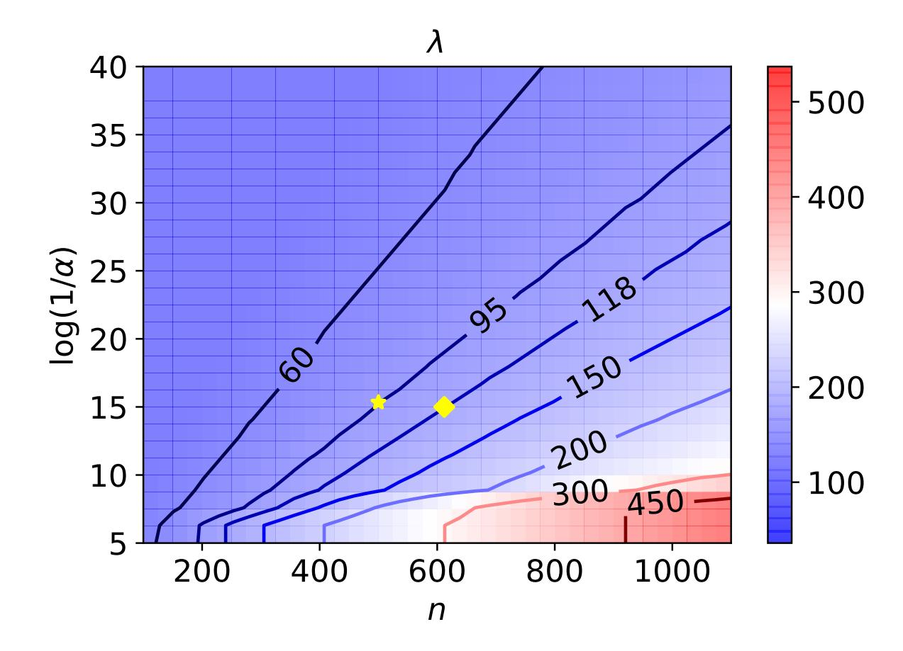
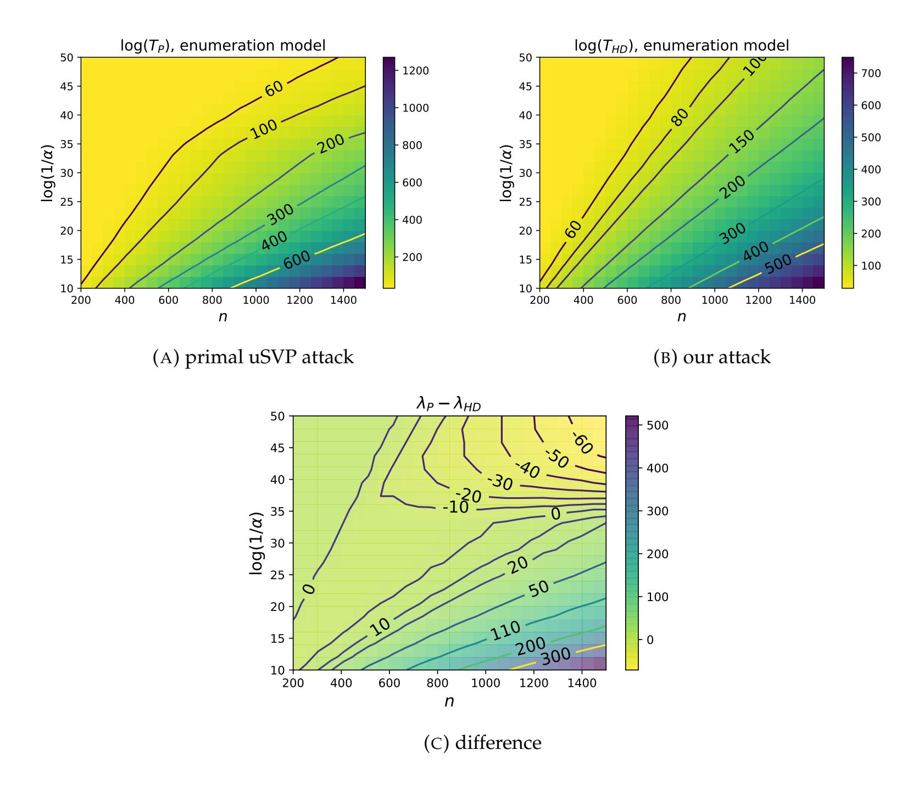
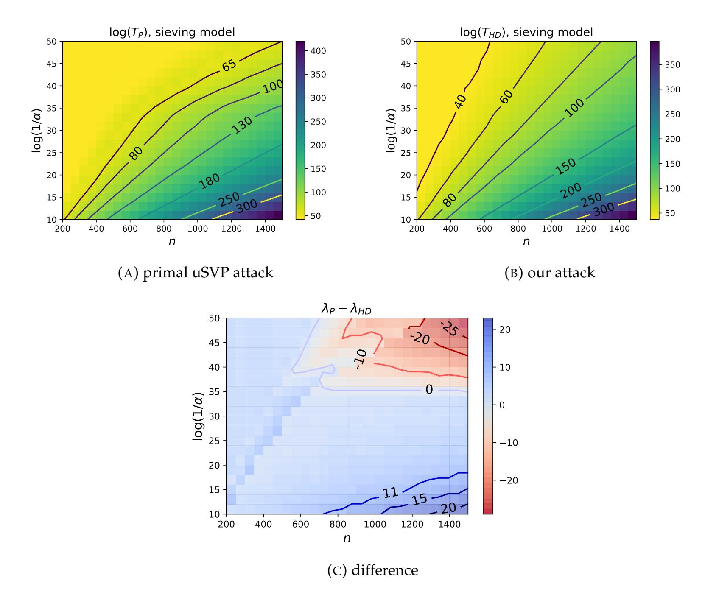
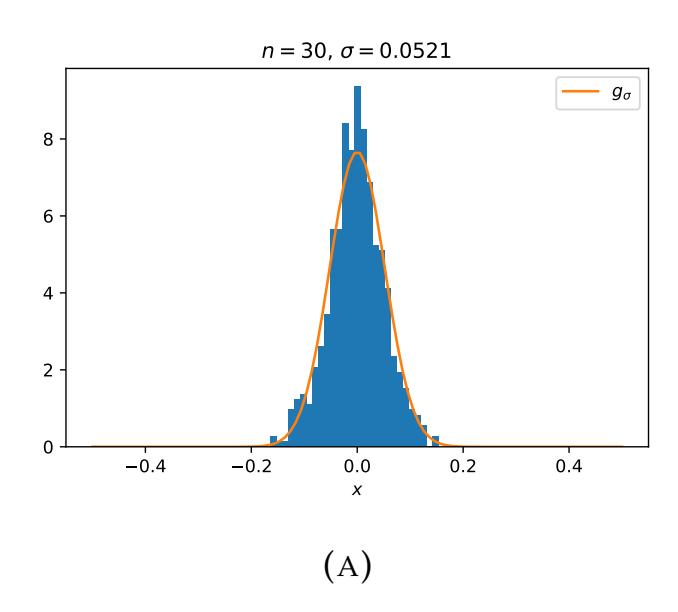
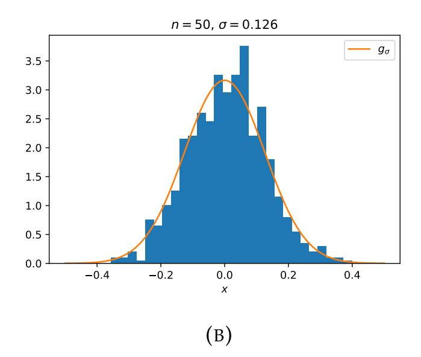
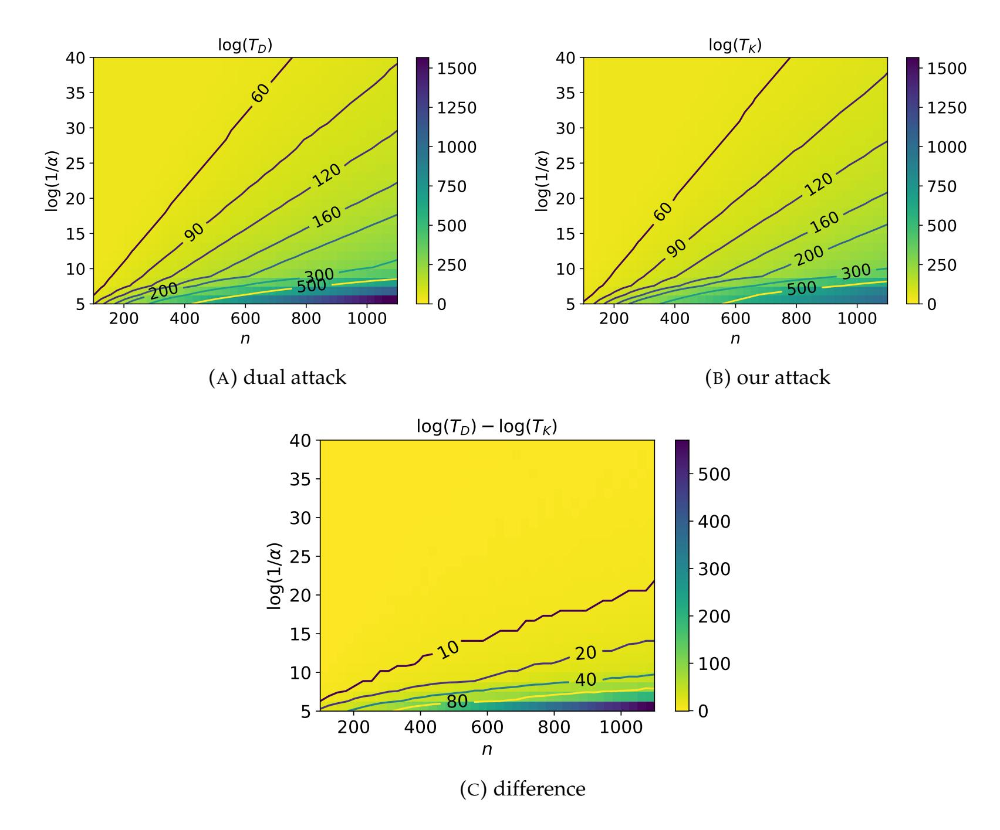
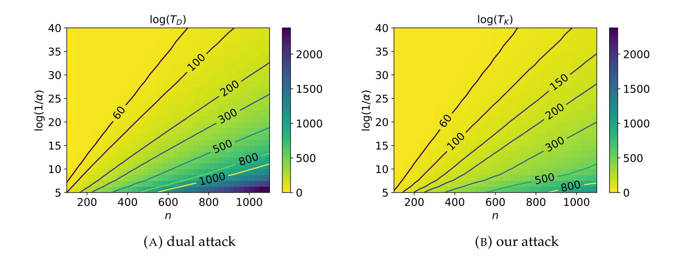
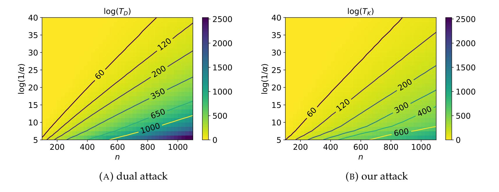
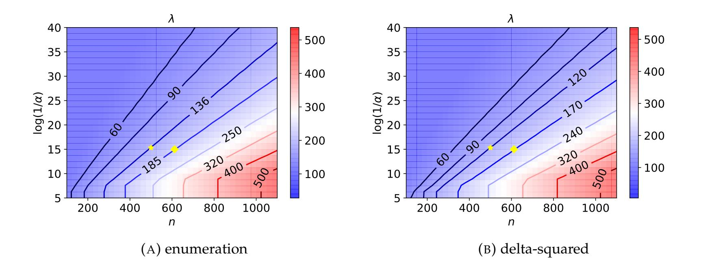

{0}------------------------------------------------

## **ON A DUAL/HYBRID APPROACH TO SMALL SECRET LWE**

\* \* \*

A DUAL/ENUMERATION TECHNIQUE FOR LEARNING WITH ERRORS AND APPLICATION TO SECURITY ESTIMATES OF FHE SCHEMES

THOMAS ESPITAU† , ANTOINE JOUX<sup>2</sup> , AND NATALIA KHARCHENKO<sup>3</sup>

ABSTRACT. In this paper, we investigate the security of the Learning With Error (LWE) problem with small secrets by refining and improving the so-called dual lattice attack. More precisely, we use the dual attack on a projected sublattice, which allows generating instances of the LWE problem with a slightly bigger noise that correspond to a fraction of the secret key. Then, we search for the fraction of the secret key by computing the corresponding noise for each candidate using the newly constructed LWE samples. As secrets are small, we can perform the search step very efficiently by exploiting the recursive structure of the search space. This approach offers a trade-off between the cost of lattice reduction and the complexity of the search part which allows to speed up the attack. Besides, we aim at providing a sound and *non-asymptotic* analysis of the techniques to enable its use for practical selection of security parameters. As an application, we revisit the security estimates of some fully homomorphic encryption schemes, including the Fast Fully Homomorphic Encryption scheme over the Torus (TFHE) which is one of the fastest homomorphic encryption schemes based on the (Ring-)LWE problem. We provide an estimate of the complexity of our method for various parameters under three different cost models for lattice reduction and show that the security level of the TFHE scheme should be re-evaluated according to the proposed improvement (for at least 7 bits for the most recent update of the parameters that are used in the implementation).

#### 1. INTRODUCTION

The Learning With Errors (LWE) problem was introduced by Regev [\[Reg05\]](#page-32-0) in 2005. A key advantage of LWE is that it is provably as hard as certain lattice approximation problems in the worst-case [\[BLP](#page-31-0)<sup>+</sup>13], which are believed to be hard even on a quantum computer. The LWE problem has been a rich source of cryptographic constructions. As a first construction, Regev

<sup>1</sup>NTT CORPORATION, TOKYO, JAPAN

<sup>2</sup> INSTITUT DE MATHEMATIQUES DE ´ JUSSIEU–PARIS RIVE GAUCHE, CNRS, INRIA, UNIV PARIS DIDEROT, PARIS, FRANCE AND CISPA HELMHOLTZ CENTER FOR INFORMATION SECURITY, SAARBRUCKEN ¨ , GERMANY

<sup>3</sup>SORBONNE UNIVERSITE´, LIP 6, CNRS UMR 7606, PARIS, FRANCE AND SORBONNE UNIVERSITE´ *E-mail addresses*: t.espitau@gmail.com.

{1}------------------------------------------------

proposed an encryption scheme, but the flexibility of this security assumption proved to be extremely appealing to construct feature-rich cryptography [\[GPV08,](#page-32-1)[BV11\]](#page-31-1).

Among these constructions, Fully homomorphic encryption (FHE) is a very interesting primitive, as it allows performing arbitrary operations on encrypted data without decrypting it. A first FHE scheme relying on the so-called ideal lattices was proposed in a breakthrough work of Gentry [G<sup>+</sup>[09\]](#page-32-2). After several tweaks and improvements through the years, the nowadays popular approaches to FHE rely on the LWE problem or its variants (e.g. [\[FV12,](#page-32-3)[GSW13,](#page-32-4)[BGV14,](#page-31-2) [CS15,](#page-31-3)[DM15\]](#page-31-4)).

Informally, when given several samples of the form (a,ha, si + e mod q) where s is secret, a ∈ Z n q is uniform and e is some noise vector, the LWE problem is to recover s.

In its original formulation, the secret vector is sampled uniformly at random from Z n q , but more recent LWE-based constructions choose to use distribution with small entropy for the secret key to increase efficiency. For example, some FHE schemes use binary [\[DM15,](#page-31-4) [CGGI16\]](#page-31-5), ternary [\[CLP17\]](#page-31-6), or even ternary sparse secrets [\[HS15\]](#page-32-5). Theoretical results are supporting these choices, which show that the LWE remains hard even with small secrets [\[BLP](#page-31-0)+13]. In practice, however, such distributions can lead to more efficient attacks [\[BG14,](#page-30-0)[SC19,](#page-32-6)[CHHS19\]](#page-31-7).

The security of a cryptosystem, of course, depends on the complexity of the most efficient known attack against it. In particular, to estimate the security of an LWE-based construction, it is important to know which attack is the best for the parameters used in the construction. It can be a difficult issue; indeed, the survey of existing attacks against LWE given in [\[APS15\]](#page-29-0) shows that no known attack would be the best for all sets of LWE parameters.

In this article, we are interested in evaluating the practical security of the LWE problem with such small secrets. As an application, we consider the bit-security of several very competitive FHE proposals, such as the Fast Fully Homomorphic Encryption scheme over the Torus [\[CGGI16,](#page-31-5) [CGGI17,](#page-31-8) [CGGI20\]](#page-31-9), FHEW [\[DM15\]](#page-31-4), SEAL [\[LP16\]](#page-32-7), and HElib [\[HS15\]](#page-32-5). The security of these constructions relies on the hardness of variants of the LWE problem which can all be encompassed in a scale-invariant version named Torus-LWE. This "learning a character" problem, captures both the celebrated LWE and Ring-LWE problems.

In the case of TFHE, in [\[CGGI17\]](#page-31-8), the authors adapted and used the dual distinguishing lattice attack from [\[Alb17\]](#page-29-1) to evaluate the security of their scheme. Recently, in [\[CGGI20,](#page-31-9) Remark 9], the authors propose an updated set of the parameters for their scheme and estimate the security of the new parameters using the LWE estimator from [\[ACD](#page-28-0)<sup>+</sup>18]. It turns out that this approach falls into the caveat we described above: the estimator relies on attacks that are not 

{2}------------------------------------------------

fine-tailored to capture the peculiar choice of distributions. According to the LWE estimator, the best attack against the current TFHE parameters is the unique-SVP attack [\[BG14\]](#page-30-0).

- 1.1. **Contributions and overview of the techniques.** We present our work in the generic context of the so-called scale-invariant LWE problem or Torus-LWE, which appears to give a more flexible mathematical framework to perform the analysis of the attacks. We aim at extending the use-case of the dual lattice attack which is currently one of the two main techniques used to tackle the LWE problem. Given Torus-LWE samples collected in matrix form At~s + ~e = ~b mod 1, the vanilla dual attack consists in finding a vector ~v such that A~<sup>t</sup> = 0 mod 1, yielding the equation ~vt~e = ~v<sup>t</sup>~b mod 1. Since ~vt~e should be small, we can then distinguish it from a random vector in the torus.
- 1.1.1. *A refined analysis of the dual attack.* First, we introduce a complete *non-asymptotic* analysis of the standard dual lattice attack[1](#page-2-0) on LWE. In particular, we prove *non-asymptotic bounds* on the number of samples and the corresponding bit-complexity of the method, allowing precise instantiations for parameter selection[2](#page-2-1) . To do so, we we highlight new tools based on the Berry-Esseen inequality and introduce an unbiased estimator of the Levy transform for real random variables, allowing us to sharpen the analysis of the attack.

The intuition behind these techniques is as follows. The crux of the dual attack is to distinguish a Gaussian distribution modulo 1 from a uniform distribution. Since we are working modulo 1, a natural approach is to try to tackle the estimations problem by harmonic analysis techniques. Moving to the Fourier space is done by the so-called Levy transform (which corresponds essentially to look of a real variable X through the kernel x 7→ e <sup>2</sup>iπx). In this space, the Levy transform of the Gaussian distribution mod 1 and the full Gaussian distribution coincides, so that we somehow get rid of the action of the modulo. We then rely on Berry-Esseen inequality to get a fined grained control on distances to a normal distribution and derive sharp bounds. We hope these techniques may find other interests for the community.

1.1.2. *An hybrid enumeration/dual attack.* In a second step, we show that applying the dual attack to a projected sublattice and combining it with the search for a fraction of the key can yield a more efficient attack. It can be thought of a dimension reduction technique, trading the enumeration time with the dimension of the lattice attack. More precisely we obtain a trade-off

<span id="page-2-0"></span><sup>1</sup>We point out that this attack is slightly more subtle than the vanilla dual technique, as it encompasses a continuous relaxation of the *lazy modulus switching* technique of [\[Alb17\]](#page-29-1).

<span id="page-2-1"></span><sup>2</sup>Up to our knowledge previous analyses rely on instantiation of asymptotic inequalities and overlook the practical applicability.

{3}------------------------------------------------

between the quality of lattice reduction in the dual attack part and the time subsequently spent in the exhaustive search Additionally, for the lattice reduction algorithms using sieving as an SVP-oracle, we demonstrate how to leverage the pool of short vectors obtained by the sieving process to enhance the attack by amortizing the cost of the reduction part. This achieves better efficiency compared to enumeration-based approaches. We also discuss possible improvements based on so-called "combinatorial" techniques, where we perform a random guess of the zero positions of the secret if it is sparse enough.

In a word, our attack starts by applying lattice reduction to a projected sublattice in the same way as it is applied to the whole lattice in the dual attack. This way, we generate LWE instances with bigger noise but in smaller dimension, corresponding to a fraction of the secret key. Then, the freshly obtained instances are used to recover the remaining fraction of the secret key. For each candidate for this missing fraction, we compute the noise vector corresponding to the LWE instances obtained at the previous step. This allows us to perform a majority voting procedure to detect the most likely candidates. For small secrets, this step boils down to computing a product of a matrix of the LWE samples with the matrix composed of all the possible parts of the secret key that we are searching for. We show that this computation can be performed efficiently thanks to the recursive structure of the corresponding search space.

1.1.3. *Applications and practical implications.* In the last part, we estimate the complexity of our attack under three different models of lattice reduction and compare the complexity of our attack with the standard dual attack and with the primal unique-SVP attack for a wide range of LWE parameters in the case of small non-sparse secrets. Concerning the comparison with the primal unique-SVP attack, both attack give quite close results. As we can expect, our attack is better than uSVP when the dimension and the noise parameter are big, the uSVP attack is better when the dimension is big and the noise parameter is small (see [Figure 2\)](#page-28-1). We then provide experiments in small dimension, supporting the whole analysis.

To evaluate the practicality of our approach, we apply our attack to the security analysis of competitive FHE schemes, namely TFHE [\[CGGI20\]](#page-31-9), FHEW [\[DM15\]](#page-31-4), SEAL [\[LP16\]](#page-32-7), and HElib [\[HS15\]](#page-32-5). We show that our hybrid dual attack gives improvement compared to the unique-SVP or dual technique of [\[ACD](#page-28-0)<sup>+</sup>18] for the latest TFHE's, FHEW's an SEAL's parameters. In case of sparse secrets in HElib scheme our attack doesn't provide improvements over the dual attack from [\[Alb17\]](#page-29-1), but gives very comparable results.

{4}------------------------------------------------

More precisely, the TFHE scheme uses two keys: the switching key and the bootstrapping key. Thus, the security of the scheme is measured by the security of the weakest of the two keys [3](#page-4-0) .

We describe all the choices in [Table 1](#page-4-1) and showcase the corresponding estimated security within our attack framework. We observe that our hybrid technique is giving the best attack against the concrete instantiation of TFHE, being better than the primal uSVP attack.

<span id="page-4-1"></span>

|                | parameters (n, α)         | dual [ACD+18,Alb17] | this work | uSVP [ACD+18] |
|----------------|---------------------------|---------------------|-----------|---------------|
|                | switching key             |                     |           |               |
|                | n = 500, α = 2.43 · 10−5  | 113                 | 94        | 101           |
| Old param.     | bootstrapping key         |                     |           |               |
|                | n = 1024, α = 3.73 · 10−9 | 125                 | 112       | 116           |
|                | switching key             |                     |           |               |
|                | n = 612, α = 2−15         | 140                 | 118       | 123           |
| New param.     | bootstrapping key         |                     |           |               |
|                | n = 1024, α = 2−26        | 134                 | 120       | 124           |
|                | switching key             |                     |           |               |
|                | n = 630, α = 2−15         | 144                 | 121       | 127           |
| Implem. param. | bootstrapping key         |                     |           |               |
|                | n = 1024, α = 2−25        | 140                 | 125       | 129           |

TABLE 1. Security estimates of the parameters of TFHE from [\[CGGI20,](#page-31-9) Table 3, Table 4] and from the public implementation [G+[16\]](#page-32-8). n denotes the dimension, α is the parameter of the modular Gaussian distribution. The bold numbers denote the overall security of the scheme for a given set of parameters. The "uSVP" column corresponds to the estimates obtained using the LWE Estimator [\[ACD](#page-28-0)<sup>+</sup>18] for the primal uSVP attack. For the lattice reduction algorithm, in all the cases, the sieving BKZ cost model is used.

<span id="page-4-0"></span><sup>3</sup>We point out that the parameters of the scheme have been re-evaluated between the initial publication and the final journal version. The latest version of the paper [\[CGGI20\]](#page-31-9) contains both the old and the new parameters. The security level for the old parameters (given by [\[CGGI20,](#page-31-9) Table 3]) are given by plain dual attack. The new parameters are introduced by [\[CGGI20,](#page-31-9) Remark 9] and described in [\[CGGI20,](#page-31-9) Table 4] are evaluated using the LWE estimator from [\[ACD](#page-28-0)+18]. For completeness, we re-evaluated the security of all available sets of the parameters.

{5}------------------------------------------------

1.2. **Related work.** The survey [\[APS15\]](#page-29-0) outlines three strategies for attacks against LWE: exhaustive search, BKW algorithm [\[BKW03,](#page-31-10)[ACF](#page-28-2)<sup>+</sup>15], and lattice reduction. Lattice attacks against LWE can be separated into three categories depending on the lattice used: distinguishing dual attacks [\[Alb17\]](#page-29-1), decoding (primal) attacks [\[LP11,](#page-32-9)[LN13\]](#page-32-10), and solving LWE by reducing it to the unique Shortest Vector Problem (uSVP) [\[AFG13\]](#page-28-3).

The idea of a hybrid lattice reduction attack was introduced by Howgrave–Graham in [\[HG07\]](#page-32-11). He proposed to combine a meet-in-the-middle attack with lattice reduction to attack NTRUEncrypt. Then, Buchmann et al. adapted Howgrave–Graham's attack to the settings of LWE with binary error [\[BGPW16\]](#page-30-1) and showed that the hybrid attack outperforms existing algorithms for some sets of parameters. This attack uses the decoding (primal) strategy for the lattice reduction part. Following these two works, Wunderer has provided an improved analysis of the hybrid decoding lattice attack and meet-in-the-middle attack and re-estimated security of several LWE and NTRU based cryptosystems in [\[Wun16\]](#page-32-12). Also, very recently, a similar combination of primal lattice attack and meet-in-the-middle attack was applied to LWE with ternary and sparse secret [\[SC19\]](#page-32-6). This last reference shows that the hybrid attack can also outperform other attacks in the case of ternary and sparse secrets for parameters typical for FHE schemes.

A combination of the dual lattice attack with guessing for a part of the secret key was considered in [\[Alb17,](#page-29-1) Section 5], in the context of *sparse secret keys*. Also, recently, a similar approach was adapted to the case of ternary and sparse keys in [\[CHHS19\]](#page-31-7). Both of these articles can be seen as *dimension reduction* techniques as they both rely on a guess of the part of the secret to perform the attack in smaller dimension. They gain in this trade-off by exploiting the sparsity of the secret: guessing the position of zero bits will trade positively with the dimension reduction as soon as the secret is sparse enough. However, the main difference of this work compared to [\[CHHS19,](#page-31-7)[Alb17\]](#page-29-1) is that the secret is *not* required to be sparse, and thus can be considered to be slightly more general. We positively trade-off with the dimension gain by exploiting the recursive structure of the small secret space. However, all these techniques are not incompatible! In [Section 4.4,](#page-23-0) we propose a combination of the guessing technique with our approach, allowing to leverage at the same time the sparsity *and* the structure of small secrets.

Overall we can consider this work as providing a proper dual analog of enumeration-hybrid technique existing for primal attacks.

**Outline.** This paper is organized as follows. In [Section 2,](#page-6-0) we provide the necessary background on lattice reduction and probability. In [Section 3,](#page-11-0) we revisit the dual lattice attack and provide a novel and sharper analysis of this method. In [Section 4,](#page-17-0) we describe our hybrid dual 

{6}------------------------------------------------

lattice attack and discuss its extension to sparse secrets. In [Section 5,](#page-23-1) we compare the complexities of different attacks, revisit the security estimate of TFHE, and several other FHE schemes and provide some experimental evidence supporting our analysis.

## 2. BACKGROUND

<span id="page-6-0"></span>We use column notation for vectors and denote them using bold lower-case letters (e.g. x). Matrices are denoted using bold upper-case letters (e.g. A). For a vector x, x <sup>t</sup> denotes the transpose of x, i.e., the corresponding row-vector. Base-2 logarithm is denoted as log, natural logarithm is denoted as ln. We denote the set of real numbers modulo 1 as the torus T. For a finite set S, we denote by |S| its cardinality and by U(S) the discrete uniform distribution on its elements. For any compact set S ⊂ R <sup>n</sup>, the uniform distribution over S is also denoted by U(S). When S is not specified, U denotes uniform distribution over (−0.5; 0.5).

2.1. **LWE problem.** Abstractly, all operations of the TFHE scheme are defined on the real torus T and to estimate the security of the scheme it is convenient to consider a scale-invariant version of LWE problem.

**Definition 2.1** (Learning with Errors, [\[BLP](#page-31-0)+13, Definition 2.11])**.** Let n > 1, s ∈ Z <sup>n</sup>, ξ be a distribution over R and S be a distribution over Z n.

We define the *LWE*s,ξ *distribution* as the distribution over T <sup>n</sup> ×T obtained by sampling a from U(T <sup>n</sup>), sampling e from ξ and returning (a, a t s + e).

Given access to outputs from this distribution, we can consider the two following problems:

- *D*ecision-LWE. Distinguish, given arbitrarily many samples, between U(T <sup>n</sup> × T) and LWEs,ξ distribution for a fixed s sampled from S.
- *S*earch-LWE. Given arbitrarily many samples from LWEs,ξ distribution with fixed s ← S, recover the vector s.

To complete the description of the LWE problem we need to choose the error distribution ξ and the distribution of the secret key S. Given a finite set of integers B, we define S to be U(B<sup>n</sup>) and ξ to be a centered continuous Gaussian distribution, i.e., we consider the LWE problem with binary secret. This definition captures the *binary* and *ternary* variants of LWE by choosing B to be respectively {0, 1} and {−1, 0, 1}. In [\[BLP](#page-31-0)<sup>+</sup>13], it is shown that this variation of LWE with small secrets remains hard. Finally, we use the notation LWEs,σ as a shorthand for LWEs,ξ, when ξ is the Gaussian distribution centered at 0 and with standard deviation σ.

{7}------------------------------------------------

2.2. Lattices. A lattice  $\Lambda$  is a discrete subgroup of  $\mathbb{R}^d$ . As such, a lattice  $\Lambda$  of rank n can be described as a set of all integer linear combinations of  $n \leq d$  linearly independent vectors  $\mathbf{B} = \{\mathbf{b}_1, \dots, \mathbf{b}_d\} \subset \mathbb{R}^d$ :

$$\Lambda = \mathcal{L}(\mathbf{B}) := \mathbb{Z}\mathbf{b}_1 \oplus \cdots \oplus \mathbb{Z}\mathbf{b}_d,$$

called a basis. Bases are not unique, one lattice basis may be transformed into another one by applying an arbitrary unimodular transformation. The *volume of the lattice*  $\operatorname{vol}(\Lambda)$  is equal to the square root of the determinant of the Gram matrix  $\mathbf{B}^t\mathbf{B}$ :  $\operatorname{vol}(\Lambda) = \sqrt{\det(\mathbf{B}^t\mathbf{B})}$ . For every lattice  $\Lambda$  we denote the length of its shortest non-zero vector as  $\lambda_1(\Lambda)$ . Minkowski's theorem states that  $\lambda_1(\Lambda) \leqslant \sqrt{\gamma_n} \cdot \operatorname{vol}(\Lambda)^{1/n}$  for any d-dimensional lattice  $\Lambda$ , where  $\gamma_d < d$  is d-dimensional Hermite's constant. The problem of finding the shortest non-zero lattice vector is called the *Shortest Vector Problem*(SVP). It is known to be NP-hard under randomized reduction [Ajt98].

2.3. **Lattice reduction.** A lattice reduction algorithm is an algorithm which, given as input some basis of the lattice, finds a basis that consists of relatively short and relatively pairwise-orthogonal vectors. The quality of the basis produced by lattice reduction algorithms is often measured by the Hermite factor  $\delta = \frac{\|\mathbf{b}_1\|}{\det(\Lambda)^{1/d}}$ , where  $\mathbf{b}_1$  is the first vector of the output basis. Hermite factors bigger than  $\left(\frac{4}{3}\right)^{n/4}$  can be reached in polynomial time using the LLL algorithm [LLL82]. In order to obtain smaller Hermite factors, blockwise lattice reduction algorithms, like BKZ-2.0 [CN11] or S-DBKZ [MW16], can be used. The BKZ algorithm takes as input a basis of dimension d and proceeds by solving SVP on lattices of dimension  $\beta < d$  using sieving [BDGL16] or enumeration [GNR10]. The quality of the output of BKZ depends on the blocksize  $\beta$ . In [HPS11] it is shown that after a polynomial number of calls to SVP oracle, the BKZ algorithm with blocksize  $\beta$  produces a basis B that achieves the following bound:

$$\|\mathbf{b}_1\| \leqslant 2\gamma_{\beta}^{\frac{d-1}{2(\beta-1)}+\frac{3}{2}} \cdot \operatorname{vol}(\mathbf{B})^{1/d}.$$

However, up to our knowledge, there is no closed formula that tightly connects the quality and complexity of the BKZ algorithm. In this work, we use experimental models proposed in [ACF+15, ACD+18] in order to estimate the running time and quality of the output of lattice reduction. They are based on the following two assumptions on the quality and shape of the output of BKZ. The first assumption states that the BKZ algorithm outputs vectors with balanced coordinates, while the second assumption connects the Hermite factor  $\delta$  with the chosen blocksize  $\beta$ .

<span id="page-7-0"></span>**Assumption 1.** Given as input, a basis B of a d-dimensional lattice  $\Lambda$ , BKZ outputs a vector of norm close to  $\delta^d \cdot \det(\Lambda)^{1/d}$  with balanced coordinates. Each coordinate of this vector follows

{8}------------------------------------------------

a distribution that can be approximated by a Gaussian with mean 0 and standard deviation  $\delta^d \det(\Lambda)^{1/d}/\sqrt{d}$ .

**Assumption 2.** BKZ with blocksize  $\beta$  achieves Hermite factor

$$\delta = \left(\frac{\beta}{2\pi e} (\pi \beta)^{\frac{1}{\beta}}\right)^{\frac{1}{2(\beta-1)}}.$$

This assumption is experimentally verified in [Che13].

**BKZ** cost models. To estimate the running time of BKZ, we use three different models. The first model is an extrapolation by Albrecht [ACF<sup>+</sup>15] et al. of the Liu–Nguyen datasets [LN13]. According to that model, the logarithm of the running time of BKZ-2.0 (expressed in bit operations) is a quadratic function of  $\log(\delta)^{-1}$ :

$$\log(T(BKZ_{\delta})) = \frac{0.009}{\log(\delta)^2} - 27.$$

We further refer to this model as the delta-squared model. The model was used in [CGGI17] to estimate the security of TFHE.

Another cost model [ACD<sup>+</sup>18] assumes that the running time of BKZ with blocksize  $\beta$  for d-dimensional basis is  $T(BKZ_{\beta,d}) = 8d \cdot T(SVP_{\beta})$ , where  $T(SVP_{\beta})$  is the running time of an SVP oracle in dimension  $\beta$ . For the SVP oracle, we use the following two widely used models:

Sieving model:  $T(SVP_{\beta}) \approx 2^{0.292\beta + 16.4}$ ,

Enumeration model:  $T(SVP_{\beta}) \approx 2^{0.187\beta \log(\beta) - 1.019\beta + 16.1}$ .

Analysing the proof of the sieving algorithm [BDGL16] reveals that around  $\left(\frac{4}{3}\right)^{\frac{12}{2}}$  short vectors while solving SVP on an n-dimensional lattice. Therefore, when using the sieving model, we shall assume that one run of the BKZ routine produces  $\left(\frac{4}{3}\right)^{\frac{\beta}{2}}$  short lattice vectors, where  $\beta$  is the chosen blocksize. As such, we shall provide the following heuristic, which generalizes the repartition given in Assumption 1 when the number of output vectors is small with regards to the number of possible vectors of desired length:

<span id="page-8-0"></span>**Assumption 3.** Let  $R \ll \delta^{d^2} V_d$  and  $R \leqslant (4/3)^{\beta/2}$  where  $V_d$  is the volume of the  $\ell_2$  unit ball in dimension d. Given as input, a basis B of a d-dimensional lattice  $\Lambda$ , BKZ $_\beta$  with a sieving oracle as SVP oracle outputs a set of R vectors of norm close to  $\delta^d \cdot \det(\Lambda)^{1/d}$  with balanced coordinates. Each coordinate of these vector follows a distribution that can be approximated by a Gaussian with mean 0 and standard deviation  $\delta^d \det(\Lambda)^{1/d}/\sqrt{d}$ .

{9}------------------------------------------------

In practice, for the dimension involved in cryptography and for the parameters yields by our techniques, this assumption can be easily experimentally verified. In particular, for the parameters tackled in this work, the number of vectors used by the attack is way lower than the number of potential candidates. In a general setting (where we need to look at all the vectors of the sieving pool), one might see this exploitation as a slight underestimate of the resulting security parameters. An interesting open problem, that we leave for future work as it is unrelated to the attacks mounted here, would be to quantify precisely the distribution of the sieved vectors when we desire to keep all of them, which is an extreme case of our approach.

A related idea seems quite folklore in the lattice reduction community and appears in particular in [Alb17], consists in rerandomizing the output basis of the reduction with slight enumeration and a pass of LLL for instance. This approach is slightly more costly as just extracting the sieved vectors but is comparable for its effect as an amortization technique when a batch reduction is needed.

2.4. **Modular Gaussian distribution.** Let  $\sigma > 0$ . For all  $x \in \mathbb{R}$ , the density of the centered Gaussian distribution with standard deviation  $\sigma$  is defined as  $\rho_{\sigma}(x) = \frac{1}{\sqrt{2\pi}\sigma} \exp\left(-\frac{x^2}{2\sigma^2}\right)$ . We define the distribution that is obtained by sampling a centered Gaussian distribution of standard deviation  $\sigma$  and reducing it modulo 1 as the *modular Gaussian distribution* of parameter  $\sigma$  and denote it as  $\mathcal{G}_{\sigma}$ .

The support of the distribution is  $\left(-\frac{1}{2};\frac{1}{2}\right)$ . The probability density function is given by the absolutely convergent series:

$$g_{\sigma}(x) = \sum_{k \in \mathbb{Z}} \rho_{\sigma}(x+k).$$

For large values of  $\sigma$ , the sum that defines the density of a modular Gaussian can be closely approximated.

**Lemma 2.2.** As 
$$\sigma \to \infty$$
,  $g_{\sigma}(x) = 1 + 2e^{-2\pi^2\sigma^2}\cos(2\pi x) + O(e^{-8\pi^2\sigma^2})$ .

*Proof.* The Fourier transform of the Gaussian function  $\rho_{\sigma,m}(x)=\frac{1}{\sqrt{2\pi}\sigma}e^{-\frac{(x+m)^2}{2\sigma^2}}$  is given by  $\hat{\rho}_{\sigma,m}(y)=e^{-2\pi^2\sigma^2m^2+2\pi imx}$ . Then, using the Poisson summation formula, we obtain:

(1) 
$$g_{\sigma}(x) = \frac{1}{\sqrt{2\pi}\sigma} \sum_{k \in \mathbb{Z}} e^{-\frac{(k+x)^2}{2\sigma^2}} = 1 + 2\sum_{k>0} e^{-2\pi^2\sigma^2k^2} \cos(2\pi kx) = 1 + 2e^{-2\pi^2\sigma^2} \cos(2\pi x) + O(e^{-8\pi^2\sigma^2}).$$

2.5. Probability background.

{10}------------------------------------------------

*Berry-Esseen inequality.* The Berry-Esseen inequality shows how closely the distribution of the sum of independent random variables can be approximated by a Gaussian distribution.

<span id="page-10-1"></span>Theorem 2.3. Let  $X_1, \ldots, X_n$  be independent random variables such that for all  $i \in \{1, \ldots, n\}$   $\mathbb{E}\{X_i\} = 0$ ,  $\mathbb{E}\{X_i^2\} = \sigma_i^2 > 0$ , and  $\mathbb{E}\{|X_i|^3\} = \rho_i < \infty$ . Denote the normalized sum  $\left(\sum_{i=1}^n X_i\right)^{-1} \sqrt{\sum_{i=1}^n \sigma_i^2}$  as  $S_n$ . Also denote by  $F_n$  the cumulative distribution function of  $S_n$ , and by  $\Phi$  the cumulative distribution function of the standard normal distribution. Then, there exists a constant  $C_0$  such that

$$\sup_{x \in \mathbb{R}} |F_n(x) - \Phi(x)| \leqslant C_0 \frac{\sum_{i=1}^n \rho_i}{\left(\sum_{i=1}^n \sigma_i^2\right)^{3/2}}.$$

We use the Berry-Esseen inequality in order to estimate how closely the distribution that we obtain after the lattice reduction step of the dual attack can be approximated by a discrete Gaussian distribution (see Theorem 3.1). The Berry-Esseen inequality requires a finite third absolute moment of the random variables. In the proof of Theorem 3.1, we need the expression of third absolute moment of a Gaussian distribution. It can be obtained from the following lemma.

<span id="page-10-2"></span>**Lemma 2.4.** Let  $\sigma > 0$ . Let X be a random variable of a Gaussian distribution with mean 0 and standard deviation  $\sigma^2$ . Then,  $\mathbb{E}\{|X|^3\} = 2\sqrt{\frac{2}{\pi}}\sigma^3$ .

*Proof.* Classically we have: 
$$\mathbb{E}\{|X|^3\} = 2 \cdot \frac{1}{\sqrt{2\pi\sigma}} \int_0^\infty x^3 e^{-\frac{x^2}{2\sigma^2}} dx = 2\sqrt{\frac{2}{\pi}}\sigma^3$$
.

Hoeffding's inequality. Hoeffding's inequality gives an exponentially decreasing upper bound on the probability that the sum of bounded independent random variables deviates from its expectation by a certain amount.

<span id="page-10-0"></span>**Theorem 2.5.** Let  $X_1, \ldots, X_N$  be independent random variables such that  $a_i \leq X_i \leq b_i$  for all  $i \in \{1, \ldots, N\}$ . Denote the average  $\frac{1}{N} \sum_{i=1}^{N} X_i$  as  $\bar{X}$ . Then, for t > 0, we have

(2) 
$$\mathbb{P}\{\left|\bar{X} - \mathbb{E}\{\bar{X}\}\right| \geqslant t\} \leqslant 2 \exp\left(-\frac{2N^2t^2}{\sum\limits_{i=1}^{n} (b_i - a_i)^2}\right)$$

In this paper, we use Hoeffding's inequality to construct a distinguisher for the uniform and the modular Gaussian distributions (see Section 3.2).

{11}------------------------------------------------

## 3. DUAL DISTINGUISHING ATTACK AGAINST LWE.

<span id="page-11-0"></span>In this first section, we revisit the distinguishing dual attack against LWE (or more precisely for the generic corresponding scale-invariant problem described in [\[BLP](#page-31-0)<sup>+</sup>13[,CGGI20\]](#page-31-9)), providing complete proofs and introducing finer tools as a novel distinguisher for the uniform distribution and the modular Gaussian. In particular, all the results are *non-asymptotic* and can be used for practical instantiations of the parameters. Note that it also naturally encompasses a continuous relaxation of the *lazy modulus switching* technique of [\[Alb17\]](#page-29-1), as the mathematical framework used makes it appear very naturally in the proof technique.

*Setting.* In all of the following, we denote by B a finite set of integers (typically {0, 1} or {−1, 0, 1}). Let s ∈ B<sup>n</sup> be a secret vector and let α > 0 be a fixed constant. The attack takes as input m samples (a1, b1), . . . ,(am, bm) ∈ T <sup>n</sup>+1 × T which are either all from LWEs,α distribution or all from U(T <sup>n</sup> × T), and guesses the input distribution.

We can write input samples in a matrix form:

$$\mathbf{A} := (\mathbf{a}_1, \dots, \mathbf{a}_m) \in \mathbb{T}^{n \times m}, \quad \mathbf{b} = (b_1, \dots, b_m)^t \in \mathbb{T}^m,$$

if input samples are from the LWEs,α distribution: b = A<sup>t</sup> s + e mod 1.

*Distinguisher reduction using a small trapdoor.* To distinguish between the two distributions, the attack searches for a short vector v = (v1, . . . , vm) <sup>t</sup> ∈ Z <sup>m</sup> such that the linear combination of the left parts of the inputs samples defined by v, i.e.:

<span id="page-11-1"></span>
$$\mathbf{x} := \sum_{i=1}^{m} v_i \mathbf{a}_i = \mathbf{A} \mathbf{v} \mod 1$$

is also a short vector. If the input was from the LWE distribution, then the corresponding linear combination of the right parts of the input samples is also small as a sum of two relatively small numbers:

(3) 
$$\mathbf{v}^t \mathbf{b} = \mathbf{v}^t (\mathbf{A}^t \mathbf{s} + \mathbf{e}) = \mathbf{x}^t \mathbf{s} + \mathbf{v}^t \mathbf{e} \mod 1.$$

On the other hand, if the input is uniformly distributed, then independently of the choice of the non-zero vector v, the product v·b mod 1 has uniform distribution on (−1/2; 1/2). Recovering a suitable v thus turns the decisional-LWE problem into an easier problem of distinguishing two distributions on T.

This remaining part of this section is organized in the following way. First, in [Section 3.1](#page-12-1) we describe how such a suitable vector v can be discovered by lattice reduction and analyze 

{12}------------------------------------------------

the distribution of  $\mathbf{v}^t\mathbf{b}$ . Then, in Section 3.2, we estimate the complexity of distinguishing two distributions on  $\mathbb{T}$  that we obtain after this first part. Eventually Section 3.3 estimates the time complexity of the whole attack.

<span id="page-12-1"></span>3.1. **Trapdoor construction by lattice reduction.** Finding a vector  $\mathbf{v}$  such that both parts of the sum (3) are small when the input has LWE distribution is equivalent to finding a short vector in the following (m + n)-dimensional lattice:

$$\mathcal{L}(\mathbf{A}) = \left\{ \begin{pmatrix} \mathbf{A}\mathbf{v} \mod 1 \\ \mathbf{v} \end{pmatrix} \in \mathbb{R}^{m+n} \middle| \forall \mathbf{v} \in \mathbb{Z}^m \right\}.$$

The lattice  $\mathcal{L}(\mathbf{A})$  can be generated by the columns of the following matrix:

$$\mathbf{B} = \begin{pmatrix} \mathbf{I}_n & \mathbf{A} \ \mathbf{0}^{m \times n} & \mathbf{I}_m \end{pmatrix} \in \mathbb{R}^{(m+n) \times (m+n)}$$

A short vector in  $\mathcal{L}(\mathbf{A})$  can be found by applying a lattice reduction algorithm to the basis  $\mathbf{B}$ . Using Assumption 1, we expect that the lattice reduction process produces a vector  $\mathbf{w} = (\mathbf{x}||\mathbf{v})^t \in \mathbb{Z}^{n+m}$  with equidistributed coordinates. Our goal is to minimize the product  $\mathbf{v}^t\mathbf{b} = \mathbf{x}^t\mathbf{s} + \mathbf{v}^t\mathbf{e}$ . The vectors  $\mathbf{e}$  and  $\mathbf{s}$  come from different distributions and have different expected norms. For practical schemes, the variance of  $\mathbf{e}$  is much smaller than the variance of  $\mathbf{s}$ . To take this imbalance into account, one introduces an additional rescaling parameter  $q \in \mathbb{R}_{>0}$ . The first n rows of the matrix  $\mathbf{B}$  are multiplied by q, the last m rows are multiplied by  $q^{-n/m}$ . Obviously, this transformation doesn't change the determinant of the matrix. A basis  $\mathbf{B}_q$  of the transformed lattice is given by

$$\mathbf{B}_q = \begin{pmatrix} q\mathbf{I}_n & q\mathbf{A} \ \mathbf{0}^{m \times n} & q^{-n/m}\mathbf{I}_m \end{pmatrix} \in \mathbb{R}^{(m+n) \times (m+n)}.$$

We apply a lattice reduction algorithm to  $\mathbf{B}_q$ . Denote the first vector of the reduced basis as  $\mathbf{w}_q$ . By taking last m coordinates of  $\mathbf{w}_q$  and multiplying them by  $q^{n/m}$  we recover the desired vector  $\mathbf{v}$ . This technique can be thought of as a continuous relaxation of the modulus switching technique. That part of the attack is summarized in Algorithm 1.

The following lemma describes the distribution of the output of Algorithm 1 under Assumption 1 that BKZ outputs vectors with balanced coordinates.

<span id="page-12-0"></span>**Lemma 3.1.** Let  $\alpha > 0$  be a fixed constant, B a finite set of integers of variance  $S^2 = \frac{1}{|B|} \sum_{b \in B} b^2$  and  $n \in \mathbb{Z}_{>0}$ . Let s be a vector such that of its coefficients are sampled independently and uniformly in B. Suppose that Assumption 1 holds and let  $\delta > 0$  be the quality of the output of the

{13}------------------------------------------------

**Algorithm 1:** Transform m LWE samples to one sample from modular Gaussian distribution

```
input : A ∈ T
              n×m, b ∈ T
                        m, S > 0, α > 0, δ ∈ (1; 1.1)
 output: x ∈ T
1 computeV(A, S, α, δ):
2 q := 
          S
          α
             m
             n+m
3 Bq :=

             qIn qA
            0
             m×n q
                    −n/mIm

                            ∈ R
                                 (m+n)×(m+n)
4 wq ← BKZδ(Bq)
5 v := q
          n/m · (wqn+1, . . . wqn+m)
                                t
6 return (v)
7 LWEtoModGaussian(A, b, S, α, δ):
8 v ← COMPUTEV(A, S, α, δ)
9 return v
            tb mod 1
```

<span id="page-13-1"></span>BKZ algorithm. Then, given as input m = q n · ln(S/α) ln(δ) − n samples from the LWEs,α distribution, [Algorithm 1](#page-13-1) outputs a random variable x with distribution that can be approximated by a Gaussian distribution with mean 0 and standard deviation σ

$$\sigma = \alpha \cdot \exp\left(2\sqrt{n\ln(S/\alpha)\ln(\delta)}\right).$$

Denote as F<sup>x</sup> the cumulative distribution function of x and denote as Φ<sup>σ</sup> the cumulative distribution function of the Gaussian distribution with mean 0 and standard deviation σ. Then, the distance between the two distributions can be bounded: sup t∈R |Fx(t) − Φσ(t)| = O √ 1 S2(m+n) , as n → ∞.

The crux proof of [Theorem 3.1](#page-12-0) relies on the Berry-Esseen theorem. We provide the complete details in [Appendix A.](#page-33-0)

<span id="page-13-0"></span>3.2. **Exponential kernel distinguisher for the uniform and the modular Gaussian distributions.** We now describe a novel distinguisher for the uniform and the modular Gaussian distributions. Formally, we construct a procedure which takes as input N samples which are all sampled independently from one of the two distributions and guesses this distribution.

The crux of our method relies on the use of an empirical estimator of the Levy transform of the distributions, to essentially cancel the effect of the modulus 1 on the Gaussian. Namely, from 

{14}------------------------------------------------

the N samples X1, . . . , X<sup>N</sup> , we construct the estimator Y¯ = 1 N · P N i=1 e 2πiX<sup>i</sup> . As N is growing to infinity, this estimator converges to the Levy transform at 0 of the underlying distribution, that is to say:

- to 0 for the uniform distribution
- to e −2π <sup>2</sup>σ 2 for the modular Gaussian.

Hence, to distinguish the distribution used to draw the samples, we now only need to determine whether the empirical estimator Y¯ is closer to 0 or to e −2π <sup>2</sup>σ 2 .

*Remark* 3.2*.* The optimal value for the corresponding threshold can be obtained as a log-likelihood estimator. However, this optimization is not giving a close formula. It appears that the gains obtained from a numerical optimization of this value are negligible compared to taking the natural threshold of 1/2e −2π <sup>2</sup>σ 2 .

## **Algorithm 2:** Distinguish U and G<sup>σ</sup>

**input :** X1, . . . , X<sup>N</sup> ∈ − 1 2 ; 1 2 , σ > 0, sampled independently from U or G<sup>σ</sup> **output:** A guess: G if the samples are drawn under G<sup>σ</sup> or U otherwise

```
1 DistinguishGU(X1, . . . , XN , σ):
2 Y¯ =
          1
          N
            ·
             P
              N
             i=1
                exp(2πiXi)
3 if (Y¯ 6
             1
             2
              · e
                −2π
                    2σ
                      2
                       ) then
4 return U
5 else
6 return G
```

<span id="page-14-1"></span><span id="page-14-0"></span>**Lemma 3.3.** Let σ > 0 be a fixed constant. Assume that [Algorithm 2](#page-14-0) is given as input N points that are sampled independently from the uniform distribution U or from the modular Gaussian distribution Gσ. Then, [Algorithm 2](#page-14-0) guesses the distribution of the input points correctly with probability at least <sup>p</sup><sup>σ</sup> = 1 <sup>−</sup> exp − e −4π2σ2 8 · N . The time complexity of the algorithm is polynomial in the size of the input.

*Proof.* For all i ∈ {1, . . . , N}, denote e <sup>2</sup>πiX<sup>i</sup> as Y<sup>i</sup> . As X<sup>i</sup> ∈ − 1 2 , 1 2 , <(Yi) ∈ (−1; 1]. First, we compute the expectation of Y¯ = 1 N · P N i=1 Yi in the two possible cases where Xis are sampled from the uniform distribution, and where Xis are sampled from the modular Gaussian with standard 

{15}------------------------------------------------

deviation  $\sigma$ . Note that, in both cases, as  $X_i$ s are sampled independently and identically from the same distribution,  $\mathbb{E}\{\bar{Y}\} = \mathbb{E}\{Y_i\}$ .

In case of the uniform distribution, the expectation of the real part of  $\bar{Y}$  is equal to zero, because the function  $\Re(e^{2\pi ix})$  is symmetric around the origin:

(4) 
$$\mathbb{E}_{U}\{\Re(\bar{Y})\} = \int_{-1/2}^{1/2} e^{2\pi i x} dx = 0.$$

Now in case of the modular Gaussian distribution, we exploit the 1-periodicity of  $t\mapsto e^{2i\pi t}$  to cancel out the modulus 1:

(5) 
$$\mathbb{E}_{G}\{\bar{Y}\} = \int_{-1/2}^{+1/2} e^{2\pi ix} \sum_{k \in \mathbb{Z}} \frac{1}{\sqrt{2\pi}\sigma} \cdot e^{-\frac{(x+k)^{2}}{2\sigma^{2}}} dx$$

(6) 
$$= \sum_{k \in \mathbb{Z}} \int_{-1/2}^{+1/2} \frac{e^{2\pi ix}}{\sqrt{2\pi}\sigma} \cdot e^{-\frac{(x+k)^2}{2\sigma^2}} dx$$

(7) 
$$= \int_{-\infty}^{+\infty} \frac{e^{2\pi ix}}{\sqrt{2\pi}\sigma} \cdot e^{-\frac{x^2}{2\sigma^2}} dx = \frac{e^{-2\pi^2\sigma^2}}{\sqrt{2\pi}\sigma} \int_{-\infty}^{+\infty} e^{-\frac{(x-2i\pi\sigma)^2}{2\sigma^2}} dx = e^{-2\pi^2\sigma^2},$$

the sum-integral exchange being justified by uniform convergence of the sum.

Now, using the expectations of  $\bar{Y}$  and the Hoeffding's inequality, we can estimate the probability of getting a correct guess.

First, consider the probability wrongly guessing when the distribution of the input is uniform. By Line 3 of Algorithm 2, it is given by:

<span id="page-15-0"></span>
$$\mathbb{P}\{G|U\} = \mathbb{P}_U\{\bar{Y} > \frac{1}{2} \cdot e^{-2\pi^2\sigma^2}\}.$$

Since  $Y_i$ s are bounded, i.e., for all  $i \in \{1, ..., N\}$ ,  $Y_i \in (-1; 1]$ , we can use Hoeffding's inequality (see Theorem 2.5) to bound the probability  $\mathbb{P}\{G|U\}$ :

(8) 
$$\mathbb{P}\{G|U\} \leqslant \exp\left(-\frac{e^{-4\pi^2\sigma^2}}{8} \cdot N\right).$$

Similarly, we get the same bound on the probability of the wrong guess when the distribution of the input is the modular Gaussian:

 $\mathbb{P}\{U|G\} \leqslant \exp\left(-\frac{e^{-4\pi^2\sigma^2}}{8}\cdot N\right)$ . Together with Equation (8), we get the bound on the probability of the successful guess.

Since Algorithm 2 consists of computing the average of the input sample and performing one comparison, it is polynomial in the size of the input.  $\Box$ 

{16}------------------------------------------------

[Theorem 3.3](#page-14-1) implies that to distinguish the uniform distribution and the modular Gaussian distribution with the parameter σ with a non-negligible probability, we need to take a sample of size N = O(e 4π <sup>2</sup>σ 2 ).

*Remark* 3.4*.* The dual attack proposed in [\[CGGI20\]](#page-31-9), does not specify, which algorithm is used for distinguishing the uniform and the modular Gaussian distributions. Instead, to estimate the size of the sample, needed to distinguish the distributions, they estimate the statistical distance ε (see [\[CGGI20,](#page-31-9) Section 7, Equation(6)] and use O(1/ε<sup>2</sup> ) as an estimate for the required size of the sample. However, such an estimate does not allow a practical instantiation in the security analysis since it hides the content of the O.

It turns out that the exponential kernel distinguisher, described in [Algorithm 2,](#page-14-0) (ignoring some constant factors), has the same complexity as the statistical distance estimate from [\[CGGI20\]](#page-31-9) *suggests*, while enjoying a sufficiently precise analysis to provide non-asymptotic parameter estimation.

<span id="page-16-0"></span>3.3. **Complexity of the dual attack.** The distinguishing attack is summarized in [Algorithm 3.](#page-16-1) It takes as input m × N samples from an unknown distribution, then transforms them into N samples which have the uniform distribution if the input of the attack was uniform and the modular Gaussian distribution if the input was from the LWE distribution. Then, the attack guesses the distribution of N samples using [Algorithm 2](#page-14-0) and outputs the corresponding answer.

```
Algorithm 3: Dual distinguishing attack
```

```
input : {(Ai
              , bi)}
                   N
                   i=1, where ∀i Ai ∈ T
                                      n×m, bi ∈ T
                                                 m, α > 0, S > 0, δ ∈ (1; 1.1)
  output: guess for the distribution of the input: Uniform or LWE distribution
1 DistinguishingAttack({Ai
                             , bi}
                                 N
                                 i=0, α, S, δ):
2 X := ∅
3 σ := α · exp 
                 2
                  p
                    n ln(S/α) ln(δ)

4 for i ∈ {1, . . . , N} do
5 x ← LWEtoModGaussian(Ai
                                    , bi
                                       , S, α, δ)
6 X ← X ∪ x
7 if (DistinguishGU(X, σ) = G) then
8 return LWE distribution
9 else
10 return Uniform
```

{17}------------------------------------------------

The following theorem states that the cost of the distinguishing attack can be estimated by solving a minimization problem. The proof is deferred to Appendix A.

**Theorem 3.5.** Let  $\alpha > 0$  be a fixed constant, B a finite set of integers of variance  $S^2 = \frac{1}{|B|} \sum_{b \in B} b^2$  and  $n \in \mathbb{Z}_{>0}$ . Let s be a vector with all coefficients sampled independently and uniformly in B. Suppose that Assumption 1 holds. Then, the time complexity of solving Decision-LWE<sub>s, $\alpha$ </sub> with probability of success p by the distinguishing attack described in Algorithm 3 is

(9) 
$$T_{\text{DualAttack}} = \min_{\delta} \left( N(\sigma, p) \cdot T(\text{BKZ}_{\delta}) \right),$$
 where  $\sigma = \alpha \cdot \exp\left(2\sqrt{n \ln(S/\alpha) \ln(\delta)}\right)$ ,  $N(\sigma, p) = 8 \ln(\frac{1}{1-p}) \cdot e^{4\pi^2 \sigma^2}$ .

#### <span id="page-17-3"></span>4. Towards a hybrid dual key recovery attack

<span id="page-17-0"></span>In this section, we show how the dual distinguishing attack recalled in Section 3 can be hybridized with exhaustive search on a fraction of the secret vector to obtain a continuum of more efficient key recovery attacks on the underlying LWE problem. Recall that B is a finite set of integers from which the coefficient of the secret are drawn. Let then  $s \in B^n$  be a secret vector and let  $\alpha > 0$  be a fixed constant. Our approach takes as input samples from the LWE distribution of form

(10) 
$$(\mathbf{A}, \mathbf{b} = \mathbf{A}^t \mathbf{s} + \mathbf{e} \mod 1) \in (\mathbb{T}^{n \times m}, \mathbb{T}^m),$$

where  $\mathbf{e} \in \mathbb{R}^m$  has centered Gaussian distribution with standard deviation  $\alpha$ . The attack divides the secret vector into two fractions:

<span id="page-17-1"></span>
$$\mathbf{s} = (\mathbf{s}_1 || \mathbf{s}_2)^t, \quad \mathbf{s}_1 \in B^{n_1}, \quad \mathbf{s}_2 \in B^{n_2}, \quad n = n_1 + n_2.$$

The matrix **A** is also fractionned into two parts corresponding to the separation of the secret s:

(11) 
$$\mathbf{A} = \begin{pmatrix} a_{1,1} & \dots & a_{1,m} \\ \vdots & & \vdots \\ a_{n_1,1} & \dots & a_{n_1,m} \\ \hline a_{n_1+1,1} & \dots & a_{n_1+1,m} \\ \vdots & \dots & \vdots \\ a_{n,1} & \dots & a_{n,m} \end{pmatrix} = \begin{pmatrix} \mathbf{A}_1 \\ \mathbf{A}_2 \end{pmatrix}$$

Then, Equation (10) can be rewritten as

<span id="page-17-2"></span>
$$\mathbf{A}_1^t \mathbf{s}_1 + \mathbf{A}_2^t \mathbf{s}_2 + \mathbf{e} = \mathbf{b} \mod 1.$$

{18}------------------------------------------------

By applying lattice reduction to matrix A<sup>1</sup> as described in [Algorithm 1,](#page-13-1) we recover a vector v such that v t (A<sup>t</sup> 1 s<sup>1</sup> + e) is small and it allows us to transforms m input LWE samples (A, b) ∈ (T <sup>n</sup>×m, T <sup>m</sup>) into one new LWE sample (aˆ, ˆb) ∈ (T n<sup>2</sup> , T) of smaller dimension and bigger noise:

(12) 
$$\underbrace{\mathbf{v}^t \mathbf{A}_2^t}_{\mathbf{a}} \mathbf{s}_2 + \underbrace{\mathbf{v}^t (\mathbf{A}_1^t \mathbf{s}_1 + \mathbf{e})}_{\hat{e}} = \underbrace{\mathbf{v}^t \mathbf{b}}_{\hat{b}} \mod 1.$$

The resulting LWE sample in smaller dimension can be used to find s2. Let x ∈ Bn<sup>2</sup> be a guess for s2. If the guess is correct, then the difference

(13) 
$$\hat{b} - \hat{\mathbf{a}}^t \mathbf{x} = \hat{b} - \hat{\mathbf{a}}^t \mathbf{s}_2 = (\hat{e} \mod 1) \sim \mathcal{G}_{\sigma}$$

is small.

If the guess is not correct and x 6= s2, then there exist some y 6= 0 such that x = s<sup>2</sup> − y. Then, we rewrite ˆb − aˆ <sup>t</sup>x in the following way:

<span id="page-18-0"></span>
$$\hat{b} - \hat{\mathbf{a}}^t \mathbf{x} = (\hat{b} - \hat{\mathbf{a}}^t \mathbf{s}_2) + \hat{\mathbf{a}}^t \mathbf{y} = \hat{\mathbf{a}}^t \mathbf{y} + \hat{e}.$$

We can consider (aˆ, aˆ <sup>t</sup>y + ˆe) as a sample from the LWE distribution that corresponds to the secret y. Therefore, we may assume that if x 6= s2, the distribution of ˆb − aˆ <sup>t</sup>x mod 1 is close to uniform, unless the decision-LWE is easy to solve.

In order to recover s2, the attack generates many LWE samples with reduced dimension. Denote by R the number of generated samples and put them into matrix form as (Aˆ , bˆ) ∈ T <sup>n</sup>2×<sup>R</sup> × T <sup>R</sup>. There are |B| <sup>n</sup><sup>2</sup> possible candidates for s2. For each candidate x ∈ Bn<sup>2</sup> , the attack computes an R-dimensional vector e<sup>x</sup> = b − A<sup>t</sup> s. The complexity of this computation for all the candidates is essentially the complexity of multiplying the matrices Aˆ and S2, where S<sup>2</sup> is a matrix whose columns are all vectors of (the projection of) the secret space in dimension n2. Naively, the matrix multiplication requires O(n · |B| n<sup>2</sup> · R) operations. However, by exploiting the recursive structure of S2, it can be done in time O(R · |B| <sup>n</sup><sup>2</sup> ).

Then, for each candidate x for s<sup>2</sup> the attack checks whether the corresponding vector e<sup>x</sup> is uniform or concentrated around zero distribution. The attack returns the only candidate x whose corresponding vector e<sup>x</sup> has concentrated around zero distribution.

The rest of this section is organized as follows. First, we describe the auxiliary algorithm for multiplying a matrix by the matrix of all vectors of the secret space that let us speed up the search for the second fraction of the secret key. Then, we evaluate the complexity of our attack.

4.1. **Algorithm for computing the product of a matrix with the matrix of all vectors in a product of finite set.** Let B = {b1, . . . , bk} ⊂ Z be a finite set of integer numbers such that b<sup>i</sup> < bi+1 

{19}------------------------------------------------

for all  $i \in \{1, ..., k-1\}$ . For any positive integer d, denote by  $\mathbf{S}_{(d)}$  the matrix whose columns are all vectors from  $\{b_1, ..., b_k\}^d$  written in the lexicographical order. These matrices can be constructed recursively. For d=1 the matrix is a single row, i.e.,  $\mathbf{S}_{(1)}=\begin{pmatrix}b_1 & ... & b_k\end{pmatrix}$ , and for any d>1 the matrix  $\mathbf{S}_{(d)}\in\mathbb{Z}^{d\times k^d}$  can be constructed by concatenating k copies of the matrix  $\mathbf{S}_{(d-1)}$  and adding a row which consists of  $k^{d-1}$  copies of  $b_1$  followed by  $k^{d-1}$  copies of  $b_2$  and so on:

<span id="page-19-0"></span>(14) 
$$\mathbf{S}_{(d)} = \begin{pmatrix} b_1 \dots b_1 & b_2 \dots b_2 & \dots & b_k \dots b_k \\ \mathbf{S}_{(d-1)} & \mathbf{S}_{(d-1)} & \dots & \mathbf{S}_{(d-1)} \end{pmatrix}.$$

Let  $\mathbf{a}=(a_1,\ldots,a_d)^t$  be a d-dimensional vector. Our goal is to compute the scalar products of a with each column of  $\mathbf{S}_{(d)}$ . We can do it by using the recursive structure of  $\mathbf{S}_{(d)}$ . Assume that we know the desired scalar products for  $\mathbf{a}_{(d-1)}=(a_2,\ldots,a_d)^t$  and  $\mathbf{S}_{(d-1)}$  Then, using Equation (14), we get

<span id="page-19-1"></span>(15) 
$$\mathbf{a}^{t}\mathbf{S}_{(d)} = \begin{pmatrix} a_{1} & \mathbf{a}_{(d-1)}^{t} \end{pmatrix} \cdot \begin{pmatrix} b_{1} \dots b_{1} & \dots & b_{k} \dots b_{k} \\ \mathbf{S}_{(d-1)} & \dots & \mathbf{S}_{(d-1)} \end{pmatrix}$$
$$= \left( (a_{1} \cdot b_{1}, \dots, a_{1} \cdot b_{1})^{t} + \mathbf{a}_{(d-1)}^{t}\mathbf{S}_{(d-1)} \right) \left\| \dots \right\|$$
$$(a_{1} \cdot b_{k}, \dots, a_{1} \cdot b_{k})^{t} + \mathbf{a}_{(d-1)}^{t}\mathbf{S}_{(d-1)} \right)$$

that is, the resulting vector is the sum of the vector  $\mathbf{a}_{(d-1)}^t \mathbf{S}_{(d-1)}$  concatenated with itself k times with the vector consisting of  $k^{d-1}$  copies of  $a_1 \cdot b_1$  concatenated with  $k^{d-1}$  copies of  $a_1 \cdot b_2$  and so on. The approach is summarized in Algorithm 4.

<span id="page-19-2"></span>**Lemma 4.1.** Let d be a positive integer number and  $B = \{b_1, \ldots, b_k\}$  be a set of k integer numbers. Algorithm 4, given as input a d-dimensional vector  $\mathbf{a}$ , outputs the vector  $\mathbf{x}$  of dimension  $k^d$  such that for all  $x = \mathbf{a}^t \mathbf{S}_{(d)}$ . The time complexity of the algorithm is  $O(k^d)$ .

*Proof.* The correctness of the algorithm follows from the recursive structure of the matrix  $\mathbf{S}_{(d)}$  (see Equations (14) and (15)). At the i-th iteration of the cycle (3-8) the algorithm performs k multiplications and  $k^{i+1}$  additions. Number of iterations is (d-1). Then, the overall number of multiplications is  $(d-1) \cdot k$  and the overall number of additions is  $k+k^2+\cdots+k^d=\frac{k^{d+1}-1}{k-1}-1=O(k^d)$ .

<span id="page-19-3"></span>**Corollary 4.2.** Let **A** be a matrix with R rows and d columns. The product of **A** and  $\mathbf{S}_{(d)}$  can be computed in time  $O(R \cdot k^d)$ .

{20}------------------------------------------------

**Algorithm 4:** Compute a scalar product of a matrix of all vectors from {b1, . . . , bk} d .

**input :** a = (a1, . . . , ad) t , B = {b1, . . . , bk} ⊂ Z such that b<sup>1</sup> < b<sup>2</sup> < · · · < bk. **output:** a <sup>t</sup>S(d) , where S(d) ∈ {b1, . . . , bk} k <sup>d</sup>×d is the matrix whose columns are all the vectors from the set {b1, . . . , bk} <sup>d</sup> written in the lexicographical order

**<sup>1</sup>** computeScalarProductWithAllVectors(a*,* B)**:**

```
2 x ← (ad · b1, . . . , ad · bk)
                          t
                           ; y1 ← ∅, y2 ← ∅
3 for i ∈ {d − 1, . . . , 1} do
4 for j ∈ {1, . . . , k} do
5 y1 ← y1 ∪ x
6 y2 ← y2 ∪ (ai
                        · bj , . . . , ai
                                  · bj )
                                     t
7 x ← y1 + y2
8 y1 ← ∅, y2 ← ∅
9 return x
```

<span id="page-20-0"></span>*Proof.* In order to compute A · S(d) we need to compute the product of each of the R rows of A with Sd. By [Theorem 4.1](#page-19-2) it can be done in time O(k d ). Then the overall complexity of multiplying the matrices is O(R · k d ).

4.2. **Complexity of the attack.** The pseudo-code corresponding to the full attack is given in [Al](#page-21-0)[gorithm 5.](#page-21-0)

**Theorem 4.3.** Let α > 0, p ∈ (0; 1), S ∈ (0; 1), and n ∈ Z><sup>0</sup> be fixed constants. Let s ∈ B<sup>n</sup> and σ > 0. Suppose that [Assumption 1](#page-7-0) holds. Then, the time complexity of solving the Search-LWEs,α problem with probability of success p by the attack described in [Algorithm 5](#page-21-0) is

<span id="page-20-1"></span>(16) 
$$T_{\text{dual hybrid}} = \min_{\delta, n_2} \left( \left( |B|^{n_2} + T(BKZ_{\delta}) \right) \cdot R(n_2, \sigma, p) \right),$$

where R(n2, σ, p) = 8 · e 4π <sup>2</sup>σ 2 (n<sup>2</sup> ln(2) − ln(ln(1/p))).

*Proof.* The attack can be divided in two steps: the lattice reduction step and the exhaustive search for the second fraction of the secret key. The first step of the attack takes R × m LWEs,α samples and transforms them into R LWE<sup>s</sup>2,σ samples such that s<sup>2</sup> is the second fraction of the secret key s and the noise parameter σ is bigger than the noise parameter α of the input. It takes time R · T(BKZδ). Denote the matrix form of obtained LWE samples as (Aˆ , bˆ) ∈ (T <sup>n</sup>2×<sup>R</sup>, T <sup>R</sup>).

At the search step, the goal is to recover s<sup>2</sup> using the obtained LWE samples. For each of the candidates for s<sup>2</sup> the attack computes the error vector that corresponds to R LWE samples

{21}------------------------------------------------

# **Algorithm 5:** Hybrid key recovery attack

```
input : {(Ai
             , bi)}
                  R
                  i=1, where ∀i Ai ∈ T
                                   n×m, bi ∈ T
                                              m, α > 0, S > 0, δ > 1,
         n1 ∈ {2, . . . , n − 1}
  output: s2 ∈ Bn−n1
1 recoverS({(Ai
               , bi)}
                    R
                    i=1,α, S, δ, n1):
2 n2 ← (n − n1)
3 σ ← α · exp 
                2
                 p
                   n1 ln(S/α) ln(δ)

4 Aˆ ← ∅ , bˆ ← ∅
     /* lattice reduction part */
5 for i ∈ {1, . . . , R} do
6 A ← Ai
               , b ← bi
7 (A1, A2) ← SPLITMATRIX(A, n1) . see Equation (11)
8 v ← COMPUTEV(A1, S, α, δ) . Algorithm 1
9 Aˆ ← Aˆ ∪ {A2v}, bˆ ← bˆ ∪ {v
                                 tb}
     /* search for s2 */
10 S(n2) ←
      matrix of all vectors in the secret space of dimension n2 in lexicographical order
11 Bˆ ← (bˆ, . . . , bˆ) ∈ T
                      R×|B|
                          n2
12 Eˆ ← Bˆ − Aˆ tS(n2) mod 1 . see Theorem 4.2 and Algorithm 4
13 for i ∈ {1, . . . , |B|
                    n2 } do
14 eˆ ← Eˆ [i]
        /* guess the distribution of e (see Algorithm 2) */
15 if (DISTINGUISHGU(eˆ, σ) = G) then
16 return S(n2)
                     [i]
```

<span id="page-21-0"></span>obtained at the previous step. It is equivalent to computing the following matrix expression:

$$\hat{\mathbf{E}} = \hat{\mathbf{B}} - \hat{\mathbf{A}}^t \mathbf{S}_{(n_2)} \mod 1,$$

where S(n2) is the matrix composed of all vectors of the secret space of length n<sup>2</sup> written in lexicographic order and Bˆ ∈ T R×|B| n2 is the matrix formed of |B| <sup>n</sup><sup>2</sup> repetition of the vector bˆ. The complexity of computing that expression is dominated by the complexity of computing the product of Aˆ <sup>t</sup> ∈ T <sup>R</sup>×n<sup>2</sup> and S(n2) . By [Theorem 4.2,](#page-19-3) it can be computed in O(R · |B| <sup>n</sup><sup>2</sup> ) operations. Once the attack obtain an error vector for each of the candidates, it guesses the 

{22}------------------------------------------------

distribution of each error vector using Algorithm 2 and returns the candidate whose error vector has concentrated around zero modular Gaussian distribution.

<span id="page-22-2"></span>The time complexity of the attack is the sum of the complexities of the two steps:

(17) 
$$T_{\text{attack}} = R \cdot (|B|^{n_2} + T(BKZ_{\delta})).$$

Now the goal is to evaluate the number of samples R needed to recover  $\mathbf{s}_2$  with probability p. By Theorem 3.3, using Algorithm 2, we can guess correctly the distribution of a sample of size R with probability at least  $p_{\sigma} = 1 - \exp\left(-\frac{e^{-4\pi^2\sigma^2}}{8} \cdot R\right)$ . In order to recover  $\mathbf{s}_2$ , we need successfully guess the distribution for each of  $|B|^{n_2}$  candidates. Assume that the distributions, produced by the candidates are independent. Then, the probability to correctly recover  $\mathbf{s}_2$  is at least  $p_{\sigma}^{|B|^{n_2}}$ . Thus, to recover  $\mathbf{s}_2$  we need to choose the size of the sample R that satisfies:

(18) 
$$p_{\sigma}^{|B|^{n_2}} = \left(1 - \exp\left(-\frac{e^{-4\pi^2\sigma^2}}{8} \cdot R\right)\right)^{|B|^{n_2}} \geqslant p.$$

<span id="page-22-1"></span><span id="page-22-0"></span>Let R be given by the following expression:

(19) 
$$R = 8 \cdot e^{4\pi^2 \sigma^2} (n_2 \ln(2) - \ln(\ln(1/p))).$$

Combining Equations (18) and (19), we obtain:

(20) 
$$p_{\sigma}^{|B|^{n_2}} = \left(1 - \frac{\ln(1/p)}{|B|^{n_2}}\right)^{|B|^{n_2}}.$$

Then, when  $n_2 \to \infty$ ,  $p_{\sigma}^{|B|^{n_2}} \to p$ . Thus, the sample size R, given by Equation (19) is sufficient to recover  $s_2$  with the probability p.

By combining Equations (17) and (19) we obtain the time complexity of the attack.  $\Box$ 

4.3. **Using sieving in the hybrid attack.** Assume that the BKZ algorithm uses the sieving algorithm (see for instance [BDGL16]) as an SVP oracle. At its penultimate step, the sieving algorithm produces many short vectors, so that by storing this pool of vectors, we may suppose that BKZ produces many short vectors in one run. Thus, if we need N short lattice vectors, we need to run the lattice reduction only  $\left\lceil \frac{N}{m} \right\rceil$  times, where m is the number of short vectors, returned by the lattice reduction.

In the following corollary from Theorem 4.3, we use this property of the sieving algorithm to revisit the time complexity of our attack under the sieving BKZ cost model.

**Corollary 4.4.** Let  $\alpha, p, n, \sigma$  and  $s \in \{0; 1\}^n$  be as in Theorem 4.3. Assume that the lattice reduction algorithm, used by Algorithm 3, uses the sieving algorithm from [BDGL16] as an oracle

{23}------------------------------------------------

for solving SVP. Suppose that [Assumption 3](#page-8-0) holds. Then, the time complexity of solving the Search-LWEs,α problem with probability of success p by the attack described in [Algorithm 5](#page-21-0) is

<span id="page-23-2"></span>(21) 
$$T_{\text{hybrid+sieving}} = \min_{\delta, n_2} \left( |B|^{n_2} \cdot R(n_1, \sigma, p) + T(BKZ_{\delta}) \cdot \left\lceil \frac{R(n_2, \sigma, p)}{(4/3)^{\beta/2}} \right\rceil \right),$$

where β is the smallest blocksize such that the lattice reduction with the blocksize β achieves the Hermite factor δ; R(n2, σ, p) is as defined in [Theorem 4.3.](#page-20-1)

*Proof.* See [Appendix A.](#page-33-0)

<span id="page-23-0"></span>4.4. **The sparse case: size estimation and guessing few bits.** When the secret is sparse we can use so-called combinatorial techniques [\[Alb17\]](#page-29-1) to leverage this sparsity. Assume that only h components of the secret are non-zero. Then, we guess k zero components of the secret ~s and then run the full attack in dimension (n − k). If the guess was incorrect, we restart with a new and independent guess for the positions of zeroes. For sparse enough secrets, the running time of the attack in smaller dimension trade-offs positively with the failure probability.

Also, the variance of the scalar product ~vt~s is smaller in the sparse case because the variance of the key contains many zeros. Combining these observations, we obtain the following result for sparse secrets:

**Theorem 4.5.** Let α > 0, n > 0 and fix s ∈ Bn. Suppose that s has exactly 0 6 h < n non-zero components. Suppose that [Assumption 1](#page-7-0) holds. Assume that the lattice reduction algorithm, used by [Algorithm 3,](#page-16-1) uses the sieving algorithm from [\[BDGL16\]](#page-30-2) as an oracle for solving SVP. Then, the time complexity of solving Decision-LWEs,α with probability of success p by the distinguishing attack described in [Algorithm 3](#page-16-1) is given by

<span id="page-23-3"></span>(22) 
$$T_{\text{sparse}} = \min_{0 \le k \le h} \left( \binom{n-h}{k}^{-1} \binom{n}{k} \cdot T_{\text{hybrid}}(n-k,\alpha) \right)$$

where β is the smallest blocksize such that the lattice reduction with the blocksize β achieves the Hermite factor δ; σ and N(σ, p) are as defined in [Theorem 3.5.](#page-17-3)

<span id="page-23-1"></span>*Proof.* Please refer to [Appendix A](#page-33-0)

## 5. BIT-SECURITY ESTIMATION AND EXPERIMENTAL VERIFICATION

We implement an estimator script for the attack that, given parameters of an LWE problem and a BKZ cost model as an input, finds optimal parameters for the dual attack (see [Section 3\)](#page-11-0) 

{24}------------------------------------------------

and our hybrid attack (see [Section 4\)](#page-17-0). Using this script, we evaluate the computational costs for a wide range of small-secret LWE parameters. In this section, we report the results of our numerical estimation and show that the security level of the TFHE scheme should be updated with regards to the hybrid attack. We also apply our attack to the parameters of FHEW, SEAL, and HElib and provide a comparison with the primal unique-SVP technique. Eventually, we support our argument by an implementation working on a small example.

5.1. **Bit-security of LWE parameters.** We numerically estimate the cost of solving LWE problem by the dual attack (as described in [Section 3\)](#page-11-0) and by our attacks for all pairs of parameters the (n, α) from the following set: (n, − log(α)) ∈ {100, 125, . . . , 1050} × {5, 6.25, . . . , 38.5}. We create a heatmap representing the cost of our attack as a function of parameters n and α.

In [Figure 1](#page-25-0) we present an estimation of the bit-security of the LWE parameters according to the combination of our attack and the collision attack, with time complexity 2 n/2 . Thus, [Figure 1](#page-25-0) represents the function min(TourAttack(n, α), 2 n/2 ), where TourAttack(n, α) is the cost of our attack for the parameters n and α. [Figure 1](#page-25-0) is obtained under the sieving BKZ cost model.

We also created similar heatmaps for our hybrid dual attack and the dual attack described in [Section 3](#page-11-0) under three BKZ cost models: enumeration, sieving, and delta-squared. For completeness, these heatmaps are presented in [Appendix D.](#page-37-0)

#### 5.2. **Application to FHE schemes.**

#### 5.2.1. *Non-sparse small secrets.*

TFHE.. The TFHE scheme uses two sets of parameters: for the switching key and for the bootstrapping key. The security of the scheme is defined by the security of the switching key, which is the weaker link.

The parameters of the TFHE scheme were updated several times. In [Table 2,](#page-26-0) we presents the results of our estimates for the recently updated parameters from the public implementation [G<sup>+</sup>[16,](#page-32-8) v1.1]. For completeness, we also re-evaluate the security all the previous sets of TFHE parameters. The results for the previous parameters of TFHE can be found in [Appen](#page-36-0)[dix B.](#page-36-0)

FHEW.. The fully homomorphic encryption scheme FHEW [\[DM15\]](#page-31-4), as TFHE, uses binary secrets. Its parameters are given as n = 500, σ = 2<sup>17</sup>, q = 2<sup>32</sup>. The bit-security of these parameters under our hybrid dual attack in the sieving model is 96 bits, which is slightly better than the primal or dual attack estimated with [\[ACD](#page-28-0)<sup>+</sup>18] giving respectively 101 and 115 bits of security.

{25}------------------------------------------------

<span id="page-25-0"></span>

FIGURE 1. Bit-security as a function of the LWE parameters n and  $\alpha$  assuming the sieving BKZ cost model. Here, n denotes the dimension,  $\alpha$  denotes the standard deviation of the noise, the secret key is chosen from the uniform distribution on  $\{0,1\}^n$ . The picture represents the security level  $\lambda$  of LWE samples,  $\lambda = \log(\min(T_{\text{ourAttack}}(n,\alpha),2^{n/2}))$ . The numbered lines on the picture represent security levels. The star symbol denotes the old TFHE key switching parameters from [CGGI17], the diamond symbol denotes the key switching parameters recommended in [CGGI20, Table 4].

SEAL.. The SEAL v2.0 homomorphic library [LP16] uses ternary non-sparse secrets. We target these parameters directly with our hybrid approach and compare the (best) results with the dual attack of [Alb17]. The results are compiled in Table 7 of Appendix C. The results are very slightly better for our techniques, although being very comparable.

Sparse secrets: HElib. The HElib homomorphic library [HS15] uses ternary sparse secrets which have exactly 64 non-zero components. We can then target these parameters using the combination of our hybrid attack with guessing. The results are compiled in Table 8 and Table 9, both given in Appendix C. The results are very slightly worse for our techniques, although are still very comparable. A reason might be that the exploitation of the sparsity in our case is more naive than the range of techniques used in [Alb17]. An interesting open question would be

{26}------------------------------------------------

<span id="page-26-0"></span>TABLE 2. Security of the parameters of the TFHE scheme from the public implementation [G<sup>+</sup>[16\]](#page-32-8) (parameter's update of February 21, 2020) against dual attack (as described in [Section 3\)](#page-11-0) and hybrid dual attack (as described in [Sec](#page-17-0)[tion 4\)](#page-17-0). λ denotes security in bits, δ and n<sup>1</sup> are the optimal parameters for the attacks. "-" means that the distinguishing attack doesn't have the parameter n1.

| switching key |     |        | bootstrapping key |            |     |        |                    |
|---------------|-----|--------|-------------------|------------|-----|--------|--------------------|
|               |     |        |                   |            |     |        |                    |
| attack        | λ   | δ      | n1                | attack     | λ   | δ      | n1                 |
| dual          | 270 | 1.0042 | -                 | dual       | 256 | 1.0042 | -                  |
| new attack    | 176 | 1.005  | 485               | new attack | 190 | 1.0048 | 862                |
| dual          | 131 | 1.0044 | -                 | dual       | 131 | 1.0044 | -                  |
| new attack    | 121 | 1.0047 | 576               | new attack | 125 | 1.0046 | 967                |
| dual          | 292 | 1.0042 | -                 | dual       | 280 | 1.0041 | -                  |
| new attack    | 192 | 1.0052 | 469               | new attack | 209 | 1.0049 | 842                |
|               |     |        | n = 630, α = 2−15 |            |     |        | n = 1024, α = 2−25 |

to merge the best of these two worlds to get even stronger attacks. We leave this question for future work as it is slightly out of the scope of the present paper.

5.3. **Comparison with primal uSVP attack.** The security of the recent parameters from TFHE's implementation is evaluated using the LWE estimator from [\[APS15,](#page-29-0)[ACD](#page-28-0)+18]. As the results of this estimation suggest, under the sieving BKZ cost model, the best attack against the current parameters of the TFHE scheme among the attacks presented in the LWE estimator is the primal uSVP attack [\[BG14\]](#page-30-0) (see also [\[APS15,](#page-29-0) Section 6.3] for the description of the attack). Therefore, it is interesting to compare our hybrid dual attack with the primal uSVP attack on a wider range of parameters.

In order to compare our attack with the primal uSVP attack, we estimate the time complexity of both attacks for each pair of the parameters (n, α) from the following set: (n, − log(α)) ∈ {200, 250, . . . , 1450} × {10, 12, . . . , 48}. We evaluate the cost of the primal uSVP attack using the LWE estimator [\[APS15,](#page-29-0)[ACD](#page-28-0)<sup>+</sup>18]. For this comparison, we consider two BKZ cost models: sieving and enumeration. The results of our estimation are presented in [Figures 2](#page-28-1) and [3.](#page-29-3)

{27}------------------------------------------------

[Figures 2](#page-28-1) and [3](#page-29-3) show that under both BKZ cost models, it is not so that one attack is better than another for all the sets of the parameters. Under both BKZ cost models, the primal uSVP attack outperforms the hybrid dual attack when the dimension is high (i.e., n > 800) and the noise parameter is small (i.e., α < 2 <sup>−</sup><sup>35</sup> ). For the rest of the parameters that we consider, the hybrid dual attack outperforms the primal uSVP attack. The difference in the cost of the attacks depends on the chosen BKZ cost model; for the enumeration BKZ cost model the difference between attacks in more significant than for the sieving model.

In particular, as reported in [Table 1,](#page-4-1) for the practical security parameters of TFHE, the hybrid dual attack we propose in this work is slightly better than the primal attack technique.

5.4. **Experimental verification.** In order to verify the correctness of our attack, we have implemented it on small examples. Our implementation recovers 5 bits of a secret key for LWE problems with the following two sets of parameters: (n, α) = (30, 2 −8 ) and (n, α) = (50, 2 −8 ). For implementation purposes, we rescaled all the elements defined over torus T to integers modulo 2 <sup>32</sup>. For both examples, we use BKZ with blocksize 20, which yields the quality of the lattice reduction around δ . 1.013. We computed the values of parameters of the attack required to guess correctly 5 bits of the key with probability 0.99 assuming that quality of the output of BKZ. The required parameters for both experiments are summarized in [Table 3.](#page-30-3) The first experiment was repeated 20 times, the second was repeated 10 times. For both experiments, the last five bits of the key were successfully recovered at all attempts. The correctness of both attacks rely on assumptions made in [Theorem 3.1](#page-12-0) for approximating the distribution of v t (A<sup>t</sup> s + e) mod 1 by modular Gaussian distribution Gσ. In order to verify these assumptions, while running both experiments we have collected samples to check the distribution: each time when the attack found correctly the last bits of the secret key s2, we collected the corresponding e˜ = b˜ − a˜ t s<sup>2</sup> = v t (A<sup>t</sup> s<sup>1</sup> + e). For the first experiment, the size of the collected sample is 20 × R<sup>1</sup> = 640, for the second experiment, it is 10 × R<sup>2</sup> = 740. The collected data is presented in [Figure 4.](#page-30-4) In [Table 4,](#page-31-13) we compare theoretical predictions and estimations obtained from the experiments for the parameters of modular Gaussian distribution Gσ. Experimental estimations of mean and variance in both cases match closely theoretical predictions.

## ACKNOWLEDGMENTS

We thank the anonymous reviewers for valuable comments on this work, as well as Alexandre Wallet and Paul Kirchner for interesting discussions.

{28}------------------------------------------------

<span id="page-28-1"></span>

FIGURE 2. Comparison of the costs of the hybrid dual attack and primal uSVP attack from [BG14] under the enumeration BKZ cost model. Here, n and  $\alpha$  denote the dimension and the standard deviation of the noise of LWE samples,  $T_P$  denotes the time complexity of the primal uSVP attack,  $T_{HD}$  denotes the time complexity of our hybrid dual attack,  $\lambda_P - \lambda_{HD} := \log(T_P) - \log(T_{HD})$ .

#### REFERENCES

- <span id="page-28-0"></span>[ACD<sup>+</sup>18] Martin R Albrecht, Benjamin R Curtis, Amit Deo, Alex Davidson, Rachel Player, Eamonn W Postlethwaite, Fernando Virdia, and Thomas Wunderer. Estimate all the {LWE, NTRU} schemes! In *International Conference on Security and Cryptography for Networks*, pages 351–367. Springer, 2018.
- <span id="page-28-2"></span>[ACF<sup>+</sup>15] Martin R Albrecht, Carlos Cid, Jean-Charles Faugere, Robert Fitzpatrick, and Ludovic Perret. On the complexity of the BKW algorithm on LWE. *Designs, Codes and Cryptography*, 74(2):325–354, 2015.
- <span id="page-28-3"></span>[AFG13] Martin R Albrecht, Robert Fitzpatrick, and Florian Göpfert. On the efficacy of solving lie by reduction to unique-SVP. In *International Conference on Information Security and Cryptology*, pages 293–310. Springer, 2013.

{29}------------------------------------------------

<span id="page-29-3"></span>

FIGURE 3. Comparison of the costs of the hybrid dual attack and primal uSVP attack from [BG14] under the sieving BKZ cost model. Here, n and  $\alpha$  denote the dimension and the standard deviation of the noise of LWE samples,  $T_P$  denotes the time complexity of the primal uSVP attack,  $T_{HD}$  denotes the time complexity of our hybrid dual attack,  $\lambda_P - \lambda_{HD} := \log(T_P) - \log(T_{HD})$ .

<span id="page-29-2"></span>[Ajt98] Miklós Ajtai. The shortest vector problem in 1 2 is np-hard for randomized reductions. In *Proceedings of the thirtieth annual ACM symposium on Theory of computing*, pages 10–19. ACM, 1998.

<span id="page-29-1"></span>[Alb17] Martin R Albrecht. On dual lattice attacks against small-secret live and parameter choices in HElib and SEAL. In *Annual International Conference on the Theory and Applications of Cryptographic Techniques*, pages 103–129. Springer, 2017.

<span id="page-29-0"></span>[APS15] Martin R Albrecht, Rachel Player, and Sam Scott. On the concrete hardness of learning with errors. *Journal of Mathematical Cryptology*, 9(3):169–203, 2015.

{30}------------------------------------------------

| (n, − log(α)) | m  | σ      | R  |
|---------------|----|--------|----|
| (30,8)        | 76 | 0.0521 | 32 |
| (50,8)        | 90 | 0.126  | 74 |

<span id="page-30-3"></span>TABLE 3. Parameters required for guessing 5 bits of the key with δ = 1.013. m is the number of samples needed for one lattice reduction [\(26\)](#page-34-0), σ is the parameter of modular Gaussian distribution G<sup>σ</sup> ( [Theorem 3.1\)](#page-12-0), R is the number of samples needed to distinguish distributions G<sup>σ</sup> and U [\(19\)](#page-22-1).

<span id="page-30-4"></span>



FIGURE 4. Distribution of e˜ = v t (A<sup>t</sup> s<sup>1</sup> + e) mod 1.

Figure 3a represents data from the experiment with parameters (n, α) = (30, 2 −8 ), figure 3b ' A¨ `ı from the experiment with parameters (n, α) = (50, 2 −8 ). Blue histograms denote observed data, orange lines ' A¨ `ı theoretical predictions of the distribution.

- <span id="page-30-2"></span>[BDGL16] Anja Becker, Leo Ducas, Nicolas Gama, and Thijs Laarhoven. New directions in nearest neighbor search- ´ ing with applications to lattice sieving. In *Proceedings of the twenty-seventh annual ACM-SIAM symposium on Discrete algorithms*, pages 10–24. Society for Industrial and Applied Mathematics, 2016.
- <span id="page-30-0"></span>[BG14] Shi Bai and Steven D Galbraith. Lattice decoding attacks on binary lwe. In *Australasian Conference on Information Security and Privacy*, pages 322–337. Springer, 2014.
- <span id="page-30-1"></span>[BGPW16] Johannes Buchmann, Florian Gopfert, Rachel Player, and Thomas Wunderer. On the hardness of LWE with ¨ binary error: Revisiting the hybrid lattice-reduction and meet-in-the-middle attack. In *International Conference on Cryptology in Africa*, pages 24–43. Springer, 2016.

{31}------------------------------------------------

TABLE 4. Estimated mean and variance for the Gaussian Gσ.

<span id="page-31-13"></span>

| (n, α)            | sample size | σ      | Var(Gσ) | estimated variance | average of sample |
|-------------------|-------------|--------|---------|--------------------|-------------------|
| −8<br>(30, 2<br>) | 640         | 0.0521 | 0.00271 | 0.002619           | -0.00207          |
| −8<br>(50, 2<br>) | 740         | 0.126  | 0.1587  | 0.14515            | 0.0064            |

- <span id="page-31-2"></span>[BGV14] Zvika Brakerski, Craig Gentry, and Vinod Vaikuntanathan. (leveled) fully homomorphic encryption without bootstrapping. *ACM Transactions on Computation Theory (TOCT)*, 6(3):13, 2014.
- <span id="page-31-10"></span>[BKW03] Avrim Blum, Adam Kalai, and Hal Wasserman. Noise-tolerant learning, the parity problem, and the statistical query model. *Journal of the ACM (JACM)*, 50(4):506–519, 2003.
- <span id="page-31-0"></span>[BLP+13] Zvika Brakerski, Adeline Langlois, Chris Peikert, Oded Regev, and Damien Stehle. Classical hardness of ´ learning with errors. In *Proceedings of the forty-fifth annual ACM symposium on Theory of computing*, pages 575–584. ACM, 2013.
- <span id="page-31-1"></span>[BV11] Zvika Brakerski and Vinod Vaikuntanathan. Fully homomorphic encryption from ring-LWE and security for key dependent messages. In *Annual cryptology conference*, pages 505–524. Springer, 2011.
- <span id="page-31-5"></span>[CGGI16] Ilaria Chillotti, Nicolas Gama, Mariya Georgieva, and Malika Izabachene. Faster fully homomorphic encryption: Bootstrapping in less than 0.1 seconds. In *international conference on the theory and application of cryptology and information security*, pages 3–33. Springer, 2016.
- <span id="page-31-8"></span>[CGGI17] Ilaria Chillotti, Nicolas Gama, Mariya Georgieva, and Malika Izabachene. Faster packed homomorphic op- ` erations and efficient circuit bootstrapping for tfhe. In *International Conference on the Theory and Application of Cryptology and Information Security*, pages 377–408. Springer, 2017.
- <span id="page-31-9"></span>[CGGI20] Ilaria Chillotti, Nicolas Gama, Mariya Georgieva, and Malika Izabachene. Tfhe: fast fully homomorphic ` encryption over the torus. *Journal of Cryptology*, 33(1):34–91, 2020.
- <span id="page-31-12"></span>[Che13] Yuanmi Chen. *R´eduction de r´eseau et s´ecurit´e concrete du chiffrement completement homomorphe*. PhD thesis, Paris 7, 2013.
- <span id="page-31-7"></span>[CHHS19] Jung Hee Cheon, Minki Hhan, Seungwan Hong, and Yongha Son. A hybrid of dual and meet-in-the-middle attack on sparse and ternary secret lwe. *IEEE Access*, 7:89497–89506, 2019.
- <span id="page-31-6"></span>[CLP17] Hao Chen, Kim Laine, and Rachel Player. Simple encrypted arithmetic library-seal v2. 1. In *International Conference on Financial Cryptography and Data Security*, pages 3–18. Springer, 2017.
- <span id="page-31-11"></span>[CN11] Yuanmi Chen and Phong Q Nguyen. BKZ 2.0: Better lattice security estimates. In *International Conference on the Theory and Application of Cryptology and Information Security*, pages 1–20. Springer, 2011.
- <span id="page-31-3"></span>[CS15] Jung Hee Cheon and Damien Stehle. Fully homomophic encryption over the integers revisited. In ´ *Annual International Conference on the Theory and Applications of Cryptographic Techniques*, pages 513–536. Springer, 2015.
- <span id="page-31-4"></span>[DM15] Leo Ducas and Daniele Micciancio. FHEW: bootstrapping homomorphic encryption in less than a second. ´ In *Annual International Conference on the Theory and Applications of Cryptographic Techniques*, pages 617–640. Springer, 2015.

{32}------------------------------------------------

- <span id="page-32-3"></span>[FV12] Junfeng Fan and Frederik Vercauteren. Somewhat practical fully homomorphic encryption. *IACR Cryptology ePrint Archive*, 2012:144, 2012.
- <span id="page-32-2"></span>[G+09] Craig Gentry et al. Fully homomorphic encryption using ideal lattices. In *Stoc*, volume 9, pages 169–178, 2009.
- <span id="page-32-8"></span>[G+16] Nicolas Gama et al. Github repository. TFHE: Fast fully homomorphic encryption library over the torus. <https://github.com/tfhe/tfhe>, 2016.
- <span id="page-32-15"></span>[GNR10] Nicolas Gama, Phong Q Nguyen, and Oded Regev. Lattice enumeration using extreme pruning. In *Annual International Conference on the Theory and Applications of Cryptographic Techniques*, pages 257–278. Springer, 2010.
- <span id="page-32-1"></span>[GPV08] Craig Gentry, Chris Peikert, and Vinod Vaikuntanathan. Trapdoors for hard lattices and new cryptographic constructions. In *Proceedings of the fortieth annual ACM symposium on Theory of computing*, pages 197–206. ACM, 2008.
- <span id="page-32-4"></span>[GSW13] Craig Gentry, Amit Sahai, and Brent Waters. Homomorphic encryption from learning with errors: Conceptually-simpler, asymptotically-faster, attribute-based. In *Annual Cryptology Conference*, pages 75–92. Springer, 2013.
- <span id="page-32-11"></span>[HG07] Nick Howgrave-Graham. A hybrid lattice-reduction and meet-in-the-middle attack against NTRU. In *Annual International Cryptology Conference*, pages 150–169. Springer, 2007.
- <span id="page-32-16"></span>[HPS11] Guillaume Hanrot, Xavier Pujol, and Damien Stehle. Analyzing blockwise lattice algorithms using dynam- ´ ical systems. In *Annual Cryptology Conference*, pages 447–464. Springer, 2011.
- <span id="page-32-5"></span>[HS15] Shai Halevi and Victor Shoup. Bootstrapping for helib. In *Annual International conference on the theory and applications of cryptographic techniques*, pages 641–670. Springer, 2015.
- <span id="page-32-13"></span>[LLL82] Arjen Klaas Lenstra, Hendrik Willem Lenstra, and Laszl ´ o Lov ´ asz. Factoring polynomials with rational co- ´ efficients. *Mathematische Annalen*, 261(4):515–534, 1982.
- <span id="page-32-10"></span>[LN13] Mingjie Liu and Phong Q Nguyen. Solving BDD by enumeration: An update. In *Cryptographers' Track at the RSA Conference*, pages 293–309. Springer, 2013.
- <span id="page-32-9"></span>[LP11] Richard Lindner and Chris Peikert. Better key sizes (and attacks) for LWE-based encryption. In *Cryptographers' Track at the RSA Conference*, pages 319–339. Springer, 2011.
- <span id="page-32-7"></span>[LP16] Kim Laine and Rachel Player. Simple encrypted arithmetic library-seal (v2. 0). *Technical report, Technical report*, 2016.
- <span id="page-32-14"></span>[MW16] Daniele Micciancio and Michael Walter. Practical, predictable lattice basis reduction. In *Annual International Conference on the Theory and Applications of Cryptographic Techniques*, pages 820–849. Springer, 2016.
- <span id="page-32-0"></span>[Reg05] O Regev. On lattices, learning with errors, random linear codes, and cryptography, 2005. In *STOC*, pages 84–93. ACM, 2005.
- <span id="page-32-6"></span>[SC19] Yongha Son and Jung Hee Cheon. Revisiting the hybrid attack on sparse and ternary secret LWE. *IACR Cryptology ePrint Archive*, 2019:1019, 2019.
- <span id="page-32-12"></span>[Wun16] Thomas Wunderer. Revisiting the hybrid attack: Improved analysis and refined security estimates. *IACR Cryptology ePrint Archive*, 2016:733, 2016.

{33}------------------------------------------------

## APPENDIX A. OMITTED PROOFS

<span id="page-33-0"></span>*of [Theorem 3.1.](#page-12-0)* Under [Assumption 1,](#page-7-0) the coordinates of w<sup>q</sup> are independent and distributed according to the Gaussian distribution with expectation 0 and standard deviation δ <sup>n</sup>+m/ √ n + m. Since w<sup>q</sup> = (q · x || q <sup>−</sup>n/m · v) t , the coordinates of vectors x and v also have centered Gaussian distribution, but with different standard deviations. Let

$$\sigma_{\mathbf{x}} = \frac{1}{q} \cdot \frac{\delta^{m+n}}{\sqrt{m+n}}$$
 and  $\sigma_{\mathbf{v}} = q^{n/m} \cdot \frac{\delta^{m+n}}{\sqrt{m+n}}$ 

be the standard deviation of coordinates of x and of v correspondingly. Consider the distribution of

$$\mathbf{v}^t \mathbf{b} = \mathbf{x}^t \mathbf{s} + \mathbf{v}^t \mathbf{e} = \sum_{i=1}^n x_i \cdot s_i + \sum_{i=1}^m v_i \cdot e_i.$$

v <sup>t</sup>b is a sum of m + n independent random variables and, therefore, its distribution can be approximated by a Gaussian distribution according to the Central Limit Theorem. In order to learn the parameters of the Gaussian, we need to obtain the expectations and variances of x<sup>i</sup> · s<sup>i</sup> and v<sup>i</sup> · e<sup>i</sup> .

First, consider the distribution of x<sup>i</sup> · s<sup>i</sup> . As s<sup>i</sup> is drawn uniformly in B, xis<sup>i</sup> is a random variable from the distribution that can be obtained by sampling b ∈ B with probability B<sup>−</sup><sup>1</sup> and then sampling from a Gaussian distribution with mean 0 and variance b 2σ 2 x . Therefore, E(x<sup>i</sup> · si) = 0 and Var(x<sup>i</sup> · si) = S 2σ 2 x for S <sup>2</sup> being Var(B) = <sup>1</sup> |B| P <sup>b</sup>∈<sup>B</sup> b 2 .

Then, consider v1e1. As v and e are independent and E(v1) = E(e1) = 0, E(v1e1) = E(v1)E(e1) = 0 and Var(v1e1) = Var(v1) · Var(e1) = α 2σ 2 v .

Thus, the distribution of v <sup>t</sup>b is close to the Gaussian distribution with expectation 0 and variance

<span id="page-33-1"></span>(23) 
$$\sigma^2 = n \operatorname{Var}(x_1 s_1) + m \operatorname{Var}(v_1 e_1) = n S^2 \sigma_{\mathbf{x}}^2 + m \alpha^2 \sigma_{\mathbf{v}}^2 = \frac{\delta^{2(m+n)}}{m+n} \left( \frac{n S^2}{q^2} + m \alpha^2 q^{2n/m} \right).$$

Our goal is to obtain a distribution that is as concentrated around zero as possible. Hence we choose parameters m and q in order to minimize variance of v <sup>t</sup>b.

First, we find the optimal value of q by differentiation of [Equation \(23\)](#page-33-1) :

<span id="page-33-2"></span>
$$\frac{\partial \sigma^2}{\partial q} = \frac{\delta^{2(m+n)}}{m+n} \cdot \left( -\frac{2nS^2}{q^3} + \frac{2n}{m} \cdot m\alpha^2 q^{\frac{2n}{m}-1} \right) = 0 \quad \rightarrow \quad q_{\text{opt}} = \left( \frac{S}{\alpha} \right)^{\frac{m}{m+n}}$$

.

After replacing q by qopt in [Equation \(23\)](#page-33-1) we obtain:

(24) 
$$\sigma^2 = \left( S \delta^{m+n} \left( \frac{\alpha}{S} \right)^{\frac{m}{m+n}} \right)^2.$$

{34}------------------------------------------------

Also, for  $\sigma_{\mathbf{x}}$  and  $\sigma_{\mathbf{v}}$  we obtain the following relation

(25) 
$$\frac{\sigma_{\mathbf{x}}}{\sigma_{\mathbf{y}}} = \frac{q^{-n/m}}{q} = \frac{\alpha}{S}.$$

<span id="page-34-0"></span>Then, we find the optimal value of m by differentiating  $\ln(\sigma)$ :

(26) 
$$\frac{\partial \ln(\sigma)}{\partial m} = \ln(\delta) + n \ln\left(\frac{\alpha}{S}\right) \cdot \frac{1}{(m+n)^2} = 0 \quad \to \quad m_{\text{opt}} = \sqrt{n \cdot \frac{\ln(S/\alpha)}{\ln(\delta)}} - n$$

Now, replacing m by  $m_{\text{opt}}$  in Equation (24), we find:

<span id="page-34-1"></span>
$$\sigma(\delta, n, S, \alpha) = \sigma(\hat{m}, \delta, n, S, \alpha) = \alpha \cdot \exp\left(2\sqrt{n\ln(S/\alpha)\ln(\delta)}\right).$$

The distance between the distribution of  $\mathbf{v}^t\mathbf{b}$  and the Gaussian distribution with mean 0 and variance  $\sigma^2$  can be estimated by the Berry-Esseen inequality (see Theorem 2.3). To use this inequality, we need to compute the third absolute moments of  $x_1s_1$  and  $v_1e_1$ .

We start with  $x_1s_1$ . As  $x_1$  and  $s_1$  are independent,

<span id="page-34-2"></span>
$$\mathbb{E}\{|x_1s_1|^3\} = \mathbb{E}\{|x_1|^3\}\mathbb{E}\{|s_1|^3\}.$$

By Theorem 2.4,  $\mathbb{E}\{|x_1|^3\} = 2\sqrt{2/\pi}\sigma_x^3$ . As  $s_1$  has the Bernoulli distribution with parameter  $S^2$ ,  $\mathbb{E}\{|s_1|^3\} = \mathbb{E}\{s_1\} = S^2$ . Putting two parts together, we get

(27) 
$$\rho_{x_1 s_1} = \mathbb{E}\{|x_1 s_1|^3\} = 2\sqrt{2/\pi}S^2 \sigma_{\mathbf{x}}^3.$$

In the same way, we obtain

(28) 
$$\rho_{v_1 e_1} \mathbb{E}\{|v_1 e_1|^3\} = \frac{8}{\pi} \alpha^3 \sigma_{\mathbf{v}}^3.$$

Denote the cumulative distribution function of  $\mathbf{v}^t\mathbf{b}$  by  $F_{\mathbf{v}^t\mathbf{b}}$ , and denote the cumulative distribution function of the Gaussian distribution with mean 0 and variance  $\sigma^2$  by  $\Phi_{\sigma}$ . By the Berry-Esseen inequality, there exists a constant  $C_0$  such that

<span id="page-34-3"></span>(29) 
$$\sup_{x \in \mathbb{R}} |F_{\mathbf{v}^t \mathbf{b}}(x) - \Phi_{\sigma}(x)| \leqslant C_0 \cdot \frac{n\rho_{x_1 s_1} + m\rho_{v_1 e_1}}{(nS^2 \sigma_{\mathbf{v}}^2 + m\alpha^2 \sigma_{\mathbf{v}}^2)^{3/2}}.$$

Then, using Equations (25) and (27) to (29), for the distance between the distributions we get:

(30) 
$$\sup_{x \in \mathbb{R}} |F_{\mathbf{v}^t \mathbf{b}}(x) - \Phi_{\sigma}(x)| \leqslant C_0 \sqrt{\frac{8}{S^2 \pi}} \cdot \frac{n + mS\sqrt{8/\pi}}{(m+n)^{3/2}} \leqslant C_0 \cdot \frac{8}{\pi S} \cdot \frac{1}{\sqrt{m+n}}.$$

{35}------------------------------------------------

*of [Theorem 3.5.](#page-17-3)* The cost of the attack is the cost of the lattice reduction multiplied by the number of samples N needed to distinguish the uniform distribution and the modular Gaussian distribution with the parameter σ:

<span id="page-35-0"></span>(31) 
$$T = N \cdot T(BKZ_{\delta}).$$

By [Theorem 3.3,](#page-14-1) [Algorithm 2,](#page-14-0) given as an input a sample of size N, guesses its distribution correctly with the probability at least <sup>1</sup> <sup>−</sup> exp − N · e −4π2σ2 8 . Thus, in order to achieve the probability p, we need to produce a sample of size N(σ, p) = 8 ln( <sup>1</sup> 1−p ) · e 4π <sup>2</sup>σ 2 .

The parameter σ of the discrete Gaussian distribution as a function of δ can be estimated using [Theorem 3.1.](#page-12-0) Then, the time complexity can be obtained by optimizing the expression, given by [Equation \(31\),](#page-35-0) as a function of δ.

*of [Theorem 4.4.](#page-23-2)* By [Theorem 4.3,](#page-20-1) the time complexity of [Algorithm 5](#page-21-0) can be seen as the sum of complexities of the two parts of the algorithm. The first part is producing R short lattice vectors and the second part is evaluating R scalar products for each of |B| <sup>n</sup><sup>2</sup> candidates for the secret key. As in the sieving model one run of the lattice reduction produces (4/3)β/<sup>2</sup> short vectors, the first part of [Algorithm 5](#page-21-0) attack takes time T(BKZδ) · l R(n2,σ,p) (4/3)β/<sup>2</sup> m , which implies that the complexity of [Algorithm 5](#page-21-0) in the sieving BKZ cost model is given by [Equation \(21\).](#page-23-2)

*of [Theorem 4.5.](#page-23-3)* Asserting that only h coefficients are non-zero yields that the probability of guessing correctly k zero positions in the secret ~s is exactly: n−<sup>h</sup> k <sup>n</sup> k <sup>−</sup><sup>1</sup> . Hence the number of the fresh restarts required to get a constant probability of success is n−<sup>h</sup> k <sup>−</sup>1<sup>n</sup> k The end of the proof scheme is the same as for [Theorem 4.3,](#page-20-1) with the only difference that the variance of the vector e˜ of [Equation \(13\)](#page-18-0) is now equal to: σ(δ, n, S, α) = α · exp 2 p n ln(S/α) ln(δ) , for

(32) 
$$S = \sqrt{\frac{n-h}{n}} \frac{1}{|B|-1} \sum_{b \in B \setminus \{0\}} b^2,$$

instead of being <sup>1</sup> |B| P <sup>b</sup>∈<sup>B</sup> b 2 .

{36}------------------------------------------------

# <span id="page-36-0"></span>APPENDIX B. SECURITY OF TFHE PARAMETERS FROM THE PAPERS [\[CGGI16,](#page-31-5) [CGGI20\]](#page-31-9)

<span id="page-36-1"></span>In [Table 5](#page-36-1) we present the results of our estimates for the parameters from [\[CGGI16\]](#page-31-5); in [Table 6,](#page-37-2) we present the security estimates for more recent parameters from [\[CGGI20\]](#page-31-9).

TABLE 5. Security of the parameters of the TFHE scheme from [\[CGGI20,](#page-31-9) Table 3] (coincide with the parameters from [\[CGGI16\]](#page-31-5)) against dual attack (as described in [Section 3\)](#page-11-0) and hybrid dual attack (as described in [Section 4\)](#page-17-0). λ denotes security in bits, δ and n<sup>1</sup> are the optimal parameters for the attacks. "-" means that the distinguishing attack doesn't have the parameter n1.

| BKZ model     | switching key            |     |        | bootstrapping key |            |  |                           |        |     |
|---------------|--------------------------|-----|--------|-------------------|------------|--|---------------------------|--------|-----|
|               | n = 500, α = 2.43 · 10−5 |     |        |                   |            |  | n = 1024, α = 3.73 · 10−9 |        |     |
|               | attack                   | λ   | δ      | n1                | attack     |  | λ                         | δ      | n1  |
| delta-squared | dual                     | 169 | 1.0052 | -                 | dual       |  | 204                       | 1.0046 | -   |
|               | new attack               | 119 | 1.0059 | 406               | new attack |  | 160                       | 1.0051 | 889 |
|               | dual                     | 102 | 1.0054 | -                 | dual       |  | 117                       | 1.0048 | -   |
| sieving       | new attack               | 94  | 1.0058 | 455               | new attack |  | 112                       | 1.005  | 972 |
|               | dual                     | 195 | 1.0052 | -                 | dual       |  | 230                       | 1.0046 | -   |
| enumeration   | new attack               | 137 | 1.0062 | 388               | new attack |  | 180                       | 1.0052 | 868 |

{37}------------------------------------------------

<span id="page-37-2"></span>TABLE 6. Security of the parameters of the TFHE scheme from [\[CGGI20,](#page-31-9) Table 4] against dual attack (as described in [Section 3\)](#page-11-0) and hybrid dual attack (as described in [Section 4\)](#page-17-0). λ denotes security in bits, δ and n<sup>1</sup> are the optimal parameters for the attacks. "-" means that the distinguishing attack doesn't have the parameter n1.

| BKZ model     | switching key     |     |        | bootstrapping key  |  |            |     |        |     |
|---------------|-------------------|-----|--------|--------------------|--|------------|-----|--------|-----|
|               | n = 612, α = 2−15 |     |        | n = 1024, α = 2−26 |  |            |     |        |     |
|               | attack            | λ   | δ      | n1                 |  | attack     | λ   | δ      | n1  |
|               | dual              | 194 | 1.0045 | -                  |  | dual       | 191 | 1.0045 | -   |
| delta-squared | primal            | 198 | 1.0042 | -                  |  | primal     | 203 | 1.0043 | -   |
|               | this work         | 169 | 1.0051 | 474                |  | this work  | 179 | 1.0049 | 871 |
|               | dual              | 144 | 1.0043 | -                  |  | dual       | 134 | 1.0043 | -   |
| sieving       | primal            | 127 | 1.0045 | -                  |  | primal     | 123 | 1.0043 | -   |
|               | this work         | 118 | 1.0048 | 559                |  | new attack | 120 | 1.0047 | 970 |
|               | dual              | 239 | 1.0043 | -                  |  | dual       | 222 | 1.0045 | -   |
| enumeration   | primal            | 219 | 1.0045 | -                  |  | primal     | 210 | 1.0043 | -   |
|               | new attack        | 185 | 1.0053 | 457                |  | new attack | 179 | 1.0049 | 871 |

### APPENDIX C. ATTACK RESULTS ON FHE SCHEMES

<span id="page-37-1"></span>In this appendix we present the various practical results obtained on the schemes SEAL and HElib.

# <span id="page-37-0"></span>APPENDIX D. HEATMAPS FOR COMPARING OUR HYBRID DUAL ATTACK AND THE DUAL ATTACK AS DESCRIBED IN S[ECTION](#page-11-0) 3

In this section, we present the results of comparison of our hybrid dual attack with the dual attack described in [Section 3](#page-11-0) under three different BKZ cost models. In [Figure 5,](#page-39-0) the left heatmap represents the logarithm of the time complexity of the dual attack while the right heatmap represents the logarithm of the time complexity of our attack. [Figure 5](#page-39-0) shows that for the same

{38}------------------------------------------------

<span id="page-38-0"></span>TABLE 7. Security of the SEAL v2.0 library parameters against the dual attack from [\[Alb17\]](#page-29-1) and against our hybrid dual attack. n denotes the dimension, q is the modulus, the standard deviation is given by σ = 3.2 for sets of parameters.

| SEAL params.        | dual attack from [Alb17] | our attack |
|---------------------|--------------------------|------------|
| n = 1024, q = 247.5 | 68                       | 67         |
| n = 2048, q = 295.4 | 69                       | 68         |
| n = 4096, q = 2192  | 68                       | 67         |

<span id="page-38-1"></span>TABLE 8. Security of the HElib library parameters (80-bit) against the dual attack from [\[Alb17\]](#page-29-1) and against our hybrid dual attack. n denotes the dimension, q is the modulus, the standard deviation is given by σ = 3.2 for sets of parameters.

| HElib params.       | dual attack from [Alb17] | our attack |
|---------------------|--------------------------|------------|
| n = 1024, q = 285.2 | 61                       | 64         |
| n = 2048, q = 285.2 | 65                       | 65         |
| n = 4096, q = 285.3 | 67                       | 69         |

<span id="page-38-2"></span>TABLE 9. Security of the HElib library parameters (120-bit) against the dual attack from [\[Alb17\]](#page-29-1) and against our hybrid dual attack. Notation is as in [Table 8](#page-38-1)

| HElib params.      | dual attack from [Alb17] | our attack |
|--------------------|--------------------------|------------|
| n = 1024, q = 238  | 73                       | 77         |
| n = 2048, q = 270  | 77                       | 79         |
| n = 4096, q = 2134 | 81                       | 85         |

{39}------------------------------------------------

sets of parameters the cost of our attack is always less than or equal to the cost of the dual distinguishing attack and that the difference between the costs of the attacks is bigger when the dimension n and the noise parameter  $\alpha$  is bigger.

<span id="page-39-0"></span>

FIGURE 5. Comparison of the costs of the attacks under the sieving BKZ cost model. Here, n and  $\alpha$  denote the dimension and the standard deviation of the noise of LWE samples,  $T_D$  denotes the time complexity of the dual distinguishing attack,  $T_K$  denotes the time complexity of our key recovery attack.

Figures 6 and 7 represent the similar results for the enumeration and delta-squared BKZ cost models.

Figure 8 presents results similar to Figure 1, but under the enumeration and delta-squared BKZ cost models.

{40}------------------------------------------------

<span id="page-40-0"></span>

FIGURE 6. Comparison of the costs of the attacks under the enumeration BKZ cost model.

<span id="page-40-1"></span>

FIGURE 7. Comparison of the costs of the attacks under the delta-squared BKZ cost model.

{41}------------------------------------------------

<span id="page-41-0"></span>

FIGURE 8. Bit-security as a function of the LWE parameters n and  $\alpha$  under the enumeration and delta-squared BKZ cost models.