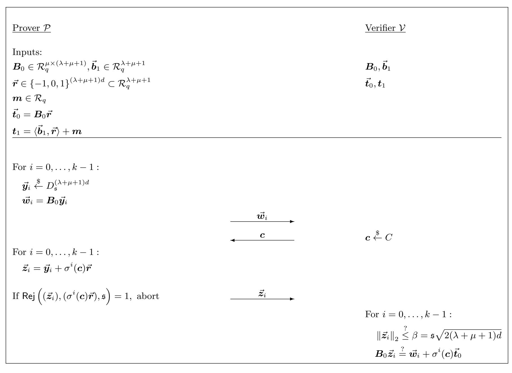
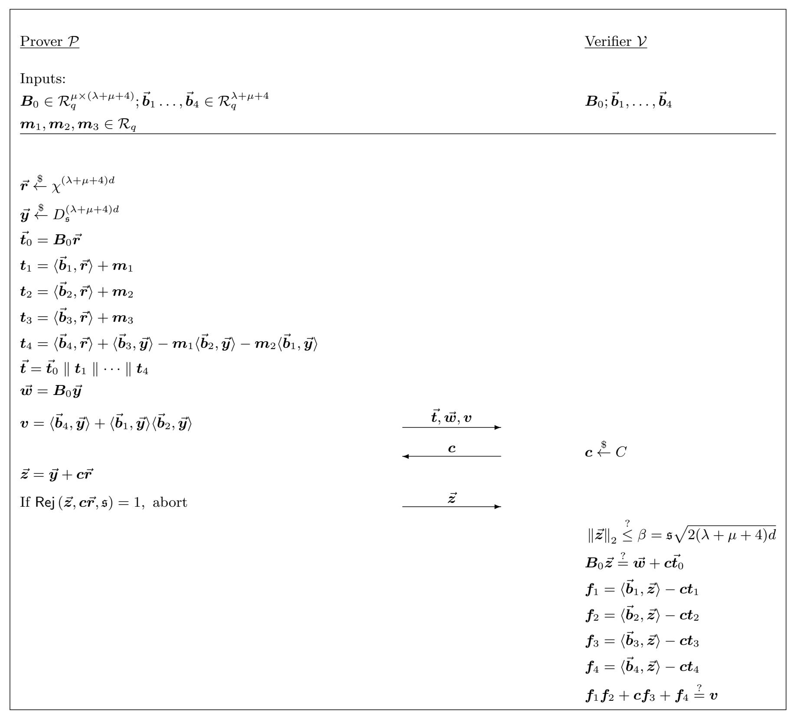

{0}------------------------------------------------

# Practical Product Proofs for Lattice Commitments?

Thomas Attema1,2,<sup>3</sup> , Vadim Lyubashevsky<sup>4</sup> , and Gregor Seiler4,<sup>5</sup>

- <sup>1</sup> CWI Amsterdam, The Netherlands
- <sup>2</sup> Leiden University, The Netherlands
- <sup>3</sup> TNO The Hague, The Netherlands
- 4 IBM Research – Zurich, Switzerland <sup>5</sup> ETH Zurich, Switzerland

Abstract. We construct a practical lattice-based zero-knowledge argument for proving multiplicative relations between committed values. The underlying commitment scheme that we use is the currently most efficient one of Baum et al. (SCN 2018), and the size of our multiplicative proof (9KB) is only slightly larger than the 7KB required for just proving knowledge of the committed values. We additionally expand on the work of Lyubashevsky and Seiler (Eurocrypt 2018) by showing that the above-mentioned result can also apply when working over rings Zq[X]/(X <sup>d</sup> + 1) where X <sup>d</sup> + 1 splits into low-degree factors, which is a desirable property for many applications (e.g. range proofs, multiplications over Zq) that take advantage of packing multiple integers into the NTT coefficients of the committed polynomial.

## 1 Introduction

Commitment schemes, and their associated zero-knowledge proofs of knowledge (ZKPoK) of committed messages, from an important ingredient in the construction of generalized zero-knowledge proofs and advanced cryptographic primitives. An additional feature that's often desirable is being able to prove algebraic relationships among committed values. Very efficient constructions of such primitives exist based on the discrete logarithm problem (e.g. [\[8\]](#page-25-0)), but the state of affairs is rather different when it comes to quantum-safe assumptions, with the main difficulty being proving multiplicative relations.

There exist generic PCP-type proof techniques [\[20,](#page-26-0) [28,](#page-26-1) [3,](#page-25-1) [4\]](#page-25-2), which even have asymptotically logarithmicsize proofs, but these proofs have a fixed cost of outputting paths to a Merkle tree in the range of 100−200KB. One could also think about using fully-homomorphic encryption, which would allow the verifier himself to create additive and multiplicative relations of his choice, thus foregoing the need for a zero-knowledge proof. The main issue with this approach is that one would need to prove that the initial ciphertexts are well-formed, and these proofs are also currently on the order of a few hundred kilobytes (either using generic techniques or lattice-based proofs [\[6,](#page-25-3) [31\]](#page-26-2)). There have also been some early lattice-based approaches proposed for this type of problem (e.g. [\[5,](#page-25-4) [22\]](#page-26-3)), but they result in proofs that are orders of magnitude longer.

### 1.1 Results Overview and Related Work.

The starting point of recent lattice-based constructions that implicitly construct a multiplicative proof system (c.f. [\[15,](#page-25-5) [6,](#page-25-3) [31,](#page-26-2) [14,](#page-25-6) [16\]](#page-25-7)) is the commitment scheme from [\[2\]](#page-25-8), which has a ZK proof that is fairly efficient for proving linear relations among committed polynomials over the ring R<sup>q</sup> = Zq[X]/(X<sup>d</sup> + 1), where q is prime. All of the aforementioned schemes require that the challenge set in the zero-knowledge proof is such that all pairwise differences of elements are invertible. This restriction imposes a constraint on the underlying R<sup>q</sup> (via e.g. [\[27\]](#page-26-4)) that the polynomial X<sup>d</sup> + 1 does not split into many factors. One of the improvements in the current work is the removal of this restriction (we will explain the significance of this below).

Another important improvement in our proofs is of a more technical nature. The prior aforementioned multiplicative proofs create a polynomial function of degree δ whose coefficients include the relation we

<sup>?</sup> This research was supported by the SNSF ERC starting transfer grant FELICITY and the EU H2020 project No 780701 (PROMETHEUS).

{1}------------------------------------------------

want to be 0 in the  $\delta$ -degree term. The goal of the proof is to show by the Schwartz-Zippel lemma that the polynomial is actually of degree  $\delta - 1$  and so the highest-order coefficient is indeed 0. Prior works performed this proof by sending masked openings of the committed polynomials and committing to the lower-degree terms of the  $\delta$ -degree polynomial function (c.f. [15, 6, 31, 14, 16]). In our work we show additional properties of the ZK proof in [2] that imply that it is not necessary to send the masked message openings.

Our construction is very efficient, with the communication complexity of our multiplicative proof being essentially the same as that in [2] for just proving knowledge of the message. Furthermore, removing the restriction that  $X^d + 1$  splits into a few high-degree factors is additionally useful because having  $X^d + 1$  split into distinct linear (or very low-degree) factors allows one to commit to (and independently operate on) many elements in  $\mathbb{Z}_q$  by packing them into the NTT coefficients of the committed message. One particular example where this is handy is range proofs where we commit to a number written in binary and want to prove that it is in the range  $[0, 2^j)$ . We sketch the (folklore) idea below:

Proving that a vector  $\vec{v} = v_0 v_1 \dots v_{d-1} \in \{0,1\}^d$  is binary and the integer represented by it is less than  $2^j$  is equivalent to the statement

<span id="page-1-0"></span>
$$\begin{bmatrix} v_0 \\ \cdots \\ v_{j-1} \\ v_j \\ \cdots \\ v_{d-1} \end{bmatrix} \circ \begin{bmatrix} 1 - v_0 \\ \cdots \\ 1 - v_{j-1} \\ v_j \\ \cdots \\ v_{d-1} \end{bmatrix} = 0 \bmod q, \tag{1}$$

where  $\circ$  is the component-wise product. Thus if we create a commitment to  $\vec{v}$  by putting the coefficients of  $\vec{v}$  into the NTT coefficients of some polynomial m and can create the polynomial m' corresponding to the right multiplicand in (1), then the proof that mm' = 0 would be exactly the range proof we would like since multiplication of NTT slots is component-wise.

Note that the number of NTT slots is the logarithm of the largest integer that can be committed to. As an example, using our multiplicative proofs, range proofs for 32-bit numbers are approximately 5.9KB in size (see Section 5.3). This is about an order of magnitude longer than the discrete logarithm based proofs (c.f. [8, Table 2]), but is shorter than any quantum-safe proof system (e.g. [4, 19, 14, 16]). In particular, the proofs implicit in [14, Protocol 2] and [16, Section 1.3] used a similar approach of putting elements into NTT coefficients, and had 32-bit proof sizes of around 9KB [30]. For such range proofs, one only needs to commit to a few polynomials, and so the advantage of our proof system which saves on not sending masked polynomials doesn't manifest itself too much. On the other hand, when applied in the context of proofs of knowledge of a polynomial vector  $\vec{s}$  with 2048 small (integer) coefficients satisfying  $A\vec{s} = \vec{t}$ , our proof technique combined with the additional techniques in [13] result in an order of magnitude reduction in proof size over [6, 31].

It should be pointed out that the proofs in [8, 4] grow logarithmically in the number of instances, while our proof grows linearly. The results of the current work are thus best suited for non-batched use cases where one wishes to prove knowledge about single instances over  $\mathcal{R}_q$  (which actually could be up to d instances over  $\mathbb{Z}_q$  when taking advantage of NTT packing.)

#### 1.2 Techniques.

We will now provide a somewhat technical overview of the main results of the paper. Prior to getting into them, we recall the commitment scheme of [2] and its zero-knowledge proof.

Overview of [2]. The scheme of [2] commits to a message vector  $\vec{m} \in \mathcal{R}_q^k$  by choosing a vector  $\vec{r}$  with small coefficients and then outputting the commitment

<span id="page-1-2"></span><span id="page-1-1"></span>
$$\boldsymbol{B}_0 \vec{\boldsymbol{r}} = \vec{\boldsymbol{t}}_0 \tag{2}$$

$$\boldsymbol{B}_1 \vec{\boldsymbol{r}} + \vec{\boldsymbol{m}} = \vec{\boldsymbol{t}}_1. \tag{3}$$

{2}------------------------------------------------

The intuition is that if the opening proof can show that  $\vec{r}$  is short, then (2) binds the committer to the short  $\vec{r}$  (based on the hardness of the SIS problem), and then the message is uniquely determined from (3). Unfortunately, there do not exist very efficient proofs allowing a prover to prove knowledge of such a short  $\vec{r}$  satisfying (2), but one can instead give a rather efficient ZKPoK of a vector  $\vec{z}$  with coefficients somewhat larger than those of  $\vec{r}$ , and a polynomial  $\vec{c}$  with very small coefficients satisfying

<span id="page-2-0"></span>
$$\boldsymbol{B}_0 \bar{\vec{z}} = \bar{c} \vec{t_0}. \tag{4}$$

The proof is a  $\Sigma$ -protocol where the prover picks a small-coefficient masking vector  $\vec{y}$  and sends  $\vec{w} = \vec{B}_0 \vec{y}$  to the verifier in the first step. The verifier then selects a challenge polynomial c from the challenge set (which should consist of polynomials with very small coefficients), and the prover responds with  $\vec{z} = \vec{y} + c\vec{r}$ . Using standard rejection sampling techniques [23, 24], the prover can make the vector  $\vec{z}$  independent of  $\vec{r}$  to preserve zero-knowledge. The verifier checks that  $B_0\vec{z} = \vec{w} + c\vec{t}_0$  and that  $\vec{z}$  has small coefficients. If both of these are satisfied (and c comes from a large-enough domain), then a standard rewinding (where the extractor sends a fresh c' and receives another valid  $\vec{z}'$ ) allows the extractor to obtain  $\vec{z} = \vec{z} - \vec{z}'$  and  $\vec{c} = c - c'$  satisfying (4).

Combining this with the proof that, unless SIS is easy, there can only be a unique opening  $(\bar{z}, \vec{m}, \bar{c})$  where  $\bar{c}$  is invertible in  $\mathcal{R}_q$  satisfying (4) and

$$\boldsymbol{B}_{1}\bar{\boldsymbol{z}} + \boldsymbol{m}\bar{\boldsymbol{c}} = \bar{\boldsymbol{c}}\boldsymbol{t}_{1},\tag{5}$$

it implies that the ZKPoK of (4) uniquely determines  $\vec{m}$ . It is furthermore shown in [2] (also see [11]) that one can prove that a commitment is to some  $\vec{m}$  satisfying  $U\vec{m} = \vec{v}$ , where U and  $\vec{v}$  are an arbitrary public matrix and vector over  $\mathcal{R}_q$ . Interestingly, this latter proof does not require any extra communication over the basic opening proof, and both the proof and commitment are comfortably under 10KB for some simple lattice relations (see Table 2 of [2]).

**Distribution of the NTT Coefficients.** To show that  $\bar{c}$  is invertible, it was proposed in [2] to set the modulus q to a prime such that the polynomial  $X^d + 1$  does not split too much modulo q – then by the result in [27], it would imply that all elements in the ring with small coefficients are invertible.

In the current paper we show that one no longer needs such a restriction on q. In particular, the prime q can be chosen to allow  $X^d + 1$  to fully split into d linear factors. The observation is that we do not need  $\bar{c}$  to always be invertible – it suffices to be able to compute the min-entropy of c modulo each NTT coefficient.

An element in  $\mathcal{R}_q$  is invertible if and only if all of its NTT coefficients are non-zero. To show that  $\bar{c} = c - c'$  is invertible, it would therefore suffice to show that the probability that a random c from the challenge set hits a particular NTT coefficient is smaller than the targeted soundness error. If c were uniformly random in  $\mathcal{R}_q$ , then this probability would be easy to calculate as each of its NTT coefficients has a 1/q probability of being any element in  $\mathbb{Z}_q$ . But c is chosen from a challenge set that has small coefficients and so the distribution of its NTT coefficients requires different techniques to compute.

As an example, suppose that  $X^d + 1 = \prod_{i=1}^d (X - r_i) \mod q$  and that we choose an element  $\mathbf{c} = \sum_{j=0}^{d-1} c_i X^i$  from  $\mathbb{Z}_q[X]/(X^d + 1)$  where  $c_i \leftarrow \{-1, 0, 1\}$  with equal probability. Then

$$\Pr[\boldsymbol{c} \text{ is invertible}] = \Pr[\boldsymbol{c}(r_1) \neq 0 \wedge \ldots \wedge \boldsymbol{c}(r_d) \neq 0].$$

Observe that for any r, c(r) can be written as

$$\sum_{j=0}^{d-1} c_j r^j = c_0 + r \left( c_1 + r \left( c_2 + \ldots + r \left( c_{d-2} + r c_{d-1} \right) \right) \ldots \right),$$

<span id="page-2-1"></span><sup>&</sup>lt;sup>6</sup> We can always amplify the soundness by repetition.

{3}------------------------------------------------

and so the distribution of c(r) is equivalent to the distribution of the random variable  $Y_0$  in the stochastic process  $(Y_d, Y_{d-1}, Y_{d-2}, \dots, Y_0)$  where  $Y_d = 0$  and  $Y_i = c_i + rY_{i+1}$  for i < d. Fourier analysis is often a useful technique for analyzing certain properties (e.g. min entropy, mixing time, etc.) of stochastic processes, and we show how to efficiently calculate  $\max_{y \in \mathbb{Z}_q} [Y_0 = y]$ . Calculating the exact probability (or putting a very good bound on it) would require computing sums consisting of q terms, which may be prohibitive when q is on the order of billions, so we furthermore show how certain algebraic symmetries allow us to significantly speed up the computation.

<span id="page-3-3"></span>In our applications, we will actually be more interested in a more general case of proving that for a factorization

$$X^{d} + 1 = \prod_{i=1}^{d/k} (X^{k} - r_{i}), \text{ for } r_{i} \in \mathbb{Z}_{q},$$
 (6)

the value  $\mathbf{c} \mod (X^k - r_i)$  is not concentrated on any particular polynomial  $c'_0 + c'_1 X + \ldots + c'_{k-1} X^{k-1}$ . But proving this is a simple extension of the above case where we were computing  $\mathbf{c}(r) = \mathbf{c} \mod (X - r)$  because each of the k coefficients  $c'_i X^i$  of  $c \mod X^k - r_i$  is only dependent on the coefficients  $c_{jk+i}$  for  $0 \le j < d/k$  (i.e. the k coefficients are mutually independent). So the distribution of  $c'_i$  has the distribution of the same stochastic process as above, except it consists of d/k steps rather than d.

**Proofs of Multiplicative Relations.** We now sketch some of the new ingredients of our main result – being able to prove multiplicative relations among committed messages in the commitment scheme defined by (2) and (3). In its most basic form, this involves proving that  $\mathbf{m}_1 \mathbf{m}_2 = \mathbf{m}_3$ , where  $\mathbf{m} = \begin{bmatrix} \mathbf{m}_1 & \mathbf{m}_2 & \mathbf{m}_3 \end{bmatrix}^T$ .

We first make a series of observations that show that one can extract more than just (4) from the prover that produces valid transcripts  $(\vec{w}, c, \vec{z})$  following the protocol of [2]. If we assume, for the moment, that  $\bar{c}$  is invertible, then the extractor can extract a unique  $\vec{r} = \bar{z}/\bar{c}$ , not necessarily with small coefficients, satisfying

$$B\vec{r} = \vec{t}. \tag{7}$$

<span id="page-3-1"></span>The reason for the uniqueness is that for any small-norm  $(\bar{\vec{z}}_1, \bar{c}_1), (\bar{\vec{z}}_2, \bar{c}_2)$  satisfying

$$B\bar{\vec{z}}_1 = \bar{c}_1 \vec{t}$$
  $B\bar{\vec{z}}_2 = \bar{c}_2 \vec{t},$  (8)

if  $\bar{z}_1/\bar{c}_1 \neq \bar{z}_2/\bar{c}_2$ , then (4) implies that

$$\boldsymbol{B}\left(\bar{\boldsymbol{c}}_{2}\bar{\bar{\boldsymbol{z}}}_{1}-\bar{\boldsymbol{c}}_{1}\bar{\bar{\boldsymbol{z}}}_{2}\right)=0. \tag{9}$$

where the vector being multiplied by  $\mathbf{B}$  has small coefficients. By the assumption, this vector in additionally non-zero, and so it's a solution to SIS. The next observation (see Section 4) crucial for keeping our product proof short is that as soon as the (successful) Prover sends  $\vec{w}$ , he has also committed to a  $\vec{y}$  satisfying  $\mathbf{B}\vec{y} = \vec{w}$ . Furthermore, for a challenge  $\mathbf{c}$ , his response  $\vec{z}$  will always be

$$\vec{z} = \vec{y} + c\vec{r}.\tag{10}$$

<span id="page-3-2"></span>This is important because of how the product proof works. In previous protocols the prover sends masked openings

$$f_i = a_i + x m_i$$

of the messages with challenge x, sometimes equal to c, and independently uniformly random maskings  $a_i$ . Our core approach entails that the message maskings  $a_i$  are derived from the randomness masking  $\vec{y}$ . Hence,

<span id="page-3-0"></span><sup>&</sup>lt;sup>7</sup> In [9], the same techniques were used to show that the statistical distance of Ring-LWE errors is statistically-close to uniform modulo the NTT coefficients. The slight differences are in the distribution of the original polynomial (for our application, it only makes sense to consider polynomials whose coefficients have various distributions over  $\{-1,0,1\}$ ) and that we do not need statistical closeness for our application, and obtain tight bounds for a different quantity. We provide more details in Section 3.

{4}------------------------------------------------

since the prover is committed to  $\vec{y}$ , they are also committed to the  $a_i$ . Furthermore, the prover doesn't send the  $f_i$  but instead they can be computed by the verifier. We relegate the details to Section 5.

After we have established masked openings  $f_i$  with fixed maskings  $a_i$ , we proceed as in previous works. One makes the observation that one can write

$$f_1 f_2 - x f_3 = x^2 (m_1 m_2 - m_3) + x (a_1 m_2 + a_2 m_1 - a_3) + a_1 a_2,$$
 (11)

After additionally committing to the "garbage terms"  $a_1m_2 + a_2m_1 - a_3$  and  $a_1a_2$ , the prover proceeds to show that the above equation is linear in x, which means that the  $m_1m_2 - m_3$  term is 0.

An almost immediate consequence of our work would therefore result in a significant reduction of the proofs of [6, 31]. We do not discuss this direction further, because with additional techniques, it is shown in [13] how one can use the full product proof of commitments from the current paper to produce an even shorter proof. For this application (and others) we would need to consider the case where  $X^d + 1$  fully splits into linear terms in  $\mathcal{R}_q$ , and therefore we can no longer assume that  $\bar{c}$  is invertible. So we continue to describe the ingredients needed here.

If  $\bar{c}$  is not invertible, then some NTT coefficient of  $\bar{c}$  is 0. In this case we would need to run the protocol in parallel to obtain extractions  $(\bar{c}_1, \bar{z}_1), \ldots, (\bar{c}_\ell, \bar{z}_\ell)$  such that for every NTT coefficient, some  $\bar{c}_i$  in non-zero in that NTT coefficient. In this case, we can again prove that a valid prover knows a unique  $\vec{r}^*$  satisfying (7), and every  $\vec{w}$  is similarly a commitment to a  $\vec{y}^*$  satisfying (10). One could obtain such  $\bar{c}_i$  by sending several challenges in parallel, but for technical reasons (described in Section 5) having the challenges  $c_i$  related via specific algebraic particular automorphism operations results in smaller proofs. We now explain how the automorphisms are chosen.

When  $X^d+1$  splits into linear terms, one can also write  $X^d+1$  as in (6) where the multiplicative terms  $X^k-r_i$  are not irreducible. In particular, we would like to consider such a factorization where  $q^k\approx 2^{128}$  to have approximately 128 bits of soundness in the protocol. Then using the results on the distribution of  $\boldsymbol{c} \mod X^k-r_i$ , we obtain that except with  $2^{-128}$  probability, two  $\boldsymbol{c},\boldsymbol{c}'$  will not be equivalent modulo  $X^k-r_i$ . Since  $X^k-r_i$  can be further factored as  $X^k-r_i=\prod_{j=1}^k(X-r_j)$ , this directly implies that one of these NTT coefficients will be distinct – in particular ( $\boldsymbol{c}\neq\boldsymbol{c}' \mod X-r_j$ ) for some j. Then we define the automorphisms to be exactly those that cycle through the NTT coefficients represented by  $X-r_j$ , for j=1 to k, and therefore for every NTT coefficient, one of the k automorphisms will result in  $\bar{\boldsymbol{c}}$  being non-zero there.

The combination of these techniques, along with several key optimizations that minimize the number of necessary "garbage terms", results in a proof (described in Section 5) that is only two kilobytes longer (see Section 5.3) than just the opening proof in [2]. Furthermore, if one would like to prove many multiplicative relations, the size of the proof even further approaches the size of the proof from [2] because the extra elements needed in the proof amortize over all the proofs.

#### 2 Preliminaries

#### 2.1 Notation

As is often the case in ring-based lattice cryptography, computation will be performed in the ring  $\mathcal{R}_q = \mathbb{Z}_q[X]/(X^d+1)$ , which is the quotient ring of the ring of integers  $\mathcal{R}$  of the power-of-two 2*d*-th cyclotomic number field modulo a rational prime  $q \in \mathbb{Z}$ .

We use bold letters f for polynomials in  $\mathcal{R}$  or  $\mathcal{R}_q$ , arrows for integer vectors  $\vec{v}$  over  $\mathbb{Z}_q$ , bold letters with arrows  $\vec{b}$  for vectors of polynomials over  $\mathcal{R}$  or  $\mathcal{R}_q$  and capital letters A and A for integer and polynomial matrices, respectively. We write  $x \overset{\$}{\leftarrow} S$  when  $x \in S$  is sampled uniformly at random from the set S and similarly  $x \overset{\$}{\leftarrow} D$  when x is sampled according to the distribution D.

For  $f, g \in \mathcal{R}$ , we have the coefficient norm

$$\|\boldsymbol{f}\|_2 = \left(\sum_{i=1}^n |f_i|^2\right)^{\frac{1}{2}}.$$

{5}------------------------------------------------

The norm is extended to vectors  $\vec{\boldsymbol{v}} = (\boldsymbol{v}_1, \dots, \boldsymbol{v}_k)$  of polynomials in the natural way,

$$\left\lVert \vec{\boldsymbol{v}} \right\rVert_2 = \left( \sum_{i=1}^k \left\lVert \boldsymbol{v}_i \right\rVert_2^2 \right)^{\frac{1}{2}}.$$

### 2.2 Prime Splitting and Galois Automorphisms

Let l be a power of two dividing d and suppose  $q-1 \equiv 2l \pmod{4l}$ . Then,  $\mathbb{Z}_q$  contains primitive 2l-th roots of unity but no elements with order a higher power of two, and the polynomial  $X^d+1$  factors into l irreducible binomials  $X^{d/l}-\zeta$  modulo q where  $\zeta$  runs over the 2l-th roots of unity in  $\mathbb{Z}_q$  [27, Theorem 2.3].

The ring  $\mathcal{R}_q$  has a group of automorphisms  $\mathsf{Aut}(\mathcal{R}_q)$  that is isomorphic to  $\mathbb{Z}_{2d}^{\times}$ ,

$$i \mapsto \sigma_i \colon \mathbb{Z}_{2d}^{\times} \to \operatorname{Aut}(\mathcal{R}_q),$$

where  $\sigma_i$  is defined by  $\sigma_i(X) = X^i$ . In fact, these automorphisms come from the Galois automorphisms of the 2d-th cyclotomic number field which factor through  $\mathcal{R}_q$ .

The group  $\operatorname{\mathsf{Aut}}(\mathcal{R}_q)$  acts transitively on the prime ideals  $(X^{d/l} - \zeta)$  in  $\mathcal{R}_q$  and every  $\sigma_i$  factors through field isomorphisms

$$\mathcal{R}_q/(X^{d/l}-\zeta) \to \mathcal{R}_q/(\sigma^i(X^{d/l}-\zeta)).$$

Concretely, for  $i \in \mathbb{Z}_{2d}^{\times}$  it holds that

$$\sigma_i(X^{d/l} - \zeta) = (X^{id/l} - \zeta) = (X^{d/l} - \zeta^{i^{-1}})$$

To see this, observe that the roots of  $X^{d/l} - \zeta^{i^{-1}}$  (in an appropriate extension field of  $\mathbb{Z}_q$ ) are also roots of  $X^{id/l} - \zeta$ . Then, for  $f \in \mathcal{R}_q$ ,

$$\sigma_i\left(f \bmod (X^{d/l} - \zeta)\right) = \sigma_i(f) \bmod (X^{d/l} - \zeta^{i^{-1}}).$$

The cyclic subgroup  $\langle 2l+1 \rangle \subset \mathbb{Z}_{2d}^{\times}$  generated by 2l+1 has order d/l [27, Lemma 2.4] and stabilizes every prime ideal  $(X^{d/l} - \zeta)$  since  $\zeta$  has order 2l. The quotient group  $\mathbb{Z}_{2d}^{\times}/\langle 2l+1 \rangle$  has order l and hence acts simply transitively on the l prime ideals. Therefore, we can index the prime ideals by  $i \in \mathbb{Z}_{2d}^{\times}/\langle 2l+1 \rangle$  and write

$$(X^{d}+1) = \prod_{i \in \mathbb{Z}_{2d}^{\times}/\langle 2l+1\rangle} \left(X^{d/l} - \zeta^{i}\right)$$

Now, the product of the  $k \mid l$  prime ideals  $(X^{d/l} - \zeta^i)$  where i runs over  $\langle 2l/k + 1 \rangle / \langle 2l + 1 \rangle$  is given by the ideal  $(X^{kd/l} - \zeta^k)$ . So, we can partition the l prime ideals into l/k groups of k ideals each, and write

$$\left(X^d+1\right) = \prod_{j \in \mathbb{Z}_{2d}^{\times}/\langle 2l/k+1\rangle} \left(X^{kd/l} - \zeta^{jk}\right) = \prod_{j \in \mathbb{Z}_{2d}^{\times}/\langle 2l/k+1\rangle} \prod_{i \in \langle 2l/k+1\rangle/\langle 2l+1\rangle} \left(X^{\frac{d}{l}} - \zeta^{ij}\right).$$

Another way to write this, which we will use in our protocols, is to note that  $\mathbb{Z}_{2d}^{\times}/\langle 2l/k+1\rangle \cong \mathbb{Z}_{2l/k}^{\times}$  and the powers  $(2l/k+1)^i$  for  $i=0,\ldots,k-1$  form a complete set of representatives for  $\langle 2l/k+1\rangle/\langle 2l+1\rangle$ . So, if  $\sigma=\sigma_{2l/k+1}\in \operatorname{Aut}(\mathcal{R}_q)$ , then

$$(X^d + 1) = \prod_{j \in \mathbb{Z}_{2l/k}^{\times}} \prod_{i=0}^{k-1} \sigma^i \left( X^{\frac{d}{l}} - \zeta^j \right),$$

and the prime ideals are indexed by  $(i,j) \in I = \{0,\ldots,k-1\} \times \mathbb{Z}_{2l/k}^{\times}$ .

{6}------------------------------------------------

#### 2.3 Module SIS/LWE

We employ the computationally binding and computationally hiding commitment scheme from [2] in our protocols, and rely on the well-known Module-LWE (MLWE) and Module-SIS (MSIS) [29, 25, 26, 21] problems to prove the security of our constructions. Both problems are defined over a ring  $\mathcal{R}_q$  for a positive modulus  $q \in \mathbb{Z}^+$ .

**Definition 2.1** (MSIS<sub>n,m,\beta\_{SIS}</sub>). The goal in the Module-SIS problem with parameters n, m > 0 and  $0 < \beta_{SIS} < q$  is to find, for a given matrix  $\mathbf{A} \stackrel{\$}{\leftarrow} \mathcal{R}_q^{n \times m}$ ,  $\vec{\mathbf{x}} \in \mathcal{R}_q^m$  such that  $\mathbf{A}\vec{\mathbf{x}} = \vec{\mathbf{0}}$  over  $\mathcal{R}_q$  and  $0 < ||\vec{\mathbf{x}}||_2 \le \beta_{SIS}$ . We say that a PPT adversary  $\mathcal{A}$  has advantage  $\epsilon$  in solving MSIS<sub>n,m,\beta\_{SIS}</sub> if

$$\Pr\left[0 < \|\vec{\boldsymbol{x}}\|_{2} \leq \beta_{\text{SIS}} \land \boldsymbol{A}\vec{\boldsymbol{x}} = \vec{\boldsymbol{0}} \ over \, \mathcal{R}_{q} \,\middle|\, \boldsymbol{A} \stackrel{\$}{\leftarrow} \mathcal{R}_{q}^{n \times m}; \, \vec{\boldsymbol{x}} \leftarrow \mathcal{A}(\boldsymbol{A})\right] \geq \epsilon.$$

**Definition 2.2** (MLWE<sub>n,m,\chi\). In the Module-LWE problem with parameters n, m > 0 and an error distribution  $\chi$  over  $\mathcal{R}$ , the PPT adversary  $\mathcal{A}$  is asked to distinguish  $(\mathbf{A}, \mathbf{t}) \stackrel{\$}{\leftarrow} \mathcal{R}_q^{m \times n} \times \mathcal{R}_q^m$  from  $(\mathbf{A}, \mathbf{A}\mathbf{s} + \mathbf{e})$  for  $\mathbf{A} \stackrel{\$}{\leftarrow} \mathcal{R}_q^{m \times n}$ , a secret vector  $\mathbf{s} \stackrel{\$}{\leftarrow} \chi^n$  and error vector  $\mathbf{e} \stackrel{\$}{\leftarrow} \chi^m$ . We say that  $\mathcal{A}$  has advantage  $\epsilon$  in solving MLWE<sub>n,m,\chi\</sub> if</sub>

$$\left| \Pr \left[ b = 1 \, \middle| \, \boldsymbol{A} \stackrel{\$}{\leftarrow} \mathcal{R}_q^{m \times n}; \, \vec{\boldsymbol{s}} \stackrel{\$}{\leftarrow} \chi^n; \, \vec{\boldsymbol{e}} \stackrel{\$}{\leftarrow} \chi^m; \, b \leftarrow \mathcal{A}(\boldsymbol{A}, \boldsymbol{A}\vec{\boldsymbol{s}} + \vec{\boldsymbol{e}}) \right] \right.$$

$$\left. - \Pr \left[ b = 1 \, \middle| \, \boldsymbol{A} \stackrel{\$}{\leftarrow} \mathcal{R}_q^{m \times n}; \, \vec{\boldsymbol{t}} \stackrel{\$}{\leftarrow} \mathcal{R}_q^m; \, b \leftarrow \mathcal{A}(\boldsymbol{A}, \vec{\boldsymbol{t}}) \right] \right| \ge \epsilon.$$

$$(12)$$

For our practical security estimations of these two problems against known attacks, the parameter m in both of the problems does not play a crucial role. Therefore, we sometimes simply omit m and use the notations  $\mathsf{MSIS}_{n,B}$  and  $\mathsf{MLWE}_{n,\chi}$ . The parameters  $\kappa$  and  $\lambda$  denote the module ranks for MSIS and MLWE, respectively.

#### 2.4 Error Distribution, Discrete Gaussians and Rejection Sampling

For sampling randomness in the commitment scheme that we use, and to define the particular variant of the Module-LWE problem that we use, we need to specify the error distribution  $\chi^d$  on  $\mathcal{R}$ . In general any of the standard choices in the literature is fine. So, for example,  $\chi$  can be a narrow discrete Gaussian distribution or the uniform distribution on a small interval. In the numerical examples in Section 5.3 we assume that  $\chi$  is the computationally simple centered binomial distribution on  $\{-1,0,1\}$  where  $\pm 1$  both have probability 5/16 and 0 has probability 6/16. This distribution is chosen (rather than the more "natural" uniform one) because it is easy to sample given a random bitstring by computing  $a_1 + a_2 - b_1 - b_2 \mod 3$  with uniformly random bits  $a_i, b_i$ .

Rejection Sampling. In our zero-knowledge proof, the prover will want to output a vector  $\vec{z}$  whose distribution should be independent of a secret randomness vector  $\vec{r}$ , so that  $\vec{z}$  cannot be used to gain any information on the prover's secret. During the protocol, the prover computes  $\vec{z} = \vec{y} + c\vec{r}$  where  $\vec{r}$  is the randomness used to commit to the prover's secret,  $c \leftarrow C$  is a challenge polynomial, and  $\vec{y}$  is a "masking" vector. To remove the dependency of  $\vec{z}$  on  $\vec{r}$ , we use the rejection sampling technique by Lyubashevsky [23, 24]. In the two variants of this technique the masking vector is either sampled uniformly from some bounded region or using a discrete Gaussian distribution. In the high dimensions we will encounter, the Gaussian variant is far superior as it gives acceptable rejection probabilities for much narrower distributions. We first define the discrete Gaussian distribution and then state the rejection sampling algorithm in Figure 1, which plays a central role in Lemma 2.4.

**Definition 2.3.** The discrete Gaussian distribution on  $\mathcal{R}^{\ell}$  centered around  $\vec{v} \in \mathcal{R}^{\ell}$  with standard deviation  $\mathfrak{s} > 0$  is given by

$$D_{\boldsymbol{v},\mathfrak{s}}^{\ell d}(\vec{\boldsymbol{z}}) = \frac{e^{-\|\vec{\boldsymbol{z}} - \vec{\boldsymbol{v}}\|_2^2/2\mathfrak{s}^2}}{\sum_{\vec{\boldsymbol{z}}' \in \mathcal{R}^{\ell}} e^{-\|\vec{\boldsymbol{z}}'\|_2^2/2\mathfrak{s}^2}}.$$

{7}------------------------------------------------

When it is centered around  $\vec{\mathbf{0}} \in \mathcal{R}^{\ell}$  we write  $D_{\mathfrak{s}}^{\ell d} = D_{\vec{\mathbf{0}},\mathfrak{s}}^{\ell d}$ 

<span id="page-7-1"></span>**Lemma 2.4 (Rejection Sampling).** Let  $V \subseteq \mathcal{R}^{\ell}$  be a set of polynomials with norm at most T and  $\rho \colon V \to [0,1]$  be a probability distribution. Also, write  $\mathfrak{s} = 11T$  and M = 3. Now, sample  $\vec{\boldsymbol{v}} \stackrel{\$}{\leftarrow} \rho$  and  $\vec{\boldsymbol{y}} \stackrel{\$}{\leftarrow} D_{\mathfrak{s}}^{\ell d}$ , set  $\vec{\boldsymbol{z}} = \vec{\boldsymbol{y}} + \vec{\boldsymbol{v}}$ , and run  $b \leftarrow \text{Rej}(\vec{\boldsymbol{z}}, \vec{\boldsymbol{v}}, \mathfrak{s})$  Then, the probability that b = 0 is at least  $(1 - 2^{-100})/M$  and the distribution of  $(\vec{\boldsymbol{v}}, \vec{\boldsymbol{z}})$ , conditioned on b = 0, is within statistical distance of  $2^{-100}/M$  of the product distribution  $\rho \times D_{\mathfrak{s}}^{\ell d}$ .

```
\frac{\text{Rej}(\vec{z}, \vec{v}, \mathfrak{s})}{01 \ u \overset{\$}{\leftarrow} [0, 1)}

02 If u > \frac{1}{M} \cdot \exp\left(\frac{-2\langle \vec{z}, \vec{v} \rangle + ||\vec{v}||^2}{2\mathfrak{s}^2}\right)
03 return 0
04 Else
05 return 1
```

Fig. 1. Rejection Sampling [24].

<span id="page-7-0"></span>We will also use the following tail bound, which follows from [1, Lemma 1.5(i)].

<span id="page-7-2"></span>**Lemma 2.5.** Let  $\vec{z} \stackrel{\$}{\leftarrow} D_{\mathfrak{s}}^{\ell d}$ . Then

$$\Pr\left[\|\vec{z}\|_{2} < \mathfrak{s}\sqrt{2\ell d}\right] > 1 - 2^{-\log(e/2)\ell d/2} > 1 - 2^{-\ell d/8}.$$

#### 2.5 Commitment Scheme

In our protocol, we use a variant of the commitment scheme from [2] which commits to a vector of messages in  $\mathcal{R}_q$ . Our basic proof of knowledge of multiplicative relations will prove that  $\mathbf{m}_1\mathbf{m}_2 = \mathbf{m}_3$ , so for simplicity, we just describe the commitment scheme for three messages.

The public parameters are a uniformly random matrix  $\boldsymbol{B}_0 \in \mathcal{R}_q^{\mu \times (\lambda + \mu + 3)}$  and uniform vectors  $\vec{\boldsymbol{b}}_1, \dots, \vec{\boldsymbol{b}}_3 \in \mathcal{R}_q^{\lambda + \mu + 3}$ . To commit to  $\vec{\boldsymbol{m}} = (\boldsymbol{m}_1, \boldsymbol{m}_2, \boldsymbol{m}_3)^T \in \mathcal{R}_q^3$ , we choose a random short polynomial vector  $\vec{\boldsymbol{r}} \stackrel{\$}{\leftarrow} \chi^{(\lambda + \mu + 3)d}$  from the error distribution and output the commitment

$$\begin{aligned} \vec{\bm{t}}_0 &= \bm{B}_0 \vec{\bm{r}}, \ \bm{t}_1 &= \langle \vec{\bm{b}}_1, \vec{\bm{r}} \rangle + \bm{m}_1, \ \bm{t}_2 &= \langle \vec{\bm{b}}_2, \vec{\bm{r}} \rangle + \bm{m}_2, \ \bm{t}_3 &= \langle \vec{\bm{b}}_3, \vec{\bm{r}} \rangle + \bm{m}_3. \end{aligned}$$

The commitment scheme is computationally hiding under the Module-LWE assumption and computationally binding under the Module-SIS assumption; see [2]. Moreover, the scheme is not only binding for the opening  $(\vec{r}, \vec{m})$  known by the prover, but also binding with respect to a relaxed opening  $(\bar{c}, \vec{r}*, \vec{m}*)$ . The relaxed opening also includes a short polynomial  $\bar{c}$ , the randomness vector  $\vec{r}*$  is longer than  $\vec{r}$ , and the following equations hold.

$$\begin{aligned} \bar{c}\bar{t}_0 &= \bm{B}_0\bm{\vec{r}}^*, \ \bar{c}\bm{t}_1 &= \langle \bm{b}_1, \bm{\vec{r}}^* \rangle + \bar{c}\bm{m}_1^*, \ \bar{c}\bm{t}_2 &= \langle \bm{b}_2, \bm{\vec{r}}^* \rangle + \bar{c}\bm{m}_2^*, \ \bar{c}\bm{t}_3 &= \langle \bm{b}_3, \bm{\vec{r}}^* \rangle + \bar{c}\bm{m}_3^*. \end{aligned}$$

{8}------------------------------------------------

The notion of relaxed opening is important since there is an efficient protocol for proving knowledge of a relaxed opening. We do not go into details here since we will define a new notion of a binding relaxed opening and provide a proof of knowledge protocol.

The utility of the commitment scheme for zero-knowledge proof systems stems from the fact that one can compute module homomorphisms on committed messages. For example, let  $a_1$  and  $a_2$  be from  $\mathcal{R}_q$ . Then

$$\bm{a}_1\bm{t}_1 + \bm{a}_2\bm{t}_2 = \langle \bm{a}_1\bm{\vec{b}}_1 + \bm{a}_2\bm{\vec{b}}_2, \bm{\vec{r}}\rangle + \bm{a}_1\bm{m}_1 + \bm{a}_2\bm{m}_2$$

is a commitment to the message  $a_1m_1 + a_2m_2$  with matrix  $a_1\vec{b}_1 + a_2\vec{b}_2$ . This module homomorphic property together with a proof that a commitment is a commitment to the zero polynomial allows to prove linear relations among committed messages over  $\mathcal{R}_q$ .

### <span id="page-8-0"></span>3 Distribution in the NTT

In this section we present a way to construct challenge sets  $C \subset \mathcal{R}_q$  so as to be able to compute the (almost exact) probability that c - c' is invertible in  $\mathcal{R}_q$ , when c and c' are sampled from some distribution C over C. Recall that  $d \geq l$  are powers of 2. Moreover,

$$\mathcal{R}_q = \mathbb{Z}_q[X]/(X^d + 1) \cong \prod_{i \in \mathbb{Z}_{2l}^{\times}} \mathbb{Z}_q[X]/(X^{d/l} - \zeta^i), \tag{13}$$

where  $\zeta \in \mathbb{Z}_q$  is a 2l-th root of unity (in this section, the factors  $X^{d/l} - \zeta^i$  are not necessarily irreducible as this doesn't really matter for the results here). The challenge set is defined as all degree d polynomials with coefficients in  $\{-1,0,1\}$ , i.e.,  $\mathcal{C} = \{-1,0,1\}^d \subset \mathcal{R}_q$ . The coefficients of a challenge  $\mathbf{c} \in \mathcal{C}$  are independently and identically distributed, where 0 has probability p and  $\pm 1$  both have probability (1-p)/2. For the resulting distribution over  $\mathcal{C}$  we write C, and sampling a challenge  $\mathbf{c}$  from this distribution is written as  $\mathbf{c} \leftarrow C$ .

In the remainder of this section we use Fourier analysis to study the distribution of  $c \mod X^{d/l} - \zeta^i$  for  $c \leftarrow C$  and  $i \in \mathbb{Z}_q^{\times}$ . Lemma 3.1 shows that this distribution does not depend on i.

In [9] a similar analysis is performed. The main differences with our approach is that they sample the coefficients from a binomial distribution centered at 0. In particular, our coefficient distribution with p = 1/2 corresponds to a special case of the binomial distribution considered in [9]. For our application it makes sense to consider various distributions over  $\{-1,0,1\}$ . The binomial distribution does allow for the derivation of an elegant upper bound on the maximum probability of  $c \mod X^{d/l} - \zeta^i$ . However, this upper bound is only applicable when  $\sqrt{q} \leq 2d$ . For this reason we derive a less elegant but much tighter upper bound on various distributions over  $\{-1,0,1\}$ , that is also applicable when  $\sqrt{q} > 2d$ .

<span id="page-8-1"></span>**Lemma 3.1.** Let  $\mathbf{x} \in \mathcal{R}_q$  be a random polynomial with coefficients independently and identically distributed. Then  $\mathcal{R}_q/(X^{d/l}-\zeta^i)\cong \mathcal{R}_q/(X^{d/l}-\zeta^j)$ , and  $\mathbf{x} \bmod (X^{d/l}-\zeta^i)$  and  $\mathbf{x} \bmod (X^{d/l}-\zeta^j)$  are identically distributed for all  $i,j\in\mathbb{Z}_{2l}^{\times}$ .

*Proof.* First suppose that  $X^{d/l} - \zeta^i$  is irreducible for all  $i \in \mathbb{Z}_{2l}^{\times}$ . Then  $\mathfrak{q}_i = (q, X^{d/l} - \zeta^i)$  is prime in  $K = \mathbb{Q}[X]/(X^d+1)$  and for all  $i, j \in \mathbb{Z}_{2l}^{\times}$  there exists an automorphism  $\sigma \in \operatorname{Gal}(K/\mathbb{Q})$  such that  $\sigma(\mathfrak{q}_i) = \mathfrak{q}_j$ . Hence,  $\sigma$  induces an isomorphism between the finite fields  $\mathcal{R}_q/(X^{d/l} - \zeta^i)$  and  $\mathcal{R}_q/(X^{d/l} - \zeta^j)$ .

Since the coefficients of  $\boldsymbol{x}$  are i.i.d., it holds that  $\sigma(\boldsymbol{x})$  follows the same distribution over  $R_q$  as  $\boldsymbol{x}$ . Hence,  $\boldsymbol{x} \mod (X^{d/l} - \zeta^i)$  follows the same distribution as  $\sigma(\boldsymbol{x} \mod (X^{d/l} - \zeta^i)) = \sigma(\boldsymbol{x}) \mod (X^{d/l} - \zeta^j)$  and as  $\boldsymbol{x} \mod (X^{d/l} - \zeta^j)$  which proves the lemma for this case.

Now suppose that  $X^{d/l} - \zeta^i$  is reducible in  $\mathbb{Z}_q$ , then so is  $X^{d/l} - \zeta^j$ . Moreover, since K is Galois both these polynomials split in the same number irreducible factors and for every pair f(X), g(X) of irreducible factors there exists an automorphism  $\sigma \in \operatorname{Gal}(K/\mathbb{Q})$  such that  $\sigma((q, f(X))) = (q, g(X))$ . Using these automorphisms the lemma follows in an analogous manner.

{9}------------------------------------------------

Let us now consider the coefficients of the polynomial c mod (Xd/l−ζ) for c ← C. Clearly all coefficients follow the same distribution over Zq. Let us write Y for the random variable over Z<sup>q</sup> that follows this distribution. The following lemma gives an upper bound on the maximum probability of Y .

<span id="page-9-0"></span>Lemma 3.2. Let the random variable Y over Z<sup>q</sup> be defined as above. Then for all x ∈ Zq,

$$\Pr(Y = x) \le M := \frac{1}{q} + \frac{1}{q} \sum_{j \in \mathbb{Z}_q^{\times}} \prod_{k=0}^{l-1} |p + (1-p)\cos(2\pi j\zeta^k/q)|.$$
 (14)

Proof. From Fourier analysis (see, e.g., [\[12\]](#page-25-13)) we find that

$$P(x) := \Pr(Y = x),$$

$$= \frac{1}{q} + \frac{1}{q} \sum_{j \in \mathbb{Z}_q^{\times}} \widehat{P}(j) \exp\left(-2\pi i j x/q\right),$$
(15)

where <sup>P</sup><sup>b</sup> is the Fourier transform of <sup>P</sup> : <sup>Z</sup><sup>q</sup> <sup>→</sup> [0, 1]. Moreover, the probability distribution <sup>P</sup> is the convolution of the distributions <sup>µ</sup><sup>k</sup> (0 <sup>≤</sup> <sup>k</sup> <sup>≤</sup> <sup>l</sup> <sup>−</sup> 1) with corresponding Fourier transforms <sup>µ</sup>bk, where

$$\mu_k(0) = p, \quad \mu_k(\zeta^k) = \mu_k(-\zeta^k) = (1-p)/2,$$

$$\widehat{\mu}_k : \mathbb{Z}_q \to \mathbb{C}, \quad j \mapsto p + (1-p)\cos\left(2\pi j\zeta^k/q\right).$$
(16)

Hence, from Fourier theory, it follows that

$$\widehat{P}(j) = \prod_{k=0}^{l-1} \widehat{\mu}_k(j), \tag{17}$$

and therefore that

$$P(x) = \frac{1}{q} + \frac{1}{q} \sum_{j \in \mathbb{Z}_q^{\times}} \prod_{k=0}^{l-1} \widehat{\mu}_k(j) \exp(-2\pi i j x/q),$$
 (18)

Taking absolute values on both sides and applying the triangle inequality now proves the lemma.

The following lemma shows that, by utilizing certain algebraic symmetries, we can reduce the number of terms in the summation of Lemma [3.2](#page-9-0) by a factor 2l, thereby allowing the maximum probability to be computed more efficiently.

<span id="page-9-1"></span>Lemma 3.3. Let the random variable Y over Z<sup>q</sup> be defined as above. Then for all x ∈ Zq,

$$\Pr(Y = x) \le M := \frac{1}{q} + \frac{2l}{q} \sum_{j \in \mathbb{Z}_q^{\times}/\langle \zeta \rangle} \prod_{k=0}^{l-1} |p + (1-p)\cos(2\pi jy\zeta^k/q)|.$$
 (19)

Proof. Let a, b ∈ Z × q such that ab<sup>−</sup><sup>1</sup> ∈ hζi, i.e., a = bζ<sup>m</sup> for some m. Now note that {1, ζ, . . . , ζ<sup>l</sup>−<sup>1</sup>} = hζi/ ± 1 = ζ <sup>m</sup>hζi/ <sup>±</sup> 1 for all <sup>m</sup> <sup>∈</sup> <sup>Z</sup>. Since cos(x) is an even function it therefore follows that <sup>P</sup>b(a) = <sup>P</sup>b(b), from which the lemma immediately follows.

The random variable Y = Y<sup>l</sup> corresponds to a random walk of length l over Z<sup>q</sup> defined as follows

$$Y_0 = 0, \quad Y_n = \zeta Y_{n-1} + b_n, \tag{20}$$

{10}------------------------------------------------

where  $b_n$  are i.i.d. with distribution  $\mu(0) = p$  and  $\mu(1) = \mu(-1) = (1-p)/2$ . Random walks of this type have been studied extensively [10, 12, 18, 17, 7] and convergence is expected in time  $O(\log q/H_2(\mu))$  [7], where

$$H_2(\mu) := -\log\left(\sum_{x \in \mathbb{Z}_q} \mu(x)^2\right). \tag{21}$$

However, there exist random walks of this form for which convergence only occurs in time  $O(\log q \log \log q)$  [12, 17].

Let us consider the following example. Let q be the 32-bit prime  $4294962689 = \mod 1 \mod 512$  and  $d \mid 256$  the dimension of the ring  $\mathcal{R}$ . Then, for any d, q splits completely in  $\mathbb{Z}[X]/(X^d+1)$ , hence in this case l = d. Moreover, suppose that the coefficients of challenges are sampled from a uniform distribution over  $\{-1,0,1\}$ , i.e., p = 1/3. Table 1 shows a bound M on the maximum probability  $\max_{x \in \mathbb{Z}_q} |\Pr(Y = x)|$ , as defined in Lemma 3.2 and Lemma 3.3.

<span id="page-10-1"></span>**Table 1.** Maximum probability for the coefficients of challenges  $c \leftarrow C$  when reduced modulo  $(X-\zeta)$  (q = 4294962689 and p = 1/3).

| Dimension $d$ | 1     | 2     | 4     | 8     | 16     | 32     | 64                   |
|---------------|-------|-------|-------|-------|--------|--------|----------------------|
| $\log_2(M)$   | -1.06 | -2.13 | -4.25 | -8.50 | -17.01 | -31.69 | $\approx -\log_2(q)$ |

### <span id="page-10-0"></span>4 Opening Proof

Suppose the prover knows an opening to the commitment

$$\begin{aligned} \vec{\bm{t}}_0 &= \bm{B}_0 \vec{\bm{r}}, \ \bm{t}_1 &= \langle \vec{\bm{b}}_1, \vec{\bm{r}} \rangle + \bm{m}. \end{aligned}$$

The standard protocol for proving this, stemming from [2], works by giving an approximate proof for the first equation  $\vec{t}_0 = B_0 \vec{r}$ . So, the prover commits to a short masking vector  $\vec{y}$  from a discrete Gaussian distribution by sending  $\vec{w} = B_0 \vec{y}$ . Then the verifier sends a short challenge polynomial  $c \in \mathcal{C} \subset \mathcal{R}$  and the prover replies with the short vector  $\vec{z} = \vec{y} + c\vec{r}$ . Here rejection sampling is used to make the distribution of  $\vec{z}$  independent from  $\vec{r}$ . The verifier checks that  $\vec{z}$  is short, i.e.  $\|\vec{z}\|_2 \leq \beta$ , and the equation  $B_0 \vec{z} = \vec{w} + c\vec{t}_0$ .

For suitable instantiations this proves knowledge of a commitment opening because it is possible to extract two prover replies  $\vec{z}$  and  $\vec{z}'$  for two challenges c and c', respectively, and a message  $m^* \in \mathcal{R}_q$  such that

$$\begin{aligned} \bar{c}\bar{t}_0 &= \bm{B}_0(\bm{\vec{z}} - \bm{\vec{z}}'), \ \bar{c}\bm{t}_1 &= \langle\bm{\vec{b}}_1, \bm{\vec{z}} - \bm{\vec{z}}'\rangle + \bar{c}\bm{m}^*, \end{aligned}$$

where  $\bar{c} = c - c'$  is the difference of the challenges. In fact, it can be shown [2] that the commitment scheme is binding with respect to the message  $m^*$  under the Module-SIS assumption if we have the additional property that  $\bar{c}$  is invertible in the ring  $\mathcal{R}_q$ . Then, it must be that  $m^* = m$ , unless the prover knows a Module-SIS solution for  $B_0$ . The invertibility property is crucial in all previous works that study zero-knowledge proofs for the commitment scheme. It is enforced by choosing the set  $\mathcal{C}$  of challenges such that the difference of every two distinct elements is invertible. Unfortunately, depending on how much the prime q splits in the ring  $\mathcal{R}$ , there will not be sufficiently large sets with this property, and even less so large sets consisting of short polynomials. For instance, for both theoretical and practical reasons one often wants q to split completely, but then there can be at most q polynomials which are pairwise different modulo one of the degree 1 prime

{11}------------------------------------------------

divisors of q. Even if we let q split slightly less, say in degree 4 prime ideals, then we do not know of large sets of short polynomials that do not collide modulo one of the divisors. This severely restricts the soundness of the protocol and the protocol has to be repeated several times to boost soundness, which blows up the proof size. See [27] for more details about this problem.

The results from Section 3 present a way to construct larger challenge sets with the weaker property that  $\bar{c}$  is non-invertible only with negligible probability. We generalize the proof further and explain how it is possible to make use of challenge sets where the difference of two elements is non-invertible with non-negligible probability.

So, in the extraction, we drop the assumption that for a pair of accepting transcripts with different challenges c and c', the difference  $\bar{c} = c - c'$  is invertible. This essentially means that we can not uniquely interpolate the prover replies  $\vec{z}$  and  $\vec{z}'$ , and obtain vectors  $\vec{y}^*$  and  $\vec{r}^*$  such that

<span id="page-11-0"></span>
$$\vec{z} = \vec{y}^* + c\vec{r}^*$$
 and  $\vec{z}' = \vec{y}^* + c'\vec{r}^*$ . (22)

But we can restore the interpolation by piecing together several transcript pairs that we interpolate locally modulo the various prime ideals dividing q.

Let  $X^d + 1 \equiv \varphi_1 \dots \varphi_l \pmod{q}$  be the factorization of  $X^d + 1$  into irreducible polynomials modulo q. Thus, our ring  $\mathcal{R}_q$  is the product of the corresponding residue fields  $\kappa_i = \mathbb{Z}_q[X]/(\varphi_i)$ , i.e.

$$\mathcal{R}_q = \mathbb{Z}_q[X]/(X^d+1) = \mathbb{Z}_q[X]/(\varphi_1) \times \cdots \times \mathbb{Z}_q[X]/(\varphi_l).$$

Now, what is needed specifically is that for every i there is an accepting transcript pair with nonzero challenge difference  $\bar{c}$  modulo  $\varphi_i$ . So, concretely, suppose the extractor  $\mathcal{E}$  has obtained l pairs  $(\vec{z}_i, \vec{z}'_i)$ ,  $i = 1, \ldots, l$ , of replies from the prover  $\mathcal{P}$  for the challenge pairs  $(c_i, c'_i)$ , respectively, such that

$$\bar{\boldsymbol{c}}_i = \boldsymbol{c}_i - \boldsymbol{c}_i' \not\equiv 0 \pmod{\varphi_i}.$$

Some of the pairs can be equal and the extractor does not always need really need to compute l pairs as long as the above condition is true. We also assume that all transcripts contain the same prover commitment  $\vec{w}$  and are accepting; that is, in particular,  $B_0\vec{z}_i = \vec{w} + c_i\vec{t}_0$  and  $B_0\vec{z}_i' = \vec{w} + c_i'\vec{t}_0$  for all i. From this data  $\mathcal{E}$  computes the local interpolations

$$\vec{\boldsymbol{z}}_i \equiv \vec{\boldsymbol{y}}_i^* + \boldsymbol{c}_i \vec{\boldsymbol{r}}_i^* \quad \text{and} \quad \vec{\boldsymbol{z}}_i' \equiv \vec{\boldsymbol{y}}_i^* + \boldsymbol{c}_i' \vec{\boldsymbol{r}}_i^* \pmod{\boldsymbol{\varphi}_i}.$$

Concretely, we set

$$\begin{aligned} \vec{\bm{r}_i^*} &= \frac{\vec{\bm{z}_i - \vec{\bm{z}_i'}}}{\bar{\bm{c}_i}} \bm{\text{mod}} \ \bm{\varphi_i^*} &= \frac{\bm{c}_i \vec{\bm{z}_i'} - \bm{c}_i' \vec{\bm{z}_i}}{\bar{\bm{c}_i}} \bm{\text{mod}} \ \bm{\phi}_i. \end{aligned}$$

Now, let  $\vec{r}^*$  and  $\vec{y}^*$  over  $\mathcal{R}_q$  be the CRT lifting of the  $\vec{r}_i^*$  and  $\vec{y}_i^*$ . We show it must hold that

$$\vec{\boldsymbol{z}}_i = \vec{\boldsymbol{y}}^* + \boldsymbol{c}_i \vec{\boldsymbol{r}}^*$$
 and  $\vec{\boldsymbol{z}}_i' = \vec{\boldsymbol{y}}^* + \boldsymbol{c}_i' \vec{\boldsymbol{r}}^*$ 

for all i. This restores the global interpolations as in Equation 22. In fact, we show more than this. Namely, that in every accepting transcript with commitment  $\vec{w}$ , the prover reply must be precisely of the form in Equation 22. Also the vectors  $\vec{r}^*$  and  $\vec{y}^*$  are preimages of  $\vec{t}_0$  and  $\vec{w}$ , respectively, which is what we suspect. So the prover really is committed to  $\vec{r}^*$  and  $\vec{y}^*$  by  $\vec{t}_0$  and  $\vec{w}$ .

Lemma 4.1. If we have obtained l pairs of accepting transcripts with commitment  $\vec{w}$  as in the preceding paragraph, then every accepting transcript  $(\vec{w}, c, \vec{z})$  with commitment  $\vec{w}$  must be such that  $\vec{z} = \vec{y}^* + c\vec{r}^*$  where  $\vec{y}^*$  and  $\vec{r}^*$  are the vectors computed above independently from c, or we obtain an  $\mathsf{MSIS}_{\mu,8\kappa\beta}$  solution for  $B_0$  where  $\kappa$  is a bound on the  $\ell_1$ -norm of the challenges. Moreover, we have  $B_0\vec{r}^* = \vec{t}_0$  and  $B_0\vec{y}^* = \vec{w}$ .

{12}------------------------------------------------

*Proof.* Define  $\vec{y}^{*'}$  by  $\vec{z} = \vec{y}^{*'} + c\vec{r}^{*}$ . Fix some  $i \in \{1, ..., l\}$ . Since all transcripts are accepting we get from subtracting the verification equations,

$$\begin{aligned} \boldsymbol{B}_0(\vec{\boldsymbol{z}}_i-\vec{\boldsymbol{z}}_i') &= \bar{\boldsymbol{c}}_i \vec{\boldsymbol{t}}_0, \text{ and } \ \boldsymbol{B}_0(\vec{\boldsymbol{z}}-\vec{\boldsymbol{z}}_i) &= (\boldsymbol{c}-\boldsymbol{c}_i) \vec{\boldsymbol{t}}_0. \end{aligned}$$

Now, cross-multiplying by  $\bar{c}_i$  and  $c - c_i$  and subtracting shows that we either have an  $\mathsf{MSIS}_{\mu,8\kappa\beta}$  solution for  $B_0$ , or

$$\bar{\boldsymbol{c}}_i(\vec{\boldsymbol{z}}_i-\vec{\boldsymbol{z}}_i)=(\boldsymbol{c}-\boldsymbol{c}_i)(\vec{\boldsymbol{z}}_i-\vec{\boldsymbol{z}}_i').$$

Suppose the latter case is true. Then we reduce modulo  $\varphi_i$  and substitute the local expressions for  $\vec{z}$ ,  $\vec{z}_i$  and  $\vec{z}_i'$ , which shows

$$\bar{\boldsymbol{c}}_i(\vec{\boldsymbol{y}}^{*\prime} - \vec{\boldsymbol{y}}_i^* + (\boldsymbol{c} - \boldsymbol{c}_i)\vec{\boldsymbol{r}}_i^*) \equiv (\boldsymbol{c} - \boldsymbol{c}_i)\bar{\boldsymbol{c}}_i\vec{\boldsymbol{r}}_i^* \pmod{\varphi_i}$$

$$\Leftrightarrow \bar{\boldsymbol{c}}_i(\vec{\boldsymbol{y}}^{*\prime} - \vec{\boldsymbol{y}}_i^*) \equiv 0 \pmod{\varphi_i}.$$

Since  $\bar{c}_i \mod \varphi_i \neq 0$ ,  $\vec{y}^{*'} \equiv \vec{y}_i^* \equiv \vec{y}^* \mod \varphi_i$ . This holds for all i and hence it follows that  $\vec{y}^{*'} = \vec{y}^*$ .

We come to the statements  $B_0\vec{r}^* = \vec{t}_0$  and  $B_0\vec{y}^* = \vec{w}$ . From the construction of  $\vec{r}^*$  and the verification equations it follows that

$$\begin{aligned} \bm{B}_0 \bm{\vec{r}}^* &\equiv \bm{B}_0 \bm{\vec{r}}_i^* \ &\equiv \bm{B}_0 \frac{\bm{\vec{z}}_i - \bm{z}_i'}{\bar{c}_i} \ &\equiv \bm{\vec{t}}_0 \pmod{\bm{\varphi}_i} \end{aligned}$$

for all *i*. Similarly, for  $\vec{y}^*$ ,

$$\begin{aligned} \bm{B}_0 \bm{\vec{y}}_i^* &\equiv \bm{B}_0 \bm{\vec{y}}_i^* \ &\equiv \bm{B}_0 \frac{\bm{c}_i \bm{\vec{z}}_i' - \bm{c}_i' \bm{\vec{z}}_i}{\bar{\bm{c}}_i} \ &\equiv \bm{\vec{w}} \pmod{\bm{\varphi}_i}. \end{aligned}$$

The statements in the lemma follow from the Chinese remainder theorem.

Finally, the extracted vector  $\vec{r}^*$  can be used to define a binding notion of opening for the commitment scheme where the extracted message  $m^*$  is simply set to fulfill

$$\boldsymbol{t}_1 = \langle \vec{\boldsymbol{b}}_1, \vec{\boldsymbol{r}}^* \rangle + \boldsymbol{m}^*.$$

Then we have found an instance of the following definition.

**Definition 4.2.** A weak opening for the commitment  $\vec{t} = \vec{t}_0 \parallel t_1$  consists of l polynomials  $\bar{c}_i \in \mathcal{R}_q$ , a randomness vector  $\vec{r}^*$  over  $\mathcal{R}_q$  and a message  $m^* \in \mathcal{R}_q$  such that

$$\|\bar{\boldsymbol{c}}_i\|_1 \leq 2\kappa \ and \ \bar{\boldsymbol{c}}_i \bmod \boldsymbol{\varphi}_i \neq 0 \ for \ all \ 1 \leq i \leq l,$$
 $\|\bar{\boldsymbol{c}}_i \vec{\boldsymbol{r}}^*\|_2 \leq 2\beta \ for \ all \ 1 \leq i \leq l,$ 
 $\boldsymbol{B}_0 \vec{\boldsymbol{r}}^* = \vec{\boldsymbol{t}}_0,$ 
 $\langle \vec{\boldsymbol{b}}_1, \vec{\boldsymbol{r}}^* \rangle + \boldsymbol{m}^* = \boldsymbol{t}_1.$ 

It is easy to show that the commitment scheme is binding with respect to these weak openings.

**Lemma 4.3.** The commitment scheme is binding with respect to weak openings if  $\mathsf{MSIS}_{\mu,8\kappa\beta}$  is hard. More precisely, from two different weak openings  $((\bar{\boldsymbol{c}}_i), \bar{\boldsymbol{r}}^*, \boldsymbol{m}^*)$  and  $((\bar{\boldsymbol{c}}_i'), \bar{\boldsymbol{r}}^{*\prime}, \boldsymbol{m}^{*\prime})$  with  $\boldsymbol{m}^* \neq \boldsymbol{m}^{*\prime}$  one can immediately compute a Module-SIS solution for  $\boldsymbol{B}_0$  of length at most  $8\kappa\beta$ .

{13}------------------------------------------------

Proof. Suppose there are two weak openings  $((\bar{c}_i), \bar{r}^*, m^*)$  and  $((\bar{c}_i'), \bar{r}^{*\prime}, m^{*\prime})$  with  $m^* \neq m^{*\prime}$ . Then,  $\langle \vec{b}_1, \vec{r}^* \rangle + m^* = t_1 = \langle \vec{b}_1, \vec{r}^{*\prime} \rangle + m^{*\prime}$  implies  $\vec{r}^* \neq \vec{r}^{*\prime}$ . Therefore, there exists an  $i \in \{1, \ldots, l\}$  such that  $\vec{r}^* \not\equiv \vec{r}^{*\prime}$  (mod  $\varphi_i$ ). Consequently,  $\bar{c}_i \bar{c}_i' (\vec{r}^* - \vec{r}^{*\prime}) = \bar{c}_i' \bar{c}_i \vec{r}^* - \bar{c}_i \bar{c}_i' \vec{r}^{*\prime} \neq 0$  since the polynomials  $c_i$  and  $c_i'$  are non-zero modulo  $\varphi_i$ . Hence,

$$\boldsymbol{B}_0 \bar{\boldsymbol{c}}_i \bar{\boldsymbol{c}}_i' (\vec{\boldsymbol{r}}^* - \vec{\boldsymbol{r}}^{*\prime}) = 0$$

is a non-trivial Module-SIS solution for  $B_0$  of length at most  $8\kappa\beta$ .

It remains to explain how we make it possible to arrive at the transcript pairs that we want to piece together. Suppose  $\mathcal{R}_q$  factors in the following way,

$$\mathcal{R}_q = \prod_{i \in \mathbb{Z}_{2d}^{\times}} \mathbb{Z}_q[X] / (X^{\frac{d}{l}} - \zeta^i)$$

with l irreducible  $\varphi_i = X^{d/l} - \zeta^i$  and  $\zeta$  a primitive 2l-th root of unity. Let  $\mathcal{C} = \{-1,0,1\}^d \subset \mathcal{R}$  and  $\mathbf{c} \in \mathcal{C}$  be a random element from  $\mathcal{C}$  where each coefficient is independently identically distributed with  $\Pr(0) = 1/2$  and  $\Pr(-1) = \Pr(1) = 1/4$ . Then the d/l coefficients of  $\mathbf{c} \mod \varphi_i$  for a fixed i are mutually independent and Lemma 3.3 gives a bound on their maximum probability over  $\mathbb{Z}_q$ . We will set parameters such that the maximum probability is not much bigger than 1/q. Then the probability that a cheating prover can get away with only answering challenges with a particular value modulo  $\varphi_i$  is about  $q^{-d/l}$ . If this probability is negligible, then, although the projections  $\mathbf{c} \mod \varphi_i$  for varying i are not independent, we can get several transcript pairs where for each i at least one  $\bar{\mathbf{c}} \mod \varphi_i$  is non-zero. This works by rewinding the prover l times, once for every i, and sending a challenge that differs from a previous successful challenge modulo  $\varphi_i$ . If otherwise the probability  $q^{-d/l}$  is not negligible we can run several, say k, copies of the protocol in parallel and reduce the cheating probability to  $q^{-kd/l}$ . Then there are k prover commitments  $\vec{w}_i$  in the first flow and there won't be l accepting transcript pairs for each of them. Hence this requires a slightly more general analysis than what we have provided in the overview in this section. We handle this case in the security proof of our protocol given in Figure 2. It turns out that it is still possible to extract unique preimages  $\vec{y}_i$  for all commitments  $\vec{w}_i$ .

In the k parallel repetitions we do not sample the challenges independently. The reason is that when proving relations on the messages and specifically in our product proof we will need more structure. Let  $\sigma = \sigma_{2l/k+1} \in \operatorname{Aut}(\mathcal{R}_q) \cong \mathbb{Z}_{2d}^{\times}$  be the automorphism of order kd/l that stabilizes the ideals

$$\left(X^{\frac{kd}{l}} - \zeta^{jk}\right) = \prod_{i=0,\dots,k-1} \sigma^i \left(X^{\frac{d}{l}} - \zeta^j\right) = \prod_{i \in \langle 2l/k+1 \rangle / \langle 2l+1 \rangle} \left(X^{\frac{d}{l}} - \zeta^{ij}\right)$$

for  $j \in \langle -1, 5 \rangle / \langle 2l/k + 1 \rangle \cong \mathbb{Z}_{2l/k}^{\times}$ . Now, we let the challenges in the k parallel executions be the images  $\sigma^{i}(\boldsymbol{c})$ ,  $i = 0, \ldots, k-1$ , of a single polynomial  $\boldsymbol{c} \in \mathcal{C}$ . If parameters are such that the maximum probability of each of the mutually independent coefficients of  $\boldsymbol{c} \mod (X^{kd/l} - \zeta^{jk})$  is essentially 1/q, and thus the maximum probability of  $\boldsymbol{c} \mod (X^{kd/l} - \zeta^{jk})$  is essentially  $q^{-kd/l}$ , and this is negligible, then the prover must answer two  $\boldsymbol{c}, \boldsymbol{c}'$  that differ modulo  $X^{kd/l} - \zeta^{jk}$ . Hence,  $\bar{\boldsymbol{c}} = \boldsymbol{c} - \boldsymbol{c}'$  is non-zero modulo at least one of the divisors, say  $(X^{d/l} - \zeta^{j})$ . Therefore, for every other divisor  $\sigma^{i}(X^{d/l} - \zeta^{j})$  we have

$$\sigma^i(\bar{\boldsymbol{c}}) \bmod \sigma^i\left(X^{\frac{d}{l}}-\zeta^j\right) = \sigma^i\left(\bar{\boldsymbol{c}} \bmod \left(X^{\frac{d}{l}}-\zeta^j\right)\right) \neq 0.$$

So we are in the situation where we have an accepting transcript pair with non-zero  $\bar{c}$  modulo every prime divisor of  $(X^{kd/l} - \zeta^{jk})$ . By repeating the argument for every  $j \in \mathbb{Z}_{2l/k}^{\times}$ , we see that we can get an extraction with non-vanishing  $\bar{c}$  modulo every prime divisor of  $(X^d + 1)$ .

The final protocol is given in Figure 2. It's security is stated in Theorem 4.4.

<span id="page-13-0"></span>**Theorem 4.4.** The protocol in Figure 2 is complete, statistical honest verifier zero-knowledge and computational special sound under the Module-SIS assumption. More precisely, let p be the maximum probability over  $\mathbb{Z}_q$  of the coefficients of  $\mathbf{c} \mod X^{kd/l} - \zeta^k$  as in Lemma 3.3.

{14}------------------------------------------------

<span id="page-14-0"></span>

Fig. 2. Automorphism opening proof for the commitment scheme. We assume l, k are powers of two such that  $k < l \le d, q - 1 \equiv 2l \pmod{4l}$ , and  $\sigma = \sigma_{2l/k+1} \in \operatorname{Aut}(\mathcal{R}_q)$ . Furthermore, C is the challenge distribution over  $\mathcal{R}$  where each coefficient is independently identically distributed with  $\Pr(0) = 1/2$  and  $\Pr(-1) = \Pr(1) = 1/4$ ,  $\kappa$  is a bound on the  $\ell_1$ -norm of  $\boldsymbol{c}$ , i.e.  $\|\boldsymbol{c}\|_1 \le \kappa$  with overwhelming probability for  $\boldsymbol{c} \xleftarrow{\$} C$ , and  $D_{\mathfrak{s}}$  is the discrete Gaussian distribution on  $\mathbb{Z}$  with standard deviation  $\mathfrak{s} = 11k\kappa \|\vec{r}\|_2$ .

Then, for completeness, unless the honest prover  $\mathcal{P}$  aborts due to the rejection sampling, it convinces the honest verifier  $\mathcal{V}$  with overwhelming probability.

For zero-knowledge, there exists a simulator S, that, without access to secret information, outputs a simulation of a non-aborting transcript of the protocol between P and V which has statistical distance at most  $2^{-100}$  to the actual interaction.

For knowledge-soundness, there is an extractor  $\mathcal{E}$  with the following properties. When given rewindable black-box access to a deterministic prover  $\mathcal{P}^*$  that convinces  $\mathcal{V}$  with probability  $\varepsilon > p^{kd/l}$ ,  $\mathcal{E}$  either outputs a weak opening for the commitment  $\vec{t}$  or a  $\mathsf{MSIS}_{\mu,8\kappa\beta}$  solution for  $\boldsymbol{B}_0$  in expected time at most  $1/\varepsilon + (l/k)(\varepsilon - p^{kd/l})^{-1}$  when running  $\mathcal{P}^*$  once is assumed to take unit time.

Moreover, the weak opening can be extended to also include k vectors  $\vec{\boldsymbol{y}}_i^* \in \mathcal{R}_q^{\lambda+\mu+1}$  such that  $\boldsymbol{B}_0 \vec{\boldsymbol{y}}_i^* = \vec{\boldsymbol{w}}_i$ , where  $\vec{\boldsymbol{w}}_i$  are the prover commitments sent by  $\mathcal{P}^*$  in the first flow. Furthermore, for every accepting transcript of an interaction with  $\mathcal{P}^*$ , the prover replies are given by  $\vec{\boldsymbol{z}}_i = \vec{\boldsymbol{y}}_i^* + \sigma^i(\boldsymbol{c})\vec{\boldsymbol{r}}^*$ .

Proof. Completeness. The vectors  $\vec{z}_i$  sent by  $\mathcal{P}$  are independent and their distribution has statistical distance at most  $2^{-100}$  from  $D_{\mathfrak{s}}^{(\lambda+\mu+1)d}$  by Lemma 2.4. Lemma 2.5 implies that the bounds  $\|\vec{z}_i\|_2 \leq \beta = \mathfrak{s}\sqrt{2(\lambda+\mu+1)d}$  are true with overwhelming probability. It is easy to see that all of the other verification equations are always true for the messages sent by  $\mathcal{P}$ .

{15}------------------------------------------------

Zero-Knowledge. We can simulate a non-aborting transcript between the honest prover and the honest verifier in the following way. First, in a non-aborting honest transcript the  $\vec{z}_i$  are statistically close to  $D_{\mathfrak{s}}^{(\lambda+\mu+1)d}$  by Lemma 2.4. So the simulator can just sample  $\vec{z}_i \stackrel{\$}{\leftarrow} D_{\mathfrak{s}}^{(\lambda+\mu+1)d}$ . Next, again by Lemma 2.4, we know that  $\sigma^i(c)\vec{r}$  is independent of  $\vec{z}_i$  for all i, and hence c is independent of the  $\vec{z}_i$ . So, the simulator picks  $c \stackrel{\$}{\leftarrow} C$  like the honest verifier. Now, the remaining messages  $\vec{w}_i$  are uniquely determined by the verification equations in an honest transcript because of completeness. We see that if the simulator computes these messages so that the verification equations become true, then the resulting transcript is statistically close to an honest transcript.

Soundness. The extractor  $\mathcal{E}$  repeatedly runs  $\mathcal{P}$  with freshly sampled challenges until it hits an accepting transcript. Let  $\vec{w}_i$ , c and  $\vec{z}_i$  be the prover commitments, challenge and prover replies in this transcript, respectively. Then,  $\mathcal{E}$  wants to get l/k more accepting transcripts such that for each of the l/k ideals  $(X^{kd/l} - \zeta^{jk})$ ,  $j \in \mathbb{Z}_{2l/k}^{\times}$ , there is a transcript whose challenge differs from c modulo the ideal. Moreover, these transcripts need all contain the same prover commitments  $\vec{w}_i$  as in the first accepting transcript. To this end, for every j,  $\mathcal{E}$  repeatedly rewinds the prover to just after the first flow and sends a random challenge that is different from c modulo  $(X^{kd/l} - \zeta^{jk})$  until the resulting transcript with challenge  $c_j$  and replies  $\vec{z}_{ij}$  is accepting. We write  $c_j = c - c_j$  for the challenge differences. By construction,  $c_j = c$  modulo  $c_j = c$ .

The expected runtime for the whole process is as follows. The first transcript takes expected time  $1/\varepsilon$ . Next, when restricting to challenges that are different modulo one of the ideals  $(X^{kd/l} + \zeta^{jk})$ , the remaining success probability is at least  $\varepsilon - p^{kd/l}$ . So in expected time at most

$$\frac{1}{\varepsilon} + \frac{l}{k} \frac{1}{\varepsilon - p^{kd/l}}$$

the extractor has the 1 + l/k accepting transcripts.

Now fix an index  $(e, f) \in I = \{0, ..., k-1\} \times \mathbb{Z}_{2l/k}^{\times}$  and consider the associated prime ideal  $\mathfrak{p}_{ef} = \sigma^e(X^{d/l} - \zeta^f)$  dividing  $(X^{kd/l} - \zeta^{fk})$ . One of the permutations of  $\bar{\boldsymbol{c}}_f$  is nonzero modulo  $\mathfrak{p}_{ef}$ . So there exists at least one  $e' = e'(e, f) \in \{0, ..., k-1\}$  such that  $\sigma^{e'}(\bar{\boldsymbol{c}}_f)$  mod  $\mathfrak{p}_{ef} \neq 0$ . Now, we set

$$\vec{r}_{ef}^* = \frac{\vec{z}_{e'} - \vec{z}_{e'f}}{\sigma^{e'}(\bar{c}_f)} \bmod \sigma^e \left( X^{\frac{d}{l}} - \zeta^f \right).$$

<span id="page-15-0"></span>Next, let  $\vec{r}^* \in \mathcal{R}_q^{\lambda+\mu+1}$  be such that  $\vec{r}^* \equiv \vec{r}_{ef}^* \pmod{\sigma^e(X^{d/l} - \zeta^f)}$  for all  $(e, f) \in I$ . We claim  $\sigma^i(\bar{c}_j)\vec{r}^* = \vec{z}_i - \vec{z}_{ij}$  for all  $(i, j) \in I$ , unless we find a Module-SIS solution for  $B_0$ . From the verification equations we have

$$\boldsymbol{B}_0(\vec{\boldsymbol{z}}_i - \vec{\boldsymbol{z}}_{ij}) = \sigma^i(\bar{\boldsymbol{c}}_j)\vec{\boldsymbol{t}}_0 \tag{23}$$

for all  $(i, j) \in I$ . Therefore, either

$$\sigma^{e'}(\bar{\boldsymbol{c}}_f)(\bar{\boldsymbol{z}}_i-\bar{\boldsymbol{z}}_{ij})=\sigma^i(\bar{\boldsymbol{c}}_j)(\bar{\boldsymbol{z}}_{e'}-\bar{\boldsymbol{z}}_{e'f}),$$

or we have found a non-trivial Module-SIS solution for  $B_0$  of length at most  $8\kappa\beta$ . We assume the former is true. Then,

$$\sigma^{i}(\bar{\boldsymbol{c}}_{j})\vec{\boldsymbol{r}}^{*} \equiv \sigma^{i}(\bar{\boldsymbol{c}}_{j})\vec{\boldsymbol{r}}_{ef}^{*}$$

$$\equiv \sigma^{i}(\bar{\boldsymbol{c}}_{j})\frac{\vec{\boldsymbol{z}}_{e'} - \vec{\boldsymbol{z}}_{e'f}}{\sigma^{e'}(\bar{\boldsymbol{c}}_{f})}$$

$$\equiv \vec{\boldsymbol{z}}_{i} - \vec{\boldsymbol{z}}_{ij} \pmod{\sigma^{e}(X^{\frac{d}{l}} - \zeta^{f})},$$

and the claim follows from the Chinese remainder theorem. It holds  $B_0\sigma^i(\bar{c}_j)\vec{r}^* = \sigma^i(\bar{c}_j)\vec{t}_0$  for all  $(i,j) \in I$  and this implies

$$\boldsymbol{B}_0\vec{\boldsymbol{r}}^*=\vec{\boldsymbol{t}}_0.$$

{16}------------------------------------------------

Finally, we compute the extracted message  $m^*$  which we set to fulfill the equation

$$\boldsymbol{t}_1 = \langle \vec{\boldsymbol{b}}_1, \vec{\boldsymbol{r}}^* \rangle + \boldsymbol{m}^*.$$

We conclude that the extractor has obtained a weak opening  $(\sigma^i(\bar{c}_j), \bar{r}^*, m^*)$  for the commitment  $\vec{t}$ . In particular, it is true that  $\|\sigma^i(\bar{c}_j)\vec{r}^*\|_2 \leq 2\beta$  for all  $(i,j) \in I$ . We turn to the  $\vec{y}_i^*$ . Set them to be the vectors defined by

$$\vec{z}_i = \vec{y}_i^* + \sigma^i(c)\vec{r}^*.$$

Clearly,  $B_0 \vec{y}_i^* = B_0(\vec{z}_i - \sigma^i(c)\vec{r}^*) = \vec{w}_i$ . Now, consider an arbitrary accepting transcript with the same prover commitments  $\vec{w}_i$  as above, but possibly a different challenge c' and different last messages  $\vec{z}_i'$ . Then, for a moment write  $\vec{z}_i' = \vec{y}_i^{*'} + \sigma^i(c')\vec{r}^*$ . We aim to show  $\vec{y}_i^* = \vec{y}_i^{*'}$ . From the verification equations for  $\vec{z}_i$ and  $\vec{z}'_i$ ,

$$\boldsymbol{B}_0(\vec{\boldsymbol{z}}_i-\vec{\boldsymbol{z}}_i')=\sigma^i(\bar{\boldsymbol{c}})\vec{\boldsymbol{t}}_0$$

for all  $i \in \{0, ..., k-1\}$  where  $\bar{c} = c - c'$ . Combining this with Equation (23), unless we find a Module-SIS solution for  $B_0$ ,

$$\sigma^{e'}(\bar{\boldsymbol{c}}_f)(\bar{\boldsymbol{z}}_i-\bar{\boldsymbol{z}}_i')=\sigma^i(\bar{\boldsymbol{c}})(\bar{\boldsymbol{z}}_{e'}-\bar{\boldsymbol{z}}_{e'f}),$$

This implies, since  $\vec{z}_{e'} - \vec{z}_{e'f} = \sigma^{e'}(\bar{c}_f)\vec{r}^*$ ,

$$\sigma^{e'}(\bar{\boldsymbol{c}}_f)(\vec{\boldsymbol{y}}_i^* - \vec{\boldsymbol{y}}_i^{*\prime}) = 0.$$

Recall  $\sigma^{e'}(\bar{\boldsymbol{c}}_f) \not\equiv 0 \pmod{\mathfrak{p}_{ef}}$ . Hence,  $\vec{\boldsymbol{y}}_i^* \equiv \vec{\boldsymbol{y}}_i^{*'} \pmod{\mathfrak{p}_{ef}}$ , and thus  $\vec{\boldsymbol{y}}_i^* = \vec{\boldsymbol{y}}_i^{*'}$ . 

#### <span id="page-16-0"></span>**Product Proof** 5

In this section we present an efficient protocol for proving multiplicative relations between committed messages. Suppose the prover knows an opening to a commitment t to three secret polynomials  $m_1, m_2, m_3 \in \mathcal{R}_q$ ,

$$\begin{aligned} \vec{\bm{t}}_0 &= \bm{B}_0 \vec{\bm{r}}, \ \bm{t}_1 &= \langle \vec{\bm{b}}_1, \vec{\bm{r}} \rangle + \bm{m}_1, \ \bm{t}_2 &= \langle \vec{\bm{b}}_2, \vec{\bm{r}} \rangle + \bm{m}_2, \ \bm{t}_3 &= \langle \vec{\bm{b}}_3, \vec{\bm{r}} \rangle + \bm{m}_3. \end{aligned}$$

His goal is to prove the multiplicative relation  $m_1m_2=m_3$  in  $\mathcal{R}_q$ . We recall a simple technique for this, which for example was used in [6, 31]. The prover commits to uniformly random masking polynomials  $a_1, a_2, a_3 \in \mathcal{R}_q$  and two so-called "garbage polynomials",

$$\begin{aligned} \vec{t_0'} &= \bm{B_0'} \vec{r}', \ \bm{t_1'} &= \langle \vec{\bm{b}_1'}, \vec{r}' \rangle + \bm{a}_1, \ \bm{t_2'} &= \langle \vec{\bm{b}_2'}, \vec{r}' \rangle + \bm{a}_2, \ \bm{t_3'} &= \langle \vec{\bm{b}_3'}, \vec{r}' \rangle + \bm{a}_3, \ \bm{t_4'} &= \langle \vec{\bm{b}_4'}, \vec{r}' \rangle + \bm{a}_1 \bm{m}_2 + \bm{a}_2 \bm{m}_1 + \bm{a}_3, \ \bm{t_5'} &= \langle \vec{\bm{b}_5'}, \vec{r}' \rangle + \bm{a}_1 \bm{a}_2. \end{aligned}$$

Then  $\mathcal{P}$  replies to a challenge polynomial  $x \in \mathcal{R}_q$  with masked openings  $f_i = a_i + xm_i$  of the messages  $m_i$ . Now  $\mathcal{P}$  shows that the  $f_i$  really open to the committed messages by proving that  $t'_i + xt_i - f_i$  is a commitment 

{17}------------------------------------------------

to zero for i = 1, 2, 3. Concretely, in addition to the standard opening proof for all of the commitments where the prover sends

$$\begin{aligned} \vec{w} &= \bm{B}_0 \vec{y}, \ \vec{w}' &= \bm{B}_0' \vec{y}', \ \vec{z} &= \vec{y} + c \vec{r}, \ \vec{z}' &= \vec{y}' + c \vec{r}', \end{aligned}$$

they will also send

$$\begin{aligned} \boldsymbol{v}_1 &= \langle \boldsymbol{\vec{b}}_1', \boldsymbol{\vec{y}}' \rangle + \boldsymbol{x} \langle \boldsymbol{\vec{b}}_1, \boldsymbol{\vec{y}} \rangle, \ \boldsymbol{v}_2 &= \langle \boldsymbol{\vec{b}}_2', \boldsymbol{\vec{y}}' \rangle + \boldsymbol{x} \langle \boldsymbol{\vec{b}}_2, \boldsymbol{\vec{y}} \rangle, \ \boldsymbol{v}_3 &= \langle \boldsymbol{\vec{b}}_3', \boldsymbol{\vec{y}}' \rangle + \boldsymbol{x} \langle \boldsymbol{\vec{b}}_3, \boldsymbol{\vec{y}} \rangle. \end{aligned}$$

The verifier then checks the equations

$$\begin{aligned} \bm{B}_0 \vec{\bm{z}} &= \vec{\bm{w}} + \bm{c} \vec{\bm{t}}_0, \ \bm{B}_0' \vec{\bm{z}}' &= \vec{\bm{w}}' + \bm{c} \vec{\bm{t}}_0', \ \langle \vec{\bm{b}}_1', \vec{\bm{z}}' \rangle + \bm{x} \langle \vec{\bm{b}}_1, \vec{\bm{z}} \rangle &= \bm{v}_1 + \bm{c} (\bm{t}_1' + \bm{x} \bm{t}_1 - \bm{f}_1), \ \langle \vec{\bm{b}}_2', \vec{\bm{z}}' \rangle + \bm{x} \langle \vec{\bm{b}}_2, \vec{\bm{z}} \rangle &= \bm{v}_2 + \bm{c} (\bm{t}_2' + \bm{x} \bm{t}_2 - \bm{f}_2), \ \langle \vec{\bm{b}}_3', \vec{\bm{z}}' \rangle + \bm{x} \langle \vec{\bm{b}}_3, \vec{\bm{z}} \rangle &= \bm{v}_3 + \bm{c} (\bm{t}_3' + \bm{x} \bm{t}_3 - \bm{f}_3). \end{aligned}$$

This convinces the verifier that the  $f_i$  open to the secret messages  $m_i$ . Next, consider the commitment

$$\tau = t_5' + xt_4' - (f_1f_2 - xf_3). \tag{24}$$

The verifier knows that the  $f_i$  are of the form  $f_i = a_i^* + xm_i^*$  where the polynomials  $a_i^*$  and  $m_i^*$  are the (extracted) messages in the commitments  $t_i'$ ,  $t_i$ . Therefore,  $\mathcal{V}$  knows that  $\tau$  is a commitment to the message

$$\begin{aligned} \boldsymbol{\mu} &= \boldsymbol{m}_5^* + \boldsymbol{x} \boldsymbol{m}_4^* - (\boldsymbol{a}_1^* \boldsymbol{a}_2^* + \boldsymbol{x} (\boldsymbol{a}_1^* \boldsymbol{m}_2^* + \boldsymbol{a}_2^* \boldsymbol{m}_1^* + \boldsymbol{a}_2^* \boldsymbol{m}_1^* - \boldsymbol{x}_2^* \boldsymbol{m}_1^* \boldsymbol{m}_2^* - \boldsymbol{x}_2^* \boldsymbol{m}_1^* \boldsymbol{m}_2^* - \boldsymbol{x}_2^* \boldsymbol{m}_1^* \boldsymbol{m}_2^* - \boldsymbol{x}_2^* \boldsymbol{m}_1^* \boldsymbol{m}_2^* - \boldsymbol{x}_2^* \boldsymbol{m}_1^* \boldsymbol{m}_2^* - \boldsymbol{x}_2^* \boldsymbol{m}_1^* \boldsymbol{m}_2^* - \boldsymbol{x}_2^* \boldsymbol{m}_1^* \boldsymbol{m}_2^* - \boldsymbol{x}_2^* \boldsymbol{m}_1^* \boldsymbol{m}_1^* \boldsymbol{m}_2^* - \boldsymbol{x}_2^* \boldsymbol{m}_1^* \boldsymbol{m}_1^* \boldsymbol{m}_1^* \boldsymbol{m}_1^* \boldsymbol{m}_1^* \boldsymbol{m}_1^* \boldsymbol{m}_1^* \boldsymbol{m}_1^* \boldsymbol{m}_1^* \boldsymbol{m}_1^* \boldsymbol{m}_1^* \boldsymbol{m}_1^* \boldsymbol{m}_1^* \boldsymbol{m}_1^* \boldsymbol{m}_1^* \boldsymbol{m}_1^* \boldsymbol{m}_1^* \boldsymbol{m}_1^* \boldsymbol{m}_1^* \boldsymbol{m}_1^* \boldsymbol{m}_1^* \boldsymbol{m}_1^* \boldsymbol{m}_1^* \boldsymbol{m}_1^* \boldsymbol{m}_1^* \boldsymbol{m}_1^* \boldsymbol{m}_1^* \boldsymbol{m}_1^* \boldsymbol{m}_1^* \boldsymbol{m}_1^* \boldsymbol{m}_1^* \boldsymbol{m}_1^* \boldsymbol{m}_1^* \boldsymbol{m}_1^* \boldsymbol{m}_1^* \boldsymbol{m}_1^* \boldsymbol{m}_1^* \boldsymbol{m}_1^* \boldsymbol{m}_1^* \boldsymbol{m}_1^* \boldsymbol{m}_1^* \boldsymbol{m}_1^* \boldsymbol{m}_1^* \boldsymbol{m}_1^* \boldsymbol{m}_1^* \boldsymbol{m}_1^* \boldsymbol{m}_1^* \boldsymbol{m}_1^* \boldsymbol{m}_1^* \boldsymbol{m}_1^* \boldsymbol{m}_1^* \boldsymbol{m}_1^* \boldsymbol{m}_1^* \boldsymbol{m}_1^* \boldsymbol{m}_1^* \boldsymbol{m}_1^* \boldsymbol{m}_1^* \boldsymbol{m}_1^* \boldsymbol{m}_1^* \boldsymbol{m}_1^* \boldsymbol{m}_1^* \boldsymbol{m}_1^* \boldsymbol{m}_1^* \boldsymbol{m}_1^* \boldsymbol{m}_1^* \boldsymbol{m}_1^* \boldsymbol{m}_1^* \boldsymbol{m}_1^* \boldsymbol{m}_1^* \boldsymbol{m}_1^* \boldsymbol{m}_1^* \boldsymbol{m}_1^* \boldsymbol$$

where  $m_4^*$ ,  $m_5^*$  are the extracted messages from the two garbage commitments. Now the prover completes the product proof by proving that  $\tau$  is a commitment to zero. We explain why this suffices. The message  $\mu$  can be viewed as a quadratic polynomial in x with coefficients that are independent from x. If the prover is able to answer three challenges x such that their pairwise differences are invertible, then the polynomial must be the zero polynomial. In particular, the interesting term  $m_1^*m_2^* - m_3^*$ , which is separated from the other terms as the leading coefficient in the challenge x, must be zero.

There are two main problems with the technique:

- 1. The prover needs to send a large commitment  $\vec{t}'$  to 5 polynomials together with an opening proof for it, and also the three uniform masked openings  $f_i$ .
- 2. Similarly as in the opening proof, the prover can cheat unless it is forced to be able to answer several challenges x with invertible differences. Unlike for the challenge c there is no shortness requirement associated to x. Still, if q splits completely, the soundness error is restricted to 1/q even for uniformly random  $x \in \mathcal{R}_q$ . Repetition is particularly expensive in the case of x since the masking polynomials  $a_i$  and corresponding commitments  $t'_i$  can not be reused. In fact, sending  $f_i = a_i + xm_i$  for different x would break zero-knowledge. This even further increases the cost of the masking and garbage commitment and its opening proof.

Both problems result in concretely quite large communication sizes. We provide solutions to both problems and hereby drastically reduce the proof size.

{18}------------------------------------------------

First Problem. Instead of making the prover send the masked openings  $f_i$  and prove their well-formedness by committing to the  $a_i$ , we let the verifier compute the  $f_i$  from the commitments  $t_i$ . Then the proper relation to the messages  $m_i$  follows by construction. This is made possible by the results from Section 4. Recall that the verifier will be convinced that the vector  $\vec{z}$  in the opening proof is of the form  $\vec{z} = \vec{y}^* + c\vec{r}^*$  where  $\vec{y}^*, \vec{r}^*$  are independent from c and c and c and c are independent from c and c and c and c and c and c are independent from c and c and c and c and c and c are independent from c and c and c and c and c are independent from c and c and c and c are independent from c and c and c are independent from c and c and c are independent from c and c and c are independent from c and c and c are independent from c and c and c are independent from c and c and c are independent from c and c and c are independent from c and c are independent from c and c are independent from c and c are independent from c and c are independent from c and c are independent from c and c are independent from c and c are independent from c and c are independent from c and c are independent from c and c are independent from c and c are independent from c and c are independent from c and c and c are independent from c and c are independent from c and c are independent from c and c are independent from c and c are independent from c and c are independent from c and c are independent from c and c are independent from c and c are independent from c and c are independent from c and c are independent from c and c are independent from c and c are independent from c and c are independent from c are independent from c and c are independent from c and c are independent from c and c are in

$$\bm{f}_i = \langle \vec{\bm{b}}_i, \vec{\bm{z}} \rangle - \bm{c}\bm{t}_i = \langle \vec{\bm{b}}_i, \vec{\bm{y}}^* \rangle - \bm{c}\bm{m}_i^*.$$

But this exactly is a masked opening of  $m_i^*$  with challenge c and masking polynomial  $a_i^* = \langle \vec{b}_i, \vec{y}^* \rangle$ .

Now, when we compute the quadratic relation  $f_1f_2+cf_3$  we need to get rid of the garbage terms. It seems we need to linear combine garbage commitments  $t'_4$  and  $t'_5$  with the challenge c and hereby construct a new commitment with commitment matrix  $b'_4+cb'_5$  depending on c. If we went down this path we would need to send a second fresh opening proof with new challenge to show that  $t'_4+ct'_5-(f_1f_2+cf_3)$  is a commitment to zero. This would be particularly bad if the garbage commitments are part of the commitment to the messages as one wants to have it in applications.

Instead, we use a new proof technique to achieve the same goal without two-layered opening proof and only one garbage commitment. In a nutshell, we use the masked opening  $f'_4 = \langle \vec{b}'_4, \vec{z}' \rangle - ct'_4$  of the garbage term to reduce  $f_1 f_2 + c f_3$  to the polynomial  $f_1 f_2 + c f_3 + f'_4$  that is constant in c. Then we show that the prover can just send this polynomial before seeing c without destroying zero-knowledge. The resulting verification equation, which is quadratic in the commitments, can be handled in the extraction proof by making repeated use of the interpolations of  $\vec{z}$ ,  $\vec{z}'$  and the associated expressions for the commitments.

In our protocol we include the single garbage commitment in the commitment to the messages. This has the advantage of saving the separate binding part  $\vec{t}'_0$  and the associated cost in the opening proof. Effectively this means that the message commitments become a part of the product proof protocol and this commitment contains an additional commitment to a garbage term,

$$\bm{t}_4 = \langle \vec{\bm{b}}_4, \vec{\bm{r}} \rangle + \langle \vec{\bm{b}}_3, \vec{\bm{y}} \rangle - \bm{m}_1 \langle \vec{\bm{b}}_2, \vec{\bm{y}} \rangle - \bm{m}_2 \langle \vec{\bm{b}}_2, \vec{\bm{y}} \rangle.$$

For usual applications this approach is natural. For example when committing to an integer one usually knows that one needs to later provide a range proof for it so one can as well compute the range proof already when doing the commitment.

For concreteness we state the resulting protocol in Figure 3. It has negligible soundness error when  $\bar{c}$  is invertible with overwhelming probability. Otherwise the protocol could be repeated to boost the soundness but this would increase the number of garbage commitments  $t_4$  that need to be transmitted. Instead, we now present a better solution that still only needs a single garbage commitment.

**Second Problem.** As explained in Section 4, we set up parameters so that, for some  $j \in \mathbb{Z}_{2l/k+1}^{\times}$ , the prover can guess the challenge c modulo each of the k prime ideals  $\sigma^{i}(X^{d/l} - \zeta^{j})$ , i = 0, ..., k-1, with non-negligible independent probability of about  $1/q^{d/l}$ . This means with the above method the prover will prove

$$m_1 m_2 \equiv m_3 \pmod{\sigma^i (X^{d/l} - \zeta^j)}$$

only with non-negligible soundness error. We solve this problem by linear combining all the permutations  $\sigma^i(\boldsymbol{m}_1\boldsymbol{m}_2-\boldsymbol{m}_3)$  with independently uniformly random challenge polynomials  $\boldsymbol{\alpha}_i$ . So we set out to prove

$$\sum_{i=0}^{k-1} \alpha_i \sigma^i(\boldsymbol{m}_1 \boldsymbol{m}_2 - \boldsymbol{m}_3) = 0.$$

Then our proof will show

$$\sum_{i=0}^{k-1} \alpha_i \sigma^i(\boldsymbol{m}_1 \boldsymbol{m}_2 - \boldsymbol{m}_3) \equiv 0 \pmod{\sigma^{i'}(X^{d/l} - \zeta^j)}$$

{19}------------------------------------------------

with independent cheating probability for  $i' = 0, \dots, k-1$ . But the last equation for a single i' proves

$$\sigma^{i}(\boldsymbol{m}_{1}\boldsymbol{m}_{2}-\boldsymbol{m}_{3})\equiv0\pmod{\sigma^{i'}(X^{d/l}-\zeta^{j})}$$
  
 $\Rightarrow \boldsymbol{m}_{1}\boldsymbol{m}_{2}-\boldsymbol{m}_{3}\equiv0\pmod{\sigma^{i'-i}(X^{d/l}-\zeta^{j})}$ 

for all i = 0, ..., k-1 with cheating probability  $1/q^{d/l}$  by the Schwartz-Zippel Lemma. A careful analysis will show the success probability of a cheating prover will be reduced to essentially at most

$$\varepsilon = \left(\frac{3}{q^{d/l}}\right)^k.$$

Now we derive the corresponding equation for the masked message openings. Here is where we need the randomness openings  $\vec{z}_i$  with the permutations  $\sigma^i(\mathbf{c})$  of the challenge. The verifier can compute k masked openings for every message with challenges  $\sigma^i(\mathbf{c})$  by setting

$$\bm{f}_i^{(i)} = \langle \bm{\vec{b}}_j, \bm{\vec{z}}_i \rangle - \sigma^i(\bm{c}) \bm{t}_j.$$

In the extraction we will have the expressions

$$\bm{f}_j^{(i)} = \langle \bm{\vec{b}}_j, \bm{\vec{y}}_i^* \rangle - \sigma^i(\bm{c}) \bm{m}_j^*.$$

Therefore, it follows that

$$\begin{aligned} \sum_{i=0}^{k-1} \boldsymbol{\alpha}_i \sigma^{-i} \left( \boldsymbol{f}_1^{(i)} \boldsymbol{f}_2^{(i)} + \sigma^i(\boldsymbol{c}) \boldsymbol{f}_3^{(i)} \right) \ &= \sum_{i=0}^{k-1} \boldsymbol{\alpha}_i \sigma^{-i} \left( \langle \boldsymbol{\bar{b}}_1, \boldsymbol{\bar{y}}_i^* \rangle \boldsymbol{d}_2, \boldsymbol{\bar{y}}_i^* \rangle \right) \ &+ \boldsymbol{c} \sum_{i=0}^{k-1} \boldsymbol{\alpha}_i \sigma^{-i} \left( \langle \boldsymbol{\bar{b}}_3, \boldsymbol{\bar{y}}_i^* \rangle - \boldsymbol{m}_1^* \langle \boldsymbol{\bar{b}}_2, \boldsymbol{\bar{y}}_i^* \rangle - \boldsymbol{m}_2^* \langle \boldsymbol{\bar{b}}_1, \boldsymbol{\bar{y}}_i^* \rangle \right) \ &+ \boldsymbol{c}^2 \left( \sum_{i=0}^{k-1} \boldsymbol{\alpha}_i \sigma^{-i} \left( \boldsymbol{m}_1^* \boldsymbol{m}_2^* - \boldsymbol{m}_3^* \right) \end{aligned}$$

We fold the coefficient of c into the constant coefficient by adding  $f_4 = \langle \vec{b}_4, \vec{z}_0 \rangle - ct_4$  computed from the garbage commitment

$$\bm{t}_4 = \langle \vec{\bm{b}}_4, \vec{\bm{r}} \rangle + \sum_{i=0}^{k-1} \bm{\alpha}_i \sigma^{-i} \left( \langle \vec{\bm{b}}_3, \vec{\bm{y}}_i \rangle - \bm{m}_1 \langle \vec{\bm{b}}_2, \vec{\bm{y}}_i \rangle - \bm{m}_2 \langle \vec{\bm{b}}_1, \vec{\bm{y}}_i \rangle \right).$$

Then we arrive at

$$\begin{split} &\sum_{i=0}^{k-1} \boldsymbol{\alpha}_{i} \sigma^{-i} \left( \boldsymbol{f}_{1}^{(i)} \boldsymbol{f}_{2}^{(i)} + \sigma^{i}(\boldsymbol{c}) \boldsymbol{f}_{3}^{(i)} \right) + \boldsymbol{f}_{4} \\ &= \langle \vec{\boldsymbol{b}}_{4}, \vec{\boldsymbol{y}}_{0}^{*} \rangle + \sum_{i=0}^{k-1} \boldsymbol{\alpha}_{i} \sigma^{-i} \left( \langle \vec{\boldsymbol{b}}_{1}, \vec{\boldsymbol{y}}_{i}^{*} \rangle \langle \vec{\boldsymbol{b}}_{2}, \vec{\boldsymbol{y}}_{i}^{*} \rangle \right) \\ &+ \boldsymbol{c} \left( \sum_{i=0}^{k-1} \boldsymbol{\alpha}_{i} \sigma^{-i} \left( \langle \vec{\boldsymbol{b}}_{3}, \vec{\boldsymbol{y}}_{i}^{*} \rangle - \boldsymbol{m}_{1} \langle \vec{\boldsymbol{b}}_{2}, \vec{\boldsymbol{y}}_{i}^{*} \rangle - \boldsymbol{m}_{2} \langle \vec{\boldsymbol{b}}_{1}, \vec{\boldsymbol{y}}_{i}^{*} \rangle \right) - \boldsymbol{m}_{4}^{*} \right) \\ &+ \boldsymbol{c}^{2} \left( \sum_{i=0}^{k-1} \boldsymbol{\alpha}_{i} \sigma^{-i} \left( \boldsymbol{m}_{1}^{*} \boldsymbol{m}_{2}^{*} - \boldsymbol{m}_{3}^{*} \right) \right). \end{split}$$

{20}------------------------------------------------

The verifier checks that this is equal to v using the polynomial v that it has received before sending the challenge.

It is important to note that we have departed from a straight-forward repetition of the protocol in Figure 3. The main advantage being that there is still only one garbage commitment necessary.

#### 5.1 The Protocol

The final protocol is given in Figure 4. Its security is stated in Theorem 5.1.



<span id="page-20-0"></span>Fig. 3. Simple proof of multiplicative relation.

<span id="page-20-1"></span>**Theorem 5.1.** The protocol in Figure 4 is complete, computational honest verifier zero-knowledge under the Module-LWE assumption and computational special sound under the Module-SIS assumption. More precisely, let p be the maximum probability over  $\mathbb{Z}_q$  of the coefficients of  $\mathbf{c} \mod X^{kd/l} - \zeta^k$  as in Lemma 3.3.

{21}------------------------------------------------

```
\underline{\mathrm{Verifier}\ \mathcal{V}}
    \underline{\text{Prover } \mathcal{P}}
    Inputs:
   \boldsymbol{B}_0 \in \mathcal{R}_q^{\mu \times (\lambda + \mu + 4)}; \vec{\boldsymbol{b}}_1, \ldots, \vec{\boldsymbol{b}}_4 \in \mathcal{R}_q^{\lambda + \mu + 4}
                                                                                                                                                                                                                                                                                                                                              \bm{B}_0; \vec{\bm{b}}_1, \ldots, \vec{\bm{b}}_4
    \boldsymbol{m}_1,\boldsymbol{m}_2,\boldsymbol{m}_3\in\mathcal{R}_q
  \vec{r} \stackrel{\$}{\leftarrow} \chi^{(\lambda+\mu+4)d}
  \vec{\bm{t}}_0 = \bm{B}_0 \vec{\bm{r}}
  \boldsymbol{t}_1 = \langle \vec{\boldsymbol{b}}_1, \vec{\boldsymbol{r}} \rangle + \boldsymbol{m}_1
  \boldsymbol{t}_2 = \langle \vec{\boldsymbol{b}}_2, \vec{\boldsymbol{r}} \rangle + \boldsymbol{m}_2
  \boldsymbol{t}_3 = \langle \vec{\boldsymbol{b}}_3, \vec{\boldsymbol{r}} \rangle + \boldsymbol{m}_3
   For i = 0, ..., k - 1:
        \vec{\boldsymbol{y}}_i \overset{\$}{\leftarrow} D_{\mathfrak{s}}^{(\lambda+\mu+4)d}
         \vec{\boldsymbol{w}}_i = \boldsymbol{B}_0 \vec{\boldsymbol{y}}_i
                                                                                                                                                                                                                                                                      \vec{\boldsymbol{t}}_0, \boldsymbol{t}_1, \boldsymbol{t}_2, \boldsymbol{t}_3, \boldsymbol{w}_i
                                                                                                                                                                                                                                                                       \boldsymbol{\alpha}_0,\ldots,\boldsymbol{\alpha}_{k-1} \quad \boldsymbol{\alpha}_0,\ldots,\boldsymbol{\alpha}_{k-1} \overset{\$}{\leftarrow} \mathcal{R}_q
\bm{t}_4 = \langle \bm{\vec{b}}_4, \bm{\vec{r}} \rangle + \sum_{i=0}^{k-1} \bm{\alpha}_i \sigma^{-i} \left( \langle \bm{\vec{b}}_3, \bm{\vec{y}}_i \rangle - \bm{m}_1 \langle \bm{\vec{b}}_2, \bm{\vec{y}}_i \rangle - \bm{m}_2 \langle \bm{\vec{b}}_1, \bm{\vec{y}}_i \rangle \right)
\boldsymbol{v} = \langle \vec{\boldsymbol{b}}_4, \vec{\boldsymbol{y}}_0 \rangle + \sum_{i=0}^{k-1} \boldsymbol{\alpha}_i \sigma^{-i} \left( \langle \vec{\boldsymbol{b}}_1, \vec{\boldsymbol{y}}_i \rangle \langle \vec{\boldsymbol{b}}_2, \vec{\boldsymbol{y}}_i \rangle \right)
                                                                                                                                                                                                                                                                                         t_4, v
                                                                                                                                                                                                                                                                            c \qquad c \Leftrightarrow C
  For i = 0, ..., k - 1:
      \vec{\boldsymbol{z}}_i = \vec{\boldsymbol{y}}_i + \sigma^i(\boldsymbol{c})\vec{\boldsymbol{r}}
 If \mathsf{Rej}\left((\vec{\boldsymbol{z}}_i), (\sigma^i(\boldsymbol{c})\vec{\boldsymbol{r}}), \mathfrak{s}\right) = 1, abort
                                                                                                                                                                                                                                                                                                \vec{\boldsymbol{z}}_i
                                                                                                                                                                                                                                                                                                                                              For i = 0, ..., k - 1:
                                                                                                                                                                                                                                                                                                                                                       \|\vec{z}_i\|_2 \stackrel{?}{\leq} \beta = \mathfrak{s}\sqrt{2(\lambda + \mu + 3)d}
                                                                                                                                                                                                                                                                                                                                                      \boldsymbol{B}_0 \vec{\boldsymbol{z}}_i \stackrel{?}{=} \vec{\boldsymbol{w}}_i + \sigma^i(\boldsymbol{c}) \vec{\boldsymbol{t}}_0
                                                                                                                                                                                                                                                                                                                                                      \boldsymbol{f}_1^{(i)} = \langle \vec{\boldsymbol{b}}_1, \vec{\boldsymbol{z}}_i \rangle - \sigma^i(\boldsymbol{c}) \boldsymbol{t}_1
                                                                                                                                                                                                                                                                                                                                                      \bm{f}_2^{(i)} = \langle \vec{\bm{b}}_2, \vec{\bm{z}}_i \rangle - \sigma^i(\bm{c})\bm{t}_2
                                                                                                                                                                                                                                                                                                                                                      \boldsymbol{f}_3^{(i)} = \langle \boldsymbol{\vec{b}}_3, \boldsymbol{\vec{z}}_i \rangle - \sigma^i(\boldsymbol{c}) \boldsymbol{t}_3
                                                                                                                                                                                                                                                                                                                                              \boldsymbol{f}_4 = \langle \vec{\boldsymbol{b}}_4, \vec{\boldsymbol{z}}_0 \rangle - \boldsymbol{c} \boldsymbol{t}_4
                                                                                                                                                                                                                                                                                                                                             \sum_{i=0}^{k-1} \boldsymbol{\alpha}_i \sigma^{-i} \left( \boldsymbol{f}_1^{(i)} \boldsymbol{f}_2^{(i)} + \sigma^i(\boldsymbol{c}) \boldsymbol{f}_3^{(i)} \right) + \boldsymbol{f}_4 \stackrel{?}{=} \boldsymbol{v}
                                                                                                                                                                                                                                                                                                                                               k-1
```

<span id="page-21-0"></span>Fig. 4. Automorphism proof of multiplicative relation for automorphism  $\sigma \in \operatorname{Aut}(\mathcal{R}_q)$  of order kd/l.

{22}------------------------------------------------

Then, for completeness, in case the honest prover  $\mathcal{P}$  does not abort due to rejection sampling, it convinces the honest verifier  $\mathcal{V}$  with overwhelming probability.

For zero-knowledge, there exists a simulator S, that, without access to secret information, outputs a simulation of a non-aborting transcript of the protocol between P and V. Then for every algorithm A that has advantage  $\varepsilon$  in distinguishing the simulated transcript from an actual transcript, there is an algorithm A' with the same running time that has advantage  $\varepsilon - 2^{-100}$  in distinguishing  $MLWE_{\lambda,\chi}$ .

For soundness, there is an extractor  $\mathcal{E}$  with the following properties. When given rewindable black-box access to a deterministic prover  $\mathcal{P}^*$  that convinces  $\mathcal{V}$  with probability  $\varepsilon \geq (3p^{d/l})^k$ ,  $\mathcal{E}$  either outputs a weak opening for the commitment  $\vec{t}$  with messages  $m_1^*$ ,  $m_2^*$  and  $m_3^*$  such that  $m_1^*m_2^* = m_3^*$ , or a  $\mathsf{MSIS}_{\mu,8\kappa\beta}$  solution for  $B_0$  in expected time at most  $1/\varepsilon + (l/k)(\varepsilon - p^{kd/l})^{-1}$  when running  $\mathcal{P}^*$  once is assumed to take unit time.

*Proof. Completeness.* The vectors  $\vec{z}_i$  sent by  $\mathcal{P}$  are independent and their distribution has statistical distance at most  $2^{-100}$  from  $D_{\mathfrak{s}}^{(\lambda+\mu+4)d}$  by Lemma 2.4. Lemma 2.5 implies that the bounds  $\|\vec{z}_i\|_2 \leq \beta = \mathfrak{s}\sqrt{2(\lambda+\mu+4)d}$  are true with overwhelming probability. It follows from careful inspection that all of the other verification equations are always true for the messages sent by  $\mathcal{P}$ .

Zero-Knowledge. For notational simplicity, we will prove the zero-knowledge property of the protocol in Figure 3. The proof of the full protocol in Figure 4 is virtually identical and simply involves more variables.

We first make the observation that for any  $\mathbf{m}_i$  and  $\mathbf{B}_0, \vec{\mathbf{b}}_i$ , an accepting transcript can be generated statistically close to the correct distribution by sampling  $\vec{z} \stackrel{\$}{\leftarrow} D_{\mathfrak{s}}^{(\lambda+\mu+4)d}$ ,  $\mathbf{c} \stackrel{\$}{\leftarrow} C$ , and  $\vec{r} \stackrel{\$}{\leftarrow} \chi^{(\lambda+\mu+4)d}$ . By Lemma 2.4), the distribution of these variables is within statistical distance approximately  $2^{-100}$  of the distribution of the correct protocol. It's now easy to see that everything else sent to the prover (i.e.  $\vec{t}, v, \vec{w}$ ) is a deterministic function of  $\mathbf{B}_0, \vec{\mathbf{b}}_i, \vec{r}, \mathbf{m}_i, \mathbf{c}$ , and  $\vec{z}$ , and so can be correctly generated.

The main thing that we achieved by rewriting the distribution as above is that the distribution of  $\vec{z}$  and c is now independent of  $\vec{r}$  and we no longer need to know the actual vector  $\vec{r}$  for the simulation. Indeed, observe that we can do the above simulation when, instead of  $\vec{r}$ , we are given  $B_0\vec{r}$ , and  $\langle \vec{b}_i, \vec{r} \rangle$  for all i. Define

the matrix 
$$\bm{B} = \begin{bmatrix} \bm{B}_0 \\ \bm{\vec{b}}_1 \\ \bm{\vec{b}}_2 \\ \bm{\vec{b}}_3 \\ \bm{\vec{b}}_4 \end{bmatrix}$$
. By the MLWE assumption, the distributions  $(\bm{B}, \bm{B} \bm{\vec{r}})$  and  $(\bm{B}, \bm{u})$  are computationally

indistinguishable when  $\vec{r}$  is chosen as in the protocol in Figure 4 and  $\vec{u}$  is a uniform vector of polynomials.

The above therefore implies that, the distribution in which we choose  $\vec{z}, c$  as before, and then choose  $\vec{t}$  uniformly at random (and then deterministically set  $\vec{w}$  and v) is computationally indistinguishable from the correct distribution. This last distribution has no dependence on the messages  $m_i$ , and this completes the proof for the protocol in Figure 3.

The proof of the full protocol in Figure 4 is virtually identical with the only difference being that there are k independent  $\vec{\boldsymbol{y}}_i$  which create k independent  $\vec{\boldsymbol{z}}_i$ . As in the first step of the above proof, we generate  $\vec{\boldsymbol{z}}_i$  according to  $D_{\mathfrak{s}}^{(\lambda+\mu+4)d}$  independently from the  $\vec{\boldsymbol{r}}$  and (all the automorphisms of)  $\boldsymbol{c}$ . The rest of the proof is virtually identical.

Soundness. Firstly, the extractor opens the commitments  $t_1, \ldots, t_4$ . We know from Theorem 4.4 that, unless  $\mathcal{E}$  finds a  $\mathsf{MSIS}_{\mu,8\kappa\beta}$  solution, it computes vectors  $\vec{y}^*$  and  $\vec{r}^*$  such that for every accepting transcript with fixed first message  $\vec{t}, \vec{w}_i$ ,

$$\boldsymbol{z}_i = \boldsymbol{\vec{y}}_i^* + \sigma^i(\boldsymbol{c})\boldsymbol{\vec{r}}^*.$$

{23}------------------------------------------------

Then let  $m_1^*, \ldots, m_4^* \in \mathcal{R}_q$  be the corresponding extracted messages which are defined by

$$\begin{aligned} \vec{\bm{t}}_1 &= \langle \vec{\bm{b}}_1, \vec{\bm{r}}^* \rangle + \bm{m}_1^*, \ \vec{\bm{t}}_2 &= \langle \vec{\bm{b}}_2, \vec{\bm{r}}^* \rangle + \bm{m}_2^*, \ \vec{\bm{t}}_3 &= \langle \vec{\bm{b}}_3, \vec{\bm{r}}^* \rangle + \bm{m}_3^*, \ \vec{\bm{t}}_4 &= \langle \vec{\bm{b}}_4, \vec{\bm{r}}^* \rangle + \bm{m}_4^*. \end{aligned}$$

Here the messages  $m_1^*, \ldots, m_3^*$  are independent from the challenges  $\alpha_i$  since the commitments  $t_1, \ldots, t_3$  are send before the  $\alpha_i$  are chosen, while the message  $m_4^*$  can depend on the  $\alpha_i$ . From the above decompositions of  $\vec{z}_i$  and the expression for  $t_1$  we obtain the expression

<span id="page-23-0"></span>
$$\boldsymbol{f}_1^{(i)} = \langle \vec{\boldsymbol{b}}_1, \vec{\boldsymbol{y}}_i^* \rangle - \sigma^i(\boldsymbol{c}) \boldsymbol{m}_1^*$$

and similarly for  $f_2^{(i)}$ ,  $f_3^{(i)}$  and  $f_4$ . Substituting these into the last verification equation gives

$$\langle \vec{b}_{4}, \vec{y}_{0}^{*} \rangle + \sum_{i=0}^{k-1} \alpha_{i} \sigma^{-i} \left( \langle \vec{b}_{1}, \vec{y}_{i}^{*} \rangle \langle \vec{b}_{2}, \vec{y}_{i}^{*} \rangle \right) - v$$

$$+ c \left( \sum_{i=0}^{k-1} \alpha_{i} \sigma^{-i} \left( \langle \vec{b}_{3}, \vec{y}_{i}^{*} \rangle - m_{1}^{*} \langle \vec{b}_{2}, \vec{y}_{i}^{*} \rangle - m_{2}^{*} \langle \vec{b}_{1}, \vec{y}_{i}^{*} \rangle \right) - m_{4}^{*} \right)$$

$$+ c^{2} \left( \sum_{i=0}^{k-1} \alpha_{i} \sigma^{-i} \left( m_{1}^{*} m_{2}^{*} - m_{3}^{*} \right) \right)$$

$$= 0. \tag{25}$$

Now, it is crucial that the last equation holds in every accepting transcript and is a polynomial in c with coefficients that are independent from c. Furthermore, the only terms that can depend on the  $\alpha_i$  are  $m_4$  and v. With this preparation we now bound the success probability of the prover assuming that  $m_1^*m_2^*$  is not equal to  $m_3^*$ . In this case  $m_1^*m_2^* - m_3^*$  is non-zero modulo at least one of the prime ideals,

$$m_1^*m_2^* - m_3^* \not\equiv 0 \pmod{\sigma^i(X^{\frac{d}{l}} - \zeta^j)}$$

for some  $(i, j) \in I$ . But then

$$\boldsymbol{p} = \sum_{i=0}^{k-1} \boldsymbol{\alpha_i} \sigma^{-i} \left( \boldsymbol{m}_1^* \boldsymbol{m}_2^* - \boldsymbol{m}_3^* \right) \bmod \left( X^{\frac{kd}{l}} - \zeta^{kj} \right)$$

is a uniformly random polynomial for uniformly random  $\alpha_i$ . So, first, with probability  $(1-1/q^{d/l})^k$  it is non-zero modulo all k prime ideals dividing  $(X^{kd/l}-\zeta^{kj})$ . In this case, modulo each prime ideal, there can be at most two points that make the evaluation of the quadratic polynomial in Equation (25) zero. So, they combine to at most  $2^k$  elements modulo  $X^{kd/l}-\zeta^{kj}$ . Hence, even when we assume  $\boldsymbol{c} \mod (X^{kd/l}-\zeta^{kj})=\boldsymbol{x}$  has probability at most  $p^{kd/l}$  for all elements  $\boldsymbol{x}$  modulo  $X^{kd/l}-\zeta^{kj}$ , the success probability of the prover is clearly bounded by  $2^k p^{kd/l}$ . Second, if  $\boldsymbol{p}$  is zero in one of the k prime ideals, which happens with probability  $k/q^{d/l}(1-1/q^{d/l})^{k-1}$ , we find that there are at most  $2^{k-1}q^{d/l}$  possible values for  $\boldsymbol{c} \mod (X^{kd/l}-\zeta^{kj})$  and the success probability is bounded by  $2^{k-1}q^{d/l}p^{kd/l}$ . Continuing in this way we see it must be that

$$\begin{split} \varepsilon & \leq \sum_{i=0}^k \binom{k}{i} \left(\frac{1}{q^{d/l}}\right)^i \left(1 - \frac{1}{q^{d/l}}\right)^{k-i} 2^{k-i} q^{id/l} p^{kd/l} \\ & < \left(3p^{\frac{d}{l}}\right)^k. \end{split}$$

This is a contradiction to the bound in the theorem and hence  $m_1^*m_2^*=m_3^*$ .

{24}------------------------------------------------

#### 5.2 Amortized Protocol

The protocol from the last section can be extended into a protocol for the case where the prover wants to prove multiplicative relations between many messages. In this extension there will still only be one garbage commitment necessary for proving all of the relations. So the cost for the garbage commitment is amortized over all relations. Suppose we want to prove n product relations

$$\bm{m}_1^{(j)}\bm{m}_2^{(j)} = \bm{m}_3^{(j)}$$

for j = 1, ..., n. Then virtually in the same way in which we linear combine the automorphic images of a single relation with uniform challenges, we can use even more challenges and linear combine all the automorphic images of all the relations. Concretely, we want to prove

$$\sum_{i=0}^{k-1} \sum_{j=1}^{n} \alpha_{in+j} \sigma^{i} \left( \boldsymbol{m}_{1}^{(j)} \boldsymbol{m}_{2}^{(j)} - \boldsymbol{m}_{3}^{(j)} \right) = 0$$

with  $\alpha_1, \ldots, \alpha_{nk} \stackrel{\$}{\leftarrow} \mathcal{R}_q$ . Now a nice feature of the Schwartz-Zippel lemma is that this does not decrease the soundness. Intuitively, as soon as one of the relations is false, then the linear combination of all of the relations will be uniformly random, and this will be detected with overwhelming probability.

#### <span id="page-24-0"></span>5.3 Non-Interactive Protocol and Proof Sizes

In this section we compute the size of a non-interactive proof, where we distinguish between the size for the commitment  $\vec{t} = \vec{t}_0 \parallel t_1 \parallel \cdots \parallel t_3$  to the messages and the size for the actual product proof. The message commitment is to be reused in some other protocol. It consists of  $\mu + 3$  uniformly random polynomials so its size is  $(\mu + 3)d\lceil \log q \rceil$  bits.

This means that the challenges are computed by the prover by hashing all previous messages and public information, and the hash function is modeled as a random oracle. To shorten the length of the proof, a standard technique is to not send the input to the hash function, but rather send its output (i.e. the challenge) and let the verifier recompute the input from the later transmitted terms using the verification equation and then test that the hash of these computed input terms is indeed the challenge. Concretely, in the non-interactive version of the product proof, the  $k\mu + 1$  full-size polynomials  $\vec{w}_i$  and v do not have to be transmitted and only  $t_4$  remains as a non-short polynomial. The polynomials in the vectors  $\vec{z}_i$  are short discrete Gaussian vectors with standard deviation  $\mathfrak{s}$ . Every coefficient is smaller than  $6\mathfrak{s}$  in absolute value with probability  $1 - 2^{-24}$  [24, Lemma 4.4]. So we can assume this is the case for all coefficients – the non-interactive prover can just restart otherwise. Eventually, we obtain that one non-interactive proof needs

$$d\lceil \log(q) \rceil + k(\lambda + \mu + 4)d\lceil \log(12\mathfrak{s}) \rceil + 256$$

bits.

Example I. Suppose we are given 8 secret polynomials in the ring  $\mathcal{R}_q$  of rank d=128 with a prime  $q\approx 2^{32}$  that splits completely. So there are 1024 secret NTT coefficients in  $\mathbb{Z}_q$  and we need 8  $\mathcal{R}_q$ -polynomials to commit to these secret coefficients, not just 3 as before. For this ring the maximum probability over  $\mathbb{Z}_q$  of the coefficients of  $\boldsymbol{c} \mod (X^4 - \zeta^4)$  for  $\boldsymbol{c} \stackrel{\$}{\leftarrow} C$  is  $p = 2^{-31.44}$  according to the formula in Lemma 3.3 when a coefficient of  $\boldsymbol{c}$  is zero with probability 1/2. So k=4 permutations of a challenge under the automorphism  $\sigma = \sigma_{64}$  are sufficient to reach negligible soundness error. Further, suppose the commitment scheme uses MLWE rank  $\lambda = 10$  and MSIS rank  $\mu = 10$ . Then, we find  $\|\boldsymbol{c}\vec{r}\|_1 \le 77$  with probability bigger than  $1 - 2^{-100}$ . If we set the standard deviation of the discrete Gaussian to  $\mathfrak{s} = 5 \cdot 77 \cdot \sqrt{(\lambda + \mu + 9)d} = 46913$ , we need MSIS<sub> $\mu,8d\beta$ </sub> to be secure for  $\beta = \mathfrak{s}\sqrt{2(\lambda + \mu + 9)d}$ . We found the root Hermite factor to be approximately 1.0043. Similarly, MLWE<sub> $\lambda$ </sub> with ternary noise has hermite Factor 1.0043. With these parameters the size of the commitment is 9 KB and the size of our product proof is 31.3 KB.

{25}------------------------------------------------

Example II. For a fair comparison to [\[2,](#page-25-8) Parameter set I of Table 2], where the polynomial X<sup>d</sup> + 1 does not necessarily split into linear factors, we modify the previous example and switch to using a prime q that splits into prime ideals of degree 4 (and so there are 32 NTT slots for each polynomial). Then we have negligible soundness error already with k = 1 and we don't need parallel repetitions and automorphisms. The protocol is given in Figure [3](#page-20-0) and the product proof size goes down to 8.8 KB.

Example III. In the above comparison to [\[2\]](#page-25-8), we created a commitment to 256 NTT coefficients each being a polynomial of degree 3. For the 32-bit range proof example stated in the introduction, we only need 32 coefficients and hence only commit to one Rq-polynomial. The size of such a commitment is 5.5 KB and our product proof has size 5.9KB.

### References

- <span id="page-25-12"></span>1. Wojciech Banaszczyk. New bounds in some transference theorems in the geometry of numbers. Mathematische Annalen, 296:625–635, 1993.
- <span id="page-25-8"></span>2. Carsten Baum, Ivan Damg˚ard, Vadim Lyubashevsky, Sabine Oechsner, and Chris Peikert. More efficient commitments from structured lattice assumptions. In SCN, pages 368–385, 2018.
- <span id="page-25-1"></span>3. Eli Ben-Sasson, Iddo Bentov, Yinon Horesh, and Michael Riabzev. Fast reed-solomon interactive oracle proofs of proximity. In ICALP, volume 107 of LIPIcs, pages 14:1–14:17. Schloss Dagstuhl - Leibniz-Zentrum fuer Informatik, 2018.
- <span id="page-25-2"></span>4. Eli Ben-Sasson, Alessandro Chiesa, Michael Riabzev, Nicholas Spooner, Madars Virza, and Nicholas P. Ward. Aurora: Transparent succinct arguments for R1CS. In EUROCRYPT (1), volume 11476 of Lecture Notes in Computer Science, pages 103–128. Springer, 2019.
- <span id="page-25-4"></span>5. Fabrice Benhamouda, Stephan Krenn, Vadim Lyubashevsky, and Krzysztof Pietrzak. Efficient zero-knowledge proofs for commitments from learning with errors over rings. In ESORICS, 2015.
- <span id="page-25-3"></span>6. Jonathan Bootle, Vadim Lyubashevsky, and Gregor Seiler. Algebraic techniques for short(er) exact lattice-based zero-knowledge proofs. In CRYPTO (1), pages 176–202. Springer, 2019.
- <span id="page-25-17"></span>7. Emmanuel Breuillard and P´eter P. Varj´u. Cut-off phenomenon for the ax+b Markov chain over a finite field. 2019.
- <span id="page-25-0"></span>8. Benedikt B¨unz, Jonathan Bootle, Dan Boneh, Andrew Poelstra, Pieter Wuille, and Gregory Maxwell. Bulletproofs: Short proofs for confidential transactions and more. In IEEE Symposium on Security and Privacy, pages 315–334, 2018.
- <span id="page-25-11"></span>9. Hao Chen, Kristin E. Lauter, and Katherine E. Stange. Security considerations for galois non-dual RLWE families. In SAC, pages 443–462, 2016.
- <span id="page-25-14"></span>10. F. R. K. Chung, Persi Diaconis, and R. L. Graham. Random walks arising in random number generation. Ann. Probab., 15(3):1148–1165, 07 1987.
- <span id="page-25-10"></span>11. Rafa¨el del Pino, Vadim Lyubashevsky, and Gregor Seiler. Lattice-based group signatures and zero-knowledge proofs of automorphism stability. In ACM CCS, pages 574–591. ACM, 2018.
- <span id="page-25-13"></span>12. Persi Diaconis. Group representations in probability and statistics. Lecture Notes-Monograph Series, 11:i–192, 1988.
- <span id="page-25-9"></span>13. Muhammed F. Esgin, Ngoc Khanh Nguyen, and Gregor Seiler. Practical exact proofs from lattices: New techniques to exploit fully-splitting rings., 2020. <https://eprint.iacr.org/2020/518>.
- <span id="page-25-6"></span>14. Muhammed F. Esgin, Ron Steinfeld, Joseph K. Liu, and Dongxi Liu. Lattice-based zero-knowledge proofs: New techniques for shorter and faster constructions and applications. In CRYPTO (1), volume 11692 of Lecture Notes in Computer Science, pages 115–146. Springer, 2019.
- <span id="page-25-5"></span>15. Muhammed F. Esgin, Ron Steinfeld, Amin Sakzad, Joseph K. Liu, and Dongxi Liu. Short lattice-based oneout-of-many proofs and applications to ring signatures. In ACNS, volume 11464 of Lecture Notes in Computer Science, pages 67–88. Springer, 2019.
- <span id="page-25-7"></span>16. Muhammed F. Esgin, Raymond K. Zhao, Ron Steinfeld, Joseph K. Liu, and Dongxi Liu. Matrict: Efficient, scalable and post-quantum blockchain confidential transactions protocol. In CCS, pages 567–584. ACM, 2019.
- <span id="page-25-16"></span>17. Martin Hildebrand. On the Chung-Diaconis-Graham random process. Electronic Communications in Probability, 11:347–356, 2006.
- <span id="page-25-15"></span>18. Martin Victor Hildebrand. Rates of convergence of some random processes on finite groups. PhD thesis, Harvard University, 1990.

{26}------------------------------------------------

- <span id="page-26-5"></span>19. Jonathan Katz, Vladimir Kolesnikov, and Xiao Wang. Improved non-interactive zero knowledge with applications to post-quantum signatures. In ACM Conference on Computer and Communications Security, pages 525–537. ACM, 2018.
- <span id="page-26-0"></span>20. Joe Kilian. A note on efficient zero-knowledge proofs and arguments (extended abstract). In STOC, pages 723–732. ACM, 1992.
- <span id="page-26-12"></span>21. Adeline Langlois and Damien Stehl´e. Worst-case to average-case reductions for module lattices. Des. Codes Cryptography, 75(3):565–599, 2015.
- <span id="page-26-3"></span>22. Benoˆıt Libert, San Ling, Khoa Nguyen, and Huaxiong Wang. Lattice-based zero-knowledge arguments for integer relations. In CRYPTO (2), volume 10992 of Lecture Notes in Computer Science, pages 700–732. Springer, 2018.
- <span id="page-26-7"></span>23. Vadim Lyubashevsky. Fiat-Shamir with aborts: Applications to lattice and factoring-based signatures. In ASI-ACRYPT, pages 598–616, 2009.
- <span id="page-26-8"></span>24. Vadim Lyubashevsky. Lattice signatures without trapdoors. In EUROCRYPT, pages 738–755, 2012.
- <span id="page-26-10"></span>25. Vadim Lyubashevsky and Daniele Micciancio. Generalized compact knapsacks are collision resistant. In ICALP (2), pages 144–155, 2006.
- <span id="page-26-11"></span>26. Vadim Lyubashevsky, Chris Peikert, and Oded Regev. On ideal lattices and learning with errors over rings. In EUROCRYPT, pages 1–23, 2010.
- <span id="page-26-4"></span>27. Vadim Lyubashevsky and Gregor Seiler. Short, invertible elements in partially splitting cyclotomic rings and applications to lattice-based zero-knowledge proofs. In EUROCRYPT (1), pages 204–224. Springer, 2018.
- <span id="page-26-1"></span>28. Silvio Micali. Computationally sound proofs. SIAM J. Comput., 30(4):1253–1298, 2000.
- <span id="page-26-9"></span>29. Chris Peikert and Alon Rosen. Efficient collision-resistant hashing from worst-case assumptions on cyclic lattices. In TCC, pages 145–166, 2006.
- <span id="page-26-6"></span>30. Ron Steinfeld. Personal communication, 2020.
- <span id="page-26-2"></span>31. Rupeng Yang, Man Ho Au, Zhenfei Zhang, Qiuliang Xu, Zuoxia Yu, and William Whyte. Efficient lattice-based zero-knowledge arguments with standard soundness: Construction and applications. In CRYPTO (1), volume 11692 of Lecture Notes in Computer Science, pages 147–175. Springer, 2019.