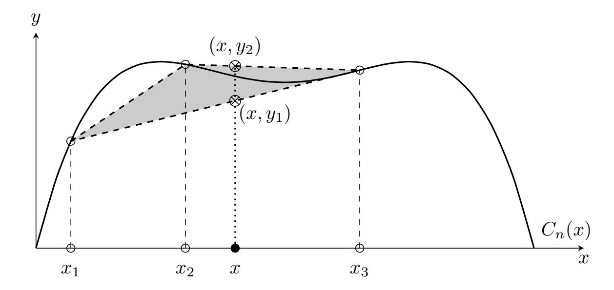
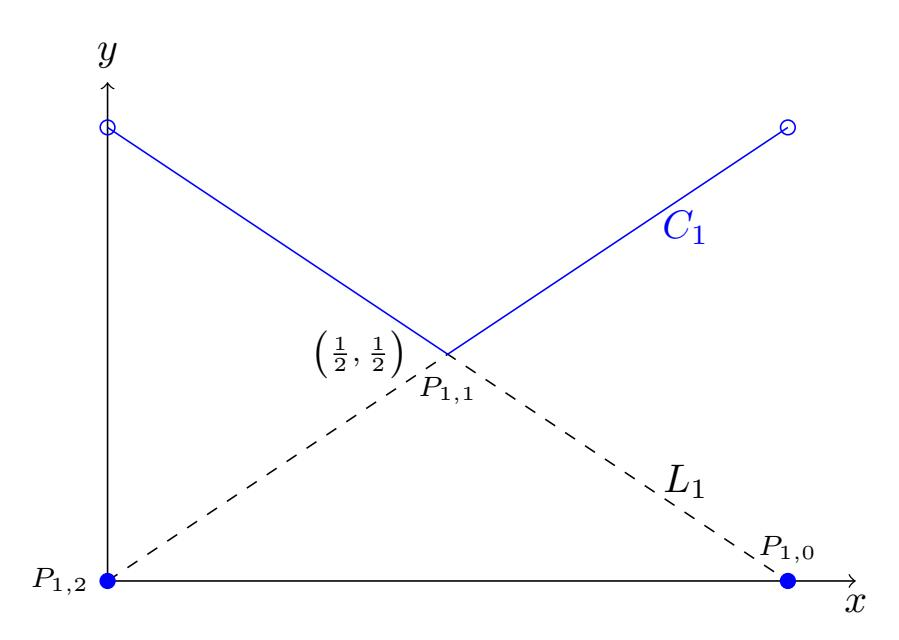
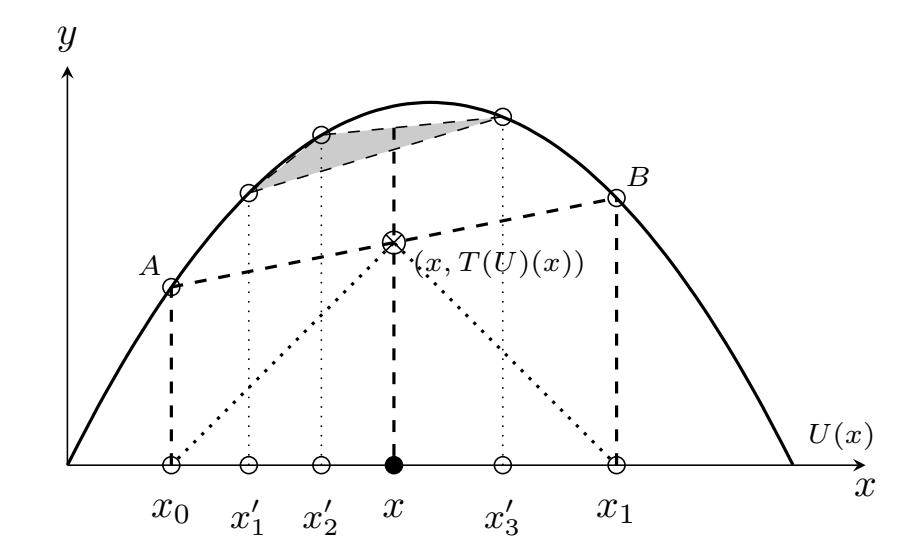
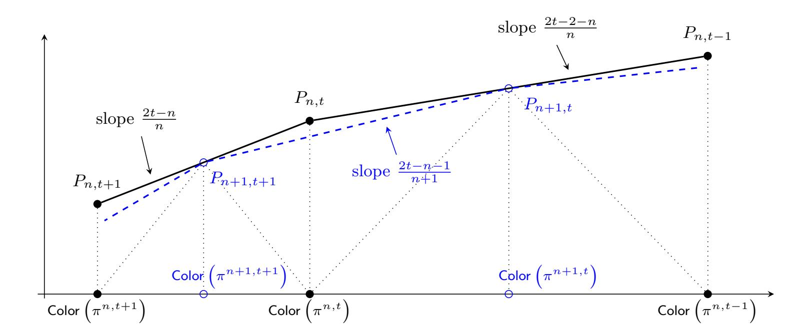
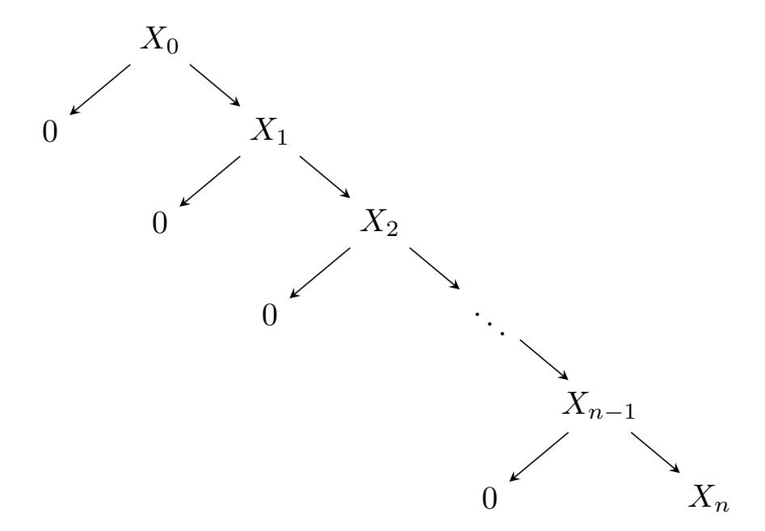
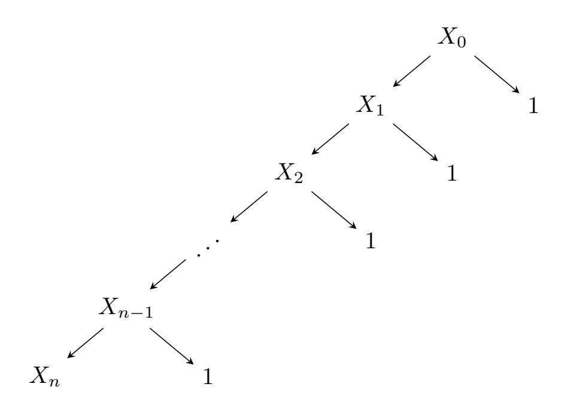

{0}------------------------------------------------

# **Optimally-secure Coin-tossing against a Byzantine Adversary**

# **Hamidreza Amini Khorasgani**

Department of Computer Science, Purdue University, USA [haminikh@purdue.edu](mailto:haminikh@purdue.edu)

### **Hemanta K. Maji**

Department of Computer Science, Purdue University, USA [hmaji@purdue.edu](mailto:hmaji@purdue.edu)

# **Mingyuan Wang**

Department of Computer Science, Purdue University, USA [wang1929@purdue.edu](mailto:wang1929@purdue.edu)

#### **Abstract**

In their seminal work, Ben-Or and Linial (1985) introduced the full information model for collective coin-tossing protocols involving *n* processors with unbounded computational power using a common broadcast channel for all their communications. The design and analysis of coin-tossing protocols in the full information model have close connections to diverse fields like extremal graph theory, randomness extraction, cryptographic protocol design, game theory, distributed protocols, and learning theory. Several works have focused on studying the asymptotically best attacks and optimal coin-tossing protocols in various adversarial settings. While one knows the characterization of the exact or asymptotically optimal protocols in some adversarial settings, for most adversarial settings, the optimal protocol characterization remains open. For the cases where the asymptotically optimal constructions are known, the exact constants or poly-logarithmic multiplicative factors involved are not entirely well-understood.

In this work, we study *n*-processor coin-tossing protocols where every processor broadcasts an arbitrary-length message once. Note that, in this setting, which processor speaks and its message distribution may depend on the messages broadcast so far. An adaptive Byzantine adversary, based on the messages broadcast so far, can corrupt *k* = 1 processor. A bias-*X* coin-tossing protocol outputs 1 with probability *X*; 0 with probability (1 − *X*). For a coin-tossing protocol, its insecurity is the maximum change in the output distribution (in the statistical distance) that an adversarial strategy can cause. Our objective is to identify optimal bias-*X* coin-tossing protocols with minimum insecurity, for every *X* ∈ [0*,* 1].

Lichtenstein, Linial, and Saks (1989) studied bias-*X* coin-tossing protocols in this adversarial model under the highly restrictive constraint that each party broadcasts an independent and uniformly random bit. The underlying message space is a well-behaved product space, and *X* ∈ [0*,* 1] can only be integer multiples of 1*/*2 *n*, which is a discrete problem. The case where every processor broadcasts only an independent random bit admits simplifications, for example, the collective coin-tossing protocol must be monotone. Surprisingly, for this class of coin-tossing protocols, the objective of reducing an adversary's ability to increase the expected output is equivalent to reducing an adversary's ability to decrease the expected output. Building on these observations, Lichtenstein, Linial, and Saks proved that the threshold coin-tossing protocols are optimal for all *n* and *k*.

In a sequence of works, Goldwasser, Kalai, and Park (2015), Kalai, Komargodski, and Raz (2018), and (independent of our work) Haitner and Karidi-Heller (2020) prove that *k* = O( √ *n* · polylog (*n*)) corruptions suffice to fix the output of any bias-X coin-tossing protocol. These results consider parties who send arbitrary-length messages, and each processor has multiple turns to reveal its entire message. However, optimal protocols robust to a large number of corruptions do not have any apriori relation to the optimal protocol robust to *k* = 1 corruption. Furthermore, to make an informed choice of employing a coin-tossing protocol in practice, for a fixed target

{1}------------------------------------------------

tolerance of insecurity, one needs a precise characterization of the minimum insecurity achieved by these coin-tossing protocols.

We rely on an inductive approach to constructing coin-tossing protocols to study a proxy potential function measuring the susceptibility of any bias-*X* coin-tossing protocol to attacks in our adversarial model. Our technique is inherently constructive and yields protocols that minimize the potential function. It happens to be the case that threshold protocols minimize the potential function. We demonstrate that the insecurity of these threshold protocols is 2 approximate of the optimal protocol in our adversarial model. For any other *X* ∈ [0*,* 1] that threshold protocols cannot realize, we prove that an appropriate (convex) combination of the threshold protocols is a 4-approximation of the optimal protocol.

**Keywords and phrases** Multi-party Coin-tossing, Adaptive Adversaries, Byzantine adversary, Optimal Protocols

**Funding** The research effort is supported in part by an NSF CRII Award CNS–1566499, an NSF SMALL Award CNS–1618822, the IARPA HECTOR project, MITRE Innovation Program Academic Cybersecurity Research Award, a Purdue Research Foundation (PRF) Award, and The Center for Science of Information, an NSF Science and Technology Center, Cooperative Agreement CCF–0939370.

# **1 Introduction**

In a seminal work, Ben-Or and Linial [\[BL85,](#page-16-0) [BL89\]](#page-16-1) introduced the full information model to study collective coin-tossing protocols. One relies on collective coin-tossing protocols to upgrade local private randomness of each of the *n* processors into shared randomness that all processors agree. In this model, all the processors have unbounded computational power and communicate with each other over one broadcast channel. This model for the design and analysis of coin-tossing protocols turns out to be highly influential with close connections with diverse topics in mathematics and computer science, for example, extremal graph theory [\[Kru63,](#page-19-0) [Kat68,](#page-18-0) [Har66\]](#page-18-1), extracting randomness from imperfect sources [\[SV84,](#page-20-0) [CGH](#page-17-0)+85, [Vaz85,](#page-20-1) [Fri92\]](#page-18-2), cryptography [\[CI93,](#page-17-1) [DLMM11,](#page-17-2) [DMM14,](#page-17-3) [HOZ16,](#page-18-3) [KMM19,](#page-19-1) [KMW20a,](#page-19-2) [MW20\]](#page-19-3), game theory [\[BI64,](#page-16-2) [Col71\]](#page-17-4), circuit representation [\[Win71,](#page-20-2) [OS08,](#page-19-4) [OS11\]](#page-19-5), distributed protocols [\[Asp97,](#page-16-3) [Asp98,](#page-16-4) [BJB98\]](#page-16-5), and poisoning and evasion attacks on learning algorithms [\[DMM18,](#page-17-5) [MDM19,](#page-19-6) [MM19,](#page-19-7) [EMM20\]](#page-17-6).

A *bias-X n-processor coin-tossing protocol* is an interactive protocol where every complete transcript is publicly associated with output 0 or 1, and the expected output for an honest execution of the protocol is *X* ∈ [0*,* 1]. Given a bias-*X n*-processor coin-tossing protocol *π* and model for adversarial corruption and attack, let +(*π*) ∈ [0*,* 1] represent the maximum increase in the expected output that an adversarial strategy can cause. Similarly, let −(*π*) ∈ [0*,* 1] represent the maximum decrease in the expected output caused by an adversarial strategy. One defines the insecurity of a protocol *π* as (*π*) := max{ +(*π*)*,* −(*π*)}. For a fixed *X* ∈ [0*,* 1], the *optimal bias-X n-processor protocol* minimizes (*π*) among all bias-*X n*-processor cointossing protocols.

For practical applications, given the tolerance for insecurity, one needs precise guarantees on the insecurity of coin-tossing protocols to estimate the necessary number of processors to keep the insecurity acceptably low. If the insecurity estimates for the potential coin-tossing protocols involve large latent constants or poly-logarithmic factors, then such a decision needs to be overly pessimistic in calculating the necessary number of processors. Consequently, it is essential to characterize coin-tossing protocols that are optimal or within a small constant 

{2}------------------------------------------------

factor of the optimal protocol for every pair (*n, X*). We emphasize that this outrightly rules out asymptotic bounds involving *n*. This work contributes to this endeavor.

We study *n*-processor coin-tossing protocols where every processor broadcasts a message exactly once (i.e., *single-turn*), and there are *n rounds*, i.e., every round a unique processor broadcasts her message. The distribution of the messages sent by processors prescribed to speak in one round may depend on the messages sent in the previous rounds. For example, in one-round protocols, the distribution over the message space of the coin-tossing protocol is a product space. On the other hand, in single-turn *n*-round protocols, only one processor speaks in a round, and her message distribution possibly depends on all previously broadcast messages. Furthermore, which processor speaks in which round may depend on the messages sent in the previous rounds. We consider *adaptive Byzantine* adversaries who can corrupt *k* = 1 processor, i.e., based on the evolution of the protocol, our adversary can corrupt one processor and fix her message arbitrarily. As is standard in cryptography, our adversary is always *rushing*, i.e., it can arbitrarily schedule all those processors who are supposed to speak in a round.

Variants this model have been studied, and we highlight, in the sequel, some of the most prominent works and their technical highlights.

**Lichtenstein, Linial, and Saks [\[LLS89\]](#page-19-8).** Lichtenstein et al. [\[LLS89\]](#page-19-8) consider the restriction where the *i*-th processor broadcasts an independent and uniformly random bit *xi* , where 1 ≤ *i* ≤ *n*, and the adversary can corrupt up to *k* processors, where 1 ≤ *k* ≤ *n*. The coin-tossing protocol is a function *f* : {0*,* 1} *n* → {0*,* 1}. In this case, the underlying message space is {0*,* 1} *n* , which is a product space involving a small-size alphabet, and the probability distribution induced by the transcript is the uniform distribution over the message space. Note that, for *n*-processor coin-tossing protocols, the bias of such a protocol can only be an integral multiple of 2 −*n*. Therefore, this is a discrete optimization problem.

Given *n*, *k*, and *X*, they begin with the objective of minimizing *only* the quantity +(*π*) over bias-*X n*-processor coin-tossing protocols *π*. Their recursive characterization of the protocol that minimizes +, *incidentally*, turns out to be identical to the optimal solution for the vertex isoperimetric inequality over the Boolean hypercube [\[Kru63,](#page-19-0) [Kat68,](#page-18-0) [Har66\]](#page-18-1). Therefore, a threshold protocol[1](#page-2-0) *π* is the optimal protocol and minimizes +. The complementary protocol, which swaps the outputs 0 and 1 of *π*, is also a threshold protocol and, consequently, minimizes −. So, threshold protocols simultaneously minimize + and − and achieve optimal security.

**Significantly altering the output distribution.** For symmetric functions (i.e., permuting the inputs of the function *f* does not change its output), Goldwasser, Kalai, and Park [\[GKP15\]](#page-18-4) prove that *k* = O( √ *n* · polylog (*n*)) corruptions suffice to completely fix the output of any coin-tossing protocol even if the protocol relies on *arbitrary-length messages*. After that, Kalai, Komargodski, and Raz [\[KKR18\]](#page-18-5) remove the restriction of symmetric functions. Recently, in independent work[2](#page-2-1) , Haitner and Karidi-Heller [\[HK20\]](#page-18-6) extend this result to *multi-turn* coin-tossing protocols. These papers use global analysis techniques for martingales that are inherently non-constructive; consequently, they prove the optimality of threshold protocols up to O(polylog (*n*)) factors when the adversary corrupts at most *k* = O( √ *n* · polylog (*n*)) processors.

**Challenge for arbitrary-length messages.** Our objective is to provide tight insecurity

1 More generally, protocols that output 1 for all strings smaller in the simplicial order than a threshold string are the optimal protocols.

2 A preliminary version of our work appears as [\[KMW20b\]](#page-19-9).

{3}------------------------------------------------

#### 4 Optimally-secure Coin-tossing against a Byzantine Adversary

estimates for the optimal coin-tossing protocols that use arbitrary-length messages. Let us understand why the technical approach of LLS89 fails; and an entirely new approach is needed. In the full information model, without the loss of generality, one can assume that all interactive protocols are stateless, and processors use a fresh block of private randomness to generate the next message at any point during the evolution of the cointossing protocol [Jer85, JVV86, BGP00]. Furthermore, the security of the internal state of processors is not a concern, so, without loss of generality, every processor broadcasts its appropriate block of randomness whenever it speaks.3 A Byzantine adversary can corrupt a processor and arbitrarily set its randomness. So, for an appropriately large alphabet  $\Sigma$ , which depends on the randomness complexity of generating each message, our message space is  $\Sigma^n$ , a product space involving a large alphabet set. Over such product spaces, the isolated objective of minimizing  $\epsilon^+$  does not entail the simultaneous minimization  $\epsilon^-$ . Given any  $n \in \mathbb{N}$ and  $X \in [0,1]$ , there exist protocols with  $(\epsilon^+, \epsilon^-) = (\frac{1-X}{n}, X)$  and  $(\epsilon^+, \epsilon^-) = (1-X, \frac{X}{n})$ , when the adversary can corrupt k = 1 processor (refer to Appendix A for the protocols). More generally, for product spaces over large alphabets, one does not expect such a vertex isoperimetric inequality |FHH+19, Har99|.

Finally, global analysis techniques of [GKP15, KKR18, HK20] analyze the case of a large number of corruptions k. The optimally secure protocol for k=1 is not apriori related to the optimal protocols robust to a large number of corruptions. Furthermore, the inductive proof technique of Aspnes [Asp97, Asp98] is agnostic of the expected output of the cointossing protocol. Consequently, reconstructing the optimal protocol from the lower-bound on insecurity is not apparent.

We follow the geometric technique of Khorasgani, Maji, and Mukherjee [KMM19], which is inherently constructive, to obtain tight estimates of the optimally secure protocols.

### **Connection to Isoperimetric Inequalities**

The connection to isoperimetric inequalities [Kru63, Kat68, Har66, Har99] (via the expansion of fixed density subset of product spaces) establishes the relevance to topics in theoretical computer science like expander graphs, complexity theory, and error-correcting codes.

Encoding Security of Coin-tossing Protocols. Every coin-tossing protocol is equivalent to a unique subset S of an n-dimension product space  $\Sigma^n$ , where the size of the alphabet set  $\sigma := |\Sigma|$  depends on the randomness complexity of the coin-tossing protocol. The elements of this product space represent the complete transcript of the coin-tossing protocol. The i-th coordinate of an element corresponds to the message sent by processor i, and the subset S contains all elements of the product space on which the coin-tossing protocol outputs 1. One considers the uniform distribution over  $\Sigma^n$  to sample the elements. This subsection considers a stronger Byzantine adversary who can edit one processor's message after seeing the message of all processors.

The discussion in this subsection extends to arbitrary corruption threshold k. However, for the simplicity of the presentation, we consider the specific case of k = 1. Let  $\partial S_k^+$  be the set of elements in  $\overline{S}$  (the complement of S) that are at a Hamming distance k = 1 from the set S. Consequently, the strong Byzantine adversary can change an element from the set  $\partial S_k^+ \subseteq \overline{S}$  into some element of S by editing (at most) k coordinates. Note that if the

&lt;sup>3 Let  $\pi$  be the original coin-tossing protocol. In the compiled  $\pi'$ , suppose parties reveal the block of randomness that they use to prepare their next-message in the protocol  $\pi'$ . The new protocol  $\pi'$ , first, emulates the next-message function of  $\pi$  to generate the entire transcript, and, then, uses  $\pi$  to determine the output.

{4}------------------------------------------------

stronger Byzantine adversary can see all the messages and then performs the edits, then it can increase the expected output by exactly  $\epsilon^+ = |\partial S_k^+|/\sigma^n$ .

Analogously, one defines the set  $\partial S_k^- \subseteq S$  that contains all elements at a Hamming distance k=1 from the set  $\overline{S}$ . So, a stronger Byzantine adversary can reduce the expected output by  $\epsilon^- = \left|\partial S_k^-\right|/\sigma^n$ .

**Extremal Graph Theory Perspective.** The (width-k) vertex perimeter of the set S, represented by  $\partial_{N,k}S$ , is the set of all elements in  $\overline{S}$  that are at a Hamming distance of at most k from some element in S. Observe that the perimeter  $\partial_{V,k}S$  is identical to the set  $\partial S_k^+$ . Similarly, the vertex perimeter of the set  $\overline{S}$  (which is  $\partial_{V,k}\overline{S}$ ) is identical to the set  $\partial S_k^-$ .

The objective of extremal graph theory is to characterize the optimal set S of a density-X that minimizes its vertex perimeter. This optimal set S, in turn, characterizes the bias-X coin-tossing protocol with the minimum  $\epsilon^+$ . In Appendix A, we saw that minimizing  $\epsilon^+$  does not automatically entail the simultaneous minimization of  $\epsilon^-$  for general  $\Sigma$ .4 In fact, that example highlighted that the protocol minimizing  $\epsilon^+$  resulted in a protocol where the stronger Byzantine adversary can force the outcome 0 with certainty. Therefore, there is a disconnect between the cryptographic objective of simultaneously minimizing  $\epsilon = \max\{\epsilon^+, \epsilon^-\}$  with the standard objective in extremal graph theory for large alphabet set  $\Sigma$ .

Cryptography-inspired Extremal Graph Theory. Instead of minimizing the vertex perimeter of a density-S set S, one should consider the alternative objective of minimizing the *symmetric perimeter* of S defined under various norms.

$$\partial^{\mathsf{sym}}_{V,k,\ell}(S) := \left( \left| \partial_{V,k} S \right|^{\ell} + \left| \partial_{V,k} \overline{S} \right|^{\ell} \right)^{1/\ell}.$$

The  $\ell=\infty$  case corresponds to our cryptographic objective; however, this norm is difficult to analyze. Consequently, we study the norm  $\ell=1$  as a proxy, which is a 2-approximation of the norm  $\ell=\infty$ . Our results provide evidence that such symmetric perimeters may be more well-behaved in general.

Recall that, in our setting, the element in  $\Sigma^n$  is exposed one coordinate at a time and our Byzantine adversaries cannot go back to edit previously exposed coordinates. So, our Byzantine adversaries have lesser power than the stronger Byzantine adversaries considered in this section. Consequently, the minimum achievable insecurity for bias-X n-processor coin-tossing protocols in our setting lower-bounds the proxy norm above. For instance, when  $\ell=1$ , our results imply that the density of the symmetric perimeter is  $1/\sqrt{n}$  for any dense set S, irrespective of the size of the alphabet set.

Remark. We identify a density-X set with its corresponding bias-X coin-tossing protocol. Using the independent bounded differences inequality for the Hamming distance function (using Azuma's inequality [Azu67]) on a constant-density subset S implies that  $k = \mathcal{O}(\sqrt{n})$  edits suffice to achieve any constant  $\epsilon^+$  and  $\epsilon^-$ , for any  $\sigma$ . However, for small k (for example, k = 1), obtaining meaningful guarantees on both  $\epsilon^+$  and  $\epsilon^-$  is not possible for large  $\sigma$ . On the other hand, interestingly, we shall show that  $\max\{\epsilon^+, \epsilon^-\} \geq 1/\sqrt{n}$  for any  $\sigma$ . This result lends support to the hypothesis that the symmetric perimeter is more well-behaved.

### 1.1 Our Contributions

Any n-processor coin-tossing protocol  $\pi$  is equivalent to a depth-n tree, where each node v corresponds to a partial transcript. For every leaf of this tree, one associates the output of

&lt;sup>4 For  $\Sigma = \{0, 1\}$ , this entailment holds; otherwise, it is not known to hold in general.

{5}------------------------------------------------

the coin-tossing protocol ∈ {0*,* 1}. For a partial transcript *v*, the *color of v*, represented by *xv*, represents the expected output of the coin-tossing protocol conditioned on the partial transcript being *v*. For example, the leaves have color ∈ {0*,* 1}, and the color of the root of a bias-*X* coin-tossing protocol is *X*. The probability *pv* represents the probability that the partial transcript *v* is generated during the protocol evolution of *π*.

A Byzantine adversary, in this interpretation of a coin-tossing protocol, that corrupts at most *k* = 1 processor is equivalent to a prefix-free set of edges. That is, for any two edges (*u, v*) and (*u* 0 *, v*0 ) such that *u* is the parent of *v* and *u* 0 is the parent of *v* 0 , the root to leaf path through *u* does not pass through *u* 0 . Any such collection of edges corresponds to a unique Byzantine adversarial strategy. For example, if an edge (*u, v*) lies in this set and *u* is the parent of *v*, then this edges indicates that the Byzantine adversary decides to interfere when the protocol generates the partial transcript *u*, and this adversary sends the next message that generates the partial transcript *v*. Note that the partial transcript *u* uniquely identifies the processor that the adversary needs to corrupt.

Let *τ* be one such attack strategy. Suppose *τ* is a collection of *`* edges, namely, {(*ui , vi*)} *` i*=1. Assume *ui* is the parent of *vi* , for *i* = 1*, . . . , `*. Then, we define the score of the attack strategy *τ* on protocol *π* as

$$\mathsf{Score}\left(\pi,\tau\right) \, := \, \sum_{i=1}^{\ell} p_{u_i} \cdot |x_{u_i} - x_{v_i}|.$$

The term Score (*π, τ* ) represents the vulnerability of protocol *π* under attack strategy *τ* . Furthermore, we define

$$\mathsf{Score}\,(\pi) \,:=\, \sup_{\tau} \, \mathsf{Score}\,(\pi,\tau)\,.$$

Intuitively, Score (*π*) represents the insecurity of the protocol under the most devastating attack, a.k.a., our potential function.

We emphasize that our score is not identical to the deviation in output distribution that a Byzantine adversary causes. It is a 2-approximation of that quantity. Define the insecurity as the maximum change that a Byzantine adversary can cause to the output distribution. Then, it is evident that the insecurity of *π* is at least Score(*π*)*/*2.

For an arbitrary *n* ∈ N ∗ and *t* ∈ {0*,* 1*, . . . , n* + 1}, let *π n,t* denote the *n*-processor *t*-threshold *threshold protocol*. In this threshold protocol, every processor broadcasts an independent and uniformly random bit. The output of this threshold protocol is 1 if and only if the total number of ones in the complete transcript is ≥ *t*. An *n*-processor *t*-threshold protocol has color 2 −*n* · P*n i*=*t n i* .

We prove the following theorem about the threshold protocol.

I **Theorem 1.** *For any bias X n-processor protocol π, where X* = 2−*n* · P*n i*=*t n i , where* 0 ≤ *t* ≤ *n* + 1*, then*

$$\mathsf{Score}(\pi^{n,t}) \leq \mathsf{Score}(\pi).$$

That is, the threshold protocol is the protocol that minimizes the score. Equivalently, the insecurity of the threshold protocol is a 2-approximation of the optimal insecurity in our corruption model (refer to [Corollary 1\)](#page-12-0).

Furthermore, we also prove the following result. Suppose *X* is not a root-color that admits a threshold protocol, and *X*0 is inverse-polynomially far from both 0 and 1. Suppose *X* is intermediate to the bias of the threshold protocols *π n*−1*,t* and *π n*−1*,t*−1 . Let *π* be a protocol where the first processor decides to run the threshold protocol *π n*−1*,t* or *π n*−1*,t*−1 with suitable probability so that the resulting protocol is a bias-*X* protocol. Then, the insecurity of this protocol *π* is a 4-approximation of the protocols with minimum insecurity against Byzantine adversaries (refer to [Corollary 2\)](#page-12-1).

{6}------------------------------------------------

# **1.2 Prior Works**

In this section, we summarize results in the full information model. It is beyond the scope of this paper to cover coin-tossing results in the computational setting like [\[Blu82,](#page-16-8) [Cle86,](#page-17-7) [ABC](#page-16-9)+85, [MNS09,](#page-19-10) [BOO10,](#page-17-8) [AO16,](#page-16-10) [BHLT17,](#page-16-11) [BHMO18\]](#page-16-12).

**Static corruption.** The case of static corruption is well-understood. In this setting, given a coin-tossing protocol, the adversary has to corrupt the processors before the beginning of the protocol. There is a close relation of this literature to results in randomness extraction [\[SV84,](#page-20-0) [CGH](#page-17-0)+85, [Vaz85,](#page-20-1) [Fri92\]](#page-18-2), game theory [\[BI64,](#page-16-2) [Col71\]](#page-17-4), and circuit representation [\[Win71,](#page-20-2) [OS08,](#page-19-4) [OS11\]](#page-19-5). Over the years, constructions of coin-tossing protocols were introduced that were robust to *k* = O *n* 0*.*63 corruptions [\[BL85,](#page-16-0) [BL89\]](#page-16-1), *k* = O *n/* log2 *n* corruptions [\[AL93,](#page-16-13) [CZ16\]](#page-17-9), *k* = O(*n/* log *n*) corruptions [\[Sak89\]](#page-19-11), and *k* = (1*/*2−*δ*)*n* [\[AN90,](#page-16-14) [BN93,](#page-16-15) [Fei99\]](#page-18-11) (for any positive constant *δ*).

On the other hand, the seminal work of Kahn, Kalai, and Linial [\[KKL88\]](#page-18-12) proves that *k* = Ω(*n/* log *n*) corruptions suffice to completely fix the output of a coin-tossing protocol where every message of a processor is a single bit. In fact, robustness to *k* = Ω(*n*) corruption necessitates multi-bit messages or super-constant number of rounds [\[RSZ99\]](#page-19-12).

**Adaptive corruption.** For adaptive Byzantine adversaries, Ben-Or and Linial [\[BL85,](#page-16-0) [BL89\]](#page-16-1) showed that majority protocol is resilient to O( √ *n*) corruptions, and they conjectured this protocol is asymptotically optimal. The case of adaptive corruption where the adversary sees everyone's messages before intervening is closely related to the vertex isoperimetric problem over the Boolean hypercube [\[Kru63,](#page-19-0) [Kat68,](#page-18-0) [Har66\]](#page-18-1). Threshold protocols are optimal for this adversarial model, for arbitrary corruption threshold *k*. Dodis [\[Dod00\]](#page-17-10) proved that robustness to *k* = O( √ *n*) is impossibly by sequentially composing other coin-tossing protocols followed by a deterministic extraction of the output.

The constructions closest to our problem are the works of Lichtenstein, Linial, and Saks [\[LLS89\]](#page-19-8), which characterized the optimal coin-tossing protocol for all *n* ∈ N and corruption threshold *k* ≤ *n* for coin-tossing protocols that are single-turn, *n*-round, adaptive Byzantine adversaries, and each processor sends one-bit uniformly random bit. Subsequently, Goldwasser, Kalai, and Park [\[GKP15\]](#page-18-4) and Kalai, Komargodski, and Raz [\[KK15,](#page-18-13) [KKR18\]](#page-18-5) prove that *k* = O( √ *n* · polylog (*n*)) corrupts suffice to fix the outcome of any single-turn coin-tossing protocol. Recently, independent of our work, Haitner and Karidi-Heller [\[HK20\]](#page-18-6) extend this bound even for multi-turn protocols.

Aspnes [\[Asp97,](#page-16-3) [Asp98\]](#page-16-4) considered the case where an adaptive adversary, if it does not like the message set by a particular processor, kills that processor. Other processors detect this event and move forward with the protocol assuming a placeholder message for that processor. This model of attack is very closely related to the strong adversary model introduced by Goldwasser, Kalai, and Park [\[GKP15\]](#page-18-4).

**Constructive potential-based approaches.** Recently, in the field of fair coin-tossing, Khorasgani, Maji, and Mukherjee [\[KMM19\]](#page-19-1) introduced the approach of geometric transformation for designing optimal protocols. They showed that this approach yields protocols with less susceptibility than the majority protocols [\[Blu82,](#page-16-8) [Cle86\]](#page-17-7). Subsequently, this approach has also been used to obtain new black-box separation results for fair coin-tossing protocols [\[KMW20a,](#page-19-2) [MW20\]](#page-19-3), which settled a longstanding open problem regarding the optimality of the protocol of Blum [\[Blu82\]](#page-16-8) and Cleve [\[Cle86\]](#page-17-7) that uses one-way functions in a black-box manner.

{7}------------------------------------------------

#### 1.3 Technical Overview

The techniques closest to our approach are those introduced by Aspnes [Asp97, Asp98] and Khorasgani et al. [KMM19, KMW20a, MW20].

Aspnes' technique [Asp97, Asp98] tracks the locus of all possible  $(\epsilon^+, \epsilon^-)$  corresponding to any n-processor k-corruption threshold protocol. However, the information regarding the root-color is lost and, consequently, the technique does not yield the optimal protocol construction. Next, one lower-bounds this space using easy-to-interpret (hyperbolic) curves and obtains bounds on the insecurity of any n-processor protocol with k corruption threshold (against adversaries who erase the messages of processors).

The technique of Khorsgani et al. [KMM19, KMW20a, MW20] use a potential function as a proxy to study the actual problem at hand. They maintain the locus of all n-processor bias-X protocols that minimize the potential function. Next, they inductively build the next curve of (n+1)-processors bias-X protocols that minimize the potential function. Their approach outrightly yields optimal constructions that minimize the potential function, and easily handle the case of processors sending arbitrary-length messages.

**High-level summary of our approach.** We use the potential function as introduced in Section 1.1, which is a 2-approximation of the optimal insecurity against Byzantine adversaries, for any n-processor bias-X protocol. Let  $C_n(X)$  represent the minimum realizable potential for bias-X n-processor coin-tossing protocols.

Next, we prove that if an n-processor threshold protocol has potential  $\delta$  and bias-X, then the point  $(\delta, X)$  lies on the optimal curve  $C_n(X)$ . Therefore, the potential of these threshold protocols are 2-approximation of the optimal bias-X protocol against Byzantine adversaries.

After that, inductively, we prove that the linear interpolation of the set of points  $(\delta, X)$  realized by n-processor threshold protocols with potential  $\delta$  and root-color X, where  $0 \le t \le n+1$ , is a lower-bound to the actual curve  $C_n(X)$ . Finally, we argue that a linear interpolation of appropriate threshold functions yields a protocol with potential that is 4-approximation of the optimal protocol against Byzantine adversaries.

The curves and the inductive transformation. Consider the case of n = 1 and arbitrary bias-X. If X = 0 or X = 1, then we have  $C_1(X) = 0$ . If  $X \in (0, 1/2]$ , then we include that edge that sets the output to 1. This observation creates a potential of  $C_1(X) = 1 - X$ . Similarly, we have  $C_1(X) = X$ , for all  $X \in [1/2, 1)$ . Our characterization of the curve  $C_1(X)$  is complete (refer to Figure 2).

Next, consider the case of n=2 and bias-X. This case is sufficient to understand how to inductively build the locus of the curve  $C_{n+1}(X)$  inductive from  $C_n(X)$ . Consider any arbitrary 2-processor bias-X coin-tossing protocol. Suppose the first processor sends message  $1, 2, \ldots, \ell$ . Let  $x_i$ , for  $1 \le i \le \ell$ , be the expected output conditioned on the first message being i. At the root of this protocol, we have two options. Corrupt processor one and send the message that achieves the highest potential. Or, defer the intervention to a later point in time.

Corrupting the root of this protocol causes the potential to become

$$\max_{i=1}^{\ell} |X - x_i|.$$

Deferring the intervention to a later point in time results in the potential becoming at least

$$\sum_{i=1}^{\ell} p_i \cdot C_1(x_i),$$

where  $p_i$  is the probability that processor 1 outputs i. The actual potential of  $\pi$  is the

{8}------------------------------------------------

maximum of these two quantities. Our objective is to characterize the choice of  $x_1, \ldots, x_\ell$  such that the potential is minimized (refer to Figure 1).

# 2 Preliminaries

We use  $\mathbb{N}^*$  for the set of positive integers. For any two curves  $C_1, C_2$  defined on [0, 1], we write  $C_1 \leq C_2$  ( $C_1$  is below  $C_2$ ) to denote that  $C_1(x) \leq C_2(x)$  for each  $x \in [0, 1]$ . A curve C defined on [0, 1], is called concave if for all  $0 \leq x < y \leq 1$ , and any  $\alpha \in [0, 1]$ , we have  $C(\alpha x + (1 - \alpha)y) \geq \alpha C(x) + (1 - \alpha)C(y)$ . Statistical distance between two distributions A and B defined over discrete sample space  $\Omega$  is defined as  $SD(A, B) := \frac{1}{2} \sum_{x \in \Omega} |A(x) - B(x)|$ . A function  $f: \mathbb{N} \to \mathbb{R}$  is called negligible if for any polynomial p(n), f(n) = o(1/p(n)).

### 2.1 Coin-tossing Protocols

In this work, we consider coin-tossing protocols among n processors in the full information model. That is, all processors communicate through one single broadcast channel. In particular, we consider an n-round protocol. At round i, the  $i^{th}$  processor will broadcast a (random) message based on the first i-1 broadcast messages. After every processor broadcasts her messages, the final output  $\in \{0,1\}$  is a deterministic function of all the broadcast messages. We do not limit to protocols with unbiased output (i.e., the probability of the output being 1 is 1/2).

▶ **Definition 1** ( $(n, X_0)$ -Coin-tossing protocols). For any  $n \in \mathbb{N}^*$  and  $X_0 \in [0, 1]$ , an  $(n, X_0)$ -coin-tossing protocol is an n-round coin-tossing protocol among n processors, where the expectation of the output is  $X_0$ .

We often refer to the expected output  $X_0$  as the *color* of the protocol. The *insecurity* of a coin-tossing protocol is the maximum change (in terms of statistical distance) that the adversary can cause to the distribution of the output of the protocol.

In this work, threshold protocols will be very useful examples, which are defined as follows.

▶ **Definition 2** ((n,t)-Threshold protocol). In an (n,t)-threshold protocol, denoted by  $\pi^{n,t}$ , each processor broadcasts an (independently) uniform bit. The output is 1 if the total number of 1-message  $\geq t$ . In particular, when n is odd and  $t = \frac{n+1}{2}$ , this is the majority protocol.

#### 2.2 Adversarial Setting

In this work, we consider *Byzantine adaptive* adversaries. Such an adversary will eavesdrop on the execution of the protocol. After every round, it will decide whether to corrupt the processor, who is going to speak next. Once a processor is corrupted, the adversary takes full control and fixes the message that she is going to send. We will focus on such adversaries that corrupt (at most) *one* processor.

### 3 A Geometric Perspective

In this section, we shall study the insecurity of coin-tossing protocols through a geometric perspective.

&lt;sup>5 Here,  $t \in \{0, 1, \dots, n+1\}$ .

{9}------------------------------------------------

**Protocol tree.** For every coin-tossing processor protocol, we will think of it as a tree. Every edge represents a message, and the root denotes the beginning of the protocol. Therefore, every node *u* on this tree represents a partial transcript of the protocol. And we can associate it with a color *xu* and a probability *pu*, where *xu* is the expected output conditioned on partial transcript *u*, and *pu* is the probability that partial transcript *u* happens. For an (*n, X*0)-coin-tossing protocol, by our definition, its protocol tree shall have depth *n*, and the color at the root shall be *X*0.

**Attack.** A Byzantine adaptive adversary that corrupts at most one processor can be viewed equivalently as a collection of edges {(*ui , vi*)}, where *ui* is the parent of *vi* . This implies that when partial transcript *ui* happens, the attacker intervenes and fixes the next message to be *vi* . Since this attacker corrupts at most one processor during the entire collection of the protocol, this collection of edges must be prefix-free. That is, no parent node of an edge is on the path from the root to other edges.

Given a protocol tree *π*, let an attack strategy *τ* be the collection of edges {(*ui , vi*)}, where *ui* is the parent of *vi* . We define the following score function.

▶ **Definition 3.** Score
$$(\pi, \tau) := \sum_{(u_i, v_i) \in \tau} p_{u_i} \cdot |x_{u_i} - x_{v_i}|$$
.

That is, Score(*π, τ* ) is the average of the absolute change in color the attacker *τ* causes. Intuitively, it represents the vulnerability of protocol *π* in the presence of the attack *τ* . Furthermore, for any protocol *π*, let us define

$$\mathsf{Score}(\pi) := \sup_{\tau} \; \mathsf{Score}(\pi, \tau).$$

Intuitively, Score(*π*) represents the score of the most devastating attacks on protocol *π*. Finally, we define

$$C_n(X_0) := \inf_{\pi} \mathsf{Score}(\pi),$$

where the infimum is taken over all (*n, X*0)-coin-tossing protocols *π*. Intuitively, *Cn* (*X*0) represents the score of the optimal protocol against the most devastating attack among all protocols with *n* processors and color *X*0.

I Remark 1. We remark that for a protocol *π*, the deviation (to the distribution of the output) an attack *τ* causes is not exactly Score(*π, τ* ). However, one can always bi-partition the set *τ* as *τ*0 and *τ*1. *τ*0 will consist of all edges (*ui , vi*) that decrease the expected output, i.e., *xui* ≥ *xvi* , while *τ*1 will consist of all edges (*ui , vi*) that increase the expected output, i.e., *xui < xvi* . Consequently, the summation of the deviations caused by attack *τ*0 and *τ*1 shall be Score(*π, τ* ). Therefore, there must exist an attack that deviates the protocol by Score(*π, τ* )*/*2. In light of this, for any (*n, X*0)-coin-tossing protocol, there must exist an attack that deviates the protocol by *Cn*(*X*0)*/*2. Hence, any (*n, X*0)-coin-tossing protocol is (at least) *Cn*(*X*0)*/*2 insecure.

# **3.1 Geometric Transformation of** *Cn*

In this section, we shall see how we can (inductively) construct *Cn* from a geometric perspective.

Let us start with the simplest case *n* = 1. If *X*0 = 0 or 1, the output is independent of the message and is always fixed. Hence, the score is always 0. If *X*0 ∈ (0*,* 1*/*2], the attack with the highest score is to fix the message such that the output is fixed to be 1. Hence, the score is 1 − *X*0. Similarly, when *X*0 ∈ (1*/*2*,* 1), the score is *X*0. Consequently, *C*1 is the

{10}------------------------------------------------

following curve.

$$C_1(x) = \begin{cases} 0 & x \in \{0, 1\} \\ 1 - x & x \in (0, 1/2] \\ x & x \in (1/2, 1) \end{cases}$$

Next, suppose we have curve *Cn*, we shall construct the next curve *Cn*+1. Let us use [Figure 1](#page-10-0) as an intuitive example to understand how to construct *Cn*+1(*x*) from *Cn*.

**Figure 1** An intuitive example of the geometric transformation

Let *π* be an (*n* + 1*, x*)-coin-tossing protocol. Suppose there are three possible messages that the first processor might send, namely *m*1, *m*2, and *m*3. Conditioned on the first message being *m*1, *m*2, and *m*3, the expected output is *x*1, *x*2, and *x*3, respectively. The probability of the first message being *m*1, *m*2, and *m*3, are *p*1, *p*2, and *p*3, respectively. Note that after the first processor sends message *mi* , the remaining protocol *πi* becomes a (*n, xi*)-coin-tossing protocol.

An adaptive adversary that corrupts at most one processor has four choices for the first processor. Either it can carry out the attack now by fixing the first processor's message to be *mi* , for *i* ∈ {1*,* 2*,* 3}, or it can defer the attack to subprotocols *π*1, *π*2, and *π*3. If it fixes the first processor's message to be *mi* , this will increase the score by |*xi* − *x*|*.* On the other hand, if it defers the attack to each subprotocol, by the definition of curve *Cn*, it can ensure a score of (at least) *Cn*(*xi*) in subprotocol *πi* . Overall, it ensures a score of (at least)

$$p_1 \cdot C_n(x_1) + p_2 \cdot C_n(x_2) + p_3 \cdot C_n(x_3).$$

Note that it must hold that *x* = *p*1*x*1 + *p*2*x*2 + *p*3*x*3. Therefore, *p*1 · *Cn*(*x*1) + *p*2 · *Cn*(*x*2) + *p*3 · *Cn*(*x*3) must lie between *y*1 and *y*2 in [Figure 1.](#page-10-0)

The most devastating attack will do the attack based on which strategy results in the highest score, which is

$$\max(|x-x_1|,|x-x_2|,|x-x_3|,p_1\cdot C_n(x_1)+p_2\cdot C_n(x_2)+p_3\cdot C_n(x_3)).$$

The optimal protocol shall, however, pick *x*1*, . . . , x`* and *p*1*, . . . , p`* accordingly to minimize the above quantity. Therefore, by our definition,

$$C_{n+1}(x) := \inf_{\substack{x_1, \dots, x_\ell \in [0,1] \\ p_1, \dots, p_\ell \in [0,1] \\ p_1 + \dots + p_\ell = 1 \\ p_1 x_1 + \dots + p_\ell x_\ell = x}} \max \left( |x - x_1|, \dots, |x - x_\ell|, \sum_{i=1}^\ell p_i \cdot C_n(x_i) \right)$$

*.*

{11}------------------------------------------------

For convenience, let us define geometric transformation T, which takes any curve C on [0,1] as input, and outputs a curve T(C) defined as

$$T(C)(x) := \inf_{\substack{x_1, \dots, x_\ell \in [0,1] \\ p_1, \dots, p_\ell \in [0,1] \\ p_1 + \dots + p_\ell = 1 \\ p_1 x_1 + \dots + p_\ell x_\ell = x}} \max \left( |x - x_1|, \dots, |x - x_\ell|, \sum_{i=1}^\ell p_i \cdot C(x_i) \right).$$

Hence, by our definition,  $C_{n+1}$  is exactly  $T(C_n)$ .

# 4 Tight Bounds on $C_n$ and the Implications

In this section, we shall first prove a tight lower bound on the curve  $C_n$ .

We define our lower bound curve  $L_n$  through threshold protocols. Recall that an (n, t)-threshold protocol  $\pi^{n,t}$  is a protocol where each processor broadcast an (independent) uniform bit. The final output is 1 if the number of 1-message is  $\geq t$ . Trivially, the color of (n, t)-threshold protocol  $\pi^{n,t}$  is

$$\operatorname{Color}\left(\pi^{n,t}\right) = 2^{-n} \cdot \left(\sum_{i=t}^{n} \binom{n}{i}\right).$$

We argue that the score of  $\pi^{n,t}$  is

Score 
$$(\pi^{n,t}) = 2^{-n} \cdot \binom{n-1}{t-1}$$
.

To see this, note that, without of loss of generality, we can assume that anytime the adversary fixes a message, it fixes that message to be 1.6 Moreover, which message that the adversary fixes does not matter; effectively, the output will be 1 if and only if the rest n-1 messages contain  $\geq t-1$  1-message. Therefore, by fixing one message to be 1, it changes the expected output of the protocol to be  $2^{-(n-1)} \cdot \left(\sum_{i=t-1}^{n-1} \binom{n-1}{i}\right)$ . Easily, one can verify that  $2^{-(n-1)} \cdot \left(\sum_{i=t-1}^{n-1} \binom{n-1}{i}\right) - 2^{-n} \cdot \left(\sum_{i=t}^{n} \binom{n}{i}\right) = 2^{-n} \cdot \binom{n-1}{t-1}$ .

For a *n*-processor threshold protocol, threshold  $t \in \{n+1, n, \dots, 0\}$ . We define the lower bound curve  $L_n$  as follows.

▶ **Definition 4.** For every  $n \in \mathbb{N}^*$ , let  $L_n$  be the curve that linearly connects points

$$P_{n,t} := \left( \mathsf{Color} \left( \pi^{n,t} \right) \;,\; \mathsf{Score} \left( \pi^{n,t} \right) \right) = \left( 2^{-n} \cdot \left( \sum_{i=t}^n \binom{n}{i} \right) \right) \quad, \quad 2^{-n} \cdot \binom{n-1}{t-1} \right)$$

for t = n + 1, n, ..., 0. That is,  $L_n$  linearly interpolates all the points defined by the color and score of (n, t)-threshold protocols.

As an example,  $L_1$  is shown in Figure 2.

In particular, we have the following theorem regarding the curve  $L_n$  and the curve  $C_n$ .

▶ Theorem 2. For all  $n \in \mathbb{N}^*$ ,  $L_n \leq C_n$ .

For any node u, let its two children node be  $v_0$  and  $v_1$ . Since every message is a uniform bit for threshold protocol, it must hold that  $|x_u - x_{v_0}| = |x_u - x_{v_1}|$ . Therefore, whether the attack picks edge  $(u, v_0)$  or  $(u, v_1)$  does not change the score.

When t = n + 1, the color is 0, and when t = 0, the color is 1.

{12}------------------------------------------------

**Figure 2** The (black) dashed curve is *L*1 and the (blue) solid curve is *C*1. Note that *P*1*,t* corresponds to the point defined by (1*, t*)-threshold protocol.

I Remark 2. Note that, by the definition of *Cn*, we have

$$C_n\left(\operatorname{Color}\left(\pi^{n,t}\right)\right) := \inf_{\pi} \operatorname{Score}(\pi) \leq \operatorname{Score}\left(\pi^{n,t}\right).$$

On the other hand, by [Theorem 2,](#page-11-2)

$$C_n\left(\mathsf{Color}\left(\pi^{n,t}\right)\right) \geq L_n\left(\mathsf{Color}\left(\pi^{n,t}\right)\right) = \mathsf{Score}\left(\pi^{n,t}\right).$$

Therefore, *Cn* (Color(*π n,t*)) = Score (*π n,t*). That is, points *Pn,t* is on the curve *Cn* as well. This also implies that threshold protocol is the protocol that minimizes the score function.

We defer the proof of [Theorem 2](#page-11-2) to [Section 4.1.](#page-13-0) Let us first discuss the implications of this theorem. We have the following corollaries.

I **Corollary 1** (Threshold protocols)**.** *For any n* ∈ N ∗ *and X*0 ∈ [0*,* 1] *such that X*0 = 2 −*n* · P*n i*=*t n i for some t* ∈ {0*,* 1*, . . . , n* + 1}*. The insecurity of* (*n, t*)*-threshold protocol is at most two times the insecurity of the least insecure* (*n, X*0)*-coin-tossing protocols.*

This corollary is immediate from [Theorem 2.](#page-11-2) This is because the insecurity of threshold protocol *π n,t* is exactly Score (*π n,t*); for any other (*n,* Color(*π n,t*))-coin-tossing protocol, in light of [Remark 1,](#page-9-0) we know its insecurity is at least

$$C_n\left(\operatorname{Color}\left(\pi^{n,t}\right)\right)/2 \geq L_n\left(\operatorname{Color}\left(\pi^{n,t}\right)\right)/2 = \operatorname{Score}\left(\pi^{n,t}\right)/2.$$

Therefore, the insecurity of the threshold protocol is at most two times the insecurity of the optimal protocol.

I **Corollary 2** (Non-threshold protocols)**.** *For an arbitrary color X*0 ∈ (0*,* 1) *that does not correspond to any threshold protocol, we can consider a linear combination of threshold protocols. Specifically, suppose* Color(*π n,t*) *< X*0 *<* Color *π n,t*−1 *, consider an* (*n* + 1*, X*0) *coin-tossing protocol as follows. The first processor sends a bit. If this bit is 0, the rest n processors execute the* (*n, t*)*-threshold protocol; if this bit is 1, the rest n processors execute the* (*n, t* − 1)*-threshold protocol. The probability of this bit being 0 is defined to be*

$$\frac{\operatorname{Color}\left(\pi^{n,t-1}\right) - X_0}{\operatorname{Color}\left(\pi^{n,t-1}\right) - \operatorname{Color}\left(\pi^{n,t}\right)}.$$

*For X*0 *that is not negligibly close to 0 or 1, the insecurity of this protocol is at most* 4 + *o*(1) *times the insecurity of the least insecure* (*n* + 1*, X*0)*-protocol.*

{13}------------------------------------------------

Without loss of generality, assume  $X_0 < 1/2$ . Therefore, t > n/2. One can easily see that the insecurity of this protocol is bounded by

$$\max\left(\mathsf{Color}\left(\pi^{n,t-1}\right) - \mathsf{Color}\left(\pi^{n,t}\right) \;,\; \frac{\mathsf{Score}\left(\pi^{n,t-1}\right) + \mathsf{Score}\left(\pi^{n,t}\right)}{2}\right),$$

which is bounded by  $2^{-n} \cdot \binom{n}{t-1}$ . On the other hand, Theorem 2 says that every  $(n+1, X_0)$ coin-tossing protocol is at least  $L_{n+1}(X_0)/2$ -insecure, which is at least  $2^{-(n+2)}\binom{n+1}{t}$ . When  $X_0$  is non-negligibly bounded away from 0 and 1, by Chernoff's bound, we must have  $|t-n/2| \leq \sqrt{n} \log n$ . Consequently,  $\binom{n}{t-1}$  and  $\binom{n+1}{t}$  are (1+o(1)) approximation to each other. Hence, the insecurity of this protocol is (at most) (4+o(1))-approximate of the optimal  $(n+1, X_0)$ -protocol.

### 4.1 Proof of Theorem 2

To prove this theorem, it suffices to prove the following claims.

- ▶ Claim 1. If  $A \preceq B$ , then  $T(A) \preceq T(B)$ .
- **► Claim 2.**  $L_{n+1} = T(L_n)$ .

**Proof of Theorem 2 using Claim 1 and Claim 2.** We prove this theorem inductively. The base case n=1 is trivial (See Figure 2).

Suppose the statement is correct for n, i.e.,  $L_n \leq C_n$ . Then we have

$$L_n \leq C_n \xrightarrow{\text{Claim 1}} T(L_n) \leq T(C_n) \xrightarrow{\text{Claim 2}} L_{n+1} \leq C_{n+1}$$

 $\triangleleft$ 

This completes the proof.

Next we prove Claim 1 and Claim 2.

**Proof of Claim 1**. Since  $A \leq B$ , for all  $x, x_1, \ldots, x_\ell$ , and  $p_1, \ldots, p_\ell$ , we have

$$\max\left(|x-x_1|,\ldots,|x-x_\ell|,\sum_{i=1}^\ell p_i\cdot A(x_i)\right) \le$$

$$\max\left(|x-x_1|,\ldots,|x-x_\ell|,\sum_{i=1}^\ell p_i\cdot B(x_i)\right).$$

Therefore, by definition, for all x,  $T(A)(x) \leq T(B)(x)$ , or equivalently  $T(A) \leq T(B)$ .

Before we prove Claim 2, the following claim will be useful.

▶ Claim 3. Let U be an arbitray concave curve. Suppose  $0 \le x_0 < x < x_2 \le 1$  satisfies that

$$x - x_0 = x_1 - x = \frac{U(x_0) + U(x_1)}{2},$$

Then  $T(U)(x) = \frac{U(x_0) + U(x_1)}{2}$ . That is,  $x_0$  and  $x_1$  witness the transformation T of U at x.

**Proof of Claim 3**. To see this, let us use Figure 3 for intuition. In Figure 3, U(x) is a concave curve and the choice of  $x_0$  and  $x_1$  satisfies that  $x - x_0 = x_1 - x = \frac{U(x_0) + U(x_1)}{2}$ . Recall that

{14}------------------------------------------------

◂

**Figure 3** The geometric transformation of curve U(x). Intuitively, if  $x'_1$ ,  $x'_2$ , and  $x'_3$  are  $\in (x_0, x_1)$ , the shaded region is always above line segment AB by the concaveness of U.

$$T(U)(x) := \inf_{\substack{x'_1, \dots, x'_\ell \in [0,1] \\ p_1, \dots, p_\ell \in [0,1] \\ p_1 + \dots + p_\ell = 1 \\ p_1 x'_1 + \dots + p_\ell x'_\ell = x}} \max \left( |x - x'_1|, \dots, |x - x'_\ell|, \sum_{i=1}^\ell p_i \cdot D(x'_i) \right).$$

By definition, clearly,  $T(U)(x) \leq \frac{U(x_0) + U(x_1)}{2}$ . To prove the other direction, we need to show that, for any choices of  $x'_1, x'_2, \ldots, x'_\ell$  and  $p_1, p_2, \ldots, p_\ell$ , we have

$$\frac{U(x_0) + U(x_1)}{2} \le \max\left(|x - x_1'|, \dots, |x - x_\ell'|, \sum_{i=1}^{\ell} p_i \cdot U(x_i')\right)$$

Firstly, if there exists an  $x_i'$  such that  $|x - x_i'| \ge |x_1 - x|$ , then the statement trivially holds. Next, if for all i,  $|x - x_i'| \le |x_1 - x|$ , then by the concaveness of curve U,

$$\frac{1}{2} \cdot (U(x_1) + U(x_2)) \le \sum_{i=1}^{\ell} p_i \cdot U(x_i').$$

This completes the proof.

Now, we prove Claim 2.

**Proof of Claim 2**. Recall that  $L_n$  is the curve that linearly connects points  $P_{n,n+1}, P_{n,n}, \ldots, P_{n,1}, P_{n,0}$ , where

$$P_{n,t} := \left(2^{-n} \cdot \left(\sum_{i=t}^{n} \binom{n}{i}\right)\right) , \quad 2^{-n} \cdot \binom{n-1}{t-1}\right).$$

Let us first observe some properties of  $L_n$ .

▶ Claim 4.  $L_n$  is a concave curve and the slope of any line segment of  $L_n$  is  $\in [-1, 1]$ .

**Proof of Claim 4**. Easily, we can verify that the slope of line segment  $P_{n,t}P_{n,t-1}$  is

$$\frac{2^{-n} \cdot \binom{n-1}{t-1} - 2^{-n} \cdot \binom{n-1}{t-2}}{2^{-n} \cdot \left(\sum_{i=t}^{n} \binom{n}{i}\right) - 2^{-n} \cdot \left(\sum_{i=t-1}^{n} \binom{n}{i}\right)} = \frac{2t - 2 - n}{n}.$$

Since the slope of  $P_{n,t}P_{n,t-1}$  decreases as t decreases, this proves that  $L_n$  is concave. Moreover, for any  $t \in \{n+1,\ldots,1\}$ , the slope of  $P_{n,t}P_{n,t-1}$  is  $\in [-1,1]$ .

{15}------------------------------------------------

**Figure 4** The relation between (black solid) *Ln* and (blue dashed) *Ln*+1. The geometric transformation of *Ln* is exactly *Ln*+1.

I **Claim 5.** *Pn*+1*,t is the middle point of Pn,t and Pn,t*−1*.*

**Proof of [Claim 5](#page-15-0) .** One just need to verify that

$$2^{-(n+1)}\left(\sum_{i=t}^{n+1}\binom{n+1}{i}\right) = \frac{1}{2}\cdot\left[2^{-n}\left(\sum_{i=t}^{n}\binom{n}{i}\right) + 2^{-n}\left(\sum_{i=t-1}^{n}\binom{n}{i}\right)\right],$$

and

$$2^{-(n+1)} \cdot \binom{n}{t-1} = \frac{1}{2} \cdot \left[ 2^{-n} \cdot \binom{n-1}{t-1} + 2^{-n} \cdot \binom{n-1}{t-2} \right].$$

*,*

Now, let us prove *Ln*+1 = *T*(*Ln*) with all the claims that we have proven. It suffices to verify *Ln*+1(*x*) = *T*(*Ln*)(*x*) for all *x* ∈ (0*,* 1). In light of [Claim 4](#page-14-1) and [Claim 5,](#page-15-0) we know the relation between *Ln* and *Ln*+1 looks like [Figure 4.](#page-15-1)

We first verify it at *x* = Color *π n*+1*,t* . In this case, we can set *x*0 = Color(*π n,t*) and *x*1 = Color *π n,t*−1 . One can verify that

$$\operatorname{Color}\left(\pi^{n+1,t}\right) - x_0 = x_1 - \operatorname{Color}\left(\pi^{n+1,t}\right) = \operatorname{Score}\left(\pi^{n+1,t}\right)$$

and

$$\frac{L_n(x_0) + L_n(x_1)}{2} = \frac{\operatorname{Score}\left(\pi^{n,t}\right) + \operatorname{Score}\left(\pi^{n,t-1}\right)}{2} = \operatorname{Score}\left(\pi^{n+1,t}\right).$$

Hence, by [Claim 3,](#page-13-3)

$$T(L_n)\left(\operatorname{Color}\left(\pi^{n+1,t}\right)\right) = \operatorname{Score}\left(\pi^{n+1,t}\right) = L_{n+1}\left(\operatorname{Color}\left(\pi^{n+1,t}\right)\right).$$

Next, we verify *Ln*+1 = *T*(*Ln*) for some *x* such that Color *π n*+1*,t*+1 *< x <* Color *π n*+1*,t* . By [Claim 3,](#page-13-3) it suffices to set *x*0 = *x* − *Ln*+1(*x*) and *x*1 = *x* + *Ln*+1(*x*) and verify that

$$\frac{L_n(x_0) + L_n(x_1)}{2} = L_{n+1}(x).$$

Note that

$$x_0 \in \left[ \mathsf{Color}\left(\pi^{n,t+1}\right), \mathsf{Color}\left(\pi^{n,t}\right) \right] \quad \text{ and } \quad x_1 \in \left[ \mathsf{Color}\left(\pi^{n,t}\right), \mathsf{Color}\left(\pi^{n,t-1}\right) \right].$$

One can verify that this is indeed correct. J

{16}------------------------------------------------

#### **References**

- **ABC**+**85** Baruch Awerbuch, Manuel Blum, Benny Chor, Shafi Goldwasser, and Silvio Micali. How to implement bracha's o (log n) byzantine agreement algorithm. *Unpublished manuscript*, 1985. [7](#page-6-0)
- **AL93** Miklós Ajtai and Nathan Linial. The influence of large coalitions. *Combinatorica*, 13(2):129–145, 1993. [7](#page-6-0)
- **AN90** Noga Alon and Moni Naor. Coin-flipping games immune against linear-sized coalitions (extended abstract). In *31st Annual Symposium on Foundations of Computer Science*, pages 46–54, St. Louis, MO, USA, October 22–24, 1990. IEEE Computer Society Press. [doi:10.1109/FSCS.1990.89523](https://doi.org/10.1109/FSCS.1990.89523). [7](#page-6-0)
- **AO16** Bar Alon and Eran Omri. Almost-optimally fair multiparty coin-tossing with nearly three-quarters malicious. In Martin Hirt and Adam D. Smith, editors, *TCC 2016-B: 14th Theory of Cryptography Conference, Part I*, volume 9985 of *Lecture Notes in Computer Science*, pages 307–335, Beijing, China, October 31 – November 3, 2016. Springer, Heidelberg, Germany. [doi:10.1007/978-3-662-53641-4\\_13](https://doi.org/10.1007/978-3-662-53641-4_13). [7](#page-6-0)
- **Asp97** James Aspnes. Lower bounds for distributed coin-flipping and randomized consensus. In *29th Annual ACM Symposium on Theory of Computing*, pages 559–568, El Paso, TX, USA, May 4–6, 1997. ACM Press. [doi:10.1145/258533.258649](https://doi.org/10.1145/258533.258649). [2,](#page-1-0) [4,](#page-3-1) [7,](#page-6-0) [8](#page-7-0)
- **Asp98** James Aspnes. Lower bounds for distributed coin-flipping and randomized consensus. *J. ACM*, 45(3):415–450, 1998. [doi:10.1145/278298.278304](https://doi.org/10.1145/278298.278304). [2,](#page-1-0) [4,](#page-3-1) [7,](#page-6-0) [8](#page-7-0)
- **Azu67** Kazuoki Azuma. Weighted sums of certain dependent random variables. *Tohoku Mathematical Journal, Second Series*, 19(3):357–367, 1967. [5](#page-4-2)
- **BGP00** Mihir Bellare, Oded Goldreich, and Erez Petrank. Uniform generation of np-witnesses using an np-oracle. *Inf. Comput.*, 163(2):510–526, 2000. [4](#page-3-1)
- **BHLT17** Niv Buchbinder, Iftach Haitner, Nissan Levi, and Eliad Tsfadia. Fair coin flipping: Tighter analysis and the many-party case. In Philip N. Klein, editor, *28th Annual ACM-SIAM Symposium on Discrete Algorithms*, pages 2580–2600, Barcelona, Spain, January 16–19, 2017. ACM-SIAM. [doi:10.1137/1.9781611974782.170](https://doi.org/10.1137/1.9781611974782.170). [7](#page-6-0)
- **BHMO18** Amos Beimel, Iftach Haitner, Nikolaos Makriyannis, and Eran Omri. Tighter bounds on multi-party coin flipping via augmented weak martingales and differentially private sampling. In Mikkel Thorup, editor, *59th Annual Symposium on Foundations of Computer Science*, pages 838–849, Paris, France, October 7–9, 2018. IEEE Computer Society Press. [doi:10.1109/FOCS.2018.00084](https://doi.org/10.1109/FOCS.2018.00084). [7](#page-6-0)
- **BI64** John F Banzhaf III. Weighted voting doesn't work: A mathematical analysis. *Rutgers L. Rev.*, 19:317, 1964. [2,](#page-1-0) [7](#page-6-0)
- **BJB98** Ziv Bar-Joseph and Michael Ben-Or. A tight lower bound for randomized synchronous consensus. In Brian A. Coan and Yehuda Afek, editors, *17th ACM Symposium Annual on Principles of Distributed Computing*, pages 193–199, Puerto Vallarta, Mexico, June 28 – July 2, 1998. Association for Computing Machinery. [doi:10.1145/277697.277733](https://doi.org/10.1145/277697.277733). [2](#page-1-0)
- **BL85** Michael Ben-Or and Nathan Linial. Collective coin flipping, robust voting schemes and minima of banzhaf values. In *26th Annual Symposium on Foundations of Computer Science*, pages 408–416, Portland, Oregon, October 21–23, 1985. IEEE Computer Society Press. [doi:10.1109/SFCS.1985.15](https://doi.org/10.1109/SFCS.1985.15). [2,](#page-1-0) [7](#page-6-0)
- **BL89** Michael Ben-Or and Nathan Linial. Collective coin flipping. *Advances in Computing Research*, 5:91–115, 1989. [2,](#page-1-0) [7](#page-6-0)
- **Blu82** Manuel Blum. Coin flipping by telephone. *Proc. of COMPCON, IEEE, 1982*, 1982. [7](#page-6-0)
- **BN93** Ravi B. Boppana and Babu O. Narayanan. The biased coin problem. In *25th Annual ACM Symposium on Theory of Computing*, pages 252–257, San Diego, CA, USA, May 16–18, 1993. ACM Press. [doi:10.1145/167088.167164](https://doi.org/10.1145/167088.167164). [7](#page-6-0)

{17}------------------------------------------------

- **BOO10** Amos Beimel, Eran Omri, and Ilan Orlov. Protocols for multiparty coin toss with dishonest majority. In Tal Rabin, editor, *Advances in Cryptology – CRYPTO 2010*, volume 6223 of *Lecture Notes in Computer Science*, pages 538–557, Santa Barbara, CA, USA, August 15–19, 2010. Springer, Heidelberg, Germany. [doi:10.1007/](https://doi.org/10.1007/978-3-642-14623-7_29) [978-3-642-14623-7\\_29](https://doi.org/10.1007/978-3-642-14623-7_29). [7](#page-6-0)
- **CGH**+**85** Benny Chor, Oded Goldreich, Johan Håstad, Joel Friedman, Steven Rudich, and Roman Smolensky. The bit extraction problem of t-resilient functions (preliminary version). In *26th Annual Symposium on Foundations of Computer Science*, pages 396– 407, Portland, Oregon, October 21–23, 1985. IEEE Computer Society Press. [doi:](https://doi.org/10.1109/SFCS.1985.55) [10.1109/SFCS.1985.55](https://doi.org/10.1109/SFCS.1985.55). [2,](#page-1-0) [7](#page-6-0)
- **CI93** Richard Cleve and Russell Impagliazzo. Martingales, collective coin flipping and discrete control processes. *In other words*, 1:5, 1993. [2](#page-1-0)
- **Cle86** Richard Cleve. Limits on the security of coin flips when half the processors are faulty (extended abstract). In *18th Annual ACM Symposium on Theory of Computing*, pages 364–369, Berkeley, CA, USA, May 28–30, 1986. ACM Press. [doi:10.1145/12130.](https://doi.org/10.1145/12130.12168) [12168](https://doi.org/10.1145/12130.12168). [7](#page-6-0)
- **Col71** James S Coleman. Control of collectivities and the power of a collectivity to act. *Social choice*, pages 269–300, 1971. [2,](#page-1-0) [7](#page-6-0)
- **CZ16** Eshan Chattopadhyay and David Zuckerman. Explicit two-source extractors and resilient functions. In Daniel Wichs and Yishay Mansour, editors, *48th Annual ACM Symposium on Theory of Computing*, pages 670–683, Cambridge, MA, USA, June 18– 21, 2016. ACM Press. [doi:10.1145/2897518.2897528](https://doi.org/10.1145/2897518.2897528). [7](#page-6-0)
- **DLMM11** Dana Dachman-Soled, Yehuda Lindell, Mohammad Mahmoody, and Tal Malkin. On the black-box complexity of optimally-fair coin tossing. In Yuval Ishai, editor, *TCC 2011: 8th Theory of Cryptography Conference*, volume 6597 of *Lecture Notes in Computer Science*, pages 450–467, Providence, RI, USA, March 28–30, 2011. Springer, Heidelberg, Germany. [doi:10.1007/978-3-642-19571-6\\_27](https://doi.org/10.1007/978-3-642-19571-6_27). [2](#page-1-0)
- **DMM14** Dana Dachman-Soled, Mohammad Mahmoody, and Tal Malkin. Can optimally-fair coin tossing be based on one-way functions? In Yehuda Lindell, editor, *TCC 2014: 11th Theory of Cryptography Conference*, volume 8349 of *Lecture Notes in Computer Science*, pages 217–239, San Diego, CA, USA, February 24–26, 2014. Springer, Heidelberg, Germany. [doi:10.1007/978-3-642-54242-8\\_10](https://doi.org/10.1007/978-3-642-54242-8_10). [2](#page-1-0)
- **DMM18** Dimitrios I. Diochnos, Saeed Mahloujifar, and Mohammad Mahmoody. Adversarial risk and robustness: General definitions and implications for the uniform distribution. In Samy Bengio, Hanna M. Wallach, Hugo Larochelle, Kristen Grauman, Nicolò Cesa-Bianchi, and Roman Garnett, editors, *Advances in Neural Information Processing Systems 31: Annual Conference on Neural Information Processing Systems 2018, NeurIPS 2018, 3-8 December 2018, Montréal, Canada*, pages 10380–10389, 2018. URL: [http://papers.nips.cc/paper/](http://papers.nips.cc/paper/8237-adversarial-risk-and-robustness-general-definitions-and-implications-for-the-uniform-distribution) [8237-adversarial-risk-and-robustness-general-definitions-and-implications-for-the-uniform-distribution](http://papers.nips.cc/paper/8237-adversarial-risk-and-robustness-general-definitions-and-implications-for-the-uniform-distribution). [2](#page-1-0)
- **Dod00** Yevgeniy Dodis. Impossibility of black-box reduction from non-adaptively to adaptively secure coin-flipping. *Electronic Colloquium on Computational Complexity (ECCC)*, 7(39), 2000. [7](#page-6-0)
- **EMM20** Omid Etesami, Saeed Mahloujifar, and Mohammad Mahmoody. Computational concentration of measure: Optimal bounds, reductions, and more. In *31st Annual ACM-SIAM Symposium on Discrete Algorithms*, pages 345–363. ACM-SIAM, 2020. [doi:10.1137/1.9781611975994.21](https://doi.org/10.1137/1.9781611975994.21). [2](#page-1-0)

{18}------------------------------------------------

- **Fei99** Uriel Feige. Noncryptographic selection protocols. In *40th Annual Symposium on Foundations of Computer Science*, pages 142–153, New York, NY, USA, October 17– 19, 1999. IEEE Computer Society Press. [doi:10.1109/SFFCS.1999.814586](https://doi.org/10.1109/SFFCS.1999.814586). [7](#page-6-0)
- **FHH**+**19** Yuval Filmus, Lianna Hambardzumyan, Hamed Hatami, Pooya Hatami, and David Zuckerman. Biasing Boolean functions and collective coin-flipping protocols over arbitrary product distributions. In Christel Baier, Ioannis Chatzigiannakis, Paola Flocchini, and Stefano Leonardi, editors, *ICALP 2019: 46th International Colloquium on Automata, Languages and Programming*, volume 132 of *LIPIcs*, pages 58:1–58:13, Patras, Greece, July 9–12, 2019. Schloss Dagstuhl - Leibniz-Zentrum fuer Informatik. [doi:10.4230/LIPIcs.ICALP.2019.58](https://doi.org/10.4230/LIPIcs.ICALP.2019.58). [4](#page-3-1)
- **Fri92** Joel Friedman. On the bit extraction problem. In *33rd Annual Symposium on Foundations of Computer Science*, pages 314–319, Pittsburgh, PA, USA, October 24–27, 1992. IEEE Computer Society Press. [doi:10.1109/SFCS.1992.267760](https://doi.org/10.1109/SFCS.1992.267760). [2,](#page-1-0) [7](#page-6-0)
- **GKP15** Shafi Goldwasser, Yael Tauman Kalai, and Sunoo Park. Adaptively secure coinflipping, revisited. In Magnús M. Halldórsson, Kazuo Iwama, Naoki Kobayashi, and Bettina Speckmann, editors, *ICALP 2015: 42nd International Colloquium on Automata, Languages and Programming, Part II*, volume 9135 of *Lecture Notes in Computer Science*, pages 663–674, Kyoto, Japan, July 6–10, 2015. Springer, Heidelberg, Germany. [doi:10.1007/978-3-662-47666-6\\_53](https://doi.org/10.1007/978-3-662-47666-6_53). [3,](#page-2-2) [4,](#page-3-1) [7](#page-6-0)
- **Har66** Lawrence H Harper. Optimal numberings and isoperimetric problems on graphs. *Journal of Combinatorial Theory*, 1(3):385–393, 1966. [2,](#page-1-0) [3,](#page-2-2) [4,](#page-3-1) [7](#page-6-0)
- **Har99** L. H. Harper. On an isoperimetric problem for hamming graphs. *Discret. Appl. Math.*, 95(1-3):285–309, 1999. [doi:10.1016/S0166-218X\(99\)00082-7](https://doi.org/10.1016/S0166-218X(99)00082-7). [4](#page-3-1)
- **HK20** Iftach Haitner and Yonatan Karidi-Heller. A tight lower bound on adaptively secure full-information coin flip. In *FOCS*, 2020. [3,](#page-2-2) [4,](#page-3-1) [7](#page-6-0)
- **HOZ16** Iftach Haitner, Eran Omri, and Hila Zarosim. Limits on the usefulness of random oracles. *Journal of Cryptology*, 29(2):283–335, April 2016. [doi:10.1007/](https://doi.org/10.1007/s00145-014-9194-9) [s00145-014-9194-9](https://doi.org/10.1007/s00145-014-9194-9). [2](#page-1-0)
- **Jer85** Mark Jerrum. Random generation of combinatorial structures from a uniform distribution (extended abstract). In Wilfried Brauer, editor, *Automata, Languages and Programming, 12th Colloquium, Nafplion, Greece, July 15-19, 1985, Proceedings*, volume 194 of *Lecture Notes in Computer Science*, pages 290–299. Springer, 1985. [doi:10.1007/BFb0015754](https://doi.org/10.1007/BFb0015754). [4](#page-3-1)
- **JVV86** Mark Jerrum, Leslie G. Valiant, and Vijay V. Vazirani. Random generation of combinatorial structures from a uniform distribution. *Theor. Comput. Sci.*, 43:169–188, 1986. [doi:10.1016/0304-3975\(86\)90174-X](https://doi.org/10.1016/0304-3975(86)90174-X). [4](#page-3-1)
- **Kat68** G Katona. A theorem for finite sets, theory of graphs (p. erdös and g. katona, eds.), 1968. [2,](#page-1-0) [3,](#page-2-2) [4,](#page-3-1) [7](#page-6-0)
- **KK15** Yael Tauman Kalai and Ilan Komargodski. Compressing communication in distributed protocols. In Yoram Moses, editor, *Distributed Computing - 29th International Symposium, DISC 2015, Tokyo, Japan, October 7-9, 2015, Proceedings*, volume 9363 of *Lecture Notes in Computer Science*, pages 467–479. Springer, 2015. [7](#page-6-0)
- **KKL88** Jeff Kahn, Gil Kalai, and Nathan Linial. The influence of variables on Boolean functions (extended abstract). In *29th Annual Symposium on Foundations of Computer Science*, pages 68–80, White Plains, NY, USA, October 24–26, 1988. IEEE Computer Society Press. [doi:10.1109/SFCS.1988.21923](https://doi.org/10.1109/SFCS.1988.21923). [7](#page-6-0)
- **KKR18** Yael Tauman Kalai, Ilan Komargodski, and Ran Raz. A lower bound for adaptivelysecure collective coin-flipping protocols. In Ulrich Schmid and Josef Widder, editors, *32nd International Symposium on Distributed Computing, DISC 2018, New Or-*

{19}------------------------------------------------

- *leans, LA, USA, October 15-19, 2018*, volume 121 of *LIPIcs*, pages 34:1–34:16. Schloss Dagstuhl - Leibniz-Zentrum für Informatik, 2018. [3,](#page-2-2) [4,](#page-3-1) [7](#page-6-0)
- **KMM19** Hamidreza Amini Khorasgani, Hemanta K. Maji, and Tamalika Mukherjee. Estimating gaps in martingales and applications to coin-tossing: Constructions and hardness. In Dennis Hofheinz and Alon Rosen, editors, *TCC 2019: 17th Theory of Cryptography Conference, Part II*, volume 11892 of *Lecture Notes in Computer Science*, pages 333–355, Nuremberg, Germany, December 1–5, 2019. Springer, Heidelberg, Germany. [doi:10.1007/978-3-030-36033-7\\_13](https://doi.org/10.1007/978-3-030-36033-7_13). [2,](#page-1-0) [4,](#page-3-1) [7,](#page-6-0) [8](#page-7-0)
- **KMW20a** Hamidreza Amini Khorasgani, Hemanta K. Maji, and Mingyuan Wang. Coin tossing with lazy defense: Hardness of computation results. *IACR Cryptol. ePrint Arch.*, 2020:131, 2020. URL: <https://eprint.iacr.org/2020/131>. [2,](#page-1-0) [7,](#page-6-0) [8](#page-7-0)
- **KMW20b** Hamidreza Amini Khorasgani, Hemanta K. Maji, and Mingyuan Wang. Coin tossing with lazy defense: Hardness of computation results. Cryptology ePrint Archive, Report 2020/131, 2020. <https://eprint.iacr.org/2020/131>. [3](#page-2-2)
- **Kru63** Joseph B Kruskal. The number of simplices in a complex. *Mathematical optimization techniques*, 10:251–278, 1963. [2,](#page-1-0) [3,](#page-2-2) [4,](#page-3-1) [7](#page-6-0)
- **LLS89** David Lichtenstein, Nathan Linial, and Michael Saks. Some extremal problems arising from discrete control processes. *Combinatorica*, 9(3):269–287, 1989. [3,](#page-2-2) [4,](#page-3-1) [7](#page-6-0)
- **MDM19** Saeed Mahloujifar, Dimitrios I. Diochnos, and Mohammad Mahmoody. The curse of concentration in robust learning: Evasion and poisoning attacks from concentration of measure. In *The Thirty-Third AAAI Conference on Artificial Intelligence, AAAI 2019, The Thirty-First Innovative Applications of Artificial Intelligence Conference, IAAI 2019, The Ninth AAAI Symposium on Educational Advances in Artificial Intelligence, EAAI 2019, Honolulu, Hawaii, USA, January 27 - February 1, 2019*, pages 4536–4543. AAAI Press, 2019. [doi:10.1609/aaai.v33i01.33014536](https://doi.org/10.1609/aaai.v33i01.33014536). [2](#page-1-0)
- **MM19** Saeed Mahloujifar and Mohammad Mahmoody. Can adversarially robust learning leveragecomputational hardness? In Aurélien Garivier and Satyen Kale, editors, *Algorithmic Learning Theory, ALT 2019, 22-24 March 2019, Chicago, Illinois, USA*, volume 98 of *Proceedings of Machine Learning Research*, pages 581–609. PMLR, 2019. URL: <http://proceedings.mlr.press/v98/mahloujifar19a.html>. [2](#page-1-0)
- **MNS09** Tal Moran, Moni Naor, and Gil Segev. An optimally fair coin toss. In Omer Reingold, editor, *TCC 2009: 6th Theory of Cryptography Conference*, volume 5444 of *Lecture Notes in Computer Science*, pages 1–18. Springer, Heidelberg, Germany, March 15–17, 2009. [doi:10.1007/978-3-642-00457-5\\_1](https://doi.org/10.1007/978-3-642-00457-5_1). [7](#page-6-0)
- **MW20** Hemanta K. Maji and Mingyuan Wang. Black-box use of one-way functions is useless for optimal fair coin-tossing. Cryptology ePrint Archive, Report 2020/253, 2020. [https:](https://eprint.iacr.org/2020/253) [//eprint.iacr.org/2020/253](https://eprint.iacr.org/2020/253). [2,](#page-1-0) [7,](#page-6-0) [8](#page-7-0)
- **OS08** Ryan O'Donnell and Rocco A. Servedio. The Chow parameters problem. In Richard E. Ladner and Cynthia Dwork, editors, *40th Annual ACM Symposium on Theory of Computing*, pages 517–526, Victoria, BC, Canada, May 17–20, 2008. ACM Press. [doi:10.1145/1374376.1374450](https://doi.org/10.1145/1374376.1374450). [2,](#page-1-0) [7](#page-6-0)
- **OS11** Ryan O'Donnell and Rocco A. Servedio. The chow parameters problem. *SIAM J. Comput.*, 40(1):165–199, 2011. [doi:10.1137/090756466](https://doi.org/10.1137/090756466). [2,](#page-1-0) [7](#page-6-0)
- **RSZ99** Alexander Russell, Michael E. Saks, and David Zuckerman. Lower bounds for leader election and collective coin-flipping in the perfect information model. In *31st Annual ACM Symposium on Theory of Computing*, pages 339–347, Atlanta, GA, USA, May 1– 4, 1999. ACM Press. [doi:10.1145/301250.301337](https://doi.org/10.1145/301250.301337). [7](#page-6-0)
- **Sak89** Michael E. Saks. A robust noncryptographic protocol for collective coin flipping. *SIAM J. Discrete Math.*, 2(2):240–244, 1989. [7](#page-6-0)

{20}------------------------------------------------

- **SV84** Miklos Santha and Umesh V. Vazirani. Generating quasi-random sequences from slightly-random sources (extended abstract). In *25th Annual Symposium on Foundations of Computer Science*, pages 434–440, Singer Island, Florida, October 24–26, 1984. IEEE Computer Society Press. [doi:10.1109/SFCS.1984.715945](https://doi.org/10.1109/SFCS.1984.715945). [2,](#page-1-0) [7](#page-6-0)
- **Vaz85** Umesh V. Vazirani. Towards a strong communication complexity theory or generating quasi-random sequences from two communicating slightly-random sources (extended abstract). In *17th Annual ACM Symposium on Theory of Computing*, pages 366–378, Providence, RI, USA, May 6–8, 1985. ACM Press. [doi:10.1145/22145.22186](https://doi.org/10.1145/22145.22186). [2,](#page-1-0) [7](#page-6-0)
- **Win71** Robert O. Winder. Chow parameters in threshold logic. *J. ACM*, 18(2):265–289, 1971. [doi:10.1145/321637.321647](https://doi.org/10.1145/321637.321647). [2,](#page-1-0) [7](#page-6-0)

{21}------------------------------------------------

# **A Some Examples**

**Figure 5** An example *n*-processor coin-tossing protocol that is easy to deviate toward 0, but hard to deviate toward 1. In this protocol, *Xk* = *X*0 + *k* · 1−*X*0 *n* . Adversary can corrupt the first processor and achieve + = *X*1 − *X*0 = 1−*X*0 *n* by setting its message to be 1 or achieve − = *X*0 − 0 = *X*0 by setting the its message to be 0.

**Figure 6** An example *n*-processor coin-tossing protocol that is easy to deviate toward 1, but hard to deviate toward 0. In this protocol, *Xk* = *k* · *X*0 *n* . Adversary can corrupt the first processor and achieve + = 1 − *X*0 by setting the its message to be 1 or achieve − = *X*1 − *X*0 = *X*0 *n* by setting its message to be 0.