{0}------------------------------------------------

# Generalized Matsui Algorithm 1 with application for the full DES

Tomer Ashur1,2 , Raluca Posteuca1? , Danilo Sijaˇci´c ˇ 1 , and Stef D'haeseleer1

> 1 imec-COSIC, KU Leuven, Leuven, Belgium

[tomer.ashur, raluca.posteuca]@esat.kuleuven.be

Abstract. In this paper we introduce the strictly zero-correlation attack. We extend the work of Ashur and Posteuca in BalkanCryptSec 2018 and build a 0-correlation key-dependent linear trails covering the full DES. We show how this approximation can be used for a key recovery attack and empirically verify our claims through a series of experiments. To the best of our knowledge, this paper is the first to use this kind of property to leverage a meaningful attack against a symmetric-key algorithm.

Keywords: linear cryptanalysis · DES · poisonous hull

## 1 Introduction

Linear cryptanalysis is one of the most important tools used in the security evaluation of block ciphers. It was introduced in 1993, by Mitsuru Matsui, and used to attack the DES cipher. The technique became intensively studied, the formalism of linear cryptanalysis being extended in e.g., [\[Bih94,](#page-18-0) [Nyb94\]](#page-19-0). This approach is widely applicable and produced many variants and generalizations such as multiple linear cryptanalysis [\[JR94,](#page-19-1) [BCQ04\]](#page-18-1), differential-linear cryptanalysis [\[CV94\]](#page-19-2), zero-correlation linear cryptanalysis [\[BR11\]](#page-18-2), etc.

Usually, linear cryptanalysis is used to launch a known-plaintext attack. The setting of a known-plaintext attack is that the attacker has a set of plaintexts and their corresponding ciphertexts, enciphered using a fixed key. The goal of the attack is to recover information regarding the secret key that was used.

Matsui's initial idea was to analyze probabilistic linear relations between a set of plaintexts, their ciphertexts, and the secret key. In order to distinguish a particular linear relation (called linear approximation), its probability should be observably different from 0.5. Estimating the quality of a linear approximation, usually measured by its correlation or bias, is one of the open problems in linear cryptanalysis and it is directly related to the success probability and the data complexity of the attack.

2 TU Eindhoven, Eindhoven, The Netherlands

? Corresponding author

{1}------------------------------------------------

In order to construct a linear approximation of an iterated cipher, Matsui proposed to sequentially linearize each round. The resulting set of linear approximations is called a linear trail. The correlation of a linear trail is computed by multiplying the correlations of each 1-round linear approximation.

#### 1.1 Related Work

In [Nyb94] it was first observed that in some cases, there could be more than a single linear trail involving the same plaintext and ciphertext bits. This phenomenon is called the linear hull effect, a linear hull being defined as the set of all linear trails with the same input and output bits. The correlation of a linear hull is computed by summing up all underlying linear trails' correlations. Thus, the correlation of the linear hull may be significantly different from that of any of the underlying trails. When a linear attack is used, both the success rate and the data complexity of the attack are closely related to the hull's correlation and not to that of the trail.

In [AR16], Ashur and Rijmen showed that the linear hull effect can appear already within a single round of a cipher. All their experiments and key-recovery attacks were applied to the lightweight block cipher SIMON. Following up on this work, Ashur and Posteuca analyzed in [AP18] this phenomenon for the Data Encryption Standard (DES). They showed that under certain constraints, the f-function of DES exhibits 0-correlation key-dependent one-round linear hulls.

#### 1.2 Our Contribution

In this paper we present a new type of zero-correlation attack, which we call "strictly zero-correlation" and apply it to the full DES. The attack uses a 1-round 0-correlation linear hull and embeds it into Matsui's 8-round linear trail. This results in a 16-round 0-correlation linear trail for DES under certain conditions for particular key bits. We then show how this linear trails can be used for key recovery by exploiting the key-dependent behavior of the correlation.

The contribution of the paper is therefore threefold:

- 1. We introduce a new type of attack based on linear cryptanalysis, called "strictly zero-correlation" attack;
- 2. We present a new attack covering the full DES;
- 3. We show how the key-dependent behavior of a linear trail can be used for key recovery.

#### 1.3 Structure of this Paper

In section 2, we introduce our notation, revisit some terminology regarding linear cryptanalysis, including the notion of poisonous round, and briefly describe the block cipher DES. In section 3 we introduce strictly zero-correlation linear approximation covering the full DES and show how it can be used for key recovery. In section 4 we present a series of experiments validating our analysis. Section 5 offers future research directions and concludes the paper.

{2}------------------------------------------------

## 2 Preliminaries

In this section we introduce the notation used in the rest of this paper and recall some terminology regarding linear cryptanalysis. We also present the DES cipher.

### 2.1 The Data Encryption Standard

The Data Encryption Standard (DES) [\[DES\]](#page-19-3) is a block cipher developed by IBM during the early 1970's and published as an NBS (now NIST) standard in 1977.

DES has a Feistel structure with a round function which employs a non-linear function f. The overall structure of DES consists of an initial permutation, 16 enciphering rounds and a final permutation. The plaintext and the key are 64-bit each, even though only 56 out of 64 key-bits are actually used by the algorithm.

The input to the round function is a 48-bit round key (denoted by k) and two 32-bit intermediate cipherwords (denoted by x and y).

The round function is then given by:

$$R_k(x,y) = (y \oplus f(x,k), x)$$

The f-function consists of four layers:

1. Expansion: the 32-bit input x is expanded into a 48-bit output in the form presented in [Figure 1a.](#page-2-1) The reader may notice that after applying the expansion function, 16 out of 32 input bits are used twice. We will use this observation for our attack. In the sequel, we denote the expansion function by E.

| 32 | 1  | 2  | 3  | 4  | 5  | 16 | 7  | 20 | 21 |
|----|----|----|----|----|----|----|----|----|----|
| 4  | 5  | 6  | 7  | 8  | 9  | 29 | 12 | 28 | 17 |
| 8  | 9  | 10 | 11 | 12 | 13 | 1  | 15 | 23 | 26 |
| 12 | 13 | 14 | 15 | 16 | 17 | 5  | 18 | 31 | 10 |
| 16 | 17 | 18 | 19 | 20 | 21 | 2  | 8  | 24 | 14 |
| 20 | 21 | 22 | 23 | 24 | 25 | 32 | 27 | 3  | 9  |
| 24 | 25 | 26 | 27 | 28 | 29 | 19 | 13 | 30 | 6  |
| 28 | 29 | 30 | 31 | 32 | 1  | 22 | 11 | 4  | 25 |

- (a) The expansion function E (b) The permutation P

Fig. 1: DES round operations - Expansion (E) and Permutation (P)

.

{3}------------------------------------------------

- 3. Substitution: the output of the key addition is divided into eight 6-bit chunks. Each of these blocks is given as an input to a different 6 × 4-bit S-box, resulting in eight 4-bit outputs. The specification of the S-boxes can be found in [DES]. We denote the substitution layer by S. Note that due to the expansion function a single input bit may influence two adjacent S-boxes. In this paper, we consider the first and the last S-boxes as being adjacent (i.e., we view the property of being adjacent as circular).
- 4. *Permutation*: a fixed 32-bit permutation is applied to the output of the substitution layer. This permutation, denoted by P, is described in Figure 1b.

The key schedule The key schedule of DES is a linear function where the round keys are basically obtained by selecting 48 out of the 56 bits of the master key. For a description of the key schedule we refer the interested reader to [DES].

**Decryption** Since DES has a Feistel structure, the decryption function,  $DES^{-1}$ , uses the same structure as the encryption, but with the keys used in reverse order.

#### 2.2 Masks and Approximations

Let a be a binary value of length n and let  $a^t x = \bigoplus_{i=0}^{n-1} a_i x_i$ , where  $a_i$  and  $x_i$  are the  $i^{th}$  bit of a and x, respectively. We then say that a is the mask of x. Given that applying a mask to a bit-string represents, in essence, a selection of bits of x, we will also use the description of a mask as a set of positions:

$$X = \{i_1, i_2, \dots, i_v\} \Leftrightarrow \begin{cases} x_j = 1, \forall j \in X \\ x_j = 0, \forall j \notin X \end{cases}$$

The bits in positions  $\{i_1, i_2, \dots, i_v\}$  are called *active bits*, while the remaining bits of x are said to be inactive.

Let  $R_k(x) = y$  denote the round function of a block cipher, where x, y and k are the plaintext, the ciphertext and the key, respectively. A linear approximation for  $R_k$  is a tuple  $(\alpha, \beta, \kappa)$ , where  $\alpha$ ,  $\beta$  and  $\kappa$  are the input mask, the output mask and the key mask, respectively. Let p be the probability that the equation  $\alpha^t x \oplus \beta^t y \oplus \kappa^t k = 0$  holds for a uniformly selected x. Then the correlation of the linear approximation  $(\alpha, \beta, \kappa)$  is defined as  $corr(\alpha, \beta, \kappa) = 2p - 1$ . In general, both p and  $corr(\alpha, \beta, \kappa)$  are key-dependent (see, e.g., [AÅBL12])

A pair of masks  $(\alpha, \beta)$  is said to be connectable if and only if  $\beta$  can be obtained from  $\alpha$  using the rules of propagation introduced in [Bih94, Mat93]. Otherwise, the pair  $(\alpha, \beta)$  is said to be non-connectable.

{4}------------------------------------------------

#### 2.3 Linear Hulls and Trails

An iterated block cipher with r rounds can be described as the composition of r − 1 round functions, i.e. Enck = Rkr−i ◦ . . . ◦ Rk0 , where ki denotes the round key and k denotes the encryption key. A linear trail covering r rounds of a block cipher is a sequence of r + 1 linear approximations such that the mask corresponding to the output of round i is the same as the one corresponding to the input of round i+1. Hence, a linear trail can be viewed as an (r+1)-dimension vector (λ1, λ2, . . . , λr+1), where the pair (λi , λi+1) denotes the input and output masks at round i, respectively. The correlation of the linear trail is computed by multiplying the correlation of all single-round linear approximations:

$$corr(\lambda_1, \dots, \lambda_{r+1}) = \prod_{i=1}^{r} corr(\lambda_i, \lambda_{i+1})$$

A linear hull covering r rounds is a pair (α, β) which represents the set of all linear trails with input mask α and output mask β (i.e., the input and output masks are fixed, but intermediate round masks may vary). The correlation of a linear hull is computed by summing the correlations of all linear trails in the set:

$$corr(\alpha, \beta) = \sum_{\lambda_1 = \alpha, \lambda_{r+1} = \beta} corr(\lambda_1, \dots, \lambda_{r+1})$$

The round function of a block cipher can also be viewed as a composition of its atomic operations. Thus, the methods described above for computing the correlation of a linear trail can also be applied on a smaller scale to these atomic operations. In [\[AR16\]](#page-18-3), the authors observed that, in some cases, it is possible to construct more than a single linear trail covering the round function. Likewise, in [\[AP18\]](#page-18-4), the authors showed that this is specifically true for DES' f-function, and hence that the linear hull effect may appear already inside one round of DES. Our paper uses the latter observation to construct an attack on the full cipher.

#### 2.4 One-Round Key-Dependent Linear Hulls in DES

Following the notations of [\[AP18\]](#page-18-4) we describe a linear approximation of the ffunction as a tuple (α, β, κ, τ, λ, γ), where α, β, κ are the input mask, the output mask and the key mask, respectively. The remaining components represent the intermediate masks of the trail: τ is the output mask of the expansion layer, and λ, γ are the input and the output masks of the substitution layer, respectively. Given the parallel nature of the S-boxes, we consider λ and γ as a concatenation of eight components of equal size. For example, the input mask λ = (λ1, . . . , λ8) is viewed as a concatenation of 6-bit masks and the output mask γ = (γ1, . . . , γ8) is viewed as a concatenation of 4-bit masks. [Figure 2](#page-5-0) depicts the propagation of linear masks through the f-function.

The rules of propagation for linear masks impose some constraints on these masks:

{5}------------------------------------------------

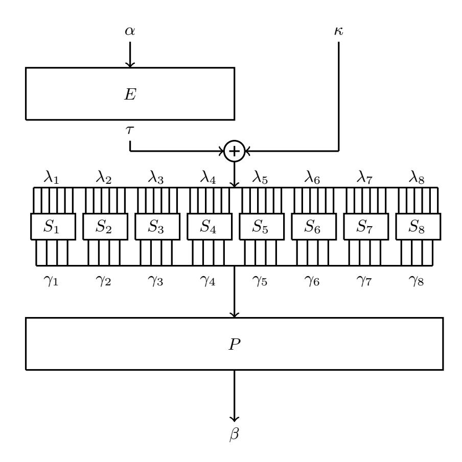

Fig. 2: A linear trail through the f-function of DES

- 1. τ, κ and λ must all be the same;
- 2. each pair (λi , γi) must be connectable respective to the i th S-box, more precisely, the linear approximation table (LAT) of Si must contain a nonzero entry at the intersection of λi and γi ;
- 3. β = P(γ).

Definition 1. Si is an active S-box if and only if the input and the output masks are nonzero, more precisely λi , γi 6= 0.

Per [\[AP18\]](#page-18-4), in the case of DES the linear hull effect may appear already within one round if at least one pair of adjacent S-boxes is active. This leads to the following observation:

Observation 1 Given the constraints imposed by the rules of propagation for linear masks, two trails that are contained in the same 1-round hull (α, β) share the form (α, β, τi , τi , τi , P −1 (β)), where P −1 is the inverse of P. Thus, the only difference between two trails in the same 1-round linear hull is given by the intermediate mask τ .

Corollary 2 Given that each trail has a different mask after applying the expansion layer, the key masks will also be different, leading to the hull's correlation being key-dependent.

{6}------------------------------------------------

#### 2.5 Zero-Correlation Linear Approximations

Due to the presence of the linear hull effect, linear trails may interfere with each other, influencing the correlation of the hull in a constructive or destructive manner or, in some cases, even canceling out.

An example of a one-round linear hull containing four linear trails was described in [\[AP18\]](#page-18-4) with the correlation of each of these trails having the same absolute value. One may notice that for certain values of the key, two linear trails will have a positive correlation, while the other two have a negative one. In this case, the value of the hull's correlation will be strictly zero, hence the name of our new attack.

Definition 2. A one-round linear hull that leads to a zero correlation is said to be a "poisonous round". A trail containing at least one "poisonous" round is said to be a "poisonous trail".

Recall that in order to compute the correlation of a trail, individual round correlations are multiplied. The term "poisonous" is used to emphasize that a single "bad" approximation (i.e., a strictly 0-correlation approximation) in a certain round "spoils" this product, resulting in strictly 0-correlation trail.

#### 2.6 Matsui's trail

In [\[Mat93\]](#page-19-4), Matsui presented a linear approximation of the full DES, obtained by using an 8-round iterative linear trail with correlation 2−12.71. By replacing the linear masks of the first and the last round with locally better ones, a 16 rounds linear approximation with correlation 2−22.42 is obtained. [Figure 3](#page-7-0) depicts Matsui's 8-round iterative linear trail when circularly moved down by two rounds such that the last round of the original trail is now the second round. Since Matsui's 8-round trail is iterative, it can start in any of the trail rounds and extend naturally over the next seven rounds.

## 3 Constructing Poisonous Trails for DES

In this section we introduce a new linear trail for DES, containing a keydependent poisonous round. This linear trail is obtained by replacing the last two rounds in Matsui's iterative trail, where the new last round is a poisonous round. This new linear approximation allows to take advantage of the key constraints that are imposed by the poisonous round, thus leading directly to a key-recovery attack.

The structure of this section is as follows: In [subsection 3.1](#page-8-0) we introduce a 1-round poisonous trail for DES. We extend this into a 2-round linear trail in [subsection 3.2](#page-9-0) and connect it to Matsui's trail in [subsection 3.3.](#page-10-0) In [subsection 3.4](#page-10-1) we present some particular properties of our 16-round trail and discuss how different correlations can be distinguished. Finally, in [subsection 3.5](#page-12-1) we describe a key recovery attack based on our approach. Empirical validation of this analysis is provided in [section 4.](#page-12-0)

{7}------------------------------------------------

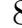

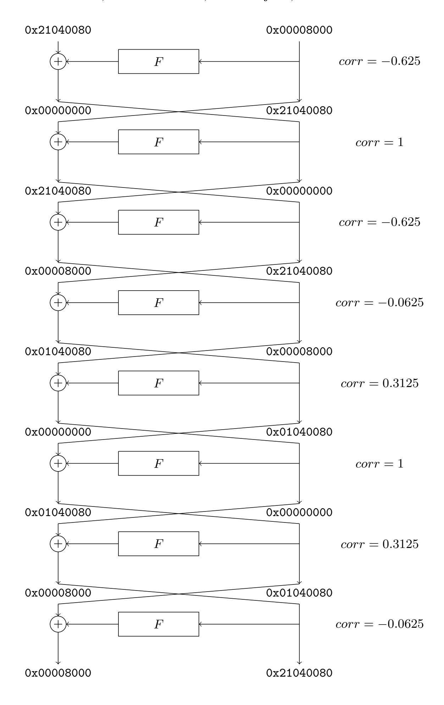

Fig. 3: Matsui's 8-round iterative linear approximation circularly moved down by 2 rounds

{8}------------------------------------------------

Trail τi Correlation Key masks No. Trail 1 (0, 0, 0x39, 0x0F, 0, 0, 0, 0) 2 −8 · 5 {12, 13, 14, 20, 21, 22, 23} ∪ {17} Trail 2 (0, 0, 0x3B, 0x2F, 0, 0, 0, 0) 2 −8 · 5 {12, 13, 14, 20, 21, 22, 23} ∪ {16, 17, 18} Trail 3 (0, 0, 0x38, 0x1F, 0, 0, 0, 0) 2 −8 · 12 {12, 13, 14, 20, 21, 22, 23} ∪ {19} Trail 4 (0, 0, 0x3A, 0x3F, 0, 0, 0, 0) −2 −8 · 2 {12, 13, 14, 20, 21, 22, 23} ∪ {16, 18, 19}

Table 1: The trails within the 1-round hull (0x01CF8000, 0x00440000) of the f-function of DES. The correlations overlook the key contribution.

#### 3.1 A Strictly Zero-Correlation 1-Round Linear Hull for DES

In [\[AP18\]](#page-18-4) the authors introduced the first strictly zero-correlation 1-round linear hull for the f-function of DES. In their example, the hull is defined by the inputoutput masks pair (0x65000000, P(0x5A000000)).

We introduce a new 1-round key-dependent poisonous round for the f-function. This hull is defined by the input-output masks pair (0x01CF8000, 0x00011000) and contains four linear trails of the form

$$(0x01CF8000, 0x00011000, \tau_i, \tau_i, \tau_i, 0x0044000),$$

with S3 and S4 active. The possible values of τi , the correlation of each of the trails, and the key bits involved in the computation of the correlation are described in [Table 1.](#page-8-1)

As always, the correlation of a single trail is computed by multiplying the correlations of each atomic operation of the round function. For a linear function (such as E and P), the correlation between the input and the output mask is either 1 or 0. If the output mask can be obtained from the input mask using the rules of propagation of linear trails, thus the masks are connectable, the correlation is 1; otherwise, it is 0. For the substitution layer, the correlation is given by the LAT of each active S-box. The correlation of the key addition is (−1) L i∈κ ki , for ki 's corresponding to the positions of the key mask.

Depending on the bits of the round key, the correlation formula for each trail within our strictly zero-correlation linear hull is

Trail 1: 
$$corr = 5 \cdot 2^{-8} \cdot (-1)^{l \oplus k_{17}}$$
  
Trail 2:  $corr = 5 \cdot 2^{-8} \cdot (-1)^{l \oplus k_{16} \oplus k_{17} \oplus k_{18}}$   
Trail 3:  $corr = 12 \cdot 2^{-8} \cdot (-1)^{l \oplus k_{19}}$   
Trail 4:  $corr = -2 \cdot 2^{-8} \cdot (-1)^{l \oplus k_{16} \oplus k_{18} \oplus k_{19}}$ 

where l = k12 ⊕ k13 ⊕ k14 ⊕ k20 ⊕ k21 ⊕ k22 ⊕ k23.

Given that the correlation of the hull is computed by summing the correlation of the four trails, the hull correlation is

{9}------------------------------------------------

$$corr = 2^{-8} \cdot (-1)^{l} \cdot [5 \cdot (-1)^{k_{17}} + 5 \cdot (-1)^{k_{16} \oplus k_{17} \oplus k_{18}} + 12 \cdot (-1)^{k_{19}} - 2 \cdot (-1)^{k_{16} \oplus k_{18} \oplus k_{19}}]$$

Note that the key bits in positions k12, k13, k14, k20, k21, k22, and k23 (i.e., the key bits shared among all 1-round trails) influence the sign of the correlation, while the key bits in positions k16, k17, k18, and k19 (i.e., the key bits defining the individual 1-round trails) influence its magnitude.

The correlation of the 1-round linear hull, depending on the values of the round key, is

$$corr = \begin{cases} \pm 2^{-8} \cdot 14 & k_{16} \neq k_{18} \\ \pm 2^{-8} \cdot 20 & k_{16} = k_{18} \text{ and } k_{17} = k_{19} \\ 0 & \text{otherwise} \end{cases}$$
 (1)

#### 3.2 A 2-Round Poisonous Trail for DES

In order to connect it to Matsui's trail we extend the above 1-round linear hull into a 2-rounds linear trail, where the input mask is one of the masks used in Matsui's trail. This 2-round linear trail is described in [Figure 4.](#page-9-1)

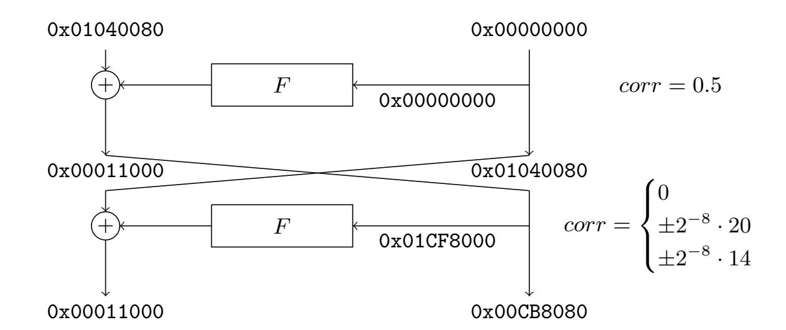

Fig. 4: A 2-round poisonous trail of DES. The last round is the poisonous one.

The correlation for the trail described above, depending on the values of the second round key, is:

$$corr = \begin{cases} \pm 2^{-9} \cdot 14 & k_{16} \neq k_{18} \\ \pm 2^{-9} \cdot 20 & k_{16} = k_{18} \text{ and } k_{17} = k_{19} \\ 0 & \text{otherwise} \end{cases}$$
 (2)

{10}------------------------------------------------

#### 3.3 A Poisonous 16-Round Trail for DES

We now adapt Matsui's trail into a poisonous 16-round trail by replacing the last two rounds with the trail described in Section [3.2.](#page-9-0) Since the last round of the new trail is poisonous, the entire trail becomes poisonous. The last 8 rounds of our new trail are presented in [Figure 5.](#page-11-0)

Given that the last round of the new trail is the poisonous one, the correlation of the 16-round trail depends on the bits in positions 16, 17, 18 and 19 of the last round key. Taking into account the key schedule, the correlation depends in the bits on positions 51, 0, 1 and 8 of the master key, and we get

$$corr = \begin{cases} \pm 2^{-24.95} & k_{51} \neq k_1 \\ \pm 2^{-24.42} & k_{51} = k_1 \text{ and } k_0 = k_8 \\ 0 & \text{otherwise} \end{cases}$$
 (3)

We note that now the last two rounds of the trail presented in [Figure 3](#page-7-0) have the smallest correlation, and that our 2-round trail from Section [3.2](#page-9-0) has the same input mask. Thus, by replacing the last two rounds with our 2-round poisonous trail we improve the correlation. Whereas the correlation of the two rounds that we just replaced was 2−5.67, the new 2-round trail has a correlation that is 1.38 times better (for some keys).

#### 3.4 Distinguishing

Up until this point, we introduced the first linear poisonous trail on 16-rounds of DES. The particular interesting fact about our trail is that it divides the set of master keys into three key-classes, depending on the correlation. More precisely, just by observing the correlation we already obtain an information regarding the master key, i.e. the relation between k51 and k1 and, eventually, the relation between k0 and k8.

Learning one relation between the master key bits is equivalent to obtaining one key bit, i.e. in both cases the exhaustive search space is halved. Therefore, the ability to distinguish between the three key classes can trivially be converted into a key-recovery attack.

While in theory the computation of the correlation is straightforward, in practice there are some issues that we need to take into account. One of them is the data complexity required to compute the correlation.

Generally speaking, to detect a correlation c, an adversary needs to encrypt roughly 2 · c −2 plaintexts. As per [\[Mat93\]](#page-19-4), the larger the size of data sample, the more accurate the results are.

In order to gain the ability to distinguish between the three key-classes, i.e. between the three correlations, we choose the data size in accordance to the smallest non-zero correlation, that is, 2−24.95, and encrypt 250.9 random plaintexts.

After computing the empirical correlation, we compare it to each of the three expected values. In the case of the non-zero correlations, we compare the empirical value to the theoretical one. For the zero-correlation case, we compare the

{11}------------------------------------------------

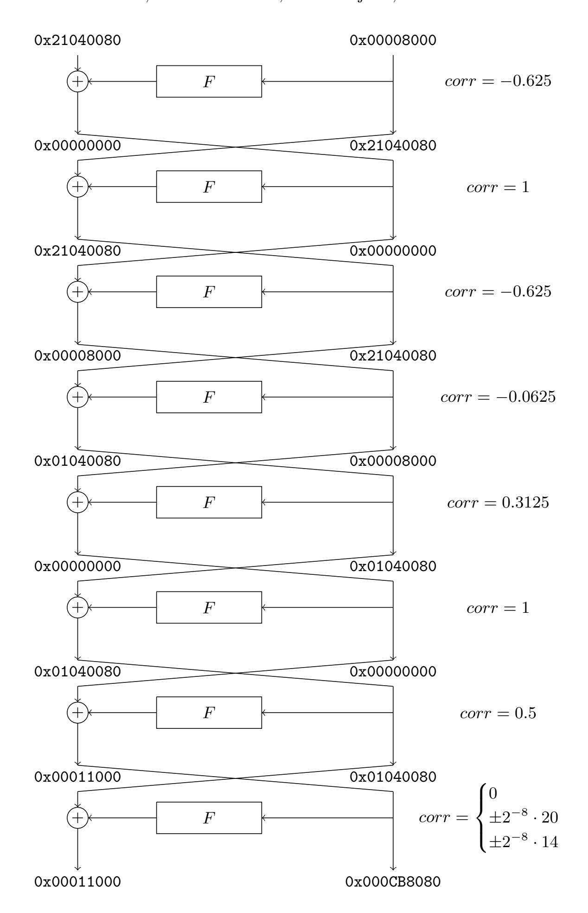

Fig. 5: The last eight rounds of our new linear approximation

empirical correlation to the inverse of the squared root of the data complexity;

{12}------------------------------------------------

this is a good approximation for the expected empirical correlation for a sample with correlation 0.

For example, if we use 251 data and get the empirical correlation c, we compute the following values:

$$c_1 = |c - 2^{-24.95}|$$
  
 $c_2 = |c - 2^{-24.42}|$   
 $c_3 = |c - 0|$ .

Then, min(c1, c2, c3) is used to determine the right key class.

#### 3.5 Key Recovery

We now propose a key-recovery attack based on the linear approximation described in Section [3.3.](#page-10-0) Since the correlation depends on the values of k0, k1, k8, and k51 of the master key, we can infer a relation between these key bits by observing the correlation of the 16-round linear approximation.

In order to launch an attack, we need a set of 251 plaintexts and their corresponding ciphertexts. We compute the correlation of the trail described above and compare the empirical correlation to each of the three expected values. The expected correlation that is the closest to the empirical correlation indicates the key constraints that are met by the master key. For example, if the correlation is closest to 2−24.95, then the key satisfies the constraint k51 6= k1.

## 4 Experimental Verification

We performed a series of experiments in order to test the validity of our analysis.

#### 4.1 Experiments on round-reduced DES

We started by performing experiments on round-reduced versions of the trail. Therefore, our initial experiments targeted up to nine rounds of the trail where all our round-reduced trails have the same, poisonous, last round. Since the data complexity in this setting was 238, we were able to perform the experiments using a software implementation.

For each experiment we chose a master key that satisfies one of the key constraints imposed by the poisonous round. We then computed the correlation of the round-reduced trail with the appropriate amount of data. The empirical correlation was always very close to the expected one, thus supporting our hypothesis.

In [Table 2](#page-13-0) we present the results of our experiments on a trail covering 9 rounds using 238 data. The expected correlation of the trail, depending on the bits of the 9th round key is:

$$corr = \begin{cases} \pm 2^{-16.245} & k_{16} \neq k_{18} \\ \pm 2^{-15.714} & k_{16} = k_{18} \text{ and } k_{17} = k_{19} \\ 0 & \text{otherwise} \end{cases}$$
 (4)

{13}------------------------------------------------

The smallest non-zero correlation of the trail is  $2^{-16.245}$ , thus the minimum amount of data needed is  $2^{35}$ . We chose to use  $2^{38}$  to improve the significance of the results. The weights of the expected and the empirical correlations are given in Table 2.

Table 2: Experimental results of the last 9 rounds from the trail presented in subsection 3.3

| Expected weight | Empirical correlation | Key constraint on $RK_9$                          |
|-----------------|-----------------------|---------------------------------------------------|
| $-\infty$       | -18.608               | $k_{16} = k_{18} \text{ and } k_{17} \neq k_{19}$ |
| -16.245         | -16.055               | $k_{16} \neq k_{18}$                              |
| -15.714         | -15.631               | $k_{16} = k_{18} \text{ and } k_{17} = k_{19}$    |

#### Experiments on full DES 4.2

In order to empirically verify the validity of our analysis on the full DES, we used a custom hardware design. A brief description of the experimental setup can be found in subsection 4.3 with a detailed description in [D'h19].

Taking into consideration that the smallest correlation of the trail on the full DES is  $2^{-24.95}$ , the minimum amount of data needed for our experiments is  $2^{50.9}$ . We approximated this to  $2^{51}$  data. For a better understanding of our results, we have empirically computed the correlation for the full DES using 144 different keys, as follows:

- 48 keys satisfy the constraint  $k_{51} \neq k_1$ ; thus, their expected correlation is  $\pm 2^{-24.95};$
- 48 keys satisfy the constraint  $k_{51} = k_1$  and  $k_0 = k_8$ ; hence their expected correlation is  $\pm 2^{-24.42}$ ;
- 48 keys satisfy the constraint leading to strictly zero-correlation.

In order to interpret our results, for each key-class we computed the  $log_2$ of the absolute value of the mean of the empirical correlations, the results of this experiment are presented in Table 3. In Figure 6 we depict in green the full distribution together with the respective expected distribution in blue. Note that Figure 6b and Figure 6c use the absolute value of the correlations while this is not necessary for Figure 6a due to the convergence of  $\pm 0$  into a single case.

All our experiments, both on round-reduced and on full DES, support the hypothesis that different key-classes can be distinguished, therefore the correlation discloses the constraints that the key fulfils.

{14}------------------------------------------------

Table 3: Experimental results of the full DES using the trail described in [sub](#page-10-0)[section 3.3](#page-10-0)

| Expected weight                    | Average weight | Key constraint (respective to  | Success     |  |  |  |  |
|------------------------------------|----------------|--------------------------------|-------------|--|--|--|--|
|                                    | (empirical)    | the master key)                | probability |  |  |  |  |
| −24.95                             | -24.90         | k51 6= k1                   | 62.5%       |  |  |  |  |
| −24.42                             | -24.41         | k51 = k1 and k0 = k8  | 66.6 %      |  |  |  |  |
| −∞                                 | -26.39         | 6= k8 k51 = k1 and k0 | 39.5 %      |  |  |  |  |
| Average success probability: 51.9% |                |                                |             |  |  |  |  |

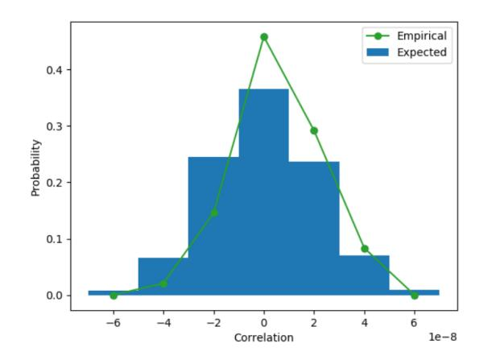

(a) Expected correlation = 0. Each of the 7 bins is of size 2−25.57 starting from −2 −23.76 .

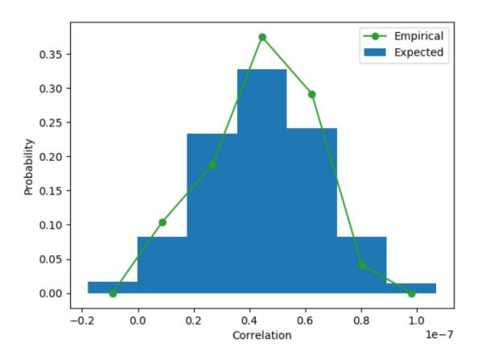

(b) Expected correlation = ±2 −24.42 . Each of the 7 bins is of size 2−25.73 starting from 2−25.72 .

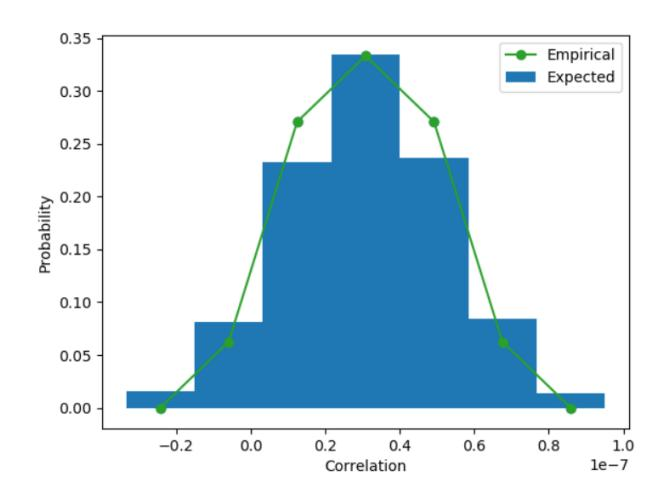

(c) Expected correlation = ±2 −24.95. Each of the 7 bins is of size 2−25.69 starting from 2 −24.83 .

Fig. 6: The distribution of the empirical correlations from 3 × 48 experiments (green) compared against histograms of the respective expected values (blue). Absolute values of the correlations are used in the top-right and bottom plots.

{15}------------------------------------------------

#### 4.3 Experimental Setup

We design and implement a custom DES accelerator to speed up the experiments. [Figure 7](#page-15-1) depicts the architecture of our computing system. It fits on a single instance of Zynq UltraScale+ MPSoC ZCU102. We boot PetaLinux on its hardwired quad-core Arm Cortex-A53 to make it an easily controllable standalone computing system, controllable through a flexible Python interface. We use the AXI interface provided by Xilinx to map 128 cryptanalitic cores as peripherals. This design is easily portable and expandable. Running at a clock speed of 250MHz the throughput of each core is 227.89 encryptions per second, requiring 19.17 hours to run a single experiment consisting of 251 encryptions using 128 cores.

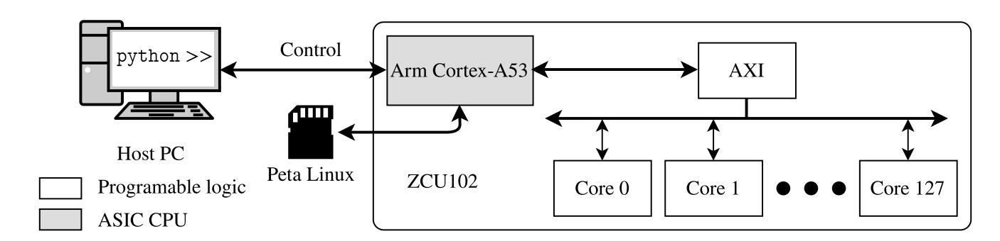

Fig. 7: Architecture of the accelerator for cryptanalysis ofDES.

[Figure 8](#page-16-0) depicts architecture of each core. A core contains a round-pipelined implementation of DES with the supporting logic for cryptanalysis. Said logic includes: pseudo-random plaintext generation, masking the plaintext and the ciphertext values, evaluating the linear approximation and keeping the correlation. We increase flexibility and usability of the platform by allowing runtime reconfiguration of: masks, keys, pseudo-random number generation and the number of experiments. Therefore, experiments are performed fully in hardware. To the best of our knowledge, this is the first application of hardware for cryptanalysis of this sort.

We generate plaintexts using 64-bit Linear Feedback Shift Registers (LFSRs). LFSR hardware allows us to configure each with a different polynomial and starting value (seed). We ensure that pseudo-random sequences do not repeat by using primitive 64-bit polynomials—leading to sequence length of 264—for each LFSR. For more implementation details and source code we refer the interested reader to [\[D'h19\]](#page-19-5).

## 5 Discussion

Matsui's linear attack against DES, and especially Algorithm 1, was not familiar with the linear hull effect, thus it trivially assumed that it does not exist. In fact, many subsequent works like [\[Jun01,](#page-19-6) [BV17\]](#page-19-7) assume that either the DES cipher does not exhibit the linear hull effect or that every hull of DES contains one

{16}------------------------------------------------

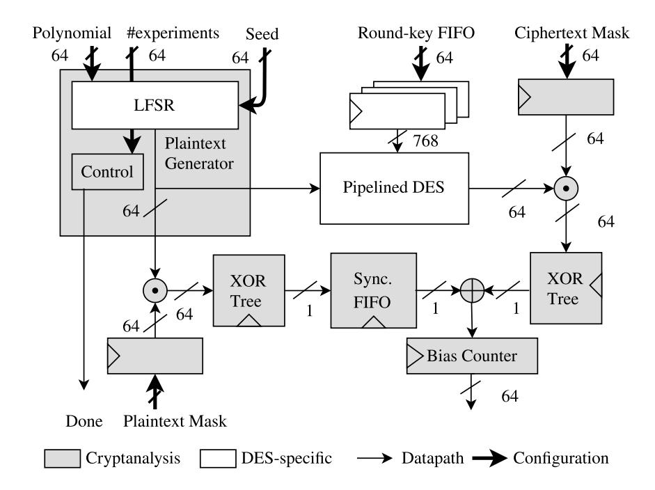

Fig. 8: Architecture of a cryptanalytic core.

dominant linear trail, and therefore, any other trails can be treated as noise. Moreover, [\[Jun01\]](#page-19-6) presents a series of experiments in which the mean of the empirical correlation is not perceptibly greater than the theoretical one, the author concluding that the linear hull effect is not visible for DES.

In [section 4](#page-12-0) we presented experimental verification for our distinguisher. As can be seen in Tables [2](#page-13-0)[–3,](#page-14-1) while the empirical results are indeed "close enough" to their expected values, they are not quite the same. These small differences may be ignored as sample error (see also [\[BT13\]](#page-18-6)) but they may also mean that another trail exists within Matsui's hull. As per Ashur and Rijmen in [\[AR16\]](#page-18-3) ignoring some of the linear trails inside the hull leads to an over- or under-estimation of the expected correlation, leading in turn to a different success probability than what the adversary expects.

In our research we questioned the presence of the linear hull effect for the DES cipher. Since it can be challenging to identify another trail for the full DES, we restricted our search to round-reduced versions of the cipher. We performed our search by trial and error, starting by analyzing the existence of a second trail for two rounds of DES. We imposed the constraints that the input and output masks are equal to the ones defining the last two rounds of the trail presented in [subsection 3.3.](#page-10-0) This search lead to a contradiction, therefore we increased the number of rounds. We stopped at 5 rounds, when we found a second trail. Since we didn't use any automatic tool for this analysis, more linear hulls might exist.

The existence of the second 5-round linear trail, presented in [Figure 9,](#page-17-0) proves that DES exhibits the linear hull effect. The correlation of this second trail is 2 −21.19, which is indeed significantly smaller than 2−10.89 , the correlation of the original trail (in both cases we consider the correlation of the last round equal to ±2 −8 · 14). Therefore, it can be treated as noise.

{17}------------------------------------------------

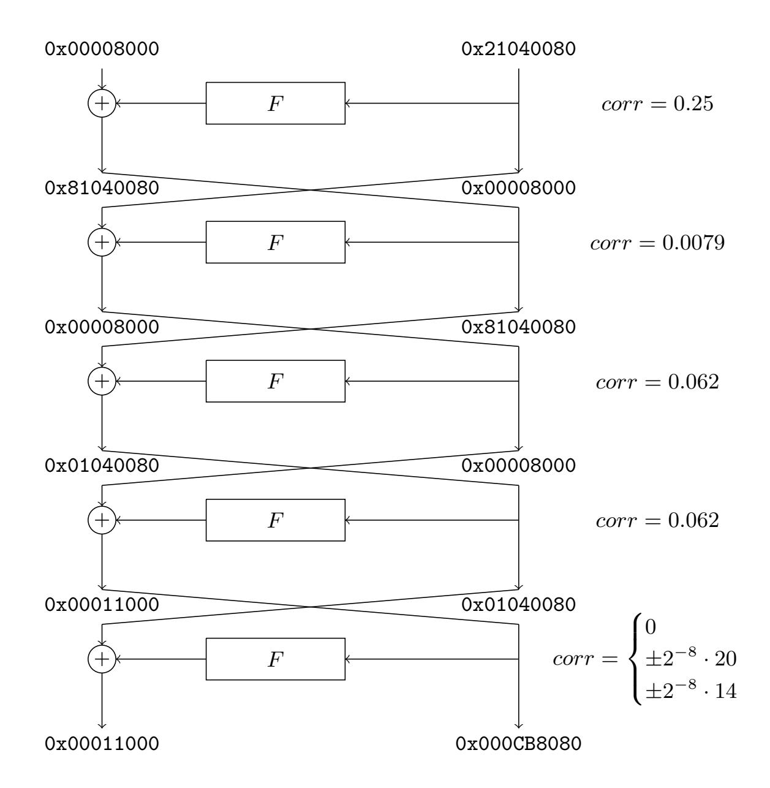

Fig. 9: The second 5-round linear trail

We stress that, even though DES exhibits the linear hull effect, our experiments on the full DES support the hypothesis that any other existing trail has a negligible contribution to the hull correlation. More precisely, an adversary is able to distinguish between the three key-classes and, therefore, gaining an information regarding the master key.

## 5.1 Conclusion

In this paper we extended the work in [\[AP18\]](#page-18-4) by constructing a 0-correlation key-dependent linear trails that cover more than a single round of DES. First, we presented a 2-round linear approximation where the last round may have correlation 0, depending on the key. We showed how to connect these two rounds to Matsui's trail, resulting in 0-correlation key-dependent trails covering the full DES.

The work described can be extended in different directions. For example, it will be interesting to identify other block ciphers that exhibit "poisonous" 

{18}------------------------------------------------

linear trails and revisit, if exist, the linear attacks published against them. It also remains to be investigated if and how the attacks presented in this paper can be improved in term of both data and time complexity and how they affect the security of 3DES. Future research should also consider the extension of these attacks to the case of multiple linear cryptanalysis.

## Acknowledgements

The authors would like to thank Vincent Rijmen for all the useful discussions and ideas. Tomer Ashur is an FWO post-doctoral fellow under Grant Number 12ZH420N. This work was supported in part by the Research Council KU Leuven C1 on Security and Privacy for Cyber-Physical Systems and the Internet of Things with contract number C16/15/058 and by CyberSecurity Research Flanders with reference number VR20192203. The fourth author would like to thank his parents and Charlotte for their support during his studies and thesis.

## References

- A˚ABL12. Mohamed Ahmed Abdelraheem, Martin ˚Agren, Peter Beelen, and Gregor Leander. On the distribution of linear biases: Three instructive examples. In Reihaneh Safavi-Naini and Ran Canetti, editors, Advances in Cryptology - CRYPTO 2012 - 32nd Annual Cryptology Conference, Santa Barbara, CA, USA, August 19-23, 2012. Proceedings, volume 7417 of Lecture Notes in Computer Science, pages 50–67. Springer, 2012.
- AP18. Tomer Ashur and Raluca Posteuca. On linear hulls in one round of DES. IACR Cryptology ePrint Archive, 2018:635, 2018.
- AR16. Tomer Ashur and Vincent Rijmen. On linear hulls and trails. In Orr Dunkelman and Somitra Kumar Sanadhya, editors, Progress in Cryptology - IN-DOCRYPT 2016 - 17th International Conference on Cryptology in India, Kolkata, India, December 11-14, 2016, Proceedings, volume 10095 of Lecture Notes in Computer Science, pages 269–286, 2016.
- BCQ04. Alex Biryukov, Christophe De Canni`ere, and Micha¨el Quisquater. On multiple linear approximations. In Matthew K. Franklin, editor, Advances in Cryptology - CRYPTO 2004, 24th Annual International CryptologyConference, Santa Barbara, California, USA, August 15-19, 2004, Proceedings, volume 3152 of Lecture Notes in Computer Science, pages 1–22. Springer, 2004.
- Bih94. Eli Biham. On Matsui's Linear Cryptanalysis. In Advances in Cryptology - EUROCRYPT '94, Workshop on the Theory and Application of Cryptographic Techniques, Perugia, Italy, May 9-12, 1994, Proceedings, pages 341–355, 1994.
- BR11. Andrey Bogdanov and Vincent Rijmen. Zero-correlation linear cryptanalysis of block ciphers. IACR Cryptology ePrint Archive, 2011:123, 2011.
- BT13. Andrey Bogdanov and Elmar Tischhauser. On the wrong key randomisation and key equivalence hypotheses in matsui's algorithm 2. In Shiho Moriai, editor, Fast Software Encryption - 20th International Workshop, FSE 2013, Singapore, March 11-13, 2013. Revised Selected Papers, volume 8424 of Lecture Notes in Computer Science, pages 19–38. Springer, 2013.

{19}------------------------------------------------

- BV17. Andrey Bogdanov and Philip S. Vejre. Linear cryptanalysis of des with asymmetries. In Tsuyoshi Takagi and Thomas Peyrin, editors, Advances in Cryptology – ASIACRYPT 2017, pages 187–216, Cham, 2017. Springer International Publishing.
- CV94. Florent Chabaud and Serge Vaudenay. Links between differential and linear cryptanalysis. In Santis [\[San95\]](#page-19-8), pages 356–365.
- DES. FIPS publication 46-3, Data Encryption Standard (DES).
- D'h19. Stef D'haeseleer. Hardware design for cryptanalysis. Master's thesis, KU Leuven, 2019. Tomer Ashur and Danilo Sijacic and Ingrid Verbauwhede (promotors).
- JR94. Burton S. Kaliski Jr. and Matthew J. B. Robshaw. Linear cryptanalysis using multiple approximations. In Yvo Desmedt, editor, Advances in Cryptology - CRYPTO '94, 14th Annual International Cryptology Conference, Santa Barbara, California, USA, August 21-25, 1994, Proceedings, volume 839 of Lecture Notes in Computer Science, pages 26–39. Springer, 1994.
- Jun01. Pascal Junod. On the complexity of matsui's attack. In Serge Vaudenay and Amr M. Youssef, editors, Selected Areas in Cryptography, pages 199–211, Berlin, Heidelberg, 2001. Springer Berlin Heidelberg.
- Mat93. Mitsuru Matsui. Linear cryptanalysis method for DES cipher. In Tor Helleseth, editor, Advances in Cryptology - EUROCRYPT '93, Workshop on the Theory and Application of of Cryptographic Techniques, Lofthus, Norway, May 23-27, 1993, Proceedings, volume 765 of Lecture Notes in Computer Science, pages 386–397. Springer, 1993.
- Nyb94. Kaisa Nyberg. Linear approximation of block ciphers. In Santis [\[San95\]](#page-19-8), pages 439–444.
- San95. Alfredo De Santis, editor. Advances in Cryptology - EUROCRYPT '94, Workshop on the Theory and Application of Cryptographic Techniques, Perugia, Italy, May 9-12, 1994, Proceedings, volume 950 of Lecture Notes in Computer Science. Springer, 1995.