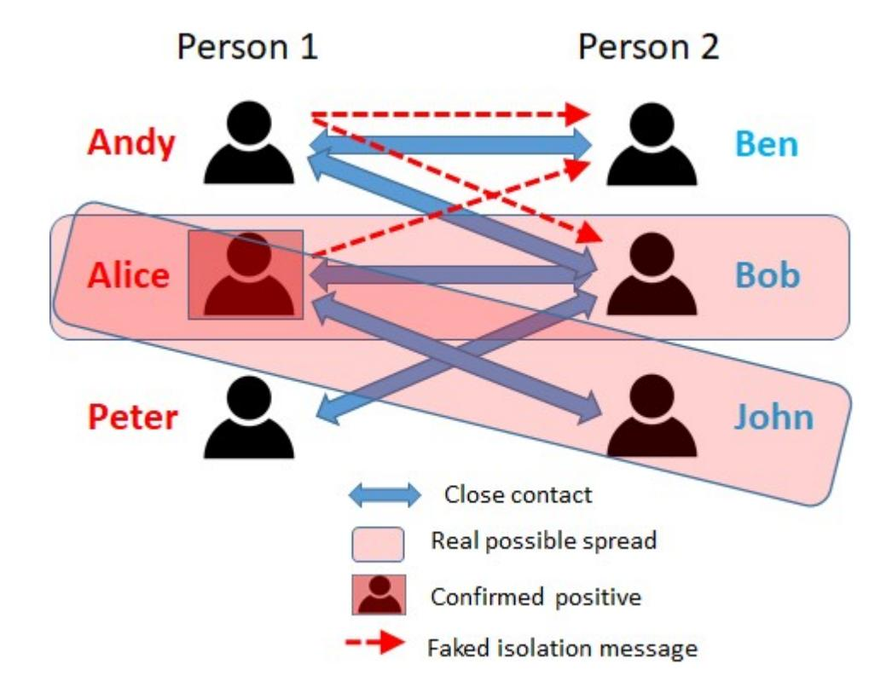
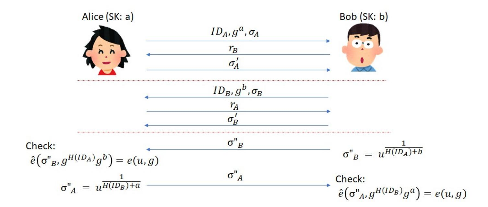
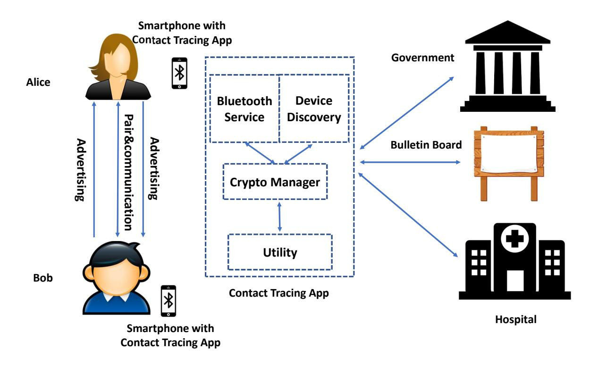

{0}------------------------------------------------

# Privacy-Preserving COVID-19 Contact Tracing App:

# A Zero-Knowledge Proof Approach

Joseph K. Liu1 , Man Ho Au2 , Tsz Hon Yuen2 , Cong Zuo4 , Jiawei Wang1 , Amin Sakzad1 , Xiapu Luo3 , Li Li1 , Kim-Kwang Raymond Choo5

- 1 Department of Software Systems and Cybersecurity, Faculty of Information Technology, Monash University, Australia
  - 2 The University of Hong Kong, Hong Kong
  - 3 The Hong Kong Polytechnic University, Hong Kong
    - 4 Nanyang Technological University, Singapore
    - 5 The University of Texas at San Antonio, USA

Abstract. In this paper, we propose a privacy-preserving contact tracing protocol for smart phones, and more specifically Android and iOS phones. The protocol allows users to be notified, if they have been a close contact of a confirmed patient. The protocol is designed to strike a balance between privacy, security, and scalability. Specifically, the app allows all users to hide their past location(s) and contact history from the Government, without affecting their ability to determine whether they have close contact with a confirmed patient whose identity will not be revealed. A zero-knowledge protocol is used to achieve such a user privacy functionality. In terms of security, no user can send fake messages to the system to launch a false positive attack. We present a security model and formally prove the security of the protocol. To demonstrate scalability, we evaluate an Android and an iOS implementation of our protocol. A comparative summary shows that our protocol is the most comprehensive and balanced privacy-preserving contact tracing solution to-date.

# 1 Introduction

The COVID-19 pandemic has significantly changed many aspects of our society, with both short-term impacts (e.g., temporary lockdowns, and social and physical distancing) and long-term impacts (e.g., economic [\[15\]](#page-16-0)). In recent times, a number of cities, states, and countries are re-opening, where some businesses and activities are allowed to operate and proceed with certain limitations (e.g., wearing of personal protection equipment, and practising social / physical distancing). However, there is also the possibility of individuals, and in some instances large number of individuals, coming in close proximity with another person with undetected COVID-19 infection (e.g., the individual is asymptomatic or display mild symptoms) unknowingly. A recent high profile example is the recent 

{1}------------------------------------------------

incident involving the sitting U.S. president [\[17,](#page-17-0)[55\]](#page-19-0). This highlights the importance of contact tracing [\[27,](#page-17-1)[46\]](#page-18-0), particularly in the current climate where there is the potential of a subsequent wave of COVID-19 affecting the public. The U.S. Centers for Disease Control and Prevention (CDC), for example, has released resources, such as contact tracing communications toolkit and guidelines for various stakeholder groups. The effectiveness of contact tracing, particularly digital contact tracing, has also been the focus of recent studies. For example, in a recent Science article, Ferretti et al. [\[20\]](#page-17-2) reported that "Improved sensitivity of testing in early infection could also speed up the algorithm and achieve rapid epidemic control".

Contact tracing allows relevant stakeholders, such as healthcare authorities, to identify and reach out to potentially infected individuals, so that appropriate measures can be taken (e.g., further testing, self-quarantine, and/or hospitalization). However, there are limitations in contact tracing. For example, how can we ensure that individuals who have unknowingly come into contact with a person with undetected COVID-19 infection be identified and subsequently contacted? This reinforces the importance of leveraging technologies, such as smart devices with built-in features such as Bluetooth communication and geolocation (e.g., mobile and wearable devices), to facilitate contact tracing.

A number of automated contact tracing protocols and applications (apps) have been developed, and examples include those designed by Apple Inc. and Google Inc. (GAEN) [\[3](#page-16-1)[,4\]](#page-16-2), the decentralized privacy-preserving proximity tracing (DP-3T) app [\[51\]](#page-19-1), and those reported in [\[45,](#page-18-1)[13\]](#page-16-3). A security analysis is provided in [\[16\]](#page-16-4) for some of these schemes, such as GAEN, DP-3T, etc. The approaches in [\[45,](#page-18-1)[13\]](#page-16-3) rely on the use of smart devices to learn and possibly share the device user's location and associated timestamp with other users. However, such approaches may reveal certain metadata about the user's device (e.g., make and model) and contact information. Hence, there have been studies on the security of these approaches [\[25\]](#page-17-3). For example, it was revealed that DP-3T is vulnerable to relay and replay attacks, and an interactive scheme designed to prevent relay and replay attacks without affecting the existing features was presented [\[52\]](#page-19-2). In addition, a non-interactive scheme to counter relay and replay attacks in DP-3T [\[51\]](#page-19-1) and the approaches of [\[45,](#page-18-1)[13\]](#page-16-3) was introduced in [\[40\]](#page-18-2), using 'delayed authentication'. This is a novel message authentication code (MAC) in which the verification step is done in two phases, where the key is not required in one phase and the message is not in the other phase. A fake exposure notification attack on GAEN-based schemes is described in [\[8\]](#page-16-5).

Similar to other healthcare frameworks [\[14,](#page-16-6)[6,](#page-16-7)[26](#page-17-4)[,34\]](#page-18-3), there are also privacy considerations in the use of such contact tracing apps. Individual citizens may not wish to be traced, particularly when they are participating in sensitive events (e.g., political demonstrations). As recent as January 2021, the Singapore Government reportedly contact tracing data will be made available to the 

{2}------------------------------------------------

law enforcement agency to facilitate the investigation of serious criminal cases[6](#page-2-0) . This clearly has privacy implications. This reinforces the importance of having a privacy-preserving contact tracing system. However, designing secure, privacypreserving, and scalable contact tracing apps remains a challenge, and this is the challenge we seek to address in this proposal.

Our Contributions. In this paper, we will design a privacy-preserving COVID-19 contact tracing protocol for Bluetooth-enabled smartphone users. The protocol allows users to record their close contacts in a privacy-preserving yet authenticated manner (i.e., prevents the sending of fabricated identification information). The 'closeness' can be customized based on existing medical advice, say within 6 feet. The zero-knowledge proof allows the user to preserve his/her privacy, in the sense that users can hide their prior locations and contact histories, for example from unauthorized entities. For example, when a user has been determined to be infected, (s)he proves using the zero-knowledge protocol to the medical doctor all his/her previous close contacts. Without gaining direct access to the contacts, information required to notify the related individuals is published, without the public learning the identity of the patient. Hence, the medical doctor does not learn the patient's contacts, including the location, name or any identification information. However, the individual been notified can be assured that (s)he is a close contact of an infected person. The probability of this particularly individual of correctly guessing the infected person among a list of close contacts is not better than a wild guess. The zero-knowledge protocol also ensures that no one is able to send any fabricated message, in the sense that if a user is not determined by a medical doctor to be infected, (s)he will not be able to convince others using the app. In addition, a confirmed infected patient will not be capable of convincing anyone who is not a close contact to be a close contact. As the notification does not include any link to any website or contain any attachment, this reduces the risk of malware/ransomware infection.

The layout of this paper is as follows. We present the system and threat models in Section [2.](#page-3-0) The cryptographic primitives that underpin our proposed system are presented in Section [3.](#page-4-0) We then present our proposed system in Section [4,](#page-6-0) and describe the implementation and evaluation findings in Sections [5](#page-12-0) and [6](#page-13-0) respectively. The last two sections present our discussion and conclusion. The recent literature will be reviewed in Appendix [A.](#page-19-3) Remark: We also want to remind readers that the references on preprints posted on arXiv or IACR eprint are not peer-reviewed by arXiv or IACR; they should not be relied upon without context to guide clinical practice or health-related behavior and should not be reported in news media as established information without consulting multiple experts in the field.

6 [https://www.technologyreview.com/2021/01/05/1015734/](https://www.technologyreview.com/2021/01/05/1015734/singapore-contact-tracing-police-data-covid/) [singapore-contact-tracing-police-data-covid/](https://www.technologyreview.com/2021/01/05/1015734/singapore-contact-tracing-police-data-covid/), last accessed January 13, 2021

{3}------------------------------------------------

### 2 System and Threat Models

### 2.1 System Model

Our system comprises the following entities:

- Bulletin board BB: Once information has been posted on the BB, it cannot be erased. The BB can be instantiated by using a blockchain system.
- User: User refers to an individual who has our contact tracing app installed on their smartphone. In the rest of this paper, we will use Alice and Bob to denote two individual users who have come into close contact.
- Medical doctor D: Individuals can be only be confirmed to be positive by a practising D, who is also affiliated with a medical institution (e.g., medical practice or hospital).
- Government GV: GV is responsible for the registration of users and their app. This is not an unreasonable requirement, since users need to provide proof of identification when signing up for their smartphones. GV's public/private key pair is (PKGV ,SKGV ), and clearly PKGV is known to the public.

In our system model, we assume that no one is able to modify the app, and the owner can read all data generated, stored and communicated via the app installed on an Internet-connected and Bluetooth-enabled smartphone (e.g., WiFi). We also assume that users will not reveal their infection status publicly (e.g., social media posts) or share their own secret keys.

## 2.2 Threat Model

The adversary is assumed to be honest-but-curious, in the sense that they follow the defined algorithms but are sufficiently curious to learn more information. Also in our threat model, we only include cryptographic attack. In other words, network attacks (e.g. distributed denial of service), software attacks (e.g. modifying the app and uploading the modified app to a third-party app store), physical attacks (e.g. stealing the smartphone), etc, are out of scope. Under these conditions, we define the following threat model to our system (see also Figure [1\)](#page-4-1):

- 1. [Tracebility Completeness] All close contacts of a confirmed infected individual (hereafter referred to as patient) will be notified of the contact date(s). All honest-but-curious cryptographic adversaries should not be able to prevent any close contact of the patient from being notified. In Figure [1,](#page-4-1) Bob and John are the close contacts of Alice, and both Bob and John should be notified as a close contact of a patient (without learning that the patient is Alice).
- 2. [False Positive (case 1)] Anyone who is not a patient cannot impersonate as one and send out messages to their close contacts (e.g., ask them to selfquarantine). In Figure [1,](#page-4-1) Andy cannot send any "close contact message" to Ben and Bob. Peter also cannot send any "close contact message" to Bob.

{4}------------------------------------------------

Fig. 1. Threat Model

- 3. [False Positive (case 2)] Patients can only send messages to their close contacts (e.g. ask them to self-isolate). For example, as shown in Figure [1,](#page-4-1) Alice is not able to send any "close contact message" to Ben, who is not her close contact. Here, we do not consider the medical doctor as an adversary in both cases [\(2\)](#page-3-1) and [\(3\)](#page-4-2).
- 4. [Patient Privacy] Other than the medical doctor who certified that the user is infected, no one else should not be able to find out the identity of the patient (in the sense not better than a wild guess). For example, as shown in Figure [1,](#page-4-1) Ben does not know any information about the patient. Bob, a close contact of Alice, who had met both Andy and Peter, can correctly guess Alice as the patient with a probability of 1/3. John, another close contact of Alice, will know Alice is the patient.
- 5. [Contact Privacy] No one, except the owner of the app, should be able to find out the identity or location of the close contact of a patient, as shown in Figure [1.](#page-4-1) An cryptographic adversary may attempt to (unsuccessfully) locate information about the close contact of a patient.

### 3 Cryptographic Primitives

### 3.1 Signature Scheme

A signature scheme consists of three algorithms, which are defined as follow:

– (SK, PK) ← KeyGen(λ) as a PPT algorithm that on input a security parameter λ ∈ N outputs a secret/public key pair (SK, PK).

{5}------------------------------------------------

- $\sigma \leftarrow \mathsf{Sign}(SK, M)$  that on input a secret key SK and a message M produces a signature  $\sigma$ .
- accept/reject  $\leftarrow$  Verify $(PK, \sigma, M)$  that on input a public key PK, a message M and a signature  $\sigma$  returns accept or reject. An accept output implies that the message-signature pair is valid.

A secure signature scheme should provide existential unforgeability against adaptive chosen-message attacks, based on the standard definition of [23]. Existential unforgeability under a weak chosen message attack (a.k.a. weakly unforgeable) is a weaker definition [11], where the adversary submits all signature queries prior to seeing the public key.

#### 3.2 Group Signature Scheme

A group signature allows a user to sign on behalf of the group, while the verifier only knows that the signer is one of the users of this group without knowing the signer's identity. In this setting, there is a group manager tasked with setting up of the group (e.g., publication of the group public key) and issuing of individual user's secret key. The group manager may also have the ability to open the signature, that is, to find out who the actual signer is.

There are several algorithms in a group signature scheme. For simplicity, we only state the algorithms related to our system here:

- $-\sigma \leftarrow \mathsf{GSign}(USK, GPK, M)$  that on input a user secret key USK (issued by the group manager), group public key GPK (generated by the group manager) and a message M produces a signature  $\sigma$ .
- accept/reject  $\leftarrow$  GVerify $(GPK, \sigma, M)$  that on input a group public key GPK, a message M and a signature  $\sigma$ , returns accept or reject. An accept output implies that the message-signature pair is valid.

We follow the standard security definition of group signature in [9], including anonymity and traceability which also implies unforgeability.

#### 3.3 Mathematical Assumptions

**Bilinear Pairings.** Let  $\mathbb{G}_1$ ,  $\mathbb{G}_2$  and  $\mathbb{G}_T$  be cyclic groups of prime order q. u is a generator of  $\mathbb{G}_1$  and g denotes a generator of  $\mathbb{G}_2$ . A function  $e: \mathbb{G}_1 \times \mathbb{G}_2 \to \mathbb{G}_T$  is a bilinear map if the following properties hold:

- Bilinearity:  $e(A^x, B^y) = e(A, B)^{xy}$  for all  $A \in \mathbb{G}_1$ ,  $B \in \mathbb{G}_2$  and  $x, y \in \mathbb{Z}_q$ ;
- Non-degeneracy:  $e(u,g) \neq 1$ , where 1 is the identity of  $\mathbb{G}_T$ ;
- Efficient computability: there exists an algorithm that can efficiently compute e(A, B) for all  $A \in \mathbb{G}_1$  and  $B \in \mathbb{G}_2$ .

Assumption 1 underpins our contact privacy (see Section 2.2), which is similar to the truncated decision (q' + 2)-ABDHE problem [22].

**Definition 1 (Assumption 1).** Suppose that  $\tilde{u} \in_R \mathbb{G}_1$ ,  $g \in_R \mathbb{G}_2$ ,  $b \in_R \mathbb{Z}_q$ ,  $Z_0 \in_R \mathbb{G}_T$  and  $Z_1 = e(\tilde{u}, g)^{b^{q'+2}}$ . When given  $(\tilde{u}, \tilde{u}^b, \ldots, \tilde{u}^{b^{q'}}) \in \mathbb{G}_1$  and  $g, g^b \in \mathbb{G}_2$ , no PPT adversary can distinguish  $Z_0$  and  $Z_1$  with non-negligible probability.

{6}------------------------------------------------

#### 3.4 Zero-Knowledge Proof

A zero-knowledge proof is a two-party protocol that allows one party to convince the other party that the topic presented is true without revealing anything else. In this paper, we are interested in zero-knowledge proof for NP language. Specifically, let R be a polynomial time decidable binary relation and LR be the NP language defined by R, i.e., LR = {x|∃w s.t.(x, w) ∈ R}. We say w is a witness for statement x. The zero-knowledge proof protocol we considered in this paper is known as Σ-Protocol, which is a 3-move protocol between prover P and verifier V such that the second message (from V to P) is just the random coins of V . A Σ-protocol between P and V satisfies the following properties.

- Completeness: If x ∈ LR, prover P with auxiliary input w convinces V with overwhelming probability.
- Special Soundness: Given two transcripts (t, c, z) and (t, c0 , z0 ) for statement x, there exists an algorithm that outputs w s.t. (x, w) ∈ R.
- Honest Verifier Zero-Knowledge (HVZK): Given x and c, there exists an algorithm that outputs (t, z) such that (t, c, z) is indistinguishable to the real transcript between P with auxiliary input w and V .

Σ-Protocol can be converted to full zero-knowledge in the common reference string model using standard techniques. Also, it can be converted to noninteractive zero-knowledge argument in the random oracle model by replacing the random coins of the verifier with the output of a cryptographic hash function on the first message of the prover.

### 4 Our Proposed System

There are four phases in our system. In the Registration Phase, each user chooses his/her secret key and public key, and uploads the public key to the Government website for registration. This allows the Government to link the public key with the user's name or identity. This is to provide accountability and prevent double or multiple registration of the same user. This process will repeat each day with a new key pair registered. A medical doctor gets an additional individual secret key issued by his/her affiliated organization (e.g., hospital), which is used to generate a group signature on behalf of the affiliated organization.

In the Meeting Phase, each user's app will use Bluetooth to broadcast a package to other users' smartphones (and the apps) at a regular time interval (e.g., a minute). Upon receiving a threshold number of the same package within a certain timeframe (e.g., 15 minutes), the app will confirm the relevant user as a close contact. After a mutual validation (of package) process, the two apps will jointly generate two different credentials to be stored on each smartphone. The credential will be used later to prove to the medical doctor (in zero-knowledge) that the other person is a close contact, if one party is medically confirmed to be infected.

{7}------------------------------------------------

In the Medical Treatment Phase, the patient executes the zero-knowledge proof protocol with the medical doctor, to prove (s)he has close contact with other individuals. However, the doctor is not able to learn the identities, public keys, or location of the close contact(s). The doctor signs the zero-knowledge proof using the group signature user secret key (on behalf of his/her affiliated organization), and posts the signature together with the proof to the bulletin board for public awareness (e.g., statistics about the number of infected individuals).

In the **Tracing Phase**, each user checks whether the new entry in the bulletin board is related to them, based on computations using their own secret key. This can be performed either manually (e.g., pull) or automatically (i.e., having the checks pushed to apps).

Next, we will present the detailed description of each phases.

#### 4.1 The Phases

**Setup Phase:** In this phase,  $\mathcal{GV}$  first generates the parameters and the users register with  $\mathcal{GV}$ . Users also need to update the key with  $\mathcal{GV}$  daily, unless they are medically confirmed as infected. The detailed steps are outlined below:

- 1. (Parameter Generation) The input  $1^{\lambda} \in \mathbb{N}$  is a security parameter, and let  $\mathbb{G}_1$ ,  $\mathbb{G}_2$  and  $\mathbb{G}_T$  be cyclic groups of prime order q such that q is a  $\lambda$ -bit prime. Also, let  $e: \mathbb{G}_1 \times \mathbb{G}_2 \to \mathbb{G}_T$  be a bilinear map.  $\mathcal{GV}$  selects generators  $u, u_1, u_2 \in \mathbb{G}_1$  and  $g, g_1, g_2 \in \mathbb{G}_2$ . Let  $H: \{0,1\}^* \to \mathbb{Z}_q$  be a cryptographic hash function.  $\mathcal{GV}$  also selects its secret and public key pair  $(SK_G, PK_G) \leftarrow \text{KeyGen}(\lambda)$ .  $\mathcal{GV}$  publishes public parameters  $(\lambda, H, PK_G, u, u_1, u_2, g, g_1, g_2)$ . In practice, these parameters can also be embedded into the user's app which can be downloaded from the official app stores.
- 2. (User Registration) On each day, non-infected user (e.g., Alice) chooses a secret key  $SK_A$  as  $a \in \mathbb{Z}_q$  and computes the public key  $PK_A$  as  $A = g^a$ . The user, say Alice, registers with  $\mathcal{GV}$  by uploading her personal information and  $PK_A$  7.  $\mathcal{GV}$  also randomly generates an identifier  $\mathrm{ID}_A \in \mathbb{Z}_q$  for Alice.  $\mathcal{GV}$  generates a signature  $\sigma_A \leftarrow \mathrm{Sign}(SK_G, \{``-\mathrm{VE}", PK_A, \mathrm{ID}_A, \mathrm{DATE}\})$  and sends  $\sigma_A$  and  $\mathrm{ID}_A$  back to Alice, where DATE is the current date. Alice checks the signature by running  $\mathrm{Verify}(PK_G, \sigma_A, \{``-\mathrm{VE}", PK_A, \mathrm{ID}_A, \mathrm{DATE}\})$ . If this is valid, Alice stores  $\sigma_A$  and  $\mathrm{ID}_A$  in her app. Otherwise, she aborts. NOTE:  $\mathcal{GV}$  will give a signature with  $\{``+\mathrm{VE}", PK_A, \mathrm{ID}_A, \mathrm{DATE}\}$  (instead of the typical  $``-\mathrm{VE}"$  message) to confirmed infected user. This is to distinguish a confirmed case from others. The infected user's public key will also not be updated.
- 3. (Additional step taken by the medical doctor) Each medical doctor  $\mathcal{D}$  gets an additional group signature user secret key GSK from the hospital manager (who acts as the group manager of the group signature) in the app. Each hospital also publishes the group signature group public key GPK.

 $7 \text{ }GV$  may record the related identification information (e.g., name, phone, email) of the user if this is a first-time registration.

{8}------------------------------------------------

Meeting Phase: In this phase, each non-confirmed user (e.g. Alice) will use bluetooth to broadcast the hash  $h_A = H(``-VE", ID_A, PK_A, \sigma_A)$  to the surrounding people periodically (e.g. every minute). For any confirmed user, a ``+VE" package (e.g. without hashing (``+VE",  $ID_P, PK_P, \sigma_P$ ) denoting the owner of the app who has been confirmed by the medical doctor as positive) will be broadcasted instead. If it has been received, other users should report to  $\mathcal{GV}$  immediately after verifying the signature  $\sigma_P$ . Otherwise once another user (e.g. Bob) has received a number of the same hash broadcast within a certain time (e.g. receive 15 packages in 15 minutes), they (Alice and Bob) are considered as close contact. In below, we describe a protocol executed between Alice and Bob so that Alice will record Bob's information as her close contact. Bob will also Alice's information as his close contact at the end of the protocol.

- 1. (Package Validation) After receiving (a threshold number of) Alice's hash  $h_A$ , Bob('s smartphone) pairs with Alice('s smartphone) and Bob needs to validate Alice's package. Bob first asks Alice to send him the tuples  $(ID_A, PK_A, \sigma_A)$ . Then, Bob computes  $h'_A = H(``-VE`', ID_A, PK_A, \sigma_A)$  and checks if  $h_A = h'_A$ . Bob aborts if it is not equal; otherwise, he continues and randomly generates a challenge number  $r_B \in_R \mathbb{Z}$  and sends  $r_B$  to Alice. Alice uses her  $SK_A$  ( $a \in \mathbb{Z}_q$ ) to generate a Schnorr signature on the message  $r_B$ , as follow:
  - (a) Randomly chooses  $k \in_R \mathbb{Z}_q$ .
  - (b) Computes  $t = H(g^k, r_B)$ .
  - (c) Computes  $s = k at \mod q$ .
  - (d) Outputs the signature  $\sigma'_A = (s, t)$  for message  $r_B$ .

Alice sends  $\sigma'_A$  to Bob for verification. Bob first verifies  $PK_A$   $(A \in \mathbb{G}_2)$  by running

$$Verify(PK_G, \sigma_A, \{PK_A, ID_A, DATE\}). \tag{1}$$

If it is valid, Bob verifies Alice's Schnorr's signature  $\sigma_A' = (s, t)$  by checking if

$$t = H(g^s A^t, r_B)$$

If it is equal, Bob stores Alice's package  $(ID_A, A, \sigma_A)$  in his app. Otherwise, aborts the protocol.

Similarly for Alice, Bob's package  $(ID_B, B, \sigma_B)$  will be stored in Alice's app if the verification is successful.

2. (Identity Mutual Commitment) Alice and Bob need to store each other's identification information and subsequently generate a zero-knowledge proof to  $\mathcal{D}$  as a close contact to a patient (if either of them is confirmed). In order to ensure the correct generation of the proof, we need to have an additional mutual commitment in this phase.

Bob uses his secret key  $b \in \mathbb{Z}_q$  and Alice's identifier  $\mathtt{ID}_A$  to generate

$$\sigma_B^{\prime\prime}=u^{\frac{1}{H(\mathrm{ID}_A)+b}}$$

{9}------------------------------------------------

and sends σ 00 B to Alice. Alice checks if

$$e(\sigma_B^{\prime\prime}, g^{H(\mathtt{ID}_A)}B) = e(u, g)$$

If it is equal, Alice stores (B, IDB, σ00 B, DATE) in her app.

Alice uses her secret key a ∈ Zq and Bob's identifier IDA ∈ Zq to generate

$$\sigma_A'' = u^{\frac{1}{H(\mathrm{ID}_B) + a}}$$

and sends σ 00 A to Bob. Bob checks if

$$e(\sigma_A'', g^{H(ID_B)}A) = e(u, g)$$

If it is equal, Bob stores (A, IDA, σ00 A, DATE) in his app.

The meeting phase is illustrated in Figure [2.](#page-9-0)

Fig. 2. Meeting Phase

Medical Treatment Phase: In this phase, we assume Alice is determined to be infected by the medical doctor D. Alice also informs D of her close contacts during the dates required, without revealing their identifiers or public keys. Instead, she (Alice's app) will generate a pseudo-public key of each of her close contacts (e.g., Bob) together with a zero-knowledge proof from the mutual commitment generated in the Meeting Phase – see Step [\(2\)](#page-8-0) to prove that she has contacted with the people. D then publishes the pseudo-public key to BB and the public can check whether this pseudo-public key is associated with them.

D and Alice execute the following protocol:

1. (Authentication of Alice) D authenticates Alice by executing Meeting Phase Step [\(1\)](#page-8-1) (Package Validation) and obtains her identifier IDA.

{10}------------------------------------------------

- 2. (Contact Retrieval) Alice retrieves her contacts that she came into contact with during the incubation period, say  $DATE_i$ . Suppose Alice was in contact with Bob on May 13, then Alice retrieves ( $ID_B, B, \sigma''_B, 13$ th May) from her app.
- 3. (Pseudo-Public Key) Alice generates the pseudo-public key for Bob, by first randomly choosing  $x \in_R \mathbb{Z}_q$  and computing:

$$h = e(u, g)^x, \qquad \widehat{B} = e(u, B)^x = e(u, g^b)^x = h^b$$
 (2)

Then,  $(h, \widehat{B})$  is sent to  $\mathcal{D}$ .

4. (**Zero-Knowledge Proof**) Alice needs to prove to  $\mathcal{D}$  that  $(h, \widehat{B})$  is correctly formed. Correct means Alice has received a valid signature  $\sigma''_B$  under the public key  $B = g^b$  and  $\widehat{B} = h^b, h = e(u, g)^x$ . Note that  $\mathcal{D}$  also knows Alice's identifier  $\mathrm{ID}_A$ . Conceptually, Alice needs to prove in zero-knowledge that

$$PK\{(\sigma_B'', B, x) : h = e(u, g)^x, \widehat{B} = e(u, B)^x, e(\sigma_B'', g^{H(ID_A)}B) = e(u, g)\}.$$
(3)

In order to instantiate this proof, Alice first randomly generates  $s_1, s_2, t \in \mathbb{Z}_q$  and computes

$$A_1 = g_1^{s_1} g_2^{s_2}, \qquad A_2 = B g_1^{s_2}, \qquad C = \sigma_B'' u_1^t$$

Alice sends  $A_1, A_2, C$  to  $\mathcal{D}$  and proves that

$$PK\{(s_{1}, s_{2}, t, \alpha_{1}, \alpha_{2}, \beta_{1}, \beta_{2}, x) : A_{1} = g_{1}^{s_{1}} g_{2}^{s_{2}} \wedge A_{1}^{x} = g_{1}^{\alpha_{1}} g_{2}^{\alpha_{2}} \wedge A_{1}^{x} = g_{1}^{\alpha_{1}} g_{2}^{\alpha_{2}} \wedge A_{1}^{x} = g_{1}^{\alpha_{1}} g_{2}^{\alpha_{2}} \wedge A_{1}^{x} = e(u, g)^{x} \wedge \widehat{B} = e(u, A_{2}^{x} g_{1}^{-\alpha_{2}}) \wedge e(Cu_{1}^{-t}, g^{H(ID_{A})} A_{2} g_{1}^{-s_{2}}) = e(u, g)\}$$

$$(4)$$

This can be turned into a non-interactive zero-knowledge proof, using the following algorithm:

[Proof Generation]

- (a) Randomly chooses  $r_1, r_2, r_3, r_4, r_5, r_6, r_7, r_8 \in_R \mathbb{Z}_q$ .
- (b) Computes

$$T_1 = g_1^{r_1} g_2^{r_2}, \quad T_2 = A_1^{-r_6} g_1^{r_4} g_2^{r_5}, \quad T_3 = A_1^{-r_3} g_1^{r_7} g_2^{r_8},$$

$$T_4 = e(u, g)^{r_6}, \quad T_5 = e(u, A_2^{r_6} g_1^{-r_5}),$$

$$T_6 = e(u_1^{r_3}, g^{H(ID_A)} A_2) e(C^{r_2} u_1^{-r_8}, g_1)$$

(c) Computes the hash

$$c = H(T_1, T_2, T_3, T_4, T_5, T_6, \widehat{B}, h, A_1, A_2, C, \mathtt{DATE})$$

where DATE is the current date.

{11}------------------------------------------------

(d) Computes

$$z_1 = r_1 - cs_1 \mod q$$
 $z_2 = r_2 - cs_2 \mod q$ 
 $z_3 = r_3 - ct \mod q$ 
 $z_4 = r_4 - cs_1 x \mod q$ 
 $z_5 = r_5 - cs_2 x \mod q$ 
 $z_6 = r_6 - cx \mod q$ 
 $z_7 = r_7 - cs_1 t \mod q$ 
 $z_8 = r_8 - cs_2 t \mod q$ 

(e) Outputs the proof  $\pi:(c, z_1, z_2, z_3, z_4, z_5, z_6, z_7, z_8)$ . [Proof Verification] Computes

$$\begin{split} T_1' &= A_1^c g_1^{z_1} g_2^{z_2} \\ T_2' &= A_1^{-z_6} g_1^{z_4} g_2^{z_5} \\ T_3' &= A_1^{-z_3} g_1^{z_7} g_2^{z_8} \\ T_4' &= h^c e(u,g)^{z_6} \\ T_5' &= \widehat{B}^c e(u,A_2^{z_6} g_1^{-z_5}) \\ T_6' &= \left(\frac{e(C,g^{H(\mathrm{ID}_A)}A_2)}{e(u,g)}\right)^c e(u_1^{z_3},g^{H(\mathrm{ID}_A)}A_2) e(C^{z_2} u_1^{-z_8},g_1) \end{split}$$

Accepts the proof if, and only if,

$$c = H(T_1', T_2', T_3', T_4', T_5', T_6', \widehat{B}, h, A_1, A_2, C, \mathtt{DATE})$$

5. (Publish Pseudo-Public Key) If the proof is correct,  $\mathcal{D}$  generates a group signature  $\sigma_D \leftarrow \mathsf{GSign}(USK, GPK, M)$  on message  $M = (h, \widehat{B}, \mathsf{DATE})$  and publishes  $(\sigma_D, h, \widehat{B}, \mathsf{DATE})$  into  $\mathcal{BB}$ .  $\mathcal{D}$  also informs  $\mathcal{GV}$  that Alice (with identifier  $\mathsf{ID}_A$  and public key A) has been confirmed as positive.  $\mathcal{GV}$  will update its entry on Alice: { ''+VE'',  $PK_A$ ,  $\mathsf{ID}_A$ ,  $\mathsf{DATE}$ } and sign this entry every date (update  $\mathsf{DATE}$  only) until Alice has deemed to be fully recovered (and no longer infectious).

Tracing Phase: At the end of each day (e.g., 23:59:59 hrs), each non-infected user, say Bob, executes the following step:

Bob scans through  $\mathcal{BB}$  for all new entries. For each entry

$$(\sigma_D, h, \widehat{B}, \mathtt{DATE})$$

Bob first retrieves his secret key  $SK_B$   $(b \in \mathbb{Z}_q)$  corresponding to that DATE and checks if:

$$\widehat{B} = h^b. (5)$$

If yes, Bob then verifies the signature by running  $GVerify(\sigma_D, GPK, \{h, \widehat{B}, DATE\})$ . If it is valid, he has been in close contact with a confirmed patient on DATE.

{12}------------------------------------------------

#### 4.2 Security Discussion

We first state our lemmas in the context of the threat model outlined in Section [2.2,](#page-3-2) while the detailed analysis of each lemma will be presented in Appendix [B.](#page-22-0)

#### 1. [Traceability Completeness]

Lemma 1. Our system provides Traceability Completeness if our protocol is correct.

#### 2. [False Positive (case 1)]

Lemma 2. Our system does not have Case 1 False Positive error if the underlying group signature scheme (Section [3.2\)](#page-5-0) is unforgeable.

#### 3. [False Positive (case 2)]

Lemma 3. Our system does not have Case 2 False Positive error if the zeroknowledge proof in Equation [\(3\)](#page-10-0) is sound and the Boneh-Boyen signature [\[11\]](#page-16-8) is weakly unforgeable.

### 4. [Patient Privacy]

Lemma 4. Our system provides Patient Privacy from the public unconditionally, and from the patient's close contacts if the underlying signature scheme (Section [3.1\)](#page-4-3) is unforgeable.

### 5. [Contact Privacy]

Lemma 5. Our system provides Patient Privacy if the zero-knowledge proof in Equation [\(3\)](#page-10-0) and its instantiations are zero-knowledge and Assumption 1 (on page [6\)](#page-5-1) holds in the random oracle model.

### 5 Implementation

We have launched the contact tracing app for both Android and iOS platforms. We tested the Android version on Android 8.0 and 10.0, while the iOS version on iOS 13.7. Figure [3](#page-13-1) illustrates its architecture. The contact tracing app consists of four main modules, namely Bluetooth service, device discovery service, Crypto manager, and utility module. When the app is installed for the first time, the Crypto manager will be initialised with a set of operations such as key generation, downloading public keys or parameters from other parties, etc. Then, the app will start two background services which will interact with other components:

– Crypto manager module encapsulates most of aforementioned operations of Crypto algorithms, such as signing, verification, and etc. The module also helps the user generate key pairs((SKA,PKA)) on a daily basis. Then, it will upload the user's personal information and PKA to GV for finishing the registration, and will wait for the identifier IDA and the signature σA from GV, which will be stored in the storage module along with SKA, PKA and other user information.

{13}------------------------------------------------

Fig. 3. A diagram of the workflow and architecture of our implementation.

- - The device discovering service is a background service listening to nearby Bluetooth advertising packets and filtering out irrelevant packets. When the number of packets received from other devices running our contact tracing app exceeds a predefined threshold, which is set to 15 packets within 15 minutes from the same sender by default, it will pair with that device for further communication.
- The Bluetooth service is another background service listening to nearby Bluetooth pair and connection requests. It also advertises the user's own hash of message periodically to nearby devices.
- The Utility component handles regular tasks such as user interface activities, Network IO, to support other components of this app. For example, user may need to download information from Bulletin Board, which is running on the servers maintained by governments or hospitals.

#### 6 Evaluation

We have conducted experiments to carefully evaluate the performance of our contact tracing system. We install the app in a Google Pixel 4 and a Google Pixel 2 smartphones for emulating the interactions of two people, and execute the tool for doctor in a PC (Macbook Pro, Core i7, 16GB RAM). As to run the test for the iOS version, we use an iPhone 11 and an iPhone SE2 as test machines.

{14}------------------------------------------------

To characterize the latency required by our solution, we measure the three phases in the contract tracing app, including meeting, medical treatment and tracing phase. We execute the process including advertising data, receiving and processing packets, for 100 times and compute the latency of each phase. In the Android tests, the mean delay and the standard deviation for them are 94ms(49), 144ms(19), 5ms(0.3), respectively, When it comes to the iOS tests, the latency of these three phases is 136ms(48), 187ms(11), 5ms(0.2).

Moreover, we evaluate the time required by the tool for a doctor to finish the verification. By running the tool to conduct the verification for 100 times, we observe the mean elapsed time is 515ms and standard deviation is 224.

Note that the mean time for tracing phase includes 1 checking on equation [\(5\)](#page-11-0) plus one verification of a group signature. In reality, there should be a very large number of checking on equation [\(5\)](#page-11-0) (e.g., 10000) which represents the number of new contacts made by the overall number of new patients. Therefore we also separately evaluate the time of executing this equation. The mean time is only 72ms. The running of the verification of a group signature should be only a few (e.g., 2 or 3). We can argue that even if there are 100 new patients confirmed each day, and each patient has around 20 to 30 close contacts (and overall a few hundred contacts over the past two weeks), the running time for the tracing phase is still acceptable, and can be completed within a few hours in this extreme case. We have also addressed a practical consideration for this case in the next section.

### 7 Discussion

In addition to the findings presented in the preceding section, we will discuss a few practical issues for privacy-preserving contact tracing.

### 7.1 Cluster Identification and Formation

Cluster formation is essential to the analysis of how diseases spread in the community. For example, the identification of clusters can inform government mitigation strategy as observed in the responses in Singapore and Hong Kong. Specifically, once clusters in Singapore (e.g., foreign workers' dormitories) were identified, individuals in these clusters were quarantined. Similarly, in Hong Kong, the identification of a cluster (in the same residential building) facilitated the scientists in narrowing the specific cause of the spread (in this context, leaking toilet pipes).

In our privacy-preserving contact tracing app, the meeting location for users is hidden from the Government and the medical doctor. We propose that cluster identification and formation should be performed after the contact tracing phase. Suppose that Alice is infected and she has contact with Bob and John. If John is not infected, the meeting location of Alice and John should be kept private. If Bob is infected, then the Government can perform normal cluster identification and formation between Alice and Bob (e.g., to determine if they worked in the 

{15}------------------------------------------------

same organization, visited the same venues, or lived in the same building), based on information provided by the patients or their devices.

#### 7.2 Privacy Leakage

In our proposal, we also consider privacy leakage that stems from the medical doctor. For example, if the medical doctor is a pediatrician, then it is likely that the patient is a child. Therefore, we use the anonymity property of group signature to ensure that such information is not leaked through the doctor's signature on the bulletin board.

On the other hand, it is also possible for the Government to host COVID-19 information website with an appropriate access control policy, rather than relying on the bulletin board. Only authorized medical doctors can post on this website and the identity of the medical doctor is hidden. Then, we can replace the group signature and the bulletin board with a standard signature (from the doctor) and the COVID-19 information website. All users should trust the validity of the information posted on this website.

#### 7.3 Improving System Performance

The number of computation required in the tracing phase is directly proportional to the number of newly confirmed patients each day. In other to improve the system performance in a country with a large number of new confirmed cases each day, we suggest that our protocol can be parameterized to the state, city, or county level. This can be easily achieved by adjusting the group signature so that the state, city, or county forms a group (instead of a hospital) and users from the state, city, or county only needs to check those entries signed by the medical doctors in the state, city, or county. In this case, the checks can be significantly simplified.

# 8 Conclusion

In this paper, we proposed a privacy-preserving COVID-19 contact tracing app. Using zero knowledge proof, our apps allows the notification of close contacts, without revealing the location and identification of these close contacts (to governments). We formally proved the security of our approach, and the findings from our evaluation of the Android and iOS prototype demonstrated the utility of the app in a real-world setting. Future research includes extending the evaluation to a broader population, such as the students and staff members of the authors' institutions.

## References

1. T. Altuwaiyan, M. Hadian, and X. Liang. Epic: Efficient privacy-preserving contact tracing for infection detection. In 2018 IEEE International Conference on Communications (ICC), pages 1–6, 2018.

{16}------------------------------------------------

- 2. Davide Andreoletti, Omran Ayoub, Silvia Giordano, Massimo Tornatore, and Giacomo Verticale. Privacy-preserving multi-operator contact tracing for early detection of covid19 contagions. Cryptology ePrint Archive, Report 2020/935, 2020. <https://eprint.iacr.org/2020/935>.
- 3. Apple Inc and Google Inc. Contact tracing bluetooth specification v1.1. [https://www.blog.google/documents/58/Contact\\_Tracing\\_-\\_Bluetooth\\_](https://www.blog.google/documents/58/Contact_Tracing_-_Bluetooth_Specification_v1.1_RYGZbKW.pdf) [Specification\\_v1.1\\_RYGZbKW.pdf](https://www.blog.google/documents/58/Contact_Tracing_-_Bluetooth_Specification_v1.1_RYGZbKW.pdf), 2020. Last Accessed 30 April 2020.
- 4. Apple Inc and Google Inc. Contact tracing cryptography specification. [https://www.blog.google/documents/56/Contact\\_Tracing\\_-\\_Cryptography\\_](https://www.blog.google/documents/56/Contact_Tracing_-_Cryptography_Specification.pdf) [Specification.pdf](https://www.blog.google/documents/56/Contact_Tracing_-_Cryptography_Specification.pdf), 2020. Last Accessed 30 April 2020.
- 5. Crypto Group at IST Austria. Inverse-sybil attacks in automated contact tracing. Cryptology ePrint Archive, Report 2020/670, 2020. [https://eprint.iacr.org/](https://eprint.iacr.org/2020/670) [2020/670](https://eprint.iacr.org/2020/670).
- 6. Man Ho Au, Tsz Hon Yuen, Joseph K. Liu, Willy Susilo, Xinyi Huang, Yang Xiang, and Zoe Lin Jiang. A general framework for secure sharing of personal health records in cloud system. J. Comput. Syst. Sci., 90:46–62, 2017.
- 7. Australian Government Department of Health. COVIDSafe app. [https://](https://www.health.gov.au/resources/apps-and-tools/covidsafe-app) [www.health.gov.au/resources/apps-and-tools/covidsafe-app](https://www.health.gov.au/resources/apps-and-tools/covidsafe-app), 2020. Last Accessed 1 May 2020.
- 8. Gennaro Avitabile, Daniele Friolo, and Ivan Visconti. Tenk-u: Terrorist attacks for fake exposure notifications in contact tracing systems. Cryptology ePrint Archive, Report 2020/1150, 2020. <https://eprint.iacr.org/2020/1150>.
- 9. Mihir Bellare, Daniele Micciancio, and Bogdan Warinschi. Foundations of group signatures: Formal definitions, simplified requirements, and a construction based on general assumptions. In EUROCRYPT 2003, volume 2656 of Lecture Notes in Computer Science, pages 614–629. Springer, 2003.
- 10. Jean-Fran¸cois Biasse, Sriram Chellappan, Sherzod Kariev, Noyem Khan, Lynette Menezes, Efe Seyitoglu, Charurut Somboonwit, and Attila Yavuz. Trace-σ: a privacy-preserving contact tracing app. Cryptology ePrint Archive, Report 2020/792, 2020. <https://eprint.iacr.org/2020/792>.
- 11. Dan Boneh and Xavier Boyen. Short signatures without random oracles. In Christian Cachin and Jan Camenisch, editors, EUROCRYPT 2004, volume 3027 of Lecture Notes in Computer Science, pages 56–73. Springer, 2004.
- 12. Samuel Brack, Leonie Reichert, and Bj¨orn Scheuermann. Decentralized contact tracing using a dht and blind signatures. Cryptology ePrint Archive, Report 2020/398, 2020. <https://eprint.iacr.org/2020/398>.
- 13. Justin Chan, Dean Foster, Shyam Gollakota, Eric Horvitz, Joseph Jaeger, Sham Kakade, Tadayoshi Kohno, John Langford, Jonathan Larson, Sudheesh Singanamalla, Jacob Sunshine, and Stefano Tessaro. Pact: Privacy sensitive protocols and mechanisms for mobile contact tracing, 2020.
- 14. Zehong Chen, Fangguo Zhang, Peng Zhang, Joseph K. Liu, Jiwu Huang, Hanbang Zhao, and Jian Shen. Verifiable keyword search for secure big data-based mobile healthcare networks with fine-grained authorization control. Future Gener. Comput. Syst., 87:712–724, 2018.
- 15. Raj Chetty, John N Friedman, Nathaniel Hendren, Michael Stepner, et al. How did covid-19 and stabilization policies affect spending and employment? a new realtime economic tracker based on private sector data. Technical report, National Bureau of Economic Research, 2020.
- 16. Noel Danz, Oliver Derwisch, Anja Lehmann, Wenzel Puenter, Marvin Stolle, and Joshua Ziemann. Security and privacy of decentralized cryptographic contact trac-

{17}------------------------------------------------

- ing. Cryptology ePrint Archive, Report 2020/1309, 2020. [https://eprint.iacr.](https://eprint.iacr.org/2020/1309) [org/2020/1309](https://eprint.iacr.org/2020/1309).
- 17. Josh Dawsey, Josh Dawsey, Yasmeen Abutaleb, Isaac Stanley-Becker, and Joel Achenbach. Little evidence that White House has offered contact tracing, guidance to hundreds potentially exposed. [https:](https://www.washingtonpost.com/health/white-house-covid-contact-tracing/2020/10/03/2a6b8e2a-05a1-11eb-897d-3a6201d6643f_story.html) [//www.washingtonpost.com/health/white-house-covid-contact-tracing/](https://www.washingtonpost.com/health/white-house-covid-contact-tracing/2020/10/03/2a6b8e2a-05a1-11eb-897d-3a6201d6643f_story.html) [2020/10/03/2a6b8e2a-05a1-11eb-897d-3a6201d6643f\\_story.html](https://www.washingtonpost.com/health/white-house-covid-contact-tracing/2020/10/03/2a6b8e2a-05a1-11eb-897d-3a6201d6643f_story.html), 2020. Last Accessed 5 Oct 2020.
- 18. Samuel Dittmer, Yuval Ishai, Steve Lu, Rafail Ostrovsky, Mohamed Elsabagh, Nikolaos Kiourtis, Brian Schulte, and Angelos Stavrou. Function secret sharing for psi-ca: With applications to private contact tracing. Cryptology ePrint Archive, Report 2020/1599, 2020. <https://eprint.iacr.org/2020/1599>.
- 19. Thai Duong, Duong Hieu Phan, and Ni Trieu. Catalic: Delegated psi cardinality with applications to contact tracing. Cryptology ePrint Archive, Report 2020/1105, 2020. <https://eprint.iacr.org/2020/1105>.
- 20. Luca Ferretti, Chris Wymant, Michelle Kendall, Lele Zhao, Anel Nurtay, Lucie Abeler-D¨orner, Michael Parker, David Bonsall, and Christophe Fraser. Quantifying sars-cov-2 transmission suggests epidemic control with digital contact tracing. Science, 368(6491), 2020.
- 21. Giuseppe Garofalo, Tim Van hamme, Davy Preuveneers, Wouter Joosen, Aysajan Abidin, and Mustafa A. Mustafa. Striking the balance: Effective yet privacy friendly contact tracing. Cryptology ePrint Archive, Report 2020/559, 2020. <https://eprint.iacr.org/2020/559>.
- 22. Craig Gentry. Practical identity-based encryption without random oracles. In Serge Vaudenay, editor, EUROCRYPT 2006, volume 4004 of Lecture Notes in Computer Science, pages 445–464. Springer, 2006.
- 23. Shafi Goldwasser, Silvio Micali, and Ronald L. Rivest. A digital signature scheme secure against adaptive chosen-message attacks. SIAM J. Comput., 17(2):281–308, 1988.
- 24. Craig Gotsman and Kai Hormann. Secure data hiding for contact tracing. Cryptology ePrint Archive, Report 2020/1028, 2020. [https://eprint.iacr.org/2020/](https://eprint.iacr.org/2020/1028) [1028](https://eprint.iacr.org/2020/1028).
- 25. Yaron Gvili. Security analysis of the covid-19 contact tracing specifications by apple inc and google inc. Cryptology ePrint Archive, Report 2020/428, 2020. <https://eprint.iacr.org/2020/428>.
- 26. Kai He, Jian Weng, Joseph K. Liu, Wanlei Zhou, and Jia-Nan Liu. Efficient finegrained access control for secure personal health records in cloud computing. In Jiageng Chen, Vincenzo Piuri, Chunhua Su, and Moti Yung, editors, Network and System Security - 10th International Conference, NSS 2016, volume 9955 of Lecture Notes in Computer Science, pages 65–79. Springer, 2016.
- 27. Joel Hellewell, Sam Abbott, Amy Gimma, Nikos I Bosse, Christopher I Jarvis, Timothy W Russell, James D Munday, Adam J Kucharski, W John Edmunds, Fiona Sun, et al. Feasibility of controlling covid-19 outbreaks by isolation of cases and contacts. The Lancet Global Health, 2020.
- 28. Israel Government Health Ministry. HaMagen. [https://govextra.gov.il/](https://govextra.gov.il/ministry-of-health/hamagen-app/download-en/) [ministry-of-health/hamagen-app/download-en/](https://govextra.gov.il/ministry-of-health/hamagen-app/download-en/), 2020. Last Accessed 1 May 2020.
- 29. Mahabir Prasad Jhanwar and Sumanta Sarkar. Phyct : Privacy preserving hybrid contact tracing. Cryptology ePrint Archive, Report 2020/793, 2020. [https://](https://eprint.iacr.org/2020/793) [eprint.iacr.org/2020/793](https://eprint.iacr.org/2020/793).

{18}------------------------------------------------

- 30. M. Li, S. Yu, N. Cao, and W. Lou. Privacy-preserving distributed profile matching in proximity-based mobile social networks. IEEE Transactions on Wireless Communications, 12(5):2024–2033, 2013.
- 31. Xiang-Yang Li and Taeho Jung. Search me if you can: Privacy-preserving location query service. In IEEE INFOCOM 2013, pages 2760–2768, 2013.
- 32. Fan Liang. Covid-19 and health code: How digital platforms tackle the pandemic in china. Social Media + Society, 6(3):2056305120947657, 2020.
- 33. Dan Liao, Hui Li, Gang Sun, and Vishal Anand. Protecting user trajectory in location-based services. In IEEE GLOBECOM 2015, pages 1–6. IEEE, 2015.
- 34. Jianghua Liu, Xinyi Huang, and Joseph K. Liu. Secure sharing of personal health records in cloud computing: Ciphertext-policy attribute-based signcryption. Future Gener. Comput. Syst., 52:67–76, 2015.
- 35. Zheli Liu, Dejiang Luo, Jin Li, Xiaofeng Chen, and Chunfu Jia. N-mobishare: new privacy-preserving location-sharing system for mobile online social networks. Int. J. Comput. Math., 93(2):384–400, 2016.
- 36. Singaporean Health Ministry. TraceTogether. [https://www.tracetogether.gov.](https://www.tracetogether.gov.sg/) [sg/](https://www.tracetogether.gov.sg/), 2020. Last Accessed 5 Oct 2020.
- 37. Arvind Narayanan and Vitaly Shmatikov. De-anonymizing social networks. In IEEE S&P 2009, pages 173–187. IEEE Computer Society, 2009.
- 38. Deepraj Pandey, Nandini Agrawal, and Mahabir Prasad Jhanwar. Covidbloc: A blockchain powered exposure database for contact tracing. Cryptology ePrint Archive, Report 2020/1543, 2020. <https://eprint.iacr.org/2020/1543>.
- 39. Anupam Pattanayak, Subhasish Dhal, and Sourav Kanti Addya. Automatic privacy-preserving contact tracing of novel coronavirus infection by cloud-enabled wban using blockchain. Cryptology ePrint Archive, Report 2020/1479, 2020. <https://eprint.iacr.org/2020/1479>.
- 40. Krzysztof Pietrzak. Delayed authentication: Preventing replay and relay attacks in private contact tracing. Cryptology ePrint Archive, Report 2020/418, 2020. <https://eprint.iacr.org/2020/418>.
- 41. Aniket Pingley, Nan Zhang, Xinwen Fu, Hyeong-Ah Choi, Suresh Subramaniam, and Wei Zhao. Protection of query privacy for continuous location based services. In INFOCOM 2011, pages 1710–1718. IEEE, 2011.
- 42. Leonie Reichert, Samuel Brack, and Bj¨orn Scheuermann. Ovid: Message-based automatic contact tracing. Cryptology ePrint Archive, Report 2020/1462, 2020. <https://eprint.iacr.org/2020/1462>.
- 43. Leonie Reichert, Samuel Brack, and Bj¨orn Scheuermann. Privacy-preserving contact tracing of covid-19 patients. Cryptology ePrint Archive, Report 2020/375, 2020. <https://eprint.iacr.org/2020/375>.
- 44. Leonie Reichert, Samuel Brack, and Bj¨orn Scheuermann. A survey of automatic contact tracing approaches using bluetooth low energy. Cryptology ePrint Archive, Report 2020/672, 2020. <https://eprint.iacr.org/2020/672>.
- 45. Ronald Rivest, Jon Callas, Ran Canetti, Kevin Esvelt, Daniel Kahn Gillmor, Yael Tauman Kalai, Anna Lysyanskaya, Adam Norige, Ramesh Raskar, Adi Shamir, Emily Shen, Israel Soibelman, Michael Specter, Vanessa Teague, Ari Trachtenberg, Mayank Varia, Marc Viera, Daniel Weitzner, John Wilkinson, and Marc Zissman. The pact protocol specification. [https://pact.mit.edu/wp-content/](https://pact.mit.edu/wp-content/uploads/2020/04/The-PACT-protocol-specification-ver-0.1.pdf) [uploads/2020/04/The-PACT-protocol-specification-ver-0.1.pdf](https://pact.mit.edu/wp-content/uploads/2020/04/The-PACT-protocol-specification-ver-0.1.pdf), 2020.
- 46. Marcel Salath´e, Christian L Althaus, Richard Neher, Silvia Stringhini, Emma Hodcroft, Jacques Fellay, Marcel Zwahlen, Gabriela Senti, Manuel Battegay, Annelies Wilder-Smith, et al. Covid-19 epidemic in switzerland: on the importance of testing, contact tracing and isolation. Swiss medical weekly, 150(11-12):w20225, 2020.

{19}------------------------------------------------

- 47. Roman Schlegel, Chi-Yin Chow, Qiong Huang, and Duncan S. Wong. Privacypreserving location sharing services for social networks. IEEE Trans. Serv. Comput., 10(5):811–825, 2017.
- 48. Qiang Tang. Privacy-preserving contact tracing: current solutions and open questions. Cryptology ePrint Archive, Report 2020/426, 2020. [https://eprint.iacr.](https://eprint.iacr.org/2020/426) [org/2020/426](https://eprint.iacr.org/2020/426).
- 49. The Conversation. Coronavirus: South Korea's success in controlling disease is due to its acceptance of surveillance. [https://theconversation.com/](https://theconversation.com/coronavirus-south-koreas-success-in-controlling-disease-is-due-to-its-acceptance-of-surveillance-134068) [coronavirus-south-koreas-success-in-controlling-disease-is-due-to-its-acceptance-of-surveillance-134068](https://theconversation.com/coronavirus-south-koreas-success-in-controlling-disease-is-due-to-its-acceptance-of-surveillance-134068), 2020. Last Accessed 1 May 2020.
- 50. The Government of the Hong Kong Special Administrative Region. "Stay-HomeSafe" Mobile App User Guide. [https://www.coronavirus.gov.hk/eng/](https://www.coronavirus.gov.hk/eng/stay-home-safe.html) [stay-home-safe.html](https://www.coronavirus.gov.hk/eng/stay-home-safe.html), 2020. Last Accessed 1 May 2020.
- 51. Carmela Troncoso, Mathias Payer, Jean-Pierre Hubaux, Marcel Salathe, James Larus, Edouard Bugnion, Wouter Lueks, Theresa Stadler, Apostolos Pyrgelis, Daniele Antonioli, Ludovic Barman, Sylvain Chatel, Kenneth Paterson, Srdjan Capkun, David Basin, Jan Beutel, Dennis Jackson, Bart Preneel, Nigel Smart, Dave Singelee, Aysajan Abidin, Seda Gurses, Michael Veale, Cas Cremers, Reuben Binns, Ciro Cattuto, Giuseppe Persiano, Dario Fiore, Manuel Barbosa, and Dan Boneh. Decentralized privacy-preserving proximity tracing. [https://github.com/](https://github.com/DP-3T/documents/blob/master/DP3T20%White%20Paper.pdf) [DP-3T/documents/blob/master/DP3T20%White%20Paper.pdf](https://github.com/DP-3T/documents/blob/master/DP3T20%White%20Paper.pdf), 2020. Last Accessed 30 April 2020.
- 52. Serge Vaudenay. Analysis of dp3t. Cryptology ePrint Archive, Report 2020/399, 2020. <https://eprint.iacr.org/2020/399>.
- 53. Serge Vaudenay. Centralized or decentralized? the contact tracing dilemma. Cryptology ePrint Archive, Report 2020/531, 2020. [https://eprint.iacr.org/2020/](https://eprint.iacr.org/2020/531) [531](https://eprint.iacr.org/2020/531).
- 54. Zhiguo Wan and Xiaotong Liu. Contactchaser: A simple yet effective contact tracing scheme with strong privacy. Cryptology ePrint Archive, Report 2020/630, 2020. <https://eprint.iacr.org/2020/630>.
- 55. Michael Warren, Kevin Liptak, and Pervaiz Shallwani. White House's inept 'contact tracing' effort leaves the work to others. [https://www.cnn.com/2020/10/](https://www.cnn.com/2020/10/04/politics/white-house-contact-tracing-covid/index.html) [04/politics/white-house-contact-tracing-covid/index.html](https://www.cnn.com/2020/10/04/politics/white-house-contact-tracing-covid/index.html), 2020. Last Accessed 5 Oct 2020.
- 56. Wei Wei, Fengyuan Xu, and Qun Li. Mobishare: Flexible privacy-preserving location sharing in mobile online social networks. In Albert G. Greenberg and Kazem Sohraby, editors, IEEE INFOCOM 2012, pages 2616–2620. IEEE, 2012.
- 57. R. Zhang, J. Zhang, Y. Zhang, J. Sun, and G. Yan. Privacy-preserving profile matching for proximity-based mobile social networking. IEEE Journal on Selected Areas in Communications, 31(9):656–668, 2013.

### A Related Literature

Privacy-preserving service matching is relatively well-studied. For example, a privacy-preserving profile-matching (PPPM) algorithm based on proximity-based mobile social networking (PMSN) was proposed by Zhang et al. [\[57\]](#page-19-4), which enables users to match their profiles without revealing any information about the profiles. FindU is a PPPM [\[30\]](#page-18-4), which only shares minimal information about the private attributes of the participating users. Another line of related research

{20}------------------------------------------------

is privacy-preserving location sharing in mobile social networks [\[41,](#page-18-5)[56,](#page-19-5)[31,](#page-18-6)[35,](#page-18-7)[47\]](#page-19-6). However, most solutions in this area assume that the social network platforms know the location of each user and they provide a privacy-preserving searching function based on location. Other privacy-preserving location-based services use k-anonymity, dummy locations, fully homomorphic encrpytion (FHE) or private information retrieval (PIR) to protect location or query privacy. These schemes are either not secure (e.g., flaws revealed in [\[37,](#page-18-8)[33\]](#page-18-9)) or not very practical (e.g., due to the use of FHE).

An alternative approach to PPPM is the TraceTogether [\[36\]](#page-18-10) app introduced by Singapore's Ministry of Health, which uses Bluetooth and Wifi sensing based on the idea of EPIC [\[1\]](#page-15-0). EPIC allows a set of observed devices to be compared to a device that belongs to an infected person. Researchers such as Asghar et al. and Tang [\[48\]](#page-19-7) have raised a number of privacy implications in the TraceTogether app. The Australian Government launched the COVIDSafe app [\[7\]](#page-16-10) that stores the contact's identification information on the mobile device in an encrypted format. When an individual is diagnosed with COVID-19, the app users can permit the encrypted contact information on the app to be shared with the Government, who will then use the contacts to facilitate manual contact tracing. Israeli Government's contact tracing app, HaMagen [\[28\]](#page-17-7), is similar to that of COVID-Safe [\[7\]](#page-16-10). Specifically, user data is stored on the device, which can subsequently be shared with the relevant authorities. Both approaches require users to trust the relevant authorities with their user data. The South Korean Government uses mobile phone location data to track the movements of COVID-19 positive individuals [\[49\]](#page-19-8). As this approach uses GPS location data, and telecommunication providers in the country require all customers to provide their legal names and national government registration numbers, users can be easily tracked. Repeated offenders can be mandated to wear tracking wristbands. Hong Kong uses a similar technology to enforce quarantine, where users are required to wear a wristband with a unique QR code that pairs with their smartphone. Users can download the StayHomeSafe app [\[50\]](#page-19-9), which uses geofencing technology to track their movements.

DP-3T [\[51\]](#page-19-1) uses a cryptographic hash function, a pseudorandom number generator and a pseudorandom function, and as previously discussed it was found to be vulnerable to relay and replay attacks [\[52,](#page-19-2)[40\]](#page-18-2). Reichert, Brack and Scheuermann [\[43\]](#page-18-11) used multi-party computation (MPC) and oblivious random access memory (ORAM) in their proposed contact tracing system. Their system relies on a centralized party (e.g., some health authority). CAUDHT (Contact tracing Application Using a Distributed Hash Table) [\[12\]](#page-16-11) is a decentralized peer-to-peer generalization of [\[43\]](#page-18-11). The authors of [\[44\]](#page-18-12) investigated the existing Bluetoothbased approaches and classified them systematically regarding security and privacy criteria. Specifically, a decentralized messaging system for infected persons and their contacts is constructed based on a distributed hash table. Blind signatures are also employed to ensure the authenticity of the messages. The major drawback of this approach is the use of computationally expensive garbled circuits for MPC in the tracing phase, which limits its practicality.

{21}------------------------------------------------

Trace-Σ [\[10\]](#page-16-12) uses an accumulator scheme to keep track of the credentials of users built on top of a cenetralized graph, and prove accumulated credentials in Zero-Knowledge. Both Catalic [\[19\]](#page-17-8) and [\[18\]](#page-17-9) uses private set intersection (PSI) to develop privacy-preserving contact tracing schemes. In particular, Catalic (ContAct TrAcing for LIghtweight Clients) minimizes bandwidth cost and computation workload on client devices by shifting most of it to untrusted servers. In contrast [\[18\]](#page-17-9) proposes a two-server decentralized model and employs symmetric primitives only to enable fast computation and plausible post-quantum security assurances.

Ovid [\[42\]](#page-18-13) is a message-based contact tracing that informs users of their risk. It uses a blind-signature to verify infections with an anonymous postbox service. Finally, ContactChaser [\[54\]](#page-19-10), employs a group signature and requires a health authority to issue group private keys to users for only once, without frequently updating keys with the authority. It helps the authority to find out the close contacts of infected people, but just leaks the minimum information necessary for contact tracing to the health authority.

Covidbloc [\[38\]](#page-18-14) and [\[39\]](#page-18-15) are both decentalized solutions to the privacypreserving contact tracing. While the former implements an exposure database on Hyperledger Fabric Blockchain Network, the latter uses blockchain for recording every transaction in a secure manner that involves communications between users who are equipped with cloud-enabled wireless body area networks (WBAN).

[\[21\]](#page-17-10) generates per-user-per-contact hashes for two parties in close contact. The hashes of infected users are sent to a matching service provider. All users can ask whether his stored hashes match any hash from all infected users.

The author of [\[24\]](#page-17-11) used a non-deterministic encoding function to hide the GPS location of users in a way that there is no false negative notification, while having a negligible number of false positive notification.

PHyCT [\[29\]](#page-17-12) proposed a privacy-preserving method to recover the identity of close contact if he is a non-compliant user. PHyCT creates a session key when generating a token. The session key is shared with a close contact and a central server. In addition, PHyCT also sends the user ID encrypted with the session key to the central server. Hence, the identity of close contact can be jointly revealed by the infected user and the centrl server.

[\[2\]](#page-16-13) uses the information collected from mobile operator to determine close contact. In order to preserve privacy across different operators, they use secret sharing and Paillier encryption to share information.

The author of [\[53\]](#page-19-11) addressed the delimma of cenetralized vs decentralized. In the above existing protocols, one can trigger false positives on a massive scale by launching an "inverse-Sybil" attack [\[5\]](#page-16-14). In this framework, a large number of devices pretend to be the same user, such that later, just a single person needs to be diagnosed (and allowed to upload) to trigger an alert for all users that were in proximity to any of this large group of devices. They then propose schemes prone to such attacks. A summary comparison of the state-of-the-art schemes is provided in Table [1.](#page-22-1)

{22}------------------------------------------------

Table 1. A privacy comparison of contact tracing apps.

| Name                      | Technology Archit. |                         | Privacy Level: Infected       |
|---------------------------|--------------------|-------------------------|-------------------------------|
|                           |                    |                         | user / close contact / public |
| COVIDSafe [7] &           |                    |                         |                               |
| TraceTogether [36] &      | Bluetooth          | Centralized             | 2 / 4 / 4                     |
| HaMagen [28] &            |                    |                         |                               |
| COVID Disease-19 [49] GPS |                    | Decentralized 1 / 1 / 5 |                               |
| COVID Watch [13] &        |                    |                         |                               |
| PACT [45]                 | Bluetooth          | Decentralized 2 / 2 / 3 |                               |
| DP3-T [51]                | Bluetooth          | Decentralized 2 / 2 / 3 |                               |
| Health Code [32]          | QR Code            | Centralized             | 4 / 4 / 4                     |
| ContactChaser [54]        | Bluetooth          | Centralised             | 3 / 3 / 4                     |
| Ovid [42]                 | Bluetooth          | Decentralized 2 / 2 / 2 |                               |
| Trace-Σ [10]              | Bluetooth          | Centralized             | 3 / 3 / 3                     |
| [24]                      | GPS                | Centralized             | 4 / 1 / 3                     |
| PHyCT [29]                | Bluetooth          | Centralized             | 4 / 3 / 3                     |
| [21]                      | Bluetooth          | Centralized             | 3 / 3 / 3                     |
| [2]                       | Operator           | Centralized             | 4 / 3 / 3                     |
| Ours                      | Bluetooth          | Centralized             | 4 / 1 / 2                     |

Privacy level 1: No data is shared, level 2: Token shared with nearby users, level 3: Token shared with server, level 4: personal ID is shared with server, and level 5: personal ID is published to public

### B Security Analysis

We now discuss the security of our system, in the context of the threat model outlined in Section [2.2.](#page-3-2)

#### 1. [Traceability Completeness]

Lemma 6. Our system provides Traceability Completeness if our protocol is correct.

As discussed earlier, We only consider honest-but-curious cryptographic adversary. Therefore, we consider Alice (the infected individual – patient), the medical doctor D, Government GV, and the bulletin board BB are all honestbut-curious. That is, they all follow the defined algorithms to execute the computation. The remaining thing that can prevent Bob (the close contact of Alice) from being informed is the correctness of the post (by D) on BB. The correctness of the tuple (B, h b ) posted on BB, in which Bob will use it to identify himself as the close contact, can be easily observed from Equation [\(2\)](#page-10-1).

#### 2. [False Positive (case 1)]

Lemma 7. Our system does not have Case 1 False Positive error if the underlying group signature scheme (Section [3.2\)](#page-5-0) is unforgeable.

{23}------------------------------------------------

In this case the adversary is a non-infected user (e.g., Andy in Figure 1) who seeks to impersonate an infected individual in order to convince his close contacts (e.g., Ben in Figure 1) that they are close contacts of an infected individual (e.g., to cause chaos). A user believes (s)he is a close contact of an infected individual only if the user downloads entries  $(\sigma_D, h, \widehat{B}, \text{DATE})$  from  $\mathcal{BB}$  and checks the following: (1)  $\sigma_D$  is a valid group signature; and (2)  $\widehat{B} = h^b$ . The adversary who was a close contact of other user(s) can compute  $(h, \widehat{B})$  as in Equation (2) (as the adversary knows the public key of the close contact). However, if the adversary is successful, the adversary should be able to forge the group signature  $\sigma_D$  that contradicts with the unforgeability of the underlying group signature scheme.

#### 3. [False Positive (case 2)]

**Lemma 8.** Our system does not have Case 2 False Positive error if the zero-knowledge proof in Equation (3) is sound and the Boneh-Boyen signature [11] is weakly unforgeable.

In this case, the adversary (Alice) is an infected individual who wants to convince the medical doctor that a certain user, say Ben, is a close contact (when this is not the case). Let B' be the public key of Ben. Alice needs to produce a valid proof for Equation (3). If the proof is sound, there exists an extractor (H is considered a random oracle) to extract witnesses ( $\sigma''_B, B, x$ ) such that  $\sigma''_B$  is a Boneh-Boyen signature on  $ID_A$  under public key B such that  $\hat{B} = e(u, B)^x$  and  $h = e(u, g)^x$  for some x. For Ben to believe he has been in close contact,  $\hat{B}$  has to satisfy the relation that  $DL_g(B') = DL_h(\hat{B})$ . By the soundness of the proof, this requires B' = B. If Alice has never been in close contact with Ben, it means Alice has forged a Boneh-Boyen signature from Ben on  $ID_A$ . This is impossible if we assume Boneh-Boyen signature is unforgeable against weak chosen message attacks8.

Now, we need to demonstrate that soundness for the proof of Equation (4) implies that of Equation (3). The argument goes as follows. If the proof for Equation (4) is sound, one could extract witness  $(s_1, s_2, t, \alpha_1, \alpha_2, \beta_1, \beta_2, x)$ . Further, since  $A_1 = g_1^{s_1} g_2^{s_2}$  and  $A_1^x = g_1^{\alpha_1} g_2^{\alpha_2}$ , we have  $\alpha_2 = s_2 x$ . We also have

$$e(Cu_1^{-t}, g^{H(ID_A)}A_2g_1^{-s_2}) = e(u, g).$$

In other words,  $Cu_1^{-t}$  is a valid Boneh-Boyen signature on  $\mathbb{ID}_A$  under public key  $(A_2g_1^{-s_2})$ . By  $\hat{B} = e(u, A_2^xg_1^{-\alpha_2})$ , we have  $\hat{B} = e(u, A_2g_1^{-s_2})^x$ . Furthermore, we have  $h = e(u, g)^x$ . One could output witness  $(Cu_1^{-t}, A_2g_1^{-s_2}, x)$  as the witness of the proof for Equation (3).

#### 4. [Patient Privacy]

&lt;sup>8 Note that we assume  $\mathtt{ID}_A$  is chosen by the government or is the hash of some seed value chosen by Alice. This assumption restricts the message the attacker could obtain and allows us to reduce to the weak chosen message security of the Boneh-Boyen signature.

{24}------------------------------------------------

**Lemma 9.** Our system provides Patient Privacy from the public unconditionally, and from the patient's close contacts if the underlying signature scheme (Section 3.1) is unforgeable.

We consider two types of adversaries here. The first type is the general public, who also has the knowledge of what has been posted in  $\mathcal{BB}$ . The second type is the close contact of an infected individual, who wants to guess which particular close contact is the confirmed patient. Note that we do not consider  $\mathcal{D}$  or  $\mathcal{GV}$  as the adversary here, as they are supposed to know the identity of the patient.

For the first type, we consider the information posted in  $\mathcal{BB}$ :  $(\sigma_D, h, \widehat{B}, DATE)$ .  $h = e(u, g)^x$  is generated by Alice (patient) where x is a random number (and u, g are the public generators).  $\widehat{B} = e(u, B)^x$  where B is the public key of the patient's close contact. It is obvious that the tuple  $(h, \widehat{B})$  does not contain any information about Alice.  $\sigma_D$  is a group signature on the message  $(h, \widehat{B}, DATE)$ , which also does not have any information related to the patient (only the hospital's name, where the patient was diagnosed).

For the second type, we can use a reduction proof involving an adversary, say Bob who is able to distinguish who the patient is, to output a forged signature. Suppose Bob met n close contacts on DATE. He is also confirmed to be the close contact for a patient for the particular DATE. Suppose the probability of guessing correctly of the patient among his contact is  $\rho$ . If we have  $\rho > 1/n + \epsilon$ , where  $\epsilon$  is the negligible probability, then the adversary should be able to distinguish the patient from other users with non-negligible probability. Observe that Bob has collected all transactions between all users, and he can also see the tuple  $(\sigma_D, h, \hat{B}, DATE)$  posted in BB. In order to distinguish the patient and the others, Bob has to make use of the tuple in  $\mathcal{BB}$ .  $\sigma_D$  is just the group signature from  $\mathcal{D}$  on message (h, B, DATE).  $h = e(u, g)^x$  is randomly generated by the patient (from a random number x chosen by the patient), which does not give any information to distinguish. The only element that can be used is  $\widehat{B} = e(u, B)^x$ , where B is the public key given by Bob to his close contact in Step (1) of the Meeting Phase. In order to allow the protocol to complete the execution, the verification algorithm in Equation (1) should be performed for each contact. For n > 1, suppose n = 2. Bob has two valid signatures  $\sigma_B$  on B and  $\sigma_{B'}$  on B'. However, he can only get one signature from  $\mathcal{GV}$  daily. Bob then outputs the other signature as the forged one.

#### 5. [Contact Privacy]

**Lemma 10.** Our system provides Patient Privacy if the zero-knowledge proof in Equation (3) and its instantiations are zero-knowledge and Assumption 1 (on page 6) holds in the random oracle model.

If there exists an attacker  $\mathcal{A}$  that can break contact privacy, we can build an algorithm  $\mathcal{B}$  to break Assumption 1.  $\mathcal{B}$  picks a random degree q' polynomial F(b) and sets  $u = \tilde{u}^{F(b)}$ .  $\mathcal{B}$  sets the public key of Bob as  $B = g^b$ . By using

{25}------------------------------------------------

the random oracle model,  $\mathcal{B}$  can simulate q' signatures of Bob  $\sigma''_B = \tilde{u}^{\frac{F(b)}{b+H(\mathbb{ID})}}$  by setting  $-H(\mathbb{ID})$  as the roots of F(b).

The information from Alice (patient) about her close contact, Bob, are zero-knowledge proof for Equation (3) and the pair  $(\hat{B}, h)$ . If there exists an attacker who can identify Bob, one could use standard game-hopping technique to change the tuple from  $(\hat{B}, h)$  to  $(\hat{R}, h)$ , where  $\hat{R}$  is a random group element. In this case,  $\mathcal{B}$  sets  $h = e(\tilde{u}^{F(b)}, g^{ab})$  for some random  $a \in \mathbb{Z}_q$ . It implicitly sets x = ab.  $\mathcal{B}$  sets  $\hat{R} = e(\tilde{u}^{F(b)}, g^b)^x$  by using  $Z_0$  or  $Z_1$  as the term with degree  $b^{q'+2}$ . The difference between settings  $(\hat{B}, h)$  and  $(\hat{R}, h)$  will be bounded by the advantage of breaking Assumption 1. The switch further requires that the zero-knowledge proof for Qquation (3) is simulation-sound, since the zero-knowledge simulator is using a fake tuple  $(\hat{R}, h)$ . Since the  $\Sigma$ -Protocol we use is simulation-sound and if the proof for Equation (3) is zero-knowledge, then no one will be able to learn any information about Bob.

It remains to argue that actual instantiation, proof for Equation (4), is indeed HVZK. It is easy to see that the three moves protocol itself is HVZK. The argument that auxiliary values,  $A_1$ ,  $A_2$  and C, leak no information goes as follows. For any possible witness  $(B, \sigma)$ , there exists a unique randomness  $(s_2, t)$  such that  $A_2 = Bg_1^{s_2}$  and  $C = \sigma_B''u_1^t$ . Now, for each possible  $s_2$ , there is a unique randomness  $s_1$  such that  $A_1 = g_1^{s_1}g_2^{s_2}$ . Thus, the simulator can pick random elements  $A_1, A_2, C$  and use the zero-knowledge simulator to simulate proof for Equation (4) since these random elements will also be correctly formed. In other words, they also leak no additional information.