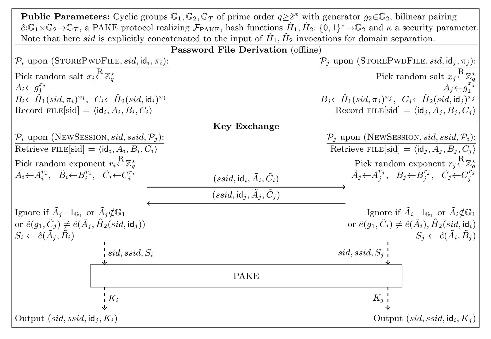
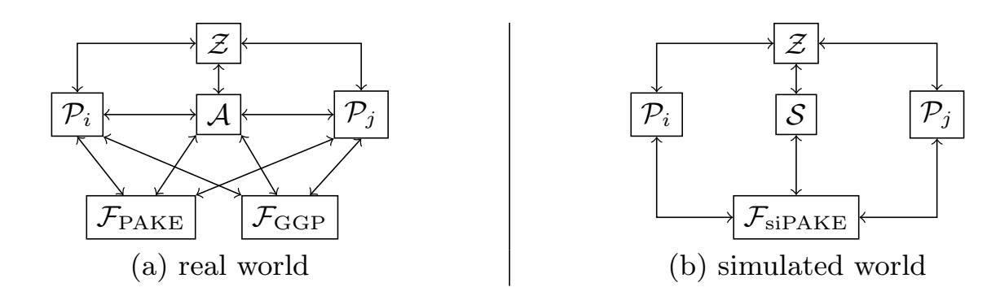
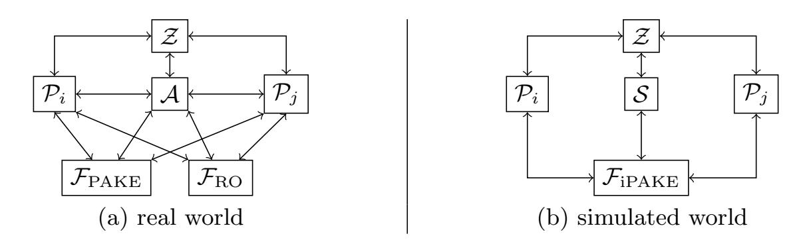
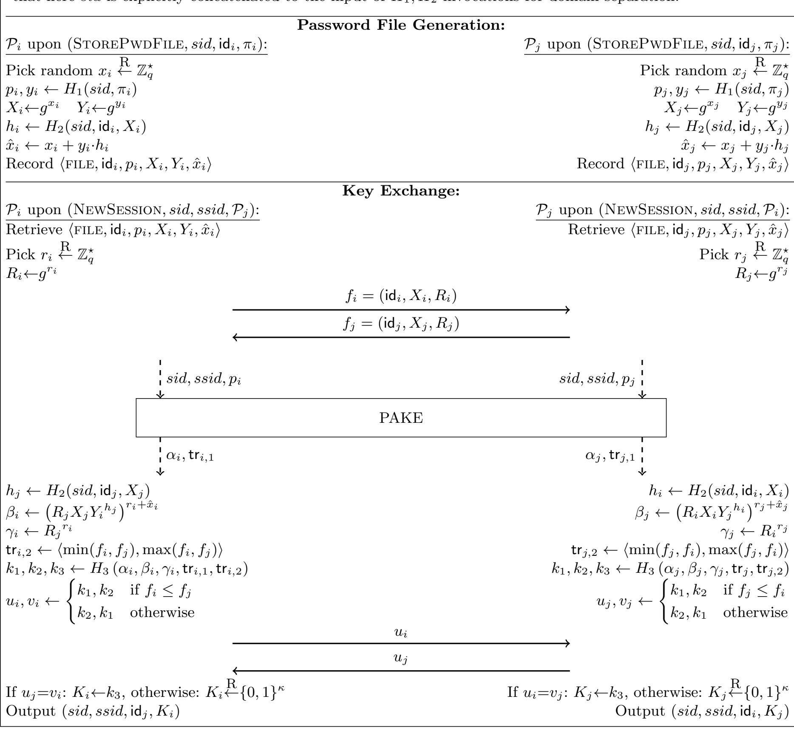

{0}------------------------------------------------

# CHIP and CRISP: Protecting All Parties Against Compromise through Identity-Binding PAKEs

Version 3.0? – June 2022

Cas Cremers<sup>1</sup> , Moni Naor2??, Shahar Paz<sup>3</sup> , and Eyal Ronen() 3? ? ?

> <sup>1</sup> CISPA Helmholtz Center for Information Security cremers@cispa.de

<sup>2</sup> Faculty of Mathematics and Computer Science, Weizmann Institute of Science, Israel moni.naor@weizmann.ac.il

<sup>3</sup> School of Computer Science, Tel Aviv University. {eyal.ronen, shaharps}@cs.tau.ac.il

Abstract. Recent advances in password-based authenticated key exchange (PAKE) protocols can offer stronger security guarantees for globally deployed security protocols. Notably, the OPAQUE protocol [Eurocrypt2018] realizes Strong Asymmetric PAKE (saPAKE), strengthening the protection offered by aPAKE to compromised servers: after compromising an saPAKE server, the adversary still has to perform a full brute-force search to recover any passwords or impersonate users. However, (s)aPAKEs do not protect client storage, and can only be applied in the so-called asymmetric setting, in which some parties, such as servers, do not communicate with each other using the protocol.

Nonetheless, passwords are also widely used in symmetric settings, where a group of parties share a password and can all communicate (e.g., Wi-Fi with client devices, routers, and mesh nodes; or industrial IoT scenarios). In these settings, the (s)aPAKE techniques cannot be applied, and the state-of-the-art still involves handling plaintext passwords.

In this work, we propose the notions of (strong) identity-binding PAKEs that improve this situation: they protect against compromise of any party, and can also be applied in the symmetric setting. We propose counterparts to state-of-the-art security notions from the asymmetric setting in the UC model, and construct protocols that provably realize them. Our constructions bind the local storage of all parties to abstract identities, building on ideas from identity-based key exchange, but without requiring a third party.

Our first protocol, CHIP, generalizes the security of aPAKE protocols to all parties, forcing the adversary to perform a brute-force search to recover passwords or impersonate others. Our second protocol, CRISP, additionally renders any adversarial pre-computation useless, thereby offering saPAKE-like guarantees for all parties, instead of only the server.

We evaluate prototype implementations of our protocols and show that even though they offer stronger security for real-world use cases, their performance is in line with, or even better than, state-of-the-art protocols.

Keywords: Password authentication, PAKE, Symmetric PAKE, Compromise Resilience, Key Compromise Impersonation.

<sup>?</sup> We provide an overview of the main differences between versions in [Appendix G.](#page-42-0)

<sup>??</sup> Supported in part by grants from the Israel Science Foundation (no. 2686/20) and by the Simons Foundation Collaboration on the Theory of Algorithmic Fairness. Incumbent of the Judith Kleeman Professorial Chair.

<sup>? ? ?</sup> Supported in part by Len Blavatnik and the Blavatnik Family foundation, the Blavatnik ICRC, and Robert Bosch Technologies Israel Ltd. Member of the Check Point Institute for Information Security.

{1}------------------------------------------------

## <span id="page-1-0"></span>1 Introduction

Passwords are arguably the most widely deployed authentication method today, and are used in a vast range of applications from authentication on the internet (e.g., email and bank servers), wireless network encryption (e.g., Wi-Fi, Smart Homes, Industry 4.0), and enterprise network authentication (e.g., Kerberos [\[27\]](#page-25-0), EAP-pwd [\[20\]](#page-25-1)). Early password-based protocols allowed adversaries to verify password guesses offline against observed network traffic. To remedy this, Password Authenticated Key Exchange (PAKE) protocols were proposed, as first studied by Bellovin and Merritt [\[3\]](#page-24-0). PAKEs allow parties to negotiate a strong secret key based only on a shared and possibly low-entropy password, do not leak any information about the password to passive adversaries, and allow only an inevitable online password guess attack.

The traditional PAKE threat model does not include compromise of the local storage – notably, most PAKEs work in a way that requires the plaintext password to be available at both parties, including SPAKE-2 and WPA3's DragonFly/SAE. This implies that non-interactive parties such as servers, IoT devices, and wireless access points, need to store the password in plaintext. Compromising the database of these parties directly reveals the password. In the client-server model, this means that a server compromise allows the adversary to impersonate as the client or server towards either, or perform a MiTM attack. Moreover, because clients often re-use passwords across services, this enables credential stuffing.

To partially mitigate this threat, Bellovin and Merritt [\[4\]](#page-24-1) proposed so-called asymmetric PAKEs (also known as aPAKEs, Augmented PAKEs, or V(erifier)-PAKEs) that make this much harder: the clients still need to provide the password in plaintext, but the verifying servers now only need to provide, and thus store, information that (a) is derived from the password using a one-way function, yet (b) allows establishing a shared key with a party that knows the password. Thus, compromising an aPAKE server does not allow the adversary to impersonate the client, and forces it to perform a brute-force attempt to extract the password.

### 1.1 Identity-binding PAKEs (iPAKE)

aPAKE protocols still have substantial limitations: they only protect the server, and perhaps more importantly, cannot be applied to settings that do not fall into the client-server model, e.g., where a password can be shared among group members that can communicate with all other members. Prime examples of such symmetric settings are found in wireless networking and IoT settings. For example, the globally deployed IEEE 802.11 Wi-Fi standard includes the WPA protocol, which uses network passwords to enable devices to automatically connect to routers, extenders, and mesh network nodes; crucially, all parties can automatically communicate with each other using the network password without any user input. This led the Wi-Fi alliance to base their latest WPA3 protocol [\[31\]](#page-25-2) on a symmetric PAKE for mesh networks called Simultaneous Authentication of Equals (SAE) [\[19\]](#page-25-3).

In such settings, asymmetric PAKEs cannot be applied, because protecting two parties using known aPAKE-server methods stops them from being able to communicate with each other: by construction, aPAKE's servers can only authenticate themselves to clients, not to other servers. Furthermore, because parties in common symmetric group settings operate without user input, they need to store the password in plaintext. E.g., Wi-Fi passwords are stored in plaintext on users' devices.

Hence, despite the many advances made over the years, all state-of-the-art PAKEs in the symmetric setting offer substantially weaker protection and no containment: compromising any party allows impersonation of any other party in the group, thus compromising the entire group.

{2}------------------------------------------------

<span id="page-2-0"></span>In this work we address this gap by initiating the study and construction of so-called identitybinding PAKEs (iPAKE). We provide a UC-security definition that is the symmetric counterpart to aPAKE. We instantiate iPAKE with CHIP, a novel compiler from any PAKE to iPAKE. We leverage ideas from Identity-Based Key-Exchange to introduce abstract identities for each party, and effectively bind the locally stored password-derived data to these identities, while retaining the required key agreement functionality. Unlike Identity-Based Key-Exchange, we do not require a third party: instead, each party locally simulates the Key Distribution Center during the password file generation. Identities can be arbitrary bit strings, and could also encode functions or roles instead of the party's name, e.g., "server", "router", or "fire brigade chief", "Elon's third iPhone". Binding the locally stored password-derived data to identities is useful for many purposes, such as preventing reflection attacks, revocation of compromised or disposed of devices, network segmentation (i.e., which nodes may interact), permissions (e.g., prevent guest devices from configuring an access point), and authentic audit logs that allow anomaly detection and reliable retroactive damage assessment.

### 1.2 Strong Identity-binding PAKEs (siPAKE)

In 2018, Jarecki, Krawczyk, and Xu [\[22\]](#page-25-4) strengthened the aPAKE notion by additionally requiring that an adversary gains no benefits from any pre-computations performed before a server compromise, thereby forcing it to do a full brute-force attack after the compromise. They named this notion strong asymmetric PAKE (saPAKE), and proposed the OPAQUE protocol to meet it. This has been widely regarded as a major step forward, and has led the Internet Engineering Task Force (IETF) to work towards standardizing OPAQUE and its use for TLS 1.3's password-based logins [\[7\]](#page-24-2).

To provide similar protection against pre-computations, we strengthen iPAKE to strong identitybinding PAKEs (siPAKE), and provide a UC-security definition that is the symmetric counterpart to saPAKE. We instantiate siPAKE with CRISP, a novel compiler from any PAKE to siPAKE, that extends the protection provided by state-of-the-art saPAKE protocols [\[9,](#page-24-3) [22\]](#page-25-4) to all parties.

We prove the correctness of both of our constructions, provide open source prototype implementations, and evaluate their efficiency.

### 1.3 Contributions

- 1. We initiate the study of identity-binding PAKEs, which offer additional security guarantees compared to their corresponding state-of-the-art aPAKE relatives. In particular:
  - Identity-binding PAKEs offer containment against compromise of any party, instead of only a specific subset such as servers.
  - Unlike aPAKEs, iPAKEs are symmetric and allow all parties to communicate with each other, and can therefore also be applied to settings such as IEEE 802.11's WPA (Wi-Fi).
- 2. We define the ideal functionality FiPAKE for identity-binding PAKE (iPAKE) in the UC model, and construct the CHIP compiler that turns any symmetric PAKE into an iPAKE. CHIP offers aPAKE-like guarantees for all parties: the compromise of any party does not allow the adversary to impersonate another unless they perform a brute-force attack. We prove that CHIP is secure in the Programmable Random Oracle Model (ROM) under the Strong Diffie-Hellman assumption.
- 3. We define the ideal functionality FsiPAKE for strong identity-binding PAKE (siPAKE) in the UC model, and construct the CRISP compiler that turns any symmetric PAKE into an siPAKE. CRISP offers saPAKE/OPAQUE-like guarantees for all parties: to impersonate any other party after a compromise, the adversary's brute-force attack additionally cannot utilize any pre-computation in a useful manner. CRISP is based on a bilinear group with pairing and

{3}------------------------------------------------

<span id="page-3-2"></span><span id="page-3-0"></span>

| Security notion    | Example protocol | Post-compromise impersonation resistance | Secure against pre-computation |
|--------------------|------------------|------------------------------------------|--------------------------------|
| PAKE [13]          | CPace [18]       | 0                                        | $\bigcirc$                     |
| aPAKE [16]         | AuCPace [18]     | lacklacklack                             | $\circ$                        |
| iPAKE (Section 4)  | CHIP (Section 6  | •                                        | $\bigcirc$                     |
| saPAKE [22]        | OPAQUE [22]      | lacklacklack                             | $lackbox{}$                    |
| siPAKE (Section 4) | CRISP (Section 7 | •                                        | •                              |

Table 1: PAKE notions, example protocols, and security guarantees.  $\bigcirc$  denotes the property is not provided;  $\blacksquare$  denotes that the property only holds for servers, and can *only* be applied to the asymmetric setting; and  $\blacksquare$  denotes that it is provided for all parties.

"Hash-to-Group", and we prove it secure in the Generic Group with Random Oracle Model (GGM+ROM).

4. We implemented prototypes of both our protocols. While our protocols offer substantial security benefits over existing state-of-the-art PAKEs for the symmetric setting, a performance benchmark (Section 8.4) that shows their performance is in line with, or even better than, state-of-the-art protocols.

Table 1 summarizes the different security notions and example protocols.

**Prototype implementations** We provide open source implementations of both protocols at https://github.com/shapaz/CRISP.

#### 1.4 Structure of the Paper

We give background on the formalization of PAKEs in Section 2. We discuss various methods for compromise resilience in Section 3. In Section 4 we describe the notation and UC building blocks we use. We present our new ideal functionalities for iPAKE and siPAKE in Section 5. We introduce the CHIP compiler in Section 6 and the CRISP compiler in Section 7. In Section 8 we analyze the computational cost of running our protocols and the cost of the inevitable brute-force attack. We also propose several optimization to the protocol as well as performance benchmarks. We conclude and present open problems in Section 9.

We provide full proofs and further reference material in the supplementary appendix. In particular, CHIP's proof is provided in Appendix A and CRISP's proof in Appendix C. For reference, we include the (strong) asymmetric PAKE functionalities in Appendix E and the IB-KA protocol (a building block for CHIP) in Appendix F.

### <span id="page-3-1"></span>2 Related Work on Formalizing PAKE

Bellare, Pointcheval, and Rogaway [2] were the first to formalize the notion of PAKE. Canetti, Halevi, Katz, Lindell, and MacKenzie [13] formalized PAKE in the Universal Composability (UC) framework [11]. Their ideal functionality  $\mathcal{F}_{PAKE}$  (originally denoted  $\mathcal{F}_{pwKE}$ ) trades each party's password with a randomly chosen key for the session, only allowing the adversary an online attack where a single guess may be made to some party's password.

Asymmetric PAKE (aPAKE) protocols (a.k.a. Augmented PAKEs or Verifier PAKEs) were formalized by Boyko, MacKenzie, and Patel [8]. They address the problem of password compromise from long term storage by introducing *asymmetry*, separating parties into "clients" and "servers". While clients supply their passwords on every session, servers use a "password file" generated in a

{4}------------------------------------------------

<span id="page-4-1"></span>setup phase. To prevent servers from impersonating clients, it should be "hard" to directly extract the password from such a file. However, since we assume that the password domain is small, an attacker can run an offline dictionary attack, testing every possible password against the file until one is accepted. The best one can hope for is that password extraction time will be linear in the dictionary's size. Gentry, MacKenzie, and Ramzan [\[16\]](#page-25-7) formalized an ideal functionality FaPAKE in the UC framework, and presented a generic compiler from FPAKE to FaPAKE.

The notion of Strong Asymmetric PAKE FsaPAKE by Jarecki, Krawczyk, and Xu [\[22\]](#page-25-4) addresses an issue with the original FaPAKE, that allowed a pre-computation attack: password guesses could have been submitted before a server compromise. Most of the computational work could have been done prior to the actual compromise of the password file, allowing "instantaneous" password recovery upon compromise. For example, the attacker can pre-compute the hash value for all passwords in a given dictionary in advance. When a server is compromised at a later point, the adversary can find the pre-image for the compromised hash value, retrieving the password immediately.

In summary, while (s)aPAKE protect against server compromise in the asymmetric setting, prior works did not address party compromise in the symmetric setting or client compromise (in the asymmetric setting).

## <span id="page-4-0"></span>3 Methods and limitations for compromise resilience

In compromise resilience of PAKE protocols, we consider two main parameters:

- 1. The computational cost of a brute-force attack to recover the original password, using the information stored on the device in the offline phase (i.e., in the password file).
- 2. The possibility of performing a trade-off between the pre-computation cost (performed before the compromise of the device) and the computation cost (performed after the compromise).

We assume the adversary holds a password dictionary that contains the right password, and a brute-force attack's computational cost is proportional to the size of that dictionary. Being a "machine-in-the-middle", our adversary may alter messages and exploit information sent in the online phase of the protocol, and might target multiple passwords used by different users.

We note that in practice, passwords are used across many types of devices. Some of these devices are directly controlled by (human) users, such as phones or laptops, which either don't store the password (e.g., user remembers) or store it protected by another interactive security mechanism (e.g., biometrics, password, PIN), thereby making the compromise of the password file harder. However, a large proportion of devices that share the same password have no such user interaction, such as internet routers, TVs, IoT devices, and drones; and compromising them thus can lead to revealing the unprotected password file.

We survey known methods for achieving various levels of compromise resilience and also give examples for systems using them:

- 1. Plaintext password: The password is stored as-is in the password file. No computation is required for password recovery. This is the case for the WPA3 protocol in Wi-Fi [\[31\]](#page-25-2), and the client-side for aPAKEs.
- 2. Hashed password: A one-way function of the password is stored in the password file. This option is only beneficial when using a high entropy password chosen from a password space that is too large to pre-compute. Otherwise, an adversary might hash every possible password and prepare a reverse lookup table from hash value to plain password, allowing password recovery in O(1) time. This can be done once, amortizing the cost of the pre-computation over multiple password recoveries.

{5}------------------------------------------------

- <span id="page-5-2"></span>3. Hashed password with public identifiers: A one-way function of the password and some public identifiers of the connection is computed and stored in the password file. For example, the public identifiers can be derived from the SSID (network name) in Wi-Fi or a combination of the server and user names. In this case, pre-computation is still possible, but amortization is prevented, since the pre-computation does not apply for different public identifiers. This protection is offered by some aPAKE protocols [\[18\]](#page-25-6) and by our novel iPAKE protocol.
- 4. Hashed password with public "salt": A one-way function of the password and a randomly generated value ("salt") is computed and stored in the password file. The "salt" is sent in the clear, as part of the PAKE protocol. As in the previous case, pre-computation before a compromise is possible, but only after the adversary eavesdrops to a PAKE protocol of the target device and learns the "salt". This is the case for the server side in some aPAKE protocols [\[18,](#page-25-6) [32\]](#page-25-9).
- <span id="page-5-1"></span>5. Hashed password with secret "salt": In this case, the random "salt" is kept secret, which requires more intricate mechanisms than with the public salt, since it is no longer possible to send the salt in the clear. This approach prevents any pre-computation, and yields a level of protection that is offered by saPAKE for the servers in the asymmetric setting, and by our novel siPAKE protocol for all parties in any setting. The only remaining attack left for the adversary is a brute-force post-compromise attack, which is inevitable, as we show below.

### Inevitable Generic Post-compromise Brute-force Attack

Post-compromise brute-force dictionary attacks are inevitable for any PAKE protocol. In the following attack, we assume that the correct password is in the dictionary and exploit the property that PAKE protocols fail to agree on a key when the participants have different passwords. The attack works by simulating a normal protocol run, where one party uses the compromised data, and the peer uses the password guess:

- 1. Retrieve a password file file from a compromised device.
- 2. For every password guess π 0 in the dictionary:
  - (a) Derive password file file<sup>0</sup> according to the protocol specification's setup phase for the peer, using π 0 .
  - (b) Use file and file<sup>0</sup> to simulate both parties in a normal run of the PAKE protocol.
  - (c) If the simulated parties negotiate the same key, π 0 is the correct password for the compromised device.

The cost of each password guess in the black-box attack is the cost of deriving the password file from a password and running the protocol for both parties. This generic attack provides an upper bound to the cost of the brute-force attack on any PAKE protocol. To increase the cost of the generic attack, we must also increase the computational cost of either password file derivation or running the online phase of the protocol. Note that the password file derivation can be done in pre-computation.

## <span id="page-5-0"></span>4 Notation and UC Building Blocks

In this section, we first introduce some notational convention and recall the symmetric PAKE functionality. We then introduce modelling of the random oracle model and the generic group model.

Notation and conventions Our notational conventions inherit from the PAKE and UC settings:

- π a password
- id some party's abstract identifier
- P a party interacting in either real or ideal world

{6}------------------------------------------------

```
a security parameter
\kappa
         a large prime number q \geq 2^{\kappa}
q
         the field of integers modulo q, \mathbb{Z}_q^* = \mathbb{Z}_q \setminus \{0\}
\mathbb{Z}_q
         an element of \mathbb{Z}_q
x
         a polynomial in \mathbb{Z}_q[X]
F
         a formal variable in a polynomial (indeterminate)
X
\mathbb{G}
         a cyclic group of order q
         a member of group \mathbb{G}, identified by the exponent x of some
|x|_{\mathbb{G}}
         public generator g \in \mathbb{G}: [x]_{\mathbb{G}} = g^x
\{0,1\}^n the set of binary strings of length n
\{0,1\}^* the set of binary strings of any length
x \stackrel{\mathrm{R}}{\leftarrow} S
        sampling x from uniform distribution over set S
         restriction: x must be an element of S
x_{\in S}
H
         a hash function
\hat{H}
         a hash-to-group function
```

Similar to existing asymmetric PAKE constructions analyzed in the UC framework, we use two levels of sessions:

```
sid identifies a static session, e.g., a group of parties communicating using the same shared password. (E.g., when instantiated in the Wi-Fi setting, this could be the Wi-Fi network identifier)
```

ssid identifies a particular online exchange, i.e., a sub-session.

Symmetric PAKE Functionality In Figure 1 we restate the symmetric PAKE functionality  $\mathcal{F}_{PAKE}$  from Canetti et al. [13] (denoted  $\mathcal{F}_{pwKE}$  there), incorporating the fix recommended by Abdalla et al. [1]. In our presentation of  $\mathcal{F}_{PAKE}$ , we explicitly record keys handed to parties in FRESH sessions using  $\langle KEY, \ldots \rangle$  records, which we will later use in our protocol proofs.

Whenever an ideal functionality is required to retrieve some record ("Retrieve  $\langle RECORD, ... \rangle$ ") but it cannot be found, the functionality is said to implicitly ignore the query.

#### <span id="page-6-0"></span>4.1 UC Modelling of Random Oracle and Generic Group

The necessity of non-black-box assumptions for proving compromise resilience in the UC framework has been previously observed (see [16], [22] and [9]). Hesse [21] proved that UC-realization of aPAKE is impossible under non-programmable ROM. In this work we rely on programmable ROM for proving CHIP and on Generic Group Model for CRISP.

We model ROM in UC by allowing parties in the real world to access an ideal functionality  $\mathcal{F}_{RO}$ , depicted in Figure 2. Invocations of hash functions in the protocol are modelled as queries to  $\mathcal{F}_{RO}$ . The functionality acts as an oracle, answering fresh queries with independent random values, but consistent results to repeated queries. The model is programmable, meaning that the simulator is able to view hash queries and program their results. The model is also local, meaning that every session has a separate independent  $\mathcal{F}_{RO}$  machine. However, every HASH query is parametrized by a unique sid, effectively separating the hash domain. Consequently, a single global random oracle in the real world suffices to handle queries from multiple sessions.

The Generic Group Model (GGM), introduced by [30], allows proving properties of algorithms, assuming the only permitted operations on group elements are the group operation and comparison. Hence a "generic group element" has no meaningful representation. Algorithms in GGM operate on

{7}------------------------------------------------

```
Functionality \mathcal{F}_{PAKE}, with security parameter \kappa, interacting with parties \{\mathcal{P}_i\}_{i=1}^n and an adversary \mathcal{S}.
Upon (NewSession, sid, \mathcal{P}_i, \pi_i) from \mathcal{P}_i:
  \circ Send (NewSession, sid, \mathcal{P}_i, \mathcal{P}_j) to \mathcal{S}
  \circ If there is no record \langle SESSION, \mathcal{P}_i, \mathcal{P}_j, \cdot, \cdot \rangle:
        \triangleright record (SESSION, \mathcal{P}_i, \mathcal{P}_j, \pi_i) and mark it FRESH
Upon (TestPwd, sid, P_i, \pi') from S:
  • Retrieve (SESSION, \mathcal{P}_i, \mathcal{P}_j, \pi_i) marked FRESH
  • If \pi_i = \pi': mark the session COMPROMISED and return "correct guess" to \mathcal{S}
  \circ\, otherwise: mark the session interrupted and return "wrong guess" to {\cal S}
Upon (NewKey, sid, \mathcal{P}_i, K'_{\in\{0,1\}^{\kappa}}) from \mathcal{S}:
  • Retrieve (SESSION, \mathcal{P}_i, \mathcal{P}_j, \pi_i) not marked COMPLETED
  • If it is marked COMPROMISED: K_i \leftarrow K'
  \circ else if it is marked fresh and there is a record \langle \text{KEY}, \mathcal{P}_j, \pi_j, K_j \rangle with \pi_i = \pi_j : K_i \leftarrow K_j
  \circ otherwise: pick K_i \stackrel{\mathbf{R}}{\leftarrow} \{0,1\}^{\kappa}
  • If the session is marked FRESH: record \langle \text{KEY}, \mathcal{P}_i, \pi_i, K_i \rangle
  • Mark the session COMPLETED and send \langle sid, K_i \rangle to \mathcal{P}_i
```

Fig. 1: Symmetric PAKE functionality  $\mathcal{F}_{PAKE}$  from [13] with the fix recommended by [1] and minor presentational modifications to simplify comparison.

```
Functionality \mathcal{F}_{RO}, parametrized by domain D and range E, interacting with parties \{\mathcal{P}_i\}_{i=1}^n and adversary \mathcal{S}.

Upon (Hash, sid, s_{\in D}) from \mathcal{P} \in \{\mathcal{P}_i\}_{i=1}^n \cup \{\mathcal{S}\}:

• If there is no record \langle \text{Hash}, s, h \rangle:

• Pick h \stackrel{R}{\leftarrow} E and record \langle \text{Hash}, s, h \rangle

• Return h to \mathcal{P}.
```

Fig. 2: Random Oracle functionality  $\mathcal{F}_{RO}$ 

encodings of elements, and may consult a group oracle which computes the group operation for two valid encodings, returning the encoded result. The group oracle declines queries for encodings not returned by some previous query.

Any cyclic group  $\mathbb{G}$  of prime-order q with generator g can be viewed as  $\{[x]_{\mathbb{G}} \mid x \in \mathbb{Z}_q\}$  with group operations  $[x]_{\mathbb{G}} \odot [y]_{\mathbb{G}} = [x+y]_{\mathbb{G}}$  and  $[x]_{\mathbb{G}} \oslash [y]_{\mathbb{G}} = [x-y]_{\mathbb{G}}$ , unit element  $[0]_{\mathbb{G}}$  and generator  $[1]_{\mathbb{G}}$ , using some encoding function  $[\cdot]_{\mathbb{G}}$ :  $x \mapsto g^x$ . In GGM we consider encoding functions carrying no further information about the group, e.g., encodings using random bit-strings or numbers in the range  $\{0,\ldots,q-1\}$ . This is in contrast to concrete groups which might have a meaningful encoding.

In order to prove CRISP's security under Universal Composition, we need to formalize GGM in terms of an ideal functionality  $\mathcal{F}_{GG}$ . Figure 3 shows the basic GGM functionality  $\mathcal{F}_{GG}$ , which answers group operation queries (multiply/divide) on encoded elements. As with  $\mathcal{F}_{RO}$ , functionality  $\mathcal{F}_{GG}$  is both programmable and local. Unlike ROM, where local independent oracles can be created from a single global one, the same is not trivial with generic groups. Appendix D deals with group reuse across instances of CRISP.

For simplicity one can think of the set of encoding  $\mathbb{E}=\mathbb{Z}_q$ , so each exponent  $x\in\mathbb{Z}_q$  is encoded as  $[x]_{\mathbb{G}}=\xi\in\mathbb{Z}_q$ , resulting in the encoding function being a random permutation over  $\mathbb{Z}_q$ , ensuring no information about oracle usage is disclosed between parties.

Note that although the group order q might be (exponentially) large,  $\mathcal{F}_{GG}$  maps at most one new element per query. Also note the mapping is injective.

{8}------------------------------------------------

```
Functionality \mathcal{F}_{GG}, parametrized by group order q, encoding set \mathbb{E}(|\mathbb{E}| \geq q) and generator g \in \mathbb{E}, interacting with parties \{\mathcal{P}_i\}_{i=1}^n and adversary \mathcal{S}.

Initially, S = \{1\}, [1]_{\mathbb{G}} = g and [x]_{\mathbb{G}} is undefined for any other x \in \mathbb{Z}_q. Whenever \mathcal{F}_{GG} references an undefined [x]_{\mathbb{G}}, set [x]_{\mathbb{G}} \stackrel{R}{\leftarrow} \mathbb{E} \setminus S and insert [x]_{\mathbb{G}} to S.

Upon (MulDiv, sid, [x_1]_{\mathbb{G}}, [x_2]_{\mathbb{G}}, s \in \{0,1\}) from \mathcal{P} \in \{\mathcal{P}_i\}_{i=1}^n \cup \{\mathcal{S}\}:

o x \leftarrow x_1 + (-1)^s x_2 \mod q
o Return [x]_{\mathbb{G}} to \mathcal{P}
```

Fig. 3: Generic Group functionality  $\mathcal{F}_{GG}$ 

A bilinear group is a triplet of cyclic groups  $\mathbb{G}_1, \mathbb{G}_2, \mathbb{G}_T$  of prime order q, with an efficiently computable bilinear map  $\hat{e}: \mathbb{G}_1 \times \mathbb{G}_2 \to \mathbb{G}_T$  satisfying the following requirements:

- Bilinearity:  $\hat{e}(g_1^x, g_2^y) = \hat{e}(g_1, g_2)^{xy}$  for all  $x, y \in \mathbb{Z}_q$ .
- Non-degeneracy:  $\hat{e}(g_1, g_2) \neq 1_T$ .

where  $g_1, g_2$  are generators for  $\mathbb{G}_1, \mathbb{G}_2$  respectively. We also consider an efficiently computable isomorphism  $\psi: \mathbb{G}_2 \to \mathbb{G}_1$  satisfying  $\psi(g_2) = g_1$ .

A hash to group, also referred to as Hash2Curve, is an efficiently computable hash function, modelled as random oracle, whose range is a group. For the bilinear setting, we consider the range  $\mathbb{G}_2$ .

In order to represent groups with pairing and hash into group, we suggest a modified functionality  $\mathcal{F}_{GGP}$ , depicted in Figure 4, similar to the extension of GGM to bilinear groups by [6].  $\mathcal{F}_{GGP}$  can be queried MULDIV for each of  $\mathbb{G}_1$ ,  $\mathbb{G}_2$  and  $\mathbb{G}_T$ , and maintains separate encoding maps for each group. It introduces three new queries: (a) PAIRING to compute the bilinear pairing  $\hat{e}$ :  $([x_1]_{\mathbb{G}_1}, [x_2]_{\mathbb{G}_2}) \mapsto [x_1 \cdot x_2]_{\mathbb{G}_T}$ ; (b) ISOMORPHISM to compute an isomorphism  $\psi, \psi^{-1}$  between  $\mathbb{G}_2$  and  $\mathbb{G}_1$ :  $[x]_{\mathbb{G}_1} \mapsto [x]_{\mathbb{G}_1}, [x]_{\mathbb{G}_1} \mapsto [x]_{\mathbb{G}_2}$ ; and (c) HASH which is a random oracle into  $\mathbb{G}_2$ : for each freshly queried string  $s \in \{0,1\}^*$  it picks a random exponent  $x \stackrel{R}{\leftarrow} \mathbb{Z}_q^*$ , then returns its encoding  $[x]_{\mathbb{G}_2}$ .

We note that there are groups for which only  $\psi$  is efficiently computable but  $\psi^{-1}$  is not, or even  $\psi$  itself is inefficient. However, CRISP does not require these ISOMORPHISM queries and they can be omitted for such groups. We state that equipping the adversary with ISOMORPHISM queries guarantees security even when such isomorphism is found.

## <span id="page-8-0"></span>5 (Strong) Identity-binding PAKE Functionality

In Figure 5 we present the Identity-binding PAKE functionality  $\mathcal{F}_{iPAKE}$  and the Strong Identity-binding PAKE functionality  $\mathcal{F}_{siPAKE}$ . Essentially, they preserve the symmetry of  $\mathcal{F}_{PAKE}$  while adopting the notion of password files and party compromise from the Asymmetric PAKE functionality  $\mathcal{F}_{aPAKE}$  of [16] and Strong Asymmetric PAKE functionality  $\mathcal{F}_{saPAKE}$  of [22] (found in Appendix E).

Informally speaking, our threat model includes the online adversary from traditional PAKEs. Additionally, we consider adversaries that may compromise parties in order to impersonate as other parties, e.g., compromise an IoT device to impersonate as the router or server. The strong form additionally considers adversaries that can perform large amounts of precomputation.

Compared to the asymmetric functionalities, our main addition is the notion of abstract identities  $(id_i)$  assigned by the environment to parties, and reported to participating parties as output alongside the session key. Without them, a single party compromise would allow the adversary to compromise any sub-session by impersonating any other party or perform a MiTM attack. Having the functionality inform a party of its peer identity prevents such attacks.

{9}------------------------------------------------

```
Functionality \mathcal{F}_{\text{GGP}}, parametrized by group order q, encoding sets \mathbb{E}_1, \mathbb{E}_2, \mathbb{E}_T (|\mathbb{E}_j| \geq q for j \in \{1, 2, T\}) and generators g_1 \in \mathbb{E}_1, g_2 \in \mathbb{E}_2, interacting with parties \{\mathcal{P}_i\}_{i=1}^n and adversary \mathcal{S}. Let \mathfrak{P} = \{\mathcal{P}_i\}_{i=1}^n \cup \{\mathcal{S}\}. Initially, S_1 = S_2 = \{1\}, S_T = \emptyset, [1]_{\mathbb{G}_1} = g_1, [1]_{\mathbb{G}_2} = g_2 and [x]_{\mathbb{G}_j} is undefined for any other x \in \mathbb{Z}_q j \in \{1, 2, T\}. Whenever \mathcal{F}_{\text{GGP}} references an undefined [x]_{\mathbb{G}_j}, set [x]_{\mathbb{G}_j} \notin \mathbb{E} \setminus S_j and insert [x]_{\mathbb{G}_j} to S_j.

Upon (MulDiv, sid, j_{\in \{1,2,T\}}, [x_1]_{\mathbb{G}_j}, [x_2]_{\mathbb{G}_j}, s_{\in \{0,1\}}) from \mathcal{P} \in \mathfrak{P}:

Return [x \leftarrow x_1 + (-1)^s x_2 \mod q]_{\mathbb{G}_j} to \mathcal{P}

Upon (Pairing, sid, [x_1]_{\mathbb{G}_1}, [x_2]_{\mathbb{G}_2}) from \mathcal{P} \in \mathfrak{P}:

Return [x_T \leftarrow x_1 \cdot x_2 \mod q]_{\mathbb{G}_T} to \mathcal{P}

Upon (Isomorphism, sid, j_{\in \{1,2\}}, [x]_{\mathbb{G}_j}) from \mathcal{S}:

Return [x]_{\mathbb{G}_{3-j}} to \mathcal{P}

Upon (Hash, sid, sid, sid, sid, sid, sid, sid, sid, sid, sid, sid, sid, sid, sid, sid, sid, sid, sid, sid, sid, sid, sid, sid, sid, sid, sid, sid, sid, sid, sid, sid, sid, sid, sid, sid, sid, sid, sid, sid, sid, sid, sid, sid, sid, sid, sid, sid, sid, sid, sid, sid, sid, sid, sid, sid, sid, sid, sid, sid, sid, sid, sid, sid, sid, sid, sid, sid, sid, sid, sid, sid, sid, sid, sid, sid, sid, sid, sid, sid, sid, sid, sid, sid, sid, sid, sid, sid, sid, sid, sid, sid, sid, sid, sid, sid, sid, sid, sid, sid, sid, sid, sid, sid, sid, sid, sid, sid, sid, sid, sid, sid, sid, sid, sid, sid, sid, sid, sid, sid, sid, sid, sid, sid, sid, sid, sid, sid, sid, sid, sid, sid, sid, sid, sid, sid, sid, sid, sid, sid, sid, sid, sid, sid, sid, sid, sid, sid, sid, s
```

Fig. 4: Generic Group with Pairing and Hash-to-Group functionality  $\mathcal{F}_{GGP}$ 

For symmetry, we restored the notation of parties as  $\{\mathcal{P}_i\}_{i=1}^n$ : All parties invoke StorePwdFile before starting a session and all use the password file instead of providing a password when starting a session; UsrSession query was eliminated, and SvrSession was renamed NewSession as in  $\mathcal{F}_{PAKE}$ . We also parametrized queries on  $\mathcal{P}_i$  and  $\mathcal{P}_j$  where  $\mathcal{F}_{aPAKE}$  and  $\mathcal{F}_{saPAKE}$  omitted them, since in the symmetric setting those queries may be applied to several parties, e.g., StealPwdFile applying to any party. On the other hand, we omit  $\mathcal{P}_j$  from StorePwdFile; in our setting a password file is derived for each party independently, and is not bound to specific peers.

Our functionalities introduce a new query OfflineComparePwD, allowing the adversary to test whether two stolen password files correspond to the same password. In the real world, such attack is always possible by an adversary simulating the protocol for those parties, and comparing the resulting keys. We argue that in most real-world settings, all parties of the same session use the same password (e.g., devices connecting to the same Wi-Fi network), and hence such a query is both inevitable and non-beneficial for the adversary.

Notice the four types of records used by the functionalities:

- 1.  $\langle \text{FILE}, \mathcal{P}_i, \text{id}_i, \pi_i \rangle$  records represent password files created for each party  $\mathcal{P}_i$ , and are derived from its password  $\pi_i$  and identity id<sub>i</sub>. Similar type of records exist in  $\mathcal{F}_{\text{PAKE}}$  and  $\mathcal{F}_{\text{saPAKE}}$  (without identities) only for the server.
- 2.  $\langle \text{SESSION}, ssid, \mathcal{P}_i, \mathcal{P}_j, \text{id}_i, \pi_i \rangle$  records represent party  $\mathcal{P}_i$ 's view of a sub-session with identifier ssid between  $\mathcal{P}_i$  and  $\mathcal{P}_j$ . Similar type of records exist in  $\mathcal{F}_{aPAKE}$  and  $\mathcal{F}_{saPAKE}$ , without identities.
- 3.  $\langle \text{KEY}, ssid, \mathcal{P}_i, \pi_i, K_i \rangle$  records represent sub-session keys  $K_i$  created for party  $\mathcal{P}_i$  participating in sub-session ssid with password  $\pi_i$ , and whose session was not compromised or interrupted. These records were implicitly required in prior UC PAKE works [13, 16, 22], and appear here explicitly for clarity.
- 4.  $\langle \text{IMP}, ssid, \mathcal{P}_i, \text{id'} \rangle$  records represent "permissions" for the adversary to set the peer identity observed by party  $\mathcal{P}_i$  in sub-session ssid to id'. They are created when the adversary invokes one of the online attack queries OnlineTestPwD or Impersonate. The functionalities reject NewKey queries with non-permitted id'. When id'= $\star$  this record acts as a "wild card", permitting the adversary to select any identity.

{10}------------------------------------------------

```
Functionalities \mathcal{F}_{iPAKE} and \mathcal{F}_{siPAKE}, with security parameter \kappa, interacting with parties \{\mathcal{P}_i\}_{i=1}^n and adversary \mathcal{S}.
Upon (StorePwdFile, sid, id_i, \pi_i) from \mathcal{P}_i:
 \circ If there is no record \langle \text{FILE}, \mathcal{P}_i, \cdot, \cdot \rangle:
         \triangleright record \langle \text{FILE}, \mathcal{P}_i, \text{id}_i, \pi_i \rangle and mark it UNCOMPROMISED
Upon (StealPwdFile, sid, \mathcal{P}_i) from \mathcal{S}:
  \circ If there is a record \langle \text{FILE}, \mathcal{P}_i, \mathsf{id}_i, \pi_i \rangle:
         \Rightarrow \pi \leftarrow \begin{cases} \pi_i & \text{if there is a record } \langle \text{OFFLINE}, \mathcal{P}_i, \pi_i \rangle \\ \bot & \text{otherwise} \end{cases} 
         \triangleright mark the file COMPROMISED and return ("password file stolen", \mathsf{id}_i, \pi) to \mathcal{S}
  \circ otherwise: return "no password file" to {\mathcal S}
Upon (OfflineTestPwd, sid, \mathcal{P}_i, \pi') from \mathcal{S}:
  \circ Retrieve \langle \text{FILE}, \mathcal{P}_i, \mathsf{id}_i, \pi_i \rangle
  • If it is marked COMPROMISED:
         \triangleright return "correct guess" to \mathcal{S} if \pi_i = \pi', and "wrong guess" otherwise
  \circ otherwise: Record \langle \text{OFFLINE}, \mathcal{P}_i, \pi' \rangle
Upon (OfflineComparePwd, sid, \mathcal{P}_i, \mathcal{P}_i) from \mathcal{S}:
  \circ Retrieve \langle \text{FILE}, \mathcal{P}_i, \mathsf{id}_i, \pi_i \rangle and \langle \text{FILE}, \mathcal{P}_i, \mathsf{id}_i, \pi_i \rangle both marked COMPROMISED
  \circ Return "passwords match" to \mathcal{S} if \pi_i = \pi_j, and "passwords differ" otherwise
Upon (NewSession, sid, ssid, \mathcal{P}_i) from \mathcal{P}_i:
  \circ Retrieve \langle \text{FILE}, \mathcal{P}_i, \text{id}_i, \pi_i \rangle and send (NewSession, ssid, \mathcal{P}_i, \mathcal{P}_j, \text{id}_i) to \mathcal{S}
  \circ If there is no record \langle SESSION, ssid, \mathcal{P}_i, \mathcal{P}_i, \cdot \rangle:
         \triangleright record (SESSION, ssid, \mathcal{P}_i, \mathcal{P}_j, \pi_i) and mark it FRESH
Upon (OnlineTestPwd, sid, ssid, \mathcal{P}_i, \pi') from \mathcal{S}:
  • Retrieve (SESSION, ssid, \mathcal{P}_i, \mathcal{P}_j, \pi_i) marked FRESH or COMPROMISED
  \circ If \pi_i = \pi': record \langle \text{IMP}, ssid, \mathcal{P}_i, \star \rangle
  • If \pi_i = \pi': mark the session COMPROMISED and return "correct guess" to \mathcal{S}
  \circ otherwise: mark the session interrupted and return "wrong guess" to {\mathcal S}
Upon (IMPERSONATE, sid, ssid, \mathcal{P}_i, \mathcal{P}_k) from \mathcal{S}:
  \circ Retrieve (SESSION, ssid, \mathcal{P}_i, \mathcal{P}_j, \pi_i) marked FRESH or COMPROMISED
  \circ Retrieve \langle \text{FILE}, \mathcal{P}_k, \mathsf{id}_k, \pi_k \rangle marked COMPROMISED
  \circ If \pi_i = \pi_k: record \langle \text{IMP}, ssid, \mathcal{P}_i, \mathsf{id}_k \rangle
  • If \pi_i = \pi_k: mark the session COMPROMISED and return "correct guess" to \mathcal{S}
  \circ otherwise: mark the session interrupted and return "wrong guess" to {\mathcal S}
Upon (NewKey, sid, ssid, \mathcal{P}_i, \mathsf{id}', K'_{\in\{0,1\}^{\kappa}}) from \mathcal{S}:
  \circ Retrieve (SESSION, ssid, \mathcal{P}_i, \mathcal{P}_j, \pi_i) not marked COMPLETED and (FILE, \mathcal{P}_j, \mathsf{id}_j, \pi_j)
  • Ignore the query if either the session is marked FRESH and id' \neq id_i, or it is COMPROMISED and \langle IMP, ssid, \mathcal{P}_i, id \rangle
      is not recorded for both id \in \{id', \star\}
  • If the session is marked COMPROMISED: K_i \leftarrow K'
  \circ else if it is marked FRESH and there is a record \langle \text{KEY}, ssid, \mathcal{P}_i, \pi_i, K_i \rangle with \pi_i = \pi_i: K_i \leftarrow K_i
  \circ otherwise: pick K_i \stackrel{\mathbf{R}}{\leftarrow} \{0,1\}^{\kappa}
  \circ If the session is marked fresh: record \langle \text{KEY}, ssid, \mathcal{P}_i, \pi_i, K_i \rangle
  • Mark the session COMPLETED and send \langle ssid, id', K_i \rangle to \mathcal{P}_i
```

Fig. 5: Functionality  $\mathcal{F}_{iPAKE}$  is defined by the full text (including grey text), and  $\mathcal{F}_{siPAKE}$  is defined by the text excluding grey text.

Additionally,  $\mathcal{F}_{iPAKE}$  inherits from  $\mathcal{F}_{aPAKE}$  the following record type:

5.  $\langle \text{OFFLINE}, \mathcal{P}_i, \pi' \rangle$  records represent an offline-guess  $\pi'$  for party  $\mathcal{P}_i$ 's password, submitted by  $\mathcal{S}$  before compromising  $\mathcal{P}_i$ . If  $\mathcal{P}_i$  is later compromised,  $\mathcal{S}$  will instantly learn if the guess was successful, i.e.,  $\pi' = \pi_i$ .

{11}------------------------------------------------

<span id="page-11-2"></span>Identity verification is implicit. When no attack is carried out by the adversary, both parties report each other's real identities. However, when the adversary succeeds in an online attack, it is allowed to change the reported identities. A successful OnlineTestPwd query allows the adversary to specify any identity, while a successful Impersonate query limits the choice to the impersonated party's real identity only. If any of the attacks fails, we still allow the adversary to control the reported identity, at the cost of causing each party to output an independent random key. Therefore, in the absence of a successful online attack, matching session keys indicate the reported identities are correct.

To simplify our UC simulator, we additionally allow both OnlineTestPwd and Impersonate queries against the same session, as long as they succeed[4](#page-11-1) . This is achieved by accepting them on compromised sessions, not only fresh. Note that this permits at most one failed attempt per session, which has no impact on security.

The FiPAKE functionality is weaker than FsiPAKE in the sense that it permits pre-computation of OfflineTestPwd queries prior to party compromise. It is therefore only of interest when permitting more efficient constructions than its strong counterpart. Indeed, we present the more efficient CHIP protocol [\(Section 6\)](#page-11-0) realizing FiPAKE in ROM using any cyclic group, while CRISP [\(Section 7\)](#page-15-0) requires bilinear groups for realizing FsiPAKE in GGM.

Comparison to (s)aPAKE The symmetric functionalities FiPAKE and FsiPAKE offer security guarantees beyond their asymmetric counterparts: given a FiPAKE (respectively, FsiPAKE) functionality, it is trivial to realize the FaPAKE (respectively, FsaPAKE) functionality. The client party U will be assigned identity "client" and will simply compute its password file on each session, when receiving UsrSession query from the environment. The server party S will be identified as "server" and will have to verify its peer identity is "client". Nevertheless, we are not aware of any direct extension of FaPAKE/FsaPAKE to FiPAKE/FsiPAKE.

Sessions and identifiers The distinction between a "static" session (identified by sid) and an "online" sub-session (identified by ssid) was inherited from FaPAKE and FsaPAKE.

A static session represents a set of parties which are expected to communicate with each other, such as devices connected to the same Wi-Fi network (sid can be the network name). Normally, all such parties are configured with the same password. Otherwise, only parties with matching passwords will be able to derive a shared key. Since sid is selected locally, it is possible to have two unrelated networks configured with the same identifier (e.g., two home networks named "Miller"). As long as their passwords differ, there will not be any real impact on security; password files created for one network are unusable for the other.

An online sub-session is a specific run of the protocol between two parties of a static session. ssid is given as external input to the protocol in order to uniquely identify message flows within a subsession among parties of the same static session. In many cases the transport layer's communication identifiers (e.g., TCP/IP 5-tuple) suffice. If necessary, an additional communication round can be used to negotiate unique ssid (as in [\[18\]](#page-25-6)).

<span id="page-11-1"></span><span id="page-11-0"></span><sup>4</sup> In fact, our relaxed functionality now allows for a stronger adversary that can submit as many such queries as it chooses. However, the first failed query interrupts the session, thus preventing subsequent queries. On the other hand, after a successful attack, the adversary has already compromised the session.

{12}------------------------------------------------

## <span id="page-12-1"></span>6 The CHIP iPAKE protocol

### <span id="page-12-0"></span>6.1 Design motivation

When extending the protection of traditional PAKE to consider party compromise attacks, one might think of a trivial solution: simply store the hash of the password, and use this hash value in the PAKE, instead of the plain password. While this solves the problem of leaking the password upon party compromise, it does not protect from impersonation. Since hash values are not bound to any identity, a hash value stolen from a compromised party P<sup>i</sup> can be used to impersonate any non-compromised party P<sup>j</sup> towards anyone. This is known as a Key Compromise Impersonation (KCI) attack.

To protect against KCI attacks we need to bind those hash values to identities. However, KCI resistance is not trivial to achieve. For instance, if parties were to concatenate their identity to the password as input to a hash function: h<sup>i</sup> ← H(id<sup>i</sup> , π), there would be no simple means for party P<sup>i</sup> knowing h<sup>i</sup> (but no longer π) to derive a shared key with another party P<sup>j</sup> that only holds h<sup>j</sup> .

One family of protocols that provides KCI resistance by design is Identity-Based Key-Exchange (IB-KE), introduced by G¨unther [\[17\]](#page-25-12). Unfortunately, IB-KE protocols require a trusted third party called Key Distribution Centre (KDC). The KDC is responsible for delivering identity-bound key material to other parties in a setup phase. In our setting, there is no trusted third party, only a password that is shared between the parties. To remove the KDC requirement, we modify the IB-KE protocol by allowing each party to locally simulate the operation of the KDC. To achieve this, we use the password hash as the KDC's secret data. This ensures that all parties with the same password are simulating "the same" KDC, i.e., using the same KDC secrets to derive password files.

Unfortunately, this construction might still be vulnerable to offline password guessing. Since an IB-KE protocol assumes the KDC secret to have high entropy, IB-KE protocols might send information that is dependent on this value. For instance, a certificate signed by the KDC secret key might be sent in the clear. With the KDC secrets being derived deterministically from a low entropy password, a passive eavesdropper might capture such a message then start an offline brute-force attack to find the correct password.

We solve this by considering IB-KE protocols with message flows independent from the KDC secrets. Specifically, we chose the Identity-Based Key-Agreement (IB-KA) protocol by Fiore and Gennaro [\[15\]](#page-25-13). IB-KA requires a single simultaneous communication round, is proven secure in the Canetti-Krawczyk model [\[12\]](#page-25-14) under the strong Diffie-Hellman assumption, and provides weak Forward Secrecy (wFS) and KCI resistance. [Figure 17](#page-41-0) shows a reference diagram of IB-KA.

A final issue with the construction is that the output key of IB-KA depends on the KDC secret. Recall that Forward Secrecy (ephemeral key secrecy after long-term keys are compromised) in IB-KA is not perfect but weak (i.e., only holds against passive adversaries), therefore an active adversary can modify the incoming flow to party P<sup>i</sup> , then offline derive the resulting key from every possible password guess π 0 . Any subsequent usage of the key, e.g. for data authentication, would allow the adversary to test the password guesses and extract the correct session key. We resolve this by using the IB-KA output key as input to a symmetric PAKE, along with the transcript of the IB-KA.

[Figure 6](#page-13-0) depicts CHIP, which transforms any PAKE into an iPAKE using the modified IB-KA protocol [\[15\]](#page-25-13), with the following changes:

– KDC Simulation: Instead of using a real KDC, each party P<sup>i</sup> simulates the KDC's setup phase during its password file generation. This is achieved by replacing the KDC's randomly generated private value y<sup>i</sup> with the hash of P<sup>i</sup> 's password H1(sid, πi).

{13}------------------------------------------------

<span id="page-13-0"></span>**Public Parameters:** Cyclic group  $\mathbb{G}$  of prime order  $q \geq 2^{\kappa}$  with generator  $g \in \mathbb{G}$ , a PAKE protocol realizing  $\mathcal{F}_{PAKE}$ hash functions  $H_1, H_2: \{0,1\}^* \to \mathbb{Z}_q^*$ , and  $\kappa$  a security parameter. Note that here sid is explicitly concatenated to the input of  $H_1, H_2$  invocations for domain separation. Password File Generation:  $\mathcal{P}_i$  upon (StorePwdFile, sid,  $id_i$ ,  $\pi_i$ ):  $\mathcal{P}_j$  upon (StorePwdFile, sid,  $id_j$ ,  $\pi_j$ ): Pick random  $x_i \stackrel{R}{\leftarrow} \mathbb{Z}_q^{\star}$ Pick random  $x_i \stackrel{R}{\leftarrow} \mathbb{Z}_q^*$  $y_j \leftarrow H_1(sid, \pi_j)$  $X_j \leftarrow g^{x_j}, \quad Y_j \leftarrow g^{y_j}$  $y_i \leftarrow H_1(sid, \pi_i)$  $X_i \leftarrow g^{x_i}, \quad Y_i \leftarrow g^{y_i}$  $h_i \leftarrow H_2(sid, \mathsf{id}_i, X_i)$  $h_i \leftarrow H_2(sid, \mathsf{id}_i, X_i)$  $\hat{x}_j \leftarrow x_j + y_j \cdot h_j$  $\hat{x}_i \leftarrow x_i + y_i \cdot h_i$ Record FILE[sid] =  $\langle id_i, X_i, Y_i, \hat{x}_i \rangle$ Record file[sid] =  $\langle id_i, X_i, Y_i, \hat{x}_i \rangle$ Key Exchange:  $\frac{\mathcal{P}_i \text{ upon (NewSession}, sid, ssid, \mathcal{P}_j):}{\text{Retrieve file[sid]} = \langle \mathsf{id}_i, X_i, Y_i, \hat{x}_i \rangle}$  $\frac{\mathcal{P}_{j} \text{ upon (NewSession}, sid, ssid, \mathcal{P}_{i}):}{\text{Retrieve file[sid]} = \langle \mathsf{id}_{j}, X_{j}, Y_{j}, \hat{x}_{j} \rangle}$ Pick  $r_j \stackrel{R}{\leftarrow} \mathbb{Z}_q^*$   $R_j \leftarrow g^{r_j}$ Pick  $r_i \stackrel{R}{\leftarrow} \mathbb{Z}_q^*$  $R_i \leftarrow g^{r_i}$  $f_i = (ssid, id_i, X_i, R_i)$  $f_j = (ssid, id_j, X_j, R_j)$  $h_j \leftarrow H_2(sid, \mathsf{id}_j, X_j)$  $h_i \leftarrow H_2(sid, \mathsf{id}_i, X_i)$  $\alpha_{j} \leftarrow R_{i}^{r_{j}}$   $\beta_{j} \leftarrow \left(R_{i}X_{i}Y_{j}^{h_{i}}\right)^{r_{j}+\hat{x}_{j}}$   $\mathsf{tr}_{j} \leftarrow \left\langle \min(f_{j}, f_{i}), \max(f_{j}, f_{i}) \right\rangle$   $S_{j} \leftarrow \left\langle \alpha_{j}, \beta_{j}, \mathsf{tr}_{j} \right\rangle$  $\alpha_i \leftarrow R_j^{\hat{r_i}}$  $\beta_i \leftarrow (R_j X_j Y_i^{h_j})^{r_i + \hat{x}_i}$   $\mathsf{tr}_i \leftarrow \langle \min(f_i, f_j), \max(f_i, f_j) \rangle$  $S_i \leftarrow \langle \alpha_i, \beta_i, \mathsf{tr}_i \rangle$  $sid, ssid, S_j$  $lsid, ssid, S_i$ 

Fig. 6: CHIP protocol

PAKE

 $K_j$ 

Output  $(sid, ssid, id_i, K_j)$ 

- **PAKE Integration:** We use the output of IB-KA  $(\alpha_i, \beta_i)$  alongside the IB-KA transcript  $(\mathsf{tr}_i)$  as input to a PAKE instance. The output from this PAKE,  $K_i$ , is the resulting session key.

#### 6.2 Correctness

Output  $(sid, ssid, id_i, K_i)$ 

 ${}^{\mathsf{L}}_{\mathbf{I}}K_{i}$ 

The correctness of CHIP follows from the correctness of IB-KA. Parties  $\mathcal{P}_i$ ,  $\mathcal{P}_j$  compute the secret values  $S_i$ ,  $S_j$  respectively, where  $S_i = \langle \alpha_i, \beta_i, \operatorname{tr}_i \rangle$ .  $S_i, S_j$  are converted to keys  $K_i, K_j$  by inputting them to the PAKE. For honest parties:

$$\alpha_i = (g^{r_i})^{r_j} = (g^{r_j})^{r_i} = \alpha_j$$

$$\operatorname{tr}_i = \langle \min(f_i, f_j), \max(f_j, f_i) \rangle = \langle \min(f_j, f_i), \max(f_i, f_j) \rangle = \operatorname{tr}_j$$

Therefore, assuming  $H_1(sid, \cdot)$  is injective on the password domain we get:

$$\beta_{i} = (R_{j}X_{j}Y_{i}^{h_{j}})^{r_{i}+\hat{x}_{i}} = g^{(r_{j}+x_{j}+y_{i}\cdot h_{j})\cdot(r_{i}+x_{i}+y_{i}\cdot h_{i})}$$

$$\beta_{j} = (R_{i}X_{i}Y_{j}^{h_{i}})^{r_{j}+\hat{x}_{j}} = g^{(r_{i}+x_{i}+y_{j}\cdot h_{i})\cdot(r_{j}+x_{j}+y_{j}\cdot h_{j})}$$

$$K_{i}=K_{j} \iff \beta_{i}=\beta_{j} \iff y_{i}=y_{j} \iff H_{1}(sid,\pi_{i})=H_{1}(sid,\pi_{j}) \iff \pi_{i}=\pi_{j}$$

{14}------------------------------------------------

### <span id="page-14-0"></span>6.3 CHIP realizes $\mathcal{F}_{\text{iPAKE}}$

The IB-KA protocol, which CHIP is based upon, is proven secure in [15] under the strong DH assumption:

**Definition 1 (SDH).** Let  $\mathbb{G}$  be a group and DDH(X,Y,Z) an oracle returning 1 if Z = DH(X,Y) and 0 otherwise. The Strong Diffie-Hellman (SDH) assumption is said to hold in  $\mathbb{G}$  if every PPT adversary  $\mathcal{A}$  with oracle access DDH has only negligible probability to compute the Diffie-Hellman result DH(X,Y) for given inputs  $X,Y \stackrel{R}{\leftarrow} \mathbb{G}$ .

The following theorem (proven in Appendix A) states the security of CHIP as an iPAKE protocol in the UC framework.

<span id="page-14-1"></span>**Theorem 1.** If the SDH assumption holds in  $\mathbb{G}$ , then the CHIP protocol in Figure 6 UC-realizes  $\mathcal{F}_{iPAKE}$  in the  $(\mathcal{F}_{PAKE}, \mathcal{F}_{RO})$ -hybrid world.

#### Proof Technique Intuition

To prove that CHIP UC-realizes  $\mathcal{F}_{iPAKE}$  we need to show how CHIP can be simulated using  $\mathcal{F}_{iPAKE}$ . Here we provide some intuition for key aspects of our simulation and proof.

**Simulation of message flows.** One of the properties of IB-KA is that its flows are independent of the KDC secrets, which in our setting translates to being independent of the passwords. This has the side-effect of allowing us to easily simulate message flows.

Simulating password files. When a password hash is requested we employ the programmability of our ROM to set the hash value in correspondence with previously stolen password files. We use OfflineComparePwd to ensure consistency of generated hash values across parties with the same password. If a party is compromised after the hash is computed, we take advantage of OfflineTestPwd executed during Hash simulation to reveal the correct password of the party to be compromised, then simulate a password file with the known hash.

Simulating TestPwd. To extract a password guess from the environment's TestPwd input we consider all possible password hash values: If a previous  $H_1(\pi')$  query outputs a value satisfying  $\mathcal{Z}$ 's input, we mount an OnlineTestPwd against  $\mathcal{F}_{iPAKE}$  with  $\pi'$ ; If a previously compromised password file contained a hash value satisfying the input, then we Impersonate that compromised party. It is possible that  $\mathcal{Z}$ 's guess was incorrect, in which case our attacks will also fail.

Preserving KCI-resistance. We state that despite simulating the KDC using a hash of a password, we preserve the KCI resistance property of IB-KE, as long as the password remains secret. That is, modelling the hash function applied to the password as a random oracle, the adversary has no access to the random value  $H(\pi)$  until it queries the oracle with the correct password. Thus, the local generation of a password file under our modification is equivalent to a KDC generating key files, while  $H(\pi)$  is not queried by the adversary.

### 6.4 The Cost of Brute-force Attack on CHIP

We note that in our proof,  $H_1$  corresponds to OfflineTestPwD or the cost of a single password guess. Therefore, to increase the cost of a brute-force attack, it is advised to choose a computationally costly hash function (see Section 8.1).

CHIP is vulnerable to pre-computation. CHIP's password files include the (unsalted) hash value  $Y = g^y = g^{H_1(sid,\pi)}$ . While extracting the password from a compromised file requires a brute-force

{15}------------------------------------------------

<span id="page-15-1"></span>

Fig. 7: CRISP protocol

attack, this property enables pre-computation: if the adversary prepares a mapping  $Y_{\pi'} \mapsto \pi'$  for each password guess  $\pi'$  in advance for a specific sid, it can discover the correct password immediately after compromising a party. Our next protocol mitigates this.

#### <span id="page-15-0"></span>7 The CRISP siPAKE protocol

#### 7.1 Protocol Description

CRISP is a compiler that transforms any PAKE into a compromise resilient, identity-binding, and symmetric PAKE. CRISP (defined in Figure 7) is composed of the following phases:

- 1. **Public Parameters Generation:** In this phase, public parameters common to all parties are generated from a security parameter  $\kappa$ . These parameters include the bilinear groups  $\mathbb{G}_1$ ,  $\mathbb{G}_2$ ,  $\mathbb{G}_T$  with hash to group functions  $\hat{H}_1$ ,  $\hat{H}_2$ , and the PAKE protocol to be used.
- 2. Password File Derivation: In this phase, the user enters a password  $\pi_i$  and an identifier  $id_i$  for a party  $\mathcal{P}_i$  (e.g., some device such as a personal computer, smartphone, server or access point). The party selects an independent and uniform random salt, and then derives and stores the password file.
- 3. **Key Exchange:** In this phase, two parties,  $\mathcal{P}_i$  and  $\mathcal{P}_j$  engage in a sub-session to derive a shared key. This phase consists of three stages:

{16}------------------------------------------------

- <span id="page-16-1"></span>(a) Blinding. Values from the password file are raised to the power of a randomly selected exponent. This stage can be performed once and re-used across sub-sessions (see Section 8.3).
- (b) Secret Exchange. Using a single communication round (two messages), each party computes a secret value. These values depend on the generating party's password, and both parties' salt and blinding exponents.
- (c) *PAKE*. Both parties engage in a PAKE where they input their secret values as passwords to receive secure cryptographic keys.

The hash-to-group functions  $(\hat{H}_1 \text{ and } \hat{H}_2)$  can be realized by  $\mathcal{F}_{GGP}$ 's HASH queries using domain separation with different prefixes:  $\hat{H}_1(sid, \pi)$  will query HASH using  $s = 1 || \pi$ , and  $\hat{H}_2(sid, \mathsf{id})$  will use  $s = 2 || \mathsf{id}$ .

We provide intuition by explaining the necessity of several components.

Bilinear Pairing. To protect against pre-computation attacks the password file cannot contain neither the plain password, nor its unsalted hash. Nevertheless, the classical salted hash method (e.g.,  $H(\pi, x)$  for a random salt x) guarantees pre-computation resistance, but cannot be used to derive a shared key across parties with independent salts, because the hashes have no structure to link them with each other, in the absence of the password during the online key exchange. Storing  $\langle x, Y \rangle$  for a random x and  $Y = g^{H(\pi) \cdot x}$  is also vulnerable to pre-computation of a map  $M: g^{H(\pi')} \mapsto \pi'$ , then finding the password  $\pi$  immediately with  $M[Y^{1/x}]$ .

In search of a construct that is both resilient to pre-computation and has some algebraic structure we considered  $\langle X,Y\rangle$  for  $X=g_1^x$ ,  $Y=g_2^{H(\pi)\cdot x}$  and random x. This utilizes the oracle hashing scheme [10]  $\langle X,X^{H(v)}\rangle$ , which implies pre-computation resistance. The parties can then compute a shared value using bilinear pairing:

$$\hat{e}(X_i, Y_j) = \hat{e}(g_1^{x_i}, g_2^{H(\pi) \cdot x_j}) = \hat{e}(g_1, g_2)^{H(\pi) \cdot x_i \cdot x_j} = \hat{e}(g_1^{x_j}, g_2^{H(\pi) \cdot x_i}) = \hat{e}(X_j, Y_i)$$

**Hash-to-Group.** Although the  $\langle X,Y\rangle$  construct from last paragraph satisfies pre-computation resistance, it has inherent asymmetry in the computation cost: while honest parties are required to run bilinear pairing to derive a shared key, an adversary that has stolen a password file can test passwords offline with a cost of one exponentiation per password guess. This is accomplished by pre-computing  $h[\pi']=H(\pi')$ , then after compromising a party testing whether  $X^{h[\pi']}\stackrel{?}{=}\psi(Y)$  for each password guess  $\pi'$ . <sup>5</sup>

The similar approach selected for CRISP is  $\langle X,Y\rangle$  for  $X=g_1^x$ ,  $Y=\hat{H}(\pi)^x$  and x generated at random, using a hash-to-group function  $\hat{H}$ . This ensures that the exponent e for  $g_2^e=\hat{H}(\pi)$  is kept hidden, even from those who possess the password. Thus, the adversary is required to compute a bilinear pairing per password guess post compromise.

**Blinding.** The blinding stage perfectly hides the salt  $x_i$  (information theoretically) in the first message transmitted from  $\mathcal{P}_i$ , since  $\langle \tilde{A}_i, \tilde{C}_i \rangle = \langle g_1^{\tilde{x}_i}, \hat{H}_2(sid, \mathsf{id}_i)^{\tilde{x}_i} \rangle$  for  $\tilde{x}_i = x_i r_i$  which is a random element of  $\mathbb{Z}_q^*$ . Blinding is required because transmitting the raw  $A_i$  value allows  $\mathcal{A}$  to mount a pre-computation attack.  $\mathcal{A}$  may compute the inverse map  $B_{\pi'} \mapsto \pi'$  for any password guess  $\pi'$ :

$$B_{\pi'} = \hat{e}(A_i, \hat{H}_1(sid, \pi')) = \hat{e}(g_1, \hat{H}_1(sid, \pi'))^{x_i}$$

Then after compromising  $\mathcal{P}_i$ , use the map to lookup:

$$\hat{e}(g_1, B_i) = \hat{e}(g_1, \hat{H}_1(sid, \pi_i)^{x_i}) = \hat{e}(g_1, \hat{H}_1(sid, \pi_i))^{x_i},$$

<span id="page-16-0"></span><sup>&</sup>lt;sup>5</sup> Even without  $\psi$ ,  $\mathcal{A}$  can compute  $X_T = \hat{e}(X, g_2)$  and  $Y_T = \hat{e}(g_1, Y)$  with just two pairings, then test each password guess  $\pi'$  using a single exponentiation:  $X_T^{h[\pi']} \stackrel{?}{=} Y_T$ .

{17}------------------------------------------------

<span id="page-17-1"></span>finding the correct  $\pi' = \pi_i$  instantly. A similar attack would have also been possible if the values  $\tilde{B}_i = B_i^{r_i}$  or  $r_i$  were disclosed to  $\mathcal{A}$  upon compromise.

**Symmetric PAKE.** The final key  $K_i$  should be derived from the secret  $S_i$  using a PAKE and not some deterministic key derivation function. The reason is the lack of perfect forward secrecy in the first message exchange, as explained for CHIP in Section 6.1. Concretely, consider the following attack:

Adversary  $\mathcal{A}$  modifies the flow from  $\mathcal{P}_j$  to  $\mathcal{P}_i$  into  $\tilde{A}'_j = g_1^{x'_j}$ ,  $\tilde{C}'_j = \hat{H}_2(sid, \mathrm{id}_j)^{x'_j}$  using some arbirarily chosen exponent  $x'_j$ .  $\mathcal{A}$  can now use  $\tilde{A}_i$  (sent by an honest party  $\mathcal{P}_i$ ) to compute the value  $S[\pi'] = \hat{e}(\tilde{A}_i, \hat{H}_1(sid, \pi')^{x'_j})$  for any password guess  $\pi'$ .  $\mathcal{A}$  can now derive a guess for the resulting key K' and test this key against encrypted messages sent by  $P_i$ . A correct key implies the password guess was right. This can be repeated for multiple guesses without engaging in additional online exchanges.

Generic group model. As discussed in Section 4.1 we require a non-black-box assumption to prove pre-computation resilience, and "count" the number of operations required for an offline brute-force attack. Similarly to [9], we use GGM to bind each offline guess to a group operation. In our case, we bind it to the computationally expensive operation of pairing. This is explained in more detail in Section 7.4. CRISP is proven in *local* GGM. Appendix D discuss how we can modify the functionality to allow the reuse of a single generic group for all CRISP instances. It also discusses the limitation on composing CRISP with other protocols sharing the same group (e.g., same bilinear curve).

#### <span id="page-17-0"></span>7.2 Correctness

Honest parties  $\mathcal{P}_i$ ,  $\mathcal{P}_j$  compute the secrets  $S_i$ ,  $S_j$  respectively, which are used as inputs to  $\mathcal{F}_{PAKE}$  to get  $K_i$ ,  $K_j$ . Assuming  $\hat{H}_1(sid, \cdot)$  is injective on the password domain we get:

$$S_{i} = \hat{e}(\tilde{A}_{j}, \tilde{B}_{i}) = \hat{e}(g_{1}^{x_{j}r_{j}}, \hat{H}_{1}(sid, \pi_{i})^{x_{i}r_{i}}) = \hat{e}(g_{1}, \hat{H}_{1}(sid, \pi_{i}))^{x_{i}r_{i} \cdot x_{j}r_{j}}$$

$$S_{j} = \hat{e}(\tilde{A}_{i}, \tilde{B}_{j}) = \hat{e}(g_{1}^{x_{i}r_{i}}, \hat{H}_{1}(sid, \pi_{j})^{x_{j}r_{j}}) = \hat{e}(g_{1}, \hat{H}_{1}(sid, \pi_{j}))^{x_{j}r_{j} \cdot x_{i}r_{i}}$$

$$K_{i} = K_{j} \iff S_{i} = S_{j} \iff \hat{H}_{1}(sid, \pi_{i}) = \hat{H}_{1}(sid, \pi_{j}) \iff \pi_{i} = \pi_{j}$$

## 7.3 CRISP realizes $\mathcal{F}_{\text{siPAKE}}$

<span id="page-17-2"></span>**Theorem 2.** Protocol CRISP as depicted in Figure 7 UC-realizes  $\mathcal{F}_{siPAKE}$  in the  $(\mathcal{F}_{PAKE}, \mathcal{F}_{GGP})$ -hybrid world.

We give the full proof in Appendix C and describe the high-level strategy below. In the UC proof, we omit sid from  $\hat{H}_1$  and  $\hat{H}_2$  for the sake of brevity.

We prove CRISP's UC-security by providing an ideal-world adversary  $\mathcal{S}$ , that simulates a real-world adversary  $\mathcal{A}$  against CRISP, while only having access to the ideal functionality  $\mathcal{F}_{\text{siPAKE}}$ . We show the real and ideal worlds in Figure 8.

The main challenge for S is the unknown passwords assigned to parties by Z. To overcome this, S simulates the real-world  $\hat{H}_1(\pi_i) = [y_{\pi_i}]_{\mathbb{G}_2}$  using a formal variable (indeterminate)  $Z_i$  in the ideal-world:  $\hat{H}_1^{\star}(\pi_i) = [Z_i]_{\mathbb{G}_2}$ . Wherever the real world uses group encodings of exponents, S simulates them using encodings of polynomials with these formal variables:  $[F]_{\mathbb{G}_j}$  for polynomial F.

This simulation technique, using formal variables for unknown values, is very common in GGM proofs. It "works" because  $\mathcal{Z}$  is only able to detect equality of group elements, and group operations produce only linear combinations of the exponents. Two formally distinct polynomials  $F_1 \neq F_2$  in the ideal world would only represent the same value in the real world in the case of a collision on

{18}------------------------------------------------

<span id="page-18-0"></span>

Fig. 8: Depiction of real world running protocol CRISP with adversary  $\mathcal{A}$  versus simulated world running the ideal protocol for  $\mathcal{F}_{\text{siPAKE}}$  with adversary  $\mathcal{S}$ .

some unknown value:  $F_1(x) = F_2(x)$ . Since these unknown values are uniformly selected over a large domain and the polynomials have low degrees, the probability of collisions is negligible.

To simulate several unknown values, we use these variables:

- 1.  $X_i$  represents party  $\mathcal{P}_i$ 's salt  $x_i$ .
- 2.  $Y_{\pi}$  represents the unknown exponent  $y_{\pi}$  s.t.  $\hat{H}_1(\pi) = g_2^{y_{\pi}}$ , for any password  $\pi$ .
- 3.  $I_{id}$  represents the unknown exponent  $\iota_{id}$  s.t.  $\hat{H}_2(id) = g_2^{\iota_{id}}$ .
- 4.  $R_{i,ssid}$  represents party  $\mathcal{P}_i$ 's blinding value  $r_i$  in sub-session ssid.
- <span id="page-18-1"></span>5.  $Z_i$  is an alias for  $Y_{\pi_i}$ , where  $\pi_i$  is party  $\mathcal{P}_i$ 's password.

Note that some variables are created "on the fly" during the simulation. For example, upon every fresh  $\hat{H}_1(\pi)$  query  $\mathcal{S}$  creates a new variable  $Y_{\pi}$ .

Using these variables, S simulates the following:

- Hash queries:  $\hat{H}_1(\pi) = [Y_{\pi}]_{\mathbb{G}_2}$  and  $\hat{H}_2(\mathsf{id}) = [I_{\mathsf{id}}]_{\mathbb{G}_2}$ .
- Group operations:  $[F_1]_{\mathbb{G}_j} \odot [F_2]_{\mathbb{G}_j} = [F_1 + F_2]_{\mathbb{G}_j}, [F_1]_{\mathbb{G}_j} \odot [F_2]_{\mathbb{G}_j} = [F_1 F_2]_{\mathbb{G}_j},$   $\hat{e}([F_1]_{\mathbb{G}_1}, [F_2]_{\mathbb{G}_2}) = [F_1 \cdot F_2]_{\mathbb{G}_T}, \psi([F]_{\mathbb{G}_2}) = [F]_{\mathbb{G}_1} \text{ and } \psi^{-1}([F]_{\mathbb{G}_1}) = [F]_{\mathbb{G}_2}.$
- $-\mathcal{P}_i$ 's password file:  $\langle \mathsf{id}_i, [\mathsf{X}_i]_{\mathbb{G}_1}, [\mathsf{X}_i\mathsf{Z}_i]_{\mathbb{G}_2}, [\mathsf{X}_i\mathsf{I}_{\mathsf{id}_i}]_{\mathbb{G}_2} \rangle$ .
- First message from  $\mathcal{P}_i$ :  $(ssid, \mathsf{id}_i, [X_iR_{i,ssid}]_{\mathbb{G}_1}, [X_iR_{i,ssid}I_{\mathsf{id}_i}]_{\mathbb{G}_2}).$

Variable Aliasing. Note that S uses both  $Y_{\pi}$  and  $Z_i$  variables:  $Y_{\pi}$  are used for simulating an evaluation of  $\hat{H}_1(\pi)$ , while  $Z_i$  are used for simulating  $\mathcal{P}_i$ 's password file. Since  $Y_{\pi_i}$  and  $Z_i$  are distinct variables that might represent the same value in the real world, the simulation seems flawed. For instance, Z might ask A to compromise a party  $\mathcal{P}_i$  and then evaluate  $\hat{e}(g_1, B_i) = \hat{e}(g_1, \hat{H}_1(\pi_i)^{x_i})$  and  $\hat{e}(A_i, \hat{H}_1(\pi')) = \hat{e}(g_1^{x_i}, \hat{H}_1(\pi'))$ . With overwhelming probability, these encodings will be equal if and only if Z chose  $\pi_i = \pi'$ , since collisions in  $\hat{H}_1$  only occur with negligible probability. Yet because of using the alias  $Z_i$ , S would generate  $\hat{e}(g_1, B_i) = \hat{e}([1]_{\mathbb{G}_1}, [X_i Z_i]) = [X_i Z_i]_{\mathbb{G}_T}$  and  $\hat{e}(A_i, \hat{H}_1(\pi')) = \hat{e}([X_i]_{\mathbb{G}_1}, [Y_{\pi'}]_{\mathbb{G}_2}) = [X_i Y_{\pi'}]_{\mathbb{G}_T}$  which are always different encodings.

Nevertheless, S is able to detect possible aliasing collisions: when two distinct polynomials, whose group encodings were sent to the environment Z, become equal under substitution of  $Z_i$  with  $Y_{\pi'}$  (for some previously evaluated  $\hat{H}_1(\pi')$ ), S knows there will be a collision if  $\pi_i = \pi'$ . This condition can be tested by S using OfflineTestPwD queries, for a compromised party  $\mathcal{P}_i$ . When  $\mathcal{F}_{\text{siPAKE}}$  replies "correct guess" to such query, S substitutes  $Y_{\pi'}$  for  $Z_i$  in all its data sets.

While we could have identified collisions across all  $\mathcal{F}_{GGP}$  queries, we chose to limit OfflineTest-PwD to only pairing evaluations (Pairing simulation), for better modelling of pre-computation resilience (see Section 7.4). This implies that  $\mathcal{S}$  needs to predict possible future collisions when simulating a pairing. This prediction is achieved by the polynomial matrix explained below.

{19}------------------------------------------------

```
1: function InsertRow(v)
 2:
          for all row w with pivot column j in M do
 3:
              v \leftarrow v - v[j] \cdot w
          j \leftarrow \text{SelectPivot}(v)
 4:
         if v = \vec{0} then return
 5:
          v \leftarrow v/v[j]
 6:
          for all row w in M do
 7:
 8:
              w \leftarrow w - w[j] \cdot v
          Insert row v with pivot column j to M
 9:
10: function SelectPivot(v)
          sent \leftarrow \mathtt{false}
11:
12:
          for all compromised party \mathcal{P}_i with identifier \mathrm{id}_i do
               for all passwords \pi' that were queried by H_1(\pi') do
13:
                    j_1 \leftarrow \text{index of monomial } X_i Y_{\pi'}
14:
15:
                    j_2 \leftarrow \text{index of monomial } \mathbf{X}_i \mathbf{Y}_{\pi'} \mathbf{I}_{\mathsf{id}_i}
                    if v[j_1]\neq 0 or v[j_2]\neq 0 then
16:
                        Send (OfflineTestPwd, sid, \mathcal{P}_i, \pi') to \mathcal{F}_{\text{siPAKE}}
17:
18:
                        sent \leftarrow \texttt{true}
                        if \mathcal{F}_{siPAKE} returned "wrong guess" then
19:
                             return \begin{cases} j_1 & \text{if } v[j_1] \neq 0 \\ j_2 & \text{otherwise} \end{cases}
20:
21:
                        Substitute variable Z_i with Y_{\pi'} in all polynomials
22:
                        Merge corresponding columns of M, v
          if some party \mathcal{P}_i has been compromised and sent=false then
23:
24:
               Send (OfflineTestPwd, sid, \mathcal{P}_i, \perp) to \mathcal{F}_{\text{siPAKE}}
          if v \neq \vec{0} then return arbitrary column j having v[j] \neq 0
25:
```

Algorithm 1: S's row reduction algorithm, using OfflineTestPwd queries

**Polynomial Matrix.** Throughout the simulation S maintains a matrix M whose rows correspond to polynomials in  $\mathbb{G}_T$ , and its columns to possible terms. A polynomial is represented in M by its coefficients stored in the appropriate columns. For example, if columns 1 to 3 correspond to terms  $X_i$ ,  $X_iZ_i$  and  $X_iY_{\pi'}$  respectively, then polynomial  $F = 2X_iZ_i - 3X_iY_{\pi'}$  will be represented in M by a row (0, 2, -3).

Matrix M is extended during the simulation: when a new variable is introduced (e.g., when  $\mathcal{A}$  issues a HASH query) new columns are added; and when a new polynomial is created in  $\mathbb{G}_T$  by a PAIRING query, another row is added to M, but using a row-reduction algorithm (see Algorithm 1) so the matrix is always kept in reduced row-echelon form. Note that when polynomials are created due to MULDIV operations in  $\mathbb{G}_T$ ,  $\mathcal{S}$  does not extend the table, as the created polynomial is by definition a linear combination of others, so it would have been eliminated by the row-reduction algorithm. It is therefore clear that all polynomials created by  $\mathcal{S}$  in  $\mathbb{G}_T$  are linear combinations of the matrix rows seen as polynomials.

When invoked by  $\mathcal{A}$  to compute a pairing  $\hat{e}([F_1]_{\mathbb{G}_1}, [F_2]_{\mathbb{G}_2})$ ,  $\mathcal{S}$  first computes the product polynomial  $F_T = F_1 \cdot F_2$ , converts it to a coefficient vector V then applies the first step of row-reduction; that is, a linear combination of M's rows is added to V so to zero V's entries already selected as pivots for these rows.  $\mathcal{S}$  then scans V for a non-zero entry corresponding to a term  $X_i Y_{\pi'}$  (or  $X_i I_{\mathsf{id}_i} Y_{\pi'}$ ) for some compromised party  $\mathcal{P}_i$  and a password guess  $\pi'$ , where password guesses are taken from  $\mathcal{A}$ 's  $\hat{H}_1(\pi')$  queries. If such non-zero entry exists in V,  $\mathcal{S}$  sends OfflineTestPwD query

{20}------------------------------------------------

<span id="page-20-1"></span>to FsiPAKE testing whether party P<sup>i</sup> was assigned password π 0 (i.e., πi=π 0 ). If the guess failed, S chooses this as the pivot entry. Otherwise, S merges the variable Z<sup>i</sup> with Yπ<sup>0</sup>, and repeats the process until some test fails or no more entries of the specified form are non-zero in V . If V 6=0 and no pivot is selected, arbitrary non-zero entry is selected. S then applies the second step of row-reduction; that is S uses V to zero the entries of the selected pivot entry in other rows, and insert V as a new row to M. Finally, S proceeds as usual for group operations, choosing the encoding [F<sup>T</sup> ]G<sup>T</sup> using the original F<sup>T</sup> , possibly merging some variables.

This completes the proof sketch; for further details we refer to [Appendix C.](#page-31-0)

### <span id="page-20-0"></span>7.4 Cost of offline brute-force attack on CRISP

We now show that the cost of an offline brute-force attack is at least one pairing per guess. The original UC framework does not limit the ideal-world adversary S from testing every possible password via OfflineTestPwd queries once compromising a party. This allows a very strong simulator who can instantly reconstruct the party's password once compromised with StealPwdFile. The solution is to bind offline tests with some real-world work, by keeping the environment aware of OfflineTestPwd queries in the ideal world and of the corresponding real-world computation. For instance, [\[22\]](#page-25-4) requires OPRF query for each tested password, while [\[9\]](#page-24-3) shows linear relation between the number of offline tests and Generic Group operations.

We will bind each ideal-world OfflineTestPwd query with a bilinear pairing computed (after a compromise) in the real-world using Pairing query to FGGP. We stress that it suffices to prove this for failed offline tests, since successful tests may happen at most once per compromised party's password. In real-life scenarios, where all parties share a single password, there might only be one successful offline test.

Note that S never sends OfflineTestPwd queries, except when simulating FGGP's Pairing query, where a sequence of such offline tests is sent to FsiPAKE. It is also easy to see that this sequence ends when FsiPAKE replies with "Correct guess". If all tests are answered on the affirmative and some party P<sup>i</sup> has been compromised, then S sends a final query with π=⊥ resulting in "Wrong guess" from FsiPAKE.

Therefore there is a one-to-one mapping between bilinear pairings computed by the real-world adversary after a compromise, and OfflineTestPwd queries sent by the ideal-world adversary S when simulating those computations. As a result, an environment Z equipped with awareness of failed offline tests (in the ideal-world) and of pairings (in the real-world) gains no advantage distinguishing these executions.

### 7.5 Primum Non Nocere - breakdown resilience of CRISP

Our CRISP compiler is based on pairing-friendly group and UC-realizes FsiPAKE assuming the Generic Group Model with pairing. However, we can show that CRISP preserves several important properties even when the pairing-friendly group's security is completely broken (e.g., discrete log is easy).

Unconditional PAKE Security First we consider the underlying symmetric PAKE's original properties. To show this, we are only concerned with the additional actions added before invoking the PAKE. Recall that the message added by CRISP for party P<sup>i</sup> is:

$$\mathrm{id}_i, \tilde{A}_i, \tilde{C}_i = \mathrm{id}_i, (g_1^{x_i})^{r_i}, (\hat{H}_2(sid, \mathrm{id}_i)^{x_i})^{r_i},$$

where r<sup>i</sup> and x<sup>i</sup> are random values. This message is thus completely independent of the password and does not leak any information about it. Also, we recall from [Section 7.2](#page-17-0) that the inputs to

{21}------------------------------------------------

<span id="page-21-4"></span><span id="page-21-2"></span>

|                          |                | CHIP           | CRISP           |
|--------------------------|----------------|----------------|-----------------|
| Password file derivation |                | 2H + 2E        | $2\hat{H} + 3E$ |
| Key exchange:            | Blinding       | 1E             | 3E              |
|                          | Identity check | 0              | $1\hat{H} + 2P$ |
|                          | Key generation | 1H + 3E + PAKE | 1P + PAKE       |

Table 3: Comparison of costly operations in CRISP and CHIP

 $\mathcal{F}_{\text{PAKE}}$   $S_i, S_j$  are equal if and only if the passwords are equal (only assuming  $\hat{H}_1$  is injective on the password domain). Thus, unless a party is compromised, the underlying PAKE properties (leaking no information of the password and allowing a single online guess) are preserved by CRISP.

**GGM-Free Password File Security** Recall that CRISP's password file for party  $\mathcal{P}_i$  takes the following form:  $\langle \text{FILE}, \text{id}_i, A_i, B_i, C_i \rangle$  where only  $B_i$  is derived from the password  $\pi_i$  as  $B_i = \hat{H}_1(\pi_i)^{x_i}$  with a random salt  $x_i$ . Hash-to-Group functions usually consist of a composition of a "conventional" hash function H with a Map-to-Group function  $F: \hat{H}_i(s) \leftarrow F(H_i(s))$ . Therefore, the password file is derived from a "conventionally hashed" password  $H_1(\pi_i)$  rather than the plain password. Thus, modelling  $H_1$  as RO, to mount a brute-force attack against a compromised password file, the adversary has to evaluate  $H_1$  on the each guess  $\pi'$ , regardless of group properties.

For example, with discrete log capabilities, the adversary can extract the salt  $x_i$  from  $A_i = g_1^{x_i}$ . Assuming  $F^{-1}$  is efficiently computable, they can extract:

$$F^{-1}(B_i^{1/x_i}) = F^{-1}(\hat{H}_1(\pi_i)^{x_i/x_i}) = F^{-1}(F(H_1(\pi_i))) = H_1(\pi_i)$$

However, a conventional hash computation is still required to test each password guess:  $H_1(\pi') \stackrel{?}{=} H_1(\pi_i)$ . Note that hash evaluation of guesses can be pre-computed. GGM is only used to prove that some work per guess (specifically, bilinear pairing) is required from the attacker post-compromise.

#### <span id="page-21-0"></span>8 Computational Cost

The computational costs for CHIP and CRISP are summarized in Table 3 in terms of costly operations. In the table, we use H,  $\hat{H}$ , E, and P to denote Hash, Hash-to-Group, Exponentiation, and Pairing costs, respectively, and PAKE denotes the additional cost of the underlying PAKE used. We ignore the cost of group multiplications.

#### <span id="page-21-1"></span>8.1 Password Hardening for Pre-Compromise

Common password hardening techniques (e.g., PBKDF2 [26], Argon2 [5], and scrypt [28]) are used in the process of deriving a key from a password to increase the cost of brute-force attacks. As mentioned in Section 3 both CHIP and CRISP protocols can use those techniques to increase the cost of the pre-compromise computation phase of the attack (pre-computation). In CHIP, we can use any of those hardening techniques to implement the hash function denoted as  $H_1$ . Similarly, in CRISP, we can use those techniques as the first step in implementing the Hash-to-Group function denoted as  $\hat{H}_1$ . As those functions are only called once in the password file derivation phase, we can increase their cost without increasing the cost of the online phase of the protocol.

#### <span id="page-21-3"></span>8.2 Password Hardening for Post-Compromise

In addition to the cost of the pre-compromise phase, the CRISP protocol also requires the attacker to perform a post-compromise phase. The offline test post-compromise cost mentioned above is

{22}------------------------------------------------

<span id="page-22-2"></span>taken from the lower bound proved in [Section 7.4.](#page-20-0) This is also an upper bound for CRISP, since having compromised a password file, an adversary can check for any password guess π 0 if:

$$\hat{e}(g_1, B_i) \stackrel{?}{=} \hat{e}(A_i, \hat{H}_1(sid, \pi'))$$

The left-hand side can be computed once and re-used for different guesses. The right-hand side must be computed per-password, but the invocation of Hˆ <sup>1</sup> can be done prior to the compromise.

We stress that a pairing operation is preferred over exponentiation when considering the cost of an offline test. While the latter can be significantly amortized (e.g., by using a window implementation), to the best of our knowledge, only 37% speed-up can be achieved for pairing with a fixed point [\[14\]](#page-25-17). Moreover, pairing requires more memory than a simple point multiplication and is harder to accelerate using GPUs [\[29\]](#page-25-18).

In OPAQUE [\[22\]](#page-25-4), the difficulty of offline tests was increased by iterative hashing (password hardening). CRISP cannot benefit from this approach for post-compromise hardening, because the design does not allow the salt inside the hash. However, by using larger group sizes, we can increase the cost of each pairing and slow down offline tests. Although coarse-grained, this allows some trade-off between compromise resilience and computational complexity of CRISP.

### <span id="page-22-1"></span>8.3 CRISP Optimization

We can optimize the CRISP protocol in several ways to reduce the added computational cost and latency.

Identity Verification A substantial part of the added computational cost of the protocol is the identity verification that requires two pairing operations. We propose two options to optimize this cost:

- 1. Reducing latency The verification does not affect the derived key or the subsequent messages. This implies we can continue with the protocol by sending the next message and postpone the verification for later, while we wait for the other party to respond. The total computational cost remains the same, but the latency (or running time) of the protocol is reduced.
- 2. Verification delegation Any party that receives the protocol messages, can verify the identity appearing in it (verification is only based on the identity and blinded values). We consider the following scenario, where we have a broadcast network with many low-end devices, such as IoT devices, and one or more high-end devices, such as a controller or bridge. The bridge can perform the identity verification for all protocols in the network, and alert the user if any verification fails.

Number of Messages CRISP requires two additional messages compared to the underlying PAKE. We can trivially reduce this to one additional message. The first message remains the same, but after receiving it, the other party can already derive the shared secret S<sup>i</sup> and prepare the first PAKE message. Consequently, CRISP's second message can be combined with the first PAKE message, resulting in a single additional message, and again reducing the total latency of the protocol. As any PAKE protocol requires at least two simultaneous messages [\[24\]](#page-25-19), we can implement CRISP using only three sequential messages. The same optimization applies to CHIP.

### <span id="page-22-0"></span>8.4 Performance Benchmark

We provide open source implementations for CHIP and CRISP. In both we rely on CPace [\[18\]](#page-25-6) as the underlying symmetric PAKE. CHIP was implemented on top of Ristretto255 curve from the libsodium library (v1.0.18). CRISP uses the pairing friendly curve BLS12-381 from the MCL library

{23}------------------------------------------------

|                      | CPace | SAE  | CHIP  | OPAQUE | CRISP  |
|----------------------|-------|------|-------|--------|--------|
| CPU time (ms)        | 0.2   | >1.3 | 0.6   | 0.6    | 4.1    |
| Communication rounds | 1     | 2    | 2     | 2      | 2      |
| Security notion      | PAKE  | none | iPAKE | saPAKE | siPAKE |

<span id="page-23-2"></span><span id="page-23-1"></span>Table 4: Online performance comparison and proven security notions for PAKEs.

(v1.22). Both curves are assumed to provide 128-bit of security strength. The source code is available at https://github.[com/shapaz/CRISP](https://github.com/shapaz/CRISP).

In [Table 4](#page-23-1) we compare the online performance of CHIP and CRISP with those of other popular PAKE protocols, running on an i7-4790 processor. CPace and OPAQUE [\[22\]](#page-25-4) were chosen by IETF CFRG as symmetric and asymmetric PAKEs (respectively) for usage with TLS 1.3, and are considered to be very efficient. SAE [\[19\]](#page-25-3) is the underlying symmetric PAKE of Wi-Fi's WPA-3 and is designed to be supported by low-resource embedded devices. For measurements, our code implements both CPace and OPAQUE over Ristretto255. For SAE we used the official hostapd/wpa supplicant. Note that although Wi-Fi's SAE was designed to be a PAKE, its security was never proven.

## <span id="page-23-0"></span>9 Conclusions and discussion

In this paper, we formalized the novel notions of iPAKE and siPAKE, that bring compromise resilience to all parties, and can also be applied in the symmetric setting. We presented CHIP, which we proved to UC-realize FiPAKE under ROM. We also introduced CRISP, which we proved to realize FsiPAKE under GGM+ROM. Moreover, we have shown that each offline password guess for CRISP requires a computational cost equivalent to one pairing operation. Finally, we showed our protocols are practical and efficient.

Deploying (s)iPAKE Deploying (s)iPAKEs in practice could be done by, e.g., using CRISP or CHIP inside a Wi-Fi handshake, and choosing roles and device names ("Phone: Elon's third iPhone") as the identities, and requiring consistency between the reported identity and the identity in the handshake. A compromise of the phone would afterwards only allow the adversary to impersonate as this device identity, which would enable manual detection (e.g., a lost phone appearing as an access point) and facilitate allow/deny listing. Other application examples include IoT settings, where one could link role identities to capabilities, e.g., the window cannot instruct the garage door to open.

Comparison of CRISP and CHIP CHIP and CRISP both provide Password Authenticated Key Exchange with compromise resilience, and allow fine-grained password hardening by selecting computationally hard hash functions [\(Section 8.1\)](#page-21-1). Parties running CHIP or CRISP only evaluate those hash functions once in the offline setup phase, which means that computationally costly variants can be chosen.

However, while CHIP realizes FiPAKE providing "Hashed password with public identifiers" level of compromise resilience [\(Section 3\)](#page-4-0), CRISP realizes FsiPAKE, providing the more secure "Hashed password with secret salt" level. Thus, CRISP requires the adversary to pay an additional coarsegrained cost after party compromise [\(Section 8.2\)](#page-21-3). CRISP's pre-computation resistance comes at a cost: CHIP is faster, requires standard assumptions, and can be implemented with simple group operations; CRISP, on the other hand, requires bilinear pairing and local GGM, and cannot be trivially composed with other protocols that share the same group.

{24}------------------------------------------------

<span id="page-24-10"></span>Going forward with the concept of identity-binding PAKEs, we identify several remaining open problems:

Two message protocol. In [Section 8.3,](#page-22-1) we showed how our protocols require only three messages. As shown in [\[24\]](#page-25-19), PAKE can be realized with only two messages. It is an open problem to either prove a lower bound of three messages or to implement a two message iPAKE or siPAKE protocol. To the best of our knowledge, there are no two message (s)aPAKE protocols. Jutla and Roy [\[23\]](#page-25-20) propose a one-round aPAKE, but it seems that they require an additional message from the server before the protocol [\[22\]](#page-25-4).

Optimal bound on the cost of brute-force attack. In [Section 3](#page-5-1) we showed a black-box post-compromise brute-force attack on any PAKE protocol. The computational cost of the attack is two runs (i.e., for both parties) of the PAKE protocol for each offline password guess. However, to the best of our knowledge, brute-forcing current PAKE implementations requires a computational cost equivalent to only one run of the protocol. It remains an open problem to find a more efficient black-box attack or to implement a more resilient PAKE.

Fine-grained password hardening. While both CHIP and CRISP allow for fine-grained password hardening, CRISP additionally provides coarse-grained post-compromise password hardening by enlarging the group (e.g., curves of larger size). Allowing fine-grained hardening (e.g., iterative hashing) while preserving pre-computation resistance for all parties remains an open problem.

## Acknowledgments

We thank Nir Bitansky, Ran Canetti, Ben Fisch, Hugo Krawczyk, and Eylon Yogev for many helpful discussions and insightful ideas.

## Bibliography

- <span id="page-24-6"></span>[1] M. Abdalla, B. Haase, and J. Hesse. Security analysis of CPace. In ASIACRYPT (4), 2021. [7,](#page-6-1) [8](#page-7-2)
- <span id="page-24-4"></span>[2] Mihir Bellare, David Pointcheval, and Phillip Rogaway. Authenticated key exchange secure against dictionary attacks. In EUROCRYPT, 2000. [4](#page-3-2)
- <span id="page-24-0"></span>[3] Steven M. Bellovin and Michael Merritt. Encrypted key exchange: password-based protocols secure against dictionary attacks. In IEEE Symposium on Security and Privacy, 1992. [2](#page-1-0)
- <span id="page-24-1"></span>[4] Steven M. Bellovin and Michael Merritt. Augmented encrypted key exchange: A password-based protocol secure against dictionary attacks and password file compromise. In ACM CCS, 1993. [2](#page-1-0)
- <span id="page-24-9"></span>[5] Alex Biryukov, Daniel Dinu, and Dmitry Khovratovich. Argon2: New generation of memory-hard functions for password hashing and other applications. In EuroS&P. IEEE, 2016. [22](#page-21-4)
- <span id="page-24-7"></span>[6] Dan Boneh and Xavier Boyen. Short signatures without random oracles. In EUROCRYPT, 2004. [9](#page-8-2)
- <span id="page-24-2"></span>[7] Daniel Bourdrez, Dr. Hugo Krawczyk, Kevin Lewi, and Christopher A. Wood. The OPAQUE Asymmetric PAKE Protocol. Internet-Draft draft-irtf-cfrg-opaque-08, Internet Engineering Task Force, March 2022. URL https://datatracker.ietf.[org/doc/html/draft-irtf-cfrg](https://datatracker.ietf.org/doc/html/draft-irtf-cfrg-opaque-08)[opaque-08](https://datatracker.ietf.org/doc/html/draft-irtf-cfrg-opaque-08). [3](#page-2-0)
- <span id="page-24-5"></span>[8] V. Boyko, P.D. MacKenzie, and S. Patel. Provably secure password-authenticated key exchange using Diffie-Hellman. In EUROCRYPT, 2000. [4](#page-3-2)
- <span id="page-24-3"></span>[9] Tatiana Bradley, Stanislaw Jarecki, and Jiayu Xu. Strong asymmetric PAKE based on trapdoor CKEM. In CRYPTO, 2019. [3,](#page-2-0) [7,](#page-6-1) [18,](#page-17-1) [21](#page-20-1)
- <span id="page-24-8"></span>[10] Ran Canetti. Towards realizing random oracles: Hash functions that hide all partial information. In CRYPTO, 1997. [17](#page-16-1)

{25}------------------------------------------------

- <span id="page-25-8"></span>[11] Ran Canetti. Universally composable security: A new paradigm for cryptographic protocols. In FOCS, 2001. [4,](#page-3-2) [27,](#page-26-1) [32](#page-31-1)
- <span id="page-25-14"></span>[12] Ran Canetti and Hugo Krawczyk. Analysis of key-exchange protocols and their use for building secure channels. In EUROCRYPT, 2001. [13](#page-12-1)
- <span id="page-25-5"></span>[13] Ran Canetti, Shai Halevi, Jonathan Katz, Yehuda Lindell, and Philip D. MacKenzie. Universally composable password-based key exchange. In EUROCRYPT, 2005. [4,](#page-3-2) [7,](#page-6-1) [8,](#page-7-2) [10](#page-9-1)
- <span id="page-25-17"></span>[14] Craig Costello and Douglas Stebila. Fixed argument pairings. In LATINCRYPT, 2010. [23](#page-22-2)
- <span id="page-25-13"></span>[15] Dario Fiore and Rosario Gennaro. Identity-Based Key Exchange Protocols without Pairings. Trans. Comput. Sci., 10:42–77, 2010. [13,](#page-12-1) [15,](#page-14-0) [31,](#page-30-0) [37](#page-36-2)
- <span id="page-25-7"></span>[16] Craig Gentry, Philip D. MacKenzie, and Zulfikar Ramzan. A method for making password-based key exchange resilient to server compromise. In CRYPTO, 2006. [4,](#page-3-2) [5,](#page-4-1) [7,](#page-6-1) [9,](#page-8-2) [10,](#page-9-1) [32,](#page-31-1) [37](#page-36-2)
- <span id="page-25-12"></span>[17] Christoph G. G¨unther. An identity-based key-exchange protocol. In EUROCRYPT, 1989. [13](#page-12-1)
- <span id="page-25-6"></span>[18] B. Haase and B. Labrique. AuCPace: Efficient verifier-based PAKE protocol tailored for the IIoT. IACR Trans. Cryptogr. Hardw. Embed. Syst., 2019. [4,](#page-3-2) [6,](#page-5-2) [12,](#page-11-2) [23](#page-22-2)
- <span id="page-25-3"></span>[19] D. Harkins. Simultaneous Authentication of Equals: A secure, password-based key exchange for mesh networks. In 2008 Second International Conference on Sensor Technologies and Applications, 2008. [2,](#page-1-0) [24](#page-23-2)
- <span id="page-25-1"></span>[20] D. Harkins and G. Zorn. Extensible Authentication Protocol (EAP) Authentication Using Only a Password. RFC 5931, August 2010. [2](#page-1-0)
- <span id="page-25-10"></span>[21] Julia Hesse. Separating symmetric and asymmetric password-authenticated key exchange. In SCN, 2020. [7](#page-6-1)
- <span id="page-25-4"></span>[22] S. Jarecki, H. Krawczyk, and J. Xu. OPAQUE: an asymmetric PAKE protocol secure against pre-computation attacks. In EUROCRYPT, 2018. [3,](#page-2-0) [4,](#page-3-2) [5,](#page-4-1) [7,](#page-6-1) [9,](#page-8-2) [10,](#page-9-1) [21,](#page-20-1) [23,](#page-22-2) [24,](#page-23-2) [25,](#page-24-10) [37](#page-36-2)
- <span id="page-25-20"></span>[23] Charanjit S. Jutla and Arnab Roy. Smooth NIZK arguments. In TCC, 2018. [25](#page-24-10)
- <span id="page-25-19"></span>[24] Jonathan Katz and Vinod Vaikuntanathan. Round-optimal password-based authenticated key exchange. In TCC, 2011. [23,](#page-22-2) [25](#page-24-10)
- <span id="page-25-21"></span>[25] Hugo Krawczyk. HMQV: A high-performance secure diffie-hellman protocol. In CRYPTO, 2005. [31](#page-30-0)
- <span id="page-25-15"></span>[26] K. Moriarty, B. Kaliski, and A. Rusch. PKCS #5: Password-Based Cryptography Specification Version 2.1. RFC 8018, January 2017. [22](#page-21-4)
- <span id="page-25-0"></span>[27] C. Neuman, T. Yu, S. Hartman, and K. Raeburn. The Kerberos Network Authentication Service (V5). RFC 4120, July 2005. [2](#page-1-0)
- <span id="page-25-16"></span>[28] C. Percival and S. Josefsson. The scrypt Password-Based Key Derivation Function. RFC 7914, August 2016. [22](#page-21-4)
- <span id="page-25-18"></span>[29] Shi Pu and Jyh-Charn Liu. EAGL: An Elliptic Curve Arithmetic GPU-Based Library for Bilinear Pairing. In Pairing, 2013. [23](#page-22-2)
- <span id="page-25-11"></span>[30] Victor Shoup. Lower bounds for discrete logarithms and related problems. In EUROCRYPT, 1997. [7](#page-6-1)
- <span id="page-25-2"></span>[31] Wi-Fi Alliance. WPA3 specification version 1.0. Retrieved 6 April 2019 from [https://www](https://www.wi-fi.org/file/wpa3-specification-v10).wifi.[org/file/wpa3-specification-v10](https://www.wi-fi.org/file/wpa3-specification-v10), April 2018. [2,](#page-1-0) [5](#page-4-1)
- <span id="page-25-9"></span>[32] Thomas D. Wu. The Secure Remote Password Protocol. In NDSS. The Internet Society, 1998. [6](#page-5-2)

{26}------------------------------------------------

## <span id="page-26-1"></span><span id="page-26-0"></span>A Proof of Theorem 1: CHIP UC-realizes $\mathcal{F}_{\text{iPAKE}}$

To prove Theorem 1 and show that our CHIP protocol UC-realizes  $\mathcal{F}_{iPAKE}$ , we provide a simulator  $\mathcal{S}$  that only has access to the ideal functionality  $\mathcal{F}_{iPAKE}$ , but whose output is computationally indistinguishable from a real protocol run. We prove that for any PPT environment  $\mathcal{Z}$ , the real and simulated worlds shown in Figure 9 are computationally indistinguishable, thus proving that CHIP indeed UC-realizes  $\mathcal{F}_{iPAKE}$ .

In the UC framework, the environment  $\mathcal{Z}$ 's view consists of the parties' outputs and the values returned from the adversary ( $\mathcal{A}$  in the real world and  $\mathcal{S}$  in the ideal world). As shown by Canetti [11], without loss of generality we can assume  $\mathcal{A}$  to be the "dummy" adversary who merely sends queries as instructed by  $\mathcal{Z}$  and forwards to  $\mathcal{Z}$  anything that it receives. Note that  $\mathcal{A}$  relays messages between parties, therefore allowing  $\mathcal{Z}$  full MiTM control over the communication. The view provided to  $\mathcal{Z}$  by  $\mathcal{A}$  consists of message flows between parties (FLOW), replies to compromise queries (STEALPWDFILE) and the additional adversarial interfaces provided by the ideal functionalities  $\mathcal{F}_{RO}$  (HASH) and  $\mathcal{F}_{PAKE}$  (TESTPWD).

<span id="page-26-2"></span>

Fig. 9: Depiction of real world running protocol CHIP with adversary  $\mathcal{A}$  versus simulated world running the ideal protocol for  $\mathcal{F}_{iPAKE}$  with adversary  $\mathcal{S}$ .

We now give the proof for UC security of CHIP protocol from Figure 6, as stated in Theorem 1.

Proof (Theorem 1).

Let  $\mathcal{A}$  be the dummy adversary running in the  $(\mathcal{F}_{PAKE}, \mathcal{F}_{RO})$ -hybrid world (will be referred to as "ideal world" from now on). Consider the simulator  $\mathcal{S}$  depicted in Figure 10 and Figure 11, running in the ideal world and let  $\mathcal{Z}$  be a PPT environment. We will show that  $\mathcal{Z}$ 's views in both worlds (shown in Figure 9) are computationally indistinguishable. Since a view consists of queries and responses between Interactive Turing Machines, we consider each interaction separately, showing they are all computationally indistinguishable between the two worlds.

StealPwdFile. When  $\mathcal{Z}$  asks  $\mathcal{A}$  to compromise party  $\mathcal{P}_i$ , in both worlds it either returns "no password file" or a password file. If "no password file" is returned in the real world, then Store-WDFILE has not yet been sent to  $\mathcal{P}_i$ . In this case, in the simulated world  $\mathcal{F}_{iPAKE}$  would return the same string to  $\mathcal{S}$  which will forward it to  $\mathcal{Z}$ . Otherwise, the tuple  $\langle \text{FILE}, \text{id}_i, X_i, Y_i, \hat{x}_i \rangle$  is returned to  $\mathcal{Z}$ . In this case,  $\mathcal{F}_{iPAKE}$  in the simulated world will send  $\mathcal{S}$  the identity id<sub>i</sub> and a (possibly empty) password  $\pi_i$ . Since the identity comes from the installation (StorePwdFile), it exactly matches the identity in the real world.

The rest of the password file consists of values derived from  $x_i$  and  $y_i$  in both worlds in the same way. In the real world each party  $\mathcal{P}_i$  chooses its own  $x_i$  uniformly at random, and  $\mathcal{S}$  chooses these values in the same manner in the simulated world, so  $\mathcal{Z}$  has no means to distinguish them. Finally  $y_i$  in the real world is the hash for password  $\pi_i$ . We state that this is also true for the simulated world:

{27}------------------------------------------------

```
Initially, pick x_i \stackrel{R}{\leftarrow} \mathbb{Z}_q^* for each party \mathcal{P}_i and H_i[\cdot] is undefined for i = \{1, 2\}. Whenever \mathcal{S} references an undefined
hash value H_i[\cdot], set H_i[\cdot] \stackrel{R}{\leftarrow} \mathbb{Z}_q^{\star}.
Upon (StealPwdFile, sid) from \mathcal{Z} towards \mathcal{P}_i:
   \circ Send (StealPwdFile, sid, \mathcal{P}_i) to \mathcal{F}_{iPAKE}
   \circ If \mathcal{F}_{iPAKE} returned "no password file":
          \triangleright return this to \mathcal{Z}
   \circ Otherwise, \mathcal{F}_{iPAKE} returned ("password file stolen", \mathsf{id}_i, \pi_i)
   \circ If \pi_i \neq \bot: set y_i \leftarrow H_1[\pi_i]
   \circ Otherwise, pick y_i \stackrel{R}{\leftarrow} \mathbb{Z}_q^*
   • For each \langle \text{COMPROMISED}, \mathcal{P}_k, \cdot, y_k \rangle:
          \triangleright Send (OfflineComparePwd, sid, \mathcal{P}_i, \mathcal{P}_k) to \mathcal{F}_{iPAKE}
          \triangleright If \mathcal{F}_{iPAKE} returned "passwords match": set y_i \leftarrow y_k
   \circ Record (COMPROMISED, \mathcal{P}_i, \mathsf{id}_i, y_i)
   \circ X_i \leftarrow g^{x_i}, Y_i \leftarrow g^{y_i}
   \circ h_i \leftarrow H_2[\mathsf{id}_i, X_i]
   \circ \hat{x}_i \leftarrow x_i + h_i \cdot y_i
   \circ Return \langle \text{FILE}, \mathsf{id}_i, X_i, Y_i, \hat{x}_i \rangle to \mathcal{Z}
Upon (HASH, sid, s) from \mathcal{Z} towards \mathcal{F}_{RO}:
   \circ If s = \langle 1, \pi' \rangle: for each party \mathcal{P}_i:
          \triangleright Send (OfflineTestPwd, sid, ssid, \mathcal{P}_i, \pi') to \mathcal{F}_{iPAKE}
          \triangleright If \mathcal{F}_{iPAKE} replied "correct guess":
                   \diamond Retrieve \langle \text{COMPROMISED}, \mathcal{P}_i, \cdot, y_i \rangle
                   \diamond set H_1[\pi'] \leftarrow y_i
  \circ \text{ Return to } \mathcal{Z} \begin{cases} H_1[\pi'] & s = \langle 1, \pi' \rangle \\ H_2[\mathsf{id}, X] & s = \langle 2, \mathsf{id}, X \rangle \end{cases}
```

Fig. 10: CHIP simulator S in the offline part

If  $\mathcal{Z}$  has already asked to query HASH for  $\pi_i$  then  $H_1[\pi_i]$  was selected by  $\mathcal{S}$  at that time, and  $\mathcal{S}$  must have also issued an OfflineTestPwD for all parties, including  $\mathcal{P}_i$ . Therefore,  $\mathcal{F}_{iPAKE}$  is holding an  $\langle Offline, \ldots \rangle$  record when answering  $\mathcal{S}$ 's StealPWDFile query, and thus the returned  $\pi_i$  is correct (not empty). So  $\mathcal{S}$  uses  $y_i = H_1(\pi_i)$  as in the real world.

Otherwise, S chooses value  $y_i$  while handling STEALPWDFILE command, and stores it in a  $\langle \text{COMPROMISED}, \ldots \rangle$  record. When Z will later query for HASH of  $\pi_i$  S will receive a "corret guess" response from  $\mathcal{F}_{iPAKE}$  (since  $\pi_i$  is the correct password for  $\mathcal{P}_i$ ) and will set  $H_1[\pi_i]$  to the stored  $y_i$  value. Note that S will not re-select  $y_i$  after selecting  $y_j$  where the passwords  $\pi_i$ ,  $\pi_j$  are identical, but instead will use OfflineComparePwD to detect this case and set  $y_i = y_j = H_1[\pi_j] = H_1[\pi_i]$ . So in this case too,  $y_i = H_1(\pi_i)$  as in the real world.

We conclude that  $\mathcal{Z}$  cannot distinguish between the worlds through StealPwdFile queries.

**Hash.** Eyal: We should explicitly mention here that we use programmable RO.  $\mathcal{S}$  only deviates from simulating a perfect random oracle when answering HASH for password guesses  $(H_1(\pi'))$ . However, the only difference is employing the programmability of our ROM for setting  $H_1[\pi'] \leftarrow y_i$  when detecting that  $\pi'$  is the correct password for a previously compromised party  $\mathcal{P}_i$ . Since that  $y_i$  is also selected uniformly at random,  $\mathcal{Z}$  has no means to distinguish  $\mathcal{S}$ 's replies in the simulated world from  $\mathcal{F}_{RO}$ 's replies in the real world.

**Flows.** It is easy to see that S simulates each real party by selecting random  $x_i$  and  $r_i$  as in the real world, so Z's view of message flows is indistinguishable between real and ideal world.

{28}------------------------------------------------

```
Upon (NewSession, sid, ssid, \mathcal{P}_i, \mathcal{P}_i, \mathsf{id}_i) from \mathcal{F}_{iPAKE}:
  \circ Ignore if there is a record \langle SESSION, ssid, \mathcal{P}_i, \mathcal{P}_j, \cdot \rangle
  \circ Pick r_i \stackrel{R}{\leftarrow} \mathbb{Z}_q^{\star}
  \circ Record (SESSION, ssid, \mathcal{P}_i, \mathcal{P}_j, r_i) and mark it fresh
  \circ X_i \leftarrow g^{x_i}, \quad R_i \leftarrow g^{r_i}
  \circ f_i \leftarrow (ssid, \mathsf{id}_i, X_i, R_i)
  \circ Send f_i to \mathcal{Z} as \mathcal{P}_i towards \mathcal{P}_j and receive f'_i from \mathcal{Z} towards \mathcal{P}_j
  \circ Parse f'_i as (ssid, id'_i, X'_i, R'_i)
  \circ Record \langle SENT, ssid, \mathcal{P}_i, (\mathsf{id}_i, X_i, R_i) \rangle and \langle RECV, ssid, \mathcal{P}_j, (\mathsf{id}_i', X_i', R_i') \rangle
Upon (TestPwd, sid, ssid, \mathcal{P}_i, \alpha', \beta', \mathsf{tr}') from \mathcal{Z} towards \mathcal{F}_{PAKE}:
  • Retrieve (SESSION, ssid, \mathcal{P}_i, \mathcal{P}_j, r_i) marked fresh
  \circ Retrieve \langle \text{SEND}, ssid, \mathcal{P}_i, f_i \rangle and \langle \text{RECV}, ssid, \mathcal{P}_i, f_i' = (\mathsf{id}_i', X_i', R_i') \rangle
  \circ \operatorname{Set} \alpha_i \leftarrow R_i^{\prime r_i}, \quad h_i \leftarrow H_2[\operatorname{id}_i, X_i], \quad h_j \leftarrow H_2[\operatorname{id}_j^{\prime}, X_j^{\prime}]
  \circ tr<sub>i</sub> \leftarrow \langle \min(f_i, f'_j), \max(f_i, f'_j) \rangle
  \circ \text{ Define } \beta(y) \colon y \mapsto (R'_j X'_j g^{y \cdot h_j})^{r_i + x_i + y \cdot h_i}
  \circ If \alpha_i = \alpha' and \mathsf{tr}_i = \mathsf{tr}':
          \triangleright If there is an entry H_1[\pi']=y' with \beta(y')=\beta':
                  \diamond Send (OnlineTestPwd, sid, ssid, \mathcal{P}_i, \pi') to \mathcal{F}_{iPAKE}
          \triangleright Otherwise, if there is a record \langle \text{COMPROMISED}, \mathcal{P}_k, \mathsf{id}_k, y_k \rangle with \beta(y_k) = \beta' and \mathsf{id}_k = \mathsf{id}'_i:
                  \diamond Send (Impersonate, sid, ssid, \mathcal{P}_i, \mathcal{P}_k) to \mathcal{F}_{iPAKE}
  • If no other query was sent:
          \triangleright Send (OnlineTestPwd, sid, sid, \mathcal{P}_i, \perp) to \mathcal{F}_{iPAKE}
  \circ Mark the session COMPROMISED if \mathcal{F}_{iPAKE} replied "correct guess" or INTERRUPTED otherwise
  \circ Forward \mathcal{F}_{iPAKE}'s response to \mathcal{Z}
Upon (NewKey, sid, ssid, \mathcal{P}_i, \alpha') from \mathcal{Z} towards \mathcal{F}_{PAKE}:
  • Retrieve (SESSION, ssid, \mathcal{P}_i, \mathcal{P}_j, r_i) not marked COMPLETED
  \circ Retrieve \langle \text{SENT}, ssid, \mathcal{P}_j, f_j \rangle and \langle \text{RECV}, ssid, \mathcal{P}_i, f'_j = (\mathsf{id}'_j, \cdot, \cdot) \rangle
  \circ if the session is FRESH and f_j \neq f'_j:
          \triangleright Send (OnlineTestPwd, sid, sid, \mathcal{P}_i, \perp) to \mathcal{F}_{iPAKE}
  • Mark the session Completed
  \circ Send (NewKey, sid, ssid, \mathcal{P}_i, K', \mathsf{id}'_i) to to \mathcal{F}_{\mathsf{iPAKE}}
```

Fig. 11: CHIP simulator S in the online part

**TestPwd.** Consider TestPwd query's output. If in the real world  $\mathcal{F}_{PAKE}$  returns "correct guess" then  $\alpha' = \alpha_i$ ,  $\beta' = \beta_i$  and  $tr' = tr_i$ . In the simulated world,  $\mathcal{S}$  easily tests  $\alpha'$  and tr', since  $\alpha_i$  and  $tr_i$  are calculated from data  $\mathcal{S}$  knows. To check  $\beta'$   $\mathcal{S}$  has to extract the guess for y', either from  $H_1(\pi')$  queried earlier, or from a compromised party's  $y_k$ .

If the correct password has been previously queried by  $H_1(\pi_i)$ , then  $\mathcal{S}$  will compute  $\beta(H_1(\pi_i))$  exactly like a real-world party  $\mathcal{P}_i$ . In this case the comparison with  $\beta'$  must succeed, and  $\mathcal{S}$  will issue an OnlineTestPwD query for  $\pi_i$ , which will result in  $\mathcal{F}_{iPAKE}$ 's session being COMPROMISED and "correct guess" being returned.

<span id="page-28-1"></span>For the case where  $H_1(\pi_i)$  has not been queried yet, we use the following lemma:

**Lemma 1.** Let  $\mathbb{G}$  be a group where the SDH assumption holds, let  $\mathcal{Z}$  be a PPT environment and  $\mathcal{P}_i$  a party. If  $\mathcal{Z}$  never queries  $\mathcal{F}_{RO}$  with  $H_1(\pi_i)$  and never compromises any party with identity  $\mathrm{id}_j$  and password  $\pi_i$  (where parties  $\mathcal{P}_i$  and  $\mathcal{P}_j$  are the peers of sub-session ssid), then upon sending TESTPWD to  $\mathcal{F}_{PAKE}$ ,  $\mathcal{Z}$  has negligible probability to compute party  $\mathcal{P}_i$ 's values  $(\alpha_i, \beta_i)$ .

{29}------------------------------------------------

If  $H_1(\pi_i)$  has not been queried yet, then by Lemma 1, with astonishing probability  $\mathcal{Z}$  could have only provided  $\alpha' = \alpha_i$  and  $\beta' = \beta_i$  if some compromised party  $\mathcal{P}_k$  has  $\mathrm{id}_k = \mathrm{id}'_j$  and  $\pi_k = \pi_i$ . In this case  $\mathcal{S}$  will find  $\beta(y_k) = \beta(H_1(\pi_k)) = \beta(H_1(\pi_i)) = \beta_i = \beta'$  and will issue an IMPERSONATE query for  $\mathcal{P}_k$ , which will also result in  $\mathcal{F}_{\mathrm{iPAKE}}$ 's session being COMPROMISED and "correct guess" to be returned.

In the other direction, if the TestPwD query succeeded in the simulated world, then  $\mathcal{S}$  found that  $\alpha' = \alpha_i$ ,  $tr' = \operatorname{tr}_i$  and either  $\beta' = \beta(H_1[\pi'])$  or  $\beta' = \beta(y_k)$ . In the first case,  $\mathcal{S}$  received "correct guess" in response to an OnlineTestPwD query with  $\pi'$ , implying  $\pi_i = \pi'$  and thus  $\beta' = \beta(H_1(\pi_i))$ . In the latter case,  $\mathcal{S}$  received "correct guess" from  $\mathcal{F}_{iPAKE}$  after issuing an IMPERSONATE query, implying  $\pi_i = \pi_k$  and thus  $\beta' = \beta(H_1(\pi_k)) = \beta(H_1(\pi_i))$ . This ensures that in both cases the real-world adversary would also get "correct guess" from  $\mathcal{F}_{PAKE}$ .

Note that since in both worlds TestPwd query either results in "correct guess" with the session being marked Compromised, or "wrong guess" and the session becoming interrupted, then both TestPwd's output and the session state are equivalent in both worlds.

We now consider party  $\mathcal{P}_i$ 's output, which consists of a session key  $K_i$  and an identity id.

**Identity.** It is easy to see that S uses  $id'_j$  that was received in the modified flow  $f'_j$ , as the identity for  $\mathcal{F}_{iPAKE}$ 's NewKey. In the real world, an honest party  $\mathcal{P}_i$  will also use this identity for its output. Therefore, we only need to show that  $\mathcal{F}_{iPAKE}$  allows this identity as input.

When the session is INTERRUPTED  $\mathcal{F}_{iPAKE}$  does not limit the selection of the identity at all. When the session is FRESH  $\mathcal{S}$  checks if  $\mathcal{Z}$  asked to make any change in the flow  $f_j$  from  $\mathcal{P}_j$  to  $\mathcal{P}_i$ . If it did not, then  $id'_j = id_j$  and  $\mathcal{F}_{iPAKE}$  will accept this identity. Otherwise,  $\mathcal{S}$  sends an ONLINETESTPWD query with  $\bot$  as password, which will make the session INTERRUPTED in  $\mathcal{F}_{iPAKE}$ , and as a result will allow  $\mathcal{S}$  to choose any identity.

When the session is COMPROMISED, S must have succeeded in either an OnlineTestPwD or an Impersonate query earlier. If the former was queried, then  $\mathcal{F}_{iPAKE}$  allows S to choose any identity. Otherwise, it was a successful impersonation of party  $\mathcal{P}_k$  towards  $\mathcal{P}_i$ . As shown above for TestPwD query, thanks to KCI resistance, this only happens when  $id_k = id'_j$ , which  $\mathcal{F}_{iPAKE}$  permits.

Session Key. Finally, consider the output key  $K_i$ . Recall that when NEWKEY is requested by the environment,  $\mathcal{F}_{iPAKE}$ 's session in the simulated world has the same state as  $\mathcal{F}_{PAKE}$  in the real world. Since  $\mathcal{F}_{iPAKE}$  and  $\mathcal{F}_{PAKE}$  use the same logic for selecting the session key (either  $\mathcal{Z}$ 's K', a previous  $K_j$  or a fresh random  $K_i$ ), it seems clear that  $\mathcal{Z}$  cannot distinguish between these keys. However, when the session is FRESH and a change in the flow from  $\mathcal{P}_j$  to  $\mathcal{P}_i$  is detected  $(f_j \neq f'_j)$   $\mathcal{S}$  sends an OnlineTestPwD to  $\mathcal{F}_{iPAKE}$  making the session interrupted (this was necessary for setting the identity, as explained above). Nevertheless, in this case the real parties observe different transcripts  $(\operatorname{tr}_i \neq \operatorname{tr}_j)$  and thus they provide  $\mathcal{F}_{PAKE}$  with different inputs. Therefore,  $\mathcal{F}_{PAKE}$  will provide  $\mathcal{P}_i$  with random key  $K_i$  (since its session is FRESH) regardless of its password. As for  $\mathcal{P}_j$ 's key, it is only affected by  $\mathcal{P}_i$ 's session state when  $\mathcal{P}_j$ 's own session is FRESH, in which case it will be assigned an independent random key  $K_j$ . Recall that  $\mathcal{S}$  made  $\mathcal{P}_i$ 's session in  $\mathcal{F}_{iPAKE}$  INTERRUPTED, so in the simulated world too  $\mathcal{P}_i$  and  $\mathcal{P}_j$ 's session keys will be randomly chosen.

After considering all the components of  $\mathcal{Z}$ 's views, we conclude that with astonishing probability  $\mathcal{Z}$  cannot distinguish between the real and ideal world views, and thus CHIP UC-realizes  $\mathcal{F}_{iPAKE}$  as stated.

{30}------------------------------------------------

#### <span id="page-30-0"></span>A.1 Proof of Lemma 1

A key compromise impersonation (KCI) attack was formally described by [25] in terms of the Canetti-Crawczyk model, under which the IB-KA protocol was defined, as follows:

**Definition 2.** We say that a completed session of a key-exchange protocol is clean if the attacker did not have access to the session's state at the time of session establishment, nor it issued a session-key query against the session after completion.

**Definition 3.** We say that a KE-attacker  $\mathcal{A}$  that has learned the private key of party  $\mathcal{P}$  succeeds in a KCI attack against  $\mathcal{P}$ , if  $\mathcal{A}$  is able to distinguish from random the session key of a complete session at  $\mathcal{P}$  for which the session peer is uncorrupted and the session and its matching session (if it exists) are clean.

Proof (Lemma 1). Assume on the contrary that  $\mathcal{Z}$  is a PPT environment able to compute  $(\alpha_i, \beta_i)$  without querying  $\mathcal{F}_{RO}$  for  $H_1(\pi_i)$  and without compromising any party  $\mathcal{P}_k$  with  $\mathsf{id}_k = \mathsf{id}_j$  and  $\pi_k = \pi_i$ . Recall that in [15] the IB-KA protocol was proven to provide KCI-resistance under the SDH assumption. We will show how to mount a KCI attack against IB-KA by simulating a run of the CHIP protocol towards  $\mathcal{Z}$ .

When  $\mathcal{Z}$  configures some party  $\mathcal{P}_i$  with identity  $\mathrm{id}_i$  and password  $\pi_i$  we configure a party  $\mathcal{P}'_i$  using KDC  $S_{\pi_i}$ . Therefore parties with the same password in CHIP share the same KDC in IB-KA. When  $\mathcal{Z}$  asks to compromise party  $\mathcal{P}_i$  or run a session between parties  $\mathcal{P}_i$  and  $\mathcal{P}_j$  in CHIP, we do the same in IB-KA (with  $\mathcal{P}'_i$  and  $\mathcal{P}'_j$ ). We also inspect and modify the message flows exactly as instructed by  $\mathcal{Z}$ .

Note that CHIP's random oracle  $\mathcal{F}_{RO}$  picks hash values from uniform distribution over  $\mathbb{Z}_q^*$ , and IB-KA's KDC picks its secret y in the same manner. Also note that when KDC  $S_{\pi_i}$ 's secret value  $y_{\pi_i}$  equals  $H_1(\pi_i)$ , the flows and password files expected by  $\mathcal{Z}$  in CHIP are equivalent to the flows and key files created in IB-KA. Therefore,  $\mathcal{Z}$  cannot distinguish between our simulation and a normal run of CHIP. To enforce this equivalence, when  $\mathcal{Z}$  queries the hash of some party  $\mathcal{P}_k$ 's password  $H_1(\pi_k)$  we issue a special KDC-reveal query against  $S_{\pi_k}$  and program the hash result to be the revealed secret value  $y_{\pi_k}$ .

When  $\mathcal{Z}$  sends TESTPWD to  $\mathcal{F}_{PAKE}$  in sub-session ssid between  $\mathcal{P}_i$  and  $\mathcal{P}_j$  we extract the inputs  $\alpha_i, \beta_i$  as key and identity  $\mathsf{id}_j$  that was sent in the clear to mount a KCI attack. By the assumption that  $\mathcal{Z}$  has not queried  $H_1(\pi_i)$ , KDC  $S_{\pi_i}$  is still uncompromised, thus its IB-KA session is valid. Since we assumed that no party with identity  $\mathsf{id}_j$  and password  $\pi_i$  has been compromised, then under KDC  $S_{\pi_i}$  no party with identity  $\mathsf{id}_j$  has been compromised. However, using  $\mathcal{Z}$  we are able to compute the correct IB-KA key  $K_i = H(\alpha_i, \beta_i)$  where the output of party  $\mathcal{P}'_i$  is  $\langle \mathsf{id}_j, K_i \rangle$ . This contradicts the KCI resistance property of IB-KA, thus proving the lemma.

## B CHIP Variant With Key Confirmation

In Section 6 we showed how to combine the IB-KA protocol together with any symmetric PAKE to construct the CHIP protocol. The construction was sequential; at first the parties executed the IB-KA protocol, and only then were they able to engage in a PAKE, using the negotiated shared values ( $\alpha_i$  and  $\beta_i$ ). One might wonder if these two communication rounds can be merged by simultaneously executing both IB-KA and PAKE.

To run PAKE in parallel to IB-KA, the input to PAKE cannot depend on the IB-KA output. Instead, during the password file generation phase we derive two independent values from the

{31}------------------------------------------------

<span id="page-31-1"></span>password (instead of just one): y<sup>i</sup> , p<sup>i</sup> ← H1(sid, πi). As before, y<sup>i</sup> is used to simulate the KDC's private key. The new value p<sup>i</sup> is added to the password file, and will be provided as input to PAKE. Finally, both keys of IB-KA and PAKE should be combined in the derivation of the session key.

Unfortunately, this construction does not provide Perfect Forward Secrecy (PFS). Assume there is a set of parties that share the same password. Once an adversary has compromised a party, it can actively interfere in sessions between any two parties. When the correct password is later guessed, the adversary will find the keys to all those sessions. Recall that the IB-KA protocol only guarantees Weak Forward Secrecy (wFS not PFS), i.e. past sessions in which the adversary A was active are vulnerable when long term keys are compromised. In our settings, guessing the correct password after a session has ended allows A to find the IB-KA key. In order to find the final session key, A also has to succeed in a TestPwd against the PAKE. However, since the correct input is p<sup>i</sup> , which is common to all parties (with the same password), the adversary only needs to have had compromised in advance a single party P<sup>k</sup> (with π<sup>k</sup> = πi) so it can use its p<sup>k</sup> = p<sup>i</sup> and bypass the PAKE.

We remark that this attack is possible due to the imperfect forward secrecy of IB-KA. Thus, we can eliminate it by adding PFS to the scheme. We augment our construction with an explicit key confirmation, and include the transcripts in the session key derivation. Intuitively, this prevents the aforementioned attack by requiring the adversary to find the correct password during the session to pass the key confirmation. The transcripts are included to prevent honest parties from agreeing on a session key in presence of an active adversary. In this case, even the impersonated party will not be able to complete the key confirmation. Unconfirmed, the resulting key will never be used, and the adversary will gain nothing from finding it later, when the password is guessed.

Although adding a key confirmation results in a two-round iPAKE protocol, with which we have started, we stress that in many real-life scenarios (such as TLS) an explicit key confirmation exists anyway, and so the added communication cost is only one round.

The complete CHIP variant described above is depicted in [Figure 12.](#page-37-0) Note that it combines the transcripts of both IB-KA and the underlying PAKE[6](#page-31-2) . This requires a slight modification of FPAKE, to make it output the transcript together with the session key, as was done in [\[16\]](#page-25-7).

## <span id="page-31-0"></span>C Proof of [Theorem 2:](#page-17-2) CRISP UC-realizes FsiPAKE

We first introduce a helper lemma to modularize the proof. The main proof considers the case of aliasing collisions in TestPwd; the following lemma excludes all other collisions.

Lemma 2. Except with negligible probability, there are no collisions in the simulation outside of aliasing collisions in TestPwd.

<span id="page-31-3"></span>Using the above lemma, we now prove CRISP's UC-security with respect to FsiPAKE:

Proof [\(Theorem 2\)](#page-17-2). For simplicity let us call the (FPAKE,FGGP)-hybrid world real world. For any real-world adversary A we describe an ideal world simulator S such that no environment Z can distinguish between real-world execution of CRISP and a simulation in the ideal-world. As shown in [\[11\]](#page-25-8), it suffices to prove this for a "dummy" adversary who merely passes all inputs to the environment and acts according to its instructions.

<span id="page-31-2"></span><sup>6</sup> The PAKE's transcript is necessary for simulating the case where the adversary uses a compromised p<sup>k</sup> value to set the PAKE key, but does not modify the IB-KA flows. In this case the adversary cannot compute the session key, but decides whether the parties output matching or different keys.

{32}------------------------------------------------

We remark that the depiction of CRISP ignored the impact of an active adversary. That is, the flow  $f_i$  transmitted by  $\mathcal{P}_i$  might be received differently on  $\mathcal{P}_j$ . Here we denote incoming flows as  $f'_i$  (and values they carry as  $\mathsf{id}'_i, \tilde{A}'_i, \tilde{C}'_i$ ) to account for adversarial modifications.

$$\xrightarrow{f_i = (ssid, id_i, \tilde{A}_i, \tilde{C}_i)} \qquad \boxed{\mathcal{A}} \qquad \xrightarrow{f_j = (ssid, id_j, \tilde{A}_j, \tilde{C}_j)} \\
\xrightarrow{f'_j = (ssid, id'_j, \tilde{A}'_j, \tilde{C}'_j)} \qquad \xrightarrow{f'_i = (ssid, id'_i, \tilde{A}'_i, \tilde{C}'_i)}$$

<span id="page-32-1"></span>Consider the simulator S as depicted in Figure 13, Figure 14 and Figure 15. First we exclude collisions in the simulation, since by Lemma 2 those appear with negligible probability. Let us analyse Z's view in both the real world and the simulated world:

| Query        | Value                                          | Real                                                     | Simulated                                                                       |
|--------------|------------------------------------------------|----------------------------------------------------------|---------------------------------------------------------------------------------|
| MulDiv       | $\xi_1\odot\xi_2$                              | $[a_1+a_2]_{\mathbb{G}_j}$                               | $[F_1+F_2]_{\mathbb{G}_j}$                                                      |
|              | $\xi_1 \oslash \xi_2$                          | $[a_1-a_2]_{\mathbb{G}_j}$                               | $[F_1-F_2]_{\mathbb{G}_j}$                                                      |
| Pairing      | $\hat{e}(\xi_1,\xi_2)$                         | $[a_1 \cdot a_2]_{\mathbb{G}_T}$                         | $[F_1 \cdot F_2]_{\mathbb{G}_T}$                                                |
| Isomorphism  | $\psi(\xi_2)$                                  | $[a_2]_{\mathbb{G}_1}$                                   | $[F_2]_{\mathbb{G}_1}$                                                          |
|              | $\psi^{-1}(\xi_1)$                             | $[a_1]_{\mathbb{G}_2}$                                   | $[F_1]_{\mathbb{G}_2}$                                                          |
| Наѕн         | $\hat{H}_1(\pi')$                              | $[y_{\pi'}]_{\mathbb{G}_2}$                              | $[\mathtt{Y}_{\pi'}]_{\mathbb{G}_2}$                                            |
|              | $\hat{H}_2(id)$                                | $[\iota_{\sf id}]_{\mathbb{G}_2}$                        | $[\mathtt{I}_id]_{\mathbb{G}_2}$                                                |
| STEALPWDFILE | $id_i$                                         | $id_i$                                                   | $id_i$                                                                          |
|              | $A_i = g_1^{x_i}$                              | $[x_i]_{\mathbb{G}_1}$                                   | $[\mathtt{X}_i]_{\mathbb{G}_1}$                                                 |
|              | $B_i = \hat{H}_1(\pi_i)^{x_i}$                 | $[x_iy_{\pi_i}]_{\mathbb{G}_2}$                          | $[\mathtt{X}_i \mathtt{Z}_i]_{\mathbb{G}_2}$                                    |
|              | $C_i = \hat{H}_2(id_i)^{x_i}$                  | $[x_i \iota_{id_i}]_{\mathbb{G}_2}$                      | $[\mathtt{X}_i\mathtt{I}_{id_i}]_{\mathbb{G}_2}$                                |
| FLOW         | $id_i$                                         | $id_i$                                                   | $id_i$                                                                          |
|              | $\tilde{A}_i = A_i^{r_i}$                      | $[x_ir_i]_{\mathbb{G}_1}$                                | $[\mathtt{X}_i\mathtt{R}_{i,ssid}]_{\mathbb{G}_1}$                              |
|              | $\tilde{C}_i = C_i^{\ r_i}$                    | $[x_i\iota_{id_i}r_i]_{\mathbb{G}_2}$                    | $[\mathtt{X}_i\mathtt{I}_{id_i}\mathtt{R}_{i,ssid}]_{\mathbb{G}_2}$             |
| TestPwd      | $S_i = \hat{e}(\tilde{A}_j', \tilde{B}_i)^{7}$ | $\left[a_j'\cdot(x_iy_{\pi_i}r_i)\right]_{\mathbb{G}_T}$ | $  [F'_j \cdot (\mathbf{X}_i \mathbf{Z}_i \mathbf{R}_{i,ssid})]_{\mathbb{G}_T}$ |

Table 5: Comparison of values viewed by  $\mathcal{Z}$  in the real world versus the simulated world.

From Table 5 we can see that group elements observed by  $\mathcal{Z}$  are encodings of polynomials in the simulated world and encodings of assignments to those polynomials in the real world. Since  $\mathcal{Z}$  only observes encoded group elements, distinguishing between the worlds can only be achieved by polynomial collisions, i.e. the encodings of two polynomials differ  $[F_1]_{\mathbb{G}_j} \neq [F_2]_{\mathbb{G}_j}$  while concrete values assigned to them in the real world (variable assignment  $\vec{x}$ ) have the same encodings  $[F_1(\vec{x})]_{\mathbb{G}_j} = [F_2(\vec{x})]_{\mathbb{G}_j}$ . Since the encoding function is injective, this implies collisions  $F_1 \neq F_2$  while  $F_1(\vec{x}) = F_2(\vec{x})$ . By Lemma 2 the probability for collisions in the simulation is negligible, so  $\mathcal{Z}$  has negligible advantage in distinguishing between the encodings.

**TestPwd answer.** Although Table 5 refers to TESTPWD query, it does not compare the responses of this query to  $\mathcal{A}/\mathcal{Z}$ . In the real world, this response is consistent with the state of the session: when the guess is correct  $(S' = S_i)$  the session becomes COMPROMISED and the response is "correct guess",

<span id="page-32-0"></span>We remark that  $\mathcal{Z}$  does not observe  $S_i$  directly in TESTPWD query, but rather the result of comparing its guess S' against  $S_i$ .

<span id="page-32-2"></span><sup>&</sup>lt;sup>8</sup> In the UC proof, we omit sid from  $\hat{H}_1$  and  $\hat{H}_2$  for the sake of brevity.

{33}------------------------------------------------

while a wrong guess makes the session INTERRUPTED and causes "wrong guess" to be returned. However, when S simulates TestPwd there seems to be a path allowing the session to remain FREH, when neither IMPERSONATE nor OnlineTestPwd queries are sent by S to  $\mathcal{F}_{siPAKE}$ , but the condition  $F = a'X_iZ_iR_{i,ssid}$  holds.

When S responds "correct guess" to a TESTPWD query, Z provided a polynomial satisfying  $F=a'_jX_iZ_iR_{i,ssid}$ . Recall from Page 19 that  $Z_i$  might only alias another variable  $Z_k$  (when  $\pi_i=\pi_k$ ) or  $Y_{\pi'}$  (when  $\pi_i=\pi'$ ). If F contains  $Y_{\pi'}$  then S issued an OnlineTestPwD query, making the session COMPROMISED. A similar argument applies for  $Z_k$  where  $P_k$  has been compromised and having  $id_k=id'$ . Since Z only obtains polynomials with  $Z_k$  by compromising  $P_k$ , we are left with the case that  $P_k$  has been compromised, but  $id_k\neq id'$ . However, in this case  $a'_j$  must contain  $X_k$  and therefore  $c'_j=a'_j\cdot I_{id'}$  contains  $X_k\cdot I_{id'}$ , which is a term Z cannot produce in  $\mathbb{G}_2$ . Thus, if S replies "correct guess" then the session becomes COMPROMISED in the simulated world, as well as in the real world.

If S answers "wrong guess" then either no queries were submitted by S, or some query has failed and thus F contains a variable  $(Y_{\pi'} \text{ or } Z_k)$  that is not aliased by  $Z_i$ . In both cases  $S' \neq S_i$  in the real world and the session becomes INTERRUPTED. We conclude that after a TESTPWD query the sessions of both the real and simulated worlds are in the same state, and the responses to A/S are equal.

It is left to compare the outputs of parties in each world. In both worlds, the output consists of an identity and a session key:  $\langle sid, ssid, \mathsf{id}, K_i \rangle$ , which we will analyse separately.

**Identity.** The identity output by party  $\mathcal{P}_i$  in the real world is id' taken from the incoming flow  $f'_j$  controlled by the adversary. In the real world, the identity is taken from the simulator's input to NewKey query. Since  $\mathcal{S}$  uses the same id' in its query, we only need to show that this query is not ignored by  $\mathcal{F}_{\text{siPAKE}}$  (i.e. that id' is allowed by the check in NewKey).

When the session is INTERRUPTED, no restriction is placed on the identity selected by  $\mathcal{S}$ . The same applies when the session is COMPROMISED due to a successful ONLINETESTPWD query. When an IMPERSONATE query caused the session to become COMPROMISED, only the impersonated identity is allowed, and indeed  $\mathcal{S}$  verifies that  $\mathrm{id}_k=\mathrm{id}'$  before impersonating party  $\mathcal{P}_k$ . When the session is FRESH, only the true identity of the peer party is permitted, but  $\mathcal{S}$  uses  $\mathrm{id}'$  as in the real world. Nevertheless, if  $\mathrm{id}'\neq\mathrm{id}_j$  and  $a'_j=\alpha X_j R_{j,ssid}$  ( $\alpha\in\mathbb{Z}_q^{\star}$ ) then the condition

$$c'_j = a'_j \cdot \mathbf{I}_{\mathsf{id}'} = \alpha \mathbf{X}_j \mathbf{R}_{j,ssid} \cdot \mathbf{I}_{\mathsf{id}'}$$

could not have been satisfied and the modified flow should have been ignored in both worlds.

**Session Key.** In the real world,  $K_i$  is party  $\mathcal{P}_i$ 's output of  $\mathcal{F}_{PAKE}$ . If  $\mathcal{P}_i$ 's session with  $\mathcal{P}_j$  was COMPROMISED then  $\mathcal{A}$ 's input key K' to NEWKEY is selected. Otherwise, both parties receive the same randomly chosen key  $K_i = K_j$  if they had the same input  $S_i = S_j$  to NEWSESSION with FRESH sessions, or independent random keys otherwise.

In the simulated world, the key  $K_i$  selected by  $\mathcal{F}_{siPAKE}$  for party  $\mathcal{P}_i$  is  $\mathcal{S}$ 's input key K' to NewKey (decided by  $\mathcal{Z}$ ) if the session is COMPROMISED. Otherwise,  $\mathcal{F}_{siPAKE}$  generates the same random key for parties using a common password with FRESH sessions, or independent random keys otherwise.

If a session is COMPROMISED in the simulated world, then a TESTPWD query succeeded, and as shown above the session is COMPROMISED in the real-world as well.

If a session is FRESH in the simulated world then no TESTPWD query was sent, so it is also FRESH in the real world. Additionally,  $a'_i = \alpha \mathbf{X}_i \mathbf{R}_{i,ssid}$  and  $a'_j = \alpha \mathbf{X}_j \mathbf{R}_{j,ssid}$  ( $\mathcal{S}$  will interrupt a session

{34}------------------------------------------------

with modified flows, even if  $\mathcal{A}$  would not send TESTPWD queries in the real world), so if the parties' passwords were identical  $\pi_i = \pi_j$ , then in the real world the inputs to  $\mathcal{F}_{PAKE}$  must also be equal  $(S_i = S_j)$ .

However, if a session is INTERRUPTED in the simulated world, it might be from a failing TESTPWD query, which caused the session to be INTERRUPTED in the real world as well, or because S sent OnlineTestPwD with  $\pi=\bot$  when handling NewKey query. This happens when the modified flows  $f'_i$  and  $f'_j$  are not using  $a'_i=\alpha_i X_i R_{i,ssid}$  and  $a'_j=\alpha_J X_j R_{j,ssid}$  with  $\alpha_i=\alpha_j$ . If the flows have this form with  $\alpha_i\neq\alpha_j$ , then

$$S_i = [\alpha_j \mathbf{X}_j \mathbf{R}_{j,ssid} \cdot \mathbf{X}_i \mathbf{Z}_i \mathbf{R}_{i,ssid}]_{\mathbb{G}_T} \neq [\alpha_i \mathbf{X}_i \mathbf{R}_{i,ssid} \cdot \mathbf{X}_j \mathbf{Z}_j \mathbf{R}_{j,ssid}]_{\mathbb{G}_T} = S_j$$

in the simulated world, regardless of  $Z_i=Z_j$ . Thus, in the real world  $S_i\neq S_j$ , since assignment collisions are negligible. If the modifications  $(a'_i \text{ and } a'_j)$  do not take this form, then since there are no other polynomials with  $R_{i,ssid}$  and  $R_{j,ssid}$ ,  $S_i\neq S_j$  in both real and ideal world (again due to assignment collisions being negligible).

#### C.1 Proof of Lemmas 2 and 3

We prove Lemma 2 by deferring a specific subcase to Lemma 3.

*Proof* (Lemma 2). There are three types of possible collisions:

- 1. **Hash queries.** Since HASH responses are taken from the uniform distribution over  $\mathbb{Z}_q^*$ , the probability of such collisions is bound by  $\frac{q_H}{q-1}$ , where  $q_H$  is the number of HASH queries (polynomial in  $\kappa$ ) and  $q \geq 2^{\kappa}$ .
- 2. Variable Aliasing. By Lemma 3, there are no aliasing collisions in the simulation.
- 3. Variable Assignment. Polynomials created by  $\mathcal{S}$  for elements in  $\mathbb{G}_1$  and  $\mathbb{G}_2$  have maximal degree 3. MulDiv and Isomorphism queries cannot increase the degree, and Pairing allows creating polynomials in  $\mathbb{G}_T$  adding the input degrees. Therefore, the maximal degree of any polynomial whose encoding is observed by  $\mathcal{Z}$  is 3+3=6.

Since in the real world the exponents (corresponding to variables in the simulated world) are taken from the uniform distribution over  $\mathbb{Z}_q^*$ , the probability of assignment collisions  $F_i(\vec{X}) = F_j(\vec{X})$  for some variable assignment  $\vec{X}$ , is bound by:

$$\Pr_{\overrightarrow{\mathbf{X}} \overset{\mathbf{R}}{\leftarrow} \mathbb{Z}_{q}^{\star}} \left[ \exists_{i \neq j} \ F_{i}(\overrightarrow{\mathbf{X}}) = F_{j}(\overrightarrow{\mathbf{X}}) \right] \leq \sum_{i \neq j} \Pr_{\overrightarrow{\mathbf{X}} \overset{\mathbf{R}}{\leftarrow} \mathbb{Z}_{q}^{\star}} \left[ (F_{i} - F_{j})(\overrightarrow{\mathbf{X}}) = 0 \right] \\
\leq \sum_{i \neq j} \frac{\deg(F_{i} - F_{j})}{|\mathbb{Z}_{q}^{\star}|} \leq \binom{N}{2} \frac{6}{q - 1}$$

which is negligible in  $\kappa$ , where N denotes the number of distinct polynomials created in the simulation.

<span id="page-34-0"></span>**Lemma 3.** Except with negligible probability, there are no aliasing collisions in the simulation outside of TestPwd.

Proof (Proof of Lemma 3). Variable aliasing collisions take the form  $Z_i=Y_{\pi_i}$ , where  $\pi_i$  is the password assigned by the environment to party  $\mathcal{P}_i$ . They arise from defining separate formal variables to represent the logarithm of  $\hat{H}_1(\pi)$  for (a) each party  $\mathcal{P}_i$ 's password  $\pi_i$  (unknown to the simulator) and (b) each adversary invocation of  $\hat{H}_1$  on some password guess  $\pi'$ .

{35}------------------------------------------------

Note that this implies possible aliasing between parties:  $Z_i = Z_j$  when both parties are assigned the same password:  $\pi_i = \pi_j$ .

Since the lemma does not consider aliasing in TestPwd queries, it remains to show no collisions are possible for group encoding of elements. The following basic polynomials are accessible to the adversary after the corresponding queries:

| 1                                     | public generator                                                  |  |
|---------------------------------------|-------------------------------------------------------------------|--|
| $X_i$                                 |                                                                   |  |
| $X_i \cdot I_{id_i}$                  | $\mathcal{F}_{\mathrm{PAKE}}$ 's StealPwdFile query               |  |
| $X_i \cdot Z_i$                       |                                                                   |  |
| $X_i \cdot R_{i,ssid}$                | message flow from $\mathcal{P}_i$                                 |  |
| $X_i \cdot R_{i,ssid} \cdot I_{id_i}$ | message now from F <sub>1</sub>                                   |  |
| $Y_{\pi}$                             | $\mathcal{F}_{\mathrm{GGP}}$ 's Hash query for $\hat{H}_{1}(\pi)$ |  |
| I <sub>id</sub>                       | $\mathcal{F}_{\mathrm{GGP}}$ 's Hash query for $\hat{H}_{2}(id)$  |  |

Recall that polynomials in  $\mathbb{G}_1$ ,  $\mathbb{G}_2$  are simply linear combinations of these basic polynomials, and polynomials in  $\mathbb{G}_T$  are linear combinations of their pairwise products. The only basic polynomial in which  $Z_i$  appears is  $X_i \cdot Z_i$ , which cannot collide (under aliases) with anything but  $X_i \cdot Y_{\pi_i}$  or  $X_i \cdot Z_j$ . Since such polynomials are not given, no aliasing collisions are possible in  $\mathbb{G}_1$ ,  $\mathbb{G}_2$ . Since  $\mathbb{G}_T$  polynomials are combinations of products, only only linear combinations of the following basic collisions are possible under aliasing  $(Z_i = Y_{\pi_i})$ :

- 1.  $(\mathbf{X}_i \cdot \mathbf{Z}_i) \cdot (1) = (\mathbf{X}_i) \cdot (\mathbf{Y}_{\pi'})$  where  $\mathbf{Z}_i = \mathbf{Y}_{\pi'} (\pi_i = \pi')$
- 2.  $(X_i \cdot Z_i) \cdot (I_{\mathsf{id}'}) = (X_i \cdot I_{\mathsf{id}_i}) \cdot (Y_{\pi'})$  where  $Z_i = Y_{\pi'}$  and  $\mathsf{id}' = \mathsf{id}_i$
- 3.  $(\mathbf{X}_i \cdot \mathbf{Z}_i) \cdot (\mathbf{X}_j) = (\mathbf{X}_j \cdot \mathbf{Z}_j) \cdot (\mathbf{X}_i)$  where  $\mathbf{Z}_i = \mathbf{Z}_j$   $(\pi_i = \pi_j)$
- 4.  $(X_i \cdot Z_i) \cdot (X_j \cdot I_{\mathsf{id}_i}) = (X_j \cdot Z_j) \cdot (X_i \cdot I_{\mathsf{id}_i})$  where  $Z_i = Z_j$  and  $\mathsf{id}_i = \mathsf{id}_j$

Recall that the simulator S issues OfflineComparePwD queries comparing the password of freshly compromised party  $\mathcal{P}_i$  with those of previously compromised parties, therefore eliminating collisions of the form  $Z_i=Z_j$  altogether. It is left to prove only for type 1 and 2 aliasing collisions.

Since every polynomial in  $\mathbb{G}_T$  is a linear combination of  $F_T$  polynomials created in Pairing query, it is also a linear combination of matrix M's rows.

Matrix M created by S in Pairing queries is kept in row echelon form (see Algorithm 1), therefore each row r is represented by a pivot monomial  $P_r$ , corresponding to the pivot column holding 1. Consider a collision (under aliases):

$$0 = \sum \alpha_r F_r \ (\exists_r \alpha_r \neq 0)$$

where  $F_r$  is the polynomial corresponding to the r'th row. For every row r whose pivot  $P_r$  is non-collidable, the coefficient  $\alpha_r$  must be 0, since by the row echelon form, pivots are unique. Therefore if  $\alpha_r \neq 0$  for some row r, then the pivot  $P_r$  is collidable.

Recall that monomials containing  $X_iY_{\pi'}$  are only selected by S as pivots after an OfflineTest-PwD query failed, implying that  $\pi_i \neq \pi'$  and hence such monomials are not collidable. Therefore, for a row r with  $\alpha_r \neq 0$  the pivot  $P_r$  must either be  $X_iZ_i$  or  $X_iZ_iI_{\mathsf{id}_i}$  which collides with  $X_iY_{\pi_i}$  or  $X_iY_{\pi_i}I_{\mathsf{id}_i}$  (respectively).

<span id="page-35-0"></span>However, if there is a row r' that has non-zero coefficient for  $X_i Y_{\pi_i}$  or  $X_i Y_{\pi_i} I_{id_i}$ , then S must have queried OfflineTestPwD for  $P_i$  with  $\pi_i$ , and this test must have succeeded, causing S to merge  $Z_i$  with  $Y_{\pi'}$ . In this case  $\alpha_r=0$  since the pivot  $P_r$  is not collidable after the merge.

{36}------------------------------------------------

## <span id="page-36-2"></span>D Group Reuse Across Sessions

As explained in [Section 4.1,](#page-6-0) CRISP is proved in local generic group model. Locality of GGM implies that any instance of CRISP requires a dedicated independent group in the real world. Therefore, the proof does not hold when two protocol instances share the same group. While a similar requirement for CHIP's ROM is achieved with domain separation (prepending sid to any hash input), it is unclear how to achieve this for groups.

Instead, we propose to modify the functionality FsiPAKE to explicitly describe multiple instances with the same group. A similar approach was used in [\[16\]](#page-25-7) to support multiple aPAKE sub-sessions under a single server setup. Likewise, we suggest a higher-level of global session that determines a shared group, identified by gid. Under this global session many CRISP instances may run. Each instance refers to a different network and identified by unique sid. Some parties may be associated (by invoking StorePwdFile) with the same sid, marking them members of the same network. We will forbid queries involving parties from different networks. Finally, a third level of sub-sessions will correspond to online key-exchanges performed by parties, and identified by ssid.

We do not provide the modified proof and functionalities, for the sake of readability. Mostly, a gid argument needs to be added to queries, and many data structures should be indexed by sid. The key change is that FGGP's Hash query should include an sid parameter. As opposed to other group operations, hash-to-group can enjoy domain separation. This allows us to create separate Y<sup>π</sup> variables for each network based on sid, to prevent variable aliasing across sessions.

This approach allows us to extend the use of a single generic group for multiple CRISP instances. It does not provide composition with other protocols using the same group. As a result, protocols composed with CRISP (either higher-level or the underlying symmetric PAKE) should not share its group, or the composition will require a new proof. However, we note that CRISP uses a bilinear group, which would not be selected for most other protocols regardless of the above recommendation. Moreover, we believe that the use of domain separation in the hash-to-group can help with proving the security of the composed protocol, even in cases where the same group is shared with other protocols.

## <span id="page-36-0"></span>E Asymmetric PAKE Functionality

[Figure 16](#page-40-0) shows the Strong Asymmetric PAKE functionality from [\[22\]](#page-25-4), in which only two parties engage: a server S and a user U. It introduces the concept of a password file, created for S upon StorePwdFile query and disclosed to the adversary upon adaptive corruption query StealPwdFile modelling a server compromise attack. Once a server's password file is obtained, the ideal-world adversary is able to mount an offline guessing attack using OfflineTestPwd queries, and an online impersonation attack using Impersonate query.

FsaPAKE encompasses the concept of sub-sessions: a single session corresponds to a single user account on the server, allowing many sub-sessions (identified by ssid) where the user and server reuse the same password file to establish independent random keys.

The asymmetry between user and server in this functionality is prominent: only OnlineTestPwd and NewKey queries consider a general party P, while other queries explicitly mention either U or S. Even FPAKE's NewSession query is split in FsaPAKE into UsrSession and SvrSession, since the user supplies a password for each session, while the server uses its password file.

## <span id="page-36-1"></span>F IB-KA Protocol

[Figure 17](#page-41-0) depicts the IB-KA protocol from [\[15\]](#page-25-13) for reference.

{37}------------------------------------------------

<span id="page-37-0"></span>**Public Parameters:** Cyclic group  $\mathbb{G}$  of prime order  $q \geq 2^{\kappa}$  with generator  $g \in \mathbb{G}$ , a PAKE protocol realizing  $\mathcal{F}_{PAKE}^+$  hash functions  $H_1:\{0,1\}^* \to \{0,1\}^{\kappa} \times \mathbb{Z}_q^*$ ,  $H_2:\{0,1\}^* \to \mathbb{Z}_q^*$  and  $H_3:\{0,1\}^* \to \{0,1\}^{3\kappa}$ , and  $\kappa$  a security parameter. Note that here sid is explicitly concatenated to the input of  $H_1, H_2$  invocations for domain separation.



Fig. 12: CHIP variant with key confirmation

{38}------------------------------------------------

```
Simulator \mathcal{S} proceeds as follows, interacting with environment \mathcal{Z} and ideal functionality \mathcal{F}_{\text{siPAKE}}.
Initially, matrix M is empty, S_1=S_2=\{1\}, S_T=\emptyset, [1]_{\mathbb{G}_1}=g_1, [1]_{\mathbb{G}_2}=g_2 and [F]_{\mathbb{G}_j} is undefined for any other polynomial
F and j \in \{1, 2, T\}. Whenever S references an undefined [F]_{\mathbb{G}_j}, set [F]_{\mathbb{G}_j} \stackrel{\mathbb{R}}{\leftarrow} \mathbb{E}_j \setminus S_j and insert [F]_{\mathbb{G}_j} to S_j.
Upon (StealPwdFile, sid) from \mathcal{Z} towards \mathcal{P}_i:
   \circ Send (StealPwdFile, sid, \mathcal{P}_i) to \mathcal{F}_{\text{siPAKE}}
   \circ If \mathcal{F}_{\text{siPAKE}} returned "no password file":
          \triangleright Return this to \mathcal{Z}
   \circ Otherwise, \mathcal{F}_{\text{siPAKE}} returned ("password file stolen", \mathsf{id}_i)
   \circ Record \langle \text{COMPROMISED}, \mathcal{P}_i, \mathsf{id}_i \rangle
   \circ Create variables X_i, Z_i, I_{id_i} if necessary
   • For each \langle COMPROMISED, \mathcal{P}_j, id_j \rangle with \mathcal{P}_j \neq \mathcal{P}_i:
          \triangleright Send (OfflineComparePwd, sid, \mathcal{P}_i, \mathcal{P}_j) to \mathcal{F}_{\text{siPAKE}}
          \triangleright If \mathcal{F}_{siPAKE} returned "passwords match":
                   \diamond Merge variables Z_i and Z_j
   \circ \operatorname{Return} \langle \operatorname{\mathsf{id}}_i, [X_i]_{\mathbb{G}_1}, [X_iZ_i]_{\mathbb{G}_2}, [X_iI_{\operatorname{\mathsf{id}}_i}]_{\mathbb{G}_2} \rangle \text{ to } \mathcal{Z}
Upon (NewSession, sid, ssid, P_i, P_j, \mathsf{id}_i) from \mathcal{F}_{\mathsf{siPAKE}}:
   \circ Create variables X_i, Z_i, I_{id_i}, R_{i,ssid} as necessary
   \circ f_i \leftarrow (ssid, \mathsf{id}_i, [\mathsf{X}_i \mathsf{R}_{i,ssid}]_{\mathbb{G}_1}, [\mathsf{X}_i \mathsf{I}_{\mathsf{id}_i} \mathsf{R}_{i,ssid}]_{\mathbb{G}_2})
   \circ Send f_i to \mathcal Z as \mathcal P_i towards \mathcal P_j, and receive f_i' from \mathcal Z towards \mathcal P_j
   \circ Parse f'_i as (ssid, \mathsf{id}', [a']_{\mathbb{G}_1}, [c']_{\mathbb{G}_2})
   \circ Ignore if a'=0 or c' \neq a' \cdot \mathbf{I}_{\mathsf{id}'}
   \circ \operatorname{Record} \langle \operatorname{SENT}, ssid, \mathcal{P}_i, \mathcal{P}_j, \operatorname{id}', a', c' \rangle
```

Fig. 13: S simulating party compromise and session.

```
Upon (TestPwd, sid||ssid, \mathcal{P}_i, [F]_{\mathbb{G}_T}) from \mathcal{Z} towards \mathcal{F}_{PAKE}:
   \circ Retrieve \langle SENT, ssid, \mathcal{P}_j, \mathcal{P}_i, id', a', c' \rangle
   • For each \langle COMPROMISED, \mathcal{P}_k, id_k \rangle with id_k = id':
           \triangleright If Z_k appears in F:
                   \diamond Send (Impersonate, sid, ssid, \mathcal{P}_i, \mathcal{P}_k) to \mathcal{F}_{siPAKE}
                    \diamond If \mathcal{F}_{\text{siPAKE}} returned "correct guess": replace all Z_k with Z_i in F
   \circ For each password \pi' queried by H_1(\pi'):
           \triangleright If Y_{\pi'} appears in F:
                   \diamond Send (OnlineTestPwd, sid, ssid, \mathcal{P}_i, \pi') to \mathcal{F}_{siPAKE}
                    \diamond If \mathcal{F}_{\text{siPAKE}} returned "correct guess": replace all Y_{\pi'} with Z_i in F
   \circ If F = a' X_i Z_i R_{i,ssid}:
           \triangleright Return "correct guess" to \mathcal{Z}
   • Otherwise:
           \triangleright Send (OnlineTestPwd, sid, sid, \mathcal{P}_i, \perp) to \mathcal{F}_{\text{siPAKE}}
           \triangleright Return "wrong guess" to \mathcal{Z}
Upon (NewKey, sid||ssid, \mathcal{P}_i, K'_{\in\{0,1\}^{\kappa}}) from \mathcal{Z} towards \mathcal{F}_{PAKE}:

• Retrieve \langle SENT, ssid, \mathcal{P}_i, \mathcal{P}_j, id'_i, a'_i, c'_i \rangle and \langle SENT, ssid, \mathcal{P}_j, \mathcal{P}_i, id'_j, a'_j, c'_j \rangle
   \circ \text{ If } \nexists \alpha \in \mathbb{Z}_q^* \text{ s.t. } a_i' = \alpha \mathbf{X}_i \mathbf{R}_{i,ssid} \text{ and } a_j' = \alpha \mathbf{X}_j \mathbf{R}_{j,ssid}.
           \triangleright Send (OnlineTestPwd, sid, sid, \mathcal{P}_i, \perp) to \mathcal{F}_{\text{siPAKE}}
   \circ Send (NewKey, sid, ssid, \mathcal{P}_i, \mathsf{id}'_j, K') to \mathcal{F}_{\mathsf{siPAKE}}
```

Fig. 14: S simulating PAKE functionality  $\mathcal{F}_{PAKE}$ 

{39}------------------------------------------------

```
Upon 
        MulDiv, sid, j∈{1,2,T }, [F1]Gj
                                    , [F2]Gj
                                           , s∈{0, 1}

                                                      from Z towards FGGP:
 ◦ Return [F1 + (−1)s
                       · F2]Gj
                              to Z
Upon (Pairing, sid, [F1]G1
                           , [F2]G2
                                  ) from Z towards FGGP:
 ◦ FT ← F1 · F2
 ◦ Execute InsertRow(v) on the coefficient vector v of FT
 ◦ Return [FT ]GT
                   to Z
Upon 
        Isomorphism, sid, j∈{1,2}, [F]Gj

                                         from Z towards FGGP:
 ◦ Return [F]G3−j
                   to Z
Upon (Hash, sid, s) from Z towards FGGP:
 ◦ Return (
             [Yπ]G2
                     s = 1||π
             [Iid]G2
                     s = 2||id
                               to Z
```

Fig. 15: S simulating generic group functionality FGGP

{40}------------------------------------------------

```
Functionalities \mathcal{F}_{aPAKE} and \mathcal{F}_{saPAKE}, with security parameter \kappa, interacting with parties \{U, S\} and an adversary \mathcal{S}.
Upon (StorePwdFile, sid, U, \pi_S) from S:
  \circ If there is no record \langle \text{FILE}, U, S, \cdot \rangle:
        \triangleright record (FILE, U, S, \pi_S) and mark it UNCOMPROMISED
Upon (StealPwdFile, sid, S) from S:
  • If there is a record \langle \text{FILE}, U, S, \pi_S \rangle:

→ mark it COMPROMISED

                  \begin{cases} \pi_S & \text{if there is a record } \langle \text{OFFLINE}, \pi_S \rangle \\ \bot & \text{otherwise} \end{cases}
       \triangleright \pi \leftarrow
        \triangleright return ("password file stolen", \pi) to S
  • else: return "no password file" to S
Upon (OfflineTestPwd, sid, S, \pi') from S:
  \circ Retrieve \langle \text{FILE}, U, S, \pi_S \rangle
  • If it is marked COMPROMISED:
        \triangleright if \pi_S = \pi': return "correct guess" to \mathcal{S}
        \triangleright else: return "wrong guess" to \mathcal{S}
  \circ otherwise: Record \langle \text{OFFLINE}, \pi' \rangle
Upon (USRSESSION, sid, ssid, S, \pi_U) from U:
  \circ Send (USRSESSION, sid, ssid, U, S) to S
  \circ If there is no record \langle SESSION, ssid, U, S, \cdot \rangle:
        \triangleright record (SESSION, ssid, U, S, \pi_U) and mark it FRESH
Upon (SVRSESSION, sid, ssid, U) from S:
  \circ Retrieve (SESSION, U, S, \pi_S)
  \circ Send (SVRSESSION, sid, ssid, S, U) to S
  \circ If there is no record \langle SESSION, ssid, S, U, \cdot \rangle:
        \triangleright record (SESSION, ssid, S, U, \pi_S) and mark it fresh
Upon (OnlineTestPwd, sid, ssid, \mathcal{P}, \pi') from \mathcal{S}:
  • Retrieve (SESSION, ssid, \mathcal{P}, \mathcal{P}', \pi_{\mathcal{P}}) marked FRESH
  \circ if \pi_{\mathcal{P}} = \pi': mark the session COMPROMISED and return "correct guess" to \mathcal{S}
  \circ else: mark the session interrupted and return "wrong guess" to {\cal S}
Upon (Impersonate, sid, ssid) from S:
  • Retrieve (SESSION, ssid, U, S, \pi_U) marked fresh
  • Retrieve \langle \text{FILE}, U, S, \pi_S \rangle marked COMPROMISED
  • If \pi_U = \pi_S: mark the session COMPROMISED and return "correct guess" to \mathcal{S}
  \circ else: mark the session interrupted and return "wrong guess" to {\mathcal S}
Upon (NewKey, sid, ssid, \mathcal{P}, K'_{\in\{0,1\}^{\kappa}}) from \mathcal{S}:
 • Retrieve (Session, ssid, \mathcal{P}, \mathcal{P}', \pi_{\mathcal{P}}) not marked COMPLETED
  \circ if it is marked COMPROMISED: K_{\mathcal{P}} \leftarrow K'
  \circ else if it is marked FRESH and there is a record \langle \text{KEY}, ssid, \mathcal{P}', \pi_{\mathcal{P}'}, K_{\mathcal{P}'} \rangle with \pi_{\mathcal{P}} = \pi_{\mathcal{P}'} \colon K_{\mathcal{P}} \leftarrow K_{\mathcal{P}'}
  \circ otherwise: pick K_{\mathcal{P}} \stackrel{\mathbf{R}}{\leftarrow} \{0,1\}^{\kappa}
  • If the session is marked FRESH: record \langle \text{KEY}, ssid, \mathcal{P}, \pi_{\mathcal{P}}, K_{\mathcal{P}} \rangle
  • Mark the session COMPLETED and send \langle ssid, K_P \rangle to P
```

Fig. 16: Asymmetric PAKE functionality  $\mathcal{F}_{aPAKE}$  (full text) and Strong Asymmetric PAKE functionality  $\mathcal{F}_{saPAKE}$  (grey text omitted)

{41}------------------------------------------------

```
Public Parameters: Cyclic group \mathbb{G} of prime order q \ge 2^{\kappa} with generator g \in \mathbb{G}, hash functions H_1: \{0,1\}^{\star} \to \mathbb{Z}_q^{\star},
  H_2: \mathbb{G} \times \mathbb{G} \to \{0,1\}^{\kappa}, and \kappa a security parameter. Note that here sid is explicitly concatenated to the input of H_1, H_2
  invocations for domain separation.
                                                                                                 KDC Initialisation:
 \mathcal{KDC} upon (INIT, sid):
Pick random y \stackrel{\overline{R}}{\leftarrow} \mathbb{Z}_q^*
 Y \leftarrow q^y
 Store \langle sid, y, Y \rangle
                                                                                          Private Key Generation:
                                                                                                                                                                     \mathcal{KDC} upon (KeyGen, sid, \mathcal{P}_j, \mathsf{id}_j):
 \mathcal{KDC} upon (KeyGen, sid, \mathcal{P}_i, \mathsf{id}_i):
                                                                                                                                                                                                    Retrieve \langle sid, y, Y \rangle
Retrieve \langle sid, y, Y \rangle
Pick random x_i \stackrel{\mathbf{R}}{\leftarrow} \mathbb{Z}_q^{\star} X_i \leftarrow g^{x_i}
                                                                                                                                                                                              Pick random x_j \overset{R}{\leftarrow} \mathbb{Z}_q^*
X_j \leftarrow g^{x_j}
                                                                                                                                                                                                h_j \leftarrow H_1(sid, \mathsf{id}_j, X_j)
h_i \leftarrow H_1(sid, \mathsf{id}_i, X_i)
                                                                                                                                                                                                             \hat{x}_j \leftarrow x_j + y \cdot h_j
\hat{x}_i \leftarrow x_i + y \cdot h_i
                                                                                                                                                               Send FILE[sid] = \langle \mathsf{id}_j, X_j, Y, \hat{x}_j \rangle to \mathcal{P}_j
 Send file[sid] = \langle id_i, X_i, Y, \hat{x}_i \rangle to \mathcal{P}_i
                                                                                                      Key Exchange:
                                                                                                                                                                \frac{\mathcal{P}_j \text{ upon (NewSession}, sid, ssid, \mathcal{P}_i):}{\text{Retrieve FILE[sid]} = \langle \mathsf{id}_j, X_j, Y, \hat{x}_j \rangle}
\mathcal{P}_i upon (NewSession, sid, ssid, \mathcal{P}_j):
Retrieve FILE[sid] = \langle \mathsf{id}_i, X_i, Y, \hat{x}_i \rangle
Pick r_i \stackrel{R}{\leftarrow} \mathbb{Z}_q^*
R_i \leftarrow g^{r_i}
                                                                                                                                                                                                                Pick r_j \stackrel{R}{\leftarrow} \mathbb{Z}_q^*
R_j \leftarrow g^{r_j}
                                                                                                 f_i = (ssid, \mathsf{id}_i, X_i, R_i)
                                                                                                f_j = (ssid, \mathsf{id}_j, X_j, R_j)
h_j \leftarrow H_1(sid, \mathsf{id}_j, X_j)\alpha_i \leftarrow R_j^{r_i}
                                                                                                                                                                                                 h_i \leftarrow H_1(sid, \mathsf{id}_i, X_i)
                                                                                                                                                                                              \alpha_j \leftarrow R_i^{r_j}\beta_j \leftarrow \left(R_i X_i Y^{h_i}\right)^{r_j + \hat{x}_j}
\beta_i \leftarrow (\hat{R}_j X_j Y^{h_j})^{r_i + \hat{x}_i}
S_i \leftarrow H_2(sid, \alpha_i, \beta_i)
                                                                                                                                                                                                  S_j \leftarrow H_2(sid, \alpha_j, \beta_j)
                                                                                                                                                                                         Output (sid, ssid, \mathsf{id}_i, S_j)
 Output (sid, ssid, id_i, S_i)
```

Fig. 17: IB-KA protocol

{42}------------------------------------------------

## <span id="page-42-0"></span>G Major differences between versions

## Version 1.0, May 2020 Initial upload.

- Introduced iPAKE and siPAKE to protect all parties against compromise.
- Formalized FiPAKE and FsiPAKE as UC functionalities.
- Presented an iPAKE construction from IB-KA.
- Presented CRISP and proved it realizes FsiPAKE in GGM.

### Version 1.1, July 2020 Some improvements:

- Fixed the iPAKE protocol and proved it realizes FiPAKE in ROM.
- Added a variant of that protocol which includes explicit key confirmation with the same number of messages.

### Version 1.2, October 2020 Additional improvements:

- Reworked introduction and compromise resilience methods.
- Named the iPAKE protocol "CHIP".
- Added prototype implementation and benchmark for CHIP and CRISP.
- Justify group reuse across sessions.

### Version 2.0, March 2021 Major reworking of the paper.

- Completely reworked motivation, problem positioning, and contributions. Improved the explanation of the difference to related approaches throughout the paper.
- Added explicit comparisons to aPAKE and saPAKE protocols in terms of security and application scope.
- Provided more intuition for ideal functionalities and protocol design choices in general. Clarified protocol diagram flows with distinction between message flows and functionality I/O, removing potentially confusing flow tags, and made session identifiers and inputs to FPAKE explicit.
- For CHIP, substantially expanded on its underlying design choices and construction, and added explicit correctness statement.
- For CRISP, added explanation on which properties require GGM, and which ones are provided unconditionally. Improved accuracy in the phrasing of the lemmas and their role in the proof.
- New benchmarking results that are more representative and include more related protocols; also added explicit expensive operations counts for our protocols.
- Added paragraph on practical deployment in conclusions.

### Version 3.0, Jun 2022 Major reworking of the paper.

– Extended version of the 2022 CRYPTO paper.