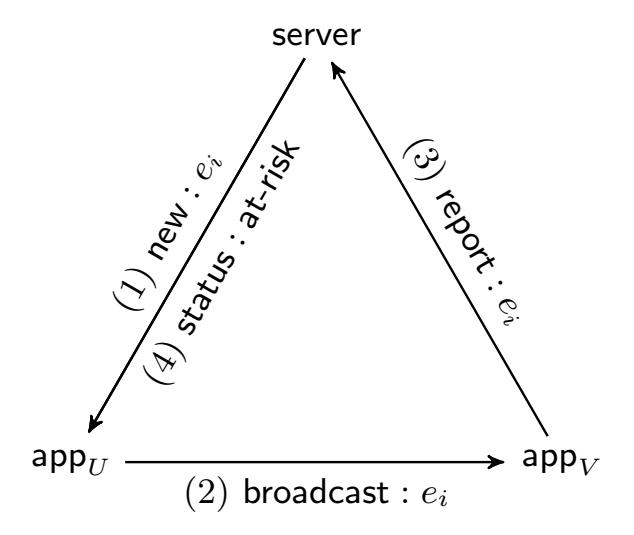
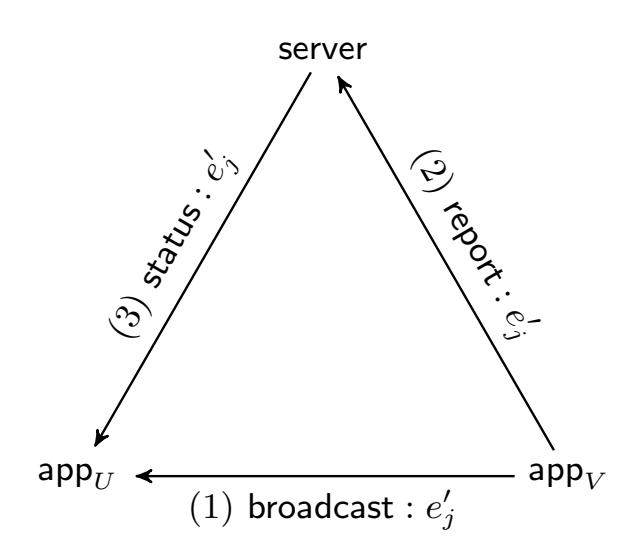

{0}------------------------------------------------

# **Centralized or Decentralized? The Contact Tracing Dilemma**

Serge Vaudenay 2020, May 6th

EPFL, Lausanne, Switzerland

**Abstract.** The COVID-19 pandemic created a noticeable challenge to the cryptographic community with the development of contact tracing applications. The media reported a dispute between designers proposing a centralized or a decentralized solution (namely, the PEPP-PT and the DP3T projects). Perhaps, the time constraints to develop and deploy efficient solutions led to non-optimal (in terms of privacy) solutions. Moreover, arguments have been severely biased and the scientific debate did not really happen until recently. In this paper, we show the vulnerabilities and the advantages of both solutions systematically. We believe that none offers any sufficient level of privacy protection and the decision to use one or another is as hard as using automated contact tracing at the first place. A third way could be explored. We list here a few possible directions.

### **1 Introduction**

The 2020 pandemic of COVID-19 resulted in the Great Lockdown. The freedom of people and the economy have been the hostages of a virus. As a result, authorities expressed their need for an automated tool to monitor the spread of the virus more precisely and to improve and support human labor. After all, such a tool would let people move freely resulting to end the lock-down, restoring economies and liberty. Many academics and researchers from various domains offered to develop such a tool in the form of *contact tracing* application running on smartphones.

The goal of contact tracing is to make people aware if they have ever been in contact with positively diagnosed people so that they should self-isolate, and possibly have an infection test. For pandemic diseases, reporting a positive diagnosis is mandatory and (human) contact tracers should investigate who could have been contaminated by the person and try to alert them. Of course, this investigation is done with appropriate ethics and psychological training. When transformed into an automated tool such as an app, it is not clear how this operation should proceed nor how ethics and psychology would translate. Because moving from human to automated processing creates new threats, designing such a tool came with significant questions for security and privacy researchers. Namely, the challenge is to ensure the privacy of millions of people as much as possible and to make clear statements about the implication of these tools to people's privacy.

A fundamental principle is that the contact tracing must not be used for other purpose (including the abuse of the app by both users and authorities) than alerting people at risk. The system should *minimize* the process over private data and make sure that no malicious participant could learn more private information than what it inevitably reveals.

{1}------------------------------------------------

#### **1.1 A Rather Brief History of Automated Contact Tracing**

On April 1st, the Pan-European Privacy-Preserving Proximity Tracing (PEPP-PT) was announced (as being "*an organization that will be incorporated as a non-profit in Switzerland*" 1 ). PEPP-PT was offering several solutions which are called "centralized" and "decentralized". As a decentralized solution, one project named "Decentralized Privacy-Preserving Proximity Tracing (DP3T)" was created on GitHub. It is run by an international consortium with a team of identified experts led by Carmela Troncoso.2 As its name indicates, DP3T claims to offer a solution which is decentralized and privacy-preserving. Since then, DP3T has been quite active in releasing documents, implementations, and showing activities to the media. All teams were happily working on their favored solution under the umbrella of PEPP-PT.

However, after a while, DP3T team members left the PEPP-PT project with surprising media coverage, arguing that PEPP-PT was not transparent. The DP3T members then started to criticize centralized systems and run an aggressive communication and lobbying campaign on social networks. This was reported as a dispute by journalists.3 The goal was clearly to influence policymakers on-time. However, no real academic discussion about centralized versus decentralized systems occurred.

Upon the pressure by DP3T people and followers on social media, teams which remained in the PEPP-PT consortium finally released the specifications of ROBERT4 on April 18, and of NTK5 the day after. Since then, DP3T people have been actively propagating overstated claims such as centralized systems will be a more intrusive massive surveillance instrument for governments. At the same time, DP3T has been dismissing or minimizing the importance of existing design flaws and attacks on their own protocol.

At this time, it is utterly confusing for a non-expert to see hard discussions about *centralized* versus *non-centralized* systems, because both solutions normally require only local storage (i.e. non-central ones), and both solutions require a central server for alerts. It also looks paradoxical to call a "contact tracing" system as "privacy preserving".6 Even for experts, it is disturbing to qualify either system as privacy-preserving while many papers [4, 17, 29] showed they are not. This did not prevent hundreds of academic experts to sign a letter7 assessing that four (decentralized) proposals are privacy-preserving while they are obviously not. Moreover, to our surprise, privacy experts are now praising Apple and Google. To add more confusion, a "centralized" system like ROBERT which has been claimed not to protect privacy by hundreds of academic experts was validated by CNIL, the

1 https://www.pepp-pt.org/

2 https://github.com/DP-3T/documents

3 https://www.golem.de/news/pepp-pt-streit-beim-corona-app-projekt-2004-147925.html

4 https://github.com/ROBERT-proximity-tracing/

5 https://github.com/pepp-pt/

6 The French title of Bonnetain et al. [4] translates into "Anonymous Tracing: a Dangerous Oxymoron".

7 https://www.esat.kuleuven.be/cosic/sites/contact-tracing-joint-statement/

{2}------------------------------------------------

powerful8 French authority for privacy regulation.9 A cryptographer who was hibernating in the winter and waking up in April 2020 would have been confused.

In this paper, we analyze two categories of Bluetooth-based contact tracing solutions. The decentralized systems include DP3T [19], Canetti-Trachtenberg-Varia [6], PACT-East [25], PACT-West [7]10, TCN Coalition11, or the Apple-Google solution12 . 13 In centralized systems, we studied TraceTogether, ROBERT [23], and NTK14. All of them (centralized and decentralized) share lots of similarities.

Our objectives are to compare centralized and decentralized systems. We do not discuss all possible attacks. Specially, we assume that a contact tracing should be based on Bluetooth and we do not discuss risks related to this technology. The reader could refer, e.g. to Gvili [17]. Several other risks are not covered. More precisely, we concentrate on the risks which allow a comparison between centralized and decentralized systems.

We believe that the precipitation to develop and deploy such solutions has bypassed the academic debate on contact tracing. A fair debate on which system to deploy would require transparency and clear communication in the risks that the system brings on entire population. We strongly believe that the academics have the scientific duty to report objective facts about risks of the systems.

### **1.2 A Joint Statement**

The joint statement which was signed by hundreds of researchers concludes with four imperative requirements that contact tracing must fulfill. As taken from the letter itself:

"The following principles should be at least adopted going forward:

- **–** Contact tracing Apps must only be used to support public health measures for the containment of COVID-19. The system must not be capable of collecting, processing, or transmitting any more data than what is necessary to achieve this purpose.
- **–** Any considered solution must be fully transparent. The protocols and their implementations, including any sub-components provided by companies, must be available for public analysis. The processed data and if, how, where, and for how long they are stored must be documented unambiguously. Such data collected should be minimal for the given purpose.
- **–** When multiple possible options to implement a certain component or functionality of the app exist, then the most privacy-preserving option must be chosen. Deviations from this principle are only permissible if this is necessary to achieve

8 "The CNIL has an advisory power, an onsite and offsite investigatory power as well as an administrative sanctioning power." https://www.cnil.fr/en/cnils-facts-and-figures

9 https://www.cnil.fr/sites/default/files/atoms/files/deliberation du 24 avril 2020 portant avis sur un projet dapplication mobile stopcovid.pdf 10 https://covidsafe.cs.washington.edu/

11 https://tcn-coalition.org/

12 https://www.apple.com/covid19/contacttracing

13 "PACT-East" and "PACT-West" may not be a stable denomination of the schemes. Both collided in using the "PACT" acronym. The eastern one is from MIT. The western one is from University of Washington.

14 https://github.com/pepp-pt/

{3}------------------------------------------------

the purpose of the app more effectively, and must be clearly justified with sunset provisions.

**–** The use of contact tracing Apps and the systems that support them must be voluntary, used with the explicit consent of the user and the systems must be designed to be able to be switched off, and all data deleted, when the current crisis is over."

The letter was *used* by advocates of decentralized systems as an endorsement by the academic community to decentralized systems. However, none of the above requirements is explicit about it. To understand this interpretation, we should read the third requirement and infer that contact tracing should be decentralized from contextual claims in the rest of the letter. One can actually read a few (free) claims as follows:

"Some of the Bluetooth-based proposals respect the individual's right to privacy, whilst others would enable (via mission creep) a form of government or private sector surveillance that would catastrophically hamper trust in and acceptance of such an application by society at large. [...] Thus, solutions that allow reconstructing invasive information about the population should be rejected without further discussion. Such information can include the "social graph" of who someone has physically met over a period of time.

[...]

Privacy-preserving decentralized methods of the type referred to in this document include:

DP-3T: https://github.com/DP-3T

TCN Coalition: https://tcn-coalition.org/

PACT (MIT): https://pact.mit.edu/

PACT (UW): https://covidsafe.cs.washington.edu/"

This states that some schemes (which are unnamed, but we understand it means the centralized schemes like ROBERT which was proposed at this time) reveal the social graph. This statement is exaggerated, as we discuss in Section 3.2.

The letter undoubtedly states that four (decentralized) named schemes are privacypreserving. As detailed in this paper, the existing literature shows this is incorrect. The argument that "solutions that allow reconstructing invasive information about the population should be rejected without further discussion" could actually hold for decentralized systems too. Contrarily, we propose to open a scientific discussion.

#### **1.3 Our Contribution**

This write-up is a survey on the discussions happening about the contact tracing applications. It is an academic treatment which is meant to be *objective*. We do *not* aim to suggest any choice between two solutions. As a matter of fact, there may be more than two solutions. The directions herein are gathered from literature to list the ideas with corresponding strengths and weaknesses. In the present work, we compare centralized and 

{4}------------------------------------------------

decentralized systems by reviewing known attacks and presenting new ones. We, then, open a new discussion on possible research directions to get the best of the two worlds.

While analyzing both systems, we can clearly state that centralized systems put the anonymity of *all users* in high danger, specially *against a malicious authority*, while decentralized systems put the anonymity of *diagnosed people* in high danger *against anyone*. Our conclusions are as follows.

- **–** None of the discussed proposals (centralized or decentralized) is privacy-preserving to any acceptable sense.
- **–** The privacy protection of both systems can be compared for one attack scenario. However, the multiplicity of attack scenarios make it impossible to declare one superior to the other in terms of privacy-preservation. Such assessment can only be subjective.
- **–** Alternatives to centralized and decentralized systems exist but require more investigations.

We detail our contributions below.

*Tracking people.* We discuss the risk of depseudonymization of ephemeral identifiers, which could help organizations to track people.

The main problem of centralized systems is that they enable those attacks at a large scale, if the security of a central server is broken, or if the authority is corrupted. We propose to reduce the impact of such disaster by rotating a key. Conversely, we present a similar attack on decentralized systems, which is on a smaller scale, but which is also easier, in the sense that the security of the phone (instead of the server) must be broken, or the phone itself must be corrupted, on a smaller scale.

We compare attacks linking ephemeral identifiers, including coercion attacks. Although those attacks apply to both systems, we prove that they put users of decentralized systems under higher danger by storing digital evidence locally. This is due to a difference of the exposure time of ephemeral identifiers in both systems: in centralized systems, they are erased after use; in decentralized ones, they are stored for a couple of weeks. Reducing this threat is possible using an enclave.

Besides, decentralized systems ease tracking people who are diagnosed and who report.

*Disclosing the social graph.* Again, centralized systems reveal something about the social graph to the central server, and it is a terrible property. However, it is utterly exaggerated to claim that centralized systems reveal the social graph. We review what protections are present in the specifications of ROBERT against this to correct this claim. If the anonymous channels of ROBERT work, the protocol *reveals to the server the long-term pseudonyms of users who could have been contaminated* and nothing else. Under the assumption that the powerful and malicious server can fully break the anonymous channels, the protocol reveals a subgraph: the social contacts between people who reported and the contacts they revealed. It is scary enough but certainly does not mean the full graph would be made public.

We review an attack by Avitabile et al. [1] showing that decentralized systems allow someone to formally prove that he encountered a person who was diagnosed. It is only one 

{5}------------------------------------------------

edge of the social graph but it comes together with a proof. Such a proof could be used to blackmail or to sue. For this reason, the lack of plausible deniability is a more severe problem in decentralized systems.

The social graph somehow always leaks in contact tracing because people can observe who is getting sick in a sequence. We observe that this problem is exacerbated by decentralized systems by making diagnosed people being more easily identifiable.

*Identifying diagnosed people.* We review attacks against decentralized systems allowing to identify diagnosed people. We review several attacks from previous works [1, 4, 16, 17, 29].

We add more attack scenarios by which a hotel, a shop, or a company would easily identify which of their visitors were diagnosed. Such information can be sold to advertisers or insurance companies. We analyze similar attacks by malicious apps, malicious operating systems, or malicious phones, and the risk such attack could be coupled with video-surveillance.

We discuss similar existing attacks against centralized systems using dummy accounts (Sybil attacks) [4].

By comparing centralized and decentralized architectures, we observe that attacks against decentralized systems are undetectable, can be done at a wide scale, and that the proposed countermeasures are, at best, able to mitigate attacks in a limited number of scenarios. Contrarily, centralized systems offer many countermeasures, by accounting and auditing.

*Pressure to opt in.* Both centralized and decentralized applications give two separate options to people. First, a person can opt in or out to use the app. Second, after being diagnosed, a user can opt in or out to report for contacts. These are two different decisions and we call a *full opt-in* as the decision to both use the app and report. A system needs as many full opt-ins as possible to be effective. We discuss on the pressure that users may have to use the app and report. As it is intended/believed that users will have a real choice, we analyze the rationale incentives for a user and the different ways to opt in or out in a game theoretic approach. We infer that a privacy-freak rational user is most likely to fully opt-in in a centralized system than in a decentralized one, because if he would refrain to use a centralized system (due to the risk that the server identifies him), he would most likely refrain to report in a decentralized one (due to the risk to go public). Contrarily, a grumpy user who was forced to use such system would probably by more happy with a decentralized one.

*Injecting false at-risk alerts.* We review previous replay/relay attacks [17, 29] and the proposed countermeasures. We observe that some countermeasures could lack of plausible deniability and enable an observer to prove the location of someone at some place. Such countermeasure should be taken with great care.

We propose an attack against centralized and decentralized systems in which diagnosed persons could be bribed to submit false reports to raise alerts on some targeted people. This could be done on a wide organized scale.

{6}------------------------------------------------

We also propose a "terrorist" attack scenario the purpose of which is to create false alerts for a massive list of users.

*A third way.* We list possible directions for other systems that we could find in the existing literature, or variants which have not been explored enough. Current designs can choose to report either collected identifiers or used identifiers, and to to have a server in open access or accountable access. This makes four possibilities out of which only two are extensively studied.

Private set intersection protocols was mentioned to offer privacy protection on the top of some variants.15 Trieu at al. [28] implemented such a system called Epione.

Finally, some variants based on public-key cryptography can offer better options. Avitabile et al. [1] proposed Pronto-C2, a fully decentralized solution based on the Diffie-Hellman key exchange between apps.

### **1.4 Related Works**

Since the number of publications on contact tracing increases day by day, we tried our best to cover all possible works in literature. We also stress that, at the time of writing, none of the references from April 2020 have gone through any peer review (and neither the present paper), for obvious reasons. Clearly, the subject needs more time to settle on a proposal to be deployed by nations.

Solutions not based on Bluetooth such as Reichert-Brack-Scheuermann [20] assume that a server collects the geographic location of every user in real time and computes contacts with multiparty computation.

An early Bluetooth-based solution was proposed in 2018 by Altuwaiyan-Hadian-Liang [2]. In this approach, only infected users upload to a server information about their encounters and other users request the server to compute their risk factor by using homomorphic encryption.

TraceTogether was the first centralized Bluetooth-based solution. It is discussed by Cho-Ippolito-Yu [8]. It was deployed in Singapore.16 Decentralized systems were released in early April 2020: DP3T [19], Canetti-Trachtenberg-Varia [6], PACT-East [25], PACT-West [7], TCN17 .

Brack-Reichert-Scheuermann [5] also proposed CAUDHT, a system in which the server is distributed, and plays the role of a blinded postbox between users. Participants exchange (long-term) public keys and reporting consists of sending a private message using the public key through an anonymous channel.

On April 8 of 2020 (at a time when DP3T was developed under the umbrella of PEPP-PT and no centralized system was documented), Vaudenay released an analysis of DP3T [29]. This report identifies some vulnerabilities of DP3T and proposes possible countermeasures. One countermeasure allows to defeat relay and replay attack, at a cost

15 https://github.com/DP-3T/documents/issues/169

16 https://www.tracetogether.gov.sg/

17 https://tcn-coalition.org/

{7}------------------------------------------------

of an interactive protocol between devices. Pietrzak [21] improved this countermeasure to make it non-interactive.

Tang [27] surveys four different techniques of contact tracing. Namely, TraceTogether, Reichert-Brack-Scheuermann [20], Altuwaiyan-Hadian-Liang [2], and DP3T [19].

Gvili [17] analyses the solution by Apple-Google and some vulnerabilities.

Bonnetain et al. [4] show that 15 very simple scenarios of attacks are feasible against all contact tracing systems, though the article is meant to non-technical French-speaking readers.

A report by the authors of NTK [16] analyzes NTK, ROBERT, and DP3T and shows some benefits of centralized solutions. Besides other vulnerabilities which are covered in the present paper, this article shows how the report to the epidemiologist option of DP3T would disclose a part of the social graph. It also shows that it is feasible to recover the location history of a diagnosed reported user.

Avitabile et al. [1] presented Pronto-C2, an Italian version of contact tracing. It relies on blockchains to allow anonymous exchange of ephemeral Diffie-Hellman public keys between apps. This also allows apps to report to each other in a fully decentralized systems. Interestingly, this paper questions whether the decision of Apple-Google which is in favor of decentralized systems (as it makes the implementation of centralized ones hardly possible) has a hidden agenda. It also analyzes DP3T and shows that diagnosed users could be tracked.

Kuhn-Beck-Strufe [18] initiate a formal treatment of privacy properties in contact tracing.

Beskorovajnov et al. [3] explores a third way to solve contact tracing and proposes a scheme where ephemeral identifiers of a user are anonymously uploaded to a central server.

Redmiles [24] analyzes the incentives to adopt and use such a technology.

Dar et al. [9] proposes an evaluation framework for contact tracing systems.

Finally, Trieu at al. [28] proposes the new system Epione based on private set intersection.

# 2 Overview of Contact Tracing Systems

The current debate of contact tracing systems is about solutions based on the Bluetooth technology. Each user U carries a Bluetooth-equipped smartphone in which there is an application  $\mathsf{app}_U$  installed.

In all systems, the  $\mathsf{app}_U$  is regularly loaded with a list  $L_U^\mathsf{out}$  of ephemeral identifiers  $e_1, \ldots, e_n$  to be released in a given order. Each ephemeral identifier is repeatedly released during its epoch. During this epoch, the  $\mathsf{app}_U$  instructs the smartphone to broadcast the ephemeral identifier  $e_i$  frequently. At the same time,  $\mathsf{app}_U$  collects the ephemeral identifiers  $e'_j$  which are received from  $\mathsf{app}_V$  of a user V. Hence,  $\mathsf{app}_U$  manages two lists of identifiers: the ones to send in  $L_U^\mathsf{out}$  and the received ones in  $L_U^\mathsf{in}$ . Identifiers are stored with a coarse indication about when they have been sent/received. Quite regularly, very old identifiers are removed from their respective lists. In centralized systems,  $L_U^\mathsf{out}$  is obtained from a server.

{8}------------------------------------------------

**Fig. 1.** Information flow in centralized (left) and decentralized (right) contact tracing when V, holder of  $\mathsf{app}_V$ , is diagnosed

In decentralized systems, it is generated by  $\mathsf{app}_U$ . What changes between all protocols is how the identifiers are generated or gathered.

When a user V is diagnosed, he receives from the health authority a token which allows him to upload information in a central server. This operation requires his consent and he may have a control on what to upload, depending on the scheme. We call this protocol report. In centralized systems, what is uploaded is the list  $L_U^{\text{in}}$  of received identifiers. In decentralized systems, what is uploaded is the list  $L_U^{\text{out}}$  of used identifiers.

Users can also check their "at-risk status" in the status protocol. Essentially, with the help of the central server, they can figure out if they are at risk of being contaminated because they have met some person who were diagnosed.

In decentralized systems, status operates by having  $\mathsf{app}_U$  dump the content of the server (i.e. reported  $e'_j$  from  $L_V^\mathsf{out}$  of diagnosed V users) and check the intersection between the reported identifiers and the locally stored received ones  $L_U^\mathsf{in}$ . Given the intersection,  $\mathsf{app}_U$  determines the at-risk status of the user. Systems like DP3T, PACT-East, PACT-West, NTL Coalition fit this model.

In centralized systems such as ROBERT or NTK, ephemeral identifiers  $e_i$  are derived from a pseudonym  $\mathsf{pseudo}_U$  of the registered user U and the central server has a trapdoor  $\tau$  allowing to retrieve the pseudonym from the identifier. Hence, the server can determine if user with  $\mathsf{pseudo}_U$  is at risk as soon as he recognizes  $\mathsf{pseudo}_U$  from the received  $e_i$ . Hence, when  $\mathsf{app}_U$  connects to the server and authenticates under his  $\mathsf{pseudo}_U$ , the server can directly tell if the user is at risk.

The difference is that the at-risk status is determined by the server instead of the app. This has big consequences on security and privacy, as we discuss in the next sections.

For clarity, we recall here how centralized system work. We only recall elements which are useful for the sake of our analysis. In this scheme, we assume that apps communicate to the server through an anonymous channel and that the server owns a trapdoor  $\tau$ .

- Registration. Each  $\mathsf{app}_U$  registers to the server. The server sets a pseudonym  $\mathsf{pseudo}_U$ . (The server and  $\mathsf{app}_U$  determine a way to authenticate  $\mathsf{app}_U$  under  $\mathsf{pseudonym}$   $\mathsf{pseudo}_U$  through the anonymous channel.)

{9}------------------------------------------------

- Setup of identifiers. Quite regularly,  $\mathsf{app}_U$  connects and authenticates to the server to get new identifiers. The server creates a list of  $e_i$  which can be mapped to  $\mathsf{pseudo}_U$  by using the trapdoor  $\tau$ . The  $e_i$  are given to  $\mathsf{app}_U$  which stores them in a list  $L_U^\mathsf{out}$ .
- Broadcast. During epoch i,  $\mathsf{app}_U$  constantly broadcasts  $e_i$ . After  $e_i$  is broadcasted for the last time,  $e_i$  is erased from  $L_U^\mathsf{out}$ . Every  $\mathsf{app}_V$  collects the broadcasted  $e_i$  and stores it in a list  $L_V^\mathsf{in}$  together with a coarse time information.
- Reporting. Upon positive diagnosis, user V provides  $\mathsf{app}_V$  with the appropriate (anonymous) credential to upload (part of)  $L_V^\mathsf{in}$  to the server. In this protocol,  $\mathsf{app}_U$  does not authenticate to the server. Elements to report are sent separately to prevent the server from linking them. The server associates each reported  $e_i$  with a  $\mathsf{pseudo}_U$  in his database (using  $\tau$ ) and remembers that  $\mathsf{pseudo}_U$  must be notified.
- Status verification. Regularly,  $\mathsf{app}_U$  connects and authenticates to the server to check the status of U on the server. The server answers whether U is at risk. If at risk, data about  $\mathsf{pseudo}_U$  are erased and U should register again.

Decentralized systems work more simply, as follows. Concrete protocols have different instantiation of this general frame.

- Setup of identifiers. Quite regularly,  $\mathsf{app}_U$  prepares a list of random  $e_i$  to be used and stores them in a list  $L_U^\mathsf{out}$ .
- Broadcast. During epoch i,  $\mathsf{app}_U$  constantly broadcasts  $e_i$ . A few weeks after  $e_i$  is broadcasted for the last time,  $e_i$  is erased from  $L_U^\mathsf{out}$ . Every  $\mathsf{app}_V$  collects the broadcasted  $e_i$  and stores it in a list  $L_V^\mathsf{in}$  together with a coarse time information.
- Reporting. Upon positive diagnosis, user V provides  $\mathsf{app}_V$  with the appropriate credential to upload (part of)  $L_V^\mathsf{out}$  to the server. The server publishes it.
- Status verification. Regularly,  $\mathsf{app}_U$  checks the newly uploaded  $e_j'$  on the server and checks if they are element of  $L_U^\mathsf{in}$ . This way,  $\mathsf{app}_U$  determines if U is at risk.

## 3 Privacy Issues

### 3.1 Depseudonymization of Ephemeral Identifiers: Tracking People

Malicious usage of the trapdoor. We start right away with the major problem of centralized systems such as ROBERT and NTK. In ROBERT, the ephemeral identifier  $e_i$  can be mapped to a long-term pseudonym  $\mathsf{pseudo}_U$  of the user U by using a trapdoor  $\tau$ . The pseudonym  $\mathsf{pseudo}_U$  is established at registration to the authority and is supposed to be a pseudonym. I.e., the authority is forbidden to store any side information (such as a phone number) which could identify U.18 The trapdoor  $\tau$  is only used by the authority for the purposed use of the system.

This means that anyone who obtains  $\tau$  is able to link all observed or collected ephemeral identifiers  $e_i$  to a unique pseudonym  $\mathsf{pseudo}_U$ . This also means that the authority has the capability to do so.

 $\overline{}^{18}$  In NTK, the phone number is actually stored with  $\mathsf{pseudo}_U$  to allow push at-risk notifications.

{10}------------------------------------------------

A corrupted authority could use the registration procedure to map the long-term pseudonym pseudo*U* to a real identity *U* in order to link every ephemeral identifier *ei* to the identity *U* of individuals. Given that the same authority receives the identifiers of people who could have been contaminated, this means that the authority could establish a list of potentially-contaminated identified people. Although the report protocol is supposed to be anonymous. As no anonymous system is perfect, the authority could even identify the diagnosed users and obtain the identified list of people they have potentially contaminated.

Protections against this terrible privacy threat are mostly legal. The authority is supposed to remain under the surveillance by privacy-enforcement authorities. There are also protection means to limit the risk of leakage of the trapdoor. For instance, secure hardware (such as HSM) and distributed systems with multiparty computation (MPC) could limit the risks. The authority is supposed to invest a lot on the security of this sensitive server.

Still, many people hate the idea of a powerful central authority, even though very high secure safeguard mechanisms are in place. The system could be under the threat that an insider activist person decides to sabotage the system for ideological reasons. This insider could try to exfiltrate the trapdoor *τ* and publish it to ruin the reputation of the system.

In the disaster case when *τ* leaks, a simple key rotation principle can circumvent the damages to a limited period of time.19

To summarize, the impact of the attack is a disaster but the attack is very hard to achieve.

Decentralized systems do not suffer from this vulnerability.

*Equivalent case in decentralized systems.* The above attack against centralized systems assumes corruption of the server to disclose a secret *τ* . The main reason why the attack is possible is that this *τ* makes ephemeral identifiers *linkable*. Indeed, by decrypting two ephemeral identifiers from the same person with *τ* , the adversary recovers the same pseudonym. We show here that decentralized systems could have an equivalent attack (with less severe consequences).

In the case of decentralized systems, there is no such trapdoor *τ* . However, ephemeral identifiers (which are short-terms pseudonyms) are derived from a medium-term key *k*. Anyone in possession of *k* can link all ephemeral identifiers which are derived from *k*. We note that the report scheme generally uploads this medium-term key *k* on the public server. Hence, all ephemeral identifiers which are derived from it become linkable. Anyone has free access to the public server, hence can determine if two ephemeral identifiers are derived from the same published *k* in the server.

Typically, the user sets up the key *k* to be used for a single day. In addition to this, the server tells which day an ephemeral identifier was used. It is expected that diagnosed users report the keys *k* of several consecutive days during when they were contagious. An adversary who collected ephemeral identifiers and kept some additional information (like when and where they were kept, under which circumstance, etc), the adversary may be able to link *k*'s of different days as coming from the same user. Data mining would

19 https://github.com/ROBERT-proximity-tracing/documents/issues/8

{11}------------------------------------------------

allow to reconstruct the mapping from ephemeral identifiers to an identity. However, the reconstruction of this mapping will remain partial and limited to diagnosed users.

Hence, the attack is very easy to make but the privacy leakage is small.

Comparing the previous attacks shows that centralized systems put privacy under more risks than decentralized ones in the case of a key leakage.

*Common vulnerabilities.* If we assume that the authority is honest and that the trapdoor does not leak, in centralized systems, ephemeral identifiers are unlinkable from a cryptographic viewpoint. However, ephemeral identifiers could be linked by other attacks.

In all systems (centralized and decentralized), ephemeral identifiers are stored in the app for some time which go beyond the time they are broadcasted. We call the time during which they are stored the *exposure time*. During this time, ephemeral identifiers can be linked by seeing that they are stored at the same time. In centralized systems, the exposure time starts when ephemeral identifiers are downloaded from the server and lasts until the time they are broadcasted for the last time. This exposure time is typically of the order of magnitude of a day. In decentralized systems, ephemeral identifiers are often derived from a medium-term key which is stored until there is no risk it has to be reported. This means that the exposure time starts when the key is set (i.e. at the beginning of the day the ephemeral identifier is used) and lasts for typically two weeks. During the exposure time, ephemeral identifiers can be deanonymized by the two following attacks.

**–** Coercion. A user can be forced by an authority, an employer, or a jealous spouse to reveal the content of the smartphone.

In centralized systems, coercion happening *before* ephemeral identifiers are used in the same day would link them. A coerced user could just stop using the app for a day after coercion to remain safe against this attack.

In decentralized systems, coercion happening *after* ephemeral identifiers are used would always compromise privacy. The duration of exposure is also much longer. Actually, the storage in the smartphone gives evidence against the user which can give incentives for coercion. We provide below an attack scenario.

After a burglary during which a Bluetooth sensor captured an ephemeral identifier, suspects could have their phones inspected for two weeks to find evidence. Clearly, forensics would find more information in phones using decentralized systems. This would deviate the system from its use.

Mitigation is possible by having app to run in an enclave. Assuming enclaves are secure, app would make *L* in and *L* out unreadable by coercion. Gvili [17] observes that a secure operating system could be enough to defeat coercion on the genuine app. (However, if coercion happens at the installation, another app which mimics the genuine still eases coercion could be installed...)

**–** Theft. A malicious app or a malicious operating system could disclose the content of the smartphone to a third party. Popular operating systems, or popular apps could make a large scale attack.

{12}------------------------------------------------

A smartphone is much less secure than a server so this is very likely to happen. If the leakage from the phone is continuous, having an exposure after or before usage does not matter.

Using an enclave is not enough to defeat this attack. Indeed, the operating system must see all ephemeral identifiers passing through the Bluetooth interface. As for malicious apps, it remains to be checked if accessing the interface allows them to keep the Bluetooth input and/or output of app under surveillance. We discuss this in more details in Section 3.3 under *Attack by a malicious app*.

This applies to centralized and decentralized systems, with various risks due to the time of exposure. We can see here that using an enclave puts centralized and decentralizes systems at comparable levels of risks.

Tracking people is a serious privacy risk. To conclude this section, we can see that centralized systems concentrate the risk to a single point of failure *τ* which requires a very high level of security. There is no technological solution to protect against a malicious server. In Section 3.3 we will see that decentralized systems allow an organization to *a posteriori* identify diagnosed users. Hence, diagnosed users could be tracked with comparable difficulty. Decentralized systems limit the risk of being tracked to reported users. Both systems are vulnerable against malicious operating systems, and probably against malicious apps too.

**Decentralized systems have a clear advantage over centralized ones, when considering this risk of tracking people.**

#### **3.2 Disclosing the Social Graph**

A recurring criticism by supporters of decentralized systems is that centralized ones reveal the social graph, i.e. who met whom. We investigate this risk in this section.

*The case of centralized systems.* There is no difference between centralized and decentralized systems as long as no report and status protocol is executed.

In centralized systems, users running report reveal to the server all contacts they had in the past. Although one could say that this is what is happening in the case of human contact tracing, this gives no reason to do the same with automated systems. Indeed, the purpose is to make contacts of the diagnosed person aware that they are at risk. It does not imply revealing the contact to any authority.

It is however incorrect to claim that centralized systems reveals the social graph. First of all, the leakage is for the server only. In the ideal case where the server is trusted and secure, there is no disclosure at all.

Second, what could be revealed is the unlinkable list of pseudonyms of the recent contacts of a diagnosed user. A user who has never been in contact with any reported diagnosed person has no information revealed.

Finally, protocols such as ROBERT assume that report and registration are run anonymously by the apps. Contacts are further sent separately to avoid disclosing that they come 

{13}------------------------------------------------

from the same diagnosed user. Opponents to centralized systems argue that anonymity can be broken by traffic analysis and by comparing two reports which have many contacts in common. This is certainly a valid argument. What we can conclude is that if the server is corrupted and powerful enough to control the communication network, then centralized systems reveal to the server the social subgraph with contacts between reported and at-risk users. However, this attack requires a lot of data mining.

*Decentralized systems.* Avitabile et al. [1] showed that a user who stores in a blockchain a commitment to each ephemeral identifier he collects would get, when the identifier is reported, a proof of having seen this person by opening the commitment.20 Such a proof could be sold to someone trying to reconstruct the social graph. It could also be used to reveal an encounter or blackmail. There could be situations where *A* decides to report the identifiers he used when he met his colleague *B* but not the ones that he used when he met his hated colleague *C*. Then *C*, with the help of *B*, could prove that *A* did not report what could have let *C* be aware of a risk. If the *C* was unaware of his risk and unintentionally contaminated his parent *D* who later died of this disease, *C* could use such a proof and sue *A* for that. Actually, decentralized systems suffer from a lack of *plausible deniability*. Centralized systems do not have this problem (if the server is honest) since reports leave no evidence.

As we assumed a corrupted server in centralized systems, we will assume that the central server of decentralized systems is also malicious. Actually, a malicious server who wants to know if a reported user *A* was in contact with a user *B* (what is obtained in the attack with centralized systems), the server can provide *B* with the report by *A* together with some junk ones, and wait to see if *B* receives an alert. For this attack to work, we assume that the adversary has a side-channel information. Namely, we assume that he can see if *B* received an alert, e.g. by seeing that *B* self-isolates or goes to be diagnosed. Contrarily to the attack on centralized systems, this attack is harder to make at scale and could be detected.

*Common vulnerabilities.* Both centralized and decentralized systems share the same vulnerabilities as for disclosing (part of) the social graph against coercion and theft attacks, just as for the depseudonymization risk.

An adversary who has access to the at-risk status of users by a side channel (e.g. because he can see users worrying after an alert, or seeing that they self-isolate) could deduce from seeing *A* and *B* having an alert that they probably have met a person in common. Similarly, seeing *A* diagnosed then *B* alerted would make them suspected to have met. This is an inherent risk of all contact tracing systems.

This case can show a higher risk in decentralized systems in which there is a high risk to publicly identify reported diagnosed users.

As diagnosed users are nearly publicly revealed, it is incorrect to claim that decentralized systems do not reveal the social graph. The at-risk side channel leaks more than in centralized systems.

20 This is referred to attack ATK5 by the authors [1].

{14}------------------------------------------------

As we can see in this section, **centralized systems reveal to a determined malicious server a part of the social graph**. We can also see that **decentralized systems reveal to a determined user a proof of encounter with a diagnosed person**, hence some social contact.

### **3.3 Identifying Diagnosed People**

*Decentralized systems.* Probably the main vulnerability of decentralized systems lies in that the pseudonyms of reported diagnosed users are publicly revealed. The attack was studied several times [1, 17, 29]. Anyone (using the app or not) can connect to the server and download the list of pseudonyms. Hence, anyone who has caught the ephemeral identifier and managed to remember whose identifier it is could *a posteriori* recognize that this user was diagnosed and reported. Getting such ephemeral identifier requires little equipment. The adversary is undetectable. We call *A* the adversary and *B* the target user to be recognized. Previous studies reported several scenarios of attacks, to which we can add more.

- **–** *Paparazzi attack* [29]. A motivated paparazzi *A* can extract the ephemeral identifier of a public person *B* from far away and later on recognize if this person was reported. The Bluetooth receiver may need to be boosted with a good antenna to work at distance. DP3T Design 2 proposes a countermeasure against this attack: to broadcast the ephemeral identifier piece by piece (using secret sharing) to make it hard to collect all pieces from far away. At the same time, it would make real encounters harder to determine. Whether the motivated paparazzi with a good equipment finds harder than the close genuine app to reconstruct the ephemeral identifier is certainly a strong hypothesis which requires experimental validation.
  - Gvili [17] had already proposed a countermeasure based on using *k* different broadcasts instead of one to make *A* believe that there are more devices around and he cannot determine which one is the one of the public person.
- **–** *Nerd attack* [29]. Any person *A* can use an app which collects received ephemeral identifiers, asks *A* whether he wants to memorize the identity of *B* in front of him, regularly checks on the server for reported cases, and tell *A* about recognized cases.
- **–** *Militia attack* [29]. This type of attack is a generalization of the nerd attack in which a group of people (the militia) pool their data to recognize as many reported users as possible.
- **–** *Attack by organization*. Instead of using people with Bluetooth collectors, an organization *A* such as a hotel, a shop, or a company, may install a Bluetooth collector at the place visitors *B* are identified. The hotel identifies its customers at check-in. The shop identifies its customers who hold the right discount card at the cashier. The company identifies its employee or visitors at entrance. Hence, the organization *A* can collect a lot of information as in the militia attack and later on recognize reported *B*. This information can be sold or abused.

This attack is present as Scenario 13 (the insurance company)21 in Bonnetain et al. [4].

21 The shop sells the results to an insurance company.

{15}------------------------------------------------

**–** *Attack by malicious app*. The organization could be a malicious app in the phone of every potential user *B*. It could be a social media app which knows *B* well and just collects its ephemeral identifier. The ephemeral identifier is released by the genuine app for broadcast. Whether another app can see it depends on the API.

Malicious apps have several attack vectors:

- 1. access to data stored by the genuine app;
- 2. access to the outgoing ephemeral identifiers;
- 3. access to the incoming ephemeral identifiers;
- 4. other data they normally have access to.

The operating system can eliminate the first two attack vectors. As for the last one, the Apple-Google API was announced never to let an app running in background have access to the Bluetooth broadcast. However, some apps are frequently put in foreground. A foreground app could retrieve the incoming ephemeral identifier and infer from side information who sent it. For instance, a malicious app with access to the calendar would know who the holder is meeting at the moment. An app with access to geoposition which is running on many phones would also deduce who is in proximity. An app with access to the camera or the microphone could also record the meeting. Essentially, a malicious app could make a better job than the genuine one in spotting any small contact with a diagnosed person and remembering more data about it. This would make the nerd or militia attacks run in an automated way and without the user being malicious.

- **–** *Attack by malicious operating system or hardware*. Instead of a malicious app, the operating system or the hardware could collect the identifier and exfiltrate to the company *A*. Since app*B* is giving the ephemeral identifier to the operating system who gives it to the hardware, no protection is possible.
- **–** *Attack coupled with video-surveillance*. 22 A nasty local authority *A* which installs a video-surveillance system with a Bluetooth sensor could store in a database some pairs consisting of the captured ephemeral identifier and a pointer to the recorded video. Later on, the collected identifiers can be matched to reported cases with a direct pointer to the video.

The feasibility of this attack was demonstrated by a proof-of-concept and a simulated experience.23 It requires little equipment.

NTK authors [16] describe a variant of this attack with an adversary taking pictures at the entrance of the subway or a building.

If really effective, the countermeasure by DP3T Design 2 based on secret sharing could defeat this attack scenario because the video-surveillance sensor may be too far from the phone.

Canetti-Trachtenberg-Varia [6] mentions private information retrieval or private set intersection as a possible mitigation. However, it has not been investigated in the existing literature so far.

22 https://github.com/DP-3T/documents/issues/121

23 https://github.com/oseiskar/corona-sniffer

{16}------------------------------------------------

*The case of centralized systems.* A depseudonymization attack is always possible in any contact tracing system. If *A* registered a dummy account with which he only goes in contact to *B*, then using app*A* with report will make *A* aware whether *B* was reported or not. This attack is present as Scenario 2 (the unique suspect)24, Scenario 5 (the hiring interview)25 , and Scenario 6 (the paparazzi) in Bonnetain et al. [4]. One big difference between this attack and the previous ones against decentralized systems is that it requires a dummy account, and that accounting could be used as a way to defeat it.

Indeed, my making sure that registering a dummy account is not massively doable and by making sure that the same dummy account cannot be used to identify many people, the attack is not feasible in a large scale.

Furthermore, raising the at-risk flag in report in ROBERT deactivates the account. This means that a single dummy account can be used to query the server as an oracle to check if one of the contacted users has been diagnosed. The oracle can be queried many times as long as the answer is negative. But if the answer is positive, no more query can be made. If the adversary is rewarded for each diagnosed user he could identify (e.g., because he could sell this information for a good price), this means that *n* dummy accounts cannot provide him with more than *n* rewards. Clearly, the attack needs many dummy accounts to be done at scale.

In its current version, ROBERT requires a CAPTCHA to register an account. It is probably not sufficient to avoid Sybil attacks at a large scale, but it is already making them hard. Limiting each user to have a single account would be a more drastic countermeasure.26

Instead of using dummy accounts, the adversary could reserve some of his ephemeral identifiers for a dummy usage. This is possible in decentralized systems but not in centralized ones, because status does not reveal which ephemeral identifier triggered an alert.

Those attacks were listed in a document by DP3T [13] as "inherent to all contact tracing systems" (attack I). However, centralization offers many more countermeasures.

**This section shows a clear advantage of centralized systems over decentralized ones, when considering the risk of identifying diagnosed people**.

### **3.4 The Opting Choice**

Privacy is a human right. A user who really worries for his privacy is supposed to have the choice to opt-out. Opting out can have several forms:

- **–** not installing the app at all;
- **–** turning off Bluetooth;
- **–** using the app but refusing to report after diagnosis.

People who are really concerned about their privacy add hard covers on the webcam of their laptop because they do not trust software deactivation. They have no reason to trust more

24 *A* left home only once and met a single person.

25 After a hiring interview, diagnosed people are eliminated.

26 https://github.com/ROBERT-proximity-tracing/documents/issues/46

{17}------------------------------------------------

software Bluetooth deactivation. Hence, the second opt-out option is not really making sense.

Regarding the first opt-out option, someone who is purposely not using the app is exposed, because neighbors can see that someone is here but that no Bluetooth beacon is broadcasted. Hence, there will be social pressure or discrimination towards people who prefer not to use the app.

Here is a real story which already happened. In a (virtual) coffee break at work, some people discussing on privacy risks on contact tracing. Eventually, someone asks if people would use the app. One privacy-freak asocial engineer says he would rather not use any app because of too many privacy risks. Immediately, others imply him for being an *irresponsible resident* because he does not help society to avoid another lock-down.

A condition for the deployment of contact tracing is that it will be used on a voluntary basis and that people would be free of any pressure or incentive to do so. Some legal enforcement is proposed by Edwards et al. [14]. It is highly unlikely that this principle is well understood by a majority of people and even less likely that it will be enforced.27

How about opting out in report? The diagnosed person will also interact with a human tracer who may like that the app eases his job. His relatives and colleagues may also dislike that he does not report because they would not receive an alert if they are at risk. The user would certainly feel terribly responsible to make his contacts be alerted and be tapped by his conscience. At this stage, the user may be pushed to make its app report. The absence of pressure is for sure an illusion in this case. This is a form of coercion.

To defeat coercion - and still look like a good citizen - a twisted minded user may like to use a modified app which mimics the genuine one but sends totally random beacons and never stores anything in return. This way, reporting an empty list will let the user free of any pressure. The only problem is that this opting choice for report must be done well ahead in advance to the diagnosis.

*Grumpy user.* We could wonder how the system is perceived in the shoes of a grumpy user who has been pressured to use the app.

In centralized systems, this user would certainly hate to know that the server identified him just because he has encountered someone who has been diagnosed and who reported him. Receiving an unsolicited alert coming from the server will certainly not cure his grumpiness.

In decentralized systems, the grumpy user can let his app run at a small privacy cost. Whether his app raises an alert or not will not mean that someone reported him. The decentralized system would make this user happier.

For the grumpy user who is forced to report after a diagnosis, the situation is even worse. In addition to the bad news of being diagnosed, the grumpy user would either fear that his identity and contacts are revealed to the server (in centralized systems), or fear that his identity are revealed to an unknown adversary (in decentralized systems). What is

27 Actually, we have already seen a Twitter post from a faculty member calling for making the use of tha app mandatory for everyone on campus to be able to reopen.

{18}------------------------------------------------

the worst depends on the subjective perception of the trust people put in a central secure server or in the believe that no hidden adversary would dare identifying diagnosed people.

Actually, the situation of the grumpy user makes much sense in the scenario where contact tracing is deployed, authorities realize that it is not useful because of a too low acceptance rate, and a situation of emergency leads to the conclusion that the law must be adapted to sacrifice a human right: either the freedom to move, or the right to privacy. In the terrible case this should ever happen, the full opt-in choice would certainly be dropped.

Privacy-freak rational user. A rational user would only opt in using the app because it brings a benefit. The first problem is to measure the societal benefit of automated contact tracing. This question has been raised several times28 and people must essentially hope this will be useful. However, the potential societal benefit creates an inherent social pressure to opt in. Based on that using such app should remain on a voluntary basis and that an app needs a huge number of users to be effective, we believe that a game theoretic approach to analyze the expected opting rate is important. We make below a simple analysis. More aspects are covered by Redmiles [24].

A rational (honest) user must make two choices: opt-in to use the app, and later on, if this is the case, opt-in to report. The benefit includes the social benefit, the pride to be a good citizen, and also the promise to be warned if the user it at risk. It does not seem to depend on whether the system is centralized or not. The cost of using the app corresponds to the privacy loss. Its perception depending on whether the system is centralized or not may depend on the user. A privacy-freak user may find the privacy cost of centralized systems larger than the privacy cost of decentralized systems because of the risk to be deanonymized. Hence, this user is less likely to opt in with a centralized app than with a decentralized app. However, when it comes that this user is diagnosed and must decide to opt in with the report or not, we realize that the privacy cost for decentralized systems is higher than for centralized ones. Indeed, in centralized systems, the reporting user reports his contacts. In decentralized systems, the user reports his own keys.

Given a user U, a systems  $s \in \{c, d\}$  (centralized or decentralized), and the opting case  $o \in \{a,r\}$  (for using the app or to report), we let  $u_U^{s,o}$  be the utility function. We have that  $u_U^{c,a} < u_U^{d,a}$  and  $u_U^{c,r} > u_U^{d,r}$ .

If  $u_U^{d,r} > 0$ , the rational user U is willing to report in a decentralized system. Since  $u_U^{c,r} > u_U^{d,r}$ , U would also be willing to report in a centralized system.

If  $u_U^{s,a} < 0$ , the rational user U does not use the app in a centralized system. With the previous analysis, we can think that this is because he is concerned about his privacy and the risk to be identified is too high. Hence, we can suspect that for this user we have  $u_U^{d,r}$  < 0 too, because decentralized systems give a high risk to the reporting user to be identified by anyone. This means that even if this user would have joined with the app in decentralized systems, he would not have reported in the case of a positive diagnosis. The consequence is that among rational users, there would be less reports with a decentralized system than with a centralized one.

&lt;sup>28 See e.g. Schneier. https://www.schneier.com/blog/archives/2020/04/contact\_tracing.html

{19}------------------------------------------------

This proves that deploying a centralized system may generate more reports than deploying a decentralized one. This assumes that users have a free choice and that they behave rationally.

An important note is that the above reasoning assumes a rational user with no pressure to opt in report, which is intended. Indeed, the situation may be different if *U* feels responsible to report. This shows that for decentralized systems to be more effective than centralized ones, we must assume some form of pressure on users.

*Malicious privacy-freak rational user.* A malicious user has more options in the game. Namely, he can use a modified app. The rational malicious user would be willing to modify the app in such a way that he gets the benefit (namely, the promise to be alerted when he is at risk) at a reduced cost (namely, with less privacy risks).

In decentralized systems, the modified app would broadcast junk identifiers and report the genuine ones. This would harm no privacy still provide functionality, because the modified app would still collect the identifiers of encounters and recognize them if they report. Therefore, a (selfish) malicious privacy-freak rational users would generate no useful reports and no useful broadcast.

In centralized systems, to benefit from the functionality, the user must broadcast his genuine ephemeral identifiers. Hence, this user is still behaving honestly. The remaining question is whether he would report or not. However, this essentially goes back to the honest rational user. Actually, the privacy cost to report is small so he may still contribute.

A surprising consequence of the central system is that the promise to be alerted when being at risk only applies to honest users.

To conclude this section, we can say that **privacy-freak rational users would probably make decentralized contact tracing less effective than centralized contact tracing**. However, **the lack of real free opting choice may let users grumpy and like decentralized systems more**.

### **4 Security Issues**

We assume an authenticated communication channel between the app and the central server. (Decentralized systems need authentication of the server and no private communication; centralized systems need two-sided authentication and private communication.) We further assume that the authorization to report has proper protections against replay attacks. Hence, critical security comes at the app level.

### **4.1 False Encounter: The Lazy Student Attack**

Previous studies [17, 29] reported replay and relay attacks, by which an adversary *A* which has caught an identifier *e* from app*B* can later on replay it to app*C*. This way, *C* will store an identifier as if he encountered *B*, although this was not the case.

The motivation for injecting false encounters could be to make app*C* raise an at-risk alert. This could be stressful for *C* and the adversary could get an advantage (such as 

{20}------------------------------------------------

elimination of a competitor, cancellation of a meeting, ...). Collecting identifiers e which could make C raise an alert would create a hunt for ephemeral identifiers of people who will become sick. Vaudenay [29] describes a dark economy in which some malicious hunters would collect ephemeral identifiers e among people B who are more likely to be sick, deposit them in a smart contract, and get a reward if the collected identifier is reported later on. One hunting approach would be to collect the identifiers in the waiting room of a hospital or to bribe some hospital employee to collect identifiers of the medical staff. Those are places where to find people B who are highly likely to be diagnosed. Collected identifiers can later be bought by the lazy student A who can bombard his professor C with them. If A is lucky,  $\mathsf{app}_C$  will raise an alert and the professor will cancel the exam. The malicious organization involves the lazy (but rich) student who can buy e's online on a store which is fed by hunters. This dark economy only works for decentralized systems, because the smart contract has a way to check if a collected identifier belongs to a diagnosed person. Without this, (doubly) malicious hunters29 would just submit random numbers and the dark economy would collapse. This attack is a bit different in Scenario 9 (the lazy student) and Scenario 15 (the Mafia) in Bonnetain et al. [4]

As discussed, the attack works for centralized and decentralized systems. However, decentralized system would favor making it at a bigger scale with dark economy.

In the case where the ephemeral identifier  $e_i$  is a PRF function  $e_i = g_k(i)$  with an ephemeral secret k,  $L_B^{\text{out}}$  only needs to keep k. In this case, Vaudenay [29] proposed an interactive protocol to defeat replay attacks. Pietrzak [21] proposed a way to make it non-interactive. The idea is that, instead of sending  $e_i$ ,  $\mathsf{app}_B$  sends a triplet

$$(x, r, H(x, r), f_k(h(x, r)))$$

where x indicates a "location", r is a random number, H is a hash function, and  $f_k$  is a message authentication code with key k. Upon receiving  $(x, r, h, \tau)$ ,  $\mathsf{app}_C$  would verify that h = H(x, r) and that the location x is correct (as explained below). If this is the case,  $\mathsf{app}_C$  adds  $(h, \tau)$  in  $L_C^{\mathsf{in}}$ . What is reported after B is diagnosed is only k, which allows to verify the  $(h, \tau)$  pair in  $L_C^{\mathsf{in}}$ .

The "location" x can consist of the clock value of B at sending. Hence, "verifying x" means verifying that the difference between the clock value at reception and x is small enough. This protocol would prevent A from replaying the identifier of B to C at a too distant time. (This requires loosely synchronized and reliable clocks: if the clock of B or C can be corrupted, this protection is ineffective.) The "location" x may also include the geographic position (assuming a reliable positioning system). This could prevent relay from B to C at a too far away distance.

Systems such as Hashomer [22] use such mechanism based on geographic position.

One problem of such mitigation is that it creates undeniable evidence. If the adversary A keeps (x, r) together with  $(h, \tau)$  then makes  $(x, r, h, \tau)$  time-stamped (e.g. in a blockchain), and if the timestamp is obtained before k is obtained (e.g. because B was diagnosed and reported k on the server), this gives evidence that B was at (time-space) location x. This

This malicious hunter would indeed cheat with the darknet system.

{21}------------------------------------------------

creates a privacy issue. Actually, the lack of *plausible deniability* in several schemes could become an important issue. Hence, it is not recommended to use location.

**Using the proper mitigation puts centralized and decentralized systems on the same level**. Without it, decentralized systems are more vulnerable because of the large-scale attack.

Decentralized systems add another vulnerability, as it is also possible to replay an identifier *e* which *A* gets from the server. However, replaying them would most likely require to corrupt the clock of *C*. If *C* compares the received identifier *e* with the currently reported ones, this attack scenario would also require to attack *C before* it downloads the ephemeral identifier to be replayed. This attack was listed in a document by DP3T [13] as an "attack which does not work" (attack E) because "phones will not check released data against new observations". However, app*C* will not download the newly released *e* as soon as they are uploaded so this attack could still work. One countermeasure could be to make sure that *B* does not report ephemeral identifiers which could immediately be replayed. Hence, the attack would require that *A* corrupts the clock of *C*, which makes the attack less practical (but still possible).

### **4.2 False Report: The Terrorist Attack**

A previous report [29] suggests that a malicious and diagnosed user *C* could upload forged identifiers to the server in the report protocol. Indeed, no mechanism makes the server convinced that app*C* is honestly reporting. A greedy user *C* could use a modified app*∗ C* which allows him either to report some *e ′* obtained from a dark repository (and get a reward for that), or sell the genuine *e ′* to be reported before the report is done.

Again, in a decentralized system, it is easy to see if *e ′* was reported by checking it on the server. This favors a dark economy of rewarding *e ′* . Using such malicious app, a malicious user *A* who encountered *B* could offer a reward through the dark repository for reporting *A*'s own identifiers. The payment could be made by a smart contract once *e ′* appears on the server. Conversely, a malicious user *A* could buy the *e ′* fed by *C* on the dark repository and send it to *B* before a diagnosed *C* reports *e ′* . The payment could be made by a smart contract once *e ′* appears on the server. This way, *A* makes app*B* raise an alert.

In a centralized system, *A* gets *e* from *B* and buys on the dark net a service to report *e*. Once *C* is diagnosed, he can report *e*. To support the economy, the payment by *A* could be held until *B* has an alert. However, it is a harder to extract this information to feed in a smart contract. It makes the economic system a bit harder.

We can also imagine a kind of terrorist attack by which a group of people *A* would use a modified app app*∗ A* which would pool all information. If one person *C* from this group is diagnosed, app*∗ C* would report all necessary information to alert the contacts of all members of this group. This could raise an alert in the entire city.

In centralized systems, the way to pool consists of collecting all received ephemeral identifiers by group members in a unique list *L* in *C* . It could be defeated in the report protocol 

{22}------------------------------------------------

by denying a too large list of encounters.30 In decentralized systems, the way to pool is much easier: it consists of using the same keys to generate the ephemeral identifiers to broadcast.

A simpler form of terrorism attack is called a *trolling attack* in Gvili [17] and present at Scenario 7 (the activist) and Scenario 8 (the secret agent)31 in Bonnetain et al. [4]. In this attack, someone diagnosed or about to be diagnosed makes his phone circulate in a crowd, e.g. by attaching it to a dog.32 This creates fake encounters with many people. After the adversary is diagnosed, he can report and trigger alerts for many people.

### **5 A Third Way**

Our analysis shows that centralized systems suffer from the use of the trapdoor *τ* . Conversely, decentralized systems suffer from that status requires the central server universally readable. We could wonder if there is a hybrid way in between.

Cho-Ippolito-Yu [8] mentioned private set intersection. Canetti-Trachtenberg-Varia [6] mentioned the direction of private information retrieval and of private set intersection without any detail. Ramzan suggested to use techniques such as zero-knowledge or homomorphic encryption.33 Actually, Altuwaiyan-Hadian-Liang [2] already used homomorphic encryption.

Trieu at al. [28] lists several strengthening strategies: private messaging to strengthen anonymity in centralized systems, rerandomizaion of tokens, and secure computation (such as private set intersection). The idea of token rerandomization applies in a decentralized system in which the reporting user reports the collected ephemeral identifiers (tokens) like in centralized systems. By rerandomizing the tokens, the server cannot link them with any observation.

We list here several research directions.

#### **5.1 Centralized Architecture with Open-Access Server**

Beskorovajnov et al. [3] proposes that the ephemeral identifier of app*U* is associated with a secret ephemeral identifier. The public-secret pairs of identifiers is uploaded anonymously to a server prior to usage. The server keeps a database of pairs. Then, broadcasting, storing, and reporting works like in centralized systems. That is, the system works as follows.

**–** *Setup of identifiers.* Each app*U* generates a list *L* out *U* of (*ei , si*) pairs and uploads it in a secure and anonymous manner to a server.

30 In protocols such as ROBERT, identifiers in *L* in *C* are reported separately for privacy reasons. Hence, this mitigation requires a way to account the number of reports without decreasing privacy.

31 A secret agent wants to prevent the departure of a submarine by triggering an alert to the entire crew.

32 The example was borrowed to Anderson. https://www.lightbluetouchpaper.org/2020/04/12/contact-tracing-inthe-real-world/

33 https://medium.com/@Zulfikar Ramzan/the-future-security-privacy-and-risk-in-a-post-covid-worldbb7c10320a8e

{23}------------------------------------------------

- Broadcast. During epoch i,  $\mathsf{app}_U$  constantly broadcasts  $e_i$ . After  $e_i$  is broadcasted for the last time,  $e_i$  is erased but  $s_i$  is kept in  $L_U^\mathsf{out}$ . Every  $\mathsf{app}_V$  collects the broadcasted  $e_i$  and stores it in a list  $L_V^\mathsf{in}$  together with a coarse time information.
- Reporting. Upon positive diagnosis, user V provides  $\mathsf{app}_V$  with the appropriate credential to upload (part of)  $L_V^\mathsf{in}$  to the server. The server associates each reported  $e_i$  with an  $s_i$  in his database and publishes  $s_i$ .
- Status verification. Regularly,  $\mathsf{app}_U$  checks on the server for the new reported  $s_i$ . If one  $s_i$  matches one in  $L_U^\mathsf{out}$ , an alert can be raised.

Such an architecture is indeed hybrid between centralized and decentralized. However, in this above form, it does not fully solve the problems of both schemes. Namely, the central server which succeeds to break the anonymity of the upload of pairs of identifiers can later track the broadcasting user. Second, a malicious user U who wants to be warned if V is reported can just broadcast to V an identifier which is only used with V. Actually, it uses a dummy pair of identifiers instead of a dummy account. Such vulnerabilities are known and Beskorovajnov et al. [3] proposes extensions of this architecture to fix it.

This architecture essentially builds an open-access server (like in decentralized systems) on the top of a centralized one. The converse approach (to be explored next) builds an access-restricted central server on a decentralized architecture.

### 5.2 Decentralized Architecture with Restricted-Access Server

Epione [28] presents an alternate architecture. This approach consists of making status private in a decentralized systems, by adding some flavors of centralized systems and secure computation techniques. We start with the decentralized systems architecture.

- Setup of identifiers. Quite regularly,  $\mathsf{app}_U$  prepares a list of random  $e_i$  to be used and stores them in a list  $L_U^\mathsf{out}$ .
- Broadcast. During epoch i,  $\mathsf{app}_U$  constantly broadcasts  $e_i$ . A few weeks after  $e_i$  is broadcasted for the last time,  $e_i$  is erased from  $L_U^\mathsf{out}$ . Every  $\mathsf{app}_V$  collects the broadcasted  $e_i$  and stores it in a list  $L_V^\mathsf{in}$  together with a coarse time information.
- Reporting. Upon positive diagnosis, user V provides  $\mathsf{app}_V$  with the appropriate credential to upload (part of)  $L_V^\mathsf{out}$  to the server. The server stores it.
- Status verification. Regularly,  $\mathsf{app}_U$  runs with the server a protocol with input  $L_U^\mathsf{in}$ . This returns the at-risk status of U.

The difference is that the server is no longer universally readable. Instead, status is a 2-party protocol with two sets at input and which returns to  $\mathsf{app}_U$  the at-risk status. We explore below possible private status protocols. In what follows, we denote by S the set of the server and by I (as for "identities") the set of the app. Computing the risk reduces to deciding whether  $S \cap I$  is large enough.

The main privacy requirement is that the server should not learn anything about I. Decentralized systems essentially use the trivial protocol in which the server gives S to  $\mathsf{app}_U$  and  $\mathsf{app}_U$  computes the at-risk status. Hence, any protocol offering the functionality

{24}------------------------------------------------

and satisfying the main privacy requirement would not leak more than in decentralized systems.

Even a perfectly private protocol computing if  $S \cap I$  is large enough would allow a malicious client to identify diagnosed people by running the protocol many times. The present approach consists of assuming that there is a centralized accounting for access to the server. Namely, every  $\mathsf{app}_U$  must register a unique account (e.g. though the health authorities), which is by no means connected to any ephemeral identifier. Accessing to the server to run  $\mathsf{status}$  would require to authenticate with this account and the server would limit the number of queries for each account. This way, potential leakages from the protocol is limited.

To determine whether  $\#(S \cap I)$  is above threshold or not, we can use a private set intersection protocol (which would leak  $S \cap I$  which is more than needed) a private set intersection cardinality protocol (which would leak  $\#(S \cap I)$  which is more than needed), or, if the threshold to apply is zero, i.e. if we want to know whether S and I intersect or not, a private set intersection test protocol. Trieu at al. [28] reviewed several techniques to achieve private set intersection. They designed for Epione a private set intersection cardinality protocol which is based on Diffie-Hellman and private information retrieval. We present below two other directions based on a way to represent sets in a compact manner and we show the difficulty of such approach.

Bloom filters. Debnath and Dutta [10] present a private set intersection (and cardinality) protocol which has a linear complexity and can further hide the cardinality of the set of the app. It is based on Bloom filters.

A Bloom filter is a compact manner  $\mathsf{BF}_I$  to represent a set I in a way that we can test membership efficiently. In a Bloom filter of length m using k hash functions,  $\mathsf{BF}_I$  is a string of m bits and there are k hash functions  $h_1,\ldots,h_k$  with output domain  $\{1,\ldots,m\}$ . The Bloom filter  $\mathsf{BF}_I$  is defined by  $\mathsf{BF}_I[i]=1$  if and only if there exists  $x\in I$  and j such that  $h_j(x)=i$ . To check membership of a given x, we hash x using all hash functions and check that  $\mathsf{BF}_I[h_j(x)]=1$  for every j. Equivalently, we check that

$$\prod_{j=1}^k \mathsf{BF}_I[h_j(x)] = 1$$

A member of I is always recognized as a member. A non-member of I can be recognized as a member, which is a *false positive*. Using  $m = \frac{k}{\ln 2} \times \#I$ , gives a probability of a false positive roughly equal to  $2^{-k}$ . Hence, if there is no false positive, we have

$$\#(S \cap I) = \sum_{x \in S} \prod_{j=1}^k \mathsf{BF}_I[h_j(x)]$$

Briefly, the app represents I in a compact manner using a Bloom filter  $\mathsf{BF}_I$  of m bits for its set using k hash functions. The app makes a Goldwasser-Micali encryption  $\mathsf{enc}(\mathsf{BF}_I[i])$  of every of the m bits of the Bloom filter and sends it to the server. For each element  $x \in S$ 

{25}------------------------------------------------

of his set, the server hashes *hj* (*x*) for every *j*, extract every enc(BF*I* [*hj* (*x*)]), mixes and blinds them. The server sends these back for every *x ∈ S*. The app can decrypt with the Legendre symbol and determine how many elements *x ∈ S* are in the Bloom filter. The complexity is *O*((#*I* + #*S*) *×* log(#*S*)) by taking *k* = *O*(log(#*S*)).

In this scheme, the server learns *m* and *k*. The app learns the cardinality #*S* of the set of the server.34

Assuming that each user runs status every day, have no more than 100 new encounters inserted in *L* in per day, and must check for all encounters in the past two weeks, we can upper bound #*I ≤* 2 10. We assume that the number #*S* of new report per day is not larger than #*I*. Otherwise, the two high number of diagnosed people would force authorities to have another lock-down. The number of false positives in each status is limited by 2*−k*#*S*. By taking *k* = 30, this is one over a million and we have *m ≈* 43 Kbits.

Hence, we can estimate the complexity of this status protocol. The app hashes 30 000 times, encrypts 43 000 times, and computes 30 000 Legendre symbols to decrypt. The server hashes 30 000 times and blinds 30 000 encryptions. Note that hashing can be precomputed for all users if the hash functions are in common. Overall, the complexity is not so nice but remains doable in a minute.

The volume of communication can be drastically reduced in two ways. First, the server could compute #(*S ∩ I*) using a somewhat homomorphic encryption and respond with a single ciphertext. Second, the server could use compression techniques for his query. Unfortunately, all those solutions substantially increase the complexity on the server side. Given that the solution with Goldwasser-Micali encryption would probably require a minute on one CPU, having the server doing this millions of times in the same day is already quite challenging.

*Flajolet-Martin sketch.* Another way, proposed by Dong and Loukides [12], consists of approximating the cardinality, but with a much lower complexity. The proposed scheme has logarithmic complexity (instead of linear) in the honest-but-curious model. The idea is that both the app and the server will first represent their own set in a compact manner using a Flajolet-Martin (FM) sketch [15]. Then, they use multiparty computation (based on garbled circuits) to compute the cardinality of the intersection (or an approximation of it).

Dong and Loukides [12] report that the estimate of union cardinality of sets of up to 1 million elements has a relative error of over *ε* = 1% with probability less than *δ* = 0*.*1%, for an implementation running in less than 3 seconds.

An FM sketch for a set *I* is a bitstring of logarithmic length, in terms of the cardinality of the set. Essentially, an FM sketch of *w* bits is defined by a random hash function *h* mapping set elements to *{*0*, . . . , w −* 1*}* uniformly. The bit FM*I* [*i*] of the FM sketch of index *i* is set to 1 if an only if there exists one element *x ∈ I* such that *h*(*x*) ends with 10*i* . Hence, the bit of index 0 is hit by nearly half of the set elements. The bit of index 1 is hit by nearly a quarter. Etc. The first bit index *z* in the FM sketch which is set to 0 indicates

34 The app also learns, for each *x ∈ S − I*, how many *j* leads to *hj* (*x*) = 0. So, it leaks more than it should (but clearly less than revealing *S* as decentralized systems do).

{26}------------------------------------------------

an approximation of the logarithm of the set cardinality. With  $\phi = 0.77351$ , it was proven that  $\tilde{N} = 2^z/\phi$  is a loose approximation of the cardinality N. The size w of the sketch is recommended to be such that  $w \geq \log_2(N) + 4$  [15]. However, the value of z has a standard deviation of 1.12 which is too loose. To improve the accuracy of the approximation, Dong and Loukides [12] propose to use m FM sketches and to average the resulting z before computing  $\tilde{N}$ . This decreases the standard deviation of z by a factor  $\sqrt{m}$ . The  $\tilde{N}$  for N is further optimized, given the average of z [26]. Dong and Loukides [12] showed that m only depends on the targeted  $\varepsilon$  and  $\delta$  and given by

$$m \ge 2.5088 \times \left(\frac{\operatorname{erf}^{-1}(1-\delta)}{\min(-\log_2(1-\varepsilon),\log_2(1+\varepsilon))}\right)^2$$

The above accuracy rates are obtained with  $m=2^{16}$ .

FM sketches have the nice homomorphic property that the FM sketch of a union of sets is the bitwise OR of the FM sketches of those sets:

$$\mathsf{FM}_{S \cup I} = \mathsf{FM}_S \ \mathsf{OR} \ \mathsf{FM}_I$$

Hence, if both S and I compute the FM sketch of their sets, the problem reduces to computing the bitwise OR of two binary strings of length mw, then compute m indices z, then their average. Dong and Loukides [12] propose to do so with garbled circuits. This way, the app can learn an approximation of  $\#(S \cup I)$  and deduce the approximation of  $\#(S \cap I)$  using the inclusion-exclusion principle.

One problem is that the error or 1% is relative to the cardinality of  $S \cap I$ . If the union has one thousand elements, an error of 1% corresponds to 10 elements. If computing the risk threshold allows to compute the intersection cardinality with this precision, with sketches of w=32 bits, we need to compute a bitwise OR of two bitstrings of 2 Mbits, 64 000 indices z, and their sum. Dong and Loukides [12] says that implementations run in 3 seconds.

However, if the at-risk status depends on whether or not the intersection is empty, the error should be reduced to  $\varepsilon = \frac{1}{\#I} = 0.1\%$  and the algorithm becomes quadratic. For this, we should use  $m = 2^{23}$ . With sketches of w = 32 bits, we obtain that we need to compute a bitwise OR of two bitstrings of 128 Mbits, 8000000 indices z, and their sum. Unfortunately, the complexity is too large.

#### 5.3 Decentralized Architecture Reporting Received Identifiers

The authors of PACT-West [7] list as a possible alternate construction to decentralized approaches to report the list of received identifiers instead of the list of sent ones. This method offers the advantage that identifiers could be rerandomized in order to strengthen privacy. More precisely, such system works as follows.

- Setup of identifiers. Quite regularly,  $\mathsf{app}_U$  prepares a list of random  $(e_i, s_i)$  to be used and stores them in a list  $L_U^\mathsf{out}$ .

 $\overline{}^{35}$  The authors actually assume that all  $s_i$  are equal. We generalize the construction here.

{27}------------------------------------------------

- Broadcast. During epoch i,  $\mathsf{app}_U$  constantly broadcasts  $e_i$ . After  $e_i$  is broadcasted for the last time,  $e_i$  is erased from  $L_U^\mathsf{out}$ . A few weeks after  $e_i$  is broadcasted for the last time,  $s_i$  is erased from  $L_U^\mathsf{out}$  as well. Every  $\mathsf{app}_V$  collects the broadcasted  $e_i$  and stores it in a list  $L_V^\mathsf{in}$  together with a coarse time information.
- Reporting. Upon positive diagnosis, user V provides  $\mathsf{app}_V$  with the appropriate credential to upload to the server  $\mathsf{Rerand}(e_i)$  for (part of) the  $e_i$  in  $L_V^{\mathsf{in}}$ . The server stores it.
- Status verification. Regularly,  $\mathsf{app}_U$  checks the newly uploaded  $\mathsf{Rerand}(e_i)$  on the server and checks if they match any element  $s_i$  of  $L_U^\mathsf{out}$ . This way,  $\mathsf{app}_U$  determines if U is at risk.

To make this structure possible, we need a way to rerandomize  $e_i$  and to match it to its secret form  $s_i$ . If  $e_i$  has a Diffie-Hellman form  $e_i = (g^{r_i}, g^{s_i r_i})$ , rerandomizing consists of raising both values to a random power: Rerand $(x, y) = (x^r, y^r)$ . Matching (x, y) to  $s_i$  consists of checking whether  $y = x^{s_i}$ . The value of  $s_i$  could have a medium-term period to decrease the complexity of the intersection protocol.

Trieu at al. [28] mentions that such approach does not solve the Sybil attack because a malicious U could create dummy  $s_i$  to identify diagnosed people. Such approach should certainly be enriched by some (centralized) accounting form on  $s_i$ .

### 5.4 Public-Key-Based Architecture

Avitabile et al. [1] presented Pronto-C2 which is based on the ephemeral Diffie-Hellman protocol [11]. The idea is that each user anonymously posts on a public register (actually, a blockchain) their ephemeral public keys and memorizes at which address on the register they appear. The ephemeral identifier to broadcast is replaced by the address of the public key they want to use. This trick allows apps to exchange Diffie-Hellman keys in a very compact manner. Indeed, the Bluetooth beacon would not offer the necessary bandwidth to broadcast a public key. Every user can establish a shared Diffie-Hellman key using his secret key and the public key published at the received address. The **report** protocol posts the Diffie-Hellman shared key between contacts. The **status** protocol checks whether those keys are posted.

More precisely, the system works as follows.

- Setup of identifiers. Each  $\mathsf{app}_U$  generates a list of  $(\mathsf{pk}_i, \mathsf{sk}_i)$  pairs, with  $\mathsf{pk}_i = g^{\mathsf{sk}_i}$  in a Diffie-Hellman group generated by some common g. The  $\mathsf{pk}_i$  are stored in a blockchain and the address  $e_i$  of where it is stored is kept. The list  $L_U^{\mathsf{out}}$  contains  $(e_i, \mathsf{pk}_i, \mathsf{sk}_i)$  triplets.
- Broadcast. During epoch i,  $\mathsf{app}_U$  constantly broadcasts  $e_i$ . After  $e_i$  is broadcasted for the last time, the corresponding triplet is erased from  $L_U^\mathsf{out}$ . Every  $\mathsf{app}_V$  collects the broadcasted  $e_i$ . If  $(e'_j, \mathsf{pk}'_j, \mathsf{sk}'_j)$  is the current triplet which is used by V to broadcast, then  $(\mathsf{pk}'_j, \mathsf{sk}'_j, e_i)$  is stored in  $L_V^\mathsf{in}$  together with a coarse time information.
- Reporting. Upon positive diagnosis, user V provides  $\mathsf{app}_V$  with the appropriate credential to upload some  $s_{i,j}$  for (part of) the tuples in  $L_V^\mathsf{in}$  to the server. Given a tuple

The server could apply an additional rerandomization.

{28}------------------------------------------------

- (pk*′ j ,*sk*′ j , ei*), app*V* downloads pk*i* at address *ei* in the server and computes *si,j* = pksk*j i* . The server publishes *si,j* .
- **–** *Status verification.* Regularly, app*U* checks on the server for the new reported *si,j* . Actually, app*U* computes his own list of *si,j* and compares with the published ones. If one *si* matches, an alert can be raised.

In this scheme, the server is actually a public blockchain.

A variant of the Sybil attack is possible by using dummy Diffie-Hellman pairs. Using one dummy pair for a target user would allow to recognize when this person was diagnosed and reported. Hence, Pronto-C2 could also be vulnerable to deanonymization of diagnosed users.

There could be ways to mitigate this attack, like in the centralized system, by limiting the number of Diffie-Hellman ephemeral keys that a user can register.

Another problem could be that a user could formally prove its knowledge of a Diffie-Hellman secret associated to a public key in the blockchain. He could also prove the Diffie-Hellman link between three entries *g a* , *g b* , and *g ab* in the blockchain. If he finds many triplets with the same *g a* , this could give evidence that *g a* belongs to a user who reported. For that, the user would collect pointers *x, yi , zi* , many NIZK proofs of *{∃a* : pk(*x*) = *g a , s*(*zi*) = pk(*yi*) *a}*, and sign them with secret *a* using a discrete-logarithm-based signature scheme. This way, a user could prove that he did report and claim for a reward. As eliminating the possible pressures to report is necessary, removing the possibility to reward a reporting user should be made impossible too. Essentially, contact tracing should ideally be *receipt-free*, like e-voting.

### **6 Conclusion**

As detailed in this report, centralized systems suffer from the risk that people could be deanonymized from their Bluetooth broadcasts and could also reveal some of their contact if they meet a person who could contaminate them. It does reveal some part of the social graph to the determined server. Conversely, decentralized systems make public the Bluetooth broadcast of diagnosed people, which could lead to mass surveillance. Essentially, reporting people must agree to go public.

Against a powerful adversary, the privacy of a reporting user breaks as follows:

- **–** (centralized system) it reveals its identity and the one of his reported contacts, but the adversary can only be the server;
- **–** (decentralized system) it reveals its identity, but the adversary can be anyone.

For the author, this really looks like plague and cholera. We believe that the debate between centralized and decentralized systems has been heavily biased. We think that none of those systems offer any decent level of privacy protection. As detailed in this paper, some hybrid directions exist and are promising. Further work is definitely needed to get the best of the two worlds.

{29}------------------------------------------------

To conclude, we can borrow a quote from the Swiss minister Alain Berset, head of the Federal Department of Home Affairs (which includes the Federal Office of Public Health), by saying that contact tracing should be developed "as fast as possible but as slow as necessary".37

*Acknowledgements.* I would like to thank all people with whom I had the chance to interact on this subject, for all the good advises, comments, and chats.

### **References**

- 1. Gennaro Avitabile, Vincenzo Botta, Vincenzo Iovino, Ivan Visconti. Towards Defeating Mass Surveillance and SARS-CoV-2: The Pronto-C2 Fully Decentralized Automatic Contact Tracing System. Cryptology ePrint Archive: Report 2020/493. IACR. http://eprint.iacr.org/2020/493
- 2. Thaner Altuwaiyan, Mohammad Hadian, Xiaohui Liang. EPIC: Efficient Privacy-Preserving Contact Tracing for Infection Detection. In *2018 IEEE International Conference on Communications (ICC)*, Kansas City, MO, pp. 1–6, IEEE, 2018. https://doi.org/10.1109/ICC.2018.8422886
- 3. Wasilij Beskorovajnov, Felix D¨orre, Gunnar Hartung, Alexander Koch, J¨orn M¨uller-Quade, Thorsten Strufe. ConTra Corona: Contact Tracing against the Coronavirus by Bridging the CentralizedDecentralized Divide for Stronger Privacy. Cryptology ePrint Archive: Report 2020/505. IACR. http://eprint.iacr.org/2020/505
- 4. Xavier Bonnetain, Anne Canteaut, V´eronique Cortier, Pierrick Gaudry, Lucca Hirschi, Steve Kremer, St´ephanie Lacour, Matthieu Lequesne, Ga¨etan Leurent, L´eo Perrin, Andr´e Schrottenloher, Emmanuel Thom´e, Serge Vaudenay, Christophe Vuillot. Le tra¸cage anonyme, dangereux oxymore. Analyse de risques `a destination des non-sp´ecialistes. https://risques-tracage.fr/
- 5. Samuel Brack, Leonie Reichert, Bj¨orn Scheuermann. Decentralized Contact Tracing Using a DHT and Blind Signatures. Cryptology ePrint Archive: Report 2020/398. IACR. http://eprint.iacr.org/2020/398
- 6. Ran Canetti, Ari Trachtenberg, Mayank Varia. Harnessing Privacy to Tame the Coronavirus. Preprint arXiv:2003.13670 [cs.CY], 2020. https://arxiv.org/abs/2003.13670
- 7. Justin Chan, Dean Foster, Shyam Gollakota, Eric Horvitz, Joseph Jaeger, Sham Kakade, Tadayoshi Kohno, John Langford, Jonathan Larson, Sudheesh Singanamalla, Jacob Sunshine, Stefano Tessaro. PACT: Privacy Sensitive Protocols and Mechanisms for Mobile Contact Tracing. Preprint arXiv:2004.03544 [cs.CR], 2020. https://arxiv.org/abs/2004.03544
- 8. Hyunghoon Cho, Daphne Ippolito, Yun William Yu. Contact tracing mobile apps for covid-19: Privacy considerations and related trade-offs. Preprint arXiv:2003.11511 [cs.CR], 2020. https://arxiv.org/abs/2003.11511
- 9. Aaqib Bashir Dar, Auqib Hamid Lone, Saniya Zahoor, Afshan Amin Khan, Roohie Naaz. Applicability of Mobile Contact Tracing in Fighting Pandemic (COVID-19): Issues, Challenges and Solutions. Cryptology ePrint Archive: Report 2020/484. IACR. https://eprint.iacr.org/2020/484
- 10. Sumit Kumar Debnath, Ratna Dutta. Secure and Efficient Private Set Intersection Cardinality Using Bloom Filter. In *Information Security, 18th International Conference (ISC'15)*, Trondheim, Norway, Lecture Notes in Computer Science 9290, pp. 209–226, Springer-Verlag, 2015. https://doi.org/10.1007/978-3-319-23318-5 12
- 11. Whitfield Diffie, Martin E. Hellman. New Directions in Cryptography. *IEEE Transactions on Information Theory*, vol. IT-22, pp. 644–654, 1976.
- 12. Changyu Dong, Grigorios Loukides. Approximating Private Set Union/Intersection Cardinality with Logarithmic Complexity. *IEEE Transactions on Information Forensics and Security*, vol. 12, pp. 2792–2806, 2017. https://doi.org/10.1109/TIFS.2017.2721360 Other version: Cryptology ePrint Archive: Report 2018/495. IACR. https://eprint.iacr.org/2018/495
- 13. DP-3T Project. Response to 'Analysis of DP3T: Between Scylla and Charybdis'. Version: 23rd April 2020. https://github.com/DP-3T/documents
- 14. Lilian Edwards, Michael Veale, Orla Lynskey, Rachel Coldicutt, Nora Ni Loideain, Legal Studies, Frederiek Kaltheuner, Marion Oswald, Rossana Ducato, Burkhard Schafer, Elizabeth Renieris, Aileen McHarg. The Coronavirus (Safeguards) Bill 2020 — Proposed Protections for Digital Interventions and in Relation to Immunity Certificates. LawArXiv Papers 2020. https://doi.org/10.31228/osf.io/yc6xu

37 "*Nous souhaitons agir aussi vite que possible mais aussi lentement que n´ecessaire*" (16.4.2020), as he was explaining to the press the strategy of the government to relax the lockdown.

{30}------------------------------------------------

- 15. Philippe Flajolet, G. Nigel Martin. Probabilistic Counting Algorithms for Data Base Applications. *Journal of Computer and System Sciences*, vol. 31, pp. 182–209, 1985.
- 16. Fraunhofer AISEC. Pandemic Contact Tracing Apps: DP3T, PEPP-PT NTK, and ROBERT from a Privacy Perspective. Cryptology ePrint Archive: Report 2020/489. IACR. http://eprint.iacr.org/2020/489
- 17. Yaron Gvili. Security Analysis of the COVID-19 Contact Tracing Specifications by Apple Inc. and Google Inc. Cryptology ePrint Archive: Report 2020/428. IACR. http://eprint.iacr.org/2020/428
- 18. Christiane Kuhn and Martin Beck and Thorsten Strufe. Covid Notions: Towards Formal Definitions and Documented Understanding — of Privacy Goals and Claimed Protection in Proximity-Tracing Services. Preprint arXiv:2004.07723 [cs.CR], 2020. https://arxiv.org/pdf/2004.07723
- 19. Carmela Troncoso, Mathias Payer, Jean-Pierre Hubaux, Marcel Salath, James Larus, Edouard Bugnion, Wouter Lueks, Theresa Stadler, Apostolos Pyrgelis, Daniele Antonioli, Ludovic Barman, Sylvain Chatel, Kenneth Paterson, Srdjan Capkun, David Basin, Dennis Jackson, Bart Preneel, Nigel Smart, Dave Singelee, Aysajan Abidin, Seda Guerses, Michael Veale, Cas Cremers, Reuben Binns, Thomas Wiegand. Decentralized Privacy-Preserving Proximity Tracing. Version: 3rd April 2020. https://github.com/DP-3T/documents
- 20. Leonie Reichert, Samuel Brack, Bj¨orn Scheuermann. Privacy-Preserving Contact Tracing of COVID-19 Patients. Cryptology ePrint Archive: Report 2020/375. IACR. http://eprint.iacr.org/2020/375
- 21. Krzysztof Pietrzak. Delayed Authentication: Preventing Replay and Relay Attacks in Private Contact Tracing. Cryptology ePrint Archive: Report 2020/418. IACR. http://eprint.iacr.org/2020/418
- 22. Benny Pinkas, Eyal Ronen. Hashomer A Proposal for a Privacy-Preserving Bluetooth Based Contact Tracing Scheme for Hamagen. https://github.com/eyalr0/HashomerCryptoRef (accessed on 29.4.2020)
- 23. PRIVATICS team, Fraunhofer AISEC. ROBERT: ROBust and privacy-presERving proximity Tracing. 19.4.2020. https://github.com/ROBERT-proximity-tracing/
- 24. Elissa M. Redmiles. User Concerns & Tradeoffs in Technology-Facilitated Contact Tracing. Preprint arXiv:2004.13219 [cs.CR], 2020. https://arxiv.org/abs/2004.13219
- 25. Ronald L. Rivest, Jon Callas, Ran Canetti, Kevin Esvelt, Daniel Kahn Gillmor, Yael Tauman Kalai, Anna Lysyanskaya, Adam Norige, Ramesh Raskar, Adi Shamir, Emily Shen, Israel Soibelman, Michael Specter, Vanessa Teague, Ari Trachtenberg, Mayank Varia, Marc Viera, Daniel Weitzner, John Wilkinson, Marc Zissman. The PACT Protocol Specification. 8.4.2020. https://pact.mit.edu/
- 26. Bj¨orn Scheuermann, Martin Mauve. Near-Optimal Compression of Probabilistic Counting Sketches for Networking Applications. In *Proceedings of the DIALM-POMC International Workshop on Foundations of Mobile Computing*, Portland, Oregon, USA, ACM, 2007.
- 27. Qiang Tang. Privacy-Preserving Contact Tracing: current solutions and open questions. Cryptology ePrint Archive: Report 2020/426. IACR. http://eprint.iacr.org/2020/426
- 28. Ni Trieu, Kareem Shehata, Prateek Saxena, Reza Shokri, Dawn Song. Epione: Lightweight Contact Tracing with Strong Privacy. Preprint arXiv:2004.13293 [cs.CR], 2020. https://arxiv.org/abs/2004.13293
- 29. Serge Vaudenay. Analysis of DP3T. Cryptology ePrint Archive: Report 2020/399. IACR. http://eprint.iacr.org/2020/399