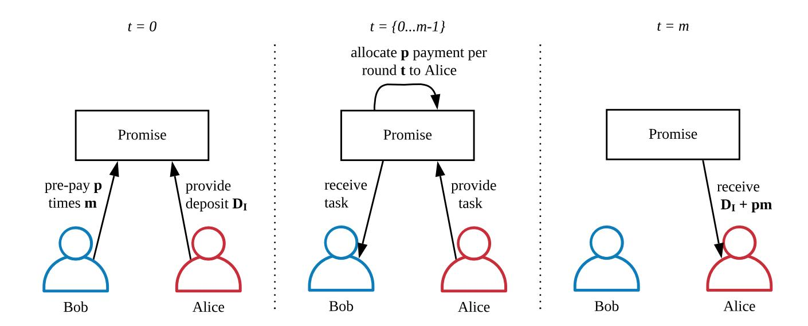
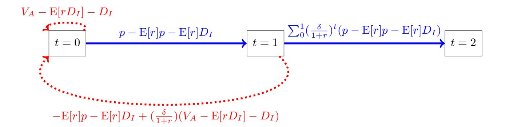
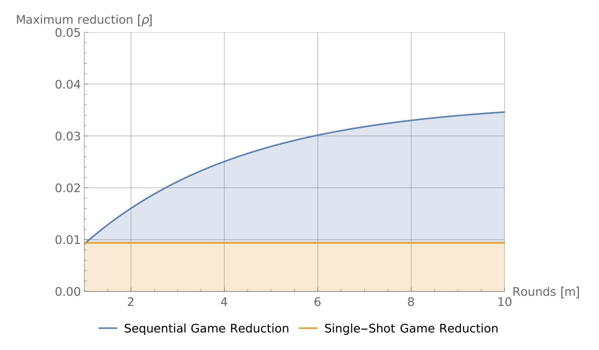

{0}------------------------------------------------

# Promise: Leveraging Future Gains for Collateral Reduction

Dominik Harz, Lewis Gudgeon, Rami Khalil, Alexei Zamyatin

Department of Computing, Imperial College London

Abstract. Collateral employed in cryptoeconomic protocols protects against the misbehavior of economically rational agents, compensating honest users for damages and punishing misbehaving parties. The introduction of collateral, however, carries three disadvantages: (i) requiring agents to lock up substantial amount of collateral can be an entry barrier, limiting the set of candidates to wealthy agents; (ii) affected agents incur ongoing opportunity costs as the collateral cannot be utilized elsewhere; and (iii) users wishing to interact with an agent on a frequent basis (e.g., with a service provider to facilitate second-layer payments), have to ensure the correctness of each interaction individually instead of subscribing to a service period in which interactions are secured by the underlying collateral.

We present Promise, a subscription mechanism to decrease the initial capital requirements of economically rational service providers in cryptoeconomic protocols. The mechanism leverages future income (such as service fees) prepaid by users to reduce the collateral actively locked up by service providers, while sustaining secure operation of the protocol. Promise is applicable in the context of multiple service providers competing for users. We provide a model for evaluating its effectiveness and argue its security. Demonstrating Promise's applicability, we discuss how Promise can be integrated into a cross-chain interoperability protocol, XCLAIM, and a second-layer scaling protocol, NOCUST. Last, we present an implementation of the protocol on Ethereum showing that all functions of the protocol can be implemented in constant time complexity and Promise only adds USD 0.05 for a setup per user and service provider and USD 0.01 per service delivery during the subscription period.

# 1 Introduction

Since their creation, arguably the most significant property of blockchains is their facilitation of trustless exchange between entities with weak identities [\[8\]](#page-16-0).Yet the trustless nature of the systems means not only that parties may transact without trusting each other, but also that they should not trust each other. This creates a design challenge for interactions which would typically involve such trust. In this paper, we focus on blockchain protocols which, at least in part, encode trust by monetary collateral. Here, collateral is value escrowed by a service provider, Alice, to guarantee the user, Bob, that regardless of the behavior 

{1}------------------------------------------------

of Alice, Bob cannot lose funds. In particular, payment, cross-chain, and generic computation protocols can be designed such that Bob is guaranteed to receive from Alice at least the amount of funds that are at risk in case she misbehaves. Protocols involving collateral include cross-chain communication [\[21\]](#page-16-1), scalable off-chain payments [\[15\]](#page-16-2), state channels [\[11\]](#page-16-3), watchtowers [\[16](#page-16-4)[,4,](#page-16-5)[5\]](#page-16-6), and outsourcing of computation and verification games [\[20\]](#page-16-7)

Problem. Relying on collateral as trust is itself associated with a set of challenges. Collateralization requires the provision of a substantial amount of funds upon protocol initialization, limiting the set of participants to a selected few. Leaving participation to a small set of agents can lead to phenomena like the "rich are getting richer" through wealth compounding [\[12\]](#page-16-8). While it is not possible to grant less wealthy agents proportionally higher rewards due to Sybil identities [\[9\]](#page-16-9), we can lower the entry barrier for agents to join a protocol. Finally, locked funds result in opportunity costs for the agent who could use their collateral for participating in other protocols [\[14\]](#page-16-10).

This work. We present Promise, a simple but effective mechanism to lower entry barriers for intermediaries in protocols relying on collateral for secure operation. Further, Promise is a subscription mechanism: Instead of locking up a significant amount of funds as collateral, Promise allows intermediaries to stake future payments (e.g., service fees) with the promise the payments will be disbursed upon the correctly provision of the service. Similar to online platforms, users can choose to subscribe to a service and pay fees upfront – for a some pre-agreed service period (the "subscription period"). However, instead of transferring these payments directly to the intermediary, users lock pre-paid fees in an escrow smart contact, preventing theft by either party. The intermediary needs to provide the service honestly for the entire period set by the user. The benefit of this scheme is two-fold: (i) the intermediary is incentivized to act honestly while enjoying a lower initial collateral, and (ii) the user can reduce his transaction cost and only pays if the service was provided honestly over his defined period. As long as (i) the initial collateral is higher than the potential gain from not delivering the service, (ii) the expected future revenue from correct operation exceeds potential gains by the intermediary, (iii) users have the option to leave the protocol, (iv) and misbehavior can be proved to the smart contract, Promise incentivizes correct behavior.

Application. We discuss how Promise can be applied to XCLAIM and NOCUST. Both protocols are suitable candidates for Promise, as in both protocols "service providers" are a necessary part. XCLAIM is a cross-chain protocol that allows creation of Cryptocurrency-backed Assets (CbA) on an issuing blockchain enabled by a collateralized third-party called a vault [\[21\]](#page-16-1). Vaults provide collateral on the issuing blockchain to ensure that it is not economically rational for them to steal the locked cryptocurrency on the backing blockchain. NOCUST is a commit-chain protocol that allows to send cryptocurrency payments off-chain facilitated by so-called operators [\[15\]](#page-16-2). Operators are service-providing agents 

{2}------------------------------------------------

that (i) collect fees for operating the off-chain payment network, and (ii) provide a certain amount of collateral to insure finalization of payments. Both, vaults and operators are service providers from the perspective of Promise: (i) any agent can become a service provider by locking a certain amount of collateral, and (ii) agents can earn fees by providing their services. Moreover, we show that the implementation of Promise in an Ethereum Solidity smart contract only adds USD 0.03 to setup Promise between a user and a service provider, USD 0.01 to provide the deposit for the service provider and USD 0.01 to provide the prepayment. During the subscription period, each delivery of the service adds a cost of USD 0.01. Finally, the withdrawal of both deposit and accumulated payments adds USD 0.01 for the service provider.

Outline. We introduce the system model and assumptions in Section [2,](#page-2-0) followed by a description of Promise in Section [3.](#page-5-0) Next, we discuss the security of Promise and argue in which cases Promise can provide benefits to users and intermediaries in Section [4.](#page-8-0) Also, we present how Promise can be applied to existing systems in Section [5.](#page-11-0) We discuss related work in Section [6](#page-14-0) and conclude in Section [7.](#page-15-0)

# 2 System Model

In Promise, a user Bob engages a service provider Alice to fulfill a task valued at VB on his behalf. Bob pays Alice p each period t for performing the task. Given the absence of strong identities, the total value of the task to Bob (VB) needs to be fully collateralized, via a deposit D, such that D ≥ VB. For example, if a particular task involves Alice offering a service and Bob having a \$100 exposure in the form of counter-party risk—to Alice, Alice will need to post at least \$100 as collateral to insure the exposure, such that Bob does not stand to lose funds if Alice behaves maliciously.

Formally, we adopt the definitions of agreements A in cryptoeconomic protocols from [\[14\]](#page-16-10). The service providing agent Alice A and the receiving agent Bob B participate in an agreement encoded by a specification Φ, payments p and a deposit D. In such an agreement, Alice needs to fulfill the specification Φ and provide the collateral D in advance. When Alice fulfills the specification, all future payments p held in escrow are released to Alice.

Promise is a mechanism to reduce initial collateral locking. However, Promise is not meant as a stand-alone protocol, but rather, serves as a "plug-in" to existing cryptoeconomic protocols. Given a generic cryptoeconomic protocol π that satisfies the assumptions of Section [2.3,](#page-4-0) we can apply Promise and write the protocol as πP. We note that the agreement A is given by the generic protocol π. We assume that Alice and Bob have entered into agreement A and have agreed on the specification Φ, payments p, and the deposit D.

We give a summary of symbols in Table [1.](#page-3-0)

{3}------------------------------------------------

Table 1: Symbols used in Promise

| Symbol Description |                                                                                |  |  |  |
|--------------------|--------------------------------------------------------------------------------|--|--|--|
| Vi                 | Total value of a task to agent i.                                              |  |  |  |
| D                  | A monetary deposit.                                                            |  |  |  |
| A                  | An agreement reached between a service provider and a user.                    |  |  |  |
| Φ                  | A protocol specification, specifying the the task for the serivce provider and |  |  |  |
|                    | the required proof that the task has been performed.                           |  |  |  |
| p                  | Payment held in escrow and released to the providing agent on fulfillment of   |  |  |  |
|                    | the agreement.                                                                 |  |  |  |
| m                  | The number of future periods.                                                  |  |  |  |
| π                  | A generic cryptoeconomic protocol.                                             |  |  |  |
| c                  | The cost of an individual transaction.                                         |  |  |  |
| E[r]               | The expected rate of return.                                                   |  |  |  |
| ui(t)              | The utility of agent i at time t.                                              |  |  |  |
| β                  | The likelihood that the user remains in the protocol.                          |  |  |  |
| n                  | The number of times Alice did not deliver the service.                         |  |  |  |
| δ                  | Discount factor for future utility.                                            |  |  |  |

### 2.1 Specifications

The specification Φ describes the task that Alice needs to provide and the proof that serves as evidence that the task has been provided. There are several approaches to encode the specification. In the BitML calculus [\[6\]](#page-16-11), a specification consists of (i) a model describing a contract and agent choices symbolically and (ii) a model encoding a sequence of transactions that form a smart contract in Bitcoin computationally. For example, Alice can deliver a digital good to Bob in return for a payment. The contract would then specify that if Bob receives the good, payment to Alice is being made. Specifications are also useful when exchanging digital goods with the FairSwap protocol [\[10\]](#page-16-12). In FairSwap, Alice sends a digital good to Bob and provides proof of sending by providing a witness (hashes of the transferred data) to a smart contract as proof. The specification in FairSwap is encoded as a boolean circuit that evaluates whether the provided witness (the hash) satisfies the specification. In case the circuit evaluates to true, Alice is paid for delivering the data.

Expressing the specification abstractly gives us the freedom to leave the encoding and implementation up to the protocol that integrates with Promise. For the remainder of the model for Promise, we assume the specification can either be fulfilled, i.e., Φ = 1 or not, i.e., Φ = 0.

## 2.2 Roles

Promise adopts the BAR model of rational agents [\[2\]](#page-15-1) including private preferences of agents as proposed in [\[14\]](#page-16-10). We define the following roles.

– Alice, the Intermediary: Alice is economically rational and entrusted with executing a task. She provides a deposit D into the escrow before executing 

{4}------------------------------------------------

the task and receives m payments p upon successful completion. Alice prefers to adhere to the specification Φ if her utility for doing so is greater than other action choices.

- Bob, the User: Bob represents the user requesting execution of a task by Alice. A user provides payments {p1, ..., pm} into the escrow. The user is assumed to be honest and correctly reports behavior of Alice.
- Escrow: The escrow is a smart contract responsible for holding deposits by Alice and payments by Bob.
- Verifier: The verifier detects malicious behavior of Alice. In practice, this role is fulfilled by a smart contract, a dedicated third party, or the user.

### 2.3 Assumptions

The verifier in the system is able to detect any faults by Alice and is able to prove that Alice was at fault. This means, that the specification Φ of the protocol π has some "proof". For example, this could be the hash input of a boolean circuit as in FairSwap, a transaction inclusion proof as required by XCLAIM, or fraudproofs [\[3\]](#page-16-13).

We further assume that the protocol utilizing Promise implements payments and deposits through a ledger functionality (e.g., as described in [\[13\]](#page-16-14)). Also, there is a one to one mapping between the collateral and a user, such that the collateral of an intermediary is not split between multiple users. Agents in the system can be identified with their public/private key pair. Finally, time is denoted with t.

# 2.4 Utilities

In our model, we assume that agents are economically rational and self-interested. An agent will therefore decide on a course of action depending on the utility associated with those actions. We use a simplified model here, were the intermediary Alice can choose between two actions and Bob has no choice once he committed to the agreement A.

Alice can either fulfill the specification or not, with the following payoffs one period ahead. VA denotes the additional monetary gain that Alice expects to receive if she chooses to deviate from the protocol, where VA ≥ 0. We only include a valuation on the malicious side to Alice as Alice could be bribed to violate the specification. This is a worst case assumption: Alice can only be influenced by increasing her incentive to misbehave. While we could also include a positive valuation for honest behavior, this would not strengthen our security assumptions.

VB denotes the monetary value that Bob attaches to receiving the service. Note that we assume private information: Bob does not know Alice's private valuation VA, and Alice does not know Bob's valuation of the service VB.

Last, c denotes the cost of an individual transaction. E[r]D reflects the expected opportunity cost of locking the capital for one period where E[ ] denotes an expected value and r is a rate of return. The rate of return indicates the potential interest an agent could earn by participating in another protocol. For 

{5}------------------------------------------------

example, instead of locking D in the protocol, Alice could trade D, lock D in staking [\[12\]](#page-16-8) or lending [\[1\]](#page-15-2) protocols to earn an interest.

$$u_A = \begin{cases} p - \mathbf{E}[r]D, & \text{if } \Phi = 1\\ V_A - \mathbf{E}[r]D - D, & \text{if } \Phi = 0 \end{cases}$$
 (1)

$$u_B = \begin{cases} V_B - p - c, & \text{if } \Phi = 1\\ D - V_B - c, & \text{if } \Phi = 0 \end{cases}$$
 (2)

Each round the game resets. Therefore, Alice fulfills the specification iff

$$p > V_A - D \tag{3}$$

Assuming that VB − p − c > 0, otherwise Bob would not seek the service from Alice in the first place, he stands to gain utility if Alice provides the service.

### 2.5 Security

Following the rational agents assumptions and the utility definitions in Eq. [\(1\)](#page-5-1) and [\(2\)](#page-5-2), we define a secure cryptoeconomic protocol as follows.

Definition 1 (Security). Assuming rational service provider A with a private valuation VA, a cryptoeconomic protocol π implementing a specification Φ is secure if A's utility uA for fulfilling the specification Φ is higher than her utility for violating the specification Φ, i.e., p > VA − D.

In the following, we introduce Promise in detail. We use Def. [1](#page-5-3) to show that integrating Promise into a generic protocol π does not affect its security. The core proof is to show that π and πP are equivalent with respect to their security.

# 3 Promise

In Promise we allow Bob to provide multiple payments in advance and delay the receipt of the payments by Alice. In turn, Alice is able to reduce the initially provided collateral from D to DI such that DI < D. At t = 0, Bob is able to lock m payments {p1, ..., pm} in escrow and determine a period τ after which Alice can receive the payments. When t < τ , Alice continues to accumulate collateral as time passes by keeping the cumulative total of her payments pi in escrow. We provide an intuition in Fig. [1.](#page-6-0) Promise has the following advantages for Alice and Bob.

Alice: the barrier to entry as an intermediary is lowered, as in the first period Alice only needs to provide a lower initial deposit DI as opposed to D. Further, instead of expecting a single next payment p, Alice has, in expectation, p · m payments lined up as part of Bob's subscription to her services.

Bob: the aggregation of multiple payments allows Bob to reduce transaction costs and guarantees Bob that he only pays Alice if she fulfills all tasks for the given period m.

{6}------------------------------------------------

Fig. 1: Promise allows intermediaries (Alice) to lock less initial deposit DI and use payments pi provided by users (Bob) as additional deposit. The initial deposit and payments are locked until time m determined by Bob. Only when Alice fulfills the specification Φ until t = m can Alice withdraw her initial deposit DI and the total payments pm.

### 3.1 Protocol

The Promise protocol consists of three steps. We denote the service provider as A, the user as B, and the smart contract implementing Promise as P. We assume that A and B have agreed the total payment and the period over which the payment is to-be-paid in advance.

- 1. At t = 0: B locks m payments in P. A locks the initial deposit DI in P.
- 2. At t = {1, ..., m}: A provides m times the agreed task to B. P allocates one payment p to A, if (i) A provides a proof to P that fulfills the specification Φ, or (ii) B does not provide a fraud proof that A did not provide the task within a determined time [\[3\]](#page-16-13).
- 3. At t = m: A withdraws p(m + 1) and DI from P.

To argue about the security of Promise, we introduce two concepts: (i) sequential-games with discounting and (ii) a likelihood of users exiting the system upon the service provider not adhering to the specification of the agreement.

### 3.2 Sequential Games and Discounting

Introducing Promise transforms the single-shot game of the agreement between Alice and Bob into a sequential-round game. Instead of Alice and Bob treating each game in isolation, they need to consider the utilities for the sequence m of the game.

Without Promise, at each round t, Alice decides if she prefers to fulfill the specification based on the utilities denoted by Eq. [\(1\)](#page-5-1) and [\(2\)](#page-5-2).

{7}------------------------------------------------

With Promise, Alice needs to consider that if she does not adhere to  $\Phi$  in any round t, she does not receive any of the payments. For example, if Alice provided the services according to  $\Phi$  for n rounds, but fails to do so in a round t < m, she does not receive pn payments, but rather looses  $D_I$  and receives 0 payments.

Hence, Alice's decision needs to account for all  $p \cdot m$  payments. Furthermore, payments are made in the future. A promised payment in the future is less valuable to Alice today, which we denoted with the parameter  $\delta$ .  $0 < \delta < 1$  denotes the discount factor of an agent's valuation of future utility. We argue that an agent can spend received payments somewhere else or potentially invest the payment for a profit. Hence, the service provider faces an opportunity cost for delayed payments. The payoffs to Alice, if she follows the same course of action over every round, are as follows.

$$u_A(t) = \begin{cases} \sum_{t=0}^{m-1} \left(\frac{\delta}{1+r}\right)^t (p - (t+1)E[r]p - E[r]D_I), & \text{if } \Phi = 1\\ \sum_{t=0}^{m-1} \left(\frac{\delta}{1+r}\right)^t (V_A - E[r]D_I - D_I), & \text{if } \Phi = 0 \end{cases}$$
(4)

Bob receives the following pay-off, depending on Alice's behavior.

$$u_B(t) = \begin{cases} \sum_{t=0}^{m-1} \left(\frac{\delta}{1+r}\right)^t (V_B - p - c - (m-t)E[r]p), & \text{if } \Phi = 1\\ \sum_{t=0}^{m-1} \left(\frac{\delta}{1+r}\right)^t (D_I - V_B - c), & \text{if } \Phi = 0 \end{cases}$$
(5)

#### 3.3 Termination Probability

Lowering Alice's initial collateral to  $D_I$  increases the risk of Alice not fulfilling the specification of the agreement. Specifically, in the first round, Alice's collateral is the lowest since she has not provided the service yet and has not added any payment into her collateral pool.

We argue that Bob exits a protocol after Alice not adhering to  $\Phi$ , encoded in the function  $\beta(n) \to [0,1)$  describing the likelihood that Bob remains in the protocol. The variable n describes the number of times Bob tolerates Alice not delivering the service. Each time Bob does not received  $V_B$  due to Alice not providing the service as agreed, the lower the probability that Bob continues to participate. Each user can have its own  $\beta(n)$  function where users might choose to never participate with a service provider again, i.e.,  $\beta(1) = 0$  and others might tolerate a higher number of incidents. This changes Alice's pay-off for the protocol as follows.

$$u_{A}(t) = \begin{cases} \sum_{t=0}^{m-1} \left(\frac{\delta}{1+r}\right)^{t} (p - (t+1)E[r]p - E[r]D_{I}), & \text{if } \Phi = 1\\ \sum_{t=0}^{m-1} \left(\frac{\delta}{1+r}\right)^{t} (\beta(n)V_{A} - E[r]D_{I} - D_{I}), & \text{if } \Phi = 0 \end{cases}$$
 (6)

As  $\beta$  decreases, the payoff to Alice can become negative for not fulfilling the specification if  $\beta(n)V_I < \mathrm{E}[r]D_I - D$ . For Alice, we increase the motivation to follow the specification by (i) providing a sum of payments pm that Bob locks in the protocol, and (ii) the fear of Bob leaving the protocol altogether if she does not provide the service the entire period. As Bob chooses m, he has a direct

{8}------------------------------------------------

influence on Alice's expected pay-off. By setting large m and being able to quit the protocol upon Alice's misbehavior, he can motivate "rational Alice" to act in his interest.

# 4 Analysis

The core argument of Promise is that by locking multiple payments, service providers can reduce their initial collateral. Specifically, introducing Promise to a protocol  $\pi$ , does not increase the incentive for an intermediary A to not adhere to the specification. This means that  $\pi_P$  and  $\pi$  are equivalent in terms of security considering an economically rational intermediary A under Def. 1. More formally, we state that:

Theorem 1 (Security equivalence). Given a protocol  $\pi$  that has a verifiable specification  $\Phi$  and a economically rational service provider A that provides more initial collateral  $D_I$  than an incentive  $V_A$  to violate the specification, introducing Promise is secure if A does not gain additional utility by not fulfilling the specification considering A participates in at least two rounds in  $\pi$ .

#### 4.1 Action Choices

Alice's utility for choosing a specific course of action i.e., fulfilling vs. not fulfilling the specification, is given by Eq. (6). However, this makes an implicit assumption: Alice considers the entire period m as a basis for her decision. We depict her added utilities for an example of two rounds in Fig. 2.

Fig. 2: Depicting the sum of utilities depending on different action choices made by Alice. At t = 0 Alice can choose between fulfilling the specification and receive the utility depicted in blue or choose the opposite and receive the utility depicted in red. If Alice at any point prefers to violate the specification, the game restarts and the action choices are essentially back to the t = 0 state. Furthermore, at t = 1, Alice will already have committed to adhering to the specification. In case Alice decides to misbehave at this point, she will not receive p that she was allocated when she transitioned to  $t_1$ . However, if she decides to continue to fulfill the specification, she will be rewarded with an additional payment allocation. This game continues until t = m.

{9}------------------------------------------------

Showing that Thm. [1](#page-8-2) holds, requires considering that Alice might not participate for m rounds. Specifically, Alice might still consider the agreement as a single-shot game with a decision horizon of exactly one round. Following this, we can use m = 1 and Eq. [\(4\)](#page-7-1) to conclude that Alice prefers to fulfill the specification if:

$$p - \mathrm{E}[r]p > \beta(n)V_A - D_I \tag{7}$$

Collateral Condition Comparing Alice's decision without Promise in Eq. [\(3\)](#page-5-4) and her decision with Promise in Eq. [\(7\)](#page-9-0) without considering β clearly shows that if Alice only considers a single round, introducing Promise weakens the security of π as Alice is not paid immediately and the initial collateral is reduced. Moreover, even if Alice considers multiple rounds, if Eq. [\(7\)](#page-9-0) does not hold, Alice has a higher utility to not fulfill the specification if Bob is willing to continue to enter into agreements with her. Even worse, if Bob decides to continue using the protocol π and black-lists Alice for her violating Φ, Bob still might end up with a Sybil identity of Alice. Hence, for Promise to not weaken security the initial collateral needs to be set above β(n)VA − p + E[r]p.

In practice, this is achieved by over-collateralization or state-reversal. Overcollateralization is used in XCLAIM where a vault has to provide 200% collateral of the value it stands to obtain by violating the specification. In NOCUST and, generally, payment channel networks, participants are not able to steal funds, since an older state can be committed that reverses the stealing of funds.

### 4.2 Security Proof

Proof. Under the assumption that A is economically rational, wants to participate in at least two rounds, e.g. t > 0, and Eq. [\(7\)](#page-9-0) holds, we prove that πP is secure. If Eq. [\(7\)](#page-9-0) holds, Alice should fulfill the specification in the first round. We now show that if this holds, Alice should continue with the same course of actions in any subsequent round t ∈ m. 0375+ If if at any point k ∈ m, Alice decides to stop adhering to the specification she will receive the following pay-off:

$$u_{A}(t,k) = \sum_{t=0}^{k-1} \left(\frac{\delta}{1+r}\right)^{t} (-(t+1)E[r]p - E[r]D_{I}) + \left(\frac{\delta}{1+r}\right)^{t} (\beta(n)V_{A} - E[r]D_{I} - D_{I})$$
(8)

Alice has locked her collateral DI for multiple rounds as well as the payments she should have received. Due to her actions she gains VA but for each round she has locked more payments and collateral, the higher her cost to change her choices of action w.r.t. the specification. Moreover, if Alice plans to participate in multiple rounds, she stands to decrease her probability to provide services for other users depending on β. Hence, assuming Alice is economically rational, Alice has the highest pay-off when fulfilling the specification until she has completed the service within the entire subscription period m, i.e., it is incentive compatible.

{10}------------------------------------------------

### 4.3 Cost Reduction for Service Providers

Service providers can reduce their initial collateral to the lower bound under the condition of Eq. [\(7\)](#page-9-0). From this equation, we can determine the reduction if Alice only considers a single round of the game. We express DI as D − ρ where ρ is the reduction of the initial collateral and solve for ρ This yields:

$$\rho = p - \mathbf{E}[r]p + D - \beta(n)V_A \tag{9}$$

However, if we consider that Alice wants to participate in m rounds, we can express this based on Eq. [\(6\)](#page-7-0) and solving for ρ. However, we argue that under the assumption of Eq. [\(7\)](#page-9-0), Alice's decision is essentially between participating a single round and not fulfilling the specification, or participating multiple rounds over the pre-agreed period m while adhering to the specification. To calculate Alice's decision bound, we are assuming that from Eq. [\(9\)](#page-10-0) the first reduction is set to the lowest possible value. This means that the term β(n)VA − p + E[r]p − DI = 0, i.e., at the decision bound Alice is undecided if she should fulfill the specification since the utilities for both choices are equal. Thus, ρ can be expressed as:

$$\rho = \sum_{t=0}^{m-1} \left( \frac{\delta}{1+r} \right)^t (p - (t+1)E[r]p - E[r]D)$$
 (10)

In Section [5.1](#page-11-1) we give an example how collateral is lowered given a set of parameters. Note that to calculate the collateral reduction, both the service provider and the user only need to know the prior collateral requirement D as defined by π. For example, in XCLAIM this is 200%.

### 4.4 Cost Reduction for Users

Assume that Alice behaves honestly. If a user pays every round t for the service provided by Alice, then his pay-off per round is VB − p − c as described in Eq. [\(2\)](#page-5-2). However, locking multiple payments incurs opportunity cost. This cost is lowered at every time step as the payments are assigned to the intermediary, as expressed in Eq. [\(5\)](#page-7-2).

Bob starts with an opportunity cost of E[r]pm at t = 0. The opportunity cost is reduced to E[r]p(m − 1) at t = 1 as the payment is allocated to Alice. Generalizing this for t rounds, leaves us with E[r]p(m − t) at every time step t from today's perspective.

The user locks future payments when the sum of the transaction costs c for m payments is greater than the opportunity cost for locking additional payments plus the single transaction cost for making the prepayments. Hence, the boundary for a user to choose Promise as individually rational choice maximizing his pay-off is given by:

$$\sum_{t=1}^{m} \left(\frac{\delta}{1+r}\right)^{t} c = \sum_{t=0}^{m} \left(\frac{\delta}{1+r}\right)^{t} \mathbf{E}[r] p(m-t)$$
(11)

{11}------------------------------------------------

$$c = E[r]p(m-t) \tag{12}$$

Provided the right hand of Eq. [\(12\)](#page-11-2) is smaller, Bob should use Promise to lock multiple payments pm as it is his individually rational choice that maximizes his pay-off uB.

# 5 Applications

In this section we apply Promise to the XCLAIM protocol. We show analytically how Promise is able to reduce the initial amount of locked deposits. Further, we give a sketch how Promise can be implemented in NOCUST.

### 5.1 XCLAIM

XCLAIM is a protocol that allows users to transfer assets between heterogeneous decentralized ledgers using a collateralized service provider called a vault [\[21\]](#page-16-1). Instead of relying on a trusted third party like a centralized exchange, the vault must provide collateral to ensure that it does not steal the coins it holds in custody. It has to verify correctness of her actions by submitting transaction inclusion proofs to the smart contracts that augments the protocol. Promise can be applied such that the vault, Alice, locks some initial collateral DI and issues backed-tokens using this collateral. Bob, using the service, is able to lock the future payments of Alice to allow him to transfer more assets between the ledgers.

Initial Parameters XCLAIM uses an initial set of parameters as follows:

- Initial Collateral D: A service provider needs to provide 200% collateral D in comparison to the value held in custody VA.
- Payments p: Although payments are not specified in the original XCLAIM paper, similar services such as tBTC require users to pay 0.9375% of fees as payment[1](#page-11-3) .
- Rate of return r: A service provider needs to lock collateral in the ETH currency to participate. Possible alternatives offer a maximum of 3.75% APR rates[2](#page-11-4) .
- Discount factor δ: Service providers can discount future payments. As the price of cryptocurrencies is relatively volatile we adopt a strongly discounted future income at 0.75 from [\[14\]](#page-16-10).

Integrating Promise For sake of example, we are using BTC as the issuing currency and ETH as the backing currency. This means that the vault, the service provider, has to lock ETH as collateral to provide security against stealing BTC it holds in custody. Given the parameters, Promise can be integrated as follows.

1 Based on <https://docs.keep.network/tbtc/index.pdf> from 3 May 2020.

2 Based on <https://www.coingecko.com/en/earn/ethereum> from 3 May 2020.

{12}------------------------------------------------

- 1. The user and a vault agree on a subscription period m. For example, the user and the vault can agree that the vault will be responsible for the next ten Bitcoin-backed tokens issued or redeemed by this users that are each 1 BTC in size.
- 2. The user and the vault set-up a Promise contract in which the user pre-pays m = 10 fees at 0.9375% of 1 BTC for the next ten requests at a set price of p = 0.009375 to issue or redeem Bitcoin-backed tokens.
- 3. The vault then deposits the initial deposit DI into the contract.
- 4. Each time the user issues or redeems tokens with the vault, the vault is allocated a part of the payment p.
- 5. Finally, after ten requests have been made, the vault can withdraw pm and DI .

Cost Reduction For simplicity, we are going to denote all monetary amounts in BTC. In XCLAIM, a vault would have to provide the equivalent of 2 BTC in collateral to hold custody over 1 BTC in value. First, we calculate the possible DI collateral given Eq. [\(9\)](#page-10-0). This gives us the minimum collateral required to also protect against a vault that plays a single-shot game. For simplicity, we are assuming that the vault has an incentive of 1 to steal the BTC (the current value of the Bitcoin) as well as a hidden motivation to steal BTC such that VA = D = 2. Moreover, the vault is not interested in any future collaboration with the user, hence β(n) = 1. Last, we divide the 3.75% APR through 365 days to get the average return.

$$\rho = p - E[r]p + D - \beta(n)V_A$$

$$\rho = 0.009375 - \frac{0.0375}{365}0.0093750 + 2 - 2$$

$$\rho = 0.00937404$$
(13)

Second, we are using Eq. [\(10\)](#page-10-1) to explore the reduction factor ρ if the vault plays a sequential game. Note that, at a minimum, a vault has at least a private value of VA to not follow the specification of XCLAIM: if the vault can take the 1 BTC and is punished with less collateral DI being taken away, it is incentive compatible for the vault to take the 1 BTC. Using the example values above, we calculate ρ as:

$$\rho = \sum_{t=0}^{9} \left(\frac{\delta}{1+r}\right)^{t} (p - (t+1)E[r]p - E[r]D)$$

$$\rho = \sum_{t=0}^{9} \left(\frac{\delta}{1+r}\right)^{t} (0.009375 - (t+1)\frac{0.0375}{365}0.009375 - \frac{0.0375}{365} * 2)$$
(14)

Discussion We plot the results from Eq. [\(13\)](#page-12-0) and [\(14\)](#page-12-1) in Figure [3.](#page-13-0) The collateral reduction ρ can be subtracted from D. In practice, the user and the service

{13}------------------------------------------------

Fig. 3: The possible collateral reduction ρ under the assumption that the vault considers a single round of execution (i.e., a single-shot game) as depicted in the orange line or that the vault considers a sequential game with multiple rounds as depicted in the blue line. The colored areas show in which collateral reduction ranges the vault does not receive an additional incentive to violate the specification as agreed with the user. The more rounds m the game last, the higher the collateral reduction ρ can be under the sequential game scheme. Collateral reductions are constant in case the vault only plays a single-shot game.

provider can agree on the desired reduction. We note three findings: (i) If the user and the service provider want to maintain security w.r.t. no additional incentive for the service provider to violate the specification, the maximum reduction is given by the single-shot game reduction from Eq. [\(13\)](#page-12-0) (the orange line in the Figure). (ii) Note that the main reason that the single-shot reduction is comparably low since the user has a "buffer" of 1 unit of BTC that was added to VA. If the user is willing to accept a lower buffer, say 0.5, the collateral can be consequently lowered. This would still cover the value of the 1 BTC in our example plus a 0.5 potential malicious intend on the vaults side. (iii) The user and the service provider can agree to lower the initial collateral DI in a sequential game setting if they agree on a longer period m. The collateral reduction, however, is finite: as m → ∞, ρ stabilizes to a constant value.

### 5.2 NOCUST

NOCUST is a second-layer payment protocol whereby an untrusted intermediary operates a commit-chain to facilitate payments between its users [\[15\]](#page-16-2). The 

{14}------------------------------------------------

application of Promise to NOCUST follows a similar approach as the XCLAIM example. Hence, we are only giving a sketch of Promise's applicability here.

We consider a scenario where Alice is the intermediary commit-chain operator, and Bob is a payment recipient. In this setting we propose to employ Promise as follows: Any fee to be paid by Bob to Alice in exchange for the delivery of an incoming payment would be locked as collateral that Bob could claim if the NOCUST protocol fails. Over time, the fees locked in Promise would grant Bob instant finality over larger payments, increasing the utility of the service.

For example, in a sales scenario, Bob could release some goods immediately after Alice promises to deliver the payment for them, instead of waiting two rounds for guaranteed finality. If Alice fails to deliver the payment, her collateral would paid to Bob to cover the cost of the goods.

### 5.3 Implementation

We implement Promise in Solidity in around 100 lines of code. We use the implementation to experimentally assess the cost of executing the contract functions. Our cost calculations are summarized in Table [2](#page-14-1) based on an Ether exchange rate of USD 172.61 and 1.5 Gwei gas price. The implementation is available as an open source project[3](#page-14-2) .

| Function Description         |                                                                                                         |                          | Gas cost Cost                            |  |
|------------------------------|---------------------------------------------------------------------------------------------------------|--------------------------|------------------------------------------|--|
| create deposit payment | Setup function. Called by intermediary to provide deposit. Called by user to provide pre-payment. | 112196 43291 43770 | USD 0.02895 USD 0.01116 USD 0.0113 |  |
| deliver                      | Called as part of task provision.                                                                       | 50703                    | USD 0.01309                              |  |
|                              | withdraw Called by intermediary after the service period is up to receive payment and deposit.       | 31788                    | USD 0.0082                               |  |

Table 2: Overview of Promise functions and their cost.

# 6 Related Work

There are two strands of related literature. The first one comes from the financial world covering (advance) payments for financial contracts. The second strand comes from the more recent work in decentralized ledgers. In the economics literature, a wide range of work focuses on secured debt, such as [\[17,](#page-16-15)[18\]](#page-16-16). However, these concepts rely on trust on third parties to maintain security in the debt and payment positions. Promise replaces this third-party trust by holding advance payments in a smart contract escrow.

3 <https://github.com/nud3l/Promise/tree/master/src>

{15}------------------------------------------------

On the second strand, Balance is a protocol that allows intermediaries to lower their collateral over time [\[14\]](#page-16-10). It operates at the other end of Promise: instead of lowering the initial collateral, the more an agent behaves honestly, the higher the reduction of collateral. Balance requires the highest collateral to be provided at the start of the interaction between agents and makes the assumption that payments are close to 0 (i.e., there is perfect competition). Promise and Balance can be combined together to first reduce initial collateral when bootstrapping a new protocol and then lower collateral requirements for established agents over time. Teutsch et al. discuss bootstrapping a token for verifiable computations [\[19\]](#page-16-17). This work discusses how to enable users, like Bob, to obtain the required funds to participate in TrueBit. Their proposal includes a governance game that allows to exchange special governance tokens into collateral tokens (for intermediaries) and utility tokens (for users). Lastly, the idea of bundling payments together is also introduced in [\[7\]](#page-16-18) to create subscriptions for services of agents. Promise extends this idea to allow collateral reduction for intermediaries.

# 7 Conclusion

We present Promise, a subscription mechanism that allows users to lock payments for future services for a period of time. The locked payments are added to the initial collateral of a service provider, Alice, each time a service is delivered. The core assumption for the security of Promise is that a user Bob is able to lock a number of payments up front and exit the protocol when Alice misbehaves receiving back all of his payments over the subscription period and the initial collateral provided by Alice. On the other hand, Alice is able to utilize Bob's future payments as collateral throughout the subscription period. We have introduced a semi-formal model for Promise. We discuss the security and the effect of the β parameter, but leave formal proofs of the security properties as future work. We have shown how Promise can be applied to the XCLAIM protocol and shown a sketch of appliying it to NOCUST.

# Acknowledgements

The authors would like to thank Arthur Gervais and William Knottenbelt for their helpful feedback on this paper. Further, the authors thank the anonymous reviewers for their excellent feedback and suggestions for improvement.

# References

- 1. MakerDAO Whitepaper. <https://makerdao.com/whitepaper>, accessed: 2018-11- 28
- 2. Aiyer, A.S., Alvisi, L., Clement, A., Dahlin, M., Martin, J.P., Porth, C.: Bar fault tolerance for cooperative services. In: ACM SIGOPS operating systems review. vol. 39, pp. 45–58. ACM (2005)

{16}------------------------------------------------

- 3. Al-Bassam, M., Sonnino, A., Buterin, V.: Fraud Proofs: Maximising Light Client Security and Scaling Blockchains with Dishonest Majorities (2018), [http://arxiv.](http://arxiv.org/abs/1809.09044) [org/abs/1809.09044](http://arxiv.org/abs/1809.09044)
- 4. Avarikioti, G., Kogias, E.K., Wattenhofer, R.: Brick: Asynchronous state channels. arXiv preprint arXiv:1905.11360 (2019)
- 5. Avarikioti, G., Laufenberg, F., Sliwinski, J., Wang, Y., Wattenhofer, R.: Towards secure and efficient payment channels. arXiv preprint arXiv:1811.12740 (2018)
- 6. Bartoletti, M., Zunino, R.: BitML : A Calculus for Bitcoin Smart Contracts. CCS '18 Proceedings of the 2018 ACM SIGSAC Conference on Computer and Communications Security pp. 83–100 (2018).<https://doi.org/10.1145/3243734.3243795>
- 7. Berg, P.R.: ERC-1620: Money Streaming (2018), [https://github.com/ethereum/](https://github.com/ethereum/EIPs/issues/1620) [EIPs/issues/1620](https://github.com/ethereum/EIPs/issues/1620)
- 8. B¨ohme, R.: A primer on economics for cryptocurrencies (2019)
- 9. Douceur, J.R.: The sybil attack. In: International Workshop on Peer-to-Peer Systems. pp. 251–260. Springer (2002)
- 10. Dziembowski, S., Eckey, L., Faust, S.: FairSwap: How To Fairly Exchange Digital Goods. In: Proceedings of the 2018 ACM SIGSAC Conference on Computer and Communications Security - CCS '18. pp. 967–984. ACM Press, New York, New York, USA (2018). [https://doi.org/10.1145/3243734.3243857,](https://doi.org/10.1145/3243734.3243857) [http:](http://dl.acm.org/citation.cfm?doid=3243734.3243857) [//dl.acm.org/citation.cfm?doid=3243734.3243857](http://dl.acm.org/citation.cfm?doid=3243734.3243857)
- 11. Dziembowski, S., Faust, S., Host´akov´a, K.: General state channel networks. In: Proceedings of the 2018 ACM SIGSAC Conference on Computer and Communications Security. pp. 949–966. ACM (2018)
- 12. Fanti, G., Kogan, L., Oh, S., Ruan, K., Viswanath, P., Wang, G.: Compounding of Wealth in Proof-of-Stake Cryptocurrencies. In: Financial Cryptography and Data Security 2019 (2019)
- 13. Garay, J.A., Kiayias, A., Leonardos, N.: The bitcoin backbone protocol with chains of variable difficulty. <http://eprint.iacr.org/2016/1048.pdf> (2016), accessed: 2017-02-06
- 14. Harz, D., Gudgeon, L., Gervais, A., Knottenbelt, W.J.: Balance: Dynamic Adjustment of Cryptocurrency Deposits. In: Proceedings of the 2019 ACM SIGSAC Conference on Computer and Communications Security (CCS '19). ACM, New York, NY, USA (2019), <https://eprint.iacr.org/2019/675.pdf>
- 15. Khalil, R., Gervais, A., Felley, G.: NOCUST - A Securely Scalable Commit-Chain (2019), <https://eprint.iacr.org/2018/642>
- 16. McCorry, P., Bakshi, S., Bentov, I., Miller, A., Meiklejohn, S.: Pisa: Arbitration outsourcing for state channels. IACR Cryptology ePrint Archive 2018, 582 (2018)
- 17. Scott Jr, J.H.: Bankruptcy, secured debt, and optimal capital structure. The Journal of Finance 32(1), 1–19 (1977)
- 18. Stulz, R., Johnson, H.: An analysis of secured debt. Journal of Financial Economics 14(4), 501–521 (1985)
- 19. Teutsch, J., M¨akel¨a, S., Bakshi, S.: Bootstrapping a stable computation token (2019), <http://arxiv.org/abs/1908.02946>
- 20. Teutsch, J., Reitwießner, C.: A scalable verification solution for blockchains. [https:](https://truebit.io/) [//truebit.io/](https://truebit.io/) (March 2017), accessed:2017-10-06
- 21. Zamyatin, A., Harz, D., Lind, J., Panayiotou, P., Gervais, A., Knottenbelt, W.J.: XCLAIM: Trustless, Interoperable, Cryptocurrency-Backed Assets. In: Proceedings of the IEEE Symposium on Security & Privacy, May 2019. pp. 1254–1271 (2019), <https://eprint.iacr.org/2018/643.pdf>