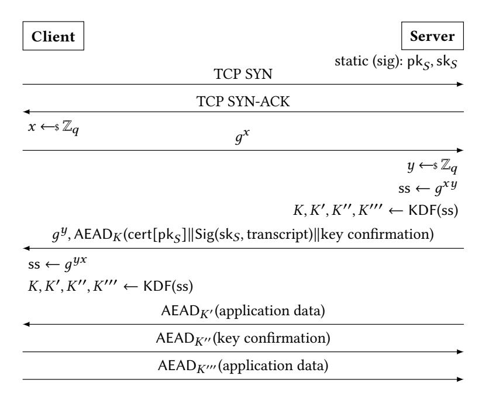
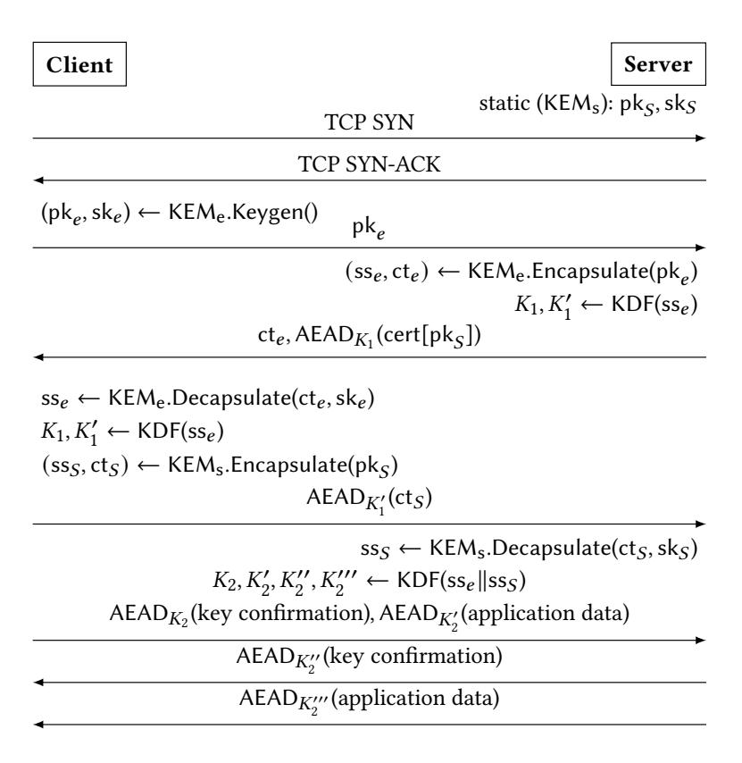
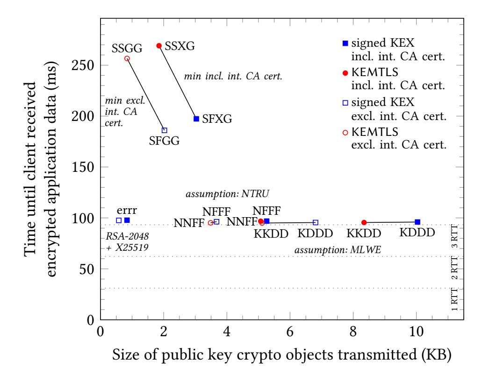
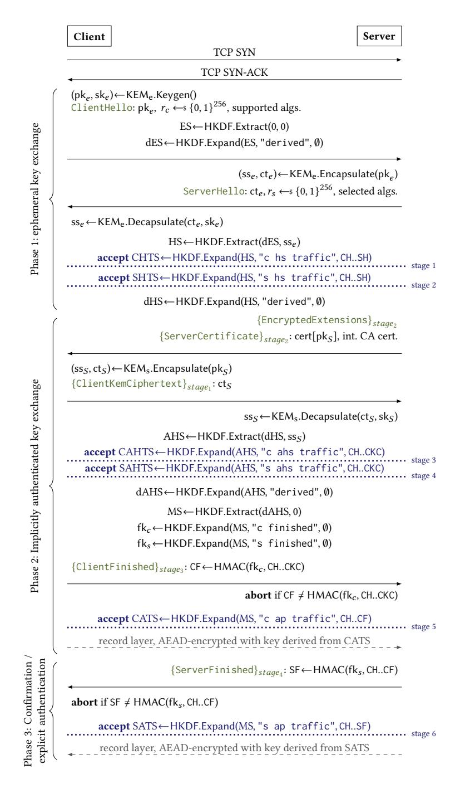
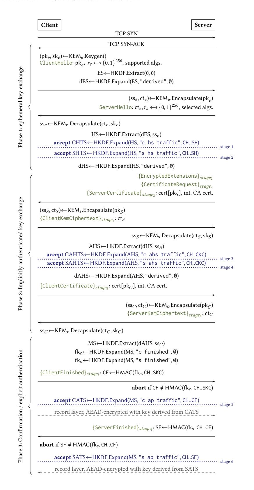
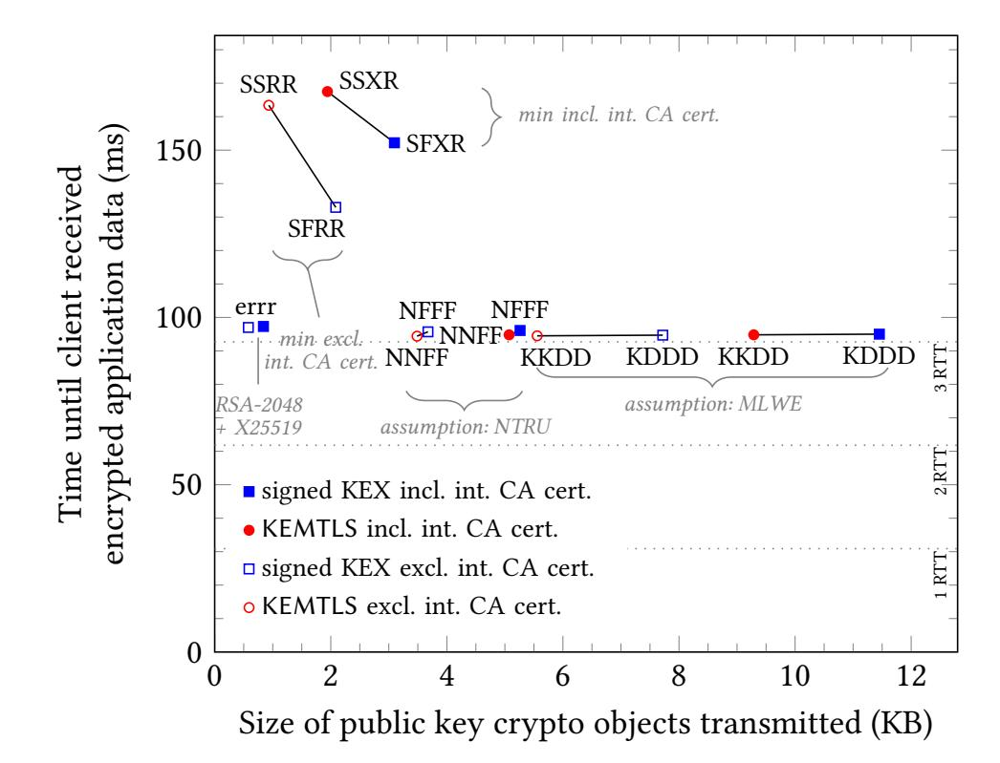

{0}------------------------------------------------

## Post-Quantum TLS Without Handshake Signatures

Full version, March 15, 2022

Peter Schwabe
Max Planck Institute for Security and
Privacy & Radboud University
peter@cryptojedi.org

Douglas Stebila University of Waterloo dstebila@uwaterloo.ca Thom Wiggers
Radboud University
thom@thomwiggers.nl

#### **ABSTRACT**

We present KEMTLS, an alternative to the TLS 1.3 handshake that uses key-encapsulation mechanisms (KEMs) instead of signatures for server authentication. Among existing post-quantum candidates, signature schemes generally have larger public key/signature sizes compared to the public key/ciphertext sizes of KEMs: by using an IND-CCA-secure KEM for server authentication in post-quantum TLS, we obtain multiple benefits. A size-optimized post-quantum instantiation of KEMTLS requires less than half the bandwidth of a size-optimized post-quantum instantiation of TLS 1.3. In a speed-optimized instantiation, KEMTLS reduces the amount of server CPU cycles by almost 90% compared to TLS 1.3, while at the same time reducing communication size, reducing the time until the client can start sending encrypted application data, and eliminating code for signatures from the server's trusted code base.

**Update:** in Appendix F we present updated measurements based on the NIST standardization project's round-3 candidate schemes.

#### **CCS CONCEPTS**

• Security and privacy  $\rightarrow$  Security protocols; Web protocol security; Public key encryption.

## **KEYWORDS**

Post-quantum cryptography; key-encapsulation mechanisms; Transport Layer Security; NIST PQC

## **ACM Reference Format:**

Peter Schwabe, Douglas Stebila, and Thom Wiggers. 2020. Post-Quantum TLS Without Handshake Signatures: Full version, March 15, 2022. In 2020 ACM SIGSAC Conference on Computer and Communications Security (CCS '20), November 9–13, 2020, Virtual Event, USA. ACM, New York, NY, USA, 26 pages. https://doi.org/10.1145/3372297.3423350

## 1 INTRODUCTION

The Transport Layer Security (TLS) protocol is possibly one of the most-used secure-channel protocols. It provides not only a secure way to transfer web pages [92], but is also to secure communications to mail servers [52, 84] or to set up VPN connections [86]. The most recent iteration is TLS 1.3, standardized in August 2018 [93]. The TLS 1.3 handshake uses ephemeral (elliptic-curve) Diffie–Hellman (DH) key exchange to establish forward-secret session keys. Authentication of both server and (optionally) client is provided by either


This paper is published under the Creative Commons Attribution 4.0 license.

CCS '20, November 9–13, 2020, Virtual Event, USA 2020. ACM ISBN 978-1-4503-7089-9/20/11. https://doi.org/10.1145/3372297.3423350

<span id="page-0-0"></span>

Figure 1: High-level overview of TLS 1.3, using signatures for server authentication.

RSA or elliptic-curve signatures. Public keys for the signatures are embedded in certificates and transmitted during the handshake. Figure 1 gives a high-level overview of the TLS 1.3 protocol, focusing on the signed-Diffie–Hellman aspect of the handshake.

Preparing for post-quantum TLS. There have been many experiments and much research in the past five years on moving the TLS ecosystem to post-quantum cryptography. Most of the work has focused on adding post-quantum key exchange to TLS, usually in the context of so-called "hybrid" key exchange that uses both a post-quantum algorithm and a traditional (usually elliptic curve) algorithm, beginning with an experimental demonstration in 2015 of ring-LWE-based key exchange in TLS 1.2 [21].

Public experiments by industry started in 2016 with the CECPQ1 experiment by Google [76], combining X25519 ECDH [9] with NewHope lattice-based key exchange [2] in the TLS 1.2 handshake. A CECPQ2 followup experiment with TLS 1.3 was announced in late 2018 [75, 77] and is currently being run by Google using a combination of X25519 and the lattice-based scheme NTRU-HRSS [54, 55], and by Cloudflare using X25519/NTRU-HRSS and X25519 together with the supersingular-isogeny scheme SIKE [61]. First results from this experiment are presented in [74]. In late 2019, Amazon announced that the AWS Key Management Service (AWS KMS) now supports two ECDH-post-quantum hybrid modes; one also using SIKE, the other one using the code-based scheme BIKE [3]. Our focus is on public-key authenticated TLS, rather than pre-shared key (which uses symmetric algorithms for most operations, and can readily have its ephemeral key exchange replaced with a postquantum KEM) or password-authenticated TLS (for which there has been some exploration of post-quantum algorithms [47]).

1

{1}------------------------------------------------

Additionally, the Open Quantum Safe (OQS) initiative [106] provides prototype integrations of post-quantum and hybrid key exchange in TLS 1.2 and TLS 1.3 via modifications to the OpenSSL library [85]. First results in terms of feasibility of migration and performance using OQS were presented in [32]; more detailed benchmarks are presented in [87]. Draft specifications for hybrid key exchange in TLS 1.3 have already started to appear [65, 107, 109].

Most of the above efforts only target what is often called "transitional security": they focus on quantum-resistant confidentiality using post-quantum key exchange, but not quantum-resistant authentication. The OQS OpenSSL prototypes do support post-quantum authentication in TLS 1.3, and there has been a small amount of research on the efficiency of this approach [101]. While post-quantum algorithms generally have larger public keys, ciphertexts, and signatures compared to pre-quantum elliptic curve schemes, the gap is bigger for post-quantum signatures than post-quantum key encapsulation mechanisms (KEMs); see for example Table 1 or [81].

Authenticated key exchange without signatures. There is a long history of protocols for authenticated key exchange without signatures. Key transport uses public key encryption: authentication is demonstrated by successfully decrypting a challenge value. Examples of key transport include the SKEME protocol by Krawczyk [66] and RSA key-transport ciphersuites in all versions of SSL and TLS up to TLS version 1.2 (but RSA key transport did not provide forward secrecy). Bellare, Canetti, and Rogaway [5] gave a protocol that obtained authentication from Diffie-Hellman key exchange: DH keys are used as *long-term* credentials for authentication, and the resulting shared secret is mixed into the session key calculation to derive a key that is *implicitly authenticated*, meaning that no one but the intended parties could compute it. Some of these protocols go on to obtain explicit authentication via some form of key confirmation. Many DH-based AKE protocols have been developed in the literature. Some are currently used in real-world protocols such as Signal [90], the Noise framework [89], and WireGuard [37].

There are a few constructions that use generic KEMs for AKE, rather than static DH [22, 44]. A slightly modified version of the [44] KEM AKE has recently been used to upgrade the WireGuard handshake to post-quantum security [57]. One might think that the same approach can be used for KEM-based TLS, but there are two major differences between the WireGuard handshake and a TLS handshake. First, the WireGuard handshake is mutually authenticated, while the TLS handshake typically features server-only authentication. Second, and more importantly, the WireGuard handshake assumes that long-term keys are known to the communicating parties in advance, while the distribution of the server's long-term certified key is part of the handshake in TLS, leading to different constraints on the order of messages and number of round trips.

The OPTLS proposal by Krawczyk and Wee [72] also aims at a signature-free alternative for the common TLS handshake, with authentication via long-term DH keys. OPTLS was at the heart of early drafts of TLS 1.3, but was dropped in favour of signed-Diffie–Hellman. As pointed out in [73], OPTLS makes use of DH as a non-interactive key exchange (NIKE). First the client sends their ephemeral DH public key, which the server combines with its own long-term secret key to obtain a shared key; the server's reply

<span id="page-1-0"></span>

Figure 2: High-level overview of KEMTLS, using KEMs for server authentication.

thus implicitly authenticates the server to the client. Note however that the client speaks first, without knowing the server's public key: a straight-forward adaptation of OPTLS to a post-quantum setting would thus require a post-quantum NIKE. Unfortunately, the only somewhat efficient construction for a post-quantum NIKE is CSIDH [28], which is rather slow and whose concrete security is the subject of intense debate [10, 11, 13, 19, 88]. The obvious workaround when using only KEMs is to increase the number of round trips, but this comes at a steep performance cost.

**Our contributions.** Our goal is to achieve a TLS handshake that provides full post-quantum security—including confidentiality and authentication—optimizing for number of round trips, communication bandwidth, and computational costs. Our main technique is to rely on KEMs for authentication, rather than signatures.

We present an alternative TLS handshake, which we call KEM-TLS, that uses key-encapsulation mechanisms as primary asymmetric building blocks, for both forward-secure ephemeral key exchange and authentication. (We unavoidably still rely on signatures by certificate authorities to authenticate long-term KEM keys.) A high level overview of KEMTLS is given in Fig. 2, and the detailed protocol appears in Fig. 4. We focus on the most common use case for web browsing, namely key agreement with server-only authentication, but our techniques can be extended to client authentication as shown in Appendix C. Note that the scenario we are considering in this paper is orthogonal to resumption mechanisms such as 0-RTT introduced by TLS 1.3.

With KEMTLS, we are able to retain the same number of round trips until the client can start sending encrypted application data as in TLS 1.3 while reducing the communication bandwidth. Compared to TLS 1.3, application data transmitted during the handshake is implicitly, rather than explicitly authenticated, and has slightly weaker downgrade resilience and forward secrecy than when signatures are used; but full downgrade resilience and forward secrecy is achieved once the KEMTLS handshake completes; see Section 4

{2}------------------------------------------------

<span id="page-2-0"></span>

Figure 3: Handshake size versus handshake establishment time, for signed KEX and KEMTLS ciphersuites, including and excluding transmission/processing of one intermediate CA certificate. Latency 31.1 ms, bandwidth 1000 Mbps, 0% packet loss. Label syntax: ABCD: A = ephemeral key exchange, B = leaf certificate, C = intermediate CA certificate, D = root certificate. Label values: Dilithium, eCDH X25519, Falcon, Kyber, NTRU, GeMSS, rSA-2048, SIKE, XMSS<sub>s</sub><sup>MT</sup>; all level-1 schemes (NIST round 2).

for details. Although our approach can be applied with any secure KEM, we consider four example scenarios in the paper: (1) optimizing communication size assuming one intermediate CA's certificate is included in transmission, (2) optimizing communication size assuming intermediate CA certificates can be cached [98] and thus are excluded from transmission, (3) handshakes relying on the module learning with errors (MLWE) / module short-integer-solutions (MSIS) assumptions, and (4) handshakes relying on the NTRU assumption. Note that the public key and certificate of the root CA is not transmitted during the handshake as it is assumed to be part of the client's local trust store; but a signature by the root CA would be transmitted as part of the intermediate CA's certificate, if that certificate is not also cached as in scenario (2). In all 4 scenarios, KEMTLS is able to reduce communication sizes compared to server authentication using post-quantum signatures.

For example, considering all level-1 schemes among the round-3 finalists and alternate candidates of the NIST PQC project, the minimum size of public-key-cryptography objects transmitted in a fully post-quantum signed-KEM TLS 1.3 handshake that includes transmission of an intermediate CA certificate would be 3035 bytes (using SIKE for key exchange, Falcon for server authentication, a variant of XMSS for the intermediate CA, and GeMSS for the root CA), whereas with KEMTLS we can reduce that by 39% to 1853 bytes (using SIKE for key exchange and server authentication, a variant of XMSS for the intermediate CA, and GeMSS for the root CA); compare with 1376 bytes for RSA-signed elliptic-curve DH in TLS 1.3. Fig. 3 shows the impact of the KEMTLS protocol design on communication sizes for all the scenarios we consider; details appear in Table 1 in Section 6.

To assess computational costs, we implemented KEMTLS by modifying the Rustls library [16], using optimized C/assembly implementations of the relevant post-quantum schemes. We measured performance of this implementation in a range of network scenarios following the methodology of [87], varying latency and bandwidth. We found that KEMTLS results in better client and server performance for scenarios involving the MLWE/MSIS and NTRU assumptions. Our first two scenarios aim to absolutely minimize communication bandwidth by replacing a fast signature scheme (Falcon) with a smaller but slower KEM (SIKE), which, admittedly, substantially slows down connection establishment, but may still be relevant when communication bandwidth is of utmost concern. See Fig. 3 for an overview and Section 6 for details.

We show that our KEMTLS approach indeed results in a secure protocol, adapting the reductionist security analysis of Dowling, Fischlin, Günther, and Stebila [38, 39] for signed-DH in TLS 1.3. The proof is in the standard model, and authentication relies on the IND-CCA security of the long-term KEM.

**Software and data.** For the experiments in this paper, we used and modified open-source cryptographic software and TLS libraries. In addition, we wrote new software to facilitate our experiments and to create certificates. All software and data is available at https://thomwiggers.nl/publication/kemtls/ and https://cryptojedi.org/crypto/#kemtls. All software we modified is under permissive open-source licenses; we place our code into the public domain (CC0).

**Discussion.** There are a few subtle differences in the properties offered by KEMTLS compared to TLS 1.3. TLS 1.3 allows the server to send encrypted and authentication application data in its first response message, whereas KEMTLS does not. However, in most uses of TLS 1.3, including web browsing, this feature is not used, and the first application data is sent by the client in the second client-to-server TLS message flow, which KEMTLS preserves.

KEMTLS provides *implicit* server-to-client authentication at the time the client sends its first application data; explicit server-to-client authentication comes one round trip later when a key confirmation message is received in the server's response. We still retain confidentiality: no one other than the intended server will be able to read data sent by the client. One consequence is that the choice of algorithms used is not authenticated by the time client sends its first application data. The client cannot be tricked into using algorithms that it itself does not trust, but an adversary might be able to trick the client into using one that the server would have rejected. By the time the handshake fully completes, however, the client is assured that the algorithms used are indeed the ones both parties preferred. We discuss the subtleties of the forward secrecy and downgrade resilience properties of KEMTLS at different stages more in Section 4.

Comparison with OPTLS. Our proposal for a signature-free handshake protocol in TLS shares a lot of similarities with the OPTLS protocol [72]. OPTLS was at the heart of early designs for TLS 1.3, but was dropped in favour of signed-DH for the final standard. Starting in 2018, there has been an attempt to revive OPTLS in TLS 1.3 [95, 96], but so far we do not see that these drafts have gained much traction. (The only implementation of OPTLS that we are aware of is described in the Master's thesis by Kuhnen [73].)

{3}------------------------------------------------

If a signature-free approach for the TLS handshake has not been very successful in the past, why revisit it now? We see two reasons why OPTLS has not gained much traction and both change with the eventual move to post-quantum cryptography in TLS.

To tap the full potential of OPTLS, servers would need to obtain certificates containing DH public keys instead of signature keys; while this is in theory not a problem, it requires certificate authorities to adapt their software and needs other changes to the public-key infrastructure, which would have been obstacle to TLS 1.3's goals of widespread deployment and fast adoption. However, the move to post-quantum authentication will require rolling out a new generation of certificates regardless of whether signatures or KEMs are used for authentication.

Moreover, when using pre-quantum primitives based on elliptic curves, the advantages of OPTLS compared to the traditional TLS 1.3 handshake are limited. The performance differences between ECDH operations and ECDSA or EdDSA signing and verification are not very large, and sizes of signatures and signature public keys are small. A TLS implementation with secure and optimized elliptic-curve arithmetic implemented for ECDH already has most critical code needed to implement ECDSA or EdDSA signatures.

For current post-quantum KEMs and signature schemes, this picture changes. It is possible to choose KEMs that offer considerably smaller sizes and much better speed than any of the signature schemes. Also, post-quantum signatures and KEMs no longer share large parts of the code base; even though lattice assumptions can be used to construct both KEMs and signatures, such schemes need different parameters and thus different optimized routines.

Thus, in the post-quantum setting, the signature-free approach to the TLS handshake offers major advantages. KEMTLS simultaneously reduces the amount of data transmitted during a handshake, reduces the amount of CPU cycles spent on asymmetric crypto, reduces the total handshake time until the client can send application data, and reduces the trusted code base.

#### **2 PRELIMINARIES**

**Notation.** Let  $\mathbb{N}$  denote the set of natural numbers. For a set X, the notation  $x \leftarrow \$ X$  denotes sampling an element uniformly at random from the set X and storing it in x. If  $\mathcal{A}$  is a deterministic algorithm, then  $y \leftarrow \mathcal{A}(x)$  denotes running  $\mathcal{A}$  with input x and storing the output in y. If  $\mathcal{A}$  is a probabilistic algorithm, then  $y \leftarrow \$ \mathcal{A}(x)$  denotes running  $\mathcal{A}$  with input x and uniformly random coins, and storing the output in y. The notation [x = y] resolves to 1 if x = y, and 0 otherwise. The TLS protocol has named messages, such as ClientHello, which we abbreviate like CH, as in Fig. 4.

**Symmetric primitives.** We rely on standard definitions of symmetric primitives such as hash functions with collision resistance, pseudorandom functions, and message authentication codes with existential unforgeability under chosen message attacks, the definitions of which appear in Appendix A. We do note here the syntax of HKDF [70], which is comprised of two components. HKDF.Extract is a randomness extractor with two inputs: a *salt* and some *input keying material*; in the TLS 1.3 key schedule, the salt argument is used for the current secret state, and the input keying material argument is used for new secret shared secrets being incorporated. HKDF.Expand is a variable-length pseudorandom function with

(in this context) four inputs: a secret key, a label, a context string consisting of a hash of a transcript of messages, and the desired output length (which we omit in our presentation).

#### 2.1 **KEMs**

Definition 2.1 (Key Encapsulation Mechanism (KEM)). A key encapsulation mechanism KEM is an asymmetric cryptographic primitive that allows two parties A and B to establish a shared secret key ss in a key space K. It consists of the following operations:

- **Key generation:** KEM.Keygen() probabilistically generates a public and private keypair (pk, sk);
- Encapsulation: KEM.Encapsulate(pk) probabilistically generates a shared secret and ciphertext (encapsulation) (ss, ct) against a given public key;
- **Decapsulation:** KEM.Decapsulate(ct, sk) decapsulates the shared secret ss' which, in a  $\delta$ -correct scheme, is equal to ss with probability at least  $1 \delta$ .

KEM security notions. The standard security definitions for a KEM require that the shared secret be indistinguishable from random (IND), given just the public key (chosen plaintext attack (CPA)) or additionally given access to a decapsulation oracle (chosen ciphertext attack (CCA)). We make use of a restricted form of IND-CCA security where the adversary can make only a single query to its decapsulation oracle; we denote this IND-1CCA. The security experiments for these security properties are given in Appendix A.

### 2.2 Authenticated key exchange from KEMs

As sketched in the introduction, authenticated key exchange using KEMs for authentication is not new, with several examples of mutually authenticated [20, 22, 44] and unilaterally authenticated [20] protocols. The typical pattern among these, restricted to the case of unilaterally authenticated key exchange, is as follows (c.f. [20, Fig. 2]). The server has a static KEM public key, which the client is assumed to (somehow) have a copy of in advance. In the first flight of the protocol, the client sends a ciphertext encapsulated to this static key, along with the client's own ephemeral KEM public key; the server responds with an encapsulation against the client's ephemeral KEM public key. The session key is the hash of the ephemeral-static and ephemeral-ephemeral shared secrets.

This is a problem for TLS: typically, a client does *not* know the server's static key in advance, but learns it when it is transmitted (inside a certificate) during the TLS handshake. One obvious solution to address this issue is for the client to first request the key from the server and then proceed through the typical protocol flow. However, this increases the number of round trips, and thus comes at a steep performance cost.

The other trivial approach is to simply assume a change in the Internet's key distribution and caching architecture that distributes the servers' static key to the client before the handshake. For example, in embedded applications of TLS, a client may only ever communicate with very few different servers that are known in advance; in that case, the client can just deploy with the server static keys pre-installed. Another option would be to distribute certificates through DNS as described in [62]. Neither is a satisfactory general solution, as the former limits the number of servers a client

{4}------------------------------------------------

<span id="page-4-0"></span>

Figure 4: The KEMTLS handshake

can contact (since certificates must be pre-installed), and the latter requires changes to the DNS infrastructure and moreover precludes connections to servers identified solely by IP address.

#### 3 THE KEMTLS PROTOCOL

KEMTLS achieves unilaterally authenticated key exchange using solely KEMs for both key establishment and authentication, without requiring extra round trips and without requiring caching or external pre-distribution of server public keys: the client is able to send its first encrypted application data after just as many handshake round trips as in TLS 1.3.

KEMTLS is to a large extent modelled after TLS 1.3. A high-level overview of the handshake is shown in Fig. 2, and a detailed protocol flow is given in Fig. 4. Note that Fig. 4 omits various aspects of the TLS 1.3 protocol that are not relevant to our presentation and cryptographic analysis but which would still be essential if KEMTLS was used in practice. KEMTLS is phrased in terms of two KEMs: KEMe for ephemeral key exchange, and KEMs for implicit authentication; one could instantiate KEMTLS using the same algorithm for both KEMe and KEMs (as we do in all our instantiations), or different algorithms for different efficiency trade-offs, such as an algorithm with slow key generation but fast encapsulation for the long-term KEM. Either or both could also be a "hybrid" KEM combining post-quantum and traditional assumptions [15].

There are conceptually three phases to KEMTLS, each of which establishes one or more "stage" keys.

Phase 1: Ephemeral key exchange using KEMs. After establishing the TCP connection,<sup>1</sup> the KEMTLS handshake begins with the client sending one or more ephemeral KEM public keys pk, in its ClientHello message, as well as the list of public key authentication, key exchange, and authenticated encryption methods it supports. The server responds in the ServerHello message with an encapsulation ct<sub>e</sub> against pk<sub>e</sub> and the algorithms it selected from the client's proposal; note that if (none of) the pk, the client sent was for the key-exchange method the server selected, a special HelloRetryRequest message is sent, prompting a new ClientHello message. Nonces  $r_c$  and  $r_s$  are also transmitted for freshness. At this point, the client and server have an unauthenticated shared secret ss<sub>e</sub>. KEMTLS follows the TLS 1.3 key schedule, which applies a sequence of HKDF operations to the shared secret ss<sub>e</sub> and the transcript to derive (a) the client and server handshake traffic secrets CHTS and SHTS which are used to encrypt subsequent flows in the handshake, and (b) a "derived handshake secret" dHS which is kept as the current secret state of the key schedule.<sup>2</sup>

Phase 2: Implicitly authenticated key exchange using KEMs. In the same server-to-client flight as ServerHello, the server also sends a certificate containing its long-term KEM public key pks. The client encapsulates against pks and sends the resulting ciphertext in its ClientKemCiphertext message. This yields an implicitly authenticated shared secret ss<sub>S</sub>. The key schedule's secret state dHS from phase 1 is combined with ss<sub>S</sub> using HKDF to give an "authenticated handshake secret" AHS from which are derived (c) the client and server authenticated handshake traffic secrets CAHTS and SAHTS which are used to encrypt subsequent flows in the handshake,<sup>3</sup> and (d) an updated secret state dAHS of the key schedule. A master secret MS can now be derived from the key schedule's secret state dAHS. From the master secret, several more keys are derived: (e) "finished keys"  $fk_c$  and  $fk_s$  which will be used to authenticate the handshake and (f) client and server application transport secrets CATS and SATS from which are derived application encryption keys. The client now sends a confirmation message ClientFinished to the server which uses a message authentication code with key fk<sub>c</sub> to authenticate the handshake transcript. In the same flight of messages, the client is also able to start sending application data encrypted under keys derived from CATS; this is implicitly authenticated.

**Phase 3: Confirmation** / **explicit authentication.** The server responds with its confirmation in the ServerFinished message, authenticating the handshake transcript using MAC key  $fk_s$ . In

<span id="page-4-1"></span><sup>&</sup>lt;sup>1</sup>Our exposition and experiments deal with the general scenario of KEMTLS running over TCP, analogously to TLS 1.3. As with TLS 1.3, the overhead from the TCP handshake may be reduced by a variety of techniques as discussed in [29], such as using TCP Fast Open [30] or QUIC with UDP [58].

<span id="page-4-4"></span><span id="page-4-3"></span><span id="page-4-2"></span><sup>&</sup>lt;sup>2</sup>The key schedule in Fig. 4 starts with a seemingly unnecessary calculation of ES and dES; these values play a role in TLS 1.3 handshakes using pre-shared keys; we retain them to keep the state machine of KEMTLS aligned with TLS 1.3 as much as possible. <sup>3</sup>CAHTS and SAHTS are implicitly authenticated: subsequent handshake traffic can only be read by the intended peer server. This is particularly useful in the client-authenticated version of KEMTLS in Appendix C when the client sends its certificate. <sup>4</sup>TLS 1.3 also derives exporter and resumption master secrets EMS and RMS from the master secret MS. We have omitted these from our presentation of KEMTLS in Fig. 4, but extending KEMTLS's key schedule to include these is straightforward, and security of EMS and RMS follows analogously.

{5}------------------------------------------------

the same flight, the server sends application data encrypted under keys derived from SATS. Once the client receives and verifies ServerFinished, the server is explicitly authenticated.

#### <span id="page-5-0"></span>4 SECURITY ANALYSIS

As KEMTLS is an adaptation of TLS 1.3, our security analysis follows previous techniques for proving security of TLS 1.3. In particular, we base our approach on the reductionist security approach of Dowling, Fischlin, Günther, and Stebila [38, 39]. Briefly, that approach adapts a traditional Bellare–Rogaway-style [6] authenticated-key-exchange security model to accommodate multiple *stages* of session keys established in each session, following the multi-stage AKE security model of Fischlin and Günther [41]. The model used for TLS 1.3 in [38, 39] supports a variety of modes and functionality, such as mutual versus unilateral authentication, full handshake and pre-shared key modes, and other options. We are able to simplify the model for this application, though we also add some other features, such as explicit authentication and granular forward secrecy.

In this section, we give an informal description of the security model, including the adversary interaction (queries) for the model; the specific security properties desired (Match security, which ensures that session identifiers effectively match partnered sessions, and Multi-Stage security, which models confidentiality and authentication as described below); and a sketch of the proofs showing that KEMTLS satisfies these properties. The full syntax and specification of the security properties as well as the detailed proofs of security for KEMTLS appear in Appendix B.

Security goal. The main security goal we aim for is that keys established in every stage of KEMTLS should be indistinguishable from a random key, in the face of an adversary who sees and controls all communications, who can learn other stages' keys, who can compromise unrelated secrets (such as long-term keys of parties not involved in the session in question), and who may, after-the-fact, have learned long-term keys of parties involved in the session ("forward secrecy"). This is the same security goal and threat model for TLS 1.3 [38, 93]. We distinguish between implicit authentication (where a key could only be known by the intended peer), which follows from key indistinguishability and forward secrecy, and explicit authentication (which assures that the intended peer actually participated). In this section we consider KEMTLS with unilateral server-to-client authentication only; a sketch of KEMTLS with mutual authentication is given in Appendix C.

### 4.1 Security model

In the following we describe informally the security model, focusing on how it differs from the multi-stage AKE model used by Dowling et al. [38, 39] to analyze signed-Diffie–Hellman in TLS 1.3. The precise formulation of the model appears in Appendix B.

**Model syntax.** Each server has a long-term public key and corresponding private key; we assume a public-key infrastructure for certifying these public keys, and that the root certificates are predistributed, but server certificates are not pre-distributed. Each participant (client or server) can run multiple instances of the protocol, each of which is called a *session*. Note that a session is a participant's local instance of a protocol execution; two parties communicating with each other each have their own sessions. Each

session may consist of multiple *stages* (for KEMTLS, there are 6 stages as marked in Fig. 4).

For each session, each participant maintains a collection of session-specific information, including: the identity of the intended communication partner; the *role* of the session owner (either initiator or responder); the *state of execution* (whether it has accepted a key at a certain stage, or is still running, or has rejected); as well as protocol-specific state. For each stage within a session, each participant maintains stage-specific information, including: the *key* established at the stage (if any); a *session identifier* for that stage; and a *contributive identifier* for that stage. Two stages at different parties are considered to partnered if they have the same session identifier. The session identifiers for KEMTLS are the label of the key and the transcript up to that point (see Appendix B.3). For the first stage, the contributive identifier is the ClientHello initially, then updated to the ServerHello message; for all other stages, the contributive identifier is the session identifier.

The model also records security properties for each stage key:

- 1) The level of *forward secrecy* obtained for each stage key. The three levels of forward secrecy we meet are detailed in Section 4.2 below. The model allows for *retroactive* revision of forward secrecy: the stage-i key may have weak forward secrecy at the time it is established in stage i, but may have full forward secrecy once a later stage j > i has completed (i.e., after receiving an additional confirmation message). The level of forward secrecy also implies whether the key should be considered *implicitly authenticated*.
- 2) Whether the stage is *explicitly authenticated*: if a party accepts a stage, is it assured that its partner was live and established an analogous stage? Again our model allows for *retroactive* explicit authentication: while a stage-i key may not have explicit authentication when established in stage i, completion of a later stage j > i may imply that a partner to stage i is now assured to exist.
- 3) Whether the key is intended for *internal* or *external* use. TLS 1.3 and KEMTLS internally use some of the keys established during the handshake to encrypt later parts of the handshake to improve privacy, whereas other keys are "external outputs" of the handshake to be used for authenticated encryption of application data. Internally used keys must be treated more carefully in the security experiment.

Our inclusion of forward secrecy and explicit authentication is an extension to the multi-stage AKE model used for TLS 1.3 [38, 39].

**Adversary interaction.** The adversary is a probabilistic algorithm which triggers parties to execute sessions and controls the communications between all parties, so it can intercept, inject, or drop any message. As a result, the adversary facilitates all interactions, even between honest parties.

The adversary interacts with honest parties via several queries. The first two queries model the typical protocol functionality, which is now under the control of the adversary:

- NewSession: Creates a new session at a party with a specified intended partner and role.
- Send: Delivers a message to a session at a party, which executes the protocol based on its current state, updates its state, and returns any outgoing protocol message.

The next two queries model the adversary's ability to compromise parties' secret information:

{6}------------------------------------------------

- Reveal: Gives the adversary the key established in a particular stage. This key, and the key at the partner session (if it exists), is marked as revealed.
- Corrupt: Gives the adversary a party's long-term secret key. This party is marked as corrupted.

The Reveal and Corrupt queries may make a stage *unfresh*, meaning the adversary has learned sufficiently much information that no security can be expected of this key.

The final query models the challenge to the adversary of breaking a key established in a stage:

• Test: For a session and stage chosen by the adversary, returns either the real key for that stage, or a uniformly random key, depending on a hidden bit *b* fixed throughout the experiment.

Some additional conditions apply to the handling of queries. For keys marked as intended for internal use, the execution of the Send query pauses at the moment the key is accepted, giving the adversary the option to either Test that key or continue without testing. This is required since internal keys may be used immediately for, e.g., handshake encryption, and giving the adversary to Test the key after it has already started being used to encrypt data would allow the adversary to trivially win. For keys that are not considered authenticated at the time of the Test query, the query is only permitted if the session has an honest contributive partner, otherwise the adversary could trivially win by active impersonation.

## <span id="page-6-0"></span>4.2 Security properties

A sequence of works [25, 26, 41] split AKE security into two distinct properties: the traditional session-key indistinguishability property dating back to Bellare and Rogaway [6], and a property called Match-security, which models the soundness of the session identifier, ensuring that the session identifier  $\pi$ .sid properly matches the partnered  $\pi'$ .sid and the correctness property that partnered sessions compute the same session key. For well-chosen session identifiers, proving the technical properties of Match-security typically does not depend on any cryptographic assumptions, and instead follows syntactically. This is indeed the case for both TLS 1.3 and KEMTLS, although for KEMTLS we account for correctness-error in KEMs: the small chance that some PQ KEMs have of both parties not computing the same shared secret. Details are in Appendix B.4.

4.2.1 Multi-Stage *security*. The Multi-Stage model captures both key indistinguishability and authentication properties, which we describe below. Details of the experiment appear in Appendix B.5.

**Key indistinguishability.** Secrecy of the key established in each stage is through indistinguishability from random following Bellare–Rogaway [6]. This property is defined via an experiment with the syntax and adversary interaction as specified above. The goal of the adversary is to guess the hidden, uniformly random bit *b* which was used to answer Test queries: was the adversary given real or random keys? As noted above, the experiment imposes constraints on Reveal queries to prevent the adversary from revealing and testing the same key of some stage in a session or its partner. Depending on the intended forward secrecy goals of the stage key, some Corrupt queries may also be prohibited as described below to prevent the

adversary from actively impersonating a party in an unauthenticated session then testing that key. We measure the adversary's advantage in guessing b better than just flipping a coin.

**Forward secrecy and implicit authentication.** Our multi-stage security definition incorporates three notions of forward secrecy [68, 69] for stage keys:

- Weak forward secrecy level 1 (wfs1): The stage key is indistinguishable against adversaries who were passive in the test stage (even if the adversary obtains the peer's long-term secret key at any point in time—before or after the stage key was accepted). These keys have no authentication.
- Weak forward secrecy level 2 (wfs2): The stage key is indistinguishable against adversaries who were passive in the test stage (wfs1) or if the adversary never corrupted the peer's long-term key. These keys are implicitly authenticated if the adversary did not corrupt the peer's long-term key before the stage key was accepted.
- Forward secrecy (fs): The stage key is indistinguishable against adversaries who were passive in the test stage (wfs1) or if the adversary did not corrupt the peer's long-term key before the stage accepted. These keys are implicitly authenticated.

These correspond to forward-secrecy levels 1, 3, and 5 in the Noise protocol framework [89].

**Explicit authentication.** We add an explicit authentication notion to the multi-stage model, where the adversary also wins if it causes a supposedly explicitly authenticated stage to accept without a partner stage (called *malicious acceptance*).

**Properties of** KEMTLS. For KEMTLS, the properties of each stage key in a client instance are as follows:

- Stages 1 and 2: wfs1 from when they are accepted, retroactive fs once stage 6 has accepted. No authentication at the time of acceptance, retroactive explicit authentication once stage 6 has accepted. For internal use.
- Stages 3, 4, and 5: wfs2 from when they are accepted, retroactive fs once stage 6 has accepted. Implicit authentication at the time of acceptance, retroactive explicit authentication once stage 6 has accepted. Stages 3 and 4 are for internal use; stage 5 for external use.
- Stage 6: fs and explicit authentication from the time of acceptance; for external use.

All stage keys in a server instance of KEMTLS have wfs1 security and are unauthenticated; they have the same internal/external key use as the client.

The following theorem says that KEMTLS is Multi-Stage-secure with respect to the forward secrecy, authentication, and internal/external key-use properties as specified above, assuming that the hash function H is collision-resistant, HKDF is a pseudorandom function in either its "salt" or "input keying material" arguments, HMAC is a secure MAC, KEM<sub>S</sub> is an IND-CCA-secure KEM, and KEM<sub>e</sub> is an IND-1CCA-secure KEM (i.e., KEM<sub>e</sub> is secure if a single decapsulation query is allowed).

<span id="page-6-1"></span>THEOREM 4.1. Let  $\mathcal{A}$  be an algorithm, and let  $n_s$  be the number of sessions and  $n_u$  be the number of parties. Then the advantage of  $\mathcal{A}$ 

{7}------------------------------------------------

in breaking the multi-stage security of KEMTLS is upper-bounded by

$$\frac{n_s^2}{2^{|\mathsf{nonce}|}} + \epsilon_\mathsf{H}^\mathsf{COLL} + 6n_s \cdot \begin{pmatrix} \epsilon_\mathsf{KEM_e}^\mathsf{IND-1CCA} + \epsilon_\mathsf{HKDF.Ext}^\mathsf{PRF-sec} \\ + 2\,\epsilon_\mathsf{HKDF.Ext}^\mathsf{dual-PRF-sec} + 3\,\epsilon_\mathsf{HKDF.Exp}^\mathsf{PRF-sec} \\ + \epsilon_\mathsf{HMAC}^\mathsf{EUF-CMA} \end{pmatrix} \\ + n_u \begin{pmatrix} \epsilon_\mathsf{KEM_s}^\mathsf{IND-CCA} + 2\,\epsilon_\mathsf{HKDF.Ext}^\mathsf{dual-PRF-sec} \\ + n_u \begin{pmatrix} \epsilon_\mathsf{KEM_s}^\mathsf{IND-CCA} + 2\,\epsilon_\mathsf{HKDF.Ext}^\mathsf{dual-PRF-sec} \\ + 2\,\epsilon_\mathsf{HKDF.Exp}^\mathsf{PRF-sec} + \epsilon_\mathsf{HMAC}^\mathsf{EUF-CMA} \end{pmatrix} \end{pmatrix}.$$

Above we use the shorthand notation  $\epsilon_Y^X = \operatorname{Adv}_{Y,\mathcal{B}_i}^X$  for reductions  $\mathcal{B}_i$  that are described in the proof. The proof of Theorem 4.1 appears in Appendix B.5; here we provide a sketch. The proof proceeds by a sequence of games, and splits into several cases.

We start off with game hops that assume that there are no reused nonces among the honest session and that there are no collisions in any hash function calls, which will be useful in later parts of the proof. The Multi-Stage security experiment is formulated to allow the adversary to make multiple Test queries. In the next game hop, we restrict the adversary to make a single Test query by guessing a to-be-tested session using a hybrid argument [50]; this incurs a tightness loss  $6n_s$  related to the number of sessions and stages.

The proof then splits into two cases: case A where the (now single) tested session has an honest contributive partner in the first stage; and case B where the tested session does not have an honest contributive partner in the first stage and the adversary does not corrupt the peer's long-term key before the tested stage has accepted. These two cases effectively correspond to the forward-secrecy levels wfs1, wfs2. We finally show, by assumption on EUF-CMA security of HMAC that both cases do not maliciously accept, giving us fs.

**Case A.** Here we assume that there *does* exist an honest contributive partner to at least the first stage of the tested session. When the tested session is a client session, this means that the adversary did not interfere with the ephemeral key exchange in the ClientHello and ServerHello messages, so the ephemeral shared secret is unknown to the adversary assuming a secure KEM<sub>e</sub>.

However, when the tested session is a server session, we only know that the adversary faithfully delivered the ClientHello to the server; the adversary could have sent its own ServerHello message to the client. This is valid adversary behaviour, and such an adversary would be able to compute the handshake encryption keys. In this case we need to correctly respond to the adversary, but in our simulation we do not have the KEM<sub>e</sub> secret key, thus we need to make a single query to a decapsulation oracle. This is why we rely on IND-1CCA security, the single-decapsulation-query version of IND-CCA, rather than IND-CPA as might be expected for passive security.<sup>5</sup>

All keys derived from this are thus also indistinguishable from random, and the remainder of case A is a sequence of game hops which, one-by-one, replace derived secrets and stage keys with random values, under the PRF-security or dual-PRF-security [4] of HKDF (dual-PRF-security arises since the TLS 1.3 and KEM-TLS key schedules sometime use secrets in the "salt" argument of HKDF.Extract, rather than the "input keying material argument"). This yields the required wfs1 property for all stage keys.

**Case B.** Lacking an honest contributive partner in the first stage means the adversary was actively impersonating the peer to the tested session, and there is no partner at any stage of that session. As KEMTLS only provides server-to-client authentication, the tested session in case B is a client session. In case B we assume the server's long-term key is never compromised. This allows us to rely on the security of encapsulations under the server's long-term key.

Case B's sequence of game hops is as follows. First, we guess the identity of the server S that the adversary will attempt to impersonate to the client in the tested session. Then we replace with a random value the shared secret  $ss_S$  that the client encapsulated against the intended server's long-term static key  $pk_S$ . If KEMs is IND-CCA-secure, only the intended server should be able to decapsulate and recover  $ss_S$ , and thus  $ss_S$ , and any key derived from it (following a sequence of game hops involving the security of HKDF), is an implicitly authenticated key unknown to the adversary. This yields the indistinguishability of the stage 3-6 keys under the conditions of case B, and hence their required wfs2 properties.

Malicious acceptance Case B allows the adversary to corrupt the intended peer's long-term key after the tested session accepts in stage 6. Our reduction from IND-CCA security of KEMs runs into a problem: how to correctly answer the adversary's Corrupt query. Up until this bad query occurs, however, our IND-CCA reduction (and indeed, every reduction in case B) is fine, and all keys in the tested client session can be shown indistinguishable from random. This includes key  $fk_s$  that the server uses for the MAC authenticating the transcript in the ServerFinished message. If the client accepts SF in case B — without a partner to stage 6 — then the adversary has forged an HMAC tag. We rely on the EUF-CMA security of HMAC and show that the reduction will never have to answer that Corrupt query.

Contrapositively, assuming all the cryptographic primitives are secure, no stage accepts under the conditions of case B. This yields explicit server-to-client authentication of stage 6 (and retroactive authentication of all previous stages once stage 6 accepts, since their session identifiers are substrings of the stage-6 sid). This also yields forward secrecy (fs) of the stage-6 key at the client, and retroactive fs of all stage keys at the client.

#### 4.3 Discussion of security properties

**Strength of the ephemeral KEM.** The proof requires that the ephemeral KEM be slightly stronger than passive IND-CPA security: that it be secure against a single decapsulation query (IND-1CCA). This is subtle and counterintuitive: one might expect that IND-CPA would be enough for ephemeral key exchange (indeed, we missed this in an earlier draft of this paper). However, in an AKE security model that replaces the public key of the client and the ciphertext of the server, but allows the adversary to send a different ciphertext back to the client without invalidating the target session at the server, this is unavoidable [59, 71]. An IND-CCA KEM certainly suffices for the ephemeral KEM, but for most known PQ candidates this incurs the cost of re-encryption using the Fujisaki-Okamoto (FO) transform [45]. There are concrete attacks against several non-FO-protected lattice- and isogeny-based KEMs using a few thousand decapsulation queries [42, 46], but none with just a single query. We leave as an open question to what extent non-FO-protected

<span id="page-7-0"></span> $<sup>^5</sup>$ This is analogous to the proofs of signed-Diffie–Hellman in TLS 1.2 [59, 71] and TLS 1.3 [38, 39] that use a single query to a PRF-ODH oracle.

{8}------------------------------------------------

post-quantum KEMs may be secure against a single decapsulation query, but at this point IND-CCA is the safe choice.

**Tightness.** Theorem 4.1 is *non-tight*, due to hybrid and guessing arguments. While it is certainly desirable to have tight results, only a few authenticated-key-exchange protocols have tight proofs, most of which with specialized designs. Most previous results on TLS 1.3 [38, 39] are similarly non-tight, except for very recent work [34] which reduces from multi-user security of the symmetric encryption scheme, MAC, KDF, and signature scheme, and the strong Diffie–Hellman assumption. As of this writing, none of the IND-CCA NIST round-3 KEMs have tight proofs in a multi-user model, although there is some work in that direction for Regev's original scheme and a variant of Frodo [112]. One can view a non-tight result such as Theorem 4.1 as providing heuristic justification of the soundness of the protocol design, and one can in principle choose parameters for the cryptographic primitives that yield meaningful advantage bounds based on the non-tight reductions.

Quantum adversaries. The proof of Theorem 4.1 proceeds in the standard model (without random oracles), and does not rely on techniques such as the forking lemma or rewinding, so techniques like Song's "lifting lemma" [105] could be applied to show that KEMTLS is secure against quantum adversaries, provided that each of the primitives used is also secure against quantum adversaries.

**Negotiation and downgrade resilience.** We do not explicitly model algorithm negotiation in KEMTLS, but it merits consideration given the likelihood that any deployment of KEMTLS would support multiple algorithms within KEMTLS, and might also be running in parallel with a TLS 1.3 implementation. We consider adversarial downgrades among each of the following negotiated choices:

- Protocol: KEMTLS versus TLS 1.3.
- Ephemeral key exchange: which KEM within KEMTLS, or which group if downgraded to DH/ECDH in TLS 1.3.
- Authenticated encryption and hash function.
- Public key authentication: which KEM within KEMTLS, or which signature scheme if downgraded to TLS 1.3.

We consider three levels of downgrade resilience:

- 1) Full downgrade resilience: the adversary cannot cause a party to use any algorithm other than the one that would be used between the two honest parties if the adversary was passive. This is called optimal negotiation by [40] and downgrade security by [12].
- 2) No downgrade to unsupported algorithms: the adversary can cause parties to use a different algorithm than the optimal one that would be used if the adversary was passive, but cannot cause a party to use an algorithm that it disabled in its configuration. This is called negotiation correctness by [12].
- 3) *No downgrade resilience*: the adversary can cause a party to use any algorithm permitted in the standard (e.g., [1]).

We assume that none of the algorithms supported by the client or server are broken at the time the session is established, and the downgrade adversary's goal is to force use of an algorithm that the adversary hopes to have a better chance of breaking in the future (e.g., ECDH instead of a PQ KEM; AES-128 instead of AES-256).

In KEMTLS, for client sessions, any algorithms used prior to the acceptance of the stage-6 key (i.e., ephemeral KEM, authenticated encryption of handshake and of first client-to-server application flow) cannot be downgraded to an unsupported algorithm (barring

an implementation flaw), but can still be downgraded to a different client-supported algorithm.<sup>6</sup> The explicit authentication that the client receives for the stage-6 key includes confirmation in the ServerFinished message that the client and server have the same transcript including the same negotiation messages, which implies full downgrade resilience once the stage-6 key is accepted, assuming that the hash, MAC, KEM, and KDF used are not broken by the time of acceptance.<sup>7</sup> Since there is no client-to-server authentication in the base KEMTLS protocol, servers obtain "no downgrade to unsupported algorithms" for all their stages.

Anonymity. Neither TLS 1.3 nor KEMTLS offer server anonymity against passive adversaries, due to the ServerNameIndicator extension in the ClientHello message. The TLS working group is investigating techniques such as Encrypted ClientHello [94] which rely on out-of-band distribution of server keying material. If the client gets the server's long-term KEM public key out-of-band as in [94], KEMTLS could be adapted to have wfs1, implicit authentication, and no-downgrade-to-unsupported-algorithms on the first client-to-server KEMTLS flow; and fs, explicit authentication, and full downgrade-resilience on the 2nd client-to-server flow.

**Deniability.** Krawczyk pointed out [66, Sec. 2.3.2] that using signatures for explicit authentication in key-agreement protocols adds an unnecessary and undesirable property: non-repudiation. A protocol has *offline deniability* [33] if a judge, when given a protocol transcript and all of the keys involved, cannot tell whether the transcript is genuine or forged. The KEM-authenticated handshake of KEMTLS, unlike the signature-authenticated handshake of TLS 1.3, has offline deniability: given just the long-term public keys of the parties, it is possible to forge KEMTLS transcripts indistinguishable from real ones produced by honest parties following the protocol specification. *Online deniability* [36] is harder to achieve: the judge may coerce a party to send certain malicious messages to the target. KEMTLS does not achieve online deniability.

#### <span id="page-8-2"></span>5 INSTANTIATION AND IMPLEMENTATION

## 5.1 Choice of primitives

To compare the performance of KEMTLS and TLS 1.3 we selected 8 post-quantum suites (4 using TLS 1.3 with signatures, 4 using KEMTLS with only KEMs) that exemplify the following 4 scenarios:

- (1) optimizing communication size assuming one intermediate CA certificate is included in transmission,
- (2) optimizing communication size assuming intermediate CA certificates can be cached, thus excluded from transmission,
- (3) handshakes relying on module learning with errors (MLWE) / module short-integer-solutions (MSIS), and
- (4) handshakes relying on the NTRU assumption.

We decided on two scenarios with structured lattices (NTRU, MLWE / MSIS) since these give very good overall performance in terms of size and speed [74, 87]. The two lattice-based signature schemes Falcon and Dilithium were identified as most efficient for the use

<span id="page-8-1"></span><span id="page-8-0"></span> $<sup>^6</sup>$ While KEMTLS's implicit authentication in stage 3/4 does not preclude downgrades, TLS 1.3's signature-based explicit authentication at stage 3 does provide transcript authentication. Hence, when KEMTLS and TLS 1.3 are simultaneously supported by a client, an attacker cannot downgrade 1-RTT application data from KEMTLS to TLS 1.3.  $^7$  Signature-based authentication in TLS 1.3 means that TLS 1.3's downgrade-resilience relies only on the signature and hash being unbroken by the time of acceptance.

{9}------------------------------------------------

Sum TCP pay-**Excluding intermediate CA certificate** Including intermediate CA certificate Abbrv. KEX Leaf crt. Int. CA crt. Root CA HS auth Leaf crt. Sum excl. Int. CA crt. Sum incl. loads of TLS HS (ct/sig) int. CA cert. (pk+ct) subject (pk) (signature) subject (pk) (signature) int. CA crt. (pk) (incl. int. CA crt.) ECDH RSA-2048 RSA-2048 RSA-2048 RSA-2048 RSA-2048 RSA-2048 erri **TLS 1.3** 848 1376 256 272 (X25519) 64 256 272 256 272 2711  $XMSS_s^{MT}$  $XMSS_{s}^{MT}$ FLS 1.3 (Signed KEX) Min. incl. SFXG SIKE Falcon Falcon GeMSS GeMSS 2971 3035 897 979 32 32 352180 4056 int. CA cert. 405 690 SIKE Min. excl. SFGG Falcon Falcon GeMSS GeMSS GeMSS **GeMSS** 2024 354236 352180 405 897 32 32 352180 355737 690 int. CA cert. **Assumption: KDDD** Kyber Dilithium Dilithium Dilithium Dilithium Dilithium Dilithium 6808 10036 MLWE+MSIS 1536 2044 1184 2044 1184 2044 1184 11094 Assumption: NFFF NTRU Falcon Falcon Falcon Falcon Falcon Falcon 3675 5262 690 897 690 897 690 897 6227 NTRU 1398  $XMSS_s^{MT}$  $XMSS_s^{MT}$ Min. incl. SSXG SIKE SIKE SIKE GeMSS **GeMSS** 1789 1853 405 209 196 979 32 32 352180 2898 int. CA cert. GeMSS Min. excl. SSGG SIKE SIKE SIKE **GeMSS** GeMSS **GeMSS** 842 353054 **KEMTLS** 405 209 196 32 352180 32 352180 354578 int. CA cert. Kyber Assumption: KKDD Dilithium Dilithium Dilithium Kyber Dilithium Kyber 5116 8344 736 800 9398 MLWE+MSIS 1536 2044 1184 2044 1184 NNFF NTRU NTRU NTRU Falcon Falcon Assumption: Falcon Falcon **5073** 3486 1398 699 699 690 897 690 897 6066 NTRU

<span id="page-9-0"></span>Table 1: Instantiations of TLS 1.3 and KEMTLS with sizes in bytes of transmitted public-key cryptography objects (NIST round 2).

in TLS 1.3 in [101]. We contrast these against pre-quantum TLS 1.3 using X25519 [9] key exchange with RSA-2048 [97] signatures.

For all primitives we considered the parameter set at NIST security level 1, i.e., targeting security equivalent to AES-128 [43, Sec. 4.A.5]. All primitives we chose are NIST PQC round-3 finalists or alternate candidates, except for an instantiation of the stateful signature algorithm XMSS at NIST level 1 for signatures generated by CAs. XMSS is already defined in an RFC [56] and is being considered by NIST for a fast track to standardization [31]. The XMSS RFC only describes parameters matching NIST level 5 and higher, but the adaptation to a level-1 parameter set is rather straight-forward. We call the level-1 parameter set of XMSS that we use in our experiments XMSS<sub>s</sub><sup>MT</sup>; details are given in Appendix D. In our scenarios we do not take XMSS as an option for signatures generated by TLS servers, because we do not trust typical TLS servers to securely manage the state; but CAs might be able to do so safely.

Table 1 shows the scenarios and primitives we consider (and the abbreviations we use in the rest of the text to refer to each combination), as well as the resulting communication sizes.<sup>8</sup>

The post-quantum KEMs we use are:

- SIKEp434-compressed [61] as the KEM with the smallest sum of ciphertext and public key;
- Kyber-512 [99] as an efficient Module-LWE-based KEM; and
- NTRU-HPS-2048509 [111] as an efficient NTRU-based KEM.

The signature schemes we use are:

- GeMSS-128 [27] as the scheme with the smallest signature;
- XMSS<sub>s</sub><sup>MT</sup> [56], specified in Appendix D, as the scheme with the smallest sum of signature and public key;
- Falcon-512 [91] as an efficient scheme based on the NTRU assumption and the stateless scheme with the smallest sum of signature and public key; and

• Dilithium II [79] as an efficient scheme based on Module-LWE and Module-SIS.

Caching of intermediate CA certificates. For a client to authenticate a server it typically uses a chain of certificates starting with a root CA's certificate, followed by at least one intermediate CA certificate, and finally the leaf certificate of the actual server. If clients cache the intermediate CA certificates, those do not need to be transmitted. Although not yet widely adopted, this option is available in TLS via the Cached Information Extension [98].

The obvious consequences of such caching are that less data is transmitted and that fewer signatures need to be verified. A less obvious consequence is the significant impact on the optimal choice of (post-quantum) signature scheme for intermediate CAs. If the signed public keys of intermediate CAs are transmitted only once and then cached, what matters most is the size of the signature. This makes  $\mathcal{MQ}$ -based schemes like Rainbow [35] or GeMSS [27] with their small signatures but large public keys optimal for use in intermediate CA certificates. The same applies in any case to root CAs, as their public keys are assumed to be pre-installed.

We investigate both scenarios: *including* transmission and verification of intermediate CA certificates (i.e., without caching), and *excluding* transmission and verification of intermediate CA certificates (i.e., with caching). For the "including" scenario, we have a single intermediate CA certificate in the chain.

## 5.2 Implementation

To experimentally evaluate KEMTLS, we implemented it by modifying Rustls [16], a modern TLS library written in Rust. Rustls provides a clean implementation of TLS 1.3 that was easier to modify than OpenSSL, and provides comparable performance [17]. It uses the Ring [103] library for cryptography and WebPKI [104] for certificate validation. Both of these are also written in Rust, although Ring links to C implementations from BoringSSL [49].

<span id="page-9-1"></span><sup>&</sup>lt;sup>8</sup>For comparison purposes, we also show the sum of the total TCP payload data for the TLS handshake, although this is partially implementation-dependent. The number of algorithms for which support is advertised for example affects this size.

{10}------------------------------------------------

<span id="page-10-1"></span>

|       |             | Compu                                   | tation time f | or asymme | tric crypto         | Handshake time (31.1 ms latency, 1000 Mbps bandwidth) |             |                     |           |             |                     |           | Handshake time (195.6 ms latency, 10 Mbps bandwidth) |                     |           |             |         |  |
|-------|-------------|-----------------------------------------|---------------|-----------|---------------------|-------------------------------------------------------|-------------|---------------------|-----------|-------------|---------------------|-----------|------------------------------------------------------|---------------------|-----------|-------------|---------|--|
|       |             | Excl. int. CA cert. Incl. int. CA cert. |               |           | Excl. int. CA cert. |                                                       |             | Incl. int. CA cert. |           |             | Excl. int. CA cert. |           |                                                      | Incl. int. CA cert. |           |             |         |  |
|       |             | Client                                  | Server        | Client    | Server              | Client                                                | Client      | Server              | Client    | Client      | Server              | Client    | Client                                               | Server              | Client    | Client      | Server  |  |
|       |             |                                         |               |           |                     | sent req.                                             | recv. resp. | HS done             | sent req. | recv. resp. | HS done             | sent req. | recv. resp.                                          | HS done             | sent req. | recv. resp. | HS done |  |
|       | errr        | 0.134                                   | 0.629         | 0.150     | 0.629               | 66.4                                                  | 97.6        | 35.4                | 66.6      | 97.8        | 35.6                | 397.1     | 593.3                                                | 201.3               | 398.2     | 594.3       | 202.3   |  |
| .3    | SFXG        | 40.058                                  | 21.676        | 40.094    | 21.676              | 165.8                                                 | 196.9       | 134.0               | 166.2     | 197.3       | 134.4               | 482.1     | 678.4                                                | 285.8               | 482.5     | 678.8       | 286.2   |  |
| S 1   | <b>SFGG</b> | 34.104                                  | 21.676        | 34.141    | 21.676              | 154.9                                                 | 186.0       | 123.1               | 259.0     | 290.2       | 227.1               | 473.7     | 669.8                                                | 277.5               | 10936.3   | 11902.5     | 10384.1 |  |
| II    | KDDD        | 0.080                                   | 0.087         | 0.111     | 0.087               | 64.3                                                  | 95.5        | 33.3                | 64.8      | 96.0        | 33.8                | 411.6     | 852.4                                                | 446.1               | 415.9     | 854.7       | 448.0   |  |
|       | NFFF        | 0.141                                   | 0.254         | 0.181     | 0.254               | 65.1                                                  | 96.3        | 34.1                | 65.6      | 96.9        | 34.7                | 398.1     | 662.2                                                | 269.2               | 406.7     | 842.8       | 443.5   |  |
| S     | SSXG        | 61.456                                  | 41.712        | 61.493    | 41.712              | 202.1                                                 | 268.8       | 205.6               | 202.3     | 269.1       | 205.9               | 505.8     | 732.0                                                | 339.7               | 506.1     | 732.4       | 340.1   |  |
| 卍     | SSGG        | 55.503                                  | 41.712        | 55.540    | 41.712              | 190.4                                                 | 256.6       | 193.4               | 293.3     | 359.5       | 296.3               | 496.8     | 723.0                                                | 330.8               | 10859.5   | 11861.0     | 10331.7 |  |
| ×     | KKDD        | 0.060                                   | 0.021         | 0.091     | 0.021               | 63.4                                                  | 95.0        | 32.7                | 63.9      | 95.5        | 33.2                | 399.2     | 835.1                                                | 439.9               | 418.9     | 864.2       | 447.6   |  |
| $\Xi$ | NNFF        | 0.118                                   | 0.027         | 0.158     | 0.027               | 63.6                                                  | 95.2        | 32.9                | 64.2      | 95.8        | 33.5                | 396.2     | 593.4                                                | 200.6               | 400.0     | 835.6       | 440.2   |  |

Table 2: Average time in ms for asymmetric crypto operations and handshake establishment (NIST round 2).

Label syntax: ABCD: A = ephemeral key exchange, B = leaf certificate, C = intermediate CA certificate, D = root certificate. Label values:  $\underline{D}$ ilithium,  $\underline{e}$ CDH X25519,  $\underline{F}$ alcon,  $\underline{G}$ eMSS,  $\underline{K}$ yber,  $\underline{N}$ TRU,  $\underline{r}$ SA-2048,  $\underline{S}$ IKE,  $\underline{X}$ MSS $_s^{MT}$ ; all level-1 schemes.

We first added support for KEM-based key agreement to Ring by changing its ephemeral key-agreement API, designed for Diffie-Hellman key agreement, to a KEM-style API. We updated Rustls to use this new API. Then, we integrated KEMs from PQClean [63], a project that collects cleaned-up implementations of the NIST PQC candidate schemes. Because PQClean provides a standardized, namespaced API, it is straightforward to link together these implementations. We took SIKE and all signature schemes from the Open Quantum Safe (OQS) library [108], although many of the relevant implementations in liboqs came from PQClean initially. Where PQClean and OQS did not provide implementations using architecture-specific optimizations (most importantly, AVX2 vector instructions), we ad-hoc integrated those ourselves.

Specifically, we use the AVX2-accelerated code from PQClean for Kyber and Dilithium. The AVX2-optimized implementation of SIKE comes from OQS. We ad-hoc integrated AVX2-accelerated implementations of GeMSS and Falcon, provided by their submitters, into PQClean, and used OQS's scripts to import those into 1iboqs. For XMSS<sub>s</sub><sup>MT</sup>, we used the reference implementation of XMSS, which uses an optimized C implementation of SHAKE-128 for hashing. The pre-quantum and symmetric algorithms are provided by Ring.

To support TLS 1.3 with post-quantum primitives in Rustls, we simply added the KEMs to the list of supported key-exchange algorithms in Rustls. By hard-coding the key share offered by the client, we can then easily force a certain KEM to be used for key exchange. We added the supported signature algorithms to Rustls, Ring, and WebPKI. In various places we needed to update RSA- and EC-inspired assumptions on the sizes of key shares and certificates. For example, Rustls did not expect certificates to be larger than 64 KB, instead of the 16 MB allowed by the RFC [93, App. B.3.3].

Supporting KEMTLS required changing the state machine, for which we modified the TLS 1.3 implementation in Rustls to suit our new handshake. To authenticate using KEM certificates, we added encapsulation and decapsulation using certificates and the corresponding private keys to WebPKI. Rustls and WebPKI do not support creating certificates, so we created a script for that.

## <span id="page-10-0"></span>**6 EVALUATION OF KEMTLS vs. TLS 1.3**

In this section we compare KEMTLS to TLS 1.3 with post-quantum signatures and key exchange. We first give a comparison in terms of handshake size and speed and then move to properties beyond performance, including consequences for PQ signature design.

## 6.1 Handshake sizes

Table 1 shows the size of public-key cryptographic objects transmitted in KEMTLS versus TLS 1.3.

In scenarios aiming to minimize communication size, switching from TLS 1.3 to KEMTLS can reduce the total number of bytes transmitted in a handshake by 38% from 3035 (SFXG) to 1853 (SSXG), when including intermediate CA certificates, or by 58% from 2024 (SFGG) to 842 (SSGG), when excluding intermediate CA certificates.

In scenarios with much faster lattice-based cryptography, switching from TLS 1.3 to KEMTLS also reduces handshake size. For example, when switching TLS 1.3 with Kyber key exchange and Dilithium authentication (KDDD) to KEMTLS with Kyber ephemeral and authenticated key exchange and Dilithium signatures only in certificates (KKDD), handshake size reduces by 16% from 10036 B to 8344 B when including intermediate CA certificates, and by 24% from 6808 B to 5116 B when excluding intermediate CA certificates.

#### 6.2 Speed measurements

**Benchmarking methodology.** In our experiments we use the example TLS client and server implementations provided by Rustls, modifying the client to allow measuring more than one handshake in a loop. We instrument the handshake to print nanoseconds elapsed, starting from either sending or receiving the initial message until operations of interest for both client and server.

We follow the same methodology as [87] for setting up emulated networks. The measurements are done using the Linux kernel's network namespacing [14] and network emulation (NetEm) features [51]. We create network namespaces for the clients and the servers and create virtual network interfaces in those namespaces. We vary the latency and bandwidth of the emulated network. NetEm adds a latency to the *outgoing* packets, so to add a latency of x ms, we add x/2 ms of latency to the client and server interfaces; following [87], we consider round-trip times (RTT) of 31.1 ms (representing an transcontinental connection) and 195.6 ms (representing a trans-Pacific connection). We also throttle the bandwidth of the virtual interfaces, considering both 1000 Mbps and 10 Mbps connections. We do not vary packet loss rate, fixing it at 0%.

We ran measurements on a server with two Intel Xeon Gold 6230 (Cascade Lake) CPUs, each featuring 20 physical cores, which gives us 80 hyperthreaded cores in total. For the measurements, we run forty clients and servers in parallel, such that each process has its

{11}------------------------------------------------

own (hyperthreaded) core. We measured 100000 handshakes for each scheme and set of network parameters.

**Handshake times.** Table 2 (middle) shows handshake times for a high-speed internet connection, with 31.1 ms RTT and 1000 Mbps bandwidth. Table 2 (right) shows handshake times for a slower connection with an RTT of 195.6 ms and a bandwidth limit of 10 Mbps. In both scenarios the client sends a request to the server, to which the server replies, modeling an HTTP request. We highlight in bold-face the time until the client receives the response.

For the size-optimized instantiations of KEMTLS, i.e., SSXG and SSGG, we see a slowdown compared to the corresponding SFXG and SFGG instantiations of TLS 1.3, due to the rather high computational cost of the additional usage of compressed SIKE. For the NTRU and module-lattice instantiations, we see a mild increase in speed, which becomes more notable on slower connections. This effect is only to a very small extent due to faster computations, but rather an effect of smaller amounts of data being transmitted.

The handshake times including transmission of intermediate CA certificates with GeMSS public keys (i.e., SFGG and SSGG) require more round trips, because our benchmarks use the "standard" TCP initial congestion window (initcwnd) value of 10 maximum segment size (MSS). Eliminating this would require a massive increase of initcwnd to around 200 MSS. See discussion in [102, Sec. VII-C].

**CPU cycles for asymmetric crypto.** For busy Internet servers performing large numbers of TLS handshakes, as well as battery-powered clients, another interesting performance criterion is the computational effort spent on cryptographic operations. For fast lattice-based schemes the differences in computational effort are not visible from handshake timings, because computation needs orders of magnitude less time than network communication. We report time in ms for asymmetric-crypto computations (signing, verifying, key generation, encapsulation, and decapsulation) in Table 2 (left).

As with handshake times, we see the impact of rather slow SIKE key encapsulation and the resulting increase in computational effort when switching from TLS 1.3 with Falcon for authentication (SFXG and SFGG) to KEMTLS with SIKE for authentication (SSXG and SSGG). However, for instantiations with stronger focus on speed, we see a moderate decrease in computational effort on the client side, e.g., 16% when switching from NFFF to NNFF, excluding verification of intermediate CA certificates. More importantly, we see a massive decrease in computational effort on the server side: saving more than 75% when switching from KDDD to KKDD and almost 90% when switching from NFFF to NNFF.

#### <span id="page-11-0"></span>6.3 Other characteristics

Who can first send application data. In TLS 1.3, the *server* is able to send the first application data after receiving ClientHello, i.e., in parallel with its first handshake message to the client and before having received an application-level request from the client. This feature is used, for example, in SMTPS to send a server banner to the client. But this feature is not used in many other applications of TLS, including the most prominent one, HTTPS. In KEMTLS, it is the *client* that is ready to send application data first. This does incur a small overhead in protocols that require a client to receive, for example, a server banner. However, for most typical application

scenarios, including HTTPS, in which the client sends a request before receiving any data from the server, this is not a problem.

**Smaller TCB in core handshake.** The core KEMTLS handshake is free of signatures, which reduces the trusted code base. Notably, KEMTLS servers no longer need efficient and secure implementations of signing, a routine that has been the target of various side-channel attacks [8, 24, 48, 60, 110]. With KEMTLS, signatures are only generated in the more confined and secured environment of certificate authorities. The effect is less notable on the client side, because clients still need code to verify signatures in certificates. However, this code does not deal with any secret data and thus does not need side-channel protection. The same argument applies for servers in KEMTLS with client authentication as in Appendix C. For some combinations of algorithms, clever tweaks could also reduce the TCB size; for example, in SSXG or SSGG, running SIKE 'in reverse' for the ephemeral KEM would allow the client to only do degree-2 isogeny operations, also increasing client performance. Reducing the amount of (trusted) code is particularly attractive for embedded devices, which typically have tight constraints on code size and are often exposed to a variety of side-channel attacks.

Requirements for post-quantum signatures. Many PQ signature schemes can tweak parameters to make different trade-offs between signature size, signing speed, public-key size, and verification speed. One common direction to optimize for is signing speed, or more precisely signing *latency* reported as the number of clock cycles for a single signature. The common motivation for this optimization is the use of online signatures in handshake protocols like the one used in TLS 1.3 (and earlier versions) or the SIGMA handshake approach [67] used, for example, in the Internet key-exchange protocol (IKE) [64].

In KEMTLS, signatures are only needed for certificates and thus computed offline. This eliminates the requirement for low-latency signing; what remains important (depending to some extent on certificate-caching strategies) is signature size, public-key size, verification latency, and—at least for certificate authorities—signing *throughput*. However, throughput can easily be achieved for any signature scheme by signing the root of an XMSS or LMS tree and using the leaves of that tree to sign a batch of messages. See [80, Sec. 6] and the XMSS discussion in Appendix D.

#### 7 CONCLUSION AND FUTURE WORK

In this paper we presented KEMTLS, an alternative to the TLS handshake using a KEM for both key exchange and authentication, yielding significant advantages in terms of communication size and performance compared to TLS 1.3 with post-quantum signatures.

Our analysis only considered the worst-case scenario for KEM-TLS, in which a client has no prior knowledge of the server's certificate when establishing a connection. This is currently the common case for HTTPS, but there are multiple other applications of TLS that could benefit even more from switching to KEMTLS, where a servers' public keys *are* known to clients. Investigating how KEM-TLS behaves in these scenarios, and how to best optimize the choice of algorithms, is an interesting question for future work.

This paper reports results only for select NIST PQC Round 3 finalists and alternate candidates, and only for parameter sets at

{12}------------------------------------------------

NIST security level 1. It will be interesting to expand benchmarks to KEMTLS and TLS 1.3 with more primitives and parameter sets.

#### **ACKNOWLEDGMENTS**

The authors gratefully acknowledge insightful discussions with Nick Sullivan and Chris Wood, and the helpful comments of several anonymous reviewers. We thank Felix Günther for several helpful suggestions, including suggesting simplifying the proof of KEMTLS to rely on IND-CCA, not the more complex PRF-ODH-like assumption in an earlier version of this paper. We thank Nik Unger for advice on the deniability properties of KEMTLS. We thank Patrick Towa and Radwa Abdelbar for corrections to the multi-stage model and proof. This work has been supported by the European Research Council through Starting Grant No. 805031 (EPOQUE) and the Natural Sciences and Engineering Research Council of Canada through Discovery grant RGPIN-2016-05146 and a Discovery Accelerator Supplement.

#### **REFERENCES**

- <span id="page-12-23"></span>[1] David Adrian, Karthikeyan Bhargavan, Zakir Durumeric, Pierrick Gaudry, Matthew Green, J. Alex Halderman, Nadia Heninger, Drew Springall, Emmanuel Thomé, Luke Valenta, Benjamin VanderSloot, Eric Wustrow, Santiago Zanella-Béguelin, and Paul Zimmermann. 2015. Imperfect Forward Secrecy: How Diffie-Hellman Fails in Practice. In ACM CCS 2015, Indrajit Ray, Ninghui Li, and Christopher Kruegel (Eds.). ACM Press, 5–17. https://doi.org/10.1145/2810103.2813707
- <span id="page-12-2"></span>[2] Erdem Alkim, Léo Ducas, Thomas Pöppelmann, and Peter Schwabe. 2016. Post-quantum Key Exchange - A New Hope. In *USENIX Security 2016*, Thorsten Holz and Stefan Savage (Eds.). USENIX Association, 327–343.
- <span id="page-12-3"></span>[3] Nicolas Aragon, Paulo Barreto, Slim Bettaieb, Loic Bidoux, Olivier Blazy, Jean-Christophe Deneuville, Phillipe Gaborit, Shay Gueron, Tim Guneysu, Carlos Aguilar Melchor, Rafael Misoczki, Edoardo Persichetti, Nicolas Sendrier, Jean-Pierre Tillich, Gilles Zémor, and Valentin Vasseur. 2019. *BIKE*. Technical Report. National Institute of Standards and Technology. available at https://csrc.nist.gov/projects/post-quantum-cryptography/round-2-submissions.
- <span id="page-12-20"></span>[4] Mihir Bellare. 2006. New Proofs for NMAC and HMAC: Security without Collision-Resistance. In *CRYPTO 2006 (LNCS, Vol. 4117)*, Cynthia Dwork (Ed.). Springer, Heidelberg, 602–619. https://doi.org/10.1007/11818175\_36
- <span id="page-12-5"></span>[5] Mihir Bellare, Ran Canetti, and Hugo Krawczyk. 1998. A Modular Approach to the Design and Analysis of Authentication and Key Exchange Protocols (Extended Abstract). In 30th ACM STOC. ACM Press, 419–428. https://doi.org/ 10.1145/276698.276854
- <span id="page-12-17"></span>[6] Mihir Bellare and Phillip Rogaway. 1994. Entity Authentication and Key Distribution. In *CRYPTO'93 (LNCS, Vol. 773)*, Douglas R. Stinson (Ed.). Springer, Heidelberg, 232–249. https://doi.org/10.1007/3-540-48329-2 21
- <span id="page-12-32"></span>[7] Mihir Bellare and Phillip Rogaway. 2006. The Security of Triple Encryption and a Framework for Code-Based Game-Playing Proofs. In *EUROCRYPT 2006* (*LNCS, Vol. 4004*), Serge Vaudenay (Ed.). Springer, Heidelberg, 409–426. https://doi.org/10.1007/11761679\_25
- <span id="page-12-30"></span>[8] Naomi Benger, Joop van de Pol, Nigel P. Smart, and Yuval Yarom. 2014. "Ooh Aah... Just a Little Bit": A Small Amount of Side Channel Can Go a Long Way. In *CHES 2014 (LNCS, Vol. 8731)*, Lejla Batina and Matthew Robshaw (Eds.). Springer, Heidelberg, 75–92. https://doi.org/10.1007/978-3-662-44709-3\_5
- <span id="page-12-1"></span>[9] Daniel J. Bernstein. 2006. Curve25519: New Diffie-Hellman Speed Records. In PKC 2006 (LNCS, Vol. 3958), Moti Yung, Yevgeniy Dodis, Aggelos Kiayias, and Tal Malkin (Eds.). Springer, Heidelberg, 207–228. https://doi.org/10.1007/11745853\_ 14
- <span id="page-12-8"></span>[10] Daniel J. Bernstein. 2019. Re: [pqc-forum] new quantum cryptanalysis of CSIDH. Posting to the NIST pqc-forum mailing list. https://groups.google.com/a/list.nist.gov/forum/#!original/pqc-forum/svm1kDy6c54/0gFOLitbAgAJ.
- <span id="page-12-9"></span>[11] Daniel J. Bernstein, Tanja Lange, Chloe Martindale, and Lorenz Panny. 2019. Quantum Circuits for the CSIDH: Optimizing Quantum Evaluation of Isogenies. In *EUROCRYPT 2019, Part II (LNCS, Vol. 11477)*, Yuval Ishai and Vincent Rijmen (Eds.). Springer, Heidelberg, 409–441. https://doi.org/10.1007/978-3-030-17656-3\_15
- <span id="page-12-22"></span>[12] Karthikeyan Bhargavan, Christina Brzuska, Cédric Fournet, Matthew Green, Markulf Kohlweiss, and Santiago Zanella-Béguelin. 2016. Downgrade Resilience in Key-Exchange Protocols. In 2016 IEEE Symposium on Security and Privacy. IEEE Computer Society Press, 506–525. https://doi.org/10.1109/SP.2016.37
- <span id="page-12-10"></span>[13] Jean-François Biasse, Annamaria Iezzi, and Michael J. Jacobson Jr. 2018. A Note on the Security of CSIDH. In *INDOCRYPT 2018 (LNCS, Vol. 11356)*, Debrup

- Chakraborty and Tetsu Iwata (Eds.). Springer, Heidelberg, 153–168. https://doi.org/10.1007/978-3-030-05378-9\_9
- <span id="page-12-29"></span>[14] Eric W. Biederman and Nicolas Dichtel. 2013. https://man7.org/linux/man-pages/man8/ip-netns.8.html man ip netns.
- <span id="page-12-14"></span>[15] Nina Bindel, Jacqueline Brendel, Marc Fischlin, Brian Goncalves, and Douglas Stebila. 2019. Hybrid Key Encapsulation Mechanisms and Authenticated Key Exchange. In *Post-Quantum Cryptography - 10th International Conference, PQCrypto 2019*, Jintai Ding and Rainer Steinwandt (Eds.). Springer, Heidelberg, 206–226. https://doi.org/10.1007/978-3-030-25510-7\_12
- <span id="page-12-12"></span>[16] Joseph Birr-Pixton. [n.d.]. A modern TLS library in Rust. https://github.com/ctz/rustls (accessed 2020-04-23).
- <span id="page-12-28"></span>[17] Joseph Birr-Pixton. 2019. *TLS performance: rustls versus OpenSSL*. https://jbp.io/2019/07/01/rustls-vs-openssl-performance.html
- <span id="page-12-34"></span>[18] Ethan Blanton, Vern Paxson, and Mark Allman. 2009. TCP Congestion Control. RFC 5681. https://doi.org/10.17487/RFC5681
- <span id="page-12-11"></span>[19] Xavier Bonnetain and André Schrottenloher. 2020. Quantum Security Analysis of CSIDH. In *Advances in Cryptology – EUROCRYPT 2020 (LNCS, Vol. 12106)*, Anne Canteaut and Yuval Ishai (Eds.). Springer, 493–522. https://eprint.iacr.org/2018/537.
- <span id="page-12-13"></span>[20] Joppe Bos, Léo Ducas, Eike Kiltz, Tancrède Lepoint, Vadim Lyubashevsky, John M. Schanck, Peter Schwabe, and Damien Stehlé. 2018. CRYSTALS – Kyber: a CCA-secure module-lattice-based KEM. In 2018 IEEE European Symposium on Security and Privacy, EuroS&P 2018. IEEE, 353–367. https://cryptojedi.org/papers/#kyber.
- <span id="page-12-0"></span>[21] Joppe W. Bos, Craig Costello, Michael Naehrig, and Douglas Stebila. 2015. Post-Quantum Key Exchange for the TLS Protocol from the Ring Learning with Errors Problem. In 2015 IEEE Symposium on Security and Privacy. IEEE Computer Society Press, 553–570. https://doi.org/10.1109/SP.2015.40
- <span id="page-12-6"></span>[22] Colin Boyd, Yvonne Cliff, Juan Manuel Gonzalez Nieto, and Kenneth G. Paterson. 2009. One-round key exchange in the standard model. *IJACT* 1 (2009), 181–199. Issue 3.
- <span id="page-12-33"></span>[23] Robert T. Braden. 1989. Requirements for Internet Hosts - Communication Layers. RFC 1122. https://doi.org/10.17487/RFC1122
- <span id="page-12-31"></span>[24] Billy Bob Brumley and Nicola Tuveri. 2011. Remote Timing Attacks Are Still Practical. In *ESORICS 2011 (LNCS, Vol. 6879)*, Vijay Atluri and Claudia Díaz (Eds.). Springer, Heidelberg, 355–371. https://doi.org/10.1007/978-3-642-23822-2\_20
- <span id="page-12-18"></span>[25] Christina Brzuska. 2013. *On the foundations of key exchange*. Ph.D. Dissertation. Technische Universität Darmstadt, Darmstadt, Germany. https://tuprints.ulb.tu-darmstadt.de/3414/.
- <span id="page-12-19"></span>[26] Christina Brzuska, Marc Fischlin, Bogdan Warinschi, and Stephen C. Williams. 2011. Composability of Bellare-Rogaway key exchange protocols. In *ACM CCS 2011*, Yan Chen, George Danezis, and Vitaly Shmatikov (Eds.). ACM Press, 51–62. https://doi.org/10.1145/2046707.2046716
- <span id="page-12-26"></span>[27] A. Casanova, J.-C. Faugère, G. Macario-Rat, J. Patarin, L. Perret, and J. Ryckeghem. 2019. *GeMSS*. Technical Report. National Institute of Standards and Technology. available at https://csrc.nist.gov/projects/post-quantum-cryptography/round-2-submissions.
- <span id="page-12-7"></span>[28] Wouter Castryck, Tanja Lange, Chloe Martindale, Lorenz Panny, and Joost Renes. 2018. CSIDH: An Efficient Post-Quantum Commutative Group Action. In ASIACRYPT 2018, Part III (LNCS, Vol. 11274), Thomas Peyrin and Steven Galbraith (Eds.). Springer, Heidelberg, 395–427. https://doi.org/10.1007/978-3-030-03332-3 15
- <span id="page-12-15"></span>[29] Shan Chen, Samuel Jero, Matthew Jagielski, Alexandra Boldyreva, and Cristina Nita-Rotaru. 2019. Secure Communication Channel Establishment: TLS 1.3 (over TCP Fast Open) vs. QUIC. In ESORICS 2019, Part I (LNCS, Vol. 11735), Kazue Sako, Steve Schneider, and Peter Y. A. Ryan (Eds.). Springer, Heidelberg, 404–426. https://doi.org/10.1007/978-3-030-29959-0\_20
- <span id="page-12-16"></span>[30] Yuchung Cheng, Jerry Chu, Sivasankar Radhakrishnan, and Arvind Jain. 2014. TCP Fast Open. RFC 7413. https://doi.org/10.17487/RFC7413
- <span id="page-12-25"></span>[31] David Cooper, Daniel Apon, Quynh Dang, Michael Davidson, Morris Dworkin, and Carl Miller. 2019. SP 800-208 (Draft) – Recommendation for Stateful Hash-Based Signature Schemes. Technical Report. NIST. <a href="https://csrc.nist.gov/publications/detail/sp/800-208/draft">https://csrc.nist.gov/publications/detail/sp/800-208/draft</a>.
- <span id="page-12-4"></span>[32] Eric Crockett, Christian Paquin, and Douglas Stebila. 2019. Prototyping post-quantum and hybrid key exchange and authentication in TLS and SSH. Workshop Record of the Second PQC Standardization Conference. https://csrc.nist.gov/CSRC/media/Events/Second-PQC-Standardization-Conference/documents/accepted-papers/stebila-prototyping-post-quantum.pdf.
- <span id="page-12-24"></span>[33] Mario Di Raimondo, Rosario Gennaro, and Hugo Krawczyk. 2006. Deniable authentication and key exchange. In *ACM CCS 2006*, Ari Juels, Rebecca N. Wright, and Sabrina De Capitani di Vimercati (Eds.). ACM Press, 400–409. https://doi.org/10.1145/1180405.1180454
- <span id="page-12-21"></span>[34] Denis Diemert and Tibor Jager. 2020. On the Tight Security of TLS 1.3: Theoretically-Sound Cryptographic Parameters for Real-World Deployments. *Journal of Cryptology* (2020). https://eprint.iacr.org/2020/726 To appear.
- <span id="page-12-27"></span>[35] Jintai Ding, Ming-Shing Chen, Albrecht Petzoldt, Dieter Schmidt, and Bo-Yin Yang. 2019. *Rainbow*. Technical Report. National Institute of Standards

{13}------------------------------------------------

- and Technology. available at https://csrc.nist.gov/projects/post-quantum-cryptography/round-2-submissions.
- <span id="page-13-31"></span>[36] Yevgeniy Dodis, Jonathan Katz, Adam Smith, and Shabsi Walfish. 2009. Composability and On-Line Deniability of Authentication. In *TCC 2009 (LNCS, Vol. 5444)*, Omer Reingold (Ed.). Springer, Heidelberg, 146–162. https://doi.org/10.1007/978-3-642-00457-5\_10
- <span id="page-13-11"></span>[37] Jason A. Donenfeld. 2017. WireGuard: Next Generation Kernel Network Tunnel. In NDSS 2017. The Internet Society.
- <span id="page-13-16"></span>[38] Benjamin Dowling, Marc Fischlin, Felix Günther, and Douglas Stebila. 2015. A Cryptographic Analysis of the TLS 1.3 Handshake Protocol Candidates. In *ACM CCS 2015*, Indrajit Ray, Ninghui Li, and Christopher Kruegel (Eds.). ACM Press, 1197–1210. https://doi.org/10.1145/2810103.2813653
- <span id="page-13-17"></span>[39] Benjamin Dowling, Marc Fischlin, Felix Günther, and Douglas Stebila. 2016. A Cryptographic Analysis of the TLS 1.3 draft-10 Full and Pre-shared Key Handshake Protocol. Cryptology ePrint Archive, Report 2016/081. https://eprint.iacr.org/2016/081.
- <span id="page-13-30"></span>[40] Benjamin Dowling and Douglas Stebila. 2015. Modelling Ciphersuite and Version Negotiation in the TLS Protocol. In ACISP 15 (LNCS, Vol. 9144), Ernest Foo and Douglas Stebila (Eds.). Springer, Heidelberg, 270–288. https://doi.org/10.1007/ 978-3-319-19962-7\_16
- <span id="page-13-21"></span>[41] Marc Fischlin and Felix Günther. 2014. Multi-Stage Key Exchange and the Case of Google's QUIC Protocol. In *ACM CCS 2014*, Gail-Joon Ahn, Moti Yung, and Ninghui Li (Eds.). ACM Press, 1193–1204. https://doi.org/10.1145/2660267. 2660308
- <span id="page-13-28"></span>[42] Scott Fluhrer. 2016. Cryptanalysis of ring-LWE based key exchange with key share reuse. Cryptology ePrint Archive, Report 2016/085. https://eprint.iacr.org/2016/085.
- <span id="page-13-32"></span>[43] National Institute for Standards and Technology. 2016. Submission Requirements and Evaluation Criteria for the Post-Quantum Cryptography Standardization Process. https://csrc.nist.gov/CSRC/media/Projects/Post-Quantum-Cryptography/documents/call-for-proposals-final-dec-2016.pdf.
- <span id="page-13-12"></span>[44] Atsushi Fujioka, Koutarou Suzuki, Keita Xagawa, and Kazuki Yoneyama. 2012. Strongly Secure Authenticated Key Exchange from Factoring, Codes, and Lattices. In *PKC 2012 (LNCS, Vol. 7293)*, Marc Fischlin, Johannes Buchmann, and Mark Manulis (Eds.). Springer, Heidelberg, 467–484. https://doi.org/10.1007/978-3-642-30057-8 28
- <span id="page-13-27"></span>[45] Eiichiro Fujisaki and Tatsuaki Okamoto. 1999. Secure Integration of Asymmetric and Symmetric Encryption Schemes. In CRYPTO'99 (LNCS, Vol. 1666), Michael J. Wiener (Ed.). Springer, Heidelberg, 537–554. https://doi.org/10.1007/3-540-48405-1 34
- <span id="page-13-29"></span>[46] Steven D. Galbraith, Christophe Petit, Barak Shani, and Yan Bo Ti. 2016. On the Security of Supersingular Isogeny Cryptosystems. In *ASIACRYPT 2016, Part I (LNCS, Vol. 10031)*, Jung Hee Cheon and Tsuyoshi Takagi (Eds.). Springer, Heidelberg, 63–91. https://doi.org/10.1007/978-3-662-53887-6\_3
- <span id="page-13-8"></span>[47] Xinwei Gao, Jintai Ding, Lin Li, Saraswathy RV, and Jiqiang Liu. 2018. Efficient Implementation of Password-based Authenticated Key Exchange from RLWE and Post-Quantum TLS. *Int. 7. Netw. Secur.* 20, 5 (2018), 923–930.
- <span id="page-13-38"></span>[48] Cesar Pereida García, Billy Bob Brumley, and Yuval Yarom. 2016. "Make Sure DSA Signing Exponentiations Really are Constant-Time". In *ACM CCS 2016*, Edgar R. Weippl, Stefan Katzenbeisser, Christopher Kruegel, Andrew C. Myers, and Shai Halevi (Eds.). ACM Press, 1639–1650. https://doi.org/10.1145/2976749. 2978420
- <span id="page-13-35"></span>[49] Google. [n.d.]. BoringSSL. https://boringssl.googlesource.com/boringssl/
- <span id="page-13-24"></span>[50] Felix Günther. 2018. *Modeling Advanced Security Aspects of Key Exchange and Secure Channel Protocols*. Ph.D. Dissertation. Technische Universität Darmstadt, Darmstadt, Germany. https://tuprints.ulb.tu-darmstadt.de/7162
- <span id="page-13-37"></span>[51] Stephen Hemminger, Fabio Ludovici, and Hagen Paul Pfeiffer. 2011. https://man7.org/linux/man-pages/man8/tc-netem.8.html man ip netem.
- <span id="page-13-0"></span>[52] Paul E. Hoffman. 2002. SMTP Service Extension for Secure SMTP over Transport Layer Security. IETF RFC 3207. https://rfc-editor.org/rfc/rfc3207.txt.
- <span id="page-13-43"></span>[53] Dennis Hofheinz, Kathrin Hövelmanns, and Eike Kiltz. 2017. A Modular Analysis of the Fujisaki-Okamoto Transformation. In *TCC 2017, Part I (LNCS, Vol. 10677)*, Yael Kalai and Leonid Reyzin (Eds.). Springer, Heidelberg, 341–371. https://doi.org/10.1007/978-3-319-70500-2 12
- <span id="page-13-4"></span>[54] Andreas Hülsing, Joost Rijneveld, John M. Schanck, and Peter Schwabe. 2017. High-Speed Key Encapsulation from NTRU. In *CHES 2017 (LNCS, Vol. 10529)*, Wieland Fischer and Naofumi Homma (Eds.). Springer, Heidelberg, 232–252. https://doi.org/10.1007/978-3-319-66787-4 12
- <span id="page-13-5"></span>[55] Andreas Hülsing, Joost Rijneveld, John M. Schanck, and Peter Schwabe. 2017. NTRU-KEM-HRSS17: Algorithm Specification and Supporting Documentation. Submission to the NIST Post-Quantum Cryptography Standardization Project. https://cryptojedi.org/papers/#ntrukemnist.
- <span id="page-13-33"></span>[56] Andreas Hülsing, Denis Butin, Stefan-Lukas Gazdag, Joost Rijneveld, and Aziz Mohaisen. 2018. XMSS: eXtended Merkle Signature Scheme. IETF RFC 8391. https://rfc-editor.org/rfc/rfc8391.txt.
- <span id="page-13-13"></span>[57] Andreas Hülsing, Kai-Chun Ning, Peter Schwabe, Florian Weber, and Philip R. Zimmermann. 2021 (to appear). Post-quantum WireGuard. In 2021 IEEE Symposium on Security and Privacy". IEEE Computer Society Press. http:

- //eprint.iacr.org/2020/379.
- <span id="page-13-20"></span>[58] Jana Iyengar and Martin Thomson. 2020. QUIC: A UDP-Based Multiplexed and Secure Transport. Internet-Draft draft-ietf-quic-transport-29. Internet Engineering Task Force. https://datatracker.ietf.org/doc/html/draft-ietf-quic-transport-29
- <span id="page-13-25"></span>[59] Tibor Jager, Florian Kohlar, Sven Schäge, and Jörg Schwenk. 2012. On the Security of TLS-DHE in the Standard Model. In *CRYPTO 2012 (LNCS, Vol. 7417)*, Reihaneh Safavi-Naini and Ran Canetti (Eds.). Springer, Heidelberg, 273–293. https://doi.org/10.1007/978-3-642-32009-5 17
- <span id="page-13-39"></span>[60] Jan Jancar, Petr Svenda, and Vladimir Sedlacek. 2019. Minerva: Lattice attacks strike again. https://minerva.crocs.fi.muni.cz/ (accessed 2020-04-30).
- <span id="page-13-6"></span>[61] David Jao, Reza Azarderakhsh, Matthew Campagna, Craig Costello, Luca De Feo, Basil Hess, Amir Jalali, Brian Koziel, Brian LaMacchia, Patrick Longa, Michael Naehrig, Joost Renes, Vladimir Soukharev, David Urbanik, and Geovandro Pereira. 2019. SIKE. Technical Report. National Institute of Standards and Technology. available at https://csrc.nist.gov/projects/post-quantumcryptography/round-2-submissions.
- <span id="page-13-19"></span>[62] Simon Josefsson. 2006. Storing Certificates in the Domain Name System (DNS). IETF RFC 4398. https://rfc-editor.org/rfc/rfc4398.txt.
- <span id="page-13-36"></span>[63] Matthias Kannwischer, Joost Rijneveld, Peter Schwabe, Douglas Stebila, and Thom Wiggers. [n.d.]. *PQClean: clean, portable, tested implementations of post-quantum cryptography.* https://github.com/pqclean/pqclean
- <span id="page-13-41"></span>[64] Charlie Kaufmann, Paul E. Hoffman, Yoav Nir, and Pasi Eronen. 2014. Internet Key Exchange Protocol Version 2 (IKEv2). IETF RFC 7296. https://rfc-editor.org/rfc/rfc7296.txt.
- <span id="page-13-9"></span>[65] Franziskus Kiefer and Krzysztof Kwiatkowski. 2018. *Hybrid ECDHE-SIDH Key Exchange for TLS*. Internet-Draft draft-kiefer-tls-ecdhe-sidh-00. Internet Engineering Task Force. https://datatracker.ietf.org/doc/html/draft-kiefer-tls-ecdhe-sidh-00 Work in Progress.
- <span id="page-13-10"></span>[66] Hugo Krawczyk. 1996. SKEME: A Versatile Secure Key Exchange for Internet. In Proceedings of Internet Society Symposium on Network and Distributed Systems Security. IEEE, 114–127. https://www.di-srv.unisa.it/ads/corso-security/www/CORSO-9900/oracle/skeme.pdf.
- <span id="page-13-40"></span>[67] Hugo Krawczyk. 2003. SIGMA: The "SIGn-and-MAc" Approach to Authenticated Diffie-Hellman and Its Use in the IKE Protocols. In *CRYPTO 2003 (LNCS, Vol. 2729)*, Dan Boneh (Ed.). Springer, Heidelberg, 400–425. https://doi.org/10.1007/978-3-540-45146-4\_24
- <span id="page-13-22"></span>[68] Hugo Krawczyk. 2005. HMQV: A High-Performance Secure Diffie-Hellman Protocol. In CRYPTO 2005 (LNCS, Vol. 3621), Victor Shoup (Ed.). Springer, Heidelberg, 546–566. https://doi.org/10.1007/11535218\_33
- <span id="page-13-23"></span>[69] Hugo Krawczyk. 2005. HMQV: A High-Performance Secure Diffie-Hellman Protocol. Cryptology ePrint Archive, Report 2005/176. https://eprint.iacr.org/2005/176.
- <span id="page-13-18"></span>[70] Hugo Krawczyk. 2010. Cryptographic Extraction and Key Derivation: The HKDF Scheme. In *CRYPTO 2010 (LNCS, Vol. 6223)*, Tal Rabin (Ed.). Springer, Heidelberg, 631–648. https://doi.org/10.1007/978-3-642-14623-7\_34
- <span id="page-13-26"></span>[71] Hugo Krawczyk, Kenneth G. Paterson, and Hoeteck Wee. 2013. On the Security of the TLS Protocol: A Systematic Analysis. In *CRYPTO 2013*, *Part I (LNCS, Vol. 8042)*, Ran Canetti and Juan A. Garay (Eds.). Springer, Heidelberg, 429–448. https://doi.org/10.1007/978-3-642-40041-4 24
- <span id="page-13-14"></span>[72] Hugo Krawczyk and Hoeteck Wee. 2017. The OPTLS Protocol and TLS 1.3. In *Proc. IEEE European Symposium on Security and Privacy (EuroS&P) 2016.* IEEE. https://eprint.iacr.org/2015/978.pdf.
- <span id="page-13-15"></span>[73] Wouter Kuhnen. 2018. *OPTLS revisited*. Master's thesis. Radboud University. https://www.ru.nl/publish/pages/769526/thesis-final.pdf.
- <span id="page-13-7"></span>[74] Krzysztof Kwiatkowski, Nick Sullivan, Adam Langley, Dave Levin, and Alan Mislove. 2019. Measuring TLS key exchange with post-quantum KEM. Workshop Record of the Second PQC Standardization Conference. https://csrc.nist.gov/CSRC/media/Events/Second-PQC-Standardization-Conference/documents/accepted-papers/kwiatkowski-measuring-tls.pdf.
- <span id="page-13-2"></span>[75] Kris Kwiatkowski and Luke Valenta. 2019. The TLS Post-Quantum Experiment. Post on the Cloudflare blog. https://blog.cloudflare.com/the-tls-post-quantum-experiment/.
- <span id="page-13-1"></span>[76] Adam Langley. 2016. CECPQ1 results. Blog post. https://www.imperialviolet.org/2016/11/28/cecpq1.html.
- <span id="page-13-3"></span>[77] Adam Langley. 2018. CECPQ2. Blog post. https://www.imperialviolet.org/2018/12/12/cecpq2.html.
- <span id="page-13-44"></span>[78] Linux man-pages project. [n.d.]. tcp - TCP protocol. https://man7.org/linux/man-pages/man7/tcp.7.html
- <span id="page-13-34"></span>[79] Vadim Lyubashevsky, Léo Ducas, Eike Kiltz, Tancrède Lepoint, Peter Schwabe, Gregor Seiler, and Damien Stehlé. 2019. *CRYSTALS-DILITHIUM*. Technical Report. National Institute of Standards and Technology. available at https://csrc.nist.gov/projects/post-quantum-cryptography/round-2-submissions.
- <span id="page-13-42"></span>[80] David McGrew, Panos Kampanakis, Scott Fluhrer, Stefan-Lukas Gazdag, Denis Butin, and Johannes Buchmann. 2016. State Management for Hash-Based Signatures. In *Security Standardisation Research (LNCS, Vol. 10074)*, Lidong Chen, David McGrew, and Chris Mitchell (Eds.). Springer, 244–260. https://eprint.iacr.org/2016/357.pdf.

{14}------------------------------------------------

- <span id="page-14-10"></span>[81] Dustin Moody. 2019. The 2nd Round of the NIST PQC Standardization Process – Opening Remarks. In NIST Second PQC Standardization Conference. https://csrc.nist.gov/Presentations/2019/the-2nd-round-of-the-nist-pqc-standardization-proc
- <span id="page-14-31"></span>[82] John Nagle. 1984. Congestion Control in IP/TCP Internetworks. RFC 896. https://doi.org/10.17487/RFC0896
- <span id="page-14-30"></span>[83] National Institute of Standards and Technology 2015. SHA-3 Standard: Permutation-Based Hash and Extendable-Output Functions. National Institute of Standards and Technology. Federal Information Processing Standards Publication 202, https://nvlpubs.nist.gov/nistpubs/FIPS/NIST.FIPS.202.pdf.
- <span id="page-14-1"></span>[84] Chris Newman. 1999. Using TLS with IMAP, POP3 and ACAP. IETF RFC 2595. https://rfc-editor.org/rfc/rfc2595.txt.
- <span id="page-14-5"></span>[85] OpenSSL. [n.d.]. OpenSSL: The Open Source toolkit for SSL/TLS. https://www.openssl.org/ (accessed 2020-04-23).
- <span id="page-14-2"></span>[86] OpenVPN [n.d.]. OpenVPN Protocol. https://openvpn.net/community-resources/openvpn-protocol/ (accessed 2020-03-30).
- <span id="page-14-6"></span>[87] Christian Paquin, Douglas Stebila, and Goutam Tamvada. 2020. Benchmarking Post-quantum Cryptography in TLS. In *Post-Quantum Cryptography - 11th International Conference, PQCrypto 2020*, Jintai Ding and Jean-Pierre Tillich (Eds.). Springer, Heidelberg, 72–91. https://doi.org/10.1007/978-3-030-44223-1\_5
- <span id="page-14-13"></span>[88] Chris Peikert. 2020. He Gives C-Sieves on the CSIDH. In *Advances in Cryptology* – *EUROCRYPT 2020 (LNCS, Vol. 12106)*, Anne Canteaut and Yuval Ishai (Eds.). Springer, 463–492. https://eprint.iacr.org/2018/537.
- <span id="page-14-12"></span>[89] Trevor Perrin. 2018. Noise Protocol Framework. https://noiseprotocol.org/noise.html (accessed 2020-05-01).
- <span id="page-14-11"></span>[90] Trevor Perrin and Moxie Marlinspike. 2016. The Double Ratchet Algorithm. https://signal.org/docs/specifications/doubleratchet/doubleratchet.pdf.
- <span id="page-14-24"></span>[91] Thomas Prest, Pierre-Alain Fouque, Jeffrey Hoffstein, Paul Kirchner, Vadim Lyubashevsky, Thomas Pornin, Thomas Ricosset, Gregor Seiler, William Whyte, and Zhenfei Zhang. 2019. *FALCON*. Technical Report. National Institute of Standards and Technology. available at https://csrc.nist.gov/projects/post-quantum-cryptography/round-2-submissions.
- <span id="page-14-0"></span>[92] Eric Rescorla. 2000. HTTP over TLS. IETF RFC 2818. https://rfc-editor.org/rfc/ rfc2818.txt.
- <span id="page-14-3"></span>[93] Eric Rescorla. 2018. The Transport Layer Security (TLS) Protocol Version 1.3. IETF RFC 8446. https://rfc-editor.org/rfc/rfc8446.txt.
- <span id="page-14-20"></span>[94] Eric Rescorla, Kazuho Oku, Nick Sullivan, and Christopher A. Wood. 2020. *TLS Encrypted Client Hello*. Internet-Draft draft-ietf-tls-esni-07. Internet Engineering Task Force. https://datatracker.ietf.org/doc/html/draft-ietf-tls-esni-07 Work in Progress.
- <span id="page-14-15"></span>[95] Eric Rescorla and Nick Sullivan. 2018. *Semi-Static Diffie-Hellman Key Establishment for TLS 1.3*. Internet-Draft. Internet Engineering Task Force. https://tools.ietf.org/html/draft-rescorla-tls13-semistatic-dh-00.
- <span id="page-14-16"></span>[96] Eric Rescorla, Nick Sullivan, and Christopher A. Wood. 2020. Semi-Static Diffie-Hellman Key Establishment for TLS 1.3. Internet-Draft. Internet Engineering Task Force. https://tools.ietf.org/html/draft-rescorla-tls-semistatic-dh-02.
- <span id="page-14-21"></span>[97] R. L. Rivest, A. Shamir, and L. Adleman. 1978. A method for obtaining digital signatures and public-key cryptosystems. *Commun. ACM* 21 (1978), 120–126.
- <span id="page-14-14"></span>[98] Stefan Santesson and Hannes Tschofenig. 2016. Transport Layer Security (TLS) Cached Information Extension. IETF RFC 7924. https://rfc-editor.org/rfc/rfc7924.txt.
- <span id="page-14-22"></span>[99] Peter Schwabe, Roberto Avanzi, Joppe Bos, Léo Ducas, Eike Kiltz, Tancrède Lepoint, Vadim Lyubashevsky, John M. Schanck, Gregor Seiler, and Damien Stehlé. 2019. *CRYSTALS-KYBER*. Technical Report. National Institute of Standards and Technology. available at https://csrc.nist.gov/projects/post-quantum-cryptography/round-2-submissions.
- <span id="page-14-32"></span>[100] Peter Schwabe, Douglas Stebila, and Thom Wiggers. 2021. More efficient post-quantum KEMTLS with pre-distributed public keys. Cryptology ePrint Archive, Report 2021/779. to appear at ESORICS 2021, https://ia.cr/2021/779.
- <span id="page-14-9"></span>[101] Dimitrios Sikeridis, Panos Kampanakis, and Michael Devetsikiotis. 2020. Post-Quantum Authentication in TLS 1.3: A Performance Study. In *NDSS 2020*. The Internet Society.
- <span id="page-14-28"></span>[102] Dimitrios Sikeridis, Panos Kampanakis, and Michael Devetsikiotis. 2020. Post-Quantum Authentication in TLS 1.3: A Performance Study. Cryptology ePrint Archive, Report 2020/071. https://eprint.iacr.org/2020/071, updated version of [101].
- <span id="page-14-25"></span>[103] Brian Smith. [n.d.]. Ring. https://github.com/briansmith/ring
- <span id="page-14-26"></span>[104] Brian Smith. [n.d.]. WebPKI. https://github.com/briansmith/webpki
- <span id="page-14-19"></span>[105] Fang Song. 2014. A Note on Quantum Security for Post-Quantum Cryptography. In *Post-Quantum Cryptography - 6th International Workshop, PQCrypto 2014*, Michele Mosca (Ed.). Springer, Heidelberg, 246–265. https://doi.org/10.1007/978-3-319-11659-4\_15
- <span id="page-14-4"></span>[106] Douglas Stebila and Michele Mosca. 2016. Post-quantum Key Exchange for the Internet and the Open Quantum Safe Project. In SAC 2016 (LNCS, Vol. 10532), Roberto Avanzi and Howard M. Heys (Eds.). Springer, Heidelberg, 14–37. https://doi.org/10.1007/978-3-319-69453-5\_2
- <span id="page-14-7"></span>[107] Douglas Steblia, Scott Fluhrer, and Shay Gueron. 2020. *Hybrid key exchange in TLS 1.3.* Internet-Draft draft-ietf-tls-hybrid-design-00. Internet Engineering Task

- $Force. \quad https://datatracker.ietf.org/doc/html/draft-ietf-tls-hybrid-design-00 \\ Work in Progress.$
- <span id="page-14-27"></span>[108] the Open Quantum Safe project. [n.d.]. *Open Quantum Safe*. https://openquantumsafe.org
- <span id="page-14-8"></span>[109] William Whyte, Zhenfei Zhang, Scott Fluhrer, and Oscar Garcia-Morchon. 2017. *Quantum-Safe Hybrid (QSH) Key Exchange for Transport Layer Security (TLS) version 1.3.* Internet-Draft draft-whyte-qsh-tls13-06. Internet Engineering Task Force. https://datatracker.ietf.org/doc/html/draft-whyte-qsh-tls13-06 Work in Progress.
- <span id="page-14-29"></span>[110] Yuval Yarom, Daniel Genkin, and Nadia Heninger. 2017. CacheBleed: a timing attack on OpenSSL constant-time RSA. *Journal of Cryptographic Engineering* 7, 2 (June 2017), 99–112. https://doi.org/10.1007/s13389-017-0152-y
- <span id="page-14-23"></span>[111] Zhenfei Zhang, Cong Chen, Jeffrey Hoffstein, William Whyte, John M. Schanck, Andreas Hulsing, Joost Rijneveld, Peter Schwabe, and Oussama Danba. 2019. NTRUEncrypt. Technical Report. National Institute of Standards and Technology. available at https://csrc.nist.gov/projects/post-quantum-cryptography/round-2-submissions.
- <span id="page-14-18"></span>[112] Zhengyu Zhang, Puwen Wei, and Haiyang Xue. 2019. Tighter Security Proofs for Post-quantum Key Encapsulation Mechanism in the Multi-challenge Setting. In *CANS 19 (LNCS, Vol. 11829)*, Yi Mu, Robert H. Deng, and Xinyi Huang (Eds.). Springer, Heidelberg, 141–160. https://doi.org/10.1007/978-3-030-31578-8\_8

#### <span id="page-14-17"></span>A CRYPTOGRAPHIC DEFINITIONS

KEMTLS depends on several cryptographic primitives and standard security definitions thereof.

Definition A.1 (Hash function and collision resistance). A hash function  $H: \{0,1\}^* \to \{0,1\}^{\lambda}$  maps arbitrary-length messages  $m \in \{0,1\}^*$  to a hash value  $H(m) \in \{0,1\}^{\lambda}$  of fixed length  $\lambda \in \mathbb{N}$ . The *collision resistance* of a hash function H measures the ability of an adversary  $\mathcal{A}$  to find two distinct messages that hash to the same output:

$$Adv_{H,\mathcal{A}}^{COLL} = \Pr\left[ (m, m') \leftarrow \mathcal{A} : (m \neq m') \land (H(m) = H(m')) \right].$$

Definition A.2 (Pseudorandom function). A pseudorandom function PRF :  $\mathcal{K} \times \mathcal{L} \to \{0,1\}^{\lambda}$  maps a key  $k \in \mathcal{K}$  and a label  $\ell \in \mathcal{L}$  to an output of fixed length in  $\{0,1\}^{\lambda}$ . The PRF-security of a pseudorandom function PRF measures the ability of an adversary  $\mathcal{A}$  to distinguish the output of PRF from random:

$$\mathsf{Adv}_{\mathsf{PRF},\mathcal{A}}^{\mathsf{PRF-sec}} = \left| \Pr \left[ k \leftarrow \mathcal{K} : \mathcal{A}^{\mathsf{PRF}(k,\cdot)} \Rightarrow 1 \right] - \Pr \left[ \mathcal{A}^{R(\cdot)} \Rightarrow 1 \right] \right|$$

where  $R: \mathcal{L} \to \{0,1\}^{\lambda}$  is a truly random function.

A pseudorandom function satisfies *dual-PRF-security* [4] if it is a pseudorandom function with respect to either of its inputs k or  $\ell$  being the key, i.e., if both PRF and PRF' :  $(x, y) \mapsto \mathsf{PRF}(y, x)$  have PRF-security.

Definition A.3 (Message authentication code and existential unforgeability under chosen message attack). A message authentication code MAC:  $\mathcal{K} \times \{0,1\}^* \to \{0,1\}^{\lambda}$  maps a key  $k \in \mathcal{K}$  and a message  $m \in \{0,1\}^*$  to an authentication tag of fixed length in  $\{0,1\}^{\lambda}$ . The existential unforgeability under chosen message attack (EUF-CMA) measures the ability to forge an authentication tag on a new message, given access to a tag-generation oracle, as shown in Fig. 5:  $Adv_{MAC,\mathcal{A}}^{EUF-CMA} = Pr\left[G_{MAC,\mathcal{A}}^{EUF-CMA} \Rightarrow 1\right]$ .

#### Key encapsulation mechanisms.

A key encapsulation mechanism KEM is  $\delta$ -correct [53] if

Pr[KEM.Decapsulate(sk, ct) 
$$\neq$$
 ss | (pk, sk)  $\leftarrow$ \$ KEM.Keygen(); (ss, ct)  $\leftarrow$ \$ KEM.Encapsulate(pk)]  $\leq \delta$ .

{15}------------------------------------------------

```
\frac{G_{\mathsf{MAC},\mathcal{A}}^{\mathsf{EUF-CMA}}}{1: \ k \leftarrow \$ \, \mathcal{K}} \qquad \qquad \underbrace{Oracle \, O(z)}_{1: \ L \leftarrow L \, \cup \, \{z\}} \\
2: \ L \leftarrow \$ \, \emptyset \qquad \qquad \qquad 2: \ \mathbf{return} \\
3: \ (m,t) \leftarrow \$ \, \mathcal{A}^O \qquad \qquad \mathsf{MAC}(k,z) \\
4: \ \mathbf{return} \, \left[ \left[ (t = \mathsf{MAC}(k,m)) \wedge (m \notin L) \right] \right]
```

Figure 5: Security experiment for existential unforgeability under chosen message attack (EUF-CMA-security) of a message authentication code MAC.

```
G_{\mathsf{KEM},\mathcal{A}}^{\mathsf{IND-}atk}
  1: (pk^*, sk^*) \leftarrow sKEM.Keygen()
  2: b \leftarrow \$ \{0, 1\}
 3: (ss_0^*, ct^*) \leftarrow s KEM.Encapsulate(pk*)
 4: ss_1^{\star} \leftarrow s \mathcal{K}
 5: b' \leftarrow \mathcal{A}^O(\mathsf{pk}^{\star}, \mathsf{ct}^{\star}, \mathsf{ss}_h^{\star})
  6: return \llbracket b' = b \rrbracket
Oracle O(ct) for IND-CPA
  1: return ⊥
Oracle O(ct) for IND-1CCA and IND-CCA
  1: if ct \neq ct* (for IND-1CCA: and this is first O query) then
         return KEM.Decapsulate(sk*, ct)
  2:
  3: else
         return ⊥
  4:
```

Figure 6: Security experiments for indistinguishability (IND) of KEMs under chosen plaintext (atk = CPA), single chosen ciphertext (atk = 1CCA), and (multiple) chosen ciphertext (atk = CCA) attacks.

The IND-CPA, IND-1CCA, and IND-CCA experiments for KEMs are shown in Figure 6. The advantage of  $\mathcal{A}$  in breaking IND-atk security of KEM, for  $atk \in \{\text{CPA}, 1\text{CCA}, \text{CCA}\}$ , is  $\text{Adv}_{\text{KEM}}^{\text{IND-}} = \left| \Pr \left[ G_{\text{KEM}}^{\text{IND-}} atk \right] - \frac{1}{2} \right|$ .

## <span id="page-15-0"></span>B REDUCTIONIST SECURITY ANALYSIS OF KEMTLS

Our approach adapts the security model and reductionist security analysis of the TLS 1.3 handshake by Dowling, Fischlin, Günther, and Stebila [38, 39] for KEMTLS.

## **B.1** Model syntax

The set  $\mathcal U$  denotes the set of identities of honest participants in the system. Identities  $S \in \mathcal U$  can be associated with a certified long-term KEM public key  $\mathsf{pk}_S$  and corresponding private key  $\mathsf{sk}_S$ . In the server-only authentication version of KEMTLS, participants that only act as clients do not have a long-term key.

Each participant can run multiple instances of the protocol, each of which is called a session. Sessions of a protocol are, for the purposes of modelling, uniquely identified by some administrative label,  $\pi \in \mathcal{U} \times \mathbb{N}$ , which is a pair (U, n), such that it identifies the nth local session of U. In a multi-stage protocol, each session

consists of multiple stages, run sequentially with shared state; each stage aims to establish a key. Let  $M \in \mathbb{N}$  denote the number of stages.

For each session, each participant maintains the following collection of session-specific information. Many of the values are vectors of length M, with values for each stage.

- id  $\in \mathcal{U}$ : the identity of the session *owner*,
- pid  $\in \mathcal{U} \cup \{*\}$ : the identity of the *intended* communication partner. This partner may be unknown, which we indicate by the wildcard symbol '\*'.
- role ∈ {initiator, responder}
- status  $\in \{\bot, \text{running}, \text{accepted}, \text{rejected}\}^M$ : the status of each stage key. We set  $\text{status}_i \leftarrow \text{accepted}$  when a session accepts the ith stage key. When rejecting a key,  $\text{status}_i \leftarrow \text{rejected}$  and the protocol does not continue. Initially set to (running,  $\bot^{\times 5}$ ).
- stage  $\in \{0, 1, ..., M\}$ : the last accepted stage. Initially set to 0, it is incremented to i when status $_i$  reaches accepted.
- sid  $\in$   $(\{0,1\}^* \cup \{\bot\})^M$ : the session identifier in stage i. Initially set to  $\bot$ , it is updated when reaching acceptance in that stage.
- cid  $\in$   $(\{0,1\}^* \cup \{\bot\})^M$ : the contributive identifier in stage i. Initially set to  $\bot$  and updated until reaching acceptance in that stage.
- key  $\in (\mathcal{K} \cup \{\bot\})^M$ : the key established in stage i, which is set on acceptance. Initially  $\bot$ .
- revealed  $\in \{\text{true}, \text{false}\}^M$ : records if the *i*th-stage key has been revealed by the adversary. Initially all false.
- tested  $\in \{\text{true}, \text{false}\}^{M}$ : records if key<sub>i</sub> has been tested by the adversary. Initially all false.
- auth  $\in \{1, ..., M, \infty\}^M$ : indicates by which stage a stage key is considered to be explicitly authenticated: if auth<sub>i</sub> = j, then, once stage j has accepted, the key established in stage i is considered to be explicitly authenticated. Some keys may be considered authenticated right away (auth<sub>i</sub> = i), whereas other keys may only be considered authenticated retroactively (auth<sub>i</sub> > i), after some additional confirmation message has been received; some may never be authenticated (auth<sub>i</sub> =  $\infty$ ).
- FS  $\in$  {wfs1, wfs2, fs}<sup>M×M</sup>: for  $j \ge i$ , FS<sub>i,j</sub> indicates the type of forward secrecy expected of stage key i, assuming stage j has accepted.
- use  $\in$  {internal, external}<sup>M</sup>: use<sub>i</sub> indicates if a stage-i key is used internally in the key exchange protocol. (Internally used keys require a little bit of extra care when testing them, while externally used keys may only be used outside the handshake protocol.)

For a session identified by  $\pi$ , we may write  $\pi X$  as shorthand to refer to that session's element X.

We define the *partner* of  $\pi$  at stage i to be the  $\pi'$  such that  $\pi$ .sid $_i = \pi'$ .sid $_i \neq \bot$  and  $\pi$ .role  $\neq \pi'$ .role; the *contributive partner* is defined analogously using contributive identifiers cid. Correctness requires that, in a honest joint execution of the protocol, this equality holds for all stages on acceptance.

{16}------------------------------------------------

## <span id="page-16-2"></span>**B.2** Adversary interaction

Following DFGS [38, 39], our two security properties, Match security and Multi-Stage security, take place within the same adversary interaction model. The adversary  $\mathcal A$  is a probabilistic algorithm which controls the communication between all parties and thus can intercept, inject or drop any message. In this type of model, even two honest parties require  $\mathcal A$  to facilitate communication to establish a session.

Some combinations of queries will be restricted; for example, allowing the adversary to both reveal and test a particular session key would allow the adversary to trivially win the test challenge in Multi-Stage security, and thus does not model security appropriately. Such a session will be declared unfresh.

The first two queries the adversary has access to model honest protocol functionality:

- NewSession(U, V, role): Creates a new session  $\pi$  with owner  $\pi$ .id  $\leftarrow U$ , intended peer  $\pi$ .pid  $\leftarrow V$ , with  $\pi$ .role  $\leftarrow$  role. V may be left unspecified (V = \*).
- Send( $\pi$ , m): Sends message m to session  $\pi$ . If  $\pi$  has not been created by NewSession, return  $\bot$ . Otherwise, Send runs the protocol on behalf of  $\pi$ .id. It will record the updated state, and return both the response message and  $\pi$ .status $\pi$ .stage. To initiate a session, the adversary may submit the special symbol m = init if  $\pi$ .role = initiator.

Special handling of acceptance. The adversary may not test any keys that have already been used. Because internal keys may be used immediately, Send will pause execution whenever any key is accepted, and immediately return accepted to the adversary. The adversary may choose to test the session (or do other operations in other sessions). Whenever the adversary decides to continue this session, they may submit Send( $\pi$ , continue). This will continue the protocol as specified. We set  $\pi$ .status $\pi$ .stage+1  $\leftarrow$  running (except when having accepted the last stage) and return the next protocol message and  $\pi$ .status $\pi$ .stage.

Whenever stage i accepts, if there exists a partner  $\pi'$  of  $\pi$  at stage i with  $\pi'$ .tested $_i$  = true, we set  $\pi$ .tested $_i$   $\leftarrow$  true. If the stage is furthermore an internal-use stage ( $\pi$ .use $_i$  = internal), we also set  $\pi$ .key $_i$   $\leftarrow$   $\pi'$ .key $_i$  to ensure session keys are used consistently.

The next two queries model the adversary's ability to compromise participants and learn some secret information:

- Reveal( $\pi$ , i): Reveals the session key  $\pi$ .key $_i$  to the adversary, and records  $\pi$ .revealed $_i \leftarrow$  true. If the session does not exist or the stage has not accepted, returns  $\perp$ .
- Corrupt(U): Provides the adversary with the long-term secret key  $\operatorname{sk}_U$  of U. We record the time of party U's corruption.

The final query models the challenge to the adversary of breaking a key that was established by honest parties:

• Test( $\pi$ , i): Challenges the adversary on the indistinguishability of stage key  $\pi$ .key $_i$  as follows. If the stage has not accepted ( $\pi$ .status $_i \neq$  accepted), or the key has already been tested ( $\pi$ .tested $_i$  = true), or there exists a partner  $\pi'$  to  $\pi$  at stage i such that  $\pi'$ .tested $_i$  = true, return  $\perp$ .

If the stage i key use is internal ( $\pi$ .use $_i$  = internal), any partner  $\pi'$  to  $\pi$  at stage i that exists must also have  $\pi'$ .status $_{i+1}$  =  $\bot$  (this ensures that any partnered session has also not yet used the key). If this does not hold, return  $\bot$ .

Set  $\pi$ .tested<sub>i</sub>  $\leftarrow$  true.

The Test oracle has a uniformly random bit b, which is fixed throughout the game. If test bit b=0, we sample a uniformly random key  $K \leftarrow \mathcal{K}$ . If test bit b=1, we set  $K \leftarrow \pi.\ker_i$ . To make sure that the selected K is consistent with any later internally used keys, we set  $\pi.\ker_i = K$  if  $\pi.\mathrm{use}_i = \mathrm{internal}$ . We then ensure consistency with partnered sessions: for sessions  $\pi'$  that are partner to  $\pi$  at stage i for which  $\pi'$ . status i=10 accepted, set  $\pi'$ . tested i1 true, and, if  $\pi.\mathrm{use}_i = \mathrm{internal}$ 0, set  $\pi'.\ker_i \leftarrow K$ 1.

Return *K* to the adversary.

## <span id="page-16-0"></span>**B.3** Specifics of KEMTLS in the model

For the proofs in the subsequent subsections, KEMTLS is as specified in Fig. 4, with M = 6 stages. The session identifiers  $\operatorname{sid}_i$  and contributive identifiers  $\operatorname{cid}_i$  for each stage are defined as follows. Whenever a stage is accepted, its session identifier is set to consist of a label and all handshake messages up to that point:

```
\begin{split} & \text{sid}_1 = (\text{``CHTS''}, \text{ClientHello...} \text{ServerHello}), \\ & \text{sid}_2 = (\text{``SHTS''}, \text{ClientHello...} \text{ServerHello}), \\ & \text{sid}_3 = (\text{``CAHTS''}, \text{ClientHello...} \text{ClientKemCiphertext}), \\ & \text{sid}_4 = (\text{``SAHTS''}, \text{ClientHello...} \text{ClientKemCiphertext}), \\ & \text{sid}_5 = (\text{``CATS''}, \text{ClientHello...} \text{ClientFinished}), \\ & \text{sid}_6 = (\text{``SATS''}, \text{ClientHello...} \text{ServerFinished}). \end{split}
```

For the contributive identifiers  $\operatorname{cid}_i$  we need special care for the first stage. In stage i=1, the client and server set, upon sending (client) or receiving (server) the ClientHello message,  $\operatorname{cid}_1 = (\text{``CHTS''}, \text{ClientHello})$ . When they next send (server) or receive (client) the ServerHello response, they update this to  $\operatorname{cid}_1 = \operatorname{sid}_1$ . All other contributive identifiers are set to  $\operatorname{cid}_i = \operatorname{sid}_i$  whenever  $\operatorname{sid}_i$  is set.

Every client session of KEMTLS uses auth = (6, 6, 6, 6, 6, 6, 6), use =  $(internal^{\times 4}, external^{\times 2})$ , and

$$FS = \begin{pmatrix} wfs1 & wfs1 & wfs1 & wfs1 & fs \\ & wfs1 & wfs1 & wfs1 & wfs1 & fs \\ & & wfs2 & wfs2 & wfs2 & fs \\ & & & & wfs2 & wfs2 & fs \\ & & & & & & & & & & & & & & & & & &$$

Every server session of KEMTLS uses auth =  $(\infty^{\times 6})$ , use =  $(\text{internal}^{\times 4}, \text{external}^{\times 2})$ , and  $FS_{i,j}$  = wfs1 for all  $j \ge i$ .

## <span id="page-16-1"></span>**B.4** Match security

Match security models sound behaviour of session matching: it ensures that, for honest sessions, the session identifier  $\pi$ .sid matches the partnered  $\pi'$ .sid. (Separately treating the session matching property of AKE protocols is the approach of [25, 26, 38, 39, 41].)

<span id="page-16-3"></span>*Definition B.1.* Match Security

{17}------------------------------------------------

Let KE be an M-stage key-exchange protocol, and let  $\mathcal{A}$  be a probabilistic adversary interacting with KE via the queries defined in Appendix B.2.  $\mathcal{A}$  tries to win the following game  $G_{KE,\mathcal{A}}^{Match}$ :

**Setup** The challenger generates long-term public and private key pairs  $(pk_U, sk_U)$  for each participant  $U \in \mathcal{U}$  that requires a long-term key. All keys are provided to  $\mathcal{A}$ .

**Query** The adversary has access to the queries NewSession, Send, Reveal, Corrupt, and Test.

**Stop** At some point, the adversary stops with no output.

Let  $\pi, \pi'$  be distinct partnered sessions with some stage  $i \in \{1, ..., M\}$  for which  $\pi.sid_i = \pi'.sid_i \neq \bot$ .

We say that  $\mathcal{A}$  wins  $G_{KE,\mathcal{A}}^{Match}$  if it can falsify any one of the following conditions:

- (1)  $\pi$ ,  $\pi'$  agree on the same key at every stage  $j \le i$ , i.e., they must have  $\pi$ .key  $j = \pi'$ .key j.
- (2)  $\pi$ ,  $\pi'$  have opposite roles:  $\pi$ .role  $\neq \pi'$ .role.
- (3)  $\pi$ ,  $\pi'$ , partnered in some stage i, have set and agree on the contributive identifier, i.e.,  $\pi$ .cid $_i = \pi'$ .cid $_i \neq \bot$ .
- (4) for every stage  $j \le i$  of  $\pi$  that has reached a (retroactively) explicitly authenticated state, i.e., such that  $\pi$ .status<sub>i</sub> = accepted and  $i \ge \pi$ .auth<sub>j</sub>, the identity of the peer is correct:  $\pi$ .pid =  $\pi'$ .id.
- (5)  $\pi$ ,  $\pi''$  (for some not necessarily distinct session  $\pi''$ ) have distinct session identifiers across distinct stages i, j:  $\pi$ .sid<sub>i</sub> =  $\pi''$ .sid<sub>i</sub> implies i = j.
- (6)  $\pi$ ,  $\pi'$  do not have any third partner session  $\pi''$ , i.e., at any stage i, having  $\pi$ .sid $_i = \pi'$ .sid $_i = \pi''$ .sid $_i \neq \bot$  implies  $\pi = \pi'$ ,  $\pi' = \pi''$ , or  $\pi = \pi''$ .

Theorem B.2. KEMTLS is Match-secure. In particular, any efficient adversary  $\mathcal A$  has advantage

$$Adv_{KEMTLS,\mathcal{A}}^{Match} \leq n_s(\delta_e + \delta_s) + n_s^2/2^{|nonce|},$$

where  $n_s$  is the number of sessions, |nonce| is the length of the nonces  $r_c$  and  $r_s$  in bits, and the ephemeral and long-term KEM algorithms are assumed to be  $\delta_e$ - and  $\delta_s$ -correct, respectively.

PROOF. We need to show each property of Match security (Definition B.1) holds:

(1) The session identifiers are defined to contain all handshake messages. KEM messages and hashes of those messages are only inputs into the key schedule. In stages 1 and 2, the input to the agreed keys is the ephemeral KEMe shared secret and the messages up to ServerHello. For stage 3 and 4, the input to the agreed keys are the previous keys, messages up to ClientKemCiphertext and the static KEM<sub>s</sub> shared secret. For the final stages 5 and 6, the input to the keys is the previous keys and the messages up to ClientFinished and ServerFinished respectively. It is easy to confirm that this is all included in the session identifiers. This means that the parties use the same inputs to their computations. The only way they can arrive at different keys is if any of their computations are not perfectly correct. The ephemeral and long-term KEMs have some small probability of failure,  $\delta_e$ and  $\delta_s$ , respectively, in each of the  $n_s$  sessions. This gives us a failure probability of  $n_s$  ( $\delta_e + \delta_s$ ).

- (2) No initiator or responder will ever accept a wrong-role incoming message, so any pair of two sessions must have both an initiator and a responder. We will later show that at most two sessions have the same sid, implying that this pairing will be unique and thus opposite.
- (3) By definition,  $cid_i$  is final and equal to  $sid_i$  whenever stage i is accepted.
- (4) The partnered sessions only have to agree once they reach a retroactively authenticated stage. The identity is learned through the ServerCertificate sent by the responder. Because Match security only concerns honest sessions, the ServerCertificate received by the initiator will set the correct pid.
- (5) Every stage's session identifier is defined to have a unique label, thus there can be no confusion across distinct stages.
- (6) The session identifiers include the random nonce and KEM public key and ciphertext. For three sessions to have the same identifier, we would need to have a collision of these values picked by honest servers and clients. Without making assumptions on the KEM scheme, we can rely on distinctness of nonces under the birthday bound on  $n_s$  the number of sessions: the probability of failing in  $n_s$  sessions is less than  $n_s^2/2^{|\text{nonce}|}$ , which is negligible in the bit-length of the nonce.

#### <span id="page-17-0"></span>**B.5** Multi-Stage **security**

The Multi-Stage experiment was introduced by [41] and was also used by DFGS for TLS 1.3 [38, 39]. In this original formulation, secrecy of each stage key is defined as being indistinguishable from a random key, Bellare–Rogaway-style [6]. Our formulation of Multi-Stage is extended to also model explicit authentication.

We first define the terms *fresh* and *maliciously accept*.

*Definition B.3 (Freshness).* Stage i of a session  $\pi$  is said to be *fresh* if both conditions 1 and 2 and at least one of 3, 4 or 5 hold:

- (1) the stage key was not revealed ( $\pi$ .revealed<sub>i</sub> = false);
- (2) the stage key of the partner session at stage i, if the partner exists, has not been revealed (for all i,  $\pi'$  such that  $\pi$ .sid $_i = \pi'$ .sid $_i$ , we have that  $\pi'$ .revealed $_i = \text{false}$ );
- (3) (weak forward secrecy 1) there exists  $j \ge i$  such that  $\pi$ .FS<sub>i,j</sub> = wfs1,  $\pi$ .status<sub>j</sub> = accepted, and there exists a contributive partner at stage i;
- (4) (weak forward secrecy 2) there exists  $j \ge i$  such that  $\pi$ . FS<sub>i,j</sub> = wfs2,  $\pi$ .status j = accepted, and either (a) there exists a contributive partner at stage i or (b) Corrupt( $\pi$ .pid) was never called;
- (5) (forward secrecy) there exists  $j \ge i$  such that  $\pi.FS_{i,j} = fs$ ,  $\pi.status_j = accepted$ , and either (a) there exists a contributive partner at stage i or (b) Corrupt( $\pi.pid$ ) was not called before stage j of session  $\pi$  accepted.

Definition B.4 (Malicious acceptance). Stage i of session  $\pi$  is said to have maliciously accepted if all of the following conditions hold:

- (1)  $\pi$ .status<sub> $\pi$ .auth<sub>i</sub></sub> = accepted;
- (2) there does not exist a unique partner of  $\pi$  at stage i; and
- (3) Corrupt( $\pi$ .pid) was not called before stage  $\pi$ .auth<sub>i</sub> of session  $\pi$  accepted.

{18}------------------------------------------------

Now we can define our version of the Multi-Stage security experiment.

Definition B.5 (Multi-Stage security). Let KE be an M-stage key-exchange protocol, and let  $\mathcal{A}$  be a probabilistic adversary interacting with KE via the queries defined in Appendix B.2. The adversary tries to win the following game  $G_{\text{KE},\mathcal{A}}^{\text{Multi-Stage}}$ :

**Setup** The challenger generates all long-term keys  $(pk_U, sk_U)$  for all identities  $U \in \mathcal{U}$  and picks a uniformly random bit b (for the Test queries). The public keys are provided to  $\mathcal{A}$ .

**Query** The adversary has access to the queries NewSession, Send, Reveal, Corrupt, and Test.

**Stop** At some point,  $\mathcal{A}$  stops and outputs their guess b' of b. **Finalize** The adversary wins the game if either of the following conditions hold:

- (1) all tested stages are fresh (for all j,  $\pi'$  such that  $\pi$ .tested j = true, stage j of session  $\pi'$  is fresh), and b' = b; or
- (2) there exists a stage that has maliciously accepted; in which case the experiment  $G_{\text{KE},\mathcal{A}}^{\text{Multi-Stage}}$  outputs 1. Otherwise the adversary has lost the game, in which case the experiment  $G_{\text{KE},\mathcal{A}}^{\text{Multi-Stage}}$  outputs a uniform bit.

The Multi-Stage-advantage of  $\mathcal A$  is defined as:

$$\mathsf{Adv}^{\mathsf{Multi-Stage}}_{\mathsf{KE},\mathcal{A}} = \left| \Pr \left[ G^{\mathsf{Multi-Stage}}_{\mathsf{KE},\mathcal{A}} \Rightarrow 1 \right] - \frac{1}{2} \right|.$$

THEOREM B.6. Let  $\mathcal{A}$  be an algorithm, and let  $n_s$  be the number of sessions and  $n_u$  be the number of parties. There exist algorithms  $\mathcal{B}_1, \ldots, \mathcal{B}_{15}$ , described in the proof, such that

PROOF. The proof follows the basic structure of the proof of DFGS [38, 39] for the TLS 1.3 signed-Diffie–Hellman full handshake, and proceeds by a sequence of games.

We assume that all tested sessions remain fresh throughout the experiment, as otherwise the adversary loses the indistinguishability game.

**Game 0.** We define  $G_0$  to be the original Multi-Stage game:

$$Adv_{KEMTLS,\mathcal{A}}^{Multi-Stage} = Adv_{\mathcal{A}}^{G_0}$$
.

**Game 1.** We abort if any honest session uses the same nonce  $r_c$  or  $r_s$  as any other session. Given that there are  $n_s$  sessions each using uniformly random nonces of size |nonce| = 256, the chance

of a repeat is given by a birthday bound:

$$\operatorname{Adv}_{\mathcal{A}}^{G_0} \leq \frac{n_s^2}{2|\operatorname{nonce}|} + \operatorname{Adv}_{\mathcal{A}_1}^{G_1}.$$

**Game 2.** In this game, the challenger will abort if any two honest sessions compute the same hash for different inputs of hash function H. If this happens, it induces a reduction  $\mathcal{B}_1$  that can break the collision-resistance of H. If a collision occurs,  $\mathcal{B}_1$  outputs the two distinct input values. Thus:

$$Adv_{\mathcal{A}_1}^{G_1} \leq Adv_{\mathcal{A}_1}^{G_2} + Adv_{H,\mathcal{B}_1}^{COLL}$$
.

**Game 3.** We now restrict  $\mathcal{A}$  to only make a single Test query. This reduces its advantage by at most  $1/6n_s$  for the six stages, based on a hybrid argument by Günther [50]. Any single-query adversary  $\mathcal{A}_1$  can emulate a multi-query adversary  $\mathcal{A}$  by guessing a to-be-tested session in advance. For any other Test queries  $\mathcal{A}$  may submit,  $\mathcal{A}_1$  can substitute by Reveal queries.  $\mathcal{A}_1$  will need to know how sessions are partnered. Early partnering is decided by public information (sid<sub>1</sub>, sid<sub>2</sub>), but later sids are encrypted. However,  $\mathcal{A}_1$  can just reveal the handshake traffic keys to decrypt the subsequent information.

We get the following advantage by letting transformed adversary  $\mathcal{A}_1$  guess the right session and stage:

$$\mathsf{Adv}_{\mathcal{A}}^{G_2} \leq 6n_s \cdot \mathsf{Adv}_{\mathcal{A}_1}^{G_3}$$
.

With this transformation, we can now refer to *the* session  $\pi$  tested at stage i, and assume that we know the tested session  $\pi$  at the outset.

#### Case distinction.

We now consider two separate cases of game 3. These cases, respectively, roughly correspond to the specified properties of weak forward secrecy: wfs1 and wfs2. By rejecting malicious acceptance, we finally show fs.

- A. (denoted  $G_A$ ) The tested session  $\pi$  has a contributive partner in stage 1. Formally, there exists  $\pi' \neq \pi$  where  $\pi'.\text{cid}_1 = \pi.\text{cid}_1$ .
- B. (denoted  $G_B$ ) The tested session  $\pi$  does not have a contributive partner in stage 1, and there was no Corrupt( $\pi$ .pid) query before the stage i of  $\pi$  accepted.

We will consider the advantage of the adversary separately for these two cases:

$$Adv_{\mathcal{A}_{1}}^{G_{3}} \leq \max \left\{ Adv_{\mathcal{A}_{1}}^{G_{A}}, Adv_{\mathcal{A}_{1}}^{G_{B}} \right\}$$
$$\leq Adv_{\mathcal{A}_{1}}^{G_{A}} + Adv_{\mathcal{A}_{1}}^{G_{B}}$$

## Case A: Stage 1 contributive partner exists

If the tested session  $\pi$  is a client (initiator) session, then  $\pi.\mathrm{cid}_1 = \pi.\mathrm{sid}_1$ , and a partner session at stage 1 also exists. Since  $\mathrm{sid}_1$  includes both the client and server nonces  $r_c$  and  $r_s$  via the CH and SH messages, and by game 1 no honest sessions repeat nonces, the contributive partner is unique.

If the tested session  $\pi$  is a server (responder) session, then it is possible that, while the *contributive* partner session at stage 1 exists, the partner session at stage 1 may not exist. However, since cid<sub>1</sub> includes the client nonce (which by Game 1 are unique) and

{19}------------------------------------------------

contributive partnering includes roles, there is no other honest client session that is a contributive partner at stage 1.

So we can talk of the tested session and its unique contributive partner at stage 1. Let  $\pi'$  be the unique honest contributive partner of  $\pi$  at stage 1. In the following, we let  $\pi_c$  denote the one of  $\{\pi, \pi'\}$  which is a client (initiator) session, and we let  $\pi_s$  denote the one which is a server (responder) session.

Game A1 (guess contributive partner session). In this game, the challenger tries to guess the  $\pi' \neq \pi$  that is the honest contributive partner to  $\pi$  at stage 1.

This reduces the advantage of  $\mathcal{A}_1$  by a factor of the number of sessions  $n_s$ :

$$\mathsf{Adv}_{\mathcal{A}_1}^{G_A} \leq n_s \cdot \mathsf{Adv}_{\mathcal{A}_1}^{G_{A_1}}$$
.

From this point on, we will make a series of replacements in the tested session  $\pi$ , and its (unique) contributive partner  $\pi'$  which we know by game A1.

**Game A2 (ephemeral KEM).** In this game, in session  $\pi_s$ , we replace the ephemeral secret  $ss_e$  with a uniformly random  $\widetilde{ss}_e$ . If  $\pi_c$  received the same  $ct_e$  that  $\pi_s$  sent, then we also replace its  $ss_e$  with the same  $\widetilde{ss}_e$ . All values derived from  $ss_e$  in  $\pi_s$  (and  $\pi_c$ , if  $ss_e$  was replaced in it) use the randomized value  $\widetilde{ss}_e$ .

Any adversary  $\mathcal{A}_1$  that can detect this change can be used to construct an adversary  $\mathcal{B}_2$  against the IND-1CCA security of KEM<sub>e</sub> as follows.

 $\mathcal{B}_2$  obtains the IND-1CCA challenge pk\*, ct\* and challenge shared secret ss\*. In  $\pi_c$ , it uses pk\* in the ClientHello. In  $\pi_s$ , it uses ct\* in the ServerHello reply, and ss\* as  $\pi_s$ 's shared secret ss<sub>e</sub>. If  $\mathcal{A}_1$  delivers ct\* to  $\pi_c$ , then  $\mathcal{B}_2$  uses ss\* as  $\pi_c$ 's shared secret ss<sub>e</sub> as well. If  $\mathcal{A}_1$  delivers some other ct'  $\neq$  ct\* to  $\pi_c$ , then  $\mathcal{B}_2$  makes a single query to its IND-1CCA decapsulation oracle with ct' to obtain the required shared secret.

 $\mathcal{A}_1$  eventually terminates its guess of b=0 or b=1. If ss\* was the real shared secret, then  $\mathcal{B}_2$  has exactly simulated  $G_{A1}$  to  $\mathcal{A}_1$ ; if ss\* was a random value, then  $\mathcal{B}_2$  has exactly simulated  $G_{A2}$  to  $\mathcal{A}_1$ . Thus:

$$\mathsf{Adv}_{\mathcal{A}_1}^{G_{A1}} \leq \mathsf{Adv}_{\mathcal{A}_1}^{G_{A2}} + \mathsf{Adv}_{\mathsf{KEM}_e,\mathcal{B}_2}^{\mathsf{IND-1CCA}}\,.$$

**Game A3 (random HS).** In this game, in session  $\pi_s$ , we replace the handshake secret HS with a uniformly random  $\widetilde{\text{HS}}$ . If  $\pi_c$  received the same  $\text{ct}_e$  that  $\pi_s$  sent, then we also replace its HS with the same  $\widetilde{\text{HS}}$ . All values derived from HS in  $\pi_s$  (and  $\pi_c$ , if HS was replaced in it) use the randomized value  $\widetilde{\text{HS}}$ .

Any adversary  $\mathcal{A}_1$  that can detect this change can be used to construct a distinguisher  $\mathcal{B}_3$  against the PRF security of HKDF.Extract in its second argument as follows.

When  $\mathcal{B}_3$  needs to compute HS in  $\pi_s$  (or  $\pi_c$ , if  $\pi_c$  received the same ct<sub>e</sub> that  $\pi_s$  sent), it queries its HKDF.Extract challenge oracle on dES and uses the response as HS. If the response was the real output, then  $\mathcal{B}_3$  has exactly simulated  $G_{A2}$  to  $\mathcal{A}_1$ ; if the response was a random value, then  $\mathcal{B}_3$  has exactly simulated  $G_{A3}$  to  $\mathcal{A}_1$ . Thus:

$$\mathsf{Adv}_{\mathcal{A}_1}^{G_{A2}} \leq \mathsf{Adv}_{\mathcal{A}_1}^{G_{A3}} + \mathsf{Adv}_{\mathsf{HKDF.Extract},\mathcal{B}_3}^{\mathsf{PRF-sec}}$$

**Game A4 (random CHTS, SHTS, dHS).** In this game, in session  $\pi_s$ , we replace the values CHTS, SHTS, and dHS with uniformly random values. If  $\pi_c$  received the same  $\operatorname{ct}_e$  that  $\pi_s$  sent, then we replace its dHS with the same replacement as in  $\pi_s$ . Furthermore,

if  $\pi_c$  received the same  $\operatorname{ct}_e$  that  $\pi_s$  sent and the same ServerHello (i.e., if  $\pi_c$  is a partner to  $\pi_s$  at stage 1 and 2), then we also replace its CHTS and SHTS with the same replacements as in  $\pi_s$ . If  $\pi_c$  received the same  $\operatorname{ct}_e$  that  $\pi_s$  sent but not the same ServerHello, then we replace its CHTS and SHTS with independent uniformly random values. All values derived from dHS in  $\pi_s$  (and  $\pi_c$ , if dHS was replaced in it) use the newly randomized values.

Any adversary  $\mathcal{A}_1$  that can detect this change can be used to construct a distinguisher  $\mathcal{B}_4$  against the PRF security of HKDF.Expand as follows.

When  $\mathcal{B}_4$  needs to compute CHTS, SHTS, or dHS in  $\pi_s$  (or  $\pi_c$ , if  $\pi_c$  received the same  $\operatorname{ct}_e$  that  $\pi_s$  sent), it queries its HKDF.Expand challenge oracle on the corresponding label and transcript, and uses the responses. If the responses were the real output, then  $\mathcal{B}_4$  has exactly simulated  $G_{A3}$  to  $\mathcal{A}_1$ ; if the responses were random values, then  $\mathcal{B}_4$  has exactly simulated  $G_{A4}$  to  $\mathcal{A}_1$ . Note that if  $\pi_c$  did receive the same  $\operatorname{ct}_e$  as was sent by  $\pi_s$ , but other parts of the ServerHello message were altered such that  $\pi_c$  and  $\pi_s$  are not partners at stage 1, the adversary may be permitted to query Reveal( $\pi_c$ , 1); but since the transcript in  $\pi_c$  and  $\pi_s$  is now different, the label input to the HKDF.Expand oracle for CHTS and SHTS is different, so the simulation in  $\mathcal{B}_4$  remains good. Thus:

$$\mathsf{Adv}_{\mathcal{A}_1}^{G_{A3}} \leq \mathsf{Adv}_{\mathcal{A}_1}^{G_{A4}} + \mathsf{Adv}_{\mathsf{HKDF.Expand},\mathcal{B}_4}^{\mathsf{PRF-sec}}$$

The stage-1 and stage-2 keys CHTS and SHTS are now uniformly random strings independent of everything else in the game. Thus, the stage-1 and stage-2 keys have been shown to have wfs1 security. **Game A5 (random AHS).** In this game, in session  $\pi_s$ , we replace the secret AHS with a uniformly random  $\widetilde{AHS}$ . If  $\pi_c$  received the

the secret AHS with a uniformly random  $\widetilde{AHS}$ . If  $\pi_c$  received the same ct<sub>S</sub> that  $\pi_s$  sent, then we replace its AHS with the same replacement as in  $\pi_s$ . All values derived from AHS in  $\pi_s$  (and  $\pi_c$ , if AHS was replaced in it) use the randomized value  $\widetilde{AHS}$ .

Any adversary  $\mathcal{A}_1$  that can detect this change can be used to construct a distinguisher  $\mathcal{B}_5$  against the PRF security of HKDF.Extract in its first argument as follows (which we view as "dual PRF security" of HKDF.Extract).

When  $\mathcal{B}_5$  needs to compute AHS in  $\pi_s$  (or  $\pi_c$ , if  $\pi_c$  received the same ct<sub>S</sub> that  $\pi_s$  sent), it queries its HKDF.Extract challenge oracle on ss<sub>S</sub> and uses the response as AHS. If the response was the real output, then  $\mathcal{B}_5$  has exactly simulated  $G_{A4}$  to  $\mathcal{A}_1$ ; if the response was a random value, then  $\mathcal{B}_5$  has exactly simulated  $G_{A5}$  to  $\mathcal{A}_1$ . Thus:

$$\mathsf{Adv}_{\mathcal{A}_1}^{G_{A4}} \leq \mathsf{Adv}_{\mathcal{A}_1}^{G_{A5}} + \mathsf{Adv}_{\mathsf{HKDF.Extract},\mathcal{B}_5}^{\mathsf{dual-PRF-sec}}$$

Game A6 (random CAHTS, SAHTS, dAHS). In this game, in session  $\pi_s$ , we replace the values CAHTS, SAHTS, and dAHS with uniformly random values. If  $\pi_c$  received the same ct<sub>S</sub> that  $\pi_s$  sent and is a partner to  $\pi_s$  at stage 3 and 4, then we replace its CAHTS, SAHTS, and dAHS with the same replacements as in  $\pi_s$ . If  $\pi_c$  received the same ct<sub>S</sub> that  $\pi_s$  sent but is not a partner to  $\pi_s$  at stage 3 and 4, then we replace its CAHTS, SAHTS, and dAHS with independent uniformly random values. All values derived from dAHS in  $\pi_s$  (and  $\pi_c$ , if dAHS was replaced in it) use the newly randomized values.

Any adversary  $\mathcal{A}_1$  that can detect this change can be used to construct a distinguisher  $\mathcal{B}_6$  against the PRF security of HKDF.Expand as follows.

{20}------------------------------------------------

When  $\mathcal{B}_6$  needs to compute CAHTS, SAHTS, or dAHS in  $\pi_s$  (or  $\pi_c$ , if  $\pi_c$  received the same  $\operatorname{ct}_S$  that  $\pi_s$  sent), it queries its HKDF.Expand challenge oracle on the corresponding label and transcript, and uses the responses. If the responses were the real output, then  $\mathcal{B}_6$  has exactly simulated  $G_{A5}$  to  $\mathcal{A}_1$ ; if the responses were random values, then  $\mathcal{B}_6$  has exactly simulated  $G_{A6}$  to  $\mathcal{A}_1$ . Note that if  $\pi_c$  did receive the same  $\operatorname{ct}_S$  as was sent by  $\pi_s$ , but other parts of the transcript were altered such that  $\pi_c$  and  $\pi_s$  are not partners at stage 3 and 4, the adversary may be permitted to query Reveal( $\pi_c$ , 3) or Reveal( $\pi_c$ , 4); but since the transcript in  $\pi_c$  and  $\pi_s$  is now different, the label input to the HKDF.Expand oracle for CAHTS and SAHTS is different, so the simulation in  $\mathcal{B}_6$  remains good. Thus:

$$\operatorname{Adv}_{\mathcal{A}_1}^{G_{A5}} \leq \operatorname{Adv}_{\mathcal{A}_1}^{G_{A6}} + \operatorname{Adv}_{\mathsf{HKDF.Expand},\mathcal{B}_6}^{\mathsf{PRF-sec}}.$$

The stage-3 and stage-4 keys CAHTS and SAHTS are now uniformly random strings independent of everything else in the game. Thus, the stage-3 and stage-4 keys have been shown to have wfs1 security.

**Game A7 (random MS).** In this game, in session  $\pi_s$ , we replace the master secret MS with a uniformly random  $\widetilde{MS}$ . If  $\pi_c$  is a partner of  $\pi_s$  at stage 4, then we replace its MS with the same replacement as in  $\pi_s$ . If  $\pi_c$  is not a partner of  $\pi_s$  at stage 4 but did receive the same ct<sub>S</sub> as  $\pi_s$  sent, we replace  $\pi_c$ 's MS with a uniformly random value. All values derived from MS in  $\pi_s$  (and  $\pi_c$ , if MS was replaced in it) use the randomized value  $\widetilde{MS}$ .

Any adversary  $\mathcal{A}_1$  that can detect this change can be used to construct a distinguisher  $\mathcal{B}_7$  against the PRF security of HKDF.Extract in its first argument as follows (which we view as "dual PRF security" of HKDF.Extract).

When  $\mathcal{B}_7$  needs to compute MS in  $\pi_s$  (or  $\pi_c$ , if  $\pi_c$  received the same ct<sub>S</sub> that  $\pi_s$  sent), it queries its HKDF.Extract challenge oracle on  $\emptyset$  and uses the response as MS. If the response was the real output, then  $\mathcal{B}_7$  has exactly simulated  $G_{A6}$  to  $\mathcal{A}_1$ ; if the response was a random value, then  $\mathcal{B}_7$  has exactly simulated  $G_{A7}$  to  $\mathcal{A}_1$ . Thus:

$$\mathsf{Adv}_{\mathcal{A}_1}^{G_{A6}} \leq \mathsf{Adv}_{\mathcal{A}_1}^{G_{A7}} + \mathsf{Adv}_{\mathsf{HKDF.Extract},\mathcal{B}_7}^{\mathsf{dual-PRF-sec}}$$
.

**Game A8 (random CATS, fk**<sub>c</sub>, **fk**<sub>s</sub>, **SATS).** In this game, in session  $\pi_s$ , we replace the values CATS, fk<sub>c</sub>, fk<sub>s</sub>, and SATS with uniformly random values. If  $\pi_c$  is a partner of  $\pi_s$  at stage 5, then we replace its CATS, fk<sub>c</sub>, and fk<sub>s</sub> with the same replacements as in  $\pi_s$ . If  $\pi_c$  is not a partner of  $\pi_s$  at stage 5 but did receive the same ct<sub>S</sub> as  $\pi_s$  sent, we replace  $\pi_c$ 's CATS, fk<sub>c</sub>, and fk<sub>s</sub> with uniformly random value. If  $\pi_c$  is a partner of  $\pi_s$  at stage 6, then we replace its SATS with the same replacement as in  $\pi_s$ . If  $\pi_c$  is not a partner of  $\pi_s$  at stage 6 but did receive the same ct<sub>S</sub> as  $\pi_s$  sent, we replace  $\pi_c$ 's SATS with a uniformly random value.

Any adversary  $\mathcal{A}_1$  that can detect this change can be used to construct a distinguisher  $\mathcal{B}_8$  against the PRF security of HKDF.Expand as follows.

When  $\mathcal{B}_8$  needs to compute CATS, fk<sub>c</sub>, fk<sub>s</sub>, or SATS in  $\pi_s$  (or  $\pi_c$ , if  $\pi_c$  received the same ct<sub>S</sub> that  $\pi_s$  sent), it queries its HKDF.Expand challenge oracle on the corresponding labels and transcripts, and uses the responses. Note that if  $\pi_c$  did receive the same ct<sub>S</sub> as was sent by  $\pi_s$ , but other parts of the transcript were altered such that  $\pi_c$  and  $\pi_s$  are not partners at stage 5 and 6, the adversary

may be permitted to query Reveal( $\pi_c$ , 5) or Reveal( $\pi_c$ , 6); but since the transcript in  $\pi_c$  and  $\pi_s$  is now different, the labels input to the HKDF.Expand oracle for CATS and SATS are different, so the simulation in  $\mathcal{B}_8$  remains good. If the response was the real output, then  $\mathcal{B}_8$  has exactly simulated  $G_{A7}$  to  $\mathcal{A}_1$ ; if the response was a random value, then  $\mathcal{B}_8$  has exactly simulated  $G_{A8}$  to  $\mathcal{A}_1$ . Thus:

$$\mathsf{Adv}_{\mathcal{A}_1}^{G_{A7}} \leq \mathsf{Adv}_{\mathcal{A}_1}^{G_{A8}} + \mathsf{Adv}_{\mathsf{HKDF.Expand},\mathcal{B}_8}^{\mathsf{PRF-sec}}$$
.

The stage-5 and stage-6 keys CATS and SATS are now uniformly random strings independent of everything else in the game. Thus, the stage-5 and stage-6 keys have been shown to have wfs1 security.

Let bad denote the event that A8maliciously accepts in stage j in the (fresh) tested session without a session partner in stage j. As this proof only concerns client authentication, the tested session must be client session and j = 6.

**Game A9 (Identical-until-bad).** This game is identical to  $G_{A8}$ , except that we abort the game if the event bad occurs. Games  $G_{A8}$  and  $G_{A9}$  are identical-until-bad [7]. Thus,

$$|\Pr[G_{A8} \Rightarrow 1] - \Pr[G_{A9} \Rightarrow 1]| \le \Pr[G_{A9} \text{ reaches bad}].$$

In game  $G_{A8}$ , all stage keys in the tested session are uniformly random and independent of all messages in the game. The adversary has no possibility to distinguish stage keys anymore. By this game, it can no longer reach bad. Thus

$$\mathsf{Adv}_{\mathcal{A}_1}^{G_{A9}} = 0.$$

It remains to bound Pr [ $G_{A9}$  reaches bad].

**Game A10 (HMAC forgery).** In this game,  $\pi_c$ , if it does not have a session partner in stage 6, rejects upon receiving the ServerFinished message.

Any adversary that behaves differently in  $G_{A10}$  compared to  $G_{A9}$  can be used construct an HMAC forger  $\mathcal{B}_9$ . The only way that  $G_{A9}$  and  $G_{A10}$  behave differently is if  $G_{A10}$  rejects a MAC that should have been accepted as valid. When rejecting SF, if no partner to  $\pi_c$  at stage 6 exists, no honest  $\pi_s$  exists with the same session identifier and thus transcript. This means no honest  $\pi_s$  ever created a MAC for the transcript that the client verified, and thus it must be a forgery. Concluding:

$$\Pr[G_{A9} \text{ reaches bad}] \leq \Pr[G_{A10} \text{ reaches bad}] + \text{Adv}_{\text{HMAC},\mathcal{B}_9}^{\text{EUF-CMA}}$$

By the above, the event bad is never reached.

**Analysis of game A10.** In game  $G_{A8}$ , all stage keys in the tested session are uniformly random and independent of all messages in the game, so the hidden bit b used in the tested session is now independent all information sent to the adversary. By  $G_{A10}$ , all events bad are rejected. Thus:  $\Pr[G_{A10} \text{ reaches bad}] = 0$ .

This concludes case A, yielding:

$$\mathsf{Adv}_{\mathcal{A}_{1}}^{G_{A}} \leq n_{s} \begin{pmatrix} \mathsf{Adv}_{\mathsf{KEM}_{e},\mathcal{B}_{2}}^{\mathsf{IND-1CCA}} + \mathsf{Adv}_{\mathsf{HKDF}.\mathsf{Extract},\mathcal{B}_{3}}^{\mathsf{PRF-sec}} \\ + \mathsf{Adv}_{\mathsf{HKDF}.\mathsf{Expand},\mathcal{B}_{4}}^{\mathsf{PRF-sec}} + \mathsf{Adv}_{\mathsf{HKDF}.\mathsf{Extract},\mathcal{B}_{5}}^{\mathsf{dual-PRF-sec}} \\ + \mathsf{Adv}_{\mathsf{HKDF}.\mathsf{Expand},\mathcal{B}_{6}}^{\mathsf{PRF-sec}} + \mathsf{Adv}_{\mathsf{HKDF}.\mathsf{Extract},\mathcal{B}_{7}}^{\mathsf{dual-PRF-sec}} \\ + \mathsf{Adv}_{\mathsf{PRF-sec}}^{\mathsf{PRF-sec}} + \mathsf{Adv}_{\mathsf{HKDF}.\mathsf{Expand},\mathcal{B}_{8}}^{\mathsf{EUF-CMA}} \end{pmatrix}$$

{21}------------------------------------------------

# Case B: No contributive partner, peer not corrupted before stage *i* accepted

Since in this case the tested session  $\pi$  does not have a contributive partner in stage 1 (and hence in any stage), stages aiming for wfs1 are outside the scope of this case, so we can assume that the tested session  $\pi$  is a client session.

We also allow the intended peer V of the tested session  $\pi$  to be corrupted, but not before the tested session accepted. This models forward secrecy: even if the adversary obtains the peer's long-term key, the tested keys should still be indistinguishable.

Allowing Corrupt in this case means that any reductions that replace  $ss_S$  are problematic. However, we show by assumption on the EUF-CMA security of HMAC that  $\pi$  can not be made to accept at stage 6. If it does, it has a partner at stage 6, and at all prior stages.

This leads to the following conclusions. Once stage 6 accepts, all client stages are retroactively authenticated. By case A, all stage keys are indistinguishable, even to an adversary that corrupts any long-term key. This yields retroactive FS for all stage keys.

**Game B1 (guess peer).** In this game, we guess the identity V of the intended peer of the test session, and abort if the guess is incorrect (i.e., if  $V \neq \pi$ .pid). This reduces the advantage of  $\mathcal{A}_1$  by a factor of the number of users  $n_u$ :

$$\operatorname{Adv}_{\mathcal{A}_1}^{G_B} \leq n_u \cdot \operatorname{Adv}_{\mathcal{A}_1}^{G_{B1}}$$
.

Game B2 (long-term KEM). In this game, in session  $\pi$  we replace the static shared secret  $ss_S$  with a uniformly random  $\widetilde{ss_S}$ . Additionally, in any sessions  $\pi'$  of V which received the same  $ct_S$  that was sent in  $\pi$ , we replace the static shared secret  $ss_S$  with the same  $\widetilde{ss_S}$ . All values derived from  $ss_S$  in  $\pi$  use the randomized value  $\widetilde{ss_S}$ .

Any adversary  $\mathcal{A}_1$  that can detect this change can be used to construct an adversary  $\mathcal{B}_{10}$  against the IND-CCA security of KEM<sub>s</sub> as follows.

 $\mathcal{B}_{10}$  obtains the IND-CCA challenge pk\*, ct\*, and challenge shared secret ss\*. It uses pk\* as the long-term public key of V. In the tested session  $\pi$ ,  $\mathcal{B}_{10}$  uses ct\* as  $\pi$ 's encapsulation ct $_S$  in message CKC, and uses ss\* as ss $_S$ . In any session of V, if the ciphertext ct $_S$  received in the CKC message is not ct\*, then  $\mathcal{B}_{10}$  queries its IND-CCA decapsulation oracle, and uses the response as ss $_S$ ; if the received ciphertext ct $_S$  = ct\*,  $\mathcal{B}_{10}$  uses ss\* as ss $_S$ . By the assumptions of case B, there is never a Corrupt(V) query that needs to be answered.  $\mathcal{A}_1$  terminates and outputs its guess of b = 1 or b = 1. If ss\* was the real shared secret, then  $\mathcal{B}_{10}$  has exactly simulated  $G_{B1}$  to  $\mathcal{A}_1$ ; if ss\* was a random value, then  $\mathcal{B}_{10}$  has exactly simulated  $G_{B2}$  to  $\mathcal{A}_1$ . Thus:

$$\mathsf{Adv}_{\mathcal{A}_1}^{G_{B1}} \le \mathsf{Adv}_{\mathcal{A}_1}^{G_{B2}} + \mathsf{Adv}_{\mathsf{KEM}_e,\mathcal{B}_{10}}^{\mathsf{IND-CCA}}.$$

**Game B3 (random AHS).** In this game, in session  $\pi$ , we replace the secret AHS with a uniformly random AHS. Additionally, in any sessions  $\pi'$  of V which received the same  $\operatorname{ct}_S$  that was sent in  $\pi$ , we replace AHS with random values, maintaining consistency among any sessions of V that use the same  $\operatorname{ct}_S$  and the same dHS. All values derived from AHS in these sessions use the newly randomized values.

Any adversary  $\mathcal{A}_1$  that can detect this change can be used to construct a distinguisher  $\mathcal{B}_{11}$  against the PRF security of HKDF.Extract in its second argument as follows.

When  $\mathcal{B}_{11}$  needs to compute AHS in  $\pi$  or in any of the sessions of V that received the same  $\operatorname{ct}_S$  that was sent in  $\pi$ , it queries its HKDF.Extract challenge oracle on that session's dHS and uses the response AHS. If the HKDF.Expand challenge oracle was returning real outputs, then  $\mathcal{B}_{11}$  has exactly simulated  $G_{B2}$  to  $\mathcal{A}_1$ ; if it was returning random values, then  $\mathcal{B}_{11}$  has exactly simulated  $G_{B3}$  to  $\mathcal{A}_1$ . Thus:

$$\mathsf{Adv}_{\mathcal{A}_1}^{G_{B2}} \leq \mathsf{Adv}_{\mathcal{A}_1}^{G_{B3}} + \mathsf{Adv}_{\mathsf{HKDF.Extract},\mathcal{B}_{11}}^{\mathsf{dual-PRF-sec}} \,.$$

**Game B4 (random CAHTS, SAHTS, dAHS).** In this game, in session  $\pi$ , we replace the values CAHTS, SAHTS, and dAHS with uniformly random values. Additionally, in any sessions  $\pi'$  of V which received the same  $\operatorname{ct}_S$  that was sent in  $\pi$ , we replace CAHTS, SAHTS, and dAHS with independent uniformly random values. All values derived from dAHS in these sessions use the newly randomized values.

Any adversary  $\mathcal{A}_1$  that can detect this change can be used to construct a distinguisher  $\mathcal{B}_{12}$  against the PRF security of HKDF.Expand as follows.

When  $\mathcal{B}_{12}$  needs to compute CAHTS, SAHTS, or dAHS in  $\pi$  or in any of the sessions of V that received the same  $\operatorname{ct}_S$  that was sent in  $\pi$ , it queries its HKDF.Expand challenge oracle on the corresponding labels and transcripts, and uses the responses. If the responses were the real output, then  $\mathcal{B}_{12}$  has exactly simulated  $G_{B3}$  to  $\mathcal{A}_1$ ; if the responses were random values, then  $\mathcal{B}_{12}$  has exactly simulated  $G_{B4}$  to  $\mathcal{A}_1$ . Note in particular that while there may be Reveal queries to CAHTS or SAHTS values in sessions at V that used the same  $\operatorname{ct}_S$  as in  $\pi$ , previous game  $G_1$  ensures that other sessions at V use different nonces  $r_S$ , and thus have different transcripts (and game  $G_2$  ensures distinct transcripts give distinct transcript hashes), so our simulation remains valid even in the face of Reveal queries to sessions of V. Thus:

$$\mathsf{Adv}_{\mathcal{A}_1}^{G_{B3}} \leq \mathsf{Adv}_{\mathcal{A}_1}^{G_{B4}} + \mathsf{Adv}_{\mathsf{HKDF.Expand},\mathcal{B}_{12}}^{\mathsf{PRF-sec}}.$$

The stage 3 and 4 keys CAHTS and SAHTS in  $\pi$  are now uniformly random strings independent of everything else in the game. Thus, the stage 3 and 4 keys have been shown to have wfs2 security.

**Game B5 (random MS).** In this game, in session  $\pi$ , we replace the master secret MS with a uniformly random  $\widetilde{\text{MS}}$ . Additionally, in any sessions  $\pi'$  of V which received the same  $\operatorname{ct}_S$  that was sent in  $\pi$ , we replace MS with an independent uniformly random value. All values derived from MS in these sessions use the newly randomized values.

Any adversary  $\mathcal{A}_1$  that can detect this change can be used to construct a distinguisher  $\mathcal{B}_{13}$  against the PRF security of HKDF.Extract in its first argument as follows (which we view as "dual PRF security" of HKDF.Extract).

When  $\mathcal{B}_{13}$  needs to compute MS in  $\pi$  or in any of the sessions of V which received the same  $\operatorname{ct}_S$  that was sent in  $\pi$ , it queries its HKDF.Extract challenge oracle on  $\emptyset$  and uses the response as MS. If the HKDF.Extract challenge oracle was returning real values, then  $\mathcal{B}_{13}$  has exactly simulated  $G_{B4}$  to  $\mathcal{A}_1$ ; if it was returning random values, then  $\mathcal{B}_{13}$  has exactly simulated  $G_{B5}$  to  $\mathcal{A}_1$ . Thus:

$$\mathsf{Adv}_{\mathcal{A}_1}^{G_{B4}} \leq \mathsf{Adv}_{\mathcal{A}_1}^{G_{B5}} + \mathsf{Adv}_{\mathsf{HKDF.Extract},\mathcal{B}_{13}}^{\mathsf{dual-PRF-sec}} \,.$$

{22}------------------------------------------------

**Game B6 (random CATS, fk**<sub>c</sub>, **fk**<sub>s</sub> **and SATS).** In this game, in session  $\pi$ , we replace the value CATS, fk<sub>c</sub>, fk<sub>s</sub>, and SATS with uniformly random values. Additionally, in any sessions  $\pi'$  of V which received the same ct<sub>S</sub> that was sent in  $\pi$ , we replace CATS, fk<sub>c</sub>, fk<sub>s</sub>, and SATS with independent uniformly random values.

Any adversary  $\mathcal{A}_1$  that can detect this change can be used to construct a distinguisher  $\mathcal{B}_{14}$  against the PRF security of HKDF.Expand as follows.

When  $\mathcal{B}_{14}$  needs to compute CATS, fk<sub>c</sub>, fk<sub>s</sub> or SATS in  $\pi$  or in any of the sessions of B that received the same ct<sub>S</sub> that was sent in  $\pi$ , it queries its HKDF.Expand challenge oracle on the corresponding label and transcript, and uses the response. If the responses were the real output, then  $\mathcal{B}_{14}$  has exactly simulated  $G_{B5}$  to  $\mathcal{A}_1$ ; if the response were random values, then  $\mathcal{B}_{14}$  has exactly simulated  $G_{B6}$  to  $\mathcal{A}_1$ . Note in particular that while there may be Reveal queries to CATS values in sessions at V that used the same ct<sub>S</sub> as in  $\pi$ , previous game  $G_1$  ensures that other sessions at V use different nonces  $r_s$ , and thus have different transcripts (and game  $G_2$  ensures distinct transcripts give distinct transcript hashes), so our simulation remains valid even in the face of Reveal queries to sessions of V. Thus:

$$\mathsf{Adv}_{\mathcal{A}_1}^{G_{B5}} \leq \mathsf{Adv}_{\mathcal{A}_1}^{G_{B6}} + \mathsf{Adv}_{\mathsf{HKDF.Expand},\mathcal{B}_{14}}^{\mathsf{PRF-sec}} \,.$$

The stage 5 key CATS and stage 6 key SATS in  $\pi$  are now uniformly random strings independent of everything else in the game. Thus, the stage 5 and stage 6 key have been shown to have wfs2 security.

Let bad denote the event that  $G_{B6}$  maliciously accepts in stage 6 of the (fresh) tested session without a session partner in stage 6.

**Game B7 (Identical-until-bad).** This game is identical to  $G_{B6}$ , except that we abort if the event bad occurs. Games  $G_{B6}$  and  $G_{B7}$  are identical-until-bad [7]. Thus,

$$|\Pr[G_{B6} \Rightarrow 1] - \Pr[G_{B7} \Rightarrow 1]| \le \Pr[G_{B7} \text{ reaches bad}].$$

In game  $G_{B6}$ , all stage keys in the tested session are uniformly random and independent of all messages in the game. The adversary has no possibility to distinguish stage keys anymore. By this game, it can no longer reach bad. Thus

$$\mathsf{Adv}_{\mathcal{A}_1}^{G_{B7}} = 0.$$

It remains to bound Pr [ $G_{B7}$  reaches bad].

**Game B8 (HMAC forgery).** In this game, if it is a client session,  $\pi$  rejects upon receiving the ServerFinished message.

Any adversary that behaves differently in  $G_{B8}$  compared to  $G_{B7}$  can be used construct an HMAC forger  $\mathcal{B}_{15}$ . The only way that  $G_{B7}$  and  $G_{B8}$  behave differently is if  $G_{B8}$  rejects a MAC that should have been accepted as valid. When rejecting SF, no honest  $\pi_s$  exists with the same session identifier and thus transcript. This means no honest server  $\pi'$  ever created a MAC for the transcript that  $\pi$  verified, and thus it must be a forgery. Concluding:

$$\Pr[G_{B7} \text{ reaches bad}] \leq \Pr[G_{B8} \text{ reaches bad}] + \text{Adv}_{\text{HMAC},\mathcal{B}_{15}}^{\text{EUF-CMA}}$$
.

By the above, the event bad is never reached.

**Analysis of game B8.** In game  $G_{B6}$ , all stage keys in the tested session are uniformly random and independent of all messages in the game, so the hidden bit b used in the tested session is now

independent all information sent to the adversary. By  $G_{B8}$ , all events bad are rejected. Thus: Pr [ $G_{B8}$  reaches bad] = 0.

This concludes case B, yielding:

$$\mathsf{Adv}_{\mathcal{A}_{1}}^{G_{B}} \leq n_{u} \left( \begin{array}{c} \mathsf{Adv}_{\mathsf{KEM}_{s},\mathcal{B}_{10}}^{\mathsf{IND-CCA}} + \mathsf{Adv}_{\mathsf{HKDF}.\mathsf{Extract},\mathcal{B}_{11}}^{\mathsf{dual-PRF-sec}} \\ + \mathsf{Adv}_{\mathsf{HKDF}.\mathsf{Expand},\mathcal{B}_{12}}^{\mathsf{PRF-sec}} + \mathsf{Adv}_{\mathsf{HKDF}.\mathsf{Extract},\mathcal{B}_{13}}^{\mathsf{dual-PRF-sec}} \\ + \mathsf{Adv}_{\mathsf{HKDF}.\mathsf{Expand},\mathcal{B}_{14}}^{\mathsf{PRF-sec}} + \mathsf{Adv}_{\mathsf{HMAC},\mathcal{B}_{15}}^{\mathsf{EUF-CMA}} \end{array} \right) .$$

Combining the bounds in cases A and B yields the theorem.

#### <span id="page-22-0"></span>C CLIENT-AUTHENTICATION IN KEMTLS

Although perhaps not used much for web browsing, client authentication is an important optional feature of the TLS handshake. In TLS 1.3 a server can send the client a CertificateRequest message. The client replies with its certificate in a ClientCertificate message and a ClientCertificateVerify message containing a signature. This allows mutual authentication.

In this section, we show how to extend KEMTLS to provide client authentication. Fig. 7 adds a client authentication message flow to KEMTLS.

Recall that we assume that the client does not have the server's certificate when initiating the handshake, and similarly the server does not have the client's certificate in advance. There may be more efficient message flows possible if this is the case, which we leave as future work.

## C.1 Extending KEMTLS with client authentication

We permit the client and server to use different KEM algorithms  $(KEM_c \text{ and } KEM_s, \text{ respectively})$  as that may be desirable for functionality or efficiency purposes.

In TLS 1.3, a server is only allowed to send a CertificateRequest message if it has been authenticated with a certificate [93, Sec. 4.3.2]. This restriction ensures that the certificate containing the identity of the client is only revealed to the intended server. Transferring this property to KEMTLS requires a careful modification of the key schedule. In the KEMTLS key schedule, we derive the CAHTS and SAHTS "authenticated" handshake traffic secrets from the shared secret ss<sub>S</sub> encapsulated against the public key in the server's certificate. This allows the client to encrypt its certificate such that it can only be decrypted by someone holding the server certificate's private key.

After that, the server encapsulates against the public key contained in the client certificate to compute another shared secret  $ss_C$ . We mix this shared secret  $ss_C$  into the derivation of MS (in a straightforward extension of the key schedule of KEMTLS). Mixing together  $ss_C$  and  $ss_S$  ensures that all application traffic encrypted under keys derived from MS (stage 5 and 6) will only be legible to the authenticated server and client; the ephemeral shared secret  $ss_C$  further provides forward secrecy. Additionally, by sending the ClientFinished message containing a MAC under a key derived from MS, the client explicitly authenticates itself to the server at stage 5.

**Security properties of** KEMTLS **with client authentication.** For KEMTLS with client authentication, the properties of each stage

{23}------------------------------------------------

<span id="page-23-1"></span>

Figure 7: The KEMTLS handshake with client authentication

key in a client instance are the same as in KEMTLS. The properties of each stage key in a server instance are as follows:

- Stages 1 and 2: wfs1 from when they are accepted, retroactive fs once stage 5 has accepted. No authentication at the time of acceptance, retroactive explicit authentication once stage 5 has accepted. For internal use.
- Stages 3 and 4: wfs1 from when they are accepted, retroactive fs once stage 5 has accepted. No authentication at the time of acceptance, retroactive explicit authentication once stage 5 has accepted. For internal use.
- Stage 5: fs and explicit authentication from the time of acceptance; for external use.
- Stage 6: fs and implicit authentication from the time of acceptance; for external use.

The stage-6 key is implicitly authenticated, as it is not secure against malicious acceptance: there is no guarantee that the adversary delivers the last flow.

Proving this would follow the same approach as game B2, using the IND-CCA property of KEM<sub>c</sub>. If the KEM is appropriately secure, only the intended client should be able to decapsulate and recover  $ss_C$ . Thus,  $ss_C$  and the MS value and other keys derived from it, are implicitly authenticated keys that the adversary should not be able to compute.

## C.2 Alternative protocol flows

The extension sketched in this section introduces an extra roundtrip. This is a consequence of staying close to the existing key schedule for KEMTLS.

Allowing ServerFinished to be transmitted immediately after ServerKemCiphertext and deriving SATS then would allow the server to initiate transmitting data sooner. This would reduce the overhead to an extra half round-trip, but rely on implicit authentication. This change however greatly complicates the key schedule, as ServerFinished would no longer be sent last.

We might also allow the client to send ClientFinished immediately after ClientCertificate. The client would then derive CATS without mixing in  $ss_C$ . This would not introduce extra round-trips before the client can send data, but the data that the client sent can then not be straightforwardly authenticated.

#### <span id="page-23-0"></span>D XMSS AT NIST SECURITY LEVEL 1

The security of XMSS parameter sets specified in [56] reach NIST security level 5 (equivalent to AES-256) and above. This high level of security has only a very minor impact on computational performance, but it does have a significant impact on signature size. The draft of the NIST standard also considers parameter sets targeting security level 3 (equivalent to AES-192); the simple modification is to truncate all hashes to 192 bits. The extension to a parameter set targeting NIST level 1 is straight-forward: hashes are simply truncated to 128 bits; we obtain this by using SHAKE-128 [83] with 128 bits of output.

We define XMSS<sub>s</sub><sup>MT</sup> as an instantiation of XMSS<sup>MT</sup> using two trees of height 12 each, i.e., a total tree height of 24, which limits the maximum number of signatures per public key to  $2^{24} \approx 16.7 \,\mathrm{M}$ . Increasing this maximum number of signatures to, for example,  $2^{30} \approx 1$  billion increases signature size by only 96 bytes and has negligible impact on verification speed. It does have an impact on key-generation speed and signing latency, but as mentioned in Section 6.3, latency of signing is not very relevant when used by certificate authorities as in our paper.

Multi-tree XMSS is particularly well-suited for efficient batch signing. The idea is to compute one whole tree (of height h/d) on the lowest level and use it on-the-fly to sign  $2^{h/d}$  messages. The computational effort per signature is then essentially reduced to one WOTS<sup>+</sup> key-pair generation.

We set the Winternitz parameter in  $XMSS_s^{MT}$  to w = 256 to optimize for signature size. Changing to the more common w = 16 would increase signature size by about a factor of 2 and speed up verification by about a factor of 8.

## **E NOTES ON INTERACTIONS WITH TCP**

The TLS protocol is layered on top of the TCP transport layer protocol. This means that optimizations and settings that apply 

{24}------------------------------------------------

to TCP have an effect on the measured behavior. We do not mean to give an exhaustive analysis of these and their interplay with KEMTLS. However, we did see some behavior that will be relevant to anyone trying to reproduce our results in new implementations.

Nagle's algorithm [23, 82] is a congestion-control algorithm that is enabled by default on most systems. It attempts to solve the problem of large streams of TCP packets being sent out, where each packet is very small. It does this by waiting to send undersized TCP packets, where the size is less than the maximum segment size, until all the sent-out data has been acknowledged. Disabling Nagle's algorithm, for example by setting the TCP\_NODELAY flag on a socket, will mean TCP packets get sent out immediately as TLS messages are written to the socket.

However, this leads to a second interaction with the TCP slow start congestion-control algorithm [18, 23]. This algorithm specifies an initial congestion window size (initcwnd). This is the number of packets that can be sent out before receiving an acknowledgement. As more acknowledgements get received, the window increases, but this is not very relevant during the short lifetime of the TLS and KEMTLS handshakes. The default window size is set to 10 on current Linux kernels. This is large enough for most of our algorithm choices to complete the handshake before running into the maximum window size. However, this is only true if they only send out (roughly) one TCP packet per message "flow", sending messages that follow each other at the same time. As an example of this, ServerHello, EncryptedExtensions and ServerCertificate can be sent in the same TCP packet, size of the certificate permitting. Disabling Nagle's algorithm would, for naive implementations, lead to all of the handshake messages being sent separately. This quickly runs into the slow start algorithm, which introduces full round-trip delays.

We have found that these effects do not always show up. It seems implementation strategies, such as asynchronous I/O or synchronous I/O, can also have a great effect on exactly how the messages are picked up. However, we suggest implementors to consider using vectored I/O, such as the writev system call. These allow to write multiple TLS messages to the socket at the same time, allowing them to be sent in the same TCP packet. Alternatively, consider explicitly controlling when the socket submits packets to the network, for example by using the TCP\_CORK mechanism in the Linux kernel [78].

During our experiments, we saw such interactions only with the Kyber and Dilithium KEMTLS instantiation where we included the intermediate CA certificate in the chain. We do not have a clear understanding of why exactly this occurred. We were able to patch our Rustls implementation to use vectored I/O to write to the TCP socket. This appears to have solved the problems and we saw the expected performance without having to turn off Nagle's algorithm or modifying initcwnd.

#### <span id="page-24-0"></span>F UPDATED MEASUREMENTS

Since the original publication of this paper, the NIST standardization project has entered round 3 with a narrowed and revised set



Figure 8: Handshake size versus handshake establishment time, for signed KEX and KEMTLS ciphersuites, including and excluding transmission/processing of one intermediate CA certificate. Latency 30.9 ms, bandwidth 1000 Mbps, 0% packet loss. Label syntax: ABCD: A = ephemeral key exchange, B = leaf certificate, C = intermediate CA certificate, D = root certificate. Label values: Dilithium, eCDH X25519, Falcon, Kyber, NTRU, Rainbow, rSA-2048, SIKE, XMSS<sub>S</sub><sup>MT</sup>; all level-1 schemes (NIST round 3).

of algorithms. We have re-run our measurements with updated algorithms. The instantiations are shown in Table 3. The handshake times are shown in Table 4.

Changes since the original measurements. Since the original measurements, the following notable things changed:

- The implementation is now based on the updated code from [100].
- Probably due to updating the benchmarking server to Debian Bullseye, we see slightly different round-trip latencies.
- All implementations of cryptographic algorithms are now provided by liboqs.
- We've replaced GeMSS by Rainbow-I-Circumzenithal due to the better availability of (AVX2-accelerated) code.
- In the implementation used in the original paper, the SIKE AVX2 code was not properly enabled, resulting in a significant performance penalty; this has been fixed.
- By postponing the transmission of the compatibility Change-CipherSuite message, which precedes the first encrypted data, to the last-possible moment, we were able to avoid an extra round-trip in the signed-KEX Kyber-Dilithium experiment (KKDD) when the intermediate certificate is transmitted. We suspect that this had some interactions with TCP mechanisms in the kernel.

The following schemes changed the sizes of their parameter sets:

• Dilithium has changed its smallest parameter set, which is now called Dilithium-II (and provides NIST level 2 security). It is significantly larger: 376 bytes more for the public key and the signature is 128 bytes larger.

<span id="page-24-1"></span> $<sup>^9\</sup>mathrm{The}$  maintainers of Rustls independently also applied this optimization and it appeared in Rustls 0.18.0.

{25}------------------------------------------------

<span id="page-25-1"></span><span id="page-25-0"></span>Table 3: Instantiations of handshakes with sizes in bytes of transmitted public-key cryptography objects (NIST round 3).

|              |                             | Abbrv. | KEX<br>(pk+ct)      | Excluding<br>HS auth<br>(ct/sig) | g intermediate<br>Leaf crt.<br>subject (pk) | CA certificate<br>Leaf crt.<br>(signature) | Sum excl.<br>int. CA cert. | Including i<br>Int. CA crt.<br>subject (pk) | ntermediate C<br>Int. CA crt.<br>(signature) | A certificate<br>Sum incl.<br>int. CA crt. | Root CA<br>(pk)   | Sum TCP pay-<br>loads of TLS HS<br>(incl. int. CA crt.) |
|--------------|-----------------------------|--------|---------------------|----------------------------------|---------------------------------------------|--------------------------------------------|----------------------------|---------------------------------------------|----------------------------------------------|--------------------------------------------|-------------------|---------------------------------------------------------|
|              | TLS 1.3                     | errr   | ECDH<br>(X25519) 64 | RSA-2048<br>256                  | RSA-2048<br>272                             | RSA-2048<br>256                            | 848                        | RSA-2048<br>272                             | RSA-2048<br>256                              | 1376                                       | RSA-2048<br>272   | 2829                                                    |
| i KEX)       | Min. incl. int.<br>CA cert. | SFXR   | SIKE<br>433         | Falcon 690                       | Falcon<br>897                               | $XMSS_s^{MT}$ 979                          | 2999                       | $XMSS_s^{MT}$ 32                            | Rainbow 66                                   | 3097                                       | Rainbow<br>161600 | 5378                                                    |
| (Signed KEX) | Min. excl. int.<br>CA cert. | SFRR   | SIKE<br>433         | Falcon<br>690                    | Falcon<br>897                               | Rainbow 66                                 | 2086                       | Rainbow 60192                               | Rainbow 66                                   | 62344                                      | Rainbow<br>60192  | 64693                                                   |
| TLS 1.3      | Assumption:<br>MLWE+MSIS    | KDDD   | Kyber<br>1568       | Dilithium<br>2420                | Dilithium<br>1312                           | Dilithium<br>2420                          | 7720                       | Dilithium 1312                              | Dilithium<br>2420                            | 11452                                      | Dilithium<br>1312 | 12639                                                   |
|              | Assumption:<br>NTRU         | NFFF   | NTRU<br>1398        | Falcon<br>690                    | Falcon<br>897                               | Falcon 690                                 | 3675                       | Falcon 897                                  | Falcon 690                                   | 5262                                       | Falcon<br>897     | 6524                                                    |
|              | Min. incl. int.<br>CA cert. | SSXR   | SIKE<br>433         | SIKE 236                         | SIKE<br>197                                 | $XMSS_s^{MT}$ 979                          | 1845                       | $XMSS_s^{MT}$ 32                            | Rainbow 66                                   | 1943                                       | Rainbow<br>60192  | 4252                                                    |
| KEMTLS       | Min. excl. int.<br>CA cert. | SSRR   | SIKE<br>433         | SIKE 236                         | SIKE<br>197                                 | Rainbow 66                                 | 932                        | Rainbow 60192                               | Rainbow 66                                   | 61190                                      | Rainbow<br>60192  | 63568                                                   |
| KEM          | Assumption:<br>MLWE+MSIS    | KKDD   | Kyber<br>1568       | Kyber<br>768                     | Kyber<br>800                                | Dilithium<br>2420                          | 5556                       | Dilithium 1312                              | Dilithium<br>2420                            | 9288                                       | Dilithium<br>1312 | 10471                                                   |
|              | Assumption:<br>NTRU         | NNFF   | NTRU<br>1398        | NTRU<br>699                      | NTRU<br>699                                 | Falcon 690                                 | 3486                       | Falcon 897                                  | Falcon 690                                   | 5073                                       | Falcon<br>897     | 6359                                                    |

Table 4: Average time in ms for asymmetric crypto operations and handshake establishment (NIST Round 3).

<span id="page-25-2"></span>

|     |      | Computation time for asymmetric crypto  Excl. int. CA cert. Incl. int. CA cert. |        |        |        | Handshake time (30.9 ms latency, 1000 Mbps bandwidth) Excl. int. CA cert. Incl. int. CA cert. |                       |                   |                     |                    | Handshake time (195.5 ms latency, 10 Mbps bandwidth Excl. int. CA cert. Incl. int. CA cert. |                  |                       |                   |                     | ,                     |                   |
|-----|------|---------------------------------------------------------------------------------|--------|--------|--------|-----------------------------------------------------------------------------------------------|-----------------------|-------------------|---------------------|--------------------|---------------------------------------------------------------------------------------------|------------------|-----------------------|-------------------|---------------------|-----------------------|-------------------|
|     |      | Client                                                                          | Server | Client | Server | Client sent req.                                                                              | Client<br>recv. resp. | Server<br>HS done | Client<br>sent req. | Client recv. resp. | Server<br>HS done                                                                           | Client sent req. | Client<br>recv. resp. | Server<br>HS done | Client<br>sent req. | Client<br>recv. resp. | Server<br>HS done |
|     | errr | 0.134                                                                           | 0.629  | 0.150  | 0.629  | 65.9                                                                                          | 97.0                  | 35.0              | 66.2                | 97.3               | 35.3                                                                                        | 397.0            | 593.0                 | 201.1             | 397.8               | 593.8                 | 201.9             |
| .3  | SFXR | 11.860                                                                          | 4.410  | 12.051 | 4.410  | 121.6                                                                                         | 152.7                 | 90.7              | 121.1               | 152.2              | 90.2                                                                                        | 461.3            | 657.6                 | 265.0             | 461.5               | 657.8                 | 265.1             |
| S 1 | SFRR | 6.061                                                                           | 4.410  | 6.251  | 4.410  | 101.7                                                                                         | 132.9                 | 70.8              | 153.9               | 185.1              | 123.0                                                                                       | 430.9            | 627.0                 | 234.7             | 1950.8              | 2331.3                | 1736.5            |
| 1   | KDDD | 0.059                                                                           | 0.072  | 0.081  | 0.072  | 63.6                                                                                          | 94.7                  | 32.7              | 63.9                | 95.0               | 33.0                                                                                        | 406.4            | 603.5                 | 209.4             | 411.6               | 612.0                 | 214.1             |
|     | NFFF | 0.138                                                                           | 0.241  | 0.180  | 0.241  | 64.6                                                                                          | 95.7                  | 33.7              | 65.0                | 96.1               | 34.1                                                                                        | 397.4            | 593.4                 | 201.0             | 399.4               | 595.4                 | 202.9             |
| S   | SSXR | 15.998                                                                          | 7.173  | 16.188 | 7.173  | 122.7                                                                                         | 165.9                 | 103.9             | 124.2               | 167.5              | 105.4                                                                                       | 467.2            | 676.7                 | 284.4             | 467.0               | 676.1                 | 283.8             |
| ļ   | SSRR | 10.198                                                                          | 7.173  | 10.388 | 7.173  | 117.4                                                                                         | 163.4                 | 101.3             | 174.0               | 221.4              | 159.2                                                                                       | 448.2            | 659.1                 | 266.9             | 1782.6              | 2151.2                | 1414.5            |
| ΕW  | KKDD | 0.048                                                                           | 0.017  | 0.070  | 0.017  | 63.1                                                                                          | 94.5                  | 32.4              | 63.4                | 94.8               | 32.7                                                                                        | 398.3            | 595.2                 | 202.6             | 437.8               | 641.4                 | 238.5             |
| Σ   | NNFF | 0.107                                                                           | 0.021  | 0.149  | 0.021  | 63.0                                                                                          | 94.4                  | 32.3              | 63.4                | 94.8               | 32.7                                                                                        | 395.5            | 592.3                 | 199.8             | 398.6               | 595.6                 | 202.9             |

Label syntax: ABCD: A = ephemeral key exchange, B = leaf certificate, C = intermediate CA certificate, D = root certificate. Label values:  $\underline{D}$ ilithium,  $\underline{e}$ CDH X25519,  $\underline{F}$ alcon,  $\underline{K}$ yber,  $\underline{N}$ TRU,  $\underline{R}$ ainbow,  $\underline{r}$ SA-2048,  $\underline{S}$ IKE,  $\underline{X}$ MSS $_S^{MT}$ ; all level-1 schemes.

- SIKEp434-Compressed's public key and ciphertext have gotten 27 and 1 bytes larger, respectively.
- Kyber512's public key has gotten 36 bytes larger.

March 2022 update. The updated results reported in the January 2022 version of this paper were not using the correct key exchange algorithms due to a programming flaw. This flaw was only present in the updated Rustls implementation, the results reported in the main body of the paper are correct.

## F.1 Analysis of notable changes

Due to the increased size of Dilithium's smallest parameter set, the gap between a signed-KEX and a KEMTLS Kyber-Dilithium handshake has grown. We do avoid an extra round-trip observed in the original measurements by tweaking when TLS messages are sent. Clearly, TCP can not always be considered a black box in these experiments.

The performance gap between SIKE-based handshakes and other algorithms is less pronounced than in our initial analysis, due to now using an AVX2-accelerated implementation. It still remains significantly slower than other key exchange algorithms.

In the experiments where a Rainbow public key is transmitted, extra round-trips are clearly visible. This can be prevented by a significant increase in the TCP initial congestion window (initcwnd), as discussed in Section 5.