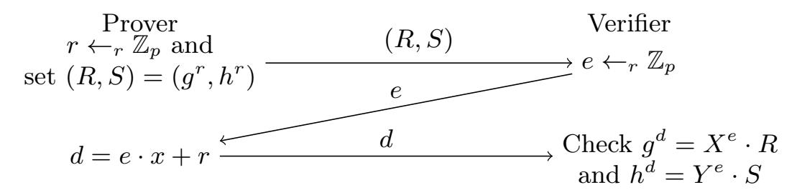
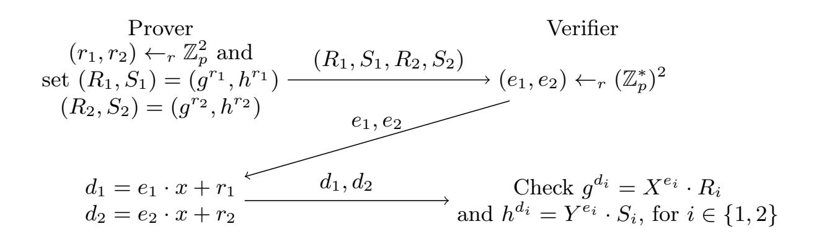

{0}------------------------------------------------

## Non-Interactive Zero-Knowledge in Pairing-Free Groups from Weaker Assumptions

Geoffroy Couteau1 , Shuichi Katsumata2 , and Bogdan Ursu3

> 1 CNRS, IRIF, Université Paris-Diderot, France [geoffroy.couteau@ens.fr](mailto:geoffroy.couteau@ens.fr) 2 AIST, Japan [shuichi.katsumata@aist.go.jp](mailto:shuichi.katsumata@aist.go.jp) 3 ETH Zurich, Switzerland [bogdan.ursu@inf.ethz.ch](mailto:bogdan.ursu@inf.ethz.ch)

Abstract. We provide two new constructions of non-interactive zero-knowledge arguments (NIZKs) for NP from discrete-logarithm-style assumptions over cyclic groups, without relying on pairings. A previous construction from (Canetti et al., Eurocrypt'18) achieves such NIZKs under the assumption that no efficient adversary can break the key-dependent message (KDM) security of (additive) ElGamal with respect to all (even inefficient) functions over groups of size 2 λ , with probability better than poly(λ)/2 λ . This is an extremely strong, non-falsifiable assumption. In particular, even mild (polynomial) improvements over the current best known attacks on the discrete logarithm problem would already contradict this assumption. (Canetti et al. STOC'19) describe how to improve the assumption to rely only on KDM security with respect to efficient functions while additionally assuming public-key encryption schemes, therefore obtaining an assumption that is (in spirit) falsifiable.

Our first construction improves this state of affairs. We provide a construction of NIZKs for NP under the CDH assumption together with the assumption that no efficient adversary can break the key-dependent message one-wayness of ElGamal with respect to efficient functions over groups of size 2 λ , with probability better than poly(λ)/2 cλ (denoted 2 −cλ -OW-KDM), for a constant c = 3/4. Unlike the previous assumption, our assumption leaves an exponential gap between the best known attack and the required security guarantee.

Our second construction is interested in the case where CDH does not hold. Namely, as a second contribution, we construct an infinitely often NIZK argument system for NP (where soundness and zero-knowledge are only guaranteed to hold for infinitely many security parameters), under the assumption that CDH is easy together with the 2 −cλ -OW-KDM security of ElGamal with c = 28/29 + o(1) and the existence of low-depth pseudorandom generators (PRG).

Combining our two results, we obtain a construction of (infinitely-often) NIZKs for NP under the 2 −cλ -OW-KDM security of ElGamal with c = 28/29 + o(1) and the existence of low-depth PRG, independently of whether CDH holds. To our knowledge, since neither OW-KDM security of ElGamal nor low-depth PRGs are known to imply public key encryption, this provides the first construction of NIZKs from concrete and falsifiable Minicrypt-style assumptions.

Keywords: Non-interactive zero-knowledge arguments, pairing-free groups, KDM security

### 1 Introduction

Zero-knowledge proof systems, introduced in [\[25\]](#page-30-0), are a fundamental cryptographic primitive, allowing a prover to convince a verifier of the veracity of a statement, while not divulging anything beyond whether the statement is true. When the proof consists of a single message from prover to the verifier, this results in a non-interactive zero-knowledge proof system (NIZK) [\[5\]](#page-29-0). Due to their large number of applications in cryptography, NIZKs enjoy particular interest, ranging from efficient implementations to feasibility results.

On Building NIZKs from Concrete Assumptions. While one-way functions are known to be necessary [\[45\]](#page-30-1) and sufficient [\[24\]](#page-30-2) for zero-knowledge proof systems, the exact relation of NIZKs to other cryptographic assumptions and primitives is considerably less clear. NIZKs are known to exist in the plain model only for trivial languages [\[44\]](#page-30-3). To circumvent this issue, cryptographers design NIZKs in the common reference string (CRS) model, where a common reference string is honestly

{1}------------------------------------------------

generated beforehand in a setup phase and is given to both prover and verifier. A large body of work has been dedicated to the construction of NIZKs in the CRS model from various cryptographic assumptions. As a result, NIZKs are known to exist from a wide range of assumptions, from pairing groups [\[26,](#page-30-4)[27\]](#page-30-5), factorization assumptions [\[5,](#page-29-0)[17\]](#page-29-1), and indistinguishability obfuscation [\[51\]](#page-31-0), to circularlysecure LWE [\[8\]](#page-29-2) and plain LWE [\[47\]](#page-30-6). Yet, in spite of three decades of efforts, it remains an intriguing open question whether one can construct NIZKs from discrete-logarithm-style assumptions (without relying on pairing groups), which are among the most well-established assumptions in cryptography. Here, the only known result is the recent work of [\[9\]](#page-29-3), which constructs NIZKs under the exponential key-dependent message security of ElGamal with respect to all (even inefficient) functions. While this is a remarkable stepping stone, it remains an extremely strong and non-standard assumption. Therefore, an important question remains open:

"Is it possible to build NIZKs from (weaker) discrete-logarithm-style assumptions?"

NIZKs and Public-Key Encryption. While it is known that one-way functions are a minimal assumption for zero-knowledge proofs [\[43,](#page-30-7) [45\]](#page-30-1), the situation concerning NIZKs is much less clear. In particular, almost all known concrete constructions of NIZKs to date rely on assumptions which are known to imply public-key encryption (PKE) (such as factorization, pairing-based assumptions, indistinguishability obfuscation, and LWE variants). We are aware of only two exceptions to the above:

- NIZKs built on top of an interactive protocol, through the Fiat-Shamir transform, are "plausibly secure" when the hash function is instantiated with e.g. SHA3. Hence, these NIZKs are secure under the tautological assumption that they cannot be broken, and this assumption is not known to imply PKE (since no structure is required from the hash function).
- The construction of [\[9\]](#page-29-3) relies on the assumption that it is infeasible to recover k given (g a , gak+f(k) ) (with more than a polynomial advantage over the random guess), for every (even inefficient) function f. This is an extremely strong, non-falsifiable assumption.

The first of these two exceptions is essentially a restatement of our inability to show that NIZKs imply PKE, while the second requires a very strong and non-falsifiable assumption. This situation is somewhat unsatisfying, and we view it as an important open question to base NIZKs on concrete "Minicrypt-style" assumptions (i.e. assumptions not known to imply PKE), while avoiding extreme non-falsifiable assumptions.

"Is it possible to build NIZKs from (better, concrete) symmetric-style assumptions?"

In fact, the bigger picture is unclear, even for relaxations of NIZKs such as designated-verifier NIZKs (which are known based on DDH groups [\[14,](#page-29-4) [31,](#page-30-8) [49\]](#page-31-1), factorization [\[12\]](#page-29-5), or LPN [\[35\]](#page-30-9) with a noise rate that implies PKE). The only known positive results are preprocessing NIZKs (where the prover and the verifier share a secret key) from flavors of LPN not known to imply PKE [\[6,](#page-29-6)[7\]](#page-29-7) and designated-prover NIZKs based on SIS [\[32\]](#page-30-10).

Interestingly, we note that although the assumption of [\[9\]](#page-29-3) is not known to imply PKE, a slight strengthening of the assumption would: assuming that it is hard to recover k given (g a , gk , gak+f(k) ) (note the additional g k term) for any (even inefficient) f already implies PKE: setting f such that g f(k) = Encode(k) where Encode is some efficiently invertible encoding of k into a group element, we get that the assumption implies CDH (which itself is known to imply PKE). Indeed, a CDH adversary could, given (g a , gk ), compute g ak and retrieve Decode(g f(k) ) = k from g ak+f(k) . This illustrates the fact that the power of unfalsifiable assumptions of this form, allowing f to be arbitrary, can be hard to estimate, and that classifying them as plausible Minicrypt candidate assumptions is quite shaky.

NIZKs from Correlation Intractability. Our work follows the blueprint of a recent line of research, which seeks to compile interactive protocols into NIZKs using the Fiat-Shamir paradigm [\[19\]](#page-29-8), by instantiating the underlying hash function by a correlation-intractable hash function. Informally, a correlation-intractable hash function (CIH) with respect to a relation R is a hash function such that it is infeasible to find an input x satisfying (x, H(x)) ∈ R. CIH have been introduced in [\[10\]](#page-29-9), where it was also shown that correlation-intractability for all sparse relations suffices to instantiate the Fiat-Shamir paradigm. Despite some impossibility results [\[4\]](#page-29-10), a recent line of work has shown 

{2}------------------------------------------------

how to construct CIH for various sparse relations of interest [8, 9, 29, 30, 47], obtaining NIZKs from new assumptions. Out of these works, [9] relies on the exponential key-dependent messages (KDM) security for all (even inefficient) functions of an encryption scheme with universal ciphertexts, which can be instantiated over pairing-free groups with a suitable variant of ElGamal; unfortunately, this is an extremely strong assumption, which has several undesirable features. In this paper, we seek to improve the result of [9] and to construct NIZKs for NP from weaker assumptions over pairing-free groups.

On the Strong-KDM Security Assumption of [9]. The construction of [9] relies on the following assumption over cyclic groups: let  $\mathbb{G}$  be a group of order  $p \approx 2^{\lambda}$  with a generator g. Then, for any probabilistic polynomial time adversary  $\mathcal{A}$ , any function  $F: \mathbb{Z}_p \mapsto \mathbb{Z}_p$  in a family of (possibly inefficient) functions  $\mathcal{F}$ , and any superpolynomial function s, it holds that

$$\Pr_{(a,k)\leftarrow_r\mathbb{Z}_p^2}\left[\mathcal{A}\left(g,g^a,g^{ak+F(k)}\right)=k\right]\leq \frac{s(\lambda)}{2^{\lambda}}.$$

While this assumption is not contradicted by known attacks on the discrete logarithm problem over suitably chosen elliptic curves, it is an extremely strong assumption, with several undesirable features:

- **Optimality.** Optimal security means that every PPT adversary has advantage at most  $\lambda^{O(1)}/2^{\lambda}$ . 4 The above assumption requires *optimal* security, which is equivalent to assuming that no improvement (by more than polynomial factors) to the best known existing attack will ever be found. Hence, even mild cryptanalytic improvements would already contradict the above assumption.
- **Non-Falsifiablity.** The above assumption is not *falsifiable*, in the sense of [21,41], since it might not be possible to efficiently check whether an adversary breaks the assumption with respect to some specific inefficient function. However, [8] notes that it is possible to construct NIZKs even when the functions f considered in the assumption are efficient by additionally assuming public-key encryption.

Insecurity with Auxiliary Inputs. In the same spirit as knowledge of exponent assumptions, which are known to become insecure (under obfuscation-style assumptions) when auxiliary inputs are allowed, unfalsifiable flavors of KDM security have been recently shown to be insecure as soon as auxiliary inputs are allowed, assuming that LWE is hard and one-way permutations exist [20]. While this does not directly contradict the unfalsifiable flavor of the assumption above, it makes it very sensitive to any side information an adversary might have access to when it is used in a higher-level application.

#### 1.1 Our Contribution

We propose two new constructions of NIZKs, improving over the NIZK of [9] in terms of the underlying assumption. As noted in [8], the assumption in [9] can be improved to consider only efficient functions by additionally assuming public-key encryption and thus construct NIZKs based on a *falsifiable*-style notion of KDM-security 5. In this work, we remove the need of relying on optimal security of the underlying assumption, while maintaining the *falsifiable* flavor of KDM security.

We note that our second construction satisfies a weaker notion of security, infinitely-often security, where soundness and zero-knowledge are only required to hold for infinitely many security parameters. For a discussion on the notion of infinitely-often security and its usage in cryptography, please refer to Appendix A.

In more detail, the assumption at the core of our new construction is a strong flavor of the OW-KDM security of ElGamal: given a group  $\mathbb{G}$  of size  $\approx 2^{\lambda}$  with generator g, the  $2^{-c\lambda}$ -OW-KDM

&lt;sup>4 In the case of DDH groups, the best known generic PPT adversary is Pollard's rho algorithm [48], which runs in time  $O(2^{\lambda/2})$  and has constant success probability. However, restricted to polynomial time, it only provides a polynomial advantage over randomly guessing the discrete logarithm. Moreover, it is known [52] that no generic algorithm with T oracle queries can have better success probability than  $O(\frac{T^2}{2\lambda})$ .

&lt;sup>5 More precisely, these assumptions are falsifiable in spirit in the sense that they can be modeled as an efficient game with a challenger, but the winning condition can occur with exponentially small probability.

{3}------------------------------------------------

assumption states that for a family of (randomized) efficient functions  $\mathcal{F}$ , any PPT adversary receiving an ElGamal ciphertext encrypting F(k) (in the exponent) with the key k is unable to recover the plaintext with advantage greater than  $s(\lambda)/2^{c\lambda}$ , for any superpolynomial function s:

$$\Pr_{\substack{(k,a)\leftarrow_r\mathbb{Z}_q^2\\m\leftarrow_rF(k)}}[\mathcal{A}(g,g^a,g^{ak+m})=k]\leq \frac{s(\lambda)}{2^{c\lambda}} \text{ for some } c\in[0,1].$$

The value c determines the strength of the assumption: c=1 corresponds to assuming optimal security (as in [8,9]), while smaller values of c leave a gap between the success probability of the best known attacks and the success probability that can be tolerated by the assumption. In particular, a constant c < 1 indicates that the assumption can stand even exponential improvements in the success probability of the best known attacks. We propose two new NIZK constructions:

- 1. Our first construction assumes the hardness of CDH. Then, further assuming the  $2^{-c\lambda}$ -OW-KDM security of ElGamal with c=3/4, we propose an adaptively-sound adaptively-multi-theorem NIZK for all of NP. Both soundness and zero knowledge are computational, the first is implied by OW-KDM, while the second is implied by CDH.
- 2. Our second construction aims at analyzing the complementary landscape. More precisely, we investigate the possibility of building NIZKs in groups where CDH does not hold. Then, further assuming the  $2^{-c\lambda}$ -OW-KDM security of ElGamal with c=28/29+o(1), together with the assumption that Goldreich's PRG [22] instantiated under the Lombardi-Vaikuntanathan predicate [36] is secure up to some (arbitrarily small) polynomial stretch6, we propose an adaptively-sound, adaptively-multitheorem zero-knowledge (infinitely often) NIZK for all of NP. Both soundness and zero knowledge are computational, the first is implied by OW-KDM, while the second is implied by OW-KDM and the pseudorandomness of Goldreich's PRG.

As a direct consequence, combining the above two results, we obtain a construction of (infinitely-often) NIZKs for NP under the same assumptions, independently of whether CDH holds. Since both our OW-KDM assumption and the existence of low-depth PRGs are not known to imply PKE, this provides (to our knowledge) the first NIZK construction from a concrete falsifiable (in spirit) Minicrypt-style assumption. In both constructions, an important effort is devoted to obtaining the smallest possible constant c, to minimize the strength of the underlying assumption. We view it as an interesting open problem to further minimize the value of c, especially in our second construction.

#### 1.2 Our Techniques – First Construction

Both our constructions follow a similar footprint: we start from a  $\Sigma$ -protocol for a carefully chosen, but limited language. We compile this  $\Sigma$ -protocol using a correlation-intractable (CI) hash function into a NIZK for the same limited language. Then we use different techniques to bootstrap this restricted NIZK to NIZK for all of NP, by using them to build a verifiable pseudorandom generator (VPRG) [14,31,49], which in turns leads to NIZKs for NP. Our approach is inspired by [9]. Their strategy is to design a correlation-intractable (CI) hash function based on a scheme with universal ciphertexts, which they use to transform an underlying sigma protocol into a NIZK. In their case, the interactive protocol is the one in [18, Section 2.1]. We diverge from this approach by applying the CI hash function to a sigma protocol for a more restricted, but still expressive enough language (which we bootstrap later to a full-fledged NIZK through VPRGs). Looking ahead, the parameters of the KDM security assumption are intrinsically tied to the ratio between the size of the first flow of the sigma protocol and its adaptive soundness. By allowing the underlying sigma protocol to support only a more restricted language, we expand the field of potential candidates and eventually identify a protocol with a better first flow/soundness ratio. Our initial attempt is to start with the standard  $\Sigma$ -protocol for the Diffie-Hellman relation  $\mathcal{L}_{DH}$ , described in figure 1. Choose a cyclic group  $\mathbb{G}$  of prime order p, along with two generators q and h. The relation consists of all pairs of group elements of the form  $(q^x, h^x)$ . To transform the sigma protocol into a NIZK for  $\mathcal{L}_{DH}$ , the idea of the CI framework is to apply the Fiat-Shamir transform, but instead of using random oracles, the random oracle is replaced with a CI hash function.

&lt;sup>6 The security of Goldreich's PRG is a well-established and widely studied assumption, which provably resists large classes of attacks [2, 3, 13, 40, 42].

{4}------------------------------------------------

**Fig. 1.**  $\Sigma$ -protocol for the Diffie-Hellman language for the word  $(g, h, X = g^x, Y = h^y)$ . This is a variant of a protocol by [1]

CI Hash Functions. A CI hash function H for a specific relation  $\mathcal{R}$  is a function for which it is hard to find an input  $\alpha$ , such that  $(\alpha, \mathsf{H}(\alpha)) \in \mathcal{R}$ . Consider the case where the initial relation is sparse, meaning that for every  $\alpha$ , the number of potential  $\beta$ 's satisfying  $(\alpha, \beta) \in \mathcal{R}$  is negligible. Then, the above sigma protocol can be transformed into a NIZK by asking the prover to generate the second flow himself, by running  $e = \mathsf{H}(R,S)$ . The verifier will only accept if the resulting transcript is accepting and also  $e = \mathsf{H}(R,S)$ . From the correlation intractability of H, even a malicious prover will be unable to cheat by finding a properly chosen initial flow (R,S), such that  $((R,S),\mathsf{H}(R,S)) \in \mathcal{R}$  (this also holds because the sparsity of the relation  $\mathcal{R}$  is bounded by the soundness error of the sigma protocol, which is negligible).

Choice of H. To construct the hash, we choose a function closely related to the one used in [9], where the (keyed) hash  $H_K(x)$  interprets the input x as a decryption key and the key K as a ciphertext, and returns  $\mathsf{Dec}_x(K)$ . For our instantiation, we crucially rely on a specific property of the additive variant of ElGamal (which is, informally, that keys and plaintexts are "interchangeable"). Since additive ElGamal does not provide efficient decryption (the decryption procedure recovers only  $\tilde{G}^m$ , and we cannot guarantee that m will be small in our construction), we modify the CI hash of [9] so that it returns  $\mathsf{Trunc}(\tilde{G}^m)$ , where  $\mathsf{Trunc}$  is some function that parses its input as a bitstring and truncates it appropriately. More precisely, we pick a second cyclic group  $\tilde{\mathbb{G}}$  of order q, generated by  $\tilde{G}$  where  $\lceil \log q \rceil = 2 \lceil \log p \rceil$ . The CI function is keyed by  $\mathsf{key}\ \tilde{C} = (\tilde{C}_0, \tilde{C}_1)$ , where  $(\tilde{C}_0, \tilde{C}_1) \leftarrow_r \tilde{\mathbb{G}}^2$ . Then, we define:

$$\mathsf{H}_{(\tilde{C}_0,\tilde{C}_1)}(\alpha) = \text{first } \lceil \log p \rceil \text{ bits of } \tilde{C}_1/\tilde{C}_0^{\alpha}.$$

**Parameters.** This protocol has  $\frac{1}{p}$  soundness and the size of the first flow is  $2\lceil \log p \rceil$ , which translates into a  $2^{-\lambda/2}$ -KDM assumption for the CI hash function. Unfortunately, this  $\Sigma$ -protocol does not satisfy adaptive soundness (that is, given an honestly-generated first flow and challenge, there always exist words that are not in the relation, for which there exists an accepting third flow). Adaptive soundness is a crucial requirement for bootstrapping our first NIZK to cover all NP statements. Fortunately, performing a parallel repetition of the  $\Sigma$ -protocol yields adaptive soundness, albeit at the cost of worser parameters in our assumption (c = 3/4).

Reduction to KDM for Efficient Functions. The above construction reduces to the KDM security of ElGamal, but only with respect to an *inefficient* function f, which maps first flows to accepting challenges. (Note that computing the unique accepting challenge e from a first flow (R, S) amounts to solving the discrete logarithm problem.) From here, we leverage the fact that an ElGamal encryption  $(\tilde{G}^r, \tilde{G}^{kr+m})$  of a plaintext m with key k, with respect to a generator  $\tilde{G}$ , can be equivalently seen as an ElGamal encryption of a plaintext k with the key m with respect to the generator  $\tilde{G}^r$ . Building upon this observation and the fact that  $f^{-1}$  is efficient, we show that the security of our NIZK for the DDH language can in fact be reduced to the KDM security of ElGamal with respect to the efficient function  $f^{-1}$ .

From NIZKDH for  $\mathcal{L}_{DH}$  to a NIZK for all of NP. In this step, we use an idea from [16] (that was slightly generalized and implicitly employed in recent works [14,31,49]). We use the NIZKDH for the  $\mathcal{L}_{DH}$  relation to construct a verifiable pseudo-random generator (VPRG), which we then in turn use to instantiate the hidden bits model of [18], to obtain NIZKs for all of NP. Intuitively, a VPRG is a pseudo-random generator with the additional property that one can compute proofs for any individual bit of

{5}------------------------------------------------

the output, certifying that the bit is consistent with a commitment of the initial seed. Let  $\mathbb{G}$  be a cyclic group of order p, the VPRG public parameters will consist of m+1 group elements  $(g,h_1,\ldots,h_m)$ . Seeds are elements  $\tau \leftarrow_r \mathbb{Z}_p$ , and committing to a seed is  $\mathsf{Commit}(\tau) = g^{\tau}$ . The  $i^{\mathsf{th}}$  output bit of the VPRG is of the form  $B(g^{\tau}, h_i^{\tau})$ , where B is the Goldreich-Levin hardcore bit. Now notice than we can actually certify this as a correctly computed bit, by noticing that  $(g^{\tau}, h_i^{\tau}) \in \mathcal{L}_{\mathsf{DH}}$  and computing a proof using our  $\mathsf{NIZK}_{\mathsf{DH}}$ . (additionally, we need to output  $h_i^{\tau}$  as well, so that the verifier can compute  $B(g^{\tau}, h_i^{\tau})$  itself). Intuitively, this  $\mathsf{VPRG}$  satisfies the following security properties:

- 1. Binding: if  $x_i$  is the  $i^{\text{th}}$  output of the VPRG with respect to a seed  $\tau$ , one should not be able to certify bit  $1 x_i$ . This is implied in our construction by the soundness of NIZKDH.
- 2. Hiding: An adversary should not be able to recover the  $i^{\text{th}}$  output of the VPRG, even if it received all the other output bits and proofs certifying that they are correct. In our construction, this property reduces to the CDH assumption.

NIZK for all of NP through the Hidden-Bit Model. In this model [18], the prover and the verifier benefit from having access to a common reference string with special properties. The bits of the common reference string are initially hidden from the verifier. When proving a statement, the prover can decide to selectively reveal some bits of the common reference string, which allows the verifier to check the proof. The work of [18] has showed that NIZKs exist unconditionally in this model. The VPRG we construct allows us to simulate the hidden-bits model on the prover side. Initially, all bits are hidden from the verifier from the hiding property of the VPRG. Subsequently, the prover can decide to reveal several bits, which corresponds to computing VPRG proofs.

#### 1.3 Our Techniques – Second Construction

The previous construction relies on the CDH assumption. In our second construction, we take the complementary road: we seek to construct NIZKs for NP under the strong KDM security of ElGamal assuming that CDH does *not* hold. Together with our first construction, this implies a NIZK for NP that does not rely on the CDH assumption (albeit with an infinitely-often security notion). To this end, we also seek to build a VPRG.

**Self-Pairing.** First, we notice that if CDH does not hold, there exists an efficient adversary solving it with non-negligible advantage. We use previous results by [39,52] to amplify the success probability of this adversary to obtain a self-pairing map. Since from the definition of CDH, the adversary is only guaranteed to succeed on infinitely-many security parameters, our NIZK will be secure only on infinitely-many security parameters. This self-pairing will allow us to perform homomorphic computations and to evaluate bounded integer arithmetic circuits in the exponent. Our core idea, informally, is to rely on this self-pairing to let the parties homomorphically evaluate a pseudorandom generator in the exponent: at a high level, given a (bit-by-bit) commitment c to the seed, the parties can homomorphically compute, using the self-pairing, a commitment  $c_i$  to the i-th output bit of the PRG (for all i). Then, the prover will open a given PRG value by providing a NIZK proof of correct opening.

A Commitment from Short-Exponent Discrete Logarithm. To instantiate this idea, we introduce a new commitment scheme which is perfectly binding, and which is hiding under the short-exponent discrete logarithm assumption (which states that given  $g^x$  for a random but short x, it is infeasible to retrieve x). This does not introduce any new assumption, as we further show that the short-exponent discrete logarithm assumption is implied by the strong OW-KDM security of ElGamal. Furthermore, we carefully design this commitment scheme so that it suffices, to convince the verifier that the opening was correct, to demonstrate that the randomness r of the commitment is almost short. By almost short, we mean that there exists short values (u,v) such that  $v \cdot r = u \mod p$ . This turns out to be a crucial property, since the language of group elements with almost-short exponents is precisely one for which we are able to build a NIZK under the  $2^{-c\lambda}$ -OW-KDM security of ElGamal, for some c < 1.

{6}------------------------------------------------

A Σ-protocol for Almost-Short Exponents. Let G be a cyclic group of p elements. We consider a simple Σ-protocol for proving that a word g x has a short exponent, i.e. writing x as an integer yields a number ≤ 2 ` , for some carefully chosen ` < dlog pe. Our protocol has a similar shape to the sigma protocol used in the previous construction, and is described in figure [3.](#page-20-0) However, we are unable to directly prove soundness, meaning that a malicious prover can convince the verifier of the validity of words g x , where x is not short. Fortunately, we are able to ensure that if g x is accepted, then x = u · v −1 , where u and v are themselves short. We denote this as the language Lα,β of (α, β)-almost-short elements:

$$\mathcal{L}_{\alpha,\beta} = \{ g^x \mid x = u \cdot v^{-1} \in \mathbb{Z}_p, u \in [-2^{\alpha}, 2^{\alpha}], v \in [0, 2^{\beta}] \}.$$

Our Σ-protocol is somewhat atypical, in the honest run the prover must start with a word of the form g x and a short witness x (notice that if x is short it belongs to the almost-short language). However, when proving soundness, we only safeguard membership to the larger almost-short set of words; therefore, there is a gap between the correctness requirement, and the soundness guarantees (this is similar to some lattice constructions using the Fiat-Shamir with aborts paradigm, for example [\[37\]](#page-30-20)).

NIZKAS for the Language of Almost-Short Exponents. We will design another CI hash function, closely related to the one we built for the first construction, to transform the Σ-protocol above into a NIZK for the almost-short exponent language. This CI hash function will additionally employ a 2-universal hash function, which we use to reduce the security loss in our security analysis and achieve a better parameter c for the OW-KDM assumption. Now, equipped with our NIZKAS, we only need one final tool before moving on to our VPRG.

A Low-Depth Local PRG. Equipped with the above tools, it remains to find a suitable PRG to be used in our construction. For correctness, we need to ensure that no overflow occurs during the homomorphic operations in the exponent; therefore, we must pick the group size large enough so that the homomorphic PRG evaluation does not cause an overflow. Since picking a larger group translates into a larger security loss in our reduction, we seek to rely on a PRG (with some arbitrary small polynomial stretch) that has a minimal arithmetic degree. Fortunately, such PRGs were recently studied in [\[36\]](#page-30-16), which exhibits a PRG with arithmetic degree 3 which provably resists a large class of attacks for a stretch up to 1.25 − ε. Combining this low-degree PRG with our new commitment scheme and our NIZK for the almost-short language yields a VPRG in groups where CDH does not hold, hence NIZKs for NP.

Wrapping Up. Combining our first and second construction, we get the following: assume that ElGamal is 2 −cλ -OW-KDM secure with respect to efficient functions (with c = 28/29 + o(1)), and that the previous PRG is secure. Then either CDH holds, in which case our first construction implies a NIZK for NP, or CDH does not hold, in which case our second construction implies an (infinitely-often) NIZK for NP. Therefore, under a PRG assumption and the strong OW-KDM security of ElGamal, we prove the existence of an infinitely-often NIZK for NP (but our proof is non-constructive, in that it does not tell which of the two candidate constructions is actually secure; only that one is).

#### 1.4 Organization

Section [2](#page-6-0) introduces necessary preliminaries and Section [3](#page-11-0) introduces an algorithm for performing homomorphic computation in the exponent under the assumption that CDH is easy. Section [4](#page-13-0) presents our first NIZK construction (assuming that CDH is hard) and Section [5](#page-19-0) contains our second construction (assuming that CDH is easy). Finally, in Section [6,](#page-28-0) we summarize the consequence of our two constructions.

## 2 Preliminaries

Notation. Throughout this paper, λ denotes the security parameter. A probabilistic polynomial time algorithm (PPT, also denoted efficient algorithm) runs in time polynomial in the (implicit) security parameter λ. A function f is negligible if for any positive polynomial p there exists a bound 

{7}------------------------------------------------

B>0 such that, for any integer  $k\geq B$ ,  $|f(k)|\leq 1/|p(k)|$ . We will write  $f(\lambda)\approx 0$  to indicate that f is a negligible function of  $\lambda$ ; we also write  $f(\lambda)\approx g(\lambda)$  for  $|f(\lambda)-g(\lambda)|\approx 0$ . An event occurs with overwhelming probability p when  $p\approx 1$ . Given a finite set S, the notation  $x\leftarrow_r S$  means a uniformly random assignment of an element of S to the variable x. For a positive integer n,m such that n< m, we denote by [n] the set  $\{1,\cdots,n\}$ , by  $[\pm n]$  the set  $\{-n,\cdots,n\}$ , and by [n,m) the set  $\{n,n+1,\cdots,m-1\}$ . Given an element x of a set  $\mathbb{Z}_p$  for prime p, we denote by  $\inf(x)$  the integer  $x'\in [\pm (p-1)/2]$  such that  $x=x' \mod p$ . When manipulating elements (x,y) of  $\mathbb{Z}_p$ , we will generally abuse the notation and write  $x\leq y$  for  $\inf(x)\leq \inf(y)$ .

The Computational Diffie-Hellman Assumption. Let DHGen be a deterministic algorithm that on input  $1^{\lambda}$  returns a description  $\mathcal{G} = (\mathbb{G}, p)$  where  $\mathbb{G}$  is a cyclic group of prime order p. Then the computational Diffie-Hellman assumption is defined as follows.

**Definition 1 (CDH Assumption).** We say that the computational Diffie-Hellman (CDH) assumption holds relative to DHGen if for all PPT adversaries A,

$$\Pr\left[\mathcal{G} \leftarrow \mathit{DHGen}(1^{\lambda}), g \leftarrow_r \mathbb{G}, \alpha, \beta \leftarrow_r \mathbb{Z}_p : g^{\alpha\beta} \leftarrow_r \mathcal{A}(1^{\lambda}, \mathcal{G}, g, g^{\alpha}, g^{\beta})\right] \leq \mathsf{negl}(\lambda).$$

Here, note that DHGen outputs a fixed group G per security parameter.

#### 2.1 Non-Interactive Zero-Knowledge

A (publicly-verifiable) non-interactive zero-knowledge (NIZK) argument system for an NP relation R, with associated language  $\mathcal{L}(R) = \{x \mid \exists w, (x, w) \in R\}$  is a 3-tuple of efficient algorithms (Setup, Prove, Verify), where Setup outputs a common reference string, Prove(crs, x, w), given the crs, a word x, and a witness w, outputs a proof  $\pi$ , and Verify(crs,  $x, \pi$ ), on input the crs, a word x, and a proof  $\pi$ , outputs a bit indicating whether the proof is accepted or not. A NIZK argument system satisfies the following: completeness, adaptive soundness, and selective single-theorem zero-knowledge properties: (we let  $R_{\lambda}$  denote the set  $R \cap (\{0,1\}^{\lambda} \times \{0,1\}^*)$ ).

- A non-interactive argument system (Setup, Prove, Verify) for an NP relation R satisfies completeness if for every  $(x, w) \in R$ ,

$$\Pr[\mathsf{crs} \leftarrow_r \mathsf{Setup}(1^{|x|}), \boldsymbol{\pi} \leftarrow \mathsf{Prove}(\mathsf{crs}, x, w) : \mathsf{Verify}(\mathsf{crs}, x, \boldsymbol{\pi}) = 1] \approx 1.$$

- A non-interactive argument system (Setup, Prove, Verify) for an NP relation R satisfies adaptive soundness if for any PPT  $\mathcal{A}$ ,

$$\Pr\left[ \begin{array}{l} \operatorname{crs} \leftarrow_r \operatorname{\mathsf{Setup}}(1^\lambda), (x, \boldsymbol{\pi}) \leftarrow_r \mathcal{A}(\operatorname{\mathsf{crs}}) \ : \\ \operatorname{\mathsf{Verify}}(\operatorname{\mathsf{crs}}, x, \boldsymbol{\pi}) = 1 \land x \notin \mathscr{L} \end{array} \right] \approx 0.$$

- A non-interactive argument system (Setup, Prove, Verify) for an NP relation R satisfies (computational, statistical) selective single-theorem zero-knowledge if there exists a PPT simulator Sim such that for every  $(x,w) \in R$ , the distribution  $\{(\operatorname{crs}, \pi) : \operatorname{crs} \leftarrow_r \operatorname{Setup}(1^{\lambda}), \pi \leftarrow \operatorname{Prove}(\operatorname{crs}, x, w)\}$  and  $\{(\operatorname{crs}, \pi) : (\operatorname{crs}, \pi) \leftarrow_r \operatorname{Sim}(x)\}$  are (computationally, statistically) indistinguishable.
- Furthermore, we say it satisfies (computational, statistical) adaptive multi-theorem zero-knowledge if for all (computational, statistical)  $\mathcal{A}$ , there exists a PPT simulator  $\mathsf{Sim} = (\mathsf{Sim}_1, \mathsf{Sim}_2)$  such that if we run  $\mathsf{crs} \leftarrow_r \mathsf{Setup}(1^\lambda)$  and  $(\overline{\mathsf{crs}}, \tau) \leftarrow_r \mathsf{Sim}_1(1^\lambda)$ , then we have  $|\Pr[\mathcal{A}^{\mathcal{O}_0(\mathsf{crs}, \cdot, \cdot)}(\mathsf{crs}) = 1] \Pr[\mathcal{A}^{\mathcal{O}_1(\overline{\mathsf{crs}}, \tau, \cdot, \cdot)}(\overline{\mathsf{crs}}) = 1]| \approx 0$ , where  $\mathcal{O}_0(\mathsf{crs}, x, w)$  outputs  $\mathsf{Prove}(\mathsf{crs}, x, w)$  if  $(x, w) \in R$  and  $\bot$  otherwise, and  $\mathcal{O}_1(\overline{\mathsf{crs}}, \tau, x, w)$  outputs  $\mathsf{Sim}_2(\overline{\mathsf{crs}}, \tau, x)$  if  $(x, w) \in R$  and  $\bot$  otherwise.

We use the following result regarding the existence of NIZKs in the hidden-bits model (HBM). Since the full definition of NIZK in the HBM will not be required in our work, we refer the readers to [17] for more details.

Theorem 2 (NIZK for all of NP in the HBM). Let  $\lambda$  denote the security parameter and let  $k = k(\lambda)$  be any positive integer-valued function. Then, unconditionally, there exists NIZK proof systems for any NP language  $\mathcal{L}$  in the HBM that uses  $hb = k \cdot poly(\lambda)$  hidden bits with soundness error  $\epsilon \leq 2^{-k \cdot \lambda}$ , where  $\lambda$  denotes the security parameter and poly is a function related to the NP language  $\mathcal{L}$  (and independent of k).

{8}------------------------------------------------

#### 2.2 Verifiable Pseudorandom Generators

**Definition 3 (Verifiable Pseudorandom Generator).** Let  $\delta(\lambda)$  and  $s(\lambda)$  be positive valued polynomials. A  $(\delta(\lambda), s(\lambda))$ -verifiable pseudorandom generator (VPRG) is a four-tuple of efficient algorithms (Setup, Stretch, Prove, Verify) such that

- Setup $(1^{\lambda}, m)$ , on input the security parameter (in unary) and a polynomial bound  $m(\lambda) \geq s(\lambda)^{1+\delta(\lambda)}$ , outputs a set of public parameters pp (which contains  $1^{\lambda}$ );
- Stretch(pp), on input the public parameters pp, outputs a triple (pvk, x, aux), where pvk is a public verification key of length  $s(\lambda)$ , x is an m-bit pseudorandom string, and aux is an auxiliary information;
- Prove(pp, aux, i), on input the public parameters pp, auxiliary informations aux, an index  $i \in [m]$ , outputs a proof  $\pi$ ;
- Verify(pp, pvk,  $i, b, \pi$ ), on input the public parameters pp, a public verification key pvk, an index  $i \in [m]$ , a bit b, and a proof  $\pi$ , outputs a bit  $\beta$ ;

which is in addition complete, hiding, and binding, as defined below.

**Definition 4 (Completeness of a VPRG).** For any  $i \in [m]$ , a complete DVPRG scheme (Setup, Stretch, Prove, Verify) satisfies:

$$\Pr\left[\begin{array}{l} \mathsf{pp} \leftarrow_r \mathsf{Setup}(1^\lambda, m), \\ (\mathsf{pvk}, x, \mathsf{aux}) \leftarrow_r \mathsf{Stretch}(\mathsf{pp}), : \mathsf{Verify}(\mathsf{pp}, \mathsf{pvk}, i, x_i, \pi) = 1 \\ \pi \leftarrow_r \mathsf{Prove}(\mathsf{pp}, \mathsf{aux}, i), \end{array}\right] \approx 1.$$

Note that our definition of VPRG is slightly relaxed than what is considered in [14, 16, 49], in that, we do not require the size of  $s(\lambda)$  to be independent of  $m(\lambda)$ . This relaxation still allows us to construct NIZKs for NP as long as the stretch  $\delta(\lambda)$  is larger than some positive constant.

**Definition 5 (Binding Property of a VPRG).** A VPRG is binding if there exists a (possibly inefficient) extractor Ext such that for any PPT A, it holds that

$$\Pr\left[ \begin{aligned} &\operatorname{pp} \leftarrow_r \operatorname{Setup}(1^{\lambda}, m), \\ &(\operatorname{pvk}, i, \pi) \leftarrow_r \mathcal{A}(\operatorname{pp}), : \operatorname{Verify}(\operatorname{pp}, \operatorname{pvk}, i, 1 - x_i, \pi) = 1 \\ &x \leftarrow \operatorname{Ext}(\operatorname{pp}, \operatorname{pvk}) \end{aligned} \right] \approx 0.$$

Note that, following [14, 31, 49], we consider a significantly weaker flavor of binding compared to [16], which still allows to construct NIZKs for NP.

**Definition 6 (Hiding Property of a VPRG).** A VPRG scheme (Setup, Stretch, Prove, Verify) is hiding if for any  $i \in [m]$  and any PPT adversary  $\mathcal{A}$  that outputs bits, it holds that:

$$\Pr\left[ \begin{array}{l} \mathsf{pp} \leftarrow_r \mathsf{Setup}(1^\lambda, m), \\ (\mathsf{pvk}, x, \mathsf{aux}) \leftarrow_r \mathsf{Stretch}(\mathsf{pp}), : \mathcal{A}(\mathsf{pp}, \mathsf{pvk}, i, (x_j, \pi_j)_{j \neq i}) = x_i \\ (\pi_j \leftarrow_r \mathsf{Prove}(\mathsf{pp}, \mathsf{aux}, j))_j \end{array} \right] \approx 1/2.$$

The following shows that  $\mathsf{VPRG}$  with a sufficient stretch can be used to construct  $\mathsf{NIZKs}$  for all of  $\mathsf{NP}$ .

**Theorem 7**  $((\delta, s)\text{-VPRGs} \Rightarrow \text{NIZKs for all of NP})$ . Fix an NIZK proof system for any NP language  $\mathscr{L}$  in the HBM that uses  $\mathsf{hb} = \mathsf{hb}(\lambda)$  hidden bits with soundness error  $\epsilon \leq 2^{-\lambda}$  where  $\mathsf{hb} \geq \lambda$  w.l.o.g. Suppose that a  $(\delta(\lambda), s(\lambda))$ -verifiable pseudorandom generator where  $s(\lambda) \geq \max\{\lambda, (\mathsf{hb}^2/\lambda)^{1/\delta(\lambda)}\}$  exits. Then, there exist adaptively sound and adaptively multi-theorem zero-knowledge NIZK arguments for the NP relation  $\mathscr{L}$ .

We provide a proof sketch below for completeness. Note that since existence of an NIZK in the HBM for any NP language  $\mathcal{L}$  is implied by Theorem 2, the above shows that VPRGs with some mild condition on  $\delta(\lambda)$  and  $s(\lambda)$  implies existence of an NIZK for any NP language  $\mathcal{L}$ .

Proof. This is a direct consequence of [17] and [14]. It can be checked from Theorem 16 of [14] that we can combine the NIZK in the HBM for the NP relation  $\mathcal{L}$  with any VPRG that satisfies  $s^{1+\delta} > (1+s/\lambda)\mathsf{hb} + \mathsf{hb}^2/\lambda$  in order to construct an adaptive single-theorem non-interactive witness indistinguishable (NIWI) argument for the NP relation  $\mathcal{L}$ . Working out the equation and taking into account that s needs to be at least  $\lambda$ -bits, we can see the condition on s in our statement is sufficient. Then, by using [17], we can convert an adaptive single-theorem NIWI into an adaptive multi-theorem NIZK assuming the existence of pseudorandom generators (which are by definition implied by VPRGs).

{9}------------------------------------------------

#### 2.3 Correlation-Intractable Hash Functions

We recall the definition of correlation intractability [11].

**Definition 8 (Correlation Intractable Hash Function).** A collection  $\mathcal{H} = \{H_{\lambda} : K_{\lambda} \times I_{\lambda} \mapsto O_{\lambda}\}_{\lambda \in \mathbb{N}}$  of (efficient) keyed hash functions is a  $\mathcal{R}$ -correlation intractable hash (CIH) family, with respect to a relation ensemble  $\mathcal{R} = \{\mathcal{R}_{\lambda} \subseteq I_{\lambda} \times O_{\lambda}\}$ , if for every (non-uniform) PPT adversary  $\mathcal{A}$ , it holds that

$$\Pr_{\substack{k \leftarrow_r K_\lambda \\ x \leftarrow_r \mathcal{A}(k)}} [(x, H_\lambda(k, x)) \in \mathcal{R}_\lambda] = \mathsf{negl}(\lambda).$$

For CIH to be useful as a building block for NIZK, we require an additional property referred to as programmability [8].

**Definition 9 (Programmability).** A collection  $\mathcal{H} = \{H_{\lambda} : K_{\lambda} \times I_{\lambda} \mapsto O_{\lambda}\}_{\lambda \in \mathbb{N}}$  of (efficient) keyed hash functions is called programmable if there exists an efficient algorithm, which given  $x \in I_{\lambda}$  and  $y \in O_{\lambda}$ , outputs a uniformly random key k from  $K_{\lambda}$ , such that  $H_{\lambda}(k, x) = y$ .

Finally, we define the standard notion of sparsity.

**Definition 10 (Sparsity).** For any relation ensemble  $\mathcal{R} = \{\mathcal{R}_{\lambda} \subseteq I_{\lambda} \times O_{\lambda}\}$ , we say that  $\mathcal{R}$  is  $\rho(\cdot)$ -sparse if for  $\lambda \in \mathbb{N}$  and any  $x \in I_{\lambda}$ ,  $\Pr_{y \leftarrow_{r} O_{\lambda}}[(x, y) \in \mathcal{R}_{\lambda}] \leq \rho(\lambda)$ . When  $\rho(\lambda) = \mathsf{negl}(\lambda)$ , we simply say it is sparse.

In the following, whenever the meaning is clear, we omit the subscripts for better readability.

#### 2.4 $\Sigma$ -Protocol

We recall the definition of  $\Sigma$ -protocols from [34]. A  $\Sigma$ -protocol is a three-move interactive proof between a prover P and a verifier V for a language  $\mathcal{L}$ , where the prover sends an initial message  $\alpha$ , the verifier responds with a random  $\beta \leftarrow_r S_\lambda$  for some challenge space  $S_\lambda$ , and the prover concludes with a message  $\gamma$ . Lastly, the verifier outputs 1, if it accepts and 0 otherwise. Three properties we require from a  $\Sigma$ -protocol are completeness, special honest-verifier zero-knowledge, and adaptive soundness.

**Definition 11 (Completeness).** A  $\Sigma$ -protocol for a relation R with prover P and verifier V is complete, if  $\Pr[\mathsf{out}\langle\mathsf{P}(x,w),\mathsf{V}(x)\rangle=1|(x,w)\in R]=1$ .

**Definition 12 (Special honest-verifier zero-knowledge).** A  $\Sigma$ -protocol for a relation R is special honest-verifier zero-knowledge, if there exists a polynomial-time simulator Sim such that the distributions  $Sim(x,\beta)$  and  $\langle P(x,w), V(x) \rangle$  are statistically close for any  $(x,w) \in R$ ,  $\beta \in S_{\lambda}$ , where the honest protocol is conditioned on V choosing  $\beta$ .

**Definition 13 (Adaptive soundness).** A  $\Sigma$ -protocol for a relation R is  $\rho(\cdot)$ -adaptive sound, if for any (possibly inefficient) cheating prover  $\mathsf{P}^*$  and any first flow  $\alpha$ , it holds that  $\Pr[\beta \leftarrow_r S_\lambda; (x, \gamma) \leftarrow_r \mathsf{P}^*(\alpha, \beta) : \exists x \notin \mathscr{L} \wedge V(x, \alpha, \beta, \gamma) = 1] \leq \rho(\lambda)$ . When  $\rho(\lambda) = \mathsf{negl}(\lambda)$ , we simply say it is adaptive sound.

In the above notion, when the cheating  $\mathsf{P}^*$  does not have the freedom to choose the word x, we say it is *selectively* sound. Note that a selective soundness is implied by the standard notion of special soundness of the  $\Sigma$ -protocol. The following lemma is due to [30], which at a high level claims that any adaptive sound  $\Sigma$ -protocol induces a natural sparse relation.

**Lemma 14.** Let  $\Pi$  be an arbitrary  $\rho(\cdot)$ -adaptive sound  $\Sigma$ -protocol for a language  $\mathscr{L}$ . Then, the following relation induced by the  $\Sigma$ -protocol  $\Pi$  is  $\rho(\cdot)$ -parse:

$$\mathcal{R}_{\mathsf{sparse}} = \{(\alpha,\beta) : \exists x, \gamma \ \textit{s.t.} \ x \not\in \mathscr{L} \ \land \ V(x,\alpha,\beta,\gamma) = 1\}.$$

{10}------------------------------------------------

#### 2.5 Secret Key Variant of ElGamal

**Definition 15 (Secret Key ElGamal).** Let  $\tilde{\mathbb{G}} = {\{\tilde{\mathbb{G}}_{\lambda}\}_{\lambda \in \mathbb{N}}}$  be an ensemble of groups where each group  $\tilde{\mathbb{G}}_{\lambda}$  is of order q such that  $\lceil \log q \rceil = \lambda$ . The natural (secret-key) variant of additive ElGamal with message space  $\mathbb{Z}_q$  consists of the following three PPT algorithms.

- Setup $(1^{\lambda})$ : output public-parameter  $\tilde{G} \leftarrow_r \tilde{\mathbb{G}}_{\lambda}$  and secret key  $k \leftarrow_r \mathbb{Z}_q$ .
- $\operatorname{Enc}_{\tilde{G}}(k,m) : \operatorname{pick} \tilde{R} \leftarrow_r \tilde{\mathbb{G}} \ \operatorname{and} \ \operatorname{output} \ \tilde{\mathbf{C}} = (\tilde{R}, \tilde{R}^k \cdot \tilde{G}^m).$
- $\mathsf{HalfDec}(k, \tilde{\mathbf{C}}) : \mathit{parse} \ \tilde{\mathbf{C}} \ \mathit{as} \ (\tilde{C}_0, \tilde{C}_1) \ \mathit{and} \ \mathit{output} \ \tilde{C}_1/\tilde{C}_0^k.$

Throughout the paper, we omit the subscript when the meaning is clear. Note that the scheme does not allow for full decryption, but only for decryption "up to discrete logarithm": for every  $(\tilde{G},k,m)$ , it holds that  $\mathsf{HalfDec}(k,\mathsf{Enc}_{\tilde{G}}(k,m))=\tilde{G}^m$ . One important property of the scheme is that it enjoys the notion of  $\mathit{universality}$ . Informally, the notion claims that the ciphertexts are not associated with a specific key, but rather, could have been an output of  $\mathit{any}$  key.

**Definition 16 (Universality).** For all  $\lambda \in \mathbb{N}$ ,  $\tilde{G} \in \tilde{\mathbb{G}}_{\lambda}$ , and  $k^* \in \mathbb{Z}_q$ , the ciphertexts of ElGamal satisfies

$$\{\tilde{\mathbf{C}}: (k,m) \leftarrow_r \mathbb{Z}_q^2, \tilde{\mathbf{C}} \leftarrow_r \mathrm{Enc}_{\tilde{G}}(k,m)\} = \{\tilde{\mathbf{C}}: m \leftarrow_r \mathbb{Z}_q, \tilde{\mathbf{C}} \leftarrow_r \mathrm{Enc}_{\tilde{G}}(k^*,m)\} = \mathcal{U}_{\tilde{\mathbb{G}}^2}.$$

**Definition 17** (OW-KDM Security). Let  $\mathcal{F} = \{\mathcal{F}_{\lambda}\}_{{\lambda} \in \mathbb{N}}$  be an ensemble of sets of functions where each  $\mathcal{F}_{\lambda} = \{F_u\}_u$  is a family of (possibly randomized) efficiently-computable functions. We say that ElGamal satisfies (one-query)  $\delta$ -OW-KDM security with respect to  $\mathcal{F}$  if for every  $F_u \in \mathcal{F}_{\lambda}$ , every superpolynomial function s, and every (non-uniform) PPT adversary  $\mathcal{A}$ , it holds that

$$\Pr_{\substack{(\tilde{G},k)\leftarrow_r\tilde{\mathbb{G}}_{\lambda}\times\mathbb{Z}_q\\m\leftarrow F_u(\tilde{G},k)\\\tilde{\mathbf{C}}\leftarrow_r\mathrm{Enc}_{\tilde{G}}(k,m)}}[\mathcal{A}(\tilde{G},\tilde{\mathbf{C}})=m]\leq s(\lambda)\cdot\delta(\lambda).$$

If ElGamal satisfies  $\delta$ -OW-KDM security with  $\delta(\lambda)=2^{-c\lambda}$  for some constant  $c\in(0,1]$ , then we say it is strong OW-KDM secure.

#### 2.6 Low-Depth Pseudorandom Generators

**Definition.** A pseudorandom generator is a deterministic process that expands a short random seed into a longer sequence, so that no efficient adversary can distinguish this sequence from a uniformly random string of the same length:

**Definition 18 (Pseudorandom Generator).** A m(n)-stretch pseudorandom generator, for a polynomial m, is a pair of PPT algorithms (PRG.Setup, PRG.Eval) where PRG.Setup( $1^n$ ) outputs some public parameters pp, which are implicitly given as input to PRG.Eval, and PRG.Eval(x), on input a seed  $x \in \{0,1\}^n$ , outputs a string  $y \in \{0,1\}^{m(n)}$ . It satisfies the following security notion: for any probabilistic polynomial-time adversary  $\mathcal{A}$  and every large enough n,

$$\begin{split} &\Pr[\mathsf{pp} \leftarrow_r \mathsf{PRG.Setup}(1^n), y \leftarrow_r \{0,1\}^{m(n)} : \mathcal{A}(\mathsf{pp}, y) = 1] \\ &\approx \Pr[\mathsf{pp} \leftarrow_r \mathsf{PRG.Setup}(1^n), x \leftarrow_r \{0,1\}^n, y \leftarrow \mathsf{PRG.Eval}(x) : \mathcal{A}(\mathsf{pp}, y) = 1] \end{split}$$

A pseudorandom generator PRG is d-local (for a function d) if for any  $n \in \mathbb{N}$ , every output bit of PRG. Eval on input a seed  $x \in \{0,1\}^n$  depends on at most d(n) input bits.

Goldreich's Pseudorandom Generator. Goldreich's candidate local PRGs form a family  $\mathcal{F}_{G,P}$  of local PRGs:  $\mathsf{PRG}_{G,P}: \{0,1\}^n \mapsto \{0,1\}^m$ , parametrized by an (n,m,d)-hypergraph  $G = (\sigma^1,\ldots,\sigma^m)$  (where m = m(n) is polynomial in n), and a predicate  $P: \{0,1\}^d \mapsto \{0,1\}$ , defined as follows: on input  $x \in \{0,1\}^n$ ,  $\mathsf{PRG}_{G,P}$  returns the m-bit string  $(P(x_{\sigma_1^1},\ldots,x_{\sigma_d^1}),\ldots,P(x_{\sigma_1^m},\cdots,x_{\sigma_d^m}))$ .

{11}------------------------------------------------

The Lombardi-Vaikuntanathan (LV) Predicate. For concreteness, we will rely on Goldreich PRG instantiated with the following predicate:

$$\mathsf{P}_{\mathsf{LV}}(x_1, x_2, x_3, x_4, x_5) = x_1 \oplus x_2 \oplus (x_1 \oplus x_3)(x_2 \oplus x_4) \oplus x_5$$
.

This predicate leads to a PRG with locality five. This predicate was introduced and studied in [36], were it was shown that it provably resists all  $\mathbb{F}_2$ -linear attacks, as well as all attacks using the SDP hierarchies (such as the Lassere-Parrilo sum-of-squares hierarchy), when stretching n bits to  $n^{1.25-\varepsilon}$  bits. In addition, this predicate enjoys an optimaly low arithmetic degree, since it can be computed by the following degree 3 polynomial over the integers:

$$\mathsf{P}_{\mathsf{LV}}(x_1, x_2, x_3, x_4, x_5) = x_5 + (x_1(x_4 - 1) + x_2(x_1 + x_3 - 1) - x_3x_4) \cdot (2x_5 - 1) \ .$$

# 3 (In)Security of the CDH Assumption and Homomorphic Computation in the Exponent

In this section, we show how to perform homomorphic computations in the exponent using a CDH solver. The content in this section will mainly be used in Section 5, where we construct NIZK from the *insecurity* of CDH. Therefore, a reader may safely skip this section and come back when necessary.

#### 3.1 Background: CDH Solver

Looking ahead, we will be considering the case where CDH does *not* hold in Section 5. Then, we are able to use a CDH solver to construct a self-bilinear map algorithm. To this end, we (informally) require the CDH solver to always be correct when solving the CDH problem.

Maurer and Wolf [39] and Shoup [52] independently showed that a CDH solver with non-negligible advantage can be amplified to a CDH solver with  $1 - \delta$  advantage for arbitrary  $0 < \delta < 1$ . Below, we provide Shoup's result as it is slightly more efficient.

**Lemma 19 (Amplifying CDH Solver).** Assume the CDH assumption relative to **DHGen** does not hold; that is, assume there exists a PPT adversary  $\mathcal{A}'$ , a polynomial  $\nu(\lambda)$  such that for infinitely many  $\lambda \in \mathbb{N}$ ,

$$\Pr[g^{\alpha\beta} \leftarrow_r \mathcal{A}'(1^{\lambda}, \mathcal{G}, g, g^{\alpha}, g^{\beta})] > 1/\nu(\lambda),$$

where  $\mathcal{G} \leftarrow \mathsf{DHGen}(1^{\lambda})$  and the probability is taken over the random choices of  $\mathcal{A}'$  and  $(g, \alpha, \beta)$ . Then, for any  $\delta(\lambda)$ , with  $0 < \delta(\lambda) < 1$ , we can construct an algorithm  $\mathcal{A}$  such that  $\Pr[g^{\alpha\beta} \leftarrow_r \mathcal{A}(1^{\lambda}, \mathcal{G}, g, g^{\alpha}, g^{\beta})] > 1 - \delta(\lambda)$  for the same infinite set of  $\lambda$ 's as of  $\mathcal{A}'$ . In addition,  $\mathcal{A}$  runs  $\mathcal{A}'$  at most  $O(\nu(\lambda)^{-1} \cdot \log(1/\delta(\lambda)))$  and performs an additional  $O(\nu(\lambda) \cdot \log(1/\delta(\lambda)) \cdot \log p + (\log p)^2)$  group operations where  $p = |\mathbb{G}|$ .

Remark 20 (Strong CDH Solver). As a consequence of Lemma 19, if the CDH assumption relative to DHGen does not hold, then by setting  $\delta(\lambda) := 2^{-c\lambda} \cdot 2^{-3\lceil \log p \rceil}$  for any c > 0 and taking the union bound, we can construct a PPT adversary  $\mathcal{A}$  such that  $\Pr[\forall (g, \alpha, \beta) \in \mathbb{G} \times \mathbb{Z}_p^2 : g^{\alpha\beta} \leftarrow_r \mathcal{A}(1^{\lambda}, \mathcal{G}, g, g^{\alpha}, g^{\beta})] > 1 - 2^{-c\lambda}$  where the probability is taken over the randomness of  $\mathcal{A}$ . We call such a PPT adversary  $\mathcal{A}$  as a strong CDH solver with advantage  $1 - 2^{-c\lambda}$ .

#### 3.2 Homomorphic Computation in the Exponent

We prepare some tools to compute a function in the exponent assuming CDH is easy.

Integer Arithmetic Circuits. An integer arithmetic circuit (IAC)  $C: \mathbb{Z}^n \to \mathbb{Z}$  is specified by a directed acyclic graph (DAG) where the vertices of C are called gates. We call gates of in-degree 0 as input gates (or simply input) and the gate of out-degree 0 as an output gate (or simply output). In this work, we consider circuits with addition gates, multiplication gates, and the one-input gate  $g: z \to -z$ . The size of C is the number of gates excluding the input and output gates. The degree of C is the degree of the multivariate polynomial it computes.

{12}------------------------------------------------

Algorithms for Homomorphic Computation. Using a (strong) CDH solver, we are able to homomorphically compute in the exponent.

**Theorem 21.** Let  $\{C_{\lambda}\}_{{\lambda}\in\mathbb{N}}$  be an ensemble of sets of IAC where each circuit in  $C_{\lambda}$  has input length  $n=n(\lambda)$  and size  $L=L(\lambda)$ . Let the CDH assumption relative to DHGen be easy. Moreover, let  $S\subset\mathbb{N}$  be the infinite set of security parameters for which a strong CDH solver exists. Then there exists a PPT algorithm EvalCom and a deterministic polytime algorithm EvalOpen with the following properties for all  $\lambda\in S$ :

- EvalCom $(C, g_1, \dots, g_n) \to h$ : on input an IAC  $C \in \mathcal{C}_{\lambda}$  and  $(g_1, \dots, g_n) \in \mathbb{G}$ , it outputs  $h \in \mathbb{G}$ .
- EvalOpen $(C, z_1, b_1, \dots, z_n, b_n) \to z$ : on input an IAC  $C \in \mathcal{C}_{\lambda}$  and  $((z_1, b_1), \dots, (z_n, b_n)) \in (\mathbb{Z} \times \{0, 1\})^n$ , it outputs  $z \in \mathbb{Z}$ .
- Let  $(\ell,t) \in \mathbb{N}^2$  such that  $\ell+t > 2L^2$ . Further, assume  $p = |\mathbb{G}|$  to be greater than  $L(\ell+t) \cdot \log_2 B$  where  $B = \max_{C \in \mathcal{C}_{\lambda}, (b_i \in \{0,1\})_i} C(b_1, \cdots, b_n)$ . Let  $b_i \in \{0,1\}$  and  $w_i \in [-2^{\ell}, 2^{\ell}]$  for all  $i \in [n]$ .

  Then, for any  $C \in \mathcal{C}_{\lambda}$  with degree D and  $g_i = g^{w_i + 2^{\ell + t}b_i}$ , if we run  $h \leftarrow_r \text{EvalCom}(C, g_1, \cdots, g_n)$ , we have  $\text{dlog}_g h = w^* + 2^{(D+1)(\ell+t)} \cdot C(b_1, \cdots, b_n)$ , where  $w^* \in [\pm (2^{D(\ell+L+t+2)})]$  and  $\text{EvalOpen}(C, (w_i, b_i)_{i \leq n}) = w^*$ , except with negligible probability  $2^{-\lambda}$ .

Proof. EvalCom evaluates the IAC in a gate-by-gate fashion, using a strong CDH solver with advantage  $1-2^{-\lambda}$ . We describe below the procedures that EvalCom uses for each gate. The inputs for each gates are of the form  $g_0 = g^{w_0+2^{\ell_0+t}b_0}$  and  $g_1 = g^{w_1+2^{\ell_1+t}b_1}$ , where  $w_0 \in [-2^{\ell_0}, 2^{\ell_0}]$  and  $w_1 \in [-2^{\ell_1}, 2^{\ell_1}]$  and  $(b_0, b_1) \in \mathbb{Z}^2$ . Here,  $b_0$  and  $b_1$  are the intermediate values computed by the IAC and we assume without loss of generality that  $\ell_0$  are  $\ell_1$  are known. Note that in case we consider the inversion gate, which only has one input, we only consider the terms with subscript 0.

Inversions. On input  $g_0 = g^{w_0 + 2^{\ell_0 + t}b_0}$ , output  $g_0^{-1} = g^{w' + 2^{\ell_0 + t}(-b_0)}$ , with  $w' = -w_0 \in [-2^{\ell_0}, 2^{\ell_0}]$ . Addition gates.

- Input.  $g_0 = g^{w_0 + 2^{\ell_0 + t}b_0}$  and  $g_1 = g^{w_1 + 2^{\ell_1 + t}b_1}$ . Assume without loss of generality that  $\ell_0 \ge \ell_1$ .
- Computation.

$$h \leftarrow g^{w_0 + 2^{\ell_0 + t} b_0} \left( g^{w_1 + 2^{\ell_1 + t} b_1} \right)^{2^{\ell_0 - \ell_1}} = g^{w + 2^{\ell_0 + t} (b_0 + b_1)},$$

with 
$$w = w_0 + 2^{\ell_0 - \ell_1} w_1 \in [\pm (2^{\ell_0 + 1})].$$

Multiplication gates.

- Input.  $g_0 = g^{w_0 + 2^{\ell_0 + t} b_0}$  and  $g_1 = g^{w_1 + 2^{\ell_1 + t} b_1}$ .
- Computation. Use the strong CDH solver to compute

$$h = g^{(w_0 + 2^{\ell_0 + t}b_0)(w_1 + 2^{\ell_1 + t}b_1)}.$$

We have  $h = g^{w+2^{\ell_0+\ell_1+2t}(b_0b_1)}$ , with

$$w = w_0(w_1 + 2^{\ell_1 + t}b_1) + w_1(2^{\ell_0 + t}b_0)$$

$$\in [\pm (2^{\ell_0 + \ell_1} + 2^{\ell_0 + \ell_1 + t} \cdot (b_0 + b_1))]$$

$$\in [\pm 2^{\ell_0 + \ell_1 + t + D + 1}],$$

where the last equation follows since we have  $b_0, b_1 \leq 2^{D-1}$  for any internal wire values of a degree-D IAC when the initial inputs to the IAC are bits.

Using a simple induction argument, it can be checked that if the input to EvalCom is given by  $(g_i = g^{w_i + 2^{\ell + t}b_i})_{i \leq n}$  with  $w_i \in [-2^{\ell}, 2^{\ell}]$  and  $b_i \in \{0, 1\}$  for i = 1 to n, then it holds that  $\operatorname{dlog}_g h = w^* + 2^{(D+1)(\ell+t)} \cdot C(b_1, \cdots, b_n)$ , where  $w^* \in [\pm (2^{D(\ell+L+t+2)})]$ , except with probability at most  $2^{-\lambda}$ . The bound on the probability is due to the fact that for  $1 - 2^{\lambda}$  fraction of the randomness used by the strong CDH solver, it correctly solves the CDH problem for any pairs of input. Eventually, EvalOpen is straightforward: on input  $(w_i, b_i)_{i \leq n}$ , it follows the above procedures, computing directly with the exponents, to get the "w part" of  $\operatorname{dlog}_g(h)$ .

{13}------------------------------------------------

Bounded Integer Arithmetic Circuits. The above bounds can be improved when the intermediate values of the  $b_i$  are guaranteed to remain small. While the above bound uses the straighforward  $b_i \leq 2^{D-1}$ , in our specific application it will always be the case that any intermediate  $b_i$  belongs to  $[\pm 1]$ . In this case, the bound on w for the multiplication gate becomes  $w \in [\pm 2^{\ell_0 + \ell_1 + t + 2}]$ . When this is the case, by induction, it holds that  $h = g^{w+2^{D(\ell+t)}C(b_1, \dots, b_n)}$ , where  $w \in [\pm (2^{D(\ell+L)+(D-1)(t+2)})]$ , except with probability at most  $2^{-\lambda}$ .

## 4 NIZK based on the Security of CDH and Strong **OW-KDM** Security of ElGamal

In this section, we describe a construction of a NIZK from the strong OW-KDM security of ElGamal with respect to efficient functions by assuming the CDH problem is hard to solve. We first provide a NIZK for the specific language of the Diffie-Hellman (DH) language. This is done by constructing a CIH based on the strong OW-KDM security of ElGamal for the natural sparse relation induced by the  $\Sigma$ -protocol for DH languages. We then show that such a NIZK for the DH language allows us to construct a VPRG, which in return, allows us to construct a NIZK for all of NP by Theorem 7.

#### 4.1 $\Sigma$ -Protocol for the Diffie-Hellman Language

**Definition 22 (Diffie-Hellman Language).** Let  $\mathbb{G}$  be a group with prime order p. We define the Diffie-Hellman (DH) language  $\mathcal{L}_{\mathsf{DH},t}$  parameterized by  $t \in \mathbb{Z}_p^*$  as  $\mathcal{L}_{\mathsf{DH},t} = \{(g,h,g^x,h^x) : g,h \in \mathbb{G}, x \in \mathbb{Z}_p, \mathsf{dlog}_q h = t\}$ .

Below we recall the standard  $\Sigma$ -protocol for the DH relation (with parallel repetition). Here, the word is  $(g, h, X, Y) \in \mathscr{L}_{\mathsf{DH},t}$  where  $(X, Y) = (g^x, h^x)$ .

**Fig. 2.**  $\Sigma$ -protocol for the Diffie-Hellman language for the word  $(g, h, X = g^x, Y = h^x)$ .

The above  $\Sigma$ -protocol achieves the standard notion of correctness and special honest-verifier zero-knowledge. Adaptive soundness is covered by the following lemma.

Lemma 23 (Adaptive Soundness). The  $\Sigma$ -protocol in Figure 2 satisfies  $\frac{1}{p-1}$ -adaptive soundness.

*Proof.* Let the word be  $(X = g^x, Y = g^y)$ . For  $i \in \{1, 2\}$ , let  $s_i$  be the exponent of  $S_i$ , i.e.  $S_i = g^{s_i}$ . In order for the verifier to accept, the following must hold:  $e_i \cdot y = r_i \cdot t + e_i \cdot x \cdot t - s_i$ , for  $i \in \{1, 2\}$ , which implies that:

$$y = \frac{t(r_i + e_i \cdot x) - s_i}{e_i} = \frac{t \cdot r_i - s_i}{e_i} + t \cdot x$$
, for  $i \in \{1, 2\}$ 

We distinguish the following two cases:

- 1. If  $t \cdot r_i = s_i$  for either  $i \in \{1, 2\}$ , then  $y = t \cdot x$  and the word is in the language.
- 2. If  $t \cdot r_i \neq s_i$  for both  $i \in \{1, 2\}$ , then  $\frac{t \cdot r_1 s_1}{t \cdot r_2 s_2} \cdot e_2 = e_1$ , which happens with probability at most  $\frac{1}{p-1}$  over the randomness of  $(e_1, e_2) \leftarrow_r (\mathbb{Z}_p^2)^*$ .

We can ignore the first case since it does not lead to a valid cheating prover for adaptive soundness. In the second case, a cheating prover has at most  $\frac{1}{p-1}$  possibility of breaking adaptive soundness. Hence the statement follows.

{14}------------------------------------------------

#### 4.2 Correlation-Intractable Hash Function H

Let  $\lambda$  be a security parameter. We consider a group  $\tilde{\mathbb{G}}$  of order  $q(\lambda)$  with  $\lceil \log q \rceil \approx \lambda$ . Let Trunc :  $\tilde{\mathbb{G}} \mapsto \{0,1\}^{\lambda/2}$  be the function which, on input a group element  $\tilde{G} \in \tilde{\mathbb{G}}$ , parses it as a  $\lceil \log q \rceil$ -bit string and returns the first  $\lambda/2$  bits of its input. We consider the following hash function  $\mathsf{H}_{\lambda} : \tilde{\mathbb{G}}^2 \times \mathbb{Z}_q \mapsto \{0,1\}^{\lambda/2}$ :

- Sampling the key: pick  $(\tilde{G}, k, m) \leftarrow_r \tilde{\mathbb{G}} \times \mathbb{Z}_q^2$  and set the key as  $\tilde{\mathbf{C}} \leftarrow_r \mathsf{Enc}_{\tilde{G}}(k, m)$ . Note that the key distribution is exactly the uniform distribution over  $\tilde{\mathbb{G}}^2$ .
- Evaluating  $H_{\lambda}(\tilde{\mathbf{C}},\cdot): H_{\lambda}(\tilde{\mathbf{C}},x) = \text{Trunc}(\text{HalfDec}(x,\tilde{\mathbf{C}})).$

Below, we omit the subscript on H for simplicity.

Correlation-Intractability of H. Consider a group  $\mathbb{G}$  of order  $p(\lambda)$  with  $\lceil \log p \rceil \approx \lambda/4$ . Then the output of H can be interpreted as two elements of  $\mathbb{G}$ . Fix a parameter  $t \in \mathbb{Z}_p^*$ . Define  $\mathcal{R}_{\lambda,t}$  to be the natural sparse relation associated to the language  $\mathscr{L}_{\mathsf{DH},t}$  (see Lemma 14). That is,

$$\mathcal{R}_{\lambda,t} = \{ (\alpha,\beta) \in \mathbb{G}^4 \times (\mathbb{Z}_p^*)^2 : \exists x, \gamma \text{ s.t. } x \notin \mathcal{L}_{\mathsf{DH},t} \land V(x,\alpha,\beta,\gamma) = \mathsf{accept} \}.$$

Here, the above relation can also be described alternatively using the following (inefficient) randomized function (which follows from the argument within the proof of Lemma 23):

$$f_t(a;z): \begin{cases} \mathbb{G}^4 \times \mathbb{Z}_p^* \mapsto (\mathbb{Z}_p^*)^2 \\ (R_1, S_1, R_2, S_2) \times z \to (z, \log_{(R_1^t/S_1)}(R_2^t/S_2) \cdot z) \end{cases}$$

The following is the main contribution of this section.

**Theorem 24.** Assume that ElGamal satisfies  $2^{-3\lambda/4}$ -OW-KDM security with respect to efficient functions. Then the hash family  $\{H: \tilde{\mathbb{G}}^2 \times \mathbb{Z}_q \mapsto \{0,1\}^{\lambda/2}\}_{\lambda}$  is correlation-intractable with respect to  $\mathcal{R}^H := \{\mathcal{R}_{\lambda} := \{\mathcal{R}_{\lambda,t}\}_t\}_{\lambda}$ .

*Proof.* We prove the theorem in two steps. We first show that an adversary against the correlation intractability of H can be shown to be an adversary against the OW-KDM security of ElGamal with respect to *inefficient* functions. We then show via the symmetry of messages and secret keys of ElGamal to conclude that such an adversary can indeed be used to break OW-KDM security of ElGamal with respect to *efficient* functions. The first step is summarized in the following lemma. The proof follows closely the approach of [9], but simplifies some steps of the proof and makes the exact security loss explicit.

**Lemma 25.** Let  $\mathcal{A}$  be an adversary against the  $\mathcal{R}^{\mathsf{H}}$ -correlation intractability of  $\mathsf{H}$  with (non-negligible) advantage  $\varepsilon(\lambda)$ . Then, for some  $t \in \mathbb{Z}_p^*$ , it holds that:

$$\Pr_{\substack{(\tilde{G}, a^*, m) \leftarrow_r \tilde{\mathbb{G}} \times \mathbb{Z}_q^2 \\ \tilde{\mathbf{C}} \leftarrow_r \mathsf{Enc}_{\tilde{G}}(a^*, m)}} [\mathcal{A}(\tilde{G}, \tilde{\mathbf{C}}) = a^* | (a^*, \mathsf{H}(\tilde{\mathbf{C}}, a^*)) \in \mathcal{R}_{\lambda, t}] \ge \frac{\varepsilon(\lambda)}{2^{3\lambda/4}}.$$

*Proof.* By assumption, we have the following for some  $\mathcal{R}_{\lambda,t} \in \mathcal{R}_{\lambda}$ .

$$\Pr\begin{bmatrix} (\tilde{G}, k, m) \leftarrow_r \tilde{\mathbb{G}} \times \mathbb{Z}_q^2 \\ \tilde{\mathbf{C}} \leftarrow_r \mathsf{Enc}_{\tilde{G}}(k, m) & : (a, \mathsf{H}(\tilde{\mathbf{C}}, a)) \in \mathcal{R}_{\lambda, t} \\ a \leftarrow_r \mathcal{A}(\tilde{G}, \tilde{\mathbf{C}}) \end{bmatrix} \ge \varepsilon(\lambda).$$

Consider sampling independently a random input  $a^* \leftarrow_r \mathbb{Z}_q$ . Then we have:

$$\Pr\begin{bmatrix} (\tilde{G}, k, m) \leftarrow_r \tilde{\mathbb{G}} \times \mathbb{Z}_q^2 \\ a^* \leftarrow_r \mathbb{Z}_q \\ \tilde{\mathbf{C}} \leftarrow_r \mathsf{Enc}_{\tilde{G}}(k, m) \end{bmatrix} : \mathcal{A}(\tilde{G}, \tilde{\mathbf{C}}) = a^* \wedge (a^*, \mathsf{H}(\tilde{\mathbf{C}}, a^*)) \in \mathcal{R}_{\lambda, t} \end{bmatrix} \geq \frac{\varepsilon(\lambda)}{2^{\lambda}},$$

since this is exactly the probability that  $\mathcal{A}$  wins the correlation intractability game and  $\mathcal{A}(\tilde{G}, \tilde{\mathbf{C}}) = a^*$ . Using the (perfect) universality of ElGamal, this becomes

{15}------------------------------------------------

$$\Pr\begin{bmatrix} (\tilde{G},m) \leftarrow_r \tilde{\mathbb{G}} \times \mathbb{Z}_q \\ a^* \leftarrow_r \mathbb{Z}_q & : \ \mathcal{A}(\tilde{G},\tilde{\mathbf{C}}) = a^* \wedge (a^*,\mathsf{H}(\tilde{\mathbf{C}},a^*)) \in \mathcal{R}_{\lambda,t} \end{bmatrix} \geq \frac{\varepsilon(\lambda)}{2^{\lambda}}.$$

We now introduce another (inefficient) randomized function  $\alpha_t$ :

$$\alpha_t : \begin{cases} \tilde{\mathbb{G}} \times \mathbb{Z}_q \times \{0,1\}^{\lambda/2} \times \mathbb{Z}_p^* & \mapsto \mathbb{Z}_q \\ (\tilde{G}, a; z_1, z_2) & \to \mathsf{dlog}_{\tilde{G}}(f_t(a; z_2) || z_1) \end{cases}$$

Using this function  $\alpha_t$ , the previous inequality can be rewritten as

$$\Pr\begin{bmatrix} (\tilde{G}, m) \leftarrow_r \tilde{\mathbb{G}} \times \mathbb{Z}_q \\ a^* \leftarrow_r \mathbb{Z}_q \\ \tilde{\mathbf{C}} \leftarrow_r \mathsf{Enc}_{\tilde{G}}(a^*, m) \end{bmatrix} : \mathcal{A}(\tilde{G}, \tilde{\mathbf{C}}) = a^* \wedge \exists (z_1, z_2), m = \alpha_t(\tilde{G}, a^*; z_1, z_2) \end{bmatrix} \geq \frac{\varepsilon(\lambda)}{2^{\lambda}},$$

since given  $\tilde{\mathbf{C}} \leftarrow_r \mathsf{Enc}_{\tilde{G}}(a^*, m)$ , it holds that

$$(a^*, H(\tilde{\mathbf{C}}, a^*)) \in \mathcal{R}_{\lambda, t} \iff \mathsf{Trunc}(\mathsf{HalfDec}(a^*, \tilde{\mathbf{C}})) = f_t(a^*; z_2) \; (\mathsf{for \; some} \; z_2)$$

$$\iff \mathsf{Trunc}(\tilde{G}^m) = f_t(a^*; z_2)$$

$$\iff \exists z_1, z_2, \tilde{G}^m = f_t(a^*; z_2) || z_1$$

$$\iff \exists z_1, z_2, m = \alpha_t(\tilde{G}, a^*; z_1, z_2).$$

Let  $S_{t,\tilde{G},a^*} := \{\alpha_t(\tilde{G},a^*;z_1,z_2): (z_1,z_2)\leftarrow_r \{0,1\}^{\lambda/2}\times\mathbb{Z}_p^*\}$  be the set of challenges for which there exists an accepting last flow and word, such that  $a^*$  is the first flow. Now, observe that our probability becomes:

$$\begin{split} &\operatorname{Pr}\begin{bmatrix} (\tilde{G}, a^*) \leftarrow_r \tilde{\mathbb{G}} \times \mathbb{Z}_q \\ m \leftarrow_r S_{t, \tilde{G}, a^*} \\ \tilde{\mathbf{C}} \leftarrow_r \operatorname{Enc}_{\tilde{G}}(a^*, m) \end{bmatrix} \\ &= \sum_{i=0}^{q-1} \Pr_{a^* \leftarrow_r \mathbb{Z}_q} [a^* = i] \cdot \operatorname{Pr}\begin{bmatrix} \tilde{G} \leftarrow_r \tilde{\mathbb{G}} \\ m \leftarrow_r S_{t, \tilde{G}, i} \\ \tilde{\mathbf{C}} \leftarrow_r \operatorname{Enc}_{\tilde{G}}(i, m) \end{bmatrix} : \ \mathcal{A}(\tilde{G}, \tilde{\mathbf{C}}) = i \\ &\geq \sum_{i=0}^{q-1} \Pr_{a^* \leftarrow_r \mathbb{Z}_q} [a^* = i] \cdot \frac{\operatorname{Pr}\begin{bmatrix} (\tilde{G}, m) \leftarrow_r \tilde{\mathbb{G}} \times \mathbb{Z}_q : & \mathcal{A}(\tilde{G}, \tilde{\mathbf{C}}) = i \\ \tilde{\mathbf{C}} \leftarrow_r \operatorname{Enc}_{\tilde{G}}(i, m) & \wedge (\exists z_1, z_2, m = \alpha_t(\tilde{G}, i; z_1, z_2)) \end{bmatrix}}{\operatorname{Pr}[(\tilde{G}, m) \leftarrow_r \tilde{\mathbb{G}} \times \mathbb{Z}_q : \exists z_1, z_2, m = \alpha_t(\tilde{G}, i; z_1, z_2)]} \end{split}$$

Furthermore, it is straightforward to check that for any i,

$$\Pr_{m \leftarrow_r \mathbb{Z}_q} [\exists (z_1, z_2), m = \alpha_t(\tilde{G}, i; z_1, z_2)] \le 2^{-\lambda/4}.$$

The statement is equivalent to " $\exists (z_1, z_2), \tilde{G}^m = f_t(i; z_2) || z_1$ ", which further translates to the "the first half of the bits of  $\tilde{G}^m$  are equal to  $f_t(i; z_2)$ ". Since a random string from  $\{0, 1\}^{\lambda/2}$  is equal to  $f_t(i; z_2)$  with probability  $2^{-\lambda/2}$  for a fixed  $z_2$ , by taking a union bound over all possible values of  $z_1 \in \mathbb{Z}_p^*$ , where  $|\mathbb{Z}_p^*| = 2^{\lambda/4}$ , we get the result. Hence, we get:

$$\begin{split} &\operatorname{Pr}\begin{bmatrix} (\tilde{G},a^*) \leftarrow_r \tilde{\mathbb{G}} \times \mathbb{Z}_q \\ m \leftarrow_r S_{t,\tilde{G},a^*} &: \ \mathcal{A}(\tilde{G},\tilde{\mathbf{C}}) = a^* \end{bmatrix} \\ &\geq 2^{\lambda/4} \cdot \sum_{i=0}^{q-1} \Pr_{a^* \leftarrow_r \mathbb{Z}_q} [a^* = i] \cdot \operatorname{Pr}\begin{bmatrix} (\tilde{G},m) \leftarrow_r \tilde{\mathbb{G}} \times \mathbb{Z}_q &: \ \mathcal{A}(\tilde{G},\tilde{\mathbf{C}}) = i \\ \tilde{\mathbf{C}} \leftarrow_r \operatorname{Enc}_{\tilde{G}}(i,m) & \wedge \left(\exists (z_1,z_2), m = \alpha_t(\tilde{G},i;z_1,z_2)\right) \end{bmatrix} \\ &= 2^{\lambda/4} \cdot \operatorname{Pr}\begin{bmatrix} (\tilde{G},m,a^*) \leftarrow_r \tilde{\mathbb{G}} \times \mathbb{Z}_q^2 &: \ \mathcal{A}(\tilde{G},\tilde{\mathbf{C}}) = a^* \\ \tilde{\mathbf{C}} \leftarrow_r \operatorname{Enc}_{\tilde{G}}(a^*,m) & \wedge \left(\exists (z_1,z_2), m = \alpha_t(\tilde{G},a^*;z_1,z_2)\right) \end{bmatrix} \\ &= \frac{\varepsilon(\lambda)}{2^{3\lambda/4}}. \end{split}$$

{16}------------------------------------------------

This concludes the proof of the lemma.

Given Lemma 25, it remains to show that this implies a contradiction to the OW-KDM security of ElGamal for *efficient* functions. The main difficulty here is that the above can be rewritten as

$$\Pr_{\substack{(\tilde{G}, a^*) \leftarrow_r \tilde{\mathbb{G}} \times \mathbb{Z}_q \\ m \leftarrow_r \alpha_t(\tilde{G}, a^*) \\ \tilde{\mathbf{C}} \leftarrow_r \mathsf{Enc}_{\tilde{G}}(a^*, m)}} [\mathcal{A}(\tilde{G}, \tilde{\mathbf{C}}) = a^*] \ge \frac{\varepsilon(\lambda)}{2^{3\lambda/4}}. \tag{1}$$

with  $\alpha_t: \tilde{\mathbb{G}} \times \mathbb{Z}_q \times \{0,1\}^{\lambda/2} \times \mathbb{Z}_p^* \mapsto \mathbb{Z}_q$ , such that  $\alpha_t(\tilde{G}, a; z_1, z_2) = \mathsf{dlog}_{\tilde{G}}(f_t(a; z_2)||z_1)$ . which naturally translates to an adversary against the KDM security of ElGamal where m is sampled as  $\alpha_t(\tilde{G}, a^*; z_1, z_2)$ , which is not an efficiently computable function. We show below how to get around this apparent issue. Define the (randomized) efficiently computable function  $f_t^{-1}$  as follows:

$$f_t^{-1}(e_1, e_2; r_1, r_2, s_1) := \begin{cases} (\mathbb{Z}_p^*)^2 \times \mathbb{G}^3 \mapsto \mathbb{G}^4 \\ (e_1, e_2; r_1, r_2, s_1) \to (g^{r_1}, g^{s_1}, g^{r_2}, g^{\frac{e_2(t \cdot r_1 - s_1)}{e_1} - t \cdot r_2}). \end{cases}$$

Furthermore, define  $F_t$  to be the following (efficient, randomized) function:

$$F_t: \begin{cases} \tilde{\mathbb{G}} \times \mathbb{Z}_q \times \{0,1\}^{\lambda/2} & \mapsto \mathbb{Z}_q \\ (\tilde{G},m;z) & \to f_t^{-1}(\mathsf{Trunc}(\tilde{G}^m);z), \end{cases}$$

where we assume in case the first  $\lambda/4$ -bits of  $\mathsf{Trunc}(\tilde{G}^m)$  corresponds to  $0 \in \mathbb{Z}_p$ , then it outputs some fixed element in  $\mathbb{Z}_q$ . Consider now the distribution obtained by sampling  $(\tilde{G}, a^*) \leftarrow_r \mathbb{G} \times \mathbb{Z}_q$ ,  $m \leftarrow_r \alpha_t(\tilde{G}, a^*)$ , and outputting  $\tilde{\mathbf{C}} \leftarrow_r \mathsf{Enc}_{\tilde{G}}(a^*, m)$ . Observe that we obtain the same distribution (up to some negligible difference) by first sampling  $(\tilde{G}, m) \leftarrow_r \mathbb{G} \times \mathbb{Z}_q$ , setting  $k \leftarrow_r F_t(\tilde{G}, m)$ , and outputting  $\tilde{\mathbf{C}} \leftarrow_r \mathsf{Enc}_{\tilde{G}}(k, m)$ . We build upon this observation to construct, using  $\mathcal{A}$ , an adversary against the one-query OW-KDM security of ElGamal with respect to the class of (efficient, randomized) functions  $\{F_t\}_t$ . Let  $\mathcal{A}$  be the previous adversary, which satisfies Equation 1. By our observation above, this can be rewritten as

$$\Pr_{\substack{(\tilde{G},k)\leftarrow_r\tilde{\mathbb{G}}\times\mathbb{Z}_q\\a^*\leftarrow_rF_t(\tilde{G},k)\\\tilde{\mathbf{C}}\leftarrow_r\mathrm{Enc}_{\tilde{G}}(a^*,k)}}[\mathcal{A}(\tilde{G},\tilde{\mathbf{C}})=a^*]\geq \frac{\varepsilon(\lambda)}{2^{3\lambda/4}}.$$

We build an adversary  $\mathcal{B}$  against the OW-KDM security of ElGamal as follows: on input  $(\tilde{G}, \tilde{\mathbf{C}})$ ,  $\mathcal{B}$  parses  $\tilde{\mathbf{C}}$  as  $(\tilde{C}_0, \tilde{C}_1)$ .  $\mathcal{B}$  sets  $\tilde{G}' \leftarrow \tilde{C}_0$  and  $\tilde{\mathbf{C}}' \leftarrow (\tilde{G}, \tilde{C}_1)$ . Then,  $\mathcal{B}$  runs  $\mathcal{A}(\tilde{G}', \tilde{\mathbf{C}}')$  and outputs whatever  $\mathcal{A}$  outputs. Observe that the distributions

$$\{(\tilde{G}, \tilde{\mathbf{C}}) : (\tilde{G}, k) \leftarrow_r \tilde{\mathbb{G}} \times \mathbb{Z}_q, a^* \leftarrow_r F_t(\tilde{G}, k), \tilde{\mathbf{C}} \leftarrow_r \mathsf{Enc}_{\tilde{G}}(a^*, k)\},$$

which corresponds to the experiment in the previous probability, and

$$\{(\tilde{C}_0, (\tilde{G}, \tilde{C}_1)) \ : \ (\tilde{G}, k) \leftarrow_r \tilde{\mathbb{G}} \times \mathbb{Z}_q, a^* \leftarrow_r F_t(\tilde{G}, k), (\tilde{C}_0, \tilde{C}_1) \leftarrow_r \mathsf{Enc}_{\tilde{G}}(k, a^*)\}$$

are identical. Therefore,

$$\Pr_{\substack{(\tilde{G},k)\leftarrow_r\tilde{\mathbb{G}}\times\mathbb{Z}_q\\a^*\leftarrow_rF_t(\tilde{G},k)\\\tilde{\mathbf{C}}\leftarrow_r\mathrm{Enc}_{\tilde{G}}(k,a^*)}}[\mathcal{B}(\tilde{G},\tilde{\mathbf{C}})=a^*]\geq \frac{\varepsilon(\lambda)}{2^{3\lambda/4}},$$

which contradicts the (one-query)  $2^{-3\lambda/4}$ -OW-KDM security of ElGamal with respect to the family of (efficient, randomized) functions  $\{F_t\}_t$ . This concludes the proof of Theorem 24.

## 4.3 NIZK for $\mathcal{L}_{DH}$ via $\mathcal{R}^{H}$ -Correlation-Intractability

**Lemma 26.** Our  $\mathcal{R}^{\mathsf{H}}$ -correlation intractable hash function family is programmable.

{17}------------------------------------------------

*Proof.* Given  $x \in \mathbb{Z}_q, y \in \{0,1\}^{\lambda/2}$ , programming a key means efficiently sampling  $\tilde{C}$  uniformly from the set  $S = {\tilde{C} \in \mathbb{Z}_q^2 : \mathsf{Trunc}(\mathsf{HalfDec}(x,\tilde{C})) = y}$ . We do this by sampling  $z \leftarrow_r \{0,1\}^{\lambda/2}$ , and then computing  $W \in \tilde{\mathbb{G}}$  as the group element corresponding to the bitstring y||z. Now choose  $\tilde{C}_0 \leftarrow_r \tilde{\mathbb{G}}$ , compute  $\tilde{C}_1 = \tilde{R}^x \cdot W$ , and output  $\tilde{C} = (\tilde{C}_0, \tilde{C}_1)$ . We output a particular  $\tilde{C}$  from S with probability  $\frac{1}{2^{3\lambda/2}}$ , which is exactly  $\frac{1}{|S|}$ .

Theorem 27 (NIZK for  $\mathcal{L}_{DH}$ ). Assume there exists a programmable correlation intractable hash family for relation  $\mathcal{R}^{\mathsf{H}}$ . Then, there exists an adaptively sound and selective single-theorem zeroknowledge NIZK argument system for the Diffie-Hellman language  $\mathcal{L}_{DH,t}$  for any  $t \in \mathbb{Z}_p^*$ . Moreover, our NIZK is independent of the value t and all algorithms can be run oblivious of the value t.

*Proof.* Fix  $t \in \mathbb{Z}_p^*$ . Let  $\Pi_{\Sigma}^{\mathsf{DH},t}$  be the  $\Sigma$ -protocol for the DH language  $\mathscr{L}_{\mathsf{DH},t} = \{(g,h,g^\tau,h^\tau): g,h \in \mathbb{G}, \tau \in \mathbb{Z}_p, \mathsf{dlog}_g h = t\}$  depicted in Figure 2. Let  $P_1,P_2$ , and V be the corresponding algorithms for the first and second move of the prover  $\mathsf{Prove}_{\Sigma}$  and the verifier  $\mathsf{Verify}_{\Sigma}$ , respectively. Then, our NIZK for  $\mathcal{L}_{\mathsf{DH},t}$  is defined as follows:

- SetupDH(1\lambda): sample a key  $k \leftarrow_r K$  for the CIH hash H and output  $\operatorname{crs} := k$ . ProveDH( $\operatorname{crs}, x, w$ ): on input word  $x := (g, h, X, Y) \in \mathcal{L}_{\mathsf{DH}, t}$  and witness  $w := \tau \in \mathbb{Z}_p$  such that  $(X, Y) = (g^\tau, h^\tau)$ , run  $\alpha \leftarrow_r P_1(x, w)$  and compute  $\beta = \mathsf{H}(k, \alpha)$ . If  $\beta \notin (\mathbb{Z}_p^*)^2$ , then output  $\perp$ . Otherwise, further run  $\gamma \leftarrow_r P_2(x, w, \alpha, \beta)$ . Finally, output  $\pi = (\alpha, \gamma)$ .
- Verify  $^{DH}(crs, x, \pi)$ : parse  $(\alpha, \gamma) \leftarrow \pi$ . Compute  $\beta = H(k, \alpha)$  and return  $V(x, \alpha, \beta, \gamma)$ .

Completeness of our NIZK follows from the completeness of the underlying  $\Sigma$ -protocol and noticing that with overwhelming probability over the choice of  $\operatorname{crs} = k$ , we have  $H(k, \alpha) \in (\mathbb{Z}_p^*)^2$ . We proceed to show adaptive soundness and selective single-theorem zero-knowledge.

Adaptive Soundness. Suppose there exists a PPT cheating prover  $P^*$  for the NIZK, that is,

$$\Pr_{\substack{k \leftarrow_r K, \operatorname{crs}:=k \\ (x,\pi) \leftarrow_r P^*(\operatorname{crs})}} [\operatorname{Verify}^{\operatorname{DH}}(\operatorname{crs}, x, \pi) = 1] \geq \epsilon(\lambda)$$

for a non-negligible  $\epsilon(\lambda)$ . Parse  $(g,h,X,Y) \leftarrow x$  and  $(\alpha,\gamma) \leftarrow \pi$ . Then, since  $x \notin \mathscr{L}_{\mathsf{DH},t}$  and  $(\alpha,\beta,\gamma)$ is an accepting proof, we have  $(\alpha, \beta) \in \mathcal{R}_{\lambda, t} \in \mathcal{R}^{\mathsf{H}}$ . Thus, using  $P^*$ , we can construct a PPT adversary  $\mathcal{A}$  such that

$$\Pr_{\substack{k \leftarrow_r K \\ \alpha \leftarrow_r \mathcal{A}(k)}} [(\alpha, \mathsf{H}(k, \alpha)) \in \mathcal{R}_{\lambda, t}] \ge \epsilon(\lambda).$$

However, this contradicts the correlation intractability of our hash function. Hence,  $\epsilon(\lambda)$  is negligible, thus completing the proof.

Selective Single-Theorem ZK. This is a direct consequence of the special honest-verifier zeroknowledge property of the underlying  $\Sigma$ -protocol and the programmability of our CIH (see Lemma 26). In particular, on input a word  $x \in \mathcal{L}_{DH,t}$ , the ZK simulator Sim proceeds as follows: It samples  $\beta \leftarrow_r (\mathbb{Z}_p^*)^2$  and runs the ZK simulator for the  $\Sigma$ -protocol  $(\alpha, \beta, \gamma) \leftarrow_r \mathsf{Sim}_{\Sigma}(x, \beta)$ . It then samples a uniformly random key k from K such that  $H(k,\alpha)=\beta$ . Finally, it outputs (crs :=  $k,\pi:=(\alpha,\gamma)$ ). It can be checked that this is statistically indistinguishable from the real-world execution. This completes the proof.

As stated in Theorem 27, our NIZK for  $\mathcal{L}_{DH,t}$  is agnostic of the value of  $t \in \mathbb{Z}_p^*$ , since the value of t is only significant during the security proof. Therefore, whenever the meaning is clear, we will drop the subscript t and simply state it as an NIZK for  $\mathcal{L}_{DH}$ . The important thing to keep in mind is that for each crs generated by  $\mathsf{Setup}^{\mathsf{DH}}$ , it is only adaptive secure for  $\mathscr{L}_{\mathsf{DH},t}$  with a fixed t. That is,  $\mathcal{A}$  cannot adaptively chose t after seeing crs.

#### VPRG from NIZK for $\mathscr{L}_{\mathsf{DH}}$ 4.4

Our construction relies on the CDH assumption and the NIZK argument system (SetupDH, ProveDH, VerifyDH) for  $\mathscr{L}_{\mathsf{DH}}$  from the previous section. We prepare a predicate  $B:\mathbb{G}^2\mapsto\{0,1\}$  satisfying the following property: given  $(g^a, g^b)$ , computing  $B(g^b, g^{ab})$  should be as hard (up to polynomial factors) as computing  $(g^b, g^{ab})$ . Note that this implies that distinguishing  $B(g^b, g^{ab})$  from a random bit given random tuple  $(g^a, g^b)$  is as hard as solving CDH. One way to instantiate such a predicate is to use the Goldreich-Levin hard-core predicate [23].

{18}------------------------------------------------

**Construction.** Let  $m := m(\lambda)$  be an arbitrary polynomial. Our construction of VPRG proceeds as follows:

- $\mathsf{Setup}(1^{\lambda}, m)$ : run  $\mathcal{G} = (\mathbb{G}, p) \leftarrow_r \mathsf{DHGen}(1^{\lambda})$  and sample  $g \leftarrow_r \mathbb{G}$ . Further, for i = 1 to m, pick  $h_i \leftarrow_r \mathbb{G}$  and generate  $\mathsf{crs}_i \leftarrow_r \mathsf{Setup}^\mathsf{DH}(1^{\lambda})$ . Finally, output  $\mathsf{pp} = (g, (h_i, \mathsf{crs}_i)_{i \leq m})$ .
- Stretch(pp): pick  $\tau \leftarrow_r \mathbb{Z}_p$ , set pvk  $\leftarrow g^{\tau}$ , and for i=1 to m, set  $x_i \leftarrow \overline{B}(\text{pvk}, h_i^{\tau})$ . Output  $(\text{pvk}, x = (x_i)_{i \leq m}, \text{aux} = \tau)$ .
- Prove(pp, aux, i): set  $\tau :=$  aux and run  $\boldsymbol{\pi}_i^{\mathsf{DH}} \leftarrow_r \mathsf{Prove}^{\mathsf{DH}}(\mathsf{crs}_i, (g, h_i, \mathsf{pvk}, h_i^\tau), \tau)$ . Output  $\pi = (h_i^\tau, \boldsymbol{\pi}_i^{\mathsf{DH}})$ .
- Verify(pp, pvk,  $i, b, \pi$ ): parse  $(u, \pi^{DH}) \leftarrow \pi$ . If b = B(pvk, u), then return VerifyDH(crsi,  $(g, h_i, pvk, u), \pi^{DH}$ ). Otherwise, return 0.

**Security Analysis.** Correctness of the VPRG follows from the correctness of the underlying NIZK. In addition, the size of the verification key  $g^{\tau}$  is p, and in particular, is independent of m. Hence, we can set the stretch  $\delta := \delta(\lambda)$  to be an arbitrary polynomial, where we can set  $m = s^{1+\delta}$  by definition.

**Theorem 28.** If the CDH assumption holds relative to DHGen and the NIZK argument system for the Diffie-Hellman language  $\mathcal{L}_{DH}$  is adaptive sound and selective single-theorem, then the above construction provides a  $(\delta, s)$ -VPRG that is binding and hiding, where  $\delta$  is an arbitrary polynomial in the security parameter  $\lambda$  and  $s = |\mathbb{G}|$ .

The binding property is shown by guessing the position where the adversary forges an opening, and showing that this implies an adversary against the adaptive soundness of the NIZK for DDH. Hiding relies on a careful modification of the CRS generation, together with the zero-knowledge property of the NIZK for DDH. We provide a complete proof below.

*Proof.* We provide a proof of binding and hiding.

**Binding.** Assume there exists a PPT adversary  $\mathcal{A}$  that breaks the binding property with non-negligible probability  $\epsilon$  with respect to the inefficient extractor Ext defined as follows: on input (pp, pvk), Ext first computes the exponent  $\tau$  such that pvk =  $g^{\tau}$  and then outputs  $(x_i = B(\text{pvk}, h_i^{\tau}))_{i \leq m}$ . Then, for any  $t \in \mathbb{Z}_p^*$ , we construct a PPT adversary  $\mathcal{B}$  that breaks adaptive soundness of NIZK for the language  $\mathscr{L}_{\mathsf{DH},t}$  with advantage  $\epsilon/m$  which forms a contradiction. The description of  $\mathcal{B}$  on input crs is as follows:

 $\mathcal{B}(\mathsf{crs})$ : randomly pick  $i^* \leftarrow_r [m]$ . Then, sample  $g \leftarrow_r \mathbb{G}$ ,  $h_i \leftarrow_r \mathbb{G}$ , and generate  $\mathsf{crs}_i \leftarrow_r \mathsf{Setup}^{\mathsf{DH}}(1^\lambda)$  for  $i \in [m] \setminus \{i^*\}$ . Set  $h_{i^*} := g^t$  and  $\mathsf{crs}_{i^*} := \mathsf{crs}$  and output  $\mathsf{pp} = (g, (h_i, \mathsf{crs}_i)_{i \leq m})$  to  $\mathcal{A}$ . When  $\mathcal{A}$  outputs  $(\mathsf{pvk}, i', \pi)$ , check  $i' = i^*$ . If not, abort. Otherwise, parse  $(u, \pi^{\mathsf{DH}}) \leftarrow \pi$  and output  $(x = (g, h_{i^*}, \mathsf{pvk}, u), \pi = \pi^{\mathsf{DH}})$ .

We analyze the success probability of  $\mathcal{B}$ . Let us condition on  $i'=i^*$ , which happens with probability 1/m. Let  $\mathsf{pvk} = g^\tau$ . When  $\mathcal{A}$  succeeds in breaking the binding property, then  $B(g^\tau, h_{i^*}^\tau) \neq B(g^\tau, u)$ , where the left hand side is the output of the (inefficient) extractor Ext. In particular, this implies  $h_{i^*}^\tau \neq u$ . Therefore,  $(g, h_{i^*}, \mathsf{pvk} = g^\tau, u) \notin \mathcal{L}_{\mathsf{DH},t}$ . Hence,  $\mathcal{B}$  breaks adaptive soundness with probability  $\epsilon/m$ .

**Hiding.** Consider a PPT adversary  $\mathcal{A}$  that takes part in the hiding property experiment. We show that any  $\mathcal{A}$  must have negligible advantage assuming selective single-theorem ZK and the CDH assumption. To this end, consider the following sequence of hybrids. Below, we fix  $i^* \in [m]$ .

 $H_0$ : This is the real experiment. Namely, we run  $pp \leftarrow_r \mathsf{Setup}(1^\lambda, m)$ ,  $(\mathsf{pvk}, x, \mathsf{aux}) \leftarrow_r \mathsf{Stretch}(\mathsf{pp})$ ,  $(\pi_i \leftarrow_r \mathsf{Prove}(\mathsf{pp}, \mathsf{aux}, i))_i$ , and provide  $\mathcal{A}$  with  $(\mathsf{pp}, \mathsf{pvk}, i^*, (x_i, \pi_i)_{i \neq i^*})$ .

 $H_1$ : This experiment is identical to  $H_0$  except that we modify how we sample  $(g,(h_i)_{i\leq m})$ . Namely, we first sample  $g,h_{i^*} \leftarrow_r \mathbb{G}$ ,  $\tau \leftarrow_r \mathbb{Z}_p$ , and set  $\mathsf{pvk} := g^\tau$ . We then continue to sample  $r_i \leftarrow_r \mathbb{Z}_p$  and set  $h_i := g^{r_i}$  for  $i \in [m] \setminus \{i^*\}$ . Note that the generation of  $(\mathsf{crs}_i)_{i\leq m}$  is postponed after  $\mathsf{pvk} = g^\tau$  and  $(g,(h_i)_{i\leq m})$  are generated.

 $H_2$ : This experiment is identical to  $H_1$  except that we use the ZK simulator to generate  $\operatorname{crs}_i$  and  $\pi_i$  for all  $i \in [m]$ . Namely, we run m-parallel runs of the (selective single-theorem) ZK simulator to generate m-pairs of  $\operatorname{crs}$  and  $\operatorname{proof}$ :  $(\operatorname{crs}_i, \pi_i^{\mathsf{DH}}) \leftarrow_r \operatorname{Sim}((g, h_i, X, Y_i))$  for  $i \in [m]$ , where  $X = g^{\tau}$  and  $Y_i = X^{r_i}$ . Notice that at this point, we only require knowledge of  $\tau$  when setting  $\mathsf{pvk}$ .

{19}------------------------------------------------

It can be seen that the advantage of  $\mathcal{A}$  in experiment  $H_0$  and  $H_1$  is exactly the same since the distributions of the input to  $\mathcal{A}$  are identical in both experiment. Moreover, going over m-hybrids, it is clear that  $H_1$  and  $H_2$  are computationally indistinguishable assuming the selective single-theorem ZK property of NIZK. Finally, we end the proof by showing that an algorithm  $\mathcal{A}$  that wins in experiment  $H_2$  can be use to distinguish the hard core bit of the DH tuple, which is hard as solving the CDH problem. Namely, given  $(g, g^a, g^b)$  it is hard to distinguish  $B(g^b, g^{ab})$  from random.

Let  $\mathcal{B}$  be an adversary that tries to distinguish the hard core bit of the DH tuple: On input  $(g, g^a, g^b)$ ,  $\mathcal{B}$  sets  $g := g, h_{i^*} := g^a$ ,  $\mathsf{pvk} := g^b$ , where  $\mathcal{B}$  implicitly sets  $\tau = b$ . Then,  $\mathcal{B}$  simply runs the experiment in  $H_2$  with  $\mathcal{A}$ , which it can since knowledge of a or b are not required. When  $\mathcal{A}(\mathsf{pp}, \mathsf{pvk}, i^*, (x_i, \pi_i)_{i \neq i^*})$  outputs a bit d, B outputs it as its guess for  $B(g^b, g^{ab})$ . Since  $B(g^b, g^{ab}) = B(\mathsf{pvk}, h_{i^*}^{\tau})$ , B's advantage is the same as  $\mathcal{A}$ 's advantage against experiment  $H_2$ . Due to the hardness of the CDH problem, we conclude that  $\mathcal{A}$  has negligible advantage against  $H_2$ , hence also against experiment  $H_0$ . This concludes the proof.

As a direct consequence of Theorems 7, 24, 27, and 28, the following is obtained.

**Theorem 29.** Assume that the CDH assumption holds relative to DHGen and that ElGamal satisfies  $2^{-3\lambda/4}$ -OW-KDM security with respect to efficient functions, then there exists an adaptive sound and adaptive multi-theorem NIZK for all of NP.

# 5 NIZK from Insecurity of CDH and Strong **OW-KDM** Security of ElGamal

In this section, we describe a construction of an *infinitely often* NIZK from the strong OW-KDM security of ElGamal with respect to efficient functions by assuming that the CDH problem is *easy* to solve. We first provide a NIZK for the specific language of the *almost-short* language. This is done by constructing a CIH based on the strong OW-KDM security of ElGamal for the natural sparse relation induced by the  $\Sigma$ -protocol for the almost-short language. We then show that such a NIZK for the almost-short language along with the short-exponent discrete-log (SEDL) assumption allows us to construct a VPRG, which in return, allows us to construct an (infinitely often) NIZK for all of NP by Theorem 7. Note that, as we will show, SEDL is not an extra assumption since it follows from the strong OW-KDM security of ElGamal.

#### 5.1 $\Sigma$ -Protocol for the Language of Almost-Short Elements

In this section, we introduce the language  $\mathcal{L}_{\alpha,\beta}$  of elements of  $\mathbb{G}$  with  $(\alpha,\beta)$ -almost-short exponents to be the subset of  $\mathbb{G}$  containing elements of the form  $g^x$  where x is almost-short. We say that x is  $(\alpha,\beta)$ -almost-short if there exists a short value  $v \in [2^{\beta}]$  such that vx is short as well:  $vx \in [\pm 2^{\alpha}]$ . More formally:

**Definition 30** ( $(\alpha, \beta)$ -Almost-Shortness). Let  $\mathbb{G}$  be a group of prime order p. We define  $\mathcal{L}_{\alpha,\beta}$  over  $\mathbb{G}$  with respect to the generator  $g \in \mathbb{G}$  to be the language of  $(\alpha, \beta)$ -almost-short elements as:

$$\mathscr{L}_{\alpha,\beta} = \{g^x \mid x = u \cdot v^{-1} \in \mathbb{Z}_p, \operatorname{int}(u) \in [\pm 2^\alpha], \operatorname{int}(v) \in [2^\beta]\}.$$

A  $\Sigma$ -Protocol for the Almost-Short Language. We start by introducing a simple  $\Sigma$ -protocol for proving membership of an element  $g^x \in \mathbb{G}$  to  $\mathcal{L}_{\alpha,\beta}$ . The protocol satisfies the following relaxed notion of correctness: an honest prover is guaranteed to produce an accepting proof if the input word  $g^x$  is such that  $x \leq 2^{\ell}$  (with  $\log p \gg \ell$ ), but soundness only guarantees that the word actually belongs to  $\mathcal{L}_{\ell',c}$ , where c is the challenge length, and  $\ell' > c + \ell + \kappa$ , for some statistical security parameter  $\kappa$ . The protocol is represented on Figure 3. Note that it only satisfies selective soundness. We prove the following lemmas:

**Lemma 31 (Correctness).** If  $x \in [0, 2^{\ell}]$ , and  $\ell' > \max\{c, \ell\} + \kappa$ , then the  $\Sigma$ -protocol from Figure 3 is correct (and the verifier accepts with probability greater than  $1 - \frac{1}{2^{\kappa}}$ ).

This is similar in spirit to various  $\Sigma$ -protocols for lattice-based relations, where the  $\Sigma$ -protocol proves knowledge of a short preimage, but the protocol has some slackness, *i.e.*, a gap between the shortness needed for the honest proof to be accepted, and the shortness actually guaranteed by the soundness property.

{20}------------------------------------------------

Prover 
$$g^r$$
 Verifier  $r \leftarrow_r [\pm 2^{\ell'-1}]$   $e \leftarrow_r [2^c]$  
$$d = e \cdot x + r \xrightarrow{d}$$

**Fig. 3.**  $\Sigma$ -protocol for the almost-shortness language, for the word  $g^x$ . In a honest run, the prover possesses a short witness  $x \in [0, 2^{\ell}]$ 

 $\frac{\mathsf{Sim}(g^x)}{d \leftarrow_r [\pm 2^{\ell'-1}]} \\\ne \leftarrow_r [2^c] \\
g^r \leftarrow g^d/(g^x)^e \\
\mathsf{Return} (g^r, e, d).$ 

Fig. 4. Simulator for the almost-shortness sigma protocol in figure 3.

*Proof.* It is immediate by inspection that the first check  $g^d = g^r \cdot (g^x)^e$  holds. Moreover, since  $x \in [0, 2^\ell]$ ,  $r \leftarrow_r [\pm 2^{\ell'}]$ , and  $e \leftarrow_r [2^c]$ ,  $\operatorname{int}(d)$  will always be greater than  $-2^{\ell'}$ . Let us upper bound the probability for which  $\operatorname{int}(d) > 2^{\ell'}$ . Fixing on the worst choice of  $x = 2^\ell$  and  $e = 2^c$ , the probability that  $\operatorname{int}(d) > 2^{\ell'}$  is  $(2^\ell + 2^c + 1)/(2^{\ell'})$  over the random choice of r. Hence, if  $\ell' \ge \kappa + 1 + \max\{\ell, c\}$ , then the verifier will accept with probability greater than  $1 - \frac{1}{2^\kappa}$ .

**Lemma 32** (Selective Soundness). If  $X \notin \mathcal{L}_{\ell',c}$ , then the probability that the verifier accepts is at most  $\frac{1}{2c}$ 

Proof. Assume the malicious prover can answer two distinct challenges e, e' with d, d' and convinces the verifier to accept in both cases. Then d-d'=x(e-e'), which implies that  $x=(d-d')\cdot(e-e')^{-1}$ . Assume without loss of generality that e>e', then  $(d-d')\in[\pm 2^{\ell'}]$  and  $(e-e')\in[2^c]$ , which implies that  $g^x$  indeed belongs to  $\mathscr{L}_{\ell',c}$  Note that this implies, in particular, that for any word  $X\notin\mathscr{L}_{\ell',c}$  and for any first flow  $R=g^r$ , there exists at most a single challenge  $e\in[2^c]$  for which there exists a d such that (R,e,d) is an accepting transcript.

**Lemma 33 (Honest-Verifier Zero-Knowledge).** When  $\ell' > c + \ell + \kappa$  and  $x \in [0, 2^{\ell})$ , the  $\Sigma$ -protocol in Figure 3 is honest-verifier zero-knowledge for words in  $x \in [0, 2^{\ell}]$ . In particular, the statistical distance between honest transcripts and those produced by the simulator in Figure 4is  $\frac{1}{2^{\kappa}}$ .

*Proof.* Let  $x \in [0, 2^{\ell}]$ . To prove the lemma, it suffices to show that the distribution  $D_1 = (r, e, d)$  generated by an honest run of the protocol and the distribution  $D_2 = (r, e, d)$  of simulated ones are statistically close. Let us fix  $e \in [2^c]$ . Then, the following two distributions are statistically close:

$$\{(r,d): d \leftarrow_r [-2^{\ell'-1}, 2^{\ell'-1} - 2^{\ell+c}], r := d + xe\} \text{ and}$$
  
 $\{(r,d): r \leftarrow_r [-2^{\ell'-1} + xe, 2^{\ell'-1} - 2^{\ell+c} + xe], d := r - xe\}.$ 

Since this holds for any e and x, the distribution  $D_1$  conditioned on  $r \in [-2^{\ell'-1} + xe, 2^{\ell'-1} - 2^{\ell+c} + xe]$  and the distribution  $D_2$  conditioned on  $d \in [-2^{\ell'-1}, 2^{\ell-1'} - 2^{\ell+c}]$  are identical. Observing that such distributions are at most statistical distance  $2^{\ell+c}/2^{\ell'-1}$  each from  $D_1$  and  $D_2$ , respectively, the statistical distance between  $D_1$  and  $D_2$  is at most  $2^{\ell+c+1}/2^{\ell'-1} \geq 2^{\kappa}$ .

Adaptive Soundness. The above protocol only enjoys selective soundness, which does not suffice in our context. As for our previous construction, however, adaptive soundness can be obtained using sufficiently many parallel repetitions of the underlying  $\Sigma$ -protocol, via standard complexity leveraging: since there are p possible words  $g^x$ , if the above  $\Sigma$ -protocol is amplified N-times with  $N \geq \lceil \log p \rceil / c$ , then it is  $p/2^{N \cdot c}$ -adaptively sound. We denote  $\Pi_N(p,\ell,\kappa,c)$  the  $\Sigma$ -protocol obtained by repeating N times in parallel the above  $\Sigma$ -protocol for  $\mathcal{L}_{\ell',c}$ , with  $\ell' = \ell + c + \kappa + 1$ . When  $(p,\ell,\kappa,c)$  are clear from the context, we simply denote it  $\Pi_N$ .

&lt;sup>8 To be precise, this does not meet the definition of our honest-verifier zero-knowledge since we only consider a small set of  $\mathcal{L}_{\ell',c}$ . However, this notion suffices for our application.

{21}------------------------------------------------

**Admissible First Flow.** Given a  $\Sigma$ -protocol for a language  $\mathscr{L}$ , we say that a candidate first flow a is (adaptively) admissible if there exists a word  $X \notin \mathscr{L}$ , a challenge e, and an answer d, such that (a, e, d) form an accepting transcript for X. Note that in  $\Pi_N$ , there are  $p^N$  possible first flows, but only  $p \cdot 2^{N(\ell'+c)}$  admissible first flows, since an admissible first flow is of the form  $(g^{d_i}/(g^x)^{e_i})_{i \leq N}$ , for some  $d_i \in [\pm 2^{\ell'-1}]$ ,  $e_i \in [2^c]$ , and  $g^x \in \mathbb{G}$ .

#### 5.2 Correlation-Intractable Hash Function

Let  $\lambda$  be a security parameter and fix parameters  $(N(\lambda), c(\lambda), p(\lambda), \ell(\lambda), \kappa(\lambda))$ . We consider a group  $\tilde{\mathbb{G}}$  of order  $q(\lambda)$  with  $\lceil \log q \rceil \approx \lambda$ , and a group  $\mathbb{G}$  of order  $p(\lambda)$ . Let  $\mathsf{Trunc'} : \tilde{\mathbb{G}} \mapsto \{0,1\}^{N \cdot c}$  be the function which, on input a group element  $\tilde{G} \in \tilde{\mathbb{G}}$ , parses it as a  $\lceil \log q \rceil$ -bit string and returns the first  $N \cdot c$  bits of its input. Let  $\mathsf{h} : \mathbb{G}^N \to \{0,1\}^{\lambda}$  be a 2-universal hash function, for a security parameter  $\lambda$  which will be defined afterward. We consider the following hash function  $\mathsf{H'}_{\lambda} : \tilde{\mathbb{G}}^2 \times \mathbb{G}^N \mapsto \{0,1\}^{N \cdot c}$ :

- Sampling the key: pick  $(\tilde{G}, k, m) \leftarrow_r \tilde{\mathbb{G}} \times \mathbb{Z}_q^2$  and set the key as  $\tilde{\mathbf{C}} \leftarrow_r \mathsf{Enc}_{\tilde{G}}(k, m)$ . Note that the key distribution is exactly the uniform distribution over  $\tilde{\mathbb{G}}^2$ .
- Evaluating  $\mathsf{H'}_{\lambda}(\tilde{\mathbf{C}},\cdot): \mathsf{H'}_{\lambda}(\tilde{\mathbf{C}},x) = \mathsf{Trunc'}(\mathsf{HalfDec}(\mathsf{h}(x),\tilde{\mathbf{C}})).$

**Setting the Security Parameter \lambda.** Let  $\mathcal{R}_{\lambda}(N,c,p,\ell,\kappa) = \mathcal{R}_{\lambda}$  be the natural sparse relation associated to the language  $\mathcal{L}_{\ell',c}$  over  $\mathbb{G}$  with respect to a generator  $g \in \mathbb{G}$ , where  $\ell' = \ell + c + \kappa$  (see Lemma 14). That is,

$$\mathcal{R}_{\lambda} = \{(a,b) \in \mathbb{G}^N \times \{0,1\}^{N \cdot c} : \exists X, d \text{ s.t. } X \notin \mathcal{L}_{\ell',c} \land V(X,a,b,c) = \text{accept}\},$$

where V is the verifier from the  $\Sigma$ -protocol for the language  $\mathcal{L}_{\ell',c}$  in Figure 3. The purpose of the 2-universal hash function h in our correlation-intractable hash  $\mathsf{H}'_{\lambda}$  is to compress the size of the first flow to  $\lambda$  bits, without significantly decreasing the winning probability of the adversary. The core observation is that when the adversary manages to output a such that  $(a, \mathsf{H}'_{\lambda}(\tilde{\mathbf{C}}, a)) \in \mathcal{R}_{\lambda}$ , then a must at least be an admissible first flow. Since there are at most  $p \cdot 2^{N(\ell'+c)}$  admissible first flows, we set  $\lambda \leftarrow \lceil \log p \rceil + N(\ell'+c) + \kappa$ , where  $\kappa$  is some statistical security parameter. Then, the 2-universality of h guarantees that, except with probability at most  $2^{-\kappa}$  over the random choice of the hash key, all possible  $\lambda$ -bit strings will have at most a single admissible preimage a. In the following, we denote by lnvh the (inefficient) function which, on input a  $\lambda$ -bit string s, outputs the unique admissible preimage of s (or  $\perp$  if s has no admissible preimage).

#### Correlation-Intractability of H'.

**Theorem 34.** Fix parameters  $(N(\lambda), c(\lambda), p(\lambda), \ell(\lambda), \kappa(\lambda))$ . Assume that ElGamal satisfies  $p^{-1} \cdot 2^{Nc-\lambda}$ -OW-KDM security with respect to efficient functions. Then the hash family  $\{\mathsf{H}'_{\lambda} : \tilde{\mathbb{G}}^2 \times \mathbb{G}^N \mapsto \{0,1\}^{N\cdot c}\}_{\lambda}$  is correlation-intractable with respect to  $\mathcal{R}^{\mathsf{H}'} := \{\mathcal{R}_{\lambda}(N,c,p,\ell,\kappa)\}_{\lambda} = \{\mathcal{R}_{\lambda}\}_{\lambda}$ .

The structure of the proof is similar to the proof of Theorem 24, the core difference being that we rely on a 2-universal hash function to compress the size of the first flow, and only guess the compressed hash; then, we rely on the fact the 2-universal hash is injective with high probability over the set of admissible first flow. The formal proof is given below.

*Proof.* The structure of the proof is similar to the proof of Theorem 24. Let  $\mathcal{A}$  be an adversary against the correlation intractability of  $\mathsf{H}'_{\lambda}$ , that is, there is a non-negligible  $\varepsilon$  such that

$$\Pr\begin{bmatrix} (\tilde{G}, k, m) \leftarrow_r \tilde{\mathbb{G}} \times \mathbb{Z}_q^2 \\ \tilde{\mathbf{C}} \leftarrow_r \mathsf{Enc}_{\tilde{G}}(k, m) & : (a, \mathsf{H'}_{\lambda}(\tilde{\mathbf{C}}, a)) \in \mathcal{R}_{\lambda} \\ a \leftarrow_r \mathcal{A}(\tilde{G}, \tilde{\mathbf{C}}) \end{bmatrix} \geq \varepsilon(\lambda).$$

Recall that previously, at this step we sampled independently at random an input  $a^* \leftarrow_r \mathbb{G}^N$ . However, in the current context, this would be wasteful as most a are not admissible; instead, we design a more optimized strategy, where a is hashed down to h(a), and we only guess the (smaller) value of h(a), which is injective (w.h.p.) over the set of admissible first flows. Using the definition of  $H'_{\lambda}$ ,

{22}------------------------------------------------

$$\Pr\begin{bmatrix} (\tilde{G}, k, m) \leftarrow_r \tilde{\mathbb{G}} \times \{0, 1\}^{\lambda} \times \mathbb{Z}_q \\ \tilde{\mathbf{C}} \leftarrow_r \mathsf{Enc}_{\tilde{G}}(k, m) & : (a, \mathsf{Trunc}'(\tilde{C}_1/\tilde{C}_0^{\mathsf{h}(a)})) \in \mathcal{R}_{\lambda} \end{bmatrix} \ge \varepsilon(\lambda).$$

We now sample independently a uniformly random value  $v^*$  in  $\{0,1\}^{\lambda}$ :

$$\Pr\begin{bmatrix} (\tilde{G}, k, m) \leftarrow_r \tilde{\mathbb{G}} \times \{0, 1\}^{\lambda} \times \mathbb{Z}_q \\ \tilde{\mathbf{C}} \leftarrow_r \mathsf{Enc}_{\tilde{G}}(k, m) & : (a, \mathsf{Trunc}'(\tilde{C}_1/\tilde{C}_0^{v^*})) \in \mathcal{R}_{\lambda} \\ a \leftarrow_r \mathcal{A}(\tilde{G}, \tilde{\mathbf{C}}) & \land \mathsf{h}(a) = v^* \end{bmatrix} \ge \frac{\varepsilon(\lambda)}{2^{\lambda}}.$$

Using the universality of ElGamal:

$$\Pr\begin{bmatrix} (\tilde{G}, v^*, m) \leftarrow_r \tilde{\mathbb{G}} \times \{0, 1\}^{\lambda} \times \mathbb{Z}_q \\ \tilde{\mathbf{C}} \leftarrow_r \mathsf{Enc}_{\tilde{G}}(v^*, m) & : (a, \mathsf{Trunc}'(\tilde{G}^m)) \in \mathcal{R}_{\lambda} \\ a \leftarrow_r \mathcal{A}(\tilde{G}, \tilde{\mathbf{C}}) & \wedge \mathsf{h}(a) = v^* \end{bmatrix} \ge \frac{\varepsilon(\lambda)}{2^{\lambda}},$$

where we use the fact that now  $\tilde{C}_1/\tilde{C}_0^{v^*}=\tilde{G}^m$ . This gives,

$$\Pr\left[ \begin{array}{ll} (\tilde{G}, v^*, m) \leftarrow_r \tilde{\mathbb{G}} \times \{0, 1\}^{\lambda} \times \mathbb{Z}_q : \; (\mathsf{Invh}(v^*), \mathsf{Trunc}'(\tilde{G}^m)) \in \mathcal{R}_{\lambda} \\ \tilde{\mathbf{C}} \leftarrow_r \mathsf{Enc}_{\tilde{G}}(v^*, m) & \wedge \; \mathcal{A}(\tilde{G}, \tilde{\mathbf{C}}) = \mathsf{Invh}(v^*) \end{array} \right] \geq \frac{\varepsilon(\lambda)}{2^{\lambda}}.$$

Now, denote  $D(\tilde{G}, a^*)$  the uniform distribution of m over  $\mathbb{Z}_q$  conditioned on  $(a^*, \mathsf{Trunc}'(\tilde{G}^m)) \in \mathcal{R}_{\lambda}$ . Observe that

$$\begin{split} &\Pr\left[\frac{(\tilde{G},v^*) \leftarrow_r \tilde{\mathbb{G}} \times \{0,1\}^{\lambda}}{m \leftarrow_r D(\tilde{G}, \mathsf{Invh}(v^*))} : \ \mathcal{A}(\tilde{G},\tilde{\mathbf{C}}) = \mathsf{Invh}(v^*)\right] \\ &= \sum_{i \in \{0,1\}^{\lambda}} \Pr_{v^* \leftarrow_r \{0,1\}^{\lambda}} \left[v^* = i\right] \cdot \Pr\left[\frac{\tilde{G} \leftarrow_r \tilde{\mathbb{G}}}{m \leftarrow_r D(\tilde{G}, \mathsf{Invh}(v^*))} : \ \mathcal{A}(\tilde{G},\tilde{\mathbf{C}}) = \mathsf{Invh}(v^*)\right] \\ &\geq \sum_{i \in \{0,1\}^{\lambda}} \Pr_{v^* \leftarrow_r \{0,1\}^{\lambda}} \left[v^* = i\right] \cdot \frac{\Pr\left[\frac{(\tilde{G},m) \leftarrow_r \tilde{\mathbb{G}} \times \mathbb{Z}_q}{\tilde{\mathbb{G}} \times_r \mathbb{E}\mathsf{nc}_{\tilde{G}}(i,m)} : \ \mathcal{A}(\tilde{G},\tilde{\mathbf{C}}) = \mathsf{Invh}(i)}{\Pr\left[\tilde{\mathbf{C}} \leftarrow_r \mathbb{E}\mathsf{nc}_{\tilde{G}}(i,m) : \ \wedge (\mathsf{Invh}(i),\mathsf{Trunc}'(\tilde{G}^m)) \in \mathcal{R}_{\lambda}\right]} \\ &\geq \Pr_{i \in \{0,1\}^{\lambda}} \Pr_{v^* \leftarrow_r \{0,1\}^{\lambda}} \left[v^* = i\right] \cdot \frac{\Pr\left[\frac{(\tilde{G},m) \leftarrow_r \tilde{\mathbb{G}} \times \mathbb{Z}_q}{\tilde{\mathbb{G}} \times_r \mathbb{Z}_q} : \ (\mathsf{Invh}(i),\mathsf{Trunc}'(\tilde{G}^m)) \in \mathcal{R}_{\lambda}\right]}{\Pr\left[\tilde{(G},m) \leftarrow_r \tilde{\mathbb{G}} \times \mathbb{Z}_q : \ (\mathsf{Invh}(i),\mathsf{Trunc}'(\tilde{G}^m)) \in \mathcal{R}_{\lambda}\right]} \end{split}$$

Furthermore, for any  $i \in \{0,1\}^{\lambda}$ ,

$$\Pr[(\tilde{G}, m) \leftarrow_r \tilde{\mathbb{G}} \times \mathbb{Z}_q : (\mathsf{Invh}(i), \mathsf{Trunc}'(\tilde{G}^m)) \in \mathcal{R}_{\lambda}] \leq p/2^{Nc}$$

by the adaptive soundness of  $\Pi_N$  since  $\mathsf{Trunc}'(\tilde{G}^m)$  is distributed uniformly random over  $\{0,1\}^{N\cdot c}$  (see Definition 13 and Lemma 14). Hence:

$$\begin{split} & \operatorname{Pr} \left[ \frac{(\tilde{G}, v^*) \leftarrow_r \tilde{\mathbb{G}} \times \{0, 1\}^{\lambda}}{m \leftarrow_r D(\tilde{G}, \operatorname{Invh}(v^*))} \, : \, \mathcal{A}(\tilde{G}, \tilde{\mathbf{C}}) = \operatorname{Invh}(v^*) \right] \\ & \geq \frac{2^{Nc}}{p} \cdot \sum_{i \in \{0, 1\}^{\lambda}} \Pr_{v^* \leftarrow_r \{0, 1\}^{\lambda}} \left[ v^* = i \right] \cdot \operatorname{Pr} \left[ \frac{(\tilde{G}, m) \leftarrow_r \tilde{\mathbb{G}} \times \mathbb{Z}_q}{\tilde{\mathbf{C}} \leftarrow_r \operatorname{Enc}_{\tilde{G}}(i^*, m)} \right. \\ & \leq \frac{2^{Nc}}{p} \cdot \operatorname{Pr} \left[ \frac{(\tilde{G}, v^*, m) \leftarrow_r \tilde{\mathbb{G}} \times \{0, 1\}^{\lambda} \times \mathbb{Z}_q}{\tilde{\mathbf{C}} \leftarrow_r \operatorname{Enc}_{\tilde{G}}(i^*, m)} \right. \\ & \left. \wedge (\operatorname{Invh}(i^*), \operatorname{Trunc}'(\tilde{G}^m)) \in \mathcal{R}_{\lambda} \right] \\ & = \frac{2^{Nc}}{p} \cdot \operatorname{Pr} \left[ \frac{(\tilde{G}, v^*, m) \leftarrow_r \tilde{\mathbb{G}} \times \{0, 1\}^{\lambda} \times \mathbb{Z}_q}{\tilde{\mathbf{C}} \leftarrow_r \operatorname{Enc}_{\tilde{G}}(v^*, m)} \right. \\ & \left. \wedge (\operatorname{Invh}(v^*), \operatorname{Trunc}'(\tilde{G}^m)) \in \mathcal{R}_{\lambda} \right] \\ & \geq \frac{2^{Nc} \cdot \varepsilon(\lambda)}{p \cdot 2^{\lambda}}. \end{split}$$

Let  $\mathcal{A}'$  be an algorithm that, on input  $(\tilde{G}, \tilde{\mathbf{C}})$ , outputs  $h(\mathcal{A}(\tilde{G}, \tilde{\mathbf{C}}))$ . From the above inequality, we get:

{23}------------------------------------------------

$$\Pr\begin{bmatrix} (\tilde{G}, v^*) \leftarrow_r \tilde{\mathbb{G}} \times \{0, 1\}^{\lambda} \\ m \leftarrow_r D(\tilde{G}, \mathsf{Invh}(v^*)) &: \mathcal{A}'(\tilde{G}, \tilde{\mathbf{C}}) = v^* \\ \tilde{\mathbf{C}} \leftarrow_r \mathsf{Enc}_{\tilde{G}}(v^*, m) \end{bmatrix} \ge \frac{2^{Nc} \cdot \varepsilon(\lambda)}{p \cdot 2^{\lambda}}.$$

From there, we can apply the same strategy as before to show that there exists an algorithm  $\mathcal B$  such that

$$\Pr_{\substack{(\tilde{G},k) \leftarrow_r \tilde{\mathbb{G}} \times \mathbb{Z}_q \\ x^* \leftarrow_r F_{\mathsf{par}}'(\tilde{G},k) \\ \tilde{\mathbf{C}} \leftarrow_r \mathsf{Enc}_{\tilde{G}}(k,x^*)}} [\mathcal{B}(\tilde{G},\tilde{\mathbf{C}}) = x^*] \geq \frac{2^{Nc} \cdot \varepsilon(\lambda)}{p \cdot 2^{\lambda}}$$

where

$$F_{\mathsf{par}}: \begin{cases} \tilde{\mathbb{G}} \times \mathbb{Z}_q \times \times \{0,1\}^{Nc - (\lambda + \lceil \log p \rceil)} & \mapsto \mathbb{Z}_q \\ (\tilde{G}, m; z) & \to (f')^{-1}_{\mathsf{par}}(\mathsf{Trunc}(\tilde{G}^m); z), \end{cases}$$

where  $f'_{\mathsf{par}}$  is the (inefficient, randomized) function that, on input a first flow a, samples a uniformly random challenge e conditioned on  $(a,e) \in \mathcal{R}_{\lambda}$  (or  $\bot$  when there is no such e), and  $(f')_{\mathsf{par}}^{-1}$  is the (efficient, randomized) function that, given a challenge e, compute a uniformly random a subject to  $(a,e) \in \mathcal{R}_{\lambda}$ . That is, on input  $(e_1, \dots, e_N) \in [2^c]^N$ ,  $(f')_{\mathsf{par}}^{-1}$  picks uniformly random  $(d_1, \dots, d_N) \in [\pm 2^{\ell'-1}]^N$ , a uniformly random word  $X \notin \mathcal{L}_{\ell',c}$ , and outputs  $(g^{d_i} \cdot X^{-e_i})_{i \leq N}$ .

## 5.3 NIZK for the almost-short Language via $\mathcal{R}^{\mathsf{H'}}$ -Correlation-Intractability

**Lemma 35.** Our  $\mathcal{R}^{\mathsf{H}'}$ -correlation intractable hash function family is programmable.

The proof is essentially identical to the proof for  $\mathcal{R}^{\mathsf{H}}$ .

**Theorem 36 (NIZK for the almost-short language**  $\mathcal{L}_{\ell',c}$ ). Assume there exists a programmable correlation intractable hash family for the relation  $\mathcal{R}^{\mathsf{H}'}$ . Then, there exists an adaptive sound and selective single-theorem zero-knowledge NIZK argument system for the almost-short language  $\mathcal{L}_{\ell',c}$ .

The proof of adaptive soundness and selective single-theorem zero-knowledge are essentially identical to the proof of Theorem 27. We only provide an explicit description of the NIZK proof system. Let  $\Pi_N$  be the  $\Sigma$ -protocol for the AS language  $\mathcal{L}_{\ell',c}$  depicted in Figure 3. Let  $P_1$ ,  $P_2$ , and V be the corresponding algorithms for the first and second move of the prover ProveAS and the verifier VerifyAS, respectively. Then, our NIZK for  $\mathcal{L}_{\ell',c}$  is defined as follows:

- $\mathsf{Setup}^{\mathsf{AS}}(1^{\lambda})$ : sample a key  $k \leftarrow_r K$  for the CIH hash H and output  $\mathsf{crs} = k$ .
- ProveAS(crs, x, w): on input word  $x \in \mathcal{L}_{\ell',c}$  and witness  $w \in [2^{\ell}]$  such that  $x = g^w$ , run  $\alpha \leftarrow_r P_1(x, w)$  and compute  $\beta = \mathsf{H}(k, \alpha)$ . Then, further run  $\gamma \leftarrow_r P_2(x, w, \alpha, \beta)$ . Finally, output  $\pi^{\mathsf{AS}} = (\alpha, \gamma)$ .

- VerifyAS(crs,  $x, \pi^{AS}$ ): parse  $(\alpha, \gamma) \leftarrow \pi$ . Compute  $\beta = \mathsf{H}(k, \alpha)$  and return  $V(x, \alpha, \beta, \gamma)$ .

#### 5.4 A Commitment Scheme from the Short-Exponent Discrete Logarithm Assumption

Before providing our VPRG construction, we introduce one last set of tools. We first introduce the T-short-exponent discrete-logarithm (T-SEDL) assumption and then provide a simple commitment scheme based on T-SEDL.

**Definition 37.** The T-SEDL assumption over an abelian group  $\mathbb{G}$  of order p with respect to the generator g states that for every PPT  $\mathcal{A}$ ,

$$\Pr[x \leftarrow_r [p/T], h \leftarrow g^x : \mathcal{A}(h) = x] \approx 0.$$

It is well known that under the T-SEDL assumption, it is infeasible to distinguish  $\{g^x \mid x \leftarrow_r [p/T]\}$  from the uniform distribution over  $\mathbb{G}$  [33].

{24}------------------------------------------------

A Commitment from T-SEDL. A commitment scheme is a pair of algorithms (Commit, Open) such that given  $(c,d) \leftarrow_r \mathsf{Commit}(m)$ , c hides m (more formally, no adversary can distinguish whether c was output by  $\mathsf{Commit}(m)$  or  $\mathsf{Commit}(m')$ , for two messages (m,m') of their choice), but d binds the committer to m (more formally, no adversary can find (c,d,d',m,m') with  $m \neq m'$  such that  $\mathsf{Open}(c,d,m) = \mathsf{Open}(c,d',m') = 1$ ). We now introduce the bit commitment scheme that will underly our construction. Let  $\mathbb G$  be a group of order p. Fix some integers  $(\ell,k)$ . Commit(b), on input a bit b, picks  $w \leftarrow_r \{0,1\}^\ell$  and outputs  $\mathsf{com} = g^{w+2^kb}$ . Opening the commitment is done by revealing w. The commitment is perfectly binding, and hiding under the  $p/2^\ell$ -SEDL assumption.

From T-SEDL to Strong OW-KDM Security of ElGamal. We now show that the T-SEDL assumption is already implied by the strong OW-KDM security of ElGamal (in fact, even by the assumption that no PPT can solve the discrete logarithm assumption with probability better than 1/T); since our final construction will rely (in particular) on both assumptions, this shows that T-SEDL will be redundant with our other assumptions.

**Lemma 38.** Assume that  $ElGamal\ satisfies\ (1/T)$ -OW-KDM security with respect to efficient functions. Then the T-SEDL assumption holds.

*Proof.* Suppose that there exists a PPT adversary  $\mathcal{A}$  which breaks the T-SEDL assumption over  $\mathbb{G}$  with probability  $\varepsilon$ . Then we have:

$$\Pr[x \leftarrow_r [p/T] : \mathcal{A}(g^x) = x] \ge \varepsilon$$

$$\implies \Pr[x \leftarrow_r \mathbb{Z}_p : \mathcal{A}(g^x) = x \mid x \le p/T] \ge \varepsilon$$

$$\implies \Pr[x \leftarrow_r \mathbb{Z}_p : \mathcal{A}(g^x) = x \land x \le p/T] \ge \varepsilon \cdot \Pr[x \leftarrow_r \mathbb{Z}_p : x \le p/T]$$

$$\implies \Pr[x \leftarrow_r \mathbb{Z}_p : \mathcal{A}(g^x) = x] \ge \varepsilon/T$$

Therefore,  $\mathcal{A}$  also solves the standard discrete logarithm assumption, with probability at least  $\varepsilon/T$ . From there, it is straighforward to build an adversary that breaks the OW-KDM security of ElGamal (with respect to any efficient function) with the same probability  $\varepsilon/T$ .

Binding Property with Almost-Short Randomness. A useful property of the above commitment, which will play a crucial role in our construction, is that it remains computationally binding if instead of revealing w, the opener reveals b and proves (using any computationally binding argument) that  $\operatorname{com} g^{-2^k b} \in \mathcal{L}_{\alpha,\beta}$ , provided that  $k \geq \alpha + 2$  and under some condition on the size p of the group. We elaborate below.

**Lemma 39.** Let com =  $g^{w+2^{\alpha+2}b}$  be a commitment to b, where  $g^w \in \mathcal{L}_{\alpha,\beta}$ . Further assume that  $p > 2^{\alpha+2\beta+4}$ . Then no computationally bounded prover can produce an accepting argument that  $g^{w+2^{\alpha+2}} \in \mathcal{L}_{\alpha,\beta}$ .

Looking ahead, we will use this lemma together with a NIZK with relaxed correctness for the language  $\mathcal{L}_{\alpha,\beta}$  to guarantee correct opening of the above commitment. The relaxed correctness requirement is the same as in Section 5.1 and will be satisfied when the commitment is constructed honestly.

*Proof.* Let  $\mathsf{com} \in \mathbb{G}$  be any group element. We prove that it can never simultaneously hold that  $\mathsf{com} \in \mathscr{L}_{\alpha,\beta}$  and  $\mathsf{com} \cdot g^{2^{\alpha+2}} \in \mathscr{L}_{\alpha,\beta}$ . Assume toward contradiction that both  $\mathsf{com}$  and  $\mathsf{com} \cdot g^{2^{\alpha+2}}$  belong to  $\mathscr{L}_{\alpha,\beta}$ . Let  $x \leftarrow \mathsf{dlog}_q(\mathsf{com})$ . Then we have:

$$x = u \cdot v^{-1} \mod p$$
 for some  $u \in [\pm 2^{\alpha}], v \in [2^{\beta}],$   
 $x + 2^{\alpha+2} = u' \cdot (v')^{-1} \mod p$  for some  $u' \in [\pm 2^{\alpha}], v' \in [2^{\beta}].$ 

Hence,  $uv^{-1} + 2^{\alpha+2} = u'(v')^{-1} \mod p$ , which gives  $v'(u + 2^{\alpha+2}v) = u'v \mod p$ . However, since  $p > 2^{\alpha+2\beta+4}$ , we have that this equation holds over the integers as well. This implies (still using the bound on p) that  $v'(u + 2^{\alpha+2}v) = u'v \le 2^{\alpha}v$ . However,  $u + 2^{\alpha+2}v \ge 2^{\alpha+2}v - 2^{\alpha} > 2^{\alpha}v$  (since  $v \ge 1$ ). Therefore, we also get  $2^{\alpha}v < v'(u + 2^{\alpha+2}v)$  (since  $v' \ge 1$ ), which is a contradiction. Therefore, no bounded prover can provide an accepting argument of membership in  $\mathcal{L}_{\alpha,\beta}$  (with any computationally sound argument system) for both com and com  $g^{2^{\alpha+2}}$ .

{25}------------------------------------------------

#### 5.5 A VPRG from NIZK for the Almost Short Language and the SEDL Assumption

With the tools we introduced, we are now ready to present our construction of a VPRG in a group where CDH is insecure.

Intuition of the Construction. Let DHGen be a deterministic algorithm that, on input  $1^{\lambda}$ , returns a description  $\mathcal{G} = (\mathbb{G}, p)$  where  $\mathbb{G}$  is a cyclic group of prime order p. Assume that CDH does *not* hold with respect to DHGen. Then, from Section 3, Theorem 21, there exists and efficient "self-pairing" algorithm (EvalCom, EvalOpen) over  $(\mathbb{G}, p) = \mathsf{DHGen}(1^{\lambda})$  with negligible error probability, for infinitely many security parameters  $\lambda$ . In particular, it can compute (constant depth) integer arithmetic circuits (IAC) in the exponent. We will use this self-pairing algorithm to build a VPRG over DHGen, which will satisfy correctness, binding, and hiding for infinitely many security parameters.

We set (PRG.Setup, PRG.Eval) to be Goldreich's PRG instantiated with the LV predicate; let PRGi be IAC that computes, given a seed  $(s_1, \dots, s_n)$  as input, the *i*-th output bit of PRG.Eval $(s_1, \dots, s_n)$ . Observe that PRGi is a degree-3 integer arithmetic circuit with 9 gates (ignoring the subtractions by a constant, which are "for free"), where all intermediate values belong to  $[\pm 1]$  provided that the inputs to the IAC are bits. We fix an arbitrary small positive constant  $\delta_{\text{PRG}} < 0.25$ , such that Goldreich's PRG instantiated with the LV predicate is conjectured to be secure when stretching n bits to  $m = n^{1+\delta_{\text{PRG}}}$  bits.

Fix integers  $(l, t, \kappa, c)$ . The high-level intuition of our VPRG is relatively simple. The commitment to the seed  $(s_1, \dots, s_n)$  is a bit-by-bit commitment  $(\mathsf{com}_1, \dots, \mathsf{com}_n)$ , with the commitment scheme given in Section 5.4, which computationally hides the seed under the short-exponent discrete logarithm assumption. The pseudorandom string is simply PRG.Eval( $\mathsf{pp}, (s_1, \dots, s_n)$ ). Given the commitment to the seed, both parties will use the strong CDH solver, which exists since we assume that CDH does not hold over  $\mathbb{G}$ . By Theorem 21 of the supplementary material, the parties can both use  $\mathsf{EvalCom}(\mathsf{PRG}_i, \mathsf{com}_1, \dots, \mathsf{com}_n)$  for i = 1 to  $m = n^{1+\delta_{\mathsf{PRG}}}$ . For each such i, denoting  $\mathsf{com}_i = g^{w_i + 2^{l+t} s_i}$  with  $w_i \in [\pm 2^l]$  and  $s_i \in \{0,1\}$ , the parties get

$$com_i^* \leftarrow EvalCom(PRG_i, (g^{w_j + 2^{l+t}s_j})_{j \le n}) = g^{w_i^* + 2^{3(l+t)}PRG_i(s_1, \dots, s_n)},$$

with  $w_i^* \in [\pm(2^{3l+2t+31})]$ . Let  $\ell \leftarrow 3l+2t+31$  and  $\ell' \leftarrow \ell+\kappa+c+1$ . Let  $b_i \leftarrow \mathsf{PRG}_i(s_1, \cdots, s_n)$ . We set  $t=34+\kappa+c$ , which guarantees that  $\ell'+2=3(l+t)$ . Therefore, we have  $\mathsf{com}_i^* = g^{w_i^*+2^{\ell'+2}b_i}$ . To provably open the i-th bit of the pseudorandom string to the bit  $b_i$ , the prover reveals  $b_i$ , and both parties homomorphically compute  $g^{w_i^*}$  from  $\mathsf{com}_i^*$ . It remains for the prover to demonstrate that he revealed the right value  $b_i$ , which he does using a NIZK to prove that  $g^{w_i^*}$  belongs to  $\mathcal{L}_{\ell',c}$  (which he can do since  $w_i^* \in [\pm 2^\ell]$ ). More precisely, we will use the CIH from Section 5.2 to compile the  $\Sigma$ -protocol for the language  $\mathcal{L}_{\ell',c}$  from Section 5.1, with challenge length c, into a NIZK. Since  $\ell' + 2 = 3(l+t)$ , and using Lemma 39 from Section 5.4, this uniquely binds the prover to  $b_i$ .

Parameters and Assumptions. Due to the large number of parameters involved in our construction, and to make it more readable, we summarize our parameters and the constraints they must satisfy in Table 1. The parameters are set as follows: To apply Lemma 39, we must pick p such that  $\log p > \ell' + 2c + 4 = 3l + 5c + 3\kappa + 104$ , where l is such that the  $p/2^l$ -SEDL assumption holds over  $\mathbb{G}$ , and  $\kappa$  is a statistical security parameter. Choosing c to be polynomially larger than  $l + \kappa$ , we have  $\ell' = 3c + o(c)$ , and we can set p such that  $\log p = 5c + o(c)$ . Therefore, setting the number of parallel repetitions of the  $\Sigma$ -protocol for  $\mathcal{L}_{\ell',c}$  to N=6, we get  $\lambda=5c+6(\ell'+c)+o(c)=29c+o(c)$ . In turns, this gives  $p^{-1}\cdot 2^{Nc-\lambda}=2^{-28c-o(c)}=2^{-(28/29+o(1))\lambda}$ . Therefore, the adaptive soundness of our NIZK for  $\mathcal{L}_{\ell',c}$  reduces to the  $2^{-(28/29+o(1))\lambda}$ -OW-KDM security of ElGamal (over the group  $\mathbb{G}$  of size  $q\approx 2^{\lambda}$ ) w.r.t. efficient functions. Observe that with this choice of parameters, it holds that  $p/2^l=2^{O(\sqrt{\log p})}$ , hence the  $p/2^l$ -SEDL assumption is implied by the  $2^{-O(\sqrt{\log p})}$ -OW-KDM security of ElGamal over  $\mathbb{G}$ , which is clearly implied by the  $2^{-(28/29+o(1))\log p}$ -OW-KDM security of ElGamal over  $\mathbb{G}$ .

**Construction.** Let NIZKAS = (SetupAS, ProveAS, VerifyAS) be a NIZK for the almost-short language  $\mathcal{L}_{\ell',c}$  over the group generator DHGen where the CDH problem is insecure. Given a security parameter n for the VPRG, we set  $l(n) = \kappa(n) = n$  and  $c(n) = n^2$  (so that  $\kappa + l = o(c)$ ). We set

{26}------------------------------------------------

| Parameters        | Definition                                                     | Constraints                                     |
|-------------------|----------------------------------------------------------------|-------------------------------------------------|
| $\overline{c(n)}$ | bit-length of challenge space for the $\Sigma$ -protocol       |                                                 |
| p(n)              | size of $\mathbb{G}$                                           | $p > 2^{\ell' + 2c + 4}$                        |
| q(n)              | size of $\tilde{\mathbb{G}}$                                   | $q \approx 2^{\lambda}$                         |
| N(n)              | number of parallel repetitions of the $\Sigma$ -protocol       | $p/2^{Nc} < 2^{-c}$                             |
| $\lambda(n)$      | security parameter for the underlying NIZK                     | $2^{\lambda} \ge p \cdot 2^{N(\ell'+c)+\kappa}$ |
| l(n)              | bound on $w_i (\in [\pm 2^l])$ for seed commitments            | $p/2^l$ -SEDL holds                             |
| t(n)              | chosen s.t. $(g^{w_i+2^{l+t}s_i})$ binds to $s_i$              | $\ell' + 2 \ge 3(l+t)$                          |
| $\kappa(n)$       | statistical security parameter                                 | $1/2^{\kappa} = negl(n)$                        |
| $\ell(n)$         | bound on $w_i^* (\in [\pm 2^{\ell}])$ for evaluated commitment | $\ell = 3l + 2t + 31$                           |
| $\ell'(n)$        | bound on $w_i^*$ proven by the NIZK                            | $\ell' > \ell + \kappa + c$                     |
| s(n)              | seed size of the VPRG                                          | $s = n \cdot \lceil \log p \rceil$              |
| m(n)              | stretch of the VPRG                                            | $m = n^{1+\delta_{PRG}}$                        |

**Table 1.** List of parameters. All parameters are a function of the security parameter n.

 $(\ell(n), \ell'(n), \lambda(n), p(n))$  as described previously, and  $s(n) = n \cdot \lceil \log p \rceil$ . Let m = m(n) be  $n^{1+\delta_{\mathsf{PRG}}}$ . Our construction of VPRG proceeds as follows:

- $\mathsf{Setup}(1^n, m)$ : run  $\mathcal{G} = (\mathbb{G}, p) \leftarrow_r \mathsf{DHGen}(1^{\lambda(n)})$  and sample  $g \leftarrow_r \mathbb{G}.^9$  Further, for i = 1 to m, generate  $\mathsf{crs}_i \leftarrow_r \mathsf{Setup}^{\mathsf{AS}}(1^{\lambda(n)})$  and  $\mathsf{pp}_{\mathsf{PRG}} \leftarrow_r \mathsf{PRG.Setup}(1^n)$ . Finally, output  $\mathsf{pp} = (g, (\mathsf{crs}_i)_{i \leq m}, \mathsf{pp}_{\mathsf{PRG}})$ .
- Stretch(pp): pick a seed seed =  $(s_1, \dots, s_n) \leftarrow_r \{0, 1\}^n$  for PRG. For i = 1 to n, pick  $w_i \leftarrow_r [2^l]$  and compute  $\mathsf{com}_i \leftarrow g^{w_i + 2^{l+t} s_i}$ . Output  $\mathsf{pvk} \leftarrow (\mathsf{com}_1, \dots, \mathsf{com}_n), \ x = \mathsf{PRG}.\mathsf{Eval}(\mathsf{seed}), \ \mathsf{and} \ \mathsf{aux} \leftarrow (\mathsf{seed}, w_1, \dots, w_n).$
- Prove(pp, aux, i) : compute  $com_i^* \leftarrow EvalCom(PRG_i, (com_1, \dots, com_n))$  and

$$w_i^* \leftarrow \mathsf{EvalOpen}(\mathsf{PRG}_i, (w_1, s_1), \cdots, (w_n, s_n)).$$

Set  $x_i = \mathsf{PRG}_i(\mathsf{seed}), \ X_i = \mathsf{com}_i^*/g^{2^{l+t}x_i} \ \text{and run } \boldsymbol{\pi}_i^{\mathsf{AS}} \leftarrow \mathsf{Prove}^{\mathsf{AS}}(\mathsf{crs}_i, X_i, w_i^*). \ \text{Output } \boldsymbol{\pi} = \boldsymbol{\pi}_i^{\mathsf{AS}}.$   $- \ \mathsf{Verify}(\mathsf{pp}, \mathsf{pvk}, i, b, \boldsymbol{\pi}) : \mathsf{compute} \ \mathsf{com}_i^* \leftarrow \mathsf{EvalCom}(\mathsf{PRG}_i, (\mathsf{com}_1, \cdots, \mathsf{com}_n)) \ \text{and set} \ X = \mathsf{com}_i^*/g^{2^{l+t}b}.$   $\mathrm{Output} \ \mathsf{Verify}^{\mathsf{AS}}(\mathsf{crs}_i, X, \boldsymbol{\pi}).$ 

Setting  $(\delta(n), s(n))$  for VPRG. Before going into the security proofs, let us assess the parameter values of  $\delta(n)$  and s(n) of our VPRG. First, we have  $m(n) = n^{1+\delta_{\mathsf{PRG}}}$  where the constant  $\delta_{\mathsf{PRG}}$  is the stretch of the underlying PRG that can be set arbitrary within  $0 < \delta_{\mathsf{PRG}} < 0.25$ . The size of the verification key is  $s(n) := n \cdot \lceil \log p \rceil$ , and in particular,  $s(n) \le n^{1+\delta_{\mathsf{PRG}}/2}$  for all sufficiently large n. Therefore, by setting  $\delta(n) := \delta_{\mathsf{PRG}}/3$ , we conclude  $s(n)^{1+\delta(n)} \le (n^{1+\delta_{\mathsf{PRG}}/2})^{1+\delta_{\mathsf{PRG}}/3} = n^{1+\delta_{\mathsf{PRG}}} = m(n)$ . Specifically, we have a  $(s(n) = n \cdot \lceil \log p \rceil, \delta(n) = \delta_{\mathsf{PRG}}/3)$ -VPRG.

**Theorem 40.** If the  $p/2^l$ -SEDL assumption holds relative to DHGen, CDH does not hold relative to DHGen, PRG is a secure pseudorandom generator stretching n bits to  $n^{1+\delta_{\mathsf{PRG}}}$  bits for some arbitrarily small positive constant  $\delta_{\mathsf{PRG}}$ , and the NIZK argument system for the almost language  $\mathcal{L}_{\ell'(n),c(n)}$  is adaptive sound and selective single-theorem zero-knowledge, where  $\ell'(n)$  and c(n) are chosen as described above, then our construction provides an  $(s(n), \delta_{\mathsf{PRG}}/3)$ -VPRG (with  $s(n) = n \cdot \lceil \log p \rceil$ ) that is binding and hiding.

The proof of binding is very similar to the proof of Theorem 28. For the hiding property, in a first hybrids, we first simulate all NIZK proofs, still providing correct openings. Then, we replace the commitment to the seed by random group elements, which is indistinguishable from the previous hybrids under the short-exponent discrete logarithm assumption. Eventually, we replace the PRG values by random bits, which is indistinguishable under the pseudorandomness of the PRG. In the last game, the value of all opened bits is perfectly independent of the value of the unopened bit, hence the advantage of the adversary is 0. The formal proof is given below.

&lt;sup>9 We remark that we assume the CDH problem is insecure over the group  $\mathbb{G}$  for the specific parameter  $\lambda(n)$ .

{27}------------------------------------------------

*Proof.* Correctness of the VPRG follows from the correctness of the underlying NIZK and the (overwhelming) correctness of algorithm Eval and EvalOpen. In particular, due to our parameter setting, it will hold with overwhelming probability that the values  $g^{w_i^*}$ , computed using EvalCom on the public verification key  $(com_1, \dots, com_n)$  generated by an honest prover, belong to  $\mathcal{L}_{\ell',c}$ . We provide a proof of binding and hiding below.

**Binding.** Assume there exists a PPT adversary  $\mathcal{A}$  that breaks the binding property with non-negligible probability  $\epsilon$  with respect to an inefficient extractor Ext defined below. Then, we construct a PPT adversary  $\mathcal{B}$  that breaks adaptive soundness of NIZK for the almost-short language  $\mathcal{L}_{\ell',c}$  over a group  $\mathbb{G}$  with respect to the generator  $g \in \mathbb{G}$  advantage  $\epsilon/m$  which forms a contradiction. We first provide the description of the extractor Ext.

Ext(pp, pvk): parse  $(com_1, \cdots, com_n) \leftarrow pvk$ . For i = 1 to m, do the following: compute  $com_i^*$  and check whether  $com_i^* \in \mathcal{L}_{\ell',c}$  or  $com_i^*/g^{2^{\ell+t}} \in \mathcal{L}_{\ell',c}$ . If the former holds set  $x_i = 0$ , if the latter holds set  $x_i = 1$ , and if both of them does not hold randomly set  $x_i \leftarrow_r \{0,1\}$ . Here, note that by the unconditionally binding property of the commitment, only at most one condition will hold. Finally, output  $x = (x_1, \cdots, x_m)$ .

Then, the description of  $\mathcal{B}$  on input crs is as follows.

 $\mathcal{B}(\mathsf{crs})$ : randomly pick  $j \leftarrow_r [m]$ . Then, generate  $\mathsf{crs}_j \leftarrow_r \mathsf{Setup}^{\mathsf{AS}}(1^{\lambda}(n))$  for  $i \in [m] \setminus \{j\}$ . Set  $\mathsf{crs}_j := \mathsf{crs}$  and output  $\mathsf{pp} = (g, (\mathsf{crs}_i)_{i \leq m})$  to  $\mathcal{A}$ . When  $\mathcal{A}$  outputs  $(\mathsf{pvk}, j', \pi)$ , check j' = j. If not, abort. Otherwise, parse  $(\mathsf{com}_1, \cdots, \mathsf{com}_n) \leftarrow \mathsf{pvk}$  and compute  $\mathsf{com}_j^* \leftarrow \mathsf{Eval}(\mathsf{PRG}_j, (\mathsf{com}_1, \cdots, \mathsf{com}_n))$ . Then, set  $b^* \in \{0, 1\}$  to be the unique bit for which  $\mathsf{Verify}(\mathsf{pp}, \mathsf{pvk}, i, b^*, \pi)$  outputs 1, where if no such  $b^*$  exists it aborts. Finally, set  $X = \mathsf{com}_j^*/g^{2^{\ell+t}b^*}$  and output  $(x = X, \pi = \pi)$ .

We analyze the success probability of  $\mathcal{B}$ . Let us condition on j'=j, which happens with probability 1/m. Let  $\mathsf{pvk} = (\mathsf{com}_1, \cdots, \mathsf{com}_n)$  and set  $\mathsf{com}_j^* \leftarrow \mathsf{Eval}(\mathsf{PRG}_j, (\mathsf{com}_1, \cdots, \mathsf{com}_n))$ . First, consider the case  $\mathsf{com}_j^* \in \mathcal{L}_{\ell',c}$ . Then by definition of Ext, it will output  $x_j = 0$ . Therefore, if  $\mathcal{A}$  succeeds in breaking the binding property, then it will output a proof  $\pi$  which  $\mathsf{Verify}(\mathsf{pp},\mathsf{pvk},i,1,\pi) = 1$ , which in particular means that  $\pi$  is an accepting proof for the word  $X = \mathsf{com}_j^*/g^{2^{\ell+t}} \not\in \mathcal{L}_{\ell',c}$ . Hence,  $\mathcal{B}$  successfully breaks adaptive soundness. The same is true for the case  $\mathsf{com}_j^*/g^{2^{\ell+t}} \in \mathcal{L}_{\ell',c}$ . Finally, in case  $\mathsf{com}_j^* \not\in \mathcal{L}_{\ell',c}$  and  $\mathsf{com}_j^*/g^{2^{\ell+t}} \not\in \mathcal{L}_{\ell',c}$ , since  $\mathcal{A}$  outputs a valid proof  $\pi$  for which it should not open correctly to any bit, whatever output by  $\mathcal{B}$  will break adaptive soundness. In conclusion,  $\mathcal{B}$  will break adaptive soundness with probability  $\epsilon/m$ .

**Hiding.** Consider a PPT adversary  $\mathcal{A}$  that takes part in the hiding property experiment. We show that any  $\mathcal{A}$  must have negligible advantage assuming selective single-theorem ZK and the T-SEDL assumption for  $T = p/2^l$ . To this end, consider the following sequence of hybrids. Below, we fix  $j \in [m]$ .

 $H_0$ : This is the real experiment. Namely, we run  $pp \leftarrow_r \mathsf{Setup}(1^\lambda, m)$ ,  $(\mathsf{pvk}, x, \mathsf{aux}) \leftarrow_r \mathsf{Stretch}(\mathsf{pp})$ ,  $(\pi_i \leftarrow_r \mathsf{Prove}(\mathsf{pp}, \mathsf{aux}, i))_i$ , and provide  $\mathcal{A}$  with  $(\mathsf{pp}, \mathsf{pvk}, i, (x_i, \pi_i)_{i \neq j})$ .

 $H_k$  (for  $k = 1, \dots, m$ ): This experiment is identical to  $H_{k-1}$  except for how we construct  $(\operatorname{crs}_k, \pi_k^{\mathsf{AS}})$ . Namely, we set  $\operatorname{com}_k^* \leftarrow \operatorname{Eval}(\mathsf{PRG}_j, (\operatorname{com}_1, \dots, \operatorname{com}_n))$  and runs the ZK simulator to generate  $(\operatorname{crs}_k, \pi_k^{\mathsf{AS}}) \leftarrow_r \operatorname{Sim}(\operatorname{com}_k^*)$ . Due to the selective single-theorem ZK property of  $\mathsf{NIZK}^{\mathsf{AS}}$ , the difference in the advantage of  $\mathcal A$  in  $H_{k-1}$  and  $H_k$  is negligible.

 $H_{m+k}$  (for  $k=1,\dots,n$ ): This experiment is identical to  $H_{m+k-1}$  except for how we construct  $\mathsf{com}_k$  in  $\mathsf{pvk}$ . Namely, we randomly sample  $\mathsf{com}_k \leftarrow \mathbb{G}$ , while we set  $\mathsf{com} = g^{w_k + 2^{l+t} s_k}$  in the previous experiment. Due to the T-SEDL assumption with  $T = p/2^l$ , the difference in the advantage of  $\mathcal{A}$  in  $H_{k-1}$  and  $H_k$  is negligible.

In experiment  $H_{m+n}$ , the seed of the PRG is information theoretically hidden from  $\mathcal{A}$  since all input to  $\mathcal{A}$  are created independent of the value of the seed. Therefore, in experiment  $H_{m+n}$ ,  $\mathcal{A}$  has advantage exactly 0. Therefore, due to the above hybrids, we conclude that  $\mathcal{A}$  has only negligible probability in breaking the hiding property.

Here, we implicitly use the fact that our NIZK will not verify the same proof against two distinct words.

{28}------------------------------------------------

Finally, since the above is an  $(s(n), \delta(n))$ -VPRG for a constant  $\delta(n) = \delta_{PRG}/3$ , by setting n large enough, we can satisfy the condition required in Theorem 7 for constructing NIZKs for all of NP. In particular, as a consequence of Theorem 7, 34, 36, and 40, the following is obtained.

**Theorem 41.** Assume that the CDH assumption does not hold relative to DHGen, that ElGamal satisfies  $2^{-(28/29+o(1))\lambda}$ -OW-KDM security with respect to efficient functions, and that Goldreich's PRG instantiated with the LV predicate is secure for some (arbitrarily small) polynomial stretch. Then there exists an infinitely often adaptive sound and adaptive multi-theorem NIZK for all of NP.

## 6 Wrapping Up – io-NIZKs for NP from Symmetric Assumptions

We now have all the tools to prove the main theorem of this work, which we recall below:

**Theorem 42.** Assume that ElGamal satisfies  $2^{-(28/29+o(1))\lambda}$ -OW-KDM security with respect to efficient functions, and that Goldreich's PRG instantiated with the LV predicate is secure for some (arbitrarily small) polynomial stretch. Then there exists an adaptively sound and adaptive multi-theorem infinitely-often NIZK for NP, whose multi-theorem zero-knowledge property holds against uniform adversaries.

Note that the above two assumptions are not known to imply public-key encryption; therefore, we obtain the first candidate (infinitely-often) NIZK from concrete assumptions which are not known to imply public-key encryption. Note also that in our construction, we actually rely on the  $2^{-(28/29+o(1))\lambda}$ -OW-KDM security of ElGamal for two different security parameters – one corresponding to the group  $\mathbb{G}$  (which we use to instantiate the NIZK for the almost-short language) and one corresponding to the group  $\mathbb{G}$  (which we use to get a hiding commitment scheme).

*Proof.* We consider two complementary cases:

- 1. If there exists a group generator DHGen relative to which the CDH assumption (Definition 1) holds. Then by Theorem 28 and assuming that ElGamal satisfies  $2^{-(3/4+o(1))\lambda}$ -OW-KDM security with respect to efficient functions (which is in particular implied by the first assumption of Theorem 42), there exists an adaptively sound and adaptive multi-theorem NIZK proof system for NP.
- 2. If for every group generator DHGen, the CDH assumption does not hold, then by Theorem 41, this means that (under the two assumptions of Theorem 42) there exists a  $(\delta, n)$ -VPRG which is correct, binding, and hiding for infinitely-many security parameters n (namely, those for which CDH does not holds over DHGen $(1^{\lambda(n)})$ ). Therefore, by Theorem 7, there exists an infinitely-often adaptively sound and adaptively multi-theorem zero-knowledge NIZK arguments for NP.

This concludes the proof of the theorem.

Considerations on Uniformity. A discussion is in order regarding the uniformity of the algorithms involved in the above construction. Generally, the CDH assumption is stated for non-uniform adversaries; however, in our construction, this would mean that the strong CDH solver is itself a nonuniform algorithm. To obtain a NIZK with uniform algorithms, one must make the case distinction depending on whether the *uniform* CDH assumption holds. But this means, in particular, that we can only conclude that (under the  $2^{-(28/29+o(1))\lambda}$ -OW-KDM security of ElGamal and the security of the LV PRG) there exists an infinitely-often NIZK whose zero-knowledge property holds against uniform adversaries.

An alternative strategy to build a NIZK following the above approach is to allow the Setup algorithm of the NIZK proof system to be nonuniform (i.e., generated by a family of polynomial time circuits). In this case, the CRS can contain, for any security parameter  $\lambda$ , an indication of whether CDH holds for this security parameter, and if it does not, provide a polynomial-size circuit which breaks it. In this case, the NIZK construction is actually secure for all security parameters  $\lambda$ , and the prover and verifier remain uniform algorithms. This gives the following corollary:

Corollary 43. Assume that ElGamal satisfies  $2^{-(28/29+o(1))\lambda}$ -OW-KDM security with respect to efficient functions, and that Goldreich's PRG instantiated with the LV predicate is secure for some (arbitrarily small) polynomial stretch. Then there exists an adaptively sound and adaptive multi-theorem NIZK for NP with a nonuniform Setup algorithm.

{29}------------------------------------------------

## 7 Acknowledgements

Shuichi Katsumata was supported by JST CREST Grant Number JPMJCR19F6. Geoffroy Couteau and Bogdan Ursu were supported by ERC PREP-CRYPTO Grant Agreement ID 724307. We would like to thank Dennis Hofheinz for valuable discussions and contributions to the early stages of this work. We are also grateful for the comments received from the anonymous reviewers of this paper.

## References

- 1. Abdalla, M., Fouque, P.A., Lyubashevsky, V., Tibouchi, M.: Tightly-secure signatures from lossy identification schemes. In: Pointcheval, D., Johansson, T. (eds.) EUROCRYPT 2012. LNCS, vol. 7237, pp. 572–590. Springer, Heidelberg (Apr 2012)
- 2. Alekhnovich, M., Hirsch, E.A., Itsykson, D.: Exponential lower bounds for the running time of dpll algorithms on satisfiable formulas. Journal of Automated Reasoning 35(1-3), 51–72 (2005)
- 3. Applebaum, B., Lovett, S.: Algebraic attacks against random local functions and their countermeasures. In: Wichs, D., Mansour, Y. (eds.) 48th ACM STOC. pp. 1087–1100. ACM Press (Jun 2016)
- 4. Bitansky, N., Dachman-Soled, D., Garg, S., Jain, A., Kalai, Y.T., López-Alt, A., Wichs, D.: Why "Fiat-Shamir for proofs" lacks a proof. In: Sahai, A. (ed.) TCC 2013. LNCS, vol. 7785, pp. 182–201. Springer, Heidelberg (Mar 2013)
- 5. Blum, M., Feldman, P., Micali, S.: Non-interactive zero-knowledge and its applications (extended abstract). In: 20th ACM STOC. pp. 103–112. ACM Press (May 1988)
- 6. Boyle, E., Couteau, G., Gilboa, N., Ishai, Y.: Compressing vector OLE. In: Lie, D., Mannan, M., Backes, M., Wang, X. (eds.) ACM CCS 2018. pp. 896–912. ACM Press (Oct 2018)
- 7. Boyle, E., Couteau, G., Gilboa, N., Ishai, Y., Kohl, L., Scholl, P.: Efficient pseudorandom correlation generators: Silent OT extension and more. In: Boldyreva, A., Micciancio, D. (eds.) CRYPTO 2019, Part III. LNCS, vol. 11694, pp. 489–518. Springer, Heidelberg (Aug 2019)
- 8. Canetti, R., Chen, Y., Holmgren, J., Lombardi, A., Rothblum, G.N., Rothblum, R.D., Wichs, D.: Fiat-Shamir: from practice to theory. In: Charikar, M., Cohen, E. (eds.) 51st ACM STOC. pp. 1082–1090. ACM Press (Jun 2019)
- 9. Canetti, R., Chen, Y., Reyzin, L., Rothblum, R.D.: Fiat-Shamir and correlation intractability from strong KDM-secure encryption. In: Nielsen, J.B., Rijmen, V. (eds.) EUROCRYPT 2018, Part I. LNCS, vol. 10820, pp. 91–122. Springer, Heidelberg (Apr / May 2018)
- 10. Canetti, R., Goldreich, O., Halevi, S.: The random oracle methodology, revisited. Cryptology ePrint Archive, Report 1998/011 (1998), <http://eprint.iacr.org/1998/011>
- 11. Canetti, R., Goldreich, O., Halevi, S.: The random oracle methodology, revisited. J. ACM 51(4), 557–594 (Jul 2004)
- 12. Chaidos, P., Couteau, G.: Efficient designated-verifier non-interactive zero-knowledge proofs of knowledge. In: Nielsen, J.B., Rijmen, V. (eds.) EUROCRYPT 2018, Part III. LNCS, vol. 10822, pp. 193–221. Springer, Heidelberg (Apr / May 2018)
- 13. Couteau, G., Dupin, A., Méaux, P., Rossi, M., Rotella, Y.: On the concrete security of Goldreich's pseudorandom generator. In: Peyrin, T., Galbraith, S. (eds.) ASIACRYPT 2018, Part II. LNCS, vol. 11273, pp. 96–124. Springer, Heidelberg (Dec 2018)
- 14. Couteau, G., Hofheinz, D.: Designated-verifier pseudorandom generators, and their applications. In: Ishai, Y., Rijmen, V. (eds.) EUROCRYPT 2019, Part II. LNCS, vol. 11477, pp. 562–592. Springer, Heidelberg (May 2019)
- 15. Deng, Y.: Magic adversaries versus individual reduction: Science wins either way. In: Coron, J., Nielsen, J.B. (eds.) EUROCRYPT 2017, Part II. LNCS, vol. 10211, pp. 351–377. Springer, Heidelberg (Apr / May 2017)
- 16. Dwork, C., Naor, M.: Zaps and their applications. In: 41st FOCS. pp. 283–293. IEEE Computer Society Press (Nov 2000)
- 17. Feige, U., Lapidot, D., Shamir, A.: Multiple non-interactive zero knowledge proofs based on a single random string (extended abstract). In: 31st FOCS. pp. 308–317. IEEE Computer Society Press (Oct 1990)
- 18. Feige, U., Lapidot, D., Shamir, A.: Multiple noninteractive zero knowledge proofs under general assumptions. SIAM Journal on Computing 29(1), 1–28 (1999)
- 19. Fiat, A., Shamir, A.: How to prove yourself: Practical solutions to identification and signature problems. In: Odlyzko, A.M. (ed.) CRYPTO'86. LNCS, vol. 263, pp. 186–194. Springer, Heidelberg (Aug 1987)
- 20. Freitag, C., Komargodski, I., Pass, R.: Impossibility of strong kdm security with auxiliary input. Cryptology ePrint Archive, Report 2019/293 (2019), <https://eprint.iacr.org/2019/293>
- 21. Gentry, C., Wichs, D.: Separating succinct non-interactive arguments from all falsifiable assumptions. In: Fortnow, L., Vadhan, S.P. (eds.) 43rd ACM STOC. pp. 99–108. ACM Press (Jun 2011)

{30}------------------------------------------------

- 22. Goldreich, O.: Candidate one-way functions based on expander graphs. Cryptology ePrint Archive, Report 2000/063 (2000), <http://eprint.iacr.org/2000/063>
- 23. Goldreich, O., Levin, L.A.: A hard-core predicate for all one-way functions. In: 21st ACM STOC. pp. 25–32. ACM Press (May 1989)
- 24. Goldreich, O., Micali, S., Wigderson, A.: Proofs that yield nothing but their validity and a methodology of cryptographic protocol design (extended abstract). In: 27th FOCS. pp. 174–187. IEEE Computer Society Press (Oct 1986)
- 25. Goldwasser, S., Micali, S., Rackoff, C.: The knowledge complexity of interactive proof systems. SIAM J. Comput. 18(1), 186–208 (1989)
- 26. Groth, J., Ostrovsky, R., Sahai, A.: Perfect non-interactive zero knowledge for NP. In: Vaudenay, S. (ed.) EUROCRYPT 2006. LNCS, vol. 4004, pp. 339–358. Springer, Heidelberg (May / Jun 2006)
- 27. Groth, J., Sahai, A.: Efficient non-interactive proof systems for bilinear groups. In: Smart, N.P. (ed.) EUROCRYPT 2008. LNCS, vol. 4965, pp. 415–432. Springer, Heidelberg (Apr 2008)
- 28. Haitner, I., Nissim, K., Omri, E., Shaltiel, R., Silbak, J.: Computational two-party correlation: A dichotomy for key-agreement protocols. In: Thorup, M. (ed.) 59th FOCS. pp. 136–147. IEEE Computer Society Press (Oct 2018)
- 29. Holmgren, J., Lombardi, A.: Cryptographic hashing from strong one-way functions (or: One-way product functions and their applications). In: Thorup, M. (ed.) 59th FOCS. pp. 850–858. IEEE Computer Society Press (Oct 2018)
- 30. Kalai, Y.T., Rothblum, G.N., Rothblum, R.D.: From obfuscation to the security of Fiat-Shamir for proofs. In: Katz, J., Shacham, H. (eds.) CRYPTO 2017, Part II. LNCS, vol. 10402, pp. 224–251. Springer, Heidelberg (Aug 2017)
- 31. Katsumata, S., Nishimaki, R., Yamada, S., Yamakawa, T.: Designated verifier/prover and preprocessing NIZKs from diffie-hellman assumptions. In: Ishai, Y., Rijmen, V. (eds.) EUROCRYPT 2019, Part II. LNCS, vol. 11477, pp. 622–651. Springer, Heidelberg (May 2019)
- 32. Kim, S., Wu, D.J.: Multi-theorem preprocessing NIZKs from lattices. In: Shacham, H., Boldyreva, A. (eds.) CRYPTO 2018, Part II. LNCS, vol. 10992, pp. 733–765. Springer, Heidelberg (Aug 2018)
- 33. Koshiba, T., Kurosawa, K.: Short exponent Diffie-Hellman problems. In: Bao, F., Deng, R., Zhou, J. (eds.) PKC 2004. LNCS, vol. 2947, pp. 173–186. Springer, Heidelberg (Mar 2004)
- 34. Lindell, Y.: An efficient transform from sigma protocols to NIZK with a CRS and non-programmable random oracle. In: Dodis, Y., Nielsen, J.B. (eds.) TCC 2015, Part I. LNCS, vol. 9014, pp. 93–109. Springer, Heidelberg (Mar 2015)
- 35. Lombardi, A., Quach, W., Rothblum, R.D., Wichs, D., Wu, D.J.: New constructions of reusable designated-verifier NIZKs. In: Boldyreva, A., Micciancio, D. (eds.) CRYPTO 2019, Part III. LNCS, vol. 11694, pp. 670–700. Springer, Heidelberg (Aug 2019)
- 36. Lombardi, A., Vaikuntanathan, V.: Minimizing the complexity of goldreich's pseudorandom generator. Cryptology ePrint Archive, Report 2017/277 (2017), <http://eprint.iacr.org/2017/277>
- 37. Lyubashevsky, V., Neven, G.: One-shot verifiable encryption from lattices. In: Coron, J., Nielsen, J.B. (eds.) EUROCRYPT 2017, Part I. LNCS, vol. 10210, pp. 293–323. Springer, Heidelberg (Apr / May 2017)
- 38. Maji, H.K., Prabhakaran, M., Sahai, A.: On the computational complexity of coin flipping. In: 51st FOCS. pp. 613–622. IEEE Computer Society Press (Oct 2010)
- 39. Maurer, U.M., Wolf, S.: Diffie-Hellman oracles. In: Koblitz, N. (ed.) CRYPTO'96. LNCS, vol. 1109, pp. 268–282. Springer, Heidelberg (Aug 1996)
- 40. Mossel, E., Shpilka, A., Trevisan, L.: On e-biased generators in NC0. In: 44th FOCS. pp. 136–145. IEEE Computer Society Press (Oct 2003)
- 41. Naor, M.: On cryptographic assumptions and challenges (invited talk). In: Boneh, D. (ed.) CRYPTO 2003. LNCS, vol. 2729, pp. 96–109. Springer, Heidelberg (Aug 2003)
- 42. ODonnell, R., Witmer, D.: Goldreich's prg: evidence for near-optimal polynomial stretch. In: Computational Complexity (CCC), 2014 IEEE 29th Conference on. pp. 1–12. IEEE (2014)
- 43. Ong, S.J., Vadhan, S.P.: Zero knowledge and soundness are symmetric. In: Naor, M. (ed.) EURO-CRYPT 2007. LNCS, vol. 4515, pp. 187–209. Springer, Heidelberg (May 2007)
- 44. Oren, Y.: On the cunning power of cheating verifiers: Some observations about zero knowledge proofs (extended abstract). In: 28th FOCS. pp. 462–471. IEEE Computer Society Press (Oct 1987)
- 45. Ostrovsky, R., Wigderson, A.: One-way functions are essential for non-trivial zero-knowledge. In: Theory and Computing Systems, 1993., Proceedings of the 2nd Israel Symposium on the. pp. 3–17. IEEE (1993)
- 46. Pass, R., Venkitasubramaniam, M.: A round-collapse theorem for computationally-sound protocols; or, tfnp is hard (on average) in pessiland. arXiv preprint arXiv:1906.10837 (2019)
- 47. Peikert, C., Shiehian, S.: Noninteractive zero knowledge for NP from (plain) learning with errors. In: Boldyreva, A., Micciancio, D. (eds.) CRYPTO 2019, Part I. LNCS, vol. 11692, pp. 89–114. Springer, Heidelberg (Aug 2019)
- 48. POLLALRD, J.: A monte oarlo method for factorization (1975)

{31}------------------------------------------------

- 49. Quach, W., Rothblum, R.D., Wichs, D.: Reusable designated-verifier NIZKs for all NP from CDH. In: Ishai, Y., Rijmen, V. (eds.) EUROCRYPT 2019, Part II. LNCS, vol. 11477, pp. 593–621. Springer, Heidelberg (May 2019)
- 50. Reingold, O., Trevisan, L., Vadhan, S.P.: Notions of reducibility between cryptographic primitives. In: Naor, M. (ed.) TCC 2004. LNCS, vol. 2951, pp. 1–20. Springer, Heidelberg (Feb 2004)
- 51. Sahai, A., Waters, B.: How to use indistinguishability obfuscation: deniable encryption, and more. In: Shmoys, D.B. (ed.) 46th ACM STOC. pp. 475–484. ACM Press (May / Jun 2014)
- 52. Shoup, V.: Lower bounds for discrete logarithms and related problems. In: Fumy, W. (ed.) EURO-CRYPT'97. LNCS, vol. 1233, pp. 256–266. Springer, Heidelberg (May 1997)
- 53. Zhandry, M.: Quantum lightning never strikes the same state twice. In: Ishai, Y., Rijmen, V. (eds.) EUROCRYPT 2019, Part III. LNCS, vol. 11478, pp. 408–438. Springer, Heidelberg (May 2019)

{32}------------------------------------------------

## Supplementary Material

### A On Infinitely-Often Security

On Infinitely-Often Non-Interactive Zero-Knowledge Arguments. An infinitely often noninteractive zero-knowledge argument systems (io-NIZK) is a non-interactive zero-knowledge argument system where soundness and zero-knowledge are relaxed to hold for infinitely many security parameters, but not necessarily for all large enough security parameters. Infinitely-often cryptographic primitives are relatively common in the literature. Intuitively, the notion of an infinitely-often primitive shows up naturally as soon as a cryptographic primitive uses constructively the assumption that another cryptographic primitive is insecure. Indeed, the standard security formulation for a primitive is the following: for every PPT adversary A and all large enough security parameters λ (id est, for all λ except a finite number of them), A has probability negligible in λ to solve some problem parametrized by λ. Hence, when using constructively the insecurity of such an assumption, we only obtain the guarantee that there exists an adversary A that solves some problem parametrized by λ (with non-negligible probability) for infinitely many security parameters λ. This infinitely-often versus almost-everywhere issue is usually regarded as an artifact of the way we define cryptographic primitives.

Related Works on Infinitely-Often Primitives. The work of [\[28\]](#page-30-24) builds infinitely-often key agreement based on 2-party protocols which are correlated in a non trivial way. The work of [\[38\]](#page-30-25) builds infinitely often one-way functions from the existence of a constant-round weak coin-flipping protocol. [\[15\]](#page-29-20) shows that either the Feige-Shamir protocol is concurrent zero-knowledge, or injective one-way functions imply an infinitely often key agreement. The work of [\[53\]](#page-31-3) shows that a collisionresistant hash function is either "collapsing", or it implies infinitely often quantum lightning schemes. The work of [\[50\]](#page-31-4) shows that if there is a reduction of key-agreement to OWFs, then there exists a mildly-blackbox reduction of infinitely often key-agreement to OWFs. Eventually, the approach in the recent work of [\[46\]](#page-30-26) is closer in spirit to our work; the authors show a round-collapsing theorem for computational power, making a case distinction based on the existence of infinitely-often one-way function.