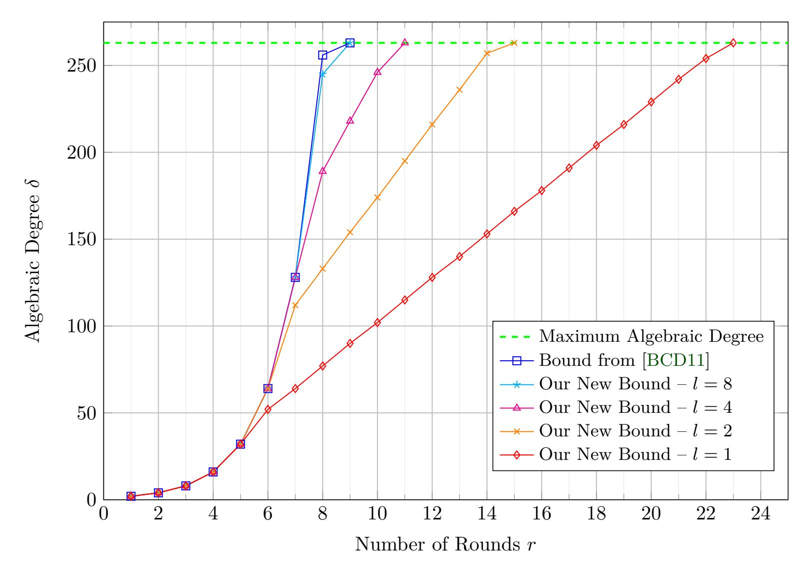
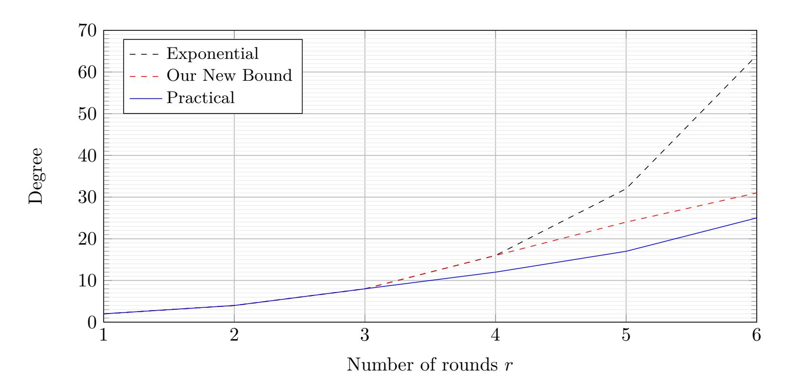
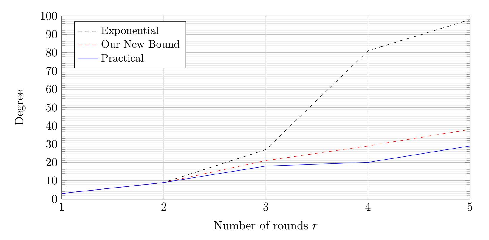
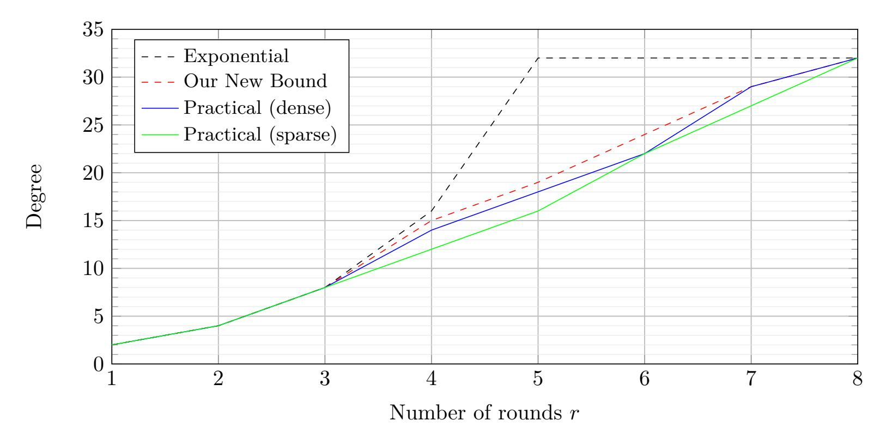

{0}------------------------------------------------

## Influence of the Linear Layer on the Algebraic **Degree in SP-Networks**

Carlos Cid<sup>1,4</sup>, Lorenzo Grassi<sup>2</sup>, Aldo Gunsing<sup>2</sup>, Reinhard Lüftenegger<sup>3</sup>, Christian Rechberger<sup>3</sup> and Markus Schofnegger<sup>3</sup>

```
<sup>1</sup> Information Security Group, Royal Holloway University of London,
                      Egham, United Kingdom
                      carlos.cid@rhul.ac.uk
```

<sup>2</sup> Digital Security Group, Radboud University, Nijmegen, Netherlands lgrassi@science.ru.nl, aldo.gunsing@ru.nl

firstname.lastname@iaik.tugraz.at

<sup>4</sup> Simula UiB, Bergen, Norway

**Abstract.** We consider SPN schemes, i.e., schemes whose non-linear layer is defined as the parallel application of  $t \geq 1$  independent S-Boxes over  $\mathbb{F}_{2^n}$  and whose linear layer is defined by the multiplication with a  $(n \cdot t) \times (n \cdot t)$  matrix over  $\mathbb{F}_2$ . Even if the algebraic representation of a scheme depends on all its components, upper bounds on the growth of the algebraic degree in the literature usually only consider the details of the non-linear layer. Hence a natural question arises: (how) do the details of the linear layer influence the growth of the algebraic degree? We show that the linear layer plays a crucial role in the growth of the algebraic degree and present a new upper bound on the algebraic degree in SP-networks. As main results, we prove that in the case of low-degree round functions with large S-Boxes: (a) an initial exponential growth of the algebraic degree can be followed by a linear growth until the maximum algebraic degree is reached; (b) the rate of the linear growth is proportional to the degree of the linear layer over  $\mathbb{F}_{2^n}^t$ . Besides providing a theoretical insight, our analysis is particularly relevant for assessing the security of cryptographic permutations designed to be competitive in applications like MPC, FHE, SNARKs, and STARKs, including permutations based on the Hades design strategy. We have verified our findings on small-scale instances and we have compared them against the currently best results in the literature, showing a substantial improvement of upper bounds on the algebraic degree in case of low-degree round functions with large S-Boxes.

#### 1 introduction

Most modern block ciphers and cryptographic permutations over  $\mathbb{F}_2^N$ , for  $N=n\cdot t$ are based on the iteration of a round function. In many cases, the round function is composed of two main components, a non-linear layer S and a linear layer M(including the addition of round constants). The non-linear layer S is defined as the parallel application of t independent non-linear functions over  $\mathbb{F}_2^n$ . The linear layer M is defined via the multiplication with a  $(n \cdot t) \times (n \cdot t)$  matrix over  $\mathbb{F}_2$ . This design strategy is called a Substitution-Permutation-Network (SPN).

The particular combination of these two building blocks, their details and the number of rounds are chosen to guarantee security against all possible means of analysis present in the literature, while at the same time achieving good performance in the target applications. Regarding the security aspect, the analysis of symmetric schemes can

<sup>&</sup>lt;sup>3</sup> Institute of Applied Information Processing and Communications, Graz University of Technology, Graz, Austria

{1}------------------------------------------------

be divided into statistical and algebraic cryptanalysis. Subsuming statistical analysis, we can identify all methods that exploit statistical properties of the analyzed scheme, including differential [BS91, BS93] and linear [Mat93] cryptanalysis, and all their variants, like truncated differential [Knu94], impossible differential [Knu98, BBS99] and zero-correlation [BR11] analysis. In contrast, algebraic analysis exploits algebraic properties of the analyzed schemes such as degrees and/or the different algebraic representations. In this category, we include interpolation cryptanalysis [JK97]. higher-order differential analysis [Lai94, Knu94], cube attacks[DS09] and methods employing Groebner bases [Buc76]. While the influence of the linear layer on statistical analysis has been largely analyzed in the literature |DR01, DR02a, BDKA21|, the same is not true for the case of algebraic analysis.

Influence of the Linear Layer on Statistical Analysis. For statistical analysis, the impact of the linear layer on the security against this means of analysis is well studied in the literature. If the linear layer of a scheme is defined by the multiplication with a  $t \times t$  matrix over  $\mathbb{F}_{2^n}$ , an upper bound of the probability of differential trails can be found by considering both the maximum differential probability of the involved S-Boxes (namely, the maximum probability that a non-zero input difference is mapped into an output difference) and the branch number of the linear layer (that is, the maximum number of active S-Boxes over two consecutive rounds). This is known as the wide-trail design strategy [DR01, DR02a]. Analogous results hold for the case of linear trails. If the linear layer does not admit an equivalent representation as a  $t \times t$ matrix over  $\mathbb{F}_{2^n}$ , statistical analysis that makes use of this alignment is frustrated after a few rounds, but, e.g., the wide trail design strategy does not apply anymore. In this scenario, differential/linear bounds are often obtained by computer-aided proofs.

**Influence of the Linear Layer on Algebraic Analysis.** Contrary to statistical analysis, the influence of the linear layer on the security against algebraic analysis is not well researched in the literature. Focusing on schemes over  $\mathbb{F}_2^N$ , let's consider, e.g., higher-order differential cryptanalysis [Lai94, Knu94], probably one of the most powerful cryptanalytic methods for symmetric primitives over  $\mathbb{F}_2^N$  with low-degree building blocks. Given an instance of a (keyed or keyless) cryptographic permutation  $P: \mathbb{F}_2^N \to \mathbb{F}_2^N$ , higher-order differential cryptanalysis exploits the fact that if the algebraic degree of P is strictly smaller than N-1 then for any (proper) vector subspace  $\mathcal{V}\subseteq \mathbb{F}_2^N$  with dimension strictly greater than the algebraic degree of Pand for any  $v \in \mathbb{F}_2^N$ , we have  $\bigoplus_{x \in \mathcal{V} \oplus v} P(x) = 0$ . Since the same property does not, in general, hold for a permutation drawn at random, it is possible to distinguish a given (keyed or keyless) permutation from a random permutation. The idea was first introduced by Lai [Lai94], albeit without a concrete application. Knudsen [Knu94] then used higher-order differentials to analyze low-degree ciphers which were deemed secure against standard differential cryptanalysis.

The crucial problem in higher-order differential distinguishers against iterated constructions is the analysis of the growth of the algebraic degree. Currently, the best generic upper bound for the growth of the algebraic degree is given in [BCD11], where authors upper bound the algebraic degree of the composition of two functions over  $\mathbb{F}_{2^n}^t$ . More recently, for the particular case in which the round function is defined as a low-degree polynomial over  $\mathbb{F}_{2^N}$ , a more accurate estimate on the minimum number of rounds to reach maximum algebraic degree has been proposed in [EGL<sup>+</sup>20]. However, in all these cases, the details of the linear layer are not taken into account.

**The Scope of our Results.** We pick up this problem, and we show how the details of the linear layer influence the growth of the algebraic degree in SPN schemes. As main results

• we generalize the upper bound given in [EGL<sup>+</sup>20] (only valid for Even–Mansour schemes, a subset of all SPN schemes) to the whole class of SPN schemes and 

{2}------------------------------------------------

prove a linear upper bound on the growth of the degree that improves the exponential one proposed in [BCD11];

• we analyze the impact of the linear layer on the growth of the degree. That is, we prove that the rate of the linear growth is proportional to the degree of the linear layer when written as a linear function over  $\mathbb{F}_{2^n}^t$ .

We point out that this is not only of theoretical interest. Indeed, motivated by new applications such as secure Multi-Party Computation (MPC), Fully Homomorphic Encryption (FHE) and Zero-Knowledge proofs (ZKP), the need for symmetric encryption schemes with a simple natural algebraic description has become ever more apparent. This is an active area of research, and many dedicated symmetric encryption schemes that aim for simple arithmetization or directly aim for a small number of multiplications in  $\mathbb{F}_{2^n}$  or  $\mathbb{F}_p$ , for large n and prime p (usually,  $2^n$ ,  $p \approx 2^{128}$ ), have recently been proposed in the literature. They include permutations, block ciphers, and hash functions such as MiMC [AGR<sup>+</sup>16, GRR<sup>+</sup>16], GMiMC [AGP<sup>+</sup>19]. HadesMiMC [GLR<sup>+</sup>20] (and its hash variant Poseidon [GKR<sup>+</sup>21]), Jarvis & Fri-DAY [AD18], VISION & RESCUE [AAB<sup>+</sup>20], and CIMINION [DGGK21]. Many of these proposed schemes use "algebraically simple" S-Boxes, e.g., based on a power mapping  $x \mapsto x^d$  for a small odd integer d > 3. In these schemes, our bounds are most competitive against other state-of-the-art bounds and, furthermore, they help to establish a more accurate estimate for the number of rounds that guarantee security in future MPC-/FHE-/ZKP-friendly designs.

**Nomenclature.** Since we do not make any assumption about the round-keys, our results equally apply to keyed and keyless permutations. Thus in this paper we refer to both by using the term "schemes". In this nomenclature, e.g., an *SPN scheme* is a family of permutations built from an SPN construction parametrized by secret keys or publicly known constants.

#### 1.1 Related Work in the Literature

We focus on *iterated* schemes, that is, schemes consisting of several iterations of the same round function. Algebraic analysis, like interpolation or higher-order differential and integral distinguishers, is based on bounding the (algebraic) degree of the analyzed scheme, which is in general a difficult task. Here, we recall the main results in the literature that focus on this problem. For a more detailed discussion and comparison of different approaches to bounding the algebraic degree we refer to [CXZZ21].

#### 1.1.1 Theoretical Bounds on the Algebraic Degree

A naive bound for the algebraic degree of the composition of two functions  $F,G: \mathbb{F}_2^N \to \mathbb{F}_2^N$  is given by  $\deg(G \circ F) \leq \deg(G) \cdot \deg(F)$ . If iterated, this bound leads to an exponential bound on the algebraic degree for the composition of more than two functions and a first estimate about the minimum number of rounds to reach maximum algebraic degree in SPN schemes. For an SPN scheme defined over  $\mathbb{F}_{2^n}^t$  with S-Box layer of algebraic degree  $\delta$ , it follows that at least

$$\log_{\delta}(n \cdot t - 1) \approx \log_{\delta}(n) + \log_{\delta}(t)$$

rounds are required to reach maximum degree (note that the affine layer does not increase the algebraic degree).

Result by Boura, Canteaut and De Cannière [BCD11]. The naive exponential bound, however, does not reflect the real growth of the algebraic degree when considering iterated schemes, and the problem of estimating the growth of the algebraic degree has therefore been studied in the literature. After the initial work of Canteaut and Videau [CV02], a tighter upper bound was presented by Boura, Canteaut, and De Cannière in [BCD11]. In there, the authors deduce a new bound

{3}------------------------------------------------

for the algebraic degree of iterated permutations for SPN schemes over  $\mathbb{F}_{2^n}^t$ , which includes functions that have a number of  $t \geq 1$  balanced S-Boxes over  $\mathbb{F}_{2^n}$  as their non-linear layer. The bound in [BCD11] only relies on the algebraic degree of the S-Box, and no assumption on the linear layer is made. To apply the result presented in [BCD11], one has to determine a particular parameter  $\gamma$ , that depends on the details of the S-Box. As we discuss in Section 4.1, for an S-Box over  $\mathbb{F}_{2^n}$  the cost for computing  $\gamma$  is exponential in n. This means, for large S-Boxes (e.g.,  $n \geq 64$ ) it is infeasible to determine  $\gamma$  computationally and a further study of the analyzed scheme is necessary. However, theoretically bounding  $\gamma$  is in general a difficult task. Apart from the bound of Boura, Canteaut and De Cannière, in a follow-up work Boura and Canteaut studied the influence of  $F^{-1}$  on the algebraic degree of  $\deg(G \circ F)$  [BC13]. As main result, they discuss how the algebraic degrees of  $F^{-1}$  and F affect each other, which subsequently allows them to bound the algebraic degree of  $G \circ F$  by means of the degrees of G and  $F^{-1}$ .

**Result by Carlet [Car20].** More recently, Carlet [Car20] presented a bound on the algebraic degree of  $G \circ F$  by working with the indicators of the graphs  $\mathcal{G}_F$  and  $\mathcal{G}_G$  (where  $\mathcal{G}_F = \{(x, F(x)) : x \in \mathbb{F}_2^N\}$ ). In this work, Carlet bounds the algebraic degree of  $G \circ F$  via the degree of G and the degree of the indicator function of  $\mathcal{G}_F$ . However, the bounds in [Car20] require evaluating the degree of large quantities of products of coordinate functions (see [Car20, Theorem 5]) and, to the best of our knowledge, it is unclear if the bounds in [Car20] practically improve upon the ones in [BCD11] if the function F in  $G \circ F$  is bijective. In this scenario, the deduced bound on the algebraic degree of  $G \circ F$  is essentially the same as in [BC13] (see discussion after Corollary 5 in [Car20]).

**Division Property.** A generalization of integral and higher-order differential distinguishers is the division property [Tod15], proposed by Todo at Eurocrypt 2015. Given  $u = (u_0, u_1, ..., u_{n-1}) \in \mathbb{F}_2^n$ , let  $x^u \coloneqq \prod_{i=0}^{n-1} x_i^{u_i}$  for each  $x \in \mathbb{F}_2^n$ . The division property generalizes integral cryptanalysis and higher-order differential distinguishers in the sense that it is interested in the sum of this quantity taken over all vectors of  $X \subseteq \mathbb{F}_2^n$ . To the best of our knowledge and at the current state of the art, the division property can only provide useful bounds on the algebraic degree for *small* n. Indeed, currently it is infeasible to apply the two-/three-subset bit-based division property [TM16, FTIM17, WHT<sup>+</sup>18, HSWW20] to large S-Boxes (i.e., of size bigger than 12 bits to the best of our knowledge). Hence, such a tool does not seem to be useful in the case of schemes defined over  $\mathbb{F}_{2^n}^t$  for large n (as targeted in this paper), and a theoretical estimation is hence crucial.

Algebraic Degree in MiMC-Like Schemes. MiMC [AGR<sup>+</sup>16, GRR<sup>+</sup>16] is a scheme natively defined over  $\mathbb{F}_{2^N}$ , where the S-Box is given by the cube function  $x\mapsto x^3$ . Only recently a new upper bound on the algebraic degree of MiMC-like schemes (that is, of schemes defined over  $\mathbb{F}_{2^N}$  via a round function of degree  $d\geq 3$ ) has been proposed in [EGL<sup>+</sup>20] at Asiacrypt 2020. More precisely, the authors show that when the round function can be described as a low-degree polynomial function over  $\mathbb{F}_{2^N}$  of degree at most d, the algebraic degree  $\delta(r)$  of r iterations of the round function grows linearly with the number of rounds, i.e.,  $\delta(r) \leq \log_2(d^r+1)$ . This observation implies that at least  $\log_d(2^{N-1}-1)$  rounds are required for reaching maximum algebraic degree. As a concrete application, [EGL<sup>+</sup>20] shows that the number of rounds in MiMC needs to be increased by several percent to resist all known cryptanalysis. Nevertheless, the authors of [EGL<sup>+</sup>20] do not provide any statements about how to generalize their findings to SPN schemes.

#### 1.2 Our Contribution

As main contribution, we present a new theoretical upper bound on the algebraic degree for SPN schemes over  $\mathbb{F}_{2^n}^t$  in Theorem 1. In more detail, we consider SPN

{4}------------------------------------------------

|                               | 1                                                                  |  |  |
|-------------------------------|--------------------------------------------------------------------|--|--|
| Parameter                     | Explanation                                                        |  |  |
| $\overline{\mathbb{F}_{2^n}}$ | Finite field with $2^n$ elements                                   |  |  |
| $\mathbb{F}_{2^n}^t$          | t-fold cartesian product of $\mathbb{F}_{2^n}$                     |  |  |
| n                             | S-Box size in bits                                                 |  |  |
| t                             | Number of words in the SPN                                         |  |  |
| $N := n \cdot t$              | State size in bits                                                 |  |  |
| d                             | Word-level degree (over $\mathbb{F}_{2^n}$ ) of the S-Boxes        |  |  |
| $\delta$                      | Algebraic degree (over $\mathbb{F}_2$ ) of the S-Boxes             |  |  |
| $l := 2^{l'}$                 | Degree of the linear layer (over $\mathbb{F}_{2^n}$ )              |  |  |
| d                             | Word-level degree (over $\mathbb{F}_{2^n}$ ) of the round function |  |  |

<span id="page-4-0"></span>Table 1: Nomenclature and parameters in our results for SPN schemes over  $\mathbb{F}_{2^n}^t$ 

schemes over  $\mathbb{F}_{2^n}^t$  for  $n \geq 3$  and  $t \geq 2$ , where

- the S-Boxes are defined via invertible non-linear polynomial functions over  $\mathbb{F}_{2^n}$  of univariate degree  $d \geq 3$  and algebraic degree  $\delta \geq 2$ ;
- the linear layer is defined as the multiplication with an invertible matrix in  $\mathbb{F}_2^{n \cdot t \times n \cdot t}$ . We denote by  $l = 2^{l'}$  the degree of the corresponding function over  $\mathbb{F}_{2^n}$ .

In Section 2.2 we give more details about the definition of an SPN scheme and the involved degrees  $\delta$ , d, l and d. As a quick reference, Table 1 provides a more comprehensive overview about the parameters in our results. In Theorem 1 we prove that the algebraic degree  $\delta(r)$  after r rounds is upper-bounded by

$$\delta(r) \le \begin{cases} \delta^r & \text{if } r \le R_{\exp} = 1 + \lfloor \log_{\delta}(t) \rfloor, \\ t \cdot \log_2\left(\frac{\mathrm{d}^{r-1} \cdot d}{t} + 1\right) & \text{if } R_{\exp} < r \le R_{\mathrm{SPN}}. \end{cases}$$
(1)

It follows that at least

$$R_{\rm SPN} = 1 + \lceil \log_{\rm d} \left( t \cdot (2^n - 1) - 2^{n-1} \right) - \log_{\rm d} (d) \rceil \approx \log_{\rm d} \left( t \cdot (2^n - 1) \right)$$

rounds are necessary to reach maximum algebraic degree  $n \cdot t - 1$ , see Section 3.1. Our results have been practically verified on small-scale schemes. Section 5 is devoted to a more detailed discussion of our practical experiments. Moreover, our results match the ones given in  $[EGL^+20]$  for the particular case t = 1.

Comparison with Related Work. As discussed above, there are two possible approaches for estimating the growth of the algebraic degree in SPN schemes: theoretical bounds, like the one by Boura, Canteaut and De Cannière [BCD11] and tool-based bounds, like the division property. However, both approaches have inherent limitations when applied to SPN schemes defined over  $\mathbb{F}_{2^n}^t$  for large n (as targeted in this paper and important for MPC-/FHE-/ZKP-friendly schemes): in the first approach, the degree of the S-Box over  $\mathbb{F}_{2^n}$  and the alignment of the scheme (hence, the degree of the linear layer over  $\mathbb{F}_{2^n}$ ) are not taken into account. While this could be an advantage in the sense that such results apply to a large class of schemes, the resulting estimation of the growth of the algebraic degree is far from being optimal when applied to schemes over  $\mathbb{F}_{2^n}^t$  with large and low-degree S-Boxes; in the second approach, the tools cannot tackle large S-Boxes (i.e.,  $n \geq 12$ ). Our new results include both scenarios.

A concrete comparison between our new bound on the algebraic degree and the one proposed in [BCD11] for an SPN scheme over  $\mathbb{F}^8_{2^{33}}$  with cube S-Box  $S(x) = x^3$  for several values of l is presented in Fig. 1.

{5}------------------------------------------------

<span id="page-5-0"></span>

Figure 1: Comparison between our new bound and the one proposed in [BCD11] for the case of an SPN scheme instantiated over  $(\mathbb{F}_{2^{33}})^8$  with a cube S-Box  $S(x) = x^3$  for several values of *l* (where n = 33, t = 8, d = 3,  $\delta = 2$  and  $d = d \cdot l = 3 \cdot l$ ,  $\gamma = (n + 1)/2 = 17$ ).  $\gamma$  is a constant for the bound in [BCD11] that depends on the details of the S-Box function S.

#### 2 **Preliminaries**

In this section, we recall the most important results about polynomial representations of Boolean functions and we recall the definition of SPN and iterated Even–Mansour schemes. We also introduce the classification of weak-arranged and strong-arranged SPN schemes.

#### 2.1 Polynomial Representations over Binary Extension Fields

We denote addition (and subtraction) in binary extension fields and polynomial rings over binary extension fields by the symbol  $\oplus$ . For  $n, t \in \mathbb{N}$ , every function  $F: \mathbb{F}_{2^n}^t \to \mathbb{F}_{2^n}$  can be uniquely represented by a polynomial over  $\mathbb{F}_{2^n}$  in t variables with maximum degree  $2^n - 1$  in each variable, i.e., as

$$F(X_1, \dots, X_t) = \bigoplus_{v = (v_1, \dots, v_t) \in \{0, 1, \dots, 2^n - 1\}^t} \varphi(v) \cdot X_1^{v_1} \cdot \dots \cdot X_t^{v_t}, \tag{2}$$

for certain  $\varphi(v) \in \mathbb{F}_{2^n}$ . We refer to this representation as the word-level representation. At the same time, the function F can be written as an n-tuple  $(F_1, \ldots, F_n)$  of functions  $F_i: \mathbb{F}_2^N \to \mathbb{F}_2$  and thus admits a unique representation as an *n*-tuple  $(F_1, \dots, F_n)$  of polynomials over  $\mathbb{F}_2$  in  $N := n \cdot t$  variables with maximum degree 1 in each variable. Here,  $F_i$  takes the form

<span id="page-5-1"></span>
$$F_i(Y_1, \dots, Y_N) = \bigoplus_{u = (u_1, \dots, u_N) \in \{0, 1\}^N} \rho_i(u) \cdot Y_1^{u_1} \cdot \dots \cdot Y_N^{u_N}, \tag{3}$$

where the coefficients  $\rho_i(u) \in \mathbb{F}_2$  can be computed by the *Moebius transform* with a time complexity of  $\mathcal{O}(N \cdot 2^N)$  additive operations. We call this alternative description 

{6}------------------------------------------------

the bit-level representation of F. Combining Equations (3), for  $1 \le i \le n$ , into a single polynomial representation leads to a description of F as a single polynomial in  $N = n \cdot t$  variables, but now with coefficients in  $\mathbb{F}_2^n$ , instead of  $\mathbb{F}_2$ .

Whenever we refer to the degree of a single variable in F (or  $F_i$ ), we shall speak of the univariate degree. In contrast, the degree of F (or  $F_i$ ) as a multivariate polynomial shall be called its multivariate degree, or just its degree. We denote functions  $F: \mathbb{F}_2^n \to \mathbb{F}_2$  as Boolean functions and hence functions of the form  $F: \mathbb{F}_2^n \to \mathbb{F}_2^n$ , for  $n \in \mathbb{N}$ , as vectorial Boolean functions. We only work with vectorial Boolean functions where n = m. The unique polynomial representation of a Boolean function is called its algebraic normal form (ANF), which we emphasize with the following definition.

**Definition 1.** Let  $F: \mathbb{F}_2^n \to \mathbb{F}_2$  be a Boolean function. The algebraic normal form (ANF) of F is the unique representation as a polynomial over  $\mathbb{F}_2$  in n variables and with maximum univariate degree 1, as given in Eq. (3). The algebraic degree  $\delta(F)$  of F is the degree of this representation as a multivariate polynomial over  $\mathbb{F}_2$ .

When the function F is clear from the context, we also write  $\delta$  instead of  $\delta(F)$ . If  $G: \mathbb{F}_2^n \to \mathbb{F}_2^n$  is a vectorial Boolean function and  $(G_1, \ldots, G_n)$  is its representation as an n-tuple of multivariate polynomials over  $\mathbb{F}_2$ , then its algebraic degree  $\delta(G)$  is defined as the maximal algebraic degree of its coordinate functions  $G_i$ , i.e., as  $\delta(G) = \max_{1 \leq i \leq n} \delta(G_i)$ . The link between the algebraic degree and the univariate degree of a vectorial Boolean function is well-known, e.g., it is established in [CCZ98, Sect. 2.2]: due to the isomorphism of  $\mathbb{F}_2$ -vector spaces  $\mathbb{F}_{2^n} \cong \mathbb{F}_2^n$ , every function over  $\mathbb{F}_2^n$  can be considered as a function over  $\mathbb{F}_{2^n}$  and thus admits a representation as a univariate polynomial over  $\mathbb{F}_{2^n}$ . Hence, the algebraic degree of a vectorial Boolean function can be computed from its univariate representation. Eq. (4) makes this link explicit: Let  $F: \mathbb{F}_{2^n} \to \mathbb{F}_{2^n}$  be a function over  $\mathbb{F}_{2^n}$  and let  $F(X) = \sum_{i=0}^{2^n-1} \varphi_i \cdot X^i$  denote the corresponding univariate polynomial description over  $\mathbb{F}_{2^n}$ . The algebraic degree  $\delta(F)$  of F as a vectorial Boolean function is the maximum over all Hamming weights of exponents of non-vanishing monomials, that is

<span id="page-6-1"></span>
$$\delta(F) = \max_{0 \le i \le 2^n - 1} \left\{ \text{hw}(i) \mid \varphi_i \ne 0 \right\}. \tag{4}$$

Lastly, we recall that the algebraic degree of an invertible function F over  $\mathbb{F}_2^n$  is at most n-1, while the univariate polynomial representation of F over  $\mathbb{F}_{2^n}$  has degree at most  $2^n-2$ .

#### <span id="page-6-0"></span>2.2 SPN Schemes

Here we recall the concept of SPN schemes, and we fix the notation used in the rest of the article. Let  $E_k^r : \mathbb{F}_{2^n}^t \to \mathbb{F}_{2^n}^t$  denote the application of r rounds of an SPN scheme under a fixed (secret or publicly known) key  $k \in \mathbb{F}_{2^n}^t$  with  $n \geq 3$ ,  $t \geq 2$ , and  $N := n \cdot t$ . For every  $x = (x_1, \ldots, x_t) \in \mathbb{F}_{2^n}^t$  we write

<span id="page-6-3"></span>
$$E_k^r(x) := (F_r \circ \dots \circ F_1) (x \oplus k_0), \tag{5}$$

where each  $F_i: \mathbb{F}_{2^n}^t \to \mathbb{F}_{2^n}^t$  is defined as  $F_i(x) := R(x) \oplus k_i$ . The subkeys  $k_0, \ldots, k_r \in \mathbb{F}_{2^n}^t$  may be derived from the master key  $k \in \mathbb{F}_{2^n}^t$  by means of a key schedule, or they may just as well be randomly chosen elements. Here, R denotes the composition of the S-Box and the linear layer, i.e., we have  $R: \mathbb{F}_{2^n}^t \to \mathbb{F}_{2^n}^t$  with

$$R(x) := (M \circ S)(x) := M(S_1(x_1), \dots, S_t(x_t)), \tag{6}$$

where all  $S_i : \mathbb{F}_{2^n} \to \mathbb{F}_{2^n}$  are assumed to be invertible non-linear polynomial S-Boxes of degree  $d \geq 3$  defined as

$$S_i(x) := \bigoplus_{j=0}^d c_j^{(i)} \cdot x^j, \tag{7}$$

<span id="page-6-2"></span>Given  $x = \sum_{i=0}^{s} x_i \cdot 2^i \in \mathbb{N}$ , for  $x_i \in \{0, 1\}$ , then  $hw(x) = \sum_{i=0}^{s} x_i$ .

{7}------------------------------------------------

$$M(x) = (M_1(x), M_2(x), \dots, M_t(x)),$$

where  $M_i: \mathbb{F}_{2^n}^t \to \mathbb{F}_{2^n}$ , for  $i \in \{1, 2, ..., t\}$ , is a function of the form

written as a function

<span id="page-7-0"></span>
$$M_i(x) = \bigoplus_{j=1}^t M_{i,j}(x_j) = \bigoplus_{h=0}^{l'} M_{i,j;h} \cdot x_j^{2^h},$$
 (8)

with  $M_{i,j;h} \in \mathbb{F}_{2^n}$  for each i, j, h. In other words, each  $M_{i,j}$  is a linearized polynomial over  $\mathbb{F}_{2^n}$  with respect to the variable  $x_j$ , and  $M_i$  is a sum of linearized polynomials over  $\mathbb{F}_{2^n}$ . In the following, we denote by  $l := 2^{l'}$  the degree of M as a function over  $\mathbb{F}_{2^n}^t$ , i.e.,

$$l \coloneqq \deg M \coloneqq \max_{1 \le i \le t} \deg(M_i) = \max_{1 \le i, j \le t} \deg(M_{i,j}),$$

and by d the degree of the round function satisfying  $2^{\delta} - 1 \le d := \min\{d \cdot l, 2^n - 2\}$ . We always assume that the linear layer M ensures full diffusion after a finite number of rounds, in the sense that there exists an  $r \in \mathbb{N}$  such that every output word after r rounds depends on every input word  $x_1, \ldots, x_t$ . E.g., the smallest integer r that satisfies the previous condition for an MDS matrix is 1, for the AES MixLayer it is 2, while it does not exist for a diagonal matrix. We refer to [BJK<sup>+</sup>16a, BJK<sup>+</sup>16b] for a more detailed analysis of this concept. A particular subclass of SPN schemes are iterated Even-Mansour schemes. An iterated Even-Mansour (EM) scheme is an SPN scheme with only one word, i.e., with t = 1.

Under above definition, examples of SPN schemes include SHARK [RDP<sup>+</sup>96], AES [DR02b] and AES-like schemes in general, SHA-3/Keccak [BDPA11, BDPA13], Present [BKL<sup>+</sup>07], MiMC [AGR<sup>+</sup>16], LowMC [ARS<sup>+</sup>15], and so on. Examples of non-SPN schemes include Feistel and Lai-Massey [LM90] schemes.

#### <span id="page-7-2"></span>2.2.1 Classification: Strong-Arranged vs. Weak-Arranged SPN Schemes

We recall that for each  $n, t \geq 1$ , every matrix in  $\mathbb{F}_{2^n}^{t \times t}$  admits an equivalent representation as a matrix in  $\mathbb{F}_2^{n \cdot t \times n \cdot t}$ , while the opposite does not hold in general. Let us introduce the following definition.

**Definition 2.** Let  $t \geq 2$  and let  $n \geq 3$ , and let  $M : \mathbb{F}_{2^n}^t \to \mathbb{F}_{2^n}^t$  be an invertible  $\mathbb{F}_{2^n}$ -linear function, represented as in Eq. (8). We say that M is (n,t)-reducible if there exist invertible  $\mathbb{F}_{2^n}$ -linear functions  $M', L_1, L_2 : \mathbb{F}_{2^n}^t \to \mathbb{F}_{2^n}^t$  with  $L_1, L_2 \neq M$ ,  $\deg(M') < \deg(M)$  such that for i = 1, 2 it holds

$$L_i(x_1,\ldots,x_t) = (L_{i,1}(x_1),\ldots,L_{i,t}(x_t))$$

and

<span id="page-7-1"></span>
$$M = L_1 \circ M' \circ L_2. \tag{9}$$

We note,  $deg(L_1)$ ,  $deg(L_2)$  are the degrees of  $L_1, L_2$  when represented as in Eq. (8). If M is not (n, t)-reducible, we call it (n, t)-irreducible.

With the requirement deg(M') < deg(M) we want to exclude trivial decompositions with  $M' = L_1^{-1} \circ M \circ L_2^{-1}$ , for any linear functions  $L_1, L_2 : \mathbb{F}_{2^n}^t \to \mathbb{F}_{2^n}^t$ . The same remark applies for the condition  $L_1, L_2 \neq M$ . Thereby, we exclude decompositions with  $L_1 = M$  and M' = Id (Id being the identity function). We often just say that M is (ir)reducible instead of (n, t)-(ir)reducible, the context will provide enough clarification. Every SPN scheme admits an equivalent representation in which the defining matrix M for the linear layer is irreducible. Indeed, if this is not the case, it is sufficient to incorporate  $L_1$  and  $L_2$  from Eq. (9) into the non-linear layer S, that is

$$S \leftarrow L_2 \circ S \circ L_1, \tag{10}$$

{8}------------------------------------------------

and to adjust the round constants. We point out that this procedure may change the degrees d and l, but not the degree d of the round function.

As a concrete example, consider the AES. Its S-Box over  $\mathbb{F}_{2^8}$  is defined as

$$x \mapsto c + \hat{L} \circ x^{-1} = c + \hat{L} \circ (x^{127})^2,$$

for a certain linear function  $\hat{L}$  over  $\mathbb{F}_{2^8}$  of degree strictly bigger than 1. In the equivalent representation in which  $\hat{L}$  and  $x \mapsto x^2$  would be incorporated in the linear layer of AES (and so the AES S-Box would be  $x \mapsto x^{127}$  over  $\mathbb{F}_{2^8}$ ), the obtained linear layer would not be irreducible anymore with respect to the definition just given. Motivated by above discussion, we can assume that the linear layer M in an SPN scheme over  $\mathbb{F}_{2^n}^t$  is (n,t)-irreducible.

**Definition 3.** Let  $E^r : \mathbb{F}_{2^n}^t \to \mathbb{F}_{2^n}^t$  be an r-round SPN scheme with (n, t)-irreducible linear layer M (otherwise, consider an equivalent representation of  $E^r$  in which M is irreducible). The SPN scheme is called strong-arranged if the linear layer M has degree 1 over  $\mathbb{F}_{2^n}^t$ ; weak-arranged otherwise.

Among the previous examples, AES, MiMC, HadesMiMC, and VISION are strong-arranged SPNs, while Keccak, Present and LowMC are weak-arranged SPNs.

On the Degree of the Linearized Polynomial. Given a matrix  $M \in \mathbb{F}_2^{(n \cdot t) \times (n \cdot t)}$ , the naive way to find its polynomial representation over  $\mathbb{F}_{2^n}$  is by interpolation. The polynomial  $M_{i,j}$  contains only n different monomials (see Eq. (8)). Hence,  $t \cdot n + 1$  input/output pairs suffice to recover the polynomial representation of each  $M_i$ , and thus M. Moreover, given the polynomial representation of an  $\mathbb{F}_{2^n}$ -linear function over  $\mathbb{F}_{2^n}^t$  (as in Eq. (8)), the simplest possible way to check if it is invertible or not is by finding the corresponding matrix over  $\mathbb{F}_2^{(n \cdot t) \times (n \cdot t)}$ , and check if its determinant is non-zero.

## <span id="page-8-1"></span>3 Growth of the Algebraic Degree in SPN Schemes

In this section we prove a new upper bound on the growth of the algebraic degree in SPN schemes. Our proof proceeds analogously for SPN-derived block ciphers and permutations, respectively, by assuming fixed and publicly known constants in the latter case and fixed secret keys in the former one.

## <span id="page-8-0"></span>3.1 Minimum Number of Rounds for Preventing Higher-Order Differential Distinguishers

Here, we provide a minimum number of rounds to reach maximum algebraic degree in SPN schemes. We show that this number matches the minimum number of rounds needed to provide security against the interpolation analysis [JK97].

**Proposition 1.** Let  $n \geq 3$ . Consider r rounds of an SPN scheme  $E_k^r$  over  $\mathbb{F}_{2^n}^t$  as defined in Eq. (5), where  $l = 2^{l'} \geq 1$  is the degree of the linear layer and with the additional assumption that all S-Boxes  $S_1, \ldots, S_t$  are defined via non-linear polynomial functions with equal univariate degree  $d \geq 3$ . Let d be the degree of the round function. A lower bound on the number of rounds to prevent higher-order differential distinguishers is given by

$$\mathcal{R}_{SPN} := 1 + \lceil \log_{d} \left( t \cdot (2^{n} - 1) - 2^{n-1} \right) - \log_{d}(d) \rceil, \tag{11}$$

independent of the (secret or publicly known) key k.

Note that

$$\mathcal{R}_{SPN} \approx \log_{d}(2^{n} - 1) + \log_{d}(t), \tag{12}$$

especially for  $t, n \gg 1$  and small  $d \geq 3$  (where  $\log_{d}(d) = 1$  if l = 1 and  $0 < \log_{d}(d) < 1$  otherwise).

{9}------------------------------------------------

Proof. To reach maximum algebraic degree  $n \cdot t - 1$  the polynomial representation of  $E_k^r$  over  $\mathbb{F}_{2^n}$  must contain a monomial with algebraic degree n in t-1 variables and algebraic degree n-1 in one variable. This happens if  $E_k^r$  contains a word-level monomial with univariate degree  $2^n - 1$  in t-1 variables and univariate degree  $2^{n-1} - 1$  in one variable. Since the multivariate degree of  $E_k^r$  after  $r \geq 1$  rounds is upper bounded by  $d^{r-1} \cdot d$  (we note, the final linear layer does not affect the algebraic degree), we obtain

$$d^{r-1} \cdot d \ge (t-1) \cdot (2^n - 1) + 2^{n-1} - 1 = t \cdot (2^n - 1) - 2^{n-1}$$

as a necessary condition on the number of rounds to reach maximum algebraic degree  $n \cdot t - 1$ . Rearranging for r yields  $r \ge 1 + \log_{d} \left( t \cdot (2^{n} - 1) - 2^{n-1} \right) - \log_{d}(d)$ .

#### 3.2 Algebraic Degree of SPN Schemes

As main result of this paper, we prove the following upper bound on the growth of the degree for SPN schemes.

<span id="page-9-0"></span>**Theorem 1.** Let  $n \geq 3$  and  $t \geq 1$ . Consider r rounds of an SPN scheme  $E_k^r$  over  $\mathbb{F}_{2^n}^t$  as defined in Eq. (5), where  $l = 2^{l'} \geq 1$  is the degree of the linear layer and with the additional assumption that all S-Boxes  $S_1, \ldots, S_t$  are defined via the same invertible non-linear function S of univariate degree  $d \geq 3$  and algebraic degree  $\delta \geq 2$ . Let d be the degree of the round function.

Let  $R_{exp} := 1 + \lfloor \log_{\delta}(t) \rfloor$ . Then, the algebraic degree of  $E_k^r$  after r rounds, denoted by  $\delta(r)$ , is upper-bounded by

$$\delta(r) \le \begin{cases} \delta^r & \text{if } r \le R_{exp}, \\ \min\left\{\delta^r, \ t \cdot \log_2\left(\frac{d^{r-1} \cdot d}{t} + 1\right)\right\} & \text{if } r > R_{exp}, \end{cases}$$
(13)

independent of the (secret or publicly known) key k and until the maximum algebraic degree  $n \cdot t - 1$  is reached.

This means that after an initial exponential growth for the first  $R_{\exp} := 1 + \lfloor \log_{\delta}(t) \rfloor$  rounds, the growth of the degree is upper bounded by a linear growth of the form

$$t \cdot \log_2 \left( \frac{\mathrm{d}^{r-1} \cdot d}{t} + 1 \right) \approx r \cdot t \cdot \log_2(\mathrm{d}) + t \cdot \log_2 \left( \frac{d}{\mathrm{d} \cdot t} \right) ,$$

where the linear rate  $t \cdot \log_2(d)$  is proportional to the number of words t and to the degree d of the round function, which is related to the degrees d and l of the S-Boxes and of the linear layer over  $\mathbb{F}_{2^n}$ .

**Idea of the proof.** The roadmap for the proof of Theorem 1 reads as follows:

- 1. Lemma 1 makes a statement about which monomials can occur in the polynomial representation of the encryption function;
- 2. In Lemma 2 we prove that the algebraic degree grows as fast as  $\delta^r$  in the first  $R_{\text{exp}} := 1 + \lfloor \log_{\delta}(t) \rfloor$  rounds; this shows that the naive exponential bound can indeed be achieved;
- 3. Lemma 3 provides the linear growth for the latter rounds by involving the logarithmic function instead of the hamming weights, resulting in the bound  $\delta(r) \leq t \cdot \log_2 \left( \frac{\mathrm{d}^{r-1} \cdot d}{t} + 1 \right)$ .

#### 3.3 Proof of Theorem 1

#### 3.3.1 About the (Initial) Exponential Growth

<span id="page-9-1"></span>**Lemma 1.** Let  $t \geq 1$  and let  $d' \geq 3$  be an integer and let  $d' = \sum_{i=1}^{\delta} 2^{d_i}$  be the base-2 expansion of d for certain  $d_i \in \mathbb{N}$ . Given a polynomial  $P = \bigoplus_{i \in \{1, ..., u\}} c_i \cdot m_i \in \mathbb{N}$ 

{10}------------------------------------------------

 $\mathbb{F}_{2^n}[X_1,\ldots,X_t]$  that contains the monomials  $m_1,m_2,\ldots,m_u\in\mathbb{F}_{2^n}[X_1,\ldots,X_t]$  for a certain  $u\geq 1$ , the monomials in  $P^{d'}$  are of the form

<span id="page-10-1"></span>
$$m_{i_1}^{2^{d_1}} \cdot m_{i_2}^{2^{d_2}} \cdot \dots \cdot m_{i_{\delta}}^{2^{d_{\delta}}}$$
 (14)

where  $i_1, i_2, \dots, i_{\delta} \in \{1, 2, \dots, u\}$ .

*Proof.* We obtain

$$P^{d'} = \left(\bigoplus_{i \in \{1, \dots, u\}} c_i \cdot m_i\right)^{2^{d_1} + \dots + 2^{d_\delta}} = \prod_{j=1}^{\delta} \left(\bigoplus_{i \in \{1, \dots, u\}} c_i^{2^{d_j}} \cdot m_i^{2^{d_j}}\right)$$
$$= \bigoplus_{i_1, i_2, \dots, i_\delta \in \{1, 2, \dots, u\}} \left(\prod_{j=1}^{\delta} c_{i_j}^{2^{d_j}} \cdot m_{i_j}^{2^{d_j}}\right).$$

where the second equality holds since  $(x \oplus y)^{2^k} = x^{2^k} \oplus y^{2^k}$  for each  $x, y \in \mathbb{F}_{2^n}$  and each  $k \in \mathbb{N}$ . Hence, we conclude that only monomial products of the form

$$m_{i_1}^{2^{d_1}} \cdot m_{i_2}^{2^{d_2}} \cdot \ldots \cdot m_{i_{\delta}}^{2^{d_{\delta}}}$$

may occur in  $P^d$ , where  $i_1, i_2, \ldots, i_{\delta} \in \{1, 2, \ldots, u\}$ . The monomials  $m_{i_1}, \ldots, m_{i_{\delta}}$  are not necessarily different, therefore the exponents in Eq. (14) are either powers of 2 or sums of powers of 2.

The next lemma shows that the naive exponential bound  $\delta^r$  for the algebraic degree is not only a trivial bound but can indeed be achieved.

<span id="page-10-0"></span>**Lemma 2.** Let the same conditions as in Theorem 1 hold. Furthermore, let  $S(x) = \sum_{i=0}^{d} c_i \cdot x^i$  for  $c_i \in \mathbb{F}_{2^n}$ , and let d' be a degree for which  $hw(d') = \delta$  and  $c_{d'} \neq 0$ . Let  $d' = \sum_{i=1}^{\delta} 2^{d_i}$  be the base-2 expansion of d' for appropriate  $d_i \in \mathbb{N}$ . In the first  $R_{exp} = 1 + \lfloor \log_{\delta}(t) \rfloor$  rounds the algebraic degree grows as fast as  $\delta^r$ .

*Proof.* The idea is to observe the growth of the algebraic degree with the help of Lemma 1. After the first round, all monomials  $X_1^{d'}, \ldots, X_t^{d'}$  are present in the polynomial representation of  $E_k^r$  and have algebraic degree  $\delta$ .

According to Lemma 1, after one more round all monomials of the form  $(i_1, \ldots, i_{\delta} \in \{1, \ldots, t\})$ 

$$(X_{i_1}^{d'})^{2^{d_1}} \cdot (X_{i_2}^{d'})^{2^{d_2}} \cdot \cdots \cdot (X_{i_\delta}^{d'})^{2^{d_\delta}},$$

are present in the encryption polynomial and have algebraic degree  $\delta^2$  if  $i_1, \ldots, i_{\delta}$  are pairwise different. To see why they have algebraic degree  $\delta^2$ , we note that: (a) raising a (word-level) monomial of  $E_k^r$  to the power of  $2^k$ ,  $k \in \mathbb{N}$ , does not change its algebraic degree, and (b) if two (word-level) monomials  $m_{\alpha_1}, m_{\alpha_2}$  of  $E_k^r$  do not contain any shared variable, the algebraic degree of the product  $m_{\alpha_1} \cdot m_{\alpha_2}$  is the sum of the respective algebraic degrees.

In the same way as before, after another round, all monomials of the form  $(i_1, \ldots, i_{\delta^2} \in \{1, \ldots, t\})$ 

$$(X_{i_1}^{d'\cdot 2^{d_1}}\cdots X_{i_{\delta}}^{d'\cdot 2^{d_{\delta}}})^{2^{d_1}}(X_{i_{\delta+1}}^{d'\cdot 2^{d_1}}\cdots X_{i_{2\delta}}^{d'\cdot 2^{d_{\delta}}})^{2^{d_2}}\cdots (X_{i_{\delta^2-(\delta-1)}}^{d'\cdot 2^{d_1}}\cdots X_{i_{\delta^2}}^{d'\cdot 2^{d_{\delta}}})^{2^{d_{\delta}}}$$

appear in the encryption polynomial and have algebraic degree  $\delta^3$  if  $i_1,\ldots,i_{\delta^2}$  are pairwise different. Continuing this way, we conclude that the algebraic degree grows as fast as  $\delta^r$  until all t variables are exhausted, i.e., until  $\delta^r = \delta \cdot t$ , or equivalently, for the first  $\lfloor \log_{\delta}(\delta \cdot t) \rfloor = 1 + \lfloor \log_{\delta}(t) \rfloor$  rounds.

{11}------------------------------------------------

#### 3.3.2 About the Linear Growth

<span id="page-11-0"></span>**Lemma 3.** Let the same conditions as in Theorem 1 hold. Then, the algebraic degree of  $E_k^r$  after r rounds, denoted by  $\delta(r)$ , is upper-bounded by

$$\delta(r) \le t \cdot \log_2 \left( \frac{\mathrm{d}^{r-1} \cdot d}{t} + 1 \right). \tag{15}$$

*Proof.* Since the word-level degree of a single output word of  $E_k^r$  after r rounds is upper bounded by  $d^{r-1} \cdot d$  (we note, the final linear layer does not affect the algebraic degree) the algebraic degree  $\delta(r)$  of  $E_k^r$  after r rounds can be upper bounded by

$$\delta(r) \le \max_{\{(e_1, \dots, e_t) \in \mathbb{N}^t : \sum_{i=1}^t e_i \le d^{r-1} \cdot d\}} \sum_{i=1}^t \text{hw}(e_i),$$

where we use the fact that the algebraic degree of a monomial  $X_1^{e_1} \cdot \ldots \cdot X_t^{e_t}$  is given by  $\sum_{i=1}^t \text{hw}(e_i)$ .

Let  $(e_1, \ldots, e_t) \in \mathbb{N}^t$  be arbitrary with  $\sum_{i=1}^t e_i \leq d^{r-1} \cdot d$ . We observe that  $2^w - 1$  is the smallest number with hamming weight  $w \in \mathbb{N}$ . This means that  $2^{\text{hw}(e_i)} - 1 \leq e_i$ , hence  $\text{hw}(e_i) \leq \log_2(e_i + 1)$  and

$$\sum_{i=1}^{t} hw(e_i) \le \sum_{i=1}^{t} \log_2(e_i + 1).$$

Let  $(e_1, \ldots, e_t) \in \mathbb{N}^t$  such that  $\sum_{i=1}^t e_i \leq d^{r-1} \cdot d$ . The logarithm is concave, which means that

$$a \cdot \log_2(x) + (1 - a) \cdot \log_2(y) \le \log_2(a \cdot x + (1 - a) \cdot y)$$

for  $a \in [0,1]$ . This is commonly generalized by induction to

$$\sum_{i=1}^{t} a_i \cdot \log_2(x_i) \le \log_2\left(\sum_{i=1}^{t} a_i \cdot x_i\right)$$

whenever  $\sum_{i=1}^{t} a_i = 1$  and  $a_i \in [0,1]$  for all i. Therefore

$$\sum_{i=1}^{t} \log_2(e_i + 1) = t \cdot \sum_{i=1}^{t} \frac{1}{t} \log_2(e_i + 1)$$

$$\leq t \cdot \log_2\left(\sum_{i=1}^{t} \frac{e_i + 1}{t}\right) \leq t \cdot \log_2\left(\frac{\mathbf{d}^{r-1} \cdot d}{t} + 1\right),$$

where the last inequality holds because  $\sum_{i=1}^{t} e_i \leq d^{r-1} \cdot d$  and the fact that the logarithm is an increasing function. Combining this with the initial equation results in the desired

$$\delta(r) \le t \cdot \log_2 \left( \frac{\mathrm{d}^{r-1} \cdot d}{t} + 1 \right).$$

#### 3.4 Discussion of Theorem 1

Forward versus Backward Direction. As originally proved in Corollary 3 of [BC13], given a fixed key k, the algebraic degrees of  $E_k^r$  and its compositional inverse  $E_k^{-r}$  are related in a particular way: the algebraic degree of  $E_k^r$  is maximal (i.e.  $n \cdot t - 1$ ) if and only if the algebraic degree of  $E_k^{-r}$  is maximal. As an immediate consequence we state the following observation: the number of rounds to reach maximal algebraic degree in the forward and in the backward direction is the same. This fact is particularly surprising if one direction of an SPN scheme is defined via low-degree S-Boxes, while the inverse direction is built from S-Boxes of high degree. For example, for the S-Box function  $S(x) = x^3$  over  $\mathbb{F}_{2^n}$  the inverse function is given by  $S^{-1}(x) = x^{(2^{n+1}-1)/3}$ . Here, S has algebraic degree 2, while  $S^{-1}$  has algebraic degree (n+1)/2.

{12}------------------------------------------------

Remarks on implicit assumptions. According to the remark about the connection of forward and backward direction below, it suffices to focus only on one direction of the scheme when attempting to reach maximal algebraic degree. We focus on the forward direction. Furthermore, our analysis is independent of the concrete instantiation of the linear layer, besides assuming it is invertible and it ensures full diffusion after a finite number of rounds. Implicitly, our proof assumes the strongest possible linear layer, i.e., a linear layer that guarantees full diffusion after one round and whose corresponding linearized polynomial is full. Therefore, depending on the instantiation of the linear layer, the algebraic degree might grow slower than we predict, but never faster. Theorem 1 can easily be generalized to the case in which the S-Boxes are defined via different invertible functions, under the assumption that they all have the same univariate degree d and the same algebraic degree  $\delta$ .

**Relation to Iterated Even–Mansour Schemes.** The authors of [EGL<sup>+</sup>20] state in Section 3.3 that for an iterated Even–Mansour scheme whose round function can be described by a low-degree polynomial that

```
"[...] if the round function can be described by a polynomial of low univariate degree d over \mathbb{F}_{2^n}, we expect a linear behavior in [the algebraic degree] \delta_{lin}(r): \delta_{lin}(r) \leq \lfloor \log_2(d^r + 1) \rfloor \approx r \cdot \log_2(d)".
```

However, no formal proof of this expectation is given in [EGL<sup>+</sup>20]. Our Theorem 1 comprises this situation as special case t = 1 and l = 1; thus we not only prove but also generalize the result in [EGL<sup>+</sup>20]. Indeed, in Theorem 1 the case t = l = 1 corresponds to iterated Even–Mansour schemes and hence the algebraic degree  $\delta(r)$  after r rounds is upper bounded by  $\log_2(d^r + 1)$ .

Comparison with Interpolation Analysis. The previous bound on the necessary number of rounds matches the number of rounds needed to guarantee security against the interpolation analysis [JK97] introduced by Jakobsen and Knudsen at FSE 1997. The goal of an interpolation analysis is to construct the polynomial that describes the encryption or decryption function. Hence, if the number of monomials is too large, such a polynomial cannot be constructed faster than via a brute force search. Since the number of monomials can be estimated by means of the given the degree of the function, the designers must guarantee that the polynomial that represents the scheme is of maximum degree and full (or at least dense) to guarantee security against this type of cryptanalysis.

# 4 Comparison of Theorem 1 with the Results in [BCD11]

#### <span id="page-12-0"></span>4.1 Iterative Application of the Bound in [BCD11]

The bounds on the algebraic degree in [BCD11] are stated for the composition of two functions which means that the application to iterated SPN schemes (which often comprise the composition of several dozen functions) requires an ad-hoc analysis of the analyzed scheme. Here, we first provide a closed formula for the bound in [BCD11, Theorem 2] when extended to the composition of more than two functions, which provides the basis for our comparisons in Section 5.

The bound given by Boura, Canteaut, and De Cannière in [BCD11, Theorem 2] states the following: Let F be a function from  $\mathbb{F}_2^N$  to  $\mathbb{F}_2^N$  corresponding to the concatenation of t smaller balanced<sup>2</sup> S-Boxes  $S_1, \ldots, S_t$  defined over  $\mathbb{F}_2^n$ . Then, for any function G from  $\mathbb{F}_2^N$  to  $\mathbb{F}_2^N$ , it holds

<span id="page-12-2"></span>
$$\deg(G \circ F) \le N - \frac{N - \deg(G)}{\gamma},\tag{16}$$

<span id="page-12-1"></span>

{13}------------------------------------------------

where

<span id="page-13-2"></span>
$$\gamma \coloneqq \max_{i=1,\dots,n-1} \frac{n-i}{n-\delta_i} \le n-1,\tag{17}$$

and  $\delta_i$  is defined as the maximal algebraic degree of the product of any *i* coordinates of any of the smaller S-Boxes.

We emphasize that  $\gamma$  and  $\delta_i$  depend on the details of the S-Box. Namely, two S-Boxes with the same algebraic degree can have in general different  $\gamma$ . The result in [BC13, Theorem 2] uses the algebraic degree of the compositional inverses  $S_j^{-1}$ ,  $1 \leq j \leq t$ , for a bound on the algebraic degree of  $G \circ F$ . Under the same assumptions as above this result leads to the same bound as stated in Eq. (16), with the additional upper bound on  $\gamma$ 

<span id="page-13-0"></span>
$$\gamma \le \max_{1 \le j \le t} \max \left\{ \frac{n-1}{n - \deg(S_j)}, \ \frac{n}{2} - 1, \ \deg\left(S_j^{-1}\right) \right\}. \tag{18}$$

Using an upper bound on  $\gamma$  for bounding the algebraic degree of  $G \circ F$  in Eq. (16) could lead to a less tight bound on  $\deg(G \circ F)$  than using the exact value of  $\gamma$ . However, Eq. (18) has the advantage that it only uses known facts about the involved functions and thus a bound on  $\deg(G \circ F)$  can be computed straight away. The same remark applies to another bound in [BC13, Corollary 2], which works with the algebraic degree of  $F^{-1}$  and is given by

$$\deg(G \circ F) < N - \left| \frac{N - 1 - \deg(G)}{\deg(F^{-1})} \right|.$$

In Proposition 2, we derive a *direct* upper bound of the algebraic degree of SPN schemes in the simple but most common case where all S-Boxes are equal. With "direct" upper bound we mean that we iteratively apply (16) to the round functions of an SPN scheme and thus obtain a closed-form statement about the algebraic degree after a certain number of rounds (and not only for the composition of two functions as stated in [BCD11]).

<span id="page-13-1"></span>**Proposition 2.** Let F be a function from  $\mathbb{F}_2^N$  to  $\mathbb{F}_2^N$  corresponding to the concatenation of t copies of a balanced S-Box S over  $\mathbb{F}_{2^n}$  with algebraic degree  $\delta \geq 2$ . For any affine functions  $L_1, L_2, \ldots, L_r$  from  $\mathbb{F}_2^N$  to  $\mathbb{F}_2^N$  and any integer  $r \geq 1$  consider the SPN scheme  $E_r$  from  $\mathbb{F}_2^N$  to  $\mathbb{F}_2^N$  defined as

$$E_r := L_r \circ F \circ L_{r-1} \circ F \circ \cdots \circ L_1 \circ F.$$

Then the algebraic degree  $\delta(r)$  of E after r rounds is upper-bounded by

$$\delta(r) \le \begin{cases} \delta^{r} & \text{if } r \le R_{0} := \left\lfloor \log_{\delta} \left( N \cdot \frac{\gamma - 1}{\gamma \cdot \delta - 1} \right) \right\rfloor, \\ \frac{\delta^{R_{0}}}{\gamma^{r - R_{0}}} + N \cdot \left( 1 - \frac{1}{\gamma^{r - R_{0}}} \right) & \text{if } R_{0} < r \le \mathcal{R}_{[BCD11]}, \end{cases}$$
(19)

independent of the (secret or publicly known) key k, where

$$\mathcal{R}_{[BCD11]} := \underbrace{\left\lfloor \log_{\delta} \left( N \cdot \frac{\gamma - 1}{\gamma \cdot \delta - 1} \right) \right\rfloor}_{=R_{0}} + \left\lceil \log_{\gamma} \left( N - \delta^{R_{0}} \right) \right\rceil \tag{20}$$

is the minimum number of rounds for security against higher-order differential distinguishers and where  $\gamma$  is defined as in Eq. (17).

The proof of Proposition 2 can be found in Appendix A. The strategy we adopt to prove Proposition 2 is similar to the one proposed by Biryukov, Khovratovich, and Perrin [BKP16]. In there, authors focused on the case in which all S-Boxes have maximum algebraic degree  $\delta = n - 1$ , while here we do not need this restriction. We point out one more time that the details of the linear layer are not taken into account and do not influence the bound just given.

{14}------------------------------------------------

**Cost of Computing**  $\gamma$ . The growth of the degree predicted in (16) depends on the value of  $\gamma$ . Computing  $\gamma$  can be very expensive for large S-Boxes. Indeed, one has to consider all possible combinations of the product of any i coordinates of the given S-Boxes, which implies a lower bound on the cost of order

$$\Omega\left(\sum_{i=1}^{n} \binom{n}{i}\right) \approx \Omega(2^{n}).$$

In the case in which t different S-Boxes are used, the previous cost must be multiplied by t. This means that for large S-Boxes (e.g.,  $n \ge 64$ ) it is infeasible to determine  $\gamma$  computationally and a further analysis of the scheme is necessary. Our results in Section 3 do not have this limitation. They depend on known parameters of the scheme and can be computed straight away.

#### 4.2 Comparison and Impact of the Linear Layer

**Comparison.** For a better insight when the bound  $\mathcal{R}_{SPN}$  improves upon the one given by  $\mathcal{R}_{[BCD11]}$  we ask the following question: For which values of n, t, d, l and  $\delta$  is

$$\mathcal{R}_{\mathrm{SPN}} \geq \mathcal{R}_{\mathrm{[BCD11]}}$$

satisfied? Substituting the corresponding expressions we obtain the following inequality

$$1 + \log_{d} (t \cdot (2^{n} - 1)) - \log_{d}(d) \ge \left\lfloor \log_{\delta} \left( N \cdot \frac{\gamma - 1}{\gamma \cdot \delta - 1} \right) \right\rfloor + \left\lceil \log_{\gamma} \left( N \cdot \frac{\gamma \cdot (\delta - 1)}{\gamma \cdot \delta - 1} \right) \right\rceil.$$

Using the relations  $\gamma \cdot \delta - 1 \ge \gamma - 1$  and  $\gamma \cdot \delta - 1 \ge \delta - 1$  (note that  $\delta \ge 2$ ), an upper bound for  $\mathcal{R}_{[BCD11]}$  is given by

$$\mathcal{R}_{[\mathrm{BCD11}]} \le 1 + \lfloor \log_{\delta}(N) \rfloor + \lceil \log_{\gamma}(N) \rceil \le 1 + \lceil \log_{\delta}(N) \rceil + \lceil \log_{2}(N) \rceil.$$

Focusing on the case  $n \gg 1$ , the condition  $\mathcal{R}_{SPN} \geq \mathcal{R}_{[BCD11]}$  is satisfied if (approximately)

$$1 + \log_{d} (t \cdot (2^{n} - 1)) - \log_{d}(d) \approx n \cdot \log_{d}(2) + \log_{d}(t) \ge 1 + \log_{\delta}(n \cdot t) + \log_{2}(n \cdot t),$$
 or to put it another way, if

$$\underbrace{n \cdot \log_{\mathrm{d}}(2) + \log_{\mathrm{d}}(t)}_{\in \mathcal{O}(n)} \ge \underbrace{\left(\log_2(n) + \log_2(t)\right) \cdot \left(1 + \log_{\delta}(2)\right) + 1}_{\in \mathcal{O}(\log_2(n))}. \tag{21}$$

It is easy to see that for any fixed values of d,  $\delta$ , l and t, the previous inequality can be satisfied if n is large enough.

Impact of the Linear Layer. According to Theorem 1, after an exponential growth, the algebraic degree grows at most linearly with a rate equal to  $t \cdot \log_2(d)$ . If l = 1 (and thus d = d) the degree l of the linear layer does not influence the algebraic degree. However, if  $l \geq 2$ , the initial exponential growth can take place for more than  $R_{exp}$ ; as an extreme case, if l is close to its maximum possible value  $2^{n-1}$ , the linear growth may never occur. A concrete example of these facts is given in Fig. 1. Concluding, the details of the linear layer play a crucial role in the growth of the (algebraic) degree.

#### <span id="page-14-0"></span>5 Practical Results

In this section, we present our practical results on SPN schemes over  $(\mathbb{F}_{2^n})^t$  (defined as in Section 3) with low-degree and large S-Boxes. Assuming  $d = d \cdot l$ , we focus on the two cases (1) l = 1,  $t \geq 2$ ; and (2)  $l \geq 2$ , t = 1. This allows us to emphasize the impact of t and l independently. Since the approach we take is the same for all of our tests, we will first describe it.

{15}------------------------------------------------

**Algorithm 1:** Evaluating the zero sum property of an SPN scheme  $E_k^r$  over  $(\mathbb{F}_{2^n})^t$  using different input subspaces.

```
Data: SPN scheme E_k^r using r rounds, with S-Box size n and t words, dimension D of the subspace, number of tests n_T.
```

**Result:** True if a zero sum is found in all tests, False otherwise.

```
1 for i \leftarrow 1 to n_T do
```

- Randomly distribute D active bits among the  $N = n \cdot t$  possible positions, resulting in the input vector space  $\mathcal{V} \subseteq \mathbb{F}_2^N$ .
- **3** Randomly sample round constants  $c_1, \ldots, c_r$  and v.
- Randomly sample key k.
- Fix  $E_k^r$  using  $c_1, \ldots, c_r$  and k.
- $s \leftarrow 0.$
- 7 foreach  $x \in \mathcal{V} \oplus v$  do
- $s \leftarrow s \oplus E(x).$
- 9 if  $s \neq 0$  then
- return False.
- 11 return True.

#### <span id="page-15-3"></span>5.1 Test Methodology

Instead of computing the ANF of a (keyed or keyless) permutation (which is quite expensive already for small field sizes<sup>3</sup>), we evaluate the zero-sum property for multiple random input vector spaces. For this purpose, we wrote a custom program in C++. <sup>4</sup> For random keys and constants, given an input subspace of dimension  $D \leq N-1$ , where  $N=n \cdot t$ , we look for the minimum number of rounds r for which the corresponding sum of the outputs is different from zero. Such a number corresponds to

- (1) the minimum number of rounds for reaching algebraic degree  $\delta = D + 1$ , and
- (2) the minimum number of rounds for preventing higher-order differential distinguishers for D = N 1.

To avoid a bias by weak keys or "bad" round constants, we have repeated the tests multiple times (with new random keys, round constants, and input subspaces). We illustrate the approach in Algorithm 1 using a keyed permutation.

Number of Subspaces of Dimension D. We emphasize, if the algebraic degree of an SPN scheme  $E_k^r$  after r rounds is  $\delta(r)$ , then summing over all evaluations from any vector space of dimension  $D \geq \delta(r) + 1$  always results in a zero sum, i.e.,  $\bigoplus_{x \in \mathcal{V}} E_k^r(x \oplus v) = 0$  for a generic (fixed) v. However, the converse is not true in general. That is, having a zero sum over a vector space of dimension D, does in general not imply that the algebraic degree is  $\delta(r) = D - 1$ . Indeed,  $\delta(r)$  could be higher, and the zero sum could occur merely due to the specific structure of the vector space and the analyzed function.

Evaluating the zero sum property for all affine subspaces of dimension D is actually infeasible. Indeed, when working over  $(\mathbb{F}_p)^N$ , for any prime p and  $N \in \mathbb{N}$ , the number of different subspaces of dimension  $D \leq N$  is

$$\frac{(p^{N}-1)\cdot(p^{N}-p)\cdot(p^{t}-p^{2})\cdot\dots\cdot(p^{N}-p^{D-1})}{(p^{D}-1)\cdot(p^{D}-p)\cdot(p^{D}-p^{2})\cdot\dots\cdot(p^{D}-p^{D-1})}\in\mathcal{O}\left(p^{D\cdot(N-D)}\right)$$

<span id="page-15-0"></span><sup>&</sup>lt;sup>3</sup>For example, the computation of the Möbius transform is exponential in the bit size [BCB20], and other methods (like the symbolic evaluation of the multiplication) are only feasible for small n or large n with small d (i.e., a small number of multiplications).

<span id="page-15-1"></span><sup>&</sup>lt;sup>4</sup>The code we used for the practical tests can be found on GitHub: https://github.com/IAIK/higher-order-differential

{16}------------------------------------------------

<span id="page-16-0"></span>Table 2: Theoretical *lower* bound and practical number of rounds for preventing higherorder differential distinguishers on SPN schemes over (F2*<sup>n</sup>* ) *t* for several values of *n* and *t* ≥ 2 (where *N* = *n* · *t*). The chosen S-Box is the cube function *S*(*x*) = *x* 3 . For the practical number of rounds, we consider both the case of an MDS matrix and the case of a matrix that provides the "worst" possible diffusion (e.g., a sparse matrix as in Eq. [\(23\)](#page-18-0)). R[BCD11] is computed assuming *γ* = (*n* + 1)*/*2.

| Parameters |    | Theoretical # of Rounds |      | Practical # of Rounds |            |               |
|------------|----|-------------------------|------|-----------------------|------------|---------------|
| N          | n  | t                       | RSPN | R[BCD11]              | MDS matrix | Sparse matrix |
| 35         | 5  | 7                       | 5    | 6                     | 8          | 15            |
| 35         | 7  | 5                       | 6    | 6                     | 8          | 12            |
| 36         | 9  | 4                       | 7    | 6                     | 9          | 11            |
| 33         | 11 | 3                       | 8    | 5                     | 10         | 10            |
| 39         | 13 | 3                       | 10   | 6                     | 11         | 12            |
| 34         | 17 | 2                       | 12   | 6                     | 12         | 12            |
| 38         | 19 | 2                       | 13   | 6                     | 14         | 14            |
| 66         | 11 | 6                       | 9    | 7                     | -          | -             |
| 65         | 13 | 5                       | 10   | 6                     | -          | -             |
| 60         | 15 | 4                       | 11   | 6                     | -          | -             |
| 66         | 17 | 4                       | 12   | 7                     | -          | -             |
| 63         | 21 | 3                       | 15   | 6                     | -          | -             |
| 66         | 33 | 2                       | 22   | 7                     | -          | -             |
| 132        | 11 | 12                      | 10   | 8                     | -          | -             |
| 135        | 15 | 9                       | 12   | 8                     | -          | -             |
| 133        | 19 | 7                       | 14   | 7                     | -          | -             |
| 132        | 33 | 4                       | 22   | 8                     | -          | -             |
| 129        | 43 | 3                       | 28   | 7                     | -          | -             |
| 130        | 65 | 2                       | 42   | 8                     | -          | -             |

as shown, e.g., in [\[Hog16\]](#page-24-16), which is out of practical range even for small values of *p, N, D*. For this reason, we have to limit ourselves to evaluate the zero sum property for a limited number of subspaces only. However, in our practical tests we observed that a small number of tests *for each of the possible combinations* of active bits is sufficient to derive a stable number (e.g., around 10 tests for each combination). Indeed, for example, we observed no differences when using an input subspace of dimension *N* − 1 and changing the position of the single inactive bit in multiple tests. The practical number of rounds to prevent higher-order differential distinguishers we report is *the smallest number of rounds among all tested keys and round constants*. This means that potentially a higher number of rounds can be cryptanalyzed by choosing the keys and round constants in a particular way.

**Randomization of Active Bits.** Depending on the position of the active bits, the final results may be very different. For example, significant differences arise when considering a fixed number of active bits in a single word and the same number of active bits split over multiple words. In order to counteract this problem, we choose the input subspaces randomly such that the position of active bits is also randomized. As a concrete example, consider *t* = 2 with *d* = 3 and arbitrary *n*. Clearly, after one round the algebraic degree is upper-bounded by *δ* = 2, and indeed, when activating 2 bits in the same word, we do not get a zero sum. However, if we activate one bit in each of the two words (i.e., in total also 2 bits), we do get a zero sum, since only products of at most *δ* = hw(*d*) = 2 bit variables from the *same* word occur in the polynomial representation. Hence, we randomize the input subspaces in our tests.

**Computational Cost in Practice.** In our practical tests we observed that with very few trials we already reach a stable number for the algebraic degree after a

{17}------------------------------------------------

<span id="page-17-0"></span>

Figure 2: Degree growth for an SPN scheme over  $(\mathbb{F}_{2^{33}})^4$  instantiated with the S-Box  $f(x) = x^3$ .

certain number of rounds. It is however crucial to test every possible combination of active words, since this has a significant impact on the final result. Concretely, we fix the number of tests to 100 for "feasible" numbers of active bits (i.e., around 30). For the larger tests, we fix the number to 10. While this may seem like a small sample size, we could not observe any differences when testing more often with lower numbers of bits. As for the concrete runtime, it largely depends on the number of active bits, but also on additional properties like the tested degree. E.g.,  $x^3$  can be evaluated faster than  $x^7$  for a given S-Box input x. Practically, a test with 30 active bits can thus take several hours depending on the concrete tested construction.

# <span id="page-17-1"></span>5.2 Results for SPN Schemes with $t \geq 2$ , l=1 and S-Boxes of the form $S(x)=x^d$

In our experiments, we focus on a SHARK-like scheme [RDP<sup>+</sup>96] with power maps as S-Box functions. More specifically, we focus on SPN schemes over  $(\mathbb{F}_{2^n})^t$  where the S-Box function  $S: \mathbb{F}_{2^n} \to \mathbb{F}_{2^n}$  is given by  $S(x) = x^d$  and the mixing layer is defined as the multiplication of the t state words with an invertible  $t \times t$  matrix over  $\mathbb{F}_{2^n}$ . The choice of n and d is governed by the requirement  $\gcd(d, 2^n - 1) = 1$ , ensuring that  $S(x) = x^d$  is a permutation of  $\mathbb{F}_{2^n}$ .

For the S-Box  $S(x) = x^3$ , we report our results on the minimum number of rounds to prevent higher-order differential distinguishers in Table 2. We observe that the number of rounds that can be covered by a higher-order differential distinguisher is always close to the one predicted by our formula (in some cases a little higher, but never smaller). Moreover, especially when the size of the S-Box is not too small, the round number  $\mathcal{R}_{\text{SPN}}$  predicted by our formula is significantly larger than  $\mathcal{R}_{\text{[BCD11]}}$ . Furthermore, our results of small-scale experiments on the growth of the algebraic degree (according to the test methodology in Section 5.1) for  $S(x) = x^3$  and  $S(x) = x^7$  are depicted in Fig. 2 and Fig. 3, respectively.

Note that the tests made for Table 2 and, e.g., Fig. 2 use different approaches: in the former case we maximize the number of active bits and see how many rounds we can distinguish, whereas in the latter case we want to estimate the algebraic degree via the number of active bits. For this reason, more test runs are needed to determine the degree growth, especially in order to take care of the different positions of the active bits (where the number of choices is lower for Table 2, since N-1 bits are active in all tests).

{18}------------------------------------------------

<span id="page-18-1"></span>

Figure 3: Degree growth for an SPN scheme over (F<sup>2</sup> <sup>33</sup> ) 3 instantiated with the S-Box *S*(*x*) = *x* 7 .

**Determining** *γ***.** To use the results from [\[BCD11\]](#page-22-2) for our comparisons we need to determine the parameter *γ* (see also Eq. [\(17\)](#page-13-2)). Since an exact computation of *γ* is too expensive for most instances we use, we derive an upper bound on *γ* and use this upper bound as a benchmark. By definition of *γ*, it holds

$$\gamma = \max_{1 \le i \le n-1} \frac{n-i}{n-\delta_i} = \max \left\{ \max_{1 \le i \le q} \frac{n-i}{n-\delta_i}, \max_{q+1 \le i \le n-1} \frac{n-i}{n-\delta_i} \right\}$$

$$\leq \max \left\{ \max_{1 \le i \le q} \frac{n-i}{n-i \cdot \delta}, \max_{q+1 \le i \le n-1} \frac{n-i}{n-(n-1)} \right\}$$

$$= \max \left\{ \frac{n-q}{n-q \cdot \delta}, n-(q+1) \right\}.$$

where *q* = ⌊(*n* − 1)*/δ*⌋ and *δ* = hw(*d*) is the algebraic degree of the S-Box. For the particular case *S*(*x*) = *x* 3 only odd values for *n* are allowed (to guarantee gcd(2*<sup>n</sup>* − 1*,* 3) = 1) and thus we obtain *n* − 1 = *q* · 2. Hence,

$$\gamma \le \max \left\{ \frac{n - \frac{n-1}{2}}{n - 2 \cdot \frac{n-1}{2}}, \ n - \frac{n-1}{2} - 1 \right\} = \frac{n+1}{2}. \tag{22}$$

We assume *γ* = (*n* + 1)*/*2 to compute the theoretical values for R[BCD11]. We also refer to [\[EGL](#page-23-7)<sup>+</sup>20, Lemma 3], where authors support this assumption by practical experiments for each odd *n* ≤ 33.

**Influence of the Linear Layer.** To understand how the linear layer influences the minimum number of rounds to prevent higher-order differential distinguishers, in our practical tests we consider two extreme cases: *(1)* we evaluate the case in which the linear layer is defined as the multiplication with an MDS matrix (for parameters *n* and *t* that allow us to do so[5](#page-18-2) ), which corresponds to the case of the "strongest" linear layer from a diffusion point of view; *(2)* we also evaluate the case in which the linear layer is "weak", which could happen if it is defined by the multiplication with a matrix containing a large number of zero coefficients. For this second case, we used a *t* × *t* matrix *M* with coefficients *Mr,c* given by

<span id="page-18-0"></span>
$$M_{r,c} = \begin{cases} 1 & \text{if } r = 0 \text{ or } c \equiv r + 1 \text{ mod } t, \\ 0 & \text{otherwise.} \end{cases}$$
 (23)

<span id="page-18-2"></span><sup>5</sup>An MDS matrix over F *t*×*t* <sup>2</sup>*<sup>n</sup>* exists if the condition log<sup>2</sup> (2*t* + 1) ≤ *n* (i.e., *t* ≤ 2 *<sup>n</sup>*−<sup>1</sup> − 1) is satisfied.

{19}------------------------------------------------

<span id="page-19-0"></span>Table 3: Theoretical lower bound and practical number of rounds for preventing higherorder differential distinguishers on iterated Even–Mansour schemes over  $\mathbb{F}_{2^n}$  for several values of n and  $l \ge 1$ . The chosen S-Box is the cube function  $S(x) = x^3$ . For the practical number of rounds, we consider two cases regarding the linearized polynomial M, namely, M dense and M sparse.  $\mathcal{R}_{[BCD11]}$  is computed assuming  $\gamma = (n+1)/2$ .

| Parameters       |    | Theoretical # of Rounds    |                                | Practical # of Rounds |            |
|------------------|----|----------------------------|--------------------------------|-----------------------|------------|
| $\overline{n}$   | l  | $\mathcal{R}_{\text{SPN}}$ | $\mathcal{R}_{\text{[BCD11]}}$ | Dense $M$             | Sparse $M$ |
| 33               | 1  | 21                         | 5                              | 21                    | 21         |
| 33               | 2  | 13                         | 5                              | 13                    | 13         |
| 33               | 4  | 10                         | 5                              | 10                    | 10         |
| 33               | 8  | 8                          | 5                              | 8                     | 8          |
| 33               | 16 | 7                          | 5                              | 7                     | 7          |
| 33               | 32 | 6                          | 5                              | 6                     | 7          |
| 65               | 1  | 41                         | 6                              | -                     | -          |
| 65               | 2  | 26                         | 6                              | -                     | -          |
| 65               | 4  | 19                         | 6                              | -                     | -          |
| 65               | 8  | 15                         | 6                              | -                     | -          |
| 65               | 16 | 13                         | 6                              | _                     | -          |
| 65               | 32 | 11                         | 6                              | -                     | -          |
| $\overline{129}$ | 1  | 81                         | 7                              | -                     | -          |
| 129              | 2  | 50                         | 7                              | _                     | -          |
| 129              | 4  | 37                         | 7                              | _                     | -          |
| 129              | 8  | 29                         | 7                              | -                     | -          |
| 129              | 16 | 24                         | 7                              | -                     | -          |
| 129              | 32 | 21                         | 7                              | _                     | -          |

We note, using M from Eq. (23) we need t rounds to have full diffusion (at word level), instead of just one round as for the MDS case. Hence, especially for large t we expect that more rounds than previously predicted may be necessary to guarantee security against higher-order differential distinguishers. In Table 2 we report empirical evidence for this expectation: the gap between the number of rounds predicted by our formula and the one found by practical tests in the case of a sparse matrix is close to zero for "small" t, and grows for "large" t.

#### Results for Iterated Even–Mansour Schemes (t=1) with 5.3 $l \geq 2$ and S-Boxes of the form $x \mapsto x^d$

We focus on an iterated Even-Mansour scheme with a power map as S-Box function. More specifically, we focus on a scheme over  $\mathbb{F}_{2^n}$  where the S-Box function  $S:\mathbb{F}_{2^n}\to$  $\mathbb{F}_{2^n}$  is given by  $S(x) = x^d$  and the linear layer is defined as a linearized permutation polynomial of degree  $l := 2^{l'}$ . As in Section 5.2, n and d are chosen such that  $S(x) = x^d$  is a permutation of  $\mathbb{F}_{2^n}$ .

We consider two different cases for the linearized polynomial:

- A dense linearized polynomial. In this case our polynomial is equal to M(x) = $\sum_{i=0}^{l'} \lambda_i \cdot x^{2^i}$  for  $\lambda_i \in \mathbb{F}_{2^n} \setminus \{0\}$  that guarantee invertibility;
- A sparse linearized polynomial. In this case our polynomial is equal to M(x) = $\lambda \cdot x^l + \lambda' \cdot x^{l_0}$  for small  $l_0 = 2^{\tilde{l_0}}$  (usually,  $l_0 = 1$ ) and  $\lambda, \lambda' \in \mathbb{F}_{2^n} \setminus \{0\}$  that guarantee invertibility.

For the S-Box  $S(x) = x^3$ , we report our results on the minimum number of rounds to prevent higher-order differential distinguishers in Table 3 and depict the growth of the algebraic degree for smaller number of rounds in Fig. 4. We observe that the algebraic degree grows close to our bound for both the sparse and dense cases.

{20}------------------------------------------------

<span id="page-20-0"></span>

Figure 4: Degree growth for an iterated Even–Mansour scheme over  $\mathbb{F}_{2^{33}}$  with a linearized polynomial of degree  $l=2^3$  as linear layer and instantiated with the S-Box  $S(x)=x^3$ .

where the sparse case grows slightly slower than the dense case. In fact, when only looking at the minimum number of rounds required to prevent higher-order differential distinguishers as in Table 3, almost all results coincide: the only exception is the case of n=33, l=32 where a sparse linear polynomial requires one extra round. A more substantial difference is found between the round number  $\mathcal{R}_{\text{SPN}}$  predicted by our formula and  $\mathcal{R}_{\text{[BCD11]}}$ , where the latter does not depend on l and is significantly smaller.

For the difference in test methodology regarding Table 3 and the graph in Fig. 4 the same remark as in Section 5.2 applies.

**Special Case:**  $M(x) = \mu \cdot x^l$ . Finally, we discuss the case in which the linearized polynomial is of the form  $M(x) = \mu \cdot x^l$  for  $l = 2^{l'}$  and  $\mu \in \mathbb{F}_{2^n} \setminus \{0\}$ . We remember that this function is always invertible over  $\mathbb{F}_{2^n}$   $(x \mapsto x^2)$  is always invertible, due to  $\gcd(2, 2^n - 1) = 1$ . Here, the value of l does not have any influence on the tests and the results are the same as for strong-arranged SPN schemes (i.e., for l = 1). This becomes evident when having a look at the relation between word-level degree and algebraic degree in Eq. (4). Exponentiating a monomial  $m^e = X_1^{e_1} \cdot \ldots \cdot X_t^{e_t}$  to the power of  $2^{l'}$  is in fact only an l'-shift of all (non-zero) digits in the base-2 expansion of e, hence

$$\delta(m^e) = \sum_{i=1}^t \text{hw}(e_i) = \sum_{i=1}^t \text{hw}\left(e_i \cdot 2^{l'}\right) = \delta\left((m^e)^{2^{l'}}\right).$$

This means, the word-level degree is increased by a factor of  $l=2^{l'}$ , but the algebraic degree remains the same. While the case  $M(x)=\mu\cdot x^l$ , for  $l=2^{l'}$ , can be considered a degenerate case of a linear layer, the results of our experiments for this case do not contradict Theorem 1. We emphasize once more, the statement in Theorem 1 is an upper bound, and that the growth of the degree can be slower than predicted (which is true for every upper bound in the literature).

## 6 Possible Applications of Theorem 1

After the last advances in [BCD11], [BC13], and in [Car20], our findings extend the canon of theoretical bounds for the growth of the algebraic degree in SPN schemes by

{21}------------------------------------------------

an improved bound, see Theorem 1. While the currently best bounds are more generic than our bound, our results substantially improve existing state-of-the-art bounds when considering SPN schemes with large S-Boxes and for which the degrees of both the non-linear layer and the linear layer are low, as is often the case in schemes for MPC-/FHE-/ZKP-applications. In these domain specific schemes, it is most often algebraic cryptanalysis, in particular higher-order differential distinguishers, that dominates the overall security arguments. Thus, a better understanding of the growth of the algebraic degree is not only vital for the security assessment of schemes for MPC-/FHE-/ZKP-applications but also for navigating design choices towards a more solid theoretical foundation.

**HadesMiMC**, **Poseidon and Starkad**. As a concrete application, HadesMiMC [GLR<sup>+</sup>20] is probably the most suitable candidate to apply our results. In particular, even if both HadesMiMC and Poseidon are designed over  $(\mathbb{F}_p)^t$ , there is no reason why a scheme based on the Hades strategy cannot be designed over  $(\mathbb{F}_{2^n})^t$ . As a concrete example, we refer to Starkad [GKR<sup>+</sup>21], a variant of Poseidon defined over  $(\mathbb{F}_{2^n})^t$ .

Moreover, our upper bound for the growth of the algebraic degree plays an important role in higher-order differential distinguishers of SPN schemes over  $\mathbb{F}_2^t$  that do not exploit the largest non-trivial vector subspace (i.e.,  $\mathbb{F}_2^{n\cdot t-1}$ ), but subspaces of smaller dimension than the state size  $n\cdot t$ . This is not only of theoretical interest, but it applies to all cases in which the security level is smaller than the size of the full scheme, a scenario that is common for schemes recently proposed for MPC/FHE/ZKP-applications.

Schemes for MPC-/FHE-/ZKP-Applications. As we have seen in Section 2.2.1, the degree of a generic invertible  $(n \cdot t) \times (n \cdot t)$  matrix with coefficients in  $\mathbb{F}_2$  is in general very high when represented as a linearized polynomial over  $\mathbb{F}_{2^n}$ . In this case (namely,  $l \approx 2^{n-1}$ ), our bound does not improve the naive exponential bound.

However, the situation is different for schemes used in MPC-/FHE-/ZKP-applications. In such applications, both the linear layer and the non-linear one are naturally defined over  $\mathbb{F}_{2^n}$ . One performance metric of schemes for MPC-/FHE-/ZKP-applications is, e.g., a minimal number of multiplications in  $\mathbb{F}_{2^n}$ , which is why usually linearized polynomials of low degree over  $\mathbb{F}_{2^n}$  are used as linear layers. Concrete examples are JARVIS, and more recently the follow-up design VISION. JARVIS is an EM scheme over  $\mathbb{F}_{2^n}$  (analyzed in [ACG<sup>+</sup>19]) with a linearized polynomial of degree 4 as linear layer. Compared to the possible maximum degree  $2^{127}$ , the degree of this linearized polynomial is low. In a similar way, the linear layer of VISION is defined.

Consequently, in the case of SPN schemes with  $l \geq 2$  designed for MPC-/FHE-/ZKP-applications, we expect that our results provide a better estimation of the algebraic degree than the naive exponential bound and the bound in [BC13], since in this scenario the linear layer usually has low degree when represented as a linearized polynomial over  $\mathbb{F}_{2^n}$ .

**Acknowledgement.** The authors thank anonymous reviewers for their valuable comments. We also thank Christina Boura for shepherding this final version of our manuscript. Lorenzo Grassi is supported by the European Research Council under the ERC advanced grant agreement under grant ERC-2017-ADG Nr. 788980 ESCADA. Aldo Gunsing is supported by the Netherlands Organisation for Scientific Research (NWO) under TOP grant TOP1.18.002 SCALAR.

### References

<span id="page-21-0"></span>[AAB<sup>+</sup>20] Abdelrahaman Aly, Tomer Ashur, Eli Ben-Sasson, Siemen Dhooghe, and Alan Szepieniec. Design of Symmetric-Key Primitives for Advanced Cryp-

{22}------------------------------------------------

- tographic Protocols. *Transactions on Symmetric Cryptology*, 2020(3):1– 45, 2020.
- <span id="page-22-13"></span>[ACG<sup>+</sup>19] Martin R. Albrecht, Carlos Cid, Lorenzo Grassi, Dmitry Khovratovich, Reinhard Lüftenegger, Christian Rechberger, and Markus Schofnegger. Algebraic Cryptanalysis of STARK-Friendly Designs: Application to MARVELlous and MiMC. In *ASIACRYPT 2019*, volume 11923 of *LNCS*, pages 371–397, 2019.
- <span id="page-22-5"></span>[AD18] Tomer Ashur and Siemen Dhooghe. MARVELlous: a STARK-Friendly Family of Cryptographic Primitives. IACR Cryptology ePrint Archive, Report 2018/1098, 2018.
- <span id="page-22-4"></span>[AGP<sup>+</sup>19] Martin R. Albrecht, Lorenzo Grassi, Léo Perrin, Sebastian Ramacher, Christian Rechberger, Dragos Rotaru, Arnab Roy, and Markus Schofnegger. Feistel Structures for MPC, and More. In *ESORICS*, volume 11736 of *LNCS*, pages 151–171, 2019.
- <span id="page-22-3"></span>[AGR<sup>+</sup>16] Martin R. Albrecht, Lorenzo Grassi, Christian Rechberger, Arnab Roy, and Tyge Tiessen. MiMC: Efficient Encryption and Cryptographic Hashing with Minimal Multiplicative Complexity. In *ASIACRYPT 2016*, volume 10031 of *LNCS*, pages 191–219, 2016.
- <span id="page-22-11"></span>[ARS<sup>+</sup>15] Martin R. Albrecht, Christian Rechberger, Thomas Schneider, Tyge Tiessen, and Michael Zohner. Ciphers for MPC and FHE. In *EURO-CRYPT 2015*, volume 9056 of *LNCS*, pages 430–454, 2015.
- <span id="page-22-0"></span>[BBS99] Eli Biham, Alex Biryukov, and Adi Shamir. Cryptanalysis of Skipjack Reduced to 31 Rounds Using Impossible Differentials. In *EUROCRYPT 1999*, volume 1592 of *LNCS*, pages 12–23, 1999.
- <span id="page-22-6"></span>[BC13] Christina Boura and Anne Canteaut. On the influence of the algebraic degree of *f* −1 on the algebraic degree of *g* ◦ *f*. *IEEE Trans. Information Theory*, 59(1):691–702, 2013.
- <span id="page-22-12"></span>[BCB20] Morgan Barbier, Hayat Cheballah, and Jean-Marie Le Bars. On the computation of the möbius transform. *Theor. Comput. Sci.*, 809:171–188, 2020.
- <span id="page-22-2"></span>[BCD11] Christina Boura, Anne Canteaut, and Christophe De Cannière. Higher-Order Differential Properties of Keccak and *Luffa*. In *FSE 2011*, volume 6733 of *LNCS*, pages 252–269, 2011.
- <span id="page-22-1"></span>[BDKA21] Nicolas Bordes, Joan Daemen, Daniël Kuijsters, and Gilles Van Assche. Thinking Outside the Superbox. In *CRYPTO 2021*, volume 12827 of *LNCS*, pages 337–367, 2021.
- <span id="page-22-9"></span>[BDPA11] Guido Bertoni, Joan Daemen, Michaël Peeters, and Gilles Van Assche. The keccak reference, 2011.
- <span id="page-22-10"></span>[BDPA13] Guido Bertoni, Joan Daemen, Michaël Peeters, and Gilles Van Assche. Keccak. In *EUROCRYPT 2013*, volume 7881 of *LNCS*, pages 313–314, 2013.
- <span id="page-22-7"></span>[BJK<sup>+</sup>16a] Christof Beierle, Jérémy Jean, Stefan Kölbl, Gregor Leander, Amir Moradi, Thomas Peyrin, Yu Sasaki, Pascal Sasdrich, and Siang Meng Sim. The SKINNY Family of Block Ciphers and Its Low-Latency Variant MANTIS. In *CRYPTO 2016*, volume 9815 of *LNCS*, pages 123–153, 2016.
- <span id="page-22-8"></span>[BJK<sup>+</sup>16b] Christof Beierle, Jérémy Jean, Stefan Kölbl, Gregor Leander, Amir Moradi, Thomas Peyrin, Yu Sasaki, Pascal Sasdrich, and Siang Meng Sim. The SKINNY Family of Block Ciphers and its Low-Latency Variant MANTIS. Cryptology ePrint Archive, Report 2016/660, 2016. [https:](https://eprint.iacr.org/2016/660) [//eprint.iacr.org/2016/660](https://eprint.iacr.org/2016/660).

{23}------------------------------------------------

- <span id="page-23-14"></span>[BKL<sup>+</sup>07] Andrey Bogdanov, Lars R. Knudsen, Gregor Leander, Christof Paar, Axel Poschmann, Matthew J. B. Robshaw, Yannick Seurin, and C. Vikkelsoe. PRESENT: An Ultra-Lightweight Block Cipher. In *Cryptographic Hardware and Embedded Systems – CHES 2007*, volume 4727 of *LNCS*, pages 450–466, 2007.
- <span id="page-23-15"></span>[BKP16] Alex Biryukov, Dmitry Khovratovich, and Léo Perrin. Multiset-Algebraic Cryptanalysis of Reduced Kuznyechik, Khazad, and secret SPNs. *Transactions on Symmetric Cryptology*, 2016(2):226–247, 2016.
- <span id="page-23-2"></span>[BR11] Andrey Bogdanov and Vincent Rijmen. Linear Hulls with Correlation Zero and Linear Cryptanalysis of Block Ciphers. Cryptology ePrint Archive, Report 2011/123, 2011. <https://ia.cr/2011/123>.
- <span id="page-23-0"></span>[BS91] Eli Biham and Adi Shamir. Differential Cryptanalysis of DES-like Cryptosystems. *Journal of Cryptology*, 4(1):3–72, 1991.
- <span id="page-23-1"></span>[BS93] Eli Biham and Adi Shamir. *Differential Cryptanalysis of the Data Encryption Standard*. Springer, 1993.
- <span id="page-23-4"></span>[Buc76] Bruno Buchberger. A theoretical basis for the reduction of polynomials to canonical forms. *SIGSAM Bull.*, 10(3):19–29, 1976.
- <span id="page-23-11"></span>[Car20] Claude Carlet. Graph Indicators of Vectorial Functions and Bounds on the Algebraic Degree of Composite Functions. *IEEE Trans. Information Theory*, 66(12):7702–7716, 2020.
- <span id="page-23-12"></span>[CCZ98] Claude Carlet, Pascale Charpin, and Victor A. Zinoviev. Codes, Bent Functions and Permutations Suitable For DES-like Cryptosystems. *Designs, Codes Cryptography*, 15(2):125–156, 1998.
- <span id="page-23-10"></span>[CV02] Anne Canteaut and Marion Videau. Degree of Composition of Highly Nonlinear Functions and Applications to Higher Order Differential Cryptanalysis. In *EUROCRYPT 2002*, volume 2332 of *LNCS*, pages 518–533, 2002.
- <span id="page-23-9"></span>[CXZZ21] Siwei Chen, Zejun Xiang, Xiangyong Zeng, and Shasha Zhang. On the relationships between different methods for degree evaluation. *Transactions on Symmetric Cryptology*, 2021(1):411–442, Mar. 2021.
- <span id="page-23-8"></span>[DGGK21] Christoph Dobraunig, Lorenzo Grassi, Anna Guinet, and Daniël Kuijsters. Ciminion: Symmetric Encryption Based on Toffoli-Gates over Large Finite Fields. In *EUROCRYPT 2021*, volume 12697 of *LNCS*, pages 3–34, 2021.
- <span id="page-23-5"></span>[DR01] Joan Daemen and Vincent Rijmen. The Wide Trail Design Strategy. In *Cryptography and Coding – 8th IMA International Conference*, volume 2260 of *LNCS*, pages 222–238, 2001.
- <span id="page-23-6"></span>[DR02a] Joan Daemen and Vincent Rijmen. Security of a Wide Trail Design. In *Progress in Cryptology - INDOCRYPT 2002*, volume 2551 of *LNCS*, pages 1–11, 2002.
- <span id="page-23-13"></span>[DR02b] Joan Daemen and Vincent Rijmen. *The Design of Rijndael: AES - The Advanced Encryption Standard*. Information Security and Cryptography. Springer, 2002.
- <span id="page-23-3"></span>[DS09] Itai Dinur and Adi Shamir. Cube Attacks on Tweakable Black Box Polynomials. In *EUROCRYPT 2009*, volume 5479 of *LNCS*, pages 278–299, 2009.
- <span id="page-23-7"></span>[EGL<sup>+</sup>20] Maria Eichlseder, Lorenzo Grassi, Reinhard Lüftenegger, Morten Øygarden, Christian Rechberger, Markus Schofnegger, and Qingju Wang. An Algebraic Attack on Ciphers with Low-Degree Round Functions: Application to Full MiMC. In *ASIACRYPT 2020*, volume 12491 of *LNCS*, pages 477–506, 2020.

{24}------------------------------------------------

- <span id="page-24-10"></span>[FTIM17] Yuki Funabiki, Yosuke Todo, Takanori Isobe, and Masakatu Morii. Improved Integral Attack on HIGHT. In *ACISP 2017*, volume 10342 of *LNCS*, pages 363–383, 2017.
- <span id="page-24-7"></span>[GKR<sup>+</sup>21] Lorenzo Grassi, Dmitry Khovratovich, Christian Rechberger, Arnab Roy, and Markus Schofnegger. Poseidon: A New Hash Function for Zero-Knowledge Proof Systems. In *30th USENIX Security Symposium (USENIX Security 21)*. USENIX Association, 2021.
- <span id="page-24-6"></span>[GLR<sup>+</sup>20] Lorenzo Grassi, Reinhard Lüftenegger, Christian Rechberger, Dragos Rotaru, and Markus Schofnegger. On a Generalization of Substitution-Permutation Networks: The HADES Design Strategy. In *EUROCRYPT 2020*, volume 12106 of *LNCS*, pages 674–704, 2020.
- <span id="page-24-5"></span>[GRR<sup>+</sup>16] Lorenzo Grassi, Christian Rechberger, Dragos Rotaru, Peter Scholl, and Nigel P Smart. MPC-friendly symmetric key primitives. In *CCS*, pages 430–443. ACM, 2016.
- <span id="page-24-16"></span>[Hog16] Leslie Hogben. *Handbook of Linear Algebra*. CRC Press, 2nd edition, 2016.
- <span id="page-24-12"></span>[HSWW20] Kai Hu, Siwei Sun, Meiqin Wang, and Qingju Wang. An Algebraic Formulation of the Division Property: Revisiting Degree Evaluations, Cube Attacks, and Key-Independent Sums. In *ASIACRYPT 2020*, volume 12491 of *LNCS*, pages 446–476, 2020.
- <span id="page-24-3"></span>[JK97] Thomas Jakobsen and Lars R. Knudsen. The Interpolation Attack on Block Ciphers. In *FSE 1997*, volume 1267 of *LNCS*, pages 28–40, 1997.
- <span id="page-24-1"></span>[Knu94] Lars R. Knudsen. Truncated and Higher Order Differentials. In *FSE 1994*, volume 1008 of *LNCS*, pages 196–211, 1994.
- <span id="page-24-2"></span>[Knu98] Lars R. Knudsen. DEAL - A 128-bit Block Cipher. *Technical Report, Department of Informatics, Bergen, Norway*, 1998.
- <span id="page-24-4"></span>[Lai94] Xuejia Lai. *Higher Order Derivatives and Differential Cryptanalysis*, pages 227–233. Springer US, 1994.
- <span id="page-24-14"></span>[LM90] Xuejia Lai and James L. Massey. A Proposal for a New Block Encryption Standard. In *EUROCRYPT 1990*, volume 473 of *LNCS*, pages 389–404, 1990.
- <span id="page-24-0"></span>[Mat93] Mitsuru Matsui. Linear Cryptanalysis Method for DES Cipher. In *EUROCRYPT 1993*, volume 765 of *LNCS*, pages 386–397, 1993.
- <span id="page-24-13"></span>[RDP<sup>+</sup>96] Vincent Rijmen, Joan Daemen, Bart Preneel, Antoon Bosselaers, and Erik De Win. The Cipher SHARK. In *FSE 1996*, volume 1039 of *LNCS*, pages 99–111, 1996.
- <span id="page-24-9"></span>[TM16] Yosuke Todo and Masakatu Morii. Bit-Based Division Property and Application to Simon Family. In *FSE 2016*, volume 9783 of *LNCS*, pages 357–377. Springer, 2016.
- <span id="page-24-8"></span>[Tod15] Yosuke Todo. Structural Evaluation by Generalized Integral Property. In *EUROCRYPT 2015*, volume 9056 of *LNCS*, pages 287–314, 2015.
- <span id="page-24-11"></span>[WHT<sup>+</sup>18] Qingju Wang, Yonglin Hao, Yosuke Todo, Chaoyun Li, Takanori Isobe, and Willi Meier. Improved Division Property Based Cube Attacks Exploiting Algebraic Properties of Superpoly. In *CRYPTO 2018*, volume 10991 of *LNCS*, pages 275–305, 2018.

## <span id="page-24-15"></span>**A Proof of Proposition [2](#page-13-1)**

*Proof.* Applying the naive exponential bound and the bound from [\[BCD11,](#page-22-2) Theorem 2] (see Eq. [\(16\)](#page-12-2)) to *E*<sup>1</sup> = *L*<sup>1</sup> ◦ *F* yields

$$\deg(L_1 \circ F) \le \min \left\{ \delta, N \cdot \left( 1 - \frac{1}{\gamma} \right) + \frac{1}{\gamma} \right\} = \delta.$$

{25}------------------------------------------------

The last equality is justified as follows: for *t* = 1, this is obvious (*δ* is exactly the degree of 1 round). For *t* ≥ 2, this follows from the fact that the non-linear layer has degree *δ* (since we have parallel independent S-Boxes with algebraic *δ*) and that the linear layer does not change the algebraic degree.

In other words, for at least one round the naive exponential bound for the growth of the algebraic degree is better than the bound in [\[BCD11\]](#page-22-2). Therefore, we now look for the maximum number of rounds *R*<sup>0</sup> with this behavior. This corresponds to solving the following equation for *R*<sup>0</sup>

$$\delta^{R_0} = N \cdot \left(1 - \frac{1}{\gamma}\right) + \frac{\delta^{R_0 - 1}}{\gamma},$$

which gives

$$R_0 = \log_{\delta} \left( N \cdot \frac{\gamma - 1}{\gamma \cdot \delta - 1} \right).$$

To put it another way, for any number of rounds *r* ≤ *R*0, the degree of *E<sup>r</sup>* is upperbounded by *δ r* . As a next step, we find the minimum additional number of rounds to prevent higher-order differential distinguishers, i.e., the minimum additional number of rounds *R*<sup>1</sup> such that the algebraic degree after *R*<sup>0</sup> +*R*<sup>1</sup> rounds is *N* −1 (the biggest non-trivial subspace of F *N* <sup>2</sup> has dimension *N* − 1).

For *r > R*0, the bound in [\[BCD11\]](#page-22-2) is better than the naive bound, hence, the algebraic degree of *E<sup>r</sup>* after *r* = *R*<sup>0</sup> + 1 rounds is upper-bounded by

$$\deg(E_{R_0+1}) \le \underbrace{N \cdot \left(1 - \frac{1}{\gamma}\right)}_{=:C} + \frac{\delta^{R_0}}{\gamma} = C + \frac{\delta^{R_0}}{\gamma},$$

and after *r* = *R*<sup>0</sup> + 2 rounds by

$$\deg(E_{R_0+2}) \le C + \frac{1}{\gamma} \cdot \left(C + \frac{\delta^{R_0}}{\gamma}\right) = C + \frac{C}{\gamma} + \frac{\delta^{R_0}}{\gamma^2}.$$

Continuing this way, we conclude that after *r* = *R*<sup>0</sup> + *s* rounds, for an integer *s* ≥ 1, the algebraic degree is upper bounded by

$$\deg(E_{R_0+s}) \le \frac{\delta^{R_0}}{\gamma^s} + C \cdot \sum_{i=0}^{s-1} \frac{1}{\gamma^i} = \frac{\delta^{R_0}}{\gamma^s} + C \cdot \frac{1 - \frac{1}{\gamma^s}}{1 - \frac{1}{\gamma}} = \frac{\delta^{R_0}}{\gamma^s} + N \cdot \frac{\gamma^s - 1}{\gamma^s}.$$

This means, the minimum additional number of rounds *R*<sup>1</sup> to prevent higher-order differential distinguishers is given by the implicit condition

$$\frac{\delta^{R_0}}{\gamma^{R_1}} + \frac{N \cdot (\gamma^{R_1} - 1)}{\gamma^{R_1}} = N - 1,$$

which gives

$$R_1 = \log_{\gamma} \left( N - \delta^{R_0} \right).$$

We conclude, the minimum number of rounds R[BCD11] to prevent higher-order differential distinguishers is given by

$$\mathcal{R}_{[\text{BCD11}]} = \left[ \log_{\delta} \left( N \cdot \frac{\gamma - 1}{\gamma \cdot \delta - 1} \right) \right] + \left\lceil \log_{\gamma} \left( N - \delta^{R_0} \right) \right\rceil.$$