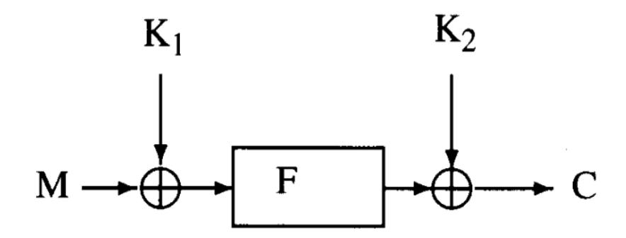
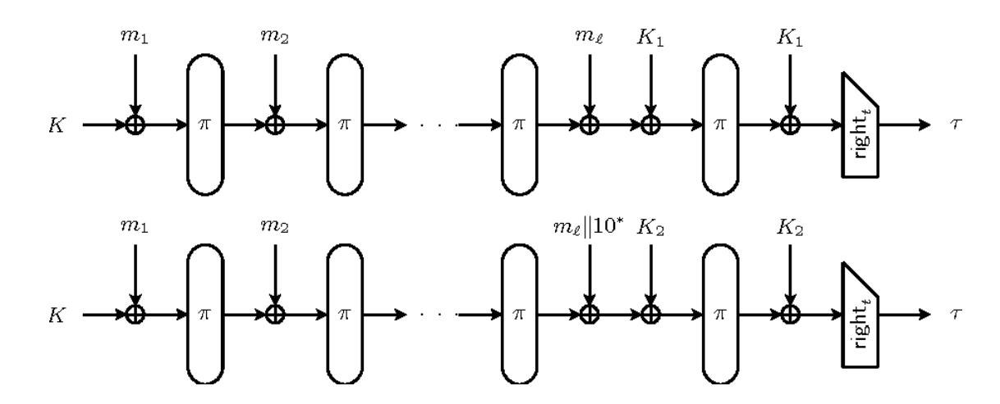
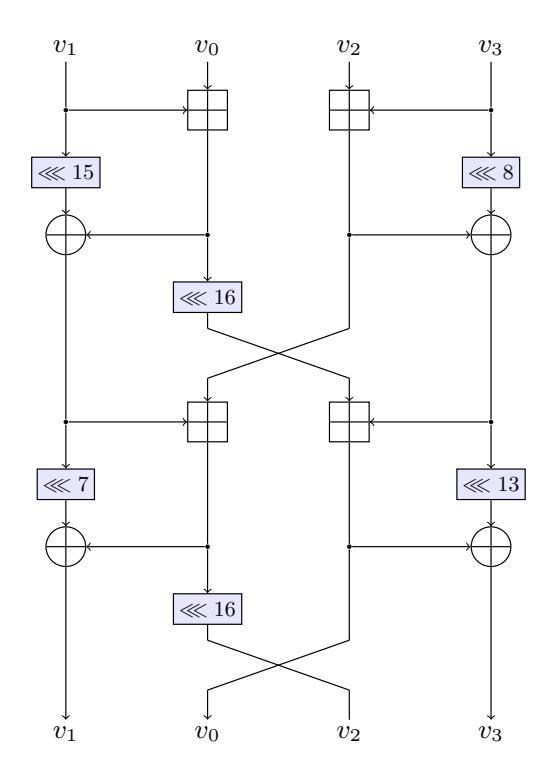
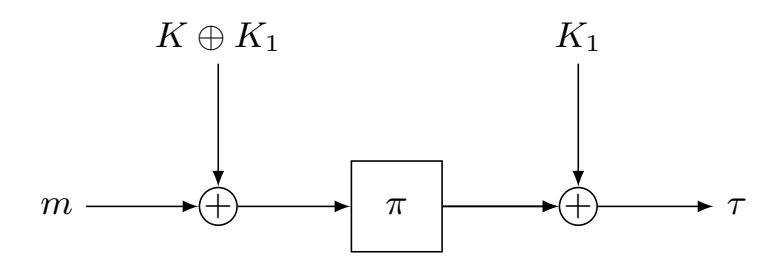
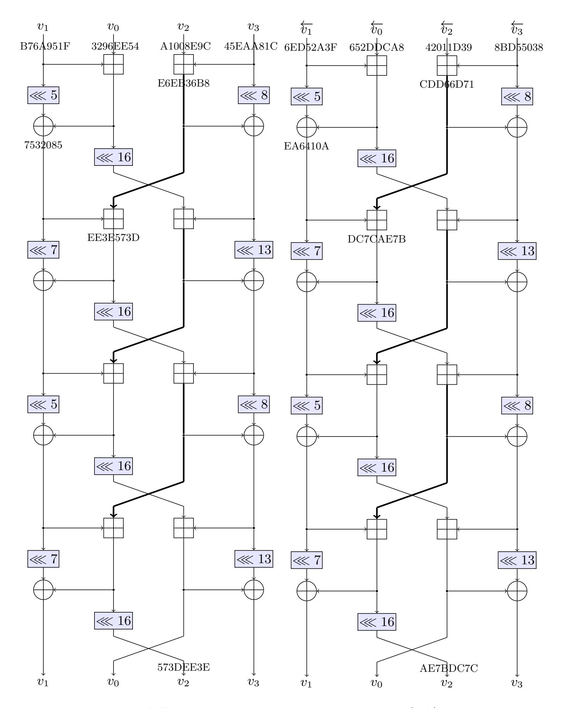

{0}------------------------------------------------

# Rotational Cryptanalysis on MAC Algorithm Chaskey

Liliya Kraleva1 , Tomer Ashur1,2 , and Vincent Rijmen1

1 imec-COSIC, KU Leuven, Leuven, Belgium liliya.kraleva,tomer.ashur,vincent.rijmen@esat.kuleuven.be 2 TU Eindhoven, Eindhoven, the Netherland

Abstract. In this paper we analyse the algorithm Chaskey - a lightweight MAC algorithm for 32-bit micro controllers - with respect to rotational cryptanalysis. We perform a related-key attack over Chaskey and find a distinguisher by using rotational probabilities. Having a message m we can forge and present a valid tag for some message under a related key with probability 2−57 for 8 rounds and 2−86 for all 12 rounds of the permutation for keys in a defined weak-key class. This attack can be extended to full key recovery with complexity 2120 for the full number of rounds. To our knowledge this is the first published attack targeting all 12 rounds of the algorithm. Additionally, we generalize the Markov theory with respect to a relation between two plaintexts and not their difference and apply it for rotational pairs.

Keywords: Rotational Cryptanalysis · Lightweight · ARX · Chaskey · Markov Theory

# 1 Introduction

When constructing a cryprographic system, one of the main building blocks is the Message Authentication Code (MAC). It is accompanying most symmetric cryptosystems used in online communication and every application where authenticity is needed. When given a message m, the MAC algorithm ensures it is authentic and that no third party has tampered with the message by providing a tag τ , computed after processing the message and a secret key k. It is usually sent together with the message as a combination (m, τ ). It should be hard for the attacker to forge a valid tag for some message without knowing the key. Furthermore, the size of the tag should be large enough to prevent a guessing attack. The encryption function F used in the MAC's mode of operation can be based on various primitives like hash functions, permutations, block ciphers, pseudo-random functions, etc.

Microcontrollers are used for various applications from home devices such as ovens, refrigerators, etc., to life important applications such as providing critical functions for medical devices, vehicles and robots. They are small chips used on embedded systems and consist of a processor, memory and input/output (I/O) peripherals. Commonly used MAC algorithms for microcontrollers are 

{1}------------------------------------------------

UMAC [5], CMAC [9], HMAC [21]. It is said that MACs based on a hash function or a block cipher might perform slow because of the computational cost of the underlying operations. The algorithm Chaskey [20] is said by its authors to overcome the implementation issues of a MAC on a microcontroller. It is lightweight and performs well both in software and hardware. We present it with more details in Section 4.

Rotational cryptanalysis [13] is a probabilistic technique mainly used over ARX cryptographic structures as is the permutation layer of Chaskey. It takes a rotational pair of plaintexts such that all words of one are rotations of the corresponding words of the other. After encryption, if the outputs also form a rotational pair with probability more than for a random permutation we can use that as a distinguisher. This attack has been successfully applied to ciphers like Threefish [12], Skein [11,13] and Keccak [18]. We apply it to Chaskey in a weakkey related-key scenario with size of the weak-key class 2120 and forge a tag over a related-key with probability 2−86 over all 12 rounds of the permutation. This is extended to a key-recovery attack with complexity 2120 for the full cipher. To our knowledge this is the first published attack targeting all 12 rounds of the algorithm. Our attack is theoretical but since Chaskey is considered for standardization we believe every input regarding its security is important.

This paper is structured as follows: In Section 2 we present some theory needed for a better understanding of the subject. In Section 3 we discuss the Markov theory and generalize it with respect to a relation between two plaintexts. The rotational attack is shown in the same section. Further in Section 4 the MAC algorithm Chaskey is presented together with a short analysis and previously published cryptanalysis techniques on it. Our results and the attack performed on Chaskey are shown in Section 5. Finally, some comments and future problems are discussed in Section 6.

# 2 Preliminaries and related work

#### 2.1 Even-Mansour ciphers

The Even-Mansour cipher, first introduced in [10] is a minimalistic construction, i.e. if we eliminate any of its components the security will be compromised. This is the simplest cipher with provable security against a polynomialy bounded adversary. It consist of a key divided into two subkeys K1 and K2 and a random permutation F. The ciphertext is then obtained by C = K2 ⊕ F(M ⊕ K1), see Fig 1. The authors prove that the construction is secure under the assumption that the permutation is (pseudo)randomly chosen and give a lower bound for the probability of success of an adversary. In [6] Daemen shows that the security claims do not hold against known plaintext and known ciphertext attacks and particularly against differential attack which reduces the security from 22n for a brute force attack over the keyspace of size 2n to 2n security. He also discusses that the security proof should be based on diffusion and confusion properties and not on complexity theory. Later in [8] it is shown that the construction have the same security level even when the two keys K1 and K2 are equal. Attacks of 

{2}------------------------------------------------

the Even-Mansour construction include differential cryptanalysis and the sliding attack [4,22]. Thanks to its simplicity this construction is widely used, including in Chaskey.

Fig. 1. Schematic model of the encryption scheme of Even-Mansour

# 2.2 Markov ciphers and differential cryptanalysis

In differential cryptanalysis we choose two plaintexts X and X∗ with fixed difference ∆X and follow how it propagates throughout the rounds. We call a differential (α, β) an input difference α that yields an output difference β, no matter what the intermediate round differences are. The differential probability (DP) of (α, β) is the number of pairs for which ∆X = α and ∆Y = β over the total number of pairs with input difference α. The DP is difficult to compute in practise, so what is normally done instead is to use the Expected Differential Probability (EDP), estimated by computing the product of all intermediate round probabilities.

We say that two random variables X1 and X2, defined on a common probability space are called stochastically equivalent if Pr(X1 = X2) = 1. In most reasonings about the security of a cipher against differential cryptanalysis, we use the hypothesis of stochastic equivalence, defined as follows:

Definition 1 (Hypothesis of stochastic equivalence [15]). For an (r −1) round differential (α, β),

$$\Pr(\Delta Y(r-1) = \beta | \Delta X = \alpha) \approx \Pr(\Delta Y(r-1) = \beta | \Delta X = \alpha,$$
$$Z^{(1)} = \omega_1, Z^{(2)} = \omega_2, \dots, Z = \omega_{(r-1)})$$

for almost all subkeys values (ω1, . . . , ωr−1), where Z (i) denote the i−th subkey.

It means that the probability of a differential does not depend on the choice of subkeys. We compute or bound the Expected Differential probability (EDP) of a differential and assume that DP[k](α, β) ≈ EDP(α, β) holds for almost all keys.

{3}------------------------------------------------

Definition 2 (Markov cipher [15]). An iterated cipher with round function Y = f(X, Z) is a Markov cipher if there is a group operation ⊗ for defining differences such that, for all choices of α and β, (α, β 6= e),

$$\Pr(\Delta Y = \beta | \Delta X = \alpha, X = \gamma)$$

is independent of γ, when the subkey is uniformly random.

In other words, if we have a Markov cipher, then the probability of a differential does not depend on the choice of input text, EDP(αr, αr+1) = EDP(αr, αr+1|X(r)). A Markov chain is a sequence v0, v1, . . . of random variables satisfying the rule of conditional independence, or with other words variables for which the output of the r th iteration does not depend on the previous r − 1 iterations. Mathematically formulated, a sequence of discrete random variables (v0, . . . , vr) is a Markov chain if, for 0 < i < r (where r = ∞ is allowed)

$$P(v_{i+1} = \beta_{i+1} | v_i = \beta_i, v_{i-1} = \beta_{i-1}, \dots, v_0 = \beta_0) = P(v_{i+1} = \beta_{i+1} | v_i = \beta_i).$$

Finally, the following theorem is formulated:

Theorem 1 ( [15]). If an r-round iterated cipher is a Markov cipher and the r round keys are independent and uniformly random, then the sequence of differences ∆X = ∆Y (0), ∆Y (1), . . . , ∆Y (r) is a homogeneous Markov chain.

If we have a Markov cipher and the round keys are independent and uniformly random we can use the Chapman-Kolmogorov equation for a Markov chain to compute the EDP(α, β) by multiplying EDP(αr, αr+1) over all the rounds, which is easy to compute in comparison to the real DP. In general, for alternating ARX ciphers the Markov theory holds with respect to differential cryptanalysis.

#### 2.3 Attack settings

There are different scenarios in which we can attack a MAC. The single-user setting suggests that Alice and Bob share the same key so Bob can authenticate that the messages he receives from Alice are not changed in any way. In the existential forgery problem (EFP) the adversary has access to the encryption and decryption oracles. If the adversary can present a new message with a valid tag then this is a forgery and the adversary wins the game. Another scenario is the multi-user setting in which we have multiple users typically with their own secret keys. The adversary then wins if it can present a triplet (i, m0 , τ 0 ) for some user i and new message m0 . If the number of users is large enough the adversary can find a collision in the keys due to the birthday paradox. Having at least two users using the same key or related in some way keys can then enhance any further attack in matter of data, memory and time. Some environments allow to tamper with the key and change it in a certain way, like adding a constant for example. We can then observe the ciphertext under the related keys and draw conclusions over the real key. This is called a related-key attack [14] and is quite a powerful setting. As shown in [2, 3] even the AES is theoretically vulnerable 

{4}------------------------------------------------

under related-key attacks, but not if you can only add a constant. Stronger attacks are such that reveal some bits of the key and in the multi-user scenario one or more of the individual keys are exposed. They are called key-recovery attacks.

# 3 Rotational Cryptanalysis and generalized Markov ciphers

In this section we discuss the Markov theory with respect to a relation between chosen plaintexts and not to their difference. We extend the definition for more general cases and more specifically, we concentrate on plaintexts forming a rotational pair. Further in Section 3.2 we recall the idea of rotational cryptanalysis and how to compute the rotational probability for ARX ciphers.

#### 3.1 Markov theory and rotational cryptanalysis

In [13] the authors mention the term rotational difference and argue that modular additions do not form a Markov chain with respect to the rotational property. In fact, we cannot consider a rotational difference in the sense it is defined in [15]:

**Definition 3.** [15] The difference  $\Delta X$  between two plaintexts (or two ciphertexts) X and  $X^*$  is

$$\Delta X = X \otimes X^{*-1}$$
,

where  $\otimes$  denotes a specified group operation on the set of plaintexts (= set of ciphertexts) and  $X^{*-1}$  denotes the inverse of the element  $X^*$  in the group.

According to this formulation the rotation has to be a group operation with the integers, which it is not. It is a group action  $\mathbb{F}_2^n \times \mathbb{N} \to \mathbb{F}_2^n$ , whereas a group operation is defined in  $\mathbb{F}_2^n \times \mathbb{F}_2^n \to \mathbb{F}_2^n$ .

In order to use the Markov theory we need to slightly extend it. We generalize the concept of "two plaintexts X and  $X^*$  have a certain difference  $\Delta X$ " to "X and  $X^*$  have a certain relation". The definition of a Markov cipher can easily be generalized to accommodate this. Let us have two related plaintexts X and  $X^*$ , such that for a relation  $R \subseteq \mathbb{F}_2^n \times \mathbb{F}_2^n$  we have  $(X, X^*) \in R$  if  $X^*$  has a relation R with X.

**Definition 4 (Generalized Markov cipher).** An iterated cipher with round function Y = f(X, Z) is a generalized Markov cipher if there are two relations, different from the identity,  $R^{\alpha}$  and  $R^{\beta}$ , such that for all choices of  $\alpha$  and  $\beta$ ,

$$\Pr((Y, Y^*) \in R^{\beta} | (X, X^*) \in R^{\alpha}, X = \gamma) \tag{1}$$

is independent of the choise of  $\gamma$  when the subkeys Z are uniformly random.

{5}------------------------------------------------

Note that for differences we have for  $\alpha \neq 0$ ,  $R^{\alpha} = \{(X,X^*)|X^* = X \otimes \alpha^{-1}, X \in \mathbb{F}_2^n\}$ . For our purposes  $X^*$  is a rotation of X with l positions to the left,  $R^l = \{(X,X^*)|X^* = X^{\lll l}, X \in \mathbb{F}_2^n\}$  and we want the same relation to hold between the plaintexts and the ciphertexts. Then the condition for Markov cipher is that for any  $l \neq 0$  the probability  $Pr(Y^* = Y^{\ll l}|X^* = X^{\ll l}, X = \gamma)$  is independent of  $\gamma$ , when the subkeys are uniformly random.

Without generalization, the hypothesis of stochastic equivalence does not hold for a rotational pair: XOR-ing with a fixed key will maintain the rotational property only if the key is rotation-symmetric. The hypothesis can be generalized to some related-key scenario where the relation between the keys is that the second key is a rotation of the first key. Since for the rotational property to hold in the last state we need it to hold in every intermediate state as well, in general we do not have a Markov chain. Once the property is broken, it cannot come back by chance. Therefore, EDP cannot be calculated as a product of the round probabilities as in differential cryptanalysis.

#### 3.2 Rotational attack

Let us consider a pair of plaintexts  $(m, m \ll l)$ , where  $m \ll l$  is a rotation of m to the left with l positions. We call this a rotational pair. When after some operations the outputs also form a rotational pair we say that the rotational property holds. It is preserved by all bit-wise operations like XOR or another rotation, but not always by modular addition. The attack relies on the fact that the probability after modular addition can be computed (proven in [7]) and is

$$\Pr((x+y) \ll l = x \ll l + y \ll l) = \frac{1}{4}(1 + 2^{l-n} + 2^{-l} + 2^{-n})$$
 (2)

for n-bit long words, while

$$\Pr((x \ll l \oplus y \ll l = (x \oplus y) \ll l) = 1.$$

$$\Pr((x \ll l_1) \ll l_2 = (x \ll l_2) \ll l_1) = 1$$

That makes it applicable to ARX structures, which only operations are modular addition, rotation, and XOR. More precisely, we start the attack from a rotational pair of two states  $(X, \overline{X})$  of size n and divided into s words typically of 32 or 64 bits. With  $\overline{X}$  we denote the word-wise rotation of  $X: X = (x_1, x_2, \ldots, x_s), \overline{X} = (x_1 \ll l, x_2 \ll l, \ldots, x_s \ll l)$ , where  $x_i, i = 1, \ldots s$  are the state words.

If the corresponding output states also form a rotational pair with probability higher than for a random permutation, we can use this property as a distinguisher.

When the attack was first formalized as a rotational cryptanalysis in [12] the authors claimed that the rotational probability of an ARX cipher depends only on the number of modular additions in the algorithm and can be easily computed as shown in the following theorem:

{6}------------------------------------------------

**Theorem 2.** [12] Let q be the number of additions in an ARX primitive. Then the rotational probability of the primitive is  $p_+^q$ , where  $p_+$  is the rotational probability of modular addition as calculated in (2).

This is only valid under the assumption of stochastic equivalence and Markov chain, both in fact do not hold with respect to the rotational property.

In [13] the authors introduce chained modular additions, namely additions for which the output of one is the input to the other. The output of modular addition is biased when the input is a rotational pair. Namely, if  $(x+y) \ll l = x \ll l+y \ll l$  and r>0, then the value z=x+y is biased. More precisely, for l=1, the most significant bit of z is biased towards 1. The second modular addition has smaller probability and therefore Theorem 2 fails to give the correct probability. Due to this bias the variables are not random and independent, so we can say they do **not** form a Markov chain. Therefore, the probability does not depend only on the number of additions but on their positions as well. The authors also introduce the following formula, that very precisely calculates the rotational probability of k-1 consecutive modular additions:

**Lemma 1.** [13, Lemma 2] Let  $a_1, \ldots, a_k$  be n-bit words chosen at random and let l be a positive integer such that 0 < l < n. Then

$$Pr([(a_1 + a_2) \ll l = a_1 \ll l + a_2 \ll l] \land \land [(a_1 + a_2 + a_3) \ll l = a_1 \ll l + a_2 \ll l + a_3 \ll l] \land \dots$$

$$[(a_1 + \dots a_k) \ll l = a_1 \ll l + \dots a_k \ll l]) = \frac{1}{2^{nk}} {k+2^l-1 \choose 2^l-1} {k+2^{n-l}-1 \choose 2^{n-l}-1}.$$

The more chained additions we have, the lower the probability. In Table 1 we can see a comparison between the rotational probabilities calculated with the independency assumption and with the formula from Lemma 1 for rotational amount l=1. We can see that for larger number of chained additions the difference is quite big and suggests that chained additions are a better design choice with respect to rotational cryptanalysis.

| # of additions | 1    | 2    | 3    | 4    | 5     | 10    | 20    | 30     |
|----------------|------|------|------|------|-------|-------|-------|--------|
| Theorem 2      | -1.4 | -2.8 | -4.2 | -5.7 | -7.1  | -14.1 | -28.3 | -42.4  |
| Lemma 1        | -1.4 | -3.6 | -6.3 | -9.3 | -12.7 | -32.7 | -82.0 | -138.7 |

**Table 1.**  $log_2$  values for the rotational probabilities calculated with the formula of Theorem 2 and Lemma 1 for rotational amount r = 1.

{7}------------------------------------------------

# 4 The MAC algorithm Chaskey

In this chapter we introduce the MAC algorithm Chaskey and the previously performed attacks on it.

#### 4.1 Chaskey

Chaskey [20] is a lightweight Message Authentication Code (MAC) algorithm that is dedicated to 32-bit microcontrollers. It is claimed to have better performance and efficiency than previously used algorithms and it is provably secure based on the Even-Mansour structure.

The algorithm is as follows: a 128-bit key K is used with 128-bit blocks of messages  $m_i$  in a permutation  $\pi$ , designed only with XOR, rotation and modular addition operations. These simple operations are very efficient in software and in hardware.

Fig. 2. The Chaskey mode of operation

The mode of operation can be seen in Fig. 2. The text is broken into 128-bit blocks  $m_i$  which are consecutively XORed and passed through a permutation. There is a key addition before the first and after the last block. If the last block is less than 128 bits, a 1 is appended and as many 0 bits as necessary (the second mode in Fig. 2). Finally, the last t bits of the output are used as a tag. In the paper in which Chaskey was first proposed [20] the authors suggested that 8 or 16 rounds should be used on the permutation  $\pi$ , although 8 provide enough security. Later in [19] the rounds were set to 12. One round of the permutation is shown in Fig. 3. The algorithm can also be considered as an Even-Mansour cipher with keys K and  $K_1$ , respectively  $K_2$  when the last message block is less than 128 bits. Here  $K_1, K_2$  are generated from K by simple polynomial multiplication by x, respectively  $x^2$  over the finite field  $F_{2^{128}}$  with generating polynomial  $g(x) = x^{128} + x^7 + x^2 + x + 1$ . For  $K_1 = xK$  this means we shift K with one position to the left if the first bit (the leftmost bit) is equal to zero or shift and then XORed with  $0^{120}10000111$  if the first bit is one. If the bit is 0 then  $K_1$  can be considered as a state-rotation of K. For  $K_2 = x^2 K$  the same operation is valid and applied twice.

{8}------------------------------------------------

Fig. 3. A round of the Chaskey permutation

### 4.2 Markov theory and Chaskey

Chaskey is Even-Mansour cipher, hence there are no round keys. The generalized hypothesis of stochastic equivalence holds. This means if we are in a related-key scenario, the probability that the rotational property holds is independent of the choice of keys as long as the second key is a rotation of the first one. This can be proven easily for any Even-Mansour construction. Chaskey is Even with the generalized definition (def. 4) Chaskey is not a Markov cipher. Since there are no roundkeys, EDP(ar, ar+1|Xr) is either 0 or 1 (there is no randomness when the input is fixed). EDP(ar, ar+1) is the average over all inputs, which will often be a value between 0 and 1. One can still hope to estimate EDP(α) with respect to rotational operation as the product over all rounds. Khovratovich at all [13] show that this leads to wrong results and propose improved formula - Lemma 1(Lemma 2 in [13]). Our experiments confirm that the formula gives trustable results.

# 4.3 Previous attacks on Chaskey

In [17] a collision-based attack both in the single and multi-user scenarios is executed. That is, we define two functions fs(m) = Ks ⊕ π(m ⊕ (Ks ⊕ K)) and Ffs (M) = fs(M) ⊕ fs(M ⊕ δ) ⊕ M and search for collisions between the chains constructed from this two functions. It can be seen from Fig. 4 that fs(M) describes the Chaskey mode for one block of text. As a result, The attack has complexity 264 in the single-user scenario and to recover all keys in the multi-user scenario needs 243 users and 243 queries per user.

In [16] a differential-linear attack is performed over Chaskey, improved with the partitioning technique proposed in [1]. Their best result is over 6 and 7

{9}------------------------------------------------

| Rounds Data |                                  |            |         | Time Attack                                                                       | Reference |
|-------------|----------------------------------|------------|---------|-----------------------------------------------------------------------------------|-----------|
| 6           | 25 2                          |            | 29 2 | linear-differential attack with partitioning, gains 6 bits of the key | [16]      |
| 7           | 48 2                          |            | 67 2 | linear-differential attack with partitioning, gains 6 bits of the key | [16]      |
| 8           | 64 2                          |            |         | collision attack in single user mode, full key recovery                        | [17]      |
| 8           | 43 2 user 43 users 2 | per for |         | collision attack in multi-user mode, full key recovery                         | [17]      |
| 6           | 42 2                          |            |         | weak-key related-key rotational distinguishing attack                          | here      |
| 12          | 86 2                          |            |         | weak-key related-key rotational attack, forge a valid tag                      |           |
| 12          | 120 2                         |            |         | weak-key related-key rotational attack, full key recovery                      | here      |

Table 2. Review of the existing attacks over Chaskey

rounds with data complexity 225 and 248 respectively and time complexity 229 and 267 respectively. The attack builds differential-linear distinguisher which is extended to key-bits recovery in the last round phase.

A comparison between those attacks and our contribution can be seen in Table 2.

# 5 Application to Chaskey

In this section we will show how we apply the rotational property in different attack scenarios. We first show how to calculate the rotational probabilities and then how to use them as a distinguisher, to forge a message or for key-recovery.

#### 5.1 Calculating the rotational probability

Fig. 4. Chaskey mode of operation for messages with single block of 128 bits

We consider the case where we want to tag a message m that has only one block of 128 bits. Then the tag would be τ = π(K ⊕ K1 ⊕ m) ⊕ K1, as shown in Fig. 4.

{10}------------------------------------------------

To apply rotational cryptanalysis to Chaskey we first need to calculate the rotational probability of the permutation  $\pi$ , i.e. the probability for a rotational pair of input texts  $(m, \overline{m})$  to produce output pair  $(\pi(m), \overline{\pi(m)})$ . It depends only on the number of modular additions and their positions. Note that in one round of  $\pi$  (see Fig. 3) we have 4 modular additions - two single additions and one chain of two. Further note that when we continue the permutation to a second round, the addition of  $v_0 + v_3$  makes a chain with the addition  $v_0 + v_1$  of the second round which bring us to 2 singles and 3 chains of two modular additions for 2 rounds, and so on for any further round. These chains are depicted in bold in Fig. 5. We then calculate the probability using Lemma 1 [13]. More precisely, we take the parameter k to be the number of chained additions that we have plus 1 and set the rotation r to 1, because then the probability is maximized. The size of the words is n = 32. Let  $a_1, a_2$  and  $a_3$  be the words that we are adding. Then the probability of a chain with two additions  $(a_1 + a_2) + a_3$  is

$$\Pr([(a_1 + a_2) \ll 1 = a_1 \ll 1 + a_2 \ll 1] \land \\ \land [(a_1 + a_2 + a_3) \ll 1 = a_1 \ll 1 + a_2 \ll 1 + a_3 \ll 1]) = \\ = \frac{1}{2^{32.3}} {3 + 2 - 1 \choose 2 - 1} {3 + 2^{32 - 1} - 1 \choose 2^{32 - 1}} = 2^{-3.6}.$$

| rounds  | Modula         | ar additions | Expected probability | Experimental probability     |  |
|---------|----------------|--------------|----------------------|------------------------------|--|
| Tourids | singles chains |              | Expected probability | Experimental probability  |  |
| 1       | 2              | 1            | -6.436               | -6.421                       |  |
| 2       | 2              | 3            | -13.636              | -13.639                      |  |
| 3       | 2              | 5            | -20.836              | -20.844                      |  |
| 4       | 2              | 7            | -28.036              | -28.142                      |  |
| 5       | 2              | 9            | -35.236              | -36                          |  |
| 6       | 2              | 11           | -42.436              |                              |  |
| 7       | 2              | 13           | -49.636              |                              |  |
| 8       | 2              | 15           | -56.836              |                              |  |
| 9       | 2              | 17           | -64.036              |                              |  |
| 10      | 2              | 19           | -71.236              |                              |  |
| 11      | 2              | 21           | -78.436              |                              |  |
| 12      | 2              | 23           | -85.636              |                              |  |

Table 3. Table with the expected and experimentally calculated rotational probabilities for any number of rounds of the permutation  $\pi$ 

Further, for 8 rounds we have 15 chains of two additions and 2 single additions, which corresponds to probability  $p = (2^{-3.6})^{15} \cdot (2^{-1.4})^2 = 2^{-56.836}$ . Table 3 presents how many single and chained additions we have for any number of rounds up to 12 and what is the evaluated rotational probability calculated with lemma 1 and the experimental probability we get after running simulations. We performed our experiments on a computer with an Intel(R) Core(M) i5-4590

{11}------------------------------------------------

CPU running at 3.30GHz. We did not perform experiments beyond 5 rounds due to the time complexity. Our experimental results are very close to the expected ones and based on that observation we anticipate that the probability calculated with this formula is correct and further take it as verified and refer to it when considering larger number of rounds.

We show an example how certain words change through the operations of the Chaskey permutation in Fig. 5. The rotational property after the modular additions can be observed for message m and its rotation  $\overleftarrow{m}$ . We can see that for words  $v_2 = 0$ xA1008E9C = 010000100000001110100111001 and  $v_3 = 0$ x45EAA81C = 10001011110101010101000000111000 the rotational property holds and the pair  $(v_2 + v_3, v_2 + v_3)$  is rotational.

What we have to consider next is the rotational probability of the whole Chaskey function  $\Pi = \pi(K \oplus K_1 \oplus m) \oplus K_1$ , that is with the key addition before and after the permutation  $\pi$ . In fact  $\pi(K \oplus K_1 \oplus \overline{m}) \oplus K_1$  cannot be a rotation of  $\pi(K \oplus K_1 \oplus m) \oplus K_1$ , since  $a \oplus b \neq a \oplus \overline{b}$ . Therefore we need to consider also a rotated key. The pair  $\pi(K \oplus K_1 \oplus m) \oplus K_1$  and  $\pi(K \oplus K_1' \oplus \overline{m}) \oplus K_1'$ , where  $K_1'$  is the key generated from  $K_1$ , i.e.  $K_1' = xK \mod g(x)$ , is rotational for a large set of keys, but not all keys. To ensure  $K_1'$  is word rotation of  $K_1$ , i.e.  $K_1' = \overline{K_1}$ , we need the first 2 bits of every word to be equal to zero. This becomes clear with the following example: denote with a, b, f, g, k, l, p and q the first 2 bits of the 4 words of K and with \* any bundle of 30 bits that we are not interested in. Then the word and state rotations of K and  $K_1$  are as follows: .

$$K = ab * fg * kl * pq*;$$
  $K_1 = b * f g * k l * p q * a$ 

$$\overleftarrow{K} = b * a g * f l * k q * p;$$
  $K'_1 = *ag * fl * kq * pb$ 

If a = 1(resp. b = 1) then  $K_1$ (resp.  $K'_1$ ) will not be a rotation of K(resp.  $K'_1$ ) but a rotation and XOR with 135 in decimal. Therefore we set a = b = 0. Furthermore, to have  $K'_1 = K_1 = *fb * kg * pl * aq$  we need to set a = b = f = g = k = l = p = q which means we set the first 2 bits of every word of K to be zero.

The keys satisfying this property we call a weak-key class of keys and there are  $2^{120}$  weak-keys for which we can apply the attack. For the rest of the keys the rotational property will definitely not hold. This means if a random key K is chosen, the probability that we will have a rotational pair after  $\Pi$  is  $2^{-8}p_1$ , where  $p_1$  is the rotational probability of  $\pi$ .

## 5.2 Attack scenarios

Distinguisher. Using the rotational property we can distinguish whether a key is in the weak-key class of keys that we defined earlier, namely one of the  $2^{120}$  keys with the first two bits of every word being zero.

In this setting we can use the authentication oracles for the related keys K and  $\overline{K}$ , denoted respectively as  $O_K$  and  $O_{\overline{K}}$ . The properties of the algorithm

{12}------------------------------------------------

Fig. 5. 2 rounds of Chaskey's permutation for chosen input(left) and its word-wise rotation (right). The chained modular additions are connected with ticker line. The words are represented in hexadecimal.

{13}------------------------------------------------

Chaskey allow us to tag  $2^{48}$  messages under the same key, therefore we will take a set of that many messages  $D = \{m \in F_2^{128}\}, |D| = 2^{48}$ . We send all messages  $m_i \in D, i = 1 \dots 2^{48}$  to  $O_K$  and their word-wise rotations  $\overleftarrow{m_i}$  to  $O_K$  and the oracles give back the corresponding tags  $\tau_i$  and  $\tau_i'$ . If the key K is one of the weak-key class keys, then the expected number of messages for which  $\overleftarrow{\tau} = \tau'$  will be  $2^{48}p$ , where p is the rotational probability according to Table 3. For example, over 6 rounds we will have  $2^{48} \cdot 2^{-42} = 2^8 = 64$  messages for which that happens. In the single user mode for the full 12 rounds the probability of success is  $p = 2^{48} \cdot 2^{-86} = 2^{-38}$  with data complexity  $2^{49}$  encryptions, time complexity  $2^{48}$  look ups in a table and memory of storing a table with  $128 \cdot 2^{48}$  bits which is  $2^{47}$  bytes. In order to have success probability one we repeat the experiment  $2^{38}$  times which gives us data complexity of  $2^{86}$ .

Tag forgery. We can find users with related keys and exploit this fact to forge a tag. One way of doing this is by querying each of the n users with the same message m and then store the corresponding tags  $\tau_i$ . By doing the same thing but this time with message  $\overline{m}$ , we can look for a collision between the stored tags and the new tags  $\tau'_j$ . When  $\tau_i = \tau'_j$  for some i, j, then users i and j have related keys and we can perform a forgery attack that goes as follows:

- 1. We collect data of pairs of a message and its corresponding tag  $(m, \tau)$  from user  $u_i$ .
- 2. We rotate them word-wise and send  $(\overleftarrow{m}, \overleftarrow{\tau})$  for verification.

If we are attacking 8 rounds and we have  $2^{57}$  pairs we expect at least 1 pair to be accepted as authentic which means we will posses a message and a valid tag. That is considered a forgery and a success to our attack. As a result from user with key K we can generate a valid tag for some message  $\overline{m}$  under the related key K with complexity of the attack  $2^{57}$  under the assumption that we are in the weak-key class. For 12 rounds of the permutation the probability of success is  $2^{-86}$ .

Key-recovery. After distinguishing that we are in the weak-key class we know 8 bits of the key. The rest of the bits can be recovered by guessing which gives us a key-recovery with complexity  $2^{120}$ .

# 6 Conclusions and future work

In this work we showed how by using the property of rotational probabilities we can forge a valid tag using the MAC algorithm Chaskey. Our results are not compromising the security of the algorithm in practice and do not violate the security claims of the authors, however they show a vulnerability in the underlying permutation. Our best result is a distinguishing attack over the full number of rounds of the algorithm with complexity  $2^{86}$ .

The Chaskey algorithm suggests that only the last t bits of the output can be used as a tag. Our attack is over all 128 bits. However, for shorter tag the

{14}------------------------------------------------

results could be enhanced by only following the rotational property to 2 or 3 words of the output. This is to be further analysed.

Acknowledgements. We thank the anonymous reviewers for their comments. This research is supported by a Ph.D. Fellowship from the Research Foundation - Flanders (FWO), the Research Council KU Leuven - grant C16/18/004 and FWO-BAS grant VS.077.18. Tomer Ashur is an FWO post-doctoral fellow under grant number 12ZH420N.

# References

- 1. Biham, E., Carmeli, Y.: An improvement of linear cryptanalysis with addition operations with applications to FEAL-8X. In: Selected Areas in Cryptography. Lecture Notes in Computer Science, vol. 8781, pp. 59–76. Springer (2014)
- 2. Biryukov, A., Khovratovich, D.: Related-key cryptanalysis of the full AES-192 and AES-256. In: ASIACRYPT. Lecture Notes in Computer Science, vol. 5912, pp. 1– 18. Springer (2009)
- 3. Biryukov, A., Khovratovich, D., Nikolic, I.: Distinguisher and related-key attack on the full AES-256. In: CRYPTO. Lecture Notes in Computer Science, vol. 5677, pp. 231–249. Springer (2009)
- 4. Biryukov, A., Wagner, D.A.: Advanced slide attacks. In: EUROCRYPT. Lecture Notes in Computer Science, vol. 1807, pp. 589–606. Springer (2000)
- 5. Black, J., Halevi, S., Krawczyk, H., Krovetz, T., Rogaway, P.: UMAC: fast and secure message authentication. In: CRYPTO. Lecture Notes in Computer Science, vol. 1666, pp. 216–233. Springer (1999)
- 6. Daemen, J.: Limitations of the Even-Mansour Construction. In: ASIACRYPT. Lecture Notes in Computer Science, vol. 739, pp. 495–498. Springer (1991)
- 7. Daum, M.: Cryptanalysis of Hash functions of the MD4-family. Ph.D. thesis, Ruhr University Bochum (2005), http://www-brs.ub.ruhr-unibochum.de/netahtml/HSS/Diss/DaumMagnus/
- 8. Dunkelman, O., Keller, N., Shamir, A.: Minimalism in Cryptography: The Even-Mansour Scheme Revisited. In: EUROCRYPT. Lecture Notes in Computer Science, vol. 7237, pp. 336–354. Springer (2012)
- 9. Dworkin, M.: Recommendation for block cipher modes of operation: The CMAC mode for authentication. NIST special publication 800-38b, National Institute of Standards and Technology (NIST) (May 2005) (2005)
- 10. Even, S., Mansour, Y.: A Construction of a Cipher From a Single Pseudorandom Permutation. In: ASIACRYPT. Lecture Notes in Computer Science, vol. 739, pp. 210–224. Springer (1991)
- 11. Ferguson, N., Lucks, S., Schneier, B., Whiting, D., Bellare, M., Kohno, T., Callas, J., Walker, J.: The skein hash function family. Submission to SHA-3 Nist Competition (2008) (2008)
- 12. Khovratovich, D., Nikolic, I.: Rotational Cryptanalysis of ARX. In: FSE. Lecture Notes in Computer Science, vol. 6147, pp. 333–346. Springer (2010)
- 13. Khovratovich, D., Nikolic, I., Pieprzyk, J., Sokolowski, P., Steinfeld, R.: Rotational Cryptanalysis of ARX Revisited. In: FSE. Lecture Notes in Computer Science, vol. 9054, pp. 519–536. Springer (2015)

{15}------------------------------------------------

- 14. Knudsen, L.R., Rijmen, V.: Known-Key Distinguishers for Some Block Ciphers. In: ASIACRYPT. Lecture Notes in Computer Science, vol. 4833, pp. 315–324. Springer (2007)
- 15. Lai, X., Massey, J.L., Murphy, S.: Markov ciphers and differential cryptanalysis. In: EUROCRYPT. Lecture Notes in Computer Science, vol. 547, pp. 17–38. Springer (1991)
- 16. Leurent, G.: Improved differential-linear cryptanalysis of 7-round chaskey with partitioning. In: EUROCRYPT (1). Lecture Notes in Computer Science, vol. 9665, pp. 344–371. Springer (2016)
- 17. Mavromati, C.: Key-Recovery Attacks Against the MAC Algorithm Chaskey. In: SAC. Lecture Notes in Computer Science, vol. 9566, pp. 205–216. Springer (2015)
- 18. Morawiecki, P., Pieprzyk, J., Srebrny, M.: Rotational Cryptanalysis of Round-Reduced Keccak. In: FSE. Lecture Notes in Computer Science, vol. 8424, pp. 241– 262. Springer (2013)
- 19. Mouha, N.: Chaskey: a MAC Algorithm for Microcontrollers Status Update and Proposal of Chaskey-12 -. IACR Cryptology ePrint Archive 2015, 1182 (2015), http://eprint.iacr.org/2015/1182
- 20. Mouha, N., Mennink, B., Herrewege, A.V., Watanabe, D., Preneel, B., Verbauwhede, I.: Chaskey: An Efficient MAC Algorithm for 32-bit Microcontrollers. In: Selected Areas in Cryptography. Lecture Notes in Computer Science, vol. 8781, pp. 306–323. Springer (2014)
- 21. Turner, J.: The keyed-hash message authentication code (HMAC). FIPS PUB 198- 1, National Institute of Standards and Technology (NIST) (July 2008) (2008), http://csrc.nist.gov/publications/fips/fips198-1/FIPS-198-1 final.pdf
- 22. Yang, G., Zhang, P., Ding, J., Hu, H.: Advanced slide attacks on the even-mansour scheme. In: DSC. pp. 615–621. IEEE (2018)